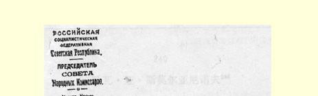
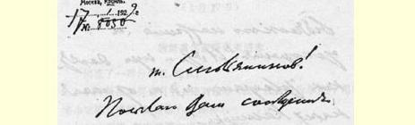
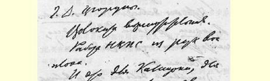
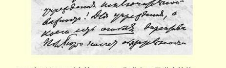
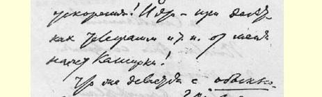
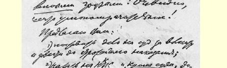
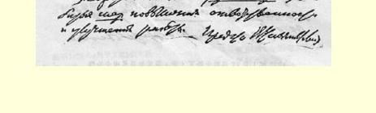

（１）向法院对拖拉作风操出控告，要求从严惩办；

（２）要对交通人民委员部施加压力，**除提交法院外**，要它务必采取加强责任心和改进工作的**措施**。

劳动国防委员会主席

### 弗·乌里扬诺夫（列宁）

> 载于１９３１年１月２１日《真理报》译自《列宁全集》俄文第５版第２１号和《工业化报》第２１号第５４卷第１２０—１２３页

## ２３９ 致国家出版社

> （１月１７日）

### 国家出版社抄送：约诺夫同志

从约诺夫同志那里获悉，地图集的出版工作因缺钱而陷于停顿，据他计算，大约需要３亿卢布。

应当立即给彼得格勒汇一笔**固定的专**款，使事情不致再延误， 并保证地图集的编辑出版工作能继续迅速进行。２３５

人民委员会主席

> 载于１９５９年《列宁文集》俄文版译自《列宁全集》俄文第５版第３６卷第５４卷第１２３页

> １９２２年１月１７日列宁给瓦·亚·斯莫尔亚尼诺夫的信

