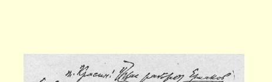
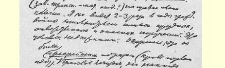
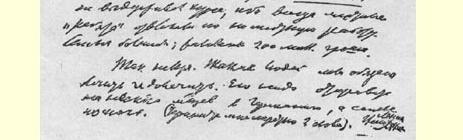

涅夫的杂文，刊登这些用各种深奥时髦的字眼故弄玄虚的蠢话？我标出了两处蠢话，并打了几个问号。作者应该学习的不是什么“无产阶级”科学，他应该进行一般的学习。难道《真理报》编辑部不打算向作者指明他的错误吗？这可是在伪造历史唯物主义！玩弄历史唯物主义！５５０

### 您的列宁

> 载于１９５０年《列宁全集》俄文第４版译自《列宁全集》俄文第５版第３５卷第５４卷弟２９１页

## ５３９ 给弗·雅·丘巴尔的电报

> （９月２８日）

### 巴赫姆特丘巴尔

请立即报告，顿巴斯需要多少纸币。原来答应给多少，而实际收到多少？要最近时期的数字。５５１

### 人民委员会主席列宁

１９２２年９月２８日

于莫斯科克里姆林宫

> 载于１９５９年《列宁文集》俄文版译自《列宁全集》俄文第５版第３６卷第５４卷第２９１页

> １９２２年１０月４日列宁给列·波·克拉辛的信