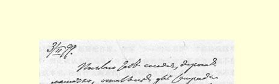
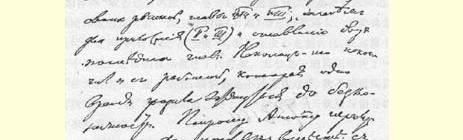
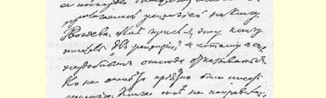
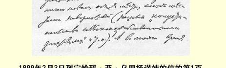
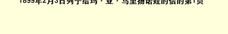

关于尤利迁移的事，一点也不知道。

从卡扎钦斯科耶村（阿·亚·雅库波娃在那里）也送走了三个流放者（林格尼克（被迁到离我们不远的地方）、阿列菲耶夫和罗斯特科夫斯基），因此卡扎钦斯科耶的流放者就大大减少了。

库尔纳托夫斯基（住在库拉基诺村，离我们约１００俄里）申请住到舒沙来，但被拒绝了；现在他将要迁往叶尔马科夫斯克村（离舒沙约４０俄里），在那里将只有他一个人。

我们这儿的天气真是好得出奇：不怎么冷（零下１０—１２度）， 天气晴朗，阳光象春天一样温暖。真是不象西伯利亚的冬天啊！

热烈地吻你并向全家问好！

### 你的弗·乌·

> 寄自舒申斯克村  译自《列宁全集》俄文第５版载于１９２９年《无产阶级革命》杂志  第５５卷第１３３—１３４页第６期

### ７４ 致玛·亚·乌里扬诺娃

１８９９年２月３日

亲爱的妈妈：今天寄给你我的《市场》的最后两本底稿，即第７ 章和第８章，以及两个附录（二和三）１４０和最后两章的目录。我终于结束了这个工作，有一个时候，这个工作简直好象要拖拖拉拉做不完似的。请阿纽塔尽快把底稿等等同附上的给格沃兹杰夫那本

> １８９９年２月３日列宁给玛·亚·乌里扬诺娃
>
> 的信的第１页