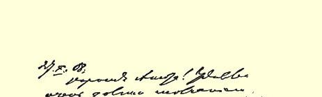
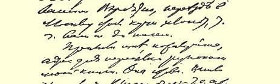
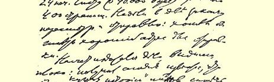
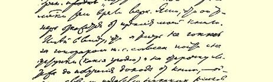

济方面有困难，可以动用阿尼亚那个存折上的存款。我目前有可能得到一笔很大的收入。

如果能去游览意大利的湖泊，那实在太好了。听说那里深秋时节很美。阿纽塔大概很快就会到你那里去的，她去了，你就让玛尼亚莎和米嘉来吧。

紧紧地拥抱你，亲爱的妈妈，祝你健康！

你们乡下秋天的天气怎么样？这里倒是不坏。夏天的天气很不好，而现在有时简直又象夏天了。

我们都很健康，务请代我们向大家问好！

### 你的弗·乌里扬诺夫

> 从日内瓦寄往莫斯科省谢尔普霍夫县  译自《列宁全集》俄文第５版米赫涅沃车站  第５５卷第２５４—２５５页载于１９２９年《无产阶级革命》杂志第１１期

### １７１ 致安·伊·乌里扬诺娃－叶利扎罗娃

１９０８年１０月２７日

亲爱的阿纽塔：我很奇怪，为什么你们这么久没有来信。大概

> １９０８年１０月２７日列宁
>
> 给安·伊·乌里扬诺娃－叶利扎罗娃的信的第１页是往莫斯科搬家非常忙，没有顾得上写信。

我那本书稿[^1]寄往何处，请把地址告诉我。书已经写好了，一共２４印张（每印张４００００字母），大约４００页。再有两个星期左右我就可以把它校订好寄出去，我希望能够得到一个妥善的邮寄地址。

关于出版人的问题，看来情况很不好，今天我得到消息，说格拉纳特买下了孟什维克的《历史》[^2]，换句话说，孟什维克在那里占了上风。很明显，他现在一定会拒绝出版我的书。２７４好在我现在并不急需稿费，也就是说，我同意作些让步（什么样的让步都可以）， 同意直到卖掉书有了收入后再付稿费，—— 总之，出版人根本不用冒什么险。关于书报检查问题，**各种**让步我都可以接受，因为我的书除了个别说法不合适以外，总的说来是完全可以公开的。[^3]

等待你的回信。

我和全家人吻妈妈和你！

### 你的弗·乌里扬诺夫

> 从日内瓦寄往莫斯科  译自《列宁全集》俄文第５版载于１９３０年《无产阶级革命》杂志  第５５卷第２５５—２５６页第１期

[^1]: 指《唯物主义和经验批判主义》一书。—— 编者注指尔·马尔托夫、彼·马斯洛夫和亚·波特列索夫编的《２０世纪初俄国的社

[^2]: 会运动》一书。—— 编者注

[^3]: 因此，如果稍有可能，可以接受·任·何条件签订合同。