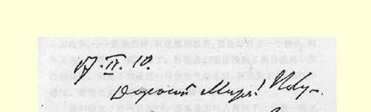
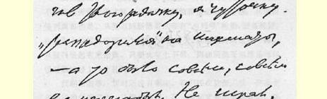
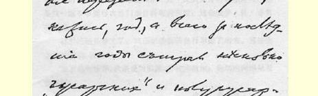
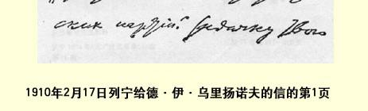

是这样：白方王ｇ３，马ｇ１，象ｅ７，兵ｈ５和ｄ３。黑方王ｅ３，兵ｈ７，ｄ５ 和ａ２（也就是说，最后这个兵差一步就变为后了）。白方先走，最后是白方胜。走得真漂亮！

你恢复得怎么样？腿和肩胛骨痊愈了吗？是不是很快又能走路和骑车了？

握手！

### 你的弗·乌·

> 从巴黎寄往莫斯科省谢尔普霍夫县  译自《列宁全集》俄文第５版米赫涅沃车站  第５５卷第３０８—３１１页载于１９３１年《列宁家书集》

### ２０９ 致玛·亚·乌里扬诺娃

１９１０年４月１０日

亲爱的妈妈：希望你能在４月１日前收到这封信。祝贺你的命名日，同时也祝贺玛尼亚莎。紧紧、紧紧地拥抱你们！

前两天收到了你从新住处寄来的信，在这以前不久，还收到了米嘉的来信。我不知道你们的旧居离中心区这么远。要坐一个钟头的电车—— 真糟糕！在这里，我到图书馆[^1]去只要乘半个钟

> １９１０年２月１７日列宁给
>
> 德·伊·乌里扬诺夫的信的第１页头的电车，—— 就是这样，我也感到很累。要是每天去一个钟头，回来又是一个钟头，真不得了。好在你们现在找到了离自治局[^2]很近的住所。只是不知道这一带的空气好不好，灰尘多不多，憋气不憋气。谢谢历史学家的来信；我已经给他回信了。

我们能在８月间见面３１６，那真是太叫人高兴了，只是一路上不要把你弄得太累才好。从莫斯科到彼得堡必须买卧铺，从彼得堡到奥布也是。从奥布到斯德哥尔摩有“布列号”轮船，设备很好，在大海上的航程约两三个钟头，若是好天，就**象在内河**航行**一样**。从彼得堡起有来回票。只要火车上不累，那在斯德哥尔摩是可以很舒服地过上一个礼拜的！

找别墅的事，暂时还没有确定。我们还在犹豫：找一间象去年那样的供膳寓所，让娜嘉和伊·瓦·得到**充分的**休息好呢，还是找一幢事事都得由她们亲自料理的别墅；这会使伊·瓦·非常劳累的。

这里已经是春天了。我已把娜嘉的自行车搬了出来。真想出去溜达溜达，骑骑车。

紧紧地拥抱你，我亲爱的妈妈，并祝你健康！热切地向玛尼亚莎问好！

### 你的弗·乌·

> 从巴黎寄往莫斯科  译自《列宁全集》俄文第５版载于１９２９年《无产阶级革命》杂志  第５５卷第３１１—３１２页第１１期

[^1]: 指巴黎国立图书馆，列宁常在那里进行研究。—— 编者注

[^2]: 玛·伊·乌里扬诺娃当时在莫斯科省地方自治局供职。—— 编者注