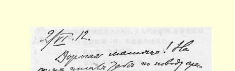
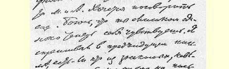
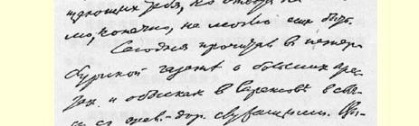
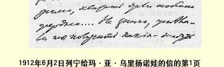
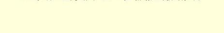

许多少会减少你一些忧虑。

我们这里一切如常。昨天，我们到圣克卢公园去散步，但是很糟糕，天下雨了。一般说来，现在天气并不热，关于过夏天的事，我们仍旧没有作任何决定。

娜嘉和伊丽·瓦西·热烈地吻你，并祝你身体健康，精神愉快！我也拥抱你，我亲爱的妈妈！

### 你的弗·乌里扬诺夫

> 从巴黎寄往萨拉托夫  译自《列宁全集》俄文第５版载于１９３０年《无产阶级革命》杂志  第５５卷第３２７页第４期

### ２２７ 致玛·亚·乌里扬诺娃

１９１２年７月１日

亲爱的妈妈：接到了你的信，知道了你们要去游伏尔加河和卡马河，知道了你们的新地址。我也正好要告诉你我的新地址。今年夏天，我远离巴黎来到了克拉科夫。这里已差不多是俄国了！连犹太人都象俄国人，八俄里外就是俄国国境（从赫拉尼策乘车到

> １９１２年６月２日列宁
>
> 给玛·亚·乌里扬诺娃的信的第１页这里约两小时，从华沙到这里九小时），女人们光着脚，穿着花花绿绿的连衣裙—— 完全象俄国一样。我这里的地址是：

### 奥地利克拉科夫

兹韦日涅茨街Ｌ．２１８号

弗拉·乌里扬诺夫先生

希望你和阿纽塔好好休息一下，在伏尔加河上玩个痛快。天气愈来愈热了。在河上也许会好些。

关于玛尼亚莎，既然他们对你那样说，可以设想她不会被拘留很久。

向马尔克问好！

我亲爱的妈妈，请把米嘉的地址告诉我。

重新安家用去我们许多时间。我们夏天住在城外（在一个叫 “萨尔瓦托尔”的别墅区附近）。我们还不会讲波兰话。困难和麻烦很多。

伊·瓦·在生病，有点象肺炎。

紧紧地拥抱你，我亲爱的妈妈，并热切地向阿尼亚问好！

伊·瓦·和娜·康·热切地向你问好并拥抱你！

### 你的弗·乌里扬诺夫

> 寄往萨拉托夫  译自《列宁全集》俄文第５版载于１９５７年《列宁全集》俄文第４版  第５５卷第３２８页第３７卷