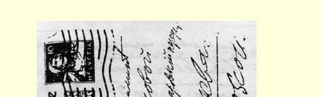
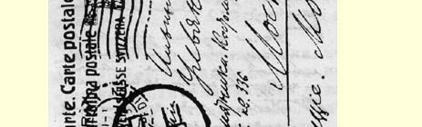
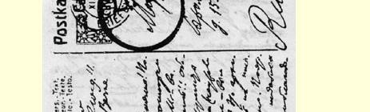
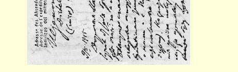
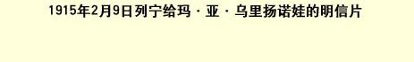

# １９１５年 ２５６ 致玛·伊·乌里扬诺娃

俄国 莫斯科 瑟罗米亚特尼基

科斯托马罗夫巷１５号３３６室

玛丽亚·伊里尼奇娜·乌里扬诺娃收

瑞士 伯尔尼 迪斯泰尔路１１号 乌里扬诺夫寄

１９１５年２月９日

亲爱的玛尼亚莎：你寄来的奥加诺夫斯基和马斯洛夫的两本小册子都收到了。非常非常感谢！！这两个人都是最有害的可恶的机会主义者（难道有人同意他们和普列汉诺夫吗？这真是糟透了）。 但是看一看他们写的东西却大有好处。因此，能寄来一些这样的东西以及有关的报纸（和杂志）剪贴资料，那就感激不尽了。例如： 叶·斯米尔诺夫早先（８月或９月）在《**俄罗斯新闻**》上发表的有关投票赞成军事拨款等等卑鄙之极的言论，我都看过。但是，他以及类似他那样的一些人后来还写过什么东西，那我就一点也不

 知道了。

在这里的图书馆里我们可以很方便地看到外国的报纸和书籍。生活还不错；伯尔尼虽然是一个寂寞的小城，但却是一个文明城市。伊·瓦·感染上流行性感冒了。

德国人反沙文主义的情绪愈来愈高，无论是在斯图加特或是美因河畔法兰克福都发生了分裂。３６３柏林出版了具有反沙文主义情绪的《光线》杂志。３６４

如果不太麻烦你，而且你又有机会到格拉纳特兄弟出版公司附近去的话（用不着专门为这件事跑一趟，这事***一点***不急），那就请你问问出版公司，他们采用了我为百科词典写的条目，是否把稿费寄给马·季·叶利扎罗夫了（我曾请他们这样做的），[^1]能否再为百科词典写点东西。我曾写信问过秘书[^2]，但是没有回音。

紧紧握手，我和娜嘉都热切地向你问好！

### 你的弗·乌里扬诺夫

> 载于１９２９年《无产阶级革命》杂志  译自《列宁全集》俄文第５版第１１期  第５５卷第３５８—３６１页

[^1]: 列宁指他自己给百科词典写的《卡尔·马克思》这一条目，稿费是交给玛·伊·乌里扬诺娃本人的。—— 编者注

[^2]: 见《列宁全集》第２版第４７卷《致格拉纳特出版社编辑部秘书（１９１５年１月４日）》。—— 编者注