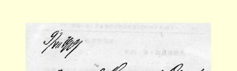
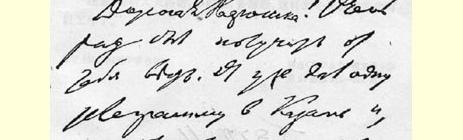
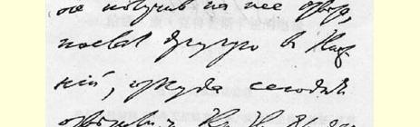
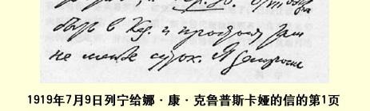

### ２６９ 致娜·康·克鲁普斯卡娅３７９

１９１９年７月９日

亲爱的娜久什卡：接到你的来信真高兴。我给喀山发过一份电报，见没有回信，又给下诺夫哥罗德发了一份电报，今天才得到回音，说“**红星号**”应在７月８日开到喀山，在那里至少停一昼夜。我在后一份电报里询问他们能否在“**红星号**”上给高尔基找一个舱位。他明天到达这里，可我倒是非常希望他能离开彼得格勒，因为他在那里心神不安、精神不振。我想你和其他同志是会高兴与他同行的。他待人很亲切；有点任性，不过这毕竟是小事情。

不时有人给你来信求你帮忙，就读了这些信，并根据可能尽力而为。

米嘉已去基辅，因为克里木好象又落到白卫分子手里了。

我们的生活如常，星期天总在“我们的”别墅休息。３８０托洛茨基病已痊愈，到南方去了，相信他能扭转那边的局势。由于加米涅夫 （来自东方面军）代替了总司令瓦采季斯，我想情况将会好转。

我们给了波克罗夫斯基（米·尼·）两个月的假期；想让柳德米拉·鲁道福夫娜·明仁斯卡娅来代理他的职务（虽然这还没有决定），**而不是**波兹涅尔。

> １９１９年７月９日列宁
>
> 给娜·康·克鲁普斯卡娅的信的第１页