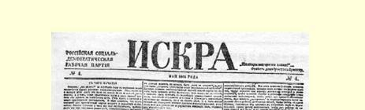
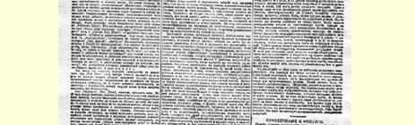
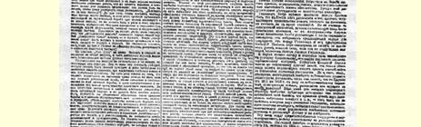
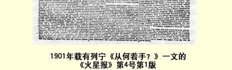

## 从何着手？ １

> （１９０１年５月）

“怎么办？”这个问题，近几年来特别突出地提到了俄国社会民主党人的面前。问题不在于选择道路（象８０年代末９０年代初那样），而在于我们在已经确定的道路上应当采取哪些实际步骤，到底应当怎么做。问题在于实际行动的方法和计划。斗争性质和斗争方法问题对于从事实际活动的党来说是一个基本问题；应当承认，这个问题在我们这里还没有解决，还有一些重大的意见分歧， 这些分歧暴露出令人感到痛心的思想上的不坚定和动摇。一方面， 力图削减和缩小政治组织工作和政治鼓动工作的“经济主义” 派别２还远没有死亡。另一方面，只会迎合每个新的“潮流”而不会区别眼前要求同整个运动的基本任务和长远需要的无原则的折中主义派别，还和过去一样趾高气扬。大家知道，这一派的巢穴就是 《工人事业》３。它最近的“纲领性的”声明，即那篇采用《历史性的转变》这样一个堂皇的标题的堂皇的文章（《〈工人事业〉杂志附刊》４ 第６期），十分清楚地证实了我们的上述看法。昨天还在向“经济主义”献媚，对严厉谴责《工人思想报》５愤愤不平，把普列汉诺夫关于同专制制度作斗争的问题的提法加以“缓和”，今天却已经在引用李卜克内西的话：“假使形势在２４小时内发生变化，那么策略也必须在２４小时内加以改变”，现在已经在谈论建立“坚强的战斗组织”来向专制制度发动直接的攻击，向它发动冲击，谈论“在群众中进行广泛的革命的政治的鼓动”（请看，多么带劲，又是革命的，又是政治的！），“不断号召举行街头抗议”，“举行带有鲜明的〈原文如此！〉政治色彩的街头示威”，等等，等等。 《工人事业》这样快就领会了我们在《火星报》创刊号上提出的纲领６，知道要建立一个不仅争取个别的让步，而且还要直接夺取专制制度堡垒的坚强的有组织的党，对于这一点，我们本来可以表示满意，但是这些人没有任何坚定的观点，这种情况却可能把我们的满意完全打消。

当然，《工人事业》抬出李卜克内西来是徒劳无益的。在２４小时内可以改变某个专门问题上的鼓动策略，可以改变党组织某一局部工作的策略，可是，要改变自己对于是否在任何时候和任何条件下都需要战斗组织和群众中的政治鼓动这个问题的看法，那不要说在２４小时内，即使在２４个月内加以改变，也只有那些毫无原则的人才办得到。借口什么环境不同和时期变化，这是滑稽可笑的。在任何“平常的、和平的”环境中，在任何“革命士气低落”的时期，建立战斗组织和进行政治鼓动都是必要的。不仅如此，正是在这样的环境中和在这样的时期，上述工作尤其必要，因为到了爆发和发动时期再去建立组织那就太晚了；组织必须建立好，以便随时能够立即展开自己的活动。“在２４小时内改变策略”！但是要改变策略，就必须先要有策略；没有一个在任何环境和任何时期都善于进行政治斗争的坚强的组织，就谈不到什么系统的、具有坚定原则的和坚持不懈地执行的行动计划，而只有这样的计划才配称为策略。请看实际情况：人们对我们说，“历史时机”向我们党提出了一个“完全新的”问题—— 恐怖手段问题。昨天，政治组织和政治

> １９０１年载有列宁《从何着手？》一文的
>
> 《火星报》第４号第１版
>
> （按原版缩小） 鼓动问题是“完全新的”问题，今天，恐怖手段问题又是“完全新的” 问题了。听到这些完全忘掉自己身世的人谈论起根本改变策略的问题，不是令人感到奇怪么？

幸亏《工人事业》说错了。恐怖手段问题完全不是什么新的问题，我们只要简略地提一下俄国社会民主党的既定观点就够了。

在原则上，我们从来没有拒绝而且也不可能拒绝恐怖手段。这是一种军事行动，在一定的战斗时机，在军队处于一定的状况时， 在一定的条件下，它是完全适用的，甚至是必要的。可是问题的实质就在于：目前提出来的恐怖手段，并不是作为作战军队的一种行动，一种同整个战斗部署密切联系和相适应的行动，而是作为一种独立的、同任何军队无关的单独进攻的手段。的确，在没有中央革命组织而地方革命组织又软弱无力的情况下，恐怖行动也只能是这样。因此，我们坚决宣布，这种斗争手段在目前情况下是不合时宜的，不妥当的，它会使最积极的战士抛开他们真正的、对整个运动来说最重要的任务，它不能瓦解政府的力量而只会瓦解革命的力量。请回想一下最近发生的事件吧。我们亲眼看到广大的城市工人和城市“平民” 群众奋起投入斗争，而革命者却没有一个领导者和组织者的总部。在这样的条件下，最坚决的革命者采取恐怖行动，不是只会削弱那些唯一可以寄予极大希望的战斗队伍么？不是只会使革命组织同那些愤愤不平的、起来反抗的、准备斗争的、然而分散的并且正因为分散而显得软弱无力的群众之间的联系中断么？而这种联系正是我们胜利的唯一保证。我们决不想否认单独的英勇突击的意义，可是我们的责任是要竭力告诫人们不要醉心于恐怖行动，不要把恐怖行动当作主要的和基本的斗争手段，而现在有许许多多的人非常倾心于这种手段。恐怖行动永远不能成为经常的军事行动，它至多只能成为发动决定性冲击时的手段之一。请问，我们现在是否可以**号召**发动决定性的冲击呢？ 《工人事业》显然认为是可以的。至少，它是在高喊：“组成冲击队吧！”可是这仍旧是一种失去理智的狂热。我们的军事力量大部分是志愿兵和起义者。我们的常备军只是几支人数不多的队伍，而且就是这几支队伍也还没有动员起来，它们彼此之间没有联系，还不能组成作战队伍，更不用说组成冲击队了。在这种情况下，凡是能够认清我们斗争的总的条件，而且在事变历史进程的每个“转变” 中不忘记这些条件的人都应当懂得，我们当前的口号不能是“发动冲击”，而应当是“对敌人的堡垒组织正规的围攻”。换句话说，我们党的直接任务，不能是号召现有的一切力量马上去举行攻击，而应当是号召建立革命组织，这一组织不仅在名义上而且在实际上能够统一一切力量，领导运动，即随时准备支持一切抗议和一切发动，并以此来扩大和巩固可供决战之用的军事力量。

二三月事件７的教训是很深刻的，现在大概不会有人在原则上反对这种结论了。可是现在要求我们的，不是在原则上而是在实际上解决问题。要求我们不仅懂得需要有什么样的组织来进行什么样的工作，而且要制定出一定的组织**计划**，以便能够从各方面着手建立组织。鉴于问题的迫切重要性，我们想提出一个计划草案来请同志们考虑。关于这个计划，我们在准备出版的一本小册子里将作更详细的发挥８。

我们认为，创办全俄政治报应当是行动的出发点，是建立我们所希望的组织的第一个实际步骤，并且是我们使这个组织得以不断向深广发展的基线。首先，我们需要报纸，没有报纸就不可能系统地进行有坚定原则的和全面的宣传鼓动。进行这种宣传鼓动一般说来是社会民主党的经常的和主要的任务，而在目前，在最广大的居民阶层已经对政治、对社会主义问题产生兴趣时，这更是特别迫切的任务。现在比过去任何时候都更加迫切地需要进行集中的和经常的鼓动工作，用以补充靠个人影响、地方传单、小册子等方式进行的零散的鼓动工作；而要进行这种集中的和经常的鼓动工作，就必须利用定期的报刊。报纸出版（和发行）号数多少和是否按时，可以成为衡量我们军事行动的这个最基本最必要的部门是否坚实可靠的最确切的标准，这样说看来并不是夸大。其次， 我们需要的是全俄的报纸。假使我们不能够用报刊上的言论来统一我们对人民和对政府的影响，或者说在我们还不能够做到这点以前，要想去统一其他更复杂、更困难然而也是更有决定意义的影响手段，那只能是一种空想。无论在思想方面，或者在实践、组织方面，我们的运动的缺点首先就在于自己的分散性，在于绝大多数社会民主党人几乎完全陷入纯粹地方性的工作中，这种地方性的工作会缩小他们的眼界和他们的活动范围，限制他们从事秘密活动的技能和水平的提高。因此，我们上面所说的那种不坚定和动摇的最深刻的根源，正是应当从这种分散性中去寻找。而为了克服这个缺点，为了把各个地方的运动合成一个全俄的运动，**第一步**就应当是创办全俄的报纸。最后，我们需要的报纸还必须是**政治**报纸。没有政治机关报，在现代欧洲就不能有配称为政治运动的运动。没有政治机关报，就绝对实现不了我们的任务—— 把一切政治不满和反抗的因素聚集起来，用以壮大无产阶级的革命运动。我们已经迈出了第一步，我们已经在工人阶级中间激起进行“经济”揭露，即对工厂进行揭露的热情。我们还应当再前进一步，在一切稍有觉悟的人民阶层中激起进行**政治**揭露的热情。不必因为目前政治揭露的呼声还显得无力、稀少和怯懦而感到不安。其所以如此， 并不是因为大家都容忍警察的专横暴虐，而是因为那些能够并且愿意进行揭露的人还没有一个说话的讲坛，还没有热心听讲并且给讲演人以鼓舞的听众；他们在人民中间还完全看不到那种值得向它控诉“至高无上的”俄国政府的力量。而现在这一切都在极其迅速地变化着。这样一种力量现在已经有了，这就是革命的无产阶级。无产阶级已经证明它不仅愿意听从和支持政治斗争的号召，而且决心勇敢地投入斗争。现在我们已经能够并且应当建立一个全民的揭露沙皇政府的讲坛；—— 社会民主党的报纸就应当是这样的讲坛。俄国工人阶级与俄国社会其他阶级和阶层不同，它对政治知识经常是感兴趣的，它经常（不仅在风暴时期）迫切要求阅读秘密书刊。在有这样广泛的要求的条件下，在已经开始培养有经验的革命领导者的条件下，在工人阶级的集中化已经使工人阶级实际上成为大城市工人区、大小工厂区的主人的条件下，创办政治报已经成为无产阶级完全办得到的事情。而通过无产阶级，报纸还可以深入到城市小市民、乡村手工业者和农民中间去，成为真正的人民的政治报纸。

但是，报纸的作用并不只限于传播思想、进行政治教育和争取政治上的同盟者。报纸不仅是集体的宣传员和集体的鼓动员，而且是集体的组织者。就后一点来说，报纸可以比作脚手架，它搭在正在建造的建筑物周围，显示出建筑物的轮廓，便于各个建筑工人之间进行联络，帮助他们分配工作和观察有组织的劳动所获得的总成绩。依靠报纸并通过报纸自然而然会形成一个固定的组织， 这个组织不仅从事地方性工作，而且从事经常的共同性工作，教育自己的成员密切注视政治事件，思考这些事件的意义及其对各个不同居民阶层的影响，拟定革命的党对这些事件施加影响的适当措施。单是技术上的任务—— 保证正常地向报纸提供材料和正常地发行报纸—— 就迫使我们去建立统一的党的地方代办员网，这些代办员彼此间要密切联系，了解总的情况，习惯于经常按时执行全国性工作中的各种零星任务，并组织一些革命行动以检验自己的力量。这种代办员网[^1]将是我们所需要的那种组织的骨干。这种组织，其规模之大使它能够遍布全国各地；其广泛性和多样性使它能够实行严密而精细的分工；其坚定性使它在任何情况下，在任何“转变关头”和意外情况下都能始终不渝地进行**自己的**工作； 其灵活性使它善于一方面在占绝对优势的敌人集中全部力量于一点的时候避免同他公开作战，另一方面又利用这个敌人的迟钝，在他最难料到的地点和时间攻其不备。今天我们面临的还是比较容易完成的任务—— 支持在大城市的街头游行示威的学生。明天我们就可能面临更困难的任务，例如，支持某个地区的失业工人的运动。后天我们就必须站在自己的岗位上，以革命的姿态参加农民的暴动。今天我们必须利用政府向地方自治机关进攻所造成的紧张的政治形势。明天我们就必须支持人民反对沙皇的某个凶恶的走狗的骚动，帮助人民用抵制、抨击、游行示威等等方法来教训他，使他不得不作公开的让步。只有靠正规军经常活动才能使战斗准备达到这种程度。假如我们集中自己的力量来办共同的报纸，那么，这样的工作不仅可以培养和造就出最能干的宣传员，而且可以培养和造就出最有才干的组织者，最有才能的党的政治领袖，这些领袖在必要的时候，能够提出进行决战的口号并且领导这个决战。

最后，为了避免可能引起的误会，我还想再说几句话。我们一直都只是讲有系统的有计划的准备，可是我们决不是想以此说明， 专制制度只有在正规的围攻或有组织的冲击下才会垮台。这种观点是一种荒谬的学理主义。相反，专制制度完全可能由于各方面随时都可能发生的某一次自发的爆发或无法预料的政治冲突的压力而垮台，而且从历史上看来，这种可能性是更大的。但是，任何一个政党，只要不是陷入冒险主义，就决不会把自己的活动建筑在指望这种爆发和冲突上面。我们应当走自己的路，坚持不懈地进行自己的有系统的工作。我们愈是不指靠偶然性，我们就愈不会由于任何 “历史性的转变”而手足无措。

> 载于１９０１年５月《火星报》  译自《列宁全集》俄文第５版第４号  第５卷第１—１３页

[^1]: 自然，这样的代办员只有在同我们党的各地的委员会（团体、小组）密切联系的条件下，才能有成效地进行工作。而且一般说来，我们所拟订的整个计划，当然也只有在各地的委员会的积极支持下才能实现。这些委员会在党的统一方面已经采取了许多措施，我们相信它们不是今天就是明天一定能够以这种或那种形式争取到这个统一。