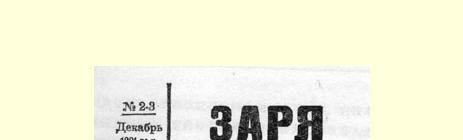
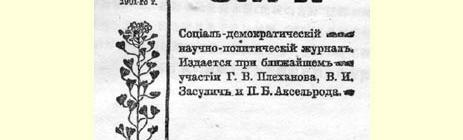
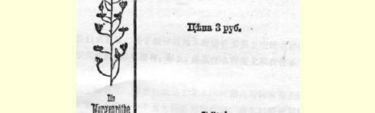
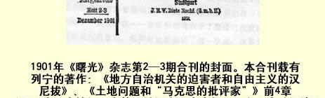
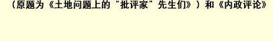

## 地方自治机关的迫害者和自由主义的汉尼拔１４

> （１９０１年６月）

如果过去说，俄国农民对自己的贫困最缺乏认识，那么，现在可以说，俄国的平民或臣民由于缺乏公民权利，对自己的无权尤其缺乏认识。庄稼汉对自己无法摆脱的贫困已经安之若素，习以为常，不去考虑自己贫困的原因和消除贫困的可能性，俄国的平民也同样对政府的无限权力安之若素，习以为常，不去考虑这种无限权力能不能继续保持下去，除了这种无限权力以外，是不是还存在着腐蚀陈旧的政治制度的现象。医治这种缺乏政治觉悟和死气沉沉的一种非常好的“解毒剂”，通常就是“机密文件”[^1]，因为这些文件表明，不仅某些不顾死活的亡命之徒或政府的顽固的敌人，而且连大臣和沙皇在内的政府人员自己，都意识到专制政体的摇摇欲坠， 并竭力寻求种种办法来改善这种根本不能使他们满意的处境。维特的记事就属于这样的文件，他曾和内务大臣哥列梅金为在边疆地区设立地方自治机关的问题发生争论，决定草拟一份对地方自治机关的起诉书来特别显示一下自己的卓识远见和对专制制度的

> １９０１年《曙光》杂志第２—３期合刊的封面。本合刊载有列宁的著作：
>
> 《地方自治机关的迫害者和自由主义的汉尼拨》、《土地问题和
>
> “马克思的批评家”》前４章（原题为《土地问题上的
>
> “批评家”先生们》）和《内政评论》 忠诚。[^2]

地方自治机关的罪状就是它同专制制度不相容。它按本身的性质来说是立宪的，它的存在必然会使社会人士和政府人士之间产生摩擦和冲突。起诉书是根据非常（比较而言）广泛的和精心加工的材料写成的，因为这是关于政治问题（同时也是相当特殊的问题）的起诉书，所以可以相信，它读起来令人感到兴趣的程度和得到的益处，将不亚于我们报纸上过去刊载的政治诉讼方面的起诉书。

## 一

让我们来看看，关于我国的地方自治机关是立宪的这种说法有没有事实根据，如果说有，那么，是在什么程度上和在什么意义上说的。

在这个问题上，地方自治机关设立的时期具有特别重大的意义。农奴制的崩溃是一个重大的历史转折点，这个转折点不能不撕破掩盖着阶级矛盾的警察帷幕。最团结、最有教养和最习惯于政权的阶级—— 贵族阶级—— 非常明确地表示了要通过代议机关来限制专制政权的愿望。维特的记事提到了这一事实，这是非常有教益的。“１８５９—１８６０年的贵族会议就已发表过必须设立贵族的共同‘代议机关’，‘俄国各地有选出自己的代表向最高当局陈述意见的权利’的声明。”“甚至还提出过‘宪法’这个词。”[^3]“有些省的农民问题委员会和参加起草委员会的农民问题委员会的委员也指出，必须号召社会参加管理。尼基坚科在他１８５９年的日记中写道：‘代表们显然在为制定宪法而努力’。”

> “１８６１年２月１９日的法令颁布以后，对专制制度所抱的这些希望看来是完全落空了，而且行政机关中一些比较‘赤色的’分子（如尼·米柳亭）受到排斥，不让他们来执行这个法令，于是拥护‘代议制’的运动就更为一致了。这个运动表现在向１８６２年的许多贵族会议所提出的提案中，还表现在诺夫哥罗德、图拉、斯摩棱斯克、莫斯科、彼得堡、特维尔等地的贵族会议的一份份的呈文中。其中以莫斯科的呈文最为出色，它要求地方自治、公开审判、强制赎买农民土地、预算公开、出版自由，以及在莫斯科召开由各阶级组成的地方自治杜马来制定整个改革草案。２月２日特维尔贵族的决议和呈文最为尖锐， 其中说到必须进行一系列的民政改革和经济改革（例如各等级权利平等，强制赎买农民土地），必须‘召开俄国全国代表会议，作为圆满解决２月１９日的法令所提出的、但没有解决的问题的唯一手段’[^4]。
>
> 尽管特维尔呈文的发起人[^5]受到了行政处分和司法惩罚，—— 德拉哥马诺夫继续说，——（不过不是直接因为呈文，而是因为他们为集体辞去调停官职务进行激烈的辩解）但１８６２年和１８６３年初的各种贵族会议还是以这个呈文的精神发表了声明，同时还拟定了地方自治草案。
>
> 当时立宪运动也在‘平民知识分子’中进行着，在这里，运动表现为组织秘密的会社和印发多少带有革命性的传单，如《大俄罗斯人》（１８６１年８月至 １１月；参加出版工作的有一些军官，如奥勃鲁切夫等），《地方自治杜马》 （１８６２年），《土地和自由》（１８６２—１８６３年）…… 呈文的草案也附在《大俄罗斯人》里传播了出去，很多人说这个呈文应该在１８６２年８月纪念俄罗斯一千周年时呈递给皇上。”这个呈文草案说道：“恳请陛下在我们俄罗斯祖国的两个首都之一，莫斯科或彼得堡，召开全俄代表会议，为俄罗斯草拟宪法 ……”[^6]

如果我们再回忆一下《青年俄罗斯》１８这份传单，对“政治”犯 （奥勃鲁切夫、米哈伊洛夫等）的大肆逮捕和严厉惩罚，以及用非法和诬陷手段判处车尔尼雪夫斯基服苦役这等事情的话，那么，我们对于产生地方自治改革的社会背景也就清楚了。维特在《记事》中说，“建立地方自治机关的思想无疑是一种政治思想”，在统治阶层内“无疑已注意到” 社会上的自由主义和立宪主义的情绪。这种说法只是说对了**一半**。《记事》作者处处流露出的那种对社会现象的官场的看法，在这里也表现了出来，这就是无视**革命**运动，掩盖政府为**防御**革命“政党”的攻击所采取的严厉镇压措施。诚然， 以我们现代的眼光看来，谈论什么６０年代初的革命“政党”和它的攻击似乎有些奇怪。４０年的历史经验大大提高了我们对所谓革命运动和革命攻击的要求标准。但是，不应忘记，在尼古拉统治了 ３０年的当时，谁也还不能预料到事变的发展进程，谁也不能判断出政府的实际抵抗力量和人民激愤的实际力量。欧洲民主运动的再起，波兰的动荡不安，芬兰的不满情绪，所有报刊和整个贵族阶级的要求政治改革，《钟声》在全俄国的广泛传播，善于通过被检查的文章来培育真正**革命者**的车尔尼雪夫斯基的强有力的宣传，传单的出现，农民对当局“常常”[^7]动用军队和枪杀来**强迫**他们接受洗劫他们的《法令》２５所产生的激愤情绪，贵族－调停官２６的集体拒绝执行**这样的**《法令》，大学生的骚乱，—— 在这样的情况下，最慎重而冷静的政治家必然会承认革命的爆发是完全可能的，农民起义是当时非常严重的危险。在这样的情况下，专制政府**必定要**毫不留情地杀害一些个别人，一些自觉地坚决与暴政和剥削制度为敌的人（即“革命政党”的“首领”），恫吓大批的不满者，并用微小的让步来收买他们，因为这样的政府认为它的最高使命，就是一方面要坚决卫护宫廷奸党和大批贪官污吏的无限权力和玩忽职守，另一方面要支持剥削阶级的恶劣的代表人物。谁对“伟大的解放”宁愿保持缄默而不愿说出愚蠢或虚伪的赞美之词，就判谁服苦役；谁对政府的自由主义赞不绝口，对进步的时代兴高采烈，就让谁来进行改革（**对专制制度和对剥削阶级无害的改革**）。

我们不想说，统治集团的全部成员或者至少也有几个成员，对这个预谋的反动警察策略有明确的认识，并且在系统地推行这个策略。当然，统治集团的个别成员，由于自己的局限性可能没有全面地考虑这个策略，他们幼稚地赞赏“自由主义”而没有察觉到它的警察躯壳。但整个说来，统治者的集体经验和集体智慧使他们坚定不移地推行这个策略，则是无疑的。大多数显贵大臣并没有白白地长期为尼古拉效劳和受到警察训练，可以说，他们都是饱经世故的。他们记得帝王们如何忽而奉承自由主义，忽而又成了杀害拉吉舍夫们的刽子手，“放出”阿拉克切耶夫之徒迫害忠良臣民；他们记得１８２５年１２月１４日２７，并且履行了俄国政府于１８４８—１８４９年所执行过的那种欧洲宪兵的职能２８。专制制度的历史经验，不但促使政府采取恫吓和利诱的策略，而且促使许多独立的自由派向政府推荐这一策略。科舍列夫和卡维林的议论就证明了这种见解的正确性。亚·科舍列夫在他的小册子《宪法、专制制度和地方自治杜马》（１８６２年莱比锡版）中表示**反对**立宪，赞成咨议性地方自治杜马，并设想出下面这样的反对意见：

> “召开地方自治杜马，就意味着把俄国引向革命，也就是说，三级会议将在我们这里重现，这种三级会议后来变成了国民公会，最后以１７９２年的种种事变，以剥夺人权、断头台、大量溺杀等等结束了它的活动。”科舍列夫回答说：“不！先生们，并不象你们所理解的那样，召开地方自治杜马就会为革命开辟或准备场所；其实，革命的发生，是由于政府方面行动不坚决，自相矛盾，进退不定，由于政令和法律难以执行，由于禁锢思想言论；由于警察（公开地、尤其恶劣的是秘密地）监视各等级和个人的行动，由于吹毛求疵地迫害某些人， 由于侵吞公款，由于任意挥霍公款和滥加犒赏，由于国家要人昏庸无能和对俄国离心离德等等。在一个刚从长年的压迫中觉醒过来的国家里，军事屠杀、 严密监禁和流放更会引起革命（仍照你们所指的意义而言），因为久治不愈的旧创伤比新创伤更使人感到痛楚。可是，不要害怕，你们所认为的在法国由一些新闻记者和其他一些作家进行的革命，在我们国家里是不会发生的。我们还可以希望，以暗杀作为达到自己目的的手段的狂热的冒险家团体在俄国是组织不起来的（不过这一点难于保证）。最有可能和最危险的倒是，在分裂的影响下，将出现地方警察、城市警察和秘密警察所觉察不到的农民同小市民 （包括年轻人和非年轻人，《大俄罗斯人》和《青年俄罗斯》等等的作者和拥护者）的团结。这样的团结会破坏一切，它所宣扬的不是在法律面前的平等，而是违反法律的平等（真是无与伦比的自由主义！自然，我们赞成平等，但我们赞成的是**不违反**法律—— 不违反破坏平等的法律的平等！），它所宣扬的不是人民的历史上的村社，而是它的病态的产儿，它所宣扬的不是某些当政者如此惧怕的理性的权力，而是那些当政者本身所喜欢采用的粗暴力量的权力， 这样的团结，我认为，在我们这里更有可能产生，它比我们的官僚们十分厌恶的、百般排挤和亟欲扼杀的那种温和的、善意和独立的反政府派，也许更为强大有力。不要以为在国内有秘密的匿名刊物的政党人数很少和力量薄弱，也不要认为你们已经连根带梢抓住了它；不！你们所采取的禁止青年修完学业、 把青年的淘气行为提到犯国事罪的高度、一味吹毛求疵地进行迫害和监视的种种做法，只是十倍地加强了这个政党的力量，使它分布、繁殖到帝国各处。 当这种团结一旦爆发出它的力量时，我们的国家要人将采取什么办法来对付呢？诉诸武力吗？但武力是不是一定能指望得上呢？”（第４９—５１页）

从这段冗长言论的华丽词句中难道不是可以清楚地看出一种策略，即要消灭“冒险家”和那些拥护“农民同小市民团结”的人，而用一些让步来满足和分化“善意的温和的反对派”吗？不过政府表现得比科舍列夫一类先生们所想象的更为聪明，更为巧妙，它所作出的让步比“咨议性”地方自治杜马更小。

请看１８６２年８月６日康·德·卡维林给赫尔岑的一封私人信：“……俄国传来的消息，在我看来，并不那样坏。被捕的不是尼古拉，而是亚历山大·索洛维耶维奇。逮捕并不使我感到惊异，而且我承认，也不使我感到愤慨。革命政党认为可以采取一切手段来推翻政府，政府则采取一切手段来自卫。在卑鄙的尼古拉的统治下，逮捕和流放却是另外一回事。人们是为自己的思想、信念、信仰和言论而死的。我倒希望你能站在政府的地位上，让我看一看你将如何对付那些暗地里或公开反对你的政党。我爱车尔尼雪夫斯基， 非常非常爱他，但象他这样一个ｂｒｏｕｉｌｌｏｎ〈寻衅者，爱好争吵、性情乖僻、到处惹是生非的人〉，这样一个不机智的、自以为是的人， 我还从来没有见过。死得毫无意义！确实毫无意义！几次大火都和传单有关，现在是不容怀疑的了。”[^8]真是一个奴颜婢膝的教授式的深思熟虑的典型！一切都是这些革命者的不是，他们竟如此自以为是地嘲弄夸夸其谈的自由派，如此热中于暗地和公开进行反对政府的活动，如此不机智，以至陷入彼得保罗要塞。他这个自由派教授假如掌权，也会采取“一切手段”来惩治这些人的。

## 二

所以，地方自治改革是专制政府受到社会激愤情绪和革命攻击浪潮的冲击而被迫作出的一个让步。我们特别详细地论述这种攻击的特点，是为了补充和纠正《记事》的说法，因为身为官僚的 《记事》作者抹杀了产生这种让步的斗争。但是这种让步的不够彻底和谨小慎微的性质，就是在《记事》中也描述得相当清楚：

> “起初，当刚刚着手进行地方自治改革的时候，无疑是打算在设立代议机关的道路上迈出第一步[^9]；但后来，当瓦卢耶夫伯爵接替了兰斯科伊伯爵和尼·阿·米柳亭以后，‘温和而模棱两可地’以‘调和’精神行事的愿望就非常清楚地表现出来了，这种愿望就连前内务大臣自己也不否认。他当时说，‘政府本身并没有弄清楚自己的意图’。总之，曾经有过要在两种对立的意见之间采取模棱两可的态度，并在满足自由主义意向的同时维持现存制度的尝式， 可是遗憾得很，国家要人一再重复这种尝试，但他们总是收到不良的效果 ……”

这里，这句伪善的“遗憾得很”真是可笑之极！警察政府的大臣在这里竟把警察政府所**不能不遵循的**策略说成是偶然性的，其实， 这个政府在颁布关于工厂视察制的各项法令、缩短工作日的法令２９（１８９７年６月２日）时就采取过这种策略，而且它现在（１９０１ 年）通过万诺夫斯基将军的讨好“社会”的手段３０还在采取这种策略。

> “一方面，在地方自治机关条例的说明书中说，草拟中的法令的任务就是尽可能充分地和逐步地发展地方自治的原则，‘地方自治机关不过是同一个国家政权的特别机关……’当时内务部的机关报《北方邮报》的许多文章非常明显地暗示，正在建立的机关将是代议机关的学校。
>
> 另一方面……地方自治机关在说明书中被称为私人的和公共的机关，它同各个团体和个人一样，服从于共同的法律……
>
> 不论是１８６４年条例的各项规定本身，或者特别是内务部在后来对地方自治机关所采取的措施，都相当清楚地表明，人们非常担心地方自治机关的 ‘独立性’，并且害怕这些机关得到应有的发展，**因为他们完全了解**，**发展起来会造成怎样的结果**。〈所有黑体都是我们用的〉……无疑，那些不得不去完成地方自治改革的人，他们实行这种改革，**只是向社会舆论让步**，目的是要象说明书中所说的那样，‘去制止**不同等级**因建立地方自治机关而激发起来的**无法实现的期望和自由的意向**’；同时，这些人对它〈？改革？〉都有清楚的了解， **并且力图不让地方自治机关得到应有的发展**，使这种机关带有私人的性质， 限制这种机关的权限等等。瓦卢耶夫伯爵用第一步决不会是最后一步的诺言来安慰自由派，在谈论，或者更确切地说，在重复自由派人士关于必须使地方自治机关具有实际的和独立的权力的论点的同时，就已**在拟定１８６４年条例之际竭尽全力限制这种权力**，**并把地方自治机关置于严格的行政监护之下** ……
>
> 根据１８６４年条例建立的地方自治机关，由于没有贯穿一种主导思想，而成了两种对立倾向的妥协，当它们开始进行工作时，就显得既不符合于奠定它们基础的自治的根本观念，也不符合于被机械地加在它们头上的、而且是依然没有经过改革的和不适应新的生活条件的行政制度。１８６４年条例企图把两种互不相容的东西调和起来，并以此来同时满足地方自治的拥护者和反对者。**对拥护者提供了外表和对未来的希望**，**为了讨好反对者而对地方自治机关的权限作了极有伸缩性的规定**。**”**

当我们的大臣们想陷害某个同僚并显示自己的深谋远虑时， 他们有时竟会在无意中说出何等中肯的话啊！所有心地善良的俄国小市民和所有信奉“伟大的”改革的人，如果把警察智慧的伟大训诫——“用第一步决不会是最后一步的诺言来安慰自由派”，对他们“提供外表和对未来的希望”—— 镶上金镜框挂在自己的墙壁上，将会是多么有益啊！特别是现在，在阅读报纸上关于万诺夫斯基将军的“殷切关怀” 的每篇论文或短评时，对照这些训谕尤为有益。

所以，地方自治机关从建立之初就注定作为俄国国家管理机关这个四轮大车的第五个轮子，官僚政治只有在它的无限权力不受到损害时才**容许**这个轮子存在，而居民代表的作用只限于纯粹的事务工作，只限于单纯在技术上执行这些官僚所规定的各项任务。地方自治机关没有自己的执行机关，它们必须通过警察进行工作，地方自治机关彼此并无联系，地方自治机关一经成立就被置于行政当局监督之下。而且，政府在作了这种无损于自己的让步之后，在建立地方自治机关的第二天，就开始有步骤地对它们加以约束和限制：大权在握的官僚集团是**不能**同选举产生的一切等级的代议机关和睦相处的，所以就用种种方法对它进行迫害。关于这种迫害的材料搜集得尽管很不完全，但不失为《记事》中非常有意思的部分。

我们已经看到，自由派对待６０年代初的革命运动是何等怯懦和荒唐。他们不是支持“小市民和农民同《**大俄罗斯人**》的拥护者的团结”，而是害怕这种“团结”并用它来吓唬政府。他们不是起来保卫被政府迫害的民主运动的首领们，而是装模作样地表明自己与此事无关并替政府辩护。可是他们也因为这种夸夸其谈和软弱无耻的背叛政策而受到公正的惩罚。政府镇压了那些不仅善于谈论自由，而且善于为自由而**斗争**的人们以后，认为自己相当强大，完全可以把那些自由派也从他们“在当局许可下”所处的谦卑和次要地位上排挤出去。当“小市民和农民”同革命者的“团结” 成了严重威胁的时候，内务部本身也嘟哝起“代议机关的学校”，而当所谓“不机智的和自以为是的”空谈家和“寻衅者”一被排除，就毫不客气地对“学童们”严加管束起来。悲喜剧式的史诗就此开始： 地方自治机关请求扩大权利，可是地方自治机关的权利却接二连三地**被剥夺**，对于请求所作的回答是“慈父般的”训诫。但让历史事实来说话吧，即便是《记事》中所列举的也足以说明问题了。

１８６６年１０月１２日内务部通令把地方自治机关的工作人员完全置于政府机关的支配之下。１８６６年１１月２１日颁布一项法令，限制地方自治机关征收工商业营业税的权利。１８６７年的彼得堡地方自治会议尖锐地批评了这项法令并通过了（根据安·彼· 舒瓦洛夫伯爵的提议）向政府提出请愿的决定，请求“由中央行政当局和地方自治机关共同努力”来研讨这项法律所涉及的问题。政府以封闭彼得堡地方自治机关和进行迫害来回答这一请求：圣彼得堡地方自治局主席克鲁泽被驱逐到奥伦堡，舒瓦洛夫伯爵被驱逐到巴黎，参议员柳博辛斯基奉命辞职。内务部的机关报《北方邮报》３１发表了一篇文章，说，“采取这种严厉的惩罚手段，是因为地方自治会议从一开始举行会议起就违反了法律〈违反什么法律？又为什么不对违法者**起诉**？不是刚刚成立了紧急、公正和仁慈的法庭吗？〉，它们不是去支持其他省的地方自治会议，利用圣上赐给它们的权利来认真照顾委托给它们管理的地方自治机关的地方经济利益〈就是说，不是乖乖地顺从和执行官僚的“意向”〉，而是一味歪曲事实真相，曲解法律，力图**煽起不信任不尊重政府的情绪**”。无怪乎在这样的教训以后，“其他的地方自治机关就没有对彼得堡地方自治机关给以支持，尽管１８６６年１１月２１日的法令到处引起了强烈的不满；许多人在会议上说颁布这项法令就等于废除了地方自治机关”。

１８６６年１２月１６日，参议院发表了一项“说明”，它赋予省长一种权利，即对地方自治会议所推选的任何人物，如果省长本人认为不可靠，都有权拒绝批准。１８６７年５月４日参议院又发表了另一项说明，认为把地方自治机关的设想通报给其他各省的做法是违反法律的，因为地方自治机关只应过问当地的事务。１８６７年６ 月１３日公布了圣上批准的国务会议３２的意见：未经地方省领导当局的许可，禁止刊印地方的、市的和等级的公众集会上所作的决定，关于会议情况的报告，会议上的讨论内容等等。其次，这一法律还扩大了各地方自治会议主席的权力，赋予他们解散会议之权，并 **以处分相威胁**，责成他们解散那些讨论违反法律的问题的会议。社会上对这个措施非常反感，认为这个措施严重地限制了地方自治机关的活动。尼基坚科在日记中写道：“大家都知道，地方自治机关被新法规束缚住了手脚，地方自治会议主席和省长从这个法规中获得了统治地方自治机关的几乎无限的权力。”１８６８年１０月８日的通令甚至规定刊印地方自治局的报告也须经省长许可，同时还限制各地方自治机关的交往。１８６９年设立了国民学校的督学，目的是要排挤地方自治机关对国民教育的实际管理。１８６９年９月１９ 日圣上批准的大臣委员会条例认定，“地方自治机关不论按其组成或是按其根本原则来说都不是政府的权力机关”。１８７０年７月４ 日的法律和１８７０年１０月２２日的通令肯定并加强了地方自治机关工作人员对省长的从属关系。１８７１年对国民学校督学的指令， 规定他们有权解聘那些被认为不可靠的教员，有权停止执行学校委员会的一切决定，而把问题提交学区督学裁决。１８７３年１２月２５ 日，亚历山大二世在给国民教育大臣的诏书中，担心国民学校**在督学监督不力的情况下**可能变成“**败坏国民道德的工具**，**对此已有迹象可寻**”，因此，他命令贵族代表要亲身参与其事，以保证这些学校的道德影响。随后在１８７４年颁布了国民学校新条例，将管理学校的全权交给了国民学校校长。地方自治机关“提出抗议”—— 如果可以并非讽刺地把要求在地方自治机关代表参加下修改这个法律的请愿书（１８７４年喀山地方自治机关的请愿书）称为抗议的话。请愿书当然是被驳回了，如此等等。

## 三

内务部设立的“代议机关学校”给俄国公民讲授的最初课程就是如此。政治学童在评论６０年代的立宪声明时写道：“现在不是胡闹的时候了，应该着手做实际工作了，而实际工作现在只是在地方自治机关内，此外没有别的地方了。”[^10]除了这些政治学童以外，幸而俄国还有一些不满于这种“机智态度”的“寻衅者”，他们在向人民进行革命的宣传。尽管他们所举起的理论旗帜在本质上不是革命的，但是他们的宣传依然激起了广大知识青年阶层的不满和反抗情绪。尽管空想主义的理论是否定政治斗争的，但是运动的发展终于使为数极少的英雄人物同政府展开了殊死的搏斗，形成了争取政治自由的斗争。由于这个斗争，并且只是由于这个斗争， 事态才再度发生变化，政府才再次被迫让步，而自由派人士才再次证明自己在政治上不成熟，没有能力给予战士们支持和对政府施加真正的压力。地方自治机关的立宪意向暴露得很明显，但只是一阵软弱无力的“冲动”而已，尽管地方自治自由派本身在政治方面明显地前进了一步。尤其值得注意的是它曾试图成立秘密政党和创办自己的政治机关报。维特的《记事》综合了一些秘密著作（肯楠的、德拉哥马诺夫的、吉霍米罗夫的著作）的资料来说明地方自治机关所走上的“不可靠的道路”（第９８页）。７０年代末曾经举行过好几次地方自治自由派代表大会。自由派决定“采取措施，姑且暂时制止一下极端革命政党的破坏活动，因为他们深信，如果恐怖分子继续用暴力的威胁和行动来刺激和扰乱政府，采取和平手段就将达不到任何目的”（第９９页）。所以，自由派不是去关心如何扩大斗争，如何发动较为广大的社会阶层去支持个别的革命者，如何组织某种总攻击（如举行游行示威，地方自治机关拒绝支付强派的开支等等），而是再一次采取老一套“机智态度”：“不要刺激”政府！ 用６０年代显然已证明其毫不足取的那种“和平手段”来达到目的！[^11]不言而喻，革命者绝没有停止或中断作战行动。地方自治人士当时成立了“反对派同盟”，这个同盟后来变成“地方联合和自治协会”或“地方自治机关联合会”。地方自治机关联合会的纲领要求：（１）言论和出版自由；（２）人身保障；（３）召开立宪会议。在加里西亚出版秘密小册子的尝试没有成功（奥地利警察没收了原稿，逮捕了打算刊印小册子的人），于是由德拉哥马诺夫（原基辅大学教授）在日内瓦编辑发行的《自由言论》杂志３３就从１８８１年８月起成为“地方自治机关联合会”的机关刊物。德拉哥马诺夫本人在 １８８８年写道：“归根结底……出版《自由言论》这样的地方自治机关刊物的尝试不能认为是成功的，这至少是因为地方自治机关的材料只是从１８８２年底才开始按时送达编辑部，而刊物到１８８３年５ 月就被禁止出版了。”（上述著作第４０页）自由派机关刊物的失败是自由派运动软弱无力的自然结果。１８７８年１１月２０日，亚历山大二世在莫斯科向各等级的代表发表了演说，希望他们给予“协助，以制止迷误的青年在不可靠分子的极力引诱下走上绝路”。后来在《政府通报》３４（１８７８年第１８６号）上又发表了要求社会给予协助的呼吁。５个地方自治会议（哈尔科夫、波尔塔瓦、切尔尼戈夫、 萨马拉和特维尔）对此作出反应，提出了关于必须召开国民代表会议的声明。《记事》作者维特详细地叙述了这些呈文（其中只有３份在报刊上全文发表）的内容以后写道：“也可以认为，如果内务部不及时采取措施禁止这些声明，通令在各省地方自治会议任主席的贵族代表，要他们绝对禁止在会上宣读诸如此类的呈文的话，那么，各地方自治机关关于召开国民代表会议的声明也许要多得多了。有些地方发生了逮捕和放逐议员的事件，在切尔尼戈夫，甚至有宪兵进入会场用暴力驱散与会者的事情发生。”（第１０４页）

自由派杂志和报纸都支持这个运动，“莫斯科２５个有名望的公民” 向洛里斯－梅利科夫递交的请愿书３５提出召开由各地方自治机关代表组成的独立会议，并建议该会议参与管理国家大事。于是政府任命洛里斯－梅利科夫为内务大臣，**看来**政府作了让步。但仅仅是**看来**而已，因为不但没有采取任何坚决的步骤，而且连任何肯定的、不容曲解的声明也没有发表。洛里斯－梅利科夫召集彼得堡定期刊物的编辑，向他们阐明了他的“纲领”：调查清楚居民的愿望、需要等等，使地方自治机关等有可能享有合法权利（自由派的纲领要保证各地方自治机关享有那些不断为法律所削减的 “权利”！）等等。《记事》的作者写道：

“大臣通过他的交谈者（召集他们正是为了这个目的）把自己的纲领传布到全俄国。其实这个纲领没有许诺什么肯定的东西。任何人都能从纲领中看到他所想要的东西，也就是说，里面什么都有，也什么都没有。当时有个秘密传单说得颇有自己的道理〈只是颇有“自己的”道理，而不是绝对“完全”有道理吗？〉，它说这个纲领既有‘狐狸尾巴’若隐若现，又有‘豺狼磨牙’格格作响。３６伯爵把纲领告知出版界时一再劝告他们‘不要徒劳无益地以自己虚妄的幻想煽动和扰乱人心’，所以对纲领和它的作者进行这样的攻讦就更可理解了。”可是自由派地方自治人士没有听信秘密传单所说的这些**有道理的话**，竟把“狐狸尾巴”的摇摆看作可以信赖的“新的方针”。维特的《记事》引用秘密小册子《地方自治会议对俄国现状的意见》的话说，“地方自治机关信赖和同情政府，似乎害怕冒进，害怕向政府提出过分的要求”。一些随意发表意见的地方自治机关支持者的自白很能说明问题：地方自治机关联合会在１８８０年的代表大会上刚刚决定“要在一院制和普选的必不可缺的条件下争取成立中央人民代表机关”，—— 而实现这个**争取**的决定所采用的策略，却是“**不冒进**”，“**信赖和同情**”模棱两可的和不承担任何义务的声明！地方自治人士有着一种不可原谅的幼稚的想法，他们认为提出请愿书就意味着“争取”，所以“地方自治机关发出”的请愿书好似“雪片纷纷”。１８８１年１月２８日，洛里斯－梅利科夫上了一份奏折，提议成立一个由各地方自治机关推选的代表组成的委员会，以拟定体现“皇上意志”的法律草案，但这个委员会只有咨议权。亚历山大二世所任命的特别会议赞同这个措施，１８８１年２月 １７日，会议的决议得到了沙皇的批准，沙皇也同意了洛里斯－梅利科夫提出的政府通报全文。 《记事》作者维特写道：“无疑，成立这样的纯咨议性委员会也还没有建立宪制。”他接着说，可是未必能够否认，这是朝着宪制而不是朝着别的什么前进了（在６０年代改革以后）一步。该作者还引用国外刊物的报道说，亚历山大二世看到洛里斯－梅利科夫的奏折时说：“这岂不是三级会议３７”……“他们向我们建议的无非是路易十六时代的显贵会议３８。”

在我们看来，洛里斯－梅利科夫计划的实现，在一定条件下**可能是**朝着宪制迈进的一步，但是也可能不是这样，因为一切取决于是谁取得优势，是革命政党和自由派人士的压力取得优势，还是非常强大的、团结的、不择手段地坚决支持专制制度的党派的反抗取得优势。如果说的不是可能的假定，而是既成的事实，那就必须认定，政府的**摇摆不定**是无庸置疑的事实。一些人主张坚决同自由派斗争，另一些人主张让步。但是（这一点特别重要）这后一部分人也是摇摆不定的，他们并没有任何十分明确的纲领，而且也不比做实际工作的官僚高明。

> 《记事》作者维特说：“洛里斯－梅利科夫伯爵似乎不敢正视问题，不敢十分明确地定出自己的纲领，而是继续执行—— 不过是朝着另一个方向执行 —— 过去瓦卢耶夫伯爵对地方自治机关早就采取过的转弯抹角的政策。
>
> 正如当时合法刊物所公正指出的，洛里斯－梅利科夫伯爵所宣布的纲领是很不明确的。这种不明确性在伯爵以后的全部行动和言论中也可以看出来。他一方面声明说，专制制度‘脱离居民’，‘他把社会的支持看作主要的力量……’，‘没有把’筹划中的改革‘看作某种最终的东西，而认为这种改革只是第一个步骤’等等。同时，另一方面，伯爵又向报界声明说，‘……社会上激发起来的希望无非是一种虚妄的幻想……’，而在上呈皇帝的奏折中却断然声明说，国民代表会议将是‘一种退回到过去的危险的尝试……’，他所筹划的措施从限制专制制度这点来说没有任何意义，因为这种措施和西方的一些立宪形式毫无共同之处。总之，正象列·吉霍米罗夫所正确指出的，这个奏折本身在形式上是非常混乱的。”（第１１７页）

可是这个臭名远扬的“感化专政”３９的英雄洛里斯－梅利科夫，对争取自由的**战士**所采取的“残酷手段却是空前绝后的，他竟因在一个１７岁的少年身上搜得印刷的传单而将他处以死刑。洛里斯－梅利科夫没有忘记西伯利亚的遥远的角落，没有忘记要使那里因进行宣传活动而受难的人们的境况更加恶劣”（维·查苏利奇的文章，《社会民主党人》４０第１期第８４页）。在政府这样摇摆不定的情况下，只有能作严峻斗争的力量才能争得宪法，可是当时没有这种力量，因为革命者在３月１日已经耗尽自己的力量４１，工人阶级中既没有广泛的运动，也没有坚强的组织，自由派人士这一次在政治上还是表现得很不成熟，以致在亚历山大二世被害以后，他们还只是一味地上请愿书。请愿的有各地方自治机关和各城市，请愿的有自由派报刊（《秩序报》４２、《国家报》４３、《呼声报》４４），请愿的还有起草报告书的自由派人士（维洛波尔斯基侯爵、契切林教授和格拉多夫斯基教授；维特的《记事》叙述了这些报告书的内容，他所根据的是伦敦的一本小册子[^12]《洛里斯－梅利科夫伯爵的宪法》，这本小册子于１８９３年由自由俄国出版基金会在伦敦出版），这些自由派人士以一种特别善意的、狡黠的和暧昧的形式请愿，一心想 “用巧妙的办法使君主自己不知不觉地越过神圣不可侵犯的界线”。 不言而喻，所有这些谨小慎微的请愿和巧妙的设想由于没有革命的力量都是毫无用处的，所以虽然在１８８１年３月８日的大臣会议上多数人（７比５）**赞同**洛里斯－梅利科夫的计划，但是专制党还是胜利了。（那本小册子就是这样报道的，可是热心抄袭该小册子的《记事》作者维特不知为什么却声称：“在３月８日的这次会议上发生了什么事和结局如何，详情不得而知；相信国外报刊上的传言未免轻率。”第１２４页。）１８８１年４月２９日发布了被卡特柯夫称之为 “天降甘露”的关于巩固和保卫专制制度的宣言。４５

农民解放以后，革命的浪潮再度被击退，自由派运动也接着因此而再度被**反动**所取代，俄国的进步社会对此当然深感痛心。我们已饱经痛心之事：我们痛心革命家们在攻击政府时的不机智和自以为是；我们痛心政府的犹豫不决，它看不到自己面前的真正力量，作假让步，而且出尔反尔；我们痛心“无思想和无理想的时代”， 政府镇压了不为人民所支持的革命家之后，又力图重整旗鼓，准备新的斗争。

## 四

“感化专政”的时代（人们这样称呼洛里斯－梅利科夫内阁）向我国的自由派表明，在政府十分摇摆不定，大臣会议的多数赞同 “改革的第一步”的情况下，如果没有足以迫使政府屈服的强大社会力量，则一个大臣的“立宪主义”，甚至一个首相的“立宪主义”也是保证不了什么的。同样有趣的是，亚历山大三世政府甚至在发布了关于巩固专制制度的宣言后，也还没有遽然下毒手，却认为必须对“社会”愚弄一个时期再说。我们说“愚弄”，并不是打算把政府的政策归咎于某一大臣、显官等的某种马基雅弗利式的计划４６。应当始终坚持这样的看法：假让步和某些看来似乎重要的“迎合”社会舆论的措施，是任何现代政府，包括俄国政府所惯用的一套手法，因为经过许多世代俄国政府也已经认识到，无论如何必须重视社会舆论，经过许多世代它已经培养出一些善于在内政方面施计弄术的国务活动家。接替洛里斯－梅利科夫的内务大臣伊格纳季耶夫伯爵，就是这样的谋略家，他肩负的使命是掩护政府转向露骨的反动。伊格纳季耶夫不止一次地表明自己是个十足的蛊惑家和骗子手，所以《记事》作者维特表现了不少“警察的宽容”，把他担任内阁的时期称为“在专制沙皇领导下建立地方自治区域的失败尝试”。诚然，这样的“公式”是当时伊·谢·阿克萨科夫提出来的，政府曾利用它进行欺骗，卡特柯夫则斥责它，想借以充分证明地方自治和宪制之间的必然联系。但是，如果**说**警察政府采取这种人所共知的策略（警察政府出于本性而必然采取的策略）是由于目前某种政治见解占优势的缘故，那就未免太近视了。

伊格纳季耶夫发表通告，应诺政府“将采取紧急措施，以确定正确的方法，来保证地方上的活动家们在积极参与执行皇上的指令方面获得最大的成功”。各地方自治机关以请求“召集人民代表”的请愿书来回答这个“号召”（引自切列波韦茨地方自治机关某议员的记事；基里洛夫斯科耶地方自治机关某议员的意见，省长甚至未准刊印）。政府指示各省省长，这种请愿书“无需作进一步处理”，“同时，看来也采取了措施，以免在其他会议上再提出类似的请愿书”。于是进行了众所周知的活动：召集由大臣们挑选的“权威人士”开会（讨论关于降低赎金、整顿移民、实行地方行政改革等问题）。“专家委员会的工作没有引起社会的同情，**尽管采取了各种预防措施**，但还是引起了地方自治机关方面的公然抗议。１２个地方自治会议提出请愿书，要求邀请地方自治人士参加立法活动， 但不要只是在个别情况下，也不要由政府指定，而是要经常地参加，要由各地方自治机关选举产生。”在萨马拉地方自治机关内，这样的提案被主席制止了，“会议就此散会以示抗议”（德拉哥马诺夫的上述著作第２９页，《记事》第１３１页）。关于伊格纳季耶夫伯爵如何**哄骗**地方自治人士，这可以从下面的事实中看出：“波尔塔瓦的贵族代表乌斯季莫维奇先生，即１８７９年要求制定宪法的呈文草案的起草人，在省贵族会议上公开声明，他得到了伊格纳季耶夫伯爵的**明确的保证**〈原文如此！〉，说政府将召集全国的代表参加立法活动。”（德拉哥马诺夫的著作，同上）

用伊格纳季耶夫的这些把戏来掩护政府转向崭新的方针的做法结束了，１８８２年５月３０日被任命为内务大臣的德·安·托尔斯泰不是凭空赢得了“斗争大臣”的绰号的。各地方自治机关就连举行局部性会议的请求也被无礼地拒绝了，甚至根据省长对一个地方自治机关（切列波韦茨的）提出的“一贯采取反对派立场”的指控，就撤销了地方自治局，而代之以政府任命的委员会，地方自治局成员受到放逐的行政处分。德·安·托尔斯泰，卡特柯夫的这个忠实学生和追随者，根据一种基本思想（我们看到，这种思想的确已为历史所证实）即“反政府派已在地方自治机关内为自己筑造了结实的巢穴”（《记事》第１３９页：引自地方自治改革的最初草案）， 断然决定要对地方自治机关进行“改革”。德·安·托尔斯泰计划撤销地方自治局，而代之以隶属于省长的官署，并认定地方自治会议的一切决定须经省长批准。这可是个真正“彻底的”改革，不过， 非常有趣的是，甚至卡特柯夫的这个学生“斗争大臣”，也“没有背离—— 按《记事》作者本人的话说—— 内务部对地方自治机关的一贯政策。他在自己的方案中没有直接表示出他实际上想撤销地方自治机关的想法；在正确发展自治原则的幌子下，他想要保留自治的外形，而完全去掉它的内容”。在国务会议内，这个英明的“狐狸尾巴”国家政策更得到了补充和发展，结果，１８９０年的地方自治条例就“成了地方自治机关历史上一项新的治标措施。这个条例没有撤销地方自治机关，但把它弄得不伦不类，黯无生气；没有消灭一切等级的原则，却给它增添了等级的色彩；……没有使那些地方自治机关成为真正的政权机关……却扩大了省长对地方自治机关的监护……加强了省长的异议权”。“１８９０年７月１２日的条例，按照它的起草者的本意，是撤销地方自治机关的一个步骤，而决不是对地方自治的彻底改革。” 《记事》接下去说，新的“治标措施” 并没有消灭反对政府的行动（不言而喻，反对反动政府的行动，是不可能靠加强这种反动性来消灭的），而只是使反对行动的**某些**表现变得隐蔽而已。第一，反对行动表现在，某些反对地方自治的—— 要是能这样说的话—— 法律遭到了抵制，因而实际上未能实行；第二，仍旧表现在立宪主义的（或者至少是有立宪主义气味的）请愿上。例如，１８９３ 年６月１０日颁布的地方自治机关医务组织须遵守详细规章这一法律，就遭到上述第一种形式的反对。“各地方自治机关一致抵制了内务部，内务部因而退却，不得不中止施行已经拟妥的规章，把它搁置一旁以便收入法律大全，不得不根据完全相反的原则〈也就是说，对地方自治机关更有利的原则〉制定新的法案。”１８９３年 ６月８日颁布的不动产估价法，同样采用了制定规章的原则，并限制了地方自治机关的课税权利，这个法律也没有得到支持，而且在许多场合“实际上根本没有贯彻执行”。地方自治机关建立的对居民很有利（当然是和官僚政治比较而言）的医务机构和统计机构是很有力量的，足以使彼得堡官厅所制订的规章不起任何作用。

上述第二种反对行动可以从１８９４年新的地方自治机关的活动中看到，当时各地方自治机关给尼古拉二世的呈文再次非常明确地暗示，它们要求扩大自治，这些呈文招致了所谓毫无意义的幻想这种“有名的”评语。

地方自治机关的“政治倾向” 并没有消失，这不能不使大臣先生们吃惊。《记事》作者援引了特维尔省省长对“紧密团结的、 有自由主义倾向的一伙人”的痛心的抱怨（引自省长１８９８年的报告），说这些人包揽了省地方自治机关的一切事务。“从该省长 １８９５年的报告中可以看出，同地方自治机关的反政府派的斗争， 成了地方行政机关的艰巨任务，为了执行涉及地方自治机关不应过问的事务的内务部机密通令，在各地方自治会议中任主席的贵族代表有时甚至需要拿出‘公民的勇气’〈居然如此！〉。”接下去又讲到，省的贵族代表如何在临开会前把职务推给县（特维尔县）的贵族代表，特维尔县的贵族代表又推给新托尔若克县的贵族代表， 新托尔若克县的贵族代表也生病了，于是又把主席职务推给斯塔里察县的贵族代表，就这样，连贵族代表们也不愿履行警察职务而逃之夭夭了！《记事》作者抱怨说：“１８９０年的法律给地方自治机关增添了等级色彩，加强了会议中的政府成分，所有的县贵族代表和地方官都成了省地方自治会议的成员，如果这种不伦不类的等级官僚制地方自治机关仍然能够表现出政治倾向的话，那这一点倒是值得深思的。”“……反抗并没有被消灭：不满的暗流，沉默的反对无疑是存在着，而且将一直存在到一切等级的地方自治机关消亡为止。”官僚的智慧作出这样的结论：既然已被削弱的代议机关经常引起不满，那么，按照通常的逻辑，消灭一切代议机关定会进一步加强这种不满和反对。维特先生以为，如果把那些稍微显露出一点不满的机关封闭掉一个，那不满就会消失！你们是否认为，维特因此会提出什么象撤销地方自治机关一类的坚决的提案？不，根本没有提出。维特为了哗众取宠而斥责转弯抹角的政策，其实他自己除了这种政策以外，是提不出什么别的东西来的，—— 如果不摆脱他那专制政府大臣的地位，他是不可能提出来的。维特嘟嘟哝哝地说了些关于“第三条道路”的毫无价值的话：不是官僚的统治，也不是自治，而是“正确组织”“各种社会成分参加政府机关”的行政改革。 这样胡说一通并不难，但是，经过“权威人士”的各种试验之后，现在这种无稽之谈已不能欺骗任何人了，因为非常明显，如果**没有宪法**，则“各种社会成分参加”只能成为空中楼阁，只能使社会（或从社会“招来” 的某些人）从属于官僚。维特批评内务部的局部措施—— 在边疆地区设立地方自治机关，但对他自己提出的总的问题，却不能拿出什么新的东西，而只是重新搬出治标措施、假让步、空口许愿等老一套手段。应该特别强调指出：在关于“国内政策的方针”这个总的问题上，维特和哥列梅金是一致的，他们之间的争论是自己人之间的争论，是同一伙人内部的争吵。一方面，维特赶忙声明说，“我过去没有提出过，而且现在也没有提出什么撤销地方自治机关、破坏现存秩序的提案……在当前情况下，恐怕谈不上撤销它们〈现有的地方自治机关〉”。维特“自己认为，在各地建立强大的政府权力机关，就有可能对各地方自治机关寄以更大的信任”等等。建立了强力官僚机关以对抗自治（即削弱自治）， 就可以更加“信任”自治。这是老调重弹！维特先生害怕的只是“一切等级的机关”，他“根本没有考虑到而且也不认为各种同业公会、 协会、等级团体或工会的活动对专制制度是危险的”。例如，维特先生深信不疑，“村社”由于“因循守旧”是不会危害专制制度的。“农村居民把土地关系以及与此有关的利益看得高于一切，这就使他们养成了这样的精神特质：除了关心自己的狭隘小天地的政治以外对其他一切都漠不关心……我国农民在乡会上忙于分摊税款 ……分配份地等等。此外，他们又是文盲或半文盲，——** 这里能有什么政治可谈呢**？”可以看到，维特先生是非常清醒的。在谈到各等级团体时，他声明说，在各等级团体对中央政权的危险性这个问题上“它们利益的不一致具有重大的意义。政府在反对一个等级的政治要求时利用这种不一致，就常常能够在其他等级中找到支持和抗衡的力量”。维特的“正确组织各种社会成分参加政府机关”这个 “纲领”，无非是警察国家想“分化”居民的无数次尝试中的一次尝试而已。

另一方面，同维特先生争论得如此激烈的哥列梅金先生自己也在运用同一套分化和迫害的政策。他证明（在他自己的记事中证明，维特对此记事作了答复），为了监督地方自治机关，必需设立新的官职，他甚至反对准许地方自治活动家举行纯地方性的代表大会，他全力拥护１８９０年的条例，拥护这个撤销地方自治机关的步骤，他害怕各地方自治机关把“有倾向性的问题” 列入评议工作计划之内，他害怕地方自治局的一切统计，他主张把国民学校从地方自治机关手中收回，交给政府机关管理，他证明，地方自治机关没有能力处理粮食问题（要知道，地方自治活动家“夸大了受灾范围和灾民的需要”！！），他坚决拥护地方自治机关课税限额条例，“以保护地产免受地方自治机关过多增税的损害”。所以维特下面的话说得十分正确：“内务部对地方自治机关的整个政策就是慢慢地、但又接连不断地摧残地方自治机关的各个机构，逐渐削弱它们的作用，从而把它们的职能逐渐集中到政府机关手中。可以毫不夸大地说，在〈哥列梅金的〉记事中指出的，‘最近期间为了调整地方自治机关的个别经济和行政部门所采取的措施’，一旦得到彻底实施，实际上我们将无任何自治可言，—— 各地方自治机关将只剩下一个概念和一个没有任何实际内容的外壳而已。”所以，哥列梅金的（还有西皮亚金的）政策和维特的政策是殊途而同归的， 所以，关于地方自治机关和立宪主义问题的争论，我们再重复一遍，不过是自家人内部的争吵罢了。夫妻吵嘴，只当开心。对维特和哥列梅金先生的“斗争”的结论就是这样。至于说我们对专制制度和地方自治机关这个总的问题的看法，最好还是在分析尔·恩 ·斯·[^13]先生的序言时再来总结吧。

## 五

尔·恩·斯·先生的序言提供了许多有趣的东西。这篇序言牵涉的问题极广，它谈到俄国的政治改革、政治改革的各种方法以及导向改革的各种力量的作用。另一方面，这位同自由派，特别是同地方自治自由派显然过往甚密的尔·恩·斯·先生，在我们的“秘密”著作的合唱中，无疑唱的是一种新的调子。因此，无论是为了弄清地方自治机关的政治意义这个原则问题也好，或者是为了了解接近自由派的人们的趋向以及……情绪（我还不把它叫作思潮）也好，都非常需要详细考察一下这篇序言，分析一下这个新的调子是好还是坏，说好好到什么程度，说坏坏到什么程度和坏在什么地方？

尔·恩·斯·先生的见解的基本特点如下。从我们下面引证的他的文章的许多地方可以看出，他崇拜和平、渐进、绝对合法的发展。另一方面，他又真心反对专制制度，渴望政治自由。但是专制制度之所以成为专制制度，就是因为它禁止和压制**一切**趋向自由的“发展”。这一矛盾贯穿了尔·恩·斯·先生的整篇文章，使他的论述前后不一、软弱无力，摇摇摆摆。只有预计或者至少是假定专制政府**自己**会醒悟、厌倦和让步等等，才会把立宪主义同关心专制俄国的绝对合法发展的思想凑在一起。而尔·恩·斯·先生有时竟真的从他的公民义愤的高峰跌到最不发达的自由主义的这种庸俗观点上去了。下面就是一个例子。尔·恩·斯·先生在谈到自己时说道：“……我们认为，有觉悟的现代俄国人争取政治自由的斗争就是他们的汉尼拔式的誓言，这种誓言是十分神圣的，就象过去４０年代的人们争取农民解放的斗争一样……”又说：“…… 不管我们这些发出同专制制度斗争的‘汉尼拔式的誓言’的人感到多么困难”，等等。说得多么漂亮，多么有力！如果他的整篇文章都贯穿了同样不屈不挠和不可调和的斗争精神（“汉尼拔式的誓言”！），这些有力的言词也许可以作为文章的点缀。这些有力的言词正因为它十分有力，所以，在说这些话的时候，如果渗进一些勉强的和解及宽慰的调子，企图把和平的绝对合法的发展的观念强塞进去，那么这些言词也就成了虚伪的东西。可惜在尔·恩·斯· 先生的文章里，这样的调子和企图简直是俯拾皆是。例如，他用了整整一页半的篇幅来详细“论证”这样一种思想：“从道德观点和政治观点看来，尼古拉二世统治时代的国家政策，同亚历山大三世时代进行的亚历山大二世的重分份地的改革比起来，应该受到***更加***〈黑体和着重号是我们用的〉严厉的谴责。”为什么要受到**更加** 严厉的谴责呢？原来，因为亚历山大三世是同革命作斗争，而尼古拉二世则是同“俄国社会的合法要求” 作斗争，前者要对付的是有政治觉悟的社会力量，而后者要对付的只是“十分平和的、有时甚至根本缺乏明确政治思想的社会力量”（“他们甚至认识不到， 他们的自觉的文化工作是在破坏国家制度”）。实际上这是非常错误的，这点下面就要说到。但是即使抛开这点不谈，也不能不指出，作者的论述方法是非常奇怪的。他抨击专制制度，对两个专制君主中的一个抨击得**尤为厉害**，但是他所根据的不是那个原封未动的政策的性质，而是因为在这个专制君主面前已经没有（似乎如此）“自然” 会引起强烈反击的“寻衅者”，因而也就没有迫害的借口。有人说，我们的慈父沙皇根本用不着害怕召集善良人士，因为所有这些善良人士从来没有想到要越出和平的要求和绝对合法的范围。尔·恩·斯·先生提出上述论据，不是显然迁就了忠良臣民的这种论调吗？维特先生在自己的记事中写道：“看来，在凡是没有政党，没有革命，任何人也不想争夺最高当局的权利的地方，也就用不着把行政当局同人民和社会对立起来……”[^14]等等。 我们在维特先生那里看到这种“思想方法”（或撒谎方法），是不会感到惊奇的。契切林先生在１８８１年３月１日以后给米柳亭伯爵的呈文中宣称：“当局首先必须表现出自己的毅力，证明它没有在威胁面前卷起自己的旗帜”，“只有当自由机关是和平发展和最高当局本身的心平气和的倡议的结果时，君主制度才能同它们相容”， 他建议建立“强有力的自由主义”政权，在“为选举因素所加强和革新的立法机关”的帮助下进行活动。[^15]我们对契切林先生的这种议论，是不会感到惊奇的。这样一位契切林先生如果认为尼古拉二世的政策应该受到更加严厉的谴责，倒是十分自然的，**因为**在尼古拉二世统治时代，和平发展和最高当局本身的心平气和的倡议是**可能**产生自由机关的。但是一个发出汉尼拔式的斗争誓言的人竟说出这样的话来，恐怕是不大自然、不大体面吧？

其实尔·恩·斯·先生是错了。他在比较现在的和上一代的皇帝的统治时说道：“现在……没有一个人会去认真考虑‘民意党’ 活动家所设想的暴力变革了。”Ｐａｒｌｅｚ ｐｏｕｒ ｖｏｕｓ，ｍｏｎｓｉｅｕｒ！请只代表您自己讲话吧！我们清清楚楚知道，这一代皇帝在位时，俄国革命运动不仅没有衰亡，没有比前一代减弱，反而活跃起来并大大发展了。在革命运动的参加者中间，如果竟没有一个人肯去认真考虑暴力变革，那么这还配称什么“革命”运动呢？也许，有人会反驳我们说：在上面引证的这段话中，尔·恩·斯·先生指的不是一般暴力变革，而是专指“民意党的”变革，就是说，是政治的同时也是社会的变革，是不仅要推翻专制制度，而且要夺取政权的变革。 这种反驳是没有根据的，因为第一，在专制制度本身（即专制政府， 而不是“资产阶级”或“社会人士”）看来，重要的决不在于**为什么**要推翻它，**而在于**要推翻它。第二，还在亚历山大三世当政的初期， “民意党”活动家就向政府“提出了”正象后来社会民主党人向尼古拉二世提出的抉择：或者是革命斗争，或者是放弃专制制度。（见 １８８１年３月１０日“民意党”执行委员会给亚历山大三世的信。信中提出两个条件：１．大赦一切政治犯；２．在实行普选制和出版、言论、集会自由的条件下，召开全俄人民代表会议。）尔·恩·斯·先生自己也明明知道，不仅知识界，而且工人阶级中间也有许多人在 “认真考虑”暴力变革。请看一下他的文章的第页及以下各页吧，那里谈到“革命的社会民主党”既有“群众基础，又有精神力量”，它从事“坚决的政治斗争”，从事“革命俄国同专制官僚制度的流血斗争”（第ＸＬＩ页）。因此，丝毫用不着怀疑，尔·恩·斯· 先生的“善意的言论”４７不过是一种特别的手法，是一种想用表白自己（或别人）谦恭有礼来感动政府（或“社会舆论”）的尝试罢了。

同时，尔·恩·斯·先生认为，斗争这个概念可以作非常广泛的解释。他写道：“撤销地方自治机关会给革命宣传提供有力的根据，—— 我们这样说是绝对客观的〈原文如此！〉，因为我们毫不厌恶通常所谓的革命活动，但是也不称赞和向往这种谋取政治进步和社会进步的斗争形式〈原文如此！〉。”这段议论是非常值得注意的。只要把这个用文不对题的“客观性”（既然作者自己提出了他倾向于某种活动形式或斗争形式的问题，那又说他的态度是客观的， 这就是二二得蜡烛４８了）装饰起来的貌似博学的议论拿近一看，就会发现它是一个陈旧不堪的论证：当权的老爷们，即使我拿革命吓唬你们，你们也可以相信我，因为我对革命一点也不感兴趣。所谓客观性的论调，无非是掩盖主观上憎恶革命和革命活动的遮羞布罢了。尔·恩·斯·先生所以需要遮遮盖盖，是因为这种憎恶态度同汉尼拔式的斗争誓言水火不能相容。

可是，我们对这位汉尼拔的了解是不是错了呢？他是真的发誓要同罗马人斗争呢，还是仅仅要为迦太基的进步，为这种当然终归会损害罗马的进步而斗争呢？对斗争这个词是否可以理解得不那样“狭窄”呢？尔·恩·斯·先生认为是可以的。只要把汉尼拔式的誓言同上边的议论对照一下，就可以得出结论说，同专制制度的斗争可以有各种各样的“形式”：一种是革命的、非法的斗争，另一种是一般的“谋取政治和社会进步的斗争”，换句话说，是和平的、 合法的活动，是在专制制度容许的范围内传播文化。我们丝毫不怀疑，即使在专制制度下，也是可以进行能够推动俄国进步的合法活动的。在某些情况下，这种活动可以相当迅速地推动技术的进步， 在少数情况下可以轻微地推动社会的进步，在极个别的情况下可以微乎其微地推动政治的进步。至于这种微小的进步究竟能够大到什么程度和实现的可能性如何，个别的微小进步究竟能够在多大程度上抵销专制制度无时无地不在向居民施行的大规模政治诱惑，这是可以争论的。但是如果把和平的合法活动也包括在（哪怕是间接地）同专制制度斗争的概念之内，那就会有助于这种诱惑， 就会削弱俄国普通人头脑中本来就非常薄弱的关于每个公民都应对政府的**一切**行为负责的意识。

可惜，在不合法的著作家中间，试图抹杀革命斗争同和平的文化活动之间的差别的不只是尔·恩·斯·先生一个人。还有他的一位前辈，这就是尔·姆·先生，他是著名的《〈工人思想报〉增刊》４９（１８９９年９月）上刊载的《我国的实际情况》一文的作者。他在反驳革命社会民主党人时写道：“争取地方和城市社会自治的斗争，争取社会教育的斗争，争取社会法庭的斗争，争取给饥民以社会救济的斗争等等，都是同专制制度的斗争……这种社会斗争由于某种令人莫解的原因，没有受到俄国许多革命著作家的关切，但是我们看到，俄国社会进行这种社会斗争，已经不是一朝一夕的事情了……当前的问题在于，怎样使这些个别的社会阶层……能更有成效地进行这种反对专制制度的斗争……而我们的主要问题是： 我国的革命者既然把工人运动看作推翻专制制度的最好手段，那么我国工人应该怎样进行这种反对专制制度的社会斗争。”（第 ８—９页）大家看到，尔·姆·先生甚至觉得用不着掩饰他对革命者的憎恶了；他竟干脆把合法的反对立场与和平工作叫作同专制制度作斗争，甚至把工人应当怎样进行“**这种**”斗争当作主要问题。 尔·恩·斯·先生决不这样浅薄和这样露骨，但是我们的这位自由派同纯粹工人运动的极端崇拜者在政治倾向上的一脉相承，却是一目了然的。[^16]

至于说到尔·恩·斯·先生的“客观主义”，我们应当指出， 他有时干脆把它也扔掉了。他谈到工人运动，谈到工人运动的有机发展，谈到革命社会民主党同专制制度未来的不可避免的斗争， 谈到自由派组织秘密政党将是撤销地方自治机关的必然结果，当他谈到这些问题的时候，他是“客观的”。他的这些议论都说得非常实在，非常清醒，清醒得使我们可以庆幸，在自由派中间竟有人传播对俄国工人运动的正确理解。但是当他不是谈论同敌人作斗争，而是开始谈论敌人可能“顺从”的时候，他就会立刻丢掉自己的 “客观主义”，暴露出自己的真实情感，甚至竟一变叙述语气为命令语气。

> “假使在当权者中间出现一种人，他们勇于顺从历史，并且能够迫使专制君主也顺从历史，那么，只有在这种情况下，才不会导致革命的俄国同专制官僚制度展开最后的流血斗争……无疑，在上层官僚中间是有不同情反动政治的人的……他们这些唯一能够接近圣上的人，从来也不敢大声说出自己的信念……但是，不可避免的历史惩罚的巨大影子，伟大事变的影子，也许会引起政界的动摇，并及时摧毁反动政治的铁的制度。现在，要做到这一点是不需要费很大力气的……也许，它〈政府〉也会不太晚地觉悟到，千方百计维护专制制度是注定要招致危险的。也许，当它还没有同革命遭遇以前，自己就已感到疲于同自由的自然的和历史必然的发展作斗争，并对自己的‘不妥协的’政策发生动摇。只要它不再坚决与自由为敌，它也就不得不愈来愈大地向自由敞开门户。也许……不，不仅也许，而是**一定会如此**！”（黑体是原作者用的）

阿门！我们对于这篇善良而崇高的独白只能说一声阿门。我们的汉尼拔进步得真快，他竟然在我们面前以第三种形式出现了： 第一种形式是同专制制度作斗争；第二种形式是传播文化；第三种形式是呼吁敌人顺从，试图拿“影子”来吓唬他。这是多么可怕啊！ 我们完全同意尊责的尔·恩·斯·先生的说法：俄国政府的伪善者们在这个世界上最怕的恐怕就是“影子”。我们的作者在念影子咒之前，曾谈到革命力量的增长和日益迫近的革命爆发，接着他感叹地说道：“这种丧失理智的侵略保守的政策，既缺乏政治意义，又毫无道德根据，它将使人才和文化力量遭到可怕的牺牲，一想到这点，我们就感到非常难过。”从这段关于革命爆发的议论的结尾，可以看到一个多么深的学理主义和甜言蜜语的无底洞啊！作者丝毫不懂得，俄国人民哪怕只把政府好好地教训一次，那就会有多么巨大的历史意义。你们不提人民过去和现在为专制制度作出的“可怕的牺牲”，唤起仇恨和愤怒，燃起斗争的决心和热情，反而妄谈什么 **将来的**牺牲，吓唬人们，让他们放弃斗争。嘿，先生们！你们与其用这样的结尾来糟蹋你们关于“革命爆发”的议论，还不如干脆不议论吧。看来你们并不想**组织**“伟大事变”，而只想空谈“伟大事变的影子”，而且也只是同那些“接近圣上的人”谈谈而已。

象这样的同影子论影子的谈话，大家知道，在我国的合法刊物上也是比比皆是。为了赋予影子实际的内容，人们常常举出 “伟大改革”作例子，并且为它大唱谎话连篇的赞美诗。受检查的著作家撒谎，有时还是不能不加以原谅的，因为不这样，他就不能说出自己对政治改革的渴望。但是尔·恩·斯·先生从来没有受过检查。他写道：“设想出伟大的改革，并不是为了使官僚制度取得更大的胜利。”请看，这句辩护词说得多么委婉啊。是**谁**“设想出” 的呢？是赫尔岑、车尔尼雪夫斯基、温科夫斯基和他们的同路人吗？但是这些人所要求的远比“改革” 所做到的要多，而且他们还因为自己的要求而遭到实行“伟大”改革的政府的迫害。 还是由政府以及那些盲目歌颂政府、追随政府、并且向“寻衅者”狂吠的人物“设想出”的呢？但是政府已经采取了各种各样的办法，来尽量少作让步，尽量削减民主要求，而且**正是**“为了使官僚制度取得更大的胜利”才削减这些要求。尔·恩·斯·先生明明知道这一切历史事实，他所以要抹杀这些事实，正是因为这些事实完全推翻了他那关于专制君主可能“顺从”的善心理论。在政治上是没有顺从可言的，警察惯用的手法是：ｄｉｖｉｄｅ ｅｔ ｉｍｐｅｒａ，分而治之，让出次要的，保全主要的，左手给出去，右手拿回来。只有天真透顶的人（不管是纯朴天真的人，还是故作天真的人），才会把警察惯用的手法当作顺从。“……亚历山大二世的政府在设想和实施‘伟大改革’的时候，并没有自觉的目的—— 千方百计截断俄国人民走向政治自由的一切合法道路，它还没有从这个观点来衡量它的每一措施、每一法律条文。”这是***撒谎***。亚历山大二世的政府在“设想”和实施改革的时候，从一开始就有完全自觉的目的：不能向当时提出的政治自由的要求让步。它自始至终都在截断一切走向自由的合法道路，因为它甚至对于普通的请愿也采取镇压手段，甚至从来不准人们随便谈论自由。只要看一看我们上面引证的维特《记事》所列举的一些事实，就可以完全驳倒尔·恩·斯·先生的赞颂。对于亚历山大二世政府中的要员，维特自己就曾经这样说过：“应当指出， ６０年代的杰出国务活动家当时做了许多他们的后继者也未必能做到的伟大事业，他们怀着虔诚的信仰，对皇帝忠心耿耿，从不违背圣意，兢兢业业地革新我们的国家制度和社会制度。这些人的芳名，将永远铭记在感恩戴德的后裔心中。”（《记事》第６７页）什么怀着虔诚的信仰，对警察匪帮的头子皇帝忠心耿耿……你们看，这倒真是实话实说。

读了上面这段话之后，我们对于尔·恩·斯·先生很少谈到地方自治机关在争取政治自由斗争中的作用这个极端重要的问题，就不会感到奇怪了。尔·恩·斯·先生除了一般地谈到地方自治机关的“实际”事务和“文化”事务而外，还轻描淡写地谈了谈地方自治机关的“政治教育意义”，他说：“地方自治机关具有政治意义”，地方自治机关的“危险之处〈对现存制度〉”，正如维特先生所洞察到的，“就在于它这个立宪萌芽的发展的历史倾向”。他讲完了这些似乎是无意中说出的话之后，便对革命者开始攻击起来： “我们重视维特先生的作品，不仅因为它说出了专制制度的真情， 而且因为它是官僚制度自己发给地方自治机关的一份宝贵的政治证书。这份证书对于那些因为缺乏政治修养或者迷恋于革命空谈 〈原文如此！〉，总是不愿意正视俄国地方自治机关的巨大政治意义和它的合法文化活动的人说来，是一个绝妙的回答。”究竟是谁缺乏政治修养或迷恋空谈呢？表现在什么地方，什么时候呢？尔·恩 ·斯·先生究竟是不赞成谁，又是为什么不赞成呢？作者对此没有作出回答，他的攻击除了说明他对革命者的憎恶而外，不能说明任何东西，他的这种憎恶，我们从他的文章的其他一些地方也都可以看到。下面这段更加奇异的注解，丝毫不能说明问题：“我们讲这些话，决不是想〈？！〉中伤革命活动家，这些人在反对专横的斗争中表现出的大无畏精神，首先必须予以重视。”为什么要这样说？用意何在呢？大无畏精神和不善于重视地方自治机关又有什么联系呢？尔 ·恩·斯·先生未免弄巧成拙了。起先，他提出了毫无根据的“不指名的”（即不知针对谁的）责难，说什么有些人既无知又尚空谈， 以此来“中伤”革命者，而现在，他又认为，只要承认革命者的大无畏精神，把指责他们无知的这颗苦药丸包上一层糖衣，就可以迫使他们吞下去，从而再一次“中伤”革命者。尔·恩·斯·先生不但谈不清问题，而且还自相矛盾起来，他宣称（同“迷恋革命辞藻的人” 似乎是异口同声）：“现代的俄国地方自治机关……并不是一种能直接靠自身力量争得别人敬仰或吓倒别人的政治力量……它只是勉勉强强维持着自己的一块不大的阵地……”“这种机关〈即地方自治机关〉……就其本身说来，只有在遥远的将来和随着国内整个文化的发展，才能构成对这个〈专制的〉制度的威胁。”

## 六

让我们来分析一下尔·恩·斯，先生这样怒气冲冲和这样空空洞洞地谈到的问题吧。我们上面举出的一些事实证明，地方自治机关的“政治意义”，即它这个争取政治自由的因素的意义，主要有下列几点。第一，我国有产阶级（特别是土地贵族）代表组成的这一组织，经常以选举机关同官僚机关相对立，经常引起这二者之间的冲突，不断地揭露不负责任的沙皇官吏的反动本质，支持不满情绪，对专制政府持反对立场。[^17]第二，地方自治机关是加在官僚制度这一回轮大车上的第五个轮子，它渴望巩固自己的阵地，扩大自己的影响，渴望立宪（甚至象维特所说的，“无意识地走向”立宪）， 并为此上书请愿。因此它成了政府对付革命者的一个不中用的同盟者，它对革命者保持友好的中立态度，给予他们尽管是间接的、 但却是无疑的帮助，在紧要关头使政府不能果断地采取镇压手段。 可是直到今天为止，这种机关顶多也不过提出一些自由主义的请愿和保持友好的中立态度，因此当然也就不能把它看作是政治斗争的一个“强大的”和多少独立的因素，但是不能否认它是一个**辅助的**因素。从这个意义上说，我们甚至不妨承认，地方自治机关是宪制的一小部分。读者也许会说：这么说，你们是同意尔·恩·斯 ·先生的意见了，因为他肯定的也只是这一点。根本没有这回事。我们的分歧也正是从这里产生了。

地方自治机关是宪制的一小部分。就算是这样吧。但是这个一小部分，却是用来**诱使**俄国“社会”放弃真正的宪制的手段。这是一块完全无关紧要的阵地，专制制度把它让给勃兴的民主主义，是为了保存自己的主要阵地，为了分化和瓦解要求政治改革的人。我们已经看到，正是由于对地方自治机关（“立宪的萌芽”）的“信赖”， 这种瓦解手段不论在６０年代或在１８８０—１８８１年间都获得了成功。地方自治机关与政治自由的关系问题，是改革与革命的关系这个总问题中的一个个别情况。我们可以通过这个个别情况，看到时髦的伯恩施坦派理论５０的全部狭隘性和妄诞不经，这种理论用争取改革的斗争来代替革命的斗争，它宣布（例如通过别尔嘉耶夫先生之口）“进步的原则就是愈好愈妙”。这一原则，总的说来，和它的反面—— 愈坏愈妙—— 一样，都是不正确的。当然，革命者永远不会拒绝为改革而斗争，不会拒绝夺取敌人的、即使是无关紧要的个别的阵地，**只要**这一阵地能增强他们的攻击力量和有助于取得完全的胜利。然而，他们也永远不会忘记，有时敌人自动让出某一个阵地，正是为了瓦解进攻者和更容易地击溃他们。他们永远不会忘记，只有时刻记住“最终目的”，只有从总的革命斗争的观点来评价 “运动”的每一个步伐和每一项各别的改革，才能够保证运动不迈错步和不犯可耻的错误。

正是对问题的这一方面—— 地方自治机关的意义，就在于它是以不彻底的让步来**巩固**专制制度的工具，它是把相当一部分自由派人士吸引到专制制度方面去的工具—— 尔·恩·斯·先生却完全没有了解。他宁愿根据愈好愈妙这个“公式”来编造一个以直线连接地方自治机关和宪法的学理主义的图式。他向维特说道：“如果您先撤销俄国的地方自治机关，然后再扩大个人的权利， 那么您就会失掉一个给予国家温和的宪法的良好机会，因为这个宪法是在带有等级色彩的地方自治基础上历史地发展起来的。不管怎样，您都会给予保守主义的事业以非常不妙的效劳。”多么严谨而又美妙的概念啊！带有等级色彩的地方自治—— 接近圣上的英明的保守主义者，—— 温和的宪法。但遗憾的是，英明的保守主义者实际上已不只一次因为有地方自治机关而找到了**不**“给予”国家宪法的“良好机会”。

尔·恩·斯·先生的和平“概念”对他的口号的措辞也产生了影响；这个口号是在他的文章的末尾提出的，并且正象口号那样， 用黑体排成了单独的一行：“权利与拥有权力的全俄地方自治机关！”必须公开承认，这是对俄国广大自由派人士的政治偏见所作的一种无耻的奉承，它同我们在《工人思想报》上看到的对广大工人群众的政治偏见所作的那种奉承一样。不管是第一种奉承还是第二种奉承，我们都应该反对。有下面这样一种偏见，即认为亚历山大二世的政府没有切断通向自由的合法道路，地方自治机关的存在提供了一个给予国家温和的宪法的良好机会，“权利与拥有权力的地方自治机关”这个口号可以成为—— 姑且不说革命运动的， 而只是立宪运动的—— 一面旗帜。这不是帮助区别敌人和同盟者、 能够用来指导运动和领导运动的旗帜，这只是帮助一些最不可靠的人混到运动中来、并且便于政府再一次用响亮的诺言和不彻底的改革来敷衍了事的一块破布。所以，不必是预言家也可以预见到：我国的革命运动将达到自己的顶点，社会上自由主义的不满情绪将十倍地泛滥起来，政府中将出现一些打着“权利与拥有权力的地方自治机关”旗帜的新的洛里斯－梅利科夫们和伊格纳季耶夫们。至少，这对俄罗斯来说将是一种最不利的结局，而对政府来说将是一种最有利的结局。如果自由派中有相当一部分人相信了这面旗帜，并且由于醉心于它而从背后袭击“寻衅者”－革命分子时， 那后者就可能陷于孤立，而政府就会只企图作些最低限度的、局限于实行某种咨议性的和宫廷贵族式的宪法的让步。这样的企图能不能成功，将取决于革命的无产阶级与政府决战的结局，—— 但是，自由派将成为受骗者，这是可以完全担保的。政府会利用尔· 恩·斯·先生提出的这类口号（“拥有权力的地方自治机关”或者 “地方自治人士”等等），象引诱小狗似的诱使他们离开革命者，一经引诱过去，就会抓住他们的衣领而飨以所谓反动的鞭笞。先生们，那时候我们也不会忘记说一声：**你们这是咎由自取**！

不提消灭专制制度的要求，而提出这种温和谨慎的愿望作为文章结尾的口号，这到底是为了什么呢？首先是为了通过这种庸俗的空论，来表示愿意“为保守主义效劳”，相信政府会被这种温和所感动而表示“顺从”。其次是为了“团结自由派”。是的，“权利与拥有权力的地方自治机关”的口号也许能够团结**所有的**自由派，—— 正如“每个卢布工资增加一戈比”的口号将能够团结（按 “经济派”的意见）**所有的**工人一样。不过，**这样的**团结会不会是失利而不是得利呢？如果能够把被团结者提高到团结者的觉悟的和坚定的纲领的水平上来，这种团结就是有所得。如果把团结者降低到群众偏见的水平，这种团结就是有所失。毫无疑问，下面这种偏见在俄国广大自由派人士中是非常流行的：地方自治机关确实是 “立宪的萌芽”[^18]，它只是偶尔由于遭到了某些不道德的宠臣的阴谋阻挠而延缓了它的“自然的”、和平的和渐进的成长；只需几次请愿就足以使专制君主变得“顺从”；一般合法的文化工作，特别是地方自治机关的文化工作具有“重大的政治意义”，它可以使那些口头上仇视专制制度的人不必再去以某种形式积极支持反对专制制度的革命斗争，诸如此类，如此等等。把自由派团结起来当然是一件有益的好事情，但这种团结必须是以反对根深蒂固的偏见为目的，而不是迁就这些偏见，必须提高我们的政治成熟（更正确地说：不成熟）的平均水平，而不是肯定这种水平，—— 总之，团结起来是为了支持秘密的斗争，而不是为了机会主义式地空论合法活动的重大政治意义。如果说对工人提出诸如“罢工自由”的政治口号不能认为是正确的话，那么，对自由派提出“拥有权力的地方自治机关”的口号也同样不能认为是正确的。**在专制制度时代**，任何 （哪怕是最“拥有权力的”）地方自治机关都必然要成为不能正常发育的畸形儿，而**到了立宪时期**，地方自治机关就会立刻失去它现今的“政治”意义。

团结自由派可能有两种形式：通过建立独立的自由主义的（当然是秘密的）政党和通过组织自由派援助革命者。尔·恩·斯·先生自己指的是第一种可能，但是……如果把他所指出的这种可能当作自由主义的前途与希望的实际表现，那么这是不能使人过分乐观的。他写道：“如果没有地方自治机关，地方自治自由派将不得不成立自由主义的政党，或者作为一种有组织的力量而退出历史舞台。我们深信，自由派组织成一个秘密的（尽管从它的纲领和手段看来是非常温和的）政党，将是撤销地方自治机关的必然结果。” 如果只是“撤销”，那么这也还得等很久才能实现，因为甚至连维特也不希望撤销地方自治机关，而俄国政府向来就特别重视保持外表，即使这种外表已完全失掉了内容。说自由主义政党将是非常温和的，—— 这是十分自然的，因为对资产阶级运动 （自由主义政党只能在这种运动中立脚）根本也不能够指望什么别的。但是这个政党的活动、它的“手段”究竟应该是怎样的呢？这一点尔·恩·斯·先生并没有说明。他说道：“秘密的自由主义政党，就本身来说，既然是由最温和的和最不活跃的反对派分子所组成的团体，它就不可能展开特别广泛的或特别紧张的活动 ……”我们认为，在一定的范围内，哪怕只是局限于地方的和主要是地方自治机关的利益这个范围内，自由主义政党本来完全可以展开既广泛而又紧张的活动—— 譬如组织政治揭露这样的活动 ……“可是当其他政党，特别是社会民主党和工人党正在进行这种活动的时候，自由主义政党—— 甚至在没有同社会民主党人达成直接协议的情况下—— 可能成为一种非常重要的因素……”说得完全正确，所以读者自然希望作者哪怕是极为概括地规定一下这个“因素”的工作。但是，尔·恩·斯·先生没有这样做，反而去描述革命的社会民主党的成长，并且这样结束道：“当存在着鲜明的政治运动的时候……即使只有一点组织性的自由主义反对派也能够起重大的政治作用，因为温和派政党通过灵活的策略，总是能够从极端的社会分子之间的日益加剧的斗争中得到好处……”仅此而已！ “因素”（它已经由政党转化为“反对派”）的“作用”就在于从加剧的斗争中“得到好处”。关于自由派参加斗争的事一字不提，而关于自由派得到好处的事却已谈到。这一失言真可以说是天意……

俄国社会民主党人从来没有忽视下面一点：他们首先所争取的政治自由，会**首先**给资产阶级带来好处。根据这一点而反对同专制制度作斗争的，只有那种陷入空想主义或反动的民粹主义的拙劣偏见中的社会主义者。资产阶级利用自由，是为了安享清福，—— 无产阶级需要自由，是为了更广泛地开展争取社会主义的斗争。因此，不管资产阶级的这些或那些阶层对解放斗争抱什么样的态度，社会民主党将不倦地进行这一斗争。为了政治斗争的利益，我们应当支持所有抗拒专制制度压迫的反对立场，不管它是由于什么原因和在哪一个社会阶层中表现出来的。因此，我国的自由派资产阶级，特别是地方自治人士的反对立场，对我们来说决不是毫不相干的。自由派能够组织成秘密政党，—— 那就更好， 我们将欢迎有产阶级中政治自觉的增长，我们将支持他们的要求， 我们将尽力使自由派的活动和社会民主党人的活动能够互为补充。[^19]如果他们不能组织起来，我们在这种（更有可能的）情况下也不会对自由派“置之不理”，我们将努力加强同个别人物的联系，向他们介绍我们的运动，通过工人报刊揭露政府的一切卑鄙龌龊行为和地方当局的各种勾当来支持他们，争取他们支持革命者。在自由派与社会民主党人之间，现在已在进行这种性质的互相帮助，这种互相帮助只是应该扩大和加强。但是，在随时准备进行这种互相帮助的时候，我们从来不会而且无论如何也不会放弃对政治不开展的俄国社会人士、尤其是俄国自由派人士中大量存在的那些幻想进行坚决的斗争。实际上我们可以把马克思关于１８４８年革命的名言应用到俄国的革命运动上来，我们也可以说：它的进步不在于取得某些积极的成果，而在于摆脱有害的幻想。[^20]我们摆脱了无政府主义和民粹派社会主义的幻想，摆脱了轻视政治、迷信俄国的独特发展、深信人民已有了革命准备的错误观点，摆脱了夺权和英勇的知识分子同专制制度单独决战的理论。

是时候了，我们的自由派应该摆脱在理论上看来最无根据的而在实践上却最不易消失的幻想了。照这种幻想看来，似乎还可能同俄国专制制度进行谈判，似乎某种形式的地方自治机关便是立宪的萌芽，似乎立宪的真诚拥护者们可以通过耐心的合法活动和呼吁敌人顺从的耐心的号召，来履行自己的汉尼拔式的誓言。

> 载于１９０１年１２月《曙光》杂志  译自《列宁全集》俄文第５版第２—３期合刊  第５卷第２１—７２页

[^1]: 当然，我说的只是一种由报刊上发表的作品配成的“解毒剂”，这决不是唯一的和特别“有效的”“解毒剂”。

[^2]: 《专制制度和地方自治机关。财政大臣谢·尤·维特的秘密记事，附有尔·恩·斯·的序言和注释》。由《曙光》刊印。约·亨·威·狄茨的后继者１９０１年在期图加特出版。序言ＸＬＩＶ页，正文２１２页。

[^3]: 德拉哥马诺夫《俄国地方自治自由主义》第４页。记事的作者维特先生往往不说明他是在抄录德拉哥马诺夫的话（例如，参看《记事》第３６—３７页和上述著作第５５—５６页），虽然在其他地方他也引用了德拉哥马诺夫的话。德拉哥马诺夫的著作第５页。《记事》第６４页上的节录所引证的不是德拉哥马

[^4]: 诺夫的话，而是德拉哥马诺夫所摘引的《钟声》１５第１２６期及１８６２年６月１５日出版的《两大陆评论》１６上的话。

[^5]: 顺便说一下。其中的一个发起人尼古拉·亚历山德罗维奇·巴枯宁，即闻名的米·亚·巴枯宁的弟弟，不久前（今年即１９０１年４月１９日）死在特维尔省他自己的领地上。尼·亚·和他的弟弟阿列克谢以及其他的调停官曾在１８６２年的呈文上签名。一个曾在我们的一家报纸上发表过论述尼·亚·巴枯宁的短评的作者报道说，这一呈文的签名人都遭到了惩罚，在彼得保罗要塞监禁了一年才获释，但尼·亚·和他的弟弟阿列克谢却没有得到宽恕（他们没有在赦免请求书上签名），因此，再也不准他们担任社会职务。此后，尼·亚·就再也没有而且也不可能在社会舞台上出现了…… 在最“伟大的改革”时期，我国政府就是这样来惩治进行合法活动的贵族地主的！而且，这是在１８６２年，在波兰起义１７以前，当时就连卡特柯夫也曾建议召开全俄国民代表会议。

[^6]: 参看弗·布尔采夫《一百年来》第３９页。

[^7]: 隆·潘捷列耶夫《６０年代的回忆》，《在光荣的岗位上》１９文集第３１５页。在这篇小论文中汇集了几件关于１８６１—１８６２年革命风潮及警察反动……的非常有意义的事实。“１８６２年初，社会空气极为紧张；发生一点什么小的情况就能左右生活的进程。１８６２年５月彼得堡发生的几次大火就起了这样的作用。”大火开始于５月１６日，尤其厉害的是２２日和２３日的大火，２３日那天发生了大火５起，５月２８日阿普拉克辛大院起火，并烧毁了周围一大片地方。民众中有人指责大学生纵火，许多报纸也附和这些流言。《青年俄罗斯》这份传单曾宣称要同整个当前制度进行流血的斗争并说可以采取任何手段，这就使人们认为关于故意纵火的流言是确实的。“５月２８日后，彼得堡宣布进入一种类似戒严的状态。”成立了特别委员会，受命采取非常措施以保护首都。全城划分为３个区，均由军人省长领导。成立了审理纵火事件的战地法庭。《同时代人》２０和《俄罗斯言论》２１被停刊８个月，阿克萨科夫的《日报》２２也被查禁，宣布了严格的出版暂行条例（这个条例早在５月１２日，也就是说，在大火以前就已批准，因此，“生活的进程”急剧地走向反动方面，而不是如潘捷列耶夫所认为的，是由于大火之故），公布了印刷所监督条例，接着就发生了无数政治性质的逮捕（车尔尼雪夫斯基、尼·谢尔诺－索洛维耶维奇、雷马连科和其他人），封闭了星期日学校和民众阅览室，对在圣彼得堡进行公开讲演加以刁难，封闭了文学基金会２３第二分部，甚至封闭了象棋俱乐部２４。调查委员会没有发现大火和政治有任何联系。委员会的成员斯托尔博夫斯基向潘捷列耶夫先生陈述，“他如何成功地在委员会里揭发了主要的假证人，这些人看来是警察密探的简单工具”（第３２５—３２６页）。所以，认为关于大学生是纵火犯的流言是警察散布的，这是有充分根据的。卑鄙地利用人民的无知来对革命家和抗议者进行诽谤，原来这在轰轰烈烈的“伟大改革时代”也是流行的。

[^8]: 引自德拉哥马诺夫出版的康·德·卡维林和伊·谢·屠格涅夫同亚·伊·赫尔岑的通信集的德译本（泰·施曼出版的《俄国文献丛书》，１８９４年斯图加特版第４卷第６５—６６页）。

[^9]: “无疑”，《记事》的作者引述勒鲁瓦－博利厄的话时犯了官僚们夸大其词的通病。“无疑”，不论兰斯科伊或米柳亭都没有任何明确的打算，所以把米柳亭的模棱两可的话（“他原则上拥护宪法，但认为实施宪法为时尚早”）当作“第一步”是可笑的。

[^10]: １８６５年卡维林就莫斯科贵族请愿“召开俄国全国代表会议以讨论全国共同需要”一事给亲属的信。

[^11]: 德拉哥马诺夫说得对：“其实俄国的自由派是不可能采取完全‘和平的方法’的，因为我国法律禁止发表关于改变最高管理机关的任何声明。地方自治自由派应该坚决地越过这道禁令，这样做，至少也可以在政府和恐怖分子面前显示自己的力量。既然地方自治自由派没有显示出这样的力量，他们就必然落到连这些已被削弱的地方自治机关也要被政府逐步加以消灭的地步。”（上述著作第４１—４２页）

[^12]: 我们知道，《记事》的作者总是非常用心地抄袭秘密的小册子，并且认为“秘密报刊和外国书刊从自己的角度出发往往对问题作出相当正确的评价”（第９１页）。在这位俄国博学的“国家学者”那里，只有某些素材才是原有的，而对俄国政治问题的一切基本观点，他必须借用秘密书刊。

[^13]: 司徒卢威先生所用的笔名。（这是作者为１９０７年版加的注。—— 编者注）

[^14]: 第２０５页。尔·恩·斯·先生在对这段话所作的注释中指出：“这甚至是不明智的。”完全正确。但是尔·恩·斯·先生在他的序言的第—页所发的上述议论，难道不是同维特先生的说法如出一辙吗？

[^15]: 维特《记事》第１２２—１２３页。《洛里斯－梅利科夫伯爵的宪法》第２４页。

[^16]: 尔·恩·斯·先生在另一个地方又说：“工人的经济组织，将是对工人群众进行现实的政治教育的学校。”我们愿意奉劝作者，在运用“现实的”这个已被机会主义勇士们用滥了的字眼时，最好慎重一些。不能否认，在某种条件下，工人的经济组织也可以使他们受到许多政治教育（同样也不能否认，在另一些条件下，这些经济组织也可以使他们受到某种政治诱惑）。但是，工人群众只有全面地参加革命运动，直到参加公开的街头斗争，参加反对政治和经济奴隶制的维护者的国内战争，他们才能受到现实的政治教育。

[^17]: 见帕·波·阿克雪里罗得的小册子《俄国自由主义民主派和社会主义民主派的历史地位及其相互关系》（１８９８年日内瓦版），这本小册子对问题的这一方面作了非常详细的说明，特别是第５、８、１１—１２、１７—１９页。

[^18]: 关于从地方自治机关那里可以期待到什么的问题，彼·弗·多尔戈鲁科夫公爵在他的６０年代出版的《小报》５１上发表的一段评论是颇为有趣的（布尔采夫的上述著作第６４—６７页）：“我们在考察地方自治机关的主要的条例的时候，又碰到了政府那个秘而不宣但又经常流露出来的思想—— 用自己的宽宏大量迷惑人心，并高声宣布：‘看，我赐予你们的有多少！’然而实际上却尽量地少给，一方面尽量少给，一方面还竭力设置障碍，使大家连它所赐予的那些东西也不能完全使用……现在，在专制制度下面，地方自治机关不会有用处，而且也不可能有用处，它们不会起作用，而且也不可能起作用，但是它们拥有很多可以在未来大大发展的萌芽……大概命运决定，新的地方自治机关将会成为俄国未来的立宪制度的基础……但是，在俄国实行立宪的管理方式以前，在存在着专制制度的时候，在没有出版自由的时候，地方自治机关必然仍旧是一个政治怪影，是地方自治会议议员们不敢议事的集会场所。”由此可见，多尔戈鲁科夫甚至在热火朝天的６０年代也没有沉湎于过分的乐观主义之中。而从那时起，这４０年使我们学会了很多东西，并且告诉我们，是“命运”（而在某种程度上是政府）决定地方自治机关成了迷惑立宪派的一系列措施的基础。

[^19]: 本文作者在４年前谈到“民权党”５２时，曾经指出自由主义政党会带来好处。见《俄国社会民主党人的任务》（１８９８年日内瓦版）：“……然而，如果在这个党〈“民权党”〉内也有不戴假面具，而是真正的非社会主义者政治家，非社会主义者民主主义者，那么这个党努力去同我国资产阶级中持反政府态度的分子接近……它就会带来不少的好处。”（第２６页）（见《列宁全集》第２版第２卷第４４４页。—— 编者注）

[^20]: 参看《马克思恩格斯全集》第７卷第１１页。—— 编者注