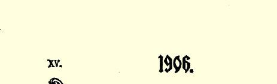

## 土地问题和“马克思的批评家” ６２

> （１９０１年６—９月和１９０７年秋）

去年，《俄国财富》６３通过维·切尔诺夫先生之口宣告：“…… 证明……教条式的马克思主义在土地问题上已被击败而退出了阵地，—— 这就等于去敲敞开的大门了……”（１９００年第８期第２０４ 页）这个“教条式的马克思主义”具有多么奇怪的特性啊！多年以来，欧洲的一些有学问的和学问很大的人都郑重其事地宣告（而报章杂志的撰稿人则反复地加以重述）：马克思主义已经被“批判得” 退出了阵地，可是每一个新的批评家对这个似乎已经被摧毁的阵地总是要重新轰击一番。例如，维·切尔诺夫先生在《俄国财富》杂志上以及《在光荣的岗位上》这本文集中同读者“谈论”赫茨著作的时候，就用了**整整２４０页**的篇幅“去敲敞开的大门”。赫茨的这部本身又是在谈论考茨基著作的书被转述得非常详尽。这本书已经译成了俄文。布尔加柯夫先生为了履行自己的诺言，要驳倒同一个考茨基，于是出版了整整两大卷的研究著作。现在看来，“教条式的马克思主义”已经被这些堆积如山的批判性出版物压得粉身碎骨，大概谁也找不到它的残骸了。

> １９０６年载有列宁《土地问题和“马克思的批评家”》一书
>
> 第５—９章的《教育》杂志第２期的扉页

## 一土地肥力递减“规律”

我们先来看一下批评家们的理论全貌。布尔加柯夫先生在《开端》杂志６４上就发表过文章批判考茨基的《土地问题》一书，而且当即施展出自己的全部“批判”手法。他以一个真正骑手的剽悍无所顾忌地把考茨基“驳得体无完肤”，把考茨基没有讲过的话硬加在他的头上，有些情况和论据考茨基本人已经作了确切的阐明，而他却责备考茨基忽略了这些情况和论据，并且把考茨基的结论冒充 **自己的**批判结论奉献给读者。布尔加柯夫先生充作内行，责备考茨基把技术和经济混为一谈，但是他自己在这里不仅暴露了极端严重的糊涂观念，而且暴露出他根本不愿把他从自己的论敌的著作中引来的那几页材料看完。不用说，这位未来的教授所写的文章满篇都是对社会主义者、对“崩溃论”、对空想主义、对相信奇迹等等所进行的陈腐的攻击。[^1]现在，布尔加柯夫先生在他的博士论文 （《资本主义和农业》１９００年圣彼得堡版）里，彻底清算了马克思主义，使自己的“批判的”发展达到了它的逻辑终点。

布尔加柯夫先生把“土地肥力递减规律”当作自己的“农业发展理论”的基石。他给我们摘录了确定这一“规律”（根据这一规律，每次投入土地的追加劳动和追加资本所提供的产品数量，不是相应增加而是递次减少）的经典作家的著作。他还给我们列举了承认这一规律的英国经济学家的名单。他要我们相信，这个规律 “具有普遍意义”，这是“一个显而易见的颠扑不破的真理”，“只要明确地加以肯定就够了”，如此等等。布尔加柯夫先生说得愈坚决，我们就看得愈清楚，他**是在开倒车**，倒退到用虚构的“永恒规律” 来掩盖社会关系的资产阶级政治经济学那里去了。臭名远扬的“土地肥力递减规律”的“显而易见”究竟在什么地方呢？就在于：如果后投入土地的劳动和资本所提供的产品不是递次减少而是数量相等，那就根本用不着扩大耕地了，在原有的土地面积上（不管多么小）就可以生产更多的粮食，“全世界的农业就可以容纳在一俄亩土地上了”。这就是常见的（**也是唯一的**）为这一“普遍”规律辩护的论据。任何人只要稍加思考，就会明白，这个论据是一个毫无内容的抽象概念，它抛开了技术水平和生产力状况这些最重要的东西。事实上，“追加的（或连续投入的）劳动和资本”这个概念本身，就是**以**生产方式的改变和技术的革新**为前提**的。要大规模地增加投入土地的资本的数量，就必须**发明**新的机器、新的耕作制度、新的牲畜饲养方法和产品运输方法等等。当然，较小规模地 “投入追加劳动和追加资本”，可以在原有的、没有改变的技术水平的基础上实现（而且正在实现）。在这种情况下，“土地肥力递减规律”**在某种程度上**倒是适用的，这就是说，如果技术情况没有改变， 能够投入的追加劳动和追加资本就是非常有限的。可见，我们得出的并不是普遍的规律，而是极其相对的“规律”，相对得说不上是一种“规律”，甚至说不上是农业的一个重要特征。让我们来看看下面的情况：经营的是三圃制，播种传统谷物，靠饲养牲畜积肥，没有改良的牧场和改良的农具。很明显，在这些条件没有改变的情况下，能够投入土地的追加劳动和追加资本是极有限的。但就是在这种仍旧有可能投入追加劳动和追加资本的有限范围内，每次追加投资的生产率**决不是在任何时候都一定**会降低的。拿工业来说吧。 我们用世界贸易还没有开展，蒸汽机还没有发明以前的面粉业和冶铁业来作个例子。在这种技术状况下，能投入手工打铁炉、风力磨坊和水力磨坊的追加劳动和追加资本是极有限的；在生产方式的根本变革还没有为工业的新形式建立基础以前，小型打铁炉和磨坊必然会得到大量推广。

可见，“土地肥力递减规律”完全不适用于技术正在进步和生产方式正在变革的情况，而只是极其相对地、有条件地适用于技术没有改变的情况。所以，马克思也好，马克思主义者也好，都不谈这个“规律”，只有象布伦坦诺之流的资产阶级学者才会高谈这个“规律”，因为他们怎样也摆脱不了旧政治经济学的偏见及其抽象的、 永恒的、自然的规律。

布尔加柯夫先生为“普遍规律”进行辩护，竟提出非常可笑的论据。

“从前是自然界的无偿赐物的东西，现在却要人来生产了。那时，风雨疏松了养分充足的土壤，人们只要花很少的力气，就能得到所需要的一切。随着时间的推移，愈来愈多的生产劳动落到了人的肩上；不论在任何地方，人工过程日益代替自然过程。如果说，在工业中这种现象说明人征服了自然，那么，在农业中，这却表明生存日益困难，因为自然界的赐物减少了。

在这种情况下，食物生产的日益加剧的困难，是表现为人的劳动的增加，还是表现为人的劳动产品的增加如生产工具或肥料等等的增加，反正都一样”（布尔加柯夫先生想说：食物生产的日益加剧的困难，表现为人的劳动的增加，还是表现为人的劳动产品的增加，反正都一样）；“重要的是：人获得食物所花的代价愈来愈大了。 用人的劳动代替自然力量，用生产的人工因素代替生产的自然因素，这就是土地肥力递减规律”。（第１６页）

司徒卢威和杜冈－巴拉诺夫斯基两位先生曾得出高论，认为不是人借助机器进行工作，而是机器借助人进行工作，看来，布尔加柯夫先生对这两位先生的成就是颇为羡慕的。布尔加柯夫先生谈到人的劳动**代替**自然力等等的时候，也象上面两位批评家一样， 堕落到了庸俗经济学的水平。一般说来，人的劳动是无法代替自然力的，就象普特不能代替俄尺一样。无论在工业或农业中，人只能在认识到自然力的作用以后利用这种作用，并借助机器和工具等等以**减少**利用中的困难。说原始人获得的必需品是自然界的无偿赐物，这是拙劣的童话，连刚进大学的学生听了也会给布尔加柯夫先生喝倒彩。过去从来没有过什么黄金时代，原始人完全被生存的困难，同自然斗争的困难所压倒。机器和更完善的生产方式的采用，使人类进行这一斗争，特别是进行食物生产容易得多了。不是生产食物更加困难，而是工人取得食物更加困难了，因为资本主义的发展抬高了地租和地价，使农业集中在大大小小的资本家的手中，使机器、工具和货币更加集中，而没有这些东西就不可能顺利地进行生产。说工人生活日益困难是由于自然界减少了它的赐物， 这就是充当资产阶级的辩护士。

布尔加柯夫先生接着说：“我们承认这个规律，但是决没有肯定食物生产的困难在不断地增加，也决没有否定农业的进步，因为肯定前者和否定后者，就等于违背显而易见的事实。毫无疑问，这种困难不是不断地增长，发展过程是曲折的。农学上的发现和技术的改良，正在把贫瘠的土地变为肥沃的土地，暂时制止了土地肥力递减规律所表明的趋势。”（同上）

这不是太奥妙了吗？

技术进步是“暂时的”趋势，而土地肥力递减规律，即在技术没有改变的基础上追加投资的生产率递次降低（而且并非永远如此） 的规律，却“具有普遍意义”！这就如同说，火车在车站停车是蒸汽机运输的普遍规律，而火车在两站之间行驶却是使静止的普遍规律不发生作用的暂时趋势。

最后，关于农业人口和非农业人口的大量资料，也有力地推翻了土地肥力递减规律的普遍意义。布尔加柯夫先生自己也承认： “如果每个国家都只依靠本国的自然资源，那么，为了获得食物，就必须经常相对地〈请注意这一点！〉增加劳动量，即增加农业人口。” （第１９页）西欧农业人口在逐渐减少，这是由于粮食的进口排除了土地肥力递减规律的作用。解释真是妙极了！我们这位学者只是忘记了一件小事情：农业人口相对减少的现象，在所有的资本主义国家，包括农业国家和进口粮食的国家，都可以看到。美国和俄国的农业人口都在相对地减少，法国的农业人口从１８世纪末起就在减少了（见布尔加柯夫先生上述著作第２卷第１６８页上的数字）， 而且，这种相对的减少有时甚至会变成绝对的减少，而粮食的入超，在３０年代和４０年代还是微不足道的，粮食出超的现象**只是从** **１８７８年起**，才完全绝迹。[^2]在普鲁士，农村人口从１８１６年的７３． ５％，相对地减少到１８４９年的７１．７％和１８７１年的６７．５％，而黑麦的进口从６０年代初才开始，小麦的进口从７０年代初才开始（同上，第２卷第７０页和第８８页）。最后，我们考察一下欧洲进口粮食的国家，如近１０年来的法国和德国，就可以看到，在农业取得**无可怀疑的进步**的同时，农业工人的人数却在**绝对地减少**。在法国，农业工人从１８８２年的６９１３５０４人减少到１８９２年的６６６３１３５人（《农业统计》第２册第２４８—２５１页）；在德国，农业工人从１８８２年的 ８０６４０００人减少到１８９５年的８０４５０００人[^3]。因此可以说，１９世纪的**全部**历史，用极为不同国家的大量资料确凿地证明：技术进步的 “暂时”趋势使土地肥力递减的“普遍”规律**完全不发生作用**，技术的进步可以使相对（有时甚至是绝对）减少的农村人口为日益增多的总人口生产愈来愈多的农产品。

顺便指出，这些大量的统计资料也彻底驳倒了布尔加柯夫先生“理论”中的两个重要的论点：第一个论点是，他认为不变资本 （生产工具和生产材料）比可变资本（劳动力）增长更快的理论“完全不适用于农业”。布尔加柯夫先生煞有介事地宣称这个理论是错误的，为了证实自己的见解，他援引了（１）“亚·斯克沃尔佐夫教授”的话（此人最出名的一点就是硬说马克思的平均利润率理论是恶意的宣传）以及（２）在经营集约化的情况下耕种单位面积土地所需的工人增多的事实。这是时髦的批评家们通常对马克思的有意误解。请想一下，不变资本比可变资本增长更快的理论，竟被单位面积**可变资本**增多的事实驳倒了！布尔加柯夫先生竟**没有发现**， 他自己引用的大量统计资料恰恰证实了马克思的理论。从１８８２年到１８９５年，德国整个农业中的工人人数从８０６４０００人减少到 ８０４５０００人（加上以农业为副业的人，才从１１２０８０００人增加到 １１６２３０００人，即只增加３．７％）；而牲畜头数在同一时期却从２３００ 万头增加到２５４０万头（把全部牲畜折合成大牲畜计算），即增加了 １０％以上；５种主要机器的使用架次从４５８０００架次增加到９２２０００ 架次，即增加一倍多；进口的肥料从６３６０００吨（１８８３年）增加到 １９６１０００吨（１８９２年），钾盐从３０４０００公担增加到２４０００００公担。[^4]同可变资本相比，不变资本占的比重不断有所增长，这还不明显吗？至于这些笼统的资料在很大程度上掩盖了大生产的进步， 我们现在就不谈了。这一点下面再谈。

第二，在农村人口减少或者绝对增加量极小的情况下所取得的农业进步，完全粉碎了布尔加柯夫先生妄想复活马尔萨斯主义的荒谬尝试。在俄国的“前马克思主义者” 中间，司徒卢威先生大概是第一个在他的《评述》中作了这样的尝试，但终究不过是一些羞答答的、吞吞吐吐的、模棱两可的意见，一些没有考虑成熟、 没有形成一套系统的观点。布尔加柯夫先生却更勇敢更彻底，他毫不犹豫地把“土地肥力递减规律”变为“文明史上最重要的规律之一”（原文如此！第１８页）。“１９世纪的全部历史……以及该世纪的贫富问题，离开这一规律是无法理解的。”“我毫不怀疑，社会问题， 按它现在的提法，是同这一规律密切联系的”（我们这位严峻的学者在他的“研究性著作”第１８页上就宣布了这一点）！……他在该书的结尾说：“毫无疑问，在人口过剩的情况下，某一部分贫困应该算作**绝对贫困**，即生产的贫困，而不是分配的贫困。”（第２卷第 ２２１页）“在我看来，农业生产的条件所造成的特殊形式的人口问题，至少在目前已经成为农业经营中比较广泛地实现集体化或协作化原则的主要困难。”（第２卷第２６５页）“过去给将来遗留下来的、比社会问题更可怕、更困难的粮食问题，是生产问题，而不是分配问题”（第２卷第４５５页），如此等等。这一“理论”同土地肥力递减的普遍规律有密切联系，土地肥力递减规律上面已经分析过了， 因此这一“理论”的科学价值，就用不着多谈了。向马尔萨斯主义献媚的批判，按其必然的逻辑发展，一定会成为最庸俗的资产阶级辩护术；我们所引的布尔加柯夫先生的结论，就再坦率不过地证实了这一点。

在下一篇论文中，我们将研究一下我们的批评家们引用的一些新的材料中的资料（他们喋喋不休地说正统派回避详尽的探讨），并说明布尔加柯夫先生把“人口过剩”一词完全变成一个死板的公式，借此回避作任何的分析，特别是对“农民”内部阶级矛盾的分析。现在我们既然只限于谈土地问题的一般理论方面，那地租理论也应该谈一谈。布尔加柯夫先生写道：“至于马克思，他在《资本论》第３卷（现在我们所看到的第３卷）中，并没有给李嘉图的级差地租论增添任何值得注意的东西。”（第８７页）我们要记住“没有任何值得注意的东西”这句话，并且把批评家的这一评语同他过去说的下面一段话比较一下，他曾说过：“尽管马克思对这个规律 〈土地肥力递减规律〉持明显的否定态度，但是就一些根本原则来说，他还是汲取了李嘉图的以这一规律为基础的地租理论。”（第 １３页）按照布尔加柯夫先生的说法，马克思岂不是没有发现李嘉图的地租理论同土地肥力递减规律的联系，因而就前后不一致了么！对于这种说明，我们只能说，前马克思主义者这样歪曲马克思的理论，这样肆……肆……肆无忌惮地把一千零一条死罪加在他们所批判的著作家头上，这是任何人所望尘莫及的。

布尔加柯夫先生的论断是对事实真相的令人愤慨的歪曲。事实上，马克思不仅发现了李嘉图的地租理论同他的错误的土地肥力递减学说之间的联系，并且十分明确地揭示了李嘉图的错误。凡是稍微“注意” 阅读《资本论》第３卷的人，都不能不看到这样一个非常“值得注意”的情况：正是马克思使级差地租论**摆脱了**它同臭名远扬的“土地肥力递减规律”的**一切联系**。马克思指出，对土地的不同投资产生不同的生产率这一事实，是形成级差地租的必要的和足够的条件。因此，由优等地转到劣等地也好，由劣等地转到代等地也好；对土地追加投资的生产率降低也好，提高也好，都是无关紧要的。在现实中，各种情况是错综复杂地结合在一起的。 任何一个总的规则都概括不了这些情况。例如，马克思首先描述了由于投资的土地不同，生产率不同而产生的级差地租第一形态，并且列出图表加以说明（布尔加柯夫先生一提到这些图表，就严厉地斥责“马克思太好给自己那些往往很简单的思想披上复杂的数学外衣”。所谓复杂的数学外衣，其实不过是算术四则而已，而很简单的思想，看来，这位博学的教授却一点也没有懂）。马克思分析了这些图表，并得出结论说：“因此，在威斯特（Ｗｅｓｔ）、马尔萨斯、李嘉图等人那里还占统治地位的有关级差地租的第一个错误假定就被推翻了。按照这个错误的假定，级差地租必然是以转到愈来愈坏的土地或农业肥力愈来愈下降为前提的。我们已经看到，在转到愈来愈好的土地时，能产生级差地租。当较好土地代替以前的较坏土地而处于最低等级时，也能产生级差地租；级差地租可以和农业的进步结合在一起。它的条件不过是土地等级的不同。”（马克思在这里并没有谈到连续对土地投资的生产率不同的问题，因为这样产生的是级差地租**第二**形态，而该章谈的是级差地租**第一**形态。）“在涉及到生产率的发展时，级差地租的前提就是：土地总面积的绝对肥力的提高，不会消除这种等级的不同，而是使它或者扩大，或者不变，或者只是缩小。”（《资本论》第３卷下册第１９９页）[^5]布尔加柯夫先生**没有觉察到**马克思的级差地租理论和李嘉图的地租理论之间的这一根本差别。他宁愿到《资本论》第３卷中去寻找“更能看出马克思远不是对土地肥力递减规律抱否定态度的片段”（第 １３页脚注）。请读者原谅，我们不得不用很大的篇幅来摘录一段不重要的（从我们和布尔加柯夫先生都关心的问题来说）引文。既然现代批评界的英雄们（他们还竟敢指责正统派强词夺理）用断章取义的手法和用残缺不全的译文，来歪曲他们所敌视的学说的十分清楚的思想，那不这样做又有什么办法呢？布尔加柯夫先生把他找到的一段话摘引如下：“从资本主义生产方式的观点来看， （**农业**）产品总会变得相对昂贵，**因为**〈请读者特别注意**我们**加了着重标记的地方〉为了获得某个产品就要支出一定的费用，对以前无须支付报酬的东西现在必须支付报酬。”马克思接着说：作为要素加入生产但不需要代价的自然要素，是一种无偿的自然劳动生产力，如果必须在不利用这种自然力的情况下生产追加产品，那么就必须付出新的资本，这样就使生产更加昂贵。

关于这种“摘引”的手法，我们要指出三点。第一，“因为”这两个字**是布尔加柯夫先生自己加的**，加上这两个字，就使整段话具有确立某种“规律”的绝对意义。**原文**（《资本论》第３卷下册第２７７— ２７８页）**用的不是“因为”**，**而是“如果**”。[^6]**如果**对以前无须支付报酬的东西现在必须支付报酬，那么，产品就总会变得相对昂贵。**这个** 论点同承认土地肥力递减“规律”有什么相似之处呢？第二，“农业”两个字连同括号也是布尔加柯夫先生加的。**原文根本没有这两个字**。布尔加柯夫先生大概用批评家先生们所固有的轻率态度，断定马克思在这里指的只能是农业产品，因而迫不急待地向读者作了颠倒黑白的“解释”。其实，马克思在这里是指一般的产品。在布尔加柯夫先生所摘引的这一段话的前面，马克思说：“一般地说还必须指出以下一点。”无偿的自然力也可以加入工业生产，马克思在地租这一篇里还引用了某工厂用瀑布代替蒸汽动力的例子。如果要在不利用这种无偿的力量的情况下生产额外产品，那么，产品就**总会**变得相对昂贵。第三，必须看一下这段话的上下文。马克思在这一章谈的是从最坏的耕地上取得的级差地租，并且**和往常一样**，分析了两种在他看来是完全相等的和**完全同样可能**的情况：第一种情况是连续投资的生产率提高（第２７４—２７６页）[^7]；第二种情况是连续投资的生产率降低（第２７６—２７８页）[^8]。关于后一种可能发生的情况，马克思说：“关于在连续投资时土地生产率降低的情形，可参看李比希的著作……**但是一般地说**还必须指出以下一点。”（黑体是我们用的）接下去就是布尔加柯夫先生所“翻译的”那一段话：如果对以前无须支付报酬的东西现在要支付报酬，那么， 产品就**总会**变得相对昂贵。

把马克思关于可能情况之中的一种情况的意见说成是马克思认为这种情况是一种普遍“规律”，这种批评家究竟有没有科学的求实态度，我们让读者自己去判断吧。

请看布尔加柯夫先生对他找到的这段话所发表的结论性的意见：

“这段话当然是含糊不清的……”那当然了！经布尔加柯夫先生一改词换字，这段话竟一点意思也没有了，“……但是决不能有别的理解，只能理解为这是间接地甚至直接地承认〈请听！〉土地肥力递减规律。我不知道，马克思是否还在别的什么地方对这一规律直接表示过意见”（第１卷第１４页）。前马克思主义者布尔加柯夫先生，竟“不知道”马克思曾经直接指出，威斯特、马尔萨斯、 李嘉图认为级差地租以转到愈来愈坏的土地为前提，或者以土地肥力愈来愈下降为前提这种假定是完全错误的。[^9]布尔加柯夫先生“不知道”，马克思在对地租进行充分的分析的整个过程中，曾**多次**指出：他认为追加投资的生产率的降低和提高，是两种同样可能的情况！

## 二地租理论

布尔加柯夫先生根本没有弄懂马克思的地租理论。他以为他提出如下两点反驳意见就可以粉碎这个理论：（１）按马克思的观点，农业资本也参与利润率的平均化，因此超过平均利润率的超额利润就构成地租。在布尔加柯夫先生看来，这是不对的，因为土地占有权的垄断，排除了利润率平均化过程所必需的竞争自由。农业资本并不参与利润率平均化的过程。（２）绝对地租只是级差地租的一种特殊情况，把它和后者区别开来是不正确的。这种区别的根据就是对同一事实（一种生产因素被垄断的事实）任意作出的两种解释。布尔加柯夫先生深信自己的论据有极大的威力，竟情不自禁地用一大堆激烈的字眼来反对马克思，说什么：缺乏论据的论据，非马克思主义，逻辑的拜物教，马克思丧失了丰富的想象力，等等。其实，他这两个论据都来自一个相当严重的错误做法。布尔加柯夫先生在前面把问题片面地简单化，把可能发生的两种情况中的一种 （即追加投资的生产率降低的情况）引伸成为土地肥力递减的普遍规律。在现在这个问题上，又是这种片面的简单化的毛病，使他不加批判地使用“垄断”这个概念，把这个概念也引伸成为某种普遍的东西，从而混淆了在资本主义农业组织的条件下所产生的两种结果：一种是由于**土地的有限**而产生的，一种是由于**土地私有制**而产生的。要知道，这是两个截然不同的东西。下面我们就要说明这一点。

布尔加柯夫先生写道：“土地生产力的有限和人对于土地生产力的无限增长的需要，这一情况使土地的垄断有了可能，同时也是产生地租的一个**条件**（虽然不是产生地租的根源）。”（第１卷第９０ 页）不应当说“土地生产力的有限”，而应当说“**土地的有限**”。（我们已经指出，土地生产力的有限，应该归结为现有技术水平和现有生产力状况的“有限”。）在资本主义社会制度下，土地的有限的确是以土地的垄断为前提的，**但是这说的是作为经营对象的土地**，**而不是作为所有权对象的土地**。在设想资本主义农业组织的时候，必须设想到全部土地被各个私人农场所占用，**但是绝对不能设想**全部土地都是这些业主或其他人的私有财产，或者都归私人占有。对土地所有权的垄断和对土地经营的垄断，不仅在逻辑上而且在历史上，都是两种完全不同的现象。在逻辑上，我们完全可以设想完全没有土地私有制，土地归国家或村社等等所有这样一种纯粹的资本主义农业组织。在现实中，我们也看到，在所有发达的资本主义国家里，全部土地都被各个私人农场占用着，但是，这些农场不仅经营自己私有的土地，同时还经营从私有者那里租来的土地以及国家的土地和村社的土地６７（例如在俄国就是如此，大家知道，在俄国的农民村社土地上的各种私人农场，主要的是资本主义的农民农场）。难怪马克思在分析地租问题时一开始就指出，资本主义的生产方式遇到了（并且控制了）各种不同的土地所有制形式，从克兰所有制６８和封建所有制起一直到农民村社所有制。

可见，土地的有限必然只是以土地经营的垄断为前提的（在资本主义统治的条件下）。试问，**这种**垄断会对地租问题产生哪些必然的后果呢？土地的有限使粮食价格不取决于中等地的生产条件，而取决于劣等耕地的生产条件。粮食的这种价格使农场主（＝农业中的资本主义企业主）能够补偿生产费用并且取得所投资本的平均利润。优等地的农场主得到超额利润，这种超额利润便形成**级差地租**。有没有土地私有制的问题同级差地租的形成问题毫无关系，因为在资本主义农业中，即使在村社的、国家的、无主的土地上，级差地租也是不可避免的。在资本主义制度下，土地有限的唯一后果就是：不同投资的不同生产率形成级差地租。布尔加柯夫先生却认为第二个后果是排除了农业中的竞争自由，他说没有竞争自由就会妨碍农业资本参与平均利润形成的过程。这显然是把土地经营问题和土地所有权问题混淆起来了。在逻辑上，从土地有限（与土地的私有制无关）这一事实只能得出全部土地将被资本主义农场主所占用的结论，而决不能得出农场主之间的竞争自由必然受到某种限制的结论。土地有限是一种普遍的现象，它必然给任何的资本主义农业打上自己的烙印。历史也确凿地证明， 把这两种不同的东西混为一谈，在逻辑上是站不住脚的。我们更不用说英国了。在那里，土地占有同农业经营的分离是十分明显的，农场主之间的竞争几乎是完全自由的，工商业资本过去和现在都在大量地流入农业。而在所有其他的资本主义国家内也同样在发生（这同布尔加柯夫先生的见解恰恰相反。布尔加柯夫先生步司徒卢威先生的后尘，枉费心机地把“英国的”地租说成是一种非常独特的东西）土地占有同农业经营分离**这一过程**，只是形式各不相同罢了（租佃、抵押６９）。布尔加柯夫先生看不到（马克思大力强调的）这一过程，也可以说是，居然看不见大象。在欧洲各国，我们看到，在农奴制崩溃之后，等级土地占有制被破坏了，地产得到转移， 工商业资本不断流入农业，租佃和抵押债务日益增多。而在俄国， 尽管农奴制的残余还非常多，但是我们看到，在改革之后，农民、平民和商人都在加紧购置土地，私有主土地、国家土地和**村社**土地的租佃日益发展，等等。这一切现象说明了什么呢？说明**尽管**存在着 **土地所有权**的垄断，尽管这种所有权的形式层出不穷，但是在**农业** 中还是形成了自由竞争。现在，在一切资本主义国家里，任何一个拥有资本的人都可以对农业投资（用买地或租地的办法），而且象对任何一个工商业部门投资一样容易，或者说差不多一样容易。

布尔加柯夫先生在反驳马克思的级差地租理论时指出：“所有这些差别〈农产品生产条件的差别〉都是相互矛盾的，并**可能**〈黑体是我们用的〉相互抵销，如洛贝尔图斯曾经指出的，距离可以用肥沃程度来抵销，而不同的肥沃程度又可以用在比较肥沃的土地上加紧生产的办法来加以拉平。”（第１卷第８１页）马克思指出过这一事实，但是并未对它作出这种片面的评价，我们这位严峻的学者不该忘记这一点。马克思写道：“很明显，级差地租的这两个不同的原因，肥力和位置〈地段的位置〉，可以发生相反的作用。一块土地可能位置很好，但肥力很差；或者完全相反。这种情况很重要，因为它可以为我们说明一国土地的开垦，为什么会由较好土地转到较坏土地，或者相反。最后，很明显，整个社会生产的进步，一方面，由于它创造了地方市场，并且通过采用交通运输工具而使位置变得便利，所以对形成级差地租的位置〈地段的位置〉，会发生拉平的作用；另一方面，由于农业和工业的分离，由于大的生产中心的形成， 而农村反而相对孤立化（ｒｅｌａｔｉｖｅ Ｖｅｒｅｉｎｓａｍｕｎｇ ｄｅｓ Ｌａｎｄｅｓ），所以又会使土地的地区位置的差别扩大。”（《资本论》第 ３卷下册第１９０页）[^10]可见，当布尔加柯夫先生以胜利者的姿态重复早已为人所知的关于差异**可能**互相抵销的说法时，马克思却**进一步**提出了变这种可能性为现实性的问题，指出除拉平的作用以外，还有分化的作用。大家都知道，这些相互矛盾的作用的最终结局，就是在所有的国家，各个地方地段的肥沃程度和位置都**存在着** 巨大的差别。布尔加柯夫先生的反驳，只能证明他提出意见根本没有经过深思熟虑。

布尔加柯夫先生继续反驳说：生产率最低的最后一次投入的劳动和资本这一概念，“李嘉图和马克思都同样不加批判地加以应用。不难看出，这个概念有着多么大的随意成分。假定投入土地的资本为１０ａ，而且每次追加的ａ的生产率都依次递减，土地的总产量为Ａ。显然，每次投入的ａ的平均生产率将等于Ａ１０，如果把全部资本看作一个整体，那么，价格就将由资本的这一平均生产率来决定”（第１卷第８２页）。对此我们只能说，显然，布尔加柯夫先生只顾高谈“土地生产力有限”，而忽略了土地有限这件**小事**。土地的有限（这同任何土地**所有制**完全无关）造成一定的垄断， 就是说，既然全部土地都被农场主占用，既然市场需求的是全部土地所生产的全部粮食，其中包括最贫瘠、距离市场最远的土地所生产的粮食，那么很明显，粮食价格就取决于劣等地的生产价格（或者说，取决于生产率最低的最后一次投入的资本的生产价格）。布尔加柯夫先生的“平均生产率”不过是一个空洞的算术习题罢了， 因为土地的有限妨碍了这种平均生产率的实际形成。要形成这种 “平均生产率”，并由它来决定价格，那就必须使每个资本家不仅能够一般地投资于农业（既然正如我们所说的，农业中存在着竞争自由），而且还要使每个资本家在任何时候都能够（突破现有的农业企业的数目）建立**新的**农业企业。如果情况是这样，工农业之间就不会有任何差别了，任何地租也不可能产生了。但是，正是由于土地的有限，情况并非如此。

再往下看。我们在上面的议论中完全抛开了土地所有制问题。 我们看到，无论从逻辑上考虑，还是从证明资本主义农业在任何土地占有形式下都可能产生和发展的历史资料考虑，这种论述方法是完全必要的。现在来谈谈这个新的条件。假定全部土地都是私人占有，这对地租会发生什么样的影响呢？土地占有者将依靠他的土地所有权，向农场主索取级差地租。既然级差地租是超过资本正常的平均利润的额外利润，既然在农业中存在着（或者说， 资本主义的发展正在创造着）竞争自由，即对农业投资的自由，那么，土地占有者随时都可以找到愿意只拿平均利润而把超额利润让给他这个土地占有者的农场主。土地私有制并不创造级差地租， 它只是使级差地租从农场主手中转到土地占有者手中。土地私有制的影响是否仅限于此呢？能不能设想，土地占有者肯把只能提供资本平均利润的、土质贫瘠、位置最坏的土地，**白白**交给农场主耕种呢？当然不能。土地占有权是一种垄断，土地占有者依靠这种垄断向农场主索取这块土地的租金。这种租金就是**绝对地租**， 它和不同投资的不同生产率毫无关系，它**是由土地私有制产生的**。 布尔加柯夫先生责备马克思对同一种垄断随意作出两种解释，却没有用心想一想，我们所谈的实际上是两种垄断。一种是土地经营（资本主义的）的垄断。这种垄断是由于土地的有限而产生的， 因此是任何资本主义社会的必然现象。**这种**垄断的结果使粮食价格取决于劣等地的生产条件，而对优等地的投资，或者说，生产率较高的投资所带来的额外剩余利润，则构成级差地租。级差地租的形成和土地私有制毫无关系，土地私有制只是使土地占有者有可能从农场主手中取得这种地租。另一种是土地私有权的垄断。无论从逻辑上或历史上来看，这种垄断同前一种垄断并没有密切的联系。[^11]对于资本主义社会，对于资本主义农业组织来说， 这种垄断并不是**必要的**。一方面，我们完全可以设想一种没有土地私有制的资本主义农业，而且许多彻底的资产阶级经济学家都要求过土地国有化。另一方面，在现实中我们也看到没有土地私有制的资本主义农业组织，例如在国有土地和村社土地上的资本主义农业组织。因此，把这两种垄断区别开来是绝对必要的，因而除了级差地租外，承认土地私有制所**产生**的绝对地租的存在[^12]也是必要的。

马克思认为农业资本的剩余价值所以能产生绝对地租，是因为农业中的可变资本在总的资本构成中所占的比重比一般的要高 （在农业技术比工业技术肯定落后的情况下，这种推测是十分自然的）。既然如此，农产品的价值一般地总是高于它的生产价格，剩余价值总是高于利润。但是，土地私有权的垄断妨碍这一余额全部参与利润平均化的过程，于是从这种余额中产生了绝对地租。[^13]

布尔加柯夫先生对这种解释很不满意，他高声地说：“这种剩余价值既然象呢绒、棉花或其他某种商品一样，可以充分地或不充分地满足可能的需求，那么它到底是一种什么东西呢。首先，这不是一种物质的东西，而是用来表现一定的社会生产关系的一种概念。”（第１卷第１０５页）这种把“物质的东西”同“概念”对立起来的做法，是目前人们最喜欢用来冒充“批判”的经院哲学的一个明显的例证。关于一部分社会产品的“概念”，如果没有一定的“物质的东西”与之相适应，那它能有什么意义呢？剩余价值是由一定数量的呢绒、棉花、粮食等商品所构成的剩余产品的货币当量。（所谓 “一定数量”，当然并不是说，科学可以具体地算出这一数额，而是说，大体上确定这一数额的条件是已知的。）在农业中，剩余产品比工业部门中要多些（按同资本的比例来说），而这种余额（由于土地所有权的垄断，它并不参与利润的平均化）当然可以“充分地或不充分地满足”土地垄断占有者的“需求”。

布尔加柯夫先生谦虚地说，他的地租理论是“靠自己的努力”、 “走自己的道路”创立的（第１卷第１１１页）；关于这一理论，我们不必向读者作详细的叙述了。只要略作几点说明，就足以评定这位教授的“生产率最低的最后一次投入的劳动”的这种产品。他的“新” 地租理论，是按照“既然是蘑菇，就得叫人采”这句老话炮制出来的。既然是竞争自由，就决不应当对它有任何限制（尽管这种绝对的竞争自由是任何时候、任何地方都未曾有过的）。既然是垄断，就没有什么可说的了。就是说，地租根本不是来自剩余价值，甚至不是来自农产品，而是来自非农业劳动的产品，地租不过是一种贡赋、捐税，是对整个社会生产的克扣，是给土地占有者的期票。“这样一来，农业资本连同它的利润以及农业劳动，总之作为投入劳动和资本的领域的农业，成了资本主义王国的国中之国……关于资本、剩余价值、工资和一般价值的一切〈原文如此！〉定义，一应用到农业上，就都成为虚数了。”（第１卷第９９页）

原来如此。现在一切都清楚了：农业中的资本家和雇佣工人原来都是虚数。布尔加柯夫先生虽然有时候这样胡说八道，可有时候也说得有点儿道理。翻过１４页以后有这样几句话：“社会为农产品的生产耗费了一定数量的劳动，这就是农产品的价值。”好极了。就是说，价值的“定义”至少不完全是一种虚数。他接着说： “既然生产是按资本主义方式组织起来的，而控制生产的是资本， 那么粮食价格将根据生产价格来决定，就是说将要参照社会平均生产率来计算这种劳动和资本支出的生产率。”妙极了。就是说，资本、剩余价值和工资的“定义”也不完全是一种虚数。就是说，竞争自由（虽然不是绝对的）是存在的，因为资本要是不能在农业和工业之间来回流转，就不可能“参照社会平均生产率来计算生产率”。 他接着又说：“由于土地的垄断，价格上涨到价值以上，一直上涨到市场条件容许的限度。”太妙了。但是布尔加柯夫先生在什么地方看见过贡赋、捐税、期票等等是取决于市场条件的呢？既然由于垄断的关系，价格上涨到市场条件容许的限度，那么，“新的”地租理论和“旧的”地租理论的全部差别就在于：走“自己的道路”的作者， 既不了解土地有限的影响同土地私有制影响之间的差别，也不了解“垄断”和“生产率最低的最后一次投入的劳动和资本”这两个概念之间的联系。下面再翻过７页以后（第１卷第１２０页），布尔加柯夫先生竟完全忘记了“自己的”理论，大谈其“土地占有者、资本主义农场主和农业工人三者分配这种产品〈农产品〉的方式”，这有什么可奇怪的呢？这是出色的批判的出色的结局！这是从此丰富了政治经济学的新颖的**布尔加柯夫地租理论**的卓越成果！

## 三农业中的机器

现在我们再来谈谈赫茨的这部如布尔加柯夫先生所说的“出色的”著作（《土地问题及其同社会主义的关系》１８９９年维也纳版。 Ａ．伊林斯基的俄译本，１９００年圣彼得堡版）。但是，有时我们还得把这两位作家相同的论据一并加以分析。

农业机器问题以及与此密切相关的农业中的大生产和小生产的问题，经常成为“批评家”“驳斥”马克思主义的论据。后面我们将详细分析他们所引用的一些具体资料，现在只考察一下与此有关的一般论点。批评家们用了很多篇幅十分详细地说明，在农业中使用机器所遇到的困难比在工业中要大，因而机器使用得比较少，意义也比较小。这一切是无可争辩的，就是那个考茨基 （布尔加柯夫、赫茨和切尔诺夫等先生们一听见他的名字几乎就失去了控制自己的能力）也十分肯定地指出了这一点。但是这个无可争辩的事实丝毫也驳斥不了下面这个情况，即机器在农业中的应用也推广得很快，对农业起着强有力的改造作用。批评家们只得用些深奥的议论来“回避” 这个必然的结论，说什么…… “农业的特征就在于自然在生产过程中主宰一切，人的意志是不自由的。”（布尔加柯夫的书第１卷第４３页）……“它〈工业中的机器〉代替人的不可靠、不精确的工作，而以数学的准确性完成十分精密和十分庞大的工作。对于农产品的生产，机器却起不了任何类似的作用〈？〉，因为直到今天为止，这种劳动工具还不是掌握在人的手里， 而是掌握在自然－母亲的手里。这并不是比喻”（同上）。的确，这不是比喻，而不过是一句空话，因为谁都知道，蒸汽犁、条播机、脱粒机等等都在**使**工作**更加**“可靠和精确”，因此，说什么“起不了任何类似的作用”，简直是胡说八道！这就等于说农业机器“丝毫〈原文如此！〉不能使**生产**革命化”（布尔加柯夫的书第１卷第４３—４４ 页，他同时还援引了农业机器制造专家的意见，但是这些专家谈的只是农业机器同工业机器的相对的差别），或者等于说“机器在这里不仅不能把劳动者变成自己的附属品〈？〉，而且这个劳动者依然起着过程的操纵者的作用”（第４４页）。这是不是指的例如脱粒机上的递捆手呢？

布尔加柯夫先生为了反对农业机器制造专家和农业经济学专家（菲林格、佩雷尔斯）的结论，援引施图姆普费和库茨勒布的著作 （论述小经济同大经济竞争的能力的著作），竭力贬低蒸汽犁的优越性，并且搬出种种的论据，例如，使用蒸汽耕作需要有特种的土壤[^14]和“特大的田庄”（在布尔加柯夫先生看来，这条论据居然不是反对小经济的，而是反对蒸汽犁的！），在深耕**１２英寸**的情况下，使用畜力比使用蒸汽**更为便宜**，等等。这种论据多得可以写成几本书，但是丝毫不能驳倒蒸汽犁能够深耕（深于１２英寸）的事实以及蒸汽犁的应用得到迅速推广的事实：英国在１８６７年，使用蒸汽犁的只有１３５个田庄，到１８７１年，使用的蒸汽犁已达２０００架以上 （考茨基）；德国使用蒸汽犁的农户，在１８８２年只有８３６个，到 １８９５年已增加到１６９６个。

在农业机器问题上，布尔加柯夫先生不止一次地引用被他推崇为“农业机器专著的作者”的弗兰茨·本辛格的见解（第１卷第 ４４页）。如果我们在这里不说明一下布尔加柯夫先生是**怎样**引用的，他又是**怎样**被他自己提出的证人打了嘴巴，那就太不公平了。

布尔加柯夫先生硬说马克思关于不变资本比可变资本增长更快的“结构”不适用于农业，他援引了劳动力消耗随着农业生产率的增长必然愈来愈大的事实，同时还引用了本辛格的计算。“不同的经营制度对人力的总需要量如下：实行三圃制经营”，每种６０公顷土地“需要７１２个工作日；实行诺福克式的轮作经营需要１６１５ 个工作日；实行大规模种植甜菜的轮作经营需要３１７９个工作日”。 （**弗兰茨·本辛格**《农业机器对国民经济和私有经济的影响》１８９７ 年布雷斯劳版第４２页。布尔加柯夫的书第１卷第３２页。）只是不幸的是，本辛格恰恰是想用这一计算来证明机器的作用在不断扩大。本辛格用这些数字来推算德国整个农业，认为如果用三圃制来耕作土地，现有的农业工人刚刚够用，因此，假如不采用机器，就根本**不可能**实行轮作制。大家都知道，在普遍采用旧三圃制的时候， 几乎完全不使用机器，因此，本辛格的计算所证明的东西同布尔加柯夫先生想证明的恰巧**相反**。这就是说，这一计算证明，农业生产率的提高必然是在不变资本比可变资本增长更快的条件下实现的。

还有一个地方，布尔加柯夫先生断言“机器在加工工业中的作用同在农业中的作用有着根本性的〈原文如此！〉差别”，并且援引了本辛格下面这段话：“农业机器不能象工业机器那样无止境地提高生产……”（第１卷第４４页）布尔加柯夫先生又是运气不好。本辛格在题为《农业机器对总收入的影响》的第６章一开头，就指出了农业机器和工业机器的这一绝非“根本性的”差别。本辛格详细地分析了农业专门著述中和他特意作的调查中有关每种机器的资料，得出了一般性的结论：使用蒸汽犁会使总收入增加１０％； 使用条播机增加１０％；使用脱粒机增加１５％，而且使用条播机可以节省２０％的种子；只有使用马铃薯收割机会使总收入下降５％。 布尔加柯夫先生断言：“不管怎么说，农业机器中的蒸汽犁是唯一可能有某些技术根据的机器。”（第１卷第４７—４８页）**不管怎么说**， 这个论断是被粗心大意的布尔加柯夫先生在这里所援引的本辛格的话驳倒了。

为了使人对于农业机器的意义有一个更确切、更完整的认识， 本辛格十分详细地计算了使用机器的经营效果，从不使用机器，使用一架机器、两架机器等等一直计算到使用一切主要机器，其中包括蒸汽犁和农业用的田间铁路（Ｆｅｌｄｂａｈｎｅｎ）。计算表明，在不使用机器的情况下，总收入＝６９０４０马克，支出＝６８６１５马克，纯收入＝ ４２５马克，即每公顷纯收入为１．３７马克；而在使用一切主要机器的情况下，总收入＝８１０７８马克，支出＝６２５５１．５马克，纯收入＝ １８５２６．５马克，即每公顷纯收入为５９．７６马克，**比前一种情况多４０** **倍以上**。这仅仅是使用机器的影响，经营制度还是假定不变！正如本辛格的计算所表明的，随着机器的采用，不变资本大量增加，而可变资本（即耗费在劳动力上的资本以及工人人数）却不断**减少**， 这是不言而喻的了。总之，本辛格的著作完全驳倒了布尔加柯夫先生，它不仅证明了农业中大经济的优越性，而且证明了关于减少可变资本而使不变资本增长的规律也同样适用于农业。

只有一点布尔加柯夫先生和本辛格是接近的，这就是：本辛格采取了纯粹资产阶级的观点，根本不了解资本主义所固有的矛盾，泰然自若地闭上眼睛，不看机器排挤工人的事实等等。德国教授们的这位温和谨慎的高足，也象布尔加柯夫先生一样，一谈起马克思就深恶痛绝。不过本辛格更加彻底，他把马克思叫作一切“机器的反对者”，说马克思既反对农业机器，又反对工业机器，说马克思谈到机器对工人的有害影响时，把一切灾祸统统归罪于机器，这是“歪曲事实”（上引本辛格的书第４、５、１１页）。布尔加柯夫先生对本辛格的态度又一次告诉我们，“批评家”先生们从资产阶级学者那里接受的是什么，假装看不见的又是什么。

赫茨的“批判”究竟是什么货色，从下面这个例子可以看得十分清楚：他在第１４９页上（俄译本）责备考茨基采用“杂文的笔法”， 在１５０页上又提出以下理由来“驳斥”关于大生产在使用机器方面的优越性的论断。第一个理由是：小农户用协作的办法也**能够**购买机器。请看，这样就可以驳倒机器在大农户中更加普遍的**事实**！至于谁更**能够**得到协作好处的问题，我们将在第二篇论文中同赫茨专门谈一谈。第二个理由是，大卫在《社会主义月刊》７０（第５期第２ 页）中指出：在小农户中，使用机器“十分普遍而且还在急剧地增加 ……条播机甚至在很小的农户中也常常〈原文如此！〉可以看到。割草机和其他机器也是如此”（第６３页；俄译本第１５１页）。读者只要翻一下大卫的文章[^15]，就会看到，他引用的是使用机器的农户的**绝对数字**，而不是这种农户在同类农户中所占的百分比（而考茨基当然是这样做的）。

让我们把１８９５年全德国的有关数字[^16]比较一下：

> 农户类别农户总数
>
> 使 用 机 器 的 农 户 数 目
>
> 播种机百分比条播机百分比割草机和
>
> 收割机百分比 ２公顷以下……３２３６３６７２１４０．０１１４７３５０．４６２４５０．０１ ２— ５公顷…１０１６３１８５５１０．０５１３０８８１．２９６０００．０６ ５— ２０公顷…９９８８０４３２５２０．３３４８７５１４．８８６７４６０．６８ ２０—１００公顷…２８１７６７１２０９１４．２９４９８５２１７．６９１９５３５６．９３ １００公顷以上……２５０６１１２５６５５０．１４１４３６６５７．３２７９５８３１．７５
>
> **总 计**５５５８３１７２８６７３０．５２１４０７９２２．５４３５０８４０．６３

大卫和赫茨说，播种机和割草机“甚至在很小的农户中”也“常常”可以看到，这话不是得到证实了吗？既然赫茨得出“结论”说： “从统计资料来看，考茨基的论断是完全经不起批驳的”，那究竟是谁真正在玩弄杂文的笔法呢？

有一桩滑稽事应该提一提，就是这些“批评家们”虽然否认大农户在使用机器方面的优越性，否认由此而造成的小农户劳动过度和消费不足的事实，但是他们在不得不涉及实际情况的时候（并且在他们忘记了自己的“首要任务”是驳斥“正统”马克思主义的时候），却无情地打了自己的嘴巴。例如，布尔加柯夫先生在自己著作的第２卷（第１１５页）里说：“大农户投资的集约程度总是比小农户高，因此，自然就宁愿使用机器生产因素，而不愿使用活的劳动力。”身为“批评家”的布尔加柯夫先生，追随司徒卢威和杜冈－巴拉诺夫斯基先生，也赞同庸俗的经济学的观点，把机械“生产**因素**” 同活的“生产**因素**”对立起来，—— 这的确是十分“自然的”。但是， 他这样轻率地否定大农户的优越性，这是自然的吗？

农业生产的积聚被布尔加柯夫先生说成不外是一种“神秘的积聚规律” 等等。但是，他也不得不研究英国的资料，原来农户积聚的趋势从５０年代到７０年代末就已存在了。布尔加柯夫先生写道：“小的消费农户合并成了较大的农户。土地的**这种**集中，决不是大生产和小生产竞争的结果〈？〉，而是由于地主们有意识地 〈！？〉用合并若干小农户的办法来抬高地租，因为小农户只能交付很少的地租，而大农户则能交付高额地租。”（第１卷第２３９页）读者，你们知道吗？**不是**大生产同小生产竞争，**而是**后者收入少而被前者排挤掉了。“既然经济建立在资本主义的基础上，因此在一定的范围内，大资本主义农户无疑要比小资本主义农户优越，这是无可争辩的。”（第１卷第２３９—２４０页）既然这是无可争辩的，那为什么考茨基在他论述大生产和小生产的那一章（在《土地问题》中）的 **开头**说了一句“农业愈带有资本主义性质，农业大生产同小生产在技术上的质的差别也就愈大”的话，布尔加柯夫先生就对他大发雷霆（过去是在《开端》上）呢？

但是，不仅在英国农业的繁荣时期，而且在危机时期也能得出不利于小农户的结论。近年来一些委员会的报告“都十分肯定地断言：被危机压得最厉害的就是小业主”（第１卷第３１１页）。有一份关于小私有者的报告说：“他们的住房比工人的普通住房还要坏…… 他们所有人的劳动都非常繁重，工作时间比工人长得多， 而且他们当中许多人都说：他们的物质状况比工人差，生活不那么好，很少能吃上新鲜的肉…… 债台高筑的自耕农首先遭到毁灭。”（第１卷第３１６页）“……他们处处都要节省，而象这样过日子的工人是为数不多的…… 小农依靠家庭成员的无酬劳动，勉强还能应付…… 小农的生活比工人要艰苦得多，这是用不着多说的。”（第１卷第３２０—３２１页）我们摘引了这几段话，读者可以判断一下，布尔加柯夫先生的下面这个结论是否正确，他说：“保全到农业危机时期的农户遭到严重的破产，只是说明〈！！〉小生产者在这种情况下比大生产者破产得更快，仅此而已〈原文如此！！〉。 从这里要得出什么关于小生产者的一般经济生命力的一般结论， 是根本不可能的，因为在危机时期，英国的整个农业都是摇摇欲坠的。”（第１卷第３３３页）这不是说得很好吗？布尔加柯夫先生在论述农民经济一般发展条件的那一章里，甚至用这种绝妙的论述方法作出概括：“价格的突然跌落，严重地影响到各种形式的生产，但是农民生产拥有的资本最菲薄，自然就比大生产更加不稳定（这毫不影响农民生产的一般生命力问题）。”（第２卷第２４７页）总之，在资本主义社会中，资本菲薄的农户虽然更加不稳定，但是这并不影响它们的“一般”生命力！

从论述的前后一贯性来说，赫茨的情况也不见得强一些。他 “驳斥”（也是用上述手法）考茨基的言论，可是谈到美国的时候，他却承认美国大农户的优越性，承认大农户能够“以更大的规模使用机器，而我国的小农户却做不到这一点”（第３６页；俄译本第９３ 页）；他承认，“欧洲农民在经营方面，往往沿用因循守旧的生产方式，象工人那样只是为了一小块面包而疲于奔命（ｒｏｂｏｔｅｎｄ），没有向上的志向”（同上）。赫茨总的说来也承认“小生产比大生产使用的劳动要多得多”（第７４页；俄译本第１７７页），他甚至可以向布尔加柯夫先生提供由于使用蒸汽犁而提高收成等等的资料（第６７— ６８页；俄译本第１６２—１６３页）。

我们的批评家们在理论上对农业机器的意义的看法是很不固定的，因此自然会一筹莫展地一再搬用对机器抱反感的大地主的十分反动的结论。赫茨在这个棘手的问题上的确还是很不果断的； 他谈到农业使用机器的“困难”时说：“有一种意见认为，冬季有许多空闲时间，因此使用手工脱粒更为有利。”（第６５页；俄译本第 １５６—１５７页）看来，赫茨想用他固有的逻辑从这里得出结论说：这个事实并不说明小生产不好，也不说明资本主义妨碍使用机器，而是说明机器本身不好！难怪布尔加柯夫先生要责备赫茨，说他“过于受自己党的意见的束缚”（第２卷第２８７页）。这位俄国教授当然不受这种侮辱性“束缚”的限制，他骄傲地说：“我完全摆脱了那种十分普遍的，特别是在马克思主义文献中十分普遍的偏见，那种偏见认为，任何机器都是一种进步。”（第１卷第４８页）可惜，具体的结论完全不符合这段绝妙的议论所反映出的丰富想象力。布尔加柯夫先生写道：“蒸汽脱粒机使许许多多工人在冬季没有工作可做，因此无疑是对工人的一大祸害，这种祸害是技术上的效果所弥补不了的。[^17]哥尔茨也指出了这一点，他甚至提出了一个空想的希望”（第２卷第１０３页），即希望**限制**脱粒机特别是蒸汽脱粒机的应用，“以便改善农业工人的境况，减少移居国外和迁徙的现象”，—— 哥尔茨还补充了这么一句。（我们也来补充一句：哥尔茨说的迁徙，大概是指迁入城市吧。）

我们提醒读者一下，考茨基在《土地问题》一书中，指出的正是哥尔茨的这种思想。因此，在对待具体的经济问题（机器的意义）和政治问题（要不要限制机器？）方面，看一看充满马克思主义偏见的狭隘正统派抱什么态度，再看一看充分领会了“批判主义”全部精神实质的现代批评家抱什么态度，这是很有意义的。

考茨基说（《土地问题》第４１页）：哥尔茨硬说脱粒机具有特别“有害的影响”，因为它剥夺了农业工人冬季的主要工作，把他们赶进城市，使农村更加荒凉。因此哥尔茨建议限制脱粒机的使用。考茨基补充说，这种建议“看来似乎是为了农业工人的利益，实际上却是为了地主的利益，因为对于地主说来”，正如哥尔茨自己所说的，“即使不能马上补偿，将来也能通过在夏季增加劳动力的办法绰绰有余地补偿这种限制所造成的损失”。考茨基继续说道： “幸亏，这种对工人的保守的友情，不过是一种反动的空想。使用脱粒机‘现在’就十分有利，地主决不会为了‘将来’的利润而不去使用它。因此，脱粒机将继续发挥它的革命作用：继续把农业工人赶进城市，从而一方面成为提高农村工资的有力手段，另一方面成为促进农业机器制造业继续发展的有力手段。”

布尔加柯夫先生对这位社会民主党人和大地主的这种问题的提法所持的态度，是非常典型的，这是现代整个“批评界” 在无产阶级政党和资产阶级政党之间所采取的立场的一个缩影。当然， 这位批评家不是那种狭隘死板的人，他是不会采取阶级斗争的观点和资本主义使一切社会关系革命化的观点的。但是，另一方面， 我们的批评家虽然“变得聪明了一些”，可是一想起过去“年轻无知” 的时候曾经赞同过马克思主义的偏见，就不敢全盘接受他的新伙伴大地主的纲领，不敢象这位大地主那样鉴于机器“对**整个** 农业” 有害而提出十分合情合理的要求：禁止使用！我们这位善良的批评家成了站在两捆干草之间的布利丹毛驴７１。一方面，他已经完全丧失了阶级斗争的观点，现在竟说机器“对**整个**农业” 有害，忘记了现代的**整个**农业主要操纵在唯利是图的企业主手中，他完全忘记了当他曾经是个马克思主义者的“青年时代”，竟提出了一个十分荒谬的问题：机器的技术效果是不是能够“弥补” 它对工人的有害影响（其实造成这种有害影响的不仅有蒸汽脱粒机，而且还有蒸汽犁、割草机、谷物清选机等等）？他甚至没有看到，大地主实际上就是想在冬季和在夏季都能加强对工人的奴役。但是另一方面，他又模糊地记起那个陈旧的“教条主义的”偏见：禁止使用机器是一种空想。可怜的布尔加柯夫先生，他到底能不能摆脱这种尴尬的境地呢？

有趣的是，我们的批评家们竭力贬低农业机器的意义，甚至搬出“土地肥力递减规律”，但同时却忘记（或者故意不想）提起电工技术正在准备的新的农业技术革命。与此相反，考茨早在１８９９年就指出了电力在农业中的意义（《土地问题》）。彼·马斯洛夫先生说考茨基“根本没有肯定农业生产力在朝什么方向发展，因而犯了重大的错误”（１９０１年《生活》第３期第１７１页），这是极不公平的。目前，即将到来的技术革命的迹象已经看得更清楚了。人们正在试图从理论上阐明电工技术在农业中的意义（见奥托·普林斯海姆博士《农业工场手工业和电气化农业》，《布劳恩文库》７２ １９００年版第１５卷第４０６—４１８页，以及卡·考茨基发表在《新时代》７３第１９年卷（１９００—１９０１）第１册第１８期上的文章：《农业中的电力》）；一些从事实际经营活动的地主在纷纷谈论自己应用电力的经验（普林斯海姆就引用了阿道夫·佐伊费尔黑德阐述自己农场经验的著作），他们认为电力是一种使农业能够重新盈利的手段，他们要求政府和地主建立中心电力站，为农村的业主大量生产电力（去年柯尼斯堡出版了东普鲁士地主Ｐ·马克的一本书： 《缩减生产费用以提高我国农业生产（关于机器和电力对农业的功用的研究）》）。

普林斯海姆提出一个我们认为很正确的见解，他说，现代农业，从它一般的技术水平以及经济水平来说，接近于马克思称为 “工场手工业”的那个工业发展阶段。手工劳动和简单协作占居优势，采用机器不普遍，生产规模比较小（譬如从一个企业每年出售的产品总量来看），市场容量多半很有限，大生产同小生产保持着联系（而且，就象手工业者同大工场手工业主的关系一样，后者为前者提供劳动力，或者前者向后者收购“半成品”，譬如大业主向小业主收购甜菜、牲畜等等），—— 所有这些迹象实际上说明：农业还没有达到马克思所说的真正的“大机器工业”阶段。农业中还没有一个联结成一整套生产结构的“机器体系”。

当然，不应当夸大这种类似之处。因为一方面，农业有许多绝对不能消除的特点（如果把在实验室制造蛋白质和食物这种过于遥远和过于不可靠的可能性撇开不谈的话）。由于这些特点，农业中的大机器生产永远也不会具备工业中的大机器生产的**全部**特点。另一方面，在工场手工业时期，工业中的大生产就已经取得优势，并且在技术上显示出比小生产优越得多。很久以来，小企业主一直试着用延长工作日、减少消费的办法来抵制这种优越性，手工业者和现代的小农通常也是采用这种办法。在工场手工业时期手工劳动占主要地位，这就使小生产靠这种“英勇的”手段还可以勉强维持。但是那些被这一情况迷惑而大谈手工业者的生命力的人 （就象现在的批评家们大谈农民的生命力一样），很快地就被那种使技术停滞这一“普遍规律”不发生作用的“暂时的趋势”给驳倒了。例如，请回忆一下俄国的调查者对７０年代莫斯科省的手工织布业所作的调查。他们说：就棉纺织业来说，手工织布失败了，机器占了上风，但是在丝织业中，手工业者还能站得住脚，机器还很不完善。２０年过去了，技术夺走了小生产的又一个最后避难所，凡是有耳可听、有眼可看的人，都会从中领悟到：经济学家要永远向前看，向技术进步这方面看，否则他马上就会落后，因为谁不愿意向前看，谁就要掉头向后看，不前不后的情况是没有的，也是不可能有的。

普林斯海姆一针见血地指出：“象赫茨那样高谈农业中小生产同大生产的竞争，而忽略了电工技术作用的著作家们，应当再重新开始研究。”普林斯海姆这段评语用来说明布尔加柯夫先生那两卷著作，那就更加贴切了。

电力比蒸汽动力便宜，它的特点是具有更大的可分性，更易于作长距离的输送，机器的运转也更准确更平稳，因此电力更适于做脱粒、耕地、挤奶、切饲料[^18]等工作。考茨基描写了一个匈牙利的大地产[^19]，那里电力从一个中心电站输向四面八方，直到田庄最远的地方，电力带动各种农业机器，并且还用来切甜菜、提水、照明等等。“每天要从２９公尺深的井中把３００００升的水汲到１０公尺高的水槽，要为２４０头奶牛、２００头小牛、６０头耕地的犍牛和马准备饲料，切刨甜菜或其他饲料，做这么多工作，冬季需要４匹马，夏季需要２匹马，总共要花费１５００德盾。现在用一台３—５马力的电动机来代替马匹工作，全部费用不过７００德盾，即减少了８００德盾。” （上引考茨基的书）据马克计算，一匹马干一天活要花３马克，而换用电力，同样的活只要花４０—７５芬尼就够了，这就是说，要便宜 ４００—７００％。他说：再过５０年或者更多一点时间，假如在德国农业中，电力将替换１７５万匹马（１８９５年，在德国农业中，在田间干活的有２６０万匹马、１００万头犍牛、２３０万头牡牛，其中土地超过２０ 公顷的农户有１４０万匹马和４０万头犍牛），那么，支出可以从 １００３００万马克减少到２６１００万马克，即减少７４２００万马克。种植牲畜饲料的大片土地就可以改种供人吃的东西，改善工人的饮食。 而布尔加柯夫先生却拿“自然界赐物的减少”、“粮食问题”等等来吓唬工人。马克始终建议把农业同工业结合起来，以便经常使用电力；他建议开凿马祖里运河，这样就能使５个中心电站发电，向电站周围２０—２５公里以内的农村业主供应电力；他还建议利用泥炭来发电，并且要求农村业主联合起来，他说：“只有同工业，同大资本进行协作，才能使我们这一工业部门重新盈利”（马克的书第４８页）。 当然，采用新的生产方式会遇到种种困难，道路不会是平坦的，而是曲折的。但是，新的生产方式一定会采用，农业必然会革命化，这是无可怀疑的。普林斯海姆说得好：“电动机代替大部分畜力，这件事说明在农业中采用机器体系是有可能的……蒸汽动力做不到的事情，电工技术一定能做到，也就是说，它一定能使农业从旧的工场手工业变为现代化的大生产。”（上引书第４１４页）

我们不想详述农业中应用电工技术会使大生产取得（而且部分地已经取得了）多么巨大的胜利，这一点是十分明显的，用不着多讲了。我们最好还是看一下，靠中心电力站的动力来运转的 “机器体系”的萌芽，究竟出现在当前的哪些农户里。要知道，采用机器体系，首先必须试用各种机器，必须有多种机器联合使用的范例。１８９５年６月１４日发表的德国农户调查报告，回答了这个问题。我们可以看到关于使用自己机器或别人机器的各类农户数目的资料（布尔加柯夫先生在第２卷第１１４页上也部分地引用了这些资料，但是他错误地以为这里指的是**机器**的数目。顺便指出一点，从使用自己机器或别人机器的农户数目的材料中所看到的大生产的优越性，自然比实际的优越性要差一些。大农户拥有自己机器的要比小农户多，小农户则要用高价租用机器）。这些资料或者是关于使用一般机器的情况，或者是关于使用某一种机器的情况，因此我们不能断定各类农户究竟**各使用了多少机器**。但是， 如果我们按农户类别把使用某一种机器的农户的数目加在一起， 我们就会得出各种农业机器的**使用的架次**。下面就是按这种方法整理的资料，这些资料表明，农业中的“机器体系”在怎样地形成起来：

> 农 户 规 模
>
> 每 １００ 个 农 户 中
>
> 使用农业机器使用这种或那种农业机
>
> 的农户（１８９５）器的架次（１８９５）
>
> ２公顷以下…………２．３０２．３０
>
> ２—５公顷…………１３．８１１５．４６
>
> ５—２０公顷………４５．８０５６．０４ ２０—１００公顷…………７８．７９１２８．４６ １００公顷以上…………９４．１６３５２．３４
>
> **总 计**……１６．３８２２．３６

可见，在５公顷土地以下的小农户中（这类农户占农户总数的 ３４以上，即在５５０万户中有４１０万户，也就是占７５．５％；但是它们在３２５０万公顷土地中却只占５００万公顷，即只占１５．６％），使用各种农业机器（我们把牛奶业的机器也计算在内）的**架次**是微不足道的。在中等农户（５—２０公顷）中，使用一般机器的农户不足半数，而且每１００个农户只使用农业机器５６架次。只有在资本主义大生产中[^20]，我们才能看到**大多数**农户（３４—９１０）在使用机器， 而且**机器体系正在开始形成**：每个农户使用机器都在一架次以上。 可见，一个农户使用的机器有好几架，例如，每个土地超过１００公顷的农户使用的**机器大约有４架**（使用机器的农户占９４％，而使用机器的架次达３５２％）。在５７２个大地产（占地１０００公顷以上的农户）中，有５５５个使用了机器，共使用２８００架次，就是说，每个农户**平均**使用**５架机器**。由此可以看出，究竟哪些农户在准备着“电气”革命，哪些农户最能从这一革命中得到益处。

## 四城乡对立的消灭。 “批评家们”提出的几个问题

上面谈到赫茨，现在再来谈谈切尔诺夫先生。后者只是“谈论”前者的著作，因此我们在这里只是简略地评述一下赫茨的论述手法（以及切尔诺夫先生翻版复制的手法），以便进一步（在下一篇论文中）分析“批评家们”提出的一些新的事实材料。

赫茨是一个什么样的理论家呢？这一点只要举出一个例子就可以说明。我们看到，他那本书开头的一节用了一个了不起的标题，叫作《民族资本主义的概念》。赫茨只是想给资本主义下个定义。他写道：“我们当然可以把它描述成为这样一种国民经济体系， 这种体系的**法律**基础是彻底实现了的人身自由和财产自由的原则，它的**技术**基础是广泛规模的〈大规模的？〉生产[^21]，它的**社会** 基础是生产资料同直接生产者的分离，它的**政治**基础是资本家依靠唯一的财产分配的经济基础而掌握中央政权〈国家的集中的政治力量？〉。”（俄译本第３７页）赫茨说，这种定义是不完全的，须要再加上一些限定，例如，除大生产外，到处都还存在着家庭劳动和小块土地的租佃。“把资本主义说成是生产受资本家〈资本占有者〉监督〈统治和监督〉的体系，这种**现实的**〈原文如此！〉定义也是不十分恰当的。”这种把资本主义说成是资本家统治的“现实的”定义不是很妙吗？这种追求罗列所有的个别特征和个别“因素”的做法，这种时髦的、貌似现实主义的而实际上是折中主义的做法，是多么典型啊。把个别现象的各个局部特征统统装进一个总的概念里，或者相反，“避免同千差万别的各种现象冲突”，这种荒谬的做法，这种只能说明根本不懂什么叫作科学的做法，当然只会使“理论家”只见树木不见森林。例如，赫茨竟忘记了商品生产以及劳动力转化为商品这样的小事！但是他却杜撰了一个**遗传学的**定义，为了惩罚这位杜撰者，应把这一定义全文摘引出来：资本主义是“这样一种国民经济状态，在这种状态下，自由流转、人身自由和财产自由等原则的实现，已经达到每个单个国民经济的经济发展和经验主义条件所决定的最高点（相对地说）”（第１０页；俄译本第 ３８—３９页，译文不十分确切）。维·切尔诺夫先生当然是怀着十分崇敬的心情抄录和描述了这些肥皂泡，并且用了整整３０页的篇幅来“分析”民族资本主义的各种类型，用以款待《俄国财富》的读者。 从这个大有教益的分析中，可以得到许多非常宝贵的、一点也不公式化的启示，例如，说什么“英国人具有独立、傲慢和刚毅的性格”， 英国资产阶级“稳健庄重”，它的外交政策“不讨人喜欢”，“罗马语种族有磅礴的热情”，“德国人富于精确性”。（《俄国财富》第４期第 １５２页）这样一分析，“教条式的”马克思主义当然就被彻底粉碎了。

赫茨对于抵押材料的分析，也具有同样的威力。至少切尔诺夫先生对这个分析是很赞赏的。他说：“事实是……还没有一个人能推翻赫茨的材料。考茨基在反驳赫茨的著作时，过多地注意到某些细节〈如证实赫茨玩弄**偷天换日**的手法！好一个“细节”！〉，但是对于赫茨有关抵押问题的论据，却**只字未提**。”（《俄国财富》第 １０期第２１７页，黑体是切尔诺夫先生用的）从《俄国财富》同一期第２３８页上的引文可以看出，切尔诺夫先生读过考茨基那篇反驳文章（《我的〈土地问题〉的两位批判者》，载于《新时代》第１８年卷 （１８９９—１９００）第１册）；而且切尔诺夫先生也不可能不知道，载有这篇文章的杂志，在俄国是被书报检查机关禁止发行的。切尔诺夫先生用了黑体的那句话，是**彻头彻尾的谎言**，因为在**切尔诺夫先生提到的那篇文章**的第４７２—４７７页上，考茨基恰恰是在抵押问题上 **驳斥**了“赫茨、大卫、伯恩施坦、席佩耳、布尔加柯夫之流”[^22]，这一事实很能说明现代“批评界”的全貌。恢复被歪曲的事实的真相，这个任务是枯燥乏味的，但是，既要同切尔诺夫先生之流打交道，这个任务就是无法推卸的。

考茨基对赫茨自然是嘲笑了一番，因为在这个问题上，赫茨也暴露出自己不善于或者不愿意了解事情的究竟，而喜欢重复资产阶级经济学家的陈词滥调。考茨基在《土地问题》一书中谈到了（第 ８８—８９页）抵押积聚的问题。考茨基写道：“农村中为数众多的小高利贷者日益被排挤到次要地位，让位给那些垄断抵押贷款的庞大而集中的资本主义机构或公共机构。”考茨基列举了若干这种资本主义机构和公共机构，提到了土地信贷公司（ｇｅｎｏｓｓｅｎ ｓｃｈａｆｔｌｉｃｈｅ Ｂｏｄｅｎｋｒｅｄｉｔｉｎｓｔｉｔｕｔｅ），指出**储金局**、保险公司和其他许多团体（第８９页）都把自己的基金投入抵押贷款等等。例如，普鲁士的１７个信贷公司到１８８７年已经发行了１６５０００万马克的抵押券７４。 “这些数字表明，地租已经大量地集中**在少数中央机构的手中**〈黑体是我们用的〉，而且这种集中过程还在迅速地发展着。１８７５年德国的抵押银行共发行了９亿马克的抵押券，１８８８年发行了２５亿马克，到１８９２年已达到３４亿马克，这些抵押券集中在３１家银行 （１８７５年是２７家）手中。”（第８９页）地租的这种集中明显地说明 **土地所有权**的集中。

赫茨、布尔加柯夫、切尔诺夫之流却回答说：不，“我们看到的是一种极其强烈的分散的趋势，即所有权分割的趋势”（《俄国财富》第１０期第２１６页），因为“四分之一以上的抵押贷款集中在拥有大量小存户的民主的〈原文如此！〉信贷机关手中”（同上）。赫茨非常热心地引证了一大堆表格，证明储金局的大量存户是**小存户** 等等。试问，这一切又能说明什么呢？要知道，考茨基自己也谈到过信贷公司和储金局（当然他没有象切尔诺夫先生那样，把它们看作一种特别“民主的”机构）。考茨基谈的是地租集中在少数中央机构手中，而有人却向他指出储金局拥有大量的小存户！！并且把这叫作“所有权的分割”！但是，抵押银行的存户数目同农业（这里谈的是地租的集中）又有什么关系呢？难道大工厂的股票分散在大量小资本家手中，它就不再算生产的集中了吗？考茨基在回答赫茨时写道：“在赫茨和大卫没有告诉我以前，我不知道储金局的钱是从哪儿弄来的。我还以为它们用的是路特希尔德和万德比尔特之流的私蓄。”

在谈到将抵押贷款转为国家所有的时候，赫茨说：“这是对付大资本的最拙劣的手段，但是用它来激发人数愈来愈多的小私有者大军特别是雇农大军，来反对这一改革的倡导者，这当然是绝妙的手段。”（第２９页；俄译本第７８页。切尔诺夫先生在《俄国财富》 第２１７—２１８页上津津乐道地重述了这段话。）

考茨基反驳说：请看伯恩施坦之流惊呼人数愈来愈多的“私有者”都是些什么人吧！这是一些在储金局有２０马克存款的女佣人！ 说什么社会党人要用“剥夺”办法洗劫劳动者大军，这种攻击社会党人的论调是多么陈腐不堪啊。正是欧根·李希特尔在他的小册子里煞费苦心地提出过这一论据，这本小册子是在反社会党人非常法７５废除以后出版的（厂主们一买就是几千册，免费发给工人阅读）。欧根·李希特尔在这本小册子中提出了他那著名的“节俭的阿格尼斯”：她是一个穷裁缝，在储金局里存了几十个马克，但是却被那些夺得政权并且把银行收归国有的狠心的社会党人抢走了。 请看，布尔加柯夫[^23]、赫茨和切尔诺夫之流就是从这种地方搜寻他们“批判的”论据的！

考茨基在谈到欧根·李希特尔“著名的”小册子时说：“当时， 欧根·李希特尔的这一论调曾遭到所有社会民主党人一致的嘲笑。而现在，社会民主党人中间竟有人在我们的中央机关报上〈可能是指大卫发表在《前进报》７６上的一篇文章〉歌颂一篇重复同一思想的著作：赫茨，我们赞美你的功绩！

对于已进入风烛残年的可怜的欧根来说，这真是一个大胜利。 为了让欧根高兴，我不能不再引用一下赫茨在同一页上所说的下面一段话：‘我们看到，剥夺小农、城市房产主的，特别是剥夺大农的，正是下层和中层阶级，这些阶级的基本成员无疑来自农村居民。’”（赫茨的书第２９页；俄译本第７７页。《俄国财富》第１０期第 ２１６—２１７页兴高采烈地转述了这段话）“大卫的关于用集体的工资合同（Ｔａｒｉｆｇｅｍｅｉｎｓｃｈａｆｔｅｎ）和消费合作社来‘挖空’（Ａｕｓｈｏｈ－ ｌｕｎｇ）资本主义的理论现在已经被人超过了。它在赫茨的用储金局来剥夺剥夺者的理论面前，已经黯然失色。被认为已经去世了的节俭的阿格尼斯，现在又重新复活了。”（上引考茨基的书第４７５页） 俄国的“批评家”和《俄国财富》的政论家，也急忙把这位复活了的 “节俭的阿格尼斯”搬到俄国来，用以诋毁“正统的”社会民主党。

维·切尔诺夫先生看到赫茨所重述的欧根·李希特尔的这些论据，就欣喜若狂。正是这位先生，在《俄国财富》和《在光荣的岗位上》这本献给尼·米海洛夫斯基先生的论文集里，把考茨基“驳得” 体无完肤。我们要是不把这种斥责的某些精辟之处指出来，未免太不公平了。切尔诺夫先生在《俄国财富》第８期第 ２２９页上写道：“考茨基又追随马克思，认为资本主义农业的进步会造成土地的贫瘠，因为向土地不断夺取各种产品，运往城市，而没有归还土地什么东西……可见，在土地肥力规律的问题上，考茨基无可奈何地〈原文如此！〉重复着马克思的话，而马克思又是以李比希的理论为根据的。但是，在马克思写他的第１卷的时候， 李比希的‘肥力恢复律’还是农学上的一个最新成就。自从这一规律发现以来，已经过去半个多世纪了。我们对土地肥力规律的认识，已经经历了整整一次革命。事实怎样呢？李比希以后的整个时代，巴斯德和维尔在后来的一切发现，索拉里使用氮气的实验，贝特洛、黑尔里格尔、威尔法尔特以及维诺格拉茨基在土壤细菌学方面的种种发现，—— 这一切都没有给考茨基留下任何印象……”亲爱的切尔诺夫先生！他同屠格涅夫笔下的伏罗希洛夫７７是多么惊人地相似啊！大家还记得《烟》里面那位曾到国外游历过的年轻的俄国大学讲师吗？他平时总是一声不吭，但有时心血来潮，又滔滔不绝地一连说出几十个、几百个大大小小的学者和名流的名字。我们这位博学多识的切尔诺夫先生同伏罗希洛夫一模一样，他把不学无术的考茨基彻底消灭掉了。不过……不过我们是不是应该翻阅一下考茨基的书，哪怕看一下书的目录也好？我们看看第４章 《现代农业》，第４节是《肥料、**细菌**》。翻开这一节，可以看到这样一段话：

“８０年代的后５年，人们发现豆科植物和其他作物不同，它所储备的氮素差不多全部是从空气中摄取的，而不是从土壤中摄取的，豆科植物不仅不会使土壤中的含氮量减少，反而会使它增多。 但是只有在土壤中有某种微生物附着在植物根部时，豆科植物才具有这种特性。在没有这种微生物的地方，可以进行适当的接种， 使豆科植物能够把含氮少的土壤变成含氮量丰富的土壤，从而在一定程度上为这块土壤种植其他作物施了肥。一般说来，把细菌接种到豆科植物上，再施用适当的矿物肥料（磷酸盐和钾肥），即使不施用粪肥，也能经常获得大丰收。正是由于这一发现，‘自由经营’ 才获得了十分稳固的基础。”（考茨基的书第５１—５２页）是谁科学地论证了固氮菌的卓越发现呢？是黑尔里格尔……

考茨基的过错在于他有一种坏毛病（这种毛病在许多狭隘正统派的身上也可以看到），即在任何时候都不肯忘记，一个战斗的社会党的成员就是在写学术著作时也不应当忽视工人读者，应当力求写得**简单明了**，避免不必要的舞文弄墨，避免在外表上摆出 “渊博”的样子。因为这些只是颓废派和官方科学界那些有学衔的人物所热中的事情。考茨基在这里宁愿清清楚楚地阐明什么是农学上的最新发现，也不去罗列那些对于十分之九的读者来说是毫无意义的学者的姓名。伏罗希洛夫之流的做法却相反，他们宁愿搬出一大串农学家、政治经济学家和批判哲学家等等的名字，用这些学术垃圾来遮盖问题的实质。

例如，伏罗希洛夫一切尔诺夫把捏造的罪名加在考茨基的头上，说他不知道知名的学者和科学上的发现，以此来掩饰和遮盖现代批评界的一个十分有趣、十分有教益的情节，即：资产阶级经济学对消灭城乡对立的社会主义思想的进攻。例如，路约·布伦坦诺教授断言，人口从乡村流入城市，并不是特定的社会条件所造成的，而是由于**自然的必要性**，是由于土地肥力递减规律的缘故。[^24] 布尔加柯夫先生追随他的老师，在《开端》（１８９９年３月第２９页） 上就已宣称消灭城乡对立的思想是一种“不折不扣的空想”，“只能引起农学家的嘲笑”。赫茨在书中写道：“消灭城乡的差别，的确是老空想家〈甚至还有《共产党宣言》〉的基本愿望。但是我们还是不能相信，一个具备一切条件使人类文化达到高峰的社会制度，真的会消灭大城市这样充满朝气的和文化发达的大中心，并且为了迎合被损害的美学感情，竟会抛弃这些为进步所不可缺少的丰富的科学艺术宝藏。”（第７６页；俄译者在第１８２页中，居然把“ｐｏｔｅｎ ｚｉｒｔ”[^25]一词译为“潜在的”。这种俄译本真是叫人没有办法！在第 ２７０页中，这位译者又把“Ｗｅｒ ｉｓｓｔ ｚｕｌｅｔｚｔ？ Ｓｃｈｗｅｉｎ”[^26]泽成了“到底谁是猪呢？”）你们可以看出，赫茨是在用空话来维护资产阶级制度，使之不受社会主义“空想”的冲击，他所谈的“为唯心主义而斗争”的空话并不比司徒卢威和别尔嘉耶夫先生谈的少！但是这些夸夸其谈的唯心主义空话对于维护资产阶级制度没有任何好处。

社会民主党人是善于珍视充满朝气和文化发达的大中心的历史功绩的。他们坚决反对把一切人口特别是农民和农业工人束缚在一个地方，这就是明证。因此，他们和批评家们不同，不会落入大地主那种想给“农夫”找点冬“活”干的圈套。但是，完全肯定资本主义社会大城市的进步性，丝毫不妨碍我们把消灭城乡对立当作我们的理想（并且列入我们的行动纲领，至于无法实现的理想，还是让给司徒卢威和别尔嘉耶夫先生吧）。说这样做就是抛弃科学艺术的宝藏，是不对的。恰恰相反，为了使这些宝藏**为全体人民所享用**，为了消灭千百万农村人口同文化隔绝的现象，即消灭马克思所正确指出的“乡村生活的愚昧状态”[^27]，这样做是完全必要的。 现在，已经有可能把电力输送到遥远的地方，运输技术已经非常发达，只须花较少的（同现在相比）费用就能以每小时２００多俄里的速度载运旅客[^28]，因此，要让大体上平均分布于全国各地的全体居民共同享用几世纪来在少数中心城市积聚起来的科学艺术宝藏， 在技术上已经没有任何困难了。

既然没有什么东西能够妨碍消灭城乡对立（当然，也不应当设想消灭这种对立可一蹴而就，而是要采取一系列的措施），这就决不只是“美学感情”的要求。在大城市中，用恩格斯的话来说， 人们都在自己的粪便臭味中喘息，所有的人，只要有可能，都要定期跑出城市，呼吸一口新鲜的空气，喝一口清洁的水。[^29]工业也在向各地疏散，因为工业同样需要清洁的用水。利用瀑布、运河和江河来发电，将进一步促进“工业的疏散”。最后（最后但不是最不重要），为了合理地利用对于农业十分重要的城市污水特别是人的粪便，也要求消灭城乡对立。批评家先生们想根据农学来反驳的正是马克思和恩格斯的这一论点（恩格斯在《反杜林论》[^30]一书中曾经就这个问题非常详细地阐述了他们的理论，批评家先生们不肯去全面地分析这一理论，而只是照例断章取义地把某个布伦坦诺的思想拿来加以改头换面）。他们推论的程序是这样的：李比希证明，我们从土地索取多少，必须归还多少。因此，他认为把城市的污水倾入江海，这是荒唐而野蛮地浪费农业所必需的物质。考茨基同意李比希的理论。**但是**，现代农学表明，施用人造肥料、采取给豆科植物接种一定的固氮菌等措施，完全可以恢复土地的生产力，而不必施用厩肥。**可见**，考茨基和所有这些“正统派”不过是些落后分子。

我们回答说，可见，批评家先生们在这里又是在进行他们那种数不胜数的层出不穷的**歪曲**。考茨基论述了李比希的理论以后，**立即**指出：现代农艺学证明，“不使用厩肥是完全可以的”（《土地问题》第５０页；参看上面引证的一段话）；但是他又补充说：同城市卫生体系造成的浪费人的粪便的情况比起来，这只是一种**治标的办法**。批评家们如果有本领就问题的实质进行争论，他们就应当驳倒这一点，证明这并不是治标的办法。但是这一点他们连想都没有想到。十分明显，人造肥料代替天然肥料的可能性以及这种代替（**部分地**）的事实，丝毫也推翻不了下述事实：把天然肥料白白抛掉，同时又污染市郊和工厂区的河流和空气，这是很不合理的。就在目前，一些大城市周围也还有一些农田利用城市的污水进行灌溉，使农业受益很大，但是，能这样利用的只是很少一部分污水。有一种反对意见认为，现代农学似乎已经推翻了城市在农艺上剥削农村的事实，这种意见竟被批评家先生们当作一种新的见解奉献给考茨基。考茨基在自己著作的第２１１页上，回答这种反对意见说：人造肥料“提供了防止土地肥力降低的可能性，但是，愈来愈多地施用人造肥料的必要性，只是给农业数不胜数的负担又增加了一个负担。农业的这些负担**决不是自然的必要性**，**而是现有的社会关系造成的**”[^31]。

我们加上了着重标记的这些话，便是批评家们极力加以混淆的问题的全部“关键”。有些著作家也和布尔加柯夫先生一样，把 “粮食问题”说得比社会问题更加可怕更加重要，以此吓唬无产阶级，他们赞扬人工节制生育，说什么“调节人口增殖”是农民富裕的 “根本的〈原文如此！〉经济条件”（第２卷第２６１页），说什么这种调节值得“推崇”，说什么“农民人口的增长在悲天悯人的〈！？〉道德论者中间引起了许多伪善的愤懑〈仅仅是伪善的愤懑，而不是对现代社会制度正当的愤懑吗？〉，似乎无节制的淫欲〈原文如此！〉倒是一种美德”（同上）。这班著作家自然而然地、不可避免地会竭力掩盖 **资本主义**对农业进步的阻碍，把一切都归罪于“土地肥力递减”这一自然“规律”，把消灭城乡对立说成是“不折不扣的空想”。然而切尔诺夫先生之流附和了这种论调，同时又责备批判马克思主义的批评家“缺乏原则性，犯有折中主义和机会主义的错误”（《俄国财富》第１１期第２４６页），这该是多么轻率啊？！切尔诺夫先生竟责备别人缺乏原则性，犯有机会主义错误，还有什么能比这更滑稽的吗？

我们这位伏罗希洛夫树立的其他的批判功勋，同我们方才所分析的也一模一样。

如果伏罗希洛夫要你们相信考茨基不了解资本主义信贷和高利贷之间的区别，说考茨基谈到农民起着企业主的作用，农民象厂主那样处于同无产阶级对立的地位，这就是根本不善于或者不愿意理解马克思，如果伏罗希洛夫还拍着胸脯高声说：“我感到〈原文如此！〉有充分根据，所以才敢于这样说。”（《在光荣的岗位上》第 １６９页）那你们听了可以放心，伏罗希洛夫又在肆无忌惮地混淆黑白，又在肆无忌惮地自吹自擂了。他“没有看到”考茨基著作中论述高利贷的那些段落（《土地问题》第１１、１０２—１０４页，特别是第 １１８、２９０—２９２页），却拼命去敲敞开的大门，照例地大喊大叫，说考茨基有“学理主义的形式主义”、“在道德上冷漠无情”、“嘲弄人类的苦痛”等等。至于农民起企业主作用这一十分奥妙的现象，显然已经超出了伏罗希洛夫的理解能力。在下一篇论文中我们将设法用最具体的事例向他说明这个道理。

如果伏罗希洛夫想证明他是“劳动利益”的真正代表者，斥责考茨基不该把流氓无产阶级、仆人、手工业者等等“为数众多的真正的工人排斥于无产阶级行列之外”（同上，第１６７页），那你们就该知道，伏罗希洛夫又把问题搞乱了。考茨基在这里分析的是创造了现代“社会民主主义的无产阶级运动”的“现代无产阶级”的特征 （《土地问题》第３０６页），而伏罗希洛夫之流至今还未曾发现游民、 手工业者和仆人创造过什么社会民主主义运动。责备考茨基把仆人（现在在德国仆人也开始参加运动了）、手工业者等等“排斥于” 无产阶级行列之外，只是充分暴露了伏罗希洛夫之流的恬不知耻， 因为这种词句愈是缺乏实际意义，对俄国书报检查机关所禁止的 《土地问题》**第２部分**进行攻击愈是不担风险，他们就愈加愿意对 “真正的工人”献殷勤。不过，在恬不知耻方面还有更精彩的例子。 切尔诺夫先生把尼·－逊和卡布鲁柯夫先生大大赞扬了一番，闭口不谈马克思主义者对这两个人的批评，并且佯作天真地问道：德国社会民主党人所说的俄国“同志”是指的什么人呢？你们要是不相信《俄国财富》会提出这样的问题，那就请看该杂志第７期第 １６６页。

如果伏罗希洛夫武断地说，恩格斯关于比利时工人运动由于受到蒲鲁东主义７９影响必将毫无成果的“预言”已经“破产了”，那你们就该知道，伏罗希洛夫过于相信自己可以“不负责任”，又在歪曲事实了。请看他是怎么写的：“比利时从来也没有成为正统派马克思主义的国家，这决不是没有原因的，由此对比利时不满的恩格斯预言，比利时的运动由于受到‘蒲鲁东主义原则’的影响，必将 ‘从无，经过无，到无’，这也不是没有道理的。可惜！恩格斯的预言破产了，比利时的运动广泛全面的发展，使它现在成了典范，许多 ‘正统’国家都可以从中得到许多教益。”（《俄国财富》第１０期第 ２３４页）事情是这样的：１８７２年（１８７２年！），恩格斯曾在社会民主党的《人民国家报》８０上同德国蒲鲁东主义者米尔柏格展开论战， 反对夸大蒲鲁东主义的意义，他说：“工人运动直接受蒲鲁东的‘原则’影响的唯一国家就是比利时，因此比利时的工人运动，正象黑格尔所说的，是‘从无，经过无，到无’。”[^32]

可见，说恩格斯似乎“预测”和“预言”了什么东西，这**简直是撒谎**。恩格斯说的只是**实际情况**，即１８７２年的情况。当时比利时的运动所以裹足不前，正是由于蒲鲁东主义的盛行，由于蒲鲁东主义的领袖们反对集体主义，反对无产阶级进行独立的政治活动，—— 这是无可怀疑的历史事实。只是到１８７９年才成立了“比利时社会党”，只是从这时才开始进行争取普选权的鼓动，这标志着马克思主义对蒲鲁东主义的胜利（承认组成独立的阶级政党的无产阶级应该进行政治斗争），标志着运动开始取得辉煌的成就。“比利时工人党”的现行纲领接受了（这并不是指个别的不大重要的条文）马克思主义**所有的**基本思想。因此，恩格斯在１８８７年为论住宅问题一书的第２版写序言时，特别强调指出：“国际工人运动在最近１４ 年来已经有了多么巨大的进步。”[^33]他说：这一进步是同蒲鲁东主义的被排挤密切相关的，**从前**蒲鲁东主义盛行一时，而**现在**几乎被人遗忘了。恩格斯指出：“在比利时，佛来米人已经把瓦龙人从运动的领导地位上排除出去了，已经废黜了（ａｂｇｅｓｅｔｚｔ）蒲鲁东主义而大大提高了运动的水平。”（该小册子第４页，序言）[^34]看来，《俄国财富》说的不是很真实吗？

如果伏罗希洛夫……够了！合法刊物可以象诬蔑死人一样，月月诬蔑“正统的”马克思主义，对这样的刊物我们当然是批不胜批的。

## 五 “先进的现代小农户的繁荣”。 巴登的例子[^35] 布尔加柯夫先生在《开端》杂志（第１期第７页和第１３页）上，大声疾呼：详细一点：详细一点！所有的“批评家”都在用数百种调子数百次地重复这一口号。

好吧，先生们，我们就来详细探讨一下吧。

你们用这个口号来攻击考茨基，是毫无意义的，因为土地问题充满了无数互不联系的细节，对土地问题进行科学研究的首要任务，就是要概括地说明现代整个土地制度的发展情况。你们的口号只是掩饰你们的缺乏科学原则性，以及你们害怕任何完整严密的世界观的机会主义的心理。你们如果不是用伏罗希洛夫的态度对待考茨基的著作，你们本可以从中得到很多启示，可以知道应该怎样利用详细的材料，怎样整理这些材料。但是你们却不善于利用这些详细的材料，现在让我们用**你们自己挑选的**许多例子来证明这一点。

爱·大卫在伏罗希洛夫之流的先生们主编的《社会主义〈？？〉 月刊》（第３年卷（１８９９）第２期）上，发表了一篇反驳考茨基的文章，题为《农村的野蛮人》。在这篇文章里，爱·大卫扬扬得意地引证了最近出版的论述农民经济的“**一部论据极其充分的**、**颇有价值的专题著作**”，这就是莫里茨·黑希特（Ｈｅｃｈｔ）的《巴登８１哈尔特山区的三个村庄》（１８９５年莱比锡版）。赫茨立刻加以附和，跟着大卫重复了这部“杰出著作”中的某些数字（第６８页；俄译本第１６４ 页），并且“竭力推荐”（第７９页；俄译本第１８８页）大家阅读这部著作的原著或大卫的摘录。切尔诺夫先生急忙在《俄国财富》上转述了大卫和赫茨的言论，并且拿黑希特所描绘的“先进的现代小农户繁荣的鲜明图画”（第８期第２０６—２０９页）来反驳考茨基。

现在我们来看看黑希特的著作。

黑希特描写了距离卡尔斯鲁厄４—１４公里的三个巴登村庄 —— 哈格斯菲尔德村、布兰肯洛赫村和弗里德里希斯塔尔村。虽然那里的地块很小，每个业主只有１—３公顷土地，但是收成非常好，农民都过着富裕文明的生活。大卫（跟在他后面的还有切尔诺夫）拿这个地方的收成同德国的平均收成作了比较（以德制公担为单位，每公顷马铃薯产量是１５０—１６０比８７．８；黑麦和小麦是 ２０—２３比１０—１３；干草是５０—６０比２８．６），并且感慨地说：怎么样？请看，这就是“落后的小农”！我们的回答是，第一，这里没有对相同条件下的小农户和大农户作任何比较，因此拿这一点作为反驳考茨基的论据，是非常可笑的。更可笑的是，这位切尔诺夫先生在《俄国财富》第８期第２２９页上硬说“在考茨基迂腐的见解 〈关于城市在农艺上剥削农村〉中，甚至夸大了资本主义的阴暗面”，然而在２０９页上为了**反驳**考茨基，却恰恰选了这样的村庄作例子，那里由于位置靠近城市而**排除了**这种资本主义对农业进步的障碍。资本主义使农村日益荒凉，使人口集中于城市，绝大多数农村人口因而丧失了大量的天然肥料，但是与此同时，极为少数的市郊农民却依靠他们位置的优越而获得特殊的利益，依靠多数人的贫困而发财致富。上面说的那些村庄有这样好的收成是不足为奇的，因为它们每年用４１０００马克向邻近三个城市（卡尔斯鲁厄、 布鲁克扎尔、杜尔拉赫）的驻军购买厩肥，向城市污秽处理机关购买污水（黑希特的书第６５页），而购买人造肥料只花了７０００马克。[^36]用具备这种条件的小农户的例子来反驳大农户的技术优越性，只能证明自己的无能。第二，从这个例子中，真的能看到象大卫及其追随者赫茨、切尔诺夫所说的“名副其实的小农”（ｅｃｈｔｅ ｕｎｄ ｒｅｃｈｔｅ Ｋｌｅｉｎｂａｕｅｒｎ）吗？他们在这里**只是**拿地产的规模作为根据，这正好说明他们不会利用详细的资料。谁都知道，市郊农民的１俄亩土地，相当于偏僻地区农民的１０俄亩土地，而且经营**形式**由于临近城市也有极大的改变。例如，在首府市郊的这些村庄中，土地最少然而最富庶的村庄要算弗里德里希斯塔尔村，那里的地价是９０００—１００００马克，为巴登平均地价（１９３８马克）的**５倍**， 为东普鲁士边远地区地价的**２０来倍**。可见，按生产规模（衡量农户规模的唯一准确的标志）来看，这根本不是什么“小”农。至于谈到他们的经营**形式**，我们看到，**货币**经济以及黑希特所特别强调的农业**专门化**，在这里已经发展到很高的程度。他们种植烟草（在弗里德里希斯塔尔占土地面积的４５％），种植良种马铃薯（一部分留种，一部分供卡尔斯鲁厄的“贵族老爷”食用—— 黑希特的书第１７ 页），向首府出售牛奶和黄油、仔猪和成猪，自己则买进粮食和干草。这里的农业完全具有商业性质，首府市郊的农民都是地道的**小资产者**。切尔诺夫先生如果真的研究过他从别人那里引来的详细资料，他也许会多少懂得一点农民的“小资产阶级性”（参看《俄国财富》第７期第１６３页）这个对他来说是深奥莫测的范畴。最滑稽的是，赫茨和切尔诺夫先生一方面声明自己不能理解为什么农民会起企业主的作用，为什么农民能一会儿以工人的身分出现，一会儿又以企业主的身分出现，但是另一方面，他们所引用的一部详细的研究性著作却直截了当地指出：“１８世纪的农民，虽有８—１０公顷的土地，却是农民〈“**是**农民”，切尔诺夫先生！〉，是体力劳动者； 而１９世纪的小农，虽有１—２公顷土地，却是脑力劳动者，是企业主、 商人。”（黑希特的书第６９页；参看第１２页：“农村的业主成了**商人**和 **企业主**”。黑体是黑希特用的）赫茨和切尔诺夫先生难道不正是用伏罗希洛夫的态度来“斥责”考茨基把农民和企业主混为一谈的吗？

“企业主”最明显的一个标志就是使用雇佣劳动。在那些引用黑希特著作的冒牌社会主义者中间，**竟没有**一个人对这个事实说 **过一句话**，这是很能说明问题的。黑希特本人是一个极为典型、极为忠诚的小资产者，他对农民信仰宗教，对大公国当局“慈父般地关怀”农民，特别是对开办烹饪训练班这类“重大”措施感到欢欣鼓舞。因此，他自然要竭力掩盖这些事实，证明富人和穷人、农民和雇工、农民和工厂工人之间并不存在任何“社会鸿沟”。黑希特写道： “农业**日工**这一等级是不存在的。大多数农民都可以靠家里人的帮助耕种自己的土地；在这三个村庄里，只有少数人在收割或脱粒时需要借助别人的劳力；这样的农户，用当地的话来说，‘邀请’ 〈“ｂｉｔｔｅｎ”〉一些男人或妇女（他们连想也没有想到把自己叫作“日工”）‘来帮忙’。”（第３１页）在这三个村庄所有的业主中，只有少数人雇用日工，这是不奇怪的。因为我们将会看到，很多“业主”都是工厂工人。需要雇人的真正的农民究竟有多少，黑希特没有交代。 他宁愿在他专门描述三个村庄（其中有一个村庄就是黑希特本人的出生地）的硕士论文（德文是博士论文）中，侈谈勤奋和节俭的崇高道德意义，而没有列举有关各类农民的确切的统计资料。（尽管如此，也许正因为如此，赫茨和大卫才这样赞扬黑希特的著作。）我们只知道，在离卡尔斯鲁厄最远（１４公里）的弗里德里希斯塔尔这个最富足的、完全经营农业的村庄里，日工的工资最低。在弗里德里希斯塔尔，日工吃自己的饭；每天只挣２个马克；在哈格斯菲尔德（离卡尔斯鲁厄４公里，那里住的是工厂工人），每天挣３个马克。这就是使批评家们感到鼓舞的“名副其实的小农”“繁荣”的条件之一。黑希特告诉我们：“在这三个村庄里，主人和**仆人**〈Ｇｅ－ ｓｉｎｄｅ＝既是仆人也是雇工〉之间还存在着纯粹宗法式的关系。‘主人’，也就是拥有３—４公顷土地的农民，用‘你’来称呼男女雇工， 直呼他们的名字，而雇工则称农民为‘伯父’（Ｖｅｔｔｅｒ），称农妇为 ‘伯母’（Ｂａｓｅ），对他们称呼‘您’……雇工同全家一起吃饭，被当作家里人一样。”（第９３页）烟草业在这一地区极为发展，需要的人手也特别多，但是，关于雇佣劳动在烟草业中的意义，“论据极其充分的”黑希特却一字不提。不过，他多少还是提到了雇佣劳动，因此， 就“详细探讨”的本领来说，这位忠诚的小资产者比起奉行“批判” 社会主义的伏罗希洛夫之流，还是略胜一筹。

第三，人们援引黑希特的研究著作来驳斥农民过度劳动和吃不饱的事实。但是，批评家们在这里却宁愿对黑希特所**指出**的这类事实**保持沉默**。俄国的民粹派和西欧的资产阶级经济学家都拿 “中等”农民这个概念来粉饰“农民”，现在，批评家们也得靠这个概念来帮忙了。“总的说来”，这三个村庄的农民都很富裕，但是就从黑希特这部论据极不充分的著作中也可以清楚地看出，在这方面必须分为三大类。约有四分之一（或３０％）的业主（多数在弗里德里希斯塔尔村，少数来自布兰肯洛赫村）是富裕的小资产者，他们由于靠近首府而发财致富，他们经营盈利很高的牛奶业（每天出售 １０—２０升牛奶）和烟草业（举一个例子，１．０５公顷的烟叶可以卖 １８２５马克），饲养生猪出售（在弗里德里希斯塔尔，１１４０个居民养猪４９７头；在布兰肯洛赫，１６８４个居民养猪４４５头；在哈格斯菲尔德，１２７３个居民养猪２２０头），等等。在这些为数很少的农户（其实，批评家们所赞美的“繁荣”景象，只有对它们说来才是完全适用的）中间，使用雇佣劳动无疑是很经常的。在其次一类农民（布兰肯洛赫的大多数农民都属于这一类）中间，繁荣景象就差得多了，他们施肥较少，收成较低，牲畜也比较少（把全部牲畜折合成大牲畜计算， 在弗里德里希斯塔尔，２５８公顷土地共有５９９头牲畜；在布兰肯洛赫，７３６公顷土地共有８４２头牲畜；在哈格斯菲尔德，３９７公顷土地共有３２４头牲畜），家里有“陈设雅致的房间”的不多，远不是每天都能吃到肉，许多家庭都有这样的情况（我们俄国人对此是十分熟悉的）：他们因急需用钱就在秋天卖粮，春天再买粮吃。[^37]在这类农户中，重心正在不断地**从农业转向工业**，例如布兰肯洛赫已经有 １０３个农民到卡尔斯鲁厄去当工厂工人了。这批农民加上哈格斯菲尔德几乎全村的居民，便构成了第三类农户（占农户总数的 ４０—５０％）。农业在这里已经是副业，主要由妇女从事。他们的生活水平虽然比布兰肯洛赫高些（由于受到首府的影响），但是贫困已经十分明显。他们把牛奶卖出去，自己却买回一些“更便宜的人造黄油”（第２４页）。山羊的数目迅速增加：从１８５５年的９头增加到１８９３年的９３头。黑希特写道：“山羊增加的原因只能是，原来的农户消失了，农民等级已经分化（Ａｕｆｌｏｓｕｎｇ）成为一个拥有零星土地的农村工厂工人等级。”（第２７页）顺便说几句，德国全国的山羊头数从１８８２年到１８９５年，也有了很大的增长：从２４０万头增加到 ３１０万头。这一点清楚地说明了布尔加柯夫先生之流和小资产阶级社会主义者“批评家”所赞颂的“殷实农民”的进步到底是怎么回事。大多数工人步行３公里半到城里去上工，舍不得每星期花１ 马克（４８戈比）的火车票钱。哈格斯菲尔德的３００个工人中间，大约有１５０人甚至认为花４０—５０芬尼在“大众食堂”吃顿午饭也太贵，要家里人送饭去。黑希特说：“那些可怜的女人在１１点钟准时把午饭装进饭盒，送到工厂去。”（第７９页）至于女工，她们在工厂里同样要工作１０小时，可是只拿到１．１０—１．５０马克（男工是２．５０—２．７０马克），实行计件工资时，能拿到１．７０—２马克。 “有些女工设法靠副业来补贴自己微簿的收入。在布兰肯洛赫，有 ４个女孩子在卡尔斯鲁厄纸厂做工，她们总是把纸带回家，在晚上糊纸口袋，每晚从８点到１１点〈原文如此！〉可糊３００个，才得 ４５—５０芬尼，以补贴白天的一点点工资，作为乘火车的费用。在哈格斯菲尔德，有些从少女时起就在工厂做工的妇女，在冬天的夜晚帮人擦银器，获得一点微薄的补助工资。”（第３６页）黑希特感叹地说：“哈格斯菲尔德的工人有自己的家园不是靠帝国的法律，而是靠自己努力干活，他们有自己的小屋，不必同别人合住，还有一小块土地。但是比这些实际财产更重要得多的是，他们认识到这一切都是靠自己的勤奋得来的。哈格斯菲尔德的工人既是工厂工人，同时又是农民。凡是没有土地的人，至少也要租一些零星土地，以便利**用空闲时间**增加自己的收入。夏天，工厂７点钟‘才’开工〈“才” 开工！〉，可是工人４点钟就起身，收拾一下自己的马铃薯地，或者喂一喂牲畜。他们晚上７点钟回家，他们该干些什么呢，尤其在夏天？他们在自己的地里再干一个或一个多小时。要知道，他们并不想靠土地得到高额的地租，只是想充分〈原文如此！〉利用自己的劳动力……”黑希特还讲了许多这种令人肉麻的话，他在自己著作的结尾写道：“小农和工厂工人，两者〈原文如此！〉都上升为中间等级，这不是由于人为的强制的办法，而是由于他们自己勤奋，努力干活，由于他们养成了高尚的道德。”[^38]

“巴登哈尔特山区的三个村庄，目前已经成为**一个巨大的广泛的中间等级**。”（黑体是黑希特用的）

黑希特说这样的话是不足为奇的，因为他本来就是一个最平庸的资产阶级辩护士。但是，有些人自命为社会主义者，招摇撞骗， 比任何黑希特都更加热中于粉饰现实，把少数资产阶级的繁荣说成是普遍的进步，用“农业同工业结合”这个唬人的旧口号来掩盖大多数人的无产阶级化。象这样的人，应当把他们叫作什么才好呢？

## 六小农户和大农户的生产率。 东普鲁士的例子

为了多样化起见，让我们把话题从遥远的德国南部转到离俄国更近的东普鲁士。我们这里有一份极有教益的**详细**的调查材料。 要求详细探讨的布尔加柯夫先生，却根本不善于利用这些资料。布尔加柯夫先生写道：“拿大农户和小农户实际生产率的材料作比较，并不能解决它们技术上的优越性问题，因为相比较的农户的经济条件可能是各不相同的。这些材料最多只能用事实证明相反的结论，即大生产在技术上并不比小生产优越，不仅在理论上是如此，而且在一定条件下在实际上也是如此。这样的比较在经济著作中已经作过不少，它至少可以使没有成见的和摆脱了偏见的读者抛弃那种认为大生产一概优越的信念。”（第１卷第５７—５８页） 他在注释中举了两个例子。第一个例子是考茨基在《土地问题》 （第１１１页）中引用过的和赫茨（第６９页；俄译本第１６６页）也引用过的奥哈根的著作，该书只拿汉诺威的两个农户作了比较，一个有４．６公顷土地，一个有２６．５公顷。其中小农户收成更好一些，于是奥哈根断定它的收益比大农户高，但是考茨基指出，这种较高的收益是由于**消费不足**得来的。赫茨试图推翻这种说法，但是照例没有成功。赫茨的著作现在已经译成俄文，而考茨基对赫茨的反驳意见，在俄国却没有人知道，所以我们想扼要地把这种反驳意见（《新时代》上的上引文章）的内容介绍一下。赫茨照例歪曲了考茨基的论据，说考茨基似乎只拿大业主供儿子上中学的事实作依据。其实，考茨基只是拿这一点来说明生活水平。如果赫茨能引用一下所比较的农户（两家都是５口人）的**全部预算**，他就会得出下列数字：小农户是１１５８．４０马克，大农户是２７３９．２５马克。如果小农户和大农户的生活水平**相同**，小农户的收入就显得少了。根据奥哈根的计算，小农户的收入是１８０６马克，相当于资本（３３６５１马克）的５．４５％，大农户的收入是２７２０马克，相当于资本（１４９５５９马克）的１．８２％。把小农户很不充足的消费除掉，它的收入就只有 **２５８马克**了，即只有资本的０．８０％！而且，这还是在劳动量大得不成比例的情况下获得的：在小农户中，３个人耕种４．６公顷土地，即每人耕种１．５公顷；在大农户中，１１个人耕种２６．５公顷土地（参看赫茨的书第７５页；俄译本第１７９页），即每人耕种２．４公顷。冒牌的社会主义者赫茨竟把现代农民子女的劳动比作路得拾麦穗８２！这一点已受到考茨基理所当然的嘲笑，我们就不去说它了。 至于布尔加柯夫先生，他仅仅提供了单位面积产量的材料，并**没有触及**小业主和大业主的生活水平。

我们这位主张详细探讨的先生继续写道：“另外一个例子，可以看**卡尔·克拉夫基**的最新研究著作：《论农业小生产的竞争能力》（载于《蒂尔农业年鉴》１８９９年第３—４编）。克拉夫基进行对比的是东普鲁士的农户。作者在大中小三类农户中各选４户来进行对比。他的对比的特点是，第一，收入和支出都用货币来表示；第二，作者把小农户中非雇佣的劳动力的价值折合成货币，列入支出项目。这种方法对于我们的研究来说未必是恰当的〈原文如此！布尔加柯夫先生忘了补充一句：克拉夫基把**所有**农户的劳动价值都折合成了货币，而且一开始就把小农户的劳动价值估得很低！〉。但是我们仍看到……”接着是一张图表。这里我们只把它的结论引在下面：大农户每摩尔根（＝１４公顷）的平均纯利润是１０马克，中等农户是１８马克，小农户是１２马克。布尔加柯夫先生得出结论说：“这里收益最多的是中等农户，其次是小农户，再次是大农户。 可见，大农户排在最后。”

我们故意把布尔加柯夫先生关于大小农户对比的言论**全部**摘录下来。克拉夫基用了整整１２０页篇幅描述了１２个条件相同的典型农户，现在我们就来看一看这部有趣的著作究竟证明了什么。让我们先引用各类农户的一般材料，但是为了节省篇幅，为了使结论明显起见，只限于引用大中小三类农户的有关**平均**数字（各类农户的平均规模是３５８公顷、５０公顷和５公顷）。

> 农户支出[^39] 类马克别
>
> 每摩尔根（１４公顷）土地的收和支出 （单位马克）
>
> 总收入总  计产品的
>
> 出售产品自己消费
>
> 的收入的产品土地
>
> 生产价
>
> 值１００
>
> 马克的摩尔根
>
> 每１００
>
> 农畜总农畜总农畜总收支纯总
>
> 业业计业业计业业计入出润日
>
> 牧牧牧利劳
>
> ａｂ动
>
> 雇
>
> 佣
>
> 日
>
> 劳
>
> 动大… １７１６３３１１１４２５６２８３３２３１０６５７０８８７８８７ 中… １８２７４５１２１７２９６１０１６４５２７１８３５６０７４４９２４ 小… ２３４１６４９２７３６１４１４２８６４５２１２８８０——

布尔加柯夫先生的**全部**结论，似乎完全为克拉夫基的著作证实了：农户愈小，总收入愈多，甚至出售每摩尔根土地的产品的收入也愈多！我们认为，采用克拉夫基的方法，在任何情况下，或者几乎在任何情况下都会得出小农业优越的结论，这种方法目前十分流行，所有资产阶级和小资产阶级的经济学家大体上都是采用这种方法。因此，**问题的全部关键在于如何分析这种方法**（这一点是伏罗希洛夫之流没有觉察到的）。因此，克拉夫基的局部调查引起了普遍的极大的注意。

先从收成谈起。其实，绝大多数谷物的收成，都随着农户规模的缩小而有规律地大幅度地**降低**。大中小三类农户的收成如下（单位每摩尔根公担数）：小麦是８７—７３—６４；黑麦是９９—８７— ７７；大麦是９４—７１—６５；燕麦是８５—８７—８０；豌豆是８０— ７７—９２[^40]；马铃薯是６３—５５—４２；饲用甜菜是１９０—１５６—１１７。 只有大农户根本没有种植的亚麻，小农户（４户中有３户种植亚麻的收成比中等农户（４户中有２户种植亚麻）高，前者是６２“德石”（＝ １８２磅），后者是５５。 １

大农户的较高的单位面积产量是怎样取得的呢？克拉夫基认为有决定意义的是以下四个原因：（１）小业主几乎没有排涝设备， 即使有，也是自己安装水管，安装得很差；（２）小业主的地耕得不够深，因为马匹瘦弱；（３）小业主的牛多半饲料不足；（４）小业主积肥能力比较差：他们的禾秸短，大部分用来喂牲畜（这又说明，饲料的质量下降），用来垫牲畜棚的就少了。

可见，小业主的牲畜比较瘦弱，质量较差，喂得也不好。这一事实告诉我们，为什么会有下面这种特别引人注意的怪现象：大农户的单位面积产量比较高，但是它每摩尔根的农业收入，按照克拉夫基的计算，反而比中小农户少。问题在于，克拉夫基**没有计算牲畜的饲料**，既没有把它列入收入项目，也没有列入支出项目。本来，大小农户之间存在着很大的差别，而且这种差别不利于小农户，但是，这样一来，就人为地、虚假地把造成这一差别的原因抹杀了。按照这种方法计算，大农户就成为收益比较少的了，**因为**它用很大一片耕地来为牲畜生产饲料（虽然按单位面积计算它饲养的牲畜比小农户要少得多），而小农户却“将就着”拿禾秸来喂牲畜。可见，小农业的“优越性”就在于，它**肆意滥用**土地（肥料不好），也**滥用牲畜** （饲料不好）。不言而喻，这样来比较各类农户的收益，是没有任何科学意义的。[^41]

其次，必须指出，大农户的土地单位面积产量所以最高还有一个原因，就是它们经常（也许几乎完全是）采用泥灰石改良土壤，较多地使用人造肥料（三类农户每摩尔根的肥料支出是０．８１—０． ３８—０．４３马克）和精饲料（在大农户中，每摩尔根是２马克，其余的农户根本不用）。把中等农户也算作大农户的克拉夫基说：“我们的农民农户根本不花钱买精饲料。它们对进步的东西不大容易接受，尤其舍不得花掉现钱。”（第４６１页）大农户的耕作制度也比较先进：我们看到，４个大农户全部都采用改良轮作制，中等农户采用这种制度的有３户（有１户还是采用旧的三圃制），小农户只有 １户（其余３户都是采用三圃制）。最后，大农户的机器也多得多。 诚然，克拉夫基本人认为机器没有什么特别重大的意义。但是我们不要受他的“见解”的限制，而要看看有关的资料。蒸汽脱粒机、马拉脱粒机、谷物清选机、选粮筒、条播机、撒粪机、马拉搂草机、辗压机等８种机器在上述３类农户中的分配情况如下：４个大农户共有２９架机器（其中有１架蒸汽脱粒机），４个中等农户共有１１架 （１架蒸汽脱粒机也没有），４个小农户只有１架（马拉脱粒机）。当然，农民农户的任何崇拜者的任何“见解”，也不能使我们相信，谷物清选机、条播机、辗压机等等竟会不影响单位面积的产量。顺便指出，我们这里引用的是各类业主拥有机器的数字，这同浩瀚的全德统计资料不同，全德资料只登记使用机器的架次，而不管这些机器是自己的还是别人的。显然，这种登记方法同样会缩小大农户的优势，使人看不清克拉夫基所描写的下面这种“租借”机器的形式： “只要小业主答应在农忙时帮助收割，大业主情愿把自己的辗压机、马拉搂草机和谷物清选机租给小业主使用。”（第４４３页）可见， 让小农户使用几次机器（我们已经指出，小农户本来就极少使用机器），就成了变相获取劳动力的手段。

再往下看。克拉夫基把各类农户的产品销售价格算作相同的， 这是他抹杀明明存在的差别的又一例证。作者在计算时不是从销售的实际情形出发，而是用他自己也指出是不准确的假设作为计算的根据。农民的粮食多半是在当地销售的，而小城市的商人总是大力压低价格。“大田庄在这方面的情况要好些，因为它们可以把大批粮食一下子运往省里的主要城市。这样，它们出售一公担粮食往往可以比在小城市出售多得２０—３０芬尼。”（第３７３页）大业主更善于给自己的粮食估价（第４５１页），他们论斤出售，而不是论斗出售，不象农民那样用这种吃亏的办法出售粮食。大业主卖牲畜也是论斤算，而不象农民卖牲畜是凭眼睛估价。大业主出售乳制品也比较合算，他们可以把牛奶运到城里去卖，这比中等业主把牛奶制成黄油卖给商人价格更高。而中等业主的黄油质量又比小业主的好（他们使用分离器，每天都可以制作，等等），小业主的黄油每磅要少卖５—１０芬尼。小业主饲养的供出售的牲畜也比中等业主出售得早（牲畜还没有长成），因为他们的饲料不够（第４４４页）。大农户在市场销售方面的所有这些优势（总起来说是非常可观的），在克拉夫基的著作里完全被抛开而不予计算，正如崇拜小农户的理论家以实行协作**可能**改善经营为借口而抛开这个**事实**一样。我们不想把资本主义的现实同小市民协作天堂的可能性混淆起来，下面我们将用**事实**来说明，协作在事实上究竟对谁最有利。

应当指出，克拉夫基“没有计算”中小农户业主自己花在排涝和各种修缮工作等等上的劳动（“农民自己干的活”）。社会党人把小业主的这种“优越性”叫作Ｕｅｂｅｒａｒｂｅｉｔ，即过度劳动，超额劳动， 而资产阶级经济学家却认为这是农民农户（“对**社会**”！）有利的一个方面。克拉夫基指出，给中等农户干活的雇佣工人比给大农户干活得的工钱多，吃得也好一些，但是干活也更紧张一些，主人的“榜样”激发他们“更加勤勤恳恳、兢兢业业”。（第４６５页）地主和“自家人”农民这两个资本主义业主，究竟谁用同样工资榨取工人更多的劳动呢，这一点克拉夫基并不想说明。因此，我们只指出一点：大业主支付的工人工伤保险金和养老金，平均每摩尔根为０．２９马克， 中等业主为０．１３马克（在这方面，小农也有优越性，根本用不着为自己保险，当然，这对资本家和地主的“社会”是一个不小的“有利” 因素）。下面再举一个俄国农业资本主义的例子。凡是看过沙霍夫斯科伊的《外出做农业零工》一书的读者，大概都还记得下面这个很能说明问题的考察：独立农庄主农民和德意志移民（在南方）自己“挑选”工人，付给他们的工钱比大雇主多１５—２０％，但是从他们身上榨取的劳动却多５０％。沙霍夫斯科伊先生的这段话是在 １８９６年讲的，今年，我们在《工商报》８３上看到一则来自卡霍夫卡的通讯说：“……农民和独立农庄主付的工钱通常比较高（同大庄园付给雇佣工人的工钱比较），因为他们需要的是更熟练、更能吃苦耐劳的工人。”（１９０１年５月１６日第１０９号）恐怕没有理由认为这种现象只是俄国所特有的。

在上面所列的图表中，读者可以看到两种计算方法：一种是把业主劳动力的货币价值包括在内，一种是不把它包括在内。布尔加柯夫先生认为前一种方法“未必正确”。要是能作出业主和雇工的实物支出和货币支出的精确预算，那当然会准确得多，但是既然没有这样的资料，那就只好**粗略地**算出家庭的货币支出。看看克拉夫基究竟**怎样**进行这种粗略的计算，是非常有趣的。大业主自己当然是不劳动的，他们甚至有专门的总管，付给总管工资，让他们担负起全部的领导工作和监督工作（４个田庄中，有３个有总管， 有１个没有总管；克拉夫基认为把最后这个拥有１２５公顷土地的田庄叫作大农田庄就更准确了）。克拉夫基“分配给”２个大田庄主每人每年２０００马克，作为“劳动报酬”（拿第一个田庄来说，所谓劳动，就是田庄主每月离开自己主要的田庄一次，用几天的时间去查看一下总管的工作）。至于拥有１２５公顷土地的业主（第一个田庄有５１３公顷），克拉夫基只“分配给”１９００马克，作为业主本人和他 ３个儿子的劳动报酬。土地数量愈少，预算也“可以”愈少，这不是很“自然的”事情吗？至于中等业主，克拉夫基分配给１２００—１７１６ 马克，作为夫妇两人的全部劳动报酬，其中有３户把孩子们的报酬也包括在内。小业主４—５口人（原文如此！）的劳动报酬是８００— １０００马克，这就是说，比全家只挣８００—９００马克的雇工的收入稍微多一些（若是多的话）。总之，这里又向前迈进了一大步：最初是把明明存在的差别加以抹杀，现在则宣称，生活水平**应当**随着农户规模的缩小而降低。这就等于预先承认资本主义使小农每况愈下的事实，然而这一事实似乎又被“纯利润”量的计算推翻了！

如果说，农户愈小，货币收入愈少，这还只是作者的**假设**，那么，消费的减少却有直接的材料为证。各类农户每人（２个小孩算 １个成人）消费的农产品数量如下：大农户是２２７马克（两个数字的平均数）；中等农户是２１８马克（４个数字的平均数）；小农户是 １３５（原文如此！）马克（４个数字的平均数）。而且农户愈大，购买的食品也愈多（第４５３页）。克拉夫基自己也感觉到，这里不得不提出消费不足（Ｕｎｔｅｒｋｏｎｓｕｍｐｔｉｏｎ）的问题。而布尔加柯夫先生否认这个问题存在，他在这里宁愿对此**保持沉默**，因而成了比克拉夫基更为彻底的辩护士。但是克拉夫基竭力缩小这一事实。他说：“小业主是否存在某种消费不足的现象，我们还不能断定，但是我们认为，第四个小农户〈每人平均９７马克〉可能有这种情况。”“事实上， 小农生活非常节俭〈！〉，他们把许多可以说是从自己嘴里省下来的东西（ｓｉｃｈ ｓｏｚｕｓａｇｅｎ ｖｏｍ Ｍｕｎｄｅ ａｂｓｐａｒｅｎ）拿去出售。”[^42] 他企图证明，这个事实并不排除小农户的较高的“生产率”，如果把消费额提高到１７０马克—— 这个数目足够了（依我们看，这对于 “小兄弟”来说是足够了，但是对于农业资本家来说并非如此），那么，每摩尔根的消费额就得增加６—７马克，出售产品的收入就得减少６—７马克。即使扣除这一数字，还剩下２９—３０马克（见上面的图表），还是比大农户收入多一些（第４５３页）。但是，如果我们把消费额不是提高到这个随便定出的数字（而且定得低了，因为“他们总是能够弄出东西来的”），而是提高到２１８马克（＝中等农户的实际消费水平），我们就可以看到，小农户出售产品的收入就减少到每摩尔根**２０马克**，而中等农户是２９马克，大农户是２５马克。这就是说，**只要**把克拉夫基比较中的**这一**错误（上面提到的许多错误中的一个）纠正过来，小农的**一切**“优越性”就化为乌有了。

但是克拉夫基发掘优越性的劲头是无穷尽的。小农“把农业同手工业结合起来了”：有３户小农（共４户）“辛勤地去做日工，除了挣钱以外，还能有饭吃”（第４３５页）。而在危机时期小农业的优越性尤其显著（民粹派曾经就这个题目大做文章，现在切尔诺夫先生之流又在重弹老调，俄国读者对这一套早就很熟悉了）：“在农业危机时期，就是在其他时期也是一样，只有小农户才具有最大的稳定性，可以尽量缩减家庭开支，比其他各类农户销售更多的产品。 当然，这种缩减开支的办法势必会造成某些消费不足的现象。”（第 ４７９页，克拉夫基的最后结论；参看第４６４页）“遗憾的是，许多小农户为了支付高额的债务利息不得不缩减开支。但是这样（虽然要费很大力气），它们就可以支持下来，勉强度日。正如帝国统计所指出的，我们这一地区小农户在日益增加，看来，其主要原因就是大力缩减消费。”这里克拉夫基引用了柯尼斯堡行政区的资料。该地区在１８８２年至１８９５年期间，２公顷以下的农户由５６０００户增加到７９０００户，２—５公顷的农户由１２０００户增加到１４０００户，５—２０ 公顷的农户由１６０００户增加到１９０００户。这就是布尔加柯夫先生之流所谓的小生产“排挤”大生产的东普鲁士。这班先生这样大谈干巴巴的土地面积统计数字，竟然还大声疾呼要“详细探讨”！很自然，克拉夫基认为“现代土地政策在解决东部农业工人问题方面最主要的任务，就是鼓励最能干的工人定居下来，其方法就是让工人们能够获得一小块土地作为私有财产，即使第一代不行，第二代 〈原文如此！〉也要获得”（第４７６页）。用自己的积蓄购置小块土地的雇农，“在钱财方面多半会陷于拮据的地位”，这没有什么不得了；“他们自己也知道这一点，但是一种较为自由的地位在引诱着他们”，—— 资产阶级经济学（目前看来还有“批评家”）的全部任务，就是支持无产阶级最落后部分的这种幻想。

由此可见，克拉夫基的研究在各个方面都驳斥了援引他著作的布尔加柯夫先生。他的研究证明农业中的大农户具有技术上的优越性，小农终日劳动过度和吃不饱，逐渐变为地主的雇工和日工，证明小农户的增加是同贫困和无产阶级化的加剧相联系的。从他这次研究中得出的两个结论具有十分重要的原则意义。第一，我们清楚地看到，在农业中采用机器的障碍就是：小农地位每况愈下，他们毫“不惜”力，这就使资本家采用手工劳动比采用机器更为便宜。同布尔加柯夫先生的论断相反，事实充分证明，在资本主义制度下，农业中的小农同工业中的手工业者两者的境况是**完全相似**的。同布尔加柯夫先生的论断相反，我们看到，在农业中消费愈来愈降低，劳动强度愈来愈提高，以此作为同大生产竞争的手段。 第二，关于大小农户收益的种种比较，我们应该斩钉截铁地指出， 凡忽略下列三种情况的结论，都是毫无用处的庸俗的辩护术。这三种情况就是：（１）**农民**吃、住和工作的情况怎样？（２）**牲畜**饲养和干活的情况怎样？（３）**土地**施肥情况怎样，经营是否合理？小农业是靠种种肆意滥用的办法来维持的，如滥用农民的劳动和生命力，滥用牲畜的力气和体质，滥用土地的生产力。因此，凡是没有全面考虑到所有这些问题的研究著作，都不过是一些资产阶级的诡辩罢了。[^43]

因此，关于现代社会中小农的过度劳动和消费不足的“理论”， 遭到批评家先生们特别猛烈的攻击，是一点也不奇怪的。布尔加柯夫先生早在《开端》杂志（第１期第１０页）上就“已着手”摘录种种 “引文”，用来反驳考茨基的论断。布尔加柯夫先生在他的书中重复说：“试图让陈腐教条的死尸〈原文如此！〉再度复活的考茨基”，竟从社会政治协会８４的调查著作《农民状况》（《Ｂａｕｅｒｌｉｃｈｅ Ｚｕ— ｓｔａｎｄｅ》）中“挑出一些事实，来证明目前存在着农民农户遭受压抑的现象是完全可以理解的。但是人们应当相信，在那本书里同样可以找到一些性质与此多少不同的证据”。（第２卷第２８２页）我们姑且“相信”这一点，并把这位严峻的学者的“引文”拿来核对一下，这位学者在有些地方简直是在重复赫茨用的引文（第７７页；俄译本第１８３页）。

“爱森纳赫的材料证明了畜牧业和肥料的改进、机器的应用以及整个农业生产的进步……”我们来翻阅一下有关爱森纳赫的文章吧（《农民状况》第１卷）。土地不足５公顷的业主（这种人在该地区１１１６户中占８８７户）境况“总的说来是不大好的”（第６６页）。 “由于他们替大业主割麦、做日工等等赚到一些工钱，境况才比较好些……”（第６７页）总的说来，２０年来，技术有了重大的进步，但是“这还远远不能令人满意，特别对于较小的农户来说，更是如此 ……”（第７２页）“较小的业主有时把体力弱的牝牛也拉来从事田间工作……”副业收入是伐木和运输木柴，运输木柴“使农民脱离了农业”，从而“降低了生活水平”（第６９页），“伐木挣的钱也是不够用的。有些地区的小土地占有者（Ｇｒｕｎｄｓｔüｃｋｓｂｅｓｉｔｚｅｒ）从事收入很少的（Ｌｅｉｄｌｉｃｈ）织布业。个别人用手工卷制雪茄烟。总的说来， 副业收入是很不够的……”（第７３页）作者经济专员迪滕贝格尔在结尾说：农民虽然“生活简朴”、“消费很少”，但是他们却健康强壮， “在贫苦阶级营养很差，以马铃薯为主食的情况下”这甚至“令人惊奇”（第７４页）……

“渊博的”伏罗希洛夫之流就是这样来驳斥“所谓农民农户不能有技术进步的陈腐的马克思主义偏见”的！

“……关于萨克森王国，秘书长朗斯多夫说：在各个专区，特别是在土地比较肥沃的地区，大田庄和小田庄的经营集约化程度未必还有什么差别。”奥国的伏罗希洛夫就是这样驳斥考茨基的（赫茨的书第７７页；俄译本第１８２—１８３页），而俄国的伏罗希洛夫也跟在他后面随声附和（布尔加柯夫的书第２卷第２８２页，摘自《农民状况》第２卷第２２２页的引文）。我们打开批评家所引用的原著第２２２页，在赫茨所引的那一段话的后面，紧接着有这样几句话： “这种差别在山区较为明显，那里较大的田庄在经营中有较多的流动资金，但是就是在这种地方，农民农户的纯利润往往也并不少， 因为低下的收入为高度的节俭所弥补了。在目前极其低下的消费水平下（ｂｅｉ ｄｅｒ ｖｏｒｈａｎｄｅｎｅｎ ｇｒｏｓｓｅｎ Ｂｅｄüｒｆｎｉｓｓｌｏｓｉｇｋｅｉｔ）， 这样节俭常常会使农民业主的生活比工业工人还要坏，因为工业工人有更多的消费。”（《农民状况》第２卷第２２２页）接着又说：成为主要的经营制度的轮作制，已为大多数中等业主所采用，而“三圃制几乎只有在小农田庄主那里才采用”。畜牧业也普遍有所进步。“只有在繁殖牛和利用乳制品方面，农民通常落后于大地主。” （第２２３页）

布尔加柯夫先生继续写道：“兰克教授证明了慕尼黑近郊农民农户的技术进步，据他说：这一地区对于整个上巴伐利亚来说是有典型意义的。”我们来看一下兰克的文章是怎么写的：靠雇佣工人经营的**大农**村社有３个；１１９个农民中间，有６９个农民每人土地超过２０公顷，共占全部土地的３４，其中有３８个“农民”每人土地超过４０公顷，平均每人５９公顷，他们约占有全部土地的６０％……

看来，用这些来说明布尔加柯夫先生和赫茨先生的“引文”，已经足够了。

## 七巴登农民经济调查

赫茨写道：“在巴登３７个村社的调查中，有许多详细而有趣的评论，限于篇幅，我们不能一一引述。这些评论大部分同上面提到的相似：有可取的，同时还有不可取的和无所谓的，**但是在整整３** **卷的调查材料中**，**任何一份详细的支出预算**，**都不能使人得出‘吃不饱**’（Ｕｎｔｅｒｋｏｎｓｕｍｐｔｉｏｎ）和‘肮脏的、有失体面的贫困’的结论， 等等。”（第７９页；俄译本第１８８页）上面我们加上着重标记的赫茨的这些话，照例是**彻头彻尾的谎言**，因为正是他所援引的巴登的调查，最确凿地**证明了小农**的“消费不足”。在这个问题上赫茨歪曲事实的做法同他笼统地评论“农民”的手法有密切的联系，从前，俄国民粹派惯用这种手法，现在各种各样的“批评家”在土地问题上也来玩弄这种手法了。在西欧，“农民”这个概念比在我国更含糊（没有显著的等级标志），“一般性”评论和结论只能掩盖少数人相对的 “富裕”（或至少是不挨饿）和多数人的贫困，这就为各种各样的辩护士大开方便之门。巴登的调查恰恰使我们能够区分出各个农民类别，这是主张“详细探讨”的赫茨所不愿意看到的。从３７个典型的村社中，又选出了典型的大农（Ｇｒｏｓｓｂａｕｅｒ）户、中等农户、小农户以及日工户，总共有７０个农民农户（３１个大农户，２１个中等农户，１８个小农户），和１７个日工户，对这些农户的收支都作了极详细的调查。我们不可能把这批资料**全部**加工整理，但是只要举出下面这些**主要的结果**，就可以得出十分明确的结论。

我们先来看一下（一）大农户、（二）中等农户和（三）小农户的一般经济类型的资料（引自附录六：《进行调查的各村社收益计算结果一览》，同时我们把表中关于大农、中等农民和小农的资料分别列出）。各类农户平均拥有地产：（一）３３．３４公顷；（二）１３．５公顷；（三）６．９６公顷。对于巴登这样一个地产较小的地区说来，这些数字是比较高的，如果把第２０、２２号和第３０号村社中１０个拥有特大地产的农户（小农户也有４３公顷，大农户竟达１７０公顷！）除掉，就能得出更符合巴登情况的数字：（一）１７．８公顷；（二）１０．０公顷；（三）４．２５公顷。家庭人口：（一）６．４人；（二）５．８人；（三）５．９人 （这里以及以下凡是未加说明的资料都是指所有的７０户）。可见， 大农的家庭要大得多，但是雇佣劳动在那里还是起着相当大的作用。在７０户农民中，有５４户使用雇佣劳动，即占农户总数３４强， 其中：大农户是２９户（总户数是３１户），中等农户是１５户（总户数是 ２１户），小农户是１０户（总户数是１８户）。由此可见，有９３％的大农非雇用工人不可，而需要雇工的小农有５５％。现在流行着一种认为雇佣劳动在现代农民经济中没有多大意义的见解（“批评家们”竟不加批判地接受下来），上述数字对于检验这一见解，是颇有益处的。在大农中间（它们的地产是１８公顷，被划入５—２０公顷这一类。这类农户在一切笼统评论中，都算作真正的农民农户），我们可以看到纯粹资本主义的农户：２４个农户有７１个雇工，几乎每户有３个雇工，此外２７个业主一共雇了４３４７个工作日的日工（每个业主平均 １６１个工作日）。威武的布尔加柯夫先生曾经拿慕尼黑近郊大农 “进步”的例子来驳斥关于资本主义使农民地位每况愈下的“马克思主义偏见”。现在请把上述数字同慕尼黑近郊大农的地产规模比较一下吧！

中等农民的情况是：８个农户共有１２个雇工，１４个农户共雇 ９５６个工作日的日工。小农的情况是：２个农户共有２个雇工，９个农户共雇５４３个工作日的日工。半数**小**农有两个月（５４３∶９＝６０ 日），即在对农民来说最重要的季节里，必须使用雇佣劳动（这些小农的地产规模虽然大些，但是他们的生产规模却比切尔诺夫、大卫、 赫茨先生之流为之感动的弗里德里希斯塔尔人的生产规模小得多）。

经营的结果如下：３１户大农的纯利润是２１３２９马克，亏空是 ２１１３马克，这就是说，利润总共是１９２１６马克，即每户平均６１９．９ 马克（除掉第２０、２２号和第３０号村社的５个农户，则为５２３．５马克），中等农户的相应数目是２４３．３马克（除掉上面３个村社，则为 ２７２．２马克），小农是３５．３马克（除掉上面３个村社，则为３７．１马克）。可见，小农确实**勉勉强强才能做到收支相抵**，**而且还要靠削减消费才办得到**。调查提供了（《调查》第４卷第１３８页的《结果》）各个农户最主要产品的消费量。我们把上述各类农民平均消费量的材料引在下面：

> 农民类别和铃肉品、取暖、
>
> 每 人 每 天 的 消 费每 人 的 支 出
>
> 谷马每天的其
>
> 物他日用食每年的
>
> 水照明等服装费
>
> 果薯费  用
>
> 牛
>
> 奶
>
> 磅克升芬  尼马  克大  农１．８４１．８２１３８１．０５７２６６ 中等农民１．５９１．９０１１１０．９５６２４７ 小  农１．４９１．９４７２１．１１５７３８ 日  工１．６９２．１４５６０．８５５１３２

威武的赫茨从这些数字中，既“没有发现” 吃不饱，也“没有发现” 贫困！我们看到，小农的消费比大农、中等农民要少得多，他们的衣食比日工好不了多少。例如，小农食用的肉比中等农民少三分之一，比大农几乎少二分之一。这些资料再一次证明， 笼统评论的方法是多么无用，无视生活水平高低所算出的收益是多么虚假。我们**单**从上表最后两栏（为了避免把食品折合成货币的复杂计算），就可以看出，不仅小农甚至连中等农民的所谓“纯利润”也**完全是虚假现象**。只有象黑希特和克拉夫基这类地道的资产者，只有象我国批评家这类地道的伏罗希洛夫之流，才会玩弄这种虚假的勾当。其实，假定小农用钱购买物品的支出同中等农民相等，那他们的支出就会增加１００马克，结果就会出现很大的**亏空**。 假如中等农民的支出同大农相等，他们的支出就会增加２２０马克， 假如他们不在吃的方面“克制”自己，同样会出现亏空。[^44]不言而喻，小农消费的减少是同牲畜饲料的恶化以及土地生产力的不能充分恢复（有时简直是滥用土地）有密切的关系，难道这一事实不是完全证实了马克思的论点吗？马克思说：“生产资料无止境地分散，生产者本身无止境地分离。人力发生巨大的浪费。生产条件日趋恶化和生产资料日益昂贵是小块土地所有制的必然规律。”（《资本论》 第３卷下册第３４２页）[^45]然而在现代的批评家看来，这段话却是不值一提的。

我们还要指出布尔加柯夫先生对巴登调查的另一歪曲（批评家们总是互为补充的，一个歪曲了某一资料的这一方面，另一个则歪曲另一方面）。布尔加柯夫先生不止一次引用巴登调查，看来他**似乎**很熟悉这些材料。但是他却干出下面这样的事来，在第２卷第２７１页上的引言里他这样写道：“认为农民的债务特别多，仿佛是命中注定的这一见解，是文献中编造有关农民经济的神话时所遵循的一个一成不变的教条……”“从我们掌握的材料来看，只有最小的、尚未稳固的所有者（Ｔａｇｅｌｏｈｎｅｒｓｔｅｌｌｅｎ）才债台高筑。例如，施普伦格尔对浩繁的巴登调查材料曾这样谈到他的一般印象 〈他在注释里引用了这份调查〉：‘……在所调查的许多地区中只有日工和小农的债务比较多，但就在这些地区，大多数的负债情况也没有达到令人担忧的严重程度……’”（第２７２页）真是咄咄怪事！一方面**直接引用调查材料**，**一方面**又只是搬出某个施普伦格尔所写的关于调查材料的“一般印象”。而施普伦格尔好象故意在撒谎（至少，布尔加柯夫先生引的那一段是如此，因为我们并没有看到施普伦格尔的著作）。调查的作者肯定地指出：在大多数情况下， 正是小农地产的债务**达到了**令人担忧的严重程度。这是第一。第二，他们肯定地指出：从负债这方面来看，小农的境况不仅比大农和中等农民坏（这一点施普伦格尔也提到了），**而且比日工还要坏**。

总之，应当看到，巴登调查的作者肯定了一个极其重要的事实，这就是：大农户**所能负担的债务的限度**（即以不致引起破产为限度）**比小农户要大一些**。上面我们已经引用了有关大、中、小农的经营效果的统计资料，这一点就用不着再作特别的说明了。调查的作者认为大农户以及中等农户所能负担的、保险的（ｕｎｂｅｄｅｎｋ－ ｌｉｃｈ）债务，可以相当于土地价值的４０—７０％，平均是５５％。关于小农户（他们把拥有４—７公顷耕地或２—４公顷葡萄园与商业性作物园地者，都算作小农户），他们认为：“债务的限度……不能超过地产价值的３０％，否则就不能**充分**保证**按期**支付利息和归还债款。”（第４卷第６６页）在所调查的各个村社中（除了那些特定继承制８５还在起作用的村社，如乌纳丁根和诺伊基尔希），负债的百分比（同地产的估计价值的比例）同农户的大小正好成反比。例如，在迪特瓦尔村社，土地在１４公顷以下的农户负债的百分比是１８０． ６５％，１—２公顷的农户是７３．０７％，２—５公顷的农户是４５．７３％， ５—１０公顷的农户是２５．３４％，１０—２０公顷的农户是３．０２％。（同上，第８９—９０页）但是光有负债的数字还不能完全说明问题，于是调查的作者就作出结论说：

“可见，上面的数字材料证实了一种非常流行的见解，即介于日工和中等农民之间〈处于中间〉的农民田庄所有者〈在农村里，通常称这类农村业主为“中间等级”——Ｍｉｔｔｅｌｓｔａｎｄ〉，同地产比他们更多或更少〈原文如此！〉的农户相比，境况往往要更困难一些，它们虽然可以负担得了**适当数量**的债务，但是由于他们不可能有**经常的**副业（做日工等等）来增加收入，因此，即使负债不多，也要费很大的劲，才能还清债务……”至于日工，“由于他们有比较经常的副业，他们的境况往往比属于‘中间等级’的农户要好得多，因为许多地方的统计都表明，搞副业往往可以得到很高的纯收入（即货币收入），可以用来偿还甚至**很高**的债务”。（上引书第６７页）[^46]最后， 作者再一次重复说：小农户的债务甚至在可以负担的限度内也“不是完全保险的”，因此，“正是**小**农和接近小农的日工，在购买土地时……需要精打细算，特别小心”。（第９８页）

小农的这位资产阶级顾问倒真不错！一方面，他让无产阶级和半无产阶级抱有希望：“即使第一代不行，第二代也要”买上一小块土地，克勤克俭从土地上获得一大笔“纯收入”；另一方面，他又劝告穷人在没有“经常的副业”，也就是在资本家老爷不需要定居的工人的情况下，购买土地时要“特别小心”。然而，“批评界的”一些笨伯，竟把这种自私的谎言和这些陈腐的滥调当作最新科学的定论！

我们所引的关于大、中、小农的详细资料，看来，甚至也会使维 ·切尔诺夫先生明白，他感到如此可怕的农民的“小资产阶级性”这一范畴究竟包含了什么内容。资本主义的演进不仅使西欧国的**一般**经济制度彼此更加相近，甚至使俄国同西欧也更加相的各近了，德国农民农户在经济上的**基本特征**，原来同俄国是相同。只是俄国马克思主义书刊曾作过详细论证的农民分化过程，在俄国还处于一个初级发展阶段，它还没有具备比较完备的形式，例如， 还没有分化出独立的、人人都一目了然的大农（Ｇｒｏｓｓｂａｕｅｒ）类型。 在俄国，很大一部分农民遭到大规模的剥夺，成批地死亡，掩盖了我国农民资产阶级的“起步”。在西欧，这一过程在农奴制废除以前就已经开始了（参看考茨基《土地问题》第２７页），它一方面早已消灭了农民农户和“私有主”农户（按我们的说法）之间的等级界限，另一方面，形成了相当定型的农业雇佣工人阶级。[^47]但是，如果认为既然形成了比较定型的新型农村居民，这一过程就中止了，那就大错特错了。恰恰相反，这一过程还在不停地向前发展， 当然，由于种种不同的情况，有时发展得快些，有时发展得慢些，并且依农艺条件等等的不同而表现为各种各样的形式。农民的无产阶级化在继续发展，我们在下面将用大量的德国统计资料说明这一点，但就从上面所引的关于小农的资料也可以看得很清楚。现在不仅是农业工人，而且农民也愈来愈多地从农村往城市里跑，单是这一事实就清楚地证明了无产阶级化的发展。但是，农民必然破产之后，才会往城市里跑。而在破产之前，为了保持自己的经济独立必然经过一场拼死的斗争。关于使用雇佣劳动的资料，关于“纯收入”多少以及各类农民消费量的资料，都极为明显地说明了这一斗争。斗争的主要手段是“刻苦勤奋”和极其节俭，“与其说是为了嘴巴，不如说是为了腰包”。斗争的必然结果，就是分化出少数富裕的、殷实的业主（多半只分化出为数极少的这样的业主，因为总是没有什么特殊有利的条件，如靠近首府，铺设铁路，发现某种新的获利较高的商业性农业部门等等），而大多数人却更加贫困，他们由于经常挨饿和劳动过度而损害了劳动能力，土地愈来愈贫瘠，牲畜愈来愈瘦弱。斗争的必然结果，就是形成了少数依靠雇佣劳动的 **资本主义**农户，而大多数人却日益需要找点“副业”，即变成工业和农业的雇佣工人。关于雇佣劳动的资料，再清楚不过地说明了各种小生产者变为小资本家这一在现代社会制度下不可避免的、内在的趋势。

我们十分了解，资产阶级经济学家以及各式各样的机会主义者为什么规避而且也不可能不规避这一方面的事实。农民的分化向我们表明了资本主义在其**产生**和向前发展的过程中的**极其深刻的**矛盾。充分估计这些矛盾，就必然会承认小农的境况是毫无出路的和毫无希望的（置身于无产阶级反对整个资本主义制度的革命斗争之外，就是毫无希望的）。无怪乎这些最深刻然而发展得最不成熟的矛盾竟没有被提起，他们企图回避小农过度劳动和消费不足的事实（只有不老实的或愚昧的人才会否认这个事实），避而不谈农民资产阶级雇用雇佣工人以及贫苦农民从事雇佣劳动的问题。例如，布尔加柯夫先生提出一整套“农业发展理论的试验”，但却用雄辩的沉默[^48]避开了上述两个问题！他说：“凡是完全或者主要依靠农民家庭自己劳动的农户，都可以算作农民农户；农民农户也很少能不依靠他人的劳动，如请邻居帮忙或雇日工，但是这并不能改变〈那当然了！〉它的经济面貌。”（第１卷第１４１页）赫茨这个人更为天真，他在他那本书的一开头就说明：“在下面的叙述中，我所说的小农户或农民农户，都是指的只有业主、业主家属和最多有一两个工人干活的农户。”（第６页；俄译本第２９页）但是问题一涉及雇用“个把工人”，我们的这些小市民很快就把他们不论在什么场合总是挂在嘴边的农业“特点”忘记了。在农业中雇一两个工人并不算少，即使他们只是在夏天干活。但问题主要不在于人多人少，而在于只有最富裕的、殷实的业主才能雇用工人。一些市侩骑士们却喜欢把这些业主的“进步”和“繁荣”说成是广大居民的繁荣。为了替这种偷天换日的做法找到一个更合乎情理的根据，这些骑士们郑重其事地宣称：“农民是和无产者一样的劳动者。”（布尔加柯夫的书第２卷第２８８页）这位作者对“工人政党愈来愈失去它们原先所固有的仇视农民的本性”（原先所固有的！）（第２８９页） 表示满意。要知道，有了这种“原先的”观点，就“忽略了农民的财产并不是剥削工具，而是投入劳动的条件”这一事实。请看，历史就是这样写成的！的确，我们不禁要说：先生们，就是歪曲，也要有个限度！这位布尔加柯夫先生写了长达８００多页的两大卷“研究著作”， 满篇都是从各种各样的调查、记述和专门著作中摘来的“引文”（至于引文引得是否准确，我们已经不止一次地说明了），但是他一次也没有，**的的确确一次也没有**想考察一下拿财产当作剥削工具的农民同拿财产“只是”当作投入劳动的条件的农民是什么样的关系。他**一次也没有**引用系统的资料（我们看到，在他所引的那些文献里就有这种资料），来说明雇用工人的农民、不雇用工人但也不受雇于人的农民以及当雇工的农民这三类农民的经营类型和生活水平等等。此外，我们看到，他还引用了一些同大农有关的事实，一些既肯定某些农民进步又肯定另一些农民日益贫困化和无产阶级化的评论，来证实“农民农户的进步”（**全部**农民农户！）。他甚至把 “殷实的农民农户”的形成看成是整个“社会的复元”（原文如此！） （第２卷第１３８页；参看第４５６页的一般结论），似乎殷实的农民农户并不是资产阶级企业主农民农户的同义语！他为挣脱这种矛盾的罗网所作的唯一的尝试，就是发表了如下这段更加混乱的议论， 他说：“农民当然不是一个单一体；这一点在上面已经指出过了〈大概是在谈到农民的工业雇佣劳动这一无关紧要的枝节时提到的吧？〉；这里分化的倾向和拉平的倾向在不断地进行斗争；但是，个别利益的这些差别甚至对立，难道比工人阶级各个阶层之间、城乡工人之间、熟练劳动和非熟练劳动之间、参加工会和不参加工会的工人之间的差别甚至对立更大吗？只有完全无视工人等级中的这些差别（这些差别竟使一些研究者从第四等级中分出第五等级）， 才会把貌似单一的工人阶级同多成分的农民对立起来。”（第２８８ 页）分析得多么深刻啊！把职业的差别同阶级的差别混淆起来，把生活方式的差别同各阶级在整个社会生产制度中的不同地位混淆起来，—— 这就清楚地说明了时髦的“批评界”[^49]根本缺乏科学的原则性，说明它实际上有抹杀“阶级”概念和取消阶级斗争思想的趋势。农业工人每天挣５０戈比；雇用日工的善于经营的农夫每天挣１卢布；首都的工厂工人每天挣２卢布；外省作坊的小业主每天挣１．５卢布。凡是稍微有点觉悟的工人都能毫不费力地分析清楚， 这些不同“阶层”的人物究竟属于什么阶级，这些“阶层”的社会活动应该具有什么倾向。可是，对于学院科学界人士或现代“批评家”来说，这却成了他们根本无法理解的深奥事物了。

## 八 １８８２年和１８９５年德国农业统计的一 般资料。中等农户问题

上面我们考察了有关农民经济的详细资料，这些资料对我们特别重要，因为农民经济问题恰好是现代土地问题的重心。下面我们来研究一下德国农业统计的一般资料，审核一下“批评家们”就这些资料得出的结论。我们扼要地把１８８２年和１８９５年统计的主要结果引述如下： 农户类别（单位千）公 顷）农 户面 积减数字

农户数目农业面积绝对增

（单位千

百  分  比

１８８２年１８９５年１８８２年１８９５年１８８２年１８９５年１８８２年１８９５年农户面积 ２公顷以下３０６２３２３６１８２６１８０８５８．０５８．２５．７５．６＋１７４－１８ ２— ５公顷９８１１０１６３１９０３２８６１８．６１８．３１０．０１０．１＋３５＋９６ ５— ２０公顷９２７９９９９１５８９７２２１７．６１８．０２８．７２９．９＋７２＋５６４ ２０—１００公顷２８１２８２９９０８９８７０５．３５．１３１．１３０．３＋ １－３８ １００公顷以上２５２５７７８７７８３２０．５０．４２４．５２４．１± ０＋４５

**总 计**５２７６５５５８３１８６９３２５２８１００１００１００１００＋２８２＋６４９

马克思主义者和“批评家”对于这种变化有不同的解释，这里有三个情况值得研究一下，这就是：最小的农户的数目增加了；大地产即拥有１０００公顷以上土地的农户数目增加了，这类农户在我们简单的图表中是同土地超过１００公顷的农户合并在一起的；最后，中等农户（５—２０公顷）的数目也增加了，这个事实引起的争论最多，也最引人注目。

最小农户的数目的增加，表明贫困和无产阶级化大大加深了， 因为拥有不到２公顷土地的业主绝大多数都不能单靠农业维持生活，而必须搞些副业，即从事一些雇佣劳动。当然也有例外，如果种植特种作物、经营葡萄园和蔬菜业、播种技术作物和商业性作物、 经营市郊经济等等，那有１公顷半土地就能成为独立的（有时甚至不算小的）农民了。但是在总数达３００万户的**农户**中，这种例外是微不足道的。大量的这种小“农民”（几乎占农户总数的３５）都是 **雇佣工人**，德国关于各类农民的主要职业的统计资料，清楚地说明了这一点。现将这些材料简要概括如下：

> 农民类别立农村业主

### 按主要职业划分的农村业主（百分比）

> 独 立 的
>
> 农 业劳 动工 作（百分比）
>
> 商业及总 计
>
> 其 他
>
> 非独立其 他
>
> 从事副业的独
>
> ２公顷以下 １７．４２２．５５０．３９．８１００２６．１
>
> ２— ５公顷７２．２１６．３８．６２．９１００２５．５
>
> ５— ２０公顷９０．８７．０１．１１．１１００１５．５
>
> ２０—１００公顷９６．２２．５０．２１．１１００８．８ １００公顷以上 ９３．９１．５０．４４．２１００２３．５
>
> **总 计**４５．０１７．５３１．１６．４１００２０．１ 从这里我们可以看出，德国的全部农民，只有４５％即**不到一半**，按其**主要**职业来说是独立的农民。而且在这些独立的农民中间，有**五分之一**（２０．１％）还兼搞副业。有１７．５％的农民，其主要职业是经营商业、工业和蔬菜业等等（所谓“独立的”，是指他们都处于业主地位，而不是各该行业的工人）。**几乎有三分之一** （３１．１％）是雇佣工人（他们在工农业各部门都是“非独立的”）。以供职（当兵、做官等等）和自由职业等为主要职业的农民占６．４％。 在有２公顷以下土地的农民中，有**一半**是雇佣工人；在３２０万个这样的“业主”中间，“独立的”农民只占很少数，只占总数的１７．４％。 而且在这１７％的农民中间，有**四分之一**（２６．１％）的农民从事**副** 业，这就是说，不是按其主要职业（如上面说的５０．３％）而是按其副业来说，他们也是雇佣工人。甚至有２—５公顷土地的农民，也只有一半多一点（１０１６０００户中有５４６０００户）是不从事任何副业的独立的农民。

由此可见，布尔加柯夫先生对情况的歪曲描述达到多么惊人的程度，他硬说（我们已经说过，这是胡说）真正从事农业的人的总数增多了，并且认为这是由于“独立农户增多了—— 正如我们所知道的—— 首先是中等农户由于大农户减少而增多了”（第２卷第 １３３页）。即使中等农户在农户总数中占的比重增加得最多（从１７． ６％增加到１８％，即＋０．４％），这也丝毫不能说明，农村人口的增长首先是由于中等农户的增加。在农户增加的总数中，哪些类农户增加得最多呢？为了回答这个问题，我们来看一下直接有关的、决不能作出两种解释的资料：农户总数共增加了２８２０００户，其中土地在２公顷以下的农户增加了１７４０００户。可见，农村人口的增加 （如果说有增加的话），恰恰是由于非独立农户增加了（因为有２公顷以下土地的农户多半不是独立的）。增加得最多的是小农户，这说明**无产阶级化**加深了。即使是有２—５公顷土地的农户增加了 （增加了３５０００户），我们也不能全部当作**独立**农户的增加，因为这类农民共有１０１６０００户，其中只有５４６０００户是不从事副业的独立的农民。

在谈到大农户问题时，我们首先应当指出下面这个非常典型的事实（也是驳斥一切辩护术的很重要的事实）：农业和其他行业的结合，对于各类农民来说具有不同的和相反的意义。对于小农说来，这意味着他们的无产阶级化，意味着农民的独立性愈来愈少， 因为在这里，同农业结合的是雇佣劳动、小手工业和小商业等等。 对于大农说来，这意味着大土地占有者由于在政府或军队中供职而提高了政治地位，或者意味着农业同林业和农产品加工业结合起来了。大家知道，这后一种现象是农业的**资本主义**进步的最典型的特征之一。正因为如此，我们看到，以“独立的”农业为主要职业的（即不是以工人身分，而是以业主身分经营农业的）农民，其百分比随着经营面积的扩大而迅速提高（１７—７２—９０—９６％），而有 １００公顷以上土地的农户，这个百分比却降到９３％，在这类农户中，有４．２％的业主是以供职（“其他工作”栏）为主要职业，有０． ４％的业主是以“非独立”劳动（这不是当雇佣工人，而是当总管、当视察员等等；参看《德意志帝国统计》第１１２卷第４９页）为主要职业。同样，我们看到，兼搞副业的独立农民的百分比，随着经营面积的扩大而迅速降低（２６—２５—１５—９％），但是在有１００公顷以上土地的业主中间，却急剧上升（２３％）。

至于大农户（１００公顷以上）的户数和他们的土地面积，上面的材料表明，它们在农户总数和总面积中所占的比重都**减少**了。试问，能不能象布尔加柯夫先生那样，匆匆忙忙地从这里得出中小农户排挤大农户的结论呢？我们认为不能这样，布尔加柯夫先生在这一点上气冲冲地攻击考茨基，只能证明他没有本领从根本上反驳考茨基的见解。第一，大农户的比重减少得很少（就农户数目来说， 从０．４７％降到０．４５％，即降低了０．０２％，就面积的比重来说，从 ２４．４３％降到２４．０８８％，即降低了０．３５％）。况且为了经营集约化， 有时**必须**缩小一些土地面积，大业主常把距离田庄中心较远的土地分成小块租给别人，以便获得劳动力，—— 这些都是尽人皆知的现象。我们在前面已经指出，那位详细描述了东普鲁士大小农户的作者，直言不讳地承认，小地产起着为大地产服务的作用，作者还热心地建议让一些工人定居下来。第二，仅靠经营**面积**的资料还不能判断**生产的规模**，因此也就谈不上小农户排挤大农户。大农户在生产规模方面有了很大的进步，这一点已经为使用机器的统计材料（见上面）和农产品加工业的统计材料（由于布尔加柯夫先生对德国统计资料中的有关部分作了惊人的歪曲，我们下面还要对这部分资料作专门的分析）无可争辩地证实了。第三，在有１００ 公顷以上土地的农户中，**大地产**即有１０００公顷以上土地的农户最为突出，这类农户增加的百分比甚至比中等农户还要高，从５１５户增加到５７２户，即增加了１１％，而中等农户则从９２６０００户增加到 ９９８０００户，即增加了７．８％。大地产的面积从７０８０００公顷**激增**到 ８０２０００公顷，即增加了９４０００公顷：１８８２年，大地产占全部农业面积的２．２２％，１８９５年，已上升到２．４６％。对这一点，布尔加柯夫先生在《开端》上曾毫无根据地反驳了考茨基，现在他在自己的书中又作了更加没有根据的概括。他写道：“大农户衰落的标志，就是 ……大地产增加了，虽然农业的进步，农业集约化程度的提高，必然造成分散的现象。”（第２卷第１２６页）布尔加柯夫先生竟毫不犹豫地说大农户发生了“大地产的〈！〉退化”（第２卷第１９０、３６３页）。 请看，我们这位“学者”的议论是多么合乎逻辑：**因为**经营面积的减少**有时**在经营集约化的条件下意味着生产的增长，**所以**，大地产户数和面积的增长应当**一概**看作是衰落！既然逻辑这么糟糕，为什么不求教一下统计材料呢？请看，在布尔加柯夫先生所引的材料里，就有许多关于大地产经营情况的资料。我们现在引用一下其中的一些材料：５７２个最大的农户在１８９５年共有土地１１５９６７４ 公顷，其中农业面积为８０２０００公顷，森林面积为２９８０００公顷（一部分大地产占有者主要是木材业者而不是农村业主）。它们中间有 ９７．９％饲养牲畜，有９７．７％饲养役畜，有５５５个业主使用机器，而且我们看到，其中每户都**最大限度地**使用了各种机器。使用蒸汽犁的有８１户，即占大地产总数的１４％。它们饲养牲畜的情况如下：牛 １４８６７８头；马５５５９１匹；绵羊７０３８１３只，猪５３５４３头。它们当中兼营制糖厂的有１６户，兼营酿酒厂的有２２８户，兼营啤酒厂的有６户， 兼营淀粉厂的有１６户，兼营磨坊的有６４户。至于集约化程度，可以从下列事实加以判断：有２１１户种植甜菜（共占地２６０００公顷）， 有３０２户种植加工业用马铃薯，有２１户向城市销售牛奶（共有奶牛１８２２头，平均每户８７头），有２０４户参加了牛奶协作社（共有奶牛１８２７３头，平均每户８９头）。这怎么会象“大地产的退化”呢？

现在再来谈谈中等农户（５—２０公顷）的问题。中等农户在农户总数中的百分比从１７．６％增加到１８．０％（＋０．４％），在土地面积总数中从２８．７％增加到２９．９％（＋１．２％）。各式各样的“马克思主义扑灭者”很自然地把这些资料当作手中的主要王牌。布尔加柯夫先生从这里既引伸出“小农户排挤大农户”，又引伸出“分散的趋势”，如此等等。我们在前面已经说明，在“农民”问题上，笼统的资料特别无用，最容易使人产生误解，因为在这里，小企业主经济的形成过程和农民资产阶级的“进步”最容易把多数人的无产阶级化和贫困化掩盖起来。我们看到，德国农业总的情况是，一方面大资本主义农户无疑有了发展（大地产增加了，机器的应用广泛了，农产品加工业发展了），另一方面，无产阶级化和贫困化更加无可怀疑地有了增长（农民往城市里跑，土地更加分散，小农户增加，副业性的雇佣劳动更加普遍，小农的饮食日益恶化等等），在“农民”中间不出现这种过程，简直是不可想象的，也是不可能的。详细的统计资料也十分明确地指出了这一过程，证明光有土地面积的资料在这里是根本不够的。因此，考茨基说得十分正确，他根据德国农业资本主义发展的总的情况断定说，从这些资料中得出小生产战胜大生产的结论，是毫无根据的。

然而，现在还有一些直接有关的而且十分丰富的材料，可以证明，“中等农户”的增长意味着**贫困的增长**，而不是富裕和繁荣的增长。这就是关于役畜的材料。布尔加柯夫先生在《开端》以及在他的著作中就引用了这些材料，但是用得很不得当。布尔加柯夫先生在谈到关于中等农户进步、大农户衰落的论断时写道：“如果对此还需要提出证明的话，那么除了劳动力数量这一标志外，还可以再举出役畜数量的标志。下面就是一张雄辩的图表”[^50]

：

> 使用役畜耕作的农户数目差  额

### １８８２年１８９５年

> ０—２公顷…………………３２５００５３０６３４０－１８６６５
>
> ２—５公顷…………………７３３９６７７２５５８４－８３８３
>
> ５— ２０公顷…………………８９４６９６９２５１０３＋３０４０７
>
> ２０—１００公顷…………………２７９２８４２７５２２０－４０６４
>
> １００公顷以上…………………２４８４５２４４８５－３６０
>
> **总  计**……………………２２５７７９７２２５６７３２－１０６５

“有役畜的农户的数量，在大农户中和在小农户中都有所减少，只是在中等农户中有了增加。”（《开端》杂志第１期第 ２０页）

假如布尔加柯夫先生在匆忙写成的杂志文章中犯了错误，从关于役畜的资料中得出了同这些资料所说明的内容**恰恰相反的结论**，那还情有可原，但是我们这位“严峻的学者”，竟在自己的“研究著作”中又重犯了这个错误（第２卷第１２７页，他还把＋３０４０７和 －３６０当作牲畜头数，然而这是使用役畜的农户数；不过这当然是一桩小事）。

我们要问问我们这位敢说“大农户退步”（第２卷第１２７页）的 “严峻的学者”：既然中等农户的**总数**增加了７２０００户（第２卷第 １２４页），而饲养役畜的中等农户增加了３００００户，这意味着什么呢？意味着有役畜的中等农户的**百分比降低了**，这还不清楚吗？既然如此，是否应该再看一下，１８８２年和１８９５年饲养役畜的农户在各类农户中所占的**百分比**呢？这些资料在布尔加柯夫先生引用了绝对数字的那一页、那一张图表中就有（《德意志帝国统计》第１１２ 卷第３１页）。

这些数字如下：

> 有役畜的农户的百分比差 额

### １８８２年１８９５年

> ０—２公顷………………１０．６１９．４６－１．１５
>
> ２—５公顷………………７４．７９７１．３９－３．４０
>
> ５— ２０公顷………………９６．５６９２．６２－３．９４
>
> ２０—１００公顷………………９９．２１９７．６８－１．５３
>
> １００公顷以上………………９９．４２９７．７０－１．７２
>
> **总计**……………………４２．７９４０．６０－２．１９

可见，有役畜的农户的百分比**整个说来**降低了２％强，而中小农户降低的幅度**高于这个平均数**，大农户降低的幅度**低于这个平均数**。[^51]此外，不应当忘记，“正是在大农户中间，往往用机器动力代替畜力，使用各种各样的机器特别是蒸汽机（蒸汽犁等等）”（《德意志帝国统计》第１１２卷第３２页）。所以，虽然大农户（１００公顷以上）中有役畜的农户减少了３６０户，但是使用蒸汽犁的农户**却增加了６１５户**（１８８２年是７１０户，１８９５年是１３２５户），由此可见，整个说来大农户不仅没有失势，而且甚至很得势。因此，我们可以得出结论说，在德国，真正**改善了**经营条件（指用牲畜耕作或用蒸汽代替牲畜）的唯一农户类别，是拥有１００公顷以上土地的**大**农户。 其他各类农户的经营条件都更坏了，其中**最坏的恰恰是中等农户**， 在中等农户中，有役畜的农户的百分比降低得**最多**。从前大农户 （１００公顷以上）和中等农户（５—２０公顷）之间，有役畜农户的百分比的差额不到３％（９９．４２％—９６．５６％），现在却超过了５％（９７． ７０％—９２．６２％）。

关于役畜质量的资料，更加有力地肯定了这一结论。农户愈小，役畜的质量愈差，就是说，用犍牛和马耕作的愈少，而用体力差得多的**牝牛**耕作的愈多。下面就是关于１８８２年和１８９５年这方面情况的资料：

每１００个有役畜的农户中：

> 只使用牝牛的农户
>
> 既使用牝牛也使用马
>
> 或犍牛的农户

### １８８２年１８９５年１８８２年１８９５年

> ０—２公顷……８３．７４８２．１０－１．６４８５．２１８３．９５－１．２６
>
> ２—５公顷……６８．２９６９．４２＋１．１３７２．９５７４．９３＋１．９８
>
> ５— ２０公顷……１８．４９２０．３０＋１．８１２９．７１３４．７５＋５．０４
>
> ２０—１００公顷……０．２５０．２８＋０．０３３．４２６．０２＋２．６０
>
> １００公顷以上……０．０００．０３＋０．０３０．２５１．４０＋１．１５
>
> **  总 计……**４１．６１４１．８２＋０．２１４８．１８５０．４８＋２．３０

我们看到，役畜的质量普遍降低了（由于前面提到的原因，小农户不计算在内），而在**中等农户**中恰巧**降低得最厉害**。在这类农户中，有役畜的农户的百分比增加得**最多**的是那些不得不兼用**牝牛**耕作和**只能**使用**牝牛**耕作的农户。目前，已经有三分之一以上有役畜的中等农户不得不兼用牝牛来耕作土地（这样，土地当然会耕得更差，从而会减少收成，也会减少产奶量），有五分之一以上的农户只能使用牝牛来耕作。

如果我们看一下役畜的数量，我们就可以发现，牝牛的头数在各类农户（小农户除外）中都有所增加。马和犍牛的增减数字如下：

### 用于耕作的马和犍牛的数量（单位千） １８８２年１８９５年差额

> ０—２公顷……………６２．９６９．４＋６．５
>
> ２—５公顷……………３０８．３３０２．３－６．０
>
> ５— ２０公顷……………１４３７．４１４３０．５－６．９
>
> ２０—１００公顷……………１１６８．５１１５５．４－１３．１
>
> １００公顷以上……………６５０．５６９５．２＋４４．７
>
> **总 计**………………３６２７．６３６５２．８＋２５．２

把小农户除外，役畜增加的**只有**大农户。

因此，从使用畜力和机器动力进行耕作的情况来看，关于经营条件变化的总的结论是：只有大业主的条件得到**改善**，其他各类业主的条件都有所恶化，而**中等农户**恶化得**最厉害**。

根据１８９５年的资料，我们可以把整个中等农户再分为两小类：５—１０公顷一类和１０—２０公顷一类。果然不出所料，第一小类 （这类农户的数目比较起来要多得多）在使用役畜方面的经营条件要差得多。５—１０公顷土地的农户共６０６０００户，有役畜的占９０． ５％（１０—２０公顷土地的农户共３９３０００户，有役畜的占９５．８％）， 其中使用牝牛耕作的占４６．３％（在１０—２０公顷土地这一类农户中，占１７．９％），只能使用牝牛耕作的占４１．３％（在１０—２０公顷土地这一类农户中，占４．２％）。然而，从１８８２年到１８９５年，正是这些在使用役畜方面条件特别差的５—１０公顷土地的农户，无论户数或是土地面积都**增加得最多**。下面就是有关的资料：

### 在总数中所占的百分比

> 农 户总面积农业面积

### １８８２年１８９５年１８８２年１８９５年１８８２年１８９５年

> ５—１０公顷…… １０．５０１０．９０＋０．４０１１．９０１２．３７＋０．４７１２．２６１３．０２＋０．７６ １０—２０公顷……７．０６７．０７＋０．０１１６．７０１６．５９－０．１１１６．４８１６．８８＋０．４０

在１０—２０公顷这一类里，农户数目增长得非常少，在总面积中占的比重甚至减少了，农业面积的比重增加得也比５—１０公顷的农户少得多。可见，中等农户的增加主要是（甚至几乎完全是） ５—１０公顷这类农户的增加，也就是说，增加的是那些在使用役畜方面经营条件特别差的农户。

这样我们就可以看到，统计资料无可辩驳地说明了中等农户所谓增长的真实含义：这不是富裕的增长，而是**贫困**的增长，不是小农业的进步，而是**它的每况愈下**。既然中等农户的经营条件恶化得**最厉害**，不得不更多地使用牝牛来耕作，那么，我们根据经营的这一方面的情况（这是整个经营的最重要的方面之一），不但可以而且应当得出关于经营的其他各方面的情况的结论。既然无马户 （这个术语俄国读者很熟悉，用在这里也很恰当）的数量增加了，役畜的质量更坏了，那么毫无疑问，牲畜的整个饲养、土地的管理、农民的饮食和生活条件也就都更坏了，大家都知道，农民农户牲畜饲养得愈差，干活愈累，人的生活也就愈坏，干活也就愈累，反之亦然。上面我们根据克拉夫基的详细调查得出的结论，现在已被有关德国全部小农户的大量资料所充分证实了。

## 九德国的牛奶业和农业协作社。 德国农村人口的经济地位

我们十分详细地研究了役畜的资料，因为只有这些资料（除了我们上面分析过的有关机器的资料以外）能使我们看到所谓农户的内部情况，它的设备和它的经营情况。其他一切资料，如土地数量的资料（我们已经引用过了）和牲畜数量的资料（我们马上就要引用），只是从外部描述了农户的情况，把明明存在的差别抹杀了， 因为各类农户的土地管理情况以及土地的单位面积产量、牲畜的质量和牲畜的生产率都是各不相同的。尽管这些差别的存在是人所共知的事实，但是在作笼统的统计时通常都忘掉这一点，只有关于机器和役畜的资料，才使我们多少能看出这种差别，了解到这种差别（总的说来）究竟表明谁的优势。如果大农户使用得较多的是统计中仅仅提到的那些特别复杂和贵重的机器，那么很明显，统计没有提到的其他一切农具（犁、耙、大车等等），在大农户中，质量也一定更高，每个农户配备的也一定更齐全，利用得也一定更充分 （因为农户规模较大）。耕畜的情况也是如此。小业主为了抵制大农户的这种优势，必然要勤勤恳恳、省吃俭用（在生存竞争中，他们没有别的武器），因此，小农具有这些品质不是偶然的，而是他们在资本主义社会中始终必然具备的特征。资产阶级经济学家（以及在这个问题上和在其他所有问题上追随着资产阶级经济学家的现代 “批评家”）却把这种情形誉为节俭、吃苦耐劳的美德等等（参看黑希特和布尔加柯夫的著作），并把这一切归功于农民。社会党人却把这种情形叫作过度劳动（Ｕｅｂｅｒａｒｂｅｉｔ）和消费不足（Ｕｎｔｅｒ－ ｋｏｎｓｕｍｐｔｉｏｎ），把这一切归咎于资本主义，并且尽力擦亮农民的眼睛，让他们识破那些把低下的社会地位誉为美德，力图使它万古长存的马尼洛夫式的言语。

现在我们来看一下１８８２年和１８９５年德国各类农民牲畜分配情况的资料。下面是这些资料的主要总结数字：

> 百  分  比：
>
> 牲畜总数
>
> （按价值计算）
>
> 牛猪

### １８８２年１８９５年±１８８２年１８９５年±１８８２年１８９５年±

> ０—２公顷…９．３９．４＋０．１１０．５８．３－２．２２４．７２５．６＋０．９ ２—５公顷…１３．１１３．５＋０．４１６．９１６．４－０．５１７．６１７．２－０．４ ５— ２０公顷…３３．３３４．２＋０．９３５．７３６．５＋０．８３１．４３１．１－０．３ ２０—１００公顷…２９．５２８．８－０．７２７．０２７．３＋０．３２０．６１９．６－１．０ １００公顷以上…１４．８１４．１－０．７９．９１１．５＋１．６５．７６．５＋０．８
>
> **总 计**…１００１００—１００１００—１００１００—

可见，大农户的牲畜在牲畜总数中的比重减少了，中等农户牲畜的比重增加得最多。虽然关于牲畜总数的资料是按价值计算的， 但是我们还是讲牲畜的总头数，因为统计人假设各类农户每头牲畜的价值都相同，这显然是错误的。关于牲畜价值的资料使我们有可能把各种牲畜加在一起（把各种牲畜折合成大牲畜，也能获得同样结果。不过这样就需要我们重作计算，但这对结论不会有任何重大的改变）。这些资料是根据耕畜的数量来说明全部耕畜的分配情况，而不是根据耕畜的实际价值。大业主的牲畜比小业主的好，而且一定会比小业主的牲畜有更大的改良（根据农具的改良来判断），因此，这些资料在很大程度上缩小了大农户的实际优势。

在谈到某几种牲畜时，应当指出，大农户牲畜的比重的减少， 完全是由于商业性牧羊业的衰落。从１８８２年到１８９５年，绵羊的数目从２１１０万只减少到１２６０万只，即减少８５０万只，其中拥有２０ 公顷以上土地的农户减少了７００万只。大家知道，乳品畜牧业和肉品畜牧业是德国的商业性畜牧业中最发达的部门。因此我们引用了关于牛和猪的资料，结果发现，在这两个畜牧业部门中大农户 （１００公顷以上）发展得最快：大农户的牛猪在牛猪总数中所占的比重增加得最多。这一事实所以特别引人注意，是由于畜牧户的规模往往比农业户的规模小，因此，发展得更快的不是大资本主义农户，而是中等资本主义农户，这是可以想见的。总的结论（关于牲畜的数量，而不是关于牲畜的质量）应当是：大业主由于商业性牧羊业的急剧衰落遭受的损失最大，他们没有能够完全弥补这种损失， 而只是用大量增殖牛猪（同中小农户相比）的办法减轻了这种损失。

谈到乳品畜牧业，我们不能忽略德国统计中提供的那些十分有益的、据我们所知尚未被人利用的有关资料。但是这已牵涉到加工业和农业结合这个总的问题。由于布尔加柯夫先生对事实又作了惊人的歪曲，我们应当把这个问题谈一谈。大家知道，农产品加工业和农业的结合，是农业中独特的资本主义进步的最明显的标志之一。布尔加柯夫先生在《开端》上就说过：“在我看来，这种结合的意义被考茨基夸大得过分了，如果拿统计资料来看一下，以这种方式同工业联系起来的土地，其数量是微乎其微的。”（第３期第３２ 页）论据非常牵强，这种结合的技术进步性布尔加柯夫先生是不敢否认的，但是对于代表达一进步的究竟是大生产还是小生产这个最主要的问题，他干脆避而不谈。然而统计材料对这个问题作了十分确切的回答，因此布尔加柯夫先生只好在自己的著作中耍起 ……请允许我这样说！……花招来。他引用了兼营这种或那种加工业的农户（所有的农户，而不是各类农户！）的百分数，并且指出：“不应该认为兼营加工业的主要是大农户。”（第２卷第１１６页）恰恰相反，最尊敬的教授先生，正是应该这样认为。您的图表（**没有**提供兼营加工业的农户在**同类**农户总数中所占的百分比）只能转移那些外行的或粗心的读者的视线。为了避免满篇都是数字，我们把兼营制糖厂、酿酒厂、淀粉厂、啤酒厂和磨坊的各类农户的数字计算在一起（从而也提供了农业和各种加工业结合的**数字**），得出如下的图表：

> 农户总数
>
> 兼营加工业
>
> 的农户数字
>
> 百分比８７ ０—２公顷………………………………３２３６３６７１１３６４０．３５ ２—５公顷………………………………１０１６３１８１３５４２１．３３ ５—２０公顷………………………………９９８８０４２５８７９２．５９ ２０—１００公顷………………………………２８１７６７８２７３２．９７ １００公顷以上………………………………２５０６１４００６１５．９８
>
> **总 计**……………………………５５５８３１７６３０６４１．１４ 拥有１０００公顷以上土地的农户………………………………
>
> ５７２３３０５７．６９

可见，在小农户中兼营加工业的农户的百分比很小，只有在大农户中百分比才比较大（在大地产中百分数特别大，它们**半数以上** 都得到兼营的好处）。只要把这一事实同前面引用过的关于机器和役畜的资料比较一下，读者就会明白，布尔加柯夫先生的下述名言是多么荒谬绝伦。布尔加柯夫先生认为，“大农户是经济进步的代表者，小农户是经济退步的代表者”这一说法，是“保守的”马克思主义者的“空想”（第２卷第２６０页）。

布尔加柯夫先生接着说：“绝大多数（甜菜和酿酒用马铃薯）是小农户生产的。”

正好相反，**恰恰是大农户**生产的：

> 种植甜菜在农户总种植甜菜的种植加工在农户总
>
> 的农户数中所占面   积百分比业用马铃数中所占
>
> 数  目百分比（单位公顷）薯的农户百分比
>
> 数  目 ０—２公顷…………１０７８１０．３３３７８１１．０５６５０．０１ ２—５公顷…………２１４１３２．１０１２６９３３．２９４７０．０９ ５— ２０公顷…………４７１４５４．７２４８２１３１２．１３０２３０．３０ ２０—１００公顷…………２６６４３９．４５９７７８２２４．７４２９３１．５２ １００公顷以上…………７２６２２８．９８２３３８２０５９．０５１９５２０．７２

**   总 计**………… １１３２４４２．０３３９６２８９１００１４０２３０．２５

> 拥有１０００公顷以上土地的农户…………２１１３６．８８２６１２７—３０２５２．７９

这就是说，种植甜菜和加工业用马铃薯的农户的百分数，在小农户中仍然是微不足道的，在大农户中却相当可观，在大地产中尤其可观。绝大多数的甜菜，按播种面积来说，有８３．７％是大农户生产的。[^52]

关于“大农户”在牛奶业中所占的“比重”，布尔加柯夫先生也同样根本没有弄清楚（第２卷第１１７页），而商业性畜牧业的这一部门是全欧洲发展得特别快的一个部门，它同样是农业进步的一个标志。下面就是向城市销售牛奶和乳制品的农户的数字：

> 这类农户在总数中在同类农在总数中每户平
>
> 数  目所占百户总数中奶牛头数所占百均的奶
>
> 分比[^53]所占百分比牛头数
>
> 分比 ０—２公顷…………８９９８２１．４６０．３２５０２８１１．５９２．８ ２—５公顷…………１１０４９２６．３５１．１３０２７５１４．０３２．７ ５— ２０公顷…………１５３４４３６．５９１．５７０９１６３２．８５４．６ ２０—１００公顷…………５６７６１３．５４２．０５８４３９２７．０７１０．３ １００公顷以上…………８６３２．０６３．４３１２１３１４．４６３６．１
>
> **总 计**４１９３０１００．００．８２１５８７１１００５．１ 拥有１０００公顷以上土地的农户…………２１—３．７１８２２—８７．０

由此可见，大农户在这里也是领先：农户愈大，参加乳品商业的农村业主所占的百分比就愈高，而大地产所占的百分比最高 （“大地产的退化”）。例如，向城市销售牛奶的大农户（１００公顷以上）要比中等农户（５—２０公顷）多一倍以上（３．４％和１．５％）。

大农户（按土地面积来说）也经营规模很大的牛奶业，这一点从每户平均拥有的奶牛头数就可以看出：１００公顷土地以上的农户每户平均达３６头，大地产竟达８７头。明显的资本主义农户（２０ 公顷以上）虽然在农户总数中占的比重很小（５．５２％），在向城市销售牛奶的农户中所占的比重也不大（１５．６％），但是供应城市牛奶的全部奶牛有４１．５％集中在这类农户手中。可见，资本主义经济的进步和商业性畜牧业的这一部门的资本主义积聚，是无可怀疑的了。

但是按土地面积划分农户类别的资料，还远远不能充分说明牛奶业的积聚。可以想象得到，一些农户土地面积相等但牲畜特别是产乳牲畜数量却不相等，这种情况是可能有的，而且必然会有。 我们先来比较一下，牛的**总头数**和供应城市牛奶的奶牛总头数在各类农户中的分布情况。

> 在牛的总头数在供应城市牛奶
>
> 中所占百分比的奶牛总头数中差 额
>
> 所占百分比 ０— ２公顷…………………………８．３１１．６＋３．３ ２— ５公顷…………………………１６．４１４．０－２．４ ５— ２０公顷…………………………３６．５３２．８－３．７ ２０—１００公顷…………………………２７．３２７．１－０．２ １００公顷以上…………………………１１．５１４．５＋３．０
>
> **总 计**…………………………１００．０１００ 于是我们又一次看到，境况**最坏的**恰恰是**中等**农民农户，这类农户只把自己的极小部分牛用来生产牛奶销售给城市（这是牛奶业中最盈利的部门）。与此相反，大农户的境况却非常有利，它们把自己的较大部分牛用来生产牛奶销售给城市。[^54]但是境况更有利的是最小的业主，他们把自己的**极大**部分牛用来生产牛奶销售给城市。可见，在这类农户中，已经兴办起一些专门的“牛奶”场，它们把农业置于次要地位，或者甚至根本不从事农业（在这类农户中有 ８９９８户向城市销售牛奶，其中有４７１户根本没有耕地，这些业主共有５３４４头奶牛，平均每户１１．３头）。如果我们使用德国统计资料，把拥有一两头奶牛的农户划分出来，就能得出一份十分有趣的资料，可以看出在耕地面积相同的农户类别中，牛奶业积聚的情况。

### 向城市销售乳制品的农户

> 有３头以上
>
> 其中：     奶牛的农户
>
> 户数
>
> 有１头有２头农 户奶牛的平均每户的奶 牛
>
> 奶牛者奶牛者数 目总头数奶牛头数总头数 ０—５０公亩[^55]１９４４７２２３７２８５０９７８９１１．５１１２５５ ５０公亩—２公顷７０５４３３０２２５５２１２００５３６７４．５１３７７３ ０—２公顷８９９８４０２４２９２４２０５０１５１５６７．４２５０２８ ２—５公顷１１０４９１８６２４４９７４６９０１９４１９４．３３０２７５

在拥有极少量耕地的农户（０—１２公顷）当中，我们看到牛奶业高度积聚的情况，其中为数不足一半的业主（１９４４户中占８５０ 户），几乎集中了该类农户奶牛总数的９１０（１１２５５头中占９７８９ 头），平均每户有１１．５头。这已经根本不是什么“小”业主，而是一些年周转额大概（特别是那些邻近大城市的业主）可达到几千马克的业主，这些人不使用雇佣工人恐怕是不行的。城市的迅速发展使这种“牛奶场主”的人数不断增加，因而必然会有黑希特、大卫、 赫茨和切尔诺夫之流的人物，拿个别小农因经营牛奶业和烟草业等等而“出人头地”的例子，来安慰受贫困压迫的广大小农群众。

我们看到，在１２—２公顷这类农户中，为数不足五分之一的业主（７０５４户中占１２００户）竟集中了占总数五分之二以上的奶牛 （１３７７３头中占５３６７头）；在２—５公顷这类农户中，不足半数的农户（１１０４９户中占４６９０户）集中了占总数五分之三以上的奶牛 （３０２７５头中占１９４１９头），等等，遗憾的是，根据德国的统计不可能把拥有更多奶牛的农户类别划分出来。[^56]但是，就是前面所引的资料也完全证实了下面这个一般性结论：**资本主义农业的积聚程度实际上**比我们仅仅根据土地面积一种统计材料所能想象的要**高得多**。这种统计把两种农户混在一起了，一种按其土地面积和谷物生产规模说来是小农户，另一种按其乳品或肉品畜牧业、葡萄种植业、烟草业和蔬菜业等等的规模说来是大农户。当然，同谷物生产比较起来，所有这些部门都处于很次要的地位，因此，即使根据土地面积的材料得出的**大量**结论也是完全有意义的。但是，第一，商业性农业的若干特殊部门恰恰在欧洲发展得特别迅速，特别具有农业**资本主义**演进过程的特点；第二，在谈到个别例子或个别地区时，人们往往忘掉了上述情况，这就为黑希特、大卫、赫茨和切尔诺夫等人作了示范表演的市侩辩护术大开方便之门。他们拿烟草业的业主作例子，这些业主按其总的经营面积来说，是“名副其实的小农”，但是按其烟草业的规模来说，却根本不是什么“小”业主，而且我们只要专门看一下烟草业的资料，就会看到，在这里也有了资本主义的积聚。例如，据１８９８年的统计，整个德国有１３９０００户烟农，植烟面积为１７６００公顷，但是其中８８０００户，即占１３９０００户的 ６３％，一共拥有不到３３００公顷土地，只占植烟总面积的１５，而其余的４５都集中在３７％的业主手中。[^57]

葡萄种植业的情况也是这样。总的说来，一个“中等”葡萄园的面积，例如在德国，是很小的，只有０．３６公顷（３４４８５０个业主共有１２６１０９公顷葡萄园地）。但是葡萄种植者的分布情况是这样的： ４９％的葡萄种植者（有２０公亩以下的葡萄园）只占有全部葡萄园地的１３％，３０％的“中等”业主（有２０—５０公亩）占２６％，２０％的大业主（有１２公顷以上）占６１％，即占五分之三以上[^58]。商业性蔬菜业（Ｋｕｎｓｔ－ｕｎｄ Ｈａｎｄｅｌｓｇａｒｔｎｅｒｅｉ）的积聚程度还要高得多。随着大城市、大火车站和工业区等等的增多，蔬菜业在各个资本主义国家里迅速发展起来了。据１８９５年的统计，德国有３２５４０户经营商业性菜园，共有２３５７０公顷菜园地，平均每户不到１公顷。但是其中半数以上的土地（５１．３９％）集中在１９３２户业主的手中，即集中在只占总数５．９４％的菜园主手中。这些大业主究竟有多少菜园地和其他农业用地，从下列数字可以看得很清楚：１４４１户拥有２—５ 公顷菜园地的业主，平均每户有菜园地２．７６公顷，加上其他土地平均共有１０９．６公顷；４９１户拥有５公顷以上菜园地的业主，每户平均有菜园地１６．５４公顷，加上其他土地平均共有１３４．７公顷。

我们再回过头来看一看牛奶业，这方面的资料可以帮助我们回答协作的意义问题。赫茨把这种协作推崇为祛除资本主义的万应灵丹，他认为“社会主义的首要任务”就是支持这种协作（第２１ 页，俄译本第６２页；第８９页，俄译本第２１４页）。虔诚地膜拜新上帝而照例叩破额头的切尔诺夫先生，竟编造出一套借助协作来实现“农业的非资本主义演进”的谬论。这种了不起的发现究竟有什么理论意义，我们下面再作简要的说明。现在我们要指出的是，协作的崇拜者，总是喜欢谈论借助协作“可能”取得什么样的成就（见上面的例子）。但是我们最好还是看一看，在现代资本主义制度下， 借助协作究竟取得了什么实际成就。德国统计机关在１８９５年的农户和职业调查中，登记下了所有参加乳制品销售协作社（Ｍｏｌｋｅ－ ｒｅｉｇｅｎｏｓｓｅｎｓｃｈａｆｔｅｎ ｕｎｄ Ｓａｍｍｅｌｍｏｌｋｅｒｅｉｅｎ）的农户，以及每个业主用来提供销售的乳制品的奶牛头数。据我们所知，这恐怕是唯一的一份**内容丰富**的资料。它们不仅确切地说明了各类业主参加协作社的情况，而且还（这一点非常重要）说明了所谓入社的经济规模，即每户投入协作社的那一部分经济的规模（生产供协作社销售的乳制品的奶牛头数）。现在把这些资料摘引在下面。这些资料按照业主土地面积的多少，把他们分为五类。

### 参加乳制品销售协作社的农户

> 这种农在农户总在入社农拥有奶牛在奶牛总每户平均
>
> 户的数目数中所占户总数中的头数数中所占拥有的奶
>
> 百分比所占百百分比牛头数
>
> 分比[^59] ０—２公顷………… １０３０００．３６．９５１８５５６１．７１１．８ ２—５公顷………… ３１８１９３．１２１．４９７３１５６６．７６２．３ ５—２０公顷………… ５３５９７５．４３６．１９２１１２３６１９．５１３．９ ２０—１００公顷…………４３５６１１５．４２９．４２４１８５６３３８．６５９．６ １００公顷以上…………８８０５３５．１５．９５３６１４３５３３．３７４１．０
>
> ７２．０２
>
> **总 计**………… １４８０８２２．７１００．００１０８２９４６１００．００７．３ １０００公顷以上的农户 …………２０４３５．６—１８２７３—８９．０

可见，小农参加协作社的为数甚少——３—５％，就是说，这个数字看来甚至比最低的资本主义农户的比重小。相反，明显的大资本主义农户参加协作社的百分比，甚至比中等农户高出２—６倍。 而大地产参加协作社的却最多。现在我们可以看出奥地利的伏罗希洛夫—— 赫茨幼稚到什么程度，他在驳斥考茨基时说：“包括最大的一些协作社在内的德国农业收购联合社（Ｂｅｚｕｇ－ｓｖｅｒｅｉｎｉ ｇｕｎｇ）有**１０５万个农村业主**参加”（第１１２页；俄译本第２６７页，黑体是赫茨用的），并且得出这样的结论：**就是说**，不仅大业主（土地超过２０公顷的业主共有３０６０００个），而且农民也参加了协作社！ 赫茨只要稍微考虑一下自己的假设（**所有**大业主都参加了协作社！），他就会看到，要是大业主全部参加协作社，那**就是说**，其他各类农户参加协作社的**比重就很小了**，这正好完全证实了考茨基关于**大农户在协作组织方面也比小农户占优势**的结论。

但是，更有趣的是关于生产供协作社销售的乳产品的奶牛头数的资料：这种奶牛**绝大部分**，**差不多有四分之三**（７２％）属于经营 **资本主义牛奶场**的大业主，每户平均有１０头、４０头、甚至８０头 （在大地产中）奶牛。现在请听听赫茨是怎么说的，他说：“我们敢肯定，**协作社恰恰给小业主和最小的业主带来了最大的好处**……” （第１１２页；俄译本第２６９页，黑体是赫茨用的）天下的伏罗希洛夫都一模一样，俄国的也好，奥地利的也好，都是如此。如果伏罗希洛夫拍着胸脯，加重语气地说：“我们敢肯定”如何如何，那我们可以相信，他所肯定的恰恰是不存在的东西。

在我们结束对德国农业统计资料的考察时，让我们看一下从事农业的人口按经济地位分类的概况。当然，我们只是考察真正的农业（即德国统计代号的Ａ１，而不是Ａ１—６，也就是说，不把渔民、伐木者、猎人同农民计算在一起），再就是要研究一下以农业为 **主要职业**的人的材料。德国统计把这部分人口分为三大类：（ａ）独立户（即私有主、租地者等等）；（ｂ）职员户（总管、领班、监工、办事员等等）；（ｃ）工人户，最后这一类又分为四小类：（ｃ１）“在父亲或兄长等户主的农场中工作的家庭成员”。换句话说，这是本户工人，他们不同于属于（ｃ）类其余３小类的雇佣工人。因此，在研究人口的社会成分（及其资本主义演进情况）时，显然不应当象往常那样，把这些本户劳力同雇佣工人归为一类，而应当把他们同业主（ａ）划为一类，因为这些本户劳力实质上也是占有者，是享有继承权等等的业主家庭成员。下一个小类（ｃ２）男女农业雇工（Ｋｎｅｃｈｔｅ ｕｎｄ Ｍａｇｄｅ）；（ｃ３）“农业日工或其他工人（羊倌、牧工），他们自己拥有土地或租有土地”。这就是说，这一类是业主兼雇佣工人，是一个中间的、过渡的类别，必须单独划分出来。最后，（ｃ４）“同前，但自己没有土地，也不租别人土地”。这样，我们就得出三个基本类别Ｉ．业主—— 土地占有者和业主家庭成员；．业主—— 土地占有者兼雇佣工人；．没有土地的雇佣工人（职员、雇工和日工）。下面就是 １８８２年和１８９５年德国农村人口[^60]按这三类划分的情况：

> 以农业为主要职业的积极（从业）人口（单位千）
>
> １８８２年１８９５年 （ａ）业主－土地占有者…………………………２２５３２５２２＋２６９ （ｃ１）业主家庭成员………………………………１９３５１８９９－３６
>
> ……………………………４１８８４４２１＋２３３＋５．６％ （ｃ２）有地工人 （）……………………………８６６３８３－４８３－５５．８％
>
> ＋……………………………５０５４４８０４－２５０ （ｂ）职员…………………………………………４７７７＋３０ （ｃ３）雇工…………………………………………１５８９１７１９＋１３０ （ｃ４）无地工人……………………………………１３７４１４４５＋７１
>
> ………………………………３０１０３２４１＋２３１＋７．７％
>
> **总 计**………………………………８０６４８０４５－１９－０．２％

这样，整个积极人口减少了，虽然减少得不多。我们看到，在这中间有地的人口（＋）减少了，无地的人口（）却增多了。这就清楚地表明，**农村人口**尤其是小土地占有者**遭到剥夺的过程正在发展**，因为我们已经知道，有一小块土地的雇佣工人是归入最小的业主之列的。其次，在土地占有者中间，业主兼工人在减少，业主在增多。因此，我们看到，**中等类别在消失**，**两极在增多**，即中间的类别在消失，**资本主义的矛盾**在日益**尖锐化**。在雇佣工人中间，完全被剥夺的人在增加，土地占有者在减少。在业主中间，直接占有企业的人在增加，在户主的企业中工作的人在减少。（后一种情形大概同下述事实有关：农民家庭的劳动成员多半得不到户主的任何报酬，因此他们特别愿意往城市里跑。）

如果研究一下以农业为**副**业的人口的材料，我们就会看到，这部分人口（积极的或从业的）从３１４４０００人增加到３５７８０００人，即增加了４３４０００人，而且增加的几乎全是业主家庭的劳动成员，这些人增加了３９７０００人（从６６４０００人增加到１０６１０００人）。业主人数增加了４００００人（从２１２００００增加到２１６００００）。有地工人增加了５１０００人（从９０００人增加到６００００人）。无地工人减少了 ５４０００人（从３５１０００减少到２９７０００）。在１３年中，从６６４０００人增加到１０６１０００人，即增长了５９．８％，这样巨大的增长再一次证明无产阶级化的增长；那些只把农业当作**副**业的**农民**，农民家庭成员的人数增长了。我们知道，这些人的主要职业首先是雇佣劳动（其次才是小商业、手工业等等）。如果把农民家庭中以农业为主要职业的劳动成员和只以农业为副业的劳动成员全部加在一起，我们就会看到，１８８２年总共为２５５９０００人；１８９５年为２９６００００人。这一增长很容易给错误的解释和辩护性的结论提供借口，尤其在雇佣工人总的来说日益减少的情况下更是如此。其实，这一总数的增长，是由于农民家庭中以农业为主要职业的成员**减少了**，而以农业为副业的成员却**增多了**，后者在１８８２年只占农民家庭劳动成员总数的２１．７％，而在１８９５年已达到３５．８％。这样，关于**全部**农业人口的统计十分清楚地向我们展示出两个无产阶级化过程，也就是正统的马克思主义一向所指出的，而机会主义批评家用千篇一律的词句力图加以否认的两个无产阶级化过程：一方面，农民日益丧失土地，农村人口不断遭到剥夺，他们不是往城市里跑，便是从有地的工人变为无地的工人；另一方面，农民的“副业”发展了，也就是说，农业和工业结合的现象增多了，这意味着无产阶级化的第一步，这势必引起贫困的剧烈增长（延长工作日、饮食恶化等等）。如果只从表面上来看，这两个过程在某种程度上甚至是对立的：无地的工人增加了，农民－土地占有者家庭的劳动成员也增加了。因此，把这两个过程混为一谈或者忽略其中的一个过程，都容易犯极大的错误，布尔加柯夫的著作正是集这种错误之大成。８９最后，职业统计还向我们表明，职员人数也有显著的增加[^61]：从４７０００人增加到７７０００人，即增加了６３．８％。在无产阶级化增长的同时，资本主义大生产也增长了，这就需要有职员，而且机器使用得愈多，加工业愈发达，需要的职员也就愈多。

可见，以“详细探讨”自吹自擂的布尔加柯夫先生，根本没有弄清楚德国的统计材料。在职业统计中，他只是指出了无地工人的增加和有地工人的减少，以为这就是“农业劳动组织发生变化”的标志（第２卷第１０６页）。而德国整个农业劳动组织的这一变化，对他来说，完全是一种偶然的、不可理解的现象，同农业资本主义的整个制度和整个演进毫无联系。但是实际上，这只是资本主义发展过程中的一个方面。同布尔加柯夫先生的见解相反，德国农业的技术进步，主要是大生产的进步。关于机器使用情况、有役畜农户的百分比、役畜的质量、农产品加工业的发展、牛奶业的发展等等资料， 都雄辩地证明了这一点。在大生产取得这一进步的同时，农村人口的无产阶级化和被剥夺的过程进一步发展，小农户和以副业收入为主要生活来源的农民愈来愈多，中等农民愈来愈贫困，他们的经营条件恶化得最厉害（无马户和用牝牛耕作的农户的百分比增加得最多），因此他们的整个生活条件和土地的管理质量也降低得最厉害。

## 十德国的布尔加柯夫—— 爱·大卫的“著作”

爱德·大卫的《社会主义和农业》一书十分拙劣、十分冗长地汇集了我们在布尔加柯夫、赫茨和切尔诺夫等先生那里看到的错误手法和错误论断。我们本来可以根本不去理会大卫。但是，他的 “著作”无疑是目前论述土地问题的一本主要的修正主义著作，所以我们认为有必要再来说明一下修正主义者先生们是怎样写学术著作的。

大卫除在书中其他各章多次谈到农业中的机器问题外，还用了第４章一整章（俄译本第１１５—１９３页）来探讨这个问题。他十分详细地探讨了数百个**技术性的**细节，反而把问题的政治经济本质淹没在这些细节中了。说什么机器在农业中起不到它在工业中所起的作用；农业中没有中心发动机；多数机器只能工作一段时间； 部分机器并不能节约生产费用，如此等等。大卫认为这些结论（参看第１９０—１９３页关于机器问题的小结）足以驳倒马克思主义的理论了！但是，这只是在制造混乱，而不是在阐明问题。农业比加工工业落后，这是丝毫不容怀疑的。这种落后是无须证明的。大卫把农业落后的表现逐条罗列出来，举出一个又一个例子、一个又一个情况，但只是避开真正的研究对象：机器的使用是否具有资本主义性质？机器使用的增加同资本主义农业的发展是否有联系？

大卫根本不懂得一个马克思主义者应该如何提出问题。大卫的观点实质上是小资产者的观点，这种小资产者满足于资本主义的比较缓慢的进步，不敢正视整个社会的进化。例如，大卫在谈农业机器问题时引用了本辛格的话，而且引用了无数次（俄译本第 １２５、１３５、１８０、１８２、１８４、１８６、１８９、５０６页及其他各页）。我们这位大卫真可以说是在折磨读者，他对材料不加整理，不予以联系，不深思熟虑地提出问题，只是毫无目的地一味谈论枝节问题。因此，大卫不会对本辛格的结论作出任何**概括**。我在１９０１年对布尔加柯夫先生的批判，也完全适用于大卫。首先，对本辛格结论的概括表明 （见上面，第１８３页[^62]）：使用机器的农户无疑比不使用机器的农户优越。大卫在细节上对本辛格的“修正”在他的书中比比皆是，但是不管怎样修正也改变不了这个结论。**大卫避而不谈这个总的结论**， 简直**同布尔加柯夫先生如出一辙**！其次，大卫无休止地、无意义地、 无联系地引用本辛格的著作，但是同布尔加柯夫先生一样，也**没有发现**本辛格对工业或农业中的机器问题的资产阶级观点。总而言之，大卫对问题的社会经济意义连懂也不懂。他不善于把那些证明大经济比小经济优越的实际材料综合起来、联系起来。结果只好发一通市侩的反动牢骚，把希望寄托在技术落后和资本主义发展的缓慢上面。右派立宪民主党人和“基督教的”叛徒布尔加柯夫先生， 从理论上说，同社会民主党内的机会主义者大卫是毫无二致的。

大卫在其他一些问题上，也不了解问题的社会经济意义，而且到了无可救药的地步。就拿他的一个基本论点，他的那个心爱的思想，也就是全书的“精髓”来说吧。他认为：在农业中**小生产**是富有生命力的，而且比大生产优越。请问大卫，什么叫作小生产呢？

在第２９页的脚注中，可以得到确切的回答：“凡是我们提到小生产的时候，我们指的都是那种不经常依靠外力帮助，也不从事副业而活动的经济范畴。”这句话说得很笨拙，而且被格罗斯曼先生翻译得文理不通，但是意思总还可以勉强看出。人们看了这一点， 一定以为大卫会**根据**农民是使用雇佣劳动还是出卖劳动力这点来考察小（**按土地面积来说**）农业的条件。

**其实根本不是这么一回事**。

大卫的资产阶级性暴露得最为明显之处，就是他完全忽视 “小”农使用雇佣劳动和变为雇佣工人的问题。说他完全忽视，这绝对属实。德国统计中有这方面的统计材料，考茨基在《土地问题》一书中也简要地引用了这些材料（这些材料在我的书中引用得很详细，—— 见第２２７页[^63]）。大卫看过这些统计，却没有分析这些材料。他从个别的专题著作中摘录了一大堆引文，但却**完全忽略了**这些著作中有关这一问题的材料。总而言之，这位小资产者绝口**不谈** 善于经营的农夫雇用“帮工”的问题。

请看下面的例子。

他在第１０９页上写道：“总的说来，在蔬菜业中也象在农业中一样，繁荣的是小生产。”

你们一定在等待证明。但是你们看到的是下面这个**而且仅仅是**下面这个材料：

“根据１８９５年的工业[^64]统计材料，在３２５４０个果园和菜园中， 占地不到２０公亩的有１３２４７户（＝４０％）；２０—５０公亩的有８２５７ 户（＝２５％）；５０公亩到１公顷的有５７０７户（＝１４％）；１—２公顷的有３３９７户（＝１０％）；２公顷以上的只有１９３２户（＝６％）。”

仅此而已。就是这些材料也可以证明蔬菜业中小生产的繁荣。 就是这段话就可以被看作精通农学的大卫的学术著作。如果真是这样，我们就不能了解什么叫作学术上的骗局了。

大卫说，只有６％的业主拥有２公顷以上的土地。就在他引用这些数字的那份统计材料中，同时就有这６％的业主拥有**多少土地**的材料。**大卫却不提这些材料**。他所以不提是因为这些材料会推翻他的理论。我曾经就这些材料说过（见《教育》上的文章，第 ２２０页[^65]）：在全部商业性菜园土地中有“半数以上的土地（５１． ３９％）集中在１９３２户业主的手中，即集中在只占总数５．９４％的菜园主手中”。在这１９３２个菜园主中，有２—５公顷菜园地的有１４４１ 户，平均每户有菜园地２．７６公顷，**加上其他土地共有**１０９．６公顷。 有菜园地５公顷以上的业主有４９１个，平均每户有菜园地１６．５４ 公顷，**加上其他土地共有**１３４．７公顷。（同上）

可见，**仅仅**占总数６％的菜园主却集中了５１．３９％的菜园地。 这是些大资本家，菜园是他们的资本主义农业（拥有１００—１３５公顷土地的农场）的**补充**。可见，商业性蔬菜业的资本主义积聚程度是很高的。而大卫……竟敢断言，“繁荣的是小生产”，也就是说，是不使用雇佣劳动的生产。在商业性蔬菜业中，究竟多大规模的农场需要使用雇佣工人，对这个问题**他却没有提供资料**。

博学的大卫就是这样运用统计材料的。这里还有一个他引用专门著作方面的例子，他引用的就是布尔加柯夫、赫茨和切尔诺夫先生所援引过的那位大名鼎鼎的黑希特的著作（见上面，第２０３— ２０７页[^66]）。大卫在他的“著作”中用了两页（第３９４—３９５页）的篇幅来转述黑希特的著作。他是**怎样**转述的呢？**他绝口不谈雇佣劳动**。 他绝口不谈黑希特如何粉饰有一小块土地的工厂工人“**定居**”的事实，如何把工人同富裕农民混为一谈。他绝口不谈，在少数富裕农民“繁荣”的同时，多数人的处境却十分困难，甚至不得不出卖牛奶来换取比较便宜的人造黄油。

大卫不仅对这一点保持沉默，而且甚至还说：“黑希特列举了非常有趣的材料，说明这些农民的生活消费是很高的。”（第３９５ 页）很难设想还会有什么更露骨的资产阶级辩护术了。

这里顺便谈一下，黑希特提到农民出卖牛奶，而购买比较便宜的人造黄油的事实。本来，这是每个经济学家都知道的。早在１８４７ 年，马克思在《哲学的贫困》一书中就谈到资本主义使人民的饮食更加恶化。[^67]在俄国，从恩格尔哈特时代９０（７０年代）起，凡是稍微认真研究过牛奶业中的资本主义进步的人，都多次地指出过这一现象。“博学的”大卫却没有发现这一点。他甚至对社会主义者们指出这一现象加以耻笑。

我们看到，大卫在这本书的第４２７—４２８页上嘲笑了考茨基， 因为考茨基说过，牛奶收集站使农民更多地出售牛奶，从而使他们的饮食更加恶化。为了让读者能够对德国的民粹主义者大卫作出适当的评价，我们把他的原话引述如下：

> “……其他所有的人都有一种习惯，只要有一笔较大的收入，总要花一点在吃的上面。一个人只要多少有几个钱，就想吃得好一点，这可以说是人的本性。但是令人极其奇怪的是，只有农民不是这样，他们参加协作社以后，出售牛奶和生猪得到的钱大家都认为比以前多了，但是他们的做法却和其他一般人完全不同”，如此等等。

对于反动市侩的这种滑稽表演，当然不值得理会。只要把它展示给读者就够了，只要从分散在５５０页上的一大堆断章取义的农学引文中，把这些言论抽出来见见天日就够了。只要指出下面一点就够了，就是连**大卫援引的**那位资产阶级辩护士黑希特也承认饮食恶化是**事实**，是出卖牛奶换取人造黄油的结果。在德国南部，在小农户占优势的地区情形就是如此。至于另一地区（如东普鲁士）， 克拉夫基也指出过十分相似的情况（见上面，第２１３页和第２１４ 页[^68]），他说：小农“很少食用黄油和全脂牛奶”。

大卫的这种资产阶级辩护术，在他所涉及的一切问题上全都可以看到。例如，他用了几十页的篇幅（第４１３—４３５页及其他各页）来歌颂德国和丹麦的牛奶协作社。他也引用了统计资料……但是仅限于协作社数目增长的资料！德国统计中的关于**协作**牛奶业集中在资本主义大农场手中的材料（见上面，第２４２页[^69]），他却**没有引用**。大卫之流竟没有发现他们引用的统计资料中有这方面的材料！

大卫说：“组成协作社的丹麦农民，甚至超过了大土地私有者的私有农场。”接着还举了一个例子，引用化验所第４６号报告说， 协作社的黄油比地主的黄油质量高。大卫继续写道：

> “农民已经取得了这样的成绩，而从前他们在自己的小经济中只能生产质量很低的黄油，卖价几乎只有大所有主卖得的一半。**这里谈的实际上是中等农民和小农**（黑体是大卫用的）。１８９８年丹麦共有牛栏１７９７４０个；其中只有７５４４个，即４％的牛栏各有３０头以上的奶牛；有４９３７１个，即２７．８２％的牛栏各有１０—２９头奶牛。有１２２５８９个，即６８．９７％的牛栏各有不到１０头奶牛。在最后一类中，有半数以上即有７０２１８个牛栏（占总数３９．８５％），每个只有１—３头奶牛，这就是说，它们是属于小农户的。小农户绝大多数都参加了协作组织，这有事实为证：１９００年，丹麦共有奶牛１１１００００头左右，其中约有 ９０００００头奶牛的牛奶是供协作牛奶场销售的。”（第４２４页）

博学的大卫就是这样来论证的。他避而不谈各类农户各拥有多少奶牛的确切材料，引用这些材料对他来说是不愉快的。但是就从他引的残缺不全的数字中也可以看出，他把事实真相完全歪曲了。如果把奶牛总数同牛栏按牲畜存栏头数分类的情况对照一下， 就可以得出如下一幅（**尽管是近似的**[^70]，但大体上无疑是符合实际情况的）图画：

> 丹   麦
>
> 农户数目拥有的奶牛头数平均每户期
>
> （单位千）（单位千）有奶牛头数有１— ３头奶牛的农户７０１００１．４３ 有４— ９头奶牛的农户５２２５０４．８１ 有１０—２９头奶牛的农户４９５５０１１．２２ 有３０头以上奶牛的农户８２００２５．００
>
> **总 计**１７９１１００６．１４

从这些数字可以看出，第一，丹麦乳品畜牧业的积聚程度是**很高的**。在１１０００００头奶牛中，有７５００００头，即**超过总数的三分之二**，是属于**大农户**的，而大农户在１７９０００户中只占５７０００户，即不到农户总数的三分之一。这类农户平均有１０头以上奶牛，看来不使用雇佣劳动是不行的。可见，大卫“没有发现”，这里畜牧业经营的规模绝不是很小的；丹麦的业主是不能用土地的数量来衡量的。 大卫“没有发现”，这里同其他各地的资本主义农业的情况一样，为数众多的小农户在生产总值中所占的比重也是很小的。小业主共有７００００户，即几乎占４０％，但是他们的奶牛却只占奶牛总头数的１１１。

第二，上述数字表明，丹麦也同德国一样，得到**协作社好处**的 **主要是资本家**。在１１０００００头奶牛中，有９０００００头奶牛的奶是供牛奶场销售的，那就是说，还有２０００００头奶牛**得不到**协作销售的 “好处”。这些多半是最小业主的奶牛，因为我们从德国的材料中看到，土地在２公顷以下的农户参加牛奶协作社的只占全体农户的 ０．３％，而土地在１００公顷以上的农户参加的却占３５．１％。可见， 这一切都说明，小业主（共７００００户，有１０００００头奶牛）从协作销售中得到的好处最少。

丹麦的例子完全推翻了大卫的说法，证明在乳品生产中占优势的恰恰不是小农户，也不是中等农户，而是大农户。

为了使这些枯燥的数字和表格生动一些，为了说明资产阶级农业的阶级性质（这一点完全被愚蠢的市侩大卫忽略了），我们从丹麦工人运动史中举出一件突出的事实作为例子。１９０２年，丹麦的船主降低了司炉的工资。司炉工人为此举行了罢工。码头工人工会支持他们，也停止了工作。但是……罢工没有能形成总罢工， 没有扩展到丹麦的各个港口。“在丹麦农产品出口方面占有非常重要地位的埃斯比约港〈位于丹麦西海岸，是同英国进行贸易的重要港口〉，没有卷入罢工，因为丹麦农业协作社声明，它们可以立即派遣必要数量的社员去装船；丹麦农民不容许中断自己的产品出口。”[^71]

这样一来，丹麦的协作社就站在船主方面反对工人，破坏了这次罢工。有１０头以上奶牛的资本家农场主支持资本家反对工人， 这当然是完全可以理解的。令人不可理解的只是，象大卫这样一些抹杀阶级斗争的著作家却自称为社会主义者。

在农业和加工业（制糖、酿酒等等）结合的问题上，大卫也犯了和布尔加柯夫先生**完全相同的**错误。同这位俄国教授一样，德国 “博学的”机会主义者**只是照抄**德国统计调查的表格，没有想一想这些表格究竟说明了什么！考茨基肯定地说，制糖业是农业**大**工业的典型。大卫为了反驳这一点，也同布尔加柯夫一样，引用了一些数字来证明兼营加工业的小农户比兼营加工业的大农户更多（大卫的著作第４０６、４０７、４１０页）。博学的统计家却忘记了，小农户的总数本来就比大农户多。他没有计算一下兼营加工业的各类农户在同类农户中所占的百分比，而只是抄录了在兼营加工业的农户总数中各类农户所占的百分比的表格。布尔加柯夫先生的这一错误，我在前面已经详细说明了。（见第２３７页和第２３８页[^72]）现在有一点要指出，就是在科学上采取同样老实态度的爱·大卫，对于资本家手中的甜菜**地所占百分比**的材料，同样也没有花力气去看一下。

德国机会主义者和俄国自由派教授两人的灵魂简直相似到了十分可笑的程度，他们不仅引用统计材料同样地粗心大意、同样地无能，而且引证马克思著作也同样地粗心大意。大卫同布尔加柯夫一样，承认“土地肥力递减规律”。不错，他阐述这一规律时提出一些特殊的限定，加上一些特殊的条件，但是这并没有使情况好一些。例如，大卫在第４７６页上说：“这一规律根本不涉及从某一科学技术水平升到另一水平所引起的生产率波动问题。这个规律只涉及同一科学技术水平上的生产率波动。”这正好是我在反驳布尔加柯夫先生时指出的他对这个臭名远扬的规律所作的**限定**（见上面， 第１６５、１６６页[^73]），当时我还补充说：这是一个“极其相对的规律， 相对得说不上是一种规律，**甚至说不上是农业的一个重要特征**”。

然而大卫却继续把这个规律奉为农业的特征。这就产生了不可思议的糊涂观念，因为在“科学技术”条件不变的情况下，就是在工业中追加投资也要受到极大的限制。

大卫在结尾的一章中写道：“农业落后是因为：第一，**自然界有机力的保守性**，这表现在收成递减规律上。”（第５０１页）这个结论把刚才提出的一个论点（这个“规律”不适用于向更高技术水平过渡的情况）完全抛弃了！“自然力的保守性”，这不过是反动市侩的遁词，他们无法了解特别阻碍农业发展的**社会**条件。大卫暴露出自己不了解这些**社会**条件包括以下两方面：第一，农业中存在着封建残余，雇工处于权利不平等的地位，等等；第二，存在着**地租**，它抬高地价并**通过地价**把高额地租**固定**下来。

大卫写道：“我们认为，目前德国农业即使有海外生产所促成的、从世界经济的角度看来是正常的生产率，也不可能生产必要数量的粮食。收成递减规律不容许在有限的土地面积上无限地增加产量，而不降低生产率。”（第５１９页，把大卫最后一句话加上了着重标记）。

请来看看这位经济学家吧！他宣称，收成递减“规律”** 只**涉及同一科学技术水平上的生产率波动（第４７６页）。但是结论却是： “规律不容许‘无限地’增加产量”（第５１９页）！怎么能得出结论说， 即使没有土地私有制，没有高昂的地租，没有雇工无权、闭塞和受鄙视的地位，没有容克地主野蛮的中世纪特权的妨碍，德国农业也 **不可能提高到**更高的“科学技术水平”呢？？

资产阶级的辩护士自然要设法回避农业落后的社会原因和历史原因，而把这种落后归咎于“自然力的保守性”和“土地肥力递减规律”。这个臭名远扬的规律所包含的无非是辩护术和糊涂思想。

大卫为了掩饰自己退向资产阶级经济学的旧偏见的可耻行径，也同布尔加柯夫一样，把经过歪曲的马克思引文拿给我们看。 大卫引证的《资本论》第３卷的**那一页**（第３卷下册第２７７页）正好也是布尔加柯夫先生引过的！（见大卫的著作第４８１页和上面我们对布尔加柯夫先生的著作的分析，第１７１页和第１７２页[^74]）

我对布尔加柯夫先生在**科学上采取的老实态度**所作的评价， 也**完全**适用于大卫。布尔加柯夫先生歪曲了马克思的引文。大卫也只引了这段引文的头一句话：“关于在连续投资时土地生产率降低的情形，可参看李比希的著作。”（《资本论》第３卷下册第２７７ 页）[^75]大卫也和布尔加柯夫一样，歪曲了马克思的话，给读者造成一种印象，仿佛马克思谈这个问题只此一处。其实—— 我们再说一遍—— 凡是读过《资本论》第３卷（和《剩余价值理论》第２卷第２ 册[^76]）的人，都知道事实正好相反。马克思**几十次地**指出，他认为追加投资的生产率的**降低**同这一生产率的**提高**，是两种完全同等的、 同样可能的情况。

在第４８１页的脚注中，大卫声称以后要探讨这个规律同地租的关系，还要“批判地探讨马克思是如何试图推翻马尔萨斯和李嘉图所提出的原理并进而发展和充实地租理论的”。

我们可以预言，大卫的批判的探讨将会象布尔加柯夫先生或 ……象马斯洛夫同志那样，不过是重复一下资产阶级的偏见罢了。

现在再来分析一下大卫的另一个根本错误的论点。批驳大卫的辩护术或他对统计材料的歪曲，真是一件费力不讨好的事情。在下面我们就要谈到的这个问题上，我们掌握了一些新的材料，能用现实的**真实**情景同现代市侩的理论作一番对照。

## 十一小农户和大农户的畜牧业

土地问题上的“批评家”或伯恩施坦派在替小生产辩护的时候，经常拿下面一种情况作根据。按土地单位面积计算，小农饲养的牲畜比大农多得多。他们说，这样，小农就能更好地给土地施肥。 他们经营的技术水平是比较高的，因为在现代农业中肥料具有决定性的作用，而农户饲养的牲畜所提供的肥料，出任何人造肥料不知要强多少倍。

爱德·大卫在《社会主义和农业》一书中说这个论据有决定性的意义（俄译本第３２６、５２６、５２７页）。他写道：“粪肥是农业的灵魂”，并加上了着重标记（第３０８页），他把这条道理当作维护小农业的主要根据。他引用德国统计材料说，按单位面积计算，小农户饲养的牲畜比大农户多得多。大卫深信，这些材料彻底解决了在农业中大生产优越还是小生产优越的问题，并证实了他的看法。

现在我们来仔细探讨一下这个理论和作为农业的灵魂的粪肥。

大卫和许多拥护他的资产阶级经济学家的主要论据就是统计。他们比较了各类农户的牲畜数字（按单位面积计算），并且默然地假设，相比的数值是同样的，也就是说，同样数量的某一种牲畜， 无论在大农户或小农户中，都具有所谓同等的农业价值。他们还假设同样数量的牲畜可以提供同样数量的粪肥，大农户和小农户的牲畜质量大体上相同，等等。

显然，上述论据能不能成立，完全要看这种常见的默然的假设是否正确。上述论点是不是正确呢？如果我们摆脱枯燥的、粗糙的、 笼统的统计材料，而去分析一下小农业生产和大农业生产的全部社会经济条件，那我们立刻就会看到，这个论点恰恰把尚待证实的东西当作已经证实的东西。马克思主义断言，小生产的牲畜饲养条件（我们看到，土地的管理和农业劳动者的生活条件也如此）**比**大农户**差**。资产阶级政治经济学及其追随者伯恩施坦派，却作了相反的论断，他们说：由于小农**勤奋**，小农户饲养牲畜的条件比大农户好得多。如果要用统计材料来阐明**这个**问题，那大卫所引用的统计是完全不符合需要的。这里需要的不是不同规模的农户的牲畜数量的统计调查，而是牲畜质量的统计调查。德国的经济文献中有这类调查著作，可能还不止一种。在经济文献中，有人根据详细的调查试图阐明大小农户内部的条件。而非常值得注意的是，大卫的著作虽然满篇都是从各种农学著作中摘来的无数毫不相干的引文， 但是惟独对上述尝试只字不提。下面我们就把大卫不该回避的这些著作当中的一部介绍给读者。

德国著名的农业问题著作家德雷克斯勒尔出版了一本关于 “农业统计调查”结果的专门著作。关于这份调查，作者公正地指出，“就调查结果的确切性来说，这份调查恐怕是无与伦比的”。他调查了汉诺威省的２５个居民点（２２个村和３个地主庄园），不仅分别地搜集了每个农户的土地数量和牲畜数量的材料，**而且**还搜集了**牲畜质量**的材料。牲畜质量是用一种特别精确的方法来判定的：“根据对每头牲畜尽可能精确的估算，即根据内行人作出的估算”，确定每头牲畜**毛重**多少公斤。[^77]这样就得出一份各个不同规模的农户每种牲畜毛重的材料。而且这种调查进行了两次：第一次在１８７５年，第二次在１８８４年。德雷克斯勒尔发表了这批原始材料[^78]，他把三个田庄分别列出，把所有的村分为三大类，把各村的农民农户按土地数量又分为七类（超过５０公顷，２５—５０公顷，１２． ５—２５公顷，７．５—１２．５公顷，２．５—７．５公顷，１．２５—２．５公顷，１． ２５公顷以下）。德雷克斯勒尔的材料共包括１１种牲畜，读者可以想见所有这些图表会有多么复杂。为了得出一份综合性材料，使大家能看出总的和基本的结论，我们把**全部**农户分成**五**大类：（一）大田庄；（二）土地超过２５公顷的农民农户；（三）７．５—２５公顷的； （四）２．５—７．５公顷的；（五）不到２．５公顷的。

这几类农户的数目和他们的土地的数量，在１８７５年和１８８４ 年分别如下：

> （一）田庄３６８９２２９ ３７６６２５５ （二）２５公顷以上的农户５１１９４９３８ ５８２４４９４２ （三）７．５—２５公顷的农户２７４３５４０１３ ２４８３１３５１２ （四）２．５—７．５公顷的农户 （五）２．５公顷以下的农户
>
> １８７５年１８８４年
>
> 农 户土 地每户平均农 户土 地每户平均
>
> 数 目数 量占有土地数 目数 量占有土地
>
> （单位公顷）
>
> ４４２１８９５ ４．３４０７１７７４ ４．３
>
> １４４９１２７９ ０．８８１１０９１０２７ ０．９２
>
> **总 计**２２１９９３５２４．２１８２５９１５１５．０

为了说明这些数字，先来谈一谈不同规模的农户的经济类型。 德雷克斯勒尔认为，凡是有７１

２，公顷以上土地的农户，都少不了要使用雇佣劳动。这样一算，就有３２５个农民农户雇用工人（１８７５ 年）。土地在２１

２与公顷以下的农户，不得不受雇于人。有２．５—７． ５公顷土地（平均是４．３公顷）的农户，据德雷克斯勒尔计算，有一半可以不从事雇佣劳动，另一半则不得不去当雇佣工人。可见，在全部农民农户中间，有３２５户是资本主义农户，有２２１户是既不雇用别人也不受雇于人的小“劳动”农户（我国的民粹派一定会这样说），有１６７０户是受雇于人的半无产者农户。

可惜，德雷克斯勒尔的分类方法和德国的一般统计分类方法不同，后者是把５—２０公顷的业主划为中等农民。但是，这些中等农民大多数要雇用工人，这毕竟是无可怀疑的事实。德国的“中等”农民就是小资本家。不雇用别人也不受雇于人的农民占极少数：在２２１６户中只占２２１户，即只占十分之一。

这样，以上各类农户按经济类型可表述如下：（一）大资本主义农户；（二）中等资本主义农户（“大农”）；（三）小资本主义农户； （四）小农农户；（五）半无产者农户。

从１８７５年到１８８４年，农户总数和土地总数都减少了。减少的主要是小农户：有２１

２公顷以下土地的农户从１４４９户减少到 １１０９户，即减少了３４０户，差不多等于１４。相反，最大的农户（超过２５公顷的）却从５４户增加到６１户，它们的土地从２６３８公顷增加到３２１５公顷，即增加了５７７公顷。可见，德雷克斯勒尔所称赞的那个地区的经济普遍改善和文化提高，意味着农业集中在人数**愈来愈少**的私有者手中。由于这种“进步”，２２１９户中有将近４００户被排斥在农业之外（到１８８４年只剩下１８２５户），其余各户平均占有的土地从４．２公顷增加到５公顷。有的地区资本主义使某一农业部门积聚化，使许多小业主沦为无产阶级。有的地区商业性农业的发展造成了许多新的小农户（例如，市郊农村的牛奶业和象丹麦这样一些出口乳制品的国家的牛奶业就是如此）。还有一种地区中等农户瓦解，小农户增多。笼统的统计掩盖了所有这些过程。要研究这些过程，就必须进行详细的调查。

上面谈到的那个地区农业的进步，特别明显地表现在畜牧业的改进上。但是，牲畜总头数却减少了。１８７５年共有７２０８头牲畜 （折合成大牲畜计算），到１８８４年只有６９９３头了。按照笼统的统计，牲畜头数的减少只能表明畜牧业的衰落。其实是牲畜的质量提高了。如果不是计算牲畜的头数，而是看一下全部牲畜的“毛重”， 那就可以看到，１８７５年是２５５６８７２公斤，１８８４年则是２６９６１０７公斤。

畜牧业的资本主义进步不单表现在数量的增长上，有时甚至主要不是表现在这方面，而是表现在质量的提高上，表现在以优代劣和增加饲料等方面。

### 各个农户拥有牲畜的平均头数如下：

> （一）田庄 （二）２５公顷以上的农户 （三）７．５—２５公顷的农户 （四）２．５—７．５公顷的农户２．２１．４３．６２．２１．８４．０ （五）２．５公顷以下的农户０．３０．６０．９０．４０．７１．１
>
> １８７５年１８８４年
>
> 大牲畜小牲畜总 计大牲畜小牲畜总 计
>
> （折合成大牲畜计算）
>
> １０５６９１７４１１０４１１５１
>
> １３．２１１．０２４．２１３．７１０．５２４．２
>
> ５．４３．８９．２４．９４．２９．１
>
> **总 计**１．７１．５３．２２．０１．８３．８

在最大的农户中，牲畜头数减少了。在最小的农户中却增加了，而且农户愈小，增加得愈快。看来，岂不是小生产进步而大生产退步了吗？这不是证实了大卫的理论吗？

但是只要看一下牲畜**平均重量**的材料，错觉就会消失了。

> （一）田庄 （二）２５公顷以上的农户 （三）７．５—２５公顷的农户 （四）２．５—７．５公顷的农户３７９２７０３３７４０４２８７３５２ （五）２．５公顷以下的农户３５０２４３２８０３７３２６２３０１
>
> 每头牲畜的平均重量（单位公斤）
>
> １８７５年１８８４年
>
> 大牲畜小牲畜[^79]总 计大牲畜小牲畜总 计
>
> ５６２４９９５３７６１７６２４６１９
>
> ４３９３００３７６４８６３４９４２７
>
> ４０９２８１３５６４３２３２２３８２
>
> **平 均**４１２２５６３５４４４６３１６３８５

从这些数字中得出的第一个结论就是：农户规模愈大，牲畜的质量就愈高。资本主义农户同小农农户或半无产者农户在这方面的差别是相当大的。例如，在１８８４年，最大农户和最小农户之间的差额竟超过**百分之百**：大资本主义农户每头牲畜平均重量为６１９ 公斤，而半无产者农户为３０１公斤，也就是少二分之一以上！因此可以断定，大卫和他的志同道合者假设大农户和小农户的牲畜质量完全相同，这是多么肤浅啊！

前面我们已经指出，小农户饲养牲畜的情况一般比较差。现在我们有事实可以证明。关于牲畜毛重的材料使人能最确切地了解到牲畜饲养的**种种**条件，如饲料、牲畜棚、耕作和照料等条件。 德雷克斯勒尔的专门著作中的调查结果可以说已经对这一切作了总结。我国的瓦·沃·先生和德国的大卫，极力赞扬小农在照料牲畜方面如何“勤奋”。其实，小农不管怎样勤奋，也不能大致抵得上产品质量要高一倍的大生产的优势。资本主义使小农注定要劳碌一辈子，白白消耗劳动力，因为在资金不足、饲料不足、牲畜质量低劣、牲畜棚简陋等情况下，精心照料牲畜也是白费力气。 资产阶级政治经济学着重评价的不是资本主义使农民破产、使农民受压榨，而是劳动者（在最苛刻的剥削条件下**为资本**劳动的人） 的“勤奋”。

从上述材料得出的第二个结论是：在这１０年中，牲畜的质量一般都提高了，而且各类农户也都有所提高。但是普遍提高的结果，并没有缩小而是**更加**扩大了大小农户之间畜牧业条件的差别。 普遍提高没有使大小农户拉平，而是扩大了它们之间的悬殊，因为在提高的过程中，大农户比小农户进步得更快。下面就是１８７５年和１８８４年各类农户的牲畜平均重量的比较。

> （一）田庄 （二）２５公顷以上的农户 （三）７．５—２５公顷的农户 （四）２．５—７．５公顷的农户３３７３５２＋１５＋４．４ （五）２．５公顷以下的农户２８０３０１＋２１＋７．５
>
> 每头牲畜的平均重量
>
> （单位公斤）增 加
>
> １８７５年１８８４年
>
> 增加的
>
> 百分比
>
> ５３７６１９＋８２＋１５．２
>
> ３７６４２７＋５１＋１３．６
>
> ３５６３８２＋２６＋７．３
>
> **平 均**３５４３８５＋３１＋８．７

提高最多的是大资本主义农户，其次是中等资本主义农户，小农农户的提高是微乎其微的，其他两类农户提高也很有限。德雷克斯勒尔也同绝大多数论述农业经济问题的农学家一样，只注意到问题的技术方面。他在比较了１８７５年和１８８４年的情况以后得出第五个结论说：“畜牧业[^80]有了十分显著的进步：牲畜头数减少了， 质量却提高了；在这三类村庄[^81]中，每类村庄牲畜的平均毛重都显著增加了。这就是说，在牲畜的繁殖、饲养、照料方面**或多或少普遍** （ｚｉｅｍｌｉｃｈ ａｌｌｇｅｍｅｉｎ）有重大的改进。”

我们加上着重标记的“或多或少普遍” 这几个字，正好证明作者忽略了问题的社会经济方面。“或多”指的是大农户，“或少”指的是小农户。德雷克斯勒尔没有发觉这一点，因为他只注意各类村庄的材料，而没有注意各种不同类型的农户的材料。

现在我们来看看有关役畜的材料。这些材料能说明狭义的农业的经营条件。上述各类农户的役畜数量如下：

> （一）田庄 （二）２５公顷以上的农户 （三）７．５—２５公顷的农户 （四）２．５—７．５公顷的农户 （五）２．５公顷以下的农户
>
> 平均每户拥有役畜头数
>
> １８７５年１８８４年
>
> ２７４４
>
> ４．７５．５
>
> ２．１２．４
>
> １．３１．５
>
> ０．０７０．１６

### 平均０．７１．０

可见，绝大多数半无产者农户（即２．５公顷以下的农户，１８８４ 年这类农户在１８２５户中占１１０９户）根本没有役畜。这类农户甚至不能算作是真正的农业户。总之，就使用役畜的情况来说，这些有９３％或８４％根本不使用役畜的农户，是无法同大农户相比的。 如果我们在这方面把大资本主义农户同小农农户作一比较，我们就会看到，在前一类（（一）类）农户中，１３２头役畜共耕种７６６公顷土地，而在后一类（（四）类）农户中，６３２头役畜才耕种１７７４公顷土地（１８８４年），这就是说，前者每头役畜平均要耕种将近６公顷土地，而后者将近３公顷。可见，小农户饲养役畜的开支要**多一倍**。 小生产意味着经营技术手段的分散和由此而造成的劳动力的浪费。

造成这种分散的部分原因，是小农户不得不使用**质量低劣的** 役畜，即不得不拿牝牛当役畜来用。牝牛占**役**畜总数的百分比如下：

> （一）田庄－－ （二）２５公顷以上的农户－２．５％ （三）７．５—２５公顷的农户６．３％１１．４％ （四）２．５—７．５公顷的农户 （五）２．５公顷以下的农户
>
> １８７５年１８４４年
>
> ６０．７％６４．９％
>
> ６７．７％７７．９％

### 平均２７．０％３３．４％

从这里可以看得很清楚，用牝牛耕地的情况增多了，牝牛已经成为半无产者农户和小农农户的主要役畜。大卫想要把这种情况叫作进步，这就同完全站在资产阶级立场上的德雷克斯勒尔一模一样了，后者在自己的结论中写道：“许多小农户改用了**对它们更合算的**办法，就是拿牝牛当役畜。”这种做法对小业主所以比较“合算”，是因为这样**比较省钱**。所以省钱，是因为优质的役畜换成了劣质的役畜。德雷克斯勒尔和大卫这些人所赞赏的小农的进步，同日暮途穷的手工织布工的进步是完全一样的，这些手工织布工正在改用愈来愈低劣的原料，改用工厂生产的下脚料。

１８８４年耕地的牝牛的平均重量是３８１公斤[^82]，而耕马是４８２ 公斤，耕地的犍牛是５５３公斤。后一种役畜气力最大，１８８４年它占大资本主义业主役畜总数的一半以上，在中小资本家中占四分之一左右，在小农中不到五分之一，在半无产者农户中不到十分之一。可见，农户愈大，役畜的质量愈高。役畜的平均重量如下：

> （一）田庄５５４５９８ （二）２５公顷以上的农户５４２５３７ （三）７．５—２５公顷的农户４８８４８２ （四）２．５—７．５公顷的农户 （五）２．５公顷以下的农户
>
> １８７５年１８８４年
>
> ４０４４０９
>
> ３７７３７８

### 平均４６４４６０

可见，总的说来，役畜的**质量下降了**。实际上，在大资本主义农户中有显著的提高，在其他各类农户中，却停滞或下降。从１８７５年到１８８４年，大生产和小生产在役畜质量方面的差别也**扩大了**。小农户改用牝牛当役畜，是德国普遍的现象。[^83]我们的材料也确凿地证明，这种改用牝牛的现象说明农业生产条件更加恶化，农民的贫困更加严重了。

在快要结束对德雷克斯勒尔专门著作的材料的评论的时候， 我们再引述一个按土地单位面积计算的牲畜头数和重量的统计材料，这是大卫根据德国一般农业统计资料计算出来的：

> （一）田庄０．７７０．５９４０８３６７ （二）２５公顷以上的农户０．６３０．５７２３８２４４ （三）７．５—２５公顷的农户０．７１０．７２２５４２７７ （四）２．５—７．５公顷的农户 （五）２．５公顷以下的农户
>
> 每公顷土地平均有
>
> 牲畜头数牲畜重量
>
> （折合成大牲畜计算）（单位公斤）
>
> １８７５年１８８４年１８７５年１８８４年
>
> ０．８５０．９４２８８３２８
>
> １．０２１．１８２８６３５５
>
> **平 均**０．７７０．７６２７３２９４

关于每公顷土地的牲畜头数的材料，这是大卫使用的唯一材料。在我们举的例子中，以及在德国整个农业中，这些材料都说明按单位面积计算的大农户的牲畜头数**减少了**。例如，在１８８４年，半无产者农户每公顷土地的牲畜头数比大资本主义农户多一倍（１． １８比０．５９）。但是现在我们已经知道，这样计算就是把无法比较的东西进行比较。牲畜重量的材料揭示了农户之间真实的对比：按单位面积计算，大生产的牲畜重量**最大**，因此肥料也**最多**，这说明，大生产在这方面条件也最优越。由此可见，大卫的结论说小农户的肥料总的说来比较充裕，这同实际情况完全不符。这里应当注意到， 第一，我们的材料没有涉及只有殷实业主才买得起的人造肥料；第二，按重量来比较牲畜的数量，会把大小牲畜等同看待，例如，会把一个大农户６８头牲畜的重量——４５６２５公斤—— 同一些小农户 １７８６头**山羊**的重量——４５０９７公斤（１８８４年）—— 等同看待。实际上，大农户在粪肥方面的优势，比我们的数字所显示的要大得多。[^84]

总之，大卫提出“粪肥是农业的灵魂”这句空话，从而回避了畜牧业方面的社会经济关系，并对事情作了完全歪曲的说明。

在一般牲畜特别是役畜的质量方面，在牲畜的饲养、改良以及厩肥利用的条件方面，资本主义农业中的大生产比小生产优越得多。

## 十二土地问题上的马克思主义反对者心目中的“理想国” [^85]

丹麦的农业关系和农业制度引起了经济学家极大的兴趣。我们已经看到[^86]，现代土地问题著作界修正主义的主要代表爱德· 大卫，竭力拿丹麦的农业联合组织和丹麦（所谓的）“小农”经营水平作例子。亨利希·普多尔（爱·大卫常引用他的著作）竟把丹麦叫作“农业协作的理想国”[^87]在我们俄国，持自由主义民粹派观点的人物也常常拿丹麦当“王牌”来攻击马克思主义，维护所谓小农业经济富有生命力的理论。例如自由主义者赫尔岑施坦在第一届杜马的演说，以及民粹主义者卡拉瓦耶夫在第二届杜马的演说就是如此。

我们看到，同欧洲其他国家比较起来，丹麦的“小农”经济确实最普遍，农业也最繁荣，因它能适应市场的新要求和新条件。如果说在商品生产的国家里，小农业可能得到“繁荣”，那么丹麦在这方面的情况当然就是欧洲所有国家中最好的。因此，仔细地了解一下丹麦的土地制度，是有双重意义的。我们从整整一个国家的例子可以看出，在土地问题上修正主义究竟玩弄的是什么手法，在“理想的”资本主义国家中，资本主义土地制度真正的根本特点究竟是什么。

丹麦的农业统计是仿照欧洲其他国家编纂的。但是在某些方面资料更为详细，数字加工整理得更好，这就使人能注意到一些通常被忽略的问题。我们先看一下按土地面积多少划分农户类别的一般材料。我们把丹麦通用的土地计量单位“哈尔特康” 换算成公顷，根据丹麦农业统计的说明，每１哈尔特康合１０公顷。[^88]

丹麦农业统计提供了１８７３年、１８８５年和１８９５年的农户分类材料，所有的农户共分为１１类：无地的，０．３公顷以下（确切些说， １３２哈尔特康以下），０．３—２．５公顷，２．５—１０公顷，１０—２０公顷， ２０—４０公顷，４０—８０公顷，８０—１２０公顷，１２０—２００公顷，２００— ３００公顷，３００公顷以上。为了不过于分散读者的注意力，我们把这 １１类合并为较大的６类。

> １８７３年１８８５年１８９５年
>
> 农户数目分分农户数目分分农户数目分分
>
> 百土地数量百百土地数量百百土地数量百
>
> 比（单位公顷）比比（单位公顷）比比（单位公顷）比无地的３１２５３１３．３－－３５３２９１３．６－－３２９４６１２．４－－ ２．５公顷以下
>
> ６５４９０２７．９５４３４０１．５８２４８７３１．８６２２６０１．７９２６５６３４．８６３４９０１．８ ２．５—１０ 公顷
>
> ６５６７２２７．９３３３７６０９．１６７７７３２６．２３４５０６０９．５６６４９１２５．０３４１０２０９．４ １０—４０ 公顷
>
> ４１６７０１７．７９２８３１０２５．５４３７４０１６．９９６６８５０２６．５４４５５７１６．８９８１０７０２６．８ ４０—１２０ 公顷
>
> ２９２８８１２．５１８０９５９０４９．６２７９３８１０．８１７２２８２０４７．１２７３０１１０．３１６９１９５０４６．４ １２０公顷以上
>
> １８５６０．７５２２４１０１４．３１９５３０．７５５１５３０１５．２２０３１０．７５６８２２０１５．６ **总 计**２３５２３０１００．０３６４８４１０１００．０２５９２２０１００．０３６４８５２０１００．０２６５９８２１００．０３６４５７５０１００．０

从这些数字中，首先可以得出资产阶级政治经济学及其追随者修正主义者经常忽略的一个基本结论。这就是：丹麦的绝大部分土地集中在按资本主义方式经营的农民手中。毫无疑问，不仅有１２０公顷以上土地的业主必须靠雇佣劳动来经营，甚至有４０公顷以上土地的业主也是如此。这两类最大的农户在１８９５年只占农户总数的１１％，但集中在它们手中的土地却占土地总数的６２％， 即占五分之三以上。丹麦农业的基础是大、中**资本主义**农业。所谓“农民国家”和“小农经营水平”的论调，完全是资产阶级的辩护术，是各种有学衔或没有学衔的资产阶级思想家对事实的歪曲。

这里必须指出，丹麦同已经完全确立农业资本主义制度的其他欧洲国家一样，最大的那两类资本主义农户在全国经济中所占的比重在不同时期变化是很小的。１８７３年，占总数１３．２％的资本主义农场共占全部土地的６３．９％；１８８５年，１１．５％的农场占全部土地的６２．３％。在比较不同年份的材料时，应当经常注意到大农业的这种稳定性，因为在著作界中常常可以看到，有的人拿 **枝节**性的变化作比较，从而抹杀当时社会经济结构的**基本**特征。

丹麦也同欧洲其他国家一样，为数众多的小农户在农业生产总值中所占的比重是极小的。１８９５年，有１０公顷以下土地的农户共占农户总数的７２．２％，它们的土地却只占１１．２％。无论在１８８５ 年还是在１８７３年，这个比数基本上也始终是这样的。小农户往往属于半无产者之列，我们看到，德国的统计已经证明，土地在２公顷以下的农户无疑是半无产者户，土地在５公顷以下的农户有一部分也是半无产者户。下面，我们引用一下各类农户牲畜头数的材料，我们将会看到，拿这些为数众多的所谓的“小农经营水平”的代表者来说，是谈不上真正独立的和比较巩固的农业的。有４７． ２％即有将近半数的农户是无产者和半无产者（无地户和２．５公顷以下的农户）；还有２５％即四分之一的农户（２．５—１０公顷）是贫穷的小农。这就是丹麦农业资本主义“繁荣”的**基础**。当然，根据土地数量的材料只能大体地从总计数字上来判断一个商业性畜牧业十分发达的国家。但是，读者会看到，我们下面将要详细分析的关于畜牧业的材料，只是使已经得出的结论**更加充实**罢了。

现在我们来看一下，从１８７３年到１８９５年，丹麦大小农户之间的土地分配情况有哪些变化。在这里我们一眼就可以看到两头农户增加、中间农户削减这种典型的资本主义现象。在拥有２．５公顷以下土地的最小农户中，农业户（即不把无地户计算在内）的百分比在**增长**：１８７３年是２７．９％，１８８５年是３１．８％，１８９５年是３４． ８％。在中间**各**类农户中，这个百分比不断**缩小**，**只有**最大的一类农户，即拥有１２０公顷以上土地的农户始终没有变动（０．７％）。拥有 １２０公顷以上土地的最大的农户在土地总面积中所占的百分比， 在这三年中逐年有所**增长**，即１４．３％—１５．２％—１５．６％。在中等农户（１０—４０公顷）中，这个百分比**增长**得不很多（２５．５％—２６． ５％—２６．８％），但是这类农户在农户总数中的百分比减少了。其次，在２．５—１０公顷这类农户中，这个百分比有了不规则的**提高** （９．１％—９．５％—９．４％），在最小的农户中却**不断地提高**（１．５—１． ７—１．８）。结果产生了极其明显的最大农户和最小农户两头增长的趋势。为了更清楚地说明这种现象，应当看一下各类农户在不同年份的平均土地面积。下面就是这方面的材料：

> ２．５公顷以下的农户０．８３０．７５０．６８ ２．５—１０公顷的农户 １０—４０公顷的农户 ４０— １２０公顷的农户 １２０公顷以上的农户
>
> 农户平均土地面积（单位公顷）
>
> １８７３年１８８５年１８９５年
>
> ５．０８５．０９５．１３
>
> ２２．２８２２．０８２２．０１
>
> ６１．００６１．６６６１．９７
>
> ２８１．４０２８２．３０２７９．８０
>
> **平 均**１５．５０１４．０７１３．７０

从这些数字我们看到，大多数类别的农户的土地面积非常稳定，增减幅度很小，只有１—２％（例如，２７９．８—２８２．３公顷或２２． ０１—２２．２８公顷，等等）。**只有**最小的农户例外，它们毫无疑问是**更加小了**：从１８７３年到１８８５年，这类农户（２．５公顷以下）的平均面积减少了１０％（从０．８３公顷减到０．７５公顷），从１８８５年到１８９５ 年也是如此。丹麦农户的总数增多了，但是土地总面积几乎没有变动（从１８８５年到１８９５年，土地总面积甚至稍有减少）。所增加的农户大部分是最小的农户。例如，从１８７３年到１８９５年，农户总数增加了３０７５２户，而２．５公顷以下的农户就增加了２７１６６户。不难了解，在这种条件下，丹麦以全部农户计算的平均面积的减少（１８７３ 年是１５．５公顷，１８８５年是１４．１公顷，１８９５年是１３．７公顷），实际上**只不过**意味着**最小**农户**更加小了**。

如果把农户类别分得更细一些，我们所指出的这种现象就看得更加明显了。１８９５年丹麦农业统计（《丹麦统计。丹麦的农业》第 ４辑第９号Ｃ类）序言中，编者算出的各类农户数目的变动情况如下：

> ３００公顷以上的农户
>
> ２００ —３００公顷的农户
>
> １２０ —２００公顷的农户 ＋５．２＋５．１
>
> ８０ —１２０公顷的农户 －１．５－２．１
>
> ４０ — ８０公顷的农户 －２．４－５．０
>
> ２０ — ４０公顷的农户 ＋１．０＋３．６
>
> １０ — ２０公顷的农户 ＋２．８＋６．５
>
> ２．５— １０公顷的农户 －１．９＋３．２
>
> ０．３— ２．５公顷的农户
>
> ０— ０．３公顷的农户
>
> 增 减 的 百 分 比
>
> 从１８８５年从１８７３年
>
> 到１８９５年到１８８５年
>
> ＋４．２＋５．０
>
> ０＋６．１
>
> ＋２．１＋１７．８
>
> ＋２５．１＋３７．９

可见，增加的是一些极小的农户，有的是种植特种作物户，有的则是**雇佣工人**“户”。

这个结论值得谈一下，因为教授的辩护“科学”总是喜欢从全部农户平均面积减少的事实中得出农业小生产胜过大生产的结论。实际上我们看到的是，最大的农业取得了进步，除最小的农户而外，其他各类农户的经营规模都保持原状，而最小的农户却**更加小了**。这种现象应该说是小农业衰落和贫困化造成的。也可能有另一种解释，说这是从狭义的农业过渡到畜牧业造成的，但是这个理由不适用于所有的最小农户，因为我们马上就会看到，这种过渡在**各**类农户中都有。对于丹麦这样的国家说来，要判断农民经营的规模，主要是根据畜牧业的材料，而不是根据土地面积的材料，因为在畜牧业和牛奶业发展极为迅速的情况下，同样的面积上经营规模可能是大不相同的。

大家知道，在丹麦看到的正好是这种情况。丹麦农业的“繁荣”主要是依靠商业性畜牧业迅速发展以及向英国输出乳制品、肉类、蛋类等等。在这里，我们听到了普多尔的庄严的宣告，他说丹麦“**牛奶业的巨大高涨**，**应归功于畜牧业和畜牧业经营的分散化**”（上引书第４８页，黑体是普多尔用的）。就整个观点体系来说， 普多尔是一个根本不了解资本主义矛盾的地道的小商人，这种人任意歪曲事实，是不足为奇的。但是十分值得注意的是，错把自己称作社会主义者的市侩大卫，竟不加批判地也跟着普多尔胡说八道！

其实，正是丹麦特别清晰地表明了资本主义国家畜牧业的**积聚**。普多尔能够得出相反的结论，完全是由于极端无知，由于他歪曲了自己书中所引的**各段**统计材料。普多尔引用了（大卫则盲目地重复）丹麦各类畜牧户分别拥有的牲畜头数。据普多尔的计算，占总数３９．８５％的**有牲畜的**农户每户平均只有１—３头牲畜，２９． １２％的农户有４—９头，如此等等。普多尔得出结论说：可见，大多数农户是“小”农户，出现了“分散化”等等。

第一，普多尔引的数字是**不准确的**。这一点必须指出，因为这位普多尔自吹自擂地说，在他的著作中可以看到所有“最新的” 统计材料。而修正主义者正是靠引证这些无知的、蹩脚的资产阶级作家的著述来“反驳马克思主义” 的。第二，这是主要的一点，普多尔和大卫之流论证的**手法**也是我国立宪民主党人９１和民粹派经常采用的，因此不能不谈几句。用**这种**推论手法，必然会得出最先进的资本主义国家**工业**“分散化”的结论，因为**在任何地方和任何时候**，最小的和小的企业所占的百分比总是最大的，而大企业占的百分比总是微乎其微的。普多尔和大卫之流忘记了一件 “小事情”，即整个生产的绝大部分集中在占比重很小的大企业手中。

根据１８９８年７月１５日最近一次调查，丹麦的牛的实际分配情况如下[^89]：

> 有１头牛的农户有２头牛的农户有３头牛的农户有４—５头牛的农户有６—９头牛的农户有１０— １４头牛的农户有１５— ２９头牛的农户有３０— ４９头牛的农户有５０— ９９头牛的农户有１００—１９９头牛的农户５８８０．３８１４１７４．７ 有２００头牛以上的农户１９５０．１５２３８５３．０
>
> 农户数目百分比牛的头数百分比
>
> １８３７６１０．２１８３７６１．０
>
> ２７３９４１５．２５４７８８３．１
>
> ２２５２２１２．５６７５６６３．９
>
> ２７５６１１５．２１２１７２１７．０
>
> ２６０２２１４．４１８８５３３１０．８
>
> ２０３７５１１．３２４２６９０１３．９
>
> ３０４６０１６．９６１５５０７３５．３
>
> ５６５０３．１２０２６８３１１．６
>
> １４９８０．８９９１３１５．７
>
> **总 计**１８０６４１１００．０１７４４７９７１００．０

由此我们可以看到，为数众多的小农户和为数很少的大农户在丹麦整个畜牧业中究竟起着什么作用，“理想国”的所谓生产“分散化”究竟是怎么一回事。有１—３头牛的小农户共有６８２９２户，占农户总数的３７．９％；它们有牛１４０７３０头，只占总头数的８％。而 ７８３个最大的业主，即占业主总数０．４％的大业主，却拥有几乎相同数量的牛，共有１３３８０２头，占总头数的７．７％。小农户平均每户养牛２头多一点，就是说，用这点牛经营商业性畜牧业，显然是不够的，要出售乳制品和肉制品，除非缩减自己的饮食（我们再提一提下面这个尽人皆知的事实：卖出黄油，自己再买来比较便宜的人造黄油等等）。最大的业主平均每户有１７１头牛。这是一些最大的资本主义农场主，是生产乳制品和肉制品的“工厂主”，是技术进步和各种各样农业联合组织的“首脑人物”，他们受到崇拜“社会和平” 的市侩的赞赏。

如果把中小业主加在一起，有９头牛以下的业主共有１２１８７５ 人，占业主总数的三分之二（６７．５％）。他们共有４５０９８４头牛，占总头数的四分之一（２５．８％）。有３０头牛以上的业主只有７９３１人，占业主总数的４．３％，但是他们拥有的牛数同上面几乎同样多，共有 ４３５６１６头（２５％）。这可真叫“分散化”。

把上面丹麦统计中的小类别并为三大类，结果如下：

> 有１—３头牛的农户有４—９头牛的农户有１０头牛以上的农户
>
> 农户数目分牛的头数分
>
> 百百每户平均
>
> 比比有牛头数
>
> ６８２９２３７．９１４０７３０８．０２．１
>
> ５３５８３２９．６３１０２５４１７．８５．８
>
> ５８７６６３２．５１２９３８１３７４．２２２．０
>
> **总 计**１８０６４１１００．０１７４４７９７１００．０９．７ 可见，丹麦全部畜牧业有**四分之三**集中在不到总数**三分之一** 的５８７６６个业主手中。这三分之一的业主攫取了丹麦农业资本主义“繁荣”的绝大部分好处。同时必须指出，富裕的农民和富有的资本家所以占这样大的百分比（占３２．５％即差不多三分之一），是人为地把**所有无牲畜的业主**除开不算造成的。实际上这个百分数要小得多。我们看到，据１８９５年的调查，丹麦农村业主总数是 ２６５９８２人，据１８９８年７月１５日的牲畜调查，业主总数则为 ２７８６７３人。５８７６６个富裕业主和富有业主占这个实际农村业主总数的２１．１％，即**只占五分之一**。无地的“业主”占丹麦农村业主总数的１２．４％（１８９５年：在２６５９８２人中占３２９４６人），无牲畜[^90]的业主则占**丹麦农村业主总数的**３５．１％，**即占三分之一强**（１８９８年 —— 在２７８６７３人中占９８０３２人）。大卫先生之流看不到丹麦农业的资本主义繁荣是建筑在农村居民**普遍无产阶级化**和大批“农村业主”丧失生产资料的基础上的，因此，他们的所谓“社会主义”究竟是什么货色，就可想而知了。

现在我们再看一下能描绘出丹麦农业和畜牧业整个面貌的材料。１８９８年７月１５日的调查提供了关于拥有不同数量土地的各类农村业主的牲畜头数的详细材料。丹麦统计中类别分得特别多 （共分１４类：无地的、１３２哈尔特康以下的、１３２—１１６、１１６— １８、１８—１４、１４—１２、１２—１、１—２、２—４、４—８、８—１２、１２— ２０、２０—３０、３０以上），我们还是把这些材料归纳成我们已经采用的六大类。

### 丹麦的农业和畜牧业（根

> 农户类别（单位公顷）百分比马百分比奶  牛
>
> 农户数目百分比土  地无地的１３４３５４．８－－１９７００．５３７０７ 土地数量不详的４５８９６１６．５？？２８９０９６．４２８０７２ ２．５公顷以下８０５８２２８．９５５２７２１．５２４５４０５．５６６１７１ ２．５—１０公顷６３４２０２２．８３２３４３０８．９５４９００１２．２１７５１８２ １０—４０公顷４５５１９１６．３９８４９８３２７．０１３３７９３２９．８３０３２４４ ４０—１２０公顷２７６２０９．９１６９２２８５４６．４１６８４１０３７．５３６１６６９ １２０公顷以上２２０１０．８５８８３１８１６．２３６８０７８．１１２９２２０
>
> **总 计**２７８６７３１００．０３６４４２８８１００．０４４９３２９１００．０１０６７２６５ **附注**：１８９８年关于按土地数量划分农户的材料和１８９５年的有所不同。这也许是保持不
>
> 变。根据１８９５年的调查，按农户分类的土地有３６４５７５０公顷，此外，户，这从牲畜
>
> 头数可以得到证明。
>
> 我们从这些数字首先可以看出，丹麦**整个**畜牧业的积聚程度有多么高。超过４０公顷土地的大资本主义业主，仅占业主总数**十分之一**（１０．７％），但却集中了**五分之三以上**（６２．６％）的土地和**将近一半**的牲畜：马是４６．６％，牛是４８．４％，绵羊是３２．７％，猪是４４．６％。

如果把富裕农民即有１０—４０公顷土地的业主和这些资本主义业主加在一起，则共占业主总数的四分之一多一点（２７．０％），但他们却集中了占总面积十分之九的土地、占总数四分之三的马匹， 占总数五分之四的牛、十分之七的猪和近５０％的家禽。而将近四分之三（７３％）的绝大多数“农村业主”，每户拥有的土地不到１０公顷，总的说来，它们是无产阶级化的和半无产阶级化的群众，在全国农业和畜牧业的总产值中占极小的比重。

其次，关于各种牲畜的分配情况，特别值得注意的是养羊业和养猪业。目前由于市场条件和海外国家的竞争，欧洲大多数国家 **据１８９８年７月１５日调查）**

> 百分比牛总头数百分比绵  羊百分比猪百分比家  禽百分比 ０．３４６３３０．３８９４３０．８８８６５０．８２２０１４７２．５ ２．６４２１５０２．４４２９８７４．０４２６９９３．７７８０５８５８．９ ６．２８８７２０５．１９９７０５９．３９４６５６８．１１６４９４５２１８．８ １６．４２４７６１８１４．２１８７４６０１７．５１９１２９１１６．４１８７１２４２２１．４ ２８．５５１５８３２２９．６３８３９５０３５．７３０８８６３２６．４１９５７７２６２２．３ ３３．９６３９５６３３６．６３１０６８６２８．９４０９２９４３５．０１９９８５９５２２．８ １２．１２０６２８１１１．８４０６８２３．８１１２８２５９．６２８９１５５３．３ １００．０１７４４７９７１００．０１０７４４１３１００．０１１６８４９３１００．０８７６６９０２１００．０ 由于时期的不同，也许是由于搜集材料的方法有些不同。但是各类之间的总的比数仍还有未分类的土地４５８６０公顷。“土地数量不详的”农户（１８９８年）多半属于较小的农的养羊业都无利可图，成了日趋衰落的畜牧业部门。国际市场的条件要求用他种畜牧业代替养羊业。与此相反，养猪业成了欧洲特别赢利的和发展得很迅速的肉品畜牧业部门。统计材料向我们表明， 丹麦的养羊业也在日趋衰落，而养猪业却在特别迅速地发展。从 １８６１年到１８９８年，丹麦的绵羊从１７０万只减少到１１０万只。牛从 １１０万头增加到１７０万头。猪从３０万头增加到１２０万头，几乎增加３倍。

只要比较一下小农户和大农户各有绵羊和生猪多少，我们就会清楚地看到，前者最保守，最不善于适应市场的要求，迟迟不能重新安排经营以适应新的条件。大资本主义农户（４０—１２０公顷和 １２０公顷以上的）把无利可图的养羊业缩减得最厉害（绵羊占２８． ９％和３．８％，而其他牲畜占３３—３７％和８—１２％）。小农户的适应性比较差：它们饲养的绵羊仍然较多，例如，２．５公顷以下的农户饲养的绵羊占绵羊总数的９．３％，而其他牲畜只占总数的６—５％。 它们的猪占８．１％，比绵羊的比重**小**。而资本家养的猪占３５％和 ９．６％，比绵羊的比重**大**。资本主义农业能够更好地适应国际市场的要求。关于农民，现在也可以用马克思的话来说：农民变成了商人和产业家，但是没有具备能成为真正的商人和产业家的条件。[^91] 市场**要求一切**业主必须无条件地服从新的条件，迅速适应新的条件。但是没有**资本**是无法迅速适应的。因此，在资本主义制度下， 小农户必定是最保守、最落后、最不能适应市场要求的。

为了对这大多数贫苦农户和极少数富裕农户的真实经济面貌有一个更具体的认识，我们来看看各类农户平均拥有多少土地和牲畜的材料。资产阶级的政治经济学（以及修正主义者先生们）自然要掩饰资本主义的矛盾；社会主义的政治经济学应当阐明在繁荣的资本主义业主和贫困的小业主之间在经济**类型**上和生活水平上有什么差别。

> 农户类别
>
> 每 户 平 均 占 有
>
> 土地（单牛 总
>
> 位公顷）头 数
>
> 马奶 牛绵 羊猪家 禽
>
> 无地的－０．１０．３０．３０．７０．７１６．４ 土地数量不详的？０．６０．６０．９０．９０．９１７．０ ２．５公顷以下０．６０．３０．８１．１１．２１．２２０．４ ２．５—１０公顷５．１０．９２．７３．９２．９３．０２９．５ １０—４０公顷２１．６２．９６．６１１．３８．４６．８４３．０ ４０—１２０公顷６１．３６．１１３．８２３．１１１．２１４．９７２．４ １２０公顷以上２６７．３１６．７５８．７９３．７１８．５５１．２１３１．３
>
> **平 均**１３．１１．６３．８６．３３．９４．２３１．５

这些数字清楚地表明，占农户总数一半的最低的三类农户都是**贫苦农民**。其中没有马、没有奶牛的“业主”占大多数。只有２．５ 公顷以下这一类，每户摊得上一**整**头牛、一只绵羊和一头猪。显然， 这**一半**农户根本谈不上从肉品畜牧业和乳品畜牧业得到什么好处。对于这一半农户说来，丹麦农业的繁荣，就是它们依附大业主， 不得不寻找“副业”，即不得不用某种方式出卖自己的劳动力，生活永远贫困，经济处于半破产状态。

当然，这个结论只是适用于所有这些贫苦农户。我们根据德国、法国和俄国的农业统计材料已经指出，土地少的小农户中也有大畜牧业主和大烟草业主等等。实际的分化比我们根据丹麦统计材料所能设想的要深刻得多。但是，这种分化，由于在各类农户中都分出极少数种植特种作物的农户，只是**加重了**几类贫困户中的 **大多数**业主的贫穷困苦。

其次，从上述材料还可以看出，就是拥有２．５—１０公顷土地的这类小农，也不能说生活上比较有保障和经济上稳固。我们再提醒一下，这类农户共有６３０００户，占农户总数的２２．８％，它们平均每户只有０．９匹马。无马户大概要用牝牛来耕地，这样不但使农业的经营条件变得更坏（地耕得不深），而且使畜牧业的经营条件也更坏了（牛更加瘦弱）。奶牛每户平均只有２．７头，即使自己家里少喝牛奶，少吃肉类（这种缩减是极端贫困的鲜明标志），那这几头牛也只能提供很少的产品去出售。“全国”向英国销售牛奶和肉类的贸易很“繁荣”，但是象这种平均每户只有２．７头奶牛和３ 头猪的农户在其中所起的作用**必然**是很微小的。这样小的农户要经营商业性的农业和畜牧业，就意味着出卖家庭生活必需品，使饮食恶化，使贫困加剧，同时还意味着零星出卖产品，这样出卖产品条件最为不利，无法积存现金以应付必不可免的急需。在现代资本主义国家的环境中，小农的自然经济只能苟延残喘并慢慢地在痛楚中死去，绝对不会有什么繁荣。资产阶级和修正主义者的政治经济学的全部“诀窍”无非就是不去专门研究这类占农户总数**绝大多数**的、低于“平均水平”（丹麦业主的“平均水平”是１．６匹马和３．８ 头奶牛）的小农户所处的条件。不但不专门研究这类农户，而且一概用一些“平均”数字和“生产”与“销售”普遍增长的例子来加以掩饰，闭口不谈只有很少数富裕农户才**可能**在销售中获利的事实。

我们看到，只有１０—４０公顷这一类农户，才拥有**可能**谈得上 “繁荣”的牲畜数量。但是这样的农户只占总数的１６％。这类农户平均每户有２１．６公顷土地，它们是否可以完全不使用雇佣劳动， 还是一个问题。在丹麦这样农业高度集约化的情况下，这样大的农户不雇用雇工或日工大概是不行的。遗憾的是，无论是丹麦的统计，还是大多数论述丹麦农业的著作家，都完全站在资产阶级的立场上，不去研究雇佣劳动问题以及多大的农户需要使用雇佣劳动等等问题。根据丹麦１９０１年的职业调查，我们只知道，在“日工”及其他这一类中有６００００名男子和５６０００名妇女，这就是说，在 ９７２０００个按生产地位分类的农村居民中，有１１６０００人是日工。雇用这上十万雇佣工人（除了他们之外，小农也从事雇佣劳动，作为 “副业”）的究竟仅仅是３００００个大资本主义业主（拥有４０—１２０公顷土地的有２７６２０个，土地超过１２０公顷的有２２０１个），还是其中也有一部分富裕农民，即有１０—４０公顷土地的农民呢？我们没有这方面的资料。

关于最大的两类农户，即关于丹麦农业中的“３００００”个上等户，用不着多谈了，因为上述数字一开始就清楚地勾画出它们的农业和畜牧业的资本主义性质了。

最后，丹麦农业统计中涉及到的并经过部分整理的最后一份使大家感兴趣的材料，是可以说明下面这个问题的：作为我们“理想国”“繁荣”的主要基础的畜牧业，是愈发展愈分散呢，还是愈发展愈集中。同１８９３年的统计相比，我们已经引过的１８９８年的统计提供的材料是非常有意义的。而关于牛这种牲畜。这种的确是最主要的牲畜的总头数，我们还可以拿１８７６年的材料同１８９８年的材料作一对比。

１８９３年到１８９８年这段时期，在丹麦所有的畜牧业部门中养猪业发展得最快。在这一时期，猪的数量从８２９０００头增加到 １１６８０００头，即增加４０％，而马的数量从４１００００匹只增加到 ４４９０００匹，牛的数量从１６９６０００头增加到１７４４０００头，绵羊的数量甚至减少了。究竟是谁主要从组成了无数个协作社的丹麦业主的这个巨大的进步中得到了好处呢？１８９８年统计的编制者拿１８９３ 年的材料和１８９８年的材料作了对比，从而回答了这个问题。全国养猪的业主分为四类：有５０头猪以上的大业主；有１５—４９头猪的大中业主；有４—１４头猪的中小业主；有１—３头猪的小业主。统计的编制者按这四类提供了如下材料：

> 农户类别
>
> １８９３年１９８９年增减的猪分配的
>
> 农 户农 户
>
> 数 目数 目农户猪１８９３年１８９８年
>
> 猪头数猪头数
>
> 百分数百分比 ５０头以上８４４７９２３０１４８７１３５９９９７６．２７１．７９．６１１．６ １５－４９头２０６０２３５０２７７３０８５２５５４９７９４８．２５８．４４２．３４７．５ ４－１４头３８３５７２１１８６８５０６６８２８２６４２３２．１３３．４２５．５２４．２ １－３头１０８８２０１８７７５６１０８５４４１９４８７３０．３３．８２２．６１６．７
>
> **总 计**１６８６２３８２９１３１１９１５５１１１６８４９８１３．６４０．９１００．０１００．０

这些材料使我们清晰地看到，畜牧业在迅速地**积聚**。农户愈大，从畜牧业的“进步”中获利愈多。大农户的猪增加了７１．７％，大中农户的增加了５８．４％，中小农户的增加了３３．４％，小农户的只增加了３．８％。发财的主要是为数很少的“上等户”。这五年中，猪的增加总数是３３９０００头，其中有２６１０００头即**四分之三以上**，属于 ３２０００个大农户和大中农户（而农户总数是２６６０００—２７７０００！）。在这种畜牧业中，小生产受到大生产的**排挤**：五年来，大农户的比重 **增加了**（从９．６％增加到１１．６％），大中农户的比重也**增加了**（从 ４２．３％增加到４７．５％），中小农户**减少了**（从２５．５％减少到２４． ２％），小农户**减少**得更多（从２２．６％减少到１６．７％）。

如果我们得到的不是粗略的**面积**统计，而是能确切反映生产规模的农业经济统计，正如牲畜头数的材料确切地反映[^92]畜牧业的规模一样，那么毫无疑问，我们在这方面也一定会看到资产阶级教授和机会主义者所否认的**积聚**过程。

但是更有趣的是牛的总头数的有关材料，１８９８年统计的编制者拿１８９３年同１８９８年的材料作了对比，我们还可以再把它们同 １８７６年７月１７日的调查材料（《丹麦统计。统计表》第４辑Ｃ类第 １号。１８７６年７月１７日的畜牧业统计。１８７８年哥本哈根版）作个对比。这３个年代的有关材料如下：

> 农户类别
>
> １８７６年１８９３年１８９８年增减的百分数
>
> 农牛农牛农牛到１８９３年到１８９８年
>
> 户总户总户总
>
> 数头数头数头
>
> 目数目数目数
>
> 从１８７６年从１８９３年百  分  比
>
> 农牛农牛
>
> 户总户总
>
> 数头数头
>
> 目数目数
>
> 牛 分 配 的
>
> １８７６１８９３１８９８
>
> 年年年这些材料包括的时间较长，涉及的又是一种比较重要的牲畜，它同上面引的材料一样，使我们同样清晰地看到了**资本主义积聚**的过程。丹麦畜牧经济的发展，畜牧业的发展，**几乎完全**是大资本主义经济的进步。从１８７６年到１８９８年，牛的总数共增加了４２４０００头， 其中有７６０００头属于有５０头牛以上的农户，有３０３０００头属于有 １５—４９头牛的农户，也就是说，这３８０００个上等户的牛增加了 ３７９０００头，**几乎占增加总数的十分之九**。资本主义积聚的图画没有比这更清晰的了。

从１８７６年到１８９８年，养牛户总数增加了１２６４５户（从 １６７９９６户增加到１８０６４１户），即增加了７．５％。而丹麦的总人口从 １８８０年到１９０１年（即在甚至更短的时间内）则从１９６９０３９人增加到２４４９５４０人[^93]，即增加２４．

４％。显然，“有产者”即有牲畜的业主的人数相对地**减少了**。私有主在人口中占的比重**更小了**。最小的业主（１—３头）的人数在不断地、绝对地减少着。中小业主（４—１４ 头）的人数增加得极其缓慢（从１８７６年到１８９３年增加了１２．５％， 从１８９３年到１８９８年增加了２．５％），赶不上人口增长的速度。只有大资本主义畜牧业获得了真正的和迅速的增长，从１８７６年到 １８９３年，大中农户比大农户增长得快，而从１８９３年到１８９８年，最大的农户增长得最快。

如果我们根据１８７６年和１８９８年的材料考察一下有２００头牛以上这一类最大的农户，我们就会看到，１８７６年这类农户有７９户 （占畜牧业主总数的０．０５％），共有牛１８９７０头（占牛总头数的１． ４％），而到１８９８年，农户数增加到１９５户（占总数的０．１％），即增加一倍多，共有牛５２３８５头（占总头数的３．０％）。最大业主的户数增加了一倍多，而生产几乎增长了两倍。

从１８７６年到１８９８年，大生产在不断排挤小生产。小农户的牛在总头数中占的比重不断缩小：从１８７６年的１１．０％减少到１８９３ 年的８．４％和１８９８年的８．１％。中等农户所占的百分数也不断缩小，不过稍慢一些（３８．２％—３１．８％—３１．７％）。大中农户所占的百分数从１８７６年的３９．０％增加到１８９３年的４６．８％，但从１８９３年到１８９８年则停留在原来的水平上。只有最大的农户不断增长，排挤了其他各类农户（１１．８％—１３．０％—１３．４％）。

畜牧业的条件愈有利，商业性畜牧业的发展和它的进步就愈迅速，资本主义积聚过程也愈迅猛。例如，在哥本哈根市（那里在 １８８０年有２３４０００人，在１９０１年有３７８０００人）的郊区，乳制品和肉制品的销路自然是最有保证的。这一地区的农村业主养的牛比丹麦其他地区的业主养得多，在１８７６年平均每户是８．５头，在 １８９８年是１１．６头，而全国的平均数分别为７．９头和９．７头。我们看到，这个地区发展畜牧业的条件最有利，积聚过程也最迅猛。

下面就是按上述分类方法综合出来的该地区１８７６年和１８９８ 年的材料：

> ５０头以上
>
> １５—４９头
>
> ４—１４头２０１１１６８９６１９００１４５５９
>
> １— ３头２５１４４４６８１８９０３７６７
>
> １８７６年１８９８年
>
> 农户数目牛总头数农户数目牛总头数
>
> ４４４４８８８６９０５９
>
> １０４５２２１１９１５４５３５５７９
>
> **总 计**５６１４４７９７１５４２１６２９６４

在２２年中，私有主的绝对数字甚至减少了！大量的牲畜集中在更少数业主手中。无论中等业主或小业主，在这２２年中人数都 **更少了**，牲畜也**更少了**。大中业主的产业扩大了５０％（从２２０００头到３５０００头）。大业主**扩大了一倍以上**。在１８７６年，有２００头牛以上的最大的业主有２户，共有牛４３７头，而到１８９８年已经有１０ 户，共有牛２８９６头。

普多尔、大卫之流以及其他自觉和不自觉的资本奴仆，在为改善销售条件、发展业主的联合组织、促进畜牧业和农业的技术进步操心，他们无非是想让哥本哈根郊区的那种制度更早地推广到全国，推广到所有的农业部门，也就是使生产异常迅速地集中在资本家手里，加速对居民的剥夺，使他们无产阶级化，缩小私有主在总人口中占的比重，扩大从农村中被资本主义赶进城市的人口的比重，如此等等。

总括起来说，土地问题上的马克思主义反对者心目中的“理想国”，已经让我们十分清晰地看到了（尽管目前社会经济统计的水平还很低，还没有经过很好的整理）资本主义的土地制度，农业和畜牧业中尖锐的资本主义矛盾，农业生产日益集中，大生产排挤小生产，以及绝大多数农村人口日益无产阶级化和贫困化。

> 第１—４章载于１９０１年１２月《曙  译自《列宁全集》俄文第５版光》杂志第２—３期合刊；第５—９章  第５卷第９５—２６８页载于１９０６年２月《教育》杂志第２ 期；第１０—１１章载于１９０８年圣彼得堡出版的弗·伊林《土地问题》文集第１册；第１２章载于１９０８年圣彼得堡出版的《当前生活》文集

[^1]: 针对布尔加柯夫先生发表在《开端》上的文章，我当即写了《农业中的资本主义》一文。由于《开端》停刊，该文发表在１９００年《生活》６５第１期和第２期上（见《列宁全集》第２版第４卷第８４—１３２页。—— 编者注）。（这是作者为１９０８年版加的注。—— 编者注）

[^2]: 《法国农业统计。１８９２年的调查》１８９７年巴黎版第１１３页。

[^3]: 《德意志帝国统计》新编第１１２卷：《德意志帝国的农业》１８９８年柏林版第６页。在农村人口减少的情况下技术进步的事实，彻底摧毁了布尔加柯夫先生的马尔萨斯主义６６，这个事实当然使他不高兴。于是我们这位“严峻的学者”就耍了一个花招：不谈本来意义上的农业（耕作业、畜牧业等等），而谈（在引用了每公顷农产品增产数量的资料以后！）“广义的农业”，按德国的统计，温室蔬菜业、商业性蔬菜业、林业和渔业都包括在“广义的农业”之内！结果，实际从事“农业”的总人数增加了！！（布尔加柯夫的书第２卷第１３３页）正文所引的只是以农业为主要职业的人数。以农业为副业的人数从３１４４０００人增加到３５７８０００人。把这两个数字和前两个数字加在一起，是不够恰当的，但是即使如此，增加的数字也是很有限的：从１１２０８０００人增加到１１６２３０００人。

[^4]: 《德意志帝国统计》第１１２卷第３６页；布尔加柯夫的书第２卷第１３５页。

[^5]: 见《马克思恩格斯全集》第２５卷第７４３页。—— 编者注

[^6]: 见《马克思恩格斯全集》第２５卷第８４０页。—— 编者注

[^7]: 同上，第８３６—８３８页。—— 编者注

[^8]: 同上，第８３８—８４０页。—— 编者注

[^9]: “批评家”布尔加柯夫先生步他老师布伦坦诺的后尘，显然不加批判地接受了被马克思所推翻的古典经济学的这一错误假设。布尔加柯夫先生写道：“土地肥力递减规律是产生地租的条件……”（第１卷第９０页）“……英国的地租……实际上已经显示了连续的投资具有不同的，但总的说来是不断降低的生产率。”（第１卷第１３０页）

[^10]: 见《马克思恩格斯全集》第２５卷第７３３页。—— 编者注

[^11]: 也许用不着再提醒读者，我们这里谈的只是关于地租，关于资本主义农业组织的一般理论，并不涉及一些具体事实，比如：土地私有制的悠久历史以及它的普遍性；海外竞争对我们所说的后一种垄断（在某种程度上也对两种垄断）的破坏等等。

[^12]: 在１９０５年出版的《剩余价值理论》第２卷第２册（《Ｔｈｅｏｒｉｅｎ ｕｂｅｒ ｄｅｎＭｅｈｒ－ｗｅｒｔ》，ＩＩ．Ｂａｎｄ，ＩＩ．Ｔｈｅｉｌ）中，马克思对绝对地租问题作了解释，这些解释证明我的说明（特别是关于两种垄断的说明）是正确的。下面就是马克思关于这个问题的一段话：“如果土地—— 不仅对资本和人口来说，而且实际上也是一个无限的要素（象空气和水一样“无限”）——‘数量无限’〈引自李嘉图〉，那么，一个人对土地的占有实际上根本不排斥另一个人对土地的占有。这样，就不可能有任何私人的（也不可能有“公共的”或国家的）土地所有权存在。在这种情况下，如果所有的土地质量相同，那就根本不可能为土地支付地租……因此，问题的关键在于：如果土地对资本来说作为自然要素而存在，那么，资本在农业方面的活动就会同它在其他任何生产部门的活动完全一样。在这种情况下就不存在土地所有权，不存在地租……相反，如果土地（１）是有限的，（２）是被占有的，如果资本遇到作为前提的土地所有权—— 在资本主义生产发展的国家，情况正是这样，而在那些不是象旧欧洲那样存在着这种前提的国家，资本主义生产本身就为自己创造这种前提，例如美国就是这样，—— 那么，土地对资本来说一开始就不是自然要素那样的活动场所。因此，在级差地租之外，还是存在绝对地租的。”（第８０、８１页（见《马克思恩格斯全集》第２６卷第２册第３４８—３４９页。—— 编者注））这里，马克思非常明确地把土地的有限同土地的私有区别开来了。（这是作者为１９０８年版加的注。—— 编者注）

[^13]: 顺便指出，我们所以认为有必要特别详细地谈一谈马克思的地租理论，因为我们看到，彼·马斯洛夫先生对马克思的地租理论的理解也不正确（１９０１年《生活》第３期和第４期：《论土地问题》）。他认为追加投资的生产率的递减，即使不是一种规律，也是一种“常见的”、似乎是正常的现象，他把这一现象同级差地租联系在一起，否定了绝对地租的理论。彼·马斯洛夫先生这篇颇有趣味的文章，对批评家们作了许多正确的评述，但也存在着极大的缺点，因为作者犯了刚才指出的理论错误（作者在捍卫马克思主义的同时，却没有去认真辨别“自己的”理论同马克思的理论有什么不同），又作了一些轻率的、极不公正的论断。例如，他说别尔嘉耶夫先生“彻底摆脱了资产阶级作家的影响”，他的特点是“既不损害客观性，又能坚持阶级观点”；说什么“考茨基的分析在许多方面都是……带有偏颇性的”，考茨基“根本没有断定农业生产力在朝什么方向发展”，等等。

[^14]: 赫茨以“胜利者”的姿态坚持这一点，说那种认为蒸汽犁“在任何情况下”都比马拉犁优越的“绝对”推断（第６５页；俄译本第１５６页）是错误的。这才真是去敲敞开的大门！

[^15]: 大卫在《社会主义和农业》（１９０６年圣彼得堡版）一书中又采用了这一错误的方法（第１７９页）。（作者为１９０８年版加的脚注。—— 俄文版编者注）

[^16]: 《德意志帝国统计》第１１２卷第３６页。

[^17]: 参看第１卷第５１页：“……冬季工作本来就不多，蒸汽脱粒机……却担负了冬季的主要工作（因而这种机器对于整个〈原文如此！！〉农业的好处是大可怀疑的；下面我们还会看到这样的事实）。”

[^18]: 这一点应该让狂妄的布尔加柯夫先生知道，因为他曾经狂妄而武断地说：“象畜牧业这样的农业生产部门根本不可能使用机器。”（第１卷第４９页）

[^19]: 这一点还应该让布尔加柯夫先生知道，因为他说“大经济面临大地产的退化”！

[^20]: 在５５０万个农户中，土地超过２０公顷的农户只有３０万户，即只占农户总数的５．５％，但是它们却拥有３２５０万公顷土地中的１７７０万公顷，即全部农业面积的５４．４％。

[^21]: 维·切尔诺夫先生译成（《俄国财富》第４期第１３２页）：“达到高度发展阶段的生产”。他对德文“ａｕｆ ｇｒｏｓｓｅｒ Ｓｔｕｆｅｎｌｅｉｔｅｒ”这一短语竟有这样独到的“理解”！！

[^22]: 考茨基语，《新时代》第４２７页。

[^23]: 关于抵押问题，布尔加柯夫先生在《开端》和德文版的布劳恩《文库》中，曾提出同样的论据来反驳考茨基。

[^24]: 见考茨基发表在《新时代》第１９年卷（１９００—１９０１）第２册第２７期上的一篇文章《托尔斯泰和布伦坦诺》。考茨基把列·托尔斯泰的学说以及资产阶级的经济学同现代科学社会主义作了比较，认为托尔斯泰的理论虽然有其反动幼稚的方面，但是他仍然不失为资产阶级制度的深刻的洞察者和批判者，而资产阶级经济学的“泰斗”布伦坦诺（谁都知道，他是司徒卢威、布尔加柯夫、赫茨等先生的老师），却暴露了极端严重的糊涂观念，把自然现象同社会现象混为一谈，把生产率同利润率，价值同价格等等概念混为一谈。考茨基公正地指出：“这与其说是布伦坦诺个人的特征，不如说是他所属的那个学派的特征。现代的资产阶级经济学历史学派７８，把全面认识社会结构说成是已经超越了的阶段（ｕｂｅｒｗｕｎｄｅｎｅｒ Ｓｔａｎｄｐｕｎｋｔ）。按照这种观点，经济科学不应当研究各种社会规律和把这些规律归结为一个完整的体系，而应当只限于记录过去和现在的各个社会事实。因此它也就习惯于只涉及现象的表面。这个学派的某个代表一旦试图考察现象的更深刻的根源，就完全不能辨别方向，而无可奈何地兜起圈子来了。近来，在我们党内有人并不是想用任何其他理论，而是想用历史学派所特有的毫无理论（Ｔｈｅｏｒｉｅｌｏｓｉｇｋｅｉｔ）来代替马克思的理论，力图把理论家降低到报纸记者的水平。凡是希望朝着伟大目标勇往直前，而不愿意在一些具体事件上毫无目的地跳来跳去（Ｆｏｒｔｗｕｒｓｃｈｔｅｌｎ）的人，应当把我们所揭露的布伦坦诺的糊涂观念作为借鉴，不要采用历史学派现在的这种方法。”（第２５页）

[^25]: 倍加的，丰富的。—— 编者注

[^26]: “到底是谁吃了猪呢？”—— 编者注

[^27]: 见《马克思恩格斯全集》第４卷第４７０页。—— 编者注

[^28]: 在曼彻斯特和利物浦之间修建这种铁路的计划没有被国会批准，仅仅是由于害怕旧公司破产的铁路大王出于自私的目的而加以反对。

[^29]: 参看《马克思恩格斯全集》第１８卷第３１３页。—— 编者注

[^30]: 同上，第２０卷第３０９—３２２页。—— 编者注

[^31]: 考茨基接着说：当然，人造肥料不会随着资本主义的崩溃而消失，但是它将以特殊的物质来肥沃土地，而不是担负起恢复土地肥力的全部任务。

[^32]: 见小册子《论住宅问题》１８８７年苏黎世版。该书收入了恩格斯１８７２年批评米尔柏格的文章，以及他在１８８７年１月１０日写的引言。这里引的是该书第５６页（见《马克思恩格斯全集》第１８卷第２９７—２９８页。—— 编者注）。

[^33]: 见《马克思恩格斯全集》第２１卷第３７３页。—— 编者注同上，第３７４页。—— 编者注

[^34]: 

[^35]: 本文第５—９章发表在《教育》杂志上，并附有以下作者注：“这几篇论文是在１９０１年写成的。其中的第一部分曾于去年在敖德萨印成小册子出版（海燕出版社版）。第二部分是第一次发表。每篇论文都是比较独立和完整的。这几篇论文的总的题目就是探讨俄国著作界对马克思主义的批评。”—— 俄文版编者注

[^36]: 顺便说一句，切尔诺夫先生要《俄国财富》的读者相信，在这些村庄里，在地产的规模上并不存在“任何显著的差别”。但是，如果要求详细探讨不是他口头上说说的空话，那他就不会忘记，对于这些市郊农民来说，土地多少远没有肥料多少那样重要。而在这方面，差别是显著的。弗里德里希斯塔尔村虽然土地最少，但是那里的收成最高，农民也最富裕。在４８０００马克的肥料支出中，这个村占了２８０００马克，这个村共有土地２５８公顷，平均每公顷的肥料支出是１０８马克。在哈格斯菲尔德，平均每公顷的肥料支出只有３０马克（１２０００∶３９７公顷），在布兰肯洛赫一共才１１马克（８０００∶７３６公顷）。

[^37]: 顺便说一下，黑希特说布兰肯洛赫在经济上的落后是由于自然经济占优势和存在村社的缘故，由于村社的存在，凡是年满３２岁的人，“不管他懒惰也好，勤奋也好；节俭也好，不节俭也好”（第３０页），都可以得到一小块土地（３６公亩——Ａｌｍｅｎｄｇｕｔ）。但是黑希特仍然反对分掉村社的土地，他说这是为布兰肯洛赫人数愈来愈多的年老的工厂工人设立的一种社会救济（Ａｌｔｅｒｓ－ｖｅｒｓｏｒｇｕｎｇ）机构。

[^38]: 关于这种“高尚的道德”，黑希特还说了很多很多，他并不比布尔加柯夫先生逊色，也非常钦佩“冷静的婚姻政策”、“高度的勤奋”、“节俭”和“有节制”，甚至还引用了“一句有名的农民谚语”：“Ｍａｎ ｓｉｅｈｔ ｎｉｃｈｔ ａｕｆ ｄｉｅ Ｇｏｓｃｈｅｎ（ｄ．ｈ．Ｍｕｎｄ），ｓｏｎｄｅｒｎ ａｕｆ ｄｉｅ Ｇｒｏｓｃｈｅｎ”，意译就是：“与其说是为了嘴巴，不如说是为了腰包。”基辅的大学教授布尔加柯夫先生曾经说农民农户（它既不需要地租，也不需要利润），是“对社会最有利的〈原文如此！〉农业组织”（布尔加柯夫的书第１卷第１５４页）。请读者把布尔加柯夫先生的“学说”同上面这句谚语比较一下吧。

[^39]: ａ—— 未把业主本人及其家属的劳动力价值折合成货币；ｂ—— 已折合成货币。

[^40]: ４户小农户中有２户播种豌豆；大中农户，４户中有３户播种豌豆。

[^41]: 应当指出，这种把小农户和大农户明明存在的差别虚假地加以抹杀的方法，不仅在个别的专门著作中可以看到，甚至在大量的现代农业统计资料中也可以看到。无论法国或德国的统计，都是用所有农户牲畜的“平均”毛重和“平均”价格来计算的。德国的统计甚至根据这种方法定出各类农户（按土地面积划分）全部牲畜的总价值，但同时又附带说明，假设各类农户每头牲畜的价值完全相等，是“不符合实际情况的”（第３５页）。

[^42]: 有趣的是，大农户出售牛奶和黄油的收入为每摩尔根７马克，中等农户是３马克，小农户是７马克。问题在于，小农自己“很少食用黄油和全脂牛奶……第四个小农户（每人所消费的自己的产品，平均只有９７马克）根本就不食用”（第４５０页）。请读者把这一事实（除“批评家”以外，谁都早已知道的事实）同赫茨的妙论（第１１３页；俄译本第２７０页）比较一下，赫茨说：“难道农民的牛奶没有换得任何东西吗？”“难道农民不吃猪〈用牛奶喂大的〉吗？”这几句名言应该时刻记住，这是最卑劣地粉饰贫困的最高典型。

[^43]: 莱奥·胡施克在《根据中图林根的典型调查作出的关于大中小农户农业生产纯收入的统计》（１９０２年古斯塔夫·费舍在耶拿出版）一书中公正地指出：“只要”把小农的劳动力价值估算得“少些”，计算结果就会证明小农户比大中农户优越，证明小农户有能力同后两者竞争（第１２６页）。可惜，作者没有把这个思想发挥到底，在书中没有列举关于各类农户饲养牲畜、土地施肥以及农民生活状况的系统资料。我们打算以后再来谈胡施克先生的这部有趣的著作。这里我们只是提一下他的关于小农户产品的售价比大农户低的见解（第１４６、１５５页）和他下面这个结论：“中小农户力图用尽量削减货币支出的办法来克服１８９２年以后发生的危机（农产品价格的降低），而大农户却采取增加经营费用、提高收成的办法。”（第１４４页）在１８８７—１８９１年到１８９３—１８９７年这段时间，中小农户用于种子、饲料和肥料的开支减少了，而大农户却增加了。小农户这些开支平均每公顷为１７马克，而大农户为４４马克。（作者为１９０８年版加的注。—— 编者注）

[^44]: 切尔诺夫先生“反驳说”：难道大业主在吃的方面和其他支出方面，不是更严厉地限制自己的日工吗？（１９００年《俄国财富》第８期第２１２页）这种反驳是袭用了陈旧的克里文柯－沃龙佐夫手法（如果可以这样说的话），即把自由派资产阶级的论据硬加在马克思主义者头上。谁说大生产优越不仅表现在技术上，

[^45]: 见《马克思恩格斯全集》第２５卷第９１０页。—— 编者注而且表现在改善工人状况（即使是大体上好一些）方面，谁就遭到反驳。马克思主义者并没有说这种话。他们只是揭露那种以笼统评论繁荣（切尔诺夫先生论黑希特），或者以计算“收益”时抹杀消费缩减来掩盖小农状况的虚伪手法。资产阶级不可能不极力掩盖这种状况，不可能不支持关于工人可以成为“业主”、小“业主”可以得到很高收益的空想。社会主义者的任务，就是要揭穿这种谎言，告诉小农：他们若不参加无产阶级的革命运动，也是没有生路的。

[^46]: 调查的作者公正地指出：小农靠卖东西得到现钱的情况是很少的，而他们却特别需要现钱，由于资本不足，牲畜的各种瘟疫以及冰雹等等对他们的危害就特别大。

[^47]: 布尔加柯夫先生谈到１９世纪的法国时写道：“农民分裂成了彼此截然不同的两个部分：无产阶级和小私有者。”（第２卷第１７６页）不过，作者以为这种“分裂”就此为止，是不对的，因为这是一个不停止地前进的过程。

[^48]: 或是用下面这种同样雄辩的遁词：“……工业雇佣工人拥有一小块土地，这种工农业结合的许多事例……”不过是“国民经济制度中的一个枝节〈！？〉；把这看作是农业工业化和农业丧失独立发展的新表现，暂时还没有〈？？〉任何根据，这一现象涉及的范围还不太大（例如，在德国，从事工业者的土地总共只占农业面积的４．０９％）”（原文如此！第２卷第２５４—２５５页）。第一，几十万工人拥有微不足道的一点土地，并不能说明这个“现象涉及的范围不大”，而只能说明资本主义使小农的地位每况愈下，成为无产阶级了。要知道，拥有不到２公顷土地的农民（虽然他们人数极多，在５５０万人中占３２０万，即占５８．２％，几乎占总数的五分之三），“总共”只占有５．６％的农业面积！聪明伶俐的布尔加柯夫先生能不能由此得出结论说，小地产和小农业的一切“现象”都是“枝节”，“涉及的范围还不太大”呢？？在德国５５０万个耕作者中间，有７９１０００人即有１４．４％的人，是工业雇佣工人，而且他们绝大多数都拥有不到２公顷的土地，这样的工人总共有７４３０００人，占拥有不到２公顷土地的农民总数的２２．９％。第二，布尔加柯夫先生照例又歪曲了他所引用的统计资料。由于疏忽，他从德国调查材料（《德意志帝国统计》第１１２卷第４９页）中引用了独立的从事工业者－农民所拥有的土地面积。而非独立的从事工业者－农民（即工业雇佣工人）总共只有１．８４％的耕地面积。７９１０００个雇佣工人拥有１．８４％的耕地，２５０００个地主却拥有２４％的耕地。这能说是一个极小的“枝节”吗？

[^49]: 我们提醒一句，拿工人阶级的貌似单一作为论据，是爱德·伯恩施坦及其所有信徒的惯技。关于“分化”，问题，司徒卢威先生早在《评述》里就发表过一段深奥的议论，他说：既有分化，也有拉平，在客观的研究者看来，这两个过程是同样重要的（正如谢德林笔下的那位客观的历史学家，在他看来，伊贾斯拉夫打败了雅罗斯拉夫也好，雅罗斯拉夫打败了伊贾斯拉夫也好，反正都是一样（参看米·叶·萨尔蒂科夫－谢德林的作品《现代牧歌》。—— 编者注））。货币经济在发展着，但是自然经济也在恢复。大工厂生产在发展着，但是资本主义家庭劳动也在发展着（布尔加柯夫的书第２卷第８８页：“家庭工业……在德国还没有垮台的迹象”）。“客观的”学者，应该努力收集各种细小的事实，指出事情的“一方面”和“另一方面”，“一本又一本、一页又一页地翻阅所有的著作（就象歌德笔下的瓦格纳８６那样）”，但却根本不要使自己形成始终一贯的观点，根本不要对整个过程得出一个总的概念。

[^50]: 我们把布尔加柯夫先生引用的图表全部转抄如下，只是补上了原来所缺少的总结数字。

[^51]: 在最小的农户中降低得最少，因为这类农户只有极少一部分是饲养役畜的；往下我们就会看到：正是在这类农户中（而且仅仅在这类农户中），役畜的质量有了提高，也就是说，饲养马和犍牛比较多了，牝牛比较少了。德国调查的作者也公正地指出（第３２页），这一事实清楚地表明，地块最小的业主饲养役畜不仅仅是为了耕作，同时也是为了从事“副业性的雇佣劳动”。因此，在役畜问题上，一般说来，把小农户统计在内是不对的，因为它们所处的条件是十分特殊的。

[^52]: 布尔加柯夫先生关于加工业的论断的彻底……失败，是那样奇怪，以致我们不

[^53]: 我们列出这一栏，是想让读者对布尔加柯夫先生的手法有一个清楚的认识，他禁要问：布尔加柯夫先生所以失败，是不是因为他在摘录德国调查的图表时没有注意到，图表中所提供的兼营加工业的农户的百分数根本不是在同类农户总数中所占的百分数。一方面，很难设想在一位严峻的学者的“研究著作”中竟会有这么多的错误（和武断的结论）。另一方面，布尔加柯夫先生的图表同调查的图表（第４０页和第４１页）竟完全一样，—— 这是无可怀疑的……哎，这些“严峻的学者”啊！为了证实自己的结论，引用的就是这一栏（引自调查材料）！

[^54]: 这种差别决不能拿犍牛在牛的总数中所占比例大小不等这一点来解释，因为大农户的犍牛（至少用来耕作的犍牛是如此）在牛的总数中占的百分比，比中等农户要大。

[^55]: １公亩等于１１００公顷。—— 编者注

[^56]: 确切些说，靠德国统计资料，不可能整理出这方面的材料，因为调查的写作者们是分别搜集每个农户的材料的（根据农村业主填写的调查表）。顺便说一下，分别搜集每个农户材料的做法，使德国的农业统计胜过法国的统计，也许还胜过英国和其他国家的统计。这套方法不仅可以按土地面积，而且可以按牛奶业的规模、机器使用情况、加工业发展程度等等来划分出各种类型的农户。为此只要把统计资料更加仔细地整理一下就行了。这就是说，第一，不是根据一种标志（土地面积），而是根据几种标志（机器数量、牲畜头数、特种作物面积等等）来划分农户类别；第二，综合各种不同的分类，例如，把按土地面积划分的各类农户再按牲畜头数等等划分出一些更小的类别。俄国地方自治局的农民经济统计８８可以而且应当成为这方面的典范。从材料的广泛充实、划一确切以及整理和发表的速度来看，德国官方的统计比俄国官方的统计好，但是从个别资料完备和整理的细致来看，我国地方自治局的统计却比欧洲的局部调查和考察好。俄国地方自治局的统计早就采取了挨户调查的办法，列出各种的分类图表和我们所提到的综合图表。欧洲人如果能深入了解我国地方自治局的统计，一定会有力地推动整个社会统计的进步。

[^57]: 《１９世纪末的德国国民经济》１９００年柏林版第６０页。这是根据税务机关十分粗糙的统计材料算出的数字。至于俄国，我们有一份波尔塔瓦省三个县的烟草业分布情况的资料：种植烟草的农户共２５０８９户，其中有３０１５户（不到１８）在１４６７７４俄亩的粮食播种面积中占７４５６５俄亩，即占一半以上，它们在６８４４俄亩的植烟面积中，占３２３９俄亩，即将近一半。如果按烟草种植园的规模把这些农户加以分类，就会看到，有３２４个农户（总共是２５０８９户）各有２俄亩以上的植烟土地，它们在６８４４俄亩中共占２３６０俄亩。这都是一些大的种烟资本家，他们对工人的残酷剥削，是人们常有所闻的。拥有半俄亩以上植烟土地的农户总共有２７７３户（略多于１１０），但是它们在６８４４俄亩植烟土地中却占了４１４５俄亩。见《俄国烟草业概况》１８９４年圣彼得堡版第２编和第３编。

[^58]: 值得指出的是，在法国，葡萄种植业发展得更迅猛得多（达到１８００５００公顷），葡萄园的集中程度也就高得多。但是这一点只能根据有关土地面积的一般统计资料加以判断，因为法国的材料不是按户统计的，无法知道葡萄园主的数字。在德国，有１０公顷以上土地的业主拥有１２．８３％的葡萄园地，在法国是５７．０２％。

[^59]: 布尔加柯夫先生声明说：“在这里，可从下列数字中看出大农户的比重”（第２卷第１１７页），并且仅只引用了这些数字，但这些数字说明不了“大农户的比重”，而是掩盖了“大农户的比重”（因为没有同其他数字的比较）。

[^60]: 我们指的只是“积极”人口（这是按法语的说法；按德语的说法是“ｅｒｗｅｒｂｓｔｈａｔｉｇｅ”），即真正从事农业的人口，不包括仆役和那些不是经常参加农业劳动的家庭成员。俄国的社会调查太不发达，以至连表达“ａｃｔｉｖｅ”、“ｅｒｗｅｒｂｓｔｈａｔｉｇ”、“ｏｃｃｕｐｉｅｄ”这一概念的专门术语还没有创造出来。扬松在整理有关彼得堡居民职业的资料（《１８９０年圣彼得堡调查》）时，使用了“独立的”这一术语，但是这个术语是不恰当的，因为所谓“独立的”，一般都指的业主，这样一来，就把是否参加行业（广义的行业）活动，同人们在某一行业中的地位（业主兼工人）混淆起来了。也许可以用“生产人口”这一术语。但是这也不确切，因为，拿军人、食利者等等阶级来说，根本不是什么“生产人口”。也许，用“从业”人口这一术语较为恰当，它可以表示参加某一种“行业”（＝有收入的）活动的人口，以别于那些依靠“从业人员”生活的人。

[^61]: 关于这一事实，布尔加柯夫先生在《开端》上说了一句平淡无奇的俏皮话：“军队在减少，军官的数目却在增加。”这种对大生产劳动组织的见解是多么简单化啊！

[^62]: 见本卷第１１２—１１３页。—— 编者注

[^63]: 见本卷第１７２—１７３页。—— 编者注

[^64]: 这大概是译文的校订者格罗斯曼先生把Ｂｅｔｒｉｅｂｓｓｔａｔｉｓｋ一词译成这样的。俄译本真叫人没有办法！这里应当译成：“农业企业的统计材料”。

[^65]: 见本卷第１９３页。—— 编者注

[^66]: 同上，第１３８—１４６页。—— 编者注

[^67]: 参看《马克思恩格斯全集》第４卷第１０３—１０５页。—— 编者注

[^68]: 见本卷第１５４—１５６页。—— 编者注

[^69]: 同上，第１９３—１９５页。—— 编者注

[^70]: 这些数字所以是近似的，是因为：第一，这里的奶牛头数是１９００年的数字，而农户数目是１８９８年的数字；第二，各类农户的奶牛头数只能算出约略的数字，因为大卫那里没有精确的数字。我们估算的大农户的比重比实际情况要小些：７５４４个农户平均每户有３０头以上的奶牛。即使拿最低的数目来算，即按每户３０头计算，那７５４４×３０＝２２６３２０头。我们选择了较小的数字，因为不这样，小农户的规模就更加接近各类农户的最低限度，而不是最高限度。

[^71]: 埃来尔·赫尔姆斯《丹麦的社会民主主义运动和工会运动》１９０７年莱比锡版第１３８页。—— 编者注

[^72]: 见本卷第１８６—１８９页。—— 编者注

[^73]: 见本卷第８７—８９页。—— 编者注

[^74]: 见本卷第９４—９８页。—— 编者注

[^75]: 见《马克思恩格斯全集》第２５卷第８３９页。—— 编者注

[^76]: 同上，第２６卷第２册第２６２—５３６页。—— 编者注

[^77]: 大卫清楚地知道农学家们的这种计算单个牲畜毛重的方法。他在第３６７页详细地讲到各种肉用牲畜、产乳牲畜和耕牛等等毛重有多少。他抄录了农学家们的这些材料。但他没有想到，对于经济学家特别是社会主义者说来，重要的并不是区别牲畜的品种，而是区别小农户和大农户，“农民”农户和资本主义农户牲畜饲养的条件。

[^78]: １８７５年的材料发表在《社会政治协会丛书》第２４参第１１２页（《农民状况》第３卷），１８８４年的材料发表在《蒂尔农业年鉴》第１５卷（１８８６年）。

[^79]: 各种小牲畜都按照通常的标准折合成大牲畜。在一年内，１１种牲畜中的每种牲畜有多少头，是大致算出来的，因为只有重量的材料，没有牲畜头数的材料。

[^80]: 德雷克斯勒尔在这里指的是除役畜（即所谓的Ｎｕｔｚｖｉｅｈ）外的所有牲畜。关于役畜的材料，我们将在下面单独引述。但是不管我们引用的是哪几种或哪几类牲畜，总的结论还是一样的。

[^81]: 德雷克斯勒尔按照地理位置和其他经营条件，把２２个村庄分为三类。我们只引用一些综合的材料，以免文章中满篇都是数字。但是不管我们引用的是哪几类村庄，结论还是不变。

[^82]: 不用于耕地的牝牛平均重量为４２１公斤。

[^83]: 这一点情参看上面第８章《德国农业统计的一般资料》。（见本卷第１７２—１８３页。—— 编者注）

[^84]: 这里再提一下上面援引的（第６章）（见本卷第１６８页。—— 编者注）克拉夫基的一段话：“小业主积肥能力比较差：他们的禾秸短，大部分用来喂牲畜（这又说明，饲料的质量下降），用来垫牡畜棚的就少了。”

[^85]: 本文是作者写的《土地问题和“马克思的批评家”》中的一章（第１２章），本应收入不久前出版的《土地问题》一书第１册（１９０８年圣彼得堡版）。只是由于偶然的原因，这一章发稿迟了一些，没有能收入该书。因此现在发表的这一章所用的引文都出自上述著作。弗拉·伊林《土地问题》第１册，《土地问题和“马克思的批评家”》一文第１０、

[^86]: １１章。（见本卷第１９９—２２２页。—— 编者注）

[^87]: 亨利希·普多尔博士《国外的农业协作社》１９０４年莱比锡版第１卷第Ｖ页。普多尔是马克思主义的死敌。

[^88]: 《丹麦统计。统计年鉴》第８年卷（１９０３）第３１页脚注。下面引的所有关于丹麦的材料，都是指丹麦本土而言，就是说，不包括博恩霍尔姆岛。

[^89]: 《丹麦统计。统计表》第５辑Ｃ类第２号。１８９８年７月１５日的畜牧业统计。１９０１年哥本哈根版。

[^90]: 确切些说，是无牛的业主，可惜丹麦统计没有提供没有任何牲畜的业主的数字。根据这一统计，我们只能了解有某一种牲畜的业主的数字。但是牛无疑是丹麦整个畜牧业的主要基础。

[^91]: 参看《马克思恩格斯全集》第２５卷第９１５页。—— 编者注

[^92]: 前面我们已经说过，根据德雷克斯勒尔的材料，大农户的牲畜比较大。就是说，在这方面，笼统的统计也缩小了积聚的程度。５０头以上１６３４１５６７２８２２０９２２１６６７２２８１２３２９３３３５．２４１．４３．３５．１１１．８１３．０１３．４１５—４９头２４０９６５１４６７８３５２００７９３４７４３６１１０８１８１９０４６．１５４．１２．６３．１３９．０４６．８４６．８４—１４头６４１１０５０４１９３７２１７３５３９３０１７３９５８５５２９４４１２．５６．９２．５２．５３８．２３１．８３１．７１—３头７８１５６１４４９３０７０２１８１４１７４８６８２９２１４０７３０１０．２２．２２．７０．７１１．０８．４８．１总 计１６７９９６１３２０５２９１７９８００１６９６１９０１８０６４１１７４４７９７７．０２８．４０．５２．９１００．０１００．０１００．０

[^93]: 城市人口的百分数在１８８０年是２８％，在１９０１年是３８％。