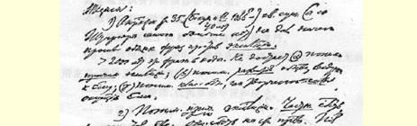
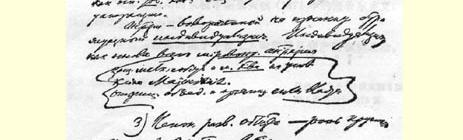
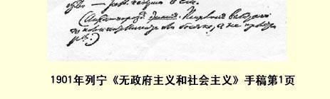

## 无政府主义和社会主义

> （１９０１年） 提纲：

（１）无政府主义在产生以来的３５—４０年中（从巴枯宁和１８６６ 年**国际**代表大会１４０算起是这样。从施蒂纳算起，那还要早很多年） 除了讲一些反对**剥削**的空话以外，再没有提供任何东西。

这类空话已经流行了２０００多年。（α）不懂得剥削的**根源**；（β） 不懂得社会在向社会主义**发展**；（γ）不懂得**阶级斗争**是实现社会主义的创造力量。

（２）对于剥削的***根源***的了解。**私有**制是**商品**经济的基础。生产资料公有制。无政府主义对此一窍不通。

无政府主义是改头换面的资产阶级**个人主义**。个人主义是无政府主义整个世界观的基础。

维护小私有制和**小农经济**。

无所谓多数[^1]。

否认政权有统一的和组织的力量。

（３）不懂得社会的发展—— 大生产的作用—— 从资本主义向社会主义的发展。

> １９０１年列宁《无政府主义和社会主义》手稿第１页
>
> （按原稿缩小）

（无政府主义是**绝望**的产物。它是失常的知识分子或游民的心理状态，而不是无产者的心理状态。）

（４）不懂得无产阶级的**阶级**斗争。

荒谬地否认资产阶级社会的政治。

不懂得组织和教育工人的作用。

把片面的、割断了联系的手段当作万应灵丹。

（５）在欧洲的现代史中，曾经在罗马语国家盛行一时的无政府主义，提供了什么东西呢？

—— 没有任何学理、任何革命学说和理论。

—— 分散工人运动。

—— 在革命运动的实验中彻底失败（１８７１年的蒲鲁东主义， １８７３年的巴枯宁主义１４１）。

—— 在否定政治的幌子下使工人阶级服从***资产阶级的***政治。

> 载于１９３６年《无产阶级革命》杂志  译自（列宁全集》俄文第５版第７期  第５卷第３７７—３７８页

[^1]: 即无政府主义者否认少数服从多数。—— 编者注