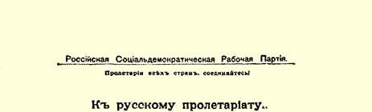
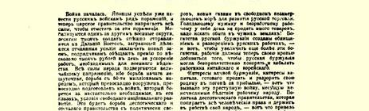
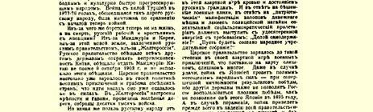
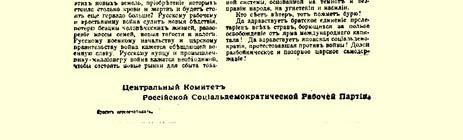

# 告俄国无产阶级书

１０１

> （１９０４年２月３日〔１６日〕）

战争开始了。日本人已经使俄国军队遭受了一连串的失败，目前沙皇政府正在竭尽全力要为这些失败复仇。军区一个接一个地被动员起来；成千成万的士兵匆忙开赴远东；政府正在国外竭力活动，以签订新的借款协定；它向承包人许诺，如能加速军事部门所必需的工程，每天可以得到数千卢布的奖金。人民的全部力量处于极度紧张的状态，因为已经开始了一场非同小可的斗争，一场同 ５０００万人的民族进行的斗争，他们装备精良，对战争准备充分；他们是在争取在他们看来对民族的自由发展绝对必需的条件。这将是一个专制而又落后的政府同政治上自由和文化上迅速进步的民族进行的一场斗争。１８７７—１８７８年同虚弱的土耳其的战争就曾经使俄国人民付出了高昂的代价，但它与现在开始的这场战争相比却是微不足道的。

究竟因为什么俄国的工人和农民现在要同日本人进行殊死的斗争呢？是因为满洲和朝鲜，是因为俄国政府侵占的这片新的土地，是因为“黄俄罗斯”。俄国政府曾向其他大国保证不侵犯中国，答应不迟于１９０３年１０月８日将满洲归还中国，但它并没有履行这一诺言１０２。沙皇政府在推行其军事冒险和掠夺邻国的政策方面已经走得太远，以致它已经无法后退。在“黄俄罗斯”建筑了要塞和港口，铺设了铁路，集结了数以万计的军队。

攫取这些新的土地付出了那么多的鲜血和生命，并且还要继续付出更高得多的代价，但是，这些土地究竟给俄国人民带来什么好处呢？对俄国工人和农民来说，战争预示着新的灾难、无数人的死亡、大批家庭的破产和新的苛捐重税。在俄国军事长官和沙皇政府看来，战争可以带来军事荣誉。在俄国商人和拥有百万财富的企业主看来，战争之所以必要，是为了保住新的商品销售市场，保住新的自由的不冻港以发展俄国贸易。向本国挨饿的农民和失业的工人是卖不出多少商品的，要到别国去寻找销路！俄国资产阶级的财富是靠俄国工人的贫困和破产创造出来的；而现在，为了更多地增加这些财富，工人们又得去流血卖命，以便俄国资产阶级能够随心所欲地去征服和奴役中国和朝鲜的工人。

正是贪得无厌的资产阶级的利益，正是为了追逐利润而准备出卖和毁灭自己祖国的资本的利益，引起了这场给劳动人民带来无穷灾难的罪恶战争。正是践踏一切人权和奴役本国人民的专制政府的政策，导致了用俄国公民的鲜血和财产进行的这场赌博。为了回击疯狂的战争鼓噪，为了回击钱袋的仆从们和警鞭的奴才们的“爱国”表演，有觉悟的社会民主主义的无产阶级必须极其坚决地提出要求：“打倒专制制度！”、“召开人民立宪会议！”

沙皇政府在其军事冒险的赌博中如此贪婪，以致把赌注下得太多太多了。同日本的战争即使打赢了，也会带来民穷财尽的后果，而取得的胜利成果将微乎其微，因为其他大国是不会容许俄国独享胜利果实的，就象他们在１８９５年不让日本独享胜利果实一样。１０３而这场战争如果打败了，首先就会使建立在人民愚昧和无权的基础之上、建立在压迫和暴力的基础之上的全部统治体系土

> １９０４年列宁撰写的俄国社会民主工党中央传单《告俄国无产阶级书》
>
> （按原版缩小） 崩瓦解。

玩火者必自焚！

为彻底摆脱国际资本压迫而斗争的全世界无产者的兄弟团结万岁！反战的日本社会民主运动万岁！打倒掠夺成性的和卑鄙无耻的沙皇专制制度！

### 俄国社会民主工党中央委员会

> １９０４年２月印成传单第８卷第１７０—１７４页译自《列宁全集》俄文第５版