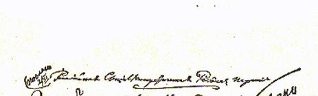
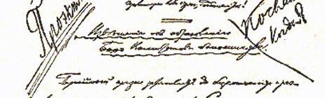
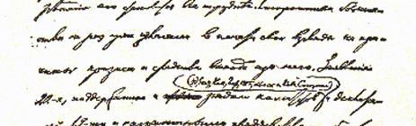
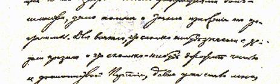
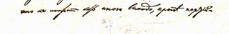

# 关于成立多数派委员会常务局的通知

４４

> 草 案
>
> （１９０４年１０月２０日〔１１月２日〕以前）

党内危机正在无限期地延续下去，摆脱这个危机愈来愈困难了。多数派已经不止一次地在报刊上阐明自己对产生危机的原因和摆脱危机的办法的看法。得到许多委员会（敖德萨、叶卡捷琳诺斯拉夫、尼古拉耶夫、里加、彼得堡、莫斯科等委员会和高加索联合会）、十九人宣言４５和国外多数派代表们支持的二十二人声明[^1]，对多数派的纲领作了充分而确切的说明。每个稍微了解危机的进程，稍微珍视党的荣誉和尊严的人早已明白，除了召开党代表大会以外，不可能有别的出路。但是现在，一部分中央委员的新宣言、党总委员会的新决议，却在使党内分歧愈益严重。投到少数派方面去的中央委员，不惜最粗暴地破坏那些仍旧站在多数派方面的中央委员的权利。新中央委员会宣布和解，但它不仅不尊重多数派，反而把他们完全撇在一边，通过秘密的私人契约，同少数派单方面达成协议。谁要是真心希望和解，谁首先就应该把所有的斗争者、争论者和不满者召集到一起，而这也就是召开党

> １９０４年列宁《关于成立多数派委员会
>
> 常务局的通知》手稿第１页
>
> （按原稿缩小） 代表大会。谈论和平而又害怕召开代表大会，要和解但又用少数派在第三次代表大会上也可能遭到失败而引起分裂的说法来吓唬人，—— 这就是伪善，就是强迫国内党的工作者听任国外小组为所欲为，就是用漂亮的和平口号美化彻底背叛多数派的行径。新中央委员会假借和平的名义解散敢于要求召开代表大会的组织， 新中央委员会假借和平的名义宣布多数派的出版物不是党的出版物，并拒绝把这些出版物分发给各委员会。新中央委员会假借和平的名义把无谓争吵引进党总委员会的决议中。党总委员会竟敢发表书面声明，说有些同志进行“欺骗”，其实对这些同志的行为还没有进行调查，甚至人们还没有对他们提出指控。党总委员会现在是在公然伪造党内舆论和党的决议，委托分明敌视召开代表大会的思想的中央委员会去审查各委员会的决议，怀疑这些决议， 迟迟不发表这些决议，错算票数，攫取代表大会宣布代表资格无效的权利，用促使“外层组织” 反对地方委员会的办法破坏正常工作。同时，全党的正常工作也由于中央委员会和中央机关报把力量消耗在反对召开代表大会上而停顿下来了。

多数派的各委员会和组织除了团结起来为召开代表大会而斗争，为反对事实上公然嘲弄党的所谓党中央机关而斗争外，已经没有别的办法了。我们根据敖德萨、叶卡捷琳诺斯拉夫、尼古拉耶夫、里加、彼得堡和莫斯科各委员会的倡议，并且征得它们的同意，成立多数派委员会常务局，就是倡导这种团结。

我们的口号是：坚持党性，反对小组习气；坚持坚定不移的革命方针，反对曲折路线、混乱状态和回到工人事业派方面去；坚持无产阶级的组织和纪律，反对瓦解组织分子。

我们的最近任务是：使国内和国外的多数派在思想上和组织上团结起来，全面支持和发展多数派的出版社（邦契－布鲁耶维奇同志和列宁同志在国外创办的），同我们中央机关的波拿巴主义作斗争，检查召开第三次代表大会的办法是否正确，帮助开展被编辑部和新中央委员会的代办员破坏的各委员会的正常工作。

### 多数派委员会常务局

同常务局联系，国内可以通过多数派各委员会，国外可以通过邦契－布鲁耶维奇和列宁的出版社。

> 载于１９４０年《无产阶级革命》杂志译自《列宁全集》俄文第５版第２期第９卷第６６—７０页

[^1]: 见本卷第１０—１７页。—— 编者注