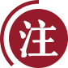

# 中国共产党是全中国人民的领导核心

*（一九五七年五月二十五日）*

你们的会议开得很好。希望你们团结起来，作为全国青年的领导核心。

中国共产党是全中国人民的领导核心。没有这样—个核心，社会主义事业就不能胜利。

你们这个会议是一个团结的会议，对全中国青年会有很大的影响。我对你们表示祝贺。

同志们，团结起来，坚决地勇敢地为社会主义的伟大事业而奋斗。一切离开社会主义的言论行动是完全错误的。

[^1]: 这是毛泽东同志接见中国新民主主义青年团第三次全国代表大会全体代表时的讲话。