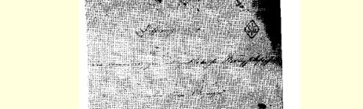
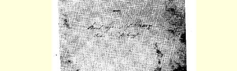
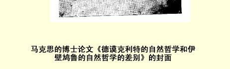

# 德谟克利特的自然哲学和伊壁鸠鲁的自然哲学的差别１

> 卡·马克思写于１８４０年下半年—１８４１年３月底文第一次经过删节用原文发表于 《卡尔·马克思、弗里德里希· 恩格斯和斐迪南·拉萨尔的遗著》１９０２年斯图加特版第１ 卷；全文发表于《马克思恩格斯全集》１９２７年历史考证版第１ 部分第１卷第１分册署名：哲学博士卡尔·亨利希 ·马克思
>
> 原文是德文、古希腊文和拉丁
>
> 中文根据《马克思恩格斯全集》
>
> １９７５年历史考证版第１部分
>
> 第１卷翻译

# 德谟克利特的自然哲学和伊壁鸠鲁的自然哲学的差别

# 谨将本文献给敬爱的慈父般的朋友

## 谨将本文献给敬爱的慈父般的朋友

### 政府枢密顾问特里尔的

## 路德维希·冯·威斯特华伦先生

### 以表达子弟的敬爱之忱作者

# 序言

> ·
>
> 我*敬爱的慈父般的朋友*，*请您*原谅我把我所仰慕的*您的*名字放在一本微不足道的小册子的开头。我已完全没有耐心再等待另一个机会来向*您*略表我的敬爱之忱了。
>
> 但愿一切怀疑观念的人，都能像我一样幸运地景仰一位充满青春活力的老人。这位老人用真理所固有的热情和严肃性来欢迎时代的每一进步；他深怀着令人坚信不疑的、光明灿烂的唯心主义，唯有唯心主义才知道那能唤起世界上一切英才的真理；他从不在倒退着的幽灵所投下的阴影前面畏缩，也不被时代上空常见的浓云密雾所吓倒，相反，他始终以神一般的精力和刚毅坚定的目光，透过一切风云变幻，看到那在世人心中燃烧着的九重天。*您*，*我的慈父般的朋友*， 对于我始终是一个活生生的明显证据，证明唯心主义不是幻想，而是真理。
>
> 身体的健康，我无需为*您*祈求。精神就是*您*所信赖的伟大神医。[^1]

# 序言

这篇论文如果当初不是预定作为博士论文，那么它一方面可能会具有更加严格的科学形式，另一方面在某些叙述上也许会少一点学究气。但是，由于一些外在的原因，我只能让它以这种形式付印。此外，我认为，在这篇论文里我已经解决了一个在希腊哲学史上至今尚未解决的问题。

专家们知道，关于这篇论文的对象没有任何先前的著作可供参考。西塞罗和普卢塔克所说过的废话，到现在人们一直在照样重复。 伽桑狄虽然把伊壁鸠鲁从教父们和整个中世纪即实现了非理性的时代所加给他的禁锢中解救了出来，但是在自己的阐述[^2]里也只提供了一个有趣的方面。他竭力要使他的天主教的良心同他的异端知识相适应，使伊壁鸠鲁同教会相适应，这当然是白费气力。这就好比是想在希腊拉伊丝的姣美的身体上披上一件基督教修女的黑衣。确切地说，伽桑狄是自己在向伊壁鸠鲁学习哲学，他不能向我们讲授伊壁鸠鲁哲学。

不妨把这篇论文仅仅看作是一部更大著作[^3]的先导，在那部著作中我将联系整个希腊思辨详细地阐述伊壁鸠鲁主义２，斯多亚主义３和怀疑主义４这一组哲学。这篇论文在形式方面和其他方面的缺点在那里将被消除。

虽然**黑格尔**大体上正确地规定了上述各个体系的一般特点，但是一方面，由于他的哲学史—— 一般说来哲学史只能从它开始—— 的令人惊讶的庞大和大胆的计划，使他不能深入研究个别细节；另一方面，黑格尔对于他主要称之为思辨的东西的观点，也妨碍了这位巨人般的思想家认识上述那些体系对于希腊哲学史和整个希腊精神的重大意义。这些体系是理解希腊哲学的真正历史的钥匙。关于它们同希腊生活的联系，在我的朋友**科本**的著作《弗里德里希大帝和他的敌人》５中有较深刻的提示。

如果说这里以附录的形式增加了一篇评普卢塔克对伊壁鸠鲁神学的论战的文章，那么这样做，是因为这场论战不是什么个别的东西，而是代表着一定的方向，因为它本身就很恰当地表明了神学化的理智对哲学的态度。

此外，在这篇评论中，对于普卢塔克把哲学带上宗教法庭的立场是如何地错误，我还没有谈到。关于这点，无需任何论证，只要从大卫 ·休谟那里引证一段话就够了：

> “如果人们迫使哲学在每一场合为自己的结论辩护，并在对它不满的任何艺术和科学面前替自己申辩，对理应到处都承认享有*最高权威*的哲学来说，当然是一种侮辱。*这就令人想起一个被指控犯了背叛自己臣民的叛国罪的国* > *王*。”[^4]

只要哲学还有一滴血在自己那颗要征服世界的、绝对自由的心脏里跳动着，它就将永远用伊壁鸠鲁的话向它的反对者宣称：

> “渎神的并不是那抛弃众人所崇拜的众神的人，而是把众人的意见强加于众神的人。”６

哲学并不隐瞒这一点。普罗米修斯的自白

> “总而言之，我痛恨所有的神”７

就是哲学自己的自白，是哲学自己的格言，表示它反对不承认人的自我意识是最高神性的一切天上的和地上的神。不应该有任何神同人的自我意识相并列。

对于那些以为哲学在社会中的地位似乎已经恶化因而感到欢欣鼓舞的可怜的懦夫们，哲学又以普罗米修斯对众神的侍者海尔梅斯所说的话来回答他们：

> “我绝不愿像你那样甘受役使，来改变自己悲惨的命运，
>
> 你好好听着，我永不愿意！
>
> 是的，宁可被缚在崖石上，
>
> 也不为父亲宙斯效忠，充当他的信使。”[^5]

普罗米修斯是哲学历书上最高尚的圣者和殉道者。

> １８４１年３月于柏林

# 目录序言

## 论德谟克利特的自然哲学和伊壁鸠鲁的自然哲学的差别

### 第一部分德谟克利特的自然哲学和伊壁鸠鲁的自然哲学的一般差别一、论文的对象二、对德谟克利特的物理学和伊壁鸠鲁的物理学的关系的判断三、把德谟克利特的自然哲学和伊壁鸠鲁的自然哲学等同起来所产生的困难四、德谟克利特的自然哲学和伊壁鸠鲁的自然哲学的一般原则差别五、结论

### 第二部分德谟克利特的自然哲学和伊壁鸠鲁的自然哲学的具体差别第一章 原子脱离直线而偏斜第二章 原子的质第三章 不可分的本原和不可分的元素第四章 时间第五章 天象

### 附录评普卢塔克对伊壁鸠鲁神学的论战前言一、人同神的关系 １．恐惧和彼岸的存在物 ２．崇拜和个人 ３．天意和谪降了的神二、个人的不死 １．论宗教的封建主义。庸众的地狱 ２．众人的渴望 ３．上帝选民的高傲

# 第一部分德谟克利特的自然哲学和伊壁鸠鲁的自然哲学的一般差别一、论文的对象

希腊哲学看起来似乎遇到了一出好的悲剧所不应遇到的结局， 即平淡的结局。在希腊，哲学的客观历史似乎在亚里士多德这个希腊哲学中的马其顿王亚历山大那里就停止了，甚至勇敢坚强的斯多亚派也没有取得像斯巴达人在他们的庙宇里所取得的那样的胜利：他们把雅典娜紧紧捆在海格立斯身旁，使她不能逃走。

伊壁鸠鲁派、斯多亚派、怀疑派几乎被看作一种不合适的附加物，同他们的巨大的前提很不相称。伊壁鸠鲁哲学似乎是德谟克利特的物理学和昔勒尼派８的道德思想的混合物；斯多亚主义好像是赫拉克利特的自然思辨和昔尼克派９的伦理世界观的结合，也许再加上一点亚里士多德的逻辑学；最后，怀疑主义则仿佛是同这两种独断主义相对立的必不可免的祸害。这样，人们在把这些哲学说成是更加片面而更具有倾向性的折衷主义时，也就不自觉地把它们同亚历山大里亚哲学１０联系在一起。最后，亚历山大里亚哲学则被看成是一种完全的幻想和混乱—— 一种紊乱，在这种紊乱里据说最多只能承认意向的普遍性。

的确，有一种老生常谈的真理，说发生、繁荣和衰亡是一个铁环， 一切与人有关的事物都注定包含于其中，并且必定要绕着它走一圈。 所以，说希腊哲学在亚里士多德那里达到极盛之后，接着就衰落了， 这也没有什么可惊奇之处。不过英雄之死与太阳落山相似，而和青蛙因胀破了肚皮致死不同。

此外，发生、繁荣和衰亡是极其一般、极其模糊的观念，要把一切东西都塞进去固然可以，但要借助这些观念去理解什么东西却办不到。死亡本身已预先包含在生物中，因此对死亡的形态也应像对生命的形态那样，在固有的特殊性中加以考察。

最后，如果我们回顾一下历史，难道伊壁鸠鲁主义、斯多亚主义和怀疑主义是一些特殊现象吗？难道它们不是罗马精神的原型，即希腊迁移到罗马去的那种形态吗？难道它们不具有性格十分刚毅的、强有力的、永恒的本质，以致连现代世界也不得不承认它们享有充分的精神上的公民权吗？

我强调指出这一点，只是为了唤起对于这些体系的历史重要性的记忆。但是，这里要研究的并不是它们对于整个文化的一般意义； 这里要研究的是它们同更古老的希腊哲学的联系。

有人认为，希腊哲学是以两类不同的折衷主义体系为终结的，其中一类是伊壁鸠鲁主义、斯多亚主义和怀疑主义这一组哲学，另一类统称为亚历山大里亚的思辨，难道这种看法不应促使人们至少联系这种关系去加以探讨吗？其次，在正在向总体发展的柏拉图哲学和亚里士多德哲学之后，出现了一些新的体系，它们不以这两种丰富的精神形态为依据，而是进一步往上追溯到最简单的学派：在物理学方面转向自然哲学家，在伦理学方面转向苏格拉底学派，难道这不是值得注意的现象吗？再者，在亚里士多德之后出现的体系，仿佛都可以在往昔找到它们现成的基础，这种说法有何根据呢？把德谟克利特和昔勒尼派、赫拉克利特和昔尼克派结合在一起，这又怎样予以说明呢？ 在伊壁鸠鲁派、斯多亚派和怀疑派那里，自我意识的一切环节都得到充分表现，不过每个环节都表现为一种特殊的存在，难道这是偶然的吗？这些体系合在一起形成自我意识的完整结构，这也是偶然的吗？ 最后，希腊哲学借以神话般地从七贤１１开始，并且仿佛作为这一哲学的中心点，作为这一哲学的造物主体现在苏格拉底身上的形象，我指的是哲人——σψ —— 的形象，这种形象被上述那些体系说成是真正科学的现实，难道这也是偶然的吗？

在我看来，如果说那些较早的体系对于希腊哲学的内容较为重要、较有意义的话，那么亚里士多德以后的体系，主要是伊壁鸠鲁派、 斯多亚派和怀疑派这一组学派则对希腊哲学的主观形式，对其性质较为重要、较有意义。然而正是这种主观形式，即这些哲学体系的精神承担者，由于它们的形而上学的规定，直到现在几乎完全被遗忘了。

关于伊壁鸠鲁派、斯多亚派和怀疑派哲学的全部概况，以及它们与较早的和较晚的希腊思辨的总体关系，我打算在一部更为详尽的著作里加以阐述。[^6]

在这里，好像通过一个例子，并且也只从一个方面，即从它们与较早的思辨的联系方面，来阐述这种关系也就足够了。

我选择了伊壁鸠鲁的自然哲学同德谟克利特的自然哲学的关系作为这样一个例子。我并不认为这是一个最便当的出发点。因为，一方面人们有一个根深蒂固的旧偏见，即把德谟克利特的物理学和伊壁鸠鲁的物理学等同起来，以致把伊壁鸠鲁所作的修改看作只是一些随心所欲的臆造；另一方面，就具体情况来说，我又不得不去研究一些看起来好像无关紧要的细枝末节。但是，正因为这种偏见同哲学的历史一样古老，而二者之间的差别又极其隐蔽，好像只有用显微镜才能发现它们，所以，尽管德谟克利特的物理学和伊壁鸠鲁的物理学之间有着联系，但是证实存在于它们之间的贯穿到极其细微之处的本质差别就显得特别重要了。在细微之处可以证实的东西，当各种情况在更大范围表现出来的时候就更容易加以说明了，相反，如果只作极其一般的考察，就会令人怀疑所得出的结论究竟是否在每一个别场合都能得到证实。

# 二、对德谟克利特的物理学和伊壁鸠鲁的物理学的关系的判断

一般地说，我的见解和前人的见解关系怎样，只要粗略地考察一下古代人对德谟克利特的物理学和伊壁鸠鲁的物理学的关系的判断，就一目了然了。

**斯多亚派的波西多尼乌斯**、**尼古拉**和**索蒂昂**指责伊壁鸠鲁，说他把德谟克利特关于原子的学说和亚里斯提卜关于快乐的学说冒充为他自己的学说。（１）学院派的**科塔**问西塞罗：“在伊壁鸠鲁的物理学中究竟有什么东西不是属于德谟克利特的呢？伊壁鸠鲁诚然改变了一些地方，但大部分是重复德谟克利特的话。”（２）**西塞罗**自己也说：“伊壁鸠鲁在他特别夸耀的物理学中，是一个地道的门外汉，其中大部分是属于德谟克利特的；在伊壁鸠鲁离开德谟克利特的地方，在他想加以改进的地方，他都损害和败坏了德谟克利特。”（３）不过，虽然有许多人指责伊壁鸠鲁诽谤德谟克利特，但是，据普卢塔克说，莱昂泰乌斯断言，伊壁鸠鲁很尊敬德谟克利特，因为德谟克利特在他之前就宣示了正确的学说，因为德谟克利特更早发现了自然界的本原。（４）在《论哲学家的见解》１２这一著作中，伊壁鸠鲁被称为按照德谟克利特的观点探究哲理的人。（５）普卢塔克在他的著作《科洛特》中走得更远。当他依次将伊壁鸠鲁同德谟克利特、恩培多克勒、巴门尼德、柏拉图、苏格拉底、斯蒂尔蓬、昔勒尼派和学院派加以比较时，他力求得出这样的结论：“伊壁鸠鲁从整个希腊哲学里吸收的是错误的东西，而对其中正确的东西他并不理解。”（６）《论信从伊壁鸠鲁不可能有幸福的生活》 这篇论文也充满了类似的敌意的暗讽。

古代作家的这种不利的见解，在教父们那里仍然保留着。我在附注里只引证了亚历山大里亚的克莱门斯这位教父的一句话（７），在谈到伊壁鸠鲁时特别值得提到他，因为他把使徒保罗警告人们提防一般哲学的话说成是警告人们提防伊壁鸠鲁哲学的话，说这种哲学连天意之类的东西都没有幻想过。（８）但是，人们一般都倾向于指责伊壁鸠鲁有剽窃行为，在这方面**塞克斯都·恩披里柯**表现得最为突出，他企图把荷马和厄皮卡尔摩斯的一些完全不相干的语句，硬说成是伊壁鸠鲁哲学的主要来源。（９）

众所周知，近代作家大体上也同样认为，伊壁鸠鲁作为一个自然哲学家，仅仅是德谟克利特的剽窃者。**莱布尼茨**有一段话大致可以代表他们的见解：

> “关于这个伟大人物〈德谟克利特〉，我们所知道的东西，几乎只是伊壁鸠鲁从他那里抄袭来的，而伊壁鸠鲁又往往不能从他那里抄袭到最好的东西。”（１０）

因此，如果说西塞罗认为，伊壁鸠鲁败坏了德谟克利特的学说， 但他至少还承认伊壁鸠鲁有改进德谟克利特学说的愿望，还有看到这个学说的缺点的眼力；如果说普卢塔克认为他观点前后不一贯（１１），认为他对坏的东西有一种天生的偏爱，因而对他的愿望也表示怀疑，那么，莱布尼茨则甚至否认他具有善于摘录德谟克利特的能力。

不过，大家一致认为，伊壁鸠鲁的物理学是从德谟克利特那儿抄袭来的。

# 三、把德谟克利特的自然哲学和伊壁鸠鲁的自然哲学等同起来所产生的困难

除了历史的证据之外，许多情况也说明德谟克利特和伊壁鸠鲁的物理学的同一性。原子和虚空这两个本原无可争辩地是相同的。只是在个别的规定中，任意的、因而是非本质的差别看来才占统治地位。

不过，这样就留下一个奇特的、无法解开的谜。两位哲学家讲授的是同一门科学，并且采用的是完全相同的方式，但是—— 多么不合逻辑啊！—— 在一切方面，无论涉及这门科学的真理性、可靠性及其应用，还是涉及思想和现实的一般关系，他们都是截然相反的。我说他们是截然相反的，现在我将尽力证明这一点。 （Ａ）德谟克利特**关于人类知识的真理性和可靠性**的判断看来很难弄清楚。他有一些自相矛盾的语句，或者不如说，不是这些语句，而是德谟克利特的观点自相矛盾。特伦德伦堡在为亚里士多德心理学作的注释里说，知道这个矛盾的不是亚里士多德，而是晚近的作家， 这个说法事实上是不正确的。在亚里士多德的心理学中有这样的话： “德谟克利特认为灵魂和理性是同一个东西，因为在他看来，现象是真实的东西。”（１）与此相反，亚里士多德在《形而上学》中却说：“德谟克利特断言，或者没有东西是真实的，或者真实的东西对我们是隐蔽的。”（２）亚里士多德的这几段话难道不是自相矛盾吗？如果现象是真实的东西，那么真实的东西怎么会是隐蔽的呢？只有现象和真理互相分离的地方，才开始有隐蔽的东西。[^7]但是**第欧根尼·拉尔修**说，有人曾把德谟克利特算作怀疑主义者。他们引证了他的一句名言：“实际上，我们什么也不知道，因为真理隐藏在深渊里。”（３）类似的意见在 **塞克斯都·恩披里柯**那里也可以看到。（４）

德谟克利特的这种怀疑主义的、不确定的和内部自相矛盾的观点，在**他规定原子和感性的现象世界的相互关系的方式**中不过是得到了进一步的发展。

一方面，感性现象不是原子本身所固有的。它不是**客观现象**，而是**主观的假象**。**“真实的**本原是原子和虚空；**其余的一切**都是**意见**、**假象**。”（５）“只有按照意见才有冷，只有按照意见才有热，而实际上只有原子和虚空。”（６）因此，一实际上不是由若干原子组成，而是“任何一 **看起来**都好像是由于原子的结合而形成的”（７）。因此，只有通过理性才能看见本原，由于本原微小到肉眼都无法看见，所以它们甚至被称为**观念**。（８）不过另一方面，感性现象是唯一真实的客体，并且**“感性知觉”就是“理性”**，而这种真实的东西是变化着的、不稳定的，它是现象。但是，说现象是真实的东西，这就自相矛盾了。（９）因此，时而把这一面，时而把另一面当作主观的或客观的东西。这样矛盾似乎就被消除了，因为矛盾着的两个方面分别被分配给两个世界了。德谟克利特因而就把感性的现实变成主观的假象；不过，从客体的世界被驱逐出去的二律背反，却仍然存在于他自己的自我意识内，在自我意识里原子的概念和感性直观互相敌对地冲突着。

可见，德谟克利特并没有能摆脱二律背反。这里还不是阐明二律背反的地方，只要明白不能否认它的存在就够了。

让我们反过来听听伊壁鸠鲁是怎么说的。

他说：**哲人**对事物采取**独断主义**的态度，而**不采取怀疑主义的**态度。（１０）是的，哲人比大家高明之处，正在于他对自己的认识深信不疑。（１１）“一切感官都是真实东西的报道者。”（１２）**“没有什么东西能够驳倒感性知觉**；同类的感性知觉不能驳倒同类的感性知觉，因为它们有相同的效用，而不同类的感性知觉也不能驳倒不同类的感性知觉，因为它们并不是对同一个东西作出判断；概念也不能驳倒感性知觉，因为概念依赖于感性知觉”（１３），这是在《准则》中所说的话。当**德谟克利特把感性世界**变成**主观假象**时**，伊壁鸠鲁**却把它变成**客观现象**。而且在这里他是有意识地作出这种区别的，因为他断言，他赞成**同样的原则**，**但是并不**主张把感性的质看作是**仅仅存在于意见中的东西**。（１４）

因此，既然对伊壁鸠鲁来说感性知觉是标准，客观现象又符合于感性知觉，那么只好承认那使西塞罗耸耸肩膀的话是正确的结论： “太阳在德谟克利特看来是很大的，因为他是一个有学问的人，并且是对几何学有了完备知识的人；太阳在伊壁鸠鲁看来约莫有两英尺大，因为据他判断，太阳**就是看起来**那么大。”（１５） （Ｂ）德谟克利特和伊壁鸠鲁关于科学的可靠性和科学对象的真实性的**理论见解上的这种差别**，**体现**在这两个人的**不同的科学活动** 和**实践中**。

在德谟克利特那里，原则是不在现象中表现的，它始终是没有现实性和处于存在之外的，但是，他认为**感性知觉的世界**是实在的和富有内容的世界。这个世界虽然是主观的假象，但正因为如此，它才脱离原则而保持着自己的独立的现实性；同时作为唯一实在的客体，它 **本身**具有价值和意义。因此，德谟克利特被迫进行**经验的观察**。他不满足于哲学，便投入**实证知识**的怀抱。我们已听说过，西塞罗称他为博学之士。他精通物理学、伦理学、数学，各个综合性科目１３，各种技艺。（１６）第欧根尼·拉尔修所列举的德谟克利特的著作的目录就足以证明他的博学。（１７）而由于博学的特点是要努力扩大视野，搜集资料， 到外部世界去探索，所以，我们就看见德谟克利特**走遍半个世界**，以便积累经验、知识和观感。德谟克利特自夸道：“在我的同时代人中， 我游历的地球上的地方最多，考察了最遥远的东西；我到过的地区和国家最多，我听过的有学问的人的讲演也最多；而在勾画几何图形并加以证明方面，没有人超过我，就连埃及的所谓土地测量员也未能超过我。”（１８）

**德米特里**在《同名作家传》中，**安提西尼**在《论哲学家的继承》中都说，德谟克利特曾游历埃及并向祭司学习几何学，曾游历波斯，拜访迦勒底人１４，并且说他曾到达红海。有些人还说，他曾在印度会见过裸体智者１５，并且到过埃塞俄比亚。（１９）一方面**求知欲**使他不能平静，另一方面**对真实的即哲学的知识的不满足**，迫使他外出远行。他认为是真实的那种知识是没有内容的；而能向他提供内容的知识却没有真实性。古代人述说的关于德谟克利特的轶事可能是一种传闻， 但是一种真实的传闻，因为它描述了德谟克利特的本质的矛盾。据说德谟克利特自己弄瞎了自己的眼睛，以使**感性的目光**不致蒙蔽**他的理智的敏锐**。（２０）这就是那个照西塞罗的说法走遍了半个世界的人。 但是他没有获得他所寻求的东西。

伊壁鸠鲁则以一个相反的形象出现在我们面前。

伊壁鸠鲁在**哲学**中感到**满足**和**幸福**。他说：“要得到真正的自由， 你就必须为哲学服务。凡是倾心降志地献身于哲学的人，用不着久等，他立即就会获得解放，因为服务于哲学本身就是自由。”（２１）因此， 他教导说：“青年人不应该耽误了对哲学的研究，老年人也不应该放弃对哲学的研究。因为谁要使心灵健康，都不会为时尚早或者为时已晚。谁如果说研究哲学的时间尚未到来或者已经过去，那么他就像那个说享受幸福的时间尚未到来或者已经过去的人一样。”（２２）德谟克利特不满足于哲学而投身于经验知识的怀抱，**而伊壁鸠鲁却轻视实证科学**，因为按照他的意见，这种科学丝毫无助于达到**真正的完善**。（２３）他被称为**科学的敌人**，语言文学的轻视者。（２４）人们甚至骂他无知。在西塞罗的书中曾提到，有一个伊壁鸠鲁派说：“但是，不是伊壁鸠鲁没有学识，而是那些以为直到老年还应去背诵那些连小孩不知道都觉得可耻的东西的人，才是无知的人。”（２５）

可是，**德谟克利特**努力从**埃及的祭司**、**波斯的迦勒底人**和**印度的裸体智者**那里寻求知识，而**伊壁鸠鲁**却以他从未有过**任何教师**，他是一个**自学者而自豪**。（２６）据塞涅卡叙述，伊壁鸠鲁曾经说过，有些人努力寻求真理而无需任何人的帮助。作为这种人当中的一个，他自己为自己开辟了道路。他最称赞那些自学者。其他的人在他看来是第二流的人物。（２７）德谟克利特感觉到必须走遍世界各地，而伊壁鸠鲁却只有两三次离开他在雅典的花园到伊奥尼亚去，不是为了研究，而是为了访友。（２８）最后，德谟克利特由于对知识感到绝望而弄瞎了自己的眼睛，伊壁鸠鲁却在感到死亡临近之时洗了一个热水澡，要求喝醇酒，并且嘱咐他的朋友们忠实于哲学。（２９） （Ｃ）不能把刚才所指出的那些差别归因于两位哲学家的偶然的个性；它们所体现的是两个相反的方向。我们看到，前面表现为理论意识方面的差别的东西，现在表现为实践活动方面的差别了。

最后，我们来考察一下**表现思想同存在的关系**，**两者的相互关系的反思形式**。哲学家在他所规定的世界和思想之间的一般关系中，只是为自己把他的特殊意识同现实世界的关系客观化了。

德谟克利特把**必然性**看作现实性的反思形式。（３０）关于他，亚里士多德说过，他把一切都归结为必然性。（３１）第欧根尼·拉尔修报道说，一切事物所由以产生的那种原子旋涡就是德谟克利特的必然性。（３２）《论哲学家的见解》的作者关于这点说得更为详细：“在德谟克利特看来，必然性是命运，是法，是天意，是世界的创造者。物质的抗击、运动和撞击就是这种必然性的实体。”（３３）类似的说法也出现在**斯托贝**的《自然的牧歌》里（３４）和**欧塞比乌斯**的《福音之准备》第６卷里（３５）。在斯托贝的《伦理的牧歌》里还保存着德谟克利特的一句话（３６），在欧塞比乌斯的第１４卷中这句话几乎被一字不差地重复了一遍（３７），即：人们给自己虚构出偶然这个幻影，—— 这正是他们自己束手无策的表现，因为**偶然和强有力的思维是敌对的**。同样，**西姆普利齐乌斯**认为，亚里士多德在一个地方谈到一种取消偶然的古代学说时，也就是指德谟克利特而言的。（３８）

与此相反，伊壁鸠鲁说：“被某些人当作万物主宰的**必然性**，**并不存在**，无宁说有些事物是**偶然的**，另一些事物则取决于我们的**任意性**。必然性是不容劝说的，相反，偶然是不稳定的。所以，宁可听信关于神灵的神话，也比当物理学家所说的命运的奴隶要好些，因为神话还留下一点希望，即由于敬神将会得到神的保佑，而命运却是铁面无情的必然性。应该承认**偶然**，而**不是**像众人所认为的那样承认 **神**。”（３９）“在必然性中生活，是不幸的事，但是在必然性中生活，并不是一种必然性。通向自由的道路到处都敞开着，这种道路很多，它们是便捷易行的。因此，我们感谢上帝，因为在生活中谁也不会被束缚住。控制住必然性本身倒是许可的。”（４０）

在西塞罗的书中曾提到过，伊壁鸠鲁派的韦莱关于斯多亚派哲学说过类似的话：“有一种哲学像年迈而又无知的妇人们一样认为， 一切都由于命运而发生，我们应该怎样评价这种哲学呢？……伊壁鸠鲁拯救了我们，使我们获得了自由。”（４１）

为了避免承认任何必然性，伊壁鸠鲁甚至**否定了选言判断**。（４２）

不错，也有人断言，德谟克利特使用过偶然，但是，在西姆普利齐乌斯谈到这一点的两个地方（４３）中，一个地方却使另一个地方变得可疑，因为它清楚地表明，不是德谟克利特使用了偶然这一范畴，而是西姆普利齐乌斯把这一范畴作为结论强加给德谟克利特。西姆普利齐乌斯是这样说的，德谟克利特并没有指出一般的创造世界的原因， 因此**看来**他是把偶然当作原因。但是，这里问题并不在于**内容的规定**，而在于德谟克利特**有意识地**使用过的那种**形式**。欧塞比乌斯的报道也与此相似：德谟克利特把偶然当作一般的东西和神性的东西的主宰，并断言这里一切都由于偶然而发生，同时他又把偶然从人的生活和经验的自然中排除掉，并斥责它的宣扬者愚蠢无知。（４４）

在这里，一方面我们看到，这纯粹是基督教主教**迪奥尼修斯**的臆断，另一方面，我们又看到，在一般的东西和神性的东西开始的地方， 德谟克利特的必然性概念同偶然便没有差别了。

因此，从历史上看有一个事实是确实无疑的：**德谟克利特**使用**必然性**，**伊壁鸠鲁**使用**偶然**，并且每个人都以论战的激烈语调驳斥相反的观点。

**这种差别的主要后果表现在对具体的物理现象的解释方式上**。

在有限的自然里，必然性表现为**相对的必然性**，表现为**决定论**。 而相对的必然性只能从**实在的可能性**中推演出来，这就是说，存在着一系列的条件、原因、根据等等，这种必然性是通过它们作为中介的。 实在的可能性是相对必然性的展现。我们看到，德谟克利特曾使用过它。让我们从西姆普利齐乌斯那里引证一些材料来作证。

如果一个人感到口渴，喝了水并变得精神舒畅了，那么德谟克利特不会认为偶然是原因，而会认为渴是原因。因为尽管他讲到世界的创造时看来曾使用过偶然这一范畴，但他毕竟断言，在每个个别现象中偶然不是原因，而只是指出别的原因。例如，挖掘财宝是找到财宝的原因，或者种植橄榄树是橄榄树生长的原因。（４５）

德谟克利特在采用这种解释方式来研究自然时所表现的热情和严肃性，以及他认为寻找根据的意图所具有的重要意义，都在他下面这句自白里坦率地表达了出来：“我发现一个新的因果联系比获得波斯国的王位还要高兴！”（４６）

伊壁鸠鲁与德谟克利特又正相反。偶然是一种只具有可能性价值的现实性，而**抽象的可能性**则正是**实在的可能性的反面**。实在的可能性就像知性那样被限制在严格的限度里；而抽象的可能性却像幻想那样是没有限制的。实在的可能性力求证明它的客体的必然性和现实性；而抽象的可能性涉及的不是被说明的客体，而是作出说明的主体。只要对象是可能的，是可以想象的就行了。抽象可能的东西， 可以想象的东西，不会妨碍思维着的主体，也不会成为这个主体的界限，不会成为障碍物。至于这种可能性是否会成为现实，那是无关紧要的，因为这里感兴趣的不是对象本身。

因此，伊壁鸠鲁在解释具体的物理现象时表现出一种非常冷淡的态度。

这一点在他给皮托克勒斯的信中可以看得更清楚，这封信我们后面还要加以考察。这里只须注意一下伊壁鸠鲁对先前的物理学家的意见的态度就够了。在《论哲学家的见解》的作者及斯托贝引证哲学家们关于星球的实体、太阳的体积和形状以及诸如此类的东西的不同观点的地方，他们谈到伊壁鸠鲁时总是说：他不反对这类意见中的任何一种意见；在他看来，**所有的意见**都**可能**是对的，他坚持**可能的东西**。（４７）的确，伊壁鸠鲁甚至对那种从实在的可能性出发的、为理智所规定的、因而带有片面性的解释方法，也加以**驳斥**。

因此，**塞涅卡**在他的《自然问题》中说道：伊壁鸠鲁断言，所有这些原因都可能存在，除此之外他还力图提出一些别的解释，并**斥责**那些断言在这些原因中只存在某一种原因的人，因为要给只是根据推测推论出来的东西下一个必然的判断，是一种冒险。（４８）

我们可以看到，这里没有探讨客体的实在根据的兴趣。问题只在于使那作出说明的主体得到安慰。由于一切可能的东西都被看作是符合抽象可能性性质的可能的东西，于是很显然，**存在的偶然**就仅仅转化为**思维的偶然了**。伊壁鸠鲁所提出的唯一的规则，即“解释**不**应该同感性知觉**相矛盾**”是不言而喻的，因为抽象可能的东西正在于摆脱矛盾，因此矛盾是应该防止的。（４９）最后，伊壁鸠鲁承认，他的解释方法的目的在于求得**自我意识的心灵的宁静１６**，**而不在于对自然的认识本身**。（５０）

这里他的态度也是同德谟克利特完全对立的，这当然就不用再加以证明了。

因此，我们看到，这两个人在每一步骤上都是互相对立的。一个是怀疑主义者，另一个是独断主义者；一个把感性世界看作主观假象，另一个把感性世界看作客观现象。把感性世界看作主观假象的人注重经验的自然科学和实证的知识，他表现了进行实验、到处寻求知识和外出远游进行观察的不安心情。另一个把现象世界看作实在东西的人，则轻视经验，在他身上体现了在自身中感到满足的思维的宁静和从内在原则中汲取自己知识的独立性。但是还有更深的矛盾。把感性自然看作主观假象的**怀疑主义者**和**经验主义者**，从**必然性**的观点来考察自然，并力求解释和理解事物的实在的存在。相反，把现象看作实在东西的**哲学家**和**独断主义者**到处只看见**偶然**，而他的解释方法无宁说是倾向于否定自然的一切客观实在性。在这些对立中似乎存在着某种颠倒的情况。

但是很难设想的是，这两个处处彼此对立的人会主张同一种学说。而他们毕竟看起来是互相紧密联系着的。

说明他们两人之间的一般关系，是下一章的课题。１７

# 第二部分论德谟克利特的物理学和伊壁鸠鲁的物理学的具体差别

## 第一章

# 原子脱离直线而偏斜

伊壁鸠鲁认为原子在虚空中有**三种**运动。（１）一种运动是**直线式的下落**；另一种运动起因于原子**偏离直线**；第三种运动是由于**许多原子的互相排斥**而引起的。承认第一种和第三种运动是德谟克利特和伊壁鸠鲁共同的；可是，**原子脱离**直线**而偏斜**却把伊壁鸠鲁同德谟克利特区别开来了。（２）

对于这种偏斜运动，很多人都加以嘲笑。**西塞罗**一接触到这个论题，尤其有说不完的意见。例如，他曾说过这样一段话：“伊壁鸠鲁断言，原子由于自己的重量而作直线式的下落；照他的意见，这是物体的自然运动。后来，他又忽然想到，如果一切原子都从上往下坠落，那么一个原子就始终不会和另一个原子相碰。于是他就求助于谎言。他说，原子有一点点偏斜，但这是完全不可能的。据说由此就产生了原子之间的复合、结合和凝聚，结果就形成了世界、世界的一切部分和世界所包含的一切东西。且不说这一切都是幼稚的虚构，伊壁鸠鲁甚至没有达到他所要达到的目的。”（３）在西塞罗《论神之本性》一书的第 １卷中，我们看到他的另一种说法：“由于伊壁鸠鲁懂得，如果原子由于它们本身的重量而下落，那么我们对什么都无能为力，因为原子的运动是被规定了的、是必然的，于是，他臆造出了一个逃避必然性的办法，这种办法是德谟克利特所没有想到的。伊壁鸠鲁说，虽然原子由于它们的重量和重力从上往下坠落，但还是有一点点偏斜。作出这种论断比不能为自己所主张的东西进行辩护还不光彩。”（４）

**皮埃尔·培尔**也同样地判断说：

> “在他〈即伊壁鸠鲁〉之前，人们只承认原子有由重力和排斥所引起的运动。 伊壁鸠鲁设想，原子甚至在虚空中便稍微有点偏离直线，他说，因此便有了自由 ……必须附带指出，这并不是使他臆造出这个偏斜运动的唯一动机；偏斜运动还被他用来解释原子的碰撞，因为他当然看到，如果假定一切原子都以同一速度从上而下作直线运动，那就永远无法解释原子碰撞的可能性，这样一来，世界就不可能产生，所以，原子必然偏离直线。”（５）

这些论断究竟确实到什么程度，我暂且放下不提。但是，任何人一眼就可以看出，现代的一位伊壁鸠鲁批评者**绍巴赫**却错误地理解了西塞罗，因为他说：

> “一切原子由于重力，即根据物理的原因，平行地往下落，但是由于互相排斥而获得了另一种运动，按西塞罗的说法（《论神之本性》第１卷第２５页），这就是由偶然原因，而且是向来就起作用的偶然原因产生的一种倾斜的运动。”（６）

第一，在前面引证的那一段话里，西塞罗并未把排斥看作是倾斜方向的根据，相反，却认为倾斜方向是排斥的根据。第二，他并没有说到偶然原因，相反，他指责伊壁鸠鲁没有提到任何原因；可见，同时把排斥和偶然原因都看作是倾斜方向的根据，这本身就是自相矛盾的。 所以，他说的至多只是排斥的偶然原因，而不是倾斜方向的偶然原因。

此外，在西塞罗和培尔的论断中，有一个极其显著的特点必须立即指出。这就是，他们给伊壁鸠鲁加上一些彼此互相排斥的动机：似乎伊壁鸠鲁承认原子的偏斜，有时是为了说明排斥，有时是为了说明自由。但是，如果原子没有偏斜就**不会**互相碰撞，那么用偏斜来论证自由就是多余的，因为正如我们在**卢克莱修**那里所看到的那样（７），只有在原子的互相碰撞是决定论的和强制的时候，才开始有自由这个对立面。如果原子**没有**偏斜就互相碰撞，那么用偏斜来论证排斥就是多余的。我认为这种矛盾之所以产生，是由于像西塞罗和培尔那样， 把原子偏离直线的原因理解得太表面化和太无内在联系了。一般说来，在所有古代人中，卢克莱修是唯一理解了伊壁鸠鲁的物理学的人，在他那里我们可以看到一种较为深刻的阐述。

现在我们来考察一下偏斜本身。

正如点在线中被扬弃一样，每一个下落的物体也在它所划出的直线中被扬弃。这与它所特有的质完全没有关系。一个苹果落下时所划出的垂直线和一块铁落下时所划出的一样。因此，每一个物体， 就它处在下落运动中来看，不外是一个运动着的点，并且是一个没有独立性的点，一个在某种定在中—— 即在它自己所划出的直线中 —— 丧失了个别性的点。所以，亚里士多德对毕达哥拉斯派正确地指出：“你们说，线的运动构成面，点的运动构成线，那么单子的运动也会构成线了。”（８）因此，从这种看法出发得出的结论是，无论就单子或原子来说，因为它们处在不断的运动中（９），所以，它们两者都不存在， 而是消失在直线中；因为只要我们把原子仅仅看成是沿直线下落的东西，那么原子的坚实性就还根本没有出现。首先，如果把虚空想象为空间的虚空，那么，**原子**就是**抽象空间的直接否定**，因而也就是**一个空间的点**。那个与空间的外在性相对立、维持自己于自身之中的坚实性即强度，只有通过这样一种原则才能达到，这种原则是否定空间的整个范围的，而这种原则在现实自然界中就是时间。此外，如果连这一点也不赞同的话，那么，既然原子的运动构成一条直线，原子就纯粹是由空间来规定的了，它就会被赋予一个相对的定在，而它的存在就是纯粹物质性的存在。但是我们已经看到，原子概念中所包含的一个环节便是纯粹的形式，即对一切相对性的否定，对与另一定在的任何关系的否定。同时我们曾指出，伊壁鸠鲁把两个环节客观化了， 它们虽然是互相矛盾的，但是两者都包含在原子概念中。

在这种情况下，伊壁鸠鲁如何能实现原子的纯粹形式规定，即如何能实现把每一个被另一个定在所规定的定在都加以否定的纯粹个别性概念呢？

由于伊壁鸠鲁是在直接存在的范围内进行活动，所以一切规定都是直接的。因此，对立的规定就被当作直接现实性而互相对立起来。

但是，同原子相对立的**相对的存在**，即**原子应该给予否定的定在**，**就是直线**。这一运动的直接否定是**另一种运动**，因此，即使从空间的角度来看，也是**脱离直线的偏斜**。

原子是纯粹独立的物体，或者不如说是被设想为像天体那样的有绝对独立性的物体。所以，它们也像天体一样，不是按直线而是按斜线运动。**下落运动是非独立性的运动**。

因此，伊壁鸠鲁以原子的直线运动表述了原子的物质性，又以脱离直线的偏斜实现了原子的形式规定，而这些对立的规定又被看成是直接对立的运动。

所以，**卢克莱修**正确地断言，偏斜打破了“命运的束缚”（１０），并且正如他立即把这个思想运用于意识那样（１１），关于原子也可以这样说，偏斜正是它胸中能进行斗争和对抗的某种东西。

但是，西塞罗指责伊壁鸠鲁说：“他甚至没有达到他编造这一理论所要达到的目的；因为如果一切原子都作偏斜运动，那么原子就永远不会结合；或者一些原子作偏斜运动，而另一些原子则作直线运动。这就等于我们必须事先给原子指出一定的位置，即哪些原子作直线运动，哪些原子作偏斜运动。”（１２）

这种指责是有道理的，因为原子概念中所包含的两个环节被看成是直接不同的运动，因而也就必须属于不同的个体，—— 这是不合逻辑的说法，但它也合乎逻辑，因为原子的范围是直接性。

伊壁鸠鲁很清楚地感觉到这里面所包含的矛盾。因此，他竭力把偏斜尽可能地说成是**非感性**的。偏斜是“既不在确定的地点，也不在确定的时间”（１３）发生的，它发生在小得不能再小的空间里。（１４）

其次，**西塞罗**（１５），据普卢塔克说，还有几个古代人（１６），责难伊壁鸠鲁，说按照他的学说，发生原子的偏斜是**没有原因的**；西塞罗并且说，对于一个物理学家来说，再也没有比这更不光彩的事情了。（１７）但是，首先，西塞罗所要求的物理的原因会把原子的偏斜拖回到决定论的范围里去，而偏斜正是应该超出这种决定论的。**其次**，**在原子中未出现偏斜的规定之前**，**原子根本还没有完成**。追问这种规定的原因， 也就是追问使原子成为本原的原因，—— 这一问题，对于那认为原子是一切事物的原因，而它本身没有原因的人来说，显然是毫无意义的。

最后，如果说**培尔**（１８）依据**奥古斯丁**（１９）的权威（不过这个权威同亚里士多德和其他古代人相比，是无足轻重的，据奥古斯丁说，德谟克利特曾赋予原子以一个精神的原则）责备伊壁鸠鲁，说他想出了一个偏斜来代替这个精神的原则，那么可以反驳他说：原子的灵魂只是一句空话，而偏斜却表述了原子的真实的灵魂即抽象个别性的概念。

我们在考察原子脱离直线而偏斜的结论之前，还必须着重指出一个极其重要、至今完全被忽视的环节。

**这就是**，**原子脱离直线而偏斜不是特殊的**、**偶然出现在伊壁鸠鲁物理学中的规定**。**相反**，**偏斜所表现的规律贯穿于整个伊壁鸠鲁哲学**，**因此**，**不言而喻**，**这一规律出现时的规定性**，**取决于它被应用的范围**。

抽象的个别性只有从**那个与它相对立的定在中抽象出来**，才能实现它的概念—— 它的形式规定、纯粹的自为存在、不依赖于直接定在的独立性、一切相对性的扬弃。须知为了真正克服这种定在，抽象的个别性就应该把它观念化，而这只有普遍性才有可能做到。

因此，正像原子由于脱离直线，偏离直线，从而从自己的相对存在中，即从直线中解放出来那样，整个伊壁鸠鲁哲学在抽象的个别性概念，即独立性和对同他物的一切关系的否定，应该在它的存在中予以表述的地方，到处都脱离了限制性的定在。

因此，行为的目的就是脱离、离开痛苦和困惑，即获得心灵的宁静。（２０）所以，善就是逃避恶（２１），而快乐就是脱离痛苦（２２）。最后，在抽象的个别性以其最高的自由和独立性，以其总体性表现出来的地方， 那里被摆脱了的定在，就合乎逻辑地是**全部的定在**，**因此众神也避开世界**，对世界漠不关心，并且居住在世界之外。（２３）

人们曾经嘲笑伊壁鸠鲁的这些神，说它们和人相似，居住在现实世界的空隙中，它们没有躯体，但有近似躯体的东西，没有血，但有近似血的东西（２４）１８；它们处于幸福的宁静之中，不听任何祈求，不关心我们，不关心世界，人们崇敬它们是由于它们的美丽，它们的威严和完美的本性，并非为了谋取利益。

不过，这些神并不是伊壁鸠鲁的虚构。它们曾经存在过。**这是希腊艺术塑造的众神**。**西塞罗**，作为一个**罗马人**，有理由嘲笑它们（２５）， 但是，当普卢塔克说：这种关于神的学说能消除恐惧和迷信，但是并不给人以愉快和神的恩惠，而是使我们和神处于这样一种关系中，就像我们和希尔卡尼亚海的鱼１９所处的关系一样，从这种鱼那里我们既不期望受到损害，也不期望得到好处（２６），—— 当他说这番话时，作为一个**希腊人**，他已完全忘记了希腊人的观点。理论上的宁静正是希腊众神性格上的主要因素。**亚里士多德**也说：“最好的东西不需要行动，因为它本身就是目的。”（２７）

现在我们来考察一下从原子的偏斜中直接产生出来的**结论**。这种结论表明，原子否定一切这样的运动和关系，在这些运动和关系中原子作为一个特殊的定在为另一定在所规定。这个意思可以这样来表达：原子脱离并且远离了与它相对立的定在。但是，这种偏斜中所包含的东西—— 即**原子对同他物的一切关系的否定**—— 必须予以**实现**，必须**以肯定的形式表现出来**。这一点只有在下述情况下才有可能发生，即**与原子发生关系的定在不是什么别的东西**，**而是它本身**，因而也同样是**一个原子**，并且由于原子本身是直接地被规定的，所以就是**众多的原子**。**于是**，**众多原子的排斥**，就是**卢克莱修**称之为偏斜的那个**“原子规律”２０的必然实现**。但是，由于这里每一个规定都被设定为特殊的定在，所以，除了前面两种运动以外，又增加了作为第三种运动的排斥。卢克莱修说得对，如果原子不是经常发生偏斜，就不会有原子的冲击，原子的碰撞，因而世界永远也不会创造出来。（２８）因为原子**本身**就是**它们的唯一客体**，它们**只能自己和自己发生关系**；或者如果从空间的角度来表述，它们**只能自己和自己相撞**，因为当它们和他物发生关系时，它们在这种关系中的每一个相对存在都被否定了； 而这种相对的存在，正如我们所看到的那样，就是它们的原始运动， 即沿直线下落的运动。所以，它们只是由于偏离直线才相撞。这与单纯的物质分裂毫不相干。（２９）

而事实上，直接存在的个别性，只有当它同他物发生关系，而这个他物就是它本身时，才按照它的概念得到实现，即使这个他物是以直接存在的形式同它相对立的。所以一个人，只有当他与之发生关系的他物不是一个不同于他的存在，相反，这个他物本身即使还不是精神，也是一个个别的人时，这个人才不再是自然的产物。但是，要使作为人的人成为他自己的唯一现实的客体，他就必须在他自身中打破他的相对的定在，即欲望的力量和纯粹自然的力量。**排斥是自我意识的最初形式**；因此，它是同那种把自己看作是直接存在的东西、抽象个别的东西的自我意识相适应的。

所以，在排斥中，原子概念实现了，按这个概念来看，原子是抽象的形式，但是其对立面同样也实现了，按其对立面来看，原子就是抽象的物质；因为那原子与之发生关系的东西虽然是原子，但是一些**别的**原子。**但是**，**如果我同我自己发生关系**，**就像同直接的他物发生关系一样**，**那么我的这种关系就是物质的关系**。这是可能设想的最极端的外在性。因此，在原子的排斥中，表现在直线下落中的原子的物质性和表现在偏斜中的原子的形式规定，都综合地结合起来了。

同伊壁鸠鲁相反，**德谟克利特**把那对于伊壁鸠鲁来说是原子概念的实现的东西，变成一种强制的运动，一种盲目必然性的行为。在上面我们已经看到，他把由原子的互相排斥和碰撞所产生的旋涡看作是必然性的实体。可见，他在排斥中只注意到物质方面，即分裂、变化，而没有注意到观念方面，按观念方面来说，在排斥中一切同他物的关系都被否定了，而运动被设定为自我规定。关于这一点，我们可以从下面的事实看得很清楚：他通过虚空的空间完全感性地把同一个物体想象成分裂为许多物体的东西，就像金子被碎成许多小块一样。（３０）这样一来，他几乎没有把一理解为原子概念。

**亚里士多德**正确地反驳他说：“因此，应该对断言原初物体永远在虚空中和无限中运动的留基伯和德谟克利特说，这是哪一种运动， 什么样的运动适合这些物体的本性。因为如果每一个元素都是被另一个元素强行推动的，那么，每一个元素除了强制的运动之外必然还有一种自然的运动；而这种最初的运动应该不是强制的运动，而是自然的运动。否则就会发生无止境的递进。”（３１）

因此，伊壁鸠鲁的原子偏斜说就改变了原子王国的整个内部结构，因为通过偏斜，形式规定显现出来了，原子概念中所包含的矛盾也实现了。所以，伊壁鸠鲁最先理解了排斥的本质，虽然是在感性形式中，而德谟克利特则只认识到它的物质存在。

因此，我们还发现伊壁鸠鲁应用了排斥的一些更具体的形式。在政治领域里，那就是**契约**（３２），在社会领域里，那就是**友谊**（３３），友谊被称赞为最崇高的东西。[^8]

## 第二章

# 原子的质

说原子具有特性，那是同原子概念相矛盾的；因为正如伊壁鸠鲁所说，任何特性都是变化的，而原子却是不变的。（１）尽管如此，认为原子具有特性，仍然是**必然的结论**。因为被感性空间分离开来的互相排斥的众多原子**彼此之间**，**它们与自己的纯本质**必定是**直接不同的**，就是说，它们必定具有**质**。

因此，在下面的叙述中，我完全不考虑**施奈德**和**纽伦贝格尔**的说法：“伊壁鸠鲁不认为原子具有质，第欧根尼·拉尔修书中给希罗多德的信第４４节和第５４节是以后加进去的。”如果事情真是这样的话，那么怎样才能驳倒卢克莱修、普卢塔克以及所有谈到伊壁鸠鲁的著作家的证据呢？而且，第欧根尼·拉尔修提到原子的质的地方，并不只是两节，而是有十节之多，即第４２、４３、４４、５４、５５、５６、５７、５８、５９ 和６１节。这些批评家所提出的理由，说“他们不知道如何把原子的质和它的概念结合起来”，是很肤浅的。２１**斯宾诺莎**说，无知不是论据[^9]。 如果每个人都把古代人著作中他所不理解的地方删去，我们很快就会得到一张白板！

由于有了质，原子就获得同它的概念相矛盾的存在，就被设定为 **外化了的**、**与它自己的本质不同的定在**。这个矛盾正是伊壁鸠鲁的主要兴趣所在。因此，在他设定原子有某种特性并由此得出原子的物质本性的结论时，他同时也设定了一些对立的规定，这些规定又在这种特性本身的范围内把它否定了，并且反过来又肯定了原子概念**。因此**，他**把所有特性都规定成相互矛盾的**。相反，德谟克利特无论在哪里都没有从原子本身来考察特性，也没有把包含在这些特性中的概念和存在之间的矛盾客观化。实际上，德谟克利特的整个兴趣在于， 从质同应该由质构成的具体本性的关系来说明质。在他看来，质仅仅是用来说明表现出来的多样性的假设。因此，原子概念同质没有丝毫关系。

为了证明我们的论断，首先必须弄明白在这里显得相互矛盾的材料来源。 《**论哲学家的见解**》一书中说：**“伊壁鸠鲁**断言，原子具有三种特性：体积、形状、重力。德谟克利特只承认有两种：体积和形状；伊壁鸠鲁加上了第三种，即重力。”（２）在**欧塞比乌斯**的《福音之准备》里，这段话逐字逐句重复了一遍。（３）

这一段话为**西姆普利齐乌斯**（４）和**斐洛波努斯（５）的**证据所证实， 据他们说，德谟克利特只认为原子有体积和形状的差别。**亚里士多德** 的看法正相反，在他的《论产生和消灭》一书第１卷里，他认为德谟克利特的原子具有不同的重量。（６）在另一个地方（《天论》第１卷里）**，亚里士多德**又使德谟克利特是否认为原子具有重力这一问题成为悬案，因为他说：“如果一切物体都有重力，那么就没有一个物体会是绝对轻的；但是，如果一切物体都是轻的，那么就没有一个物体会是重的。”（７）**李特尔**在他的《古代哲学史》里，以亚里士多德的权威为依据， 否定了普卢塔克、欧塞比乌斯、斯托贝的论述（８）；他对西姆普利齐乌斯和斐洛波努斯的证据未予考虑。

我们来看一看，这几个地方是不是真有那么严重的矛盾。在上面的引文里，亚里士多德并没有专门谈到原子的质。相反，在《形而上学》第７卷里说道：“德谟克利特认为原子有三种差别。因为作为基础的物体按质料来说是同样的东西，但是物体或者因外形不同而有形状的差别，或者因转向不同而有位置的差别，或者因相互接触不同而有次序的差别。”（９）从这一段话里，至少可以立刻得出一个结论。[^10]重力没有作为德谟克利特的原子的一个特性被提到。那分裂了的、彼此在虚空中分散开的物质微粒必定具有特殊的形式，而这些特殊的形式是根据对空间的考察完全外在地得到的。这一结论从亚里士多德的下面一段话中看得更明白：“留基伯和他的同事德谟克利特说，充实和虚空都是元素……这二者作为物质，就是一切存在物的根据。有些人认为，有一个唯一的基本实体，其他事物是从这种实体的变化中产生的，同时还把稀薄和稠密看作是一切质的原则，同这些人一样， 留基伯和德谟克利特也同样教导说，原子的差别是其他事物的原因， 因为作为基础的存在只是由于外形、相互接触和转向不同而有所差别…… 例如，Ａ在形状上与Ｎ有差别，ＡＮ在次序上与ＮＡ有差别，Ｚ在位置上与Ｎ有差别。”（１０）

从这段话可以清楚地看出，德谟克利特只是从现象世界的差别的形成这个角度，而不是从原子本身来考察原子的特性的。此外还可以看出，德谟克利特并没有把重力作为原子的一种本质特性提出来。 在他看来，重力是不言而喻的东西，因为一切物体都是有重量的。同样，在他看来，甚至体积也不是基本的质。它是原子在具有外形时即已具备了的一个偶然的规定。只有外形的差别使德谟克利特感兴趣， 因为除了外形的差别以外，形状、位置、次序之中再也不包含任何东西了。由于体积、形状、重力在伊壁鸠鲁那里是被结合在一起的，所以它们是原子本身所具有的差别；而形状、位置、次序是原子对于某种他物所具有的差别。这样一来，我们在德谟克利特那里只看见一些用来解释现象世界的纯粹假设的规定，而伊壁鸠鲁则向我们说明了从原则本身得出来的结论。因此，我们要逐个地分别考察他对原子特性的规定。

**第一**，原子有**体积**。（１１）另一方面，体积也被否定了。也就是说，原子并不具有**随便任何**体积（１２），而是认为原子之间只有**一些**体积上的变化。（１３）应该说只否定原子的大，而承认原子的小（１４），但并不是最小限度，因为最小限度是一个纯粹的空间规定，而是表现矛盾的无限小。（１５）因此，**罗西尼**在他为伊壁鸠鲁《残篇》所作的注释里把一段话译错了，完全忽视了另外的一面，他说：

> “但是，伊壁鸠鲁认定那些小得难以置信的原子是如此细微，根据拉尔修第 １０卷第４４节提供的证据，伊壁鸠鲁说过，原子没有体积。”（１６）

我现在不愿意去考虑**欧塞比乌斯**的说法，照他说，伊壁鸠鲁最先认为原子是无限小的（１７），而德谟克利特却承认有最大的原子，—— 按**斯托贝**的说法，甚至像世界那么大。（１８）

一方面，这种说法同**亚里士多德**的证据相矛盾（１９），另一方面，欧塞比乌斯，或者不如说他所引证的亚历山大里亚的主教**迪奥尼修斯**， 是自相矛盾的；因为在同一本书里宣称，德谟克利特承认不可分割的、用理性可以直观的物体是自然界的本原。（２０）有一点是清楚的：德谟克利特并没有意识到这种矛盾，它没有引起他的注意，而这个矛盾却是伊壁鸠鲁的主要兴趣所在。

伊壁鸠鲁的原子的**第二种**特性是**形状**。（２１）不过，这一规定也同原子概念相矛盾，并且必须设定它的对立面。抽象的个别性就是抽象的自身等同，因而是没有形状的。因此，原子形状的差别固然是无法确定的（２２），但是它们也不是绝对无限的（２３）。相反，使原子互相区别开来的形状的数量是确定的和有限的（２４）。由此自然而然就会得出结论说，不同的形状没有原子那么多（２５），然而，德谟克利特却认为形状有无限多（２６）。如果每个原子都有一个特殊的形状，那么，就必定会有无限大的原子（２７），因为原子会有无限的差别，不同于其他一切原子的差别，像莱布尼茨的单子一样。因此，莱布尼茨关于天地间没有两个相同的东西的说法，就被颠倒过来了；天地间有无限多个具有同一形状的原子（２８），这样一来，形状的规定显然又被否定了，因为一个形状如果不再与他物相区别，就不是形状了。[^11]

最后，极其重要的是，伊壁鸠鲁提出**重力**作为**第三种**质（２９），因为在重心里物质具有构成原子主要规定之一的观念上的个别性。所以， 原子一旦被转移到表象的领域内，它们必定具有重力。

但是，重力也直接同原子概念相矛盾，因为重力是作为处于物质自身之外的观念上的点的物质个别性。然而，原子本身就是这种个别性，它像重心一样，被想象为个别的存在。因此在伊壁鸠鲁看来，重力只是作为**不同的重量**而存在，而原子本身是**实体性的重心**，就像天体那样。如果把这一点应用到具体东西上面，那自然而然就会得出老**布鲁克尔**认为是非常惊人的（３０）、**卢克莱修**要我们相信的结论（３１）：地球没有一切事物所趋向的中心，也不存在住在相对的两个半球上的对蹠者。其次，既然只有和他物有区别的、因而外化了的并且具有特性的原子才有重力，那么不言而喻，如果不把原子设想为互相不同的众多原子，而只就其对虚空的关系来设想原子，重量的规定就消失了， 因此，不管原子在质量和形状上如何不同，它们都以同样的速度在虚空的空间中运动。（３２）因此，伊壁鸠鲁也只在排斥和因排斥而产生的组合方面应用重力，这就使得他有理由[^12]断言，只是原子的聚集，而不是原子本身才有重力。（３３）

**伽桑狄**就称赞伊壁鸠鲁，说他仅仅由于受理性的引导，就预见到了经验，按照经验，一切物体尽管重量和质量大不相同，当它们从上往下坠落的时候，速度却是一样的。（３４）[^13]

所以，对原子的特性的考察得出的结果同对偏斜的考察得出的结果是一样的，即伊壁鸠鲁把原子概念中本质和存在的矛盾客观化了，因而提供了原子论科学，而在德谟克利特那里，原则本身却没有得到实现，只是坚持了物质的方面，并提出了一些经验所需要的假设。

## 第三章

# 不可分的本原和不可分的元素 [^14]

**绍巴赫**在上面已提到过的他关于伊壁鸠鲁的天文学概念的论文中说：

> “伊壁鸠鲁和亚里士多德一起把本原（不可分的本原，第欧根尼·拉尔修， 第１０卷第４１节）和元素（不可分的元素，第欧根尼·拉尔修，第１０卷第８６节） 加以区别，前者是通过理智可以认识的原子，它们不占有任何空间。（１）它们被称为原子，并非因为它们是最小的物体，而是因为它们在空间里不能被分割，按照这种看法应该认为，伊壁鸠鲁没有赋予原子以任何与空间有关的特性。（２）但是， 他在给希罗多德的信中（第欧根尼·拉尔修，第１０卷第４４、５４节），不仅赋予原子以重力，而且还赋予它以体积和形状…… 因此，我把这些原子算作第二类， 它们是从前一种原子中产生的，但又被看作物体的基本粒子。”（３）

让我们更仔细地研究一下**绍巴赫**从第欧根尼·拉尔修的书［第 １０卷第８６节］中引证的一段话。这段话说：“例如，认为宇宙是物体和不可触摸的本质，或者认为存在着不可分的元素，以及其他诸如此类的观点。”这里伊壁鸠鲁是在教导皮托克勒斯，他写信给他说，天象学说不同于其他一切物理学说，例如，认为一切都是物体和虚空，认为存在着不可分的基质的学说。很显然，这里没有任何理由认为所谈到的是第二类的原子。[^15]也许“宇宙是物体和不可触摸的本质”和“存在着不可分的元素”这两个说法的不同，造成了“物体”和“不可分的元素”之间的差别，在这种情况下，“物体”也许就意味着与“不可分的元素”相对立的第一种原子。但这是完全不可设想的。“物体”是指与 **虚空**相对立的**有形体的东西**，所以虚空又叫作“无形体的东西”。（５）因此，在“物体”这一概念里既包括原子又包括复合的物体。例如，在给希罗多德的信中说道：“宇宙是*物体*……如果没有我们称之为虚空、 空间和不可触摸的本质的东西的话…… 在物体中，有一些是复合体，另外一些则是构成这些复合体的东西。而*这些东西是不可分的*和不可改变的…… 因此，本原必然是不可分的有形体的实体。”（６）可见，在上述这段话中，伊壁鸠鲁谈的首先是与**虚空**不同的一般**有形体的东西**，其次是特殊有形体的东西，即原子。[^16]

**绍巴赫**引证亚里士多德的话也不能证明任何东西。斯多亚派所特别强调的“本原”和“元素”之间的差别（７），诚然在亚里士多德那里也可以找到（８），但是，亚里士多德也承认两种说法是等同的。（９）他甚至明确地说，“元素”主要是指原子。（１０）留基伯和德谟克利特也同样称充实和虚空为“元素”。（１１）

在卢克莱修那里，在第欧根尼·拉尔修书中所载伊壁鸠鲁的书信里，在普卢塔克的《科洛特》里（１２），在塞克斯都·恩披里柯那里（１３）， 都认为原子本身具有特性，因而这些特性也就被规定为自己扬弃自己。

但是，如果说只有靠理性才能感知的物体具有空间的质，可以被当作二律背反的话，那么说空间的质本身只有靠理智才能被感知，就将是一个更大得多的二律背反。（１４）

最后，**绍巴赫**引用斯托贝的下面一段话来进一步论证他的见解： “伊壁鸠鲁说，……原初的东西（即物体）是简单的；而由它们所组成的复合体全都具有重力。”对斯托贝的这段话，其实还可以加上另外几段话，其中“不可分的元素”是作为一种特殊的原子而被提到：（普卢塔克）《论哲学家的见解》第１卷第２４６和２４９页和斯托贝《自然的牧歌》第１卷第５页。（１５）此外，在这几段话里根本没有肯定地说，原始的原子没有体积、形状和重力。相反，只是提到重力是区别“不可分的本原”与“不可分的元素”的标志。但是，我们在前一章已经说过，重力只是在原子的排斥和由排斥而产生的聚集方面才得到应用。

臆想出“不可分的元素”也并没有得到什么结果。要从“不可分的本原”过渡到“不可分的元素”，就同想直接赋予它们以特性一样，是困难的。但是，我并不绝对否认这种区别。我只是否认存在着两种不同的、固定不变的原子罢了。确切地说，它们是同一种原子的不同规定。

在说明这个差别以前，我还要提醒大家注意伊壁鸠鲁的一种手法，即他喜欢把一个概念的不同的规定看作不同的独立的存在。正如原子是他的原则一样，他的认识方式本身也是原子论的。在他那里， 发展的每一环节立即就悄悄地转变成固定的、仿佛被虚空的空间从与整体的联系中分离开来的现实。每个规定都采取了孤立的个别性的形式。

这种手法从下面一个例子来看就清楚了。

无限，òα

”πιρ ，或者像西塞罗译作的ｉｎｆｉｎｉｔｉｏ，有时被伊壁鸠鲁用来当作一种特殊的自然。而正是在“元素”被规定为固定的、作为基础的实体的地方，我们也发现，“无限”也变成一种独立存在的东西了。（１６）

但是，无限，按照伊壁鸠鲁自己的规定，既不是一种特殊的实体， 也不是存在于原子和虚空之外的某种东西，相反，无限是虚空的偶然的规定。因此，我们发现“无限”有三种意义。

首先，在伊壁鸠鲁看来，“无限”表示原子和虚空共同具有的一种质。在这个意义上它表示宇宙的无限性，宇宙之所以无限，是由于原子无限多，由于虚空无限大。（１７）

其次，无限性是指原子的众多，所以，与虚空相对立的不是一个原子，而是无限多的原子。（１８）

最后，如果我们可以从德谟克利特的学说来推断伊壁鸠鲁的话， 则“无限”又恰恰意味着它的对立面，即与在自身中被规定的和为它自己所限定的原子相对立的无边无际的虚空。（１９）

在所有这些意义—— 而它们是原子论中唯一的甚至是唯一可能有的意义—— 中，无限只不过是原子和虚空的一个规定。然而它却被独立化为一个特殊的存在，甚至被作为特殊的自然而与那些原则并列，它表现着那些原则的规定性。[^17]

因此，也许是伊壁鸠鲁自己把原子变成“元素”这样一个规定确定为一种独立的、原始的原子，但是，根据历史上较可靠的材料来推断，情况并不是这样；或者也许，在我们看来更有可能的是，伊壁鸠鲁的学生梅特罗多罗斯２２最先把不同的规定变成了不同的存在（２０），无论在上述哪一种情况下，我们都必须把个别环节的独立化归因于原子论意识的主观方法。由于人们赋予不同的规定以不同存在的形式， 因而人们没有理解它们的差别。

在德谟克利特看来，原子仅仅具有一种“元素”，一种物质基质的意义。把作为“本原”即原则的原子同作为“元素”即基础的原子区别开来，这是伊壁鸠鲁的贡献。这种区别的重要性在下面就可以看清楚。

原子概念中所包含的存在与本质、物质与形式之间的矛盾，表现在单个的原子本身内，因为单个的原子具有了质。由于有了质，原子就同它的概念相背离，但同时又在它自己的结构中获得完成。于是， 从具有质的原子的排斥及其与排斥相联系的聚集中，就产生出现象世界。

在这种从本质世界到现象世界的过渡里，原子概念中的矛盾显然达到自己的最尖锐的实现。因为原子按照它的概念是自然界的绝对的、本质的形式。**这个绝对的形式现在降低为现象世界的绝对的物质**、**无定形的基质了**。

原子诚然是自然界的实体（２１），一切都由这种实体产生，一切也分解为这种实体（２２），但是，现象世界的经常不断的毁灭并不会有任何结果。新的现象又在形成，但是作为一种固定的东西的原子本身却始终是基础。（２３）所以，如果按照原子的纯粹概念来设想原子，它的存在就是虚空的空间，被毁灭了的自然；一旦原子转入了现实界，它就下降为物质的基础，这个物质基础，作为充满多种多样关系的世界的承担者，永远只是以对世界毫不相干的和外在的形式存在。这是一个必然的结果，因为原子既被假定为抽象个别的和完成的东西，就不能表现为那种多样性所具有的起观念化作用和统摄作用的力量。

抽象的个别性是脱离定在的自由，而不是在定在中的自由。它不能在定在之光中发亮。定在是使得它失掉自己的性质而成为物质的东西的一个元素。因此，原子不会在现象领域显现出来（２４），或者在进入现象领域时会下降为物质的基础。原子作为原子只存在于虚空之中。所以，自然界的死亡就成为自然界的不死的实体，卢克莱修也就有理由高呼：

> “会死的生命被不死的死亡夺去了。”[^18]

伊壁鸠鲁和德谟克利特在哲学上的区别在于，伊壁鸠鲁在矛盾极端尖锐的情况下把握矛盾并使之对象化，因而把成为现象基础的、 作为“元素”的原子同存在于虚空中的作为“本原”的原子区别开来； 而德谟克利特则仅仅将其中的一个环节对象化。也正是这个差别，在本质世界中，在原子和虚空的领域中使伊壁鸠鲁和德谟克利特分手了。但是，因为只有具有质的原子才是完成的原子，因为现象世界只能从完成的并且同自己的概念相背离的原子中产生，所以，伊壁鸠鲁对这一点作了如下的表述：只有那具有质的原子才成为“元素”，或者说，只有“不可分的元素”才具有质。

## 第四章

# 时间

既然在原子里，物质作为纯粹的与自身的关系没有任何变易性和相对性，那么由此可以直接得出结论，时间必须从原子概念中，从本质世界中排除掉。因为只有从物质中抽掉时间这个因素，物质才是永恒的和独立的。在这一点上，德谟克利特和伊壁鸠鲁也是一致的。 但是在规定脱离了原子世界的时间的方式方法上，在把时间归入什么地方的问题上，他们又不同了。

在德谟克利特看来，时间对于体系没有任何意义，没有任何必要性。他解释时间，是为了取消时间。他把时间规定为永恒的东西，是为了像**亚里士多德**（１）和西姆普利齐乌斯（２）所说的，把产生和消灭，即时间性的东西，从原子中排除掉。据他说，时间本身就是一个证据，证明并非一切事物都必定有起源，有开始这一环节的。

必须承认，这里面有一个较为深刻的思想。那具有想象力的、不能理解实体的独立性的理智，提出了实体在时间中生成的问题。不过，它没有看到，当它把实体当成时间性的东西时，它同时也就把时间变成实体性的东西了，从而也就取消了时间概念，因为成为绝对时间的时间就不再是时间性的东西了。

但是另一方面，这种解决办法是不能令人满意的。从本质世界中排除掉的时间，被移置到进行哲学思考的主体的自我意识中，而与世界本身毫不相干了。

伊壁鸠鲁却不是这样。在他看来，从本质世界中排除掉的**时间**， 就成为**现象的绝对形式**。也就是说，时间被规定为偶性的偶性。偶性是一般实体的变化。偶性的偶性是作为自身反映的变化，是作为变换的变换。现象世界的这种纯粹形式就是时间。（３）

组合仅仅是具体自然界的被动形式，时间则是它的主动形式。如果我按照组合的定在来考察组合，那么原子就存在于这种组合的背后，存在于虚空中、想象中，而如果我按照原子概念来考察原子，那么这种组合或者完全不存在，或者仅仅存在于主观表象之中；因为它是这样一种关系，在这种关系中，独立的、自我封闭的、彼此似乎毫不相干的原子之间也同样不发生任何关系。相反，时间，即有限事物的变换，当它被设定为变换时，同样是现实的形式，这种现实的形式把现象同本质分离开来，把现象设定为现象，并且使现象作为现象返回到本质中。组合表示的只是原子的物质性以及由原子产生的自然界的物质性。相反，时间在现象世界中的地位，正如原子概念在本质世界中的地位一样，也就是说，时间是把一切确定的定在加以抽象、消灭并使之返回到自为存在之中。

从这些考察中可以得出如下结论：**第一**，伊壁鸠鲁把物质和形式之间的矛盾看成是现象自然界的性质，于是这个自然界就成了本质自然界即原子的映象。其所以如此，是由于把时间与空间、现象的主动形式与现象的被动形式对立起来了；**第二**，只有在伊壁鸠鲁那里， 现象才被理解为现象，即被理解为本质的异化，这种异化本身是在它的现实性中作为这种异化表现出来的。相反，在把组合看成是现象自然界的唯一形式的德谟克利特那里，现象并没有自在地表明它是现象，是一种与本质有区别的东西。因此，如果按照现象的存在来考察现象，那么本质和现象就完全混淆起来了；如果按照现象的概念来考察现象，则本质和现象就完全分开了，因而现象便降低为主观的假象。组合对于现象的本质基础采取漠不关心的和物质的态度。相反， 时间却是永恒地吞噬着现象、并给它打上依赖性和非本质性烙印的本质之火；**最后**，因为在伊壁鸠鲁看来，时间是作为变换的变换，是现象的自身反映，所以，现象自然界就可以正当地被当作客观的，感性知觉就可以正当地被当作具体自然的实在标准，虽然原子这个自然的基础只有靠理性才能观察到。

正因为时间是感性知觉的抽象形式，所以按照伊壁鸠鲁的意识的原子论方式，就产生了把时间规定为自然中的一个特殊存在着的自然的必然性。感性世界的变易性作为变易性，感性世界的变换作为变换，这种形成时间概念的现象的自身反映，都在被意识到的感性里有其单独的存在**。因此**，**人的感性就是形体化的时间**，**就是感性世界的存在着的自身反映**。

这可以从**伊壁鸠鲁**对时间概念的规定里直接得出来，也可以十分确定地用个别例证予以证明。在伊壁鸠鲁给希罗多德的信里（４），时间是这样被规定的：当被感官所感知的物体的偶性被设想为偶性时， 就产生了时间。因此，自身反映的感性知觉在这里就是时间的源泉和时间本身。所以，既不能用类比的方法规定时间，也不能用别的事物来表述时间，而是应该把握住直接的明显性本身；因为自身反映的感性知觉就是时间本身，所以不可能超出时间的界限。

另一方面，在**卢克莱修**、**塞克斯都·恩披里柯**和**斯托贝**那里（５）， 偶性的偶性，自身反映的变化被规定为时间。因此，偶性在感性知觉中的反映以及偶性的自身反映被设定为同一个东西。

由于时间和感性之间的这种联系，在德谟克利特那里也可以找到的影象，也就获得更加合乎逻辑的地位。

影象是自然物体的形式，这些形式好像一层外壳，从自然物体上脱落下来，并把自然物体移到现象中来。（６）事物的这些形式不断地从它们中流出，侵入感官，从而使客体得以显现出来。因此，是自然在听的过程中听到它自己，在嗅的过程中嗅到它自己，在看的过程中看见它自己。（７）所以，人的感性是一个媒介，通过这个媒介，犹如通过一个焦点，自然的种种过程得到反映，燃烧起来形成现象之光。

在**德谟克利特**那里，这是首尾不一贯的地方，因为现象只是主观的东西，而在伊壁鸠鲁那里却是一个必然的结果，因为在伊壁鸠鲁那里感性是现象世界的自身反映，是它的形体化的时间。

最后，感性和时间的联系表现在：**事物的时间性和事物对感官的显现**，**被设定为事物本身的同一个东西**。因为正是由于物体显现在感官面前，它们便消失了。（８）由于影象不断从物体中分离出来并流入感官，由于影象在自身之外，而不是在自身之内有自己的感性作为另一种自然，因此，它们不能从这种分裂状态中回复过来，所以它们便解体并消失了。

**因此**，**正如原子不外是抽象的**、**个别的自我意识的自然形式一样**，**感性的自然也只是对象化了的**、**经验的**、**个别的自我意识**，**而这就是感性的自我意识**。**所以**，**感官是具体自然中的唯一标准**，**正如抽象的理性是原子世界中的唯一标准一样**。

## 第五章

# 天象

**德谟克利特**的天文学见解，从他那个时代来看，可能是有洞察力的，不过这些见解并不具有哲学的意义。它们既没有超出经验反思的范围，也没有同原子学说发生较为确定的内在联系。

相反，**伊壁鸠鲁**关于天体和与天体相联系的过程的理论，或者说关于**天象**的理论（他用天象这一名称来总括天体和与天体相联系的过程），不仅与德谟克利特的意见相对立，而且与希腊哲学的意见相对立。对于天体的崇敬，是所有希腊哲学家遵从的一种崇拜。天体系统是现实理性的最初的、朴素的和为自然所规定的存在。希腊人的自我意识在精神领域内也占有同样的地位。它是精神的太阳系。因此， 希腊哲学家在天体中崇拜的是他们自己的精神。

**阿那克萨哥拉**是第一个从物理学上解释天空的人，这样，他就在和苏格拉底不同的意义上使天接近了地。就是这个阿那克萨哥拉，当有人问他为何而生时，他回答说：“为了观察太阳、月亮和天空。”（１）而 **色诺芬尼**则望着天空说：一就是神（２）。**毕达哥拉斯派**、**柏拉图**、**亚里士多德**对天体所抱的宗教态度更是人所共知的。

确实，伊壁鸠鲁反对整个希腊民族的观点。

**亚里士多德**说，有时看起来是概念证实现象，而现象又证实概念。譬如，人人都有一个关于神的观念并把最高的处所划给神性的东西；无论异邦人还是希腊人，总之，凡是相信神的存在的人，莫不如此，他们显然把不死的东西和不死的东西联系起来了；因为不这样也是不可能的。因此，如果有神性的东西存在—— 就像它确实存在那样，那么我们关于天体的实体的论断也是正确的。但就人的信念而言，这种论断也是同感性知觉相符合的。因为在整个过去的时代中， 根据人们辗转流传的回忆来看，无论整个天体或天体的任何部分看来都没有发生什么变化。就连名称，看来也是古代人流传下来直至今天的，因为他们所指的东西，同我们所说的东西是一回事。因为同样的看法传到我们现在，不是一次，也不是两次，而是无数次。正因为原初的物体是某种有别于土和火、空气和水的东西，他们就把最高的地方称为“以太”（由θ ι

～αι[^19]一词而来），并且给了它一个别名叫作 “永恒的时间”（３）。但是，古代人把天和最高的地方划给神，因为唯有天是不死的。而现在的学说也证明，天是不可毁灭的、没有起始的、不遭受生灭世界的一切灾祸的。这样一来，我们的概念就同时符合关于神的预言。（４）至于说天只有一个，这是显然的。认为天体即是众神，而神性的东西包围着整个自然界的看法，是从祖先和古代人那里流传下来并以神话的形式在后人中间保存下来的。其余的东西则是为了引起群众的信仰，当作有利于法律和生活的东西而被披上神话的外衣添加进去的。因为群众把众神说成近似于人，近似于一些别的生物，从而虚构出许多与此有关和类似的东西。如果有人抛开其余的东西，只坚持原初的东西，即认为原初的实体是众神这一信仰，那么他必定会认为这是神的启示，并且认为，正如曾经发生过的那样，在各种各样的艺术和哲学被创造出来，随后又消失了以后，上述这些意见却像古董一样，流传到现在。（５）

与此相反，**伊壁鸠鲁**说：

除了这一切之外，还应当考虑到，人的心灵的最大迷乱起源于人们把天体看作是有福祉的和不可毁灭的，他们具有同这些天体相对立的愿望和行为，而且他们还由于神话而产生怀疑。（６）至于说到天象，应当认为，运动、位置、亏蚀、升起、降落以及诸如此类现象的发生，不是因为有一个享有一切福祉和不可毁灭的存在物在支配它们、 安排它们—— 或已经安排好它们。因为行动与福祉不相一致，行动的发生大半与软弱、恐惧和需要有关。同样也不应当认为，有一些享有福祉的类似火的物体，能够任意地作出这些运动。如果人们不同意这种看法，那么这种矛盾本身就会引起心灵的最大迷乱。（７）

因此，如果说**亚里士多德**责备古代人，说他们认为天还需要阿特拉斯做它的支柱（８），这个阿特拉斯

> “站在遥远的西方， 用双肩支撑着天和地的柱石”
>
> （埃斯库罗斯《被锁链锁住的普罗米修斯》第３４８行及以下各行）[^20]，

那么与此相反，伊壁鸠鲁则责备那些认为人需要天的人；并且他认为支撑着天的那个阿特拉斯本身就是人的愚昧和迷信造成的。愚昧和迷信也就是狄坦神族。

伊壁鸠鲁给皮托克勒斯的整封信，除了最后一节外，讲的都是天体理论。最后一节包含着一些伦理方面的格言。把一些道德准则附在关于天象的学说后面是适当的。这一学说对伊壁鸠鲁说来是有关良心的事。因此，我们的考察将主要依据给皮托克勒斯的这封信。我们将摘录他给希罗多德的信作为补充，伊壁鸠鲁本人在给皮托克勒斯的信中也援引了这封信。（９）

**第一**，不要认为，对天象的认识，无论就整体而言或就个别部分而言，除了和研究其余的自然科学一样能够获得心灵的宁静１６和坚定的信心之外，还能达到别的目的。（１０）我们的生活需要的不是玄想和空洞的假设，而是我们能够过没有迷乱的生活。正如自然哲学的任务一般是研究最主要的事物的原因一样，认识天象时的幸福感也是建立在这个基础上的。关于星辰的升起和降落、星辰的位置和亏蚀的理论本身，并不包含有关幸福的特殊根据；不过，恐惧却支配着那些看见这些现象但不认识它们的性质及其主要原因的人。（１１）直到今天，关于天象的理论据说对其他科学所拥有的**优越地位**才被否定了， 这一理论才被置于和其他科学同等的地位。

但是，关于天象的理论不仅同伦理学的方法，而且同其余的物理学问题的方法**也有着特殊的区别**，例如存在着不可分的元素等等， 这里只有一个唯一的解释与现象相符合。而天象却不会发生这种情况。（１２）它们的产生不能归结于一个简单的原因，它们有一个以上的、 同现象相符合的本质范畴。因为对自然哲学的研究不应依据空洞的公理和规律。（１３）人们常常反复说，对天象的解释不应是简单的、绝对的，而应是多种多样的。这适用于日月的升起和降落（１４），月亮的盈亏（１５），月中人的映象（１６），昼夜长短的变化（１７），以及其他天象。

这一切到底应如何解释呢？

任何解释都可以接受。只是神话必须加以排除。但是，只有当人们通过追寻现象，从现象出发进而推断出不可见的东西时，神话才会被排除。（１８）必须紧紧抓住现象，抓住感性知觉。因此，必须应用类比。这样就可以对天象以及其他经常发生并使其他人特别感到震惊的事物的根据作出说明，从而消除恐惧，使自己从恐惧中解放出来。（１９）

这大量的解释、众多的可能性不仅要使意识平静下来，消除引起恐惧的原因，而且同时还要否定天体本身中的统一性，即与自身同一的和绝对的规律。各个天体可以时而这样时而那样地运行。这种没有规律的可能性就是它们的现实性的特性。在天体中一切都不是固定的、不变的。（２０）**解释的多样性同时就会取消客体的统一性**。

所以**，亚里士多德**同其他希腊哲学家是一致的，他也认为天体是永恒的和不朽的，因为它们是永远按照同一方式运行的；亚里士多德甚至认为， 它们具有特殊的、更高的、不受重力约束的元素，而**伊壁鸠鲁**与他直接对立，断言情况正好相反。他认为，关于天象的理论与其他一切物理学说的特殊区别在于：在天象中一切都是以多种多样的和没有秩序的方式发生的；在天象中一切都必须用多种多样的、数量不确定的许多理由来解释。伊壁鸠鲁愤怒地、措辞激烈地驳斥对立的意见说，那些坚持一种解释方式而排斥其他一切解释方式的人，那些在天象中只承认统一的、因而是永恒的和神性的东西的人，正在陷入虚妄的解说和占星术士的毫无创见的戏法之中；他们越出了自然科学的界限而投身于神话的怀抱；他们企图完成不可能完成的事情，为毫无意义的东西而枉费精力，他们甚至不知道，心灵的宁静本身在哪里会遭到危险。他们的空谈应该受到蔑视。（２１）必须屏弃这样一种成见：认为只要对那些对象的研究的目的仅仅在于使我们得到心灵的宁静和幸福， 这种研究似乎就是不够彻底、不够精细的。（２２）相反，绝对的准则是： 一切扰乱心灵的宁静、引起危险的东西，不可能属于不可毁灭的和永恒的自然。意识必须明白，这是一条绝对的规律。（２３）

于是，伊壁鸠鲁得出结论说：**因为天体的永恒性会扰乱自我意识的心灵的宁静**，**一个必然的**、**不可避免的结论就是**，**它们并不是永恒的**。

伊壁鸠鲁的这种独特的见解究竟应该如何去理解呢？

所有论述伊壁鸠鲁哲学的作者，都把这一学说说成是同其他一切物理学，同原子学说不相容的。反对斯多亚派、反对迷信、反对占星术的斗争就被当成了充分的根据。

我们也曾看到，伊壁鸠鲁本人也把在关于天象的理论中运用的 **方法**同其他物理学的方法区别开来。但是，他的原则的哪一条规定中存在着这种区别的必然性呢？他怎么会产生这种想法呢？

要知道，他不仅同占星术进行斗争，而且也同天文学本身，同天体系统中的永恒规律和理性进行斗争。最后，伊壁鸠鲁同斯多亚派的对立并不能说明什么问题。当天体被说成是原子的偶然复合，天体中发生的过程被说成是这些原子的偶然运动时，斯多亚派的迷信和他们的整个观点就已经被驳倒了。天体的永恒本性因此就被否定了 —— 德谟克利特只限于从上述前提中得出这样一个结论。（２４）而且连天体的定在本身也因而取消了。（２５）因此，原子论者就不需要新的方法了。

这还不是全部困难所在。这里产生了一个更加难于理解的二律背反。

原子是具有独立性、个别性形式的物质，好像是想象中的重力。 但是，重力的最高现实性就是天体。在天体中一切构成原子发展的二律背反—— 形式和物质之间、概念和存在之间的二律背反都解决了； 在天体中一切必要的规定都实现了。天体是永恒的和不变的；它们的重心是在它们自身之内，而不在它们自身之外；它们的唯一行动就是运动，被虚空的空间分隔开的各个天体偏离直线，形成一个排斥和吸引的体系，在这个体系中，它们同样保持着自己的独立性，并且最后从它们自身中产生出时间，作为它们显现的形式。**因此**，**天体就是成为现实的原子**。在天体里，物质把个别性纳入它自身之中。因此，在这里伊壁鸠鲁必定会看见他的原则的最高存在，看见他的体系的最高峰和终结点。他声称，他假定有原子存在，是为了给自然奠定不朽的基础。他声称，对他来说重要的是物质的实体性的个别性。但是， 只要他发现天体是他的自然的实在性（因为他除了机械的自然外不承认任何别的自然），即独立的、不可毁灭的物质，而天体的水恒性和不变性又是为群众的信仰、哲学的判断、感官的见证所证明了的，那么，他的唯一的意图，就是要使天体降到地上的非永恒性中来，他就要激烈地反对那些崇拜自身中包含着个别性因素的独立的自然的人。这就是他最大的矛盾。

因此，伊壁鸠鲁感觉到，他以前的范畴在这里崩溃了，他的理论的方法[^21]正在变成另一种方法。而他感觉到这一点并有意识地说出这一点，这正是他的体系所达到的**最深刻的认识**，最透彻的结论。

我们已经看到了，整个伊壁鸠鲁的自然哲学是如何贯穿着本质和存在、形式和物质的矛盾。**但是**，**在天体中这个矛盾消除了**，这些互相争斗的环节和解了。在天体系统里，物质把形式纳入自身之中，把个别性包括在自身之内，因而获得它的独立性**。但是**，**在达到这一点后**，**它也就不再是对抽象自我意识的肯定**。在原子世界里，就像在现象世界里一样，形式同物质进行斗争；一个规定取消另一个规定，正是**在这种矛盾中**，**抽象的**、**个别的自我意识感觉到它的本性对象化了**。那在物质的形态下同抽象的物质作斗争的抽象形式，就是**自我意识本身**。但是现在，物质已经同形式和解并成为独立的东西，个别的自我意识便从它的蛹化中脱身而出，宣称它自己是真实的原则，并敌视那已经独立的自然。

另一方面，这一点可以这样来表达：由于物质把个别性、形式纳入它自身之中，像在天体中的情况那样，**物质就不再是抽象的个别性了**。**它成为具体的个别性**、**普遍性了**。因此，在天象中朝着抽象的、个别的自我意识闪闪发光的，就是它的具有了物质形式的否定，就是变成了存在和自然的普遍的东西。所以，自我意识把天象看作它的死敌。于是，自我意识就像伊壁鸠鲁所做的那样，将人们的一切恐惧和迷乱都归咎于天象。因为恐惧，抽象的个别的东西的消亡，正是普遍的东西。因此，在这里伊壁鸠鲁的真实原则，抽象的、个别的自我意识，已经不再隐蔽了。它从它的隐蔽处走出来，摆脱了物质的外壳，力求通过按照抽象的可能性所作的解释，来消灭那已经独立的自然的现实性，—— 所谓抽象的可能性是说，可能的东西也可能以别的方式出现；也可能出现可能的东西的对立面。因此，他反对那些简单地，即用一种特定的方式来解释天体的人；因为一是必然的和在自身内独立的东西。

**所以**，**只要作为原子和现象的自然表示的是个别的自我意识和它的矛盾**，**自我意识的主观性就只能以物质自身的形式出现**；**相反**， **当主观性成为独立的东西时**，**自我意识就在自身中反映自身**，**以它特有的形态作为独立的形式同物质相对立**。

从一开始就可以说，在伊壁鸠鲁的原则将得到实现的地方，这个原则对他说来就不再具有现实性了。因为如果个别的自我意识事实上从属于自然界的规定性，或者自然界事实上从属于自我意识的规定性，那么个别的自我意识的规定性，即它的存在，便会停止，因为只有普遍的东西在它与自身自由地区别开来时，才能同时实现它的肯定。

**因此**，**在关于天象的理论中表现了伊壁鸠鲁自然哲学的灵魂**。凡是消灭个别的自我意识的心灵的宁静的东西，都不是永恒的。天体扰乱自我意识的心灵的宁静，扰乱它与自身的同一，因为天体是存在着的普遍性，因为在天体中自然已经独立了。

因此，伊壁鸠鲁哲学的原则不是**阿尔谢斯特拉图斯的美食学**，像 **克里西普斯**所认为的那样（２６），而是自我意识的绝对性和自由，尽管这个自我意识只是在个别性的形式上来理解的。

如果抽象的、个别的自我意识被设定为绝对的原则，那么，由于在事物本身的本性中占统治地位的不是个别性，一切真正的和现实的科学当然就被取消了。可是，一切对于人的意识来说是超验的东西，因而属于想象的理智的东西，也就全都破灭了。相反，如果把那只在抽象的普遍性的形式下表现其自身的自我意识提升为绝对的原则，那么这就会为迷信的和不自由的神秘主义大开方便之门。关于这种情况的历史证明，可以在斯多亚派哲学中找到。抽象的普遍的自我意识本身具有一种在事物自身中肯定自己的欲望，而这种自我意识要在事物中得到肯定，就只有同时否定事物。

因此，伊壁鸠鲁是最伟大的希腊启蒙思想家，他是无愧于卢克莱修的称颂的（２７）：

> 人们眼看尘世的生灵含垢忍辱， 在宗教的重压下备受煎熬， 而宗教却在天际昂然露出头来， 凶相毕露地威逼着人类， 这时，有一个希腊人敢于率先抬起凡人的目光面对强暴，奋力抗争， 无论是神的传说，还是天上的闪电和滚滚雷鸣， 什么都不能使他畏惧…… ………… 如今仿佛得到报应，宗教已被彻底战胜，跪倒在我们脚下， 而我们，我们则被胜利高举入云。

我们在概论部分[^22]的结尾所提出来的关于德谟克利特的自然哲学和伊壁鸠鲁的自然哲学的差别，在自然界的所有领域都得到了进一步的发展和证实。因此，在**伊壁鸠鲁**那里，包含种种矛盾的**原子论作为自我意识的自然科学**业已实现和完成，有了最后的结论，而这种具有抽象的个别性形式的自我意识对其自身来说是绝对的原则，是原子论的取消和普遍的东西的有意识的对立物。相反，对德谟克利特来说，**原子**只是**一般的**、**经验的自然研究的普遍的客观的表现**。因此， 对他说来，原子仍然是纯粹的和抽象的范畴，是一种假设，这种假设是经验的结果，而不是经验的推动原则；所以，这种假设也仍然没有得到实现，正如现实的自然研究并没有进一步受到它的规定那样。

# ［附注］

> ２３

### 第一部分

## 德谟克利特的自然哲学和伊壁鸠鲁的自然哲学的一般差别

### 二、对德谟克利特的物理学和伊壁鸠鲁的物理学的关系的判断

> （１）*第欧根尼·拉尔修*，第１０卷第４节：“但是，斯多亚派的波西多尼乌斯及其学派以及尼古拉和索蒂昂也［诽谤他说］，……他〈伊壁鸠鲁〉把德谟克利特关于原子的学说和亚里斯提卜关于快乐的学说冒充为他自己的学说。” （２）*西塞罗*《论神之本性》第１卷第２６章［第７３节］：“在伊壁鸠鲁的物理学中究竟有什么东西不是来源于德谟克利特呢？他［伊壁鸠鲁］诚然**改变了**一些地方，……但大部分是重复德谟克利特的话。” （３）*西塞罗*《论最高的善和恶》第１卷第６章［第２１节］：“这就是说，凡是他 ［伊壁鸠鲁］修改了的地方，他都损害了原意；而他所赞同的学说完全是属于德谟克利特的。” 同上，［第１７、１８节］“……在他特别夸耀的物理学中，他**首先是一个地道的门外汉**，他遵循德谟克利特的学说，很少加以改变，而在他想加以改进的地方， 我认为，他都**损害了**原意……在他赞同德谟克利特的地方，他通常都没有弄错。” （４）*普卢塔克*《科洛特》［《驳科洛特》］（克西兰德出版社版）第１１０８页：“莱昂泰乌斯……说，伊壁鸠鲁很尊敬德谟克利特，因为德谟克利特更早获得了正确的知识……因为德谟克利特更早触及了自然界的本原。”参看同上，第１１１１ 页。 （５）*普卢塔克*《论哲学家的见解》陶赫尼茨出版社版第５卷第２３５页：“伊壁鸠鲁，奈奥克勒斯的儿子，雅典人，在哲学上追随德谟克利特。” （６）*普卢塔克*《科洛特》第１１１１、１１１２、１１１４、１１１５、１１１７、１１１９和１１２０页及以下各页。 （７）*亚历山大里亚的克莱门斯*《地毯集》（科隆版）第６卷第６２９页：“但是， 伊壁鸠鲁也从德谟克利特那里剽窃了他的一些最重要的原则……”。 （８）同上，第２９５页：“‘你们要小心，免得有人以哲学，以虚伪的妄言，按照人的传授，依据世俗的原理，而不是依据基督，把你们勾引了去’[^23]。保罗这里所谴责的不是一切哲学，而是他在《使徒行传》[^24]中也曾提到的伊壁鸠鲁哲学—— 因为这种哲学鄙弃天意—— 以及其他一切推崇自然力，不把创世的原因放在自然力之上，并且根本不提造物主的哲学。” （９）*塞克斯都·恩披里柯*《驳数理学家》（日内瓦版）［第５４页］：“可以向伊壁鸠鲁证明，他的最优秀的原理是从诗人们那里剽窃来的。因为，正像我们所看见的那样，他的关于消除一切引起痛苦的东西是快乐感的量的界限这一原理， 就是从一行诗中抄来的： ‘后来止住了渴，消除了饿。’[^25] 而关于死对于我们来说没有什么的说法，是厄皮卡尔摩斯提示给他的，后者曾说： ‘死亡或变成死人，在我看来是无所谓的……’ 同样，他关于死人没有感觉的说法，也是从荷马那里剽窃来的，后者曾说： ‘他勃然大怒，污辱了没有感觉的泥土。’[^26]” （１０）《*莱布尼茨给德梅佐的信*，包含着对说明的［一些］注释等等》［１７６８年日内瓦版］第２卷第６６页，出版人杜唐。 （１１）*普卢塔克*《科洛特》第１１１１页：“因此，应当责备德谟克利特的，决不是他根据他的原则作出了结论，而是他提出了会得出这些结论的原则……如果 ［对结论的］反驳是这样的话；那么他〈伊壁鸠鲁〉不是就承认，他所做的就是他已经习惯了的事吗？因为他在鄙视天意的同时，又说他允许对神的信仰存在；他寻求友谊是为了快乐，但是，他愿意为了朋友而忍受最大的痛苦；最后，他承认宇宙是无限的，然而不取消上下之分。”

### 三、把德谟克利特的自然哲学和伊壁鸠鲁的自然哲学等同起来所产生的困难

> （１）*亚里士多德*《论灵魂》第１卷第８页（根据特伦德伦堡的版本）：“他〈即德谟克利特〉认为灵魂和理性完全是同一个东西，因为在他看来，现象是真实的东西。” （２）*亚里士多德*《形而上学》第４卷第５章：“因此，德谟克利特断言，或者没有东西是真实的，或者真实的东西对我们是隐蔽的。但是，由于人们把感性知觉看作是思维着的理性，而感性知觉又被认为是［物体的］一种变化，人们就说，感性知觉所提供的现象，必然是真实的。由于这个原因，恩培多克勒、德谟克利特以及几乎所有其他的哲学家都成了这些观点的俘虏。” 不过，在《形而上学》的这个地方又说了与此相矛盾的话。 （３）*第欧根尼·拉尔修*，第９卷第７２节：“然而，根据他们的意见，甚至连色诺芬尼、埃利亚的芝诺以及德谟克利特，也都是怀疑主义者，德谟克利特……还说：‘实际上，我们什么也不知道，因为真理隐藏在深渊里’。” （４）参看*李特尔*《古代哲学史》第１部分第７５９页及以下各页。 （５）*第欧根尼·拉尔修*，第９卷第４４节：“他〈即德谟克利特〉持有下述意见：宇宙的本原是原子和虚空；其余的一切只不过是人的意见、假象。” （６）*第欧根尼·拉尔修*，第９卷第７２节：“但是，德谟克利特［是一个怀疑主义者］，因为当他说‘只有按照意见才有冷，只有按照意见才有热，而实际上只有原子和虚空’时，他否认了质。” （７）*西姆普利齐乌斯*《亚里士多德注释》（布兰迪斯汇编）第４８８页：“然而， 他〈即德谟克利特〉实际上不认为，从它们［即原子］中会产生出一种像通常那样形成的单一的实体。因为在他看来，认为两个或者两个以上的事物某个时候会变成一个事物，这种看法完全是愚蠢的。” 同上，第５１４页：“他们〈即德谟克利特和留基伯〉说，因此［即因为原初物体具有不可分的性质］，一不能产生多，……多也不能产生真正持续的一，但是，任何一看起来都好像是由于原子的结合而产生的。” （８）*普卢塔克*《科洛特》第１１１１页：“原子被他〈即德谟克利特〉称为观念。” （９）参看*亚里士多德*，同上。 （１０）第欧根尼·拉尔修，第１０卷第１２１节：“他〈即哲人〉将提出明确的学说，而不会保持怀疑的态度。” （１１）*普卢塔克*《科洛特》第１１１７页：“因为伊壁鸠鲁有一个学说认为，‘除哲人之外，任何人都不能对某一事物深信不疑’。” （１２）*西塞罗*《论神之本性》第１卷第２５章：“他〈即伊壁鸠鲁〉说过，一切感官都是真实东西的报道者。” 参看西塞罗《论最高的善和恶》第１卷第７章［第２２节］。 （*普卢塔克*）《论哲学家的见解》第４卷第２８７页：“照伊壁鸠鲁看来，一切感性知觉和一切表象都是真实的。” （１３）*第欧根尼·拉尔修*，第１０卷第３１节：“因此，伊壁鸠鲁在自己的《准则》中说，感性知觉、预想２４和感觉都是真理的标准；……因为没有什么东西能够驳倒它［即感性知觉］。”第３２节：“一种感性知觉不能驳倒另一种同类的感性知觉，因为它们有相同的效用，也不能驳倒另一种不同类的感性知觉，因为它们并不是对同一个客体作出判断。因此，任何一种感性知觉都不能驳倒另一种感性知觉；因为我们要以一切感性知觉为依据。思维也不能驳倒感性知觉，因为全部思维都依赖于感性知觉。” （１４）*普卢塔克*《科洛特》第１１１０—１１１１页：“他［即科洛特］说，德谟克利特断言只有按照意见才有颜色，只有按照意见才有甜味，只有按照意见才有［每一个］具体的事物，［而实际上只有虚空和］原子，这种论断是同感性知觉［相矛盾］ 的…… 这种论证我没有什么可反对的，但是我必须说，上述论断是同伊壁鸠鲁的学说不可分割地联系在一起的，正如按照他们自己的观点，形状和重力是同原子不可分割地联系在一起的一样。那么，德谟克利特是怎么说的呢？—— 实体在数量上是无限的，是不可分割的和有差异的，此外也没有质和感觉，它们分散地飞驰于虚空中。当它们彼此接近，或者互相碰撞，或者互相连接的时候， 在由此产生的东西中，有的表现为水，有的表现为火，有的表现为植物，有的表现为人；而实际上这一切都是原子，德谟克利特称之为观念，而不是什么别的东西。因为，据说不可能从无中生出有来，而从［存在的东西］中也不能产生任何东西，因为原子由于其坚实性不会受到外界的影响并且不会发生变化；因此，既不存在必须从无颜色的东西中产生的颜色，也不存在必须从无质的东西中产生的本质或灵魂。因此，应该责备德谟克利特的，决不是他根据他的原则作出了结论，而是他提出了会得出这些结论的原则，……*伊壁鸠鲁说*，*他虽然把同样的原* > *则作为基础*，*但是他否认只有按照意见才有颜色…*…*和其他的质*。” （１５）*西塞罗*《论最高的善和恶》第１卷第６章：“**太阳**在德谟克利特看来是很大的，因为他是一个有学问的人，并且是对几何学有了完备知识的人；而太阳在他〈即伊壁鸠鲁〉看来约莫有两英尺大，因为据他判断，太阳就是看起来那么大。”参看*普卢塔克*《论哲学家的见解》第２卷第２６５页。 （１６）*第欧根尼·拉尔修*，第９卷第３７节：“他〈即德谟克利特〉不仅精通物理学和伦理学，而且精通数学和各个综合性科目１３，甚至对艺术和技术领域也十分熟悉。” （１７）参看*第欧根尼·拉尔修*，［第９卷］第４６—［４９］节。 （１８）*欧塞比乌斯*《福音之准备》第１０卷第４７２页：“他〈即德谟克利特〉在某个地方自夸地说：‘在我的同时代人中，我游历的地球上的地方最多，考察了最遥远的东西；我到过的地区和国家最多，我听过的有学问的人的讲演也最多；而在勾画几何图形并加以证明方面，没有人超过我，就连埃及的所谓土地测量员也未能超过我。在国外，我总共客居了８０年。’他确实到过巴比伦、波斯和埃及， 并且曾向埃及人和祭司学习。” （１９）*第欧根尼·拉尔修*，第９卷第３５节：“德米特里在他的著作《同名作家传》中，安提西尼在他的著作《论哲学家的继承》中都叙述说，他〈即德谟克利特〉 曾游历埃及并向祭司学习几何学，曾游历波斯，拜访迦勒底人１４，并且说他曾到达了红海。有些人还说，他曾在印度会见过裸体智者１５，并且到过埃塞俄比亚。” （２０）*西塞罗《*土斯库兰谈话录》第５卷第３９节：“德谟克利特丧失了视力以后，……而且这个人甚至认为，眼睛的视力会妨碍理智的敏锐，当别人常常看不到他们跟前的东西时，他却在观察无限性，不在任何界限面前停步。” *西塞罗*《论最高的善和恶》第５卷第７章：“有人说，德谟克利特弄瞎了自己的眼睛，目的在于使他的头脑尽可能少地离开沉思。” （２１）《鲁·安·塞涅卡全集》第２卷，《书信集》［第７封信］第２４页（１６７２年阿姆斯特丹版）：“至今我还经常重提伊壁鸠鲁的话：要得到真正的自由，你就必须为哲学服务。凡是倾心降志地献身于哲学的人，用不着一天天等下去，他立即就会获得自由，因为服务于哲学本身就是自由。” （２２）*第欧根尼·拉尔修*，第１０卷第１２２节：“青年人不应该耽误了对哲学的研究，老年人也不应该放弃对哲学的研究。因为谁要使心灵健康，都不会为时尚早或者为时已晚。谁如果说研究哲学的时间尚未到来或者已经过去，那么他就像那个说享受幸福的时间尚未到来或者已经过去的人一样。让老年人和青年人都来研究哲学吧；这样，前者在垂暮之年可以通过欣慰地回忆过去，因拥有财富而永葆青春，后者则因为对未来无所畏惧，既显得年轻，同时又很成熟。”参看亚历山大里亚的克莱门斯，第４卷第５０１页。 （２３）*塞克斯都·恩披里柯*《驳数理学家》［第１卷］第１页：“伊壁鸠鲁的信徒和皮浪的信徒都反对实证科学的代表，但是他们并不是出于同样的动机，伊壁鸠鲁派这样做，是因为他们认为各门实证科学无助于达到智慧的完善。” （２４）*塞克斯都·恩披里柯*，同上，第１１页：“尽管伊壁鸠鲁公开对各门实证科学［的代表］抱敌对态度，但仍应把他算作科学的代表。” 同上，第５４页：“他们……语言文学的轻视者，皮浪和伊壁鸠鲁。” 参看普卢塔克《论信从伊壁鸠鲁不可能有幸福的生活》第１０９４页。 （２５）*西塞罗*《论最高的善和恶》第１卷第２１章：“但是，不是伊壁鸠鲁没有学识，而是那些以为直到老年还要去学习那些连小孩没有学过都觉得可耻的东西的人，才是无知的人。” （２６）*第欧根尼·拉尔修*，第１０卷第１３节：“阿波洛多罗斯在他的《纪事录》 中说，他〈即伊壁鸠鲁〉是利西凡和普拉克西凡的学生。但是他本人在给欧里迪科斯的信中却否认这一点，并且说他是自学者。” *西塞罗*《论神之本性》第１卷第２６章：“他〈即伊壁鸠鲁〉自夸地说，他从未有过任何教师，即使他没有如此吹嘘，我也乐于相信这一点。” （２７）*塞涅卡*《书信集》第５２封信第［１７６—］１７７页：“伊壁鸠鲁说，有些人努力寻求真理而无需任何人的帮助；作为这种人当中的一个，他自己为自己开辟了道路。他最称赞这种靠着内在的动力自己独立成名的人。另一些人需要别人的帮助；如果没有别人走在他们前面，他们自己就不能前进，但是他们会热心地跟着别人走。他说，梅特罗多罗斯就属于这类人，这种人也是杰出的，但是第二流的人物。” （２８*）第欧根尼·拉尔修*，第１０卷第１０节：“虽然希腊那时经历着最严重的困难，但是他却在那里度过了自己的一生，只有两三次到伊奥尼亚去访友。他的朋友也从各地来看他，并且和他一起住在他的花园里，阿波洛多罗斯也提到过这件事，这个花园是他花了８０米纳买来的。” （２９）*第欧根尼·拉尔修*，第１０卷第１５节：“据赫尔米普斯转述，当时他［伊壁鸠鲁］坐进注满热水的铜浴盆里，要求喝没有掺兑的酒，一饮而尽。”第１６节： “接着，他在嘱咐他的朋友要牢记他的学说之后，就逝世了。” （３０）*西塞罗*《论命运》第１０章：“伊壁鸠鲁认为，命运的必然性是可以避免的，而德谟克利特则宁肯承认，一切都是通过必然性而产生的。” *西塞罗*《论神之本性》第１卷第２５章：“他找到一个避免必然性的办法，而这个办法显然是德谟克利特所没有想到的。” *欧塞比乌斯*《福音之准备》第１卷第２３页及以下各页：“阿布德拉的德谟克利特说：……所有的一切，不论过去的、现在的或将来的，自古以来就完全是由必然性所预先规定的。” （３１）*亚里士多德*《论动物的起源》第５章第８节：“德谟克利特……把一切都归结为*必然性*。” （３２）*第欧根尼·拉尔修*，第９卷第４５节：“一切均由必然性而产生，而且旋涡是一切事物产生的原因；他〈即德谟克利特〉把这种旋涡叫作*必然性*。” （３３）（*普卢塔克*）《论哲学家的见解》第１卷第２５２页：“在巴门尼德和德谟克利特看来，一切均由*必然性*而产生，这种必然性就是*命运*，是*法*，是*天意*，是*世* > *界的创造者*。” （３４）*斯托贝*《自然的牧歌》第１卷第８章：“关于巴门尼德和德谟克利特：他们说，一切均由*必然性*而产生；这种必然性就是*命运*，是法，是天意。关于留基伯：一切均由必然性而产生，这种必然性就是命运，他说……：‘没有一种事物是自发地产生的，一切都是从一种原因中通过*必然性*而产生的’。” （３５）*欧塞比乌斯*《福音之准备》第６卷第２５７页：“*命运*……在另一个人（即德谟克利特）看来，是由微小物体决定的，这些微小物体由于*必然性*而下落，然后又上升，彼此连接起来，然后又相互分离，时而分散，时而碰撞。” （３６）*斯托贝*《伦理的牧歌》第２卷：“人们虚构出偶然的幻影来掩盖自己的束手无策；因为偶然甚至反对微小的理智。” （３７）*欧塞比乌斯*《福音之准备》第１４卷第７８２页及以下各页：“他（即德谟克利特）把偶然变成了一般的东西和神性的东西的主宰和君主，并且断言，一切事物都由于偶然而产生，但是，他把偶然从人的生活中排除出去，并把宣扬偶然的人斥责为蠢人。他在《遗训》的开头说：‘人们虚构出偶然的幻影来掩盖自己的非理性’。因为理性就其本性来说是反对偶然的，而且有人曾说，理智的这个最凶恶的敌人战胜了理性，或者更确切地说，人们完全取消了理性，从而以偶然代替理性。因为人们不把理智评价为幸福的，而是把偶然称颂为理智的。” （３８）*西姆普利齐乌斯*，同上，第３５１页：“‘像取消偶然的古代学说’这句话看来是针对德谟克利特而言的。” （３９）*第欧根尼·拉尔修*，第１０卷第１３３节：“……他〈即哲人〉宣称，被某些人当作万物主宰的命运必然性，并不存在，无宁说有些事物是偶然的，另一些事物则取决于我们的任意性，因为他看到，必然性取消了责任，相反，偶然是不稳定的。但是，我们的抉择是自由的，责备和赞扬也是针对这种抉择而发的。”第 １３４节：“其实，宁可听信关于神灵的神话，也比当物理学家所说的命运的奴隶要好些。因为神话还留下一点希望，即由于敬神将会得到神的保佑，而命运却是铁面无情的必然性。但是，他既不像众人所做的那样，把偶然看作神……” （４０）*塞涅卡*《书信集》第１２卷第４２页：“在必然性中生活，是不幸的事，但是在必然性中生活，并不是一种必然性…… 通向自由的道路到处都敞开着， 这种道路很多，它们是便捷易行的。因此，我们感谢上帝，因为在生活中谁也不会被束缚住。人们能够制服必然性本身。伊壁鸠鲁……这样说过。” （４１）*西塞罗*《论神之本性》第１卷第２０章：“但是，这种哲学（即斯多亚派哲学）像年迈而又无知的妇人们一样认为，一切都由于命运而发生，我们应该怎样评价这种哲学呢？……伊壁鸠鲁拯救了我们，使我们获得了自由……” （４２）*西塞罗*，同上，第２５章：“他〈即伊壁鸠鲁〉使用同样的方法反对逻辑学家。因为这些逻辑学家教导说，在提出‘**或者是或者否**’的抉择的一切选言判断中，两个判断中有一个是真实的，所以他很担心，当有人提出‘**伊壁鸠鲁明天或者活着**，**或者不活着’**这样的命题时，其中之一会是必然的；因此，他否认了这种 ‘或者是或者否’的整个判断是必然的。” （４３）*西姆普利齐乌斯*，同上，第３５１页：“……但是，当德谟克利特说多种多样的形式必须同宇宙区别开来—— 不过，他没有说怎样和由于什么原因—— 时，他看来也认为，这些形式是自动地由于偶然而产生的。” *西姆普利齐乌斯*，同上，第３５２页：“连他〈即德谟克利特〉也是如此，虽然他在讲到世界的创造时也使用偶然。” （４４）参看*欧塞比乌斯*，同上，第１４卷第［７８１—］７８２页：“……虽然他〈即德谟克利特〉徒劳地、毫无根据地探索原因，因为他从空洞的基本假设和不稳固的前提出发，看不到事物性质的根源和普遍必然性，相反，把对毫无意义和目的而发生的事件的认识看作最高的智慧。” （４５）*西姆普利齐乌斯*，同上，第３５１页：“假设有一个人感到口渴，喝了凉水并变得精神舒畅了，那么德谟克利特会说，大概不是偶然，而是口渴才是原因。” 同上，第３５１页：“虽然他〈即德谟克利特〉在讲到世界的创造时也使用偶然，但是，他断言，在比较具体的现象中，偶然并不是其中任何一个现象的原因， 相反，他把这些现象归结为由其他原因产生的。例如，挖掘财宝是找到财宝的原因，或者种植橄榄树是橄榄树生长的原因。” 参看*西姆普利齐乌斯*，同上，第３５１页：“但是，他断言，在具体的现象中，偶然并不是任何一个现象的［原因］。” （４６）*欧塞比乌斯*，同上，第１４卷第７８１页：“据说，德谟克利特自己宣称，他即使只［发现］一个因果联系也比获得波斯国的王位还要高兴。” （４７）（*普卢塔克*）《论哲学家的见解》第２卷第２６１页：“伊壁鸠鲁不反对这类意见（即哲学家们关于星辰的实体的意见〉中的任何一种意见，因为他［坚持］ 可能的东西。” （*普卢塔克*），同上，第２６５页：“伊壁鸠鲁又说，所有上述意见都是可能的。” 同上：“伊壁鸠鲁说，所有上述意见都是可能的。” *斯托贝*《自然的牧歌》第１卷第５４页：“伊壁鸠鲁不反对这类意见中的任何一种意见，因为他坚持可能的东西。” （４８）*塞涅卡*《自然问题论文集》第２卷第６编第２０章第８０２页：“伊壁鸠鲁说，所有这些原因都是可能的，他还力图提出一些别的解释，同时他斥责其他一些断言在这些原因中只有一种特定的原因切合实际的人，因为要给只是通过推测作出推断的东西下一个明确的判断，是一种冒险。” （４９）参看第２编第５章。 *第欧根尼·拉尔修*，第１０卷第８８节：“但是，人们必须考察每一个别［现象］的形式，仔细考虑与它有联系的东西：这种东西以多种多样的方式产生，我们这个领域的现象并不能驳倒这一点…… 须知这可能以任何一种方式发生； 因为任何一种现象都不会与此相矛盾……” （５０）*第欧根尼·拉尔修*，第１０卷第８０节：“人们不应该认为，对这些对象的这种研究没有达到足以使我们获得心灵的宁静和幸福的［精细程度］。”

### 四、德谟克利特的自然哲学和伊壁鸠鲁的自然哲学的一般原则差别

（１）普卢塔克在他的马略传记里提出一个令人吃惊的历史例证， 表明这种道德态度如何消灭一切理论的和实践的无私。在描写了基姆布利人的可怕的毁灭之后，他叙述说，死尸如此之多，以致马西里亚人能用它们来作葡萄园的肥料。２５随后下了雨，于是这一年就成了葡萄和水果收成最好的一年。这位高贵的历史学家对这个民族的悲惨的毁灭有什么感想呢？普卢塔克认为，上帝让整个伟大而高贵的民族死亡和腐烂，以便使马赛的庸人获得水果丰收，这对上帝说来是道德的。因此，即使把整个民族变成粪堆，也可以给人以沉湎于道德享受的良好机会！ （２）当黑格尔的学生们从适应或类似的东西出发，简言之，从**道德上**来解释他的体系的这一或那一规定时，他们对于黑格尔也只是表现了自己的无知。他们忘记了，就在不久前他们还热情地赞同黑格尔的一切片面的说法，这一点可以用他们自己著作里的例子向他们清楚地加以证明。

如果他们真正为现成的科学所感动，以致怀着天真的、不加批判的信任献身于这种科学，那么他们斥责他们的老师，说他的见解背后隐藏着不可告人的意图，是多么没有良心，因为在他们的老师看来， 科学不是某种现成的东西，而是一种正在生成的东西，因此，他把自己最独特的精神的心血一直浇灌到科学的最远的周边领域。其实，他们这样做，只能使人怀疑他们自己过去并未严肃地对待这个问题，而现在，当他们反对自己过去的情况时，却把它归咎于黑格尔。但是，他们这样做时忘记了，黑格尔对他的体系处于直接的、实体性的关系中，而他们对黑格尔的体系却处于经过反映的关系中。

一个哲学家由于这种或那种适应会犯这样或那样的表面上首尾不一贯的毛病，是可以理解的，他本人也许会意识到这一点。但是，有一点是他意识不到的，那就是：这种表面上的适应的可能性本身的最深刻的根源，在于他的原则本身不充分或者哲学家对自己的原则没有充分的理解。因此，如果一个哲学家确实适应了，那么他的学生们就应该**根据他的内在的本质的意识**来说明那个**对于他本人**具有**一种外在的意识**形式的东西。这样一来，凡是表现为良心的进步的东西， 同时也是一种知识的进步。这里不是哲学家个人的良心受到怀疑了， 而是他的本质的意识形式被构成了，被提高到一定的形态和意义，从而同时也就超出了意识形式的范围。

不过，我认为黑格尔学派很大一部分人的这种非哲学的转变，是一种总是伴随着从纪律过渡到自由这一过程的现象。

在自身中变得自由的理论精神成为实践力量，作为**意志**走出阿门塞斯冥国[^27]，面向那存在于理论精神之外的尘世的现实，—— 这是一条心理学规律。（但是从哲学方面来说，重要的是着重说明这些方面的特点，因为从这种转变的一定方式可以反过来推论出一种哲学的内在规定性和世界历史性。这里我们仿佛看到这种哲学的生活道路的集中表现，它的主观要点。）不过，哲学的**实践**本身是**理论的**。正是**批判**根据本质来衡量个别的存在，根据观念来衡量特殊的现实。但是，哲学的这种**直接的实现**，按其内在本质来说是充满矛盾的，而且它的这种本质在现象中取得具体形式，并且给现象打上自己的烙印。

当哲学作为意志面向现象世界的时候，体系便被降低为一个抽象的总体，就是说，它成为世界的一个方面，世界的另一个方面与它相对立。体系同世界的关系是一种反思的关系。体系为实现自己的欲望所鼓舞，就同他物发生紧张的关系。它的内在的自我满足和完整性被打破了。本来是内在之光的东西，变成转向外部的吞噬一切的火焰。于是，得出这样的结论：世界的哲学化同时也就是哲学的世界化， 哲学的实现同时也就是它的丧失，哲学在外部所反对的东西就是它自己内在的缺点，正是在斗争中它本身陷入了它所反对的缺陷之中， 而且只有当它陷入这些缺陷之中时，它才能消除这些缺陷。与它对立的东西、它所反对的东西，总是跟它相同的东西，只不过具有相反的因素罢了。

这是事情的一个方面，如果我们把事情**纯粹客观地**看成哲学的直接的实现的话。但是，事情还有**主观**的一面，不过这只是它的另一种形式。这就是得到实现的**哲学体系同它的精神承担者**即表现哲学体系的进步的那些个别的自我意识的**关系**。在哲学的实现中有一种关系同世界相对立，从这种关系中可以得出一个结论：这些个别的自我意识始终具有**一个双刃的要求**：其中一面针对着世界，另一面针对着哲学本身。因为在事物中表现为一个本身被颠倒了的关系的东西， 在这些自我意识中表现为二重的、自相矛盾的要求和行为。这些自我意识把世界从非哲学中解放出来，同时也就是把它们自己从作为一定的体系束缚它们的哲学中解放出来。因为自我意识本身仅仅处在发展的过程中，并为发展的直接力量所掌握，因而在理论方面还未超出这个体系的范围，所以，它们只感觉到同体系的有伸缩性的自我等同的矛盾，而不知道当它们转而反对这个体系时，它们只是实现了这个体系的个别环节。

最后，哲学自我意识的这种二重性表现为两个极端**对立的**派别： 其中的一个派别，我们可以一般地称为**自由**派２６，它坚持把哲学的概念和原则作为主要的规定；而另一个派别则坚持把哲学的**非概念**即实在性的环节作为主要的规定。这第二个派别就是**实证哲学**２７。第一个派别的活动就是批判，也正是哲学转向外部；第二个派别的活动是进行哲学思考的尝试，也就是哲学转向自身，因为第二个派别认为， 缺点对哲学来说是内在的，而第一个派别却把它看作是世界的缺点， 必须使世界哲学化。两派中的每一派所做的正是对方要做而它自己不愿做的事。但是，第一个派别在它的内在矛盾中意识到了它的一般原则和目的。在第二个派别里却出现了颠倒，也可以说是真正的错乱。在内容上，只有自由派才能获得真实的进步，因为它是概念的一派，而实证哲学只能产生一些这样的要求和倾向，这些要求和倾向的形式是同它们的意义相矛盾的。

因此，那个起初表现为哲学同世界的一种颠倒关系和敌对的分裂的东西，后来就成为个别的哲学的自我意识本身中的一种分裂，而最后便表现为哲学的一种外部分裂和二重化，表现为两个对立的哲学派别。

显然，除此之外还出现一群次要的、吵闹不休的、没有一点个性的人物２８。这些人物或者躲在过去的某个哲学巨人的后面，—— 但是人们很快就可以看出那头披着狮皮的驴子，一个过去和现在的时装表演者的哭泣的声音非常滑稽地叫嚷着，出现在强大的、震撼千百年的声音（像亚里士多德的声音）之后，形成鲜明的对比，并把自己变成传播后一种声音的不受欢迎的器官；这就好比一个哑巴想借助于一个巨大的传声筒来说话。这些人物或者像一个戴着双重眼镜的侏儒， 站在巨人臀部的一个小旮旯里，惊奇地向世界宣告，从他这个观察点望去，呈现着一幅多么令人惊异的新的景观，并且可笑地力图证明， 不是在浪潮汹涌的心中，而是在他所站立的坚实而粗壮的部位找到了阿基米德的点２９，也就是那个作为世界的支柱的点。于是就出现了毛发哲学家，趾甲哲学家，脚趾哲学家，粪便哲学家以及其他一些哲学家，他们应该代表斯维登堡的神秘的世界巨人３０身上的一个更加肮脏的部位。但是，按他们的本质来说，所有这些软体动物都属于上述两个派别，作为它们的成分。至于这些派别本身，我将在另外的地方充分地加以说明：一方面说明它们彼此之间的关系，一方面说明它们同黑格尔哲学的关系，并同时说明这种发展赖以表现的各个个别的历史环节。

> （３）*第欧根尼·拉尔修*，第９卷第４４节：“……无不能生有，有不能变无。” （德谟克利特） *第欧根尼·拉尔修*，第１０卷第３８节：“首先，无不能生有；因为［否则］任何东西都可以从任何东西产生……”第３９节：“如果凡是消失的东西都变为无，那么一切事物就都已经被消灭了，因为它们解体后就不存在了。其次，宇宙过去一直是现在这样，而且将来也永远是这样。因为宇宙不会变成任何别的东西。”（伊壁鸠鲁） （４）*亚里士多德*《物理学》第１卷第４章：“须知如果一切产生出来的东西都必然是或者产生于有，或者产生于无，然而，产生于无是不可能的；这个意见大家都一致赞同……” （５）*泰米斯提乌斯*《亚里士多德注释》（布兰迪斯汇编）第４２章第３８３页： “须知，正如‘无’没有任何差别一样，虚空也是如此；因为他［即德谟克利特］把 ‘虚空’称为某种*不存在的东西和乌有*，等等。” （６）*亚里士多德*《形而上学》第１卷第４章：“留基伯和他的同事德谟克利特说，充实和虚空都是元素，并称其中一个为存在，另一个为非存在，也就是说，称充实和坚实为存在，称虚空和稀薄为非存在。因此，他们还说，存在决不比非存在更多地存在着，因为虚空也像物体一样存在着。” （７）*西姆普利齐乌斯*，同上，第３２６页：“德谟克利特把充实和虚空［变成为本原］，他称其中一个为存在，另一个为非存在。” *泰米斯提乌斯*，同上，第３８３页：“因为德谟克利特把虚空称为某种不存在的东西和乌有。” （８）*西姆普利齐乌斯*，同上，第４８８页：“德谟克利特认为，永恒的东西的实体是由数量无限的微小本质形成的；他认为，这些微小本质有另一个无限大的处所，同时还以下列名称称呼这个处所：虚空、无、无限，而称每一个本质为：某物、坚实的东西、存在的东西。” （９）参看*西姆普利齐乌斯*，同上，第５１４页：“一和多。” （１０）*第欧根尼·拉尔修*，第１０卷第４０节：“如果没有我们称为虚空、空间和不可触摸的本质的东西……” *斯托贝*《自然的牧歌》第１卷第３９页：“伊壁鸠鲁交替使用各种名称：虚空、 处所、空间。” （１１）*斯托贝*《自然的牧歌》第１卷第２７页：“它叫作原子，并非因为它是最小的东西。” （１２）*西姆普利齐乌斯*，同上，第４０５页：“但是，另一些人否认可分性是无限的，因为在他们看来，我们不能无限地分割下去，并从而让人相信可分性是不会完结的；他们断言，物体由不可分的统一体构成，并且可以分解为不可分的统一体。当然，留基伯和德谟克利特认为，原初物体具有不可分性的原因，不仅在于它们对外部影响毫无感觉，而且还在于它们的微小和没有组成部分；但是，后来伊壁鸠鲁并不认为它们是没有组成部分的，相反，他说，它们因为毫无感觉，所以是不可分的。亚里士多德曾多次反驳德谟克利特和留基伯的意见，大概由于他提出了反对原初物体没有组成部分的论据，生活在较晚时期，但是同情德谟克利特和留基伯关于原初物体的意见的伊壁鸠鲁，仍然坚持认为，原初物体是毫无感觉的……” （１３）*亚里士多德*《论产生和消灭》第１卷第２章：“但是，人们很少能够仔细观察公认的东西，其原因在于缺乏实践经验。因此，那些对自然科学比较内行的人，宁愿提出能够得出一般联系的基本原理。但是，那些对现存的东西视而不见或很少注意的纯粹的理论家，却比较轻率地发表看法，从下述情况人们可以看出，自然科学的观察方法和思辨的观察方法之间的差别究竟在哪里：其中一些人就不可分的量的问题断言，‘三角形本身’将以多种多样的形式存在，但是，德谟克利特遵循的显然是事实的和自然科学的根据。” （１４）*第欧根尼·拉尔修*，第９卷［第４０节］：“但是，阿里士多塞诺斯在他的 《历史札记》中报道说，柏拉图曾想焚毁他所能收集到的德谟克利特的所有著作；但是毕达哥拉斯学派的阿米克拉斯和克莱尼亚斯劝阻了他，说这样做没有什么用处，因为这些著作许多人手里都有了。其实，柏拉图提到过几乎所有的古代哲学家，却一次也没有提到德谟克利特，甚至在某一问题上必须驳斥他时，也不提他。很显然，柏拉图意识到了，那样一来，他面对的就是最优秀的哲学家。”

### 第二部分

# 论德谟克利特的物理学和伊壁鸠鲁的物理学的具体差别

第 一 章

### 原子脱离直线而偏斜

> （１）*斯托贝*《自然的牧歌》第１卷第３３页：“伊壁鸠鲁：……但是，原子有时按垂直线运动，有时偏离垂直线，而向上运动则是撞击和排斥的结果。” 参看*西塞罗*《论最高的善和恶》第１卷第６章。（*普卢塔克*）《论哲学家的见解》第２４９页。*斯托贝*，同上，第４０页。 （２）*西塞罗*《论神之本性》第１卷第２６章：“在伊壁鸠鲁的物理学中有什么东西不是来自德谟克利特呢？须知即使他**作了**某些**修改**，例如，像我刚才就原子的偏斜问题所说的……” （３）*西塞罗*《论最高的善和恶》第１卷第６章：“……他〈即伊壁鸠鲁〉断言， 这些不可分的、坚实的物体由于自己的重量而作直线式的下落：照他的意见，这是一切物体的自然运动。后来，**这位头脑敏锐的人**又忽然想到，如果一切原子都从上往下坠落，而且像前面所说的那样，是沿着直线坠落，那么一个原子就始终不会和另一个原子相碰。于是，他就求助于谎言：他说，原子有一点点偏斜，偏斜的程度微小得不能再小。据说由此就产生了原子之间的复合、结合和凝聚，结果就形成了世界、世界的一切部分和世界所包含的一切东西。” （４*）西塞罗*《论神之本性》第１卷第２５章：“由于伊壁鸠鲁懂得，如果原子由于它们本身的重量而下落，那么我们对什么都无能为力，因为原子的运动是被规定了的，是必然的，于是，他臆造出了一个逃避必然性的办法，这种办法显然是德谟克利特所没有想到的。伊壁鸠鲁说，虽然原子由于它们的重量和重力从上往下坠落，但还是有一点点偏斜。作出这种论断比不能为自己所主张的东西进行辩护还不光彩。” 参看*西塞罗*《论命运》第１０卷。 （５）*培尔*《历史考证词典》，见《伊壁鸠鲁》条。 （６）*绍巴赫*《论伊壁鸠鲁的天文学概念》（载于泽博德、雅恩和克洛茨的《语文学和教育学文库》［１８３９年莱比锡版］第５卷第４分册第５４９页）。 （７）*卢克莱修*《物性论》第２卷第２５１行及以下各行： “其次，如果所有运动彼此互相联系， 并且新的运动总是按一定秩序从旧的运动中产生， ……… ……… 那么请告诉我，摆脱了命运束缚的我们的意志从何而来呢？” （８）*亚里士多德*《论灵魂》第１卷第４章第１６—１７节：“既然单子没有组成部分，也没有差别，那么，人们应该如何去设想单子的运动呢？是什么，而且如何使这些单子发生运动呢？因为如果单子能够运动，并且是好动的，那么，它们之间就应该有差别。*其次*，*因为他们*［即毕达哥拉斯派］·说，*线的运动构成面*，*点的* > *运动构成线*，*那么单子的运动也会构成线了*。” （９）*第欧根尼·拉尔修*，第１０卷第４３节：“原子也在*不断地*运动。” *西姆普利齐乌斯*，同上，第４２４页：“伊壁鸠鲁的［门徒们］……认为运动是 > *永恒的*。” （１０）*卢克莱修*《物性论》第２卷第２５３行及以下各行： “……如果……原子也不会由于偏斜引起打破命运的束缚的运动， 以便使原因不致接连不断地产生……” （１１）*卢克莱修*，同上，第２卷第２７９行及以下各行： “……但在我们胸中仍然有某种东西， 足以同它对抗和斗争。” （１２）*西塞罗*《论最高的善和恶》第１卷第６章：“但是，他仍然没有达到他编造这一理论所要达到的目的；因为如果一切原子都作偏斜运动，那么原子就永远不会结合；或者一些原子作偏斜运动，而另一些原子则由于其重力而向下作直线运动。这就等于我们必须事先给原子指出一定的活动范围，即哪些原子作直线运动，哪些原子作偏斜运动。” （１３）*卢克莱修*，同上，［第２卷］第２９３页。 （１４）*西塞罗*《论命运》第１０卷：“原子发生小得不能再小的一点偏斜，这种偏斜他［即伊壁鸠鲁］称为最小的。” （１５）*西塞罗*，同上：“这种偏斜是没有原因的，他虽然在字面上没有承认，但是实质上不得不承认这一点。” （１６）*普卢塔克*《论灵魂的起源》第６卷（铅印版第６卷第８页）：“因为他们 ［即斯多亚派］不同意伊壁鸠鲁关于原子作偏斜运动，虽然只偏斜一点点的观点，因为他是从无引出这种没有原因的运动的。” （１７）*西塞罗*《论最高的善和恶》第１卷第６章：“因为一方面，偏斜本身是一种任意的虚构（因为他说，*原子是没有原因而偏斜的*；**对于一个物理学家来说**， **再也没有比断言某物的产生是没有原因的更不光彩的事情了**），另一方面，他又毫无原因地认为，原子不会像一切有重量的物体那样作自然运动，而按照他本人的主张，一切有重量的物体都会从上往下坠落。” （１８）*培尔*，同上。 （１９）*奥古斯丁*《书信集》第５６封信。 （２０）*第欧根尼·拉尔修*，第１０卷第１２８节：“因为我们一切行为的目的，就是既不经受痛苦，也不经受困惑。” （２１）*普卢塔克*《论信从伊壁鸠鲁不可能有幸福的生活》第１０９１页：“但是， 伊壁鸠鲁的意见也是类似的，他说，‘善的本质［起源于］对恶的逃避’。” （２２）*亚历山大里亚的克莱门斯*《地毯集》第２卷第４１５页：“但是，伊壁鸠鲁 ［说］，消除痛苦就是快乐。” （２３）*塞涅卡*《论善行》第４卷第６９９页：“可见，神并不施恩行好，他无牵无挂，对我们毫不关心，他不理睬这世界，对善行和恶行都无动于衷。” （２４）*西塞罗《*论神之本性》第１卷第２４章：“……例如，你曾说，神没有躯体，但有近似躯体的东西，没有血，但有近似血的东西。” （２５）*西塞罗*《论神之本性》第１卷第３８章：“……你将奉献给众神什么样的食品、什么样的饮料、哪些丰富多采的声音和鲜花、哪些舒适的感觉和香味，以便使他们得到充分的享受呢？……”第３９章：“……如果众神不仅不把人们放在心上，而且根本对什么也不关心，什么也不做，你有什么理由说，人们必须把众神放在心上呢？不过，你会反驳说，众神在一定程度上具有那么出众而优越的本性，这本性本身必然引起哲人的尊敬。—— 但是，沉湎于自身享乐，过去没有做过什么，现在什么也不做，将来永远不会做什么的存在物，难道本性中能有什么出众的东西吗？” （２６）*普卢塔克*《论信从伊壁鸠鲁不可能有幸福的生活》第［１１００—］１１０１页： “他们的学说能消除恐惧和迷信，但是并不给人以欢乐和神赐的愉快，不过，由于它使我们免除了困惑和愉快，它就使我们和神处于这样一种关系中，就像我们和希尔卡尼亚海的鱼１９所处的关系一样，从这种鱼那里我们既不期望得到好处，也不期望受到损害。” （２７）*亚里士多德*《天论》第２卷第１２章：“……最好的东西不需要行动，因为它本身就是目的。” （２８）*卢克莱修*《物性论》第２卷第２２１行及以下各行： “如果它们〈即原子〉不是经常发生偏斜， ……… 那么对于原初物体来说就既不会有冲击，也不会有碰撞， 因此，［自然界］就永远不会创造出任何东西。” （２９）*卢克莱修*《物性论》第２卷第２８４行及以下各行： “因此，你必须承认原子也有［同样的情况］： 除了撞击和重量之外， 还有产生运动的另一种原因， 原子内部固有的力量就来源于此。 ……… ……并非一切事物都由于撞击，因而由于外部的强制而产生， 相反，精神本身在采取任何行动时， 在它内部没有任何必然性， 它不会像被征服者那样必须经受痛苦和忍耐， 这种情况的发生是由于原初物体的微小偏斜。” （３０）*亚里士多德*《天论》第１卷第７章：“如果宇宙不是连续不断的，而像德谟克利特和留基伯所说，是被虚空分割开来的，那么一切物体的运动必定是单一的；但是，它们的实体是统一的，就像被碎成许多小块的金子一样。” （３１）*亚里士多德*《天论》第３卷第２章：“因此，应该对断言原初物体永远在虚空中和无限中运动的留基伯和德谟克利特说，这是哪一种运动，什么样的运动适合这些物体的本性。因为如果每一个元素都是被另一个元素强行推动的， 那么，每一个元素除了强制的运动之外必然还有一种自然的运动；而这种最初的运动应该不是强制的运动，而是自然的运动，如果没有某种东西自然地引起最初的运动，而运动始终都是由早先被强制推动的东西所引起，那么，就会发生无止境的递进。” （３２）*第欧根尼·拉尔修*，第１０卷第１５０节：“对于一切不能签订关于彼此互不伤害也不让双方遭受伤害的契约的生物来说，既没有公平，也没有不公平， 对于一切不能或不愿签订关于彼此互不伤害也不让双方遭受伤害的契约的民族来说，也是如此。公正不是自在之物，而是一种在无论什么样的地区内在相互交往中产生的关于彼此互不伤害也不让双方遭受伤害的契约。” （３３）[^28]

第 二 章

### 原子的质

> （１）*第欧根尼·拉尔修*，第１０卷第５４节：“因为任何特性都是变化的，而原子却是不变的。” *卢克莱修*《物性论》第２卷第８６１行及以下各行： “它们［即可以用感官感知的质］全都必须同原初物体分开， 如果我们想为事物奠定不朽的基础， 而基础上的全部东西都能安然无恙地保持下去。” （２）（*普卢塔克）*《论哲学家的见解》［第１卷第２３５—２３６页］：“伊壁鸠鲁 ……说……物体具有三种特性：形状、体积和重力。德谟克利特只承认有两种： 体积和形状；伊壁鸠鲁加上了第三种，即重力，因为物体必由重力的冲击所推动。”参看*塞克斯都·恩披里柯*《驳数理学家》第４２０页。 （３）*欧塞比乌斯*《福音之准备》第１４卷第７４９页。 （４）*西姆普利齐乌斯*，同上，第３６２页：“……他〈即德谟克利特〉认为，它们 〈即原子〉有体积和形状的差别。” （５）*斐洛波努斯*，同上：“……而且他〈即德谟克利特〉认为，一切形态都有物体的一种唯一的、共同的实体作为基础，而物体的各部分就是体积和形状互相不同的原子；也就是说，它们不仅有不同的形状，而且它们之中有的大些，有的小些。” （６）*亚里士多德*《论产生和消灭》第１卷第８章：“……不过，他又说，它〈即原子〉的体积越大，也就越重。” （７）*亚里士多德*《天论》第１卷第７章：“但是，正如前面所说，它们的运动必定是相同的…… 如果一切物体都有重力，那么就没有一个物体会是绝对轻的；但是，如果一切物体都是轻的，那么就没有一个物体会是重的。其次，如果它们具有重力或者是轻的，那么就将有宇宙的边界，或者有一个中心……” （８）*李特尔《*古代哲学史》第１部分第５６８页注２。 （９）*亚里士多德*《形而上学》第７（８）卷第２章：“看来德谟克利特认为，［原子］有三种差别。因为作为基础的物体按质料来说是同样的东西，但是物体或者因外形不同而有形状的差别，或者因转向不同而有位置的差别，或者因相互接触不同而有次序的差别。” （１０）*亚里士多德*《形而上学》第１卷第４章：“留基伯和他的同事德谟克利特说，充实和虚空都是元素，并称其中一个为存在，另一个为非存在，也就是说， 称充实和坚实为存在，称虚空和稀薄为非存在。因此，他们还说，存在决不比非存在更多地存在着，因为虚空也像物体一样存在着。这二者作为物质，就是一切存在物的根据。有些人认为，有一个唯一的基本实体，其他事物是从这种实体的变化中产生的，同时还把稀薄和稠密看作是变化的原则，同这些人一样，他们 ［即留基伯和德谟克利特］也同样教导说，［原子的］差别是其他事物的原因。他们说，这些差别有三种：形状、次序和位置。因为存在物只是由于外形、相互接触和转向不同而有所差别。其中‘外形’即形状，‘相互接触’，即次序，而‘转向’则指位置。例如，Ａ在形状上与Ｎ有差别，ＡＮ在次序上与ＮＡ有差别，Ｚ在位置上与Ｎ有差别。” （１１）*第欧根尼·拉尔修*，第１０卷第４４节：“……原子除了形状、*体积*和重力外没有任何质……它们并不具有随便任何*体积*，无论如何从来还没有一个原子被视觉观察到。” （１２）*第欧根尼·拉尔修*，第１０卷第５８节：“如果设想原子具有的*随便任何* 体积，对于说明质的差别没有什么作用，那么我们确实会碰到看得见的原子；但这是观察不到的，而且不能想象，原子怎样能够成为看得见的。” （１３）*第欧根尼·拉尔修*，第１０卷第５５节：“……但是不能认为，原子具有随便任何体积……不过必须承认，它们在体积上有*某些*差别。” （１４）*第欧根尼·拉尔修*，第１０卷第５９节：“因为我们也曾根据这种类比推断，原子具有体积，当然只是微小的，我们排除原子具有大的体积。” （１５）参看*第欧根尼·拉尔修*，第１０卷第５８节，*斯托贝*《自然的牧歌》第１ 卷第２７页。 （１６）*伊壁鸠鲁*《残篇》（《论自然》第２卷和第１１卷），罗西尼汇编的文集，奥雷利出版，第２６页。 （１７）*欧塞比乌斯*《福音之准备》（巴黎版）第１４卷第７７３页：“但是，他们的观点是不同的，其中一个人〈即伊壁鸠鲁〉认为，它们全都是极其微小的，因而是不可能为感官所感知的；而德谟克利特则认为，也有一些很大的原子。” （１８）*斯托贝*《自然的牧歌》第１卷第１７页：“但是，德谟克利特断言……也可能存在像世界那么大的原子。”参看（*普卢塔克*）《论哲学家的见解》第１卷第 ２３５页及以下各页。 （１９）*亚里士多德*《论产生和消灭》第１卷第８章：“原初物体由于小而看不见。” （２０）*欧塞比乌斯*《福音之准备》第１４卷第７４９页：“德谟克利特：……不可分割的、用理性可以直观的物体是存在物的本原。”参看（*普卢塔克*）《论哲学家的见解》第１卷第２３５页及以下各页。 （２１）*第欧根尼·拉尔修*，第１０卷第５４节：“其次，必须认为，原子除了具有形状、重力、体积和其他与形状有必然联系的东西外，不具有任何为现象所固有的质。”参看第４４节。 （２２）*第欧根尼·拉尔修*，第１０卷第４２节：“……其次，原子具有……无法确定的许多不同的形状。” （２３）*第欧根尼·拉尔修*，第１０卷第４２节：“……形状差别的数量不是绝对无限的多，而只是无法确定的多。” （２４）*卢克莱修*，第２卷第５１３行及以下各行： “……你必须承认， 物质形状的不同也是有限的。” *欧塞比乌斯*《福音之准备》第１４卷第７４９页：“伊壁鸠鲁：……原子形状的数量是可以确定的，而不是无限的。”参看（*普卢塔克*）《论哲学家的见解》，同上。 （２５）*第欧根尼·拉尔修*，第１０卷第４２节：“……每一类形状相同的原子的数量是绝对无限的。” *卢克莱修*《物性论》，同上［第２卷］，第５２５行及以下各行： “……但是，因为形状差别的数量是有限的， 所以就必定有无限多彼此相同的原初物体， 否则物质的总量就会是有限的， 而我已经证明这是不可能的。” （２６）*亚里士多德*《天论》第３卷第４章：“但是，即使像其他一些人例如留基伯和阿布德拉的德谟克利特所解释的那样，事情也是不可理解的……此外，因为物体有形状的差别，而这些形状的数量是无限的，所以他们说，简单的物体的数量也是无限的。但是，每一种元素的特性和形状如何，他们却根本没有规定， 只是认为火具有球的形状，而空气和其他……” *斐洛波努斯*，同上：“……它们［即原子］不仅各自具有不同的形状……” （２７）*卢克莱修*《物性论》，同上［第２卷］，第４７９行及以下各行：
>
> “……原初物体具有不同的形状，
>
> 不过其形状的种类是有限的。
>
> 如果不是这样，
>
> 有些原子就必定具有无限大的体积。
>
> 因为既然每个物体只具有同样微小的体积，
>
> 各种形状彼此之间就不可能有很大的不同，
>
> ………
>
> 如果你还想改变它原有的形状，
>
> 你就必须增加其他的部分……
>
> ………
>
> 可见，物体体积的增大
>
> 是新形状形成的结果；
>
> 因此，你不可能相信
>
> 原子的形状会有无限多的差别。” （２８）参看注（２５）。 （２９）*第欧根尼·拉尔修*，第１０卷第４４和５４节。 （３０）*布鲁克尔*《哲学史指南》［１７４７年版］第２２４页。 （３１）*卢克莱修*《物性论》第１卷第１０５２行：
>
> “梅米乌斯，绝不要相信那种说法，
>
> 说什么一切东西都趋向于宇宙的中心。” （３２）*第欧根尼·拉尔修*，第１０卷第４３节：“……它们［原子］也以同等速度运动，因为虚空使其中最轻的能够永远和最重的同样地运转。”第６１节：“其次， 当原子在没有任何阻碍的情况下在虚空中运动时，它们的速度必定是一样快的。因为如果没有任何东西阻挡，重的原子运动的速度不会比小而轻的原子快； 同样，小的原子运动的速度也不会比大的原子快，因为它们都有一条自由通行的道路，如果没有任何阻碍的话。” *卢克莱修*《物性论》第２卷第２３５行及以下各行：
>
> “但是，虚空的空间也……
>
> 决不会阻挡任何事物，
>
> 而总是凭它的本性向一切让路。
>
> 因此一切东西尽管重量不同，
>
> 却必定以同等的速度，
>
> 通过寂静的虚空在运动。” （３３）参看第３章。 （３４）*费尔巴哈*《近代哲学史》。 *伽桑狄*，同上，第章第７节：“虽然伊壁鸠鲁也许从来没有对这种经验进行过思考。但是在谈论原子时，他由于受理性的引导，却设想出了不久前经验教导我们的东西，即一切物体，无论其重量和质量有多么大的不同，从上往下坠落时却具有相同的速度；他认为，一切原子，虽然其体积和重力不同，但是运动的速度却是相同的。”

第 三 章

### 不可分的本原和不可分的元素 [^29]

> （１）Ａｍéｔｏｃｈａｋｅｎｕ［*斯托贝*《自然的牧歌》第１卷第２７页］决不是指“**不占有任何空间**”，而是指“**与虚空无关**”；这和第欧根尼·拉尔修在另一个地方［第 １０卷第５８节］所说的完全相同：“它们不再分为各个部分。”这个用语同样可以在（*普卢塔克*）《论哲学家的见解》第１卷第２３６页和*西姆普利齐乌斯*第４０５页上得到解释。 （２）这个结论也是错误的。在空间不可分的东西，不会因此处于空间之外， 并且不同空间发生关系。 （３）*绍巴赫*，同上，第［５４９—］５５０页。 （４）*第欧根尼·拉尔修*，第１０卷第４４节。 （５）*第欧根尼·拉尔修*，第１０卷第６７节：“但是，除了*虚空*之外，不能设想有*无形体的东西*本身。” （６）*第欧根尼·拉尔修*，第１０卷第３９、４０和４１节。 （７）*第欧根尼·拉尔修*，第７卷第１３４节：“他们〈即斯多亚派〉说，本原和元素之间存在着差别；前者是没有生灭的，而元素将会在世界大火中毁灭。” （８）*亚里士多德*《形而上学》第４卷第１章和第３章。 （９）参看同上。 （１０*）亚里士多德*《形而上学》，同上，第３章：“那些谈论什么是物体可能分解成的最小部分，什么是不可能再分解为种类不同的其他物体的东西的人，同样也谈论物体的元素…… 因此，微小的、简单的和不可分的东西也被称为元素。” （１１）*亚里士多德*《形而上学》第１卷第４章。 （１２）*第欧根尼·拉尔修*，第１０卷第５４节。 （*普卢塔克*）《科洛特》第１１１０页：“这一点与伊壁鸠鲁的学说有不可分割的联系，正像—— 根据他们自己的（即伊壁鸠鲁派的）观点—— 形状和重力与原子有不可分割的联系一样。” （１３）*塞克斯都·恩披里柯*《驳数理学家》第４２０页。 （１４）*欧塞比乌斯*《福音之准备》第１４卷第７７３页：“伊壁鸠鲁……设想有不能用感官感知的（原子）……”第７４９页：“但是，它们〈即原子〉具有自己的、靠理智可以感知的形状。” （１５）（*普卢塔克*）《论哲学家的见解》第１卷第２４６页：“他本人〈即伊壁鸠鲁〉设想有下面其他四种不可毁灭的实体：原子、虚空、无限和同类粒子；后者又称为同质粒子和元素。”第２４９页：“但是，伊壁鸠鲁说，物体是不可把握的；原初的物体是简单的，而由它们所组成的复合体全都具有重力。” *斯托贝*《自然的牧歌》第１卷第５２页：“伊壁鸠鲁的老师梅特罗多罗斯２２设想……：始因就是原子和元素。”第５页：“伊壁鸠鲁设想有下面四种不可毁灭的实体：原子、虚空、无限和同类粒子，后者又称为同质粒子和元素。” （１６）参看同上。 *西塞罗*《论最高的善和恶》第１卷第６章：“他［即伊壁鸠鲁］赞同的东西 ……原子、虚空……无限性本身，他们［即伊壁鸠鲁派］称之为无限。” （１７）*第欧根尼·拉尔修*，第１０卷第４１节：“其次，宇宙是无限的…… 宇宙无论就物体众多，还是就虚空广大来说，都是无限的。” （１８）*普卢塔克*《科洛特》第１１１４页：“请看，这就是你们［所规定的］生成的本原：无限性和虚空！其中虚空是不活动的、不敏感的、无形体的，而无限性是混乱的、没有理性的、不可把握的，它自行解体并陷入混乱，因为它由于众多，既不能被控制，也不能受限制。” （１９）*西姆普利齐乌斯*，同上，第４８８页。 （２０）（*普卢塔克*）《论哲学家的见解》第２３９页：“梅特罗多罗斯则说……数量之所以具有无限性，是因为始因是无限的……，而始因就是原子或元素。” *斯托贝*《自然的牧歌》第１卷第５２页：“伊壁鸠鲁的老师梅特罗多罗斯２２设想……始因就是原子和元素。” （２１）*卢克莱修*《物性论》第１卷第８２０行及以下各行： “因为同样的本原构成天空、海洋和陆地， 河流、太阳、五谷、树木和动物。” *第欧根尼·拉尔修*，第１０卷第３９节：“其次，宇宙一直是像它现在这个样子，并且将永远如此。因为它不能变成任何其他东西。须知除了宇宙之外，别无其他东西能进入宇宙，使它完成这样一种转变……宇宙是物体……”第４１节： “但是，这些东西［即原初物体］是不可分的和不变的，只要不是一切东西都化为非存在，而是完好无损的东西在复合体解体时仍然可以存在下去，因为它本性坚实，不可能以任何方式分解成任何东西。” （２２）*第欧根尼·拉尔修*，第１０卷第７３节：“……并且一切又［必定要］解体，有些较快，有些较慢，有些是由于这样的原因，有些是由于那样的原因。”第 ７４节：“所以很明显，他［即伊壁鸠鲁］也认为，这些世界是暂时的，因为它们的各个部分会发生变化。” *卢克莱修*，第５卷第１０８行及以下各行： “但愿是推理而不是事实本身使我们相信， 万物将随着一声可怕的巨响而毁灭……” *卢克莱修*，第５卷第３７３行及以下各行： “可见对于天空和太阳，对于大地和海洋， 死亡之门并非关闭而是敞开着， 向它们张开可怕的巨口。” （２３）*西姆普利齐乌斯*，同上，第４２５页。 （２４）*卢克莱修*，第２卷第７９６行： “……并且原子不会显现出来……”

第 四 章

### 时间

> （１）*亚里士多德*《物理学》第８卷第１章：“从而德谟克利特就［指出］，并不是一切东西都可能有起始的，因为时间是没有起始的。” （２）*西姆普利齐乌斯*，同上，第４２６页：“相反，德谟克利特坚定地确信时间的永恒性，以致当他想证明并非一切都有起始这一点时，他就利用时间没有起始这个论点作为明显的证据。” （３）*卢克莱修*，第１卷第４５９行及以下各行： “时间也还不是独立存在的…… 应该承认，离开了事物的动和静， 谁也不能感觉到时间本身。” *卢克莱修*，第１卷第４７９行及以下各行： “它们［即那些事件］ 根本不是独立存在的， 不像物体那样，也不像虚空那样， 倒不如说，人们可以正确地称之为物体和空间的偶性。” *塞克斯都·恩披里柯*《驳数理学家》第４２０页：“伊壁鸠鲁把时间称为偶性的偶性。” *斯托贝*《自然的牧歌》第１卷第１１页：“伊壁鸠鲁（把时间称为）运动的偶性，即运动的伴随现象。” （４）*第欧根尼·拉尔修*，第１０卷第７２节：“其次，当然也必须认真注意下面一点：我们研究时间，不能像我们研究对象所具有的其他一切特性那样，即把它们归结为我们在自己身上所感知的预想；而是应当把握住我们据以说明时间是长或短的直接的明显性本身，以适当方式加以表述。我们不能采用一些新的似乎更好的用语，而应当使用现成的用语，也不应该（像某些人所作的那样）用别的事物来表述时间，似乎这别的事物具有像这种特性［即时间］那样的同一本质。我们必须注意的主要是，我们怎样把独特的东西与此联系起来并且怎样加以衡量。”第７３节：“无需提供证明，只需加以考虑的是，我们既把时间同白天和黑夜以及昼夜的各部分联系起来，也把它同感情和与感情无关的状态、同运动和静止状态联系起来，在这里我们恰好把这个东西［即时间］看作是上述状态的一种特殊的偶性，并且正是在这个意义上我们谈到时间。他在《论自然》第２卷和《大纲要》里也说到这一点。” （５）*卢克莱修《*物性论》，同上。 *塞克斯都·恩披里柯*《驳数理学家》第４２０页及以下各页：“偶性的偶性 ……因此，当伊壁鸠鲁说，人们把物体设想为体积、形状、阻力和重力的综合时， 他不得不把存在着的物体设想为由不存在的物体构成的…… 因此，要使时间存在，就必定要有偶性存在，而要使偶性存在，就必定要有某种作为基础的东西存在；但是，这种作为基础的东西并不存在，所以时间就不可能存在…… 因此，既然这［即白天、黑夜、小时、运动、静止、感情、与感情无关的状态］就是时间，而伊壁鸠鲁又说，应该把［时间］理解为这个东西的偶性，那么在伊壁鸠鲁看来，时间本身就是它自己的偶性。参看斯托贝，同上。 （６）*第欧根尼·拉尔修*，第１０卷第４６节：“不过也有与坚实物体形状相似， 但是细微程度远远超过现象的印记…… 我们把这些印记称为影象。”第４８ 节：“这些影象的产生和思想一样快…… 它［即物体外壳的影象的流出］由于重新得到补充而不能为感官所感知，并且保持着原子在坚实物体外壳上具有的位置和秩序。” *卢克莱修*，第４卷第３０行及以下各行：
>
> “……物的影象……
>
> 像从物的外壳上剥离下来的薄膜，
>
> 不断在空中来回飘动。” *卢克莱修*，第４卷第５２行及以下各行：
>
> “因为这些影象同像人们所说使它们流出并到处飘动的物体，
>
> 有着一种相似的外貌和形状。” （７）*第欧根尼·拉尔修*，第１０卷第４９节：“但是，也必须认为，当某物从外部客体侵入我们体内时，我们会看见和领会它的形状，因为如果不是这样，外部客体不可能留下它们的性质的印记…… 因此，我们*能够看见*，是由于物的具有和原物［相同］颜色和相同形状的印记以适当的体积侵入我们的眼睛……”第 ５０节：“由于这个原因，它们就使人们对统一的、完整的整体产生一个印象，并且同作为基础的客体保持一致……”第５２节：“但是，人们能够*听见*，也是由于从一个说话的人那里，或者从发出声音或噪音或产生其他听觉感觉的东西那里发生一种流。而这股流分散成相同的同时又彼此保持某种一致的微粒……”第５３ 节：“……必须认为，*嗅*也和听一样，如果没有某种从客体中流出、具有适当体积、从而能够刺激相应感觉器官的微粒，它就永远不会引起任何感觉。” （８）*卢克莱修*《物性论》第２卷第１１３９行： “因此，［万物］理所当然地都要死亡， 如果它们由于流出而变得稀薄的话……”

第 五 章

### 天象

> （１）*第欧根尼·拉尔修*，第２卷第３章第１０节。 （２*）亚里士多德*《形而上学》第１卷第５章：“一就是神。” （３）*亚里士多德*《天论》第１卷第３章：“看来理论可以证实现象，而现象也可以证实理论。因为人人都有一个关于神的观念并把最高的处所划给神性的东西；无论异邦人还是希腊人，总之，凡是相信神的存在的人，莫不如此，他们显然把不死的东西和不死的东西联系起来了；因为不这样也是不可能的。因此，如果有神性的东西存在—— 它确实存在，那么我们关于物体的原初实体的上述论断也是正确的。但就人的信念而言，这一点也为感性知觉所充分证实。因为在整个过去的时代中，根据人们彼此流传下来的材料来看，无论整个最高的天体或天体的任何部分看来都没有发生什么变化，就连名称，看来也是古代人流传下来直至今天的，因为他们所指的东西，同我们所说的东西是一回事。因为同样的看法传到我们现在，不是一次，也不是两次，而是无数次。正因为原初的物体是某种有别于土和火、空气和水的东西，他们就把最高的地方称为‘以太’（由ｔｈｅｉｎ ａｅｉ一词而来），并且给了它一个别名叫作‘永恒的时间’。” （４）*亚里士多德*，同上，第２卷第１章：“但是，古代人把天和最高的地方划给神，因为唯有天是不死的，而这里提出的学说也证明，天是不可毁灭的、没有起始的、不遭受生灭世界的一切灾祸的…… 因此，关于它的永恒性，不仅持这种看法更加适当，而且只有这样，我们才能提出那种被公认为符合关于神的预言的见解。” （５）*亚里士多德*《形而上学》第１１（１２）卷第８章：“至于说天只有一个，这是显然的……认为这些东西［即天体或原初实体］即是众神，而神性的东西包围着整个自然界的看法，是从祖先和古代人那里流传下来并以神话的形式在后人中间保存下来的。其余的东西则是为了引起群众的信仰，当作有利于法律和公共福利的东西而被披上神话的外衣添加进去的。因此人们说众神具有人的形状， 近似于一些别的生物，并且说了其他一些与此有关和类似的东西。如果人们抛开这些东西，只坚持原初的东西，即认为原初的实体是众神这一信仰，那么他们可能认为这是神的启示，并且认为，正如可能发生过的那样，在各种各样的艺术和哲学多次被创造出来，随后又消失了以后，他们这些意见却像古董一样，流传到现在。” （６）*第欧根尼·拉尔修*，第１０卷第８１节：“除了这一切之外，还应当认真地考虑到，人的心灵的最大迷乱起源于人们把这些东西［即天体］看作是有福祉的和不可毁灭的，但是又认为天体具有与这些特性相矛盾的愿望和行为，……还由于人们根据神话怀有畏惧的猜测。” （７）*第欧根尼·拉尔修*，第１０卷第７６节：“说到天象，应当认为，天体的运动、转向、亏蚀、升起、降落以及诸如此类现象的发生，不是因为有一个享有一切福祉和不可毁灭的存在物在支配它们、安排它们—— 或已经安排好它们。”第７７ 节：“因为行动……对福祉来说是不合适的，而这种现象［即行动、忧虑、愤怒、喜好］的产生是由于软弱、恐惧和对别人的依赖。同样也不应当认为，有一些享有福祉的类似火的聚合物，能够任意地作出这些运动…… 要不然这种矛盾本身就足以引起心灵的最大迷乱。” （８）*亚里士多德*《天论》第２卷第１章：“因此，不应该以为，像古代人在神话里所说的那样，它［即天］还需要阿特拉斯做它的支柱。” （９）*第欧根尼·拉尔修*，第１０卷第８５节：“因此，你〈指皮托克勒斯〉要好好掌握，努力记住它，并且不断同我在给希罗多德的《小纲要》中讲过的其他东西一起认真加以复习。” （１０）*第欧根尼·拉尔修*，第１０卷第８５节：“第一，不要认为，对天象的认识，无论就其更广泛的联系而言还是就其本身而言，除了像其他研究一样能够获得心灵的宁静和坚定的信心之外，还能达到别的目的。” *第欧根尼·拉尔修*，第１０卷第８２节：“心灵的宁静就在于从这一切［谬误］ 中解脱出来，经常想到一般的和最重要的东西。” （１１）*第欧根尼·拉尔修*，第１０卷第８７节：“因为我们的生活需要的不是主观的玄想和空洞的假设，而是我们能够过没有迷乱的生活。” *第欧根尼·拉尔修*，第１０卷第７８节：“其次，必须认为，自然哲学的任务就是精确地研究最主要现象的原因，认识天象时的幸福感也是建立在这个基础上的。” *第欧根尼·拉尔修*，第１０卷第７９节：“但是，属于关于降落和升起、转向、 亏蚀和与此有关的现象的理论的东西，丝毫不能增进认识时得到的幸福感，那些虽然知道这些现象但不认识它们的性质和主要原因的人，内心仍然像不知道那样充满恐惧，也许会更加感到恐惧。” （１２）*第欧根尼·拉尔修*，第１０卷第８６节：“不要勉强去做不可能的事情， 也不要对一切事物都采用同一种观察方法，像在论述伦理学或者阐明其他物理学问题时那样，例如，宇宙是由物体和不可触摸的本质构成的，或者，存在着不可分的元素，而所有这类的东西或者说一切事物只有一种同现象一致的解释； 但是天象恰好不是这样。” （１３）*第欧根尼·拉尔修*，第１０卷第８６节：“相反，这些现象有多种多样的产生原因，有不止一种的同感性知觉相符合的本质的规定性。因为对自然的研究不应依据空洞的公理和规律，而应按照现象的要求来进行。” （１４）*第欧根尼·拉尔修*，第１０卷第９２节。 （１５）*第欧根尼·拉尔修*，第１０卷第９４节。 （１６）*第欧根尼·拉尔修*，第１０卷第９５和９６节。 （１７）*第欧根尼·拉尔修*，第１０卷第９８节。 （１８）*第欧根尼·拉尔修*，第１０卷第１０４节：“〈伊壁鸠鲁认为，〉雷鸣可能以其他许多方式产生，只是神话必须加以排除。但是，只有当人们通过认真地追寻现象，从现象出发进而推断出不可见的东西时，神话才会被排除。” （１９）*第欧根尼·拉尔修*，第１０卷第８０节：“因此，必须注意到在我们这里相同的东西是以多种多样的方式产生的，并且这样去探索天象和一切未知事物的原因。” *第欧根尼·拉尔修*，第１０卷第８２节：“……心灵的宁静就在于从这一切 ［谬误］中解脱出来……因此，必须注意一切直接的东西和感性知觉，对于一般的东西注意一般知觉，对于特殊的东西注意特殊知觉，对每一个标准则注意每一个直接的明显的印象。因为如果我们坚持这样做，我们将会正确地说明产生不安和恐惧的原因，并且由于说明了天象和其他一切我们经常遇到的东西，以及一切使其他人震惊的东西的根据，我们就能使自己从不安和恐惧中解放出来。” *第欧根尼·拉尔修*，第１０卷第８７节：“天象中发生的过程的某些迹象，能够从我们领域里的一些可以观察到的或现存的现象中获得，但不是从人们由天上感知的东西中获得，因为这些现象能以多种多样的方式产生。”［第８８节］： “但是，必须观察每一个别现象的形式，并且对与此有联系的东西作仔细的考虑：这些东西以多种多样的方式产生，这不会被我们领域里的现象所驳倒。” （２０）*第欧根尼·拉尔修*，第１０卷第７８节：“此外，人们对这类事物用多种多样的方式来说明，并且说，也可能采用其他方式。” 同上，第８６节：“相反，这些现象的产生有多种多样的原因。” 同上，第８７节：“因此，在所有天象中，一切都不可动摇地以多种多样的方式发生……如果人们让各种可能的对天象的解释存在的话（这样做是必要的）。” （２１）同上，第９８节：“而那些认为只有一种原因的人就同现象发生冲突，并且无法认识‘人可能观察到的东西’。” 同上，第１１３节：“但是，当现象要求用多种多样的方式来加以解释时，只指出一个原因，这是一种疯狂的举动，是那些热中于关于星辰的无用知识的人的不适当的行为，他们给这些现象胡诌一些原因，但决不会使神性摆脱义务。” 同上，第９７节：“其次，［天体］运转的次序应当像在我们这里发生的有些事件那样去理解，但是绝不能把神性与此联系起来；应当使神性摆脱义务，而去享受一切幸福，因为如果不这样做，那么对天象原因的全部解释都将是毫无意义的，而有些人的情况正是如此，他们没有坚持可能的解释方法，而是陷入虚妄的解说之中，因为他们认为各种现象只以一种方式发生，于是把其他一切可能的解释方式都排除在外；因此，他们就陷入不可思议的境地，并且无法把必须作为迹象来认识的［地上的］现象提出来加以比较。” 同上，第９３节：“……不害怕占星术士的毫无创见的戏法。” 同上，第８７节：“……显然，人们完全脱离自然科学的范围而坠入了神话的领域。” 同上，第８０节：“所以……必须探索天象和一切未知事物的原因，同时我们应当蔑视这样的人，他们声称这一切只是以一种方式运行或发生，而不能根据从远处得到的印象把以多种方式发生的东西描述出来，此外，他们不知道在什么条件下不能保持心灵的宁静。” （２２）*第欧根尼·拉尔修*，第１０卷第８０节：“不能认为对这些对象的研究还不够彻底，还不足以使我们得到心灵的宁静和幸福。” （２３）*第欧根尼·拉尔修*，第１０卷第７８节：“……在不可毁灭的和有福祉的存在物中，绝没有任何东西能引起冲突和不安。人们能够合乎理智地认识到，这是绝对适用的。” （２４）参看*亚里士多德*《天论》第１卷第１０章。 （２５）*亚里士多德*《天论》（第１卷第１０章）：“如果宇宙是由许多物体组成的，而这些物体之间的关系在过去是另外一种样子，如果这些物体之间的关系以前始终是这样，而不可能是别的样子，那么宇宙就不会产生。” （２６）*阿泰纳奥斯*《哲人宴》第３卷第１０４页：“应该称赞诚实的克里西普斯， 他认清了伊壁鸠鲁的本质，他说，阿尔谢斯特拉图斯的‘美食学’是伊壁鸠鲁哲学的故乡。” （２７）*卢克莱修*《物性论》第１卷第６２—７９行。

# 附录

## 评普卢塔克对伊壁鸠鲁神学的论战

### 一、人同神的关系

**１．恐惧和彼岸的存在物**

> （１）*普卢塔克*《论信从伊壁鸠鲁不可能有幸福的生活》（克西兰德版）第２卷第１１００页：“关于快乐〈伊壁鸠鲁〉也许说过：……他们的学说以某种方式消除恐惧和迷信，但是，它不会给人以欢乐和神赐的愉快。” （２）［*霍尔巴赫*］《自然体系》（１７７０年伦敦版）３１第２部分第９页：“关于这些无比强大的力量的观念永远是同恐惧的观念结合在一起的；这些力量的名字总是使人们回想起他们自己的灾难或者他们祖先的灾难。我们现在还害怕，因为数千年来我们的先辈就感到害怕。神的观念在我们心中总是引起令人压抑的念头……就是现在，每当我们听到有人提到神的名字时，恐惧和忧郁的想法就涌上心头。”参看第７９页：“如果把道德建筑在一个行为变化不定的神的并不真正合乎道德的品格之上，那么人无论在他对于神的义务方面，在他自己对自己的义务方面，还是在他对别人的义务方面，都始终不可能知道他该遵循什么。因此，最有害的事莫过于劝人相信存在着一种超自然的存在物，在这种存在物面前，理性必须默不作声，为了成为一个幸福的人，你就必须为这个存在物牺牲尘世上的一切。” （３）*普卢塔克*，同上，第１１０１页：“他们［对神］感到畏惧，把他当作对好人仁慈、对坏人严厉的主宰，由于怀有这唯一的畏惧心理，他们不需要许多使他们不去做坏事的拯救者；他们仿佛使恶在自己身上逐渐消亡，因此，同那些正在作恶并敢于作恶，而事后又立即感到害怕和懊悔的人相比，他们较少感到不安。”

**２．崇拜和个人**

> （４）*普卢塔克*，同上，第１１０１页：“相反，当它〈即灵魂〉最虔诚地相信并想象到神的降临时，它就会最容易驱散悲伤、恐惧和忧虑，并且沉醉于快乐，直到狂喜、戏谑和欢笑，在爱里面……” （５）*普卢塔克*，同上。 （６）*普卢塔克*，同上，第１１０２页：“因为在节日里使人兴高采烈的，不是丰盛的酒，也不是烤肉的香味，而是企盼神能赐惠降临并仁慈地接受礼拜的虔诚愿望和信念。”

**３．天意和谪降了的神**

> （７）*普卢塔克*，同上，第１１０２页：“他们［即优秀的虔诚的人们］一想到神就感到多么大的真诚的喜悦呀，因为对他们来说，神是一切善的倡导者，是一切美好事物的父亲，神既不会做任何坏事，也不会容忍任何坏事！因为神是善良的， 而善良者在任何情况下都既没有忌妒，没有恐惧，也没有愤怒，没有仇恨，因为热情者不会对人冷漠，正如善良者不会害人一样，但是就本性而论，愤怒离仁慈最远，凶恶离敦厚最远，忌妒和敌意离博爱和友善最远。其中一类品性是卓越超群和力量的标志，另一类则是软弱和邪恶的标志。因此，神不会集愤怒与仁慈于一身，而由于神按其本性来说就是仁慈的和乐于助人的，所以愤怒和害人是同它的本性不相容的。” （８）同上：“难道你们认为，对否定天意的人还［需要］进行别的惩罚，而他们自己使自己失去这种快乐和喜悦，这种惩罚还不够吗？” （９）[^30]：“但是，**软弱的**理性不是那个不认识客观的神的理性，而是那个**想要** 认识神的理性。”*谢林*《关于独断主义和批判主义的哲学通信》—— 见《哲学著作集》１８０９年兰茨胡特版第１卷第１２７页第２封信。

总之，可以奉劝谢林先生回想一下他早期的著作。例如，在《论 “自我”是哲学的原则》这一著作里，他写道：

> “譬如，我们假定被规定为客体的**神**是我们知识的*现实基础*，那么，在这种情况下，既然神是客体，*神本身*就进入*我们的知识范围之内*，因而对于我们来说就不可能是这整个范围所赖以建立的最后根据了。”同上，第５页。

最后，我们提醒谢林先生注意上述他的那封信的结束语：

> “向*优秀的*人类宣布*精神自由*并且*不能再容忍人类为失去身上的*枷锁而悲泣的*时候已经到来了*。”同上，第１２９页

如果早在１７９５年这样的时候就已到来，那么到了１８４１年又该怎样说呢？３２

为了在这里顺便提一下一个几乎已经声名狼藉的题目，即**关于神的存在的证明**，必须指出，**黑格尔**曾经把这一神学的证明完全弄颠倒了，也就是说，他推翻了这一证明，以便替它作辩护。假如有这样一些诉讼委托人，辩护律师除非亲自把他们杀死，否则便无法使他们免于被判刑，那么这究竟应当算什么样的诉讼委托人呢？譬如，黑格尔就对由世界的存在到神的存在的推论作了这样的解释：“因为偶然的东西不存在，所以神或绝对者存在。”３３但是，神学的证明恰恰相反： “因为偶然的东西有真实的存在，所以神存在。”神是偶然世界的保证。不言而喻，这样一来，相反的命题也被设定了。

或者，对神的存在的证明不外是**空洞的同义反复**，例如，本体论的证明无非是：“我现实地（实在地）想象的东西，对于我来说就是现实的表象”，这东西作用于我，就这种意义上说，**一切神**，无论异教的还是基督教的神，都曾具有一种实在的存在。古代的摩洛赫不是曾经主宰一切吗？德尔斐的阿波罗不曾经是希腊人生活中的一种现实的力量吗？在这里康德的批判３４也毫无意义。如果有人想象自己有一百个塔勒[^31]，如果这个表象对他来说不是任意的、主观的，如果他相信这个表象，那么对他来说这一百个想象出来的塔勒就与一百个现实的塔勒具有同等价值。譬如，他就会根据他的想象去借债，这个想象就会**起这样的作用**，**正像整个人类曾经欠他们的神的债一样**。与此相反，康德所举的例子反而会加强本体论的证明。现实的塔勒与想象中的众神具有同样的存在。难道一个现实的塔勒除了存在于人们的表象中，哪怕是人们的普遍的或者无宁说是共同的表象中之外，还存在于别的什么地方吗？３５要是你把纸币带到一个不知道纸的这种用途的国家里去，那每个人都会嘲笑你的主观表象。要是你把你所信仰的神带到信仰另一些神的国家去，人们就会向你证明，你是受到幻想和抽象概念的支配。这是公正的。如果有人把温德人[^32]的某个神带给古代希腊人，那他就会发现这个神不存在的证明。因为对希腊人来说， 它是不存在的。**一个特定的国家对于外来的特定的神来说**，**就同理性的国家对于一般的神来说一样**，**是神停止其存在的地方**。

或者，对神的存在的证明不外是**对人的本质的自我意识存在的证明**，**对自我意识存在的逻辑说明**。例如，本体论的证明。当我们思索存在的时候，什么存在是直接的呢？自我意识。

在这个意义上说，对神的存在的一切证明都是对神**不存在**的证明，都是对一切关于神的观念的**驳斥**。现实的证明必须倒过来说：“因为自然安排得不好，所以神才存在。”“因为非理性的世界存在，所以神才存在。”“因为思想不存在，所以神才存在。”但这岂不是说：**谁觉得世界是非理性的**，**因而谁本身也是非理性的**，**对他来说神就存在**。 **换句话说**，**非理性就是神的存在**。

> “如果你们假定一个*客观的神的观念*，你们怎么能够谈*理性***从自身中**产生出来的**规律**呢？因为只有**绝对***自由的存在物*才能有*自律*。”*谢林*，同上，第１９８页 ［第１０封信］。 “把可以普遍传授的基本原则加以隐瞒，这是一种对人类的犯罪行为。”*谢林*，同上，第１９９页。

[^1]: 这一段话原来是这样写的：“我希望随着我寄给·您的这个表示敬爱之忱的献词来到您身边，同·您一起再度漫游我们风景如画的山野和森林。身体的健康，我无需为·您祈求。精神和自然就是·您所信赖的伟大神医。”—— 编者注

[^2]: 指皮·伽桑狄编的《第欧根尼·拉尔修，第１０卷：〈论伊壁鸠鲁的生平、习惯和见解〉注释本》１６４９年里昂版。—— 编者注

[^3]: 马克思后来没有写出这部著作。—— 编者注

[^4]: 大·休谟《人性论》德文译本１７９０年哈雷版第１卷第４８５页。—— 编者注

[^5]: 埃斯库罗斯《被锁链锁住的普罗米修斯》。—— 编者注

[^6]: 马克思后来没有写出这部著作。—— 编者注

[^7]: 这一句和上一句是马克思亲笔加进去的。—— 编者注

[^8]: 这一段是马克思亲笔加进去的。—— 编者注

[^9]: 参看斯宾诺莎《伦理学》第１部分第３６命题附录。—— 编者注

[^10]: 接着马克思删掉了下面这句话：“德谟克利特没有提出原子的质同它的概念之间的矛盾。”—— 编者注

[^11]: 接着马克思删掉了下面这段话：“因此，伊壁鸠鲁在这里也把矛盾客观化，而德谟克利特只坚持物质的方面，再也不让人在其他规定中看到从原则得出的结论。”—— 编者注

[^12]: 接着马克思删掉了“把重力看作排斥的原因并”。—— 编者注

[^13]: 接着马克思删掉了下面这句话：“对这一称赞，我们加上了根据伊壁鸠鲁的原则作出的说明。”—— 编者注

[^14]: 这个标题马克思是用希腊文写的。—— 编者注

[^15]: 接着马克思删掉了下面这句话：“如果从‘这一切都没有本原，因为原子就是原因’（４）这句话，人们得出结论说，伊壁鸠鲁认为有第三类原子——‘作为原因的原子’，那么，这种结论既可以说是正确的，也可以说是错误的。”—— 编者注

[^16]: 接着马克思删掉了下面这句话：“在这里不可分的元素除了作为不可分的物体之外别无任何意义，最后一段引文中在谈到这些不可分的物体时说，它们就是本原。”—— 编者注

[^17]: 接着马克思删掉了一句话：“这个例子是有说服力的。”—— 编者注

[^18]: 卢克莱修《物性论》第３卷第８６９行。—— 编者注

[^19]: 永恒地流。—— 编者注

[^20]: 这段引文马克思是用希腊文写的，以代替被他删去的拉丁文译文。—— 编者注

[^21]: 马克思作了修改，原来是：“他的方法的理论”。—— 编者注

[^22]: 指本文第一部分。—— 编者注

[^23]: 《新约全书·哥罗西书》第２章第８节。—— 编者注《新约全书·使徒行传》第１７章第１８节。—— 编者注

[^24]: 荷马《伊利亚特》第１章第４６９行诗。—— 编者注

[^25]: 

[^26]: 同上，第２４章第５４行诗。—— 编者注

[^27]: 古埃及人把冥国称为阿门塞斯。—— 编者注

[^28]: 注（３２）是马克思亲笔写的。注（３３）只有编号，没有注文。—— 编者注

[^29]: 这个标题马克思是用希腊文写的。—— 编者注

[^30]: 注（９）是马克思后来加进去的。—— 编者注

[^31]: 德国旧银币，根据普鲁士当时的币制，１塔勒等于３０银格罗申，１银格罗申等于１２分尼。—— 编者注

[^32]: 斯拉夫人的古称。—— 编者注