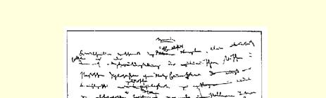
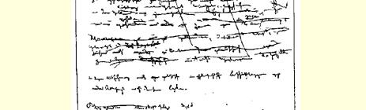
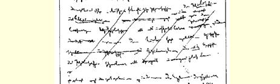
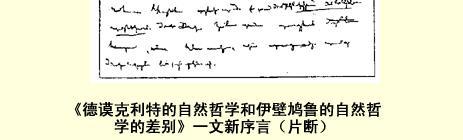
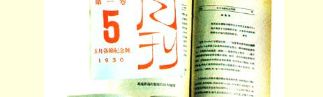
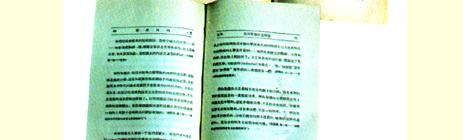
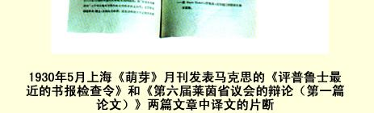

# 《德谟克利特的自然哲学和伊壁鸠鲁的自然哲学的差别》 一 文新序言（片断）３６

我献给公众的这篇论文，是一篇旧作，它当初本应包括在一篇综述伊壁鸠鲁主义、斯多亚主义和怀疑主义哲学的著作里[^1]，鉴于我正在从事性质完全不同的政治和哲学方面的研究，目前我无法完成这一著作。[^2]

只是现在，伊壁鸠鲁派、斯多亚派和怀疑派的体系为人们所理解的时代才算到来了。他们是**自我意识的哲学家**。这篇论文至少将表明，迄今为止这项任务解决得多么不够。

> 卡·马克思大约写于１８４１年原文是德文 ７月—１８４２年３月第一次用原文发表于《马克思全集》１９７５年历史考证版第１ 恩格斯全集》１９２９年历史考证部分第１卷翻译版第１部分第１卷第２分册
>
> 中文根据《马克思恩格斯

[^1]: 接着马克思删掉了下面这句话：“但是，由于从事目前更具有直接意义的政治和哲学方面的著作，暂时不允许我完成对那些哲学的综述，由于我不知道何时才有机会重新回到这一题目上来，我只好满足于……”—— 编者注

[^2]: 接着马克思删掉了下面这句话：“伊壁鸠鲁主义、斯多亚主义、怀疑主义哲学，即自我意识哲学，既被以前的哲学家当作非思辨哲学加以屏弃，也被那些同样在编写哲学史的有学识的学究当作……加以屏弃。”—— 编者注