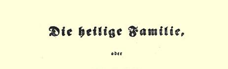
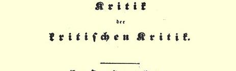
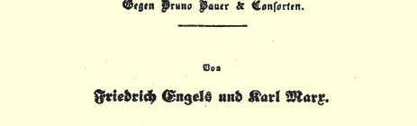
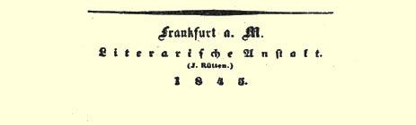

## 卡·马克思和弗·恩格斯合著 ——

# 神圣家族，

## 或

# 对批判的批判所做的批判

*驳布鲁诺·鲍威尔及其伙伴１*

> 卡·马克思和弗·恩格斯写于１８４４年９月—１１月按１８４５年版原文刊印 １８４５年在美茵河畔法兰克福原文是德文以单行本出版。 署名：弗里德里希·恩格斯
>
> 卡尔· 马克思合著 “神圣家族” 一书的书名，本来是意大利著名画家安得列阿·曼泰尼雅 （Ａｎｄｒｅａ Ｍａｎｔｅｇｎａ，１４３１—１５０６）一幅名画的题目，画中的人物是圣母马利亚抱着圣婴耶稣，旁边有马利亚的丈夫圣约瑟，有圣以利沙伯、圣约翰、圣亚拿以及一些天使和神甫。马克思和恩格斯就是借用这个题名来讽喻以布鲁诺·鲍威尔为首的一伙的。他们把布·鲍威尔比作天父的独生子耶稣，把其他几个伙伴比作他的门徒。这些人妄自尊大，自以为超乎群众之上，以为他们的话就是天经地义，不容争辩，正像耶稣在人们中传道一样。这幅画的名称本来应该译为“圣家族”或“圣家”，但马克思恩格斯的这本著作过去一向译为“神圣家族”，已经通用，所以，我们也就沿用了这个译名。—— 译者注

> “神圣家族” 一书第一版的扉页

# 序言

在德国，对**真正的人道主义**说来，没有比**唯灵论即思辨唯心主义**更危险的敌人了。它用“**自我意识**” 即“**精神**” 代替**现实的个体的人**，并且同福音传播者一道教诲说：“精神创造众生，肉体则软弱无能。”显而易见，这种超脱肉体的精神只是在自己的想像中才具有精神力量。**鲍威尔**的批判中为我们所驳斥的东西，正是以**漫画的形式**再现出来的**思辨**。我们认为这种思辨是**基督教德意志**原则的最完备的表现，这种原则的最终目的就是要通过变“**批判”** 本身为某种超经验的力量的办法使自己得以确立。

我们的叙述主要是针对**布鲁诺·鲍威尔**的“文学总汇报”２（我们手边有该杂志的前八期），因为在该报中鲍威尔的批判以及**整个德国思辨**的全部谰言达到了顶点。批判的批判（即“文学报” 的批判）愈是用哲学把现实歪曲得令人捧腹，那就对我们愈有教益**。** **法赫尔**和**施里加**二人便是例子。对“文学报” 所暴露的材料加以考察，就能帮助广大读者识破思辨哲学的幻想。这也就是我们写作本书的目的。

我们的叙述方法自然要取决于**对象本身的性质**。批判的批判在各方面都**低于**德国的理论发展水平。因此，假如我们**在这里**没有进而对这一发展本身**加以探讨**，那是由于我们所研究的对象的本质所致。

同时，批判的批判使我们不得不用现在所达到的成果**本身**来同它做一个简单的对比。

因此，我们先发表这部论战性的著作，再各自分头在自己的著作里叙述自己的肯定的观点，以及对现代哲学和社会学的肯定的见解。

#### 恩格斯、马克思

１８４４年９月于巴黎

### 第一章

## 以订书匠的姿态出现的批判的批判或赖哈特先生所体现的批判的批判

批判的批判虽然认为自己是多么地超出群众，但它仍然万分怜悯群众。所以批判爱群众，甚至将它的独生子赐给他们，叫一切信他的，不致灭亡，反得批判的永生。批判本身变成了群众，置身于我们中间，于是我们也看到了它的伟大—— 像天父的独生子一样的伟大。这就是说，批判变成了社会主义的批判，并且谈起 “关于赤贫化的论文”３来了。它丝毫不觉得将自己比做上帝有什么亵渎的地方：它已经下凡，变成了订书匠，并且竟然降低自己的身分去胡言乱语，用外国话批判地胡言乱语。它纯洁得犹如蓝天， 犹如处女，一看到罪孽深重的害麻疯病的群众就吓得心惊肉跳，但它还是克制住自己，研究了“**波特兹**” 的著作和“关于赤贫化的 **一切**原著”，而且“多年来一直密切注视着时代的弊病”。它不愿意为博学的专家们写作，而要为广大的读者习作，并且要清除一切古怪的语句、所有的“天书词句和所有的行话” —— 它是要从 **别人**的著作里清除所有这一切，因为假如希望批判本身服从“这种行政的规定”，那这要求未免太过分了。但是就在这一点上它还是做了一些的。它极其轻巧地摈弃了这些字的内容，虽然并没有摈弃这些字本身。这样，谁还敢指责它搬用“一大堆不可理解的外国字” 呢？即使它已经用它的一贯的表现宣告这些字对它自己来说也是不可理解的。

下面就是这种一贯表现的若干例子：

> “因此，**贫困制度**[^1]是他们恐惧的对象。” “**人类思想**[^2]的每个活动在其中**都成为洛特太太的形象**[^3]的责任感学说。” “在这个真正**充满信心的艺术建筑**[^4]的拱顶石上。” “这就是施泰因这位伟大的国家要人早在引退之前就交给了政府**和它的一切著作**[^5]的政治遗嘱的主要内容。” “当时这一民族对如此广泛的自由**还**没有**任何测定**[^6]。” “在他的政论文章的结尾几行中确有把握地**谈判道**[^7]：所缺乏的只是信任。” “对最高国家的、不愧为真正男子汉的、超绝于成规和怯懦的、在历史中受到教育的和用他国的公众政治生活的活生生的直观培养起来的理智。” “全民福利的教育。” “在当局的监督下，自由长眠**在各族人民的普鲁士使命的胸堂里**[^8]。” “**人民机体的**[^9]政论文章。” “对人民，甚至勃律盖曼先生也要把**他的成年洗礼证书**交给他们。” “和专门研究人民特殊使命的著作中所陈述的其他**规定性**[^10]所发生的矛盾是相当尖锐的。” “丑恶的贪婪心会很快打破一切**民族意志的幻想**[^11]。” “渴望暴富等等的心情就是那种始终贯串在复辟时期中的精神，这种精神带着**相当数量的漠不关心归附于**[^12]新的时代。” “**农业的普鲁士民族**[^13]对政治意义所固有的糊涂观念是**基于对伟大历史的回忆**[^14]。” “反感消失了并转入了十分兴奋的状态。” “在这种惊人的转变中，每个人都还是按照自己的方式**提出**自己的远景中的特殊**愿望**[^15]。” “使用涂了圣油的所罗门语言的教义问答，它的话语像鸽子一样，噗喳！ 噗喳！慢慢地飞上感染力和**雷鸣般的外貌**[^16]的境界。” “**三十五年的忽视的**整个**艺术涉猎**[^17]。” “假如宾达对１８０８年的城市章程的看法没有关于城市章程的本质和实施的**概念的穆斯林倾向**的[^18]缺点，那末就能够用我们的代表所特有的那种心平气和的精神去接受以前的一个城市统治者加于市民头上的过分**刺耳的怒喝**。”

处处和赖哈特先生的文风上的勇敢相吻合的，是思路本身的勇敢。他的思路是这样的：

> “勃律盖曼先生……１８４３年……国家学说……每个正直的人……我们的社会主义者的伟大的谦逊……自然的奇迹……应该向德国提出的要求 ……超自然的奇迹……亚伯拉罕[^19]……费拉得尔菲亚……甘露……面包师 ……但是**因为**我们谈到**奇迹**，**所以拿破仑**就会拿来……” 等等。

看完上面这些例子，我们就不会再觉得奇怪，为什么批判的批判还要向我们“解释” 它自认为是“通俗化的表现方法” 的那种说法。因为它“用能够透视混乱的有机力量来武装自己的双眼”。而在这里应当提醒一句，这样一来，甚至“通俗化的表现方法” 对批判的批判说来也不能是不可理解的了。它懂得，假如踏上文学家道路的主体没有足够的力量把这条路弄直，那这条路就必然还是弯曲的；所以它也就很自然地把“数学演算” 强加在作家的头上了。

不言而喻，批判的批判之所以变成群众，并不是为了本身要成为群众，而是为了使群众摆脱自己的群众的群众性，也就是说， 要把群众的通俗化的表现方法提升为批判的批判所使用的批判的语言。历史证实一切不言而喻的事情，同样也证实了这一点。如果批判掌握通俗化的群众语言，并把这种粗野的俚语改造成批判的批判的辩证法所具有的莫测高深的词句，那末这正说明批判把自己的身分降低到了极点。

### 第二章

## 体现为《ＭＵＨＬＥＩＧＮＥＲ》４的批判的批判或茹尔·法赫尔先生所体现的批判的批判

批判在前面不顾自己的身分用外国话胡言乱语，从而给自我意识大效其劳，同时用这种行动把世界从贫困中解救了出来；现在，它又打算不顾自己的身分在**实践**和**历史**中**胡言乱语**了。它通晓“**英国的迫切问题**” 并给我们提供了真正**批判的英国工业史概要**５。

自满自足、自圆其说和自成一家的批判当然不会承认历史的真实的发展，因为这无异于承认卑贱的群众的全部群众的群众性， 而事实上这里所涉及的正是要使群众摆脱这种群众性。因此历史将从它的群众性中解脱出来，而**自由地**处理自己的对象的批判又向历史吆喝道：“**你知道吗**，**你应当如此这般地产生**！” 批判的一切法律都有**溯及既往的**力量，在批判的判决**以前**，历史完全不是 **遵照批判的判决**产生的。因此，群众的，即所谓**真正**的历史是和 “文学报” 第７期第４页上开始发表的**批判的**历史大不相同的。

在群众的历史中，**工厂**出现以前是没有**任何工厂城市**的，可是在儿子生父亲（像在**黑格尔**那里一样）的批判的历史中，**曼彻斯特**、**波尔顿**和**普累斯顿**在谁都还没有想到工厂以前就已经是繁荣的工厂城市了。在真正的历史中，**棉纺织业**的发展主要是从**哈格里沃斯**的珍妮纺纱机和**阿克莱的纺纱机**（水力纺纱机）运用到生产上以后才开始的，而**克伦普顿的骡机**只不过是运用了阿克莱发明的新原理来改进珍妮纺纱机而成的。但是批判的历史善于辨别：它轻蔑地否认了珍妮纺纱机和水力纺纱机的片面性，并把骡机誉为这两个极端的思辨的同一。实际上，随着水力纺纱机和骡机的发明，立即有了在这些机器上**运用水力**的可能，但是批判的批判却把那些被历史的粗笨的手撮合在一起的原则互相分割开来，并把水力的这种运用当做一种完全特殊的东西归于较晚的时代。实际上，蒸汽机的发明**早于**上述的一切发明，而在批判中，蒸汽机被当成整个建筑物的顶点，因而在时间上是**最晚的**。

实际上，利物浦和曼彻斯特之间的现代意义上的**商务联系**是英国商品出口的结果，在批判中，商务联系却成了这种出口的**原因**，而商务联系和出口这二者则是这两个城市成为近邻的结果。实际上，从曼彻斯特运往大陆的所有的商品几乎都经过**赫尔**，在批判中却认为是经过**利物浦**。

实际上，英国的工厂里存在着所有的**工资等级**，从１１

２先令到４０先令，甚至更多一些，在批判中却只有**一种**工资——１１先令。实际上，**机器**代替了**手工劳动**，而在批判中却是机器代替了 **思维**。实际上，工人为了提高工资而实行的**联合**在**英国**是允许的， 在批判中，这种联合却是被禁止的，因为群众在做任何事情之前都必须请求批判的允许。实际上，**工厂劳动**是极端**折磨人**的，并且引起各种特殊的疾病（甚至有专门研究这些疾病的医学著作）， 在批判中却说“过分的紧张不会妨碍劳动，因为出力的是机器”。 实际上，机器就是机器，在批判中，机器却有**意志**：机器不休息， 工人也不能休息，所以工人是受外来意志支配的。

但是这些还算不了什么。批判不满意英国的**群众的政党**；它创造了新的政党，创造了“**工厂党**”，为此，历史应对它表示感谢。 可是它把厂主和工厂工人混为群众的**一团**，—— 这点区区小事又何足为怪呢！—— 并且武断地说，工厂工人不给反谷物法同盟６捐献基金，并不像愚蠢的厂主所说的那样是出于恶意或是由于对宪章主义的拥护，而只是由于贫穷。批判接着武断地说，一旦英国的谷物法被废除，农业短工就一定会同意降低工资，但是，我们敢于冒昧地指出，这个一贫如洗的阶级再也不会同意减少一文钱， 否则他们就会饿死。虽然愚蠢的非批判的英国法律注意到不使工作超过十二小时，批判却武断地说，英国工厂里一天工作**十六小时**。虽然非批判的群众的美国人、德国人和比利时人通过竞争渐渐地一个又一个地夺去了英国人的市场，批判却武断地说，英国仍旧应当成为全世界的大作坊。最后，批判武断地说，**财产的集中**及其对劳动阶级所造成的后果，在英国无论是有产阶级或是无产阶级都没有看出来，可是愚蠢的宪章派就认为他们对财产集中的现象了解得非常透澈，**社会主义者**也认为他们早已详尽地描述了这种后果，而且连托利党人和辉格党人（如**卡莱尔**、**艾利生**和 **盖斯克尔**）都可以用自己的著作来证明他们是了解这种现象的。

批判武断地说，**艾释黎**勋爵的**十小时法案**７是肤浅的中庸的措施，而艾释黎勋爵本人则是“立宪活动的忠实的反映”，可是到现在为止，厂主、宪章派、土地占有者（一句话，整个群众的英国）都把这种措施看成彻底激进的原则的一种表现（诚然是极微弱的表现），因为这种措施会破坏对外贸易的根基，并且会随之而破坏工厂制度的根基，—— 更确切些说，不仅会破坏，而且会挖它的老根。这一点批判的批判比谁都了解。批判知道，十小时工作日的问题是在下院的一个什么“委员会” 上讨论过，而非批判的报纸还竭力要使我们相信这一“委员会” 就是**下院本身**，即 “**全院委员会**”，但是批判却非取消英国宪法的这种荒诞性不可。

批判的批判自己**制造**出自己的**对立物**即**群众的愚蠢**，同时也制造出詹姆斯·格莱安爵士的愚蠢，它用批判地解释英语的方法把非批判的内务大臣从来没有说过的话归之于这位大臣，而它之所以这样做只是为了借格莱安的愚蠢来更加鲜明地衬托出自己的聪明。批判宣称，格莱安曾说过不管工厂的机器每天工作十小时或十二小时，工厂的机器大约可用十二年，所以十小时法案使资本家不可能通过机器的工作在十二年里再生产出投入这些机器的资本。批判接着就证明它替格莱安爵士捏造出来的结论是错误的， 因为机器每天少工作１

６的时间，它的使用年限自然会延长。

尽管批判的批判对它自己的错误结论的这种指斥是完全正确的：但是我们应当为詹姆斯·格莱安爵士主持公道，实际上他是这样讲的：实行了十小时法案，机器就必然会按工作时间缩短的比例加快速度（批判本身在第８期第３２页上也引证过这段话），在这样的情况下机器的磨损时间仍然正好是十二年。这一点是不能不承认的，更何况这种承认只是对“**批判”** 的赞扬和歌颂，因为正是**批判**本身不仅做出了错误的结论，并且接着又把它驳倒。批判对待**约翰·罗素**勋爵却非常宽宏大量，它硬说这位勋爵有改变国家制度的形式和选举制度的意图。由此我们必须做出结论：不是批判生来就特别醉心于制造蠢事，就是约翰·罗素勋爵在最近一周变成了批判的批判家。

批判发现：虽然有迹象表明“英国工人也注意工作时间的立法限制”，但是他们对这一问题只表现了“**部分的**关心”，而实际上工人为了要求实行十小时法案，在四、五月间曾一次又一次地举行集会，一次又一次地请愿，工厂区的每一个角落都笼罩着一种两年来从来没有过的激愤；批判还作出了一个伟大的、卓越的、 前所未闻的发现：“乍看起来，废除谷物法会给工人带来更多的直接的好处，所以在工人的大部分愿望得到满足从而实际证明废除谷物法对工人毫无好处以前，工人一直都会把这些愿望寄托在废除谷物法上面”，而实际上，工人在一切公众的集会中坚决地把主张废除谷物法的人从讲坛上轰走，使反谷物法同盟不敢在英国的任何一个工厂城市举行公众的集会，他们把反谷物法同盟看做唯一的敌人，他们在讨论十小时工作日时，像在讨论类似的问题时几乎经常有的现象一样得到托利党人的支持。批判正是在作出这些发现的时候，它在制造蠢事方面才真正变得伟大起来。批判发现：“工人仍被**宪章运动**的广泛的允诺所迷住”，而实际上宪章运动正是工人的舆论的政治表现；批判在自己的绝对精神的深处看出“两个集团即政治集团与土地和工厂所有者集团**已经**互**不**融合和互不掩护”，但是到现在为止我们还没有听到过，土地和工厂所有者集团这两个私有者阶级虽然人数不多，政治权利也完全一样 （少数贵族除外），却具有这样广泛的性质，我们还没有听到过，实际上作为政党的最彻底的表现和顶点的这一集团又是和政党集团绝对同一的。批判能有这些发现真是妙不可言。批判硬说主张废除谷物法的人不知道下面这个事实：在其他条件不变的情况下，谷物价格降低，工资也必然会降低，结果一切都仍旧和过去一样，而事实上这些先生们是指望借助工资的这种显著降低和由此而来的生产费用的减少来相应地扩大市场，可是这样一来就减少了工人之间的竞争，因而工资和谷物的价格比较起来多少总比现在要高一些。批判硬这样说算是妙极了。

在艺术家式的陶醉中任意创造自己的对立物—— 胡言乱语 —— 的批判，也就是两年前叫喊“批判讲德语，神学讲拉丁语”８的那个批判，现在它又学会了**英语**，把土地占有者叫做《Ｌａｎｄｅｉｇ－ ｎｅｒ》（ｌａｎｄｏｗｎｅｒｓ），把厂主叫做《Ｍüｈｌｅｉｇｎｅｒ》（ｍｉｌｌ－ｏｗｎｅｒｓ；英语中的《ｍｉｌｌ》指的是一切用蒸气或水力发动机器的工厂），把工人叫做“**手**”（ｈａｎｄｓ），用“干扰”（ｉｎｔｅｒｆｅｒｅｎｃｅ）来代替“干涉”，并且基于对渗透了罪恶的群众性的英语的无比同情，竟然降低自己的身分来改造英语和废除学究式的规则，按照这一规则，英国人总是把勋爵士和从男爵的称号“爵士”冠在**名**的前面，而不冠在姓的前面。群众说“爵士詹姆斯·格莱安”；而批判却说“爵士格莱安”。

批判着手改造**英国的**历史和**英国的**语言是从**原则**出发，而不是**轻率**从事，关于这一点，读者现在可以从它对待**瑙威尔克先生的历史时所具有的那种彻底性**中得到证明。

### 第三章

## “批判的批判的彻底性”或荣（荣格尼茨？）先生所体现的批判的批判９

**瑙威尔克**先生和柏林大学哲学系的无比重要的争论，批判不能置若罔闻。它本来也经历过类似的事情，并且必然会把瑙威尔克先生的命运拿来当做背景，以便把**波恩的撤职事件**１０衬托得更能引人注意。因为批判已经惯于把波恩的这段历史看做当代的突出事件，甚至写成了“批判的解职的哲学”，所以可以预料，它一定会以同样的方式把柏林的“冲突”构成详细的哲学大纲。它ａｐｒｉｏｒｉ 〔先验地〕证明：这一切都必然是这样而不是那样地发生。就是说， 它表明：

（１）为什么哲学系一定要和国家哲学家发生“冲突”，而不和逻辑学家或形而上学者发生“冲突”；

（２）为什么这次冲突不可能像批判和神学在波恩的争斗那样激烈和彻底；

（３）为什么这次冲突实际上是一件蠢事，既然批判在波恩的冲突中已经穷尽了一切可能的原则和一切可能的内容，而且从那时起，世界史只好变成批判的抄袭者了；

（４）为什么哲学系把对瑙威尔克先生的著作的攻击看成对自己的攻击；

（５）为什么瑙威尔克先生除了自动离职就别无出路；

（６）为什么哲学系不想背弃自己就一定得维护瑙威尔克先生；

（７）为什么“哲学系内部的纷争必然要表现在” 哲学系同时认为瑙威尔克和政府都对又都不对这一点上；

（８）为什么哲学系在瑙威尔克的著作中找不出他被撤职的根据；

（９）什么东西使得整个判断都不明确；

（１０）为什么“作为科学机关（！）的”哲学系“认为自己（！） 有权利（！）观察事件的根源”；最后，

（１１）为什么哲学系仍然不愿意用瑙威尔克先生那样的方式从事写作。

批判用四页的篇幅以罕有的彻底性分析了这些重要问题，同时它运用黑格尔的逻辑来证明：为什么这一切正是这样发生，为什么无论什么神都无法反对这一点。批判在另一个地方说，还没有一个历史时代已经被认识；由于谦逊，它不便说它至少已经充分认识了即使本身并不就是时代但是在它看来终归还是**构成了**时代的它自己的冲突和瑙威尔克的冲突。

“扬弃了”自己的**彻底性**“因素”的批判的批判又变成了“**认识的宁静”**。

### 第四章

## 体现为认识的宁静的批判的批判或埃德加尔先生所体现的批判的批判

### （１）弗洛拉·特莉斯坦的“工人联合会”１１

法国社会主义者肯定地说：工人制造一切，生产一切，但是他们既没有权利，又没有财产，简单地说，一无所有。关于这一点，批判通过体现了**认识的宁静的埃德加尔**先生的嘴作了如下的回答：

> “为了创造一切，就需要某种比工人的意识更强有力的意识。上述论点只有像下面这样倒过来讲才是正确的：工人什么东西也没有制造，所以他们也就一无所有；他们之所以什么都没有制造，是因为他们的工作始终是为了满足他们自己的需要的某种单一的东西，是平凡的工作。”

在这里，批判达到了如此高度的抽象，以致于在它看来，只有它自己的思想创造以及和任何现实都相矛盾的普遍性才是“某种东西”，甚至就是“**一切**”。工人之所以什么都没有创造，是因为他们所创造的仅仅是“单一的东西”，即可以感触到的、非精神的和非批判的对象，这些对象中的任何一种都会使纯批判深恶痛绝。凡是现实的、活生生的东西都是非批判的、群众的，因此，它是“无”，只有批判的批判的理想的、虚幻的创造才是“**一切**”。

工人之所以什么都没有创造，是因为他们的工作仅仅是为了满足他们个人的需要的某种单一的东西，也就是因为在现代的世界秩序下，各个单个的、互有内在联系的劳动部门是分隔开来的， 甚至是互相对立的，一句话，就是因为劳动没有**组织起来**。批判本身所提出的论点，如果从唯一可能的合理的意义上来加以说明， 就是要求劳动有组织。弗洛拉·特莉斯坦（分析她的著作就可以发现这种伟大的论点）也有同样的要求，而且由于她竟敢走在批判的批判的前头，遭到了后者的极端的鄙视。“工人什么都没有创造。”要是撇开**单个**工人不能生产任何**完整的东西**这一事实（这是不言而喻的）不谈的话，这种论点简直就是疯话。批判的批判什么都没有创造，工人才创造一切，甚至就以他们的精神创造来说， 也会使得整个批判感到羞愧。英国和法国的工人就很好地证明了这一点。工人甚至创造了**人**，批判家却永远是不通人性的人〔Ｕｎ ｍｅｎｓｃｈ〕，然而，他的确对于自己是一个批判的批判家这一点感到一种内心的满足。

> “弗洛拉·特莉斯坦给我们提供了一个妇女的教条主义的例子，这种教条主义离开公式就寸步难行，并且还用现存事物的范畴来制定公式。”

批判所做的，仅仅是“用现存事物的范畴来制定公式”，也就是用现存的**黑格尔**哲学和现存的社会意向来制定公式。公式除了公式便什么也没有。而且尽管批判在竭力抨击教条主义，但是它还是宣告自己是教条主义，而且是**妇女**的教条主义。它是一个老太婆，而且将来仍然是一个老太婆；它是年老色衰、孀居无靠的 **黑格尔**哲学。这个哲学搽胭抹粉，把她那干瘪得令人厌恶的抽象的身体打扮起来，在德国的各个角落如饥似渴地物色求婚者。

### （２）贝罗论娼妓问题

埃德加尔先生曾一度降低身分来过问社会问题，他认为自己也有责任干预“**淫乱的关系**”。（第５斯第２６页）

他批评巴黎的一位警官贝罗所著的关于娼妓制度的书，因为 “贝罗在考察娼妓对社会的关系时”所持的“**观点**”使他感到不安。 “认识的宁静”对于警察正是从警察的观点来考察问题这一点感到惊讶，而且它要使群众了解这一观点是完全错误的。可是它却不让人了解它自己的观点。十分明显！当批判跟娼妓在一起鬼混的时候，是不能要求它在公众面前做到这一点的。

### （３）爱情

为了达到完美的“认识的宁静”，批判的批判首先必须竭力摆脱**爱情**。爱情是一种情欲，而对认识的宁静说来，再没有比情欲更危险的东西了。所以，埃德加尔先生正在借冯·帕尔佐夫夫人的小说（他保证说：这些小说“他已彻底**研究过**”）来克服“**被称为爱情的那种幼稚行为**”。爱情是灾祸，是妖魔，它激起批判的批判的仇恨、愤怒以至癫疯。

> “爱情……是一个凶神。她像所有的神一样，要支配整个的人，直到人不仅将自己的灵魂、而且将自己的肉体的‘自我’交给她时，她才感到满足。对爱情的崇拜便是苦恼，这种崇拜的顶峰就是使自己成为牺牲品，就是自杀。”

为了把爱情变为“摩洛赫”[^20]，变为魔鬼的化身，埃德加尔先生先把它变成神。在变成神即神学的对象之后，爱情自然就会受到**神学的批判**了；何况大家都知道，神和魔鬼也相差无几。埃德加尔先生把爱情变成“神”，而且是变成“凶神”，所用的办法是把**爱人者**、把**人**的爱情变成**爱情**的人，把“**爱情**” 作为特殊的本质和人分割开来，并使它本身成为独立存在的东西。通过这样一个简单的过程，通过谓语到主体的这一转变，就可以把人所固有的一切规定和表现都批判地改造成**怪物**和**人类本质的自我异化**。 例如，批判的批判把作为谓语和人的活动的批判变成特殊的主体， 变成针对自身的批判，因而也就变成**批判的批判**，即变成一个 “摩洛赫”；对它的崇拜就是使自己成为牺牲品，就是人本身特别是人的**思考能力**的自杀。

> “**对象**”，—— 认识的宁静叫道——“对象是一个非常确切的词，因为，对爱者说来，被爱者（没有女的）[^21]只有作为他所**迷恋的这一外在客体**，即作为他希望用来满足自己的私欲的客体时，才是重要的。”

**对象**！可怕得很！没有比**对象**更可憎、更鄙俗、更群众的了，——ａｂａｓ〔打倒〕对象！绝对的主观性、ａｃｔｕｓｐｕｒｕｓ〔纯粹的活动〕、“纯”批判怎么能不把爱情看做ｂêｔｅｎｏｉｒｅ，看做撒但[^22] 的现身呢！因为爱情第一次真正地教人相信自己身外的实物世界， 它不仅把人变成对象，甚至把对象变成了人！

认识的宁静激愤地继续说道：爱情把一个人变成另一个人的 “**客体**”这样一个**范畴**还不放心，它甚至把他变成**一定的**、**现实的**客体，变成**这个**卑贱个人的（见黑格尔关于“这个”和“那个”两范畴的 “现象学”１２，这里面也在进行反对卑贱的“**这个**”的论争）、**外在的**、 不仅是内在的、隐藏在脑子里面的、而且是可以感触得到的客体。

> “爱情
>
> 不只是幽禁在脑子里。”

不，被爱者是**感性的对象**，而批判的批判（如果它不得不屈节承认某种对象的话）最低限度也会要求对象成为一个**非感性**的对象。然而爱情却是**非批判的**、**非基督教的唯物主义者**。

最后，爱情竟把一个人变成另一个人所“**迷恋的这一外在客体**”，变成满足另一个人的**私欲**的客体，—— 这种欲望之所以是**自私的**，是因为它**企图**在别人身上**寻求自己的本质**，但这是不应该的。批判的批判是**这样地清心寡欲**，以至于在**自己的“自我” 身上**可以充分**找到**人类本质的全部内容。

埃德加尔先生自然没有告诉我们，被爱者和所有其他“用来满足人们的私欲的、令人迷恋的外在客体”有什么不同。诱人的、 多情的、内容丰富的爱情这个对象，对认识的宁静说来只不过是一个抽象的模型：“令人迷恋的这一外在客体”，这正像彗星对思辨的自然哲学家说来只不过是“负” 这个范畴一样。一个人在把另一个人变成自己迷恋的外在客体时，的确（根据批判的批判的承认）是在赋予他以“重要性”，但这是所谓的**对象的重要性**，然而批判所赋予对象的重要性无非就是批判自己赋予自己的那种重要性。因此，这种批判的“重要性” 表明自己不是“卑贱的**外在的有**”，而是批判的重要对象的“**无”**。

如果认识的宁静在现实的人身上得不到**对象**，那末，相反地它就会在**人类**中间获得**事业**。批判的爱情“最**担心**的是由于个人而忘记**事业**，这就是人类的事业”。而非批判的爱情却没有把人类和单个的人、和个人分割开来。

“爱情本身是一种不知来自何处也不知走向何方的抽象的情欲，它对于内在的发展不感兴趣。”

因为在思辨的用语中，具体的叫做抽象的，而抽象的却叫做具体的，所以在认识的宁静的眼里爱情是抽象的情欲。

“她不是降生在山谷里，

谁都不知道她来自何方；

她匆匆地辞别而去，

连踪影也随之消失。”１３

在抽象的眼里，爱情是“来自异乡的少女”，她没有携带辩证的护照，因而被批判的警察驱逐出境。

爱情的情欲对于**内在**的发展不感兴趣，因为它不可能被ａｐｒｉ ｏｒｉ〔先验地〕构造出来，因为它的发展是发生于感性世界中和现实的个人当中的现实的发展。而思辨结构的主要兴趣则是“来自何处” 和“走向何方”。“来自何处” 正是“概念的**必然性**、它的证明和演绎”（黑格尔）。“走向何方” 则是这样的一个规定，“由于它，思辨的圆环上的每一环，像方法的生气蓬勃的内容一样，同时又是新的一环的发端”（黑格尔）。这样，只有在爱情的“来自何处”和“走向何方”可以被ａｐｒｉｏｒｉ〔先验地〕构造出来的时候， 爱情才会使思辨的批判感到“兴趣”。

在这里，批判的批判不仅反对爱情，而且也反对一切有生命的东西、一切直接的东西、一切感性的经验，反对所有一切**实际** 的经验，而关于这种经验，我们是决不会预先**知道**它“来自何处” 和“走向何方” 的。

埃德加尔先生通过对爱情的克服，完全**肯定了**自己是“认识的宁静”。接着他又立刻通过**蒲鲁东**显示了他在认识（对这种认识说来，“**对象**”不再是“**这一外在客体”**了）上的高深的造诣，同时也表现了他对法语的更深的**不爱**。

## （４）蒲鲁东

按照批判的批判的说法，“什么是财产？”１４这部著作不是**蒲鲁东**本人写的，而是“蒲鲁东的**观点**” 写的：

“我对蒲鲁东的观点的阐述，从评定它（观点）[^23]的著作‘什么是财产？’开始。”

因为只有批判的观点的著作本身才具有特征，所以批判的评定必然从赋予蒲鲁东的著作以一种特征开始。埃德加尔先生赋予这部著作以特征的方法是**翻译**。当然，他赋予它的是**丑恶**的特征， 因为他把它变成了“**批判” 的对象**。

于是，蒲鲁东的著作就遭到了埃德加尔先生的双重攻击，即通过赋予特征的翻译的**暗中**攻击和通过批判的评注的**公开**攻击。 我们将看到，埃德加尔先生在翻译时比他在做评注时更为毒辣。

#### 赋予特征的翻译１

> “我不想（这是被批判地翻译过的蒲鲁东在说话）[^24]提供任何新东西的体系，除了废除特权、消灭奴役以外，我别无其他愿望…… 公平，除了公平而外别无其他，—— 这就是我的主张。”

被赋予特征的蒲鲁东仅限于有愿望和主张，因为，善良的愿望” 和非科学的“主张” 是非批判的群众的特性。被赋予特征的蒲鲁东的特点，就是他具有与群众的身分相称的驯顺的性格，他使自己所希求的东西服从于自己所不希求的东西。他不敢奢望提供新东西的体系，他的愿望很低，他甚至除了废除特权等等之外就**别无其他**愿望。除了这样把自己已有的愿望批判地从属于自己所没有的愿望以外，他的第一句话还立即暴露了特有的逻辑缺点。 一个作家既然在自己的书中一开始就声明自己不想提供新东西的体系，那末他当然应该告诉我们，他到底想提供什么？是想提供系统化的旧东西呢，还是非系统化的新东西？但是，被赋予特征的蒲鲁东既然不想**提供**任何新东西的体系，那末，他是否想提供特权的废除呢？不，他只是**希望**废除特权。

**真正**的蒲鲁东说：《Ｊｅｎｅｆａｉｓｐａｓｄｅｓｙｓｔèｍｅ；ｊｅｄｅｍａｎｄｅｌａ ｆｉｎｄｕｐｒｉｖｉｌèｇｅ》ｅｔｃ．（“我不创立任何体系，我要求废除特权”等等）。这就是说，真正的蒲鲁东声明：他不追求任何抽象的科学的目的，而只是向社会提出一些直接实践的要求。而且他的要求决不是任意提出的。这个要求由于他对论题的全部发挥而成为有根据和有理由的要求，它就是这种发挥的要领，因为，“公平，并且仅仅是公平，这就是我的**立论**的要领”。被赋予特征的蒲鲁东说过： “公平，除了公平而外别无其他，—— 这就是我的主张”，这种说法使他陷入了更加狼狈的境地，因为他还“主张”其他许多事情， 例如，照埃德加尔先生的说法，他“**主张**” 哲学在过去是不够实际的，“**主张**” 驳倒沙尔·孔德，如此等等。

批判的蒲鲁东自问道：“难道**人**有责任永远是不幸的吗？” 换句话说，他问的是：不幸是不是人的道德本份？而真正的蒲鲁东是个轻佻的法国人，所以他提的问题是这样：不幸是不是一种物质的必然性，是不是某种**不可避免**的东西？（“难道人**不可避免地** 永远不幸吗？”）

群众的蒲鲁东说：

> 《Ｅｔ，ｓａｎｓｍ’ａｒｒêｔｅｒａｕｘｅｘｐｌｉｃａｔｉｏｎｓａｔｏｕｔｅｆｉｎｄｅｓｅｎｔｒｅｐ－ｒｅｎｅｕｒｓｄｅ ｒéｆｏｒｍｅｓ，ａｃｃｕｓａｎｔｄｅｌａｄéｔｒｅｓｓｅｇéｎéｒａｌｅ，ｃｅｕｘ－ｃｉｌａｌａｃｈｅｔéｅｔｌ’ｉｍｐéｒｉｔｉｅ ｄｕｐｏｕｖｏｉｒ，ｃｅｕｘ－ｌａｌｅｓｃｏｎｓｐｉｒａｔｅｕｒｓｅｔｌｅｓéｍｅｕｔｅｓ，ｄ’ａｕｔｒｅｓｌ’ｉｇｎｏｒａｎｃｅ ｅｔｌａｃｏｒｒｕｐｔｉｏｎｇéｎéｒａｌｅ》，ｅｔｃ．〔“我不谈改良办法的杜撰者的那些毋庸辩驳的解释，他们中的一些人把普遍的贫困归咎于政府的胆怯和无能，另一些人归咎于阴谋家和叛乱，还有一些人则归咎于无知和普遍的堕落腐化”，等等。〕

因为《ａｔｏｕｔｅｆｉｎ》是群众的德文字典中所找不到的下流的群众用语，所以批判的蒲鲁东自然就摈弃了这个把“解释”〔ｅｘｐｌｉｃａ －ｔｉｏｎｓ〕一词规定得比较确切的用语。这个术语是从群众的法国法学中借来的，在法国法学中，《ｅｘｐｌｉｃａｔｉｏｎｓａｔｏｕｔｅｆｉｎ》的含义是“毋庸辩驳的解释”。批判的蒲鲁东抨击“**改良主义者**”，即法国的一个社会主义政党１５，而群众的蒲鲁东所抨击的则是“改良办法的杜撰者”。群众的蒲鲁东把各种类型的“改良办法的杜撰者” 加以区别：这一类（ｃｅｕｘｃｉ）说些**什么**，那一类（ｃｅｕｘ－ｌａ）说些 **什么**，另一类（ｄ’ａｕ－ｔｒｅｓ）又说些**什么**。批判的蒲鲁东却让**同样的一些改良主义者**“时而谴责这个，时而谴责那个，时而又谴责另一个”，这无论如何证明他们是反复无常的。真正的蒲鲁东根据群众的法国实践来谈《ｌｅｓｃｏｎｓｐｉｒａｔｅｕｒｓｅｔｌｅｓéｍｅｕｔｅｓ》〔“阴谋家和叛乱”〕，也就是说，先指出阴谋家，然后再指出他们的行动—— 叛乱。相反地，把各种类型的改良主义者混为一谈的批判的蒲鲁东却把暴徒加以分类，所以他说“阴谋家和**叛乱者**”。群众的蒲鲁东说的是**无知和“普遍的堕落腐化”**。批判的蒲鲁东则把无知变为愚蠢，把“堕落腐化”变为“下流无耻”，最后又以批判的批判家的身分把愚蠢变为**普遍的**。于是他自己就在这里现身说法地做了一个愚蠢的榜样，因为他用《ｇéｎéｒａｌｅ》这个字时写的不是复数，而是单数。他写的是：《ｌ’ｉｇｎｏ－ｒａｎｃｅｅｔｌａｃｏｒｒｕｐｔｉｏｎ ｇéｎéｒａｌｅ》，而想说的却是：“普遍的愚蠢和普遍的下流无耻”。按照非批判的法文文法，这里应该写成这样：《ｌ’ｉｇｎｏｒａｎｃｅｅｔｌａｃｏｒ ｒｕｐｔｉｏｎｇéｎéｒａｌｅｓ》[^25]。

被赋予特征的蒲鲁东在说话方面和思考问题方面都跟群众的蒲鲁东不同，当然他也经历过完全不同的**教育过程**。他“请教过科学大师，读完了数百卷哲学和法学等等方面的著作，**最后**还确信：我们从来没有正确地了解‘公平、正义、自由’这几个词的含义”。而真正的蒲鲁东则认为，他**一开始**就理解了（ｊｅｃｒｕｓｄ’ ａｂｏｒｄｒｅ－ｃｏｎｎａｌｔｒｅ）批判的蒲鲁东只是在：“**最后**” 才领悟的东西。这里之所以必须把ｄ’ａｂｏｒｄ〔一开始〕批判地改变为ｅｎｆｉｎ 〔最后〕，是因为群众不敢相信他们“一开始”就理解了什么东西。 群众的蒲鲁东用最明快的语言叙述他怎样为自己的研究工作的这种意外成果感到惊讶，叙述他怎样不相信这个成果。因此他决定进行“**反证**”，他向自己问道：“人类是否可能在道德运用的原则方面这样长期地受骗呢？人类是怎样和为什么受骗的呢？” 等等。 他认为，自己的观察正确与否，取决于这些问题的解决。他得出结论说，在道德方面，也像在其他一切知识领域中一样，谬误 “**构成科学的阶梯**”。相反地，批判的蒲鲁东却立刻就相信了他在政治经济学、法学等等方面的研究所给予他的第一个印象。这个印象显然是这样：群众不敢**认真地**行动，他们一定要把自己研究的初步成果奉为无可辩驳的真理。他们“在和自己的反对方面较量之前，一开始就有了现成的见解”，因此后来“发现，当他们自以为已经到达终点的时候，他们还没有来得及到达起点呢”。

于是，批判的蒲鲁东继续毫无根据地语无伦次地大发议论：

> “我们关于道德规则的知识不是一开始就很充分的，**因此**，在一定的时间内它可能足够社会进步之用，但是到后来它就会把我们引入歧途。”

批判的蒲鲁东没有解释，关于道德规则的不充分的知识为什么可能足够社会进步之用（哪怕是只在一天之内）。而真正的蒲鲁东却先向自己提出问题：人类是否可能和为什么可能这样普遍、这样长期地迷误不醒？他认为这个问题的解答是：一切谬误都构成科学的阶梯，甚至我们的最不完善的判断也包含着一些真理，这些真理对于某些归纳推论和对于实际生活的某一特定领域是完全够用的；超出这些推论和这个领域，这些真理就会在理论上产生谬误，在实践上导致失败。蒲鲁东在做了这样的解释以后，他就能够说，甚至关于道德规则的不完备的知识在一定的时间内也可能足够社会进步之用。

批判的蒲鲁东说：

> “但是，对新知识的需要一经出现，旧偏见和新思想之间立即就会爆发残酷的斗争。”

但是，怎么可以跟**还不**存在的敌人进行斗争呢？要知道，尽管批判的蒲鲁东也告诉我们对新思想的需要产生了，但是他还并没有说这个新思想本身已经**产生了**。

群众的蒲鲁东说的则是：

> “对更高的知识的需要一经出现，这种知识就**决不会让自己等待下去**。” 可见，它已经存在着。“于是斗争就开始了。”

批判的蒲鲁东断言，“人的使命就在于一步一步地进行自我教育”，好像人就没有与此完全不同的另一种使命，即成为人，好像 “一步一步”的自我教育必然会把我们推向前进似的。我可以一步接一步地走，并仍旧回到我出发的地点。而非批判的蒲鲁东所谈的则不是人的“使命”，而是人进行自我教育所必备的**条件**（ｃｏｎｄｉ －ｔｉｏｎ），不是**一步一步地**（ｐａｓａｐａｓ），而是**一个阶段一个阶段地** （ｐａｒｄｅｇｒéｓ）。批判的蒲鲁东自言自语地说道：

> “在作为社会基础的诸原则中有这样一个原则，它为社会所不理解，它被社会的无知所败坏，它也是一切祸害的根由。虽然如此，人们仍然尊重**这个** 原则，希求这个原则，如不然，这个原则就不会有任何影响了。这个原则按其**实质**来说是真实的，但按我们对它的观念来说则是虚妄的……它究竟是什么呢？”

在第一句话中批判的蒲鲁东说，原则被社会所败坏、所不理解；可见这个原则本身是正确的。在第二句话中他再一次承认这个原则就其实质而言是真实的，虽然如此，他仍然责难社会不该尊重和希求“这个原则”。相反地，群众的蒲鲁东之所以谴责社会， 并不是因为社会尊重这个原则本身，而是因为社会尊重这个由于我们无知而伪造出来的原则（《ｃｅｐｒｉｎｃｉｐｅ…ｔｅｌｑｕｅｎｏｔｒｅｉｇｎｏｒ－ ａｎｃｅｌ’ａｆａｉｔ，ｅｓｔｈｏｎｏｒé》）。批判的蒲鲁东认为不真实的原则的 **实质**是**真实的**。群众的蒲鲁东则认为，伪造的原则的实质是我们的虚妄观念的结果，而这个原则的**对象**（ｏｂｊｅｔ）却是真实的，这正像炼金术和占星术的实质是我们臆想的结果，而它们的对象 （天体运行和物体的化学属性）却是真实的一样。

批判的蒲鲁东继续说他的独白，他说：

> “我们研究的对象是法律，即社会原则的规定。政治家，也就是社会科学界人士，为一些极不明确的观念所拘泥；但既然每一种谬误都有某种现实的东西做基础，那末我们也就能在他们的书中找到他们在不知不觉间创造给人世的真理。”

批判的蒲鲁东的议论是极其古怪的。他先断定政治家是不学无术和观念不清的，然后又十分武断地转口说每一种谬误都有某种现实的东西做基础，对于这一点我们是没有什么可怀疑的，因为陷入谬误的人本身就是作为每一种谬误的基础的某种现实的东西。其次，他又从每一种谬误都有某种现实的东西做**基础**这一事实得出结论说，在政治家的**书中**可以找到真理。最后，他甚至使政治家把这个真理创造给**人世**。假如他们已经把真理创造给**人世**， 那我们就用不着再到他们的**书**中去寻找真理了。

群众的蒲鲁东说：

> “政治家们互不了解（ｎｅｓ’ｅｎｔｅｎｄｅｎｔｐａｓ）；因此他们的谬误是主观的， 谬误的根源就在他们自己身上（ｄｏｎｃｃ’ｅｓｔｅｎｅｕｘｑｕ’ｅｓｔｌ’ｅｒｒｅｕｒ）。” 他们的互不了解证明了他们的片面性。他们把“自己的个人见解和健全的理智”混为一谈，而“既然”—— 根据先前的推论—— “每一种谬误都有某种真正现实的东西作为自己的**对象**，那末在政治家的书中就必定能找到他们不自觉地放在里面（即自己书中）[^26]的真理”，—— 他们是把真理“不自觉地放在里面”，而并没有把真理创造给人世（ｄａｎｓｌｅｕｒｓｌｉｖｒｅｓｄｏｉｔｓｅｔｒｏｕｖｅｒ１ａ ｖéｒｉｔé，ｑｕ’ａｌｅｕｒｉｎｓｕｉｌｓｙａｕｒｏｎｔｍｉｓｅ）。

批判的蒲鲁东向自己问道：“何谓公平，它的实质、它的性质、 它的意义怎样？”好像公平还有某种不同于其实质和性质的特殊的意义似的。非批判的蒲鲁东所问的是：“它的原则、它的性质和它的公式（ｆｏｒｍｕｌｅ）怎样？”公式所表明的原则是经过科学证明的原则。

在群众的法语中，《ｆｏｒｍｕｌｅ》和《ｓｉｇｎｉｆｉｃａｔｉｏｎ》〔“意义”〕是根本不同的。在批判的法语中这两个词的意思却完全一样。

在结束自己这番毫无用处的议论之后，批判的蒲鲁东提起精神，大声疾呼：

> “让我们试着稍微接近一些我们的对象吧！”

其实，非批判的蒲鲁东早就紧紧地靠近了自己的对象，并且正在试着对自己的对象做出更确切更中肯的规定（ｄ’ａｒｒｉｖｅｒａ ｑｕｅｌ－ｑｕｅｃｈｏｓｅｄｅｐｌｕｓｐｒéｃｉｓｅｔｄｅｐｌｕｓｐｏｓｉｔｉｆ）。

在批判的蒲鲁东看来，“法律是公平的事物的**规定**”，在非批判的蒲鲁东看来，法律则是公平的事物的“**宣告**”（ｄéｃｌａｒａｔｉｏｎ）。 非批判的蒲鲁东驳斥了认为法律创造公理的见解。而“法律的规定” 这种说法既可以表示法律被某种其他的东西所规定，又可以表示法律本身规定某种其他的东西；批判的蒲鲁东本人在上面就是从后一种含义来谈论社会原则的规定的。不过，做这样细微的区分对群众的蒲鲁东说来确实是不适当的。

既然被批判地赋予特征的蒲鲁东和真正的蒲鲁东之间有这样一些分歧，那末，蒲鲁东第一所企图证明的东西跟蒲鲁东第二所要证明的东西完全不同，就丝毫也不值得奇怪了。

批判的蒲鲁东

> “**企图**用**历史的经验证明**”，“如果我们关于公平的事物和合法的事物的观念是虚妄的，那末**显而易见**（尽管这样显而易见，但他仍然认为必须加以证明）[^27]，这种观念在法律上的一切运用就必定是不好的，我们的一切设施也必定是有缺陷的”。

群众的蒲鲁东却远不是要证明显而易见的东西。相反地，他所说的是：

> “如果我们关于公平的事物和合法的事物的观念不够明确、不完全或者甚至是虚妄的，那末**显而易见**，这种观念在我们的立法上的一切运用也是不好的”，等等。

那末，非批判的蒲鲁东到底想要证明什么呢？

> 他继续写道：“假如人们对于公平这个概念以及对于这个概念的运用的见解不是固定不变的，假如这类见解在各个不同的时代起了各种不同的变化，总之，假如思想有了进步，那末，关于公平在我们的观念中、从而也在我们的行动中受到歪曲的这种假说，就得到了事实的证明。”

而问题也就在于，正是这种不固定性、这种变易性、这种进步，“由**历史**所光辉地证实了”。非批判的蒲鲁东也就援引了这些光辉的历史证据。他那批判的影像先前根据历史经验证明了完全不同的原理，现在又以完全不同的方式来描述这种经验本身。

在真正的蒲鲁东看来，罗马帝国的衰亡是“贤者（ｌｅｓｓａｇｅｓ）” 所预料到的，而在批判的蒲鲁东看来，则是“哲学家” 所预料到的。批判的蒲鲁东看来，则是“哲学家” 所预料到的。批判的蒲鲁东当然认为只有哲学家才是贤者。照真正的蒲鲁东的看法，罗马“法经过千年来的法律实践或司法活动而神圣化了 （ｃｅｓｄｒｏｉｔｓｃｏｎｓａｃｒéｓｐａｒｕｎｅｊｕｓｔｉｃｅｄｉｘｆｏｉｓｓéｃｕｌａｉｒｅ）”；照批判的蒲鲁东的看法，在罗马存在着“被千年来的**公平**所神圣化了的法”。

根据这个蒲鲁东第一的判断，在罗马，人们是像下面这样发表议论的：

> “罗马……是靠它的政治和它的众神而获胜的；宗教信仰和公众精神的任何一种改革都是愚蠢的事情和亵渎的行为（在批判的蒲鲁东那里，《ｓａｃｒｉ－ ｌéｇｅ》这个词的意思不像在群众的法语中那样是亵渎圣物或冒犯神灵，而只是平常的亵渎行为）[^28]；如果罗马决心解放各族人民，那它就会因此而背弃自己的法。”蒲鲁东第一补充道：“可见，罗马既有为自己打算的事实，也有为自己打算的法。”

根据非批判的蒲鲁东的看法，在罗马，人们的议论更加彻底些。他们确切地叙述了**事实**：

> “奴隶是罗马的最大富源；因此各族人民的解放就等于**罗马财政的破产**。”

在谈到**法**时，群众的蒲鲁东还说出下面这样一种想法：“罗马的野心通过万民法（ｄｒｏｉｔｄｅｓｇｅｎｓ）而合法化了。”证明奴役法的这种方式完全符合罗马人的法律观点。在群众的罗马法全书上载明： 《ｊｕｒｅｇｅｎｔｉｕｍｓｅｒｖｉｔｕｓｉｎｖａｓｉｔ》（Ｆｒ．４．Ｄ．Ｉ．Ｉ．）〔“**奴隶制**通过**万民法**而巩固下来了”（“学说汇纂”[^29]第一卷第一题第四节）〕。

在批判的蒲鲁东看来，“偶像崇拜、奴隶制和软弱无能构成了罗马各种制度的基础”—— 任何制度都不例外。而真正的蒲鲁东却说：“罗马在宗教方面的各种制度的基础是偶像崇拜，在国家生活方面，是奴隶制，在私人生活方面，是享乐主义”（在普通的法语中，《éｐｉｃｕｒｉｓｍｅ》〔“享乐主义”〕这个词和《ｍｏｌｌｅｓｓｅ》即软弱无能的意思是不同的）。在罗马的这种情况下，神秘的蒲鲁东说 “出现了”“上帝的旨谕”，而真正的唯理论的蒲鲁东说的是出现了 “自称为上帝的旨谕的伟人”。在真正的蒲鲁东那里，这个伟人称僧侣为“蝮蛇”（ｖｉｐèｒｅｓ），而在批判的蒲鲁东那里，这个伟人的言谈却比较温和，他称僧侣为“蛇”。在前者那里，他以罗马的方式谈论“律师”〔《Ａｄｖｏｋａｔｅｎ》〕，在后者那里，他以德国的方式谈论“法学家”〔《Ｒｅｃｈｔｓｇｅｌｅｈｒｔｅ》〕。

批判的蒲鲁东称法国革命的精神为矛盾的精神，接着又补充道：

> “这足以使人相信，代替了旧事物的新事物**在**本身上没有任何方法严整、 思虑成熟的东西。”

他似乎非机械地重复“新” 和“旧” 这两个批判的批判所惯用的范畴不可似的。他好像非得提出这种毫无意义的要求，即 “新事物”**在**本身**上**〔ａｎｓｉｃｈ〕应包含有方法严整、思虑成熟的东西，这就像要求人们在本身上〔ａｎｓｉｃｈ〕都要有些污点一样。而真正的蒲鲁东却是这样说的：

> “这足以证明，代替了旧事物秩序的那个事物秩序，**在本身中**〔ｉｎｓｉｃｈ〕 已丧失了方法和反省。”

沉醉在法国革命的回忆中的批判的蒲鲁东，竟把法语**革命化** 到这种程度，以至于把《ｕｎｆａｉｔｐｈｙｓｉｑｕｅ》〔“物质界的事实”〕译作“物理学的事实”，而把《ｕｎｆａｉｔｉｎｔｅｌｌｅｃｔｕｅｌ》〔“精神生活的事实”〕译作“智慧的事实”。由于把法语这样一革命化，批判的蒲鲁东就得以使物理学拥有了自然界中所出现的一切事实。如果说， 他这样一方面把自然科学捧到九天之上，那末另一方面，由于他否认自然科学中有智慧，由于他把智慧的事实同物理学的事实截然分开，也就把自然科学贬到九地之下了。同时，由于他把精神生活的事实直接提升为智慧的事实，他也就使心理学和逻辑学的一切进一步的探讨成了多余的事情。

既然批判的蒲鲁东（即蒲鲁东第一）甚至不去猜测真正的蒲鲁东（即蒲鲁东第二）究竟想用他的历史的演绎来证明什么东西，那末对于他来说，当然也就不存在这种演绎的实在内容，即通过**否定** 历史上的实在法来证明法的观念的演变，证明公平的不断**实现**。

> “社会通过自己的原则的**否定**……和最神圣的法的**破坏**而得救。”

真正的蒲鲁东就这样证明，罗马法的否定导致了法的概念在基督教的法的**观念**中的扩大，征服者的法的否定导致了自治团体法的确立，法国革命对全部封建制法的否定导致了更广泛的现代法律秩序的建立。

批判的批判死不承认，原则通过自身的否定而实现的规律是蒲鲁东发现的，这个光荣应该属于他。具有如此自觉的形式的这种思想，对法国人确是一个真正的启示。

#### 批判性的评注１

对任何科学的最初的批判必然要拘泥于这个批判所反对的科学本身的种种前提，同样，蒲鲁东的“什么是财产？”这部著作也是从政治经济学的观点对**政治经济学**所做的批判。—— 至于该书有关法律的部分，即根据法的观点来批判法的这一部分，我们在这里没有做深入研究的必要，因为该书的主旨是批判政治经济学。—— 因此，通过对**政治经济学**，其中包括对蒲鲁东所了解的政治经济学的批判，蒲鲁东的著作被科学地越过了。这一工作之成为可能，正是依靠了蒲鲁东本人曾经做过的一切，这正如同蒲鲁东所做的批判是以重农学派对重商主义学说的批判、亚当·斯密对重农学派的批判、李嘉图对亚当·斯密的批判以及傅立叶和圣西门的著作为前提一样。

政治经济学的一切论断都以**私有制**为前提。这个基本前提被政治经济学到做确定不移的事实，而不加以任何进一步的研究，并且正如**萨伊**所坦率承认的，甚至被当做只是“偶然”为政治经济学所涉及的事实。蒲鲁东则对政治经济学的基础即**私有制**做了批判的考察，而且是第一次带有决定性的、严峻而又科学的考察。这就是蒲鲁东在科学上所完成的巨大进步，这个进步使政治经济学革命化了，并且第一次使政治经济学有可能成为真正的科学。蒲鲁东的“什么是财产？”这部著作对现代政治经济学的意义，正如同**西哀士**的著作“什么是第三等级？”对现代政治学的意义一样。

如果说蒲鲁东本人还没有把私有制的各种进一步的形式，如工资、商业、价值、价格、货币等等，像“德法年鉴”１６那样看做私有制的形式（见弗·恩格斯的“政治经济学批判大纲”），而是用这些政治经济学的前提来反驳经济学家，那末这就完全符合他那从历史上说来可以原宥的上述观点。

把私有制关系当做合乎人性的和合理的关系的政治经济学， 不断地和自己的基本前提—— 私有制—— 发生矛盾，这种矛盾正像神学家所碰到的矛盾一样：神学家经常按人的方式来解释宗教观念，因而不断地违背自己的基本前提—— 宗教的超人性。例如在政治经济学中，工资最初看来是同消耗在产品上的劳动相称的份额。工资和资本的利润彼此处在最友好的、互惠的、好像是最合乎人性的关系中。后来却发现，这二者是处在最敌对的、**相反**的关系中的。最初，价值看起来确定得很合理：它是由物品的生产费用和物品的社会效用来确定的。后来却发现，价值纯粹是偶然确定的， 它无论和生产费用或者和社会效用都没有任何关系。工资的数额起初是由自由的工人和自由的资本家**自由**协商来确定的。后来却发现，工人是被迫同意资本家所规定的工资，而资本家则是被迫把工资压到尽可能低的水平。**强制**代替了立约双方的**自由**。在商业和其他一切经济关系方面的情形也都是这样。有时经济学家们自己也感觉到这些矛盾，而且揭露这些矛盾成了他们之间的斗争的主要内容。但是，在经济学家们意识到这些矛盾的情况下，**他们自己**也攻击表现在某种**个别**形式中的**私有制**，把私有制的某些个别形式斥责为本来合理的（即他们认为合理的）工资、本来合理的价值、本来合理的商业的伪造者。例如，亚当·斯密有时攻击资本家， 德斯杜特·德·特拉西攻击银行家，西蒙·德·西斯蒙第攻击工厂制度，李嘉图攻击土地所有制，而几乎所有近代的经济学家都攻击**非产业**资本家，即仅仅作为**消费者**来体现私有制的资本家。

所以经济学家们有时候，特别是在他们攻击某种特殊的损人利己的犯罪行为的时候，例外地维护经济关系上的合乎人性的外观，但在大多数场合下，他们恰恰是从这些关系同人性显然有**区别**的方面，从严格的经济意义上来把握这些关系的。他们总是不自觉地在这个矛盾中徘徊不已。

**蒲鲁东**永远结束了这种不自觉的状态。他认真地对待经济关系的**合乎人性的**外观，并把它和经济关系的**违反人性的现实**尖锐地对立起来。他迫使这些关系真正符合于它们自己对自己的看法； 或者更确切些说，他迫使这些关系抛弃关于自身的这种看法而承认自己是真正违反人性的。因此，蒲鲁东不同于其余的经济学家， 他不是把私有制的这种或那种个别形式、而是把整个私有制十分透澈地描述为经济关系的伪造者。从政治经济学观点出发对政治经济学进行批判时所能做的一切，他都已经做了。

想**说明**“什么是财产？”这部著作的**观点的特征**的埃德加尔先生，当然是既丝毫没有谈到政治经济学，也丝毫没有谈到蒲鲁东的著作所具有的特点，而这种特点正是在于把**私有制的实质**问题看做政治经济学和法学的根本问题。对于批判的批判说来，所有这一切都是不言而喻的。蒲鲁东并未因他否定私有制而有了任何新的发现。他不过是泄露了批判的批判所讳莫如深的秘密罢了。

> 埃德加尔先生在他那赋予特征的翻译之后马上接着说道：“于是，蒲鲁东发现了历史上的一个绝对者，一个永恒的基础，一个引导人类的神。这个神就是公平。”

蒲鲁东在１８４０年用法文写的著作并不是从１８４４年德国发展的观点出发的。这也就是蒲鲁东跟许多和他恰相对立的法国作家所共有的观点，它给批判的批判以方便，使后者可以笼统地一下说明两种截然相反的观点的特征。此外，只要彻底遵循蒲鲁东自己所提出的规律，即公平通过对自身的否定而实现的规律，就足以摆脱这个历史上的绝对者。如果说蒲鲁东没有得出这种彻底的结论，那末这应当归咎于他生为法国人而不是德国人的这种可悲的情况。

对埃德加尔先生说来，由于蒲鲁东提出了历史上的绝对者，由于他相信公平，所以他就成了**神学的**对象；而ｅｘｐｒｏｆｅｓｓｏ〔职业的〕批判神学的批判的批判现在就可以抓住蒲鲁东，以便能在 “宗教观念” 上大作文章。

> “每一种宗教观念的特点都是把这样一种情况奉为信条：两个对立面中最后总有一个要成为胜利的和唯一真实的。”

我们将看到，宗教的批判的批判是把这样一种情况奉为信条： 两个对立面中最后有一个—— “**批判”**—— 要作为唯一的真理战胜另一个对立面——“群众”。可是蒲鲁东却把群众的公平当做绝对者，奉为历史上的神，从而就犯下了更不公平的过错，因为公平的批判已经**非常明确地**为自己保留了这个绝对者、这个历史上的神的地位。

#### 批判性的评注２

> “贫穷困苦的事实使蒲鲁东得出了一些片面的论断；他认为这个事实是同平等和公平相**抵触**的；他把这个事实当做自己的武器。于是，对于他，这个事实就成了绝对的合理的，而私有制存在的事实则成为不合理的了。”

认识的宁静告诉我们说，蒲鲁东认为贫困的事实是和公平相抵触的，—— 可见，他认为这个事实是不合理的；可是认识的宁静连口气都顾不得喘就赶忙声明说，对于蒲鲁东，这个事实成了绝对的合理的。

以往的政治经济学从私有制的运动似乎使**人民富有**这个事实出发，得出了替私有制辩护的结论。蒲鲁东从政治经济学中被诡辩所掩盖的相反的事实出发，即从私有制的运动造成贫穷这个事实出发，得出了否定私有制的结论。对私有制的最初的批判，当然是从充满矛盾的私有制本质表现得最触目、最突出、最令人激愤的事实出发，即从贫穷困苦的事实出发。

> “相反地，批判则把贫穷和财产这两个事实合而为一；它发现了二者的内在联系，使它们成为一个整体，并且向这个整体本身询问其存在的前提是什么。”

批判直到现在还丝毫不了解财产和贫穷的事实，“相反地”，它却用仅仅在自己想像中所做到的事情来反驳蒲鲁东的真实的事情。它把**两个**事实合而为**一**，并且在把**两个**事实变为一个**唯一**的事实之后，又发现了**二者**之间的内在联系。批判不能否认，连蒲鲁东也承认贫穷和财产这两个事实之间存在着内在的联系，并且正是由于这种内在联系的存在，他才要求废除财产，以便消灭贫困。蒲鲁东甚至还做得更多。他详尽地表明了资本的运动**怎样**造成贫困。相反地，批判的批判却不屑于做这类鸡毛蒜皮的琐事。它发现贫穷和私有财产是**两种对立的东西**，—— 这可真是一个相当时髦的发现。它使贫穷和富有**成为一个整体**，并且“向这个整体 **本身**询问其存在的前提是什么”，—— 这个问题是多余的，因为批判自己刚刚**创造了**这个“整体本身”，可见它的这种**创造**本身就是这个整体存在的前提。

批判的批判既然向“整体本身” 去探询其存在的前提，那就等于是用真正神学的方式在这个“整体”** 之外**寻求这些前提。批判的思辨在它似乎正在研究的那个对象以外运动着。贫富之间的这一**全部对立正是对立的两个方面的运动**，整体存在的前提正是包含在这两个方面的本性中，可是批判的思辨却避不研究这个形成整体的真正的运动，以便给自己留一个机会，说批判的批判作为认识的宁静是高居于两个对立方面之上的，只有它那创造“整体本身” 的活动才能消灭它所创造的抽象。

无产阶级和富有是两个对立面。它们本身构成一个统一的整体。它们二者都是由私有制世界产生的。问题在于这两个方面中的每一个方面在对立中究竟占有什么样的确定的地位。只宣布它们是统一整体的两个方面是不够的。

私有制，作为私有制来说，作为富有来说，不能不保持**自身的存在**，因而也就不能不保持自己的对立面—— 无产阶级的存在。 这是对立的**肯定**方面，是得到自我满足的私有制。

相反地，无产阶级，作为无产阶级来说，不能不消灭自身，因而也不能不消灭制约着它而使它成为无产阶级的那个对立面—— 私有制。这是对立的**否定**方面，是对立内部的不安，是已被消灭的并且正在消灭自身的私有制。

有产阶级和无产阶级同是人的自我异化。但有产阶级在这种自我异化中感到自己是被满足的和被巩固的，它把这种异化看做 **自身强大**的证明，并在这种异化中获得人的生存的**外观**。而无产阶级在这种异化中则感到自己是被毁灭的，并在其中看到自己的无力和非人的生存的现实。这个阶级，用黑格尔的话来说，就是在被唾弃的状况下对这种状况的**愤慨**，这个阶级之所以必然产生这种愤慨，是由于它的人类**本性**和它那种公开地、断然地、全面地否定这种本性的生活状况相矛盾。

由此可见，在整个对立的范围内，私有者是**保守的**方面、无产者是**破坏的**方面。从前者产生保持对立的行动，从后者则产生消灭对立的行动。

的确，私有制在自己的经济运动中自己把自己推向灭亡，但是它只有通过不以它为转移的、不自觉的、同它的意志相违背的、 为客观事物的本性所制约的发展，只有通过无产阶级**作为**无产阶级—— 这种意识到自己在精神上和肉体上贫困的贫困、这种意识到自己的非人性从而把自己消灭的非人性—— 的产生，才能做到这点。无产阶级执行着雇佣劳动因替别人生产财富、替自己生产贫困而给自己做出的判决，同样地，它也执行着私有制因产生无产阶级而给自己做出的判决。无产阶级在获得胜利之后，无论怎样都不会成为社会的绝对方面，因为它只有消灭自己本身和自己的对立面才能获得胜利。随着无产阶级的胜利，无产阶级本身以及制约着它的对立面—— 私有制都趋于消灭。

如果社会主义的著作家们把这种具有世界历史意义的作用归之于无产阶级，那末这决不像批判的批判硬要我们相信的那样是由于他们把无产者看做**神**的缘故。倒是相反。由于在已经形成的无产阶级身上实际上已完全丧失了一切合乎人性的东西，甚至完全丧失了合乎人性的**外观**，由于在无产阶级的生活条件中现代社会的一切生活条件达到了违反人性的顶点，由于在无产阶级身上人失去了自己，同时他不仅在理论上意识到了这种损失，而且还直接由于不可避免的、无法掩饰的、绝对不可抗拒的**贫困**——** 必然性**的这种实际表现—— 的逼迫，不得不愤怒地反对这种违反人性的现象，由于这一切，所以无产阶级能够而且必须自己解放自己。但是，如果它不消灭它本身的生活条件，它就不能解放自己。 如果它不消灭集中表现在它本身处境中的现代社会的**一切**违反人性的生活条件，它就不能消灭它本身的生活条件。它不是白白地经受了**劳动**那种严酷的但是能把人锻炼成钢铁的教育的。问题不在于目前某个无产者或者甚至整个无产阶级把什么**看做**自己的目的，问题在于**究竟什么是无产阶级**，无产阶级由于其本身的**存在** 必然在历史上有些什么作为。它的目的和它的历史任务已由它自己的生活状况以及现代资产阶级社会的整个结构最明显地无可辩驳地预示出来了。英法两国的无产阶级中有很大一部分人已经**意识到**自己的历史任务，并且不断地努力使这种意识达到完全明显的地步，关于这点在这里没有必要多谈了。

“批判的批判”之所以认为自己不应当承认这一点，是因为它已宣告自己是历史的唯一创造因素。历史上的各种对立从它那里产生，消灭这些对立的行动也从它那里产生。因此它借它的化身埃德加尔的口发布了如下的**宣言**：

> “有教养和没有教养、有财产和没有财产，这些**对立面**应该**受到完全而充分的**批判，只要不蓄意**亵渎**它们就行。”

有财产和没有财产被当做批判的思辨的两个对立面而受到了形而上学式的尊崇。因此只有批判的批判的手才能触动它们而又不犯亵渎圣物的过错。资本家和工人则不应该过问他们自己的相互关系。

埃德加尔先生甚至根本没有想到，可能会有人抨击他的关于对立面的批判的观点，可能会有人来亵渎这些圣物，结果他就把只有他自己才能对自己提出的异议硬塞在他的论敌口中。

> 批判的批判所臆造的论敌问道：“除了自由、平等这一类已有的概念而外，难道还可能运用什么其他的概念吗？我的回答是（注意埃德加尔先生的回答）[^30]，倘若以希腊语和拉丁语为表达手段的思想一旦穷尽，这两种语言也就立刻死亡了。”

现在可以清楚地看出，为什么批判的批判没有用德语给我们提出任何一种完整的思想。表达它的思想的语言还没有产生，所以怪不得赖哈特先生批判地处理一些外国字，法赫尔先生批判地处理英语，埃德加尔先生批判地处理法语，从而为创造一种**新的批判的**语言做了许多准备工作。

#### 赋予特征的翻译２

批判的蒲鲁东说：

> “土地耕作者彼此间分割土地。平等只是把占有神圣化；趁此机会，它把财产也神圣化了。”

在批判的蒲鲁东那里，地产是在分割土地的那一瞬间出现的。 在他那里，靠“趁此机会” 这样一句话就实现了从占有到财产的过渡。

真正的蒲鲁东说：

> “土地耕作为**土地占有**奠定了基础…… 光保证劳动者得到他的劳动果实而不同时保证他有生产工具是不够的。为了使弱者免受强者的侵害……人们认为必须在占有者之间划下固定的分界线。”

可见，“趁此机会”，平等首先是把**占有**神圣化了。

> “随着人口的增长，移民们的贪婪和私欲也一年比一年强烈。看来必须造成一些新的不可克服的障碍，以限制他们的野心。于是，由于需要平等，土地就成了财产…… 毫无疑问，土地的划分在地理上从来就不是均等的…… 虽然如此，但原则仍然是这一个。平等以前把占有神圣化，现在则把财产神圣化了。”

在批判的蒲鲁东那里，

> “古代的财产创建人由于过分关心自身的需要而忽略了这样一个情况： 转让、出卖、赠送、获得与丧失的权利也就相当于所有权，这就消灭了他们所赖以产生的平等。”

在真正的蒲鲁东那里，财产的创建人并不是由于关心自身的需要而忽略了财产的这种发展进程。他们只不过是没有预见到这一点。但是即使他们能够预见到这一点，在这种场合下也还是眼前的需要占上风。其次，真正的蒲鲁东太群众化了，所以他没有把转让、出卖等权利和“所有权” 对立起来，也就是说，他没有把种和类对立起来。他是把“遗产的**保存**权” 和“遗产的**转让**等权” 对立起来，这才是真正的对立和真正的进步。

#### 批判性的评注３

> “蒲鲁东根据什么来证明财产是不可能的？还不是根据那个平等的原则， 这简直令人难以置信！”

要相信这一点，埃德加尔先生只要稍微思索一下就够了。埃德加尔先生应当知道，布鲁诺·鲍威尔先生把“**无限**的自我意识” 作为自己的一切论断的基础，甚至把这一原则看成福音的创造原则，而福音则由于其无限的无意识性似乎是和无限的自我意识直接矛盾的。同样，蒲鲁东把平等看成和平等直接矛盾的私有制的创造原则。如果埃德加尔先生把法国的平**等**和德国的“自我意识” 稍微比较一下，他就会发现，后一个原则**按德国的方式**即用抽象思维的形式所表达的东西，就是前一个原则**按法国的方式** 即用政治和思维直观的语言所表达的东西。自我意识是人在纯思维中和自身的平等。平等是人在实践领域中对自身的意识，也就是人意识到别人是和自己平等的人，人把别人当做和自己平等的人来对待。平等是法国的用语，它表明人的本质的统一、人的类意识和类行为、人和人的实际的同一，也就是说，它表明人对人的社会的关系或人的关系。因此，德国的破坏性的批判，在以**费尔巴哈**为代表对**现实的人**进行考察以前，力图用**自我意识**的原则来铲除一切确定的和现存的东西，而法国的破坏性的批判则力图用**平等**的原则来达到同样的目的。

> “蒲鲁东对哲学很愤慨，这件事本身不能怪他。但他为什么愤慨呢？他认为，哲学到现在为止一直是不够实际的，它昂然骑在**思辨**的高头大马上，因此**人们**在它的面前显得过分渺小。但我认为，哲学是超实际的，也就是说，它到现在为止一直不外乎是事物现状的抽象表现；它总是受事物现状的前提所支配，并且总是把这些前提当做某种绝对的东西。”

哲学是事物现状的抽象表现这样一种看法，就其来源而言，则不是埃德加尔先生提出的，而是**费尔巴哈**提出的；费尔巴哈最先把哲学规定为思辨的和神秘的经验，并证明了这一点。可是埃德加尔先生却能够赋予这种看法以一种独创的、批判的表现方式。这就是：费尔巴哈得出结论说，哲学应该从思辨的天国下降到人类贫困的深渊，而埃德加尔先生却相反，他教导我们说，哲学是超实际的。实际上倒不如说是这样：正因为哲学过去只是事物现状的超验的、抽象的表现，正由于它自己的这种超验性和抽象性，由于它**在想像中独立于**世界之外，所以它一定要幻想它高高地超越于事物的现状和现实的人之上；另一方面，因为哲学过去并没有 **真正**独立于世界之外，所以它也就未能对世界做出任何**真正的判决**，未能对世界使用任何真正的鉴别力，也就是说，未能**实际地** 干预事物的进程，而至多只是不得不满足于ｉｎａｂｓｔｒａｃｔｏ〔抽象形式的〕实践。所谓哲学是超实际的，这只是说它高高地君临于实践之上。批判的批判把全人类统统归之为一群没有创造精神的群众，这样它就最清楚不过地证明了，思辨的思维把现实的人看得无限渺小。旧思辨哲学在这一点上完全和批判不谋而合。例如，请大家看看黑格尔“法哲学” 中的下面这一段话：

> “从需要的观点看来，观念的具体对象就是我们称之为**人**的那种东西；因此，在这里——** 实际上**也**只**在这里—— 是在这个意义上来谈论人的。”１７

思辨哲学家在其他一切场合谈到人的时候，指的都不是**具体的东西**，而是**抽象的东西**，即**理念**、**精神**等等。至于哲学应该怎样表现事物现状，这已由法赫尔先生对英国事物现状的描述和埃德加尔先生对法语的现状的描述，为我们提供了绝妙的范例。

> “可见，蒲鲁东也是很实际的：他发现了平等这个概念是证明财产的根据以后，就从这个概念出发来反对财产。”

蒲鲁东在这里的做法和德国批判家的做法是一样的，因为德国的批判家从关于人的观念—— 他们发现这种观念是证明神的存在的根据—— 出发正是要反驳神的存在。

> “如果平等的原则所造成的结果比平等本身更强有力，那末蒲鲁东怎么还要帮助这个原则获得这么意外的强力呢？”

按照布鲁诺·鲍威尔先生的意见，自我意识是一切宗教观念的基础；它构成福音的创造原则。但是为什么自我意识的原则所造成的结果在这里比自我意识本身更强有力呢？人们用纯粹德国的精神回答我们说，这是因为：自我意识固然是宗教观念的创造原则，但是它只有作为脱出自身、自相矛盾、自我外化和异化的自我意识，才能成为这种创造原则。因此，达到了自身、理解了自身、认识了自己本质的自我意识就支配着它的自我异化的各种产物。蒲鲁东的情形也完全是这样，当然还有所区别，这就是：他讲法语而我们讲德语，因此他用法国的方式表达我们用德国的方式所表达的东西。

蒲鲁东自己给自己提出了一个问题：平等作为理性的创造原则是财产赖以构成的基础，而作为这种理性的根据，它又是证明财产的一切论据的基础，既然如此，那末为什么不存在平等，反而存在对平等的否定—— 私有财产呢？所以蒲鲁东就对财产的事实本身进行考察。他证明，“事实上，财产作为一种制度和原则是**不可能** 的”（第３４页），也就是说，**它本身是自相矛盾的**，而且正在各方面消灭着自身；用德国的方式来说，它是自我外化、自相矛盾和自我异化的平等的定在。和对这种异化的认识一样，法国的事物现状也以充分的理由向蒲鲁东指明了真正消灭异化的必然性。

蒲鲁东在否定私有财产的同时，也感觉到需要对私有财产的存在作**历史**的辩解。像所有这一类最初的尝试一样，蒲鲁东的论断也带有实用的性质，这就是说，他假定过去的各代人都是完全自觉地和深思熟虑地努力把他认为真正代表人类本质的平等思想体现在自己的各种制度中。

> “我们一再地提起这一点……蒲鲁东是为了无产者的利益而写作的。”

是的，激励蒲鲁东去写作的不是自满自足的批判的利益，不是抽象的，人为的利益，而是群众的、现实的、历史的利益，是超过简单的**批判**的利益，也就是导致**危机**的利益。蒲鲁东不单是为了无产者的利益而写作，他本人就是无产者，ｏｕｖｒｉｅｒ〔工人〕。 他的著作是法国无产阶级的科学宣言，因而比起任何一个批判的批判家的拙劣的作品来，它都具有完全不同的历史意义。

> “蒲鲁东是为了那些一无所有的人的利益而写作的。拥有和一无所有，在他看来是两个绝对的范畴。拥有在他看来之所以是最重要的东西，就因为在他的眼中不拥有同时也是最重要的思考对象。蒲鲁东认为，每一个人都应当拥有，但是只应当和别人一样多。我必须说，在我所拥有的一切东西中，我感到兴趣的只是唯我独有的东西，我比别人多的东西。如果实行平等，那末，无论是拥有的事实，或者是平等本身，对于我都将是无关紧要的了。”

要是相信埃德加尔先生的话，那末**拥有**和**不拥有**对于蒲鲁东就真是两个绝对的**范畴**了。批判的批判到处都只看到一些范畴。例如，对埃德加尔先生说来，拥有和不拥有、工资、奖金、匮乏和需要、为满足需要而进行的劳动，所有这一切都无非是一些范畴而已。

如果社会所必须摆脱的只是**拥有**和不拥有这两个**范畴**，那末为社会“克服”和“扬弃”这两个范畴，对任何一个甚至比埃德加尔先生更低能的辩证论者说来，都该是一件多么轻而易举的事呵！埃德加尔先生也把这种“克服”看做微不足道的小事，甚至把仅仅针对蒲鲁东来稍微**说明**一下拥有和不拥有这两个范畴，都看做不值得做的事情。但是，既然不拥有不只是一个范畴，而是最悲惨的现实，既然在我们这个时代一无所有的人也就是无，既然他连一般生存的必需资料都被剥夺（人类生存的资料则更是如此），既然不拥有就等于人完全脱离了他的实物性，那末，蒲鲁东把不拥有看做最重要的思考对象，就是完全正确的；而且，正因为在蒲鲁东和所有的社会主义著作家以前很少有人考虑这个对象，所以这样做就更加正确。不拥有是最令人绝望的**唯灵论**，是人的最完全的非现实， 人的非人生活的最完全的现实，是极其实际的拥有，即饥饿、寒冷、 疾病、罪恶、屈辱、愚钝以及种种违反人性的和违反自然的现象的拥有。任何事物，凡是因人们初次充分意识到它的重要性从而成为思索的对象，在一个研究者看来，它就是**最值得思考的对象**。

蒲鲁东想消灭不拥有和拥有的旧形式的愿望，和他想消灭人对自己的**实物本质**的实际异化关系、想消灭人的自我异化的**政治经济**表现的愿望是完全同一的。但是，由于他对政治经济学的批判还受着政治经济学的前提的支配，因此，蒲鲁东仍以政治经济学的**占有**形式来表现实物世界的重新争得。

批判的批判硬要蒲鲁东以拥有来反对不拥有：而蒲鲁东则相反，他以**占有**来反对**拥有**的旧形式——** 私有制**。他宣称占有是 “**社会的职能**”。在这种职能中“利益” 不是要“排斥” 别人，而是要把自己的力量、自己的本质力量使用出来和发挥出来。

蒲鲁东未能用恰当的话来表达自己的这个思想。“**平等**占有” 是政治经济的观念，因而还是下面这个事实的异化表现：**实物是为人的存在**，是**人的实物存在**，同时也就是**人为他人的定在**，是他**对他人的人的关系**，是**人对人的社会关系**。蒲鲁东**在**政治经济的异化**范围内**来克服政治经济的异化。

#### 赋予特征的翻译３

批判的蒲鲁东也为自己找到了一个**批判的所有者**，

> “这个所有者自己承认，那些为他工作的人所丧失的东西就是他所攫为己有的东西。”

群众的蒲鲁东对群众的所有者说：

> “你工作过！你难道从来没有强迫别人为你工作？他们为你工作，你不为他们工作，但他们为你工作而丧失了的东西，你却能够攫为己有，这究竟是怎么一回事呢？”

批判的蒲鲁东硬要萨伊把“自然的**占有物**”理解为《ｒｉｃｈｅｓｓｅ ｎａｔｕｒｅｌｌｅ》〔“自然的财富”〕，虽然萨伊为了消除任何的误解，曾在他那本“论政治经济学” 的“概论” 中十分明确地宣称，他所理解的财富既不是财产，也不是占有物，而是“价值的总和”。当然，批判的蒲鲁东也像埃德加尔先生改造他那样改造了萨伊。在批判的蒲鲁东看来，萨伊从土地比空气和水易于占有这个事实， “立即引伸出把田野变为财产的权**利**”。可是萨伊根本没有从土地比较容易占有这个事实引伸出土地所有**权**，相反地，他毫不含糊地说：《Ｌｅｓｄｒｏｉｔｓｄｅｓｐｒｏｐｒｉéｔａｉｒｅｓｄｅｔｅｒｒｅｓ—ｒｅｍｏｎｔｅｎｔａｕｎｅ ｓｐｏｌｉａｔｉｏｎ》〔“土地所有者的**权利**是由**掠夺**而来的”〕（“论政治经济学”第三版第一卷第１３６页注释１８）。所以，根据萨伊的看法，土地所有**权**的确立需要《ｃｏｎｃｏｕｒｓｄｅｌａｌéｇｉｓｌａｔｉｏｎ》和《ｄｒｏｉｔ ｐｏｓｉｔｉｆ》〔“立法” 和“实在法” 的“促成”〕。真正的蒲鲁东并没有强迫萨伊从土地比较容易占有这个事实“立即”** 引伸出**土地所有权来。他之责难萨伊，是因为萨伊用可能性来**代替**权**利**，把可能性的问题和权利的问题**混为一谈**：

> “萨伊把可能性当做权利。人们并不是问为什么土地比海洋和空气容易占有，人们想知道的是，人根据什么**权利**把这种财富攫为己有。”

批判的蒲鲁东继续说道：

> “对此**只**补充说明一点：人们在占有一块土地的同时还占有了一些其他的要素—— 空气、水、火：ｔｅｒｒａ，ａｑｕａ，ａａｒｅｅｔｉｇｎｅｉｎｔｅｒｄｉｃｔｉｓｕｍｕｓ．〔我们被禁止获得土地、水、空气和火〕。”

真正的蒲鲁东根本没有“**只**” 补充说明这一点，相反地，他说他顺便（ｅｎｐａｓｓａｎｔ）要读者“注意”空气和水的占有。在批判的蒲鲁东那里，罗马放逐命令格式是莫名其妙地硬凑在他的议论中的。他忘了说明禁令所指的“**我们”** 是谁。真正的蒲鲁东则是向非所有者讲话：

> “无产者们！…… 财产**把我们同社会隔绝起来**：ｔｅｒｒａｅｔｃｉｎｔｅｒｄｉｃｔｉ ｓｕｍｕｓ．〔我们被禁止获得土地等等〕。”

批判的蒲鲁东以下述方式对沙尔·孔德进行辩驳：

> “沙尔·孔德认为，人要生活就必须有空气、食物和衣服。这些东西中的某几种，例如空气和水，据说是取之不尽、用之不竭的，因此它们始终都是公有财产，而其他几种则为数有限，据说因此就成了私有财产。可见，沙尔 ·孔德是从有限和无限这两个概念出发来进行论证的。如果他把不必需和必需这两个概念当做主要范畴的话，他就可能会得出另一些结论。”

批判的蒲鲁东的这种辩驳是多么的幼稚！他建议沙尔·孔德抛弃他作为论证的出发点的那些范畴，而突然转而采用另一些范畴，为的是不得出他自己的结论，而是“**可能**”得出批判的蒲鲁东的结论。

真正的蒲鲁东并没有向沙尔·孔德提出这类建议。他不想用什么“可能” 之类的字眼来同沙尔·孔德妥协，他是用沙尔·孔德自己的范畴来抨击沙尔·孔德。

蒲鲁东说，沙尔·孔德以空气、食物和衣服（在一定的气候条件下）的必要性为出发点，这不是为了生活，而是为了不停止生活。 为了维持自己的生存，人因此（按照沙尔·孔德的看法）就需要经常不断地占有各种各样的物品。这些物品的数量是各不相同的。

> “天体的光、空气和水的数量是如此之多，以致人不能使它们有显著的增减；所以每个人需要多少，就可以占有多少，同时**决不妨害别人去利用这些物品**。**”**１９

蒲鲁东把沙尔·孔德自己的规定当做出发点。首先，他向孔德证明：土地也正好是第一必需品，因此它应该让每个人都有可能利用，但必须在孔德所指出的限度内—— “**决不妨害别人去利用它**”。既然如此，那末土地究竟为什么成了私有财产呢？沙尔· 孔德回答说：因为土地的数量**不是无限的**。可是他好像倒应该做出相反的结论：正因为土地的数量**有限**，所以它不能被占有。占有空气和水之所以不会妨害任何人，是因为它们在任何时候都是绰绰有余的，它们的数量是无限的。相反地，随意占有土地之所以妨害别人去利用土地，正是因为土地的数量是**有限**的。所以土地的利用应该根据**大家**的利益来调整。沙尔·孔德的论证方式恰恰证明了和他的论点相反的东西。

> “蒲鲁东（即批判的蒲鲁东）[^31]推断：沙尔·孔德是从民族可以成为土地所有者这种观点出发的；可是，即使财产本身就产生使用和滥用的权利—— ｊｕｓｕｔｅｎｄｉｅｔａｂｕｔｅｎｄｉｒｅｓｕａ〔使用和滥用自己财物的权利〕，那也不能承认民族有使用和滥用土地的权利。”

真正的蒲鲁东没有说所有权“**产生**”ｊｕｓｕｔｅｎｄｉｅｔａｂｕｔｅｎｄｉ〔使用和滥用的权利〕。他是过于群众化了，所以不谈什么产生所有权的所有权。Ｊｕｓｕｔｅｎｄｉｅｔａｂｕｔｅｎｄｉｒｅｓｕａ〔使用和滥用自己财物的权利〕也就是所有权本身。因此，蒲鲁东直截了当地否认人民对自己领土的所有权。他反驳那些认为这是夸大其词的人们说，在各个时代，人们都从这个臆造的民族所有权中引出了诸如宗主权、贡税、王侯的专卖权、徭役等等一类的东西。

真正的蒲鲁东发挥了下述的见解来反对沙尔·孔德：孔德想表明财产是怎样产生的，但他一开始就把民族是所有者当做一个前提提出来，也就是说，他陷入了ｐｅｔｉｔｉｏｐｒｉｎｃｉｐｉｉ。他要国家出卖土地，要企业家购买这些土地，也就是说，他预先就把他想证明的那种**财产**关系本身当做前提肯定下来了。

批判的蒲鲁东推翻了法国的**十进制**。他保留了**法郎**，但是却用“**三分尼**” 来代替**生丁**。

> “蒲鲁东（批判的蒲鲁东）[^32]补充道：如果我出让一块土地，那末，我就不仅使我自己丧失了本年的收获，而且还剥夺了我的儿孙的一种永恒的福利。土地有价值不仅仅是在今天，它还具有一种潜在的、未来的价值。”

真正的蒲鲁东谈的不是土地不仅今天有价值，而且明天也有价值；他是把完满的、现有的价值跟潜在的、未来的价值（这种价值取决于自己利用土地的本领）加以对比。他说：

> “把你们这块地毁坏或者卖掉（这反正对你们是一样的），结果你们不仅会丧失一次、两次或许多次收获，而且还会失去你们—— 你们和你们的儿孙—— 从这块地里所能获得的全部产物。”

对蒲鲁东说来，重要的不是把一次的收获和永恒的福利（靠一块地所获得的金钱也能像资本一样变为“永恒的福利”）做对比， 而是把现有的价值和土地由于继续耕作所能获得的价值做对比。

> “沙尔·孔德说：我用我自己的劳动赋予物品的新价值是我的财产。蒲鲁东（批判的蒲鲁东）[^33]却想以下述的说法来推翻他的这个论点：**在这种情况下**，一停止劳动，人也就应该不再是所有者了。产品所有权无论如何决不能产生对构成产品基础的材料的所有权。”

真正的蒲鲁东说：

> “就算劳动者能占有他自己劳动的产品吧；可是我不懂为什么产品所有权必须产生对物质的所有权。在同一岸边捕鱼的渔夫中，捕鱼最多的渔夫难道就会因他捕鱼的本领高明而成为他捕鱼的那一地段的所有者吗？难道有猎人曾经因他猎术高明而获得对整个地区的野兽的所有权吗？农夫的情形也是如此。要把**占有**变为**财产**，除了要花费劳动外，**还**必须有**另外一个条件**；否则，只要人不再是一个劳动者，他也就立刻不再是一个所有者了。”

Ｃｅｓｓａｎｔｅｃａｕｓａ，ｃｅｓｓａｔｅｆｆｅｃｔｕｓ〔原因一消逝，结果也随之消逝〕。如果一个所有者之为所有者，**只**由于他是一个劳动者，那末只要他不再是劳动者，他也就立刻不再成其为所有者了。

> “因此，按照**法律**，财产是由**时效**造成的；**劳动**不过是占有赖以**表现**的一种显著的标志、一种物质的行为而已。”
>
> 蒲鲁东继续说道：“可见，通过劳动来占有物品的制度**是和法律相抵触的**。如果这种制度的拥护者硬说他们是用这种制度来解释法律，那末他们就会**自相矛盾**。”

其次，按照这种看法，如果说对土地的开垦“创造充分的土地所有权”，那末这种论断就正是ｐｅｔｉｔｉｏｐｒｉｎｃｉｐｉｉ[^34]。其实，这里只创造了物质的新的生产能力。至于说因此也创造了对物质本身的所有权，那还需要加以证明。人并没有创造物质本身。甚至人创造物质的这种或那种生产能力，也只是在物质本身预先存在的条件下才能进行。

批判的蒲鲁东把格拉古·巴贝夫变成了争取自由的战士，而在群众的蒲鲁东那里，巴贝夫是作为争取**平等**的战士（ｐａｒｔｉｓａｎｄｅ ｌ’éｇａｌｉｔé）出现的。

**批判的蒲鲁东**自告奋勇地给**荷马**的“伊利亚特” 一诗规定了应付的稿酬，他说：

> “我付给荷马的稿酬应当和他所**给予我**的东西相等。可是怎样确定荷马所给予我们的东西的价值呢？”

批判的蒲鲁东的确是过于鄙视政治经济学上的琐事了，所以他不知道物品的**价值**和该物品所**给予**别人的东西是两件完全不同的事物。真正的蒲鲁东说：

> “诗人的稿酬应当和他的**产品**相等；可是这种产品的价值究竟是怎样的呢？”

真正的蒲鲁东认定“伊利亚特” 具有无限大的**价格**（或交换价值，ｐｒｉｘ）；批判的蒲鲁东则断定它有无限大的价值。真正的蒲鲁东把“伊利亚特” 的价值，即**它的政治经济学**意义下的**价值** （ｖａｌｅｕｒｉｎｔｒｉｎｓèｑｕｅ），同它的交换价值（ｖａｌｅｕｒéｃｈａｎｇｅａｂｌｅ）加以对比；而批判的蒲鲁东则把“伊利亚特”的“内在价值”，即它作为一首史诗的价值，同它的“为交换的价值” 加以对比。

真正的蒲鲁东说：

> “物质报酬和才能没有共同的量度。在这方面一切生产者的状况都是相同的。因此，对他们做任何的比较和在按能力给报酬上做任何的分等都是不可能的。”（《Ｅｎｔｒｅｕｎｅｒéｃｏｍｐｅｎｓｅｍａｔéｒｉｅｌｌｅｅｔｌｅｔａｌｅｎｔｉｌｎ’ｅｘｉｓｔｅｐａｓｄｅ ｃｏｍｍｕｎｅｍｅｓｕｒｅ；ｓｏｕｓｃｅｒａｐｐｏｒｔｌａｃｏｎｄｉｔｉｏｎｄｅｔｏｕｓｌｅｓｐｒｏｄｕｃｔｅｕｒｓｅｓｔ éｇａｌｅ；ｃｏｎｓéｑｕｅｍｍｅｎｔｔｏｕｔｅｃｏｍｐａｒ－ａｉｓｏｎｅｎｔｒｅｅｕｘｅｔｔｏｕｔｅｄｉｓｔｉｎｃｔｉｏｎｄｅ ｆｏｒｔｕｎｅｓｅｓｔｉｍｐｏｓｓｉｂｌｅ．》）

批判的蒲鲁东则说：

> “生产者的状况之相同**是相立的**。才能不能用物质来衡量…… 对生产者进行任何的比较和任何的**外部划分**都是不可能的。”

在批判的蒲鲁东那里，

> “从事科学工作的人应该**感觉到**自己在社会中是同其他一切人**平等**的， 因为他的才能和他的洞察力都**只是**社会的洞察力的产物。”

真正的蒲鲁东在任何地方都没有谈到有才能的人的感觉。他说，有才能的人应该降到社会的水平。他决没有断言有才能的人 **只是**社会的产物。相反地，他说：

> “有才能的人使自己锻炼成一个有用之材…… 在他身上隐藏着自由的劳动者和积累起来的社会资本。”

批判的蒲鲁东继续说道：

> “此外，他应当感谢社会使他摆脱了其他各种工作，使他有可能致力于科学。”

真正的蒲鲁东在任何地方都没有祈求有才能的人的感谢。他说：

> “社会让艺术家、学者、诗人专心致志于科学和艺术，仅就这一点而言， 他就已经获得了公平的报酬。”

最后，批判的蒲鲁东创造了一个真正的奇迹：他硬要社会在 １５０个劳动者当中保有一个**“元帅**”，因而也就要保有一支**军队**。在真正的蒲鲁东那里，这个“元帅” 却大不了是一个“**铁匠**” （ｍｕｒéｃｈａｌ）罢了。

#### 批判性的评注４

> “如果他（蒲鲁东）[^35]想保留工资的概念，如果他想把社会看做一个给我们工作并支付我们工作报酬的组织，那末，他就更没有理由把时间当做报酬的量度，因为他不久前曾跟着**胡果·格劳修斯**提出了这样一种思想：在事物的**重要性**方面，时间是无关紧要的。”

唯有在这个地方批判的批判才企图解决自己的任务并企图向蒲鲁东证明：他从政治经济学的观点出发来反对政治经济学是不对的。但也正是在这里，批判真正以批判的形式**大出其丑**。

跟胡果·格劳修斯一样，蒲鲁东也发挥了这样的思想：**时效**不能作为变**占有**为**财产**、变一种“**法律原则”**为另一种“**法律原则”**的根据，这就像时间不能把三角形三内角之和等于二直角这样一个真理变为另一个真理，即三角形三内角之和等于三直角一样。

> 蒲鲁东大声疾呼地说：“你们决不可能使那本身什么都不能创造、什么都不能改变、什么都不能革新的时间把**使用**某物品的人**变为**该物品的**所有者**。”

于是埃德加尔先生就推而言之：因为蒲鲁东说，单是时间不能把一种法律原则**变为**另一种法律原则，而且时间本身又根本不能改变成革新任何东西，所以他把**劳动时间**当做劳动产品的政治经济学上的**价值**的量度，就表明他不是始终如一的。埃德加尔先生之得以想出这个批判的批判的见解，是由于他把《ｖａｌｅｕｒ》 〔“价值”〕译作《Ｇｅｌｔｕｎｇ》〔“重要性”〕，因而有可能把这个词以同一种含义到处乱用，在谈到法律原则的意义时这样用，在谈到劳动产品的商业价值时也这样用。他所以能够做到这一点，是由于他把时间的空洞的延续和充实的劳动时间看成同样的东西。假使蒲鲁东说时间不能把苍蝇变为大象，那末批判的批判也同样可以推而言之：既然如此，他就没有理由把劳动时间当做工资的量度。

生产某个物品所必须**花费**的**劳动时间**属于这个物品的**生产费用**，某个物品的生产费用也就是它**值**多少，即它能卖多少钱（如果撇开竞争的影响），这一点甚至连批判的批判也不会不了解。除劳动时间和劳动材料外，经济学家还把土地所有者的地租以及资本家的利息和利润也算入生产费用。在蒲鲁东那里，地租、利息和利润都消失了，因为在他那里私有财产消失了。于是剩下的只有劳动时间和预支费用。蒲鲁东既把劳动时间，即人类活动本身的直接定在，当做工资和规定产品价值的量度，因而就使人成了决定性的因素；而在旧政治经济学中决定性的因素则是资本和地产的物质力量，这就是说，蒲鲁东恢复了人的权利，虽然还是以政治经济学的、因而也是矛盾的形式来恢复的。他从政治经济学观点出发的这种做法正确到何种程度，可以从下述事实看出来：新政治经济学的奠基者**亚当·斯密**在其著作“原富”２０的头几页中发挥了这样的见解：在私有制确立以前，也就是在**不存在私有财产** 的条件下，**劳动时间**曾经是**工资**以及与工资尚无区别的**劳动产品的价值**的量度。

然而就算批判的批判暂时假定蒲鲁东没有从工资的前提出发吧。难道它认为生产某件物品的必要时间将来总有一天会不成为这件物品的“**重要性**” 的本质因素吗？难道它认为时间在丧失着自己的**价值**吗？

在直接的物质生产领域中，某物品是否应当生产的问题即物品的价值问题的解决，本质上取决于生产该物品所需要的劳动时间。因为社会是否有时间来实现真正人类的发展，就是以这种时间的多寡为转移的。

甚至**精神**生产的领域也是如此。如果想合理地行动，难道在确定精神作品的规模、结构和布局时就不需要考虑生产该作品所必需的时间吗？否则，我至少会冒这样的危险：我思想中存在的事物永远不会变为现实中的事物，因而它也就只能具有想像中的事物的价值，也就是只有**想像的价值**。

以政治经济学的观点对政治经济学所进行的批判，承认人类活动的一切本质规定，但只是在异化、外化的形式中来承认。例如，在这里它们时间对**人的劳动**的意义变为时间对**工资**、对雇佣劳动的意义。

埃德加尔先生继续写道：

> “为了强迫有才能的人接受上述的量度，蒲鲁东竟**滥用自由交易**这个概念，并断言社会和社会的个别成员本来就有否弃有才能的人的作品的权利。”

在**傅立叶主义者**和**圣西门主义者**那里，两只脚继续站在政治经济学基础上的有才能的人，提出了**对稿酬**的过高**要求**，并把他关于自己是无价之宝的幻想提出来作为确定其作品的**交换价值**的标准。蒲鲁东对有才能的人的这些奢望所做的回答，跟政治经济学对任何企图使价格大大超过所谓自然价格（即物品的生产费用）的野心所做的回答一样，这就是说，他指出自由交易来作为回答。同时，蒲鲁东并没有在政治经济学的意义上**滥用**这种关系， 相反地，他把被经济学家看做只是有名无实虚无缥缈的东西，即立约双方的自由，肯定为现实的东西。

## 赋予特征的翻译４

批判的蒲鲁东彻底改造了法国的资产阶级，也同样彻底改造了法国的无产者，从而终于改造了**法国社会**。

他否认法国的无产者有“**力量”**，而真正的蒲鲁东却是责备法国无产者没有**德行**（ｖｅｒｔｕ）。他把他们在工作中的**熟练**变成了靠不住的熟练——“你们在工作中**可能**是敏捷的”，—— 而真正的蒲鲁东却无条件地承认他们在工作中的敏捷（《ｐｒｏｍｐｔｓａｕｔｒａｖａｉｌ ｖｏｕｓｔêｅｓ》ｅｔｃ．〔“你们在工作中是敏捷的”等等〕）。他把法国的资产者变成了**愚蠢的**市民，而真正的蒲鲁东则是把卑下的资产者 （ｂｏｕｒｇｅｏｉｓｉｇｎｏｂｌｅｓ）跟声名狼藉的“高贵的”（ｎｏｂｌｅｓｆｌéｔｒｉｓ）资产者加以对比。他把资产者从代表中庸之道的市民（ｂｏｕｒｇｅｏｉｓｊｕｓｔｅ －ｍｉｌｉｅｕ）变成了“我们的**善良的**市民们”，为此法国资产阶级可能会向他称谢不止的。在真正的蒲鲁东谈到法国资产者的“**邪恶**意志”（《ｌａｍａｌｖｅｉｌｌａｎ－ｃｅｄｅｎｏｓｂｏｕｒｇｅｏｉｓ》）日益滋长的地方，批判的蒲鲁东却偏偏老是说“我们的市民们的**无忧无虑**”在与日俱增。 真正的蒲鲁东的资产者远不是无忧无虑的，他向自己喊道：《Ｎ’ ａｙｏｎｓｐａｓｐｅｕｒ！Ｎ’ａ－ｙｏｎｓｐａｓｐｅｕｒ！》〔“不要害怕！不要害怕！”〕 只有那种想靠大喊大叫来驱散恐惧和忧虑的人才会这样说话。

批判的批判通过翻译真正的蒲鲁东的著作创造了一个批判的蒲鲁东，从而向群众表明，什么是批判地完成的译文。它向我们表明了什么是“恰如其分的翻译”。因此他有充分的权利攻击那些拙劣的、群众的译品：

> “德国公众想以极低廉的价格获得出版物，因此出版商就想有廉价的译品，译者不愿在工作中饿死；他甚至不能以深思熟虑的态度（以完全是认识的宁静的态度）[^36]来进行自己的工作，因为出版商必须使译品迅速出版问世， 以赶过竞争者。此外，甚至译者也得担心竞争：他得担心有别的译者索价更低并且更快地宪成工作。于是他立刻匆匆忙忙地把自己的手稿口授给某个穷缮写员，同时尽可能念得快些，免得按小时拿工钱的缮写员占了便宜。如果第二天他能把稿子交给不断催促他的排字工，那他就算万幸了。何况，在我们的书市上泛滥的各种译品只不过是德国文坛目前**萎靡不振**的一种表现罢了。” 如此等等（“文学总汇报” 第８期第５４页）。

### 批判性的评注５

> “蒲鲁东根据人类因利息和利润制度以及消费和生产的不平衡而特别遭到损害这一点，得出了财产不可能的证明；这个证明缺少一个能补其不足的反面，即证明私有财产在历史上是可能的。”

希图侥幸的本能使批判的批判决定不去深究蒲鲁东关于利息和利润制度等等的论断，也就是说，不去深究蒲鲁东的一些最重要的论断。问题在于：如果没有关于私有制运动问题的十分实际的知识，要想在这一点上批判蒲鲁东，哪怕只是做个批判的样子，也完全是不可能的。于是批判的批判指出蒲鲁东没有提供私有财产的历史可能性的证明，企图以此弥补自己的无能为力。可是，除了空话就什么也没有提供的批判为什么偏要求别人给它提供**一切**呢？

> “蒲鲁东用来证明财产不可能的论据是：工人不能用自己劳动所得的钱买回自己的产品。蒲鲁东在证明这个论点时探究了资本的实质，但却没有提出详尽透澈的论据。工人之所以不能买回自己的产品，就因为产品总是社会的产品，而工人本身则不外乎是单个的被雇用的人罢了。”

为了再详尽透澈一些，埃德加尔先生也许应该一反蒲鲁东的推论说，工人之所以不**能**买回自己的产品，是因为他怎么也不得不去把它**买回来**。在购买的定义中就已经包含有这样的意思：工人把自己的产品当做脱离了他自身的、异化了的对象来对待。顺便说一句，埃德加尔先生的详尽透澈的论据并没有详尽透澈地说明，为什么资本家（他自己也**不外乎是单个的**人，而且还是**被**利润和利息**所雇用的**人）不仅能买到劳动产品，而且还能买到比劳动产品更多的东西，要说明这一点，埃德加尔先生就必须说明劳动和资本的相互关系，也就是说，必须去探究资本的实质。

从批判的著作中摘引出的这几段话再明显不过地表明，批判的批判怎样利用它刚从某个作家那里学来的东西，并在改成批判的说法以后立刻把它当做自己的天才发明，拿来反对那个作家。要知道，批判的批判正是从蒲鲁东那里汲取了这个似乎未曾被蒲鲁东引用过而现在正被埃德加尔先生使用着的论据。蒲鲁东说：

> “Ｄｉｖｉｄｅｅｔｉｍｐｅｒａ…〔分而治之……〕，如果把工人分离开，那末，付给每一个单个的人的日工资就很可能超过每一单个人的产品的价值；但问题不在这里…… 你们给一切个人力量支付了报酬，但这并不就等于给集体的力量支付了报酬。”

蒲鲁东**最先**注意到：付给单个工人的工资的总和，即使在每一单个人的劳动都完全得到了报酬的情况下，也还是不足以偿付物化在大家的产品中的集体力量；因此，工人不是作为**集体劳动力的一部分**而被雇用的。埃德加尔先生歪曲了这个思想，他硬说工人不外乎是单个的被雇用的人。这样，批判的批判就利用了蒲鲁东的**总的**思想，并用它去反对同一个蒲鲁东的同一种思想的进一步的**具体**发挥。它用批判的方式掌握这个思想，并在下面这几句话中暴露了**批判的社会主义**的秘密：

> “现在的工人只**考虑**自己，也就是说，他以为他只是作为一个人而得到报酬的。不是别人，正是**工人自己**不考虑他在同别的力量合作中所产生的那种巨大的、不可比拟的力量。”

照批判的批判的意见，一切祸害都只在工人们的“**思维**”中。 的确，英国和法国的工人组织了各种团体，在这些团体中，工人们所议论的话题不仅有他们作为**工人**所应有的直接需要，而且也有他们作为**人**所应有的各种需要。工人们组织这些团体，就表明他们非常彻底而广泛地理解从他们的合作中所产生的那种“豆大的”、“不可比拟的” 力量。但是这些**群众**的共产主义的工人，例如在曼彻斯特和里昂的工场中做工的人，并不认为用**“纯粹的思维”** 即单靠一些议论就可以摆脱自己的主人和自己实际上所处的屈辱地位。他们非常痛苦地感觉到**存在**和**思维**、**意识**和**生活**之间的**差别**。他们知道，财产、资本、金钱、雇佣劳动以及诸如此类的东西远不是想像中的幻影，而是工人自我异化的十分实际、十分具体的产物，因此也必须用实际的和具体的方式来消灭它们，以便使人不仅能在**思维**中、**意识**中，而且也能在群众的**存在**中、生活中真正成其为人。而批判的批判却相反，它教导工人们说，只要他们在思想中消除了雇佣劳动的想法，只要他们在思想上不再认为自己是雇佣工人，并且按照这种过于丰富的想像，不再设想自己是作为单个的人来支取工钱的，那末他们就会真的不再是雇佣工人了。从这以后，作为绝对的唯心主义者，作为以太的生物， 他们自然就可以靠纯思维的以太来生活了。批判的批判教导工人们说，只要他们在思想上产除了资本这个范畴，他们也就消除了真正的资本；只要他们在自己的意识中改变自己这个“**抽象的我**”，并把**真正**改变自己的现实的生存、改变自己生存的现实条件、 即改变自己这个**现实的“我”** 的任何行动当做非批判的行为加以鄙弃，他们就会**真正**发生变化并转化为现实的人。把实在的现实只看做一些范畴的“**精神**”，当然要把人的一切活动和实践统统归结为批判的批判的辩证思维过程。**它的**社会主义同**群众的**社会主义和共产主义的区别也就在这里。

埃德加尔先生发表了自己的这番宏论之后，当然是应该“否认” 蒲鲁东的批判具有“意识” 了。

> “**但是**蒲鲁东**也**想成为**讲求实际**的人。”“他认为他已经有了认识”“虽然如此”，认识的宁静得意洋洋地大声叫道，“但我们现在也还是应该否认他有 **认识的宁静**。”“我们从他的著作中摘引几处，以表明他怎样很少考虑自己对社会的态度。”

在后面我们还要从批判的批判的著作中摘引几处（见“贫民银行” 和“模范农场”），以表明它怎样连最基本的经济关系都还未能认识，更谈不到加以考虑，因而就以它所特有的批判的机敏， 感到自己有责任对蒲鲁东进行批判的分析。

在批判的批判作为认识的宁静“**制服了” 一切群众的“对立面**” 之后，在它用范畴的形式掌握了整个现实并把人的一切活动消融在思辨的辩证法中之后，我们将看到，它又在用思辨的辩证法重新创造世界。不言而喻，以批判的思辨形式来创造世界的这种奇迹，为了不致遭到“亵渎”，只能用**神秘剧**的形式晓诸未入圣门的群众。于是，维什努－施里加所体现的批判的批判就以**贩卖秘密的商人**２１的姿态出现了。

### 第五章

## 贩卖秘密的商人所体现的批判的批判或施里加先生所体现的批判的批判

**施里加－维什努**所体现的“批判的批判”把“巴黎的秘密”[^37] 崇奉为神。欧仁·苏被誉为“批判的批判家”。要是他知道这件事， 一定会像莫里哀的醉心贵族的小市民一样惊叫起来：

> “天哪！我原来说了四十多年的散文，自己一点还不知道呢，您今天把这个告诉我，我对您真是万分的感激。”２２

施里加先生在批判之前，先来一个**美学的**小引。

“美学的小引”对“批判的”史诗的普遍意义，特别是对“巴黎的秘密” 的普遍意义，作了如下的阐述：

> “史诗创造这样一种思想：现在本身是无，它甚至不仅是（是**无**，甚至不仅是！）[^38]**过去**和**未来**的永恒的**分界线**，而且还是（是无，甚至不仅是，而且还是！）[^39]**应该**经常加以**填充**的、把**永生**和**无常**分隔开来的**裂口**…… **这就是** ‘巴黎的秘密’的**普遍意义**。”

接着，“美学的小引”又断定说：“如果**批判家**有这样的愿望， 那末，他也可能成为**诗人**。”

施里加先生的整个批判都将证明这种论断的正确性。这一批判的一切组成部分都是“**诗作**”。

同时，这一批判又是“美学的小引”所规定的“自由艺术”的产物，也就是说，它“发现了**绝对是从来还没有过的**、**崭新的东西”**。

最后，这一批判又是“应该经常加以填充的、把永生（施里加先生的批判的批判）[^40]和无常（欧仁·苏先生的小说）[^41]分隔开来的裂口”，所以它甚至还是**批判的史诗**。

（１）“文明中的野蛮的秘密” 和

“国家中的无法纪的秘密”

谁都知道，**费尔巴哈**把基督教关于投胎降世、三位一体、永生不灭等等的观念看做投胎降世的秘密、三位一体的秘密、永生不灭的秘密。施里加先生则把现今人世的一切关系都看做秘密。如果说**费尔巴哈**揭露了**现实的秘密**，那末**施里加**先生却反而把现实的**平凡的东西**变成了**秘密**。他的本领不是要揭露被掩盖的东西，而是要掩盖已经被揭露的东西。

于是，他把文明中的野蛮（罪犯的存在）和国家中的无法纪与不平等都说成**秘密**。二者必居其一：不是施里加先生把揭露了这些秘密的社会主义文学依旧看做一种秘密，就是他想把这种文学的最著名的结论变成“批判的批判” 的私人的秘密。

因此，我们没有必要深入探讨施里加先生关于这些秘密的论断，而只指出最精彩的几点。

> “在法律和法官面前，所有的人不论富贵贫贱都**一律平等**。这一原理在**国家**的信条中占着首要的地位。”

是国家的吗？恰恰相反，大多数国家的信条都一开始就规定富贵贫贱在法律面前的**不平等**。

> “宝石匠莫莱尔[^42]十分诚实而清楚地说出了秘密（即贫富对立的秘密）[^43] 的本质。他说：但愿富人也知道这一点！但愿富人也知道这一点！可是不幸得很，他们不知道贫穷是什么。”

施里加先生不知道：欧仁·苏由于要对法国资产阶级礼貌一些而把**时代弄错了**，他把路易十四时代市民阶级常说的“呵！但愿皇上也知道这一点！”改成“呵！但愿富人也知道这一点！”，再借“宪章真理”２３时代的工人莫莱尔之口说了出来。这种贫富间的 **质朴**关系至少在英国和法国已解不再存在了。富人手下的学者即经济学家们就在这里传播关于贫穷这种肉体贫困和精神贫困的非常详细的见解。他们用安慰的口吻证明说，因为要保持事物的现状，所以这种贫困似乎也应保存下来。甚至他们很细心地计算出， 穷人为了富人和自己本身的福利应该按什么**比例**通过各种死亡事件来缩减自己的人数。

欧仁·苏描写的是罪犯的酒吧间、巢穴和言谈，而施里加先生却发现了一个“**秘密**”，即“作者”的目的并不是要描写罪犯的言谈和巢穴，而是要

> “研究作恶的动机的秘密…… 因为正是在这些交往最活跃的地方…… 罪犯们才是**无拘无束的”**。

假使有人向自然科学家论证，蜂房并不是作为蜂房而引起自然科学家的兴趣，这些蜂房就是对于没有研究过它的人来说也不会成为秘密，因为只有在新鲜空气中和花朵上蜜蜂“才是无拘无束的”，那末，自然科学家将何言以对呢？罪犯的巢穴和他们的言谈反映罪犯的性格，这些巢穴和言谈是罪犯日常生活的不可分离的一部分。所以描写罪犯必然要描写到这些方面，正如描写ｆｅｍｍｅ ｇａｌａｎｔｅ〔情妇〕必然要描写到ｐｅｔｉｔｅｍａｉｓｏｎ〔幽会密室〕一样。

罪犯的巢穴不仅对一般的巴黎人，就是对巴黎的警察都是 “秘密”，所以，为了使警察能到这些偏僻的角落里去，现在正在巴黎最古老的地方铺设具有照明设备的宽广的马路。

最后，欧仁·苏自己宣布，他描写上述一切是为了投合读者 “又害怕又好奇的心理”。欧仁·苏先生所有的小说都是为了投合读者又害怕又好奇的心理。只要举出“阿达尔·居尔”，“火蛇”， “普利克和普洛克” 等等小说，就足够说明这一点了。

### （２）思辨结构的秘密

对“巴黎的秘密” 所做的批判的叙述的秘密，就是**思辨的黑格尔结构**的秘密。施里加先生把“文明中的野蛮” 和“国家中的无法纪”说成秘密，也就是把它们消溶在“**秘密**”这个范畴之中， 接着就迫使“秘密” 开始自己的**思辨的生命历程**。要指出这种思辨结构的**总的**特点，只要几句话就够了。施里加先生对“巴黎的秘密” 的论述就是对思辨结构的**各个细节**方面的运用。

如果我从现实的苹果、梨、草莓、扁桃中得出“**果实**”这个一般的观念，如果再进一步**想像**我从现实的果实中得到的“**果实**”〔《ｄｉｅ Ｆｒｕｃｈｔ》〕这个抽象观念就是存在于我身外的一种本质，而且是梨、 苹果等等的**真正**的本质，那末我就宣布（用**思辨的话**说）“**果实”**是梨、苹果、扁桃等等的“**实体**”，所以我说：对梨说来，决定梨成为梨的那些方面是非本质的，对苹果说来，决定苹果成为苹果的那些方面也是非本质的。作为它们的本质的并不是它们那种可以感触得到的实际的定在，而是我从它们中抽象出来又硬给它们塞进去的本质，即我的观念中的本质——“**果实”**。于是我就宣布：苹果、梨、 扁桃等等是“**果实**”的简单的存在形式，是它的**样态**。诚然，我的有限的、基于感觉的理智**辨别出**苹果不同于梨，梨不同于扁桃，但是我的思辨的理性却说这些感性的差别是非本质的、无关重要的。思辨的理性在苹果和梨中看出了**共同的东西**，在梨和扁桃中看出共同的东西，这就是“**果实”**。具有不同特点的现实的果实从此就只是 **虚幻**果实，而它们的真正的本质则是**“果实**”这个“实体”。

用这种方法是得不到内容特别**丰富的规定**的。如果有一位矿物学家，他的全部学问仅限于说一切矿物实际上都是“矿物”，那末，这位矿物学家不过是**他自己想像中**的矿物学家而已。这位思辨的矿物学家看到任何一种矿物都说，这是“**矿物”**，而他的学问就是天下有多少种矿物就说多少遍“矿物”这个词。

思辨的思维从各种不同的现实的果实中得出**一个**抽象的“果实”——“一般果实”，所以为了要达到某种现实内容的假象，它就不得不用这种或那种方法从“**果实”**、从**实体**返回到现实的**千差万别**的平常的果实，返回到梨、苹果、扁桃等等上去。但是，要从现实的果实得出“**果实**”这个抽象的观念是很容易的，而要从“**果实”**这个抽象的观念得出各种现实的果实就很困难了。不但如此，要从抽象转到抽象的**直接对立面**，不**抛弃**抽象是绝对不可能的。

因此，思辨哲学家抛弃了“**果实**” 这个抽象，但是，他是用一种**思辨的**、**神秘的**方法来抛弃的，就是说，使人看来好像他并 **没有**抛弃抽象似的。因此他事实上也只是在表面上越出了抽象的圈子而已。他的议论大抵是这样：

如果说苹果、梨、扁桃、草莓实际上不外是“一般实体”、 “一般果实”，那末，试问，这个“一般果实” 又怎么会忽而表现为苹果，忽而表现为梨，忽而又表现为扁桃呢？和我关于**统一体**、 关于“一般实体”、关于“一般果实”的思辨观念显然相矛盾的**多种多样的外观**又是从何而来的呢？

思辨哲学家答道：这是因为“一般果实”并不是僵死的、无差别的、静止的本质，而是活生生的、自相区别的、能动的本质。普通果实的千差万别，不仅对我的感性的理智，而且对“一般果实”本身， 对思辨的理性都是有意义的。通常的千差万别的果实是“**统一的**果实”的生命的不同表现，它们是“一般果实”本身所形成的一些结晶。因此，比如说，在苹果中“一般果实”让自己像苹果一般存在，在梨中就让自己像梨一般存在。因此，我们就不能根据我们从实体观念得出的看法再说梨是“**果实”**，苹果是“**果实**”，扁桃是“**果实”**；相反地应该说“**果实**”确定自己为梨，“**果实”**确定自己为苹果，“**果实**” 确定自己为扁桃；苹果、梨、扁桃相互之间的差别，正是“**果实”**的自我差别，这些差别使各种特殊的果实正好成为“一般果实”生活过程中的千差万别的环节。这样，“**果实**”就不再是无内容、无差别的统一体，而是作为**总和**、作为各种果实的“**总体**”的统一体，这些果实构成一个**“被有机地划分为各个环节的系列**”。在这个系列的每一个环节中“**果实**”都使自己得到一种更为发展、更为显著的定在， 直到它最后作为一切果实的“概括”，同时成为活生生的**统一体**。这统一体把单个的果实都消溶于自身中，又从自身生出各种果实，正如人体的各部分不断消溶于血液，又不断从血液中生出一样。

可见，基督教认为只有**一个**上帝的化身，而思辨哲学却认为有多少事物就有多少化身，譬如在现在这个例子里，在思辨哲学看来，每一个单个的果实就都是实体的，即绝对果实的特殊化身。所以思辨哲学家最感兴趣的就是把现实的、普通的果实的**存在**制造出来，然后故弄玄虚地说：苹果、梨、扁桃、葡萄存在着。但是我们在思辨的世界里重新得到的这些苹果、梨、扁桃和葡萄却最多不过是 **虚幻**的苹果、梨、扁桃和葡萄，因为它们是“一般果实”的生命的各个环节，是**理智所创造的**抽象**本质**的生命的各个环节，因而本身就是**理智的**抽象**产物**。我们在思辨中感到高兴的，就是重新获得了各种现实的果实，但这些果实已经是具有更高的神秘意义的果实，它们不是从物质的土地中，而是从我们脑子的以太中生长出来的，它们是“一般果实”的化身，是绝对主体的化身。因此，我们从抽象，从 “一般的果实”这一**超自然的**理智的本质回复到现实的**天然的**果实，却反而使这些天然的果实具有了一种超自然的意义，把它们变成了纯粹的抽象。所以，现在我们应该注意的主要正是证明“一般果实”在它的一切生活表现中—— 在苹果、梨、扁桃等等中的**统一性**，也就是证明这些果实的**神秘的相互联系**，证明“一般果实”怎样在这些果实的每一种中**渐次地**实现自身，并怎样**必然地**从自己的一种存在形式转到另一种形式，例如，从葡萄转到扁桃。因此，通常的果实的意义现在**已经不**在于它们的**天然**属性，**而**在于使它们在 “**绝对果实**”的生命过程中取得一定地位的**思辨**属性。

一个普通人说苹果和梨存在着的时候，他并不认为自己说出了什么特殊的东西。但是，如果哲学家用思辨的术语说出这些存在的东西，那他就是说出了**不平凡的东西**。他完成了一个**奇迹**：他从“一般果实” 这个非现实的、**理智的本质**造出了现实的**自然的实物**—— 苹果、梨等等，就是说，他从他**自己的抽象的理智**（即他以为在他身外的一种绝对主体，在我们的例子中就是“一般果实”）中**创造出**这些果实。每当思辨哲学家宣布这些或那些实物存在时，他就是进行了一次创造。

显而易见，思辨哲学家之所以能完成这种不断的创造，只是因为他把苹果、梨等等东西中为大家所知道的、实际上是有目共睹的属性当做他自己**发现**的规定，因为他把现实事物的**名称**加在只有抽象的理智才能创造出来的东西上，即加在抽象的理智的公式上，最后，因为**他**把自己从苹果的观念**推移**到梨的观念这种他 **本人**的活动，说成“一般果实” 这个绝对主体的**自我活动**。

这种办法，用思辨的话来说，就是把**实体**了解为**主体**，了解为**内部的过程**，了解为**绝对的人格**。这种了解方式就是**黑格尔**方法的基本特征。

为了便于大家理解施里加先生，先作这些论述是必要的。如果说施里加先生过去一直把现实的关系（例如法纪和文明）消溶在秘密这个范畴中，并且用同样的方法把“**秘密”** 变为实体，那末，现在他才第一次登上了真正思辨的、**黑格尔的**高峰，并把 “**秘密**”变成了**体现**为现实的关系和人的独立主体。于是，伯爵夫人、侯爵夫人、浪漫女子、看门人、公正人、江湖医生、桃色事件、舞会、木门等等就成了这种主体的生活表现。起初他从现实世界造出**“秘密**”这一范畴，而现在又从这一范畴造出现实世界。

施里加先生笔下的**思辨结构**的秘密**很清楚地**显示出他比之**黑格尔**无疑具有**两大**优点。第一、黑格尔善于用巧妙的诡辩把哲学家利用感性直观和表象从一实物推移到另一实物时所经历的过程，说成想像的理智本质本身即绝对主体本身所完成的过程。第二、黑格尔常常在**思辨的**叙述中作出把握住事物本身的、**真实的** 叙述。这种思辨发展**之中**的现实的发展会使读者把思辨的发展当做现实的发展，而把现实的发展当做思辨的发展。

在施里加先生那里就没有这两种困难。他的辩证法丝毫没有故作玄虚。他以极其诚实而坦白的态度来表演他的技巧。而且他不在**任何地方**渗入**现实的内容**，所以他的思辨结构没有任何碍手碍脚的附属物，它给我们看到的不是任何模棱两可的外表，而是赤裸裸地表露出来的美。此外，在施里加先生那里出色地表明思辨怎样一方面看起来好像是自由地从自身中ａｐｒｉｏｒｉ〔先验地〕造出自己的对象，另一方面，由于想用诡辩来摆脱对**对象**的合理的、 自然的依存性，又怎样正好陷入对对象的最不合理的、非自然的 **从属性**，而不得不把对象的最偶然的和最独特的规定说成绝对必然的和普遍的规定。

### （３）“有教养的社会的秘密”

欧仁·苏带着我们看了社会的最下层，拜访了罪犯的酒吧间等等， 然后又把我们引到了上流社会，引到了圣热尔门区的**舞会**上。

施里加先生关于这种**推移**做了如下的解释：

> “**秘密**总力图用新的转变来逃避考察。它以前一直作为一种绝对猜不透的、完全不可捉摸的、否定的东西同真实的、实在的、肯定的东西相对立；而现在它又作为后者的**不可觉察的内容**而渗入了后者。但是这样一来秘密也就消除了被认识的绝对不可能性。”

“秘密” 过去一直同“真实的”、“实在的”、“肯定的” 东西， 即同法纪和教养相对立，“而现在它又……渗入了后者”，即渗入了教养的领域。至于只有上流社会才能代表教养的领域这一点，则是一个秘密，即使**不是巴黎本身的**秘密，也是巴黎**所不了解**的秘密。施里加先生没有从罪犯世界的秘密推移到贵族社会的秘密，而是使“秘密”成了有教养的社会的“不可觉察的内容”，成了它的 **真正的本质**。这**并不**是施里加先生为了要开辟进一步考察的道路而作的“**新的转变**”，而是**“秘密**”本身为了要使**自己**能逃避考察而作的“新的转变”。

施里加先生在真正跟着欧仁·苏到他一心向往的地方，即到贵族的舞会以前，又采取了ａｐｒｉｏｒｉ〔**先验地**〕构成的思辨的**虚伪** 转变。

> “**显然**，秘密总**力图躲藏**在非常坚固的外壳中，这是可以**预见**的。**而在事实上也好像是**我们面临着**无法克服的不可人性……因此**，可以**预料**，**大体**说来，……寻根究底的新尝试**在这里毕竟**还是**不可缺少的**。**”**

够了！施里加先生在这件事情上获得这样多的成就，以至

> “**秘密**这一**形而上学的**主体就显得轻浮佻达，无拘无束，卖弄风情了”。

为了要把贵族社会变成“秘密”，施里加先生企图通过几次思考来弄清“**教养**” 的含意。他总是先给贵族社会全面地加上一些谁也不会到它里面去寻找的性质，以便后来再去发现贵族社会并不具备这些性质这一“秘密”。然后他就把这一发现当做有教养的社会的“秘密”。施里加先生给自己提出了如下的一些问题：“**普遍**理性”（大概是思辨的逻辑吧？）是不是有教养的社会中“**社交谈话”**的话题？“是不是**只有**对人的爱的**韵律**和**拍节**才使”这个社会“成为和谐的整体”？“我们称之为**一般教养**的东西是否就是**普遍的**、**永恒的**、**理想的东西的**形式”，也就是说，我们称之为教养的东西是否就是形而上学的想像的结果？施里加先生不难ａｐｒｉｏｒｉ 〔先验地〕预言他自己的问题的答案：

> “**但是**，可以**逆料**……这些问题的答案都是否定的。”

在欧仁·苏的小说中，从平民社会转到贵族社会的过程是通过写作小说的一般手法来完成的。盖罗尔施坦公爵**鲁道夫**[^44]**的乔装**使他得以深入社会的下层，正如他的身分使他得以接近社会的上层一样。在赴贵族舞会的路上，他所考虑的决不是周围的各种生活的对照，他感到**最够味**的只是他**自己的**各种乔装的对照。他告诉他最顺从的同伴，他怎样在各种不同的境遇中感到极其有趣。

> 他说：“我觉得这些对照真够味。昨天我是一个画家，呆在费维街的一间小房子里画扇面；今天早上我以店伙的身分，用黑醋栗酒招待皮普勒太太；而今晚呢，我又是靠神的恩惠支配这个世界的一个特权者。”

被请到舞会上去的批判的批判唱道：

“我在地上的诸神中逍遥，

> 我的神识几乎已经缥缈！”２４
>
> 批判的批判在下面的**颂歌**中吐露了心曲： “这里出现了魔术般的奇迹，在黑夜里阳光普照，在寒冬里显出春天的葱绿和夏天的繁茂。我们立即产生了这样一种心情：我们相信人们心中有神明存在的奇迹，尤其是当美妙和优雅使我们完互相信理想已经近在咫尺的时候。”（！！！）[^45]

**批判的乡村牧师**，你多没有经验，多轻信呵！只有你那批判的纯朴才能从雅致的巴黎舞厅立即转入这样一种迷信的心情，以致相信“人们心中有神明存在的奇迹”，从巴黎的迷人的女人中看出“近在咫尺的理想”，天使的化身。

批判的牧师因为天真**得极其可爱**，决定偷听两个“绝代佳人” 克雷门斯·达尔维尔[^46]和萨拉·麦克格莱哥尔伯爵夫人[^47]的谈话。你们猜猜他想从这两位美人那里“**偷听**” 些什么？他想听

> “我们怎样才能为可爱的孩子们**祝福**，怎样才能使丈夫得到**最大的**幸福 …… 我们听着……我们惊奇……我们不敢相信自己的耳朵”。

当这位偷听私话的牧师大失所望的时候，我们却不觉暗自幸灾乐祸。两位太太谈的既不是“祝福”，又不是“最大的幸福”，也不是“普遍的理性”，相反地，“却是从恿达尔维尔夫人不忠于她的丈夫。

关于这两位太太中间的另一位，麦克格莱哥尔伯爵夫人，我们却得到下面的纯朴的说明：

> 她“**真够有进取心**，居然在秘密结婚**以后**生下了**孩子**”。

伯爵夫人的这种**进取精神**使施里加先生大为不满，以致对她加以严厉的训诫：

> “我们发现，伯爵夫人一心只想获得个人的私利。”

她能如愿以偿，嫁给盖罗尔施坦公爵，这在施里加先生看来并不见得有什么好处。

> “我们**绝不**能指望她的出嫁会给盖罗尔施坦公爵的**臣民**带来**幸福**。”

我们的这位清教徒在结束自己的训诫时“郑重其事地”指出：

> “萨拉（**有进取心的**太太）[^48]虽然是这个光彩夺目的圈子中的**出类拔萃的人物**之一，但是，她在这个圈子中未必是一个例外。”

虽然！但是，未必！艰道说这个圈子中的“出类拔萃的人物” 不是例外吗？

关于另外两位理想人物—— 达尔维尔侯爵夫人[^49]和德·吕逊纳公爵夫人[^50]的性格，我们听到下面的话：

> 她们“得不到内心的满足。她们没有从婚姻生活中找到爱的对象，因此就到婚姻生活以外去寻找爱的对象。婚姻生活中的爱情对她们说来依然是一个**秘密**，她们为内心的强烈的冲动所驱使，力图把这秘密揭穿。**因此**，她们就沉醉于**秘密的爱情**。这些没有爱情的结婚的牺牲品，会不自主地把爱情本身降低为一种外表的东西，降低为一种所谓的男女关系，而把浪漫的因素，即 **秘密**，当做爱情中的内在的、令人振奋的、本质的东西”。

这种辩证的阐述愈适用于生活的一切场合，我们对它的功绩的评价也就应该愈高。

例如，不敢在自己家里**饮酒**而又想痛饮的人，就到家庭“**以外**”去寻找饮酒的“对象”，“因此”，就沉醉于**秘密的饮酒**。而且有一种无法克制的力量促使他把秘密当做饮酒的本质的要素，然而他不会把饮酒降低为纯“外表的东西”，可有可无的东西，就像上述的几位太太不会把爱情降低到这种程度一样。因为根据施里加先生本人的说明，她们并不是把爱情，而是把没有爱情的结婚降低到它的本来面目，就是说降低到一种外表的东西，降低到一种所谓的男女关系。

> 施里加先生接着问：“爱情的‘**秘密’**到底是什么呢？”

把“秘密” 说成这种爱情的“**本质**” 这一说法我们刚才领教过了。那末，我们到底应该怎样才能找出秘密之秘密，本质之本质呢？

> 牧师先生朗诵道：“不是万绿丛中的林荫小道，不是月明之夜的**自然的**蒙胧，也不是华贵的窗帘和帷幔造成的人工的蒙胧。不是那竖琴和风琴的柔和而又令人着迷的乐声，不是禁物的诱惑力……”

窗帘**和帷幔**！柔和**而又**令人着迷的乐声！还有**风琴**！牧师先生，你还是把**教堂**忘了吧！谁会抬着风琴去幽会呢？

> “所有这一切（窗帘、帷幔和风琴）[^51]不过是一种**秘密的东西**。”

那末难道这种**秘密的东西**不就是秘密的爱情的“秘密”吗？决不可能：

> “爱情中的秘密是令人激动、陶醉、着迷的那种东西，是**情欲的威力**。”

在“柔和而又**令人着迷的”**乐声中，牧师先生就已经拥有能使人着迷的东西了。如果他不是带着窗帘和风琴，而是带着鼈羹和香槟酒去幽会，那他也不会缺少“**令人激动**和**陶醉**”的东西。

> 圣者教训说：“诚然，我们不想承认情欲的威力，但是正因为我们要把它从自身清除出去，正因为我们不承认它是我们自己的本性，它对于我们才有如此巨大的威力。假如我们承认它是我们自己的本性，那末当它力图牺牲理性、真正的爱情和意志力以表现自己时，我们立刻就可以克制它。”

依照思辨的神学的精神，牧师劝我们**承认**情欲是我们**自己的** 本性，说这样才能在以后去**克制**它，即撤回这种承认。如果情欲想牺牲**理性**（同情欲**相对立**的意志力和爱情是属于**理性**的领域的）以表现自己，他诚然是要立刻加以克制的。但是只要情欲不力图牺牲真正的理性，即信仰，牺牲真正的爱情，即对上帝的爱， 牺牲真正的意志力，即基督的意志，以表现自己，那末，就是非思辨的基督徒也是会承认情欲的。

牧师再说下去就立刻向我们泄露了他在这个问题上的真正的见解：

> “因此，只要爱情不再是结婚的本质、一般伦理的本质，**情欲**就成为爱情、 道德和有教养的社会的秘密。这里的情欲不应该仅作**狭**义的理解，即理解为 **神经的颤动**、血管中的**热流**，而且还要作更广义的理解，即理解为它提高到精神力量的**外观**，提高到支配欲、虚荣心、求名欲…… 麦克格莱哥尔伯爵夫人是（广义的）[^52]情欲的代表，而这种情欲就是有教养的社会的秘密。”

牧师说得一针见血：要克制**情欲**，他首先得克制**神经传达**和快速的**血液循环**。—— 在说到“狭”义的情欲时，施里加先生认为高度的体温是由血管里血液的沸腾而来。他不知道**温血动物**之所以称为温血动物，是因为他们血液的温度尽管有若干细小的变化，但始终保持在同一的高度上。—— 只要神经传达一中止，血管里的血液一冷却，这**罪恶的肉体**，这情欲的栖息之所，就成了一具**尸首**， 而魂灵们也就能顺利无阻地彼此谈论“普遍理性”、“真正的爱情” 和“纯正的道德”。牧师大大地贬低了情欲，竟致勾消了刺激性爱的那些因素，即快速的血液循环（它证明人要是迟钝得没有情欲也就不会有爱）和神经的传达（它把作为情欲的主要栖息之所的器官和大脑连接起来）。他把真正的性爱归结为**机械的**ｓｅｃｒｅｔｉｏｓｅｍｉ－ｎｉｓ 〔泄精〕，并和一个臭名远扬的德国神学家一起嗫嚅着：

> “不是为了性爱，不是为了肉欲，只因上帝曾经吩咐：你们要生养众多。”

现在，让我们把思辨的结构和欧仁·苏的小说比较一下吧。这些被当做爱情的秘密的并不是情欲，而是神秘、猎奇、挫折、恐惧、危险，尤其是被禁止的事物的诱惑力。

> 这里谈到：“为什么许多女人偏要找不配做自己丈夫的男人做情人呢？这是因为**爱情的最大的魔力**就在于它像**禁果**一样地诱人…… 你们会同意：爱情要是去掉了担心、苦恼、困难、秘密、危险，那就什么东西也没有，或者几乎什么东西也没有了。那就是说，只剩下了情人的躯壳…… 总而言之，这多多少少好像这样一件事情：有这样一个人，有人问他，你为什么不和你那个寡居的情妇结婚呢？那个人回答说，唉，这一点我当然也想过，不过结婚后，我不知道该到什么地方去过夜。”

施里加先生强调说，爱情的秘密不在于**被禁止的事物的诱惑力**，而欧仁·苏却强调说，被禁止的事物的诱惑力构成爱情的 “最大的魔力” 和各种ｅｘｔｒａｍｕｒｏｓ〔屋外的〕爱情猎奇的根据。

> “在爱情中正如在商业中一样，禁令和走私是形影不离的。”２５

欧仁·苏和自己的思辨的解释者相反，他还作出了这样的论断：

> “矫柔造作和玩弄手腕的僻性，故弄玄虚和诡计多端的倾向，是女人的本质特点、天生的僻性和主要的本能。”

使欧仁·苏感到烦恼的只是这种反对**结婚**的僻性和倾向。他真想使女人的这种本能运用得比较无害、比较有益。

施里加先生把麦克格莱哥尔伯爵夫人变成了“提高到精神力量的外观” 的那种情欲的代表者，但是她在欧仁·苏的笔下却纯粹是个**抽象理智的人**。她的“虚荣心” 和她的“骄傲” 远不能成为情欲的形式，而是一种和情欲毫不相干的抽象理智的产物。因而欧仁·苏强调说：

> “爱情的火样的冲动从没有打动她那**冷若冰霜**的心；任何动人心弦的事件也不能改变这狡猾、自私而虚荣的女人的刻薄打算。”

抽象、无情而冷酷的**理智**所造成的利己主义构成了这个女人的根本特征。所以，她的灵魂在小说中被描写成“枯燥而冷酷的”，她的意向被描写成“恶毒透顶的”，她的性格被描写成“狡猾的” 和“绝对的”（这是抽象理智的人所特有的性格），她的矫柔造作被描写成“高明的”。我们顺便提一句，欧仁·苏小说中伯爵夫人的生活道路，同小说中大多数人物的生活道路一样，是描写得很不合理的。老奶妈要她相信她日后将“戴王冠”。她对此竟深信不疑，于是出发旅行，想借出嫁来取得王冠。结果弄得不伦不类，竟把一个德国的小“诸侯” 当做了“戴王冠的人物”。

我们这位批判的圣徒痛斥了情欲以后，认为还必须表明：为什么欧仁·苏一写到上流社会就要描写舞会（这几乎是所有的法国小说家都喜欢采用的一种手法），而**英国**小说家一写到上流社会往往是描写打猎或乡间别墅。

> “欧仁·苏一写到上流社会就要描写舞会，这件事，对这种理解事物的方法（施里加先生的观点）说来，不可能是无关紧要的，而且从这方面（从施里加的结构方面）[^53]来看也不可能是纯粹偶然的。”

于是批判家放开缰绳，马就沿着按归天的老沃尔弗的精神对这种必然性所做的一连串的证明飞步狂奔起来。

> “**跳舞**是**作为秘密的情欲**的最普遍的表现。只有结成配偶才能得到的两性（？）[^54]的直接**接触**即拥抱，在跳舞中是容许的。因为跳舞虽然从外表看起来能够得到快感，而且实际上（是实际上吗？牧师先生！）[^55]也是这样，但终究不能看做**情欲的**（难道应看做普遍理性的吗？）[^56]接触和拥抱。”

于是最后得出了一个最多是踮着脚跟跳舞的结论：

> “**因为**，**如果真的**把跳舞看做情欲的接触和情欲的拥抱，**那就不能理解**， 为什么社会单单对跳舞表示宽容，**而一切类似的现象—— 如果这些现象在其他地方**同样无所顾忌地表现出来——** 社会反而会**给加上一个严重的罪名，认为这是不可原谅地伤风败俗和不识廉耻的行为，而冠以恶名并无情地加以取缔。”

牧师先生所说的不是**康康舞**，也不是**波尔卡舞**；他说的是一般的**舞蹈**，是只有在他那批判的脑盖骨下面才能跳的舞蹈这一**范畴**。如果有机会让他到巴黎的“雪蜜卢” 去看一看跳舞，那见的泼辣大胆、毫无隐讳的作风、轻浮放荡的动作、刺激情欲的音乐定会使他的基督教德意志的情感激动起来。他自己的那种“产际上能够得到的甜蜜之感”使他有可能“觉得”：“确实不可理解，为什么跳舞的人自己反而” 给观众造成赤裸裸的人类情欲这样一种激动人的印象（“这种情形要是在其他地方”，即在德国，“以同样的方式表现出来，便是不可原谅的罪过”……），而同时，当跳舞的人不仅能够而且必然要成为情欲赤裸裸地表现出来的人的时候，为什么他们又不应而且不敢—— 至少可以这样说—— 自视为这样的人！！

出于对**跳舞的本质**的崇敬，批判家把我们引入了**舞会**。但是他遇到了重大的困难。在这个舞会上虽然有人在跳舞，但只是在想像中跳舞。欧仁·苏根本没有对跳舞作任何描写。他没有混在跳舞的人群中间。他之所以要利用舞会，只是为了便于把上层的贵族圈子里的人汇集在一起。在绝望之余“批判” 迫不及待地**补充**作者，用自己的“幻想” 把舞会等等轻松地描写了一番。如果说，按照批判的规定，欧仁·苏在描写罪犯们的巢穴和言谈的时候，绝不是他对这些巢穴和言谈的描写本身发生兴趣，那末，相反地，他必然会对跳舞发生无限的兴趣，尽管描写跳舞的并不是 **他本人**，而是他的“富于幻想” 的批判家。

再看！

> “**事实上**，社交的声调和节奏的秘密，即这种极不自然的事物的秘密，是一种回复到自然的热烈的渴望。因此，像**塞西莉**[^57]身上所发生的这种情形给有教养的社会一种像电一样的影响，并获得极不平常的成就。对她这样一个没有受过教育的、只受自己的本性支配的、在奴隶中生长起来的女奴说来，这种本性是生命的唯一泉源。她突然被送入宫廷，在那里的风俗习贯的强制下， 她很快就识破了这些风俗习贯的秘密…… 她是绝对有力量驾驭这个环境的，因为她的力量，她的本性的力量像不可思议的魅力一样影响着周围的人， 而在这个环境中塞西莉必然会走入歧途而放纵起来，但是在以前，当她还是奴隶的时候，正是这种本性使她拒绝了主人的一切卑鄙的要求，始终忠实于自己的爱情。**塞西莉是有教养的社会的被揭露了的秘密**。被压抑的感情最后终于冲破障碍而不可抑制地奔放出来……”

不知道欧仁·苏的小说的内容而只读过施里加先生的文章的读者，一定认为塞西莉是这个舞会上的一个迷人的女人。然而在小说中，当巴黎在跳舞的时候，塞西莉正坐在德国的监狱里。

塞西莉作为一个女奴始终是忠实于黑人医生大卫[^58]的，因为她“狂热地”爱着他，也因为她的所有者维里斯[^59]先生正“**粗暴地**” 争取她的温存。在小说中，使她生活放荡的动因是很简单的。她一被带到“欧洲人的世界”中，就“耻于同黑人结婚”。她刚到德国，一种败坏了的主体就“**立即**”腐化了她。这是她血管里的“印地安人的血液”在起作用。为了迎合“可爱的道德”和“可爱的交易”，伪善的欧仁·苏先生不得不把她的行为说成“天生的堕落”。

塞西莉的秘密就在于她是一个**混血姑娘**。她的情欲的秘密是 **热带的**炽热。帕尔尼在他致爱琳娜的美丽的诗篇中赞美过混血姑娘。在成百篇的游记中都可以看到混血姑娘对法国水手是多么危险。

> “塞西莉本来是那种只有在热带的炽热下才能激起的强烈的情欲的化身 …… 每一个人都听人谈到过这些所谓能使欧洲人丧命的有色人种的姑娘， 这些迷人的吸血鬼，她们以可怕的诱惑力来迷醉她们的牺牲者……使他们像当地有力的俗话所说的那样，渴饮自己泪，饥食自己的心。”[^60]

塞西莉对那些有贵族教养的萎靡不振的人正好丝毫没有施展这样的魔力……

> “塞西莉这一类型的女人，往往对**雅克·弗兰**[^61]之类的**粗鲁的情欲**的代表者产生一种突如其来的影响，使他受到一种不可抗拒的魔力。”[^62]

像雅克·弗兰之类的人是从什么时候开始代表起高尚的社会来呢？可是批判的批判却非把**塞西莉**说成绝对秘密的生命过程中的一个环节不可。

### （４）“正直和虔敬的秘密”

> “**秘密**作为有教养的社会的秘密，**固然**是从**对立**躲藏到**内部**去了。**然而**上流社会**还**有**它**可以用来保护圣地的特殊集团。上流社会对这种至圣所说来**好像**是小礼拜堂**。但是**对于在门庭前逗留的人说来，小礼拜堂本身就是**秘密**。**因此**，这种特殊的教养之于人民……正如粗野之于有教养的人一样。”

“**固然……然而……还……好像……但是……因此”**，正是这些魔术般的钩子把**思辨的论述之链**的各个环节紧紧地连接在一起。在上文中我们看到，施里加先生如何使**秘密**离开罪犯世界而藏到上流社会里去。现在他必须构造另一个秘密，即上流社会有它的**特殊的**集团，这些集团的秘密对人民说来是一种秘密。除了上述魔术般的钩子以外，这种结构还需要把**集团**转化为**小礼拜堂**， 把非贵族世界转化为这种小礼拜堂的**门庭**。而且资产阶级社会的一切领域只形成上流社会的小礼拜堂的一个门庭这一件事，对巴黎说**来**又是秘密。

施里加先生追求两个目的。第一、必须把体现在上流社会的特殊集团中的**秘密**变成“**整个世界的公共财产**”。第二、必须把**公证人雅克·弗兰**构造成**秘密**的有生环节。批判家发表了如下的议论：

> “教养还不能而且也不想把所有的等级和所有的差别都拉到自己的圈子里面来。只有**基督教**和**道德**才能在地球上建立包罗万象的王国。”

在施里加先生看来，教养、文明就等于**贵族的**教养。因此，他看不到，**工业**和**商业**正在建立另一种包罗万象的王国，根本不同于基督教和道德、家庭幸福和小市民福利所建立的包罗万象的王国。但是我们怎样到**公证人雅克·弗兰**那里去呢？这太简单了！

施里加先生把**基督教**变成**个人**的特质，即“**虔敬**”，而把**道德**变成另一种**个人**的特质，即“**正直**”。他把这两种特质结合在**一个**人身上，并把这个人命名为**雅克·弗兰**，因为雅克·弗兰并没有这两种特质，而只是假装出这种样子。于是，雅克·弗兰就成了“正直和虔敬的秘密”。然而，弗兰的“遗嘱”是“**表面上的**正直和虔敬的秘密”， 可见已经不是正直和虔敬本身的秘密。批判的批判想把这个遗嘱构造成秘密，所以它必须把表面上的正直和虔敬说成这个遗嘱的秘密，而不反过来把这个遗嘱说成表面上的正直和虔敬的秘密。

巴黎公证人事务所认为雅克·弗兰是对自己的一种恶意诬蔑，并通过戏剧检查，坚持要从已经搬上舞台的“巴黎的秘密”中删去这个人物，正在这个时候，批判的批判却一面“**和概念的空中王国争论”**，一面把巴黎的公证人看做宗教和道德、正直和虔敬， 而不看做巴黎的公证人。公证人莱昂的审判过程应该是对批判的批判的一个启发。**公证人**在欧仁·苏的小说中所处的地位是和他的职位密切相关的。

> “公证人在世俗事务中，就如僧侣在宗教事务中一样，他们都是**我们的秘密的守护者**。”（蒙泰“法兰西各等级……的历史” 第九卷第３７页２６）

公证人是世俗的神甫。按职业说他是**清教徒**，但“诚实”—— 莎士比亚说—— 并“不是清教徒”２７。他同时是达到各种各样目的的中间人，是市民的倾轧和纠纷的主使者。

对于以伪善和公证职务为自己的全部秘密的公证人弗兰，我们似乎还没有作更深入一步的了解。但是不要性急！

> “如果说，伪善对公证人说来完全是有意的，而对罗兰[^63]夫人说来是**一种** 类似本能的东西，那末，在这两者之间存在着一群人，这些人不可能深入秘密，但总是下意识地竭力在这样做。同时把这个世界的上等人和下等人引到江湖医生布拉达曼蒂（波利多里[^64]神甫）的阴森森的住所中去的，也并不是迷信。不，他们是到那里去寻找**秘密**，以便向世界证明自己无罪。”

“上等人和下等人”涌向波利多里那里，并不是为了要找到能向全世界证明自己无罪的某种秘密。不，“上等人和下等人”是到波利多里那里去寻找“一般的秘密”，寻找那作为绝对主体的**秘密**， 来向世界证明自己无罪。这就像我们不找斧子，而找“一般的工具”，找ｉｎａｂｓｔｒａｃｔｏ〔抽象的〕工具来劈柴一样。

波利多里所有的一切秘密无非是堕胎的方法和杀人的毒药而已。—— 施里加先生在思辨的极度兴奋中让“**谋杀者**” 求助于波利多里的毒药，“因为他并不想做谋杀者，而是要做一个受人尊重、 爱戴、敬仰的人”。好像在谋害人命的时候，问题是在于得到尊重、 爱戴和敬仰，而不在于人的**脑袋**！但是**批判**的谋杀者并不为自己的脑袋操心，而为“秘密本身” 奔忙。—— 既然并非所有的人都在谋杀人，也并非所有的孕妇都是违犯警章怀孕的，那末这个波利多里怎么可以**使每一个人**都能拥有他所期望的秘密呢？施里加先生大概是把江湖医生波利多里和１６世纪的学者**波利多罗·味吉里奥**搅混了；这位学者虽然没有发现任何秘密，但力图使揭露秘密的人即**发明家**的历史成为“全世界的公共财产”（见波利多罗 ·味吉里奥“发明家手册”１７０６年里昂版２８）。

可见，秘密本身，即终于变成“全世界的公共财产” 的绝对的秘密，就是堕胎和下毒的秘密。秘密本身转化为对任何人也不能说是秘密的秘密，这的确是使它自己变成“全世界的公共财产” 的最巧妙的办法。

### （５）“秘密—讥讽”

> “**秘密本身现在**已经成了公共财产，成了全世界和每个人的秘密。或者它是我的艺术或我的本能，或者我能够在市场上像买商品一样地买到它。”

现在成了全世界公共财产的是**什么样**的秘密呢？是国家中的无法纪的秘密吗？是有教养的社会的秘密吗？是伪造商品的秘密吗？是制造香水的秘密吗？还是“批判的批判”的秘密？都不是！ 这里说的是ｉｎａｂｓｔｒａｃｔｏ〔抽象的〕秘密，是秘密这个范畴！

施里加先生想把**仆人**和**看门人皮普勒及其妻子**[^65]描写为绝对的秘密的体现。他企图构造出“**秘密**本身” 的**佣人**和**看门人**！他是怎样从纯**范畴**的高峰跳到“**在闭锁的门前当暗探**”的“**仆人**”的脚下，从高踞于抽象云雾**顶**上的宝座中的**秘密**这一绝**对主体**的高峰跳到看门人所住的地下室呢？

他先使秘密这个范畴完成思辨的过程。而在秘密借堕胎和下毒的办法成为全世界的公共财产以后，它

> “**也就绝对不会再是被掩盖的**和**不可捉摸的**，而是**一种自己掩盖自己的东西**，或者更好一些（真是愈来愈好了！）[^66]，是被我掩盖、**被我弄得不可捉摸的东西**”。

绝对的秘密这样从**本质**转化为**概念**，从它本身是被掩盖着的东西的**客体**阶段转化为它自己掩盖自己的**主体**阶段，或者更好一些，转化为“**我**” 掩盖“**它**” 的阶段，但我们并没有因此获得任何进展。相反地，困难却似乎增加了，因为人们头脑中和人们心中的秘密比海底的秘密更不可捉摸，更不易揭露。因此，为了挽救自己的**思辨的**论断，施里加先生**立即**提出了**经验的**论断。

> “在**关着的门**后面（注意听，注意听！）[^67]**今后**（今后！）[^68]将孕育、酿造并形成**秘密**。”

“**今后**”施里加先生把秘密本身的思辨的“**我**”转化为一种完全经验的纯粹**木制的的**现实，即转化为**门**。

> “**但是随着**（也就是说，随着关闭着的门的出现，而不是随着从故步自封的本质到概念的推移）[^69]**也就**有了偷听、看穿和探索秘密的**可能性**。”

可以挨着关着的门偷听，这个“秘密”并不是**施里加先生**发现的。大众的俗话就说“隔墙有耳”。相反地，成为完全批判的思辨的秘密的，倒是这样一件事：只有“**今后**”，也就是在去罪犯巢穴中作地狱之行以后，在我们高升到有教养的社会的天上以后，在波利多里的所有的奇迹发生以后，秘密才能在关着的门后孕育，才能被人 **挨着**关着的门偷听。构成同样伟大的批判的秘密的还有一件事，这就是关着的门不论对于孕育、酿造、形成秘密（在丛林后面不知孕育、酿造、形成了多少秘密！），或者对于探索秘密都是**绝对必要的**。

完成这一出色的辩证的功绩后，施里加先生自然要从探索本身谈到**探索的原因**。在这里他向我们揭露了一个秘密：**幸灾乐祸**是探索的原因。他从幸灾乐祸又进一步谈到**幸灾乐祸的原因**。

> 他说：“每一个人都希望比别人好，因为他不仅在掩盖自己行善的动机， 而且极力想把自己作恶的事实用重重的浓雾包藏起来。”

这句话要倒过来说才对：每一个人不仅在掩盖自己行善的动机，而且极力想把自己作恶的事实用重重的浓雾包藏起来，因为他希望比别人好。

这样，我们终于从**自己掩盖自己的秘密**达到掩盖秘密的 “**我**”，从这个“**我**” 达到**关着的门**，从**关着的门**达到**探索**，从**探索**达到**探索的原因**，达到幸灾乐祸，从**幸灾乐祸**达到**幸灾乐祸的原因**，达到**要比别人好的愿望**。现在，我们马上就有眼福看到站在在关着的门前的**仆人**。要比别人好的这种普遍的愿望使我们一下就知道“任何人都好探询别人的秘密”，在这里批判家又从容不迫地加上了下面这一精辟的见解：

> “在这方面，**仆人**的地位是**最有利的**了。”

如果施里加先生读过巴黎警察局的档案库中的档案、维多克档案、法国的“黑皮书” 和类似的东西，他就会知道，在这一方面，**警察**所处的地位要比仆人所处的“最有利的地位” 还更有利些，警察只在最简单的事情上才利用仆人，而自己则不仅不停在门外，不仅看着主人脱衣服，而且还变成他的ｆｅｍｍｅｇａｌａｎｔｓ〔情妇〕，甚至变成妻子，钻进被窝，碰到他赤裸裸的肉体。在欧仁· 苏的小说中，警探“红手”[^70]是情节发展的主要体现者之一。

“今后”施里加先生对于仆人不能完全“**不顾私人利益**”这一点感到烦恼。这种**批判的怀疑**为批判家铺设了通往**看门人皮普勒及其妻子**的道路。

> “可是，看门人的处境使他能比较独立，使他有可能把屋内的秘密变成自由的、没有利害关系的（虽然是严酷而辛辣的）、讥讽的对象。”

看门人的这种思辨的结构所遇到的第一个大困难，就是在巴黎的很多房屋中至少有一部分住户的仆人常常就是看门人。

批判的幻想以为看门人的地位比较独立和没有利害关系，这是否正确，可以从下面的事实来判断。巴黎的看门人是房东的代表和密探。在大多数场合下，他们的工钱不是由房东，而是由房客出的。由于自己的收入很不可靠，看门人除了自己的正式职业以外， 还常常要弄点外快。在恐怖统治时期，在帝国时期和复辟时期，看门人是秘密警察的主要代理人。例如富瓦将军就处于自己的看门人的暗中监视之下，寄给将军的信件都要被他先转给附近的警察代理人审阅（见弗罗芒“警察内幕”２９）。因此：《ｐｏｒｔｉｅｒ》〔“看门人”〕 和《éｐｉｃｉｅｒ》〔“小店主”〕这两个词是骂人的话，连《ｐｏｒｔｉｅｒ》〔“看门人”〕自己也希望别人称他《ｃｏｎｃｉｅｒｇｅ》〔“看房人”〕。

欧仁·苏根本就没有把皮普勒太太描写成“不计利害的”和心地善良的人，他一开始就描写她在兑钱时欺骗鲁道夫，她为鲁道夫介绍了和他住在一幢房子里的奸猾的放高利贷的女人，她向鲁道夫担保他利丽果莱特[^71]相识一定会有许多乐事，她讥刺少校给她的钱太少，同她讨价还价（她一肚子火地称他为“吝啬的少校”，并说：“给你料理家务，你每月只给１２法郎，总有一天你会从这里得到教训的”），“小气”得连柴米都要管，等等。她自己说出了她“独立”行动的原因是少校每月只给她１２法郎。

在施里加先生那里，“阿娜斯塔西娅·皮普勒用**某种方式**开始了反**秘密**的游击战”。

在欧仁·苏的小说里，阿娜斯塔西娅·皮普勒是**巴黎看门女** 人的典型。欧仁·苏想把“被昂利·蒙尼埃先生描写得非常出色的看门女人加以戏剧化”。而施里加先生认为必需把皮普勒太太 “**嘴上刻薄**”的特点转化为特殊的本质，然后再把皮普勒太太转化为这种本质的代表。

> 施里加先生接着说：“她的丈夫看门人阿尔弗勒德·皮普勒和她是同行， 但是运气不佳。”

为了安慰他的失败，施里加先生把他也转化为一种**讥讽**。他是秘密的“**客观**” 方面的代表，是“**作为讥讽的秘密”** 的代表。

> “使他遭到失败的秘密就是人家对他的讥讽和嘲笑。”

此外，神灵似的辩证法怀着无限的同情把“不幸的老糊涂”变成**形而上学意义上的“强健的人**”，分配他担任绝对秘密生命过程中的一个很可敬、很幸运又很有决定意义的环节的角色。对皮普勒的胜利就是

> “**秘密的最有决定意义的失败**”。“稍为机灵和勇敢一些的人就不会上**嘲笑**的圈套。”

### （６）“斑鸠”（丽果莱特）

> “还有一件事情要做。从皮普勒和卡布里昂[^72]的例子中，我们已经看到， 秘密在**它自己的渐次的发展**中必然会被迫降到纯滑稽戏的地步。现在所要做的**只不过是**使个人不再演出这种愚蠢的喜剧。‘**斑鸠**’在这一步上做得不能再纯朴了。”

任何人都可以在两分钟内看穿这种思辨的滑稽戏的秘密，并学会独立地应用它。在这一点上，我们应该稍为指明一下。

**题目**：试说明人是怎样成为动物的主宰的。

**思辨的解答**：假定我们有六种动物，譬如说有狮子、鲨鱼、蛇、 牛、马和哈巴狗。我们从这六种动物中抽象出“一般动物” 这个范畴。把“一般动物” 想像为独立的存在物。把狮子、鲨鱼、蛇等等看做“一般动物” 的化装或体现。我们既可以把我们的想像的东西，即我们抽象的“**动物**” 变成某种现实的存在物，同样也就可以把现实的动物变成我们抽象的创造物，即我们想像的创造物。我们看见“一般动物” 体现为**狮子**，就会把人撕得粉碎；体现为**鲨鱼**，就会把人吞下去；体现为**蛇**，就会用毒液伤人；体现为牛，就会用角觗人；体现为**马**，就会用蹄子踢人；但是，如果 “一般动物”体现为**哈巴狗**，就只会对人吠叫，并把和人的搏斗完全变成**搏斗的外观**。从**哈巴狗**的例子中，我们已经看到；“一般动物” 在它**自己的渐次的发展**中必然会被迫降到表演**纯滑稽戏**的地步。如果小孩或孩子气的人看见哈巴狗就逃跑，那末现在所要做的只不过是使个人不再演出这种愚蠢的喜剧。某**甲**在这一步做得不能再纯朴了，他向哈巴狗挥动了自己的竹杖。从这里，你可以看出“一般的人” 如何通过某**甲**和哈巴狗而成为“一般动物” 的主宰，从而也就成了现实的各种动物的主宰；这个人如何制服了 **体现为哈巴狗的动物**，从而也就制服了**作为动物的狮子**。

同样，施里加先生的“斑鸠” 通过皮普勒和卡布里昂而战胜了现存的世界秩序的秘密。不但如此！“斑鸠” 本身就是“**秘密**” 这个范畴的实现。

> “她自己还没有意识到自己的崇高的伦理价值，因此她对自己说来，也还是个秘密。”

欧仁·苏通过穆尔弗[^73]的口向我们揭露了非思辨的丽果莱特的秘密。她是一个“非常漂亮的**浪漫女子**”。在她身上，欧仁·苏描写了巴黎浪漫女子的亲切的、富于人情的性格。可是又由于对资产阶级恭顺，而生性又好夸大，他就一定要在**道德上**把浪漫女子理想化。他一定要把她的生活状况和性格的尖锐的棱角磨掉，也就是消除她对结婚的形式的轻视、她和大学生或工人的纯朴的关系。正是在这种关系中，她和那些虚伪、冷酷、自私自利的资产者的太太、和整个资产阶级的圈子即整个官方社会形成了一个真正人性的对比。

### （７）“巴黎的秘密”的世界秩序

> “这一秘密的世界**也就是**‘巴黎的秘密’的个人活动得以进行的普遍世界秩序。”

“但是” 在“转过话题来谈史诗事件在**哲学上的再现**” 以前， 施里加先生还得“把上面所做的零零碎碎的构图合成一幅完整的图画”。

如果施里加先生说，他想转过话题来谈史诗事件“在哲学上的再现”，那末，我们应该认为这是真正的自白，是他的批判的秘密的暴露。直到现在，他总是使世界秩序“在哲学上再现”。

施里加先生继续他的自白说：

> “从我们的叙述中可以得出结论：前面研究过的一些单个的秘密，并不是与其他秘密无关而本身就有价值的，它们也并不是什么了不起的闲谈中的珍闻。这些秘密的价值就在于它们自身组成**许多环节的有机的连贯性**，而这些环节的**总和**就是**秘密**。”

由于他那坦率的脾气，施里加先生谈得更远了。他承认“**思辨的连贯性**” 并不是“巴黎的秘密” 的**真正**的连贯性。

> “是的，在我们的史诗中，秘密并不表现为这种**自知的连贯性**（按成本吗？）[^74]，**但是**我们在这里碰到的问题并不是**逻辑的**、任何人都看得见的、**自由的批判机体**，而是一种**神秘的植物的存在**。”

我们不去研究施里加先生的完整的图画而直接来考察构成 “推移”的这一点吧。通过皮普勒的例子，我们已经熟悉了“秘密本身的自嘲”。

> “秘密本身用自嘲来判决自己。秘密在自己的发展结束时消灭自己，**从而** 促使任何坚强的人进行独立的检查。”

盖罗尔施坦公爵**鲁道夫**这位“**纯批判**”** 的伟人**的使命就是实行这种检查和“**揭露秘密**”。

如果我们在一个时候中看不到施里加先生，然后才来研究鲁道夫和他的功绩，那就可以预言，而读者就会在一定程度上猜想， 或者宁可说是预测，我们将把鲁道夫从“**神秘的植物的存在**”（他在批判的“文学报” 中就是这样的）转化为“**批判的批判的机体**” 中的“**逻辑的**、任何人都看得见的、**自由**的环节”。

### 第六章

## 绝对的批判的批判或布鲁诺先生所体现的批判的批判

### （１）绝对批判的第一次征讨 （ａ）“精神”和“群众”

过去，批判的批判似乎对各种各样的**群众**的事物多少进行过一番批判的研究。现在我们却发现它是在研究绝对批判的对象，即 **它自己**。到目前为止，它一直是靠批判地贬低、否定和改变**某些** 群众的事物和人物来取得自己的相对荣誉。现在它却靠批判地贬低、否定和改变全体群众来取得自己的**绝对**荣誉。同相对的批判对立的有相对的界限。同绝对的批判对立的有绝对的界限、群众的界限，即作为界限的群众。和一定的界限相比，相对的批判本身必然是**有限**的个体。和**普遍**的界限相比，和界限本身相比，绝对的批判必然是绝对的个体。正像各种各样的群众的事物和人物汇合在“**群众**” 这一锅**不纯的**稀粥里一样，似乎还是事物的和人物的批判也一变而为“**纯批判**” 了。过去，批判似乎多少是赖哈特、埃德加尔、法赫尔等等这些批判的个人的**特性**。现在它却是 **主体**，而布鲁诺先生则是它的化身。

过去，**群众性**似乎多少是被批判的事物和人物的特性；现在事物和人物却变成了“群众”，而“**群众”** 则变成了事物和人物。 以前的一切批判的关系现在都在绝对批判的英明和绝对群众的愚蠢的关系中消灾了。这个**基本的关系**是过去的批判的行动和战斗的**意图**、**趋向**、**解答**。

和自己的绝对的身分相适应，“纯”批判已经在初次上场时就道出了自己的独特的“**箴言**”，但是尽管如此，作为绝对的精神， 它必将完成某种辩证的过程。它的原初概念，只有在它的天体运行的终点上才会真正被实现（见黑格尔“哲学全书”３０）。

> 绝对的批判宣告说：“还在几个月以前群众就以为自己是强大有力的，是法定要统治世界的，他们早就在搬着指头计算这一天的到来。”３１

正是**布鲁诺·鲍威尔**先生自己在“自由的正义事业”（自然是在“他**自己的**”事业里）、“犹太人问题”３２等等里面搬着指头计算统治世界的日子的到来。虽然他也曾意识到他不能够指出确切的日子。他竟把他自己的一大堆罪过转记在群众的罪行录上。

> “群众以为自己占有许多不言而喻的真理”。“但是，只有……当人们通过对**真理**的一系列的论证而尾随**真理**之后的时候，才算整个地**占有了真理**。”

真理，对鲍威尔先生来说也像对黑格尔一样，是一具自己论证自己的**自动机器**。人始终都要**尾随**其后。现实发展的结果，也像在黑格尔那里一样，不外是**被证明了的**即**被意识到了的真理**。因此，绝对的批判就会和鼠目寸光的神学家同声问道：

> “如果历史的任务并不是要**证明**这些最简单的真理（例如，地球绕日运行），那末还要**历史干什么**呢？”

从前的目的论者认为，植物所以存在，是为了给动物充饥，动物所以存在，是为了给人类充饥，同样，历史所以存在，是为了给理论的充饥（即**证明**）这种消费行为服务。人为了历史而存在，而历史则为了**证明真理**而存在。在这种**批判**的庸俗化的形式中重复了思辨的高见：人和历史所以存在，是为了使**真理**达到**自我意识**。

因此，**历史**也和**真理**一样变成了特殊的个性，即形而上学的主体，而现实的人类个体反倒仅仅变成了这一形而上学的主体的体现者。所以绝对的批判利用了下面这些话：

> “**历史**不容许别人嘲弄自己……**历史**尽了最大的努力，以便人们……研究**历史**……为什么需要历史呢？……**历史**向我们提供明确的证明……**历史**揭开真理” 云云。

如果照绝对的批判的说法，到现在为止，历史上只有这样**两三个**最简单的、终于是不言而喻的真理，那末被批判硬加在人类过去全部经验之上的这种贫乏，首先只是证明了绝对的批判**自己的**贫乏。相反地，从非批判的观点看来，历史的结果就是：最复杂的真理、一切真理的精华（**人们**）最终会自己了解自己。

> 绝对的批判继续表明：“真理，它们对群众说来**似乎**是这样一目了然，以至它们**一开始**就是不言而喻的……是无需证明的，不值得让历史特地去证明它们的重要性；它们根本就不属于由历史来解决的任务这个范围之内。”

绝对的批判在对群众大发神圣的雷霆之余，又向群众巧言奉承了一番。的确，如果说真理**一目了然**是因为群众**觉得**它就是这样，如果说历史是根据群众的**意见**来**决定自己**对真理的**态度**，那末在这种场合下，群众的判断就是绝对正确的、无可争辩的，它对于历史就具有**法律**效力，而历史只证明群众**不能**一目了然因而群众需要证明的东西。所以说，群众给历史规定了它的“任务”和它的“业务”。

绝对的批判谈的是“**一开始**就是不言而喻的真理”。它凭着自己的批判的天真发明了绝对的“**一开始**”和抽象的不变的“**群众**”。 在绝对的批判的心目中，１６世纪群众的“一开始”和１９世纪群众的“一开始”，就像这两个世纪的群众本身一样，是很少有什么差别的。这种**真实**的、**一目了然**的、不言而喻的真理，其特点正在于它 “**一开始**就是不言而喻的”。绝对的批判对一开始就是不言而喻的真理的攻击，也就是对本来就“不言而喻”的真理的攻击。

对绝对的批判以及对上帝的**辩证法**说来，不言而喻的真理已丧失了它全部的精华、意义和**价值**。它像一潭死水一样，成了淡而无味的东西。所以，绝对的批判一方面**证明**一切不言而喻的东西， 此外，还证明许多幸而难于理解因而永远不会不言而喻的东西。另一方面，它又宣布凡是要引伸和证明的东西都是不言而喻的。为什么呢？因为**不言而喻**，**实际的任务不是**某种不言而喻的东西。

既然“**真理**”和历史一样，是以太的、脱离物质群众的主体， 所以，它不是面向经验的人，而是面向“**心灵的深处**”，它为了成为“**真正被认识了的**” 真理，不去影响居住在英国的地下室中或是法国库房的阁楼里的人的**粗糙的躯体**，而是通过他的整个唯心主义的肠道“徐徐伸展”。不错，绝对的批判向“群众”证明：到现在为止，群众曾按自己的方式即在表面上被那些由历史仁慈地 “揭开” 的真理所触及；但同时批判又预言道：

“**群众对历史进步的态度将根本改变**。”

这一批判预言的神秘含义对我们说来却是“明如白昼”。

> 我们知道：“到现在为止，历史上的一切伟大的活动之所以**一开始**就是不成功的和没有实际成效的，正是因为它们**引起了**群众的**关怀**和**唤起了**群众的热情。换句话说，这些活动之所以必然得到悲惨的结局，是因为作为它们的基础的思想是这样一种观念：它必须满足于对自己的表面了解，因而也就是指望博得群众的喝采。”

好像只有满足思想、符合思想的那种理解才不再是表面的理解。布鲁诺先生只是**为了摆摆样子**才把思想和对它的**理解**之间的 **关系**搬出来，正像他只是**为了摆摆样子**才把不成功的历史**活动**对 **群众的关系**搬出来一样。因此，如果绝对的批判真的谴责什么东西是“表面的”，那就是谴责过去的全部历史，因为历史上的活动和思想都是“群众”的思想和活动。绝对的批判推翻**群众的**历史并打算用**批判的**历史取而代之（见茹尔·法赫尔先生的论英国的迫切问题的文章）。根据过去的、**非批判**的历史，即根据和绝对批判的意旨相违背的历史，应该更严格地区分下述两点：**群众**对这样或那样的目的究竟“**关怀**”到什么程度，这些目的“**唤起了**”群众多少“**热情**”。 “**思想”**一旦离开“**利益**”，就一定会使自己出丑。另一方面，不难了解，任何得到历史承认的群众的“利益”，当它最初出现于世界舞台时，总是在**“思想**”或“**观念**”中远远地超出自己的实际界限，很容易使自己和全**人类的**利益混淆起来。这种**错觉**构成**傅立叶**所谓的每个历史时代的**色调**。资产阶级在１７８９年革命中的**利益**决不是“**不成功的**”，它“**压倒了**”一切，并获得了“**实际成效”**，尽管“**激情”**已经消失，尽管这种利益用来装饰自己的摇篮的“**热情**”之花也已经枯萎。这种**利益**是如此强大有力，以至顺利地征服了马拉的笔、恐怖党的断头台、拿破仑的剑，以及教会的十字架和波旁王朝的纯血统。只有对那样的群众来说革命才是“不成功的”，这种群众的**政治** “观念”并不是关于自己的实际“**利益**”的观念，所以他们的真正的主导原则和革命的主导原则并不是一致的，他们获得解放的现实条件和资产阶级借以解放自身和社会的那些条件是根本不同的。 所以，如果说能够代表一切伟大的历史“活动”的革命是不成功的， 那末，其所以不成功，是因为革命在本质上不超出其生活条件的范围的那部分群众，是并不包括全体居民在内的**特殊的**、**有限的**群众。如果说革命是不成功的，那末，并不是因为革命“**唤起了**”群众的“**热情”**，并不是因为它引起了群众的“**关怀**”，而是因为对不同于资产阶级的绝大多数群众来说，革命的原则并不代表他们的**实际** 利益，不是**他们自己**的革命原则，而**仅仅**是一种“**观念**”，因而也仅仅是暂时的**热情**和表面的**热潮**之类的东西。

历史活动是群众的事业，随着历史活动的深入，必将是群众队伍的扩大。在批判的历史中，一切事情自然都完全不是这样报道的，批判的历史认为，在历史活动中重要的不是行动着的群众， 不是经验的活动，也不是这一活动的经验的**利益**，而仅仅是寓于 “**这些东西里面”** 的“**观念**”。

> 批判教导我们说：**“精神的真正敌人应该到群众中去寻找**，**而不是**像以前的自由主义的群众捍卫者所想像的那样**到别的什么地方**去寻找。”

**在**群众**之外**的进步的敌人恰恰是独立存在的、被赋予**自己**的生命的、**群众的自卑自贱**、**自我排斥和自我异化的产物**。所以，群众用反对他们的**自卑自贱**的独立存在的**产物**的办法来反对他们**本身的**缺点，就像一个人用反对上帝存在的办法来反对他**自己的宗教心理**一样。但是，群众的这种自我异化的**实际**后果既然以外在的方式存在于现实世界中，所以群众也就不得不以**外在的**方式和这种后果进行斗争。群众绝不会把自己的自我异化的这些后果仅仅看做观念的幻影，看做**自我意识**的单纯的**异化**，同时也不想通过纯粹**内在**的唯**灵论**的活动来消灭**物质**的异化。早在１７８９年路斯达洛编辑的报纸３３上就有过这样的警句：

“伟人们之所以看起来伟大，

> 只是因为我们自己在跪着。
>
> 站起来吧！”

但是，要想站起来，仅仅**在思想中**站起来，而**现实的**、**感性的**、用任何观念都不能解脱的那种枷锁依然套在**现实的**、**感性的头**上，那是不行的。可是绝**对的批判**从黑格尔的“**现象学**” 中至少学会了一种技艺，这就是把**现实的**、**客观的**、**在我身外**存在着的链条变成**只是观念的**、只是**主观的**、只是**在我身内**存在着的链条，因而也就把一切**外部**的感性的斗争都变成了纯粹观念的斗争。

这种批判的转变给**批判的批判**和**书报检查机关之间的先定的谐和奠定了基础**。从批判的观点看来，作家和书报检查官之间的斗争并不是“人与人” 之间的斗争。相反地，书报检查官正是**我自己的**、被深谋远虑的警察为我**人格化了的机智**，也就是我自己的、与我的不机智和非批判性进行斗争的那种机智。从外表看来， 在卑劣的感性看来，作家和书报检查官的斗争只不过是与作家**内心的自相斗争**不同的一种东西。**如果**我把书报检查官当做**真正的**、 **单个的**、**不同于**我的存在物，当做用外部的极不相称的标准来丑化我的精神创造物的**警察刽子手**，那末，这样的书报检查官正是 **群众**想像的结果，是**非批判的幻想**。如果说费尔巴哈的“哲学改革提纲”３４曾遭到书报检查机关的查禁，那末罪过并不在于书报检查机关的官方的野蛮，而在于费尔巴哈的“提纲” 的不文明。没有被任何群众和物质所沾污的“纯” 批判认为书报检查官也是脱离一切群众的现实的、纯“以太的” 形象。

绝对的批判宣布“**群众**” 是**精神的真正敌人**。它在发挥自己的这种思想时说道：

> “现在精神已经知道它应该到哪里去**寻找自己的**唯一的对头，—— 就是要到群众的自我欺骗和萎靡不振中去寻找。”

绝对批判的出发点是“**精神**”的绝对权限的**信条**。其次，它的出发点是精神存在于**世界以外**即精神存在于群众以外的**信条**，最后， 它同时把“**精神”**、**“进步**”这个方面和“**群众**”这个方面变成**凝固不动**的本质，即变成概念，然后又把双方当做一种永久不变的极端相互对立起来。绝对的批判并不想去研究“**精神”**本身，并不想去研究精神自己的唯灵论的本性和它的轻率的奢望是否就是“空话”、“自我欺骗”、“萎靡不振”的根源。相反地，精神是绝对的，然而不幸的是，它同时不断地变为**精神的空虚**，因为它总是失算。所以，它必需有一个对它施以奸计的对头。这个对头就是群众。

讲到“**进步”**，情形也是这样。与“**进步**”的奢望相反，经常可以发现**退步**和**循环**的情况。绝对的批判决没有想到“**进步**”这个范畴是没有任何内容的、抽象的，可是它竟如此深谋远虑，以致为了能够抬出进步的“**个人的对头**”即**群众**来说明退步而承认“**进步**”是绝对的。既然“**群众**”不外是“**精神**”即进步、“**批判**”的“**对立物**”，所以也只能用他们的这一想像的对立物来给他们下定义。如果把这一对立物撇开不谈，那末，关于群众的**意义**和存在，批判所能说的只不过是某种极不明确的、因而也是**荒诞无稽的**东西：

> “群众这个‘**词’**的**意思也**包含**所谓**有教养的人士。”

对批判的定义来说，一个“也” 或一个“所谓” 就已经足够了。这样一来，“**群众**” 也就不同于**实际的**群众了，它只是为了 “**批判**” 才作为“**群众”** 而存在。

一切共产主义的和社会主义的著作家都从这样的观察出发： 一方面，甚至安排得最顺利的出色的行动显然都没有出色的结果， 并且还蜕化为平庸的事情；另一方面，**精神的一切进步**到现在为止都是**损害群众的进步**，使群众陷入每况愈下的**非人**境遇。因此， 他们宣称“进步”（见**傅立叶**）是不能令人满意的抽象**词句**；他们猜到了（见**欧文**及其他人）文明世界的根本缺陷的存在；因此，他们对现代社会的**现实**基础进行了无情的**批判**。在实践中，一开始就和这种共产主义批判相适应的，是迄今仍遭到历史发展的损害的**广大群众**的运动。要理解这个运动中**人的**高尚性，就必须知道英法两国工人对科学的向往、对知识的渴望、他们的道德力量和他们对自己发展的不倦的要求。

“绝对的批判”能够在精神生活和实践生活的这些事实面前看出事情的**一个**方面即精神的不断破灭，同时为了这点还沮丧地寻找一个“**精神”的对头（**它在“**群众**”中找到了这个对头），请看，绝对的批判具有多么非凡的聪明呵！所有这些伟大的批判的**发现**到底还是**同义反复**。照批判的意见，**精神**到现在为止总是受到限制，碰到障碍，换句话说，它总是有一个**对头**。为什么呢？**因为**它有一个 **对头**。谁是**精神**的对头呢？**精神的空虚**。批判本来把群众规定为只是精神的“对立物”、**精神的空虚**和精神空虚的更详细的定义，即 “思想懒惰”、“表面性”、“自满”。绝对的批判不去研究精神的空虚、 思想懒惰、表面性和自满的来源，而在这些品质中**寻出**精神、进步的对立物，并从**道德上**去加以侮辱。—— 这种做法比起共产主义的著作家来具有多么大的优越性呵！如果这些品质被说成**群众**的， 即与这些品质还有所不同的某种**主体**的品质，那末这种区分只不过是“批判的”区分的**外观**而已。仅仅就**外观**来说，绝对的批判除精神的空虚、思想懒惰等抽象的品质外，还有一个**特定的**具体主体， 因为批判心目中的“**群众**”，**无非就是**这些抽象的品质，是这些品质的另一种**称呼**，这些品质的**虚幻的人格化**。

然而“精神和群众” 的关系还有一层**隐蔽的**含义。这个含义在以后的论述过程中将完全揭露出来，这里我们只大略地谈一谈。 布鲁诺先生**所发现**的“精神” 和“群众” 的关系，事实上不过是 **黑格尔历史观的批判的**、**漫画式的完成**，而黑格尔的历史观又不过是关于**精神**和**物质**、**上帝**和**世界**相对立的**基督教德意志**教条的 **思辨**表现。在历史的范围内，在人类本身的范围内，这种对立表现为：代表**积极**精神的少数杰出**人物**与代表**精神空虚的群众**、代表**物质**的人类其余部分相对立。

**黑格尔**历史观的前提是**抽象**的或**绝对的精神**，这种精神正在以下面这种方式发展着：人类仅仅是这种精神的有意识或无意识的承担者，即**群众**。因此，**思辨的**、奥秘的历史在**经验的**、明显的历史中的发生是黑格尔一手促成的。人类的历史变成了**抽象的东西**的历史，因而对现实的人说来，也就是变成了人类的**彼岸精神**的历史。

同黑格尔的这种学说同时发展的，在法国有**空论派**３５的学说， 他们宣布**理性的独立自主**是和**人民的独立自主**对立的，其目的是为了排斥群众而**单独地**实行统治。这是十分彻底的做法。如果说现实的人类的活动也就是一**群**单个的人的活动，那末**抽象的普遍性**即**理性**、**精神**反而应该仅仅在少数单个的人身上得到抽象的表现。每一个单个的人是否愿意去冒充这样的“**精神**” 代表者，这要取决于他的地位和想像力。

早在**黑格尔**那里，历史的**绝对精神**就在**群众中**拥有它所需要的材料，并且首先在**哲学**中得到它相应的表现。但是，**哲学家**只不过是创造历史的绝对精神在运动完成之后用来**回顾既往**以求意识到自身的一种工具。哲学家参与历史只限于他这种回顾既往的意识，因为真正的运动已被绝对精神**无意地**完成了。所以哲学家是ｐｏｓｔｆｅｓｔｕｍ〔事后〕才上场的。

黑格尔的过错在于双重的不彻底性：（１）他宣布哲学是绝对精神的定在，同时又不肯宣布**现实的哲学家**就是绝对精神；（２）他仅仅**在表面上**把作为绝对精神的绝对精神变成历史的创造者。既然绝对精神只是ｐｏｓｔｆｅｓｔｕｍ〔**事后**〕才通过哲学家**意识**到自身这个具有创造力的世界精神，所以它的捏造历史的行动也只是发生在哲学家的意识中、见解中、观念中，只是发生在思辨的想像中。 布鲁诺先生取消了黑格尔的这种不彻底性。

**首先**、他宣布**批判**是绝对精神，而**他自己**是**批判**。批判的因素被排斥于群众之外，同样，群众的因素也被排斥于批判之外。所以**批判**认为自己并不是通过**群众**体现出来，而仅仅是通过一小撮杰出人物即**鲍威尔**先生及其门徒体现出来的。

接着布鲁诺先生又取消了黑格尔的另一种不彻底性：如果说黑格尔精神只是ｐｏｓｔｆｅｓｔｕｍ〔事后〕在幻想中创造历史，那末，鲍威尔先生则和他以外的其他群众相反，他是**有意识地**在扮演**世界精神**的角色；他现在就已经**戏剧性地**对待这批群众，而且在深思熟虑之后却故意发明历史和实现历史。

一方面是群众，他们是消极的、精神空虚的、非历史的、**物质的**历史因素；另一方面是**精神**、**批判**、布鲁诺先生及其伙伴，他们是积极的因素，一切**历史**行动都是由这种因素产生的。改造社会的事业被归结为批判的批判的**大脑活动**。

不仅如此！批判、已经体现出来的批判即布鲁诺先生及其伙伴对待群众的态度，实际上就是现代的**唯一**的历史态度。现代的全部历史都归结为这两个方面在相互关系上的运动。所有的对立面都消溶在这一**批判的**对立面中了。

既然批判的批判只有在同群众，即同**愚蠢**的对立中才能**具体地存在**，所以它就不得不经常为自己**制造**这种对立面，法赫尔、埃德加尔和施里加三位先生就足以证明批判在它的专长方面，也就是在它对人和物进行**群众的愚化**方面所特有的高深造诣。

现在，我们跟着绝对的批判去看看它对**群众的征讨**。

## （ｂ）犹太人问题，第一号。问题的提法

同群众相对立的“精神”为了立刻显示自己的**批判性**，就把他自己的肤浅的著作即布鲁诺·鲍威尔的“**犹太人问题”**看做绝对的东西，而把反对这一著作的人看做罪人。它在对这一著作受到的攻击所作的第一号答辩３６中，不但丝毫没有表示这一著作有什么缺点，反而肯定它发现了犹太人问题的“真正的”和**“普遍的”**（！）意义。我们将会看到，它在以后的几次答辩中就不得不承认自己的 “**失策**”。

> “我的著作所受到的待遇**开始**表明：正是那些过去和现在一直都为自由而斗争的人，比任何人都更应该起来反对精神。我现在对这一著作所进行的辩护，进一步证明了那些由于自己拥护解放和‘**人权**’信条而自以为是不知有多么伟大的**群众的辩护人**，在思想方面是何等贫乏。”

绝对批判的著作的问世必然要激起“群众”来**开始**表明自己对精神的敌对态度，因为“群众”的**存在**这件事本来是由“群众”和绝对批判之间的对立的实际存在来**决定**和**证实**的。

某些自由主义的和唯理论的犹太人对布鲁诺先生的“犹太人问题”的攻击，较之自由主义者对哲学和唯理论者对施特劳斯的群众的攻击，自然具有完全不同的批判的用意。上面所引证的评语究竟新颖到什么程度，可以根据**黑格尔**的下面这段话来判断：

> “这里应该指出那种肮脏的良心的特殊形式：它的表现就是这些浅薄的先生们（自由主义者）[^75]引以自傲的辩才；而首先必须指出的是：在它最**缺少精神内容**的地方，它最经常地谈论**精神**；在它表现出最无生气的地方，它却总是唠叨着**生命**这个词” 等等。３７

至于说到“**人权**”，那我们已经向布鲁诺先生证明过（“德法年鉴”上的“论犹太人问题”３８）：不是**群众的辩护人**，而是“**他自己**” 不了解这些“权利” 的实质，并且以教条主义的态度对待它们。同布鲁诺关于人权不是“**天赋的**” 这种发现相比较（这种发现近四十多年来在英国有过无数次），傅立叶关于捕鱼、打猎等等是天赋人权的论断，就应该说是天才的论断了。

我们只从布鲁诺先生和**菲力浦逊**、**希尔施**等人的争论中举出几个例子。连这些可怜的对手也不是绝对的批判所能征服得了的。 不管绝对的批判怎么说，**菲力浦逊**先生用以下的话来责备它时，决没有说出什么不尽情理的话：

> “鲍威尔在思索的是一个特殊类型的国家……**国家的哲学理想**。”

布鲁诺先生把国家和人类、人权和人本身、政治解放和人类解放混为一谈，就必然会思索或者至少是想像一个特殊类型的国家即国家的哲学理想。

> “我曾经证明：**基督教国家…**…不可能使其他某一宗教的信徒和基督教阶层在权利上完全平等，因为这种国家的主要原则是一种特定的宗教。假若朗诵者（希尔施先生）[^76]不是极具令人厌倦地阐述自己的思想，而是来推翻我的上述论证，那就会更好一些。”

如果朗诵者**希尔施**像“德法年鉴”所做的那样，真的推翻了布鲁诺先生的论证，并且表明了等级的和排他的基督教的国家不仅是不完备的国家，而且也是不完备的**基督教**国家，那末，布鲁诺先生也会像回答“德法年鉴”上对他的驳斥那样回答道：

> “在这件事情上的责难是毫无意义的。”

布鲁诺先生说：

> “犹太人对历史弹簧的压力，引起了反压力。”

和他的这一论断相反，希尔施先生完全正确地指出：

> “所以说，犹太人对于历史的形成必然起了某种作用，而如果鲍威尔自己也肯定了这一点的话，那末，另一方面，他就没有权利断言犹太人对于现代的形成是毫无贡献的。”

布鲁诺先生回答道：

> “眼中的刺也起了某种作用。是否由此可以说它对我的视觉发展作了什么贡献呢？”

刺，就像犹太精神在基督教世界中一样，从我生下来那天起就在我的眼中，现在仍然在我的眼中，并且跟眼睛一同成长和发展。这样的刺并不是普普通通的刺，而是和我的眼睛分不开的一根罕有的刺，它必然会对我的视觉的高度非凡的发展有所贡献。所以，批判的“**刺”**并没有制痛正在朗诵的“**希尔施**” 。此外，上面提到的那篇批评文章已经向布鲁诺先生表明犹太精神对“现代的**形成**” 的意义了。

**莱茵省议会的一位议员**说道：“犹太人**显得古里古怪**是由于他们犹太人的习惯，而不是由于我们的所谓基督教的习惯。”这个意见使绝对批判的神学家的心灵深深地受到了凌辱，以至它现在还没有忘记“命令这个议员**规规矩矩地**使用这样的论据”。

另一位议员断定说，“犹太人的**市民**平权，只有在犹太本身已经不再存在的地方，才有可能实现”，布鲁诺先生就针对这种说法指出：

> “这是对的，而且正是在注意到我那本小册子中提到的另一批判见解的时候是对的。” 这个见解就是：基督教也应当不再存在。

由此可见，绝对的批判在对“犹太人问题”这本小册子受到的攻击所做的第一号答辩中，仍旧把取消宗教、把无神论看做**市民的** 平等的必要条外。所以，绝对的批判在考察犹太人问题的最初阶段上**还**没有进一步领悟到国家的本质和他的“**著作**”中的“**失策**”。

当有人证明绝对的批判所**杜撰的**“最新的” 科学发现只不过是重复早已是人所共知的观点的时候，它就感到很恼怒。有一位莱茵省议员指出：

> “还没有人想断定说，法国和比利时在组织它们的政治机构时显示出它们对原则的认识是特别明确的。”

绝对的批判满可以反驳说，这种说法就是把现在已变得陈腐了的关于法国的政治原则不能令人满意的见解拿来冒充传统的见解，从而把现在的东西搬到过去。这是就事论事的反驳，然而绝对的批判并不能从这种反驳中得到好处。相反地，绝对的批判必然会把过时的见解说成目前的主导见解，而把目前的主导见解说成批判的秘密，即绝对的批判还得通过**自己的**研究才能使群众了然的那种秘密。所以它才不得不说道：

> “**大多数人**（也就是群众）[^77]都已肯定了这一点（即过时的偏见）；**但是**对历史的**认真的研究证明**，**即使**是在法国完成了巨大的工作之后，**也还要做许多事情**才能达到认识原则。”

可见，对历史的认真研究本身并没有“**达到**” 认识原则。它靠自己的认真态度仅仅**证明了“还要做许多事情才能达到**”。真是伟大的成就！尤其显得伟大的是这个成就在社会主义者的著作之后。但是，在认识现存的社会制度方面，布鲁诺先生**已经**以自己的下述意见做了**许多事情**：

> “目前占主导地位的**规定性就是非规定性**。”

如果黑格尔说，**中国**占主导地位的规定性是“有”，**印度**占主导地位的规定性是“无” 等等，那末，绝对的批判就会“十足地” 附和黑格尔，并把现时代的特性归结为“**非规定性**” 这个逻辑范畴，并且会更加十足地把“非规定性” 同“有” 和“无” 一样列入思辨逻辑的第一章，即列入关于“质” 的一章。

现在，我们如果不发表一个总的意见，就不能丢开“**犹太人问题**” 第一号。

绝对批判的主要任务之一，首先就是给当代的一切问题以**正确的提法**。它恰好没有回答现实的问题，却提出一些**毫不相干的** 问题。既然它可以制造一切，那末它必然也会预先制**造出**“当代的问题”，就是说，它必然会把这些问题制造成**自己的**、批判的批判的问题。如果谈到拿破仑法典，那它就会证明：这**实际上**是谈 “**摩西五经”**[^78]。它对“当代的问题”的**提法**就是对这些问题的批判的**曲解**和**歪曲**。例如，它这样歪曲“犹太人问题”，以致它自己竟用不着去研究作为这一问题内容的**政治解放**，反而可以满足于批判犹太宗教和描写基督教德意志国家。

和绝对批判的其他一切新颖的表现一样，这种方法也是思辨戏法的重演。**思辨**哲学，特别是**黑格尔**哲学认为：一切问题，要能够给以回答，就必须把它们从正常的人类理智的形式变为思辨理性的形式，并把现实的问题变为**思辨的**问题。思辨哲学歪曲**我的**问题，并且像教义问答那样，借我的嘴来说**它**自己的问题，它当然也能够像教义问答那样，对我的每一问题都准备好现成的答案。

#### （ｃ）辛利克斯，第一号。关于政治、 社会主义和哲学的神秘暗示

**“政治的**！**”** 这个词在**辛利克斯**教授讲义里的出现，简直使得绝对的批判大发起雷霆来了３９。

> “凡是注视现代的社会发展和熟悉历史的人，他**也**必定知道目前发生的政治运动具有**完全不同的**（！）意义，但这种意义无论如何都不会是**政治的**：这些运动本来（本来！……紧接着就是彻底的英明）[^79]具有**社会的**（！）意义，大家知道（！），在这类（！）意义面前，**所有的**政治利益都成了**毫无意义的东西**（！）。”

**大家知道**（！），在批判的“文学报” 问世以前几个月，就出现了布鲁诺先生的空想的政治性著作“**国家**、**宗教和政党**”４０。

如果，**政治**运动**具有社会的意义**，那末，政治利益怎么会在自己的社会意义面前成了“**毫无意义的东西**” 呢？

> “辛利克斯先生无论是在自己家里，或是在世界的其他任何地方，都不是什么见闻广博的人物……他什么东西都不可能理解，**因为**……**因为**，他对于近四年来开始并从事自己的**决非‘政治的’**、而是**社会的**（！）工作的批判，**一无**（！）所知。”

在群众看来，**批判**从事了“决**非政治的**”、而是“**纯粹神学的”** 工作，它不仅在这四年当中，而是在它开始自己的文学生涯那天就使用了“**社会的**”这个词，而现在还是满足于这个词！

社会主义的著作曾在德国传播这样的观点，说人的**一切**志向和事业都毫无例外地具有**社会**的意义；自从那时以来，布鲁诺先生也可以把自己的神学工作叫做**社会的**工作了。在辛利克斯的讲义发表以前出现的布·鲍威尔的文章，凡是做出实际结论的，也统统做出了**政治的**结论，尽管如此，批判却要求辛利克斯教授从**熟读鲍威尔**的著作中来领会社会主义，这算是什么**批判的**要求！非批判地说，辛利克斯教授无论如何不可能用布鲁诺先生的尚未发表的文章来补充他已发表过的文章。从批判的观点看来，群众对于绝对批判的“政治的”和一切群众的“运动”，当然应该从未来的角度，从绝对进步的意义上来加以解释。但是，为了使辛利克斯先生在认识了 “文学报”之后永远不再忘却“**社会的**”这个词，不再否认**批判**的“**社会的**”性质，批判在全世界面前第三次**诅咒“政治的**”这个词，并且第三次郑重地重复“**社会的**”这个词：

> “如果注意到现代历史的**真正的**趋向，就**不会**再**提政治的**意义了，**然而…** …然而**社会的**意义” 云云。

辛利克斯教授既然做了绝对批判先前那种“政治的” 运动的替罪羊，所以，他现在也是绝对批判在“文学报” 问世之前有意运用“**黑格尔派的”** 运动和说法以及后来又在该报中无意地运用这些东西的替罪羊。

有一次，批判硬给辛利克斯安上了一个“**真正的黑格尔派”**的头衔，又有两次则给他安上了一个“**黑格尔派哲学家**”的头衔。不仅如此，布鲁诺先生甚至“**希望**”，“那些通过**黑格尔**学派的所有著作（特别是通过布鲁诺本人的著作）[^80]令人厌倦地转了这么一圈的陈旧说法”，**既已**在辛利克斯教授的演讲里发觉了“**疲惫**”不堪， 下一步很快就会到达它们的终点。布鲁诺先生指望借助**辛利克斯教授的“疲惫”** 使**黑格尔哲学**遭到毁灭，从而使**自己摆脱**这种哲学的束缚。

这样一来，绝对的批判在**第一次征讨**中就推翻了它自己长期以来崇拜得五体投地的上帝—— “**政治**”和“**哲学**”，把它们说成是辛利克斯教授的偶像。

光荣的第一次征讨！

### （２）绝对批判的第二次征讨

#### （ａ）辛利克斯，第二号。“批判”和 “费尔巴哈”。对哲学的谴责

第一次征讨结束以后，**绝对的批判**可能认为“**哲学**” 已被消灭，并且直截了当地把它看做“**群众**” 的同盟者。

> “**哲学家**的使命就是要实现**群众的**衷心愿望。”这就是说，“群众**要求**简单的概念以便同事物本身不发生任何关系，要求千篇一律的做法以便预先解决一切问题，要求空话以便用它们消灭**批判**。”

而“哲学” 正在满足“群众” 的这个欲望！

被自己的胜利事迹弄得醉熏熏的绝对批判以**女巫**般的狂暴痛斥哲学。**费尔巴哈的“未来哲学**”４１是一个隐藏的汽锅，它的蒸气把被胜利冲昏头脑的绝对批判的魁首熏得兴奋若狂。批判在三月里读完了费尔巴哈的这篇文章。这次阅读的成绩和认真阅读的标志，就是写成了驳斥辛利克斯教授的第二号论文。

一贯作为黑格尔思想方式俘虏的绝对批判，正在这里猛烈地冲击它的监狱的铁槛和围墙。“简单的概念”、术语、哲学的全部思维方式、甚至整个哲学在这里都遭到嫌弃。马上代之而起的是 “**人类关系的真正丰富性”**、“**历史的无穷尽的内容”**、**“人的意义**” 等等。“**体系的秘密”** 宣告“**已被揭露**”。

然而，到底是谁揭露了“体系” 的秘密呢？是**费尔巴哈**。是谁摧毁了概念的辩证法即仅仅为哲学家们所熟悉的诸神的战争呢？是**费尔巴哈**。是谁不是用“**人的意义**”（好像人除了是人之外还有什么其他的意义似的！）而是用“**人”**本身来代替包括“无限的自我意识” 在内的破烂货呢？是**费尔巴哈**，而且仅仅是**费尔巴哈**。他所做的事情比这还要多。他早已摧毁了现今正被“**批判**”乱用的那些范畴：“人类关系的真正丰富性、历史的无穷尽的内容、 历史的斗争、群众和精神的斗争” 等等。

在认识到人是全部人类活动和全部人类关系的本质、基础之后，唯有“**批判**”才能够发明出**新的范畴**来，并像它正在做的那样， 重新把**人**本身变成某种范畴，变成一系列范畴的原则。当然，这样 “批判”就走上了唯一的生路，但这条路仍然处在惊惶不安和遭受迫害的**神学的**非人性的控制之下。**历史什么事情**也没有做，它“并不拥有**任何**无穷尽的丰富性”，它并“没有**在任何**战斗**中**作战”！创造这一切、拥有这一切并为这一切而斗争的，不是“历史”，而正是 **人**，现实的、活生生的人。“历史”并不是把人当做达到**自己**目的的工具来利用的某种特殊的人格。历史**不过是**追求着自己目的的人的活动而已。在**费尔巴哈**的一切天才发现之后，**绝对的**批判还竟敢用新的形式来为我们恢复一切陈腐的废物。而且正是这时它把这种陈腐的废物痛骂为“**群众的**”废物，—— 它没有什么权利这样做， 因为它对摧毁哲学并没有出过一点力。仅仅这一个事实就足以揭露**批判的“秘密”**，就足以公正地评定促使它对辛利克斯教授（他的 “**疲惫**”已给它帮了很大的忙）说出下面这些话是幼稚的：

> “凡是没有完成任何发展过程的东西都受到了**损失**，因此，**即使它们想要改变**，**也不可能改变**。假若扯得远一些，那它们就是企图改变**新的**原则…… 不！新东西**不可能**被曲解为**空谈**，**从新东西那里剽窃个别的思想方法是不可能的**。”

绝对的批判在辛利克斯教授面前夸耀自己揭露了“**系科学科的秘密”**。难道批判没有揭露哲学、法学、政治学、医学、政治经济学等等的“秘密” 吗？绝对不是。批判曾指出（请注意！），它在“自由的正义事业” 中曾指出作为生财之道的科学和自由的科学之间、教学自由和系科章程之间是互相矛盾的。

尽管“绝对的批判” 并没有像它对待别人那样，硬要**费尔巴哈**说出这种胡说八道的话来（例如它从这位哲学家那里剽窃来的、 它所不理解而又被它歪曲了的那些原理），这当然是好的，不过， 如果它诚实，它就该供认出它所谓的关于“哲学秘密” 的揭明是来自何处。“绝对批判”的**神学**观点的最大特点就在于，现在德国庸人们都开始理解**费尔巴哈**和领会他的结论，可是批判却不能正确地理解和成功地运用费尔巴哈的任何一个原理。

批判的第一次征讨的功绩跟它在同一条道路上取得的新成就相比，真是黯然失色。现在它把“**群众**” 和“**精神**” 之间的斗争 “规定”为过去全部历史的“**目的**”；它宣称“**群众**”是“卑贱”的 “**纯粹的无**”，直截了当地把群众称为“**物质**”，并把“**精神**”当做真理性的东西和“物质” 对立起来。这样一来，难道绝对的批判不就是**真正基督教德意志的批判吗**？唯灵论和唯物主义过去在各方面的对立已经在斗争中消除，并为**费尔巴哈**永远克服，但在这以后“**批判**”又重新以最可恶的形式把这种对立变成基本教条，并促使“**基督教德意志的精神”** 获得胜利。

最后，批判现在把**精神**和**群众**的对立跟“**批判**” 和群众的对立等同起来，这一点应当看做是批判在第一次征讨中还隐蔽着的秘密的进一步发展。以后它会更进一步，把自身和“一般批判”等同起来，把自己说成是“**精神**”、是绝对者、是无限的，相反地把群众说成是有限的、粗野的、卤莽的、僵死的和无机的，因为 “**批判**” 就是这样理解物质的。

单就人类和**鲍威尔先生**的关系来看，历史的财富是多么无穷尽呵！

#### （ｂ）犹太人问题，第二号。关于社会主义、 法学和政治学（民族性）的批判的发现

有人在向群众的、物质的犹太人宣扬**基督教**关于**精神自由**、**理论自由**和这样一种**唯灵论**自由的教义，—— 这种自由**认为**自己即使在束缚中也是自由的，这种自由觉得自己很幸福，即使这种幸福仅仅存在于“**观念中**”，而且这种自由只会受到一切群众存在的排挤。

> “犹太人现在在**理论**领域内有什么程度的进展，他们就真正获得什么程度的**解放**；他们有什么程度的**自由愿望**，他们就获得什么程度的**自由**。”４２

这个论点使我们有可能立即去测量那条把**群众的**世俗的共产主义和社会主义同**绝对的**社会主义分隔开来的批判的深渊。世俗社会主义的第一个原理就否认**纯理论领域内的**解放，认为这是幻想，为了**真正的**自由它除了要求唯心的“**意志**”外，还要求完全能感触得到的物质的条件。“群众”认为，甚至为了争得一些只是用来从事“**理论**”研究的时间和经费，也必须进行物质的、实际的变革；这样的“**群众**”在神圣的批判面前显得多么低下呵！

我们暂且放下纯精神的社会主义来看看**政治学**。

**里谢尔**先生和布·鲍威尔相反，他指出他的国家（即**批判的** 国家）必须驱逐“犹太人”和“基督徒”。里谢尔先生说得完全正确。既然鲍威尔先生把**政治**解放同**人类**解放混淆起来，既然国家对于敌对分子（基督徒和犹太人在“犹太人问题” 中已经被评定为变节分子）的反抗只有采取暴力驱除这些分子的代表**人物**的办法（比如，恐怖统治企图用砍掉包买主脑袋的办法来消除收购谷物的行为），所以鲍威尔先生在他的“批判的国家”中也就必然把犹太人和基督徒送上绞架了。既然鲍威尔把政治解放同人类解放混淆起来，所以，为了彻底起见，他也就必然把解放的**政治手段** 同解放的**人类手段**混淆起来。但只要有人向绝对的批判指出其结论的**真实**含义，它也就会像**谢林**曾经回答那些用**真实**含义来代替谢林的空谈的反对者那样，来回答他：

> “**批判的**反对者之所以成为批判的反对者，因为他们不仅用自己的**教条主义**的尺度来衡量批判，甚至认为批判也是**教条主义的**；换句话说，他们拚命反对批判的原因，就是因为批判否认他们的教条主义的划分、说明和托词。”

对待绝对的批判和**谢林**先生的教条主义态度实际上是在人们把**特定的**真实含义、思想和观点加在绝对批判的身上时产生的。然而为了迁就并且向里谢尔先生证明自己的博爱之忱，“**批判**”打算使用教条主义的划分、说明、特别是“**托词”**。

比如我们读到这样一段话：

> “如果我在那本书里（在“犹太人问题”中）[^81]**希望**越出或者**有权**越出批判的**范围**，我**应当（**！**）谈的（**！）不是**国家**，而是‘**社会**’，因为‘社会’并不排除任何人，只有那些不愿意参与社会发展的人才自己把自己从社会中排除出去。”

在这里，绝对的批判在它应当做的事（如果它没有做出相反的事的话）和它实际做的事之间进行了**教条主义的划分**。它用禁止它越出“**批判的范围” 的愿望和权限的“教条主义的托词”** 来解释自己的小册子“犹太人问题”的局限性。怎么？“**批判**”应当越出“**批判” 的范围**吗？绝对的批判由于教条主义的必然性采取了这条道地的**群众的**托词，一方面肯定自己对犹太人问题的理解的绝对性，肯定这种理解的“批判性”；另一方面也承认有更广泛的理解的可能性。

批判的“**不希望**” 和“**不应该” 的秘密**最终会在批判的**教条** 中找到解答。根据这种教条，“批判”的局限性的一切表现只不过是**适合**群众理解力的必然形式而已。

批判不**希望**！批判**不应该**越出自己对犹太人问题的狭隘理解的范围！但是，如果它**希望**或者**应该**的话，那它会做出些什么呢？它会做出**教条主义的说明**。它会不谈“国家”而谈“**社会**”，所以它绝不会去研究犹太人对待**现代市民**社会的**真实**态度！它**教条主义地解释**与“国家”不同的“**社会**”，意思是说它从国家中排除**国家**的时候， **那些**不愿参与社会发展的人反而把自己从社会中**排除**出去。

在从自身中排除的问题上，社会的做法跟国家的做法实质上是一样的，所不同的只是社会做得比较斯文一些。譬如，社会不是把你一脚踢出门外，而是创造一些条件，使你在这个社会里难以生存下去，结果，你会心甘情愿地离开它。

实际上，国家也是这样做的，因为国家并不排除那些遵命守法和不阻碍**它的**发展的人。**完备**的国家甚至对许多事情都熟视无睹，它把**真正的**对立说成是**非政治的**、对它毫不妨碍的对立。此外，绝对的批判本身发展了这样一种思想：国家仅仅是由于犹太人排除国家，也就是说**犹太人自己**把**自己**从国家中排除出去，所以它才排除犹太人。如果这种相互关系在**批判的**“社会” 中表现得更温存、更虚伪、更狡诈，那末这只能表明“**批判的**”“**社会**” 的莫大虚伪和发育不全。

我们再来看看绝对批判的“教条主义的划分”、“说明”、特别是“**托词**”。

例如，里谢尔先生要求批判家“**把**法的范围以内的东西和法的范围以外的东西**区分开来**”。

**批判家**对于**法律上**的这种蛮横无理的要求表示愤慨。

> 他反驳说：“**可是**直到目前，情感和良心都干涉了法，常常补充它，由于法的**教条主义形式**（因而不是法的教条主义**本质**？）[^82]所决定的法的性质，就必须常常补充它。”

另一方面，**批判家**只是忘了**法本身**非常明确地**把**自身同“情感和良心”**区分开来**；他忘了这种划分可以由**法**的片面**本质**和教条主义**形式**来说明，这种划分甚至成了法的**主要教条之一**；最后，他忘了这种划分一旦实现就构成**法的发展的**最高阶段，正像宗教从各种世俗内容中摆脱出来就使宗教成了**抽象的**、**绝对的**宗教一样。 “情感和良心”干涉法这个事实使**“批判家**”有足够的根据在谈法的地方谈情感和良心，在谈**法律**教义的地方谈**神学**教义。

绝对批判的“说明和划分” 使我们有可能充分地领会它的关于“**社会**” 和“**法”** 的最新“**发现**”。

> “**批判**准备了世界形式，**甚至是第一次**开始准备世界形式的**观念**。这种世界形式不**单单是法的**形式，而且是（读者，请你提起精神来！）[^83]**社会的**形式， 关于这种形式**至少**（如此少吗？）[^84]**可以**说，谁对它的建立毫无贡献，谁在它那里不凭自己的良心和情感来生活，他就不会感到在它那里就像在自己家里一样，也不可能参与它的历史。”

“批判”所准备的世界形式被确定为**不单单是**法的形式，**而且是**社会的形式。这个定义可以有两种解释。或者这种说法应解释为世界形式“**不是**法的，**而是**社会的” 形式；或者世界形式“不单单是法的，而且**也是**社会的形式”。我们考察一下这两种说法的内容，现在先谈第一种解释。绝对的批判把上述这个不同于“**国家的**” 新“世界形式” 说成是“社会”。现在它却把名词“**社会**” 说成是形容词“**社会的**”。如果说辛利克斯先生和他的“**政治的**” 一词相反，从批判那里三度获得了“**社会的” 这个词**，那末里谢尔先生则和他的“**法的**” 一词相反，而获得“**社会的社会” 这个词**。如果对辛利克斯先生来说，**批判的**解释可以归结为这样一个公式：“社会的”＋“社会的”＋“社会的”＝３ａ，那末，绝对的批判在其第二次征讨中就是从**加法**转到**乘法**，而里谢尔先生则委身于自我相乘的社会，委身于社会的**平方**，即社会的社会＝ａ２。绝对的批判为了做出它的关于社会的结论，它只得转到分数上去，开始求社会的**平方根**，如此等等。

现在我们来看看第二种解释：“**不单单是**法的，**而且也是**社会的”世界形式。在这样的情况下，这种双重的世界形式无非是**现**存的**世界形式**，即**现今社会的**世界形式。“**批判**”在其世界前的思维中还只是为着**现存**世界形式的**未来**存在**准备条件**，这个事实是伟大的令人崇敬的**批判奇迹**。但是不管“不单单是法的，而且是社会的社会”怎样，**批判**除了自己的《ｆａｂｕｌａｄｏｃｅｔ》〔“寓言的教导”〕，除了自己的**训诫**以外，关于这种社会暂时还说不出什么名堂来。谁在这个社会里不凭自己的情感和良心来生活，“他就不会**感到**自己在它那里就像在自己家里一样”。归根到底，除了“纯情感”和“纯良心” 即“精神”、“**批判**”及其**心腹人**之外，任何人都不能在这个社会里生活下去。**群众**将要被这种或那种方法从社会中排除出去，其结果， “群众的社会”将停留在“社会的社会”之外。

总而言之，这个社会就是**批判的天堂**，而真正的世界却被作为**非批判的地狱**从那里驱逐出来。绝对的批判在其纯思维中正在准备这个“**群众**” 和“**精神**” 对立的被改头换面了的**世界形式**。

就**民族**命运问题向里谢尔先生所作的解释如同就“**社会**” 问题所作的解释一样，其特点是**批判的**深刻性。

犹太人渴望解放和基督教国家渴望“把犹太人列入自己的政府方案的一定部位里”（好像犹太人很久已不被列入基督教政府方案的一定部位里似的！）这件事，使得绝对的批判有理由预言**各民族的衰亡**。我们看到，绝对的批判是通过多么迂回曲折的道路，也就是通过**曲折的神学道路**才走向现代的历史运动的。我们可以从下面这句意味深长的神论般的箴言来判断通过这条道路所获得的成果的重要性：

> “各民族的**未来……非常……黑暗**！”

看在批判的面上，就姑且让各民族的未来随便怎么黑暗吧！然而，有一点而且最主要的一点是清楚的：**未来是由批判决定的**。

> 批判大声疾呼地说：“命运可以任意决定一切；我们现在知道，命运是**由我们决定的**。”

正如上帝把自己的意志赋予**自己**的创造物—— 人一样，**批判** 也把**自己的意志**赋予**自己的创造物**—— 命运。所以创造命运的**批判**也像上帝一样**神通广大**。甚至它所“**遭遇到的**”外来“反抗”也是由它决定的。“**批判创造了**自己的对头”。所以，“**群众对它的愤慨”** 只是“威胁着”“群众” 自己的“安全”。

如果批判像上帝一样**神通广大**，那末它也像上帝一样**无所不知**，并能把它的神通广大的本领同个人的**自由**、**意志**和**天性**结合起来：

> “如果批判不能使**每个人跳出**批判的掌握而成为他**想**成为的那个样子， 而且也不能预先向每个人严格指出**适合其本性**和**意志的**那种观点，它就不能成为**创造时代的**力量。”

**莱布尼茨**本人也没有能够在上帝的神通广大同人的自由和天性之间确定先定的谐和。

显然，如果“**批判”** 同心理学（它**把**成为某种东西的**意志**和成为某种东西的**能力区分开来**）发生了矛盾，那末就必须注意到， 它是有确凿的根据来宣告这种“**区分**” 是“**教条主义的**”。

我们要重整旗鼓进行第三次征讨！我们再一次想起**批判“创造了自己的**对头”！但是，如果批判不说空话，它怎么能创造自己的对头—— “空话” 呢？

### （３）绝对批判的第三次征讨

#### （ａ）绝对批判的自我辩护。它的“政治的”过去

**绝对的**批判对“**群众**”的第三次征讨是从下面的问题开始的：

> “**目前什么是批判的对象**？４３

我们在同一期“文学报” 上领教过了：

> “**批判**除了认识**事物**之外，别无**他**图。”

这样说来，一切事物都该是批判的**对象**了，而某种特殊的专供批判的对象的问题也就没有意义了。如果注意到一切事物都 “化为”批判的事物，而批判的事物又“化为”**群众**，即**绝对批判** 的“**对象**”，那末这个矛盾就会迎刃而解。

布鲁诺先生首先叙述了他对“**群众” 的无限同情**。他把“他和**人群**之间的**鸿沟**” 作为“**不断研究**” 的对象。他很想“**认识这个鸿沟对未来的意义**”（这一点也就是前面提到的认识“**一切**”事物），也很想“**消除它**”。可见，实际上他已经了解了这个鸿沟的 **意义**。鸿沟的意义就在于被他**消除**。

因为，对任何一个人来说，最近的存在物就是他自己，所以 “**批判**”首先就得清除它**本身的群众性**，正像基督教禁欲者在开始精神对肉体的征讨之前首先要抑制**自己的**肉欲一样。绝对批判的 “**肉体**”是它的**真正群众的**（包括２０卷至３０卷的）著作生涯的**过去**。因此，鲍威尔先生必须使“**批判**” 的著作生涯的历史（这和鲍威尔本身的著作生涯的历史一模一样）摆脱其**群众的外观**，然后再把这种历史加以**润色**和**解释**并通过这种**辩护的**评注来“**巩固批判以前的著作**”。

他一开始就说明**群众**在“德国年鉴”４４和“莱茵报”４５封闭以前把鲍威尔先生看成是**自己人**的这种错误有两重原因。第一、群众 **不**认为著作活动**是“纯粹的著作活动”**，因而是错误的。同时，群众认为著作活动是“唯一的” 或“纯粹的”** 著作活动**，因而犯了相反的错误。毫无疑问，不管怎样“群众” 都是不对的，因为它 **同时**犯了两个互相排斥的错误。

绝对的批判趁此机会向那些嘲笑“德意志民族” 是“**下流作家**” 的人大声喝道：

> “请给我说一说看，哪一个历史时代不是由威严的‘**笔’预先规定了**的， 不是应当由笔来解决其存在问题的！”

布鲁诺先生以批判的天真把“**笔” 跟书写的主体**，并把作为 “抽象的**书写者**”的书写的主体跟从事过书写的活生生的**历史的人** 分了家。这样，他就有可能被“**笔”**的**神奇**力量弄得如醉如狂。他同样可以要求人家给他指出，那种不是由“家禽”和“养鹅女”预先规定了的历史运动。

后来，我们从这位布鲁诺先生那里得知，迄今还没有一个，根本没有一个历史时代是被认识了的。话又说回来，迄今未能**规定** **“任何一个”**历史时代的“**笔”**，又如何能够**预先规定所有的时代呢**？

尽管如此，布鲁诺先生**事实上**还是证明了自己的见解是正确的，因为他以**辩护的“笔迹**”“**预先规定**”了他自己的“过去”。

**批判**在各个方面不仅带有世界和某一时代的**普遍的**局限性， 而且还带有完全特殊的个人的局限性，但是，它有史以来就在自己的所有著作中自命为“**绝对的**、**完善的**、**纯粹的”** 批判，很明显，这种批判只是**一味迁就**群众的**偏见**和**理解力**，正像神启示世人时所常做的那样。

> 绝对的批判断言：“这必然会导致理论和它的**臆想的同盟者**之间的分裂。”

但是，因为**批判**—— 这里可以把它改称为**理论**—— 不能变成 **任何东西**，相反地，它是一切事物的起源；因为它不是在世界内部，而是在世界**之外**发展的，并以它那始终如一的神的意识预先规定了一切事物，所以，在它看来，跟它以前的同盟者**分裂**是一个“**新的**转变”，这种转变不是内在的，不是为了它自己，而只是为了**摆摆样子**，只是为了别人。

> “可是**说老实话**，这种转变也并不是新的。**理论**经常进行**自我批判**（大家知道，为了迫使理论进行自我批判而痛斥这种**理论**该是多么必要）[^85]，它从来不奉承群众（但更奉承自己）[^86]，它始终**谨慎从事**，以免陷入敌人的前提。”

“基督教神学家必须**谨慎从事**”（布鲁诺·鲍威尔“基督教真相”４６第９９页）。那末为什么“谨慎从事的” 批判还是陷入了敌人的前提呢？它当时为什么不把自己的“真正的” 见解清清楚楚地谈出来呢？它为什么不直说出来呢？它为什么不打消关于它跟群众和睦相处的幻想呢？

> “你为什么要这样对待我呢？—— 法老[^87]在把亚伯拉罕的妻子撒拉还给他时问亚伯拉罕。—— 你为什么告诉我她是你的妹妹呢[^88]？”（布鲁诺·鲍威尔“基督教真相” 第１００页） “打倒理性和语言！—— 神学家说：在这种情况下，亚伯拉罕明明是在撒谎。启示会招致致命的侮辱。”（同前）

打倒理性和语言！—— 批判家说：如果鲍威尔先生不只是摆摆样子，而是**真正地**跟群众打成一片，那末绝对的批判在其启示中就不再是绝对的，因而它会招致致命的侮辱。

> 绝对的批判继续说道：“它的努力（即绝对批判的努力）[^89]**简直不被人重视**，**况且**，批判还**有个时期**曾**不得不诚恳地**考虑敌人的前提并暂时认真地接受它们，简言之，批判当时**还没有**能力**完全**打破群众的这种信念：它跟批判有着共同的事业和利益。”

“**批判**”的努力简直不被人重视；可见，罪过是在群众身上。而另一方面，批判承认它的努力不可能被人重视，因为它自己还没有 “**能力”使这种努力被人重视**。这样，罪过**似乎**是在批判身上。

绝非如此！**批判**曾“不得不（有一种压力加在它头上）[^90]诚恳地考虑敌人的前提并暂时认真地接受它们”。了不起的诚恳，真正神学的诚恳！但是这种诚恳实际上对待事物并不认真，而只是 “**暂时认真地接受它**”；它始终，就是说，**时时刻刻**谨慎从事，以免陷入敌人的前提，但是它却“**暂时**”“诚恳地” 考虑这些前提。 “诚恳” 一词在上面所引证的最后一句话里太言过其实了。批判 “诚恳地考虑了群众的前提”，但这时“它还没有**能力**完全” 打消关于**批判**的事业和**群众**的事业的一致性的幻想。它**还没有**具备这种**能力**，但是却已经有了**希望**和**念头**。它还不**能**在**外部**跟群众分裂，但是这种分裂却已经在**它的内部**，即在它的**灵魂**中形成了，而且是在它**诚恳地**同情群众的时候形成了！

虽然批判完全和群众的偏见纠缠在一起，但是**实际上**并没有和这些偏见纠缠在一起；**老实**说，它反而摆脱了自己的局限性，而只不过是“**还没有足够的**能力” 向群众证明这一点。因此“批判”的整个局限性纯粹是一种**假象**，—— 如果没有群众的局限性， 这种假象也就成为多余的了，因而也就根本不可能存在了。可见， 罪过**又**是在群众身上。

但是，**既然**这种**假象**是由于批判“没有能力”和“没有力量”吐露真情造成的，那就说明批判本身还是**不完善的**。它用自己所固有的那种与其说是诚恳不如说是辩护的方式承认了这一点。

> “尽管它（批判）[^91]对自由主义进行了致命的批判，但是它还可以被认为是这种自由主义的特殊形式，——** 或许**，是这种自由主义的极端表现；**尽管** 它的真实而具有决定性的结论已经超出了政治范围，但是它**还**必然在别人的心目中造成一种**错觉**，似乎它在从事政治，而这种**不完善的错觉**使它有可能获得上述绝大部分的朋友。”

批判依靠它似乎是在从事政治这一**不完善的错觉**而获得了朋友。假如这种**错觉**是**完善的**，那末批判就必然会失掉自己的**政治** 朋友。它**雄辩地而又胆怯地力图**洗清自己的一切罪恶，它抱怨**错觉**是**不完善的错觉**，而不是**完善的错觉**。“批判”这样用一种错觉代替另一种错觉，就可以对下面的一点感到自慰了：如果它掌握了希望从事政治的“完善的错觉”，那末它就反而不能掌握随时随地消灭政治的“不完善的错觉”。

对“不完善的错觉” 不太满足的绝对批判再一次问自己：

> “批判当时被卷入‘群众的政治的’利害关系之中，**它……甚至**（！）…… **必须（**！**）……从事政治**（！），这是怎么回事呢？”

在**神学家**鲍威尔看来，**批判**必须永世地研究**思辨神学**，这是 **不言而喻的**；因为他，即人格化了的“批判”原本就是一个ｅｘｐｒｏ ｆｅｓｓｏ〔职业的〕神学家。至于为什么要**从事政治**？这就必须用完全特殊的、政治的、个人的情况来加以解释。

为什么“**批判”甚至**必须**从事政治**呢？“它被控告了——** 这就是问题的答案**。”至少“**鲍威尔政治”**的“秘密”的底细就在这里，至少那种在布鲁诺·鲍威尔的“**自由的正义事业和我自己的事业**”中用连接词“**和**”把**群众**的“自由事业”跟他“**自己的**事业”连在一起的**错觉**不能被说成是**非政治的**。但是，如果批判所从事的不是**服务于政治**的“自己的**事业**”，而是**服务于自己的事业的政治**，那就应当承认，不是政治欺骗了批判，而相反地，是批判欺骗了政治。

这样，布鲁诺·鲍威尔就应该被赶下神学讲台了，因为它**被控告了**。**“批判**”曾不得不从事政治，就是说，它必须**进行“自己的**” 诉讼，即布鲁诺·鲍威尔的诉讼。不是鲍威尔先生进行了批判的诉讼，而是“**批判**”进行了鲍威尔先生的诉讼。“批判”为什么**必须**要进行自己的诉讼呢？

“替自己辩护吗？”** 或许就是这样**。但是“**批判”** 远不限于这种个人的、世俗的动机。就算是这样。但**不仅**是为了这一点，“**主要是**为了揭发它的敌人的矛盾”，而且—— 批判可以补充说—— 还为了把它驳斥形形色色的神学家的旧文章（如像它跟**普兰克**的长篇的对骂，神学家“鲍威尔” 与神学家“施特劳斯” 的兄弟之争）编成一本**书**。

绝对的批判由于承认了它的“**政治**” 的真实利益而感到心安理得，一回想到它的“**诉讼**”，就又重新咀嚼起它曾在“自由的正义事业”中以种种方式反复咀嚼过的老**黑格尔的**东西：“与新事物相对立的旧事物实际上已经不是旧事物了”（见“现象学”中的启蒙与信仰的斗争；见**全部**“现象学”）。批判的批判是反刍动物。批判经常把黑格尔的残羹剩饭（如像上述关于“新事物” 和“旧事物” 或“一个极端是从与之对立的另一极端发展起来的” 等等论点）再回一回锅；除了求助于辛利克斯教授的“疲惫” 之外，它从来没有感到需要用任何其他方法来清算“**思辨的辩证法”**。而且， 它不断以重复黑格尔的办法“批判地” 超过了黑格尔，例如：

> “批判一出场就赋予探讨以新的形式，即**已经**不致于**变为外部限制**的形式” 等等。

如果我要使某物发生一种**变化**，那我就要使它在本质上变为另外的东西。因为每一种形式同时也就是“**外部限制”**，所以**任何** 一种形式都不“致于”** 变为**“外部限制”，正像苹果不致于“变为”苹果一样。但是，“批判”赋予探讨的形式，由于完全**不同的** 原因，也不致变为“外部限制”，因为批判一超出一切“外部限制” 的范围，就会消失在荒谬的灰蓝色的迷雾中。

> “**但是**，如果旧事物……**从理论上**探讨过共存或非共存的问题，那末它 （新旧之间的斗争）[^92]**当时**（即批判“赋予”探讨以“新的形式”的时候）[^93]是 **不可能发生的**。”

旧事物为什么不从理论上探讨这个问题呢？因为，“它**绝**不能一开始就做到这一点，**因为在突然间**”，即一开头，它“既不了解自己，也不了解新事物”，就是说，它既没有**从理论上**探讨自己， 也没有探讨新事物。这样一来，新旧之间的斗争就不可能发生了， 假如不幸连这种“不可能性” 也不是不可能有的话！

如果神学院的“**批判家**”进而“承认”他是“**明知**故犯”，他“经过一番深思熟虑之后依然随心所欲地犯了错误”（批判所经受，所体验或所做的一切，对它来说已**变为**它所故意创造的、自由的、纯粹的反省产物），那末批判家承认这点只具有真理的“不完善的错觉”。因为“**复类福音作者批判”**４７完全是建筑在**神学**基础上的，因为它完全是**神学**的批判，所以神学讲师鲍威尔先生可以“既不犯罪也不犯错”地编写和教授神学。相反地，犯罪和犯错的却是神学院， 因为神学院不了解鲍威尔先生是怎样严肃地实现了他在“复类福音作者批判”的前言（第一卷第２３页）中所提出的诺言：

> “如果**否定**在这第一卷中可以表现得特别大胆和过火，那末我们就会联想到，真正**肯定的东西**只能产生于郑重的普遍的否定之后…… **最后**将会看清：只有世界上最富有毁灭性的批判才能使我们认识**耶稣**及其**原则**的创造 **力**。”

鲍威尔先生为了消除他的诺言的**积极**意义的模棱两可的外观，故把主“耶稣” 跟他的“原则” 分开。鲍威尔先生实际上把主耶稣及其原则的“**创造**” 力描述得十分有声有色，以致于他的 “**无限的自我意识”** 和“**精神**” 竟成了基督教的**创造物**。

即使批判的批判与波恩神学院之间的争论足以说明当时批判的“政治”，那末，它为什么在这次争论结束之后还继续从事政治呢？请听下面的回答：

> “达到这一点时，批判**本应该**或者**停留下来**，或者立即**前进**，探讨政治的本质并把它当做自己的敌人，—— 只要批判有可能停留在当时的斗争中，**同时**，只要不存在过分严格的历史规律；因为依据这种历史规律，在同自己的对立面的斗争中初次体验到本身力量的原则必然要使它的对立面压倒自己 ……”

好漂亮的辩护词！“批判**应该**停留下来”，只要可能……“有可能停留下来”！谁“**应该**”停留下来呢？谁必须做那种“不可能……”做到的事情呢？同时！批判必须前进，“同时，**只要不**存在**过分**严格的历史规律”等等。历史规律对绝对的批判也“**过分严格**”了！如果这种规律 **不**站在**相反的**方面，批判的批判向前迈进该是多么耀武扬威！然而，ａｌａｇｕｅｒｒｅｃｏｍｍｅａｌａｇｕｅｒｒｅ〔打仗就应当像个打仗的样子〕！ 批判在历史上必将使自己成为可悲的“历史”！

> “如果批判（仍然是那位鲍威尔先生）[^94]必须……那末还是不能不**同时承认**，当它响应这一类（即政治的）[^95]的要求时，它总觉得自己没有**把握**，同时由于这些要求，它跟它的**真正的因素**发生了矛盾，—— 这种矛盾恰恰在这些**因素**中**已经**得到了**解决**。”

过分严格的历史规律造成了批判的政治上的弱点，但是—— 它恳求说——** 不能不同时承认**，它虽不是在实际当中，但至少是**在本身之内**超出了这些弱点。第一、它“**在感情上**”克服了这些弱点， 因为“它总觉得自己对这些要求没有把握”，它觉得自己在政治上 **很糟糕**，连它自己也不知道政治是怎么一回事。此外！它跟它的**真正的因素**发生了矛盾。最后（这也是最重要的一点），它跟它的真正的**因素**所发生的矛盾不是在它的**发展**过程中得到了解决，而是“已经”在它那独立存在于矛盾之外的真正的**因素**中“**得到了**”解决！这些批判的因素可以大言不惭地说，亚伯拉罕还没有降生，我们就已经在世了。当发展还没有产生我们的对立面的时候，它，这个**尚未产生**的对立面就已经在我们的混沌期中被解决了，死去了，灭亡了。既然批判与其真正的因素的矛盾“**已经**”在批判的真正的因素中“得到了解决”，既然**被解决了的**矛盾**不**是矛盾，那末，确切地说， 批判**根本没有**跟它的真正的因素发生过矛盾，没有跟自己发生过矛盾。—— 这样，它的自我辩护的总目的似乎已经达到了。

绝对批判的自我辩护有成套的辩护语汇：

> “本来也并不”，“只是不被重视”，“况且，还有”，“还没有完全”，“尽管 —— 但是”，“不仅，而且主要是”，“其实，同样也只是”，“批判本应该，只要这是可能的，同时，只要……”，“**如果**……那末还是不能不**同时**承认”、“难道这不是很自然的，难道这不是不可避免的”，“同样也不”……诸如此类等等。

绝对的批判在不久之前还用下面这些话表达了类似的辩护的言词：

“‘虽然’和‘但是’，‘诚然’和‘然而’，天上的‘不’和地上的‘是’—— 这就是最新神学的支柱，就是它昂然阔步所用的高跷，是它的整个智慧所仅有的把戏，是它在其一切言谈中所惯用的说法，是它的始与终。”（“基督教真相” 第１０２页）

### （ｂ）犹太人问题，第三号

“绝对的批判”并不满足于以自己的自传来证实它固有的神通广大，“**正像创造新东西那样首次来创造旧东西”**。它也不满足于 **亲自出马**来为自己的过去作辩护。现在，它给第三者、其余的世俗界提出了一项绝对的“任务”，而且是“**目前**的**主要**任务”，这就是为鲍威尔的行为和“大作”** 辩护**。

“德法年鉴”刊载了一篇对鲍威尔先生的小册子“**犹太人问题**”４８的评论。这篇文章揭露了鲍威尔把“**政治**”解放和“**人类**”解放混为一谈的这个基本错误。固然，在该文中“首先”没有对旧的犹太人问题提供“**正确的提法**”；但是，“犹太人问题”能够得到考察和解决是依据了现代对全部**旧问题**的那种提法，也正是由于这种提法， 旧的问题才由过去的“问题”变成了现代的“问题”。

看来，绝对的批判认为在**第三次**征讨中有必要给“德法年鉴” 一个答复。在这里，绝对的批判首先**承认**：

> “在‘犹太人问题’中犯了同样的‘**过失**’—— 把**政治**本质和**人类**本质混为一谈。”

批判指出：

> “现在来指责批判还在**两**年前部分地所持的立场，未免太迟了。”“反之， **任务不外是对批判**甚至曾不得不……研究政治这一点加以说明。”

“**两**年前”？现在，我们就按**绝对的**日历，从批判的救世主即鲍威尔主办的“文学报”** 诞生的那一年**算起吧。批判的救世主诞生于１８４３年。同年，“犹太人问题” 增订第二版问世。在“来自瑞士的二十一张”４９这一文集中对“犹太人问题”进行“批判的”研究，也是在旧历１８４３年，不过日期更晚一点。就在这重要的旧历 １８４３年，或在批判的日历元年“德国年鉴”和“莱茵报” 相继**查封之后**，出现了鲍威尔先生的荒唐的政治大作“**国家**、**宗教和政党**”。这本书原封不动地重犯了鲍威尔在“**政治**本质”这一问题上的老毛病。辩护者被迫假造了一份**年代表**。

对于鲍威尔先生为什么“**甚至”“不得不**”研究政治这一点的 “**说明**”，只是在某些条件下才具有普遍意义。这也就是说，既然绝对的批判的无辜、纯洁和绝对早被奉为**基本的信条**，那末，与这种信条相矛盾的一切事实当然会变成这样一些难解的、引人入胜的和玄妙莫测的谜，而这些谜在神学家看来显然是一种神的非神的行动。

相反地，如果把“**批判家**” 看做有限的单个人，如果不把他和他所处的时代的**界限**分离开来，那末，回答**为什么“批判家”甚至**不得不在世界范围以内发展起来这一问题，将是多余的，因为 **问题**本身已经不复存在了。

不过，如果绝对的批判要坚持自己的要求，那我们就准备写一篇烦琐的短论来阐明下面的“**现代问题”**：

“为什么正是必须由布鲁诺·鲍威尔先生来证明圣母马利亚是从圣灵怀了孕这个事实呢？”“为什么鲍威尔先生必须证明，显现在亚伯拉罕面前的天使是神的**真正的**流出体呢？即尚未达到**消化食物**所必要的浓度的流出体？”“为什么鲍威尔先生要为普鲁士王室作辩护并且把普鲁士国家奉为**绝对**的国家呢？”“为什么鲍威尔先生在自己的‘复类福音作者批判’里要用‘**无限的自我意识**’来代替人呢？”“为什么鲍威尔先生在‘**基督教真相’**中要用 **黑格尔**的形式来重谈**基督教的创世**说呢？”“为什么鲍威尔先生要要求自己和别人来‘**说明**’他应该犯错误这种怪事呢？”

我们在证明所有这些“批判的”、同样也是“绝对的”必然性之前，还是先来看一看“**批判的**” 辩护伎俩。

> “犹太人问题……应该……首先获得一个**正确的**提法，它既是**宗教的**、**神学的**问题，也是**政治的**问题。”“在考察和解决这两个问题时，**批判既**不抱着 **宗教的**观点，**也**不抱着**政治的**观点。”

问题在于：在“德法年鉴” 里，鲍威尔把“犹太人问题” 解释成是真神学和**假**政治的。

首先，“**批判**” 回答了对**神学**局限性的“责备”：

> “犹太人问题是**宗教**问题。**启蒙**认为，只要把**宗教的对抗**说成**无关紧要的东西**或者甚至全盘予以否定，就可以解决犹太人问题。可是，**批判**却必须把这一对抗表述得一清二楚。”

如果我们观察一下犹太人问题的**政治**方面，那我们就会发现神学家鲍威尔先生甚至在政治上所研究的也不是政治，而是神学。

“德法年鉴”反对鲍威尔把犹太人问题解释成“**纯宗教”**问题， 而这里特别指的是布鲁诺·鲍威尔在“来自瑞士的二十一张” 这本文集里的一篇文章，标题是：

> “现在犹太人和基督徒获得自由的能力”。

这篇文章和旧的“启蒙”毫无关联。该文包含着鲍威尔先生对现代犹太人获得解放的能力，即获得解放的可能性的**肯定**见解。

> “批判” 说道：

“犹太人问题是**宗教**问题。”

试问：**什么**是**宗教**问题，特别是，**什么**是当前的宗教问题？

这位**神学家**却根据**外表**作出判断，把**宗教**问题就看成**宗教**问题。但是，请“批判” 回想一下它对**辛利克斯**教授所做的那番解释：当前的**政治**利益具有**社会**意义，关于**政治**利益—— 批判说—— “**没有什么可多谈的”**。

根据同样理由，“德法年鉴”就对批判说道：**宗教**的当前问题如今有着**社会**意义。关于**宗教**利益**本身**却没有什么可谈的了。只有这位**神学家**才能认为：谈宗教就是谈宗教。的确，“德法年鉴”在这里也犯了个“**错误**”，它并没有想停留在“**社会的”这个词**上，而是进一步描述了犹太人在现代市民社会中的**真实**处境。只要剥掉掩盖着犹太精神实质的**宗教**外壳，掏出犹太精神的经验的、世俗的、实际的内核，就能够规划一个消溶这种内核的**真正的社会形式**。而鲍威尔先生却以“宗教问题”就是“宗教问题”为满足。

鲍威尔先生造成这样一种**假象**，似乎在“德法年鉴”中否定了犹太人问题也是**宗教**问题。决非如此。相反地，在该杂志中曾经指出，鲍威尔先生**只**了解犹太精神的**宗教**本质，但不了解这一宗教本质的**世俗的现实的基础**。他把**宗教意识**当做某种独立的实质来反对。所以，鲍威尔先生不是用**现实的犹太人**去解释犹太教的秘密， 而是用**犹太教**去解释**现实的犹太人**。因此，鲍威尔先生对犹太人的理解仅限于犹太人是**神学**的直接对象或犹太人是**神学家**。

因此，鲍威尔先生就没有发觉，现实的世俗的犹太精神，因而**宗教的**犹太精神，是由**现今的市民生活**所不断地产生出来的，并且在**货币制度中**获得了高度的发展。他之所以不能发觉这一点，是因为他不知道犹太精神是现实世界的一环，而只把它当做是**他的** 世界即**神学**的一环；是因为他作为一个上帝的虔诚信徒，把**现实的**犹太人不是看做进行**日常**活动的**犹太人**，而是看做**安息日**里的伪善的**犹太人**。在这位**笃信基督**的神学家鲍威尔先生看来，犹太精神的**世界历史**意义必须在基督教**诞生的那一时刻**而告终。所以， 他必须得重复那种认为保存犹太精神就是**违反**历史的陈旧的正统观点；而诸如似乎犹太精神的存在仅仅是上帝咒骂的**确证**，是基督启示的**明证**等等陈旧的神学偏见，则应该在鲍威尔那里以**批判的神学**的形式复活起来。根据这种形式，犹太精神现在和过去的存在，只不过是对基督教的非世俗起源的**粗暴的宗教的怀疑**，也就是说，是反抗基督启示的**明证**。

和所有这一切相反，在“德法年鉴” 中曾经证明犹太精神是 **依靠**历史、**通过**历史并且**同**历史**一起**保存下来和发展起来的，然而，这种发展不是神学家的眼睛，也不是在**宗教学**说中所能看到的，而只有世俗人的眼睛，只有在**工商业的实践**中才能看到。在 “德法年鉴”中曾经说明，**为什么**实践中的犹太精神只有在完备的 **基督教**世界里才能达到完备的程度；不但如此，那里还指出，它只不过是**基督教世界本身**的完备的**实践**。**现代**犹太人的生活不能以他们的宗教（好像宗教就是一种特殊的孤芳自赏的本质）来解释；相反地，犹太教的生命力只能用**虚幻地**反映在犹太教中的市民社会的实际基础来解释。因此，犹太人解放为人，或者人从犹太精神中获得解放，不应像鲍威尔先生那样理解为犹太人的特殊任务，而应理解为彻头彻尾渗透着**犹太精神**的现代世界的普遍的实践任务。已经证明，克服犹太本质的任务实际上就是消灭**市民社会中犹太精神**的任务，消灭现代生活实践中的非人性的任务，这种非人性的最高表现就是**货币制度**。

鲍威尔先生这位**名副其实的**神学家，尽管他是**批判的神学家**， 或者是**神学的批判家**，也没有能够超乎**宗教的对**立之上。他把犹太人对基督教世界的关系**仅仅**看做**犹太教**对**基督教**的关系。他甚至不得不通过犹太人和基督徒跟**批判的**宗教（**无神论**、**最高**的**有神论**、对神的**否认**）的**对立**，来批判地恢复犹太教和基督之间的宗教对立。最后，他由于自己的**神学狂**，不得不把“现代犹太人和基督徒”即现代世界“获得自由”的能力，仅仅**局限于**他们理解神学的 “批判”和在这种“批判”的圈子之内进行活动的能力。正如正统的神学家所认为的，整个世界都可以归结为“宗教和神学”。（他也可以如法泡制，把世界归结为政治、政治经济学等等，并且可以把**神学**譬如说叫做天上的**政治经济学**，因为，它是一门关于“**精神财富**” 和天国财宝的生产、分配、交换和消费的学问！）同样，在激进的批判的神学家看来，世界解放自身的**能力只不过是**把“宗教和神学” 当做“宗教和神学”加以批判的抽象能力。他所唯一知道的斗争是反对自我意识的**宗教**局限性的斗争，然而自我意识的批判的“**纯洁性**”和“**无限性**”也同样是神学的局限性。

可见，鲍威尔先生之所以用**宗教**和**神学的**方式来考察**宗教**和 **神学**问题，就是因为他把现代的“宗教”问题看做“**纯宗教的**”问题。 他的“问题的**正确提法**”其用意只在于对他“**自己的能力**”—— 回答来说，问题的提法是“正确的”！

现在，我们就来谈谈**犹太人问题**的政治方面。

在某些国家里，**犹太人**（如同基督徒一样）**在政治上**已经获得了完全的**解放**。但是犹太人和基督徒还远远没有获得**人类**意义上的解放。可见，**政治**解放和**人类**解放是有**差别**的。所以，必须对**政治**解放的实质，也就是对发达的现代国家的实质进行研究。可是， 对那些还不能**在政治上**解放犹太人的国家，也应该根据和完备的政治国家的对比予以估价，而且应该把它们看做不发达的国家。

这就是研究犹太人的“**政治**解放”这一问题所依据的观点，而在“德法年鉴”中也就是根据这一观点来研究这个问题的。

鲍威尔先生为“批判” 的“犹太人问题” 作了如下的辩护：

> “有人向犹太人指出，他们对于他们向之要求自由的那种**制度**存在着妄想。”

事实上，鲍威尔先生已经指出**德国**犹太人的妄想：他们在没有任何社会政治生活的国家里要求参与社会政治生活，在只有政治特权的地方要求**政治权利**。在这方面已经向鲍威尔先生表明，他自己也沉浸在关于“德国政治制度” 的“妄想” 之中，而且一点也不亚于犹太人。正因为这样，他以“**基督教国家**” 不可能从政治上解放犹太人这一点来说明犹太人在德意志国家的处境。他歪曲了事情的真相，他把**特权**国家、**基督教德意志**国家设想成绝对的基督教国家。与此相反，曾经向他证明：没有任何宗教特权的政治上完备的现代国家，也就是完备的**基督教**国家；因此，完备的基督教国家不仅**能够**解放犹太人，而且是真正地解放了他们，同时按这种国家的本性来说，也应该解放他们。

> “有人向犹太人指出……他们沉湎于关于自身的种种妄想之中，尽管他们以为他们是在要求**自由**和要求承认**自由人性**，其实他们只是力争**特权**，别无他图。”

**自由**！**承认自由人性**！**特权**！多么动听的字眼。为了进行辩护何不使用这些字眼来规避某些问题！

**自由**？这里指的是**政治**自由。已经向鲍威尔先生指出，当犹太人要求自由而又不想放弃自己的宗教的时候，他正是在“**从事政治**”，而不是提出任何与**政治**自由相抵触的条件。已经向鲍威尔先生指出，把人**划分**为非宗教的**公民**和宗教的**个人**，这同政治解放毫不矛盾。已经向他指出，当国家摆脱了**国教**并且让宗教在市民社会范围内存在时，国家就从宗教下解放出来了，同样，当单个的人已经不再把宗教当做**公事**而当做自己的**私事**来对待时，他**在政治上** 也就从宗教下解放出来了。最后，已经指出，法国**革命**对**宗教**的**恐怖**态度远没有驳倒这种看法，相反地，却证实了这种看法。

鲍威尔先生不去研究**现代**国家对于宗教的真正关系，而认为必须给自己设想出一个**批判的**国家来，这样的国家只不过是在他的幻想中**把自己扩张为国家的神学批判家**。当鲍威尔先生陷入**政治**中的时候，他总是重新把政治当做自己的信仰即**批判的**信仰的俘虏。只要他研究国家，他总是把它变成对付“**敌人**”即**非批判的**宗教和神学的**论据**。在他看来，国家是**批判神学**的心愿的执行者。

当鲍威尔先生第一次摆脱了**正统**的非批判的**神学时**，在他的心目中，**政治的权威**就代替了**宗教的权威**。他对耶和华的信仰一变而为对普鲁士国家的信仰。布鲁诺·鲍威尔在自己的小册子“**普鲁士福音教**”５０里面，不仅把普鲁士国家奉为**绝对**，而且做得非常彻底，把普鲁士王室也奉为**绝对**。但在事实上，这个国家并没有唤起鲍威尔先生的**政治**兴趣：相反地，在“批判”看来，这个国家的功绩就是通过教会**合并**来取消宗教信条，利用警察来迫害异教派。

１８４０年发生的政治运动使鲍威尔先生摆脱了**他的保守派政治**，并且一度使他上升到**自由派**政治的水平。但是，这种政治，老实说，只不过是神学的**借口**而已。在“自由的正义事业和我自己的事业”这一著作中，自由的国家是波恩神学院的批判家，是反对宗教的论据。“犹太人问题”把注意力主要是集中在国家和宗教之间的对立上，以致对政治解放的批判变成了对犹太教的批判。鲍威尔在其最近的政治著作“国家、宗教和政党”里终于暴露了这位把自己扩张为国家的批判家的那种最隐秘的心愿。**宗教为国家牺牲**，或者，说得更确切些，国家仅仅是消灭“**批判**”的敌人即非批判的宗教和神学的**工具**。最后，正像１８４０年以后的政治运动使**批判**摆脱了自己的保守派政治一样，从１８４３年以来在德国传播的社会主义思想使**批判**摆脱了（虽然只是表面地）一切的政治，从此以后，**批判**终于能把自己的反**非批判**的神学的著作说成是社会的作品，而且也可以毫无阻碍地来研究自己的**批判的**神学—— 使精神和群众对立，—— 以及宣告批判的恩人和救世主即将降临。

言归正传吧！

**承认自由的人性**？犹太人不只是想力求承认，而且真的是在力求承认“自由的人性”，这种“自由的人性”就是在所谓普遍**人权**中得到**典型**的承认的那种最“自由的人性”。鲍威尔先生自己则以为，犹太人力图承认自己的自由的人性，正是说明他们力图获得普遍**人权**。

在“德法年鉴” 中已经向鲍威尔先生证明：这种“自由的人性” 和对它的“承认” 不过是承认**利己的市民个人**，承认构成这种个人的生活内容，即构成**现代**市民生活内容的那些精神因素和物质因素的**不可抑制**的运动；因此，**人权**并没有使人摆脱宗教，而只是使人有信仰**宗教的自由**；人权并没有使人摆脱财产，而是使人有**占有财产的自由**；人权并没有使人放弃追求财富的龌龊行为， 而只是使人有**经营的自由**。

已经向他指出，**现代国家承认人权同古代国家承认奴隶制**是一个意思。就是说，正如古代国家的**自然基础**是奴隶制一样，**现代国家**的**自然基础**是市民社会以及市民社会中的**人**，即仅仅通过私人利益和**无意识的**自然的必要性这一纽带同别人发生关系的独立的人，即自己营业的**奴隶**，自己以及别人的**私欲**的奴隶。现代国家就是通过**普遍人权**承认了自己的这种自然基础。而它并没有创立这个基础。现代国家既然是由于自身的发展而不得不挣脱旧的政治桎梏的市民社会的产物，所以，它就用**宣布人权**的办法从自己的方面来承认自己的出生地和自己的基础。可见，犹太人的 **政治**解放以及赋予犹太人以“**人权**”，这是一种双方面相互制约的行为。当里谢尔先生顺便谈到行动自由、居住自由、迁徙自由、经营自由等等时，就正确地阐明了犹太人力图使自由的人性获得承认的意义。“**自由的人性**”的所有这些表现在法国人权宣言中得到了极其肯定的承认。犹太人就更有权利要求承认自己的“自由的人性”，因为“自由的市民社会” 具有纯粹商业的犹太人的性质， 而犹太人老早就已经是它的必然成员了。其次，在“德法年鉴”中曾经指出，为什么市民社会的成员叫做ｐａｒｅｘｃｅｌｌｅｎｃｅ〔道地的〕 “人”，为什么人权称为“天赋的权利”。

**黑格尔**曾经说过，“人权”**不是**天赋的，而是历史地产生的。而 “**批判**”关于人权是不可能说出什么比黑格尔更有批判性的言论的。最后，批判断言，犹太人和基督徒为了使别人和自己获得普遍的人权，**应该放弃信仰的特权**（批判的神学家都是从自己的**唯一的** 固定观念出发来阐明一切事物的），和它的这种断言特别对立的是出现在一切非批判的人权宣言中的一项事实：信仰任何事物的**权利**，举行任何一种宗教仪式的权利，这些都极其肯定地被认为是**普遍人权**。此外，“**批判**”还应该知道，作为推翻阿贝尔派的借口，主要就是由于它侵犯了**宗教自由**而硬说它是侵犯了人权；同样，在后来恢复宗教仪式的自由时，人们也是以人权为口实的。

> “至于谈到**政治的**本质，那末，**批判**已经探溯它的矛盾，一直探溯到五十年前就曾经最彻底地研究过的**理论和实践之间的矛盾**的地步，—— 一直探溯到**法国代议制**。在这种代议制之下，理论自由被实践所推翻，而实际生活的自由却又在理论中徒然寻求自己的表现。 “在已经揭发了基本谬误之后，就必须指出，批判所发现的**法国议院辩论中的矛盾**，即**自由的理论**和**特权的实际势力**之间的矛盾，特权的立法效力和 **公法状况**（在这种状况下**纯个人的利己主义**力图攫取**特权的闭塞**）之间的矛盾，—— 这个矛也就是这个范围内的**普遍矛盾**。”

**批判**在法国议院辩论中所发现的矛盾，不外是**立宪主义**的矛盾。如果批判把它了解为**普遍的**矛盾，那它就算是了解了立宪主义的一般矛盾。如果批判比它认为“应该”看到的还看得远一些， 也就是说，如果它想到了必须**消除**这个普遍的矛盾，那末，它就会放弃立宪**君主制**而主张**民主的代议制国家**，主张完备的现代国家了。批判既然远没有对政治解放的本质进行批判的分析，没有揭露这种本质和人类本质的关系，就只能谈到政治解放的**事实**、发达的现代国家，也就是说，只能谈到这样的地步：现代国家的存在是符合它的本质的，所以可以发现和说明那些构成现代国家本质的相对**缺陷**和绝对**缺陷**。

当**批判**自以为自己是超乎“**政治本质**” 之上的时候，它反而大大低于这一本质，它总还要在政治本质中去继续寻求解决**自己的**矛盾的方法，总还要坚持自己对**现代国家的原则**一窍不通的顽固态度。上面引用的那些“批判的”话越是明白地证明这一点，它们就越有价值。

批判把“**特权的实际势力**” 和**“自由的理论**” 对立起来，把 **“公法状况**” 和“**特权的立法效力**” 对立起来。

为了不至于误解**批判**的意见，我们就得重提一下批判在法国议会辩论中所发现的那一矛盾，也就是“应该理解为”**普遍**的矛盾的那一矛盾。顺便来谈一下每周规定一天作为童工的休息日的问题。有人提议**礼拜日**。有一个议员在回答这一问题时建议在法律中不提礼拜日，因为他认为这是违背宪法的。马丁（杜·诺尔）大臣认为这一提案有宣布基督教已经不复存在的企图。克莱米约先生代表法国的犹太人宣称，本着尊重绝大部分法国人的宗教的精神， 犹太人并不反对提礼拜日。可见，根据自由的理论，犹太人和基督徒是平等的，但根据实际来看，和犹太人比较，基督徒却享有特权， 因为，不然的话，基督教的礼拜日怎么能够在为全体法国人制定的法律中得到反映呢？难道犹太教的安息日就没有同样的权利吗？或者，也有这样的情形，在法国的实际生活中，犹太人实际上并没有受到基督教特权之害，然而法律却不敢公开承认这种实际的平等。 鲍威尔先生在“犹太人问题”里所举出的政治本质的一切矛盾，**立宪主义**的一切矛盾，就是如此。而立宪主义根本就是现代代议制国家和旧的特权国家之间的矛盾。

鲍威尔先生犯了一个最根本的错误，他认为，由于把这个矛盾当做“普遍的”矛盾来理解和批判，他便从**政治的**本质上升到了**人类的**本质。对于这个矛盾的这种理解只是说明了从半政治的解放上升到完全政治的解放，从立宪君主制上升到民主代议制国家。

鲍威尔先生认为，他在废除**特权**的同时，也就废除了特权的 **对象**。针对马丁（杜·诺尔）先生的声明，他指出：

> “如果**不存在特权宗教**，**也就不会存在任何宗教**。抽掉宗教的排他性，宗教也就不复存在了。”

**工业活动**并不因**行帮**、行会和同业公会的**特权**的消灭而消灭， 相反地，只有消灭了这些特权之后，真正的**工业**才会发展起来。**土地私有制**并不因土地占有**特权**的消灭而消灭；相反地，只有在废除了土地私有制的特权以后，才通过土地的自由分割和自由转让而开始土地私有制的普遍运动。**贸易**并不因**贸易特权**的消灭而消灭；相反地，只有通过自由贸易，它才获得真正的实现。同样地， 只有在没有任何**特权**宗教的地方（北美的自由州）宗教才**实际上** 普遍地发展起来。

现代的**“公法状况**” 的基础、现代发达的国家的基础，并不像**批判**所想的那样是由特权来统治的社会，而是**废除了特权**和**消灭了特权**的社会，是使在政治上仍被特权束缚的生活要素获得自由活动场所的发达的**市民社会**。在这里，**任何“特权的闭塞**” 既不和别的闭塞对立，也不和公法状况对立。自由工业和自由贸易消除了特权的闭塞，从而也消除了各种特权的闭塞之间的斗争；相反地，它们却把从特权下解放出来的、已经不和别人联系（即使是**表面上的**一般结合）的人放在特权的地位上（这种特权把人们和社会整体分离开来，而同时又把他们结合在一个规模很小的、特殊的团体里面），并且引起了人反对人、个人反对个人的斗争。同样整个的**市民社会**只是由于**个人的特性**而彼此分离的个人之间的相互斗争，是摆脱了特权桎梏的自发的生命力的不可遏止的普遍运动。**民主的代议制国家**和**市民社会**的对立是公法**团体**和**奴隶制** 的**典型**对立的完成。在现代世界中每一个人都是奴隶制度的成员， **同时**也是公法团体的成员。**市民社会的奴隶制**恰恰在**表面**上看来是最大的**自由**，因为它似乎是个人**独立**的完备形式；这种个人往往把像财产、工业、宗教等这些孤立的生活要素所表现的那种既不再受一般的结合也不再受人所约束的不可遏止的运动，当做**自己的**自由，但是，这样的运动反而成了个人的完备的奴隶制和人性的直接对立物。这里，代替了**特权**的是**法**。

这么说来，在这里，自由的理论和特权的实际势力之间不但不存在任何矛盾，特权的实际消灭、**自由的**工业和**自由的**贸易等反而与“自由的理论” 相适应，**任何**特权的闭塞都不与公法状况相对立，批判所发现的矛盾已被**消除**—— 只有在这里，才**存在着完备的现代国家**。

和马丁（杜·诺尔）先生的意见完全一致的鲍威尔先生就法国议会的辩论所宣布的那一条法律正好同在这里占统治地位的法律**相反**：

> “正像马丁（杜·诺尔）先生把**法律**中应该去掉基督教**礼拜日**这项建议解释成宣布基督教不再存在的建议一样，犹太人**安息日的法律**对犹太人不再有效这样的宣言有同样的理由（而这理由是有充分根椐的）可以成为**犹太教不再存在的通告**。”

在发达的现代国家里，情形正好**相反**。国家宣布：宗教，正像市民生活的其他要素一样，只有自国家公布它们是**非政治的**因而让它们自行其事的时候起，才**开始**获得充分的存在。取消这些要素的 **政治**存在，譬如说，通过**选举资格**的废除来取消**财产**的政治存在， 通过**国教**的废除来从政治上取消**宗教**，—— 伴随着宣布它们的政治死亡而来的，便是这些要素的生命的蓬勃发展，这个生命从此便顺利无阻地服从于自身的规律并十分广泛地展现出来。

**无政府状态**是摆脱了使社会解体的那种**特权**的市民社会的规律，而**市民社会的无政府状态**则是现代**公法状况**的基础，正像公法状况本身也是这种无政府状态的保障一样。它们怎样互相对立， 也就怎样互相制约。

从上所述，我们就可以看出**批判**对“新东西”领会程度了。如果我们不打算超越“纯批判” 的范围，那末我们就会产生一个问题：批判在法国议会辩论中既然发现了上述矛盾，为什么不想把它了解成**普遍的**矛盾呢？在他看来这是“**应该**” 如此的。

> “可是，当时要走这一步**是不可能的**……不仅因为……不仅因为……**而且因为**如果没有和自己的对立物发生内在交错的这点**最后残余**，进行批判**是不可能的**，因为如果缺少这一点，批判就**不可能达到**只有**一步之差**便可达到的**那个地方**。”

不可能的……因为……是不可能的！**批判**肯定地说，这个决定性的“**一步**”是不可能的，但为了“能够达到只有**一步**之差便可达到的那个地方”，它又是必要的。谁会起来反驳这一点呢？为要达到只有“**一步**”之差便可到达的那个地方，决不可能再走那么“**一步**”， 因为这一步必然使我们走过那个地方，结果又多走了“**一步”**。

结局好，一切好！**批判**在它和敌视鲍威尔先生的“犹太人问题”的**群众**进行战斗而近于尾声的时候供认，**它**对“**人权**”的了解， **它**对“法国革命时代的宗教的评价”，“**它**有时**在自己的议论终结部分**指出的那种自由的政治本质”，总之，整个“法国革命的时代对于 **批判**说来，恰恰是一个象征（因而，从精确的实在的意义上说，这个时代并不是法国人进行革命尝试的时代）也说是说，不过是**批判**最终在自己的面前看到的那些形象的虚幻的表现”。我们并不想使批判扫兴，因为，如果说它在政治上也犯了过失的话，那末这往往只发生在它的著作的“末尾”和“终结”部分。有一个鼎鼎大名的醉鬼在午夜以前从来没有喝醉过酒，他总是以此自慰。

在“犹太人问题”的幅员上，**批判**无疑地从**敌人**手里赢得了越来越多的地盘。受鲍威尔先生庇护的**批判**的著作，在“犹太人问题”第一号里还是绝对的，而且揭示了“犹太人问题”的“**真正的**”和 “**普遍的**”意义。在第二号里，**批判**“不**想**而且也没有**权利**”超出**批判** 的范围以外。在第三号里，批判本来**应该**再走“**一步**”，但是走这一步又是“不可能的”……因为……“不可能”。不是它的“愿望和权限”，而是它陷入了自己的“对立物”的罗网，阻碍它完成这“**一步**”。 它很想跳过最后的一关，然而遗憾的是，它的批判的快靴却被残留的**最后一点点群众**纠缠得寸步难行。

### （ｃ）对法国革命的批判的战斗

群众的局限性迫使“**精神”**、**批判**、鲍威尔先生不把**法国革命** 当做“**散文**意义上的” 法国人的革命实验的时代，而“**只**” 当做它自己的批判的幻想的“**象征和虚象”**。**批判**在**自悔“失策**”之余， 又对**革命**作了**新的探讨**。同时它还惩罚了使它断送清白的诱惑者 —— “群众”，并且告诉他们这一“新的探讨” 的结果。

> “**法国革命**是一种还完全属于１８世纪的实验。”

法国革命这种１８世纪的实验还完全是１８世纪的实验，而不是１９世纪的实验，这种年代学上的真理似乎“还完全”属于那类 “一开始就不言而喻的”真理。但是在对“明如白昼”的真理抱有很大成见的**批判**所用的术语中，这种年代学上的真理叫做“**探讨**”，并且自然也就在“对革命的新的探讨”中获得一隅之地。

> “但是，法国革命所产生的思想并没有超出革命想用暴力来推翻的那个 **秩序**的范围。”

**思想**从来也不能超出旧世界秩序的范围：在任何情况下它都只能超出旧世界秩序的思想范围。思想根本不能**实现什么东西**。为了实现思想，就要有使用实践力量的人。由此可见，从字面的**意思**看来，上述批判的说法仍然是不言而喻的真理，即仍然是“**探讨**”。

并未被这种探讨所涉及的法国革命产生了超出整个旧世界秩序的思想范围的思想。１７８９年在Ｃｅｒｃｌｅｓｏｃｉａｌ〔**社会小组**〕５１中开始、中途以**勒克莱尔克**和**卢**为主要代表、最后以**巴贝夫**密谋的失败而暂时遭到失败的革命运动，产生了**共产主义的**思想。１８３０年革命以后，在法国，这种思想又为**巴贝夫**的友人**邦纳罗蒂**所倡导。这种思想经过彻底的研讨，就成为**新世界秩序的思想**。

> “在革命由此（！）[^96]而消灭了人民生活中的封建屏障以后，它就不得不满足于民族的纯洁的利己主义，甚至煽起这种利己主义。而另一方面它又不得不抑制这种利己主义，抑制的办法就是对它加以必要的补充，承认最高的存在物，这样最大限度地确认那应该把单个的利己主义原子连接起来的普遍国家秩序。”

民族的利己主义是和封建等级的利己主义相对立的普遍国家秩序的自发的利己主义。最高的存在就是最大限度地确认普遍国家秩序，因而也就是最大限度地确认民族。但是最高的存在必须抑制民族的利己主义，即抑制普遍国家秩序的利己主义！由确认利己主义、而且由**宗教上**确认利己主义（即承认它是超人的，因而是摆脱了人的约束的存在物）来抑制利己主义，这真是批判的任务！最高存在物的创造者对自己这种批判的意图是一无所知的。

认为民族狂热依靠于宗教狂热的**毕舍**先生，是更了解自己的英雄**罗伯斯比尔**的。

民族主义导致了罗马和希腊的灭亡。因此，当**批判**断言民族主义促使法国革命失败的时候，**批判**并没有说出有关法国革命的任何独到见解。同样，它把民族的利己主义规定为**纯洁的**利己主义，这也没有说出有关民族的任何东西。如果把这种纯利己主义和**费希特的“自我”** 的纯洁的利己主义加以比较，那末这种利己主义就反而成了非常阴暗的、掺杂着血和肉的、天生的利己主义。 如果说这种利己主义的纯洁性只是相对的，即只是针对封建等级的利己主义而言，那末就没有必要对“革命”作“新的探讨”，从而揭示出以民族为内容的利己主义较之以某种特殊等级和特殊团体为内容的利己主义更普遍或更纯洁。

**批判**对普遍国家秩序的阐述并不是教益很少的。这些阐述仅限于断定普遍国家秩序应当把单个的利己主义原子联合起来。

确切地和在散文的意义上说，市民社会的成员根本不是什么 **原子**。原子的**特性**就在于它没有**任何**属性，因此也没有任何由它自己的**本性必然**所制约着的、跟身外的其他存在物的关系。原子是**没有需要**的，是**自我满足**的；它身外的世界是绝对的**空虚**，也就是说， 这种世界没有任何内容，没有任何意义，没有任何重要性，这乃是因为在原子的自身中已经**万物皆备**的缘故。就让市民社会的利己主义者在他那非感性的观念和无生命的抽象中把自己设想为**原子**，即把自己设想成和任何东西无关的、自满自足的、没有需要的、 **绝对完善的**、极乐世界的存在。非极乐世界的**感性的现实**是不顾他这种想像的。他的每一种感觉都迫使他相信世界和他以外的其他人的存在，甚至他那**世俗**的胃也每天都提醒他在他**以外的**世界并不是**空虚的**，而真正是把他**灌饱**的东西。他的每一种本质活动和特性，他的每一种生活本能都会成为一种**需要**，成为一种把他的**私欲** 变为对他身外的其他事物和其他人的癖好的**需要**。因为一个人的需要，对于另一个拥有满足这种需要的资料的利己主义者来说，并没有什么明显的意义，就是说，同这种需要的满足并没有任何直接的联系，所以每一个人都必须建立这种联系，这样就相互成为他人的需要和这种需要的对象之间的皮条匠。由此可见，正是**自然的必然性**、**人的特性**（不管它们表现为怎样的异化形式）、**利**益把市民社会的成员彼此连接起来。他们之间的**现实的**联系不是**政治**生活，而是**市民**生活。因此，把市民社会的**原子**彼此连接起来的不是**国家**， 而是如下的事实：他们只是在**观念**中、在自己的**想像**这个**天堂中**才是**原子**，**而在实际上**他们是和原子截然不同的存在物，他们不是**神类的利己主义者**，而是**利己主义的人**。在今天，只有**政治上的迷信** 才会以为国家应当巩固市民生活，而事实上却相反，正是市民生活巩固国家。

> “创造了完全以**正义**和**美德**为生活准则的‘**自由人民**’的**罗伯斯比尔**和**圣茹斯特**的伟大思想—— 例如，见圣茹斯特关于丹东罪行的报告及其他有关普遍警察制的报告—— 完全是由于恐怖政策才能维持一段时间，这种思想是一种**矛盾**，**人民本质**的卑劣而自私的分子**对付这种矛盾**都一如预料那样畏怯和阴险。”

把“自由人民” 说成“**人民本质**” 的分子所必须**对付**的**“矛盾**”，这种绝**对批判的**说法究竟绝对空虚到何种程度，可以从下面的事实中看出：照罗伯斯比尔和圣茹斯特的意思，**自由**、**正义**、**美德**反而只能是“**人民**” 的必然的表现，只能是“人民本质” 的属性。罗伯斯比尔和圣茹斯特十分明确地谈到**古代的**、**“人民本质**” 所独有的“自由、正义、美德”。**斯巴达人**、**雅典人**、**罗马人**在自己强盛的时代里就是“自由的、正义的、有美德的人民”。

> 罗伯斯比尔在他论述公共道德的原则的演说中问道（在１７９４年２月５ 日召开的公会会议上）：“民主的或人民的政府的**根本原则**是什么？**是美德**。我说的是**公共的**美德，这种美德曾在**希腊**和**罗马**做出了那么伟大的奇迹，并且将在共和的法兰西做出更令人惊异的奇迹来。我们说的美德就是热爱祖国和祖国的法律。”

接着，罗伯斯比尔明确地把**雅典人**和**斯巴达人**称做“自由人民”。他不断地要听众回忆古代的“**人民本质**”，并且既提到它的英雄莱喀古士、狄摩西尼、米太雅第、亚立司泰提、布鲁士斯，也提到它的败类卡提利纳、凯撒、克罗狄乌斯、皮索。

**圣茹斯特**在关于逮捕丹东的报告（批判引用了这一报告）中极为明确地说：

> “在**罗马人**以后，世界变得空虚了，只有想起罗马人，世界才充实起来， 才能够再预言**自由**。”

他以古代的方式斥**丹东**为**卡提利纳**第二。

在**圣茹斯特**的另一个报告（关于**普遍警察制**的报告）中，**共和主义者**被描写成完全具备了**古代**精神即**刚毅**、**谦逊**、**朴质**等品质的人。**警察局**按其本质来说应当是相当于罗马的**市政检查局**那样的机关。他列举了柯德尔、莱喀古士、凯撒、小卡托、卡提利纳、布鲁士斯、安东尼、卡西乌斯等人的名字。最后，**圣茹斯特用一句话**表明了他所要求的“**自由**、正义、美德”的特征，他说：

> “革命者都应当成为**罗马人**。”

罗伯斯比尔、圣茹斯特和他们的党之所以灭亡，是因为他们混淆了以**真正的奴隶制**为基础的古代**实在论民主共和国**和以**被解放了的奴隶制**即**资产阶级社会**为基础的**现代唯灵论民主代议制国家**。一方面，不得不以**人权的形式**承认和批准现代资产阶级社会， 即工业的、笼罩着普遍竞争的、以自由追求私人利益为目的的、无政府的、塞满了自我异化的自然的和精神的个性的社会，另一方面又想在事后通过单个的人来取缔这个社会的各种**生命表现**，同时还想仿照**古代的**形式来建立这个社会的**政治首脑**，这是多么巨大的错误！

这种错误是悲剧性的，圣茹斯特在临刑之日指着悬挂在康瑟尔热丽大厅里的那块写着“**人权宣言**” 的大牌子，以自傲的口吻说道：“但创造这个的毕竟是我。” 就在这块牌子上宣布了**人的权利**，而这种人不会是古代共和国的人，正像他的**经济**状况和**工业** 状况不是**古代的**一样。

这里不是替**恐怖主义者**的错误做历史的辩解的地方。

> “在罗伯斯比尔倒台以后，**政治的启蒙**和**运动**就迅速向成为**拿破仑**的俘获物这个方向上发展，因此拿破仑在雾月十八日之后不久就能够说：‘有了我的地方长官、宪兵和僧侣，我就能够利用法国来做我所愿做的一切。’”

正好相反，**世俗的**历史却告听我们：罗伯斯比尔倒台以后，从前想获得空前成就并耽于**幻想**的**政治**启蒙运动，才初次开始平凡地实现。尽管**恐怖主义**竭力要使资产阶级社会为古代政治生活制度牺牲，革命还是把资产阶级社会从封建的桎梏中解放出来，并正式承认了这个社会。在**执政内阁**时代，**资产阶级社会**的生活浪潮迅速高涨起来。于是出现了创办商业和工业企业的热潮、发财致富的渴望、新的资产阶级生活的喧嚣忙乱，在这里，这种生活的享受初次表现出自己的放肆、轻佻、无礼和狂乱；法兰西的**土地**得到了**真正的**开发，土地的封建结构已经被革命的巨锤打得粉碎，现在无数新的所有者以第一次出现的狂热对这块土地进行了全面的耕作，解放了的工业也第一次活跃起来；—— 这就是刚刚诞生的资产阶级社会的生活的某些表现**。资产阶级社会**的**真正的** 代表是**资产阶级**。于是资产阶级**开始**了自己的统治。**人权**已经不再**仅仅**是一种**理论**了。

雾月十八日拿破仑的俘获物决不像**批判**所设想的那样（它竟把什么冯·罗泰克先生和韦尔凯尔的话信以为真）是革命运动；拿破仑的俘获物是**自由资产阶级**。要相信这一点，只要读一读当时的立法者们的演说就行了。读了这些演说，就会得到这样的印象：似乎你被人从国民公会送到了现在的某个众议院。

**拿破仑**是**革命的恐怖主义**对这次革命所公开宣布的**资产阶级社会**及其政治的最后一次战斗的体现。的确，拿破仑已经了解到**现代国家**的真正本质；他已经懂得，资产阶级社会的无阻碍的发展、 私人利益的自由运动等等是这种国家的基础。他决定承认和保护这一基础。他不是一个空想的恐怖主义者。但是，拿破仑还是把**国家**看做**目的本身**，而把市民生活仅仅看做司库和他的不能有**自己的意志**的**下属**。他用**不断的战争**来**代替不断的革命**，从而**完成了恐怖主义**。他充分地满足了法兰西民族的利己主义，但是他也要求资产阶级在为了达到侵略的政治目的而需要的时候牺牲自己的事业、享乐、财富等等。当他专横地压制资产阶级社会的自由主义（即他的日常实践的政治理想主义）的时候，只要资产阶级社会的最重要的**物质**利益 （即商业和工业）一和他拿破仑的政治利益发生冲突，他也同样毫不珍惜它们。他对工业琐事的轻视是他对**思想家**的轻视的补充。而在内政方面，他反对资产阶级社会，把资产阶级社会当做他仍然作为绝对的目的本身来体现的国家的敌人。例如，他曾在极密院宣称，他不容许大土地所有者任意耕种或不耕种自己的土地。他那由国家掌管**马车运输**从而使商业受国家支配的计划也有同样的意义。法国的商人策划了首次动摇拿破仑的实力的事件。巴黎的证券交易者用人工制造饥饿的办法迫使拿破仑把向俄国的进攻几乎推迟了两个月，结果这次进攻不得不拖到过晚的时节。

如果说，自由资产阶级在拿破仑时代再一次遇到了革命的恐怖主义，那末在波旁王朝即复辟时代则再一次遇到了反革命。１８３０ 年自由资产阶级终于实现了它在１７８９年的愿望，所不同的只是他们的**政治启蒙运动**现在已经**完成**，他们不再把立宪的代议制国家看做国家的理想，不再认为争得立宪的代议制国家就是致力于挽救世界和达到全人类的目的，相反地，他们把这个国家看做自己的 **排他的**权力的**官方**表现，看做自己的**特殊**利益的**政治上的**确认。

从１７８９年开始的法国革命的生命史，到１８３０年这次革命的一个要素获得胜利的时候还没有终止，现在这个要素增添了自己 **在社会上**很重要这样一种意识。

### （ｄ）对法国唯物主义的批判的战斗

> “１８世纪，**斯宾诺莎主义**不仅在他那以物质为实体的法国后嗣学说中占统治地位，而且也在予物质以精神名称的自然神论中占统治地位…… **法国的斯宾诺莎学派**和自然神论的信徒只不过是在**斯宾诺莎体系**的真缔这个问题上互相争辩的两个流派…… 单纯的命运就注定这种启蒙运动要灭亡，就是说，在它被迫向法国运动时期开始的反动投降之后，它已经淹没在**浪漫主义**里了。”

这是**批判**所说的话。

现在我们就扼要地把法国唯物主义的批判的历史跟法国唯物主义的世俗的群众的历史做一个对比。我们将毕恭毕敬地承认，在实际演变的历史与按照“**绝对的批判”**（它既创造新东西，同样也创造旧东西）的命令而演变的历史之间存在着一条鸿沟。最后，我们将遵照**批判**的指示，把批判的历史的“为什么？”，“来自何处？”，“去向何方？”这三个问题作为“顽强地研究的对象”。

“**确切地**和在**散文的意义**上说”，１８世纪的法国启蒙运动，特别是**法国唯物主义**，不仅是反对现存政治制度的斗争，同时是反对现存宗教和神学的斗争，而且还是反对**１７世纪的形而上学**和反对**一切形而上学**，特别是反对**笛卡儿**、**马勒伯朗士**、**斯宾诺莎**和 **莱布尼茨**的形而上学的**公开而鲜明**的斗争。人们用**哲学**来对抗**形而上学**，这正像**费尔巴哈**在他向**黑格尔**作第一次坚决进攻时以**清醒的哲学**来对抗**醉熏熏的思辨**一样。被法国启蒙运动特别是１８世纪的**法国唯物主义**所击败的１７世纪的**形而上学**，在**德国哲学**中， 特别是在１９世纪的**德国思辨哲学**中，曾有过**胜利的和富有内容的复辟**。在**黑格尔**天才地把１７世纪的形而上学同后来的一切形而上学及德国唯心主义结合起来并建立了一个形而上学的包罗万象的王国之后，对**思辨的形而上学**和**一切形而上学**的进攻，就像在１８ 世纪那样，又跟对神学的进攻再次配合起来。这种形而上学将永远屈服于现在为**思辨**本身的活动所完善化并和**人道主义**相吻合的 **唯物主义**。**费尔巴哈在理论**方面体现了和**人道主义**相吻合的**唯物主义**，而法国和英国的**社会主义**和**共产主义**则在**实践**方面体现了这种唯物主义。

“**确切地**和在**散文的意义**上说”，**法国唯物主义**有**两个派别**：一派起源于**笛卡儿**，一派起源于**洛克**。后一派**主要**是**法国**有教养的分子，它直接导向**社会主义**。前一派是**机械**唯物主义，它成为真正的法国**自然科学**的财产。这两个派别在发展过程中是相互交错的。我们没有必要来详细考察直接起源于**笛卡儿**的法国唯物主义， 同样，我们也没有必要来详细考察法国的**牛顿**学派和法国一般自然科学的发展。

因此，我们只指出如下的几点：

**笛卡儿**在其**物理学**中认为**物质**具有独立的创造力，并把**机械** 运动看做是物质生命的表现。他把他的物**理学**和他的**形而上学**完全分开。在他的物理学的**范围**内，**物质**是唯一的**实体**，是存在和认识的唯一根据。

法国的**机械**唯物主义附和**笛卡儿**的**物理学**而同他的形而上学相对立。他的学生的职业是**反形而上学者**，即**物理学家**。

**医师勒卢阿**为这一学派奠定了基础，医师**卡巴尼斯**是该学派的极盛时代的代表人物，医师**拉美特利**是该学派的中心人物。当笛卡儿还在世的时候，勒卢阿就已经把笛卡儿关于**动物**结构的学说用到人体上来（１８世纪**拉美特利**曾这样做过），并宣称灵魂是**肉体的样态**，**思想**是**机械运动**。勒卢阿甚至还认为笛卡儿隐瞒了自己的真正的见解。笛卡儿提出了抗议。１８世纪末，**卡巴尼斯**在他的著作“**人的肉体和精神的关系**”５２中完成了笛卡儿的唯物主义。

法国直到现在还存在着**笛卡儿派的**唯物主义。它在**机械的自然科学**方面获得了卓越的成就。而这种自然科学却是最不能—— “**确切地**和在**散文的意义**上说”，—— 被指责有**浪漫主义**色彩的。

在法国以**笛卡儿**为主要代表的１７世纪的**形而上学**，从诞生之日起就遇上了**唯物主义这一对抗者**。唯物主义通过**伽桑狄**（他恢复了**伊壁鸠鲁的**唯物主义）来反对笛卡儿。法国和英国的唯物主义始终同**德谟克利特**和**伊壁鸠鲁**保持着紧密的联系。笛卡儿的形而上学所遇见的另一个反对者是**英国的**唯物主义者**霍布斯**。伽桑狄和霍布斯正是在他们的敌人已经作为官方势力统治着法国的一切学派的时候战胜这个敌人的，而这已是他们去世以后很久的事了。

**伏尔泰**指出，１８世纪法国人对耶稣会派和扬逊派５３的争论的漠不关心，与其说是由哲学造成的，还不如说是由罗的财政投机造成的。而实际，１７世纪的形而上学的衰败可以说是由１８世纪唯物主义理论的影响造成的，这正如同这种理论运动本身是由当时法国生活的实践性质所促成的一样。这种生活趋向于直接的现实，趋向于尘世的享乐和尘世的利益，趋向于**尘世的**世界。和它那反神学、反形而上学的唯物主义实践相适应的，必然是反神学、反形而上学的唯物主义理论。形而上学**在实践上**已经威信扫地。在这里我们只需要大略地指出这种进化的**理论**过程。

１７世纪的形而上学（想想笛卡儿、莱布尼茨等人）还是有**积极的**、世俗的内容的。它在数学、物理学以及与它有密切联系的其他精密科学方面都有所发现。但是在１８世纪初这种表面现象就已经消失了。实证科学脱离了形而上学，给自己划定了单独的活动范围。现在，正当实在的本质和尘世的事物开始把人们的全部注意力集中到自己身上的时候，形而上学的全部财富只剩下想像的本质和神灵的事物了。形而上学变得枯燥乏味了。在１７世纪最后两个伟大的法国形而上学者马勒伯朗士和阿尔诺逝世的那一年，**爱尔维修**和**孔狄亚克**诞生了。

使１７世纪的形而上学和一切形而上学**在理论上感信扫地**的人是**比埃尔·培尔**。他的武器是用形而上学本身的符咒锻铸成的 **怀疑论**。他本人起初是一个笛卡儿派的形而上学者。反对思辨神学的斗争之所以把**费尔巴哈**推向反对**思辨哲学**的斗争，正是因为他看出思辨是神学的最后支柱，从而不得不迫使神学家从虚幻的科学返回到**粗野的**、可恶的**信仰**；同样，对宗教的怀疑引起了培尔对作为这种信仰的支柱的形而上学的怀疑。因此，他批判了形而上学的整个历史发展过程。他为了编纂形而上学的灭亡史而成了形而上学的历史学家。他主要是驳斥了**斯宾诺莎**和**莱布尼茨**。

**比埃尔·培尔**不仅用怀疑论摧毁了形而上学，从而为在法国掌握唯物主义和健全理智的哲学打下了基础，他还**证明**，由清一色的无神论者所组成的社会是**可能**存在的，无神论者**能够**成为可敬的人，玷辱人的尊严的不是无神论，而是迷信和偶像崇拜，并从而宣告了注定要立即开始存在的**无神论社会**的来临。

用一位法国作家的话来说，**比埃尔·培尔“对１７世纪说来**，**是最后一个形而上学者**，**而对１８世纪说来**，**则是第一个哲学家”**。

除了否定神学和１７世纪的形而上学之外，还需要有**肯定的**、 **反形而上学的**体系。人们感到需要一部能够把当时的生活实践归结为一个体系并从理论上加以论证的书。这时，**洛克**关于人类理性的起源的著作５４很凑巧地在英吉利海峡那边出现了，它像一位久盼的客人一样受到了热烈的欢迎。

试问：**洛克**不是**斯宾诺莎**的学生吗？“尘世的”历史可以回答这个问题：

唯物主义是**大不列颠的天生的**产儿。大不列颠的经院哲学家 **邓斯·司各脱**就曾经问过自己：**“物质能不能思维**？”

为了使这种奇迹能够实现，他求助于上帝的万能，即迫使**神学**本身来宣扬**唯物主义**。此外，他还是一个**唯名论者**。唯名论是 **英国**唯物主义者理论的主要成分之一，而且一般说来它是唯物主义的**最初表现**。

**英国唯物主义**和整个**现代实验**科学的真正始祖是**培根**。在他的眼中，自然科学是真正的科学，而以感性经验为基础的**物理学** 则是自然科学的最重要的部分。**阿那克萨哥拉连**同他那**无限数量的原始物质**和**德谟克利特**连同他的**原子**，都常常被他当做权威来引证。按照他的学说，**感觉**是完全可靠的，是一切知识的**泉源**。科学是**实验的科学**，科学就在于用**理性方法**去整理感性材料。归纳、 分析、比较、观察和实验是理性方法的主要条件。在**物质**的固有的特性中，**运动**是第一个特性而且是最重要的特性，—— 这里所说的运动不仅是**机械的**和**数学的**运动，而且更是**趋向**、**生命力**、**紧张**，或者用雅科布·伯麦的话来说，是物质的**痛苦**［Ｑｕａｌ］。物质的原始形式是物质内部所固有的、活生生的、**本质的力量**，这些力量使物质获得个性，并造成各种特殊的差异。

唯物主义在它的第一个创始人**培根**那里，还在朴素的形式下包含着全面发展的萌芽。物质带着诗意的感性光辉对人的全身心发出微笑。但是，用格言形式表述出来的学说本身却反而还充满了神学的不彻底性。

唯物主义在以后的发展中变得**片面**了。**霍布斯**把**培根的**唯物主义**系统化**了。感性失去了它的鲜明的色彩而变成了**几何学家**的抽象的感性。**物理**运动成为**机械运动**或**数学运动**的牺牲品；**几何学**被宣布为主要的科学。唯物主义变得**敌视人了**。为了在自己的领域内克服**敌视人的**、**毫无血肉的**精神，唯物主义只好抑制自己的情欲，当一个**禁欲主义者**。它变成**理智的东西**，同时以无情的彻底性来发展理智的一切结论。

霍布斯根据培根的观点论断说，如果我们的感觉是我们的一切知识的泉源，那末观念、思想、意念等等，就不外乎是多少摆脱了感性形式的实体世界的幻影。科学只能给这些幻影冠以名称。同一个名称可以适用于许多幻影。甚至还可以有名称的名称。但是， 如果一方面认为感性世界是一切观念的泉源，而另一方面又硬说一个词的意义不只是一个词，除了我们想像的永远单一的存在物之外，还有某种普遍的存在物，那就矛盾了。**无形体的实体**也像**无形体的物体**一样，是一个矛盾。**物体**、**存在**、**实体**是同一种**实在的**观念。决不可以把思维同那思维着的物质分开。物质是一切变化的主体。假如“**无限的”**这个词不表示我们的精神能够无限地添加某一数量，那末这个词就**毫无意义**。既然只有物质的东西才是可以觉察到的，才是可以认识的，那末对神的存在就**丝毫**不能有所知了。 只有我自己的存在才是确实可信的。人的一切情欲都是正在结束或正在开始的机械运动。追求的对象就是我们谓之幸福的东西。人和自然都服从于同样的规律。强力和自由是同一的。

霍布斯把培根的学说系统化了，但他没有更详尽地论证培根关于知识和观念起源于感性世界的基本原则。

**洛克**在他论人类理性的起源的著作中，论证了培根和霍布斯的原则。

**霍布斯**消灭了培根唯物主义中的**有神论的**偏见，而科林斯、多德威尔、考尔德、哈特莱、普利斯特列等人则铲除了洛克感觉论的最后的神学藩篱。自然神论—— 至少对唯物主义者来说—— 不过是摆脱宗教的一种简便易行的方法罢了。

我们已经提到过，洛克的著作的出现对于法国人是多么的凑巧。洛克论证了ｂｏｎｓｅｎｓ的哲学，即健全理智的哲学，就是说，他间接地说明了，哲学要是不同于健全人的感觉和以这种感觉为依据的理智，是不可能存在的。

曾经直接受教于洛克和**在法国**解释洛克的**孔狄亚克**立即用洛克的感觉论去反对１７世纪的**形而上学**。他证明法国人完全有权把这种形而上学当做幻想和神学偏见的不成功的结果而予以抛弃。 他公开驳斥了**笛卡儿**、**斯宾诺莎**、**莱布尼茨**和**马勒伯朗士**等人的体系。

他在他的著作“关于人类知识的起源的经验”５５中发展了洛克的观点，他证明，**经验**和**习惯**的事情不仅是灵魂，而且是感觉，不仅是创造观念的艺术，而且是感性知觉的艺术。因此，人的全部发展都取决于**教育**和**外部环境**。把孔狄亚克从法国各学派中排挤出去的正是**折衷主义**哲学。

**法国**唯物主义和**英国**唯物主义的区别是与这两个民族的区别相适应的。法国人赋予英国唯物主义以机智，使它有血有肉，能言善辨。他们给它以它过去所没有的气概和优雅风度。他们使它 **文明化**了。

**爱尔维修**也是以洛克的学说为出发点的，他的唯物主义具有真正法国的性质。爱尔维修也随即把他的唯物主义运用到社会生活方面（爱尔维修“论人”５６）。感性的印象和自私的欲望、享乐和正确理解的个人利益，是整个道德的基础。人类智力的天然平等、 理性的进步和工业的进步的一致、人的天性的善良和教育的万能， 这就是他的体系中的几个主要因素。

**拉美特利**的著作是笛卡儿唯物主义和英国唯物主义的结合。 拉美特利利用了笛卡儿的物理学，甚至利用了它的每一个细节。他的“人是机器”５７一书是模仿笛卡儿的动物是机器写成的。在霍尔巴赫的“**自然体系**”５８中，论述物理学的那一部分也是法国唯物主义和英国唯物主义的结合，而论述道德的部分实质上则是以爱尔维修的道德论为依据。还和形而上学保持着最密切联系并为此受到黑格尔赞许的法国唯物主义者**罗比耐**（“自然论”５９），和**莱布尼茨**的学说有非常明显的关系。

我们一方面说明了法国唯物主义的两重起源，即起源于笛卡儿的物理学和英国的唯物主义，另一方面又说明了法国唯物主义同１７世纪的**形而上学**，即笛卡儿、斯宾诺莎、马勒伯朗士和莱布尼茨的形而上学的对立，所以我们就没有必要再来叙述沃尔涅、杜毕伊、狄德罗等人的以及重农学派的观点。德国人只是在他们自己开始同**思辨的形而上学**进行斗争以后，才觉察出这种对立的。

**笛卡儿**的唯物主义成为**真正的自然科学**的财产，而法国唯物主义的另一派则直接成为**社会主义**和**共产主义**的财产。

并不需要多大的聪明就可以看出，关于人性本善和人们智力平等，关于经验、习惯、教育的万能，关于外部环境对人的影响， 关于工业的重大意义，关于享乐的合理性等等的唯物主义学说，同共产主义和社会主义之间有着必然的联系。既然人是从感性世界和感性世界中的经验中汲取自己的一切知识、感觉等等，那就必须这样安排周围的世界，使人在其中能认识和领会真正合乎人性的东西，使他能认识到自己是人。既然正确理解的利益是整个道德的基础，那就必须使个别人的私人利益符合于全人类的利益。既然从唯物主义意义上来说人是不自由的，就是说，既然人不是由于有逃避某种事物的消极力量，而是由于有表现本身的真正个性的积极力量才得到自由，那就不应当惩罚个别人的犯罪行为，而应当消灭犯罪行为的反社会的根源，并使每个人都有必要的社会活动场所来显露他的重要的生命力。既然人的性格是由环境造成的，那就必须使环境成为合乎人性的环境。既然人天生就是社会的生物，那他就只有在社会中才能发展自己的真正的天性，而对于他的天性的力量的判断，也不应当以单个个人的力量为准绳，而应当以整个社会的力量为准绳。

诸如此类的说法，甚至在最老的法国唯物主义者的著作中也可以几乎一字不差地找到。在这里没有篇幅来对他们加以评论。对唯物主义的社会主义倾向具有代表性的，是洛克的英国早期学生之一**孟德维尔对恶习的辩护**。他证明，在**现代**社会中恶习是**必然的**和**有益的**。这决不是替现代社会辩护。

**傅立叶**是直接从法国唯物主义者的学说出发的。**巴贝夫主义者**是粗鲁的、不文明的唯物主义者，但是成熟的共产主义也是**直接**起源于**法国唯物主义**的。这种唯物主义正是以**爱尔维修**所赋予的形式回到了它的祖国**英国**。**边沁**根据爱尔维修的道德学建立了他那**正确理解的利益**的体系，而**欧文**则从**边沁**的体系出发去论证英国的共产主义。亡命英国的法国人**卡贝**受到了当地共产主义思想的鼓舞，当他回到法国时，他已经成了一个最有声望然而也是最肤浅的共产主义的代表人物。比较有科学根据的法国共产主义者**德萨米**、**盖伊**等人，像欧文一样，也把**唯物主义**学说当做**现实的人道主义**学说和**共产主义的逻辑**基础加以发展。

鲍威尔先生或**批判**究竟是从什么地方给法国唯物主义的批判的历史搜罗材料的呢？

（１）**黑格尔**的“哲学史”６０把法国唯物主义说成斯宾诺莎的实体的**实现**，这无论如何总比“法国的斯宾诺莎学派” 理智得多。

（２）**鲍威尔**先生不知什么时候从黑格尔的“哲学史”中知道， 法国唯物主义就是斯宾诺莎**学派**。如果他现在从黑格尔的另一著作里发现，自然神论和唯物主义是对**同一个**基本原则持不同理解的**两个派别**，那末他就会得出结论说，斯宾诺莎有**两个**在其体系的真谛方面互相争辩的学派。鲍威尔先生满可以在黑格尔的“现象学”中找到我们所谈到的这一段说明。现在就把它照抄在下面：

> “启蒙运动内部在绝对本质的问题上发生了争执……并分裂成了**两派** …… 一派……把没有任何谓语的绝对物称为……**最高的绝对的存在**…… 另一派却把它叫做为**物质**…… 可是，二者都是**同一个**概念，—— 区别并不在于事物本身，而仅仅在于两种结构的出发点各不相同。”（黑格尔“现象学” 第４２０、４２１、４２２页）

（３）最后，鲍威尔先生还可以从黑格尔那里知道：如果实体不在其进一步的发展中过渡为概念和自我意识，那它就会成为“浪漫主义”的财产。“哈雷年鉴”６１当时也曾做过类似的论断。

但是，“**精神**”无论如何总得给它的“敌人”**唯物主义**注定一种 “**愚钝的命运**”。

——

**注释**。法国唯物主义同笛卡儿和洛克的联系，以及１８世

纪的哲学同１７世纪的形而上学的对立，在大多数近代**法国**哲

学史中都有详尽的阐述。和批判的批判相反，我们在这里只要

重复一下大家都已经知道的东西就行了。可是，１８世纪的唯

物主义同１９世纪的英国和法国的**共产主义**的联系，则还需要

详尽地阐述。我们在这里只引证爱尔维修、霍尔巴赫和边沁的

著作中的一些特别具有代表性的段落。

> （１）爱尔维修。“人并不邪恶，但却是服从于自己的利益的。因此，应该抱怨的不是人的劣根性，而是那些总是把私人利益和公共利益对立起来的立法者的无知。”——“道学家们迄今还没有获得任何成就，因为要拔除产生恶行的根子，就必须到立法当中去挖掘。在新奥尔良，只要妻子讨厌丈夫，她就有权离弃自己的丈夫。在这样的地方就没有不贞的妻子，因为妻子没有必要欺骗自己的丈夫。”——“如果不把道德同政治和立法结合起来，那末道德就不过是一门空洞的学问而已。”——“一个人如果一方面对危害国家的恶行无动于中，另一方面却对私生活中的恶行怒不可遏地加以抨击，那就可以看出他是伪善的道学家。”——“人们并不是生而善或生而恶的，但是他们却生而有能力成为善人或恶人，这要看公共利益是把他们结合起来还是把他们分离开。”——“如果公民们不实现公共福利就不能实现自己的私人福利，那末除了疯子以外就根本不会有犯罪的人。”（“精神论”１８２２年６２巴黎版第一卷第１１７、２４０、２４１、２４９、２５１、３３９和３６９页）——  爱尔维修认为，教育 （他所理解的教育不仅是通常所谓的教育，而且是个人的一切生活条件的总和—— 见上引书第３９０页）能培养人；如果需要进行改革来消除个人利益和公共利益之间的矛盾，那末为了进行这种改革，就必须根本改变人的意识： “只有当人民对旧的法律和习俗的愚昧的尊敬减弱时，才能实现伟大的改革” （上引书第２６０页），或者，如他在另一个地方所说的，只有消灭了无知，“才能实现伟大的改革”。 （２）**霍尔巴赫**。“人在他所爱的对象中，只爱他自己；人对于和自己同类的其他存在物的依恋只是基于对自己的爱。”“人在自己的一生中一刻也不能脱离开自己，因为他不能不顾自己。”“不论在任何时候和任何地方，都只是我们的好处、我们的利益……驱使我们去爱或去恨某些东西。”（“社会体系”１８２２年巴黎版６３第一卷第８０、１１２页）但是，“人为了自身的利益必须要爱别人，因为别人是他自身的幸福所必需的…… 道德向他证明，在一切存在物中，**人最需要的是人**”（第７６页）。“真正的道德也像真正的政治一样，其目的是力求使人们能够为相互间的幸福而共同努力工作。凡是把**我们的利益同我们同伴的利益**分开的道德，都是虚伪的、无意义的、反常的道德。”（第 １１６页）“爱别人……就是**把自己的利益同我们同伴的利益融合在一起**，**以便为共同的利益而**工作…… **美德**不外就是**组成社会的人们的利益**。”（第７７ 页）“人若没有情欲或愿望就不成其为人…… 人若是完全撇开自己，那末依恋别人的一切动力就消灭了。人若对周围的一切漠不关心，毫无情欲，自满自足，就不成其为社会的生物…… 美德不外是**传送幸福**。”（第１１８页）“宗教的道德从来也没有能把世俗的人变成比较有社会性的人。”（第３６页） （３）边沁。我们只引证边沁驳斥“政治意义上的普遍利益” 的一段话。 “个人利益必须服从社会利益。但是……这是什么意思呢？每个人不都是像其他一切人一样，构成了社会的一部分吗？你们所人格化了的这种社会利益只是一种抽象：它不过是个人利益的总和…… 如果承认为了增进他人的幸福而牺牲一个人的幸福是一件好事，那末，为此而牺牲第二个人、第三个人、以至于无数人的幸福，就更是好事了…… 个人利益是唯一现实的利益。”（边沁“惩罚和奖赏的理论” ……１８２６年巴黎第三版６４第二卷第２２９、２３０页）

### （ｅ）社会主义的最后的败北

> “法国人在应当**如何组织群众**的问题上建立了一系列的**体系**；但是他们不得不耽于**幻想**，因为他们把真正的群众看做可用的材料。”

恰恰相反，法国人和英国人证明了，并且是极其详尽地证明了，现代社会秩序正在组织“**真正的**群众”，因而它是群众的**组织**。 **批判**仿效“总汇报”６５的手法，想用“**幻想**” 这个**非同小可的**字眼来铲除所有的社会主义和共产主义的体系。

**批判**就这样打死了外国的社会主义和共产主义。然后它又把火力转向德国：

> “当**德国的启蒙者**突然发觉他们的１８４２年的希望落了空并且茫然不知 **所措**的时候，关于现代**法国**诸体系的**信息**恰好传到了他们那里。现在他们可以大谈必须把下层人民阶级提高到更高的水平，同时他们也想以这种代价来避开他们自己是否不属于那种不仅在下层中可以找到的群众的问题。”

很显然，**批判**在为鲍威尔过去的著作辩护时，把它所有的动听的理由都说尽了，以至于现在除了说１８４２年的启蒙者“茫然”而外，找不出别的理由来解释德国的社会主义运动。“幸运的是，关于现代**法国**诸体系的信息传到了他们那里。”为什么传来的不是关于 **英国**诸体系的信息呢？其决定性的**批判的**原因在于：**施泰因**的“现代法国的社会主义和共产主义”６６一书没有给鲍威尔先生带来关于现代英国诸体系的信息。这个决定性的原因也说明为什么在批判关于社会主义体系的各种高谈阔论中总是只谈**法国的体系**。

批判继续启示我们说，德国的启蒙者犯下了反对神圣精神的罪过。他们埋头研究早在１８４２年就已存在的“下层人民阶级”，为的是**避开**当时尚**不**存在的问题：在应当于１８４３年建立的**批判的世界秩序**中，他们应获得什么头衔，是绵羊的头衔还是山羊的头衔， 是批判的批判家的头衔还是污秽的群众的头衔，是**精神**的头衔还是**物质**的头衔。但是，他们首先应当认真考虑一下他们本身的批判的**灵魂的济度**，因为，如果我损伤了我自己的灵魂，那末包括下层人民阶级在内的整个世界对我有什么帮助呢？

> “但是，精神的存在物不改变，它就不能提高到更高的水平；而它若不受到最坚决的抵抗，就决不可能有所改变。”

如果**批判**比较熟悉下层人民阶级的运动，它就会知道，下层阶级从实际生活中所受到的最坚决的抵抗使它们每天都有所改变。出自英法两国下层人民阶级的新的散文和诗作将会向批判表明，即使没有**批判的批判的神圣精神**的直接**庇佑**，下层人民阶级也能把自己提高到精神发展的更高水平。

> 绝对的批判继续梦呓般地说：“那些人，他们的**全部财产**就是‘**组织群众**’这句话”，等等。

关于“组织劳动”的问题已经谈得很多了，虽然这个“口号”并不是社会主义者自己提出的，而是力图调和政治和社会主义的法国政治激进派提出的。关于“组织群众”这一正好应当解决的任务， 在批判的批判之前没有一个人谈到过。相反，事实已经表明，**资产阶级社会**本身、旧的**封建**社会的解体正是组织群众。

**批判**把自己的发现加上了引号［Ｇａｎｓｅｆüｓｓｅ］。嘎嘎叫着暗示鲍威尔先生去拯救卡皮托里的鹅[^97]，无非就是他**自家的鹅**，即 **批判的批判**。批判把群众重新组织起来，把它设计成**精神**的绝对的敌人。精神和群众的对立也就是批判的“社会组织”，在这个社会里，**精神**，或**批判**，是组织**工作**，群众是**原料**，而历史则是**产品**。

试问，在绝对的批判在它的第三次征讨中对革命、唯物主义和社会主义取得一系列的辉煌胜利之后，这些海格立斯[^98]般的战绩的**最后结果**究竟怎样呢？结果不过是所有这些运动都毫无结果地**失败**了，因为这些运动仍然还是**被群众所亵渎的批判**或**被物质所亵渎的精神**。**批判**甚至在鲍威尔先生自己过去的著作中就发现了群众对**批判**的多方面的亵渎。然而，**在这里**代替批判的是辩护； 批判不是抛弃过去，而是使过去“**巩固起来**”；它不是把肉体对**精神的亵渎**也看成精神的死亡，相反地，是把**肉体的精神化**甚至也看成**鲍威尔的肉体**的生命。然而，只要未完成的、还被群众所亵渎的批判不再是鲍威尔先生的**创造物**，而成为整个的民族和大批世俗的法国人和英国人的创造物，只要未完成的批判不再叫做 “犹太人问题”、“自由的正义事业”、“国家、宗教和政党”，而叫做革命、唯物主义、社会主义和共产主义，它就会变得愈来愈无情，而且会愈来愈坚决地倾向于**恐怖主义**。这样，**批判**就用怜惜自己的肉体而把别人的肉体送上十字架的办法，消灭了物质对精神的亵渎和群众对批判的亵渎。

不管是用这种手段还是用那种手段，“被肉体所亵渎的精神” 和“被群众所亵渎的批判” 无论如何总算从绝对批判的道路上清除掉了。精神和肉体、批判和群众的绝对批判的**分离**和纯粹的对立，代替了这种非批判的混合。这种对立在它形成当代的真正的历史利益的**世界历史**形式下，是鲍威尔先生及其伙伴，或**精神**，与作为物质的所有其余人类的对立。

革命、唯物主义和共产主义**就这样**完成了自己的历史使命。它们以本身的**灭亡**为批判的**主**开辟了道路。奥莎那[^99]！

### （ｆ）绝对批判的思辨循环和自我意识的哲学

**批判**在**一个**领域内达到了虚假的**完善**和纯洁，**因而**，当它没有在**其他一切**领域内表现出同样的“完善”和“纯洁”的时候，这就只是一种**失策**，“只” 是“不彻底”。这“一个” 批判的领域就是**神学**的领域。这个领域的**纯洁的**疆土起于布鲁诺·鲍威尔的 “**复类福音作者批判”**，迄于布鲁诺·鲍威尔的最后一个边境要塞 —— “基督教真相”。

> 我们在“文学总汇报”上读到：“现代的批判已经和斯宾诺莎主义一刀两断。因此从它这方面来说，如果不加批判地在一个领域内假定有实体，即使是对个别的荒谬的论点而言，也是不彻底的。”

如果说，过去关于**批判**怀有**政治**偏见的供认由于指出这“**在本质上非常微弱”** 而马上被冲淡了，那末，现在关于**不彻底性**的供认则由于附带声明这种不彻底性只是对**个别的荒谬的论点**而言而被冲淡了。可见，过错不在鲍威尔先生身上，而在像倔强的劣马把**批判带走**的**荒谬之点**上。

下面的两三段引文将会表明，**批判和斯宾诺莎主义**断绝以后又采取了**黑格尔唯心主义**的观点；它从“**实体**” 转向了另一个**形而上学的怪物**，即“**主体**”、**“作为过程的实体”**、**“无限的自我意识**”；“完善的” 和“纯洁的” 批判的最后结果就是以**思辨的黑格尔的形式恢复基督教的创世说**。

我们首先来看一看“复类福音作者批判”：

> “施特劳斯仍然忠实于把**实体**视为绝对物的观点。具有这种普遍性形式、 具有尚未达到现实的和理性的规定性的这种普遍性形式的宗教传说，不外就是抛弃了自己的逻辑单纯性并采取了**公社力量**的特定存在形式的实体；因为普遍性的这种现实的和理性的规定性只有在**自我意识**中，在自我意识的**单一性**和**无限性**中才能达到。”（“复类福音作者批判” 第一卷前言第６—７页）

我们现在不管“达到规定性的普遍性”、“单一性和无限性” （黑格尔的概念）的命运如何。—— 鲍威尔先生不指出，贯串在**施特劳斯**关于“公社力量” 和关于“传说” 的理论中的观点在斯宾诺莎关于**实体**的观念中有其抽象的表现，有其逻辑形而上学的**象形文字**；鲍威尔先生不说明这一点，而是强迫“**实体抛弃**自己的 **逻辑单纯性**并采取公社力量的特定存在形式”。他用**黑格尔**的魔术机来强迫“**形而上学的范畴”**（从**现实**中抽出的抽象概念）跳出使它们溶化于纯思想的“**简单**” 因素中的**逻辑**框子，并采取自然存在或人类存在的“特定形式”，也就是说，强迫它们体现出来。**辛利克斯**，来帮帮忙吧！

> **批判**继续驳斥施特劳斯说：“这种观点之所以神秘，是因为每当它要解释和清楚地描述福音历史的起源过程时，它只能提供某种过程的**假象**。‘福音历史的来源和发端是传说’的说法再度肯定了同一个东西—— ‘传说’和‘福音历史’；的确，这里也指出了它们相互之间的关系，但是这还向我们说明， 福音历史的发展和解说起源于什么样的**实体的内部过程**。”

按照**黑格尔**的意见，应当把**实体**理解为**内部过程**。他从实体的观点出发对**发展**做了如下的说明：

> “仔细观察一下就会发现，这种扩张的发生不是因为同一个东西具有不同的形式，—— 不是，这种扩张不过是无定形地**重复**那本身只……包含差异所具有的单调的**假象**的**同一个东西**罢了。”（“**现象学**” 序言第１２页）

**辛利克斯**，**来帮帮忙吧**！

鲍威尔先生继续说道：

> “因此，批判必须反对它本身……并在**实体本身的发展**驱使我们去的那个地方寻求**神秘的实体性**的解答，而这种发展则导向理念的普遍性和规定性及理念的现实存在，导向**无限的自我意识**。”

**黑格尔**对实体性的观点的批判继续说道：

> “实体的闭塞性必须消灭，而且实体必须提升为**自我意识**。”（“现象学” 第７页）

同样，鲍威尔的**自我意识**也是**提升**为自我意识的**实体**，或作为**实体的自我意识**；于是，自我意识就从**人的属性**变成了**独立的主体**。这是一幅讽刺人脱离自然的**形而上学的神学**漫画。因此，这种自我意识的**本质**不是**人**，而是**理念**，因为理念的**现实存在**就是自我意识。自我意识是**人化了**的理念，因而它是**无限的**。**人的**一切属性就这样**神秘地**变成了想像的“**无限的自我意识”**的属性。正因为如此，鲍威尔先生才**十分明确地**谈到这种“无限的自我意识”，他说，**一切事物都起源**于无限的自我意识并在其中找到**解释**， 即找到本身**存在**的**根据**。**辛利克斯**，来帮帮忙吧！

鲍威尔先生继续说：

> “**实体性关系**的力量就在于它力图把我们导向概念、理念和自我意识。”

**黑格尔说**：

> “可见，**概念**是实体的**真理**。”“**实体性关系**的推移是由它本身所固有的内在必然性造成的，它恰恰说明**概念**是实体的真理。”“**理念**是对等的概念。” “达到**自由**存在的……概念……无非就是自我或**纯粹的自我意识**。**”（“逻辑学”**，“黑格尔全集” 第二版６７第五卷第６、９、２２９、１３页）

**辛利克斯**，来帮帮忙吧！最可笑的是，鲍威尔先生在他的 “文学报” 上还这样说：

> “**施特劳斯**没有能**完成对黑格尔体系的批判**，尽管他已经以他那不彻底的批判正好证明了完成这一批判的必要性”，等等。

鲍威尔先生本人在他的“复类福音作者批判” 一书中并没有打算对黑格尔的体系做**完善的批判**，而至多不过是打算**完成黑格尔的体系**罢了，—— 至少在把黑格尔体系应用于神学这一方面是这样的。

他把他的批判（“复类福音作者批判”的前言第２１页）称为 “特定体系的最后业绩”，而这个特定体系正是**黑格尔的**体系。

**施特劳斯**和**鲍威尔**关于**实体**和**自我意识**的争论，是在**黑格尔** 的思辨**范围**之内的争论。在**黑格尔**的体系中有**三个**因素：**斯宾诺莎的实体**，**费希特的自我意识**以及前两个因素在**黑格尔**那里的必然的矛盾的**统一**，即**绝对精神**。第一个因素是形而上学地改了装的、**脱离**人的**自然**。第二个因素是形而上学地改了装的、**脱离**自然的**精神**。第三个因素是形而上学地改了装的以上两个因素的**统一**，即**现实的人**和现实的**人类**。

施特劳斯和鲍威尔两人十分彻底地把**黑格尔**的体系应用于神学。前者以**斯宾诺莎主义**为**出发点**，后者则以**费希特主义**为**出发点**。他们两人都就上述两个因素之中的每一个因素在黑格尔那里由于另一个因素的渗入而**被歪曲**这一点**批判了**黑格尔，可是他们使每一个因素都获得了**片面的**、因而是彻底的发展。因此，他们两人在自己的批判中都超出了黑格尔哲学的**范围**，但同时他们两人都继续停留在黑格尔思辨的**范围内**，而他们之中无论哪一个都只是代表了黑格尔体系的**一个**方面。只有**费尔巴哈**才是从**黑格尔** 的**观点**出发而结束和批判了**黑格尔**的哲学。费尔巴哈把形而上学的**绝对精神**归结为“**以自然为基础的现实的人”**，从而完成了**对宗教的批判**。同时也巧妙地拟定了**对黑格尔的思辨**以及**一切形而上学的批判的基本要点**。

在鲍威尔先生那里，虽然已经不是**神圣精神**向福音书作者口授福音书的本文而使之笔录下来，但起这个作用的却是**无限的自我意识**：

> “我们勿须隐讳，对福音历史的正确理解也是有其**哲学基础**的，**就是**说， 是以**自我意识的哲学**为根据的。”（**布鲁诺·鲍威尔**“复类福音作者批判”的前言第１５页）

为了说明**鲍威尔**的这种**自我意识的哲学**以及鲍威尔先生从批判神学中获得的结果，必须从他的**最后一部**关于宗教哲学的著作 “**基督教真相**” 中摘引几段出来。

该书在谈到**法国唯物主义者**的时候说：

> “如果唯物主义的**真理**、**自我意识的哲学**已被发现，而**自我意识**又被认为是**一切**，是**斯宾诺莎的实体**这个迷的解答和真正的ｃａｕｓａｓｕｉ〔**自身原因**〕…… 那末又何必要**精神**呢？**又何必要自我意识呢**？**自我意识**建立了**世界**，建立了差别，并且在它自己所创造的东西中创造**它自身**，因为它重新消除了**它的创造物和它本身的差别**，并且只有在创造中和在运动中才是它本身，—— 好像这种自我意识在这种运动中没有自己的目的似的！可是它本身就是这个运动，并在其中首次掌握了自己。”（“基督真相” 第１１３页） “法国唯物主义者的确曾把自我意识的运动看做普遍本质即物质的运动，但是他们**还未**能看出，**宇宙的运动只有作为自我意识的运动**，才能**真正** 成为自为的运动，从而达到与本身的统一。”（同书第１１４—１１５页）

**辛利克斯**，来帮帮忙吧！

**第一**段话清楚地表明：**唯物主义**的真理就是唯物主义的**对立面—— 绝对的**、即至高无上、无拘无束的**唯心主义**。自我意识即 **精神**就是**一切**。在它之外**没有任何东西**。“自我意识” 即“**精神**” 是世界、天空和大地的万能的创造者。**世界**是被迫使自己**异化**并采取**奴隶形象**的自我意识的生命表现，但是世界和自我意识之间的差别只是**似是而非的差别**。自我意识不把自己和**任何现实事物** 区别开。世界不过是自我意识制造出来的形而上学的**区别**，是它的以太头脑的幻影和它的**臆想**的结果。因此，自我意识又重新消灭了它一度认可的在它之外有某种事物存在的假象，并且不承认它本身的“创造物” 是实在的物体、即那种实在有别于自我意识的物体。**自我意识**也通过这种运动首次把自己制造成绝对的东西， 因为**绝对的**唯心主义者要想成为绝对的唯心主义者，就必须经常地完成一种**诡辩的过程**，就是说，他先要把**他身外**的世界变成**幻觉**，变成**自己**头脑的单纯的突发之念，然后再宣布这种**幻影**是真正的幻影—— 是纯粹的幻想，而最后便宣告它是唯一的、至高无上的、甚至不再为外部世界的假象所限制的存在。

**第二**段话清楚地表明：法国唯物主义者的确曾把物质的运动看做精神化了的运动，但是他们还未能看出，这不是**物质**运动，而是**观念**运动，这是自我意识的运动，即纯思想的运动。他们还未能看出，真正的宇宙运动只有作为独立于**物质**和摆脱了**物质**即独立于**现实**和摆脱了**现实**的、自我意识的**观念**运动，才是真正的和现实的；换句话说，有别于观念的和思想的运动的**物质**运动，只是作为**假象**而存在。**辛利克斯**，来帮帮忙吧！

这种思辨的**创世说**在**黑格尔**的著作中几乎可以一字不差地找到；我们在他的**第一部**著作“现象学” 中就可以看见这种理论：

> “**实物性**就是**自我意识的异化**产生的……自我意识在这种异化中把自己假定为**实物**，或者把实物假定为**自身**。另一方面，这个过程同时还包含着另一个因素，即自我意识同时又**扬弃**自己的这种**异化**和**实物性**，并使它们返回到自身…… 这就是**意识的运动**。”（黑格尔“现象学” 第５７４—５７５页） “自我意识具有区别于**它本身**的**内容**…… 这种内容在其本身的**差别**中是**自我**，因为它是自我扬弃的**运动**…… 这种内容，要下个比较确切的定义， 不外就是**上述运动的过程本身**，因为它是完成自身而且**自为**地作为**精神**来完成自身的**精神**。”（同书第５８２—５８３页）

针对黑格尔的这种创世说，**费尔巴哈**指出：

> “物质是精神的自我异化。所以物质本身就获得了精神和理性；但同时它又被看做**不实在的**、**不真实的**本质，因为只有从这种异化中复生的本质，即使自己摆脱了物质、摆脱了感性的本质，才称得上是完善的、具有真正形式的本质。可见，自然的、物质的、感性的世界在这里所遭到的**否定**，就跟**被原罪所败坏的自然**在神学中所遭到的**否定**一样。”（“未来哲学” 第３５页）

这样，鲍威尔先生一方面替反对**非批判的神学**的唯物主义作辩护，另一方面又指责它“还没有成为”** 批判的神学**、**理智的神学**、**黑格尔的思辨**。**辛利克斯**！**辛利克斯**！

既然鲍威尔先生在**一切**领域中都贯彻**自己**跟**实体**的对立，贯彻**他的自我意识的哲学**或**精神的**哲学，那末在一切领域中他就只应该同他自己**臆想**的**幻影**打交道。**批判**是他手中的武器，他用这个武器把在**无限的自我意识之外**还以**有限**的物质存在自居的一切，都变成单纯的**假象**和**纯粹的思想**。在实体中，他驳斥的不是 **形而上学的幻觉**，而是世俗的内核——** 自然**，他攻击存在于人**之外**的自然，也攻击作为自然存在物的人本身。在任何领域内都不假定有**实体**（他居然还说这样的话），这就等于不承认任何有别于思维的**存在**、任何有别于**精神的自发性**的**自然力**、任何有别于**理智**的**人的本质力量**、任何有别于**活动**的**苦痛**、任何有别于**本身行动**的**别人对我们的影响**、任何有别于**知识**的**感觉**和**欲望**、任何有别于**头脑**的**心灵**、任何有别于**主体**的**客体**、任何有别于**理论**的**实践**、任何有别于**批判家**的**人**、任何有别于**抽象的普遍性**的**现实的共同性**、任何有别于**我**的**你**。因此，鲍威尔先生进而把**自己**同**无限的自我意识**、同**精神**混为一谈，即用创造者来代替创造者的这些创造物，这是完全合乎逻辑的。同样，他把坚持自己和**他**鲍威尔先生的创造物**有区别**的整个**其余世界**当做**固执的群众**和**物质**予以摈弃，这也是合乎逻辑的。于是他就希望：

“再隔一些时候，

> 物体界也会永远到达尽头。”６８

他也合乎逻辑地把他**自己**对他迄今未能征服“这个**愚笨的**世界” 一事的不满变为**世界对它自身的不满**，而把批判的批判对人类发展的激愤变为人类对他的批判，对**精神**、对布鲁诺·鲍威尔先生及其伙伴的**群众的**激愤。

鲍威尔先生最先是一个**神学家**，但并不是一个普普通通的神学家，而是一个**批判的神学家**或**神学的批判家**。当他还是一个把一切**宗教的**和**神学的蠢事**加以思辨装饰的**老黑格尔**正统派的最极端的代表时，他就不断地宣称**批判**是他的**私人财产**。那时他就已经把施特劳斯的批判看成**人类的**批判，而和这种批判相反，他**十分明确地**维护**神的**批判的权利。后来，他从宗教的外壳下剥出了构成这种神性的内核的极端**自命不凡**或**自我意识**，把它看做独立的存在，把它变成独立的存在物，并在“**无限的自我意识**” 的幌子下把它提升为批判的原则。接着，他又在他**本身的**运动中完成了被“自我意识的哲学” 描述为绝对的生命行为的那种运动。他重新消除了作为“被创造出来的东西” 的**无限的自我意识**与创造东西的主体即**他本身**之间的“差别”，并认识到：**无限的**自我意识在自己运动中“**只是**”鲍威尔“**他自己**”，所以宇宙的运动只有在它本身的观念的自我运动中才能成为**真正的**和**现实的**。

**神的**批判**在返回自身**以后，以合理的、自觉的、批判的方式复活了：**自在的存在**变成了**自在自为的存在**，而且只有在**最后**才会变成饱满的、实现了的、已揭示出来的**起源**。**神的**批判和**人类的**批判不同，它是作为**批判**、作为**纯粹的批判**、作为**批判的批判** 出现于世的。对鲍威尔先生的新旧著作的辩护代替了对新旧约全书的辩护。神与人、精神与肉体、无限性与有限性之间的**神学的** 对立，变成了**精神**、**批判**或**鲍威尔**先生与**物质**、**群众**或世俗世界之间的**批判的神学的**对立。信仰与理性之间的神学的对立变成了 **正常的人的理智**与纯批判的思维之间的批判的神学的对立。“思辨神学杂志”

#### ６９ 变成了批判的“文学报”。最后，宗教的救世主终于显化为**批判的救世主鲍威尔**先生了。

鲍威尔先生的最后阶段并不是他发展中的失常：这是他从他的异化**返回**到自身。不言而喻，**神的**批判使自己**异化**并超出自己的范围的那一瞬间，是与它部分地叛离自己而创造某种**人类事物** 的那一瞬间相吻合的。

**绝对的批判**返回到自己的出发点以后，就结束了**思辨的循环**， 从而也结束了自己的全部**生涯**。它的往后的运动是纯粹的、超越一切**群众**利益的**自己内部的旋转**，因此，群众对它已丝毫不感兴趣了。

### 第七章

## 批判的批判的通讯

### （１）批判的群众

世上难道还有什么地方能

> 比家族的怀抱更温暖？７０

处于**绝对**定在中的、**布鲁诺**先生所体现的批判的批判宣称，**群众的**人类，即本身不是批判的批判的全体人类，都是它的**对立面**， 是它的**本质的对象**：其所以是**本质的**，是因为群众ａｄｍａｊｏｒｅｍ ｇｌｏｒｉａｍｄｅｉ〔为了上帝的无上光荣〕，为了**批判**和**精神**的无上光荣而存在；其所以是**对象**，是因为群众不过是批判的批判的**材料**，批判的批判宣称，它同群众的关系是现代的**具有全世界历史意义的关系**。

但是，仅仅宣布自己为全世界的对立面，还不能使自己成为 **具有全世界历史意义的对立面**。一个身体不灵活因而处处碰人的人也未尝不可以自命为一切人的绊脚石。要成为具有全世界历史意义的对立面，光由我宣布世界是我的对立面，那是不够的，还必须有另一方面，即必须**世界**宣布我是它的本质的对立面，把我看成这样并**承认**我是这样。批判的批判借助于**通讯**获得了这种承认，它使通讯向世界**证明**批判的拯救世界的工作以及世界对批判的福音的普遍的**愤懑**。批判的批判作为**全世界的对象**也就是它本身的对象。通讯应该**表明批判的批判就是批判的批判**，是现代的 **世界利益**。

批判的批判认为自己是**绝对的主体**。绝对的主体需要崇拜，而 **真正的**崇拜则需要第三者，即信仰绝对主体的个人。因此，**沙洛顿堡的神圣家族**从它的记者们那里受到它所应受的崇拜。记者们告诉它，它是**什么**，它的敌人即群众**不是**什么。

批判用这种方法把自己对自己的意见当做世人的意见，把自己的**概念**变成**现实**，这样它就无疑地会陷入自相矛盾的境地。**在它自己内部形成**一种**群众**，即批判的群众，他们的单调的使命就是充发批判的名言的永不休止的回音。为了自圆其说，这种自相矛盾是情有可原的。不以罪恶世界为自己的家的批判的批判，必将在自己家里建立起罪恶世界。

批判的批判的记者，即批判的群众的成员所走的道路并不是玫瑰花铺成的道路，而是一条艰苦的、遍地荆棘的、批判的道路。 批判的批判是唯灵论的主宰，纯粹的自发性，ａｃｔｕｓｐｕｒｕｓ〔纯粹的活动〕，它不能容忍任何**外来的**干涉。因此，记者只能是**似是而非的主体**，他对批判的批判只能表现**似是而非的独立性**，只能**似是而非地**希望向它报道一些新奇而独特的**事情**。**实际**上，他不过是它自己的**创作物**，不过是它本身的暂时**对象化了的**和独立化了的知觉而已。

因此，记者们抓住一切机会，喋喋不休地向人们保证，他们 **为了应付一下**而向批判的批判报道的消息，都是它早已**知道**、**洞悉**、**认识**、**理解**和**体验**到的。例如，**采尔莱德**就常常说这样的话： “您了解这件事吗？您是知道的；您已经第二次、第三次知道这件事了；当然，您已经听得很多，所以一切事情您都非常明白。”

又如，驻布勒斯劳的记者**弗莱什汉默尔**说：“而这件事……对于您我都很难说是一个迷。”驻苏黎世的记者**希采尔**说：“您自己当然是知道的。”批判的记者崇拜**批判的批判的**绝对的理解力，甚至硬说它能理解那些根本无从理解的事情。例如，**弗莱什汉默尔**说：

> “只要我告诉您，您要是不想碰见身穿黑色长袍和斗篷的天主教青年牧师，您就别上街，那您就会**完全**（！）[^100]**理解到**（！）[^101]我的意思。”

记者们甚至还**战战兢兢地**倾听批判的批判怎样**说话**，**回答**，**呼喊**，**讥笑**！

例如，**采尔莱德**说：“不过……您**请说吧**。好吧，就请您听一下吧！”** 弗莱什汉默尔**说：“可是，我已经听到**您所说的一切**，我想说的**也正是**这些……” 希采尔说：“埃德曼，您**呼喊吧**！” 驻杜宾根的记者说：“您**可别讥笑**我！”

因此，记者们常常这样说：他们向批判的批判报道**事实**，等待它来做**精神的阐明**；他们向它提供**前提**，让它来做**结论**。他们甚至**抱着歉意**表示，他们是重复它早已知道的消息。

例如，**采尔莱德**说：

> “您的记者只能给您提供一幅画面，即描写一些事实。而赋予这些事物以生命的**精神**，**您当然**是知道的。”或者说：“而现在，您**已经**可以**自己**得出**结论**了。”

**希采尔**说：

> “一切创造物皆渊源于其极端对立面这一思辨的原理，我是**不敢**和您谈论的。”

或者也可以说，记者的**阅历**不外是**执行和证实**批判的**预言**。

例如，**弗莱什汉默尔**说：“您的**预言**已经实现了。”** 采尔莱德** 说：

> “我曾经写信告诉过您，在瑞士正日益发展着一种趋向，这种趋向远不是不幸的，实际上倒是**可喜的……倒证实了**您所一再表述的思想……” 等等。

批判的批判有时觉得有必要强调一下它那种礼贤下士的精神，它就连通讯也审阅和答复，它之所以这样礼贤下士，是因为记者对交给他的每个**课题**无不感到胜任而愉快。例如布鲁诺先生写信给驻杜宾根的记者说：

> “要我来答复你的信，这实在说不过去…… 另一方面……你又说得如此**中肯**，我……简直**无法拒绝**你的恳求，只好来阐明一下。”

批判的批判要**外省**给它写通讯。但是这种省不是行政省（大家知道，德国根本没有这种省），而是以柏林为首都的**批判的省**， **柏林**是批判的家长和批判的神圣家族的所在地，而省里则住着批判的群众。**批判的外省人**只有躬身谢罪之后，才敢斗胆请求**批判的最高当局**予以注意。

例如，一位匿名的记者写信给神圣家族的成员和首脑**埃德加尔**先生说：

> “阁下！请允许我**冒昧地**告诉您，志向相同的青年人总是乐于成为知音的 （我们俩人的**年龄相差**不过两岁）。”

埃德加尔先生的这位同代人附带地**自称**是**最新哲学的本质**。 难道说：“**批判**”同哲学的“**本质**”通信不是理所当然的吗？假如埃德加尔先生的同代人保证说他已经掉了**牙齿**，那也不过是暗示他的**寓意的**本质而已。这个“最新哲学的本质”“从**费尔巴哈**那里学会了把**修养**这个环节归入客观的看法”。它立刻就来试验它的**修养**和**看法**，硬让埃德加尔先生相信它已经有了“对他的小说 （“坚定不移的原则万岁！”

#### ７１ ）的全面的看法”，同时它又公开承认它还很不了解埃德加尔先生的思想，而最后则已经不很相信自己已经有了全面的看法，问道：“难道我**完全误解了**您吗？” 在这种试验之后，最新哲学的本质像下面这样谈到群众完全是理所当然的，它说：

> “**我们**应当本着**礼贤下士的精神**来研究和解开那个阻止**普通人类的理智** 进入**思想的无边无际的海洋**的魔术般的纽结，哪怕这样做一次也是好的。”

谁要想全面地了解批判的群众，那就请他读一读**希采尔**先生的苏黎世**通讯**（第５期）。这位不幸的人以确实令人感动的勤勉精神和值得赞颂的记忆力背诵着批判的名言。其中也不乏布鲁诺先生讲到他所参加的战役以及他所策划和领导的征战时惯用的得意之词。特别是当**希采尔**先生痛恨**世俗的群众**及其对**批判的批判**的态度的时候，他更显出他不愧为批判的群众的一员。

他谈到以历史的参加者自居的群众、“纯洁的群众”、“纯洁的批判”，谈到“这个对立面（“纯洁得史无前例的对立面”）的纯洁性”，谈到“**心怀不满**”，谈到“群众较之批判的蠢笨无能、性情鄙劣、 懦怯、冷酷、畏缩、狂暴、凶狠”，谈到“本身的存在仅仅是为了通过自己的对抗而使批判变得更尖锐更机警的群众”。他谈到“来自极端对立的创造”，谈到批判摆脱了**憎恨**和类似的世俗的激情。登载在“文学报”上的**希采尔**先生的通讯的全部内容，不外就是这么一套批判的言词。他责备**群众**仅仅满足于“主张”、“善良的愿望”、“言辞”、“信仰”等等，但是他自己身为**批判的群众**的一员却满足于表达他的“批判的主张”、“批判的信仰”、“批判的善良愿望”的言辞， 并且让布鲁诺先生及其伙伴去“行动、工作、战斗”和“创造”。

尽管“批判的群众”的成员描绘了一幅世俗的世界和“批判的批判”之间的具有全世界历史意义的纷争的可怖景象，但是至少对那些不信仰的人来说，连**具有全世界历史意义的纷争**这个事实本身都还是没有证实的。而记者们殷勤地非批判地重复谈论批判的 “幻想”和“奢望”，这只能证明主人的固执的念头也正是奴仆的固执的念头。的确，有一位批判的记者正力图用**事实**来证明。

> 他写信给神圣家族说：“您可以看到，‘文学报’已达到了目的，就是说， 它**丝毫没有**得到人们的**赞同**。只有当它投合没有头脑的人之所好，当您随着流行的扬尼恰尔[^102]军乐队的言语的乐声昂首阔步的时候，它才能得到人们的赞同。”

好一个流行的扬尼恰尔军乐队的言语的乐声！大家知道，批判的记者总想骑在“不流行” 的言语上逞英豪。但他对“文学报” 丝毫没有得到人们的赞同这个事实所做的解释，必然会像纯粹的**护教论**一样遭到驳斥。这个事实最好还是从相反的方面来解释，那就是说，批判的批判是**投合了**广大**群众之所好**，即**投合了丝毫**得不到人们赞同的广大的下流作家群众**之所好**。

可见，**批判的**记者们光是用批判的言语向神圣家族“祈祷”并同时向群众念“咒语” 是不够的。为了证明群众和批判之间有**真正的**纷争，必须要有**非批判的群众的**记者，必须要有**群众**派往批判的批判的**真正的**使节。

因此，批判的批判也为**非批判的群众**留下了一席之地。它让群众的忠厚的**代表们**同它**通信**，承认群众和批判之间的对立是重要的，绝对的，并作乞求摆脱这种对立的**绝望的吼叫**。

### （２）“非批判的群众”和“批判的批判”

#### （ａ）“冥顽不灵的群众”和“不知足的群众”

“群众”冷酷无情，冥顽不灵，对一切都盲目不信仰，他们在这些方面有一位相当坚定的代表。这位代表谈到了“柏林学社７２的纯黑格尔哲学的造诣”。

> 这位记者说：“只有在认识现实的基础上才能获得真正的进步。但是，我们从柏林学社的社员们那里得知，我们的认识不是对现实的认识，而是对某种非现实的认识。”

记者把“自然科学” 称为哲学的基础。

> “一个优秀的自然科学家同哲学家的关系，如同哲学家同神学家的关系一样。”

他继续谈论“柏林学社”：

> “关于这些先生我不想多说什么，我只打算说明一下，他们的处境之所以如此，是因为他们虽然完成了精神上的脱换羽毛的过程，但是他们并没有摆脱这种脱换羽毛的产物，所以就不能接受新生和返老还童的因素。”“这些 （自然科学的和工业的）[^103]知识我们还必须掌握。”“我们最感需要的、关于世界和人类的知识不是单凭思想的敏锐所能获得的；要获得这种知识，必须使所有的感官都起作用，而且人的一切才能都必须当做必需的和量重要的工具来加以利用；否则，直观和认识是永远不够的……而且还会导致**道德的丧失**。”

但是，这位记者竭力把他赠送给批判的批判的药丸包上糖衣。 他“为**鲍威尔的言词**找到了正确运用的方法”。他“注视着**鲍威尔的思想**”，他说“**鲍威尔说得很正确**”，最后，看来他并不是同**批判本**身论战，而是同某些方面和批判有所区别的“柏林学社”论战。

觉得自己受到了损伤而且在一切**有关信仰的事情**上敏感得像老处女一样的批判的批判，是不会上这种分别和假殷勤的当的。

> 它回答说：“你想把你来信中一开头就说到的那一派人看做**你的敌人**，那你就**错了**。你不如干脆**承认**（接着就是一道陷人于绝境的破门令）[^104]，你就是 **批判本身的敌人**！”

多不幸呵！群众的人！你竟是**批判本身**的敌人！但是，至于说到上述**群众的**论战的内容，批判的批判是**尊敬**它对**自然科学**和 **工业**所抱的批判的态度的。

> “**衷心地尊敬对自然界的研究**！**衷心地尊敬**詹姆斯·瓦特而（真是崇高的言辞）[^105]丝毫不尊敬瓦特给自己的亲人带来的百万财富！”

衷心地尊敬批判的批判对别人的尊敬！批判的批判在这封回信中指责上述**柏林学社**的成员不在严肃而重要的著作上下工夫， 不去研究它们，指责他们一旦指出某一著作是划时代的等等，便以为评价它的任务**大功告成**了。但是**它自己**在这封回信里对一切自然科学和**工业**只表示了一下尊敬，就算在指出它们的意义方面已经**大功告成**了。而批判的批判在表示它对**自然科学**的尊敬时所做的保留，好像已故的骑士**克鲁克**反对自然哲学时所发出的第一批雷矢[^106]一样。

> “自然界并不**因为我们吃的和喝的都是自然界的单个产品**而就是唯一的现实。”

批判的批判关于自然界的**单个的产品**所知道的，只不过是“我们**吃**它们**和喝**它们”而已。衷心尊敬批判的批判的自然科学！

批判合情合理地把研究“自然”和“工业”这种令人不快的强加于人的要求同下面这种妙不可言的修辞学上的感叹对立起来：

> “难道（！）[^107]您以为对**历史**现实的认识**已经完结了**吗？难道（！）[^108]您能说出一个已经被**真正**认识了的历史时期吗？”

难道批判的批判以为，只要它**从**历史运动中排除掉人对自然界的理论关系和实践关系，排除掉自然科学和工业，它就能达到即使是才**开始**的对历史现实的认识吗？难道批判的批判以为，它不去认识（比如说）某一历史时期的工业和生活本身的直接的生产方式，它就能真正地认识这个历史时期吗？诚然，唯灵论的、**神学的**批判的批判仅仅知道（至少它在自己的想像中知道）历史上的政治、文学和神学方面的重大事件。正像批判的批判把思维和感觉、灵魂和肉体、自身和世界分开一样，它也把历史同自然科学和工业分开，认为历史的发源地不在尘世的粗糙的**物质**生产中， 而是在天上的云雾中。

“冥顽不化”和“冷酷无情”的群众的代表因提出过中肯的指责和忠告，而被批判斥为**群众的唯物主义者**。批判对待另一位不太恶毒、不太群众的记者，也不见得好些。这位记者虽然对批判的批判有所期望，但是并不认为它没有辜负这些期望。这种“**不满**” 的群众的代表写道：

> “不过，我必须承认，贵报第一期**完全不能**使我**感到满意**。我们所期望的确实是另外的东西。”

**批判的家长**亲自出面回答道：

> “说什么本报辜负了期望，这我早已预料到了，因为这些期望对我说来是很容易想像到的。人们太倦怠了，竟想要**一下子**就得到**一切**。一切吗？不是！ 再尽可能得到一切，同时又尽可能什么都不做。就是说要得到那种不费力气就可得到的一切，不经过任何阐释就能理解的一切，总而言之，就是一种用一个字就能概括的一切。”

“群众”要求按原则和本性“**不能提供任何东西**”的批判提供 **一些东西**或甚至**一切东西**，于是批判的家长在对“群众” 的不正当的要求愤恨之余，以长者的口吻讲述了如下的一段**趣闻**：不久以前，柏林的一位**熟人**大为抱怨他的著作（大家知道，布鲁诺先生根据一个小得不能再小的幻想而写成了这部臃肿不堪的著作） 冗长不堪，废话连篇；鲍威尔先生安慰他，答应为了使他便于理解而赠给他一种印书用的像小圆球一样的油墨。这位家长用油墨的不匀来解释自己的“著作” 的冗长，正像他用“世俗的群众” （他们为了充实自己而想要一口吞下一切和无）的空虚来解释他的 “文学报” 的空虚一样。

虽然我们决不否认上述情节的重要性，但是也很难认为**具有全世界历史意义的对立**就在于：批判的批判的一位群众的熟人说批判很空虚，而批判反过来说他非批判；另一位熟人认为“文学报” 辜负了他的期望；最后，**第三位**熟人和挚友认为批判的著作冗长不堪。尽管如此，但是怀抱期望的熟人２和至少想要摸清批判的批判的秘密的挚友３，都使得批判与“非批判的群众”之间的关系**更富于内容**和更为紧张。**批判**对待具有“冥顽不灵的心”和 “普通人的理智”的群众有多么残酷，它对待苦苦哀求**摆脱**对立的群众就有多么温和。带着破碎的心、忏悔的心情和温顺的精神去接近批判的群众，由于诚心而得到了奖赏，即听到了批判的一些 **有分寸的**、**预言式的**、**有份量的**话。

#### （ｂ）“软心肠的”和“求救的”群众

**伤感的**、**诚恳的**、**求救的群众**的代表摇尾乞怜，他披肝沥胆、双膝跪地、两眼望天地祈祷，乞求批判的批判说几句表同情的话。

> 他说：“我为什么要把这件事告诉您呢？我为什么要在您的面前为自己辩白呢？因为我尊敬您，所以我**希望博得**您的**垂青**；因为我万分地**感激**您对我的培育，所以我**爱戴**您。您责备了我，所以**我的良心**驱使我在您面前来**为自己辩白**…… 我**决不**是要向您**强辩**，但是我根据**个人的切身体会**想来，您**本人也会乐于**看到您还不大认识的人证明他对您的**同情**。我**决不妄求**您来答复我这封信。我**既不**想占去您可以用来做更多事情的宝贵时间，**又不**想给您增加麻烦，**更不**想使自己因为希望**不能实现**而苦恼。**您可以**把我对您说的话说成是**伤感**、**纠缠**或**虚荣**（！）[^109]，或者随您高兴答复或不答复我，这都没有什么关系。我**情不自禁地**要发出这封信，我只希望您能相信我写信的**一片好意** （！！）[^110]。”

正像上帝的慈悲亘古以来就是赐给**可怜人**一样，这个含泪乞求批判发发慈悲的、群众的、但顺从的记者终于**如愿以偿了**。批判的批判善意地答复了他。而且还不止此！它还就他极想知道的问题做了**极其深刻**的阐明。

> 批判的批判教诲说：“两年前回忆起１８世纪的法国启蒙运动是适时的， 因为这可以使我们在当时激战的某一地区也投入这批**轻装部队**。但是目前的情况完**全不同了**。如今真理变化无常。当时是**适时的**，现在却成了**失误**。”

绝对的批判下诏把这批**轻装部队**称为“**我们的圣徒**”、我们的 “**先知**”、“**主教**”等等（见“轶文集”第二卷第８９页）７３。这在当时自然也只能是一种“**失误**”，不过是**“适宜的失误**”。谁能够把**轻装部**队称为“**主教**”的**部队**呢？批判热情地谈论以“毕生的精力来思考、探讨和研究真理”的这批**轻装**部队所表现的自我牺牲精神、道德毅力和热忱，这又是一个“适宜的”失误。它在“基督教真相”一书的序言中声称，这批“**轻装**”部队“是不可战胜的”，“**每一个博学的人**都事先保证说，他们一定会把**整个世界翻转过来**”，“他们似乎是毫无疑问地真正能够赋予**世界以新的面貌**”，这也是一个“失误”。谁能够赋予世界以新的面貌呢？这批**轻装部队**能够吗？

批判的批判继续教诲“**诚恳的**群众”的求知心切的代表说：

> “法国人以前虽然因创立社会理论的企图获得了新的历史功绩，但是**现在**他们**毕竟是日暮途穷了**；他们的新理论还不够**纯**，他们的社会幻想、他们的**和平的民主**还远没有摆脱旧秩序的前提。”

假如批判确有所指的话，那指的就是**傅立叶主义**，特别是 “**和平民主日报**”７４的傅立叶主义。但是后者根本不能说是法国人的“社会理论”。法国人有**好几套社会理论**，而不是仅有**一套**。 “和平民主日报”所鼓吹的那种掺了水的傅立叶主义不过是一部分慈悲为怀的资产阶级的社会学说而已。人民拥护**共产主义**，同时分裂为许多不同的派别。改造这些各不相同的社会倾向的真正的运动不仅没有**日暮途穷**，而且只是在现在才真正**开始**。同时，这一运动决不会像批判的批判所想的那样完成于纯粹的，即抽象的 **理论**中，而必定完成于决不去关心批判的那种无条件的范畴的**实实在在的实践**中。

> 批判继续滔滔不绝地说：“**古往今来**还没有一个民族在某些方面优越于其他民族……”“假如有一个能够在精神上优越于其他民族的民族，那末这只是那个能够批判自己和其他民族并能认识普遍颓废的原因的民族。”

**古往今来每个**民族都**在某些方面优越于**其他民族。如果批判的预言正确无误，那末任何一个民族都永远不会优越于其他民族， 因为所有的欧洲文明民族—— 英国人、德国人、法国人—— 现在都在“**批判**自己和其他民族”并“能认识普遍颓废的原因”。最后，硬说 “批判”、“认识”即**精神**的活动能提供**精神的优势**，其实只是一种词句上的**同义反复**；而踌躇满志地把自己摆在各民族之上并期待着各民族匍匐于自己脚下乞求指点迷径的批判，正是通过这种漫画般的、基督教德意志的唯心主义，证明它依然深深地陷在**德国民族性**的泥坑里。

法国人和英国人的批判并不是什么在人类之外的、抽象的、彼岸的人格，它是那些作为社会积极成员的**个人**所进行的**真正的人类活动**，这些个人也是人，同样有痛苦，有感情，有思想，有行动。因此，他们的批判同时也贯串着实践，他们的共产主义是这样一种社会主义，在这里面他们提出了显明的实际措施，这里面不仅体现着他们的思维，并且更主要的是体现着他们的实践活动。因此，他们的批判是对现存社会的生动的现实的批判，是对“颓废”原因的认识。

批判的批判向求知心切的群众成员阐述一番之后，自然可以理直气壮地这样来谈它的“文学报”：

> “这里有一种**纯粹的**、一目了然的、通达事理的、不附加任何东西的批判。”

这里“没有提供**任何独立的东西**”，这里除了**不提供任何东西的批判**，即一种最终达到极端无批判性的批判之外，就根本**没有提供任何东西**。**批判**把加了着重号的词句排印出来，并使它们在**自己的摘录**中大放异彩。**沃尔弗干格·门采尔**和**布鲁诺·鲍威尔**互相伸出了友谊的手，可见批判的批判还停留在**同一哲学**在本世纪最初几年所处的地方，那时**谢林**否定群众的推测，他力图提供某种东西，甚至提供除了**纯粹的**、**纯哲学的**哲学之外的无论什么东西。

#### （ｃ）天恩之降临于群众

**刚**才当着我们的面被批判教训一顿的软心肠的记者同批判保持着赤诚的关系。**群众**和**批判**的紧张的关系只是以牧歌的形式表现在这位记者的身上。**具有全世界历史意义的**对立的双方保持着 **善意的**、**客客气气的**、因而也是**普普通通的**关系。

自己对群众的**危害健康的**、令人胆寒的影响，批判的批判首先是从一位一脚踏上了批判的土地而另一脚依然还在尘世的记者身上发现的。这位记者是“群众” 在自己的反批判的**内部**斗争中的代表。

他有时觉得“布鲁诺先生和他的朋友们不了解**人类**”，他们 “其实是盲目的”。但是他马上又纠正了自己：

> “当然，您是对的，您的思想是真实的，这一点我**看得像白天一样清楚**。 但是请您原谅，人民**也不见得**不对…… 是呵！人民是对的…… 您是对的， 这我不能否认…… 我真不知道这一切将会有什么后果。您说……好吧，就呆在家里吧…… 呵，我不能再……呵……总有一天会**发疯**的…… 我希望您能**善意**待人…… 请相信我，一个人所获得的知识往往会弄得他**昏头昏脑**，好像磨在脑子里转一样。”

另一位记者也写道，他“**有时**会失去**理解力**”。你看，**批判的天恩**已经**准备宽恕**说上面段话的群众的记者了。好一个可怜虫！罪恶的群众从一方面拉他，批判的批判从另一方面拉他。但是，把批判的批判的准备受坚信礼的徒弟弄得这样糊里糊涂的，并不是所获得的知识，而是**信仰**和良心的问题：是批判的基督还是人民， 是上帝还是世界，是布鲁诺·鲍威尔及其朋友们还是世俗的群众！ 而正像罪人的灵魂的极端堕落先于**上帝**的天恩的降临一样，在这里，令人诅丧的**糊涂**也是先于**批判**的天恩而出现的。当批判的天恩最后降临于群众的时候，中选者所失去的自然不是自己的愚蠢， 而是**自己悬蠢这种意识**。

### （３）非批判的批判的群众或 “批判”和“柏林学社”

批判的批判始终没有能够把自己描绘成**本质的对立面**，同时也就没有能够把自己描绘成群众的人类的**本质的对象**。**冥顽不灵的**群众的代表们指责批判的批判**没有目的性**，并非常恭敬地向它说明，它尚未完成精神上“**脱换羽毛的过程”**，它必须首先取得切实的知识。除这类代表外，还有两位记者。一位是**软心肠的**记者，首先，他不是批判的**对立面**，其次，他渴望靠拢批判的真正原因是纯 **个人的**原因。因为把他的信读下去就可以看出，他实际上只是想把他对阿尔诺德·卢格先生的虔敬和他对**布鲁诺·鲍威尔**先生的虔敬调和起来。这种调和的企图给他那颗善良的心增色不少，但是丝毫不能代表**群众的利益**。于是，出现在我们面前的后一位记者已经不是群众的**真正的**成员，而是批判的批判的准备受坚信礼的徒弟。

一般说来，**群众**是**不确定**的对象，因而它不可能完成任何确定的行为，也不可能同任何事物发生确定的关系。作为批判的批判的对象的**群众**同**真正的**群众毫无共同之点。真正的群众自己在内部和相互之间形成最为群众的对立。**批判的批判的**群众是批判的批判本身“制造” 出来的，正像博物学家不谈动植物的特定纲目而只是把“一般纲目” 当做自己的对立面一样。

因此，为了使自己拥有真正的群众的对立面，除了这种**抽象的** 群众，即**批判**本身的想像的产物之外，**批判的批判**还需要有某种**特定的**、可以经验地指出来的、而不只是假想的**群众**。这种群众必须把批判的批判同时看成自己的**本质**和**自己的本质的绝灭**。它必须 **力图**成为非群众，即批判的批判，同时又**不能**实现这种企图。上述的“**柏林学社**”正是这种既批判又非批判的群众。慎重其事地研究批判的批判的人类**群众**只不过是这么一个柏林学社而已。

据我们所知，“柏林学社”（即批判的批判的“**本质的对象**”， 批判的批判经常在研究它，而它在批判的批判看来也在研究批判的批判）是由为数不多的几个。ｃｉ－ｄｅｖａｎｔ〔从前的〕**青年黑格尔** 派组成的。如批判的批判所断定的，它一方面使他们ｈｏｒｒｏｒｖａｃｕｉ 〔惧怕真空〕，一方面又使他们产生**空虚**之感。我们不打算深究实际情况，而相信**批判**的说法。

**通讯**的使命主要是向公众**详尽地**叙述**批判**对“柏林学社”的这种**具有世界历史意义**的关系，阐明这种关系的深刻意义，证明批判必须残酷地对待这种“群众”，最后造成一种假象，似乎**整个世界**屏息注视着这种对立，有时赞成**批判**的行动方针，有时则加以反对。 例如，绝对的批判写信给一位拥护“柏林学社”的记者说：

> “这一类的事情我**已经不知听过多少次了**，所以我下定决心不闻不问。”

他同**这一类**批判的事情打过多少交道，就连世界也无从推测。

但是我们不妨来听听，**批判的**群众的一位成员是怎样报道柏林学社的：

> “他一开始回答就说：‘如果说有人承认**鲍威尔兄弟**（对神圣家族总必
>
> 这是同记者谈话的人，持有柏林学社的观点。—— 编者注须ｐěｌｅ－ｍěｌｅ〔不加区别地〕加以承认）[^111]，那就是**我**。但是“文学报”！正义第一！’—— 我很想知道，关于您，这些激进主义者中的一个，即１８４２年的这些聪明人中的一个是怎样想的……”

记者又继续报道说，一个不幸的人发现“文学报” 有各种各样的缺点。

他认为埃德加尔先生的小说“三个正直的人”既粗糙又夸张， 他不了解，**书报检查**与其说是人和人的斗争，与其说是一种外部斗争，不如说是一种内部斗争。这些人懒得去看一下自己的内部世界，懒得用**精炼的**、经过深思熟虑的**批判的思想**去代替**书报检查所不能通过的言辞**。他认为埃德加尔先生评论贝罗的那篇文章是肤浅的，而批判的记者则认为这篇文章很有份量。这位记者虽然自己承认：“我**没有**读过贝罗的著作。” 但是他**相信**埃德加尔先生写得很**成功**等等，大家知道，虔信则迷。批判的信徒继续说道： “总之，他（柏林学社的人）[^112]对埃德加尔的著作**深为不满**。” 他还认为“那里对待**蒲鲁东**的论述也不够**十分**严肃”。记者说到这里时替埃德加尔先生证明说：

> “**的确**（！？）[^113]，**我读过**蒲鲁东的著作；我**知道**，埃德加尔在自己的叙述中抄录并以明显的方式比较了蒲鲁东的各种**独特**的论点。”

照这位记者的意见，这些先生之所以不喜欢埃德加尔先生对蒲鲁东所做的**出类拔萃**的批判，唯一的原因就是埃德加尔先生没有**声色俱厉地痛斥**财产。此外，—— 多稀罕呵！—— 敌人还认为埃德加尔先生的关于“工人联合会” 的文章**没有意义**。记者安慰埃德加尔先生说：

> “当然罗，这篇文章没有贡献出什么**独到的见解**，而实际上，这些先生是退回到他们确实**一贯坚持的格鲁培**的观点上去了。他们认为**批判**必须贡献， 贡献，**再贡献**！”

看来批判是没有贡献出语言学、历史学、哲学、政治经济学和法学方面的全新的发现！它简直谦逊极了，甚至容许说它没有贡献出什么**独到的见解**！连我们的批判的记者也把前所未知的东西贡献给现代的力学，强迫人们**退回到**他们一贯**坚持的那种**观点上去。 去回忆**格鲁培**的观点，那是不大巧妙的。格鲁培在其大体说来颇为贫乏的、不值一提的小册子里问布鲁诺先生，他打算对**思辨的逻辑学**提出什么样的批判。布鲁诺先生请他去问后代，并且说：

“一个傻瓜等待着回答。”７５

就像上帝惩罚不信上帝的法老时使他的心冥顽不灵并**认为**他 **不配**得到启示一样，记者断言：

> “因此，他们**根本不配**看见或认识你们的‘文学报’的内容。”

于是，他不仅不去劝他的朋友埃德加尔设法获得思想和知识， 反而给埃德加尔出主意说：

> “但愿埃德加尔能弄到**一袋子语汇**，将来写文章时，闭着眼睛从袋子里掏些出来，就会有适合读者口味的风格。”

他一方面断言“某种程度的疯狂，不受欢迎，毫无内容，毫无思想，对自己无法理解的事物游移不定，空虚之感”（这些形容语显然是指柏林学社说的），一方面满口称赞神圣家族：

> “处理事情是一贯得心应手，运用范畴是独具匠心，研究问题是融会贯通，一言以蔽之，**完全掌握了对象**。他（柏林学社的一员）[^114]是尽可能减轻自己的任务，而您则把事情本身变得容易了。”他又说：“您在‘文学报’上实现了一种纯粹的、明显的、切中要害的批判。”

最后，他说：

> “我之所以向您这样详细地报道这一切，是因为我知道，把我的朋友的看法告诉您，会使您感到**满意**。您可以由此看到‘文学报’已经达到了它的目的。”

“文学报”的目的就是要把自己同柏林学社对立起来。我们方才已经看到了**柏林学社**对批判的批判所做的**攻击**，也看到了它因这种攻击而受到的斥责，现在我们再来看看柏林学社渴望博得批判的批判的怜悯而做出的两重嘴脸。

一位记者写道：

> “我今年年初到柏林时，听那里的熟人说，您厌恶一切人，您对一切人都敬而远之，您简直成了一个隐士，故意避免同其他人接近和交往。当然，我不知道这是哪一方面的过错。”

**绝对的**批判答道：

> “批判**不**组织**党派**，它不想有自己的党派，它是**孤独**的，这就是说，它深入到**自身**（！）[^115]的对象的时候，它是孤独的，它把自己同这种对象对立起来的时候，它是孤独的。它**把自己同一切隔绝开**。”

批判的批判把现实的对立换成了**本身和世界**、**神圣精神和世俗群众**之间的想像中的对立，以为这样一来就能超越一切教条主义的对立，同样，批判的批判作为**政党**把自己同除它以外的全人类对立起来，把一切心思都集中在布鲁诺先生及其伙伴的人格上， 于是滚到了**政党观点之下**，但是它仍然想像自己凌驾于**一切党派之上**。批判高踞于**抽象**的孤独这个宝座上，甚至当它似乎在研究某种**对象**时，它实际上也并未脱离无对象的孤独状态而同某种**现实的对象**发生真正的**社会关系**，因为**它的对象**不过是**它的想像**的对象，是想像中的对象—— 这种批判的**自白**的真实性已由我们的全部叙述所证明了。从“它把自己同**一切隔绝开**” 这一个意义上来说，它同样正确地确定了自己的**抽象**的性质—— 作为**绝对**抽象的**抽象**的性质；而正是这种同**一切**、**同一切**思维、直观等等相隔绝的无，才是绝对的胡说。然而，这种和**一切**隔绝、和**一切**脱离的孤独并不能摆脱自己从中脱离出来的对象，正像**奥力金**不能摆脱从他身上**脱离**的**生殖器**一样。

另一位记者一开始就描述了一位同他见过面谈过话的“柏林学社”的人，说他“情绪恶劣”，“心境忧郁”，“不能多开口”（其实，他以前总是“**敢说敢做的**”）而且“颓唐沮丧”。这位“柏林学社”的成员向记者谈了一些，而记者又把他说的话报告了批判：

> “他不能理解，像您们二位这样一贯尊重人道主义原则的人怎能如此孤僻，如此不讲友情，甚至还很高傲。”他不知道“为什么世上竟有这样显然是故意在制造分裂的人。我们观点相同，我们都**崇拜**极端，即崇拜批判，我们都能够树立极端的思想，至少也能够理解和运用它”。“他认为这种分裂的主导原则不外就是利己主义和傲慢。”

记者接着又竭力为自己的朋友说好话：

> “也许，我们的朋友中至少还有一些人不理解**批判**，或者不理解**批判的一片好心**……ｕｔｄｅｓｉｎｔｖｉｒｅｓ，ｔａｍｅｎｅｓｔｌａｎｄａｎｄａｖｏｌｕｎｔａｓ〔虽然力不从心，但其志可嘉〕。”

**批判**像下面这样把自己同柏林学社做了**对比**，并以这个对比来作为回答：

“对批判的看法**各有不同**。” 这些先生“以为批判就在他们的口袋里”；而**批判**“却知道并且真正在运用批判的威力”，就是说， 它并不把它保存在口袋里。在前者看来，批判不过是一种形式；而在批判看来，却是“**最富有内容的**，更确切些说，是唯一**具有内容**的”。正像绝对的思维认为自己是全部实在性一样，批判的批判也认为自己是全部实在性。因此它认为在**它本身之外**不存在任何内容，因此它不是对那些处于批判的主体之外的现实对象的批判， 它本身就**创造**对象，它是绝对的**主客体**。批判继续说：“第一种批判用言辞回避一切，回避对事物的任何研究，第二种批判用言辞把自己**同一切**隔绝开。” 第一种“**聪明**，**但一无所知**”，第二种 “在不断地学习”。实际上，第二种并不聪明，它ｐａｒｃà，ｐａｒｌà 〔处处〕学习，但只是为了摆样子，只是为了用一知半解来冒充自己特有的大智大慧，把这种一知半解当做“口号” 来反对自己曾从之受教的群众本身，并将它变成批判的批判的胡说。

第一种批判认为，“极端”、“走远些”、“走得还不够远”这一类字眼具有重大的意义而且是最受尊敬的范畴。第二种批判**研究各种观点**，而不在研究中使用上述抽象的范畴的**标准**。

批判．２大喊大叫，说什么现在已经谈不到政治，哲学已经完蛋；它决心要用“幻想的”、“乌托邦的” 之类的言辞来清除社会体系和社会运动，—— 难道所有这一切不正是上面已经说过的范畴“走远些”、“走得还不够远” 等等的**批判的修正**版吗？而它的“标准”，如“**历史”**、**“批判”**、“对象的综合”、“新的和旧的”、 “批判和群众”、“观点的研究”，总之，它的一切口号，难道不是 **从范畴中**，而且是从抽象范畴即**标准中产生出来的**吗！？

> “第一种批判是神学的，不怀好意的，嫉妒的，小气的，傲慢的；第二种批判则是这一切的**对立面**。”

**批判**这样一口气对自己吐出一大串赞词，硬说自己具有柏林学社所缺少的一切，正像上帝**能办到人所不能办到**的一切一样。然后**批判**为自己提出了如下的证词：

> “它已经明澈如镜，渴求知识，心地平和，因而它是**坚强而又不可战胜的**。”

因此，要对付柏林学社之类的敌人，它无需“任何其他武器， 只用**奥林帕斯的嘲笑**[^116]就够了”。于是，批判以它独有的彻底性阐明这种**嘲笑**的性质，竭力确定这种嘲笑是什么和不是什么。“这种嘲笑不是高傲。”绝对不是！这是否定的否定。这“**不过是**心情愉快的、心平气和的**批判家**为了对付比它**低下**但**自认为**和它**平等** （多自命不凡呵！）[^117]的**观点**而必须使用的**办法**”。所以，每当**批判家** 发笑时，他就是在**使用一种办法**。但是他因为“心平气和”，所以 **嘲笑这个办法**不是用来对付**人**，而是用来对付**观点**！**嘲笑**竟成了他所运用的、甚至是他所**必须**运用的一种**范畴**！

**世外**的批判不是现实的即生活在**现代**社会之中并同这个社会共甘苦的**人类主体**所特有的**活动**。**现实的**个人只是**偶性**，只是**批判的批判**借以表现自己为**永恒实体**的人间的容器。主体不是人类中的个人所实现的批判，而是**批判的非人类的个人**。并非批判是**人的表现**，而是人是**批判的异化**，因此批判家完全生活在社会之外。

> “批判家能否生活在他所批判的社会里呢？”

应当反问一下：难道他不是必须生活在这个社会里吗？难道他自己不是必须成为这个社会的生活的表现吗？为什么批判家要 **出卖**自己的精神产物呢？难道他出卖它们就能使现存社会的最糟的法律变成自己专用的法律吗？

> “**批判家**甚至不应当企图把**本人**同社会混为一谈。”

因此，他为自己建立起一个**神圣家族**，正像孤独的上帝渴望在神圣**家族**里消除他同整个社会相隔绝这种苦闷一样。既然批判家 **希望摆脱糟糕的社会**，那就让他先摆脱**他所独有的社会**。

> “这样，批判家就失去了**社会的一切欢乐**，但是也没有**社会的痛苦**了。他既不知道**友谊**（批判的朋友除外）[^118]，也不知道爱（**对自己的爱**除外）[^119]，而且诽谤也对他无能为力；无论什么东西都侮辱不了他；无论憎恨或嫉妒都触动不了他；激愤和忧恨都是和他**毫不相干的情感**。”

总之，批判家摆脱了一切**人间的激情**，他成了一个**神人**，他满可以给自己唱一首修女歌：

“我不思恋爱情，

> 任何男人我都不需要，
>
> 我一心想念上帝，

他是我唯一的依靠。”７６

批判家所说的话没有一句不是自相矛盾的。例如，它最后对我们说：

> “凡夫俗子为了使**批判家同自己处于平等地位**（这种自命不凡的平等在上面谴责过了！）[^120]，就向他扔石头（依照圣经类推，应当用石头打他一顿）[^121]， 不愿意理解他，硬说他动机**不纯**（硬说**纯粹**的批判动机**不纯**！）[^122]。这种凡夫俗子**并不会受到**批判家的**嘲笑**，因为他们不值一笑；批判家只是把它的真正的本性揭示出来，心平气和地把它放在和它那微不足道的意义相称的地位上去。”

我们从上面知道，批判**必须**使用**嘲笑这个办法**来对付“比它低下但自认为和它平等的观点”。批判的批判自己也不甚明了自己对待不信上帝的“群众” 的策略，这几乎已经表明了批判的内心的愤激和暴躁。而愤激和暴躁同“情感” 远不是“毫不相干的”。

但是，不能不承认，经过一场海格立斯式的斗争（批判在这场斗争中所追求的唯一目的就是把自己同非批判的“世俗的群众”、甚至同“一切”** 隔绝开**），批判终于幸福地达到了它那**孤独的**、**上帝似的**、**自足的**、**绝对的**存在。如果说，当它的这种“新面貌” 初次表现出来的时候，**罪恶的情感**的旧世界看来对它还有某些支配力的话，那末我们现在就将在某个“**艺术形象**” 中看到它的**美学的渐趋冷静**和**飞升**。它要在“艺术形象”中为自己**赎罪**， 以便最后作为第二个胜利的**基督**来完成**批判的末日的审判**，并在战胜龙之后安然地升入天堂。

### 第八章

## 批判的批判之周游世界和变服微行，或盖罗尔施坦公爵鲁道夫所体现的批判的批判

盖罗尔施坦公爵**鲁道夫**在他**周游世界**期间**赎补**了**双重**的罪行：他**个人的**罪行和**批判的批判**的罪行。他在跟父亲激烈争吵时向父亲挥动了宝剑；批判的批判在同群众激烈争吵时也为罪恶的激情所控制。批判的批判没有揭露**任何一个**秘密。鲁道夫赎补了这个罪过并揭露了**一切**秘密。

按照施里加先生的评定，鲁道夫是人类**国家**的**头等**公仆（施瓦比亚人**埃基迪乌斯**的“**人道国家**”。见卡尔·魏尔博士的“宪法年鉴”１８４４年第二卷）。

根据施里加先生的论断，为了使**世界免于灭亡**，必须有

> “敢于无情地批判的人出台…… 鲁道夫就正是**这样的**人…… 鲁道夫领会了**纯批判**的思想。而对于他和全人类来说，这个思想比人类在自己的**历史**上所获得的**全部**经验，比鲁道夫即使在良师指导下所能从这一历史中汲取的**一切**知识，都更有益处…… 鲁道夫借以使自己的**周游世界**留芳千古的公正裁判，**实际上**正是

**对社会秘密的揭露**。**”**

他本人就是“**一切秘密本身的被揭露了的秘密**”。

鲁道夫比批判的批判的其他伟人拥有多得不可胜数的**外部**工具。但批判的批判却聊以自慰地说：

> “时运较差的人是无法达到鲁道夫所获得的**成果**的（！）[^123]，可是他却能达到美好的目的（！）[^124]。”

因此批判就让时运亨通的鲁道夫来**实现**它自己的**思想**。它对他唱道：

“**哈内曼**，走向前，

> 你有双大的防水靴！”７７

现在我们就来看看鲁道夫的批判的周游世界怎样“对于**全人类**来说，比人类在自己的历史上所获得的**全部经验**，比……**一切知识**，**都更有益处**”，等等—— 我们来看看这个**两次**拯救世界于**灭亡**的鲁道夫吧！

### （１）屠夫批判地变成了狗，或“刺客”[^125]

“**刺客**”的职业本是屠夫。各种各样的经历使这个强悍的自然之子变成了杀人犯。他在凌辱玛丽花[^126]的时候偶然为鲁道夫所见。 鲁道夫在这个精明的闹事鬼的头上很内行地着实打了几拳。于是他博得了“刺客”的尊敬。随后，在罪犯麇集的酒吧间里，“刺客”显露了他那善良的性格。鲁道夫对他说：“你还是有心肝和骨气的。” 鲁道夫用这句话激起了他的自尊心。“刺客”改邪归正了，或者如施里加先生所说，变成了“**有道德的**生物”。鲁道夫把他置于自己的保护之下。现在让我们来看看鲁道夫改造“刺客”的过程。

**第一个阶段**。“刺客”所上的第一课是练习伪善、背信、狡黠和**伪装**。鲁道夫利用为道德所感化的“刺客” 同**维多克**利用为道德所感化的罪犯是出于同一目的，这就是说，鲁道夫把“刺客”变成了密探和**奸细**。他教他在“**校长**”[^127]面前“**伪装**”放弃了“不偷的信条”，怂恿这个“校长”去干偷盗的勾当，以便把后者诱入鲁道夫所设置的圈套。“刺客”感到有人想利用他来演“滑稽戏”。他对这种要他充当**密探**和**奸细**的计谋表示抗议。靠着批判的批判的 “**纯粹**”**诡辩**，鲁道夫没有花多大功夫就说服了这个自然之子，使他相信：下流的勾当如果出于“**善良的**、**道德的**” 动机，就不算是下流的勾当。于是“刺客” 就充当了奸细，装着友好和守信的样子，把自己旧时的同伴诱入了致命的陷阱。他在他的一生中**第一次**做了一件**不光彩的事情**。

**第二个阶段**。现在我们看到“刺客” 在鲁道夫病中充当他的 **看护**，把他从垂危中挽救出来。

“刺客”成了这样**彬彬有礼的有道德的**生物，他为了怕把地毯弄脏，连黑人医生大卫请他坐在地板上他都推辞了。他甚至**胆怯** 到不敢在椅子上坐。他先把椅子放倒在地板上，然后坐在椅子的两个前脚上。每当他称呼被他从垂危中挽救出来的鲁道夫为“朋友” 或《Ｍｏｎｓｉｅｕｒ》（“先生”）而没有叫《Ｍｏｎｓｅｉｇｎｅｕｒ》（“殿下”）时，他总是忘不了道歉的。

冷酷无情的自然之子驯服得多么惊人呵！“刺客”给我们揭穿了自己的批判转变的最玄奥的秘密，他向鲁道夫表白说，他对他就像**看家狗**对自己的主人一样顺从：《Ｊｅｍｅｓｅｎｓｐｏｕｒｖｏｕｓｃｏｍｍｅ ｑｕｉｄｉｒａｉｔｌ’ａｔｔａｃｈｅｍｅｎｔｄ’ｕｎｂｏｕｌｅｄｏｇｕｅｐｏｕｒｓｏｎｍａｌｔｒｅ》〔“我对您就像**看家狗**对**自己的主人**一样顺从”〕。昔日的屠夫变成了狗。 从此，他的一切德行都将是狗的德行，是狗对主人的绝对“**忠顺**”。 他的独立性、他的个性完全消失了。但是，和蹩脚的画家不得不在自己的画上题字来说明画的内容一样，欧仁·苏也在“刺客”这头 “**看家狗**”的嘴上贴了一张标签，这就是“刺客”时刻诵之于口的一句话：“‘你有心肝和骨气’这几个字使我成了**人**。”一直到咽最后一口气，“刺客”都不是在自己的人类个性中寻求自己的行为的动机， 而是到这句标签式的话中去寻找这种动机。他常常想到自己的长处和别人的缺点，以证明自己的道德修养的增进；而每当他滔滔不绝地高谈仁义道德的时候，鲁道夫总是对他说：“我喜欢你这样的 **谈吐**。”“刺客”成了一头非比寻常的、**有道德的看家狗**。

**第三个阶段**。“刺客”的虽**粗犷**却**勇敢**的率直已被他那**小市民式的礼仪**所代替，对这种礼仪我们已经称颂过了。现在我们就要看到，同“**有道德的生物**” 这种身分相适应，他也学会了**庸人**的举止和风度：

> “就他的举止而言，他可以算做世界上最不讨人厌的市民。”

比这外形更可悲的，是鲁道夫给他那批判地改革过的生活所赋予的内容。鲁道夫把他派到非洲，“给不信神的世界提示一个关于悔过的生动而有益的例证”。从此，“刺客” 所表现的就不是他自己固有的人性，而是基督教的教义。

**第四个阶段**。批判的道德上的转变使“刺客” 成了一个温顺的、谨小慎微的人，他的所作所为都被恐惧和世故所节制。

> 穆尔弗—— 他由于过分单纯，总是泄露家丑—— 告诉我们：“‘刺客’对惩罚‘校长’这件事闭口不谈，因为他**生怕**连累自己。”

可见，“刺客” 知道这种惩罚是违法的行为。他不谈这件事， 是因为他怕受牵连。好一个**聪明的**“刺客” 呵！

**第五个阶段**。“刺客”在自己的道德修养方面已增强到这样一种程度，他甚至以文明的方式来领会他对鲁道夫的那种**狗式的**忠顺。“刺客”搭救了**热尔门**[^128]的性命之后，对他说了这样几句话：

> “我有一位保护人，他之于我就如**上帝**之于**神甫**；我真愿意对他俯首跪拜。”

而在思想中他也确是跪拜在他的上帝面前了。

> 他继续对热尔门说道：“鲁道夫先生会保护你的。我说‘**先生**’，虽然我是应该说‘**殿下**’的。可是我已经习惯于称他为鲁道夫**先生**，而他也允许我这样称呼。”

“多么可贵的觉醒和振奋呵！”—— 施里加在一阵批判的狂喜中叫道。

**第六个阶段**。“刺客”最后在救他的殿下时被人刺死了，这样他就轰轰烈烈地结束了他那忠矢不二的有道德的看家狗式的一生。 在斯凯莱特[^129]正要用刀刺死公爵的那一瞬间，“刺客”抓住了暗杀者的手。斯凯莱特便刺杀了他。而“刺客”在临死时却对鲁道夫说：

> “我有理由说，像我这样的**一撮尘土**（这样的看家狗）[^130]对于像您这样**伟大的殿下**有时也许是有点用处的。”

这番狗式的自白以警句的形式概括地表明了“刺客”的全部批判的生涯；自白之外，他在嘴上又附了一张标签：

> “我们彼此算是了清宿债了，鲁道夫先生。您对我说过我是有心肝和骨气的。”

施里加先生竭尽全力地叫道：

> “鲁道夫把这个‘刺客’还给了**人类**[^131]（？），这是他的一桩多么大的功绩呵！”

### （２）揭露批判的宗教的秘密，或玛丽花

#### （ａ）思辨的“雏菊”

我们在谈欧仁·苏的玛丽花以前，还得先谈谈施里加先生的思辨的“雏菊”。

首先，思辨的“雏菊”是一种**修正**。因为施里加先生唯恐读者会从他的设计中得出结论，似乎欧仁·苏

> “使客观基础的描述（对“世界秩序”的描述）[^132]脱离了那些唯有联系这个基础才能为人所理解的当事的个人力量的发展。”

除了纠正施里加先生的叙述给读者造成的误解这个任务以外，雏菊在“我们的史诗”即施里加先生的“史诗”中还执行着另一种形而上学的使命。

> “**世界秩序**和史诗式的事变如果只是互相交错成一个五光十色的混合体，并变幻神速地时而给我们展现出世界秩序的一鳞牛爪，时而给我们演出一幕戏剧，那末这两者就**还没有**艺术地结合为一个真正**统一的**整体。要形成 **真正的统一体**，就必须使两种因素—— 这个混沌**世界**的秘密同**鲁道夫**借以洞察和揭露秘密的明确、坦率和信心—— 在**一个**人身上互相冲突…… 雏菊也就执行着这个任务。”

施里加先生对雏菊的设计跟**鲍威尔**对**圣母**的设计有异曲同工之妙。

一方面是“**神类”（鲁道夫**），“各种威力和自由”、唯一的**能动**原则都归之于他。另一方面是消极的“**世界秩序**”和属于它的人。世界秩序构成“现实事物的基础”。为了使这个基础不致“完全被废弃”，或者为了使“自然状态的最后残余不致被消灭”，为了使世界本身还能分享一些集中在鲁道夫（跟世界相反）身上的“发展原则”，为了使“人类的事物不致被描写成绝对不自由的和没有能动性的”—— 为了这一切，施里加先生就必然要陷入“宗教意识的矛盾”。尽管他把世界秩序同它的活动彼此割裂开，从而造成了僵死的群众和批判（鲁道夫）的二元论，他仍然不得不又承认世界秩序和群众也有几分神类的属性，并在雏菊身上构成鲁道夫和世界这两者的思辨的统一（见“复类福音作者批判”第一卷第３９页）。

除了房屋主（当事的“个人力量”）和他的**房屋**（“客观基础”）之间所存在的实际关系以外，神秘的思辨和思辨的美学都还需要第三个因素，需要**具体的**、**思辨的统一**，即需要把房屋和房屋主集诸 **一身**的**主客体**。既然思辨不喜欢仔细地研究天然的中介，那末它就看不出，对于一个人（例如对于房屋主）是“客观基础”的“世界秩序的一鳞半爪”（例如房屋），对于另一个人（例如对于这栋房屋的建造者）则是“史诗式的事变”。批判的批判指责“浪漫主义艺术”的 “统一教条”，可是它现在却力求获得“真正统一的整体”、“现实的统一体”，并且抱着这个目的，用虚幻的联系、神秘的主客体来代替世界秩序和世界事件之间的自然的合乎人性的联系，这就像**黑格尔**用那一身兼为整个自然界和全体人类的绝对的主客体——** 绝对精神**来代替人和自然界之间的现实的联系一样。

在批判的雏菊身上“时代的普遍罪过、秘密本身的罪过” 之成为“罪过的秘密”，恰如秘密本身的普遍罪过在债台高筑的小铺老板身上成为**债务的秘密**一样。

根据对圣母的设计，雏菊**本来**应该是救世主**鲁道夫的母亲**。施里加先生也正是这样宣告的：

“按照**逻辑的连贯性**的要求，鲁道夫应该是雏菊的**儿子**。”

但他却不是雏菊的儿子，而是雏菊的父亲，于是施里加先生就在这里面发现了一个“新秘密，即现在所孕育出的常常不是未来，而是早已衰逝的过去”。这还不算，他还发现了另一个更大的、 同群众的统计学直接矛盾的秘密，这个秘密就是：“一个孩子如果不也成为父亲或母亲，而是保持着童贞进入坟墓……那末他**本质上**……是一个**女儿**。”

施里加先生“根据**逻辑的**连贯性”把女儿看做她父亲的母亲， 他的这种思想同黑格尔的思辨是完全一致的。在黑格尔的历史哲学中，和在他的自然哲学中一样，也是儿子生出母亲，精神产生自然界，基督教产生非基督教，结果产生起源。

施里加先生证明，“根据**逻辑的**连贯性”，雏菊应该是鲁道夫的母亲，现在他又证明了一个相反的说法：“为了完全符合她在我们的史诗中所体现的**观念**，她**决不应该成为母亲**。”这就至少说明了， 我们的史诗的观念同施里加先生的逻辑连贯性是互相矛盾的。

思辨的雏菊无非是“**观念的体现**”而已。但究竟是什么样的观念呢？“她所依然担负着的任务**仿佛**是描绘过去在它自己彻底消逝之前所流出的最后一滴辛酸的眼泪。”她就是比喻的眼泪的绘像； 而甚至她在扮演自己的那种渺小角色时，也**依然**只是“**仿佛**”而已。

我们不去追究施里加先生对雏菊的进一步描述。我们让她自己高高兴兴地遵照施里加先生的指示，“去和**每一个人做最坚决的** 对头”—— 简直就和上帝的特性一样神秘的对头。

我们也不去探究那被“**上帝**埋在人胸中” 并为思辨的雏菊所 “依然仿佛”指明的“**真正秘密**”的底细。我们暂且撇下施里加先生的雏菊，调过头来看看欧仁·苏的玛丽花和鲁道夫在她身上所创造的那些批判的奇迹。

#### （ｂ）玛丽花

我们在罪犯当中看到的玛丽是一个卖淫妇，是那个罪犯麇集的酒吧间老板娘的奴隶。尽管她处在极端屈辱的境遇中，她仍然保持着人类的高尚心灵、人性的落拓不羁和人性的优美。这些品质感动了她周围的人，使她成为罪犯圈子中的一朵含有诗意的花， 并获得了玛丽花这个名字。

对玛丽花必须从她初出场起就做细密的观察，这样才能把她的**本来的形象和批判的变态做一个对比**。

**玛丽花虽然十分纤弱**，**但立刻就表现出她是朝气蓬勃**、**精力充沛**、**愉快活泼**、**生性灵活的**，**只有这些品质才能说明她怎样在非人的**境遇中得以合乎人性地成长。

她拿起剪刀来抵抗用拳头打她的“刺客”。这是我们初次遇见她的情景。在这个场面中，她不是一个毫无反抗地屈服于暴力之下的没有防御能力的羔羊，而是一个善于捍卫自己的权利和能够坚持斗争的女郎。

在费维街的罪犯们的酒吧间里，她向“刺客” 和鲁道夫叙述了自己的生活经历。在叙述时她用**笑**来回答“刺客” 的挖苦。她埋怨自己在出狱以后没有去找工作，而把在狱中赚得的３００法郎统统花在游逛和装饰上，“但是没有人劝告我呀”。回想起自己生活中的灾难—— 卖身于罪犯酒吧间的老板娘，她感到很悲伤。现在是她有生以来第一次追怀这一切往事。“真的，我想起过去就伤心……做个诚实的人想必是很好的。”“刺客”嘲笑道：“就让她做个诚实的人好啦！” 于是她叫道：“诚实，我的天！你说我有什么办法能够诚实！”她坚决声明，“我决不哭鼻子”（《ｊｅｎｅｓｕｉｓｐａｓ ｐｌｅｕｒｎｉ－ｃｈｅｕｓｅ》），但她的生活境遇是可悲的——“这是很不愉快的”。最后，跟基督教的忏悔相反，对于自己的过去，她提出了这样一条**斯多葛派的**同时也是**伊壁鸠鲁派的**人性原则，这是自由而坚强的人的原则：

> **“到头来**，**做过的事情就让它过去吧**！”

现在我们来看看玛丽花和鲁道夫的第一次散步。

“你想到自己那种可怕的处境，恐怕是常常感到痛苦的吧？” —— 已经非常渴望来一场道德谈话的鲁道夫说。

> 她回答道：“是的，我曾经不止一次地透过河岸的栏杆凝视着塞纳河，可是，过后我又转过来看着花，看着太阳，并且自言自语地说：河始终会在这里，可是我还没有满十七岁呵，谁会知道呢？在这一刹那间，我觉得我不应该有这样的命运，我觉得自己身上有某些好的地方。我对自己说：我的苦是受够了，但是至少我从来没有害过什么人。”

玛丽花把她的处境不是看做她自己自由创造的结果，不是看做她自己的表露，而是看做她不应该遭受的命运。这种不幸的命运是可以改变的。她还很年轻。

玛丽所理解的**善**与**恶**不是善与恶的**抽象道德概念**。她之所以 **善良**，是因为她不曾害过任何人，她总是**合乎人性地**对待非人的环境。她之所以**善良**，是因为太阳和花给她揭示了她自己的像太阳和花一样纯洁无瑕的天性。最后，她之所以**善良**，是因为她还**年轻**，还充满着希望和朝气。她的境遇是**不善的**，因为它给她一种反常的强制，因为它不是她的人的本能的表露，不是她的人的愿望的实现， 因为它令人痛苦和毫无乐趣。她用来衡量自己的生活境遇的量度不是**善的理想**，而是她**固有的个性**、她**天赋的本质**。

在**大自然**的怀抱中，资产阶级生活的锁链脱去了，玛丽花可以自由地表露自己固有的天性，因此她流露出如此蓬勃的生趣、如此丰富的感受以及对大自然美的如此合乎人性的欣喜若狂，所有这一切都证明，她在社会中的境遇只不过伤害了她的本质的表皮， 这种境遇大不了是一种歹运，而她本人则既不善，也不恶，就只是**有人性**。

> “鲁道夫先生，多么幸福呵！……青草、原野！…… 要是您允许我下车去就好啦…… 这里真好…… 我真想在这片草地上跑一下！”

她走下马车，给鲁道夫摘了许多花，“几乎高兴得说不出话来”，等等，等等。

鲁道夫告诉她，他要带她到**若尔日夫人**[^133]**的农场**上去。在那里，她将会看到鸽房、马厩之类的东西；那里有牛奶、乳酪、水果等等。对这个孩子说来，这真是**上天的恩赐**。她会很**痛快**的—— 这就是她的主要的想法。“您甚至不能想像我是多么想痛快痛快呵！” 她非常坦率地向鲁道夫说，她的不幸是她自作自受：“过去所发生的一切都是因为我不会节省钱的缘故。” 于是她劝他节俭， 并劝他把钱存入储蓄银行。她完全浸沉在鲁道夫为她建造的空中楼阁里。她之所以陷于悲哀，只是因为她“忘记了**现在**”，而“这种现在同关于愉快光明的生活的幻想相对照，使她想起了自己的境遇的极端可怕”。

到现在为止，我们所看到的都是玛丽花本来的、非批判的形象。在这里，欧仁·苏超出了他那狭隘的世界观的界限。他打击了资产阶级的偏见。现在他把玛丽花交到主人公鲁道夫的手中，以便弥补自己的孟浪无礼，以便博得一切老头子和老太婆、所有的巴黎警察、通行的宗教和“批判的批判” 的喝采。

受鲁道夫之托照看玛丽花的若尔日夫人是一个不幸的、患忧郁病的、信教的妇人。她一见到这个年轻的姑娘，就马上说一些非常动听的话，说什么“**上帝**保佑那些又爱他又怕他的人、那些曾经不幸并已经**悔悟**的人”。“纯批判” 的伟人鲁道夫唤来了一个可怜的、迷信极深的教士**拉波特**[^134]。他指定这个牧师对玛丽花进行批判的改造。

玛丽欢欢喜喜、坦率天真地同这个老教士接近**。欧仁·苏**怀着他所固有的基督教式的粗暴，要“可惊叹的本能”对玛丽耳语： “在开始**忏悔**和**赎罪**的地方要结束**羞惭**”，这就是说，在唯一济度世人的教堂里不要害羞。他忘记了她在乘车遨游时的那种愉快的坦率、那种由大自然的美和鲁道夫的友好同情所引起的兴高采烈； 当时她只是由于想起必须回到罪犯酒吧间老板娘的身边，这种兴高采烈的心情才沮丧下来。

拉波特教士立即摆出了**超凡出世的**姿态。他的第一句话就是：

> “**上帝**的仁慈是无穷尽的，我的亲爱的孩子！在你受苦受难的时候上帝都没有弃绝你，这就可以证明边一点…… 救你于绝境的这位宽大为怀的人实现了**圣经上的话**（注意：不是实现人的目的，而是实现圣经上的话）[^135]：人有呼主之名者，主将庇佑之；人有呼主者，主将成就其心愿；主将闻听其呻吟并拯救之…… 主将完成**自己的**事业。”

玛丽还没有明了教士这番说教的**险恶的**用意。她回答说：

> “对我仁慈并使我回到了上帝那里去的人，我将为他祈祷。”

她最先想到的**不是**上帝，而是她那**人世的**救星，她想为**他**祈祷，而不是为她**自己的**赦免祈祷。她希望自己的祈祷能使别人得救。此外，她竟天真到以为自己**已经回到**上帝面前了。教士认为自己必须来打破这种有违神道的错觉。

> 他打断了她的话，说道：“很快，你很快就会得到赦免，赦免你那深重的罪孽……因为，正如先知者所说，主保佑一切行将堕落的人。”

请注意牧师言谈中的违反人性的话。你很快就会得到赦免！你的罪恶**还没有得到宽恕**。

拉波特在同姑娘见面时竭力在她心中唤起**自己有罪这种意识**，而鲁道夫在同姑娘临别时则送了她一个金**十字架**，这是她即将受到**基督教磔刑**的象征。

玛丽在若尔日夫人的农场上已经住了一个时期。我们先来偷听一下老教士拉波特和若尔日夫人的谈话。他认为玛丽是不能 “嫁人” 的了，“因为，尽管有他拉波特担保，也没有一个男人有勇气忽视那玷污了她的青春的过去”。他接着又补充说，她“必须赎补大的罪恶”，而“如果她有道德感的话，她是不会堕落的”。他证明她有可能像那些下流到极点的小市民一样保持自己的清白： “在巴黎有很多乐善好施的人。”这个伪善的牧师知道得很清楚，这些乐善好施的巴黎人每时每刻都遇见那些直到半夜还在最热闹的街头叫卖火柴（玛丽也曾经这样做过）的七八岁的小女孩，可是他们总是无动于中地从她们面前走过；而这些小女孩未来的命运也几乎毫无例外地和玛丽的命运一样。

教士给自己提出的任务是要玛丽**赎罪**。他在自己的心中给玛丽**定了罪**。现在我们来看看玛丽花在傍晚送拉波特回家时两人散步的情形。

> “你看呵，我的孩子！”—— 他开始了热烈动人的谈话—— “看那一望无涯的天际，这天际的界限现在无法分辨了（这已是黄昏时候了）[^136]。我觉得， 万籁俱寂和无边无际几乎能使我们产生一种永恒的观念…… 玛丽，我对你说这些，是因为你易于感受造物之美…… 看到这造物之美在你心中，在你那长久丧失宗教感情的心中激起了宗教崇拜，我常常是深为感动的。”

教士已经成功地把玛丽对于大自然美的纯真的喜爱变成了**宗教**崇拜。对于她，自然已经被贬为适合神意的、**基督教化的**自然， 被贬为**造物**。晶莹清澈的太空已经被黜为静止的**永恒性**的暗淡无光的象征。玛丽已经领悟到，她的本质的一切人性表现都是“**罪孽深重**” 的，这些表现背弃了宗教，违悖了真正的神恩，这些表现是离经叛道、亵渎神灵的。教士必须使她感到自惭形秽，必须把她的自然的和精神的力量以及各种自然的赋与都化为灰烬，以便使她能够接受他所许给的超自然的赋与，即接受**洗礼**。

当玛丽想要对教士有所告白并祈求他**宽恕**的时候，他回答说：

> “**主**已经向你证明他是仁慈的。”

玛丽不应当把她所受到的宽恕看做同一种人类造物对她这同一种人类造物的自然的、理所当然的关系，而应当把这看做一种无限的、超自然的、超人类的仁慈和宽恕，应当把**人的宽恕**看做 **上帝的仁慈**。她必须把一切自然的、人类的关系化为**对上帝的**彼岸**关系**。玛丽花对牧师关于上帝仁慈的空谈所做的回答，表明宗教教义已经把她腐蚀到什么样的程度了。

她说，她一进入新的、良好的环境，就只是感到**新的幸福**：

> “我曾经每一分钟都在想念着鲁道夫先生。我时常抬头望着天，但不是在那里找上帝，而是找鲁道夫先生，好向他道谢。是的，**我在这一点上责备了我自己**，我的神甫；**过去我想念他**比想念上帝为**多**；因为他为我做了唯有上帝才能做出的事情…… 我是**幸福**的，幸福得跟永远逃脱了大险的人一样。”

对新的、幸福的生活境遇只是**如实地**感到是一种新的幸福，也就是对这种境遇抱着自然的而不是超自然的态度，这在玛丽花看来已经是不可饶恕的了。她已经谴责自己不该把救她的人**如实地** 看做自己的救星，而没有用想像中的救星——** 上帝**来代替他。她已经为宗教的伪善所支配，这种伪善把我对别人的感恩拿过来归之于上帝，把人身上一切合乎人性的东西一概看做与人相左的东西， 而把人身上一切违反人性的东西一概看做人的**真正的**所有。

玛丽告诉我们，她的思想、她的感情和她对生活的态度的**宗教的转变**，应该归功于若尔日夫人和拉波特的教诲：

> “当鲁道夫把我带出巴黎最古老的地方的时候，我已经朦胧地意识到我的地位的卑下，但我从您和若尔日夫人那里所得到的教诲、劝导和榜样，使我能够领悟到……我过去与其说是不幸，还不如说是有罪…… 您和若尔日夫人使我**懂得了我的罪孽是无限深重的**。”

这就是说，她应当感谢拉波特教士和若尔日夫人的，是充满她心中的已经不是自己地位卑下这样一种人的、因而也是可以容忍的意识，而是自己罪孽无限深重这样一种基督教的、因而也是不可容忍的意识了。这个教士和这个巫婆教会了她从**基督教的观点**来谴责自己。

玛丽感到她所遭到的精神上的不幸是非常巨大的。她说：

> “既然善恶意识的觉醒对于我是这样的可怕，那末为什么不让我由不幸的命运去摆布呢？…… 要是听我沦落在过去的火坑中，也许贫困和毒打很快就断送了我的性命，而对于这种无论我怎样渴望也始终得不到的纯洁，我至少是可以毫不知道便了此一生的。”

毫无心肝的教士回答道：

> “就是品性最高尚的人，只要他在你被救出的污泥中呆过一天，出来后也会**在额上留下一个洗不掉的污点**。这就是**神的司法不可动摇的法则**。”

玛丽花被**教士**这种巧舌如簧的**诅咒**深深地刺痛了，她叫喊道：

> “那末，您看出我是命定该绝望的罗！”

这个宗教的老奴回答说：

> “你必须抛弃想从自己的生活中撕掉这可悲的一页的任何希望，但是你应该期望**上帝的无限仁慈**。在这里，**在尘世上**，可怜的孩子，你应得的一份是眼泪、忏悔、赎罪；但有一天在那里，**在天堂中**，你将得到赦免和**永恒的福祐**。”

玛丽还没有痴愚到要到天堂的永恒福祐和赦免中去寻求慰借的地步。

> “可怜可怜我吧”，—— 她叫道，—— “可怜可怜我吧，天呀！我还这样年轻……我多么不幸呵！”

这时，牧师的伪善的诡辩达到了极点：

> “恰巧相反，这是你的幸福，玛丽，是你的幸福！主使你受到良心的谴责、 这种谴责虽然充满了痛苦，但却是与人为善的。它证明你的灵魂有**宗教的**感受性…… 你所受到的每一点苦难都会在天上得到补偿。相信我的话，上帝一时把你放在邪路上，是为了以后让你能得到**忏悔的荣誉**和**赎罪**所应有的永恒的奖励。”

从这一瞬间起，玛丽便成了**自己有罪这种意识的奴隶**。如果说，以前她在最不幸的环境中还知道在自己身上培养可爱的人类个性，在外表极端屈辱的条件下还能意识到**自己的人的**本质是**自己的真正本质**，那末现在，却是从外面损伤了她的现代社会的污浊在她眼中成了她的内在本质，而因此经常不断地忧郁自责，就成了她的义务，成了上帝亲自为她预定的生活任务，成了她存在的目的本身。如果说以前她还自夸：“我决不哭鼻子”，并且说 “做过的事情就让它过去吧”，那末在现在，对于她，折磨自己就成了**美德**，而忏悔则成了**荣誉**。

后来发现，玛丽花原来是鲁道夫的女儿。我们再看到她的时候她已经是盖罗尔施坦郡主了。我们现在偷听一下她同她父亲的谈话：

> “我祈求上帝把我从这些迷茫中解脱出来，让充满在我心中的单只是对上帝的虔诚的爱和神圣的希望，最后，我请求上帝完全掌握着我，因为我想全心全意地皈依于他，但是我的这些祈求都落空了…… 他不听取我的祈祷 ……不用说，这是因为我**对尘世**的眷恋使我不配同上帝交往。”

一个人既然把自己的迷误看做渎犯上帝的**无限**罪行，那末他就只有**完全**皈依上帝，对尘世和世俗的事情**完全**死心，才能确信自己的**得救**和上帝的**仁慈**。玛丽花既然已经领悟到使她解脱非人的境遇是**神的奇迹**，那末她要配得上这种**奇迹**，她**自己**就必须成为**圣徒**。她的人类的爱必须转化为宗教的爱，对幸福的追求必须转化为对永恒福祐的追求，世俗的满足必须转化为神圣的希望，同人的交往必须转化为同神的交注。上帝应当完全掌握住她。她自己给我们揭穿了为什么上帝不肯把她完全掌握住的秘密。她还没有全心全意地皈依上帝，她的心还困惑于尘世的事情。这是她那健全的天性的最后一次闪光。她终于完全皈依上帝了，因为她完全脱离了尘世，入了**修道院**。

“人若有罪愆，

> 深重不可赎，
>
> 送进修道院，
>
> 朝以继暮，
>
> 旷日无间，
>
> 悔悟乐无穷。”
>
> （歌德）７８

在修道院中，由于鲁道夫的险谋诡计，玛丽花得到了**女修道院**长的圣职。起初她认为自己不够格，拒绝接受这个职位。旧任女修道院长遂加以劝说：

> “我再多两句嘴，我亲爱的女儿，你在进教会以前的生活是十分纯洁可嘉的，但如果说它也充满了迷惘的话，那末，自从你到我们这里以后所表现的福音德行的榜样，在主的眼中已经补救和赎偿了任何罪孽深重的既往。”

我们从女修道院长的话中可以看出，玛丽花的世俗德行已经变成了福音德行，或者更正确地说，她的实际德行必须采取福音的、漫画的形式。

玛丽回答女修道院长的话说：

> “圣姑，我认为现在可以同意接受这个职位了。”

修道院的生活不适合于玛丽的个性，结果她死了。基督教的信仰只能在想像中给她慰借，或者说，她的基督教的慰借正是她的现实生活和现实本质的消灭，即她的死。

鲁道夫就这样先把玛丽花变为悔悟的罪女，再把她由悔悟的罪女变为修女，最后把她由修女变为死尸。在埋葬她的时候致悼词的，除了天主教的神甫以外，还有**批判的**神甫施里加。

施里加把她的“**无辜的**” 存在称为她的“**短暂的”** 存在，并把这种存在同“永恒而难忘的罪愆” 相对照。他赞颂她，说她的 “**最后一口气**” 是“祈求仁慈和宽恕”。新教牧师在先叙说一遍主的恩赐的必然、死者对一般原罪的分担和自认有罪这种意识很强以后，接着就一定要转而对死者的德行来一番**世俗的**赞扬；同样， 施里加先生也使用了一套这样的词句：

> “而她**本人**还是没有什么需要宽恕的。”

最后，他在玛丽的墓上放了一束教会辞令的最枯萎干瘪的花朵：

> “她怀着人所罕有的内心纯洁而与世长辞了。”

阿门！

### （３）揭露法纪的秘密

#### （ａ）“校长”，或新的刑罚理论。单人牢房制的被揭露了的秘密。医学的秘密

“**校长**” 是个海格立斯型的、精力充沛的罪犯。按他的教育程度来说，他是个有教养有学识的人。他这个性如烈火的大力士同资产阶级社会的法律和习惯是相冲突的，因为资产阶级社会的一般标准是平庸无能、温文娇弱和暗中交易。他成了一个杀人犯， 像一个秉性强悍而无从找到适当的合乎人性的活动的人那样放荡不羁、荒淫无度。

鲁道夫捉住了这个罪犯。他想批判地改造他，想用他给**法律** 界创造一个范例。他同法律界的争端不是“**刑罚**” 本身，而是刑罚的**种类和方式**。用黑人医生大卫的特殊的话来说，鲁道夫发明了这种刑罚理论，他就有资格成为一个“**最伟大的德国刑法学家”**，并且从此以后这种理论甚至有幸获得一个具有德国式的严肃和德国式的彻底的德国刑法学家的拥护。鲁道夫甚至没有想到他可以超出刑法学家**之上**；他的野心是想成为一个ｐｒｉｍｕｓｉｎｔｏｒ ｐａｔｅｓ〔庸中佼佼］的“**最伟大的刑法学家”**。他命令黑人医生大卫 **弄瞎了**“校长” 的**眼睛**。

起初，鲁道夫重复着反对死刑的种种老生常谈，说什么死刑对罪犯没有任何效用，对人民也没有任何效用，因为人民把杀人只当做一种聊以消遣的把戏来观赏。

此外，鲁道夫又把“校长”和“校长”的**灵魂**加以区别。他所关心的不是拯救**实际的**“校长”这个人，而是**从精神上拯救**他的**灵魂**。

> 他教训说：“拯救灵魂是神圣的事业…… 救世主说过，每一件罪行都能够**赎补**，但只有诚心想忏悔和**赎罪**的人才能如此。从法庭到断头台的过渡是太短促了…… ·你（“校长”）[^137]曾经滥用自己的**力气**来为非作歹，现在我要叫你**使不出**你的力气…… 你将要在最软弱的人面前发抖……对你的惩罚将和你的罪行相等……但这种可怕的惩罚至少还会给你留下**悔改**的无限境界…… 我只使你离开外界，目的是要你沉没在漆黑如夜的昏暗中，**单独地**回想自己的恶行…… 你将不得不反躬自省…… 被你贬得一钱不值的意识将会觉醒并把你引向悔悟。”

鲁道夫认为**灵魂**是**神圣的**，而人的**肉体**则是**非神圣的**，所以他只把灵魂看做真正的本质，因为—— 按照施里加先生对人类的批判描述—— 灵魂是属于天国的；既然如此，所以“校长” 的肉体和他的力气就不是属于人类的了，这种力气的生命表现就不应加以合乎人性的改造，不应归还给人类，不应把这种力气当做本质上是人类的东西来处理。“校长”曾经滥用自己的力气，现在鲁道夫则麻痹、摧残、消灭这种力气。要摆脱人类的某种本质力量的变态表现，除了消灭这种本质力量，就没有更**批判的**手段了。这也就是基督教的手段：眼睛作恶就挖掉眼睛，手作恶就砍掉手，总之，肉体作恶就杀害肉体，因为眼睛、手、肉体对于人本来都只是多余的、罪恶的附属品。要治愈人性的疾病，就必须消灭人性。 群众的法学在这方面同“批判的”法学不谋而合，也认为**摧残**、麻痹人的力量是对这些力量的有害表现的解毒剂。

在普通的刑法学中使纯批判的伟人鲁道夫感到惶惑不安的， 只是从法庭转到断头台的过程太快了。与此相反，他是想把对罪犯的**复仇**同罪犯的**赎罪**及**其对自身罪恶的认识**结合起来，把肉体的惩罚同精神的惩罚、感官的痛苦同忏悔的非感官的痛苦结合起来。世俗的惩罚同时必须是基督教道德教育的手段。

这种把**法学**和**神学**结合在一起的刑罚理论，这种“秘密本身的被揭露了的秘密”，不过是**天主教**教会的刑罚理论而已，这一点 **边沁**在他的著作“惩罚和奖赏的理论” 中已经详尽地表明了。在这部著作中，边沁还证明了现今的各种刑罚在道德上是毫无效验的。他把法律所规定的种种刑罚称之为“**法庭打油诗**”。

鲁道夫给“校长” 的惩罚也就是**奥力**金自己给自己的那种惩罚。鲁道夫**阉割**了“校长”，夺去了他的一个**生殖器官**—— 眼睛。 “眼睛是身体的明灯”。鲁道夫正是采取了**弄瞎眼睛**的手段，这使他的宗教本能增光不少。这就是过去在纯基督教的拜占庭帝国所通用的刑罚，这种刑罚在基督教德意志国家英吉利和法兰西的强盛的青年时代也曾经盛极一时。为了要人改邪归正，就使他脱离感性的外部世界，强制他沉没于自己的抽象的内心世界—— 弄瞎眼睛，这是从基督教的教义中所得出的必然结论；因为根据基督教的教义，充分地实现这种分离，使人完全和世界隔绝并集中精力于自己的唯灵论的“我”，这就是**真正的德行**。如果说鲁道夫没有像在拜占庭和法兰克王国那样把“校长” 安置在真正的修道院中，那末他至少也把他禁锢在观念的修道院中了，这是不为外界的光亮所扰的漆黑如夜的修道院，是寂静无为的良心和自认有罪这种意识的修道院，在这种修道院中栖身的只是一些虚幻的回忆的影子。

一种思辨的羞愧之心不允许施里加先生公开承认他的主人公鲁道夫的刑罚理论，即世俗的惩罚同基督教的忏悔和赎罪相结合的理论。他不是这样公开地承认，而是偷偷地塞给鲁道夫—— 当然也是当做被初次揭露于世的秘密—— 一种理论，即惩罚应当使罪犯成为制裁他“**本身**” 罪行的“**法官**”。

这种被揭露了的秘密本身的秘密是**黑格尔的**刑罚理论。黑格尔认为刑罚是罪犯自己给自己宣布的判决。**甘斯**更详细地发挥了这种理论。黑格尔的这种理论是对古代ｊｕｓｔｕｌｉｏｎｉｓ〔**报复刑**〕的 **思辨的掩饰**，**康德**曾把这种刑罚发展为**法律上唯一**的刑罚理论。黑格尔所谓的罪犯自我定罪只不过是一种“**理念**”，只不过是对**通行的经验刑罚**的一种思辨解释。因此，他还是听凭国家在每一个发展阶段上选择刑罚的形式，也就是说，他听凭刑罚保持它的现状。正是在这一点上，他比起他的批判的应声虫来更是一个批判家。那种承认即犯也是人的**刑罚**理论，只能在**抽象**中、在想像中做到这一点，这正是因为**刑罚**、**强制**是和**人类的**行为方式相矛盾的。况且，真正实行这种理论会是不可能的。抽象的法律会被纯主观的武断所代替，因为在每一个案件中如何使刑罚符合罪犯的个性，都得由那批“道貌岸然的”官方人士来决定。柏拉图已经懂得**法律**一定是片面的，一定是**不考**虑个性的。相反地，在**合乎人性的**关系中，刑罚将 **真正**只是犯了过失的人自己给自己宣布的判决。谁也想不到要去说服他，使他相信别人加在他身上的**外部强力**就是他自己加在自己身上的强力。相反地，他将看到**别人**是使他免受自己加在自己身上的刑罚的自然的救星，就是说，关系将恰好颠倒过来。

鲁道夫说出了他那讳莫如深的想法，也就是揭穿了弄瞎眼睛的目的，他对“校长” 说：

> “**你的每一句话都将是祈祷**。”

他想教会他**祈祷**。他想把这个海格立斯型的强盗变成一个全部工作只是祈祷的修道士。跟这种基督教的残忍相比较，那种想消灭某人就干脆杀某人的头的普通刑罚理论，显得是多么的人道。 最后，很显然，每当真正的群众的立法严肃地提出了感化罪犯的任务的时候，它所采取的行动比这个德国的赫仑·挨·力斯怯得[^138]的行为要合理和人道得多。跟弄瞎“校长”的眼睛这回事比起来，四个荷兰农业移民区和亚尔萨斯的奥斯特瓦尔德罪犯移民区才是真正合乎人性的尝试。就跟鲁道夫毁了玛丽花和“刺客” 一样，他也毁了“校长”：他让玛丽花去受教士的折磨，受自己有罪这种意识的折磨；他剥夺了“刺客” 的人的独立性并把他贬低到看家狗的卑下地位；他为了使“校长”学会“**祈祷**”，便挖了他的双眼；他就这样把三个人都毁了。

受了“**纯批判**” 的“**简单**” 改造以后的各种现实就是这个样子，也就是说，这种种现实乃是对现实的歪曲和脱离现实的**毫无意义的抽象**。

在施里加先生看来，弄瞎了“校长” 的眼睛以后，立即就完成了一个**道德的奇迹**：

> “令人生畏的‘校长’”—— 施里加告诉我们说——“**突然**承认了诚实和正直的力量；他向‘刺客’说：**是的**，**我相信你**，**你是从来没有偷过东西的**。”

不幸得很，在欧仁·苏的书中还保留着“校长”对“刺客”的评价，其中正好也承认了这一点，但这决不会是瞎了眼睛的结果， 因为这是在瞎眼睛**之前**说的。“校长”曾私下对鲁道夫谈论过“刺客”，他说：

> “不过，他是不会出卖朋友的。不会的，他是一个好人……过去他总是有一些奇奇怪怪的想法。”

这样一来，施里加先生的道德的奇迹就化为乌有了。现在我们来看看鲁道夫的**批判的**治疗所得到的**真正**结果。

首先，我们看到“校长”同“猫头鹰”[^139]一起旅行到布克伐尔农场去，想在那里恶毒地愚弄玛丽花一番。支配着他的当然是向鲁道夫**报仇**的念头，而他也只能形而上学地向鲁道夫报仇，也就是故意跟鲁道夫作对，偏要挖空心思去做“**坏事**”。“他夺去了我的视力，但是没有使我丢掉作恶的念头。” “校长” 告诉“猫头鹰”，为什么他叫人把她找来：

> “我感到很**无聊**，我在这些诚实的人当中完全是孤独的。”

如果说，欧仁·苏由于他对人的**自暴自弃**有僧侣般的、兽性的偏爱，以至于让“校长”跪在老泼妇“猫头鹰”和小恶棍“瘸子”[^140]的跟前，哀求他们不要离弃他，那末，这个大道学家是忘记了，这样就会使“猫头鹰”感到恶魔式的自满。鲁道夫本来想要罪犯相信**肉体暴力**是微不足道的，可是他**用暴力弄瞎了**罪犯的**眼睛**，结果向罪犯证明了**肉体暴力**的强大；同样，欧仁·苏也在这里教“校长”恰如其分地承认了**完满的情欲**的有力。他教他懂得，没有这种完满的情欲，人就**不再是男子**，而变成了孩子们肆意嘲笑的对象。他使他相信，世界应该承受他的罪恶，因为他一失掉视力，就受到了这个世界的折磨。欧仁·苏现在剥夺了“校长”的最后一点人的幻想，因为 “校长”曾经相信“猫头鹰”对他是忠诚的。他有一次对鲁道夫说： “她可以为我赴汤蹈火。”然而，欧仁·苏为了充分地满足自己的欲望，竟使“校长”在极度绝望之余，脱口喊出了：

> “**我的天**，**我的天**，**我的天哟**！**”**

他学会“**祈祷**” 啦！于是欧仁·苏先生就在“这种对上帝仁慈的**无意的**祈求中” 看到了“某种天意”。

这种**无意的祈祷**是鲁道夫的批判的第一个结果。接踵而来的是在布克伐尔农场上的**非自愿的忏悔**，在那里，“校长”梦见了被他杀害的人的幽灵。

我们暂且放过对这个梦的极其详细的描述，转过来看看“红手” 的地窖中的情景，在那里我们会看到被批判地改造过的“校长”，他戴着镣铐，被老鼠咬得遍体鳞伤，饿得半死不活，被“猫头鹰”和“瘸子”折磨得疯疯癫癫，像一头野兽那样嘷叫着。“瘸子” 把“猫头鹰” 交到他手里。我们且看看“校长” 在动手弄死 “猫头鹰” 时的情形。他不仅在表面上**模仿**主人公**鲁道夫**的样子， 挖出了“猫头鹰”的**双眼**，而且也**在精神上**学习鲁道夫的榜样，重复他那伪善的言辞，用假仁假义的词句来掩饰自己的残暴行为。当 “猫头鹰” 刚刚落入“校长” 的掌握中的时候，“校长” 表现出 “令人恐怖的高兴”，他的声音由于狂怒而发抖。

> 他说：“你知道得很清楚，我不想马上就结束你的性命…… 我要以牙还牙，你折磨了我，我现在也要折磨你…… 在杀死你以前，我要跟你长谈一次…… 这对于你是可怕的。首先，你看到没有……自从我在布克伐尔农场做了那个梦以来，我有了很惊人的改变……在那个梦里，我们过去的一切罪行都显现在我的眼前，那个梦几乎使我发疯……它将来会使我发疯的……我对自己以往的残暴感到可怕…… 我没有容许你虐待夜莺，不过这还是小事…… 你把我诱骗到这个地窖里，让我在这里挨饿受冻…… 你把我一个人留下，使我产生一些可怕的念头…… 呵，你不知道孤独是什么滋味…… 孤独洗净了我的灵魂。我不认为这是可能的…… 我也许没有以前那样坏了，证据就是，在这里抓住你，……抓住你这个恶魔，我感到无限的快乐…… 我抓住你不是为了给自己报仇，而是……而是为我们的受害者报仇…… 是的，我要履行自己的职责，亲手惩罚自己的谋犯…… 现在我对自己以往的行凶杀人感到恐怖，虽然这样，但我还是要毫无恐惧、完全泰然自若地用非常残酷的手段狠狠地把你弄死，对这一点你不会感到奇怪吗？…… 你说 ……你说……你懂得这点吗？”

在这不多的几句话中，“校长”匆匆地弹出了**道德诡辩**的全部音阶。

他开头的几句话是复仇心的**公开**表露。他宣称要以牙还牙。他想杀死“猫头鹰”，他想用冗长的说教来延长她死前的痛苦，而他用来折磨她的那一套话（简直是不可思议的诡辩！）完全是**道德的说教**。他硬说在布克伐尔的那一场梦感化了他。同时他又给我们揭穿了这个梦的真正的作用，他承认这个梦几乎使他发疯，而且将来也还是会使他发疯的。为了证明自己的改邪归正，他举出了这个事实：他曾经阻止人们虐待玛丽花。欧仁·苏书中的人物（先是“刺客”，在这里是“校长”），必须把他这个作家本人的意图（这种意图决定作家使这些人物这样行动，而不是那样行动）充作**他们自己**思考的结果，充作他们行动的自觉动机。他们必须经常不断地说：我改正了这一点、那一点，以及那一点，等等。因为他们不是过着真正有内容的生活，所以他们就只得在自己的言谈中竭力强调一些微不足道的行为（在这里，保护玛丽花即是一例）的意义。

“校长”既然告诉了我们在布克伐尔的那场梦有着教人**行善积德**的作用，那末他就还应该向我们说明，为什么欧仁·苏把他关在地窖里。他应该表明小说作者的做法是合理的。他应该对“猫头鹰”说，你把我关在地窖里，让老鼠来咬我，害我饱受饥渴之苦，这种种做法促使我完全改邪归正了。孤独**洗净了**我的灵魂。

“校长”对“猫头鹰”发作出来的那种野兽般的嘷叫、那种肝胆欲裂的狂怒、那种极其可怕的复仇心，是对这种道德辞令的辛辣的嘲弄。这种种表现给我们揭穿了“校长” 在牢房中所产生的那些念头的性质。

“校长”自己似乎也感觉到了这一点，但是既作为一个**批判的道学家**，他就能够调和这些矛盾。

他正是把由于“猫头鹰”落入自己掌握中而引起的“无限的快乐”宣布为自己改邪归正的标志。他的复仇心不是**自然的**复仇心， 而是**道德的**复仇心。他不是想为自己报仇，而是想为他和“猫头鹰”的共同的**受害者**报仇。他杀死“猫头鹰”并不算**杀人**，而是履行 **职责**。他不是向她**报仇**，而是以一个公正的法官的身分来**惩罚**自己的同谋犯。他对自己以往的行凶杀人感到恐怖，虽然如此（他自己都对自己的诡辩感到惊奇），但他却问“猫头鹰”：对这一点你不会感到奇怪吗？—— 我要毫无恐惧、完全泰然自若地杀死你！同时， 由于某种未表明的道德原因，他竟然沉醉于他想去干的杀人勾当 ——“狠狠地弄死”，“用非常残酷的手段弄死”—— 的情景中了。

“校长”杀害“猫头鹰”这件事完全符合他的性格，特别是在她对他表现得这样残酷以后更是如此。但是，他的杀人之出于道德的动机，他对自己因即将“狠狠地把人弄死”、用“非常残酷的手段” 杀人而惨无人性地感到快乐这一层给予道德的解释，他正好是以犯下新的杀人罪行来证明自己对以往的杀人行凶的忏悔， 他从一个普通的杀人犯变成一个**暧昧的**、**有道德的杀人犯**；凡此种种都是鲁道夫的批判的治疗所获得的辉煌成果。

“猫头鹰” 想从“校长” 的手中挣脱出来。“校长” 觉察到了这一点并牢牢地抓住她。

> “你还是站着别动的好，‘猫头鹰’！我必须彻底向你说明我是怎样逐渐达到悔悟的…… 这种解说你听起来是会不愉快的……它会向你证明，我在为我们的受害者向你报仇的时候必须残忍才行…… 我必须赶快讲完……当我想到我把你抓在手中的时候，我就快乐得全身的血液都沸腾起来 ……我要强迫你听我讲话，这样我就有足够的时间来使你感到死亡临近的恐怖…… 我的眼睛瞎了……但我的思想却变成了具体有形的，所以我能够在想像中不断鲜明地、几乎可以感触到地描绘出……我的受害者的轮廓。观念几乎像物质一样铭刻在我的头脑中。如果在忏悔之余再加上严酷得可怕的赎罪……这赎罪把我们的生活变为漫长的不眠之夜，其中充满了复仇的幻觉和绝望的思念……那末，在受到良心的苛责并终于悔悟以后，也许会得到人们的宽恕。”

“校长”继续滔滔不绝地大谈其虚伪的空话，这种空谈每时每刻都显露出它的伪善。“猫头鹰”必须听他讲他怎样一步一步地达到悔悟。这种解说对于她会是很不愉快的，因为它会证明，“校长” 的**职责**就是不为他自己而为他们大家的受害者来无情地向她报仇雪恨。“校长”突然中断了他的训话。如他自己所说，他必须 “赶快”结束他的训话，因为他想到他把她抓在手中的时候，就快乐得全身的血液完全沸腾起来，这是缩短训话的道德上的理由。然后他又使自己的血液平静下来。原来他对她说教的这一段长时间， 对于他的报仇并不算是损失，因为这段时间“使她感到死亡临近的恐怖”。又是一个继续说教的道德上的理由！正是因为这些道德上的理由，所以“校长” 能够泰然自若地又接着他刚才中断片刻的地方继续说起教来。

“校长” 正确地描述了一个与外界隔绝的人的情形。一个人， 如果对于他**感性世界**变成了**赤裸裸的观念**，那末他就会反过来把赤裸裸的观念变为**感性的实物**。他想像中的幻影成了有形的实体。 在他的心灵中形成了一种可以触摸到、可以感觉到的幻影的世界。 这就是一切虔诚的梦幻的秘密，也就是疯癫的共同的表现形式。 “校长”老是重复着鲁道夫的口头禅，说什么“痛苦异常的忏悔和赎罪是强有力的” 云云；他这样反复叨念，所以已经像个半疯半癫的人了；他的这种现身说法，鲜明地证明了，在基督教的自认有罪这种意识和神经错乱之间有真正的联系。同样，“校长”既把 **生活**之变成充满幻影的**梦夜**看做忏悔和赎罪的真正结果，那末他就给我们揭穿了纯批判和基督教感化的真正的秘密。这种秘密也就正在于人变成幻影，人的生活变成一连串的**梦境**。

欧仁·苏在这里感到，这瞎眼强盗对“猫头鹰” 的举动会败坏鲁道夫所启示给他的**拯救灵魂的思想**。所以他就在“校长” 的口中塞进了下面这句话：

> “这些思想的有益的影响就在于平息了我的狂怒。”

可是，“校长” 供认了他的**道德愤懑**不外是**世俗的狂怒**而已。

> “我没有足够的……勇气……力量……决心来杀死你……不，我不能叫你流血……这会是……**杀人**（他说出了事物的真正的名称）[^141]……也许是情有可原的杀人……但这终究是杀人。”

“猫头鹰”利用适当的时机用匕首刺伤了“校长”。现在欧仁· 苏可以让“校长”动手杀死“猫头鹰”，而不再继续道德的诡辩了。

> “他痛得大叫起来…… 这突如其来的袭击，立刻把他的复仇心、他的暴怒、他那嗜杀成性的本能全都激发起来，像一团烈火那样熊熊地燃烧起来，这一切突然以非常骇人的力量爆发出来。他那先前已被震动的神智现在完全混乱了…… 呵，你这条蛇！…… 我尝到了你的牙齿的滋味…… 你会像我一样的**没有眼睛**……”

他挖掉了她的双眼。

“校长” 的天性通过鲁道夫的治疗只是被伪善和诡辩装饰起来，只是被禁欲般地压制下去；现在，当这种天性汹涌澎湃地冲出藩篱，造成**爆发**的时候，这种爆发就显得更有害更可怕。欧仁 ·苏承认，“校长”的理性已经被鲁道夫所策划的一切事件狠狠地震动了；承认这一点倒是值得感谢的。

> “他的理性的最后一点闪光在这惊心动魄的嘷叫中、在这该死的家伙的嘷叫中消失了（他看见了被他杀害的人们的幽灵）[^142]……‘校长’像一头**被激怒了的野兽**那样怒吼着和咆哮着…… 他把‘猫头鹰’活活地折磨死了。”

施里加先生喃喃地叨念着：

> “‘校长’不能有‘**刺客**’那样**快的**（！）[^143]和**幸运的**（！）[^144]**转变**（！）[^145]。”

正如鲁道夫使玛丽花成了修道院的住户一样，他也使“校长” 成了**毕塞特**神经病院的住户。鲁道夫不仅麻痹了他的肉体力量，而且也麻痹了他的**精神**力量。而这也不是没有理由的，因为 “校长”不仅用他的肉体力量作过孽，而且也用他的精神力量作过孽，而按照鲁道夫的刑罚理论，凡是**有罪的力量**都应当消灭。

但是现在，在欧仁·苏先生那里还没有彻底完成“和恐怖的复仇相结合的赎罪和忏悔”。于是“校长”又恢复了理智，但是由于害怕落入法网，他**假装**疯癫，继续留在毕塞特。欧仁·苏先生忘记了，“他的每一句话都应当是**祈祷**”，然而到最后，他的言辞成了疯人的含糊不清的怒号和呓语。或许是欧仁·苏先生有意讥讽地把这种生命表现跟祈祷混为**一**谈了吧？

在鲁道夫把“校长” 的眼睛弄瞎—— 这也就是把人同外界隔绝，强制他陷于深沉的灵魂孤独之中，把法律的惩罚同神学的折磨结合起来—— 这种做法中所运用的刑罚观念，最突出地体现在 **单人牢房制**之中。因此欧仁·苏先生也就歌颂起单人牢房制来了：

> “过了好几百年人们才了解，制止某种威胁社会机体的流行极快的麻疯病（也就是监狱中的道德败坏）[^146]，**只有一种**手段，这就是隔离罪犯。”

欧仁·苏先生赞同那些可尊敬的人们的看法，他们认为犯罪的流行是由于监狱的设立。为了把罪犯救出邪恶的社会，他们竟把罪犯单独一个人留在社会之中。

欧仁·苏先生声称：

> “在所有那些理直气壮、不屈不挠地力求**充分**和**绝对地**实施单人牢房制的人们的呼声中，如果我这微弱的呼声也能被人听到，那我就认为自己很幸运了。”

欧仁·苏先生的愿望只实现了**一部分**。在众议院本届会议讨论单人牢房制的问题时，甚至拥护这种制度的官方人士都不得不承认，这种制度迟早会使囚犯发疯的。因此十年以上的徒刑都一律改为流放。

如果托克维尔先生和波蒙先生认真地研读了欧仁·苏的小说，那末他们就毫无疑问地会使单人牢房制得到充分和绝对的实施。

如果说欧仁·苏为了使神智正常的罪犯成为疯人而把他们逐出任何社会之外，那末，为了使疯人恢复理智，他就让他们回到人类社会中来：

> “经验表明，孤独对监狱中的罪犯有多少益处，它对疯人就有多少害处。”

如果说，欧仁·苏先生和他那批判的主人公鲁道夫无论是通过**天主教的刑罚理论**还是通过**监理会教派的单人牢房制**，都未能使**法纪**贫乏到只有一个秘密，那末，他们却以许多新的秘密丰富了医学；而归根到底，**发现新**秘密和**揭露旧**秘密都同样是劳苦功高的。对于“校长” 的失明，批判的批判说出了和欧仁·苏先生完全一致的意见：

> “当人们告诉他说他已经双目失明的时候，他甚至还不相信。”

“校长”不能相信自己的失明，因为他的确还看得见东西。欧仁·苏先生描绘了一种新的白内障，他告诉人们许多对于群众的、 非批判的**眼科学**的确是秘密的东西。

**瞳孔**在动手术以后蒙上了一层**白的**颜色。显然，这是**水晶体白内障**。到现在为止，这种白内障可能的确是由损伤晶体囊所引起的，同时这几乎毫无痛苦，虽然也不是完全没有痛苦。但是，既然医生只是用**自然的**方式，而不是用**批判的**方式获得这种结果，那末，就只有先加以损伤，然后等它发炎并形成纤维素性渗出物，从而使水晶体模糊不清。

在第三卷第三章中，“校长”身上出现了更大的**奇迹**和更大的 **秘密**。

盲人又**复明**了：

> “‘猫头鹰’、‘校长’和‘瘸子’**看见了**牧师和玛丽花。”

如果我们不想学“复类福音作者批判” 的榜样，把这种现象解释为**作家捏造的奇迹**，那末我们就应该假定“校长” 又去给自己的白内障动了手术。后来他又成了瞎子。他过早地张开了自己的眼睛，于是光线的刺激引起了发炎，结果损害了**眼网膜**，使他得了无法医治的**盲症**。在这里，这整个过程一共只占了**一**秒钟，这对于非批判的眼科学是一个新的**秘密**。

#### （ｂ）奖赏和惩罚。双重裁判（附表）

主人公鲁道夫给我们揭示了一种用**赏善罚恶**的方法来维护社会的新理论。从非批判的观点来看，这种理论无非是现代社会的理论而已。在现代社会中，赏善罚恶的事情难道还少吗？和这种被揭露了的秘密相比，群众的共产主义者**欧文**是多么的非批判呵！ 他看出赏罚制度是社会等级差别的神圣化，是奴隶般的屈辱状况的完整表现。

欧仁·苏把颁发奖赏的权柄交给司法部门—— 刑事裁判的特别补充，并且因不满足于**单一的**裁判而发明一种**双重的**裁判，这可以算是一种新的揭露。可惜的是，这种被揭露了的秘密不过是重复**边沁**在他的上述一书中详尽阐明过的旧学说而已。不过，欧仁·苏先生以较之边沁更批判得无可比拟的方式论证和发展了自己的建议，对于他的这一层荣誉是决不能抹杀的。当这位群众的英国人还完全停留在罪恶的尘世中的时候，欧仁·苏先生的演绎却超升到了批判的天国。欧仁·苏先生的议论如下：

> “为了使恶人生畏，人们把他们所预知的天怒物质化了。为什么不把上天对善人的奖赏也同样物质化并使人预先在尘世知道这种奖赏呢？”

按照**非批判的**见解，情形恰恰相反：正如人们在上天奖赏的观念中只是把人间的雇佣仆役理想化了一样，人们在天上的刑罚理论中也只是把尘世的刑罚理论理想化罢了。如果不是一切善人都受到社会的奖赏，那末这也是应该如此，因为这样才能使天上的正义显得比人间的正义到底高出一筹。

欧仁·苏先生在描述批判的奖赏裁判时，给我们提供了“**妇女的**（埃德加尔先生以充分的“认识的宁静”斥责弗洛拉·特莉斯坦的）[^147]**教条主义**的例子，这种教条主义希望有一套公式，并且用**现存事物**的范畴来制定公式”。欧仁·苏先生按照他所完全支持的现行**刑事裁判**的每一个条款，依样画葫芦地详细描绘了他所附加的 **奖赏裁判**的摹本。为了使读者能一目了然起见，我们且把他所描写的原本和摹本放在一起，列为一个对照表。

> **批判地完成的裁判表现行的裁判批判地补充的裁判** 名称：**刑事**裁判        **名称**：**善行**裁判        **征** 征象**：手中持剑**，旨在斩断恶人之**象**：手中持冠，旨在给善人加冕。 头。 **目的**：惩罚恶人，监禁、凌辱、处死。**目的**：奖赏善人，奖金、尊崇、保障人民当知为恶受罚之可畏。生命之安全。
>
> 人民当知为善载誉之可歌。 **发现恶人的手段**：警察密探、特务，**发现善人的手段**：道德密探、特务， 以便侦缉恶人。        以便查访善人。 **某人是否属于恶人的决定**：Ｌｅｓ**某人是否属于善人的决定**：Ａｓｓｉｓｅｓ ａｓｓｉｓｅｓｄｕｃｒｉｍｅ，审理罪行的陪ｄｅｌａｖｅｒｔｕ，审理善行的陪审法审法庭。官府纪录并宣布被告的罪庭。官府纪录并宣布被告的善行， 行，给被告以公开的报复。   给被告以公开的表彰。 罪犯在判决后的情形：他处于高级**行善者在判决后的情形**：他处于最警察的监视之下。养活于监狱中，高的道德仁爱的监督之下。养活于国家担负其费用。       自己家中，国家担负其费用。 **执行判决**：罪犯上**断头台**。执行判决：在处决罪犯的断头台正
>
> 对面建立一座大善人高踞其上的高
>
> 台——** 善行台**。

欧仁·苏先生为自己想像中的图景所深深激动，于是不禁感叹起来：

> “咳，这是乌托邦！不过请想一想，一个社会像这样**组织起来**该多好呵！”

可是，这就是**社会的批判的组织**。欧仁·苏责难说，这种组织，至今仍然不过是乌托邦，然而我们倒不得不来替这种组织辩护一下。欧仁·苏又完全忘记了他自己提及的那些每年在巴黎颁发的“**德行奖**”。这些奖赏甚至是以双重的形式说置的，有奖励男人和女人的高尚行为的物质奖赏，即ＰｒｉｘＭｏｎｔｙｏｎ〔**蒙提昂奖金**〕，也有奖励品德完美的处女的Ｐｒｉｘｒｏｓｉèｒｅ〔罗节奖〕。这里甚至也并不缺乏欧仁·苏所要求的蔷薇**花冠**。

至于谈到道德密探以及最高的道德仁爱的监督，那末凡此种种都是耶稣会派所早已设立过的。此外，“辩论日报”７９、“世纪报”８０、“巴黎小广告”８１等报纸每天都在不惜巨金地纪录和宣扬巴黎的各种证券投机商人的德行、伟绩和功德，更不用说每个政党都各有自己的机关报来纪录和宣扬本党成员的政治上的业绩了。

老福斯就已经指出，荷马比他的众神更好。因此我们可以要 “一切秘密本身的被揭露了的秘密”—— 鲁道夫来对欧仁·苏的观念负责。

除此而外，**施里加**先生还告诉我们：

> “此外，在欧仁·苏的小说中常常有一些离开故事的主要脉络的插笔，即各种补叙和插话，而这一切都是一种批判。”

#### （ｃ）消除文明中的野蛮和国家中的无法纪

消除犯罪行为及文明中的野蛮的法律**预防手段**，就是“国家对处死的犯人的子弟和判处无期徒刑的犯人加以管制”。欧仁·苏想用比较自由主义的方法来分配犯罪行为。今后，任何一个家庭都不应该再拥有犯罪的世袭特权，罪行的自由竞争应该战胜罪行的垄断。

欧仁·苏消除“国家中的无法纪”的方法是：修改法国刑法典中关于“滥用信任”的那一节，其次，特别是任命**一批领取固定薪俸的律师为穷人办事**。可见，欧仁·苏先生认为，在已经设有为穷人办事的律师的皮蒙特、荷兰及其他国家中是消除了无法纪状态的。 按照他的意见，法国的立法只有一个缺点，即没有给那些为穷人服务的律师规定固定的薪俸，没有责成他们专为穷人服务，并且过于缩小了法定的贫穷范围。似乎无法纪并不是正好在审判**程序**中开始的，似乎在法国并不是大家都早就知道：**法纪**本身不提供任何东西，而只是认可现存的关系。看来，**法纪**和**事实**的早已成为老生常谈的区别，对于批判的小说家也许还是“巴黎的秘密”呢！

如果人们看了对法律秘密的批判揭露再看看欧仁·苏想在**司法执行官**方面所进行的那些伟大改革，那就可以理解巴黎的“撒但”报８２了。在这张报纸上，市内某区的一个居民向这位“大改革家兼速写专家” 诉苦说，他们的街道上还没有瓦斯灯。欧仁·苏先生回答说，他将在他那部大作“终身流流的人” 的第六卷中想办法消除这种不幸。另一个区又埋怨初等教育的缺点。于是他又答应在他的大作“终身流浪的人” 的第十卷中为这个区进行初等教育的改革。

### （４）“观点”的被揭露了的秘密

> “鲁道夫没有停留在他那高超的（！）[^148]**观点**上…… 他不遗余力地用自由选择的方式上下左右地来领会各种观点。”（**施里加语**）

批判的批判的主要秘密之一，就是“**观点**”和**用观点来评判观点**。 在它的眼中，每一个人跟每一种精神产物一样，都变成了观点。

只要你一旦懂得，批判的批判的总秘密就是使陈旧的思辨的胡说死灰复燃，那末要洞悉观点的秘密就再容易不过了。

首先，**让批判**自己通过族长**布鲁诺·鲍威尔**先生的口来谈谈它那“观点” 的理论。

> “科学……**从来不跟某个个人**或**某种特定的观点**打交道…… 当然，它也不会忘记**消除某种观点的界限**，只要值得在这上面花费力量和这些界限真正具有全人类的意义；但它把这些界限看做**纯粹的范畴和自我意识的规定性**，因此它只而向那些有勇气上升到**自我意识的普遍性**的人，即那些决不想停留在这些界限以内的人。”（“轶文集” 第二卷第１２７页）

鲍威尔的这种勇气的**秘密**就在于**黑格尔的“现象学”**。黑格尔在“现象学”中用**自我意识**来代替**人**，因此**最粉繁复杂的**人类现实在这里只是**自我意识的特定的**形式，只是**自我意识的规定性**。但自我意识的赤裸裸的规定性是“**纯粹的范畴”**，是赤裸裸的“思想”，因此，这种“思想”我能够在“纯”思维中加以扬弃并且通过纯思维来加以克服。在黑格尔的“现象学”中，人类自我意识的各种异化形式所具有的**物质的**、**感觉的**、**实物的**基础**被置之不理**，而全部破坏性工作的结果就是**最保守的哲学**，因为这样的观点以为：既然它已经把**实物的**、感性现实的**世界**变成“思维的东西”，变成**自我意识**的纯粹**规定性**，而且它现在又能够把那变成了**以太般的东西**的敌人溶解于“**纯思维的以太**”中，所以它就把这个世界征服了。因此，“现象学”最后完全合乎逻辑地用“**绝对知识**”来代替全部人类现实，—— 之所以用**知识**来代替，是因为知识是自我意识的唯一存在方式，而自我意识则被看做人的唯一存在方式；之所以用**绝对**知识来代替， 是因为自我意识只知道它**自己**，并且不再受任何实物世界的拘束。 黑格尔把人变成**自我意识的人**，而不是把自我意识变成**人的自我意识**，变成现实的人即生活在现实的实物世界中并受这一世界制约的人的**自我意识**。黑格尔把世界**头足倒置起来**，因此，他也就能够在**头脑**中消灭一切界限；可是，对于**坏的感性**来说，对于**现实的** 人来说，这当然丝毫不妨碍这些界限仍然继续存在。此外，凡是表明**普遍自我意识的有限性**的一切东西—— 人及人类世界的任何感性、现实性、个性，在黑格尔看来都必然是界限。全部“现象学”的目的就是要证明**自我意识是唯一的**、**无所不包的实在**。

近来，鲍威尔先生把绝对知识改名为**批判**，而给自我意识的规定性所换的名字则是一个听起来比较简单的术语——** 观点**。在“轶文集”中两个名字仍然并用，而观点也仍然是用自我意识的规定性来作注脚的。

既然“**宗教世界本身”**只是作为**自我意识**的世界而存在，所以批判的批判家——ｅｘｐｒｏｆｅｓｓｏ〔职业的〕神学家—— 就无论如何也想不到，竟有**意识**和**存在**互相分别的世界存在；想不到，当我只是扬弃了这个世界的想像存在，即它作为范畴或观点的存在的时候， 也就是当我改变了我自己的主观意识而并没有用真正实物的方式改变实物的现实，即并没有改变我自己的**实物**现实和别人的实物现实的时候，这个世界居然还像往昔一样继续存在。因此，**存在**和 **思维**的思辨的**神秘同一**，在批判那里以**实践**和**理论**的同样神秘的同一的形式重复着。因此，对于那种仍然想有所区别于理论的实践，对于那种仍然想有所区别于把某一特定**范畴**消融于“**自我意识的无限普遍性**”这种做法的理论，批判便油然生出一股怒气。批判本身的理论仅限于把一切确定的东西（如国家、私有财产等）宣布为自我意识的无限普遍性的对立物，因而也就是微不足道的东西。 其实，反而应该表明，国家、私有财产等怎样把人化为抽象，或者它们怎样成为**抽象的**人的产物，而不成为单个的、具体的人的现实。

最后，不言而喻，如果说黑格尔的“现象学”尽管有其思辨的原罪，但还是在许多方面提供了真实地评述人类关系的因素，那末鲍威尔先生及其伙伴却相反，他们只是提供了一幅毫无内容的漫画， 这幅漫画只是满足于从某种精神产物中或从现实的关系和运动中撷取一种规定性，把这种规定性变为想像的规定性、变为**范畴**，并把这个范畴充作产物、关系或运动的**观点**。凡此种种做法，都是为了能够以老成达练的姿态、洋洋得意的神气从抽象的、普遍范畴的、普遍自我意识的观点，高高在上地傲然睨视这种规定性。

在鲁道夫看来，所有的人不是持着善的观点，就是持着恶的观点，并且他就按照这两个不变的范畴来评价一切人；同样，在鲍威尔先生及其伙伴看来，一些人从**批判**的观点出发，另一些人则从**群众**的观点出发。但鲁道夫和鲍威尔等人都是把**现实的人**变成了**抽象的观点**。

### （５）揭露利用人的欲望的秘密， 或克雷门斯·达尔维尔

在此以前，鲁道夫仅限于按照自己的方式来赏善和按照自己的方式来罚恶。现在我们可以从一个事例看出，他怎样利用**恋情** 来渔利，怎样“使克雷门斯·达尔维尔的优良的天性得到适当的发展”。

> 施里加先生说道：“鲁道夫给她指出了**慈善事业**的**消遣的**一面，这种思想证明了那经历过深刻考验的鲁道夫的智慧所独有的人类知识。”

鲁道夫在同克雷门斯谈话时所使用的那些词句，如“使之**引人入胜**”，“**利用天生的爱好”**，**“施展巧计”**，“利用狡黠和欺诈的癖性”，“把根深蒂固的横暴的本能改造为高尚的品质”，等等，—— 所有这些词句，就像这里完全是硬加在女性身上的那些欲望本身一样，**泄露了**鲁道夫的智谋的秘密来源——** 傅立叶**的学说。在鲁道夫的手中，傅立叶的学说得到了通俗的阐明。

就跟上面看到的对边沁的理论的运用一样，对这个学说的**运用**又成了鲁道夫的批判的财产。

年轻的侯爵夫人应该不是在慈善事业**本身**中去寻求自己人类本质的满足，她应该不是在慈善事业本身中获得活动的人性内容和目的，从而也得到消遣。不，相反地，慈善事业只是一种外在的理由，只是一种**借口**，只是一种供消遣用的**材料**，这种消遣能够同样得心应手地把其他任何一种材料变成自己的内容。贫穷被有意识地用来使慈善家享受“风流韵事的乐趣，让他满足猎奇、冒险和乔装的欲望，使他陶醉于自己的超群出众，使他感到神经的激动，等等”。

这样一来，鲁道夫无意中说出了早已公开的秘密：人的贫穷、 使人不得不接受施舍的那种极度窘迫的境遇，都应供金钱贵族和知识贵族**娱乐**，应当作为满足他们的自私欲、供他们摆架子和消遣的对象。

在德国有许多慈善协会，在法国有不少慈善社团，在英国也举办无数唐·吉诃德式的慈善事业，如为赈济穷人举办的音乐会、舞会、义演、义餐，甚至为遭遇不幸的人募捐，—— 这一切都没有任何别的意思。由此可见，慈善事业也早就已经当做消遣来举办了。

侯爵夫人一听到《ａｍｕｓａｎｔ》〔“消遣的”〕这个词，便突然无缘无故地转变过来，这使我们不得不怀疑她的痊愈是否能持久，或者更正确些说，这种转变只在表面上看来是突然的和无缘无故的， 只在表面上看来是由鲁道夫把慈善事业描述为消遣而引起的。侯爵夫人**爱上了**鲁道夫，而鲁道夫也打算**跟她**一块乔装变服，跟她私通，跟她一起搞种种慈善性的猎奇活动。后来，侯爵夫人在对圣拉扎监狱作慈善性的参观时，暴露了她对玛丽花的忌妒，并且由于她对自己的这种忌妒心抱着慈善的态度，所以在鲁道夫面前闭口不谈玛丽的被捕。鲁道夫至多只能教会一个不幸的女人跟不幸的人们演笨拙的笑剧而已。鲁道夫所发明的**慈善事业**的秘密被巴黎的一个纨裤公子泄露了。这位纨裤公子在跳舞之后，邀请自己的舞伴去晚餐，他说：

> “呵！夫人。为救济这些穷波兰人，只跳几次舞还不能算尽到心了呀…… 做善人就做到底吧！……现在我们去**吃一顿为这些穷人义卖的晚餐吧**！”

### （６）揭露妇女解放的秘密，或路易莎·莫莱尔

在**路易莎·莫莱尔**被捕时，鲁道夫趁机发表了一通议论，这些议论可以概括如下：

> “主人经常用恫吓、平白无故的殴打或**主奴关系**的本性所产生的其他情况来虐待女仆。他陷女仆于不幸，使她遭受羞辱并迫使她去犯罪。**法律不触动** 这些关系…… 实际上迫使少女去杀害婴儿的罪犯却并不受到**惩罚**。”

鲁道夫的议论甚至不能扩展到对**主奴关系**本身加以圣明的批判。他虽然是个**小**统治者，但却是这种关系的**大**卫道者。鲁道夫还未能了解妇女在现代社会中的一般状况的非人性。他完全忠实于他以前的理论，所以，只感到缺少一条**惩办**诱奸者并把忏悔和赎罪跟严厉的惩治结合起来的法律。

鲁道夫要能够去仔细考察一下其他国家的现行立法就好了。 **英国的**立法正实现着他的一切愿望。它由于过分周到（**布莱克斯顿**对这一点称颂不止），竟对诱奸娼妓的人也加以**背信弃义**的罪名。

施里加先生奏起了**欢迎曲**：

> “**鲁道夫**（！）[^149]**就是这样（**！**）[^150]想的**（！）[^151]。现在把这些**思想**和你关于**妇女解放**的**幻想**比较一下吧。在这些思想中你**几乎**可以用手触摸到解放事业，而你一开始就过于讲求实际，所以你经常因你的努力落空而遭到失败。”

无论如何，我们得感谢施里加先生揭露了一个秘密：某种事业在思想中几乎可以用手触摸得到。至于他非常可笑地把鲁道夫跟那些宣扬妇女解放的人相比这件事，那末让读者来比较一下鲁道夫的**思想**和**傅立叶**的下述（就算是）“幻想”：

> “通奸、诱奸给诱奸者带来光荣，并被当做风流韵事…… 但可怜的姑娘呵！杀害婴儿，这是怎样的罪行呵！如果她重视自己的名誉，她就必须消灭丑行的痕迹，而如果她因为这个世界的偏见而牺牲自己的婴儿，那末她就会受到更大的羞辱并成为法律偏见的牺牲品…… 这就是一切文明的机械论所描绘的**恶性循环**。” “年轻的姑娘对于任何一个想把她变为自己独占财产的买主来说，难道不是一种商品吗？…… 正像在文法中两个否定构成一个肯定一样，在**婚姻交易中**也是**两个卖淫构成一桩德行**。” “某一历史时代的发展总是可以由妇女走向自由的程度来确定，因为在女人和男人、女性和男性的关系中，最鲜明不过地表现出人性对兽性的胜利。 妇女解放的程度是衡量普遍解放的天然标准。” “侮辱女性既是文明的本质特征，也是野蛮的本质特征，区别只在于：野蛮以简单的形式所犯下的罪恶，文明都赋之以复杂的、暧昧的、两面性的、伪善的存在形式…… 对于使妇女陷于奴隶状态这件事，男人自己比任何人都更应该受到惩罚。”（**傅立叶**）８３
>
> 把傅立叶关于**婚姻**问题的精辟的评述以及法国共产主义的唯物主义派别的著作拿来同鲁道夫的论断对比，完全是多余的。
>
> 小说家从社会主义文献中所挑选出来的这些忧伤的片断，揭露了批判的批判仍然茫无所知的“秘密”。

### （７）揭露政治经济的秘密

#### （ａ）从理论上揭露政治经济的秘密

**第一点揭露**：富有常常使人挥霍无度，挥霍无度则使人破产。

**第二点揭露**：刚才所指出的富有的后果是由于富家子弟缺乏教养的缘故。

**第三点揭露**：**继承权**和**私有制**是神圣不可侵犯的，而且也**必须**是这样。

**第四点揭露**：富豪**在道德上**有责任向工人说明他使用自己财产的理由。大宗财产就是托付给英明、坚定、敏捷而宽厚的人的继承钱财、**封建采邑**；同时也委托这种人卓有成效地处理这宗财产，把它用来影响一切有**幸**受这大宗财产的辉煌的济世灵光所庇祐的事物，使其富有成效、日益兴盛、日臻完善。

**第五点揭露**：国家应该以**个人节俭的基本原理**来教导阅历不深的富家子弟。国家应该使富有道德化。

**  第六点揭露**：最后，国家应该研究解决**劳动组织**这个重大的问题。它应该提供**资本和劳动联合**的有效例证，并且要是这样的联合：它井井有条、公平合理，它既保证**工人**的福利，又**不** 损害**富人的财产**，它用互相倾慕、互相感激的**纽带把**这**两个阶级联系在一起**，从而**永远**保证国家的安宁。

因为国家暂时还没有采用这种理论，所以**鲁道夫**就亲自提供几个实际的范例。这些范例暴露了这样的秘密：最为人所熟悉的 **经济关系**对于欧仁·苏先生、鲁道夫先生和批判的批判却还是 “秘密”。

#### （ｂ）“贫民银行”

鲁道夫创立了**贫民银行**。这个**批判的**贫民银行的章程如下：

银行的主旨是对规矩的有家室的工人在失业期间予以救济。 它应该代替施舍和当铺。它每年有１２０００法郎的收入，发放２０到 ４０法郎一份的无息救济贷款。在开始的时候，它只在住着大部分工人的巴黎**第七**区展开活动。要求救济的男工或女工必须持有自己的最后一家雇主的证明书，上面确认他（或她）的行为规矩并载明他（或她）被解雇的原因和日期。这笔贷款于债务人重新找到工作的时候开始归还，每月偿还全部贷款的六分之一或十二分之一，听债务人的自便。偿还贷款的保障是具有誓言的借约。此外，还需要另外有两个工人来担保贷款受主的誓言。因为贫民银行的批判的目的是减轻工人生活中的一个最不幸的灾难——** 工作中断**，所以根本只有失业者才能受到救济。主管这个机构的热尔门先生所得的年薪是１００００法郎。

现在我们用群众的眼光来看看批判的政治经济的实践。银行每年的收入共计１２０００法郎。一个人发给贷款２０至４０法郎，因此平均每人３０法郎。第七区的“贫苦”工人的数目，据官方的承认，至少是４０００人。这样，每年能救济４００个工人，即第七区的最贫苦的工人的十分之一。就算失业的**平均时间**是四个月即十六个星期—— 对于巴黎，这个数字是太小了。要是把３０法郎分十六个星期去用，那末每个星期的所得就不到３７个苏零３生丁，也就是一天的所得少于２７个生丁。在法国，**一个囚犯**每天的开支平均是４７个多生丁，其中仅饮食一项就要用去３０多个生丁。而且鲁道夫所救济的工人是有家室的。就算除夫妇二人外，一家平均只有两个小孩，那末２７个生丁就必须分配给四个人用。房租每天至少是１５个生丁，于是，剩下的就只有１２个生丁了。**一个**囚犯所吃的**面包**，平均起来大约要花１４个生丁。可见，工人和他的家庭从批判的银行所得的全部现金，如果撇开其他一切需要不计，只够买不及他本人需要量的四分之一的面包，所以工人就只得饿死， 否则他就得采取这家贫民银行所图谋防止的那些手段，即典当、乞讨、偷窃和卖淫。

可是，无情批判的伟人对于银行的经理却是照顾得挺周到的。 每年经管的收入总共是１２０００法郎，而经理的年薪却是１００００法郎。因此，管理费占总金额的４５％，也就是说，比巴黎其他群众的贫民办事机构的管理费几乎多两倍，因为这类机构的管理费用大约只占全部开支的１７％。

就姑且承认贫民银行所给予的救济是真正的救济而不只是虚幻的救济，可是这个由一切秘密本身的被揭露了的秘密所发明的机构，仍然是建立在这样一种幻想上：只要改变一下劳动报酬的 **分配**办法，就可以使工人生活一整年。

用散文的形式来表达，那就是：７５０万个法国工人每人的收入只有９１个法郎，其他７５０万个法国工人每人的收入只有１２０法郎。可见，已经有１５００万个工人的收入比维持生活的绝对必需费用为少。

批判的贫民银行的用意，按照合理的解释，就在于从工人在业期间的工资中扣除他在失业期间为维持生活所必需的费用。是我在他失业期间先给他一笔钱，以便他在开始工作时再还给我呢， 还是他在工作期间先给我一笔钱，我在他失业期间再把钱还给他呢，这反正都一样。无论是这样还是那样，都总是他在有工作时把他在失业时从我这里得到的东西交给我。

这样看来，“纯粹的”** 贫民银行**所不同于群众的**储蓄银行**的， 只是两种非常奇异、非常批判的特点：第一是银行贷款给àｆｏｎｄｓ ｐｅｒｄｕｓ〔**无望的债务人**〕，荒唐地断定：当工人想归还贷款的时候就一定能归还，而当工人能归还的时候就总是想归还的；其次是银行一点也不给工人的存款支付**利息**。只是因为存款在这里是采取预支的形式，所以银行认为它本身不向工人索取利息就已经是天大的好事了。

可见，批判的贫民银行不同于群众的储蓄银行的，就是工人失掉利息，银行失掉资本。

#### （ｃ）布克伐尔的模范农场

鲁道夫在**布克伐尔**建立了一所**模范农场**。这个地点选择得非常恰当，因为这里还保留着封建时代的遗迹—— 封建城堡。

在这个农场作工的六个男工，每人每年可得工资１５０埃巨或 ４５０法郎，每个女工每年可得工资６０埃巨或１８０法郎。此外，他们还有免费的膳食和免费的住房。布克伐尔工人的日常膳食是一 “大”份火腿、一份不很少的羊肉和一块不很小的牛肉，此外还有作为副食的两种凉拌菜、两大块干酪、土豆、苹果酒，等等。六个男工每人的工作量比法国的一般雇农多**一倍**。

法国每年的全部收入，按人数平均分配每人只有９３法郎，法国直接从事农业的人数等于全国人口的三分之二，所以由此可以得出结论，如果普遍效法这位德国哈利发[^152]的模范农场，那末不仅在国民财富的分配方面，而且在国民财富的生产方面，都要引起一场革命。

从上述种种可以看出，鲁道夫之所以能够把生产这样大大扩充，只是由于他要每个工人比以往多工作一倍，而使每个工人耗费的食物也比以前多五倍。

既然法国的农民已经异常勤勉，那末多工作**一倍**的工人就应当是**超人的大力士**了；“大”量的肉菜似乎也说明了这一点。所以， 我们有理由假定，这六个工人每人每天至少要消费一磅肉。

如果把法国生产的全部肉类加以平均分配，那末每一个人每天所得到的肉就不到四分之一磅。由此可见，鲁道夫的范例在这方面也会引起一场怎样的革命。这样，**单只是**农业居民所消费的肉类就会多于全法国的肉类生产量，所以，这种批判的改革最后就会完全消灭法国的畜牧业。

从布克伐尔农场经理沙特林[^153]老爹的眼目看来，鲁道夫除了给工人高额的工资和丰盛的膳食以外，还把农场总收入的五分之一给了工人，这笔钱正是他的**地租**。本来按平均计算，通常除了一切生产费用和耗费于生产中的资本的利润而外，法国的地主一般还剩下五分之一的总收入，或者换句话说，作为地租的份额等于总收入的五分之一。鲁道夫过分增加了用来酬劳工人的费用 （根据夏普塔尔的著作“论法国的国民经济”８４第一卷第２３９页，一个作雇工的法国农民全年收入的平均数是１２０法郎），因而无可争辩地过分减少了他所耗费的资本所应得的利润；其次，他把自己的全部地租都送给了工人；尽管这样，沙特林老爹仍然告诉我们， 由于使用这种方法，殿下增加了自己的收入，从而也鼓舞了其他非批判的地主去经营这样的农场。

布克伐尔的模范农场不过是幻想的空中楼阁而已；它的**潜在基金**不是布克伐尔土地的**天然富源**，而是鲁道夫所拥有的神奇的福尔土纳特８５的钱袋。

于是批判的批判就此喧嚷起来：

“从**第一眼**就可以看出，这整个计划**不是乌托邦**。”

只有批判的批判才能在第一眼就看出**福尔土纳特的钱袋**不是乌托邦。批判的第一眼乃是“凶恶的一眼”。

### （８）鲁道夫，“一切秘密本身的被揭露了的秘密”

使鲁道夫能够实现其全部救世事业和神奇治疗的万应灵丹不是他的漂亮话，而是他的**现钱**。道学家们就是这样的—— 傅立叶说。要模仿他们心目中的英雄，就必须是百万富翁。

**道德**就是“**行动上的软弱无力**”８６。它一和恶习斗争，就遭到失败。而鲁道夫甚至还没有提高到至少是建立在**人类尊严**这种意识之上的独立道德的观点。相反地，他的道德是建立在人类软弱无力这种意识之上的。他是**神学**道德的代表。我们已经详细考察了鲁道夫用衡量世界的**基督教的固执**观念（诸如“慈善事业”、 “无比忠顺”、“克己”、“忏悔”、“善与恶”、“赏与罚”、“可怕的惩治”、“隐遁”、“拯救灵魂”，等等）所建立的英雄业绩，也表明了所有这些都不过是滑稽戏而已。现在我们只要再分析一下鲁道夫这个“一切秘密本身的被揭露了的秘密” 或被揭露了的“纯批判” 的秘密的**个人**性格就够了。

还在我们这位批判的海格立斯的少年时代，“善”与“恶”的对立就已经以两个化身—— 鲁道夫的两位教师**穆尔弗**和**波利多里** —— 出现在他的面前。前者教他行善，而且本人是“**善人**”。后者教他作恶，而且本人是**“恶人**”。为了使这种构思在平庸方面不逊于其他伦理小说的类似构思，“**善人**” 穆尔弗必须被描写为不太 “有学问”、“在智能方面”不“特别突出”的人。可是他**诚实**、**单纯**、**沉默寡言**，常常以高贵的姿态，用**可耻**、**下流**之类的字眼来痛斥邪恶的事情，对**卑鄙下贱的行为**感到深恶痛绝。如果用黑格尔的话来说，可以说他是诚实地把善和真的旋律变成了各种音调的平均化的东西，也就是变成了**一个音符**。

相反地，**波利多里**却是一个聪明绝顶、学识渊博、教养有素的奇材，但同时也是一个“最没有道德” 的人，并且满脑子都是 “**最可怕的怀疑论”**，作为年轻的虔诚的法国资产阶级的代表，欧仁·苏对此是不能等闲视之的。对于欧仁·苏和他的主人公的精力和教养，可以根据**怀疑论**使他们感到惊惶失措这一点来加以判断。

> 施里加先生说：“穆尔弗同时就意味着１月１３日的永世难忘的罪过和通过无比爱戴鲁道夫这个人物并为他作自我牺牲来永远赎补这个罪过。”

就跟鲁道夫是全世界的ｄｅｕｓｅｘｍａｃｈｉｎａ〔从机器里出来的神〕和耶稣基督一样，穆尔弗也是鲁道夫个人的ｄｅｕｓｅｘｍａ－ ｃｈｉｎａ〔从机器里出来的神〕和耶稣基督。

> “鲁道夫和拯救人类、鲁道夫和实现人类本质的完美，这对于穆尔弗来说是统一的、不可分割的整体，他献身于这个统一的整体不是出于那种愚蠢如狗的奴隶般的忠顺，而是有充分的自觉和自主的。”

可见，穆尔弗是一个文明的、自觉的、自主的奴隶。像公爵的每个奴仆一样，他把自己的主人看做人类的救主。**格劳恩**[^154]奉承穆尔弗，称他为“**勇敢无畏的护从**”。鲁道夫自己称他为**仆人的模范**，而他也确实是个**模范的仆人**。欧仁·苏告诉我们，他ｔêｔｅ－ａ－ｔêｔｅ 〔私下〕总是严格不苟地称鲁道夫为“殿下”。有旁人在场时，为了保守匿名微行的秘密，他口里虽然叫“**先生**”，但心中还是称“殿下”。

> “穆尔弗揭开了秘密的秘幕，但这只是为了鲁道夫。他帮助了摧毁秘密本身的实力的工作。”

关于把穆尔弗跟最简单的人世关系隔绝开来的秘幕之严密， 可以从他跟格劳恩公使的一席谈话中得出一个印象。穆尔弗以必不得已的情况下的法定自卫权为由，得出结论说，鲁道夫有权以**秘密刑法官**的身分来弄瞎绑得紧紧的和“赤手空拳的”“校长”。他描述鲁道夫将怎样在法庭面前陈述自己的“高尚”行为，将以怎样华丽的词句来炫耀自己，将怎样吐露自己的伟大心思；这种种描述， 说明他够得上做一个刚刚读完席勒的“强盗”的文科中学生。穆尔弗让世界来解决的唯一秘密，就是这个问题：他在扮演运煤工人的角色时用什么东西涂在自己脸上，是用煤灰呢，还是用黑颜料。

> “天使要出来，从义人中把恶人分别出来。”（“马太福音”第十三章第四十九节）“将患难、困苦加给一切作恶的人；将荣耀、尊贵、平安加给一切行善的人。”（“保罗达罗马人书” 第二章第九—十节）

鲁道夫自己把自己当做这种**天使**。他降临人世，以便从义人中把恶人分别出来，奖赏善人，惩罚恶人。善恶的观念在他那虚弱的头脑中铭刻极深，以至于他竟相信真有魔鬼，并且像昔日波恩的扎克教授那样，竟想活捉恶魔。相反地，另一方面他又企图把魔与神的对立以缩图的形式复制出来。他爱“起一些天命的作用”。正像在**现实**中**一切**差别日益汇合为**贫富**之间的差别一样，在 **观念**中**一切**贵族的差别也在变成**善恶**之间的对立。这种差别是贵族给自己的偏见所赋予的最后形式。鲁道夫把自己归入善人之列， 而恶人之存在，是为了使他能因自身的完美而怡然自得。现在我们再进一步观察这个“善人”。

鲁道夫先生的行善和挥霍就跟“一千零一夜” 中巴格达的哈利发一模一样。如果他不像吸血鬼一样吸尽他那小小的德意志公国的膏血，他就不能过这样的生活。根据欧仁·苏先生本人的描写，鲁道夫要是没有一个法国侯爵的庇护因而免于被迫退位，那末他已经属于那些沦为附庸的德国公爵８７之列了。根据这个事实就可以判断他那个公国的大小。其次，鲁道夫对**他自身的地位**的估价**批判**到何种程度，可以从下述事实看出：他这个小小的德国诸侯，竟认为在巴黎必须半匿名微行，以免引起别人对自己的注意。他有意随身携带一名**宰相**同行，其批判的目的就是要这个宰相为他代表“自主权力的戏剧性的和儿戏的一面”；好像一个小小的诸侯除了自己和自己的镜子以外，还需要第三个什么自主权力的戏剧性的和儿戏的一面的代表似的。鲁道夫也影响了自己的从人们，使他们同样**批判地不了解**自己的作用和意义。例如，仆从 **穆尔弗**和公使**格劳恩**就没有发觉，巴黎代办**巴第诺**[^155]先生怎样嘲弄他们，假装把他们的私人委托看做国家大事，并且讥讽地信口开河，大谈其

> “在各种非常不同的利益和**国家的命运**之间可能存在的玄妙关系”。“是的”—— 鲁道夫的公使报告说——“有时他竟厚颜无耻地对我说：‘在管理国家的事业中有多少为人民所不知道的错综复杂的纠葛呵！没有人会说，男爵先生，我呈交给您的报告书对于**欧洲事务**的进程有影响，可是事实的确如此。’”

公使和穆尔弗认为厚颜无耻的事不是有人期望他们去影响欧洲事务，而是巴第诺把自己的卑贱职业理想化到这种程度。

我们先来回忆一下**鲁道夫**的家庭生活中的一个场面。鲁道夫告诉穆尔弗说，他“现在突然间感到很骄傲和快乐”。可是马上他又发起脾气来了，因为穆尔弗不想回答他一个问题。他对穆尔弗喊道：“我命令你说话！”穆尔弗请求他不要命令。鲁道夫对他说： “我不喜欢沉默无言。”他不能自制，竟然有失身分地说起粗话来。 他提醒穆尔弗说，对于他的一切效劳他都是**有报酬**的。一直到穆尔弗提醒他１月１３日那件事以后，他才平静下来。在这场风波以后，穆尔弗的奴才本性又显露了出来，他只是在一刹那间才让自己忘其所以的。他揪自己的“头发”，不过幸好他没有头发；他感到心灰意懒，因为他曾一度对自己那位显贵的老爷表现得有些粗野，而这位老爷是把他称为“仆人的模范”，称为“我的善良、老成、忠实的穆尔弗” 的。

鲁道夫并未因他自己有这些邪恶的表现而感到惶惑不安，他随后又重复他那固执的“善”“恶”观念，并且宣扬他在行善中所做出的成绩。他把施舍和怜悯称为他那受到创伤的心灵的纯洁而虔诚的慰借。对于被唾弃的卑贱的众生滥加施舍和怜悯，据说是一种非常可怕的、离经叛道的**亵渎圣物的**行为。道理很清楚，怜悯和施舍是**他的**心灵的慰借，因此玷污它们就是亵渎圣物。这就等于“引起人们对上帝的怀疑；而凡有所施，均应感化人们信仰上帝”。对被唾弃者加以施舍，这真是不可思议的事呵！

鲁道夫认为自己的心灵的每一个运动都具有无限的重要性。 因此，他经常对它们进行观察和评价。例如，在上面提到的那个场面中，狂人对穆尔弗发了一阵脾气，但他却聊以自慰地说，他之所以这样，是因为玛丽花的遭遇使他感到很伤心。“我伤心到流出了眼泪，可是人们还责备我漠不关心、冷酷无情、无动于中！”他这样证明了**自己固有的善良**以后，就对“**邪恶**”、对玛丽的无人知晓的母亲的恶行痛斥了一番，并且尽量装出郑重其事的样子对穆尔弗说： “你知道，我非常重视某种复仇行为，非常珍贵某种痛苦。”同时他还扮出一付恶魔的怪相，吓得这个忠实的奴仆大声惊叫起来：“唉哟，殿下！”这位显贵的老爷很像“**青年英国**”８８社的活动家，他们也想改革世界，建立丰功伟绩，并且染上了类似的歇斯底里症。

关于鲁道夫进行的种种猎奇和他经历的种种遭遇，我们首先可以在他那**热中于猎奇的天性**中找到缘由。他喜爱“风流韵事、消遣、猎奇、乔装”；他的“好奇心”是“贪得无厌”的；他感到“需要生气蓬勃的、火热的激情”，他“热烈地渴求**强烈的神经激动**”。

他这些天生的癖性，在他那想**起天命的作用**和想按照自己的固执的幻想来改革世界的渴望中获得了支持。

决定他对别人的态度的，不是某种抽象的固执观念，就是一些完全个人的、偶然的动机。

例如，他解救黑人医生大卫及其情妇，不是出于这些人的命运所引起的直接的人类同情心，不是为了解放**他们本身**，而是为了要对奴隶主维里斯起**天命**的作用和惩罚他的**不信上帝**。例如，对他说来，“校长”是他为了**运用**自己早已泡制出来的刑罚理论所欲得之物。另一方面，穆尔弗跟格劳恩公使的一席谈话也使我们有可能更深入地观察那些决定鲁道夫的高尚行为的纯个人动机。

殿下所以关心玛丽花，正如穆尔弗所说，“如果撇开”穷人的命运所引起的怜悯不谈，是因为他的女儿（他因为失去了她而感到十分悲痛）如果还在的话这时也是这么大年龄了。鲁道夫对达尔维尔侯爵夫人的同情，“如果撇开”他那博爱的怪癖不谈，是由于这样一种个人性质的原因：如果没有老达尔维尔侯爵及其和亚历山大皇帝的友谊，鲁道夫的父亲早就被排除于德国君主的行列之外了。

他对若尔日夫人的仁慈和对她儿子热尔门的关心也是由于同一原因。若尔日夫人属于达尔维尔家族。

> “可怜的若尔日夫人之不断受到殿下的恩惠，与其说是由于**这种族谊关系**，还不如说是由于她自己的不幸和自己的德行。”

辩护士穆尔弗竭力用“主要是”、“如果撇开不谈”、“还不如说” 这样一些词句来掩饰鲁道夫的暧昧的动机。

最后，鲁道夫的整个性格完全表现为一种“**纯粹的”伪善**，正因为这样，所以他竟可以当自己的面和当别人的面，巧妙地把**自己的邪恶的情欲的发泄**描述为**对恶人的情欲的愤怒**。这种手法使我们想起了批判的批判的类似手法；批判的批判也是把**自身的愚蠢**硬说成**群众的愚蠢**，把自己对世界在它之外的发展所进行的恶毒攻击，硬说成是这个世界对发展所进行的恶毒攻击，最后，把自己的利己主义（它以为自己汲取了、吸收了全部精神）硬说成群众对精神的利己主义式的抵抗。

我们将说明**鲁道夫**的“纯粹的” 伪善怎样表现在他对“校长”、对**萨拉·麦克格莱哥尔**伯爵夫人以及对公证人**雅克·弗兰**的行为中。

鲁道夫劝诱“校长” 到他的住所去偷盗，以便将他诱入圈套并将他捕获。这时他所考虑的远不是全人类的利益，而是纯个人的利益。“校长”持有**麦克格莱哥尔伯爵夫人的文书夹**，而鲁道夫很想把**这个文书夹**弄到自己手里。关于鲁道夫ｔêｔｅ－ａ－ｔêｔｅ〔私下〕对“校长” 的打算，在小说中有这样一段明显的描述：

> “鲁道夫感到了难以忍受的忧虑。如果他**放过了这个捕获‘校长’的有利机会**，那末，毫无疑问，这样的机会就决不会再碰到了。而鲁道夫非常想占有的**那一切秘密**，则都会被这个强盗**随身带走**。”

鲁道夫捕获了“**校长**”，也就等于获得了麦克格莱哥尔伯爵夫人的**文书夹**。他**捕获**“校长”是出于个人利益。他**弄瞎**“校长”的 **眼睛**也是出于个人的激情。

“刺客” 对鲁道夫讲述“校长” 同穆尔弗的争斗，并且认为 “校长” 之所以顽强抵抗是由于他知道什么命运将落到他的头上。 这时，鲁道夫回答说：“他不知道。”他在说这句话的时候，“神色很忧郁，脸也由于前面谈到的那种近于凶恶的表情而显得变了样”。复仇的念头完全控制了他，他预先尝到了野蛮地惩罚“校长” 的那种粗野的乐趣。

于是，当被鲁道夫定为**复仇**工具的黑人医生大卫出现的时候， 鲁道夫就高喊：“复仇！……**复仇**！……”鲁道夫是在“**酷烈的盛怒”** 之下喊出这几个字的。

他心中充满了酷烈的盛怒。于是他附着医生的耳朵密授他的计谋，当医生因恐怖而战栗的时候，他便马上巧妙地大谈其 “纯”理论的动机来掩饰**个人的复仇心**。他说，这只是“**运用”**那早就时常闪现在他的高尚的头脑中的“**观念**”，并且他还没忘记油腔滑调地补充一句：“他将来还是有悔改的无限境界的。” 他这是模仿西班牙宗教裁判所的做法，这类宗教裁判所在把判定有罪的人交给世俗的法庭烧死的同时，总是要来一套虚伪的祈祷，祈求赐予悔过的罪人以仁慈。

自然，当审讯和惩处“校长” 的时候，殿下就坐在自己那间异常舒适的私室里，穿一件长长的、黑得异常的袍子，脸色苍白得非常刺目，并且，为了完全和法庭的情景一模一样，他面前还摆着一张长桌，桌上陈列着各种物证。先前当他把弄瞎眼睛的计谋通知“刺客” 和医生时所显露出的那种野蛮和复仇的表情，现在当然应该从他脸上消逝得无影无踪。现在他在我们面前必须表现得“沉静、忧愁而审慎”，摆出一付非常可笑的郑重其事的姿态， 俨然以世界法官自居。

为了使人们对弄瞎眼睛一事的动机的“纯洁性” 没有任何怀疑的余地，愚钝的**穆尔弗**对格劳恩公使表白了一番：

> “严厉惩罚‘校长’的目的**主要是**替我向这个**阴险的杀人犯报仇**。”

当鲁道夫单独跟穆尔弗在一起的时候，他吐露了自己的心思：

> “我对恶徒们的憎恨……更加强烈了，我对**萨拉**的厌恶愈来愈增长，当然罗，这是随着我女儿的死所给予我的悲痛的加深而增长的。”

鲁道夫告诉我们，他对恶徒们的憎恨是很强烈的。自然，他的憎恨是批判的、纯粹的、道德的憎恨，是对恶人的憎恨，**因为**他们是邪恶的。因此他把这种憎恨看做他在行善方面的一个进步。

但是马上就暴露出，道德憎恨的这种加深无非是一种**伪善的口实**，他就用这种口实来掩饰他对萨拉的**个人厌恶**的增长。不确定的道德的幻影—— 对恶人的憎恨的加深，只不过是确定的不道德的事实—— 对萨拉的厌恶的增长—— 的掩饰罢了。引起这种厌恶的是一种十分自然、十分个人性质的原因，即他个人的悲痛。这种悲痛也就是他的厌恶的尺度。当然罗！

鲁道夫在跟临终的麦克格莱哥尔伯爵夫人会面时，表现了更加令人憎恶的伪善。

在揭露了玛丽花是鲁道夫和伯爵夫人的女儿这个秘密以后， 鲁道夫“做出威胁的、残忍的样子” 走近伯爵夫人身边。伯爵夫人祈求他的怜悯。

> 他回答说：“对你没有怜悯，你该死……你这个恶魔，我和我的家族的恶魔！”

这样看来，他是想为“家族”报仇了。接着他告诉伯爵夫人：他为了赎补弑父的罪过，发誓要周游世界，在世界上赏善罚恶。鲁道夫折磨伯爵夫人，他**忿激**如狂，但是在他**自己的**眼中，他只是在执行他在１月１３日以后给自己提出的任务——“严究邪恶”。

当他起身走出门的时候，萨拉喊叫起来：“可怜可怜我吧，我快死啦！”

> “‘死就死吧，该死的东西！’曾道夫怒不可遏地说。”

最后这句话—— “**怒**不可遏”—— 给我们揭示了鲁道夫的种种行为的纯粹的、批判的和道德的动机。正是这种盛怒使他对他那—— 如施里加先生所说——** 已经归天的**父亲挥动过宝剑。作为一个纯粹的批判家，他不同自己身上的这种邪恶作斗争，而是竭力去制服别人身上的邪恶。

最后，鲁道夫自己取消了他的天主教刑罚理论。他想废除死刑，想把惩罚变为忏悔，但这只是在杀人犯杀害别人和不触犯鲁道夫的家属的时候才是如此。只要鲁道夫的亲属中有一个人遭到杀害，他马上便会采用死刑；他需要双重的立法：一种适用于他这个伟人，另一种适用于凡人。

他从萨拉那里知道雅克·弗兰对玛丽花之死负有罪责。他自言自语地说：

> “不，这不够……复仇的火焰在我心中燃烧着！……真是嗜血的欲望！ ……真是不动声色的深思熟虑的盛怒！…**…在我还不知道**这个坏蛋害死的人当中**有一个**是**我的孩子**的时候，我还对自己说，弄死这个人没有好处……生活而没有钱，生活而不能满足他那疯狂的情欲，这将是长久的、加倍的折磨 ……**但这是*我的*女儿呀**！……我要**杀死**这个人！”

他冲过去杀害雅克·弗兰，但是他发现雅克·弗兰已处于无需杀害的景况中了。

好一个“善良的” 鲁道夫呵！他那狂热的复仇心，他那嗜血的欲望，他那不动声色的深思熟虑的盛怒，他那诡诈地掩饰自己心灵的每一种恶念的伪善，凡此种种，正是他用来作为挖出别人眼睛的罪名的那些**邪恶的**情欲。只是因为幸运、金钱和官衔，这个“**善人**” 才得以免受**牢狱之灾**。

为了弥补这位唐·吉诃德在其他各方面的渺小，“**批判的威力**” 使他成了“善良的房客”、“善良的邻居”、“善良的朋友”、 “善良的父亲”、“善良的资产者”、“善良的公民”、“善良的君主”； 而且，施里加先生的赞歌的这个音阶还在那里回响不已。**这比** **“人类在其整个历史**上”所获得的**全部成果还要多**。单是这，就足以使**鲁道夫**两次**拯救“世界**” 于“**灭亡**” 了。

### 第九章

## 批判的末日的审判

批判的批判曾两次通过**鲁道夫**拯救世界免于灭亡，但这只是为了现在能够**亲自**宣布**世界的灭亡**。

我们又听见并看见一位大力的天使**希采尔**高踞于苏黎世的上空，并划破空际飞向远方；他手里拿着书卷是展开的，好像是 “文学总汇报”第５期；他右脚踏群众，左脚踏沙洛顿堡；大声呼喊，好像狮子吼叫，他的每一句话像鸽子一样，卟喳！卟喳！飞上**批判的末日的审判**的感染力和雷鸣般的外貌的境界。

> “当**一切**终于汇合起来反对批判的时候（我**确实**，**确实对你们说过**，这个日子已经不远了），当整个正在崩溃的世界（**命运注定它与圣徒争战**）为了最后的攻击而在它的四周结成集团的时候，**那时**批判的勇敢和作用就会博得最大的承认。我们不必为斗争的结局担忧。一切的结局将会是这样：我们对各个集团分别加以清算（**我们把他们彼此分开**，**好像牧人把山羊和绵羊分开一样**，**我们把绵羊赶到右边**，**把山羊赶到左边**），并给敌对的骑士们拿出有关贫困的全部证据（**这是魔鬼的灵**，**出去到普天之下**，**叫大家在神全能者的大日聚集争战）**，**这样**，**生活在地球上的人都将为之一惊**。**”**８９

天使呼喊完了，就有七雷发声。

《Ｄｉｅｓｉｒａｅ，ｄｉｅｓｉｌｌａ

Ｓｏｌｖｅｔｓａｅｃｌｕｍｉｎｆａｖｉｌｌａ．

Ｊｕｄｅｘｅｒｇｏｃｕｍｓｅｄｅｂｉｔ，

Ｑｕｉｄｑｕｉｄｌａｔｅｔ，ａｐｐａｒｅｂｉｔ，

Ｎｉｌｉｎｕｌｔｕｍｒｅｍａｎｅｂｉｔ．

Ｑｕｉｄｓｕｍ，ｍｉｓｅｒ，ｔｕｎｃｄｉｃｔｕｒｕｓ？》ｅｃｔ．

你们可以听到交战时的喧嚣声和士兵的杀喊之声。这一切在开始时都必须经过。因为，接着就会出现冒牌基督和冒牌先知—— 巴黎的**毕舍**先生和**卢**先生，苏黎世的**弗里德里希·罗默尔**先生和 **泰奥多尔·罗默尔**先生，并且他们会说：基督在此！而那时，**鲍威尔**兄弟的标志就会在批判中显现出来，**鲍威尔兄弟的作品** ［Ｂａｕｅｒｎ－ｗｅｒｋ］的圣语就会灵验：

“犍牛能成双，

#### 田地耕成行。”９０

———

## 历史的结语

我们以后知道，灭亡的不是世界，而是批判的“文学报”。

————

[^1]: 原文是ＩｎｓｔｉｔｕｔｉｏｎｅｎｄｅｓＢｅｔｔｌｅｒｔｕｍｓ。—— 译者注

[^2]: 原文是Ｍｅｎｓｃｈｅｎｇｅｄａｎｋｅｎｓ。—— 译者注

[^3]: 原文是ｚｕｍＡｂｂｉｌｄｖｏｎＬｏｔｓＷｅｉｂｗｉｒｄ。—— 译者注

[^4]: 原文是ｇｅｓｉｎｎｕｎｇｓｒｅｉｃｈｅｎＫｕｎｓｔｇｅｂａｕｄｅｓ。—— 译者注

[^5]: 原文是ｕｎｄａｌｌｅｎｉｈｒｅｎＡｂｈａｎｄｌｕｎｇｅｎ。—— 译者注

[^6]: 原文是ｎｏｃｈｋｅｉｎｅＤｉｍｅｎｓｉｏｎｅｎ。—— 译者注

[^7]: 原文是ｐａｒｌａｍｅｎｔｉｅｒｔ。—— 译者注

[^8]: 原文是ｉｎｄｅｒＢｒｕｓｔｄｅｓｐｒｅｕβｉｓｃｈｅｎＶｏｌｋｅｒｂｅｒｕｆｓ。—— 译者注

[^9]: 原文是Ｖｏｌｋｓｏｒｇａｎｉｓｃｈｅ。—— 译者注原文是ＴａｕｆｚｅｕｇｎｉｓｓｅｉｎｅｒＭüｎｄｉｇｋｅｉｔ。—— 译者注

[^10]: 原文是Ｂｅｓｔｉｍｍｔｈｅｉｔｅｎ。—— 译者注

[^11]: 原文是ＳｃｈｉｍａｒｅｎｄｅｓＮａｔｉｏｎａｌｗｉｌｌｅｎｓ。—— 译者注

[^12]: 原文是ｅｉｎｅｒｚｉｅｍｌｉｃｈｅｎＱｕａｎｔｉｔａｔＩｎｄｉｆｆｅｒｅｎｓ…ａｎｓｃｈｌｏβ。—— 译者注

[^13]: 原文是ｌａｎｄｍａｎｎｓｃｈａｆｔｌｉｃｈｅｎｐｒｅｕβｉｓｃｈｅｎＮａｔｉｏｎａｌｉｔａｔ。—— 译者注

[^14]: 原文是ｒｕｈｔａｕｆｄｅｍＧｅｄａｃｈｔｎｉｓｅｉｎｅｒｇｒｏβｅｎＧｅｓｃｈｉｃｈｔｅ。—— 译者注

[^15]: 原文是ｓｔｅｌｌｔｅ…ＷｕｎｓｃｈｉｎＡｕｓｓｉｃｈｔ。—— 译者注

[^16]: 原文是ｄｏｎｎｅｒａｈｎｌｉｃｈｅｒＡｓｐｅｋｔｅｎ。—— 译者注

[^17]: 原文是ＤｉｌｅｔｔａｎｔｉｓｍｕｓｅｉｎｅｒｆüｎｆｕｎｄｄｒｅｉβｉｇｊａｈｒｉｇｅｎＶｅｒｎａｃｈｌａｓｓｉｇｕｎｇ。——译者注

[^18]: 原文是ｍｏｓｌｅｍｉｔｉｓｃｈｅｎＢｅｇｒｉｆｆｓ－Ａｆｆｅｋｔｉｏｎ。—— 译者注原文是ｇｒｅｌｌｅＶｅｒｄｏｎｎｅｒｎ。—— 译者注

[^19]: 亚伯拉罕原名是亚伯兰，参看旧约全书创世记第１７章。—— 译者注

[^20]: 古腓尼基人所奉的火神，以人，特别是儿童做祭品。—— 译者注

[^21]: 德文“被爱者”（Ｇｅｌｉｅｂｔｅ）在这里应该是个阴性词，但埃德加尔却把它当做阳性词来使用，因而在这里“爱者”和“被爱者”两词都属于阳性，指的都是男人，所以马克思讥讽地加了一句：“没有女的”。—— 译者注直译是黑兽，意即鬼魅、非常讨厌的东西。—— 编者注

[^22]: 撒但是恶魔的别名。参看新约全书马太福音第４章。—— 译者注

[^23]: ② 括弧里的话是马克思的。—— 译者注

[^25]: 法文中形容词有单数和多数之分。在这里，在蒲鲁东的原文中《ｇéｎéｒａｌｅ》〔普遍的〕是单数，它所形容的名词仅仅是它紧前面的《ｃｏｒｒｕｐｔｉｏｎ》〔堕落腐化〕一词，但是埃·鲍威尔却把它当做多数来翻译，因而成了它前面的两个名词的形容词。—— 译者注

[^26]: 括弧里的话是马克思的。—— 译者注

[^27]: 括弧里的话是马克思的。—— 译者注

[^28]: 括弧里的话是马克思的。—— 译者注

[^29]: 罗马法全书共分三部分，“学说汇纂”是第二部分。—— 译者注

[^30]: 括弧里的话是马克思的。—— 译者注这是古罗马放逐出国命令格式的释义。—— 编者注

[^31]: 括弧里的话是马克思的。—— 译者注

[^32]: 括弧里的话是马克思的。—— 译者注一种逻辑上的错误，即在证明某个论点时使用这样的论据，该论据本身只有在假定待证明的论点正确的条件下方才有效。—— 编者注

[^33]: 括弧里的话是马克思的。—— 译者注

[^34]: 见本卷第５６页编者注。—— 译者注

[^35]: 括弧里的话是马克思的。—— 译者注

[^36]: 括弧里的话是马克思的。—— 译者注

[^37]: “巴黎的秘密” 是法国作家欧仁·苏写的小说，该书宣扬了社会改良的思想。—— 译者注

[^38]: ③ 括弧里的话是马克思的。—— 译者注

[^40]: ② 括弧里的话是马克思的。—— 译者注

[^42]: “巴黎的秘密” 中的人物。—— 译者注

[^43]: 括弧里的话是马克思的。—— 译者注

[^44]: “巴黎的秘密”中的主人公。—— 译者注

[^45]: 括弧里的惊叹号是马克思加的。—— 译者注

[^46]: “巴黎的秘密” 中的人物，鲁道夫的情妇。—— 译者注

[^47]: “巴黎的秘密” 中的人物，鲁道夫的第一个情妇。—— 译者注

[^48]: 括弧里的话是马克思的。—— 译者注

[^49]: ③ “巴黎的秘密” 中的人物。—— 译者注

[^51]: 括弧里的话是马克思的。—— 译者注

[^52]: 括弧里的话是马克思的。—— 译者注

[^53]: 括弧里的话是马克思的。—— 译者注

[^54]: 括弧里的问号是马克思加的。—— 译者注

[^55]: ② 括弧里的话是马克思的。—— 译者注

[^57]: “巴黎的秘密” 中的人物。—— 译者注

[^58]: “巴黎的秘密”中的人物，鲁道夫的侍医。—— 译者注

[^59]: 同①。—— 译者注

[^60]: 引自“巴黎的秘密”。—— 译者注

[^61]: “巴黎的秘密” 中的人物。—— 译者注

[^62]: 同①。—— 译者注

[^63]: “巴黎的秘密” 中的人物。—— 译者注

[^64]: “巴黎的秘密” 中的人物。—— 译者注

[^65]: “巴黎的秘密” 中的人物。—— 译者注

[^66]: 括弧里的话是马克思的。—— 译者注

[^67]: ②③ 括弧里的话是马克思的。—— 译者注

[^70]: “巴黎的秘密” 中的人物。—— 译者注

[^71]: “巴黎的秘密”中的人物，是一个浪漫女子，又称“斑鸠”。—— 译者注

[^72]: “巴黎的秘密” 中的人物。—— 译者注

[^73]: “巴黎的秘密” 中的人物，鲁道夫的仆人。—— 译者注

[^74]: 括弧里的话是马克思的。—— 译者注

[^75]: ② 括弧里的话是马克思的。—— 编者注双关语：德语中Ｈｉｒｓｃｈ（希尔施）是姓，但同时有“鹿”的意思—— 编者注

[^77]: ② 括弧里的话是马克思的。—— 译者注

[^78]: “摩西五经”—— 指旧约全书前五篇：创世纪、出埃及记、利未记、民数记、申命记。—— 译者注

[^79]: 括弧里的话是马克思的。—— 译者注

[^80]: 括弧里的话是马克思的。—— 译者注双关话：《Ｆｅｕｅｒｂａｃｈ》—— “火流”，《Ｆｅｕｅｒｋｅｓｓｅｌ》—— “汽锅”（直译：“火锅”）。—— 编者注

[^81]: 括弧里的话是马克思的。—— 译者注

[^82]: 括弧里的话是马克思的。—— 译者注

[^83]: ② 括弧里的话是马克思的。—— 译者注

[^85]: ② 括弧里的话是马克思的。—— 译者注

[^86]: 古埃及的国王，圣经中的人物。—— 译者注

[^87]: 参看旧约全书创世记第２０章。—— 译者注

[^89]: ② 括弧里的话是马克思的。—— 译者注

[^91]: 括弧里的话是马克思的。—— 译者注

[^92]: ② 括弧里的话是马克思的。—— 译者注

[^94]: ② 括弧里的话是马克思的。—— 译者注

[^96]: 括弧里的惊叹号是马克思加的。—— 译者注

[^97]: 卡皮托里是罗马的古堡，相传守卫此古堡的卫兵凭鹅的叫声发现了偷袭的敌直译：“鹅足”。—— 编者注人。—— 译者注双关语：德文《Ｇａｎｓ》本义为“鹅”，转义为愚蠢的化身。—— 编者注

[^98]: 海格立斯（Ｈｅｒｃｕｌｅｓ）是古希腊神话中的一个最为大家喜爱的半神半人的英雄。—— 译者注

[^99]: 犹太人颂赞上帝或祈福之词。—— 译者注

[^100]: ② 括弧里的惊叹号是马克思加的。—— 译者注

[^102]: 古代土耳其的近卫军。—— 译者注

[^103]: 括弧里的话是马克思的。—— 译者注

[^104]: ② 括弧里的话是马克思的。—— 译者注

[^105]: 即闪电，古希腊神话中主神宙斯的神箭。—— 译者注

[^107]: ② 括弧里的惊叹号是马克思加的。—— 译者注

[^109]: ② 括弧里的惊叹号是马克思加的。—— 译者注

[^111]: ② 括弧里的话是马克思的。—— 译者注

[^112]: 括弧里的惊叹号和问号是马克思加的。—— 译者注

[^114]: 括弧里的话是马克思的。—— 译者注

[^115]: 括弧里的惊叹号是马克思加的。—— 译者注

[^116]: 意指神的嘲笑。—— 译者注

[^117]: 括弧里的话是马克思的。—— 译者注

[^118]: ②③④⑤ 括弧里的话是马克思的。—— 译者注

[^123]: ② 括弧里的惊叹号是马克思加的。—— 译者注

[^124]: ④ “巴黎的秘密” 中的人物。—— 译者注

[^127]: “巴黎的秘密”中的人物。—— 译者注公爵和主教的称号。—— 编者注

[^128]: ② “巴黎的秘密”中的人物。—— 译者注

[^129]: 括弧里的话是马克思的。—— 译者注

[^131]: 括弧里的问号是马克思加的。—— 译者注原文是《ＦｌｅｕｒｄｅＭａｒｉｅ》，直译是“玛丽花”或“花玛丽”；而施里加用来称呼玛丽花的德文字《Ｍａｒｉｅｎｂｌｕｍｅ》的含义则是“雏菊”。—— 编者注

[^132]: 括弧里的话是马克思的。—— 译者注

[^133]: “巴黎的秘密” 中的人物，为鲁道夫管理农场。—— 译者注

[^134]: “巴黎的秘密” 中的人物，鲁道夫的农场中的牧师。—— 译者注

[^135]: 括弧里的话是马克思的。—— 译者注

[^136]: 括弧里的话是马克思的。—— 译者注

[^137]: 括弧里的话是马克思的。—— 译者注按以牙还牙的原则处刑的法律。—— 编者注

[^138]: “天方夜谭” 中的人物，为一理想化的回教国王。—— 译者注

[^139]: “巴黎的秘密” 中的人物。—— 译者注

[^140]: “巴黎的秘密”中的人物。—— 译者注即玛丽花。—— 编者注

[^141]: 括弧里的话是马克思的。—— 译者注

[^142]: ⑤ 括弧里的话是马克思的。—— 译者注

[^143]: ③④ 括弧里的惊叹号是马克思加的。—— 译者注

[^147]: 括弧里的话是马克思的。—— 译者注ｒｏｓｉèｒｅ〔罗节〕是一个贞洁的姑娘，曾因品德高尚被奖以蔷薇花冠。—— 编者注

[^148]: 括弧里的惊叹号是马克思加的。—— 译者注

[^149]: ②③ 括弧里的惊叹号是马克思加的。—— 译者注

[^152]: 为穆罕默德继承人的称号，通常用以称呼伊斯兰教的教皇。—— 译者注

[^153]: “巴黎的秘密” 中的人物，布克伐尔农场的管账。—— 译者注

[^154]: “巴黎的秘密”中的人物，鲁道夫的驻法公使。—— 译者注在古代的戏院里，扮演神的演员由特殊的机械装置送出舞台；这句话的转义就是指那种突然出现以挽救危局的人。—— 编者注

[^155]: “巴黎的秘密” 中的人物。—— 译者注在这段引文里马克思加了一些讽刺性的插语。—— 编者注“世末之日，主怒可畏，火烧世界，万物成灰。判主开讯，大彰义怒，凡诸隐微，无不显露，无罪不罚，逃避何处。可怜罪人，何言答对？” 等等。（引自天主教圣歌“世界末日的审判”）—— 编者注双关语：《Ｂａｕｅｒｎｗｅｒｋ》一字在此既有“鲍威尔兄弟的作品” 的意思，又有“乡下人的创作” 和“粗糙的作品” 的意思。—— 编者注