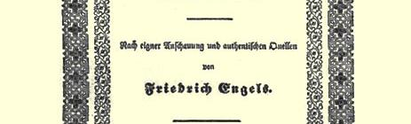
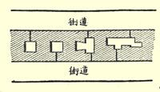

## 弗·恩格斯 ——

# 英国工人阶级状况

*根据亲身观察和可靠材料９１*

> 弗·恩格斯写于１８４４年９月—１８４５年３月根据１８４５年德文版 １８４５年在莱比锡印行署名：弗里德里希·恩格斯
>
> 并与１８９２年德文版
>
> 核对后刊印
>
> 原文是德文

## 弗·恩格斯

> “英国工人阶级状况” 一书第一版的扉页

# 致大不列颠工人阶级

> ９２

工人们！

我献给你们一本书。在这本书里，我想把你们的状况、你们的苦难和斗争、你们的希望和要求的真实情况描绘给我的德国同胞们。我曾经在你们当中生活过一个相当长的时期，对你们的状况有足够的了解。我非常认真地研究过你们的状况，研究过我所能弄到的各种官方的和非官方的文件，但是我并不以此为满足。我寻求的并不仅仅是和这个题目有关的**抽象的**知识，我愿意在你们的住宅中看到你们，观察你们的日常生活，同你们谈谈你们的状况和你们的疾苦，亲眼看看你们为反抗你们的压迫者的社会的和政治的统治而进行的斗争。我是这样做了。我抛弃了社交活动和宴会，抛弃了资产阶级的葡萄牙红葡萄酒和香槟酒，把自己的空闲时间几乎都用来和普通的工人交往；对此我感到高兴和骄傲。高兴的是这样一来我在获得实际生活知识的过程中有成效地度过了许多时间，否则这些时间也只是在客厅里的闲谈和讨厌的礼节中消磨掉；骄傲的是这样一来我就有机会为这个受压迫受诽谤的阶级做一件应该做的事情，这些人尽管有种种缺点并且处于重重不利的地位，但仍然引起每个人的尊敬，也许只有英国的锱铢必较的商人才是例外；还值得骄傲的是这样一来我就能保护英国人民， 使他们不致日益受人鄙视。而来自欧洲大陆的这种鄙视，正是你们国家的当权的资产阶级极端自私自利的政策和全部行为的必然后果。

同时我也有很多的机会来观察你们的敌人—— 资产阶级，而且很快就确信，你们不希望从资产阶级那里得到任何援助是正确的，是完全正确的。他们的利益和你们的利益是完全对立的，虽然他们经常在企图证明与此相反的说法，企图使你们相信他们衷心地同情你们的命运。他们所做的驳倒了他们所说的。我希望我收集到的材料用来证明下面这件事是绰绰有余的：资产阶级，不管他们口头上怎么说，实际上只有一个目的，那就是当你们的劳动的产品能卖出去的时候就靠你们的劳动发财，而一到这种间接的人肉买卖无利可图的时候，就让你们饿死。他们庄严地宣布过对你们的好意，但是他们做了些什么事情来从实际上加以证明呢？ 对你们的诉苦他们曾认真地注意过吗？除了负担派来调查你们的状况的五六个委员会的经费，他们还为你们做了些什么呢？而这些委员会的大本大本的报告都永远放在内务部的档案架上的废纸堆里。他们是否打算过从这些日渐腐烂的“蓝皮书” 中哪怕编写出一本易读的书，使每一个人都能毫不困难地了解到绝大部分 “生而自由的不列颠人”的状况呢？没有，他们当然不这样做；所有这些都是他们不喜欢谈论的事情。他们宁可让一个外国人来把你们所处的屈辱的状况报道给文明世界。

但是我希望，我对**他们**来说才是外国人，而对**你们**来说却不是。我的英语也许不很道地，但是，我希望你们将发现它是**平易近人的**。顺便说一句，无论在英国或是在法国，从来没有一个工人把我当做外国人看待。我极其满意地看到你们已经摆脱了民族偏见和民族优越感。这些极端有害的东西归根到底只是**大规模的**

# ＴＯＴＨＥＷＯＲＫＩＮＧＣＬＡＳＳＥＳ

> ＯＦ

## ＧＲＥＡＴ－ＢＲＩＴＡＩＮ．

> ＷｏｒｋｉｎｇＭｅｎ！
>
> ＴｏｙｏｕＩｄｅｄｉｃａｔｅａｗｏｒｋ，ｉｎｗｈｉｃｈＩｈａｖｅｔｒｉｅｄｔｏｌａｙｂｅｆｏｒｅｍｙ ＧｅｒｍａｎＣｏｕｎｔｒｙｍｅｎａｆａｉｔｈｆｕｌｐｉｃｔｕｒｅｏｆｙｏｕｒｃｏｎｄｉｔｉｏｎ，ｏｆｙｏｕｒｓｕｆｆｅｒ ｉｎｇｓａｎｄｓｔｒｕｇｇｌｅｓ，ｏｆｙｏｕｒｈｏｐｅｓａｎｄｐｒｏｓｐｅｃｔｓ．Ｉｈａｖｅｌｉｖｅｄｌｏｎｇｅ ｎｏｕｇｈａｍｉｄｓｔｙｏｕｔｏｋｎｏｗｓｏｍｅｔｈｉｎｇａｂｏｕｔｙｏｕｒｃｉｒｃｕｍ－ｓｔａｎｃｅｓ；Ｉ ｈａｖｅｄｅｖｏｔｅｄｔｏｔｈｅｉｒｋｎｏｗｌｅｄｇｅｍｙｍｏｓｔｓｅｒｉｏｕｓａｔｔｅｎ－ｔｉｏｎ，Ｉｈａｖｅ ｓｔｕｄｉｅｄｔｈｅｖａｒｉｏｕｓｏｆｆｉｃｉａｌａｎｄｎｏｎ－ｏｆｆｉｃｉａｌｄｏｃｕｍｅｎｔｓａｓｆａｒａｓＩｗａｓ ａｂｌｅｔｏｇｅｔｈｏｌｄｏｆｔｈｅｍ—Ｉｈａｖｅｎｏｔｂｅｅｎｓａｔｉｓｆｉｅｄｗｉｔｈｔｈｉｓ，Ｉｗａｎｔｅｄ
>
> ｍｏｒｅｔｈａｎａｍｅｒｅａｂｓｔｒａｃｔｋｎｏｗｌｅｄｇｅｏｆｍｙｓｕｂｊｅｃｔ，Ｉｗａｎｔｅｄｔｏｓｅｅｙｏｕ ｉｎｙｏｕｒｏｗｎｈｏｍｅｓ，ｔｏｏｂｓｅｒｖｅｙｏｕｉｎｙｏｕｒｅｖｅｒｙ－ｄａｙｌｉｆｅ，ｔｏｃｈａｔｗｉｔｈ ｙｏｕｏｎｙｏｕｒｃｏｎｄｉｔｉｏｎａｎｄｇｒｉｅ－ｖａｎｃｅｓ，ｔｏｗｉｔｎｅｓｓｙｏｕｒｓｔｒｕｇｇｌｅｓａ ｇａｉｎｓｔｔｈｅｓｏｃｉａｌａｎｄｐｏｌｉｔｉｃａｌｐｏｗｅｒｏｆｙｏｕｒｏｐｐｒｅｓｓｏｒｓ．Ｉｈａｖｅｄｏｎｅｓｏ： Ｉｆｏｒｓｏｏｋｔｈｅｃｏｍｐａｎｙａｎｄｔｈｅｄｉｎｎｅｒ－ｐａｒｔｉｅｓ，ｔｈｅｐｏｒｔ－ｗｉｎｅａｎｄ ｃｈａｍｐａｉｇｎｏｆｔｈｅｍｉｄｄｌｅ－ｃｌａｓｓｅｓ，ａｎｄｄｅｖｏｔｅｄｍｙｌｅｉｓｕｒｅ－ｈｏｕｒｓａｌ
>
> ｍｏｓｔｅｘｃｌｕｓｉｖｅｌｙｔｏｔｈｅｉｎｔｅｒ－ｃｏｕｒｓｅｗｉｔｈｐｌａｉｎＷｏｒｋｉｎｇＭｅｎ；Ｉａｍ ｂｏｔｈｇｌａｄａｎｄｐｒｏｕｄｏｆｈａｖｉｎｇｄｏｎｅｓｏ．Ｇｌａｄ，ｂｅｃａｕｓｅｔｈｕｓＩｗａｓｉｎｄｕｃｅｄ ｔｏｓｐｅｎｄｍａｎｙａｈａｐｐｙｈｏｕｒｉｎｏｂｔａｉｎｉｎｇａｋｎｏｗｌｅｄｇｅｏｆｔｈｅｒｅａｌｉｔｉｅｓｏｆ ｌｉｆｅ—ｍａｎｙａｎｈｏｕｒ，
>
> 弗·恩格斯“致大不列颠工人阶级” 的第一页
>
> 弗·恩格斯“致大不列颠工人阶级” 的第一页利己主义［ｗｈｏｌｅｓａｌｅｓｅｌｆｉｓｈｎｅｓｓ］而已。我看到你们同情每一个为人类的进步而真诚地献出自己力量的人，不管他是不是英国人；我看到你们仰慕一切伟大的美好的事物，不论它是不是在你们祖国的土地上产生的。我确信，你们并不仅仅是普通的**英国人**，不仅仅是一个孤立的民族的成员；你们是意识到自己的利益和全人类的利益相一致的**人**，是一个伟大的大家庭中的成员。正是由于我把你们当做这个“统一而不可分的”人类大家庭中的成员，当做真正符合“人”这个字的含义的人，所以我和大陆上其他许多人一样，祝贺你们在各方面的进步，希望你们很快地获得成功。

继续像以前那样前进吧！还有许多困难需要克服：要坚定，要大胆，你们的成功是肯定的，你们前进中的每一步都将有助于我们共同的事业，全人类的事业！

#### 弗里德里希·恩格斯

１８４５年３月１５日于巴门

（莱茵普鲁士）

## 序言

本书中所考察的问题，最初我是打算仅仅作为一本内容比较广泛的关于英国社会史的著作中的一章来论述的，但这个问题的重要性很快就使我不得不对它进行单独的研究。

工人阶级的状况是当代一切社会运动的真正基础和出发点， 因为它是我们目前社会一切灾难的最尖锐最露骨的表现。法国和德国的工人共产主义是它的直接产物，而傅立叶主义和英国社会主义以及德国有教养的资产阶级的共产主义则是它的间接产物。 所以，为了给社会主义理论，同时给那些认为社会主义理论有权存在的见解提供坚实的基础，为了肃清ｐｒｏｅｔｃｏｎｔｒａ〔赞成和反对〕社会主义理论的一切空想和臆造，研究无产阶级的境况是十分必要的。但是只有在大不列颠，特别是在英国本土，无产阶级的境况才具有完备的**典型的形式**；而且也只有在英国，才能搜集到这样完整的并为官方的调查所证实了的必要材料，这正是对这个问题进行稍微详尽的阐述所必需的。

我有机会在二十一个月内从亲身的观察和亲身的交往中直接研究了英国的无产阶级，研究了他们的要求、他们的痛苦和快乐， 同时又以必要的可靠的材料补充了自己的观察。这本书里所叙述的，都是我看到、听到和读到的。我的观点和我所引用的事实都将遭到各方面的攻击和否定，特别是当我的书落到英国人手里的时候，这一点我是早有准备的。我也知道得很清楚，在这本书里， 人们可以给我指出一些无关紧要的不确切的地方。要知道，在研究一个需要全面论证的庞大题目时，这种情况就是英国人也难以避免，更何况像我这样考察**一切**工人的状况的著作，连英国本国也还没有出过一本。但是我要毫不迟疑地向英国资产阶级挑战：让他们根据像我所引用的这样可靠的证据，指出哪怕是一件多少能影响到我的整个观点的不确切的事实吧。

描述不列颠王国无产阶级的境况的典型形式，特别在目前对德国来说是具有极其巨大的意义的。德国的社会主义和共产主义比起任何其他国家的社会主义和共产主义来，都更加是从理论前提出发的，因为我们，德国的理论家们，对现实世界了解得太少， 以致现实的关系还不能直接推动我们去改造这个“丑恶的现实”。 在公开拥护这种改造的人们当中，几乎没有一个不是通过费尔巴哈对黑格尔哲学的克服而走向共产主义的。关于无产阶级的真实境况我们知道得这样少，甚至连善意的“劳动阶级状况改进协会”（而我们的资产阶级现在就在这些协会里对社会问题大肆歪曲）都经常把那些关于工人状况的最可笑最庸俗的见解作为根据。 在这个问题上我们德国人比任何人都缺乏实际知识。虽然德国无产阶级的境况还没有像英国那样典型，但是我们的社会制度到底是相同的；而且除非民族的理智及时地采取了为整个社会制度打下新基础的措施，这种社会制度的出现迟早会达到和北海彼岸同样尖锐的地步。在英国造成无产阶级贫困和受压迫的那些根本原因，在德国也同样存在，而且照这样下去也一定会产生同样的结果。同时，对**英国的**灾难的揭露将推动我们去揭露我们**德国的**灾难，而且还会给我们一个尺度来衡量我们的灾难以及在西里西亚和波希米亚的骚动

９３中所暴露出来的危险，这种危险从这一方面直接威胁着德国的安宁。

最后，我还要做两点声明。第一，Ｍｉｔｔｅｌｋｌａｓｓｅ［**中等阶级**］这个词我经常用来表示英文中的ｍｉｄｄｌｅ－ｃｌａｓｓ（或通常所说的ｍｉｄ ｄｌｅ－ｃｌａｓｓｅｓ），它同法文的ｂｏｕｒｇｅｏｉｓｉｅ（资产阶级）一样是表示有产阶级，即和所谓的贵族有所区别的有产阶级，这个阶级在法国和英国是直接地、而在德国是假借“社会舆论” 间接地掌握着国家政权。同样，我也经常把工人（ｗｏｒｋｉｎｇｍｅｎ）和无产者，把工人阶级、没有财产的阶级和无产阶级当做同义语来使用。第二、我在引用别人的话时，在大多数场合下都指出引文作者所属的党派， 因为自由党人几乎总是在竭力强调农业区的贫困，否认工厂区的贫困，而保守党人却刚好相反，他们承认工厂区的贫穷，但不想承认农业区的贫穷。因此，当我描述产业工人的状况而缺少官方文件的时候，我总是宁可利用**自由党人**的证据，以便用自由资产阶级亲口说出来的话来打击自由资产阶级；只有当我亲身观察了真实情况或者引文作者本身或文章的声望使我确信所引用的证据真实无误的时候，我才引用保守党人或宪章派的材料。

#### 弗·恩格斯

１８４５年３月１５日于巴门

## 导言

英国工人阶级的历史是从１８世纪后半期，从蒸汽机和棉花加工机的发明开始的。大家知道，这些发明推动了产业革命，产业革命同时又引起了市民社会中的全面变革，而它的世界历史意义只是在现在才开始被认识清楚。英国是发生这样一种变革（这种变革愈是无声无息地进行，就愈是强有力）的典型国家，因此，英国也是这种变革的主要结果（无产阶级）发展的典型国家。只有在英国，才能就无产阶级的一切相互关系来全面地研究这个阶级。

我们在这里不谈这个革命的历史，也不谈它对现在和将来的巨大意义。这是将来的一部内容更广的著作的题目。现在，我们只要几点，这几点是弄清以后要讲到的事实和了解英国无产阶级的现状所必需的。

在使用机器以前，纺纱织布都是在工人家里进行的。妻子和女儿纺纱，作为一家之主的父亲把纱织成布；如果他自己不加工， 就把纱卖掉。这些织工家庭大部分都住在靠近城市的农村里，靠自己挣的钱也能生活得不错，因为就布匹的需求来说，本地市场还是有决定意义的、甚至几乎是唯一的市场，而竞争（后来由于取得了国外市场和扩大了贸易而替自己开辟了道路）的威力也还没有对工资发生显著的影响。加以本地市场的需求还不断地在扩大，这种扩大和人口的缓慢增长是步调一致的，并且保证了一切工人都有工作；此外，他们之间还不可能发生激烈的竞争，因为他们散居在农村。所以，大部分织工甚至还能够积蓄一点钱，并且租一小块地在空闲的时候耕种。至于空闲的时间，他们愿意有多少就有多少，因为在什么时候织布和织多少布是随他们便的。的确，他们是蹩脚的庄稼人，他们的耕作是马马虎虎的，也没有很多的收入；但是，至少他们还不是无产者，他们，如英国人所说的，是在故乡的土地上扎下了根的，他们是定居的，在社会上的地位比现在的英国工人要高一等。

工人们就这样过着庸碌而舒适的生活，诚实而安静地、和和气气而又受人尊敬地生活着，他们的物质生活状况比他们的后代好得多；他们无须乎过度劳动，愿意做多少工作就做多少工作，但是仍然能够挣得所需要的东西；他们有空到园子里和田地里做些有益于健康的工作，这种工作本身对他们已经是一种休息，此外，他们还有机会参加邻居的娱乐和游戏；而滚木球、打球等等游戏对保持健康和增强体质都是有好处的。他们大部分是些强壮、结实的人，在体格上和邻近的农民很少或者甚至完全没有区别。孩子们生长在农村的新鲜空气中，即使他们有时也帮助父母做些事情，到底还不是经常的，当然更谈不到八小时或十二小时工作日了。

这个阶级的道德水平和智力水平究竟怎样，是不难想像的。他们和城市隔离，从来不进城，因为他们把纱和布交给跑四方的包买商，从他们那里取得工资；他们和城市完全隔离，连紧靠着城市住了一辈子的老年人也从来没有进过城，直到最后机器剥夺了他们的收入，把他们吸引到那里去寻找工作。他们在道德和智力方面和农民一样，由于有一块租来的土地，他们大部分和农民有直接联系。他们把乡绅—— 当地最大的土地占有者—— 看做自己“天然的长上”，向他讨主意，有了小的争吵，就请他当公断人，对他表示这种宗法关系所应有的尊敬。他们都是“值得尊敬的”人，是好的当家人，过着道德的生活，因为他们那里没有那些引人过不道德的生活的邪路—— 附近没有酒馆和赌场，而他们有时去那里过过瘾的小酒店的掌柜也是值得尊敬的人，这些人大部分是大佃农，有好的啤酒，喜欢严格的生活规律，每天晚上很早就把买卖收了。孩子们成天和父母待在家里，受的教育是服从父母，敬畏上帝。宗法的家庭关系一直保持到孩子们结婚。年轻人是在幽静纯朴的环境中、在和婚前的游伴互相信赖的气氛中长大的，虽然婚前发生性的关系几乎是普通现象，可是这仅仅是在双方都已经把结婚看做道义上的责任时发生的，只要一举行婚礼，就一切都正常了。一句话，当时英国产业工人的生活和思想与现在德国某些地方的工人是一样的， 闭关自守，与世隔绝，没有精神活动，在自己的生活环境中没有激烈的波动。他们当中能读书的很少，能写写东西的就更少了；他们按时上教堂去，不谈政治，不搞阴谋活动，不动脑筋，热中于体育活动，带着从小养成的虔敬的心情听人讲圣经，由于他们为人忠厚温顺，和社会上比较有特权的阶级相处得很和睦。但他们的精神生活是死气沉沉的；他们只是为了自己的小小的私利、为了自己的织机和小小的园子而活着，对于村子以外席卷了全人类的强大的运动却一无所知。他们在自己的平静、庸碌的生活中感到很舒服，假若没有产业革命，他们是永远不会丢开这种生活方式的。诚然，这种生活很理想，很舒适，但到底不是人应该过的。他们那时也不是人， 而只是一架替从前主宰着历史的少数贵族服务的工作机。产业革命只是促使这种情况达到顶点，把工人完全变成了简单的机器，把他们最后剩下的一点独立活动的自由都剥夺了，可是，它却以此迫使他们思考，迫使他们争取人应有的地位。像法国的政治一样，英国的工业和整个市民社会运动把最后的一些还对人类共同利益漠不关心的阶级卷入了历史的巨流。

使英国工人的状况发生根本变化的第一个发明是**珍妮纺纱机**。这种机器是北郎卡郡布莱克本附近斯坦得希尔的织工**詹姆斯** **·哈格里沃斯**制造成的（１７６４年）。它是后来的骡机的雏形，是用手摇的，可是不像普通的手摇纺车，手摇纺车只有一个锭子，而它有十六个至十八个锭子，只要一个人摇就行，因而能够生产比过去多得多的纱。从前，一个织工需要三个女纺工供给纱，纱还总是不够，织工常常得等着，现在，纱却比现有的织工所能用的多了。新发明的机器使纱的生产费用减少了，布匹的价格也跟着降低，于是， 本来就已增长了的对布匹的需求更加增大了。这就需要更多的织工，而他们的工资也就提高了。现在，因为织工在织机旁能赚更多的钱，他们就逐渐抛弃了自己的农业而专门织布了。这时，四个成年人和两个孩子（这两个孩子用来缠纱）的家庭，一天工作十小时， 每星期可赚４英镑（合２８个普鲁士塔勒[^1]），如果事情进行得顺利，又有足够的工作，就常常挣得更多；一个织工在自己的织机上一星期赚两英镑的事，也是常有的。兼营农业的织工阶级就这样逐渐完全消失而变成了一个新兴的织工阶级，他们光靠工资生活，没有丝毫财产，甚至连虚假的财产（例如一小块租来的土地）也没有， 这样，他们就变成了**无产者**（ｗｏｒｋｉｎｇｍｅｎ）。此外，纺工和织工从前的那种关系也完结了。从前，纺纱和织布是尽可能地在一个屋子里进行的。现在，使用珍妮纺纱机像使用织机一样，都需要有气力， 于是男人也开始做纺纱的工作了，而且这个工作变成了全家生活的唯一来源；可是另外一些家庭却刚刚相反，把过时的、落后的手摇纺车扔在一边，不得不单靠当家人的织机过活（如果他们买不起珍妮纺纱机的话）。后来工业中无止境地发展的分工就是这样从织布和纺纱开始的。

这架最初的很不完善的机器的出现，不仅引起了**工业无产阶级**的发展，而且也促进了**农业无产阶级**的产生。在这以前，有许多小的土地占有者，即所谓自耕农，他们过着平静的、完全不动脑筋的、庸庸碌碌的生活，就像他们中间的兼营农业的织工一样。他们沿用祖传的不完善的老方法耕种一小块土地，他们以那种一切都从习惯而且世世代代都不知道改变的人们所特有的顽强性来反对任何新事物。他们当中也有许多小佃农，可是这不是现代所谓的佃农，而是这样一些人，他们由于契约上的可以继承的租佃关系或者由于古老的习惯，从父亲和祖父手里继承了小块的土地，一直稳稳当当地坐在上面，就好像这些土地是他们的财产一样。现在，在产业工人放弃了农业以后，许多土地闲起来了，在这些土地的基础上就产生了新的**大佃农**阶级，他们一租就是５０英亩、１００英亩、２００ 英亩或者更多的土地，这些人就是所谓的ｔｅｎａｎｔｓ－ａｔ－ｗｉｌｌ（即每年都可以退佃的佃农），他们因为耕作得较好而且经营规模较大， 所以能提高土地的收益。他们的产品可以比小自耕农卖得便宜；而小自耕农除了卖掉那块已经不能养活自己的土地去买一部珍妮纺纱机或织机，或者到大佃农那里去做短工即做一个农村无产者以外，就再没有其他任何办法了。小自耕农天生的惰性和无法改进的祖传的粗枝大叶的耕作方法，使得他在和这样一些人竞争时找不到其他出路，这些人用更合理的方法耕种自己的土地，而且具有大规模经营和投资改良土壤所产生的一切优越性。

可是工业的发展并没有停止在这里。有些资本家开始把珍妮纺纱机安装在大建筑物里面，并且用**水力**来发动；这就使他们有可能减少工人，并且把自己的纱卖得比用手摇机器的个体纺工便宜。 由于珍妮纺纱机的构造不断在改进，机器随时都会变成过时的，因此必须把它们加以改造或者换成新的；资本家由于利用水力，即使机器已经过时也还可以维持下去，而对于个体纺工来说，这越往后就越不行了。工厂制度就这样奠定了基础，而由于**水力纺纱机**的出现又获得了进一步的扩展。这种机器是北郎卡郡普累斯顿的一个理发师**理查·阿克莱**在１７６７年发明的，在德国通常叫做Ｋｅｔｔｅｎ －ｓｔｕｈｌ〔经线织机〕，它和蒸汽机一样，也是１８世纪机械方面最重要的发明。它一开始设计的时候就是打算用**机械发动**，而且是以全新的原理为根据的。郎卡郡**菲尔伍德**的**赛米尔·克伦普顿**综合了珍妮纺纱机和水力纺纱机的特点，于１７８５年发明了**骡机**。大约在同一期间，阿克莱又发明了**梳棉**机和**粗纺**机，于是工厂生产方式就成为棉纺业中唯一占统治地位的了。这些机器经过一些不大的改变，逐渐用来纺羊毛，以后（１９世纪的头十年）又用来纺麻，这样， 就从这两方面排挤了手工劳动。但是事情还没有停止在这里：在 １８世纪最后几年，一个乡村牧师**卡特赖特**博士发明了**动力织机**， 在１８０４年左右，他把这种机器又改进得足以压倒手工织工；这些机器由于有了**蒸汽机**发动，就加倍重要了，蒸汽机是**詹姆斯·瓦特** 在１７６４年发明的，从１７８５年起已用来发动纺纱机了。

由于这些发明（这些发明后来年年都有改进），**机器劳动**在英国工业的各主要部门中**战胜了手工劳动**，而英国工业后来的全部历史所叙述的，只是手工劳动如何把自己的阵地一个跟一个地让给了机器。结果，一方面是一切纺织品迅速跌价，商业和工业日益繁荣，差不多夺得了一切没有实行保护关税的国外市场，资本和国民财富迅速增长，而另一方面是无产阶级的人数更加迅速地增长， 工人阶级失去一切财产，失去获得工作的任何信心，道德败坏，政治骚动以及我们将在这里加以研究的对英国有产阶级十分不愉快的一切事实。我们已经看到，甚至仅仅像珍妮纺纱机这样一架很不完善的机器已经使下层阶级的社会地位发生了这样大的变化，因此，从我们这里得到原料而还给我们以布匹的一整套配合得很好、 构造得很精密的机器，它所起的作用就不会使我们感到惊异了。

现在，我们来稍微详细地研究一下英国工业的发展，先从它的主要部门**棉纺织业**开始。在１７７１—１７７５年输入英国的子棉平均每年不到５００万磅；１８４１年输入５２８００万磅，而１８４４年输入就不下６００００万磅。１８３４年，英国输出５５６００万码棉布，７６５０万磅棉纱和价值１２０万英镑的棉针织品。同年，棉纺织业中使用了８００多万锭子，１１万台动力织机和２５万台手工织机，水力纺纱机还没有计算在内。根据**麦克库洛赫**的计算，全联合王国直接或间接靠这一工业部门生活的几乎有１５０万人，其中仅仅在工厂里面工作的就有 ２２万人；这些工厂所使用的动力，蒸气力是３３０００马力，水力是 １１０００马力。现在这些数字已经远远地被超过了；可以大胆地假定，在１８４５年，机器的数量和生产能力，以及工人的数目，都将比 １８３４年增加二分之一。这种工业的中心是郎卡郡，郎卡郡是棉纺织业的摇篮，而棉纺织业又使得郎卡郡完全革命化，把它从一个偏僻的很少开垦的沼泽地变成了热闹的熙熙攘攘的地方；这种工业在八十年内使郎卡郡的人口增加了９倍，并且好像用魔杖一挥，创造了居民共达７０万的**利物浦**和**曼彻斯特**这样的大城市及其附近的城市：**波尔顿**（６００００居民）、**罗契得尔**（７５０００居民）、**奥尔丹** （５００００居民）、**普累斯顿**（６００００居民）、**埃士顿**和**斯泰里布雷芝**（共 ４００００居民）以及一系列的其他工厂城市。在南郎卡郡的历史上可以看到近代的一些最大的奇迹（虽然这一点从来没有人谈到过）， 所有这些奇迹都是棉纺织业造成的。此外，苏格兰的**格拉斯哥**形成了第二棉纺织区（包括**拉纳克郡**和**伦弗鲁郡**）的中心，这个主要城市的人口自兴办这种工业的时候起到现在也从３万增加到３０万。 **诺定昂**和**得比的织袜业**，由于棉纱价格的降低也获得了新的推动力，而由于针织机的改良（这种改良使人可以在一台机器上同时织两只袜子）又获得了第二个推动力。从１７７７年发明了网布机那时起，花边的生产也成了重要的工业部门；以后不久**林得里**发明了**花边机**，而后来在１８０９年**希斯科特**又发明了**络丝机**。这样一来，制造花边的工作无限地简化了，而对花边的需求随着它的跌价而大大增长，以致现在从事于这种生产的已经不下２０万人。它的主要中心是**诺定昂**、**莱斯特**和英格兰西部（**威尔特郡**、**戴文郡**等）。和棉纺织业有关的劳动部门，如漂白、染色和印花也得到了同样的发展。 由于用氯代替大气中的氧**漂白**，由于对**染色**和**印花**有影响的化学工业的迅速发展，由于在机械方面出现了促进印花发展的一连串的极其光辉的发明，这些部门获得了很大的推动力；由于有了这种推动力，又由于棉纺织业的发展引起了需求的增加，这些部门就空前地繁荣起来。

在**羊毛加工业**中也开始了同样的活动。这种工业过去曾是英国工业的主要部门，可是过去的产量根本不能和现在所生产的相比。在１７８２年，前三年收集的全部羊毛都因为缺少工人而没有加工，假若不是新发明的机器帮助把所有的羊毛都纺出来的话，这些羊毛还得这样搁下去。把那些机器改装得适用于纺羊毛的尝试完全成功了。从这时起，在羊毛加工的区域中开始了我们在棉纺织区中所看到的那样迅速的发展。１７３８年，**约克郡西部地区**生产了毛织品７５０００匹，而１８１７年就生产了４９００００匹，并且毛纺织业的发展是以飞快的速度进行的：１８３４年输出的毛织品比１８２５ 年多４５００００匹。——１８０１年加工的羊毛是１０１００万磅（其中有 ７００万磅是输入的），而１８３５年加工的是１８０００万磅（其中有４２００ 万磅是输入的）。这种工业的主要中心是约克郡的西部地区，在这里，特别是在**布莱得弗德**，英格兰的长羊毛制成供编织等用的毛线，而在其他城市，例如**里子**、**哈里法克斯**、**哈得兹菲尔德**等地， 短羊毛制成合股毛纱，然后再制成呢绒织物；其次，是**郎卡郡**和约克郡接近的那一部分，即**罗契得尔**附近地区，这里除了生产棉纺织品，还生产许多法兰绒；最后，是**英格兰西部**，这里生产最精致的呢子。在这里人口的增加也是值得注意的：

> １８０１年１８３１年
>
> 布莱得弗德２９０００人７７０００人
>
> 哈里法克斯６３０００人１１００００人
>
> 哈得兹菲尔德１５０００人３４０００人
>
> 里子５３０００人１２３０００人
>
> 整个约克郡西部地区５６４０００人９８００００人从１８３１年以来，这些地方的人口至少又增加了２０—２５％。在１８３５ 年，全联合王国从事纺羊毛的工厂是１３１３个，共有工人７１３００人， 在这个数目中只包括了直接或间接依靠羊毛加工为生的广大群众中的一小部分，而且几乎完全没有包括织工在内。

**麻纺织业**中的进步开始得比较晚些，因为原料的天然特性给纺纱机的应用造成了很大的困难。的确，１８世纪最后几年，在苏格兰已经有人做过这种尝试，但是一直到１８１０年，法国人**日拉**才实际上做到了用机器**纺麻**。而他的机器也只是在英国加以改善，并在 **里子**、**丹第**和**拜尔法斯特**普遍应用以后，才在不列颠的土地上得到了它们应有的地位。从这时起，英国的麻纺织业才开始迅速地发展起来。１８１４年，有３０００吨亚麻运入丹第，到１８３３年就有１９０００ 吨亚麻和３４００吨大麻了。输入大不列颠的爱尔兰夏布从３２００万码（１８００年）增加到５３０００万码（１８２５年），其中大部分又从大不列颠输出了；英格兰和苏格兰的麻织品的输出从２４００万码（１８２０ 年）增加到５１００万码（１８３３年）。纺麻工厂的数目在１８３５年达到了３４７个，共有工人３３０００人；其中一半是在苏格兰南部，有六十多个在约克郡西部地区（里子及其附近），二十五个在爱尔兰的拜尔法斯特，而其余的在多尔塞特郡和郎卡郡。麻织品的生产是在苏格兰南部、在英格兰的某些地方，但主要是在爱尔兰。

英国人在**蚕丝加工**方面也获得了同样的成绩。他们从南欧和亚洲取得已经纺好的原料，而主要的工作就是捻成细线。在１８２４ 年以前，生丝的高额关税（每磅４先令）大大限制了英国丝纺织业的发展，英国丝纺织业的市场仅仅限于本国及其殖民地（因为那里有保护关税）。后来，进口税降低到一个辨士，工厂的数目就立刻大量地增加了。在一年内线锭的数目从７８万增加到１１８万，虽然 １８２５年的商业危机也使这个工业部门的发展停顿了一些时候，但在１８２７年这一部门中所生产的就比以前任何时候都多了，因为英国人在技术方面的技巧和经验保证了他们的捻线机优越于他们的竞争者的拙劣机械。１８３５年，大不列颠共有捻丝厂２６３个，工人共计３万人，这些工厂大部分集中在**柴郡（麦克尔士菲尔德**、**康格尔顿**及其附近地区）、**曼彻斯特**和**索美塞特郡**。此外，还有许多从事于废茧加工的工厂；用废茧制成一种特别的丝（ｓｐｕｎｓｉｌｋ〔纺丝〕），英国人甚至用它来供给巴黎和里昂的织绸厂。用这种方法加工的丝主要是在苏格兰（**佩斯里**等地）利伦敦（在**斯比脱菲尔兹**），同时也在**曼彻斯特**和另外一些地方织成绸子。

但是，从１７６０年开始的英国工业的巨大高涨，并不仅仅限于衣料的生产。推动力一旦产生，它就扩展到工业活动的一切部门里去，而许多和前面提到的东西毫无联系的发明，也由于它们正好出现在工业普遍高涨的时候而获得了更大的意义。其次，当工业中机械能的巨大意义在实践上得到证明以后，人们便用一切办法来全面地利用这种能量，使它有利于个别的发明家和厂主；此外，对机器、燃料和原料的需求本身，就直接要求大批的工人和各个工业部门加倍地工作。随着蒸汽机的出现，英国的丰富的**煤藏**第一次成了重要的东西；只是在现在**机器的生产**才开始萌芽，而对**铁矿**的注意也随着加强了，因为**铁矿**是给这种生产提供原料的。 羊毛消耗量的增加使英国的饲羊业兴盛起来，而羊毛、亚麻和蚕丝输入的增加又引起了英国商船队的扩大。发展得最快的是**铁的生产**。英国藏铁丰富的矿山过去很少开采；熔解铁矿石的时候总是用木炭，而由于森林砍伐殆尽和农业发展，木炭的产量愈来愈少，价钱也愈来愈贵。上一世纪才开始使用烧过的煤（焦炭），而在１７８０年以后又发明了把焦炭所熔解的铁（在此以前，只能从它得到生铁）变成锻铁的新方法。这种把熔铁时掺杂在铁里面的碳素提出的方法，英国人叫做搅炼；它给英国的制铁业开辟了崭新的活动地盘。炼铁炉建造得比过去大５０倍，矿石的熔解由于使用热风而简化了，铁的生产成本大大降低，以致过去用木头或石头制造的大批东西现在都可以用铁制造了。１７８８年，一个著名的民主派**托马斯·倍恩**在约克郡建成了第一座铁桥，跟着就出现了其他许多铁桥，现在几乎所有的桥，特别是铁路上的桥，都是用生铁造的，而在伦敦甚至用这种材料建造了一座横跨太晤士河的桥 （萨得克桥）；铁柱和铁的机座等等成了很常见的东西，而随着瓦斯灯的使用和铁路的修筑，英国的制铁业又获得了新的销售领域。 螺丝钉和钉子也逐渐地用机器制造了。设菲尔德人**亨茨曼**在１７６０ 年发明了一种铸钢的方法，这种方法节省了许多不必要的劳动，并且使人们能生产出以前完全没有的便宜的物品。由于原料的质量较高，工具经过改进，机器装备比较新，分工比较精密，这时英国的金属制品生产才重要起来。**北明翰**的人口从７３０００（１８０１ 年），增加到２０００００（１８４４年），**设菲尔德**的人口从４６０００（１８０１ 年）增加到１１００００（１８４４年），仅仅后一城市的煤的消耗量在１８３６ 年就达到了５１５０００吨。１８０５年输出了４３００吨铁制品和４６００吨生铁，而到１８３４年就输出了１６２００吨铁制品和１０７０００吨生铁，铁的全部生产在１７４０年没有超过１７０００吨，到１８３４年就几乎达到了７０００００吨。光是熔解生铁，每年就要消耗３００万吨以上的煤， 甚至很难想像，**煤矿**在最近六十年来获得了多么巨大的意义。现在，英格兰和苏格兰的一切煤藏都正在开采，光是**诺森伯兰**和**德勒穆**的煤矿每年就有５００万吨以上出口，使用工人四五万。根据 “德勒穆纪事报”９４的报道，上述两个郡开采的煤矿：

> 在１７５３年是………………１４个，
>
> １８００年是………………４０个，
>
> １８３６年是………………７６个，
>
> 而在１８４３年是………………１３０个。

同时，现在所有煤矿的开采都比过去紧张多了。**锡矿**、**铜矿**和 **铅矿**也在同样地加紧开采；和**玻璃生产**发展的同时，又产生了一个新的工业部门，即**陶器的生产**，这种生产在１７６３年左右由于约**瑟亚·威季伍德**而获得了特殊的意义。他开始根据科学原则制造陶器，促进了艺术风味的发展，并且在**北斯泰福郡**８英里见方的一片地方建立了**陶器厂**（ｐｏｔｔｅｒｉｅｓ），这地方从前是一片不毛之地，现在却布满了工厂和住宅，并且养活了６万以上的人。

一切都完全卷入了这个总的巨流。**农业**里面也发生了变革。不仅土地的占有和耕种，如我们所看到的，转到了另一些人的手里， 而且农业在其他方面也受到了影响。大佃农开始下本钱来改良土壤，拆毁不必要的篱笆，排干积水，施以肥料，使用较好的农具并实行系统的轮作制（ｃｒｏｐｐｉｎｇｂｙｒｏｔａｔｉｏｎ）。科学的进步也帮助了他们：**亨·戴维**爵士把化学应用于农业得到了成功，而技术的发展又给大佃农带来许多好处。此外，由于人口的增长，对农产品的需求也迅速增加起来：尽管从１７６０年到１８３４年有６８４０５４０ 英亩荒地变成了耕地，可是英国却由输出粮食的国家变成了输入粮食的国家。

在**交通**建设方面也出现了同样紧张的活动。１８１８—１８２９年， 英格兰和威尔士修筑了１０００英里的公路，法定宽度为６０英尺，而且几乎所有的旧公路都按照**麦克亚当**制加以改造。在**苏格兰**，公共事业局从１８０３年起修筑了约９００英里公路，并建造了一千多座桥梁，因此，苏格兰山地的居民立刻就接触到了文明。过去大部分山民从事于盗猎和走私；现在他们成了勤劳的庄稼人和手工业者；虽然为了保存盖尔语而开办了专门的学校，可是盖尔－赛尔特的习俗和语言一接触英格兰文明很快就消失了。**爱尔兰**的情形也完全一样。在**科克**、**里美黎克**和**克黎**等郡之间，以前是一片荒地，没有任何车路，这个地方由于很难通行而成了一切罪犯的隐匿处和南爱尔兰地方赛尔特－爱尔兰民族的堡垒；现在这里已经是道路纵横的地方，而这样一来也就给文明开辟了进入这个偏僻地方的道路。 整个大不列颠，特别是英格兰，在六十年以前道路还和当时的德国、法国的一样坏，现在却布满了最好的公路网，而所有这些公路， 像英格兰的差不多一切东西一样，都是私人企业家一手建立起来的，因为在这些方面国家做的事情很少或者根本就没有做什么。

１７５５年以前英国几乎没有**运河**。１７５５年，郎卡郡开凿了从**桑奇－布鲁克到圣海伦斯**的运河，而在１７５９年**詹姆斯·布林德利**开凿了第一条大运河，即**布黎纪瓦特公爵**运河，这条运河从**曼彻斯特** 及附近的煤矿流到**梅塞**河口，并在**巴顿**附近通过一条导水槽越过 **艾尔威尔**河。从这时起英国就开始了运河的建设，布林德利是头一个重视这一建设的人。从那时起，四面八方地开凿了许多运河，许多河流也疏浚得可以通航了。仅仅在**英格兰**就有２２００英里运河和 １８００英里可通航的河流；在**苏格兰**开凿了横贯全境的**凯利多尼亚运河**，在**爱尔兰**也开凿了几条运河。而这些工程，像铁路和公路一样，也几乎全部是私人和私营公司一手建立起来的。

**铁路**只是在最近才修筑起来的。第一条大铁路是从**利物浦**通到**曼彻斯特**的铁路（１８３０年通车）。从那时起，一切大城市彼此都用铁路联系起来了。伦敦和南安普顿、布莱顿、杜弗、科尔彻斯特、剑桥、埃克塞特（经过布利斯托尔）以及北明翰之间有铁路相通；北明翰和格罗斯特、利物浦、郎卡斯特（一线经过牛顿和威根，一线经过曼彻斯特和波尔顿）以及里子（一线经过曼彻斯特、哈里法克斯，一线经过莱斯特、得比及设菲尔德）之间有铁路相通；里子和赫尔以及新堡（经过约克）之间也有铁路相通。此外还有许多正在建设和设计中的支线，因此，不久以后从爱丁堡坐火车到伦敦只要一天的时间便够了。

**蒸气**不仅在陆路交通工具方面引起了革命，而且使水路交通工具具有了新的面貌。第一艘轮船是１８０７年在北美的哈德逊河下水的，而在大不列颠则是１８１１年在克莱德河下水的。从那时起， 英国建造了轮船６００多艘，而在１８３６年停泊在英国港湾中的轮船总计已在５００艘以上。

近六十年来英国工业的历史，在人类的编年史中无与伦比的历史，简短地说来就是如此。六十年至八十年前，英国和其他任何国家一样，城市很小、工业少而不发达、人口稀疏而且多半是农业人口。现在它却是和其他任何国家都不一样的国家了：有居民达２５０万的首都，有许多巨大的工业城市，有供给全世界产品而且几乎一切东西都是用极复杂的机器生产的工业，有勤劳而明智的稠密的人口，这些人口有三分之二从事于工业，完全是由另外的阶级组成的，而且和过去比起来实际上完全是具有另外的习惯和另外的需要的另外一个民族。产业革命对英国的意义，就像政治革命对于法国，哲学革命对于德国一样。而且１７６０年的英国和１８４４年的英国之间的差别，至少像ａｎｃｉｅｎｒéｇｉｍｅ〔旧制度〕下的法国和七月革命的法国之间的差别一样大。但这个产业革命的最重要的产物是英国无产阶级。

我们已经看到，机器的使用如何引起了无产阶级的诞生。工业的迅速发展产生了对人手的需要；工资提高了，因此，工人成群结队地从农业地区涌入城市。人口以令人难以相信的速度增长起来，而且增加的差不多全是工人阶级。此外，爱尔兰只是在１８ 世纪初才进入了平静状态，这里的居民过去在发生骚动的时候被英国人残酷地屠杀，减少了十分之一以上，现在也开始迅速地增长起来，特别是从工业繁荣开始吸引了许多爱尔兰人到英格兰去的那个时候起。大不列颠的巨大的工商业城市就是这样产生的，这些城市中至少有四分之三的人口属于工人阶级，而小资产阶级只是一些小商人和人数很少很少的手工业者。可是新生的工业能够这样成长起来，只是因为它用机器代替了手工工具，用工厂代替了作坊，从而把中等阶级中的劳动分子变成工人无产者，把从前的大商人变成了厂主；它排挤了小资产阶级，并把居民间的一切差别化为工人和资本家之间的对立。而在狭义的工业以外，在手工业方面，甚至于在商业方面，也发生了同样的情形。大资本家和没有任何希望上升到更高的阶级地位的工人代替了以前的师傅和帮工；手工业变成了工厂生产，严格地实行了分工，小的师傅由于没有可能和大企业竞争，也被挤到无产阶级的队伍中去了。但同时，随着从前的手工业生产的被消灭，随着小资产阶级的消失， 工人也没有任何可能成为资产者了。从前，他们总有希望自己弄一个作坊，也许将来还可以雇几个帮工；可是现在，当师傅本人也被厂主排挤的时候，当开办独立的企业必须有大量资本的时候， 工人阶级才第一次真正成为居民中的一个稳定的阶级，而在过去， 工人的地位往往是走上资产者地位的阶梯。现在，谁要是生而为工人，那末他除了一辈子做工人，就再没有别的前途了。所以，只是在现在无产阶级才能组织自己的独立运动。

这个现在布满了整个大不列颠的广大的工人群众就是这样产生的，他们的社会地位一天天地吸引着文明世界的注意。

工人阶级的状况也就是绝大多数英国人民的状况。这几百万穷困不堪的人，他们昨天挣得的今天就吃光，他们用自己的发明和自己的劳动创造了英国的伟大，他们一天天地更加意识到自己的力量，一天天地更加迫切要求取得社会财富中的自己的一份，这些人的命运应该如何，这个问题，从改革法案９５通过时起已成了全国性的问题。议会中一切稍微重要一点的辩论都可以归结为这个问题，而且，虽然英国的资产阶级到现在还不愿意承认这一点，虽然他们企图对这个大问题保持缄默，并把自己的私利说成真正的民族利益，但是他们是决不会成功的。议会每开一次会，工人阶级的问题都获得更大的重要性，而资产阶级的利益则退居次要的地位，虽然资产阶级是议会中主要的、甚至是唯一的力量，但是 １８４４年最近的一次会议所讨论的还始终是工人的问题（济贫法案、工厂法案、主仆关系法案）９６。工人阶级在下院的代表托马斯 ·邓科布是这次会议的中心人物，而要求废除谷物法的自由资产阶级和提议拒绝纳税的激进资产阶级却充当了很可怜的角色。甚至关于爱尔兰问题的辩论，实质上也只是关于爱尔兰无产阶级状况和帮助他们的办法的辩论。早就是英国资产阶级向工人让步的时候了，工人们不是在恳求，而是在威胁，在要求；要知道，不久也许就太晚了。

可是英国资产阶级，特别是直接靠工人的贫穷发财的厂主们， 却不正视这种贫穷的状况。资产阶级认为自己是最强大的阶级 —— 代表民族的阶级，他们羞于向全世界暴露英国的这个脓疮；他们不愿意承认工人的穷苦状况，因为对这种穷苦状况应负道义上的责任的，正是**他们**，正是有产的工业家阶级。因此，关于工人状况的一切谈论，有教养的英国人（大陆上知道的仅仅是他们，即资产阶级）通常总是报以轻蔑的一笑；因此，整个资产阶级都有这样一个特点，即对有关工人的一切总是一无所知的；因此，他们在议会内外一谈到无产阶级的状况时就说得牛头不对马嘴；因此，虽然土地正从他们脚下逝去并且每天都可能崩溃，而这种很快就会发生的灾祸又像力学和数学的定律所起的作用一样地不可避免，可是他们还是很安然自得；因此，就产生了这样一种奇怪的事情：虽然天知道英国人用了多少年来“研究” 和“改善” 工人的状况，可是他们还没有一本专门阐述这种状况的书。但因此也产生了从格拉斯哥到伦敦的整个工人阶级对富有者的极大的愤怒，这些富有者有系统地剥削他们，然后又冷酷地让命运去任意摆布他们。这种愤怒经过不长的时间（这个时间几乎是可以算出来的）就会爆发为革命，和这个革命比起来，法国第一次革命和 １７９１年简直就是儿戏。

## 工业无产阶级

研究无产阶级各个部分时所应当遵循的顺序，很自然地决定于上述的无产阶级产生的历史。第一批无产者是出现在工业里面而且是工业的直接产物，因此，我们首先要研究的是**产业工人**，即从事于原料加工的那些人。工业材料即原料和燃料的生产，只是由于产业革命才重要起来，也只是在这个时候，新型的无产阶级，即 **煤矿和金属矿的工人**，才能够产生。第三是工业的发展影响了**农业**，第四是工业的发展影响了**爱尔兰**这就决定了我们研究相应的各类无产阶级时所遵循的顺序。我们也会看到各种工人（也许爱尔兰人是例外）的发展水平是直接取决于他们和工业的联系的，所以最清楚地意识到自己的利益的是产业工人，矿工们已经差一些，而农业工人几乎还完全没有意识到。我们在工业无产阶级本身的队伍中也会发现这样的顺序：我们会看到，工厂工人，产业革命的这些初生子，始终是工人运动的核心，而其他工人的参加运动，却要看他们的手工业被产业革命侵害的程度如何而定。这样，以英国为例来观察工人运动和工业发展之间的这种一致的步调，我们就会更好地懂得工业的历史意义。

可是因为目前几乎整个工业无产阶级都已经卷入了运动，而且它的各个部分的状况，正由于他们都从事工业，就有许多共同的地方，所以我们先来考察这些共同点，然后再就各个部分的特点来更详细地研究这些部分。

———

上面我们已经说明了工业如何把财产集中到少数人手里。工业需要大量的资本。它用这些资本来建立庞大的企业，从而使从事手工业的小资产阶级破产，它用这些资本来使自然力为自己服务，把个体手工业者从市场上排挤出去。分工，水力、特别是蒸气力的利用，机器的应用，这就是从１８世纪中叶起工业用来摇撼旧世界基础的三个伟大的杠杆。小工业创造了资产阶级，大工业创造了工人阶级，并把资产阶级队伍中的少数选民拥上宝座，可是，这只是为了后来在某个时候更有把握地推翻他们。目前，无可争辩的和容易解释的事实，是“美好的旧时代” 的人数众多的小资产阶级已经被工业所消灭，从他们当中一方面分化出富有的资本家；另一方面又分化出贫穷的工人。

但是工业日益集中的趋势并不就止于此。人口也像资本一样地集中起来；这也是很自然的，因为在工业中，人—— 工人，仅仅被看做一种资本，他把自己交给厂主去使用，厂主以工资的名义付给他利息。大工业企业需要许多工人在一个建筑物里面共同劳动；这些工人必须住在近处，甚至在不大的工厂近旁，他们也会形成一个完整的村镇。他们都有一定的需要，为了满足这些需要，还须有其他的人，于是手工业者、裁缝、鞋匠、面包师、泥瓦匠、木匠都搬到这里来了。这种村镇里的居民，特别是年轻的一代，逐渐习惯于工厂工作，逐渐熟悉这种工作；当第一个工厂很自然地已经不能保证一切希望工作的人都有工作的时候，工资就下降，结果就是新的厂主搬到这个地方来。于是村镇就变成尘城市，而小城市又变成大城市。城市愈大，搬到里面来就愈有利，因为这里有铁路，有运河，有公路；可以挑选的熟练工人愈来愈多；由于建筑业中和机器制造业中的竞争，在这种一切都方便的地方开办新的企业，比起不仅建筑材料和机器要预先从其他地方运来、而且建筑工人和工厂工人也要预先从其他地方运来的比较遥远的地方，花费比较少的钱就行了；这里有顾客云集的市场和交易所，这里跟原料市场和成品销售市场有直接的联系。这就决定了大工厂城市惊人迅速地成长。—— 的确，农村比起城市来也有它的优点，在那里通常可以更廉价地雇到工人。因之，农村和工厂城市就不停地竞争，今天优势是在城市方面，明天农村里的工资降低了又利于在农村中开办新的工厂。但是工业日益集中的趋势仍然全力继续下去，而在农村中建立的每一个新工厂都含有工厂城市的萌芽。假若工业中的这种疯狂的竞赛还能这样继续一百年，那末，英国的每一个工业区都会变成一个巨大的工厂城市，而曼彻斯特和利物浦也许会在瓦灵顿或牛顿附近的某个地方碰头。人口的这种集中在商业中也沿着同样的道路进行着，因而，如利物浦、布利斯托尔、赫尔和伦敦这样几个大港就几乎垄断了大不列颠的整个海上贸易。

因为这些大城市中的工商业最发达，所以这种发达对无产阶级的后果也在这里表现得最明显。在这里，财产的集中达到极点； 在这里，美好的旧时代的习俗和关系已被消灭干净；在这里，时代已经走得这样远，连《ＯｌｄｍｅｒｒｙＥｎｇｌａｎｄ》〔“美好的老英国”〕这句话也没有人懂得它的意思了，因为关于《ＯｌｄＥｎｇｌａｎｄ》〔“老英国”〕，甚至在老头子们的回忆和故事中也听不到了。在这里，只有一个富有的阶级和一个贫穷的阶级，因为小资产阶级一天天地消失着。小资产阶级，这个过去曾经是最稳定的阶级，现在变成了最不稳定的阶级；他们是旧时代的少数残余和一些渴望发财的人、十足的冒险家和投机者，其中也许有一个人可以弄到些钱，但九十九个破了产，而这九十九个中一多半都只是靠破产生存的。

但是，这些城市中的绝大多数居民都是无产者，我们现在就来研究一下他们的生活如何，大城市对他们的影响又如何。

## 大城市

像伦敦这样的城市，就是逛上几个钟头也看不到它的尽头，而且也遇不到表明快接近开阔的田野的些许征象，—— 这样的城市是一个非常特别的东西。这种大规模的集中，２５０万人这样聚集在一个地方：使这２５０万人的力量增加了１００倍；他们把伦敦变成了全世界的商业首都，建造了巨大的船坞，并聚集了经常布满太晤士河的成千的船只。从海面向伦敦桥溯流而上时看到的太晤士河的景色，是再动人不过的了。在两边，特别是在乌里治以上的这许多房屋、造船厂，沿着两岸停泊的无数船只，这些船只愈来愈密集，最后只在河当中留下一条狭窄的空间，成百的轮船就在这条狭窄的空间中不断地来来去去，—— 这一切是这样雄伟，这样壮丽，简直令人陶醉，使人还在踏上英国的土地以前就不能不对英国的伟大感到惊奇。

但是，为这一切付出了多大的代价，这只有在以后才看得清楚。只有在大街上挤了几天，费力地穿过人群，穿过没有尽头的络绎不绝的车辆，只有到过这个世界城市的“贫民窟”，才会开始觉察到，伦敦人为了创造充满他们的城市的一切文明奇迹，不得不牺牲他们的人类本性的优良品质；才会开始觉察到，潜伏在他们每一个人身上的几百种力量都没有使用出来，而且是被压制着，为的是让这些力量中的一小部分获得充分的发展，并能够和别人的力量相结合而加倍扩大起来。在这种街头的拥挤中已经包含着某种丑恶的违反人性的东西。难道这些群集在街头的、代表着各个阶级和各个等级的成千上万的人，不都是具有同样的属性和能力、同样渴求幸福的人吗？难道他们不应当通过同样的方法和途径去寻求自己的幸福吗？可是他们彼此从身旁匆匆地走过，好像他们之间没有任何共同的地方，好像他们彼此毫不相干，只在一点上建立了一种默契，就是行人必须在人行道上靠右边走，以免阻碍迎面走过来的人；同时，谁也没有想到要看谁一眼。所有这些人愈是聚集在一个小小的空间里，每一个人在追逐私人利益时的这种可怕的冷淡、这种不近人情的孤僻就愈是使人难堪，愈是可恨。虽然我们也知道， 每一个人的这种孤僻、这种目光短浅的利己主义是我们现代社会的基本的和普通的原则，可是，这些特点在任何一个地方也不像在这里，在这个大城市的纷扰里表现得这样露骨，这样无耻，这样被人们有意识地运用着。人类分散成各个分子，每一个分子都有自己的特殊生活原则，都有自己的特殊目的，这种一盘散沙的世界在这里是发展到顶点了。

这样就自然会得出一个结论来：社会战争，一切人反对一切人的战争已经在这里公开宣告开始。正如好心肠的施蒂纳所说的，每一个人都把别人仅仅看做可以利用的东西；每一个人都在剥削别人，结果强者把弱者踏在脚下，一小撮强者即资本家握有一切，而大批弱者即穷人却只能她强活命。

凡是可以用来形容伦敦的，也可以用来形容曼彻斯特、北明翰和里子，形容所有的大城市。在任何地方，一方面是不近人情的冷淡和铁石心肠的利己主义，另一方面是无法形容的贫穷；在任何地方，都是社会战争；都是每一个家庭处在被围攻的状态中；在任何地方，都是法律庇护下的互相抢劫，而这一切都做得这样无耻，这样坦然，使人不能不对我们的社会制度所造成的后果（这些后果在这里表现得多么明显呵！）感到不寒而栗，而且只能对这个如疯似狂的循环中的一切到今天还没有烟消云散表示惊奇。

因为这个社会战争中的武器是资本，即生活资料和生产资料的直接或间接的占有，所以很显然，这个战争中的一切不利条件都落在穷人这一方面了。穷人是没有人关心的；他一旦被投入这个陷入的漩涡，就只好尽自己的能力往外挣扎。如果他侥幸找到工作， 就是说，如果资产阶级发了慈悲，愿意利用他来发财，那末等待着他的是勉强够维持灵魂不离开躯体的工资；如果他找不到工作，那末他只有去做贼（如果不怕警察的话），或者饿死，而警察所关心的只是他悄悄地死去，不要打扰了资产阶级。在我住在英国的那一个时期，在极端令人愤怒的情景下真正饿死的至少有二三十个人，而很少能碰到一个陪审员有足够的勇气在验尸的时候公开承认这一点。尽管见证人的供词是明确的，毫不含糊的，可是资产阶级（陪审员都是从他们里面选出来的）总要找出一条后路逃避那个可怕的判断：“饥饿致死。”资产阶级在这种场合下**不敢**说出真相，因为这就等于判决他们自己有罪。可是还有更多的人不是直接由于饥饿而是由于它的后果死掉的：经常挨饿引起不可救药的疾病，因而增加了牺牲者的数目；饥饿使身体虚弱，结果在另一种条件下完全可以平平安安地过去的事情，现在不可避免地要引起严重的疾病和死亡。英国工人把这叫做社会的谋杀，并且控诉整个社会在不断地犯这种罪。他们难道不对吗？

当然，饿死的人在任何时候都仅仅是个别的。但是，有谁能向工人保证明天不轮到他？有谁能保证他经常有工作做？有谁能向他担保，如果明天厂主根据某种理由或者毫无理由地把他解雇，他还可以和他的全家活到另一个厂主同意“给他一片面包”的时候？ 有谁能使工人相信只要愿意工作就能找到工作，使他相信聪明的资产阶级向他宣传的诚实、勤劳、节俭以及其他一切美德真正会给他带来幸福？谁也不能。工人知道他今天有些什么东西，他也知道明天有没有却由不得他；他知道，任何一点风吹草动、雇主的任何逞性、商业上的任何滞销，都可以重新把他推入那个可怕的漩涡里去，他只是暂时从这个漩涡里面挣扎出来，而在这个漩涡里面是很难而且常常是不可能不沉下去的。他知道，如果他今天还能够生存，那末，他明天是否还有这种可能，就绝对没有把握了。

现在，我们来比较详细地研究一下没有财产的阶级因社会战争而遭遇到的那种状况。让我们看看，社会给工人什么样的住宅、 什么样的衣服和食物作为他们工作的报酬，社会让那些对它的生存最有贡献的人如何生活下去。我们从住宅说起。

每一个大城市都有一个或几个挤满了工人阶级的贫民窟。的确，穷人常常是住在紧靠着富人府邸的狭窄的小胡同里。可是通常总给他们划定一块完全孤立的地区，他们必须在比较幸福的阶级所看不到的这个地方尽力挣扎着活下去。英国一切城市中的这些贫民窟大体上都是一样的；这是城市中最糟糕的地区的最糟糕的房屋，最常见的是一排排的两层或一层的砖房，几乎总是排列得乱七八糟，有许多还有住人的地下室。这些房屋每所仅有三四个房间和一个厨房，叫做小宅子，在全英国（除了伦敦的某些地区），这是普通的工人住宅。这里的街道通常是没有铺砌过的，肮脏的，坑坑洼洼的，到处是垃圾，没有排水沟，也没有污水沟，有的只是臭气熏天的死水洼。城市中这些地区的不合理的杂乱无章的建筑形式妨碍了空气的流通，由于很多人住在这一个不大的空间里，所以这些工人区的空气如何，是容易想像的。此外，在天气好的时候街道还用来晒衣服：从一幢房子到另一幢房子，横过街心，拉上绳子，挂满了湿漉漉的破衣服。

现在就从这些贫民窟中挑出几个来研究一下。我们从**伦敦**， 从它的著名的“乌鸦窝”（ｒｏｏｋｅｒｙ）**圣詹尔士**开始，这个地方现在终于有几条大街穿过，所以是注定要被消灭的。圣詹尔士位于该市人口最稠密的地区的中心，周围是富丽堂皇的大街，在这些街上闲逛的是伦敦上流社会的人物，这个地方离牛津街和瑞琴特街， 离特拉法加方场和斯特伦德都很近。这是一堆乱七八糟的三四层的高房子，街道狭窄、弯曲、肮脏，热闹程度不亚于大街，只有一点不同，就是在圣詹尔士可以看到的几乎全是工人。在这里，买卖是在街上做的；一筐筐的蔬菜和水果（所有这些东西不用说都是质量很坏的，而且几乎是不能吃的）把路也堵塞住了，所有这些，像肉店一样发出一股难闻的气味。房子从地下室到阁楼都塞满了人，而且里里外外都很脏，看来没有一个人会愿意住在里面。 但是这一切同大杂院和小胡同里面的住房比起来还大为逊色。这些大杂院和小胡同只要穿过一些房子之间的过道就能找到，这些地方的肮脏和破旧是难以形容的；这里几乎看不到一扇玻璃完整的窗子，墙快塌了，门框和窗框都损坏了，勉勉强强地支撑着，门是用旧木板钉成的，或者干脆就没有，而在这个小偷很多的区域里，门实际上是不必要的，因为没有什么可以给小偷去偷。到处是一堆堆的垃圾和煤灰，从门口倒出来的污水就积存在臭水洼里。 住在这里的是穷人中最穷的人，是工资最低的工人，掺杂着小偷、 骗子和娼妓制度的牺牲者。其中大多数是爱尔兰人或爱尔兰人的后代，甚至那些还没有被卷入他们周围的那个道德堕落的漩涡里面的人，也一天天地堕落，一天天地丧失了力量去抵抗贫穷、肮脏和恶劣的环境所给予他们的足以使德行败坏的影响。

但是，伦敦的贫民窟并不止圣詹尔士一处。在一大片像迷阵一样的街道里隐蔽着成百成千的大大小小的胡同，这些胡同里的房子对于凡有可能稍稍多花一点钱租个比较像人住的地方的人来说，都实在太坏了，这些贫穷到极点的人们的藏身之所是常常可以在富人们的华丽大厦紧邻的地方找到的。例如不久以前，由于检验一个尸体，很体面的人们居住的波特曼方场附近的地方被描写成 “一群因肮脏和贫穷而道德堕落的爱尔兰人”的住所。在如同朗－ 爱克及其他虽然不是贵族式的但也够体面的街上，有许多地下室， 这里面常有病弱的小孩和穿得破破烂烂的饥饿的女人爬出来晒太阳。紧靠着伦敦第二个大戏院德留黎棱戏院的是这个城市的一些最坏的街道：**查理街**、**英王街和派克街**。这里的房子也是从地下室到阁楼都住满了贫苦的家庭。在韦斯明斯特的**圣约翰**教区和**圣玛格丽特**教区，根据统计学会会刊的材料，在１８４０年，５３６６个工人家庭住了５２９４所住宅（如果这还可以叫做“住宅”的话）；男人、女人和小孩，总共２６８３０人，不分男女老幼地挤在一起，在这些家庭中有四分之三只有一个房间。在汉诺威方场的贵族教区**圣乔治**，根据同一材料，有１４６５个工人家庭总共将近６０００人在同样的条件下居住着；其中有三分之二以上的家庭每一家不超过一个房间。这些不幸的穷人（连小偷也不希望在他们那里找到一点什么）是怎样受着有产阶级的在法律掩护下的剥削呵！上述的德留黎棱戏院附近的这些糟糕透顶的房屋是按照下列标准收房租的：地下室是两个房间每星期３先令（１塔勒），一楼是每个房间４先令，二楼是 ４１ ２先令，三楼是４先令，而阁楼每间是３先令。这样，仅仅查理街的经常挨饿的住户每年向房主缴纳的贡税就达２０００英镑（１４０００ 塔勒）之多，而上述的韦斯明斯特的５３６６个家庭一年缴纳的房租则达４００００英镑（２７００００塔勒）。

但是最大的工人区是伦敦塔东边的**怀特柴泊**和**拜特纳－格林**， 伦敦的工人绝大部分都集中在这里。我们听听拜特纳－格林的圣菲力浦斯教堂的牧师**格·奥尔斯顿**先生是怎样讲自己的教区的吧：

> “这里有１４００幢房子，里面住着２７９５个家庭，共约１２０００人。安插了这么多人口的空间，总共只有不到４００码（１２００英尺）见方的一片地方，由于这样拥挤，往往是丈夫、妻子、四五个孩子，有时还有租母和祖父，住在仅有的一间１０—１２英尺见方的屋子里，在这里工作、吃饭、睡觉。我认为在伦敦的主教唤起公众注意这个极端贫穷的教区以前，城市西头的人们知道这个地方并不比知道澳洲和南洋群岛的野人更多一些。只要亲眼看一下这些不幸的人们的苦难，看一看他们吃得多么坏，他们被疾病和失业折磨成什么样子， 我们面前就会显现出这样一个无助和贫穷的深渊，仅仅是这个深渊有可能存在，像我们这样的国家就应该引以为耻。我在工厂最不景气的三年间在哈得兹菲尔德附近做过牧师，可是，我在那里从来没有遇见过像在拜特纳－格林看到的这种穷得毫无希望的情形。全区在十个当家人当中，很难找到一个除了工作服外还有其他衣服的人，而且工作服也是破破烂烂的；他们中有许多人，除了这些破烂衣服，晚上就没有什么可以盖的，他们的床铺也只是装着麦稭或刨花的麻袋。”９８

仅仅从这一段描写里就可以想像出这些住宅一般地是什么样子。为了更全面地了解情况，我们再听一听某几个有时候不得不到这些无产阶级住宅去看看的英国官员所说的话吧。

各报在报道萨雷的验尸官卡特先生１８４３年１１月１４日检验四十五岁的**安·高尔威**的尸体的情形时曾描写过死者的住所。她和丈夫及十九岁的儿子住在伦敦百蒙得锡街白狮子大院３号的一间小屋子里面；里面没有床，没有铺盖，也没有任何家具。死者和她的儿子并排躺在一堆羽毛上（羽毛粘满了死者的差不多赤裸裸的身体），因为他们既没有被子，也没有床单。羽毛牢牢地粘满了整个尸体，不净尸就不能进行检验，在净尸的时候医生发现尸体极其消瘦而且被跳蚤、虱子等咬得遍体鳞伤。屋里的地板被拆掉一块，全家就用这个窟窿做茅坑。

１８４４年１月１５日，星期一，两个男孩子被带到伦敦乌尔希浦街警察局的法庭上，罪状是：他们饿得受不住，偷了一家小店里的一只半生不熟的小牛蹄，并且立刻把它吃光了。法官觉得还必须进一步调查，他从警察那里得到了下列的材料：这两个孩子的母亲是一个退伍士兵（后来当了警察）的寡妇，丈夫死后留下了九个孩子，很穷苦。她住在斯比脱菲尔兹地方的奎克街普尔斯－ 布莱斯２号，生活极端贫困。当警察到她那里去的时候，发现她和六个孩子不折不扣地挤在一间不大的杂屋里面，除了两把没有座子的旧藤椅、一张折了两条腿的小桌子、一个缺口的茶杯和一个小小的钵子，就什么家具也没有了。灶里面一点火星也没有，在一个角落里有一小堆破布，这堆破布少得用一条女人的围裙包起来就可以拿走，可是这却是全家的床铺。他们盖的是自己的少得可怜的衣服。这个不幸的女人告诉他，去年她被迫卖掉了自己的床去买食物；她为了得到一些食品，把床单押在食品店里面，总之，她仅仅为了弄到全家吃的面包就把一切都卖光了。—— 法官从捐来的救济金里面发给这个女人一笔相当大的补助金。

１８４４年２月有人替一个六十岁的寡妇泰莉莎·比硕普和她的二十六岁的生病的女儿向马尔波罗街警察局的法官申请救济。 她们住在格娄弗诺方场布朗街５号的一间小小的杂屋里面，这间杂屋的大小和一个柜子差不多，里面没有任何家具。在一个角落里放着一些破布，这两个女人就在上面睡觉；一个木箱又当桌子又当椅子。母亲靠扫地膝一点钱。据房主说，她们从１８４３年５月起就变成了这个样子，逐渐把一切都卖光和当光了，同时房租一次也没有付过。—— 法官从捐来的救济金里面发给她们１英镑。

我并不想断定伦敦的**一切**工人都像这三个家庭一样地贫穷。 我知道得很清楚，在社会把一个人完全踏在脚底下的地方，会有十个人生活得稍稍好一点。但是我断定，成千的勤劳而诚实的家庭，比伦敦所有一切阔佬都诚实得多、值得尊敬得多的家庭，都过着这种非人的生活，而且每一个无者老都毫无例外地可能遭遇到这种命运，虽然他没有任何罪过，虽然他尽了一切努力来避免这种命运。

但是不管怎么样，还有一个藏身之所的人，比起无家可归的来总算是幸运的。伦敦有５万人每天早晨醒来不知道下一夜将在什么地方度过。他们当中最幸运的，能把一两个辨士保存到天黑，就到一个一切大城市里面都很多的所谓夜店（ｌｏｄｇｉｎｇ－ｈｏｕｓｅ）里面去，用这点钱在那里找到一个栖身之所。但是，这是一个什么样的栖身之所呵！房子从地下室到阁楼都摆满了床；每一间屋子有４ 张、５张、６张床—— 能容纳多少就摆多少。每一张床上睡４个、５ 个、６个人，也是能容纳多少就睡多少—— 生病的和健康的，年老的和年轻的，男的和女的，喝醉的和清醒的，所有这些人都乱七八糟地躺在一起。然后就开始了各种各样的争论、吵闹、打架，而如果同床铺的人彼此很和睦，那末事情就更糟；他们商量好共同去盗窃或者去干那种不能用我们人类的语言来形容的兽行。而那些没钱住这种夜店的人又怎样呢？哪里可以睡，他们就睡在哪里—— 在过道里，在拱门下，或者在警察或房主不会去打搅他们的任何角落里。一些人幸而走进私人慈善事业在某些地方办的收容所里面去， 另一些人睡在维多利亚女王宿下的公园里面的长凳上。我们看看 “泰晤士报”９９在１８４３年１０月所写的吧：

> “从昨天登载的警察局的报告中可以看出，每夜平均有五十个人左右在公园里面过夜，他们除了树木和堤上的几个洞穴，就没有任何东西来防御坏天气。这大半是年轻的女孩子，她们受了士兵的引诱，被带到首都来，并且被抛弃在这个陌生的城市里去受命运的摆布，去挨饿受穷，她们对年轻人的恶习是毫不在乎的。 “这的确可怕。穷人总是有的。贫穷会在任何地方给自己开辟道路，并且总会以各种丑恶的形式存在于富庶的大城市的心脏里。我们觉得，在这个有数百万人口的首都中，在它的成千的小街和胡同里，总会有许多苦难，许多是很刺眼的，也有许多是永远也不会暴露出来的。 “但是，在集中了财富、欢乐和光彩的、邻近圣詹姆斯王府、紧靠着华丽的贝斯华特宫的地区，在新旧贵族区碰了头而现代精美的建筑艺术消灭了一切穷人的茅屋的地区，在似乎是专门给阔佬们享乐的地方，**在这里**竟存在着贫穷和饥饿、疾病和各种各样的恶习，以及这些东西所产生的一切惨状和一切既摧残身体又摧残灵魂的东西，这确实是骇人听闻的！ “一边是可以增进身体健康的最高尚的享乐，精神活动，无害身心的娱乐，一边却是极端的贫穷！财富，辉煌的客厅，欢乐的笑声，轻率而粗暴的笑声，近旁却是富人不能理解的那种由贫穷造成的苦难！欢乐无意识地但残酷地嘲笑着在底唇呻吟的人们的苦难！这里在互相冲突，这里一切矛盾都在斗争，只除了引诱人的恶习和接受别人引诱的恶习…… 但是让人们记住一点：在世界上最富庶的城市的最华丽的街区，每一年每一个冬天的夜里，都可以发现这样一些年纪很轻但因染上恶习和受过折磨而显得衰老的女人，她们被社会所唾弃，因饥饿、肮脏和疾病而活活地腐烂着。让人们记住这些，并且要学会行动而不是议论。上帝可以做证，这种活动的场所现在是多么广阔！”

我在前面已经谈过供无家可归的人们寄宿的夜店。这些地方是多么拥挤，可以用两个例子来表明。在上奥格尔街新开办的能容３００人过夜的“流浪者收容所”里面，从开始寄宿那天（即１８４４ 年１月２７日）起到３月１７日止，总共收容了２７４０人，有的住一夜，有的住了几夜；虽然一年中比较舒适的季节已经到来，但是想到那里以及到白十字街和华坪的收容所去投宿的人却大大地增加了，而每天晚上都有许多无家可归的人因为地方不够而被拒绝。 在另一个收容所里面，在普雷豪斯广场的中央收容所里面，１８４４ 年的头三个月内平均每夜有４６０人寄宿，总共是６６８１人，分发了面包９６１４１份。虽然这样，但根据管理委员会的声明，只有在城市东部也开办了流浪者收容所时，这个收容所才能在某种程度上满足投宿者的需要。

现在我们撇开伦敦来一个一个地看看联合王国的其他大城市。先从**都柏林**开始。从海上一进入这个城市就会感到它是那样地柔媚，正如同一进入伦敦就感到它是那样地雄伟一样；都柏林海可算是不列颠诸岛中最美丽的一个海湾，爱尔兰人常常把它比做那不勒斯湾。城市本身也是美丽如画的，那里的贵族区比英国的其他任何城市都更好，更雅致。但同时都柏林的穷人区却可以归人世界上最可怕最丑恶的穷人区之列。诚然，这一点，在一定程度上也要归咎于爱尔兰人的那种正是在肮脏环境中才觉得舒服的性格。 但是，既然在英格兰和苏格兰的任何大城市中我们都可以发现成千的爱尔兰人，既然任何穷人都不可避免地要逐渐沉没在这种肮脏的环境中，那末，都柏林的贫穷就不是什么特别的、只有爱尔兰的城市才有的东西，这是世界上一切大城市共同的东西。都柏林的穷人区散布在全城，房屋的肮脏和不适于居住，以及街道的零乱荒芜都不是笔墨所能形容的。根据习艺所监督的报告，可以想像这些区域的穷人的拥挤：他们说，１８１７年在军营街，在５２幢房子共计３９０个房间里面住了１３１８人，而在教堂街及其邻近的街道上， 在７１幢房子共计３９３个房间里面住了１９９７人。

> “在这个区域及其邻近的区域里有很多臭气熏天的（ｆｏｕｌ）小胡同和大杂院，许多地下室光线只能从门口透进去，住的人往往睡在光溜溜的地上，虽然在大多数情况下还有床铺。可是，例如尼可尔生大院，在２８个狭小而简陋的尼间里住着１５１个人，穷得在整个大院里只能找到两张床和两条被。”

都柏林的贫穷严重到这样一种程度：仅仅是属于“济贫协会”的一个慈善机关每天就要为２５００人，即为全市人口的１％开着大门，—— 白天给他们吃，晚上让他们走。

关于**爱丁堡**，艾利生博士向我们述说了类似的情形。这个城市由于它的位置优越，不愧有现代雅典之称，但是在这里，新市区里的贵族区的富丽堂皇和住在旧城的穷人们的肮脏贫穷也成了一个惊人的对比。如艾利生所指出的，这个相当大的城区的肮脏和丑恶并不下于都柏林的最坏的区域，“济贫协会”在爱丁堡也会发现需要救济的人数不下于爱尔兰的首都。艾利生甚至断定，在苏格兰，特别是在爱丁堡和格拉斯哥，穷人的生活比联合王国的任何一个地方都坏，并且最穷的并不是爱尔兰人，而是苏格兰人。爱丁堡旧教传教士李博士在１８３６年曾向宗教教育委员会做证说：

> “我从前在任何地方都没有看到过像这个教区的这种贫穷。人们没有任何家具，也没有任何其他的财产；常常是一间屋子里面住着两对夫妇。我在一天之内看过７幢房子，里面都没有床，有些房子里面甚至连麦稭也没有；八十岁的老头们都睡在光地板上，而且几乎所有的人都是不脱衣服睡的。我在一个地下室里发现两个苏格兰家庭，他们是不久以前才从乡下来的；进城后不久就死了两个孩子，第三个孩子在我去的时候正在咽气；每一个家庭教在一个角落里放着一堆肮脏的麦稭；此外，在这个黑得甚至在白天也很难看清人的地下室里还有一头驴子。—— 看了像苏格兰这个地方的这种贫穷，就是铁石心肠也会不忍的。”

汉能博士在“爱丁堡内外科医学杂志” 上也报道了类似的事实。从一个议会报告书中可以看出，爱丁堡穷人的家里是多么肮脏，可是，在这种条件下肮脏也是意料中的。晚上，鸡宿在床柱上，狗，甚至马也和人挤在一间屋子里面，因而这些住房自然极其肮脏和恶臭，而且各种各样的虫子都在里面繁殖起来。爱丁堡本身的布局就对住宅的这种恶劣状况起了最大的促进作用。旧城位于一座小山的两个斜坡上，沿山脊是一条大街（ｈｉｇｈ－ｓｔｒｅｅｔ）。 从这条大街的两边向山下伸出许多弯弯曲曲的小胡同，由于它们是弯弯曲曲的，人们就把它们叫做ｗｙｎｄｓ〔弯街〕；这些小胡同就构成该城的无产阶级区。在英格兰，每一家人都尽可能地力求住一幢单独的小房子，在苏格兰的城市里却刚刚相反，房子都盖得很高，像巴黎一样地有五六层，里面住了许多家人；因此，人们非常拥挤地塞在一个不大的空间里的情形，就更加严重了。

> 在英国的一本杂志上有一篇关于城市工人卫生状况的文章，文章中说道：“这些街重常常窄得可以从一幢房子的窗子一步就跨进对面房子的窗子； 而且房子是这样高，这样一层叠一层，以致光线很难照到院子里和街道上。城市的这一部分没有下水道，房子附近没有渗水井，也没有厕所，因此，每天夜里至少有５万人的全部脏东西，即全部垃圾和粪便要倒到沟里面去。因此， 街道无论怎么打扫，总是有大量晒干的脏东西发出可怕的臭气，既难看，又难闻，而且严重地损害居民的健康。如果说，在这些地方人们不仅忽视健康和道德，而且也忽视最平常的礼貌，那又有什么奇怪的呢？不但如此，凡是和这个地方的居民比较熟识的人都可以证明，疾病、贫穷和道德堕落在这里达到了什么程度。在这里，社会已经堕落到无法形容的下流和可怜的地步。贫穷阶级的住宅一般都很脏，而且显然是从来没有打扫过。这些住宅大半都只有一个房间，虽然空气很不流通，但是由于玻璃被打破了，窗框又不好，所以屋里还是很冷。屋子是潮湿的，往往位于地平线以下，家具总是少得可怜或者干脆就没有，一捆麦稭常常成为全家的床铺，男人和女人、小孩和老头乱七八糟地挤在一起。水只有到公用的水龙头那里去取；取水的困难自然在各方面都促进了肮脏的传播。”

在其他大海港城市中，情形也并不见得好些。在**利物浦**，尽管它的商业发达，很繁华，很富足，可是工人们还是生活在同样野蛮的条件下。全市人口中足有五分之一，即４５０００人以上，住在狭窄、阴暗、潮湿而空气不流通的地下室里，这种地下室全城共有７８６２个。此外，还有２２７０个大杂院（ｃｏｕｒｔａ）；所谓大杂院， 就是一个不大的空间，四面都盖上了房子，只有一个狭窄的、通常是上面有遮盖的入口，因而空气就**完全**不能流通，大部分都很肮脏，住在里面的几乎全是无产者。关于这些大杂院，我们在谈到曼彻斯特的时候再来详细地说。在**布利斯托尔**有一次调查了 ２８００个工人家庭，其中有４６％每家只有一间屋子。

在工厂城市中我们也发现完全相同的情形。**诺定昂**总共有 １１０００幢房子，其中有７０００—８０００幢盖得后墙一堵挨一堵，因而空气就无法流通；此外，大部分是几幢房子只有一个厕所。不久以前做了一次调查，发现一排一排的房子都是建筑在仅仅盖上了一层木板的不深的污水沟上。在莱斯特、得比和设菲尔德，情形也是一样。关于**北明翰**，上述的“机工”杂志上的那篇文章这样说：

> “在旧市区有不少地方到处是臭水洼和垃圾堆，肮脏而无人照管。北明翰的大杂院很多，有两千多个，工人大部分都住在这种大杂院里。这种大杂院通常都很狭窄、肮脏、空气不流通，污水沟很坏；每一个大杂院四周有８— ２０幢房子，这些房子只有一面透空气，因为它们的后墙是和其他的房子共用的，而在院子最里面的地方通常是一个公共垃圾坑或类似的东西，其肮脏是无法形容的。但是必须指出，较新的大杂院是建筑得比较合理，保持得也比较不错的，甚至在旧的大杂院中，小宅子也不像曼彻斯特和利物浦那样密集， 因此，在北明翰发生流行病的时期，死亡事件就比起离开它总共只有几英里的乌尔未汉普顿、达德里和比尔斯顿少得多。北明翰也没有住人的地下室，虽然地下室有时不是照它应有的用途来加以使用，而在里面设立了作坊。供无产者寄宿的夜店是很多的（４００个以上）；它们大部分是在城市中心的大杂院里面。几乎所有的夜店都脏得令人作呕，发出一股霉臭；这是乞丐、流浪汉 （ｔｒａｍｐｅｒｓ，这个字的本义下面再谈）[^2]、小偷和妓女的藏身之所。这些人住在这里，根本不讲究什么礼貌，也不要求什么舒适；他们在这种只有这些已经堕落的人才能忍受的氛围中吃饭、喝酒、抽烟和睡觉。”

**格拉斯哥**在许多方面是和爱丁堡相像的：有同样弯弯曲曲的小胡同〔ｗｙｎｄｓ〕、同样高的房屋。关于这个城市，“机工”杂志曾经这样说：

> “工人阶级在这里差不多占总人口（将近３０万）[^3]的７８％，他们住在城市的这样一些地方，这些地方在贫穷和肮脏方面超过了圣詹尔士和怀特柴泊的最糟糕的小胡同，超过了都柏林的郊区和爱丁堡的ｗｙｎｄｓ〔弯街〕。这些地区有许多在市中心—— 特隆盖特以南、盐市以西、考尔顿、‘大街’后面以及其他地方；这是一片一望无边的像迷阵一样的狭窄的街道和弯弯曲曲的小胡同，在这些地方差不多每走一步都可以遇到破旧的、客气不流通的、好几层的、没有自来水的、半坍塌的房子所形成的大杂院或死胡同。这些房子真正是塞满了人。每一层住着三四家，有时达２０人之多，有时每一层整个地都当夜店租出去，在一个房间里，不能说安插了，而简直是塞进了１５个到２０个人。这些区域是居民中最贫穷、最堕落和道德败坏到极点的一部分人的藏身之所，这些地方应当被看做那些可怕的要命的流行性热病的发源地，这些病就从这里蔓延到整个格拉斯哥。”

让我们看一看，政府的手工织工状况调查委员会的委员**詹·** **库·昔蒙兹**是怎样描写这个城市的这些部分的

> ： “我曾经看到过我国和欧洲大陆的最严重的贫穷状况，但是在我看到格拉斯哥的一片片像迷阵一样的小胡同以前，我不相信在一个文明国家里竟有这么多的罪恶、贫穷和疾病。在最下等的夜店里，一间屋子里面有１０个、１２ 个、乃至２０个人，有各种年龄的半裸或全裸的男人和女人，杂乱地睡在地板上。这些房子通常（ｇｅｎｅｒａｌｌｙ）是这样肮脏、潮湿和破烂，甚至谁也不愿意把自己的马放在里面。”

在另一个地方，作者写道：

> “住在格拉斯哥这些贫民窟里面的经常流动的人口有１５０００到３００００。 城市的这一部分全是狭窄的街道和当中一定有一堆垃圾的四四方方的大杂院。不论这些房子的外观是怎样糟糕，但我还是怎么也想不到里面会那样肮脏和贫穷。在我们（警监密勒上尉和昔蒙兹）[^4]在夜间去看过的那几个夜店里面，地板上躺满了人；有男人，有女人，有的穿着衣服，有的半裸着身体，杂乱地躺在一起，有时一间屋子里面有１５个到２０个人。他们的床铺是一堆半霉烂的麦稭和一些破布。家具一点也没有或者很少，只有炉子里面的火使这些洞穴有些像住着人的样子。偷窃和卖淫是这些居民的主要的生活来源。看来谁也不想把这个奥吉亚斯的牛圈[^5]打扫一下，谁也不想消灭这个地狱般的洞穴，消灭这个处在王国第二大城市心脏里面的罪恶、肮脏和传染病的巢穴。在我仔细地调查其他城市最贫穷的地区的时候，无论是在道德和健康的恶化方面，还是在人口的密集方面，我都从来没有发现过类似的情形。地方当局承认这些地区的大部分房屋是破烂和不适于居住的，可是，正是在这些房屋里面人住得最满，因为按照法律这些房屋是不准收房租的。”

英国中部的大工业区，**西约克郡和南郎卡郡**的拥有许多工厂城市的人口密集地区，是丝毫不亚于其他大城市的。约克郡西部的毛纺织业区是一片丘陵绵延、青葱翠绿的美丽的地方，那里的丘陵越向西越陡峭，直到险峻的黑石山脊才达到它的最高点，形成了爱尔兰海和德意志海的分水岭。艾尔河流域和柯尔德河流域是英国最美丽的区域之一，这里密布着许多工厂、村庄和城市。里子在艾尔河畔，连接曼彻斯特和里子的铁路沿着柯尔德河前进。灰色的粗石块砌成的房屋和郎卡郡那些变黑了的砖房比起来是这样美丽， 这样整洁，使人看了就觉得愉快。但是，一走到城市里面去，就会发现令人愉快的事情是很少的。如像上述的“机工”杂志在另一个地方所写的（我自己相信这种描写是正确的），**里子**位于

> “一个向艾尔河河谷逐渐倾斜下去的斜坡上。这条河约有一英里半长的一段蜿蜒曲折地穿过该城，在解冻或大雨滂沱的时候就猛力地向四面泛滥。 城西较高的地区，就这样一个大城市说来，是相当清洁的，但是位于该河及其支流（ｂｅｃｋｓ）沿岸的那些地势较低的地区却是肮脏的、拥挤的，它们本身就足以缩短当地居民、特别是小孩子的寿命。此外，我们还可以提一提寇克盖特、马许胡同、十字街和里士满路附近的工人区的令人作呕的情形。这些地方的街道大多数既没有铺砌过，也没有污水沟，房屋盖得杂乱无章，有许多大杂院和死胡同，甚至最起码的保持清洁的设备也没有。所有这一切就完全足以说明这些不幸的、肮脏和贫穷的渊薮中的过高的死亡率。在艾尔河泛滥的时候（顺便说一说，这条河像一切流经工业城市的河流一样，流入城市的时候是清澈见底的，而在城市另一端流出的时候却又黑又臭，被各色各样的脏东西弄得污浊不堪了）[^6]，住房和地下室常常积满了水，不得不把它舀到街上去；在这种时候，甚至在有排水沟的地方，水都会从这些水沟里涌上来流入地下室，形成瘴气一样的饱含硫化氧的水蒸气，并留下对健康非常有害的令人作呕的沉淀物。在１８３９年春汛的时候，由于排水沟沟水外溢竟产生了非常有害的后果：根据出生死亡登记员的报告，本城该区本季度的出生和死亡之比是二比三，而本城其他区域同一季度内的比率却恰好相反，即出生和死亡之比是三比二”。

在这个城市的其他的人口密集地区，根本没有污水沟，或者虽有但是修得很坏，一点用处都没有。在某些街上的房屋的地下室中，很少有干燥的时候；在其他区域的许多街上，铺着厚厚的一层稀泥。居民一次又一次地用煤渣填平坑洼，想把街道修好，但是并没有用，一堆堆的垃圾还是到处堆着，房子里倒出来的污水还是积在水洼里面，直到风把它吹干，太阳把它晒干为止。（参看 “统计学会会刊” 第二卷第４０４页市参议会报告书）—— 在里子， 普通小宅子所占的面积不超过５码见方，通常包括１间地下室、１ 间起居室和１间卧室。这些白天黑夜都塞满了人的房子里的拥挤， 不仅对居民的健康而且对他们的道德都又加了一重威胁。这些小宅子是怎样拥挤，可以从上面引用过的关于工人阶级卫生状况的报告中看出：

> “在里子，我们看到过兄弟姊妹及男男女女的寄宿者和一家的父亲母亲同宿在一个房间里；由此就发生了许多使人一想到就会发抖的恶果。”

离里子仅７英里的**布莱得弗德**也是如此，该城位于几个河谷的交叉点上，靠近一条黑得像柏油似的发臭的小河。在晴朗的星期天—— 因为在工作日这城市是被灰色的烟云笼罩着的—— 从周围的小山上看去，该城呈现出一幅非常美丽的景色；但是城市里面也和里子一样地肮脏和不适于居住。城市的老区位于陡峭的斜坡上， 这些区域里的街道条狭窄而不规则的。在胡同、死胡同和大杂院里，堆着垃圾和脏东西；房屋破旧、肮脏、不适于住人，在河的紧旁边，在谷底，我看到过许多房屋，最下一层有一半陷在山坡里，根本不适于住人。在谷底，在工人住宅挤在高耸的厂房当中的地方，是整个城市中最肮脏和建筑得最糟的部分。在布莱得弗德的比较新的区域里，正像在其他任何工厂城市里一样，小宅子比较整齐，排成一列一列的，但是在这里，也可以看到和传统的安置工人的方法分不开的一切弊病，关于这方面，在讲到曼彻斯特时，我们还要更详细地讲一下。约克郡西部其他城市如**班斯里**、**哈里法克斯**、**哈得兹菲尔德**的情形也是一样。虽然哈得兹菲尔德由于它那令人神往的自然环境和最新的建筑形式，成为约克郡和郎卡郡一切工厂城市中最美丽的一个，但是它仍然有许多坏的区域。由市民大会选出的城市调查委员会在１８４４年８月５日的报告中写道：

> “大家知道，在哈得兹菲尔德，整条整条的街道和许多胡同及大杂院都既没有铺砌，也没有下水道或其他任何排水沟；这些地方堆积着污泥、垃圾和各种废弃物，这些废物在逐渐腐烂，发酵；几乎到处都有污水洼，因此，这里的住宅都是又脏又坏，以致疾病丛生，威胁着全城的健康。”１００

如果我们步行或坐火车越过黑石出脊，我们就到了英国工业完成了自己的杰作的典型基地，英国的整个工人运动开始的地方， 即以**曼彻斯特**为中心的**南郎卡郡**。现在，我们面前又是一片丘陵绵延的美丽的地区，这地区从分水岭往西向爱尔兰海慢慢倾斜下去，就是里布尔河、艾尔威尔河、梅塞河以及这三条河的支流的令人心旷神怡的碧绿的夹谷。一百年前左右，这地方大部分还是一片居民稀少的沼泽，现在却布满了城市和乡村，成为英国的人烟最稠密的地区了。郎卡郡，特别是曼彻斯特，是英国工业的发源地，也是英国工业的中心。曼彻斯特的交易所是英国工业生活中的一切波动的寒暑表；曼彻斯特的现代化的生产已达到了完善的地步。在南郎卡郡的棉纺织业中，自然力的利用、机器（主要是动力织机和骡机）对手工劳动的排挤以及分工都达到了高度的发展，而如果我们认为这三个要素是现代工业的特征，那末我们必须承认棉花加工业在这方面从开始到现在一直是走在其余一切工业部门的前面的。现代工业对工人阶级的影响在这里一定会达到最充分最完备的发展，工业无产阶级在这里一定会以最典型的形式出现；工人由于蒸气力和机器的应用以及分工而受到的屈辱在这里一定会达到极点，工人一定会很清楚地意识到这种屈辱；同时无产阶级摆脱这种屈辱的企图，在这里也一定会达到极点并带有高度的自觉性。因为曼彻斯特是现代工业城市的典型，也因为我对它的了解就像对自己的故乡一样，并且比该城的大多数居民还了解得更清楚，所以这个城市我们要多谈一些。

曼彻斯特周围的城市，就工人区的情况说，和中心城市很少有什么差别，只是这些城市的工人在居民中所占的比例可能比曼彻斯特更大。这是一些纯粹的工业城市，它们的一切商业活动都是在曼彻斯特或通过曼彻斯特进行的；它们在各方面都依赖曼彻斯特， 因此，居民只有工人、厂主利小商人，而曼彻斯特还有大批商业人口、许多委托商店和大零售商店。所以，像**波尔顿**、**普累斯顿**、**威根**、 **柏立**、**罗契得尔**、**密得尔顿**、**海华德**、**奥尔丹**、**埃士顿**、**斯泰里布雷芝**、**斯托克波尔特**等城市，人口虽然有３万、５万、７万，甚至９万， 但是它们几乎都是些大的工人区，只是有一些工厂、几条大街和几条市外公路把它们隔开，大街两旁是商店，公路两旁是厂主的有花园围绕着的别墅似的房子。这些城市本身都建筑得坏而杂乱，有许多肮脏的大杂院、街道和小胡同，到处都弥漫着煤烟，由于它们的建筑物是用鲜红的、但时间一久就会变黑的砖（这里普遍使用的建筑材料）修成的，就给人一种特别阴暗的印象。把地下室当做住宅， 在这里是很普通的；凡是可以挖洞的地方，都挖成了这种深入地下的洞，而很大一部分居民就住在这样的洞穴里面。

除普累斯顿和奥尔丹外，位于曼彻斯特西北１１英里的**波尔顿** 算是这些城市中最坏的了。我到那里去过好多次，就我所看到的来说，这个城市只有一条大街，而且很脏，这就是第恩斯盖特街，这条街同时也是市场；即使在天气最好的时候，这个城市也是一个阴森森的讨厌的大窟窿，虽然这里除了工厂就只有一些一两层的矮房子。这里也像其他地方一样，城市中较老的一部分是特别荒凉和难看的。一条黑水流过这个城市，很难说这是一条小河还是一长列臭水洼。这条黑水把本来就很不清洁的空气弄得更加污浊不堪。

以下就说**斯托克波尔特**，它虽然位于梅塞河的柴郡那一面的河岸上，但仍属于曼彻斯特工业区。它夹在沿梅塞河的一个狭谷里面，街道在河岸的一边是陡峭地顺山而下，在另一边是同样陡峭地顺山而上。从曼彻斯特到北明翰的铁路就通过高架桥越过这个城市和整个狭谷的上空。斯托克波尔特在全区是以最阴暗和被煤烟熏得最厉害的地方之一出名的，事实上也的确给人一种特别阴沉的印象，从高架桥上看下去的时候更是如此。但那些从谷底到山顶一长条一长条地分布在全城的无产者的小宅子和地下室给人们的印象还更加阴沉。就我的记忆所及，在这个区域的任何一个城市里，我都没有看见过这样多的住人的地下室。

在斯托克波尔特东北数英里，是**埃士顿－安得－莱因**，这是这个区最新的工厂城市之一。它在一个出坡上，运河和泰姆河从山麓流过，一般说来是按照新的比较有规则的体系建筑起来的。五六条平行的长街沿山岗横排着，它们和其他向河谷倾斜下去的街道交叉成直角。在这样一种街道分布体系下，工厂都被排挤到市中心以外去了，何况为了要靠近水源和水路交通线，这些工厂本来就会集中在河谷底部的；在这里，工厂全都挤在一起，从烟囱里喷出浓烟。 因此，埃士顿比起大多数其他的工厂城市来，给人的印象要舒服得多：街道比较宽阔、清洁，鲜红色的小宅子看起来比较清新悦目。可是工人小宅子的这种新的建筑体系也有坏的一面，因为在每一条这样的街道的后面都隐蔽着一条脏得多的后街，由一条狭窄的夹道通到那里去。在埃士顿，除了市郊的几幢房子，我没有看到过一幢可能有五十年以上历史的，但是这里也有一些街道，街上的小宅子又坏又破，砖头摇摇欲坠，墙壁现出裂痕，涂在里面的泥灰也已经脱落了；这些街道被煤灰弄得又脏又黑，它的面貌，无论从哪一点来说，都不比该区其他城市的街道好一些，只是在这里这样的街道并不是一般的现象，而是一种例外。

再往东一英里是**斯泰里布雷芝**，这个城市也在泰姆河畔。如果从埃士顿登山，那末从山顶向左右眺望都会看到许多美丽的大花园，花园里有别墅一样的华丽的住宅，其建筑式样大部分是伊丽莎白式，这种式样和哥德式的关系正像英国国教和罗马天主教的关系一样。再向前走一百步，河谷里的斯泰里布雷芝就出现在眼前。但是和那些华丽的别墅，甚至和埃士顿那些朴素的小宅子比起来这是一个多么鲜明的对照呵！斯泰里布雷芝在一个比斯托克波尔特夹谷还要狭窄的弯弯曲曲的狭谷里面，夹谷两边的斜坡上杂乱无章地布满了小宅子、房屋和工厂。在走近城市的时候，看到的第一批小屋就是拥挤的，被煤烟熏得黑黑的，破旧的，而全城的情况也就和这第一批房子一样。只有很少的几条街伸展在狭窄的谷底；大部分街道是纵横交错的，沿着斜坡时起时伏。由于街道分布在这种倾斜的地势上，几乎一切房屋的最下一层都有一半陷到地里面去。在这种紊乱的建筑体系下形成多少堆大杂院、后街和小胡同，从山上朝下看就可以看见。从山上看下去，这个城市的某些地方就像一幅鸟瞰图一样地展现在下面。再加上可怕的肮脏，那就很容易理解，为什么这样一个郊区很美丽的城市却给人这样一种可憎的印象。

关于这些较小的城市，我们已经说得不少了。这些城市每一个都有自己的特点，但是一般说来这些城市里的工人的生活是和曼彻斯特一样的。因此，我只描写了每一个城市的建筑形式的特点，但要补充一点，就是对曼彻斯特工人住宅状况的一般特点的一切评论，对它周围的这些城市也是完全适用的。现在我们就来谈这个中心城市吧。

**曼彻斯特**位于一串小山的南山坡下，这一串小山从奥尔丹起绵延于艾尔威尔河和梅德洛克河的河谷间，到**克萨尔－摩尔**山达到终点，这是曼彻斯特的跑马场和“圣山”１０１。曼彻斯特本城位于艾尔威尔河左岸，在该河及其两条支流—— 艾尔克河和梅德洛克河之间，这两条小河就在这里流入艾尔威尔河。在艾尔威尔河右岸， 在这条河的急转的河曲环抱之处在**索尔福**，再往西是**盆德尔顿**；艾尔威尔河北边是上**布劳顿**和下**布劳顿**；艾尔克河北边是**奇坦希尔**， 梅德洛克河南边是**休尔姆**，再往东是**梅德洛克河畔的却尔顿**，再往前，差不多在曼彻斯特以东是**阿德威克**。所有这些房屋的总和，通常就叫做曼彻斯特，这里的人口至少有４０万，也许还要多。这个城市建筑得如此特别，人们可以在这里住上多少年，天天上街，可是， 如果他只是出去办自己的事或散步，那就一次也不会走进工人区， 甚至连工人都接触不到。其主要原因是，由于无意识的默契，也由于完全明确的有意识的打算，工人区和资产阶级所占的区域是极严格地分开的，而在那些不能公开这样做的地方，这种事情就在慈善的幌子下进行。在曼彻斯特的中心有一个相当广阔的长宽各为半英里的商业区，几乎全区都是营业所和货栈（ｗａｒｅ－ｈｏｕｓｅｓ）。这个区域几乎整个都是不住人的，夜里寂静无声，只有值勤的警察提着遮眼灯在狭窄而黑暗的街道上巡逻。这个地区有几条大街穿过， 街上非常热闹，房屋的最下一层都是些辉煌的商店；在这些街上， 有些地方楼上也住了人；这里的市面是不到深夜不停止的。除了这个商业区域，整个曼彻斯特本城、索尔福和休尔姆的全部、盆德尔顿和却尔顿的大部分、阿德威克的三分之二以及奇坦希尔和布劳顿的个别地区，—— 所有这些地方形成了一个纯粹的工人区，像一条平均一英里半宽的带子把商业区围绕起来。在这个带形地区外面，住着高等的和中等的资产阶级。中等的资产阶级住在离工人区不远的整齐的街道上，即在却尔顿和在奇坦希尔的较低的地方，而高等的资产阶级就住得更远，他们住在却尔顿和阿德威克的郊外房屋或别墅里，或者住在奇坦希尔、布劳顿和盆德尔顿的空气流通的高地上，—— 在新鲜的对健康有益的乡村空气里，在华丽舒适的住宅里，每一刻钟或半点钟都有到城里去的公共马车从这里经过。 最妙的是这些富有的金钱贵族为了走近路到城市中心的营业所去，竟可以通过整个工人区而看不到左右两旁的极其肮脏贫困的地方。因为从交易所向四面八方通往城郊的大街都是由两排几乎毫无间断的商店所组成的，而那里住的都是中小资产阶级，他们为了自己的利益，是愿意而且也就够保持街道的整洁的。诚然，这些商店和它们背后的那些区域总是有密切关系的，所以在商业区和靠近资产阶级住区的地方，商店就比背后藏着工人们肮脏的小宅子的那些商店更漂亮些。但是，为了不使那些肠胃健壮但神经脆弱的老爷太太们看到这种随着他们的富贵豪华而产生的穷困和肮脏，这些商店总算是够干净的了。例如第恩斯盖特街从老教堂一直向南伸展，在起头的地方是两排货栈和工厂，接着是第二流的商店和几个啤酒店，再往南去，就是商业区的尽头，这里是一些比较难看的商店，愈往南，就愈肮脏，同时酒店和小饭馆也愈来愈多，最后，在街道的南端，小店的外貌就使人丝毫不会怀疑这些小店的主顾是工人，而且也只是工人。从交易所向东南伸展的市场街，看上去也是一样：最初是些第一流的华丽的商店，楼上是营业所和货栈；接着（在皮卡第莱）就是一个接着一个的大旅馆和货栈；再往前去（在伦敦路），在梅德洛克河旁，是工厂以及为资产阶级下层和工人开设的小酒店和商店；再往前，在阿德威克－格林附近，是高等和中等资产阶级的房屋，在它们后面，是那些最富有的厂主和商人的大花园和别墅。这样，了解了曼彻斯特，就可以从几条大街**推出** 利它们毗连的地区的情况，但是很少能由此看出工人区的**真正**面貌。我知道得很清楚，这种伪善的建筑体系是或多或少地为一切大城市所具有的；我也知道，零售商因其所经营的商业的性质就必须住在繁华的大街上；我知道，在这种街道上好房子总比坏房子多， 这一带的地价也比偏僻的地方高。但是我毕竟还没有看到过一个地方，像曼彻斯特这样有系统地把工人阶级排斥在大街以外，这样费尽心机把一切可能刺激资产阶级的眼睛和神经的东西掩盖起来。然而，曼彻斯特在其他方面比任何一个城市都建筑得更不合警察的规定，更没有一定的计划，而是更偶然地堆积起来的。当我连带考虑到资产阶级那种热心的保证，说什么工人生活得很好的时候，我就觉得，那些自由派厂主，曼彻斯特的《ｂｉｇＷｉｇｓ》[^7]对该市的这种可耻的建筑体系并不是完全没有责任的。

还要补充一下的，就是几乎所有的厂房都是沿着贯串全城的三条河流和各种运河建立起来的，现在我就来描述工人区本身的情形。首先要谈的是曼彻斯特旧城，它位于商业区北边和艾尔克河之间。这里的街道，即使像托德街、朗－密尔盖特、威色－格罗弗和修德希尔这些比较好的街道，也都是又狭窄又弯曲的，房屋又肮脏又破旧，胡同里的建筑更是令人作呕。如果从老教堂顺着朗－ 密尔盖特街走去，就会看到右边有一排老式房屋，这些房屋的门面没有一间不是东倒西歪的，—— 这是旧曼彻斯特，工业时代以前的曼彻斯特的残迹，以前住在这里的居民和他们的子孙都搬到本城建筑得较好的区域去了，而把这些对他们太不合适的房屋留给包括很多爱尔兰人在内的工人居民。这里才真正是一个几乎毫不掩饰的工人区，甚至大街上的商店和酒馆也没有人想把它们的外表弄得稍微干净一些。但是这一切和后面那些只有经过狭窄得甚至不能同时走两个人的过道才能进去的胡同和大杂院比起来简直就算不了什么。像这样违反合理的建筑术的一切规则而把房子乱七八糟地堆在一起，弄得一所贴着一所地挤作一堆，实在是不能想像的。而且这不能只怪建筑物是旧曼彻斯特时代保存下来的。这种杂乱无章的情形只是在最近才达到顶点，现在，在任何地方，只要那里的建筑方式比较古老因而还保留下那么一点点空隙，人们就在这里补盖起房子，把这个空隙填起来，直到房子和房子之间连一小块可以再建筑一些东西的空地也没有为止。我现在从曼彻斯特的平面图上描下一小块来证实我的话。这远不是最坏的一块地方，而且占地还不到整个旧城的十分之一。

这张图可以充分地表明全区的、尤其是艾尔克河附近的建筑方式是如何不合理。在这里，河的南岸很陡，有１５英尺到３０英尺高； 在这个陡坡上，大部分的地方都有三排房屋，最下面一排紧靠水边，而最上面一排却已经是屋檐齐及山顶，面临着朗－密尔盖特街。此外，河岸上还有工厂，总之，这里的建筑也和朗－密尔盖特街下段一样密集而杂乱。大街左右有很多有顶的过道通到许多大杂院里面去；一到那里，就陷入一种不能比拟的肮脏而令人作呕的环境里；向艾尔克河倾斜下去的那些大杂院尤其如此，这里的住宅无疑地是我所看到过的最糟糕的房子。在这里的一个大杂院中，正好在入口的地方，即在有顶的过道的尽头，就是一个没有门的厕所， 非常脏，住户们出入都只有跨过一片满是大小便的臭气熏天的死水洼才行。这是艾尔克河畔杜西桥以上的第一个大杂院—— 我指出这一点，是考虑到可能有人要想证实一下我的话，下面紧靠着河的地方有几个制革厂，四周充满了动物腐烂的臭气。要到杜西桥以下的那些大杂院里去，大半要从一条狭窄而肮脏的台阶走下去，而要进入屋内就必须跨过一堆堆的垃圾和脏东西。桥以下的第一个大杂院叫做爱伦大院，在霍乱流行的时候，这里的情况曾使卫生警察不得不命令居民都搬出来，清扫一番，并用氯气把房子熏一遍； 凯博士在一本小册子里，对这个大杂院当时的情况曾做过一番令人惊心动魄的描述。从那时起，这个大杂院显然已经有一部分拆掉重新盖过了；至少从桥上看下去，就马上可以看到一些断垣残壁和高耸着的垃圾堆旁边有几所较新的房屋。从桥上看到的这幅景象—— 一堵一人高的石墙小心翼翼地遮住了这幅景象，使个子不很高的过路人无法看到—— 就是全区的一般面貌。桥底下流着，或者更确切地说，停滞着艾尔克河，这是一条狭窄的、黝黑的、发臭的小河，里面充满了污泥和废弃物，河水把这些东西冲积在右边的较平坦的河岸上。天气干燥的时候，这个岸上就留下一长串龌龊透顶的暗绿色的淤泥坑，臭气泡经常不断地从坑底冒上来，散布着臭气，甚至在高出水面四五十英尺的桥上也使人感到受不了。此外， 河本身每隔几步就被高高的堤堰所隔断，堤堰近旁，淤泥和垃圾积成厚厚的一层并且在腐烂着。桥以上是制革厂；再上去是染坊、骨粉厂和瓦斯厂；这些工厂的脏水在废弃物统统汇集在艾尔克河里， 此外，这条小河还要接纳附近污水沟和厕所里的东西。这就容易想像到这条河留下的沉积物是些什么东西。桥以下，可以看到陡峭的左岸上大杂院里的垃圾堆、脏东西、泥土和瓦砾；房屋一所耸立在一所后面，由于坡很陡，每一幢房子都看得见一小块；所有这些房屋都是被烟熏得黑黑的、破旧的，窗玻璃破碎不堪，窗框摇摇欲坠； 在后面，是旧的兵营式的工厂厂房。在比较平坦的右岸，是一长排房屋和工厂。靠边的第二所房子是一座没有屋顶的废墟，里面堆满了垃圾，而第三所房子造得这样低，它的最下一层竟不能住人，所以就没有窗子，也没有门。在这后面，是穷人的墓地和利物浦—里子铁路的车站，再往后就是习艺所—— 曼彻斯特的“穷人的巴士底狱”，它像一座城堡，从小山上的锯齿形的高墙后面森严地俯视着对岸的工人区。

杜西桥以上，左岸较平，右岸较陡，但是两岸住房的情况丝毫也不见得好些，而且更坏了。在这里只要从朗－密尔盖特这条大街向左一拐弯，就会迷失方向；走出一个大杂院又走进另一个大杂院，走过一些拐角、一些狭窄而肮脏的胡同和过道，几分钟以后，终于堕入五里雾中，根本不知道天南地北了。到处都是半倒塌或完全倒塌了的房屋，其中有一些事实上已经就有人住了，这种情形是很耐人寻味的；房子里很少有铺上木板或石板的，几乎到处都是破烂的装置得很坏的窗和门，而且是多么肮脏！到处是一堆堆的垃圾、 脏东西和废弃物，死水洼代替了水沟，仅仅是臭气就足以使稍微有点文化气息的人无论如何不能在这里住。不久以前，由于里子铁路新修的延长出来的一段要在这里跨过艾尔克河，这些大杂院和胡同的一部分被拆掉了，可是余下的部分却暴露在人们的眼前。例如在铁桥附近就有一个大杂院，它那肮脏的令人作呕的面貌远远地超过其他一切大杂院，这是因为以前它四周都有房子包围着，很难走到里面去；尽管我认为自己很熟悉这一带地方，假若不是建筑铁路桥梁时打开了缺口，我也永远不会发现这个大杂院。沿着坑坑洼洼的河岸，从上面拉着晒衣服的绳子的那些木桩旁边走过去，就走进了这一堆乱七八糟的矮小的平房中，这些房子大多数都是土地， 地上没有铺任何东西，每一家都只有一个房间，厨房、起居室、卧室，什么都是那一间唯一的房子。在这样一个长不到６英尺宽不到５ 英尺的洞穴里，我看到了两张床—— 这算什么床铺呵！—— 另外再加上一张梯子和一个炉灶，正好填满了整个房间。在其他许多小屋里，我**根本就什么**也没有看到，虽然门是敞开的，而住的人就站在门口。门前到处是脏东西和垃圾；垃圾下面似乎是铺了石头的，但是看不见，只是时而在这里时而在那里用脚踏下去才感觉得到。这一整堆住着人的牲畜栏，两面被房屋和工厂包围着，第三面是河。 这里，除了一条沿河的狭窄的小路，只有一个狭窄的有顶的过道通到外边去—— 通到另一片几乎建筑得一样坏和一样不整洁的像迷阵一样的房屋里面去。

这已经够了！整个艾尔克河河岸的房屋都是这样建筑的。这是一些毫无计划地胡乱堆在一起的房屋，全部都已经或多或少地接近于倒塌了；房屋内部的肮脏零乱和周围的肮脏环境完全相配称。 住在这里的人怎么能够讲究清洁呢？要知道，他们就连大小便的地方也没有。这里的厕所是这样少，每天都积得满满的；要不就离得太远，大部分居民都无法利用。附近只有艾尔克河的脏水，而自来水和抽水机又只是那些“体面的” 市区里才有，人们怎么能够洗澡呢？现代社会中的这些奴隶的住屋并不比杂在他们小屋之间的那些猪圈更干净些，这实在是不能怪他们的！苏格兰桥以下沿岸有六七间地下室，室内的地面和离它不到６英尺远的地方流过的艾尔克河水浅时的水面比起来，至少要低两英尺，对岸桥以上离桥不远的街道拐角上有一幢房屋，最低一层没有门，也没有窗，根本不能住人（而这种情况在这一带并不少见）；还应当指出，由于没有更适当的地方，附近居民经常用这种敞开的最低一层房子做公共厕所，—— 像这幢房子的上面一层和那六七间地下室，房主们还恬不知耻地把它们出租！

我们撇开艾尔克河，再鑽到朗－密尔盖特街另一边的工人住宅的中心去，我们就会走进一个稍微新一点的工人区，这个区域从圣迈克尔教堂起一直伸展到威色－格罗弗和修德希尔。这里至少比较整齐一些。我们在这里看不到紊乱不堪的建筑，至少是可以发现一些长而直的街道和死胡同，以及按照一定计划建筑起来的通常是四方形的大杂院。但是，如果说前面那些区域里的每一幢房子都是胡乱地建筑起来的，那末，在这里，这种胡乱建筑的做法却表现于整条整条的街道和整个整个的大杂院，在建筑这些街道和大杂院的时候丝毫没有考虑到其他街道和大杂院的地位。街道时而朝这一面转，时而又朝那一面转，每走一步都会闯入死胡同或者碰上死角，使你又回到原来出发的地方；要不在这个迷阵里住上一个相当长的时期，那就怎样也摸不清这里的方向。这些街道和大杂院的通风（如果这个词还可以用到这里的话）状况和艾尔克河一带一样坏，虽然这个区域在某些方面比艾尔克河流过的那个区域优越一些（这里的房屋比较新，有些街道间或还有污水沟）可是这里几乎每一所房子都有住人的地下室，而这在艾尔克河畔，由于房屋比较阵旧，建筑得也比较马虎，就很少看到了。在其他方面，如脏东西、垃圾堆、灰堆和街道上的死水洼，却是两个地方都有的，而在我们现在所谈的这个区域里，除了这些东西， 我们还可以看到一种极其有碍居民的清洁的情形，这就是成群的猪在街上到处乱跑，用嘴在垃圾堆里乱拱，或者在大杂院内的小棚子里关着。这里，正像曼彻斯特大多数其他工人区一样，腊肠制造商把院子租下来，在那里盖起猪圈；几乎每一个大杂院里都有一个或几个这样的隔开的角落，院里的居民把一切废弃物和脏东西都往里扔，结果猪是养肥了，而这些四面都有建筑物堵住的大杂院里的本来就不新鲜的空气却由于动植物体的腐烂而完全变坏了。穿过这个区域，修筑了一条相当体面的宽阔的街道—— 密勒街，这样，这里的后景就相当成功地被隐蔽起来了，但是谁要是为了好奇，走进许多条通向大杂院的过道中的一条去看看，那末每隔２０步他就会碰到这样一个不折不扣的猪圈。

曼彻斯特旧城就是如此。重读了一遍自己对它的描写，我应当说，我不仅丝毫没有夸大，而且正好相反，对这个至少住着两三万居民的区域，我还远没有把它的肮脏、破旧、昏暗和违反清洁、 通风、卫生等一切要求的建筑特点十分鲜明地表现出来。而这样一个区域是在英国第二大城，世界第一个工厂城市的中心呀！如果想知道，一个人在不得已的时候有多么小的一点空间就够他活动，有多么少的一点空气（而这是什么样的空气呵！）就够他呼吸，有什么起码的设备就能生存下去，那只要到曼彻斯特去看看就够了。不错，这是**旧**城，—— 和当地居民谈到这个人间地狱的可憎的状况时，他们就会强调这一点，—— 但是这能说明什么呢？要知道，一切最使我们厌恶和愤怒的东西在这里都是最近的产物，**工业时代** 的产物。属于旧曼彻斯特的那几百所房子老早就被原来的住户遗弃了，只是工业才把大批的工人（就是现在住在那里的工人）赶到里面去；只是工业才在这些老房子之间的每一小片空地上盖起房子，来安置它从农业区和爱尔兰吸引来的大批的人；只是工业才使这些牲畜栏的主人有可能仅仅为了**自己**发财致富，而把它们当做住宅以高价租给人们，剥削贫穷的工人，毁坏成千上万人的健康；只是工业才可能把刚摆脱掉农奴制的劳动者重新当做无生命的物件，当做一件**东西**来使用，才可能把他赶进对其他任何人都是太坏的住所，而这种住所工人得花自己的血汗钱来享用，直到它最后完全倒塌为止；所有这些都只是工业造成的，而如果没有这些工人，没有工人的贫困和被奴役，工业是不可能存在的。固然，这些区域原来的规划就不好，很难从这种规划中弄出什么好东西来。但是在改建时，土地占有者做了些什么，地方当局又做了些什么来加以改善呢？什么都没有做。相反地，只要哪里还空下一个角落，他们就在那里盖起房子；哪里还有一个多余的出口，他们就在那里盖起房子来把它堵住。地价随着工业的发展而上涨，而地价愈是涨得高，就愈是疯狂地在每一小块土地上乱盖起房子来， 一点也不考虑居民的健康和方便，唯一的念头就是尽可能多赚钱， 反正**无论多坏的小屋**，**总会找到租不起好房子的穷人的**。但是这到底是旧城，—— 资产阶级就是这样安慰自己的。那末我们来看看新城（ｔｈｅＮｅｗｔｏｗｎ）是怎样的吧。

**新城**又叫爱尔兰城（ｔｈｅＩｒｉｓｈｔｏｗｎ），在旧城的那一边，在艾尔克河和圣乔治路之间的粘土小山上。在这里，城市的一切特征都消失了。东一排西一排的房屋或一片片迷阵似的街道，像一些小村庄一样，乱七八糟地散布在寸草不生的光秃秃的粘土地上。房屋， 或者不如说是小宅子，情形都很糟，从来不修理，肮脏，有潮湿而龌龊的住人的地下室。街道既没有铺砌，也没有污水沟，可是这里却有无数的猪群，有的在小院子或猪圈里关着，有的自由自在地在山坡上蹓跶。这里街上的污泥竟这样厚，只有在天气很干燥的时候，才能希望走过这里而不致让烂泥掩没了脚背。在圣乔治路附近，一堆一堆的建筑物密密麻麻地集在一起，到处是一条条的街道、胡同、死胡同和大杂院，愈接近市中心，就愈是挤在一起，愈是乱七八糟。固然，这里常常可以看到一些铺砌过的街道，或者至少也可以看到铺砌过的人行道和污水沟，但是肮脏的情形，以及房屋，特别是地下室的恶劣状况还是一样。

在这里，不妨一般地谈谈曼彻斯特流行的工人区的建筑形式。我们已经知道，在旧城，房子的排列大半是纯粹出于偶然的。每一所房子在建筑时都没有考虑到其余的房子，而几所房子中间的一块不规则的空地，由于没有其他名字可用，就称它为大杂院（ｃｏｕｒｔ）。

 在这个区域中的一些稍微新一点的地段和工业繁荣初期形成的其他一些工人区里， 房子的分布是比较有计划的。两条街道之间的地方被划分为较有规则的多半是四方形的大杂院，这些大杂院一开始就是以近似附图所表示的那种样子盖起来的，经过有顶的过道从街上通到里面去。房子的完全没有计划的分布固然很妨碍通风，因而对居住者的健康非常有害，但是这种把工人关在四面都被建筑物围起来的大杂院里的办法就更有害得多了。这里空气根本不能流动；只是在生火的时候，烟囱算是大杂院中闷人的空气的唯一出口。此外，这些大杂院里的房屋大半都是两排盖在一起，两排房子共用一堵后墙，这就足以使那里不可能有任何良好的通风了。又因为街道警察对这些大杂院的情况漠不关心，同时房屋里扔出来的一切东西都是扔在什么地方就留在什么地方，所以，在那里看到脏东西以及一堆堆的煤灰和垃圾，也就用不着惊奇了。我曾经访问过一些大杂院（在密勒街），这些大杂院至少要比大街低半英尺，没有排水沟，下雨时积起来的水一点也流不出去！

后来出现了另一种建筑形式，这种形式现在已普遍地采用了。 现在，工人小宅子几乎再也不一所所地盖了，总是一盖就是几十所，甚至几百所；一个业主一下子就盖它一整条或两三条街。这些街道排列如下：第一排是比较高级的小宅子，很幸运，这些小宅子有一个后门和一个小院子，因而房租也最贵。这些小宅子的院子通向一条两端都盖有房子的弄堂（ｂａｃｋ－ｓｔｒｅｅｔ），其中一端有一条窄缝或有顶的过道通到这条弄堂里去。大门开在弄堂里的那些小宅子，房租最便宜，一般也照管得最坏。它们和第三排小宅子共用一堵后墙，第三排小宅子的门开在另一条街上，房租比第一排便宜， 但比第二排贵。这样，街道的布置情况就约略如下图： 由于房屋和街道是这样排列的，所以第一排小宅子的通风还相当不错，第三排的通风至少也不比前一种建筑形式中类似的小宅子差；但是中间一排的通风在任何情况下都和大杂院中的小宅子一样坏，而弄堂也并不比大杂院更整洁些。业主们宁愿要这种建筑方式，因为它既节省地面，又使他们能通过第一排和第三排小宅子的较高租金来更顺利地掠夺工资比较多的工人。

这三种小宅子建筑形式不仅在全曼彻斯特，甚至在整个郎卡郡和约克郡都可以看到，它们往往是混杂在一起的，但大半都单独存在，所以仅仅从这一特征就可以看出城市各部分的相对年龄。 第三种形式，即有弄堂的那一种形式，在圣乔治路以东、奥尔丹路和大安柯茨街两边的广大工人区里占有绝对的优势，在曼彻斯特的其余工人区和郊区也很常见。

在上面提到的那个叫做安柯茨的广大区域里，沿着两条运河集中了曼彻斯特的大部分最大的工厂—— 六七层高的大建筑物， 这些建筑物及其细长的烟囱耸立在低矮的工人小宅子的上空。所以这个区域的居民主要是工厂工人，而住在最坏的街上的则是手工织工。靠近市中心的一些街道是最老的，因而也是最坏的，但是这些街道都铺砌过而且还有污水沟；在这里我是把那几条同奥尔丹路和大安柯茨街靠近而又与之平行的街道算在里面的。再向东北可以看到几条新修建的街道；这里的小宅子看起来漂亮而又清洁，新的门窗刚刷上油漆，室内也粉刷得干干净净；街上空气比较流通，街道之间还没有盖房子的空地比较大，也比较多。但是所有这些都只是少数住宅的情况。此外，还应当补充一点，这就是几乎每一幢小宅子都有住人的地下室；许多街道都没有铺砌，也没有排水沟；而重要的是这个漂亮的外表仅仅是一种伪装，这种伪装过十年就什么也不会留下了。原因是这些小宅子并不比街道建筑得好一些。初看起来，所有这些小宅子都非常漂亮而坚固，外表结实的砖墙骗过了人们的眼睛，如果经过**新建的工人**区而不看一看那些弄堂，也不仔细看一下房屋是如何建筑的，那就会同意那些自由派厂主的说法：任何地方的工人也没有英国这样好的住宅。但是，只要走近细看一下，就会发现，这些小宅子的墙是薄到不能再薄了。 支持地下室、房屋底层和屋顶的重量的外墙，最多也不过一块砖那么厚，也就是每一行中，砖的长边是紧靠在一起的 （）；但是，我也看见过不少同样高的小宅子（其中有些在我看到时还正在建造），它们的外墙只有半块砖那么厚，因为砖不是横排而是直排的，就是说，不是长边靠在一起，而是短边靠在一起（）。这样做，一半是为了节省材料，一半是由于盖房子的业主向来不是地基的所有者，按照英国的习惯他们把地基租上二十年、三十年、四十年、五十年或九十九年；期限一满，地基和它上面的一切建筑物都要毫无代价地归还原主。所以租地的人总是精打细算使自己盖的房子在土地租赁期满时尽可能地变得不值钱；而由于这种小宅子常常是在满期前二三十年才盖起来的， 这就容易了解，盖房子的业主是不愿意在这上面多花钱的。此外， 这些业主多半是建筑公司老板或厂主，他们很少或根本不愿花钱修缮，这一半是由于他们不愿意减少自己的收入，一半是由于租期短促的缘故；在商业危机来临，大批工人失去工作的时候，往往整条整条的街道空起来，因此，小宅子很快就倒塌毁坏，不能住人了。 根据一般的估计，工人住宅平均只能用四十年。当你看到那些新房子的似乎可以维持几个世纪的外表美丽而结实的外墙时，你会觉得这种说法好像是很奇怪的；但实际情形却是这样：建造房屋的时候光打小算盘，以后又丝毫不加修缮，房屋时常空起来，住户经常更动，最后，在能够住人的最终十年里，房客—— 大部分是爱尔兰人—— 又大肆破坏，常常把房屋里的木质部分拆下来生火，由于这一切，这些小宅子过了四十年就变成一堆瓦砾了。这就说明了一个事实：在工业繁荣时期而且主要是在本世纪才修建起来的安柯茨区，也还是有许多破旧的倒塌的房子，而大部分房子现在甚至已经到了能够住人的最后阶段了。至于这样白白地浪费了多少资本，以及只要在建筑上和以后的修理上怎样稍微多花一点钱，就可以使这个区域在许多年中保持清洁、像个样子和能够住人，这我就不谈了。我在这里要谈的只是房屋的状况和居住者的生活条件，在这一方面我应当说，再也没有比这种安置工人的制度更有害更伤风败俗的了。工人不得不住在这种恶劣的小宅子里面，是因为他们没有钱去租较好的房子，或者是因为他们做工的工厂附近没有较好的房子，有时也因为这些小宅子是厂主的，厂主只是在工人租他的小宅子时才给工人工作。自然，这种四十年的期限并不是绝对不变的；如果房屋是在闹市里，那末，即使地租昂贵，但是总有希望找到住户，所以房主就会做一些修缮工作使房子在四十年以后还多少能住人；当然，他们所做的只是最必需的，而且这些修理过的房子正是最坏的。有时，在流行病威胁之下，卫生警察们平时酣睡着的良心惊醒了，于是他们就到工人区来进行突击检查，把整排整排的地下室和小宅子封闭起来，譬如在奥尔丹路附近的许多胡同中就发生过这样的事情；但这并不会持续多久，这些被禁止住人的房屋很快又住上了人；而且房主寻找新房客的时候，甚至比以前更占便宜，因为人们知道，卫生警察一时半时是不会再到这里来了！

曼彻斯特的东郊和东北郊是资产阶级唯一没有替自己盖上房子的郊区。原因是这里一年中要刮上十个月到十一个月的西风和西南风，总是把一切工厂的煤烟都吹到这方面来（而这种煤烟确实是不少的！）。光让工人去吸这些煤烟！

在大安柯茨街以南是一个建筑了一半的巨大的工人区—— 一片光秃秃的丘陵地带，上面零零落落毫无规则地散布着一排排的或排成四方形的房子。房子之间是一片空地，地下是粘土，高低不平，不长草，一下雨就几乎不能通行。这里所有的小宅子都肮脏而破烂，常常是建筑在低洼的大坑里，一般说来很像新城。北明翰铁路穿过的那一片地方，房屋盖得最密，因而也比其余的地方更糟。 梅德洛克河在这里蜿蜒曲折地流过一个在某些地方可以和艾尔克河河谷相提并论的河谷。河水也是漆黑的，停滞的，而且发出臭味， 在这条小河两旁，从它流入城市起到它和艾尔威尔河合流为止，是一条宽阔的工厂和工人住宅地带；工人住宅的情况是非常恶劣的。 这里的河岸大部分是陡峭的，房屋一直建筑到河边，和我们在艾尔克河沿岸看到的完全一样；房屋和街道的规划无论是在曼彻斯特方面的，或是在阿德威克、却尔顿和休尔姆方面的，都同样糟糕。但是最可怕的地方—— 假若我对每个地方都仔细地一一加以描绘，那就没有个完了—— 是在曼彻斯特这边，在牛津路西南，叫做小爱尔兰（ＬｉｔｔｌｅＩｒｅｌａｎｄ）。在梅德洛克河的一个河湾里，有一块相当深的凹地，四周都是很高的工厂、很高的河堤和盖了房子的河岸。在这块凹地里，密集着两片小宅子，共有两百所左右，大部分都是两所共用一堵后墙，一共约有４０００人住在这里，几乎全是爱尔兰人。小宅子都很破旧，肮脏，小得不能再小；街道坑坑洼洼， 高低不平，大部分没有铺砌，也没有污水沟。到处都是死水洼，高高地堆积在这些死水洼之间的一堆堆的垃圾、废弃物和令人作呕的脏东西不断地发散出臭味来染污四周的空气，而这里的空气由于成打的工厂烟囱冒着黑烟，本来就够污浊沉闷的了。妇女和孩子们到处走来走去，穿得破破烂烂，就像在这里的垃圾堆和烂泥坑里打滚的猪一样地肮脏。总之，这个地方看上去是这样讨厌，这样不顺眼，就是艾尔克河沿岸最坏的大杂院也不至于如此。在这种半倒塌的小宅子里，在蒙上一层油布的破窗后面，在门框已经半腐朽了的裂开的门后面或阴暗潮湿的地下室里，在这种难以想像的肮脏恶臭的环境中，在这种似乎是被故意毒化了的空气中，在这种条件下生活的人们，的确不能不下降到人类的最低阶段，—— 任何人只要看一看这个区域的外表，都会得到这样的印象，做出这样的结论。但是，如果又听说，这些最多包括两间屋子、一间阁楼有时再加上一间地下室的小破房子，平均每幢要住上２０个人；听说在这个区域里，大约每１２０人才有一个厕所（不用说，这厕所多半也是根本不能使用的）；听说不管医生们如何进行宣传，不管卫生警察在霍乱流行时就小爱尔兰的状况怎样发出警报，现在，在 １８４４年，小爱尔兰的状况还是和１８３１年完全一样，听到这些话，他会说些什么呢？—— 凯博士说，在这个区域里，不仅是地下室， 甚至所有房屋的第一层也都是潮湿的；过去有许多地下室曾经用泥土填掉，但现在渐渐又被挖开，住上爱尔兰人；在一个地下室里，因为它的地面比河面还低，水经常从一个用粘土封住的窟窿渗入屋内，住在里面的一个手工织工每天清早都必须把水舀出，倒到街上去！

稍稍往下，在梅德洛克河左岸，是休尔姆，这里实际上是一个大的工人区，情形和安柯茨几乎毫无区别。在建筑物比较密集的区域，房屋比较坏，而且都快要倒塌了，在居民比较少的地方，建筑物比较新，空气也比较流通，但大部分都淹没在肮脏里面。而且无论在哪里，房屋总是在潮湿的地方，无论在哪里，都有住人的地下室和弄堂。梅德洛克河对岸，曼彻斯特本城，是第二个大的工人区，它沿着第恩斯盖特街两旁一直伸展到商业区域，在许多地方都丝毫不亚于旧城。特别是在紧靠着商业区的地方，在桥街和码头街之间，公主街和彼得街之间，建筑物密集的情况在许多地方都要超过旧城中最狭小的大杂院。这里有许多狭长的胡同，这些胡同之间是狭小的、角落很多的大杂院和过道，它们的出入口是这样紊乱，如果不熟悉这个迷宫中的每一条过道和每一个大杂院，那就每一分钟都有走入死胡同或走到完全没有打算去的地方的危险。据凯博士说，住在这个拥挤、破落而肮脏的区域里的，是曼彻斯特居民中最堕落的一部分人，这些人的职业就是盗窃或卖淫；这种说法在今天显然还是正确的。在１８３１年，卫生警察曾来到这里，发现这里和艾尔克河沿岸或小爱尔兰一样脏（我可以证明，目前的情况并不见得好多少）；此外还发现，在议会街，每３８０人才有一个厕所，而在议会道，每三十幢住满了人的房子才有一个厕所。

过了艾尔威尔河，在这条河所形成的一个半岛上，我们可以看到有８万居民的索尔福城，这里实质上是一个工人区，只有一条独一无二的大街横贯其中。曾经有一个时候，索尔福比曼彻斯特更为重要，是四周各个区域（ＳａｌｆｏｒｄＨｕｎｄｒｅｄ—— 索尔福群城）的中心，这些区域直到现在还叫这个名字。所以这里也有一个相当古老的、因而直到现在还是肮脏而破落的、非常不卫生的地区；这个地区位于曼彻斯特老教堂对面，情况之糟和艾尔威尔河对岸的旧城完全一样。离河稍远一点的地方是一个比较新的地区，但是也已经超过了四十年，因而也是够破的。整个城市都是由大杂院和狭窄的小胡同所组成的，这些小胡同狭窄的程度，使我想起我过去看到过的最狭窄的街道—— 热那亚的狭窄的小街。在建筑方式上， 索尔福比曼彻斯特还要坏得多，在清洁方面也是这样。在曼彻斯特，警察间或（每隔六年到十年）还到工人区去一次，封闭一些最坏的住宅，强迫人们把这些奥吉亚斯的牛圈中最脏的地方打扫一下，而在索尔福，警察显然是从来不这样做的。礼拜堂街、格林盖特和砂砾胡同两边的小胡同和大杂院，大概从造好以后一次也没有打扫过。现在，利物浦铁路经由一座高耸着的高架桥通过这些街道的上空，一些最肮脏的角落是消灭掉了，但是这样一来是不是就好了一些呢？当你乘火车通过这座高架桥的时候，从桥上往下看，还是可以看到相当肮脏相当贫穷的景象；如果不怕麻烦，到这些胡同里逛一下，从洞开的门窗向房屋和地下室里望一下，那就不难相信，索尔福工人住的房屋根本谈不上清洁和舒适。在离索尔福中心较远的地区，在伊斯林顿，在瑞琴特路，在波尔顿铁路后面，都可以看到同样的情形。奥尔德菲尔德路和十字胡同之间的雷普街两旁，许多大杂院和小胡同是最糟糕的，这个地区的工人住宅就肮脏和拥挤而论都可以和曼彻斯特的旧城媲美。在这个地方，我遇到一个人，看样子已经六十来岁，住在一个牛棚里；在这个没有窗子、没有地板、甚至地上什么也没有铺砌的方匣子里， 他装了一个像烟筒似的东西，放了一张床，就住在里面，一下雨， 雨水就从破烂的屋顶往下漏个不停。这个人已经太老，太衰弱，不能做经常性的工作了；他用手推车搬运粪便等等来维持生活；粪坑就紧靠着他住的牛棚。

我在二十个月的时间内有机会亲身观察到的曼彻斯特各工人区就是如此。如果所我们在这些地方游历的结果概括一下，我们应当说，曼彻斯特及其郊区的３５万工人几乎全都是住在恶劣、潮湿而肮脏的小宅子里，而这些小宅子所在的街道又多半是极其糟糕极不清洁的，建造时一点也没有考虑到空气是否流通，所考虑的只是业主的巨额利润。总之，在曼彻斯特的工人小宅子里，既不可能保持清洁，也不可能有什么设备，因而也就谈不上家庭乐趣；在这些住宅里，只有那些日益退化的、在肉体上已经堕落的、失去人性的、 在智力上和道德上已经沦为禽兽的人们才会感到舒适而有乐趣。 并不是我一个人这样说；我们已经看到凯博士也做了同样的描述。 我再引证一个自由党人，厂主们所公认、所推崇的权威，一切独立的工人运动的死敌西尼耳先生的话来做补充。他说：

> “当我参观爱尔兰城、安柯茨和小爱尔兰工厂工人的住宅时，使我感到惊奇的只是在这样的住宅里竟能保持一个勉强过得去的健康水平。这些城市 —— 就面积的大小和人口的数目来说，这都是些道地的城市—— 在建造的时候，除了从事投机的业主的直接利益，就什么也没有考虑到。木作老板和建筑公司老板合买（亦即租若干年）[^8]若干地皮，在那上面盖上所谓的房子。在一个地方，我们看到一整条街都是沿着弯弯曲曲的沟建造起来的，因为这样一来，不用另外花钱挖土就可以得到较深的地下室，而这种地下室并不是用来做储藏室或仓库，而是用来给人住的。**这条街上没有一所房子逃过霍乱的肆虐**。这些郊区的街道通常都是没有铺砌过的，街心是一堆一堆的粪便，一滩一滩的死水；房屋是背靠背地建筑起来的，两所房屋共用一堵后墙，没有通风和排水的设备，整家整家的人都挤在地下室或阁楼的一个角落里。”

我在前面已经谈到曼彻斯特闹霍乱时卫生警察所表现的那种异乎寻常的积极性。当这种流行病到来的时候，城市中的资产阶级全都惊慌起来。他们忽然想起了穷人的那些不卫生的住宅，而且一想到每一个贫民窟都会成为传染病的大本营，瘟疫会从那里向四面八方传播，会侵入有产阶级的住宅，就吓得发起抖来。于是立刻委派了一个卫生委员会来调查这些区域，并且要它就这些区域的情况向市参议会做确切的报告。作为该委员会委员之一并特地调查了每一个警政区（第十一区除外）的凯博士从委员会的报告中搞出了几段。总共检查了６９５１所房子—— 当然只是在曼彻斯特**本城**， 索尔福及其他郊区都不在内；其中２５６５所极需在内部加以粉刷， ９６０所没有及时地做过必要的修理（ｗｅｒｅｏｕｔｏｆｒｅｐａｉｒ），９３９所没有足够的污水沟，１４３５所是潮湿的，４５２所通风不良，２２２１所没有厕所。在经过调查的６８７条街道中，２４８条没有铺砌，５３条只是部分地铺砌过，１１２条通风不良，３５２条街道上都有死水洼、成堆的脏东西、 废弃物等等。—— 不用说，要在霍乱到来以前把这些奥吉亚斯的牛圈打扫干净，那简直是不可能的。所以，人们只打扫了几个最坏的角落就算了，其余的仍然保持原状。自然，那些清扫过的地方过一两个月就又变得和从前一样脏了，小爱尔兰就是一个例子。至于这些房屋内部的情形，该委员会所报道的，和我们所听到的伦敦、爱丁堡从其他城市的情形是一样的。

> “往往是整家的爱尔兰人挤在一张床上睡觉；往往是一堆肮脏的麦稭和一条用旧麻袋做成的被单就当做全家共用的被褥。这种家庭里的每一个成员都由于贫穷、迟钝和放荡而堕落下去。调查人员常常在一幢只有两间屋子的房子里发现两家人；一间是大家睡觉的，另一间用做公共的饭厅和厨房；常常甚至是几家人住在一间潮湿的地下室里，在这种乌烟瘴气的空气里挤着 １２—１６个人。除了诸如此类的传染病来源，还要加上在屋子里养猪以及其他脏得令人作呕的事情。”

这里还必须补充的，是很多只住着一间屋子的家庭为了收取一定的费用还接纳一些搭伙食的和寄宿的人，这些寄宿者甚至往往不分男女和屋主全家同睡在一张铺上。例如“工人阶级卫生状况报告”就认定丈夫同妻子和成年的小姨子睡在一张床上的事，在曼彻斯特就至少有六起。普通的夜店在这里也很多。据凯博士统计， 这种夜店１８３１年在曼彻斯特本城有２６７个，从那时起，一定又增加了很多。每一个夜店容纳二三十个人，所以这些夜店每夜总共要住 ５０００人到７０００人。这些房屋和它们的老主顾的特点也和其他城市中的一样。每一间屋子里都没有床，只是在地上铺上五张到七张铺，不管投宿的人有多少都统统安插在这上面，大家乱七八糟地睡在一起，在这些罪恶的渊薮里笼罩着什么样的物质上和精神上的气氛，是用不着我来说的。每一幢这样的房屋都是犯罪的中心，也是干各种令人发指的事情的场所。如果不是这样强制着把各种恶行集中在一起，这些事情也许永远不会发生。—— 据**盖斯克尔**统计，仅仅曼彻斯特本城就有两万人住在地下室里。而“每周快讯”杂志“根据官方的报告”提出的数字，是全体工人的１２％，这和盖斯克尔提出的数字大致相符，—— 工人的总数是１７５０００，１２％就是 ２１０００人。在曼彻斯特的郊区，住人的地下室**至少**也和曼彻斯特本城一样多，所以在整个曼彻斯特，连同郊区在内，住地下室的人共有四五万。大城市里的工人住宅就是如此。如何满足住屋的需要，是可以当做一个尺度来衡量工人其余的一切需要是如何满足的。不难想像，在这些肮脏的洞穴里只有那些穿得很破、吃得很坏的人才能住下去。而实际情形也正是如此。绝大多数工人都穿得很坏。用来做衣服的料子都是非常不合适的，无论是在女人的衣橱里或男人的衣橱里，都几乎根本没有亚麻布和毛织品，只有棉织品。衬衫是用漂白布或是杂色的印花布做的，女人的衣服大部分也是印花布做的，毛织品的裙子很少能在晒衣服的绳子上看到。男人们大都穿着粗布及其他粗棉织品做的裤子和同样的料子做的上衣或夹克。粗布（ｆｕｓｔｉａｎ）甚至成了工人服装这个名词的同义语，工人被叫做ｆｕｓｔｉａｎ－ｊａｃｋｅｔｓ〔粗布夹克〕，而工人也这样称呼自己，借以和那些穿呢子（ｂｒｏａｄ－ｃｌｏｔｈ）的老爷们相区别，而呢子也就成了资产者的标志。宪章派的领袖菲格斯奥康瑙尔在１８４２年起义时来到曼彻斯特，他穿着一套粗布衣服在工人的热烈欢呼声中出现在他们面前。在英国，即使是工人也都戴礼帽，礼帽有各种样式，有圆形的，有圆锥形的或圆柱形的，有宽边的，有窄边的或根本没有边的， 只有工厂城市里的年轻人才戴便帽。没有礼帽的人就用纸做一顶四方形的矮帽子戴在头上。工人的全部服装，即使都是完好的，也很少能适应气候。英国气候潮湿，天气变化无常，这比什么都容易引起感冒，因此，几乎整个有产阶级都穿法兰绒的内衣；法兰绒的护胸、紧身和兜肚很多人都用。工人不仅不可能采取这种预防办法，而且一般都几乎永远做不起一件毛织品的衣服。粗棉织品虽然比毛织品厚、硬而且重，但在御寒和防湿方面是远不及毛织品的， 而且由于厚，由于材料本身的特性，一湿就不容易干，而且无论如何没有像呢子之类的毛织品那样密实。如果工人居然有这么一天能够买一件毛织品的上衣预备星期天穿，那只有到“廉价商店”里去买，他在那里买到的是一种很坏的所谓《ｄｅｖｉｌ’ｓｄｕｓｔ》，这种料子制造出来“只是为了出售，而不是为了给人穿的”，只要穿上两个星期就裂了缝或是磨穿了；要不然就是在旧货商那里买一件穿旧了的上衣，这种衣服的黄金时代早已过去，再穿上几个星期就完了。但是大多数人的衣服本来就不好，而且还得常常把比较好的衣服送到当铺里去。很多很多工人，特别是爱尔兰人，他们的衣服简直就是一些破布，上面往往连再打一个补丁的地方都没有了，不然就是补丁连补丁，连原来的颜色都认不出来了。英格兰人或英爱混血人居然想出办法来缝补这样的衣服，而且他们在这方面的技巧确实是惊人的：他们毫不费力地把呢子补丁或麻布补丁补在粗布上，或是把粗布补在呢子和麻布上，但是不久以前才迁来的真正的爱尔兰人却几乎从来不缝补他们的衣服，除非是万不得已，即当它有破成几块的危险的时候才缝补一下。衬衣的破布通常总是从上衣或裤子上的窟窿里拖到外面来。正如托马斯卡莱尔所说的， 爱尔兰人穿的是

> “一身破烂的衣服，这种衣服脱下和穿上都十分困难，只有在节日或特别隆重的场合才这样做”。

爱尔兰人还带来了英格兰从前所没有的赤脚走路的习惯。现在，在一切工厂城市里都可以看到很多人，特别是妇女和小孩赤着脚走来走去，这种习惯在最贫穷的英格兰人中间也逐渐流行起来了。

饮食状况也和衣着一样，工人所得到的都是有产阶级认为太坏的东西。在英国的大城市里，各种最好的东西都可以买到，但是价钱很高；而工人必须用他那不多的几文钱来养家，他们是花不起这样多的钱的。加之工人一般都是在星期六晚间才领到工资，—— 不错，有些地方星期五就发了，但是这个很好的办法还远没有普遍实行起来。所以工人要到星期六下午四点、五点或七点钟才能上市场去，而资产阶级在上午老早就把最好的东西挑走了。早晨市场上有的是最好的食品，但是等到工人来的时候，最好的东西都卖光了，即使还剩下一些较好的，工人大概也买不起。工人买的土豆多半都是质量很差的，蔬菜也不新鲜，干酪是质量很坏的陈货，猪板油导发臭的，肉又瘦，又陈，又硬，都是老畜的肉，甚至常常是病畜或死畜的肉，往往已经半腐烂了。做工人的生意的多半是些小商版。他们收买次货，而且正因为是次货，所以才能够卖得这样便宜。 最贫穷的工人为了用不多的钱买必需的食品，哪怕是买质量很差的食品，也还不得不采取一种特殊的办法：因为星期六晚上十二点钟所有的商店都要关门，而星期日又完全停市，所以在十点到十二点的时候商店就把那些不能保存到星期一的货物以想像不到的贱价出卖。但是，这些到晚上十点钟还没有卖出去的东西，十分之九到星期日早晨就不能吃了，而最贫穷的阶级星期日的餐桌正是用这些东西点缀起来的。工人们买到的肉常常是不能吃的，但是既然买来了，也就只好把它吃掉。１８４４年１月６日（如果我没有弄错的话） 曼彻斯特有十一个肉商因出售不能吃的肉，被地方法庭（ｃｏｕｒｔ ｌｅｅｔ）处以罚款。其中一个有一整头牛；一个有一整口猪；一个有几只羊；一个有五六十磅牛肉；所有这些东西都已经根本不能食用了，因而全被没收。在这些肉商里面，有一个被没收了六十四只肚子里填满了馅的圣诞节吃的鹅，这些鹅没有及时在利物浦卖出去，因此就运到曼彻斯特来，在这里的市场上摆出来的时候已经腐烂了，发散着强烈的臭气。这件事情的全部经过当时曾登载于“曼彻斯特卫报”１０２，而且提到了当事人的姓名和罚款的数目。在７月１日至８月１４日这六个星期中，该报还报道了三件类似的案子。据７月３日该报报道，在海华德没收了一只２００磅重的猪，肉商发现这只猪已经死掉而且甚至已经腐烂了，可是还把它切成块拿出去卖。据７月３１日该报报道，威根有两个肉商因出卖不能吃的肉被分别处以２英镑和４英镑的罚款，而其中的一个已经不是初犯了。最后，据８月１０日该报报道，波尔顿的一个小商人有二十六只不能吃的火腿被没收，并且被当众焚毁，这个商人被处以２０先令的罚款。但是这里所举出来的还远不是所发生的事情的全部，并且不能把这些事情看做六个星期的平均数，也不能根据这个数字推算出一年的平均数来。有一个时期，这个每周出版两次的“曼彻斯特卫报”每一号都报道了曼彻斯特或邻近的工厂城市中所发生的这类案件。这里应该记住一点：由于市场的范围很大，所有的大街两旁都是市场，并且由于市场监察员监督不严，许多事情都逃过了他们的眼睛，—— 要不是这样，那又怎样解释肉商肆无忌惮地把已经发臭的整头整头的牲畜拿来出售的事情呢？只要注意一下，在罚款像上面讲的那样微不足道的场合下，这种勾当对小商人的诱惑力是多么大，只要想一下，什么样子的肉才被监察员认为完全不能吃而加以没收，那就决不会相信工人平常所弄到的肉都是质量好的和有营养的。但是资产阶级的贪婪还要使他们在其他方面吃苦头。商人和厂主昧着良心在所有的食品里面掺假，丝毫不顾及消费者的健康。上面我们引证了“曼彻斯特卫报”，现在听一听另外一家资产阶级报纸，—— 我是喜欢拉反对者来做证人的，—— 听一听 “利物浦信使报”是怎样说的吧。

> “把咸黄油冒充新鲜的出售，不是在一块块的咸黄油上涂上一层新鲜的黄油，就是把１磅新鲜的黄油放在上面让人先尝一尝，在尝过以后却把咸的卖出去，或者洗掉盐再把黄油当做新鲜的出售。糖里面掺上米粉或其他价钱便宜的东西，照净糖的价钱出卖。制肥皂时剩下的废弃物也掺上别的东西冒充糖卖。咖啡粉里面擦上菊苣及其他价钱便宜的东西；甚至没有磨过的咖啡里也掺假，而且假贷还真像咖啡豆。可可里面常掺有捣得很细的褐色粘土，这种粘土是用羊脂油搓过的，掺在真的可可里简直看不出是假的。茶叶里面往往掺上黄荆叶子及其他类似的杂物，或者把泡过的茶叶晒干，放在烧热的铜片上烘烤，使它恢复原来的颜色，然后当做好茶叶出卖。胡椒里掺上豆荚磨成的粉末及其他东西。葡萄牙红葡萄酒干脆就是假造的（用颜料、酒精等制成），因为人家都知道，单是在英国喝掉的葡萄牙红葡萄酒就此整个葡萄牙所生产的还要多。在市面上行销的各种各样的烟草里都掺上了各种令人作呕的东西。”

（在这里我还可以补充几句，由于烟草普遍地掺假，去年夏天曼彻斯特某几个最著名的烟草商人曾公开地说，要是不掺假，他们的生意就无法做下去，价钱在３辨士以下的雪茄烟，没有一枝完全是用烟叶制成的。）像这种掺假的例子我还可以举出几打来，把石膏粉或白垩掺在面粉里，就是其中常见的一种卑鄙行为。当然， 事情并不仅仅限于食品掺假。到处都有骗局：把法兰绒、袜子等等拉长，叫人看起来好像长一些，只要洗一洗马上就缩短；比规格窄１．５英寸或３英寸的呢子被当做宽的卖出去；磁器上的釉薄得一到手就裂开了，这类骗人的事情还可以举出几千件来。——Ｔｏｕｔ ｃｏｍｍｅｃｈｅｚｎｏｕｓ〔和我们那里完全一样〕。但是吃这些骗局的苦头最深的，除了工人还有谁呢？有钱人不会受骗，因为他可以多花些钱到大商店里去买东西。大商店的老板是珍惜自己的声誉的，假如他们出售劣等的掺假的货物，最吃亏的还是他们自己。此外，有钱人在吃的上面很讲究，他们的味觉很灵敏，比较容易识破骗局。但是穷人即工人每花一文钱都得盘算一下，必须以不多的钱买很多的东西，他们不能太注意质量，而且也不善于这样做，因为他们没有机会钱炼自己的味觉，结果，所有这些掺假的、甚至常常是有毒的食物都卖给了他们。他们不得不到小商人那里去买，甚至还常常要赊账。而这些小商人由于本钱小，营业费用大，一样的货色却不能橡大零售商卖得那样便宜；而人们要求他们的却是价格低廉，再加上别人的竞争，于是他们就只好有意无意地备办掺假的货物了。此外，大零售商在自己的买卖里投下了大宗资本，骗局一旦被识破，就要丧失信用，遭受破产，可是小店主的营业面不出一条街，如果他的骗人的伎俩被揭穿了，那他会失掉些什么呢？要是他在安柯茨再也得不到信任，他可以搬到却尔顿或休尔姆去，那里谁也不知道他，他又可以重施他的欺骗伎俩了。掺假的行为除非和漏税有关，是很少受到法律追究的。—— 但是，英国工人不仅在物品的质的方面受骗，而且在量的方面也受骗。小商人的尺和秤大部分是不合规定的。在警察局的报告里，因犯了这类罪而被处以罚款的事情，每天都多得难以置信。从下面几段摘自“曼彻斯特卫报” 的话就可以看出，这类骗人的事情在工厂区是如何普遍；这里所涉及的只是短短的一段时间，而且我手边就连这一个时期的报纸也不**全**。

１８４４年６月１６日“卫报”。**罗契得尔**法庭开庭。四个小商人因使用重量不足的砝码被判处５先令到１０先令的罚款。——** 斯托克波尔特**法庭开庭。两个小商人各被判处罚款１先令。其中一个有重量不足的砝码７枚和不合规定的秤一具；两个人以前都受过警告。

６月１９日“卫报”。**罗契得尔**法庭开庭。一个小商人被判处罚款 ５先令；两个农民被判处罚款１０先令。

６月２２日“卫报”。**曼彻斯特**治安法官判处十九个小商人２１

２先令到２英镑的罚款。

６月２６日“卫报”。**埃士顿**法庭开庭。十四个小商人和农民被判处２１２先令到１英镑的罚款。——** 海德**低级法庭判处九个农民和小商人５先令罚款，并缴纳讼费。

７月９日“卫报”。**曼彻斯特**有十六个小商人被判决缴纳讼费并且被处以１０先令以下的罚款。

７月１３日“卫报”。**曼彻斯特**有九个小商人被处以２１

２先令到２０ 先令的罚款。

７月２４日“卫报”。**罗契得尔**有四个小商人被处以２１

２先令到２０ 先令的罚款。

７月２７日“卫报”。**波尔顿**有十二个小商人和小饭馆老板被判决缴纳讼费。

８月３日“卫报”。**波尔顿**有三个小商人被处以２１

２先令到５先令的罚款。

８月１０日“卫报”。**波尔顿**有一个小商人被处以５先令的罚款。

在物品的质的方面受骗的主要是工人，而由于同样的原因，在量的方面受骗的也是他们。

每个工人平常的饮食当然是随着工资变化的。工资较多的工人，特别是家里的每一个人都能挣一点钱的那些工厂工人，在大家都有工作的时候，就吃得好：饭桌上每天都有肉，晚上还有猪板油和干酪。如果挣钱较少，那就只有每逢星期日吃一次肉，或者一星期吃两三次，而面包和土豆就要吃得多些。如果挣钱更少，肉食就减少到只有切成小片夹在土豆里的一点点猪板油；挣钱再少的，那就连这一点点猪板油也没有了，只有干酪、面包、燕麦粥 （ｐｏｒｒｉｄｇｅ）和土豆；最后，在工资最低的工人中，即在爱尔兰人中， 土豆就成了唯一的食物。此外，一般都喝点淡茶，茶里面有时放一点糖、牛奶或烧酒。在英国，甚至在爱尔兰，茶被看做一种极其重要的和必不可少的饮料，就像咖啡在我们德国一样。喝不起茶的，总是极端贫苦的人家。但是所有这一切都有一个先决条件，就是工人得有工作做。如果他没有工作，那就只好碰运气了，别人给他什么， 他讨到什么，或者偷得什么，他就吃什么。如果他什么也弄不到，那就只好饿死，就像我们在前面已经看到的那样。不用说，食物的量也和它的质一样，是由工资决定的，工资少的工人，特别是如果他们还有一大家人，那末即使是在有工作的时候，也要常常挨饿。而这些工资少的工人，数目是很大的。特别是在伦敦，工人的竞争随着人口的增加而日益剧烈，这一部分工人的数目是很多的，但是在其他一切城市中我们也可以看到他们。在这种情况下，人们想尽了一切办法，而由于没有别的食物，就吃土豆皮、菜帮和烂水果，贪婪地抓起一切即使只含有一丝一毫养料的东西。如果一个星期的工资不到周末就花光了，那末常常就是一家人在一星期的最后几天完全吃不到东西，或者只能吃到为了免于饿死所必需的那一点点。这种生活方式自然会引起很多疾病。只要疾病一发生，特别是家庭的主要供养者男人一病倒（由于他紧张地劳动，需要食物最多，所以第一个病倒的总是他），缺吃少穿的情况就特别严重起来， 社会的残酷性也特别鲜明地暴露出来：社会正是在自己的成员最需要它援助的时候抛弃了他们，让他们去受命运的摆布。

最后，我们用不多的几句话把本章中所叙述的事实再概括地说一说。大城市里住的主要是工人，资产者和工人的比例至多是一比二，常常是一比三，有些地方是一比四。这些工人根本没有什么财产，全靠工资过活，工资几乎总是只够勉强糊口。这个一盘散沙的社会根本不关心他们，让他们自己去养家活口，但是又不给他们能够长期维持正常生活的手段。因此，每一个工人，即使是最好的工人，也总有可能失业，因而就有可能饿死，确实也有许多人饿死了。工人住宅到处都规划得不好，建筑得不好，保养得不好，通风也不好，潮湿而对健康有害。住户住得拥挤不堪，在大多数场合下是一间屋子至少住一整家人。至于屋子里有多少家具，那就随贫穷的程度不同而有所不同，最穷的连最必需的家具都没有。工人的衣服一般也是很糟糕的，在很多情况下只是一些破衣褴衫。食物一般都很坏，往往是几乎不能入口的，在许多场合下，至少是有时候，在量方面也不足，而在最坏的情况下就会饿死人。—— 这样，大城市里工人阶级的状况就表现为一个逐渐下降的阶梯：最好的情况是生活暂时还过得去，靠紧张的工作而挣得的工资也比较多，住的房子也不错，饮食一般还不算坏—— 说这一切是好的，过得去的，自然是从工人的眼光来看；最坏的情况是极端的贫困，直到无家可归和饿死的地步；但是一般说来，是更多地接近于最坏的情况，而不是接近于最好的情况。同时，并不是某一类工人就固定在这个阶梯的某一级上，不能说这一类工人生活得好，那一类生活得坏，更不能说过去是这样，现在是这样，将来也还是这样。不，就算有些地方是这样，就算某些工作部门大体上优越于其他工作部门，但是每一个部门里工人的状况仍然是极不稳定的，每一个工人都有可能通过这一整个阶梯，从相对的舒适转到极端的贫困，甚而至于饿死；几乎每一个英国无产者都能滔滔不绝地叙述他一生所遭受的不幸。 我们现在就来更详细地研究一下这方面的原因。

## 竞争

我们在“导言” 里已经看到，竞争怎样在工业发展一开始的时候就创造了无产阶级：由于布匹的需求增加，织工的工资提高了，兼做织工的农民抛弃了农业，以便在织机上赚到更多的钱。我们已经看到，竞争怎样以大规模经营方式挤掉了小农，把他们降到无产者的地位，然后把他们一批一批地赶到城市里面去。我们也看到，竞争怎样使相当大的一部分小资产阶级陷于破产，把他们也变为无产阶级；竞争怎样把资本集中在少数人手里，怎样把人口集中在大城市里面。在现代工业中获得充分发展并能使自己的一切后果无限加深的竞争，就是通过这些途径和方法创造了无产阶级并扩大了它的队伍。现在我们就来看看竞争对已经形成的无产阶级所发生的影响。在这里我们应当首先考察一下工人彼此间的竞争所产生的后果。

竞争最充分地反映了流行在现代市民社会中的一切人反对一切人的战争。这个战争，这个为了活命、为了生存、为了一切而进行的战争，因而必要时也是你死我活的战争，不仅在社会各个阶级之间进行，而且也在这些阶级的各个成员之间进行；一个人挡着另一个人的路，因而每一个人都力图挤掉其余的人并占有他们的位置。工人彼此竞争，资产者也彼此竞争。机器织工和手工织工竞争；失业的或工资低的手工织工和其他有工作的或工资高的织工竞争，并力图把他们挤掉。工人彼此间的这种竞争对于工人来说是现代各种关系中最坏的一面；这是资产阶级对付无产阶级的最有力的武器。因此，工人竭力利用工会来消灭这种竞争，而资产阶级则疯狂地向这些工会进攻，工会每受到一次打击他们都拍手称快。

无产者是无助的。他们要是只靠自己，那连一天也不能生存下去。资产阶级垄断了一切生活资料（在最广泛的意义上讲）。无产者所需要的一切都只能从这个资产阶级（它的垄断是受到国家政权保护的）那里得到。所以，无产者在法律上和事实上都是资产阶级的奴隶，资产阶级掌握着他们的生死大权。它给他们生活资料，但是取回“等价物”，即他们的劳动。它甚至使他们产生一种错觉，似乎他们是按照自己的意志行动的，似乎他们是作为一个自主的人自由地、不受任何强制地和资产阶级签订合同的。好一个自由！无产者除了接受资产阶级向他们提出的条件或者饿死、冻死、赤身露体地到森林中的野兽那里去找一个藏身之所，就再没有任何选择的余地了。好一个“等价物”！它的大小是完全由资产阶级任意规定的。而如果有这么一个无产者，竟愚蠢得宁愿饿死，也不接受资产者—— 他的“**天然的长上**” —— 的“公道的”条件，那又有什么关系呢，很容易找到其他的人，因为世界上无产者有的是，而且并不是所有的人都愚蠢得宁愿死而不愿活下去。

无产者之间的竞争就是如此。要是**所有的**无产者都一致宣布， 他们宁肯饿死也不给资产阶级工作，那末资产阶级就不得不放弃他们的垄断。但是并没有这样的事情，而且也未必能有这样的事情，这就是资产阶级的事业到底还进行得不坏的原因。工人之间的这种竞争只有一个限度：没有一个工人会为了少于自己生存所必需的工资而工作。如果他非饿死不可，那末他宁愿懒懒散散地死去，也不愿忙忙碌碌地死去。当然，这个限度是相对的，为了生存， 有的人需要多一些，有的人需要少一些，有的人比别人更习惯于舒适的生活。在某些方面还算比较有点文化的英格兰人所需要的，就比穿破衣、吃土豆、住猪圈的爱尔兰人多一些。但是这并不妨碍爱尔兰人去和英格兰人竞争，也不妨碍把英格兰工人的工资及其文化程度逐渐降低到爱尔兰工人的水平。做某些工作，几乎包括工业中的一切工作在内，都需要有相当的文化程度。因此，即使为了资产阶级本身的利益，在这种情况下工资也必须达到一定的高度，使工人能保持这种水平。刚迁到英格兰来的爱尔兰人在随便哪一个猪圈里都可以住下来，他们每星期都会从稍稍像样一点的住宅里被赶出来，因为他们把什么东西都拿去喝了酒，付不起房租，像这样的人到工厂里做工一定是很蹩脚的。因此，给工厂工人的工钱应该够他们教育自己的子女，使他们的子女习惯于正规的劳动；但是，为了使他们没有孩子的工资就不能过活，使他们只能让自己的孩子成为普通的工人而不成为其他的人，工资也决不能太多。在这种情况下工资的最低限度也是相对的：如果家庭中的一切成员都在工作，那末每一个人就可以相应地少领一些工资，于是资产阶级就广泛地利用机器劳动所提供的有利条件（采用了机器劳动，雇用女工和童工进行生产就很合算）来降低工资。当然，有的家庭并不是每个成员都能工作；这样的家庭，如果工作的人只能挣到根据全家都能工作的情况而定出来的最低工资，那日子一定过得很苦。因此，我们就得出了一种平均工资，在这种工资标准下，全家都能工作的家庭就生活得相当好，而能工作的成员较少的家庭就生活得相当坏。但是，在最坏的情况下每个工人都情愿放弃他已经习惯了的那一点点舒适和文明，只要能勉勉强强地生活下去就行。他住猪圈也可以，只要不住在露天底下；穿得破破烂烂也可以，只要不赤身露体；吃土豆也可以，只要不挨饿。工人情愿只拿一半工资，等待着好日子到来，但是不愿像很多失业者那样饿死在街头。这一点点东西，这一点聊胜于无的东西，就是最低工资。如果工人比资产者所需要的多，因而在竞争斗争结束时还有一些工人找不到工作，那末他们就只好饿死。要知道，资产者要是不能从出卖他们的劳动产品得到利益，当然就不会给他们工作。

从上面所说的一切可以看到什么是最低工资。而最高工资则决定于资产者之间的竞争，因为我们知道，他们也是在竞争着的。 资产者只能靠商业或工业来扩大自己的资本，在这两方面他都需要工人。即使他把自己的资本放出去生利，他也间接地需要工人， 因为，假若没有商业和工业，谁也不会付给他利息，谁也不能使用他的资本。可见资产者总是需要无产者的，但是他之需要他们， 并不是直接为了生活（要知道，他可以吃光自己的资本），而是为了发财，就像做买卖需要货物，驮东西需要牲口一样。无产者给资产者制造商品，资产者把它卖掉就可以赚钱。因此，当这些商品的需求增加，因而彼此竞争的工人全都有了工作，或许甚至还不大够的时候，工人间的竞争就会停止，资产者之间的竞争就开始了。 寻找工人的资本家知道得很清楚，由于需求增加而日益上涨的价格可以使他获得巨大的利润。因此，他宁愿稍稍增加一些工资，也不愿放过全部利润。他为了赢得火腿，可以给工人香肠。这样，资本家互相争夺工人，工资就上升起来。但是它也只能上升到已经增加的需求所容许的程度。资本家可以牺牲一些非常的利润，但是当他必须牺牲自己的通常的利润即平均利润的时候，他就会想办法不付那超过平均工资的工资了。

从这里就可以确定什么是平均工资。在平常的情况下，即在工人和资本家都没有理由在自己人中间展开特别激烈的竞争的时候，在现有的工人人数和制造社会需要的商品所能用的工人人数 **恰好相等**的时候，工资就保持在比最低工资稍稍高一点的水平上。 至于比最低工资高多少，那就要看工人的平均需要和文化程度如何了。如果工人习惯于每星期吃几次肉，资本家就只好付给工人足够的工资，使他能吃到肉。这种工资不能再少，因为工人之间没有竞争，他们没有理由满足于较少的工资；这种工资也不会再多，因为在资本家之间没有竞争的时候，他们也没有理由用特殊的恩惠来拉拢工人。

由于现代英国工业很复杂，工人在需要和文化方面的平均水平很难确定，而且我们已经知道，不同种类的工人的平均水平也是各不相同的。但是工业中的大多数工作都需要一定的技能和常规性，而要达到这一点就要求工人具有一定的文化水平，所以平均工资在这种情况下就应该能够鼓励工人去获得这种技能并在工作中服从这种常规性。正因为如此，产业工人的工资平均高于普通的搬运工人、短工等等的工资，特别是高于农业工人的工资，而后一种情况当然还说明了城市中食品价格的高昂。

挽句话说，工人在法律上和事实上都是有产阶级即资产阶级的奴隶。他们竟可以像商品一样地被卖掉，像商品一样地涨价跌价。如果对工人的需求增加，他们的价格也就上涨；如果需求减少， 价格也就下跌；如果对工人的需求下降，有一定数目的工人找不到买主因而“成了存货”，那末他们就只好闲着不做事，而不做事是不能生活下去的，所以他们只好饿死。用政治经济学上的话来说，用来维持他们的生活的费用不会“再生产出来”了，只会白白花掉，所以谁也不会在这上面投下自己的资本。在这一点上马尔萨斯先生及其人口论是完全对的。这种奴隶制和旧式的公开的奴隶制之间的全部差别仅仅在于现代的工人**似乎是**自由的，因为他不是一次就永远卖掉，而是一部分一部分地按日、按星期、按年卖掉的，因为不是一个主人把他卖给另一个主人，而是他自己不得不这样出卖自己，因为他不是某一个人的奴隶，而是整个有产阶级的奴隶。对于他，事情的本质并没有改变，这种表面的自由一方面虽然也一定会给他带来某些**真正的**自由，可是另一方面也有它的坏处，即没有人保障他的生计。他的主人（资产阶级）如果对他的工作、对他的生存不再感到兴趣，就随时可以把他赶出去，让他去饿死。可是，对资产阶级来说，现在的情况比起旧的奴隶制来却是无比地有利：他们可以随便在什么时候辞退自己的工人，同时并不因此使投下的资本受到损失，工人劳动的代价无论如何要比奴隶劳动的代价便宜得多，这是亚当斯密为了安慰他们而给他们算清了的。 因此也可以说，亚当斯密在另外一个地方所做的论断是完全对的，他说：

> “对工人的需求正如对任何**其他商品**的需求一样，它调节工人的生产，调节所生产出来的人的数量，如果生产进行得太慢，需求就会使它加快，如果生产进行得太快，需求就会使它缓慢下来。”

**这种情形和任何其他商品的情形完全一样**：如果工人不够，他们的价格（即他们的工资）就上涨，他们就生活得比较好些，结婚的人多起来，出生率逐渐提高，养活的孩子也多起来，直到有了足够的工人为止；如果工人太多，价格就下跌，失业、贫困、饥饿以及由此而引起的疾病就都出现了，而疾病就会消灭“过剩人口”。发展了亚当斯密上述论点的马尔萨斯在断定总有“过剩人口”存在，断定世界上的人总是太多的时候，也是能自圆其说的； 只是当他断定世界上的人多于现有生活资料所能养活的人的时候，他就错了。“过剩人口”的产生不如说是由于工人彼此间的竞争，由于迫使每个工人每天都竭尽全力去工作的竞争。假定某个厂主每天可以雇十个工人做九小时工，在这种情况下，如果工人每天工作十小时，那末他只要雇九个工人就够了，而第十个人就要没饭吃。在对工人的需求不太大的时候，厂主就可以乘机用解雇的威胁来迫使九个工人拿同样的工资而每天多工作一小时，即工作十小时，在这种情况下，他就把第十个工人解雇，并把他的工资省下来。在这里小规模地发生的事情，在全国范围内大规模地重演着。由于工人彼此竞争而使每一个工人的劳动生产率达到最大限度，由于分工，由于机器的应用和自然力的利用，许多工人就没有工作做。市场失去了一批顾客，因为这些失业工人已经什么都买不起了。他们过去所需要的那么多的商品已经不再需要，因而也用不着再制造了。过去制造这些商品的工人也失了业，市场又失去了一批顾客，事情就这样循环不断地继续下去，或者说得更确切些， 假若没有其他情况插进来的话，事情就会这样继续下去。工业中采用了上面说到的那些可以增加生产的手段，这就逐渐使生产出来的商品价格降低，从而使这些商品的消费量增加，因此，相当大的一部分失业工人终于又在新的劳动部门找到了工作，自然这是经过了长期痛苦的。如果这里再加上英国近六十年来对国外市场的侵占，以及由此产生的对工业品的需求的不断的和迅速的增加， 那末对工人的需求就增加起来，而人口也以同样的比例随之增加起来。这样，大不列颠的人口并没有减少，而是以惊人的速度增加起来，并且还继续在增加。虽然工业不断在发展，虽然对工人的需求大体上是在增加，但根据官方各政党（托利党、辉格党和激进党）的供认，英国经常有过剩的无用的人口，而且工人**之间**的竞争一般总是胜过**争夺**工人的竞争的。

这个矛盾是从哪里来的呢？是从工业和竞争的性质本身以及这种性质所造成的商业危机来的。在目前这种不以直接满足需要为目的而以赚钱为目的的生活资料的生产和分配的混乱制度下， 当每一个人自己冒着风险去工作并使自己发财的时候，停滞现象是随时都可能发生的。例如英国供给许多国家各种各样的商品。即使某个厂主知道某种货物在每一个国家里每年要消费多少，但他究竟不知道这种商品在每一个时间内在那里有多少存货，更不知道他的竞争者往那里运去多少。他只能根据经常波动的价格对现有的存货和需要的情况做出不可靠的推测，所以他只能把自己的商品送出去碰运气。一切都是盲目的，是瞎碰，是或多或少地靠机会的。只要好消息从某个市场传来，每个人就把所有能送出去的东西都送到那里去。不久，这个市场就充满了商品，销售逐渐停止，现金收不回来，价格日益下降，英国的工业也没有什么工作给自己的工人做了。在工业发展的初期，这种停滞现象只限于个别的工业部门或个别的市场。但是，由于竞争的集中作用，在一个工业部门中失去了工作的工人就投入另一些最容易学会工作的部门中去，而在一个市场上卖不出去的商品就转运到其他市场去；结果，个别的小危机一天天地汇合起来，逐渐形成一连串的定期重演的危机。这种危机通常是每隔五年在一个短短的繁荣和普遍兴旺的时期之后发生。国内市场和一切国外市场都充斥着英国货，这些东西又只能慢慢地消费。工业活动几乎在所有的部门中都逐渐停止下来。小的厂主和商人无力克服资本收不回来的困难，破产了，较大的在危机最严重的时候也停止了营业，把自己的机器停下来，或者只是“短时间地”开工，就是说，大约只做半天工作。工资由于失业者彼此竞争，由于工作时间缩短，由于出售商品不能获利而日益下降。贫穷在工人中到处蔓延开来，如果某个人还有些积蓄的话，这些积蓄也很快就花光了。慈善机关被围得水泄不通，济贫捐增加１倍、２倍，可是仍然不够，挨饿的人不断地增加，数目惊人的“过剩人口”突然出现了。这样继续了一个时候：“多余的人”勉勉强强地挣扎着活下去，或者有些人挣扎不下去，死掉了；慈善事业和济贫法帮助许多人勉勉强强地延长自己的生存；其余的人在那些竞争不大显著、离开大工业较远的劳动部门中找到了工作，苟延残喘地活下去。一个人为了马马虎虎地维持一个时候所需要的东西是多么少呵！—— 情况又渐渐地好转起来：积存的商品逐渐消费掉，商人和工业家的普遍的颓丧情绪使这些存货不会很快地得到补充，直到最后，高涨的价格和各方面传来的好消息又使他们重新加紧活动起来。但是市场大部分都在很远的地方。在新的商品到达那里以前，需求总是在增加，价格也随着上涨。第一批运来的货物人们都争先恐后地购买，第一批成交的买卖使市场更加活跃起来，以后运来的货物还要看涨。人们怀着这种还会涨价的希望把商品买了囤积起来，这样， 本来是供消费用的商品却在最需要的时候从流通中被抽出去。投机更加抬高了市价，因为它鼓励其他的人去购买新到的商品，并把刚运到的商品从流通中夺去。这一切渐渐地传到了英国，厂主又重新开始加紧工作，开办新的工厂，尽一切力量来利用这个有利的时机。于是这里也开始了投机，它的后果也和国外市场上完全一样： 物价上涨，商品从流通中被抽出去。这两件事情使生产紧张到极点，于是出现了“根基不稳的”投机家，他们运用虚拟资本，靠信贷来维持，而如果他们不能把买进的商品迅速地转卖出去，那就得宣告破产。他们大于这种普遍地漫无秩序地追逐利润的勾当，由于自己的贪得无厌，更加加强了混乱和奔忙，这种贪得无厌使他们发疯似地哄抬物价和扩大生产。一种疯狂的竞赛开始了，连最稳重最有经验的人都给迷住了。铁、纱、布匹开始大量生产，好像要把整个人类重新装备起来，好像在月球上的某个地方发现了有几十亿消费者的新市场。忽然有一天，国外的一些根基不稳的投机家由于要钱用就开始出售货物—— 自然是低于市场价格，因为他们是迫不及待的。一个人一卖，其他人也跟着卖，物价开始波动起来，大吃一惊的投机家们把自己的货物抛到市场上去。市场混乱起来了，信贷动摇了，商店一家跟着一家停止付款，一家跟着一家宣告破产。原来当地的和运输途中的商品已经比消费所需要的多了２倍。这个消息传到了当时还在开足马力进行生产的英国。这里的人们也惊慌起来，国外的破产引起了英国国内的破产，商业停顿又使许多商店倒闭了。这里的人们在惊恐之余也把所有的存货都抛到市场上去，这又引起了更大的惊慌。危机就这样开始了，以后它就和前一次危机大致一样地进行下去，过了一些时候又重新被一个繁荣时期所代替。事情就这样不断地继续下去，繁荣之后是危机，危机之后是繁荣，然后又是新的危机。英国工业所处的这个永久的循环，如上面已经说过的，通常是每五六年就重新开始一次。

由此可见，英国工业在任何时候，除短促的最繁荣的时期外， 都一定要有失业的工人后备军，以便在最活跃的几个月内有可能生产市场上所需要的大批商品。这种后备军的扩大或缩小，要看市场能使他们中间的小部分还是大部分得到工作而定。虽然在市场最活跃的时候，农业区、爱尔兰以及受普遍繁荣的影响较少的工业部门暂时也能供给工厂一定数量的工人，但是这些工人的数目到底是很少的，而且他们也同样属于后备军之列，唯一的区别只在于：正是迅速的繁荣才暴露了他们是属于这个后备军的。在这些工人转到较活跃的工业部门里面去的时候，他们原来工作的地方没有他们也行。为了稍微补一下空子，就延长工作时间，雇用妇女和少年，而当危机到来，这些工人被解雇了又回来的时候，他们发现自己的位置已经被人占据了，他们自己，至少是他们中的大部分， 就成了“多余的人”。这个后备军就构成英国的“过剩人口”，它在危机时期人数激增，而在繁荣和危机之间的时期人数也相当多。这些人靠行乞和偷窃，靠打扫街道、拾马粪、用手推车或毛驴运送东西、 摆小摊或者靠各种零碎的偶然的工作来维持自己可怜的生活。在一切大城市中都可以遇到许多这样的人，他们就靠偶然赚得的一点点钱，如英国人所说的，“不让灵魂和躯体告别”。令人惊异的是这种“过剩人口”还有哪一行不去干！伦敦的清道夫（ｃｒｏｓｓｉｎｇ ｓｗｅｅｐｓ）是世界闻名的。以前，不仅一切大城市的广场，而且一切大城市中的大街都是由济贫所或市政管理机关雇用的失业者来打扫的。现在却用机器来做这种工作了，机器每天隆隆地穿过大街， 夺取了失业者的饭碗。在马车往来频繁的通向城市的大路上，可以看到许多人推着小车，时刻冒着被往来奔驰的轿车和公共马车车轮辗死的危险，拾取新鲜的马粪去出卖。为此，他们常常还得每星期向街道清洁管理处缴纳几个先令，而在许多地方这种营生是根本禁止的，因为要不禁止，收集起来的垃圾里面所含的马粪就会太少，不能当做肥料卖出去。这些“多余的人”当中，谁能够弄到一辆手推车去搬运东西，那他要算是幸运的，如果除小车外还弄到钱买一头毛驴，那就更幸运了；毛驴要自己找东西吃，或者只得到一点人们扔掉的东西，但是仍然能够给人增加一些收入。

“多余的人” 大多数都去做小贩。特别是在星期六晚上，当所有的工人居民都涌到街头的时候，就可以看到以此为生的人是如何地多。无数的男人、女人和小孩争先恐后地叫卖鞋带、背带、带子、橘子、饼干以及各种各样的东西。就是在其余的时候，也随时都可以碰到这种叫卖橘子、饼干、姜啤酒和荨麻啤酒的小贩在街上站着或徘徊着。这些人卖的东西也有火柴以及类似的东西，如火漆、有专卖权的引火用的混合剂等等。其他的人，即所谓ｊｏｂｂｅｒｓ 〔零工〕则在街头徘徊，找一些偶然的零活；其中有些人能找到一点零活，但是能碰上这种好运气的人并不多。

> 伦敦东头的牧师威岑卜尼斯说：“冬天里，在伦敦一切船坞的大门口，
>
> 工人，特别是不喝酒的人喜欢喝的两种起泡沫的清凉饮料。前一种由水、糖和
>
> 姜制成，后一种由水、糖和荨麻制成。—— 恩格斯原注每天早晨还在破晓以前，就已经有成百的穷人等着开门，希望找到一点零活， 而当最年经力壮的、和船坞的行政人员最熟识的人们都已经被雇用的时候， 其余的成百的人在失望之余便垂头丧气地各自回到自己的破屋子去。”１０３

这些人既然找不到工作，又不愿起来反抗这个社会，那末除了去讨饭，他们还有什么办法呢？因此，看到警察不断加以驱赶的大批乞丐大半都是有工作能力的男人，就不应当感到奇怪了。但是这些人的乞讨方式是特别的。他们通常是全家在街上走来走去，时而停在这里，时而停在那里，唱一支诉苦的歌或者说一段可以唤起过路人同情的话。而奇怪的是，这种乞丐几乎只是在工人区里面才会遇到，并且他们几乎专门靠工人的施舍来维持自己的生存。有时全家默默地站在某一条热闹的街上，一句话也不说，只是用自己那种穷苦无告的样子来感动人。在这里也只能指望工人的同情， 因为工人根据切身的体验知道饥饿是什么滋味，而且他们自己也随时都会陷入同样的境地。实际上，这种无言的但非常动人的呼吁几乎只是在工人常去的街道上并且是在工人经过的时候才能碰到。在星期六晚上，当工人区的“秘密”完全暴露在大街上，而资产阶级尽量避开这些被玷污的地方的时候，这种情形比什么时候都多。这些“多余的人”当中谁要是有足够的勇气和愤怒来公开反抗这个社会，对资产阶级进行**公开**的战争以回答资产阶级对他们进行的**隐蔽**的战争，那他就去偷窃、抢劫、杀人。

根据济贫法委员会委员们的报告，这种“多余的人” 在英格兰和威尔士平均有１５０万。在苏格兰，因为没有济贫法，这些人的数目无从确定。至于爱尔兰我们将单独地来谈。而这１５０万人只是那些真正向济贫所请求过救济的，大批勉勉强强可以活下去而不采取这种最后的非常令人讨厌的办法的人并未包括在内。同时，这个数字的相当大的一部分是属于农业区的，因而在这里不能加以考察。在危机时期这个数字自然大大地增加起来，而贫穷也达到最高限度。例如拿１８４２年的危机来说，这次危机是最近的一次，因而也是最猛烈的一次；要知道，危机每重复一次，其猛烈性就加强一次，也许不迟于１８４７年就会到来的下一次危机，根据所有的征象来判断，将更加猛烈，更加持久。在１８４２年的这次危机时期，济贫捐在一切城市中都高到前所未有的程度。例如在**斯托克波尔特**， 每收１英镑房租，就要付出８先令济贫捐，因而仅仅是这一项捐税就占了全城房租总额的４０％；此外，整条整条的街都空了起来，以致这个城市的居民比平常至少减少了２００００人，而在空房子的门上可以看到这样的字条：Ｓｔｏｃｋｐｏｒｔｔｏｌｅｔ—— 斯托克波尔特出租。在波尔顿，抽济贫捐的房租平时每年平均是８６０００英镑，这时降低到 ３６０００英镑。可是需要救济的穷人的人数却增加到１４０００，即达全部人口的２０％以上。在里子，济贫所拥有１００００英镑的准备金，可是这一笔钱和募集来的７０００英镑在危机还没有达到顶点的时候就用光了。到处都是这样。反谷物法同盟的一个委员会根据厂主提供的详细材料于１８４８年１月写了一份关于１８４２年工业区情况的报告，这个报告里说：济贫捐比１８３９年平均高１倍，而需要救济的人数却增加了２倍，甚至４倍；许多申请人是过去从来没有请求过救济的，如此等等。这个报告又说：工人阶级得到的食品比１８３４—１８３６年少了２

３；肉的消费量大为减少—— 有些地方减少了２０％，有些地方减少了６０％；甚至那些在最坏的时期还能找到足够的工作的手工业者，即铁匠、泥瓦匠等等，也因为没有工作和工资降低而吃了不少苦头；甚至在现在，在１８４３年１月，工资还在不断降低。而且所有这些都是厂主们的报告里面所说的呵！

所有的街上都有饥饿的工人站着（由于他们的老板关闭了自己的工厂，不能给他们工作了），一个一个地或一群一群地乞讨， 成群结队地守在人行道旁，向过路的人请求帮助，但是他们不是像一般的乞丐那样哀求，而是在要求，在以他们的人数、以他们的态度和言语来威胁人。一切工业区，从莱斯特到里子，从曼彻斯特到北明翰，情形都是这样。骚动时而在这里发生，时而在那里发生，例如７月间就北斯泰福郡的陶器工厂里发生过；工人中弥漫着可怕的愤激心情，终于在８月间爆发了各工厂区的总起义。当我在 １８４２年１１月底到达曼彻斯特的时候，在十字街头还到处碰到一群一群的失业者，许多工厂还关着门。在以后几个月里，直到１８４３年年中，这些不得已而徘徊街头的人才逐渐减少，工厂也重新开了工。

在这种危机时期失业者受了多少窘迫和困苦，就不用说了。济贫捐是不够用的，是远不够用的。阔佬们的慈善救济不过是杯水车薪，它的作用一瞬间就完了，因为在乞丐很多的地方，施舍物只能帮助很少的人。假若在这种时候小商店的老板们不尽可能地赊东西给工人，—— 自然，他们将来在结算的时候是会因此得到可观的报酬的，假若工人们不尽量互相帮助，那末每一次危机都会使大批“多余的人”饿死。但是，因为最严重的时期究竟不太长—— 一年，最多是两年或两年半，大部分人到底还能熬过艰难困苦保住生命。至于每一次危机通过疾病等等间接地吞噬了许多人的生命这一点，我们下面还要谈到。暂时我们先来看看使英国工人陷入困苦状况的另一个原因，这个原因现在还使整个英国工人阶级的生活水平不断降低。

## 爱尔兰移民

我们已经不止一次地顺便提到迁移到英格兰的爱尔兰人，在本章中就比较仔细地研究一下这种移民的原因和后果。

假若英国没有找到又多又穷的爱尔兰居民作为替工业服务的后备军，英国的工业就不可能发展得这样快。爱尔兰人在家乡没有什么可以丢掉的，而在英格兰却可以得到很多东西。自从爱尔兰人知道，在圣乔治海峡彼岸只要手上有劲就可以找到工资高的工作那时起，每年都有大批大批的爱尔兰人到英格兰来。据估计，到现在为止，这样迁移来的爱尔兰人已经在１００００００ 以上，而且每年还有近５０００人迁移过来，他们几乎全都奔向工业区，特别是大城市，并且在那里形成了居民中的最下层。例如伦敦有１２００００爱尔兰贫民，曼彻斯特有４００００，利物浦有３４０００，布利斯托尔有２１０００，格拉斯哥有４００００，爱丁堡有２９０００。这些人是在几乎一点文明也谈不到的状况下成长起来的，从小就受惯了各种各样的艰难困苦，粗野，喜欢喝酒，过一天算一天，他们迁移到英格兰来，把自己的各种粗野的习惯带给英格兰居民中对教育和道德本来就不大感到兴趣的那个阶层。让我们听听托马斯卡莱尔是怎样说的吧。

> “所有的大街小巷都有弥勒斯人的野蛮的面孔向你打招呼，这些面孔流露出假装的纯朴、浮躁、无理、穷困和嘲讽。英格兰马车夫在赶着马车过去的时候用鞭子抽弥勒斯人，而弥勒斯人却用自己的语言咒骂他两句，并脱下帽子向他行乞。这是我们的国家必须消灭的一种最糟糕的祸害。穿得破破烂烂、从来不知道发愁的野蛮的弥勒斯人，随时都在准备着去做那种只要手上有劲、脊梁结实就可以胜任的任何工作，而工资只要够他买土豆就行。调味品他只需要盐；过夜的地方只要随便在哪里碰到一个猪圈或狗窝他就觉得不错了，他住在草棚里面，穿一身破烂的衣服，这种衣服脱下和穿上都十分困难， 只有在节日或特别隆重的场合才这样做。英格兰人要是不能在这种条件下工作，那他就找不到工作了。不大文明的爱尔兰人不是凭着自己的长处，而是凭着自己的短处把本地的英格兰人排挤出去，占据了他们的位置。他肮脏而无所用心，耍滑头，发酒疯，他是道德堕落和秩序混乱的祸根。一个还在竭力游泳、在水面上挣扎着的人，在这里就可以看到一个不是浮着而是已经沉下去的人怎样才可能生存下去的例子…… 大家知道，下层英格兰工人的生活水平愈来愈接近于在一切市场上都和他们竞争的爱尔兰工人的生活水平。凡是不需要什么特殊技能、只要有力气就行的工作，工资都不合于英格兰人的标准，而是接近于爱尔兰人的标准，也就是说，这种工资比‘一年只有三十个星期吃最坏的土豆也只能吃个半饱’所必需的稍稍多一点，—— 稍稍多一点，但是每从爱尔兰新来一只轮船，就向这个水平靠近一步。”

如果撇开对爱尔兰民族性格的过分的和片面的责备不谈，那末卡莱尔在这里的描写是完全正确的。这些花４辨士（合３１

３银格罗申）像牲口一样挤在轮船甲板上迁移到英格兰来的爱尔兰工人， 总是随遇而安的。最恶劣的住宅在他们看来也是很好的；他们不大讲究衣着，只要能勉勉强强地穿在身上就行；他们不知道什么叫鞋子；他们的食品是土豆，而且仅仅是土豆；他们赚的钱要是超过以上这些需要，就立刻都拿去喝了酒。这样的人要挣很高的工资干什么呢？一切大城市中最坏的地区住的都是爱尔兰人。无论什么地方，只要那里的某个地区特别显得肮脏和破烂，就可以预先猜到， 在那里遇到的大部分将是一眼看去就和本地人的盎格鲁撒克逊面貌不同的赛尔特面孔，听到的将是音调和谐的带气音的爱尔兰口音，这是道地的爱尔兰人永远不会失去的口音。有时候我甚至在曼彻斯特人口最稠密的地区听到爱尔兰人的话。几乎在任何地方，住地下室的那些家庭大部分都是来自爱尔兰的。 一句话，如凯博士所说的，爱尔兰人发现了最低的生活需要是什么，现在又把这个教给英格兰工人。他们也带来了肮脏和酗酒。这种不爱清洁的习惯是爱尔兰人的第二天性。它在人口不密的农村中还没有多大害处，可是在这里，在大城市中，因为人口非常密集，就足以使人颤栗并招致各种各样的危险。弥勒斯人按照在家乡时的老习惯，把一切废弃物和脏东西都倒在自己门口，造成了污水坑和垃圾堆，结果把整个工人区都弄脏了，空气也弄得污浊不堪。如同在家乡一样，他紧靠着自己的房子就盖起猪圈来，如果不能这样做，他就干脆把小猪放到自己屋子里。在大城市中饲养牲畜的这种不像话的新方法，完全是爱尔兰人传来的。爱尔兰人爱自己的小猪，就像阿拉伯人爱自己的马一样，所不同的只是在猪长得够肥的时候他就把它卖掉；而在这以前他和猪一起吃，一起睡，孩子们和猪一起玩，骑在猪背上，和猪一起在泥里打滚。这种情形在英国的一切大城市中都可以看到千百次。这些小破屋子里面如何肮脏，如何不舒适，是很难想像的。爱尔兰人不习惯使用家具。一捆麦秸、几件完全没法子穿的破烂衣服，这就是他的床铺。一个木墩子、 一把破椅子、一只当桌子用的旧木箱，再多就不需要了。一把茶壶、 几个瓦罐和破土碗，就足够把他那也当做卧室和起居室的厨房陈设起来。如果他没有生炉子的东西，他就把手边可以烧的一切—— 椅子、门框、飞檐、地板都送到火炉里面去，只要真有这些东西的话。此外，他要很大的地方做什么呢？在爱尔兰，他的土房子一共只有一间屋子，一切东西都摆在里面；来到了英格兰，一家人所需要的也不多于一间屋子。可见现在已成为普遍现象的这种许多人挤在一间屋子里面的办法，主要也是爱尔兰人带来的。因为穷人到底也应当有一点享受，而其余的一切享受社会又不容许他有，所以他就只好到小酒店里面去。烧酒是点缀爱尔兰人生活的唯一的东西， 再加上他那种满不在乎的快乐的性格，这就使得他老是喝得酩酊大醉。爱尔兰人具有南方人的轻浮性格，具有几乎可以和野人相提并论的暴躁的性情，他轻视所有那些正是因为他性情粗野而享受不到的人类享乐，他既肮脏，又贫穷，—— 所有这一切都促成他的喝酒的嗜好。诱惑是太大了，他简直不能抵抗，只要得到一点钱，他就把它喝光了。不这样又能怎样呢？既然社会使他陷入**几乎不可避免地**要成为一个酒徒的那种境地，既然社会丝毫不关心他，注定他要变得粗野，那末，当他真正变成酒徒的时候，这个社会又怎么能够责备他呢？

英格兰工人不得不和这样的竞争者斗争，这个竞争者是处于一个文明国家可能有的最低的发展阶段上的，因而他需要的工资比其他任何人都低。因此，如卡莱尔所说的，在英格兰工人不得不和爱尔兰工人竞争的一切劳动部门里，工资完全不可避免地会一天一天降低。而这样的劳动部门是很多的。所有那些不大需要或者完全不需要技能的部门都向爱尔兰人开着大门。当然，对于那些必须有多年的训练或者需要持久的、正规的活动的劳动部门，轻浮的、无耐心的、酗酒的爱尔兰人是不适合的。要当个机匠（ｍｅ－ ｃｈａｎｉｃ—— 在英国，凡是在机器制造部门工作的工人都叫做机匠），要当个工厂工人，他就必须先接受英格兰的文化和英格兰的习俗，即在本质上变成英格兰人。但是，凡工作比较简单、比较粗糙、需要体力甚于需要技能的地方，爱尔兰人就一点也不亚于英格兰人。因此，这些劳动部门都首先被爱尔兰人所包围。手工织工、泥瓦匠、搬运工人、小工等等中都有许多爱尔兰人，爱尔兰人的侵入在这里大大地促进了工资的降低和工人阶级状况的恶化。即使那些侵入其他部门的爱尔兰人已经不得不接受一定程度的文化，他们仍然保存了一些旧习惯，这些旧习惯足以使那些在他们影响之下的英国同伴趋于堕落。实际上，如果注意到，几乎每一个大城市中都有１５或１４的工人是爱尔兰人或在爱尔兰式的肮脏环境中长大的爱尔兰人的孩子，那就会了解，为什么整个工人阶级的生活、 他们的习俗、他们的才智和道德的发展、他们的整个性格，都染上了爱尔兰人的许多特征，也就会了解，为什么现代工业及其最直接的后果给英国工人造成的那种令人愤慨的状况还会更加恶化。

## 结果

我们已经相当详细地考察了英国城市工人的生活条件，现在我们可以从这些事实做出结论并且再用这些结论来和实际情况互相印证。我们来看一看，生活在这种条件下的工人本身变成了什么样子，这是些什么样的人，他们在体格方面、智力方面和道德方面的面貌是怎样的。

如果一个人伤害了另一个人的身体，而且这种伤害引起了被害人的死亡，我们就把这叫做杀人；如果杀人者事先知道这种伤害会送人的命，那末我们就把他的行动叫做谋杀。但是，如果社会把成百的无产者置于这样一种境地，即注定他们不可避免地遭到过早的非自然的死亡，遭到如同被刀剑或枪弹所杀死一样的横死， 如果社会剥夺了成千人的必需的生活条件，把他们置于**不能**生存的境地，如果社会利用法律的铁腕强制他们处在这种条件之下，直到不可避免的结局—— 死亡来临为止，如果社会知道，而且知道得很清楚，这成千的人一定会成为这些条件的牺牲品，而它仍然不消除这些条件，那末，这也是一种谋杀，和个人所进行的谋杀是一样的，只不过是一种隐蔽的阴险的谋杀，没有人能够防御它，它看起来不像是谋杀，因为谁也看不到谋杀者，因为谋杀者是所有的人， 同时又谁也不是，因为看起来被杀的人似乎是自然地死去的，因为这与其说是犯罪，不如说是渎职。但这仍然是谋杀。我现在就来证明：英国社会每日每时都在犯这种英国工人报刊有充分理由称之为社会谋杀的罪行；英国社会把工人置于这样一种境地：他们既不能保持健康，也不能活得长久；它就这样不停地一点一点地毁坏着工人的身体，过早地把他们送进坟墓。我还要证明：社会**知道**这种状况对工人的健康和生命是怎样有害，可是一点也不设法来改善。 社会**知道**它所建立的制度会引起怎样的后果，因而它的行为不单纯是杀人，而且是谋杀，当我引用官方文献、政府报告书和议会报告书来确定杀人的事实的时候，这一点就得到了证明。

一个生活在上述条件下并且连最必需的生活资料都如此缺乏的阶级，不能够保持健康，不能够活得很长，这是不言而喻的。虽然这样，我们还是再一次地特别从工人的健康状况这一角度来把这些情况一个一个地考察一下。人口向大城市集中这件事本身就已经引起了极端不利的后果。伦敦的空气永远不会像乡间那样清新而充满氧气。２５０万人的肺和２５万个火炉集中在三四平方德里的地面上，消耗着极大量的氧气，要补充这些氧气是很困难的，因为城市建筑本身就阻碍着通风。呼吸和燃烧所产生的碳酸气，由于本身比重大，都滞留在房屋之间，而大气的主流只从屋顶掠过。住在这些房子里面的人得不到足够的氧气，结果身体和精神都萎靡不振， 生活力减弱。因此，大城市的居民患急病的，特别是患各种炎症的， 虽然比生活在清新的空气里的农村居民少得多，但是患慢性病的却多得多。如果说大城市里的生活本身已经对健康有不好的影响， 那末工人区里的污浊空气的危害又该多么大呵，我们已经看到，一切能使空气变得更坏的东西都聚集在那里了。在乡间，就是在房子旁边有一个污水坑，也不会那么有害，因为那里空气可以四面八方地自由流通。但是在大城市的中心，在四周全是建筑物、新鲜空气全被隔绝了的街道上和大杂院里，就完全是另外一回事了。一切腐烂的肉皮菜帮之类的东西都散发着对健康绝对有害的臭气，而这些臭气又不能自由地散出去，势必要把空气搞坏。这样，大城市工人区里的脏东西和死水洼对公共卫生总要引起最恶劣的后果，因为正是这些东西散发出制造疾病的毒气；被污染了的河流冒出来的水蒸气也是一样。但是还远不止于此。真正令人发指的，是现代社会对待大批穷人的方法。他们被引诱到大城市来，在这里，他们呼吸着比他们的故乡—— 农村坏得多的空气。他们被赶到城市的这样一些地方去，在那里，由于建筑得杂乱无章，通风情形比其余一切部分都要坏。一切用来保持清洁的东西都被剥夺了，水也被剥夺了，因为自来水管只有出钱才能安装，而河水又弄得很脏，根本不能用来洗东西。他们被迫把所有的废弃物和垃圾、把所有的脏水、甚至还常常把最令人作呕的脏东西倒在街上，因为他们没有任何别的办法扔掉所有这些东西。他们就这样不得不弄脏了自己所居住的地区。但是还不止于此。各种各样的灾害都落到穷人头上。城市人口本来就够稠密的了，而**穷人**还被迫更其拥挤地住在一起。他们除了不得不呼吸街上的坏空气，还成打地被塞在一间屋子里，在夜间呼吸那种简直闷死人的空气。给他们住的是潮湿的房屋，不是下面冒水的地下室，就是上面漏雨的阁楼。给他们盖的房子盖得让坏空气流不出去。给他们穿的衣服是坏的、破烂的或不结实的，给他们吃的食物是坏的、 掺假的和难消化的。这个社会使他们的情绪剧烈地波动，使他们忽而感到很恐慌，忽而又觉得有希望，像追逐野兽一样地追逐他们， 不让他们安心，不让他们过平静的生活。除了纵欲和酗酒，他们的一切享乐都被剥夺了，可是他们每天都在工作中弄得筋疲力尽，这就经常刺激他们去毫无节制地沉湎于他们唯一能办到的这两种享乐。如果这一切还不足以毁灭他们，如果他们抗住了这一切，那末他们也会在危机时期遭到失业。这时，他们保留下来的不多的一点东西也要被剥夺得干干净净。

在这种情况下，这个最贫穷的阶级怎么能够健康而长寿呢？在这种情况下，除了工人的死亡率极高，除了流行病在他们中间不断蔓延，除了他们的体力愈来愈弱，还能指望些什么呢？我们来看看实际情况是不是这样。

我们从各方面都可以证明：位于城市中最糟的区域里的工人住宅，和这个阶级的一般生活条件结合起来，就成为百病丛生的根源。前面引证过的“机工”杂志中的那篇文章说得完全正确：肺部的疾病是这种生活条件的必然结果，而这类疾病也确实是在工人中间最常见。伦敦的特别是伦敦工人区的坏空气，最能助长肺结核的发展，在街上可以遇到许多面容憔悴的人，就足以证明这一点。在早晨，当大家忙着去上工的时候，如果到街上去蹓跶一下，那就会大吃一惊，怎么竟遇到这许多看上去或轻或重地患有肺结核的人。 甚至在曼彻斯特，人们看起来也还不至于这样。这些每走一步都可以碰到的脸色苍白、身形瘦削、胸部窄小、眼睛凹陷的幽灵，这种虚弱无力、萎靡不振、没精打彩的面孔，我只是在伦敦才看到过这许多，虽然肺结核在英国北部的工厂城市里每年也都要夺去不少人的生命。除其他肺部疾病和猩红热外，和肺结核同样厉害的，首先是一种在工人中间有最可怕的破坏力的病疫—— 伤寒。根据官方关于工人阶级卫生状况的报告，这种灾害的到处蔓延，是直接由于工人的住宅很坏、通风不良、潮湿和肮脏而引起的。这个报告（不要忘记，它是由英国第一流的医生们根据其他医生的陈述写成的）断定，只要有一个空气不流通的大杂院，只要有一个没有污水沟的死胡同，就足以引起热病，特别是当居民住得很挤而附近又有腐烂的有机物的时候就更是这样，而且事实也几乎总是这样。这种热病的性质几乎到处都相同，而且几乎在一切场合下都会转为明显的伤寒。这种疾病在一切大城市的工人区里，甚至在较小的地方的某些修筑得坏而保持得又不好的街上都可以发现，而传布得最广的还是在贫民窟中，虽然它在较好的区域里自然也找得到个别的牺牲者。在伦敦，这种疾病已经猖獗好久了。它在１８３７年闹得特别厉害， 这才有了上面提到的那个官方报告。根据**萨斯伍德斯密斯**博士的关于伦敦热病医院的年报，１８４３年该院收容的病人有１４６２人，比过去的任何一年都多４１８人。在伦敦东区、北区和南区的潮湿而污秽的地方，这种疾病特别猖獗。病人多半是不久以前才从乡下来的工人，他们在路上、甚至到达伦敦以后都受尽了千辛万苦，衣不蔽体、 食不果腹地睡在街上，找不到工作，终于得了热病。这些人进入医院时非常虚弱，必须服用极大量的葡萄酒、白兰地酒，氨制剂以及其他兴奋剂。全部病人中有１６．５％死亡。在曼彻斯特也发现这种恶性的热病；在旧城、安柯茨、小爱尔兰等处的较坏的工人区，这种病几乎从来没有绝迹过，但在这些地方，也如同在**英格兰**各城市里一样，这种病还没有蔓延得像预料中的那样厉害。但是在苏格兰和爱尔兰，伤寒猖獗的程度却超出一切想像之外。在爱丁堡和格拉斯哥，在１８１７年物价腾贵期间，在商业危机后的１８２６年和１８３７年，伤寒都特别猖獗，而每次都延续了三年左右，才稍微缓和一个时候。 在爱丁堡，在１８１７年流行病猖獗的时候，忠热病的将近有６０００人， 在１８３７年流行病期间则将近有１００００人，而随着流行病的每一次重新来临，不仅患者的人数增加了，而且疾病的严重性和死亡率也增高了。但是这种疾病在以前所有各期的肆虐情形，和１８４２年危机之后的猖獗比起来，就算不得什么了。整个苏格兰的穷人有１６患了热病，乞丐般的流浪者以惊人的速度把这种灾害从一个地方带到另一个地方，但是并没有影响到社会的中上等阶级。在两个月中患热病的人比过去十二年还要多。１８４３年在格拉斯哥患热病的占居民的１２％，共达３２０００人，其中有３２％死掉，可是在曼彻斯特和利物浦，死亡率通常不超过８％。这种病的危险期是在第七天和第十五天；在第十五天上，病人的皮肤通常现出黄色，我们的权威认为， 这种情况证明了，疾病的原因还应当从精神上的不安和忧虑方面去寻找。在爱尔兰，这种流行病也是相当常见的。在１８１７—１８１８ 年的二十一个月中，住过都柏林医院的热病患者有３９０００名，据艾利生郡长说（“人口原理”第２卷），在后来的某一年中，甚至达６００００ 名。１８１７—１８１８年流行病猖獗的时候，在科克住过热病医院的病人占居民的１７，在同一时期，在里美黎克患热病的达全体居民的１ ４，而在瓦特福德的**贫民窟**里竟占１９２０。

如果回想一下工人是生活在什么样的条件下，如果考虑一下， 他们的住屋是怎样拥挤，每一个角落是怎样塞满了人，有病的和没病的又怎样都睡在一间屋子里，睡在一张床上，那末人们就只能惊奇，这样一种容易传染的热病竟没有蔓延得更广一些。如果注意到病人所得到的医疗极端不够，许多人根本听不到医生的忠告， 连饮食方面应注意的最普通的事项也不知道，那末这死亡率就显得太小了。对这种病很有研究的艾利生博士，也和前面引证过的那个报告的作者一样，认为穷人的贫困和悲惨的处境是生病的原因； 他说，正是匮乏和生活需要的不能满足，使身体容易感染疾病，并使流行病变得特别危险，使它迅速蔓延。他证明，在苏格兰和爱尔兰，在商业危机或歉收所造成的每一个艰难的时期中都有伤寒病流行起来，而且这种病几乎是专在工人阶级中间肆虐的。更值得注意的是，据他说，患伤寒的人多数都是当家人，也就是一家人里面最不能缺少的人；他所提到的爱尔兰医生大部分也证明了这一点。

引起其他许多疾病的直接原因，与其说是在于工人的居住条件，不如说是在于饮食方面。工人吃的食物一般都很不容易消化， 对小孩子是完全不合适的；可是工人既没有钱也没有时间给自己的孩子弄到比较合适的食物。此外，还有一种很流行的习惯，就是给孩子喝烧酒，甚至食鸦片。由于这一切，再加上其他对孩子的身体发育有害的生活条件，孩子们就患上了遣害终身的各种消化器官病。几乎所有的工人都或多或少地患消化不良症，可是他们以后还是不得不吃那种使他们消化不良的食物。而且他们又哪里能知道这是有害的呢？即使他们知道，在他们的生活条件和习惯没有改变以前，他们又怎么能遵守比较适合的饮食规定呢？—— 但是，由于消化不良，他们还在童年时代就又染上了其他疾病。几乎所有工人都患着瘰疬，患瘰疬的父母常有患瘰疬的孩子，特别是在带有父母遗传下来的腺病质的孩子们又受到最初引起这种病的原因的影响的时候。婴儿发育期间的营养不良所产生的第二个后果是佝偻病（英吉利病，关节结节性赘瘤），这种病在工人的孩子中也是极常见的。骨头的硬化延缓，骨胳的成长整个地受到阻碍，除佝偻病的普通现象外，还常常可以看到腿和脊柱的弯曲。至于这些疾病在商业停滞、失业以及危机发生时工资低落的时期怎样由于工人生活变化无常而变得更加厉害，那就用不着我来说明了。几乎每一个工人在一生中都至少要过一段吃不饱饭的生活，这使得虽然质量坏但数量毕竟还够的食物所已经引起的后果更加严重起来。正是在最迫切地需要营养的时候只能吃个半饱的孩子们（这样的孩子在每一次危机期间真不知有多少！甚至在工业繁荣时期也是很多的！）是不能不极度衰弱，不能不患瘰疬和佝偻病的。而他们也正是这样，这从他们的外表就可以看出来。大批的工人的孩子所遭遇到的缺乏照顾的命运，留下了不可磨灭的痕迹，使整个工人阶级都衰弱了。如果再加上工人的衣服不适用，因而也不能防山伤风，非到病得最后躺倒就不能停止工作，一生病家庭就陷入极度的困境，通常得不到任何医疗等等情况，那就可以约略地想像到英国工人阶级的健康状况是什么样子了。而个别劳动部门中的工作在目前条件下所产生的不良后果，我还不打算在这里谈。

此外，还有其他种种因素使相当多的一部分工人的健康恶化。 首先是酗酒。各种引诱，各种可能的诱惑都联合在一起，使工人走向酗酒。烧酒几乎是他们唯一的快乐的泉源，而且一切都似乎在促使工人去接近它。工人下工回家时已经筋疲力尽，困倦不堪，而家里又那么不舒适、不亲切、潮湿而且肮脏；他迫切地需要消遣，他必须**有点什么东西**使他感到还值得工作，感到明天的苦日子还能忍受；身体不健康、特别是消化不良所引起的疲惫、烦闷和忧郁的心情，由于其他的生活条件，由于生存没有保障，由于不能摆脱各种偶然事件的支配和无法改善一下自己的生活状况而达到了无可忍受的地步；他的身体已经被混浊的空气和恶劣的食物弄得很衰弱， 迫切地需要某种外来的刺激；他的社交的要求只能在酒馆里得到满足，因为他没有别的地方可以会见自己的朋友。在这种条件下， 工人怎么能不受酒的极强烈的诱惑，怎么能抵抗这种诱惑呢？相反地，由于精神上和肉体上的需要，在这种情况下，大部分工人都**不能**不沉溺于酗酒。促使工人酗酒的，除了这些宁可说是肉体上的原因，还有其他许多情况起着作用：多数人这样做，教育又不够，年轻人不可能不受到诱惑，酗酒的父母常常直接影响自己的孩子（他们自己就给孩子们酒喝），人们相信喝醉了至少可以在几小时内忘却生活的困窘和压迫；这一切所起的作用是这样厉害，实在不能责备工人们爱喝酒。在这里，酗酒已不再是一种染上了就要受到责备的恶习。它逐渐成为一种必然现象，成为一定条件作用于没有意志 （至少在这方面没有意志）的对象时所必然产生的后果。应该在这件事情上负责的是那些使工人沦为这种对象的人。但是，正像绝大多数工人必然要沉溺于酗酒一样，酗酒本身也必然要给它的牺牲者的肉体和精神以毁灭性的影响。它日益加强工人的生活条件所引起的容易感染疾病的倾向，它促进肺部疾病和胃病的发展，也极度地助长仿寒的发生和蔓延。

使工人阶级遭受肉体上的痛苦的另一个原因，是生了病不可能有高明的医生来诊治。的确，有许多慈善机关在设法弥补这种缺陷，例如曼彻斯特医院每年医治２２０００个病人，其中有住院治疗的， 也有只接受医生的诊断和药品的。但是，对于一个每年有四分之三的居民需要医疗（根据盖斯克尔的计算）的城市来说，这又算得了什么呢？英国医生索取的诊费很高，工人是出不起的。因此，他们只好根本不看病，或者求助于收费低廉的江湖医生和归根到底是害多利少的假药。在英国的一切城市里这种江湖医生都有好多， 他们靠各式各样的广告、招贴及其他诡计在最穷的阶级中招揽顾客。此外，还有极多的包治百病的所谓特许专卖药（ｐａｔｅｎｔ ｍｅｄｉｃｉｎｅｓ）出卖，什么莫里逊氏丸、帕尔氏生命丸、曼威灵博士丸以及成千种的其他丸药、香精和香膏等等，所有这些药剂都有一个特点，就是能医治世界上的一切疾病。这些药品固然很少含有直接有害的东西，但是经常大量服用，对身体到底还是有害的；而因为所有的广告都告诉外行的工人说，这些药品吃得愈多愈好，所以无怪乎工人们不管有没有必要，总是大量吞服这些药品。帕尔氏生命丸的制造者往往在一星期之内就卖出２００００——２５０００盒这种万应灵药，这些丸药有的人用来治大便不通，有的人用来治泻肚子，有的人却用来治热病、虚弱以及各种各样的疾病。正如我们德国的农民喜欢在一定的季节里拔火罐或放血一样，英国工人喜欢吃特许专卖药，结果是戕害了自己，同时却填满了这些药品的制造者的钱袋。这些特许专卖药中最有害的一种，是用鸦片制剂（主要是鸦片的酒精溶液）制成的水药，即市上出售的所谓“高弗莱强身剂”。在家里工作并且要照顾自己的或别人的孩子的妇女们就给孩子们吃这种水药，使他们安睡，或者如她们中的许多人所想的，使他们强壮起来。由于她们不知道这种“强身”剂是如何有害，她们常常几乎是在孩子们一生下来的时候就给他们吃这种药，并且一直用这种药灌他们，直到他们死去为止。孩子的身体对鸦片的作用的感应愈来愈迟钝，服用量就愈来愈增加。如果这种水药不再起什么作用， 就给孩子吃纯粹的鸦片酒精溶液，常常是一次１５—２０滴。诺定昂的验尸官曾向一个政府调查委员会做证说：据**一个**制药者自供，他在一年内为配制“高弗莱强身剂”就使用了１３００磅糖浆。这种治疗对孩子们会引起怎样的后果，那是容易想像的。他们逐渐变得面色苍白，精神萎靡，身体衰弱，大部分不到两岁就死了。这种药剂在英国的一切大城市和工业区里都有很广的销路。 这一切所引起的后果就是工人的身体普遍衰弱。在他们中间很少看到强壮的、体格好的和健康的人，至少多半在室内工作的产业工人是如此，而我们在这里所谈的也仅仅是他们。他们几乎全都身体衰弱，骨瘦如柴，面色苍白，除了他们在工作时特别用劲的那些肌肉，其他肌肉都是不发达的。几乎所有的人都消化不良，因而都或多或少地患着忧郁病，总是愁眉苦脸，不高兴。他们的衰弱的身体无力抵抗疾病，因而随时会病倒。因此，他们老得快，死得早。死亡统计表就无可反驳地证明了这一点。

根据出生、死亡、婚姻登记处主任詹格莱安的报告，全英格兰和威尔士的死亡率每年稍低于２．２５％，即每４５人中每年有１人死亡。至少１８３９—１８４０年的平均数是这样的；次年死亡率稍稍降低了一点，每４６人中才有１人死亡。但在大城市中，死亡率就完全不同了。我手头有几份官方的死亡统计表（公布在１８４４年７月３１日的“曼彻斯特卫报”上），根据这些统计表，下面几个大城市的死亡率是这样：在曼彻斯特，如包括索尔福和却尔顿在内，是１３２．７２，不包括索尔福和却尔顿在内，是１３０．７５；在利物浦，如包括西得比这个郊区在内，是１３１．９０，不包括西得比在内，是１２９．９０；可是，根据柴郡、郎卡郡和约克郡（这一地区包括许多农业区或半农业区以及许多小城市，总人口为２１７２５０６人）的综合材料，死亡率是１３９．８０。城市工人的生活条件如何恶劣，从郎卡郡的普莱斯科特的死亡率就可以看出；这是一个煤矿工人聚居的地方，而因为煤矿中的工作对健康的影响并不很好，所以在这方面它还不如农业区。但是这些工人是住在乡下的，他们的死亡率是１４７．５４，就是说，比整个英格兰的平均数字约低２１

２。所有这些材料都引自１８４３年的死亡统计表。 在苏格兰的各城市里，死亡率还要高：在爱丁堡，１８３８—１８３９年是１ ２９，而１８３１年在旧城甚至是１２２；在格拉斯哥，根据考温博士的统计（“格拉斯哥的出生率和死亡率的统计”）１０４，自１８３０年以来，平均是１３０，而有些年份则是１２２或１２４。平均寿命大大缩短这种情况主要发生在工人阶级方面，而各阶级的平均寿命，因为上等阶级和中等阶级的死亡率较低，所以显得比较长，这从各方面都可以得到证明。有一个最新的证明是曼彻斯特的医生普赫霍兰德提供的， 他受官方委托，调查过曼彻斯特郊区梅德洛克河畔的却尔顿。他把房屋和街道各分为三等，得出如下的死亡率：

一等街，一等房屋：死亡率是１５１

> 一等街，二等房屋：死亡率是１４５
>
> 一等街，三等房屋：死亡率是１３６
>
> 二等街，一等房屋：死亡率是１５５
>
> 二等街，二等房屋：死亡率是１３８
>
> 二等街，三等房屋：死亡率是１３５
>
> 三等街，一等房屋：缺
>
> 三等街，二等房屋：死亡率是１３５
>
> 三等街，三等房屋：死亡率是１２５

从霍兰德所提供的其他许多表格里可以看出：二等**街**的死亡率比一等街高１８％，三等街比一等街高６８％；二等房屋的死亡率比一等房屋高３１％，三等房屋比一等房屋高７８％；而肮脏的街道经过清扫以后，死亡率就降低了２５％。他用下面的话结束自己的报告，这些话从一个英国资产者的口里讲出来，要算是很坦白的了：

> “既然我们发现某些街上的死亡事比别的街上高３倍，而整个等级的街又比其他等级的街高１倍，既然我们又发现死亡率在糟糕的街上几乎总是高的， 而在情况较好的街上几乎总是低的，那末我们就不能不得出这样一个结论： 我们的大批的同胞，我们的成百的近邻每年都因缺乏最普通的预防措施而被毁灭了（ｄｅｓｔｒｏｙｅｄ）。”

关于工人阶级卫生状况的报告中有些资料也证实了同样的事实。１８４０年，利物浦上等阶级（贵族、自由职业者等等）的平均寿命是三十五岁，商人和光景较好的手工业者是二十二岁，工人、短工和一般雇佣劳动者只有十五岁。在议会报告书里还可以找到许多类似的事实。

死亡数字之所以这样高，主要是由于工人阶级的幼儿的死亡率很高。小孩子的娇嫩的身体最不能抵抗恶劣的生活条件的不利的影响。如果父母都工作，或者其中死了一个，孩子就常常没有人照顾，这种情况很快就会造成恶果；因此，像曼彻斯特这个地方， 根据我们在前面刚提到过的那个报告，工人的孩子有５７％以上不到五岁就死掉，可是，上等阶级的孩子在五岁以前死亡的却只有 ２０％，而农业区各阶级所有的孩子在五岁以前死亡的平均也不到 ３２％，这就没有什么可以奇怪的了。在前面引证过几次的“机工” 杂志中的那篇论文里面，我们找到了关于这方面的更精确的材料。该文的作者把城市和农业区里各种小儿病的死亡数字加以比较，证明曼彻斯特和利物浦的流行病所引起的死亡率，一般说来比农业区高２倍；城市中患神经系统疾病的比农村中多４倍，而患胃病的则比农村多１倍多，同时，城市中因肺部疾病而死的人数和农村中的比较起来是２．５１。在城市里，因天花、麻疹、百日咳和猩红热而死的小孩子比农村中多３倍，因脑水肿而死的多２倍，因痉挛而死的多９倍。为了再引证一个权威的材料，我在这里举出一个表，这个表是威德博士从１８３２年的议会工厂委员会报告中借用来放在他的“中等阶级和工人阶级的历史” （１８３５年伦敦版第３ 版）里面的。

> 在每１００００年以下５－１９２０－３９４０－５９６０－６９７０－７９８０－８９９０－９９１００岁５岁死亡人口中以下拉特兰德郡－ 卫生状况良好的农业区艾塞克斯郡－ 沼泽地农业３１５９１１１０１５２６１４１３９６３１０１９６３０１７７３ 区域……… 工厂出现以前 １７７９－１７８７ 年的卡赖尔市………… 工厂出现以后的卡赖尔市工厂城市里子
>
> ２８６５８９１１２７５１２９９１１８９１４２８９３８１１２３
>
> ４４０８９１１１００６１２０１９４０８２６５３３１５３２２
>
> ４７３８９３０１１３４１１３４６７７７２７４５２８０１
>
> ４９７４１１３６１１１４１１１４５５３５３２２９８３８３
>
> ５２８６９２７１１９８１１９８５９３５１２２２５２９２

除了贫穷阶级被压迫及其利益被忽视所必然引起的这一切疾病，还有其他的原因促使幼儿的死亡率上升。在许多家庭里，妻子和丈夫一样地出外工作，结果孩子就完全没有人照顾，他们或者被锁在家里，或者被交给雇来照看他们的人。在这种情况下有成百的孩子死于各种各样的不幸事件，那还有什么奇怪的呢？任何一个地方也不像英国的大城市有这样多的孩子被车辗死，被马踩死，任何一个地方也不像这些城市有这样多的孩子摔死、淹死或烧死。孩子们因烧伤或被开水烫伤而致死的特别多。这种事情，在曼彻斯特的冬季数月里几乎每周都要发生一次，在伦敦也一样地多，只是报上很少登出来罢了；我手头只有１８４４年１２月１５日“每周快讯”上的一篇报道。根据这篇报道，从１２月１日到７日这一星期中就发生了**六起** 这样的事件。这些惨遭横死的不幸的孩子们完全是我们的社会混乱以及热中于保持这种混乱状况的有产阶级的牺牲品。但是也很难断定，甚至这种可怕的痛苦的死亡对这些孩子来说是否不是一件好事，因为这种死亡使他们摆脱了充满贫穷和苦难的、痛苦多而欢乐少的、漫长的一生。英国已经到了这种地步，资产阶级也天天在报纸上读到这一切，可是他们却无动于中。然而，如果我根据我所引用的那些**不能**不为他们所熟悉的官方或非官方的证据，控告他们犯了社会谋杀罪，他们是没有权利中辩的。他们应该想办法结束这种可怕的情况，否则就把管理公共事务的权力移交给工人阶级。对后一种办法，他们丝毫也不感到兴趣；而前一种呢，只要他们还是资产阶级，还不能抛弃资产阶级的偏见，他们就无力做到。事实上，虽然在现在，在几十万牺牲者已经倒下去以后，他们终于采取了一些微小的预防性的措施，公布了一个对住宅乱七八糟地挤在一起的情形总算稍微限制了一下的首都建筑法案１０５，虽然他们夸耀他们这种不仅没有触动罪恶的根源而且连卫生警察的最平常的要求都不能满足的措施，但是他们还是不能以此来洗清他们的罪名。英国资产阶级现在只有两条路，或者**不顾**这种落到他们身上的无可反驳的谋杀的罪名，继续把统治权握在自己手里，或者就自己引退，把政权让给工人阶级。到目前为止，他们还是宁愿选择第一条道路。

现在让我们从工人的身体状况转到精神状况。既然资产阶级所关心的只是工人的最起码的生活，那我们也就不必奇怪它给工人受的教育只有合乎它本身利益的那一点点。而这一点实在并不怎么多。英国的教育设施和人口数目比起来，少得很不相称。工人阶级可以进的不多的几个日校，只有少数人才能够进去，而且这些学校都是很坏的，教师都是已经失去了工作能力的工人或者是做什么工作都不适合的人，他们只是为了生活才来当教师，大多数连自己也没有具备最必要的基本知识，缺乏教师所应当具备的道德品质，并且一点也受不到公众的监督。这里也受着自由竞争的支配，照例也是有钱人在这上面占便宜，而穷人吃亏，因为对穷人来说竞争恰好不是自由的，他们没有相应的知识来做正确的选择。没有一个地方实行义务教育；在工厂里，正如我们将要看到的，所谓义务教育也只是在名义上存在，当政府在１８４３年的议会会议上要想真正实施原来只是徒有其名的义务教育的时候，工业资产阶级就倾全力来反对，尽管工人表示坚决**赞成**。此外，有大批的儿童整个星期都在工厂和家里工作，因而不能上学。而为白天做工的人办的**夜校**几乎根本就没有人去，去了也得不到什么好处。青年工人累了十二小时之久，还要叫他们在晚上八点到十点去上学，这也未免太过分了。那些去上学的人多半在上课的时候就睡着了，“童工调查委员会报告”中有几百个证据都证实了这一点。固然也开办了主日学，但是那里教师极端缺乏，而且只是对那些已经在日校里学过一点的人，才能有些好处。从一个星期日到下一个星期日相隔的时间太长了，一个完全没有受过教育的孩子很难在下一次上课时不忘记他在上一次，即一星期前上课时学到的东西。关于这一点，“童工调查委员会报告”中有成千的证据，委员会本身也坚决认为，无论是日校或主日学都远不能适应国家的需要。这个报告中举了一些关于英国工人阶级的愚昧无知的例子，这样的愚昧无知甚至在西班牙和意大利那样的国家里也是很少有的。但是事情怎么能不这样呢？工人受教育，对资产阶级好处少，但可怕的地方却很多。政府在５５００万英镑的庞大预算中用于国民教育的只是４万英镑这样一个可怜的数目。假若没有各宗教教派的热狂，教育经费也许还要少得可怜，而这种宗教热狂带来的害处至少可以和它在某些方面的好处相抵。但是国教教会成立了自己的ＮａｔｉｏｎａｌＳｃｈｏｏｌｓ〔国民学校〕，每一个教派也都成立了自己的学校，而它们这样做的唯一目的就是要把本教教徒的孩子保留在自己的怀抱里，可能的话，还要从别的教派那里把某些不幸的孩子的灵魂抢夺过来。结果是，宗教，而且恰好是宗教的最无聊的一面（即对异教教义的辩驳）成了最主要的课程，孩子们的脑子里塞满了不能理解的教条和各种神学上的奥妙东西，从童年时期起就培养起教派的仇恨和狂热的偏执，而一切智力的、精神的和道德的发展却被可耻地忽视了。工人曾不止一次地要求议会建立纯世俗的国民教育制度，而把宗教教育交给每一个教派的牧师，但是到目前为止，还没有一届内阁同意采取这样的措施。这是完全可以理解的，因为内阁大臣是资产阶级的驯顺的奴才，资产阶级又分成无数的教派；每个教派都只有在他们能够使工人同时接受这个教派所特有的教条作为抗毒素的时候，才同意工人受教育，因为不这样的话，让工人受教育是危险的。又因为这些教派相互之间直到现在还在为争夺最高的统治权而斗争，所以工人阶级就只好暂时不受教育了。不错，厂主们吹嘘他们已经把大多数工人教得能念书了，但这里所谓能念书是怎么一回事，从“童工调查委员会报告”中可以看出来。只要谁认识了字母，就说他已经能念书，于是厂主们也就心安理得了。但是英文的正字法是很复杂的，因而念书是一种真正的艺术，只有经过长期的学习才能学会，如果注意到这一点，工人阶级的愚昧无知就完全可以理解了。完全会写的只是很少的一些人，而要写得合乎正字法，就连许多“有教养的”人都不行。在国教高教会派的、教友会的、以及其他一些教派的主日学里，根本就不教学生写字，“因为这对于礼拜天来说是一种过分世俗的作业”。工人所受的其他各种教育是怎样的，从以下的几个例子中可以看出来。这些例子都引自“童工调查委员会报告”，这个报告可惜没有谈到真正的工厂工业。

> 该委员会委员格棱吉说：“在北明翰，经我考试过的孩子，一般地连一点勉强可以说是有用的知识都没有。虽然几乎所有的学校里那**只有**宗教教育， 但是就在这方面他们一般也都是极端无知的。”该委员会委员霍恩说：“在乌尔未汉普顿，我看到过这样一些例子：一个上过日校和主日学的十一岁的女孩子‘从来没有听说过另一个世界，也没有听说过天堂或阴间的生活’。一个十七岁的男孩子不知道２×２等于多少，说不出两个辨士合多少法寻（１４辨士），甚至当人们把这些钱放到他手里的时候还是说不出。有几个男孩子从来没有听说过伦敦，甚至连威伦霍尔也没有听说过，虽然这个地方离乌尔未汉普顿只有一点钟的路程，而且两地的交通还是很频繁的。他们当中有几个人从来没有听到过女王的名字或者像纳尔逊、威灵顿、拿破仑这样的人物的名字。但值得注意的是，那些甚至连圣保罗、摩西或所罗门都从来没有听说过的人，对大盗狄克杜平、特别是以越狱闻名的小偷杰克谢伯的生平、事迹和个性却知道得清清楚楚。”——“一个十六岁的男孩不知道２×２是多少，也不知道４个法寻等于多少；另一个十七岁的男孩说，１０个法寻就是１０个‘半辨士’， 还有一个也是十七岁的男孩子，对几个很简单的问题只简短地回答说，‘什么也不知道’（ｈｅｗａｓｎｏｊｕｄｇｅｏ’ｎｏｔｈｉｎ’）。”（霍恩。“报告”附录第２部分Ｑ１８， ２１６、２１７、２２６、２３３等）

这些孩子被人们用宗教教条硬灌了四五年，结果并没有比原来多知道一点什么。

> 有一个孩子“正规地上了五年主日学，他却不知道耶稣基督是谁，虽然也听到过这个名字；他从来没有听说过十二使徒、参孙、摩西、亚伦等”（同上，文件ｑ３９页，Ｉ．３３）。另一个孩子“正规地上了六年主日学，他知道耶稣基督是谁，知道他死在十字架上，知道他‘为了替我们的救主赎罪’而流了血；他从来没有听说过圣彼得或圣保罗”（同上，ｑ３６页，Ｉ．４６）。还有一个孩子“在七年之内上过好几个主日学，只能读一些小书和简单的单音节的字；他听说过十二使徒，但不知道圣彼得或圣约翰是不是也在内，以为圣约翰大概就是圣约翰威斯利”（美以美教派的创始人），如此等等。（同上，ｑ３４页，Ｉ． ５８）对于耶稣基督是谁这一问题，霍恩还得到过这样一些答复：“他是亚当”， “他是一个使徒”，“他是教主的主的儿子（ｈｅｗａｓｔｈｅＳａｖｉｏｕｒ’ｓＬｏｒｄ’ｓ Ｓｏｎ）”；而一个十六岁的男孩子却这样回答：“他是很久很久以前的伦敦国王。”—— 在设菲尔德，该委员会委员昔蒙兹要一些主日学的学生念书；他们说不出他们念的是些什么东西，他们刚念到过的使徒是些什么人。关于使徒的问题，在他依次问过一切孩子而得不到正确的回答以后，一个看起来很机灵的小男孩满有把握地喊道：“我知道，先生，这是些害麻疯病的人！”（昔蒙兹。“报告” 附录第１部分Ｅ２２页及以下各页）

陶业区和郎卡郡的情形也是一样。

这里可以看出，资产阶级和国家在工人阶级的培养和教育方面做了些什么。幸而这个阶级的生活条件本身就给他们一种实际的教育，这种教育不但代替了学校里的那一套废物，而且还清除了和那一套废物纠缠在一起的乱七八糟的宗教观念的毒素，甚至还把工人置于英国全民族的运动的前列。贫困教人去祈祷，而更重要得多的是教人去思考和行动。英国工人几乎都不会读，更不会写， 但是他们自己的和全民族的利益是什么，他们却知道得很清楚。资产阶级的特殊利益是什么，他们能够从这个资产阶级那里得到些什么，他们也是知道的。虽然他们不会写，可是他们会说，并且会在大庭广众之中说。虽然他们不会算，可是他们对政治经济学概念的理解足以使他们看穿主张取消谷物税的资产者，并且驳倒他们。虽然他们完全不了解教士们费尽心机给他们讲的天国的问题，可是他们很了解人间的即政治的和社会的问题。这在以后我们还要谈到，现在让我们来看看英国工人的道德面貌。

在所有的英国学校里，道德教育总是和宗教教育连在一起，这种道德教育所产生的结果显而易见地丝毫不会比宗教教育好些。 **人们**用来调节人对人的关系的简单原则，由于现存的社会条件，由于一切人反对一切人的战争，本来就已经非常紊乱，而当这些原则和不可理解的宗教教条掺杂在一起，并以一种专横而毫无理由的训令的宗教形式出现时，就不能不使那些没有受过教育的工人感到非常莫名其妙。正像所有的权威、特别是童工调查委员会所承认的那样，学校对工人阶级的道德几乎没有任何影响。英国资产阶级自私自利到这样愚蠢、这样鼠目寸光的程度，甚至不肯花一点力量把现代的道德，把资产阶级为了自身的利益、为了使自身有保障而泡制出来的道德灌输给工人！日益衰老、懒惰的资产阶级连为自己打算都认为是太费力，是多余的了。当然，总有一天他们会后悔的， 可是到那时就已经晚了。如果工人不懂得这种道德，不奉行这种道德的话，资产阶级无论如何是不该抱怨的。

可见工人不仅在身体方面和智力方面，而且在道德方面，都遭到统治阶级的摈弃和忽视。而资产阶级为工人准备的唯一的东西就是法律，当工人把它逼得太紧的时候，它就用法律来对付他们； 就像工人是无理性的动物一样，对他们的教育工具只有一种：皮鞭 —— 粗暴的、不能服人而只能吓唬人的力量。所以，这些被当做牲口看待的工人，不是真的逐渐变得像牲口一样，就是只有靠着对当权的资产阶级的烈火般的憎恨，靠着不可熄灭的内心激愤才能保持住人类应有的意识和感情，那是毫不足怪的。只要他们还对统治阶级感到愤怒，他们就仍然是人；但如果他们乖乖地让人把挽轭套在脖子上，只想把挽轭下的生活弄得比较过得去一些，而不想摆脱这个挽轭，那他们就真的变成牲口了。

这就是资产阶级为工人阶级的教育所做的一切。如果我们考虑到工人阶级在其他方面的生活条件，我们就无论如何也不能责备他们对统治阶级所抱的那种仇恨了。工人在学校里受不到的道德教育，也不会在其他的生活条件下受到，—— 至少受不到那种在资产阶级心目中还有某种意义的道德教育。工人的整个状况、他们周围的整个环境都促使他们道德堕落。他们穷，生活对于他们没有任何乐趣，他们几乎一点享受都得不到，法律的惩罚对他们也再没有什么可怕的。他们为什么一定要克制自己的欲望，为什么一定要让富人去享受他们的财富，而自己不从里面拿一份呢？无产者凭什么理由**不**去偷呢？当人们谈论“私有财产神圣不可侵犯”的时候，一切都讲得很冠冕堂皇，资产阶级听起来也很入耳。但是对没有任何财产的人来说，私有财产的神圣性也就自然不存在了。金钱是人间的上帝。资产者从无产者那里把钱抢走，从而真的把他们变成了无神论者。如果无产者成了无神论者，不再尊重这个人间上帝的神圣和威力，那又有什么奇怪的呢！当无产者穷到完全不能满足最迫切的生活需要，穷到要饭和饿肚子的时候，蔑视一切社会秩序的倾向也就愈来愈增长了。这一点资产阶级自己大半也是知道的。**昔蒙兹** 指出[^9]，贫穷对精神所起的毁灭性的影响，正如酗酒之于身体一样。**艾利生**郡长也很详尽地告诉有产阶级，社会压迫对工人会引起压迫对工人会引起什么样的后果。穷困让工人在几条道路中进行选择：慢慢地饿死，立刻自杀，或者随便在什么地方见到他们所需要的东西，只要可能就拿走，干脆说，就是偷。如果大多数的人宁愿偷东西而不愿饿死或自杀，那我们是不应该奇怪的。当然， 工人中间也有许多人很讲道德，即使弄得山穷水尽也不愿去偷，而这些也就是饿死或自杀的人。不久以前自杀还是上等阶级的值得羡慕的特权，现在在英国的无产者中间也时髦起来了，许多穷人都以自杀来摆脱贫困，因为他们找不到别的出路。

但是生活的毫无保障、挣一天吃一天的日子，一句话，就是把英国工人造成无产者的那种东西，对他们的道德所起的破坏作用比贫穷还要厉害得多。在德国，我们的小农多半也穷，也常常缺这缺那，但是他们受偶然事件支配的程度却比较小，他们至少还有些固定的东西。但是无产者除了自己的两只手就什么也没有，昨天挣的今天就吃掉，受各种各样的偶然事件的支配，没有任何保证使自己能够获得最必要的生活必需品，—— 任何危机，主人的任何逞性都能使他失业，—— 这个无产者已经被置于人们所能想像的最令人愤怒的非人的地位了。奴隶的生存至少会因为他主人的私利而得到保证，农奴也还有一块用来养活他的土地，二者都至少还有不致于饿死的保障；而无产者却只有指靠自己，同时，人们又不许他把自己的力量变为完全可以指靠的力量。无产者为了改善自己的状况所能做的一切，在那些支配着他而他丝毫不能控制的偶然事件的长河中，不过是一滴而已。他是一个处在各种各样错综复杂的情况下的没有自由意志的物件，只要能够在若干活下时期内勉强去，就算幸运了。不言而喻，他的性格和生活方式就是由这些偶然情况决定的。他必须尽力设法不陷到这个漩涡底下去， 设法挽救自己的人类的尊严（他要做到这一点，只有起来反抗资产阶级，反抗那个如此无情地剥削他、然后又听凭命运去摆布他并想使他永远处于这种非人地位的阶级），否则他就只好承认自己无法摆脱自己所处的境遇，于是也就不再做这种打算，而只是力图尽可能地利用有利时机去占些便宜就算了。储蓄对他是一点用处也没有的，因为他能够储蓄起来的，最多也只能维持他几个星期的生活，而他一失业，就不会仅仅是几个星期的事。他不能长久地保有财产，假使他可能这样做，他就不再是工人了，另外会有人来补他的缺。这样，在他得到较多的工资的时候，他不好好地生活一下，又要做什么呢？在工资高的时候，工人的生活就“阔绰” 起来，这是使英国资产者莫名其妙而且极为恼怒的。要知道，如果储蓄对人们并没有什么好处，而最后还是要成为蠹鱼和铁锈的牺牲品，也就是被资产阶级所吞没，那末，他们在可能享受一下的时候就享受，而不去储蓄，这不仅是十分自然的，甚至也是合理的。但是这种生活方式比别的任何生活都更使人堕落。卡莱尔关于棉纺工人所说的话，也适用于英国的一切产业工人：

> “他们的生意永远像赌博一样，今天还很兴隆，明天就完蛋；他们的生活也很像赌徒，今天奢侈豪华，明天就忍饥挨饿。阴郁的反叛的不满情绪（一个人心中所能蕴藏的最痛苦的感情）吞没了他们。英国商业以它那殃及全世界的痉挛般的动荡，以它那无可比拟的普罗特斯[^10]—— 蒸气，把他们的一切
>
> 我们以后将看到，在英国，由于有了结社的自由，无产阶级对资产阶级的反
>
> 抗就成为合法的了。—— 恩格斯原注
>
> [^11] 普罗特斯（Ｐｒｏｔｅｕｓ）是希腊神话中替普赛顿（Ｐｏｓｅｉｄｏｎ）服务的海神，有预
>
> 言力并能变幻种种形态。—— 译者注生路都弄得很不可靠，使他们陷入走投无路的境地；冷静、沉着、长期的安静，人类这些最起码的幸福他们是没有的…… 对于他们，这世界并不是家， 而是一个充满了荒唐而无谓的痛苦、充满了愤激、怨恨、对自己和对全人类的仇恨的阴森的监牢。这是上帝所安排、所统治的、青葱翠绿百花盛开的世界呢，还是魔鬼所安排、所统治的弥漫着硫酸铜蒸气、棉絮尘埃、醉后的吵嚷、 愤怒和苦役的、阴暗而沸腾的陀斐特[^12]呢？”

往下，在第４０页中又写道：

> “世界上唯一的真正的罪恶就是不公道和背叛真理、背叛现实、背叛世界秩序，世界上唯一的难于忍受的痛苦就是意识到自己受了不合理不公道的待遇，因此，我们关于工人状况的一个大问题就是：这一切都是公道的吧？首先是：他们自己对于这种状况的公道与否是怎样想的呢？ ……他们的话就是很明显的回答，他们的行动是更明显的回答…… 愤激，下等阶级反对上等阶级的凶恶的复仇的意向愈来愈厉害了；他们对世俗政权的尊重和对精神主宰者的教训的信仰愈来愈降低了。这种情绪可以加以谴责，可以给予惩罚，但是必须承认它是确实存在的；大家都应该知道这样的现象是可悲的，而如果一切都仍然照旧的话，那将会是致命的。”

在事实方面，卡莱尔讲的完全对，只是在责备工人对上等阶级的炽烈的憎恨的时候，他就错了。这种憎恨、这种愤怒宁可说是一种证明，它证明工人感觉到他们是处在一种怎样非人的状况里， 证明他们不愿意被当做牲口来看待，证明他们总有一天要把自己从资产阶级的羁绊下解放出来。这一点我们可以从那些没有这种愤怒的工人身上来加以判断：一些人温驯地屈服于自己的命运，老老实实，随波逐流，不关心世界上发生的事情，帮助资产阶级把束缚工人阶级的锁链锻得更结实，而精神上还是处于工业时代以时代以前的那种停滞状态；另一些人成了命运的玩物，就像已经失去外表的稳定性一样，正在丧失着内心的稳定性，过一天算一天，酗酒， 追女人。—— 在这两种情形下，他们都是牲口。后一种人主要是促进了“恶习的迅速传播”，而多愁善感的资产阶级，在他们自己创造了产生这种现象的原因以后，却对这种现象愤慨起来。

使工人道德沦丧的另一个根源就是他们的劳动的强制性。如果说自愿的生产活动是我们所知道的最高的享受，那末强制劳动就是一种最残酷最带侮辱性的痛苦。还有什么能比必须从早到晚整天地做那种自己讨厌的事情更可怕呢！工人愈是感到自己是人， 他就愈是痛恨自己的工作，因为他感觉到这种工作是被迫的，对他自己说来是没有目的的。他为什么工作呢？是由于喜欢创造吗？是由于本能吗？决不是这样！他是为了钱，为了和工作本身毫无关系的东西而工作。他工作，因为他不得不工作，而且他要一连工作多少个钟头，单调得令人厌烦；如果他还保有些微人的感情的话，仅仅这一点就足以在最初几个星期内使他感到工作是一种痛苦。分工更把强制劳动所具有的使人动物化的这种作用增强了好多倍。 在大多数的劳动部门里，工人的活动都被局限在琐碎的纯机械性的操作上，一分钟又一分钟固定不变地重复着，年年都是如此。 如果一个人从童年起就每天有十二小时或十二小时以上从事于制针头或锉齿轮，再加上像英国无产者这样的生活条件，那末，当他活到三十岁的时候，也就很难保留下多少人的感情和能力了。这种情形在使用机器和蒸气动力以后也没有改变。工人的劳动减轻了， 肌肉不需要紧张了，工作本身成了一些琐碎的事情，但同时也单调到了极点。这种工作不让工人有精神活动的余地，并且要他付出这样大的注意力，使他除了把工作做好，别的什么东西也不能想。这种强制劳动剥夺了工人除吃饭和睡觉所最必需的时间以外的一切时间，使他没有一点空闲去呼吸些新鲜空气或欣赏一下大自然的美，更不用说什么精神活动了，这种工作怎么能不使人沦为牲口呢？这样，工人还是必须在两条道路中选择一条：或者屈服于命运， 做一个“好工人”，“忠实地”维护资产者的利益（如果这样做，他就势必要变成牲口），或者起来反抗，尽一切力量捍卫自己的人类尊严，而这只有在反抗资产阶级的斗争中才能做到。

所有这些原因已经在工人阶级中引起了严重的道德堕落的现象，但是另外还有一个原因，使这种道德堕落的现象更加扩大，使它达到了极点，这个原因就是人口的集中。英国资产阶级作家们正在因大城市的伤风败俗的影响而大声疾呼，—— 这些耶利米[^13]颠倒黑白地为之哀歌的不是城市的破坏，而是城市的繁荣。**艾利生**郡长几乎把一切都归咎于这个原因；而“大城市的时代” 一书的作者**弗安**博士则更是如此。这是完全可以理解的。其他各种对工人的身体和精神起破坏作用的原因，都和有产阶级的利益有十分密切的联系。假若这些作家承认贫穷、生活无保障、强制的过度劳动是主要的原因，那末所有的人，包括他们自己在内，就得对自己说： 既然这样，我们就给穷人们财产吧，我们就保障他们的生活吧，我们就颁布法令来禁止过度的工作吧；而资产阶级是不能同意这样做的。然而大城市是自行成长起来的，人们迁居到那里也完全是出于自愿；同时现在也还不能立刻就得出结论说：创造大城市的只是工业和靠工业发财的资产阶级；于是统治阶级就很便于把一切灾难都归咎于这个从外表上看起来似乎不可排除的原因。实际上， 大城市不过是创造了一些条件，促使那些早已存在、至少已处于萌芽状态的罪恶迅速而全面地发展起来而已。艾利生至少还保有相当的人性，他还承认这种罪恶，—— 他并不是一个完全成熟的工业资产者和自由党人，而只是一个半成熟的资产者和托利党人， 所以真正的资产者完全看不见的东西他有时还能看得清楚。我们来听听他是怎么说的：

> “正是在大城市里，恶习和不正当的享乐布下了诱人的天罗地网；正是在这里，犯罪因可望不受惩罚而得到鼓励，懒散因有屡见不鲜的坏榜样而得到助长。一切坏人和浪子避开了淳朴的乡村生活，投向这里，投向这些人类堕落的大中心；在这里，他们可以为自己的恶行找到牺牲品，而他们所冒的危险也因容易发财而得到补偿。美德在这里湮没无闻，罪恶由于不容易识破而繁荣滋长；放荡的生活因为可以给人以眼前的欢乐而为人所喜好。谁要是在夜里走过圣詹尔士区，走过都柏林的狭窄而拥挤的胡同，走过格拉斯哥的贫民区，那他就会找到充分的证据来证明这些话，并且他不会奇怪世界上的罪恶怎么这样多，反而会奇怪怎么这样少…… 大城市腐化的主要原因是在于坏榜样所具有的传染性，在于年轻一代很容易遇到，而且每天都会遇到恶习的引诱，因而很难抵御这种引诱。有钱人ｅｏ ｉｐｓｏ〔当然〕并不比穷人好些，他们要是处在同样的情况下也是经不起这种引诱的；穷人们特别不幸的，是他们在任何地方都**不能不遇到**恶习的引诱和犯禁的享乐的诱惑…… 在大城市里，要使没有财产的阶级中的年轻一代免受恶习的引诱，显然是不可能的， 这就是道德堕落的原因。”

在做了一长段有关道德的论述之后，我们的作者继续写道：

> “这一切并不是由于穷人的性格中有什么特别堕落的因素，而是由于穷人所受的诱惑本身具有几乎不可抗拒的力量。指责穷人行为的富人自己也会同样迅速地接受那些原因的影响。有某种程度的贫困，就有某种引人堕落的力量，美德很少能够抵挡得住，特别是年轻人很少能够抵挡得住。在这种情形下，恶习的传播几乎和人体的传染病一样不可避免并且也常常同样地迅速。”

在另外一个地方，这个作者写道：

> “当上等阶级为了自己的利益把大批工人塞在一个小小的地方的时候， 罪恶的传染就特别迅速而且不可避免。下等阶级，就他们现在的宗教和道德的发展水平而论，往往很难责备他们屈服于周围的诱惑，正如同很难责备他们**成为伤寒的牺牲品**一样。”

够了！尽管半资产者艾利生的见解是有局限性的，但是他却把大城市在工人道德发展方面造成的有害后果暴露出来了。另外还有一个十足的资产者，反谷物法同盟的中心人物安得鲁**尤尔**博士暴露了这些后果的另一个方面。他告诉我们，大城市的生活助长工人中的阴谋的发生，并给平民以力量。根据他的意见，如果不适当地教育一下工人（就是教育他服从资产阶级），他们就会片面地从狠毒的自私自利观点来看问题，并且容易被狡猾的煽动家所诱惑；他们甚至还会用嫉妒和敌对的眼光来看待他们的**最好的恩人**—— 那些俭朴的富于进取心的资本家。在这种情况下只有正确地教育他们才行，否则，国家就要破产，其他灾祸就要发生，因为工人的革命将是不可避免的。我们的资产者担心得很对。人口的集中固然对有产阶级起了鼓舞的和促进发展的作用，但是它更促进了工人的发展。工人们开始感觉到自己是一个整体，是一个阶级；他们已经意识到，他们分散时虽然是软弱的，但联合在一起就是一种力量。这促进了他们和资产阶级的分离，促进了工人所特有的、也是在他们的生活条件下所应该有的那些见解和思想的形成， 他们意识到了自己的受压迫的地位，他们开始在社会上和政治上发生影响和作用。大城市是工人运动的发源地：在这里，工人第一次开始考虑到自己的状况并为改变这种状况而斗争；在这里，第一次出现了无产阶级和资产阶级利益的对立；在这里，产生了工会、 宪章主义和社会主义。社会机体的病患，在农村中是慢性的，而在大城市中就变成急性的了，从而使人们发现了这种病的真实本质和治疗方法。如果没有大城市，没有它们推动社会意识的发展，工人绝不会像现在进步得这样快。此外，大城市清除了工人和雇主之间的宗法关系的最后残迹，在这方面，大工业也助了一臂之力，因为它使依附于一个资产者的工人的数目大为增加了。资产阶级对此大为惋惜，而这是完全有理由的，因为在以前的那种情况下，资产阶级是几乎保险不会受到工人的反抗的。资产者随心所欲地剥削自己的工人，支配他们，而且，如果他在工资以外，还对他们表现一点不花一文钱的和蔼可亲的态度，或者给他们一些小恩小惠（这一切似乎纯粹是出于一种不平常的好意，虽然加起来还不到他所应当做的事情的十分之一），那末还可以获得这些傻子的服从、感激和爱戴。不错，作为被置于并非自己所创造的环境中的个别资产者，他或许已经尽了自己的一部分责任；但是作为统治阶级的一分子，—— 这个阶级正由于**它是统治者**，就应当对整个国家的状况负责，应当关心公共的利益，—— 他就一点也没有做他的地位要求他做的事，而且还为了自己的私利剥削着整个民族。在伪善地掩饰着工人的奴隶地位的宗法关系下，工人不能不仍然是一个精神上已经死亡的、完全不了解自己的利益的十足的庸人。只有当他和自己的雇主疏远了的时候，当他明显地看出了雇主仅仅是由于私人利益、仅仅由于追求利润才和他发生联系的时候，当那种连最小的考验也经不起的虚伪的善意完全消失了的时候，也只是在这个时候，工人才开始认清自己的地位和利益，开始独立地发展起来，只是在这个时候，他才不再在思想上、感情上和要求上像奴隶一样地跟着资产阶级走。而在这方面起主要作用的就是大工业和大城市。

对英国工人的性格有重大影响的另一个要素是爱尔兰工人向英格兰移民，这件事在这一点上的意义我们已经谈过了。一方面， 如我们所看到的，它固然使英格兰工人的水平下降，使他们和文化隔绝，使他们的状况恶化；但同时，在另一方面，它也促进了工人阶级和资产阶级之间的鸿沟的加深，从而加速了即将发生的危机的来临。问题在于，英国所患的社会病的过程和身体生病的过程是一样的；它按照一定的规律发展，它有它的危机，危机中最后和最厉害的一次就决定患者的命运。因为英国这个国家不会在这次最后的危机中灭亡，而相反地一定要从危机中复活更新，所以我们对于使这个病症加剧的一切因素都只能感到高兴。此外，爱尔兰移民之所以在这方面起了促进的作用，还因为这个运动把爱尔兰人的热情而生气勃勃的气质带到了英格兰并灌输给英国工人阶级。爱尔兰人和英格兰人之间的差别，在许多地方都很像法国人和德国人之间的差别。爱尔兰人比较轻浮、容易激动、热情奔放； 英格兰人则沉着、坚毅、富于理智，他们相互来往，归根到底，对两方面都只会有好处。假使没有爱尔兰人那种慷慨到能做自我牺牲的、首先是受感情支配的性格掺合在英格兰工人阶级身上，假使不是爱尔兰血统的混合以及与爱尔兰人的经常来往使得英格兰人纯理智的冷静的性格变得柔和起来，那末英国资产阶级的冷酷的利己主义就会更加长久地保存在工人阶级中。

懂得了这一切以后，对于英国工人阶级逐渐变成一种和英国资产阶级完全不同的人，也就不会感到惊奇了。资产阶级和地球上所有其他民族之间的共同点，比起它和它身边的工人之间的共同点来，都要多得多。工人比起资产阶级来，说的是另一种习惯语，有另一套思想和观念，另一套习俗和道德原则，另一种宗教和政治。 这是两种完全不同的人，他们彼此是这样地不相同，就好像他们是属于不同的种族一样。在欧洲大陆上，到现时为止我们还只认得这两种人中的一种，即资产阶级。可是对英国的未来更加重要得多的，恰好是另一种人，即由无产者所组成的那一种人。

英国工人在公共团体中和政治观点上所表现的社会性格，我们以后还要谈到。在这里我们只想谈谈上述各种原因所造成的后果，而且只谈这些后果对工人的个性所起的影响。在日常生活中， 工人比资产者仁慈得多。我在上面已经说过，乞丐通常都几乎只向工人求乞，工人在帮助穷人方面无论如何比资产阶级做得多。这个随时随地都可以得到证实的事实，曼彻斯特的掌教帕金逊先生也证实了。他说：

> “穷人给穷人的要比富人给穷人的多。我可以引用我们的最老、最有经验、最善于观察和最仁慈的医生之一巴兹里博士的证言来证实我的话。他公开地说过，每年穷人们互相给予的总数超过了同时期内富人给予穷人的数
>
> 大家知道，迪斯累里在他的长篇小说“神巫，或两种民族”（《Ｓｙｂｉｌ，ｏｒ ｔｈｅ
>
> Ｔｗｏ Ｎａｔｉｏｎｓ》）中，几乎和我同时说出了大工业把英国人分为两种不同的
>
> 民族的见解。—— 恩格斯在１８９２年德文版上加的注目。”

工人的仁慈也表现在其他各个方面，而且其表现形式也是令人愉快的。他们自己就是命途多舛的，所以他们能同情境况不好的人。在他们看来，每一个人都是人，而在资产者的眼光中，工人却不完全是人。所以工人是比较和气比较可亲的，虽然他们比有产阶级更迫切地需要钱，但他们并不那样贪财；对他们来说，金钱的价值只在于能用它来买东西，可是对资产者来说，金钱却具有一种为它本身所固有的特殊的价值，即偶像的价值，这样，它就使资产者变成了卑鄙龌龊的“财迷”。完全没有这种金钱崇拜感的工人，并不像资产者那样贪婪，资产者为了多赚钱不惜采取任何手段，认为生活的目的就是装满自己的钱袋。所以工人比资产者偏见少得多，看问题清楚得多，不戴上自私的眼镜来看一切。因为缺少教育；所以他没有宗教偏见。他不懂得这些事情，也不为这些事情伤脑筋，在他身上看不到支配着资产阶级的那种狂热。如果说他也有点宗教信仰的话，那也只是名义上的，甚至连理论上的都谈不到。实际上他只是为今生而活着，并力求在今生生活得更好一些。 所有的资产阶级作家都异口同声地说，工人不信教，也不上教堂。 恐怕只有爱尔兰人、一些老年人和半资产者—— 监工、工头等类的人才是例外。在群众中几乎到处都是完全漠视宗教的，最多也只能看到一些自然神论的迹象，而且非常不明确，以致只表现在一些口头禅或对ｉｎｆｉｄｅｌ（不信教的人）和无神论者这类名词的本能的恐惧上。一切教派的牧师都很不受工人欢迎，虽然他们在工人中的影响只是在最近才失去的；现在，只要大叫一声《ｈｅ ｉｓ ａ ｐａｒ－ｓｏｎ！》（“他是个牧师！”），就常常能够把一个牧师从公共集会的讲坛上赶下来。和生活条件本身一样，缺少宗教教育及其他教育，也使得工人比资产者客观，比资产者容易摆脱传统的陈腐的原则和先人之见的束缚。资产者被自己的阶级偏见，被那些从小就灌输给他的原则一直淹没到耳朵，这种人是无可救药的。他即使在形式上是自由主义的，但实质上还是保守的；他的利益和现存的制度紧密地联系在一起，他在任何前进的运动中都是一具僵尸。他不再站在历史发展的前头，工人将要起而代之，—— 最初只是理应如此，以后就会在实际上做到这一点。

这一切以及由此而产生的工人的社会活动—— 这种活动我们在下面再谈—— 形成了这个阶级的性格的好的一方面；坏的一方面也可以大致说一下，而且它是同样自然地由上述原因造成的。酗酒、纵欲、粗暴以及对私有财产的不尊重，这就是资产者加在工人头上的一些主要罪名。工人酗酒是十分自然的。据艾利生郡长说，在格拉斯哥，每个星期六晚上至少有３万个工人喝得烂醉。这个数字确实没有夸大，在这个城市里，１８３０年每十二幢房子中有一家酒店，而在１８４０年每十幢房子中就有一家。在苏格兰，１８２３年纳消费税的烧酒有２３０００００加仑，而在１８３７年就有６６２００００加仑。在英格兰，１８２３年有１９７６０００加仑，而在１８３７年就有７８７５０００加仑。 １８３０年颁布的啤酒法案便利了所谓ｊｅｒｒｙ－ｓｈｏｐｓ〔下等啤酒店〕的开设（在这些酒店里许可卖零杯的啤酒），这也助长了酗酒的风气，因为几乎每一家的门前都有酒店了。几乎在每一条街上都可以找到几家这样的啤酒店，而在乡下，只要有两三幢房子在一起，其中就必然有一家ｊｅｒｒｙ－ｓｈｏｐ〔下等啤酒店〕。此外，还有很多ｂｕｓｈ －ｓｈｏｐｓ〔私酒店〕，即没有获得许可的秘密酒店，在大城市中警察很少到的偏僻地方，有不少秘密酒坊酿造着大量的烧酒。据盖斯克尔在前引书中估计，这种酿酒作坊在曼彻斯特一地就有一百多家， 它们的年产量至少达１５６０００加仑。此外，曼彻斯特还有一千家以上的酒店，因之它们在总户数中所占的比例至少也和格拉斯哥一样大。在其他的一切大城市中，情形也完全一样。除酗酒所造成的一般后果外，如果还注意到，在这些地方，和资产阶级政权下堕落最深的牺牲者，和小偷、骗子、妓女混在一起的，有各种年龄的男人和妇女，甚至还有小孩，有时还有抱着小孩的母亲，如果还记起有些母亲给怀抱中的婴儿喝酒，那就未必会有人否认这种场所对它们的顾客所起的伤风败俗的影响了。特别是在星期六晚上， 工资发了，散工也比平时略早一些，所有的工人都从自己的贫民窟中涌到大街上去，这时，人们就可以看到酗酒的全部粗野情形。 我在这样的夜晚从曼彻斯特走出去的时候，很少不遇到一大批东倒西歪的或躺在水沟里的醉汉。在星期天晚上，这一幕通常还要重演一番，只是吵闹得少一些罢了。而当钱花光了的时候，这些酒徒就跑到最近的一家当铺里去，—— 这种当铺每个大城市中都有许多，在曼彻斯特有六十家以上，光是索尔福的一条街（礼拜堂街）就有十到十二家，—— 当掉他们仅有的一切。家具、节日的衣服（如果有的话）、饮食用具在每一个星期六的晚上大批地从当铺里赎出来，然后在下星期三以前几乎又都回到当铺里去，直到出了件什么事情，结果这些东西无法赎回，一件件都落到高利贷者的手里，或者是高利贷者再也不愿意为这些破旧不堪、毫无用处的东西付出一个小钱，那才算完。谁要是亲眼看到过酗酒在英国工人中间流行的情形，谁就会欣然相信艾释黎勋爵的话，他说，工人每年花在喝酒上面的钱将近２５００万英镑。因此，酗酒如何使工人的物质生活状况恶化，如何破坏精神上和肉体上的健康，如何引起家庭纠纷，那是容易想像的。不错，戒酒协会是做了不少事情的， 但是几千个《Ｔｅａｔｏｔａｌｌｅｒｓ》〔“戒酒主义者”〕对几百万工人说来又算得了什么呢？当爱尔兰的戒酒使徒马太神甫在英国的城市里巡行的时候，往往有３万到６万工人《ｐｌｅｄｇｅ》（起誓）不再喝酒，但是不出一个月，大多数人就全都忘了。譬如说，要是计算一下过去三四年中在曼彻斯特起过戒酒誓的人究竟有多少，得出的数字一定会比全城居民的总人数还要多，但是仍然看不出酗酒的现象有显著的减少。

除酗酒外，许多英国工人的另一个大毛病就是纵欲。这个阶级既然处于无人照管的情况下，又没有正当地享受他们的自由所必需的手段，那末，这种毛病的产生，就是无可避免的，就是铁的规律。资产阶级只留给他们这两种享乐，同时却把大量的沉重的劳动和苦痛加到他们身上。结果是，工人为了还想从生活中得到点什么，就把全部热情集中在这两种享乐上，过度地极端放纵地沉溺在里面。如果人们被置于只适合于牲口的状况里，那末他们除了起来反抗或者真的沦为牲口，是没有其他道路可走的。更何况资产阶级自己，甚至他们中的一些正派人物都直接助长了卖淫呢？每天晚上充塞于伦敦街头的４万个妓女中有多少是靠道德高尚的资产阶级为生呵！为了不得不向每一个过路人出卖自己的肉体以免饿死，她们当中有多少人应当感谢她们的第一个引诱者—— 资产者呵！最没有权利责备工人淫荡的就是资产阶级，这难道还不明显吗？

加在工人头上的全部罪名就是放纵地追求享乐、没有远见以及不遵守现存的社会秩序，就是不能为了较长远的利益而牺牲眼前的享乐。但是这有什么奇怪的呢？一个付出了艰辛的劳动却只能得到极少的报酬和肉体的享乐的阶级，难道能够不盲目而贪婪地投入这些享乐中去吗？既然谁也不关心这个阶级的教育，既然他们的命运要受各式各样的偶然事件的支配，既然他们的生活朝不保夕，那末他们又有什么理由，又有什么兴趣使自己成为有远见的人，过“踏踏实实的” 生活，并为了将来的享乐而牺牲眼前的享乐呢？而这种将来的享乐对于**他们**这些总是处在动荡不定的、毫无保障的状况中的人来说还是很不可靠的。对于一个忍受了现存社会秩序的一切害处却享受不到它的些微好处的阶级，对于一个只能受到现存社会制度敌视的阶级，难道还能要求他们尊重这个社会秩序吗？这未免太过分了！但是只要这个社会秩序存在一天，工人阶级就一天不能避开它，而如果个别的工人要起来反对这个社会秩序，那末最大的灾祸就会落到他的身上。这样，社会秩序就使得工人几乎不可能有家庭生活。在一间零乱肮脏、连做夜店都不够格、家具很坏、往往一下雨就漏水、不生火、空气不流通而且又挤满了人的房子里，是不可能有家庭乐趣的。丈夫整天出去工作， 妻子和大一点的孩子也常常是这样，大家都在不同的地方，只有早晨和晚上才能碰到，另外，他们还经常受到烧酒的诱惑，—— 在这种情况下，家庭生活会成什么样子呢？但是工人还是离不开家庭，他必须在家里生活，这就引起了无休止的家庭纠纷和口角，不仅对夫妇两人，而且特别是对他们的孩子起着极其不良的影响。忽视一切家庭义务，特别是忽视对孩子的义务，在英国工人中是太平常了，而这主要是现代社会制度促成的。对于在这种伤风败俗的环境中—— 他们的父母往往就是这环境的一部分—— 像野草一样成长起来的孩子，还能希望他们以后成为道德高尚的人！踌躇满志的资产者对工人的要求真是太天真了！

蔑视社会秩序的最明显最极端的表现就是犯罪。只要那些使工人道德堕落的原因起了比平常更强烈更集中的影响，工人就必然会成为罪犯，正像水在列氏８０°时由液态变为气态一样。在资产阶级的粗暴野蛮、摧残人性的待遇的影响之下，工人逐渐变成了像水一样缺乏自己意志的东西，而且也同样必然地受自然规律的支配—— 到了某一点他的一切行动就会不由自主。因此，随着无产阶级人数的增长，英国的犯罪的数字也增加了，不列颠民族已成为世界上罪犯最多的民族。从内务部每年公布的“犯罪统计表”中可以看出，犯罪的数字在英国是以不可思议的速度增加着。仅仅在英格兰和威尔士，当事人因刑事罪而被捕的事件的数字是：

１８０５年……………………………… ４６０５

> １８１０年……………………………… ５１４６
>
> １８１５年……………………………… ７８９８
>
> １８２０年………………………………１３７１０
>
> １８２５年………………………………１４４３７
>
> １８３０年………………………………１８１０７
>
> １８３５年………………………………２０７３１
>
> １８４０年………………………………２７１８７
>
> １８４１年………………………………２７７６０
>
> １８４２年………………………………３１３０９

换句话说，在三十七年中逮捕事件的数字增加了６倍。在１８４２ 年发生的这些逮捕事件中，仅郎卡郡一地就有４４９７起，即１４％强， 在密多塞克斯区（包括伦敦在内）有４０９４起，即１３％强。这样，我们就看到，仅仅这两个地区（包括一些无产阶级人数众多的大城市），就占了全国犯罪数字的１

４以上，虽然它们的人口远不及全国人口的１

４。从这些犯罪统计表中还可以明白地看出，绝大部分的罪都是无产阶级犯的，因为在１８４２年的罪犯中有３２．３５％完全不会读不会写，有５８．３２％不完全会读会写，有６．７７％读和写都不错，有０．２２％受过较高的教育，还有２．３４％的教育程度不详。在苏格兰，犯罪的数字增加得更快。在这里，１８１９年当事人因刑事罪被捕的只有８９件，到１８３７年已经有３１７６件，到１８４２年甚至增加到 ４１８９件。在艾利生郡长本人做官方报告的拉纳克郡，居民在三十年中增加１倍，而犯罪数字在五年半中就增加了１倍，即比居民的增长快５倍。至于所犯的罪，则和所有的文明国家里一样，大多数是侵犯私有财产，即由于缺少某种东西而发生的犯罪，因为谁也不会去偷窃他自己已经有的东西。侵犯私有财产的罪行和人口数目的比例在荷兰是１７１４０，在法国是１１８０４，在英国，当盖斯克尔写书的时候是１７９９；侵犯人身的罪行和人口数目的比例在荷兰是 １２８９０４，在法国是１１７５７３，在英国是１２３３９５。在农业区，一般罪行和人口数目的比例是１１０４３，而在工厂区则是１８４０；现在， 在全英国这比例**几乎是**１６６０，而从盖斯克尔的书出版以来，总共还不到十年呵！ 要使每一个人，甚至使资产者来思考一下这种情况所引起的后果， 这些事实真是已经绰绰有余了。如果堕落和犯罪再以同样的比例增长二十年，—— 要是在这二十年中英国工业不像以前那样走运， 这个比例就只会增大，—— 那结果会怎样呢？我们现在已经看到社会正在全面解体，我们现在已经不可能拿起一张报纸而不看到社会纽带全部松弛的最显著的例子。我从面前的一堆英国报纸中随手拿出一张，这是１８４４年１０月３０日的“曼彻斯特卫报”，里面报道了三天的消息。这个报纸已经不再花力气去详细报道曼彻斯特的消息了，它只选择最惹人注意的事实来叙述：在一个工厂里，工人因要求提高工资而罢工，但治安法官强迫他们复了工；在索尔福，几个男孩子偷东西被捉住了，一个破产的商人想欺骗他的债权人。附近城市的消息报道得比较详细些：埃士顿发生了两起偷窃案、一起破门入盗案和一起自杀案；柏立发生一起偷窃案；波尔顿发生两起偷窃案和一起偷漏消费税案；里城发生一起偷窃案；在奥尔丹，发生了一起因工资而引起的罢工、一起偷窃案，几个爱尔兰女人打架，一个不是工会会员的制帽工人被工会会员殴打，一个儿子殴打母亲；罗契得尔发生许多起斗殴案、一起袭击警察案和一起抢劫教堂案；在斯托克波尔特发生了一起工人对工资不满的事件、一起偷窃案、一起欺诈案、一次斗殴，一个男人殴打老婆；瓦灵顿发生一起偷窃案和一次斗殴；威根发生一起偷窃案和一起抢劫教堂案。伦敦的报纸所报道的还要糟得多。在这里各式各样的欺诈、偷窃、抢劫以及家庭纠纷是一件接着一件的。我手边正好有一张１８４４年９月１２ 日的“泰晤士报”，里面只登载着一天的消息。它报道了一起偷窃案、一起袭击警察案、一项要父亲出钱抚养非婚生子的判决、一起父母遗弃孩子以及一起妻子毒死丈夫的案件。类似的报道在英国所有的报纸上都可以看到。在这个国家里，社会战争正在炽烈地进行着。每个人都只顾自己，并为了自己而反对其他一切人。他是否要伤害其余所有被他看做死敌的人，那纯粹是由自私自利的打算来决定，就是说，看怎样才对他更有利。没有一个人想到要和自己的同伴和睦相处，一切分歧都要用威吓、武力或法庭来解决。一句话，每一个人都把别人看做必须设法除掉的敌人，或者最多也不过把别人看做一种可以供自己利用的工具。而且这个战争，正如犯罪统计表所表明的，是一年比一年激烈、残酷和不可和解了。敌对的各方面已渐渐分成互相斗争的两大阵营：一方面是资产阶级，另一方面是无产阶级。这个一切人反对一切人的、无产阶级反对资产阶级的战争并不使我们感到惊讶，因为它不过是自由竞争所包含的原则的彻底实现而已。奇怪的倒是，虽然孕育着大雷雨的乌云日益密集在资产阶级头上，但他们却泰然处之，无动于中；虽然他们每天都在报上看到这些事情，但他们别说没有对现存的社会制度感到愤怒，甚至也没有对这种社会制度所引起的后果感到恐惧，没有对每一件个别的犯罪行为所预示的总爆发感到恐惧。可是这却正好说明了资产阶级之所以为资产阶级；由于资产阶级的观点，他们甚至连事实都看不清，更不用说这些事实所产生的结果了。简直无法相信，阶级偏见和先入之见竟使得整个阶级这样极端盲目，我还想说，简直盲目到疯狂的程度了。但是民族还是要按自己的道路发展下去，不管资产阶级是否能看到这一点；而且这种发展总有那么一天会发生一种使有产阶级大吃一惊的、连他们的智者也梦想不到的意外事件。

## 各别的劳动部门

### 狭义的工厂工人

现在我们来比较详细地研究英国工业无产阶级各个最重要的部分。根据上面（第２９９页）规定的原则，应当从工厂工人即工厂法所涉及的工人开始。这个法律规定了利用水力或蒸气力来纺织羊毛、蚕丝、棉花成亚麻的一切工厂的工作时间；因而，它的效力及于英国工业各个最主要的部门。在这些生产部门工作的工人是英国工人中资格最老、人数最多、智慧最高、力量最大、因而也最不安分而且是资产阶级最恨的。站在工人运动的最前列的正是这些工人， 首先是棉纺织业中的工人，正如领导着资产阶级的政治运动的是他们的主人即厂主，首先是郎卡郡的厂主一样。

我们在“导言”里已经看到，在这些生产部门中工作的人如何因新机器的出现而首先被迫脱离了以前的生活条件。因此，后来陆续发明的新技术也极其深刻而持久地影响着这一部分人，这就毫不足怪了。在尤尔、培恩斯等人写的棉纺织业史中，每一页上都讲到日新月异的改进，其中大部分也已经在纺织工业中的上述其余部门里被采用了。手工劳动几乎到处都被机器排挤掉，几乎一切操作都用水力或蒸气力，而且每年都有更新的改进。

在一个组织得合理的社会制度下，所有这些改进都只会受到欢迎；但是在一切人反对一切人的战争进行得正激烈的地方，个别的人把一切利益都攫为己有，从而剥夺了大多数人的生活资料。机器上的每一种改进都抢走了工人的饭碗，而且这种改进愈大，工人失业的就愈多。因此，每一种改进都像商业危机一样给某一些工人带来严重的后果，即匮乏、贫穷和犯罪。让我们举几个例子来说明一下。由于头一个发明—— 一个工人摇动的珍妮纺纱机（见前）的生产能力至少比一架普通纺车高５倍，所以每一架新的珍妮纺纱机就要使５个纺工失业。生产力比珍妮纺纱机大得多而且也只需要一个工人操纵的水力纺纱机就剥夺了更多的人的生计。产量不变而需要工人更少的骡机也起着同样的作用，而它的每一次改进，即锭子数目每增加一次，都又一次地减少了所需工人的数目。骡机上的锭子已经大大增加，使许多工人都失业了：以前一个纺工和几个接断头的童工（ｐｉｅｃｅｒｓ）管６００个锭子，而现在他一个人就能够看两架骡机，总共是１４００—２０００个锭子，这样，两个成年纺工和他们的一部分助手就得失业。自从许多纺纱工厂使用自动纺机以后，纺工的作用就全部化为乌有而由机器代替了。我手头有一本书，是曼彻斯特一位公认的宪章派领袖詹姆斯李奇写的。作者曾在不同的工业部门里，在工厂里和煤矿里工作过多年，我个人也许知道他是一位诚实、可靠而且能干的人。由于他在党内的地位，他掌握了工人自己搜集起来的、关于各种工厂的许多极为详细的资料。他做了若干统计表，从这些表中可以看出，在１８２９年，３５个工厂总共比１８４１ 年多用了１０６０个纺工，虽然在这个时期内这些工厂里的锭子数目已经增加了９９２３９个。他还举出了５个工厂，在这些工厂里连一个纺工都没有了，因为那里只使用自动纺机。锭子的数目增加了１０％， 可是纺工的数目却减少了６０％多。而从１８４１年起，—— 李奇补充道，—— 通过把锭改子改为双排（ｄｏｕｂｌｅｄｅｃｋｉｎｇ）等等办法而实行了许多改进，结果上述工厂中的某几个厂从１８４１年起又解雇了一半纺工。在一个不久以前还有８０个纺工的工厂里，现在只剩下了 ２０个纺工，其余的不是被解雇，就是被迫做童工的工作，拿童工的工资。关于斯托克波尔特，李奇也报道了同样的情况，１８３５年这里有８００个纺工，１８４３年却只有１４０个了，虽然这个城市的工业在这八九年中有很大的发展。在梳棉机方面最近也做了类似的改进， 这就剥夺了一半工人的生计。一个工厂里安装了改良并纱机，结果八个女孩子中有四个失业，而其余四个的工资也被厂主从８先令减到７先令。织布业方面的情形也是一样。动力织机一个接一个地夺取了手织机在织布业里的一切地盘。因为它生产的要比手织机多得多，而且一个工人能看两架动力织机，所以在这里也有许多工人失业。在所有的工厂生产部门中，在纺麻和纺羊毛方面，在蚕丝的加工方面，情形都是一样；动力织机甚至已开始夺取毛织品和麻织品生产的个别部门。仅仅在罗契得尔一地，在织法兰绒及其他毛织品的部门里用动力织机的就比用手织机的多。对于这一点资产阶级通常总是这样回答：机器一改进，生产费用就减少，结果成品的价格就降低，而价格一降低，消费量就会增加，因而失业的工人很快就能在新建的工厂里重新找到工作。当然，资产阶级有一点是完全对的，这就是在有利于一般工业发展的一定的条件下，以廉价原料制成的商品的价格每降低一次，都会大大地增加消费量，促成新工厂的创办。 但是除了这一点资产阶级的论断就没有一个字是对的。他们完全没有考虑到，在价格降低的结果显示出来和新工厂建立起来以前， 是要经过许多年的。他们绝口不谈，由于机器方面的各种改进，真正的费力的工作一天天地被机器所代替，从而成年男人的工作就变成了简单的看机器的工作，这是纤弱的妇女甚至小孩子也完全可以做的，而做这个工作所得的工资要少一半，甚至少三分之二； 这样一来，尽管生产已经扩大，成年工人却一天天地从工业中被排挤出来，而且**再也找不到**工作；因此，整个整个的劳动部门或者完全取消了，或者改变得很厉害，弄得工人必须从头学起；在禁止童工劳动的问题被提出来时，资产阶级总说，要想获得必要的工厂技能，必须从小即从十岁以前学起（例如见“工厂劳动调查委员会报告”的几个地方），但是在这里他们却竭力避免提到这一点。最后，他们绝口不谈，技术发展的过程在不断地继续着，即使工人真的在新的劳动部门里找到了工作，机器的改进还是要把他从那里排挤出去，使他最后失去对明天的信心。但是资产阶级却获得了机器改进的全部利益。在最初几年，当许多老机器还在工作，改进还没有普遍实行的时候，资产阶级抓到了发财致富的最好的机会，这时要资产阶级看到机器生产发展的坏的一面，那未免对他们要求太高了。

机器一改进，工资就降低，这也是资产阶级激烈地加以反驳的，但工人却再三地坚持这一点。资产阶级要我们相信，虽然**计件工资**随着生产的改进而降低了，但每周的工资一般说来与其说是降低，不如说是提高了，工人的状况与其说是变坏，不如说是改善了。要彻底搞清楚这个问题是困难的，因为工人所引的多半是**计件工资**下降的例子。但是不管怎么样，在各种不同的劳动部门里每周的工资也毫无疑问地随着机器的采用而降低了。在骡机上纺细纱的所谓精纺工确实拿到较高的工资，每周三四十先令，这是因为他们组成了一个坚强的工会来反对降低工资，同时他们的劳动也需要长期的训练。但是普通的纺工所得的工资就很低了，因为他们不得不和不适于纺细纱的自动纺机（ｓｅｌｆ－ａｃｔｏｒｓ）竞争，而且这种机器的应用又大大打击了他们的工会。一位这样的纺工告诉我，他一个星期挣的钱不超过１４先令，这和李奇的材料是符合的， 他说，在各个不同的工厂里普通纺工一星期挣不到１６１

２先令，三年前一星期挣３０先令的纺工，现在勉勉强强才能挣１２１

２先令，而去年一年的平均工资也没有超过这个数目。的确，女工和童工的工资是下降得少一些，但这只是由于一开始就不高的缘故。我认识许多女工，都是有小孩的寡妇，她们拚了命每星期也只能挣八九个先令，而每一个知道英国生活必需品的价格的人都承认，这一点钱是不够养家的。所有的工人都异**口同声地**断定，工资随着机器的改进而普遍降低了。工业资产阶级说什么工人阶级的状况随着机器的使用而改善了，工人自己却认为这是一个弥天大谎，而要证实这一点只要在工厂区里的每一个工人大会上听听就可以了。但 **即使**真的只是相对工资即计件工资降低，而绝对工资即工人一星期挣的总数并没有变动，那又该得出什么样的结论来呢？这只是说，工人必须心平气和地看着厂主老爷们装满自己的腰包，看着他们从每一种改进中得到好处，却连极小的一份也不分给他们工人。资产阶级在和工人斗争时连他们自己的政治经济学的最基本的原理都忘记了。这个在其他场合下把马尔萨斯当做神的资产阶级惶恐地向工人叫道：假使没有机器，英国人口中增加的那几百万人到哪里去找工作呢？多么地荒谬！似乎资产阶级自己知道得不够清楚，假使没有机器和机器所促成的工业繁荣，这“几百万人”根本就不会出世，也不会长大！如果说机器也给工人带来了某种好处，那就只是它向工人证明了社会必须改造，使机器**不再为害**于工人，而是**造福**于工人。这些聪明的资产者老爷们可以去问问曼彻斯特或其他任何地方的清道夫（现在，这当然已经晚了，因为在这方面也发明了而且使用了机器），去问问那些在街上卖盐、 卖火柴、卖橘子、卖鞋带等等或者竟不得不讨饭的人，问问他们过去是干什么的，他们之中有许多人会回答道：工厂工人，被机器剥夺了工作的工人。在目前的社会条件下，机器的改进对工人只能产生不利的并且经常是很严重的后果；每一部新机器都会带来失业、匮乏和贫穷，而在英国这样本来就几乎总有“过剩人口”的国家里，在大多数情形下失掉工作就是一个工人可能遭遇到的最倒霉的事情。不用说，技术不断发展和随之而来的失业所产生的这种生活无保障的现象，对于一个生活本来就已经十分动摇不定的工人，起着怎样使人泄气，使人沮丧的作用呵！要避免陷入绝望状态，在这里工人只有两条路可走，或者在内心里、在表面上都反抗资产阶级，或者过酗酒和放荡的生活。英国工人有的选择了第一条路，有的选择了第二条路。英国无产阶级的历史叙述了成百次的破坏机器和反抗资产阶级的骚动，而关于放荡生活，我们已经谈过，这当然只是绝望的一种特殊表现形式而已。 最倒霉的是那些不得不和新采用的机器竞争的工人。他们生产的商品的价格是由机器生产的同样商品的价格来决定的，而因为机器生产比手工生产便宜，所以和机器竞争的工人得到的工资是最低的。在旧式机器上工作的工人，如果他不得不和最新式的改良了的机器竞争的话，他的遭遇也是一样。当然，另外还有谁会来担负这种损失呢？厂主既舍不得扔掉旧机器，又不愿意受到损失；对死的机器是没有什么办法的，于是他就在活的工人身上，在整个社会的替罪羊身上打主意。在这些不得不和机器竞争的工人中间，生活得最坏的是棉纺织业中的手工织工。他们得到的工资最少，甚至在有足够的工作时，一星期所挣的钱也不超过１０先令。动力织机一个跟一个地从他们那那里夺取了织物业的各个部门；此外，手织业又是在其他劳动部门中失掉工作的一切工人的最后的避难所， 因而在这里总是人手过多。所以，一个手工织工平时一星期能挣六七个先令就算是幸运的，甚至要挣这个数目，他每天就得在他的织机上工作十四小时到十八小时。此外，大多数的织品都需要一个潮湿的工作地点，为的使纬纱不致老是断掉，这样，一半由于这个原因，一半也由于工人穷，租不起好房子，手织作坊中地下几乎从来都是既不铺木板，也不铺石板的。我访问过不少手工织工； 他们住的房子都是在最破落最肮脏的大杂院和街道里，通常总是在地下室中。往往是五六个织工住在一座只有一两间工作室和一间大的公用卧室的小宅子里，而且他们中还有些是已经结了婚的。 他们的食品几乎光是土豆，有时有点燕麦粥，牛奶很少见，肉类就几乎从来看不到。他们中有很多人是爱尔兰人或者祖先是爱尔兰人。这些不幸的手工织工，每次危机都是他们最先受到打击，最后摆脱危机的恶果，而且还要被资产阶级当做一种工具，用来反击那些攻击工厂制度的人！看吧，资产阶级洋洋得意地叫道，看看这些穷织工生活得多么糟，看看工厂工人生活得多么好，然后再来评判工厂制度吧！似乎手工织工的状况这样坏并不是工厂制度本身和机器的罪过，似乎资产阶级自己对这一点了解得不像我们这样清楚！但是这里接触到资产阶级的利益，所以说几句谎，装一装好人，在他们是算不了什么的。

现在，让我们更仔细地看看机器生产的发展日益挤掉成年男工的事实。在机器上工作，无论是纺或者是织，主要就是接断头，而其余的一切都由机器去做了；做这种工作并不需要什么力气，但手指却必须高度地灵活。所以男人对这种工作不仅不必要，而且由于他们手部的肌肉和骨胳比较发达，甚至还不如女人和小孩子适合， 因此，他们几乎完全从这个劳动部门中被排挤出去了。这样，随着机器的使用，手的活动和肌肉的紧张逐渐被水力和蒸气力所代替， 于是就愈来愈没有必要使用男人了。因为女人和小孩子不仅工资比较低，而且如上面已经说过的，比男人更适合于做这个工作，所以他们就代替了男人。在使用水力纺纱机的纺纱工厂中工作的只有女人和女孩子，在用骡机的纺纱工厂里只有一个成年男纺工（在使用自动纺机时，他就是多余的了）和几个接断头的助手，后者多半是女人或小孩子，有时是十八岁到二十岁的青年男子，间或是失了业的老纺工。在动力织机上工作的多半是十五岁到二十岁及二十岁以上的女人，有时也有几个男人，但他们很少有二十一岁以后还继续做这种工作的。在粗纺机上工作的也同样只是女人，最多只有几个男人从事磨梳棉机和刷洗梳棉机的工作。此外，一切工厂都还要雇一定数目的小孩子来装卸筒管（ｄｏｆｆｅｒｓ），雇几个成年男人做监工，雇一个机匠和一个司机管理蒸汽机，另外还要雇用木匠、看门人等等。但是主要的工作都由女人和小孩子来做。这一情况厂主也是否认的，他们去年还公布了一个详细的统计表，想证明机器决没有排挤成年男人。从这些表中可以看出，在所有的工厂工人中，妇女占一半以上（５２％），男人大约占４８％，而所有这些工人中有一大半是十八岁以上的。这一切都是事实，但是厂主老爷们很小心地不告诉我们，成年工人中究竟有多少是男工，多少是女工， 而问题的关键正是在这里。他们本来就是很明显地把机匠、木匠以及一切多少和工厂有点关系的成年男人，甚至连办事员等等都列在表里面，可是他们没有勇气把事情的全部真相说出来。这些表充满了捏造的、歪曲的、黑白颠倒的材料，以及可以吓唬门外汉但不能向内行人证明任何东西的平均数字；在最重要的问题上这些表里面竟一字不提，这只证明了作者即厂主们的盲目的利己主义和不老实。我们可以从艾释黎勋爵于１８４４年３月１５日在下院为辩护十小时工作日法案而发表的演说中摘引一些关于工人年龄和性别的资料，这些资料并没有受到厂主的反驳，而厂主所发表的材料也只涉及英国工厂工业的一部分。在大不列颠的４１９５６０个工厂工人中 （１８３９年）有１９２８８７人（即几乎一半）是在十八岁以下；２４２２９６人是女性，其中有１１２１９２人在十八岁以下。这样，男工中就有８０６９５人在十八岁以下，而成年男工一共只有９６５６９人，占工人总数的２３％，就是说，**还不到四分之一**。在棉纺织工厂里，女工占５６．２５％；在毛纺织工厂里占６９．５％；在丝织工厂里占７０．５％；在纺麻工厂里占７０． ５％。这些数字想来已经足以证明成年男工被排挤的事实；但是要证实这一点，只要随便到一个工厂里去看看就可以了。结果现存的社会秩序必然会颠倒过来，而这种颠倒既强加于工人头上，就要使他们遭到最致命的后果。首先是女人出外工作完全破坏了家庭。如果妻子一天在工厂里工作十二三个小时，而丈夫又在同一个地方或别的地方工作同样长的时间，那末他们的孩子的命运会怎样呢？ 他们像野草一样完全没有照管地生长起来；或者每星期花１个或 １１ ２先令把他们托付给旁人照管，而那些人会怎样对待他们，那是不难想像的。所以在工厂区，小孩子因缺乏照顾而酿成的不幸事件就惊人地增加起来。根据曼彻斯特的验尸官的记录（根据工厂劳动调查委员会的材料，霍金斯博士报告第３页），在九个月内有６９个孩子烧死、烫死，５６个淹死，２３个摔死，７７个因其他不幸事件致死，就是说，一共发生了２２５起不幸事件，而在非工厂城市的利物浦，十二个月内一共只发生了１４６起致命的不幸事件。煤矿中的不幸事件都没有包括在这两个城市的这些数字里面，而且更应该注意到，曼彻斯特的验尸官管不了索尔福，所以这两个地区的人口可以认为是差不多相等的。几乎每一号“曼彻斯特卫报”都要报道一起或几起严重地烧伤、烫伤人的事件。母亲出外工作也是小孩子死亡率增高的原因之一，这是不言而喻的，而且也完全可以由事实证明。女人常常在分娩后三四天就回到工厂去做工，婴孩当然只好丢在家里；休息的时候，她们急忙赶回去给孩子喂奶，自己也随便吃点东西。这奶是怎样喂的，那也可想而知了。艾释黎勋爵引述了几个女工的话：

> “Ｍ．Ｈ．二十岁，有两个小孩子，小的还是乳儿，由大一点的孩子照顾。 她早晨五点钟一过就到工厂里去，晚上要到八点才回来；奶整天从乳房往外流，把衣服全弄湿了。——Ｈ．Ｗ．有３个小孩子，星期一早晨五点离开家，星期六晚上七点才回来；一回来就要替小孩子做许多事情，忙到早晨三点钟以后才睡觉。她常常被雨淋得浑身透湿，但是在这种情况下还得去做工。她说： ‘我的乳房痛得要命，我浑身都让流出来的奶浸透了。’”

这个可耻的制度只是鼓励了人们采取用麻醉药使孩子保持安静的办法，而事实上这个办法在工厂区已经传布得很广了。根据曼彻斯特区出生、死亡、婚姻登记处主任琼斯博士的意见，这种习惯是常见的痉挛致死事件的主要原因。女人在工厂里做工不可避免地要把家庭整个地拆散，在目前这种以家庭为基础的社会状况下， 这种情形无论对夫妇或者对小孩子都会产生最严重的败坏道德的后果。一个没有时间照顾自己的孩子、没有时间让孩子在初生的几年中享受最普通的母爱的母亲，一个很少能见到自己的孩子的母亲，是不能成其为孩子的母亲的，她必然会对孩子很冷漠，没有爱， 没有丝毫的关怀，完全像对待别人的孩子一样。在这种条件下长大的孩子，以后对家庭是没有丝毫眷恋的，他们在自己创立起来的家庭里也永远不会感到一点家庭味，因为他们太习惯于孤独的生活了，这就不可避免地使工人家庭受到更严重的破坏。儿童劳动也是促成家庭离散的一个原因。孩子们一到他们挣的钱多于父母花在他们身上的钱的时候，他们就开始交给父母一部分钱作为食宿的费用，其余的就自己花掉。这样的事情往往在十四五岁的时候就已经发生（鲍尔：关于里子城的报告，其中的几个地方；塔夫耐尔：关于曼彻斯特的报告第１７页及其他各页；以上均引自“工厂劳动调查委员会报告”）。一句话，孩子们都逐渐自立起来，把父母的家看做小旅馆，如果他们不满意这个旅馆，他们就常常另外换一个。

在许多情形下，女人在工厂里工作并不完全破坏家庭，但是使它头脚颠倒了。妻子挣钱养活全家，丈夫却坐在家里看孩子，打扫屋子，做饭。这种情形是很多很多的；仅仅在曼彻斯特一地就可以数出几百个这种不得不专搞家务的男人。这种实际上的阉割在工人中激起什么样的正义的愤怒，它在其他一切社会关系原封不动的时候会使整个家庭关系发生什么样的根本变化，那是不难想像的。我手边有一封信，是一个名叫罗伯特朋德的英国工人写给奥斯特勒的，这个工人住在里子城泽边木屋的男爵大厦里（为了资产阶级可以到那里去找他，所以我把详细地址写出来）。这封信的率直精神，我在翻译中未必能表达出一半来；缀字错误在德文中还可以适当地表达出来，但是约克郡方言的特点就完全失去了。 他在这封信里说到他认识的一个工人出去找工作，在郎卡郡的圣海伦斯遇到了一位老朋友。

> “就在这里，先生，他找到了他，他走近他的小屋的时候，您想，他看到了什么？一间又湿又低的地下室，家具就只有两把旧椅子、一张三朵腿的圆桌、一只箱子，没有床，只是墙角有一堆陈麦秸，上面盖着两条脏床单，火炉旁有两个木墩子。我这位可怜的朋友走进去的时候，可怜的杰克坐在火炉旁的一个木墩子上，您想想看，他在干什么呢？他在用缝衣针替老婆补袜子， 他一看见老朋友站在门口，就想把针线活藏起来，可是朱（我那个熟人的名字）看到了一切，他说：‘见鬼，杰克，你在干什么呀？老婆呢？你这是干什么活呀？’可怜的杰克很不好意思，他说：‘我知道这不是我干的活，可是我那可怜的老婆在工厂里；她早晨五点半就到那里去，一直要工作到晚上八点钟， 回家时已经累得啥也不能干了。所以只要是我能做的，我就得替她做。我没有工作，已经三年多没有工作了，我这一辈子再也找不到事情了。’说着就痛哭起来，他说：‘不错，好心的朱，这地方女人和孩子有的是工作，可是就没有男人的工作。要找工作真比在街上拾１００金镑还要难。但是我从来不愿意相信你或别人会看到我替老婆补袜子，这不是什么光彩的事。可是我老婆几乎连站都站不住了，我害怕她会病倒，那样一来我就不知道我们会怎么样了，因为她早就成了家里的男人，我却成为女人了。朱，这工作可糟糕呀。’他接着又伤心地哭着说：‘以前可并不是这样。’朱问道：‘可是，杰克，告诉我，这些时候没有工作，你是怎么活过来的？’杰克回答道：‘我告诉你，朱，凑合着活下来了，可是也真难过呵。你知道，我结婚的时候有的是工作，你也知道， 我从来不是懒汉。’朱说：‘可不，你哪里是懒汉。’杰克说：‘我们的家曾经布置得很好，那时玛丽也用不着工作，我挣的钱足够我们两人用。可是现在什么事情都颠倒过来了；玛丽得出去工作，我只好留在家里看孩子，扫地，洗衣服，做饭，补衣服。我那可怜的女人在晚上回家的时候总是累得动也动不了。你知道，朱，一个过惯了另一种生活的人，这日子真难过呵。’朱回答道： ‘是呵，真不容易。’杰克又开始哭起来；他说，要是他没有结婚，或者根本就没有生下来，那该多好；但是他和玛丽结婚的时候怎么也没有想到会弄到这个地步。杰克说：‘我为这些事情哭过不知多少次了。’先生，朱后来告诉我， 他听了这些话以后，就用他所有从小在工厂里学会的骂人的话咒骂工厂、厂主和政府。”

还能够想像出一件比这封信里所描写的更荒谬更不近情理的事情吗？但是这种使男人不成其为男人、女人不成其为女人、而又既不能使男人真正成为女人、也不能使女人真正成为男人的情况， 这种最可耻地侮辱两性和两性都具有的人类尊严的情况，正是我们所赞美的文明的最终结果，正是几百代人为了改善自己和自己子孙的状况而做的一切努力的最终结果！眼看着人们的一切勤劳和努力到头来都成为笑柄，我们只能对人类和人类的命运本身感到失望，或者承认人类社会以前在追求自己的幸福时走错了道路。 我们必须承认，两性间的关系之所以这样完全颠倒过来，只是因为这些关系一开头就建立在不合理的基础上。如果说工厂制度所必然造成的女人统治男人的现象是不近人情的，那末原来男人统治女人的现象也应该认为是不近人情的。如果现在的女人，像过去的男人一样，把自己的统治建立在她谋得了大部甚至全部家庭公共财产这样一件事实上，那末财产的共有就不是真正的，不是合理的，因为家庭的一员以自己担负了大部分的责任而矜骄自夸。现代社会里的家庭正日益解体这一事实，只不过证明了维系家庭的纽带并不是家庭的爱，而是隐藏在财产共有这一外衣下的私人利益。当孩子们不像上面所说到的那样只给父母饭费而要赡养他们的失业的父母的时候，也发生同样的相互关系。霍金斯博士在关于工厂劳动的报告里证实了这种关系是很常见的，在曼彻斯特这种事情更是屡见不鲜。正如同在另一种情况下女人是一家之主一样，在这种情况下孩子就是一家之主。艾释黎勋爵在他的演说 （１８４４年３月１５日在下院发表）中举了这样一个例子：一个人因为他的两个女儿上酒馆而责骂了她们，她们却说她们已经被训得烦死了：去你的吧，我们还得养活你！也应该享受一下自己的劳动果实了。她们丢开父母不管，从父母家里搬了出去。

在工厂里长大的未婚女人并不比已婚的好。一个九岁起就在工厂里做工的女孩子自然是不熟悉家务的，因此，所有的工厂女工在这方面都完全是外行，都不会管理家务。她们不会缝纫，也不会编织，不会做饭，也不会洗衣，她们连最普通的家务都不熟悉；至于怎样照顾孩子，她们更是一无所知。“工厂劳动调查委员会报告”举了几十个例子来证明这个事实，而关于郎卡郡的报告的作者霍金斯博士则发表了以下的意见（“报告”第４页）：

> “女孩子们没有经过仔细考虑就很早地结了婚；她们没有可能、没有时间、也没有机会去熟悉家庭主妇的最普通的责任，而且即使她们有了这一切， 她们在婚后也没有时间来承担这些责任。母亲每天有十二小时看不见自己的孩子：照管孩子的是特地花钱雇来的女孩子或老太婆；此外，工厂工人的住宅又经常不是一个所谓的家（ｈｏｍｅ），而是一间地下室，里面既没有做饭的器具，也没有洗濯、缝纫和补缀衣服所必需的用具，缺少能使他们过愉快而有文化的生活并能使家庭具有吸引力的一切东西。由于诸如此类的原因，特别是为了保全孩子们的生命和健康，我只能竭诚希望，总有一天会禁止已婚的妇女在工厂里做工。”

个别的例子和证言见“工厂劳动调查委员会报告”，考威尔文件第３７、３８、３９、７２、７７、５０页。塔夫耐尔文件第９、１５、４５、５４ 页及其他各页。

但是这一切还不是最大的祸害。妇女在工厂里工作，在道德方面引起了更加严重得多的后果。人们不分男女老少地聚集在一间工作室里，他们不可避免地互相接近，没有受过任何智育和德育的人们挤在一个狭小的地方，—— 这一切对妇女的性格的发展是不会有什么好影响的。厂主即使注意到这一点，也只是在真正发生了什么丑事的时候才会出来干涉；至于比较放荡的人对比较规矩的人、特别是对年轻人的经常的但不大显著的影响，他就无法知道， 因而也无法预防。而正是这种影响害处最大。在“１８３３年工厂调查委员会报告”中，许多证人都说工厂中的谈话是“猥亵的”、“下流的”、“肮脏的”等等（考威尔文件第３５、３７页及其他许多页）。我们在大城市里大规模地看到的事情在这里小规模地发生着。人口的集中对人们有同样的后果，不管这种集中是发生在大的城市里还是小的工厂里。工厂愈小，接近的机会就愈多，交往就愈不能避免。后果是免不了的。莱斯特的一个证人说，他宁愿让他的女儿去讨饭， 也不愿送她进工厂，工厂是地狱的真正入口，城市中的大多数妓女都是工厂造成的（鲍尔文件第８页）。曼彻斯特的另一个证人“毫不犹豫地断定，工厂中的十四岁到二十岁的青年女工有四分之三已经丧失了童贞”（考威尔文件第５７页）。委员会委员考威尔简直就认为，工厂工人的道德比工人阶级的中等道德水平还要低一些（第８２ 页），霍金斯博士则说（“报告”第４页）：

> “道德是不容易用数字表示出来的，但是，如果相信我亲身的观察，相信那些和我谈过话的人在这个问题上的意见，并且也相信我得到的一切证言所产生的总印象，那末工厂生活在道德上对青年妇女的影响是非常令人丧气的。”

不言而喻，工厂奴隶制也和任何别的奴隶制一样，甚至还要厉害些，是把ｊｕｓ ｐｒｉｍａｅｎｏｃｔｉｓ〔初夜权〕给予主人的。在这方面厂主也是女工的身体和美貌的主宰。解雇的威胁即使不是一百回中有九十九回，至少十回中也有九回足以摧毁女孩子的任何反抗，何况她们本来就不很珍视自己的贞操呢。如果厂主够卑鄙的话（委员会的报告叙述了许多这样的事件），那末他的工厂同时也就是他的后宫；而且，即使不是所有的厂主都利用这个权利，女工们的情况本质上也不会因此而有所改变。在工厂工业创始的时期，当大多数厂主都是没有受过教育而且不尊重社会上的伪善习俗的暴发户的时候，他们是泰然自若地利用他们这个“正当地得来的”权利的。

要正确地估计工厂劳动对妇女的身体所产生的后果，必须先考察一下儿童的劳动及劳动本身的特牲。现代工业一兴起，工厂就雇用小孩子；最初由于机器小（以后变大了），在机器上工作的几乎完全是小孩，而且他们主要是从孤儿院里领来的，厂主把他们当做 “学徒”成群地长期雇用。他们吃的、住的和穿的都是一样，自然完完全全是雇主的奴隶，受雇主的最残酷和最野蛮的虐待。早在１７９６ 年，派西沃博士和罗皮尔爵士（棉纺织工厂厂主，现任首相的父亲）就那么有力地表现了这个令人发指的制度在社会舆论中所引起的愤怒，竟使得议会在１８０２年通过了学徒法，制止了最惊人的虐待１０６。自由工人的竞争渐渐地抬起头来，把学徒制挤掉了。工厂愈来愈多地在城市里建立起来，机器变大了，屋子里空气比较流通了，也比较清洁了。同时，成人和青年的工作也逐渐多起来，于是在工厂里工作的儿童的相对数目就减少了一些，他们开始工作的年龄也稍微提高了一些。人们很少雇用八九岁以下的孩子了。以后， 正如我们在下面将要看到的一样，立法机关也一再地出来保护儿童，使他们不会因资产阶级的贪欲而受到残害。

工人的孩子、特别是工厂工人的孩子的死亡率之高，就足以证明他们幼年的生活条件对健康如何有害。这些原因对活着的孩子也有影响，虽然其程度不像对已经死了的孩子那样厉害。在最好的情况下，这些原因也要造成容易感染某种疾病的体质或者使发育受到阻碍，因此，工人的孩子的体力都比一般的孩子差。一个在贫穷和各种各样的困苦中、在潮湿和寒冷的环境里、在穿得不暖住得很坏的情形下生长起来的工厂工人的九岁的孩子，绝对不会像在比较健康的环境里长大的孩子一样地有工作能力。他在九岁时就被送进工厂，每天工作六小时半（以前是八小时，再以前是十二小时到十四小时，甚至十六小时），一直工作到十三岁，而从这时起一直到十八岁每天就要工作十二小时。对他的身体发生不良影响的原因仍然不停地起作用，而工作又愈来愈重了。就假定一个九岁的孩子，甚至是工人的孩子，可以坚持每天六小时半的工作而不致对他的身体有显而易见的损害，但是待在污浊、潮湿而且经常是闷热的工厂空气里，对健康无论如何是不会有好处的。把孩子们应该专门用在身体和精神的发育上的时间牺牲在冷酷的资产阶级的贪婪上，把孩子们从学校和新鲜空气里拖出来，让厂主老爷们从他们身上榨取利润，这无论如何是不可饶恕的。固然，资产阶级会说：如果我们不雇孩子们到工厂里来工作，他们所处的环境还是一样地不利于他们的发育。一般地说，这是对的，但是， 如果好好地考虑一下，这究竟是什么意思呢？这就是说，资产阶级先把工人的孩子置于恶劣的条件下，然后再利用这些恶劣的条件为自己谋利益！他们用来替自己辩解的，和整个工厂制度一样，正是他们一手造成的。他们用昨天犯的罪来替今天犯的罪进行辩解。 要不是工厂法在某种程度上束缚住他们的手脚，这些专门为工人的福利而设立工厂的、“好心的”、“仁慈的”资产者会怎样保护工人的利益呵！让我们来听一听，在工厂视察员没有盯住厂主以前， 他们在工厂里的行为是怎样的。让他们自己承认的证据（“１８３３年工厂调查委员会报告”）来揭露他们。

中央委员会的报告说：孩子们开始在工厂里工作间或是从五岁起，有时是从六岁起，更经常地是从七岁起，而大部分是从八九岁起；工作时间常常是长到每天十四小时到十六小时（吃饭时间除外）；厂主允许管理人殴打孩子，而且常常自己也动手。这个报告甚至还叙述了这样一件事：一个苏格兰厂主骑着马夫把一个十六岁的逃跑的工人追回来，叫他走在马前面，强迫他和马跑得一样快，而且不断地用长鞭子抽他！（斯图亚特文件第３５页）在工人的反抗比较强烈的大城市里，这种事情当然发生得少一些。然而就是这样长的工作日也还不能满足资本家的贪欲。他们的目的是要用一切可能的办法使投入建筑物和机器里的资本多生利，使它尽可能地加紧工作。为了这个目的，厂主就实行了可耻的夜工制。 有些厂主实行了两班制，每班的人数都足够充分保证工厂工作的进行，一班在白天工作十二小时，一班在夜里工作十二小时。任何白天的睡眠都代替不了的夜间的休息这样经常被剥夺，对于小孩子和年轻人，甚至对于成年人会有什么样的后果，那是不难想像的。整个神经系统受刺激，因而身体整个地衰弱下去，这就是这种劳动的必然结果。这种劳动的另一后果便是酗酒和纵欲。一个厂主证明（塔夫耐尔文件第９１页），在他的工厂里实行做夜工的两年内， 非婚生子的数目增加了１倍，道德水平竟降低到使他不得不停止夜工。别的厂主做得更野蛮，他们强迫许多工人一连工作三四十个小时，而且这样的事情**每星期都有几次**；这是因为厂主没有足够的工人来换班：换班仅仅是为了让一部分工人能替换出来睡上一两个钟头。委员会关于这种野蛮行为和它的后果的报告超过了我在这方面所听到的一切。这里所叙述的那些骇人听闻的事情是在其他任何地方都看不到的，可是我们将会看到，资产阶级还经常地引用委员会的证据，把它解释得对**自己有利**。这种制度的后果很快就显露出来了：委员们报告他们遇到过大批的畸形者，而这些人之所以畸形完全是由于工作时间过长。最普通的畸形是脊柱和两腿弯曲。皇家外科医学会会员，里子城的弗兰西斯沙普是这样描述这种畸形的：

> “在我到里子以前，从来没有看见过股骨下端这样奇怪地弯曲的情形。起初我以为这是佝偻病，但是到医院里来看这种病的人很多，得这种病的年龄又都是小孩子通常已不会得佝偻病的时候（八岁到十四岁），而且只是在孩子们进工厂工作以后才开始得这种病，这一切迫使我改变了我的看法。到目前为止我已看见过将近一百个类似的病例，我可以极肯定地说，这些病是劳动过度所引起的；据我所知，所有的病人都是工厂里的孩子，并且他们自己也认为他们生病的原因是劳动过度。”——“显然是因为站得太久而引起的脊柱弯曲的病例，我遇到过不下三百件。”（劳顿博士文件第１２、１３页）

在医院里工作了十八年的医生，里子的海依博士，也同样证明：

> “脊柱弯曲在工厂工人中是很常见的；在某些场合下这只是过度劳动的结果，在某些场合下则是长时间的劳动在生来就弱或由于营养不良而衰弱下去的身体上造成的后果…… 在这里，各种各样的畸形比这些病更常见：膝盖向里弯，关节上的韧带常常松弛而缺少弹力，腿的长骨弯曲了；这些长骨头的粗的一端特别弯曲而且发育过度；这些病人都来自工作时间过长的工厂。”（劳顿博士文件第１６页）

布莱得弗德的外科医生波门特和法普也都证实了这一点。在德林瓦特、鲍尔和劳顿博士等三个委员的报告里描述了许多这类畸形的例子；不大注意这种现象的塔夫耐尔和爵士戴维巴莱博士在他们的报告里也举了个别的例子。（德林瓦特文件第６９页上关于两弟兄的例子，第７２、８０、１４６、１４８、１５０页上关于两弟兄的例子，第１５５页及其他许多页；鲍尔文件第６３、６６、６７页上的两个例子，第６８页上的三个例子，第６９页上的两个例子，关于里子的报告第２９、３１、４０、４３、５３页及以下各页；劳顿博士文件第４、７页上的四个例子，第８页上的几个例子等；戴巴莱爵士文件第６、８、 １３、２１、２２、４４页，第５５页上的三个例子等；塔夫耐尔文件第５、 １６页及其他各页）调查过郎卡郡的委员考威尔、塔夫耐尔和霍金斯博士完全忽视了工厂制度所引起的这些医学上的后果，虽然郎卡郡的畸形者在人数上完全可以和约克郡相比。我每次走过曼彻斯特总要碰见三四个畸形者，他们的脊柱和腿弯曲的情形和上面所描述的完全一样，我不止一次地注意到他们，并且也有可能仔细地观察他们。我自己认识一个畸形者，他的情况和海依博士所描述的完全符合，他是在盆德尔顿城道格拉斯先生的工厂里弄成畸形的。这个工厂由于不久以前还整夜整夜地工作，所以在工人中间至今还是臭名远扬的。一看这些畸形者，立刻就可以猜到使他们畸形的原因是什么，他们的畸形都是一样的：膝盖向里同时又稍微向后凹进去，双脚成为里八字，关节畸形而粗大，脊柱往往向前或向旁边弯曲。但是搞得最残酷的看来还是麦克尔士菲尔德区的那些仁慈的丝织厂主们；其所以如此，是由于这些工厂里有年龄很小的（最小的只有五六岁）孩子在做工。在塔夫耐尔委员引用的补充材料里，我们看到一个叫做莱特的工厂监工的供述（第２６ 页），他的两个姊妹的身体都被工作弄得畸形到非常可怕的地步， 他有一次计算过麦克尔士菲尔德好几条街上（其中有几条是那里最干净最漂亮的街道）的畸形者的数目：他在唐利街看到十个畸形者，在乔治街看到五个，在沙洛特街看到四个，在瓦特考茨看到十五个，在班克托普看到三个，在勋爵街看到七个，在磨坊巷看到十二个，在大乔治街看到两个，在习艺所里看到两个，在派克格林看到一个，在皮克福特街看到两个。这些畸形者的家属都异口同声地说，他们的畸形是缫丝工厂的过度劳动造成的。在第２７页上讲到一个男孩子，他因身体畸形已不能上楼梯；那里还提到几个女孩子，她们的脊柱和骨盘都是畸形的。

过度的劳动还造成了其他的畸形，特别是扁平足，这是戴巴莱爵士（譬如在第２１页上他就提到两起）和里子的内外科医生们常常遇到的（劳顿文件第１３、１６页等）。即使年轻人有比较结实的身体，比较好的营养和其他条件，受得住这种野蛮剥削，但是他们也免不了要闹背痛、腰痛、腿痛、关节肿胀、静脉扩张，或大腿和小腿上生大块的顽固的溃疡。所有这些疾病在工人中几乎是普遍的现象。斯图亚特、马根多士和戴巴莱爵士在他们的报告里举了几百个例子；他们几乎从来没有遇到过一个不患这些病中的任何一种病的工人；而在其余的报告里，也有许多医生证明这些后果确实是存在的。在关于苏格兰的报告里有无数的例子毫无疑义地表明，每日工作十三小时甚至对十八岁到二十二岁的工人，无论是男工或女工，都至少会引起**这样**的后果，这对丹第和丹弗姆兰的纺麻工厂来说是如此，对格拉斯哥和拉纳克的棉纺织工厂来说也是如此。

所有这些疾病都是从工厂劳动的性质本身产生的，这种工作如厂主们所说的确实是很“轻易的”，但正是这种轻易比任何别的工作更能使身体衰弱。工人并不需要做很多事，但是他们必须老是 **站着**，无权坐下。谁要是在窗台上或筐子上坐一会，他就要受罚。 这样长久地站着，上身经常机械地压在脊柱上、骨盘上和腿上，这就不能不产生前面所说的那些后果。这样老是站着完全不是工作本身所必需的，诺定昂的例子就证明了这一点，在那里，至少在并纱间里已经安上了座位（结果，上面所说的那些疾病都绝了迹， 因而女工们也同意延长工作日了）。但是，在工人只是替资产者工作而很少有兴趣把工作做好的工厂里，他利用座位确实很可能利用到超过厂主所同意和对厂主有利的程度，而为了使资产阶级少损失一点原料，就只好让工人牺牲他们的健康了。此外，长时间保持这种站立姿势，加上工厂里的空气大半都很坏，这更使得整个身体显著地衰弱下去，从而又引起其他各种与其说是局部的、 不如说是全身的疾病。工厂里的空气通常都是又潮又暖，而且多半是过分地暖；只要通风的情形不**很**好，空气就很恶劣，令人窒息， 没有足够的氧气，充满尘埃和机器油蒸发的臭气；而机器油几乎总是弄得满地都是，并且还渗到地里。工人们由于热，都穿得很少， 因此，室内温度一不平均，就势必要感冒；在这种热地方待久了， 他们就害怕新鲜空气；而随着身体各种机能的逐渐衰退，体内发出的热量也减少了，这就要靠外面的热来维持，所以工人在窗子关得紧紧的闷热的工厂空气里反而感到最舒服。此外，从工厂的热空气里走到街上那种刺骨的或潮湿的寒风里的时候温度总是急剧地改变，工人没有足够的防雨器具，淋湿了又不能换上干衣服，这一切加起来就经常引起感冒。如果我们记住，在所有这些情况下， 恐怕除了腿上的肌肉，全身就没有一块肌肉真正紧张起来，真正活动起来，如果我们记住，工人们丝毫不能抵抗上述各种原因所起的使身体衰弱和钝化的作用：他们没有机会锻炼身体，发展肌肉的力量，增进肌肉纤维的弹性和强度，而且从小就被剥夺了在新鲜空气里活动的机会，那末，当医生们在工厂报告中几乎一致肯定，他们发现工厂工人对一切疾病的抵抗力都特别弱，生活力普遍减低，整个智力和体力都不断在衰退，我们就一点也不会感到奇怪了。让我们先听听戴巴莱爵士的话吧：

> “工厂劳动对工人有下面几种不利的影响：（１）无条件地必须使自己的身体和精神的活动适应于由均匀的无休止的力量来发动的机器的运动；（２）必须在长得不近情理而且每一个间隙都迅速地互相衔接起来的时间内保持站立的姿势；（３）睡眠被剥夺（由于工作时间长、腿痛和全身不舒服）。这里还得加上低矮、拥挤、满是尘土的或潮湿的工作室，肮脏而闷热的空气，以及不断地出汗。因此，特别是男孩子，除了很少的例外，很快就失去儿童的新鲜的玫瑰色的脸色，比其余的男孩子苍白而消瘦。连赤着脚站在织布房的泥地上的手工织工的学徒都比他们好看些，因为这些学徒总还偶尔到新鲜空气里去走走。但是在工厂里做工的孩子，除了吃饭就没有一分钟的空间，他们也仅仅是在去吃午饭的时候才走到新鲜空气里去。一切成年的男纺工都苍白而消瘦，都有消化不良和胃口时好时坏的毛病；他们从小就在工厂里工作，在他们中间很少有或者简直就没有身材魁梧、体格强壮的人，因此，我们完全有理由做出这样的结论：他们的职业对男人身体的发育非常有害。女人担负这种劳动比男人容易得多。”（这是非常自然的，但是我们在下面将看到，她们也有她们自己的特殊的疾病。）（戴巴莱爵士的总报告）

鲍尔也说了同样的话：

> “我可以直截了当地说，布莱得弗德的工厂制度造成了许多畸形者…… 时间延续得很久的劳动，对身体的影响不仅表现在各种显著的畸形上，而且还更普遍地表现在发育受阻碍、肌肉松软和体格孱弱上。”（鲍尔报告第７４ 页）

前面已经引证过的里子的外科医生弗沙普写道：

> “当我从斯卡博罗搬到里子的时候，我立刻看到，这里的孩子一般都比斯卡博罗及其附近地区的孩子苍白得多，肌肉也远不如他们发达。我还发现，许多孩子就他们的年龄说来是太矮小了…… 我诊断过无数的瘰疬病、肺部疾病和胃肠疾病，作为一个医生，我丝毫也不怀疑这些病是由工厂里的工作引起的。我赞同这样的意见：时间延续得很久的劳动削弱了身体的神经力量，造成许多疾病滋生的地盘；假使没有新的力量从农村里源源不绝地流进来，工厂工人这一种人是很快就会完全退化的。”

布莱得弗德的外科医生波门特也这样说：

> “在我看来，这里的工厂中所实行的劳动制度引起了整个身体的特别衰弱，因而使小孩子极其容易感染流行病和偶发的疾病…… 我坚决认为，工
>
> 所谓外科医生（ｓｕｒｇｅｏｎｓ），和有学位的医生（ｐｈｙｓｉｃｉａｎｓ）一样，也是受过高
>
> 等教育的医学家，因此，他们不仅从事外科医生的业务，而且也从事一般的
>
> 医务。由于许多原因，大家宁愿找他们看病，而不找有学位的医生。—— 恩格
>
> 斯原注厂对通风和保持清洁没有任何必要的规定，是特别容易产生或感染我在行医时经常遇到的那些疾病的主要原因之一。”

凯博士也做了同样的证明：

> “（１）我有机会观察过工厂制度在最良好的环境中（在布莱得弗德的伍德工厂里，这是这个城市中设备最好的工厂，凯博士在这里当过厂医）[^14]对儿童健康所起的影响；（２）这影响是无可怀疑的，而且甚至在这样好的条件下也为害很大；（３）１８４２年一年中，在伍德工厂里做工的孩子有五分之三找我看过病；（４）这个制度最有害的后果，与其说是表现在畸形者人数众多上面， 不如说是表现在大多数人都虚弱多病上面；（５）自从伍德工厂中儿童的工作日缩短到十小时以来，这一切都有了很大的改善。”

引用了所有这些证言的委员劳顿博士自己也说：

> “我觉得这已经相当清楚地证明孩子们的工作时间长得不近人情，长到残酷的程度；甚至成年人所必须完成的工作量也未必是一个人的力量所能胜任的。结果许多人夭亡了，许多人终身带上了残疾。担心那些活下来的人将产生衰弱的后代，从生理学的观点来说，是太有根据了。”

最后，霍金斯博士在谈到曼彻斯特时说道：

> “我相信大多数的旅行者都会看到，曼彻斯特的居民，特别是工厂工人， 一般都矮小、瘦弱而且脸色苍白。在大不列颠或欧洲的任何一个城市里，我都没有看到过人们在体格和脸色方面这样显著地够不上民族标准。已婚的女人惊人地缺少英国妇女的一切特点…… 我必须承认，从曼彻斯特的工厂里领来给我看的一切男孩子和女孩子都是抑郁而苍白的；他们脸上没有一点青年人通常具有的生动、活泼和愉快的表情。他们中有许多人告诉我，在星期六晚上和星期日，他们一点也不想在新鲜的空气里跳跳蹦蹦地玩一下，而宁愿静静地待在家里。”

我们再从霍金斯的报告里引证一段话，这段话固然只有一半和这里所谈的有关系，但是在这里也可以像在别的地方一样有效地证明：

> “无节制、放荡、不关心将来，这就是工厂居民的主要恶习，这些毛病都很容易从今天的制度所产生的风气上得到解释，而且是**几乎不可避免地从这个制度里产生出来的**。大家都公认，消化不良、忧郁病和全身衰弱在这类工人中是非常普遍的现象；在十二小时的单调的工作之后，想找点什么东西来刺激一下，那真是大自然了，而当上述疾病终于出现的时候，他们就愈来愈频繁地到烧酒里面去寻求解脱。”

委员会的报告中举出了几百个例子来证实医生和委员们的这些话。关于青年工人的发育因工厂劳动而受到阻碍这一点，也有成百的证据来加以证实；例如考威尔举出了同在一个主日学里读书的４６个十七岁的男孩子的体重：其中２６人在工厂里面工作，体重平均是１０４．５磅，其余的２０个虽然也属于工人阶级，但不在工厂里面工作，体重平均是１１７．７磅。曼彻斯特最大的厂主之一，一个鼓动厂主们反对工人的家伙—— 如果我没有弄错，就是罗伯特海德格莱格—— 自己有一次就说过：这样继续下去，郎卡郡的工厂工人很快就会变成侏儒族。一个管理征兵的军官（塔夫耐尔文件第５９页）说，工厂工人适于服兵役的很少，他们又瘦又弱，常常被医生们认为不合格而不得入伍。在曼彻斯特，他很难找到一个５ 英尺８英寸高的人，大多数的人都只有５英尺６—７英寸高，可是在农业区里大多数的新兵都有５英尺８英寸高（英尺略短于普鲁士尺， 大约每５英尺短２英寸）。

在这些条件的影响下，男工们都很快累垮了。大多数人一到四十岁就不能工作，只有一小部分人能支持到四十五岁，能支持到五十岁的就非常少了。失去工作能力的原因，除整个身体衰弱外， 还有视力的衰退。这是在骡机上工作的结果，在这种机器上工作时，工人必须经常注视着一长排平行的细线，因而眼睛老是很紧张。在哈帕尔和拉纳克的几个工厂里工作的１６００个工人中，只有１０ 个人超过四十五岁；在斯托克波尔特和曼彻斯特各工厂里工作的 ２２０９４个工人中，只有１４３人超过四十五岁。在这１４３人中，有１６人是由于特别开恩才留在工厂里面的，其中有一个人做的是小孩子的工作。在一份包括１３１个男纺工的名单上，只有７个人超过四十五岁，可是这１３１人向哪一个厂主要求工作都因“年龄太大”而遭拒绝。在波尔顿的５０个被当做废物的纺工中，只有两个超过了五十岁，其余的平均还不到四十岁，可是这些人都因为什么年龄太大而失业了！一个叫做艾释华特的大厂主在写给艾释黎勋爵的一封信里自己承认，纺工们一接近四十岁，就不能纺出规定数量的纱了， 因此“有时候”就要被开除；四十岁的工人他已经称他们为“老头” 了！马根多士委员在１８８３年的报告中也这样说：

> “虽然我知道儿童是在什么样的条件下工作，从而在思想上对这一点已经有了相当的准备，但是我仍然很难相信那些比较苍老的工人自己所说的岁数，这些人老得多么早呵。”

主要是替工厂工人看病的格拉斯哥的外科医生斯麦里也说， 对工人来说，四十岁已经是老年（ｏｌｄ ａｇｅ）了（斯图亚特文件第 １０１页）。关于这一点，塔夫耐尔文件第３、９、１５页和霍金斯报告第４ 页、文件第１４页等都有证明。在曼彻斯特，工人的这种未老先衰的现象非常普遍，几乎所有的四十岁的男人看起来都比他们的实际年龄老十岁到十五岁，而在富裕的阶级中，无论是男人或女人，只要他们不狂饮，他们的容貌总是保持得很好的。

工厂劳动对妇女身体的影响也是很特别的。因工作时间过长而引起的畸形在妇女中比男子更为严重；骨盘的变形（一半是骨盘骨本身位置不正常和发育不正常的结果，一半是脊柱下部弯曲的结果）就常常是这个原因引起的。

> 劳顿博士在他的报告中说：“我虽然没有亲自看到过骨盘畸形和其他几种疾病，但是每一个医生毕竟还是应当把这些现象看做很长的工作日在儿童身上引起的可能的后果，这已由医学界有极高声望的人物证实了。”

许多产婆和产科医生都证实了工厂女工分娩比别的妇女困难，同样还证实了她们常常流产（例如见霍金斯博士文件第１１页和第１３页）。此外，女工们还患一切工厂工人共有的一般衰弱症，她们在怀孕后，**一直到分娩前一瞬间**还要在工厂里工作，而这是完全可以理解的，因为她们如果早停止工作，那她们就得担忧她们的位置会被别人占去而自己会被解雇；此外，她们在这一段时间内也拿不到工资了。女工们头天傍晚还在做工，第二天早上就生了孩子，这是很常见的事情；甚至在工厂里，在机器旁边生下孩子， 也一点不稀罕。如果资产者老爷们还觉得这没有什么了不起，那末他们的太太大概也会同意我的意见：间接强迫一个怀孕的女人直到她分娩的那一天还每天工作十二三个小时（以前还要长），老是站着并且还要常常弯腰，这是残酷的事情，是卑鄙的野蛮行为。但是还不止此。如果女工们被允许在分娩后两星期可以不工作，那她们就会感到高兴，而且认为这是一个很长的期限。许多人在产后一星期甚至三四天就回到工厂里**整**天做工了。有一次我听到一个厂主问监工：“某某人还没有回来吗？”—— “还没有。”—— “她生了多久了？”—— “一星期。”—— “那她早就该回来了。别人在家里只住了三天。”自然，不管女工们怎样衰弱，怎样痛苦，解雇的恐惧，失业的恐惧还是把她们赶回工厂来了；厂主的利益不允许工人因为生病就留在家里；工人是不应当生病的，女工也不敢在分娩后躺在家里，否则厂主就不得不把机器停下来，或者就要为了考虑临时的解决办法而大伤其高贵的脑筋；为了避免发生这样的事情，他就解雇那些竟敢生病的工人。

请听听下面的话（考威尔文件第７７页）吧：

> “一个女孩子感到很不舒服，简直工作不下去了。——‘你为什么不请假回家呢？—— ‘唉，先生，“老板”在这方面是很严厉的，我们要是有四分之一天不在工厂里，就有被赶走的危险。’”

这里还有另外一个证明（戴巴莱爵士文件第４４页）：工人托马斯麦克杜特有点发烧，

> “但是他不敢待在家里，就是待在家里，无论如何也不敢待四天以上，因为要不然他就会丢掉工作”。

几乎一切工厂里的情形都是如此。年轻的女孩子们在发育期间的劳动还引起了很多反常的现象。有些年轻的女工，特别是那些吃得比较好一点的，由于工厂里的温度高，就发育得比平常快，因而有些女孩子在十二岁到十四岁的时候就已经发育完全了。上面已经提到过的、被工厂报告称为“优秀的”曼彻斯特产科医生的罗伯顿在“北英格兰内外科医学杂志”中说，他遇到过一个十一岁的女孩子，她不仅是一个发育完全的妇女，而且甚至已怀了孕；十五岁的女人生孩子，在曼彻斯特是十分平常的事。在这种情况下，工厂中的高温和热带气候的酷热起着同样的作用，而且和这种气候下的情形一样，发育得太早，结果衰老得也早。但是，妇女们性的发育受到阻碍的事也是常见的：乳房很晚才发育或者根本就不发育， 考威尔文件第３５页上就有这样的例子；月经常常到十七八岁、有时要到二十岁才开始来，甚至常常根本就不来。（霍金斯博士文件第 １１页；劳顿博士文件第１４页等；戴巴莱爵士文件第５页等）月经不调而且在月经来时感到剧痛和全身不适的事很平常，妇女贫血症很常见，这是所有的医学报告都一致证明了的。

这样的妇女，特别是在怀了孕还要工作的条件下，是生不出健壮的孩子来的。根据报告，特别是曼彻斯特的报告，她们生的孩子都很弱，只有巴莱一个人认为是健康的，但是他也说，在他所视察的苏格兰，**结了婚的女人几乎没有一个在工厂做工**；并且除格拉斯哥的工厂外，那里的工厂多半都在城外，这对孩子们的健康就有不小的帮助：在曼彻斯特近郊的工人的孩子几乎都是脸色红润而且生气勃勃的，可是城里的看上去都是脸色苍白的、腺病质的。但是一到九岁，乡村孩子就突然失掉了红润的脸色，因为他们被送进了工厂，并且很快就和城市中的孩子分不出来了。

此外，在工厂劳动中还有几个对健康特别有害的部门。例如在纺纱工厂和纺麻工厂里，屋子里都飞舞着浓密的纤维屑，这使得工人，特别是梳棉间和刮麻间的工人容易得肺部疾病。这种纤维屑有些人的身体受得了，有些人就受不了。但是工人是没有选择的余地的，他在哪一部分找到工作，他就得到哪里去，不管这对他的肺部有什么样的影响。把这种纤维屑吸到肺里去，最普通的后果就是吐血、呼吸困难而且发出哨音、胸部作痛、咳嗽、失眠，一句话，就是哮喘病的各种症候，情形最严重的最后就成为肺结核。（参看斯图亚特文件第１３、７０、１０１页；马根多士文件第２４页等；鲍尔关于诺定昂和里子的报告；考威尔文件第３３页等；巴莱文件第１２页〔一个工厂中发生五起〕、第１７、４４、５２、６０页等，以及他的报告；劳顿文件第１３ 页等等）但是特别有害的是亚麻的湿纺工作，做这种工作的都是年轻的姑娘和小孩子。水从锭子上溅到他们身上来，所以他们的衣服的前襟总是透湿的，地上经常有积水。纺纱工厂的并纱间的情形也是这样，只是在程度上稍微好一些，而后果也是经常的感冒和肺部疾病。说话时声音嘶哑、刺耳，这是一切工厂工人的特点，而湿纺工和并纱工尤其厉害。斯图亚特、马根多士和戴巴莱爵士都极其尖锐地抨击过这种工作的害处，也同样抨击过大多数厂主对做这种工作的女孩子们的健康漠不关心。纺麻的另一个后果是肩部的特殊畸形，即由劳动过程的性质本身所引起的右肩胛骨向前突出。纺麻也像在水力纺纱机上纺棉一样，常常引起膝盖骨的疾病，因为在接断头的时候要用膝盖来抵住锭子，使它停止转动。做这两种工作，工人必须时时弯腰，而且机器又安得离地不高，这就引起了身长发育不足的毛病。我曾经在曼彻斯特一家棉纺织工厂里工作过， 在这个工厂的水力纺纱机车间里，就我的记忆所及，没有一个长得匀称的高个子的女孩子；她们都矮小；发育不良，胸部狭窄，体形很难看。除了所有这些疾病和畸形，工人还会成为残废。机器上的工作常常酿成许多相当严重的不幸事件，结果还使得工人暂时地或永久地失去工作能力。最常见的是一个手指被压碎了一节，比较少见的是整个手指、半只手或整只手、整条胳膊等等被轮子卡住并且给轧碎了。受了这些伤—— 甚至只是无关紧要的伤—— 以后，往往染上破伤风，因而死亡。在曼彻斯特，除了许多畸形者，还可以看到大批的残废者：这个人缺一只或半只胳膊，另一个人缺一只脚，第三个人少半条腿；简直就好像是生活在一批从战争中归来的残废者里面一样。但是机器上最危险的地方是从大轴上给各种机器传送动力的传动皮带，特别是在这种皮带装有扣子的时候， 不过这种情形现在已经很少见了。谁要是被这种传动皮带带住，转眼间就会被卷起来摔到天花板或地板上去，摔得一根完整的骨头都留不下，立刻就死去。从１８４３年６月１２日到８月３ 日，“曼彻斯特卫报”报道了下面这些**严重**的不幸事件（比较不严重的它甚至连提都没有提一下）：６月１２日，曼彻斯特一个男孩子因一只手被机器轧碎而得破伤风死去。６月１６日，萨德尔渥斯城一个青年被轮子卷住，轧得粉碎。６月２９日，在曼彻斯特附近绿野猎场机器制造厂做工的一个青年跌在一块磨石下面，被磨石弄断了两根肋骨，严重地伤残了身体。７月２４日，奥尔丹一个女孩子被传动皮带卷住转了五十转，死后没有一根骨头是完整的。７月２７日，曼彻斯特一个女孩子掉到清棉机（最初在子棉上加工的机器）里，结果因伤死去。８月３日，达金菲尔德一个筒管旋工因被传动皮带卷住而死去， 所有的肋骨都断了。在１８４３年一年中因在机器上受伤并弄成残废而到曼彻斯特医院来医治的人就有９６２个，而这个医院登记下来的其他不幸事件是２４２６件，这样，由于别的原因引起的不幸事件和机器引起的不幸事件的比例是五比二。这个数字里面还不包括索尔福发生的不幸事件和私人医生所治疗的人。发生这种不幸事件时， 即使受伤者因此失去劳动能力，厂主们最多也只付医药费，在治疗期间照付工资的就极其少见了。至于不能再工作的工人以后如何生活，那是和他们不相干的。

关于这种事情，工厂报告写道：在任何情况下责任都应当由厂主来负，因为孩子们还不会遵守预防办法，而成年人当然是为了自己的利益而遵守这些办法的。但是写这个报告的是资产者，所以他们不可避免地要自相矛盾，并且胡诌一大堆关于工人的“犯罪性的疏忽”（ｃｕｌｐａｂｌｅ ｔｅｍｅｒｉｔｙ）的废话。这当然改变不了事实。事情的实质是这样：既然孩子们不**会**谨慎小心，那就必须禁止使用童工； 既然成年人**常常**不够谨慎，那末他们或者同样是小孩子，就是说， 他们还处在不能完全了解这种危险的发展阶段上，而应当在这上面负责的，不是使他们不**能**受教育的资产阶级，还能是谁呢？—— 或者是机器装置得不好，必须在周围加上隔板或栅栏，这当然也是资产阶级应当关心的；再不然就是有一种比对于危险的恐惧更强烈的动机支配着工人，—— 他们为了要多挣一些钱，必须赶快工作，没有谨慎从事的时间，如此等等，—— 在这种场合下应当负咎的也还是资产阶级。譬如说，许多不幸事件是由于工人在机器还在运转时就开始擦洗机器而发生的。这是为什么呢？因为资产者强迫工人在机器停下来的休息时间内擦洗机器，而工人自然是不愿意随便牺牲他的休息时间的。每一小时的休息时间对他来说都是这样地宝贵，使他宁愿一星期冒两次生命的危险，也不愿把这一小时奉送给资产者。如果叫厂主把擦洗机器所必需的时间包括在工作时间内，那就没有一个工人会想到要去擦洗转动着的机器了。总之，一切不幸事件的罪过归根到底总是在厂主身上，至少至少也应当要求他终生赡养失去工作能力的工人，而在工人死亡时，就应当赡养他的家庭。在工业发展的初期，不幸事件比现在还要多得多， 因为那时的机器比较坏，比较小，装置得比较挤，而且几乎完全没有安全设备。但是像前面引证的材料所表明的，不幸事件的数字现在还很大，使人们不得不严肃地考虑下面这件事实，这就是，仅仅为了一个阶级的利益，竟有这么多的人成为畸形者和残废者，竟有这么多的勤劳的工人在替资产阶级服务的时候因资产阶级的过失而遭遇不幸，从而陷入穷困和饥饿的厄运。

资产阶级的这种令人厌恶的贪婪造成了这样一大串疾病！妇女不能生育，孩子畸形发育，男人虚弱无力，四肢残缺不全，整代整代的人都毁灭了，他们疲惫而且衰弱，—— 而所有这些都不过是为了要填满资产阶级的钱袋！如果读到一件件的残酷得野蛮的事情，读到孩子们怎样光着身体被监工从床上拖起来，手里拿着衣服就在拳打脚踢下被赶进工厂（例如斯图亚特文件第３９页及其他各页），他们的梦魔怎样被拳头所驱散，他们又怎样在工作中呼呼睡去，一个在机器刚停住的时候就睡去的可怜的孩子怎样在监工的吆喝下惊跳起来，闭着眼睛重复平时的操作；如果读到，累得走不回去的孩子怎样藏在干燥室的羊毛堆里睡觉，只有用皮鞭才能把他们赶出工厂；成百的孩子每天晚上回家时怎样疲倦到由于瞌睡和食欲不振而吃不下晚饭，他们的父母发现他们跪在床前， 原来他们在那里祷告的时候睡着了；如果读到这一切和几百件其他肮脏卑鄙的事情，而且是在一切证据都有委员会本身认为可靠的许多证人起誓证实的报告中读到的；如果想一想，这是一个 “自由党的”报告，是资产阶级的报告，是做出来反驳托利党以前的报告并证明厂主们的心地纯洁的；如果想一想，委员们自己是站在资产阶级一方面，他们记载所有这些证据是违背他们的本意的，那末对这个以慈悲心肠和自我牺牲自诩而实际上却不惜以任何代价来装满自己的钱袋为唯一目的的阶级，难道能不感到愤怒， 能不感到憎恨吗？但是现在让我们来听一听资产阶级通过他们挑选出来的奴才尤尔博士的嘴说出来的话吧。

这位先生在他的“工厂哲学”第２７７页及以下各页中写道，有人告诉工人，他们所得的报酬和他们所做的牺牲是不相称的，这就破坏了老板和工人之间的良好的关系。工人不应当这样想，他们应当努力表现自己的勤劳和忠诚，并为自己的老板的成功而欢欣鼓舞，这样他们就可以成为监工、经理，最后甚至可以成为股东， 从而（多聪明呵，你说得真像鸽子咕咕叫一样！）“市场上对工人的需求立刻就会增加”！！——“要不是工人这样不安静的话，**工厂制度的发展会得到更加有益的结果**。”接着就是一段抱怨工人倔强的冗长的耶利米哀歌，而在讲到工资最高的工人（精纺工）的罢工时，竟说出了下面这些天真的话：

> “是的，正是他们的高额工资使他们能够维持一个有薪俸的委员会，并且给他们吃着就这种工作说来是营养过多、刺激性太大的伙食，因而得了神经营养过度的毛病！”（第２９８页）

让我们听—听，这位资产者是怎样描写童工的劳动的：

> “我参观过曼彻斯特及其附近的许多工厂，我从来没有看到过一个孩子受虐待或者受体罚；也没有看到过孩子们情绪不好。他们看上去都**很快活** （ｃｈｅｅｒｆｕｌ），**很机灵**，对他们的肌肉的轻微活动**感到愉快**（ｔａｋｉｎｇ ｐｌｅａ－ ｓｕｒｅ），**充分地享受着**适合他们的年龄的活动。生产的景象决没有在我的心里引起一点伤感的情绪，相反地，它永远使我**感到振奋**。看一看走车退回的时候他们怎样灵巧地接上断头，看一看他们用自己的纤巧的手指活动了几秒钟之后，怎样在空闲的几分钟内采取各种姿势**玩耍着**，直到把线抽出来又绕上为止，那是非常令人**愉快的**（ｄｅｌｉｇｈｔｆｕｌ）。这些**活泼的**（ｌｉｖｅｌｙ）**小鬼**的工作就像是一种**游戏**，因为已经习惯了，做起来非常轻快。他们自己也意识到自己的技巧，很愿意把它显示给每一个参观者看。疲劳是连一点影子都没有的，因为他们一走出工厂，就在最近的一个游戏场上跳跳蹦蹦地玩起来，和刚从学校里出来的孩子们一样。”（第３１０页）

（当然罗，好像活动一下肌肉并不是被工作弄得疲劳僵硬的身体的直接需要似的！但是尤尔应当再看看这一瞬间的兴奋是不是在几分钟以后就消逝了。而且这种情形尤尔也只能在**中午**，即在孩子们工作五六小时以后看到，而不能在**晚上**看到！）至于工人的健康，这个资产者为了证明情况非常之好，更是恬不知耻地引用我们多次引证并摘录过的１８３３年的报告。他企图断章取义地摘引几句话来证明工人当中连一点腺病质的迹象都没有，证明工厂制度使工人摆脱了各种急性病的痛苦（这是完全对的，但是工厂制度同时却给工人们带来了各种慢性病，这一点尤尔当然绝口不谈了）。要了解我们这位可敬的尤尔怎样厚颜无耻地对英国公众撒下弥天大谎，就应当知道，这个报告共有厚厚的对开本三册，一个脑满肠肥的英国资产者根本不会想到要把它好好研究一下的。让我们再听听他对１８３３年自由资产阶级所颁布的工厂法的意见吧。 以后我们还可以看到，这个法律只给了厂主们一些最起码的限制。 而在尤尔看来，这个法律，特别是义务致育，是一种用来对付厂主的荒谬而专横的措施。这个法律把所有十二岁以下的孩子都抛到了街头，而结果会怎样呢？不能再做轻松而有益的工作的孩子们现在一点教育也受不到了；他们被人**从温暖的纺绩间赶到冰冷的世界里**，只好靠行乞和偷窃为生；在尤尔看来，这种生活同他们在工厂和主日学中的不断改善的情况比起来实在太悲惨了！尤尔抱怨这个法律在慈善的幌子下加深了穷人的痛苦，使得**有良心**的厂主所进行的有益的工作即使不完全停顿，至少也受到了极大的妨碍。（第４０５、４０６页及以下各页）

工厂制度的破坏作用早就引起了一般人的注意。１８０２年的学徒法我们已经在这里提到过了。以后，大约在１８１７年，新拉纳克（苏格兰）的厂主罗伯特欧文（后来成为英国社会主义的创始人）就开始上请愿书和条陈，劝告政府必须用法律保护工人的健康，特别是小孩子的健康。赞成他的，有已经去世的罗皮尔爵士及其他慈善家，他们先后使政府通过了１８１９年、１８２５年和１８３１年的工厂法，前两个法律根本没有人遵守

１０７，后一个也只是部分地被人遵守而已。 根据约凯霍布豪斯爵士的提议而通过的１８３１年的法律，禁止棉纺织工厂使用二十一岁以下的工人在夜间（晚上七时半到早上五时半）做工；此外，这一法律还规定，在任何工厂里， 十八岁以下的工人的工作时间每天不得超过十二小时，星期六不得超过九小时。但是，工人为了不致遭到解雇的危险，就不能出面做证反对自己的老板，所以这项法律并没有给工人带来多大好处。在工人不那么老实的大城市里，大厂主共同决定遵守这项法律，但是就在这里也有不少厂主和乡下的厂主一样，根本不理睬这个法律。这时工人们已广泛地要求十小时法案，即规定十八岁以下的青年工人的每天工作时间不超过十小时的法律。工会通过宣传使这个要求变成了所有工厂居民的共同要求，当时以迈克尔萨德勒为首的托利党博爱派抓住了这个计划并把它提到议会里去讨论。萨德勒达到了组织议会委员会去调查工厂制度的目的，这个委员会在１８３２年的议会常会上提出了自己的报告。这是工厂制度公开的敌人为了党派的利益而做的十分不公正的报告。高贵的热情使萨德勒做了许多毫无根据的不确实的论断，他提问题的方式使得他从证人那里所得到的回答即使不是虚假的，至少真理也是被歪曲和颠倒了。厂主们慑于这个把他们描写成恶魔的报告，就自动请求官方进行调查。他们懂得，一个真实的报告**现在**对他们只会有利；他们知道，当权的是和他们交情很好的辉格党人，真正的资产者，反对限制工业是这些人的原则。他们果然达到了成立一个完全由自由资产者组成的委员会的目的，这个委员会的报告就是我在这里常常引用的那个报告。这个报告比萨德勒委员会的报告稍微接近真实情况一些，但是它却向相反的方向背离了真实情况。报告的每一页上都流露出对厂主的同情、对萨德勒报告的不信任、对独立行动的工人和十小时法案拥护者的敌视；报告中没有一个地方承认工人有权过人的生活，有权独立活动和自己下判断。报告**责备**工人，说他们鼓吹十小时法案不只是替孩子们着想，而且是替自己着想，它把工人宣传家称为蛊惑者，称为存心不良的阴险的人等等，一句话，它所有的同情都是在资产阶级一面。但是报告仍然不能替厂主洗刷干净，根据它的自供，应当由厂主负责的丑事还是很多，甚至就从这个报告来看，鼓吹十小时法案、工人对厂主的愤恨、萨德勒委员会用来骂厂主的最尖刻的词句，也都应当认为是完全公正的。全部区别只在于，萨德勒的报告责备厂主们那种公开而毫无掩饰的残酷行为，而这个报告却表明这种残酷行为大都是在文明和人道的假面具之下进行的。譬如受委员会之托去郎卡郡进行过调查的医生霍金斯博士在他的报告的开头几行就表示他自己坚决拥护十小时法案！马根多士委员也声明，他的报告并没有包括全部真实情况，因为很难说服工人提出不利于他们的老板的证据，而由于工人的激动本来就被迫做了较大让步的厂主们，往往又对委员会的访问做好了准备，打扫了工厂， 减低了机器的转动速度，如此等等。譬如在郎卡郡，他们就使用了这样的诡计：把监工当做“工人”介绍给委员会，这些监工滔滔不绝地述说了厂主如何人道、劳动对工人健康的良好的影响、工人又如何不关心甚至讨厌十小时法案。但是这些监工已经不是真正的工人，他们是本阶级的叛徒，他们为了较高的工资而替资产阶级效劳，为了资本家的利益而反对工人。他们的利益是和资产阶级的利益一致的，所以工人恨他们几乎比恨厂主还厉害。尽管如此，这个报告还是充分地表明了工业资产阶级对待工人的态度是如何令人愤怒和冷酷无情，表明了整个卑鄙的工业剥削制度是怎样毫无人性。在这个报告里可以看到两种情况的对比：一方面是由于工作过度而产生的许多疾病和畸形，另一方面是厂主们冷酷的锱铢必较的政治经济学，他们竟企图用手中的数目字来证明，如果不再允许他们每年使这么多的小孩子变成畸形者，全英国就必然会和他们一起毁灭。还有什么比这种对比更令人愤怒呢？恐怕只有我刚才引用过的尤尔先生那些无耻的胡说八道才能引起更大的愤怒，假使这些胡说八道不是那样可笑的话。

这个报告的结果就是１８３３年的工厂法。这个法律禁止雇用九岁以下的儿童做工（丝织工厂除外）；规定九岁到十三岁的儿童每周的工作时间是四十八小时，或每天不超过九小时，十四岁到十八岁的未成年工人每周的工作时间是六十九小时，或每天不超过十二小时；规定每天至少要有一个半小时的吃饭时间，并再一次禁止所有十八岁以下的男女工人做夜工。同时又规定所有十四岁以下的儿童每天要受两小时的义务教育，厂主如雇用没有厂医的年龄证明书和教师的入学证明书的儿童，就得受罚。为此，厂主有权从孩子们的工资中每周扣下１辨士作为教师的薪金。此外，还任命了厂医和视察员，他们随时可以到工厂中去要求工人宣誓做证， 在厂主违法时，负责向治安法官提出控诉。这就是尤尔博士那样不可抑制地破口大骂的法律！

由于实施了这个法律，特别是由于任命了视察员，工作日平均缩短到十二三个小时，童工也尽可能地由成年人来代替了。因此，几种最惊人的祸害几乎完全绝迹了；只有身体极衰弱的人才会弄成畸形，工厂劳动的恶果一般说来表现得不太明显了。虽然如此，我们还是可以在工厂报告中找到足够的证据，证明就是在那些按照约凯霍布豪斯爵士法律每天工作十二小时至多不超过十三小时的工厂和工人中也经常出现各种不十分严重的疾病，如脚肿，腿、腰和脊柱软弱而且疼痛，静脉扩张，下肢溃疡，全身衰弱，特别是肠胃衰弱，作呕，食欲不振，有时又有不自然的饥饿感，消化不良，忧郁症以及工厂中的灰尘和恶劣空气所引起的各种肺部疾病等等。在这一方面，关于格拉斯哥和曼彻斯特的工厂的报告是特别值得注意的。这些疾病在实施１８３４年的法律后也还没有绝迹，甚至直到今天还在继续破坏着工人阶级的健康。人们所关心的只是使资产阶级的野蛮的利欲蒙上一种伪善的文明的形式， 使厂主由于这项法律的限制不再干出太露骨的卑鄙勾当，以便他们有更多的骗人理由来吹嘘他们的虚伪的人道主义—— 事情不过如此而已。假使今天再派一个工厂调查委员会出去，它就会发现情况多半还是和过去一样。至于事前毫无准备就颁布的实施义务教育的命令，因为政府并没有同时设法建立好的学校，所以也没有起任何作用。厂主们雇了一些失去工作能力的工人，每天把孩子们送到他们那里去待上两小时，这样就算遵守了法律的条文，但是孩子们却什么东西也没有学到。甚至工厂视察员（他们只限于直接履行自己的职责，即检查厂主是否遵守工厂法）的报告也提供了许多材料，证明前面提到的各种祸害不可避免地要继续存在。视察员霍纳和桑德斯在他们的１８４３年１０月和１２月的报告里说，在那些可以不用童工或者可以用失业的成年工人来代替他们的部门里， 许多厂主仍然要他们每天工作十四小时到十六小时，甚至还要多些。在这些地方，刚超过受法律保护的年龄的年轻人特别多。其他的厂主干脆就破坏这个法律，他们缩短休息时间，使孩子们工作的时间超过法律所许可的范围；受法庭追究的危险并不能制止他们，因为他们可能受到的处罚和他们因破坏法律而获得的利益比起来实在太微小了。尤其是在现在生意这样好的时候，厂主们所受的诱惑就更大了。

但是，工人中间十小时法案的宣传并没有停止。１８３９年这种宣传又热烈起来了，已故的萨德勒的地位在下院内由艾释黎勋爵所代替，在院外则由理查奥斯特勒所代替，—— 这两个人都是托利党人。奥斯特勒经常在工厂区进行宣传工作，早在萨德勒在世时就在那些地方出了名，现在特别为工人爱戴。他们简直就称他为“善良的老王”，“工厂孩子之王”；在一切工厂区里，没有一个孩子不认识他，不尊敬他，当他到城里来的时候，没有一个孩子不参加到大家的行列里去迎接他。奥斯特勒也竭力反对新济贫法，因而被一个叫做桑希尔的辉格党人送进了债务监狱，因为他在这位先生的庄园里当过管事，欠了这位先生一笔债。辉格党人曾经屡次向奥斯特勒表示，只要他不再抨击济贫法，就替他偿还债务，并且保护他。但是这一切都落空了；他留在监牢里，并且从那里散发他每周的“弗利特寄语”１０８反对工厂制度和济贫法。

１８４１年上台执政的托利党政府又注意到了工厂法。内务大臣詹姆斯格莱安爵士在１８４３年向议会提出了一个把童工的工作时间限制为六小时半并加强义务教育的法案；这个法案的要点是要求创办比较好的学校。然而这个法案由于非国教徒的宗教狂热而未获通过，因为义务教育虽然并不要求非国教徒的子女学习宗教课程，但学校要受国教的监督，而圣经又是大家必读的书，宗教也就成了全部教育的基础，所以非国教徒认为这对自己是一种危险。 厂主们和自由党人都支持非国教徒；工人们由于宗教的争执而分裂了，所以没有什么活动；这个法案的反对派，虽然没有在索尔福和斯托克波尔特这样的大的工厂城市里得到支持，虽然在其他像曼彻斯特这样的城市里，由于害怕工人，只敢对这法案的某几点进行攻击，但是，他们仍然为自己的请愿书征集了将近２００万人的签名，这就把格莱安吓得撤回了他的整个法案。次年，格莱安删除了法案中有关学校的一切条文，他没有再提过去的条款，只提议把**八岁**到十三岁的童工的工作时间限制为每天六小时半，并使得整个上午或整个下午成为他们自由支配的时间；把十三岁到十八岁的未成年工人及全体女工的工作时间限制为十二小时；此外，还实行一些限制，使过去那种常常规避法律的行为成为不可能。他刚提出这个法案，争取十小时工作日法案的宣传就重新高涨起来。奥斯特勒从监狱里释放出来了；由于朋友们的帮助和工人们的捐款，他还清了债，并全力投身于这个运动。下院中拥护十小时法案的人数增加了，从各方面来的大批请愿书又给这法案带来了新的拥护者。 １８４４年３月１９日，艾释黎勋爵以１７９票对１７０票的多数通过了一项决议，规定工厂法案中“夜间”一词应了解为晚上六时到第二天早上六时这一段时间；因此，由于禁止做夜工，连休息时间在内，工作日也不可能超过十二小时，如果不算休息时间，实际上已限制为十小时了。但是内阁不同意这样做。詹姆斯格莱安爵士以内阁总辞职相威胁，而在第二次表决这个法案中的某一条的时候，下院以微弱的多数把十小时工作日和十二小时工作日一起否决掉了！在这以后，格莱安和皮尔宣布他们将提出一个新法案，如果这个法案通不过，他们就要辞职。这个新法案就是原来那个旧的十二小时法案， 只不过变更了一下形式而已，３月间否决了这个法案的主要点的下院，现在在５月间却把它原封不动地通过了！原因是拥护十小时法案的多半是托利党人，他们宁愿法案垮台也不愿内阁垮台；但是不管这两次前后矛盾、互相排斥的表决的原因如何，下院只是使自己在全体工人的心目中威信扫地，使宪章派认为必须改组下院的意见获得了一个明证。以前投票反对内阁的三个议员，现在投票**拥护**内阁，从而拯救了这个内阁。每次表决时，反对派总是大批地投票拥护内阁，而执政党却大批地投票**反对**内阁。这样，格莱安提出的两类工人各工作六小时半和十二小时的提案便获得了法律上的效力，由于这一点，同时也由于对补足停工（如因机器损坏或因冰冻、旱灾以致水力不足而产生的）时间的限制及其他某些不重要的限制，工作日要超过十二小时几乎是不可能了。毫无疑义，在很短的时期内，十小时法案也会通过的。不用说，厂主们几乎全都反对十小时法案；他们中间未必能找出十个赞成这个法案的人来；他们用尽一切正当的和不正当的手段来反对这个为他们所痛恨的法案，但是这对他们没有一点好处，只是日益加深工人对他们的憎恨。不管怎么样，这个法案是会通过的。工人**想要**什么，他们就能争得什么，而在去年春天他们就证明他们的确是要求十小时法案的。厂主们的政治经济学的论据是：十小时法案会增加生产费用，从而使英国工业无力对抗外国的竞争，而因此工资也必然会降低，如此等等。当然，这论据有**一半是对的**，但这只是证明，英国工业的威力仅仅是靠野蛮地对待工人、靠破坏工人的健康、靠忽视整代整代的人在社会关系、肉体和精神方面的发展的办法来维持的。自然，如果问题是以十小时法案为极限，那英国就会毁灭；但是这个法案必然还会带来其他的措施，这些措施一定会使英国走上和它目前所走的截然不同的道路， 所以这个法案是前进了一步。

现在让我们来看看工厂制度的另一面，这一面的后果是比这种制度所引起的疾病更难用法律条文来消灭的。我们已经一般地谈到过工厂工作的性质，并且谈得很详细，足以从已经举出的事实中做出进一步的结论。看机器，接断头，这种活动并不需要工人运用思想，但同时又不许工人思考别的事情。我们还看到，这类劳动也不需要肌肉紧张起来，不让身体有活动的余地。因此，这并不是真正的劳动，而是纯粹的无聊，是世界上最折磨人最使人厌倦的无聊。工厂工人被判决在这种无聊中毁掉他的全部体力和智力；他的天职就是从八岁起整天整天地受无聊的折磨。此外，他没有一分钟的空闲时间：蒸汽机整天地转动着，轮子、传动皮带和锭子整天在他耳边轰隆轰隆、轧拉轧拉地响着，只要他喘一口气，拿着罚款簿的监工就会立刻在他背后出现。这样被判决活埋在工厂里，不停地注视着永不疲劳的机器，对工人说来是一种最残酷的苦刑。这种判决最能使工人身体衰弱，精神萎靡不振。真的，要想出一个比工厂劳动更能使人愚昧的办法来的确是很难的，而如果说工厂工人仍然不仅保持了自己的理智，甚至还使它比其他的人更加发展，那只是因为他们起来反抗了自己的命运，反抗了资产阶级；这就是他们在工作时间也没有失掉的唯一的感觉和唯一的思想。如果某一工人对资产阶级的愤怒还没有成为压倒一切的感情，那他就必然要酗酒，要做出通常所谓堕落的事情。根据官方委员会委员霍金斯的意见，仅仅是体力衰退和工厂制度所引起的疾病，就足以使工人不可避免地要堕落。如果再加上精神萎靡不振和前面提到的使**每一个**工人堕落的种种情况，那末堕落就更是不可避免了！因此，正是在工厂城市里，酗酒和纵欲达到了我前面所描写的那种程度，这就没有什么可奇怪的了。

其次，资产阶级用来束缚无产阶级的奴隶制的锁链，无论在哪里也不像在工厂制度上这样原形毕露。在这里，法律上和事实上的一切自由都不见了。工人必须在清晨五点半钟到工厂。如果迟到几分钟，那就得受罚；如果他迟到十分钟，在吃完早饭以前干脆就不放他进去，这样，他就要丧失一天工资的四分之一（虽然他在十二小时内只有两小时半没有工作）。无论吃饭、喝水、睡觉，他都得听命令。连大小便的时间也少得不能再少了。工人从他的家里到工厂要走上半小时或一小时，厂主是根本不管的。专制的钟声经常把他从睡梦中唤走，把他从早餐和午餐中唤走。

工厂里的情形又怎样呢？在这里，厂主是绝对的立法者。他随心所欲地颁布工厂规则；他爱怎样就怎样修改和补充自己的法规； 即使他在这个法规中加上最荒谬的东西，法官还是对工人说：

> “你们是可以自己做主的，如果你们不高兴，就不必订这样的契约；但是
>
> 我们再听一听一个权威法官的话：“如果我们把爱尔兰人的恶劣影响和全体
>
> 棉纺织工人群众的无休止的劳动联系起来视察一下，对于他们的可怕的堕落
>
> 就不会感到怎么惊奇了。日复一日年复一年的没有间息的消耗精力的劳动，
>
> 是不会使人在智力方面和道德方面有所发展的。在这种永无止境的苦役
>
> （ｄｒｕｄ－ｇｅｒｙ）中，反复不断地完成同一个机械过程；这种苦役单调得令人丧
>
> 气，就像息息法斯[^15]的苦刑一样：劳动的重压像巨石般一次又一次地落在疲
>
> 惫不堪的工人身上。心灵不可能通过同一块肌肉的无休止的劳动来获得知识
>
> 和思考能力；悟性日益迟钝，而人性中粗野的一面却蓬蓬勃勃地发展起来。判
>
> 决一个人从事这种劳动就是要在他身上培养兽性。他逐渐变得对什么都不在
>
> 乎，抛弃了他天生的精神上的渴望。他轻视人生中的舒适和高尚的娱乐，生活
>
> 在肮脏、穷困和缺乏营养的状况中，并把最后的一点工钱花在各种放荡生活
>
> 上。”（詹菲凯博士，同前书）—— 恩格斯原注
>
> [^16] 息息法斯（Ｓｉｓｙｐｈｕｓ）为希腊神话中哥林多之王，被谪在冥府中推运巨石至山
>
> 顶，而这巨石每次推上都一定又滚下去。—— 译者注现在你们既然自愿地订了这个契约，那你们就得履行它。”

这样，工人还得忍受这个本身就属于资产阶级的治安法官的嘲笑，忍受同一个资产阶级所制定的法律的嘲笑。这样的法庭判决是很常见的。１８４４年１０月，曼彻斯特肯尼第工厂的工人罢了工。厂主就根据贴在厂里的一条规则—— 在一个车间里不允许有两个以上的工人同时丢开工作—— 向法庭提出控告！法官承认厂主有理， 并用上面所引的那一段话回答工人（１０月３０日的“曼彻斯特卫报”）。工厂规则通常是怎样的呢，请看吧：（１）工厂的大门在上工十分钟后即行关闭，早餐前任何人不得入厂；在此时缺席者，按其管理的织机数目每台罚３辨士；（２）在其他时间内，织工（动力织机上的织工）如在机器转动时缺席，按其管理的机器数目每台每小时罚３辨士；在工作时间内未得监工允许擅自离开车间者也罚 ３辨士；（３）没有自带剪子的织工每天罚１辨士；（４）所有梭子、刷子、注油器、轮子、窗户等如有损坏，概由织工赔偿；（５）织工不在**一周前预先通知厂方**不得离职；厂主可以因工作不好或举动失当**不经事先通知**即开除任何一个工人；（６）在工作时和别人说话、**唱歌**或**吹口哨**，即罚６辨士；工作时离开现场者，也罚６辨士。 我手头另外还有一份工厂规则，根据这份规则，迟到三分钟的扣一刻钟的工资，迟到二十分钟的扣四分之一天的工资；星期一早餐以前缺席的罚１先令，其余的日子罚６辨士，如此等等。这就是曼彻斯特杰西街芬尼克斯工厂的规则。会有人这样说：为了保证一个庞大而有秩序的工厂里各种不同的操作都能很好地配合，这种规则是必要的；他还会这样说：在这里和在军队里一样，这种严格的纪律是必要的。就算是这样吧，但是，如果一种社会制度没有这样可耻的暴虐统治就不能存在，这算一种什么社会制度呢？二者必居其一：或者是为了达到目的可以不择手段，或者是手段的卑鄙正好证明了目的的卑鄙。凡是当过兵的人都尝过服从军事纪律（即使是短时期的）的滋味；而这些工人却注定了从九岁起无论精神上或肉体上都要在棍子下面生活一直到死。他们比美国的黑人更像奴隶，因为他们处在更严格的监视之下。尽管这样，人们还要求他们像人一样地生活、思考和感觉！的确，他们要能做到这样，那就只有切齿痛恨他们的压迫者，痛恨那种使他们陷入这种境地并把他们变成机器的制度！但是还有更可耻的事情：根据工人的**普遍的**陈述，许多厂主用最残酷的严厉办法向工人榨取强加在他们头上的罚款，从一无所有的无产者身上搜刮一文半文的小钱来增加自己的利润。李奇也说，工人在早晨到工厂的时候，常常发现工厂的钟快了一刻钟，因而大门已经关了，而拿着罚款簿的办事员却在车间里乱转，把大批没有到的工人记下来。有一次，李奇就亲眼看到９５个工人这样被关在工厂的大门外面；这个工厂的钟比城市里一般的钟晚上**慢**一刻钟，早上**快** 一刻钟。在工厂报告中也叙述了类似的事情。有的工厂上班时把时钟的针拨回去，因而工作时间就比规定的时间长，但工人并没有因此多得到一点工资。有的工厂干脆就要工人多工作一刻钟。又有的工厂有一只普通的钟和一只表示机器主轴转动次数的机器钟； 如果机器转动得慢，那就按照机器钟工作，直到十二小时中应该转动的次数转足时为止；如果工作做得很好，规定的转数不到时间就转足了，那末工人还是要做满十二小时的工作。有一个证人补充说，他认识几个女孩子，她们都挣钱不少，并且还有加班工作， 但她们还是宁愿去做娼妓也不愿忍受这种暴虐的统治（引自德林瓦特文件第８０页）。现在我们再回过头来看看罚款的情形。李奇说， 他曾经不止一次地看到，怀孕后期的女工们在工作时间坐下来休息一会，就被罚款６辨士。因为工作不好而处以罚款的事完全是随便乱来的。商品到了仓库才进行检查，而仓库管理人**甚至不把工人叫去**就开了罚款单；工人直到监工付给他工资的时候才知道他已经受罚，而那时商品可能已经卖掉，至少已经拿走了。李奇有一张长达１０英尺的罚款单，罚款总数达３５英镑１７先令１０辨士。他说，在开这张罚款单的工厂里，一个新的仓库管理人被解雇了，因为他罚得太少，使厂主的收入每星期少了５英镑（３４塔勒）。（“无可否认的事实” 第１３—１７页）我再重复一遍，我认为李奇是一个完全可以信任的不会说谎的人。

在其他方面，工人也是老板的奴隶。如果有钱的老板看上了工人的妻子或女儿，那他只要吩咐一下或暗示一下，她就无法抗拒。 如果厂主为了保护资产阶级的利益要人在请愿书上签名，那他只要把请愿书送到自己的工厂里去就行了。如果他想把某一个人弄到议会里去，他就叫自己的所有有选举权的工人去投票，而不管工人愿意或不愿意，他们都必须投资产者的票。如果他想在公共集会中取得多数，他就比平时早放工半小时，并替工人找好靠近讲台的位子，以便很好地加以监视。

还有两种办法特别加强了厂主对工人的奴役，这就是 ｔｒｕｃｋ －ｓｙｓｔｅｍ（**实物工资制**）和 ｃｏｔｔａｇｅ－ｓｙｓｔｅｍ（**小宅子制**）。工人们把用商品支付工资叫做 ｔｒｕｃｋ，这种支付办法以前曾通行于全英国。“为了使工人方便起见，使他们不受小商人的高价的剥削”， 厂主就开一个商店，出卖各种各样的商品。而为了使工人不到别的价钱比较便宜的商店里去（因为 ｔｏｍｍｙ－ｓｈｏｐ〔工厂商店〕中的价格通常都比别的地方贵２５—３０％），支付工资时不用现款，而用工厂商店的购买券。这种可耻的制度引起了公愤，因此１８３１年公布了Ｔｒｕｃｋ Ａｃｔ〔实物工资法〕，根据这个法律，对大多数工人采用的以商品支付工资的办法被宣布为无效的、非法的，谁要这样做就处以罚款。但是这个法律也像大多数的英国法律一样，只是在个别地方具有实际效力。当然，在城市里这个法律是执行得相当认真的，但是在乡间，旧制度仍被直接间接地充分采用着。在莱斯特城里，这种制度也是很流行的。我手边就有十几份对违反这个法律的案件的判决书，这些判决书都是１８４３年１１月到１８４４年６月间做出的，其中一部分登在“曼彻斯特卫报” 上，一部分发表在“北极星报”１０９上。自然，这种制度现在是不那样明目张胆地实行了；工人们多半都能领到现钱，但是，厂主们还是有足够的办法强迫工人到工厂商店里而不到旁的地方去买东西。这样就很难揭穿这类厂主；现在，只要他们的确把钱交到工人手里，他们就可以在法律的保护下干自己的罪恶勾当了。１８４４年４月２７日的“北极星报” 刊登了约克郡哈得兹菲尔德附近霍姆菲特的一个工人的一封信。这封信里面谈到一个叫鲍威斯的厂主：

> “这个该死的用实物支付工资的办法竟能够像在霍姆菲特这样大规模地存在，而且谁也不敢制止厂主这样胡来，真是叫人奇怪。这里，有许许多多老实的手工织工为这个该死的制度受罪。这里就是一个宽宏大量的自由贸易派分子的例子，这不过是许多例子中的一个。这里有一个厂主，因为他对待可怜的织工们实在太可恶，附近的街坊没有不诅咒他的。一匹价值３４—３６先令的料子，他只给２０先令的现钱，其余的就只发给呢子或衣服，定价要比其
>
> 自由贸易派是反谷物法同盟的拥护者。—— 恩格斯原注他商人贵４０—５０％，而且这些东西还常常是已经霉烂的。但是自由贸易派的 ‘信使报’ 却说：他们并不是非要货物不可呀，这是完全随他们便的。呵，不错，可是他们要是不想饿死，就得要这些东西。要是他们要的现钱超过２０先令，在领经纱时他们就得等上八天到十四天；要是他们２０先令再加货物，那经纱总是够他们用的。这就是他们的自由贸易。布鲁姆勋爵说，我们在年轻的时候应该积存一些东西，免得到老年的时候去请求救济。好呵，我们是不是就积存这些霉烂的东西呢？这话要不是一位勋爵说的，那就只能认为这个人的脑袋也像用来偿付我们的劳动的那些货物一样地霉烂了。当没有缴纳登记费的报纸非法出现的时候，还有许多人向霍姆菲特的警察局告密，还有像布莱斯和依斯特伍德等那样的人，但是现在这些人到哪里去了呢？现在情况当然不同了，我们的厂主已经成了虔诚的自由贸易派，他每个星期日上两次教堂， 还诚心诚意地跟着牧师念道：‘我们应该做的，我们都没有做，我们不应该做的，我们都做了，我们是不能得救的，但是慈悲的主呵，饶恕我们吧。’（英

国国教的祷词）[^17]是的，饶恕我们到明天吧，好让我们再把霉烂的货物付给我们的织工。”

小宅子制初看起来害处要小得多，它的产生更是无可非难的， 虽然这种制度对工人的奴役并不下于实物工资制。在乡间，工厂附近常常缺少工人住的房子。因此，厂主就常常得造这种住房，而他也是很乐意这样做的，因为这些房子会给他投下的资本带来极大的利润。如果工人住宅的房东一般能从他的资本中获得年利６％的话，那就可以认为这种小宅子会给厂主带来双倍的利润；因为只要他的工厂不关门，他就总有房客，而且是按时付房租的房客。这样， 他保险不会受到其他房东可能受到的两种主要的损失：他的小宅子永远不会空闲着，他也没有收不到房租的危险。但是房租通常是把这两种可能的损失都算进去的，因此，如果厂主收的房租和其他房东收的一样多，他就可以在工人身上做一笔获利１２—１４％的好买卖。厂主把房子租给工人，从而比他的竞争者获得更多的利益， 甚至双倍的利益，同时又使他们根本不可能和他竞争，这当然是不公平的。然而更不公平的是，他的这些利益是从必须珍惜每一个小钱的一无所有的阶级的口袋中取得的；但是这种事情**对厂主来**说已是家常便饭，他的全部财富本来就都是靠牺牲工人而获得的。既然厂主用解雇的威胁来**强迫**工人住他的房子，要他们缴纳比平常高的房租，甚至缴纳他们根本不住的房子的房租（这是常有的事）， 这已经不是不公平，而是无耻了。自由党的“太阳报” 引了“哈里法克斯卫报”上的一段话：在埃士顿－安得－莱因、奥尔丹和罗契得尔等地，有许多厂主强迫他们的几百个工人缴纳小宅子的房租， 不管他们住不住这房屋。小宅子制在乡间的工厂区是很盛行的；这种制度产生了大批的村镇，并且在大多数的场合下都因为厂主很少有或者根本就没有竞争者，所以他完全用不着根据一般的标准来规定房租，他想要多少就要多少。在和工人发生冲突的时候，小宅子制又给了厂主多么大的权力呵！工人一罢工，厂主就赶他们搬家，而且只给他们一星期的限期；限期一过，工人不但没有吃的，而且也没有住的，只好成为流浪汉了，而根据法律，流浪汉是毫不容情地要被送到监狱里去关一个月的。

这就是工厂制度！我已经在本书篇幅容许的范围内尽量详细地叙述了这种制度，并且在叙述资产阶级和手无寸铁的工人作斗争的英雄事迹时，尽可能地做到大公无私—— 谈到这种英雄事迹时是不能无动于中的，因为无动于中就等于犯罪。让我们再把１８ ４５年自由的英国人的状况和１１４５年诺曼贵族压迫下的撒克逊农奴的状况比较一下吧。农奴是 ｇｌｅｂａｅ ａｄｓｃｒｉｐｔｕｓ（束缚在土地上的），自由工人也被小宅子制束缚在土地上。农奴必须把 ｊｕｓ ｐｒｉｍａｅ ｎｏｃｔｉｓ（初夜权）献给主人；自由工人必须献给老板的，不但是初夜权，而且是**每**夜权。农奴没有权利弄到一份财产，他所有的一切，地主都可以拿走；自由工人也没有财产，而且由于竞争也不可能弄到一份财产。甚至连诺曼人也做不出的事情，厂主都做了：厂主通过实物工资制每天都在侵占工人直接用来维持生活的东西。农奴和地主的关系由大家都遵守的符合习俗的法律来调整， 同时也由习俗本身来调整；自由工人和老板的关系也由法律来调整，但是这种法律**没有**被遵守，因为它既不符合习俗，也不符合老板的利益。地主不能使农奴离开土地，不能只出卖农奴而不出卖土地，而因为所有的土地几乎都不能转让，加之当时又没有资本，所以地主是根本不能出卖农奴的；现代资产阶级却强迫工人出卖自己。农奴是他出生的那一块土地的奴隶；工人是生活必需品和他用来买这些必需品的金钱的奴隶—— 他们都是**物件**的奴隶。农奴的生存有封建的社会制度来保障，在那种社会制度下每个人都有他一定的位置；自由工人却一点保障都没有，因为他只是在资产阶级需要他的时候才在社会上有一定的位置，否则就没有人理会，似乎世界上根本就没有这个人。农奴在战争时期为自己的主人卖命；工厂工人在和平时期为老板卖命。农奴的主人是野蛮人，他把农奴看做牲口；工人的老板是文明人，他把工人看做机器。总之，这两种人的情况大体上是一样的，如果说哪一种人的情况更坏一些的话，那自然就是自由的工人。两种人都是奴隶，对前一种人的奴役不是伪善的，是明显的，公开的，而对后一种人的奴役却是伪善的，狡猾地蒙蔽着被奴役者本人和所有其他的人，这是比旧的农奴制更坏的神学的[^18]奴隶制。托利党人慈善家们称工厂工人为ｗｈｉｔｅ ｓｌａｖｅｓ （白奴），那是正确的。但是这种伪善的隐蔽的奴隶制至少在口头上是承认自由权的；它在爱好自由的舆论面前是要低头的；而比起旧的奴隶制来，这就是历史性的进步，至少是自由的原则已被承认了，而被压迫者自己也关心如何使这个原则实现。

最后，我从一首表现工人自己对工厂制度的看法的诗中摘引几节来作为结束。这首诗是北明翰的爱德华波米德写的，它正确地表达了工人中的普遍的情绪。１１０

世界上有这么一个国王，——

> 不像故事里的那样和善，
>
> 他是个专杀白奴的魔王，
>
> 大家叫他蒸气，非常凶残。
>
> 虽然暴君的手只有一只，
>
> 但他气力大，谁都比不上，
>
> 像是一只烧红了的铁手，
>
> 他能使人民成群地灭亡。
>
> 他像他祖先摩洛赫一样，
>
> 宰割人民，制造无穷灾殃，
>
> 他的心里有烈火在燃烧，
>
> 他拿儿童当果腹的食粮。
>
> 他的祭司像他一样凶狠，
>
> 用铁腕操纵人们的命运，
>
> 贪得无厌地给他找牺牲，
>
> 用人们的鲜血铸造金银。

这些奸贼是无耻的恶魔，

> 把人权的基础践踏净尽，
>
> 耻笑父亲们痛哭的眼泪，
>
> 取笑母亲们垂死的呻吟。
>
> 饥啼寒号欣慰他们心窍，
>
> 悲叹哭泣是悦耳的音乐，
>
> 老人儿童的尸骨堆成山，
>
> 堆满了他们宫殿的地窖。
>
> 没有心肝的凶恶的国王，
>
> 在邪恶的王国布满死亡，
>
> 他用劳动折磨人的肉体，
>
> 他把人们活的灵魂杀光。
>
> 快打倒国王，刽子手国王！
>
> 千百万的工人，起来，前进！
>
> 我们把他的手紧紧捆绑，
>
> 趁他还没吞灭全国人民。
>
> 你们的愤怒就快要觉醒，
>
> 你们就要张口高声呼喊。
>
> 那伙镀金的寄生虫一定
>
> 会和暴君一起跌入深渊！

## 其他劳动部门

我们在工厂制度这方面谈得多一些，因为它是工业时代的一种全新的产物。而其余工业部门的工人状况我们谈的就少多了，因为一般的工业无产阶级的情况或特别是工厂制度的情况，全部或部分是和这些部门的情况相同的。因此，剩下的问题就只是考察工厂制度在各个劳动部门中已深入到什么程度，以及这些部门中每一个部门有什么特点。

适用工厂法的四个劳动部门都是生产衣料的。我们现在最好是从那些向这类工厂领取原料的工人谈起；先谈诺定昂、得比、莱斯特的**针织工人**。“童工调查委员会报告”中谈到这些工人时说，工作时间长（由于工资低，不得不这样），再加上整天坐着，眼睛因工作本身的性质经常保持紧张状态，这就使他们的整个身体都衰弱下去，特别是影响了视力。晚上没有很强的灯光就不能工作，因此， 工人通常都利用玻璃球来聚光，这对眼睛的害处很大。几乎所有的工人到了四十岁就得戴上眼镜。在这种生产中从事缠线和缝纫（缝合）的儿童，通常都不健康而且发育得不好。他们从六七岁或七八岁起就在狭小得令人窒息的屋子里每天工作十小时到十二小时。 许多儿童被工作弄得疲惫不堪，逐渐虚弱下去，连最普通的家务事都干不了，眼睛很早就近视了，因此不得不在童年就戴上眼镜。委员们发现许多儿童都患有瘰疬症，厂主们大都拒绝雇用做过这种工作的女孩子在自己的工厂里工作，说她们的身体太弱了。童工调查委员会报告把这些童工的状况叫做“基督教国家的耻辱”，希望他们的工作受到法律的保护（格棱吉。“报告”附录第１部分Ｆ１５页第１３２—１４２节）。报告还说，莱斯特的针织工人的待遇在当地所有的工人中是最坏的；他们每天工作十六小时到十八小时，每星期挣 ６先令，要费很大力气才能挣７先令。过去他们挣过２０—２１先令，但是大型织机的使用降低了他们的工资；大多数工人还在旧的简单的织机上工作，和改良了的机器进行着筋疲力尽的竞争。可见技术的发展每前进一步，工人的状况就倒退一步！但是不管怎么样，鲍尔委员说，针织工人却以他们的**自由**、以他们吃饭、睡觉或工作都 **不受工厂钟声的支配**而感到骄傲。在工资方面，这些工人现在的情况并不比１８３３年工厂委员会写报告的时候好些；这是由于过着半饥半饱生活的萨克森针织工人的竞争造成的。这种竞争不仅在所有国外市场上击败了英国人，而且（在劣等货物方面）在英国市场上也击败了他们。德国的爱国针织工人，由于自己的挨饿而剥夺了英国针织工人的面包，他们该多么心满意足呵！如果德国的荣誉要求他们的肚子老是空着一半，难道他们就不再为德国工业的光荣而骄傲地愉快地继续挨饿吗？呵，竞争和“国家竞赛”是多么了不起的东西！“晨报”（也是自由党的报纸，ｐａｒ ｅｘ－ｃｅｌｌｅｎｃｅ〔道地的〕 资产阶级报纸）在１８４３年１２月发表了亨克莱的一个针织工人描写他的同伴的状况的几封信。他附带报道了５０个家庭的情况，这些家庭共有３２１人，依靠１０９台织机为生；每台织机平均每星期收入５１

６ 先令，每个家庭平均每星期挣１１先令４辨士。在这里面，房钱、针织机租费、煤炭、灯火、肥皂和织针总共要用掉５先令１０辨士，每人每天只剩下１１

２辨士（１５个普鲁士分尼）做伙食费，至于做衣服就一个钱也没有了。

> 这个针织工人写道：“从来没有一个人看到过，没有一个人听到过，也没有一个人能够理解这些可怜的人们所忍受的苦难的一半。”

他们根本没有床铺，即使有，也只够一半人睡，孩子们穿得破破烂烂，赤着脚跑来跑去。男人们含着眼泪说：我们很久很久没有吃肉了，我们几乎忘记了肉的味道。终于有些人星期日也工作，虽然社会舆论从来也不原谅他们这样做，而且织机的轧轧声四邻都可以听见。

> 其中有一个人说：“看看我的孩子你们就全明白了。贫穷逼着我这样干， 我不能老是看着自己的孩子饿得直叫，却不去用最后的办法清清白白地赚些面包。上星期一我早上两点钟就起来，差不多干到半夜，其余的几天从早上六点钟一直干到深夜十一二点钟；但是我吃不消，我不愿意把自己送进棺材里去。现在我每天晚上干到十点钟，损失的时间在星期天补上。”

无论在莱斯特，在得比，或在诺定昂，工资从１８３３年起就没有增加过，而最坏的是莱斯特还普遍实行实物工资制，这我们在上面已经说过了。因此，这个地方的针织工人在每次工人骚动时都非常积极地参加，那是毫不足怪的；因为针织工人多半是**男人**，所以他们参加运动，就显得更主动和更有力量。

针织工人居住的地方也是生产**花边**的主要中心。在上面提到的三个郡里面共有２７６０台花边机，在英国其余的部分却一共只有 ７８６台。由于严格的分工，生产花边的过程变得非常复杂，分成了许多部门。首先是把棉线缠到筒管上，这工作由十四岁或更大一些的女孩子（ｗｉｎｄｅｒｓ〔络线工〕）来做；然后把这些筒管装在机器上，把线从小孔中穿过去（这种小孔每台机器平均约有１８００个），并把它引到规定的地方，这工作由八岁或更大一些的男孩子（ｔｈｒｅａｄ－ｅｒｓ 〔穿线工〕）来做；然后才是工人织制花边；花边从机器上取下来时是宽宽的长条形的，由很小的孩子把连接每块花边的线挑出来，把它们一块一块地分开；这个工序叫做 ｒｕｎｎｉｎｇ〔挑〕或 ｄｒａｗｉｎｇ ｌａｃｅ〔抽花边〕，这些小孩子就叫做 ｌａｃｅ－ｒｕｎｎｅｒｓ〔挑花边工〕。 在这以后，花边就完全制好，可以拿去出卖了。无论是络线工或穿线工，都没有一定的工作时间，机器筒管上的线一用完，就需要他们；因为工作在夜间还继续进行，所以任何时间都可能需要他们到工厂或花边工人的工作间去。工作没有规律、常常做夜工以及由此产生的不正常的生活方式，所有这些都在许多方面损害了身体，败坏了道德，特别是像大家一致指出的，引起了混乱而过早的性关系。工作本身对眼睛的害处是很大的；虽然没有发现穿线工有一般的慢性病，但在他们中间眼炎是很流行的，而穿线的工作本身就会引起眼痛、流泪、视力一时模糊等等。至于络线工，那末已经查明， 她们的工作严重地损害视力，除了引起经常性的角膜炎，还常常引起白内障和黑内障。花边工的工作是很辛苦的；机器造得愈来愈宽，现在使用的几乎全是需要三个男工操纵的机器；这三个人依次每隔四小时换一次班，所以他们合起来每昼夜工作二十四小时，每一个人每天工作八小时。这就可以了解，络线工和穿线工所以常常不得不在夜间工作，是为了不让机器停得太久。为了把线穿过１８００ 个小孔，需要三个孩子工作两小时。有些机器已经用蒸气力来发动，因而男人的劳动就被挤掉了。在“童工调查委员会报告”中屡次提到有小孩子工作的“花边工厂”，由此显然可以推断，目前的情况不是花边工已移到巨大的工厂厂房中去工作，就是蒸气力已被普遍地用来制造花边。而两种情况都表示工厂制度获得了进一步的推广。但是对健康最有害的是挑花边的工作，做这种工作的多半是七岁、甚至是五岁或四岁的孩子。格菱吉委员甚至碰到过一个**两岁** 的孩子在做这种工作。经常在复杂的花边纹路中注视着需要用针挑出来的那根线，是非常伤眼睛的，特别是这种工作通常都得继续十四小时或十六小时之久。这样，在最好的情况下他们的眼睛也会变得非常近视，而在最坏的情况下（这是很常见的）就会因黑内障而永远失明。此外，孩子们因为经常弯着腰工作，所以长大时身体很弱，胸部狭窄，并因消化不良而患瘰疬；子宫机能破坏的现象在女孩子中几乎是很普遍的，脊柱弯曲也一样地普遍，所以“从这些孩子走路的姿势上就可以认出他们是挑花边工”。绣花边无论对眼睛，或对整个身体，也都有同样的后果。做证的医生一致说，所有从事花边生产的孩子的健康，都因他们的工作而受到极大的损害，这些孩子脸色苍白，虚弱无力，他们的身体与年龄比起来都显得太矮小；对疾病的抵抗力也比别的孩子差得多。他们通常的疾病是：全身虚弱、常常昏倒、头痛、两胁痛、背痛、腰痛、心跳、恶心、呕吐、食欲不振、脊柱弯曲、瘰疬和肺结核。这种工作时刻都在极其严重地破坏妇女的健康，患妇女贫血症、难产和流产的到处都是（格棱吉在“报告”中的许多地方都提到这一点）。这个下级官员向童工调查委员会报告说，孩子们经常穿得很坏，衣服都是破破烂烂的；吃也吃得很不好，多半只有面包和茶，常常好几**个**月看不到肉。至于他们的道德状况，他说：

> “诺定昂的全体居民，警察、牧师、厂主、工人以及这些孩子的父母，都一致肯定，目前的劳动制度是产生道德堕落现象的最肥沃的土壤。穿线工（多半是男孩子）和络线工（多半是女孩子）常常在半夜里同时被叫到工厂里去，又因为他们的父母不可能知道他们需要在那里待多久，所以他们有充分的机会在一块胡搞，工作完了就一块去游荡。这种情况大大助长了道德败坏现象。大家都承认，在诺定昂道德败坏已达到可怕的程度。至于这种极端反常的情况对这些孩子和年轻人的家庭安宁和乐趣的严重破坏，那就不用说了。”

花边生产的另一部门即花边的编结，已扩展到农业地区—— 北安普顿郡、牛津郡、培德福德郡和巴金汉鄂。从事这一工作的大都是儿童和少年，他们都抱怨吃得不好，很少吃到肉。他们的劳动对健康是极端有害的。孩子们在狭小的、不通风的和令人窒息的屋子里工作，老是坐着，弯着腰拨动编针。为了使身体勉强保持这种吃力的姿势，女孩子们都穿上带有木板条的紧身，由于这些女孩子大半都是很小就开始工作，那时骨头还很软，因此，这种紧身使胸腔和肋骨完全移动了位置，使胸部普遍狭窄。由于工作地点的空气不好，工作时又整天坐着不动，这些女孩子大多数患了消化不良症；她们在受到这种病的残酷（ｓｅｖｅｒｅｓｔ）折磨之后，就得肺结核死去。她们几乎没有受过任何教育，道德方面的教育受得更少，又都喜欢打扮，因此她们的道德水平低得可怜，卖淫在她们当中几乎成了流行病。（“童工调查委员会报告”，白恩士的报告）

这就是社会为了使漂亮的资产阶级太太们能享受戴花边的快乐而付出的代价！这难道不是很便宜的代价吗？总共只有几千个工人弄瞎了眼睛，只是一些无产阶级的女儿得了肺结核，只是一代平民弄得孱弱不堪，而这种孱弱的体质还是遗传给这些平民的同样是平民的子孙，—— 这算得了什么呢？算不了什么，根本算不了什么！我们的英国资产阶级若无其事地把政府调查委员会的报告放在一边，照旧用花边来装饰自己的太太和女儿。英国资产者的泰然自若确实是很了不起的！

郎卡郡、得比郡和苏格兰西部有大批的工人在印花工厂中工作。在英国工业中，没有一个部门像这个部门一样在机械的发展方面获得这样辉煌的成果，但是也没有一个部门的机械的发展使工人的状况恶劣到这种地步。应用蒸气力推动雕花滚筒，又发明了用这种滚筒同时印四种到六种颜色的方法，这就完全排挤掉了手工劳动，正像机器的使用把手工劳动从棉纺织业中排挤出去一样。但是这些新发明在印花工厂中挤掉的工人比在棉纺织工厂中还要多得多。在这里，一个成年人和一个做助手的小孩用机器做的工作抵得上过去２００个工人用手做的工作。一台机器每分钟出２８码（８０普鲁士尺）印花布。结果印花工的处境就很糟糕；在他们向下院提出的请愿书中说，郎卡郡、得比郡和柴郡在１８４２年共印出１１００万匹印花布；其中有１０万匹是完全用手工印的，９０万匹是部分用机器、 部分用手工印的，１０００万匹是完全用机器印的，印上的颜色少则一种，多则六种。因为机器大部分是新近才使用的，而且不断地在改良，所以手工印花工的数目总是比生产所需要的多；其中有许多（请愿书中说明占总数的四分之一）自然就完全没有工作了，而其余的平均每星期也只有一两天、最多是三天的工作，得到的是最低的工资。李奇在谈到一个印花工厂（郎卡郡柏立附近的第普里 －戴尔）的时候说，那里的手工印花工平均最多只挣５个先令 （“无可否认的事实” 第４７页），同时他也很清楚地知道，机器印花工的报酬却相当高。这样，印花业完全实行了工厂制度，但不受法律对工厂制度的限制。这一行业所生产的是时髦的商品，所以没有规定的工作时间。定货少的时候，他们就只有一半时间工作；如果某一个图案受到欢迎，生意很好，工厂就工作到夜间十点、十二点，甚至通宵工作。在曼彻斯特，我的住宅附近就有一家印花工厂。我不止一次地在深夜回家时看到工厂中还是灯火通明，我常常听说，在那里，孩子们的工作时间往往很长，他们总想找个机会在石阶上或穿堂屋的墙角旁休息一会，打一会盹。至于这种情况是否真实，我没有**确切**的证据，否则我就把这个公司的名字指出来了。“童工调查委员会报告”只是大致地提了一下这一工业部门中的工人的状况。报告只谈到，在英国，至少这些孩子大部分还穿得相当好，吃得相当好（这是相对的，当然要看他们的父母挣钱多少而定），他们没有受任何教育，在道德方面还有很多缺陷。由于上面已经谈过工厂制度的情形，这里我们只指出这些孩子是处在这个制度的统治之下就够了，所以现在我们就可以接下去谈别的。

现在我们再稍微谈谈衣料生产部门中其余的工人。**漂白工**的工作对健康是非常有害的，因为他们不得不经常把氯气这种对肺部极有害的物质吸进去。**染色工**的工作害处比较少一些，在许多场合下甚至还对工人有益，因为这工作需要全身使劲。关于这两类工人所得的报酬很少有人谈到，这就证明它并不低于一般的水平，否则他们是会抱怨的。由于棉质天鹅绒的销路广，所以**剪绒工**的人数相当多，共达三四千人。他们间接地因工厂制度而大遭其殃。 过去用手工织机生产的商品织得不十分均匀，所以需要一个能手把线头一行一行地剪平。自从使用动力织机以来，每一行线都排得很均匀，每根线都和上一根平行，所以剪平绒毛的工作就不需要多大技巧。被机器剥夺了固定生计的工人迅速地投入了这种比较简单的工作，由于他们的竞争，工资降低了。厂主发现这种工作完全可以交给女人和小孩去做，于是工资就降低到女工和童工的水平，成百的男人就完全被挤掉。其次，厂主还发现，让工人在工厂中工作比在工人的作坊中工作要便宜得多，因为他们反正要间接地替工人付这个作坊的房租。从那时起，过去用做剪绒作坊的许多小宅子的阁楼不是空起来，就是作为住房租出去，同时剪绒工失掉了自由支配时间的权利，要听从工厂里的钟声的指挥了。一个看上去不到四十五岁的剪绒工告诉我，他还记得那样的时代，那时每剪一码挣８辨士，现在每码只挣１辨士；当然， 现在因为织出来的东西比较均匀，他可以剪得快些，但是现在每小时所剪的远不能超过以前一倍；这样，他的工资就减少了四分之三以上。李奇把１８２７年和１８４３年各种纺织品的工资列成了一个对照表（“无可否认的事实” 第３５页）。从表中可以看到，１８２７年剪绒工每码所得工资是４辨士、２１３

４辨士、２４辨士、１辨士，而１８４３ 年每码仅得１１３３

２辨士、４辨士、１辨士和８辨士。据李奇说，每星期的平均工资，在１８２７年是１英镑６先令６辨士、１英镑２先令６辨士、１ 英镑、１英镑６先令６辨士，而在１８４３年，同一种商品的工资是１０先令６辨士、７先令６辨士、６先令８辨士、１０先令，同时还有成百的工人连这样的工资也得不到。关于棉纺织业中的**手工织工**，上面我们已经谈过了。其余的纺织品几乎完全是手工织工生产的，这些工人也像剪绒工一样，由于从其他工业部门中被机器排挤出来的工人的竞争而遭了殃，此外，像工厂工人一样，工作不好就要无情地被处以罚款。拿**丝织工**来说吧。全英国最大的丝织工厂厂主之一布罗克赫斯特从自己的账本中拿出一些统计表交给议会委员会，从这些统计表中可以看出，１８２１年他对各种工作付出的工资是３０先令、１４先令、３１３１

２先令、４先令、１２先令、１０先令，１８３１年他只付出９先令、７１１１１１

２先令、２４先令、３先令、２先令、６４先令，虽然在 **这个部门**中机器并没有任何改良。但是布罗克赫斯特先生在他的工厂里所做的，完全可以当做全英国的标准。从这些统计表中可以看到，这个工厂中织工的平均工资，除去一切克扣，在１８２１年是每周１６２先令，而１８３１年每周仅仅是６先令。以后工资又降低了很

１ 多；在１８３１年每码付工资１３先令或４辨士的纺织品（所谓ｓｉｎｇｌｅ ｓａｒｓｎｅｔｓ—— 一种做衣里用的绸缎），在１８４３年只付２１

２辨士。而许多住在农村的织工，只有接受每码１１

２—２个辨士的工资，才能找到工作。此外还有任意克扣工资的情形。每一个领到经纱的织工都同时领到一张卡片，上面通常写着：某日某时缴回成品，如因病不能工作，必须在三天内通知办事处，否则即使有病也不能得到原谅；等待纬纱也不能成为获得原谅的充分理由；工作中如发生某些过失（例如在一定长度的织物上使用的纬纱超出规定等）应扣去**不少于**一半的工资；如果不能按期交活，每码扣１辨士。卡片上规定的所有这些克扣使工资大大地减少了，例如有一个收货人到郎卡郡的里城去收回成品，每星期去两次，每次给厂主带回的罚款都不下１５英镑（１００个普鲁士塔勒）。这是他自己说的，而他还算是一个最厚道的收货人。在过去， 这类问题是由仲裁法庭来解决的，但因为坚持到这种法庭去解决的工人大部分要被解雇，以后这一惯例就逐渐消失了，如今厂主完全可以为所欲为：他又是原告，又是证人，又是法官，又是立法者，又是执行者—— 什么都由他一手包办。当工人告到治安法官那里去的时候，他得到的回答是：你们接受了卡片，就是签订了契约，你们现在就得履行它。这和工厂工人的处境是一模一样的。 此外，厂主每次都强迫工人在一个文件上签字，说明他“同意扣工资”。如果他想抗拒，那末全城的厂主立刻都会知道，他是这样一个人，用李奇的话说，他

> “不愿服从卡片上规定的秩序和法律，并且胆敢怀疑那些社会地位比他高（这是他应当知道的）的人的智慧”（“无可否认的事实”第３７—４０页）。

自然，织工是**完全**自由的，厂主毫不强迫他们到他那里领取经纱和卡片，按照李奇的绝妙的说法，他只是对他们说：

> “如果你们不愿意在我的油锅里受煎熬，那你们可以到火里去散步。” （《Ｉｆ ｙｏｕ ｄｏｎ’ｔ ｌｉｋｅ ｔｏ ｂｅ ｆｒｉｚｚｌｅｄ ｉｎ ｍｙ ｆｒｙｉｎｇ－ｐａｎ，ｙｏｕ ｃａｎ ｔａｋｅ ａ ｗａｌｋ ｉｎｔｏ ｔｈｅ ｆｉｒｅ．》）

伦敦的、特别是斯比脱菲尔兹的丝织工，很久以来就陷入周期性的极端贫困之中，而他们非常积极地参加英国的、 特别是伦敦的一切工人运动这一事实，就证明他们现在也还没有理由满意自己的状况。压在他们头上的贫困引起了热病， 这种病蔓延到伦敦的东部，并且促成了工人阶级卫生状况调查委员会的成立。但是，从伦敦热病医院最近的报告中可以看出，这种热病还是很猖獗的。

除纺织业外，英国工业第二个重要的部门是**金属制品**的生产。 这种生产的中心是制造各种精细金属制品的**北明翰**、生产各种刀的**设菲尔德**以及生产锁、钉子等等比较简单的商品的**斯泰福郡**，特别是乌尔未汉普顿。现在我们来看这个工业部门中工人的状况，先从北明翰说起。在**北明翰**，和生产金属制品的大多数地方一样，生产组织还保留着旧时手工业制度的某些特点。小师傅还存在，他们和自己的学徒或者在自己家里的作坊中工作，或者—— 当他们需要蒸汽发动机时—— 在巨大的工厂厂房中工作， 这些厂房被划分成许多小作坊，租给个别的师傅；在每个作坊中都装有由蒸汽发动机带动的传动带，再由传动带转动机器。莱昂福适（“两大陆评论”１１１上关于英国工人状况的一系列论文的作者， 这些论文表明作者至少研究过这一问题，而且无论如何要比英国人和德国人一向在这方面所写的东西都更有价值）把这种和郎卡郡、约克郡的大生产相对立的生产组织叫做ｄéｍｏｃｒａｔｉｅｉｎｄｕｓ ｔｒｉｅｌｌｅ〔民主工业〕。他并且指出，这种生产组织对师傅和帮工的状况都不是很有利的。这种说法是完全正确的：在其他场合下由一个大厂主独吞的利润，现在由竞争加以调整，被分配到许多小师傅手里，所以这些小师傅是不会生活得很好的。资本集中的趋势经常影响着他们；只要一个人发财，便会有十个人破产，另外还有一百个人因受到某一暴发户的廉价竞争的压力而生活得比以前更坏了。不言而喻，当小师傅不得不和大资本家竞争时，他们要花很大的力量才能勉强应付过去。下面我们将看到，学徒在小师傅那里过的生活至少也像在厂主那里一样坏，只有一个差别，就是将来他们自己也会变成师傅，因而他们就获得某种程度的独立性；换句话说，他们也受资产阶级剥削，但是不像在工厂中那样直接。所以这些小师傅不是真正的无产者，因为他们部分地依靠学徒的劳动生活，而且出卖的不是劳动本身，而是成品，但他们也不是真正的资产者，因为他们主要还是依靠自己的劳动生活的。北明翰工人的这种独特的中间地位，说明他们为什么很少完全地和公开地参加英国工人运动。在政治上北明翰是一个激进的城市，但不是纯粹宪章主义的城市。北明翰也有许多资本家开设的较大的工厂，在这些工厂中工厂制度占绝对的统治地位：这里所实行的极精密的分工（例如在制造针的部门里）和蒸气力的应用，使厂主们可能雇用很多妇女和儿童。因此，这里也可以看到（根据“童工调查委员会报告”中的材料）我们已经从工厂报告中熟悉了的那些特点：孕妇一直要工作到分娩，妇女不会料理家务，家庭和孩子无人照管， 不关心甚至讨厌家庭生活，道德败坏，其次，男人从这一劳动部门中被排挤出来，机器不断改良，儿童过早地自立，男人靠老婆和孩子养活，如此等等。据报告所说，孩子们总是半饥半饱，穿得破破烂烂。**他们有一半人不知道什么叫吃饱**，许多孩子一天只吃１ 个辨士（１０个普鲁士分尼）的面包，或者在午饭以前一点东西也不吃；甚至还有一些小孩子从早晨八点到晚上七点连一点东西都吃不到。他们常常衣不蔽体；许多孩子甚至在冬天还赤着脚。因此， 所有的儿童，就他们的年龄来说，身体都很矮小，很孱弱，并且很少有发育正常的。他们用来恢复体力的东西是这样贫乏，但是还得在令人窒息的屋子里做长时间的繁重的工作，如果我们注意到这一点，那就不会奇怪，为什么北明翰能服兵役的男人是这样少了。

> 一个检查新兵体格的医生说：“工人都很矮小、瘦弱而且体力很差；此外， 许多人的胸部或脊柱都是畸形的。”

据一个征兵的下级军官证明，北明翰的男人比任何地方的都矮小：他们大部分身长都不超过５英尺４—５英寸，在征来的６１３个新兵中只有２３８个合格。至于说到教育，那末我在前面（第３９６—３９７ 页）讲到金属加工区的生活的时候已经举出了许多证言和例子，读者可以再看一下；同时，从“童工调查委员会报告”中也可以看到， 在北明翰，五岁到十五岁的儿童有一半以上根本没有进过学校；学生经常你来我去，所以要使他们好好地受点教育是不可能的，所有的儿童很早就离开学校去做工。从这个报告中还可以看出，在那里教书的都是些什么样的教员。一个女教员在回答她是否进行道德教育的问题时说：“没有，一星期３辨士的学费哪能这样要求。”有些女教员连这个问题都不懂，而其他一些则认为，对儿童进行道德教育根本不是她们分内的事。一个女教员回答说，她不进行道德教育，但是她尽力向儿童灌输一些好的原则，她在说这句话的时候就犯了一个严重的语法上的错误。据一个委员说，学校里经常吵吵闹闹，乱成一团。因此，儿童的道德水平是非常不能令人满意的；所有的罪犯有一半是十五岁以下的；仅仅在一年内就有９０个十岁的罪犯被判了刑，其中有４４人是刑事犯。照委员们的意见，混乱的性关系看来几乎是普遍现象，而且这种关系在年纪很小的时候就开始了。（格棱吉。“报告”和文件）

**斯泰福郡**铁业区的情况更糟糕。这里主要是生产简单的铁器， 在这个劳动部门中既不可能进行特别细致的分工（也有一些例外），又不可能使用蒸汽力和机器。所以这里（在乌尔未汉普顿、威伦霍尔、比尔斯顿、塞治里、温斯菲尔德、达拉斯顿、达德里、窝尔索尔、温斯柏利及其他等地）的工厂较少，但是小铁铺却很多，这里的小师傅带着一个或几个学徒工作，这些学徒要一直替师傅工作到二十一岁。小师傅的状况和北明翰的差不多完全一样，但是学徒的生活多半还坏得多。给他们吃的几乎全是病畜和死畜的肉、腐烂了的肉和鱼、流产的牛犊或者在火车里闷死的猪的肉。不但小师傅这样做，有三四十个学徒的比较大的厂主也这样做。在乌尔未汉普顿，这种现象似乎是普遍的。这种饮食造成的自然结果就是经常闹肠胃病及其他疾病。此外，这些孩子多半吃不饱；除了工作服就没有别的衣服，仅仅由于这个原因，他们就不能上主日学。住宅又坏又脏，常常成为疾病的发源地，因此，虽然工作本身一般都无害于健康，可是孩子们仍然长得很矮小，发育得不好，孱弱不堪，而且常常被工作弄成严重的残废。例如，威伦霍尔城有许多人因经常在制造螺丝的车床上工作而成了驼背，并别弯了 **一条**腿—— 即所谓“后弯腿”（ｈｉｎｄ－ｌｅｇ），这样，两条腿就呈Ｋ字形；此外，这里至少有三分之一的工人都患疝气。这里也和乌尔未汉普顿一样，女孩子—— 女孩子也在铁铺里工作！—— 和男孩子的性成熟期往往很晚，有时要到十九岁。在几乎是专门生产钉子的塞治里城及其近郊，人们就在肮脏得令人难以置信的牲畜栏似的简陋的棚舍里居住和工作。女孩子和男孩子们从十岁到十二岁起就开始拿起铁锤来工作，只有到他们每天能生产１０００个钉子时才算是一个真正的工人。他们制造１２００个钉子，所得的工资是５３

４辨士，或者还不到５个银格罗申。每一个钉子要打十二锤，因为铁锤重 １１ ４磅，所以工人要举重１８０００磅才能挣到这点可怜的工资。在这种劳动繁重而营养又不足的情况下，儿童身体必然发育得不好，矮小而且孱弱，委员会的材料也证实了这一点。关于这个地区的教育状况，我们在上面已经提供了一些资料。这里的教育水平实在低得令人难以置信：有一半儿童甚至连主日学都不上，其余的虽然去上了，但也很不经常；和别的地区比起来，只有极少数的儿童识字，会写字的就更少了。这是毫不足怪的，因为在七岁和十岁之间，即**恰恰是**适于上学的时候，他们已经开始做工了，而主日学的教员—— 铁匠或矿工—— 常常自己也几乎认不得多少字，甚至连自己的名字都写不来。道德水平和这种教育状况是完全符合的。霍恩委员引了许多例子证明说，在威伦霍尔城，工人完全失去了道德感。他发现做子女的没有意识到对父母的义务，根本感觉不到对父母有什么依恋。他们缺乏思考能力，连自己该说些什么都不知道，他们笨头笨脑，愚昧得无可救药，以致他们常说，他们的待遇很好，他们的生活好极了，而事实上他们一天要工作十二小时至十四小时，穿得破破烂烂，吃也吃不饱，还常常挨打，往往挨打后好几天还感到疼痛。他们一天到晚工作，直到发出下工信号为止，除此以外，他们就不知道还有什么别的生活方式。他们不懂得自己累不累，—— 这个问题从来也没有人问过他们。（霍恩。“报告”和文件）

在**设菲尔德**工资较高，所以工人的状况从表面上看起来也好一些。但是这里也必须指出几个对工人健康极端有害的劳动部门。 在某些操作过程中，工人必须经常用胸部顶住工具，这就常常引起肺结核。另一些操作过程，例如制锉子，则阻碍整个身体的发育并引起肠胃病。切削骨头（作刀柄用）的工作引起头痛、黄疸病，而做这种工作的许多女孩子会得妇女贫血症。但是对健康最有害并引起工人早死的，是磨刀叉的工作，特别是在干石头上磨的时候。这种工作之所以有害，一半是由于必须弯着腰工作，因而胸部和胃部经常受到压迫，但主要是由于在磨刀叉时有大量灰尘状的、极细微的、有尖锐棱角的金属屑飞出来，弥漫在空气中，从而不可避免地要吸到肺里去。干磨工平均很难活到三十五岁，湿磨工也很少能活到四十五岁。设菲尔德的奈特医生说：

> “要比较明白地说明这种工作所带来的害处，应当说，磨工中活得最长的是那些酗酒最厉害的人，因为他们工作的时间比其他人都少。设菲尔德总共将近有２５００个磨工。其中约有１５０个（８０个成年男人和７０个男孩）是磨叉的；他们总是在二十八岁到三十二岁之间就死掉。磨刮脸刀的工人，无论是干磨的或是湿磨的，都在四十岁到四十五岁之间就死掉，而使用湿磨石的磨餐刀的工人则在四十岁到五十岁之间死掉。”

这位医生把他们的病即所谓磨工哮喘病的经过描述如下：

> “他们通常是十四岁开始工作，如果他们的身体很好，在二十岁以前还感觉不到特别不舒适；再下去，这种特有的疾病的征候就显现出来了。他们在爬山或上楼梯时稍微用点力就喘不过气来；为了减轻经常不断的愈来愈厉害的呼吸困难，他们把两肩高高地耸起；他们的身体老是向前弯着，好像只有保持工作时那种弯腰的姿势才觉得最舒服；他们的脸色渐渐变成泥黄色，面部显露出忧郁的表情，常常诉说胸部有受到压迫的感觉。嗓子变得粗糙而嘶哑， 他们高声地咳嗽，声音就像从空木桶里发出来似的。他们时常咳出大量的灰尘，这些灰尘或者混在痰里，或者团成球形或圆柱形，表面复着一层薄薄的粘液。再过一些时候就出现吐血、不能躺卧、盗汗、水泻、极度消瘦以及肺结核的一切普通征候。他们这样被折磨几个月，甚至几年，既不能养活自己，也不能养活家庭，最后终于死去。我必须补充几句，到现在为止，一切预防和医疗磨工哮喘病的尝试都完全失败了。”

这是奈特在十年前写的。从那以后，磨工的人数增加了，疾病蔓延得更厉害了，人们也试验过把磨石遮起来并利用气流把灰尘吹走以预防疾病的办法。这种试验至少是部分地成功了，但是磨工自己却不愿意使用这类设备，在某些地方甚至于把它打碎了，因为他们害怕这样一来将会吸引更多的工人来干这种行业，并使他们的工资降低；他们宁愿“活不长，但要活得痛快”。奈特医生常常对那些有了哮喘病的初期征候到他那里去看病的磨工说：要是你们回到磨石边去，那就是去战死。但是从来没有人听他的话：谁要是当了磨工，谁就逐渐成为完全绝望的人，仿佛已经把灵魂卖给魔鬼了。设菲尔德的教育水平是很低的。一个长期做教育统计工作的牧师认为，在工人阶级的１６５００个能够上学的孩子中，识字的不超过６５００人。原因是孩子们到七岁，最迟到十二岁，就从学校中被弄走，教员又都是毫无用处的废物（其中有一个是罪证确凿的小偷，他从监狱里出来以后，除了教书就找不到别的糊口的办法！）。设菲尔德青年中间的不道德的情形似乎也比任何地方都严重（可是，很难说哪一个城市在这方面数第一；当你读报告的时候，你会认为每一个城市都应该数第一）。年轻人一到星期日就整天待在街上，掷钱赌博或嗾使狗打架；他们常跑小酒馆，在那里和情人消磨时间，一直坐到深更半夜，然后双双对对地到僻静的地方去蹓跶。有一个委员在一家小酒馆里看到四五十个青年男女； 他们几乎都在十七岁以下，每一个青年都带着自己的女朋友。有些人在玩牌，有些人在唱歌和跳舞，所有的人都在喝酒。一些公开的职业妓女也坐在那里。所以，无怪乎所有的证人都说，早期的紊乱的性关系和卖淫（这些事情常常发生在十四岁到十五岁的少年身上）在设菲尔德是极常见的现象。极端野蛮的不顾死活的犯罪行为是很平常的。在委员会委员到来的前一年，这里逮捕了一伙图谋纵火烧城的人，其中大部分是青年；他们准备了大量的引火物和长矛。下面我们还会看到，设菲尔德的工人运动也带有同样放任的性质。（昔蒙兹。“报告” 和文件）

除了这些金属工业的主要中心，在瓦灵顿（郎卡郡）还有一些别针工厂（这里的工人，特别是童工同样是极端贫困、道德败坏和愚昧无知），在威根（郎卡郡）近郊和苏格兰东部还有几个钉子工厂。关于这几个地方的报告几乎和关于斯泰福郡的报告完全相同。

在金属工业里只有一个部门我们还没有谈到，那就是**机器制造业**。这个生产部门主要分布在工厂区，特别是在郎卡郡，它的特点是用机器制造机器，这样，从其他劳动部门中被排挤出来的工人就失去了最后的藏身之所—— 制造那些使他们失业的机器的工作。在这里，刨和钻的机器，制螺旋、齿轮、螺丝帽等等的机器以及机械旋床都在排挤着大批的工人，以前他们都拿高工资而且经常有工作，现在却失业了；这样的失业者在曼彻斯特可以看到许许多多。

现在我们来看看斯泰福郡铁业区北面的一个工业区。这里**陶器生产**（ｐｏｔｔｅｒｉｅｓ）很发达；它的中心是斯托克自治市（ｂｏｒｏｕｇｈ）， 包括亨莱、柏斯勒姆、莱因恩得、莱因德尔夫、厄特鲁里亚、柯尔利治、郎坡尔特、坦斯托尔和金山等地，一共有居民６万人。“童工调查委员会报告”这样告诉我们：在陶器制造业的某些部门中，孩子们在温暖而宽敞的房子里做着轻便的工作，但是在另外一些部门里他们都既得不到足够的食物，也穿不上好的衣服，却要从事繁重而紧张的劳动。有许多儿童抱怨道：“我老是吃不饱，多半只能吃到带盐的土豆，从来没有肉和面包；我不能去上学，我没有换洗的衣服。”——“今天中午一点东西也没有吃，我们家里从来就不吃午饭，吃的多半只是带盐的土豆，偶尔才吃到点面包。”——“我身上穿的就是我所有的一切；我没有节日穿的衣服。”ｍｏｕｌｄ－ｒｕｎｎｅｒｓ 〔送模型工〕的工作也是特别损害健康的，孩子们把制成的坯子和模子一起送到干燥房里，等到坯子干燥到一定程度以后，再把空模子送回去。他们这样整天沿着楼梯跑上跑下，搬运着不适合于他们年龄的过分沉重的东西，而且还得在高温下进行工作，这就使他们更加疲劳。这些孩子几乎毫无例外地都消瘦、苍白、孱弱、矮小而且发育不良；他们差不多都患胃病，经常呕吐，食欲不振，其中有许多人由于虚弱而死掉。那些因转动辘轳（ｊｉｇｇｅｒ）而被称为ｊｉｇｇｅｒｓ〔辘轳工〕的男孩，几乎也是同样地孱弱。但是最有害的工作是把成品浸到一种含有大量的铅而且常常含有许多砷的液体里，并且要把刚刚在这种液体里浸过的制品用手拿出来。这些工人—— 成年男人和儿童—— 的手和衣服总是被这种液体浸得湿漉漉的，他们的皮肤渐渐变松，在经常和物体的粗糙而接触时就容易脱落，所以手指常常受伤出血，这样一来，有害的东西就非常容易侵入身体。结果引起剧烈的腹痛和严重的肠胃病、经常的便秘、疝气痛，有时还会引起肺结核，而在小孩子身上**更常常引起羊痫疯**。在成年男人中常见的现象是手上的肌肉部分麻痹——ｃｏｌｉｃａｐｉｃｔｏｒｕｍ〔染色工的职业病〕和四肢全部麻痹。有一个证人说，和他在一起工作的两个男孩在工作时抽风死掉。另一个证人在他还是小孩的时候曾经在上釉的大桶旁当过两年助手。他说，最初他患剧烈的腹痛，后来就抽风，在床上躺了两个月，从那以后，抽风的次数就愈来愈多，现在每天都要发作，**并且常常在一天内要发十次到二十次羊痫疯**。他身体的右半部已经麻痹，医生告诉他说，他再也不能支配右手和右腿了。某一个工厂的上釉房里有４个成年男工和１１个男孩，４个成年男工都患羊痫疯和剧烈的疝气痛，１１个男孩当中也有几个已经成为羊痫疯患者。总之，这一可怕的疾病是这种工作的极平常的后果， 当然它也给资产阶级带来了很大的利润！在磨光陶器的工房里，空气中充满了微细的矽土尘埃，把这种尘埃吸到肺里并不比设菲尔德的磨工把钢屑吸进去的害处小些。工人们患着喘病，要静静地躺一回都不可能，喉咙溃烂，咳嗽得很厉害，说话的声音小得几乎听不见。他们也都是得肺结核死掉的。陶业区里的学校比较多，孩子们按理是能够上学的，但是因为他们年纪这样小就到工厂去做工而且工作日又这样长（多半是十二小时，有时还要多），所以他们就不能上这些学校去念书了。在委员会的委员询问过的儿童中，有四分之三既不能读，也不能写。全区都处于极端愚昧的状况中。上过几年主日学的孩子连字母都分不清。全区中不仅知识教育的水平很低，而且道德和宗教的教育也都是一样。（斯克里文。“报告”和文件）

在**玻璃制品的生产**中，工作对成年男人似乎并没有多大害处， 但是小孩子却受不了。工作繁重，工作时间没有一定，常常在夜里工作，特别是工房里的温度高（华氏１００°—１３０°），这一切就引起了孩子们的全身衰弱和疾病、发育不良、特别是眼病、胃病、支气管炎和风湿病。许多小孩都是脸色苍白、两眼发红，往往几个星期看不见东西，严重地恶心、呕吐、咳嗽、经常感冒和患风湿病。当成品从炉子里取出来的时候，孩子们经常不得不在高到使他们脚下的木板都燃烧起来的高温下工作。吹玻璃的工人大多数都因虚弱和肺结核而死得很早。（莱夫查尔德。“报告”附录第２部分Ｌ２页第１１、１２ 节；弗兰克斯。“报告”附录第２部分Ｋ７页第４８节；唐克莱德。文件附录第２部分７６页等；均见“童工调查委员会报告”）

报告大体上证明了工厂制度是在逐渐地不断地渗进一切工业部门里去，这特别表现在吸收妇女和儿童来工作这一点上。我认为没有必要到处把技术进步和成年男人被排挤的情形都叙述出来。 只要稍稍熟悉工业的人就能毫不费力地把我所没有谈到的补充起来；由于篇幅的限制，我不可能在现代的生产方式这方面做详细的探讨，关于这方面的结果，我在谈工厂制度的时候已经谈过了。 到处都在采用机器，这就消灭了工人独立性的最后一点痕迹。到处都因为妻子和小孩在工厂工作，结果家庭遭到破坏，或者因为男人失业在家，结果家庭关系被弄得头足倒置。到处都因为不得不采用机器，结果大资本家掌握了企业，同时也掌握了工人。财富不可遏制地日益集中，社会划分为大资本家和一无所有的工人的情形日益明显。国家的整个工业的发展正在大踏步地走向不可避免的危机。

我在前面已经谈过，在**手工业**方面，资本的威力排挤掉了小资产阶级，使大资本家和一无所有的工人代之而起，而有时分工也造成了同样的结果。关于这些手工业者，可以谈的实际上是很少的， 因为和他们有关的一切，在一般地谈工业无产阶级的时候我已经谈过了；此外，这个部门从产业革命开始以来，在工作方式和工作对工人健康的影响上都很少变化。但是，和真正的产业工人的接触、大资本家的压迫（这比小师傅的压迫厉害得多，因为帮工和师傅还维持着私人的关系）、大城市的影响以及工资的降低，这一切使得几乎所有的手工业者都积极地起来参加工人运动。这一点我们下面就要谈到。现在我们还要来谈谈伦敦的一部分工人居民，由于这些人受着贪得无厌的资产阶级的极端残酷的剥削，所以特别值得注意。我在这里指的是女时装工和女缝工。

值得惊奇的是，正是为**资产阶级太太们**制造装饰品的工作，给这些工人的健康带来了极其悲惨的后果。在谈花边生产的时候我们已经看到过这种情形，现在我们再拿伦敦时装商店的例子来做证明。这些商店雇用了很多年轻的女孩子，共达１５０００人；这些女孩子大部分来自农村，她们食宿都在老板那里，因而成了老板的十足的奴隶。在一年内约有四个月之久的时装季节里，即使是在最好的商店中工作时间每天也达十五小时，在定货急迫的时候每天达十八小时。但是大多数商店在这个期间的工作时间是没有任何限制的，因而女孩子们休息和睡眠的时间一昼夜从来不会超过六小时， 常常只有三四个小时，有时甚至只有两小时。这样，她们即使不是通宵工作（事实上她们也常常通宵工作），一昼夜也得工作十九小时到二十二小时！一直到疲惫得实在连针都拿不住的时候，她们的漫长的工作才算到了尽头。还有这样的事情：这些可怜的人一连九天都没有脱过衣服，只是抽空在垫子上躺一下；给她们的食物都切成小块，好让她们尽快地吞下去。一句话，这些不幸的女孩子是在精神上的鞭子—— 解雇的威胁—— 的驱策下无可奈何地去做那种持久而不间断的工作，这种工作连身强力壮的男人也吃不消，何况是十四岁到二十岁的柔弱的女孩子呢。此外，由于工房和卧室里的空气郁闷，经常保持弯腰曲背的姿势，吃恶劣的难消化的食物，但主要是由于劳动时间太长和缺乏新鲜空气，结果女孩子们的健康受到致命的摧残。她们很快就感到疲倦、困顿、衰弱、食欲不振、肩痛、背痛、腰酸，特别是头痛；以后就是脊柱弯曲、两肩畸形地高耸、 消瘦、眼肿、流泪、眼痛、近视、咳嗽、鸡胸、气喘以及各种妇科病。在许多情况下，眼睛受到严重的损害，以致完全失明，视力完全被破坏，而如果目力还保持得不错，可以继续工作下去，那末肺结核便会结束这些女时装工的短促而悲惨的一生。甚至那些相当早就脱离这种工作的人，也常常不能完全恢复被损害了的健康。她们老是生病，特别是在婚后；她们生的孩子也是衰弱的。童工调查委员会询问过的所有医生都一致断定，很难想像还有什么生活方式能像女时装工的生活那样损害健康，那样使人早死。

伦敦的**女缝工**一般也受到同样残酷的剥削，只是稍微间接一些。做紧身的女孩子们的劳动是繁重的，是容易使人疲劳和对眼睛有害的。她们得到的工资究竟怎样，我不清楚，但是我知道，承包人要对发下的料子负责，并把工作分配给女缝工，而他每件得到 １１ ２辨士（合１５个普鲁士分尼），在这里面他还要扣下一部分（至少是１

２辨士），因此，落到这些可怜的女孩子手里的最多也不过是一个辨士。做领带的女孩子们每天必须工作十六小时，一星期只得到４１１

２先令（即１２普鲁士塔勒），但是她们用这些钱能买到的东西并不比用二十个银格罗申在德国物价最贵的城市里所买到的东西多一些。可是生活最坏的还是那些做衬衫的。她们做一件普通衬衫得到１１２辨士。以前她们可以得到２—３辨士，但是自从**资产阶级激进派的**官吏们所办的圣潘克拉斯的习艺所以１１

２辨士一件承做以来，这些可怜的女人也就不得不接受这样的工资了。每天要工作十八小时才能做成一件的绣花薄料衬衫的工资是６个辨士（即５个银格罗申）。这样，根据这里所谈的及女工和承包人的许多陈述看来，这些女缝工虽然每天很紧张地一直工作到深夜，可是一星期的工资也不过２１

２—３先令！但是最可耻的野蛮行为则是强迫女缝工拿出一部分钱作为发给她的料子的押金。因此，她们当然只好把一部分料子拿去当掉（这一点物主也知道得很清楚），以后自己吃些亏把它赎回来，如果无力赎回，那她们就得去见治安法官了。１８４３年１１月就有一个女缝工遭遇到这样的事情。还有一个不幸的女孩子遭遇到了同样的事情后不知道怎样办才好，在１８４４ 年８月投河自杀了。女缝工们通常都像叫化子一样居住在狭小的阁楼里，而且每间屋子都是能塞多少人就塞多少人，冬天，住在这里的人身上散发出来的热几乎是取暖的唯一的来源。她们在这里弯着腰工作，从早上四五点钟一直缝到半夜，几年内便把身体彻底弄垮，年纪轻轻就进了坟墓，连最迫切的生活需要都得不到满足；而楼下街道上却飞驰着大资产阶级的富丽堂皇的马车，也许附近某个可鄙的花花公子玩法罗纸牌一晚上输掉的钱，就比她们在一整年中所能挣得的还要多。

——— 英国工业无产阶级的状况就是如此。我们随便把目光投到什么地方，到处都可以看到经常的或暂时的贫困，看到因生活条件或劳动本身的性质所引起的疾病以及道德的败坏；到处都可以看到人的精神和肉体在逐渐地无休止地受到摧残。难道这种状况能够长久地继续下去吗？

不，这种状况不能也不会长久地继续下去。工人，人民中的大多数，是不愿意这样的。我们来听听**他们自己**关于这种状况说了些什么吧。

## 工人运动

即使我举的例子再少一些，大家还是会同意我的意见：英国工人在他们所处的那种状况下是不会感到幸福的；在这种状况下， 无论是个人或是整个阶级都不可能像人一样地生活、感觉和思想。 显然，工人应该设法摆脱这种非人的状况，应该争取良好的比较合乎人的身分的状况。如果他们不去和资产阶级的利益—— 剥削工人—— 作斗争，他们就不可能做到这一点。但是资产阶级却用他们的财产和他们掌握的国家政权所能提供的一切手段来维护自己的利益。工人一旦表明要摆脱现状，资产者就立刻成为他们的公开敌人。

此外，工人处处发觉资产阶级把他当做物件、当做自己的财产来看待，只凭这一点，工人也要成为资产阶级的敌人。我已经举了上百的例子，而且还能举出同样多的例子来说明：在目前情况下，工人只有仇恨资产阶级和反抗资产阶级，才能获得自己的人的尊严。而英国工人阶级之所以**能够**如此强烈地反抗有产者的暴政，应当归功于他们所受的教育，或者更确切地说，应当归功于他们没有受过教育，同样也应当归功于英国工人阶级的血液中掺有大量的爱尔兰人的热血。

英国工人，这已经不是普通说的英国人，不是像他的有钱的同胞那样的专会打算盘的大腹贾；他的感情丰富得多，他那北方人天生的冷漠被奔放的热情所抵销，这种热情已经控制了他。理智已经如此有力地促进了英国资产者利己主义天性的发展，使他所有的热情都受利己心的支配，并把他的情感的全部力量集中在追求金钱这一点上。而工人却没有这种理智，因此，工人的热情和外国人的一样强烈而不可抑制。英国的民族特征在工人身上消失了。

既然如我们所看到的，工人除了为改善自己的状况而进行反抗，就再也没有任何其他表现自己的人的感情的余地，那末工人自然就一定要在这种反抗中显出自己最动人、最高贵、最合乎人情的特性了。我们将看到，工人的全部力量、全部活动都正好是倾注于这方面的，甚至他们为了要获得普通教育而做的一切努力也都是与此有直接联系的。固然，我们不得不报道一些个别的粗暴行为，甚至暴力行为，但同时永远不应当忘记，英国正进行着公开的社会战争；如果说，资产阶级所关心的是伪善地打着和平的幌子甚至打着博爱的幌子来进行这个战争，那末，相反地，只有揭露事实的真相，只有撕破这个伪善的假面具才能对工人有利；所以，甚至工人对资产阶级及其奴仆所采取的最强暴的敌对行动，也不过是资产阶级用来暗中对付工人的种种手段的公开的毫不掩饰的表现而已。

工人对资产阶级的反抗在工业发展开始后不久就已经表现出来，并经过了各种不同的阶段。这里不能详细论述这些阶段对英国人民发展的历史意义；这是另一种著作的题目，在这里我只能叙述那些为说明英国无产阶级的状况所必需的事实。

这种反抗心情的最早、最原始和最没有效果的形式就是犯罪。 工人过着贫穷困苦的生活，同时看到别人的生活比他好。他想不通，为什么偏偏是他这个比有钱的懒虫们为社会付出更多劳动的人该受这些苦难。而且穷困战胜了他生来对私有财产的尊重，于是他偷窃了。我们已经看到，随着工业的发展，犯罪事件也在增加，每年被捕的人数和加工的棉花的包数经常成正比。

但是工人很快就发觉这样做是没有什么好处的。罪犯只能一个人单枪匹马地以盗窃来反对现存的社会制度；社会却能以全部权力来猛袭一个人并以占绝对优势的力量压倒他。加之，盗窃只是一种最原始的最不自觉的反抗形式，因此，它不能普遍地表现工人的舆论，虽然工人内心里也赞许它。工人**阶级**第一次反抗资产阶级是在产业革命初期，即工人用暴力来反对使用机器的时候。最初的一批发明家阿克莱等人就受过这种暴力的害，他们的机器被砸碎了；后来又接连发生了许多因使用机器而引起的起义，这些起义的经过情形和１８４４年６月波希米亚印花布工骚动的情形几乎完全一样：工人砸碎了机器，捣毁了工厂。

但是这种反抗形式也是孤立的，它局限于个别地区，并且只是针对着现存制度的一个方面。而且只要工人一获得转瞬即逝的胜利，社会权力就以自己的全部压力来袭击这些再度变得手无寸铁的犯罪者，给他们各种各样的惩罚，而机器还是使用起来了。工人们必须找出一种新的反抗形式。

这时，一个由旧的、改革前的、托利党人的寡头议会所颁布的法律帮了他们的忙，要是再晚一些，在改革法案把资产阶级和无产阶级间的对立用法律固定下来并使资产阶级成为统治阶级之后，这个法律就永远不会被下院通过了。这个法律是在１８２４年通过的，它废除了以前禁止工人为保护自己的利益而联合起来的一切法令。工人得到了过去只是贵族和资产阶级才有的**结社的权利**。诚然，在工人中间过去一直就有秘密的工会存在，但是它们从来没有做出显著的成绩来。例如，据昔蒙兹说（“手工业和手工业者” 第１３７页及以下各页），在苏格兰，还在１８１２年就发生了由秘密的团体所组织的格拉斯哥织工的总罢工。１８２２年又发生了罢工，有两个工人因不愿加入工会而被宣布为本阶级的叛徒，有人把硫酸泼在他们的脸上，结果这两个人都成了瞎子。１８１８年，苏格兰矿工的团体也已经强大到能进行总罢工的程度。这种团体都要每一个成员立誓效忠和保守秘密，有会员名册、基金会、簿记和地方分会。 但是，全部活动的秘密性阻碍了这些团体的发展。当１８２４年工人得到自由结社的权利时，这些工会就很快地布满了全英国并获得了巨大的意义。所有的劳动部门中都成立了这样的工会（ｔｒａｄｅｓ－ｕ ｎｉｏｎｓ〔工联〕），它们公开宣称要竭力保护各个工人不受资产阶级的横行霸道和冷酷待遇之害。它们的目的是：规定工资，作为**一个力量**，集体地和雇主进行谈判，按雇主所获利润的多少来调整工资，在适当的时候提高工资，并使每一种职业的工资保持同一水平。因此，这些工会总是向资本家力争一个大家都得遵守的工资标准，谁拒绝接受这种工资标准，就向他宣布罢工。其次， 工会还竭力用限制招收学徒的方法来维持资本家对工人的需求， 从而使工资保持在一定的水平上；它们尽可能地竭力反对厂主靠采用新的机器和工具等欺诈手段来降低工资的企图。最后，它们还用金钱来帮助失业工人。这件事或者直接由工会的基金会来做，或者利用证明工人身分的卡片来进行。工人带着卡片从一个地方走到另一个地方，同行就资助他并告诉他什么地方容易找到工作。这种走四方的生活，工人们叫做ｔｈｅｔｒａｍｐ〔流浪〕，而这种走四方的人就叫做ｔｒａｍｐｅｒ〔流浪汉〕。为了达到这些目的，工会委任了一个支薪的主席兼秘书，—— 可想而知，因为没有一个厂主会雇用这样的人，—— 并成立了一个委员会来收每周的会费和监督这些会费的开支，使其合乎工会的利益，个别地区的工会在可能和有利的时候就合并为一个工会联合会，并定期举行代表大会。在个别情况下，曾有人试图把全英国同一行业中所有的工人结合成一个大的工会，并且不止一次地—— 第一次是在１８３０年—— 试图建立一个全英工会联合会，同时每一个行业都保有自己的特有的组织。但是这种联合会是维持不了很久的，甚至也很少能成立起来；只有特别普遍的高潮才能使这样的联合会诞生并使它具有行动的能力。

这些工会为了达到自己的目的通常使用如下的手段。如果有一个或几个业主拒绝承认工会所规定的工资，那就派一个代表团去见他们，或者向他们送上一份请愿书（看吧，工人是能够承认专制的厂主在他那小王国里的权力的）。如果这样做仍没有结果， 工会就下令停工，所有的工人都散伙回家。如果一个或几个厂主拒绝承认工会所规定的工资，这种罢工（ｔｕｒｎ－ｏｕｔ或ｓｔｒｉｋｅ）就是局部性的；如果某一个劳动部门所有的厂主都拒绝承认，那末罢工就会成为总罢工。这就是工会的合法手段—— 所谓合法就是在宣布罢工前要预先提出警告，实际上却并不都是这样。但是，只要有些工人还没有加入工会，有些人为了厂主所许给的眼前利益准备退出工会，这种合法手段就很少发生什么效力。特别是在局部罢工时，厂主很容易从这些“害群之马”（所谓ｋｎｏｂｓｔｉｃｋｓ〔工贼〕） 中招雇工人，从而使联合起来的工人的努力毫无结果。工会会员通常企图用威胁、辱骂、殴打和暴力来对付这些工贼，总之，用一切方法来恐吓他们。于是这些工贼就向法庭控告，而由于法律的守护者资产阶级还掌握着政权，所以只要一发生违法的行为，只要有人向法庭控告一个工会会员，工会的力量几乎总要受到损害。

这些工会的历史充满了工人的一连串的失败，只是间或才有几次个别的胜利。自然，工会的一切努力都不能改变工资决定于劳动市场上的供求关系这一经济规律。因此，工会是无力消除影响这种关系的**重大**原因的。在商业危机期间，工会或者不得不自动降低工资标准，或者就完全解散，而在大量需求劳动的时候，它们也不可能把工资提得高于因资本家之间的竞争而自然规定的水平。 但是对个别的局部的次要原因，工会是能起作用的。假使厂主不是面对着集中起来的、准备反抗的工人群众，他就会为了发财而逐渐地把工资愈降愈低；此外，他不得不和其他厂主进行的竞争也迫使他这样做，于是工资就会很快降到最低限度。但是厂主**相互间** 的这种竞争**在正常情况下**是会被工人的反抗抑制下去的。每个厂主都知道，每一次降低工资，如果不是由他和他的竞争者所共有的条件决定的，结果都会引起罢工，而罢工无疑地会给他带来损失，因为在罢工期间他投下的资本不能周转，机器也要生锈。同时， 在这种情况下他到底是否能降低工资也还不知道，但是他很清楚地知道，只要他一成功，竞争者就会跟他学，他们的产品的价格也会降低，他所希望的利润又得从他的手中溜走。其次，在危机完结时，工会当然会使工资更快地（比它们不加过问时）提高。厂主所关心的，是在其他企禁主的竞争还没有迫使他提高工资以前尽可能地不这样做；可是，由于工会的存在，市场上的情况一好转， 工人自己就会要求提高工资，并且他们往往会利用大量需要工人的情况，以罢工来迫使厂主提高工资。但是，正如我已经说过的， 工会对左右着劳动市场的较重大的原因是无能为力的。在这种情况下，饥饿逐渐迫使工人在任何条件下复工，而只要有几个人这样做，工会的力量就会被摧毁，因为在市场上有一定数量的存货的时候，资产阶级有了这几个工贼就能够消除生产中断所引起的最严重的后果。由于需要援助的人很多，工会的基金很快就用完； 最后连小铺老板也拒绝高利的赊欠了，穷困迫使工人重新戴上资产阶级的枷锁。但是厂主为了自己的利益—— 当然，这只是由于工人的反抗才成为他们的利益—— 也要避免任何不必要的降低工资，而工人自身更是把每次工资降低（即使是由于市场状况所引起的工资降低）看做他们的处境的进一步恶化（他们想尽力抵抗这种恶化）；因此，大多数的罢工都是以工人吃亏而告终。这就发生了一个问题，工人明明知道宣布罢工没有用，为什么还要采取这种办法呢？问题很简单，因为工人**必须**反对降低工资，甚至要反抗这种降低的必然性本身；因为工人一定要宣布，他作为一个人， 不能去迁就环境，相反地应该让环境来适应**自己**，适应人；因为工人的沉默就表示同这种环境妥协，承认资产阶级在商业繁荣时期有权剥削工人，而在萧条时期又有权把工人饿死。只要工人还保存有一点点人的尊严，他们就不能不对此表示抗议，而他们之所以**这样**抗议，而不用别的方式来抗议，就因为他们是英国人，是 **用行动**来表示自己的抗议的讲求实际的人，而不是像德国理论家们那样，只要把他们的抗议书登记下来，ａｄａｃｔａ〔归入卷宗〕，就回去安安静静地睡大觉，让抗议书也像抗议者本人一样地在那里安安静静地睡觉。相反地，英国人的积极抗议是不会不发生影响的：它把资产阶级的贪得无厌的欲望限制在一定的范围内，使工人对有产阶级的社会的和政治的万能权力的反抗不致消沉下去。 它同时也向工人证明，要粉碎资产阶级的势力，除了工会和罢工， 还需要更多的东西。但是这些工会及其所组织的罢工，其意义首先在于：它们是工人想**消灭竞争**的第一次尝试。它们存在的前提就是工人已经懂得，资产阶级的统治正是建筑在工人彼此间的竞争上，即建筑在无产阶级的不团结上，建筑在一些工人和另一些工人的对立上。而正因为工会努力反对竞争，反对现存社会制度的生命攸关的神经（虽然这种努力有很大的片面性和局限性），所以这个社会制度才把它看得这样地危险。在进攻资产阶级和整个现存社会制度的时候，工人再也找不到比这更容易攻破的地方了。当工人之间的竞争停止的时候，当所有的工人都下了决心，再也不让资产阶级来剥削自己的时候，私有制王国的末日就来临了。工资之所以由供求关系来决定，由劳动市场上的偶然发生的情况来决定，仅仅是由于直到现在工人还让别人把自己当做可以买卖的物品来看待。当工人下定决心不再让别人买卖他们的时候，当工人弄清了劳动的价值究竟是什么，工人不再作为物件而作为一个不仅具有劳动力并且具有意志的人出现的时候，到那时，全部现代政治经济学在工资规律就完蛋了。当然，假使工人在达到消灭彼此之间的竞争后就停止前进，工资规律归根到底还会重新发生效力。但是，如果工人不想放弃他们以前的运动，不想重新恢复彼此间的这种竞争，那末他们就不能停止前进，换句话说，他们是根本不能这样做的。有一种必然性在迫使他们根本消灭竞争，而不是消灭**一部分**竞争，而且他们是会这样做的。现在工人已经一天比一天懂得竞争给他们带来了什么害处，他们比资产阶级更懂得，有产者之间的竞争会引起商业危机，因而对工人也有影响，所以也必须消灭这种竞争。 很快他们就会懂得，他们应当**怎样**去做这件事情。

工会在很大的程度上加强了工人对有产阶级的仇恨和愤怒， 这是无须加以证明的。因此，特别激动的时期，这些工会中就产生了—— 不论是否得到领导者的同意—— 一些只能用达到绝望地步的仇恨和冲破一切藩篱的狂野的激情来解释的个别行动。属于这一类行动的就是前面已经提到过的用硫酸来灼伤人的事件，以及一系列其他的事件。现在我就举出几件来。在１８３１年的激烈的工潮时期，曼彻斯特附近海德地方的厂主，年轻的埃士顿，一天晚上在田野里被人枪杀了，凶手没有找到。毫无疑问，这是工人的报复行为。纵火和企图进行爆炸的事件也经常发生。１８４３年９月２９日，星期五，有人企图炸毁**设菲尔德**霍华德街厂主派金的制锯工场。用来进行爆炸的是一根装满了炸药而且两端堵死了的铁管；损失是相当重大的。第二天，即９月３０日，在**设菲尔德**附近**设尔斯－摩尔**的伊毕岑刀锉工厂又发生了同样的事件。伊毕岑先生积极参加资产阶级的组织，压低工资，专门雇用工贼，还利用济贫法来攫取私利（在１８４２年的危机时期，他强迫工人接受低工资，把那些拒绝接受的人的名字通知济贫所，说他们能够得到工作，但不愿工作， 因而不应当得到救济），所以激起了工人的仇恨。爆炸使他受到相当大的损失，而所有来到出事地点的工人，都只恨“没有把工厂全部炸毁”。１８４３年１０月６日，星期五，在**波尔顿**有人企图纵火焚烧爱恩司华斯－克伦普顿工厂，但没有成功。在短短的时期内这已经是第三次或第四次企图焚烧这家工厂了。１８４４年１月１０日，星期三， 在**设菲尔德**市参议会会议上警官给大家看一个专门用来爆破的生铁炸弹，装有４磅炸药，有一根烧焦了但已熄灭的引线，这个炸弹是在**设菲尔德市**伯爵街基钦先生的工厂里发现的。１８４４年１月２０ 日，星期日，在郎卡郡柏立地方的本特立—怀特锯木厂里发生了爆炸，爆炸是由扔到工厂里面来的一包火药引起的，损失重大。 １８４４年２月１日，星期四，设**菲尔德**的索赫车轮工厂被人放一把火烧得精光。四个月内就发生了六起这样的事件，所有这些事件的爆发，都是由于工人对雇主的切齿痛恨所引起的。在什么样的社会制度下才**可能**发生这类事情，那是用不着说的。这些事实十分明白地表明，在英国，甚至在１８４３年年底那样的商业情况很好的时期，社会战争就已经爆发并公开地进行了。然而英国资产阶级依然执迷不悟！但是最突出的事件是１８３８年１月３日至１１日格拉斯哥陪审法庭审理的所谓**格拉斯哥的萨格**案件。从审讯中人们可以看到， １８１６年即已成立的棉纺工人工会的团结和力量是少有的。它的会员必须宣誓服从多数的决定。罢工时有一个秘密的委员会在活动， 这个委员会是大多数会员所不知道的，它可以不受限制地支配工会的款项。委员会规定了刺杀工贼和可恶的厂主以及放火焚烧工厂的奖金。例如，有一家工厂由于雇用没有加入工会的女工来代替男纺工而被工人放火烧掉；其中有一个少女的母亲，叫做麦克弗尔逊太太的被杀死，两个凶手由工会出钱送到美国去了。１８２０年有一个叫麦克奎利的工贼被枪伤，工会付给开枪者１５英镑。以后又有一个叫做格莱安的也被枪伤了；开枪者得到２０英镑，但被捕获并被判处终身流放。最后，在１８３７年５月，在欧特班克和迈尔－恩得的一些工厂里，由于罢工而发生了骚动，大约有十个工贼遭到痛殴；同年７月，骚动还没有平静下来，有一个叫斯密斯的工贼被打死。这时委员会的成员才被逮捕和审讯。委员会的主席和主要委员被控参加非法社团、对工贼使用暴力和纵火焚烧詹姆斯—弗兰西斯伍德工厂，他们被认为犯了罪，并被判流放七年。对这件事情我们的善良的德国人会说些什么呢？

有产阶级，特别是从事于工业的那一部分，由于直接和工人接触，反对这些工会最为激烈，并且不断地设法用许多论据来向工人证明工会是无用的，这些论据从资产阶级政治经济学的观点看来是完全正确的，但是正因为如此，在一定的关系上就是错误的，而且不可能对工人的思想发生任何影响。资产阶级所表现的热心已证明这件事是和他们的利益有关的；撇开罢工所引起的直接损失不谈，实际情况也是：落到厂主腰包里去的一切都必定是从工人的口袋里掏出来的。即使工人不十分了解工会能把互相竞争的雇主降低工资的欲望限制在一定的范围内，但他们也会因为保存工会就能使自己的敌人即厂主受到损失这一点而不致放弃工会。在战争中，一方遭受损失自然对另一方有利，而由于工人和厂主处于战争状态，所以工人在这种场合下所做的也不过是和那些至尊的君主们在彼此闹得不可开交的时候所干的一样。在所有的资产者中， 工会最疯狂的敌人就是我们的那位朋友尤尔博士。他一谈到最强大的工人队伍—— 棉纺工人的“秘密法庭”，一谈到这些自称能够叫任何不听话的厂主束手无策“并从而使养活他们多年的人破产” 的法庭时，就气得语不成声。他还说到这样一个时候，“那时发明家的头和活跃的工业心脏竟被不安分的下肢所奴役”，—— 呵，好一个现代的梅涅尼阿格利巴１１２！英国工人竟不像罗马平民那样容易被你的寓言所安抚，真遗憾呀！最后，尤尔还说了下面这样一个美丽的故事。操纵骡机的粗纺工有一个时候也是随随便便滥用自己的力量。很高的工资并没有引起他们感激厂主的心情和发展智力 （自然是在对资产阶级无害或甚至还有益的科学方面）的意向，反而常常使他们变得傲慢，使他们有钱来支援罢工时的那种倔强精神，而厂主们却接二连三地平白无故地因这种罢工而遭殃。在海德、达金菲尔德和附近地区发生这类不幸事件的时候，这一带的厂主们担心法国人、比利时人和美国人的竞争，就向沙普—罗伯茨公司的机器制造厂请求沙普先生发挥他的发明才能，设计一台自动骡机，以便“把生产从苦痛的奴役和毁灭的威胁中拯救出来”。

> “几个月以后，一架机器造好了，它好像具备了一个熟练工人所具有的智慧、感觉和手指。**这个铁人**（工人是这样叫这架机器的）就这样**按照密纳发**[^19] **的命令从现代的普罗米修斯**[^20]**的手中跳了出来**。它是这样一个创造物，它的使命就是恢复各个工业阶级间的秩序并保证英国人在工业中的统治权。关于这个新的海格立斯式的功绩的消息在工会中引起了恐慌，**这个奇妙的创造物还没有走出自己的摇篮就把无法无天的海德拉**[^21]**扼杀了**。”

接着尤尔又证明：能同时印四五种颜色的机器的发明，是印花布工人骚动的结果；织布厂中浆经纱的工人的反抗行动促成了新的完善的浆纱机的诞生。另外他还提到一些类似的事情。这位尤尔不久前还竭尽全力用许多篇幅来证明：使用机器对工人是有利的！但是尤尔并不是孤独的；在工厂报告中，厂主艾释华特和其他许多人也没有放过把自己的满腔愤怒向工会发泄的机会。这些大智大慧的资产者，正像某些政府一样，把他们所不能理解的一切运动都归罪于恶意的煽动者、阴谋家、蛊惑者、吹牛家和青年人的影响。他们硬说，这些工会的代理人从工会领薪俸，所以对鼓动工人罢工很感兴趣；好像迫使工会发给这些代理人工资的并不是剥夺了他们工作的资产阶级本身似的！

多得令人难以置信的罢工再好不过他证明了英国的社会战争已经蔓延到什么程度。没有一个星期，甚至几乎没有一天不在这里或那里发生罢工，原因有时是厂主降低工资，有时是厂主拒绝提高工资，有时是工厂雇用工贼，有时是厂主拒绝废除打骂或恶劣的制度；有时是工厂采用新机器或无数其他的原因。当然，这些罢工还只是前哨的小接触，只是间或才转变为较严重的战斗；它们还决定不了什么，但它们确凿地证明无产阶级和资产阶级间的决战已经迫近了。罢工是工人的军事学校，他们就在这里受到训练， 准备投入已经不可避免的伟大的斗争中去；罢工是工人阶级各个队伍宣告自己参加伟大的工人运动的宣言。如果翻阅一下报道无产阶级一切运动的唯一报纸“北极星报” 全年的合订本，就可以看到，城市和农村工业区所有的工人都已经结成了工会，并且常常用总罢工来表示自己对资产阶级统治的抗议。作为斗争的学校来说，罢工是不可缺少的。在罢工中表现了英国人的独特的勇敢。 大陆上的人认为，英国人，特别是英国工人，都是些懦夫，似乎他们不能干革命，这种见解的根据就是他们不像法国人那样随时都在准备骚动，他们好像安于资产阶级的统治。但是这种见解是完全错误的。英国工人在勇敢方面并不比任何国家的工人差些，他们并不比法国人更安分守己些，但是他们是用另外的方式来进行斗争的。法国人是彻头彻尾政治性的，他们是在政治舞台上和社会上的坏事作斗争的。而英国人呢，他们认为，政治只是为资产阶级社会的私利服务，所以他们不和政府而直接和资产阶级作斗争，同时这一斗争暂时还只有用和平方式进行才能生效。由于工业停滞和随之而来的穷困，１８３４年在里昂发生了要求建立共和国的起义， １８４２年在曼彻斯特爆发了要求制定人民宪章和提高工资的总罢工。而罢工也需要有勇气，甚至比暴动需要更大或大得多的勇气， 需要更大的勇敢和更坚定的决心，这是很明显的。真的，对一个亲身体验到穷困是什么的工人说来，勇敢地带着妻子儿女去迎接穷困，成年累月地挨饿受苦，而依然坚定不移，这确实是一件非同小可的事情。英国工人为了挣脱有产阶级的压迫而忍受着一切，他们在慢慢地饿死，他们每天得看着家里的人挨饿，他们知道资产阶级总有一天要报仇；这一切难道还比不过威胁着法国革命者的死刑和苦役吗？我们从下面的例子中，就会看到英国工人只有在任何反抗都已无济于事并已失去意义的时候才向暴力让步的那种顽强的、不可战胜的英雄气概。正是在这种镇静的坚忍精神中，在这种每天都得经受上百次考验的不可动摇的决心中，英国工人显示出自己性格的最值得尊敬的一面。为了制服一个资产者的反抗而忍受着这些苦难的人们是能够摧毁整个资产阶级的力量的。同时， 英国工人也不止一次地显示了足够的勇气。１８４２年的罢工之所以没有获得进一步的结果，部分地由于工人是被资产阶级逼着罢工的，部分地也由于工人本身对罢工的目的不明确而且他们之间的意见也不一致。但是在其他情况下，在有了明确的**社会**目的的时候，英国工人已不止一次地证明了自己是有勇气的。１８３９年威尔士的起义不用说了，当我居住在曼彻斯特的时候（１８４３年５月间），那里就发生了一次真正的战斗。有一家制砖厂（保林—亨弗莱）加大了砖模的尺寸，但是没有提高工资，虽然尺寸较大的砖必然会卖得贵些。 工人提高工资的要求被拒绝了，于是他们就停了工，同时工会也向公司宣布抵制。可是公司费了很大的力气在附近地区从工贼中招到了工人。最初工会企图恫吓他们。公司为了保护工厂，雇了十二个当过兵或警察的人并给他们配备了枪枝。由于恐吓没有产生什么效果，一天晚上将近十点钟的时候，一支以步枪为前锋的制砖工人的战斗队伍袭击了工厂，工厂离驻扎步兵部队的军营[^22]总共不过四百步左右。工人冲进了工厂地区， 发现警卫后就向他们开枪，踏坏了摆在地上晒的砖坯，抛散了垒成堆的干砖，毁坏了他们所碰到的一切东西，并且冲到一幢房子里面去，砸坏了所有的家具，痛殴了住在那里的一个监工的妻子。 那时，警卫躲在一道篱笆后面，在篱笆掩护下他们可以毫无阻碍地射击。袭击工厂的人却站在一座火光熊熊的砖窖前，火光照亮了他们，使他们成为敌人最好的枪靶子，而他们自己只好毫无目的地射击一阵。可是射击仍然继续了半小时多，直到他们所有的枪弹都已经用光并达到了袭击的目的—— 把工厂里一切可以破坏的东西都破坏了为止。那时军队开来了，工人向爱克尔斯（距曼彻斯特３英里）撤退。快到爱克尔斯时，他们按每人编组的号码点了一次名，然后才散开，这些人当然只会落到那些从四面八方逼近的警察的手中。受伤的显然很多，但是人家知道的只是那些落到警察手里的人。有一个工人的大腿、小腿和肩上共中了三枪，他还是一颠一蹶地跟着走了４英里多路。这些人充分地表明了他们同样具有革命的勇气，是不怕枪弹的。１８４２年，一群连自己究竟要干什么都不知道的手无寸铁的群众被包围在市场广场上，几个把住所有出口的龙骑兵和警察便把他们镇压下去了，这种情况决不能证明这些群众缺乏勇气；因为即使那时这些国家当局（即资产阶级）的奴仆们不在场，这些群众也不会干出什么了不起的事情来。 可是，只要人民自己心目中有一个明确的目标，他们就会显示出足够的勇气，例如对柏里工厂的袭击就是一个证明，这个工厂后来竟不得不用大炮防守起来。

趁这个机会来谈谈在英国是怎样神圣地看待法律的。对资产者说来，法律当然是神圣的，因为法律本来就是资产者创造的，是经过他的同意并且是为了保护他和他的利益而颁布的。资产者懂得，即使个别的法律条文对他不方便，但是整个立法毕竟是用来保护他的利益的，而主要的是：法律的神圣性，由社会上一部分人积极地按自己的意志规定下来并由另一部分人消极地接受下来的秩序的不可侵犯性，是他的社会地位的最可靠的支柱。英国资产者认为自己就是法律，正如他认为自己就是上帝一样，所以法律对他是神圣的，所以警察手中的棍子（其实就是他自己手中的棍子）在他的心目中具有极大的安抚力。但是在工人看来当然就不是这样。工人有足够的体验知道得十分清楚，法律对他说来是资产阶级给他准备的鞭子，因此，只有在万不得已时工人才诉诸法律。可笑的是有人硬说英国工人怕警察，要知道，曼彻斯特每星期都有警察挨打的事情发生，去年甚至还出了这种事情：有人企图冲击一个有铁门和厚厚的百叶窗做防护的派出所。１８４２年罢工时，警察之所以显得威风，如前面已经说过的，不过是由于工人自身犹豫不决而已。

因为工人并不尊重法律，而只是在无力改变它的时候才屈服于它，所以，他们至少也要提出修改法律的建议，他们力求以无产阶级的法律来代替资产阶级的法律，这是再自然不过的事情。无产阶级所提出的这种法律就是**人民宪章**（Ｐｅｏｐｌｅ’ｓＣｈａｒｔｅｒ），这一文件在形式上纯粹是政治性的，它要求按照民主的原则改组下院。**宪章主义**是工人反抗资产阶级的集中表现。在工会的活动和罢工中， 这种反抗总是分散的；总是个别的工人或部分的工人同个别的资产者作斗争。即使斗争有时普遍化了，这多半也不是出于工人的自觉；当工人自觉地这样做的时候，这种自觉的基础就是宪章主义。 在宪章主义旗帜下起来反对资产阶级的是整个工人阶级，他们首先向资产阶级的政权进攻，向资产阶级用来保护自己的这道法律围墙进攻。宪章派是从民**主党**中产生出来的。民主党是在１８世纪８０ 年代**和无产阶级同时并在无产阶级内部**发展起来，在法国革命时期强大起来并且在缔结和约后成为“**激进的**”政党。那时，它的主要中心在北明翰和曼彻斯特，以前是在伦敦。它曾经和自由资产阶级联合起来迫使旧议会的寡头政客通过了改革法案，从那时起，它已是一个愈来愈巩固的和资产阶级对立的工人政党了。１８３５年以威廉洛维特为首的伦敦工人协会（ＷｏｒｋｉｎｇＭｅｎ’ｓＡｓｓｏｃｉａ－ｔｉｏｎ） 委员会，草拟了人民宪章，里面包括下列“六条”：（１）精神正常并且没有犯过罪的一切成年男子都有普选权；（２）议会每年改选一次； （３）议会议员支薪，使没有财产的人也能够当代表；（４）为了消除资产阶级方面的贿买和恐吓，选举采用秘密投票的方式；（５）设立平等的选区以保证平等的代表权；（６）取消纯属形式的３００英镑地产的代表资格限制，使每个选民都同样有被选举权。这六条只涉及下院的组织，初看起来都是无可非议的，但是却足以把英国的宪法连同女王和上院彻底毁掉。宪法中的所谓君主和贵族的成分之所以能够存在下来，无非因为资产阶级乐于留着它们**摆摆样子**；这两种成分在今天本来也只是摆摆样子罢了。但是，如果下院拥有全国舆论的支持，如果它不只是表现资产阶级的意志，而且表现全民族的意志，那它就会把一切权力完全攫为己有，使君主和贵族失掉他们头上最后的一丝圣光。英国工人既不尊敬那些勋爵，也不尊敬女王，可是，资产阶级虽然事实上也很少考虑勋爵和女王的意见，但对他们个人却敬之如神。英国的宪章主义者在政治上是共和主义者，虽然他们从来不用或极少用这个字眼；他们同情各国的共和党，但更喜欢称自己为民主主义者。他们并不仅仅是普通的共和主义者；他们的民主主义也不仅仅限于政治方面。

诚然，宪章主义从１８３５年一产生的时候起，主要就是在工人中传播，但那时它还没有和激进的小资产阶级划清界限。工人的激进主义是和资产阶级的激进主义携手并进的。宪章曾是他们的共同的口号，他们每年共同举行“国民公会”，看起来就好像组成了一个党。那时，小资产阶级正对改革法案的结果和１８３７—１８３９年的商业停滞感到失望，好战和好杀的情绪高涨，所以宪章主义者的激烈鼓动很合他们的心意。这种鼓动激烈到什么程度，在德国是无论如何想像不出来的。宪章主义者号召人民武装起来，甚至号召他们起义。人们制造了长矛，就像从前法国革命时代一样。１８３８年，一个叫做斯提芬斯的美以美教派的传教士参加了这一运动，他对曼彻斯特的居民讲了这样的话：

> “不要害怕政府的势力，不要害怕你们的压迫者所掌握的士兵、刺刀和大炮；你们手里的工具比这一切都更有力量，这是刺刀和大炮所不能对付的一种武器。这种武器是十岁的孩子也会用的。只要拿几根火柴和一把浇上松香的干草就够了！我倒要看看，如果人们勇敢地用起这种武器来，政府和它的几十万士兵对它究竟有什么办法！”

但同时，工人的宪章主义所特有的**社会**性质在那时就已经显露出来了。这位斯提芬斯在我们已经提到过的曼彻斯特的“圣山” 克萨尔－摩尔举行的２０万人的大会上又讲了下面的话：

> “朋友们，宪章主义并不是为你们争得选举权等等的政治问题，宪章主义是**饭碗问题**；宪章的意思就是住得好，吃得好，工资高，工作日短。”

因此，反对新的济贫法和争取十小时法案的运动在那时已经和宪章运动有了极其密切的联系。那时每次的群众大会上都有**托利党人**奥斯特勒发表演说，而且除了在北明翰通过的要求实现人民宪章的国民请愿书，还提出了几百份关于改善工人的社会状况的请愿书。１８３９年，鼓动还是和以前一样活跃地继续下去，在年底鼓动开始松懈下去的时候，巴赛、泰勒和弗罗斯特就急忙同时在英国北部、约克郡和威尔士组织一次起义。由于弗罗斯特的计划被人告密，他不得不过早地发动起义，结果就遭到了失败。北方的起义组织者知道了弗罗斯特的企图已经失败，就及时地退却了。两个月以后，在１８４０年１月，约克郡发生了几次所谓警察叛情绪就渐渐平乱（ｓｐｙ－ｏｕｔｂｒｅａｋｓ）１１３—— 例如在设菲尔德和布莱得弗德，—— 后来，激昂的息下去。这时，资产阶级急忙抓住一个更实际的对自己更有利的计划，这就是废除谷物法。在曼彻斯特成立了反谷物法协会，协会的产生削弱了激进资产阶级和无产阶级之间的联系。工人很快就明白，废除谷物法**对他们**好处很少，而对资产阶级却很有利，所以资产阶级的这一计划没有得到工人的支持。１８４２年的危机爆发了。鼓动又像１８３９年那样活跃起来。但是这一次富有的工业资产阶级也参加了鼓动，因为他们在这次危机中受到了很大的损失。 由曼彻斯特厂主所组成的、现在叫做反谷物法同盟的团体具有一种非常激进的战斗的性质。这个同盟的报刊和宣传员开始用毫不掩饰的革命的语言说话，其原因之一就是保守党从１８４１年起掌握了政权。像过去的宪章主义者一样，同盟现在也开始公开地号召起义，而在危机中受苦最深的工人也不是没有行动的，这一年的国民请愿书上有３５０万人签名就证明了这一点。总之，如果说这两个激进的政党过去曾经有些疏远；那末它们现在又重新联合起来了。 １８４２年２月１５日，自由党人和宪章主义者在曼彻斯特举行的联席会议上起草了一份请愿书，要求废除谷物法和实施宪章；第二天两个党都通过了这份请愿书。春天和夏天是在热烈的鼓动和日益严重的贫困中过去的。资产阶级决心利用危机及其所引起的贫困和普遍的激愤情绪来达到废除谷物法的目的。由于这一次执政的是托利党人，资产阶级就几乎抛弃了他们所珍惜的守法的习惯；他们要革命，但是要假手于工人。资产阶级想叫工人为他们火中取栗，让工人为了他们的利益而烧坏自己的手指。到处都重新谈起早在 １８３９年就由宪章主义者提出的“**神圣月**”，即工人总罢工的口号；但是这一次不是工人要罢工，而是厂主想关闭自己的工厂，把工人送到乡下，送到贵族的领地上去，他们想用这种方法迫使托利党的议会和政府取消谷物税。这自然要引起起义，但是资产阶级却站在幕后，可以安安稳稳地坐享其成，万一失败了也不会危及自己。７月底，市场情况开始有些好转；事情不能再拖延了，为了不错过时机， **在市面日渐好转的时候**（参看７月底和８月初曼彻斯特和里子的商业报告）斯泰里布雷芝有三家公司突然降低了工资；至于是它们自己要这样做，还是和其他厂主，特别是和同盟议定要这样做，我不能断定。但是，两家公司不久就让步了，而第三家即威廉贝利兄弟公司却坚持下去；它向诉苦的工人说，如果他们不喜欢这种办法， 那末也许他们最好是去溜跶一个时期。这种讥讽的口吻使得工人大哗，纷纷离开工厂，他们跑遍全城，号召所有的工人罢工。过了几小时，所有的工厂都停工了，工人结队到莫特兰－摩尔去举行群众大会。这是８月５日的事。８月８日，他们有５０００人出发到埃士顿和海德去，使所有的工厂和煤矿都停了工，并且在各处举行了群众大会，但是大会上谈的不是资产阶级所希望的废除谷物法，而是“做够一天工，给够一天钱”（《ａｆａｉｒｄａｙ’ｓｗａｇｅｓｆｏｒａｆａｉｒｄａｙ’ｓ ｗｏｒｋ》）。８月９日，他们向曼彻斯特进发，由于地方当局都是自由党人，他们**没有遇到当局的任何阻碍**就进了城，并且使那里的一切工厂都停了工。８月１１日，他们抵达斯托克波尔特，在这里，当他们袭击资产阶级的宠儿—— 习艺所时，才第一次遇到了抵抗。同一天， 在波尔顿发生了总罢工和骚动，当局同样没有阻拦；不久起义就扩展到所有的工业区，除了收割庄稼和制作食物，一切工作都停下来了。但是起义的工人也很镇静。他们并不是自己愿意起义，而是被别人拖进去的；除了曼彻斯特的**托利党人**柏里一个人，厂主们都**一反自己的惯例**，没有反对罢工。事情开始了，但是工人自己并没有明确的目的。固然，在不愿意为了厂主要达到废除谷物法的目的而去吃枪弹这一点上，他们是完全一致的，但是在其他方面，一些人要求实施人民宪章，另一些人却认为这未免为时过早，只要求恢复１８４０年的工资标准。整个起义就由于这些原因而失败了。假如它一开始就是自觉的有组织的工人起义，那末它无疑地是会获得胜利的。但是，不是自愿而是被雇主赶到街上来的群众，既没有任何明确的目的，就什么事也做不出来。 同时，在履行２月１５日的盟约方面连手指都没有动一下的资产阶级很快就明白了，工人并不愿意充当他们手中的工具，他们离开“合法”途径后的矛盾行为对他们本身是一种危险；明白了这一点以后，资产阶级又回到守法的立场，跑到政府方面去反对那些由他们煽动起来又被他们逼着起义的工人。资产阶级和自己的奴仆一起当了特别警察—— 在曼彻斯特，德国商人也参加进来，他们手里拿着粗棍子，嘴里衔着雪茄烟，完全多余地在全市的街道上耀武扬威地踱来踱去；在普累斯顿，资产阶级曾下令向人民开枪，于是这个自发的人民起义就突然既面对着政府的武装力量，又面对着整个有产阶级。本来就没有任何明确目的的工人就逐渐散去，起义结束了，并没有造成什么严重的后果。此后，资产阶级还干了许多别的卑鄙勾当；他们表示厌恶人民的暴力行动，企图这样来为自己辩护。这和他们在春天所说的革命的话是很不协调的。他们把全部的罪过都推给宪章派的“煽动者”等等，虽然他们在挑起起义方面所做的事情要比宪章派多得多。他们极端厚颜无耻地重新站到承认法律神圣的先前的立场上去了。宪章派几乎完全没有参加起义的准备工作，他们只是做了资产阶级准备要做的事情，即利用已形成的局势罢了，可是他们却受到法庭审判，并被判了罪，而资产阶级却一无所失，在停工时期他们倒卖掉了存货，获得了利益。

这次起义的结果是无产阶级和资产阶级断然决裂。宪章主义者在过去也根本没有隐瞒他们要用一切手段来实施他们的宪章： 甚至不惜采取革命手段。资产阶级现在忽然明白，任何使用暴力的变革对他们都是多么地危险，他们不愿意再听到什么“物质力量”，他们所希望的只是用“精神力量”来达到自己的目的（好像这和物质力量的直接或间接的威胁是两回事似的）。这是一个争论点，但是后来这个争论点由宪章派（他们和自由资产阶级一样地值得信任）所说的话消除了，他们说他们也不诉诸物质力量了。第二个争论点，也是最重要的并且是使宪章主义恰好成为真正的宪章主义的争论点，就是谷物法问题。关心废除谷物法的是激进资产阶级而不是无产阶级。因此，以前的宪章派就分裂成两派，两派的政治原则在口头上是完全一致的，事实上却根本不同甚至互不相容。在１８４３年１月的北明翰国民公会上，激进资产阶级的代表**斯特治**提议把宪章这一**名称**从宪章协会的章程中删去，理由是在起义后这一名称使人联想到暴力革命行动。但是这一联系已经存在了好几年，而斯特治先生过去并没有认为必须加以反对。工人们不愿放弃这个名称，在表决这个问题时斯特治失败了。这时，这位忽然变为忠臣良民的教友派信徒就带了少数人退出会场，组织了一个由激进资产阶级组成的“争取完全选举权协会”。这个资产者，不久前的雅各宾党人，忽然对这种联想感到如此讨厌，甚至连普选权（ｕｎｉｖｅｒｓａｌｓｕｆｆｒａｇｅ）这个名称也用另一个令人发笑的名称—— 完全选举权（ｃｏｍｐｌｅｔｅｓｕｆｆｒｅｇａ）来代替了！工人们嘲笑了他，仍然沉着地继续走自己的路。

从这时起，宪章主义就成为没有任何资产阶级分子参加的纯粹的工人运动了。曾经要求过“完全”选举权的“每周快讯”、“每周纪事报”、“观察家” 等等报刊都逐渐陷入一种和其他自由派报纸同样无精打彩的状况，它们拥护贸易自由，攻击十小时法案和工人的一切特殊要求，一般说来，它们很少有什么激进主义的表现了。激进资产阶级在一切冲突中都站在自由党人方面反对宪章派，把自己的注意力的中心放在谷物法问题上，而这个问题对英国人说来不过是自由竞争的问题而已。因此，激进资产阶级已完全处于自由资产阶级的影响之下。他们现在所扮演的是一个极其可怜的角色。

但是宪章派的工人却加倍积极地参加了无产阶级反对资产阶级的一切战斗。自由竞争已经把工人弄得痛苦不堪，引起他们的痛恨；自由竞争的拥护者资产者就是工人的死敌。完全的竞争自由只会使工人遭殃。工人以往所提出来的一切要求—— 十小时法案、保护工人不受资本家的迫害、工资要合理、地位要有保证、废除新的济贫法，所有这些要求至少和“六条” 一样，都是宪章主义不可缺少的部分，是直接反对自由竞争和贸易自由的。所以，工人根本不想知道什么是自由竞争、贸易自由、废除谷物法；他们对废除谷物法这个要求至少是抱着漠不关心的态度，而且对它的拥护者却极端愤恨，这是毫不足怪的，但是整个英国资产阶级却无论如何不能理解这一点。正是在这个问题上无产阶级和资产阶级，宪章主义和激进主义发生了分歧，而资产者的理智却不能了解这一点，因为他们不能了解无产阶级。

宪章主义的民主和过去一切资产阶级政治上的民主的区别也就在这里。**宪章主义本质上是一种社会性的现象**。最多只能促使宪法做某些修改的“六条”，在激进资产者看来已经是万事俱备，但它对无产者来说不过是一种手段而已。“政治权力是我们的手段， 社会幸福是我们的目的”，这就是宪章主义者现在明确地喊出的口号。传教士斯提芬斯所说的关于“饭碗问题”的话，在１８３８年只是对一部分宪章主义者才是真理，但是在１８４５年对一切宪章主义者都是真理了。宪章主义者中间再也没有纯粹的政客了。诚然，他们的社会主义还处在萌芽状态中，直到现在他们还认为，因工业发展而已经过时的那种把土地分为小块份地的办法（即ａｌｌｏｔｍｅｎｔ－ ｓｙｓｔｅｍ，关于此种办法请参看“导言”）是消灭贫穷的主要方法，他们在实践方面的大多数建议（保护工人利益的措施等等）就外表看来一般地都带有反动性质。但是，一方面，他们所提出来的措施本身不是受不住竞争的打击（这样，以前的情况就会恢复起来）， 就是要消灭竞争本身；另一方面，宪章主义目前的暧昧状况和它脱离纯粹政治党派的倾向，必然会使它那些由其社会本质所决定的**特征**获得进一步的发展。宪章主义和社会主义接近是不可避免的，特别是在下一次危机到来的时候。这次危机必然紧跟在目前工业和商业中的繁荣后面，最晚在１８４７年爆发，但是也许会在明年爆发。这次危机将比过去历次危机剧烈和尖锐得多，它将迫使工人更多地从社会方面而不是从政治方面去寻找摆脱穷困的出路。工人要争取实施自己的宪章，这是用不着说的，但是到那时他们将要弄清楚许多事情，这些事情是他们通过宪章就能做到而他们现在还不很清楚的。

同时，社会主义的宣传也在继续进行。在这里，我们谈英国的**社会主义**只是就它对工人阶级的影响如何而言。英国的社会主义者要求以建立两三千人（这些人都从事工业和农业，享有平等的权利和接受同样的教育）的“国内移民区” 的方法来逐渐实行财产公有。英国社会主义者要求：为离婚提供便利条件；建立合理的政府，使人们有充分发表意见的自由；取消刑罚，给犯人以合理的待遇。这就是他们**在实践方面**的建议；他们的理论原则并不使我们感到兴趣。英国社会主义的创始者是厂主**欧文**。所以他的社会主义虽然在实质上要超越于资产阶级和无产阶级的对立，但在形式上仍然以极宽容的态度对待资产阶级，同时在许多方面都对无产阶级很不公道。社会主义者十分驯顺温和；不管现存的制度如何坏，他们还是承认它，因为他们除争取社会舆论外，对改变现存制度的其他一切途径是一概否定的。然而他们的原则又这么抽象， 如果他们的原则保持现在的形式，他们是永远也不能争得社会舆论的。此外，社会主义者还经常抱怨下层阶级道德堕落，他们看不见社会制度的这种瓦解中的进步成分，看不见只会追求私利的伪善的有产阶级更严重的道德堕落。他们不承认历史的发展，所以他们打算一下子就把国家置于共产主义的境界，而不是进一步开展政治斗争以达到国家自行消灭［ｓｉｃｈｓｅｌｂｓｔａｕｆｌｏｓｔ］的目的。他们固然了解工人为什么痛恨资产者，但是，他们认为这个唯一能够引导工人前进的愤怒并没有什么用处，并宣扬对英国目前的实际情况更加没有什么用处的慈善和博爱。他们只承认心理的发展， 只承认和过去毫无联系的抽象的人的发展。可是整个世界，包括每一个单独的人在内，都是从过去成长起来的。所以他们太学究气 、太形而上学了，他们是做不出什么大事来的。他们之中一部分人是来自工人阶级的，但是工人阶级中倾向于他们的只是很少的一部分人，虽然这一部分人是最有教养的和最坚强的。社会主义在其现有的形式下决不能成为工人阶级的公共财产， 因此，它必须降低自己的水平，暂时回到宪章主义的观点上来。但是，经过宪章运动的考验并清除了资产阶级成分的、真正的无产阶级社会主义现在已经在许多社会主义者和宪章运动的领袖（他们几乎全是社会主义者）那里形成起来，它很快就会在英国人民的历史发展中起突出的作用。比法国共产主义的基础宽广得多、但是在发展方面却落后于法国共产主义的英国社会主义，应当暂时回到法国的观点上来，以便将来再超过它。固然，到那时法国人也会更加向前发展了。社会主义同时又是工人不信仰宗教的坚定不移的表现，这种表现是这样地坚决，使那些**不自觉地**纯粹为了实际原因而不信仰宗教的工人也往往被这种尖锐性所吓退。但是在这里，也是穷困将迫使工人抛弃信仰，他们会愈来愈相信，这种信仰只能使他们俯首帖耳地听从自己命运的支配，顺从地听任有产阶级榨取他们的脂膏。

这样，我们看到工人运动分裂为两个派别，一派是宪章主义者，一派是社会主义者。宪章主义者比较落后，比较不开展，但他们是真正的道地的无产者，是无产阶级的代表。社会主义者看得远得多，提出消灭穷困的实际办法，但他们来自资产阶级，因此不能和工人阶级融合在一起。社会主义和宪章主义的合流，法国共产主义在英国条件下的重现，—— 这必然是最近的将来就要发生的，而且已经部分地发生了。只有在实现了这一点以后，工人阶级才会真正成为英国的统治者；那时，政治和社会的发展也将向前推进，这种发展将有利于这个新生的政党，促使宪章主义的继续发展。

这些时合时分的不同的工人派别—— 工会会员、宪章主义者和社会主义者—— 自己出经费创办了许多学校和阅览室来提高工人的知识水平。这些设施在每个社会主义的组织里和几乎每个宪章主义的组织里都有，而且在许多单个的工会里也有。在这里，孩子们受到纯粹无产阶级的教育，摆脱了资产阶级的一切影响，阅览室里也只有或几乎只有无产阶级的书刊。资产阶级认为这种设施是很危险的，他们已经在某些设施中，即在“技术学校”（《Ｍｅｃｈａｎ －ｉｃｓ’Ｉｎｓｔｉｔｕｔｉｏｎｓ》）１１４里面消除了无产阶级的影响，并把它们变成在工人中间传播对资产阶级有利的科学知识的机构。在这里讲授着自然科学，而这些研究能使工人脱离反对资产阶级的斗争，或许还能促使他们中的某一个人去从事增加资产阶级收入的发明。可是研究自然界**目前**对于工人本身是毫无用处的，因为在他居住的大城市里，在工作日很长的情况下，他是永远看不到大自然的。这里还进行以自由竞争为偶像的政治经济学的说教；工人从这门科学中只能得出一个唯一的结论：对他说来，最明智之举莫过于默默地驯服地饿死。这里的一切都是教人俯首帖耳地顺从统治阶级的政治和宗教，所以工人在这里听到的只是劝他唯唯诺诺、任人摆布和听天由命的说教。工人群众自然不愿意和这些学校打交道，他们都到无产阶级的阅览室里去阅读，并讨论和自己的切身利益有直接关系的问题。于是自满自足的资产阶级就说他们的Ｄｉｘｉｅｔｓａｌ ｖａｖｉ，并且轻蔑地把头一扭，避开了这个“宁愿听恶意的煽动者狂暴的叫喊而不愿接受踏踏实实的教育”的阶级。但是工人也是重视 “踏踏实实的教育”的，只要它里面不掺杂资产阶级的自私自利的智谋。这一点可以由下面的事实来证明：在无产阶级的、特别是社会主义者的学校或阅览室里经常举行关于自然科学、美学和政治经济学问题的讲演会，而且听众往往很多。我常常碰到一些穿着褴褛不堪的粗布夹克的工人，他们显示出自己对地质学、天文学及其他学科的知识比某些有教养的德国资产者还要多。阅读最新的哲学、政治和诗歌方面最杰出的著作的几乎完全是工人，这一事实特别表明了英国无产阶级在取得独立的教育方面已经有了多么大的成就。资产者是现存的社会制度以及和这个制度联系在一起的各种偏见的奴隶；他胆怯地避开和千方百计地排斥真正标志着进步的一切；无产者却眼睛雪亮地正视这一切，高高兴兴地而且很有成效地研究它们。在这方面，社会主义者为了教育无产阶级曾经做过不少事情，他们翻译了法国唯物主义者**爱尔维修**、**霍尔巴赫**、**狄德罗**等人的著作，并且用普及本把这些翻译作品和英国作家最优秀的著作一道加以传播。**施特劳斯**的“耶稣传”和**蒲鲁东**的“什么是财产”也仅仅是在无产者中间流行１１５。雪莱，天才的预言家**雪莱**和满腔热情的、辛辣地讽刺现社会的**拜伦**，他们的读者大多数也是工人；资产者所读的只是经过阉割并使之适合于今天的伪善道德的版本即所谓“家庭版”。当代最大的两个功利主义哲学家**边沁**和**葛德文**的著作，特别是后者的著作，也几乎只是无产阶级的财富。即使激进资产阶级中有**边沁**的信徒，那也只有无产阶级和社会主义者才能越过边沁，迈步前进。无产阶级在这个基础上创造了自己的书刊，这多半是一些期刊和小册子，就内容来说，远胜于资产阶级的一切书刊。这个问题我们以后再谈。

还必须指出一点。构成工人运动的核心的是工厂工人，其中主要是棉纺织工人。郎卡郡，特别是曼彻斯特，是最坚强的工会的所在地，是宪章运动的中心，是社会主义者最多的地方。工厂制度渗入某个劳动部门愈深，这个部门的工人卷到运动中去的也愈多；工人和资本家的对立愈尖锐，工人中的无产阶级意识也愈发展，愈明朗化。北明翰的小师傅虽然也吃够危机的苦头，但他们还是处于无产阶级的宪章主义和小商人的激进主义之间的不幸的中间地位。一般说来，所有的产业工人都被卷到反对资本和资产阶级的各种斗争中去了。他们都一致同意，他们是《ｗｏｒｋｉｎｇｍｅｎ》〔“工人”〕—— 这是他们引以自豪的并且是宪章主义者各种会议上的普通的称呼，—— 他们是有自己的利益和原则、有自己的世界观的独立的阶级，是和一切有产阶级相对立的阶级，同时也是国家力量所系并能推动国家向前发展的阶级。

## 矿业无产阶级

对于像英国的那样规模巨大的工业说来，开采原料和燃料同样需要数目很大的一批工人。但是在工业所必需的各种原料中，除农业区供给的羊毛外，英国本地只出产矿物，即金属和煤。**康瓦尔** 有丰富的铜矿、锡矿、锌矿和铅矿，斯泰福郡、北威尔士及其他地区出产大量的铁，几乎整个英格兰北部和西部、苏格兰中部及爱尔兰某些地区都出产丰富的煤。

康瓦尔的矿山雇用了将近１９０００个男人、１１０００个妇女和儿童， 这些人一部分在地下做工，一部分在地面上做工。在矿井内做工的几乎全是男人和十二岁以上的男孩子。据“童工调查委员会报告 ” 看来，这些工人的物质生活状况似乎是相当不错的，英国人也常常夸耀他们这些强壮而勇敢的、甚至到海底下去开发矿脉的唐瓦尔矿工。但是，委员会的报告对这些人的力量的估计却有些不同。**巴朗**博士那个考虑得很周到的报告表明：矿井深处的空气含氧很少，并且混杂着尘土和炸药爆炸时的烟，这种空气对肺部很有害，妨碍心脏的活动，削弱消化器官的机能；紧张的工作，特别是每天上工前和下工后在梯子上爬上爬下（在某些矿井中，甚至年轻力壮的男子也要在这上面花费一小时以上），也大大助长了上述疾病的发展，所以从小就下矿的男子的体力竟远不如在地面上做工的妇女；许多人年纪轻轻地就死于急性肺结核，而大多数人都在壮年时得慢性肺结核死去；工人们都未老先衰，在三十五岁到四十五岁之间就失去了工作能力；很多人由于爬梯子吃力，弄得满身大汗，从温暖的矿井里出来后突然遇到地面上的冷空气，本来就有病的呼吸器官感染上急性炎症，他们常常因此送命。地面上碎矿和选矿的工作，是由少女和儿童来做的，这种工作被认为对健康很有益处，因为它是在新鲜的空气中进行的。

在英格兰北部诺森伯兰和德勒穆交界的地方，是蕴藏丰富的奥尔斯顿－摩尔铅矿所在地。关于这个地区的材料——“童工调查委员会报告” 中密契尔委员的报告—— 和关于康瓦尔的材料几乎完全一致。这个材料也指出，矿井坑道内氧气不足，空气中充满尘土、炸药烟、碳酸气和含硫的瓦斯。因此，这里的矿工和康瓦尔的矿工一样，也是身材矮小，从三十岁起就几乎都患肺部疾病，如果患者继续工作下去的话（他们几乎总是继续工作下去的），这种病最后就转成真正的肺结核，大大缩短这些人的平均寿命。如果说这个地区的矿工比康瓦尔的矿工活得稍微久些，这是由于他们从十九岁起才开始下矿井，至于康瓦尔的矿工，如我们已经看到的， 从十二岁起就开始做这种工作了。但是在这里，据医生证明，大多数人也在四十岁到五十岁之间就死去了。在这一地区的官方登记册上记载的７９个死亡的矿工中，３７人死于肺结核，６人死于哮喘病， 他们的平均寿命是四十五岁。在附近的几个居民点—— 爱伦达尔、 斯坦霍普和密得尔顿，矿工的平均寿命各为四十九岁、四十八岁和四十七岁，因肺部疾病而死的各占死亡总数的４８％、５４％和 ５６％。在这里必须注意的是，所有这些数字都仅仅是指**满了十九岁** 才下矿的矿工说的。让我们把这些数字和所谓瑞典统计表—— 关于所有瑞典居民死亡情形的详细统计表—— 比较一下，这些统计表在英国直到现在还被人看做衡量不列颠工人阶级平均寿命的最正确的标准。根据这些统计表，十九岁以上的男人的平均寿命是五十七岁半，这样看来，英格兰北部矿工的寿命由于他们的劳动平均缩短了十年。但是不要忘记，瑞典统计表是**工人**的平均寿命的标准，所以它们所表示的，是无产阶级在不利的生存条件下可能活到的岁数，就是说，它们是低于普通人的寿命标准的。在这一地区里，我们也发现了我们在研究大城市时已经熟悉了的夜店和栖身之所，那里肮脏、发臭和拥挤的情形也并不亚于大城市。密契尔曾参观过一间１８英尺长１５英尺宽的屋子，里面有七张像船上那样的双层床，住了４２个成年男人和１４个男孩，一共５６个人。屋子没有任何通气孔；虽然最近三夜都没有一个人在这间屋子里睡过，但是里面仍然又臭又闷，竟使密契尔一分钟也待不住。如果在炎热的夏夜往里边塞进５６个人，那又将成什么样子呢！这并不是美国运奴隶的船只的统舱，而是“生而自由的不列颠人” 的住所呵！

现在我们来谈谈英国矿业最重要的部门—— 铁矿和煤矿。 “童工调查委员会报告”是把它们放在一起考察的，而且正如这个问题的重要性所要求的那样，考察得非常详细。报告的第一部分所谈的差不多都是这两个部门中的工人的状况。我在前面已经详细地描述了产业工人的状况，所以在这里就可以按照本书的篇幅所要求的那样，尽量写得简短些。

在开采方法大致相同的煤矿和铁矿里做工的，有四岁、五岁、 七岁的儿童，但大多数都在八岁以上。他们的工作是把开采出来的矿石或煤从开采地运到马车道上或主要的矿井里去，以及把从矿井的一部分通往另一部分的门打开让工人和矿石通过，然后再关上它。看这些门的多半是最小的孩子，他们就这样被迫每天在黑暗、狭窄、多半是潮湿的巷道里孤独地坐上十二小时，由于没有足够的工作，他们不能不闲得发呆。可是搬运煤和铁矿石却是很繁重的劳动：必须在高低不平的坑道里把装满了煤或铁矿石的相当大的没有轮子的运矿桶拖着走，常常要涉过稀泥或水，爬上陡坡和通过低得有时必须爬着走的巷道。因此，这个吃力的工作就由年龄较大的男孩子和快成年的女孩子来做。随着情况的不同，每一个运矿桶或由一个成年工人拖着走，或由两个孩子，一个在前面拉， 另一个在后面推着走。成年男子和十六岁以上的比较结实的青年所做的挖矿工作也是非常累人的。工作日通常长到十一小时至十二小时，往往还要长些，在苏格兰竟长到十四小时。把工作的时间延长一倍的事情是极常见的，因此，所有的工人都要在地下连续工作二十四小时，也往往达三十六小时。在大多数矿里都没有固定的吃饭时间，所以工人们都是在肚子饿了而且又能够抽出一点点时间来的时候吃些东西。

矿工的表面状况一般被描写得相当不错，他们的工资甚至比周围的农业工人高（农业工人简直是吃不饱的），只有苏格兰的某些地区和爱尔兰煤矿区例外，那里是极其贫穷的。我们以后还有机会回头来谈谈对于矿工状况的这种看法，这种看法只是在和全英国最贫穷的阶级的状况相比较时才得出来的。现在我们就来研究一下目前这种采矿方式所造成的恶果，并让读者来判断：究竟有什么样的金钱报酬能够补偿工人所受的这种痛苦。

运铁矿石和煤的儿童和少年都因工作太累而叫苦不已。就是在那些剥削工人最残酷的工厂里，我们也没有看到过这样普遍和这样极度的筋疲力尽的情形。报告的每一页上都有这方面的许多例子。下面这样的事情是屡见不鲜的：孩子们一回到家，就倒在灶旁的石板地上睡着了，甚至什么东西都不能吃，父母得把睡着的孩子洗干净，抱上床去。孩子们常常疲倦得倒在路上睡着了，于是父母必须在深更半夜去寻找他们，把他们在睡梦中带回家去。通常， 每逢星期日，这些孩子为了稍微恢复一下一星期的疲劳，竟把大部分时间都花在睡觉上；上教堂和学校去的只是少数孩子，而且教员还常常埋怨说，虽然他们的求知欲很强，但他们总是打瞌睡而且很愚笨。女孩子和妇女的情形也是一样。人们极残酷地迫使她们去做力不胜任的工作。自然，这种几乎总是把人弄得极端虚弱的疲劳现象，是不会不影响工人的身体的。这样的过度劳动所产生的第一个结果，就是肌肉的发展不平衡，也就是说，在拉东西和推东西时特别用力的胳膊、腿、背、肩和胸部的肌肉过分发达，而身体的其他部分却因缺乏营养而发育不良。这首先是阻碍了身体的成长和发育。 几乎所有矿工的个子都很矮小，只有瓦瑞克郡和莱斯特郡的矿工是例外，因为他们是在特殊的、比较有利的条件下工作的。其次是延缓了男孩子和女孩子的性的成熟期，男孩子的性的成熟期常常要晚到十八岁。昔蒙兹委员遇到过一个十九岁的少年，除牙齿外， 他身体各部分的发育竟和一个十一岁到十二岁的孩子差不多。这种儿童期的延长实质上也不过是发育受到阻碍的结果，其影响是必然要在以后表现出来的。在这种条件下和体质这样孱弱的情况下，两腿弯曲、两膝向里弯、两足形成外八字、脊柱弯曲等等畸形状态，是工作时姿势一直不自然所造成的最普遍的后果；这些畸形是这样常见，以致无论在约克郡和郎卡郡，或者在诺森伯兰和德勒穆，许多人（包括医生在内）都一致认为，单从体格上就可以在１００ 个普通工人中认出哪一个是矿工来。妇女显然受这种工作的危害更深；她们的体格很少有完全正常的，更正确地说，几乎从来没有完全正常的。在报告中也举出了许多事实，证明矿井里的工作使得妇女的骨盘结构不正常，因而引起难产，甚至常常造成死亡。除这类畸形外，煤矿工人还患一大串特殊的病，这些病也是其他矿工所患的，其原因很容易从他们的劳动的特点中得到解释。首先，他们都患胃病；食欲消失，多数都腹痛、恶心和呕吐，同时口渴得厉害， 但只能用矿井里肮脏的、常常是微温的水来解渴。消化器官的活动受到了破坏，这又促成了其他疾病的产生。根据许多人的证明，煤矿工人们也常常患心脏病，如心脏肥大，心脏炎和心包炎，心脏的血管硬化和主动脉口狭窄等。这些疾病的原因就是劳动过度。疝气也几乎是普遍的现象，这也是肌肉过度紧张的直接后果。在许多矿井里，由于肌肉过度紧张，又由于空气里充满了尘土、碳酸气和矿坑瓦斯（这本来是容易避免的），产生了许多痛苦而危险的肺部疾病，特别是哮喘病，这种疾病在某些地区的大多数煤矿工人中是在四十岁上出现，而在另一些地区甚至在三十岁上就出现，并且很快就使患者失去工作能力。那些在潮湿的矿井中工作的人当中，喘息的现象自然要开始得早得多；在苏格兰的某些地方，工人们在二三十岁之间，即在有病的肺部特别容易感染各种炎症和热病的年龄， 就有了喘息的毛病。这种工人所特有的一种病是所谓黑痰病 （ｂｌａｃｋｓｐｉｔｔｌｅ），它是由细微的煤屑侵入肺的各个部分所引起的； 这种病的征候是全身衰弱、头痛、呼吸困难、吐黑色的浓痰。在某些地方这种病比较轻微，而在另一些地方，特别是在苏格兰，却是不治之症；在这里，这种病除上述各种征候表现得特别明显外，还有呼吸短促而带有哨音、脉搏很快（每分钟一百多次）、时断时续的咳嗽等现象；病人愈来愈瘦，愈来愈弱，很快就失去工作能力。在苏格兰，这种病总是致命的。据东洛蒂昂的倍开特兰这个地方的麦克凯拉博士说，在一切通风设备好的矿井里，这种病根本看不到，可是从通风设备好的矿井转到通风设备坏的矿井去工作的工人却经常害这种病。这样看来，这种病之所以普遍存在，应当归罪于不安装良好通风设备的唯利是图的矿主。风湿病也是一切煤矿工人共同的疾病（只有瓦瑞克郡和莱斯特郡的煤矿工人是例外），这种疾病大部分是由于经常待在潮湿的矿井中引起的。所有这些疾病的结果就是各个地区（毫无例外）的煤矿工人都衰老得早，四十岁以后 —— 在一些地区稍稍早一些，在另一些地区稍稍迟一些—— 就已经不能工作了。到四十五岁或五十岁还能继续工作的煤矿工人是极其少见的。根据所有的材料证明，这一劳动部门中的工人到四十岁就衰老了。上面所说的是挖煤的工人；至于经常把沉重的煤块举起来放到运矿桶里去的装煤工人，那他们在二十八岁到三十岁之间就已经衰老了，所以在煤矿区里甚至有这样一句谚语：“装煤工人，未少先老。”煤矿工人老得这样早，自然也就死得早，所以在他们中间很少能遇见六十岁的老人；甚至在矿井的设备好得多的南斯泰福郡也只有很少的一部分人能活到五十岁以上。由于工人这样过早地衰老，所以这里很自然地也像工厂里一样，失业的父母经常靠他们的孩子来养活，有时还靠非常年幼的孩子来养活。如果把煤矿中的工作所引起的后果再简单地总结一下，我们就会发现，正如委员会的委员之一萨斯伍德斯密斯博士所说的，由于童年时期的延长和未老先衰，一个人精力最充沛的生活时期就大大缩短了， 而且寿命也因为早死而普遍地缩短了。所有这些都必须记在资产阶级的帐上！

上面谈到的一切只是英国矿井的一般情形。但是有不少矿井的工作条件还要坏得多，这就是那些开采薄煤层的矿井。假如掘煤时把和煤层连在一起的砂和粘土带出一部分来，煤价就会太贵；所以矿主只让掘煤，不许动砂和粘土。这样一来，通常有四五英尺或者还要高一些的巷道在这里就低得连站都站不起来。工人只好侧卧着，把肘支在地上，用铁镐把煤掘下来。这种姿势就引起肘关节炎，而在工人必须跪着工作的情况下，就会引起膝关节炎。拖煤的妇女和儿童用挽具和链子拖着运矿桶在低矮的水平坑道里爬着走，链子往往从胯下穿过去，同时另外一个人在后面用头顶和用手推。用头顶运矿桶引起局部刺激、肿胀和疮疖。此外，许多水平坑道都是潮湿的，因此，工人必须在几英寸深的脏水或咸水中爬行，这样也使皮肤受到刺激。不难想像，这种可怕的奴隶劳动是怎样助长了煤矿工人本来就有的各种疾病的发展。

但落在煤矿工人头上的灾难还不止这些。在整个不列颠王国里，再没有一个劳动部门中的工人的生命像在这里这样经常发生危险。煤矿是许许多多骇人听闻的不幸事件产生的场所，而所有这些不幸事件都应当直接归咎于资产阶级的贪得无厌。矿井中常常产生的矿坑瓦斯和空气混合起来，就成为一种爆炸性瓦斯，这种瓦斯一碰到火就爆炸，就会把附近的人都炸死。这样的爆炸时而在这里发生，时而在那里发生，几乎每天都有。１８４４年９月２８日，在德勒穆的哈斯威尔矿井中发生了一次这样的爆炸，结果死了９６个人。同样在矿井中大量形成的碳酸气沉积在比较低的地方，常常积到一人多深，人一陷到里面就会闷死。按理说，把矿井隔成各个部分的门是会防止爆炸的蔓延和瓦斯的流动的，但是因为看门的都是小孩子，他们常常睡着了，或者是疏忽了，所以这不过是有名无实的预防而已。要是利用通风井来使矿井中的空气畅通，就完全可以消除这两种瓦斯的危害性，但资产者不肯出钱来办这件事。他要工人只使用戴维灯；但这种灯的光线很微弱，对工人毫无用处，所以工人宁愿改用普通的蜡烛。可是一旦发生爆炸，那当然就要归咎于工人的疏忽；但是只要资产者把通风设备搞好，爆炸是几乎不可能发生的。其次，随时都有水平坑道整个地或部分地崩塌下来的事故发生，把工人活埋或者把他们弄成残废；资产者所关心的是尽可能地把煤从水平煤层中掘干净，这就是造成这类不幸事件的原因。再其次，工人下矿井时攀缘的绳索的质量往往很坏，绳索一断，不幸的工人就坠到井底，跌得粉身碎骨。所有这些不幸事件（因为篇幅有限，我不能一一列举），根据“矿业杂志”１１６的统计，每年大约要夺去 １４００个人的生命。仅仅就郎卡郡一地而言，“曼彻斯特卫报”每周至少要报道两三起不幸事件。几乎在所有的地区，验尸陪审员都是受矿主左右的，而在情况不是这样的地方，判断照例是这样的：“**因不幸事故致死**。”此外，陪审员很少考虑到矿井的状况，因为他们在这方面是一窍不通的。但是“童工调查委员会报告”却毫不犹豫地把大多数这种不幸事件的责任归之于矿主。

至于矿业工人的教育和道德，据“童工调查委员会报告”，康瓦尔在这两方面的情况都还不错，奥尔斯顿—摩尔甚至很不错；但是在煤矿区，知识水平和道德水平一般是很低的。工人住在乡村里， 住在偏僻的地方。只要他们在做那种繁重的工作，除警察外，谁也不关心他们。同时，由于孩子们很小就开始工作，所以他们的智力发展的水平是很低的。普通的学校他们进不去，在夜校和主日学里又什么也学不到，因为教师都是些废物。因此，只有少数人识字，能写的就更少了。据委员们证明，他们唯一懂得的，就是靠自己的繁重而又危险的劳动所换得的工资实在是少得太可怜了。他们从来不或者几乎从来不上教堂；所有的牧师都抱怨他们异常缺乏宗教感。的确，这些人在宗教的和世俗的问题上显得这样愚昧无知，连我们在前面许多例子中所谈的产业工人都为之逊色。他们只是从骂人的话里才有了宗教的概念。他们的道德被他们的劳动条件破坏了。一切煤矿工人的过度疲劳必然会促使他们酗酒。至于说到性道德，那只要谈一点就够了，这就是由于矿井里温度很高，男人、女人和孩子往往都是赤身裸体地工作，而在大多数场合差不多是一丝不挂的。这在黑暗而僻静的矿井过道中会引起什么结果，那是每一个人都想像得到的。私生子非常之多，这就十分清楚地说明，在这些半野蛮的人们中间究竟发生了什么事情；但这也证明，非婚的性关系在这里还没有达到城市里那种卖淫的地步。妇女的劳动在这里也产生了和工厂里一样的后果；它破坏了家庭，使妇女完全失去了履行母亲的义务和料理家务的可能。

当“童工调查委员会报告”在议会中提出时，**艾释黎**勋爵急忙提出了一个法律草案，绝对禁止妇女在矿井里工作并严格限制雇用儿童。这个法案通过了

１１７，但在大多数地区都成为一纸空文，因为连视察法律执行情况的矿山视察员都没有任命。何况在矿场所在地的乡间，规避这个法律本来就是很容易的。因此，当去年煤矿工会正式通知内务大臣，苏格兰汉密尔顿公爵的矿里面有六十多个妇女工作的时候，当“曼彻斯特卫报”报道在威根附近（我记得是这样）的矿坑爆炸，一个女孩子被炸死的时候，竟没有人注意到这已经暴露了违法的事实，那是毫不足怪的。在某些个别的情况下这个法律也许有人遵守，但总的说来还是一切照旧。

可是煤矿工人的苦难还不止这些。资产阶级破坏了这些人的健康，使他们每小时都有生命的危险，并剥夺了他们受教育的任何机会，但它还不满足，它还用最无耻的方式来剥削他们。实物工资制在这里不是例外，而是常规，并且是明目张胆地实行的。这里普遍采用而且多半是由于必要才采用的小宅子制也加强了对工人的剥削。此外，资产阶级还用其他的方法欺骗工人：煤是按重量出卖的，但工人的工资多半都是按容积支付，如果他的运矿桶没有完全装满，他就**一点工资**也拿不到，可是装多了又一文钱也不能多得。 如果运矿桶里的砂子超过了定量，那工人就不仅完全得不到工资， 而且还要罚款，但砂子的多少与其说是决定于工人，不如说是决定于煤层的性质。罚款制度在煤矿里一般都是极其厉害的，有时候一个穷人做完了整整一星期的工去领工资的时候，才从监工—— 他高兴罚就罚，甚至不预先告知工人—— 那里知道不仅一个钱也领不到，甚至还必须缴多少多少罚款！监工处理工资通常都是独断独行的；他把工人做的工作登记下来，可以随意付给工人一些工资， 而工人还必须相信他的话。在某些按重量计算工资的矿里，使用砝码与物重为一比十的不准确的台秤，秤上的砝码是没有经过当局检验过的；有一个矿里甚至有这样一条规则：工人要控告台秤不正确，**必须在三个星期前预先告诉监工**！在许多地区，特别是在英格兰北部，还有以一年为期的雇工，工人在这一年内除了自己的雇主外不能给任何人做工，但主人却根本不负责给他们工作。这样一来，他们就常常整月地没有工做，而如果他们想要到其他的地方去找工作，那就会得到一个擅离职守的罪名，被送到监牢里去待六个星期。另外一些合同保证他们每两个星期有２６先令的工资，但是诺言并不兑现。在某些地区，矿主借给工人一笔不大的款子，让他们以后用劳力来偿还，这样就把他们紧紧地束缚在自己身边了。在北方还有一种惯例，就是经常扣压一个星期的工资不发，以便把矿工束缚在矿上。下面这一情况把这些被束缚的工人完全降到奴隶的地位：几乎煤矿区里所有的治安法官本身不是矿主，就是矿主的亲戚朋友。他们在这些贫穷的落后地区，在这些报纸很少，—— 而报纸也是为统治阶级服务的，—— 政治宣传工作很不开展的地区，享有几乎无限的权力。甚至很难想像，这些为自己的利益执掌着司法大权的治安法官会怎样剥削和折磨不幸的煤矿工人。

这种情形维持了一个很长的时期。矿工们连做梦也没有想到过他们活在世界上决不是仅仅为了供人榨取血汗。但是在他们中间，首先是在和觉悟较高的工厂工人相接触而不能不受他们影响的工厂区里面，也渐渐出现了对“**煤炭大王**”的无耻压迫的反抗精神。煤矿工人开始组织工会，时常举行罢工。在文化比较发达的地区里，他们甚至全心全意地拥护宪章派。但是完全和工业生活隔绝的英格兰北部大煤矿区，并没有受到新思潮的影响，只是由于宪章派和觉悟较高的煤矿工人本身的多次努力，到１８４３年，反抗精神才在这里普遍地觉醒起来。诺森伯兰和德勒穆的工人完全投入了运动，他们成了全大不列颠煤矿总工会的首领，并聘请了布利斯托尔的律师，宪章主义者**威普罗伯茨**做他们的“总代理人”，他是在宪章派过去的多次诉讼中就已经出了名的。这个工会很快就扩展到大部分地区里；到处都任命了召开大会和征求会员的代理人。到 １８４４年１月在曼彻斯特开第一次代表会议的时候，工会已拥有会员 ６万人以上，半年后，到了在格拉斯哥举行第二次代表会议的时候， 会员已经超过１０万人。在这两次代表会议上讨论了煤矿工人的一切问题，并就比较大规模的罢工的问题做出了决定。为了维护煤矿工人的权利，创办了好几种新的期刊，特别是泰纳河上的新堡创办的“矿工的律师”月刊。

１８４４年３月３１日，诺森伯兰和德勒穆所有煤矿工人的受雇合同已经到期。他们委托罗伯茨草拟了一个新合同，提出了以下的要求：（１）不按容积而按重量计算工资；（２）过秤时要用普通的经政府检查官检验过的秤和砝码；（３）受雇期限为半年；（４）废除罚款制度，按实际做的工作付给工资；（５）矿主有义务保证专门替他工作的工人每星期至少有四天工作，或保证他们每星期领到四天的工资。他们把这个合同送给了煤炭大王们，并选出了一个代表团去谈判。但是矿主们的回答是：矿工工会对他们来说是不存在的，他们只和个别的工人打交道，而工会他们是永远不会承认的。 矿主们也提出了一个合同草案，这个草案中连上述几点的影子都没有，工人当然拒绝了。这样双方就宣了战。１８４４年３月３１日，４万煤矿工人放下了自己的铁镐，于是这两个郡里所有的矿井都空无一人了。工会的财力是这样雄厚，好几个月里每个家庭每星期都可以领到时个半先令的补助金。当工人用这种方法来考验他们雇主的耐性的时候，罗伯茨不辞劳苦地组织罢工，进行鼓动；他召开各种会议，东奔西走地跑遍了全英国，为罢工者募集捐款，劝告他们要沉着和守法，同时又向横行霸道的治安法官和实行实物工资制的业主展开了英国空前未有的斗争。早在年初他就展开了这一斗争。只要某一个治安法官判决煤矿工人有罪，罗伯茨立刻就到皇家法庭１１８去弄一个ＨａｂｅａｓＣｏｒｐｕｓ１１９

来，把他的被保护人带到伦敦去，结果总能替他辩明无罪。例如威廉斯法官于１月１３日在皇家法庭中宣布３个已被比尔斯顿（南斯泰福郡）的治安法官判了罪的煤矿工人无罪；这几个煤矿工人原来的罪名是：他们拒绝在一个有崩塌危险而且当他们刚离开那里就真的崩塌了的地方工作！更早一些时候，帕特逊法官曾宣布６个工人无罪，所以罗伯茨这个名字渐渐地使那些拥有矿井的治安法官们闻风丧胆。普累斯顿也有受罗伯茨保护的４个人被关在监牢里；２月初，罗伯茨到那里去就地调查这件事，但是当他到那里的时候，发现这些被判刑的人在刑期未满以前已经释放了。曼彻斯特监禁了７ 个人；罗伯茨弄到了一个人身保护状，使得法官怀特曼把被告全释放了。普莱斯科特有９个煤矿工人被控破坏了圣海伦斯（南郎卡郡）的安宁而被关在监牢里，听候宣判；罗伯茨一到那里，他们就马上被释放了。这一切都是２月上半月的事情。在４月间，罗伯茨用这种方法从得比监狱中释放出１个煤矿工人，从威克菲尔德（约克郡）监狱中释放出４个，从莱斯特监狱中释放出４个。这种情况继续了一些时候，直到这些《Ｄｏｇｂｅｒｒｉｅｓ》〔“道勃雷”〕—— 人们用莎士比亚的戏剧“无事烦恼” 中的有名人物的名字来这样称呼治安法官—— 变得老实一些为止。罗伯茨也用同样的办法来对付实物工资制。他把这些恬不知耻的矿主一个又一个地拖到法庭上，迫使治安法官违背自己的心愿来判决他们有罪。矿主们在这个行动迅速、事事出头的总代理人面前感到十分恐怖，例如在得比附近的拜尔帕地方，一家实行实物工资制的公司在罗伯茨刚到那里的时候就贴出下面这个布告：

> “通告
>
> 为了避免一切误会，哈斯兰家认为有必要做如下声明：他们矿上所有矿工的工资，将全数以现金支付，矿工们愿意在什么地方以及如何使用这些钱， 悉听自便，如矿工在哈斯兰家的铺子里买东西，他们将和过去一样照批发价格买得。但是并不要求他们一定在那里买，不管他们是在这个铺子里或其他任何的铺子里买，他们的工作和工资仍照旧。
>
> 本特里克煤矿”

这些胜利在整个英国工人阶级中引起了热烈的欢呼并为工会吸引来了大批新会员。那时北方仍在继续罢工。没有一个人工作， 在输出煤炭的主要港口新堡，煤荒竟严重到必须从苏格兰运进煤来，虽然英国人的谚语《ｔｏｃａｒｒｙｃｏａｌｔｏＮｅｗｃａｓｔｌｅ》〔“把煤运到新堡去”〕和希腊人所说的“把猫头鹰带到雅典去”一样，意思就是“完全多此一举”。起初，当工会的经费还没有用光时，一切都很好，但是快到夏天的时候，工人就很难进行斗争了。他们穷困不堪；他们没有钱，因为英国所有工业部门工人的捐款和罢工的人数比起来是太微不足道了；他们不得不接受苛刻的条件向小铺老板赊欠；整个报界，除不多的几家无产阶级报刊外，都反对他们；资产阶级，就是其中少数很有正义感并想支援罢工者的人物，也只是从卖淫式的自由党和保守党的报纸上读到些关于罢工情况的骗人的报道； 被派到伦敦去的由１２个煤矿工人组成的代表团向伦敦的无产阶级募集了一些款子，但是因为需要救济的人很多，所以也起不了多大作用。尽管如此，矿工们仍然坚定不移，而更重要的是，虽然矿主及其奴才们采取狂暴的敌对态度并进行各种挑衅，但是他们仍然保持安静和沉着。没有采取过一次报复的行动，没有殴打过一个叛徒，也没有发生过一次盗窃。罢工就这样继续了四个月之久， 矿主们仍然没有一点占上风的希望。但他们面前还有一条道路。他们想起了小宅子制；他们想起了倔强的工人的住宅是**老板**所有的。７月，他们叫工人腾出房子，一个星期以后，４ 万人全都被赶到街上去了。他们的残酷的手段是令人发指的。有病的和身体衰弱的，老年人和婴儿，甚至产妇都被他们毫不留情地从床上拖下来，推到公路旁边的沟里去。有一个走狗亲手抓住一个快分娩的女人的头发，把她从床上拖下来扔到街上，这样来寻开心。大批军队和警察站在那里，只要有人抵抗或只要指挥这种暴行的治安法官一示意，就立刻动武。但工人们连这也忍住了，没有作任何反抗。矿主们希望工人使用暴力，并竭力用一切手段来引起他们反抗，以便找到借口用军队来结束罢工；但是被赶到街上来的矿工们记住了他们的总代理人的劝告，没有采取任何行动，不声不响地把他们的家具搬到多沼泽的草地上或收完庄稼的田里，继续耐心地等候着。其中有些人因为找不着更好的地方，就露宿在公路两旁的沟里；另一些露宿在别人的地段上的，因为“他们造成了半辨士的损失”而受到法庭的追究，被处以１英镑的罚款，他们当然交不出这笔罚款，就只好坐监牢。这些人和他们的家庭就这样在去年 （１８４４年）多雨的深夏在露天里度过了八个多星期。除了床上的印花布帐子，他们和婴儿就再没有其他可以遮蔽的东西；除了工会的微薄的补助和小铺老板的愈来愈少的赊欠，他们就再得不到其他的帮助。那时，德勒穆的一个拥有很多煤矿的伦敦德雷勋爵曾以他的高贵的愤怒来威吓“**他的城市**”西恩的小铺老板们，不准他们再赊东西给“**他的**”倔强的工人。这位“高贵的”勋爵在整个罢工期间成了一个道地的小丑，因为他老是对工人发布一些傲慢得可笑而文理不通的“命令”，这些“命令”除了成为全国的笑料，就再也达不到别的目的[^23]。矿主们看到无论什么办法都无济于事，就花了很多钱从工人运动还没有发芽的爱尔兰和威尔士的偏僻地方，雇人到他们的矿上来工作；这样一来，工人彼此之间的竞争又恢复了，罢工工人的力量被摧毁了。矿主们强迫工人脱离工会，和罗伯茨断绝关系，并接受矿主所提出的条件。煤矿工人对雇主的历时五个月的伟大斗争，被剥削者以值得我们极力称颂的毅力、勇敢、觉悟和理智进行的斗争，就这样在９月初结束了。这样一个４万人的群众斗争，需要多么高度的真正人类的文化、热忱和坚强的意志呵！我们知道，１８４０年“童工调查委员会报告”还把这些人描写成极其粗野的和毫无道德的人。而这种压迫是多么残酷呵！它把这４万人逼得像一个人一样地站了起来，好像一支军队，不仅有纪律而且为一个愿望、一个意志所鼓舞，用最大限度的冷静和镇定把斗争一直进行到再反抗下去已经没有任何意义的时候；而且这是什么样的斗争呵，这不是在和看得见的可以击败的敌人作斗争，而是在和饥饿与匮乏、贫穷与露宿作斗争，和自己的、由于富人的残酷而达到疯狂地步的激情作斗争。假如工人使用了暴力，那末他们，这些手无寸铁的人，就会遭到枪杀，几天之后矿主就会得到胜利。他们守法并不是由于害怕警察的棍子，而是事先深思熟虑的结果，这是工人的觉悟和自制力的最好证明。

就这样，工人虽然无比地坚强，这一次还是被资本家打败了。 但是斗争并不是没有结果的。首先，持续了十九个星期之久的这次罢工使英格兰北部的煤矿工人永远脱离了以前所处的精神睡眠的状态。他们苏醒过来了，他们意识到了自己的利益，参加了文明的运动，首先是工人运动。把矿主对工人的一切暴行揭露无遗的这一次罢工，最终唤起了这些工人中间的反抗精神，至少把他们当中的四分之三的人变成了宪章主义者，而３万个这样坚忍不拔和经得起考验的人，对宪章派确实是一笔宝贵的财产。其次，在合法的范围内延续了这样久的罢工和伴随着罢工的积极的宣传，毕竟引起了社会舆论对煤矿工人状况的注意。利用对煤炭出口税问题辩论的机会，下院中唯一坚决拥护宪章主义的议员托马斯邓科布在议会中提出了煤矿工人状况的问题，争得了在下院讲坛上宣读他们的请愿书的机会，并且发表了演说，迫使资产阶级的报刊至少在报道议会的辩论时把全部事情做了正确的描述。这次罢工以后不久，哈斯威尔发生了一次爆炸。罗伯茨来到了伦敦，要求谒见皮尔，并以煤矿工人代表的身分坚决要求彻底调查这次爆炸事件。他终于达到了委派英国地质学界和化学界的第一流权威赖尔教授和法拉第教授去肇事地点进行调查的目的。由于这次爆炸以后不久又发生了好几次爆炸，而且罗伯茨又把关于这些爆炸的记录送给了首相， 所以首相答应在最近的一次议会会议（也就是今年——１８４５年 —— 这一次）中，如果可能的话，提出一个为保护工人所必需的各种措施的法案。如果煤矿工人不在这次罢工中表明自己是爱好自由的值得尊敬的人，如果他们不委托罗伯茨来管理他们的事务，那末这一切成就都是不会有的。

北方的煤矿工人被迫解散自己的工会和被迫解聘罗伯茨的消息刚一传出，郎卡郡的煤矿工人就组织了一个约有１万工人的工会，并保证给他们的总代理人１２００英镑的年薪。去年秋天，工会每月收入的款项都在７００英镑以上，其中约有２００英镑用做薪俸、讼费等等，其余的大部分是用来补助失业工人或者由于和雇主冲突而罢工的工人。工人就这样愈来愈觉悟到，他们团结起来就会成为一个相当巨大的力量，在最必要的时候是能够向资产阶级挑战的。 这种觉悟是一切工人运动的重大成果，它由于工会的建立和１８４４ 年的罢工，才出现在英国煤矿工人中。再稍微过一些时候，在觉悟和毅力方面至今还落后于产业工人的煤矿工人，就能够和产业工人相比，并且在各方面都将会同他们齐头并进。资产阶级脚下的地基就这样逐渐地动摇起来，总有一天，资产阶级的整个国家的和社会的建筑物将连同它的基础一同倾复。

但是资产阶级是不听警告的。煤矿工人的反抗只是使他们更加残酷；他们并不认为这应该使他们更加理智，不认为这是整个工人运动前进的一步，而认为这只是一个机会，可以用来对这些竟愚蠢到不同意继续忍受从前的待遇的人群发泄怒气。资产阶级认为没有财产的人们的正义要求只不过是死不知足，是对“上帝和人们安排好的秩序” 的疯狂的反抗，至多也只是“以鼓动为生的、懒惰得不愿意工作的、恶意的煽动家” 的成功，这是必须用一切手段镇压下去的。资产阶级企图—— 自然是不会有什么效果的企图—— 在工人面前把不得不靠工会来养活的罗伯茨和工会的许多代理人说成是**从他们**这些穷工人口袋里骗去最后一文钱的狡猾的骗子。当你看到有产阶级这样疯狂的时候，当你看到他们被眼前的利益迷惑得连时代的最明显的标志都看不出的时候，你就不得不放弃和平解决英国社会问题的任何希望。唯一可能的出路就是暴力革命，毫无疑问，这个革命是不会让人们长久等待的。

## 农业无产阶级

我们在“导言” 里已经看到，由于以前存在过的工业劳动和农业劳动的结合已经解体，空出来的小块土地集中到大佃农手里， 小农被占优势的大农的竞争所排挤，他们和小资产阶级及以前过着小康生活的工人一起破产了。小农不再像过去那样自己就是土地所有者或佃农，他们被迫抛弃了自己的耕作，到大佃农和大地主那里去当雇农。有一个时期，他们的新的状况虽然比过去坏，但是还算过得去。当时人口的增长和工业的发展是步调一致的，但后来工业发展有些缓慢了，机器的不断改进已经不容许工业全部吸收来自农业区的过剩的劳动人口。从这时起，从前只是在工厂区才看得到而且也只是偶尔才看得到的贫困现象，也在农业区出现了。 此外，历时二十五年的对法战争差不多也是在这个时候结束了。在战争期间，战区生产缩减、输入停止以及必须用粮食供应在西班牙的不列颠军队，引起了英国农业的人为的繁荣，此外，大批劳动力还脱离了和平的劳动。而现在，输入的阻碍、输出的必要和工人的缺乏一下子都不存在了，其结果就是英国人所说的ａｇｒｉｃｕｌ ｔｕｒａｌｄｉｓｔｒｅｓｓ，即农业灾难。农场主不得不以很低廉的价格出售自己的粮食，因而他们也只能支付很低的工资。为了提高粮价，议会在１８１５年通过了谷物法，在小麦价格每夸特低于８０先令时，禁止粮食输入。后来，这个自然是无济于事的法律经过了多次的改变， 但是这并没有减轻农业区的贫困。唯一的结果就是，这个在外国的自由竞争存在时已经危在旦夕的急病现在变成了慢性病，它均衡地但更严重地危害着农业工人。

在农业无产阶级出现后的初期，在这里曾建立了类似工业中刚被摧毁了的宗法关系，即目前在德国几乎到处都存在着的雇主和雇农之间的关系。这种关系存在的时候，工人的贫困还不这么严重，也没有这样普遍；雇农和农场主共甘苦，雇主只是在万不得已的时候才解雇他们。但是现在完全变了。雇农几乎全成了短工，农场主只是在需要他们时才雇用他们，因此，他们整星期整星期地完全没有工作，特别是在冬天。在宗法关系下，雇农和他们的家属一起住在农场主的庄园里，他们的孩子在那里长大，农场主当然也竭力在自己的庄园里给这一代找点活干，当时打短工只是例外而不是常规，那时每一个农场里的工人， 严格地说，都比所需要的多些。所以农场主也乐于摧毁这种宗法关系，把雇农从农场主的庄园里赶出去，使他们变成短工。在１９世纪 ２０年代末，这种情况几乎到处都有。结果，用物理学的术语说，从前处于潜伏状态的“过剩”人口，现在释放出来了，工资降低了，济贫捐也大大地增加了。从这时起，农业区成了**慢性贫穷**的发源地，而工厂区则成了**周期贫穷**的发源地，修改济贫法是政府对乡村日益贫困化所采取的第一个措施。此外，由于大农场制度的不断发展引起了脱谷机和其他机器的应用，由于田间工作中采用妇女和儿童的劳动（这种情形现在已经十分普遍，它的后果不久前甚至已成为官方一个特别委员会的调查对象），所以这个部门里也出现了大批的失业工人。这样，我们便看到，工业生产的制度也侵入到这里了： 建立了大农场，摧毁了宗法关系（这种关系正是在这里才具有巨大的意义），采用了机器、蒸汽发动机以及妇女和儿童的劳动，把劳动人民中这个还没有被触动的最保守的部分也卷到革命运动中来了。但是农业中的停滞现象维持得愈长久，工人现在身受的打击就愈沉重，旧的社会结构的解体在这里也表现得愈明显。“过剩人口” 是一下子出现的，而且不能像在工业区里面那样用扩大生产的办法来吸收他们。只要产品有人要，新的工厂随时都可以建立，但是新的土地是创造不出来的，而耕种公共的荒地又是冒险的投资，所以战后开垦荒地的投资很少。这些变化所引起的必然的结果，就是工人彼此间的竞争达到了最高峰，而工资则降到最低限度。当旧的济贫法存在的时候，工人们还可以从济贫金中得到一点救济；因此，工资就更加下降，因为农场主尽可能把更多的开支转移到济贫金上面去了。这使得随着过剩人口的出现本来已经大为增加的济贫捐更加增多，并促使新济贫法的出现，这点我们以后将要谈到。 但是情况并没有因为有了新的济贫法而有所改善。工资没有提高， “多余的”人口没有消失，新法律的残酷只是激起了人民的极端愤怒。甚至最初已经缩减了的济贫捐几年后又回升到原来的水平。新法律的唯一结果就是：以前总共有３００—４００万半赤贫者，现在却有 １００万完全的赤贫者，其余的仍然是半赤贫者，但已经得不到任何救济了。农业区的贫困每年都在加剧。人们过着极端贫困的生活， 整家整户的人每星期就靠六七个或七八个先令过活，有时候连这一点钱也没有。有一个自由党的议会议员在１８３０年已经描述了这部分居民的状况，我们听听他是怎么说的吧：

> “英国农民（即农业短工）[^24]和英国贫民这两个词是同义语。他父亲是贫民，他母亲的奶没有养分；他从小就吃得很坏，从来没有吃饱过，直到现在， 只要没有睡着，就几乎老是感到无可满足的饥饿的痛苦。他衣不蔽体，燃料勉强够做一顿简单的饭，因此，寒冷和潮湿是他的不速之客，和坏天气一起来到，也和坏天气一起告别。他结了婚，但是，他不知道做父亲和丈夫的乐趣。 他的妻子和儿女都受冻挨饿，经常害病，无依无靠，像他自己一样老是忧虑、 沮丧，自然出就贪婪、自私，并且令人讨厌。因此，用他自己的话来说，他看到他们就一肚子气（ｈａｔｅｓｔｈｅｓｉｇｈｔｏｆｔｈｅｍ），他之所以回到自己的茅屋里去，只是因为它比起一道篱笆来总还是一个比较好的躲避风雨的地方。他要养家，但是又办不到；于是他就只好去要饭，干各种各样的丢人的勾当，直到公然进行欺诈。即使他很想学他那个阶级中较强悍的人，去当一个真正的盗猎者或走私者，但他没有勇气；可是他一有机会就偷窃，并且教自己的孩子撒谎和偷东西。他对较富有的邻居唯命是听、卑躬屈膝，这说明这些邻居对他的态度是粗暴的、怀疑的；因此，他惧怕他们，憎恨他们，但从不敢用暴力去对付他们。他彻头彻尾地堕落了，屈辱得连失望的劲头也没有了。他的不幸的生命是短促的，风湿病和哮喘病把他带到习艺所去，在这里，他对过去没有任何愉快的回忆就吐出了他最后的一口气，把位置让给另一个也将和他一样生活、一样死去的不幸的人。”

我们的作者补充道，除这类农业短工外，还有另一类较强悍的而且在体力、智力和道德方面都比较发展的人；这些人虽然也过着同样穷困的生活，但他们不是在这种环境里出生的。他们比较关心家庭，但他们是走私者和盗猎者，常常同森林看守者和海岸警备队发生流血冲突，由于常常坐牢，他们更加残酷无情地反对社会，他们对有产者的仇恨也不亚于第一类人。我们的作者最后说：

> “由于礼貌的关系（ｂｙｃｏｕｒｔｅｓｙ），人们就用莎士比亚的话称这类人为 ‘勇敢的英国农民’（《ｂｏｌｄｐｅａｓａｎｔｒｙｏｆＥｎｇｌａｎｄ》）。”

到目前为止，对于英国农业区的大部分短工来说，这个描述也还是正确的。１８４４年６月，“泰晤士报”派了一个记者到这些地方去调查这类人的状况，他的报告完全和这个描述相符合。某些地区每星期的工资不超过６先令，即不比德国许多地区的工资高，然而英国的食品价格却至少比德国高１倍。这些人过着什么样的生活， 那是不难想像的。他们的食物又坏又少，衣服破破烂烂，住所狭窄简陋，只是一间没有任何设备的可怜的小茅屋；年轻人住的是夜店，在这里男人和女人几乎一点也不隔离，这就引起了混乱的性关系。一个月中只要有几天没有工作，这些人就会陷到贫穷的深渊里去。而且由于他们住得分散，所以不能联合起来成立工会争取提高工资；如果有一个人因为工资过低而拒绝工作，那就会有几十个失业者和习艺所里出来的人来填补他的位置，即使是最微薄的工资，这些人也是乐于接受的，而拒绝工作的人就被认为是懒汉、 二流子，他除了被送到那个可恨的习艺所去，不会从济贫所得到任何救济。要知道，掌管济贫所的人就是那些农场主，而这个拒绝工作的人又只有从他们或他们的邻居和熟人那里才能得到工作。 这并不是关于英国的某一个农业区的偶然的报道；不，无论在南部或北部，东部或西部，贫穷都同样地严重。萨福克和诺福克的工人状况同戴文郡、汉普郡和萨塞克斯的工人状况没有丝毫差别；无论在多尔塞特郡、牛津郡或在肯特、萨雷、巴金汉郡和剑桥郡，工资都是一样地低。

对付农业无产阶级的一种特别残酷的办法是狩猎法，这种法律在任何地方也不像在英国这样严厉，虽然英国的飞禽走兽要多少有多少。按照英国农民由来已久的习惯和传统，盗猎是勇敢无畏的一种十分自然而高尚的表现，加之农民一贫如洗，而贵族们则恣意在林园里养了很多兔子和野禽供自己娱乐，这两方面的对比更加推动农民踏上这条道路。农民布下套索，有时候也用枪打死只把飞禽走兽，这对贵族根本不会有什么损失，因为飞禽走兽很多， 但**农民**却给他的挨饿的一家人弄到了一顿烤肉吃。他要是被抓住， 就得坐牢，如果再犯，就至少要被流放七年。由于惩罚这样严厉， 就常常发生盗猎者和森林看守者的流血冲突，结果每年都发生许多起杀人事件。因此，森林看守者的职务不但危险，而且还是不名誉的和受人鄙视的。去年有两个看守者宁愿让枪弹穿过自己的脑袋，也不愿再干这一行。这就是土地贵族们为了狩猎这种高尚的娱乐要人们付出的“低廉的” 代价！但是这同高贵的《ｌｏｒｄｏｆｔｈｅ ｓｏｉｌ》〔“领主们”〕又有什么相干呢？过剩人口多几个或少几个不是完全一样吗？即使这种“多余的”人口有一半由于狩猎法而送了命， 那末对剩下的一半不是更好吗？这就是英国有产阶级的博爱主义的论调。

但是，尽管农村的生活条件—— 住处分散、环境安定、职业固定，因而思想也就保守—— 对任何发展都很不利，贫穷和匮乏还是在这里产生了自己的结果。工厂工人和矿业工人很快就越过了反抗社会秩序的第一个阶段，即个别的人用犯法行为来表示直接反抗的阶段；而农民直到现在还停留在这个阶段上。他们进行社会战争的惯用的手段就是纵火。七月革命后，即１８３０—１８３１年的冬季， 纵火第一次成为普遍的现象。还在１０月初，在萨塞克斯及其邻近的几个郡里，由于海岸警备队的加强（这样一来，走私就困难了，从而，用一个农场主的话说，使整个海岸区都破产了），由于新的济贫法的通过，由于工资低和使用机器，就已经发生了骚动并且扩展到全区。冬天，农场主场地上的粮食堆、干草堆，甚至他们住宅近旁的谷仓和畜圈都被烧毁了。几乎每夜都有几次这样的大火，这使得农场主和土地占有者皇皇不安。可是罪犯几乎从来没有抓到过，于是人民就把这些放火事件都推到一个被叫做“斯温”［《Ｓｗｉｎｇ》］的神秘人物身上。人们绞尽脑汁地去想这个“**斯温**”究竟是谁，究竟是什么引起了农村贫民的这种叛逆精神；至于那种伟大的动力——** 贫困**、压迫，却很少有人想到，而在农业区确实没有一个人想到。从那时起，每年一到冬天，即短工失业的季节，都一再发生纵火事件。１８４３—１８４４年的冬天，纵火事件异常频繁。我手头有几号这个时期的“北极星报”，每一号都报道了好几起纵火事件，并说明了消息的来源。下面没有提到的那几号“北极星报”都是我手头没有的，但是在那几号里面一定也有不少关于纵火事件的报道。何况这样的报纸自然也不可能把所有这类事情都报道出来。１８４３年１１月２５日，“北极星报”报道了两起纵火事件，并引证了不少以前报道过的这类事件。１２月１６日“北极星报”报道：在培德福德郡，两星期来每夜都发生几次纵火事件，因此人心普遍不安。在最近几天有**两处**大农场被烧毁。在剑桥郡有**四处**大农场被烧毁，在哈特福郡有**一处**农场被烧毁；此外，在几个地方还发生了**十五起**纵火事件。１２月３０日，诺福克发生**一起**纵火事件，萨福克发生**二起**，艾塞克斯发生**二起**，哈特福郡发生**三起**，柴郡发生**一起**，郎卡郡发生 **一起**，在得比、林肯和南部共发生**十二起**。１８４４年１月６日一共发生纵火事件十起，１月１３日发生七起，１月２０日发生四起。从这以后，该报每周平均报道三四起纵火事件，而且这种事情并不像往年那样只继续到春天，而是一直继续到七八月。我从收到的英国报纸和德国报刊的报道中看到，１８４４—１８４５年的冬天来临时，这种犯罪行为更加普遍起来了。

关于英国的纯朴宁静的农业区中的这种情况，读者们会说些什么呢？这难道不是社会战争吗？这种情况难道是自然的和可以持久的吗？但是这里的农场主和土地所有者非常愚蠢而保守，正像工业区的厂主和一般资产者一样，他们看不到不能给自己带来现金的一切东西。资产者向自己的工人说，如果废除谷物法，他将给他们各种好处，而土地所有者和大部分农场主则向工人们说，如果保存这些法律，他将使他们得到人间天堂。但是在这两种情况下，有产者都无法争取工人来支持他们一心想实现的幻想。无论工厂工人或农业工人对谷物法的废除或保存都是漠不关心的，然而这个问题对于他们都很重要。谷物法一旦被废除，自由竞争，现代社会经济制度就会发展到极端；谷物法废除后，在现存关系的范围内，进一步发展的任何可能性都将消失，而唯一可能的进步就是社会制度的根本变革。对于农业工人来说，下述的理由使这个问题显得更为重要。粮食的自由输入决定了 —— 至于怎样决定，我**在这里**不可能谈到—— 农场主不再依赖于土地占有者，换句话说，就是托利党的农场主变成了自由党的农场主。在这方面反谷物法同盟已经做了不少工作，而这就是它唯一的功绩。但是，如果农场主变为自由党人，即自觉的资产者，那末他们的工人就会变为宪章主义者和社会主义者，即自觉的无产者。 有其因必有其果。目前在农业无产者中已开始出现了新的运动。**自由党的**土地占有者**赖德诺**伯爵为了通过反对谷物法的决议于１８４４ 年１０月在他的领地所在地**海华斯**附近举行的会议就证明了这一点。工人对这些法律非常冷淡，但是他们提出了完全不同的要求， 譬如说要求以低廉的租金出租小块土地，而且他们当面向赖德诺伯爵说出了不少辛辣的真理。这样，工人阶级的运动就深入到偏僻、保守、精神上陷入酣睡状态的农业区去了，而且由于这些地方普遍穷困，运动就像在工厂区那样，很快扎下了根并且活跃起来。

至于农业工人的宗教感，那当然比产业工人要强些，但他们和教会的关系还是很紧张，因为在这些地区里几乎所有居民都是信仰英国国教的。“晨报”的一个记者以“**一个跟在犁后面吆喝的人**”做笔名报道了他在农业区的旅行，就中叙述了他和几个短工在教堂门口的谈话：

> “我问他们中的一个人，今天的传教士是不是他们自己的牧师。‘是呀， 去他的吧（Ｙｅｓ，ｂｌａｓｔｈｉｍ），他是我们自己的教士；他老是在乞讨，从我认识他那天起，他一直就在乞讨’（传教士呼吁大家捐钱，用来使异教徒改宗）。 另一个人补充说：‘从我认识他那天起，我还没有见过一个教士不老是为这为那向人乞讨的。’一个刚从教堂里出来的女人说：‘是呵，工人的工资老是下降，可是看看那些有钱的懒汉吧，教士们就是和这些家伙一起吃、一起喝、一起打猎的。天哪，我们宁愿到习艺所去，宁愿饿死，也不愿替那些到异教徒那里去的教士出钱。’另外一个女人说：‘干吗他们不把每天老在萨里斯柏雷大教堂里哼哼唧唧的那些教士搞到那里去？在那个教堂里，除了石头，谁也不听他们的。为什么**这些家伙**不到异教徒那里去？’最初和我谈话的那个老头说： ‘**这些家伙**是不会到那里去的，他们有钱，他们的土地多得不得了，但是为了摆脱那些穷教士，他们就向人捐钱；我很清楚他们要的是什么；我早就把他们看透了。’我问：‘这是怎么回事呀，我的朋友们，难道你们老是怀着这种痛恨牧师的心情走出教堂吗？你们为什么老到教堂里去呢？’一个女人回答道：‘我们为什么去？只要我们不想丢掉一切，不想丢掉工作和一切，我们就得去；当然我们只好去。’后来我才知道，**如果他们到教堂去的话**，他们就可以得到燃料供给方面的一些小小的优先权和一小块种土豆的地，当然这块地是要他们付租金的。”

我们的记者在描述了这种贫困和愚昧以后，就用以下的话作为结束：

> “现在我敢断言，这些人的状况、他们的穷困、他们对教堂的仇恨、他们对教会的显贵们的外表上的顺从和内心里的怨恨，**在英国所有的农村教区里都是常例**，相反的情形倒只是例外而已。”

英格兰的农民向我们表明大土地所有制条件下的人数众多的农业无产阶级在农业区里引起的后果，而在**威尔士**我们却看到了小佃农的破产。在英格兰的农村教区里重演着无产者和大资本家之间的对抗，而威尔士农民的遭遇和城市小资产阶级的不断破产相类似。威尔士的农民多半只是小佃农，他们不能像条件比较好的英格兰大农场主那样合算而便宜地出卖自己的农产品，但是他们却不得不在同一市场上和这些大农场主竞争。同时也应该注意到， 许多地方的土壤只适宜于收入很少的畜牧业，而威尔士的农民由于眷恋自己民族的孤独性，就比英格兰的农场主要保守得多。但是，首先是他们相互间的竞争、他们和英格兰邻居的竞争以及这个竞争所引起的地租的提高，使他们破产到几乎不能维持生活的程度，而由于他们看不出自己的状况恶劣的真正原因，他们就把这种原因归之于各种各样的小事情，例如高额的通行税等等。当然，高额的通行税也妨碍农业和贸易的发展，但是由于每一个承租土地的人都把这些税算到固定的开支里面去，所以归根到底这些税还是由土地占有者负担的。此外，佃农们也都极端憎恨新的济贫法， 因为他们本身经常有受它支配的危险。１８４３年２月，威尔士农民日积月累的不满情绪在有名的“利碧嘉骚动”中爆发出来了。许多男人穿上女人的衣服，涂黑了脸，结成几个武装大队，袭击了那些在英国用来代替关卡拦路杆的大门，在响亮的欢呼声和射击声中捣毁了这些大门，还打坏了通行税征收入的小房子，以神秘的“利碧嘉”的名义写恐吓信，有一次甚至还袭击了卡马登的习艺所。后来， 当调来了军队并且加强了警察时，农民们便异常巧妙地把他们引入迷途，当军队被四面山岗止传来的号角声引诱着向相反的方向推进的时候，农民们便打坏了这里的大门。当军队增加得太多的时候，他们就开始放火，甚至杀死个别的人。像往常一样，这些较大的犯法行为就是运动的尾声。一些人由于不同意这种斗争方式，另一些人由于害怕，他们都脱离了运动，结果自然而然地又平静了下来。政府派了一个委员会去调查事变的经过和原因，事件就这样结束了。然而农民的贫困还是没有终止，而且，因为在现存的社会关系下这种贫困只会加剧，不会减弱，总有一天会引起比这个幽默的利碧嘉化装跳舞会更加严重的事件。

我们在英格兰看到了大农场制度的结果，在威尔士看到了小和佃制的结果，而在**爱尔兰**我们就会看到土地分散的后果。爱尔兰的居民极大多数是小佃农，他们租了一间孤零零的简陋不堪的小土房和一小块种土豆的地，这块地也只能勉强保证他们在冬季里有最必需的食物。由于这些小佃农之间存在着剧烈的竞争，地租达到了闻所未闻的高度，竞比英格兰的高１—２倍甚至３倍。每一个打短工的农业工人都想成为佃农，因此，尽管土地本来已经分散得很厉害，却仍然有很多短工想租到一小块土地。虽然大不列颠的耕地有３２００万英亩，而爱尔兰只有１４００万英亩，虽然大不列颠每年出产１５０００万英镑的农产品，而爱尔兰只出产３６００万英镑的农产品，但是，爱尔兰的农业工人却比大不列颠**多**７５０００人。这一极不相称的情况已经十分清楚地表明，在爱尔兰为了土地而进行的竞争是多么剧烈，而当我们注意到英格兰农业工人的生活已经极端穷困的时候，这一点就特别清楚了。竞争的后果自然是地租提高， 使佃农的生活并不比短工的生活好多少。这样，爱尔兰人民就被束缚在令人难以忍受的贫困中，这种贫困在目前的社会关系下他们是摆脱不了的。这些人住在连用来关牲畜都不太适合的简陋的小土屋里，只有勉强能够维持一个冬天的食粮；正如上面引用过的报告里所说的那样，他们一年里有三十个星期可以靠土豆吃个半饱，而在其余的二十二个星期中就什么也没有了。到了春天，当储存的土豆已经吃完或者发了芽不能再吃的时候，妻子就带着孩子， 提着小锅出门讨饭；家里的男人把土豆种下以后，就到附近的地方或英格兰去找工作，到收获的时候才又回来和家庭相聚。十分之九的爱尔兰乡村居民就是这样过日子的。这些人穷得像教堂里的老鼠一样，穿着破烂不堪的衣服，停留在只有半文明的国家里才可能有的最低的发展水平上。根据上面引用过的报告，在８５０００００ 居民中，有５８５０００个当家人过着极端贫困（ｄｅｓｔｉｔｕｔｉｏｎ）的生活， 根据艾利生郡长所引用的其他资料，爱尔兰有２３０００００人没有社会的或私人的救济就无法生活，换句话说，有２７％的居民是贫民！

这种贫穷的原因就在于现代的社会关系，特别是竞争，只是竞争在这里采取了另一种形式，即土地分散的**形式**而已。有人曾企图找出别的原因来，他们断定贫穷的原因是佃农和土地占有者之间存在着一种特殊的关系，土地占有者把大块的土地租给大佃农，大佃农把这些土地分成小块租给其他的佃农，这些佃农再把这些土地出租给第三者，如此等等，这样一来，在土地占有者和那些实际耕种土地的人之间，有时候甚至有十层中间人夹在里面。有人认为贫穷的原因是那个实在可耻的法律，根据这个法律，直接向土地占有者租地的人不缴地租时，土地占有者有权把实际的耕种者从土地上赶走，即使他已经把地租缴给了那个和他订合同的中间人。但是这一切都只决定贫穷表现的形式而已。假定小佃农本身变成了土地占有者，结果又会怎样呢？即使大多数的小佃农都不用缴地租，他们也不能够靠自己的一小块土地过活；即使情况有所改善， 但人口不断迅速的增加也会在几年内就使一切都回到原来的水平上去。那些情况好转的人养活的孩子，现在由于贫穷和苦难，在幼年时就夭折了。也有人说，这种贫穷应归咎于英格兰人对爱尔兰人民的无耻的压迫。固然这种压迫能**加速**贫穷的到来，但它并不是贫穷到来的原因。还有人指出，贫穷的原因是强加于一个天主教民族的属于新教的国教教会，但是，如果把国教教会取之于爱尔兰人的一切分摊一下，每人还摊不到两个塔勒；此外，什一税税款虽然由佃农缴纳，但这种税并不是向佃农征收的，而是向**土地占有者**征收的。现在，在１８３８年的折现法案通过以后，什一税是由土地占有者自己缴纳的，但是他相应地提高了地租，佃农的状况也就没有得到改善。类似这些很少能说明问题的解释，还可以举出几百种来。贫穷是现代社会制度的必然结果，离开这一点，只能找到贫穷的某种表现形式的原因，但是找不到贫穷本身的原因。在爱尔兰，贫穷以现在这种形式而不以某种其他的形式表现出来，其原因就在于人民的民族性格及其历史的发展。爱尔兰人按其整个民族性格来说是和拉丁民族，和法国人，特别是和意大利人相似的。这个民族的缺点，我们已经用卡莱尔的话描述过了。现在让我们来听听爱尔兰人讲的话，他说的毕竟比那位特别偏爱日耳曼性格特点的卡莱尔所说的更接近于真理：

> “他们不安静，但同时也懒惰（ｉｎｄｏｌｅｎｔ），他们机警而又轻率、急躁，没有耐性而又缺乏远见；他们生来就勇敢，落落大方；受到侮辱就马上报复或立即

宽恕，交朋友快，绝交也快；他们天才四溢，但是判断力却差得可怜。”

在爱尔兰人身上，感情和热情无疑地是占优势的，理性必须服从它们。爱尔兰人这种重感情的容易激动的性格使他们不能深思熟虑，妨害他们从事冷静的坚忍的活动。这种人是根本不适宜于从事目前那样的工业劳动的。所以他们还继续从事农业，而且还是在最低的水平上从事农业。因为这里的小块土地并不像在法国和莱茵河地区那样人为地由大领地分割而成，而是自古以来就存在着，所以用投资的办法来改良土壤是不可想像的。据艾利生计算， 要投资１２０００万英镑，才能使爱尔兰的土壤达到英格兰那样本来就不算高的生产率水平。英格兰移民本来有充分的可能来提高爱尔兰人民的文化水平，但他们只是极端残酷地剥削爱尔兰人民，而爱尔兰移民却给英国民族带来了一种酵素，这酵素将来是会产生结果的；爱尔兰对英格兰移民是没有什么可以感谢的。

爱尔兰人民试图摆脱无法生活的现状的尝试，一方面表现为恐怖行动，这种行动在爱尔兰的农业区里，特别是在南部和西部， 现在已成为日常现象：大多数场合是杀害直接的敌人—— 土地占有者的代理人和忠实的奴才、新教徒移民、大佃农（他们的田地是由成百个被赶走的人家的小块土豆地拼凑起来的）等等；另一方面表现在为取消和大不列颠合并１２０而进行的鼓动上。总观上述， 可以清楚地看出，没有受过教育的爱尔兰人不能不把英格兰人看做自己的直接的敌人，对他们说来，前进的第一步就是争取民族独立。但是同样也很清楚，取消合并决不能消灭贫困，而只能表明， 爱尔兰贫困的原因应当在国内寻找，而不应当像现在那样认为要到国外去找。但是，是否真正需要实现爱尔兰分离才能使爱尔兰人明白这一事实，这个问题我不打算在这里加以分析。到目前为止， 无论是宪章主义或社会主义，在爱尔兰都没有获得特别的成就。

我就在这里结束有关爱尔兰的论述，因为１８４３年为取消合并而进行的鼓动和奥康奈尔审判案，已经使德国的人们日益了解到爱尔兰的贫困状况了。

这样，我们已经通过不列颠岛屿上无产阶级活动的各个部门， 观察了他们的状况，并到处发现贫穷、困苦和完全不是人所应有的生活条件。我们看到，不满情绪如何随着无产阶级本身的成长而产生和增长，看到这种不满情绪如何扩大起来并具有了组织形式； 我们也看到无产阶级为了反对资产阶级而进行的流血的和不流血的公开斗争。我们研究了决定无产者的命运、希望和忧虑的根源， 并且发现他们的状况没有任何改善的希望。我们有机会在许多实例中观察了资产阶级对待无产阶级的态度，并确信资产阶级所关心的只是自己，只是自己的私利。但是为了不至于对资产阶级不公平，我们应当比较仔细地研究一下他们的行动。

## 资产阶级对无产阶级的态度

我在这一章里所谈的资产阶级，也包括所谓的贵族阶级在内， 因为说它是贵族阶级，说它享有特权，这只是对资产阶级而言，并不是对无产阶级而言。无产者把它们二者都仅仅看做有产阶级，即资产者。在财产特权面前，其他一切特权都算不了什么。区别只在于狭义的资产者是和工厂无产者、部分地和矿业无产者打交道，作为**农场主**的资产者是和农业工人打交道，而所谓贵族只是和一部分矿业无产阶级以及农业无产阶级相接触。

我从来没有看到过一个阶级像英国资产阶级那样堕落，那样自私自利到不可救药的地步，那样腐朽，那样无力再前进一步。在这里我指的首先是狭义的资产阶级，特别是反对谷物法的自由资产阶级。在资产阶级看来，世界上没有一样东西不是为了金钱而存在的，连他们本身也不例外，因为他们活着就是为了赚钱，除了快快发财，他们不知道还有别的幸福，除了金钱的损失，也不知道还有别的痛苦。

在这种贪得无厌和利欲熏心的情况下，人的心灵的任何活动都不可能是清白的。当然，这些英国资产者都是很好的丈夫和父亲 ，他们都具有各种各样的所谓私德，在日常的交往中，和其他一切资产者一样，也是一些可敬的和体面的人物；在商业关系上，他们甚至比德国人好些，他们不像我们的小商人那样讨价还价，斤斤较量，但是这又有什么用呢？归根到底，唯一的决定性的因素还是个人的利益，特别是发财的渴望。有一次我和这样一个资产者在曼彻斯特街上走，和他谈到工人区的恶劣的不合卫生的建筑体系，谈到这些地区的可怕的居住条件，我说我还没有看到过比曼彻斯特建筑得更坏的城市。他静静地听完这一切，在走到拐角上和我告别的时候，他说：“ａｎｄｙｅｔ，ｔｈｅｒｅｉｓａｇｒｅａｔｄｅａｌｏｆｍｏｎｅｙｍａｄｅｈｅｒｅ（但是在这里到底可以赚很多钱）。再见，先生！”英国资产者对自己的工人是否挨饿，是毫不在乎的，只要他自己能赚钱就行。一切生活关系都以能否赚钱来衡量，凡是不赚钱的都是蠢事，都不切实际， 都是幻想。所以政治经济学这门专讲赚钱方法的科学就成为这些人所喜爱的科学。他们每一个人都是政治经济学家。厂主对工人的关系并不是人和人的关系，而是纯粹的经济关系。厂主是“资本”， 工人是“劳动”。而当工人不愿意让别人把自己当做这样一种抽象的东西的时候，当他肯定自己不是“劳动”而是人（的确，这个人除具有其他特点外，也还具有劳动的能力）的时候，当他认为自己决不能被当做“劳动”、当做商品在市场上买卖的时候，资产者就想不通了。他不能了解他和工人之间除了买卖关系还有别的关系存在； 他不把工人看做人，而仅仅看做“**手**”（ｈａｎｄｓ），他经常就这样当面称呼工人；正如卡莱尔所说的，除**现钱交易**外，他不承认人和人之间还有其他任何联系。甚至他和自己的老婆之间的联系百分之九十九也是表现在同样的“现钱交易”上。由于资产者的统治，金钱使资产阶级所处的那种可耻的奴隶状态甚至在语言上都留下了它的痕迹。金钱确定人的价值：这个人值一万英镑（ｈｅｉｓｗｏｒｔｈｔｅｎ ｔｈｏｕｓａｎｄｐｏｕｎｄｓ），就是说，他拥有这样一笔钱。谁有钱，谁就“值得尊敬”，就属于“上等人”（ｔｈｅｂｅｔｔｅｒｓｏｒｔｏｆｐｅｏ－ｐｌｅ），就“有势力”（ｉｎｆｌｕｅｎｔｉａｌ），而且在他那个圈子里在各方面都是领头的。小商人的气质渗透了全部语言，一切关系都用商业术语、经济概念来表现。供应和需求（ｓｕｐｐｌｙａｎｄｄｅｍａｎｄ），这就是英国人用来判断整个人生的逻辑公式。因此，在生活的各个方面都是自由竞争，因此， ｌａｉｓｓｅｚｆａｉｒｅ，ｌａｉｓｓｅｚａｌｌｅｒ１２２的制度支配着行政、医务、教育，或许不久在宗教方面也会这样，因为国教教会的统治已日渐趋于崩溃。自由竞争不能忍受任何限制，不能忍受任何国家监督，整个国家对自由竞争是一种累赘，对它来说，最好是没有任何国家制度存在，使每个人都可以随心所欲地剥削他人，譬如说，就像在可爱的施蒂纳所鼓吹的“联合会”里那样。但是，资产阶级为了使自己必不可少的无产者就范，就不能不要国家，所以他们利用国家来对付无产者， 同时尽量使国家离自己远些。

但是千万不要以为“有教养的”英国人会公开承认这种自私自利。相反地，他用最可耻的伪善的假面具把它遮盖起来。怎么，难道英国的财主就不关心穷人？他们不是已经创办了其他任何国家都没有的慈善机关吗？呵，不错，慈善机关！你们吸干了无产者最后的一滴血，然后再对他们施以小恩小惠，使自己自满的伪善的心灵感到快慰，并在世人面前摆出一副人类恩人的姿态（其实你们还给被剥削者的只是他们应得的百分之一），好像这就对无产者有了什么好处似的！这种布施使施者比受者更加人格扫地；这种布施使得本来就被侮辱的人遭到更大的侮辱，要求那些被社会排挤并已失掉人的面貌的贱民放弃他最后的一点东西—— 人的称号；这种布施在用施舍物给不幸的人打上被唾弃的烙印以前，还要不幸的人**卑躬屈膝地去乞求**！但是这一切究竟是为了什么呢？让我们来听听英国资产阶级自己说的话吧。大半年以前，我在“曼彻斯特卫报”上读到一封给编辑部的信，编辑部把这封信当做极为自然的和合乎情理的东西，不加任何按语就登了出来。下面就是这封信：

> “编辑先生！
>
> 近来在我们城里的大街上出现了大批乞丐，他们时常企图用他们那褴褛的衣服和生病的样子，或者用令人作呕的化脓的伤口和残废的肢体，以极端无耻的和令人讨厌的方式来唤起过路人的注意和怜悯。我认为，一个不仅已经付过济贫捐而且还给慈善机关捐过不少钱的人，应该说已经有充分的权利要求不再碰到这种不愉快的和无耻的纠缠了。如果城市的警察连保证我们安安静静地在城里来往都做不到，那我们究竟为什么要付出那样多的捐税来供养他们呢？我希望这封信在你们这个拥有广大读者的报纸上发表以后，能促使当局设法消除这种恶劣现象（ｎｕｉｓａｎｃｅ）。
>
> 永远忠实于您的**一位太太**”

看吧！英国资产阶级行善就是为了他们自己的利益；他们不会白白地施舍，他们把自己的施舍看做一笔买卖。他们和穷人做**买卖**，对穷人说：我为慈善事业花了这么多钱，**我就买得了**不再受你们搅扰的**权利**，而你们就得待在自己的阴暗的狗窝里，不要用你们的那副穷相来刺激我的敏感的神经！你们不妨继续悲观失望， 但是要做得让人觉察不到。这就是我提出的条件，这就是我捐给医院２０英镑所换取的东西！呵，基督徒资产者的这种慈善是多么叫人恶心！“**一位太太**”就是这样写的！是的，一位太太！她这样署名是很恰当的。幸亏她没有足够的勇气称自己为**一个女人**！既然“太太们”是这个样子，那末“老爷们”又该怎样呢？人们会说，这封信所说的只是个别情形。不，它正好表现了绝大多数英国资产阶级的想法，否则编辑部就不会把它登出来，否则一登出来就会引起某种异议，我留意了以后几天的报纸，没有找到这种异议。至于这些慈善行为的效果，**帕金逊**掌教就亲口说过，穷人从他们的穷弟兄那里得到的帮助，比从资产阶级那里得到的要多得多。淳朴的无产者深知饥饿的苦楚，所以他们虽然自己也不够吃，还是乐意舍己救人。他们这种援助的意义是与穷奢极欲的资产者所扔出来的那点布施迥然不同的。

在其他方面，资产阶级也装出一副大慈大悲的样子，—— 但也只是在他们自己的利益需要这样做的时候才如此。他们在政治和政治经济方面便是这样做的。五年来资产阶级一直在竭力向工人表明，他们只是为了无产阶级的利益才希望废除谷物法。但事情的真相却是这样：谷物法使英国的粮价保持在高于其他国家的水平上，因而抬高了工资，使厂主难以和其他粮价较低因而工资也较低的国家的厂主竞争。如果废除了谷物法，粮价就会下跌，工资就会接近于欧洲其他文明国家的水平。这一切分明都是从上述的调整工资的原则中产生的。这样就会更便于厂主竞争，对英国商品的需求就会增加，从而对人手的需求也会跟着增加。由于这种需求的增加，固然工资也会重新稍稍提高一点，失业工人也会找到工作，但是这能维持多久呢？英国的特别是爱尔兰的“过剩人口”是足够满足英国工业对工人的需要的，即使它的规模扩大一倍也没有问题；而且从废除谷物法得到的一点点好处过几年就会重新消失，新的危机会跟着到来，我们又得回到原来的处境，因为对工业的第一个刺激也会加速人口的增长。这一切无产者都看得很清楚，并且对资产者直截了当地说过好多次了。可是，厂主们只看到废除谷物法给他们带来的**直接**利益，而且由于目光短浅，甚至不懂得，从这种措施得来的利益对他们说来也是**不会长久的**，因为厂主彼此间的竞争很快就会把他们每个人的利润降低到从前的水平；而他们却不停地向工人大吹大擂地说，所有这一切都只是为了工人，只是为了千百万挨饿的人，自由党的阔佬们才把成百成千的英镑投到反谷物法同盟的金库里去。可是谁不知道，他们不过是想抛出香肠换回火腿，他们打算在谷物法废除后的最初几年内就能十倍百倍地捞回来。但是工人不再上资产阶级的当了，特别是在１８４２年的起义以后。谁说自己关心工人的幸福，工人就要求他宣布赞成人民宪章来证明自己的诚意。因此，工人反对一切不相干的帮助，因为在宪章里他们所要求的只是赋予他们以**权力**，以便他们能够**自己**帮助**自己**。谁不同意这样，工人便有充分的理由向他宣战，无论他是公开的敌人，还是伪装的朋友。此外，为了把工人争取到自己这方面来，反谷物法同盟采用了最卑鄙的谎言和诡计。它企图使工人相信，劳动的价格和粮食的价格成反比，粮价低，工资就高，反过来也是一样。它企图用最荒唐的论据来证明这个论断；而这个论断本身就比出自任何经济学家之口的任何主张都要荒唐。当这一切都无济于事的时候，他们就答应工人说，对人手的需求增加，就会带来最大的幸福。他们甚至无耻地抬着两个大面包模型在街上走，在大的一个上写着：**８辨士一个的美国面包**，**工资一天４先令**，而在另一个小得多的上面写着：**８辨士一个的英国面包**，**工资一天２先令**。但是工人并没有上当，他们对自己的老板认识得太清楚了。

要彻底认清这些漂亮诺言的虚伪性，只要考察一下实际生活就够了。上面我们已经看到，资产阶级为了自己的利益如何千方百计地剥削无产阶级。但是，我们以前看到的只是各个资产者如何各自冒着风险来剥削工人的情形。现在我们来看看资产阶级如何以政党、甚至以国家政权出面来反对无产阶级。整个立法首先就是为了保护有产者反对无产者，这是显而易见的。只是因为有了无产者，所以才必须有法律。这一点虽然只是在少数法律条文里直接表现出来，—— 例如取缔流浪汉和露宿者的法律便宣布无产阶级不受法律的保护，—— 但是敌视无产阶级却是法律的不可动摇的基础，因此法官，特别是本身就是资产者并且和无产阶级接触最多的治安法官，不用思考就会看出法律本身所包含的这种意图。如果阔佬被传到，或者更正确些说，被请到法庭上来，法官便会因为打搅了他而向他深致歉意，并且尽力使诉讼变得对他有利；如果不得不给他判罪，那末法官又要对此表示极大的歉意，如此等等，结果是罚他一笔微不足道的罚款，资产者轻蔑地把钱往桌上一扔，就扬长而去。但是，如果是一个穷鬼被传到治安法官那里去，那末他几乎总是先被扣押起来，和其他许多像他一样的人一起过一夜；他一开始就被看做罪犯，受人叱骂，他的一切辩护只得到一个轻蔑的回答：“呵，我们懂得这些借口！”最后是被处以罚款，可是他付不出这一笔钱，于是只好在监狱里做一个月或几个月的苦工来抵罪。即使不能给他加上任何罪名，他还是会被当做流氓和游民（ａｒｏｇｕｅａｎｄ ａｖａｇａｂｏｎｄ—— 这两个词几乎总是连在一起用的）送进监牢。治安法官的偏袒行为，特别在乡间，实在是想像不到的，而且这种行为已司空见惯，以致所有不大光彩的事件都常常被报纸毫不在乎地而且不加任何评论地登了出来。但是也不可能希望有别的做法。一方面，这些“道勃雷”只是按照法律的原意来解释法律，而另一方面，他们本身就是资产者，他们首先认为本阶级的利益是一切真正的秩序的主要基础。治安法官是这样，警察也是这样。无论资产者做什么，警察对他总是客客气气，并且严格地依法办事，但是对无产者却粗暴而又残酷；贫穷本身就已经使得无产者有各种罪行的 **嫌疑**，同时也剥夺了他对付当局专横行为的法律手段。因此，对无产者来说，法律的保护作用是不存在的，警察可以随便闯进他家里，随便逮捕他，随便殴打他。只是在工会聘请了辩护人，例如煤矿工人聘请了罗伯茨以后，大家才知道，法律的保护作用对无产者说来是多么微小，无产者经常被迫肩负法律的全部重担而享受不到法律的一点好处。

为了加紧奴役无产阶级，有产阶级现在还在议会里不断地向那些还没有完全沉溺于利己主义的议员的较善良的情感进行斗争。公地一块接一块地被掠夺并且被改成耕地，这固然会提高农业生产，但是使无产阶级受到很大的损失。在有公地的地方，穷人可以在那里放驴、放猪或放鹅，孩子们和年轻人也可以随意在那儿游玩和欢跳。现在这种事情愈来愈少了，穷人的收入日益减少，年轻人失掉了游玩的地方，只好上小酒馆去。议会每次开会都要通过一系列开垦公地的条例。１８４４年的议会会议上政府曾决定要那些垄断一切交通工具的铁路公司适当地降低车费（降到１辨士１英里， 约合５银格罗申１德里），使工人也能乘火车旅行，并为此建议各铁路线上每天加开一班三等廉价列车，这时，“可敬的教父”伦敦主教却建议把星期日，把在业工人通常**可以**旅行的唯一的一天作为例外；这样一来，星期日就只许阔人旅行，不许穷人旅行了。但这个建议太露骨太公开：实在无法通过，因此才被否决。可是采取隐蔽方式侵犯无产阶级权利的行为太多了，就是在一次议会会议期间所发生的，我也不可能一一列举出来。我只举出１８４４年那次会议上所发生的一件事情。一个没有名声的议员迈尔斯先生提出了一个调整主仆关系的法案，这个法案看来完全是无可非议的。政府赞同这一法案，而且把它提交给一个专门的委员会去审理。那时英格兰北部发生了煤矿工人的罢工，罗伯茨正带着那些因他的努力而被宣判无罪的工人胜利地遍走全国。后来这个法案由委员会交回来，但里面加了几项专横到极点的条文，特别是这样一条：凡口头上或书面上同意替雇主做某种工作（即使是临时工作）的工人， 如果拒绝工作或者有**其他任何不良行为**（ｍｉｓｂｅｈａｖｉｏｕｒ），雇主有权把他送到任何一个（ａｎｙ）治安法官那里去；法官根据雇主或他的代理人和监工在宣誓后所提出的证词—— 即根据原告的证词 —— 可以判处工人两个月以下的徒刑或劳役。这一法案在工人中激起了无比的愤怒，特别是因为这时议会正在讨论十小时法案，而各地正在进行轰轰烈烈的宣传鼓动工作。工人们开了几百次会，给无产阶级在伦敦议会里的辩护人托马斯**邓科**布送去了成百份的请愿书。除“青年英国”的代表弗兰德外，邓科布是唯一极力反对这个法案的议会议员。当其他的激进派看到人民反对这个法案的时候，他们便开始一个跟一个地悄悄向邓科布靠拢，自由资产阶级看到工人的激愤，不敢坚持这个法案，在人民的激愤面前，根本也没有一个人特别热中于坚持这个法案，于是这个法案便可耻地破产了。

但资产阶级对无产阶级的最公开的宣战是**马尔萨斯的人口论** 和由此产生的**新济贫法**。关于马尔萨斯的理论我们已经谈过好几次了。现在我们再来简略地重述一下这一理论的主要结论：地球上永远有过剩人口，所以永远充满着穷困、匮乏和不道德；世界上的人数过多，这是人类的宿命，是人类的永恒的命运，因此，人们就分为不同的阶级，有些比较富裕、受过教育和有道德，而另一些则比较穷困、不幸、愚昧和不道德。由此就得出下面这个实践上的结论（而且这个结论是马尔萨斯本人做出来的）：慈善事业和济贫金实在是毫无意义的，因为它们只会维持“过剩人口” 的存在，并鼓励他们繁殖，而其余的人的工资也因他们的竞争而降低了。济贫所给穷人工作也同样是毫无意义的，因为既然只有一定数量的劳动产品能够找到销路，一个失业的工人找到了工作，就必然要使另一个现在有工作的工人失业，换句话说，济贫所这种事业是在损害私人工业的基础上发展起来的。因此，问题决不在于去养活“过剩人口”，而在于采用某种办法尽可能地缩减过剩人口的数目。马尔萨斯干脆宣布，以往公认的每个生在世界上的人都有权获得生活资料的说法是完全荒谬的。他引用了一个诗人的话：穷人来赴大自然的宴会，但是找不到空着的餐具，马尔萨斯自己又添上了一句：于是大自然就命令他滚蛋（ｓｈｅｂｉｄｓｈｉｍｔｏｂｅｇｏｎｅ）， “因为他在出生以前没有事先问一下社会是否愿意接受他”。这一理论现在已成为英国一切真正的资产者心爱的理论，这也是完全可以理解的：要知道，这种理论对他们是很方便的，而且在现存关系下它在许多方面是符合实际的。既然问题不在于利用“过剩人口”，不在于把“过剩人口”变为**有用的**人口，而只在于用尽可能简便的方法使这些人饿死，并同时阻止他们生出过多的孩子，那末事情自然就很简单了，不过还得有一个条件，这就是必须使 “过剩人口” 承认自己是过剩的，并且心甘情愿饿死。但是，尽管仁慈的资产阶级已经费尽心机，使工人们相信自己没有用处，然而到目前为止还没有成功的希望。相反地，无产者却坚决相信，他们有勤劳的双手，他们正是必不可少的人，而无所事事的有钱的资本家先生们，才真正是多余的。

但是，政权还在富人手里，所以无产者不得不听凭法律宣布他们是真正“多余的”，即使他们自己并不愿意承认这一点。新济贫法所做的正是这件事。以１６０１年的法案（伊丽莎白女王第四十三年的法案）为基础的旧济贫法还天真地从这样的原则出发：照顾穷人的生活是教区的责任。谁没有工作，谁就得到救济，久而久之， 穷人就十分自然地认为教区有责任不让他们饿死。他们把每周的救济当做权利而不当做恩惠，资产阶级对此终于感到厌烦了。１８３３ 年，当资产阶级由于选举改革取得政权而农业区的贫困又达到顶点的时候，他们就立刻着手以自己的观点来修改济贫法。他们任命了一个委员会来调查济贫所的工作，这个委员会揭露了很多惊人的事实。它发现农业区的整个工人阶级都变成了贫民，他们全部或部分地靠济贫金过活，或在工资低的时候领到一点补助金。委员会得出这样的结论：这个制度养活了失业工人，帮助了工资低和孩子多的人，使私生子的父亲抚养自己的孩子，并一般地承认穷人有被保护的权利；这个制度使国家破产。

> “它阻碍工业发展，鼓励人轻率结婚，促使人口增长，抵销人口增长对工资的影响；这个制度是一种全国性的制度，它使勤劳而诚实的人不愿意工作， 使懒惰、放荡和轻佻的人得到鼓励；它破坏家庭的联系，经常阻碍资本的积累，耗费现存的资本，并使纳税人破产；此外，它还给私生子发抚育费，这

简直是在发私生子的奖金”（摘自济贫法委员会的报告）。

这一段对旧济贫法的作用的描述大体上是正确的：救济金鼓励懒惰，促进“多余的”人口的增长。在当前的社会关系下，穷人自然不能不成为自私自利的人，如果工作或不工作生活条件都一样， 那末他在二者之中当然要选择后者。但是从这里只能得出这样的结论：当前的社会关系是糟透了的；而决不能得出像马尔萨斯派的委员们那样的结论：贫穷就是犯罪，应当用威胁的手段来对付它。

但是这些聪明的马尔萨斯信徒们却那样相信自己的观点绝对正确，以致毫不犹豫地把穷人放到他们那套理论的普罗克拉斯提斯的床上去[^25]，并极其残酷地把这种理论应用在穷人身上。他们和马尔萨斯及其他拥护自由竞争的人们都深信，最好是让每个人自己替自己打算，彻底实行听之任之的原则，所以他们很想把济贫法全部废除。但是由于他们没有足够的胆量和权威来这样做，他们就提出一个尽可能适合马尔萨斯观点的济贫法。这个法律比简单地应用听之任之的原则还要残忍，因为在这个原则消极地起作用的地方，济贫法进行积极的干涉。我们已经看到，马尔萨斯把穷人，或者更确切地说，把失业的人叫做“多余的人”，宣布他们是罪犯，社会应当用饿死来惩罚他们。诚然，济贫法委员会的委员们还没有野蛮到这种程度，因为让人们活活地饿死就在他们眼睛里也还是一件可怕的事情。他们说：好吧，你们穷人有生存的权利，但是也仅仅只有生存的权利；你们没有繁殖的权利，更没有**像人一样**生存的权利。你们是国家的祸害，即使我们不能像消灭其他任何祸害一样立刻把你们消灭掉，至少你们自己也应当感觉到自己是祸害；必须把你们控制起来，使你们不可能直接生产出其他的“多余的人”，或者以自己的坏榜样引诱人们走上懒惰和失业的道路，间接地生产出 “多余的人”。你们不妨活着，但是，你们活着只是用来警戒所有那些也有可能成为“多余者”的人。

于是他们就提出了新的济贫法，１８３４年议会通过了这个法律， 它一直到今天还有效。一切金钱的或实物的救济都取消了；只承认一种救济方式—— 把穷人收容到已经在各处迅速建立起来的习艺所里去。这些习艺所（ｗｏｒｋｈｏｕｓｅｓ），或者如人民所称呼的“穷人的巴士底狱”（ｐｏｏｒ－ｌａｗ－ｂａｓｔｉｌｌｅｓ）的规则，足以吓退每一个还有一点希望可以不靠这种社会慈善事业过活的人。为了使穷人只是在万不得已的时候才去请求救济，为了使他在请求以前想尽一切办法，马尔萨斯的信徒们挖空心思地把习艺所变成一个令人望而生畏的地方。那里的伙食比最穷的工人吃的还要坏，而工作却更繁重；否则工人就情愿住习艺所，而不愿在外面过那种可怜的生活了。住习艺所的人很少见到肉，特别是鲜肉；吃的多半是土豆、最坏的面包和燕麦粥，啤酒很少，或者根本没有。甚至监狱里一般的伙食也比这里好，因此，住习艺所的人为了能够进监狱，就常常故意犯一点罪。而实际上习艺所也就是监狱。不做完分内的工作就不能吃饭；想进城得事先请假，但准与不准要看他的品行或者管理人对他的意见；抽烟是禁止的；即使在所外也不准接受亲戚朋友馈送的东西。这些穷人穿着习艺所的制服，完全听管理人的摆布。为了使他们的劳动不致同私人工业竞争，分配给他们的工作多半是没有用处的；男人砸石子，并要砸得像“一个身强力壮的男人紧张地工作一天所能砸的一样多”；女人、小孩和老头拆开旧船索，这是干什么用的，我已经忘记了。为了使“多余的人”不能繁殖，为了使“德行败坏的”父母不致影响自己的孩子，家庭被拆散了：丈夫、妻子、孩子分别被安置在各幢房子里。他们很少能够见面，只有当主管人认为他们很规矩的时候，才能在规定的时间内见见面。为了使这些巴士底狱中的贫穷传染病完全和外界隔绝，住在里面的人只有得到主管人的许可才能在特别的会客室里会客，总之，只有在主管人的监视或许可下才能和外面的人接触。

按法律规定，食物应当是卫生的，待遇应当是人道的。但是法律的精神太明显了，以致要实现这种要求是根本不可能的。济贫法委员会的委员们和整个英国资产阶级如果认为可以只实行原则而避免其必然的后果，那就错了。法律条文对住在习艺所里的人的待遇所做的规定，是和它的全部精神相抵触的。既然法律在实质上是把穷人当做犯人，把习艺所当做惩治犯人的监狱，把住习艺所的人当做法律以外的人，当做人类以外的人，当做一切丑恶的化身，那末，任何与此相反的命令都无济于事。实际上官吏们对付穷人时不是按照法律的条文而是按照法律的精神。我在这里举几个例子。

１８４３年夏天，在**格林威治**的习艺所里有一个五岁的男孩由于某种过失而被关在停尸房中，整整关了三夜，晚上他只好睡在棺材盖上。在**海恩**的习艺所里，有一个小女孩因为夜里尿床也受到同样的惩罚。这种惩罚方法在这里显然是经常采用的。这个习艺所位于肯特的一个最美丽的地区，但是有一个特点，所里所有的窗子都向院内开，直到不久前才开了两个向外的窗子，使所里的人也可以看一下外面的世界。有一个记者在“彩色杂志”上描述了这件事，他的文章是用下面的几句话结束的：

> “如果上帝惩罚人的罪过，就像人们惩罚人的贫穷一样，那末，亚当的子孙们该是多么可怜呵！”

１８４３年１１月，莱斯特有一个人刚从**考文垂**的习艺所里放出来两天就死掉了。这个习艺所对待穷人的情况是令人气愤的。上面谈到的这个人叫做乔治罗伯逊，他的肩部受了伤，但根本没有得到治疗。习艺所要他去压抽水机，他只好用那只健康的手来压。他吃的是习艺所里的普通伙食，由于伤口得不到护理而引起身体虚弱， 所以他根本消化不了这种食物。他一天天地衰弱下去，但是他愈诉苦，受到的待遇就愈坏。罗伯逊的妻子也住在习艺所里，她想把自己的一小份啤酒让给丈夫，竟挨了一顿骂，并且被迫当着女管理人的面把它喝光。罗伯逊病了，但是就在这个时候对他的待遇也没有好一些。最后，根据他的请求，他们夫妇俩一起被放出来了，他离开习艺所时还挨了一顿臭骂。过了两天，罗伯逊就在莱斯特死掉了。 据验尸的医生证明，他是因伤口未得到护理和身体衰弱无法消化食物而致死的。当他离开习艺所的时候，才交给他几封附有汇款的信，这些信已在习艺所的办公室中压了六个星期，并且按照这个习艺所的规矩，都已被主管人拆开看过了！在**北明翰**的习艺所中发生了一些非常可耻的事情，所以１８４３年１２月不得不派出一个官员去调查。他查明，有４个流浪汉（ｔｒａｍｐｅｒｓ—— 我们在上面已经解释过这个名词）被剥光了衣服关在楼梯下面的禁闭室（ｂｌａｃｋｈｏｌｅ）里； 他们在这里已经被拘留了八天到十天，他们常常挨饿，每天在午前吃不到一点东西，而且又是在最冷的季节里。有一个小男孩坐过这个习艺所里的各种各样的禁闭：先是被关在一间又潮湿又狭小的拱形的储藏室里，后来有两次被关在禁闭室里，第二次被关了三天三夜；以后又在更糟糕的旧禁闭室里关了同样长的时间，最后竟被送到流浪的失业者特别禁闭室去，这是一个放着木板床的、又脏又臭的洞穴，这位官员去调查的时候，还发现两个穿得破破烂烂、冻得缩成一团的男孩子，他们在那里已经有四天了。坐禁闭室的人数常常多到７个，而关在流浪的失业者禁闭室里的则往往有２０人之多。女人也经常因拒绝上教堂而被罚坐禁闭室。有一个女人甚至在流浪的失业者禁闭室中被关了四天，当然，只有天晓得她在那里遇到了一些什么样的人！而这一切都是在她生病吃药的时候发生的！ 还有一个女人虽然神志很清醒，却受到了送进疯人院的惩罚。１８４４ 年１月在萨福克的拜克顿的习艺所里也进行了一次调查，发现一个白痴似的女人在这里当看护，她对待病人的手段是极其荒唐的；为了省得看护们在夜里值班，就用绳子把那些不安静的或夜里常常起来的病人捆在床上；曾有一个病人就是这样捆着死掉的。在伦敦的**圣潘克拉斯**的缝制廉价衬衣的习艺所里，一个患羊痫疯的男人在发病的时候闷死在床上，谁也没有去搭救他。在这个习艺所里，一张床上睡四五个、五六个、有时甚至八个小孩子。在伦敦的**邵尔底治**的习艺所里，曾有一个男人和一个发高烧的病人挤在一张爬满了虫子的床上睡了一夜。在伦敦的**拜特纳－格林**的习艺所里，所方不让一个怀孕六个月的女人到习艺所的房子里去住，从１８４４年２月２８日到３月２０日一直把她和她的不满两岁的孩子锁在会客室里，里面既没有床，也没有地方大小便。她的丈夫也被带进了习艺所，当他请求把他妻子释放出来时，所方便认为他行为卤莽而把他关了二十四小时禁闭，吃的只有水和面包。１８４４年９月，在温莎附近的**斯劳**的习艺所里有一个人快要死了，病人的妻子得信后马上到斯劳去探望，她在夜里十二点到达目的地后，急忙赶到了习艺所，但是所方竟不让她进去。直到第二天早上她才被允许和自己的丈夫见面，时间只有半小时，而且还有女管理人在场；以后几次会面时这个女管理人也都在场，一到时间就催她走。在郎卡郡的**密得尔顿**的习艺所里，一间屋子睡１２个人，有时甚至睡１８个人，男女都有。这个机构不受新济贫法的约束，而受较早的专门的法律（吉伯特法律）的约束。管理人在这个习艺所里私人开设了一个啤酒厂。１８４４年７月３１ 日，在**斯托克波尔特**有一个七十二岁的老头被人从习艺所拖到治安法官那里去，原因是他拒绝砸石子，说自己年纪太大，膝也弯不过来，实在干不了这种工作。他请求给他一种比较适合于他的体力的工作，但是白费，他被判处在监狱里做两个星期的苦工。１８４４年２ 月，在**巴斯弗德**的习艺所里进行了一次调查。结果发现床单已有十三个星期没有换，衬衣有四个星期没有换，袜子则有两个月到十个月没有换了，因而４５个男孩子中只有３个还穿着袜子，所有的人的衬衣都是破破烂烂的。床铺上爬满了虫子，食具在脏水桶中洗涤。 **伦敦**西区的习艺所有一个有梅毒的看门人，他把病传染给了４个女孩子，但是并没有被开除。另一个看门的从一个分所里带出一个又聋又哑的女孩子，把她藏在自己的床上和她睡了四天，也没有被开除。

对待死人也并不比对待活人好些。穷人死了就像埋死牲畜一样草草了事。在伦敦，埋葬穷人的**圣布莱德斯**公墓是一块光秃秃的泥泞地，它从查理二世以来就被用做墓地，里面到处是一堆堆的白骨。每到星期三，一星期内死掉的穷人都被抛到一个１４英尺深的坑里，神甫匆忙地祈祷，人们在坑上松松地盖上一层土，以便下星期三重新挖开，再往里面扔新的尸体，一直到坑满得不能再填的时候为止。因此，尸体腐烂的气味把附近的整个地区都熏臭了。 在**曼彻斯特**，贫民公墓在艾尔克河畔，和旧城正好相对；这也是一个高低不平的荒凉的地方。大约两年以前有一条新修的铁路经过这里。假如这是可敬的人们的墓地，那末，资产阶级和牧师们会怎样哀号，他们对这种亵渎行为会怎样大嚷大叫呵！但这是贫民公墓，是贫民和“多余的人” 最后安息的地方，所以人们就毫不介意了。人们甚至不肯费点力气把没有完全烂掉的尸体移到墓地的另一部分去。哪里修路方便，哪里的坟就被掘开，木桩打入新坟里， 充满了腐败物的水从烂泥中冒出来，使附近一带弥漫着令人作呕的和非常有害的臭气。当时所发生的那种可恶的粗暴行为，我不准备在这里详细描述了。

穷人们拒绝在这样的条件下接受社会救济，他们宁愿饿死也不愿到这些巴士底狱里去，这还有什么可以奇怪的呢？我听到过五件真正饿死人的事情，在死者死去的前几天，济贫所除了让他们进习艺所就不给任何救济，而他们宁愿挨饿，也不愿到这个地狱里去。从这方面说来，济贫法委员会完全达到了自己的目的。但同时，习艺所的建立比执政党的任何措施都更激起了无产阶级对有产阶级的强烈的仇恨，大部分的有产者都因新济贫法而欣喜若狂。 从新堡到杜弗，这个法律引起了工人们一致的愤怒的呼声。在这个法律中，资产阶级清楚地表明了他们是怎样理解对无产阶级的义务的，这一点连最愚蠢的人也看得很清楚了。过去从来没有人这样露骨、这样恬不知耻地宣布过：没有财产的人活在世上只是为了供有产者剥削，并在有产者不需要他们的时候便去饿死。正因为如此，新济贫法大大地促进了工人运动的发展，特别是促进了宪章运动的扩展；而且因为这个法律在农村中应用得最广，所以它又将便利无产阶级运动在农村地区的发展。

我再补充一点，**爱尔兰**从１８３８年起也有一个类似的济贫法，它替８万贫民设立了同样的藏身之所。在那里，这个法律也是为人所憎恨的，假如它在爱尔兰能够获得像在英格兰同样的意义，它也会引起穷人的更大的反对。但是，在一个拥有２５０万无产者的国家里有８万无产者受到恶劣的待遇，这又有什么关系呢！苏格兰除了某些个别地方，都没有济贫法这种措施。

我希望在谈过新济贫法及其后果以后，谁也不会认为我对英国资产阶级的批评过于苛刻。在国家的这个措施中，英国资产阶级是ｉｎｃｏｒｐｏｒｅ〔作为一个整体〕，作为当权者出现的，在这里他们清楚地表明了他们的真正愿望，表明了他们那种使无产者处处遭殃但又把这归之于个别人的罪过的恶劣行为的真正含义。这个措施不是出自资产阶级某一集团之手，而是得到了整个阶级的赞许的，１８４４年议会的辩论也可以证明这一点。新济贫法是自由党颁布的；以首相皮尔为首的保守党为这一法案辩护，只是在１８４４年通过的Ｐｏｏｒ－Ｌａｗ－Ａｍｅｎｄｍｅｎｔ－Ｂｉｌｌ〔济贫法修正案〕中对它做了几处无关紧要的修改。自由党的多数颁布了这一法律，保守党的多数批准了它，而高贵的贵族们则两次对它表示“同意”。这样就宣布了无产阶级是不受国家和社会保护的；这样就公开地宣布了无产者不是人，不值得把他当人看待。但是我们确信，不列颠王国的无产者是会争回自己的人权的。

——— 这就是英国工人阶级的状况，这种状况是我在二十一个月的时间内通过亲身观察并根据官方的和其他可靠的报告加以研究过的。 如果我肯定（如我在本书中已经不止一次地肯定过那样）这种状况恶劣得不能忍受，那末这也不是我一个人的看法。１８３３年盖斯克尔就宣称他对和平的结局已经绝望，革命未必能够避免。１８３８年卡莱尔已经用工人的贫困的生活条件来解释宪章主义和工人的革命情绪，但他感到惊奇的是，工人们竟然安安静静地在巴尔米开特的餐桌１２３旁边坐了八年之久，让自由资产阶级用空洞的诺言来喂养自己。１８４４年卡莱尔宣称必须立即着手组织劳动，[^26]

> “如果不想把欧洲，或者至少是把英国变为荒无人烟的沙漠的话”。

“欧洲第一大报”“泰晤士报” 在１８４４年６月直截了当地说道：

> “**对宫廷宣战**，**给茅屋和平**！**这是一个采取恐怖行动的号召**，**它可能再一次地也响彻我们全国**。**当心点吧**，**有钱的人们**！**”**

但是，让我们再看一看英国资产阶级的前途吧。在最坏的情况下，即使废除了谷物法（几年后必然会废除的），外国的工业，首先是美国的工业，也能够经得住英国的竞争。目前德国的工业正在加紧发展，美国的工业已经大规模地发展起来。美国有取之不尽的资源，有巨量的煤铁蕴藏，有无比丰富的水力和通航的河流，特别是有坚毅而活跃的居民，和他们比起来，英国人就是一群昏睡的粘液质的人；美国在不到十年的时间内建立了工业，目前在粗棉纺织品（英国工业的主要产品）方面已经开始和英国竞争，它已经把英国人从北美和南美的市场上排挤出去，在中国，美国货也和英国货一样地销行了。其他工业部门里的情形也是一样。如果要找一个能够把工业垄断权夺到自己手中的国家，那末这就是美国。如果英国工业就这样被打垮（如果当前的社会条件不改变，这种事情必然要在最近二十年内发生），那末无产阶级大多数都将永远成为“多余的人”。他们可以走的路只有两条：或者饿死，或者革命。英国资产阶级看到了这种前途吗？刚刚相反，他们最宠爱的经济学家麦克库洛赫从书房里教导他们说，根本不用考虑美国这样一个年轻的甚至连人口也没有达到应有数字的国家也能够顺利地从事工业活动，尤其是能和英国这样的老牌工业国竞争。如果美国人想这样尝试的话，那他们简直就是发疯，因为这样做只会赔钱。最好还是让他们去从事农业吧，到全部土地都耕种起来的时候，他们顺利地从事工业的日子或许就会到来。聪明的经济学家这样说，整个资产阶级随声附和，可是美国人却把市场一个一个地抢走，而且不久以前一个美国投机分子甚至大胆地把一批美国货运到**英国**来，在这里又顺顺当当地作为出口货抛售出去！

但是，就假定英国人保持住工业的垄断权，假定他们的工厂的数目会继续增加，结果又将怎样呢？商业危机不会消失，它将随着工业的发展和无产阶级人数的增加而日益尖锐、可怕。随着小资产阶级的不断破产，随着资本迅速地向少数人的手里集中，无产阶级的人数将按照几何级数增加起来，使整个民族，除少数百万富翁外，很快都成为无产阶级。但是，在这种发展的进程中必将有这样一个时机到来，那时无产阶级将看到，他们要推翻现存的社会秩序是多么容易，于是革命就跟着到来了。

然而事变很可能不沿着这两条道路发展。商业危机（它是促进无产阶级独立发展的最强有力的因素）加上外国的竞争和中等阶级的日益破产将加速整个进程。我不相信人民会安然忍受一次又一次的危机。１８４６年或１８４７年行将到来的危机，想必会促成谷物法的废除和宪章的通过。宪章将引起什么样的革命运动，现在还很难说。但是在这次危机之后和下一次危机之前（按过去的危机类推， 下一次危机应当在１８５２年或１８５３年到来，虽然它的到来可能因谷物法的废除而推迟，或因外国的竞争等其他原因而加速），英国人民大概会对顺从地忍受资本家的剥削或在资本家不需要他们的时候就去饿死这样的事情感到厌恶。如果到那时英国资产阶级不变得聪明些（按所有的迹象来判断，这是不可能的），那末革命就会到来，这次革命将是过去任何一次革命都不能相比的。被逼到绝望地步的无产者将要像斯提芬斯向他们宣传过的那样去放火；人民复仇的怒火将迸发出来，来势之猛就连１７９３年也不能与之相比。穷人反对富人的战争将是人们之间进行过的一切战争中流血最多的一次战争。即使资产阶级中有一部分人转到无产阶级方面来，即使资产阶级的习气普遍地改好了，也都无济于事。要知道，整个资产阶级的观点的改变至多也只能达到不彻底的ｊｕｓｔｅ－ｍｉｌｉｅｕ〔中庸〕 的程度；那些较坚决地归附于工人的资产者会形成新的吉伦特派， 这一派别将在暴力行动扩展的过程中灭亡。一个阶级的偏见是不可能像旧衣服一样扔掉的，保守、狭隘而自私的英国资产阶级尤其不会这样做。我们可以满怀信心地做出所有这些结论，因为这些结论所依据的一方面是历史发展的无可争辩的事实，另一方面是人类的本性。在英国做一个预言家比在任何地方都容易，因为构成社会的一切因素在这里都获得了这样明确的发展。革命**是不可避免的**，要从既成的形势中找到和平的出路已经太晚了；但是革命可以进行得比我在这里所描述的温和些。这与其说将取决于资产阶级的发展，倒不如说将取决于无产阶级的发展。无产阶级所接受的社会主义思想和共产主义思想愈多，革命中的流血、报复和残酷性将愈少。在原则上，共产主义是超乎资产阶级和无产阶级之间的敌对的；共产主义只承认这种敌对在目前的历史意义，但是否认它在将来还有存在的必要；共产主义正是以消除这种敌对为目的的。所以，只要这种敌对还存在，共产主义就认为，无产阶级对他们的奴役者时愤怒是必然的，是**正在开始的**工人运动的最重要的杠杆；但是共产主义比这种愤怒更进了一步，因为它并不仅仅是工人的事业，而是全人类的事业。没有一个共产主义者想到要向个别的人复仇，或者认为某个资产者在现存的条件下能够有不同于现在的行动。英国的社会主义（即共产主义）正是从不归咎于个别人的原则出发的。因此，英国工人所接受的社会主义思想愈多， 他们现在的愤怒就愈快地成为多余的（如果这种愤怒今后仍然表现在以前的那种暴力行动中，那它无论怎样也不会有什么结果）， 在他们反对资产阶级的发动中粗暴行为和野蛮行为也就愈少。假如能够在斗争展开以前使全体无产阶级共产主义化，那末斗争就会很和平地进行。但是现在这已经不可能了，太晚了！然而我认为在英国现在已无法避免的穷人反对富人的**完全**公开的、直接的战争爆发以前，至少也能使无产阶级对社会问题有个清楚的了解，使共产党能够在有利的情况下逐渐克服革命中的野蛮成分并预防热月九日的重演。此外，法国的经验并不是没有用的，而且现在宪章运动的多数领袖都已经成了共产主义者。而因为共产主义**超乎**无产阶级和资产阶级间的对立，所以它和纯粹无产阶级的宪章主义比起来，更容易为资产阶级的优秀的代表人物（但是这种人是极少的，而且只能从正在成长的一代中去寻找）所赞同。

如果这些结论在这里还显得根据不够充分，那末我希望在别的地方有机会来证明，这些结论是从英国历史发展中必然得出的。 我坚决认为：现在已经间接地以个别小冲突的形式进行着的穷人反对富人的战争，将在英国成为全面的和公开的战争。要想和平解决已经太晚了。阶级的分化日益尖锐，反抗的精神日益深入工人的心中，愤怒在加剧，个别的游击式的小冲突在扩展成较大的战斗和示威，不久的将来，一个小小的推动力就足以掀起翻天复地的浪涛。那时全国都将真正响彻战斗的号召：“对宫廷宣战，给茅屋和平！” 那时富人们再想采取预防措施就已经晚了。

————

[^1]: 德国旧时的银币，１塔勒合３马克。—— 译者注根据波特著“国家的进步”一书伦敦版，该书第１卷出版于１８３６年，第２卷出版于１８３８年，第３卷出版于１８４３年（Ｐｏｒｔｅｒ．《ＰｒｏｇｒｅｓｓｏｆｔｈｅＮａｔｉｏｎｓ》．Ｌｏｎｄｏｎ，１８３６—ｖｏｌ．，１８３８—ｖｏｌ．，１８４３—ｖｏｌ．）（系根据官方资料写成）；这里还根据其他一些资料，其中大部分也是官方的。—— 恩格斯原注这里所描写的产业革命的历史轮廓在某些细节上是不准确的，但是在１８４３—１８４４年没有更好的资料。—— 恩格斯在１８９２年德文版上补加的注英国１吨等于２２４０英镑，约１０００公斤。—— 恩格斯原注１８８７年和１８９２年出版的英译本中，在“工业”一词之后还有“和商业”这几个字。—— 编者注参看我在“德法年鉴”上发表的“政治经济学批判大纲”９７。这一著作谈到了“自由竞争”，可是工业只是自由竞争的实践，而自由竞争又只是工业的原则。—— 恩格斯原注这是差不多五十年前，在美丽如画的帆船时代写的。现在，这样的船如果还出现在伦敦，那就只有停在船坞里面了，而布满太晤士河的已是熏得漆黑的丑陋的轮船。—— 恩格斯在１８９２年版上加的注在这一段已经写成的时候，我在“彩色杂志”（１８４４年１０月）上看到了一篇关于伦敦工人区的文章，这篇文章中许多地方和我的这一段几乎逐字逐句都是一样，而且在本质上是和我这一段通篇完全一致的。这篇文章的标题是：“穷人的住宅。一个医生的笔记”。—— 恩格斯原注皇家医学学会会员、曾任该会主席等职的威·巴·艾利生博士在他的一本书中曾引用过这个报告。这本书就是“关于苏格兰贫民的管理以及这种管理对大城市卫生状况的影响的考察”１８４０年爱丁堡版（Ｄｒ，Ｗ．Ｐ．Ａｌｉｓｏｎ．Ｆ．Ｒ．Ｓ．Ｅ．，ｆｅｌｌｏｗ ａｎｄ ｌａｔｅ Ｐｒｅｓｉｄｅｎｔ ｏｆ ｔｈｅ Ｒｏｙａｌ Ｃｏｌｌｅｇｅｏｆ Ｐｈｙｓｉｃｉａｎｓ ｅｔｃ．ｅｔｃ．《Ｏｂｓｅｒｖａｔｉｏｎｓ ｏｎ ｔｈｅ Ｍａｎａｇｅｍｅｎｔ ｏｆ ｔｈｅＰｏｏｒ ｉｎ Ｓｃｏｔｌａｎｄ ａｎｄ ｉｔｓ Ｅｆｆｅｃｔｓ ｏｎ ｔｈｅ Ｈｅａｌｔｈ ｏｆ ＧｒｅａｔＴｏｗｎｓ》．Ｅｄｉｎｂｕｒｇｈ，１８４０）。作者是有宗教情绪的托利党人，是历史学家阿契波德·艾利生的哥哥。—— 恩格斯原注”济贫法委员会就大不列颠劳动阶级卫生状况的调查结果向内务大臣提出的报告” 连同附件于１８４２年７月向议会提出（３卷对开本）（《ＲｅｐｏｒｔｔｏｔｈｅＨｏｍｅＳｅｃｒｅｔａｒｙｆｒｏｍｔｈｅＰｏｏｒ－ＬａｗＣｏｍｍｉｓｓｉｏｎｅｒｓ，ｏｒａｎＩｎｑｕｉｒｙｉｎｔｏｔｈｅＳａｎｉｔａｒｙＣｏｎｄｉｔｉｏｎｏｆｔｈｅＬａｂｏｕｒｉｎｇＣｌａｓｓｅｓｏｆＧｒｅａｔＢｒｉｔａｉｎ》．ＷｉｔｈＡｐｐｅｎｄｉｃｅｓ．ＰｒｅｓｅｎｔｅｄｔｏｂｏｔｈＨｏｕｓｅｓｏｆＰａｒｌｉａｍｅｎｔｉｎＪｕｌｙ１８４２．——３ｖｏｌｓ．ｉｎｆｏｌｉｏ）。这些材料是一些医生的报告，由济贫法委员会的秘书爱得文·查得威克收集和整理。—— 恩格斯原注“机工”（月刊）１８４３年１０月号。—— 恩格斯原注

[^2]: ② 括弧里的话是恩格斯的。—— 译者注詹·库·昔蒙兹“国内外的手工业和手工业者”１８３９年爱丁堡版（《ＡｒｔｓａｎｄＡｒｔｉｓａｎｓａｔＨｏｍｅａｎｄＡｂｒｏａｄ》．ＢｙＪ．Ｃ．Ｓｙｍｏｎｓ．Ｅｄｉｎｂｕｒｇｈ，１８３９）。——作者本人看来是个苏格兰人，属于自由党，因而狂热地反对任何独立的工人运动。这里所引证的在该书第１１６页及以下各页。—— 恩格斯原注

[^4]: 括弧里的话是恩格斯的。—— 译者注

[^5]: 希腊神话中奥吉亚斯王的巨大的极其肮脏的牛圈。这里是指极端肮脏的地方。—— 译者注

[^6]: 括弧里的话是恩格斯的。—— 译者注必须记住，这些“地下室”不是堆东西的，而是住人的。——恩格斯原注

[^7]: 这是一个无法翻译的双关语。英语中《ｂｉｇＷｉｇｓ》的意思是“要人”或“大亨”，而和它发音相同的《ｂｉｇＷｈｉｇｓ》的意思却是“辉格党巨头”。—— 译者注医学博士詹菲凯“曼彻斯特棉纺织业中的工人在精神和身体方面的状况”１８３２年第２版（《ＴｈｅＭｏｒａｌａｎｄＰｈｙｓｉｃａｌＣｏｎｄｉｔｉｏｎｏｆｔｈｅＷｏｒｋｉｎｇＣｌａｓｓｅｓ，ｅｍｐｌｏｙｅｄｉｎｔｈｅＣｏｔｔｏｎＭａｎｕｆａｃｔｕｒｅｉｎＭａｎｃｈｅｓｔｅｒ》．ＢｙＪａｍｅｓＰｈ．Ｋａｙ，Ｄｒ．Ｍｅｄ．２ｎｄｅｄｉｔ１８３２）。作者对一般工人阶级和工厂工人没有加以区别，但是在其他方面，这是一本出色的书。—— 恩格斯原注但是，有一位聪明的英国自由党人在“童工调查委员会报告”中硬说，这些大杂院是城市建筑艺术的杰作，因为它们像许多露天的小方场一样，可以改善通风状况，促使空气流通！假如每一个大杂院都有两个或四个宽阔的露天的面对面的出口，让空气可以自由流通，那也许真可以改善通风状况，促使空气流通；但是这些大杂院从来也没有两个这样的露天出口，甚至难得有这么一个，几乎一切大杂院都只有一条狭窄的有顶的过道。—— 恩格斯原注见前面引用过的凯博士的著作。—— 恩格斯原注

[^8]: 括弧里的话是恩格斯的。—— 译者注纳骚威西尼耳“就工厂法问题给商业大臣（查理波立特汤姆生阁下）的信”１８３７年伦敦版第２４页（ＮａｓｓａｕＷ．Ｓｅｎｉｏｒ．《ＬｅｔｔｅｒｓｏｎｔｈｅＦａｃｔｏｒｙＡｃｔｔｏｔｈｅＲｔ．Ｈｏｎ．ｔｈｅＰｒｅｓｉｄｅｎｔｏｆｔｈｅＢｏａｒｄｏｆＴｒａｄｅ（Ｃｈａｓ．Ｐｏｕ－ｌｅｔｔＴｈｏｍｓｏｎＥｓｑ．）》．Ｌｏｎｄｏｎ，１８３７，ｐ．２４）。—— 恩格斯原注见前面引用过的凯博士的著作第３２页。—— 恩格斯原注彼盖斯克尔“英国的工业居民，他们的道德、社会和身体的状况，以及因使用蒸汽机而引起的变化；附童工劳动调查“１８３３年“正义得伸”出版社版（Ｐ．Ｇａｓ－ｋｅｌｌ．《ＴｈｅＭａｎｕｆａｃｔｕｒｉｎｇＰｏｐｕｌａｔｉｏｎｏｆＥｎｇｌａｎｄ，ｉｔｓＭｏｒａｌ，ＳｏｃｉａｌａｎｄＰｈｙｓｉｃａｌＣｏｎｄｉｔｉｏｎ，ａｎｄｔｈｅＣｈａｎｇｅｓ，ｗｈｉｃｈｈａｖｅａｒｉｓｅｎｆｒｏｍｔｈｅＵｓｅｏｆＳｔｅａｍ－Ｍａｃｈｉｎｅｒｙ．ＷｉｔｈａｎＥｘａｍｉｎａｔｉｏｎｏｆＩｎｆａｎｔＬａｂｏｕｒ》．《ＦｉａｔＪｕｓｔｉｔｉａ》．—１８３３）。这一著作主要是描写郎卡郡的工人状况。作者是自由党人，但在他写这本书的时候，一般还并不认为自由党人必须歌颂工人的“幸福”。因此，他还能公正而清楚地看出现状的、特别是工厂制度的坏的方面。但同时他这本书是在工厂调查委员会进行调查以前写的，而且从不可靠的材料中引用了一些论断，这些论断是后来被委员会的报告所推翻了的论断。由于这个原因，再加上作者像凯博士一样把一般工人阶级和特殊的工厂工人混淆在一起，所以这一著作整个说来虽然是好的，但在引用时，对于个别的细节还须谨慎。我们在“导言”中所叙述的无产阶级发展史，主要是以这一著作中的材料为根据。—— 恩格斯原注直译是“魔鬼的灰尘”，这是一种用旧毛织品经过开毛机（这种机器在英语中叫做ｄｅｖｉｌ）加工而制成的料子。—— 编者注托马斯卡莱尔“宪章运动”１８４０年伦敦版第２８页（ＴｈｏｍａｓＣａｒｌｙｌｅ．《Ｃｈａｒｔｉｓｍ》．Ｌｏｎｄｏｎ，１８４０，ｐ．２８）。关于托马斯卡莱尔下面还要谈到。——恩格斯原注“每周快讯”１８４４年４月号或５月号所登载的萨斯伍德斯密斯博士关于伦敦贫民状况的报告。—— 恩格斯原注这是英国厂主的惯用语。—— 恩格斯原注“人们说，奴隶体力的消耗是由他的主人花钱来补偿的，而自由工人体力的消耗则由自己花钱来补偿。实际上自由工人体力的消耗也是由他的主人花钱来补偿的。短工和仆人等等的工资应当保持一定的高度，以便让他们能够按照社会方面日益增长、保持稳定、或不断降低的需求来延续短工和仆人的后代。但是，如果说自由工人体力的消耗也是由他的主人花钱来补偿的，那末这种消耗比起奴隶体力的消耗来要主人花的钱通常到底是少得多的。用来恢复或补偿奴隶体力的消耗的基金通常是由懒散的主人和漫不经心的监工来管理的”，如此等等（Ａ．Ｓｍｉｔｈ．《ＷｅａｌｔｈｏｆＮａｔｉｏｎｓ》［亚当斯密“原富”］麦克库洛赫４卷版第１卷第８节第１３４页）。—— 恩格斯原注拉纳克郡郡长阿契波德艾利生“人口原理及其和人类幸福的关系” 两卷本１８４０年版（ＡｒｃｈｉｂａｌｄＡｌｉｓｏｎ，ＨｉｇｈＳｈｅｒｉｆｆｏｆＬａｎａｒｋｓｈｉｒｅ．《ＴｈｅＰｒｉｎ－ｃｉｐｌｅｓｏｆＰｏｐｕｌａｔｉｏｎ，ａｎｄｔｈｅｉｒｃｏｎｎｅｃｔｉｏｎｗｉｔｈＨｕｍａｎＨａｐｐｉｎｅｓｓ》．２ｖｏｌｓ．１８４０）。作者是研究法国革命的历史学家，和他的哥哥威巴艾利生博士一样，是有宗教情绪的托利党人。—— 恩格斯原注“宪章运动”第２８、３１页及以下各页。—— 恩格斯原注弥勒斯是爱尔兰古赛尔特国王的名字。—— 恩格斯原注在这里，也和在其他地方一样，当我说到社会这样一个有自己的权利和义务的负有责任的整体的时候，我所指的当然是社会中拥有政权的那一部分，即这样一个阶级，这个阶级目前在政治方面和社会方面都握有统治权，因而应该对它不允许参加政权的那些人的状况负责。在英国，正像在其他文明国家一样，这个统治阶级就是资产阶级。但是社会（特指资产阶级）至少有责任保护每一个社会成员的生命，有责任注意，譬如说，不要饿死一个人，这一点是无须乎我来给我的德国读者证明的。如果我是写给英国资产阶级看的话，那当然又当别论了。—— 恩格斯原注目前德国的情况也是这样。在主耶稣的第１８８６年，我们德国的资本家至少在这方面已经完全达到了英国的水平。—— 恩格斯在１８８７年英译本美国版上补加的注这五十年来一切变得多厉害呵！目前，英国资产者中已经有人承认社会对它的各个成员负有责任；而我们的德国资产者呢？！！？—— 恩格斯在１８９２年德文版上补加的注艾利生博士“苏格兰贫民的管理”。—— 恩格斯原注艾利生博士在不列颠科学促进协会１８４４年１０月于约克举行的会议上所宣读的报告中谈到这一点。—— 恩格斯原注艾利生博士“苏格兰贫民的管理”。—— 恩格斯原注“英国的工业人口”第８章。—— 恩格斯原注“矿山、煤坑以及雇有大批童工但不受工厂劳动限制法约束的生产部门和工厂中使用童工和未成年工的状况调查委员会报告书”。第一个和第二个报告。第二个报告中的格棱吉报告（《ＲｅｐｏｒｔｏｆＣｏｍｍｉｓｓｉｏｎｏｆＩｎｑｕｉｒｙｉｎｔｏｔｈｅＥｍｐｌｏｙｍｅｎｔｏｆＣｈｉｌｄｒｅｎａｎｄＹｏｕｎｇＰｅｒｓｏｎｓｉｎＭｉｎｅｓａｎｄＣｏｌｌｉｅｒｉｅｓａｎｄｉｎｔｈｅＴｒａｄｅｓａｎｄＭａｎｕｆａｃｔｕｒｅｓｉｎｗｈｉｃｈＮｕｍｂｅｒｓｏｆｔｈｅｍｗｏｒｋｔｏｇｅｔｈｅｒ，ｎｏｔｂｅｉｎｇｉｎｃｌｕｄｅｄｕｎｄｅｒｔｈｅＴｅｒｍｓｏｆｔｈｅＦａｃｔｏｒｉｅｓ’Ｒｅｇｕ－ｌａｔｉｏｎＡｃｔ》．ＦｉｒｓｔａｎｄＳｅｃｏｎｄＲｅｐｏｒｔｓ．Ｇｒａｉｎｇｅｒ’ｓＲｅｐｔ．，ｓｅｃｏｎｄＲｅｐｔ．）。报告书通常叫做“童工调查委员会报告”。这是最好的官方报告之一，其中包含许多最有价值的但也很可怕的事实。第一个报告公布于１８４１年，第二个报告则晚两年。—— 恩格斯原注“出生、死亡、婚姻登记处第五次年报”（《ＦｉｆｔｈＡｎｎｕａｌＲｅｐｏｒｔｏｆＲｅｇ．Ｇｅｎ．ｏｆＢｉｒｔｈｓ，ＤｅａｔｈｓａｎｄＭａｒｒｉａｇｅｓ》）。—— 恩格斯原注参看“大城市及人口密集区情况调查委员会报告者”１８４４年第一个报告中的附录（《ＲｅｐｏｒｔｏｆＣｏｍｍｉｓｓｉｏｎｏｆＩｎｑｕｉｒｙｉｎｔｏｔｈｅＳｔａｔｅｏｆｌａｒｇｅＴｏｗｎｓａｎｄｐｏｐｕｌｏｕｓＤｉｓｔｒｉｃｔｓ》，ｆｉｒｓｔＲｅｐｏｒｔ，１８４４．Ａｐｐｅｎｄｉｘ）。—— 恩格斯原注“工厂调查委员会报告书” 第３卷霍金斯博士关于郎卡郡的报告。这里引证的是“曼彻斯特最高统计权威” 罗伯顿博士的材料。—— 恩格斯原注“手工业和手工业者”。—— 恩格斯原注“人口原理” 第２卷第１９６、１９７页。—— 恩格斯原注

[^12]: 陀斐特（Ｔｏｐｈｅｔ）是耶路撒冷南部的欣嫩子山谷，为犹太人焚人以供牺牲之处，以后成为焚毁垃圾的地方。参看旧约全书耶利书第１９章。—— 译者注“宪章运动” 第３４页及以下各页。—— 恩格斯原注是否在这里也需要引用一下资产阶级权威人士的证明呢？我只举一个例子，这个例子每一个人都可以很容易地在亚当斯密的“原富”（前引用版）第３卷第５编第１章第２９７页上找到。—— 恩格斯原注

[^13]: 耶利米是希伯来的先知。参看旧约全书耶利米哀歌。—— 译者注“人口原理” 第２卷第７５页及以下各页、第１３５页。—— 恩格斯原注“工厂哲学”１８３５年伦敦版（《Ｐｈｉｌｏｓｏｐｈｙ ｏｆ Ｍａｎｕｆａｃｔｕｒｅｓ》．Ｌｏｎｄｏｎ，１８３５）。我们以后还要提到这本恶名昭彰的书。这里所引证的见该书第４０６页及以下各页。—— 恩格斯原注曼彻斯特的帕金逊掌教著的小册子“曼彻斯特等地的穷人劳动者的现状”１８４１年伦敦和曼彻斯特版第３版（《ＯｎｔｈｅｐｒｅｓｅｎｔＣｏｎｄｉｔｉｏｎｏｆｔｈｅＬａｂｏｕｒｉｎｇＰｏｏｒｉｎＭａｎｃｈｅｓｔｅｒｅｔｃ．》．ＢｙｔｈｅＲｅｖ．Ｒｄ．Ｐａｒｋｉｎｓｏｎ，ＣａｎｏｎｏｆＭａｎ－ｃｈｅｓｔｅｒ．３ｒｄ．ｅｄｉｔ．ＬｏｎｄｏｎａｎｄＭａｎｃｈｅｓｔｅｒ，１８４１．Ｐａｍｐｈｌｅｔ）。——恩格斯原注引自“人口原理” 的几个地方。—— 恩格斯原注１８４３年２月２８日在下院的演讲。—— 恩格斯原注艾利生郡长“人口原理” 第２卷。—— 恩格斯原注“英国的工业人口” 第１０章。—— 恩格斯原注这是已定罪的犯人人数（２２７３３人）除以居民总数（约１５００００００人）所得的数字。—— 恩格斯原注安尤尔博士“大不列颠的棉纺织业”１８３６年版（《Ｔｈｅ Ｃｏｔｔｏｎ Ｍａｎｕｆａｃｔｕｒｅｏｆ Ｇｒｅａｔ Ｂｒｉｔａｉｎ》．Ｂｙ Ｄｒ．Ａ．Ｕｒｅ．１８３６）。—— 恩格斯原注爱培恩斯“大不列颠棉纺织业史”（《Ｈｉｓｔｏｒｙ ｏｆ ｔｈｅ Ｃｏｔｔｏｎ Ｍａｎｕｆａｃｔｕｒｅ ｏｆ Ｇｒｅａｔ Ｂｒｉｔａｉｎ》．Ｂｙ Ｅ．Ｂａｉｎｅｓ，Ｅｓｑ．）。—— 恩格斯原注“一位曼彻斯特工人所揭露的关于工厂的无可否认的事实”，议会议员威拉释莱出版并献给工人阶级。１８４４年伦敦奥利维利尔书店版第２８页及以下各页（《ＳｔｕｂｂｏｒｎＦａｃｔｓｆｒｏｍｔｈｅＦａｃｔｏｒｉｅｓ》．ＢｙａＭａｎｃｈｅｓｔｅｒＯｐｅｒａｔｉｖｅ．Ｐｕｂ－ｌｉｓｈｅｄａｎｄｄｅｄｉｃａｔｅｄｔｏｔｈｅＷｏｒｋｉｎｇＣｌａｓｓｅｓｂｙＷｍ．Ｒａｓｈｌｅｉｇｈ，Ｍ．ＰＬｏｎｄｏｎ，Ｏｌｌｉｖｉｅｒ，１８４４，ｐ．２８ｆｆ．）。—— 恩格斯原注例如昔蒙兹先生在他的“手工业和手工业者”一书中就是这样发问的。—— 恩格斯原注例如尤尔博士在他的“工厂哲学”中说的。—— 恩格斯原注“郎卡郡某些棉纺织业部门的工资情况变得非常紊乱：几百个二三十岁的青年男工做着接断头的助手的工作或其他某种工作，一星期最多挣八九个先令，但是同一个工厂里的十三岁的童工一星期却挣５个先令，而十六岁到二十岁的青年女工竟挣１０—１２个先令。”１８４４年１０月工厂视察员莱霍纳的报告。—— 恩格斯原注１８４３年由曼彻斯特医院记录下来的不幸事件中有１８９件—— 一百八十九件！—— 是烧伤、烫伤的，其中有多少人死亡却没有说明。—— 恩格斯原注有多少已婚妇女在工厂中工作，从厂主自己的材料中可以看出：在郎卡郡４１２个工厂里做工的有１０７２１个已婚妇女；她们的丈夫只有５３１４人也在工厂里做工，３９２７人做别的工作，８２１人没有工作，其他６５９人不详。可见每个工厂都有两三个靠妻子劳动过活的男人。—— 恩格斯原注里子城一个工厂的纺纱车间里也已经安上座位了（德林瓦特文件第８０页）。—— 恩格斯原注

[^14]: 括弧里的话是恩格斯的。—— 译者注这一句话并不是从工厂报告中引来的。—— 恩格斯原注所有这些事实都引自艾释黎勋爵的演讲（１８４４年３月１５日在下院发表）。——恩格斯原注大家知道，在同一次会议中，在讨论糖的问题时，下院又出了一次丑，起先反对内阁，以后由于使用了“政府之鞭”，就变为拥护内阁。—— 恩格斯原注“无可否认的事实” 第９页及以下各页。—— 恩格斯原注

[^17]: 括弧里的话是恩格斯的。—— 译者注“里子信使报”，资产阶级激进派的报纸。—— 恩格斯原注１８４４年１１月底的“太阳报”（在伦敦出版的日报）。—— 恩格斯原注

[^18]: 在１８８７年和１８９２年的英译本中是“伪善的”（ｈｙｐｏｃｒｉｔｉｃａｌ）。—— 译者注我既没有时间也没有篇幅来详细谈论厂主们对最近十二年来所受到的控诉的答辩。这些人是无可理喻的，因为他们已被他们心目中的利益弄瞎了眼睛。他们的某些答辩我已经在前面顺便答复过，所以在这里我只消再说几句就够了。你们来到了曼彻斯特，并且想考察一下英国的生活条件。自然，你们会很好地被介绍给一些“可敬的”人物。你们会提出一些有关工人状况的意见。你们会认识几个最大的自由党厂主，例如罗伯特海德格莱格、艾德蒙艾释华特、托马斯埃士顿等等。你们把自己的意图告诉他们。厂主是了解你们的，他知道他应该怎么做。他领你们到他的乡下的工厂去；格莱格先生领你们到柴郡的石矿坡去，艾释华特先生领你们到波尔顿附近的塔尔顿夫，埃士顿

[^x]: 先生领你们到海德去。他领你们到设备很好甚至还可能有通风设备的建筑物中去，他使你们注意那高大的空气流通的厂房，漂亮的机器和几个看起来很健康的工人。他招待你们一顿丰富的早餐，然后向你们提议去参观工人住宅。他领你们到一些看起来是新的、干净而且舒适的小宅子里面去，他自己也和你们一起走进这一家或那一家。他当然只领你们到监工、机匠等人那里去，好让你们“看看专靠工厂过活的家庭”。在别的小宅子里，你们就会发现只有妻子和小孩在工厂里工作，而丈夫却在补袜子。因为厂主在场，你们不便提出太轻率的问题；于是你们以为工人的工资都很高，生活都很舒适，而由于乡间空气新鲜，脸色也比较健康。于是你们就开始放弃英国到处都是贫穷和饥饿的想法，发现这是过分的夸张。但是小宅子制如何使工人变成奴隶，也许附近就有一个工厂商店，这你们却一点也不会知道；工人不会向你们表示他们如何憎恨厂主，因为厂主就在你们身边。厂主甚至还建立了学校、教堂和阅览室等等。他利用学校来养成孩子们的服从的习惯，他放在阅览室中的书籍都是维护资产阶级利益的，他把那些阅读宪章派或社会主义书报的工人解雇，这一切都是瞒着你们的。你们看到愉快的宗法关系，你们看到监工们的生活，你们看到工人同意在精神上也成为资产阶级的奴隶时资产阶级许给他们的东西。很久以来厂主们就特别喜欢“乡村制造业”，因为在这里，工厂制度的害处，特别是在卫生方面的害处，部分地由于空气新鲜和四周的环境比较好而抵销了，同时也因为在这里对工人的宗法制的奴役保持得最长久。尤尔博士对此歌颂备至。但是倒霉的是那些想独立思考并成为宪章主义者的工人：对于他们，厂主们的慈父般的爱护和关怀一下子就消失了。你们如果想到曼彻斯特的工人区去看看工厂制度在工厂城市中的影响，那末在有钱的资产者给你们协助以前，你们是得好好地等一个时候的！这些老爷们不知道工人想要什么，他们所处的情况怎样。他们不愿意也不可能知道这些，因为他们害怕那些会使他们不安甚至会迫使他们违背自己的利益的事情。但是这丝毫没有关系，工人要做的事情，他们是能用自己的力量做到的。—— 恩格斯原注参看１８４４年３月１６日的“每周快讯”。—— 恩格斯原注托马斯胡德，所有现代英国幽默作家中最有才能的一个，像所有的幽默作家一样，他富于同情心，但没有一点精神力量。１８４４年初，当描写女缝工惨状的文章载满了各家报纸的时候，他发表了一首优秀的诗“衬衫之歌”（《ＴｈｅＳｏｎｇｏｆｔｈｅＳｈｉｒｔ》）。这首诗使资产阶级女郎们流了不少怜悯的但毫无用处的眼泪。由于篇幅的限制，我不能把它重抄在这里。它最初登载在“笨拙”上，后来又转载在所有的报纸上。当时各报都在讨论女缝工的状况，所以也不必专门引证。—— 恩格斯原注这些工人们被称为萨格［ｔｈｕｇｓ］；按萨格是东印度一个著名的种族，他们以杀害一切落到手中的外人为生。—— 恩格斯原注

[^x]: 菲默法庭是中古时代盛行于德国西部威斯特伐里亚的秘密法庭。——译者注“怎样一种‘原始的司法’（ｗｉｌｄ－ｊｕｓｔｉｃｅ）感在支配这些人呵！他们在密室中集会，以冷静的理性宣布自己的工人伙伴为自己阶级的逃兵和自己事业的叛徒：判他死刑，由秘密的刽子手来执行，因为国家的法庭和刽子手是不干这种事的。所有这些都很像古代的‘菲默法庭’①或骑士时代的秘密法庭，好像这些法庭突然复活并呈现在人们的惊愕的目光之下，只是现在的这些法官穿的不是铠甲，而是粗布夹克，法庭不是设在威斯特伐里亚的森林里，而是设在格拉斯哥建筑得很好的盖罗盖特大街上！—— 虽然把自己的感情用如此尖锐的方式表现出来的只是少数人，但这种情感在群众中传播很广，并且是非常强有力的！”—— 卡莱尔“宪章运动”第４０页。—— 恩格斯原注

[^19]: 密纳发（Ｍｉｎｅｒｖａ）是古希腊神话中司智慧、学术、工艺和战争的女神，也是雅典的守护神。—— 译者注

[^20]: 普罗米修斯（Ｐｒｏｍｅｔｈｅｕｓ）是古希腊神话中的一个神。他从天上盗走了火，并把使用火的方法告诉了人们。他因此被宙斯用铁链缚在高加索山之巅，每天有一只鹰去啄食他的肝脏。后来海格立斯释放了他。古希腊人把普罗米修斯看做人类文化的奠基者。—— 译者注

[^21]: 海德拉（Ｈｙｄｒａ）是希腊神话中的一条非常凶猛的九头巨蛇。它的八个头可以杀伤，第九个头是不能杀伤的，斩去一个头立刻就生出两个头。后为海格立斯所杀。—— 译者注尤尔“工厂哲学” 第３６６页及以下各页。—— 恩格斯原注

[^22]: 在十字胡同和瑞琴特路拐角上，见曼彻斯特平面图。—— 恩格斯原注我们已经看到，这些话对工人起了什么影响。—— 恩格斯原注预言准确地实现了。—— 恩格斯在１８９２年德文版上加的注在１８８７年和１８９２年的英译本中，这句话的后半句改为：“而不是通过国家的合乎规律的进一步的政治发展，直到这一过渡成为可能的和必然的。”—— 编者注自然是广义的社会主义者而不是狭义的欧文主义者。—— 恩格斯在１８９２年德文版上加的注在１８８７年和１８９２年的英译本中，“发展”一词前有“理论上的”字样。—— 编者注Ｄｉｘｉｅｔｓａｌｖａｖｉａｎｉｍａｍｍｅａｎ—— 我已经说了，我已经拯救了自己的灵魂。—— 编者注据１８４１年调查，大不列颠（爱尔兰除外）在矿上工作的工人数目如下：男  人    女  人     总 数２０岁以上２０岁以下２０岁以上２０岁以下煤矿…………………８３４０８３２４７５１１８５１１６５１１８２３３铜矿…………………９８６６３４２８９１３１２００１５４０７铅矿…………………９４２７１９３２４０２０１１４１９铁矿…………………７７７３２６７９４２４７３１０９４９锡矿…………………４６０２１３４９６８８２６１０１其他（出名称的矿）２４１６２包括那些未指６５９１４７２４９１３１７１６总   计１３９２３８４８４５４３１０２３０３１１９３８２５因为在煤矿中工作的多半就是在铁矿中工作的工人，所以算在煤矿工人中的一部分工人以及列在最后一项内的很大一部分工人都应该列入铁矿工人中去。—— 恩格斯原注

[^23]: 天下本无新奇之事，至少在德国是如此。我们的“施杜姆大王”也不过是英国模型的翻版而已，这一模型在它的本国早已被人遗忘，而且不可能存在了。—— 恩格斯在１８９２年德文版上加的注

[^24]: 括弧里的话是恩格斯的。—— 译者注议会议员爱吉威克菲尔德“被揭露了的斯温，或农村中纵火的原因”，１８３１年在伦敦出版的小册子（Ｅ．Ｇ．Ｗａｋｅｆｉｅｌｄ，Ｍ．Ｐ．《Ｓｗｉｎｇｕｎｍａｓｋｅｄ，ｏｒｔｈｅＧａｕｓｅｏｆＲｕｒａｌＩｎｃｅｎｄｉａｒｉｓｍ》．Ｌｏｎｄｏｎ，１８３１．Ｐａｍｐｈｌｅｔ．）。上面引证的几段话见该书第９—１３页；在翻译的时候，我们略去了原文中有关当时还存在的旧济贫法的地方。—— 恩格斯原注亚历山大索麦维尔的笔名。—— 编者注济贫法委员会在１８３７年的议会会议上所提出的关于爱尔兰的报告。—— 恩格斯原注“人口原理”第２卷。—— 恩格斯原注“爱尔兰的状况”１８０７年伦敦版，１８２１年第２版，小册子（《ＴｈｅＳｔａｔｅｏｆＩｒｅ－ｌａｎｄ》．Ｌｏｎｄｏｎ，１８０７，２ｎｄｅｄｉｔｉｏｎ，１８２１．Ｐａｍｐｈｌｅｔ．）。—— 恩格斯原注这是一个错误。小经济从中世纪起一直是农业中占优势的经济形式。因此，小农经济在革命前就已经存在了。革命只是改变了土地的所有权：它从封建主手里夺取了土地所有权，直接或间接地把这所有权交给农民。—— 恩格斯在１８９２年德文版上加的注卡莱尔在他的１８４３年出版于伦敦的“过去和现在”（《ＰａｓｔａｎｄＰｒｅｓｅｎｔ》，Ｌｏｎｄｏｎ，１８４３）一书中绝妙地描述了英国资产阶级及其令人作呕的贪欲；该书的一部分我已经译出，登在“德法年鉴”上，希读者参阅１２１。—— 恩格斯原注“济贫法委员会所获得的情报资料的摘要”１８３３年伦敦官方版（《ＥｘｔｒａｃｔｓｆｒｏｍＩｎｆｏｒｍａｔｉｏｎｒｅｃｅｉｖｅｄｂｙｔｈｅＰｏｏｒ－Ｌａｗ－Ｃｏｍｍｉｓｓｉｏｎｅｒｓ》．Ｐｕｂ－ｌｉｓｈｅｄｂｙＡｕｔｈｏｒｉｔｙ．Ｌｏｎｄｏｎ，１８３３）。—— 恩格斯原注

[^25]: 普罗克拉斯提斯（Ｐｒｏｃｒｕｓｔｅｓ）是古希腊的强盗，他把俘虏绑在铁床上，身体比床长的，把足切断，比床短的，就用力拉得和床一样长。—— 译者注见本卷第５０３页。—— 编者注为了避免一切误会和可能由此产生的异议，我还要指出，我是把资产阶级作为一个阶级来谈的，我谈个别人的行为，只是为了说明这个阶级的思想和行动的方式。因此，我也不准备分析资产阶级各个集团间和各个党派间的差别，因为这些集团和派别只具有历史上的和理论上的意义。因此，我也只能顺便提到几个例外的、值得尊敬的资产阶级的代表人物。这些人有的是比较坚决的激进党人，他们差不多就是宪章主义者，例如，下院议员埃士顿的亨得利厂主和托德摩尔登（郎卡郡）的菲尔登厂主，此外还有托利党人慈善家，他们不久以前组织了一个叫做“青年英国”社的团体，这些人中有议会议员迪

[^26]: 斯累里、波尔斯威克、弗兰德、约翰－曼诺斯勋爵等等。艾释黎勋爵和他们也有密切的关系。“青年英国”的目的是恢复旧时的《ｍｅｒｒｙＥｎｇｌａｎｄ》（“美好的英国”）以及它的光辉方面和浪漫的封建主义；这个目的自然是不可能实现的，甚至是可笑的，这是对整个历史发展的嘲笑。但是这些人怀着善良的心愿起来反对现存的制度，反对流行的种种偏见，他们有勇气承认现在制度下的一切卑鄙行为，这毕竟是难能可贵的。半德国人半英国人的托马斯卡莱尔是十分独特的，他最初是托利党人，后来就比上面谈到的所有那些人都进步得多。他比所有的英国资产者都更深刻地了解到社会混乱的原因并且要求把劳动组织起来。我希望已经摸索到正确道路的卡莱尔还能够沿着这条道路走去。我以自己和其他许多德国人的名义对他寄以最美好的愿望。—— 恩格斯原注但是二月革命使卡莱尔成了彻头彻尾的反动分子；他不再向庸人们发出正义的愤怒，却对那把他抛到岸上的历史巨浪发出狠毒的庸俗的怨言。—— 恩格斯在１８９２年德文版上补加的注