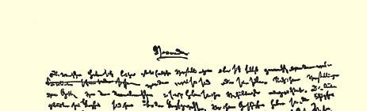
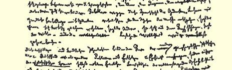
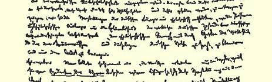
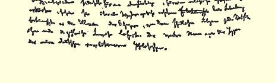
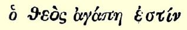
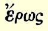
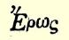
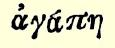

# 第一卷对费尔巴哈、布·鲍威尔和施蒂纳所代表的现代德国哲学的批判

## 序言

# 序言

人们迄今总是为自己造出关于自己本身、关于自己是何物或应当成为何物的种种虚假观念。他们按照自己关于神、关于模范人等等观念来建立自己的关系。他们头脑的产物就统治他们。他们这些创造者就屈从于自己的创造物。我们要把他们从幻想、观念、 教条和想像的存在物中解放出来，使他们不再在这些东西的枷锁下呻吟喘息。我们要起来反抗这种思想的统治。一个人说，只要我们教会他们如何用符合人的本质的思想来代替这些幻想，另一个人说，只要我们教会他们如何批判地对待这些幻想，还有个人说， 只要我们教会他们如何从头脑里抛掉这些幻想，这样……当前的现实就会崩溃。

这些天真的幼稚的空想构成现代青年黑格尔哲学的核心。在德国不仅是公众怀着畏惧和虔敬的心情来接受这种哲学，就是**哲学英雄们**自己在捧出它的时候也洋洋自得地感到它有震撼世界的危险性和大逆不道的残酷性。本书第一卷的目的在于揭露这些自称为狼、别人也把他们看作是狼的绵羊，指出他们的咩咩叫声只不过是以哲学的形式来重复德国市民的观念，而这些哲学评论家们的夸夸其谈只不过反映出德国现实的贫乏。本书的目的在于揭穿同现实的影子所作的哲学斗争，揭穿这种如此投合沉溺于幻想的精神萎靡的德国人民口味的哲学斗争，使这种斗争得不到任何信任。

有一个好汉一天忽然想到，人们之所以溺死，是因为他们被**关于重力的思想**迷住了。如果他们从头脑中抛掉这个观念，比方说， 宣称它是宗教迷信的观念，那末他们就会避免任何溺死的危险。他一生都在同重力的幻想作斗争，统计学给他提供愈来愈多的有关这种幻想的有害后果的证明。这位好汉就是现代德国革命哲学家们的标本[^1]。

> 卡·马克思和弗·恩格斯“德意志意识形态”
>
> 手稿的第一页。序言

# 一费尔巴哈

*唯物主义观点和唯心主义观点的对立*

正如德国的思想家们所宣告的，德国在最近几年里经历了一次空前的变革。从施特劳斯开始的黑格尔体系的解体过程变成了一种席卷一切“过去的力量”的世界性骚动。在普遍的混乱中，一些强大的国家产生了，但是立刻又消逝了，瞬息之间出现了许多英雄，但是马上又因为出现了更勇敢更强悍的对手而销声匿迹。这是一次革命，法国革命同它比起来只不过是儿戏；这是一次世界斗争，在它面前狄亚多希３的斗争简直微不足道。在瞬息间一些原则为另一些原则所代替，一些思想勇士为另一些思想勇士所歼灭。在 １８４２年至１８４５年这三年中间，在德国所进行的清洗比过去三个世纪都要彻底得多。

据说这一切都是在纯粹思想的领域中发生的。

然而，不管怎么样，我们碰到的是一个有意义的事件：绝对精神的瓦解过程。当它的生命的最后一个火星熄灭时，这个ｃａｐｕｔ ｍｏｒｔｕｕｍ[^2]的各个组成部分就分解了，它们重新化合，构成新的物质。那些靠哲学过活，一直以经营绝对精神为生的人们，现在都在贪婪地攫取这种新的化合物。每个人都热心兜售他所得到的那一份。竞争在所不免。起初这种竞争还相当体面，具有市民的循规蹈矩的性质。但是后来，当商品充斥德国市场，而在世界市场上尽管竭尽全力也无法找到销路的时候，一切便按照通常的德国方式，因工厂的过度生产、质量降低、原料掺假、伪造商标、买空卖空、空头支票以及没有任何现实基础的信用制度而搞糟了。竞争变成了残酷的斗争，而这个斗争现在却被吹嘘和描绘成一种具有世界历史意义的变革、一种产生了伟大成果的因素。

为了正确地评价这一套甚至在可敬的德国市民心中唤起他们引以为快的民族感情的哲学骗局，为了清楚地表明这整个青年黑格尔派运动的渺小卑微和地方局限性，特别是为了揭示这些英雄们的真正业绩和关于这些业绩的幻想之间的啼笑皆非的对比，就必须站在德国以外的立场上来考察一下这些喧嚣吵嚷[^3]。

## Ａ．一般意识形态，德意志意识形态

德国的批判，直到它的最后的挣扎，都没有离开过哲学的基地。这个批判虽然没有研究过它的一般哲学前提，但是它谈到的全部问题终究是在一定的哲学体系，即黑格尔体系的基地上产生的。 不仅是它的回答，而且连它所提出的问题本身，都包含着神秘主义。对黑格尔的这种依赖关系正好说明了为什么在这些新出现的批判家中甚至没有一个人想对黑格尔体系进行全面的批判，尽管他们每一个人都断言自己已超出了黑格尔哲学。他们和黑格尔的论战以及互相之间的论战，只局限于他们当中的每一个人都抓住黑格尔体系中的某一方面来反对他的整个体系，或反对别人所抓住的那些方面。起初他们还是抓住纯粹的、未加伪造的黑格尔的范畴，如实体和自我意识，但是后来却亵渎了这些范畴，用一些世俗的名称称呼它们，如“类”、“唯一者”、“人”，等等。

从施特劳斯到施蒂纳的整个德国哲学批判都局限于对**宗教**观念的批判[^4]。出发点是现实的宗教和真正的神学。至于什么是宗教意识，什么是宗教观念，后来下的定义各有不同。整个的进步在于： 想像中占统治地位的、形而上学的、政治的、法律的、道德的以及其他的观念也被归入宗教观念或神学观念的领域；还在于：政治的、 法律的、道德的意识被宣布为宗教的或神学的意识，而政治的、法律的、道德的人，总而言之“一般人”，则被宣布为宗教的人。宗教的统治被当成了前提。一切占统治地位的关系逐渐地都被宣布为宗教的关系，继而转化为迷信—— 对法的迷信，对国家的迷信等等。 到处出现的都只是教义和对教义的信仰。世界在愈来愈大的规模上被圣化了，直到最后可尊敬的圣麦克斯ｅｎ ｂｌｏｃ〔完全地，彻头彻尾地〕把它宣布为圣物，从而一劳永逸地把它葬送为止。

老年黑格尔派认为，任何东西只要归入某种黑格尔的逻辑范畴，就**明白易懂**了。青年黑格尔派则批判一切，到处用宗教的观念来代替一切，或者宣布一切都是神学上的东西。青年黑格尔派同意老年黑格尔派的这样一个信念，即认为宗教、观念、普遍的东西统治着现存世界。不过一派认为这种统治是篡夺而加以反对，而另一派则认为它是合法的而加以赞扬。

既然青年黑格尔派认为观念、思想、概念，即被他们变为某种独立东西的意识的一切产物，是人们的真正枷锁，就像老年黑格尔派把它们看作是人类社会的真正羁绊一样，所以不言而喻，青年黑格尔派只要同意识的这些幻想进行斗争就行了。既然根据青年黑格尔派的幻想，人们之间的关系、他们的一切举止行为、他们受到的束缚和限制，都是他们意识的产物，所以青年黑格尔派完全合乎逻辑地向人们提出一种道德要求，要他们用人的、批判的或利己的意识来代替他们现在的意识，从而消除束缚他们的限制。这种改变意识的要求，归根到底就是要求用另一种方式来解释现存的东西， 也就是说，通过另外的解释来承认现存的东西。尽管青年黑格尔派思想家们满口讲的都是“震撼世界”的词句，而实际上他们是最大的保守分子。他们之中最年轻的人确切地表达了他们的活动，说他们仅仅是为反对“**词句**”而斗争。不过他们忘记了：他们只是用词句来反对这些词句，既然他们仅仅反对现存世界的词句，那末他们就绝不是反对现实的、现存的世界。这种哲学批判所能达到的唯一结果，就是从宗教史上对基督教作一些说明，但就连这些说明也是片面的。至于他们的全部其他论断，只不过是进一步来粉饰他们的一种奢望，以为他们用这样一些微不足道的说明作出了仿佛具有世界历史意义的发现。

这些哲学家没有一个想到要提出关于德国哲学和德国现实之间的联系问题，关于他们所作的批判和他们自身的物质环境之间的联系问题。

我们开始要谈的前提并不是任意想出的，它们不是教条，而是一些只有在想像中才能加以抛开的现实的前提。这是一些现实的个人，是他们的活动和他们的物质生活条件，包括他们得到的现成的和由他们自己的活动所创造出来的物质生活条件。因此，这些前提可以用纯粹经验的方法来确定。

任何人类历史的第一个前提无疑是有生命的个人的存在[^5]。 因此第一个需要确定的具体事实就是这些个人的肉体组织，以及受肉体组织制约的他们与自然界的关系。当然，我们在这里既不能深入研究人们自身的生理特性，也不能深入研究各种自然条件 —— 地质条件、地理条件、气候条件以及人们所遇到的其他条件[^6]。任何历史记载都应当从这些自然基础以及它们在历史进程中由于人们的活动而发生的变更出发。

可以根据意识、宗教或随便别的什么来区别人和动物。一当人们自己开始**生产**他们所必需的生活资料的时候（这一步是由他们的肉体组织所决定的），他们就开始把自己和动物区别开来。人们生产他们所必需的生活资料，同时也就间接地生产着他们的物质生活本身。

人们用以生产自己必需的生活资料的方式，首先取决于他们得到的现成的和需要再生产的生活资料本身的特性。这种生产方式不仅应当从它是个人肉体存在的再生产这方面来加以考察。它在更大程度上是这些个人的一定的活动方式、表现他们生活的一定形式、他们的一定的**生活方式**。个人怎样表现自己的生活，他们自己也就怎样。因此，他们是什么样的，这同他们的生产是一致的 —— 既和他们生产**什么**一致，又和他们怎样生产一致。因而，个人是什么样的，这取决于他们进行生产的物质条件。

这种生产第一次是随着**人口的增长**而开始的。而生产本身又是以个人之间的**交往**为前提的。这种交往的形式又是由生产决定的４。

各民族之间的相互关系取决于每一个民族的生产力、分工和内部交往的发展程度。这个原理是公认的。然而不仅一个民族与其他民族的关系，而且一个民族本身的整个内部结构都取决于它的生产以及内部和外部的交往的发展程度。一个民族的生产力发展的水平，最明显地表现在该民族分工的发展程度上。任何新的生产力都会引起分工的进一步发展，因为它不仅仅是现有生产力的量的增加（例如开垦新的土地）。

某一民族内部的分工，首先引起工商业劳动和农业劳动的分离，从而也引起**城乡**的分离和城乡利益的对立。分工的进一步发展导致商业劳动和工业劳动的分离。同时，由于这些不同部门内部的分工，在某一劳动部门共同劳动的个人之间的分工也愈来愈细致了。这些种种细致的分工的相互关系是由农业劳动、工业劳动和商业劳动的经营方式（父权制、奴隶制、等级、阶级）决定的。在交往比较发达的情况下，同样的关系也会在各民族间的相互关系中出现。

分工发展的各个不同阶段，同时也就是所有制的各种不同形式。这就是说，分工的每一个阶段还根据个人与劳动的材料、工具和产品的关系决定他们相互之间的关系。

第一种所有制形式是部落所有制５。它是与生产的不发达的阶段相适应的，当时人们是靠狩猎、捕鱼、牧畜，或者最多是靠务农生活的。在后一种情况下，它是以有大量未开垦的土地为前提的。在这个阶段上，分工还很不发达，仅限于家庭中现有的自然产生的分工的进一步扩大。因此，社会结构只局限于家庭的扩大：父权制的酋长、他们所管辖的部落成员以及奴隶。隐蔽地存在于家庭中的奴隶制，只是随着人口和需求的增长，随着同外界往来（表现为战争或交易）的扩大而逐渐发展起来的。

第二种所有制形式是古代公社所有制和国家所有制。这种所有制是由于几个部落通过契约或征服联合为一个**城市**而产生的。 在这种所有制下仍然保存着奴隶制。除公社所有制以外，动产的私有制以及后来不动产的私有制已经开始发展起来，但它们是作为一种反常的、从属于公社所有制的形式发展起来的。公民仅仅共同占有自己的那些做工的奴隶，因此就被公社所有制的形式联系在一起。这是积极公民的一种共同私有制，他们在奴隶面前不得不保存这种自发产生的联合形式。因此，建筑在这个基础上的整个社会结构，以及与之相联系的人民权力，随着不动产私有制的发展而逐渐趋向衰落。分工已经比较发达。城乡之间的对立已经产生，国家之间的对立也相继出现。这些国家当中有一些代表城市利益，另一些则代表乡村利益。在城市内部存在着工业和海外贸易之间的对立。公民和奴隶之间的阶级关系已经充分发展。

征服这件事看起来好像是同这种历史观完全矛盾的。到目前为止，暴力、战争、掠夺、抢劫等等被看作是历史的动力。这里我们只能谈一谈主要之点，因此我们举一个最显著的例子：古老文明被蛮族破坏，接着就重新形成另一种社会结钩（罗马和野蛮人，封建主义和高卢人，东罗马帝国和土耳其人）。对野蛮的征服者民族说来，正如以上所指出的，战争本身还是一种经常的交往形式；在传统的、对该民族来说唯一可能的原始生产方式下，人口的增长需要有愈来愈多的生产资料，因而这种形式也就被愈来愈广泛地利用着。相反地，在意大利，由于地产日益集中（这不仅是由买卖和负债所引起的，而且还是由继承所引起的，因为当时生活放荡和不结婚现象非常流行，于是一些古老的氏族逐渐灭亡，他们的财产转入了少数人手里），由于耕地变为牧场（不仅是由通常的、至今仍然起作用的经济原因所引起的，而且也是由掠夺来的和进贡的谷物的输入以及由此而造成的意大利谷物缺乏销路的现象所引起的），自由民几乎完全消失了，就是奴隶也在不断地死亡，而不得不经常代之以新的奴隶。奴隶制仍然是整个生产的基础。介于自由民与奴隶之间的平民，从来没有超出流氓无产阶级的水平。总之，罗马始终只不过是一个城市，它与占领地之间的联系几乎仅仅是政治上的联系，因而这种联系自然也就可能为政治事件所破坏。

随着私有制的发展，这里第一次确立了那些我们在现代私有制中重新遇见的关系，不过是规模更为巨大而已。一方面是私有财产的集中，这种集中在罗马很早就开始了（李奇尼乌斯土地法 ６就是证明），从内战发生以来，尤其是在王政时期，发展得非常迅速；呆一方面是由此而来的平民小农向无产阶级的转化，然而， 后者由于处于有产者公民和奴隶之间的中间地位，并未获得独立的发展。

第三种形式是封建的或等级的所有制。古代的起点是**城市**及其狭小的领地。而中世纪的起点则是**乡村**。地广人稀，居住分散， 而征服者的入侵也没有使人口大量增加，—— 这种情况决定了起点作这样的转移。因此，与希腊和罗马相反，封建制度的发展是在一个宽广得多的地盘上开始的，而这个地盘是由罗马的征服以及起初与此有关的农业的普及所准备好了的。趋于衰落的罗马帝国的最后几个世纪和蛮族对它的征服，使得生产力遭到了极大的破坏；农业衰落了，工业由于缺乏销路而一蹶不振了，商业停顿或被迫中断了，城乡居民减少了。在日耳曼人的军事制度的影响下，现存关系以及受其制约的实现征服的方式发展了封建所有制。这种所有制与部落所有制和公社所有制一样，也是以某种共同体为基础的。但是作为直接进行生产的阶级而与这种共同体对立的，已经不是古代世界的奴隶，而是小农奴。随着封建制度的充分发展，也产生了与城市对立的现象。土地占有的等级结构以及与之有关的武装扈从制度使贵族掌握了支配农奴的权力。这种封建结构同古代的公社所有制一样，是一种联合，其目的在于对付被统治的生产阶级，只是联合的形式和对于直接生产者的关系有所不同，因为出现了不同的生产条件。

在**城市**中和这种封建的土地占有结构相适应的是行会所有制，即手工业的封建组织。这里的财产主要是各个人的劳动。联合起来反对勾结在一起的掠夺成性的贵族的必要性，在实业家同时又是商人的时期对共同市场的需要，流入当时繁华城市的逃亡农奴的竞争的加剧，全国的封建结构，—— 所有这一切产生了**行会**； 个别手工业者逐渐积蓄起来的少量资本及其与不断增长的人口比较起来是固定的人数，使得帮工和学徒制度发展起来了，而这种制度在城市里产生了一种和农村等级制相似的等级制。

这样，封建时代的所有制的主要形式，一方面是地产和束缚于地产上的农奴劳动，另一方面是拥有少量资本并支配着帮工劳动的自身劳动。这两种所有制的结构都是由狭隘的生产关系—— 粗陋原始的土地耕作和手工业式的工业所决定的。在封建制度繁荣时代，分工不大发达。每一个国家都存在着城乡之间的对立；虽然等级结构表现得非常鲜明，但是除了在乡村里有王公、贵族、僧侣和农民的划分，在城市里有师傅、帮工、学徒以及后来的平民－短工的划分之外，就再没有什么大的分工了。农业中的分工由于土地的小块经营而受到了阻碍，与这种经营方式同时产生的还有农民自己的家庭工业；在工业中，在各手工行业内部根本没有实行分工，而各手工行业之间的分工也是很少的。在比较老的城市中工业和商业早就分工了；而在比较新的城市中，只是在后来当这些城市彼此发生了关系的时候，这样的分工才日益显著。

比较广大的地区联合为封建王国，无论对于土地贵族或城市说来，都是一种需要。因此领导统治阶级组织即贵族组织的到处都是君主。

由此可见，事情是这样的：以一定的方式进行生产活动的一定的个人，发生一定的社会关系和政治关系。经验的观察在任何情况下都应当根据经验来揭示社会结构和政治结构同生产的联系，而不应当带有任何神秘和思辨的色彩。社会结构和国家经常是从一定个人的生活过程中产生的。但这里所说的个人不是他们自己或别人想像中的那种个人，而是**现实中的**个人，也就是说，这些个人是从事活动的，进行物质生产的，因而是在一定的物质的、不受他们任意支配的界限、前提和条件下能动地表现自己的[^7]。

思想、观念、意识的生产最初是直接与人们的物质活动，与人们的物质交往，与现实生活的语言交织在一起的。观念、思维、人们的精神交往在这里还是人们物质关系的直接产物。表现在某一民族的政治、法律、道德、宗教、形而上学等的语言中的精神生产也是这样。人们是自己的观念、思想等等的生产者，但这里所说的人们是现实的，从事活动的人们，他们受着自己的生产力的一定发展以及与这种发展相适应的交往（直到它的最遥远的形式）的制约。意识在任何时候都只能是被意识到了的存在，而人们的存在就是他们的实际生活过程。如果在全部意识形态中人们和他们的关系就像在照像机中一样是倒现着的，那末这种现象也是从人们生活的历史过程中产生的，正如物象在眼网膜上的倒影是直接从人们生活的物理过程中产生的一样。

德国哲学从天上降到地上；和它完全相反，这里我们是从地上升到天上，就是说，我们不是从人们所说的、所想像的、所设想的东西出发，也不是从只存在于口头上所说的、思考出来的、想像出来的、设想出来的人出发，去理解真正的人。我们的出发点是从事实际活动的人，而且从他们的现实生活过程中我们还可以揭示出这一生活过程在意识形态上的反射和回声的发展。甚至人们头脑中模糊的东西也是他们的可以通过经验来确定的、与物质前提相联系的物质生活过程的必然升华物。因此，道德、宗教、形而上学和其他意识形态，以及与它们相适应的意识形式便失去独立性的外观。 它们没有历史，没有发展；那些发展着自己的物质生产和物质交往的人们，在改变自己的这个现实的同时也改变着自己的思维和思维的产物。不是意识决定生活，而是生活决定意识。前一种观察方法从意识出发，把意识看作是有生命的个人。符合实际生活的第二种观察方法则是从现实的、有生命的个人本身出发，把意识仅仅看作是**他们**的意识。

这种观察方法并不是没有前提的。它从现实的前提出发，而且一刻也不离开这种前提。它的前提是人，但不是某种处在幻想的与世隔绝、离群索居状态的人，而是处在一定条件下进行的、现实的、 可以通过经验观察到的发展过程中的人。只要描绘出这个能动的生活过程，历史就不再像那些本身还是抽象的经验论者所认为的那样，是一些僵死事实的搜集，也不再像唯心主义者所认为的那样，是想像的主体的想像的活动。

思辨终止的地方，即在现实生活面前，正是描述人们的实践活动和实际发展过程的真正实证的科学开始的地方。关于意识的空话将销声匿迹，它们一定为真正的知识所代替。对现实的描述会使独立的哲学失去生存环境，能够取而代之的充其量不过是从对人类历史发展的观察中抽象出来的最一般的结果的综合。这些抽象本身离开了现实的历史就没有任何价值。它们只能对整理历史资料提供某些方便，指出历史资料的各个层次间的连贯性。但是这些抽象与哲学不同，它们绝不提供适用于各个历史时代的药方或公式。相反，只是在人们着手考察和整理资料（不管是有关过去的还是有关现代的）的时候，在实际阐述资料的时候，困难才开始出现。 这些困难的克服受到种种前提的制约，这些前提在这里根本是不可能提供出来的，而只是从对每个时代的个人的实际生活过程和活动的研究中得出的。这里我们只举出几个我们用来同意识形态[^8]相对立的抽象，并用历史的例子来加以说明。

［１．］历史

我们遇到的是一些没有任何前提的德国人，所以我们首先应当确定一切人类生存的第一个前提也就是一切历史的第一个前提，这个前提就是：人们为了能够“创造历史”，必须能够生活[^9]。但是为了生活，首先就需要衣、食、住以及其他东西。因此第一个历史活动就是生产满足这些需要的资料，即生产物质生活本身。同时这也是人们仅仅为了能够生活就必须每日每时都要进行的（现在也和几千年前一样）一种历史活动，即一切历史的一种基本条件。即使感性在圣布鲁诺那里被归结为像一根棍子那样微不足道的东西，但它仍须以生产这根棍子的活动为前提。因此任何历史观的第一件事情就是必须注意上述基本事实的全部意义和全部范围，并给予应有的重视。大家知道，德国人从来没有这样做过，所以他们从来没有为历史提供**世俗**基础，因而也从来没有过一个历史学家。 法国人和英国人尽管对这一事实同所谓的历史的联系了解得非常片面（特别因为他们受政治思想的束缚），但毕竟作了一些给历史编纂学提供唯物主义基础的初步尝试，首次写出了市民社会史、商业史和工业史。

第二个事实是，已经得到满足的第一个需要本身、满足需要的活动和已经获得的为满足需要用的工具又引起新的需要。这种新的需要的产生是第一个历史活动。从这里立即可以明白，德国人的伟大历史智慧是谁的精神产物。德国人认为凡是在他们缺乏实证材料的地方，凡是在神学、政治和文学的缪论不能立足的地方，就没有任何历史，那里只有“史前时期”；至于如何从这个荒谬的“史前历史”过渡到真正的历史，我们没有得到任何解释。不过另一方面，他们的历史思辨所以特别热衷于这个“史前历史”，是因为他们认为在这里他们不会受到“粗暴事实”的干预，而且还可以让他们的思辨欲望得到充分的自由，创立和推翻成千成万的假说。

一开始就纳入历史发展过程的第三种关系就是：每日都在重新生产自己生活的人们开始生产另外一些人，即增殖。这就是夫妻之间的关系，父母和子女之间的关系，也就是**家庭**。这个家庭起初是唯一的社会关系，后来，当需要的增长产生了新的社会关系，而人口的增多又产生了新的需要的时候，家庭便成为（德国除外）从属的关系了。那末就应该根据现有的经验的材料来考察和研究家庭，而不应该像通常在德国所做的那样，根据“家庭的概念”来考察和研究家庭[^10]。此外，不应把社会活动的这三个方面看作是三个不同的阶段，而只应看作是三个方面，或者，为了使德国人能够了解，把它们看作是三个“因素”。从历史的最初时期起，从第一批人出现时，三者就同时存在着，而且就是现在也还在历史上起着作用。

这样，生活的生产—— 无论是自己生活的生产（通过劳动）或他人生活的生产（通过生育）—— 立即表现为双重关系：一方面是自然关系，另一方面是社会关系；社会关系的含义是指许多个人的合作，至于这种合作是在什么条件下、用什么方式和为了什么目的进行的，则是无关紧要的。由此可见，一定的生产方式或一定的工业阶段始终是与一定的共同活动的方式或一定的社会阶段联系着的，而这种共同活动方式本身就是“生产力”；由此可见，人们所达到的生产力的总和决定着社会状况，因而，始终必须把“人类的历史”同工业和交换的历史联系起来研究和探讨。但是，这样的历史在德国是写不出来的，这一点也很明显，因为对于德国人说来，要做到这一点不仅缺乏理解能力和材料，而且还缺乏“可靠的感性”； 而在莱茵河彼岸也没有关于这类事情的任何经验可供参考，因为那里再没有什么历史。由此可见，一开始就表明了人们之间是有物质联系的。这种联系是由需要和生产方式决定的，它的历史和人的历史一样长久；这种联系不断采取新的形式，因而就呈现出“历史”，它完全不需要似乎还把人们联合起来的任何政治的或宗教的呓语存在。

只有现在，当我们已经考察了最初的历史的关系的四个因素、 四个方面之后，我们才发现：人也具有“意识”[^11]。但是人并非一开始就具有“纯粹的”意识。“精神”从一开始就很倒霉，法定要受物质的“纠缠”，物质在这里表现为震动着的空气层、声音，简言之，即语言。语言和意识具有同样长久的历史；语言是一种实践的、既为别人存在并仅仅因此也为我自己存在的、现实的意识。语言也和意识一样，只是由于需要，由于和他人交往的迫切需要才产生的[^12]。凡是有某种关系存在的地方，这种关系都是为我而存在的；动物不对什么东西发生“**关系**”，而且根本没有“关系”；对于动物说来，它对他物的关系不是作为关系存在的。因而，意识一开始就是社会的产物，而且只要人们还存在着，它就仍然是这种产物。当然，意识起初只是对**周围**的可感知的环境的一种意识，是对处于开始意识到自身的个人以外的其他人和其他物的狭隘联系的一种意识。同时，它也是对自然界的一种意识，自然界起初是作为一种完全异己的、有无限威力的和不可制服的力量与人们对立的，人们同它的关系完全像动物同它的关系一样，人们就像牲畜一样服从它的权力，因而，这是对自然界的一种纯粹动物式的意识（自然宗教）。

这里立即可以看出，这种自然宗教或对自然界的特定关系，是受社会形态制约的，反过来也是一样。这里和任何其他地方一样， 自然界和人的同一性也表现在：人们对自然界的狭隘的关系制约着他们之间的狭隘的关系，而他们之间的狭隘的关系又制约着他们对自然界的狭隘的关系，这正是因为自然界几乎还没有被历史的进程所改变；但是，另一方面，意识到必须和周围的人们来往，也就是开始意识到人一般地是生活在社会中的。这个开始和这个阶段上的社会生活本身一样，带有同样的动物性质；这是纯粹畜群的意识，这里人和绵羊不同的地方只是在于：意识代替了他的本能， 或者说他的本能是被意识到了的本能。由于生产效率的提高、需要的增长以及作为前二者基础的人口的增多，这种绵羊的、或部落的意识获得了进一步的发展。与此同时分工也发展起来。分工起初只是性交方面的分工，后来是由于天赋（例如体力）、需要、偶然性等等而自发地或“自然地产生的”分工。分工只是从物质劳动和精神劳动分离的时候起才开始成为真实的分工[^13]。从这时候起意识才能真实地这样想像：它是同对现存实践的意识不同的某种其他的东西；它不想像某种**真实的**东西而能够真实地想像某种东西。从这时候起，意识才能摆脱世界而去构造“纯粹的”理论、神学、哲学、 道德等等。但是，如果这种理论、神学、哲学、道德等等和现存的关系发生矛盾，那末，这仅仅是因为现存的社会关系和现存的生产力发生了矛盾。不过，在一定民族的各种关系的范围内，这种现象的出现也可能不是由于现在该民族范围内出现了矛盾，而是由于在该民族的意识和其他民族的实践之间[^14]，亦即在某一民族的民族意识和一般意识之间出现了矛盾（如像目前德国的情形那样）。

但是，意识本身究竟采取什么形式，这是完全无关紧要的。我们从这一大堆赘述中只能得出一个结论，那就是，上述三个因素 —— 生产力、社会状况和意识—— 彼此之间可能而且一定会发生矛盾，因为**分工**不仅使物质活动和精神活动、享受和劳动、生产和消费由各种不同的人来分担这种情况成为可能，而且成为现实。要使这三个因素彼此不发生矛盾，只有消灭分工。此外，不言而喻， “怪影”、“枷锁”、“最高存在物”、“概念”、“怀疑”只是假想中孤立的个人的唯心的、精神的表现，只是他的观念，即关于经验的束缚和界限的观念；生活的生产方式以及与之相联系的交往形式是在这些束缚和界限的范围内运动着的。

分工包含着所有这些矛盾，而且又是以家庭中自然产生的分工和社会分裂为单独的、互相对立的家庭这一点为基础的。与这种分工同时出现的还有**分配**，而且是劳动及其产品的**不平等**的分配 （无论在数量上或质量上）；因而也产生了所有制，它的萌芽和原始形态在家庭中已经出现，在那里妻子和孩子是丈夫的奴隶。家庭中的奴隶制（诚然，它还是非常原始和隐蔽的）是最早的所有制，但就是这种形式的所有制也完全适合于现代经济学家所下的定义，即所有制是对他人劳动力的支配。其实，分工和私有制是两个同义语，讲的是同一件事情，一个是就活动而言，另一个是就活动的产品而言。

其次，随着分工的发展也产生了个人利益或单个家庭的利益与所有互相交往的人们的共同利益之间的矛盾；同时，这种共同的利益不是仅仅作为一种“普遍的东西”存在于观念之中，而且首先是作为彼此分工的个人之间的相互依存关系存在于现实之中。最后，分工还给我们提供了第一个例证，说明只要人们还处在自发地形成的社会中，也就是说，只要私人利益和公共利益之间还有分裂，也就是说，只要分工还不是出于自愿，而是自发的，那末人本身的活动对人说来就成为一种异己的、与他对立的力量，这种力量驱使着人，而不是人驾驭着这种力量。原来，当分工一出现之后，每个人就有了自己一定的特殊的活动范围，这个范围是强加于他的，他不能超出这个范围：他是一个猎人、渔夫或牧人，或者是一个批判的批判者，只要他不想失去生活资料，他就始终应该是这样的人。 而在共产主义社会里，任何人都没有特定的活动范围，每个人都可以在任何部门内发展，社会调节着整个生产，因而使我有可能随我自己的心愿今天干这事，明天干那事，上午打猎，下午捕鱼，傍晚从事畜牧，晚饭后从事批判，但并不因此就使我成为一个猎人、渔夫、 牧人或批判者。社会活动的这种固定化，我们本身的产物聚合为一种统治我们的、不受我们控制的、与我们愿望背道而驰的并抹煞我们的打算的物质力量，这是过去历史发展的主要因素之一。

正是由于私人利益和公共利益之间的这种矛盾，公共利益才以**国家的**姿态而采取一种和实际利益（不论是单个的还是共同的） 脱离的独立形式，也就是说采取一种虚幻的共同体的形式。然而这始终是在每一个家庭或部落集团中现有的骨肉联系、语言联系、较大规模的分工联系以及其他利害关系的现实基础上，特别是在我们以后将要证明的各阶级利益的基础上发生的。这些阶级既然已经由于分工而分离开来，就在每一个这样的人群中分离开来，其中一个阶级统治着其他一切阶级。由此可见，国家内部的一切斗争 —— 民主政体、贵族政体和君主政体相互之间的斗争，争取选举权的斗争等等，不过是一些虚幻的形式，在这些形式下进行着各个不同阶级间的真正的斗争（德国的理论家们对此一窍不通，尽管在 “德法年鉴”和“神圣家族”７中已经十分明确地向他们指出过这一点）。从这里还可以看出，每一个力图取得统治的阶级，如果它的统治就像无产阶级的统治那样，预定要消灭整个旧的社会形态和一切统治，都必须首先夺取政权，以便把自己的利益说成是普遍的利益，而这是它在初期不得不如此做的。正因为各个个人所追求的**仅仅**是自己的特殊的、对他们说来是同他们的共同利益不相符合的利益（普遍的东西一般说来是一种虚幻的共同体的形式），所以他们认为这种共同利益是“异己的”，是“不依赖”于他们的，也就是说，这仍旧是一种特殊的独特的“普遍”利益，或者是他们本身应该在这种分离的界限里活动，这种情况也发生在民主制中。另一方面，这些特殊利益始终在**真正地**反对共同利益和虚幻的共同利益，这些特殊利益的**实际**斗争使得通过以国家姿态出现的虚幻的 “普遍”利益来对特殊利益进行**实际**的干涉和约束成为必要。受分工制约的不同个人的共同活动产生了一种社会力量，即扩大了的生产力。由于共同活动本身不是自愿地而是自发地形成的，因此这种社会力量在这些个人看来就不是他们自身的联合力量，而是某种异己的、在他们之外的权力。关于这种权力的起源和发展趋向，他们一点也不了解；因而他们就不再能驾驭这种力量，相反地， 这种力量现在却经历着一系列独特的、不仅不以人们的意志和行为为转移的，反而支配着人们的意志和行为的发展阶段。

这种“**异化**”（用哲学家易懂的话来说）当然只有在具备了两个 **实际**前提之后才会消灭。要使这种异化成为一种“不堪忍受的”力量，即成为革命所要反对的力量，就必须让它把人类的大多数变成完全“没有财产的”人，同时这些人又和现存的有钱的有教养的世界相对立，而这两个条件都是以生产力的巨大增长和高度发展为前提的。另一方面，生产力的这种发展（随着这种发展，人们的**世界历史性的**而不是狭隘地域性的存在已经是经验的存在了）之所以是绝对必需的实际前提，还因为如果没有这种发展，那就只会有**贫穷**的普遍化；而在**极端贫困的情况下**，就必须重新开始争取必需品的斗争，也就是说，全部陈腐的东西又要死灰复燃。其次，这种发展之所以是必需的前提，还因为：只有随着生产力的这种普遍发展， 人们之间的**普遍**交往才能建立起来；由于普遍的交往，一方面，可以发现在一切民族中同时都存在着“没有财产的”群众这一事实 （普遍竞争），而其中每一民族同其他民族的变革都有依存关系；最后，狭隘地域性的个人为**世界历史性的**、真正普遍的个人所代替。 不这样，（１）共产主义就只能作为某种地域性的东西而存在；（２）交往的**力量**本身就不可能发展成为一种**普遍的**因而是不堪忍受的力量：它们会依然处于家庭的、笼罩着迷信气氛的“境地”；（３）交往的任何扩大都会消灭地域性的共产主义。共产主义只有作为占统治地位的各民族“立即”同时发生的行动才可能是经验的，而这是以生产力的普遍发展和与此有关的世界交往的普遍发展为前提的８。 否则，例如财产一般怎么能够具有某种历史，采取各种不同的形式呢？例如地产怎么能够像在今天实际生活中所发生的那样，根据现有不同的条件而发展（法国从分散的形式发展到集中于少数人之手，而在英国则是从集中于少数人之手的状况发展到分散的形式） 呢？或者贸易（它只不过是不同个人和不同国家的产品交换）怎么能够通过供求关系而统治全世界呢？用一位英国经济学家的话来说，这种关系就像古代的命运之神一样，逍遥于寰球之上，用看不见的手分配人间的幸福和灾难，把一些王国创造出来又把它们摧毁掉，使一些民族产生又使它们趋于衰亡；但随着基础、即私有制的消灭，随着对生产实行共产主义的调节（这种调节消灭人们对于自己产品的异化关系），供求关系的统治也将消失，**人们**将使交换、 生产及其相互关系的方式重新受自己的支配。

共产主义对我们说来不是应当确立的**状况**，不是现实应当与之相适应的**理想**。我们所称为共产主义的是那种消灭现存状况的 **现实**的运动。这个运动的条件是由现有的前提产生的。此外，有许许多多人**仅仅**依靠自己劳动为生，有大量劳动力与资本隔绝或者甚至连有限地满足自己的需要的可能性都被剥夺，因而它们已经不仅暂时失去作为有保障的生活来源的工作本身，而是一概处于完全不稳定的地位，—— 所有这一切，都由于竞争的关系而以**世界市场**的存在为前提。所以无产阶级只有**在世界历史意义上**才能存在，就像它的事业—— 共产主义一般只有作为“世界历史性的”存在才有可能实现一样。而各个个人的世界历史性的存在就意味着他们的存在是与世界历史直接联系的。

在过去一切历史阶段上受生产力所制约、同时也制约生产力的交往形式，就是**市民社会**。这个社会（从前面已经可以这样判定）是以简单的家庭和复杂的家庭，即所谓部落生活作为自己的前提和基础的。关于市民社会的比较详尽的定义已经包括在前面的叙述中了。从这里已经可以看出，这个市民社会是全部历史的真正发源地和舞台，可以看出过去那种轻视现实关系而只看到元首和国家的丰功伟绩的历史观何等**荒谬**[^15]。

市民社会包括各个个人在生产力发展的一定阶段上的一切物质交往。它包括该阶段上的整个商业生活和工业生活，因此它超出了国家和民族的范围，尽管另一方面它对外仍然需要以民族的姿态出现，对内仍然需要组成国家的形式。“市民社会”这一用语是在 １８世纪产生的，当时财产关系已经摆脱了古代的和中世纪的共同体。真正的资产阶级社会只是随同资产阶级发展起来的；但是这一名称[^16]始终标志着直接从生产和交往中发展起来的社会组织，这种社会组织在一切时代都构成国家的基础以及任何其他的观念的上层建筑的基础。

［２．］关于意识的生产

单独的个人随着他们的活动扩大为世界历史性的活动，愈来愈受到异己力量的支配（他们把这种压迫想像为所谓宇宙精神等等的圈套），受到日益扩大的、归根到底表现为**世界市场**的力量的支配；这种情况在过去的历史中也绝对是经验的事实。但是，另一种情况也具有同样的经验根据，这就是：这种对德国理论家们说来是如此神秘的力量，随着现存社会制度被共产主义革命所推翻（下面要谈到这一点），以及随着私有制遭到与这一革命有同等意义的消灭，也将被消灭。同时，每一个单独的个人的解放的程度是与历史完全转变为世界历史的程度一致的。至于个人的真正的精神财富完全取决于他的现实关系的财富，这从上面的叙述中已经一目了然。仅仅因为这个缘故，各个单独的个人才能摆脱各种不同的民族局限和地域局限，而同整个世界的生产（也包括精神的生产）发生实际联系，并且可能有力量来利用全球的这种全面生产（人们所创造的一切）。各个个人的**全面的**依存关系、他们的这种自发形成的**世界历史性**的共同活动的形式，由于共产主义革命而转化为对那些异己力量的控制和自觉的驾驭，这些力量本来是由人们的相互作用所产生的，但是对他们说来却一直是一种异己的、统治着他们的力量。**这种**观点仍然可以被思辨地、唯心地、即幻想地解释为 “类的自我产生”（“作为主体的社会”），把所有前后相继、彼此相联的个人设想为从事自我产生这种神秘活动的唯一的个人。这里很明显，尽管人们在肉体上和精神上**互相**创造着，但是他们并不像圣布鲁诺胡说的那样，或者像“**唯一者**”、“被创造的”人那样创造自己本身。

由此可见，这种历史观就在于：从直接生活的物质生产出发来考察现实的生产过程，并把与该生产方式相联系的、它所产生的交往形式，即各个不同阶段上的市民社会，理解为整个历史的基础； 然后必须在国家生活的范围内描述市民社会的活动，同时从市民社会出发来阐明各种不同的理论产物和意识形式，如宗教、哲学、 道德等等，并在这个基础上追溯它们产生的过程。这样做当然就能够完整地描述全部过程（因而也就能够描述这个过程的各个不同方面之间的相互作用）了。这种历史观和唯心主义历史观不同，它不是在每个时代中寻找某种范畴，而是始终站在现实历史的**基础** 上，不是从观念出发来解释实践，而是从物质实践出发来解释观念的东西，由此还可得出下述结论：意识的一切形式和产物不是可以用精神的批判来消灭的，也不是可以通过把它们消融在“自我意识 “中或化为“幽灵”、“怪影”、“怪想”等等来消灭的，而只有实际地推翻这一切唯心主义谬论所由产生的现实的社会关系，才能把它们消灭；历史的动力以及宗教、哲学和任何其他理论的动力是革命， 而不是批判。这种观点表明：历史并不是作为“产生于精神的精神”消融在“自我意识”中，历史的每一阶段都遇到有一定的物质结果、一定数量的生产力总和，人和自然以及人与人之间在历史上形成的关系，都遇到有前一代传给后一代的大量生产力、资金和环境，尽管一方面这些生产力、资金和环境为新的一代所改变，但另一方面，它们也预先规定新的一代的生活条件，使它得到一定的发展和具有特殊的性质。由此可见，这种观点表明：人创造环境，同样环境也创造人。每个个人和每一代当作现成的东西承受下来的生产力、资金和社会交往形式的总和，是哲学家们想像为“实体”和 “人的本质”的东西的现实基础，是他们神化了的并与之作斗争的东西的现实基础，这种基础尽管遭到以“自我意识”和“**唯一者**”的身分出现的哲学家们的反抗，但它对人们的发展所起的作用和影响却丝毫也不因此而有所削弱。各代所面临的生活条件还决定着这样一些情况：历史上周期性地重演着的革命震荡是否强大到足以摧毁现存一切的基础；如果还没有具备这些实行全面变革的物质因素，就是说，一方面还没有一定的生产力，另一方面还没有形成不仅反抗旧社会的某种个别方面，而且反抗旧的“生活生产”本身、反抗旧社会所依据的“综合活动”的革命群众，那末，正如共产主义的历史所证明的，尽管这种变革的**思想**已经表述过千百次，但这一点对于实际发展没有任何意义。

过去的一切历史观不是完全忽视了历史的这一现实基础，就是把它仅仅看成与历史过程没有任何联系的附带因素。根据这种观点，历史总是遵照在它之外的某种尺度来编写的；现实的生活生产被描述成某种史前的东西，而历史的东西则被说成是某种脱离日常生活的东西，某种处于世界之外和超乎世界之上的东西。这样就把人对自然界的关系从历史中排除出去了，因而造成了自然界和历史之间的对立。因此这种观点只能在历史上看到元首和国家的丰功伟绩，看到宗教的、一般理论的斗争，而且在每次描述某一历史时代的时候，它都不得不**赞同这一时代的幻想**。例如，假使某一时代设想自己是由纯粹“政治的”或“宗教的”动因所决定的，那末它的历史家就会接受这个意见，尽管“宗教”和“政治”只是时代的现实动因的形式。这些特定的人关于自己的真正实践的“想像”、 “观念”变成一种支配和决定他们的实践的唯一起决定作用的和积极的力量。印度人和埃及人借以实现分工的原始形态在这些民族的国家和宗教中产生了等级制度，所以历史家便认为似乎等级制度是产生这种原始社会形态的力量。法国人和英国人至少抱着一种毕竟是同现实最接近的政治幻想，而德国人却在“纯粹精神”的领域中兜圈子，把宗教幻想推崇为历史的动力。黑格尔的历史哲学是整个德国历史编纂学的最终的、达到自己“最纯粹的表现”的产物。在德国历史编纂学看来，问题完全不在于现实的利益，甚至不在于政治的利益，而在于纯粹的思想。这些纯粹的思想后来在圣布鲁诺那里也被看作是一连串的“思想”，其中一个吞噬一个，并最后消失于“自我意识”中[^17]。圣麦克斯·施蒂纳更加彻底，他对现实的历史一窍不通，他认为历史过程只不过是“骑士”、盗贼和怪影的历史，他当然只有借助于“不信神”才能摆脱这种历史的幻觉而得救。 这种观点实际上是宗教的观点：它预先把宗教的人当作是全部历史起点的原人，它在自己的想像中用宗教的幻想生产来代替生活资料和生活本身的现实生产。整个这样的历史观及其解体和由此而产生的怀疑与动摇，仅仅是德国人的**民族**事情，而且对德国说来也只有**地方性**的意义。近来不断讨论着如何能够“从神的王国进入人的王国”这样一个重要问题，这就是一个例子，似乎这个“神的王国”不是幻想而是什么时候曾经在某个地方存在过的，似乎学识渊博的好汉们不是经常生活在（虽然他们自己不知道）他们目前想要寻找道路去到达的那个“人的王国”中，似乎旨在说明这个九霄云外的理论王国的奇异性的科学消遣（因为这不过是一种消遣）的任务恰恰不是去证明这种王国是从现实的尘世关系中产生的。通常这些德国人总是只关心把既有的一切无稽之谈变为某种别的胡说八道，就是说，他们以为，所有这些无稽之谈都具有某种需要揭示的特殊**意义**，其实全部问题只在于从现存的实际关系出发来说明这些理论词句。正如上面所说的，要真正地、实际地消灭这些词句， 要从人们的意识中消除这些观念，只有靠改变条件，而不是靠理论上的演绎。对于人民大众、即无产阶级来说，这些理论观念是不存在的，因而也就用不着去消灭它们。如果这些群众在某个时候有过某些理论观念，如宗教，那末这些观念也早已被环境所消灭了。

上述问题及其解决方法所具有的纯粹民族的性质还表现在： 这些理论家们郑重其事地认为，形形色色的臆造，如“神人”、“**人**” 等等，支配着各个历史时代；圣布鲁诺甚至断言：只有“批判和批判者创造了历史”。而当这些理论家们亲自从事编纂历史的时候，他们会匆匆忙忙地越过过去的一切，一下子从“蒙古人时代”转到真正“内容丰富的”历史，即“哈雷年鉴”和“德国年鉴”９的历史，转到黑格尔学派蜕化为普遍争吵的历史。所有其他的民族和所有真实的事件都被遗忘了，ｔｈｅａｔｒｕｍ ｍｕｎｄｉ〔世界舞台〕局限于莱比锡的书市和“**批判”**、**“人”**以及“**唯一者**”之间的吵嚷。如果我们的理论家们一旦着手探讨真正的历史主题，例如１８世纪的历史，那末他们也只是提供观念的历史，这种历史是和构成这些观念的基础的事实和实际过程脱离的，而他们阐述这一历史的目的也仅仅是把所考察的时代描绘成一个真正历史时代即１８４０—１８４４年德国哲学斗争时代的不完善的预备阶段、尚有局限性的前奏时期。他们抱的目的是为了使某个非历史性人物及其幻想流芳百世而编写过去的历史，根据这一目的他们根本不提真正历史的事件，甚至不提政治对历史进程的真正历史的干预，他们的叙述不是以研究为根据， 而是以任意的虚构和文学胡诌为根据，如像圣布鲁诺在他那已被人遗忘的十八世纪历史[^18]中所做的那样。这些唱高调的、爱吹嘘的思想贩子们以为他们无限地凌驾于任何民族偏见之上，其实他们比梦想德国统一的啤酒店的庸人带有更多的民族局限性。他们不承认其他民族的事件是历史的。他们在德国生活，依靠德国和为着德国生活。他们把莱茵河颂歌１０变为圣歌，并征服亚尔萨斯和洛林，但他们不是剽窃法兰西国家，而是剽窃法兰西哲学，他们不是把法兰西的省份德国化，而是把法兰西的思想德国化。费奈迭先生同打着理论的世界统治的旗帜而宣布德国的世界统治的圣布鲁诺和圣麦克斯比较起来是一个世界主义者。

从这全部分析中还可以看出，费尔巴哈犯了多大的错误。他 （“维干德季刊”１８４５年第二卷）１１借助于“社会的人”这一规定宣称自己是共产主义者，他把这一规定变成“人”的宾词，认为这样一来又可以把表达现存世界中一定革命政党的拥护者的“共产主义者” 一词变为一种空洞的范畴。费尔巴哈在关于人与人之间的关系问题上的全部推论无非是要证明：人们是互相需要的，并且**过去一直是**互相**需要**的。他希望加强对这一事实的理解，也就是说，和其他的理论家一样，只是希望达到对**现存**事实的正确理解，然而一个真正的共产主义者的任务却在于推翻这种现存的东西。不过，我们完全承认，费尔巴哈在力图理解**这一**事实的时候，达到了理论家一般可能达到的地步，但他还是一位理论家和哲学家。然而值得注意的是：圣布鲁诺和圣麦克斯立即用费尔巴哈关于共产主义者的观念来代替真正的共产主义者，这样做的目的多少是为了使他们能够像同“产生于精神的精神”、同哲学范畴、同势均力敌的敌人作斗争那样来同共产主义作斗争，而对圣布鲁诺来说，这样做还为了实际的利益。我们举出“未来哲学”１２中的一个地方作为例子来说明承认现存的东西同时又不了解现存的东西—— 这也是费尔巴哈和我们的敌人的共同之点。费尔巴哈在这些地方证明：某物或某人的存在同时也就是某物或某人的本质；一个动物或一个人的一定生存条件、生活方式和活动，就是使这个动物或人的“本质”感到满足的东西。任何例外在这里都被肯定地看作是不幸事件，是不能改变的反常现象。这样说来，如果千百万无产者根本不满足于他们的生活条件，如果他们的“存在”同他们的……相矛盾……[^19]

……实际上和对**实践的**唯物主义者，即**共产主义者**说来，全部问题都在于使现存世界革命化，实际地反对和改变事物的现状。如果在费尔巴哈那里有时也遇见类似的观点，那末它们始终不过是一些零星的猜测，对费尔巴哈的总的世界观的影响是微不足道的， 只能把它们看作仅仅是具有发展能力的萌芽。费尔巴哈对感性世界的“理解”一方面仅仅局限于对这一世界的单纯的直观，另一方面仅仅局限于单纯的感觉：费尔巴哈谈到的是“人自身”，而不是 “现实的历史的人”。“人自身”实际上是“德国人”。在前一种情况下，在对感性世界的**直观**中，他不可避免地碰到与他的意识和感觉相矛盾的东西，这些东西破坏着他所假定的感性世界一切部分的和谐，特别是人与自然界的和谐[^20]。为了消灭这个障碍，他不得不求助于某种二重性的直观，这种直观介于仅仅看到“眼前”的东西的普通直观和看出事物的“真正本质”的高级的哲学直观之间。他没有看到，他周围的感性世界决不是某种开天辟地以来就已存在的、始终如一的东西，而是工业和社会状况的产物，是历史的产物， 是世世代代活动的结果，其中每一代都在前一代所达到的基础上继续发展前一代的工业和交往方式，并随着需要的改变而改变它的社会制度。甚至连最简单的“可靠的感性”的对象也只是由于社会发展、由于工业和商业往来才提供给他的。大家知道，樱桃树和几乎所有的果树一样，只是在数世纪以前依靠**商业**的结果才在我们这个地区出现。由此可见，樱桃树只是**依靠**一定的社会在一定时期的这种活动才为费尔巴哈的“可靠的感性”所感知。

只要按照事物的本来面目及其产生根源来理解事物，任何深奥的哲学问题（后面将对这一点作更清楚的说明）都会被简单地归结为某种经验的事实。例如，关于人对自然的关系这一重要问题 （或者如布鲁诺所说的（第１１０页）１３，关于“自然和历史的对立”问题，好像这是两种互不相干的“东西”，好像人们面前始终不会有历史的自然和自然的历史）就是这样。这是一个产生了关于“实体”和 “自我意识”的一切“高深莫测的创造物”的问题。然而如果考虑到， 在工业中向来就有那个很著名的“人和自然的统一性”，而且这种统一性在每一个时代都随着工业或快或慢的发展而不断改变，就像人与自然的“斗争”促进生产力在相应基础上的发展一样，那末上述问题自然也就不存在了。工业和商业、生活必需品的生产和交换，一方面制约着不同社会阶级的分配和彼此的界限，同时它们在自己的运动形式上又受着后者的制约。这样一来，打个比方说，费尔巴哈在曼彻斯特只看见一些工厂和机器，而一百年以前在那里却只能看见脚踏纺车和织布机；或者他在罗马的康帕尼亚只发现一些牧场和沼泽，而奥古斯都时代在那里却只能发现到处都是罗马资本家的茂密的葡萄园和讲究的别墅。费尔巴哈特别谈到自然科学的直观，提到一些秘密只有物理学家和化学家的眼睛才能识破，但是如果没有工业和商业，自然科学会成为什么样子呢？甚至这个“纯粹的”自然科学也只是由于商业和工业，由于人们的感性活动才达到自己的目的和获得材料的。这种活动、这种连续不断的感性劳动和创造、这种生产，是整个现存感性世界的非常深刻的基础，只要它哪怕只停顿一年，费尔巴哈就会看到，不仅在自然界将发生巨大的变化，而且整个人类世界以及他（费尔巴哈）的直观能力，甚至他本身的存在也就没有了。当然，在这种情况下外部自然界的优先地位仍然保存着，而这一切当然不适用于原始的、通过 ｇｅｎｅｒａｔｉｏ ａｅｑｕｉｖｏｃａ〔自然发生〕的途径产生的人们。但是，这种区别只有在人被看作是某种与自然界不同的东西时才有意义。此外，这种先于人类历史而存在的自然界，不是费尔巴哈在其中生活的那个自然界，也不是那个除去在澳洲新出现的一些珊瑚岛以外今天在任何地方都不再存在的、因而对于费尔巴哈说来也是不存在的自然界。

诚然，费尔巴哈比“纯粹的”唯物主义者有巨大的优越性：他也承认人是“感性的对象”。但是，毋庸讳言，他把人只看作是“感性的对象”，而不是“感性的活动”，因为他在这里也仍然停留在理论的领域内，而没有从人们现有的社会联系，从那些使人们成为现在这种样子的周围生活条件来观察人们；因此毋庸讳言，费尔巴哈从来没有看到真实存在着的、活动的人，而是停留在抽象的“人”上，并且仅仅限于在感情范围内承认“现实的、单独的、肉体的人”，也就是说，除了爱与友情，而且是理想化了的爱与友情以外，他不知道 “人与人之间”还有什么其他的“人的关系”。他没有批判现在的生活关系，因而他从来没有把感性世界理解为构成这一世界的个人的共同的、活生生的、感性的**活动**，因此，比方说，当他看到的是大批患瘰疬病的、积劳成疾的和患肺病的贫民而不是健康人的时候， 便不得不诉诸“最高的直观”和理想的“类的平等化”，这就是说，正是在共产主义的唯物主义者看到改造工业和社会制度的必要性和条件的地方，他却重新陷入唯心主义。

当费尔巴哈是一个唯物主义者的时候，历史在他的视野之外； 当他去探讨历史的时候，他决不是一个唯物主义者。在他那里，唯物主义和历史是彼此完全脱离的。这一点从上面所说的看来已经非常明显了[^21]。

历史不外是各个世代的依次交替。每一代都利用以前各代遗留下来的材料、资金和生产力；由于这个缘故，每一代一方面在完全改变了的条件下继续从事先辈的活动，另一方面又通过完全改变了的活动来改变旧的条件。然而，事情被思辨地颠倒成这样：好像后一个时期历史乃是前一个时期历史的目的，例如，好像美洲的发现的根本目的就是要引起法国革命。因此，历史便具有其特殊的目的并成为某个与“其他人物并列的人物”（如像“**自我意识**”、“**批判**”、“**唯一者**”等等）。其实，以往历史的“使命”、“目的”、“萌芽”、 “观念”等词所表明的东西，无非是从后来历史中得出的抽象，无非是从先前历史对后来历史发生的积极影响中得出的抽象。

各个相互影响的活动范围在这个发展进程中愈来愈扩大，各民族的原始闭关自守状态则由于日益完善的生产方式、交往以及因此自发地发展起来的各民族之间的分工而消灭得愈来愈彻底， 历史就在愈来愈大的程度上成为全世界的历史。例如，如果在英国发明了一种机器，它夺走了印度和中国的千千万万工人的饭碗，并引起这些国家的整个生存形式的改变，那末，这个发明便成为一个世界历史性的事实；同样，砂糖和咖啡在１９世纪具有了世界历史的意义，是由于拿破仑的大陆体系[^22]所引起的这两种产品的缺乏推动了德国人起来反抗拿破仑，从而就成为光荣的１８１３年解放战争的现实基础。由此可见，历史向世界历史的转变，不是“自我意识”、宇宙精神或者某个形而上学怪影的某种抽象行为，而是纯粹物质的、可以通过经验确定的事实，每一个过着实际生活的、需要吃、喝、穿的个人都可以证明这一事实。

统治阶级的思想在每一时代都是占统治地位的思想。这就是说，一个阶级是社会上占统治地位的**物质**力量，同时也是社会上占统治地位的**精神**力量。支配着物质生产资料的阶级，同时也支配着精神生产的资料，因此，那些没有精神生产资料的人的思想，一般地是受统治阶级支配的。占统治地位的思想不过是占统治地位的物质关系在观念上的表现，不过是表现为思想的占统治地位的物质关系；因而，这就是那些使某一个阶级成为统治阶级的各种关系的表现，因而这也就是这个阶级的统治的思想。此外，构成统治阶级的各个个人也都具有意识，因而他们也会思维；既然他们正是作为一个阶级而进行统治，并且决定着某一历史时代的整个面貌，不言而喻，他们在这个历史时代的一切领域中也会这样做，就是说， 他们还作为思维着的人，作为思想的生产者而进行统治，他们调节着自己时代的思想的生产和分配；而这就意味着他们的思想是一个时代的占统治地位的思想。例如，在某一国家里，某个时期王权、 贵族和资产阶级争夺统治，因而，在那里统治是分享的，那里占统治地位的思想就会是关于分权的学说，人们把分权当作“永恒的规律”来谈论。

我们在上面（第［３５—３９］页）已经说明分工是先前历史的主要力量之一，现在，分工也以精神劳动和物质劳动的分工的形式出现在统治阶级中间，因为在这个阶级内部，一部分人是作为该阶级的思想家而出现的（他们是这一阶级的积极的、有概括能力的思想家，他们把编造这一阶级关于自身的幻想当作谋生的主要泉源）， 而另一些人对于这些思想和幻想则采取比较消极的态度，他们准备接受这些思想和幻想，因为实际上该阶级的这些代表才是它的积极成员，所以他们很少有时间来编造关于自身的幻想和思想。在这一阶级内部，这种分裂甚至可以发展成为这两部分人之间的某种程度上的对立和敌视，但是一旦发生任何实际冲突，当阶级本身受到威胁，甚至占统治地位的思想好像不是统治阶级的思想这种假象、它们拥有的权力好像和这一阶级的权力不同这种假象也趋于消失的时候，这种敌视便会自行消失。一定时代的革命思想的存在是以革命阶级的存在为前提的，关于这个革命阶级的前提所必须讲的，在前面（第［３７—４１］页）已经讲过了。

然而，在考察历史运动时，如果把统治阶级的思想和统治阶级本身分割开来，使这些思想独立化，如果不顾生产这些思想的条件和它们的生产者而硬说该时代占统治地位的是这些或那些思想， 也就是说，如果完全不考虑这些思想的基础—— 个人和历史环境， 那就可以这样说：例如，在贵族统治时期占统治地位的是忠诚信义等等概念，而在资产阶级统治时期占统治地位的则是自由平等等等概念。总之，统治阶级自己为自己编造出诸如此类的幻想。所有历史学家（主要是１８世纪以来的）所固有的这种历史观必然会碰到这样一种现象：占统治地位的将是愈来愈抽象的思想，即愈来愈具有普遍性形式的思想。事情是这样的，每一个企图代替旧统治阶级的地位的新阶级，就是为了达到自己的目的而不得不把自己的利益说成是社会全体成员的共同利益，抽象地讲，就是赋予自己的思想以普遍性的形式，把它们描绘成唯一合理的、有普遍意义的思想。进行革命的阶级，仅就它对抗另一个阶级这一点来说，从一开始就不是作为一个阶级，而是作为全社会的代表出现的；它俨然以社会全体群众的姿态反对唯一的统治阶级[^23]。它之所以能这样做， 是因为它的利益在开始时的确同其余一切非统治阶级的共同利益还多少有一些联系，在当时存在的那些关系的压力下还来不及发展为特殊阶级的特殊利益。因此，这一阶级的胜利对于其他未能争得统治的阶级中的许多个人说来也是有利的，但这只是就这种胜利使这些个人有可能上升到统治阶级行列这一点讲的。当法国资产阶级推翻了贵族的统治之后，在许多无产者面前由此出现了升到无产阶级之上的可能性，但是只有当他们变成资产者的时候才达到这一点。由此可见，每一个新阶级赖以建立自己统治的基础， 比它以前的统治阶级所依赖的基础要宽广一些；可是后来，非统治阶级和取得统治的阶级之间的对立也发展得更尖锐和更深刻。这两种情况使得非统治阶级反对新统治阶级的斗争在否定旧社会制度方面，又比起过去一切争得统治的阶级要更加坚决、更加激进。

只要阶级的统治完全不再是社会制度的形式，也就是说，只要那种把特殊利益说成是普遍利益，或者把“普遍的东西”说成是统治的东西的必要性消失了，那末，一定阶级的统治似乎只是某种思想的统治这种假象当然也就会完全自行消失。

把统治思想同进行统治的个人分割开来，主要是同生产方式的一定阶段所产生的各种关系分割开来，并由此做出结论说，历史上始终是思想占统治地位，这样一来，就很容易从这些不同的思想中抽象出“一般思想”、观念等等，而把它们当作历史上占统治地位的东西，从而把所有这些个别的思想和概念说成是历史上发展着的“概念”的“自我规定”。在这种情况下，人们的一切关系都可能从人的观念、想像的人、人的本质、“**人**”中引伸出来，那就是十分自然的了。思辨哲学就是这样做的。黑格尔本人在“历史哲学”１４的结尾承认，“他所考察的仅仅是概念的前进运动”，他在历史方面描述了 “真正的**神正论**”（第４４６页）。在这之后，又可以重新回复到“概念”的生产者，回复到理论家、思想家和哲学家，并做出结论说：哲学家、思想家自古以来就是在历史上占统治地位的。这个结论，如我们所看到的，早就由黑格尔表述过了。这样，根据历史材料来证明精神的最高些治（施蒂纳的教阶制）的全部戏法，可以归结为以下三个手段：

第一，必须把统治的个人—— 而且是由于种种经验的根据、在经验条件下和作为物质的个人进行统治的个人—— 的思想同这些统治的个人本身分割开来，从而承认思想和幻想在历史上的统治。

第二，必须使这种思想统治具有某种秩序，必须证明，在一个承继着另一个的统治思想之间存在着某种神秘的联系。达到这一点的办法是：把这些思想看作是“概念的自我规定”（所以能这样做，是因为这些思想由于它们都有经验的基础而彼此确实是联系在一起的，还因为它们既被**仅仅**当作思想来看待，因而就变成自我区别，变成由思维产生的区别）。

第三，为了消除这种“自我规定着的概念”的神秘的外观，便把它变成某种人物——“**自我意识**”；或者，为了表明自己是真正的唯物主义者，又把它变成在历史上代表着“概念”的许多人物——“思维着的人”、“哲学家”、思想家，而这些人又被规定为历史的创造者、“监护人会议”、统治者[^24]。这样一来，就把一切唯物主义的因素从历史上消除了，于是就可以放心地解开缰绳，让自己的思辨之马自由奔驰了。

在日常生活中任何一个ｓｈｏｐｋｅｅｐｅｒ〔小店主〕都能精明地判别某人的假貌和真相，然而我们的历史编纂学却还没有达到这种平凡的认识，不论每一时代关于自己说了些什么和想了些什么，它都一概相信。

要说明这种曾经在德国占统治地位的历史方法，以及它为什么主要在德国占统治地位的原因，就必须从它与一切思想家的幻想，例如，与法学家、政治家（包括实际的国家活动家）的幻想的联系出发，就必须从这些家伙的独断的玄想和曲解出发。他们的实际生活状况、他们的职业和现存的分工非常明白地说明了这种方法。

# ［Ｂ．意识形态的现实基础］

## ［１．］交往和生产力

物质劳动和精神劳动的最大的一次分工，就是城市和乡村的分离。城乡之间的对立是随着野蛮向文明的过渡、部落制度向国家的过渡、地方局限性向民族的过渡而开始的，它贯穿着全部文明的历史并一直延续到现在（反谷物法同盟１５）。

随着城市的出现也就需要有行政机关、警察、赋税等等，一句话，就是需要有公共的政治机构，也就是说需要一般政治。在这里居民第一次划分为两大阶级，这种划分直接以分工和生产工具为基础。城市本身表明了人口、生产工具、资本、享乐和需求的集中； 而在乡村里所看到的却是完全相反的情况：孤立和分散。城乡之间的对立只有在私有制的范围内才能存在。这种对立鲜明地反映出个人屈从于分工、屈从于他被迫从事的某种活动，这种屈从现象把一部分人变为受局限的城市动物，把另一部分人变为受局限的乡村动物，并且每天都不断地产生他们利益之间的对立。在这里劳动仍然是最主要的，它是**凌驾于**个人之上的力量；只要这种力量还存在，私有制也就必然会存在下去。消灭城乡之间的对立，是社会统一的首要条件之一，这个条件又取决于许多物质前提，而且一看就知道，这个条件单靠意志是不能实现的（这些条件还须详加探讨）。 城市和乡村的分离还可以看作是资本和地产的分离，看作是资本不依赖于地产而存在和发展的开始，也就是仅仅以劳动和交换为基础的所有制的开始。

在那些中世纪时代不是从过去历史中现成地继承下来的、而是由获得自由的农奴重新建立起来的城市里，每个人的唯一财产， 除开他随身带来的那一点点资本（几乎全是最必需的手工劳动工具）之外，就只有他的单独的劳动。不断流入城市的逃亡农奴的竞争；乡村反对城市的连年不断的战争，以及由此产生的组织城市武装力量的必要性；共同占有某种手艺而形成的联系；在公共场所出卖自己的商品（当时的手工业者同时也是商人）的必要和与此相联的禁止外人入内的规定；各手工行业间利益的对立；保护辛苦学来的手艺的必要；全国性的封建组织，—— 所有这些都是各行各业的手艺人联合为行会的原因。这里我们不打算详细地谈论随后历史发展所引起的行会制度的多种变化。在整个中世纪里，农奴不断地逃入城市。这些在乡村里遭到自己主人迫害的农奴是只身逃入城市的，他们在这里遇见了有组织的团体，对于这种团体他们是没有力量反对的，在它的范围内，他们只好屈从于由他们的那些有组织的城市竞争者对他们劳动的需要以及这些竞争者的利益所决定的处境。这些只身逃入城市的劳工根本不可能成为一种力量，因为， 如果他们的劳动带有行会的性质并需要受到训练，那末师傅就会使他们从属于自己，并按照自己的利益来组织他们；如果这种劳动不需要受到训练，因而不带有行会的性质，而是带有日工的性质， 那末劳工们就不能组织起来，而永远是无组织的平民。城市对日工的需要造成了平民。

这些城市是真正的“联盟”，这些“联盟”是由直接需要，对保护财产、增加各成员的生产资料和防卫手段的关怀所产生的。平民在这些城市中是毫无力量的，因为他们都是只身逃入城市的彼此互不相识的个人，他们无组织地同组织严密、武装齐备并用嫉妒的眼光监视着他们的力量相抗衡。每一行业中的帮工和学徒都组织得最适合于师傅的利益。他们和师傅之间的宗法关系使师傅具有两重力量：第一，师傅对帮工的全部生活有直接的影响；第二，同一师傅手下的那些帮工的工作成了真正的纽带，它使这些帮工联合起来反对其他师傅手下的帮工，并使他们与后者相隔绝；最后，帮工由于自己也想成为师傅而与现存制度结合在一起了。因此，平民有时也举行暴动来反对整个城市制度（但是由于这些平民的软弱无力，这种暴动没有任何结果），而帮工们只限于在个别行会内搞一些小冲突，而这些冲突是同行会制度的存在息息相关的。中世纪所有的大规模的起义都是从乡村中爆发的，但是由于农民的分散性以及由此而来的极端落后性，这些起义也毫无结果。

在城市中各行会之间的分工还是［非常原始的］，而在行会内部，各劳工之间则根本没有什么分工。每个劳工都必须熟悉全部工序，凡是他的工具能够做的一切他都应当会做；商业的不发达、各城市之间联系的不密切、居民的稀少和需求的有限，都妨碍了分工的进一步发展，因此，每一个想当师傅的人都必须全盘掌握本行手艺。正因为如此，所以中世纪的手工业者对于从事本行专业和做好这项专业还有一定的兴趣，这种兴趣可以达到原始艺术爱好的水平。然而也是由于这个原因，中世纪的每一个手工业者，对自己的工作都是兢兢业业，奴隶般的忠心耿耿，因而他们对工作的屈从程度则远远超过对本身工作漠不关心的现代工人。

这些城市中的资本是自然形成的资本；它体现为住房、手工劳动工具和自然形成的世代相袭的主顾；由于交往和流通不发达，资本没有实现的可能，只好父传子，子传孙。这种资本和现代资本不同，它不是以货币来计算的（用货币来计算，资本体现为哪一种物品都是一样），而是与所有者的完全固定的劳动直接联系在一起的、完全不可分割的，因此它是一种**等级**的资本。

分工的进一步扩大表现为商业和生产的分离，表现为特殊的商人阶级的形成。这种分离是在历史上保存下来的城市（顺便提一下，住有犹太人的城市）里继承下来的，并很快就在新兴的城市中出现了。这样就产生了同附近地区以外的地区建立贸易联系的可能，这种可能之变为现实，取决于现有的交通工具的情况，取决于由政治关系所决定的沿途社会治安状况（大家知道，整个中世纪， 商人都是结成武装商队行动的）以及取决于交往所及地区内由相应的文明程度所决定的需求的发展程度。

随着商业来往集中在特殊阶级的手里，随着商人所促成的同近郊以外地区的通商的扩大，于是在生产和商业之间也立即产生了相互作用。城市彼此发生了联系，新的劳动工具从一个城市运往另一个城市，生产和商业间的分工随即引起了各城市间在生产上的新的分工，在每一个城市中都有自己的特殊的工业部门占着优势。最初的地域局限性开始逐渐消失。

在中世纪，每一城市中的市民，为了保护自己的生活，都不得不团结起来反对农村贵族；商业的扩大和交通道路的开辟，使一些城市知道了另一些捍卫同样利益、反对同样敌人的城市。从各个城市的许多地方性居民团体中，逐渐地、非常缓慢地产生出市民阶级。各个市民的生活条件，由于他们和现存关系以及为这种关系所决定的劳动方式相对立，便成了他们共同的、不以每一个人为转移的条件。市民创造了这些条件，因为他们脱离了封建联系；同时他们又是由这些条件所创造的，因为他们是由自己同既存封建主义的对立所制约的。随着各城市间的联系的产生，这些对他们来说都是共同的条件发展为阶级条件。同样的条件、同样的对立、同样的利益，一般说来也就应当在一切地方产生同样的风俗习惯。资产阶级本身只是逐渐地、随同自己的生存条件一起发展起来的，同时它又由于分工关系重新分裂为各种不同的集团，最后随着一切现有财产被变为工业资本或商业资本，它吞并了在它以前存在过的一切有产阶级[^25]（同时资产阶级把原先没有财产的阶级的大部分和原先有财产的阶级的一部分变为新的阶级—— 无产阶级）。单独的个人所以组成阶级只是因为他们必须进行共同的斗争来反对某一另外的阶级；在其他方面，他们本身就是相互敌对的竞争者。另一方面，阶级对各个人来说又是独立的，因此各个人可以看到自己的生活条件是早已确定了的：阶级决定他们的生活状况，同时也决定他们的个人命运，使他们受它支配。这和个人屈从于分工是同类的现象，这种现象只有通过消灭私有制和消灭劳动本身[^26]才能消除。 至于个人受阶级支配怎样同时发展为受各种各样观念支配，这一点我们已经不只一次地指出过了。

某一个地方创造出来的生产力，特别是发明，在往后的发展中是否会失传，取决于交往扩展的情况。当交往只限于毗邻地区的时候，每一种发明在每一个地方都必须重新开始；一些纯粹偶然的事件，例如蛮族的入侵，甚至是通常的战争，都足以使一个具有发达生产力和有高度需求的国家处于一切都必须从头开始的境地。在历史发展的最初阶段，每天都在重新发明，而且每个地方都是单独进行的。发达的生产力，即使在通商相当广泛的情况下，也难免遭到彻底的毁灭。关于这一点，腓尼基人的例子[^27]就可以说明。由于腓尼基民族被排挤于商业之外，由于亚历山大的征服以及继之而来的衰落，腓尼基人的大部分发明长期失传了。另外一个例子是中世纪的玻璃绘画术的遭遇。只有在交往具有世界性质，并以大工业为基础的时候，只有在一切民族都卷入竞争的时候，保存住已创造出来的生产力才有了保障。

不同城市之间的分工的直接后果就是工场手工业的产生，即超出行会制度范围的生产部门的产生。工场手工业的初次繁荣（先是在意大利，然后是在法兰德斯）的历史前提，乃是同外国各民族的交往。在其他国家，例如在英国和法国，工场手工业最初只限于国内市场。除上述前提外，工场手工业的产生还受到人口特别是乡村人口的不断集中和资本的不断积聚的制约。资本开始积聚到个别人手里，一部分违反行会法的规定积聚到行会中，一部分积聚到商人手里。

那种一开始就和机器，即使是最原始的机器联系在一起的劳动，很快就显出它是最有发展能力的。过去农民为了自己必需的衣着而顺便从事的织布业，是由于交往的扩大而获得了进一步发展的第一种劳动。织布业是工场手工业的第一个行业，而且一直是其中的主要行业。随着人口增长而增长的对衣着用布的需求，由于流通加速而开始的自然形成的资本的积累和运用，以及由此产生的并受到商业逐渐扩大的刺激而日益增长的对奢侈品的需求，—— 所有这一切都推动了织布业在数量上和质量上的发展，使它脱离了旧有的生产形式。除了一直为了自身需要而从事纺织的农民外， 在城市里产生了一个新的织工阶级，他们所生产的布匹供应整个国内市场，而且大部分还供给国外市场。

织布是一种多半不需要很高技艺并很快就分化成无数部门的劳动，由于自己的整个内在本性，它同行会的束缚是对立的。因此， 织布业多半是在不受行会组织限制的乡村和小市镇上经营的，这些地方逐渐变为城市，而且很快就成为每个国家最繁荣的城市。

随着摆脱了行会束缚的工场手工业的出现，所有制关系也立即发生了变化。离开自然形成的等级资本向前走的第一步是受商人的出现所制约的，商人的资本一开始就是活动的，是现代意义上的资本，如果针对当时的各种关系来讲，可以这样说。向前走的第二步是工场手工业的出现，工场手工业又动员了大量自然形成的资本，并且同自然形成的资本的数量比较起来，一般是增加了活动资本的数量。

同时，工场手工业还成了农民摆脱那些不雇佣他们或以廉价雇佣他们的行会的避难所，就像在过去行会城市是农民摆脱［压迫他们的贵族］的避难所一样。

随着工场手工业的产生，同时也就开始了一个流浪时期，这个时期的形成的原因是：取消了封建侍从，解散了由形形色色的地痞流氓组成的并效忠帝王以镇压其诸侯的军队，改进了农业以及把大量耕地变为牧场。从这里已经可以清楚地看出，这种流浪是和封建制度的瓦解密切联系着的。早在１３世纪就曾出现过个别的类似的流浪时期，但只是在１５世纪末和１６世纪初才成为普遍而持久的现象。这些流浪者人数非常多，单只英王亨利八世就曾下令绞死了七万二千人，只有付出最大的力量，只有当他们穷得走投无路的时候，才能迫使他们去工作，即使这样，也还要制止他们的强烈反抗。迅速繁荣起来的工场手工业，特别是在英国，渐渐地吸收了他们。

随着工场手工业的出现，各国之间开始了竞争，展开了商业斗争，这种斗争是通过战争、保护关税和各种禁令来进行的，而在过去，各国人民只要彼此有了交往，都是互相进行和平交易的。自此以后商业便具有政治意义。

随着工场手工业的出现，工人和雇主的关系也发生了变化。在行会中，帮工和师傅之间存在着一种宗法关系，而在工场手工业中，这种关系由工人和资本家之间的金钱关系代替了；在乡村和小城市中，这些关系仍然带有宗法的色彩，而在大城市、真正工场手工业城市里，这种色彩在最初阶段就几乎完全消失了。

美洲和东印度航路的发现扩大了交往，从而使工场手工业和整个生产的发展有了巨大的高涨。从那里输入的新产品，特别是投入流通的大量金银（它们根本改变了阶级之间的相互关系，沉重地打击了封建土地所有制和劳动者），冒险的远征，殖民地的开拓，首先是当时市场已经可能扩大为而且规模愈来愈大地扩大为世界市场，—— 所有这一切产生了历史发展的一个新阶段，关于这个阶段的一般特征我们不准备在这里多谈。新发现的土地的殖民地化，助长了各国之间的商业斗争，因而使这种斗争变得更加广泛和更加残酷了。

商业和工场手工业的扩大，加速了活动资本的积累，而在那些没有获得扩大生产的任何刺激的行会里，自然形成的资本却始终没有改变，甚至还减少了。商业和工场手工业产生了大资产阶级， 而集中在行会里的是小资产阶级，现在它和过去不同，在城市里已经不占统治地位了，而且还必须屈从于大商人和手工工场主的统治[^28]。由此可见，行会一跟工场手工业接触，就衰落下去了。

在我们所谈到的这个时代里，各民族之间的关系具有两种不同的形式。起初，由于流通的金银数量太少而禁止这些金属出口； 另一方面，工业（由于必须给不断增长的城市人口提供就业机会而成为必不可少的，并且大部分是外来的工业）没有特权不行，当然， 这种特权不仅可以用来对付国内的竞争，而且主要是用来对付国外的竞争。通过这些最初的禁令，地方的行会特权便扩展到全国。 关税起源于封建主对其领地上的过往客商所征收的捐税，客商缴了这种税款就可免遭抢劫。后来各城市也征收了这种捐税，在现代国家出现之后，这种捐税便是国库进款的最方便的手段。

美洲的金银在欧洲市场上的出现，工业的逐步发展，贸易的迅速高涨以及由此而引起的不受行会束缚的资产阶级的繁荣和货币的广泛流通，—— 所有这一切都使上述各种措施具有另外的意义。 国家日益需要更多的货币，它为充实国库起见，现在仍然禁止输出金银；资产者对此完全满意，因为这些刚刚投入市场的大量货币， 成了他们进行投机的主要对象；过去的特权成了政府收入的来源， 并且可以拿来出卖；在关税法中规定了出口税，这种税只是阻碍了工业的发展，它纯粹是以增加国库收入为目的。

第二个时期开始于１７世纪中叶，它几乎一直延续到１８世纪末。商业和航运比起那种起次要作用的工场手工业发展得更快；各殖民地开始成为巨大的消费者；各国经过长期的斗争，瓜分了已开辟出来的世界市场。这一时期是从航海法[^29]和殖民地垄断开始的。 各国间的竞争尽可能通过关税率、禁令和各种条约来消除，但归根到底竞争者们的斗争还是靠战争（特别是海战）来进行和解决的。 最强大的海上强国英国在商业和工场手工业方面都占居优势。这里已经出现商业和工场手工业集中于一个国家的现象。

对工场手工业经常采用种种的保护办法：在国内市场上实行保护关税，在殖民地市场上实行垄断，而在国外市场上则实行差别关税。本国生产的原料（英国的羊毛和亚麻，法国的丝）的加工受到保护，国内出产的原料（英国的羊毛）禁止输出，进口原料的加工仍受到歧视或完全被禁止（如棉花在英国）。在海上贸易中占居首位的、殖民实力最强大的国家，自然能保证自己的工场手工业得到最广泛的发展—— 无论是在数量方面或质量方面。工场手工业一般离开保护是不行的，因为只要其他国家发生任何一点小的变动都足以使它失去市场而遭到破产。只要在稍微有利的条件下，工场手工业就可以很容易地在某个国家建立起来，正因为这样，它也很容易被破坏。此外，它的经营方法，特别是１８世纪在乡村里的经营方法，使它和广大群众的生活方式结合在一起，以致没有一个国家敢于不顾工场手工业的生存而允许自由竞争。因而工场手工业，在它能够输出自己的产品的时候，是完全依赖于贸易的扩展或收缩的， 而它对贸易的反作用却是比较微小的。这一点说明了工场手工业的意义是次要的，同时也说明了１８世纪商人的影响。正是这些商人，特别是船主最坚决地要求国家保护和垄断；诚然，手工工场主也要求保护并且得到了保护，但是从政治意义上来说，他们不如商人。商业城市，特别是沿海商业城市已达到了一定的文明程度，并带有大资产阶级的性质，而在工厂城市里却仍然是小资产阶级的自发势力占统治。参看艾金１６。１８世纪是商业的世纪。品托关于这一点说得很明确１７：

“贸易是我们这一世纪的骄子。”他还说：“从某个时期开始，人们就只谈论经商、航海和船队了。”[^30]

这一时期还有这样一些特征：禁止金银外运的法令废除了，货币贸易、银行、国债和纸币产生了，股票投机、有价证券投机和各方面的投机倒把等现象出现了。这个时期的一般特点是货币制度的发达。资本又有很大一部分丧失了它原来还带有的那种原始的自然的性质。

在１７世纪，商业和工场手工业不可阻挡地集中于一个国家 —— 英国。这种集中逐渐地给这个国家创造了相对的世界市场，因而也造成了对它的工场手工业产品的需求，这种需求是旧的工业生产力所不能满足的。这种超过了生产力的需求正是引起中世纪以来私有制发展的第三个时期的动力，它产生了大工业—— 利用自然力来为工业服务，采用机器生产以及实行最广泛的分工。这一新阶段的其他条件—— 国内自由竞争，理论力学的创立（牛顿所完成的力学在１８世纪的法国和英国都是最普及的科学）等等—— 在英国都已具备了。（国内的自由竞争到处都是通过革命的手段争得的，例如，英国１６４０年和１６８８年的革命，法国１７８９年的革命。）竞争很快就迫使每一个不愿丧失自己的历史作用的国家，为了保护自己的工场手工业而采取新的关税措施（旧的关税已无力抵制大工业了），并随即在保护关税的保护下开办大工业。尽管有这些保护措施，大工业仍使竞争普遍化了（竞争是实际的贸易自由；保护关税只不过是抵制竞争的治标办法，是贸易自由**范围内**的防卫手段），创造了交通工具和现代化的世界市场，控制了商业，把所有的资本都变为工业资本，从而使流通加速（发达的货币制度）、资本集中。大工业通过普遍的竞争迫使所有人的全部精力极度紧张起来。 只要可能，它就消灭意识形态、宗教、道德等等，而当它不能做到这一点时，它就把它们变成赤裸裸的谎言。它首次开创了世界历史， 因为它使每个文明国家以及这些国家中的每一个人的需要的满足都依赖于整个世界，因为它消灭了以往自然形成的各国的孤立状态。它使自然科学从属于资本，并使分工丧失了自然性质的最后一点痕迹。它把自然形成的关系一概消灭掉（只要这一点在劳动范围内可能做到的话）；它把这些关系变成金钱的关系。它建立了现代化大工业城市（它们像闪电般迅速地成长起来）来代替从前自然成长起来的城市。凡是它所渗入的地方，它就破坏了手工业和工业的一切旧阶段。它使商业城市最终战胜了乡村。［它的第一个前提］ 是自动化体系。［它的发展］造成了大量的生产力，对于这些生产力说来，私人［所有制］成了它们发展的桎梏，正如行会制度成为工场手工业的桎梏和小规模的乡村生产成为日益发展的手工业的桎梏一样。在私有制的统治下，这些生产力只获得了片面的发展，对大多数人来说成了破坏的力量，而许多这样的生产力在私有制下根本得不到利用。大工业到处造成了社会各阶级间大致相同的关系， 从而消灭了各民族的特殊性。最后，当每一民族的资产阶级还保持着它的特殊的民族利益的时候，大工业却创造了这样一个阶级，这个阶级在所有的民族中都具有同样的利益，在它那里民族独特性已经消灭，这是一个真正同整个旧世界脱离并与之对立的阶级。大工业不仅使工人与资本家的关系，而且使劳动本身都成为工人所不堪忍受的东西。

当然，在一个国家里，大工业不是在一切地方都达到了同样的发展水平。但这并不能阻碍无产阶级的阶级运动：大工业所产生的那个无产者阶层走在这个运动的前面，并引导着所有其余的群众， 而没有卷入大工业的工人，则由于大工业的过错而处于比在大工业中做工的工人更糟的生活境遇中。同样，大工业发达的国家也 ｐｌｕｓ ｏｕ ｍｏｉｎｓ〔或多或少〕影响着非工业国家，因为非工业国家由于世界贸易而被卷入普遍竞争的斗争中[^31]。

这些不同的形式同时也是劳动组织的形式，也就是所有制的形式。在每一个时期都发生现存的生产力相结合的现象，因为需求使这种结合成为必要的。

## ［２．］国家和法同所有制的关系

所有制的最初形式无论是在古代世界或中世纪都是部落所有制，这种所有制在罗马人那里主要是由战争决定的，而在日耳曼人那里则是由畜牧业所决定的。在古代民族中，由于一个城市里同时居住着几个部落，因此部落所有制就具有国家所有制的形式，而个人的所有权则局限于简单ｐｏｓｓｅｓｓｉｏ〔占有〕，但是这种占有也和一般部落所有制一样，仅仅涉及到地产。无论在古代或现代民族中， 真正的私有制只是随着动产的出现才出现的。——（奴隶制和共同体）（ｄｏｍｉｎｉｕｍ ｅｘ ｊｕｒｅ Ｑｕｉｒｉｔｕｍ〔以罗马公民法为依据的占有〕）。在起源于中世纪的民族那里，部落所有制先经过了几个不同的阶段—— 封建地产，同业公会的动产，工场手工业资本—— 然后才变为由大工业和普遍竞争所产生的现代资本，即变成抛弃了共同体的一切外观并消除了国家对财产发展的任何影响的纯粹私有制。现代国家是与这种现代私有制相适应的。现代国家由于捐税逐渐被私有者所操纵，并由于借国债而完全为他们所控制；这种国家的命运既受到交易所中国家债券行市涨落的调节，所以它完全取决于私有者即资产者提供给它的商业信贷。由于资产阶级已经不再是一个**等级**，而是一个**阶级**了，因此它必须在全国范围内而不是在一个地区内组织起来，并且必须使自己通常的利益具有一种普遍的形式。由于私有制摆脱了共同体，国家获得了和市民社会并列的并且在市民社会之外的独立存在；实际上国家不外是资产者为了在国内外相互保障自己的财产和利益所必然要采取的一种组织形式。目前国家的独立性只有在这样的国家里才存在：在那里等级还没有完全发展成为阶级，比较先进的国家中已经被消灭了的等级还构成一种不定形的混合体面继续起着一定的作用，因而在那里任何一部分居民也不可能对其他部分的居民进行统治。德国的情况就正是这样。现代国家的最完善的例子就是北美。法国、 英国和美国的一些近代作家都一致断言，国家只是为了私有制才存在的，可见这种思想已经渗入到日常的意识中了。

因为国家是属于统治阶级的各个个人借以实现其共同利益的形式，是该时代的整个市民社会获得集中表现的形式，因此可以得出一个结论：一切共同的规章都是以国家为中介的，都带有政治形式。由此便产生了一种错觉，好像法律是以意志为基础的，而且是以脱离现实基础的**自由**意志为基础的。同样，法随后也被归结为法律。

私法和私有制是从自然形成的共同体形式的解体过程中同时发展起来的。在罗马人那里，私有制和私法的发展没有在工业和贸易方面引起进一步的后果，因为他们的生产方式没有改变[^32]。在现代各国人民那里，工业和贸易瓦解了封建的共同体形式，因此对他们说来，随着私有制和私法的产生，便开始了一个能够进一步发展的新阶段。在中世纪进行了广泛的海上贸易的第一个城市阿马尔非也制定了航海法。当工业和商业进一步发展了私有制（起初在意大利随后在其他国家）的时候，详细拟定的罗马私法便立即得到恢复并重新取得威信。后来资产阶级强大起来，国王开始保护它的利益，以便依靠它的帮助来摧毁封建贵族，这时候法便在一切国家里 （法国是在１６世纪）开始真正地发展起来了，除了英国以外，这种发展到处都是以罗马法典为基础的。但是即使在英国，为了私法 （特别其中关于动产的那一部分）的进一步发展，也不得不参照罗马法的诸原则。（不应忘记法也和宗教一样是没有自己的历史的。）

在私法中，现存的所有制关系表现为普遍意志的结果。仅仅 ｊｕｓ ｕｔｅｎｄｉ ｅｔ ａｂｕｔｅｎｄｉ〔使用和滥用的权利〕[^33]就一方面表明私有制已经完全不依赖于共同体，另一方面表明了一个幻想，仿佛私有制本身仅仅是以个人意志，即以对物的任意支配为基础的。实际上ａｂｕｔｉ〔滥用〕这个概念对于所有者具有极为明确的经济界限， 如果他不希望他的财产即他的ｊｕｓ ａｂｕｔｅｎｄｉ〔滥用的权利〕转入他人之手的话；因为仅仅从对他的意志的关系来考察的物根本不是物；物只有在交往的过程中并且不以权利（一种**关系**，哲学家们称之为观念[^34]）为转移时，才成为物，即成为真正的财产。这种把权利归结为纯粹意志的法律幻想，在所有制关系进一步发展的情况下，必然会造成这样的现象：某人在法律上可以享有对某物的占有权，但实际上并没有占有某物。例如，假定由于竞争的缘故，某一块土地不再提供地租，可是这块土地的所有者在法律上仍然享有占有权利以及ｊｕｓ ｕｔｅｎｄｉ ｅｔ ａｂｕｔｅｎｄｉ〔使用和滥用的权利〕。但是这种权利对他毫无用处：他作为这块土地的所有者，如果除此之外没有足够的资本来经营他的土地，就一无所有。法学家们的这种幻想说明：在法学家们以及任何法典看来，各个个人之间的关系， 例如缔结契约这类事情，一般是纯粹偶然的现象；这些关系被他们看作是可以随意建立或不建立的关系，它们的内容完全取决于缔约双方的个人意愿。

每当工业和商业的发展创造出新的交往形式，例如保险公司等等的时候，法便不得不承认它们是获得财产的新方式。

## ［３．自然产生的和由文明创造的生产工具与所有制形式〕

……[^35]从前者产生了发达分工和广泛贸易的前提，从后者产生了地方局限性。在前一种情况下，各个个人必须聚集在一起，在后一种情况下，他们已作为生产工具而与现有的生产工具并列在一起。因而这里出现了自然产生的生产工具和由文明创造的生产工具之间的差异。耕地（水等等）可以看作是自然产生的生产工具。 在前一种情况下，即在自然产生的生产工具的情况下，各个个人受自然界的支配，在后一种情况下，他们则受劳动产品的支配。因此在前一种情况下，财产（地产）也表现为直接的、自然产生的统治， 而在后一种情况下，则表现为劳动的统治，特别是积累起来的劳动即资本的统治。前一种情况的前提是，各个个人通过某种联系—— 家庭的、部落的或者甚至是地区的联系结合在一起；后一种情况的前提是，各个个人互不依赖，联系仅限于交换。在前一种情况下，交换主要是人和自然之间的交换，即以人的劳动换取自然的产品，而在后一种情况下，主要是人与人之间所进行的交换。在前一种情况下，只要具备普通常识就够了，体力活动和脑力活动彼此还完全没有分开；而在后一种情况下，脑力劳动和体力劳动之间实际上已经必须实行分工。在前一种情况下，所有者可以依靠个人关系，依靠这种或那种形式的共同体来统治非所有者；在后一种情况下这种统治必须采取物的形式，通过某种第三者，即通过货币。在前一种情况下，存在着一种小工业，但这种工业是受对自然产生的生产工具的使用所支配的，因此这里没有不同个人之间的分工；在后一种情况下，工业以分工为基础，而且只有依靠分工才能存在。

到现在为止我们都是以生产工具为出发点，这里已经表明了在工业发展的一定阶段上必然会产生私有制。在ｉｎｄｕｓｔｒｉｅ ｅｘ ｔｒａｃ－ｔｉｖｅ〔采矿业〕中私有制和劳动还是完全一致的；在小工业中以及到目前为止的各处的农业中，所有制是现存生产工具的必然结果；在大工业中，生产工具和私有制之间的矛盾才第一次作为大工业所产生的结果表现出来；这种矛盾只有在大工业高度发达的情况下才会产生。因此，只有在大工业的条件下才有可能消灭私有制。

在大工业和竞争中，各个个人的一切生存条件、一切制约性、 一切片面性都融合为两种最简单的形式—— 私有制和劳动。货币使任何交往形式和交往本身成为对个人来说是某种偶然的东西。 因此，货币就是产生下述现象的根源：迄今为止的一切交往都只是一定条件下的个人的交往，而不是单纯的个人的交往。这些条件可以归结为两点：积累起来的劳动，或者说私有制，以及现实的劳动。 如果二者缺一，交往就会停止。现代的经济学家如西斯蒙第、舍尔比利埃等人把ａｓｓｏｃｉａｔｉｏｎ ｄｅｓ ｉｎｄｉｖｉｄｕｓ〔个人的联合〕同ａｓｓｏ ｃｉａｔｉｏｎｄｅｓ ｃａｐｉｔａｕｘ〔资本的联合〕对立起来。但是，另一方面，个人本身完全屈从于分工，因此他们完全是相互依赖的。私有制，就劳动的范围内来说，是同劳动对立的，私有制是从积累的必然性中发展起来的。起初它大部分仍旧保存着共同体的形式，但是在以后的发展中愈来愈接近私有制的现代形式。分工从最初起就包含着劳动条件、劳动工具和材料的分配，因而也包含着积累起来的资本在各个私有者之间的劈分，从而也包含着资本和劳动之间的分裂以及所有制本身的各种不同的形式。分工愈发达，积累愈增加，这种分裂也就愈剧烈。劳动本身只有在这种分裂的条件下才能存在。

因此，这里显露出两个事实[^36]。第一，生产力表现为一种完全不依赖于各个个人并与他们分离的东西，它是与各个个人同时存在的特殊世界，其原因是，个人（他们的力量就是生产力）是分散的和彼此对立的，而这些力量从自己方面来说只有在这些个人的交往和相互联系中才能成为真正的力量。因此，一方面是生产力的总和，这种生产力好像具有一种物的形式，并且对个人本身说来它们已经不是个人的力量，而是私有制的力量，因此，生产力只有在个人成为私有者的情况下才是个人的力量；在过去任何一个时期生产力都没有采取过这种对于**作为**个人的个人的交往漠不关心的形式，因为他们的交往本身还是很狭隘的。另一方面是和这些生产力相对立的大多数个人，这些生产力是和他们分离的，因此这些个人丧失了一切现实生活内容，成了抽象的个人，然而正因为这样，他们才有可能**作为个人**彼此发生联系。

他们同生产力和自身存在还保持着的唯一联系，即劳动，在他们那里已经失去了任何自主活动的假象，它只是用摧残生命的东西来维持他们的生命。而在过去，自主活动和物质生活的生产是分开的，这是因为它们是不同人的命运，同时物质生活的生产，由于个人本身的局限性，还被认为是自主活动的次要形式，—— 现在它们互相分离竟达到这般地步，以致物质生活一般都表现为目的，而这种物质生活的生产即劳动（它现在是自主活动的唯一可能的形式，然而正如我们所看见的，也是自主活动的否定的形式）则表现为手段。

这样一来，现在情况就变成了这样：个人必须占有现有的生产力总和，这不仅是为了达到自主活动，而且一般说来是为了保证自己的生存。这种占有首先受到必须占有的对象所制约，受自己发展为一定总和并且只有在普遍交往的范围里才存在的生产力所制约。仅仅由于这一点，占有就必须带有适应生产力和交往的普遍性质。对这些力量的占有本身不外是同物质生产工具相适应的个人才能的发挥。仅仅因为这个缘故，对生产工具的一定总和的占有， 也就是个人本身的才能的一定总和的发挥。其次，这种占有受到占有的个人的制约。只有完全失去了自主活动的现代无产者，才能够获得自己的充分的、不再受限制的自主活动，这种自主活动就是对生产力总和的占有以及由此而来的才能总和的发挥。过去的一切革命的占有都是有局限性的；个人的自主活动受到有限的生产工具和有限的交往的束缚，他们所占有的是这种有限的生产工具，因此他们只达到了新的局限性。他们的生产工具成了他们的财产，但是他们本身始终屈从于分工和自己所有的生产工具。在过去的一切占有制下，许多个人屈从于某种唯一的生产工具；在无产阶级的占有制下，许多生产工具应当受每一个个人支配，而财产则受所有的个人支配。现代的普遍交往不可能通过任何其他的途径受一个个人支配，只有通过受全部个人支配的途径。

其次，占有还受实现占有所必须采取的方式的制约。占有只有通过联合才能得到实现，由于无产阶级所固有的本性，这种联合只能是普遍性的，而且占有也只有通过革命才能得到实现，在革命中一方面旧生产方式和旧交往方式的权力以及旧社会结构的权力被打倒，另一方面无产阶级的普遍性质以及无产阶级为实现这种占有所必需的毅力得到发展，同时无产阶级将抛弃旧的社会地位所遗留给它的一切东西。

只有在这个阶段上，自主活动才同物质生活一致起来，而这点又是同个人向完整的个人的发展以及一切自发性的消除相适应的。同样，劳动转化为自主活动，同过去的被迫交往转化为所有个人作为真正个人参加的交往，也是相互适应的。联合起来的个人对全部生产力总和的占有，消灭着私有制。但是过去，在历史上，这种或那种特殊的条件总是偶然的，而在现在，各个个人的孤独活动， 即某一个个人所从事的特殊的私人活动，才是偶然的。

哲学家们在已经不再屈从于分工的个人身上看见了他们名之为“**人**”的那种理想，他们把我们所描绘的整个发展过程看作是 “**人**”的发展过程，而且他们用这个“**人**”来代替过去每一历史时代中所存在的个人，并把他描绘成历史的动力。这样，整个历史过程被看成是“**人**”的自我异化过程，实际上这是因为，他们总是用后来阶段的普通人来代替过去阶段的人并赋予过去的个人以后来的意识。由于这种本末倒置的做法，即由于公然舍弃实际条件，于是就可以把整个历史变成意识发展的过程了。

最后，我们从上面所发挥的历史观中还可以得出以下的结论： （１）生产力在其发展的过程中达到这样的阶段，在这个阶段上产生出来的生产力和交往手段在现存关系下只能带来灾难，这种生产力已经不是生产的力量，而是破坏的力量（机器和货币）。与此同时还产生了一个阶级，它必须承担社会的一切重负，而不能享受社会的福利，由于它被排斥于社会之外，因而必然与其余一切阶级发生最激烈的对立；这个阶级是社会成员中的大多数，从这个阶级中产生出必须实行根本革命的意识，即共产主义的意识，这种意识当然也可能在其他阶级中形成，只要它们认识到这个阶级的状况；（２） 那些使一定的生产力能够得到利用的条件，是一定的社会阶级实行统治的条件，这个阶级的由其财产状况产生的社会权力，每一次都在相应的国家形式中获得**实践的**观念的表现，因此一切革命斗争的锋芒都是指向在此以前实行统治的阶级的[^37]；（３）过去的一切革命始终没有触动活动的性质，始终不过是按另外的方式分配这种活动，不过是在另一些人中间重新分配劳动，而共产主义革命则反对活动的旧有**性质**，消灭**劳动**[^38]，并消灭任何阶级的统治以及这些阶级本身，因为完成这个革命的是这样一个阶级，它在社会上已经不算是一个阶级，它已经不被承认是一个阶级，它已经成为现今社会的一切阶级、民族等等的解体的表现；（４）无论为了使这种共产主义意识普遍地产生还是为了达到目的本身，都必须使人们普遍地发生变化，这种变化只有在实际运动中，在**革命**中才有可能实现；因此革命之所以必需，不仅是因为没有任何其他的办法能推翻 **统治**阶级，而且还因为**推翻**统治阶级的那个阶级，只有在革命中才能抛掉自己身上的一切陈旧的肮脏东西，才能建立社会的新基础[^39]。

## ［Ｃ．］共产主义。——交往形式本身的生产

共产主义和所有过去的运动不同的地方在于：它推翻了一切旧的生产和交往的关系的基础，并且破天荒第一次自觉地把一切自发产生的前提看作是先前世世代代的创造，消除这些前提的自发性，使它们受联合起来的个人的支配。因此，建立共产主义实质上具有经济的性质，这就是为这种联合创造各种物质条件，把现存的条件变成联合的条件。共产主义所建立的制度，正是这样的一种现实基础，它排除一切不依赖于个人而存在的东西，因为现存制度只不过是个人之间迄今所存在的交往的产物。这样，共产主义者实际上把过去的生产和交往所产生的条件看作无机的条件。然而他们并不以为，给他们提供资料是过去世世代代的意向和使命，也不认为这些条件对于创造它们的个人说来是无机的。有个性的个人与偶然的个人之间的差别，不仅是逻辑的差别，而且是历史的事实。在不同的时期，这种差别具有不同的含义，例如，等级在１８世纪对于个人说来就是某种偶然的东西，家庭ｐｌｕｓ ｏｕ ｍｏｉｎｓ〔或多或少地〕也是如此。这种差别不是我们为一切时代划定的，而是每个时代本身在它所发现的各种不同现成因素之间划定的，而且不是根据概念而是在物质生活冲突的影响下划定的。在一切对于后来时代（和先前时代相反的时代）说来是偶然的东西中，也就是在过去时代所停下来的各种因素中，也有与生产力发展的一定水平相适应的交往形式。生产力与交往形式的关系就是交往形式与个人的行动或活动的关系。（这种活动的基本形式当然是物质活动，它决定一切其他的活动，如脑力活动、政治活动、宗教活动等。 当然，物质生活的这样或那样的组织，每次都依赖于已经发达的需求，而这些需求的产生，也像它们的满足一样，本身是一个历史过程，这一过程在羊或狗那里是没有的（这是施蒂纳顽固地提出来 ａｄｖｅｒｓｕｓ ｈｏｍｉｎｅｍ〔**反对人**〕的主要论据），尽管目前形态下的羊或狗无疑是历史过程的产物—— 诚然，ｍａｌｇｒéｅｕｘ〔不以它们的意愿为转移〕。）在上述矛盾产生以前，个人之间进行交往的条件是与他们的个性相适应的条件，这些条件对于他们说来不是什么外部的东西；它们是这样一些条件，在这些条件下，生存于一定关系中的一定的个人只能生产自己的物质生活以及与这种物质生活有关的东西，因而它们是个人自主活动的条件，而且是由这种自主活动创造出来的[^40]。这样，在上述矛盾产生以前，人们进行生产的一定条件是同他们的现实的局限状态和他们的片面存在相适应的，这种存在的片面性只是在矛盾产生时才表现出来，因而只是对于后代才存在的。这时人们才觉得这些条件是偶然的桎梏，并且把这种视上述条件为桎梏的观点也强加给过去的时代。

这些不同的条件，起初本是自主活动的条件，后来却变成了它的桎梏，它们在整个历史发展过程中构成一个有联系的交往形式的序列，交往形式的联系就在于：已成为桎梏的旧的交往形式被适应于比较发达的生产力，因而也适应于更进步的个人自主活动类型的新的交往形式所代替；新的交往形式àｓｏｎｔｏｕｒ〔又〕会变成桎梏并为别的交往形式所代替。由于这些条件在历史发展的每一阶段上都是与同一时期的生产力的发展相适应的，所以它们的历史同时也是发展着的、为各个新的一代所承受下来的生产力的历史， 从而也是个人本身力量发展的历史。

由于这种发展是自发地进行的，就是说它不服从自由联合起来的个人的共同计划，因此它是以各个不同的地区、部落、民族和劳动部门等等为出发点的，其中的每一个起初都与别的不发生关系而独立地发展，后来才逐渐与它们发生联系。其次，这种发展是非常缓慢的；各种不同的阶段和利益从来没有得到完全的克服，而只是屈从于获得胜利的利益，并在许多世纪中和后者一起继续存在下去。由此可见，甚至在一个民族内各个个人都有各种完全不同的发展，即使撇开他们的财产关系不谈，而且较早时期的利益，在与之相适应的交往形式已经为适应于较晚时期的利益的交往形式所排挤之后，仍然在长时间内拥有一种表现为与个人隔离的虚幻共同体（国家、法）的传统权力，这种权力归根结底只有通过革命才能打倒。这也就说明了：为什么在某些带有较大的概括性的问题上，意识有时似乎超过了当代的经验关系，因此人们在后来某个时代的斗争中可以指靠先前时代理论家的威望。

相反地，在那些在已经发达的历史时代才开始自己发展的国家里，例如北美，这种发展是异常迅速的。在这些国家里，除了移居到那里去的个人而外没有任何其他的自发地形成的前提，而这些个人之所以迁移到那里去，是因为他们的需要与古老国家里现存的交往形式不相适应。因此这些国家在开始发展的时候就拥有古老国家的最进步的个人，因而也就拥有与这些个人相适应的、在古老的国家里还没有能够确立起来的最发达的交往形式[^41]。这符合于一切殖民地的情况，只要它们不仅仅是一些军用场所或交易场所。迦太基、希腊的殖民地以及１１世纪和１２世纪的冰岛可以作为例子。类似的过程在征服的情况下也可以看到，如果在另一种土壤上发展起来的交往形式被现成地搬到被征服国家的话。这种交往形式在自己的祖国还受到过去遗留下来的利益和关系的牵累，而它在新的地方就完全能够而且应当毫无阻碍地确立起来，尽管这是为了保证征服者的长期统治（英国和那不勒斯在被诺曼人征服之后，获得了最完善的封建组织形式）。

再没有比认为迄今历史上的一切似乎都可以归结于**占领**这一观念更普通的了。蛮人**占领了**罗马帝国，这一事实通常被用来说明从古代世界向封建主义的过渡。但是在蛮人的占领下，一切都取决于被征服民族此时是否已经像现代民族那样发展了工业生产力， 或者它的生产力主要还只是以它的联合和现存的共同体形式为基础。其次，占领的性质是受占领的对象所制约的。如果占领者不依从于被占领国家的生产和交往的条件，就完全无法占领当地银行家的体现于票据中的财产。对于每个现代工业国家的整个工业资本说来情况也是这样。最后，无论什么地方，占领很快就面临结束之日，那时已经没有东西可供占领了，需要转向生产。从这种很快到来的生产的必要性中可以做出如下结论：定居下来的征服者所采纳的社会制度形式，应当适应于他们面临的生产力发展水平，如果起初没有这种适应，那末社会制度形式就应当按照生产力而发生变化。这也就说明了民族大迁移后的时期中到处都可见到的一件事实，即奴隶成了主人，征服者很快就学会了被征服民族的语言，接受了他们的教育和风俗。封建主义决不是现成地从德国搬去的；它起源于蛮人在进行侵略时的军事组织中，而且这种组织只是在征服之后，由于被征服国家内遇到的生产力的影响才发展为现在的封建主义的。这种形式到底受到生产力的多大程度的制约，这从查理大帝等企图建立以古罗马遗迹为基础的其他形式的失败尝试中已经得到证明。

因此，按照我们的观点，一切历史冲突都根源于生产力和交往形式之间的矛盾。此外，对于其一国家内冲突的发生来说，完全没有必要等这种矛盾在这个国家本身中发展到极端的地步。由于同工业比较发达的国家进行广泛的国际交往所引起的竞争，就足以使工业比较不发达的国家内产生类似的矛盾（例如，英国工业的竞争使德国潜在的无产阶级显露出来了）。

生产力和交往形式之间的这种矛盾（正如我们所见到的，它在以往的历史中曾多次发生过，然而并没有威胁这种形式的基础）每一次都不免要爆发为革命，同时也采取各种附带形式—— 表现为冲突的总和，表现为各个阶级之间的冲突，表现为意识的矛盾、思想斗争等等、政治斗争等等。根据狭隘的观点，可以从其中抽出一种附带形式，把它看作是这些革命的基础；要做到这一点更其容易的是，这些革命所由出发的各个个人本身，根据他们的文化水平和历史发展的阶段而对自己的活动作出了种种幻想。

个人力量（关系）由于分工转化为物的力量这一现象，不能靠从头脑里抛开关于这一现象的一般观念的办法来消灭，而只能靠个人重新驾驭这些物的力量并消灭分工的办法来消灭[^42]。没有集体，这是不可能实现的。只有在集体中，个人才能获得全面发展其才能的手段，也就是说，只有在集体中才可能有个人自由。在过去的种种冒充的集体中，如在国家等等中，个人自由只是对那些在统治阶级范围内发展的个人来说是存在的，他们之所以有个人自由， 只是因为他们是这一阶级的个人。从前各个个人所结成的那种虚构的集体，总是作为某种独立的东西而使自己与各个个人对立起来；由于这种集体是一个阶级反对另一个阶级的联合，因此对于被支配的阶级说来，它不仅是完全虚幻的集体，而且是新的桎梏。在真实的集体的条件下，各个个人在自己的联合中并通过这种联合获得自由。

从上述一切中可以看出，某一阶级的个人所结成的、受他们反对另一阶级的那种共同利益所制约的社会关系，总是构成这样一种集体，而个人只是作为普通的个人隶属于这个集体，只是由于他们还处在本阶级的生存条件下才隶属于这个集体；他们不是作为个人而是作为阶级的成员处于这种社会关系中的。在控制了自己的生存条件和社会全体成员的生存条件的革命无产者的集体中， 情况就完全不同了。在这个集体中个人是作为个人参加的。它是个人的这样一种联合（自然是以当时已经发达的生产力为基础的），这种联合把个人的自由发展和运动的条件置于他们的控制之下。而这些条件在从前是受偶然性支配的，并且是作为某种独立的东西同各个个人对立的，这是由于他们作为个人是分散的，是由于分工使他们有了一种必不可免的联合，而这种联合又因为他们的分散而成了一种对他们来说是异己的联系。过去的联合只是一种 （决不像“社会契约”２０中所描绘的那样是任意的，而是必然的）关于这样一些条件的协定（参阅例如北美合众国和南美诸共和国的形成），在这些条件下，个人然后有可能利用偶然性为自己服务。这种在一定条件下无阻碍地享用偶然性的权利，迄今一直称为个人自由。而这些生存条件当然只是现存的生产力和交往形式。

个人的这种发展是在历史上前后相继的等级和阶级的共同的生存条件下产生的，也是在由此而强加于他们的普遍观念中产生的，如果用**哲学的观点**来考察这种发展，当然就不难设想，在这些个人中有**类**或**人**在发展，或者是这些个人发展了**人**，也就是说，可以设想出某种奚落历史科学的东西[^43]。在这以后就可以把各种等级和阶级理解为一个普遍概念的一些类别，理解为**类**的一些亚种， 理解为**人**的一些发展阶段。

个人隶属于一定阶级这一现象，在那个除了反对统治阶级以外不需要维护任何特殊的阶级利益的阶级还没有形成之前，是不可能消灭的。

对于各个个人来说，出发点总是他们自己，当然是在一定历史条件和关系中的个人，而不是思想家们所理解的“纯粹的”个人。然而在历史发展进程中，在每一个人的个人生活同他的屈从于某一劳动部门和与之相关的各种条件的生活之间出现了差别，—— 这正是由于在分工条件下社会关系必然变成某种独立的东西。（这不应当理解为，似乎像食利者和资本家等等已不再是有个性的个人了，而应当理解为，他们的个性是受非常具体的阶级关系所制约和决定的，上述差别只是在他们与另一阶级的对立中才出现的，而对他们本身说来只是在他们破产之后才产生的。）在等级中（尤其是在部落中）这种现象还是隐蔽的：例如，贵族总是贵族，ｒｏｔｕｒｉｅｒ〔平民〕总是ｒｏｔｕｒｉｅｒ，不管他们其他的生活条件如何；这是一种与他们的个性不可分割的品质。有个性的个人与阶级的个人的差别，个人生活条件的偶然性，只是随着那个自身是资产阶级产物的阶级的出现才出现的。只有个人相互之间的竞争和斗争才产生和发展了这种偶然性。因此，在资产阶级的统治下个人似乎要比先前更自由些，因为他们的生活条件对他们说来是偶然的；然而事实上，他们当然更不自由，因为他们更加受到物的力量的统治。和等级不同的地方特别显著地表现在资产阶级与无产阶级的对立中。当市民等级、同业公会等等起来反对土地贵族的时候，它们的生存条件，即在其与封建体系割断联系以前就潜在地存在着的动产和手艺，看起来是一种与封建土地所有制相对立的积极的东西，因此不久以后也具有了一种封建形式。无论如何，逃亡农奴认为他们先前的农奴地位对他们的个性来说是某种偶然的东西。而在这方面他们所做的像每一个挣脱了枷锁的阶级所做的一样，而且他们不是作为一个阶级解放出来的，而是单独地解放出来的。其次，他们并没有越出等级制度的范围，而只是构成了一个新的等级，在新的环境中保存了他们过去的劳动方式，并且使它摆脱已经和他们所达到的发展阶段不相适应的桎梏，从而使它进一步发展[^44]。

相反地，对于无产者说来，他们自身的生存条件、劳动，以及当代社会的全部生存条件都是一种偶然的东西，它是单个的无产者无法加以控制的，而且也没有任何**社会**组织能使他们加以控制的。 单个无产者的个性和强加于他的生存条件即劳动之间的矛盾，现在无产者自己已经意识到了，特别是因为他从早年起就成了牺牲品，因为他在本阶级的范围内没有机会获得使他转为另一个阶级的各种条件。

由此可见，逃亡农奴仅仅是力求自由地发展和巩固他们现有的生存条件，因而归根结底只是力求达到自由劳动；而无产者，为了保住自己的个性，就应当消灭他们至今所面临的生存条件，消灭这个同时也是整个旧社会生存的条件，即消灭劳动。因此，他们也就和国家这种形式（在这种形式下组成社会的各个个人迄今都表现为某种整体）处于直接的对立中，他们应当推翻国家，使自己作为个性的个人确立下来。

# 莱比锡宗教会议 [^45]

“雄干德季刊”１８４５年第３卷中，真是发生了考尔巴赫预言式地描绘过的匈奴人之战２１。阵亡者死有余恨，亡灵在空中喧嚣和号叫，恍如战斗的轰响，厮杀的叫喊，剑、盾、战车的铿锵。但是这并不是为了世俗的事物。这场圣战不是为了关税、宪法、马铃薯病，不是为了银行事务和铁路，而是为了精神的最神圣的利益，为了**“实体”**、**“自我意识”**、**“批判”**、**“唯一者”**和**“真正的人”**。我们身临圣师们的宗教会议。由于这些圣师是这类人的最后的标本，同时希望这是最后一次为最高者，亦即绝对者的事业辩护，因此值得替这次辩论编定ｐｒｏｃèｓ－ｖｅｒｂａｌ〔记录〕。

首先是**圣布鲁诺**，从他的**棍子**就能很容易地认出他（“成为感性，成为**棍子**吧！“雄干德”第１３０页）。他的头上罩着“纯粹批判” 的灵光。他披着“自我意识”的法衣，睥睨世界的万物。他以最高的自我意识的名义肆意摆布“实体”概念，从而“**摧毁了**完整的宗教和具有各种表现的国家”（第１３８页）。当他的眼光把“群众”“化为”灰尘的时候，教堂的废墟和国家的“残骸”就横陈在他的脚下。他好像上帝，他既无父也无母，他是“他自己的创造物，他自己的制品”（第 １３６页）。一言以蔽之，他是精神的“拿破仑”，他在精神上是“拿破仑”。他在精神上的修炼就是经常不断地“倾听自己，而这种自我倾听又推动他达到自我规定”（第１３６页）；由于进行这种煞费苦心的自我记述，他显然消瘦了。他不仅“倾听”自己，而且—— 正如我们将看到的—— 有时还得“倾听”“**威斯特伐里亚汽船**”２２。

面对着布鲁诺的是**圣麦克斯**，他对上帝的王国的功绩就在于： 他—— 按他自己的话来说—— 用了将近六百页的篇幅来确定和证明了他与自身的同一，证明了他不是随便什么人，不是“张三或李四”，却正是圣麦克斯而不是到的什么人。关于他的灵光和其他特殊标志，可说的只有一点：它们是“他的对象，因而也就是他的财产”，它们是“唯一的”和“无与伦比的”，“它们是无可名状的”（第 １４８页）。他既是“词句”，又是“词句的所有者”，既是桑乔·潘萨， 又是堂吉诃德。他苦修苦炼的是对无思想进行痛苦的思想，对无可怀疑进行连篇累牍的怀疑，把毫不神圣的说成是神圣的。不过，此外我们就用不着再替他捧场了，因为关于他身上所有的特性（尽管这些特性比伊斯兰教的神的名称还要多），他总是习惯地说：**我**就是**一切**，而且是高于**一切**的某物。我是这种**无**的**一切**，也是这种 **一切**的**无**。他有一些庄严的“轻浮”，并且不时用“**批判的狂呼**” 来打断自己的严肃的沉思，这就是他优越于他的抑郁沉闷的对手的地方。

这两位神圣的宗教裁判所的骑士团长传异教徒费尔巴哈出庭受审，严厉控告他是诺斯替教派。圣布鲁诺“咆哮如雷地说”：异教徒费尔巴哈把ｈｙｌｅ〔无定形的本原物质〕，把实体据为己有，不肯交出，以致我的无限的自我意识不能在其中得到反映。自我意识必须像怪影一般地游荡，直到它把导源于它而又汇集于它的万物全部吸回本身为止。而今自我意识已经把整个世界都吞没了，没有吞没的就只有这个ｈｙｌｅ，这个实体，它被诺斯替教徒费尔巴哈牢牢地锁藏着，怎么也不肯交出来。

圣麦克斯控诉这位诺斯替教徒，说他怀疑通过圣麦克斯的口所启示出来的教条。教条云：“任何一只鹅，任何一条狗，任何一匹马”都是“完善的人，甚至是—— 如果有人喜欢听最高级形容词的话—— 最完善的人”（“维干德”第１８７页２３：“凡是人就不会缺少哪怕是最微小的使人之所以为人的东西。当然，对任何一只鹅、任何一条狗、任何一匹马说来也是**如此**”）。

除了审理这些重要的控告外，还对两位圣者控诉莫泽斯·赫斯的案件，以及圣布鲁诺控诉“神圣家族”的作者的案件，作出判决。但是，由于这些被告当时忙于“尘世的事务”，因此他们没有出席ｓａｎｔａ ｃａｓａ〔圣宫〕２４受审，结果他们就被缺席判决：他们在整个尘世生活期间永远被驱逐出精神的王国。

最后，两位骑士团长彼此之间又制造出一些奇异的阴谋而互相倾轧[^46]。

# 二圣布鲁诺

## １．“征讨”费尔巴哈

在谈到鲍威尔的自我意识去庄重地和自己本身以及和世界打交道的情况以前，我们必须揭露一个秘密。圣布鲁诺之所以大声疾呼，挑起战火，只是为了“保全”自己和自己的陈腐发酵的批判，免得被人们漫不经心地遗忘，只是为了表明在１８４５年已改变了的条件下批判依然如故，一成未变。他写完了“正义事业和我自己的事业”２６一书的第二卷；他捍卫自己的地盘，他ｐｒｏ ａｒｉｓ ｅｔ ｆｏｃｉｓ[^47] 而战斗。但是他这位名副其实的神学家，用一种假象把这个本来目的掩盖起来，好像他是想“评述”费尔巴哈似的。在费尔巴哈和施蒂纳的论战中，完全没有提到布鲁诺，这再好不过地证明：人们已经把可怜的布鲁诺忘得一干二净了。正因为如此，他抓住了这次论战，以便寻找借口来宣告自己和这两个敌对者的对立，来宣称自己是他们的最高的统一—— 圣灵。

圣布鲁诺开始向费尔巴哈开炮“征讨”，ｃｅｓｔａｄｉｒｅ〔也就是说〕，把已在“北德意志杂志”上发表过的一篇论文加以补充修订后再版。费尔巴哈被授予“**实体**”的骑士的称号，为的是使鲍威尔的 “**自我意识**”更加突出。在这个据说是由费尔巴哈的全部著作所证明了的费尔巴哈的新化身面前，我们这位圣者从费尔巴哈论莱布尼茨和培尔的著作一下就跳到了“基督教的本质”，并且跳过了“哈雷年鉴”中的反对“实证哲学家”的论文２７。这种“遗漏”在这里真是 “恰到好处”。原来费尔巴哈在这篇论文中是在圣布鲁诺还思辨着无垢受孕的时候就和“实体”的实证代表们相反，把“自我意识”的全部奥秘都揭穿了。

不消说，圣布鲁诺依旧在骑着他的老年黑格尔派的战马耀武扬威。听听他从上帝的王国发来的最新启示的开头一段话吧：

> “黑格尔把斯宾诺莎的实体和费希特的**我**合而为一了；二者的统一，这两个对立领域的结合等等就是黑格尔哲学的独特的兴趣之所在，但同时也是它的弱点。黑格尔体系在这个矛盾中彷徨不知所措，这个矛盾必须解决和消灭。 但是，他要做到这一点，只有使**自我意识**如何对待**绝对精神**……这一问题的提出永远成为不可能才行。而这一点可能从两方面来做到。或者是自我意识必须重新销毁于实体的火焰中，也就是说必须确立并保存纯粹的实体性；或者必须指明个性就是自己的属性和自己的本质的创造者，指明**一般**个性的**概念**本来就要对自己〈“概念”呢，还是“个性”？〉[^48]加以限制，然后又消除个性由于自己的**普遍本质**而加上的这种限制，因为正是这个本质**只是**个性的**内在的自我区别的结果**，**只是**个性的活动的**结果**。”（“维干德”第８７、８８页）

在“**神圣家族**”中（第２２０页）２８黑格尔哲学被描述为斯宾诺莎和费希特的统一，同时也强调指出了包含在这统一中的矛盾。圣布鲁诺的特别处是他和“神圣家族”的作者不同，他认为自我意识对实体的关系问题并不是“黑格尔思辨**范围之内**的争论问题”，而是世界历史的问题，甚至是绝对的问题。这是圣布鲁诺能够借以道出当代冲突的唯一形式。他确实相信：自我意识对实体的胜利，不仅对欧洲的均势，而且对俄勒冈问题２９的整个未来发展都有极重大的影响。至于英国谷物法的废除究竟在多大程度上取决于这一点， 现在还知道得很少。

黑格尔用以反映—— 以歪曲的形式反映—— 现实冲突的那种抽象的和神秘的词句，在这个“批判的”头脑看来就是现实冲突本身。布鲁诺接受了**思辨**的矛盾，并把这个矛盾的一部分同另一部分对立起来。在他看来，关于现实问题的哲学词句就是现实问题本身。因此，在他看来，一方面，现实的人以及他们对于从外表上看是独立在外而和他们对立的他们自己的社会关系的现实意识都非实有，实有的只是**自我意识**这种赤裸裸的抽象词句，正如现实的生产都非实有，实有的只是**这种自我意识的已经独立化的活动**一样；另一方面，现实的自然界和现实存在的社会关系都非实有，实有的只是这些关系的一切哲学范畴或名称归结而成的赤裸裸的哲学词句，即**实体**；因为布鲁诺同所有哲学家和思想家一起，错误地把思想、观念、现存世界在思想上的独立化了的表现当作这个现存世界的基础。不言而喻，用这两个已变得毫无意义和毫无内容的抽象， 他就能够变各式各样的戏法，而对现实的人及其各种关系则一无所知。（此外，请参看论费尔巴哈那一篇中关于实体的部分以及论圣麦克斯那一篇中关于“人道自由主义”和“**圣物**”的部分。）他并没有离开思辨的基地来解决思辨的矛盾；他仍在这一基地上施展伎俩，甚至还如此坚定地站在黑格尔所特有的基地上，以致“自我意识”对“绝对精神”的关系，依然使他不能得到安宁。总而言之，在我们面前的还不过是那一套在“复类福音作者批判”中宣告过，在“基督教真相”中细述过，但是可惜得很，在黑格尔的“现象学”３０中却早就先有过的**自我意识的哲学**。“神圣家族”第２２０页和第３０４— ３０７页３１对鲍威尔的这一新哲学作了详尽无遗的分析。但是，圣布鲁诺竟然在这里还为自己画一幅漫画，他偷运“个性”进来，以便能够和**施蒂纳**一起把单个的人描绘成他“自己的制品”，而把**施蒂纳** 描绘成**布鲁诺的制品**。这个前进的一步应有简短的注释。

首先，让读者把这幅漫画和它的原样，即“基督教真相”中对自我意识的说明（第１１３页）比较一下，然后再把这个说明和它的原型，即黑格尔的“现象学”第５７５、５８３页等处比较一下（这两处都在 “神圣家族”第２２１、２２３、２２４页上转载了３２）。但我们来看看漫画吧：“一般个性”！“概念”！“普遍本质”！“对自己加以限制，然后又消除这种限制”！“内在的自我区别”！多么巨大的“结果”啊！“一般个性”—— 这或者是“一般”胡说，或者是个性的抽象概念。因此， 在个性这个概念的“概念”中，包含着“对自己加以限制”。而个性 “由于自己的普遍本质”，接着就立即加上了包含在它的概念的“概念”中的这个限制，而且在个性重新把这个限制消灭以后，才知道 “正是这个本质”才是“个性的内在的自我区别的**结果**”。因此，这种奥妙的同语反复的全部伟大结果也就是在思维中的人的自我区别这种久已驰名的黑格尔的戏法，而可怜的布鲁诺却固执地把这种自我区别宣称为“一般个性”的唯一活动。在相当长的时间以前，就已有人叫圣布鲁诺注意：既然“个性”的活动只限于这些已经陈腐的逻辑跳跃，那末这样的“个性”是毫无用处的。同时，这一段就包含着坦白的招供：鲍威尔的“个性”的本质就是概念的概念，抽象的抽象。

布鲁诺对费尔巴哈的批判如果有什么新东西，也只不过是把施蒂纳对费尔巴哈**和鲍威尔**的责难虚伪地述说成鲍威尔对费尔巴哈的责难。例如，他说“人的本质是一般本质和某种圣物”，“人是人的上帝”，人类是“绝对的东西”，他说费尔巴哈把人分裂为“本质的 **我**和非本质的**我**”（尽管布鲁诺经常宣称抽象的东西就是符合于本质的东西，并且他在把批判和群众对立时，把这种分裂想像得比费尔巴哈还要可怕得多），他说必须进行反对“上帝的宾词”的斗争等等。在同费尔巴哈争论自私的爱和无私的爱时，布鲁诺几乎逐字逐句地抄袭了施蒂纳整整三页之多（第１３３—１３５页），同样他还非常笨拙地模仿施蒂纳的话：“每一个人都是他自己的创造物”、“真理是怪影”等等。此外，在布鲁诺那里，“创造物”还变成了“制品”。关于圣布鲁诺如何利用施蒂纳，我们回头还要谈到。

我们在圣布鲁诺那里发现的第一样东西，就是他对黑格尔的经常的依赖。当然，对于他从黑格尔那里抄袭来的见解，我们无需多加议论。我们只是搜集一些句子，从中可以清楚地看出他是如何迷信哲学家的威力，如何赞同他们的幻想：改变了的意识、对现存诸关系的稍新的解释，能够把整个现存世界翻转过来。圣布鲁诺满怀着这种信心，通过他的一个学生在“维干德季刊”第４卷第３２７ 页上为自己提供证明，硬说上面所引用的他在第３卷中关于个性所说的话，是“震撼世界的思想”。

圣布鲁诺说道（“维干德”第９５页）：

> “哲学总不外是还原为自己的最一般的形式、最合理的表达方式的神学。”

用来**反对**费尔巴哈的这段话几乎是逐字逐句从费尔巴哈的 “未来哲学”（第２页）中抄下来的：

> “思辨哲学是真实的、彻底的、**合理的**神学。”

布鲁诺接着说：

> “同宗教结成联盟的哲学本身，总是致力于个人的绝对依赖性，并且**真的实现了这种依赖性**，这是因为**哲学**要求并力争做到使单一生活消融于普遍生活，偶性消融于实体，人消融于绝对精神之中。”

难道“同”黑格尔哲学“结成联盟”的、仍被禁止同神学交往的布鲁诺的“哲学”不是“要求”“人消融”于他的一种“偶性”的观念， 即消融于作为“实体”的自我意识的观念之中吗？尽管它无法“力争做到”这一点，难道它不是“要求”这一点吗？然而从这些地方可以看出：巧舌如簧油腔滑调的圣师还是多么兴高采烈地宣传他对神圣的神学家和哲学家的神秘力量的“震撼世界的”信念。不言而喻， 这是为了“自由的正义事业和我自己的事业”的利益。

在第１０５页上，我们这位敬神的人竟然厚颜无耻地责难费尔巴哈，他说：

> “费尔巴哈从个人、从基督教的失去人性的人中，所**造成**的不是人，不是真正的〈１〉现实的〈！！〉有人称的〈！！！〉人〈这些宾词的产生应归功于“神圣家族”和施蒂纳〉，而是不成人的人，是奴隶”，

因而，他也就能够武断地说出他圣布鲁诺能**用头脑制造出人**这种荒唐的言论。

往下，还写道：

> “在费尔巴哈看来，个人应隶属于类，应为它服务。费尔巴哈所说的类就是黑格尔的绝对，它同样是在任何地方都不存在的。”

在这里，正如在所有其他地方一样，圣布鲁诺也是使个人的现实关系依赖于对这些关系的哲学解释，从而为自己涂上光彩。关于黑格尔的“绝对精神”和费尔巴哈的“类”的观念同现存世界有着怎样的联系，他却一无所知。

在第１０４页上，这位圣师认为，费尔巴哈用来把理性、爱和意志所构成的上帝的三位一体变成某种“在个人之中并**统治着**个人” 的东西的那种异端邪说是极其丑恶的，好像现今任何天赋，任何爱好，任何要求在遭到环境妨碍而得不到满足的时候都不能确认自己是一种“在个人之中并**统治着**个人”的力量似的。例如，如果圣师布鲁诺感到饥饿而又没有办法来防止它，那末，甚至他的胃也会成为一种“在他之中并**统治着**他”的力量。费尔巴哈的错误不在于他说出了这一事实，而在于他以唯心主义的方式使之独立化了，没有把它看作是历史发展的一定的、暂时的阶段的产物。

> 第１１１页：“费尔巴哈是个奴才，他的奴性使他不能完成**人的**事业，认识宗教的本质〈妙极了，“人的事业”！〉……他认识不了宗教的本质，因为他不知道那座可以通向宗教的***源头***的**桥梁**。”

圣布鲁诺还极其认真地相信宗教有自己的“本质”呢。至于“**那座**”通向“宗教的**源头**”的“桥梁”，那末，这种驱桥[^49]必然是**水管桥**。 同时，圣布鲁诺是一个滑稽可笑的现代化了的靠这座桥来养老的卡龙[^50]，作为ｔｏｌｌｋｅｅｐｅｒ〔收税人〕，他向每个过桥往宗教冥国去的行人收ｈａｌｆｐｅｎｎｙ〔半便士〕的税。

在第１２０页上，这位圣者指出：

> “假如没有**真理**，假如真理不过是一直为人所惧怕的**怪影**，那末费尔巴哈如何能够存在呢？”〈施蒂纳，帮帮忙吧！〉

惧怕“真理”的“怪影”的“人”不是别人，正是可尊敬的布鲁诺本人。还在十页以前，即在第１１０页上，他就在真理的“怪影”面前发出如下的震撼世界的恐怖叫喊：

> “真理，无论在什么地方都不会作为现成的客体而自然地出现，它只有在个性的发展中才能展现**自己**并上升到统一。”

这样，真理这一怪影在这里不仅变成了展现自己并上升到统一的人，而且这种戏法是在真理之外，正如绦虫一样，是在某种第三者体内进行的。关于这位圣者还在青年时代当内心里还沸腾着情欲的时候和真理发生的恋爱关系，参看“神圣家族”第１１５页及以下各页３３。

这位圣者反对费尔巴哈的感性的怒气冲冲的论战，表明他现在是如何清心寡欲，涤除尘念。布鲁诺完全不是反对费尔巴哈用以承认**感性**的那种极端有限的方法。费尔巴哈的失败的尝试，作为一种想跳出意识形态的尝试，在他看来乃是一种**罪恶**。当然！感性 —— 色欲、肉欲和傲慢—— 在主的面前乃是令人惊心与作呕之事！ 难道你们不知道肉欲的思念就是死亡，而精神的思念就是生命与和平吗；因为肉欲的思念是对**批判**的敌视，而一切肉欲的东西都是从尘世产生的；难道我们不知道书上所写的：肉欲的事情是人所共知的，这就是通奸、奸淫、污秽、淫乱、偶像崇拜、迷惑、敌视、争吵、 嫉妒、愤怒、纠纷、不睦、成群结党、仇恨、谋杀、酗酒、饕餮等等。我已经预告过你们，现在还预告你们：干这类事情的人是不能继承**批判**的王国的；但他们会感到痛苦，因为他们走了该隐的道路[^51]，由于贪图享乐，他们陷入了巴兰[^52]的错误并且像可拉[^53]那样作乱而亡。这些不信神者肆无忌惮地挥霍你们的布施，饱食终日以自肥。 他们是无雨之云，随风飘荡，他们是光秃的、不结果实的树，两次死去并被连根拔除，他们是因自己的耻辱而汹涌澎湃的海浪，他们是注定要永远湮没于黑暗之中的流星。因为我们曾读到：在最后的日子，可怕的时辰将要来临，这时会出现一些自命不凡、荒淫无度、好色甚于批判的人，暴徒的首领，总而言之，即肉欲的奴隶。思念神灵而又憎恶肉欲的罪恶外衣的圣布鲁诺鄙弃这些人；因而，他诅咒费尔巴哈，认为他是暴徒的首领，将他摈于门外，使之与恶犬、妖术者、通奸者和杀人犯为伍。“威性”—— 可恶的东西！它不仅使这位圣师痛苦地痉挛，而且竟使他唱起来。在第１２１页上，他唱着“终结之歌和歌之终结”。感性—— 可是，可怜的你，知不知道它是什么东西呢？感性就是“棍子”（第１３０页）。全身痉挛的圣布鲁诺甚至也一度和自己的一个命题作斗争，正如从前圣徒雅各和上帝斗争一样，不同之处只是在于上帝扭断了雅各的大腿，而我们的神圣的羊痫疯患者却使自己的命题支离破碎，撕裂了它的一切联系，这这样用一些明显的例子来阐明主体和客体的同一：

> “无论费尔巴哈说什么，他总是要消灭〈！〉人，因为他把人这个**词**变成空洞的**字眼**……因为他**不是制造**〈！〉**和创造**〈！〉**完整的人**，**而是**把全人类奉为绝对，因为**除此之外**，他不是把人类而是把感觉说成是绝对物的器官，并承认感觉、直观、触摸的对象，一言以蔽之，即感性事物，是绝对的、无庸置疑的、完全确实的东西。”这样，费尔巴哈—— 这是圣布鲁诺的意见——“虽然能够震动空气层，但不能**毁坏人的本质的诸现象**，因为人的**最内在的**〈！〉本质和人的生气蓬勃的灵魂已经毁坏了**外在的**〈１〉声音，**并**使它成为空洞的振响”（第１２１ 页）。

圣布鲁诺自己就他故视感性的原因，作了一个虽然神秘但却是断然的解说：

> “好像我的**我**也没有这种确定的、和**其他一切性**比起来是**唯一的性**以及这些特定的唯一的性器官似的！”〈这位勇士除了自己那些“唯一的性器官” 外，还有特殊的“唯一的性”！〉

这唯一的性在第１２１页上有如下的解释：

> “感性像吸血鬼吸尽人的**生命**中的全部脑髓和血液一样，是一道不可跨越的铁门槛，人碰到它必然会**头破血流**。”

然而最高的圣者也不是纯洁的！他们都是罪人，而且欠缺他们在“自我意识”面前应有的那种光荣。当圣布鲁诺午夜在孤寂的斗室中纠缠在“实体”上的时候，异教徒费尔巴哈的诱人的著作却勾引起他对女人和女性美的思念。突然他的目光昏暗起来；纯粹的自我意识被玷污了，该死的情欲的幻想用淫猥的形象挑逗得批判家神魂颠倒。心有余而力不足。他颠踬，跌倒，忘却了他就是那种“以自己的力量联结世界、解放世界并支配世界”的权力，忘却了他的幻想的这些产物就是“产生于他的精神的精神”；他丧失了任何“自我意识”，他如痴如醉吞吞吐吐地唱着歌颂女人的“娇弱、轻盈、温柔”之美的赞歌，歌颂女人的“圆润丰满的肢体”和“颤抖的、飘荡的、炽热的、狂暴的、作咝咝声的、波浪式的身材”。但是纯洁的人总是在他犯罪的地方露出马脚。谁不知道，“**颤抖的**、**飘荡的**、波浪式的***身材***”是一种任何一只眼睛都没有看见过、任何一只耳朵都没有听见过的东西呢？因此，安静一点，可爱的灵魂，对于叛乱的肉体， 精神很快就会占上风的，并会在横溢沸腾的情欲面前立下一道不可逾越的“铁门槛”，情欲“碰到它”立刻就会“头破血流”。

> 圣布鲁诺借助于对“神圣家族”的批判理解终于得出这样一点：“费尔巴哈是被人道主义既鼓舞又败坏了的唯物主义者，也就是忍受不住尘世以及尘世的存在〈圣布鲁诺知道有一种不同于尘世的尘世存在，而且还知道应该怎样做才能“**忍受得住**尘世的**存在**”！〉但想化为精神而升天的唯物主义者；费尔巴哈还是这样一个不能思考也不能建立精神世界，而被唯物主义所累的人道主义者……”（第１２３页）

由此可见，在圣布鲁诺看来，人道主义就在于“思考”和“建立精神世界”，同样，唯物主义也就在于：

> “唯物主义者只承认当前现实的东西，即**物质**〈好像具有人的一切属性 —— 包括思维在内—— 的人不是“当前**现实的东西**”似的〉，承认**它**是积极地展示**自己**并实现**自己**的多样性的东西，是**自然**。”（第１２３页）

**物质**最初是当前现实的东西，但只是自在的、隐蔽的；只有当它“积极地展示自己并实现自己的多样性”的时候（“当**前现实的**东西”“**实现**自己”！！），它才成为**自然**。最初存在着物质这个**概念**、这个抽象、这个观念，而这个观念则在现实的自然中实现自己。这同关于具有创造力的范畴预先存在的黑格尔理论一字不差。从这一观点来看，我们就会完全明白，圣布鲁诺错误地把一些唯物主义者关于物质的哲学词句当作他们世界观的真实的核心和内容了。

## ２．圣布鲁诺对费尔巴哈和施蒂纳之间的斗争的思考

这样，圣布鲁诺在对费尔巴哈说了一些相当有分量的话以后， 就开始考察费尔巴哈和**唯一者**之间斗争。他用来表示自己对这一斗争的关切的第一件东西，就是被奉为手段的三度微笑。

> “批判家满怀着胜利的信心，高唱凯歌勇往直前地走着自己的道路。有人诋毁他，他**微笑**了。有人宣称他是异教徒，他**微笑**了。旧世界打算发动十字军讨伐他，他**微笑**了。”

圣布鲁诺—— 这一点我们刚刚才听到—— 走着自己的道路， 但他不是像其他的人那样前进，而是迈着批判的步伐前进，他带着 **微笑**去完成这一重要的事业。

> “只要他一微笑，他的脸上就会现出许多皱纹，比地图上两个印度的线条还要多。可能发生这样的事情：一个姑娘要给他一记耳光；如果她真的这样做了，那他将会微笑着认为这是极大的艺术”３４，就像莎士比亚笔下的马伏里奥那样。

圣布鲁诺自己甚至不费吹灰之力，就能驳倒他的两个对手，他有一个摆脱他们的简便办法，就是ｄｉｖｉｄｅ ｅｔ ｉｍｐｅｒａ〔分而治之〕，让他们自己发生争执。他使费尔巴哈的**人**和施蒂纳对立（第 １２４页），又使施蒂纳的**唯一者**和费尔巴哈对立（第１２６页及以下各页）；他知道，他们之间是势不两立的，就像爱尔兰的基尔肯尼的两只猫那样，它们彼此把对方吃得精光，结果只剩下了两条尾巴。 对于这两条尾巴，圣布鲁诺就来宣布自己的判词：它们是“**实体**”， 因而应当永远受诅咒。

他在把费尔巴哈和施蒂纳对立起来时，完全重复了黑格尔关于斯宾诺莎和费希特所说的话。如所周知，黑格尔把像一个点的**我** 说成是实体的一个方面，而且是最牢固的一个方面。无论布鲁诺早先曾如何狂暴地反对利己主义，甚至咒骂它是群众的ｏｄｏｒ ｓｐｅｃｉｆｉｃｕｓ〔怪味〕，但是他在第１２９页上还是承受了施蒂纳的利己主义，不过这已经“不是麦克斯－施蒂纳的”利己主义，而自然是布鲁诺－鲍威尔的利己主义了。他给施蒂纳的利己主义打上道德缺陷的烙印，说：“施蒂纳的我需要伪善、欺骗和外部暴力来维护他的利己主义”。在其他方面，他相信（参看第１２４页）圣麦克斯的批判奇迹，并把麦克斯的斗争看作是“从根本上消灭实体的真实努力” （第１２６页）。他不去深入研究施蒂纳对鲍威尔的“纯粹批判”的批判，却在第１２４页上断言施蒂纳的批判也和任何其他的批判一样， 不能损他毫厘，“因为**他正是批判家本身**”。

最后，圣布鲁诺把圣麦克斯和费尔巴哈两人都驳斥了，他的办法是把施蒂纳在批判家布鲁诺·鲍威尔和独断主义者之间所作的对比几乎逐字逐句地应用于费尔巴哈和施蒂纳。

> “维干德”第１３８页：“费尔巴哈把自己和**唯一者**对立起来，从而〈！〉和后者处于**对立**的地位。他是而且希望是一个**共产主义者**。**唯一者**是而且应该是一个**利己主义者**。前者是**圣人**，后者是**凡人**。前者是**善人**，后者是**恶人**。前者是神，后者是人。但他们两个都是**独断主义者**。”

因此，要点在于：布鲁诺斥责他们两人的独断主义。

> “唯一者及其所有物”第１９４页：“批判家害怕陷入独断主义或者提出教条。自然，如果是那样的话，他就会从批判家转化为他的对立面，即转化为独断主义者，他这位批判家就会从**善的**变成**恶的**，或者从**大公无私的人**〈共产主义者〉变为**利己主义者**等等。打倒教条！—— 这就是他的教条。”

# ３．圣布鲁诺反对“‘神圣家族”的作者

圣布鲁诺用上述方法对付了费尔巴哈和施蒂纳，“断绝了**唯一者**进一步发展的任何可能性”之后，现在又转过来反对那些据说是以费尔巴哈为支柱的德国共产主义者，特别是反对“神圣家族”的作者。他在这部论战性著作的序言里所找到的“真正的人道主义” 这个用语，构成了他的假设的主要根据。他自然会想起“圣经”中的这样一段话：

> “弟兄们，我从前对你们说话，不能把你们当作属灵的，只得把你们当作属肉体〈在我们所考察的这个场合下，情形正好相反〉，在基督里为婴孩的。我是用奶喂你们，没有用饭喂你们，那时你们不能吃，就是如今还是不能。”（“哥林多前书”第３章第１、２节）

“神圣家族”给可尊敬的圣师的第一个印象，就是深沉的悲痛、 严峻而仁慈的忧伤。这本书唯一的好的方面是：它

> “指出了费尔巴哈**必然**成为什么以及他的哲学**可能**取得什么地位，如果它**想**反对批判的话”（第１３８页），

因而，也就是毫不勉强地把“想”同“可能”和“必然”结合起来了；这个好的方面毕竟盖不过它的许多阴暗的方面。在这里被滑稽地当作前提的费尔巴哈哲学

> “**不配**而且不能理解批判家，不配而且不能知道和认识在发展中的批判， 不配而且不能知道：批判对一切超验东西来说是无尽的斗争和胜利，是不断的破坏和建设，是**唯一的**〈！〉创造的和动力的本原。费尔巴哈哲学**不配**而且不能知道：批判家过去如何工作而且现在还如何工作以便承认那些一直压抑了人类使人类透不过气来和没有生气的超验力量并使之**成为**〈！〉它们**本来的那样**，即成为产生于精神的精神、内在中的内在、成为出自本乡也还在本乡的乡土〈！〉，也就是承认这些超验力量并使之**成为**自我意识的产物和创造物。这个哲学**不配**而且不能知道：只有批判家是唯一彻底摧毁了完整的宗教和具有各种表现的国家的人……”（第１３３、１３９页）

这不是同老耶和华一模一样吗？他追赶着自己那些宁愿侍奉快乐的异教神的狡猾百姓，并在后面喊叫道：

> “听我说，以色列，不要把你的耳朵掩盖起来，犹大！难道我不是带领你出走埃及而到一个流着奶与蜜的地方去的主，你的上帝吗？看，你们从青年时代起在我眼前所干的一切都是罪恶，你们用我双手的产物来激怒我。当我始终不渝地教导你们时，你们以背向我，不以面向我；竟将可憎之物设立在我的殿中把这殿玷污；没有得到我的命令，你们就在欣嫩子谷建筑巴力的邱坛，我真没想到你们会做出此等下流事；我差遣我的仆人耶利米到你们那里，从亚们之子约西亚即位的第十三年起到今天止，我一直在向他叮嘱我的话，他已经虔诚地向你们传道二十三年了，但你们不愿听他。因此主说：有谁听到过以色列的姑娘干下了许多丑行这类的事情。因为雨水的流逝也赶不上我的百姓之忘记我那样快。呵！土地，土地，土地，听听主的话吧！”

圣布鲁诺在喋喋不休地谈论“配”和“能”的概念时断言他的共产主义敌人误解了他。他在这一次议论中用来描绘批判的那种方法，他用来使过去压抑“人类生活”的力量转变为“超验的”力量，又使这些超验的力量转变为“产生于精神的精神”的那种方法，他用来把“**批判**”说成是唯一的生产部门的那种方法，—— 这种方法证明：所谓误解实际上是鲍威尔不称心的一种理解。我俩曾证明，鲍威尔的批判低于任何批判，因为这个缘故，我们当然就变成独断主义者了。他甚至厉声斥责我们胆敢不相信他的陈词滥调。以雷神宙斯—— 自我意识—— 为首的整个独立概念的神话又随着“表现流行范畴的扬尼恰尔军乐队的调子的乐声”在这里游行了（“文学报”，参看“神圣家族”第２３４页）３５。当然，走在前面的是关于创造世界的神话，也就是关于批判家的艰巨“***工作***”的神话，这种工作是 “唯一的创造的和动力的本原，无尽的斗争和胜利，不断的破坏和建设”，是“现在工作”和“过去工作”云云。此外，可尊敬的圣师甚至还这样责难“神圣家族”，说它对“**批判**”也正如他自己在目前的答辩中所理解的那样去理解了。他把“实体”“归还原处，把它**投归**它的出身之地，即自我意识中，批判的人〈自从有了“神圣家族”以后还有）和被批判的人”中（自我意识在这里好像起着思想的贮藏所的作用），然后他接着说道： “它〈似乎是指费尔巴哈的哲学〉不配知道：批判**和**批判家们在其存在的时候〈！〉就支配并创造了历史，甚至他们的敌人以及现代的一切运动和活动都是他们的创造物，只有他们才是**执掌大权者**，**因为力量就在他们的意识中**，因为他们是**从自身中**、从自己的行动中、**从批判中**、从自己的敌人中、从自己的创造物中吸取力量的；人是靠批判的行为才获得解放的，因而人们也是如此；人是靠批判的行为才**被创造**〈！〉的，因而人们也是如此。”

这样，批判**和**批判家起初是两个完全不同、彼此分立、独自活动的主体。批判家是不同于批判的另一主体，批判也是不同于批判家的另一主体。这种人格化了的批判，即作为主体的批判，正就是 “神圣家族”所反对的那种“批判的批判”。“批判和批判家在其存在的时候就支配并创造了历史”。“当他们”不“存在的时候”，他们就不能做到这一点，这是显然的，而“只要他们存在的时候”，他们就按照自己的方式“创造了历史”，这也是显然的。最后，圣布鲁诺竟 “配而且能”向我们宣布关于摧毁国家的批判力量的最深刻启示之一，这就是：“批判和批判家是**执掌大权者**，因为〈好一个“因为”！〉 **力量就在他们的意识中**”；其次，这些伟大的历史制造者们“是执掌大权者”，因为他们“从自身中和从批判中〈这还是从自身中〉吸取力量”。但遗憾的是，终究还没有证明，在其内部，即在“自身中”，在 “批判中”有什么东西可资“吸取”。根据批判自己的话看来，至少应该认为，除了“被投归”该处的“实体”这个范畴以外，未必能够“吸取”到别的什么东西。最后，批判还“从批判中”“吸取”“力量”来吐露一个非常了不起的神论。也就是说，它向我们揭露了过去为我们的父辈以至祖父辈都不知道的秘密：“人是靠批判的行为才被创造的，因而人们也是如此”，然而，直到现在，批判却一直被误认为是依靠完全另外的一些行为而存在于批判之前的那些人们的一种行为。既然如此，那末圣布鲁诺看来也是依靠“批判”，即通过ｇｅｎ ｅｒａｔｉｏ ａｅｑｕｉｖｏｃａ〔自然发生〕而自己来到“世界，从世界又到世界”的了。也许这一切都不过是“创世记”中下面一段故事的另一种解说吧：亚当**认识**了也就是批判了他的妻子夏娃，而她就怀孕了，云云。

在此，我们看到，这一套老相识的批判的批判，虽已在“神圣家族”，中被详尽地刻画过，但是好像什么事情也没有发生过似的，它又原原本本地以种种招摇撞骗的姿态重新出现在我们面前了。我们对此无需感到惊奇，因为我们的这位圣者自己在第１４０页上就抱怨说“神圣家族”“断绝了批判进一步发展的一切可能性”。圣布鲁诺怀着极大的愤懑责难“神圣家族”的作者，说他们利用蒸发的化学过程，把鲍威尔的批判从它的“**液体**”聚集态变成了“**结晶**”态。

所以，“贫困制度”、“成年洗礼证书”、“感染力和雷鸣般的外貌的境界”、“概念的穆斯林倾向”（神圣家族”第２、３、４页３６，根据批判的“文学报”），所有这一切，据说只有当人们“结晶地”去理解它们时才是胡说八道；而人们在关于“英国生活的迫切问题”[^54]的附录中所发现的批判的二十八个历史错误，如果从“液体的”观点来看，难道就不是错误了吗？批判是否坚持，从液体的观点看来，在瑙威尔克事件[^55]老早就在它的眼前过去了之后它还是ａ ｐｒｉｏｒｉ〔先验地〕预言了而不是ｐｏｓｔ ｆｅｓｔｕｍ〔在事后〕来虚构这一事件呢？批判是否还坚持ｍａｒéｃｈａｌ一词从“结晶的”观点看来可以理解为“**铁匠**”，而从“液体的”观点看来在任何场合下都应当是**元帅**呢？它是否还坚持，即使从“结晶的”观点去理解ｕｎ ｆａｉｔ ｐｈｙｓｉｑｕｅ这几个词可以是“自然界的事实”的意思，而这几个词的真正的“液体的”译文却是“物理学的事实”呢？它是否还坚持ｌａ ｍａｌｖｅｉｌｌａｎｃｅ ｄｅ ｎｏｓ ｂｏｕｒｇｅｏｉｓ ｊｕｓｔ－ｍｉｌｉｅｕｘ〔我们的遵循中庸之道的资产者的恶意〕，在“液体”状态下还是“我们的善良市民的漫不经心” 呢？它是否还坚持：从“液体的”观点来看，“一个既没有成为父亲也没有成为母亲的儿童，**在本质上**是一个**女儿**呢”？它是否还坚持有人会以“描写过去的似乎是最后的一滴伤心泪”为己任呢？它是否还坚持，巴黎的各种看门人、“名士”、浪漫女子、侯爵夫人、骗子和笨蛋，在他们的“液体的”形式下不外是一种秘密的诸相，“而这种秘密的概念本来就要对自己加以限制，然后又消除它由于自己的普遍本质而加上的这种限制，因为正是这个本质只是它的内在的自我区别的结果，只是它的活动的结果”呢？它是否还坚持，如果批判的批判在某一问题上起初断定说它揭示了这一问题的“真正的和普遍的意义”，然后又承认它“不想而且也没有权利超出批判的范围”，最后乃宣称“批判本来应该再走一步，可是当时要走这一步是不可能的，因为……它就不可能”（“神圣家族”第１８４页３７），在这种情况下，批判的批判在其“液体的”意义上还是“满怀着胜利的信心，高唱凯歌勇往直前地走着自己的道路”呢？它是否还坚持，从 “液体的”观点来看，虽然“命运**也能随意地决定**”未来，“未来仍然是”批判的“事情”呢？从液体的观点来看，如果批判“和它的**真正的要素发生矛盾**，而这种矛盾在**这些要素本身**中**已经**得到**解决**时，批判还是没有做任何超人的事”呢？

不消说“神圣家族”的作者是犯了轻浮的毛病，竟把所有这些词句以及千百句其他的词句理解为表述固体的“结晶的”**胡说八道** —— 但是人们必须“液体地”，亦即按照复类福音的作者的意思来体会他们，就是不可以“结晶地”，亦即不要按照他们的真正的胡说八道来体会他们，然后才会达到真正的信仰，才会佩服批判的家政的和谐。

“因此恩格斯和马克思只知道对‘文学报’的批判”。这是有意扯谎，这证明我们的圣者是多么“液体地”来阅读一部把他的近著描写为只是他“过去工作”的全部内容的顶峰的著作。但是，我们的这位圣师没有平心静气地来“结晶地”阅读，因为他害怕他的论敌成为争夺他列为圣徒的光荣，“想把他从神圣地位拉下来，以使**自己**成为圣者”。

顺便指出这样一个事实：按照圣布鲁诺现在所说的话看来，他的“文学报”的目的绝非以建立“社会的社会”或“描写”德意志意识形态的“似乎是最后的一滴伤心泪”为目的；它也没有追求这样的目的—— 把精神和群众极端尖锐地对立起来并发展纯粹的批判的批判。它只是要“描写１８４２年的自由主义和激进主义以及它们的余音的不彻底性和空泛性”，也就是要和早已无声无臭的东西的 “余音”作斗争。Ｔａｎｔ ｄｅ ｂｒｕｉｔ ｐｏｕｒ ｕｎｅ ｏｍｅｌｅｔｔｅ！〔无事张皇！〕[^56]然而，正是在这里德意志理论所固有的那种历史观又以它 “最纯粹的”姿态表现了出来。１８４２年可算是德国自由主义最光辉的时期，因为当时哲学参与了政治。在批判家看来，随着自由主义理论和激进主义理论的机关刊物“德国年鉴”和“莱茵报”３８的停刊，自由主义也就销声匿迹了。此后，剩下的似乎仅仅是“余音”了。 其实，只有现在，当德国资产阶级感到因经济关系而引起的对政权的真正要求并力图实现这一要求的时候，自由主义才在德国获得了实际的存在，从而才有某种成功的机会。

圣布鲁诺因“神圣家族”而感到的深沉的悲哀，使他不能“在自身中、通过自身并与自身一起”来批判这部著作。为了能够克制自己的悲哀，他首先得设法弄到这一著作的“液体的”形式。他在“威斯特伐里亚汽船”２２５月号第２０６—２１４页上的那篇混乱不堪、误解百出的评论中找到了这种液体的形式。他所有的引文都是摘自“威斯特伐里亚汽船”上所引用的话，除此以外没有任何引文是引自原著。

神圣的批判家的语言也是由威斯特伐里亚的批判家的语言来决定的。起初威斯特伐里亚分子（“汽船”第２０６页）从**序言**中所引证的一切原理都转载于“维干德季刊”（第１４０—１４１页）。这种转载又按照黑格尔早已推荐过的陈旧的原则构成了鲍威尔的批判的主要部分，这个原则是：

> “信赖人类的正常理智，同时为了与时代和哲学并肩前进，要阅读一些对哲学书籍的**评论**，或许还要阅读这些著作的**序言**以及开头几段话；因为后者提供作为一切的依据的一般基本原理，而前者除历史的考证外，还提供评价， 而评价正因为它是评价，所以超出它所评价的东西。沿着这条老路行走，穿着家常便衣就行了；但是永恒的、神圣的、无限的东西的崇高的感情却须穿着长老的法衣在一条道路上行走”，正如我们所曾见到的，圣布鲁诺也善于沿着这条道路“行走”，从而“使周围的一切化为灰尘”（黑格尔“现象学”第５４页）。

**威斯特伐里亚**的批判家在从序言中作了一些引证后，接着说道：

> “这样，序言本身就把我们引导到书中所开辟的战场……”（第２０６页）

**神圣的**批判家把这些引文再引用到“维干德季刊”上，然后又作了更加精细的区分，并说道：

> “这就是恩格斯和马克思为了**战斗**而替自己造成的**土地**和**敌人**。”

**威斯特伐里亚的**批判家从对“工人一无创造”这个批判的命题的分析中得出的只是摘要性的**结论**。

**神圣的**批判家真的以为这就是关于这个命题所说的一切，他在第１４１页上抄下了威斯特伐里亚的引文，发现好像和批判对立的只是一些“主张”，并因此而感到高兴。

**威斯特伐里亚**的批判家从爱的问题上流露出的批判言论中， 在第２０９页上先抄了一些ｃｏｒｐｕｓ ｄｅｌｉｃｔｉ〔罪证〕，然后从反驳中断章取义地引证了一些句子，企图把这些句子当作权威的根据，为自己的暧昧温存的感伤情绪作辩护。

在第１４１—１４２页上，**神圣**的批判家像他的前辈引用引文时那样，把这一切都逐字逐句地照抄下来了。

**威斯特伐里亚**的批判家对着尤利乌斯·孚赫先生的尸体感叹道：“这就是世界上美好东西的命运！”３９

**神圣的**批判家认为，必须在第１４２页上完全不适时地重复这种感叹，否则就不能完成自己“艰巨的工作”。

**威斯特伐里亚**的批判家在第２１２页上对“神圣家族”针对圣布鲁诺本人的论断作了虚伪的概括。

**神圣的**批判家不假思索地把这些破烂连同威斯特伐里亚的一切感叹，都逐字逐句地抄录下来。他一点也没有想到在这整部论战性著作中，**根本没有一处**非难他，说他“把政治解放的问题变成人类解放的问题”，说他“想杀害犹太人”，说他“把犹太人变成神学家”，“把黑格尔变成辛利克斯先生”，等等。**神圣的**批判家不假思索地重复着**威斯特伐里亚的**批判家的呓语，说什么**马克思**在“神圣家族”中答应要发表一篇什么烦琐的论文来“回答布鲁诺的**庸俗的自我礼赞**”。然而，被圣布鲁诺当作**引文**引用的“庸俗的自我礼赞”这几个字，在整部“神圣家族”中根本就见不到，而我们在威斯特伐里亚的批判家那里却发现了它们。上面提到的那篇作为对批判的“自我**申辩**”的回答的论文，根本不是在“神圣家族”第１５０—１６３页上出现的，而是在谈“为什么鲍威尔先生**必须**搞政治”这一世界历史问题的时候在下一节中，在第１６５页４０上出现的。

最后，在第１４３页上，在圣布鲁诺的威斯特伐里亚的榜样把 “批判的批判的世界历史性的戏剧”变为“**最滑稽的喜剧**”之后（第 ２１３页），圣布鲁诺也把**马克思**描绘成“**滑稽的喜剧演员**”。

看吧！批判的批判的敌人就是这样“配而且能”“知道**批判家过去如何工作而且现在还如何工作”**！

## ４．与“莫·赫斯”的诀别

> “恩格斯和马克思**尚未**完成的东西，莫·赫斯正在完成。”

这是一个伟大的、神奇的过渡。通过圣者关于什么是福音宣传者们的相对的“能”与“不能”这一问题的研究，这个过渡如此牢固地铭刻在圣布鲁诺的脑子里，以至在我们这位圣师的每一篇论文中，都会适当或不适当地显露出来。

“恩格斯和马克思尚未完成的东西，莫·赫斯正在完成。”但是 “恩格斯和马克思尚未完成”的“东西”究竟是什么呢？原来，恰好就是对施蒂纳的批判。然而为什么恩格斯和马克思“**尚未**”批判施蒂纳呢？由于这个充足理由：当他们写“神圣家族”的时候，施蒂纳的书**尚未问世**。

任意虚构一切，使最不相干的东西带上莫须有的因果联系，这种思辨的戏法，的确已经完全迷住了我们这位圣者的心窍。这种戏法在他那里达到了最荒唐无稽的地步并堕落为一种小丑的行径 —— 以了不起的姿态再三重复一些废话。例如，在“文学总汇报”第 １卷第５期上我们已经读到：

> “**因此**，我的著作和例如某个菲力浦逊写满了字的纸张〈就是说“例如某个菲力浦逊”用来写字的那些**空白**纸〉之间的区别**本来是什么样就必须是什么样**”！！！

在神圣的批判家看来，“莫·赫斯”（对于他的著述，恩格斯和马克思完全不负任何责任）是如此稀奇古怪的现象，他所能做的事情不过是摘引“晚近的哲学家”的大段文章并宣称：“这个批判在某些地方没有了解费尔巴哈，**或者是**〈啊，神学！〉器皿想反抗窑匠。” 参看“罗马书”第９章第２０—２１节。我们这位神圣的批判家在再一次完成了旁征博引的“艰巨的工作”之后，终于得出结论说，赫斯抄袭**黑格尔**，因为他使用“联合的”和“发展”这两个字眼。圣布鲁诺自然不得不想方设法把“神圣家族”中所指明他是完全依赖于黑格尔的论据拐弯抹角地反转送给费尔巴哈。

“请看，鲍威尔原来就是这样完结的！”特别是在“文学报”反对辛利克斯先生的光荣的斗争时期，“他用尽一切可能的办法来反对黑格尔的全部范畴”，但自我意识这一范畴除外。至于他如何反对这些范畴和战胜它们，我们已经见过了。我们不妨再引证“维干德”第１１０页上的一段话，在那里他断言道：

> “自然和历史中的〈１〉**矛盾**的〈２〉真的〈３〉**解决**〈４〉，彼此分隔的诸关系的〈５〉**真的统一**〈６〉，宗教的真理性的〈７〉基础〈８〉和无底的深渊 〈９〉—— 真正**无限的**〈１０〉、无法抗拒的、自我创造的〈１１〉个性〈１２〉—— 尚未发现。”

在短短三行中出现的不是两个似是而非的黑格尔范畴（如像在赫斯那里那样），而是整整一打“真的、无限的、无法抗拒的”而且通过“彼此分隔的诸关系的真的统一”而自行证明确是黑格尔的范畴。”请看，鲍威尔原来就是这样完结的！”如果这位圣者以为，他之所以发现赫斯是一个虔诚的基督徒，不是像布鲁诺所说的那样因为赫斯“希望”，而是因为他**不**希望，因为他谈论“复活”，那末我们这位伟大的圣师就使我们有可能仍然根据第１１０页上的言论看出他的最露骨的***犹太作风***。他在那里宣称：

> “**真正的**、**活的**、**肉体的人还没有诞生**〈！！！，关于“唯一的性”的使命的新启示〉而既生的畸形儿〈**布鲁诺·鲍威尔**？！？〉还对付不了所有的**教条公式**”， 等等。

这就是说，**救世主**还没有降生，**人子**还只是应当莅临世界，而这个世界像旧约世界一样，还处在**律法**、“教条公式”的法鞭之下。

正如在前面圣布鲁诺曾利用“恩格斯和马克思”以过渡到赫斯一样，现在，赫斯又成了圣布鲁诺最终将费尔巴哈同他的关于施蒂纳、关于“神圣家族”以及关于“晚近的哲学家”的信口开河的言论有了因果联系的工具。

> “请看，费尔巴哈原来就是这样完结的！”“哲学不能不**虔诚地**完结”，等等。（“维干德”第１４５页）

但是，真正的因果联系在于，这种感叹乃是从赫斯的“晚近的哲学家”中反对鲍威尔的一段（序言第４页）里抄来的：

> “基督教禁欲主义者的最近的后裔别无他法，不得不如此向世界诀别。”

圣布鲁诺在结束他对费尔巴哈以及所谓费尔巴哈的同党的控诉词时，对费尔巴哈训话，责难费尔巴哈只会“炫耀”，只会“吹牛”， 其实布·鲍威尔Ｍｏｎｓｉｅｕｒ〔先生〕或Ｍａｄａｍｅ ｌａ ｃｒｉｔｉｑｕｅ〔批判太太〕这一“既生的畸形儿”，更不用说经常不断的“消灭”，是“**乘坐在自己的凯旋车上前进并荣获新的凯旋**”（第１２５页），“推翻宝座” （第１１９页），“毁坏着”（第１１１页），“如雷鸣似的震惊着”（第１１５ 页），“彻底破坏”（第１２０页），“粉碎”（第１２１页），只准自然界“苟延残喘”（第１２０页），建立“更加森严的〈！〉牢狱”（第１０４页），最后，以“毁灭性的”说教的雄辨口才在第１０５页上发挥关于“牢固－ 坚定－结实地，存在着的东西”的“新颖的－公正的－活泼的－自由思想”，在第１１０页上，他用“巨石和峻岩”给费尔巴哈以迎头痛击，最后用一种声东击西的办法甚至超过了圣麦克斯，因为他在第 １２４页上更以“最抽象的抽象”和“最严酷的严酷”来补充“批判的批判”，“社会的社会”以及“巨石和峻岩”。

所有这一切都是圣布鲁诺“通过自身、在自身中并与自身一起”完成的，因为他就是“他自身”，此外，他“通过自身、在自身中并与自身一起”“永远是最伟大的并且能是最伟大的”（**是**并且**能**是！） （第１３６页）。完毕。

“从另一方面来说”，如果圣布鲁诺不是“同样地”把“感性当作像人碰到它必然会**头破血流**的那道铁门槛一样”害怕的话，那末他对于女性说来，无疑是危险的，因为他是“无法抗拒的个性”。因此， 他“通过自身、在自身中并与自身一起”未必会折一朵花，而是让花都凋残于无边的相思，和凋残于“有这种唯一的性以及这些唯一的特定的性器官”的“无法抗拒的个性”的歇斯底里的折磨中[^57]。

# 三圣麦克斯 [^58]

《Ｗａｓ ｊｅｈｅｎ ｍｉｒ ｄｉｅ ｊｒｉｎｅｎ Ｂｅｅｍｅ ａｎ？》４１

圣麦克斯运用、“使用”或“利用”宗教会议替“**圣书**”写冗长的辩护性的评注。这本书不是别的什么书，而是“**圣书**”、真正的书、纯粹的书，即十全十美的书、**神圣的书**；这本书是一种神圣的东西，是圣物，是天书，—— 这本书就是“**唯一者及其所有物**”。大家知道，这本“**圣书**”于１８４４年底从天上**下凡**，在莱比锡的奥托·维干德那里堕入尘缘４２。从此它就承受尘世颠沛的命运，遭到三个“唯一者”，即神秘人物**施里加**、诺斯替教徒**费尔巴哈**和赫斯的攻击４３。尽管圣麦克斯这位创造者时刻脱离作为创造物的自身和自己的其他一切创造物而超凡入圣，可是他还怜悯他的孱弱的婴儿并为防卫和保全他的婴儿而发出了响亮的“批判的狂呼”。要理解这种“批判的狂呼”和神秘人物**施里加**的全部意义， 我们必须在这里对教会历史作一定的研究，并且比较仔细地考察一下这部“**圣书**”。或者，用圣麦克斯的话来说，我们要“在这个地方”“插曲般地插入”一段对“唯一者及其所有物”的教会历史的“反思”，这样做“只是因为”“我们觉得这样的反思会帮助搞清其余的一切”。

> “众城门哪，你们要抬起头来，永久的门户，你们要被举起，那荣耀的王将要进来。荣耀的王是谁呢？就是有能有力的‘统帅’、在战场上有能的‘统帅’。 众城门哪，你们要抬起头来，永久的门户，你们要把头抬起，那荣耀的王将要进来！荣耀的王是谁呢？就是神**唯一者**。他是荣耀的王。”（旧约“诗篇”第２４ 篇第７—１０节）

## １．唯一者及其所有物 [^59]

这位“以**无**当作自己事业的基础”的人是一个善良的德国人， 他开始他的冗长的“批判的狂呼”时，就立刻唱出了这样的哀歌： “还有什么不是**我**的事啊？”（“圣书”第５页）。他继续伤心地哀怨 “一切都是他的事”；“神的事，人类、真理、自由的事，以至他的人民的事，**他**的君主的事”，以及其他成千上万的善事都拖累着他。好可怜的人啊！法国和英国的资产者埋怨销售市场不足、商业危机、交易所混乱、政局瞬息千变等等；只是在思想上积极参加资产阶级运动、在所有其他方面只是作为挨打角色的德国小资产者，仅仅把自己本身的事想像为“善事”、“自由、真理、人类的事”，等等。

我们的这位德国教书匠ｔｏｕｔ ｂｏｎｎｅｍｅｎｔ〔天真地〕相信德国小资产者的这种幻想，并且用了三页的篇幅先对所有这些善事作了分析。

他研究了“神的事”、“人类的事”（第６页和第７页），并发现： 这些都是“纯粹利己主义的事”；无论是“神”或“人类”，都只关心**自己的事**；“真理、自由、人道、正义”“只关心自己，不关心**我们**，只关心自己的福利，不关心我们的福利”。由此他得出结论说：所有这些人物“因此获得丰厚的利益”。他竟然把神、真理等等唯心主义的词句都变成“获得丰厚利益”和陶醉于“**有利可图的**利己主义”的富裕市民了。但这种思想像蛆虫一样啮着这位神圣的利己主义者，他叫道：“而**我**呢？”“从**我**这方面来说，**我**由此取得教训，**我**不再为这些伟大的利己主义者服务了，最好自己成为利己主义者吧！”（第７ 页）

由此我们可以看出，指使圣麦克斯转向利己主义的是些什么样的神圣的动机。不是现世的财物，不是会被虫子咬坏和锈坏的财宝，不是他的**唯一者同道们**的资产，而是天上的宝物、神的资产、真理、自由、人类等等，使他坐卧不安。

如果不要求他为这许多善事服务，他就永远不会发现他也有自己“本身的”事，因而他的事也就不会以“**无**”（即“圣书”）“当作” 基础。

如果圣麦克斯稍微仔细地考察了这许多“事”和这些事的“所有者”，例如神、人类、真理，他也许就会得出相反的结论：以这些人物的利己的行动方式为基础的利己主义，必然像这些人物本身一样是幻想的。

我们的圣者没有这样做，他决定和“神”、“真理”相竞争，他依靠的是**自己——“我**，这个**我**完全和神一样是一切他物的**无**，这个我就是**我的一切**，这个我就是**唯一者**…… 我是空洞无物意义上的**无**，而是创造性的**无**，是作为创造者的**我**自己所赖以创造**一切**的这个**无**”。

这一位圣师其实可以把后面这句话表达成这样：**我**是无聊的空洞的**一切**，“**而**”是虚无的创造者，是作为创造者的**我**自己所赖以创造**无**的这**一切**。

这两种读法中哪一种正确，以后自见分晓。序言就是这样。

“圣书”本分，像“永垂千古的”圣经一样，分为“旧约”和“新约”，即分为人的唯一的历史（“律法书”和“先知书”）和**唯一者**的非人的历史（天国的福音）。第一部分是逻辑范围内的历史、受过去时代束缚着的逻各斯；第二部分是历史中的逻辑，即已经解放出来的、和现时代斗争着并战胜着现时代的逻各斯。

## 旧约：人 １．创世记，即人的生活

圣麦克斯为了掩饰自己，说什么他在这里写的是自己的死敌 “**人**”的**传记**，而不是“**唯一者**”或“现实的个人”的**传记**。这就使他陷入极其可笑的矛盾中了。

“**人**的生活”，正合乎任何正派的创世记的情形，是ａｂ ｏｖｏ 〔从卵〕[^60]开始，即从“儿童”开始的。第１３页向我们揭示，儿童“一生下来就生活在对整个世界的斗争中，他反抗一切，一切也反抗他”。“双方总是仇敌”，但却保持着“相互的尊重与敬畏”，“经常相互戒备，彼此窥探弱点”。这一点以后在第１４页上得到了这样的说明：“我们”在儿童时期，“企图洞察**事物的底蕴**或看看事物后面是什么；**因此**（这就是说，现在已经不是出于敌意了〉我们窥探所有这些事物的**弱点**”。（这里看到了贩卖秘密的商人**施里加**的指示。）这样一来，儿童立即变成力求洞察“事物**底蕴**”的**形而上学者**了。

这个**好思辨的**儿童心爱“事物的本性”更甚于他的玩具，但是 “随着时间的推移”终究会克服“事物世界”，战胜这个世界，随即进入新的阶段，即进入**青年时期**。在这个阶段，他面临着新的“严重的生死搏斗”、反对理**性**的斗争，因为“成为精神”就是“**第一次自我发现**”，而“我们凌驾在世界之上，我们就是精神”（第１５页）。**青年**的观点是“天上的”；儿童只是“**死学**”，“他不在纯粹逻辑的或神学的问题上逗留”，**就像（**儿童）“彼拉多”一样匆匆地溜过“什么是真理？”这个问题（第１７页）。青年“力求掌握思想”，“领悟观念、**精神**”，并且“寻找观念”；他“沉湎于自己的思想”（第１６页），他有“绝对的思想，即**除思想之外一无所有**的思想，逻辑的思想”。这位如此 “律己”而不迷恋于少女和其他世俗事物的青年不是别人，正是年轻的“施蒂纳”，正是这位正在研究黑格尔逻辑学并崇拜伟大的米希勒的柏林的大学青年。关于**这个**青年，第１７页写得很对：“揭示 **纯粹思想**，陶醉于这种思想，这是**青年的愉快**，思想世界的一切光辉形象—— 真理、自由、人类、**人**等等—— 照耀着和鼓舞着青年的心灵。”

这个青年于是又把“对象”“搁在一旁”，完全“陶醉于”“自己的思想”；“他把所有非精神的东西轻蔑地称为**外部事物**，如果说他毕竟还迷恋于这些外部事物中的某些东西，例如德国大学生的逍遥生活等等，这只是当他在其中**发现**精神的时候才会这样，只是因为他在其中发现**精神**才会这样，也就是说，只有当这些东西在他看来是**符号**的时候才会这样”。（谁不会在这里“**发现**”“施里加”呢？）一个多么好的柏林青年啊！德国大学生的喝啤酒惯例在他看来不过是“一个符号”，他只是为了迎合“一个符号”才不止一次地在狂饮之后醉倒于桌下，大概也是想在桌下“发现精神”吧！这位好青年很够格成为写过两卷有关“好青年”的书的老**艾瓦德**所需要的样本。 这位好青年究竟有多么好，还可以从专门“谈到”这位青年的一段话中看出来（第１５页）：“应该抛弃父母，应该认为一切自然力量已被摧毁。”在他看来，“在有理性的人看来，作为自然力量的家庭根本没有，他与父母兄弟姐妹等等断绝关系”，但是他们都“作为**精神的**、**理性的**力量”复活了，因而这位好青年使得对父母的服从和敬畏跟自己思辨的良心协调起来了，而一切都依然如故。同样还“谈到”（第１５页）：“服从神必须甚于服从人们”。最后在第１６页上这位好青年达到了道德的最高境界，在此“谈到”：“服从自己的良心必须甚于服从神”。这种崇高的道德感情甚至使他对“复仇之神厄默尼德”和“海神波赛东的愤怒”都毫不介意，他除了“良心”之外， 什么都不怕。

他发现“精神是本质的东西”之后，就连下述致命的结论都不怕了：

> “但如果精神已被认识到是本质的东西，**那末**精神究竟是贫乏还是丰富， 这**总还**有一点区别，**因此**〈！〉**某人**力求精神丰富；**精神**想扩大自己的界限，建立自己的王国，建立一个不是这个世界—— 刚被克服的世界—— 的王国。精神就**如此**力求成为**一切**中的**一切**〈**怎样**如此法呢？〉，这就是说，**虽然我**是精神，但**我总还**是不完善的精神，**并且还必须**〈？〉寻找完善的精神。”（第１７页）

“那**末这**总还有一点区别”。——“**这**”，什么这？什么样的 “**这”**有此区别？我们还将不止一次地在我们这位圣者那里碰到这个神秘的“**这**”，并且可以看出：这就是立足于**实体**观点上的**唯一者**，就是“唯一”逻辑的开端，而这样的开端也就是黑格尔的“存在” 和“无”的真正同一。因此，不管这个“**这**”从事什么，说什么，做什么，我们都要求我们的圣者对这一切负责，因为他是“**这**”的创造者。正如我们所看到的，这个“**这**”首先区别精神的贫乏和丰富。为什么呢？因为“精神已被认识到是本质的东西”。好可怜的“**这**”，如果没有这种认识，它就永远不可能区别精神的贫乏和丰富！“因此 **某人**力求”云云。“**某人**”！这里我们碰到了第二个无人称的人，它和刚刚考察过的“**这**”一同为施蒂纳效劳，并且不得不为他完成最艰苦的卑贱的劳役。这二者如何彼此支持，在这个例子中可以看得清清楚楚。由于精神究竟是贫乏还是丰富，“**这**”有一点区别，“因此 **某人**〈除了施蒂纳的忠实奴仆，还有谁能够想出诸如此类的东西！〉 力求精神丰富”。“**这**”给一个暗号，而“某人”立即随声附和，真是经典式的分工。

因为“某人力求**精神丰富**”，**所以“精神**想扩大自己的界限，建立**自己的王国**”云云。“但如果”这里有某种联系，“那末”究竟是“某人”力求“**精神丰富**”还是“**精神**想建立自己的王国”，“这总还有一点区到”。“**精神**”迄今为止还**什么**也没有想过，“**精神**”还没有人格化，迄今为止谈的还只是“青年”的精神，而不是单纯的“**精神**”，不是作为**主体**的精神。但我们这位神圣的作家现在需要另一种和青年的精神完全不同的精神，把它当作一种异己的、归根结底是神圣的精神来跟青年的精神对立。花招之一。

“精神就如此力求成为**一切**中的**一切**”，这是一句有些含糊的话，后来它得到了如下的解释：“虽然我是精神，但**我**总还是不完善的精神，**并且还必须寻找完善的精神**。”但如果圣麦克斯是“不完善的精神”，“那末”究竟是他必须使**自己的**精神“**完善化**”还是寻找 “**完善**的精神”，“这总还有一点区别”。在前面几行他谈的只是“**贫乏**的”和“**丰富的**”精神—— 数量上的普通的差别，而现在又突然出现“**不完善**的”和“**完善的**”精神—— 质量上的神秘的差别。力求自身的精神完善化的意图，现在竟可以变成“不完善的精神”对“完善的**精神**”的追求了。这里神圣的精神真像怪影一样在游荡着。花招之二。

这位神圣的作者继续写道：

> “但由此〈即由于力求**我的**精神“完善化”的意图变成对“完善的**精神**”的追求〉刚才发现**我**即精神的这个**我**，立即又丧失了**我**，因为**我**向完善的精神， 即不是我自有的而是**彼岸的**精神屈膝，并感到自己的空虚。”（第１８页）

这不过是花招二的进一步引伸。既然“完善的精神”**被假定**为 **实在的东西**并与“不完善的精神”对立，那就不言而喻，这个“不完善的精神”，这位青年，就在心灵深处痛苦地感到“自己的空虚”了。 再往下看吧！

> “不错，一切都归结为精神，**但是**，难道任何精神都是真正的精神吗？真正的和真实的精神是精神的理想、‘神圣的精神’。这不是我的或你的精神，而正是〈！〉理想的、彼岸的精神——‘神’。‘神是精神’。”（第１８页）

“完善的精神”在这里突然变为“真正的精神”，接着又立刻变为“真正的和真实的精神”。后者被进一步确定为“精神的理想、神圣的精神”，这一点的证明就是：它“不是**我的**或**你的**精神，**而正是** 彼岸的、理想的精神—— 神”。真实的精神是精神的**理想**，因为它 “正是”**理想的**！真实的精神是神圣的精神，因为它“正是”神！多么妙的“思维的绝技”！顺便还指出一点：关于“**你的**”精神到现在为止还没有谈到过。花招之三。

由此可见，如果我长期埋头苦干，想成为数学家，或者用圣麦克斯的话来说，使自己成为“完善的”数学家，那末，我就得寻找“完善的”数学家，即作为数学家之“理想”的“真正的和真实的”数学家，寻找有别于**我**和**你**的“神圣的”数学家（虽然在我眼里你可以算是完善的数学家，就像在柏林青年眼里他的哲学教授算是完善的精神一样），这样的数学家“正是理想的、彼岸的数学家”，正是天上的数学家、正是“神”。神是数学家。

圣麦克斯所以得出所有这些伟大的结论，因为“精神究竟是丰富还是贫乏，这总还有一点区别”，翻译成普通的话，也就是说，究竟一个人在精神方面是丰富还是贫乏，这总还有一点区别；并且还因为他的“青年”发现了这一值得注意的事实。

圣麦克斯在第１８页上继续写道：

> “成人按照世界的本来面目把握世界，**这**就使**成人**有别于青年”云云。

但我们不知道青年是如何会突然“按照世界的本来面目”把握世界的，我们也没有看见我们的神圣的辩证论者是如何实现从青年到成人的过渡的，我们只听说“**这**”必须去完成这一劳役并使青年“**有别**”于成人。但“**这**”自己甚至也不能使满载唯一思想的笨重货车移动半步。因为，“**这**”虽然“使成人有别于青年”，但成人却又复返为青年，他重新开始研究“仅仅精神的东西”，当“某人”还没有重新驾马赶来帮忙时，他就寸步难移。“只有当**某人**爱上**有形体的** 自身等等时”（第１８页），“只有当”一切又动作起来时，成人才发现他有个人的兴趣，并达到“**第二次自我发现**”，因为他不仅像青年一样“发现作为精神的自身，并立即又在普遍精神中丧失了自身”，而且还意识到自身是“有形体的精神”（第１９页）。最后，这个“**有形体** 的精神”进到“不仅对自己的精神感兴趣”（像青年一样），“而且对充分满足，对完整的主体的满足感兴趣”（对完整的主体的满足感兴趣！），—— 进到“对他那样的生活津津有味”。施蒂纳的“成人”， 是真正的德国人，所以达到这一切时太迟了。在巴黎的街心花园和伦敦的瑞琴特街４４，他也许能看到数以百计的游手好闲的“青年”、 公子哥儿，他们虽然还没有发现自身是“有形体的精神”，但却“对他们那样的生活津津有味”，并把主要的兴趣放在“完整的主体的满足”上。

这个第二次的“自我发现”使得我们这位神圣的辩证论者如此地兴奋，以致得意忘形，突然不谈**成人**，而谈**自身**了，这就泄露了自己的秘密：**他**自身，**他**这个**唯一者**，就是“成人”，而“成人”就＝“**唯一者**”。新花招。

> “正像**我**〈应读作“青年”〉在**事物**后面发现正是作为**精神**的我一样，以后 **我**〈应读作“成人”〉一定在**思想**后面发现我正是作为思想的创造者和所有者。 在精神时期，思想虽然是**我的**头脑的产物，但它们超过了**我**〈青年〉；它们像热病时的胡想一样，在**我**上面萦绕并使我战栗；这是十分可怖的力量。思想对自己来说成了**有形体的东西**，成了怪影，如神、皇帝、教皇、祖国等等；**我**摧毁思想的形体性，把思想收回到**我**自己的形体中来，并且**说**：只有**我**一个人有形体。**我**于是将世界作为**我**心目中的世界来把握，作为**我的**世界、**我的**所有物来把握：**我**把一切都归于**我**。”

由此可见，成人—— 这里是跟“**唯一者**”等同的—— 首先给予思想以形体性，即把思想变为怪影，而后又立即摧毁这种形体性， 把思想收回到自己的形体中来，从而把自己的形体变为怪影的形体。他仅仅是通过对怪影的否定才得到他自己的形体性的，这一点表明成人的这种虚构的形体性是如何构成的，原来他必须先“对自己说”这种形体性，然后才信其有。但是，他“对自己说”的也说得不对。他把这样一个情况—— 即除他的“唯一的”形体之外，在他的头脑中没有各种各样独立的形体、精虫—— 变为“**神话**”[^61]：只有**我一个人**有形体。又是一个花招。

其次，成人在青年阶段把各种有关皇帝、祖国、国家等等占统治地位的力量和关系的荒谬想法塞进自己的头脑，并且他认识到这些力量和关系仅仅是自己的观念，是自己的“热病时的胡想”。这个成人，**在圣麦克斯看来**，只要他把有关这些力量的错误想法从头脑中挤出去，就可以把**这些力量真正摧毁**。事情恰恰相反：只要他不再用他的幻想的眼镜观察世界，他就得考虑这一世界的实际的相互关系，研究和顺应这些关系。只要他摧毁了他所赋予世界的**幻想的**形体性，他就会在自己的幻想之外发现世界的真实的形体性。 当他认为皇帝的怪影的形体性消失的时候，其实不是皇帝的形体性消失了，而是皇帝的怪影性消失了，这时他也就可以领教皇帝的全部实权了。花招之三［ａ］。

成为成人的青年，甚至没有批判地对待那些对别人也有效并作为范畴流行的思想，他只是批判作为“纯粹是他的头脑的产物” 的思想，即在他头脑中再现的关于现存关系的一般观念。例如，他甚至没有取消“祖国”这个**范畴**，而只是取消他对这个范畴的个人想法，这样一来，**有普遍意义的**范畴仍然有效；甚至在“哲学思维” 的领域中，工作还刚刚开始。但是，他要我们相信：他已经取消了范畴本身，因为他已经把他个人对范畴的适意的私人关系取消了。这完全跟他刚刚要我们相信的一样，似乎他抛弃了自己关于皇帝的虚幻的观念，也就消灭了皇帝的权力。花招之四。

> 圣麦克斯继续写道：“我**于是**将世界作为**我**心目中的世界来把握，作为**我的**世界、**我的**所有物来把握。”

他将世界作为他心目中的世界，这就是说，作为**他必须如此地把握的世界**来把握，这样他就把世界**据为**己有了，把世界变成他的所有物了。这种获取的方式的确在任何一个经济学家那里都找不到，而“圣书”却揭示了这种获取的方法和成就，这就显得更加出色了。但实质上，他不是“把握世界”，而只是把他关于世界的“热病时的胡想”当作**自己的东西**来把握并占为**己有**。他把世界当作自己关于世界的观念来把握，而作为他的观念的世界，是他的想像的所有物、他的观念的所有物、他的作为所有物的观念、他的作为观念的所有物、他自身所有的观念或他的关于所有物的观念。他把所有这一切表达为一句无与伦比的话：“**我**把一切都归于**我**。”

根据圣者自己的信条，在成人了解到世界上只居住着怪影之后（因为青年看见了怪影），在成人认为青年的**假象世界**已经消失之后，成人就处在**现实的**、不以青年的幻想为转移的世界中了。

其实应该这样说：我于是把世界作为**不以我为转移的**世界来把握，按照**世界自身**来把握（“成人”自己把世界“按照世界的本来面目”，而不是按照他所臆想的那样来“把握”—— 参看第１８页）， 首先是作为非**我的**所有物来把握（在此以前，世界只作为怪影才是 **我的**所有物），——** 我**把**我**归于一切，也只是在这个范围内才把一切归于**我**。

> “我作为精神，以极端轻蔑世界的态度推开世界，而**我**作为所有者，反过来把各种精神或观念推到它们的虚无中去。它们再也没有力量驾驭我了，就像任何‘世俗力量’没有力量驾驭精神一样。”（第２０页）

这里我们看到：所有者、即施蒂纳的成人，很快ｓｉｎｅ ｂｅｎｅｆｉ ｃｉｏ ｄｅｌｉｂｅｒａｎｄｉ ａｔｑｕｅ ｉｎｖｅｎｔａｒｉｉ〔没有经过考虑和清点[^62]〕就继承了青年的遗产，这遗产，如他自己所说，只是“热病时的胡想”和 “怪影”。他相信：他在由儿童转变为青年的过程中真正克服了事物世界，而在由青年转变为成人的过程中，也真正克服了精神世界； 现在他作为成人已经把全部世界装在自己的口袋里，再也没有什么不放心的了。如果像他跟着青年喋喋不休的那样，除他之外任何世俗力量都没有力量驾驭精神，那就是说，精神是世上的最高力量，而**他**、即成人，却征服了这万能的精神，这样他岂不是最万能了吗？但他忘记了：他所摧毁的只是“青年”头颅中的“祖国”等等思想所具有的幻想的怪影般的形象；他根本还**没有触及**这些思想，因为这些思想是表达**现实**关系的。他要成为思想的主人，还差得太远， 他这时刚刚能接近“思想”。

“现在，可以做出结论，大概已经很清楚”（第１９９页），神圣的成人已经把他关于人生阶段的虚构导向他所希望的预定的目的了。他把自己得到的结果叙述在一个命题中，这个命题是怪影般的影子，现在我们把这个影子和它失去的躯体作一番对比。

> **  唯一者的**命题（第２０页）  这个独立存在的影子的原主 “儿童是**唯实主义的**，他成了**这**儿童**真正**是自己**的事物世界的一世界的事物**的俘虏，以后他逐渐能俘虏，以后他**逐渐地**（借用来讲发展够洞察**这些事物**。青年是**唯心主义**的骗人的捏造）能够把这些**事物**抛 **的**，为思想所鼓舞，以后他才费力地在**自己后面**。青年是**幻想的**，由于上升为成人，即利己主义的成人。受鼓舞过多而思想贫乏，以后成人利己主义的成人随心所欲地支配事通过自己的活动把他从这个水平降物和思想，并把自己的个人利益置下来。成人即利己主义的**市民**，受事于一切之上。最后，老人呢？关于这物和思想随心所欲地支配，因为他一点，当**我**年老时还来得及谈。”的个人利益把一切置于他之上。最
>
> 后，老人呢？——“母亲，我与你有
>
> 什么相干？”[^63]

因此，“可以做出结论”，“**人的生活**”的全部历史可以归结如下：

（１）施蒂纳认为人生的各个阶段只是个人的“自我发现”，而这些“自我发现”总被归结为一定的意识关系。这样，意识的差别在这里就构成个人的生活。至于个人身上所发生的、产生意识变化的物质变化和社会变化，施蒂纳自然都不管了。因此，在他那里，儿童、 青年和成人总是发现世界早就是现成的—— 就像他们只是“发现” 自己“本身”一样；至于有什么可能“被发现”，对这点他们坚决地什么也不做，丝毫也不关心。即使**意识**的关系本身，也没有得到应有的理解，而只是遭到思辨的歪曲。因此，所有这些形象同世界的关系也都是哲学的：“儿童同世界的关系是**唯实主义的**”；“青年同世界的关系是**唯心主义的**”；成人则是二者的否定的统一，是绝对的否定，这在以上的结论中已经说出来了。这里揭穿了“**人的生活**”的秘密，这里表明：“**儿童**”只是乔装改扮的“**唯实主义**”，“**青年**”只是乔装改扮的“**唯心主义**”，“**成人**”只是乔装改扮的想**解决**这种**哲学对立**的企图。现在已经清楚，这种解决办法，这种“**绝对的否定**”的产生只是由于：成人盲目地相信儿童和青年的这些幻想，从而**相信** 自己已经克服了事物世界和精神世界。

（２）既然圣麦克斯没有注意个人的物质“生活”和社会“生活”， 并且也根本没有谈“生活”；所以他完全合乎逻辑地撇开了历史时代、民族、阶级等等，或者，**也可以这样说**：他夸大了他周围与他最接近的阶级的占统治地位的意识，并把它提升为“人的生活”的正常意识。要摆脱这种地方局限性和教书匠的学究气，他只要把“他的”青年跟随便什么样的青年办事员、英国工厂的青年工人、青年的美国人作一个对比，至于吉尔吉斯青年牧民就用不着说了。

（３）我们圣者的难以想像的轻信（这是他这本书的真正精神）， 并没有因为他迫使他的青年相信儿童、迫使他的成人相信青年而心安理得。施蒂纳自己不知不觉地把某些“青年”、“成人”等在实际上或口头上创造的关于自己的各种幻想跟这些非常暧昧的青年、 成人的“**生活**”，跟他们的**现实**混淆起来了。

（４）这种关于人生阶段的全部虚构的原型，早就在黑格尔“哲学全书”４５第三部中出现过，而它的“各种转变”也在黑格尔著作的其他地方出现过。当然，追求“自己的”目的的圣麦克斯，必须在这里也造出某些“转变”。例如，黑格尔总还算尊重经验世界，他把德国市民描写成他们周围世界的奴仆，而施蒂纳却把德国市民看作是这种世界的主人，这确是德国市民连想也没有想到过的。同样， 圣麦克斯装出一副样子，似乎他是由于一些经验的理由才不谈老人的，说什么他想等到自己变成老人时再谈（因此，这里“**人的生活”＝“他的唯一的人的**生活”）。黑格尔毫不犹豫地编造出四个人生阶段，因为在他看来，现实世界中的否定双重地设定自身—— 即作为月亮和作为彗星（参看黑格尔的“自然哲学”４６），因此，这里四项性代替了三项性。施蒂纳认为自己的唯一性就在于把月亮和慧星合而为一，这样就把倒霉的老人排出了“**人的生活**”。只要我们研究一下关于人的唯一的历史的虚构，就立刻会找到这种花招的根据。

## ２．旧约的经济

我们必须在这里暂时从“律法书”跳到“先知书”，以便在这里揭穿天上和人间的**唯一者**的家政的秘密。在旧约中仍然是律法统治着，而人则是作为引导我们到**唯一者**那里的训蒙师傅统治着 （“加拉太书”第３章第２４节），在这里唯一者的王国的历史也是按照自古以来就已拟定的贤明的计划完成的。当圣者们摆脱他们神圣性的时期到来的时候，一切都已事先考虑和安排得使**唯一者**能够出世了。

第一部分“**人的生活**”之所以称为“创世记”，是因为它包含着 **唯一者**的全部家政的萌芽，它向我们提供了直到最后时刻、世界末日来临之际的整个后来发展的原型。**唯一者**的全部历史是围绕着儿童、青年和成人这三个阶段兜圈子的，这三个阶段又具有“各种转变”，兜着愈来愈大的圈子，最后直到事物世界和精神世界的全部历史被归结为“儿童、青年和成人”为止。我们将会到处碰见这些乔装改扮的“儿童、青年和成人”，正如在他们本身中，我们已经发现了三个乔装改扮的范畴一样。

前面我们谈到了德国的哲学的历史观。在圣麦克斯这里，我们找到这种历史观的光辉范例。思辨的观念、抽象的观点变成了历史的动力，因此历史也就变成了单纯的哲学史。然而，就是这种哲学史也不是根据现有材料所载的真实面貌来理解的，至于它如何在现实的历史关系的影响下发展，则更不用说了；它被理解成现代德国哲学家、特别是黑格尔和费尔巴哈所理解和阐述的那样。而从这些阐述中所采取的也只是那些能够适合当前目的的东西，根据传统转归我们圣者的东西。这样，历史便成为单纯的先入之见的历史，成为关于精神和怪影的神话，而构成这些神话的基础的真实的经验的历史，却仅仅被利用来赋予这些怪影以形体， 从中借用一些必要的名称来把这些怪影装点得仿佛真有实在性似的。在这种试验中，我们的圣者经常露出马脚，写出关于怪影的露骨的神话。

我们认为圣麦克斯的这种编造历史的方法是最幼稚的，最简单的。作为儿童、青年和成人而出现于我们之前的三个简单范畴， 即唯实主义、唯心主义和作为两者的统一的绝对否定（这里称为 “**利己主义**”），被当作全部历史的基础，并挂上各种各样的历史招牌；这些范畴和它们的恭顺的随员即辅助范畴一起，构成所描绘的一切伪历史的阶段的内容。圣麦克斯在这里重新表明自己的无限信仰，他比他的任何一个前辈都更加相信德国哲学家所制造的思辨的历史内容。因此，在这种庄严而庞大的历史结构中，一切都归根到底是替三个范畴寻找一系列冠冕堂皇的响亮的名称，因为这三个范畴已经非常陈旧，以致根本不敢以本来的名称公开出现了。 我们的涂上圣油的作者本来完全可以立即从“成人”（第２０页）过渡到“**我**”（第２０１页），或者最好是过渡到“**唯一者**”（第４８５页）。但是如果这样做就未免显得太简单了。而且德国思辨哲学家之间的激烈的竞争，使得每一个新的竞争者都必须以诱人的历史广告来兜售自己的商品。

用Ｄｏｔｔｏｒｅ Ｇｒａｚｉａｎｏ〔格拉齐安诺博士〕２５的话来说，“真正发展的力量”在下列的“转变”中“最强有力地发展着”： 基础：

．唯实主义。

．唯心主义。

#### ．两者的否定的统一。“某人”（第４８５页）。 第一次命名：

#### ．儿童，依赖于事物（唯实主义）。 ．青年，依赖于思想（唯心主义）。 ．成人——（否定的统一）

肯定的表达法：

思想和事物的所有者

否定的表达法：

摆脱思想和事物

（利己主义）。 **第二次的历史的命名**：

#### ．黑人（唯实主义，儿童）。 ．蒙古人（唯心主义，青年）。 ．高加索人（唯实主义和唯心主义的否定的统一，成人）。 第三次的最一般的命名：

．唯实主义的利己主义者（通常理解的利己主义者）—— 儿

童，黑人。

．唯心主义的利己主义者（自我牺牲者）—— 青年，蒙古人。

#### ．真正的利己主义者（唯一者）——成人，高加索人。

第四次的历史的命名。先前那些阶段在高加索人这一范畴内的重复。

#### ．古代人。黑人般的高加索人——儿童般的成人——异教徒

—— 依赖于事物—— 唯实主义者—— 世界。

**过渡**（洞察“这一世界的事物”的儿童）—— 诡辩论者，怀疑论

者等等。

#### ．近代人。蒙古人般的高加索人——青年般的成人——基督

教徒—— 依赖于思想—— 唯心主义者—— 精神。

１．纯粹的诸精神史，作为精神的基督教。“精神”。

#### ２．不纯粹的诸精神史。和其他现象有关系的精神。“中迷者”。

Ａ．纯粹的－不纯粹的诸精神史。

#### （ａ）幽灵，怪影，处于黑人般状态中的精神，即有物性

的精神或有精神性的物—— 对基督教徒说是实

物性的本质，作为儿童的精神。

#### （ｂ）怪想，固定观念，处于蒙古人状态中的精神，

即精神中的精神、意识中的规定、基督教

徒心目中的想像的本质—— 作为青年的精

神。

Ｂ．不纯粹的－不纯粹的（历史的）诸精神史。

（ａ）天主教—— 中世纪（黑人，儿童，唯实主义等

等）。

（ｂ）新教—— 近代范围内的近代——（蒙古人，

青年，唯心主义等等）。

新教内部又可以再划分为：

（α）英国哲学—— 唯实主义，儿童，黑人。

（β）德国哲学—— 唯心主义，青年，蒙古人。

３．**教阶制**—— 二者在蒙古人般的高加索人观点范围内的否定

的统一。这种统一正是出现在历史的关系变为现代的关系

或对立面被想像为同时并存的地方。因此，在这里我们可以

看到两个共存的阶段：

#### Ａ．“无教养者”[^64]（恶人，ｂｏｕｒｇｅｏｉｓ[^65]，通常理解的利己

主义者）＝黑人，儿童，天主教徒，唯实主义者，等

等）。

#### Ｂ．“有教养者”[^66]（善人，ｃｉｔｏｙｅｎｓ〔公民〕，自我牺牲

者，僧侣，等等）＝蒙古人，青年，新教徒，唯心主

义者。

这两个阶段是同时并存的。从这里“很容易”得出如

#### 下的结论：“有教养者”统治“无教养者”，——这就是教阶制。在以后的历史发展进程中就

从“无教养者”中产生了非黑格尔主义者，

从“有教养者”中产生了黑格尔主义者[^67]。

由此可以得出结论：黑格尔主义者统治非黑格尔主义者。这

样，施蒂纳就把关于思辨观念统治历史的思辨看法变成了

关于思辨哲学家本身统治历史的看法。施蒂纳迄今所持的

历史观—— 观念的统治—— 在“教阶制”中变成目前实际

存在着的关系，变成思想家对世界的统治。这表明施蒂纳

在思辨中陷得多么深啊。“因为最后时刻已经来临”，思辨

哲学家和思想家们的这种统治，最后发展为以下的最终的

命名：

#### （ａ）政治自由主义，依赖于事物，不依赖于人物——唯实主义，儿童，黑人，古代人，幽灵，天主教，

“无教养者”，无主可事。

（ｂ）社会自由主义，不依赖于事物，依赖于精神，无

#### 对象——唯心主义，青年，蒙古人，近代人，怪

想，新教，“有教养者”，无财产。

#### （ｃ）人道自由主义，无主可事也无财产，也就是没有神，

因为神同时是至高无上的主和至高无上的财产，教

阶制—— 自由主义范围内的否定的统一，这种统一

是对事物世界和思想世界的统治，同时是扬弃利己

主义的完善的利己主义者—— 完善的教阶制。同时

构成

#### 向“我”的过渡（洞察思想世界的青年）。 ．“我”——即完善的基督教徒，完善的成人，高加索的高

加索人和真正的利己主义者，像基督教徒通过扬弃旧世

界而成为精神一样，他通过消灭精神界而成为有形体者，

他ｓｉｎｅ ｂｅｎｅｆｉｃｉｏ ｄｅｌｉｂｅｒａｎｄｉ ｅｔ ｉｎｖｅｎｔａｒｉｌ〔没有经

#### 过考虑和清点〕接受了唯心主义、青年、蒙古人、近代人、

基督教徒、中迷者、怪想者、新教徒、“有教养者”、黑格

尔主义者和人道自由主义者等的遗产。

**注意**：１．只要有适当的机会，“有时”还可能“插曲般地插入”一些费尔巴哈的和其他的范畴，如悟性、心灵等等，以增加画面的生动性并创造新的效果。然而，不言而喻，这仅仅是同样的唯心主义和唯实主义的新装而已。

２．关于现实的世俗的历史，很信神的圣麦克斯，Ｊａｃｑｕｅｓ ｌｅ ｂｏｎｈｏｍｍｅ〔**乡下佬雅各**〕４７，却谈不出任何现实的和世俗的东西， 他只能经常把这种历史命名为“自然界”、“事物世界”、“儿童世界”，把它和意识对立起来，把它当作意识的思辨对象，把它当作这样一个世界，这个世界尽管不断被铲除，但仍继续存在于一种神秘的朦胧中，只要一有机会就重新冒头—— 这大概是因为，既然儿童和黑人继续存在着，那末他们的世界，即所谓事物世界，也就“容易”存在下去了。关于诸如此类的历史的或非历史的结构，年高德劭的**黑格尔**在谈到谢林这位一切构造师的典范时已经说过了，我们可以在这里重复一下：

> “掌握这种单调的形式主义的工具并不比掌握画家的调色板难，在画家的调色板上只有两种颜色，譬如说黑色〈唯实主义的、儿童般的、黑人般的，等等〉和黄色〈唯心主义的、青年的、蒙古人的，等等〉，当需要某种历史作品〈“事物世界”〉时，便涂上前一种颜色，当需要风景〈“天”、精神、**神圣的东西**，等等〉 时，便涂上后一种颜色。”（“精神现象学”第３９页）

在下面这首歌词中，“普通意识”更一针见血地嘲笑了这类结构：

> 主人派出张三，
>
> 要他下地割麦，
>
> 张三没有割麦，
>
> 也没有转回来。
>
> 主人派出狗，
>
> 要它去咬张三，
>
> 狗没去咬张三，
>
> 张三没有割麦，
>
> 他们都没回来。
>
> 主人派出棍子，
>
> 要它狠狠打狗，
>
> 棍子没去打狗，
>
> 狗没去咬张三，
>
> 张三没有割麦，
>
> 他们都没回来。
>
> 主人派出火，
>
> 要它去烧棍子，
>
> 火没去烧棍子，
>
> 棍子没去打狗，
>
> 狗没去咬张三，
>
> 张三没有割麦，
>
> 他们都没回来。
>
> 主人派出水，
>
> 要它把火浇灭，
>
> 水没有去浇火，
>
> 火没去烧棍子，
>
> 棍子没去打狗，
>
> 狗没去咬张三，
>
> 张三没有割麦，
>
> 他们都没回来。
>
> 主人派出牛，
>
> 要它把水喝干，
>
> 牛没有去喝水，
>
> 水没有去浇火，
>
> 火没去烧棍子，
>
> 棍子没去打狗，
>
> 狗没去咬张三，
>
> 张三没有割麦，
>
> 他们都没回来。
>
> 主人派出屠夫，
>
> 要他把牛杀死，
>
> 屠夫没有杀牛，
>
> 牛没有去喝水，
>
> 水没有去浇火，
>
> 火没去烧棍子，
>
> 棍子没去打狗，
>
> 狗没去咬张三，
>
> 张三没有割麦，
>
> 他们都没回来。
>
> 主人派出刽子手，
>
> 要他去绞屠夫，
>
> 刽子手绞屠夫，
>
> 屠夫就去杀牛，
>
> 牛就去喝水，
>
> 水就去浇火，
>
> 火就去烧棍子，
>
> 棍子就去打狗，
>
> 狗就去咬张三，
>
> 张三去割麦子，
>
> 他们都回来了。

乡下佬雅各是以什么样的“思维的绝技”，是用哪些中学生的材料来填满这个图式的，我们马上就可以看到了。

## ３．古代人

本来我们在这里理当从黑人谈起；但无疑地出席过“监护人会议”的圣麦克斯，只是在后来才运用自己的高深莫测的智慧来谈黑人，而且谈起来的时候也“不要求彻底性和可靠性”。因此，如果希腊哲学在我们这里先于黑人时代，亦即先于塞索斯特雷斯４８远征以及拿破仑远征埃及[^68]，那末，这是因为我们确信：我们的这位神圣的作家已把一切都英明地安排好了。

“我们来考察一下”施蒂纳的**古代人**“所迷恋的活动”。

> “费尔巴哈说，在**古代人**看来，世界是真理；但他忘了这样一个重要的补充：这种真理就是**古代人**力求洞察它的非真理性而且最后的确洞察到了的真理。”（第２２页）

“在**古代人**看来”，**他们**的“世界（而不是一般世界〉是真理”。当然，这并没有说出关于古代世界的任何真理，而只是说，**古代人**没有照基督教的办法去对待他们的世界。一旦**非真理性**在他们的世界后面产生（也就是说，一旦这一世界本身由于实际冲突而解体； 而对这种唯物的发展作经验的考察，是很有意思的事情），古代的哲学家便力图洞察真理世界或他们世界的真理，而到那时，当然发现它已非真理了。他们的探寻本身就已是这一世界的内部解体的征兆。乡下佬雅各把唯心主义的征兆变成解体的物质原因，他以德国圣师的姿态迫使古代自身寻找自身的否定—— 寻找基督教。他这样来安排古代在历史上所占有的地位是必然的，因为**古代人**是力图洞察“事物世界”的“**儿童**”。“这一点也很容易做到”：乡下佬雅各只要把古代世界变成后来的关于古代世界的意识，当然就可以从唯物主义的古代世界一跃而转到宗教的世界，即基督教。于是立刻就有“上帝的话”来与现实的古代世界相对立，就有处于现代怀疑家状态的基督教徒来与处于哲学家状态的古代人相对立。他的基督教徒“决不会相信上帝的话是空的”，并且由于这种不相信而 “相信”“上帝的话是永恒的和不可磨灭的真理”（第２２页）。他的**古代人**之所以是古代的，就是因为这**古代人**是非基督教徒，还不是基督教徒或潜在的基督教徒；同样，他的原始基督教徒之所以是基督教徒，就是因为这原始基督教徒是非无神论者，还不是无神论者、 潜在的无神论者。结果他倒让**古代人**来否定基督教，让原始基督教徒来否定现代无神论，而不是相反。乡下佬雅各像所有其他思辨哲学家一样，是从事物的哲学尾巴上来抓一切事物的。下面还有几个例子可以说明他的这种幼稚的轻信：

> “基督教徒应该承认自己‘在世上是客旅’（“希伯来书”第１１章第１３ 节）。”（第２３页）

情况恰好相反，世上的客旅（在最大程度上是由于自然原因而出现的，例如由于整个罗马世界中财富的大量集中等等）不得不承认自己是基督教徒。不是基督教使他们成为流浪者，而是流浪生涯使他们成为基督教徒。在同一页上，我们这位圣师从索福克勒斯的 “安提戈尼”[^69]以及她所具有的埋葬死者的神圣性立即跳到“马太福音”第８章第２２节（任凭死人埋葬他们的死人），而黑格尔至少在“现象学”中是从“安提戈尼”等逐渐过渡到罗马世界的。其实圣麦克斯未尝不可用同样的理由立即过渡到中世纪，并且和黑格尔一起提出上面引的圣经箴言来对付十字军，或者干脆更独出心裁一些，把安提戈尼埋葬波吕涅克斯和拿破仑的骨灰从圣海伦岛运往巴黎相对比。我们往下读吧！

> “不可磨灭的家庭联系的真理〈这个真理在第２２页上被认定是**古代人**的 “真理”之一〉在基督教中被描写为必须尽快地摆脱的非真理（“马可福音”第 １０章第２９节），并且在其他各方面都是如此。”（第２３页）

在这个命题中，现实又被头脚颠倒了，应当把这个命题倒转成这样：家庭联系在事实上的非真理（顺便提一下，关于这一点应当看一看保存下来的基督教前的罗马立法的文件），在基督教中被认为是不可磨灭的真理，“并且在其他各方面都是如此”。

这些例子很足以说明：力求“尽快地摆脱”经验历史的乡下佬雅各如何颠倒事实，如何让观念的历史来产生物质的历史，“并且在其他各方面都是如此”。我们自始就只听说过，**古代人**据说如何如何对待他们的世界：他们作为独断主义者，和古代世界、即他们自己的世界相对立，而不是以这个世界的创造者的姿态出现。这里谈的只是意识对事物、对真理的关系问题，因而也只是**古代人**同他们的世界的哲学关系问题，—— 在我们面前，古代哲学史代替了古代历史，并且这种哲学史也只是圣麦克斯按照黑格尔和费尔巴哈的观点想像出来的哲学史。

从伯利克里时代起的希腊历史就这样被归结为悟性、精神、心灵、世俗生活等等抽象概念的斗争。这些都是希腊的党派。在这种冒充为希腊世界的怪影世界中，因此也有假托的人物如**心洁**夫人之类在“活动”，而神话人物如彼拉多（有儿童的地方就少不了他） 之类则认真地和弗利翁特的提蒙排列在一起。

圣麦克斯在给我们作了几个关于诡辩学派和苏格拉底的惊人启示之后，马上跳到怀疑论派。他在该派中发现了苏格拉底所开始的工作的完成者。因此，在乡下佬雅各看来，紧接在诡辩学派和苏格拉底之后的希腊人的实证哲学，特别是亚里士多德的百科全书式的科学，是根本不存在的。他要“尽快地摆脱”过去，他急于要过渡到“**近代人**”，他在怀疑论派、斯多葛派和伊壁鸠鲁派那里发现了这种过渡。我们来看一看我们的这一位圣师关于这些派别所作的启示是什么样的。

> “斯多葛派希望实现智者……善于生活的人的理想……他们发现这种理想就是鄙视世界，就是没有生命发展的、和世界没有友好往来的生活，也就是孤独的生活，不与人共同的生活；只有斯多葛主义者活着，其他的一切在他看来都是死的。伊壁鸠鲁派却相反，他们要求变动的生活。”（第３０页）

我们把乡下佬雅各这个想实现自身并善于生活的人，送到第欧根尼·拉尔修那儿去；他将在那里看到，并非斯多葛主义者是现实化了的智者，而智者，ｓｏｐｈｏｓ，不过是理想化了的斯多葛主义者； 他还会看到，ｓｏｐｈｏｓ不仅以斯多葛主义者的形象出现，也同样在伊壁鸠鲁派、新学园派和怀疑论派那里出现。一般说来，ｓｏｐｈｏｓ是希腊的ｐｈｉｌｏｓｏｐｈｏｓ〔爱智者，哲学家〕借以出现在我们面前的最初的形象，在神话中是七贤，在实际中是苏格拉底，在斯多葛派、伊壁鸠鲁派、新学园派和怀疑论派那里则是一种理想。当然，其中每一个学派都有自己的σφóｓ〔智者〕，就像圣布鲁诺有自己的“唯一的性”一样。不仅如此，圣麦克斯还可以在１８世纪的启蒙哲学中找到 《ｌｅ ｓａｇｅ》〔“智者”〕，甚至也可以在让·保尔那里，在艾曼努伊尔４９之类的“贤人”中找到。斯多葛派的智者所向往的决不是“没有生命发展的生活”，而是**绝对变动**的生活，从他们的自然观—— 赫拉克利特式的、运动的、发展的、活生生的自然观中就可以看出这一点。然而在伊壁鸠鲁派那里，用卢克莱修的话来说，ｍｏｒｓ ｉｍｍｏｒｔａｌｉｓ〔不死的死〕、原子是世界观的原则，生活的理想不是“变动的生活”，而是与亚里士多德的神的活动力相反的神圣的恬静。

> “斯多葛派的伦理学（该派的唯一的科学，因为关于精神他们只会说，精神要如何对待世界，而关于自然界—— 物理学—— 只会说，智者必须反对自然界而肯定自己）不是关于精神的学说，而只是关于排斥世界以及反对世界而自我肯定的学说。”（第３１页）

斯多葛派“关于自然界会说”，物理学是对哲学家最重要的科学之一；他们甚至还因此而致力于进一步发展赫拉克利特的物理学；他们“还会说”，ωρα，即男性美，是应该由个体来体现的最高的东西，并且他们恰恰歌颂与自然界相协调的生活，尽管他们在这里陷入了矛盾。根据斯多葛派的意见，哲学分为三个科目：“物理学、 伦理学、逻辑学”。

> “他们把哲学比作动物和蛋，把逻辑学比作动物的筋骨和蛋壳，把伦理学比作动物的肉和蛋白，把物理学比作动物的灵魂和蛋黄。”（第欧根尼·拉尔修“芝诺”）

由此我们就可看出，说“伦理学是斯多葛派的唯一的科学”，这是多么不正确。同时还要补充一句，在亚里士多德之后，他们是形式逻辑和一般分类学的主要奠基人。

说“关于精神斯多葛派不会说什么”，这该是多么不正确，下面一点就足以证明：甚至**见灵术**也是从他们那里开始的，正因此作为启蒙者的伊壁鸠鲁才反对他们，并嘲笑他们是“老婆子”，而新柏拉图派则从他们剽窃了关于精神的某些胡说。斯多葛派的这种见灵术的产生，一方面是由于在缺乏经验自然科学所提供的材料的情况下不可能贯彻运动的自然观，另一方面是由于他们力求思辨地解释古希腊世界和宗教，并把它们比作能思维的精神。

“斯多葛派的伦理学”在如此程度上是“关于排斥世界以及反对世界而自我肯定的学说”，以至“有强大的祖国，有善良的朋友” 被看成斯多葛派的美德，以至“只有美的东西”被认为是善，以至斯多葛派的智者可以以任何方式和世界混合，如进行血亲婚配，等等。斯多葛派的智者如此地局限“在孤独的生活中，而不是处在与他人共同的生活中”，以至芝诺这样地说到智者：

> “就算智者不惊奇任何可惊奇之事—— 但是坚强的人也不会**孤独地**生活，因为他按本性来说是**社会的**，并且是**参加实际活动的**。”（第欧根尼·拉尔修，第７篇第１节）

然而，为了驳斥乡下佬雅各的中学生的智慧而去分析非常混乱和矛盾的斯多葛派的伦理学，是没有什么意思的。

在讲斯多葛派的时候，在乡下佬雅各那里出现了**罗马人**（第 ３１页），当然，关于罗马人，他是什么都不会讲的，因为他们没有哲学。关于罗马人我们只听到：**贺雷西**（！）“没有超过斯多葛派的处世之道”（第３２页）。Ｉｎｔｅｇｅｒ ｖｉｔａｅ ｓｃｅｌｅｒｉｓｑｕｅ ｐｕｒｕｓ！５０

在讲斯多葛派的时候，施蒂纳也提到了**德谟克利特**，从某本手册中抄录了第欧根尼·拉尔修的一段混乱的话（“德谟克利特”，第 ９卷第７章第４５节），而且还翻译错了；他就以此为据大放厥词， 对德谟克利特妄加议论。这种议论的出色之处在于，它和自己的根据即上面提到的混乱而且翻译错了的话是直接矛盾的，并且把 《Ｇｅｍüｔｓｒｕｈｅ》〔“精神的安静”〕施蒂纳如此地翻译

’ μια这个词，这个词按北部德语应为Ｗｅｌｌｍｕｔｈ）变成“排斥世界”。施蒂纳简直以为德谟克利特是一个斯多葛主义者了，而且是**唯一者**和中学生的普通意识所想像的那样一个斯多葛主义者；施蒂纳以为“德谟克利特的全部活动归根到底就是努力摆脱世界”，“换句话说，就是排斥世界”，以为这样一来就可以通过德谟克利特去驳倒斯多葛派了。游历甚广的德谟克利特的好动的生活，彻底粉碎了圣麦克斯的这种观念；了解德谟克利特哲学所依靠的真正的史料是亚里士多德的著作，而不是第欧根尼·拉尔修的几条轶闻；德谟克利特不仅不排斥世界，反而是经验的自然科学家和希腊人中第一个百科全书式的学者；他的几乎无人知道的伦理学只有几条意见，这些意见是一个游历甚广的老年人可能提出来的；他的自然科学著作只是被ｐｅｒ ｓｂｕｓｕｍ〔牵强附会地〕列入哲学的，因为他所谓的原子跟伊壁鸠鲁的不同，他所谓的原子仅仅是物理假设，用以解释事实的辅助工具，这完全像原了在近代化学（道尔顿等）解释化合比例方面所起的作用一样；—— 所有这一切都不合乡下佬雅各的胃口。德谟克利特一定被“唯一地”理解了，德谟克利特说到“宁静”，也就是说到“精神的安静”，也就是说到“返回自身”，也就是说到“排斥世界”；德谟克利特是一个斯多葛主义者，他和口念《Ｂｒａｈｍ》（应该说 《ＯＭ》〔“唵”〕）的印度头陀的差别不过是像比较级和最高级之间的差别一样，即“只有**程度上**的”差别。

我们的这位朋友对于伊壁鸠鲁派，也像对于斯多葛派一样，只具有中学生的起码知识。他把伊壁鸠鲁派的“快乐”与斯多葛派的和怀疑论派的“不动心”对立起来，他不知道这种“不动心”在伊壁鸠鲁那里也出现过，而且是一种比“快乐”更高级的东西。因此，这种对立就根本不存在。他告诉我们，伊壁鸠鲁派“只教人一种**有别于**斯多葛派的对世界的**态度**”；那就请他给我们指出一个不是“只教人一种有别于斯多葛派的对世界的态度”的“古代和近代的”（非斯多葛派的）哲学家吧！圣麦克斯最后还以伊壁鸠鲁派的一句新格言来丰富我们的知识：“世界必须受到欺骗，因为世界是我的敌人”；但人们至今仅仅知道伊壁鸠鲁派说过这样的话：世界必须**摆脱欺骗**，即摆脱对神的恐惧，因为世界是我的**朋友**。

为了让我们的圣者看看伊壁鸠鲁哲学所根据的现实基础，我们只须提出以下一点就够了：国家起源于人们相互间的契约，起源于ｃｏｎｔｒａｔ ｓｏｃｉａｌ（σηη）〔社会契约〕，这一观点就是伊壁鸠鲁最先提出来的。

圣麦克斯对怀疑论派的阐述也同出一辙，这可以从他的下述论点看出：他认为怀疑论派的哲学比伊壁鸠鲁的哲学更为激进。怀疑论派把人们对事物的理论关系归结为**假象**，而在实践中让一切保持原状，同时他们顺应这种假象完全像别的人顺应现实一样；他们只是改变了名称。伊壁鸠鲁则相反，他是古代真正激进的启蒙者，他公开地攻击古代的宗教，如果说罗马人有过无神论，那末这种无神论就是由伊壁鸠鲁奠定的。因此卢克莱修歌颂伊壁鸠鲁是最先打倒众神和脚踹宗教的英雄；因此从普卢塔克直到路德，所有的圣师都把伊壁鸠鲁称为头号无神哲学家，称为猪。也正因为这一点，亚历山大里亚的克雷门才说，当保罗激烈反对哲学时，他所指的只是伊壁鸠鲁的哲学（“地毯集”１６８８年科伦出版社版第１卷第 ２９５页）。我们由此可以看出，这位公开的无神论者在公然进攻世界的宗教的时候是如何“狡猾、诡谲”和“聪明”地对付世界；而斯多葛派却使古宗教去适应自己的思辨，怀疑论派则是用他们的“假象”概念作为借口，使他们的一切判断都带有ｒｅｓｅｒｖａｔｉｏ ｍｅｎ－ ｔａｌｉｓ〔精神上的保留〕。

因此，根据施蒂纳的看法，斯多葛派归根结底是“鄙视世界” （第３０页），伊壁鸠鲁派主张“斯多葛派所主张的那种处世之道” （第３２页），而怀疑论派则是“使世界静止不动，并且根本不去考虑它”。因此，在施蒂纳看来，所有这三个学派最终是对世界漠不关心，“鄙视世界”（第４８５页）。这种说法黑格尔早就在他以前有过了：斯多葛主义、怀疑论、伊壁鸠鲁主义“抱的目的是使精神对现实界的一切漠不关心”（“历史哲学”第３２７页）。

圣麦克斯把他对古代观念世界的批判概述如下：“不言而喻， **古代人**是有**思想**的，但他们却不知道思想本身。”（第３０页）于是 “须回忆一下上面关于我们的儿童的思想所说过的话”（同上）。古代哲学史必须迁就施蒂纳的虚构。要使希腊人不离开自己所扮演的儿童的角色，就不容许亚里士多德在世界上存在过，不容许自在自为地存在着的思维（η

（ｏησιη（α’α η）、自思的悟性（α（óδ ｏιｏησω）在他那儿出现过，根 ～ｏ（ｏ～）和自思的思维（η（óησι η～ 本就不容许世上有过他的“形而上学”和他的“心理学”第３卷５１。

如果说圣麦克斯在这里有理由提起“上面关于我们的童年所说过的话”，那末他同样有理由在谈“我们的童年”时说：“读者可以瞧瞧，下面关于**古代人**和黑人将要**说**些什么，而关于亚里士多德**将不**说些什么。”

要评价古代世界崩溃时代的晚期古代各家哲学学说的现实意义，乡下佬雅各只须注意一下这些学说的信徒在罗马称霸世界时的真实处境就行了。他可以在琉善的著作中找到这样的详细描述： 人民如何把他们看作当众出洋相的丑角，而罗马资本家、地方总督等如何把他们雇来养着作为诙谐的弄臣，要他们在餐桌上为几根骨头和面包屑而和奴隶们争吵不休，在争得一勺酸酒之余，就专管用“不动心”、“忘言”[^70]、“快乐”等逗人的话来使大臣和他的客人们开心[^71]。

但是，既然我们的这位好汉要从古代哲学史中作出古代史，那末，他当然就应该使斯多葛派、伊壁鸠鲁派和怀疑论派融化于新柏拉图派之中，新柏拉图派的哲学不过是斯多葛派、伊壁鸠鲁派和怀疑论派的学说跟柏拉图和亚里士多德的哲学内容的荒唐的结合。 他没有这样做，他却把这些学说直接融化在基督教中[^72]。

不是希腊哲学落在“施蒂纳”“背后”，而是“施蒂纳”落在希腊哲学背后（参看“维干德”第１８６页）。这位无知的教书匠不向我们说明“古代”**如何**成为事物世界和“克服”事物世界，却只靠引一段提蒙的话就让古代消失大吉；在圣麦克斯看来，**古代人**是“由**自然界**使其处于”古代的“共同体”中的，这样古代也就更自然地“达到它的最终目的”了，而且“可以做出结论”，当这种共同体、家庭等被称为“所谓的**自然**联系”时（第３３页），这一点“大概已经很清楚”， 并且特别容易理解了。古代的“事物世界”是由自然界造成的，而由提蒙和彼拉多所破坏的（第３２页）。圣麦克斯不去描绘作为基督教的物质基础的“事物世界”，却让这个“事物世界”毁灭在精神世界、 基督教中。

德国哲学家习惯于把古代算作唯实主义时代以与算作唯心主义时代的基督教时代和近代对立，而法国和英国的经济学家、历史学家和自然科学家通常把古代看作是与近代的唯物主义和经验论相对立的唯心主义时代。同样，古代世界可以被看作是唯心主义的，因为**古代人**在历史上代表着ｃｉｔｏｙｅｎ〔公民〕、唯心主义的政治家，而**近代人**则归根到底是ｂｏｕｒｇｅｏｉｓ〔资产者〕、唯实主义的 ａｍｉ ｄｕ ｃｏｍｍｅｒｃｅ〔商业之友〕；或者古代世界也可以理解为唯实主义的，因为**古代人**认为共同体是“真理”，而**近代人**则认为是唯心主义的“谎言”。所有这些抽象的对立和历史结构，都没有什么意思。

我们从这种对**古代人**的全部叙述中得知的“唯一的东西”就是：尽管施蒂纳关于古代世界“知道”的“事物”很少，但“他却把事物洞察得很好”（参看“维干德”第１９１页）。

施蒂纳真正是“启示录”第１２章第５节中所预言的那个“男孩子”，“他将用铁杖管辖所有异教徒”。我们已看到：他如何用他的无知的铁杖痛打这些可怜的异教徒。“**近代人**”的遭遇也不见得好些。

## ４．近代人

> “若有人在基督里，他就是新造的人；旧事已过，都变成新的了。”（“哥林多后书”第５章第１７节）（第３３页）

借助于这段圣经经文，古代世界的确“已过去了”，或者像圣麦克斯本来想说的，“全部完了”[^73]，并且我们靠一个唯一的命题跳到近代的、基督教的、青年的、蒙古人般的“精神世界”来了。我们将会看到：这个世界也将在最短期间“全部完了”。

> “如果上面说‘在**古代人**看来，世界是真理’，那末我们在这里应当说‘在 **近代人**看来，精神是真理’。但是无论这里或那里，都不能忘掉这样一个重要的补充：‘这种真理就是**近代人**力求洞察它的非真理性而且最后的确洞察到了的真理’。”（第３３页）

如果我们不想作施蒂纳式的虚构，“那末我们在这里应当说”： 在**近代人**看来，真理是精神，即神圣的精神。乡下佬雅各又没有从 **近代人**和那虽已“全部完了”但却还继续存在下去的“事物世界”的现实历史联系中去考察他们，而从理论的即宗教的方面去考察他们；中世纪和近代的历史在他看来又只不过是宗教和哲学的历史； 他虔信这些时代的所有幻想以及关于这些幻想的哲学幻想。因此， 在圣麦克斯把他给予**古代人**历史的一套词汇给予了**近代人**的历史之后，他就可以毫不费力地“探索**近代人**历史中类似古代发展的发展进程”，并且可以像他从古代哲学转到基督教时那样迅速地丛基督教过渡到现代德国哲学。他本人在第３７页上对自己的历史幻想作了叙述，他发现“**古代人**只能显示**世俗的智慧**”，而“**近代人**从来没有超出**神学的学问**”，他郑重地提出了这样的问题：“**近代人**力求洞察什么？”**古代人**和**近代人**在历史上所做的只不过是：“力求洞察某物”，**古代人**力求洞察事物世界，**近代人**力求洞察精神世界。最后，**古代人**“脱离世界”，而**近代人**“脱离精神”；**古代人**想成为唯心主义者，**近代人**想成为唯实主义者（第４８５页），二者都只从事神的事（第４４８页）；“迄今为止的历史”，只是“精神的人的历史”（这就是信仰！）（第４８２页），—— 一句话，我们面前又出现了儿童和青年、黑人和蒙古人以及“各种转变”的一套其他的术语。 近代的、基督教的、青年的、蒙古人般的“精神世界”来了。我们将会同时，我们看到对思辨方法的虔诚的模仿，根据这种方法，孩子生父亲，后生的东西影响先有的东西。基督教徒应该从最初就看到：这个世界也将在最短期间“全部完了”。 “力求洞察自己的真理的非真理性”，他们必须立即成为潜在的无神论者和批判者，这一点在谈到**古代人**时就已提及。但圣麦克斯并**近代人**看来，精神是真理’。但是无论这里或那里，都不能忘掉这样一个重要不满足于此，他又提供了一个“他的”（思辨的）“思维的绝技”的光辉范例（第２３０页）：

> “现在，**在**自由主义宣布了**人之后**，已经**可以**说：这**只是**从基督教中**做出了最后结论**，而且基督教……除了实现**人**之外，**历来没有给自己提出其他的**

**任务**。”**近代人**和那虽已“全部完了”但却还继续存在下去的“事物世界”的

在从基督教中似乎是做出了最后结论之后，已经“**可以**”说 ……这个结论做出来了。一旦后代改造了先于他们的一切，“已经 **可以**说”，先辈，作为潜在的犹太人，除了受后代改造之外，“历来”， 即“**在实际上**”、在本质上、在天上“没有给自己提出其他的任务”。 在乡下佬雅各看来，这个**基督教**是自我设定的主体，是“历来”就把自己的终结设定为自己的开端的绝对精神。参看黑格尔的“哲学全书”等。

> “由此〈即由于可能把想像的任务悄悄给予基督教〉就产生了谬误〈当然， 在费尔巴哈之前，不可能知道基督教“历来给自己提出了”什么样的任务〉，似乎基督教给了‘**我**’无限的价值，像在关于不死的学说和对灵魂的关怀中所表

现出来的那样。不，基督教只给了**人**这样的价值，只有**人**是不死的，并且只因某物”，**古代人**力求洞察事物世界，**近代人**力求洞察精神世界。最

> 为**我**是**人**，所以**我**也是不死的。”

主义者，**近代人**想成为唯实主义者（第４８５页），二者都只从事神的从施蒂纳的全部虚构和任务的提法中足以清楚地看出，基督教只能赋予费尔巴哈的“人”以不死的性质，而这里我们另外还知事（第４４８页）；“迄今为止的历史”，只是“精神的人的历史”（这就道，这所以如此，是因为基督教没有同样给予**牲畜**以不死的性质。是信仰！）（第４８２页），—— 一句话，我们面前又出现了儿童和青年、黑人和蒙古人以及“各种转变”的一套其他的术语。我们也来照圣麦克斯那样构作一番。

> “如果上面说‘在**古代人**看来，世界是真理’，那末我们在这里应当说‘在的补充：‘这种真理就是**近代人**力求洞察它的非真理性而且最后的确洞察到了的真理’。”（第３３页）

如果我们不想作施蒂纳式的虚构，“那末我们在这里应当说”： 在**近代人**看来，真理是精神，即神圣的精神。乡下佬雅各又没有从现实历史联系中去考察他们，而从理论的即宗教的方面去考察他们；中世纪和近代的历史在他看来又只不过是宗教和哲学的历史； 他虔信这些时代的所有幻想以及关于这些幻想的哲学幻想。因此， 在圣麦克斯把他给予**古代人**历史的一套词汇给予了**近代人**的历史之后，他就可以毫不费力地“探索**近代人**历史中类似古代发展的发展进程”，并且可以像他从古代哲学转到基督教时那样迅速地丛基督教过渡到现代德国哲学。他本人在第３７页上对自己的历史幻想作了叙述，他发现“**古代人**只能显示**世俗的智慧**”，而“**近代人**从来没有超出**神学的学问**”，他郑重地提出了这样的问题：“**近代人**力求洞察什么？”**古代人**和**近代人**在历史上所做的只不过是：“力求洞察后，**古代人**“脱离世界”，而**近代人**“脱离精神”；**古代人**想成为唯心

“**现在**，**在**”那种从地产析分过程中产生的现代大地产在事实上“**宣布了**”长子继承权“**之后**”，“**已经可以说**：**这只是**”从地产析分中“**做出了最后结论**”，“**而且**”地产析分“**除了实现**”长子继承权、真正的长子继承权“**之外**，**在实际上历来没有给自己提出其他的任务”**。“**由此就产生了谬误**，**似乎**”地产析分“**给了**”家庭中各个成员的平等权利“**无限的价值**，**像在**”拿破仑法典的继承权中“**所表现出来**的那样。**不**，**它只给了**”长子“**这样的价值**”；“**只有**”长子，未来的继承权获得者，成为大地产占有者，“**并且只因为我**”是长子，“**所以我也是**”大地产占有者。

用这样的方法给予历史以一套“唯一的”词汇非常容易，每次只要把历史的最新结果说成是“它在实际上历来就给自己提出的任务”就行了。这样，以往各时代就获得奇异的从未有过的面貌。这并不需要花很大的生产费用，就可使人产生鲜明的印象。例如，可以说地产制度“历来给自己提出的任务”就是羊吃人—— 这是不久以前在苏格兰等地出现的结果；或者可以说卡培王朝的宣布成立 “在实际上历来就给自己提出了任务”：把路易十六送上断头台，让基佐先生参加政府。主要应当用庄严肃穆的、神圣的、祭司的方式做这件事，先是屏住气息，然后突然地一口气说出：“现在终于**可以** 这样说了。”

圣麦克斯在我们所分析的那一段（第３３—３７页）中关于**近代人**所说的，还不过是即将到来的精神历史的序幕。在这里我们也看到：他怎样力求“尽快地摆脱”经验事实，怎样在我们面前提出了一些只不过是换了名称的**古代人**的范畴—— 悟性、**心灵**、精神等。诡辩派成为诡辩的经院哲学家、人道主义者、马基雅弗利主义的拥护者（印书术，“新大陆”等等；参看黑格尔“哲学史”５２第３卷第１２８ 页）、悟性的代表；苏格拉底变为颂扬心灵的路德（黑格尔，同上第 ２２７页）；关于宗教改革后的时期，我们听说：当时一切都陷于“空虚的心灵”（这在**古代人**这一节中称为“纯洁的心灵”，参看黑格尔， 同上第２４１页）。这一切都在第３４页上。圣麦克斯就这样地“揭示”“基督教中类似古代发展的发展进程”。讲到路德以后，他就根本不下工夫去给自己的范畴命名了；他大踏步地赶到现代德国哲学，—— 四个同位语（“除了空虚的心灵，对人们的博爱、**人**的爱、自由意识、‘自我意识’之外，什么都没有。”—— 第３４页；黑格尔，同上第２２８、２２９页），四个词填满了路德和黑格尔之间的鸿沟，而且 “只有这样基督教才算完结”。这个议论全部概述在一个句子中，这个句子是靠“最后”、“从……时候起”、“所以”、“同样”、“日复一日”、“直到最后”等等杠杆巧妙地造出来的，这个句子读者自己可以在我们提到的经典性的第３４页上查到。

到末了，圣麦克斯还提供了他的信仰的几个范例；他在福音面前毫不感到难堪，他声称“只有我们才真正是**精神**”，并坚决认为 “**精神**”在古代史末期“经过长期的奋斗”的确“脱离了世界”。他在这里又一次泄露了他的全部虚构的秘密：关于基督教的精神他说道，这种精神“**像青年一样**致力于改善和拯救世界的计划”。所有这些都在第３６页上。

> “我被圣灵[^74]感动，天使带我到旷野去；我就看见一个女人骑在朱红色的兽上，那兽遍体有亵渎的名号……在她额上有名写着说：奥秘哉，大巴比伦 ……我又看见那女人喝醉了圣徒的血……”（“启示录”第１７章第３、５、６ 节）。

启示的先知这一次预言得不准确了。现在，在施蒂纳宣布了**成人**之后，终于可只说，启示的作者应该这样表达：“天使带我到精神的旷野去。我就看见一个成人骑在朱红色的兽上，那兽遍体有名号的亵渎……在他额上有名写着说：奥秘哉，**唯一者……我**又看见那成人喝醉了圣徒的血……”

总之，我们现在走进了精神的旷野。

#### Ａ．精神（纯粹的诸精神史）

关于“精神”我们首先听说的是：并非精神是伟大的，“诸精神的**王国**才是异常伟大的”。关于精神，圣麦克斯只能立即说存在着 “异常伟大的诸精神的王国”，就像他关于中世纪只知道它存在了 “一长段时期”一样。他在假定这个“诸精神的王国”早就存在之后， 还用十个命题来对它的存在作补充论证。

> （１）在精神还没有只研究**自身**，还没有只***和*自己的**即“精神的”世界〈先是和自身，然后和自己的世界〉“发生关系”之前，它不是自由的精神。 （２）“它只有在它所固有的世界中才是**自由的**精神。” （３）“只有***借助于***精神的世界，精神才真正是精神。” （４）“在精神为自己创造自己的诸精神的世界之前，它不是精神。” （５）“它的创造物使它成为精神。” （６）“它的创造物就是它的世界。” （７）“精神是精神世界的创造者。” （８）“精神只有当它创造精神的东西时才是存在的。” （９）“它只有和精神的东西、自己的创造物在一起才是真实的。” （１０）“**但是**，精神的创造物或产儿只不过是诸精神而已。”（第３８—３９页）

“精神世界”在命题１中立即被假定是存在的，而不是引伸出来的。这命题１在命题２—９中通过八次新的转变又重新被申述。 我们在命题９的末尾所到达的地方就是我们在命题１的末尾所到达的地方。在命题１０中，“**但是**”两字就突然抬出了至今还没有谈到过的“**诸精神**”。

> “既然精神只是在它创造精神的东西时才是存在的，所以，**我们寻找它的** 最初的创造物。”（第４１页）

但根据命题３、４、５、８、９，精神是它自己的创造物。现在，这句话可以这样表达：精神，即精神的最初的创造物，

> “必须从无中产生”……“它还必须创造自身”……“它的最初的创造物就是它自己、精神”（同上）。“一旦这种创造行为完成，随之而来的就是创造物的自然繁殖，**就像神话中所载的**，只要创造最初的人，而人类的其余部分就自然而然地繁殖起来。”（同上） “不管这听起来多么神秘，但我们体验到这是日常的经验。在你思想之前，**你**是思想者吗？当**你**创造自己的**最初思想**时，**你**也就创造**自身**、**思想者**，因为，当**你**没有想某种思想之前”……即……“当**你**还**没有**某种思想之前，**你**就不在思想。**你**不是先歌唱才成为歌手的吗？**你**不是先说话才成为说话的人吗？ 因此，**你**也是先创造了精神的东西才成为精神。”

我们这位神圣的魔术家假定精神创造精神的东西，为的是从此得出结论：精神创造**作为精神**的自身；另一方面，他把精神假定为**精神**，为的是使它有可能创造自己的精神创造物（这些创造物 “就像神话中所载的，自然而然地繁殖起来”，并成为诸精神）。到此为止，所有这一切都是大家早就知道的正统黑格尔派的词句。圣麦克斯关于他所想讲的东西的真正“唯一的”叙述，只是从他所举的例子开始的。当乡下佬雅各不能动弹时，甚至连“**某人**”和“**这**”也不能使他的搁浅的船继续航行时，“施蒂纳”就求助于他的第三个奴隶“**你**”，这个“**你**”从来不使他上当，并且是他在最危难的时候可以依靠的。这个“**你**”是一个我们并非第一次碰到的个人，是一个我们亲眼看到的赴汤蹈火的恭顺的奴隶，是一个在自己主人的果树园中工作的毫无畏惧的劳工，一句话，是**施里加**[^75]。当“施蒂纳”在发展中遇到最大的危难时，他就大呼：施里加，帮帮忙！忠实的埃卡尔特５３施里加就立即用肩顶住陷在污泥中的板车，尽力把它从污泥中推出来。关于圣麦克斯同施里加的关系，我们在以后还要讲很多。

这里谈到的是从**无**中创造**自身**的精神，即从**无**中把自己造成 **精神**的**无**。圣麦克斯由此便用施里加来创造施里加式的精神。除了施里加之外，“施蒂纳”还能期待谁同意别人用上述方式把自己置于**无**之下呢？除了因被准许充当登场人物而受宠若惊的施里加之外，还有谁会为这种魔术所感动呢？圣麦克斯须证明的不是：这个“**你**”即这个施里加一旦开始思想、说话、歌唱，便变成思想者、说话者、歌唱者。他必须证明的是：**这个思想家**在开始思想时便**从无中**创造**自身**，**这个歌手**在开始歌唱时便**从无中**创造**自身**，等等；甚至不是思想者，不是歌手，而是作为主体的**思想**和**歌唱**，在它们开始思想和歌唱时便**从无中**创造**自身**。此外，“施蒂纳只是发挥了极其简单的反思”，并且只是表述了一种“极其普通的”思想（参看“维干德”第１５６页）：施里加在表现自己的一种特性时表现了这种特性。圣麦克斯连“这样的简单的反思”都不能正确地“发挥”，而是把它说错了，以便趁此把一句更错得多的话借助于世界上最错的逻辑来加以证明；这当然是没有什么可以“惊奇的”。

断言我“从无中”把我自己例如作为“说话者”创造出来，这是绝对不正确的。这里作为基础的**无**其实是多种多样的**某物**，即现实的个人、他的语言器官、生理发育的一定阶段、现存的语言和它的方言、能听的耳朵以及从中可以听到些什么的人周围的环境，等等。因此，在任何一种特性的发展中，某物是通过某物从某物中创造出来的，而决不像在黑格尔“逻辑学”５４中所说的，是从无通过无到无的。

现在，当圣麦克斯手下有了他的忠诚的施里加之后，一切又一帆风顺了。我们将会看到：他借助于他的“你”又把精神变为青年， 正如过去他把青年变为精神一样。我们将发现：在这里几乎逐字逐句地重复青年的全部历史，仅仅作了某些掩饰性的变动，正如第 ３７页上所说的“异常伟大的诸精神的王国”只不过是“精神的王国”一样；而创立和扩大精神的王国（见第１７页）就是青年的精神的“目的”。

> “但是，**就像你**和思想者、歌手、说话者有区别**一样**，你和精神**也**有区别， **你**很清楚地觉得**你**还是有别于精神的某种东西。但是，就像思维着的**我**在思维的狂热中**容易**听而不闻视而不见**一样**，**你也**为精神的狂热所笼罩，**你也就** 全力以赴地力求完全成为精神并消融在精神之中。精神是**你的**理想，是某种不可及的、彼岸的东西：称为精神的就是**你的**……神，‘神是精神’……**你**反对自身，是因为**你**不能摆脱非精神的东西的残余。**你**不说：**我**大于精神。**你**伤感地**说**：**我**小于精神，并且我只能思考精神、纯粹的精神或仅仅作为精神的精神，但却不是这种精神，**既然我不是这种精神**，**那末就有某个别人是这种精神**，精神作为**别人**而存在着，这个**别人**，**我**称之为‘神’。”

我们在上面用很长时间研究了从**无**中创造**某物**的魔术之后， 现在突然十分“自然地”碰到一个个人，这个个人还是有别于精神的某种东西，因而是**某物**，并且想成为纯粹的精神，即**无**。随着这个容易得多的问题（使某物转为无）一起，在我们面前立即又出现了 “还必须寻找完善的精神”的青年的全部历史，而我们只要从第 １７—１８页上把一些老话搬出来，就可以摆脱一切困难。特别是有了像施里加这样一个听话和轻信的奴仆，“施蒂纳”可以强迫他接受这样的观念：**就像**他，即“施蒂纳”，“在思维的狂热中**容易**〈！〉听而不闻视而不见”**一样**，他，即施里加，**也**“为精神的狂热所笼罩”； 他，即施里加，“就全力以赴地力求**成为**精神”，而不是去获得精神， 这就是说，他现在要扮演第１８页上在我们面前出现过的青年的角色。施里加相信这一点，并且战战兢兢地俯首听命；只要圣麦克斯向他大发雷霆地说，**精神**是**你**的理想——** 你**的神，**你**要做我所要做的一切，现在“**你**发奋”，现在“你说话”，现在“你**可以**想像”等等，他就俯首听命。如果“施蒂纳”强使他接受这样的意见：“纯粹的精神是**他人**，因为他〈施里加〉**不**是纯粹的精神”，那末，的确只有施里加能相信这一点并且能逐字逐句地随着施蒂纳重复这全部胡说。不过，乡下佬雅各用来杜撰这种胡说的方法，我们在谈到青年时已经详细分析了。因为**你**很清楚地觉得你还是有别于数学家的某种东西，所以，**你**力求完全成为数学家并消融在数学之中，数学家是你的理想，称为数学家的就是**你的**……神……你伤感地说：**我**小于数学家，并且**我**只能想像这样的数学家，既然我不是数学家，那末，就有某个**他人**是数学家，数学家作为**他人**而存在着，这个**他人**，**我**称之为“神”。如果**他人**处在施里加的地位，也许会说阿拉戈。

“现在，在”我们证明了我们所探讨的“施蒂纳”的论点只不过是重复关于“青年”的论点“之后”，“已经可以说”，施蒂纳除了把基督教禁欲主义的精神和一般精神混为一谈，把１８世纪的轻佻的机智和基督教的无智混为一谈之外，“在实际上历来没有给自己提出其他的任务”。

因此，精神之所以必然处于彼岸的寓所，即成为神，决不是像施蒂纳所断言的那样，“因为**我**和精神是不同的东西的不同的名称，因为**我**不是精神，精神不是**我**”（第４２页），而是由于这种毫无根据地加给施里加的“精神的狂热”，这种狂热把他变为禁欲主义者，即变为一种希望成为神（纯粹的精神）但又由于不能成为神才假定身外有神的人。但是本来谈的是：精神应该先从无中创造**自身**，然后从自身中创造**诸精神**。施里加没有这样做，现在他却造了神（在这里出现的唯一的精神），他之所以这样，不是因为他，施里加，是**这个精神**，而是因为他是施里加，即不完善的精神、非精神的精神，同时也就是非精神。至于基督教关于作为神的精神的观念是如何产生的，这在目前虽然不是什么奥妙的问题，但施蒂纳却只字未提。他为了说明这个观念，假定它是早就存在的。

精神创造史除了把施蒂纳的胃捧上天，“在实际上历来没有给自己提出其他的任务”。

> “正因为我们不是处在我们体内正因为我们不是处于我们的**精神**，所以我们不得不把它体内的**胃**，所以我们不得不把它置于我们之外，它不是**我们**，因此**我们**也只能想像它存在于**我们**之外，存在于 **我们的**彼岸，存在于**彼岸世界**。”（第４３页）

本来谈的是：精神应该先创造自身，然后从自身中创造出有别于自身的某物。而问题在于这个某物是什么。这个问题没有得到答复，而在经过上述的“各种转变”和措词之后，问题走样了，变成下述的新问题：

> “精神是有别于**我**的**某物**。但某物是什么呢？”（第４５页）

由此可见，现在的问题是：精神和**我**的区别在哪里？而原来的问题是：从无中创造出来的精神和精神自身的区别是什么？在这里圣麦克斯一下子就跳到下一个“转变”去了。

#### Ｂ．中迷者（不纯粹的诸精神史）

迄今为止，圣麦克斯只是不自觉地做了一件事，即作了见灵指导，因为他把古代世界和近代世界仅仅看成是“精神的怪影般的躯体”、怪影般的现象，他在其中只看到诸精神的斗争。现在，他自觉地并且 ｅｘ ｐｒｏｆｅｓｓｏ〔专门地〕来作观察怪影的指导。

**见灵指导**。首先须要变成一个大傻瓜，即假定自己是施里加， 然后对自己像圣麦克斯对这位施里加一样讲话：“你瞧瞧自己周围的世界，然后你自己说说，是不是有个精神在从四面八方凝视着你！”只要你达到能如此想像的地步，诸精神就“很容易地”自行到来，你在“花卉”中会只看见“创造者”，在山岳中会看见“崇高的精神”，在水中会看见“渴念的精神”或精神的渴念，你将会听到“千百万精神借人嘴讲话”。如果达到这样的地步，如果认为可以和施蒂纳同声高呼“**是的**，整个世界之内充满着幽灵！”那末，“就不难达到下一阶段”（第９３页），即接着高呼：“只是在世界**之内**吗？**不**， 世界本身是幽灵（让你的话成为是—— 是，否—— 否吧，除此之外全是鬼话，即全是逻辑的转化〉，它是精神的游荡着的怪影般的躯体，它是幽灵”。然后你安静地“向我们的近处和远处瞧一瞧。 你被怪影般的世界包围着……你会看见诸精神”。如果你是一个普通的人，那末你就可以到此满足了。但是，如果**你**想和施里加较量较量，那末，**你**也可以看一看自己，到那时，如果你在这种情况下以及站在施里加本质的这种高度，发现“**你的**精神只是**你的** 躯体内的幽灵”、发现**你**本人是“期待拯救的”怪影“即精神”， “**你**也就不必惊奇了”。于是，**你**就到了这样的地步：**你**能够在 “所有的”人中看见“精神”和“怪影”，—— 从而见灵术就“达到它的最终目的”（第４６、４７页）。

顺便提一下，这种指导的基础在黑格尔的著作“哲学史”第３ 卷第１２４、１２５页上已经有了，不过那里的表达要正确得多。

圣麦克斯如此地相信他自己的指导，以致他本人成了施里加， 并且肯定说：“从言词变成形体时起，世界就精神化了，就变幻形体了，就**是**幽灵了。”（第４７页）“施蒂纳”“看见了诸精神”。

圣麦克斯打算给我们提供基督教精神的现象学，并且按照他的习惯只把事情的一面抓出来。对基督教徒来说。世界不仅精神 **化**了，而且同时也**非**精神化了，例如，黑格尔就已在上面刚刚提到的地方完全正确地承认了这一点，他在那里把这两方面联系在一起；如果圣麦克斯想历史地观察问题，那末他也应该这样做。与基督教意识中世界的非精神化相反，可以根据同样的理由认为“到处看见神的”**古代人**是世界的精神化者，但对于这种观点，我们的这位神圣的辩证论者却用下述的善意指示予以驳斥：“我亲爱的**近代人**，诸神不是诸精神呵！”（第４７页）信教的圣麦克斯只承认**神圣的** 精神才是精神。

但是，即使他给我们真提供了这种现象学（不过，在黑格尔之后这样做是多余的），他也还是没有给我们什么。那种使人们满足于这类诸精神史的观点，本身就是宗教的观点，因为人们抱着这种观点，就会安于宗教，就会认为宗教是ｃａｕｓａ ｓｕｉ〔自身原因〕（因为“**自我意识**”和“**人**”也还是宗教的），而不去从经验条件解释宗教，不去说明：一定的工业关系和交往关系如何必然地和一定的社会形式，从而和一定的国家形式以及一定的宗教意识形式相联系。 如果施蒂纳注意一下中世纪的现实历史，他也许就会了解：基督教徒关于世界的观念在中世纪为什么正是采取这样的形式，这种观念怎么会在后来转变为另一观念；他也许就会了解：“**基督教本身”** **没有任何历史**，基督教在不同时代所采取的不同形式，不是“宗教精神的自我规定”和“它的继续发展”，而是受完全经验的原因、丝毫不受宗教精神影响的原因所制约的。

由于施蒂纳常常“脱离正题”（第４５页），所以在更详细地谈见灵术之前，我们在这里应当说：施蒂纳式的人们以及他们的世界的各种“转变”只不过是全部世界史转变为黑格尔哲学的形体，转变为怪影，而这些怪影只在外表上是这位柏林教授的思想的“异在”。 在“现象学”这本黑格尔的圣经中，在“圣书”中，个人首先转变为 “意识”，而世界转变为“对象”，因此生活和历史的全部多样性都归结为“意识”对“对象”的各种关系。各种关系又归结为三种根本的关系：（１）意识对作为真理的对象或作为简单对象的真理的关系 （例如，感性意识、自然宗教、伊奥尼亚哲学、天主教、极权的国家， 等等）；（２）作为**真理的东西**的意识对对象的关系（悟性、精神宗教、 苏格拉底、新教、法国革命）；（３）意识对作为对象的真理或作为真理的对象的真的关系（逻辑思维、思辨哲学、为精神而存在的精神）。在黑格尔那里，第一种关系也被了解为圣父，第二种关系被了解为基督，第三种关系被了解为圣灵，等等。施蒂纳在谈到儿童和青年、**古代人**和**近代人**时已经运用了这些转变，后来在谈到天主教和新教、黑人和蒙古人等等时又加以重复，并且他深信不疑地认为同一个思想的这一系列伪装是必须以他自身与之对立的世界，而他把自身肯定为“有形体的个人”。

**第二种见灵指导**—— 是关于如何把世界变为真理的怪影，把自身变为神圣的人或怪影般的人的指导。圣麦克斯和他的奴仆施里加进行了谈话（第４７、４８页）。

> **圣麦克斯**：“**你**有精神，因为**你**有思想。**你的**思想是什么？”
>
> **施里加**：“精神的东西。”
>
> **圣麦克斯**：“这就是说，**你的**思想不是物了？”
>
> **施里加**：“不是物，但它们是物的精神、万物中最主要的东西、万物的最隐秘的东西、万物的观念。”
>
> **圣麦克斯**：“因此，你所思想的东西不就仅仅是**你的**思想吗？”
>
> **施里加**：“相反，我所思想的东西是世界上最现实的、最真的东西，它是真理本身；当我真正思想时，我就思想着**真理**。当然，对于真理，我可能迷惘和**不认识**，但当我真正**认识**时，我认识的对象就是真理。”
>
> **圣麦克斯**：“那末，**你的**一切念头当然是专一不二地放在对真理的认识上了？”
>
> **施里加**：“真理在我看来是神圣的……**真理**我是不能取消的；我相信真理，所以我深思真理；没有什么东西高于真理，它是永恒的。真理是神圣的、永恒的，它是**神圣的东西**、**永恒的东西**。**”**
>
> **圣麦克斯**（激动地）：“而**你**呢，**你**满怀着这种**圣物**之后，**你**本人就成为神圣的了！”

可见，当施里加真正认识一个对象时，这个对象已不再成为对象，而成为“真理”了。这是第一次大规模地生产怪影。现在问题已经不是认识对象，而是认识“真理”了；起初施里加真正认识对象， 把这一点作为认识的真理固定下来，而后又把这种认识的真理变为对真理的认识。但是，在施里加听凭威严的圣者把作为怪影的真理灌输给自己之后，他的严厉的主人对他提出了新的要求，要他凭良心回答：他是否“专一不二地”思念真理。被这个问题搞糊涂的施里加为时过早地贸然答出：“真理在我看来是神圣的。”但是他马上觉察到自己的疏忽大意并力求补救，他腼腆地把各对象变为各种真理，而不是变为**真理**本身。他把自己抽象成这些真理的**真理**，抽象成“**真理**”；在他把这个真理和那些可以取消的真理**区别开来**之后，他已经不能取消这个真理了。这样一来，这个真理成为“永恒的”了。但是，他不满足于把“神圣的、永恒的”等宾语附加给它，他把它变成作为主语的**神圣的东西**和**永恒的东西**。现在圣麦克斯当然可以对他说明，在他“满怀着”**圣物**之后，他“本人就成为神圣的了”，而且即使他现在在自身中“除了幽灵之外没有发现什么”，“也就不必惊奇了”。接着我们的圣者开始了这样的说教：“总之，圣物不是为**你的**感觉而创造出来的”，同时他非常合乎逻辑地通过“**并且**”来补充说：“你作为一个感觉的人永远不会发现它的踪迹”，因为感性的对象已经“全部完了”，它们的地位已被“**真理**”、“**神圣的真理**”、“**圣物**”代替了。“可是”—— 不言而喻！——“对**你的**信仰， 或更正确地说，对**你的**精神来说〈对**你的**无精神之可言来说〉**圣物** 是存在的”，“因为它本身就是**某种**精神的东西”（ｐｅｒ ａｐｐｏｓｉ ｔｉｏｎｅｍ〔通过同位语〕）、“**某种**精神”（又通过同位语），“这是**为精神而存在的精神**”。这就是通过**同位**语的算术级数把世俗的世界、“各对象”变为“为精神而存在的精神”的艺术。这里我们还只能赞叹这种同位语的辩证方法。以后我们还有机会探究这一方法的基础并且用各种典型例子把它叙述出来。

同位语的方法也可以颠倒过来，例如，在这里，在“**圣物**”已经被我们造成后，它就不再保有同位语，而它自己变成某一新规定的同位语了；这是级数和等式的结合。例如，经过某一辩证过程之后 “留下的”“关于某个**他物**的思想”，即关于“**我**应该为之服务更甚于为**我**服务的**他物**”（通过同位语）的思想，关于“在**我**看来应该比一切都重要的**他物**”（通过同位语）的思想，“简言之，关于**我应该在其中寻找我的真正幸福的某物**”（最后，通过同位语，回到了第一个级数）的思想，成了“**圣物**”（第４８页）。我们这里有两个级数，它们彼此相等，这两个级数可以被互相换用，因而就给许多不同的等式提供材料。关于这一点以后再谈。借助于这种方法，“**圣物**”—— 我们至今只知道它是对纯理论关系的纯理论的规定—— 也获得了新的实践的意义，即它是“**我**应该在其中寻找我的真正幸福的某物”，这样一来，就可能把**圣物**变成利己主义者的对立面了。不过，这全部对话以及后来的说教只不过是已经三四次碰到过的青年历史的新的重复而已，这一点已不值得再提醒了。

在这里，在接触到“利己主义者”时，我们得打断施蒂纳的“正题”，第一，因为我们要剥掉所有穿插进来的Ｉｎｔｅｒｍｅｚｚｏｓ〔插曲〕， 在纯粹形态下来阐明施蒂纳的虚构；第二，因为这些Ｉｎｔｅｒｍｅｚｚｉ 〔插曲〕（桑乔大概是按照《ｄｅｓ Ｌａｚａｒｏｎｉ》——“维干德”第１５９ 页，反读作Ｌａｚｚａｒｏｎｅ—— 的类推而说成Ｉｎｔｅｒｍｅｚｚｉ’ｓ）反正我们会在该书的其他地方碰到，因为施蒂纳已经一反初衷，他决不是想 “经常地把自身吸入自身”，而是相反地经常从自身中重新放出自身。我们还要提醒一点，在第４５页上提出了一个问题—— 这个有别于“我”并且是精神的某物是什么？—— 现在已经这样回答了： 这是圣物，即与“**我**”**相异的东西**；一切有别于**我的异物**，今后将通过一些尚未讲出来的同位语、“自在的”同位语，被直截了当地了解为精神。**精神**、**圣物**、**异物**是同一的观念，他向这些观念宣战，这一点在最初谈青年和成人时几乎逐字逐句地讲过。因此，我们还没有从第２０页前进一步。

##### ａ．幽灵

圣麦克斯现在郑重其事地来解释作为“精神的产儿”（第３９ 页）的“诸精神”，郑重其事地来解释一切皆为怪影这件事了（第４７ 页）。至少他是这样想的。实际上，他只是把新名称悄悄地加给自己的以往的历史观，按照这种历史观，人们一开始就不过是一般概念的代表。在这里，这些一般概念起初在黑人般的状态中表现为客观的、对人们来说具有对象性的诸精神，它们在这一阶段叫作怪影或**幽灵**。主要的怪影当然是“**人**”本身，因为根据上述情况，人们彼此只是作为**普遍**、**本质**、**概念**、**神圣的东西**、**异物**、**精神**等等的代表， 即只是作为怪影般的东西、作为怪影而存在的；还因为—— 根据黑格尔的“现象学”第２５５页及其他的地方的看法—— 只要精神对于一个人来说具有“物的形式”，这个精神就是另一个人（见下文关于 “**人**”的叙述）。

总之，这里天门洞开，各种怪影在我们面前鱼贯而过。乡下佬雅各只是忘了：他已经使古代和近代作为巨大的怪影在我们面前走过了；相形之下，他关于神等等的一切天真臆造是根本不足道的。

怪影Ｎｏ．１：**最高本质**、神（第５３页）。根据上述的情况，果然不出所料，凭自己的信仰移动所有世界历史大山的乡下佬雅各相信： “几千年来人们为自己提出了**任务**”，“他们因从事完全不可能之事、丹恼女儿的永无完期的工作[^76]而痛苦”—— 他们想“证明神的存在”。关于这种难以置信的信仰，我们不枉费唇舌了。

怪影Ｎｏ，２：**本质**。我们这位好人关于本质所讲的，除了他从黑格尔那里抄来的东西，就只是一些“华丽的词句和贫乏的思想”（第 ５３页）。完成“从”本质“到”世界本质的“过渡”，“并非难事”，并且这种世界本质当然是

怪影Ｎｏ．３：**世界的空虚**。关于这一点没有什么可谈，只好谈谈由此“很容易地”产生

怪影Ｎｏ．４：**善的和恶的本质**。关于它们虽然可以讲一些，但是什么也没有讲，并且马上过渡到下一个

怪影Ｎｏ．５：**本质和它的王国**。本质在我们这个心地善良的作者那里是第二次出现了，这丝毫也不会使我们感到奇怪，因为他清楚地意识到自己的“笨拙”（“维干德”第１６６页），因此一切都被重复好几次，以免理解错误。在这里，先是把本质规定为“王国”之主， 然后说它是“**本质**”（第５４页），在这以后，它一转瞬间就转变为

怪影Ｎｏ．６：“**诸本质**”。认识和承认它们，并且仅仅是它们，这就是宗教。“它们〈诸本质〉的王国是诸本质的王国”（第５４页）。这里没有任何明显的理由突然出现了

怪影Ｎｏ．７：**圣子**、基督。关于他，施蒂纳可以说：他已经“**具有形体**”。如果圣麦克斯不相信基督，那末他至少相信基督的“现实形体”。按照施蒂纳的意见，基督给历史带来了巨大的灾难，并且我们这位多情善感的圣者热泪盈眶地叙述“最强壮有力的基督徒如何为了领悟基督而受苦受难”。而且，“还没有一个怪影要求如此多地折磨心灵，没有一个达到神魂颠倒和咬牙抽筋地步的沙门，会忍受基督徒由于这一最难领悟的怪影而忍受到的痛苦”。圣麦克斯在基督的殉难者的坟墓前流着伤感的眼泪，然后过渡到“令人恐怖的本质”，即

怪影Ｎｏ．８：**人**。这里全面的“恐怖”笼罩着我们勇敢的作家 ——“他害怕自身”，他在每一个人中看到“可怕的幽灵”，“恐怖的幽灵”。其中有个东西在“游荡”（第５５、５６页）。他感到非常不自在。 现象和本质的分裂使她不得安宁。他像亚比该的丈夫拿八，关于拿八曾有这样的记载：他的本质也是和他的现象脱离的：“在玛云有一个人，**他的本质**[^77]**在迦密**”（“撒母耳记上”第２５章第２节）。但时机还巧，当“心灵备受折磨的”圣麦克斯还没有来得及由于绝望而以枪自杀时，就突然想起**古代人**，他们“在自己的奴隶中还没有看到过这样的事”。这就把他引到

怪影Ｎｏ．９：**民族的精神**（第５６页）。关于民族的精神，不受任何拘束的圣麦克斯又作了“可怕的”想像，以便——

怪影Ｎｏ．１０：把“**一切**”变为幽灵，最后，在数到尽头的地方，把 “圣灵”、真理、法、法律、善事（圣麦克斯总不能忘怀它）以及其他一些彼此完全相异的东西堆在一起，凑在怪影一类中。

此外，除了圣麦克斯的信仰移动一座历史大山而外，全章再也没有什么值得注意的东西了。他认为（第５６页）：“人们向来只是为了某个较高的本质而受到崇拜，只是作为怪影才被认为是神圣的， 就是说〈好一个“**就是说**”！〉受到保护和承认的个人。”如果把这座仅仅被信仰移开的大山搬回原处，那末，“这就是说”：只是为了这些受到保护的个人，即自己保护自己的、赋有特权的个人，即自己为自己夺得特权的个人，较高的本质才受到崇拜，怪影才被神圣化。例如，在古代，每一个民族都由于物质关系和物质利益（如各个部落的敌视等等）而团结在一起，并且由于生产力太低，每个人不是做奴隶，就是拥有奴隶，等等，因此，隶属于某个民族成了人“最自然的利益”（“维干德”第１６２页），而圣麦克斯却认为，当时是民族这个概念或“民族本质”从自身中第一次产生了这些利益；在近代，自由竞争和世界贸易产生了伪善的资产阶级的世界主义和人的概念，而圣麦克斯认为是恰恰相反，后来的关于人的哲学虚构把上述关系作为人的“启示”（第５１页）产生出来。关于宗教，诸本质的王国也是如此，他认为这个王国是唯一的王国，但关于它的本质他却一无所知，因为否则他一定就会知道：宗教**本身**既无本质也无王国。在宗教中，人们把自己的经验世界变成一种只是在思想中的、想像中的本质，这个本质作为某种异物与人们对立着。这决不是又可以用其他概念，用“**自我意识**”以及诸如此类的胡言乱语来解释的，而是应该用一向存在的生产和交往的方式来解释的。这种生产和交往的方式也是不以纯粹概念为转移的，就像自动纺机的发明和铁路的使用不以黑格尔哲学为转移一样。如果他真的想谈宗教的“本质”即谈这一虚构的本质的物质基础，那末，他就应该既不在“**人的**本质”中，也不在上帝的宾词中去寻找这个本质，而只有到宗教的每个发展阶段的现成物质世界中去寻找这个本质（参看上文“费尔巴哈”）。

这里在我们面前鱼贯而过的一切“怪影”都是些观念。如果抛开这些观念的现实基础（施蒂纳本来就把它抛开了），这些观念就被了解为意识范围以内的观念，被了解为人的头脑中的思想了，就从它们的对象性方面被撤回到主观方面来了，就从实体被提升为自我意识了；这些观念就是**怪想**或**固定观念**。

关于圣麦克斯的怪影历史的来源，可以参看费尔巴哈在“轶文集”第２卷第６６页上所写的５５，那里写道：

> “神学是**对怪影的信仰**。但普遍的神学是在感性的想像中得到自己的怪影，而思辨的神学则是在非感性的抽象中得到自己的怪影。”

既然圣麦克斯和所有现代的批判的思辨哲学家都相信独立化的思想、具体化的思想、怪影曾经统治过并且还继续统治着世界， 既然他们相信以往的全部历史是神学的历史，那末变历史为怪影的历史是再容易不过的事了。可见，桑乔奉献给我们的怪影的历史，是建立在思辨哲学家们对怪影的传统信仰上的。

##### ｂ．怪想

圣麦克斯对他的奴隶施里加大声吆喝：“咳，幽灵在你的头脑中游荡……你被固定观念迷住了！”他威胁他说：“不要以为我开玩笑。”不要冒昧地以为如此庄严的“麦克斯·施蒂纳”会开玩笑。

这位神人又需要自己的忠实的施里加，以便从客体过渡到主体、从幽灵过渡到怪想。

怪想是在单独的个人之内的一种教阶制，是思想“在他之内对他”的统治。当世界在幻想的青年（我们在第２０页上见过）面前作为他的“热病时的胡想”的世界、作为怪影的世界出现之后，“他的头脑本身的产物”，在他的头脑中一出现，就开始统治他。他的热病时的胡想的世界（这是他的一个进步），现在是作为他的极端混乱的头脑的世界存在的。在圣麦克斯这位成人面前，“**近代人**的世界”是作为幻想着的青年出现的，因此圣麦克斯必须声明：“几乎全部人类都是由疯子、疯人院的病人组成的。”（第５７页）

圣麦克斯在人们头脑中所发现的怪想，只不过是他自己的怪想，是圣者的怪想，他ｓｕｂ ｓｐｅｃｉｅ ａｅｔｅｒｎｉ〔从永恒的观点〕观察世界并把人们的虚伪言词和幻想看作是他们行动的真实动机；因此我们这位天真的虔信的成人很有信心地说出了一句名言：“几乎整个人类世界都依恋高超的东西。”（第５７页）

“怪想”是“固定观念”，即“强使人信从的观念”，或者用后来比较通俗的说法来说，是人们“**塞进自己头脑中**的”形形色色的荒谬想法。圣麦克斯非常轻松地做出结论说：凡是强使人信从的东西， 例如，为了生活和进行生产的必要性以及与此有关的各种关系，都是这类的“荒谬想法”或“**固定观念**”。我们从关于“**人的生活**”的神话中已经知道，儿童的世界是唯一的“事物世界”，因此，一切“对于儿童”（有时还对于动物）来说不存在的东西，无论如何都是“观念”，甚至“很可能”都是“固定观念”。青年和儿童我们还不能马上撇开。

怪想这一章的目的只是要在“**人**”的历史上肯定怪想的范畴。 反对怪想的斗争则贯穿在全部“圣书”中，特别是在该书的第二部分中。因此，我们在这里只举两三个怪想的例子就够了。

乡下佬雅各在第５９页上认为：“我们的报纸充满了政治，因为它们被一个幻想所迷，似乎人是为了要作ｚｏｏｎ ｐｏｌｉｔｉｋｏｎ〔社会动物〕而被创造出来的”。因此，按照乡下佬雅各的看法，人们所以研究政治，就是因为我们的报纸充满了政治！如果一个圣师看了一下我们报纸上的交易所行情，他就不能不像圣麦克斯那样下判断，一定会说：这些报纸登满了交易所行情，因为它们被一个幻想所迷， 似乎人是为了要从事股票投机而被创造出来的。其实，不是报纸有了怪想，而是怪想有了“施蒂纳”。

施蒂纳认为血亲婚配的禁止和一夫一妻制的规定，是由“**圣物**”而来的，“它们就是**圣物**”。波斯人并不禁止血亲婚配，土耳其人还有一夫多妻制，那末，那里的血亲婚配和一夫多妻制就是“**圣物**” 了。这两种“**圣物**”之间分不出什么差别，除非说波斯人和土耳其人 “塞进自己头脑中的”蠢货与基督教－日耳曼民族“塞进自己头脑中的”有所不同。—— 这就是他的“及时脱离”历史的圣师手法。在理解一定社会条件下禁止一夫多妻制和血亲婚配的现实的唯物的原因这方面，乡下佬雅各差得太远了，他竟认为这种禁止只不过是信条，并且和一切庸人一起认为：当一个人由于犯了这样的罪而被投入监狱时，这意味着“纯洁的风俗”把他投入“感化院”（第６０ 页），而且在他看来一般监狱都是“感化院”；在这方面他不如有教养的资产者，他们较能知道这是怎么回事，—— 参看关于监狱的文献。“施蒂纳”的“监牢”是柏林市民的最平庸的幻想，可是这些幻想在他看来也未必应该称为“感化院”。

施蒂纳借助于“插曲般地插入”的“历史反思”，发现了“整个的人、具有一切才能的人归根到底应该是宗教的”（第６４页）；“此后” “**宣誓者的**”**誓言**“判处我们死刑，而警察作为善良的基督徒，凭‘**职务宣誓**’把我们关入拘留所”，——“其实也就不必惊奇”，“因为我们现在都彻头彻尾是宗教的了”。如果他由于在动物园内吸烟５６ 而被宪兵拘留，那末，从他口中打掉雪茄烟的不是因此拿了普鲁士王国政府的钱还分享罚款的宪兵，而是“职务宣誓”。在施蒂纳看来，陪审法庭上资产者的势力也同样由于这些ａｍｉｓ ｄｕ ｃｏｍ－ ｍｅｒｃｅ〔商业之友〕在这里所具有的伪善面貌就变成宣誓、誓言的力量，变成“**圣物**”。“我实在告诉你们：这么深的信仰，就是在以色列中，我也没有遇见过。”（“马太福音”第８章第１０节）

“在相当多的人那里，思想变成规则，所以不是**他们**支配规则， 相反地，是规则支配他们，他们同规则一起重新获得牢固的立场。” 但“这不在乎那定意的，也不在乎那奔跑的，只在乎发怜悯的上帝” （“罗马书”第９章第１６节）。所以深受激动的圣麦克斯在同一页上教给我们一系列的规则：——** 基本**规则之一：不遵守任何规则；规则之二：没有任何牢固的立场；规则之三：“我们**应当**掌握精神，但精神不**应当**掌握我们”；规则之四：也应当倾听自己肉体的呼声， “因为只有倾听自己肉体的呼声，人才能完全理解自己，而只有完全理解**自己**，他才是理智的或理性的”。

#### Ｃ．不纯粹的－不纯粹的诸精神史

##### ａ．黑人和蒙古人

现在我们返回到“唯一者的”历史虚构和命名体系的开端。儿童成了黑人，青年成了蒙古人。参看“旧约的经济”。

> “**我**在这里**插曲般地插入**对于**我们的**蒙古精神的历史的反思，**我根本不要求**彻底性**或任何一点**可靠性，**我**之所以提出这样的反思，只是**因为我觉得它能够帮助**阐明其余的东西。”（第８７页）

圣麦克斯在力求“阐明”其关于儿童和青年的词句时，就给予他们以包罗世界的名称，而当他力求“阐明”这些包罗世界的名称时，又把他关于儿童和青年的词句塞到这些名称中去。“**黑人般的人**代表**古代**，对**事物**的依赖”（**儿童**）；“**蒙古人般的人**代表依赖于思 **想**的时代，**基督教**时代”（**青年**）。（参看“旧约的经济”。）“给未来预定了这样的词句：**我**是**事物世界**的所有者，我又是**思想世界**的所有者”（第８７ⅲ８８页）。这个“未来”在第２０页上谈到**成人**时已经一度实现过，在后面从第２２６页起它将再次实现。

**第一个**“不要求彻底性或任何一点可靠性的**历史的反思**”：因为埃及属于非洲，那里住着黑人，所以“属于”“黑人时代”的有（第 ８８页）：从来不曾有过的“塞索斯特雷斯远征”和“埃及的重要性” （以及它在托勒密王朝时的重要性，拿破仑远征埃及，穆罕默德－ 阿利，东方问题，杜韦尔瑞·德·奥兰的小册子，等等）以及“整个北非的重要性”（因而也包括迦太基的重要性，汉尼拔远征罗马，也 “很可能”包括叙拉古和西班牙的重要性，汪达尔人，德尔图良，摩尔人，阿尔－胡森－阿卜－阿利－卞－阿勃达拉赫－伊本－西拿， 海盗国家，阿尔及利亚的法国人，阿布德－艾尔－喀德，Ｐèｒｅ〔天父〕安凡丹和“喧声报”中的四个新生的癞蛤蟆）（第８８页）。总之， 这里施蒂纳在阐明塞索斯特雷斯远征等等时把这远征列入黑人时代，而在阐明黑人时代时则把这时代当作对他的“关于**我们**童年” 的唯一思想的历史例证“插曲般地插入”。

**第二个“历史的反思**”：“匈奴和蒙古人一直到俄国人（和 Ｗａｓｓｅｒｐｏｌａｃｋｅｎ５７）的远征都属于蒙古人时代”，同时，对匈奴和蒙古人以及俄国人的远征又是这样“阐明”的，即指出它们属于“蒙古人时代”，而对“蒙古人时代”的“阐明”就是指出它是早就以**青年**的形态出现的关于“依赖于思想”的这些词句的时代。

**第三个“历史的反思”**。

> 在蒙古人时代“**我**的价值决不可能被定得高的，因为**坚硬的**钻石**非我**在价值上太高了，因为它太坚硬和牢不可破，以至**我**不能把它吞下和吸收。这里人们只是异常忙碌地在这一不动的东西上、在这一实体上爬行，就像一些微小的寄生虫在身体上爬行一样，它们靠体液生活，但它们不能把身体吃掉。这是虱子臭虫的忙碌，蒙古人的劳碌。**要知道**在中国人那里，一切依然如故…… **因此**〈因为在中国人那里一切依然如故〉在我们的蒙古人时代，任何改变只是改良、改善，而不是破坏、毁灭或消灭。实体、客体依然存在着。我们的一切劳碌只是蚂蚁的奔忙和跳蚤的跳跃……是在客观事物的绳索上耍杂技”等等 （第８８页。参看黑格尔“历史哲学”第１１３、１１８、１１９页（不软化的实体）以及第 １４０页等等，在那里中国被了解为“实体性”）。

由此我们得知：在**真正**的高加索时代，人们将遵循这样的规则：必须吞下、“吃掉”、“消灭”、“吞入”、“破坏”地球、“实体”、“客体”、“不动的东西”，而同地球不可分割的太阳系也和地球一起同归于尽。吞入宇宙的“施蒂纳”在第３６页上向我们介绍了通过青年和基督徒“拯救和**改善**世界”的计划表现出来的蒙古人的“改良的或改善的活动”。可见，我们还是没有前进一步。整个“唯一的”历史观的特点是蒙古人的这一活动的最高阶段被称为“**科学的**”阶段。由此我们现在就可以做出一个圣麦克斯将在后面向我们宣布的结论：黑格尔的诸精神的王国就是蒙古人的天国的完成。

**第四个“历史的反思**”。蒙古人爬行于其上的世界，现在借助于 “跳蚤的跳跃”变为“肯定的东西”，这种肯定的东西变为“法规”，而法规借助于第８９页上的一段话变为“道德”。“道德的最初形式表现为习惯”，—— 所以它以**人**的姿态出现；但它立刻又变为**空间**： “按照本国的风俗习惯行动，**在这里**〈即在道德的领域内〉就叫作有道德”。“因此〈因为这发生在作为习惯的道德领域内〉，**纯粹的有道德的行动最真实地**在……**中国**实现了！”

圣麦克斯在举例方面并不走运。在第１１６页上，他以同样的手法把“诚实的宗教”悄悄塞给北美洲人。他认为世界上最会恶作剧的两个民族，宗法的骗子中国人和文明的骗子美国佬，是“心地纯洁的”、“有道德的”和“诚实的”。只要他看一看自己的夹带，就会发现：“历史哲学”第８１页上的北美洲人和第１３０页上的中国人，都被作为骗子来归类的。

我们这位神圣的笨伯的一位忠实朋友、“某人”，现在帮助他过渡到**新办法**，“**并且**”这个词又使他从新办法回到**习惯**，—— 这就准备好了材料，以便在

**第五个历史的反思**中可以完成主要的一击。“其实也用不着怀疑，人靠习惯即可保证不受物的侵犯、世界的侵犯”—— 例如，不挨饿；

“**并且**”—— 从这里十分自然地引伸出——

**“建立自己的世界**”，恰巧是“施蒂纳”目前所需要的世界，

**“仅仅在这个世界中人感到像在家乡和家里一样”**，——“**仅仅**”，当他由于“习惯”而感到处在现存“世界”中就“像在家乡一样”——

**“也就是说**，**给自己创立天国”**之后，—— 因为中国称为天朝。

**“要知道天国除了它是人的真正故乡之外没有任何其他意义”**，—— 但实际上天国的意义刚刚相反，它是人的真正故乡在想像中的非真正形态——

**“在那里就不再有任何异物支配他了”**，—— 这就是说，在那里自己的东西作为异物支配他了。这一切都是老调。“更确切些说” （用圣布鲁诺的话来说），或“很可能”（用圣麦克斯的话来说），这些话应该这样说：

> 施蒂纳的不要求彻底性或
>
> 任何一点可靠性的话 “其实也用不着怀疑：人靠习惯“其实也用不着怀疑”：因为中即可保证不受物的侵犯、世界的侵国称为天朝，因为“施蒂纳”谈的恰犯，并且建立自己的世界—— 仅仅恰是中国而且已“习惯于”靠无知在这个世界中人感到像在家乡和家“来保证不受物的侵犯、世界的侵里一样—— 也就是说，给自己创立犯，并且建立自己的世界—— 仅仅天国。要知道‘天国’除了它是人的在这个世界中他感到像在家乡和家真正故乡之外没有任何其他意义，里一样”。因此，他从中国的天朝中在那里就不再有任何异物支配他和给自己“创立天国”。“要知道”世界统治他了，就不再有世俗事物的任的侵犯、物的侵犯“除了”世界、物是何影响使他排斥自身了，一句话，在**唯一者**的“真正的”地狱“之外没有那里世俗事物的渣滓已经清除，而任何其他意义”，在地狱中一切都作且世界的斗争已经有了尽头，在那为“**异物**”“支配他和统治他”，但他里他就不再有任何不如意可说了。”善于把这个地狱变成自己的“天 （第８９页）国”，他的方法是：“排斥”“世俗的”
>
> 清洗过的话
>
> 历史事实和联系的任何“影响”，这
>
> 样一来，他就不感觉和它们相异了；
>
> “一句话，在地狱中世俗的”、历史事
>
> 实的“渣滓已经清除，而且”施蒂纳
>
> 在“世界的尽头”已经不再“有”任何
>
> “斗争”了。这样一来，一切都说尽了。

**  第六个“历史的反思**”。施蒂纳在第９０页上以为：

> “在中国，**一切都是预定的**；不管发生什么事情，中国人**总是知道**他们应该如何行动，并且他们也用不着顺应**环境**；**任何意外的事**都不会把他们从他们的安静的天国推下来。”

英国人的轰击也不会把他们推下来，—— 中国人确切地知道 “他们应该如何行动”，特别是对待他们所不熟悉的轮船和榴霰弹５８。

这是圣麦克斯从黑格尔的“历史哲学”第１１８页和第１２７页中抄来的，但为了编造自己的上述的反思，他自然不得不加添某些唯一的**东西**。

> 圣麦克斯继续说：“**因此**，**人类**靠习惯登上教育阶梯的第一级，**并且因为人类想像**在得到文化后就登上天国，登上文化或第二天性的王国，所以人类真实登上天梯的第一级。”（第９０页）

“因此”，即因为黑格尔写历史是从中国开始的，并且因为“中国人不会失去常态”，“施蒂纳”就把人类变为一个“登上文化阶梯的第一级”的人，而且是“靠习惯”登上去的，因为，在施蒂纳看来， 中国除了是“习惯”的化身之外没有任何其他意义。现在我们的这位与圣物作战的战士还得把“阶梯”变为“天梯”，—— 这是因为中国还叫作天朝。“因为人类想像”（施蒂纳“究竟是从何处如此清楚地得知”人类在想像“什么”，参看“维干德”第１８９页）：第一，它把 “文化”变为“文化的天国”，第二，把“文化的天国”变为“天国的文化”—— 这正是施蒂纳早就该证明的——（臆造的人类的观念，它在第９１页上是作为施蒂纳的观念出现的，因而它是得到了恰当的表达的），“所以人类**真实**登上天梯的第一级。由于人类**想像**登上天梯的第一级……所以……人类就**真实**登上去了！“**因为**”“青年”“想像”成为纯粹的精神，所以他就真实成了纯粹的精神！大家看一看关于“青年”和“基督教徒”的议论，关于从事物世界向精神世界过渡的议论，那里已经提出了这种“唯一”思想的天梯的简单公式。

**第七个历史的反思**。在第９０页上说：“如果蒙古族〈它紧接在天梯之后，“施蒂纳”借助于天梯，靠臆造的人类的观念认定了一个精神实体〉已经确定了诸精神实体的存在（确切些说，如果“施蒂纳”已经确定了自己的关于蒙古人的精神实体的幻想〉，***那末***，高加索人数千年来已经和这些精神实体斗争，以求深入它们的底蕴。” （成为成人并力求“洞察思想”的青年；“经常渴望”“探究神性的深奥”的基督教徒。）因为中国人已经认定了某些天晓得是哪些精神实体的存在（“施蒂纳”除了自己的天梯之外，没有认定任何这样的实体），所以，高加索人数千年来就不得不和“这些”中国人的“精神实体”周旋；不仅如此，施蒂纳在下面两行以后还认定他们真实地 “冲击了**蒙古人**的天国（天）”，并接着说：“他们什么时候可以摧毁这个天国，他们什么时候可以终于变成**真实的高加索人**并**发现自己呢**？”以往作为成人出现过的否定的统一，在这里又表现为“真实的高加索人”，即不是黑人般的高加索人，不是蒙古人般的高加索人，而是**高加索的高加索人**。这高加索的高加索人在此却是作为概念，作为本质，同真实的高加索人脱离；作为“高加索人的理想”，作为真实的高加索人应在其中“发现自己”的一种“职责”，作为“使命”、“任务”，作为“**圣物**”，作为“神圣的”高加索人，作为“完善的” “就是在天国的”高加索人、“就是**神**”的高加索人，同真实的高加索人相对立。

“施蒂纳”在第９１页上认为，“人们**已经**通过蒙古种族的艰苦挣扎创立了天国”，—— 他却忘了真实的蒙古人和绵羊打交道比和天国[^78]打交道多得多——“当高加索部落的人们……只要他们**还** 和天国打交道……**承担**冲击天国的事业的时候”。人们**已经创立了** 天国，当……只要**还**……承担……的时候。一无要求的“历史的反思”在这里是用一种ｃｏｎｓｅｃｕｔｉｏ ｔｅｍｐｏｒｕｍ〔时间顺序〕表达出来的，这种时间顺序的表达法毫不“要求”典范性“或任何一点”文法上的正确性；句子的结构和历史的结构相称；“施蒂纳”的“要求” “仅限于此”，并且“从而达到他的最终目的”。

**第八个历史的反思**，是诸反思的反思，全部施蒂纳造的历史的开始和终结：乡下佬雅各认为，直到今天为止发生的所有的民族运动只不过是天国的更替（第９１页），（这一点我们在一开始时就已在他那里看到）这一点也可以这样表达：直到今天为止更替着的高加索种族的各世代只做了一件事，就是和道德的概念周旋（第９２ 页），并且“他们的全部事业仅限于此”（第９１页）。假使他们把这种倒霉的道德、这种幽灵从头脑中挤出去，他们也许就会有所收获； 但他们却一无所获，的的确确一无所获，并且现在不得不被圣麦克斯当作小学生一样处罚做功课。下述情况完全符合于他的这种历史观：即在结尾外（第９２页）他召来思辨哲学的亡魂，以便“使这种天国、诸精神和怪影的王国在其中得到合适的秩序”；并且稍后思辨哲学被了解为“完善的诸精神王国”本身。

为什么凡是照黑格尔那样理解历史的人，到最后都不得不达到作为全部以往历史的结果的、在思辨哲学中才完成和就绪的诸精神王国呢，“施蒂纳”可以毫不费事地在黑格尔那里找到谜底。为了得到这种结果，“就必须把精神的概念作为基础，**然后**指出历史是精神本身的过程”（“哲学史”第３卷第９１页）。在“精神的概念” 被悄悄地塞给历史作为基础之后，当然就很容易“指出”精神的概念到处显现，然后就让这一过程“得到合适的秩序”。

圣麦克斯在使一切“得到合适的秩序”之后，现在可以欢呼： “努力为精神争取自由，这就是蒙古精神”等等（参看第１７页：“揭示纯粹的思想……这是青年的愉快”等等）。接着他可以虚伪地说： “**因此一望而知**，蒙古精神……代表非感性和非自然”等等。其实他应该这样说：一望而知，蒙古人只是乔装改扮的青年，他是事物世界的否定，所以也可以叫作“非自然”、“非感性”等等。

现在我们又达到这阶段：“青年”可以转变为“成人”了。“但谁来把**精神**变为它的**无**呢？**是这样的人**，他借助于精神来说明自然界是虚无的、有限的、暂时的〈即把自然界想像成这样，根据第１６页以及以下各页，做这件事的是青年，以后是基督教徒，然后是蒙古人，然后是蒙古人般的高加索人，但其实只是唯心主义〉，—— 仅仅他能把精神贬低到〈即在他的想像中〉同样的虚无程度。”（是指基督教徒等等吗？“施蒂纳”叫道：不是。他在这里又像在第１９—２０页上谈到成人时那样玩花招了。）“**我**能够做这件事，**你们**中的每一个人就能够做这件事，只要他作为无限的我行事和创造〈在他的想像中〉，一句话，能够做这件事的是**利己主义者**”（第９３页），即成人， 高加索的高加索人，因而就是完善的基督教徒、真正的基督教徒、 圣者、**圣物**。

在谈下一步的命名之前，我们“在这个地方”也将对施蒂纳“关于我们的蒙古精神的历史反思”的起源“插入一个历史反思”。不过，我们的历史反思与施蒂纳的不同，它一定“要求彻底性和可靠性”。施蒂纳的全部历史反思像他关于“**古代人**”的想像一样，是由黑格尔思想的片断拼凑起来的。

他所以把黑人般的人解释为“儿童”，是因为黑格尔在“历史哲学”第８９页说：

> “非洲是历史的**童年时代的地方**。”“在对非洲〈黑人〉精神下定义时，我们应该完全撇开**普遍性这一范畴**”（第９０页），—— 这就是说儿童或黑人虽然有思想，但他还不知道思想**本身**。“在黑人那里，意识还没有达到牢固的客观性 —— 例如，**神**、**律法**，在此中人就可以**直观自己的本质**”……“因此黑人完全不知道**绝对的本质**。黑人是完全不受约束的**自然人**”（第９０页）。“虽然他们不能不意识到自己依赖于自然物〈正如“施蒂纳”所说的，依赖于物〉，但这毕竟还没有使他们意识到某种更高的东西。”（第９１页）

在这里我们又发现施蒂纳对儿童和黑人的一切规定—— 依赖于物，不依赖于思想，特别是不依赖于“**思想”**、**“本质**”、“绝对的〈神圣的〉本质”等等。

他在黑格尔的著作中找到蒙古人，其中也包括中国人，作为历史的开端，而由于历史在黑格尔看来是诸精神的历史（只不过没有像“施蒂纳”的看法那样幼稚可笑），所以，不言而喻，蒙古人把精神带进了历史并且是一切“**圣物**”的原始的代表。黑格尔还特别在第 １１０页上把“**蒙古人**的王国”（达赖喇嘛的）说成是“**祭司**的王国”， 是“神权统治的王国”，是“精神的、宗教的王国”，和中国人的世俗帝国相对立的王国。当然，“施蒂纳”必须把中国和蒙古人等同起来。在黑格尔的著作第１４０页上甚至提到“**蒙古原则**”，“施蒂纳”就是由此造出了“**蒙古精神**”这个概念。此外，如果他想把蒙古人归入 “唯心主义”这一范畴，那末，他也许能在达赖喇嘛的家业中以及佛教中“找到”与他的破烂“天梯”截然不同的“精神实体”。但他连好好地读读黑格尔的“历史哲学”的功夫也没有！施蒂纳对历史的态度的特殊性和唯一性在于：利己主义者变成了黑格尔的“笨拙的” 抄袭者。

##### ｂ．天主教和新教

> （参看“旧约的经济”）

我们在这里叫作天主教的，“施蒂纳”称之为“中世纪”；但由于他把中世纪的神圣的宗教的本质、中世纪的宗教，和现实的、世俗的、有形体的中世纪混为一谈（像在“其他各方面”一样），所以我们宁可立刻就为这整个事情正名。

> “中世纪”是“**一个漫长的历史时期**，当时人们满足于掌握真理这一幻想 〈此外，人们什么也不想，什么也不干〉，并未认真考虑：为了掌握真理，自己是否应当成为真实的东西”…… “在中世纪**人们**〈就是说，在整个中世纪〉节制 **自己的情欲**，以便具有能力把**圣物**吸进自身。”（第１０８页）

黑格尔确定天主教教会中对神物的关系如下：

> “人们把绝对的东西当作纯粹外在的东西来对待”〈在外部存在的形式中的基督教〉（“哲学史”第３卷第１４８页及其他地方）。固然，个人要吸受真理， 必须清洗自身，但“这也是通过外在的方式即赎罪、斋戒、苦行、朝圣地、朝圣而实现的”（同上，第１４０页）。

“施蒂纳”用下述词句完成了这一过渡：

> “就像人们为了看见远处的东西当然也使劲睁大自己的眼睛一样……人们节制自己的情欲，等等。”

因为在“施蒂纳”看来中世纪和天主教是一回事，所以中世纪自然也由**路德**结束，第１０８页。而路德本人则被归结为下述在谈到青年时，在与施里加的谈话中以及在其他地方早已见过的概念规定：

> “如果人想领悟**真理**，他必须**变为**像真理本身**一样的真**。只有已经在信仰中具有真理的人，才能获得真理。”

关于路德教，黑格尔写道：

> “福音的**真理**只存在于对福音的**真正关系**中…… 精神的本质关系仅仅是为精神存在的…… 因此，精神对这种内容的**关系**是这样的：虽然内容是本质的，但神圣的和起圣化作用的精神与这种内容有关系，这同样是本质的。”（“哲学史”第３卷第２３４页）“这就是路德的信仰：他的〈即人的〉**信仰**是被要求的，并且只有**他的这种信仰才能具有真理的意义**。”（同上，第２３０页） “路德……断言：神物只有当它在这种**信仰**的主观精神性中被享受时，才是神的。”（同上，第１３８页）“教会的〈天主教教会的〉教义是作为**现有真理**的真理。”（“宗教哲学”５９第２卷第３３１页）

“施蒂纳”继续说：

> “因此，与路德一起出现了这样的认识：因为真理是思想，所以真理只有对思维着的人来说才是存在的，这就是说，人对自己的对象即思想，必须采取一种完全不同的观点，信仰的〈通过同位语〉、科学的观点，或思维的观点。” （第１１０页）

除了“施蒂纳”在这里又一次地“插入”的重复之外；值得注意的只有从信仰到思维的过渡。黑格尔是这样完成这种过渡的：

> “但是，第二，这种精神〈即神圣的和起圣化作用的精神〉实质上也是思维着的精神。这样的思维也必须在这种精神中获得自己的发展……”（第２３４页）

“施蒂纳”继续说：

> “这种思想〈“**我**是**精神**，仅仅是精神”〉贯穿整个宗教改革的历史，一直到今天。”（第１１１页）

在“施蒂纳”看来，从１６世纪起，除了宗教改革史，就没有任何其他的历史了，而且他所理解的宗教改革史也仅仅是黑格尔所描述的。

圣麦克斯又一次表示了他的无限的信仰。他又把德国思辨哲学的全部幻想的一字一句都当作真理，不仅如此，他还使得它们愈来愈思辨，愈来愈抽象。在他看来，只存在宗教和哲学的历史，而且这种历史只是靠黑格尔而存在的，黑格尔的著作已逐渐成为现代德国的所有贩卖原则的投机商以及各种体系的创造者的通用的夹带和指南了。

天主教＝对作为物的真理的关系，儿童，黑人，“**古代人**”。

新教＝对精神内的真理的关系，青年，蒙古人，“**近代人**”。

这一套结构全是多余的，因为所有这一切在论“精神”那一章中早已有过了。

如“旧约的经济”中所暗示的，在新教范围内又可以使儿童和青年通过新的“转变”出现，就像“施蒂纳”在第１１２页上这样做的： 他把英国经验论哲学说成是儿童，把德国思辨哲学说成是青年，并使二者对立起来。这里他又在抄袭**黑格尔**，和往常一样，黑格尔在 “圣书”中经常以**不定代词**《Ｍａｎ》〔“某人”〕的身分出现的。

> “某人〈即黑格尔〉把培根赶出哲学的王国”。“看来，称为英国哲学的东西，显然没有超过像培根和休谟这样的所谓清醒的头脑的发现。”（第１１２页）

黑格尔是这样说的：

> “培根事实上是在英国称为哲学的而且迄今还没有一个英国人超过的那些观点的真正的倡导者和代表。”（“哲学史”第３卷第２５４页）

“施蒂纳”称为“清醒的头脑”的人，黑格尔称之为“有教养的举世闻名的人”（同上，第２５５页）；在圣麦克斯那里，这些人甚至一下子都变成了“儿童心灵的纯朴”，因为英国哲学家必须代表儿童。正是由于这个儿童的原因，培根就不得“注意神学的问题和要点”，而不管他在自己的著作（特别是在“论科学的发展”、“新工具”和“论文集”６０）中讲了些什么。反之，“德国的思维……认为……认识本身是生活”（第１１２页），因为德国的思维是**青年**。Ｅｃｃｅ ｉｔｅｒｕｍ Ｇｒｉｓｐｉｎｕｓ！６１

至于施蒂纳如何把笛卡儿变成一个德国哲学家，读者自己可以在“圣书”第１１２页上查看。

#### Ｄ．教阶制[^79]

乡下佬雅各在以上的叙述中把历史只看作抽象思想的产物， 或者确切些说，看作他自己关于抽象思想的各种观念的产物，他认为历史是受这些观念支配的，而这些观念归根到底都消融于“**圣物**”之中。接着他把“**圣物**”、思想、黑格尔的绝对观念对经验世界的这种统治，描写成当前存在的历史关系，描写成圣者、思想家对世俗世界的统治，即**教阶制**。在这种教阶制中，过去**分先后**出现的东西，现在是**并列**存在的，于是这两种并存的发展形式中的一种统治着另一种。这样，青年统治儿童，蒙古人统治黑人，**近代人**统治**古代人**，自我牺牲的利己主义者（ｃｉｔｏｙｅｎ）统治通常理解的利己主义者 （ｂｏｕｒｇｅｏｉｓ），等等，—— 参看“旧约的经济”。“精神世界”“消灭” “事物世界”，这在这里表现为“思想世界”“统治”“事物世界”。因此十分自然，“思想世界”在历史一开头时就进行的那种统治，势必在历史的结尾也被描述为思维者对事物世界的真实的确实存在的统治，我们以后还将看到，归根到底被描述为思辨哲学家对事物世界的统治，这样一来，圣麦克斯还要做的仅仅是：同思想家们的思想和观念作斗争并克服它们，从而成为“事物世界和思想世界的所有者”。

> **“教阶制是思想的统治**，精神的统治。至今我们是有教阶制的，我们受那些以思想为依据的人压迫，而思想就是**圣物**。”（第９７页）——〈谁没有早就觉察到这一点呢？施蒂纳生怕人家责备他在全部“圣书”中仅仅是创造“思想”即 “**圣物**”，他竭力为自己开脱，说自己确实在这本书的任何地方都没有创造过一个思想。但是，在“维干德季刊”上，他说自己有“思维的绝技”，按照他的解释，即制造“**圣物**”的绝技，关于这一点我们不去反驳了。〉——“教阶制是**精神的最高统治**。”（第４６７页）——“**中世纪的**教阶制只是软弱的教阶制，因为它还不得不容许各种各样世俗的野蛮制度无拘无束地和自己并存〈“施蒂纳究竟是从何处如此清楚地得知教阶制不得不这样做”，我们马上就会看清楚〉， 只是宗教改革才锻炼了教阶制的力量。”（第１１０页）实质上，“施蒂纳”认为 “精神的统治从来没有”像在宗教改革之后“那样地无所不包和无所不能”；他认为：精神的这种统治“不是把宗教原则同艺术、国家和科学割裂开来，相反地，是把它们全部从现实界提升到精神的王国并使它们成为宗教的”。

在对近代史的这种看法中所渲染的，仍然只是思辨哲学的关于精神支配历史的陈旧幻想。不仅如此，这里还表明：这位虔信的乡下佬雅各总是盲目地相信他从黑格尔那里取来的、在他看来已经成为传统的世界观，把它看作**现实世界**，并在这块基地上“阴谋活动”。至于在这一段话中什么东西能够成为他“自己的”和“唯一的”，那就是把精神的统治看作教阶制这一观点，—— 我们在这里仍将“插入”一段有关施蒂纳的“教阶制”的来源的简短的“历史反思”。

黑格尔在下述的“转变”中谈到教阶制的哲学：

> “我们在柏拉图的‘理想国’中看到了应该由哲学家执政的思想，而现在 〈在天主教的中世纪〉是道出了**应该由精神的东西来统治**的时代；但精神的东西具有这样的意思：应该由**僧侣**、**教会人士**来统治。这样一来，精神的东西就变为特殊的存在物、变为个人了。”（“哲学史”第３卷第１３２页）——“这样一来，现实界、世俗生活为**神遗弃**……少数的个别人物是**神圣的**，而其他的人都是**非神圣的**。”（同上，第１３６页）“为神遗弃”被更详细地解释为：“所有这些形式〈家庭、劳动、国家生活等等〉被认为是虚无的、**非神圣的**。”（“宗教哲学”第 ２卷第３４３页）——“这是与世俗生活的结合，而世俗生活是不可通融的，**世俗生活本身是野蛮的**〈黑格尔在其他地方还用“野蛮制度”来代替这个词；例如，参看“哲学史”第３卷第１３６页〉，由于它本身是野蛮的，所以它只是**被统治**。”（“宗教哲学”第２卷第３４２、３４３页）——“可见这种统治〈天主教教会的教阶制〉是激情的统治，虽然它应该是精神的东西的统治。”（“哲学史”第３卷第１３４页）——“**但真正的精神的统治**不可能是在这种意义上的精神的统治， 即精神的对立面处于从属地位。”（同上，第１３１页）——“正确的意义是：**精神的东西本身**〈按照“施蒂纳”的说法是“**圣物**”〉应该起决定性的作用，**并且迄今的事物的进程就是如此**；**例如**，我们看到在**法国革命**中〈**追随着**黑格尔，“施蒂纳”也看到这一点〉**占统治的**应当是**抽象思想**；国家的宪法和法律应当根据这种抽象思想制定，人与人之间的联系应当由这种抽象思想来建立，并且人们应该意识到：**他们认为具有意义的东西**，**就是抽象思想**、自由和平等，等等。” （“哲学史”第３卷第１３２页）新教所实现的真正的精神的统治与它在天主教教阶制中的不完善的形式相反，它被进一步规定为：“**世俗的东西在自身内被精神化**”（“哲学史”第３卷第１８５页）；“神物在现实界中现实化”（于是，天主教所谓的神对现实的遗弃就停止了——“宗教哲学”第２卷第３４４页）；神圣的东西和世俗的东西之间的“矛盾”“在**道德**中获得解决”（“宗教哲学”第２卷第３４３页）；“**道德制度**”〈婚姻、家庭、国家、自力所得的财产等等〉被认为是 “**神的**、***神圣的***”（“宗教科学”第２卷第３４４页）。黑格尔用两种形式来表达这种真正的精神的统治：“**国家**、**政府**、**法**、**财产**、**市民秩序**〈根据我们从黑格尔的其他著作中所知道的，还有艺术和科学等等〉都是在有限性形式中表现出来的……***宗教的东西***。”（“哲学史”第３卷第１８５页）最后，这种宗教的东西、精神的东西的统治等等被表述为哲学的统治：“对精神的东西的意识现在〈１８ 世纪〉按其本质来说是基础，**因此统治转到哲学那里去了**。”（“历史哲学”第 ４４０页）

由此可见，黑格尔硬说中世纪的天主教教阶制具有想成为“精神的统治”的意图；随后又把这种教阶制解释为这种精神统治的有局限性的、不完备的形式，他认为这种统治在新教以及它的臆想出来的进一步发展中得到完成。不管这是多么不合乎历史，黑格尔总还相当尊重历史，他没有把“教阶制”的**名称**扩展到中世纪之外去。 但圣麦克斯从这位黑格尔那里得知：较晚的时代是较早的时代的 “真理”，因此，精神的完备的统治时代是精神的尚不完备的统治时代的真理，因此新教是教阶制的真理，也就是说，是**真正的教阶制**。 但既然只有**真正**的教阶制才配称为教阶制，那就很明显，中世纪的教阶制不能不是“软弱的”；这是施蒂纳很容易证明的，因为黑格尔在上述各段话中以及在其他上百处地方都把中世纪精神的统治描写成不完备的。施蒂纳所要做的只不过是抄一下而已，至于他“**自己的**”全部活动就是：以“教阶制”一词代替“精神的统治”一词。他甚至连非常简单的推论，即他借以把精神的统治直接变为教阶制的推论也可以完全不作，因为：在德国理论家中间，用原因来称呼结果，把所有渊源于神学但又还没有完全达到这些德国理论家的原理的高度的东西，如黑格尔的思辨、施特劳斯的泛神论等等，都归结为神学的范畴，已经成为时髦的事了，—— 这是在１８４２年十分流行的把戏。从上面引到的那几段话中也可看出黑格尔（１）把法国革命看作是这种精神的统治的新的更完备的阶段；（２）认为哲学家是１９世纪世界的统治者；（３）肯定现在人们中间只有抽象思想在统治着；（４）在他那里，婚姻、家庭、国家、自力所得、市民秩序、财产等等已被看作是“神的和神圣的东西”，已被看作是“**宗教的东西”**了；（５）作为世俗化了的神圣性或神圣化了的世俗生活的**道德** 被描写成精神统治世界的最高形式和最后形式，—— 所有这一切都是“施蒂纳”所**逐字逐句**重复的东西。

关于施蒂纳的教阶制不值得多费唇舌和论证，值得一谈的仅仅是：施蒂纳为什么抄袭黑格尔，—— 这是一个事实，但要说明这个事实又需要一些物质材料，所以这个事实只有对那些熟悉柏林气氛的人才是可以解释清楚的。至于黑格尔关于精神的统治的观念究竟是如何形成的，那是另一个问题，关于这一问题请看上面说的。

圣麦克斯采纳了黑格尔关于哲学家统治世界的观点，并且把这种统治变为教阶制；这是通过我们这位圣者的极端非批判的轻信和通过一种“神圣的”或者说无可救药的无知而实现的。这种无知使他仅满足于“浏览”历史（即**走马看花式地阅读**黑格尔所用的历史材料），而不愿费功夫去“知道”许多“事物”。总而言之，一旦开始“学习”，他就得担心不能从事于“取消和融化”了（第９６页），就得担心陷在“虱子臭虫的忙碌”中了，—— 要寻找不“进到”“取消和融化”自己无知的理由。那是俯拾皆是的。

如果人们要像黑格尔那样第一次为全部历史和现代世界创造一个全面的结构，那末没有广泛的实证知识，没有对经验历史的探究（哪怕是一些片断的探究），没有巨大的精力和远见，是不可能的。反之，如果只满足于利用和改造现成的结构来达到自己的目的，并用个别的例子（例如黑人和蒙古人、天主教徒和新教徒、法国革命等等）来说明“自己的”这种观点，那就完全不要求有任何历史知识；而我们的这位与**圣物**搏斗的战士正是如此行动的。这样利用的结果必然是很可笑的；最可笑的是从过去突然跃进到现在，这方面的例子我们在关于“怪想”的议论中已经看到了。

至于谈到中世纪的现实的教阶制，我们在这里所要指出的只是：它对于人民，对于广大的群众是不存在的。对于广大群众来说， 只有封建制度是存在的，教阶制只有当它本身或者是封建的或者是在封建制度范围内反封建的时候才是存在的。封建制度本身以纯粹经验的关系作为自己的基础。教阶制以及它和封建制度的斗争（某一阶级的思想家反对本阶级的斗争）只是封建制度以及在封建制度内部展开的斗争（也包括在封建主义国家之间的斗争）在思想上的表现。教阶制是封建制度的观念形式；封建制度是中世纪的生产和交往关系的政治形式。因而，要把封建制度反对教阶制的斗争解释清楚，只有阐明这些实际的物质关系；而这些关系阐明以后，所有以往盲目相信中世纪幻想特别是皇帝和教皇在相互斗争中所提出的幻想的历史观就站不住脚了。

由于圣麦克斯只是把黑格尔关于中世纪和教阶制的一些抽象概念归结为“华丽的词句和贫乏的思想”，所以在这里就毫无必要过久地谈论现实的历史的教阶制了。

从上面讲的已经可以看出：魔术也可以反过来变，天主教不仅可以被了解为准备阶段，而且可以被了解为真正教阶制的否定；结果，天主教＝精神的否定、非精神、感性，这样也就出现了乡下佬雅各的一个伟大的教条：**耶稣会教徒**“使我们免遭感性的**衰落**和***毁灭***”（第１１８页）。如果感性真的“毁灭”了，“**我们**”将会怎么样，还不得而知。从１６世纪开始的全部物质运动不仅是使“我们”免遭感性的“衰落”，相反地，还使“感性”得到更为广泛的发展，而这个运动对“施蒂纳”来说并不存在，—— 所有这一切都是耶稣会教徒实现的。此外，可参看黑格尔的“历史哲学”第４２５页。

圣麦克斯把旧日的僧侣的统治移到近代，从而把近代解释为 “**僧侣主义**”；随后他又把这种移到近代的僧侣统治看作是和旧日的中世纪的僧侣统治有区别的，他把这种统治描写成思想家的统治、“**教书匠精神**”。因此，僧侣主义＝作为精神的统治的教阶制，教书匠精神＝作为教阶制的精神的统治。

“施蒂纳”用三个困难的转变实现了向僧侣主义的这一简单的过渡，其实这完全不是过渡。

第一，从他的观点看来，“僧侣主义的概念”可以在“为一个伟大的观念、为善事〈还是那个善事！〉、为一种学说等等而生活的”一切人之中“找到”。

第二，施蒂纳在他的幻想世界中“碰到”“还没有学会摆脱僧侣主义的世界历来就有的幻想”，即“为一个**观念**而生活和创造，等等”。

第三，“这是观念或僧侣主义的统治”，即：“例如罗伯斯比尔 〈好一个“例如”！〉、圣茹斯特等等〈好一个“等等”！〉都彻头彻尾是僧侣”等等。因此，这三个转变—— 其中僧侣主义“被发现”、“被找到”和“被召唤”了（这全在第１００页上）—— 所表明的只是圣麦克斯过去不止一次向我们重复的东西，即精神、观念、**圣物**对“生活” 的统治（同上）。

在圣麦克斯把“观念或僧侣主义的统治”悄悄地塞给了历史之后，当然，他就可以毫不费力地在全部以往的历史中重新找到这种 “僧侣主义”，从而把“例如罗伯斯比尔、圣茹斯特等等”说成是僧侣并把他们跟英诺森三世和格雷哥里七世等同起来，于是任何唯一性都在唯一者面前消失了。实在说来，所有这些都只不过是一个人物即创造了从基督教开始的全部历史的“**僧侣主义**”的不同的**名称** 和不同的装扮而已。在这样的历史观之下，“青红皂白，一律不分”， 因为所有历史差别都被“取消”和“融化”在“僧侣主义的概念”中了。关于这一点，圣麦克斯在谈到“例如罗伯斯比尔、圣茹斯特等等”时马上就给我们提供了鲜明的例子。这里，先是罗伯斯比尔被作为圣茹斯特的“例子”来引用，而圣茹斯特则被作为罗伯斯比尔的“等等”来引用。随后就说：“一个无数‘个人的’世俗的利益的世界与这些神圣利益的代表相对立。”是谁与他们相对立呢？是吉伦特派和热月派；这两派经常非难他们这些革命力量，即当时**独一无二的**真正革命的阶级的真正代表，“无数”群众的代表（参看：“例如”勒奈·勒瓦瑟尔写的“回忆录”，“等等”，“即”努加雷的“监狱历史”；巴莱尔的著作；自由（和商业）的两个朋友６２；蒙格亚尔的“法国史”；罗兰太太的“告后辈书”；让·巴·路韦的“回忆录”；甚至博利约的令人作呕的“历史论丛”等等，以及革命法庭各次审讯、记录 “等等”），责难他们破坏了“神圣的利益”、宪法、自由、平等、人权、 共和政体、法、ｓａｉｎｔｅ ｐｒｏｐｒｉéｔé〔神圣的财产〕，“例如”破坏了三权分立、人性、道德、中庸之道“等等”。所有的**僧侣**也和他们对立，责难他们违反了宗教问答和道德问答的所有主要条文和次要条文 （参看：“例如”，Ｍ．Ｒ．[^80]的“革命时期法国僧侣史”１８２８年巴黎天主教书商出版，“等等”）。市民的历史评注可归结如下：在ｒèｇｎｅ ｄｅ ｌａ ｔｅｒｒｅｕｒ〔恐怖统治〕时期，“例如罗伯斯比尔、圣茹斯特等等”砍了ｈｏｎｎêｔｅｓ ｇｅｎｓ〔正人君子的〕头（参看：愚蠢的**贝尔蒂埃** 先生的无数著作，其次，“例如”，**蒙茹阿**的“罗伯斯比尔的阴谋”“等等”）。圣麦克斯把这一评注表达在下述的转变中：“因为这些革命的僧侣或教书匠是为**人**服务的，所以他们砍了**人们**的头。”这样一来，圣麦克斯自然关于砍头的现实的经验的理由，即以非常世俗的利益为根据的理由，哪怕只说一句“唯一的”话的麻烦也都省去了， 当然，这些利益不是股票投机商的利益，而是“无数”群众的利益。 一位较早期的“僧侣”**斯宾诺莎**早在１７世纪就毫不客气地作了圣麦克斯的“训育员”，他说：“无知不是理由。”所以圣麦克斯对斯宾诺莎这个僧侣竟仇恨到这种地步，他竟接受同斯宾诺莎敌对的僧侣**莱布尼茨**的说法，并为所有这些惊人现象“例如”恐怖主义、砍头 “等等”造出“充足的理由”，即“这些教士把这类东西塞进自己的头脑中了”（第９８页）。

为一切找到了充足理由的幸福的麦克斯（“现在**我**已找到理由，我的锚永远抛在这里”，在什么地方呢？无非是抛在观念中，“例如”在“罗伯斯比尔、圣茹斯特等等”的“僧侣主义”“等等”中，乔治 ·桑、蒲鲁东、纯洁的柏林女裁缝等等），“没有责备资产阶级在考虑究竟能给革命**思想**多大的活动场所时请教他们自己的利己主义”。对于圣麦克斯来说，鼓舞了１７８９年的ｈａｂｉｔｓ ｂｌｅｕｓ〔蓝制服〕[^81]和ｈｏｎｎêｔｅｓ ｇｅｎｓ〔正人君子的〕“革命思想”也就是１７９３年 ｓａｎｓｃｕｌｏｔｔｅｓ〔长裤汉）[^82]的“思想”，**也就是**现在考虑是否要“给予活动场所”的这种思想，—— 但在麦克斯的这些议论中，根本没有对任何“思想”“给予活动场所”。

现在我们来看看现代的教阶制，即观念在日常生活中的统治。 “圣书”的整个第二部分充满了反对这种“教阶制”的斗争。所以在我们谈到这第二部分时再详细地谈这种教阶制。但既然圣麦克斯正像在“怪想”那一章中一样，在这里预先享受他的思想，他在前面重复后面的东西，而在后面又重复前面的东西，所以，我们在这里就不得不举几个有关他的教阶制的例子。他的著书立说的方法就是在他整本书中到处见到的唯一的“利己主义”。他的自我享乐与读者所享受到的快乐恰恰成反比。

因为市民们要求爱**他们的**王国，爱他们的制度，所以，在乡下佬雅各看来，他们想“在世上创立爱的王国”（第９８页）。因为他们要求**尊敬**他们的统治以及这一统治的各种关系，即想篡夺对尊敬的统治，所以，在这位乡下佬雅各看来，他们要求尊敬的完全统治， 他们把尊敬当作是活在他们之中的神圣的精神来看待（第９５页）。 资产者的假仁假义的虚伪的意识形态用歪曲的形式把自己的特殊利益冒充为普遍的利益，这位具有移山信念的乡下佬雅各却认为这种歪曲形式是资本主义世界的现实的世俗的基础。为什么这种意识形态的欺骗在我们的圣者那里正是获得了这种形式，我们在谈到“政治自由主义”时将会知道。

圣麦克斯在第１１５页上谈到家庭时给我们提供了一个新的例子。他声称：虽然从自己家庭的统治下解放出来非常容易，但“拒绝服从，这很容易引起良心的谴责”，所以人们牢牢地保持住家庭的爱、家庭的概念，这样就获得了“神圣的家庭概念”、“**圣物**”（第１１６ 页）。

我们这位好小伙子又在经验关系完全占统治地位的地方看到了**圣物**的统治。资产者对待自己制度的规章就像犹太人对待律法一样：他们在每一个别场合只要有可能就违反这些规章，但他们却要所有其他的人遵守它们。如果全体资产者都一下子违反资产阶级的规章，那末，他们就不成其为资产者了，—— 当然，这样的行为是他们所想不到的，并且也决不是以他们的意愿为转移的。淫乱的资产者违反婚姻制度，偷偷地与人私通；商人违反财产制度，用投机、倒闭等方式剥夺别人的财产；年青的资产者到了能独立时候就脱离自己的家庭而独立，实际上是为了自己而取消家庭。但是，婚姻、财产、家庭在理论上仍然是神圣不可侵犯的，因为它们构成资产阶级赖以建立自己的统治的实际基础，因为它们（它们是具有资产阶级形式的）是使资产者成其为资产者的条件，—— 这就像经常被违反的律法使信教的犹太人成其为信教的犹太人一样。资产阶级道德就是资产者对其存在条件的这种关系的普遍形式之一。不能一般地谈家庭**本身**。资产阶级历史地使家庭具有资产阶级家庭的性质；在这样的家庭中无聊和金钱是纽带，这样的家庭也发生资产阶级的家庭解体，但这种解体并不妨碍家庭本身继续存在。同家庭的肮脏的存在相适应的就是那种在冠冕堂皇的词句和普遍的虚伪掩盖下的神圣的家庭概念。在家庭**真正**被取消了的地方，如在无产阶级那里，情况与“施蒂纳”所想的恰好相反。那里完全不存在家庭的概念，但往往毫无疑问地可以看到以非常现实的关系为基础的家庭情谊。在１８世纪，家庭的概念被哲学家取消了，因为现实的家庭在文明的极盛时代已经开始解体。家庭的内在联系瓦解了，包括在家庭概念中的各个因素如服从、尊敬、夫妇间的忠诚等等瓦解了；但家庭的现实的躯体、财产关系、对其他家庭的排他关系、勉强的共同生活，—— 由于有子女、由于现代城市的建筑、由于资本的形成等所产生的关系，—— 所有这一切虽遭到无数次的硫坏，但都保存下来了，因为家庭的存在必然会受它和不以资产阶级社会的意志为转移的生产方式的联系所制约的。这种必然性最明显不过地表现在法国革命时代，那时家庭曾经一度几乎完全被法律所取消。但家庭甚至到１９世纪还继续存在着，不过它的解体过程变得更为普通了，但这不是由家庭概念而是由工业和竞争的更高的发展所引起的；尽管家庭的解体早就由法国和英国的社会主义者宣布过了，并且终于通过法国小说渗入到了那些德国圣师中间，但是家庭仍然存在着。

还有一个说明观念在日常生活中的统治的例子。由于学校教师在想到他们报酬的微薄时，能以他们所服务的事业的神圣性来自慰（仅仅在德国才可能这样），所以乡下佬雅各真的相信：这种漂亮话是他们的低薪的原因（第１００页）。他相信：“**圣物**”在现代资本主义世界中具有现实的金钱的价值。他相信：如果“**圣物**”被取消， 那末，普鲁士国家的有限资财（顺便提一下，关于这一点可参看布朗宁的著作６３）就会增加到这样的程度：每个乡村教师一下子就可以领到部长级的薪俸。

这是胡说八道的教阶制。

“教阶制的”，像伟大的米希勒所说的，“雄伟大教堂的拱心石” “有时”由“**某人**”来充当。

> “某人**有时**把人们分为两类：有教养者和无教养者〈有时把猴子分为两类：有尾猴和无尾猴〉。前者由于配得上自己的名称，所以他们同思想、精神打交道。”他们“在基督教以后的时代占着统治，并且因自己有思想而要求…… 受尊敬”。无教养者（动物、儿童、黑人）“无力”反对思想并受它们支配。教阶制的意义就是如此。

可见，“有教养者”（青年、蒙古人、**近代人**）又仅仅同“**精神**”、纯粹的思想等等打交道，按其行业来说是形而上学者，归根结底，是黑格尔主义者。“因此”“无教养者”是非黑格尔主义者。黑格尔无疑地是“最有教养的”[^83]黑格尔主义者，因此在他那里“很明显地看到：正是最有教养者渴慕事物”。这就是说：“有教养者”和“无教养者”在自己内部彼此相碰，而且在每一个人中“有教养者”和“无教养者”“相碰”。既然在黑格尔那里对事物，也就是对构成“无教养者”的命运的东西表现了极大的渴慕，所以在这里也表现出“最有教养的”人同时就是“最无教养的”人。“这里〈在黑格尔那里〉现实应该完全符合于思想，并且任何概念都不应当没有实在性”。这就是说，这里关于现实的普通观念完全应该获得自己的哲学表达，可是黑格尔的设想却相反：“因此”，每一个哲学表达创造出与之相反的现实。乡下佬雅各把黑格尔对自己哲学所抱的幻想当作黑格尔哲学的真谛。

黑格尔的哲学，即黑格尔主义者对非黑格尔主义者的统治，是教阶制的顶峰，它夺取了最后的世界王国。

> “黑格尔的体系是思维的最高**专制**和**独裁**，精神的**全权**和**万能**。”（第９７页）

因此，在这里我们进入了黑格尔哲学的诸精神的王国，这一王国从柏林伸展到哈雷和杜宾根，这个诸精神的王国的历史是拜尔霍费尔先生写成的，而有关的统计材料是伟大的米希勒收集的。

法国革命是这个诸精神王国的准备，法国革命“**总共只**做了一件事，就是把**物**变为**物的概念**”（第１１５页，参看前面关于黑格尔论革命的部分［第１８８页］）。“**这样**，某人仍然是公民”（在“施蒂纳”的著作中这句话先出现，不过“施蒂纳所说的非所指，而他所指的又非所言”，“维干德”第１４９页），并且“生活于**反思**之中，某人有某种 **反思**对象，在这对象面前某人〈通过同位语〉感到敬畏”。“施蒂纳” 在第９８页的一个地方说：“通向地狱的道路是由善良的愿望铺成的。”我们要反过来说：通向**唯一者**的道路是由糟糕的结论、同位语铺成的，这些结论、同位语在施蒂纳著作中起了他从中国人那里剽窃来的“天梯”的作用，并且就是他在上面表演“跳蚤的跳跃”的“客观事物的绳索”（第８８页）。在所有这一切之后，对于“近代哲学**或者**近代来说”（从诸精神的王国出现时起，近代不是别的，就是近代哲学），“把存在着的客体变为想像中的客体，即概念”（第１１４页） 就很容易了。这也就是圣麦克斯继续进行的一项工作。

我们看到：我们的愁容骑士早在他后来用自己的信仰所移开的“大山出现以前”，早在他的书的开头，就已经快马加鞭向他的 “雄伟大教堂”的伟大目标奔驰。他嫌他的“小驴”即同位语，跑得还不够快；现在我们的骑士在第１１４页上终于达到了自己的目的并且借助于强有力的“或者”就把**近代**变成**近代哲学**了。

这样一来，古代（即古代和近代，黑人时代和蒙古人时代，但其实仅仅是施蒂纳之前的时代）“达到了它的最终目的”。现在我们可以揭穿为什么圣麦克斯给他的著作的第一部分加上“**人**”这个标题并且把他的魔术、怪影和骑士的历史冒充为“**人**”的历史这个秘密了。不言而喻，人们的观念和思想是关于自己和关于人们的各种关系的观念和思想，是人们关于**自身**的意识，关于**一般**人们的意识 （因为这不是仅仅单个人的意识，而是同整个社会联系着的单个人的意识），关于人们生活于其中的整个社会的意识。人们在其中生产自己生活的并且不以他们为转移的条件，与这些条件相联系的必然的交往形式以及由这一切所决定的个人的关系和社会的关系，当它们以思想表现出来的时候，就不能不采取观念条件和必然关系的形式，即在意识中表现为从一般人的概念中、从人的本质中、从人的本性中、从人**自身**中产生的规定。人们是什么，人们的关系是什么，这种情况反映在意识中就是关于人**自身**、关于人的生存方式或关于人的最切近的逻辑规定的观念。于是，在思想家们假定观念和思想支配着迄今的历史，假定这些观念和思想的历史就是迄今存在的唯一的历史之后，在他们设想现实的关系要顺应人**自身**及其观念的关系，亦即顺应逻辑规定之后，在他们根本把人们关于自身的意识的历史变为人们的现实历史的基础之后，—— 在所有这一切之后，把意识、观念、**圣物**、固定观念的历史称为“**人**”的历史并用这种历史来偷换现实的历史，这是最容易不过的了。圣麦克斯比他的所有前辈的高明之处就在于：他对这些观念，甚至在它们同它们所由产生的现实生活任意脱离的情况下，也**毫无**所知；他的一无所有的创造只是说明：他抄袭了黑格尔的思想体系，但对他所抄袭的东西毫无所知。由此可以看出，他是如何把具有**唯一者**形态的现实个人的历史同他关于**人**的历史的幻想对立起来的。

唯一的历史起初发生在雅典斯多葛学派中，后来几乎完全发生在德国，最后则发生在柏林的库弗尔格拉班６４，即“近代哲学或者近代”的暴君建立了自己的城堡之外。由此已经可以看出，这里谈的完全是民族的和地方的事情。圣麦克斯并没有对世界史而是对**德国的**神学和哲学的历史作了一些解释，而且是十分枯燥和不正确的解释。如果我们有一次在外表上离开德国，那也只不过是为了要肯定其他民族的事业和思想，例如，法国革命，是在德国而且正是在库弗尔格拉班“达到最终目的”的。他引用的只是德意志民族的事实，对它们的讨论和解释用的只是德意志民族的方式，而得出的结论也总是德意志民族的。不仅如此。我们的圣者的想法和教育不只是德国的，而且还完全是柏林的。他让黑格尔哲学扮演的角色也就是黑格尔哲学在柏林所扮演的角色，—— 施蒂纳把柏林跟世界和世界历史混为一谈了。“青年”是一个柏林人； 在书中常常碰到的善良的市民是柏林的庸人、啤酒铺的老主顾。从这些前提出发，只能得出局限在狭隘的民族范围和地方范围内的结论。“施蒂纳”和他的哲学同道—— 他是其中最无能和最无知的一个—— 都是强悍的霍夫曼·冯·法勒斯累本的强悍的短诗的实际注释：

> 只在德国，只在德国，
>
> 我愿永远住下去６５。

我们这位强悍的圣者的柏林的地方性的结论说：在黑格尔哲学中，世界“全部完了”。这一结论使他毋需多大费用就能建立起 “自己的”世界王国。黑格尔哲学把一切变为思想、**圣物**、幽灵、精神、精灵、怪影。“施蒂纳”将和它们搏斗，在想像中战胜它们并在它们的尸体上建立他“自己的”“唯一的”“有形体的”世界王国，“完整的人”的世界王国。

> “因为我们**不是与血肉争战**，乃是与执政者、常权者、这黑暗世界的**管辖者**以及天下的恶魔争战。”（“以弗所书”第６章第１２节）

现在“施蒂纳”“穿起靴子，准备”与思想搏斗。他用不着“执起”“信仰的盾牌”，因为他从来没有从手中丢掉。他戴上毁灭的“头盔”，拿起无知的“宝剑”（参看，同上），进入战斗。“又任凭他与圣物作战”，但没有“得胜”（“启示录”第１３章第７节）。

## ５．在自己的虚构中享乐的“施蒂纳”

我们又到了我们曾经到过的地方：在第１９页上谈的是转化为成人的青年，在第９０页上谈的是转变为高加索的高加索人并“发现自己”的蒙古人般的高加索人那里。因此，我们也就是到了神秘的个人第三次发现自己的地方，这神秘的个人的“严重的生死搏斗”是圣麦克斯告诉我们的。不过现在我们已经涉猎过全部历史了，由于我们加工过的材料很多，所以我们必须回顾一下那个毁灭了的**人**的庞大尸体。

如果圣麦克斯在以后的一页上因早就忘掉他的历史而断言 “天才早已被认为是新的世界历史创造物的创造者”（第２１４页）， 那末我们已经知道：至少连他的最凶狠的敌人也无法在这方面指责他的历史，因为其中根本没有什么人，至于天才则更谈不上了， 其中只有僵化的残废思想和黑格尔的怪胎出现。

Ｒｅｐｅｔｉｔｉｏ ｅｓｔ ｍａｔｅｒ ｓｔｕｄｉｏｒｕｍ〔温故知新〕。圣麦克斯只是为了找机会作一些对黑格尔的草率的研究，曾经叙述了他的全部“哲学或时代”的历史，现在他最后又一次重复他的全部唯一的历史。不过，这一次他却转向自然史，向我们提供了关于“唯一的” 自然科学的重要知识；这是因为：在他那里，每逢“世界”需要起重要作用时，世界立刻就变为**自然**。“唯一的”自然科学一开始就承认自己的无能为力。它不是考察由工业和自然科学所决定的人对自然的现实关系，而是宣布人对自然的幻想关系。“人能够征服的东西多么少啊！他不得不让太阳按照自己的道路运转，让大海掀起自己的波涛，让山峰耸入云霄。”（第１２２页）圣麦克斯像所有圣者一样喜欢奇迹，但他只能创造逻辑的奇迹，他因自己不能使太阳跳康康舞而不满，因无力使大海平静而烦恼，因不能不让山峰耸入云霄而愤怒。尽管在第１２４页上谈到，在古代末期世界已变成“平淡无奇的”，但对我们的圣者来说，世界总还是非常不平淡无奇的。对他来说，现在仍然按照自己道路运转的是“太阳”，而不是地球，他所发愁的是，他不能像约书亚那样地下命令：“日头啊，你要停住！”[^84] 在第１２３页上施蒂纳发现：“精神”在古代末期“又不可遏止地沸腾起来，翻起泡沫，因为它内部积蓄了**气体**〈精灵〉，并且在外来的**机械推动力**不再起作用之后，内部引起的**化学应力**开始起惊人的作用”。

这些话包含着“唯一的”自然哲学的最重要材料，在前一页上这种自然哲学已经提到自然界对人来说是“不可征服的”。世俗物理学根本就不知道这种不再起作用的机械推动力，—— 这种发现完全归功于**唯一**的物理学。世俗的化学根本就不知道那些引起而且是“在内部”引起“化学应力”的“气体”。参加新化合物、新化学关系的气体并不引起任何“应力”，顶多只是引起应力的下降，因为气体变为液态，同时体积缩小到原有体积的千分之一弱。如果圣麦克斯“在”自己“内部”感到有由“气体”所引起的“应力”，那末，这是高度的“机械推动力”，而决不是“化学应力”；它们是由某些混合物向另一些混合物的化学变化产生的，由生理原因所决定的变化产生的；同时先前混合物的成分的一部分变为气体，因而占了更大的体积，在没有空间的情况下，它们就产生了向外的“机械推动力”或压力。至于这些不存在的“化学应力”在圣麦克斯“内部”—— 这次是在他的**头脑**中——“起”高度“惊人的作用”，“这一点我们根据”它们在“唯一的”自然科学中所起的“那种作用可以看到”。然而，我们希望圣麦克斯不要再对世俗的自然科学家隐瞒：他所谓的“化学应力”，而只是“内部引起的化学应力”的狂言是多么荒诞的胡说（似乎对胃的“机械推动力”也不“在内部刺激施蒂纳”）。

“唯一的”自然科学之所以写成，只是因为：这一次圣麦克斯如果同时关于“事物世界”、关于自然不讲几句话，就不能很像样地谈 **古代人**。

在这里施蒂纳想使我们相信：**古代人**在古代世界末期完全变为“世界的**任何**复灭〈世界到底要复灭多少次？〉也不能打破其宁静的斯多葛派”（第１２３页）。因此，**古代人**成为“任何意外的事〈或突然出现的思想〉都不会把他们从其安静的天国里推下来的中国人” （第８８页）。乡下佬雅各甚至认真地相信：到古代末期“外来的机械推动力已不再起作用”。这同古代末期罗马人和希腊人的现实情况符合到什么程度，同当时完全陷于不稳和不安以至于连一点ｖｉｓ ｉｎｅｒｔｉａｅ〔惯性力量〕的残余也几乎拿不出来和这种“机械推动力” 对抗的情况符合到什么程度，关于这点可参看琉善的著作。罗马帝国曾遭受到强大的机械推动力，这是一些由于罗马帝国被许多罗马皇帝的内战所分裂，由于财产特别是地产在罗马大规模集中和由此而引起的意大利居民减少，以及由于匈奴和日耳曼人的攻击而受到的机械推动力，这些推动力在我们的神圣的历史家看来， “不再起作用”，只是基督教“在内部引起的”“化学应力”、“气体”推翻了罗马帝国。西方和东方的各次大地震曾经通过“机械推动力” 把千百万居民埋葬在城市废墟之下，当然也没有把人们的意识原封未动地保留下来，这些大地震在“施蒂纳”看来，大概也“没有起作用”，或者它们是化学应力。“**实际上**〈！〉古代历史是由于**我**把世界变为**我的**所有物而结束的”。这一点可以从圣经上的一句格言中得到证明：“一切东西都是父赐给**我**〈即基督〉的。”可见在这里，**我** ＝基督。同时，乡下佬雅各这一次也是相信基督教徒“只要愿意”， 就能移山，等等。施蒂纳把自己作为基督教徒宣布为世界的主人， 但他只有**作为基督**才是世界的主人；他宣布自己是“世界的所有者”。“于是利己主义获得第一次全胜，因为**我**把**我**提高为世界的所有者了。”（第１２４页）为了提高为完善的基督徒，现在施蒂纳的我只有把斗争进行到底，也变为**无精神**（这一点他早在大山产生之前就已经做到了）。“精神贫乏的人有福了，因为天国是他们的。”[^85]圣麦克斯在精神贫乏这方面达到了完善地步，甚至在主面前大声欢呼，以此自炫。

精神贫乏的圣麦克斯相信由于古代世界瓦解而产生的基督教徒的幻想的气化。古代基督教徒在这个世界上没有任何所有物，因此他们满足于自己想像出来的天国的所有物和自己的神的财产权。他们不是使世界成为人民的所有物，而是宣布自己及自己的贫苦伙伴是“属上帝的子民”（“彼得前书”第２章第９节）。基督教关于世界的观念，在“施蒂纳”看来，就是古代世界消融于其中的那个世界，其实，这顶多是古代观念的世界消融于其中的幻想世界，在这个世界中，基督教徒能够靠信仰的力量移开大山，感到自己强大有力，并迫使“机械推动力不再起作用”。既然人们在“施蒂纳”看来已不受外界决定，也不受生产需要这一机械推动力所驱使，总而言之，机械推动力以至性行为都失去了作用，那么人们只能靠奇迹继续生存下去了。的确，对于那些像“施蒂纳”那样充满气体的德国才子和教书匠来说，满足于关于所有物的基督教幻想（其实只不过是基督教幻想的所有物），比起叙述古代世界的现实的所有关系和生产关系的改造过程来要容易得多。

早期基督教徒在乡下佬雅各的想像中是古代世界的所有者， 实际上他们大部分是隶属于所有者的世界的，他们是奴隶，而且可以被拿到市场上去卖掉。然而在自己的虚构中享乐的“施蒂纳”却继续不可遏止地欢呼。

> “第一个所有物、第一个伟绩已经到手了！”（第１２４页）

施蒂纳的利己主义就以这样的方式继续争取所有物和伟绩， 并继续获得“全胜”。在早期基督教徒对古代世界的神学关系中提供了他的全部所有物及其全部伟绩的完善原型。

基督教徒的这种所有物是被如此说明的：

> “世界失去了神性……它变成平淡无奇的，变成**我的**所有物，**我**可以随**我** （即精神）所欲地支配它。”（第１２４页）

这就是说：世界失去了神性，因而，它对于**我**自己的意识来说， 摆脱了**我的**幻想；它变成平淡无奇，因而平淡无奇地对待我，并按照它所惯用的平淡无奇的方式而决不是时**我**喜欢的方式支配**我**。 撇开“施蒂纳”在这里真的以为古代没有平淡无奇的世界，真的以为当时世界确为神性所居不说，他甚至还伪造这样一个基督教徒的观念，它经常叹息自己对世界的软弱无力并且把自己**在**幻想**中** 所获得的对这一世界的胜利描述为思想上的胜利，还把这一胜利转移到世界末日到临的时候。当现实的世俗政权把手伸进基督教， 并且开始利用它时，基督教当然就从此不再脱离世界了，只有在这个时候，基督教才能把自己想像为世界的所有者。圣麦克斯使基督教徒对古代世界具有像青年对“儿童世界”的关系一样错误的关系；他使利己主义者对基督教徒的世界具有像成人对青年世界的关系一样的关系。

现在基督教徒所要做的只是如何尽快变为精神贫乏的人并认识精神世界的全部空虚（这正如他对待事物世界时所做的一样）， 以便有可能“随他所欲地支配”精神世界，从而成为完善的基督教徒、利己主义者。可见，基督教徒对古代世界的关系就是利己主义者对近代世界的关系的范例。为这种精神贫乏状态作准备就是“几乎两千年的”生活的内容，这种生活的各主要时代当然只出现于德国。

> “神圣的精神**随着时间的推移**，**在一系列的转变之后**成了绝对观念，绝对观念又通过**各式各样的变形**分为对人们的爱、公民美德、合理性等种种观念。”（第１２５、１２６页）

这位德国的孤陋寡闻的人重新把一切颠倒过来。对人们的爱等等的观念是一些因１８世纪特别流通而已经磨损的钱币，它们在黑格尔那里变成了绝对观念的升华物，但经过这样的改铸以后，它们在国外还是很难流通，就像普鲁士的纸币一样。

从施蒂纳的历史观中得出的十分合乎逻辑的并经他多次重复的结论如下：“概念应该处处起决定作用，概念应该调节生活，概念应该统治。这是黑格尔曾经系统地表述过的宗教世界”（第１２６ 页），而我们的这位善良的笨汉却如此深信这个世界就是现实世界，他竟在下一页（第１２７页）上郑重其事地说：“现在只有精神在世界上统治着。”他在确信了这种幻想世界之后，甚至能（第１２８ 页）设立“圣坛”，然后“在这个圣坛周围”“建立教堂”，而这个教堂的“围墙”会移动脚步前进，“愈来愈远”。“为时不久这个教堂就环抱了整个地球”；他这位**唯一者**和他的仆人施里加在教堂之外，“在它的围墙周围徘徊，并走向边缘”；圣麦克斯“由于难忍的饥饿呼号着”，他向他的仆人叫道：“还走一步，**圣物**的世界就胜利了。”突然间施里加“**掉进**”在他上面的“无底洞”，—— 真是神来之笔！因为地球是球形，教堂已经环抱了整个地球，所以无底洞只能在施里加之上了。这样，他就逆着重力定律，背着天空升起并以此使“唯一的” 自然科学获得荣誉，这对于他来说，是很容易的，因为根据第１２６ 页，“事物的本性和关系的概念”在“施蒂纳”看来都可以置之不理， “不是他在议论或推论时的指南”，而且，施里加和重力“所发生的关系本身”因施里加的“唯一性而是唯一的”，这种关系丝毫不“取决于”重力的本性或“别人”例如自然科学家把这种关系“如何归类”。最后，“施蒂纳”恳切地请求我们“不要把”施里加的“行为”和 “现实的”施里加“分开”，“并且不要用人的角度来估价他”。

圣麦克斯在这样地为他的忠实仆人在天上安置了一个适当的位置之后，便转而谈自身的苦难。在第９５页上，他发现：甚至“绞架”也涂上了“神圣的色彩”；人“触到它就发抖，在它上面有某种阴郁的东西，即异己的、非自己的东西”。为了克服绞架的这种异己性，他把它变为自己的绞架，而这一点只有当他把自己吊在绞架上时才能做到。这最后一次牺牲是犹大部落的狮子为利己主义作出的。神圣的基督让自己钉在十字架上不是为了拯救十字架，而是为了把人们从其非神圣性中拯救出来；非神圣的基督教徒把自己吊在绞架上，为的是把绞架从神圣性中拯救出来或者是把自身从绞架的异己性中拯救出来。

“第一个伟绩、第一个所有物已经到手了，第一次全胜取得了！”神圣的战士现在已征服了历史，把历史化为思想、纯思想、仅仅是思想的思想，在日子结束时同他对抗的是一支仅仅由思想组成的军队。于是，现在像驴子驮着十字架那样驮着自己的“绞架”的圣麦克斯，以及在天上受到拳足款待而垂头丧气地回到主人这里来的圣麦克斯的仆人施里加，两人开始讨伐这支思想的军队，或正确点说，只是讨伐这些思想的灵光。这一次与**圣物**作战是由满口金玉良言的桑乔·潘萨担负的，而堂吉诃德扮演的是恭顺而忠实的仆人的角色。诚实的桑乔像往昔ｃａｂａｌｌｅｒｏ Ｍａｎｃｈｅｇｏ〔拉·曼却的骑士〕一样勇敢地搏斗，并且也和他一样不免多次把蒙古的绵羊群看成怪影群。肥胖的马立托奈斯[^86]“随着时间的推移，在一系列的转变和各种各样的变形之后”，变为死于绿色贫血的纯贞的柏林女裁缝，圣桑乔为他写了一首挽诗，这首挽诗使所有高等文官和近卫军尉官都深信拉伯雷的下面这句话的正确：对于解放世界的“士兵来说，首要的武器就是裤裆”。

桑乔·潘萨的英雄事迹在于：他是从整支思想敌军的虚无和空虚来**认识**这支军队的。他的全部伟大的行动并没有超出认识的范围，这种认识在日子结束时让事物的现状原封不动，只改变自己的观念—— 并且还不是关于事物的观念，而是关于事物的哲学词句的观念。

总之，**古代人**以儿童、黑人、黑人般的高加索人、动物、天主教徒、英国哲学、无教养者、非黑格尔主义者、事物世界、唯实主义的形式在我们面前过去了，而**近代人**以青年、蒙古人、蒙古人般的高加索人、**人**、新教徒、德国哲学、有教养者、黑格尔主义者、思想世界、唯心主义的形式过去了，—— 在此一切都过去之后，即在监护人会议自古以来就确定了的一切都过去之后，最后的时刻终于来临了。前两者的否定的统一已经表现为成人、高加索人、高加索的高加索人、完善的基督教徒，这一副奴才相，“对着朦胧的镜子观看，模糊不清”（“哥林多前书”第１３章第１２节），但是现在在施蒂纳经历了绞架上的苦难和死亡之后，在施里加升天之后，这种否定的统一已能带着巨大的力量和伟绩来到天国，在云彩中发出万丈灵光，并回复到自己的最初的最简单的命名。“这就是说”：以前作为“**某人**”出现的东西（参看“旧约的经济”），现在成了“**我**”—— 唯实主义和唯心主义、事物世界和精神世界的否定的统一。唯实主义和唯心主义的这种统一在谢林那里叫作Ｉｎｄｉｆｆｅｒｅｎｚ〔无差别〕，或用柏林话来说，叫作Ｊｌｅｉｃｈｊｉｌｔｉｇｋｅｉｔ〔没有区到），而在黑格尔那里是这样一种否定的统一，其中两个环节都被扬弃。圣麦克斯作为一个善良的德国思辨哲学家，还总因为“对立面的统一”而不能安睡， 他不以此为满足，他想在某个“有形体的个人”身上，在“完整的人” 身上看到这种统一，在这方面费尔巴哈在“轶文集”和他的“未来哲学”中已预先给他提供了援助。因此，这个施蒂纳式的“**我**”（它的来临意味着迄今存在的世界的终结）不是“有形体的个人”，而是按照用同位语作支柱的黑格尔的方法构成的范畴，关于这种范畴的往后的“跳蚤的跳跃”，我们将在“新约”中去认识。这里我们只还指出一点：这个**我**最终所以能得到实现，是因为这个我完全像基督教徒为自己创立了关于事物世界的幻想一样，创立了关于基督教徒世界的幻想。像基督教徒把关于事物世界的幻想“塞进自己的头脑”， 从而把事物世界占为己有一样，“**我**”通过一系列关于基督教世界、 思想世界的幻想就把基督教世界、思想世界占为己有。“施蒂纳”把基督教徒关于自己对世界的关系的想像信以为真，认为它是好东西并好心地仿效基督教徒。

> “所以我们认定，**人成为正义只凭信仰**，**不在乎行动**。”（“罗马书”第３章第２８节）

在**黑格尔**看来，近代世界也已化为抽象思想的世界，黑格尔把与古代哲学家相对立的近代哲学家的任务确定如下：**古代人**必须把自己从“自然的意识”中解放出来，“把个人从直接的感性方式中清洗出来并把个人变为被思维的和思维着的实体”（变为精神），而近代哲学必须“取消僵硬的、确定的、不动的思想”。黑格尔补充道： 这由“辨证法”来完成（“现象学”第２６、２７页）。“施蒂纳”所不同于黑格尔的地方是：他不靠辩证法而完成了同样的事。

## ６．自由者

“自由者”在此要干什么，这在“旧约的经济”中已经说明过了。 我们本来已经紧挨到的我，现在又离开我们而走向朦胧的远方，对此我们不能负责。总之，我们没有在“圣书”第２０页上立即过渡到我，这不是我们的过失。

#### Ａ．政治自由主义

德国资产阶级的历史是了解圣麦克斯及其先辈对自由主义的批判的关键。我们谈一谈这一历史从法国革命以来的某些环节。

１８世纪末德国的状况完全反映在康德的“实践理性批判”６６ 中。当时，法国资产阶级经过历史上最大的一次革命跃居统治地位，并且夺得了欧洲大陆；当时，政治上已经获得解放的英国资产阶级使工业发生了革命并在政治上控制了印度，在商业上控制了世界上所有其他地方；但软弱无力的德国市民只有“善良意志”。康德只谈“善良意志”，哪怕这个善良意志毫无效果他也心安理得，他把这个善良意志的**实现**以及它与个人的需要和欲望之间的协调都推到**彼岸世界**。康德的这个善良意志完全符合于德国市民的献弱、 受压迫和贫乏的情况，他们的小眼小孔的利益始终不能发展成为一个阶级的共同的民族的利益，因此他们经常遭到所有其他民族的资产阶级的剥削。与这种小眼小孔的地方利益相适应的，一方面是德国市民的现实的地方的、省区的褊狭性，另一方面是他们的世界主义的自夸。总之，自宗教改革以来，德国的发展就具有了完全的小资产阶级的性质。旧的封建贵族绝大部分在农民战争中被消灭了，剩下的或者是直属帝国的小诸侯，或者是些小地主，或者是些乡居的容克地主；这些小诸侯逐渐取得相当的独立地位并在极小的偏僻的地区内仿效君主专制；这些小地主在小庄园内耗尽了自己的微产，后来就靠在小邦军队和政府办公室中找个小职位以糊口；而这些乡居的容克地主过的生活在最不讲究的英国乡绅或 **法国**ｇｅｎｔｉｌｈｏｍｍｅ ｄｅ ｐｒｏｖｉｎｃｅ〔乡绅〕看来都是不体面的。农业的经营方式既不是小块经营，也不是大生产，它虽然保存着农奴的依附和徭役，但决不能唤醒农民去寻求解放，因为这种经营方式本身不能使积极革命的阶级形成起来，也因为没有与这样的农民阶级相适应的革命资产阶级。

至于谈到市民，我们在这里只能指出某些特点。当时的特点是：亚麻纺织工场，亦即以脚踏纺车和手织机为基础的工业，在德国还起着一些作用，而恰恰在这个时候，这些笨拙的工具在英国已被机器排挤掉了。特别值得汪意的是德国和**荷兰**的相互关系。荷兰是汉撒同盟中唯一在商业上占有重要地位的成员，荷兰脱离了这个同盟，它使德国除了两个港口（汉堡和不来梅）以外同世界贸易隔绝，并从此时起便控制了德国的全部贸易。德国市民过于软弱，不能限制荷兰人的剥削。小小荷兰的资产阶级比人数众多的德国市民强大，荷兰资产阶级已有很发展的阶级利益，而德国市民却没有共同利益，只有分散的小眼小孔的利益。与利益的分散性相适应的是政治组织的分散性—— 许多小公国和帝国自由市。在德国： 政治集中所需要的一切**经济**条件都不具备，怎么能谈到**政治**集中呢？由于每一个生活领域都软弱无力（这里既谈不上等级，也谈不上阶级，而顶多只能谈已属过去的等级和尚未形成的阶级），因此其中任何一个领域都不能获得绝对的统治。由此产生的必然结果是，在德国以最畸形的、半家长制的形式表现出来的君主专制的时代里，由于分工而取得了对公共利益的管理权的特殊领域，获得了异乎寻常的、在现代官僚政治中更为加强的独立性。这样一来，国家就构成一种貌似独立的力量，而这种在其他国家曾是暂时现象 （过渡阶段）的情况，在德国一直保持到现在。由于国家的这种情况，也就产生了在其他国家从来没有过的循规蹈矩的官僚意识以及在德国很流行的关于国家的一切幻想；由于这种情况，也就产生了德国理论家不依赖市民的那种虚假的独立性，即这些理论家用以表达市民的利益的形式和这些利益本身之间的假象的矛盾。

在康德那里，我们又发现了以现实的阶级利益为基础的法国自由主义在德国所采取的特有形式。不管是康德或德国市民（康德是他们的利益的粉饰者），都没有觉察到资产阶级的这些理论思想是以物质利益和由物质生产关系所决定的**意志**为基础的。因此，康德把这种理论的表达与它所表达的利益割裂开来，并把法国资产阶级意志的有物质动机的规定变为“**自由意志**”、自在和自为的意志、人类意志的**纯粹**自我规定，从而就把这种意志变成纯粹思想上的概念规定和道德假设。因此当这种强有力的资产阶级自由主义的实践以恐怖统治和无耻的资产阶级钻营的形态出现的时候，德国小资产者就在这种资产阶级自由主义的实践面前畏缩倒退了。

在拿破仑统治下，德国市民还继续靠他们的微小的盘剥和伟大的幻想过日子。如果举出圣桑乔所能理解的美文学材料来说，那末，他可以在让·保尔的作品中读到关于当时在德国占支配地位的小商贩盘剥精神的描写。德国市民们骂拿破仑逼得他们喝假咖啡，骂拿破仑驻兵和募兵扰乱了他们的安宁，他们把自己的所有精神上的愤慨都发泄在拿破仑身上，而把自己的一切赞扬加给英国。 其实，拿破仑清扫了德国的奥吉亚斯的牛圈[^87]，修筑了文明的交通大道，为他们作了极大的贡献，而英国人却只是找适当机会去ａ ｔｏｒｔ ｅｔ ａ ｔｒａｖｅｒｓ〔不择手段，千方百计〕剥削他们。德国的诸侯也表现了同样的小资产阶级的精神，他们自认为是为维护正统原则、反对革命而斗争，其实他们只不过是英国资产阶级掏钱买通的雇佣兵。在这种普遍的幻想的气氛中，在幻想方面有特权的等级 —— 思想家、教书匠、大学生、“道德协会”６７的会员—— 起带头作用，并用适合自己的夸张形式去表达普遍的幻想和对利益的不关心，这完全是理所当然的。

七月革命（这里我们只谈几个重点，所以中间阶段就撇开不谈了）从外面迫使德国人接受适合于发展成熟的资产阶级的政治形式。由于德国的经济关系还远远没有达到与这些政治形式相适应的发展阶段，所以市民们只把这些形式当作抽象观念、自在和自为的原则、虔诚的心愿和词句、康德式的意志的自我规定和市民们所应该成为的那种人的自我规定。因此他们比其他民族更合乎道德地和更不顾利害地对待这些形式，也就是说，他们表现出非常独特的局限性，并且他们的任何意图都没有获得成功。

最后，外国的日益加剧的竞争和德国愈来愈不能不参加进去的世界交往，迫使德国人的分散的地方的利益结合为一定程度的共同利益。德国市民开始考虑，特别是从１８４０起开始考虑如何保障共同利益；他们成为民族主义者和自由主义者并开始要求保护关税和宪法。因此，现在他们差不多已经达到了法国资产阶级在 １７８９年所处的阶段。

如果像柏林的思想家一样，停留在德国地方性印象的圈子里议论自由主义和国家，或者仅限于批判德国市民关于自由主义的幻想，而不从自由主义与它所由产生的并赖以确实存在的现实利益的联系上去理解自由主义，那末，自然就要得出世界上最荒谬的结论。正如我们所看到的：这种至今仍这样表现出来的德国自由主义，已经是通俗形式的空洞的幻想，是**现实的**自由主义在思想上的反映。在这种情况下，把它的内容变为哲学，变为纯粹的概念规定， 变为“对理性的认识”，真是易如反常！如果不幸，甚至对于这种浸透市民精神的自由主义所知道的，也只是黑格尔以及完全在他影响下的教书匠们所给它的那种远离实际的形态，那末就会得出完全属于**圣物**领域的结论。这一点我们马上可以从桑乔的可悲的例子中看到。

“近来”在积极的人士中关于资产者的统治“谈得如此之多”， “因此，如果这种消息也传入柏林”（其实早就通过柏林人布尔所译的路易·勃朗的著作６８传入了柏林），并在那里引起善良的教书匠们的注意，“这就不必惊奇了”（“维干德”第１９０页）。但是，决不能说“施蒂纳”在其攫取流行的观念的方法中“已为自己制定了特别有效的和有利的方法”（“维干德”，同上），这从他如何利用黑格尔这一点中已经看得很清楚，以后还会更加清楚。

近来自由主义者和资产者被等同起来，这一点没有为我们的这位教书匠所忽略。但由于圣麦克斯把资产者和善良的市民、德国的小市民等同起来，所以他不理解他仅仅从别人口中得知的那些词句的真正意思，不理解一切权威作家所说出的那些词句的意思， 就是说他不理解自由主义的词句是资产阶级的现实利益的唯心的表达，反而认为资产者的最终目的是要成为完善的自由主义者，国家的公民。在麦克斯看来，并非ｂｏｕｒｇｅｏｉｓ〔资产者〕是ｃｉｔｏｙｅｎ〔公民〕的真理，相反地，ｃｉｔｏｙｅｎ是ｂｏｕｒｇｅｏｉｓ的真理。这种既是神圣的又是德国的见解竟得出了这样的结论：在第１３０页上“市民地位” （应读作：资产阶级的统治）变为“**思想**，**仅仅是**思想”，而“国家”却作为“一个真正的人”出现，他在“**人权**”中赋予每一个资产者以 “**人**”的权利，使他们真正名正言顺。这一切都是在关于国家和人权的幻想在“德法年鉴”中被充分揭露[^88]（这一事实圣麦克斯终于在其１８４５年的“辩护性的评注”中已经注意到了）之后完成的。因此， 他可以把作为自由主义者的资产者与作为经验的资产者的资产者分开，从而把资产者变为神圣的自由主义者，就像他把国家变为 “**圣物**”，把资产者对现代国家的关系变为神圣的关系、变为**膜拜** （第１３１页）一样，这样一来，他其实也就结束了他对政治自由主义的批判。他把政治自由主义变成了“**圣物**”[^89]。

在这里，我们举几个例子来说明圣麦克斯如何用历史方面的阿拉伯式图案装饰自己的这种所有物。他为了这个目的援引法国革命，关于法国革命，他的历史事务的经纪人圣布鲁诺曾根据他们所签订的供应协定向他供应了某些材料。

圣麦克斯借助于又是从圣布鲁诺“回忆录”中抄袭来的巴伊的几句话便声明说：“那些至今为止是臣民的人”，由于三级会议的召开而“意识到他们是所有者”（第１３２页）。恰好相反，ｍｏｎ ｂｒａｖｅ 〔我的老朋友〕！那些至今为止是所有者的人由此而意识到他们已不再是臣民，—— 这种意识早就已经获得了，例如在重农主义者那里；而在兰盖的著作中（“民律论”，１７６７），在迈尔西埃、马布利以及一切反对重农主义者的著作中，这种意识则是通过反资产者的论战的形式获得的。这一思想在革命初期就立即被人理解了，例如 Ｃｅｒｃｌｅ ｓｏｃｉａｌ〔社会小组〕６９中的布里索、福适、马拉和一切反对拉斐德的民主主义者。如果圣麦克斯按照不是像他的历史事务经纪人所说的那样去理解问题，他就不会惊奇地说：“巴伊的话**听起来** 是这样，［似乎今后每一个人都成为所有者了……”］

［……“施蒂纳”认为：“‘对于善良的市民来说’，谁在保护他们］和他们的原则，是专制君主成立宪君主，还是共和国等等，都没有区别”，—— 对于在柏林酒铺中泰然自若地喝啤酒的“善良的市民”来说，这无疑都“没有区别”；但对于起历史作用的资产者来说， 这却决不一样。“善良的市民”“施蒂纳”在这里，像在整个这一节中那样，又这样设想：法国、美国和英国的资产者都是善良的柏林小市民、啤酒店的老主顾。如果把上引词句从政治幻想的语言译成容易理解的人的语言，那就是说：对于资产者来说，他们占绝对统治， 或他们的政治权力和经济权力为其他阶级所限制，都“没有区别”。 圣麦克斯以为：专制君主或随便什么人都**会**像资产阶级自己保护自己一样有效地保护资产阶级。甚至“资产阶级的原则”—— 使国家政权服从ｃｈａｃｕｎ ｐｏｕｒ ｓｏｉ，ｃｈａｃｕｎ ｃｈｅｚ ｓｏｉ〔人人为自己， 人人顾自己〕这一原则并利用国家政权来达到这一目的—— 也会得到“专制君主”的保护！请圣麦克斯给我们举出这样一个国家来， 在那里有发达的商业和工业，有激烈的竞争，而资产者却让“专制君主”来保护自己的利益。

“施蒂纳”在这样地把起历史作用的资产者变为不起历史作用的德国小市民之后，当然除“安逸的市民和忠诚的官吏”（！！）这两个只会在“神圣的”德国土地上出现的怪影之外，也就不会知道任何其他资产者，并且可以把他们结合为一个“恭顺的奴仆”阶级（第 １３９页）。希望“施蒂纳”去看看伦敦、曼彻斯特、纽约和巴黎交易所中的那些恭顺的奴仆，哪怕看一次也好！既然圣麦克斯骑在自己的马上，所以他也就可以ｔｈｅ ｗｈｏｌｅ ｈｏｇ〔全力〕以赴，并且相信 “二十一印张”的一位愚蠢的理论家所说的“自由主义是对应用于我们现存关系上的理性的认识”７０，并且宣称“自由主义者是热中于理性的人”。从这些［……］词句中可以看出：德国人受他们原先的关于自由主义的幻想的束缚还非常深。“亚伯拉罕在无可指望的时候相信仍有指望……所以这就算为他的义。”（“罗马书”第４章第１８节和第２２节）

> “国家付出很多钱，以便使它的善良的市民能少付钱而无危险；国家通过多给钱来保证自己得到仆人，它用这些仆人来组成保卫善良市民的力量—— 警察；善良的市民心甘情愿地缴给国家巨额捐税，以便能够付给自己的工人以更少的钱。”（第１５２页）

应该读作：资产者给自己的国家很多钱，并让全国向国家付钱，以便他们能少付钱而无危险；他们通过多给钱来保证使国家的仆人成为保卫自己的力量—— 警察；他们心甘情愿地缴付并让全国来缴付巨额捐税，以便可能无危险地把他们所缴付的钱作为贡税（作为工资扣款）转嫁给工人。“施蒂纳”在这里有一个经济学上的新发现：工资是资产阶级付给无产阶级的贡税、捐税；而其他的普通的经济学家则认为捐税是无产阶级付给资产阶级的贡税。

现在我们的圣师从神圣的市民阶级转到施蒂纳式的“唯一的” 无产阶级（第１４８页）。这样的无产阶级是由“骗子、罪犯、盗贼、凶手、赌棍、无正当职业的穷人和轻率的人”组成的（同上）。他们是 “危险的无产阶级”，一转眼他们又被“施蒂纳”归结为“孤独的号叫者”，最后归结为“流浪者”。“流浪者”一词的完善的表达是“**精神的** 流浪者”，他们不能“停留在温和的思想方式的范围内”……“所谓的无产阶级或〈通过同位语〉赤贫现象就具有**这样的广泛的意义**！” （第１４９页）

在第１５１页上说：“反之，国家”在无产阶级身上“敲骨吸髓”。 由此可见，整个无产阶级是由破了产的资产者和破了产的无产者、 由大批**游民**组成的，游民在各个时代都有过，而在中世纪制度崩溃后他们的**大批**存在先于普通无产阶级的大批形成，就像圣麦克斯根据英国和法国的法律以及有关文献就会深信的那样。我们的圣者对无产阶级的看法，同“善良的安逸的市民”特别是“忠诚的官吏”对无产阶级的看法完全一样。他始终如一地把无产阶级和赤贫现象等同起来，实际上赤贫现象只是破了产的无产阶级所处的状况，是已无力抵抗资产阶级压迫的无产者所沦落到的最后阶段，只有这种精疲力竭的无产者才是赤贫者。参看：西斯蒙第的著作、威德的著作７１等等。比方说，在某种条件下，

“施蒂纳”及其伙伴在无产者的眼里很像赤贫者，但无论如何不像无产者。

这就是圣麦克斯“自己的”关于资产阶级和无产阶级的想法。 但是，他依靠这些关于自由主义、善良市民和流浪者的幻想，当然得不到什么结果，因此他为了过渡到共产主义，就不得不把他所能听说到的现实的普通的资产者和无产者引到话题中来。这出现在第１５１页和第１５２页上，在这里流氓无产阶级变为“工人”，变为普通的无产者，而资产者则“随着时间的推移”“有时”作出一系列“形形色色的转变”和“各式各样的变形”。在一行中我们读到“**有产者统治着**”，这是普通的资产者；往下六行谈到：“由于得到国家的恩宠，资产者才成其为资产者”，这是神圣的资产者；再往下六行又谈到：“国家是资产阶级的ｓｔａｔｕｓ〔状况〕”，这是普通的资产者；而后就这样解释：“国家把有产者的财产作为采邑交给他们”，因此，“资本家的”“金钱和财产”，就是国家作为采邑交给他们的“国家财产”；可见这里谈的是神圣的资产者。最后，这一万能的国家又变为 “有产者的”即普通资产者的“国家”；往下与此相一致的还有一处： “由于革命，**资产阶级成了*万能的***。”（第１５６页）至于这些“折磨心灵的”和“惊心动魄的”矛盾，如果圣麦克斯不是得到德语中 Ｂüｒｇｅｒ这个词的帮助，使他能随心所欲地把它一会儿解释为 ｃｉｔｏｙｅｎ〔公民〕，一会儿解释为ｂｏｕｒｇｅｏｉｓ〔资产者〕，一会儿解释为德国的“善良市民”，他就决不能制造出这些“折磨心灵的”和“惊心动魄的”矛盾，至少是绝对不敢把它们公开出来。

在继续往下谈之前，我们还应指出两个政治经济学上的伟大发现，这些发现是为我们的这位笨伯“在心灵深处”“怀有”的，它们与第１７页上所叙述的“青年的愉快”有一个共同点，即它们也是 “纯粹的思想”。

在第１５０页上说，现存社会关系的一切罪恶归根到底在于： “市民和工人相信金钱的‘真理’。”乡下佬雅各以为，在散布于世界上一切文明国家中的“市民”和“工人”的权力下，有朝一日突然会这样记载：他们“不相信”“金钱的真理了”。他甚至深信：如果这种胡思乱想可能的话，那就会有所收获。他相信：任何一个柏林的著作家都能像他在脑中消除神的“真理”或黑格尔哲学的“真理”那样容易地消除“金钱的真理”。至于货币是一定的生产和交往关系的必然产物并且只要这些关系存在时货币总是“真理”，这一点当然跟圣麦克斯这样的圣者毫无关系，因为他两眼朝天，把他的世俗的臀部对着世俗的世界。

第二个发现是在第１５２页上作出的，这个发现是：“工人不能利用自己的劳动”，因为工人“落在”获得“作为采邑的”“某种国家财产”的“那些人手里了”。这只是进一步阐述上面已经引过的第 １５１页上的一个论点，即国家在工人身上敲骨吸髓。这里任何人都会立刻“引起”“一个简单的思考”：国家怎么会不同样地给“工人” 以某种“国家财产”“作为采邑”呢？（“施蒂纳”不这样做，这是不必 “惊奇”的。）如果圣麦克斯给自己提出这个问题，那末他也许就不去虚构“神圣的”市民阶级了，因为那时他就必然会看到有产者和现代国家处在怎样的关系之中。

通过资产阶级和无产阶级的对立过渡到共产主义，甚至“施蒂纳”也知道这一点。但**如何**过渡，**只有**“施蒂纳”知道。

> “工人在自己的手中握有极大的力量……他们**只要**停止工作并且把他们的产品**看作**自己的财产和自己的消费品就行了。这就是**时而在这里时而在那里**爆发的工人骚动的意义。”（第１５３页）

工人骚动早在拜占庭皇帝吉农的统治时代就招来了特别法 （Ｚｅｎｏ，ｄｅ ｎｏｖｉｓ ｏｐｅｒｉｂｕｓ ｃｏｎｓｔｉｔｕｔｉｏ〔吉农的新劳动条例〕）； 工人骚动在１４世纪爆发为扎克雷起义和瓦特·泰勒起义，１５１８ 年“爆发为”伦敦的ｅｖｉｌ Ｍａｙ－ｄａｙ〔五月黑道日〕７２，１５４９年“爆发为”制革匠凯特的大起义；后来工人骚动招来了在爱德华六世统治的第二年和第三年所颁布的第十五号法令以及一系列类似的议会法令；紧接着在１６４０年和１６５９年（这一年之中有八次起义），在巴黎发生了骚动，从１４世纪起，根据当时的法律来判断，骚动在法国和英国一定是常有的现象；在英国从１７７０年起，在法国从革命时起，工人经常用暴力和计谋进行反对资产阶级的连绵不断的战争。对圣麦克斯来说，所有这一切骚动仅仅是“正如德国报纸所报道的”，“时而在这里时而在那里”，在西里西亚、波兹南、马格德堡和柏林发生的。

照乡下佬雅各所想像的，即使生产者“停止工作”，产品仍然作为“看”和“消费”的对象继续存在和再生产。

正如在上面谈到货币问题时的情形一样，我们这位善良的市民在这里又把散布在整个文明世界的“工人”变为一个紧密的团体，似乎它只要通过某种决议就可以摆脱一切困难。当然，圣麦克斯不知温，仅仅从１８３０年起在英国就至少作过五十次的尝试；他不知道，为了把全体工人，但仅仅是英国的工人，联合到一个统一的协会中去，目前又在作一次尝试；他不知道完全是经验的原因严重地妨碍了所有这些计划的顺利实现。他不知道，甚至少数工人， 只要他们联合起来停止工作，就很快地要陷入一种不得不进行革命发动的境地。这一事实，其实他可以从１８４２年的工人起义和更早一些的１８３９年的威尔士起义中看清楚，当时工人中的激昂的革命情绪第一次充分地表现在与全民武装同时宣布的“神圣月”[^90] 中。在这里，我们又看到：圣麦克斯总是竭力强迫人们把他的胡说当作历史事实的“极深刻的意义”接受过来（这只有在他的无人称的“**某人**”那里才能做到），——“在这些历史事实中，他加进了他的意思，这样一来，它们就不得不流为胡说。”（“维干德”第１９４页）然而，任何无产者都不会想到向圣麦克斯请教关于无产阶级运动的 “意义”问题，或是向他征求关于现阶段如何采取行动反对资产阶级的意见。

我们的圣桑乔在结束这一伟大的远征之后，便回到他的马立托奈斯那里，并且大吹大擂起来：

> “国家建立在劳动奴隶制上。如果劳动变成自由的，国家就灭亡。”（第 １５３页）

**现代**国家、即资产阶级的统治，是建立在**劳动的自由**之上的。 要知道圣麦克斯本人—— 不止一次地，但又是多么滑稽可笑地！—— 已经从“德法年鉴”中剽窃了这样的真理：与宗教、国家、 思维等等的自由（“有时”“同样地”“或许”也包括**劳动**的自由）一起得到解放的，不是我，而只是我的奴役者中的某个人。劳动的自由是工人彼此之间的自由竞争。圣麦克斯无论在**所有其他**的领域中或在政治经济学中都非常不走运。劳动在所有文明国家中已经是自由的了；现在的问题不在于解放劳动，而在于消灭这种自由的劳动。

#### Ｂ．共产主义

圣麦克斯之所以把共产主义叫作“社会自由主义”，是因为他清楚地知道：自由主义这个词在１８４２年的激进派和最先进的柏林自由思想者７３那里是多么不受恩宠。这个转变同时就给了他理由和勇气来借“社会自由主义者”之口说出在“施蒂纳”之前从未说过的一切乱七八糟的东西，然后反驳这些东西，同时就是反驳**共产主义**。

对共产主义的克服是通过一系列虚构，一部分是逻辑的虚构， 一部分是历史的虚构，来实现的。

**第一个逻辑虚构**。

> 因为“**我们**发现自己已成为利己主义者的奴仆”，“**我们**”自己就不“应当” “成为利己主义者……而最好使利己主义者完全不存在。**我们**愿使他们大家都成为游民，让大家什么也不占有，因而‘大家’都占有。—— 社会自由主义者就是这样说的。—— 你们称为‘大家’的究竟是谁呢？这就是‘社会’”（第 １５３页）。

这里桑乔依靠几个引号就把“大家”变成人，变成作为人、作为主体的社会＝神圣的社会、**圣物**。现在我们这位圣者乐得其所，并且能够用自己的一股怒火去烧毁“**圣物**”，这样，共产主义当然就被消灭了。

圣麦克斯在这里又使“社会自由主义者”硬把**他的**胡说八道当成**他们的**话说出口，这没有什么好“惊奇”的。首先，他把作为私有者对某物的“占有”与一般的“占有”混为一谈。他不去考察私有财产对生产的特定关系，不去考察作为地主、食利者、商人、工厂主、 工人对某物的“占有”—— 这里“占有”是完全特定的占有，是对他人劳动的支配—— 他没有这样做，而把所有这些关系变为“一般占有”[^91] ……………………………………………………………………… 宣称“民族”是最高所有者的政治自由主义。因此，共产主义已无须 “消灭”“个人财产”，至多是去平均分配“采邑”，在这里实行éｇａ－ ｌｉｔé〔平等〕。关于作为“最高所有者”的社会以及关于“游民”的问题，请圣麦克斯去看一下１８４０年的“平等论者”这份杂志：

> “社会的财产是一个矛盾，但社会的富裕是共产主义的结果。与谦虚的资产阶级道德家相反，傅立叶说过一百次：社会的罪恶不在于某些人有得太多， 而在于大家有得太少”，因此，他在“虚假的工业”（１８３５年巴黎版第４１０页） 中预告了“富人的贫穷”。

同样，早在１８３９年—— 也就是说在魏特林的“保证”７４出现以前—— 出版于巴黎的德国共产主义杂志“人民呼声”（第２期第１４ 页）中就谈到：

> “私有财产，这种常被称颂的、勤奋的、适意的、无罪的‘私人获得’，使生活的富裕受到明显的损害。”

圣桑乔在这里把某些转向共产主义的自由主义者的想法、把某些从非常实际的考虑出发并以非常慎重的形式阐述自己观点的共产主义者的表达方式看作是共产主义。

在“施蒂纳”把财产转归“社会”之后，这一社会的全体成员在他看来立刻都变为乞丐和游民，虽然按照**他**所设想的共产主义秩序，他们“具有”“最高所有者”。他向共产主义者好心好意地建议： “使‘游民’这个词变成光荣的称呼，就像革命使‘市民’这个词变成光荣的称呼一样”。这个建议是说明他如何把共产主义和一件早就过去的事情混为一谈的一个突出的例子。革命甚至使“长裤汉”这个与《ｈｏｎｎｅｔｅｓ ｇｅｎｓ》〔“正人君子”〕相对立的词“变成光荣的称呼”，而通过他的十分拙劣的翻译，《ｈｏｎｎｅｔｅｓ ｇｅｎｓ》就变成善良的市民。圣桑乔这样做是为了使先知墨林书中所写的关于未来的伟人应该自行掌嘴三千三百下的话得以实现：

Ｅｓ ｍｅｎｅｓｔｅｒ，ｑｕｅ Ｓａｎｃｈｏ ｔｕ ｅｓｃｕｄｅｒｏ

ｓｅ ｄé ｔｒｅｓ ｍｉｌ ａｚｏｔｅｓ，ｙ ｔｒｅ ｃｉｅｎｔｏｓ

Ｅｎ ａｍｂａｓ ｓｕｓ ｖａｌｉｅｎｔｅｓ ｐｏｓａｄｅｒａｓ

Ａｌ ａｉｒｅ ｄｅｓｃｕｂｉｅｒｔａｓ，ｙ ｄｅ ｍｏｄｏ

Ｑｕｅ ｌｅ ｅｓｃｕｅｚａｎ，ｌｅ ａｍａｒｇｕｅｎ ｙ ｌｅ ｅｎｆａｄｅｎ．

（Ｄｏｎ Ｑｕｉｊｏｔｅ，ｔｏｍｏ ，ｃａｐ．３５．）[^92]

圣桑乔断言，“社会升为最高所有者”是“为了人类利益而对个人进行的第二次**掠夺**”，其实共产主义只是对“个人掠夺到的东西” 的彻底“掠夺”。“因为掠夺行为在他看来无可争辩地是丑恶的东西，所以”圣桑乔“认为，例如”：他“已经”用上述“命题”给共产主义 “加上了污名”（“圣书”第１０２页）。“既然”“施蒂纳”“感到”在共产主义制度下“甚至有掠夺行为”，“他怎么能不对它‘深恶痛绝’和 ‘义愤填膺’！”（“维干德”第１５６页）因此，我们要请“施蒂纳”给我们指出有哪一个资产者在谈到共产主义（或宪章主义）时能够不对我们激昂慷慨地说出同样的蠢话。对于资产者认为是“个人的”东西，共产主义毫无疑问是要加以“掠夺”的。

**第一个推论**。

> 第３４９页。“自由主义立即出面发表声明说：人按其本质来说不应该成为 **所有物**，而应该成为**所有者**。由于这里谈的是人，而不是某一个人，所以各个人特别感兴趣的关于私有财物的数量问题，留给他们自行处理。**因此**各个人的利己主义在确定这个数量时保有最广阔的回旋余地，并进行不倦的竞争。”

这就是说：自由主义，即自由主义的私有者，在法国革命之初给私有财产以自由主义的外观，宣布它是人的权利。他们由于自己处在进行革命的政党的地位，因而不得不这样做；他们甚至不得不让法国农民群众不仅有财产权，而且可能**取得现实**财产，他们能够做这一切，是因为他们最感兴趣的他们私有财物的“数量”因此仍可不受侵犯，甚至还获得了可靠的保障。其次我们在这里发现圣麦克斯从自由主义中引出竞争，这是他打历史的耳光，是他由于在上面被迫自己打了自己耳光而进行的报复。我们在黑格尔的著作中找到了圣麦克斯让自由主义“**立即**出面发表”的宣言的“更准确的解释”，黑格尔在１８２０年提出了这样的思想：

> “就对待外在事物的关系而言，我占有财产，是合乎理性的〈即适合于作为理性、作为人的我〉……至于我占有什么和**数量多少**，这可以说是法律上的偶然性。”（“法哲学”７５第４９节）

黑格尔的特点是：他把资产者的词句变为真正的概念，变为财产的本质，而“施蒂纳”在这一点上丝毫不差地模仿他。现在圣麦克斯在上述论断的基础上作更进一步的声明：

> 共产主义“提出了财产的**数量**的问题，并作了如下的回答：人需要多少， 就得有多少。但是我的利己主义能否满足于此呢！…… 不，我能占有多少， 就得有多少”（第３４９页）。

第一，这里应该指出，共产主义所依据的决不是黑格尔“法哲学”第４９节所提出的公式：“占有什么和数量多少”。第二，“**共产主义**”没有考虑到要给“**人**”什么东西，因为“**共产主义**”决不认为“**人**” 除“需要”一个简短的批判的阐明以外还“需要”什么东西。第三，施蒂纳把今天的资产者的“需要”悄悄加给共产主义，于是也就导入一种差别，这种差别由于它的贫乏而只能在今天的社会及其在思想上的反映中，即在施蒂纳的“孤独的号叫者”和自由女裁缝的联盟中才有意义。“施蒂纳”又表现了对共产主义的伟大的“洞察”。最后，圣桑乔要求他能占有多少，就得有多少（如果这不是通常资产阶级的说法，即每一个人应按其能力来占有，应有自由获利的权利），他以为在他这样的要求中共产主义已经实现，并使他有可能自由地发挥和施展自己的“能力”。但是，这和他的“能力”本身一样，决不只是取决于桑乔，也取决于他生活于其中的生产的和交往的关系（参看后面的“**联盟**”章）。但是，圣麦克斯本人也没有按照自己的学说行动，因为他在他的全部“圣书”中“需要”和利用的是他完全“不能占有”的东西。

**第二个推论**。

> “但社会改革家向**我们**鼓吹某种社会的权利。这样个人就成为社会的奴隶。”（第２４６页）“按照共产主义者的意见，每个人应该享有永久的人权。”（第 ２３８页）

究竟无产阶级作家如何使用“权利”、“劳动”等等术语以及批判怎样对待它们，我们将在论及“真正的社会主义”时谈到（见第二卷）。至于谈到权利，我们和其他许多人都曾强调指出了共产主义对政治权利、私人权利以及权利的最一般的形式即人权所采取的反对立场。请看一下“德法年鉴”，那里指出特权、优先权符合于与等级相联系的私有制，而权利符合于竞争、自由私有制的状态（第 ２０６页及其他各页）；指出人权本身就是特权，而私有制就是垄断。 其次，那里对法〔权利〕的批判是与对德国哲学的批判联系在一起的，并且这种批判是从对宗教的批判中得出的结论（第７２页）；同时，那里直接地强调指出：那些似乎一定能导向共产主义的法律上的公理，都是私有制的公理，而共同占有权是私有财产权的想像中的前提（第９８、９９页）７６。

提出上述的说法来反对巴贝夫，认为他是共产主义的理论代表，—— 诸如此类的事，也只有这位柏林的教书匠才会想得出来。 但是“施蒂纳”大言不惭地在第２４７页上断言：

> 共产主义既然认为“所有的人都有天赋的平等权利，那末它就反驳了自己说的人们没有任何天赋的权利这一论点。因为，例如它不愿承认父母对子女有权利，它取消了家庭。总之，这一革命的或巴贝夫主义的原则（参看“瑞士的共产主义者”，委员会的报告书第３页）完全是建立在宗教的即错误的观点之上的”。

一个美国佬来到英国，在那里碰到保安法官阻止他鞭打自己的奴隶，他气冲冲地道：Ｄｏ ｙｏｕ ｃａｌｌ ｔｈｉｓ ａ ｌａｎｄ ｏｆ ｌｉｂ ｅｒｔｙ，ｗｈｅｒｅ ａ ｍａｎ ｃａｎ’ｔ ｌａｒｒｕｐ ｈｉｓ ｎｉｇｇｅｒ？〔你们把一个不准人鞭打自己黑奴的国家叫作自由国家吗？〕

圣桑乔在这里加倍出丑。第一，他认为：承认子女对父母有“天赋的平等权利”，给子女和父母**平等**人权，就是取消了“人的平等权利”。第二，乡下佬雅各在前两页谈到：国家不干涉父亲打儿子的事，因为国家承认家庭权利。由此可见，一方面被他拿来冒充特殊 （家庭）权利的东西，另一方面又被他包括入“人的天赋的平等权利”之内。最后他向我们供认他只是从布伦奇里的报告书中知道巴贝夫的，而布伦奇里在他的这一报告（第３页）中也供认他的所有知识是从强悍的法学博士罗·施泰因那里得来的７７。圣桑乔关于共产主义的高深知识从这段引文中就看得出来。就像圣布鲁诺是他的革命事务的经纪人一样，圣布伦奇里是他的共产主义事务的经纪人。在这样的情况下，如果我们的土生的上帝之言在几行以后就把革命的ｆｒａｔｅｒｎｉｔé〔友爱〕归结为“上帝的儿女的平等”（在什么样的基督教教义中谈到éｇａｌｉｔé〔平等〕呢？），我们也就不必惊奇了。

**第三个推论**。

> 第４１４页：由于共有原则在共产主义中已登峰造极，因此共产主义＝“爱的国家的神光”。

圣麦克斯在这里从他本人捏造的爱的国家中引伸出共产主义，因此，这种共产主义完全是施蒂纳式的共产主义。圣桑乔所知道的或者就是利己主义，或者就是要求人们的爱、怜悯和施舍，二者必居其一。对他来说，在这种二难推论之外和在它之上，什么也没有。

**第三个逻辑虚构**。

> “由于在社会中出现了最严重的弊病，所以特别是〈！〉被压迫者〈！〉想到一切过错都在社会，并给自己提出发现真正社会的任务。”（第１５５页）

相反地，“施蒂纳”“给自己提出”的“任务”是：发现合乎**他心**意的社会[^93]、神圣的社会、作为**圣物**的社会。现在“在社会中”那些“被压迫者”只是“想到”如何实现**合乎他们心意**的社会，为此首先就必须在已有的生产力的基础上取消现在的社会。ｅ．ｇ〔举例来说〕，因为在一台机器中“出现了严重的毛病”，例如，它停止工作，那些需要这台机器的人（例如为了赚钱）认为毛病在机器中，并想法改变机器，等等，而按照圣桑乔的意见，他们给自己提出的任务不是为自己**修好**机器，而是发现真正的机器、神圣的机器、作为**圣物**的机器、作为机器的**圣物**、天国的机器。“施蒂纳”劝告他们“**在自身中**” 寻找过错。例如，他们需要锄和犁，难道这不是他们的过错吗？艰道他们不能赤手空拳去种和挖马铃薯吗？关于这一点，圣者在第 １５６页上对他们作了如下的说教：

> “人们总是先在别的地方，在国家中、在富人的自私自利中寻找过错，就是不在自身中寻找过错，这只不过是一种由来已久的现象。其实自私自利也正是我们的过错。”

正如我们在上面所看到的，那个认为赤贫现象的“过错”“在国家”的“被压迫者”不是别人，正是乡下佬雅各自己。其次，那个认为 “过错”要在“富人的自私自利”中寻找而心安理得的“被压迫者”又不是别人，正是乡下佬雅各。关于其他被压迫者，他其实很可以从裁缝兼哲学博士约翰·瓦茨的“事实和臆想”以及霍布逊的“贫人手册”中得到启发。第三，谁是“我们的过错”的承担者呢？是生下来就患瘰疬病、靠鸦片抚养大并七岁就被送进工厂的无产阶级的儿童吗？是在这里被责成去单枪匹马地“起义”反对世界市场的个别工人吗？是那些或是死于饥饿或是沦为娼妓的姑娘吗？都不是， 而只是那个“在自身中”寻找“一切过错”即整个现代世界秩序的 “过错”的人，换句话说，又不是别人，正是乡下佬雅各自己。“这只不过是一种由来已久的现象”，即基督教的内省和忏悔的现象，不过它具有了德国思辨的形式和唯心主义的词句；按照这些词句， 我、一个现实的人，必须改变的不是现实（要改变现实，我只有和其他人合作才做得到），而是在我自身中改变自身。“这只不过是作家内心的自相斗争”（“神圣家族”第１２２页，参看第７３、１２１和３０６ 页）７８。

总之，在圣桑乔看来，受社会压迫的人寻找真正的社会。如果他彻底的话，他势必要让那些“在国家中寻找过错”的人应该去寻找**真正的国家**，因为在他那里这些人**也就是**被压迫者。但是他无法这样办，因为他已经听说共产主义者想消灭国家。他现在不得不虚构消灭国家之说了，为了完成这件事，我们的圣桑乔仍然是依靠自己的“小驴”、同位语，依靠“看起来非常简单”的办法：

> “因为工人处于**贫困的状态**［Ｎｏｔｓｔａｎｄ］，所以现今的**事物的状态**［Ｓｔａｎｄ ｄｅｒ Ｄｉｎｇｅ〕，即**国家**［Ｓｔａａｔ］（ｓｔａｔｕｓ＝Ｓｔａｎｄ）必须被消灭。”（同上）

由此可见：

Ｎｏｔｓｔａｎｄ〔贫困的状态〕＝ｇｅｇｅｎｗａｒｔｉｇｅｍ Ｓｔａｎｄ ｄｅｒ

Ｄｉｎｇｅ〔现今的事物的状态〕

Ｇｅｇｅｎｗａｒｔｉｇｅｒ Ｓｔａｎｄ ｄｅｒ Ｄｉｎｇｅ

〔现今的事物的状态〕＝Ｓｔａｎｄ〔状态〕

Ｓｔａｎｄ〔状况〕＝Ｓｔａｔｕｓ〔状况〕

Ｓｔａｔｕｓ〔状况〕＝Ｓｔａａｔ〔国家〕

结论：Ｎｏｔｓｔａｎｄ〔贫困的状态〕＝Ｓｔａａｔ〔国家〕

还有什么“看起来更简单”呢？“令人惊奇的只是”：１６８８年的英国资产者和１７８９年的法国资产者并没有“得出”这样的“简单的想法”和等式，尽管那时《Ｓｔａｎｄ＝Ｓｔａｔｕｓ＝ｄｅｒ Ｓｔａａｔ》这一等式更合适得多。由此可见，凡是有“贫困的状态”的地方，“国家”—— 当然在普鲁士的和在北美洲的都一样—— 就必须消灭。

现在圣桑乔照例赐给我们一些所罗门箴言。

**所罗门箴言１．**

> 第１６３页：“社会自由主义者没有想到：社会决不是能够给出东西来的我，而是我们能够从中取利的工具；我们没有任何社会义务，而只是有社会利益；我们不必为社会牺牲，有时即使我们作一些牺牲，那也是为**自己**。他们所以没有想到这些，是因为他们成了宗教原则的俘虏并且热心地追求建立一个神圣的社会。”

由此得出下述的对共产主义的“洞察”：

（１）圣桑乔完全忘了：不是别人而正是他本人把“社会”变成一个“**我**”，因而他只处在他自己的“社会”中。

（２）他以为共产主义者只是等待“社会”“给”他们什么，其实他们所要求的只是为自己建立一个社会。

（３）他还在社会没有出现之前就把社会变为他想从中取利的工具，而却无须他和其他人通过相互间的社会关系来建立一个社会，即建立这个“工具”。

（４）他以为：在共产主义社会中谈得上“义务”和“利益”，也就是只属于资产阶级社会的一个对立的两个相辅相成的方面（会考虑的资产者总是在利益的形式下把第三者放到自身和自己的生活活动之间去，这是在边沁那里得到真正经典形式的一种作法，边沁的鼻子必定是在他决心去嗅以前就先有利益了。参看“圣书”中有关利用他的鼻子的**权利**的部分，第２４７页）。

（５）圣麦克斯认为共产主义者是要“为社会”“牺牲”，其实他们只是想牺牲现存的社会；在这种情况下，他必定会把共产主义者的觉悟—— 即他们意识到自己的斗争是所有超出资产阶级制度的人的共同事业—— 叫作他们为自己作出的牺牲。

（６）至于社会自由主义者成了宗教原则的俘虏以及

（７）他们追求建立一个神圣的社会。关于这些在上面讲得已经够多了。至于圣桑乔是多么“热心地”“追求”建立“神圣的社会”，以便用它来否定共产主义，这一点我们也已经领教过了。

**所罗门箴言２．**

> 第２７７页：“如果对社会问题的关心的狂热和盲目性少一些，那末，***人们*** ……就会认识到：当组成**和**构成社会的那些人依然是旧人的时候，社会就不能更新。”

“施蒂纳”在此认为，那些使社会革命化并把生产关系和交往形式置于新的基础之上，即置于作为新人的他们自己、他们的新的生活方式之上的共产主义无产者，依然是“旧人”。这些无产者的不懈的宣传，他们每天彼此之间进行的讨论，都充分地证明：他们本身是多么不愿再做“旧人”只及他们是多么不愿人们再做“旧人”。 只有当他们和桑乔一起“在自身中寻找过错”的时候，他们才会依然是“旧人”；但他们非常清楚地知道：只有改变了环境，他们才会不再是“旧人”：因此他们一有机会就坚决地去改变这种环境。在革命活动中，在改造环境的同时也改变着自己。上述伟大箴言是通过同样伟大的例子来说明的，当然，这个例子又是从“**圣物**”的世界中取来的。

> “例如，如果说从犹太民族中应当产生一个要在全世界传播新信仰的**社会**，那末**这些使徒**就不能再是法利赛人了。”

早期基督教徒＝传播信仰的社会（成立于公历元年）

＝Ｃｏｎｇｒｅｇａｔｉｏｄｅｐｒｏｐａｇａｎｄａｆｉｄｅ〔传教协会〕７９

（成立于１６４０年）

公历元年＝１６４０年

这个应当产生的社会＝这些使徒

这些使徒＝非犹太人

犹太民族＝法利赛人

基督教徒＝非法利赛人

＝非犹太民族

还有什么能看起来更简单呢？

靠这些等式支持的圣麦克斯，安详地说出伟大的历史名言：

> “人们丝毫没有发展自身的意图，他们总是想建立一个社会。”

人们丝毫没有建立一个社会的意图，但他们的所作所为正是使社会发展起来，因为他们总是想作为孤独的人发展自身，因此他们也就只有在社会中并通过社会来获得他们自己的发展。不过，只有我们的桑乔这种类型的圣者才会想到把“人们”的发展与他们生活于其中的“社会”的发展分割开来，然后在这种幻想的基础上继续幻想下去。而且他忘记了他在圣布鲁诺启发下得出的命题，在这命题中他刚刚向人们提出了改变自身也就改变自己的社会这一道德要求，也就是说，他在这个命题中是把人们的发展和人们的社会的发展等同起来的。

**第四个逻辑虚构**。

> 在第１５６页上他让共产主义者，而不是让国家公民说出下面这样的话： “我们的本质〈！〉不在于我们都是国家的平等的儿女〈！〉，而在于我们彼此相互依存。就我们彼此相互依存来说，就每个人都为他人而劳动以及我们之中每个人都是工人来说，我们都是平等的。”接着，他在“作为工人而生存”和“我们之中每一个人**只有**依靠他人而生存”之间划了等号，这就是说，“例如”，别人“工作是为了供给我衣服，而我工作是为了满足他人对娱乐的需要；别人工作是为了供养我，而我工作是为了别人受到教育。因此，参加共同劳动就是我们的荣誉和我们的平等。公民权会带给**我们**什么好处呢？重担。人们给我们的劳动评价多高呢？尽可能能低…… 你们能够以什么来和我们对立呢？仍然只是劳动！”“我们只是为你们的劳动才必须给予你们报偿”；“只是由于**你们**带给**我们**利益”，“**你们**才对**我们**具有某些权利”。“**我们**希望**你们**只根据**我们**贡献给**你们**多少来给**我们**多高的评价，但是**我们**也将如此来估价**你们**。” “价值是由那些对于**我们**来说具有某种价值的事情、即对大家都有益的工作决定的…… 谁在做有益的事，他就不应该比任何人低一等，换句话说，所有 （对大家有益的）工人都是平等的。但是由于工人值得上他的工资，所以工资也应同等。”（第１５７、１５８页）

在“施蒂纳”那里，“共产主义”是从寻找“**本质**”开始的；他又作为善良的“青年”只“洞察事物的底蕴”。而共产主义是用实际手段来追求实际目的的最实际的运动，它只是在德国，为了反对德国哲学家，才会稍为研究一下“本质”问题，—— 这一点当然是我们的圣者毫不过问的。因此这种渴慕“本质”的施蒂纳式的“共产主义”只能导致一个哲学范畴，即“彼此相互依存”，而这个范畴后来借助于几个牵强的等式稍稍接近了经验世界，这几个等式就是：

彼此相互依存＝**只有**依靠他人而生存

＝作为工人而生存

＝普遍劳动的王国但是，我们还要请圣桑乔费心，例如从**欧文**著作中指出有关上面这些命题中所提到的“本质”、普遍劳动的王国等等的话，哪怕是指出一处也行（因为欧文是英国共产主义的代表，他比起例如非共产主义者蒲鲁东[^94]更有资格作为“共产主义”的代表，而刚才所引用的这些命题多半是从蒲鲁东那里摘来的和用他的词句编成的）。不过我们用不着谈得那么远。在上面引用过的德国共产主义杂志“人民呼声”第３期中就已谈到：

> “现今所谓的劳动只是整个巨大的强有力的生产过程中的极微小的一部分；**宗教和道德**只把那些讨厌的和危险的生产称为**劳动**，并不断地用应有尽有的像祝词（或咒语）之类的格言来粉饰它们，例如：‘汗流浃背地劳动’是上帝的考验；‘劳动使生活愉快’，以资鼓励，等等。我们生活于其中的世界的道德总是非常明智地防止把人们的愉快而自由的活动称为劳动。道德百般地诽谤生活的这一方面，尽管它也是生产的过程。道德总喜欢诽谤它是空忙、空欢喜、放荡。共产主义揭露了这种伪善的说教者，这种可耻的道德。”

整个共产主义被圣麦克斯作为普遍劳动的王国而归结为同等的工资，这是一个发现，这一发现随后在下面的三个“变形”中又得到重复：在第３５７页上，“起来反对竞争的，是游民社会的原则，即 **平分**。难道**我**这个非常有才能的人在没有才能的人面前不应该有任何优先权吗？”其次，在第３６３页上，他谈到“共产主义社会中人们活动的一般行市”。最后，在第３５０页上，他把“劳动”是人的“唯一财产”这种思想悄悄塞给共产主义者。这样一来，圣麦克斯又把通过平分和雇佣劳动这两种形式表现出来的私有制带进了共产主义。像在以前议论“掠夺”时一样，圣麦克斯在这里把最平庸的最偏狭的资产阶级观念说成是他“自己的”对共产主义的“洞察”。他证明了：对受教于布伦奇里的这种荣誉，他完全是受之无愧的。圣麦克斯这位典型的小资产者害怕：他这个“非常有才能的人”“在没有才能的人面前没有任何优先权”；但是他最应该害怕的是：可能让他去按照自己的“才能”办事。

我们这位“非常有才能的人”还认为：公民权对无产者来说是无所谓的，不过，他在这里已预先假定了无产者**享有**公民权。这如同他在上面认为政体对于资产者来说是无所谓的一样。公民权即 **积极**的公民权对于工人是如此的重要，凡是在工人**享有**公民权的地方，如在美国，他们都从中“取得利益”，而凡是在工人没有公民权的地方，他们都力求取得公民权。参看北美工人在无数次群众大会上的争论，英国宪章运动以及法国共产主义和改良主义的历史。

**第一个推论**。

> “当工人充分意识到在他身上最本质的东西就是工人时，他就远离利己主义，并且服从工人社会的管辖，就像过去市民忠诚于〈！〉竞争的国家一样。” （第１６２页）

但工人至多是深切意识到：从资产者来看，在他身上最本质的东西就是他是工人，因此，工人能显示自己的力量来反对这样的资产者。圣桑乔的两个发现，即“市民的忠诚”和“竞争的国家”只可以作为我们这位“非常有才能的人”的“才能”的新证明记载下来。

**第二个推论**。

> “共产主义**应该以**‘大家幸福’为自己的目的。**这看起来确实是这样**，似乎在这里谁也不会吃亏。但这种幸福究竟是什么样的呢？难道所有的人都有同样的幸福吗？难道所有的人在同一环境中都感到同样的幸福吗？…… 如果是这样，那末这里谈的就是‘真正的幸福’。这样一来，**我们**不是恰好来到宗教开始暴虐统治的地方了吗？…… 社会宣告某种幸福是‘真正的幸福’，例如， **正直地用劳动得来的享乐**就可称为这种幸福，但你却宁愿要快乐的懒惰，在这种情况下社会……将表现出明智的戒备，不会给你所需要的那种幸福。共产主义宣布大家幸福，正是消灭那些至今仍靠利息为生的人的幸福”……（第 ４１１、４１２页）

“如果是这样”，那末从这里可得出下列的等式：

大家幸福＝共产主义

＝如果是这样，那末

＝所有的人都有同样的幸福

＝所有的人在同一环境下感到同样的幸福

＝真正的幸福

#### ＝（神圣的幸福、圣物、圣物的统治、教阶制）

＝宗教的暴虐统治

共产主义＝宗教的暴虐统治

“这看起来确实是这样”，似乎“施蒂纳”在这里关于共产主义所说的，与他过去关于其他一切所说的毫无二致。

我们的圣者究竟多么深刻地“洞察”了共产主义，可以从下面这一点看出：他硬说共产主义要把“正直地用劳动得来的享乐”作为“真正的幸福”来实行。除了“施蒂纳”和一些柏林的鞋匠和裁缝之外，谁会想到“正直地用劳动得来的享乐”[^95]，而且谁还会叫共产主义者来说这样的话（在共产主义者那里，劳动和享乐之间的对立的基础消失了）！我们的有高尚道德的圣者对此尽管放心好了。 “正直的劳动所得”将会留给他以及他所不自觉地代表的那些人， 即他的因经营自由而破产的并在精神上“愤怒的”小手工业师傅。 “快乐的懒惰”也纯属最庸俗的资产阶级观点。但我们所分析的全篇话的精华是他关于共产主义者的资产阶级的狡猾想法：共产主义者要消灭食利者的“幸福”，同时却谈论“所有人的幸福”。由此可见，“施蒂纳”相信：在共产主义社会中还会有食利者，而他们的“幸福”却必须加以消灭。他断言：**食利者**的“幸福”是现在作为食利者的个人内部所固有的，它与食利者的个性不可分割；他以为，对于这些个人来说，除了由他们这种食利者的地位所决定的“幸福”之外，不能有其他任何“幸福”。他还相信，当社会还必须进行反对食利者以及诸如此类的人的斗争时，共产主义社会制度就已经确立了[^96]。当然，只要共产主义者到了力所能及的时候，他们会毫不客气地去推翻资产阶级的统治并消灭它的“幸福”[^97]。至于这种为他们的敌人所共有的、由阶级关系所决定的“幸福”是不是也要作为个人的“幸福”求得某种被愚蠢地假定出来的怜悯，他们是毫不介意的。

**第三个推论**。

> 在第１９０页上说，在共产主义社会中“操心又作为劳动出现”。

以为在共产主义制度下将会重新发现自己所喜爱的“操心”而早就兴高采烈的这位善良的市民“施蒂纳”，这回可打错算盘了。 “操心”不过是受压迫和受抑制的情绪，这种情绪在小市民中间是劳动的、即为了保障自己微薄薪金而从事的乞丐式活动的必然伴侣。“操心”在德国善良市民的生活中以最纯粹的形态盛行着，在此它是慢性的、“老是一样的”、可怜和可鄙的；而无产老的贫困却有急性的、猛烈的形式，它推动他们去进行生死的斗争，使他们革命化，并因此产生热情，而不是产生“操心”。如果共产主义想消灭市民的“操心”和无产者的贫困，那末，不言而喻，不消灭产生这二者的原因，即不消灭“劳动”，这一点它是不能做到的。

现在我们来谈共产主义的**历史虚构**。

**第一个历史虚构**。

> “如果说只要信仰就足够维持人的荣誉和尊严了，那末就根本不能反对任何劳动，甚至是最令人疲乏的劳动。”——“被压迫阶级只有在还是基督教徒的时候，才能忍受自己的贫困处境〈顶多只能说：它们只有在还能忍受自己贫困处境的时候，才是基督教徒〉，因为基督教〈拿着棍子站在它们背后〉不让他们的埋怨和愤怒发泄出来”。（第１５８页）

“‘施蒂纳’究竟是从何处如此清楚地得知”被压迫阶级能够做什么，这一点我们从“文学总汇报”第１期可以得知，那里“以订书匠的姿态出现的批判”从一本不著名的书中引用了以下这一段话８０：

> “现代的赤贫现象具有了政治性质；过去的乞丐**顺从地**忍受自己的命运， 并认为这是**上帝的意志**，而现在的**游民**问道：他们仅仅由于偶然生于穷人家里就必须在贫穷中度过自己的一生吗？”

由于基督教的这种影响非常强烈，所以解放农奴的斗争伴随着反对教会封建主的最残酷的流血斗争，并且这种斗争曾不顾由神甫们体现出来的基督教的埋怨和愤怒而进行到底（参看伊登 “穷人的历史”第１卷，基佐“法兰西文明史”，蒙泰“法兰西各等级的历史”８１等等）。另一方面，特别是在中世纪初，小神甫们却又挑唆农奴“埋怨”和“愤怒”世俗封建主（参看一下查理大帝的著名法令就行了）。还可参看上面在谈到“时而在这里时而在那里爆发的工人骚动”时关于“被压迫阶级”及其在１４世纪的起义时讲过的内容。

过去的工人起义的形式都是与劳动发展的每一个阶段以及由此决定的所有制形式联系在一起的；直接或间接的共产主义起义则是与大工业联系在一起的。但是，圣麦克斯不去研究这种复杂的历史，却来完成从**能忍耐的**被压迫阶级到**不能忍耐的**被压迫阶级的神圣过渡。

> “现在，当每一个人教应当把自己培养成为人的时候〈例如，加泰隆的工人“究竟是从何处得知”“每一个人都**应当**把自己培养成为人”呢？〉，人束缚于机器式的劳动就等于奴隶制。”（第１５８页）

这样说来，在斯巴达克和奴隶起义之前，是基督教没有使“人束缚于机器式的劳动就等于奴隶制”；而在斯巴达克时代，是“人” 这一概念消灭了这种关系并最先产生了奴隶制。“或许”，施蒂纳 “甚至也”已经听说过一点关于现代工人骚动与机器生产的联系， 因而想在这里指出这种联系吧？在这里不是机器劳动的实行使工人变为骚动者，而是“人”这一概念的采用使机器劳动变为奴隶制。——“如果是这样”，那末，“这看起来确实是这样”，似乎我们在这里所见到的就是工人运动的“唯一的”历史。

**第二个历史虚构**。

> “资产阶级宣布了物质享乐的福音，现在奇怪的是，这种教义竟在我们无产者中间找到了拥护者。”（第１５９页）

刚才是工人想实现“**人**”的概念、**圣物**，现在他们突然把自己的念头转到“物质享乐”、世俗的东西上去了；刚才谈的是劳动的“劳累”，而现在谈的只是享乐的劳动了。圣桑乔自己在鞭打ａｍｂａｓ ｓｕｓ Ｖａｌｉｅｎｔｅｓ ｐｏｓａｄｅｒａｓ〔他的两扇肥厚结实的屁股〕，首先是鞭打物质的历史，其次是鞭打施蒂纳的神圣的历史。根据物质的历史，是贵族第一次用世俗享乐的福音代替了福音的享乐；而清醒的资产阶级先是辛辛苦苦地劳动，并且非常机智地去使贵族得到资产阶级自己的法律所禁止自己得到的享乐（同时贵族的权力通过金钱的形式落入资产者的口袋中了）。

根据施蒂纳的历史，资产阶级满足于寻找“**圣物**”，推行国家崇拜并“把所有现存的客体变为观念的产物”；而且还需要耶稣会教徒来“使威性免遭完全的衰落”。根据同样的施蒂纳的历史，资产阶级已经通过革命夺取了一切权力，因而也夺取了它的福音，即物质享乐的福音，虽然根据同样的施蒂纳的历史，我们已经进到“只有思想在世界上统治着”的阶段了。因此，施蒂纳的教阶制是夹在 《ｅｎｔｒｅ ａｍｂａｓ ｐｏｓａｄｅｒａｓ》〔“两扇屁股之间”〕。

**第三个历史虚构**。

> 第１５９页：“当资产阶级把人们从个别人的命令和专横中解放出来之后， 还剩下一种专横，这种专横是由各种关系的情势产生的，并且可以叫作各种情况的偶然性。还剩下幸运和幸运儿。”

接着圣桑乔硬叫共产主义者“去寻找一种法律和一种结束这些动荡〈或如那里所称呼的〉的新秩序”，关于这种秩序，据圣桑乔所确实知道的，共产主义者应当高呼：“愿这种秩序今后是神圣的！”（正确些说，他本人倒应该高呼：愿我的幻想的无秩序是共产主义者的神圣的秩序！）“在这里有智慧。”（“启示录”第１３章第１８ 节）“凡有头脑的，可以计算一下”通常总是废话连篇、总爱重弹老调的施蒂纳在这里压缩在几行文字里的胡说的“数目”。

第一句话用最一般的形式表达出来就是：当资产阶级消灭了封建主义之后，剩下了资产阶级。或者是：当人们的统治在“施蒂纳”的想像中被消灭之后，剩下的就是要作某种完全相反的事了。 “这看起来确实是这样”，似乎可以使两个彼此截然不同的历史时代发生联系，这种联系将是神圣的联系，作为**圣物**的联系，在天国中的联系。

圣桑乔说这句话时还不满足于上述的胡说的ｍｏｄｅｓｉｍｐｌｅ〔简单形式〕，他一定要把它弄成胡说的ｍｏｄｅｃｏｍｐｏｓé〔复杂形式〕和 ｂｉｃｏｍｐｏｓé〔加倍复杂〕的形式。其实，第一，圣麦克斯相信解放了**自己**的资产者的保证，似乎他们把**自己**从个别人的命令和专横中解放出来，同时也就把整个社会的群众从个别人的命令和专横中解放出来了。第二，他们实际上不是从“个别人的命令和专横”中，而是从同业公会、行会、等级的统治下解放出来，只有这样他们才能够作为**现实的**个别的资产者对工人实行“命令和专横”。第三，他们只是取消了个别人的迄今为止的命令和专横的ｐｌｕｓ ｏｕ ｍｏｉｎｓ〔或多或少的〕唯心的外观，以便代之以这种具有粗野的物质的形式的命令和专横。他这个资产者希望他的命令和专横不再受迄今存在的集中于君主、贵族和同业工会手中的政治权力的“命令和专横”的限制，而至多只受反映在资产阶级法律中的整个资产阶级的一般利益的限制。他只是做了一件事，就是消灭了**驾于**个别的资产者的命令和专横**之上**的命令和专横（参看“政治自由主义”）。

接着圣桑乔转而谈到各种关系的情势，这种情势随着资产阶级统治的确立已变成完全是另外一些关系的完全另外一种情势了。圣桑乔并没有对这种情势作真正的分析，却只把它作为“情势等等”的一般范畴保留下来，并给予它一个更不确定的名称：“各种情况的偶然性”，好像“个别人的命令和专横”本身不是“各种关系的情势”似的。他这样地取消了共产主义的现实基础，即在资产阶级制度下的**特定的**各种关系的情势，现在他也就可以把因此而悬在空中的共产主义变为他的神圣的共产主义了。“这看起来确实是这样”，似乎“施蒂纳”是一位“只有空想财富”即想像的历史“财富的人”——“**完善的游民**”。参看“圣书”第３６２页。

这一伟大的虚构，或确切些说，它的大前提，在第１８９页上又非常动人地以下述形式重复了一次：

> “政治自由主义消灭了主仆之间的不平等；它造成**无主人状态**、无政府状态〈！〉；主人脱离了唯一的个人、利己主义者，并变为**怪影**，变为法律或国家。”

怪影的统治＝（教阶制）＝无主人状态，等于“万能的”资产者的权力。正如我们所看到的，这种怪影的统治其实就是**许多**现实的主人的统治；那末共产主义也可以有同样的理由被理解为摆脱这种许多人的统治。但圣桑乔不能这样做，因为这样一来，他对共产主义的逻辑虚构以及他对“自由者”的全部虚构就会垮台。但在全部“圣书”中情况正是这样。从我们的圣者自己的前提中得出的唯一的结论、唯一的历史事实，推翻了他的一系列的洞察和结论。

**第四个历史虚构**。在第３５０页上圣桑乔直接从农奴制的废除引伸出共产主义。

#### ．大前提：

> “当人们达到被**看**作占有者〈！〉的地步时，收获就非常多了。这样农奴制就被废除了，而每一个一向是**所有物**的人从此就变成了**主人**。”

（根据胡说的ｍｏｄｅ ｓｉｍｐｌｅ〔简单形式〕，这还是这样的意思： 一旦农奴制被废除，农奴制就被废除了。）这种胡说的ｍｏｄｅ ｃｏｍ －ｐｏｓé〔复杂形式〕就是：圣桑乔认为，通过神圣的直观，通过“看” 和“被看”，人们就变成了“占有者”，其实全部困难就在于如何变成 “占有者”，至于看，在事后自然可以看的。胡说的ｍｏｄｅ ｂｉ ｃｏｍｐｏｓé〔加倍复杂的形式〕就是：当起初还是部分地进行的农奴级制度下的**特定的**各种关系的情势，现在他也就可以把因此而悬依附的废除开始扩大影响，因而普遍化时，农奴已不再可能“达到”在空中的共产主义变为他的神圣的共产主义了。“这看起来确实是被“看”作值得占有的地步了（对于占有者来说，这种占有已变为太这样”，似乎“施蒂纳”是一位“只有空想财富”即想像的历史“财富不上算了），因此，“一向是所有物”即不自由的劳动者的广大群众的人”——“**完善的游民**”。参看“圣书”第３６２页。 结果根本没有“变成”“主人”，而是变成自由的劳动者了。这一伟大的虚构，或确切些说，它的大前提，在第１８９页上又非常动人地以下述形式重复了一次：**．历史的小前提**—— 它包括了将近八个世纪，“诚然，它的全部内容不是一下子就可以看透的”（参看“维干德”第１９４页）。

> “但是，**今后你的**占有和**你的**占有物都**将**不够，并将不被承认了。**不过你**

**的**劳动过程和**你的**劳动本身的价值却增长了。**现在**我们尊敬你征服物，就像怪影的统治＝（教阶制）＝无主人状态，等于“万能的”资产者

> **过去**〈？〉尊敬**你**占有这些物一样。**你的**劳动是**你的**财产。现在你是劳动所得的主人或占有者而不是遗产的主人或占有者了。’（同上）

“今后”——“将不”——“不过”——“现在”——“像过去”—— “现在”——“或”——“不是”，—— 这就是这个句子的内容。

虽然“现在”“施蒂纳”已经得出结论说，**你**（即施里加）是劳动所得的主人，而不是遗产的主人，但他“现在”又忽然想起，目前出现的是刚刚相反的情形，—— 这样，就从他的两个怪胎式的前提中产生出奇形怪状的共产主义来了。

#### ．共产主义的结论。

> “***但***由于**目前**一切都是遗产，而归你所有的每一文钱都没有打上劳动的烙印，而是打上遗产的烙印〈登峰造极的胡说〉，**所以**一切都须改铸一番。”就被废除了，而每一个一向是**所有物**的人从此就变成了**主人**。”

（根据胡说的ｍｏｄｅ ｓｉｍｐｌｅ〔简单形式〕，这还是这样的意思：根据这一点施里加就可以想像：他既已达到可以看到中世纪公社的产生和灭亡，也达到可以看到１９世纪的共产主义了。这样一旦农奴制被废除，农奴制就被废除了。）这种胡说的ｍｏｄｅ ｃｏｍ －ｐｏｓé〔复杂形式〕就是：圣桑乔认为，通过神圣的直观，通过“看”一来，圣麦克斯在这里尽管有“继承来的”和“劳动所得的”一切，却没有达到“征服物”，顶多只是达到“占有”胡说的地步。和“被看”，人们就变成了“占有者”，其实全部困难就在于如何变成 “占有者”，至于看，在事后自然可以看的。胡说的ｍｏｄｅ ｂｉ这种虚构的爱好者还可在第４２１页上看到：圣麦克斯起初从

> “政治自由主义消灭了主仆之间的不平等；它造成**无主人状态**、无政府状态〈！〉；主人脱离了唯一的个人、利己主义者，并变为**怪影**，变为法律或国家。”

的权力。正如我们所看到的，这种怪影的统治其实就是**许多**现实的主人的统治；那末共产主义也可以有同样的理由被理解为摆脱这种许多人的统治。但圣桑乔不能这样做，因为这样一来，他对共产主义的逻辑虚构以及他对“自由者”的全部虚构就会垮台。但在全部“圣书”中情况正是这样。从我们的圣者自己的前提中得出的唯一的结论、唯一的历史事实，推翻了他的一系列的洞察和结论。

**第四个历史虚构**。在第３５０页上圣桑乔直接从农奴制的废除引伸出共产主义。

#### ．大前提：

> “当人们达到被**看**作占有者〈！〉的地步时，收获就非常多了。这样农奴制农奴依附中虚构出共产主义，后来又如何把共产主义虚构为对一个封建领主—— 社会—— 的农奴依附，这里的手法就是上面所采用过的那种手法：即把我们借以有所获得的手段变为我们受其“恩宠”而得到赏赐的“**圣物**”。现在，在结尾处，我们还谈几条由上述前提中引伸出来的对共产主义的“洞察”。

第一，“施蒂纳”创造了如下的新的**剥削理论**：

> “别针工厂的每个工人只做别针的一部分，他把自己做成的一部分交到别的工人手里，并被这位别的工人利用、剥削。”（第１５８页）

可是，“施蒂纳”在这里有了新发现：工厂的工人相互剥削，因为每一个人都“把自己做成的产品的一部分交到”别人手里，而根本不动手的工厂主因而就不会剥削工人了。“施蒂纳”在这里提供了一个恰当的例子，说明共产主义使德国理论家们处于何等可悲的境地。现在他们也不得不研究如别针工厂之类的贱物，即他们要像真正的野蛮人，像印第安－阿吉布洼人和新西兰人一样来对待的这些贱物。

“相反地”，施蒂纳的共产主义“说道”（同上）：

> “任何工作都应该以‘**人**’得到满足为目的，因此他〈“**人**”〉必须也成为工作中的**能手**，即必须**能**完成作为某种整体的工作。”

“人”必须成为能手！——“人”仍然是别针头的制造者，但他快慰地意识到：别针头是别针的一部分，他能制造整个别针。由于他这样一意识，由永恒反复地制造别针头而引起的疲劳和厌倦就变成了“人的满足”。呵，蒲鲁东！

进一步的洞察：

> “由于共产主义者只是把**自由活动**宣布为人的本质〈ｉｔｅｒｕｍ Ｃｒｉｓｐｉｎｕｓ 〔又是克里斯平〕６１〉，所以他们就像一切**日常劳动的思想**代表者一样，除了自己的**非精神的劳动**之外，还需要有一个**星期日**，需要某种鼓舞和感化。”

不幸的桑乔除了在这里塞进“人的本质”之外，还不得不把“自由活动”—— 在共产主义者看来这是“完整的主体”（用“施蒂纳”所容易理解的说法来说）的从全部才能的自由发展中产生的创造性的生活表现—— 变为“非精神的劳动”，因为我们的这位柏林人觉察到，这里不是谈“繁重的思想劳动”。依靠这个简单的变化，他于是就可以把“日常劳动的思想”加给共产主义者了。当然，与小市民的日常劳动一起，小市民的星期日也渗入共产主义了。

> 第１６３页：“共产主义的星期日就是共产主义者把你看作人、看作兄弟。”

这样，共产主义者在这里就显得是“**人**”，也显得是“**工人**”了。 圣桑乔把这叫作（在上述的地方）“共产主义者加于人的双重**使命**， 一方面是物质获得，另方面是精神获得”。

这就是说，他在这里甚至把“获得”和官僚制度又导入共产主义，不言而喻，共产主义将因此而“达到它的最终目的”并不再成为共产主义了。但是，他不可能有别的办法，因为在他后来所造出来的“**联盟**”中，每一个人也有“双重使命”，既是人又是“**唯一者**”。他偷偷地把这种二元论塞给共产主义，这样就预先使这种二元论合法化了。这种方法我们在他关于采邑制度及其运用的议论中还会遇到。

在第３４４页上，“施蒂纳”认为“共产主义者”想“以和善态度解决财产问题”，在第４１３页上，他甚至认为共产主义者诉诸人们的自我牺牲和资本家的自我舍弃精神！[^98]从巴贝夫那时起，出现了少数共产主义**资产者**，他们是不革命的，但这是非常罕见的现象；各国绝大多数共产主义者是充满革命精神的。共产主义者对“富人的自我舍弃精神”和“人们的自我牺牲精神”的见解如何，圣麦克斯可从卡贝的几段话中得知。这位共产主义者比起其他的共产主义者， 最有诉诸ｄéｖｏｕｍｅｎｔ，即诉诸自我牺牲的假象[^99]。卡贝的这几段话是反对共和派的，特别是反对那位在巴黎还迷惑着很少一部分工人的毕舍先生对共产主义的攻击的：

> “关于自我牺牲（ｄéｖｏｕｍｅｎｔ）的情况也是这样；这是毕舍先生的学说，这一次它脱掉了它的天主教的外衣，因为毕舍无疑地是担心他的天主教气味引起工人群众的反感和嫌弃。毕舍说：‘为了问心无愧地履行自己的义务（ｄｅ ｖｏｉｒ），需要**自我牺牲**（ｄéｖｏｕｍｅｎｔ）。’—— 谁懂谁就来说说，ｄｅｖｏｉｒ和 ｄéｖｏｕｍｅｎｔ有什么区别。——‘我们要求一切人自我牺牲，既是为伟大的民族统一，也是为工人的联合……我们必须联合，善于自我牺牲（ｄéｖｏｕéｓ），相依为命。’—— 必须，必须—— 这很容易讲，而且人们早就这样讲了，如果人们不想出别的办法，人们还将长期同样地讲下去！毕舍抱怨富人的自私；但是这样抱怨有什么用呢？毕舍把一切不想牺牲自己的人宣布为敌人。” “他说：‘如果一个人为利己主义所驱策而拒绝为他人牺牲自己，那怎么办呢？…… 我们毫不犹豫地这样回答：**社会**永远有**权利**从我们这里取得我们自己的义务要求我们应为社会而牺牲的一切……自我牺牲是履行自己的义务的唯一办法。我们每一个人都必须随时随地牺牲自己。凡是由于利己主义而拒绝履行其自我牺牲的义务的人，必须**被迫**这样做。’—— 毕舍向所有人发出这样的号召：牺牲自己吧！牺牲自己吧！老想着自我牺牲吧！这不是意味着完全不懂得人类本性和践踏人类本性吗？这不是错误的看法吗？我们几乎要这样说：**荒谬的童稚**之见。”（卡贝“驳ｌ’Ａｔｅｌｉｅｒ杂志的教义”第１９、２０ 页）—— 在第２２页上，卡贝接着向共和主义者毕舍指出他必然要走向各级的 “自我牺牲的贵族政治”，随后卡贝讽刺地问道：“如果人们只是为了要达到教阶制中的最高层而牺牲自己，那末，ｄéｖｏｕｍｅｎｔ将变成什么呢？还有什么 ｄéｖｏｕｍｅｎｔ可言呢？……这样的体系还可能产生于一个幻想成为教皇或红衣主教的人的头脑中，—— 但会产生于工人的头脑中吗！！！”——“毕舍先生不愿劳动成为**愉快的消遣**，不愿人为自身的幸福而劳动和为自己创造新的快乐。他断言……‘人生于世，仅仅是为了履行**使命**、**义务**（ｕｎｅ ｆｏｎｃｔｉｏｎ，ｕｎ ｄｅｖｏｉｒ）。’他向共产主义者说教：‘不，人这种伟大的力量被创造出来不是为了自己（ｎ’ａ ｐｏｉｎｔ éｔé ｆａｉｔ ｐｏｕｒ ｌｕｉｍｅｍｅ）…… 这是蒙昧的思想。 人是世界上的工作者（ｏｕｖｒｉｅｒ），他必须完成道德责成他来做的事业（ｖ－ ｖｒｅ），这是他的义务…… 我们永远不要忽视我们应该完成最高的使命（ｕｎｅ ｈａｕｔｅ ｆｏｎｃｔｉｏｎ），即自有人类的头一天就开始的并将与人类一起终结的使命。’—— 但是，谁向毕舍先生揭示所有这些美好的事物的呢？（Ｍａｉｓ ｑｕｉ ａ ｒéｖéｌé ｔｏｕｔｅｓ ｃｅｓ ｂｅｌｌｅｓ ｃｈｏｓｅｓ ａ Ｍ．Ｂｕｃｈｅｚ ｌｕｉｍｅｍｅ）”〈如果施蒂纳来翻译就会译成这样：毕舍究竟从何处如此清楚地得知人应该做的这一切呢？〉“谁懂谁就来说说。—— 毕舍继续说道：‘怎么？人其实应该等待几千个世纪，以求从你们这些共产主义者那里得知他是为了自己而被创造出来的，他的唯一目的是尽可能愉快地生活？……但是人决不能陷入这样的迷途。不能忘记：**我们是为了劳动**（ｆａｉｔｓ ｐｏｕｒ ｔｒａｖａｉｌｌｅｒ），为了**经常**劳动**而被创造出来的**，**我们所能要求的只是为生活所必需**的东西（ｌａ ｓｕｆｆｉｓａｎｔｅｖｉｅ）， 即保证我们能够好好地完成我们使命的安适生活。凡是超出这个范围的，都是**荒谬的和危险的**。’—— 但是请你证明这一点吧，证明吧！你不要像先知那样只满足于预言！你一下子就说到几**千个世纪**！其次，谁说人们在所有的世纪中都等待过我们呢？难道是等你们以及你们关于ｄéｖｏｕｍｅｎｔ，ｄｅｖｏｉｒ， ｎａｔｉｏｎａｌｉｔé，ｆｒａｎ汅ａｉｓｅ，ａｓｓｏｃｉａｔｉｏｎ ｏｕｖｒｉèｒｅ〔自我牺牲、义务、法国民族性、工人的联合〕的一切理论吗？毕舍说：‘最后，请你们不要因我的话而见怪。’—— 我们同样是有礼貌的法国人，也请你不要见怪。”（第３１页）“毕舍说：‘**请相信我们**，ｃｏｍｍｕｎａｕｔé〔共同体〕是存在的，它早就成立了并且你们也是它的成员。’”—— 卡贝作结论说：“‘毕舍，请相信我们，你会成为共产主义者！’”

“自我牺牲”、“义务”、“社会义务”、“社会的权利”、“人的任务、 使命”、“工人这种人的职责”、“道德的事业”、“工人的联合”、“获得生活所必需的东西”，所有这一切不就是圣桑乔责难共产主义者所主张的那些东西吗？不就是毕舍先生责难共产主义者所**没有**的那些东西吗？毕舍先生所郑重其事地提出的这些责难不就是被卡贝引为笑柄的吗？我们不是又在这里发现施蒂纳的“教阶制”了吗？

最后，圣桑乔在第１６９页上给共产主义以致命的打击，提出了这样的论点：

> “当社会主义者也取消〈！〉Ｅｉｇｅｎｔｕｍ〔财产〕的时候，他们没有注意到它在 Ｅｉｇｅｎｈｅｉｒ〔独自性〕中是根深蒂固的。难道只有金钱和财物是财产吗？任何一个我的Ｍｅｉｎｕｎｇ〔意见〕难道不是Ｍｅｉｎ〔我的东西〕、Ｅｉｇｅｎｅｓ〔独自具有的东西〕吗？**这就是说**，任何意见都必须加以消灭或成为非人位的。”

难道圣桑乔的意见在没有也成为别人的意见的时候会使他有权力支配某物，哪怕是支配别人的意见吗？圣麦克斯在这里拿自己的意见作为资本来反对共产主义，其实他仍然不过是运用最陈腐庸俗的资产阶级的责难来反对共产主义；他自以为讲了一些新见解，这也只是因为这些陈腐庸俗的见解对于他这位“有教养的”柏林人来说是新的。大约三十年前，以及以后一段时期，德斯杜特· 德·特拉西与很多人一样以及在很多人之后，在以下所引的这本书中讲过同样的话，而且讲得比他好得多。例如：

> “关于财产问题，人们曾郑重其事地打过官司，各自举出理由来拥护它或反对它，似乎世上有没有财产是由我们决定的；但是这意味着完全不懂得人的本性。”（“论意志”１８２６年巴黎版第１８页）

于是德斯杜特·德·特拉西先生就来证明ｐｒｏｐｒｉéｔé〔财产〕， ｉｎｄｉｖｉｄｕａｌｉｔé〔个性〕和ｐｅｒｓｏｎｎａｌｉｔé〔个人〕是一回事，证明在“**我**” 之中已有“**我的东西**”，并且认为私有财产的自然基础就在于：

> “自然界赋予人以一种不可避免的和不可转让的财产，即对自己的个性的所有。”（第１７页）—— 个人“清楚地看到：这个**我**是被**我**赋予灵魂的躯体、 被**我**推动的各种器官以及它们的一切能力、它们的一切力量、它们所产生的一切作用、它们的一切欲望和行为的绝对所有者。因为这一切都与这个我同始同终，都只有通过这个**我**才存在，只是由于这个**我**的动作才有所活动；任何其他的人都不能利用这些工具，也不能和**我**一样受到它们的影响”（第１６ 页）。——“即使不是凡在有感觉的个人存在的地方都存在着财产，至少是凡在有愿望的个人存在的地方一定存在着财产。”（第１９页）

德斯杜特·德·特拉西在这样地把私有财产和个人等同起来之后，他像玩弄Ｍｅｉｎ〔我的东西〕和Ｍｅｉｎｕｎｇ〔意见〕，Ｅｉｇｅｎｉｕｍ〔**财产**〕和Ｅｉｇｅｎｈｅｉｔ〔**独自**性〕等字眼的“施蒂纳”一样，玩弄ｐｒｏｐｒｉéｔé 〔**财产**〕和ｐｒｏｐｒｅ〔**自己的**，**独自的**〕这两个字眼，得出了如下的结论：

> “因此，关于我们之中任何人一无所有是否要好些的争论（ｄｅ ｄｉｓｃｕｔｅｒ ｓ’ｉｌ ｎｅ ｖａｕｄｒａｉｔ ｐａｓ ｍｉｅｕｘ ｑｕｅ ｒｉｅｎ ｎｅ ｆｕｔ ｐｒｏｐｒｅ ａ ｃｈａ ｃｕｎ ｄｅ ｎｏｕｓ），完全是无聊的……在任何情况下这都等于去追问，我们是否希望成为与我们现在实际存在的样子完全不同的人，甚至等于去研究如果我们根本不存在是否还要好些。”（第２２页）

“这些都是最通俗的”、已成为传统的对共产主义的反驳，“正因为如此”，就不必因为“施蒂纳”重复这些反驳而“惊奇”了。

如果目光短浅的资产者对共产主义者说，当你们消灭财产即消灭我作为资本家、地主、工厂主的存在以及你们作为工人的存在的时候，你们也就消灭我的以及你们的个性，当你们剥夺我剥削你们工人的可能性，剥夺我获取利润，利息或地租的可能性的时候， 你们也就剥夺了我作为个人的存在的可能性；如果因此资产者对共产主义者说，当你们消灭我**作为资产者**的存在的时候，你们也就消灭我**作为个人**的存在；如果因此资产者把作为资产者的自身和作为个人的自身等同起来，那末，至少是不能否认资产者的直言无讳和厚颜无耻。在资产者看来，这确实是如此：只有当他是资产者时他才认为自己是个人。

但是，只有当资产阶级理论家出场，把这种论断作一般的表达时，只有当他们在理论上把资产者的财产和个性等同起来，并在逻辑上为这种等同作论证时，这种谬论才变得庄严而神圣。

“施蒂纳”在上面驳斥共产主义消灭私有财产这一观点，其办法是：首先把私有财产变为“有”，然后又把“有”这个动词说成是不可缺少的字眼、是永恒真理，因为在共产主义社会中也可能发生施蒂纳“有”胃痛这样的事。现在他也是完全这样地论证私有财产的不可消灭，他把私有财产变为财产的概念，利用记Ｅｉｇｅｎｔｕｍ〔财产〕和ｅｉｇｅｎ〔自有的〕这两个词的字源学上的联系，把“自有的”这个词说成是永恒真理，因为在共产主义制度下也可能发生他“自有”胃痛这样的事。如果不是把共产主义者所要消灭的现实的私有财产变为“财产”的抽象概念，那末，这种在字源学中寻找避难所的谬论，是完全不能成立的。这样一转化，一方面关于现实的私有财产就可以不必费事去讲什么甚至只知道什么，另一方面，也就可以很容易地在共产主义中发现矛盾，因为，**在**消灭（**现实的**）财产**之后** 当然不难在共产主义中发现许多可以归入“财产”这一概念的东西。实际上，事情当然恰恰相反[^100]。实际上，我只有在有可以出卖的东西的时候才有私有财产，而我固有的独自性却是根本不能出卖的物品。我的大礼服，只有当我还能处理、抵押或出卖它时，只有当它还是买卖的物品时，才是我的私有财产。它失去这一特性并成为破衣服之后，对我来说，它还可能保留一些特性，这些特性使它成为**对我**还有价值的东西，它甚至能成为我的特性，把我变成衣衫褴褛的人。不过，任何经济学家也不会想到把这件大礼服列为我的私有财产，因为它不能使我支配任何甚至是最少量的他人劳动。也许只有私有财产的法律家和思想家还能瞎扯这类东西。私有财产不仅夺去人的个性，而且也夺去物的个性。土地与地租没有任何共同之处，机器与利润没有共同之处。对于土地占有者来说，土地只有地租的意义，他把他的土地出租，并收取租金；土地可以失去这一特性，但并不失去它的任何内部固有的特性，不失去例如任何一点肥力；这一特性的程度以至它的存在，都取决于社会关系，而这些社会关系都是不依赖于个别土地占有者的作用而产生和消灭的。 机器也是如此。金钱是财产的最一般的形式，它与个人的独特性很少有共同点，它甚至还直接与个人的独特性相对立，关于这一点，莎士比亚要比我们那些满口理论的小资产者知道得更清楚：

> “金子，只要一点儿，
>
> 就可以使黑变成白，
>
> 丑变成美，
>
> 错变成对，
>
> 卑贱变成高贵，
>
> 懦夫变成勇士，
>
> 老朽的变成朝气勃勃！
>
> 啊！这个闪闪发光的骗子手……
>
> 它使人拜倒于多年不愈的脓疮之前；
>
> 它使年老色衰的孀妇得到丈夫；
>
> 那身染毒疮的人，连医院也感到讨厌而要把他逐出门，
>
> 但它能使他散发芬芳，像三春天气一样的娇艳！……
>
> ……你，我们看得见的神，
>
> 你可使性格全异的人接近，
>
> 使他们接吻！……”８２

总之，地租、利润等这些私有财产的现实存在形式是与生产的一定阶段相适应的**社会关系**，只有当这些关系还没有成为现有生产力的桎梏时，它们才是“**个人的**”。

按照德斯杜特·德·特拉西的看法，大多数的人、无产者早就该失去一切个性了，然而现在看来，正是在他们之中个性发展得最为强烈。资产者可以毫不费力地根据自己的语言证明重商主义的和个人的或者甚至全人类的关系是等同的，因为这种语言是资产阶级的产物，因此像在现实中一样，在语言中买卖关系也成了所有其他关系的基础。例如，ｐｒｏｐｒｉéｔé，Ｅｉｇｅｎｔｕｍ〔财产〕和Ｅｉｇｅｎｓｃｈａｆｔ 〔特性〕，ｐｒｏｐｅｒｔｙ，Ｅｉｇｅｎｔｕｍ〔财产〕和Ｅｉｇｅｎｔüｍｌｉｃｈｋｅｉｔ〔独特性〕； 重商主义意义上的和个人的意义上的《ｅｉｇｅｎ》〔“自有”〕，ｖａｌｅｕｒ， ｖａｌｕｅ，Ｗｅｒｔ〔价值〕；ｃｏｍｍｅｒｃｅ，Ｖｅｒｋｅｈｒ〔商业，交往〕éｃｈａｎｇｅ，ｅｘ －ｃｈａｎｇｅ，Ａｕｓｔａｕｓｃｈ〔交换〕，等等。所有这些字眼即意味着商业关系，也意味着作为个人自身的特性和相互关系。在其他的现代语言中，情况也完全一样。如果圣麦克斯认真地想利用这种双关语，那末，他将不难作出许多新的光辉的经济学的发现，尽管他对政治经济学一窍不通；而且以后还将提到的他所举的新的经济事实也的确完全可归入这种同义语的领域。

我们的好心而轻信的雅各学资产者玩弄Ｅｉｇｅｎｔｕｍ〔财产〕和 Ｅｉｇｅｎｓｃｈａｆｔ〔特性〕这两个字眼，竟如此认真、如此庄严肃穆，以至于他力求作为一个私有者来对待他自己的特性，这一点我们在下面将会看到。

最后，在第４１２页上，“施蒂纳”用这样的话来教训共产主义：

“**实际上**，某人〈实指共产主义者〉所攻击的不是财产，而是财产的转让。”

圣麦克斯在他的这个新启示中只是重复了老花招，例如，圣西门主义者就不止一次地使用过这花招。参看“实业和财政讲演集” １８３２年巴黎版，其中写道：

> “财产是不会取消的，只会改变它的形式……只有今后它才会**真正人格化**……只有今后它才会获得它的现实的个人的性格。”（第４２、４３页）

由于这种为法国人所提出并为比埃尔·勒鲁所夸张的词句， 被德国思辨的社会主义者十分欣赏地接受了，并被他们用来作进一步的思辨，最后竟使反动阴谋和骗子行为有了可乘之机，所以我们不在这里讨论它，因为在这里它不说明什么问题，我们将在后面关于“真正的社会主义”的那一部分中再去考察它。

圣桑乔附和着为赖哈特所利用过的维尼格尔的言论，特别热中于把无产者，也就是把共产主义者变为“游民”。他在第３６２页上替他的“**游民**”下定义为“只有空想财富的人”。如果施蒂纳的“游民”有朝一日像１５世纪巴黎的乞丐那样建成一个游民王国，那末圣桑乔将成为游民之王，因为他是“完善的”游民，也就是一个连空想财富也没有因而以他的意见作为资本去放利糊口的人。

#### Ｃ．人道自由主义

圣麦克斯在上面按照自己的方式把自由主义和共产主义解释为哲学的“人”的不完善的存在方式，也就是现代一般德国哲学的不完善的存在方式（他有理由这样做，因为不仅自由主义，而且共产主义，都在德国获得了小资产阶级的同时也是夸大的思想的形式），然后，他就可毫不费力地描绘出他称之为“人道自由主义”的德国哲学的最新形式，把这些形式说成是完善的自由主义和共产主义，同时也说成是对自由主义和共产主义的批判。

借助于这种神圣的虚构，产生了下述的三个可笑的转变（参看 “旧约的经济”）：

（１）单独的个人不**是**人，因此他没有什么意义—— 完全没有个人意志，只服从于命令——“他的名字叫作”：“无主可事”—— 上面已经考察过的政治自由主义。

（２）单独的个人没**有**什么人的东西，因此，都不容有**我的东西** 和**你的东西**，或财产：“无财产”—— 也就是已经为我们考察过的共产主义。

（３）单独的个人在批判中应该让位给现在才被发现的**人**：“无神。＝“无主可事”和“无财产”的同一—— 人道自由主义（第１８０— １８１页）。—— 我们的雅各的不可动摇的正统信仰在第１８９页上已登峰造极，他在那里更详尽地叙述了最后这个否定的统一：

> “如果‘我的上帝’这几个字变成毫无意义，那末，财产的利己主义就失去了它的最后财产，**因为**〈最伟大的“**因为**”〉只有当神关心拯救每个单独的个人，就像每个单独的个人求神拯救一样的时候，才有神。”

根据这种看法，只有当ａｄｉｅｕ〔上帝保佑，再见〕这个词从语言中去掉，法国资产者才会“失去”自己的“最后的”“财产”。与以往的虚构完全一致，对神的所有、天国的神圣的财产、幻想的财产、财产的幻想，在这里被宣布为最高的财产和财产的最后希望。

从自由主义、共产主义和德国哲学这三个幻想中，现在他又造出他走向“**我**”的新的过渡—— 谢谢“**圣物**”，这是最后的一次。我们在研究这种过渡之前，再看一看他与“人道自由主义”的最后一次 “严重的生死搏斗”。

我们的善良的桑乔在上面扮演着ｃａｂａｌｌｅｒｏ ａｎｄａｎｔｅ〔游侠骑士〕的新角色，而且是扮演着ｃａｂａｌｌｅｒｏ ｄｅ ｌａ ｔｒｉｓｔíｓｉｍａ ｆｉｇｕ ｒａ〔愁容骑士〕的角色，他漫游了整个历史，到处扼杀和“粉碎”各种精神和幽灵，“龙蛇和驼鸟，妖精和夜间的怪物，旷野的走兽和豺狼，鹈鹕和箭猪”（参看“以赛亚书”第３４章第１１—１４节），在此之后，他该感到多么轻松愉快！他在所有这些不同的国家经过一番漂流后，回到了自己的巴拉塔利亚岛[^101]，回到了“**人**”ｉｎ ｐｕｒｉｓ ｎａｔｕ ｒａｌｉｂｕｓ〔赤身裸体地〕游荡的“国家”。我们再回忆一下施蒂纳用来建立起他的全部历史虚构的一个伟大命题，一个别人强加给他的信条，这个命题说：

> “由**人**这个概念得出的道理，被神圣地奉为这一概念的启示”；“这个神圣概念的启示”，即使“在靠这一概念揭示出来的真理被取消时，也不会失去自己的神圣性”（第５１页）。

我们在分析他所引用的每一个例子时已经向神圣的作者证明过：决不是人这个神圣概念，而是处在现实交往中的现实的人创造了经验关系，只是在后来，在事后，人们才把这些关系虚构、描绘、 想像、肯定、确认为“人”这一概念的启示。这一点不值得再重复了。 我们也可回忆一下他的教阶制。现在我们再来谈人道自由主义。

在第１４页上圣麦克斯“简单地”“把费尔巴哈的神学观点和**我们的**观点对立起来”，但与费尔巴哈对立的只是一些词句。在制造各种精神时，我们已经看到，“施蒂纳”把自己的胃捧上了天（德奥古利第三[^102]，保佑人不晕船的圣者），因为，他和他的胃是“完全不同的东西的不同的名称”（第４２页）。与此类似，本质在这里最初也是作为存在着的物出现的。“这里谈到”（第４４页）：

> “最高本质毫无疑问**是**人的本质，但正因为它是人的**本质**，而不是人本身，所以，我们把这种本质看作在人之外并把它看成是‘神’，或者我们认为它在人之内并称之为‘人的本质’或‘人’，这**完全一样**。我既不是神又不是‘人’， 既不是最高本质又不是**我的**本质，因此，我把本质想成是在**我**之内或在我之外，实质上是完全一样的。”

可见，这里把“人的本质”假定为存在着的物，它**是**“最高本质”，它不**是**“**我**”。关于“本质”，圣麦克斯没有谈什么，只是简单地声明：“**我把**它想成是在**我**之内或在**我**之外”，在这一处或在那一处，是“没有区别”的。这种对本质不加区别的态度决不是粗枝大叶的作风，这一点从下述事实中就可以看出来：他区分了本质的和非本质的东西，并且在他那里甚至会出现“**利己主义的高尚的*本质***” （第７２页）。可是，德国理论家们至今关于本质和非本质所讲的一切，都是黑格尔在“逻辑学”中早已讲过的，而且讲得比他们好得多。

正如我们所看到的，“施蒂纳”对德国哲学的幻想的无限信仰集中地表现在：他不断地把“**人**”作为单独行动的个人强加给历史；

他认为“**人**”创造了历史。现在我们也在他谈到费尔巴哈时看到同样的东西；“施蒂纳”无条件地接受了费尔巴哈的幻想，并以此为根据继续创立自己的理论。

> 第７７页：“总之，费尔巴哈**只是调换了主词和宾词**，并偏重于后者。但是， 既然他本人说，‘爱之所以是神圣的，不是因为它是上帝的宾词（而且它决不会由于这个原因而对人们来说永远是神圣的），而它之所以是上帝的宾词，是因为它按本性来说和对自身来说是神圣的’，所以，他可以得出这样结论：斗争应该从反对宾词本身，反对爱和一切神圣性开始。既然他把**神物**留给了人们，他又怎能使人们脱离**神**呢？如果像费尔巴哈所说的，对于人们来说，最主要的永远是神的宾词，而不是神本身，那末，费尔巴哈今后就可以心安理得地把这种虚饰物留给人们，因为蛹—— 真正的核心—— 仍安然无恙。”

既然费尔巴哈“**本人**”这样说过，所以，乡下佬雅各就有了十分充足的根据***相信***：人们尊崇爱是因为它“按本性来说和对自身来说是神圣的”。如果实际上所发生的恰好与费尔巴哈所说的***相反***，—— 我们只是“斗胆地这样说”（“维干德”第１５７页），—— 如果无论上帝或它的宾词对人们来说从来都不是主要的，如果这种论断只是德国理论的宗教幻想，那末，这就是说，我们的桑乔又碰到了像他在塞万提斯小说里所碰到过的奇遇：有一次他睡在驴鞍上， 别人在他的驴鞍下打了四根桩，把他的驴子牵走了。

桑乔以费尔巴哈的这些言论为靠山开始了战斗，这次战斗就像塞万提斯在第１９章中所预料到的一样，ｉｎｇｅｎｉｏｓｏ ｈｉｄａｌｇｏ〔英明绅士〕与宾词、与化装跳舞人格斗，当时他们抬着世界的尸体去埋葬，他们裹着罩衣和丧服，行动不便，因此，我们的骑士就毫不费力地用自己的长矛把他们撩倒，痛快地把他们揍了一顿。桑乔企图依靠对宗教这一独立领域进行的陈腐不堪的批判来捞一把，他明明还停留在德国理论前提的范围内却又装出一副样子，似乎自己超出了这个范围，并且还用这根毫无油水的骨头为“圣书”熬一些朗福德式的淡而无味的杂碎汤，—— 这种最后的尝试所反对的不是物质关系的现实形式，甚至也不是作为实际上拘泥于现代世界的人们对这些物质关系所怀的世俗幻想，而是这些世俗关系的天国精炼品，即上帝的宾词、神的流出、天使。这样，天国又被住满，开发这个天国的老办法又得到丰富的材料。这样，在现实的斗争中， 又被塞进了与宗教幻想即神的斗争。靠神学糊口的圣布鲁诺在其反对实体的“严重的生死搏斗”中，ｐｒｏ ａｒｉｓ ｅｔ ｆｏｃｉｓ[^103]也同样试图作为一个神学家超出神学的范围。他的“实体”只不过是概括成一个名称的上帝的各个宾词；除了他所留给自己的“个性”这个名称之外，都是些上帝的宾词，这些宾词仍然不过是人们关于其一定经验关系的观念的天国化了的名称，而这些观念后来由于某些实际原因仍被伪善地抓住不放。当然，依靠从黑格尔那里继承来的理论武器，是不能理解这些人的经验的物质的行为的。由于费尔巴哈揭露了宗教世界是世俗世界的幻想（世俗世界在费尔巴哈那里仍然不过是些**词句**），在德国理论面前就自然而然产生了一个费尔巴哈所没有回答的问题：人们是怎样把这些幻想“塞进自己头脑”的？ 这个问题甚至为德国理论家开辟了通向唯物主义世界观的道路， 这种世界观**没有前提是绝对不行**的，它根据经验去研究现实的物质**前**提，因而**最先**是真正批判的世界观。这一道路已在“德法年鉴”中，即在“黑格尔法哲学批判导言”和“论犹太人问题”这两篇文章中指出了。但当时由于这一切还是用哲学词句来表达的，所以那里所见到的一些习惯用的哲学术语，如“人的本质”、“类”等等，给了德国理论家们以可乘之机去不正确地理解真实的思想过程并以为这里的一切都不过是他们的穿旧了的理论外衣的翻新；而德国哲学的Ｄｏｔｔｏｒｅ Ｇｒａｚｉａｎｏ〔格拉齐安诺博士〕２５，即阿尔包诺德· 卢格博士以为：他今后仍能像过去一样笨拙地指手划脚，戴着可笑的学究的而具自炫。须要“把哲学搁在一旁”（“维干德”第１８７页， 参看赫斯“晚近的哲学家”第８页），须要跳出哲学的圈子并作为一个普通的人去研究现实。关于这一点，文献中有大量的材料，当然， 哲学家们并不知道。如果这样做以后，你又和**克鲁马赫尔**或“**施蒂纳**”之流面逢，你就会发现，他们早就落在“后面”了，并且处于低级阶段。哲学和对现实世界的研究这两者的关系就像手淫和性爱的关系一样。圣桑乔尽管他有那种我们是耐心地证实的，而他是热情奋发地证实的无思想，却总还是停留在纯粹思想的世界的范围内， 因此他要摆脱这一世界，当然只有借助于一个道德公设，借助于 “**无思想**”的公设（“圣书”第１９６页）。他是借助于ｂａｎｑｕｅｒｏｕｔｅ ｃｏｃｈｏｎｎｅ〔蠢猪般的破产〕８３而脱离商业的市民，因此，他当然不是成为无产者，而是成为贫困的破产的市民。施蒂纳不是成为实际生活中的人，而是成为无思想的、破产的哲学家。

从费尔巴哈那里来的上帝的宾词，成了统治着人们的现实力量，成了主教，这样的宾词就是“施蒂纳”所发现的用来代替经验世界的怪物。他的“独自性”竟如此地建立在“启发”给他的东西之上。 如果“施蒂纳”（也可以参看第６３页）责备费尔巴哈，说他所得到的结果是无，因为他把宾词变为主词或主词变为宾词，那末施蒂纳就更不能得到什么结果了，因为他把费尔巴哈的这些变为主词的宾词神圣地奉为统治着世界的现实的个人，他把这些有关各种关系的词句恭顺地看作是现实的关系，并给它们加上“神圣的”这个宾词，**又把这个宾词变为主词**，变为“**圣物**”，这就是说，他所做的同他责备费尔巴哈所做的完全相同。在他用这种方法完全摆脱了这里所谈的那种确定的内容之后，他便开始了他的斗争，即放肆地“仇视”这一“**圣物**”，当然，这一“**圣物**”永远是依然如故。在费尔巴哈那里还有这样的意义（因此他受到圣麦克斯的责难），即“在他那里只谈到‘消灭某种幻想’”（“圣书”第７７页），虽然费尔巴哈过分强调了反对这种幻想的斗争的意义。而在“施蒂纳”那里，连这种意识也 “全部完了”，他真正相信意识形态的各种抽象思想统治着现代世界，他深信他在其反对“宾词”、反对概念的斗争中攻击的已不是幻想，而是统治世界的现实力量。由此可以看出他的头脚倒置的手法，由此可以看出他的无限的轻信，竟把资产阶级的一切虚伪的幻想、一切伪善的保证信以为真。但是，“蛹”怎么能构成“虚饰物，的 “真正核心”，这种美妙的比拟是多么蹩脚，这可以从“施蒂纳”本人的“蛹”，即他的“圣书”中看得最清楚，其中既没有“真正的”也没有非“真正的”“核心”，甚至像在该书第４９１页上提到的一点东西，也未必能配称“虚饰物”。如果一定要在该书中找到某个“核心”，那末，这个核心就是**德国小资产者**。

但是，圣麦克斯对“宾词”的仇恨是从哪里来的呢？关于这一点他本人在“辩护性的评注”中作了极为天真的解释。他从“基督教的本质”中引了这样一段话（第３１页）：“真正的无神论者只是那些认为上帝的**宾词**，例如爱、智慧、正义都是无的人，而不是那些只认为这些宾词的主词才是无的人”，接着他洋洋得意地欢呼：“**所有这一切难道在施蒂纳那里没有吗**？”——“这里有智慧。”圣麦克斯从刚才引的一段中得到这样的暗示：如何走得“**比一切人都远**”。他相信费尔巴哈在上引的一段话中揭示了“**真正无神论者**”的“本质”，并从他那里接受了成为“真正无神论者”的任务。“**唯一者**”就是“**真正的无神论者**”。

他在用“阴谋活动”对付圣布鲁诺或“**批判**”时比对付费尔巴哈时更为轻信。我们慢慢会看到：他如何百般地屈从于“**批判**”所强加给他的东西，他如何置身于批判的警察式的监督之下，以及**批判**如何地教导他对待自己的生活和“使命”。现在只要举出下面一个他信仰**批判**的典型例子就足以说明问题了：他在第１８６页上把“**批判**”和“**群众**”描写成两个彼此斗争着并“力图摆脱利己主义”的人物，而在第１８７页上把二者“看作**它们**……**自认为是**的东西”。

旧约的长期斗争以反对人道自由主义的斗争而结束，这时人是引向**唯一者**的导师；最后时刻终于来临，恩惠和快乐的福音降临于有罪的人类。

为“**人**”的斗争是塞万提斯小说第２１章中所写的话的实现，那里“讲到一次得意的冒险和获得曼布里诺的无价的头盔”。我们的桑乔在各方面仿效他的过去的主人和现在的奴仆，“立誓夺得曼布里诺的头盔”——** 人**。他在各次“出征”[^104]中总想从**古代人**和**近代人**，自由主义者和共产主义者那里找到他所期望的头盔，但都徒劳无益，这次“他发现远处有一个骑马的人，头上戴着一件亮晶晶的东西，仿佛是金子做的”。于是他便向堂吉诃德—— 施里加说道： “你看前面向咱们走来的人，要是我没有看错的话，他头上就戴着那个曼布里诺的头盔，就是你听见**我**起誓要去取得的。”在这段时间里变得聪明的堂吉诃德回答说：“先生，你说话要当心，行动更要当心。”——“我来问你，你没有看见前面向咱们走来的那个骑士骑着一匹有斑点的灰色骏马，戴着一个金头盔吗？”—— 堂吉诃德回答说：“我所看出来的只是一个人，骑着一匹灰色的驴子，跟你这匹一样的，头上戴着一个亮晶晶的东西。”—— 桑乔说：“怎么，那就是曼布里诺的头盔呀！”

这时，神圣的理发师**布鲁诺**骑着他的驴子——** 批判**—— 安详地向他们走来，他头上戴着一个理发师的铜盆；圣桑乔提着长矛向他奔去；圣布鲁诺滚下驴来，铜盆掉在地上（这就是在这里，在宗教会议上，我们看见他没有戴着铜盆的缘故），他溜走了，“因为他就是**批判者**本身”。圣桑乔很高兴地拾起曼布里诺的头盔。堂吉诃德说，它和理发师的铜盆一模一样，桑乔回答说：“这个著名的宝物， 这个有‘怪影’的头盔，一定落到一个什么人手里过，那人不晓得它的真正价值，就把它的半个熔化了，还有半个他打成了这件东西， 就是你说像一个理发师的铜盆的。但是不管它在凡人眼里是什么， 我是知道它的价值的，这种变化对我来说没有什么关系。”

“第二个伟绩、第二个所有物现在已经到手了！”

最后，他在夺得自己的头盔——“**人**”—— 之后，就起而反对他，开始把他当作自己的“死敌”，并直接对他说（为什么，我们以后会看到）：**他**（圣桑乔）不是“**人**”，而是“**非人**，**非人的东西**”。他作为 “**非人的东西**”隐遁到黑山[^105]中苦修去了，准备创造新约的伟绩。他在那里脱得“精光”（第１８４页），以便得到自己的独自性并胜过他的先辈在塞万提斯小说第２５章中所做的：“他急忙脱下裤子，只穿着衬衫，露着下半身，随即毫不迟疑，头下脚上地纵身来了两次山羊跳，这时那几件东西都露了出来，使得他那忠实的侍从掉转洛西南特，免得再看第二眼。”“**非人的东西**”远远地超过了它的世俗的榜样。它“**坚决转过身去**，**背向*自身***，从而撇开了给它增添麻烦的批判者”，并“把他搁在一旁”。接着“**非人的东西**”开始与“被搁在一旁的”**批判**争论，“鄙视自身”，“通过与别人的比较思考自身”，“听神的吩咐”，“在自身之外寻找他的最好的我”，悔恨自己还不是唯一者，声明自己是**唯一者**，“利己者和**唯一者**”，—— 虽然在它坚决转过身去，背向**自身**之后这样的声明对它未必需要。所有这些都是 “**非人的东西**”靠自己的力量完成的（参看**普菲斯特尔**“德国人的历史”），于是，现在它骑着自己的驴子笑逐颜开地洋洋得意地走进了 **唯一者**的王国。

#### 旧约终

# 新约：“我”

## １．新约的经济

旧约中的教诫对象对我们说来是在**过去时代**范围内发展起来的“唯一者”的逻辑，而现在我们见到的则是“唯一者”逻辑范围内的**现时代**。我们已经对于“**唯一者**”形形色色的古旧“变形”—— 成人、高加索的高加索人、完美的基督教徒、人道自由主义的真理、唯实主义和唯心主义的否定的统一等等，做了足够的说明。“**我**”的本身与“**我**”的历史虚构同时破灭。这个“**我**”，历史虚构的终结，不是男女结合而生的“肉体的”我，也不需要假借任何虚构而存在；这个 “**我**”是“唯心主义”和“唯实主义”两个范畴的精神产物，是纯粹思想上的存在。

新约与它的前提旧约已经同时遭到瓦解，它拥有安排得和旧约可说是同样英明的家政，只是“具有各种转变”，这从下表可以看得很清楚：

**  独自性**＝古代人、儿童、黑人等的真相，也就是从“事物

世界”一股劲儿制造出“自有的”观点，从而掌握这一世界。这

使**古代人**从世界中解脱出来，**近代人**从精神下解脱出来，自由

主义者从个性下解脱出来，共产主义者从财产下解脱出来，人

道的自由主义者从上帝手中解脱出来，就是说，一般地达到解

脱（自由）的范畴，也就是达到目的。遭到否定的**解脱**这一范畴

就是除了这解脱以外显然别无其他内容的**独自性**。独自性是

施蒂纳式的个人的一切特性所共有的按哲学方式构成的特

性。

#### ．所有者——作为所有者施蒂纳，洞察了事物世界和精

神世界的**非真理性**；因而这也就是**近代人**即这基督教逻辑发

展中的一个阶段：青年、蒙古人。正如**近代人**转变为具有三重

规定的自由人，所有者同样也分为以下三部分：

#### １．我的权力——相当于那显示出权利的真理的政治自由主义，这里作为“人”的权力的权利化为“我”所固有的权利这个意义上的权力。为反对国家本身而斗争。 ２．我的交往——相当于共产主义；这里显示出社会的真理，而作为以“人”为中介的交往（有各种形式：监狱社会、家庭、国家、资产阶级社会等）的社会被归结为“我”

的交往。

#### ３．我的自我享乐——相当于批判的人道自由主义，

#### 这里批判的真理、绝对自我意识的吞噬、分解和它的真理显现为自我吞噬，而批判作为对人有利的分解转变为对 “我”有利的分解。

我们看到，个人的特点都被归结为独自性这个普遍的范

畴，它是一般解脱、自由的否定。因而，对于个人的各种特性之

描述又只能是这个具有三种“变形”的“自由”的否定；每一个

这种否定的自由现在通过它的否定又转变为肯定的特性。当

然，旧约已经认为从事物世界和思想世界中解脱出来就是对

这两个世界的掌握，所以同样在这里，这个独自性，或对事物

和思想的掌握，又被看作是已完成的解脱。

#### “我”及其所有物，以及他的刚才“预示”过的特性所构成

的世界，这就是**所有者**。作为自我享乐的和自我吞噬的“我”是

第二身的“**我**”，是所有者的所有者，是从所有者中解脱出来而

又属于所有者的**我**，因此，这是具有两重意义的“绝对否定”：

作为无差别、“没有区别”，以及作为对自己、对所有者的否定

关系。现在，他的扩及全世界的所有权和他从世界中的解脱就

转变为这种对自己的否定关系，转变为所有者的这种自我消

融和这种自我归附。这样确定的我就是——

#### ．唯一者，他的全部内容又可归结为：他是所有者加上

“对自己的否定态度”这个哲学定义。思想深奥的雅各装出关

于这个**唯一者**没有什么可说的样子，因为他是活生生的、有形

体的、并非虚构出来的个人。但这里的情况大概和黑格尔的

“逻辑学”一书末尾所说的绝对理念以及“哲学全书”末尾的绝

对个性相同，对于这二者也没有什么可说的，因为结构里面已

把关于这些虚构出来的个性所能讲的全部包括了。黑格尔知

道这一点，而且也不怕承认这一点，施蒂纳却伪善地断言他的

“**唯一者**”还是什么其他的东西，不只是虚构出来的**唯一者**，而

且是某种难于形容的东西，就是活生生的有形体的个人。但

是，如果把这一切翻转过来，如果确定**唯一者**是所有者，并说

明独自性这个普遍的范畴就是所有者的普遍的定义，那末这

种虚伪的假象就会消灭。这样做不仅是把关于**唯一者**所“**能**

**说**”的一切都说了，而且也说明了他究竟是什么—— 除去乡下

佬雅各奉献的有关所有者的怪诞想法。

> “噢，**唯一者**的天赋、智慧和认识是多么深广啊！他的思想是多么难于捉摸而他的大道又是多难于理解啊！” “看哪，这就是他的业绩；而我们关于他却听到得太少了！”（“约伯记”第 ２６章第１４节）

２．自我一致的利己主义者的现象学，

或关于辩解的学说

正如我们在“旧约的经济”及其后已经看到的那样，圣桑乔所论述的自我一致的利己主义者无论如何不能同庸俗的利己主义者，即“**通常理解的利己主义者**”混淆起来。相反，无论这后者（事物世界的俘虏、儿童、黑人、**古代人**等），或自我牺牲的利己主义者（思想世界的俘虏、青年、蒙古人、**近代人**等）都是他的前提。然而由于 **唯一者**的秘密的性质，所以我们只能在这里，即在新约中才来对这种对立和由此产生的否定的统一，即“**自我一致的利己主义者**”加以考察。

因为圣麦克斯想把“真正的利己主义者”说成是某种全新的东西，说成是过去全部历史的目的，因而他不得不一方面证明自我牺牲者，ｄéｖｏｕｍｅｎｔ〔自我牺牲的〕说教者是被迫的利己主义者；而证明通常理解的利己主义者是自我牺牲的，证明他们不是真正的、神圣的利己主义者，所以我们就从前者，从自我牺牲者谈起。

我们已经无数次地看到，乡下佬雅各的世界中一切人都是圣物的中迷者。“然而有教养者与无教养者”之间“仍有差别”。从事于纯粹思想的有教养者在我们面前表现为ｐａｒ ｅｘｃｅｌｌｅｎｃｅ〔再好也没有的〕对**圣物**“中迷的”人。这是实际形态的“自我牺牲者”。

> “谁是自我牺牲者呢？当然〈！〉，完全的〈！！〉自我牺牲者大概〈！！！〉就是那个为了**一**个，为了一个目的、一个意志、一个欲望而把其他一切牺牲掉的人 …… 一个欲望执掌着他，为了这个欲望他牺牲了其余的欲望。难道这些自我牺牲者不自私吗？因为他们只**有**一个统率的欲望，所以他们所操心的也就是这一个的满足，因而也就对它照料得更加热心。他们的一切所做所为都是利己的，但这是**片面的**、**不开展的**、**局限的利己主义**；这就是中迷。”（第９９页）

因而，在圣桑乔看来，他们**只有一个**统率的欲望；难道他们也应当为不是**他们**的而是别人的欲望操心，以便上升到全面的、开展的、非局限的利己主义，来适应“神圣的”利己主义这个**外来的**尺度呢？

这里，他又顺便举出了“吝啬者”和“**追求享乐者**”（大概，因为施蒂纳认为他追求的是“享乐”本身，是神圣的享乐，而不是各种各样的实在的享乐），以及“例如罗伯斯比尔、圣茹斯特等等”（第１００ 页）来作自我牺牲的、中迷的利己主义者的范例。“某人根据一定的道德观点〈就是我们这位圣者，“自我一致的利己主义者”根据他自己的、与自己最不一致的观点〉大致这样来论断”：

> “但是当**我**为了一个欲望而牺牲掉其他的欲望时，我并没有为了这个欲望就这样把**我**和使**我**成为**确实**是**我**自己的那种因素牺牲掉。”（第３８６页）

由于这样两句“不自我一致”的话，圣麦克斯被迫提出了一个 “细微的”区别：尽管为了一个欲望也可以牺牲六个“例如”、七个 “等等”的欲望而仍不失为“**确实**是我自己”，但是愿上帝保佑不要牺牲九个或者九个以上的欲望。的确，无论罗伯斯比尔或圣茹斯特都不曾“**确实**是我自己”，正如无论前者或后者都不曾确实是“**人**” 一样，然而他们确实是罗伯斯比尔和圣茹斯特，两个独一无二的人。

向“自我牺牲者”证明他们是利己主义者—— 这是爱尔维修和边沁已经充分使用过的旧把戏。圣桑乔“自己的”把戏就是把“通常理解的利己主义者”，资产者，变为非利己主义者。可是，爱尔维修和边沁是要向资产者先生们证明，他们目光短浅，实际上是危害着自己，而圣麦克斯“自己的”把戏却在于向他们证明，这些资产者不符合利己主义者的“理想”、“概念”、“本质”、“使命”等，并且不是作为自己的绝对否定来对待自己。这里，在他的头脑里出现的仍然是那个德国的小资产者。顺便指出，我们的圣者在第９９页中是把“吝啬者”作为“自我牺牲的利己主义者”提出来的，相反，在第７８页中他却把“贪得者”算在“通常理解的利己主义者”，“不纯洁、凡俗的人”里面。

对于这个第二类至此述及的利己主义者在第９９页上下了这样一个定义：

> “这些人〈资产者〉因此不是自我牺牲的，不是奋发的，不是理想的，不是一贯的，不是热情的人；这是通常理解的利己主义者，一心为己、枯燥无味、斤斤计较的自私自利者。”

既然“圣书”离开正题，那我们在“怪想”和“政治自由主义”各章中已经有机会看到，施蒂纳怎样主要地通过他对于现实的人和关系的完全无知才把化资产者为非利己主义者的把戏玩成的。这种无知在这里也是他的支柱。

> “凡人的顽固的头脑与这一点〈即施蒂纳关于无私的臆想〉是背道而驰的，然而在几千年的过程中，凡人至少已被征服到这样的地步，即必须低下不屈的头颈并尊重更高于他的力量。”（第１０４页）通常理解的利己主义者“在行为中半像僧侣、半像凡人，他们既为上帝也为财神服务”（第１０５页）。

在第７８页上我们读到：“上天的财神和地上的上帝二者都要求完全**同样**程度的**自我舍弃**”，在此，为财神而自我舍弃和为上帝而自我舍弃怎能作为“世俗的”和“僧侣的”自我舍弃而对立，是难以理解的。

在第１０６页上乡下佬雅各向自己问道：

> “然而那些主张个人利益的人的利己主义为什么总是经常要顺应僧侣的或教书匠的也就是理想的利益呢？”

（在这里应该顺便“预示”，资产者在这里被描绘成**个人**利益的代表。）这是因为：

> “他们自己感到他们个人太微不足道了—— 事实上也是这样，—— 致使他们不能奢望一切，不能完全伸展自己。关于这一点的无可置疑的证明就是： 他们把自己分成永恒的和暂时的两个人，礼拜日操心的是那个永恒的人，平日操心的则是那个暂时的人。他们内心里存在着这个僧侣，因此他们不能把他摆脱掉。”

这里疑虑包围了桑乔，他担心地问道：独自性和非通常理解的利己主义会不会“发生同样的事情呢”？

我们将看到，这个使他担心的问题的提出是不无根据的。在公鸡还没来得及叫第二遍以前，圣徒雅各（Ｊａｃｑｕｅｓ ｌｅ ｂｏｎｈｏｍｍｅ）将会有三次“**舍弃**”自己。

他非常不愉快地发现，在历史上表现出来的两个方面，即个别人的私人利益和所谓普遍利益，总是互相伴随着的。像通常一样， 他发现这一事实是在错误的形式，神圣的形式下，从理想的利益、 **圣物**、幻觉的角度去发现的。他问：普通的利己主义者，个人利益的代表怎么会同时受共同利益、教书匠的统治，而处于教阶制的权力之下呢？他对这个问题回答的大意是：市民等等“感到他们个人太微不足道”，在这一点上他所找到的“无可置疑的证明”就是他们的宗教信仰，就是他们把自己分为暂时的和永恒的人这件事；这也就是说，他先把普遍利益和个人利益的斗争变成斗争的幻相，变成宗教幻想中的简单反思，然后以他们的宗教信仰来解释他们的宗教信仰。

至于理想进行统治是怎么一回事，请看前面论教阶制的那一节。

如果把桑乔的问题从那种浮夸的词藻译为普通话，那末它“应该这样说”：

个人利益总是违反个人的意志而发展为阶级利益，发展为共同利益，后者脱离单独的个人而获得独立性，并在独立化过程中取得**普遍**利益的形式，作为普遍利益又与真正的个人发生矛盾，而在这个矛盾中既然被确定为**普遍**利益，就可以由意识想像成为**理想的**，甚至是宗教的、神圣的利益，这是怎么回事呢？在个人利益变为阶级利益而获得独立存在的这个过程中，个人的行为不可避免地受到物化、异化，同时又表现为不依赖于个人的、通过交往而形成的力量，从而个人的行为转化为社会关系，转化为某些力量，决定着和管制着个人，因此这些力量在观念中就成为“神圣的”力量，这是怎么回事呢？如果桑乔哪怕有一天懂得这样一件事实，就是在一定的、当然不以意志为转移的**生产方式内**，总有某些异己的、不仅不以分散的个人而且也不以他们的总和为转移的实际力量统治着人们，—— 只要他领会到这一点，那末至于把这一事实作为宗教去想像，还是在那个把统治着自己的力量都归结为观念的利己主义者的想像中被歪曲为无在他之上统治着他，他就可以比较无所谓地对待了。那末一般说来，桑乔就会从思辨的王国中降临到现实的王国中来；就会从人们设想什么回到人们实际是什么，从他们想像什么回到他们怎样行动并在一定的条件下必须行动的问题上来。 他也就会把他觉得是**思维**的产物的东西理解为**生活**的产物。那时他就不会走到与他相称的那种荒诞粗鄙的地步—— 用**人**们对于个人利益和普遍利益的分裂**也**以宗教形式去想像以及用自己是这样的或那样的**觉得**（这只是用另一词代替“想像”），作为对这种分裂的说明。

但是，即使根据桑乔从中体会个人利益和普遍利益的矛盾的那种荒诞粗鄙的德国小资产阶级的形式，他也应当看到，个人总是并且也不可能不是从自己本身出发的，因此桑乔指出的两个方面就是个人发展的两个方面，这两个方面同样是个人生活的经验条件所产生的，它们不过是人们的**同一种**个人发展的表现，所以它们仅仅在**表面上**是对立的。至于由发展的特殊条件和分工所决定的这个个人的地位如何，他比较多地代表矛盾的这一面或那一面，是更像利己主义者还是更像自我牺牲者，那是完全次要的问题，这个问题也只有在一定的历史时代内对一定的个人提出，才可能具有任何一点意义。否则这种问题的提出只能导致在道德上虚伪骗人的江湖话。但是桑乔作为独断主义者，在这里却发生了错误，他只找到一条出路：那就是宣布桑乔·潘萨和堂吉诃德之流降生，而使堂吉诃德之流在桑乔之流的头脑中塞进各色各样的蠢东西。他作为独断主义者抓住事情的一面（他是以教书匠的精神去理解它的），把它硬加在个人的头上，而对另一面则表示厌恶。因此，在他这个独断主义者看来，就是这另一面也部分是简单的**精神状态**， ｄéｖｏｕｍｅｎｔ〔自我牺牲〕，部分只是“**原则**”，而不是个人以往的自然形成的生存方式所必然产生的关系。所以，也只有把这个“原则” “从头脑中挤出去”，尽管根据我们桑乔的思想，这个原则可以创造出各种各样的经验的实物。例如，在第１８０页中“生活和社会性的原则”“创造了”“社会生活，一切社交活动、一切友爱亲善和其他 ……”其实反过来说更正确些：是生活创造了这个原则。

对我们这位圣者来说，**共产主义**简直是不能理解的，因为共产主义者既不拿利己主义来反对自我牺牲，也不拿自我牺牲来反对利己主义，理论上既不是从那情感的形式，也不是从那夸张的思想形式去领会这个对立，而是在于揭示这个对立的物质根源，随着物质根源的消失，这种对立自然而然也就消灭。共产主义者根本不进行任何**道德**说教，施蒂纳却大量地进行道德的说教。共产主义者不向人们提出道德上的要求，例如你们应该彼此互爱呀，不要做利己主义者呀等等；相反，他们清楚地知道，无论利己主义还是自我牺牲，都是一定条件下个人自我实现的一种必要形式。因此，共产主义者并不像圣麦克斯所想像的以及他的忠实的Ｄｏｔｔｏｒｅ Ｇｒａｚｉａｎｏ〔格拉齐安诺博士〕（阿尔诺德·卢格）随声附和的（为此圣麦克斯称他为“非常机智而有政治头脑的人”，“维干德”第１９２ 页）那样，是要为了“普遍的”、肯牺牲自己的人而扬弃“私人”，—— 这是纯粹荒诞的想法，关于这一点，他们二位就在“德法年鉴”里也已经可以获得必要的解释。那些有时间从事历史研究的为数不多的共产主义理论家，他们的突出的地方正在于：只有他们才**发现了** “共同利益”在历史上任何时候都是由作为“私人”的个人造成的。 他们知道，这种对立只是**表面的**，因为这种对立的一面即所谓“普遍的”一面总是不断地由另一面即私人利益的一面产生的，它决不是作为一种具有独立历史的独立力量而与私人利益相对抗，所以这种对立在实践中总是产生了消灭，消灭了又产生。因此，我们在这儿见到的不是黑格尔式的对立面的“否定统一”，而是过去的由物质决定的个人生存方式由物质所决定的消灭，随着这种生存方式的消灭，这种对立连同它的统一也同时跟着消灭。

于是我们可以看到，“自我一致的利己主义者”同“通常理解的利己主义者”和“自我牺牲的利己主义者”相反，从一开始就是建立在对这两种利己主义者范畴和对现实人的现实关系的一种错觉上面的。个人利益的代表是“通常理解的利己主义者”，这只是因为他必然与共同利益相对立，这种共同利益在现存的生产方式和交往方式的范围内以普遍利益的形式获得独立存在，从而在人们的观念中获得了理想利益的形式和意义。共同利益的代表是“自我牺牲者”，这只是由于他同以私人利益形式确定的个人利益相对立，只是由于共同利益被确立为普遍的和理想的利益。

“自我牺牲的利己主义者”和“通常理解的利己主义者”二者最终会合为**自我舍弃**。

> 第７８页：“因此，自我舍弃是圣者和凡俗的人、纯洁的和不纯洁的人的共同特点：不纯洁的人**舍弃**一切善良的感情、羞耻甚至本性的畏怯，他只服从支配着他的那种欲望。纯洁的人舍弃自己和世界的自然关系……受金钱欲驱使的贪得者舍弃任何良心的劝告，舍弃一切荣誉感，他没有任何仁慈和同情心； 他无所顾忌，他的欲望驱使着他。圣者的行为也是这样的：他使自己成为世人眼中的笑柄，他‘冷酷无情’，他‘严守正义’，因为一种不可抑制的渴望控制了他。”

“贪得者”，这里是作为不纯洁的、凡俗的利己主义者，即通常理解的利己主义者出现的，他只不过是儿童修身课本里司空见惯的、成为小说常见题材的、实际上只是一种破格的人物，而决不是自私自利的资产者代表，资产者相反用不着舍弃“良心的劝告”、 “荣誉感”等等，也用不着自限于一个贪婪的欲望。相反，伴随着他们的贪欲一起来的还有一系列其他的—— 如政治的等等—— 欲望，资产者决不会牺牲对这些欲望的满足。这个问题我们不再深入探讨了，让我们立刻来谈谈施蒂纳的“自我舍弃”吧。

圣麦克斯在这里用另一个只在圣麦克斯观念中存在的自我来代替舍弃自己的自我。他让“不纯洁的人”抛弃像“善良的感情”、 “羞耻”、“畏怯”、“荣誉感”等等这些一般的特性，而他甚至连问都不问这个不纯洁的人是否具备过这些特性。好像“不纯洁的人”一定会具备这一切品质似的！但是，即使“不纯洁的人”具有这一切特性，抛弃这一切特性也并不意味着是**自我**舍弃，而只是说明一个事实（这个事实甚至在“自我一致的”道德中得到辩解），那就是为了一个欲望而牺牲一些其他的欲望。最后，按照这种理论，“自我舍弃”既是桑乔所做的一切，也是桑乔所不做的一切。不管他是否愿意采取这种立场……[^106]

虽然[^107]圣麦克斯在第４２０页里说：

> “在我们的〔时代〕的门上写着的不是……‘认认**自己**！’而是‘实现**自己**的价值！’”〈这里我们这位教书匠又把他在经验中碰到的现实的价值的实现变成关于实现的道德诫条〉——

但是，那个“有名的阿波罗”８４格言，应该是适用于“通常理解的利己主义者”而不适用于至此提到的“自我牺牲者”的，这句名言说：

> “**你们**要反复地**认认自己**，一定要了解**你们**的本来面目，并且丢开想成为不是**你们**而是另外一个什么的那种狂妄念头吧。”

“因为”：

> “这会造成**受骗的**利己主义的现象，在这种情况下，我不是在满足**自己**， 而只是在满足**我的**心愿中的一个，例如对幸福的渴望。**你们的**一切所做所为 —— 不过是私自的隐蔽的……利己主义，**无意识的利己主义**，然而正因为如此，**所以**不是利己主义，而是做奴隶、当佣人、自我舍弃。**你们是利己主义者**， **同时因为你们舍弃利己主义**，**又不是利己主义者**。”（第２１７页）

“任何一头羊，任何一条狗也不会费心去成为一个真正的”利己主义者（第４４３页）；“任何一个动物”也不会号召其他动物：你们要反复地认认**自己**，一定要了解**你们**的本来面目，——“要知道，**你们**的本性”是利己的，“**你们**”是利己的“本性，即”利己主义者。“但是正因为**你们**已经是如此了，**你们**就没有必要还再去成为这样的人物”（同上）。**你们**是什么，**你们**的意识也就属于什么。而且，因为 **你们**是利己主义者，所以**你们**也就具有与**你们**的利己主义相符合的意识，就是说，**你们**没有丝毫理由去追随施蒂纳的道德诫条，陷入自我探讨和忏悔。

施蒂纳在这里又施展了哲学的旧花招，这种花招我们以后还要讲到。这位哲学家不直截了当地说：**你们**不是人。他说：**你们**从来就是人，可是**你们**缺乏**你们**是人的**意识**，正因为如此，所以**你们** 实际上不是真正的人。所以**你们**的现象与**你们**的本质不符。**你们** 是人又不是人。这位哲学家在这里转弯抹角地承认一定的意识也是有一定的人和一定的情况与之相符合的。但是同时他又认为：他向人们所提出的要他们改变自身意识的道德要求，会引起这种改变的自身意识，而在那些由于经验条件的改变而改变的人们中（现在这种人所具备的当然是另一种意识了），他所看到的只是那改变了的［意识］，此外再没有别的。［**你们**秘密地］追求的那个**你们**的 ［意识］，情况也是这样；［在这个］意义上，**你们**是［隐蔽的，不自觉的］利己主义者，就是说，如果**你们**是**不自觉**的，那末**你们**真正是利己主义者；但如果**你们**是**自觉的**，**你们**就是非利己主义者。或者：**你们**现在的意识具有一个同**我**所要求的存在不相符合的一定的存在作为基础；**你们**的意识是一个本身不应该是的利己主义者的意识， 从而它表明：**你们**本身是**你们**不应该是的利己主义者；换句话说， **你们应该是**一种与**你们实际**的样子不相同的人。意识同构成意识的基础的个人及其现实关系的完全割裂，现代资本主义社会的利己主义者似乎没有与他的利己主义相符合的意识的这种幻想，—— 这些只不过是旧哲学的诡谲，而乡下佬雅各在这里却轻信地接受并加以模仿了[^108]。让我们回头来看一看施蒂纳的贪得者的 “动人例子”吧。这个贪得者不是一般的贪得者，而是贪得的“张三或李四”，是完全个别地确定出来的“唯一的”贪得者，并且他的贪欲不是“贪欲”的范畴（圣麦克斯从他的生活的复杂的、包罗万象的、“唯一的”表现中抽象出来的范畴），也“不取决于其他人〈如圣麦克斯〉怎样来标记这个食欲”，圣麦克斯竟想对这个贪得者进行道德说教，向他证明他“所满足的并非自己，而是自己的一个欲望”。［然而“只在一瞬间，你是你，只是作为这一瞬间的你，你才真正存在。一种和你，和那一瞬间的人脱离开的”是某种绝对崇高的东西，如金钱。但是“对于你来说”，金钱“**更确切些说**”是最高的享受或不是，它对于你是某种“绝对崇高”的东西或不是……］[^109]或者是在“舍弃”我自己吧？—— 他发现贪欲日夜占有着我；但食欲只在它的反思中占有着我。正是他把在其中**我**总是一瞬间的**我**、总是 **我**本身、总是真实的**我**的无数时刻变为“日夜”，如同正是只有他用一个道德论断简括了我生命表现的各种方面，并且断言：这些方面是为满足贪欲而服务的。当圣麦克斯下判断说我所满足的只是**我的**一个欲望，而不是**我自己**，他这是把我作为一个充分完整的存在与我自身对立起来。“可是这个充分完整的存在是什么构成的呢？ 恰恰不是**你**的一瞬间的存在，不是**你**在这一瞬间是什么构成的”， 按圣麦克斯自己的意思来说，因而是神圣的“本质”构成的（“维干德”第１７１页）。当“施蒂纳”说，我必须改变我的意识，可是在我这方面我知道我的一瞬间的意识也属于我的一瞬间的存在，而当圣麦克斯在争论这个意识之属于我的时候，他是在作为隐蔽的道德家干预我的整个生活道路[^110]。其次，“难道只有在你想到**你自己**时 **你**才存在吗？难道只有依靠自我意识你才存在吗？”（“维干德”第 １５７—１５８页）除了是利己主义者**我**还能是什么别的人呢？例如施蒂纳，不管他否认或者不否认利己主义，他除了是利己主义者还可能是什么别的人呢？你这样地说教：“**你们**是利己主义者，**你们**又不是利己主义者，因为**你们**抛弃利己主义。”

真是一位没有过错的、“受了骗的”、“不被赏识”的教书匠呀！ 但事情恰好相反。**我们**这些通常理解的利己主义者，**我们**这些资产者清楚地知道，ｃｈａｒｉｔéｂｉｅｎｏｒｄｏｎｎéｅｃｏｍｍｅｎｃｅｐａｒｓｏｉｍｅｍｅ〔良好地安排的慈善施舍从自己本身开始〕，而“爱人如己”这句格言我们早已解释成为每人都是自己的亲人。但我们否认我们是冷酷的利己主义者、剥削者、普通的利己主义者，这些人的心肠是不能具备那种把他人的利益看作自己本人利益的崇高感情的。用你我之间的老实话来说，这只表示我们把自己的利益视为他人的利益而已。你否定唯一的利己主义者的“普通的”利己主义，只因为 **你**“舍弃自己和世界的天然关系”。因此你不懂得，我们这些关心实现真正的利己主义的利益而不是利己主义的神圣利益的人，正是用抛弃利己主义空话的方法，来使实际的利己主义达到完善的地步。然而，也可以预见到（这里资产者无情地转过身去，背向圣麦克斯），**你们**这些德国教书匠们一旦来为利己主义作辩护，那 **你们**所要宣告的不会是真正的、“世俗的、一目了然的”（“圣书”第４５５页）利己主义，就是说“已经不是那个叫作”利己主义“的东西”，而是非普通的、合乎学究理解的利己主义，哲学的或游民的利己主义了。

这样，非通常理解的利己主义者“现在才被发现”。“让我们进一步考察一下这个新发现吧”（第１３页）。

从上面所说可以看出，只要以前的利己主义者改变自己的意识，就能成为非通常理解的利己主义者，因此，自我一致的利己主义者和以前的利己主义者的差别只在于意识，也就是说，只在于他是具有知识的人，是哲学家。从圣麦克斯的整个历史观点，也可以看出另外一点，那就是因为以前的利己主义者都只被“**圣物**”统治着，所以真正的利己主义者也就只要反对那“**圣物**”就行了。“唯一的”历史告诉我们，圣麦克斯把历史关系变为观念，然后把利己主义者变为违背这些观念的罪人，他把一切利己主义的自我实现变为违背这些观念的罪过，把例如特权者的权力变为违背平等观念的罪过，变为专制的罪过。因此，关于自由竞争观念，我们在“圣书”中可以读到（第１５５页）：作者认为私有财产是“个人的东西” ……是属于伟大的……自我牺牲的利己主义者的……是必要的而且是不能劫夺的……只有这样才可以战胜它们，那就是把它们变为神圣的东西，然后确信他来消除它们中的神圣性，即消除自己的关于它们的神圣观念，—— 而且，因为它们只在他这位**圣者**身上存在，从而也就把它们本身消除了[^111]。

> 第５０页[^112]：“正如**每一瞬间的你**是什么样子，所以**你**，这个**你自己**的创造物也是什么样子，并且就在这个**创造物**中你不要把你这**创造者**失去了。**你**比之**你自己**是更高的存在，就是说，你不只是创造物，而且同样也是**创造者**，作为非自愿的利己主义者你恰恰忽略了这一点，因此，这更高的存在对**你**即成为异己的。”

“圣书”第２３９页里用稍微不同的形式叙述了同样的高见：

> “类就是无〈类在以后却成为各式各样的东西，见“自我享乐”〉，如果个别的人凌驾于自己个性的局限性之上，那末正是在这里他自己才表现为单个的个人；只因为他总是上升，只因为他不停留于他现在的样子，这样他才存在， 否则他就完了，成为死的了。”

施蒂纳立即以“创造者”的姿态来对待这些词句，对待他的“创造物”，并且“绝不在它们中失去自己”：

> “只**在一瞬间**，你才是**你**，只是作为这一瞬间的**你**，你才真正存在。在每一具体的时刻，我完整地是**我**而存在…… 一种和**你**，和那一瞬间的人脱离开的是某种”“绝对崇高”西……（“维干德”第１７０页）；而在第１７１页上（同上） “**你的**存在”是作为“**你的**一瞬间的存在”加以肯定的。

虽然在“圣书”里圣麦克斯说，他在一瞬间的存在之外还具有另一个更高的存在，但在“辩护性的评法”里他的个人的“一瞬间的存在”却与他的“完整的存在”等同起来，每一个存在作为“一瞬间书”中可以读到（第１５５页）：作者认为私有财产是“个人的东西” 的”存在转变为“绝对崇高的存在”。因而，在“圣书”中在每一瞬间……是属于伟大的……自我牺牲的利己主义者的……是必要的而他是比他在这一瞬同更高的存在，而在“评注”中，一切他在这一瞬且是不能劫夺的……只有这样才可以战胜它们，那就是把它们变间不直接是的东西，就是“绝对崇高的存在”，就是神圣的存为神圣的东西，然后确信他来消除它们中的神圣性，即消除自己的关于它们的神圣观念，—— 而且，因为它们只在他这位**圣者**身上存在。—— 在这整个二重化的情况之后，我们在“圣书”第２００页中在，从而也就把它们本身消除了[^113]。却看到：

> “关于‘**不完善的**’和‘**完善的**’**我**的二重化，**我**什么也不知道。”

现在“自我一致的利己主义者”已经不必为任何崇高的东西牺牲自己了，因为他对自己来说就是这种崇高的东西，“崇高的”和为非自愿的利己主义者你恰恰忽略了这一点，因此，这更高的存在对**你**即成 “低下的”这种二重化是他在自己身上带着的。这样，实际上（圣桑乔反对费尔巴哈，“圣书”第２４３页）“崇高的存在只不过是这里所经过的一种蜕变”。圣麦克斯的真正的利己主义就在于利己主义地对待实际的利己主义，对待“在每一具体的瞬间”是什么样的他自己本身。这种对待利己主义的利己主义态度就是自我牺牲。圣麦否则他就完了，成为死的了。” 克斯从作为创造物这方面来说是通常理解的利己主义者；而作为创造者，他又是自我牺牲的利己主义者。我们也会认识到那对立的另一面，因为在完成那绝对辩证法的过程中（其中每一面就其本身说是它自己的对立面），它们两面作为真正的反思规定而互使对方合法化。

在我们深入研究这奥秘及共各种隐蔽的形态以前，需要考察一下它在各次严重的生死搏斗中的情形。

［施蒂纳在第８２、８３页中达到了从精神世界的观点看使这个

> 第５０页[^114]：“正如**每一瞬间的你**是什么样子，所以**你**，这个**你自己**的创造物也是什么样子，并且就在这个**创造物**中你不要把你这**创造者**失去了。**你**比之**你自己**是更高的存在，就是说，你不只是创造物，而且同样也是**创造者**，作为异己的。”

“圣书”第２３９页里用稍微不同的形式叙述了同样的高见：

> “类就是无〈类在以后却成为各式各样的东西，见“自我享乐”〉，如果个别的人凌驾于自己个性的局限性之上，那末正是在这里他自己才表现为单个的个人；只因为他总是上升，只因为他不停留于他现在的样子，这样他才存在，

施蒂纳立即以“创造者”的姿态来对待这些词句，对待他的“创造物”，并且“绝不在它们中失去自己”：

> “只**在一瞬间**，你才是**你**，只是作为这一瞬间的**你**，你才真正存在。在每一具体的时刻，我完整地是**我**而存在…… 一种和**你**，和那一瞬间的人脱离开的是某种”“绝对崇高”西……（“维干德”第１７０页）；而在第１７１页上（同上） “**你的**存在”是作为“**你的**一瞬间的存在”加以肯定的。

虽然在“圣书”里圣麦克斯说，他在一瞬间的存在之外还具有另一个更高的存在，但在“辩护性的评法”里他的个人的“一瞬间的

> **有**欲望，只是说欲望不应统治他，不应该成为固定不变的、不可克制的和不能摆脱的。基督教用来对付欲望的**这种**手段**我们能不能**也用来对付基督教本身的教诫，说我们决定于精神呢？…… 这样一来，结果这就会使精神瓦解，使一切思想瓦解。正如那里必须那样说……那我们现在也可以说：诚然，**我们**应当掌握精神，但精神不应当掌握**我们**”。］

“凡属于基督耶稣的人，是已经把肉体、连肉体的邪情私欲，同钉在十字架上了”（“加拉太书”第５章第２４节），看来，按照施蒂纳的意见，他们是作为真正的所有者带着钉在十字架上的邪情私欲而出现的。他承揽了基督教的传播，但不愿只满足于把肉体钉在十字架上，而也想把精神、即“完整的主体”钉在十字架上。

基督教之所以要使我们摆脱肉体的和“作为动力的欲望”的统治，只是因为它把我们的肉体、我们的欲望看作某种与我们相异的东西；它之所以想要消除自然对我们的制约，只是因为它认为我们自己的自然不属于我们。既然事实上我自己不是自然，既然我的自然欲望，整个我的自然机体不属于我自己（基督教的学说就是如此），那末自然的任何制约，不管这种制约是我自己的自然机体所引起的还是所谓外界自然所造成的，都会使我觉得是一种外来的制约，使我觉得是枷锁，使我觉得是对我的强暴，是**和精神的自律相异的他律**。施蒂纳不加思考地接受了这种基督教的辩证法，然后又把它用来对待我们的精神。不过，基督教一直未能使我们摆脱欲望的控制，纵使从圣麦克斯偷偷地塞进基督教的那种狭隘的小市民的意义上去理解这种欲望的控制。基督教只限于空洞的、实际上毫无实效的道德说教。施蒂纳把道德说教看作实在的行动，并且用进一步的绝对命令加以补充说：“诚然，**我们**应当掌握精神，但精神不应当掌握我们”，因此：用黑格尔的话说，“只要进一步去考察”他的全部自我一致的利己主义都可以归结为既可笑又堂皇可观的道德哲学。

欲望是否成为固定，就是说它是否取得对我们的无上权力（不过这并不排斥进一步的发展），这决定于物质情况、“丑恶的”世俗生活条件是否许可正常地满足这种欲望，另一方面，是否许可发展全部的欲望。而这最后一点又决定于我们的生活条件是否容许全面的活动因而使我们一切天赋得到充分的发挥。思想是否要变成固定的，也决定于现实关系的组成以及这些关系所给予每个个人发展的可能性，就如德国哲学家，这些ｑｕｉ ｎｏｕｓ ｆｏｎｔ ｐｉｔｉé〔使我们感到可怜的〕“社会牺牲品”的固定观念就同德国的条件有不可分的联系。此外，施蒂纳所说的欲望的控制是使他荣获至圣头衔的一句空话。我们还是回到贪得者这个“动人的例子”，我们读到：

> “贪得者不是所有者，而是奴隶，如果他不同时秉承他的主人的意志做事，凭他自己，他就什么也不能做。”（第４００页）

任何人如果不同时为了自己的某种需要和为了这种需要的器官而做事，他就什么也不能做，这对施蒂纳来说，就意味着这需要和它的器官就成为他的主人，正如以前他曾把满足需要的**手段**（参看“政治自由主义”和“共产主义”两节）作为自己的主人一样。施蒂纳若不是同时为了胃而吃饭，是不可能吃饭的，如果世俗生活关系妨碍他满足自己的胃，那末他的胃就成为他的主人，吃饭的欲望就成为固定的欲望，而吃饭的想法就成为固定观念，这一切又给他提供了一个例子来证明世俗生活条件对他的欲望和观念固定化所发生的影响。因此，桑乔反对欲望和思想的固定化的“暴动”，可说是关于自我控制的无力的道德说教，并再一次证明他不过是赋予小资产者的最庸俗的念头以思想上夸张的说法[^115]。

在这第一个例子中，当他的创造物想要脱离他即它们的创造者而自求独立时，他因而一面与自己肉体的欲望斗争，一面与自己的精神思想斗争；一面与自己的肉体斗争，一面与自己的精神斗争。至于我们的圣者怎样进行这一斗争，他作为创造者对于自己的创造物的态度如何，我们现在就可以看到。

> 在“通常理解的”基督教徒那里，用傅立叶的说法，在ｃｈｒéｔｉｅｎ《ｓｉｍ－ｐｌｅ》 〔“简单的”基督教徒〕那里，“**精神**握有完全的统治权力，它对‘**肉体**’的任何异议都置之不理。但是，**我**只能用‘**肉体**’摧毁**精神**的专制，因为一个人，只有当他同样理解了自己**肉体**的意愿时，才能**完全**理解自己，只有完全理解了自己， 他才成为一个有理解力、有理智的人…… 然而，只要**肉体**一发言，那它的声调就是狂热的声调—— 不这样也是不可能的—— 于是他〈这位ｃｊｒéｔｉｅｎ ｓｉｍｐｌｅ〉就觉得似乎听到了魔鬼的声音，反对**精神**的声音……他只得奋起抵抗它们。假使他容忍它们，那他就不是基督教徒了。”（第８３页）

于是，当圣麦克斯的精神想要脱离他而自求独立时，他就号召自己的肉体来支援；当他的肉体反叛起来时，他又想到原来他也是精神。基督教徒在一面做的事，他同时在两面进行。他是ｃｈｒéｔｉｅｎ 《ｃｏｍｐｏｓé》〔“复杂的”基督教徒〕，他再一次表明自己是完善的基督教徒。

这里的这个例子中，作为精神的圣麦克斯并不表现为自己肉体的创造者，反过来，也不作为肉体表现为精神的创造者。他拥有现成的肉体和精神，只有当二者之一起来暴动时，他就想到，他还有另一面，于是把这一面当作自己的真实的我提出来反对前者。因此，圣麦克斯在这里是创造者，这只不过是因为他“**还具有另一种性质**”，这是因为除了现在他乐于归之为“创造物”范畴的东西以外，他还具有另一种特质。理解自己并且理解自己的**整体**，或成为 **有理智的人**[^116]，了解自己是“完整的存在”，是和“他的一瞬间的存在”不同，甚至和他在这个具体“瞬间”是什么样的存在正相反的存在，这种良好的意图就是他在这里的全部创造活动。

［现在让我们看一看我们这位圣者的一次“严重的生死搏斗”：

> 第８０、８１页：“**我的**热情可能不次于最狂热的东西，但同时**我**对待它却冷酷无情、毫不信任，像是它的死敌一样；**我**是它的**主宰**，因为**我**是它的所有者。”

如果圣桑乔关于自己的这些言论有意义的话］，那末他这里的创造活动就限于：他在自己的热情中保有对这种热情的意识，他对它进行反思，他是作为进行思考的我来对待作为现实的**我的**。意识 —— 这就是他随意加上“创造者”头衔的东西。他之所以是“创造者”，只不过因为他拥有**意识**。

> “就此，**你**在甜蜜的自我遗忘中忘记了**你自己**…… 但是，难道只有在**你** 想到**你自己**时**你**才存在，而在**你忘记你自己时你就消失了吗**？哪一个人不是每一瞬间都在忘记自己，哪一个人不是**在一小时中倒有一千次**忘记了自己呢？”（“维干德”第１５７、１５８页）

当然，桑乔不能为了他的“自我遗忘”而忘记这一点，因此他 “同时像是它的死敌一样”来“对待”它。

作为创造物的圣麦克斯燃烧起不平常的热情的火焰，就在同时，作为创造者的圣麦克斯却借助于反思而凌驾于这种热情之上； 或者：现实的圣麦克斯满腔热情，而反思着的圣麦克斯却觉得自己是凌驾于这种热情之上。这种在反思中凌驾于现实的他之上的情况是用引人入胜的美文学的笔法来描绘的，这样就能使他继续保持他的热情；也就是说，使他对这种热情的仇视不认真地去对待， 而是“冷酷无情”地、“毫不信任”地、像“死敌”一般地对待它。圣麦克斯当其满腔热情，也就是说当热情是他的实在的特性，那他不是作为创造者来对待它的；而当他作为创造者对待其热情时，他就不是具有真正的热情，热情对他说来成为异己的东西，不是他所固有的了。只要他满腔热情，他就不是热情的所有者，而一旦他变成它的所有者时，他就不再是满腔热情的了。他是一个完整的综合体， 在每一瞬间他是他的一切特性的总和的创造者与所有者，这里只须除去其中一个特性，那就是用来作为创造物和所有物同作为其余一切特性的总和的我对立起来的特性，因而恰恰是他所强调是他**自己的**特性的那个特性，总是成为对他说来是**异己的东西**。

不管圣麦克斯在自己本身中、在他本身的意识中所玩弄的英雄业绩的真实历史听来如何玄妙，但是总有一个无人不晓的事实， 那就是：恰恰正是有一些反思的人，他们相信在反思中并借助反思之力，能够超越一切[^117]，然而实际上他们却从未能从反思中超脱出来。

作为具有其他特性的人，在这个例子里作为**对付对立物的具有反思的人**，来反对某个确定的特性，这种手法只要加以必要的变更是可以用于随便什么特性的。例如，我的无所谓的态度可能不次于玩腻了的人的无所谓的态度；然而我同时却可以激昂慷慨地、绝不相信地，像死敌一样地反对这个无所谓的态度。

［不要忘记，他的一切特性的那个完整的综合体，即圣桑乔在反思中作为与一个确定的特性对立的所有者，在这里不是别的，这就是桑乔对这一特性的简单反思。他把这特性变成他的**我**，他所提出的不是完整的综合体，而单就是一个纯反思的特质，以与每一个特性以及全部特性的总和对立的，就仅仅是这个反思的特质，某个 **我**］，自己想像的**我**。

这种对自己本身的敌视态度，这种对于自己的切身利益和特性的边沁式簿记的夸张讽刺８５，现在由他自己讲出来了。

> 第１８８页：“某种利益，不论它指向什么，如果**我**不能摆脱它，它就会使**我** 成为它的奴隶；那它就不是**我的**所有物，而我却是**它的**所有物了。让我们接受批判的指示吧！让我们在摆脱中感到自由自在吧！”

“**我们**！”这个“**我们**”是谁？可是“**我们**”想也没有想到过“接受批判的指示”。这样，此刻正处于“批判”的警察监视之下的圣麦克斯在这里要求“所有的人都感到同样的幸福”、“所有的人在同一环境中都感到同样的幸福”，“直接受**宗教**的暴虐统治”。

他的非通常理解的对利害的关心在这里表现为天上的对利害的漠不关心。

不过，在这里我们已经没有必要再谈，在现存社会中“某种利益是否要使他成为它的奴隶”以及“他能否摆脱它”，根本不决定于圣桑乔。由于分工和阶级关系而产生的利益的固定化远比“欲望” 和“思想”的固定化明显得多。

为了胜过批判的批判，我们这位圣者至少需要达到摆脱的摆脱，因为否则摆脱就会成为他摆脱不掉的、使他成为奴隶的一种利益。摆脱已经不再为他的所有物，而他为摆脱的所有物了。［假如他想在刚刚所举的例子中贯彻始终，那末他必须把反对自己的“热情”的自己热情作为一种“利益”来对待，从而自己再“像死敌一样” 来对待它。但是他也要注意他对“冷酷的”热情的那种“冷酷的”漠不关心，同样他也要成为完全“冷酷无情的”人，这样他自然会使他最初的“利益”，从而也使他自己，避免了在思辨中转圈子的“诱惑”］，他不这样做，却满不在乎地继续写道（同上）：

> “**我**所关心的仅仅是对**我**保证**我的**所有物〈即在**我的**所有物之前保证**我自己**〉，并且，为了保证它，**我**每时每刻都把它回收到**我自身**之内，消灭它的哪怕一点点的突发的独立性，并且在它还没有来得及固定起来而成为固定观念或癖好之前就把它吞咽下去。”

看！施蒂纳竟然把属于他所有的人们怎样去“吞咽”吧！

施蒂纳刚才让“批判”给他强加上某种“使命”。他声言，他立刻就又把这个“使命”吞咽了，在第１８９页中他说道：

> “但是，**我**这样做并非为了我的人类使命，而是因为**我**召唤**我自己**去做的”。

当我不召唤我自己去这样做时，正如我们刚刚听到的，我就是奴隶，不是所有者，不是真正的利己主义者，我就不是像我作为真正的利己主义者所应做的那样，作为创造者来对待自己；可见，只要有人想成为真正的利己主义者，那他就应该号召自己去履行“批判”所指示给他的这种使命。因此，这是普遍的使命，是一切人的使命，不仅是**他的**使命，而且也是他的**使命**。另一方面，真正的利己主义者在这里表现为大多数个人所不能达到的理想，因为（第４３４ 页）“天生的笨人无疑地是为数最多的一类人”，但这些“笨人”如何能洞察无限制的自我和整个世界的吞咽的奥秘呢。其实，这一切可怕的字眼，如消灭、吞咽等等，只不过是上述的“死敌的冷酷无情” 的新说法而已。

现在我们终于能够看透施蒂纳对共产主义的反对了。这些反对意见不过是他那自我一致的利己主义的预先的、隐蔽的合法化， 在自我一致的利己主义之中，这些反对意见的真身复活了。［“**所有的人在同一环境中都感到同样的幸福**”复活为一种要求，要“**我们** 在摆脱中感到自由自在”。“**操心**”复活为对自己保证把自己的**我**作为所有物那种唯一的“操心”，但“随着时间的推移”又产生一种“操心，即如何”达到统一，达到创造者和创造物的统一。最后又出现了人道主义，它表现为真正的利己主义者，作为不能达到的理想出现在经验的个人的面前。］因此，“圣书”第１１７页上的话应该读作：自我一致的利己主义力图真正地把每个人都变成“秘密警察国家”。 “反思”这个密探、这条警犬跟踪着精神和肉体的每一动作，对它来说一切行动与思想以及生命的每一表现都是反思的事情，即警察的事情。自我一致的利己主义者就包含在人的这种肢解，人的这种分为“天生的欲望”和“反思”（我们身体内部的暴民、创造物和内部的警察、创造者）的分裂之中[^118]。

赫斯（“晚近的哲学家”第２６页）这样责备我们的圣者：

> “他经常处于自己的批判良心的秘密警察监视之下…… 他没有忘记 “仅仅在摆脱中感到自由自在……这个批判的指示’……他的批判良心总在提醒他：利己主义者对任何东西不应该感兴趣到完全醉心于自己的对象的地步”云云。

圣麦克斯“授权自己”对这一点这样反驳道：

> “赫斯讲到施蒂纳，说他似乎经常处于……等等，这不过表示施蒂纳在批判时，不愿随便批判〈这里顺便解释：这就是说，不用唯一的方式来批判〉，不说废话，而是真正地〈即像人一般地〉批判。”

至于赫斯讲到秘密警察等等，这还“表示着什么”，从上面举出的赫斯的话中可以看得很清楚，所以圣麦克斯对这些话的哪怕就是他的“唯一的”理解也只能解释为故作不解。他的“思维的绝技” 在这里变成欺骗的绝技，当然，我们并不因此而责难他，因为这种绝技在这里也是他的唯一的出路，但是，这和他在“圣书”中另一处所引用的有关撒谎的权利问题的精细入微的分析却很不相称。其实，“他在批判时”完全不是什么“真正地批判”，而是在“随便批判” 和“说废话”，这我们已经用了比值得做的更多的篇幅向桑乔证明过了。

所以，作为创造者的真正的利己主义者对于作为创造物的自己的关系，首先是这样确定的：他肯定自己是具有其他特性的存在物，是肉体，以与肯定自己为创造物的那种确定性，以与例如自己作为有思维的、作为精神的自己相对立。随后他又不再主张自己是 **真正**还具有其他特性的存在物，而只是一般地**还有其他特性存在的一个简单观念**，也就是说，在上述的例子里，作为也不思维的、没有思想的、或对思维漠不关心的存在物，然而当他发现这个观念是荒谬的时候，他又把它抛弃了。请参看前面所讲在思辨中转圈子的地方。所以，这里创造性活动就在于，反思这样的一种规定（这里指思维）对他也可能是无关痛痒的，也就是说创造性活动就在于一般地进行反思；结果，假如说他创造了什么东西的话（例如对立的观念，它的显而易见的实质却五花八门变幻莫测地被掩饰起来了）， 那末他所创造的当然也只是反思中的规定。

至于他作为创造物的**内容**，那末我们已经看到，他在任何地方也没有创造这个内容，也没有创造这些确定的特性，例如他的思维、他的热情等等，而是仅仅提供了作为创造物的这个内容在反思中的规定，仅仅提供一种这些确定的特性是他的创造物的观念。他的一切特性早就是他所特有的，至于它们是从哪里产生的，却与他无关。就是说，无须他来形成这些特性，例如学习跳舞，以便成为自己双足的主人，或者就非任何人都有、非任何人都能求得的材料来锻炼自己的思想，以便成为自己思维的所有者；也无须他操心社会关系问题，这些社会关系实际上决定着一个人能够发展到什么程度。

实际上施蒂纳只是靠一种特性摆脱另一种特性（即用这“另一种”特性摆脱自己的其他特性的压抑）。但是，我们已经指出，事实上他之所以能摆脱这种特性，只是因为不仅这个特性达到了自由发展和不再是单纯的天赋，而且也因为正是由于分工的结果，［社会关系允许他均匀地发展**全部**的特性，因为社会关系因此允许他主要地实现一个唯一的欲望，例如著书的欲望。像圣麦克斯那样， 设想可以脱离一切其他欲望来满足一个欲望］，可以不同时满足**自己**这个完整的活生生的个人而满足这一个欲望，［这种设想完全是荒谬的。］如果这一个欲望取得抽象的、独立的性质，如果它成为一种外在的力量同我对立起来，如果因此个人的满足就表现为片面地满足一个唯一的欲望，那末，决不像圣麦克斯所想的那样决定于意识或“善良意志”，更不是决定于对特性这一概念反思得不够。

这不决定于**意识**，而决定于**存在**；不决定于思维，而决定于生活；这决定于个人生活的经验发展和表现，这两者又决定于社会关系。如果这个人的生活条件使他只能牺牲其他一切特性而单方面地发展某一种特性，如果生活条件只提供给他发展这一种特性的材料和时间，那末这个人就不能超出单方面的、畸形的发展。任何道德说教在这里都不能有所帮助。并且这个受到特别培植的特性发展的方式如何，又是一方面决定于为他的发展所提供的材料，另一方面决定于其他特性被压抑的程度和性质。正因为思维（以思维为例）是这一确定的个人的思维，所以这个思维就是他的由他的个性和他在其中生活的那些关系所决定的思维；就是说，有思维的个人完全没有必要对思维本身进行长时间的反思，才来宣告自己的思维是自己的思维，是自己的所有物，因为它从开头就是他所有的、具有独特性质的思维，而且正是他的这个独特性［被圣桑乔视为这一特性的“对立面”，视为只在“**自身**”中存在的独特性］。例如一个人，他的生活包括了一个广阔范围的多样性活动和对世界的实际关系，因此是过着一个多方面的生活，这样一个人的思维也像他的生活的任何其他表现一样具有全面的性质。因此，当这个人从思维转向某种其他的生活表现时，他的思维并不会僵化为抽象的思维，也不需要在反思上耍什么复杂的花样。它从开头就是按照**需要**时而消灭时而出现的个人整个生活中的一个因素。

而局限于地方范围的柏林教书匠或著作家的情况就不同了， 他们的活动仅仅是一方面辛苦工作，一方面享受思维的陶醉，他们的世界就限于从莫阿毕特区到科比尼克区，钉死在汉堡门以内８６， 他们的可怜的生活状况使他们同世界的关系降至最低限度。在这样的人那里，当他具有思考的需要时，他的思维不可避免地就会成为和他本人以及他的生活一样地抽象，而且对于**这个**毫无抵抗的人成为一种惰性力量，这种惰性力量的活动使他有可能从他的“丑恶的世界”中获得片刻的解脱，使他能得到瞬间的享乐。在这样的人那里，那些余下不多的与其说由于和外界交往而产生的、不如说由于人的身体结构而产生的欲望，只是以**反射的推动力**来表现的。 也就是说，它们在局限的发展范围内采取同思维同样片面而粗暴的性质，它们经过长时间的间隔在畸形发展的统治欲望的刺激下 （受直接的肉体原因的支持，［例如胃痛）出现，猛烈地、强横地表现出来，粗暴地排斥一般的正常的欲望，这样用来进一步加强它们对思维的控制。自然，教书匠的思想在对这种经验的事实进行思考时也是按照教书匠的方式而反思和琢磨的。但只是简单地宣告施蒂纳是一般地“创造”了自己的特性，这连它们向某一特定方面的发展也解释不了］。这些特性怎样发展为多方面的或是地方性的，它们超越地方的局限性还是仍然受地方局限性的拘束，这并不决定于施蒂纳，而是决定于世界交往的发展，决定于他和他所生活的地区在这种交往中所处的地位。这绝对不是因为人们在反思中想像他们似乎消灭了或者在想像中决定要消灭自己的地方局限性，而只是因为他们在自己的经验的实际中以及由于经验的要求造成了世界交往[^119]的这一事实，使个别的人在顺利的条件下可能超脱地方局限性。

我们这位圣者通过对自己的特性和欲望的痛苦的反思所达到的唯一的结果就是，由于他不断地同自己的特性和欲望纠缠刁难， 因而使自己对它们的享受和满足大大地打了折扣。

上面已经讲过，圣麦克斯所创造的只是自己这个创造物，就是说，他只限于把自己归结为创造物这个范畴。［他作为创造者的活动就在于把自己看作是创造物，并且他甚至不想重新消灭这个作为他的产物的把自己割裂为创造者和创造物的这种二重化。二重化为“本质的”和“非本质的”，这成为他的永恒的生命过程，因而也就成为简单的假象，就是说，他自己的生活连一个实际的存在都不是，而且因为它只存在于“纯粹的”反思中，由于存在总是在他和他的反思之外，所以他的力图把反思想像成为某种实体的东西，也成为徒劳。

> “然而，既然这个敌人〈即作为创造物的真正的利己主义者〉］在自己的失败中创造自己，既然意识集中在他身上，不离开他，而是经常停留在他身上， 并且总是认为自己受了玷污，既然他的努力的这个内容同时又是最低贱的， 那末我们看到的就只能是一个局限于自身和自己的琐事的〈即无所作为〉**忐忑不安的**、又**不幸**又**可怜的**个人。”（黑格尔）

到现在为止我们所讲的有关桑乔二重化为创造者和创造物的这一点，他终于以如下的逻辑形式表达出来：创造者和创造物转变为假设的我和被假设的**我**，从而（就［他对他的**我**所作的］假设是一种**设定**而言）变为设定的**我**和被设定的**我**：

> “从**我**这方面来讲，**我**是以某种假设为出发点的，因为**我**以**我**为**假设**；但 **我的**假设并不力求完善〈恰当些说，圣麦克斯力求把它贬低〉，而只是作为**我的**享乐和吞噬的对象〈好令人羡慕的享乐！〉。**我**只靠**我的**假设吃饭，**我**只是因为吞噬它才生存。因此〈好一个“因此”！〉这个假设完全不是假设；因为〈好一个“因为”！〉**我**是**唯一者**〈应读为：真正的、自我一致的利己主义者〉，所以**我**全然不晓得假设的**我**和被假设的我（“不完善的”和“完善的”**我**或**人**）的二重性 〈应读为：**我的我**之完善性只是由于知道我在每一瞬间是不完善的**我**，是创造物〉，**但是**〈伟人的一个“但是”！〉**我**吞噬**自己**，这只表示**我**存在着〈应读为：**我** 存在着的这个事实，在这里只意味着**我**在想像中吞噬了**我**所固有的被假设者的范畴〉。**我**不假设**我自己**的存在，因为**我**还只不过在每一瞬间在设定或创造 **我自己**〈即设定或创造其作为被假设者、被设定者或被创造者〉，并且我之所以存在，只是因为**我**不是被假设的，而是被设定的〈应读为：并且**我**之所以存在着，只是因为在**我**的设定之前我就被假设了〉，而我之被设定又只是在**我**设定**我**自己的那一瞬间，也就是说**我**一身既是创造者又是创造物。”

施蒂纳是“肯定的成人”，因为他总是被设定的**我**，而他的我 “又是成人”（“维干德”第１８３页）。“**因此**”，他是肯定的成人；“**因为**”他的欲望从未驱使他做出过火的行为，“所以”他就是小市民所说的肯定的成人，“**然而**”他是肯定的成人这一事实，“只意味着”他对自己本身的转变和变形总是一笔笔账记得很清楚的。

到现在为止（依施蒂纳如法泡制，我们也来一次用黑格尔的话来说）只是“自为的”东西，即除了一般的反思特性以外再没有任何其他内容的创造活动，现在由施蒂纳本人加以“设定”了。圣麦克斯对“**本质**”的斗争正是到这里达到了他的“最终目的”，他把自己本身跟本质甚至跟纯粹思辨的存在等同起来。［创造者和创造物的关系变成对**自我假设**的解说，也就是说，施蒂纳把黑格尔在“本质论” 中关于反思所说的一切变成极端“无力”而混乱的观念。事实上，由于圣麦克斯所抽出的是自己反思的一瞬间，即在设定着什么的反思，因此他的幻想就成了“否定的”：他为了把自己作为设定者和被设定者区分开来，把自己等等都变成“自我假设”，也把反思变成创造者和创造物的神秘的对立。］顺便指出，在“逻辑学”的这一节中黑格尔分析“创造性的**无**”的各种“花招”，这说明了为什么圣麦克斯早在第８页上就已经把自己“设定”为这个“创造性的**无**”。

现在我们“插曲般地插入”黑格尔说明自我假设的某几段，以便与圣麦克斯的解说对照一下。但是，由于黑格尔不像乡下佬雅各那样写得前后不连贯，那样“随便”，我们就不得不从“逻辑学”一书的不同各页中搜集几段，以便与桑乔的伟大语句相吻合。

> “本质以自身为前提，而这个前提的扬弃就是它自身。既然它是自身对自身的排斥，或者是对自身的漠不关心，是对自身的否定态度，因此，它把自己和自己对立起来……设定是没有前提的……他物仅仅是由本质自身假设的 …… 因此反思仅仅是对自身的否定。作为提出假设的反思来说，它仅仅是设定的反思。因而它是自身和非自身的一个统一体。”〈“创造者和创造物的统一”〉（黑格尔“逻辑学”第２册第５、１６、１７、１８、２２页）

在施蒂纳的“思维的绝技”之前应该可以期待，他会去进一步探求黑格尔的“逻辑学”。但是他明智地没有这样做。否则他会发现他作为仅仅“被设定的”**我**，作为创造物，也就是说，就他拥有现 **有存在**来说，只是**假象的我**，至于说他是“**本质**”，是**创造者**，那只是由于他**不**存在，而仅仅是想像着自己。我们已经看到，而且还会看到，他的一切特性，他的一切活动和他整个对世界的态度是他为自己制造的一个空洞假象，是“在客观事物的绳索上耍杂技”。他的我永远是哑巴的**我**、隐蔽起来的“**我**”，这个**我**隐蔽在他的那个被想像为**本质**的**我**之中。

既然真正的利己主义者在他的创造活动中仅仅是思辨的反思或纯本质的一种解释，因而“就像神话中所载的”，“通过自然的繁殖”就形成了我们在观察真正利己主义者的“严重的生死搏斗”时所已经看到的东西，—— 也就是说，他的“创造物”只是一些最简单的反思规定，［例如：同一、差别、平等、不平等、对立等等。这些反思规定，他企图根据他的“**我**”（“这个‘我’是远近皆知的”）来为自己加以说明，关于他的那个**没有前提的我**，我们偶尔还会“听到一些”］，请参看“**唯一者**”。

**在桑乔**的历史虚构中，按照黑格尔的方法，最近的历史现象变成了原因，变成了较早的历史现象的创造者，同样，在自我一致的利己主义者那里，今天的施蒂纳变为昨天的施蒂纳的创造者，虽则用他的话来说，今天的施蒂纳乃是昨天的施蒂纳的创造物。但是反思却把这一切颠倒过来，在反思中作为反思的产物、作为观念，昨天的施蒂纳成为今天的施蒂纳的创造物。同样，在施蒂纳那里，客观世界的关系在反思中成为他的反思的**创造物**。

> 第２１６页：“不要在‘自我舍弃’中**寻求**那个恰好把**你**同**自身**分离的自由， 而要**寻求**自身〈即在“自我舍弃”中寻求**自身**〉，**要成为利己主义者**，但愿**你们** 每个人都成为**万能的我**！”

在看到上述论题之后，我们就不会惊奇，后来圣麦克斯又以创造者和死敌的姿态来对待这句话，并且把他的“每个人都成为**万能的我**”这个崇高的道德主张“归结为”每个人本来就做他所能做的事，而他能做的事也正是他所做的事，因而每个人对圣麦克斯来说当然都是“万能的”。此外，在上面引用的那句话中集中地结合了自我一致的利己主义者的全部荒谬。首先是探求而且是自身的探求的道德训条。接着是把这探求作如下的规定：人应当成为他还不曾是的某种东西，即利己主义者，而这个利己主义者被确定为“万能的我”，在这里特殊的威力从真实的威力中转变为**我**，转变为万能， 转变为威力的幻想。因此，探求自身，也就是要成为和现在的你不同的另一个你，而且成为**万能的**，那也就是说，成为空无所有，四不像，幻影。

现在我们已经前进到这种地步，以至于能够揭穿**唯一者**的最深奥的秘密之一，同时也能解决长期使文明世界惶惶不安的一个问题。

施里加是什么人？从批判的“文学报”出版时起（参看“神圣家族”），凡是注意德国哲学发展的人都这样询问。施里加是什么人？ 大家都在询问，都在警觉地倾听这个名字的野蛮声音，但是没有回答。

施里加是什么人？圣麦克斯给了我们一把开启这个“一切秘密的秘密”的钥匙。

**施里加**，**这是作为创造物的施蒂纳**；**施蒂纳**，**这是作为创造者的施里加**。施蒂纳是“圣书”中的“**我**”，施里加是“圣书”中的“**你**”。 因此创造者施蒂纳把自己的创造物施里加当作自己的“死敌”。一旦施里加想脱离施蒂纳而独立，—— 他在“北德意志杂志”中曾为此作过倒霉的尝试，—— 圣麦克斯就把他“吸入自身”；这种为反对施里加的企图而作的试验，是在“维干德”上所载的“辩护性的评注”第１７６—１７９页上进行的。但是创造者对创造物的斗争，即施蒂纳对施里加的斗争，只不过是表面的斗争：［现在施里加举出他的创造者本人的话例如“躯体本身，躯体自身就是无思想”（“维干德” 第１４８页）来反对他的创造者。正如我们看到的，圣麦克斯在这里想的是纯粹的肉体，是形成之前的躯体，并把躯体确定为“与思想不同的他物”，确定为非思想和非思维］，即无思想；后来他在一个地方甚至直言不讳地说：**只是**无思想（这等于过去**只是**肉体一样 —— 因此，这两个概念是同一的）才把他从思想中解救出来（第 １９６页）。—— 我们在“维干德”那里发现还有一个更具有说服力的例证来证明这种神秘的联系。我们在“圣书”第７页上已经看到， “我”、即施蒂纳，是“**唯一者**”。在“评注”第１５３页上他对他的“你” 说：“你”……是“**词句的内容**”，即“**唯一者**”的内容，而在同一页上又写着：“**他本人**，**施累加**，**是词句的内容**，这一点他却忽略了。”“**唯一者**”就是词句，正如圣麦克斯一字不差地所说的那样。 作为“**我**”，即作为**创造者**来说，他是**词句的所有者**；这就是**圣麦克斯**。作为“**你**”，即作为**创造物**来说，他是**词句的内容**；正如刚才所告诉我们的，这就是**施里加**。作为创造物的施里加以自我牺牲的利己主义者，以完全倒了霉的堂吉诃德的姿态出现；作为创造者的施蒂纳以通常理解的利己主义者，以圣桑乔·潘萨的姿态出现。

因此，在这里出现了创造者和创造物之间的对立的另一方面， 而且这两个方面的任何一面都包含着自身的对立。桑乔·潘萨— 施蒂纳，通常理解的利己主义者，在这里通过自己关于**圣物**统治世界的信念战胜了堂吉诃德—施里加，自我牺牲的和空想的利己主义者，战胜了恰好**作为**堂吉诃德的他。［施蒂纳的通常理解的利己主义者如果不是桑乔·潘萨，那又是什么呢，他的自我牺牲的利己主义者如果不是堂吉诃德，那又是什么呢，而在他们迄今的形式下的相互关系如果不是桑乔·潘萨—施蒂纳同堂吉诃德—施里加的关系，那又是什么样的关系呢？现在作为桑乔·潘萨的施蒂纳之所以把自己当作桑乔，只是为了使作为堂吉诃德的施里加相信，他在堂吉诃德精神方面胜过了他，而为了适应这个角色，即作为那种普遍的堂吉诃德精神的代表，施蒂纳丝毫也不会反对以前是他主人的堂吉诃德精神（即他以仆人的最大忠诚所效忠的堂吉诃德精神）］，从而也在这里表现了塞万提斯已经描述过的狡猾。因此，按照他的真正内容来说，他是讲求实利的小资产者的维护者，但他却奋起反对与小资产者相适合的意识，这种意识归根到底是小资产者对于他们所高攀不上的资产阶级的理想化的观念。

可见，堂吉诃德现在通过施里加而为他的先前的侍从效劳。

桑乔在每一页上都表明，他在何等程度上还在自己的新“转变”中保持着自己的旧习惯。“吞咽”和“吞吃”仍然是他的主要特性，“天生的怯懦”仍然在很大的程度上支配着他，以至于普鲁士国王和亨利七十二世公爵，在他眼里都变成了“中国皇帝”或者“苏丹”，因此，他只打算谈谈“德……[^120]议院”；他仍然把自己口袋中的陈词滥调撒满在自己的周围，仍然害怕“怪影”，甚至断言，怪影是唯一可怕的东西；唯一的区别在于，当桑乔还没有成为圣者之前， 他被下等客店中的粗人欺哄，而当他成为圣者时，他不断地欺哄自己。

现在我们回头来谈谈施里加。谁不早就在圣桑乔借“**你**”的口说出的“词句”中发现有施里加的指点呢？不仅在这个“**你**”的词句中，而且在那些关于施里加以创造者的姿态、即以**施蒂纳**的姿态出现的词句中，也总能够发现施里加的踪迹。但是，既然施里加是创造物，所以在“神圣家族”中他只能是作为一个“**秘密**”出场。揭穿这个秘密落在创造者施蒂纳的身上。的确，我们模糊地感觉到，这里发生着某种伟大的、神圣的事件。我们总算没有被骗。唯一的事件真正是闻所未闻，见所未见的事，它甚至超过了塞万提斯在第２０ 章中所描写的风车之险。

## ３．启示录或“新智慧的逻辑”

太初有道，曰逻各斯，生命在它里头，这生命就是人的光。光照入黑暗里，黑暗却**不领会**光。那光是真光，它在世界中，世界却不认识它。它来到**自己的所有物中**，而它自己所有的却不接受它。凡是接受它的，即［信唯一者的名字的，它就赐予他们权力做所有者。但是有谁曾经看到过**唯一者**呢？[^121]

现在我们来看看“新智慧的逻辑”中的“世界之光”吧，因为圣桑乔在以往各次的毁灭中心神不安。

至于谈到我们的“唯一的”作者，很明显，他的天才的基础就是构成他的特殊的思维绝技的许多突出优点。因为］所有这些优点我们在前面已经作了详细的说明，所以这里只把其中最主要的几点简单地开列一张清单就够了：思维的肤浅、杂乱无章，不能掩饰的笨拙，无尽无休的重复，经常的自相矛盾，不成譬喻的譬喻，企图吓唬读者，用“**你”“某物”“某人**”这些字眼来系统地剽窃别人的思想， 滥用连接词（**“因为”“所以”“因此”“由于”“因而”“但是”**等等），愚昧无知，拙劣的断言，庄严的轻浮，革命的词藻和温和的思想，莫知所云的语言，妄自尊大的鄙陋作风和卖弄风骚，提升听差兰特８７ 为绝对概念，依赖黑格尔的传统和柏林的方言。总之，整个四百九十一页的一部书就好像是按照朗福德的方法所煮出来的一碗淡而无味的杂碎汤。

在这碗杂碎汤里，有许多语气的**转变**好像骨头一样漂来漂去。 我们在这里不妨引一些样品以供一向抑郁不乐的德国公众们消遣一番：

> “我们能否—— 不过却—— 或许有人同意—— 然而可能—— 某人常说 ……是特别有……之效的—— 而这就是说—— 现在，可以做出结论，大概已经很清楚—— 而且—— 在这里未尝不可以这样想—— 如果不—— 或者假如没有—— 那末从……推到……是不难的—— 其人根据一定的观点大致这样来论断—— 例如—— 等等”，而“这仍然是”各种“转变”。

在这里我们立刻可以指出［一个逻辑上的戏法。关于这个戏法，我们无法判明究竟它是由于桑乔的人人称赞的精明而出现的呢，还是由于他的思想的不精明而出现的。这个戏法就是要从具有一系列完全确定的方面的某个观念或某个概念中抽出**一个**方面来作为始终是独一无二的方面，硬把它当作这个概念的**唯一的规定性**并把其他的任何一个方面都巧立新的名目作为一种独特的东西来与这个唯一的规定性相对立。自由和独自性这两个概念的情况也是如此，这一点我们在下面可以看到。］

在那些与其说由于桑乔本人不如说由于德国理论家今日所处的普遍困惑状态而产生的范畴中，占首要地位的是**细微的区别**，是完成细微事物。由于我们这位圣者总是搬弄这样一些“最令人烦恼的”对立面，如单一和普遍、私人利益和普遍利益、普通的利己主义和自我牺牲精神等等，最后就是在那些只有细微区别的双方之间进行一些最细微的让步和妥协，他用“**也**”这个字眼来表示这种区别的同时并存，然后，又用“**既然**”这个空洞的字眼把它们彼此分隔开来。这些细微的区别就是：人们怎样互相**剥削**但又不损害另**一个人的利益**；某物可能是我所**固有**的或是别人**给我的**；与此有联系的是同时并存的**人**的劳动和**唯一者**的劳动的虚构；**人**的生活所必需的东西和**唯一者**生活所必需的东西；属于纯粹个性的东西和实质上是偶然的东西（在圣麦克斯看来没有任何标准加以区别的东西）；属于个人的**褴褛衣服**的东西和属于个人**皮肤**的东西；他通过否定所完全**摆脱**的东西和他**占为**己有的东西；他是牺牲自己的自由还是牺牲自己的独自**性**，在后一种情况下，他也在牺牲，但是老实说，这只是在他什么也不牺牲的**限度内**；使我同别人的交往成为拘束的东西和使我同别人的交往成为个人的关系的东西。在这些区别中有一部分完全是微不足道的，另一部分，至少在桑乔那里， 丧失了任何意义和内容。这些细微的区别的顶点可以说就是个人 **创造世界的活动**和个人从世界获得的**推动力**之间的区别。如果桑乔在这里更深入地研究一下这个推动力，也就是说，从这个推动力对他所起的作用的全部范围和各种不同形式方面进行更深入的研究，那末［他最后一定会发现一个矛盾：他**盲目地依赖**于世界，正如他根据利己主义思想意识创造世界一样（参看“我的自我享乐”）。 那时他也就不会把他的许多“**也**”和许多“**既然**”相提并论，把“一般人的”劳动和“唯一者的”劳动相提并论了，二者中也就不会一个和另一个有所争执，或一个从后面进攻另一个了，而他也就用不着以 “**自我一致的**利己主义者”来代替自身了。但是我们知道，这个自我一致的利己主义者根本就用不着来代替什么］，因为他在一开始就已经是出发点了。

这些细微的区别在他的整本“圣书”中从头至尾到处皆是，这种区别也是玩弄其他逻辑戏法的主要工具，它在那种自我欣赏的同样也是滑稽可笑、一文不值的道德良心学中表现得特别明显。例如它要教导我们，在什么情形之下真正的利己主义者可以撒谎，在什么情形之下不可以撒谎；骗取别人的信任在什么情形之下就是 “卑鄙的”，在什么情形之下就不是“卑鄙的”；在什么情形之下西吉兹蒙特皇帝和法王弗朗斯瓦一世可以破坏自己的誓言，而在什么情形之下他们的这种行为就是“可耻的”，以及其他同样精致的历史事例。同这些煞费苦心的区加以及良心学上的问题相比，桑乔的一视同仁的态度又显得很高超了，在桑乔看来，一切都是一回事， 他把所有现实的、实践的和思想上的区别全都抛开了。总之，我们现在已经可以说，他的区别的本领和他在**圣物**的朦胧中的青红皂白一律不分的本领（红种本领充分表现在**同位语**中）还远远不能相比。

桑乔！快去拥抱你的“驴子”吧，你在这里又找到它了！它正愉快地一跳一跃地向你跑来，它已经忘记了你赏赐给它的那顿拳打脚踢，以漂亮的嗓音向你致敬哩。快去向它跪下来，抱住它的脖子， 执行塞万提斯在第３０章中给你分配的任务吧！

**同位语**就是我们这位桑乔的驴子，是他的逻辑的和历史的火车头，是使他用最简单的措词写作这部“圣书”的动力。为了把一种观念变成另一种观念，或者为了证明两种完全不同的事物是等同的，就寻找某些中间环节，这些中间环节或者在意思上，或者在字源学上，或者干脆在发音上，可以用来在两种基本观念之间建立似是而非的联系。然后这些环节以同位语的形式，和第一种观念搭在一起，而搭的办法却是要人和起点越离越远，而距人想达到之处越来越近。当诸同位语的链条已经准备就绪以至可以安全接拢的时候，就用一个破折号把后一种观念也作为同位语搭在一起。这套戏法也就变完了。这是思想走私的一个窍门，越是把它当作主要推论的杠杆它就越有效验。如果这套戏法连续成功地变了好些次，那末就可以像桑乔那样把一些中间环节一个个地抛开，最后把诸同位语的整根链条压缩为一些非要不可的挂钩了。

正如我们在上面所看到的，同位语还可以被反转过来，从而玩弄新的更复杂的戏法，并得出更惊人的结果。我们在那里还看出同位语就是从数学中抄袭来的无穷级数的逻辑形式。

圣桑乔运用同位语有两种方法：第一，纯粹逻辑的方法，他用这种方法使世界神圣化，也就是用同位语任意把尘世之物变成“**圣物**”；第二，历史的方法，他用这种方法来进行联系以及把各种时代扯在一起，同时他把每一个历史阶段都归结为一个唯一的词，而最后的结果是：历史系列的最后一个环节和第一个环节间不容发，最终这个系列的一切时代都被归结为一个唯一的抽象范畴，例如唯心主义，对思想的依赖等等。既然需要使同位语的历史系列具有向前进展的外表，所以，为了做到这一点，他就把结束语说成是历史系列的第一个时代的完成，而把中间环节说成是引向最后的完善的词句的上升的发展阶段。

除了同位语，还有圣桑乔以各种方式所利用的**同义语**。如果两个字在字源上有联系或者哪怕只是在发音上有些相似，它们就被当成彼此有连带责任了；如果一个字具有各种不同的意义，那末它就按照需要时而作这一种解释，时而作另一种解释，而且圣桑乔造成一种假象，似乎他是从各种“变形”的角度来说明同一种事物的。 **翻译**也是玩弄同义语的一个特殊方面，他在翻译中用德语中的一个词来补充法语或拉丁语中的一个词，而这个德文词只有那个法文词或拉丁文词的一半意义，并且除此以外它还有完全不相干的一些意义，例如，像我们在上面所看到的，《ｒｅｓｐｅｋｔｉｅｒｅｎ》〔“尊敬”〕 有时就翻译成“感到敬畏”。我们还可以回想到Ｓｔａａｔ〔国家〕Ｓｔａｔｕｓ 〔状况〕，Ｓｔａｎｄ〔状态〕，Ｎｏｔｓｔａｎｄ〔贫困的状态〕等字。在论共产主义这一章里，我们已经领教了许多关于这样使用具有双重意义的词的例子。现在让我们再简单地来看一看关于同源的同义语的一个例子吧。

> “Ｇｅｓｅｌｌｓｃｈａｆｔ〔社会〕这个词的根源是Ｓａｌ。如果Ｓａａｌ〔大厅〕里有许多人， 那末**大厅**就是使他们处于社会之中的原因。他们在社会中，并且至多构成一个**沙龙社会**，因为他们是用普通的**沙龙辞令**进行交谈。至于我们所谈的真正的**交往**，必须认为这是不以社会为转移的。”（第２８６页）

由于“Ｇｅｓｅｌｌｓｃｈａｆｔ这个词的根源是Ｓａｌ”（顺便提一下，这是不对的，因为任何词的**原始**词根都是**动词**），所以Ｓａｌ必须等于Ｓａａｌ。 但是Ｓａｌ在古代南部德语中的意思是**建筑物**；Ｋｉｓｅｌｌｏ，Ｇｅｓｅｌｌｅ〔同伴〕（Ｇｅｓｅｌｌｓｃｈａｆｔ就是从这个字变来的）的意思是**同住者**，因此，在这里硬把Ｓａａｌ扯进来未免太随便了。但是这还不算，Ｓａａｌ立刻又变成了Ｓａｌｏｎ〔沙龙〕，仿佛古代南部德语中的Ｓａｌ和近代法语中的 Ｓａｌｏｎ并没有近千年的间隔和若干英里的距离似的。于是社会就变成了沙龙社会，在这个社会中，按照德国小市民的想法，只有词句的交往，而没有任何现实的交往。但是，既然圣麦克斯认为最重要的是把社会变成“**圣物**”，那末他可以用最简便的方法达到这一点，也就是说他只要稍微深刻地研究一下字源学并查看一下任何一部语源辞典就行了。对他说来，发现Ｇｅｓｅｌｌｓｃｈａｆｔ〔社会〕和ｓｅｌｉｇ 〔天堂极乐的〕之间的同源词的关系真是如获至宝！Ｇｅｓｅｌｌｓｃｈａｆｔ 〔社会〕——ｓｅｌｉｇ〔天堂极乐的〕——ｈｅｉｌｉｇ〔神圣的〕——ｄａｓ Ｈｅｉｌｉｇｅ〔圣物〕，还有什么比这看起来更简单的呢？

如果“施蒂纳”玩弄的同源的同义语是正确的，那末共产主义者所寻求的就是真正的伯爵领地，作为**圣物**的伯爵领地了。Ｇｅｓｅｌｌ －ｓｃｈａｆｔ的字源是Ｓａｌ，即建筑物，同样，Ｇｒａｆ〔伯爵〕（哥达语 ｇａｒａｖｊｏ）的字源也是哥达语的ｒａｖｏ，即房屋。Ｓａｌ、建筑物＝ｒａｖｏ、房屋。因此，Ｇｅｓｅｌｌｓｃｈａｆｔ〔社会〕＝Ｇｒａｆｓｃｈａｆｔ〔伯爵领地〕。这两个词的字头和字尾都是一样的，字根的意义也是一样的，于是共产主义者的神圣社会就是神圣的伯爵领地，即作为**圣物**的伯爵领地，—— 还有什么比这更简便呢？当圣桑乔把共产主义看作是完善的采邑制度亦即伯爵领地制度的时候，他已经模糊地想到了这一点。

我们这位圣者玩弄同义语，一方面是要把经验的关系变成思辨的关系，例如他把一个在实际生活中和哲学思辨中所使用的词按照它的思辨的意义来运用，关于这种思辨的意义说一些话，然后他就装模作样，仿佛这样他也就算批判了这个词也能表达的那些现实的关系似的。他就是这样运用“**思辨**”[^122]这个词的。在第４０６页上，“思辨”从两方面“表现”为一个具有“两种表现”的统一的本质，—— 啊，施里加！桑乔大叫大嚷地反对**哲学**思辨，他认为这样一来他也就取消了他一窍不通的**商业**投机了。另一方面，这位隐蔽的小资产者玩弄同义语来把资产阶级的关系（请看前面在“共产主义”一节中关于语言同资产阶级关系的联系说了些什么）变成个人的关系，因此，如果不在个性、“独自性”和“唯一性”上触动个人，就不能触动这种关系。桑乔就是这样来玩弄例如Ｇｅｌｄ〔金钱〕和Ｇｅｌ ｔｕｎｇ〔效用〕、Ｖｅｍｏｇｅｎ〔财产〕和ｖｅｒｍｏｇｅｎ〔有才能〕等等之间的字源上的联系。

同义语和同位语结合在一起形成了他那套**骗人把戏**的主要杠杆，这套把戏已经被我们无数次地戳穿了。为了用实例来说明这套手法并不高明，让我们也像桑乔那样来变一套把戏吧。

黑格尔说，Ｗｅｃｈｓｅｌ〔变换；期票〕作为**变换**，是现象的规律。**由此**，——“施蒂纳”也许会接着说，—— 产生了像禁止伪造**期票**的法律是严峻的这样的现象；因为凌驾于一切现象之上的崇高的法律， 即法律本身，即神圣的法律，即作为某种神圣东西的法律，也就是 **圣物**，反对它就是犯罪，就一定遭受惩罚。或者换句话说：Ｗｅｃｈｓｅｌ 具有“两种表现”，即期票（ｌｅｔｔｒｅ ｄｅ ｃｈａｎｇｅ）和变换（ｃｈａｎｇｅ ｍｅｎｔ），它终归会Ｖｅｒｆａｌｌ〔期满；衰落〕（éｃｈéａｍｃｅ和ｄéｃａｄｅｎｃｅ）。**衰落是变换**的结果，它在历史上的表现如罗马帝国、封建主义、德意志帝国、拿破仑统治的灭亡。从这些伟大的**历史危机**“转到”今日的 **商业危机**是“不难的”，而这一点也说明了为什么这些商业危机总是因**期票的满期**而引起的。

或者他也会像玩弄“财产”和“金钱”这些字眼那样来从字源学上替“**期票**”辩护，并且“根据一定的观点大致这样来论断”：共产主义者还想消灭期票（ｌｅｔｔｒｅｄｅｃｈａｎｇｅ）；但是难道世界上最大的乐事不正是**变换**（ｃｈａｎｇｅｍｅｎｔ）吗？可见他们想要的是僵死不动的东西，是中国；这也就是说，完善的中国人才是共产主义者。“因此”共产主义者才倡言反对 Ｗｅｃｈｓｅｌｂｒｉｅｆｅ〔兑换票据〕和Ｗｅｃｈｓｌｅｒ〔变换者或兑换者〕。好像并不是任何字据都是一张 Ｗｅｃｈｓｅｌｂｒｉｅｆ〔兑换票据〕，即证实某种变换的字据，并不是任何人都是一个 Ｗｅｃｈｓｅｌ ｎｄｅｒ〔变换着的人〕、一个 Ｗｅｃｈｓｌｅｒ〔变换者或兑换者〕。

圣桑乔为了给人一种假象，好像他的本来并不复杂的虚构和逻辑把戏是变化多端的，所以他就需要有一些**插曲**。他时常把属于该书另一部分而其实是完全可以删去的一段“**插曲般地**”穿插进来，这样一来，他就使所谓贯穿自己思想发展的那根本来就支离破碎的线更加支离破碎了。与此同时，他还天真地声明“**我们**”“离开正题”，由于不厌其烦的重复，于是就使读者对任何甚至最明显的毫无联系性也觉察不到了。任何人读这部“圣书”都得习惯于这一切，最后还须甘愿忍受最讨厌的事。而这些插曲，［在圣桑乔这里也不能期望是别的东西，原来只是一些似是而非的插曲，只是在其他招牌下已经重复过几百次的那些词句的再一次的重复而已。

在圣麦克斯已经如此表明了他个人的特质，并在区别中，在同义语中和在插曲中暴露了自己的“**假象**”和“**本质**”之后，我们现在就来谈谈逻辑的真正的高峰和顶端，即“**概念**”吧。

概念就是“**我**”（参看黑格尔“逻辑学”第３篇），就是作为**我**的逻辑。这是**我**对世界的纯粹关系，即已经解脱了对他说来是现存的一切实在的关系的那种关系。这是一个适用于一切等式的公式，我们这位圣者就是把现世诸概念都归入这一公式。我们在上面已经揭穿了］桑乔如何借助这种公式枉费心机地“力图”从各种事物中理解各种纯粹反思的规定，例如同一、对立等等。

现在让我们随便举一个例子，就拿“我”和人民的关系来说吧：

**我**—— 不是人民

人民＝**非我**

**我**＝**非**人民

于是，**我**是人民的否定，人民在**我**之中消失了。

第二个等式也可以用下面这个副式来表示：

人民的**我**是不存在的

或者：

人民的**我**就是我的我之否定。

这一套手法就是：（１）他把最初属于系词的否定，先改属于主语然后又改属宾语；（２）他把否定、“非”，按各种需要随便理解为区别、差别、对立和直接消失的表现。在这个例子中，否定就被理解为绝对的消失，完全的否定；我们还可以看到：按照圣麦克斯随时的需要，“非”也可以当作别的意义来使用。这样一来，**我**不是人民这个同语反复的判断就变成了**我**是人民的消失这个伟大的新发现了。

对上述的等式说来，甚至并不需要圣桑乔具备任何一种关于人民的观念。只要知道我和人民“是完全不同的东西的不同的名称”就够了；只要知道在这两个词中没有一个字母是相同的就够了。如果现在要从利己主义逻辑的观点来进一步发展关于人民的思辨，那末只要从外面、从日常的经验中把任何一个庸俗的特征放在人民和“**我**”的概念中就够了，这就为新的等式准备好材料了。同时这也就造成一种假象，似乎各种不同的特征受到各种不同的批判。圣者用这种方法又来进行关于自由、幸福和富裕的思辨：

基本等式：人民＝**非我**

等式１：人民的自由＝**非我的**自由

#### 人民的自由＝我的非自由人民的自由＝我的不自由

（这个等式也可以倒转过来，于是就得出一条伟大的原理：**我的**不自由＝奴役就是人民的自由）

等式２：人民的幸福＝**非我的**幸福

#### 人民的幸福＝我的非幸福人民的幸福＝我的不幸福

（倒转过来说：**我的**不幸福、**我的**痛苦就是人民的幸福）

等式３：人民的富裕＝**非我的**富裕

#### 人民的富裕＝我的非富裕人民的富裕＝我的贫穷

（倒转过来说：**我的**贫穷就是人民的富裕。）这也可以ａｄｌｉｂｉ ｔｕｍ〔随心所欲地〕继续推下去，也可以扩充来说明其他的特征。

为了编造这类等式，除了要具备对施蒂纳可以用“人民”这个词来包罗的那些观念的最一般的知识以外，还需要知道肯定地表达用否定形式得出的结论的办法，例如，用“贫穷”来表达“非富裕”，以及其他等等。这也就是说，只要利用在日常生活范围内所获得的语言知识，就完全能够像上面那样获得最惊人的发现了。

这里的一套手法就是：**非我的**富裕、**非我的**幸福、**非我的**自由， 都变成了**我的**非富裕、**我的**非幸福、**我的**非自由。这个“**非**”，在第一个等式中就是一般的否定，可以表示区别的一切可能的形式，例如，可能只包含这样一种意思：这是**我们**共同的富裕而不仅仅是**我** 的富裕，［在第二个等式中，却变成了**我的**富裕、**我的**幸福等等的否定，并且把非幸福、不幸福、奴役加在我的身上了。如果从我身上否认掉一定的富裕（例如人民的富裕，而绝不是否认掉一般的富裕）， 那末这就是说，在桑乔看来，贫穷就应当加在我的身上了。而这是因为**我的**非自由同样以肯定的形式表现出来，所以就变成了**我的** **“不自由”**。然而我的非自由还能表示几百种别的事物，例如我的 “不自由”，即不能脱离我的肉体的非自由等等。］

我们刚才是以第二个等式（人民＝**非我**）为出发点的。其实我们也未尝不可把第三个等式（**我**＝非人民）作为出发点，这样，按照上述办法来运用富裕这个词，最后就会成为：“**我的**富裕就是人民的贫穷”。然而在这里圣桑乔的做法会有些两样，他会根本消灭人民的财产关系和人民本身，然后就会得出这样的结论：**我的**富裕不仅是人民富裕的消灭，而且也是人民本身的消灭。由此可见，圣桑乔的行为是多么任性，竟把非富裕也变成了贫穷。我们这位圣者混杂地运用这些不同的方法，他把否定时而用在这种意义上，时而用在另一种意义上。这是多么迷乱，即使对那些“尚未拜读施蒂纳大作的人”来说也是“一目了然的”（“维干德”第１９１页）。

这个“**我**”也正是这样“阴谋活动”来反对国家的。

**我**—— 不是国家

国家＝**非我**

我＝国家的“**非**”

国家的**无＝我**

或者换句话说：**我**是国家消失于其中的“创造性的**无**”。

用这种简单的曲调可以唱出任何主题。

作为这一切等式的基础的伟大命题就是：**我**不是**非我**。这个**非我**获得各种不同的名称，这些名称一方面可以是纯逻辑的，例如自在的存在、异在，另一方面是具体观念的名称，例如人民、国家等等。这样一来，如果有人以这些名称为出发点并利用等式或一系列的同位语逐渐把它们又归结为本来就是它们的基础的**非我**，就可以造成一种思想发展的假象。因为这样引伸出来的现实关系只是 **非我**的各种不同的而且只是名称有所不同的变化而已，所以关于这些现实关系本身，根本用不着说什么。［由于这些现实的关系是个人本身的关系，而把这些关系说成**非我**的关系的人］恰恰证明自己对这些关系毫无所知，因而上述的引伸就更加滑稽可笑。这种手法把事情简单化到这样的地步，甚至“大多数天生的笨人”最多只要十分钟也就可以学会这套把戏了。这套手法同时也就是一条衡量圣桑乔的“唯一性”的标准。

圣桑乔接着又把与**我**相对立的非我确定为：**非我**就是异于**我的东西**，就是**异物**。“因此”**非我**对**我**的关系就是异化的关系。我们刚才已经谈到圣桑乔如何用他的逻辑公式把任何一个客体或者关系都说成是与**我**相异的东西，是**我**的异化；另一方面，正如我们将要看到的，圣桑乔又能把任何一个客体或者关系说成是**我**所创造的并**属于我的**。我们暂且不谈桑乔如何随意地把任何一个关系说成或不说成异化的关系（因为以上的那些等式对一切完全适用）， 我们在这里已经看出，［桑乔只是把一切现实的关系和现实的个人都预先宣布为异化的（如果暂时还用一下这个哲学术语），把这些关系和个人都变成关于异化的完全抽象的词句。这就是说，他的任务不是从现实个人的现实异化和这种异化的经验条件中来描绘现实的个人，他的做法又是：用关于异化、**异物**、**圣物**的空洞思想来代替一切纯经验关系的发展。偷用异化这个**范畴**］（这个范畴又是反思的规定，它可以被理解为对立、差别、非同一等等）的最新和最高的表现是：“**异物**”又变成了“**圣物**”，异化又变成了**我**对作为**圣物**的任何一种事物的关系了。我们愿意阐明一下在圣桑乔和**圣物**的关系上的逻辑过程，因为这是一个最主要的公式，同时我们还要顺便指出，“**异物**”也可以理解为“**现存的东西**”（通过同位语），勿需**我**而存在的东西，不依**我**为转移而存在的东西（通过同位语）、由于**我**的不独立而获得独立的东西。因此圣桑乔可以把不以他为转移而存在的一切事物，例如布罗肯山８８，都描绘为**圣物**。

因为**圣物**是某种异物，所以一切异物都变成了**圣物**；因为每一件**圣物**都是枷锁、镣铐，所以一切枷锁、镣铐都变成了**圣物**。由此圣桑乔便得出了这样的结论：在他看来，一切异物都变成了一种**假象**，一种**观念**，他摆脱这种观念的方法很简单，就是对这种观念提出抗议并声明他没有这种观念。恰恰和我们曾在非自我一致的利己主义者身上看到的一样：人们只要改变自己的意识，世界上的一切就会安排得 ａｌｌ ｒｉｇｈｔ〔很好〕。

从我们的全部叙述中可以看出圣桑乔如何通过对一切现实关系的批判，把这些关系宣布为“**圣物**”，而把他同这些关系的斗争归结为他同他关于这些关系的神圣观念的斗争。这一套把一切变成 **圣物**的简单戏法之所以会出现，正像我们在前面已经仔细看过的， 是由于这位乡下佬雅各诚心相信哲学的幻想，把现实的那种脱离经验基础的、思想的、思辨的表现当作现实本身，［还把小资产者关于资产阶级的幻想当作资产阶级的“神圣本质”］，因而才会设想此种神圣本质只与思想和观念有关。在他那里，人们变成“圣者”是多么容易啊！当人的思想脱离了自己本身和自己的经验关系以后，人就可以被理解为盛纳这些思想的简单容器，这样一来，例如由资产者就变成了神圣的自由主义者，这是多么容易啊！

［归根到底是个教徒的桑乔对圣物的那种肯定的关系（他把这种关系称为“**尊敬**”）也打着“爱”的招牌出现。“爱”就是对“**人**”］、**圣物**、理想、最高本质的感激的关系，或者就是相应的人的、神圣的、 理想的、本质的关系。此外被桑乔认为是**圣物**的现有存在的表现的那些东西，例如国家、牢狱、刑讯、警察、商业活动等等，也可以被桑乔看作是“**爱**”的“另一个例子”。这些新的术语使他能够写出一些新的章节来论述他在神圣和尊敬的幌子之下所否定过的东西。这是一个关于牧羊女托拉尔伐的山羊的旧故事[^123]，只不过具有了神圣的外形而已。正如那时他曾用这个故事欺骗自己的主人那样，如今又在他的整个“圣书”中自欺欺人了，但是他却不能像他当年做骑士侍从时那样机智地中断自己的故事。总之，自从桑乔圣化之后，就失掉他的天赋的聪明才智了。

第一个困难的产生大概是由于**圣物**的内容太繁杂了，因此在批判任何一个确定的**圣物**时也必须抛开神圣性，而只批判这个确定的内容本身。圣桑乔绕过这块暗礁的方法就是：他把所有确定的东西都只当作**圣物**的**“例子**”来引用；就像在黑格尔“逻辑学”中一样，或是用原子或个性来解释“自为的存在”，或是引用太阳系、磁力或性爱作为引力的例子，都无不可。因此，“圣书”中充满了例子， 这决不是偶然的，而是由书中所运用的思想发展的方法的深刻本质造成的。对圣桑乔说来，“唯一的”可能就是造成内容的假象， 就像塞万提斯原著中所写的情形一样，塞万提斯笔下的桑乔也是经常用例子来说话的。因此桑乔也会说：“**圣物**的另一个例子〈毫无兴趣的例子〉就是劳动”。他还会接着说：另一个例子就是国家， 另一个例子就是家庭，另一个例子就是地租，另一个例子就是圣徒雅各（Ｓａｉｎｔ－Ｊａｃｑｕｅｓ，ｌｅ ｂｏｎｂｏｍｍｅ），另一个例子就是圣女厄修拉和她的一万一千名少女。当然，在桑乔的观念中，所有这些东西都有这样一个共同的特点，即它们都是“**圣物**”。然而，它们又都是一些完全不同的东西，而这一点正是它们的规定性之所在。［在事物不是“**圣物**”的条件下，只有根据事物的规定性来谈论事物。

劳动不是地租，而地租不是国家，因此就需要确定一下：什么是国家、地租、劳动（姑且不论它们的虚构的神圣性），而圣麦克斯采用的方法是：他先假装谈论国家、劳动，然后把“一般国家”说成是某种观念的现实，这种观念也许就是爱、互相存在、存在物、统辖个别人的权力，然后用一个破折号—— 就是“**圣物**”。其实他在一开始就可以这样说的。至于谈到劳动，他认为劳动是生活的任务、使命、职责，——“**圣物**”］。这就是说，国家和劳动先被列为一个按照这种方法预先安排好的**圣物**的特殊的**种**，然后这个**特殊的圣物**又被消融在**一般**的“**圣物**”之中；这一切花招都可以做到，而关于劳动和国家却任何内容也没有说出。这些说得臭而又臭的废话还要在每一个机会被一遍又一遍地重复，此时看起来似乎是批判对象的东西，一切都只是供我们这位桑乔作为借口，以便把抽象观念和变成主语的宾语（这些东西只不过是已经分了类的**圣物**，并经常保持足够的数量）说成是这些东西自始就是为之而设的东西，即**圣物**。 其实当他说一切事物都是“**圣物**的另一个例子”的时候，他已经把一切事物都归结为那个包罗万象的、经典式的名称了。那些听说来的、似乎还指着一定内容的特征，完全是多余的；只要对这些特征仔细考察一下，就可以看出它们既没有提供任何特征，也没有提供任何内容，而全是一些无稽之谈。这种廉价的“思维的绝技”甚至在它认识对象以前就已经解决了任何对象的问题了。这种廉价的“思维的绝技”，当然每个人都不是像前面所说的需要十分钟，而是五分钟就可以全部学会了。圣桑乔在“评注”中吓唬我们说，他要“**探讨**”关于费尔巴哈、关于社会主义、关于资产阶级社会的问题以及只有**圣物**才知道他还要探讨的一切问题。这些要探讨的问题目前已经可以用它们的最简便的术语归结如下：

**第一个探讨题**：**圣物**的另一个例子就是**费尔巴哈**。

**第二个探讨题**：**圣物**的另一个例子就是**社会主义**。

**第三个探讨题**：**圣物**的另一个例子就是**资产阶级社会**。

**第四个探讨题**：**圣物**的另一个例子就是施蒂纳式的“探讨”。

依此类推，ｉｎ ｉｎｆｉｎｉｔｕｍ〔以至无穷〕。

第二块暗礁（当圣桑乔在进行某些思考时必然要碰上的这块暗礁）就是他本人的论断，每个人都是和其他的人完全不同的唯一的个人。既然每个人都是完全不同的，也就是另一种东西，那末在一个人看来是**异物**、**圣物**的东西，对另一个人说来绝不应该是—— 也根本**不可能**是——** 异物**或**圣物**。像国家、宗教、道德等等这些一般的名字，决不会使我们感到迷惑，因为这些名字只是许多个人的现实关系的抽象。由于唯一的个人对待这些对象的态度完全不同， 所以对每一个唯一的个人说来这些对象又变成了**唯一的**对象，即只是名同而实不同的对象。因此圣桑乔其实顶多只能这样说：国家、宗教等等，对我圣桑乔说来，是**异物**、**圣物**。然而，桑乔却不是这样来看它们，而是必须把它们看成绝对的**圣物**，即对一切个人说来都是**圣物**。否则，桑乔怎么还能捏造出他的虚构的**我**，捏造出他的自我一致的利己主义者，怎么还能写出他那部“圣书”来呢？从桑乔对那位久被遗忘的、永享极乐的克洛普什托克所做的评语中已经可以看出，桑乔根本很少想到要把每一个“**唯一者**”作为衡量他自己的“唯一性”的标准，却非常想把他自己的“唯一性”当作衡量其他一切人的标准和道德规范，他要作为一个真正的道德学家硬把所有其他的人捆在他的普罗克拉斯提斯床[^124]上。他向克洛普什托克提出一个道德箴言：克洛普什托克其实应该“完全**独自地**对待宗教”，那末他就不会获得像正确的结论（即“施蒂纳”本人在谈到例如金钱时无数次得出的结论）将会指出的那样的**独自的宗教**，而只会获得“宗教的解体和消失”（第８５页），就只会获得一般的，而不是独自的、唯一的结果。仿佛克洛普什托克并没有获得“宗教的解体和消失”似的；其实克洛普什托克获得的正是完全独自的、唯一的解体（这样的解体只有这位唯一的克洛普什托克才能“履行”）， 从许多不成功的摹仿中，“施蒂纳”已能看出这种解体的唯一性。看来克洛普什托克对宗教的态度还算不得“独自的”，虽则他对宗教的态度已是非常独特的了，已经是在对待宗教的问题上使克洛普什托克所以成为克洛普什托克的态度了。看来一定要他不是作为克洛普什托克，而是作为一位现代德国哲学家来对待宗教，然后才能把他对待宗教的态度算成“独自的”哩。

“通常理解的利己主义者”并不像施里加那样驯服，而是已经在上面提出了各种反对意见，并对我们的圣者发出如下的责难：在现实世界里，我所关心的—— 这一点我知道得很清楚，ｒｉｅｎ ｐｏｕｒ ｌａ ｇｌｏｉｒｅ〔这丝毫也不自夸）—— 只是我的利益，别无他想。除此以外，使我感到满意的是再想一想天堂的利益和自己的长生不死。难道我应该只为了在我看来是一文不值的那种自我一致的利己主义的意识而牺牲这种利己主义的想法吗？哲学家们对我说：这是不合人情的。这和我有什么相干呢？难道我不是一个人吗？我做了一切，而且正因为我做一切，难道这一切不都是合人情的吗？ 难道我还要烦劳“别人”把我的行为“如何归类”吗？桑乔，**你**固然也是一位哲学家，但却是一位破了产的哲学家，由于**你的**哲学，**你**不能指望得到货币信贷，由于**你**的破产，**你**也不能指望得到思想信贷。**你**对我说，我没有独自地对待宗教。因而你对我所说的一切和其他哲学家所说的一样，但是只不过这一切在你这里照例是没有任何意义的，因为你把他们所谓“合人情的”叫作“独自的”、“自有的”。**你**是否还能谈一谈除**你自己**的独自性之外的一种其他的独自性并把这个独自的态度又变成普遍的态度呢？如果你愿意，我也要用我的办法来批判地对待宗教。首先，一旦宗教要成为我的Ｃｏｍ ｍｅｒｃｅ〔商务工作〕中的障碍，我就毫不迟疑地把它抛弃；其次，如果我算得有宗教虔诚的话，对我做的生意也有好处（正像如果我的无产者至少在天堂里吃到我现在这里所吃的糕饼的话，对他也有好处一样）；最后，我把天堂变成我的财产。天堂是ｕｎｅ ｐｒｏｐｒｉéｔé ａｊｏｕｔéｅ à ｌａｐｒｏｐｒｉéｔé〔锦上添花的财产〕，虽然孟德斯鸠（和你相比他是一个具有完全不同气质的人）曾经要我相信天堂是ｕｎｅ ｔｅｒ－ｒｅｕｒ ａｊｏｕｔéｅ à ｌａ ｔｅｒｒｅｕｒ〔火上加油的恐吓〕。任何人对天堂的态度都不像我对它的态度那样，正由于我对天堂所采取的这种唯一的态度，天堂才是唯一的对象、唯一的天堂。结果你所批判的至多是**你自己**的关于我的天堂的观念，而不是我的天堂。关于长生不死就不用说了！你在这里真是可笑之至。你为了向哲学家们讨好，硬说我放弃了我的利己主义，因为我让它永世长存，因为只要自然规律和思维规律想强迫我的生存接受那种不是由我本身所产生的并且对我说来是最不愉快的规定即死亡，我就把这些规律说成是微不足道的、毫无意义的东西。你把长生不死叫作“讨厌的安定”—— 好像我不能长久过“漂泊”生活似的，只要在人间或天堂生意兴隆而我又能靠其他东西（**你的**那部“圣书”除外）发财致富，我就能过那种生活。还有什么东西能比那违反我的意志，终止我的活动，使我没入一般、自然、类—— 以至**圣物**中去的死亡“更安定”呢？还要谈什么国家、法律、警察！这些东西也许在某个“**我**”看来是异己的力量；我知道它们都是我自有的力量。但是—— 资产者这一次仁慈地点点头，然后又转过身去，背向着我们这位圣者，—— 如果你高兴的话，**你**尽管再吵吵嚷嚷地去反对宗教、天堂、 上帝等等吧！我却知道**你**总是把我所感到兴趣的一切东西—— 私有财产、价值、价格、货币、买卖看作是“自有的东西”。

我们刚才已经看到人与人之间是如何各不相同。但是每一个人在自身中也是不同的。因此，圣桑乔作为自己的一种特性的占有者对自身进行反思，也就是说把自己看作是并且确定为具有一种规定性的“**我**”时，他就能够把其他特性的对象和这些其他特性本身确定为**异物**、**圣物**。他也能顺序地这样处理他自己的一切特性。 例如：对他的肉体说来是对象的东西，对他的精神说来就是**圣物**； 或者，对他的休息的需要说来是对象的东西，对他的活动的要求说来就是**圣物**。他就是靠这套把戏在上面把一切所为和所不为都变成自我舍弃。可是，他的**我**并不是**现实的我**，而只是以上所引的那些等式中的**我**，即在形式逻辑中、判断学说中作为不具真实姓名的 Ｃａｊｕｓ〔某甲〕的那个**我**。

“另一个例子”，即把世界神圣化的一个最一般的例子，就是把实际的冲突（即个人和实际生活条件之间的冲突）变成思想的冲突 （即这些个人和个人自己产生的或自己塞进自己头脑中去的那些观念之间的冲突）。这套戏法也是非常简单的。正像圣桑乔以前曾把个人的思想变成某种独立存在的东西的情形一样，他在这里又使现实冲突在思想上的反映离开了这些冲突本身并使这种思想上的反映成为独立存在的东西。个人所遇到的现实矛盾变成了个人和自己的观念的矛盾，或者—— 像圣桑乔说得更直截了当一些的那样—— 变成了个人和观念**本身**的矛盾，即和**圣物**的矛盾。这样一来，他就狡猾地把现实的冲突，即它在思想上的反映的原型，变成这个思想上的假象的结果了。于是他得出了一个结论：问题不在于实际消除实际的冲突，而仅在于**抛弃关于这种冲突的观念**。他以一位道貌岸然的道德家的姿态号召人们抛弃这种观念。

圣桑乔用这种方法把个人所遇到的一切矛盾和冲突都变成个人和自己的一个观念的矛盾和冲突，这个观念就独立于个人之外并且使个人服从自己，因而“很容易地”就变成了观念**本身**，变成了神圣的观念，变成了**圣物**。这样一来，个人就只剩下一件事可做，就是犯反对神圣精神的罪，只好离开这个观念并把**圣物**宣布为一个怪影。个人对自己玩弄的这套逻辑上的欺诈把戏，在我们这位圣者看来，就是利己主义者的一种最大的成就。但是，任何人都看得出来，要用这种方法从利己主义的观点出发把正在进行的一切历史冲突和运动说成是次要的，而对这些冲突和运动却一无所知，这是多么容易的事；而这样做的时候，只消提出在上述情况中出现的几种说法，按照上述方法把它们变成“**圣物**”，把个人描写成受这个**圣物**支配的，然后再以一个蔑视“**圣物本身**”的人的姿态出现就行了。

这套逻辑把戏的进一步的推演，我们这位圣者所特别喜欢运用的诡计，就是使用像职责、使命、任务等等这样一些字眼，这就使他很容易地把随便什么东西都变成**圣物**了。实际上，在职责、使命、 任务等等中，个人在自己的观念中是和个人的本来面目不同的，是 **异物**，也就是**圣物**，他提出了他应该成为什么的想法作为**合理的东西**，作为**理想**，作为**圣物**来与他自己的现实存在相对立。因此，圣桑乔在事到临头的时候就可以利用以下这些“同位语”把一切事物都变成**圣物**。例如：规定自己的任务，也就是给自己指定使命（在这里可以安插任何内容），给自己指定使命**本身**，给自己指定神圣的使命，给自己指定作为**圣物**的使命，也就是作为使命的**圣物**。或者说： 被指定任务，这就是说，负有某项使命，负有使命**本身**，负有神圣的使命、作为**圣物**的使命、作为使命的**圣物**，负有**圣物**作为自己的使命，负有**圣物**的使命。

当然，现在他再也用不着干什么，只须大力劝告人们：给自己指定没有使命的使命，没有职责的职责，没有任务的任务，尽管他在全部“圣书”中，“从正文到”“评注”所做的只是给人们提出各种使命，安排各种任务，并且像荒漠中的传道者那样，号召人们去追求真正利己主义的福音。不消说，这个福音是说：人人都被召唤，但是只有**奥康奈尔**一人是神的选民。

我们在前面已经看到圣桑乔如何把个人的观念同他们的生活条件，同他们的实际的冲突和矛盾割裂开来，然后又把这些观念变成**圣物**。于是这些观念就以使**命**、**职责**、**任务**的形式出现了。在圣桑乔那里，职责有两种形式：第一，别人指定给**我**的职责，关于这方面的例子，在上面谈到那些充满着政治的报纸和被我们这位圣者视为感化院的监狱时，我们已经看到了[^125]。其次，职责又是个人本身所信守的一种职责。如果使这个**我**脱离他的全部经验生活关系， 脱离他的活动，脱离他的生存条件，脱离作为他的基础的世界，脱离他自己的肉体，那末他当然就不会有其他职责和其他使命，他只能是逻辑判断中的不具真实姓名的**某甲**，只能帮助圣桑乔去编造以上引用的那些等式罢了。反之，在现实世界中，个人有许多需要， 正因为如此，他们已经有了某种**职责**和某种**任务**，至于他们是否也在观念中把这一点当作自己的职责，这在一开始还是无关紧要的。 显然，由于个人都是具有意识的，他们对于自己的经验生活所赋予他们的这种职责也会形成一种观念，因而就使得我们这位圣桑乔能够抓住“职责”这个字眼，也就是说，抓住他们的现实生活条件在观念中的表现，而对这些生活条件本身则置之度外。譬如说无产者吧，他的职责就是要像其他任何人一样满足自己的需要；他连他那些和大家一样的需要都不能满足；他每天必须像牛马一样工作十四小时；竞争使他降为物品，降为买卖的对象；他从单纯的生产力的地位中，即从他唯一赖以糊口的地位中，被其他更强大的生产力排挤掉了，—— 因此这个无产者已经有了现实的任务：使现存的关系发生革命。当然他可以把这件事想像为自己的“职责”，如果他想进行宣传的话，他也可以这样来说明自己的“职责”：无产者的合人情的职责就是要做这件事或那件事，尤其因为他的地位使她连直接属于他的人的本性的那些需要都不能满足，所以他更可以这样宣传。圣桑乔对于作为这个想法的基础的现实，对于这个无产者的实际目的，是漠不关心的。他死死抓住“职责”这个字眼并把它说成是**圣物**，更把无产者说成是**圣物**的奴仆。这是一个自命高于这一切并“继续上升”的最容易的办法。

特别是在存在至今的这些关系中，一个阶级总是占着统治地位；个人的生活条件总是和一定阶级的生活条件相一致；因而任何一个新兴的阶级的实际任务，在这一阶级的每一个人看来都不能不是**共同**任务；每个阶级都只有把**一切**阶级的个人从那些至今仍然套在他们头上的枷锁下解放出来，才能真正地推翻自己面前的统治阶级，—— 正是在上述这种情况下，把争取统治地位的阶级中的个人的任务说成是全人类的任务，是非常必要的。

不过，如果资产者责备无产者说，他的（无产者的）合人情的任务就是每天工作十四小时，那末无产者完全有权用同样的话来回答：他的任务倒是要推翻整个资产阶级制度。

我们已经不止一次地看到圣桑乔提出一系列的任务，而这些任务又全部消融在最后的、为一切人而设的真正利己主义的任务中。但是即使在他没有进行反思，没有自命为创造者和创造物的场合下，他也借助下述这种细微的区别而给自己提出这样的任务：

> 第４６６页：“今后**你**是否想进行思维，这是**你的**事情。**如果你**想在思维中得到某种有意义的东西，那末〈开始向你提出条件和使命了〉……凡是想思维的人当然都有一个任务，这个任务是**他有意**或**无意地**给自己提出的；但是谁也没有思维的任务。”

关于这句话的其他内容姑且不谈，只说这句话甚至从圣桑乔本人的观点看来，也是不正确的，因为自我一致的利己主义者，不管他自己是想还是不想，无疑地负有思维的“任务”。他必须思维， 一方面是为了把那个只有用精神、思想才能驯服的肉体控制起来， 另一方面，是为了能实现他作为创造者和创造物的反思规定。因此，他也向所有受骗的利己主义者提出一个自我认识的“任务”，当然这个“任务”没有思维是不能完成的。

为了把这句话从细微区别的形式变成逻辑的形式，首先必须删去“有意义的东西”这个词。由于每个人所受的教育程度不同，生活状况不同，当前的目的不同，因此每个人想在思维中获得的所谓 “有意义的东西”都是不同的。圣麦克斯在这里没有给我们提出任何一条固定的标准来确定：人用思维给自己提出的任务**在什么时候**开始；如果不给自己提出任何任务，那末人进行思维可以进行到哪一步，—— 他只是提出了“有意义的东西”这个相对的字眼。可是，对我说来，凡是能唤起我思维的一切东西都是“有意义的”，凡是我所思维的一切东西都是“有意义的”。所以不应该说“如果你想在思维中得到某种有意义的东西”，而应该说“如果**你**一般地想**思维”**。但是这根本不取决于你想或不想，因为你是具有意识的，**你的** 需要只有通过你的活动来满足，而你**在**活动中**也**必须运用**你的**意识。其次，必须抛弃那个虚拟式。“**如果你想**思维”，—— 那末**你**自始就已经给自己提出了思维的“任务”。这个同语反复的句子，圣桑乔用不着这样郑重其事地炫耀。这整句话之所以披上了细微区别和郑重其事的同语反复的外衣，只是为了掩盖以下这个内容：作为 **确定的人**，现实的**人**，**你**就有**规定**，就有使命，就有任务，至于**你**是否意识到这一点，那都是无所谓的[^126]。这个任务是由于你的需要及其与现存世界的联系而产生的。桑乔的真正的聪明才智就在于他的这个论断：**你**是否思维，是否生活等等以及你是否一般地具有某种规定性，这取决于**你的**意志。否则，他就担心规定将会不再成为你的自我规定。如果**你**把你的**自己**和**你**的反思混为一谈，或者由于需要而和**你的**意志混为一谈，那末，不言而喻，在这个抽象中凡不是由你的反思或**你的**意志所产生的一切都不是你的自我规定了， 例如**你的**呼吸、**你的**血液循环、思维、生命等等也都不是了。但是在圣桑乔那里，自我规定甚至连意志也不是，正如我们在真正的利己主义者那一章中所看到的，而是对任何规定性都漠不关心的 ｒｅｓｅｒｖａｔｉｏ ｍｅｎｔａｌｉｓ〔精神上的保留〕，这种漠不关心在这里又以 “无规定”的形式出现了。如果利用他“自有的”那套同位语，那就会成为这样：他对自己是以无规定作为规定来与任何现实的规定对立，他每时每刻都把自己同无规定者区别开来，因此，他每时每刻也是和现在的他不同的另一个人，是一个第三者，而且是完全另一个人，神圣的另一个人，同任何唯一性对立的另一个人，无规定的人，普遍的人，普通的人，总之，是一个游民。

如果圣桑乔用跳到无规定中去的办法来逃脱规定（无规定也是规定，而且是最坏的规定），那末他的全部戏法的实际的精神实质，除了上面关于真正的利己主义者已经谈过的以外，就是为在现今世界中强加在每一个人身上的职责辩护。例如，工人们在自己的共产主义的宣传中说，任何人的职责、使命、任务就是全面地发展自己的一切能力，其中**也**包括思维的能力，而圣桑乔却认为这里只有对一个异物的职责，只有实现“**圣物**”的职责。桑乔为了使人们摆脱这一切，他的办法是维护因分工而成为破坏了自己的全面性并被归属于一种片面的职责的个人，使这种个人不至于发生因听别人**说出**别的职责而**自己**也想成为另一种人的那种要求。在桑乔这里以一种职责、一种使命的形式被实现的东西，正是对至今实际上因分工而产生的职责的否定，即对唯一实际存在的职责的否定，因此也就是一般地对职责的否定。个人的全面发展，只有到了外部世界对个人才能的实际发展所起的推动作用为个人本身所驾驭的时候，才不再是理想、职责等等，这也正是共产主义者所向往的。

在利己主义者的逻辑中关于职责的全部废话最后还有一个职责就是使**圣物**能够进入事物本身，使我们甚至根本用不着去接触事物而就有能力消灭事物。例如，这个人或那个人承认劳动、经商等等是自己的职责，于是它们就变成了神圣的劳动、神圣的经商， 也就是变成了**圣物**。真正的利己主义者不承认它们是自己的职责， 于是他就使神圣的劳动和神圣的经商消失了。这样一来，它们仍然是它们现的样子，而他却始终是他过去的样子。他没有想到研究一下这样一个问题：劳动、经商等等这些个人的生存方式，由于它们的现实内容和发展进程是否并不一定引起他所当作独立存在物而加以反对的那些思想上的观念，用他的话来说，也就是他所加以神圣化的那些观念。

圣桑乔使共产主义神圣化是为了后来在“**联盟**”那一章中更妙地把自己的关于共产主义的神圣观念作为“自己的”发明抬出来， 同样，他大吵大闹地反对“职责、使命、任务”，也只是为了然后在他那部“圣书”中用**绝对命令**的形式把它们再现出来。哪里有了困难， 圣桑乔就用“实现**自己的**价值”、“反复地认认**自己**”、“但愿每个人都成为万能的**我**”等等这样的绝对命令来铲除这些困难。关于绝对命令，请参看“**联盟**”一章；关于“职责”等等，请参看“自我享乐”一章。

现在，我们已经把圣桑乔用来圣化现存世界、从而批判和吞噬现存世界的那些主要逻辑把戏戳穿了。其实他所吞噬的只是世界上的**圣物**，而对世界本身他连碰也没有碰到。因此不言而喻，他对世界的实际态度不能不是非常保守的。如果他想批判，那末世俗的批判恰好是在神圣的灵光消失的地方开始。当前社会的交往形式以及统治阶级的条件同走在前面的生产力之间的矛盾愈大，由此产生的统治阶级内部的分裂以及它同被统治阶级之间的分裂愈大，那末当初与这种交往形式相适应的意识当然也就愈不真实，也就是说，它不再是与这种交往形式相适应的意识了；这种交往形式中的旧的传统观念（在这些观念中，现实的个人利益往往被说成是普遍的利益）也就愈发下降为唯心的词句、有意识的幻想和有目的的虚伪。但是，这些东西被生活揭穿得愈多，它们对意识本身的作用愈小，那末它们对自身的捍卫也就愈坚决，而这个标准社会的语言也就愈加虚伪，愈加道德化，愈加神圣化。这个社会变得愈虚伪， 那末像桑乔这样轻信的人也就愈容易到处发现关于**圣物**、关于**理想**的观念。他这位轻信的人，可以从社会的普遍虚伪中提炼出对**圣物**、对**圣物**统治的普遍信仰，甚至可以把这个**圣物**当作现存社会的基石。他是这种虚伪的受害者，其实他本应该从这种虚伪中得出相反的结论来的。

**圣物**世界归根结底集中于“**人**”。正如我们在全部“旧约”中所看到的，桑乔把“**人**”当作全部过去历史的积极的主体。在“新约” 中，他又把“**人**”的这种统治扩展到全部现存的物质世界和精神世界，扩展到现存个人的一切特性。一切都是属于“**人**”的，因此世界就变成了“**人**的世界”。作为个人的**圣物**就是“**人**”，在桑乔那里， “**人**”只是概念、观念的另一个名称而已。人们的这个脱离了现实事物的观念和思想，必然不是以现实的个人，而是以哲学观念中的个人，以脱离了自己的现实而只存在于思想中的那个“人”，也就是人的概念为其基础。这样一来，他对哲学的信仰便达到了顶点。

现在，当一切都变成了“**圣物**”，或者变成了“**人**”的东西之后， 我们的这位圣者就可以进一步用下述办法进行**占有**了，办法就是抛弃作为凌驾于他之上的力量的“**圣物**”或“**人**”的观念。由于异物变成了**圣物**，变成了赤裸裸的观念，被他看成是现实的**异物**的那个 **异物**的观念，当然也就变成他的财产了。在前面所引的那些等式中，已经包含了占有人的世界的基本公式（这也就是**我**在对**圣物**不再尊敬以后用来占有世界的那种方法）。

我们知道，圣桑乔已经是作为一个自我一致的利己主义者而成为自己的特性的主人的。现在为了变成世界的主人，他只要把世界变成自己的特性就行了。达到这个目的的最简单的方法就是：桑乔把“**人**”的特性及其中包含的全部胡说，直截了当地说成是他**自己的**特性。例如，他把**博爱**的胡说作为这个我的特性加在自己身上，他说，他爱“**每一个人**”（第３８７页），不过是用利己主义的意识去爱的，因为“爱使他幸福”。谁有如此幸福的运气，谁无疑就属于要听到下面的话的这样一些人：“你们要倒霉的，你们引诱这样的 **一个小孩子**！”反的结论来的。

**圣物**世界归根结底集中于“**人**”。正如我们在全部“旧约”中所第二个方法就是：圣桑乔企图把某种东西作为**自己的特性**保存下来，当这种东西在他看来不得不是**关系**的时候，他就把它变成看到的，桑乔把“**人**”当作全部过去历史的积极的主体。在“新约” “**人**”的关系，变成“**人**”的存在方式，变成**神圣的关系**，从而加以拒中，他又把“**人**”的这种统治扩展到全部现存的物质世界和精神世绝。甚至在特性脱离了其本身所赖以实现自己的那种关系，因而特界，扩展到现存个人的一切特性。一切都是属于“**人**”的，因此世界性变成纯粹胡说的场合下，圣桑乔也是这样做的。例如，在第３２２就变成了“**人**的世界”。作为个人的**圣物**就是“**人**”，在桑乔那里， “**人**”只是概念、观念的另一个名称而已。人们的这个脱离了现实事页上，他在把“民族性宣布为**自己的特性**，把民族宣布为**自己的所有者**和主人”的时候，又想保存民族的骄傲。他还可以接着说：**宗教**物的观念和思想，必然不是以现实的个人，而是以哲学观念中的个 **信仰**是**我**的特性，作为**我的**特性**我**绝不会放弃它—— 宗教就是**我**人，以脱离了自己的现实而只存在于思想中的那个“人”，也就是人 **的**主人，就是圣物。家庭的爱是**我的**特性，家庭就是**我的**主人。合的概念为其基础。这样一来，他对哲学的信仰便达到了顶点。 法性是**我的**特性，法就是**我的**主人。政治活动是**我的**特性，国家就现在，当一切都变成了“**圣物**”，或者变成了“**人**”的东西之后， 是**我的**主人。我们的这位圣者就可以进一步用下述办法进行**占有**了，办法就是抛弃作为凌驾于他之上的力量的“**圣物**”或“**人**”的观念。由于异物第三个占有的方法是当一种异在的力量使他实际上感觉到它的压力，而被他作为神圣的力量完全抛弃并且没有被他占有的时变成了**圣物**，变成了赤裸裸的观念，被他看成是现实的**异物**的那个候才采用的。在这种情况下，他认为异己的力量就是自己的无力，**异物**的观念，当然也就变成他的财产了。在前面所引的那些等式并承认这种无力是自己的特性，是自己的创造物，而他每时每刻中，已经包含了占有人的世界的基本公式（这也就是**我**在对**圣物**不都是作为创造者凌驾于这个创造物之上的。例如关于国家的情形再尊敬以后用来占有世界的那种方法）。 就是如此。在这里他也是幸运的，他没有同什么异物而只是同他我们知道，圣桑乔已经是作为一个自我一致的利己主义者而自己的特性发生关系，面对这种特性，他只须把自己说成是创造成为自己的特性的主人的。现在为了变成世界的主人，他只要把世者就可以克服这种特性了。因此，在不得已的时候他就认为，没界变成自己的特性就行了。达到这个目的的最简单的方法就是：桑有某一特性也就是他的特性。如果圣桑乔饿死了，那末并不是因乔把“**人**”的特性及其中包含的全部胡说，直截了当地说成是他**自** 为没有食物，而是因为他拥有自己的饥饿，因为他有自己的饥饿**己的**特性。例如，他把**博爱**的胡说作为这个我的特性加在自己身的特性。如果他从自己的窗口跌下来，跌断了自己的脖子，那末上，他说，他爱“**每一个人**”（第３８７页），不过是用利己主义的意识这也不是由于重力使他跌下来，而是因为没有翅膀和不会飞翔是去爱的，因为“爱使他幸福”。谁有如此幸福的运气，谁无疑就属于他自己的特性。要听到下面的话的这样一些人：“你们要倒霉的，你们引诱这样的反的结论来的。第四个方法即他运用得最有成效的方法就是：他把凡是作为他的一个特性的对象的事物都说成是作为他的财产的对象，因为**圣物**世界归根结底集中于“**人**”。正如我们在全部“旧约”中所他通过他的任何一个特性就和这个对象有了关系，至于这是什么看到的，桑乔把“**人**”当作全部过去历史的积极的主体。在“新约” 样的关系就不管了。因此，我们这位满不在乎的贪婪商人桑乔把人中，他又把“**人**”的这种统治扩展到全部现存的物质世界和精神世们至今称为视觉、听觉、触觉等等的东西都说成是获得财产。我看界，扩展到现存个人的一切特性。一切都是属于“**人**”的，因此世界到的店铺，即我亲眼看到的那个店铺是我的眼睛的对象，它在我眼就变成了“**人**的世界”。作为个人的**圣物**就是“**人**”，在桑乔那里， “**人**”只是概念、观念的另一个名称而已。人们的这个脱离了现实事网膜上的映象就是我的眼睛的财产。在桑乔看来，这个店铺除了和眼睛的关系以外还变成了他的财产，而不仅变成了他的眼睛的财物的观念和思想，必然不是以现实的个人，而是以哲学观念中的个产，而且也变成了他本人的财产，这种财产是头脚倒置的财产，正人，以脱离了自己的现实而只存在于思想中的那个“人”，也就是人如店铺在他的眼网膜上的映象是头脚倒置的一样。如果掌柜的放的概念为其基础。这样一来，他对哲学的信仰便达到了顶点。 下了窗帷（或者按照施里加的说法，放下了“窗帘和帷幔”[^127]），那末现在，当一切都变成了“**圣物**”，或者变成了“**人**”的东西之后， 他的财产就消失了，而他就像一位破了产的资产者一样，只还保持我们的这位圣者就可以进一步用下述办法进行**占有**了，办法就是着对以往荣华的辛酸的回忆。如果“施蒂纳”走过宫廷的厨房，他一抛弃作为凌驾于他之上的力量的“**圣物**”或“**人**”的观念。由于异物定会在厨房里烤野鸡的香味上获得一份财产，可是野鸡本身，他连变成了**圣物**，变成了赤裸裸的观念，被他看成是现实的**异物**的那个看也没有看见。他这时所得到的唯一可靠的财产就是他胃里的时**异物**的观念，当然也就变成他的财产了。在前面所引的那些等式盛时微的咕噜之声。不过，他能看到什么，能看到多少，这不仅取决中，已经包含了占有人的世界的基本公式（这也就是**我**在对**圣物**不于世界上事物的决非由他所创造的现存状况，而且也取决于他的再尊敬以后用来占有世界的那种方法）。 钱包和由于分工而获得的生活状况，也许这种生活状况使他对很我们知道，圣桑乔已经是作为一个自我一致的利己主义者而多东西都不能问津，尽管他的眼睛和耳朵十分贪得无厌。成为自己的特性的主人的。现在为了变成世界的主人，他只要把世界变成自己的特性就行了。达到这个目的的最简单的方法就是：桑如果圣桑乔直截了当地说，凡是他的观念的对象的东西，作为他想像的对象，也就是说，作为他关于一个对象的观念，都是他的乔把“**人**”的特性及其中包含的全部胡说，直截了当地说成是他**自** 观念，都是他的财产（关于直观等等也是如此），那末人们就会只对**己的**特性。例如，他把**博爱**的胡说作为这个我的特性加在自己身这位把这种庸俗之见看作至宝的人的天真幼稚惊讶一番罢了。但上，他说，他爱“**每一个人**”（第３８７页），不过是用利己主义的意识去爱的，因为“爱使他幸福”。谁有如此幸福的运气，谁无疑就属于是，他用一般财产来顶替这种思辨财产，这当然会给一无所有的德反的结论来的。 国思想家们留下一个魔术般的印象。**圣物**世界归根结底集中于“**人**”。正如我们在全部“旧约”中所看到的，桑乔把“**人**”当作全部过去历史的积极的主体。在“新约”凡是在他影响范围之内的任何其他的人也是他的对象，“而且作为他的对象也就是他的财产”，他的创造物。每一个**我**都对另一中，他又把“**人**”的这种统治扩展到全部现存的物质世界和精神世个我说（参看第１８４页）：“对**我**说来，**你**只是**我**所看到的**你**〈例如我界，扩展到现存个人的一切特性。一切都是属于“**人**”的，因此世界的 ｅｘｐｌｏｉｔｅｕｒ〔剥削者〕〉，也就是说，**你**是**我的**对象，而因为是**我**就变成了“**人**的世界”。作为个人的**圣物**就是“**人**”，在桑乔那里， “**人**”只是概念、观念的另一个名称而已。人们的这个脱离了现实事**的**对象，也就是**我的**财产”。因而你也就是**我的**创造物，**我**随时都可以作为制造者把**你**这个**我的**创造物吞噬和吸回**我**中。因此，每一个物的观念和思想，必然不是以现实的个人，而是以哲学观念中的个 **我**都认为另一个**我**不是所有者，而是自己的财产；不是“**我**”（参看人，以脱离了自己的现实而只存在于思想中的那个“人”，也就是人第１８４页），而是为**他**的存在，是客体；不是属于自己，而是属于他、的概念为其基础。这样一来，他对哲学的信仰便达到了顶点。 属于别人的，也就是异**己**的。“我们不妨把两个**我**看作是他们自认现在，当一切都变成了“**圣物**”，或者变成了“**人**”的东西之后， 为是的东西”（第１８７页），看作是所有者，是属于自己本身的，“而我们的这位圣者就可以进一步用下述办法进行**占有**了，办法就是把他们彼此把对方认为是的东西”看作是财产，是属于**异己者的**。抛弃作为凌驾于他之上的力量的“**圣物**”或“**人**”的观念。由于异物它们是所有者，同时又不是所有者（第１８７页）。但是，对圣桑乔说变成了**圣物**，变成了赤裸裸的观念，被他看成是现实的**异物**的那个来，在他对其他人的全部关系中，重要的并不是现实的关系，重要**异物**的观念，当然也就变成他的财产了。在前面所引的那些等式的是每个人能把自己**想像**为什么和在自己的反思中是什么。中，已经包含了占有人的世界的基本公式（这也就是**我**在对**圣物**不再尊敬以后用来占有世界的那种方法）。既然，凡是对“**我**”说来是**对象**的事物通过他的任何一个特性的中介，而也就是**他**的对象、**他的财产**，例如他挨了一顿毒打，那末我们知道，圣桑乔已经是作为一个自我一致的利己主义者而作为**他的**四肢、**他的**感觉、**他的**观念的对象的这顿毒打就是**他的**对成为自己的特性的主人的。现在为了变成世界的主人，他只要把世象，因而也是**他的**财产，于是他就可以宣布自己是每一个对他说来界变成自己的特性就行了。达到这个目的的最简单的方法就是：桑是存在的对象的所有者。桑乔就是用这种方法把他的周围世界乔把“**人**”的特性及其中包含的全部胡说，直截了当地说成是他**自** —— 不管这个世界对他多么冷酷，使他沦为一个“只有空想财富的**己的**特性。例如，他把**博爱**的胡说作为这个我的特性加在自己身人，沦为一个游民”—— 说成是他的财产，而把自己说成是世界的上，他说，他爱“**每一个人**”（第３８７页），不过是用利己主义的意识所有者。另一方面，既然每个对象对“**我**”说来，不仅是**我的**对象，而去爱的，因为“爱使他幸福”。谁有如此幸福的运气，谁无疑就属于且也是我的**对象**，那末每一个**对象**都可以不管内容如何而被说成要听到下面的话的这样一些人：“你们要倒霉的，你们引诱这样的是非**自己的东西**、**异物**、**圣物**。因此，同一对象和同一关系可以同样容易和同样有效地被宣布为既是**圣物**又是**我**的财产。这一切都取决于着重点放在“**我的**”上呢还是放在“**对象**”上。占有方法和圣化方法，只不过是同一种“转变”的两个不同的“变形”而已。

所有这些方法都不过是肯定地表达对上述等式中被设定为与 “**我**”不同的**异物**的否定，而这种否定，也像上面所说的那样，又有各种不同的含义罢了。首先，否定可以纯形式地加以规定，因此这种否定丝毫也不涉及内容，例如前面谈到博爱处以及他谈的一切变化都只是用无区别的意识硬加进去的胡说的各处。其次，宾词或谓语的全部范围、全部内容，都可以被否定，例如以上在谈到的宗教和国家的时候，就是如此。第三，可以只否定一个系词，只否定我对谓语的一向异己的关系，而把着重点放在“**我的**”上，这样我就作为所有者来对待**我的**财产了，例如谈货币时，它就变成**我**自己的铸造的钱币了。在这种情况下，**人**的特性和他的关系都失去任何意义。**人**的每一个特性都由于被我吸回我中而消融在我的“**我**”之中。 这时关于每个特性，就绝不能再说它现在是什么。它仅仅在名义上是过去所是的那种东西。它作为“**我的**”、作为消融在我之中的规定性，无论对其他人或者对**我**说来，都没有任何规定性了，它只是由 **我**所设定的了，只是**假象**特性了。例如**我的**思维就是如此。不仅**我的**那些特性如此，就连和**我**有关系的以及—— 正如我们上面看到的—— 实质上也只是**我的**特性的那些事物也是如此。我看到的那个店铺就是一例。只要思维在**我**之中和其他一切特性完全不同，例如珠宝店又和腊肠铺完全不同，那末区别又作为假象的区别进入 **我**心，而且也发于外、又从我对其他人的表白中表达出来。这样一来，这个被消融了的规定性又幸运地复活了，而且只要它能用语言表达出来的话，它也就必得用旧的术语表达出来（关于圣桑乔对语言的那些非同源字的幻想，我们在下面还会听到一些）。

现在不谈上文的那些简单等式而来研究一下**对偶式**。它的最简单的形式如下例：

#### 人的思维——我的思维、利己主义的思维， 在这里“**我的**”的意思就是人也可以是无思想的，因此“**我的**”这个词就消灭了**思维**。这种对偶式在以下这个例子中变得更加杂乱：

——

货币是人使用的我自己铸造的货币是利己主

交换手段义者使用的交换手段—— 在这个例子中，胡说产生了。当圣麦克斯放进一个规定并想造成扩展这个对偶式的假象的时候，这个对偶式就更加杂乱。一个对偶式在这里变成了许多对偶式。例如首先是：

一般的法即人的法—— 法就是我认为对的东西。

在这里他用其他任何一个字来代替法也是一样的，因为大家知道，这个字已经没有任何意义了。尽管这套胡说在将来还要混进来，但是为了继续前进，他还不得不添进其他的一个**大家所知道的** 法的特征，这个特征既可以用在纯个人的意义上又可用在观念的意义上—— 例如**权力**是法的基础这个特征。如果法在第一个正题中还有另一种规定性，而这规定性又被保留在反题中，这时这个反题才能具有某种内容。现在我们看到：

法——** 人**的权力｝——｛权力—— 我的法。 接着就简单地归结为这个等式：

作为**我的**法的权力＝**我的**权力。

这些对偶式都只不过是上述那些否定等式的肯定的移项，从那些否定的等式中，总是在最后得出对偶式。这些对偶式在天真的伟大和伟大的天真方面都超过了这些等式。

过去圣桑乔能够把一切事物都看作是存在于他之外的**异物**、 圣物，同样，现在他又能同样容易地把一切事物都看作是他的作品，是由于他才存在的某种东西，是他的财产。既然他把一切事物都变成了他自己的特性，那末他只要像他作为自我一致的利己主义者对待他的原初特性那样来对待一切事物就行了。这套办法我们在这里无需重复了。我们这位柏林的教书匠就是用这种方法变成了世界的绝对主人，“当然，对任何一只鹅、任何一条狗、任何一匹马说来也是如此”（“维干德”第１８７页）。

原来作为所有这些占有形式的基础的这种逻辑实验，只不过是**言语**的一种形式，即**义释**，只不过是把一种关系改写成另一种关系的存在方式而已。正如我们刚才所看到的，每一种关系都可以被描写为财产关系的一个例子，同样他也可以把每一种关系描写为爱、权力、剥削等等的关系。圣桑乔在哲学思辨中找到了这个现成的、在哲学思辨中起一种主要作用的义释法。参看后面关于“剥削理论”一节。

一旦实践的假象造成了，而占有这回事要认真地干起来的时候，占有的各种不同的范畴就会变成**多情**的范畴。我反对**异物**、**圣物**，**“人”**的世界的多情的形式就是**吹牛**。他说他拒绝尊敬**圣物**了 （尊敬、尊重等等，这都是桑乔用来说明他对**圣物**或作为**圣物**的第三者的关系的那些多情的范畴），而把这种永久的拒绝，美其名曰事业，这种事业看起来比桑乔同自己的神圣化的观念的怪影进行不停的斗争还要滑稽可笑。另一方面，尽管桑乔已经拒绝尊敬**圣物**，世界仍是以不敬神的态度对待他，因此他在内心里向世界宣告，一旦他有力量反对世界，他就要毫不尊敬地对待世界，他就是这样来享受内心的满足。这种以消灭世界的 ｒｅｓｅｒｖａｔｉｏ ｍｅｎｔａｌ ｉｓ〔精神上的保留〕来进行的威胁，真是可笑极了。吹牛的第一种形式就是圣桑乔的这些声明，例如他说“不怕海神**波赛东**的愤怒，不怕复仇之神**厄默尼德**”（第１６页）、“不怕诅咒”（第５８页）、“不求饶恕”（第２４２页）等等，以及他最后矢言要“肆无忌惮地亵渎”**圣物**。 第二种形式就是他在第２１８页上对月亮的威胁：

> “只要**我**能抓住**你**，**我**早把**你**抓住了，如果**我**找到上**你**这儿来的方法，**我** 一点也不怕**你**……**我**对**你**绝不善罢甘休，**我**只是等待**我的**时机的到来。就算 **我**现在不能让**你**尝尝**我的**力量，可是**我**总想着要**你**尝尝！”——

我们的圣者在这段对白中还不如普费弗尔小说中的一只落在陷阱中的狮子狗哩！在第４２５页上也是如此，他在那里“并不放弃生死予夺之权”哩。

最后，吹牛的实践又能变成只是理论范围以内的实践，因为我们这位圣者用最华丽的词句把他从来也没完成的事业宣布为已经完成的丰功伟业，同时他还企图用响亮的词句把他惯用的陈词滥调冒称为自己的独出心裁的创造。其实**整部“圣书**”的特点就是如此，特别是他硬要我们承认是其自有思想的一种发展而其实写得很坏的那种历史的虚构更是这样；还有数不清的豪言壮语也是如此，例如“圣书”“显然是为反对人而写作的”（“维干德”第１６８页）、 “只要活的**我**吹一口气，**我**就能横扫众生”（“圣书”第２１９页）、“**我** 要大刀阔斧地干”（第２５４页）、“人民都是死的”（第２８５页）；还有他说的要“翻掘法的内脏”（第２７５页）以及最后他用许多引文和警句装饰起来的向“有形体的敌人”挑战的叫喊（第２８０页）。

吹牛本身已是很多情的。但是此外在“圣书”中的这种**多情**也以特殊范畴的形式表现出来，这种范畴特别是在已经不仅是简单地反对**异物**而更是肯定的那种占有中起一定的作用。无论我们至今所看到的这些占有方法如何简单，桑乔总是对它们详加论述，以便造成一种假象，似乎**我**借助这些方法也获得了“通常理解的”财产；而他要做到这一点，只有靠竭力吹嘘这个**我**，只有用多情的魔力来感染自己和别人。只要桑乔毫不客气地把“**人**”的宾词都硬说成是他自己的宾词，—— 例如“从利己主义出发”“爱”“**每一个人**”—— 这样荒谬地夸大他自己的特性，那末多情根本是不可避免的。例如在第３５１页上，他把“儿童的微笑”说成是“他的财产”，在同一页上，他用最动人的词句把老人不再受痛苦的文明阶段描述为这些老人亲手创造的事业等等。他对马立托奈斯的关系也完全是如此多情的。

多情和吹牛的统一就是**暴动**。当暴动是**对外**即针对别人时，它就是吹牛；当它是对内即自鸣不平时，它就是多情。这就是庸人的那种无可奈何的不满情绪的特殊表现。他一想到无神论、恐怖主义、共产主义、刺杀君王的行为等等的时候，就起来暴动。圣桑乔起来暴动所反抗的对象就是**圣物**；所以暴动归根到底就是**罪孽**，虽然暴动也称为**犯罪**。可见完全用不着把暴动说成是一个**事业**，因为它只不过是触犯“**圣物**”的“罪孽”。因此圣桑乔只要把 “神圣性”或“异己精神”“从头脑中挤出去”并实现他在思想上的占有，就心满意足了。但是在他的头脑里，现在和将来根本混淆不清，他时而说他已经占有了一切，时而又说他必须获得一切， 因此当他大谈其暴动的时候也有时偶然想到：即使在他已经制服 **异物**的神圣灵光以后，他还是面对着**现实的异物**。在这种情况之下，或者毋宁说在他想到这点的时候，暴动就变成了想像中的事业，而我就变成了“**我们**”。关于这一点，我们在下面还要详细地谈到（参看“**暴动**”一节）。

这位真正的利己主义者，正如以上所说的，是一位最大的保守分子，他终于搜集了满满十二筐“**人**的世界”的破烂，因为“任何东西都不要丢掉”！既然他的全部活动只限于就他从哲学传统中承袭下来的思想世界玩弄一些陈旧不堪的诡辨的把戏，所以不言而喻， 现实世界对他说来根本是不存在的，因此也是不会继续存在的。 “新约”的内容还详细地向我们证明这一点。

> 因此“我们已经达到了成年的境界，现在我们就是成年人了”（第８６页）。

## ４．独自性

> “为自己创造一个独自的**自有的世界**，这就是说给自己建立一个天国。” （“圣书”第８９页）[^128]

我们已经“洞察了”这个天国里的神圣内殿；现在让我们设法更多知道一些关于天国的“其他的事”吧。但是我们在“新约”中将会看到充斥于“旧约”中的那些相同的谎言。在“旧约”中，历史材料只是用来作为某些简单范畴的称号，同样在“新约”中，所有的世俗关系只不过是在“现象学”和“逻辑”两节中所拼凑起来的那种干瘪的内容的伪装和另一些称呼。在这种伪装下，圣桑乔好像在论述现实世界，其实他所谈的总是这些干瘪的范畴。

> “**你**要的不是享有这一切美好事物的**自由**…… **你**要的是真正享有它们 ……把它们当作**你的财产**来占有…… **你**应该不仅是**自由者**，**你**也应该是**所有者**。”（第２０５页）

在这里才开始的社会运动所得出来的那些最陈旧的公式之一 —— 可怜的社会主义是和自由主义相对立的—— 竟被奉为“自我一致的利己主义者”的一条箴言。其实，只要从兰克的“历史政治杂志”（柏林，１８３１年）已经心惊胆战地指出过这种对立的这一事实中，我们的圣者就可以知道这种对立即使对柏林说来也已不是一朝一日的事了。

> “关于我如何利用它〈自由〉，这取决于我的独自性。”（第２０５页）

这位辩证法大师也可以把这句话反过来这样说：“关于**我**如何利用我的独自性，这取决于**我的**自由。”—— 然后他接着说：

> “自由—— 摆脱什么来成为自由呢？”

因此，这里用一个简单的破折号，自由忽然变成了摆脱**什么**的自由，ｐｅｒ ａｐｐｏｓ〔通过同位语〕，又变成了摆脱“一切”的自由。但是这一次，同位语是以一个表面上看来比较细致地确定其对象的命题的形式提出来的。桑乔用这个方法得出了这个伟大的结论以后，变得多情地说：

> “啊！还有什么东西摆脱不了的呢！”首先是“农奴制的枷锁”，其次是许多其他的枷锁，这些最终不知不觉地会导致这样的结果：“最完全的自我舍弃不是什么别的，而只是自由，摆脱自有的**我**之自由……而对自由的追求，作为对某种绝对物的追求……使**我们**失去自己的**独自性**。”

桑乔在这里用非常笨拙地列举各种各样枷锁的办法，把摆脱奴隶地位的解放，也就是承认奴隶的个性并消除某种经验界限的那种解放，同“罗马书”、“哥林多书”中的那种更早的基督教理想的自由混为一谈，从而把自由变成为自我舍弃。在这里我们已经可以不再谈论自由了，因为它现在无可争辩地是“**圣物**”了。圣麦克斯把自我解放的特定的历史行动变成为“**自由**”的抽象范畴。然后他又借助于完全不同的但仍然可以归结为“**自由**”这个一般概念的另一些历史现象来进一步说明这个范畴；这就是使农奴枷锁的摆脱变成自我舍弃的全部戏法。

为了使德国市民彻底明了他的自由理论，**桑乔**现在就用小市民特别是柏林小市民的语言宣称：

> “然而，我愈是自由，愈多的强制就会堆积在**我的**眼前，**我**也愈感到笨拙。 不自由的野人之子还一点也没有感到使‘文明’人受到拘束的那些限制，他认为自己比后者更为自由。**我**获得多少自由，**我**也就为我制造多少新的界限和新的任务；当**我**发明了铁路，**我**又觉得自己软弱无力，因为**我**还不能像鸟儿那样在天空飞翔；当**我**还来不及解决那些模糊得使**我的**精神惶惑不安的问题时，我就已经被无数其他的问题包围了。”（第２０５、２０６页）

啊！好一位适合小市民和村民口胃的、“笨拙的”美文学家！并不是“不自由的野人之子”而正是“文明人”才“认为”野人比文明人更为自由。弗·哈尔姆在舞台上塑造的“野人之子”８９并不知道文明人的那些限制，因为他不能体验到它们，如同只从剧院中去认识 “野人之子”的“文明的”柏林小市民，也丝毫不知道野人的那些限制，这是一样很明显的。这里有个简单的事实，即野人的限制和文明人的限制是不同的。我们这位圣者对这二者所做的比较是荒诞无稽的，只有“文明的”柏林人才会作这样的比较，因为他所受的全部教育就在于对二者一窍不通。他根本不知道野人的限制，这是可以理解的，虽则描写旅行的新书也有很多，在这方面要了解这一些也并非难事；至于他对文明人的限制也一无所知，从他所举的铁路和飞行的例子可以证明。在无所事事的小资产者看来，铁路似乎是从天上掉下来的，因此他也就想像铁路是他自己的发明；当他在铁路上兜了一次风以后，她就立刻幻想到空中去飞行了。而实际上， **最初**出现的是气球，然后才是铁路。圣桑乔必须把这一点颠倒过来，因为，不然的话，任何人都会看到当发明了气球的时候，铁路的要求还远未存在；至于相反的情况，人们却很容易想像。桑乔总是把经验关系头脚倒置。当马车和大车在交通工具方面已经不能满足日益发展的要求，当大工业所造成的生产集中（其他情况除外） 要求新的交通工具来迅速而大量地运输它的全部产品的时候，人们就发明了火车头，从而才能利用铁路来进行远程运输。发明者和股东们在这里所关心的只是自己的利润，而商业界一般所关心的是减少生产上的开支。这种发明的可能性甚至绝对必要性，是由实际情况产生的。新发明的应用，在不同的国家里取决于不同的实际情况，譬如在美国，就取决于把这个大国的各州统一起来、把大陆内部的半开化地区同海洋、贷栈联系起来的必要性（参看米·舍伐利埃“北美通讯”）。在其他国家里，譬如在德国，每当一种新发明出现时，人们总是惋惜地认为它并不算是划时代的发明。在这类国家里，这种不能给我们提供翅膀的、受人轻视的铁路遭到强烈的抵制以后，竞争最终还是强迫人们采用了铁路，抛弃了马车和大车，就像过去不得不抛弃古老朴实的脚踏纺车的情况一样。在德国缺少其他可以赚钱的投资，这就使得铁路建筑业成为工业中一个占优势的部门。在这里，铁路建筑的发展和世界市场上的失利是同时发生的。但是任何地方都不会为了迎合“**摆脱某物的自由**”这个范畴才建筑铁路的；这是圣麦克斯应该仅仅根据任何人不会为了**摆脱** 自己的钱包而去建筑铁路这一点就可以看出来的。希望像鸟儿那样飞翔的小市民从思想上轻视铁路的真正核心就是对马车、大车和土路的偏爱。桑乔所渴望的“自有的世界”，正如我们在上面所看到的，就是天国。也因为这个缘故，桑乔希望用以利亚的火马来代替火车头去腾空翱翔。

自从在这位无所事事、愚昧无知的旁观者眼中把各种限制的真正消灭—— 这种消灭同时也是生产力的非常积极的发展，是迫切需要的实在动力和满足，是个人权力的扩展—— 变成了摆脱某种限制的简单的解放以后，他又会由此逻辑地给自己搞出一个摆脱**一般**限制的假设，在他的全部论断的结尾就出现了他在开头时所设想的那一套：

> “从某一事物中解脱出来，这只意味着：**没有了**什么东西，摆脱**了**什么东西。”（第２０６页）

这里他又马上举了一个很倒霉的例子：“他从头痛中获得了自由，这就是说他摆脱了头痛”，好像对头痛的“摆脱”并不是一种非常实在的处理自己头颅的能力，一种对自己的头颅的所有权，其实当我害头痛病的时候，我就是自己这个病头的所有物。

> “在这个‘摆脱’中我们实现了基督教所祈求的那种自由，如摆脱罪孽、上帝、伦理等等。”（第２０６页）

因此，我们这位“完善的基督教徒”也只在对“思想”、“使命”、 “职责”、“法律”、“国家制度”等等的“摆脱”中，才获得了他的独自性，他要求自己的教友“在毁灭中”，也就是说，在彻底“摆脱中”，在制造“完善的基督教的自由中，感到快慰”。

他接着又说：

> “但是，我们是否因为自由是基督教的理想而必须把它牺牲呢？不，**任何东西都不要丢掉**〈ｖｏｉｌà ｎｏｔｒｅ ｃｏｎｓｅｒｖａｔｅｕｒ ｔｏｕｔ ｔｒｏｕｖé〔我们这位保守分子又原形毕露了〕〉，其中也包括自由，然而自由应该成为我们**自己的**，可是自由在自由的形式中是不可能成为我们的。”（第２０７页）

我们这位“自我一致的〈ｔｏｕｊｏｕｒｓ ｅｔ ｐａｒｔｏｕｔ〔永远如此和到处都是如此〕〉利己主义者”在这里忘记了：早在“旧约”中，通过自由的基督教理想，也就是说通过自由的幻想我们已经成为“事物世界”的“所有者”了。同时他也忘记了：按照这一点，我们只要摆脱 “思想世界”就可以成为这个世界的“所有者”。他忘记了这里的“独自性”对于他说是自由的**结果**，是摆脱的**结果**。

我们的圣者既把自由说成是**从**某物中解放出来，而把这种解放又说成是作为自由的基督教理想的摆脱，从而把它解释为“**人**” 的自由，于是他就可以根据准备的这些材料进行其逻辑学的一课实践。第一个最简单的对偶式就是：

#### 人的自由——我的自由， 在这个对偶式中，自由已经不再以“自由的形式”而存在了。 或者：

#### 为了人的利益而摆脱——为了我的利益而摆脱。

这两个对偶式带着许多侍从前呼后拥，吹吹打打地穿过论述 “独自性”的整个一节，但是如果我们这位世界的征服者桑乔只利用这几个对偶式，也许成果不会太大，甚至连巴拉塔利亚岛也未必能够占领。在前面，当他从他“自有的世界”、自己的“天国”来观察人们的行为时，在他谈到自己的抽象自由时，却把真正解放的两个因素搁置一边。第一个因素是：个人在自己的自我解放中要满足一定的、自己真正体验到的需要。由于这个因素的取消，现实的个人就被“***这个人***”所代替，而对现实需要的满足则被对空幻的理想、对自由本身、对“**人**的自由”的追求所代替。

第二个因素是：在谋求自身解放的个人身上至今只作为天资而存在的那种能力，现在被肯定为真正的力量；或者已经存在的某种力量由于限制的取消而增大起来。限制的取消只不过是新的力量产生的**结果**，当然可以把它看作是主要问题。但是这种幻想只是在以下的情况下才能产生：或者把政治看作经验历史的基础；或者像黑格尔那样到处想证明否定的否定；最后，或者，在新的力量已经产生出来以后，像一个无知的柏林小市民一样仅对这种新的力量的产生进行反思。圣桑乔为了自己的需要而把第二个因素弃置不顾，于是他便获得了一个确定的东西，他可以把这个确定的东西和“**自由**”的抽象的 ｃａｐｕｔ ｍｏｒｔｕｕｍ[^129]对立起来。因此他就得出了以下这个新的对偶式：

**自由**是对异己力量的毫无独自性是对独自的自有

内容的排除的力量的真正拥有。

——

或者说：

自由是对异己力量的抵抗——

独自性是对独自的自有

的力量的拥有。

圣桑乔在这里把他**自有的**“力量”和自由对立起来；为了证明他怎样从这个自由中得出**自有**的“力量”，并且像变戏法似地把它移回到自身，我们不打算让他去请问那些唯物主义者或共产主义者，只叫他去看看 Ｄｉｃｔｉｏｎｎａｉｒｅ ｄｅ ｌａｃａｄéｍｉｅ〔学院大字典〕， 在这部字典中他会看到 ｌｉｂｅｒｔé〔自由〕这个词往往是在 ｐｕｉｓ ｓａｎｃｅ〔权力，力量〕这个意义上使用的。但是，如果圣桑乔还要硬说他反对的不是《ｌｉｂｅｒｔé》，而是“**自由**”，那末我们就劝他查一查黑格尔的著作，看看黑格尔关于否定的自由和肯定的自由是怎么讲的。 这一章的结束语一定会使这位德国小资产者大为欣赏的。

上述对偶式也可以这样来表达：

自由是唯心主义地追求摆独自性是**真正**的摆脱，

脱，是反对异在的斗争是对自身存在的享乐。

——

在桑乔利用了廉价的抽象，这样来**区别**独自性和自由以后，他就装模作样地好像只是现在才开始发挥这个区别；他感叹地说：

> “自由和独自性之间的差别是多么大啊！”（第２０７页）

但是，除了一般的对偶式以外，他什么也没有得到，同时除了他对独自性所下的这种定义以外，在他的论述中还常常有趣地夹杂着“通常理解的”独自性，这一点我们在下面就可以看到：

> “虽然身为奴隶但内心还可能是**自由的**，尽管摆脱的**很多**而还不是**一切**； 但是奴隶**摆脱**不了自己主人的皮鞭、蛮横的脾气等等。” “相反地，独自性就是我的**全部**本质和存在，就是我自己。**我**从**我**所**摆脱** 的东西中获得了自由；**我**是在**我的权力**之下的或受**我**支配的那些东西的所有者。只要**我善于**占有**自己**，不为别人牺牲自己的力量，那我在任何时候任何情况下都是**我自己所有的**。**我**不能真的**想**做一个自由的人，因为我不能……实现这一点。**我**只能希望这一点并力求做到，**因为**，这始终是一种理想、怪影。现实的枷锁，每时每刻在我身上锁刻成深痕。但是**我**还是**我自己所有的**。虽然**我** 作为一个农奴，是属于某一位主人的，但是**我**所想的只是**我自己**和**我的**利益。 不错，主人的皮鞭落在**我**身上，**我**没有从他的皮鞭下**获得自由**，***但我这样忍受*** > ***只是为了自己的利益***，例如为了使**我**可以用忍耐的假象来欺骗他，消除他的怀疑，或者为了不致因**我的**反抗而给**我自己**招来更大的苦头。但是，既然任何时候**我**所想的是**我自己**和**我的**利益〈主人的皮鞭同时却支配着他和他的脊背〉，所以**我**就紧紧地抓住第一个适当的机会〈就是说他“希望”，他“力求”得到的第一个适当的机会，但是这个机会“始终是一种理想、怪影”〉去消灭奴隶主。如果**我**从他和他的枷锁下**获得了解放**，那末这只不过是**我的**以往的利己主义的结果。也许有人会说，我甚至在身为奴隶的状况下也是自由的，也就是说‘本来’，或‘内心’是自由的；但是‘本来的自由’还不是‘真正的自由’，而 ‘内心的’也还不等于‘外部的’。相反，**我自己**，**我**是无论内心或**外部**，**整个地属于我自己的我的**。在残酷的主人的支配下，**我的**身体并没有从拷打和鞭笞的痛苦中获得‘自由’；**但是*我的*骨头因拷打而吱吱发响**，***我的*肌肉因鞭笞而颤抖**；**我呻吟**，**因为*我的*肉体在呻吟**。**但*我的*呻吟和颤抖证明**：**我还是属于我自己的**，**我还是我自己的我**。**”**（第２０７、２０８页）

我们这位桑乔又在这里为小资产者和村民扮演着美文学家了，他在这里证明：尽管他在塞万提斯的笔下挨过无数次的打，但他永远是自己独自性的占有者，甚至他所挨的打也都是属于他的 “独自性”的。**只要**他**懂得**占有自己，他“在任何时候任何情况下”都是他“自己的”。因此，独自性在这里便带有假设的性质，它取决于他的理解，取决于他如何理解奴隶的是非之心。然后这种理解当他去“思考”自己和自己的“利益”的时候，又变成**思维**，而这种思维和这种思考的“利益”就是他所思考的“所有物”。接着他又说明，他忍受鞭笞是“为了自己的利益”，这里独自性就是“利益”的**观念**；这里，他“忍受”鞭笞，为的是不做“更大的苦头”的“所有者”。后来，这理解也成了“第一个适当的机会”这个保留的“所有者”，也就是单纯的ｒｅｓｅｒｖａｔｉｏｍｅｎｔａｌｉｓ〔精神上的保留〕的所有者；最后，他在预想的观念中“消灭了”“奴隶主”以后，他则成为这一预想的“所有者”， 而实际上真正受奴隶主糟蹋毁灭的恰恰是他！如果他在这里把自己和自己的**意识**，即力图用各种圣哲箴言来聊以自慰的那种**意识**混为一谈，那末他在最后却把自己和自己的**肉体**混为一谈，因而断言当他身上还有一点生命（哪怕是毫无意识的生命）的火花时，整个的他—— 无论外部或内心—— 始终都是“他自己所有的”。如果不用**唯一的**自然科学的语言而用病理学的语言，这些通过伽法尼电学在他的那具刚从绞架上取下来的尸体上，甚至在一个死青蛙的身上也可以发现的像“骨头”吱吱发响、肌肉颤抖等等现象，在这里却被他用来证明他“整个地”“无论外部或内心”还是“他自己所有的”，他还支配着自己。这些表示奴隶主的权力和独自性的事实，也就说明了被打的正是**他**，而不是什么别人，正是他的骨头在“吱吱发响”，**他的**肌肉在颤抖；这些他无力改变的事实，我们的圣者在这里却把它们当作他自己所有的独自性和权力的论据。这也就是说， 当他被架上苏里南的ｓｐａｎｓｏｂｏｃｋｏ９０的时候，当他连手脚都不能动弹，不得不忍受一切，任人摆布的时候，照他说，他的权力和独自性竟不在于他能支配自己的四肢，而在于这些就是他的四肢这一事实。他在这里又拯救了自己的独自性，其方法是：他在任何时候都把自己看作是被另一种方式确定的人，时而把自己看作是简单的意识，时而把自己看作是没有意识的躯体（参看“现象学”一节）。

显然，圣桑乔“忍受”他那份鞭笞时比真正的奴隶更具有尊严。 但是，尽管传教士站在奴隶主方面硬要奴隶们相信，他们忍受的鞭笞是“对他们有利的”，奴隶们却并不听这一套废话。他们并不遵循所谓在相反的情况下他们会“招来更大的苦头”那种冷漠的、胆小的反思，他们也不想“用自己的忍耐来欺骗奴隶主”，相反地，他们嘲弄那些折磨他们的人，讥笑这些人的软弱，讥笑奴隶主们不能强迫他们俯首听命，只要他们还忍得住肉体上的痛苦，他们不作任何的“呻吟”，不作任何的哀诉（参看**沙尔·孔德**“论立法”）。因此，他们无论在“内心”或“外部”都不是自己的“所有者”，而只是自己的顽强精神的“所有者”。也可以这样说：他们无论在“内心”或“外部”都不是“自由”的，但是在一个方面他们是自由的，那就是他们 “内心”没有妄自菲薄，即在“外部”也表现为没有自暴自弃。既然 “施蒂纳”受了鞭笞，他就是这顿鞭笞的所有者，从而他的自由是摆脱于不被鞭笞，这种自由、这种摆脱，是属于他的独自性的。

如果圣桑乔认为独自性的特别标志就在于他在“第一个适当的机会”即可逃走的这个保留条件，而他用这种方法所得到的“解放”“只不过是他的以往的利己主义〈**他的**，即自我一致的利己主义〉的结果”，那末从这里可以看出他是在想像，海地起义的黑奴 ９１和从各个殖民地逃亡的黑奴想要解放的似乎不是**自己**，而是 “**人**”。坚决争取解放的奴隶必须是早已超脱了所谓奴隶身分就是他自己的“独自性”的这种思想。奴隶必须从这个“**独自性**”中“**解放**”出来。然而某一个人的“独自性”也可能在于“**菲薄**”自己。如果 “有人”提出相反的意见，这不就是说这个人是在“按照另一个尺度”来理解这个独自性吗。

最后，圣桑乔为了报鞭笞之仇，就向他的“独自性”的“所有者”—— 奴隶主，发出以下的请求：

> “**我的**腿没有‘免掉’主人的鞭笞，但这就是**我的**腿，它和我是**不能分离的**。请他把**我的**腿割下来看一看，他是否还占有了**我的**腿！其实留在他手中的不过是**我的**一只死腿而已，那已经不是**我的**腿了，正像死狗已经不是狗一样。”（第２０８页）

现在请这位认为奴隶主大概为了自己的用途而想要他的活腿的桑乔来“看一看”那只“不能分离”的腿还给他留下了什么。给他留下的是一只腿的损失，他变成他那只被截去的腿的独脚所有者了。如果他每天必须踩八小时的踏车[^130]，那末日久天长变成白痴的正是**他**，那时白痴就成了**他的**“独自性”了。判他踩踏车的法官可以 “看一看”在他“手中”是否还有一点桑乔的理智呢！但是这对穷桑乔还有什么用处呢。

“第一个所有物、第一个伟绩已经到手了！”

我们这位圣者不惜花费大量的美文学辞藻，用这些算得上是苦行者的例子来说明自由和独自性的区别之后，竟突然在第２０９ 页上说道：

> “独自性和自由之间毕竟还有一条深渊，不仅是简单的字面上的差别。”

这条所谓“深渊”，就是指他用“各种转变”、“变形”和无数的 “插曲”来重复上述关于自由的定义。从“**自由**”即“**摆脱**”的定义中产生了这样的问题，例如人们应当摆脱什么等等（第２０９页）；以及对于这个“什么”的争论（同上）。（这里他作为一个德国小资产者， 从现实利益的斗争里他所看到的又仅仅是关于“什么”的定义的争论，因而对他说来，“市民”不想摆脱“市民阶级”，当然就成为十分惊奇的事了。第２１０页。）然后这里又按下列形式重复了某个限制的取消就是新限制的建立这个论点：“对某种自由的追求总是包括着对新的统治的向往。”（第２１０页）（在这里我们知道，资产者在革命中所向往的不是自己的统治，而是“法律的统治”，—— 参看以上论述自由主义的一节。）接着是结论：任何人都不想摆脱那种对他说来“非常惬意的东西，例如情人的那种富有魔力的顾盼”（第２１１ 页）。接着他又说，自由就是“幻影”（第２１１页），就是“梦景”（第 ２１２页）。再往下读，我们顺便知道了“自然的声音”也突然变成了 “独自性”（第２１３页），相反“上帝和良心的声音”应当看作是“魔鬼的事”，作者于是傲慢地说：“确实有这样一些不信神的人〈他们认为这是魔鬼的事〉，你对他们有什么办法呢？”（第２１３、２１４页）自我一致的利己主义者这样继续念他的演讲词：不是自然应该规定**我**， 而是我应该规定**我自己**的自然。而我的良心，也就是“自然的声音”。

在这里我们又发现，动物“所走的道路是非常正确的”（第２１４ 页）。接着我们又读到：“关于**我**获得自由以后会发生什么事，自由却默不作声。”（第２１６页）（参看“所罗门的雅歌”）上述“深渊”的矛盾就这样由圣桑乔重复了一次挨揍的场面而结束，这一回他关于独自性说得稍微清楚一点了，他说：

> “即使没有自由，即使带着千条锁链，我还是存在着，而且不是像自由那样只是在将来、在希望中存在着！即使作为一个最卑贱的奴隶，我是现在存在着。”（第２１５页）

因而，这里他是把**自己**和“**自由**”作为两个方面对立起来的，而独自性就变成简单的存在，单纯的现在，而且还是“最卑贱的”现在。因此独自性在这里就成为单纯地证实个人的同一性。已经在上而把自己变成“秘密的警察国家”的施蒂纳，在这里摇身一变就是一个护照签证局了。“‘人的世界’中的任何东西都不要丢掉！” （参看“所罗门的雅歌”）

按照他在第２１８页上所说的，人们也可能由于“忠诚”、“顺从” 而“失掉”他们的独自性，虽然根据前面所述，只要我们还一般地**存在**，哪怕是最“卑贱地”或“顺从地”存在，独自性就不会消失。但是， 难道“最卑贱的”奴隶不同时也是“最顺从的”奴隶吗？如果按照上面一个关于独自性的描述来看，人们只有失掉自己的生命才会“失掉”他的独自性。

在第２１８页上，独自性作为自由的一个方面、作为权力，又用来和作为摆脱的自由相对抗，而在桑乔借口用以保障他的独自性的那些方法中则有“虚伪”、“欺骗”等等（这些方法是我的独自性所采用的，因为**我的**独自性必须“顺从”外界的条件），“因为我所采用的方法是和**我**是个什么样的人相符合的”。我们已经知道，在这些方法中，起主要作用的是**没有**方法，这正如我们从他和月亮的诉讼中所看到的情况是一样的（参看前面的“逻辑”一节）。然后，他为了换换花样，又把自由看作是“**自我解放**”：“这就是说，我能享有多少自由，这要看**我**根据**我的**独自性需要给**我**创造多少自由”；而在这里所有的思想家特别是德国的思想家向来说成是**自我规定**的自由，又是作为独自性出现的。桑乔用“山羊”的例子向我们说明这一点，他说，“给山羊以言论自由”，对山羊说来没有任何“用处”（第 ２２０页）。他在这里所谓的独自性就是自我解放这个观念是多么庸俗浅薄，我们只要从他一再重复关于钦赐的自由、释放、自我解放等等陈词滥调这一点上就可以看出来了（第２２０、２２１页）。作为摆脱的自由和作为对这种摆脱的否定的独自性之间的对立，他现在又来加以富有诗意的描述：

> “自由激起**你**对不是**你**所固有的一切东西的愤怒〈因此自由就是**愤怒的** 独自性，或者在圣桑乔看来，像基佐一类肝火旺的人就没有“独自性”了吗？而当**我**对别人发怒的时候，难道**我**不是在**自我**享乐吗？〉；利己主义使**你**对**你自己**感到**快乐**，使**你自我**享乐〈这就是说，利己主义就是充满着快乐的自由，其实我们已经领教过自我一致的利己主义者的快乐和自我享乐了〉。自由现在是而且始终是一种痛苦的渴望〈似乎痛苦的渴望也不同时就是一种独自性， 不同时就是特种个人特别是基督教德意志个人的自我享乐，还是说，这种渴望应该“丢掉”吗？〉。独自性就是现实，它**本身**就能消灭横在你自己道路上的一切不自由的障碍。”〈这就是说，在不自由被除掉以前，我的独自性乃是**障碍重重**的独自性。对于德国小资产者说来，一切限制和障碍都会在他面前“自行”消失，因为他永远不会自己用手去除掉障碍，至于那些没有“自行”消失的限制，他会习以为常而变成他的独自性，这又是他的一个特色。我们还要顺便指出，独自性在这里是作为登场**人物**出现的，尽管它后来又降低身价被用来仅仅为它的所有者作**描述**了。〉（第２１５页）

那同一个对偶式又在下面的形式下出现了：

> “作为**具有独自性的人**，**你们实际上已经摆脱了一切**，而留在**你们**那里的东西，那是由**你们**自己接受的东西，这就是**你们的**选择和**你们**的意愿。具有独自性的人是**天生的自由者**，而自由者还只是在寻找自由的人。”

但是在第２５２页上，圣桑乔却“承认”：“每个人**生来**就是**人**，因此在这方面，所有刚刚诞生的人彼此都是平等的。”

至于**你们**作为具有独自性的人没有“摆脱”掉的东西，这就是 “**你们**的选择和你们的意愿”，就像前面例子中谈到的奴隶没有摆脱挨打一样。多么荒唐的义释！就这样，独自性在这里被归结为这样一个假想：圣桑乔把他所没有“摆脱”掉的一切东西，例如当他没钱时的挨饿，都自愿地接受下来留在自己身边。先不说许多事情， 例如方言土语、瘰疬病、痔疮、贫穷、独脚以及分工强加在他身上的研究哲理等等，他是否“接受”这些东西，绝不取决于他，然而即使我们暂时接受他的前提，如果他要进行选择，他也总是必须在他的生活范围里面、在绝不由他的独自性所造成的一定的事物中间去进行选择的。例如作为一个爱尔兰的农民，他只能选择：或者吃马铃薯或者饿死，而在这种选择中，他并不永远是自由的。我们也要指出上述句子中的美妙的同位语，正如在法学中一样，通过同位语，“接受”竟直截了当地被视为与“选择”和“意愿”同一的东西了。 不过，不论在这个联系中或在这个联系之外，我们怎么也说不上圣桑乔所谓的“天生的自由者”究竟是指什么。

难道他得到的感觉不就是他的感官所接受的感觉吗？我们在第８４、８５页上不是已经知道“他得到的”感觉根本不是“自己的”感觉么？而且，正如我们从克洛普什托克（他在这里是被当作一个例子提出来的）那里已经看到的那样，这里可以看出“独自的”行为和个人的行为绝不是一回事，尽管对于克洛普什托克说来基督教是 “非常惬意的”，并且丝毫“不阻碍他的道路”。

> “对所有者说来，**没有什么需要摆脱的**，因为他除了自己以外，早就摈弃了一切……早在他拘囿于孩子似的天真的尊敬之中的时候，他已经**致力于** **‘摆脱’**这种拘囿状态了。”

这个具有独自性的人既然一开头就**没有什么**需要摆脱的，所以他在童年时就已经致力于摆脱了，而这一切，我们知道都是由于他是一个“**天生的自由者**”。在“拘囿于孩子似的天真的尊敬之中” 的时候，他已经自由地即独自地对自己的这种拘囿状态进行反思了。但是这一点不会使我们惊奇，因为我们在“旧约”的开头已经知道这位自我一致的利己主义者会是怎样一位神童了。

> **“独自性在幼小的利己主义者的身上进行活动**，并为他**创造**他所期待的自由。”

不是“施蒂纳”在生活着，而是“独自性”**在**他身子里面生活着、 “活动着”和“创造着”。我们在这里可以知道并非独自性是所有者的**描述**，而所有者却只不过是独自性的**义释**。

我们已经看到“摆脱”顶多是对自己的我的摆脱，即自我舍弃。 我们也已经看到，与“摆脱”相对立的是作为自我肯定，作为自私自利的“独自性”。我们同样也看到了，这种自私自利本身还就是自我舍弃。

我们与“**圣物**”久违了，心中不免挂念。但是我们突然又发现它羞答答地躲在论述独自性这一节的末尾第２２４页上，通过以下这个新转变又找到它的合法的根据了：

> “**我**对**我**自私自利地所管的事物〈或者完全不管的事物〉的态度，**不同于我**对**我**大公无私地献身的事物〈或者说：我所管的事物〉的态度。”

然而圣麦克斯并不满足于他由“选择与意愿”而“接受”的这种奇特的同语反复；于是早就被人遗忘的“**某人**”突然又出场了，但是这次是以一位与**圣物**等同的更夫的姿态出现。圣麦克斯认为他

> “也许能确定这样一种标志：对于一种事物，**我**能**造孽**或犯**罪**〈绝妙的同语反复！〉，对另一些事物，**我**能**不假思索地丢开**，把它推出去，把它结束掉，也就是说，做蠢事〈因此他能不假思索地把自己丢开，牺牲自己，把自己结束掉〉。这两种看法也适用于**贸易自由**，因为”贸易自由有时被认为是**圣物**，有时则不是，或者像桑乔本人转弯抹角地所说的那样，“因为它有时被认为是一种 **根据情况**可以给予或可以剥夺的自由，有时则被认为是一种在**任何情况下**都要奉为**神圣**的自由。”（第２２４、２２５页）

桑乔在这里又表现了他对贸易自由和保护关税问题具有“独自的”“洞察”。这就给了他一个“使命”要指出（哪怕只是一次）贸易自由（１）**由于**它是“**自由**”，（２）“**在任何情况下**”曾经是被奉为“神圣的”。**圣物**真是有求必应！

像我们已经看到的，独自性由圣桑乔利用逻辑上的对偶式和现象学上的“还具有另一种性质”，从预先剪裁得很合适的那个“自由”中构造出来以后，这里凡是对他惬意的东西（例如挨打）“都算在”独自性的帐上，对他不惬意的东西“都算在”自由的帐上，我们最后才知道这一切还并不是真正的独自性。

> 在第２２５页上我们读到：“独自性根本不是像自由等等之类的一种观念， 它只是**所有者**的描述。”

我们将要看到，这种“所有者的描述”就在于从圣桑乔所编造出来的三个变形—— 自由主义、共产主义、人道主义—— 上去否定自由，从它的**真相**中去理解它，然后把这个按照上述的逻辑看来是非常简单的思想过程称为真正的**我**之描述。

论述独自性的整个这一章归结起来，就是德国小资产者对自己的软弱无力所进行的最庸俗的自我粉饰，从而聊以自慰。他们像桑乔一样，认为在其他各国进行为资产阶级利益而反对封建主义残余、反对君主专制的斗争，只不过是“**人**”应该摆脱**什么**而获得解放的这样一个原则问题（参看前面论述政治自由主义一节）。因此他们认为贸易自由仅仅是自由，他们也像桑乔那样郑重其事地大声说道，“**人**”是否应该“在任何情况下”都享有贸易自由。当他们对于自由的努力一旦遭到了破产—— 而且在这种情况下不可避免地遭到破产的时候，他们又会像桑乔那样自我安慰一番，说“**人**”或者他本人本来就不可能是一个“摆脱一切的自由者”，自由是一个完全不确定的概念，因此甚至梅特涅和查理十世还祈求“真正的自由”哩（“圣书”第２１０页；这里必须指出一点：反动派特别是历史学派和浪漫主义学派９２，也像桑乔那样，都认为真正的自由就是独自性，例如提罗耳的农民的独自性，个人以及地方、省区、等级的独特发展）。小资产者还这样自我安慰：尽管他们作为德国人也没有自由，但是他们所受的一切痛苦已经通过自己的无可争辩的独自性而得到了补偿。还像桑乔那样，他们并不认为自由就是他们给自己争得的权力，因而把自己的软弱无力说成是权力。

但是，普通的德国小资产者所用来暗自安慰的话，我们这位柏林人却把它当作非常微妙的思想过程而大肆吹嘘。他还以自己的贫乏的独自性和独自的贫乏而自豪哩！

## ５．所有者

关于“所有者”如何分为“**我**的权力”、“**我的**交往”、“**我的**自我享乐”这三种“变形”，请参看“新约的经济”一章。现在我们就来谈谈第一种变形。

#### Ａ．我的权力

权力这一节又分为三部分，其中谈到：（１）法，（２）法律，（３）犯罪。为了尽心掩盖这个三分法，桑乔经常应用“插曲”。我们采用表格的形式，也加上必要的插曲来处理这一节的全部内容。

##### ．法[^131]

*Ａ．一般的圣化*

*  ***圣物**的**另一个**例子就是**法**〔权利〕。

法〔权利〕不是**我**

一切现存的法〔权利〕＝来自**别人**（不来自**我**）的**圣物**

#### ＝不是我的法〔权利〕

＝别人的法〔权利〕

＝现存的法〔权利〕。

#### ＝别人的法〔权利〕

法〔权利〕

#### ＝别人赋予的权利 ＝（某人给我，供我利用的

权利）（第２４４、２４５页）。

**注释**Ｎｏ．１ 读者一定会奇怪，为什么等式Ｎｏ．４的后项突然在等式Ｎｏ．５中作为前项出现，而这个等式的后项又是等式Ｎｏ．３ 的后项，于是“一切现存的法”突然作为前项代替了“法”的地位。这样做的目的是要造成一种幻觉：好像圣桑乔谈的是他没有想到的 **实际的**现存的法。不过，他所谈的“法”只是当作神圣的“宾词”。

**注释**Ｎｏ．２ 法在被确定为“别人的法”之后，就可以随便怎么称呼它，例如称它为“苏丹的法”、“人民的法”等等；如何称呼，这要看圣桑乔怎样确定他由之获得这个法的那个**别人**。这也使得桑乔后来能够说：“别人的权利是自然、神、人民选举所赋予的”（第２５０ 页），因而“不是**我**”给的。我们的圣者企图利用上述那些简单等式中的同义语造成一种发展的假象，这个方法实在是太天真了。

> “如果一个傻瓜认为**我**是对的〈认为他是对的这个傻瓜如果是他本人那又怎样呢？〉，那末**我**就开始怀疑**我的**权利〈为了“施蒂纳”的利益，但愿如此〉。 但是如果一位智者认为**我**是对的，那末这还不等于说**我**是对的。**我**的对与不对，**这**完全不取决于傻瓜或智者对**我的**权利的承认。但是**我们**至今还是追求着**这种权利**。**我们**要求**权利**，为此才诉诸**法庭**…… 但是**我**在这个法庭上要求的是什么呢？**我**要求的是苏丹的权利，而不是**我的**权利，**我**要求别人的权利 ……因此在高等检查法庭上我要求的就是检查法。”（第２４４、２４５页）

在这段颇具匠心的话语中，应用同义语的这种巧妙手法实在令人惊奇。桑乔把通常所说的Ｒｅｃｈｔ ｇｅｂｅｎ〔承认某人是对的〕和法律上所谓Ｒｅｃｈｔ ｇｅｂｅｎ〔承认权利〕混为一谈了。更令人赞叹不已的是他有这样一个伟大的移山的信念：人之乐意于“诉诸法庭”， 是为了保卫自己的权利—— 这种信仰是讼棍解释法院时的信仰[^132]。

最后，桑乔所用的那种狡猾手段也是很值得注意的。他为了后来能够更心安理得地引出“别人的法”这个一般的范畴，他在这里也像在上述等式Ｎｏ．５中一样，**预先**就偷偷摸摸地塞进了像“苏丹的法”这样一些具体的名称。

别人的法〔权利〕＝**不是我**的法〔权利〕。 具有成为**我的**权利的

别人的权利＝不对

#### ＝没有任何权利 ＝无权状态（第２４７页）。

**我的**权利＝不是**你的**权利

#### ＝你的犯法〔不正当〕。

**你的**权利＝**我的**犯法〔不正当〕。

> 注释：“**你**想做一个对别人说来是对的人〈其实应该这样说：做一个在自己看来是对的人〉。这一点你绝不能做到，对他们说来**你**永远是‘不对的’，**因为**，如果他们‘在自己看来’不是对的话，那末他们就不会成为**你的**敌人了。他们将永远把你‘看作是不对的’……如果**你**处处要根据法，那末**你**就流于讼棍主义了。”（第２４８、２５３页）

“但是我们再从另一方面来考察一下这个问题。”当圣桑乔充分地显示了他对法的知识以后，现在他可以自限于再一次把法确定为**圣物**，而乘这个机会重复那些早先附加于**圣物**的形容词，这一次增加了“法”这个词。

> “难道法不是一种**宗教概念**，即某种**圣物**吗？”（第２４７页） “有谁能不从**宗教的观点**来谈‘法’呢？”（同上） “‘**自在自为**’的法。因而与**我**无关？‘**绝对权利**’！这就是说，脱离**我**的，一个‘**自在自为的存在物**’！**一个绝对的东西**！**永恒的**法，像永恒的真理”——** 圣物**（第２７０页）。 “你惊慌地避开了别人，因为**你**相信看到了**法的怪影**就在他们的身边！” （第２５３页） “**你**悄悄地在周围徘徊，要把这个**幽灵**逗引过来。”（同上） “法就是**幽灵**所提示的**怪想**。”（上述两个命题的综合）（第２７６页） “法就是……**固定观念**。”（第２７０页） “法就是……**精神**。”（第２４４页） “因为法只能是由**精神**赐予的。”（第２７５页）

现在圣桑乔把他早在“旧约”中所阐述过的一切，即什么是“固定观念”，又一次地加以阐述，所不同的只是在这里到处出现的是作为“固定观念”的“另一个例子”的“法”。

> “法本来就是**我的**思想，或者说**我的**思想〈！〉导源于**我**。但是如果思想从 **我**处溜跑〈ｖｕｌｇｏ〔俗话说〕：从我嘴里溜出来〉，如果‘话’已经说出，那末它就变成了肉〈圣桑乔可以饱餐一顿〉，变成了**固定观念**”，因此，施蒂纳的整个这部圣书就是由他那里“溜出来”、但又被我们截获并幽禁在多经颂扬的“感化院”中的那些“固定观念”所组成的。“**如今我**真无法摆脱思想〈注意，这是在思想摆脱了他以后！〉；无论我转身到哪里，它总是在我面前〈他背后有一条辫子９３！〉。**因此**，人们自己所创造的关于‘法’的思想，人们却不能再做它的主宰。他们的创造物脱出了他们的执掌。**这就是绝对权利**、由我结束了的〈啊，又是同义语！〉、被**我**解脱了的权利。当我们把它作为绝对物来尊重，我们就再不可能把它吞噬下去。它使**我们**失去了创造力；创造物超过了创造者，它是自在自为的存在物。不要让法再逍遥自在了……”〈我们就从这句话开始按其忠告办事，把它关押起来，再候处分。〉（第２７０页）

这样，圣桑乔通过水火的各种考验把法神化，并且在加以圣化之后，从而也就消灭了法。

> “与绝对权利一起，**法本身也随之而去**，**法的概念的**统治〈教阶制〉也同时消灭了。**因为**不要忘记，概念、观念、原则向来统治着**我们**，而在这些**统治者**之中，法的概念**或**公道的概念起了最主要的作用。”（第２７６页）

法律关系在这里又作为法的**概念**的统治出场，而施蒂纳毁灭法的一个手段仍在于：把法宣布为概念，因而是**圣物**，对我们说来这已经是不足为奇的了。这可以参看“教阶制”一节。对于施蒂纳， 法不是从人们的物质关系以及人们由此而产生的互相斗争中产生，而是从人们“头脑中挤出来”的自己的观念的斗争中产生的。参看“逻辑”一节。

对于把法圣化的最后这种形式还可以指出以下三个注释：

注释１．

> “只要**别人的**权利〔法〕和**我的**权利〔法〕相一致，**我**当然**也**能在它那里找到**我的**权利〔法〕。”（第２４５页）

对于这句话，希望圣桑乔仔细考虑一下吧。

注释２．

> “一旦暗中渗入了**利己主义的利益**，那末社会就毁了……例如罗马国家及其发达的**私法**就证明了这一点。”（第２７８页）

按照这个说法，罗马社会一开始就已经应该是**毁灭了**的罗马社会了，因为利己主义的利益在“十表法”９４中比在帝国时代的“发达的私法”中表现得还要露骨。在这个黑格尔词句的不幸的回忆里，私法因而是被看作**利己主义**的征象，而不是**圣物**的征象。在这里圣桑乔最好也思考一下，私法和私有**财产**究竟有什么联系，私法在什么程度上决定着其他许多法律关系（参看“私有制、国家和法”）；关于这些关系，除了它们是**圣物**以外，圣麦克斯是什么也说不上来的。

注释３．

> “**如果**说法**也**是从**概念**来的，那末它之所以**存在**，还只是因为它对需要**有用**。”

黑格尔是这样说的（“法哲学”第２０９节补充），而我们这位圣者就从黑格尔那里搬来了现代世界中的概念的教阶制。可见，黑格尔是用个人的经验**需要**来说明法的**存在**，这样他就用一个单纯的肯定拯救了这个**概念**。我们看到，黑格尔比我们这位“有形体的 **我**”—— 圣桑乔不知要唯物多少倍！

*Ｂ．用简单的对偶式实现占有*

#### ａ．人的权利——我的权利。

ｂ．人的法—— 利己主义的法。

ｃ．别人的权利＝别人赋予**我的**权利＝**我自己**赋予的

的权力权力。

——

ｄ．法就是人认为是对的东西—— 法就是**我**认为是对的东西。

> “这就是利己主义的法，也就是说，凡是**我**认为是对的这也因此就是法。” 〈ｐａｓｓｉｍ〔到处都是〕；这句话在第２５１页上。〉

注释１．

> “**我**认为**我**有权杀人，如果**我**不禁止**我自己**这样做，如果**我**不怕杀人，不怕犯法。”（第２４９页）

其实这句话应该这样说：**我杀人**，如果我不禁止**我自己**这样做，如果**我不怕**杀人。整个这句话只不过是对偶式“ｃ”中第二个等式的大吹大擂的发挥，在这个等式中，“赋予的权力”这几个字已经没有意义了。

注释２．

> “在**我之中**，一件事的对或不对，由**我**决定；**在我之外**不存在任何法。”（第 ２４９页）“**在我们里面**的东西是不是我们呢？不是，正如**我们**不是在我们之外的东西一样…… 正因为我们不是处在**我们体内**的精神，所以我们不得不把它置于**我们之外**……想像它存在于**我们之外**……存在于**彼岸世界**。”（第４３ 页）

这就是说，按照圣桑乔自己在第４３页上所说的，他应该把“在他之中”的法置于“他之外”，而且置于“彼岸世界”。但是，如果他一旦想用这种方法来占有某种东西，那末他就可以把道德、宗教、整个“**圣物**”回置于“自己里面”，并决定“在他之中”是否有**道德**、**宗教**、**圣物**。他说，“在他之外不存在”道德、宗教、神圣性，那末，他就可以根据第４３页再把它们置于外面，置于彼岸世界。这样就仿照基督教的榜样创造了“万物复兴”。

注释３．

> “在我之外不存在任何法。我认为是对的，那就是法。很可能，对于别人说来，这并不是对的。”（第２４９页）

其实这句话应该这样说：**我**认为是对的，那对**我**说来就是对的，而对于别人则完全不是如此。圣桑乔像“跳蚤的跳跃”那样来运用Ｒｅｃｈｔ这个词的同义词，现在我们可以说，已经举了足够的例子了。Ｒｅｃｈｔ〔法〕、ｒｅｃｈｔ〔对〕、法律上的Ｒｅｃｈｔ〔“权利”〕、道德上的 Ｒｅｃｈｔｅ〔“公道”〕以及他认为什么是《Ｒｅｃｈｔ》的东西，等等—— 这一切，哪里方便，哪里他就乱用。圣麦克斯不妨试试把自己的关于 Ｒｅｃｈｔ的这些说法翻译成任何其他一种语言，那种荒谬就可以很清楚地看出来了。我们在“逻辑”这一节中已经详细地研究了这种同义语，因此我们在这里只要参照那里就行了。

我们在上面所引的那句话，还有以下的三个“转变”：

> Ａ．“**我**有权利或者没有权利，除了**我**自己，没有任何其他人可作裁判者。 别人是否同意**我的**权利，这个权利是否对他们也同样作为权利而存在，那只有别人能够判断和裁决。”（第２４６页） Ｂ．“社会当然希望**每人**都得到自己的权利，但是所得到的只是社会给予制裁的权利，即社会的权利，而不是真正**自己的**权利。〈其实这句话应该这样说：“**他所得到的是自己的**”——“权利”在这里是一个什么也没有说明的词。 然后他又继续吹牛说：〉而且**我**给予**我**以权利或**我**取得权利，这是出于**我**自己的全部的力量…… **我**是**我的**权利的所有者和创造者〈他只在下述意义上是一个“创造者”，即当他把权利宣布为自己的思想，然后又使人相信他已把这个思想吸回自身〉，除了**我自己**以外**我**不承认任何其他的权利的来源，—— 不论是上帝、国家、自然、人、神权、人权等等。”（第２６９页） Ｃ．“由于**人**权总是某种给予的东西，因此实际上它总是人们相互**给予**的也就是说相互**谦让**的权利。”（第２５１页）“相反，利己主义的权利则是**我**给**我自己**，或者**我自己取得**的权利。”

虽然，“可以做出结论”：作为相互“协议”的对象的利己主义的权利，在桑乔的千福年[^133]时代，同人们相互“**给予**”或“**谦让**”的权利是没有什么差别了。

注释４．

> “最后，**我**必须收回这个不全面的表达方法，这个表达方法是当**我**还在法的内脏里翻掘，从而至少还须保留这个词的时候才**愿意**使用的。但是实际上和它的概念一起，这个词也失去了它的意义。**我**称为**我的**权利的东西，已经完全不是权利了。”（第２７５页）

为什么圣桑乔在上述的那些对偶式中要保存法这个“**词**”，这是任何人都可以一目了然的。因为他根本不谈法的**内容**，更不去批判这个内容，所以他只有保存“法”这个词，以便给人一种假象，好像他在谈法。如果在**对偶式**中删去了法这个词，那末其中剩下的只是**“我”**、**“我的**”以及文法上的其他一些第一人称的代名词了。在这里，内容只是通过例子才附带表达出来，但是这些例子，正如我们所看到的，却都是一些同语反复，例如：当**我**杀人，**我**就在杀人等等，**而**“法”、“有权”等，这些词只是为了掩饰简单的同语反复，并使这种同义反复和那些对偶式发生某种联系才拖上来的。而且那些 **同义词**也是用来造成一种假象，好像这里所谈的确具有什么内容似的。此外我们也看得很清楚，关于法的这些毫无内容的废话提供了怎样一个**吹牛的**永不枯竭的泉源。

因此，这个整个对“法的内脏的翻掘”，就在于圣桑乔“使用了不全面的表达方法”并“至少还保留了这个词”，因为他不知道就**事物本身**应该说些什么。如果要使这个对偶式具有任何意义的话，也就是说“施蒂纳”想在这个对偶式里表达他对法的厌恶，那末与其说他是在“翻掘法的内脏”，毋宁说是法在“翻掘”**他的**内脏，而他只不过是记录了法对他不称心的情况。让乡下佬雅各“为自己完整地把这个法保存下来”吧！

如果要使这些空话具有任何一点内容，圣桑乔还应当再玩一套逻辑把戏。他的这套把戏在于他如此“绝技般地”把圣化过程同简单的对偶式相应地编织在一起，另外经常用插曲把圣化过程完全遮掩起来，这样一来，德国公众和德国哲学家们当然就看不出它的底细来了。

*Ｇ．用复杂的对偶式实现占有*

“施蒂纳”现在必须提出他能够向个人请求的关于权利的经验规定，也就是说，他必须承认在法之中除了神圣性以外还有某种其他的东西。在这里，他本来可以省掉他那全部笨拙的手法，因为姑且不谈更早时期的思想家，就是从近代马基雅弗利、霍布斯、斯宾诺莎、博丹，以及近代的其他许多思想家谈起，权力都是作为法的基础的，由此，政治的理论观念摆脱了道德，所剩下的是独立地研究政治的主张，其他没有别的了。后来，在１８世纪的法国、１９世纪的英国，整个法都归结为私法（关于这一点，圣麦克斯也没有提到），而私法则归结为一种十分确定的力量，即归结为私有者的权力。事情还远不是仅仅几句空话。

因此，圣桑乔从法中取出了**权力**这个规定，并对此作了**如**下的说明：

> “**我们**习惯于根据‘最高**权力**’的分配情况来作出国家的分类…… 因而这是最高的暴力！暴力对付谁呢？对付单个人…… 国家运用暴力……国家的行为就是**暴力行动**，国家把暴力行动叫作**法**…… 社会整体……拥有一种权力，它被称为合法的权力，这也就是法。”（第２５９、２６０页）

通过“**我们的**”“习惯”，我们这位圣者达到了他所渴望的权力， 现在他可以来“照顾一下自己”了[^134]。

#### 法，人的权力——权力，我的权利。 中间的等式：

有权利＝受权。

自称有权＝对自己授权。 对偶式：

由人授权—— 由我授权。 第一个对偶式

法，人的权力—— 权力，**我的我之**权利， 现在变成

**人的权利——**

#### 我的“我”之权力， 我的权力， 这样，在正题中法和权力是同一的，而在反题中，正如我们已经看到的，法已经“失去了任何意义”，从而“不全面的表达方法”必须被 “收回”。

注释１．对上述对偶式和等式的夸张义释的范例：

> “**你**对之有权力的东西，**你**对它即具有权利”。“**我**从**自身**中引伸出一切权利和一切有权要求的东西，举凡**我有力**支配的东西，**我有权**要求这一切。”——“**我**不请求任何权利，因此**我**也没有必要承认什么权利。凡是**我**能用力为**我自己**强取的东西，**我**就为**自己**去强取；凡是**我**不能用力为**我自己**强取的，我对它也就没有权利，等等。**我**有权还是无权要求，对我说来都无关紧要。 只要**我**有**权力**，那就是**我**对自己授了权，我就不需要任何其他的授权或权名了。”（第２４８、２７５页）

注释２．圣桑乔如何把权力说成法的实在基础的范例：

> “‘共产主义者’这样说〈可是“施蒂纳”从哪里知道共产主义者所说的一切呢？他除了布伦奇里的报告、贝克尔的“民众哲学”以及其他一点东西以外， 关于共产主义者他是什么也没有看到过的〉：同等的劳动给予人们同样的享受的权利…… 不，同等的劳动不给予**你**这种权利，只有同等的享受才使**你** 有权同等享受…… 享受吧！**你**是有权享受的…… 当你们获得这享受，那末这享受也就是**你们的**权利；如果**你们**只是想望而不去抓取，那末它还照旧是那些对享受具有特权的人的‘正当获得的权利’。它是他们的权利，如同**你们**如果去抓取的话也就成为**你们的**权利一样。”（第２５０页）

请把他在这里借共产主义者之口所说的话，和前面“共产主义”一节中所谈的比较一下。圣桑乔在这里又把无产者看作是一个 “闭塞的社会”，只要通过一个“抓取”的决议就能在第二天把整个至今所存在的世界秩序草草了结。其实无产者只是通过长期的发展过程才达到这个统一的状态，在这个发展过程中，对自己权利的呼吁也起了一定的作用。而且，对自己权利的这种呼吁只是使他们成为“**他们**”、即成为革命的联合的群众的一种手段。此外，刚才所引的这段话，可以说从头到尾都是同语反复的绝妙的例证。只要把这段话中的权力、权利字眼删去（这对内容没有任何损害），就可以一目了然了。其次，圣桑乔本人把个人财产和物质财富区别开来， 从而也把享受和亨受的权力区别开来了。我可以有享受的巨大的 **个人**权力（能力），因而我不需要同样具有**物质**权力（金钱等等）。因此，我的实在的“享受”仍然是空中楼阁。

> 我们这位教书匠举了一些适合于儿童文学的例子，接着说：“如果一个皇家儿童使自己处于比其他儿童高贵的地位，这是他的行为，这个行为保障了他的优越地位，至于其他的儿童承认并同意这种行为，那末这是他们的行为， 这个行为也使他们应该成为他的臣民。”（第２５０页）

在这个例子中，他把皇家儿童对其他儿童的那种社会关系，看作是皇家儿童的权力（而且是他**个人**的权力），是其他儿童的无权。 如果把其他儿童让皇家儿童统率他们这件事看作是其他儿童的 “**行为**”，那末这最多只能证明他们是利己主义者。“独自性在幼小的利己主义者的身上进行活动”，促使他们去剥削皇家儿童，从皇家儿童那里攫取利益。

> “某人说〈即黑格尔说〉，受惩罚就是罪犯的权利，但是免予惩罚也是他的权利。如果他的勾当成功了，那他是对的；如果没有成功，他也是对的。如果有一个人鲁莽地干一种危险的事情并因而致死，那时我们就会说：这是活该，这是他自作自受。如果他战胜了危险，也就是说，如果他的**力量**胜利了，那末他也是**对的**。如果一个小孩玩弄小刀而割破了手，那也是活该，如果他没有割破手，这也很好。因此，一个罪犯因自己挺而走险而受罪，这是他的应得。他既然知道会落个什么下场，为什么还要挺而走险呢？”（第２５５页）

这一段的最后一句，即对罪犯提出的为什么他要挺而走险这个问题，真是集废话之大成，这些废话才真合乎教书匠的口吻。一个罪犯因跳墙行窃而跌伤了腿，一个儿童割破了手，活该不活该？—— 对于这种只有像圣桑乔这样的人才能去研究的重要问题，唯一的结论就是这里**偶然事故**被宣称为我的权力。因此，“**我的** 权力”在第一个例子中就是**我的**行为，在第二个例子中就是不依我为转移的社会关系，在第三个例子中就是偶然事故。其实，在论述 “独自性”那一节中，我们已经领教过这类自相矛盾的特性了。

在上述那些取自儿童文学的例子中，桑乔又插入了这样一段令人发笑的话。

> “**否则**，法也许会成为任意摆布的东西。向**我**猛扑的老虎是对的，而杀死它的**我**也是对的。**我**从它那里保全下来的不是**我的**法，而是**我自己**。”（第２５０ 页）

在这段话的第一部分中，圣桑乔变成了对老虎的法律关系；在第二部分中，他又觉察到在这里实际上没有任何法律关系。**所以** “法成为任意摆布的东西”。“**人**”的法溶化于“**老虎**”的法之中。

对法的批判就这样结束了。我们很早就从许多早期作家那里知道法是从暴力中产生的，现在又从圣桑乔那里知道“法”就是“**人** 的暴力”，根据这一点他却把有关法同**现实的**人、同人们的关系的联系的一切问题推往一边，而制造了自己的对偶式。他限于把法如他所设定的那样，即作为**圣物**加以扬弃，也就是说，他扬弃了**圣物**， 而保留了法。

对于法的这种批判是用了许多插曲来作为点缀，也就是说用了施特赫利９５座上客“习惯”于午后两点至四点所说的那类废话。

**插曲１**，**“人权”和“正当获得的权利”**。

> “当革命把‘平等’宣布为‘权利’的时候，革命就躲到宗教的领域、**圣物**、 **理想**的领域中去了。**因此**从那时起就进行着采取神圣不可剥夺的人权的斗争。人的永恒的权利很自然地而且很平等地被用来和‘现存的正当获得的权利’相对抗。权利对权利。当然，它们互相攻讦，说对方为违法与无权。这就是从革命以来关于权利的争论。”（第２４８页）

桑乔首先重复了他自己的命题：人权是“**圣物**”，***因此***从那时起就进行着争取人权的斗争。圣桑乔用这个圣物只证明了这场斗争的物质基础对于他是神圣的，也就是说，异己的。

因为无论“人权”或“正当获得的权利”，二者都是“权利”。因此它们都是“同样有权的”，而且就**历史**的意义上来说是“有权的”。因为这两种都是**法律**意义上的“权利”，所以它们在**历史**意义上也是 “同样有权的”。即使对事情本身一无所知的人也可以用这种方法在最短的时间内解决一切。例如关于英国的谷物法的斗争也可以这样说：厂主的利润（利益）可以“很自然地而且很平等地”和同样是利润（利益）的地租“相对抗”。利益对利益，“当然，它们互相攻讦。这就是”英国从１８１５年围绕谷物法而进行的“斗争”。不过，施蒂纳也可以从一开头就这样说：现存的法〔权利〕就是**人**的法〔权利〕、人权。在某些人那里，它也“习惯”于被叫作“正当获得的权利”。然而“人权”与“正当获得的权利”之间的区别又在哪儿呢？

我们已经知道，别人的、神圣的权利就是别人给予我的东西。 但是，因为人的权利也称为自然的天赋的权利，而对于圣桑乔说来，名称就是事物本身，所以人权也就是自然给予我的，也就是生来就有的权利。

> 但是“正当获得的权利也归结为**同样的东西**，归结为给**我**以权利的自然， 也就是归结到出生、继承**等等**。”“我生来就是人，这也就等于说，我生来就是一个王子。”

这些话是他在第２４９、２５０页上说的，在那里他还责难了巴贝夫，说巴贝夫缺少那种扬弃区别的辩证天才。由于“**我**”“在任何情况下”“总”是人（这是圣桑乔在后来所同意的），由于**我**作为人所具有的一切“总”是这个我的利益（例如，作为一个柏林人，柏林动物园对**我**是一个利益），所以人的权利“在任何情况下”“总”成为**我**的利益。但是由于他绝不是“在任何情况下”生下来就是一个“王子”， 因此“正当获得的权利”也决不会“在任何情况下”成为他的利益。 所以在法的根据上，“人的权利”和“正当获得的权利”还有本质的区别。如果桑乔不是为了必须掩饰自己的逻辑，那末“这句话就应该这样说”：在**我**认为像**我**“习惯”扬弃其他概念那样扬弃了权利的概念之后，这两个特殊的权利之间的斗争就成为一个**我**认为已经由**我**扬弃了的概念内部的斗争，“因而”，**我**很可以从此不再加以理睬的了。

为了加强彻底性，圣桑乔也满可以增加如下的新变化：**人的权利**也是取得的，因而是**正当获得的**，**而正当获得的权利**就是属于人们的人权，即**人的权利**。

诸如此类的这种概念，只要它们脱离了作为它们基础的经验的现实，就可以像手套一样地任意翻弄，这一点是已经由黑格尔充分地证明了的，黑格尔曾运用这个方法来对付那些空洞的思想家， 是有他的理由的。因此圣桑乔大可不必用他的那些“笨拙的”“手法”来把自己变成笑料。

正当获得的权利和人的权利迄今为止被归结为“**同样的东西**”，这是使圣桑乔能够把一个存在于他头脑之外的历史上的斗争变为**无**。这就证明我们这位圣者不仅在作细微的区别方面具有睿智，而且在搅拌稀泥方面也是万能的。用这种方法，他能够在自己头脑的“创造性的**无**”中制造出一场新的可怕的斗争来。

> “我甚至可以同意你们所说的〈宽宏大量的桑乔〉，每个人生来就是人〈所以按照以上对巴贝夫的指责，每个人生来也就是“王子”〉，因此在这方面，所有**刚刚诞生的人**彼此都是**平等**的……这只不过因为他们除了仅仅是人的孩子，赤子以外，其他什么也没表明，什么也没干。”反之，成人乃是“自己的创造活动的产儿”。他们“不仅具有天赋的权利，还远超过于此，他们还**获取**权利 〈难道施蒂纳认为婴儿没有自己的行动就脱离娘胎了吗？须知婴儿脱离娘胎的“权利”就是由于这个行动才**获得**的。难点每一个婴儿不是一开始就表明而且通过行动来肯定自己是一个“唯一的”婴儿吗？〉。这是怎样的对立！怎样的战场呀！这真是天赋权利和正当获得的权利的由来已久的斗争！”（第 ２５２页）

这真是须眉丈夫和黄口小儿的一场斗争！

附带的说，桑乔主张反对人权，这只是因为“近来”人们又“习惯于”反对它们了。其实，这些天赋人权也是他给自己“获得的”。在论述“独自性”的那一节中，我们已经看到了“天生的自由者”，桑乔在那里单凭作为一个诞生的人就已经表明自己是自由者的一点， 就把独自性变成了人的天赋权利。还有好的，“每一个**我**已经**生来** 就是反对国家的罪犯”，在这里，反对国家的罪行也变成了人的天赋权利，而对婴儿说来还不存在，但婴儿对它说来却是存在的东西，婴儿却已经犯了反对它的罪。最后，“施蒂纳”又在嗣后谈到了 “**天生**的笨人”、“**天生的**诗人”、“**天生的**音乐家”等等。既然权力（音乐的、诗歌的、或者一般有限的**能力**）在这里都是天生的，而权利＝ 权力，所以我们可以看到“施蒂纳”如何把人的天赋权利授予这个 “**我**”，虽然这一次这个平等并没有在这些权利中出现。

**插曲２．特权者与平权者**。我们这位桑乔首先把争取特权和平权的斗争变成了争取仅仅是些“***概念***”的斗争。这样他就可以不必去研究在政治上表现为特权的中世纪的生产方式，在政治上表现为**权利**、**平权**的现代的生产方式，以及这两种生产方式和与它们相适应的法律关系之间的关系了。他甚至可以更简单地把上述的两个“概念”说成是：相等和不相等，并且证明：同一件事物（例如其他的人，一条狗等等）对于一个人可能是没有区别的，也就是说相等的；也可能不是没有区别的，也就是说不相等的，有区别的，有偏爱的等等。

> “卑下的弟兄总是吹嘘自己的高尚。”（Ｓａｉｎｔ－Ｊａｃｑｕｅｓ ｌｅ ｂｏｎｈｏｍ－ ｍｅ９６，１，９）

##### ．法律

我们应该在这里向读者揭露我们这位圣者的一个巨大秘密： 他关于法的全部论述是从对法的一般解释开始的，可是当他在讲到法的时候，法却从他那里“溜跑了”，而只有当他谈到完全另一件事，即谈到法律的时候，他才重新把法抓回来。那时福音向我们这位圣者呼叫：不要审判，那你也不会受审判，—— 这时他便张开了口，庄严地教导说：

> “**法就是社会的精神**〈而社会就是**圣物**〉。**如果**社会具有意志，**那末**这种意志也**就是**法：**社会只是**通过法而**存在**。但是**因为**它的**存在只是由于**〈不是由于法，而**只是**由于〉它实现了对个人的**统治**，**因此**，法就是它的**统治者的意志**。” （第２４４页）

也就是说：“**法**……就是……具有……那末……也就是……只是通过……而存在……但是因为它的存在只是由于……因此…… **统治者的意志**。”我们这达位桑乔在这段话中原形毕露了。

这段话之所以过去从我们的圣者那里“溜跑”，只是因为当时它对圣者的论题不太适合；现在他又把它部分地抓回来，这是因为它现在部分地适合他的目的。

> “只要还有**统治意志**而这种**统治意志**被视为和个人意志具有同等意义， 国家就会一直存在下去。统治者的意志就是法律。”（第２５６页）

社会内统治者的意志＝法，

统治意志＝法律——

法＝法律。

“有时”，他还用法和法律的区别，来作为他“论述”法律的招牌，奇怪的是这种区别和他关于法律的“论述”几乎是风马牛不相及的，就像他关于法的“溜跑了”的定义和他关于“法”的“论述”毫无共同之点一样：

> “凡是**法**，凡是在社会中被认为是对的东西，**也**就会在**法律**的字面中表述出来。”（第２５５页）

这句话是黑格尔下述说法的“笨拙的”的翻版：

> “合乎法律规定，就是认识什么是法或者什么是真正对的源泉。”

圣桑乔所谓的“字面中表述出来”的东西，黑格尔也称为 “设定的东西”，“意识到的东西”等等（“法哲学”第２１１节及以下各节）。

为什么圣桑乔必须把社会的“意志”或社会的“统治者的意志” 从他的关于法的“论述”中排除出去，这是不难理解的。只有法被确定为人的**权力**，他才能把法作为**自己的权力**收回到自身中来。因此，为了讨好自己的对偶式，他就得抓住“权力”的唯物主义定义， 而让“**意志**”的唯心主义定义“溜跑”。为什么现在当他谈到法律的时候又抓住了“意志”，这一点在我们研究关于法律的对偶式时就会明白的。

在现实的历史中，那些认为**权力**是法的基础的理论家和那些认为**意志**是法的基础的理论家是直接对立的，这种对立，也是圣桑乔可以认为是唯实主义（儿童、**古代人**、黑人）和唯心主义（青年、**近代人**、蒙古人）之间的对立。如果像霍布斯等人那样，承认权力是法的基础，那末法、法律等等只不过是**其他**关系（它们是国家权力的基础）的一种征兆，一种表现。那些决不依个人“意志”为转移的个人的物质生活，即他们的相互制约的生产方式和交往形式，是国家的现实基础，而且在一切还必需有分工和私有制的阶段上，都是完全不依个人的**意志**为转移的。这些现实的关系决不是国家政权创造出来的，相反地，它们本身就是创造国家政权的力量。在这种关系中占统治地位的个人除了必须以**国家**的形式组织自己的力量外，他们还必须给予他们自己的由这些特定关系所决定的意志以 **国家**意志即法律的一般表现形式。这种表现形式的内容总是决定于这个阶级的关系，这是由例如私法和刑法非常清楚地证明了的。 这些个人通过法律形式来实现自己的意志，同时使其不受他们之中任何一个单个人的任性所左右，这一点之不取决于他们的意志， 如同他们的体重不取决于他们的唯心主义的意志或任性一样。他们的个人统治必须同时是一个一般的统治。他们个人的权力的基础就是他们的生活条件，这些条件是作为对许多个人共同的条件而发展起来的，为了维护这些条件，他们作为统治者，与其他的个人相对立，而同时却主张这些条件对所有的人都有效。由他们的共同利益所决定的这种意志的表现，就是法律。正是这些互不依赖的个人的自我肯定以及他们自己意志的确立（在这个基础上这种相互关系必然是利己的），才使自我舍弃在法律、法中成为必要，不过，自我舍弃是在个别场合，而利益的自我肯定是在一般场合（因此不是对于**他们**，而只是“对于自我一致的利己主义者”，自我伸张才算作是自我舍弃）。对被统治的阶级说来也是如此，法律和国家是否存在，这也不是他们的意志所能决定的。例如，只要生产力还没有发展到足以使竞争成为多余的东西，因而还这样或那样地不断产生竞争，那末，尽管被统治阶级有消灭竞争、消灭国家和法律的“意志”，然而它们所想的毕竟是一种不可能的事。此外，当关系还没有发展到能够实现这个意志以前，这个“意志”的产生也只是存在于思想家的想像之中。当关系发展到足以实现这种意志的时候，思想家就会认为这种意志纯粹是随心所欲的，因而在一切时代和一切情况下都是可能的东西。

犯罪—— 孤立的个人反对统治关系的斗争，和法一样，也不是随心所欲地产生的。相反地，犯罪和现行的统治都产生于相同的条件。同样也就是那些把法和法律看作是某种独立自在的一般意志的统治的幻想家才会把犯罪看成单纯是对法和法律的破坏。实际上，不是国家由于统治意志而存在，相反地，是从个人的物质生活方式中所产生的国家同时具有统治意志的形式。如果统治意志失去了自己的统治，那末，不仅意志改变了，而且也是物质存在和个人的生活改变了，而且也只因为这一点，个人的意志才发生变化。 法和法律有时也可能“继承”，但是在这种情况下，它们也不再是统治的了，而是只剩下一个名义，关于这种情况的明显例子，我们在古罗马和英国的法制史中可以看到许多。我们早先已经看到，在一些哲学家那里，由于思想脱离了它们的基础，即脱离了个人及其经验关系，才产生了纯粹思想的特殊发展和历史的观念。同样，在这里也可以使法脱离它的实在基础，从而得出某种“统治者的意志”， 这种意志在不同的时代有不同的表现形式，并且在自己的创造物即法律中具有自己独立的历史。结果是政治史和市民史就纯观念地变成了一个挨一个的法律的统治史。这就是许多法学家和政治家的独特幻想，而我们的乡下佬雅各却ｓａｎｓ ｆａｃｏｎ〔毫不客气地〕 又把它抄袭过来了。他的幻想是同弗里德里希－威廉四世的幻想差不多的，后者也把法律看作是统治者的意志的一时灵感，因而经常发现法律在世界的“硬绷绷的东西”上碰得头破血流。他的那些完全无害的奇思妙想几乎没有一个在它们的实现过程中能够超出内阁命令的范围。他不妨颁布一条关于两千五百万贷款（即英国公债的１１１０）的命令，那时他就会知道他的统治者的意志究竟是谁的意志了。附带地说，我们在以后还会看到乡下佬雅各怎样利用他的这位国王和柏林老乡的怪影作为文献来编造他自己的关于国家、法律、犯罪等等的奇谈怪论。这一点并不会使我们惊奇，因为甚至“福斯报”的幽灵也不时“赠送”给他一些东西，例如法治国。就是对任何立法，例如对各国的济贫法作最肤浅的研究就可以看出：当统治者们想像只要通过自己的“统治者的意志”，也就是说仅仅要什么就能实现什么的时候，他们究竟完成了一些什么。不过，圣桑乔必须接受法学家和政治家们关于统治者的意志的那种幻想，才能在我们马上就要欣赏到的那些等式和对偶式中如此光辉地显示出他自己的意志，并且把他塞进自己头脑中的任何一种思想又从头脑中挤出来。

> “我的弟兄们，你们落在百般试炼中，都要以为大喜乐。”（Ｓａｉｎｔ－Ｊａｃｑｕｅｓ ｌｅ ｂｏｎｈｏｍｍｅ，１，２）[^135]

法律＝国家的统治者的意志，

＝国家的意志。

**对偶式**：

国家意志，别人的意志——** 我的**意志，自有的意志。

国家的统治者的意志——** 我的自有的**意志

——** 我的**自我意志。

属于国家，服从国家法律——“属于自己（**唯一者**），自身包含

有自己的法律”（第２６８页）。 等式：

Ａ．  国家意志＝**非我的**意志。

Ｂ．  **我的**意志＝非国家的意志。

Ｃ．    意志＝意愿。

Ｄ．  **我的**意志＝国家的非意愿，

＝反对国家的意志，

＝对国家的反抗意志。

Ｅ．意愿那非国家＝自我意志。

自我意志＝不意愿国家。

Ｆ．  国家意志＝**我的**意志的**无**，

＝**我的**无意志。

Ｇ． **我的**无意志＝国家意志的存在。

（从上面我们已经知重国家**意志**的存在等于**国家**的存在，由此便得出了以下这个新的等式：）

Ｈ．  **我的**无意志＝国家的存在。

Ｉ．**我的**无意志的无＝国家的不存在。

Ｋ．   自我意志＝国家的无。

Ｌ．   **我的**意志＝国家的不存在。

注释１．根据前面第２５６页上所提到的那种说法，

> “只要**统治**意志**被视为**和**个人**意志具有同等意义，国家就会一直存在下去。”

注释２．

> “凡是为了生存而不得不〈作者在向国家作良心呼吁〉指靠别人的**无意志** 的那种人，就是这些别人的**手制品**，这就像主人是仆人的手制品一样。”（第 ２５７页）（等式Ｆ．Ｇ．Ｈ．Ｌ．）

注释３．

> “我作为**我的自有的意志**就是对**国家**的**犯罪者**。因此**国家**把它斥为**自我意志**。**我自有的意志**和**国家**是死敌，二者之间不可能有永恒的和平。”（第２５７ 页）“因此**国家**实际上在监视所有的人，**它**把每一个人都视为利己主义者〈视为任性固执〉，同时**它**又害怕利己主义者。”（第２６３页）“**国家**……是反对决斗的……甚至任何一种**搏斗**……它也必严惩不贷的。”〈尽管在这种情况下没有人向警察求援。〉（第２４５页）

注释４．

> “对于它，即对于**国家**说来，不让任何人有**自有的意志**，这是绝对必要的。 如果谁有了这种意志，**国家**就必须开除他〈关进监牢，驱逐出境〉，如果**所有的人〈你所谓的“所有的人**”是谁？〉都有这种意志，那末他们就会搞掉国家。”（第 ２５７页）

这句话也可以略加修辞而这样说：

> “如果**谁**也不遵守**你的**法律，那末**你的**法律有什么用呢？如果**谁**也不服从 **你的**命令，那末**你**的命令算什么命令呢？”（第２５６页）[^136]

注释５．

> “国家意志——** 我的**意志”这个简单的对偶式，在后面一段话中具有一个假托的理由：“纵令**有人**认为人民中每个人都表现出同样的意志，并因此产生出一个完善的**普遍意志**〈！〉，这也丝毫不会改变事情本身。难道我在今天、明天不是受我昨天的意志所束缚吗？…… **我的**创造物，即**我的**意志的一定的表现，就会变成**我的**统治者，而**我**……创造者，在我的生活的巨流中、在我的消融过程中就会受到拘束……由于我昨天是一个有意愿的人，所以**我**今天成为一个无意志的人。昨天我有自由意志，而今天我就没有自由意志了。”（第 ２５８页）

革命派和反动派都曾不止一次地说过，在民主制度下，每个个人只是在一瞬之间行使了自己的主权，跟着便退出了统治。圣桑乔在这里“笨拙地”企图把这个说法据为己有，并且把它套在自己的关于创造者和创造物的现象学理论上。但是，创造者和创造物的理论使这种说法失去了任何意义。按照他的这个理论，圣桑乔今天的成为一个无意志的人，并不是因为他改变了昨天的意志，也就是说，并不是因为他今天有了别的特定的意志，也不是因为昨天作为他的意志的表现被提升为法律的那些废话已经成为他今天的、更清醒的意志的桎梏和枷锁。相反地，按照他的理论，他今天的意志之所以**必然是**他昨天意志的否定，是因为作为创造者的他有义务必须消灭自己昨天的意志。只有当他“无意志”的时候，他才是创造者；而当他真正有了意志的时候，他总是创造物（参看“现象学”一节）。可是在这种情况下，决不能因为他“昨天是一个有意愿的人” 就说他今天是一个“无意志的人”，相反的却应该说：不管他昨天的意志是否具有法律的形式，他总是自己昨天意志的**敌人**。在这两种情况下，他都可以像他习惯于消灭一切的情况一样把这个昨天的意志消灭掉，也即是作为**自己的意志**消灭掉。这样一来，他就充分地满足了自我一致的利己主义。因此，他的昨天的意志作为法律是否具有某种在他头脑之外的存在形式，这是没有什么区别的，—— 特别是当我们回忆起“从他那里溜跑的话”早已同样地对他进行反抗。在以上引用的那段话里，圣桑乔所希望维持的却不是他的自我意志，而是自己的**自我**意志、意志**自由**、**自由**，这是严重地违反自我一致的利己主义者的道德诫条的。圣桑乔违反了这种道德诫条，竟偏执到这样的程度，甚至把他在前面所大声反对的内心自由即反抗意志的自由，宣布为真正的独自性。

> 桑乔大声喊叫道：“怎么改变这一点呢？只有一个方法：那就是不承认任何义务，也就是说，不要束缚**自己**也不要让**自己**受到束缚。—— 但某人会束缚**我**！——** 我的意志任何人都不能束缚**，***我的反抗意志永远是自由的***！”（第 ２５８页）
>
> “铜鼓和喇叭
>
> 都赞颂他的青春的光辉！”９７

在这里圣桑乔却忘掉了“发挥这样一个简单的反思”，即只要他的“意志”反对他的意志，因而是一个“**反抗**意志”，那末他的“意志”始终还是一个受“束缚”的意志。

在上述关于单个人的意志受到表现为法律的普遍意志的束缚这个说法中，他也尽情地发挥了唯心主义的国家观点，—— 这种观点把一切问题都归结为“意志”，同时造成许多法国作家和德国作家在毫不足道的微小问题上所犯的穿凿附会和钻牛犄角[^137]。

附带地说，如果这里所谈的只是关于“有意志”，至多只是关于 “反抗意志”，而不是关于“能够实现意志”，那末为什么对于“意志” 和“反抗意志”的这样一个内容丰富的对象—— 国家的法律，圣桑乔竟决然要把它撇掉，这就令人费解了。

> “法律……等等，这就是我们到现在为止所获得的东西。”（第２５６页）

乡下佬雅各还有什么不相信的呢！

到现在为止我们所看到的那些等式，都是对于国家和法律具有毁灭性的。真正的利己主义者**本来就应该**对这二者采取纯粹否定的态度。占有国家这一点我们没有看到，然而我们很欣幸地看到了圣桑乔如何玩弄伟大的把戏，并且用简单地改变意志—— 当然这个意志仍然是依赖于纯粹的意志的—— 的方法把国家消灭了。 然而这里也并不是没有占有的情况，虽然占有在这里都只是偶然出现的，只在以后才能“有时”提供一些结果。

国家的意志，别人的意志——** 我的**意志，自有的意志，

国家的统治者的意志——** 我的自有的**意志， 这两个对偶式还可以这样合并：

别人意志的统治—— 自有意志的统治。

这个新的对偶式一向就是施蒂纳用自己的自我意志来消灭国家的一个隐蔽的基础。在这个新的对偶式中，他捡起了对于专断的统治，思想观念的统治的政治幻想。他也可以这样表达：

法律的专断—— 专断的法律。

然而圣桑乔却从来没有使他的表示方式达到这样简单明确的程度。

在第三个对偶式中，我们已经看到了“自身内的法律”，但是在下面这个对偶式中，他更直截了当地据有了法律：

法律，国家的意志表示｝——

#### 法律，我的意志的表示， 我的意志的表示。

> “当然，谁都可以宣告哪些行为他可以容忍，因此他也能用**法律**来禁止那些相反的行为……”（第２５６页）

这种禁止必然要同威胁并用。最后这个对偶式，对于“犯罪”这一节也有重要的意义。

**插曲**。在第２５６页上我们看到，“法律”和“任意发号施令”并无区别，因为这二者都是“意志表示”，因此也就是“命令”。在第２５４、 ２５５、２６０、２６３页上，表面上似乎是在谈“一般国家”，偷偷地却塞进了**普鲁士**国家，讨论了那些“福斯报”认为最重要的问题，如关于法治国、官吏能否被撤职、官僚架子等等废话。在这里唯一重要的发现是：旧法国议会坚决主张正式登录国王敕令的权利，**因为**它们愿意“根据自己的权利来裁断一切”。法国议会对国王法律的登录赋予效力是和资产阶级的产生同时产生的，也是和那时获得绝对权力的国王不得不为仰仗他们所依赖的别人的意志这一点向封建贵族和外国表白自己，并必须给予资产阶级以某种保障的事实一起来的。关于这一些，圣麦克斯很可以从他心爱的弗朗斯瓦一世的历史中得到更详细的知识，而且，在他嘴里重新捡起这个问题以前， 他也可以去查一查“三级会议和其他国民议会”（１７８８年巴黎版， 共１４卷）这本书里关于法国议会要什么或不要什么，以及它们所具有的意义。这里来一段简短的插曲谈谈我们这位有统治欲望的圣者**博览群书**的情况，也是合适的。除了这些理论书籍例如“费尔巴哈文集”、“鲍威尔文集”以及作为他主要的创造源泉的黑格尔的传统，—— 除了这些枯燥的理论文献以外，我们的桑乔还利用并引证了以下这些史料：关于法国革命的有鲁滕堡的“政治演说”、鲍威尔兄弟的“回忆录”；关于共产主义的有蒲鲁东的著作、奥·贝克尔的“民众哲学”、“二十一印张”和布伦奇里的报告；关于自由主义有 “福斯报”、“萨克森祖国报”、“巴登议院的记录”、又是“二十一印张”以及埃·鲍威尔的划时代的著作。此外，时而在这里时而在那里他作为历史文献引用的有：“圣经”、施洛塞尔的“十八世纪”、路易 ·勃朗的“十年历史”、辛利克斯的“政治讲义”、蓓蒂娜的“君王必读”、 赫斯的“三头政治”、“德法年鉴”、苏黎世出版的“轶文集”、摩里茨· 卡利埃尔关于科伦宗教会议的著作、１８４４年４月２５日巴黎贵族院会议、卡尔·瑙威尔克的著作、“爱米利亚·加洛提”、“圣经”，—— 总之，他把整个柏林阅览室及其所有者维利巴尔德·阿列克西斯－ 卡巴尼斯都搬来了。看了圣桑乔的这些渊博的事例以后，我们就不难理解为什么对他说来世界上有这么多的**异物**——** 圣物**了。

##### ．犯罪

注释１．

> “如果**你**容许另一个人认为你是对的，那末，**你**也应该同样地容许他认为 **你**是不对的。如果**你**从他那里得到辩白与报酬，那末，**你**也要期待他的控诉和惩处。与法并行的是**违法**，与守法并行的是**犯罪**。**你**—是—什么人？——** 你**是 **罪犯**！！”（第２６２页）

与ｃｏｄｅ ｃｉｖｉｌ〔民法典〕并行的是ｃｏｄｅ ｐéｎａｌ〔刑法典〕。与 ｃｏｄｅ ｐéｎａｌ并行的是ｃｏｄｅ ｄｅ ｃｏｍｍｅｒｃｅ〔商法典〕。你是什么人？——** 你**是**商人**！

圣桑乔是很可以免了我们这种惊人的意外的。“如果你容许另一个人认为**你**是对的，那末，**你**也应该同样地容许他认为你是不对的”，他的这句话如果加进了新的定义，是已经丧失了任何意义的。 要知道，根据上面所引的一个等式，在他那里已经是这样说了：如果**你**容许另一个人认为你是对的，那就是让**你自己**承认别人的权利，也就是**破坏了你的权利**。

*Ａ．犯罪和刑罚的简单圣化*

##### （ａ）犯罪

谈到犯罪，正如我们已经看到过的，它只是自我一致的利己主义者这个普遍范畴的名称，是**圣物**的否定、**罪孽**的名称。在所引的对偶式和等式中所看到的**圣物**的实例（国家、法、法律），很可以把 **我**对这些**圣物**的否定态度—— 或系词—— 也称为犯罪，同样，在谈到同样是**圣物**的实例的黑格尔逻辑学时，圣桑乔也可以说：**我**不是黑格尔逻辑学，**我**是黑格尔逻辑学的罪人。而前面既谈到法、国家等等，那他也本应这样继续说下去：罪孽或犯罪的另一个例子就是所谓**法律的**或**政治的**犯罪。但他没有这样做，他反而详尽地向我们叙述：这些罪行是

反对**圣物**的罪，

反对固定观念的罪，

反对怪影的罪，

反对“**人**”的罪。

> “只是**反对圣物**才是罪犯。”（第２６８页） “**刑法典只是由于圣物才存在的**。”（第３１８页） “从**固定观念**中产生犯罪。”（第２６９页） “我们在这里看到，又是‘**人**’创造罪行、罪孽**以及**法的概念〈前面所讲的恰好相反〉。在一个**人**那里，**我**若认不出是**人**，那**这个人**就是罪人。”（第２６８ 页）

注释１．

> “如果不假定**一个人**必须按照**我**所认为对的而行动，**我**能否认为他是对 **我**犯了罪呢？〈这一论断是反对革命时期的法国人民的〉按照**我**所认为对的而行动，**我称之为正义**、**善行**等等，相反就是犯罪。因此，**我认为**：别人……作为应该服从某‘合理的’法律〈**使命**！**命令**！**任务**！**圣物**！！！〉的生物，就该与**我**一起向**同一目**的进攻。怎样才算是一个人，怎样才算真正像人一样地行动，应当由**我来确定**，**我**并且要求每人都把这一法律看作是自己的准则和理想，不然， 他们**就是**罪人和罪犯”……（第２６７、２６８页）

这时，他在那些在恐怖时期被自主的人民以**神圣**的名义斩了首的“具有独自性的人”的墓前颇有先见之明地痛哭流涕了一番。 接着他又举例指出如何才能根据这个神圣的观点来制定真正犯罪的名称。

> “如果，像在革命时期那样，这个**怪影**、**人**被了解为‘善良的市民’，那末， 从这个人的概念里也同时**确定了**那些众所周知的‘政治罪行和犯罪’。”〈其实桑乔应该这样说：这个概念等等**本身产生了**这些众所周知的犯罪。〉（第２６９页）

在“犯罪”这一章中，轻信是我们这位桑乔的无上品质。这在桑乔滥用ｃｉｔｏｙｅｎ〔公民〕的同义语，把革命的长裤汉变为柏林的“善良的市民”的一点上，可以看到它的光辉范例。在圣麦克斯看来， “善良的市民和忠诚的官吏”是不可分割地彼此联在一起的。于是， “例如罗伯斯比尔、圣茹斯特等等”都成了“忠诚的官吏”，而丹东却成为帐目不清的罪人，是他乱花了国家的钱财。圣桑乔真算为普鲁士市民和农民奠定了一部革命历史的良好基础。

注释２．这样圣桑乔把政治的和法律的犯罪作为一般犯罪的例子—— 即他所制造的罪行、罪孽、否定、仇视、侮辱、对**圣物**的鄙视、对**圣物**的无礼举动等等范畴的例子向我们提出以后，他就能够颇具自信地声称：

> “在犯罪中，向来就是利己主义者肯定自身，而**圣物**是受到嘲弄的。”（第 ３１９页）

在这里一切至今所犯的罪行都记在自我一致的利己主义者的 “贷方”帐上，尽管后来其中某些罪行还必须转入“借方”。桑乔认为：人们至今的犯罪都只是为了嘲弄“**圣物**”，不是为了反对事物， 而是反对体现**在**物**中**的**圣物**。某个可怜虫偷窃了别人的塔勒[^138]，由于这种偷窃行为可能归结为犯罪的范畴，**所以**我们的可怜虫只是由于犯法使他高兴才进行偷窃的。正如乡下佬雅各在上面所想像的一样，一般说来只是为了**圣物**才颁布法律，所以正是为了**圣物**才把小偷关进监狱。

##### （ｂ）刑罚

由于我们在这里所要谈的正是法律的和政治的犯罪，所以我们在这方面也一定会知道：“通常理解的”这些罪行通常会招致**刑罚**，或者像圣书所写的，“死是罪孽的报应”。在我们已经知道了关于罪行的一切之后，不言而喻，刑罚就是圣物的自卫和对它的亵渎者的反抗。

注释１．

> “刑罚只是作为对冒犯**圣物**的一种赎罪才有意义。”（第３１６页）通过惩罚，“而希望使法、怪影〈**圣物**〉得到满足，那就是做了蠢事。**圣物**”在这里“必须对人自卫”。〈圣桑乔在这里“做了蠢事”，错误地把“**人**”当作“**唯一者**”、当作 “特殊的**我**”，等等。〉（第３１８页）

注释２．

> “刑法典只是由于**圣物**才存在，**刑罚**一取消，它就会自行消灭。”（第３１８ 页）

其实圣桑乔想要说的是这样：刑法典一取消，刑罚就会自行消灭，也就是说，刑罚只是由于刑法典才存在。“但是”，只是由于刑罚才存在的刑法典“不是胡说吗”？只是由于刑法典才存在的刑罚“不同样也是胡说吗？”（桑乔［反对］赫斯，“维干德”第１８６页）桑乔在这里把刑法典错认为神学道德的教科书了。

注释３．犯罪怎样从固定观念中产生，可以用下面这段话作为例子：

> “婚姻的**神圣性**，这是**固定**观念。从**神圣性**中可以得出：私通就是**犯罪**，所以，**某种婚姻法**为此而给予或长或短的刑罚。”〈这使“德……[^139]议会”和“全 ……[^140]皇帝”以及“日本天皇”和“中国皇帝”特别是“苏丹皇帝”不胜烦恼。〉 （第２６９页）

弗里德里希－威廉四世认为他有力量按照**神圣**的标准来制定法律，因此他总是与整个世界发生纠纷，他所能引以自慰的是：他至少是在我们的桑乔身上找到了这样一位充满对国家信仰的人。 让圣桑乔比较一下只存在于制定者头脑中的普鲁士婚姻法和实际生效的Ｃｏｄｅ ｃｉｖｉｌ〔民法典〕条款吧！这样他就会看到神圣的婚姻法和世俗的婚姻法的区别了。在这个普鲁士式的幻剧中，家庭的神圣性从国家的考虑出发既针对男方，也是针对女方的；而在法国的实践中，妻子被看作是丈夫的私有财产；因私通而受到惩罚的只是妻子，并且只在行使其所有权的丈夫的要求下才加以惩罚的。

*Ｂ．通过对偶式获得犯罪和刑罚*

* *违犯**人**的法律（违犯国家的意

在**人**的意义上的犯罪＝志表示，国家权力），第２５９页

及以下各页。

违犯**我的**法律（违犯**我的**意志

在**我的**意义上的犯罪＝表示，**我的**权力），第２５６页以

及ｐａｓｓｉｍ〔到处都是〕。

这两个等式像对偶式一样彼此对立，其对等仅仅是由于“**人**” 和“**我**”的对立。它们只是上面已经说过的一切的结果。

#### 圣物惩罚“我”——“我”惩罚“我自己”。 **犯罪**＝对**人**的法律（对**圣物**）**仇视**＝反对我的法律的犯

的仇视。 罪。

—— **罪犯＝圣物**的敌人或反对者**敌人**或**反对者**＝反对“**我**”即

（作为法人的**圣物**）。 有形体的“**我**”的罪犯。

—— **刑罚＝圣物**对“**我**”的自卫。——

#### 我的自卫＝“我”对我的刑罚 **刑罚＝人**对“**我**”赔罪（复**赔罪（复仇）**＝“**我**”对**我**的刑仇）。 罚。

——

在最后这个对偶式中，赔罪也可以称为**自我**赔罪，因为这是和向**人**赔罪相对的对**我**的赔罪。

如果我们注意上述那些对偶式中的第一项，那我们还可以得出下面一系列更简单的对偶式，在那里正题中总是神圣的、普遍的、别人的**名称**，而在**反**题中则总是世俗的、个人的、得来的**名称**。

犯罪—— 仇视。

罪犯—— 敌人或反对者。

惩罚—— 自卫。

刑罚—— 赔罪，复仇，自我赔罪。

这些等式和对偶式是如此简单，甚至“天生的笨人”（第４３４ 页）也能在五分钟内掌握这种“唯一的”思维方法。关于这些等式和对偶式，我们还会略加按语的。但事先让我们在已引述的话语之外再补充几条。

注释１．

> “对于**我**，**你**永远不可能成为**罪犯**，而只能成为**反对者**”（第２６８页），—— 在同样的意义上谈到了“敌人”（第２５６页）。—— 犯罪作为**人**的仇视在第 ２６８页上引了“祖国的敌人”作为例子。——“**赔罪应该**〈道德公设〉**代替刑罚**，而**赔罪**的目的又不是为了满足法或正义，而是使我们得到满足。”（第３１８页）

注释２．圣桑乔在与现存政权的神圣灵光（风车）作斗争时，他对这种政权却没有丝毫的认识，并且他也完全不想攻击它；他只是提出了一项道德要求，即人们把“**我**”对这种政权的关系在形式上加以改变（参看“逻辑”一节）。

> “他〈即**我的**敌人，在他后面有几百万人〉把**我**当作他的敌人，**我**不得不忍受〈装模作样的声明〉，但**我**决不容许他把**我**当作他的傀儡来摆布，不容许他的理智或不智成为**我**的准绳”〈第２５６页，在那里“敌人”给我们那位桑乔留下了十分有限的自由，二者任择其一：或者是容忍把他当作傀儡来摆布，或者是忍受墨林为他的ｐｏｓａｄｅｒａｓ〔屁股〕所准备的三千三百大鞭。这种自由是任何刑法典都会赋予他的，当然，刑法典不会预先问我们这位桑乔，该用什么方式来宣示它对他的仇视〉。——“纵令**你**作为一种力量〈是令反对者“**敬畏的**力量”〉可以使反对者**敬畏**，但是毕竟**你**不会因此而成为圣化的权威，—— 只要 **你的**反对者不是**暴徒**的话。他没有义务要**尊重**和**敬仰你**，尽管他**注视你**和**你的**力量。”（第２５８页）

圣桑乔这样格外认真地在“使人敬畏”和“被人敬仰”、“注视” 和“敬仰”之间的差别上斤斤计较，这里最多也只是十六分之一的差别，他自己就是一个讨价还价的“小贩”[^141]。当圣桑乔“注视”某人时，“他就生活在反思中，并有了进行**反思**、**敬仰并感到敬畏和畏惧的对象”（第１１５页）**。

**在以上所引的等式中**，**刑罚**、**报仇**、**赔罪等等仅仅是作为从我** 中产生的东西来叙述的。在圣桑乔作为赔罪的对象的时候，对偶式可以颠倒过来：那时自我赔罪就变成由别人给我以满足，或者**我**的满足受到破坏。

注释３．过去有些思想家可能想像：法、法律、国家等产生于普遍概念，归根到底产生于人的概念，并且也是为了这个概念而被创造的；这些思想家也自然可以想像：犯罪只是由于对一个概念的狂妄放肆才构成的，犯罪一般说来就成为对概念的嘲弄，惩罚犯罪也只是为了向受辱的概念赔罪。关于这一点，我们在前面谈到权利以及在更前一些谈到教阶制的时候，凡是需要讲的都已经讲过了，读者可以相应参照。在以上所引的对偶式中，圣化了的定义：犯罪、刑罚等等用来和另一定义的名称相对立，这后一个定义是圣桑乔根据自己喜爱的做法从**前者引伸出来**而后**攫为己有**的。这种新的定义—— 正如前面所述，它在这里作为简单的名称出现—— 是世俗的，因此应该包含直接的**个人的**关系并反映**实际的**关系（参看“逻辑”一节）。但法的历史表明，在最早的和原始的时代，这些个人的、 实际的关系是以最粗鲁的形态直接地表现出来的。随着市民社会的发展，即随着个人利益之发展到阶级利益，法律关系改变了，它们的表现方式也变文明了。它们不再被看作是个人的关系，而被看作是**一般的**关系了。与此同时，对彼此冲突着的个人利益的维护也由于分工而转入少数人手中，从而法的野蛮的行使方式也就消失了。在以上所引的对偶式中，圣桑乔对法的全部批判只限于把法律关系的**文明的**表现和文明的分工说成是“固定观念”、**圣物**的果实， 而关于冲突的野蛮表现和调停冲突的野蛮方式，他反而**为自己**保留下来。对于他来说，全部问题**只在于名称**；至于问题本身他丝毫没有接触到，因为他不知道法的这些不同形式所赖以产生的现实关系，因为他只是把阶级关系在法律上的表现看作是过去野蛮关系观念化了的名称。例如，从施蒂纳式的意志表示中，我们又发现了决斗，从仇视、自卫等等中又发现了暴力统治的模版和古老封建习俗的实践，从赔罪、报仇等等中发现了ｊｕｓ ｔａｌｉｏｎｉｓ 〔报复刑〕、古德意志的罚款、ｃｏｍｐｅｎｓａｔｉｏ〔赔偿〕、ｓａｔｉｓｆａｃｔｉｏ〔赔罪〕，总之，发现了ｌｅｇｅｓ ｂａｒｂａｒｏｒｕｍ〔野蛮法典〕和ｃｏｎｓｕｅｔｕｄｉｎｅｓ ｆｅｏｄｏｒｕｍ〔封建习俗〕的主要内容，这些东西桑乔不是从图书馆中而是从他从前的主子所讲的关于高卢的阿马狄斯故事中得知并成为他心爱的东西的。因此，归根结底，圣桑乔所得出的结论仍是一个无力的道德诫条，即每个人应为自己找求满足并由自己来执行刑罚。他相信堂吉诃德的话，他认为通过简单的道德诫条他就能把由于分工而产生的物质力量毫不费力地变为个人力量。法律关系与由于分工而引起的这些物质力量的发展，联系得多么紧密，这一点是从法院权力的历史发展和封建主对法的发展的抱怨中已经可以看清楚的（例如，参看前面所引证的蒙泰的著作，１４、１５世纪）。 正是在介于贵族统治和资产阶级统治之间的时期，当时两个阶级的利益彼此发生了冲突，欧洲各国之间的贸易关系开始重要起来， 从而国际关系本身也带上了**资产阶级的**色彩，正是在这样一个时期，法院的权力开始获得重要的意义；而在资产阶级统治下，当这种广泛发展的分工成为绝对必要的时候，法院的权力达到了自己的最高峰。至于这些分工的臣仆、法官们、甚至是ｐｒｏｆｅｓｓｏｒｅｓ ｊｕ ｒｉｓ 〔法学教授们〕如何想法，那是完全无关紧要的。

*Ｇ．通常理解的和非通常理解的犯罪*

我们在上面已经看到，通常理解的犯罪被歪曲，因而被记入非通常理解的利己主义的“贷方”。现在这种歪曲已是昭然若揭了。非普通的利己主义者现在发现：他所犯的只是必须与普通的犯罪相对立的非普通的犯罪。因此，我们把普通的犯罪记入上述的利己主义的“借方”，ｐｒ．ｃｏｎｔｒａ〔正反相对〕。

普通罪犯对别人财产的斗争也可作如下的表达（尽管这适用于任何竞争者）：

他们“寻求**别人**的财物”（第２６５页），

寻求神圣的财物，

#### 寻求圣物，因此普通的罪犯变成一个“信神者”（第 ２６５页）。

但是，非通常理解的利己主义者对通常理解的罪犯的这种责备，完全是表面的，—— 要知重，不是别人，正是他本人在到处寻求神圣的灵光[^142]。实质上他之责备罪犯，不是因为后者寻求“**圣物**”， 而是由于他寻求“**财物**”。

在圣桑乔创造了“自有的世界—— 天国”（这一次他在自己的头脑中创造了搬入现代世界的一个决斗和游侠骑士的世界），与此同时引经据典地证明了他作为骑士罪犯与普通犯罪者的区别之后，他又开始了对“龙蛇和鸵鸟、妖精”、“幽灵、怪影和固定观念”作十字军的征伐。他的忠实奴仆施里加则虔诚地紧跟在后面。但是当他们赶路的时候，发生了和一些不幸的人的惊人遭遇：这些不幸者就像塞万提斯在第２２章中所叙述的一样，是被拖往他们所不愿去的地方去的。当我们的游侠骑士和他的侍从堂吉诃德向前按辔徐行时，桑乔抬头一看，迎面来了十二个人，手戴镣铐，被一条长链锁成一串，陪伴着他们的是一个解官和四个解差；他们都是属于神圣保卫团９８，**圣物**保卫团，属于**圣物**的。当他们渐渐走近，圣桑乔彬彬有礼地请求押送兵向他说明—— 如果他们方便的话—— 这些人为什么被锁上镣铐往前押送。这些都是国王陛下的苦役犯，现在押送他们到施潘道９９去，您应该知道的，就是这些。圣桑乔叫道： 怎么，被强迫的人吗？国王对任何一个“自己的**我**”横施强暴，这是可能的吗？在这种情况下，**我**号召**我自己**去完成制止这种强暴的使命。“国家的行为是暴力行动，国家把暴力行动叫作法，而把个人的强暴行动叫作犯罪。”这里圣桑乔马上首先来劝告那些犯罪者，叫他们不用悲伤，他们虽然“不自由”，但却是“具有独自性的”，虽然他们的“骨头”在鞭打之下可能要“吱吱发响”，甚至有人可能会被“折断了腿”，但是—— 他说——** 你们**会克服这一切的，因为“**你们**的意志任何人都不能束簿！”“我确实知道，世界上没有那种魔法像某些蠢人所想像的那样，能够推动意志和强制意志，因为意志是我们的自由的任性，还没有一种媚草或符咒能够制服它”。是的，“**你们**的意志任何人都不能束缚，**你们**的反抗意志永远是自由的！”

但是，这种说教没有使苦役犯们平静下来，并且他们依次地诉说他们所受到的不公平的判决，因此，桑乔说：“亲爱的兄弟们，从 **你们**对**我**所说的这一番话中，我已经清楚，虽然**你们**是由于**你们**的犯罪而遭到惩罚，但**你们**却对**你们**受到的惩罚感到不满，可见，**你们**是违反自己的意志而忍受这种惩罚的，并且对它十分不惬意。很可能，**你们**遭难的原因是：一部分人经不起拷打，一部分人没有钱， 另一部分人没有庇护人，最后，也可能是由于**法官**的枉法以及**没有给你们以应得的权利**、‘**你们**的权利’。所有这些迫使**我**告诉**你们**， 为什么上天把我派到世上来。但是，由于自我一致的利己主义者的智慧要求我们不要用强暴来解决那种可以通过协商解决的事，所以**我**要请求解官先生和解差先生来打开**你们**手上的镣铐，让**你们** 各奔前程。此外，诸位解差先生，这些穷人丝毫也没有得罪**你们**。况且对于自我一致的利己主义者，迫害那些没有对他作过任何坏事的其他**唯一者**，也不合适。在**你们看来**，‘被偷的各类东西是居首要地位的’。不然，为什么**你们**这样热心‘反对犯罪呢’？‘是的，是的， 我告诉**你们**’：‘**你们**是被道德所鼓舞，**你们**的内心充满了道德观念’，‘对于**你们**敌对的东西，**你们**就追捕它’，——** 你们**‘根据誓词押送’这些苦役到‘牢狱’中去，**你们**是**圣物**！因此，请好好把这些人放掉！否则，**你们**就非得和**我**打交道，‘只要活的**我**吹一口气，**我**就能横扫众生’，**我**会‘肆无忌惮地亵渎’神圣，‘就是月亮**我**也是不怕的’。”

解官叫道：“瞧这个无耻之徒！”“把你头上的那个理发师铜盆戴戴正，走你的去吧！”

这时圣桑乔被这种普鲁士的粗鲁所激怒，提起长矛，以只有 “同位语”所能达到的那种速度冲向解官，立即把他戳倒在地。现在出现了一场混战，苦役们乘机挣脱了镣铐。堂吉诃德－施里加被一个解差扔进后备军沟或羊沟里，而圣桑乔则完成了对**圣物**的斗争的最伟大的英雄事迹。几分钟后，解差四散逃走了，施里加从沟里爬了出来，这一次总算暂时消除了**圣物**。

这时圣桑乔把获得了自由的那些苦役集合在自己的周围，并向他们发表如下的演说（“圣书”第２６５、２６６页）：

> “**普通的**罪犯〈通常理解的罪犯〉是什么呢？这不就是那种不去追求属于 **自己的**东西而竟去追求属于人民的东西，犯下***无可救药的*错误**的人吗？〈小市民和村民的无可救药的美文学家！〉他攫取别人**的可鄙的**财物〈对这一道德的判断苦役们一致发出哦哦之声〉，他做了**信徒们**追求属于神的东西所做的事 〈罪犯被看作善良的心灵〉。向罪犯提出规劝的神甫做的是什么呢？神甫指出， 他犯了弥天大罪，他的行为亵渎了国家奉为神圣的东西，即连国家臣民的生命也包括在内的国家财产。对此，神甫也许能**更好地**这样指责罪犯，说他玷污了自己〈苦役对这种利己主义地占有庸俗的僧侣的术语发出嘻笑声〉，因为他不**鄙视别人的东西**，竟还认为它是**值得一偷的**〈苦役发出低沉的怒声〉。如果他不是神甫〈一个苦役喊道：“通常理解的！”〉，他也许能做到这一点。”我“对罪犯讲话就像对**利己主义者**讲话一样，他**会感到惭愧**〈罪犯们并不因他呼吁要惭愧而感到惭愧，都毫不惭愧地高声叫好〉，他惭愧并不是由于他犯了反对 **你们的**法律和反对**你们的**资财的罪，而是由于他认为可以逃避**你们的**法律 〈这里只是指“通常理解的”“逃避”；在另外的地方我们也看到：“当我还不能炸毁岩石的时候，我逃避岩石”，又例如，我**甚至**“逃避”“书报检查机关”〉，认为可以追求**你们的**资财〈再一次高声叫好〉；他**会感到浙愧**……”

帕萨蒙特的基内斯、贼大王，一般说来，并不是太有耐性的，他忍不住叫道：“难道只要非通常理解的神甫开始‘规劝’我们，我们就只应该深感**惭愧**并俯首听命吗？”

> “他会感到惭愧，”—— 桑乔**继续说**，——“因为他没有鄙视**你们**和所有**你们的**人，因为他在很少的程度上是利己主义者。〈桑乔在这里把别人的尺度运用于罪犯的利己主义。因此，苦役们里面出现了一阵怒号；弄得有点尴尬的桑乔赶紧收回话头，用演说的姿态转向并不在场的“善良的市民”说道：〉但是， **你们**不能用利己主义语言和他谈话，因为**你们**没有罪犯那样伟大，**你们**没有犯什么罪。”

基内斯又插嘴说：多么轻信啊，亲爱的！我们的狱卒在监狱里怎么不犯罪呢，他贪污，受贿，强奸……[^143]

……他又暴露出他的轻信。反动分子早已知道：资产者用宪法来去除自然产生的国家并创立和缔造自己的国家；“随着时间的推移”（自然地）“而形成的制宪权力让位于人的意志”；以及“这种缔造的国家犹如制成的雕琢描绘的木料一样”等等。参看：菲埃魏的 “政治和行政通讯”１８１５年巴黎版，“为反对意见分歧向法国人呼吁”；老萨朗的“白旗”和复辟时期的“法兰西报”以及博纳德、德· 梅斯特尔等人的早期著作。自由主义的资产者又责备老共和派 —— 显然，像圣麦克斯很少知道资产阶级国家一样，他们很少知道共和派—— 说他们的爱国主义是“对一个抽象本质、一般观念的一种假热情”（本扎曼·孔斯旦“论征服的精神”１８１４年巴黎版第 ４７页），而反动分子则责备资产者，说他们的政治思想不过是 “富有阶级让不富有的人们去忍受的一种神秘东西”（“法兰西报”１８３１年２月）。在第２９５页上，圣桑乔把国家宣称为“以基督教精神教育人民的机构”，关于国家的基础，他只知道说：“国家是用对法律的尊重”这“水泥”“粘固起来的”，或者，圣物是用对圣物（作为系词的圣物）的尊重“粘住的”（第３１４页）。

注释４．

> “如果国家是神圣的，那末就应该有书报检查机关。”（第３１６页）—— “法国政府争执出版自由不是因为把它作为人权而争执的，但它要求单个人提出担保，担保他确**实是人**。〈Ｑｕｅｌ ｂｏｎｈｏｍｍｅ！〔真是一个乡下佬！〕乡下佬雅各“被召唤”去研究九月法令１００〉（第３８０页）

**注释５．**从这个注释里我们获得了一些关于各种国家形式的最深刻的知识，乡下佬雅各把这些国家形式变为某种独立自在的东西，认为这些国家形式只不过是实现真正国家的各种尝试。

> “共和国**不是什么别的东西**，**它只不过是**君主专制，因为把君主叫作陛下或叫作人民，这反正一样，二者都是至尊〈**圣物**〉…… 比起共和政体来，立宪制度是前进了一步，因为它是在**消融**过程中的国家。”关于这种消融，他是这样解说的：“在立宪的国家中……政府想成为绝对的，人民也想成为绝对的。这两个绝对〈即两个**圣物**〉彼此相互抵销。”（第３０２页）—— “我不是国家，我是国家的创造性的**无**”；“从而所有问题〈关于宪法等等〉都沉没在它们的真正的无之中。”（第３１０页）

他应该增加一段：上面引的关于国家形式的那些话只不过是这种“**无**”的义释，这种“**无**”的唯一创造物就是上面引的那一句话：我不是国家。圣桑乔完全是按照德国教书匠的方式就共和政体“本身”来谈共和政体，当然，共和政体，例如希腊共和政体，要比君主立宪政体古老得多。

在像北美这样的民主的代议制国家中，阶级冲突已经达到那种程度，以至君主立宪政体为时势所迫才采取了这种形式。当然， 关于这一点，他是一无所知的。他的关于君主立宪的一些言论表明：从１８４２年（按照柏林历书）起，他什么也没有学到，也什么也没有忘记。

**注释６．**

> “国家只因为**我**对**我自己**的蔑视而存在”，并且“将随着这种轻视的消失而完全消失〈根据这点，世界上一切国家如何尽快地“消失”，只依赖于桑乔。 这是注释３的颠倒过来的等式的重复，参看“逻辑”一节〉：国家只当其统治着我时才存在，才是〔**权力**〕，才是**〔有权力的〕**。**或者**〈奇怪的**或者**，它恰恰证明它所要证明的相反面〉你能否想像这样一个国家，这个国家里的**全体**居民〈从“我”跳到“**我们**”〉ｎｉｃｈｔｓ ａｕｓ ｉｈｍ 〔竟不**知道**它的**意义**在哪里〕。”（第３７７页）

关于《Ｍａｃｈｔ》〔“权力”〕、《ｍａｃｈｔｉｇ》〔“有权力的”〕和 《ｍａｃｈｅｎ》〔“做”〕这些同义词，我们没有必要再去详细谈了。

在每一个国家中都有这样一些人，他们知道国家对他们有什么样的意义，也就是说在国家里并通过国家**他们自己**具有什么意义，桑乔由此得出结论：国家是凌驾于这些人之上的权力。在这里的问题仍旧是从自己的头脑中挤出来的国家的固定观念的问题。乡下佬雅各还始终在梦想，国家仅仅是一个观念，并相信这一国家观念的独立权力。他是真正的“国家狂信者，对国家着迷的人，是政治家”（第３０９页）。黑格尔把那些还是从个人—— 尽管仅是从这些个人的**意志**—— 出发的政治思想家的国家观念理想化了；黑格尔把这些个人的共同意志变为绝对意志，而乡下佬雅各则ｂｏｎａ ｆｉｄｅ〔真心诚意地〕把这种对意识形态的观念化看作是正确的国家观，并且在这种信念下，声称**绝对**就是**绝对**的，用这样的方法来评论这种国家观。

*５．作为资产阶级社会的社会*

对于这一章我们要讲得比较多些，因为这一章是“圣书”中所有的混乱章节中故意弄得最混乱的一章，因为这一章同时也出色地说明我们这位圣者是多么难于认识世俗面貌的事物。他不是把事物描绘成尘世的，而是把它们神圣化；他只是把他个人的神圣观念“赠送”给读者。在讨论到资产阶级社会本身以前，我们还要先听一听关于一般地对财产以及对财产同国家的关系的某些新解释。这些解释看来是新而又新的，因为它们使圣桑乔有理由重新引用自己对于法和国家所做的那些特别得意的等式，并从而在更大的程度上赋予自己的“论断”以“各式各样的转变”和 “变形”。自然，这里只引用一下我们已经遇到过的等式中的最后几项就够了，因为读者大概还记得它们在“**我的**权力”这一节中的联系。

私有财产或资产阶级财产＝**非我的**财产

#### ＝神圣的财产 ＝别人的财产 ＝被尊重的财产或对别人财产的

尊重

#### ＝人的财产（第３２７、３６９页）。

从这些等式中又得出以下这些对偶式：

资产阶级意义上的财产—— 利己主义意义上的财产（第

３２７页）

“**人**的财产”—— “**我的**财产”

（“**人类**的资产——** 我的**资产）第３２４页。 等式： **人**＝法

＝国家政权。

私有财产或资产阶级财产＝合法的财产（第３２４页），

#### ＝法所赋予我的东西（第３３２页），

＝有保障的财产，

＝别人的财产，

＝属于别人的财产，

＝法的范围以内的财产，

＝法定的财产（第３６７、３３２页），

＝法的概念，

＝某种精神的东西，

＝普遍物，

＝虚构，

＝纯粹思想，

＝固定观念，

＝怪影，

＝怪影的财产（第３６８、３２４、３３２、

３６７、３６９页）。

私有财产＝法的财产，

法＝国家的政权，

私有财产＝国家政权内的财产

＝国家财产，或者

财产＝国家财产。

国家财产＝**我的非**财产。

国家＝唯一的所有者（第３３９、３３４页）。

现在我们得到以下这些对偶式：

**        私有财产—— 利己主义的财产**。

法（国家、**人**）所规定的财产——** 我**所全权规定的财产（第

３３９

页）。

法所赋予**我的东西—— 我的**权力或暴力所赋予**我的**

#### 东西（第３３２页）。

别人所给的财产——** 我**取得的财产（第３３９页）。

他人的合法的财产—— 他人的合法的财产就是我认

为是法的东西（第３３９页）。

如果用全权代替权力或采用已经引用过的公式等办法，那末这就又可重复为千百个其他的公式。

私有财产＝对一切**我的**财产＝以一切

他人的财产的排斥 他人的财产为财产。

——

或写为：

只以某些对象为财产—— 以一切为财产（第３４３页）。

作为上列等式中的关系或系词的异化也可以表达为下列对偶式：

#### 私有财产——利己主义的财产。

**  **——不再怕怪影，

#### “以对待圣物和怪

影的态度对待财

产”，

“尊重财产”，

“要对财产尊重”

（第３２４页）。

“拒绝神圣地对待财产”，

不再把财产看作异己的东

西，

不要对财产尊重，

要对财产不尊重（第３６８、

３４０、３４３页）。

上列等式和对偶式中包含的占有方式将在“**联盟**”一章中才会得到解决，但是，因为我们暂时还置身于“神圣的社会”，所以这里我们关心的只是神圣化。

注释。在“教阶制”那一章中，我们已经讨论过为什么思想家们可以把财产关系看作“**人**”的关系。这种关系的各种形式在各种不同的时代按个人对“**人**”如何设想而定。这里我们只须回顾一下这段分析。

**论断１．**关于地产的析分、地役权的赎买和大地产对小地产的吞并。

这一切都是从神圣的财产以及下面的等式中引伸出来的：资产阶级的财产＝对**圣物**的尊重。

> （１）“资产阶级意义上的财产就是在**我**必须**尊重你的**财产这种意义上的 **神圣的**财产。‘尊重财产！’**因此**政治家们希望每个人都拥有一小块地产，并且这种愿望多少引起了地产的大量析分。”（第３２７、３２８页）（２）“政治自由主义者想使一切土地使用权尽可能都被赎买而使每个人都成为自己土地的自由的主人，尽管这块土地只有一个人的粪便就够施肥之用这么大的土壤量 〈土地有**土壤量**！**〉**……不管这块土地多么小，只要人有自有的、**被尊重的财产**就行！一个国家中这种所有者愈多，自由人和优秀的爱国者也就愈多。’ （第３２８页）（３）“政治自由主义和一切宗教一样，把希望寄托在**尊重**、人道和爱的美德上。于是它也生活在无休止的苦恼中。**因为在实践中人们对什么都不尊重**，而天天都有小占有被大所有者收购，‘自由人’变成短工的事。相反，假使‘小所有者’**想到**，大财产也属于他们，那末他们就不会让自己如此毕恭毕敬地被排斥于这些大财产之外，而也就不会被别人排斥了。”（第３２８页）

（１）首先，土地析分的整个过程（圣桑乔只知道这个过程是 **圣物**）在这里是从“政治家们”“塞进自己头脑中”的单纯幻想引伸出来的。**因为**“政治家们”要人们“尊重财产”，**所以**他们“希望”析分土地，但是这个过程在各地却是通过对别人财产的**不尊重**而进行的！“政治家们”的确“多少引起了地产的大量析分”。这么说来，法国远在革命前—— 也像今天在爱尔兰和威尔士一部分的情形一样—— 在**耕种**方面早就有过土地析分，并且因为资本和其他条件不够而不能进行大规模耕种，这也是“政治家们”的业绩了。其实，桑乔可以从下列现象中看出今天“政治家们”到底是怎样“希望”析分土地的：所有法国的资产者都因为土地析分会削弱工人间的相互竞争以及从政治上的考虑而对析分土地不满；其次，一切反动分子都只是认为析分土地是把地产变成现代的、产业的、成为买卖对象的、非神圣的财产（桑乔在老阿伦特的“回忆录”中就可以看到这点）。这里我们姑且不向我们这位圣者解释，资产者在夺取政权以后一定要实行这种转变（这种转变既可以用取消超过利润的地租的方法，也可以用析分土地的方法来实行）的**经济**的理由是什么；也不必对他解释，这种转变的各种形式如何决定于一个国家的工业、商业、航运等的发展水平。上面列举的有关析分土地的那些话不过是夸张地转述一个简单的事实，就是在不同的地方，“时而在这里和时而在那里”，都有大量的土地析分现象而已。这是用我们桑乔的圣化一切的说法来转述的，而这些说法一般说来适用于一切，个别说来却一无用处。桑乔的上述的话包含的只是德国小资产者对于他们当然认为是**异物**、**“圣物”**的土地析分的幻想。参看“政治自由主义”一节。

（２）我们的圣者认为地役权的赎买是一种只是在德国才有的可怜现象，只是德国各邦政府因为邻近各国的先进状况和自己的财政困难而被迫实行的措施，我们的圣者却认为这种赎买是“政治自由主义者”所要实行，以便造成“自由人和善良的市民”的一种东西。桑乔的视野仍然未能超出波美拉尼亚省议会和萨克森州议院的范围。德国的这种地役权的赎买从未引起什么政治的或经济的后果；它是不彻底的办法，因而根本没有起作用。至于在 １４和１５世纪由于商业、工业开始发展起来以及地主需要用钱而发生的**有历史意义**的地役权的赎买，桑乔自然又是一无所知。想在德国实行地役权的赎买以便如桑乔所相信的创造善良的市民和自由人的那些人（例如施泰因和芬克）后来又发觉，要创造“善良的市民和自由人”，应该重新恢复地役权，正如在威斯特伐里亚现在试行的那样。由此看来，“尊重”正如对神的恐惧一样，在一切事物中都有用。

（３）桑乔认为小地产之所以被“大所有者”“收购”是因为在实践中没有“尊重财产”。竞争的两种最常见的后果—— 集中和收购，一般说来，即**竞争**（没有集中就没有竞争），在我们的桑乔看来，是对资产阶级的、在竞争中活动着的**财产**的**侵犯**。资产阶级财产由于它本身的存在就已被侵犯了。按照桑乔的想法，人们什么都不可以买，否则就要侵害财产[^144]。究竟圣桑乔对地产的集中洞察得有多么深刻，从下面事实来看已很清楚：他只看到最明显的地产集中行为，只看到简单的“收购”。小所有者变成短工后究竟怎样不再是所有者，按照桑乔的想法，是无法明白的。在下一页 （第３２９页）中桑乔甚至还极庄严地反对蒲鲁东并断言他们仍是 “在耕地的使用上他们应得之份的所有者”，即工资的所有者。“可是，在历史上有时可以看到”下面的现象：有时大地产吞并小地产，有时小地产吞并大地产；圣桑乔认为，这两种现象根据“人们在实践中对什么都不尊重”这个充足理由和平地融合起来。地产的其余各种形式在他看来也是这样。然后就是那句天才的“假使小所有者”如何如何！我们在“旧约”中曾看到，圣桑乔如何利用思辨的方法要求先辈想到后辈的经验；现在我们又看到，他如何用空谈的方法抱怨先辈不仅没有想到后辈对他们的想法，而且也没有想到他个人的胡说。多么“**深奥**”[^145]的教书匠呵！假使雅各宾党人想到，他们会把拿破仑送上皇位；假使兰尼米德和 Ｍａｇｎａ Ｃｈａｒｔａ〔大宪章〕时代的英国爵士们想到在１８４９年谷物法会被废除；假使克雷兹想到，路特希尔德会比他还富；假使亚历山大大帝想到，罗泰克会评判他，而他的帝国会落入土耳其人之手；假使泰米托克利斯想到，他会为奥托一世的利益而打败波斯人；假使黑格尔想到，他会受到圣桑乔如此“卑鄙”手法的宰割……假使，假使，假使！然而圣桑乔所要谈的是哪些“小所有者”呢？是谈那些由于大地产之割碎才变成“小所有者”的没有财产的农民呢，还是谈那些由于集中而破产的现代农民呢？在圣桑乔看来，这两种情况正如两个鸡蛋一般地相似。在前一种情况下，小所有者根本没有把自己从“大财产”里排斥出去，而是每个人都在别人无法排斥他和他的能力所及的范围之内力图占有它。这种能力却不是施蒂纳所标榜的能力，而是由完全经验的关系所决定的，例如决定于他们的发展以及迄今为止资产阶级社会的全部发展，决定于地方性以及他们和邻区的或大或小的联系、所占取的地段之大小以及占有地段的人数，决定于工业条件、交往关系、运输工具、生产工具等等。他们之中有很多人自己就变成了大土地所有者，由此可见，他们并没有把自己从大地产中排斥出去。桑乔断言这些农民其实应该越过那在当时尚未存在而且在当时对他们说来是唯一的革命形式的土地析分阶段，应该一跃到达他的自我一致的利己主义中；于是桑乔使自己成为全德国的笑柄。姑且不谈他的这些胡说，且说这些农民根本不可能按共产主义的方式组织起来，因为他们没有实现共产主义联合的第一个条件即集体经营所必需的一切手段，而土地析分至多不过是引起后来对这种联合的需要的条件之一。总之共产主义运动决不会起源于农村，而总是起源于城市。

在后一种情况下，圣桑乔谈到的是破产的小所有者，而他们无论在对完全没有财产的阶级还是对工业资产阶级的关系方面总还和大土地所有者具有共同的利益。即使没有这种共同利益，这种小所有者也还是无力占有大地产，因为他们居住分散，他们的全部活动和生活状况使他们不可能联合起来，而联合却是要占有大地产的第一个条件；同时，这种运动还须以一种更普遍得多而又完全不以他们为转移的运动为前提。桑乔的这种冗长的论述归根到底就是说，他们应当干脆把对于他人的财产的尊重从自己的头脑中挤出去。以后我们还能听到有关这些东西的一些话。

最后，我们还要把这一句话记下来ａｄ ａｃｔａ〔备案〕：“**在实践中人们对什么都并不尊重”**，所以显然问题“并”不在于“尊重”。

**论断**．２．私有财产、国家和法。

“假使，假使，假使！”

“假使”圣桑乔把法学家和政治家关于私有财产的那些流行的看法以及针对这些看法进行的争论暂时放下，假使他从私有财产的经验存在以及私有财产同个人的生产力的联系方面来考察这种私有财产，那末他现在向我们显示的他的全部所罗门式的智慧就会化为乌有。那时他就未必看不出（虽然他像哈巴谷那样ｃａｐａ ｂｌｅｄｅｔｏｕｔ〔一切都能〕）：私有财产是生产力发展一定阶段上必然的交往形式，这种交往形式在私有财产成为新出现的生产力的桎梏以前是不会消灭的，并且是直接的物质生活的生产所必不可少的条件。于是读者也就不会看不到，桑乔就不得不研究物质关系， 而不是使整个世界消失在一个神学道德的体系中，以便再把一个自称为利己主义道德的新道德体系和这个神学道德体系对立起来。读者也就不会看不到，这里讲的完全是另外一回事，而不是 “尊重”和不尊重。“假使，假使，假使！”

其实，这个“假使”只是桑乔上面所说的话的余音；因为 “假使”桑乔做到了这一切，那末显然他就写不成他的圣书了。

由于圣桑乔竭诚接受把一切经验关系颠倒过来了的那些政治家、法学家和其他思想家的幻想，而且还以德意志方式又加上了一些他自己的东西，因此**私有财产**在他那里就**变成了国家财产**，从而变为**合法的财产**，于是他就可以用这种财产做实验来论证他在以上所列举的等式了。首先让我们仔细看一看私有财产向国家财产的转变。

> “财产问题只决定于政权〈相反，政权问题现时还是决定于财产〉，既然只有国家是掌权者，不管这是市民的国家还是游民的国家〈施蒂纳的“联盟”〉或者只是人的国家，那末只有国家才是所有者。”（第３３３页）

除了德意志“市民国家”，这里又出现了桑乔和鲍威尔的构思相同的幻想，而历史上起作用的各种国家结构却只字未提。他先把国家变成一个人，变成“掌权者”。至于统治阶级把本阶级的共同的统治组成公开的政权、组成国家这一事实，桑乔却把它理解为并且以德意志小资产阶级的方式曲解为：“国家”是作为第三种力量组成起来反对这个统治阶级，并为对付这个统治阶级而攫取全部权力的。现在桑乔又用一连串的例子来论证自己的这个信念。

因为在资产阶级统治下和在其他一切时代一样，财产是和一定的条件，首先是同以生产力和交往的发展程度为转移的经济条件有联系的，而这种经济条件必然会在政治上和法律上表现出来， 于是圣桑乔就天真地认为，

> “国家使财产的占有〈ｃａｒ ｔｅｌ ｅｓｔ ｓｏｎ ｂｏｎ ｐｌａｉｓｉｒ〔因为它觉得这样做好〕〉与某些条件联系起来，正如它使一切—— 例如婚姻—— 与某些条件联系起来一样。”（第３３５页）

因为资产者不允许国家干预他们的私人利益，资产者赋予国家的权力的多少只限于为保证他们自身的安全和维持竞争所必需的范围之内；因为资产者一般以国家公民的姿态出现只限于他们的私人利益要他们这样做的范围之内，所以这位乡下佬雅各认为他们在国家面前都是“无”。

> “国家所关心的只有一点：自己致富；至于是张三富还是李四穷，这在国家看来全都没有区别……他们两人在国家面前都是无。”（第３３４页）

在第３４５页中他从国家容忍竞争这个事实中吸取了同样的智慧。

如果一个铁路董事会只是在股东们付款并取得红利的范围内关心股东们，那末这位柏林的教书匠就会天真地做出结论说：股东们“在董事会面前是无，正如我们在上帝面前都是罪人一样”。桑乔从国家在私有者面前的无能为力证明了所有者在国家面前的无能为力和他自己在这二者面前的无能为力。

其次。因为资产者在国家之内组织了自己财产的护卫工作， 因而“**我**”不能“从那个厂主手中”夺去他的工厂，除非在资产阶级条件下即在竞争的范围内做到这一点，于是这位乡下佬雅各认为，

> “国家拥有工厂是根据所有权，而厂主拥有工厂则只是根据采邑权和占有权。”（第３４７页）

同样，我的看家狗“拥有”这幢房屋是“根据所有权”，而我只是根据“采邑”权、“占有”权从狗那里得到这幢房屋。

由于私有财产的隐蔽的物质条件往往不得不与有关私有财产的**法学幻想**发生矛盾—— 例如在征用财产时可以看出这一点—— 于是这位乡下佬雅各得出结论说：

> “这里清楚地显露出一个在其他场合下是隐蔽的原则，这个原则就是，只有国家是所有者，而个别的人只是受采邑之封的人。”（第３３５页）

“这里清楚地显露出”的只是我们这位可敬的市民的有眼看不到那隐蔽在“**圣物**”幕后的世俗的财产关系，他还得去向中国借一架“天梯”来，以便“攀登”到甚至是文明国家的教书匠所达到的那个“文化阶段”。桑乔在这里把由于私有财产的**存在**而产生的矛盾变成对私有财产的**否定**，于是正如我们在前面已经看到的，他对资产阶级家庭内部的矛盾也是这样处理的。

资产者、资产阶级社会的一切成员被迫结合成**“我们”**、法人、 国家，以便保证他们的共同利益，并把由此获得的集体权力赋予 —— 由于分工需要这样做—— 少数人；而这位乡下佬雅各却认为，

> “每个人只有在挺身担当国家的**我**，或者是社会的忠顺成员的时候才能享有财产…… 谁是国家的我，即善良的市民或臣民，他就可以作为**这样的我**—— 而不是作为自己的我—— 安然地享有采邑。”（第３３４、３３５页）

根据这种观点，每个人只有在他“挺身担当”铁路董事会的 **“我”**的时候才能握有铁路的股票，这就是说，只有作为圣者，他才能握有铁路股票。

圣桑乔这样要人相信私有财产和国家财产是等同的，然后他可以继续写道：

> “如果说国家不任意地从个别人的手里夺去他得自国家的东西，那末这只是说国家不掠夺自己本身。”（第３３４、３３５页）

如果说圣桑乔不任意劫掠他人的财产，那末这只是说圣桑乔不掠夺自己本身，因为他是把任何财产都“**看作**”自己的财产的。

我们不必再去分析圣桑乔关于国家和财产的幻想，例如他说国家用财产“引诱”和“奖励”个别人，说国家特别狠心地规定高额的临时附加税，以便当公民们不忠顺时使他们破产，如此等等。总而言之，我们不必再去分析那个关于国家**万能的德国*小*资产阶级** 的想法了，这是过去的德国法学家们已经有过而在这里是以冠冕堂皇的话渲染一番的想法。最后圣桑乔还企图用字源同义语学来肯定他关于国家财产和私有财产是等同的这种空泛的断语，然而这次他却该打他的博学的ｅｎａｍｂａｓｐｏｓａｄｅｒａｓ〔屁股〕了。

> “我的Ｐｒｉｖａｔｅｉｇｅｎｔｕｍ〔私有财产〕不过是国家从它**自己的财富**中拨给我的，同时国家却因此**掠夺**（Ｐｒｉｖｉｅｒｔ）了国家的其他成员：我的私有财产就是国家财产。”（第３３９页）

然而恰巧情况正好相反。**罗马**的私有财产（这个字源学的花招只在这里适用）和国家财产处于最直接的矛盾中。不错，国家给了平民以私有财产，但同时并未掠夺“其他”人的私有财产，而是掠夺了这些平民本身的国家财产（ａｇｅｒ ｐｕｂｌｉｃｕｓ）和他们的政治权利， 因此正是**这些平民**，而不是圣桑乔所梦想的那些荒诞的“国家的其他成员”叫作ｐｒｉｖａｔｉ〔被掠夺的人〕。乡下佬雅各只要一来谈“**圣物**”对之不能有先天的知识的正面事实的时候，就要在世界各个国家、各种语言和各个时代中当场出丑。

桑乔因国家吞并了全部财产而悲观失望，只得回到他内心深处的“愤怒的”自我意识中，在这里他大吃一惊，竟发现自己是**文学家**。他用下面这段新奇的话来表达这种惊愕：

> “和国家对比，**我**越发清楚地感觉到，**我**还有一个巨大的权力，这就是对 **我本身**的权力。”

这句话又进而发展成这样：

> “**我**在**我的**思想上拥有真正的财产，**我**可以用它来做生意。”（第３３９页）

于是，“游民”施蒂纳这个“只有空想财富的人”在悲观失望之余就下定决心要用他的思想的酸凝乳来做生意了[^146]。但如果国家宣布他的思想是私货，他又有什么狡计呢？请听吧：

> “我不要它们了〈确是很聪明〉，并且要用它们与别人的思想交换〈当然要有一个条件，就是要有一个笨到同意这种思想交换的生意人才行〉，那末这些别人的思想就是**我**新买来的财产了。”（第３３９页）

只要还没有用白纸黑字写明他确实买到了他的财产，我们这位诚实的市民是不会放心的。请看在国遭不幸、警宪成灾的条件下这位柏林市民的安慰：“思想是免税的！”

私有财产变成国家财产的看法最终归结为这样的想法：资产者只是作为属于资产者类的一分子而占有财产，而这个资产者类的总称就是国家，它把财产作为采邑分给个别的人。这里事情又弄颠倒了。在资产阶级中，如在其他任何阶级中一样，只有本阶级的每一单个成员赖以占有和生活的那些发展了的个人条件才成为共同的、一般的条件。如果说这种哲学幻觉过去在德国还能流行，那末在现在，当世界贸易已经充分证明资产阶级的发财致富丝毫也不决定于政治，而是政治完全决定于资产阶级的发财致富的时候，这种幻觉就是十分可笑的了。早在１８世纪，政治就决定于贸易，例如法国想要向荷兰人借债就非要有一个私人出面为国家担保不可。

至于“我的无价值”或“赤贫现象”就是“价值的实现”或 “国家的”“存在”（第３３６页），这是一千零一个施蒂纳的等式中的一个；我们在这里之所以提到它，只是因为由此可以听到有关赤贫现象的某些新东西。

> “赤贫现象就是**我的无价值**，它的表现是**我**不能把**我**实现为价值。因此国家和赤贫现象是一回事…… 国家总是力图从**我**这里得到好处，即剥削**我**， 利用**我**，使用**我**，哪怕这种使用只在于我关心ｐｒｏｌｅｓ〔后代〕（无产阶级）。它要**我**作它的傀儡。”（第３３６页）

这里显然可见实现自己的价值很少决定于他，尽管他到处都可以保持他的独自性；这里和过去的论断相反，本质和现象又彼此完全隔离，这些姑且不谈，只说这里又重复了上述的我们这位乡下佬的小资产阶级的见解：“国家”要剥削他。我们觉得有趣的只是，“无产阶级”这个词的古罗马字源在这里被天真地硬扯到现代国家上来。难道圣桑乔真的不晓得，在一切已经发展成现代国家的地方，对于国家，即对于官方资产者来说，“关心ｐｒｏｌｅｓ〔后代〕”恰恰是最不讨喜欢的无产阶级的活动形式吗？为了他本身的利益他把马尔萨斯和杜沙特尔部长的作品译成德文不是很好吗？ 圣桑乔这位德国小资产者刚才曾“越发清楚地”“感觉到”，“和国家对比，他还有一个巨大的权力”，这就是：不管国家如何，他总要制造思想的权力。假使他是英国无产者，他就会觉得他“还有”不管国家如何他总要制造子女的“权力”哩！

还有反国家的哀歌！还有赤贫的理论！他作为“**我**”首先 “创造了”“面粉、麻布或铁和煤”，于是他一下子就消灭了分工。 然后他又开始“冗长地”“埋怨”，说他的劳动不是按其价值付酬的，并且首先和那些付酬者发生冲突，于是国家出面在二者之间进行“安抚”。

> “如果**我**不满意它〈即国家〉对我的商品和劳动所规定的价格，如果我想自己规定**我的**商品的价格，也就是说，自行付酬，那末**我**就首先〈这伟大的“**首先**”啊！—— 不是同国家，而只是〉同商品的买主发生冲突。”（第３３７页）

然而当他想要和这些买主“直接打交道”，即“扼住他们的脖子”时，国家马上来“干涉”，“把人和人拉开”（尽管发生问题的不是“一般的人”，而是工人和雇主，或者是他常常混淆不清的商品的买主和卖主）；而且国家这样做是居心不良的，它“**以精神**的身分〈自然是以神圣精神的身分〉站在当中”。

> “如果要求更高工资的工人们想逼迫它，他们就被作为罪犯处理。”（第 ３３７页）

这里在我们面前的又是一大堆胡说。假使西尼耳先生事先曾和施蒂纳“直接打交道”，那末西尼耳先生根本就不用写那些有关工资的信了，特别是在这种情况下国家也许就不会“把人和人拉开”了。桑乔在这里使国家三次出现：首先是出面“安抚”，然后是出来确定价格，最后是作为“精神”，作为**圣物**出现。圣桑乔绝妙地把私有财产和国家财产等同起来，然后又让国家来确定工资。 这与其说证明他非常彻底，倒不如说证明他对这个世界的万事万物一窍不通。在英国、美国和比利时，“想逼出更高工资的工人” 决不是立即被作为“罪犯”处理的，相反地，他们确实相当多次地逼出了这种更高的工资，这又是我们的圣者所不晓得的事实，因此，他的关于工资的神话完全破产了。只要工人们还依旧是工人而他们的敌人还依旧是资本家的时候，即使工人们把他们的雇主 “扼住脖子”而国家并不“站在当中”，工人们也得不到什么，甚至比用结成团体和罢工的方法所获得的还要少得多，—— 这也是事实，这个事实甚至在柏林也可以看到。同样无须证明，以竞争为基础的资产阶级社会和它的资产阶级国家由于它的整个物质基础，不能容许公民间除了竞争以外还有任何其他的斗争，而且一旦人们要“互相扼住脖子”，资产阶级社会和国家却不是以“精神”的身分，而是用刺刀武装起来出现的。

施蒂纳的想法就是：如果个人在资产阶级私有财产的基础上发财致富了，只是意味着国家发财致富了；或者，迄今任何私有财产都是国家财产。这种想法又把历史关系颠倒了。随着资产阶级财产的发展与积累，即商业和工业的发展，个人越来越富，而国家则弄得到处负债。这一事实在最初的意大利的商业共和国里已经出现，后来从上一世纪起在荷兰表现得更明显，荷兰的股票投机商人品托还在１７５０年就注意到这个现象，而目前在英国又可以看到这样的事实。因此我们才看到，一旦资产阶级积累了钱，国家就不得不向他们求乞，最后则干脆被他们收买去了。这种现象也发生在有另一个阶级和资产阶级对立而国家可以在二者之间保持一定的独立性的假象的时期。甚至在出卖自己以后，国家仍需要钱，因此继续依赖资产者，但是，如果资产阶级的利益需要这样做的话，这个国家还可以比其他较不发达因而债务较少的国家获得更多的资金归自己掌握。然而甚至欧洲的最不发达的国家、神圣同盟的成员国，也免不了要遭到这种命运，在拍卖中被资产阶级收买；那时施蒂纳可以用私有财产和国家财产是等同的这句话来安慰它们；特别是他可以用这样的话来安慰他本人的君主，这位君主徒劳无功地力图推迟把国家政权出卖给变得“邪恶”了的 “市民”的时刻。

现在我们再来看看私有财产和法之间的关系问题，这里我们听到的又是换汤不换药的废话。国家和私有财产的等同在这里似乎又换了个新的说法。在法律上对私有财产的政治**承认**被说成是私有财产的**基础**。

> “私有财产靠法的恩惠而存在。只有在法中它才有保证，要知道占有物还并不是财产；只有通过法的同意才算是**我的**；这不是事实，而是一个虚构、一个思想。这是法的财产，是合法的财产，是**有保障的**财产；它之所以是**我的**， 不是由于**我**，而是由于法。”（第３３２页）

这句话只是把上述关于国家财产的胡说发展到了更可笑的程度。因此让我们立即转到桑乔如何运用ｊｕｓ ｕｔｅｎｄｉ ｅｔ ａｂｕｔｅｎ ｄｉ〔使用和滥用的权利〕[^147]的问题上去。

> 除了上述的绝妙名言以外，在第３３２页中我们读到这样的话：财产“是对于某客体的无限权力，**我**能随心所欲地支配这个客体”。但“权力”不是 “一个自我存在物，而只是在掌权的**我**中，在**我**这个掌权者中”（第３６６页）。 因此，财产不是“物”，不是“这棵树；**我**对这棵树的权力，**我**对它的支配才是**我的**”（第３６６页）。他只知道诸“物”和诸“**我**”。“脱离开**我**”获得独立存在并变成“怪影”的“权力就是法”。“这个永恒化了的权力〈关于继承法的议论〉甚至在**我**死时也不消灭，而是被转移或被继承下去。实际上，物并不属于**我**，而属于法。另一方面，这只不过是欺人之谈，因为个别的人的权力之所以成为固定的，成为法，只是因为其他的人把他们的权力与他的权力结合起来了。幻想在于他们认为不能把自己的权力收回。”（第３６６、３６７页） “一只狗看到一块骨头在另一只狗的控制下，假如它觉得自己太弱，它就只有远远站开。人却是尊重他人占有他的骨头的**权利**…… 像这里的情形一样， 一般地都把以下的对待物的态度算为‘**合人情的**’态度，即在一切中都看到某种**精神的**东西，这里指的就是法，也就是说，把一切都变为怪影并且像对怪影一样地对待一切…… 把个别的不看作是个别的，而看作是一般的，这就是合人情的。”（第３６８、３６９页）

因此，一切不幸又是由于个人相信那个他们**应当**从头脑中挤出去的法的概念而发生的。圣桑乔只知道诸“物”和诸“**我**”，对于放不进这两类的一切，对于一切关系，他都只有一些抽象的概念，因此对于他说来这些概念也就变成了“怪影”。“另一方面”， 他的确有时也略微领会到：这一切都只不过是“欺人之谈”；“个别的人的权力”完全取决于其他的人是否把他们的权力和他的权力结合起来。但归根到底一切仍然归结为个别的人“**认为**不能把自己的权力收回”这个“幻想”。“实际上”铁路并不属于股东，而属于规章。桑乔立即举出继承法作为惊人的例子。桑乔解释继承法不是根据积累的必然性和存在于法之前的家庭的必然性，而是根据**权力一直延长**到死后权力仍然保存的**法学虚构**。封建社会越是向资产阶级社会过渡，一切立法也就越来越多地抛弃这个法学虚构（例如，请参阅拿破仑法典）。这里用不着细说，绝对父权和长子继承权—— 包括自然形成的封建长子继承权，也包括它的后来形式—— 是以非常确定的物质关系为基础的。在因私人生活的发展而引起**共同体**瓦解的时代，古代各族人民中也有同样的现象 （这一点的最好证明就是罗马继承法的历史）。总之，桑乔不能选出比继承法更不恰当的例子，继承法最清楚地说明了法对于生产关系的依存性。例如，可以参阅罗马的和日耳曼的继承法。当然， 从来还没有一只狗把骨头制成磷、骨粉或者石灰，它从来也“没有想到”它对骨头的“权利”；同样，圣桑乔也从来没有“想到” 应该想一想，人们要求而狗类并不要求对骨头的权利和人们能够而狗类并不能够把这骨头变成生产对象，是不是没有联系。一般说来，这一个例子就向我们表明了桑乔的整个批判手法和他对流行的幻想的坚定信念。直到现在存在着的个人的生产关系也必须表现为法律的和政治的关系。（见以上所述。）在分工的范围里，这些关系必然取得对个人来说是独立的存在。一切关系表现在语言里只能是概念。相信这些一般性和概念是神秘力量，这是这些一般性和概念所表现的实际关系获得独立存在以后的必然结果。除了通俗头脑对这些一般性和概念是这样看法以外，政治家和法学家还对它们有特殊的看法和想法，分工的结果使政治家和法学家注定要崇拜概念并认为一切实际的财产关系的真实基础不是生产关系，而是这些概念。圣桑乔不假思索地接受了这种幻想并且根据这一点宣称合法的财产是私有财产的基础，而法的概念又是合法的财产的基础，于是他就可以把他的全部批判局限于宣称法的概念是概念，是怪影。这样一来，圣桑乔就认为一切都清楚了。为了使他放心，还可以提醒他一句：在一切早期的立法中，两只同时发现一块骨头的狗的行为就已被承认是法了；罗马法全书讲道：ｖｉｍ ｖｉ ｒｅｐｅｌ－ｌｅｒｅ ｌｉｃｅｒｅ〔可以以牙还牙〕；而ｉｄｑｕｅ ｊｕｓ ｎａｔｕｒａ ｃｏｍｐａｒａｔｕｒ〔这个法是大自然所定的〕，这意思是说，这是ｊｕｓ ｑｕｏｄ ｎａｔｕｒａ ｏｍｎｉａ ａｎｉｍａｌｉａ ｄｏｃｕｉｔ〔大自然教给一切动物的法〕（包括人和狗）；但是后来有组织的以牙还牙“恰恰”成为法。

圣桑乔大谈自己的见解，他和蒲鲁东开始为他的“骨头”而争执，他这样就显示出他在法的历史方面的博学了。他说：

> 蒲鲁东“欺骗我们说社会是不受时间久远的限制的法的最初占有者和唯一的所有者；对于社会来说，所谓所有者就成了窃贼；因此，假如社会剥夺了当代所有者的财产，那末它并没有掠夺他的什么，因为它不过是实现自己不受时间久远限制的法。这就是作为**法人**的社会的怪影所引导的去处”（第 ３３０、３３１页）。

与此相反，施蒂纳却要“欺骗”我们说（第３４０、３６７、４２０页及其他各页），我们，即无产者，由于不会经营、懦弱或心地善良等等把财产赠送给了所有者；施蒂纳还号召我们收回我们的礼物。 这两种“欺骗”的区别是，蒲鲁东根据历史事实，而圣桑乔只是 “想到”某种东西而把事情换个“新的说法”。实际上，对法的历史的最新研究判明，在罗马，在日耳曼、赛尔特和斯拉夫各族人民中，财产发展的起点都是公社财产或部族财产，而真正的私有财产到处都是因篡夺而产生的；这一点圣桑乔自然不能从法的概念就是概念这个深刻的灼见中引伸出来。与这些法学的独断主义者相形之下，蒲鲁东根据这一事实并完全用他们自己的前提去反对他们，却是做得十分对的。“这就是”作为概念的法的概念的 “怪影所引导的去处”。假使蒲鲁东捍卫了更早期和更原始的财产形式来反对已经超出了这个原始共同体的私有财产，那末他才应该因为他的上述那段话而受到攻击。桑乔把自己对蒲鲁东的批判概括为这样一个高傲的问题：

> “干吗要像一个被抢劫的可怜人那样伤感地呼吁同情心呢？”（第４２０页）

其实蒲鲁东完全没有什么伤感，只有在马立托奈斯的面前才允许伤感。桑乔真的自以为，和蒲鲁东这样一个迷信幽灵的人比起来，他还是一个“完整的人”哩。他认为自己的夸张的公文体裁是革命的，可是甚至弗里德里希－威廉四世也会为这种体裁感到羞耻。“教徒们有福啊！”

在第３４０页上我们读到，

> “为财产制定合理法律的一切企图都从**爱的胸怀**流入荒漠的规章的海洋”。

这里还有一句同样可笑的话：

> “迄今的交往是以爱、相互照顾和彼此效劳为基础的。”（第３８５页）

圣桑乔这里关于法和交往的惊人的怪论使他自己也大吃一惊。但是，如果我们回想起，他所理解的“爱”是对“**人**”的爱，是一般地对一个自在自为的存在、对**普遍的东**西的爱，是对作为本质的个人或物的关系，是对**圣物**的关系，那末这种灿烂的外表就会烟消云散。那时上述的神谕箴言就会消散在整部“圣书”中，使我们厌烦不堪的庸俗旧论中，这些庸俗滥调就是，圣桑乔毫不了解的两个东西，即迄今的法和迄今的交往都是“**圣物**”，而直到如今根本只有 “概念统治世界”。对圣物的关系亦称“尊重”，有时也可美其名曰 “爱”。（见“逻辑”）

我们只举一个例子来说明圣桑乔如何把立法变成爱的关系， 把商业变成爱的买卖的：

> “在一项有关爱尔兰的注册法案中，政府建议只给予那些付出五镑救济穷人税的人以选举权。因此，谁施舍，谁就能获得政治权利或者变成天鹅骑士团的骑士。”（第３４４页）

我们在这里首先要指出，这个给予“政治权利”的“注册法案” 是市政的或公会的法案，或者用桑乔更易了解的语言来说，是 “城市条例”；它给予的不是“政治权利”，而是市政权利，即选举地方官吏的选举权。其次，桑乔既然翻译麦克库洛赫的著作，就总应该知道ｔｏｂｅａｓｓｅｓｓｅｄｔｏｔｈｅｐｏｏｒ－ｒａｔｅｓａｔｆｉｖｅｐｏｕｎｄｓ是什么意思。这完全不是说“付出五镑救济穷人税”，而是说被登记在每年缴纳五镑房租的房客所应列入的纳税穷人名册中。我们的这位柏林乡下佬不知道，救济穷人税在英格兰和爱尔兰都是**地方**捐税，在各城市和各年代，数额都是**不同的**，所以要把某一种权利和这种捐税的一定数额联系起来是完全不可能的事。最后，桑乔相信，英格兰和爱尔兰的救济穷人税是“**施舍**”；实际上这些钱是被占统治地位的资产阶级用来直接地公开地进攻无产阶级的经费。这些钱被用来办贫民习艺所，大家知道，这种贫民习艺所是对付赤贫的马尔萨斯式的威吓手段。大家请看，桑乔怎样“从爱的胸怀流入荒漠的规章的海洋”。

顺便指出，德国哲学是从意识开始，因此，就不得不以道德哲学告终，于是各色英雄好汉都在道德哲学中为了真正的道德而各显神通。费尔巴哈为了人而爱人，圣布鲁诺爱人，因为人“值得”爱 （“维干德”第１７３页），而圣桑乔爱“每一个人”，他是用利己主义的意识去爱的，因为他高兴这样做（“圣书”第３８７页）。

我们在上文第一个论断里已经听说，小土地所有者如何毕恭毕敬地把自己排斥于大地产之外。这种由于尊敬而把自己排斥于别人的财产之外的现象被一般地描述成资产阶级财产的特点。施蒂纳就是用这种特点来解释，为什么

> “在资产阶级制度中，尽管按照它的原则每个人都应该是所有者，但是大多数人却一无所有。”（第３４８页）这是“因为大多数人根本只要是占有者，哪怕只是几块破布的占有者，就已经很高兴了”（第３４９页）。

至于“大多数人”只有“几块破布”，施里加认为这完全是他们对破布的爱的自然结果。

> 第３４３页：“我只是一个占有者吗？不，直到现在人人都只是占有者，都是靠让别人也占有一小块土地的办法来保证自己占有一小块土地；但是现在 **一切**都属于**我**，**我**是**我**所需要的并能占有的一切东西的所有者。”

正如桑乔在前面迫使小土地所有者毕恭毕敬地把自己排斥于大财产之外而现在小土地所有者们又互相排斥一样，他可以进入细节，把商业财产之被排斥于土地财产之外和工业财产之被排斥于本来的商业财产之外等等都通过尊重来付诸实施，于是就可以达到一种全新的以**圣物**为基础的政治经济学了。那时他只要把对别人的尊重从头脑中挤出去，就可以一下子取消分工以及由分工而产生的财产形式了。桑乔在“圣书”第１２８页上提供了新的政治经济学的一个样品，他要买一根针，却不是在ｓｈｏｐｋｅｅｐｅｒ〔小店主〕那里买而是在尊重那里买，不是用钱在ｓｈｏｐｋｅｅｐｅｒ那里买， 而是用尊重在针那里买。其实这种为桑乔所敌视的每个人**独断地** 把自己排斥于别人的财产之外的做法，纯粹是一种法学幻想。在现代的生产方式和交往方式的条件下每个人都在打这种幻想的嘴巴，因为每个人所想到的恰恰是怎样把一切其他的人从隶属于他们的财产中排斥出去。施蒂纳的“对一切的所有权”的情况如何， 这从那句话的后半句“**我**所需要的并**能占有**的一切东西”中已经可以看得很清楚。他自己在第３５３页里详细地解释了这一点：“如果**我**说：世界是属于**我**的，那末这**其实也是空谈**，这只有在**我**不尊重别人财产的情况下才有意义”，这就是说，只有在对别人财产的**不尊重**就是**他的财产**的情况下才有意义。

我们的桑乔所如此心爱的私有财产如果没有独占性就不成其为私有财产，而这种独占性正是使他伤心的东西，使他伤心的是这样一个事实：除了他以外还有其他的私有财产所有者。须知别人的私有财产是神圣的。我们将看到，桑乔在他的“**联盟**”中怎样应付这个不幸。我们将发现，他的利己主义的财产、非通常理解的财产，不外是被他的神化一切的幻想变了形的普通的或资产阶级的财产而已。

让我们用下述的所罗门的箴言作结束吧：

> “如果人们达到这一步，即丧失了对于财产的尊重，那末每个人都将拥有财产……那时［**联盟**将在这件事情上使单独的个人的资财增多，并且保障他的已有争议的财产。”（第３４２页）］[^148]

［论断３．论通常理解的和非通常理解的竞争。］

有一天清晨，这个论断的作者穿上合适的服装，到部长先生艾希霍恩那里去了：

> “因为作工厂主的事行不通〈因为财政部长先生既不给他地方也不给他钱来建立一座自己的工厂，而司法部长先生也不准他夺取厂主的工厂—— 见上文论资产阶级财产的那一节〉，所以**我**一定要和那个法学教授竞争；这个人是个笨货，而**我**的知识比他强百倍，我要使他的讲堂空无一人。”——“可是， 我的朋友，你上过大学没有，得过学位没有？”——“没有，但这有什么关系呢？关于这门学科所必需的一切知识**我**懂得很多”。——“我觉得很遗憾，然而在这方面没有竞争自由。我不想反对**你**个人，可是你缺少一个最重要的东西：博士证书。而**我**，也就是国家，却要求这个”。—— 这位作者叹息道： “竞争自由原来如此，只有国家，**我的主人**，才给予我竞争的可能。”然后他就颓唐地回家去了（第３４７页）。

如果是在先进的国家，他就不会想到向国家询问他是否可以和法学教授竞争并请求许可的事了。但是既然他把国家作为**雇主**， 向它要求报酬，即**工资**，从而把自己投入竞争关系中，那末根据他已经有过的关于Ｐｒｉｖａｔｅｉｇｅｎｔｕｍ〔私有财产〕和ｐｒｉｖａｔｉ〔被掠夺者〕、公社财产、无产阶级、ｌｅｔｔｒｅｓ ｐａｔｅｎｔｅｓ〔专利权〕、Ｓｔａａｔ 〔国家〕和ｓｔａｔｕｓ〔状况〕等等的论断，自然就不能指望他会“交好运”。就他过去的功绩而论，最好的情况是国家任命他在一个偏僻的波美拉尼亚的国有土地上当一名“**圣物**”的小祭司（ｃｕｓｔｏｓ） 而已。

作为笑谈，我们可以在这里“插曲般地插入”一段桑乔的伟大的发现，他说“**穷人**”和“**富人”**之间除了“”〔**有能力的人**，**有资产的人**〕和〔**没有能力的人**，**没有资产的人**〕的差别”以外没有“其他差别”（第３５４页）。

现在让我们重新下到施蒂纳的关于竞争的“规章”的“荒漠的海洋”吧：

> “和竞争结合着的**与其说**〈噢，**“与其说”**！〉是想尽可能把事情做好，不如说是想尽可能把事情做得**合算**，做得有利可图。所以人们才为了将来的得到一官半职而钻研〈为了饭碗而钻研〉，钻研俯首贴耳和阿谀奉承的艺术，学习循规蹈矩和办事的技巧，工作只是为了摆摆样子。因此，尽管表面看来人们关心的似乎是**良好的成绩**，但实际上他们注意的只是生意兴隆和发财致富。当然，谁也不愿当检查官，可是任何人都愿被提升……任何人都怕调动， 更怕被裁撤。”（第３５４、３５５页）

我们这位乡下佬不妨探索一下一本政治经济学教科书，其中有哪一位理论家曾断言，竞争的全部实质就在于要做出“良好的成绩”或者“尽可能把事情做好”，而不是在于“尽可能把事情做得合算”。他还可以在任何一本这类的书中发现，在私有财产制度下，最发达的竞争，例如在英国，当然是“尽可能把事情做好”。小工商业者的骗术只是在浅陋的竞争条件下，在中国人、德国人和犹太人中以及一般地走街串巷的小商贩中才盛行。但是我们的圣者甚至连这类的小商贩也没提到；他只知道有额外冗员和超编制议员的竞争，这表明他是一个十足的普鲁士王国的下级官员。他其实大可以举历代为争夺国王的恩宠而发生的近臣之间的竞争为例，但是这就他那小资产阶级的眼界说来也未免是他所望尘莫及的了。

在这些同额外的冗员、出纳员和注册员发生的惊险奇遇以后， 又发生了圣桑乔同名马克拉味仑诺[^149]的伟大奇遇，预言者塞万提斯在新约第４１章中已经预见到这件事了。桑乔跨上这匹政治经济学的神马，在“**圣物**”的帮助下确定最低限度的工资。当然，在这里他又一次表现出他天生的胆怯，起初他不敢跨上这匹把他带上云霄，带入那“产生冰雹、风雪、响雷、闪电的境地”的飞马。 但“公爵”，即“国家”，鼓励了他，于是在比较勇敢和比较老练的堂吉诃德－施里加跃上马鞍以后，我们要强的桑乔也爬上了马屁股。施里加的手把马头上的木栓旋转一下，马就立即飞向高空， 所有的太太们，特别是马立托奈斯，都在后面向他们喊道：“但愿自我一致的利己主义伴随着你，英勇的骑士，还有**你**，更勇敢的侍从，愿你们能够将我们从马兰卜鲁诺[^150]的怪影下、从**‘圣物’**下解放出来。勇敢的桑乔，你要坐稳啊，当心掉下来，不要像妄想驾驭太阳车的法松所遭遇的那样！”

> “如果我们设想〈还在假设时他就已动摇〉**秩序**属于**国家的本质**，同样， 服从基于国家的**本性**〈真是“本质”和“本性”之间悦耳的变调，这是桑乔在飞行时所看到的那些“羊”〉，**那末**，我们将看到，服从别人的人〈看来应该这样说：要别人服从的人〉或享有特权的人都是**过分地克扣和豪夺**下属们。”（第３５７页）

“如果我们设想……那末，我们将看到”。应该说是：那末，我们就设想。如果我们设想国家中存在着“要别人服从的人”和“服从别人的人”，那末我们也就“设想”前者拥有优于后者的“特权”。 但是我们认为这句话修辞的华美和对一个物的“本质”和“本性”的突然承认，都是由于我们的桑乔在飞行中战战兢兢地保持平衡时的畏怯和困惑，也是在他鼻子下面燃烧起来的火苗的功劳。 我们甚至不惊奇圣桑乔不用竞争而用官僚制度去解释竞争的结果，并且在此又让国家去决定工资了[^151]。

他不懂得，工资的不断波动把他那全部的美妙理论打得粉碎； 如果比较仔细地研究一下工业关系，当然会找得出例证给他看，说明如果不是在竞争问题上的这些法学的和道德的说法已经失去任何意义的话，那末一个厂主就会按照一般的竞争规律而成为被他的工人们“豪夺”和“克扣”的人。

在桑乔眼里，竞争会压缩成侏儒形态，他的这些看法又清楚地表明，包罗万象的世界关系在桑乔的唯一的头脑中被反映成何等简陋的小资产阶级的形式，他这个教书匠又是如何蹩手蹩脚，只会把这一切关系抽象为一些道德教训并用一些道德的公设否定这些关系。我们必须ｉｎ ｅｘｔｅｎｓｏ〔完全地〕引证这一段非凡的话，为了“任何东西都不要白白地丢掉”。

> “至于又讲到竞争，它的存在只是由于并非一切人都只管**自己的事**和并非一切人对大家的事共同协议的缘故。例如，面包是城市全体居民的必需品； 因此他们本来可以很容易地商妥建立一个公共面包坊。他们不这样做，却把这种必需品的供应委托给相互竞争的面包师，同样把肉的供应委托给相互竞争的屠户，酒的供应委托给相互竞争的酒商等等…… 如果我不关心我的事，那末我就不能不**高兴**别人**高兴**给**我**办的事。有面包吃，这是**我的**事，**我的** 希望，**我的**欲望，然而人们把这事委托给面包师们，并且至多是希望能够利用他们的敌对、较量和比赛，一句话，利用他们的竞争，获得在行会制度下所不能想像的好处，因为在行会制度下烤面包权**完全**归于行会组织。”（第３６５页）

很能表现我们这位小资产者性格的是，他在这里向他的小市民弟兄们推荐像公共面包坊这样一种机构来对付竞争，而公共面包坊在行会制度时曾到处皆是，以后被竞争中出现的更便宜的生产方法所消灭。所以这是一种纯地方性的机构，这种机构只有在有局限性的地方关系中才能存在，而在消除了这种地方局限性的竞争出现之后必然要趋于灭亡。他甚至没有从竞争里了解到：“需求”，例如对于面包的需求是每天不同的；他不了解，究竟面包明天还是不是“他的事”，或者别人明天还是否认为他的需求是一件事，这都完全不取决于他；他不了解，在竞争的领域中面包的价格是由生产成本决定的，而不是由面包师任意决定的。他忽视了首先由竞争造成的一切关系，如地方局限性的消失、发展交通、分工的发展、世界贸易、无产阶级、机器等等，而以哀伤的眼光回顾中世纪的小市民生活。他只知道竞争是“敌对、较量和比赛”； 他对于竞争和分工的联系、和供求关系的联系等并不感到兴趣[^152]。 当资产者的利益要他们这样做时（他们在这方面要比圣桑乔熟悉得多），他们随时随地都可以在竞争和私有财产所容许的范围之内 “协议”的，股份公司就证明了这一点。股份公司是随着海外贸易和手工工场的出现而产生的，并席卷了它力所能及的一切工商业部门。这样的“协议”，连一个东印度的帝国都是靠它而被霸占的， 但是和“福斯报”讨论的关于公共面包坊的好心幻想相比当然是微不足道的事了。讲到无产者，那末他们—— 至少现代的无产者是这样—— 是由竞争才产生的；他们已经不止一次地建立过事业， 然而每一次它们都失败了，因为它们没有同“敌对的”个体面包师、屠户等进行竞争，也因为对于无产者来说，由于分工本身就常常使他们的利益之间产生对立，除了旨在反对整个现存制度的政治“协议”以外，不可能有任何其他的“协议”。在竞争的发展使无产者有可能“达成协议”的地方，他们“协议”的却是和公共面包坊完全不同的东西[^153]。桑乔在这里指出在竞争着的人们之间没有“协议”，这一点和他进一步对于竞争的论断是既符合又矛盾的，这些论断我们在“评注”（“维干德”第１７３页）中可以欣赏到。

> “人们之所以采用竞争，是因为人们认为它对一切人都是幸福。关于竞争，大家约定试图**一致地**对待它……关于它大家都**同意**……就像猎人们在打猎时可以认为分散在森林里‘单个地’狩猎很有效一样…… 当然，现在看出……竞争时并不是每个人都有所收获……”

“现在看出”，桑乔对狩猎和对竞争同样无知。他讲的既不是围捕野兽，也不是靠猎犬狩猎，而是非通常理解的狩猎。他剩下的只是按照上述原则编写一部现代工商业史并为这种非通常的狩猎创建一个“**联盟**”。

他讲到竞争对礼俗的态度时所用的就是适合于农民口味的报纸所用的那种安然的闲情逸致的文风。

> “人作为人〈！〉所不能保住的有形体的财富，我们可以把它夺取过来—— 这就是竞争的意义，营业自由的意义。人不能保住的精神财富同样也属于我们。只有**神圣化的**财富是不可侵犯的。谁来神圣化，谁来保障呢？…… 由人或概念，事情的概念来神圣化，来保障”。他列举“生命”、“个性自由”、 “宗教”、“荣誉”、“礼仪心”、“羞耻心”等等作为这种神圣化的财富的例子 （第３２５页）。

在发达的国家里，施蒂纳虽不“可以”从“作为人的人”那里但却“可以”从真实的人那里夺取一切这种“神圣化的财富”， 当然，必须通过竞争的途径并限于竞争的条件范围之内。竞争所引起的伟大的社会变革把资产者之间的相互关系以及他们对无产者的关系变为纯粹的金钱关系，而把上述一切“神圣化的财富”变成买卖对象，并把无产者的一切自然形成的和传统的关系，例如家庭关系和政治关系，都和它们的整个思想上层建筑一起摧毁了， 这种剧烈的革命当然不是起源于德国。德国在其中只起了消极作用：它让别人夺去了自己的神圣化的财富，而且甚至连一般市价也没有得到。因此，我们这位德国小资产者所知道的仅仅是资产者关于竞争的道德界线的伪善保证，也就是那些天天在践踏无产者的“神圣化的财富”，践踏他们的“荣誉”、“羞耻心”、“个性自由”，甚至剥夺他们的宗教教育的那些资产者的保证。他认为这些作为掩护的“道德界线”就是竞争的真正“意义”，而竞争的现实并不符合于它的意义。

桑乔把自己对竞争问题研究的结果用下面一句话概述出来：

> “国家这个按市民的原则办事的最高统治者，把竞争压挤在千百条限制里，这样的竞争是自由的吗？”（第３４７页）

桑乔的“市民原则”到处把“国家”当作“统治者”，并把由生产方式和交往方式引起的竞争的限制认为是“国家”把竞争“压挤”进去的那些限制，桑乔的这种“市民原则”在这里又一次以应有的“愤怒”说出来了。

“最近”圣桑乔“从法国”那边听说到各种新鲜事物（见“维干德”第１９０页），其中也包括在竞争中人的物化以及竞争和竞赛的区别。但是“可怜的柏林人”“由于**愚蠢**把这些美妙的事情弄坏了” （“维干德”，他的坏良心用他的口讲话的地方）。在“圣书”第３４６页中，“例如，他说道”：

> “难道自由竞争真的自由吗？再说，竞争之所以冒充是竞争，只是因为它以这个称号作为自己权利的基础，这样的竞争真的是竞争，人的竞争吗？”

看来，**竞争夫人**冒充为某种东西，因为她（即跟在她衣裙后面跑的某些法学家、政治家以及狂热成性的小资产者们）用这个称号作为自己权利的基础。桑乔就靠这种譬喻要使“从法国”来的“美妙的事情”适应于柏林的子午线。关于上面已经考察过的说“国家并没有反对我个人的地方”，并且容许我竞争，但是不把这“物”给我 （第３４７页），这种荒谬的想法，我们先略过不谈，现在直截了当地来谈他关于竞争完全不是人的竞争的论证。

> “然而真的是**人**在竞争吗？不是，仍然**不过是物**！首先是金钱等等。竞赛时一个人必定要落后于另一个人。但究竟是否能靠**人的力量**取得所缺乏的资财，或者只是靠恩赐，即作为礼品而获得的，例如，较穷的人不得不把他的财物留给也就是送给富人；这两者之间是有很大区别的。”（第３４８页）

“我们乐于送给他”（“维干德”第１９０页）这种送礼理论。他可以翻翻任何一本法学教科书，读读“契约”这一章，了解一下，他“不得不送出”的“礼物”究竟还是不是礼物。施蒂纳就是用这种方式把我们对他的书的批判“送给”我们，因为他“不得不把它留给也就是送给”我们。

拥有同样的“物”的两个竞争者，一个使另一个遭到破产，这个事实对于桑乔来说是不存在的。尽管工人完全没有“物”（施蒂纳所说的“物”），他们也是互相竞争的，这个事实对于他来说也是不存在的。他把工人之间的竞争取消了，这就实现了我们的“真正的社会主义者”的一个虔诚的愿望，他们就不会不热烈地感谢他。竞争着的“只是物”，而不是“人”。交战着的只是武器，而不是学会掌握武器并使用着武器的人。这些人只不过是用来做射击的靶的。竞争在小资产阶级的教书匠们的头脑中的反映就是如此，他们面对着现代股票巨头和Ｃｏｔｔｏｎ－Ｌｏｒｄｓ〔棉纱大王们〕，心里想只是缺少“物”去使自己的“人的力量”反对这些巨头们，并且以这种想法安慰自己。如果更仔细地研究一下这些“物”，而不是只限于研究最一般、最普通的东西如“金钱”（其实金钱并不像表面看来的那样是这么普通的东西），那末这种陋见就更加可笑了。这些“物”包括：竞争者生活在一个国家和一个城市里，享有与他同时存在的竞争对手所享有的同样的好处；城乡的相互关系获得了高度的发展；他是在良好的地理、地质以及水文地理条件下进行竞争的；在里昂，他是丝织厂主，在曼彻斯特，他是棉织厂主，而在早些时候他在荷兰又当过船主；在他的生产部门中也像在完全不受他影响的其他生产部门中一样，分工有了高度的发展；交通工具保证他得到同他的竞争对手所得到的一样的廉价的运输；他找到熟练的工人和老练的监工等等。这一切为竞争所必需的“物”，以及一般说来在**世界市场**（为了他的国家理论和公共面包坊理论的缘故，他不知道也不可能知道有世界市场，但是很抱歉，世界市场却决定着竞争和竞争的能力）上竞争的能力，他既不能靠“人的力量”取得，也不能靠“国家”的“恩赐”，“作为礼品而获得”（见第３４８页）。关于这一点，曾经尝试把这一切“送给”海外贸易公司的普鲁士国家最能给他教益了。桑乔在这里不愧是普鲁士王国的海外贸易公司的哲学家，因为他简直就是对普鲁士国家所幻想的自己的强大以及海外贸易公司所幻想的自己的竞争能力作了详细的评注。这里应该指出，竞争在最初当然是拥有“人的资财”的“人的竞争”。农奴的解放，竞争的第一个条件，即“物”的最初的积累，都是纯粹的“人的”行为。如果桑乔想用人的竞争代替物的竞争，这就意味着他想回到竞争的起点； 他以为，以他的善良意志和他那非普通的利己主义的意识就可以改变竞争的发展方向。

尽管这位伟大的人物认为没有任何东西是神圣的，也不提任何有关“物的本性”和“关系的概念”的问题，最后他还是得承认人和物之间的区别的“本性”以及这两者的“关系的概念”是神圣的， 从而不得不扮演它们的“创造者”的角色。但是，他所认为的这个神圣的区别（正如他在上段引文中所作的那样）可以取消但同时决不会产生“肆无忌惮的亵渎”。首先，他自己就在取消它，因为他认为物的手段是靠人的力量取得的，于是他就把人的力量变成了物的权力。然后他就可以安然向其他的人提出一个道德公设，要求他们和他自己有人的关系。如果完全照这样做，那末墨西哥人就可以要求西班牙人在杀害他们时不要用枪而用拳头，或者根据圣桑乔的建议，“扼住他们的脖子”，以使西班牙人对他们的关系成为“人的” 关系。如果一个人由于丰富的营养、周到的教育和身体的锻炼而发展得身强力壮，精明干练，而另一个人由于幼年缺乏照顾、饮食恶劣、消化不良和紧张过度，一直不能获得充实肌肤所必需的“物”， 更谈不上占有这些“物”了，那末前者的“人的力量”对后者来说是纯粹物的力量。他并没有“靠人的力量”取得“所缺乏的资财”，相反，是他拥有的物的手段使他能够具有“人的力量”。而且，人的手段变成物的手段和物的手段变成人的手段，都只是竞争的一个方面，它和竞争是完全不可分的。要求用人的手段而不用物的手段来进行竞争，这就导致一种道德公设，这种公设是说，竞争和决定竞争的关系**应当**得到的不是那些它们必然产生的结果。

再来听一次而且这是最后一次的竞争哲学的概述：

> “竞争苦于这样一种不利的情况：并非任何人都有竞争的手段，因为这些手段不是得自**个性**，而是得自**偶然性**。大多数人没有手段，因此〈啊，“因此”！〉 是没有财产的人。”（第３４９页）

我们已经在前面向他指出过，在竞争中个性本身就是偶然性， 而偶然性就是个性。不取决于个性的竞争“手段”是人本身的生产条件和交往条件，这些条件在竞争的范围内对人表现为独立的力量，表现为对人说来是偶然性的手段。桑乔认为，人们摆脱这些力量是靠人们把关于这些力量的观念，正确些说，把对于这些观念的哲学的和宗教的歪曲从自己的头脑中挤出去—— 或用同源词的办法（Ｖｅｒｍｏｇｅｎ〔能力、资产〕和ｖｅｒｍｏｇｅｎ〔有能力、有资产〕），或用道德公设（例如：但愿你们每个人都成为万能的“**我**”），或用各色鬼脸怪相以及诙谐的夸张来反对“**圣物**”的办法。

还在以前我们就听到过一种抱怨，说在现代资产阶级社会里， 正是由于国家的缘故，**“我”**不能实现自己的价值，也就是说，不能表现自己的“才能”。现在我们还听说：“独自性”不给这个“**我**”提供竞争的手段，“他的实力”全然不是实力，他依然是“没有财产的人”，尽管每个物体“是**他的**对象，因而也就是他的**财产**”。在我们面前的是自我一致的利己主义的全盘被推翻。但“圣书”一经深入普遍意识，竞争的所有这些“不利的情况”都将消失。到那时桑乔还坚持做他的思想生意，不过他决不会做出“良好的成绩”，或“尽可能把事情做好”[^154]。

##### ．暴动

对旧的神圣的世界的批判是以对社会的批判而告终的。通过 **暴动**，我们一跃而进入了新的利己主义的世界。

暴动究竟是什么，我们已经在“逻辑”一节中看到：这就是撤销对**圣物**的尊重。但是在这里，除此之外，暴动还具有特殊的实践的性质。

革命＝神圣的暴动。

暴动＝利己主义的或世俗的革命。

革命＝现存条件的变革。

暴动＝**我的**变革。

革命＝政治的或社会的行为。

暴动＝**我的**利己主义的行为。

革命＝现存东西的推翻。

暴动＝推翻的存在。

如此等等。第４２２页及以下各页。人们到现在为止曾经用来推翻他们所生存过的世界的那种方法，自然也不能不说成是神圣的，并且不能不把破坏现存世界的“独自的”方法和它对立起来。

> 革命“是现存条件、现存情况或ｓｔａｔｕｓ〔状况〕的变革，是国家或社会的变革，因此它是**政治的**或**社会的**行为”。至于说到暴动，那末“虽然现存条件的改变是它的必不可免的结果，但它不是从这种改变，而是从**人们**对**本身的不满** 出发的”。“它就是单个的人的反抗，就是不考虑将因而出现怎样的安排的一种奋起。革命的目的是建立新的**安排**，暴动的目的则是使**我们**不再受**别人**的安排，而由**我们**自己安排自己。暴动不是反对现存东西的斗争，因为如果它发展起来，现存的东西就会自行灭亡；它仅仅是使**我**从现存东西的统治下解脱出来的一种行动。如果**我**不去过问现存的东西而听其自便，那末它就是僵死的，就会腐朽。但是，由于**我的**目的不是推翻存在的东西，而是我奋起凌驾于它之上，所以**我的**目的和**我的**行为丝毫没有政治的或社会的性质：它们只是针对着**我**和**我的**独自性的，所以它们是**利己的**。”（第４２１、４２２页）

Ｌｅｓ ｂｅａｕｘ ｅｓｐｒｉｔｓ ｓｅ ｒｅｎｃｏｎｔｒｅｎｔ〔智者所见略同〕。荒漠中的说教者的喊声所宣告的现在已经实现了。不信神的浸礼教徒“施蒂纳”，在“**霍尔施坦的库尔曼**博士”身上找到了自己的神圣的救世主。你们听：

> “**你们**不应当摧毁和消灭在**你们的**道路上的障碍，而应当绕过它，离开它。而当**你们**绕过它和离开它以后，它就会自行消失，因为它再也找不到养料了。”（“精神王国”１８４５年日内瓦版第１１６页）

革命和施蒂纳式的暴动之间的区别并不像施蒂纳所想的，在于前者是政治的或社会的行为，后者是利己主义的行为，而在于前者是行为，后者不是行为。施蒂纳提出的这种对立完全是胡说，一看下述情况就可以一目了然：他把“**革命**”说成是一个法人，这个法人要和“**现存的东西**”—— 即另一个法人进行斗争。如果圣桑乔曾经研究过各种不同的**现实的**革命和革命的尝试，那末也许他就会在其中发现他在创造他的思想上的“暴动”时所模糊地感到的那些形式；例如，他也许会在科西嘉岛人、爱尔兰人、俄国农奴和一般不文明的民族中发现它们。其次，如果他曾经关心过现实的、“存在” 于任何革命中的个人以及他们的关系，而不是满足于纯粹的**我**和 “**现存的东西**”即实体（这是空话，要驳倒这种空话，完全不需要革命，只要有像圣布鲁诺这样的游侠骑士就够了），那末，也许他就会懂得：每一种革命和革命的结果都是由这些关系决定的，是由需要决定的，就会懂得：“政治的或社会的行为”决不是“利己主义的行为”的对立面。

关于圣桑乔对“革命”理解的深度可以用他以下的名言来说明：“虽然现存条件的改变也是暴动的结果，但它不是从这种改变出发的。”反过来说，这句话的意思就是说，革命是从“现存条件的改变”出发的，那就是说革命是从革命出发的。相反，暴动则是 “从人们对本身的不满出发的”。这种“对本身的不满”是同关于独自性和“自我一致的利己主义者”的旧调非常相称的，自我一致的利己主义者总是可以走“他自己的道路”，总是对自己满意， 而且每一瞬间他都是他能成为的那个东西。对本身的不满如果不是在整个个性都赖以决定的一定状况下对本身的不满，例如工人对本身状况的不满，那末就是道德上的不满。因此，第一种情况同时是而且主要是对现存关系的不满；第二种情况就是这种关系本身在思想上的反映，这种反映决不越出这种关系的范围之外，而是完全属于这种关系的。在桑乔看来，第一种情况会导致革命；因此暴动只能是第二种情况—— 对本身的**道德上**的不满引起的了。 正如我们所知道的，**“现存的东西”**就是**“圣物”**；因此，“对本身的不满”可以归结为对作为圣者，即作为**圣物**信仰者、**现存的东西**的信仰者的本身的道德上的不满。只有心怀不满的教书匠才会想到把他关于革命和暴动的推论建立在满意和不满的基础上，即建立在完全属于小资产阶层的情绪上，我们常常看到，圣桑乔就是从这个阶层吸取自己的灵感的。

我们已经知道，“走出现存东西的范围”具有什么意思。这是陈旧的空想：一旦国家的全体成员退出国家，国家就会自行崩溃；如果全体工人拒绝接受货币，货币就会失去它的效用。在这个命题的假设形式中，已经暴露出虔诚的愿望的空想和无力。这是陈旧的幻想：改变现存的关系仅仅取决于人们的善良意志，现存的关系就是一些观念。哲学家们那样当作职业，也就是当作**行业**来从事的那种与现存关系脱节了的意识的变化，其本身就是现存条件的产物，是和现存条件不可分离的。这种在观念上的超出世界而奋起的情形就是哲学家们面对世界的无能为力在思想上的表现。他们的思想上的吹牛每天都被实践所揭穿。

无论如何，当桑乔写这几行字的时候，他决没有对他自己的糊涂状况“掀起暴动”。在他看来，一方面是“现存条件的改变”，而另一方面是“人们”，这两方面是毫不相干的。桑乔绝没有想到：自古以来“条件”就是这些人们的条件；如果人们不改变自身，而且如果人们即使要改变自身而在旧的条件中又没有“对本身的不满”，那末这些条件是永世不会改变的。他相信，如果他说，革命的目的是建立新的安排，而暴动则是要使我们不再受别人的安排，而使我们自己安排**自己**，那末他就给革命以致命的打击了。但是从“**我们**”自己安排“**自己”**、**“我们**”就是暴动者这两点就已经可以说：尽管有桑乔的一切“反抗意志”，而单个的人不得不“同意”“**我们**”“安排”他了，因而革命和暴动的区别只是：在革命的情况下人们知道这一点，而在暴动的情况下人们则迷恋于幻想。其次，在桑乔那里还有暴动能否“**发展起来**”这样一个问题。暴动为什么会**不**“发展起来”， 这是无法预见的，而暴动为什么会发展起来，这更是无法预见的， 因为每一个暴动者都只是走自己的道路。要暴动发展起来，必须有世俗的关系牵涉进来，这些关系向暴动者指明共同行动的必然性， 而这行为就会是“政治的或社会的”行为，而不管这种行为是否出自利己主义的动机都一样。另一个又是建立在糊涂之上的“细微的区别”，就是桑乔在现存的东西的“推翻”和超出现存的东西而“奋起”之间所作的区别，仿佛他在推翻现存的东西时没有超出现存的东西而奋起似的，仿佛他在超出现存的东西而奋起时没有推翻现存的东西似的，虽然这种区别只是在他身上存在时才有的。可是， 无论单纯的“推翻”、无论单纯的“自我奋起”，都没有说明任何东西；在革命中也会发生“自我奋起”，桑乔从法国革命中《Ｌｅｖｏｎｓ－ ｎｏｕｓ！》〔“站起来吧！”〕这个号召曾是一个通俗的口号的事实中， 就可以看出这一点了。

> “建立**机构**，这就是革命的命令〈！〉；**起来反抗**，这就是暴动的要求。革命的天才人物从事于**国家制度**的选择，整个政治时期始终是围绕着国家制度和与此有关的问题进行斗争，就像社会天才在社会的机构方面（法伦斯泰尔之类）有非凡的发明一样。暴动者力图**不受国家制度约束**。”（第４２２页）

法国革命以后建立了许多机构，这是事实；Ｅｍｐｏｒｕｎｇ〔暴动〕 是由ｅｍｐｏｒ〔向上〕这个词派生出来的，这是事实；在革命时和革命以后都是为建立国家制度而斗争，也是事实；提出过社会制度的各种方案，也是事实；蒲鲁东曾经谈论过无政府状态，也一点不错。桑乔用这五个事实巧妙地拼凑了以上那一段话。

桑乔从法国革命导致了“机构”的产生这一事实得出结论说， 这是一切革命的“命令”。桑乔忠实于他的历史经纪人，他从政治革命就是社会变革在其中同时被正式表达为争取国家制度的斗争的政治革命这一点得出结论说，革命就是争取最好的国家制度的斗争。他利用“就像”便顺便把各种社会制度提出来跟这种发现连在一起。在资产阶级时代，人们研究国家制度的问题，“就像” 现在人们制定各种不同的社会制度一样。这就是上面引用的命题中的各种思想的联系。

从以上我们对费尔巴哈的反驳中已经可以得出结论说，过去的在分工条件中进行的一切革命，都不能不导致新的政治机构的产生；从那里也可以得出结论说，消灭分工的共产主义革命，最终会消除政治机构；最后，从这里也可以看出，共产主义革命并不是和“社会天才的发明才干所创造的那些社会机构”相适应，而是和生产力相适应的。

但是“暴动者力图不受国家制度约束！”他这个自始就摆脱一切的“天生的自由者”，最终所渴望的就是摆脱国家制度。

还必须指出，促使桑乔式的“暴动”产生的还有我们这位乡下佬过去的各种幻觉，例如他相信：那些进行革命的个人都是由一根观念的带子联结在一起的，他们“举起盾牌”只是为了吹嘘新的概念、固定观念、怪影、幽灵这样一些“**圣物**”。桑乔叫他们从头脑中挤出这根观念的带子，因而在他的想法中，革命者就变成了一群乌合之众，他们就只能进行“暴动”了。此外他还听说过竞争乃是一切人反对一切人的战争，于是这句话同他的没有神圣性的革命混合起来就构成了他的“暴动”的主要因素。

> “**我**为了说得更清楚而寻找一个对比，但与期望相反，却想起了基督教的建立。”（第４２３页）在这里我们听说：“基督不是一个革命者，而是一个**起来反抗的暴动者**。因此对他来说也**只有**一点是重要的：‘要灵巧像蛇’。”（同上）

为了充分满足桑乔的“期望”和证实他的“只有”，刚才引用的

 福音书中格言的后半句，即“驯良像鸽子”（“马太福音”第１０章第 １６节），就不应该存在。基督在这里不得不第二次作为历史人物出现，以便扮演上述蒙古人和黑人所扮演的角色。然而我们又不明白，是应该用基督说明暴动呢，还是应该用暴动说明基督呢？我们这位圣者的基督教日耳曼式的轻信态度集中地表现在这句话上： 基督“使整个异教徒世界的生活泉源干涸了，如果只有异教徒世界的生活泉源，那末现存的国家没有**问题**〈应该说：没有**他**〉就一定会凋谢”（第４２４页）。教坛的凋谢之花啊！请看前面的论“**古代人**”一节吧！但是，ｃｒｅｄｏ ｕｔ ｉｎｔｅｌｌｉｇａｍ〔我相信，因而我理解〕，或者说因而这一切都是使我“为了说得更清楚”而寻找“一个对比”。

我们已经从无数这样的例子中看到：在任何地方我们这位圣者随时随地所想到的只是**神圣**的历史，同时正是在这些地方，神圣的历史仅仅是与读者的“期望相反”，而不是与施蒂纳的“期望相反”。甚至在“评注”中，他又“与期望相反”地想到神圣的历史，桑乔在那里，即在第１５４页上强迫古耶路撒冷的“犹太教评论家”—— 与基督教的定义“上帝就是爱”相反—— 大声叫喊：“你们看，基督徒所宣传的是异教的神；因为，如果上帝就是爱，那末他就是 Ａｍｏｒ神，爱神！”但是“与期望相反”，新约是用希腊文写的，“基督教的定义”的原文是：        〔神就是爱〕（“约翰一书” 第４章第１６节），而“Ａｍｏｒ神，爱神”却叫   。因此桑乔还应当说明，这“犹太教评论家”怎样完成了由    到    的转变。在“评注”中的这个地方，基督—— 还是“为了说得更清楚”—— 好比是桑乔，而且必须承认，他俩一模一样，他俩都是“有形体的存在物”，至少，快乐的继承人相信，他们俩都存在着并且都是唯一的。桑乔是现代的基督，这个“固定观念”就是他的整个历史虚构的“中心目标”。

上文以很坏的对偶式和教坛的凋谢之花的形式向我们宣传的这种暴动的哲学，归根到底就是对暴发户（暴发户就是钻营到上层去的新贵、暴动者[^155]）的吹捧。每一个暴动者在自己的“利己主义的行为”中都面对着一个特殊的现实，他总企图凌驾于它之上，却不考虑一般的关系。他之所以力图摆脱现存的东西，只是因为它是他的障碍，相反，在其他方面，他却力图尽快地把它攫为己有。一个纺织工人由于“暴发”为工厂主就摆脱了他的织布机，离开了它，而在其他方面一切都正常进行，我们这位“走运的”暴动者向别人提出的只是这样一个伪善的道德要求：成为像他自己那样的暴发户[^156]。 因此，施蒂纳的一切威武的豪言壮语最终都归结为格累尔特寓言中的道德教训，以及对市民贫困的思辨解释。

到现在我们就知道了，暴动什么都是，但只不是行为。在第 ３４２页上，我们读到，“攫取的方法完全不应受到蔑视，它表现出 **自我一致的利己主义者的纯粹的行为”**。其实这句话应该这样说： **彼此**一致的利己主义者们的纯粹的行为，因为，不然的话攫取就会流为窃贼的不文明“方法”或资产者的文明“方法”，在前一种情况下，它不会有成效，而在第二种情况下，它完全不是“暴动”。必须指出，在这里，只有那种无所事事的个人才能有的“**纯粹的**”行为，是同游手好闲的自我一致的利己主义者相适应的。

我们顺便还听说了，是什么东西创造了庶民，我们还可以预先知道，创造了庶民的又是“教义”和对这种教义的信仰、对**圣物**的信仰，这种信仰在这里换了花样而以罪恶意识的形式出现：

> “只有相信攫取是罪恶、罪行的这种教义才创造了庶民……只有这种旧的罪恶意识才负这个罪责。”（第３４２页）

意识对一切都要负责这一信仰，就是他的教义，这种教义使他变成暴动者，使庶民变成罪人。

与这种罪恶意识相反，利己主义者用以下的方式鼓励自己和庶民去攫取：

> “**我**对**我自己**说：**我的**权力所及的东西，就是**我的**财产，我要求把我觉得我有足够的力量取得的一切变成**我的**财产……”（第３４０页）

总之，圣桑乔对自己说，他想对自己说些什么，要求自己去占有他所占有的东西，并把自己的现实的关系说成是权力的关系。 这就是一种义释，这个义释就是他的一切豪言壮语的秘密（参看 “逻辑”一节）。然后他—— 每一瞬间都是他所能成为的东西，因此也有他所能有的东西的这个他—— 把已写在他的资本账上的已实现的现实的财产跟他的可能得到的财产、即他的没有实现的 “力的感觉”（他把这种力的感觉记在盈亏账上）区别开来。这就是对非通常理解的财产的簿记学的真正贡献。

这种庄严的“说”究竟意味着什么，桑乔在已经引用的一段话中不打自招了：

> “**如果我**对**我自己**说……那末这其实也是空谈。”

在那里他继续说道：

> “利己主义”对“没有财产的庶民”说：为了“消灭”没有财产的庶民， “你需要什么，你就去攫取什么吧！”（第３４１页）

从下面的这个例子中马上就可以看出这种“废话”是多么 “空洞”：

> “**我**并不认为银行家的财富是什么异物，就像拿破仑并不认为那些国王的领土是什么异物一样。**我们〈“我**”突然变成“**我们**”〉丝毫不**怕占有**这种财富，并且也为此而寻找必要的手段。我们正从这种财富身上抹掉曾引起**我们**恐惧的那种**异己的精神**。”（第３６９页）

从他向庶民提出的要用攫取手段去“占有”这种财富的善意的建议中立刻可以看出，桑乔并没有从银行家的财富身上“抹掉异己的精神”。“让他去攫取，请他看一看留在他手中的是什么吧！” 在他手中的不是银行家的财富，而是没用的废纸，是这种财富的 “尸体”，财富的尸体不是财富，正像“死狗已经不是狗”一样。银行家的财富只有在现存的生产关系和交往关系的范围以内才是财富，这种财富只有在这些关系的条件下并用适于这些条件的手段才可能被“占有”。如果桑乔想去考察一下财富的其他形式，那末他就会发现，那里的情况并不更好一些。由此可见，“自我一致的利己主义者的纯粹的行为”最后会归结为非常肮脏的误解。“这就是”**圣物**的“怪影所引导的去处”。

桑乔在对自己说了想对自己说的话以后，又让进行暴动的庶民说他已先向庶民说过的话。事情是这样，桑乔制作了附有用法说明的传单以备暴动之用，这种传单都须在所有农村小饭馆里张贴， 在农村居民中散发。这种传单要求在《Ｄｅｒ ｈｉｎｋｅｎｄｅ Ｂｏｔｅ》和拿骚公爵领地的农历中登载出来。只要桑乔的ｔｅｎｄａｎｃｅｓ ｉｎｃｅｎ －ｄｉａｉｒｅｓ〔煽动的努力〕暂时还只限于农村，只限于对雇农和牧妇进行宣传，但绝不涉及城市，这又一次说明他怎样成功地从大工业身上“抹掉了异己的精神。”但是无论如何，在这里我们要尽量详细地引用摆在我们面前的这个不许丢失的文件，以便“在**我们**力所能及的范围内促进受之无愧的荣誉的传播”（“维干德”第１９１页）。

传单刊印在第３５８页和以后各页上，它开头是这样说的：

> “**你们**这些有特权的人啊，究竟是靠什么东西来保证**你们**的财产呢？是靠 **我们**放弃进攻，也就是靠**我们的**保卫……是靠**你们**对**我们**施**暴力**来保证的。”

最初是靠我们放弃进攻，就是说，靠我们**对我们自己**施暴力， 然后是靠**你们**对**我们**施暴力。Ｃｅｌａ ｖａ à ｍｅｒｖｅｉｌｌｅ！〔真妙极了！〕再往下看吧：

> “如果**你们**想受到**我们的**尊敬，那末**你们**就要用**我们**认为合适的价格来买它…… **我们**只要求**价钱**公道。”

最初“暴动者”想用“他们认为合适的”价格出卖他们的尊敬， 然后他们把“价钱公道”作为价格的标准。最初是任意的价格，然后是由不取决于任意的商业规律决定的、由生产成本和供求关系决定的价格。

> “**我们**同意给**你们**留下**你们的**财产，只要**你们**适当地抵偿这种留下的东西…… 一旦**我们**伸出手去，**你们**就叫喊暴力……如果没有暴力，**我们**就不会得到它们〈也就是特权的人用来取乐的牡蛎〉……**我们**决不打算从**你们**那里拿走任何东西。”

最初我们给**你们**“留下”这个，然后我们从**你们**那里拿走这个， 而且必须采用“暴力”，而最后我们又宁可从**你们**那里什么也不拿。 当**你们**自己放弃这个的时候，我们就给**你们**留下这个；在一个清醒的瞬间，在我们所有的唯一的瞬间，**我们**当然明白，这种“留下”就是“伸出手去”和采用“暴力”，而最后还是不能责备我们，说我们从 **你们**那里“拿”什么东西。事情就此结束。

> “**我们**满头大汗地劳动十二小时，而**你们**只给**我们**几文钱。在这种情况下，**你们**也要拿**同等的工资**…… 没有任何**平等**！”

“进行暴动的”雇农表明自己是真正的施蒂纳式的“创造物”。

> “**你们**不喜欢这个吗？**你们**觉得，**我们**所得到的工资足够了，而**你们的**报酬却需要好几千？但是，如果**你们**不把**你们的**工作估计这样高，同时付给**我们** 的工资优厚一些，那末在必要时**我们**会做出比你们挣几千塔勒所做出的更为重要的东西；如果**你们**得到像**我们**那样的工资，那末**你们**马上就会更勤奋些， 以求挣到更多的钱。但是，如果**你们**做出一件在**我们**看来比我们自己的工作要有价值十倍甚至百倍的什么事情，—— 啊〈啊，你这个顺从的和忠实的奴才啊〉！那时**你们**也应为此而多得一百倍的钱，而从**我们**方面看，**我们**也想着为 **你们**生产将值得**你们**付给**我们**比通常的日工资还多的钱的东西。”

最初暴动者抱怨他们的劳动报酬太少，可是到了最后，他们许下了诺言：只有付给更高的日工资，他们才去完成“值得付给比通常的日工资还多的钱”的工作。其次，他们想像，他们只要能得到更多的工资就可作非普通的事情，而他们同时却期望资本家在把资本家自己的“工资”降低到他们的工资水平的情况下也做出非普通的事情。最后，在他们玩弄了一套把利润（即资本的必然形式， 没有它，他们就会和资本家同归于尽）变成工资的经济学把戏以后，他们就完成了奇迹，得到“比他们自己的工作所得”“要多一百倍”的报酬，也就是说，比他们挣的钱要多一百倍。如果施蒂纳真正“想想他说过的话有什么意思”，那末以上引用的一段话的 “意思就是如此”。但是，如果这仅仅是他的文章的笔误，如果他的原意是要让暴动者作为整体向资本家提供出比**他们当中每一个人**所挣的多一百倍的东西，那末他只是让暴动者们向资本家提供每一个资本家现在已经到手的东西。和资本家的资本结合在一起的资本家的劳动所值要比单个的普通工人的劳动所得多十倍或一百倍，这是很明显的。而在这种情况下，也像通常一样，桑乔总是要让一切照旧。

> “只要**我们**对今后谁也用不着**赠送**给谁什么这一点取得一致的话，**我们** 就会相安无事。那时**我们**也许甚至能做到给残废的人、老人和病人适当的补助，使他们不致死于饥饿和穷困，因为如果**我们**希望他们活下去，那末**我们**为实现**我们**这个愿望而**付钱**也是合情合理的。我所说的**付钱**，我的意思并不是指怜悯的**施舍**。”

关于残废的人等等的这段多情的插话应该证明：桑乔的进行暴动的雇农已经“奋起”达到资产阶级意识的那种高度了，在这种高度上他们不希望赠送什么和白白得到什么，在这种高度上他们相信有关双方的关系一旦变成了买卖的关系，它们的尊严和利益就得到了保证。

在桑乔的想像中起来暴动的人民的怒吼的传单出现以后，接着出现的就是用地主和他的雇农对话的形式写成的用法说明，而这一次，主人把自己扮作施里加，而雇农则把自己扮作施蒂纳。在这种用法说明中，英国的罢工和法国的工人同盟是被ａ ｐｒｉｏｒｉ[^157] 按照柏林的方式构成的。

> 雇农的代言人：“**你**有什么？”
>
> 地主：“**我**有一个一千摩尔根[^158]的庄园。”
>
> 代言人：“**我**是你的雇农，从今以后要日工资一个塔勒才去为**你**耕地。”
>
> 地主：“那末**我**就去雇别人好了。”
>
> 代言人：“你谁也雇不到，因为**我们**雇农今后不是这个条件就不干了，如果谁同意少拿一些而被雇佣，那末就让他提防**我们**吧！现在女仆也是要求这样多，如果价钱再少，**你**就谁也雇不到了。”
>
> 地主：“那末**我**就完啦！”
>
> 雇农齐声说：“不要着急！**我们**有多少，**你**大概就会有多少。如果不是这样，那末**我们**可以让一些出来，使**你**能够像**我们**那样生活。—— 没有任何平等！”
>
> 地主：“但是**我**习惯于生活得更好些呀！”
>
> 雇农：“**我们**丝毫不反对这一点，但这不是**我们的**事；如果你能余存得更多一些，那就请吧！难道**我们**应当为较低的工资被雇佣，而让**你**养尊处优吗？”
>
> 地主：“但是**你们**这些没有受过教育的人们不需要这样多呀！”
>
> 雇农：“正因为这样，**我们**才要拿得多一些，以便能够受到或许对**我们**也有好处的教育。”
>
> 地主：“但是如果**你们**使富人破了产，那末将来谁去支持艺术和科学呢？”
>
> 雇农：“呃，大众必须做到这一点。**我们**成长起来，就是一大批的人。**你们** 富人现在总是只买一些最庸俗的书、哭哭啼啼的圣母像或者是芭蕾舞演员的一双灵巧的小腿。”
>
> 地主：“啊，该死的平等！”
>
> 雇农：“不，敬爱的老爷，没有任何平等！**我们**只是要求值多少就得多少， 如果**你们**值得多一些，那末**你们**也就得多一些吧。我们只是要求**价钱公道**，只是想表明**我们**对**你们**所给的价钱是受之无愧的。”

在这段戏剧杰作的结尾处，桑乔承认，在这里当然“需要雇农的一致”。怎样达到这种一致，还是不得而知。我们只知道，雇农无意对现存的生产关系和交往关系作任何改变，只希望强迫地主把地主的花费多于雇农的花费的那笔钱交给他们。这一点点用剩下的钱分配给全体无产者大众，每一个人所得到的真是微不足道的一点，因而丝毫不会改善他们的情况，这却是我们这位好心肠的乡下佬所漠不关心的。至于这些英勇的雇农属于农业发展的哪一个阶段，我们在戏剧结尾处，即他们变成了“家奴”处立刻就可以看出来了。原来他们是在父权制下生活的，当时分工还很不发达，地主只消把他们的代言人带到库房去，给他几顿毒打，他们的全部密谋就不得不“达到它的最终目的”了；而在文明国家里，资本家处理这种事情的办法却是：把自己的企业关门一个时期，让工人去“闲逛”。桑乔在他艺术作品的整个结构中究竟有多少实际的意义，他是多么严格地在概然性的范围内行事，从他想举行雇农罢工的异常幼稚的思想中、特别是从他关于“女仆”的同盟的思想中就可以看出。他认为，世界市场上的粮食价格将取决于这些后波美拉尼亚的雇农所提出的较高工资的要求，而不取决于供求关系，这种想法多么天真！雇农对于新的文学、最近的艺术展览和漂亮的芭蕾舞演员所作的惊人的离题的谈话真正值得喝采；这种谈话甚至是在地主提出关于艺术和科学的意外问题以后谈出来的。这些人变成完全融洽无间的了，他们竟来谈论这个文学的题目了，而陷于困境的地主甚至暂时忘掉了威胁着他的破产，要对艺术和科学显示他的ｄéｖｏｕｍｅｎｔ〔自我牺牲精神〕。最后，暴动者们向地主保证他们是安分守己的，并向他作了使他安心的声明说：指导他们行动的不是卑鄙的利益，不是破坏性的意图，而是最纯洁的道德的动机。 他们要求的只是价钱公道，并用自己的人格和良心保证：要做到对较高的工资是受之无愧的。全部事情的目的只是要保证每个人得到**自己**的东西、自己真正的和应得的工资、“真正挣来的享受”。 当然，不能要求这些安分守己的人知道这样一个事实：工资是由劳动市场的状况来决定，而不是由某些有文学修养的雇农的道义上的愤怒来决定的。

这些后波美拉尼亚的暴动者是这样的谦逊，尽管他们的“团结一致”使他们有力量做完全不同的另外一些事情，但他们宁愿依旧当奴才，而且“日工资一个塔勒”就是他们心中的最高希望。 因此很自然，不是他们教训在他们摆布之下的地主，而是地主教训他们。

他和他的同伴们所用的“坚定的”和“有力的”语言也表露出“坚定的勇气”和“有力的家奴自觉”。“或许—— 呃—— 大众 **必须**做到这一点—— 一大批的人—— 敬爱的老爷—— 那就请吧”。 我们已经在前面传单中谈到：“在必要时—— 啊—— 我们**想着**生产 —— 也许—— 有好处，等等”。可以想像到，连雇农也跨上克拉味仑诺这匹名马了[^159]。

由此可见，我们的桑乔大肆喧嚷的“暴动”归根结底就是罢工，不过是非通常理解的罢工，即柏林式的罢工。真正的罢工在文明国家中向来只是工人运动的一个从属部分，因为工人的更普遍的联合会导致其他形式的运动，而桑乔却企图把他对罢工所作的小资产阶级讽刺画看作是全世界历史性斗争的最新的和最高的形式。

暴动的浪头现在把我们抛到天国的岸上了，那里是流奶与蜜之地，每一个笃敬宗教的犹太人在自己的无花果树下安坐，“协议的”千福年的朝霞映现如火。

##### ．联盟

在暴动那一章里，我们首先给读者介绍了桑乔的吹嘘。然后探讨了这个“自我一致的利己主义者的纯粹的行为”的实际过程。 但是，在我们谈到“**联盟**”的时候，我们的做法却相反：首先分析一下我们的圣者所推荐的建设性规章，然后再顺便考察他关于这些规章的幻想。

*１．地产*

*  *“如果**我们**不想让土地所有者再占有土地，而想把土地据为**己有**，那末，

> 为了这个目的，**我们**便团结在一起，组成**联盟**、ｓｏｃｉéｔé〈社会〉，**它宣布自己是所有者**；如果**我们的**计划得到实现，那些土地所有者就不再是土地所有者了。”到那时，“土地”就成了“占领者的财产…… 而这些单独的个人就会作为一个整体像一个单独的人或所谓的ｐｒｏｐｒｉéｔａｉｒｅ〔所有者〕那样任意地支配土地。因此在这种情况下**财产**仍被保存着，而且甚至是以‘**独占性**’的形式被保存着，因为此时**人类**这个伟大的社会不让**单独的个人**占有他的财产，或许只把财产的一部分租贷或奖赏给他……这种情况现在是这样，而且将来也会是这样。**大家**都希望占有**一份**的那种东西，将从企图独自占有的个人手中被夺取过来，并被变成**公共的财产**。在这种**公共财产**中，每人都有自己的一份， 而这一份也就是他的财产。在我们旧有的关系中也是这样，为五个继承者所共有的房屋就是他们的公共财产，其中五分之一的收入才是他们每一个人的财产。”（第３２９、３３０页）

在我们勇敢的暴动者组成一个**联盟**、即一个社会，并按照上述的方式争得了一块土地之后，这个《ｓｏｃｉéｔé》，这个法人，就“宣布**自己是所有者**”。为了避免误会起见，作者在这里又补充了一句：“这个社会**不让**单独的个人占有他的财产，或许只把财产的一部分租贷或奖赏给他。”圣桑乔就是这样地把自己的共产主义观念归给自己和他的“**联盟**”的。当然读者会记得：桑乔曾由于无知而责难共产主义者，说共产主义者想把社会变成最高所有者，这个所有者又想把自己的“财产”作为采邑给予单独的个人。

其次，有趣的是，桑乔让他的伙伴们有一些占有“一份公共财产”的希望。在往后一点，还是这个桑乔，还是为了反对共产主义者，说了这样一些话：“不论财产是属于集体而由集体把这种财产的一部分给予**我**，或者是属于个别占有者，在**我**看来，同样都是一种强制，因为在这两种情况下，我都不能有所决定。”（因此，他的 “集体群众”从他手中“夺去了”他们不愿让他单独占有的东西，从而使他强烈地感觉到集体意志的力量。）

第三，在这里我们又遇到了“独占性”；而在过去他常常责难资产阶级所有制的“独占性”，抱怨说“甚至他脚下的那块小得可怜的土地也不归他所有”，他只有作为一个可怜的被压迫的徭役农民在一小块土地上含辛茹苦的权利和可能。

第四，在这里桑乔采用了他非常烦恼地在迄今实际存在的或只是在规划中的一切社会形态里所发现的采邑制度。他的那个占领者的“社会”和半野蛮的日耳曼人的“联盟”差不多一样地行事， 后者曾侵占了罗马的省区，在那里实行了一种强烈地带有古代部落生活色彩的、粗陋的采邑制度。他的这个“社会”“奖赏”给每一个人一块土地。在桑乔和６世纪日耳曼人所处的那个阶段，采邑制度的确在许多方面是和“奖赏”制度一致的。

但是，不言而喻，我们的桑乔在这里所恢复的那种部落所有制一定会很快地重新消融在现存的关系中。桑乔本人也感觉到这一点，这可以从他下面的喊叫中看出来：“这种情况**现在是**这样，而且 （妙不可言的“而且”！）**将来也会是这样**”。最后，他所举的为五个继承者所共有的房屋这个绝妙的例子证明他并不想超出我们的旧有关系。他的地产组织的全部计划，只有一个目的，就是引导我们通过迂回的历史道路，倒退到小资产阶级的世袭租佃制和德意志帝国城市的家庭所有制。

关于我们旧有的也就是现存的关系，桑乔自己所了解的只是些法律上的胡说，说什么单独的个人或ｐｒｏｐｒｉéｔａｉｒｅｓ〔所有者〕可以“任意”支配地产。在“**联盟**”中，这种想像的“任意行动”将由“社会”来实现。对“**联盟**”来说，无论土地发生什么事，无论是“社会” “或许”把一块土地租给单独的个人，或者可能不租，都是无关紧要的。所有这一切都完全是没有区别的。当然，桑乔不会懂得，从属于分工的一定阶段的一定的活动方式是和一定的耕作方式有着紧密联系的。但是，任何一个旁人都看得很清楚：桑乔在这里所描绘的徭役小农离开“他们每个人都成为万能的**我**”是多么地远；而小农对那一块小得可怜的土地的所有和被百般称颂的“对一切的所有”是多么地不相称。在现实世界中，各个人之间的交往取决于他们的生产方式，因此，桑乔的“或许”两字或许要把他的整个**联盟**完全断送了。但是，“或许”，或者更确切些说，毫无疑问，桑乔在这里暴露了对**联盟**内的交往形式的真实看法：利己主义的交往是以**圣物**为其基础的。

桑乔在这里表述了他的未来**联盟**的第一种“机构”。力图成为 “不受国家制度约束的”暴动者，由于给自己“选择”了地产“制度”而得到了“安排”。我们看到：桑乔没有对新“安排”抱任何光明灿烂的希望，因而他是正确的。但是，我们同时又看到：桑乔在“社会天才”的队伍中占有重要地位，他“在社会的机构方面有非凡的发明”。

> *２．劳动组织* “劳动组织所涉及的只是那些别人能够替**我们**做的工作，例如屠宰牲畜、 耕种土地等等；其他都是利己主义的工作，因为，譬如说，没有一个人能替你作**你的**曲子，没有一个人能完成**你**画的草图等等。没有一个人能代替拉斐尔从事他的创作。这些都是**唯一者**的工作，它们只有这个**唯一者**才能完成，而前一类的工作应当叫作**人的**工作〈在第３５６页上人的工作是和“**公益的**”工作混为一谈的〉，因为**自有的东西**在这里的作用微不足道，几乎**每一个人**都能学会做这个工作。”（第３５５页） “为了使人的工作不至于像在竞争中那样占去我们全部时间，耗尽我们全部精力，就人的工作进行协商，对**我们**说来总是有益的…… 但是，应当为谁赢得时间呢？人需要比恢复已经消耗的劳动力所需的时间还要多的时间来干什么呢？关于这些问题，共产主义没有作出答复。为的是什么呢？为的是在作为一个人做完了自己的工作之后，再作为一个**唯一者**享受欢乐。”（第３５６、 ３５７页） “通过劳动我可以执行总统、大臣等等的职务。执行这些职务所需要的只是一般的教育，也就是人人都能受到的教育…… 虽然每一个人都能担任这些职务，但是只有个别人所特有的唯一的能力才会给予这些职务以所谓的生气和意义。如果某一个人不是以一个普通的人来执行他的职务，而是把他的唯一性的能力贯彻于这些职务中，但得到的报酬却仅仅是一个官员或大臣的报酬，那末我们就不能认为他已得到报酬。如果他值得受到**你们的**感谢，如果 **你们**想为自己保留住这种值得感谢的**唯一者**的力量，那末**你们**就不应当仅仅把他当作只做了某种人的工作的人付给报酬，应当把他当作完成了某种**唯一者**的工作的人付给报酬。”（第３６２、３６３页） “如果**你**能够给千百万人快乐，那末千百万人就将为此给**你**报酬；可是， 做不做这工作，取决于**你**，因此他们要**你**做这工作，就得付给**你**报酬。”（第 ３５１页） “对**我的**唯一性不能像对**我**作为一个人所完成的那些工作一样，规定一个一般行市。只有对后一类工作才能规定行市。所以，一方面要给人的工作规定一个一般行市，但是另一方面也不能使**你的**唯一性得不到按其功绩所应该得到的报酬。”（第３６３页）

上面已经提到的公共面包坊，在第３６５页上又作为**联盟**中劳动组织的例子举出。在上述的那种野蛮的土地小块经营的条件下， 应当说这些公共机构是真正的奇迹。

首先必须组织人的劳动，从而减少人的劳动，以便我们的职工兄弟在及早地做完自己的工作之后，能够“作为一个**唯一者**享受欢乐”（第３５７页）；但是在第３６３页上，**唯一者**的“享受欢乐”已经变成**唯一者**的额外报酬了。在第３６３页上，**唯一者**的生气已经不是在最后，不是在人的工作做完以后表现出来。这里是说，就是人的工作也可以当作**唯一者**的工作来做，在这种情况下，需要给这种工作以额外报酬。否则，这个根本不是关心自己的唯一性而是关心更高报酬的**唯一者**，一定会把他的唯一性束之高阁，故意只起普通人的作用来和社会为难，因而也就给自己开了一个愚蠢的玩笑。

按照第３５６页说的，人的工作也就是公益的工作，但是按照第 ３５１页和第３６３页说的，**唯一者**的工作正表现于：它要作为公益的工作或者至少是对许多人有益的工作来得到额外的报酬。

因此**联盟**内的劳动组织就在于：把人的工作和**唯一者**的工作分开；为人的工作规定行市；为**唯一者**的工作哀求额外报酬。而这种额外报酬又是双重的：第一是因为唯一地完成了**人的**工作；第二是因为唯一地完成了**唯一者**的工作。这就需要有特别复杂的簿记， 因为昨天是**唯一者**的工作（例如纺２００支棉纱），今天会变成人的工作，因为唯一地来进行人的工作，需要经常对自身的利益进行自我监视以及对社会利益进行普遍监视。由此可见，这一整套伟大的组织计划归根到底完全是对供求规律的小资产阶级的理解，这一规律现在还存在着并曾为所有的经济学家们解释过。关于那个决定桑乔所认为的**唯一者**的劳动（例如舞蹈家、著名医生或律师的劳动）的价格的规律，桑乔可以从亚当·斯密那里找到解释，从美国人库伯那里找到数量方面的表述。现代经济学家根据这一规律来解释他们所谓的ｔｒａｖａｉｌ ｉｍｐｒｏｄｕｃｔｉｆ〔非生产劳动〕所得的高额工资和从事农业的短工所得的微薄报酬，以及工资方面的一切不平等现象。这样我们靠上帝的保佑重新回到了竞争，但是这种竞争却是如此不景气，以至桑乔能够推荐１４、１５世纪曾经有过的法定行市和法定工资标准。

还应当提一下，桑乔在这里提出的这种思想，同样作为一种全新的东西出现在救世主先生—— 霍尔施坦的格奥尔格·库尔曼博士那里。

这里桑乔所谓的人的工作，除去他的一些官僚主义的幻想之外，也就是通常人们所了解的机器劳动以及随着工业的发展逐渐改用机器的那些工作。当然，在“**联盟**”内，在存在着上文所描绘的那种地产组织的条件下，使用机器是不可能的，因此，自我一致的徭役农民宁愿就这些工作彼此进行协商。至于对“总统”和“大臣”， 桑乔（用欧文的话来说，ｔｈｉｓ ｐｏｏｒ ｌｏｃａｌｉｚｅｄ ｂｅｉｎｇ〔这个孤陋寡闻的生物〕）只是根据他直接所处的环境来判断的。

这里，也像其他一切地方一样，桑乔在举实际例子时并不走运。例如，他以为，“没有一个人能替**你**作**你的**曲子，没有一个人能完成你画的草图。没有一个人能代替拉斐尔从事他的创作”。但是， 桑乔一定会知道：莫扎特的“安魂曲”大部分不是莫扎特自己作的， 而是其他作曲家作的和完成的；而拉斐尔本人“完成”的壁画却只占他的壁画中的一小部分。

他以为，所谓的劳动组织者希望把每一个人的全部活动都组织起来，其实，正是他们把应当组织起来的直接生产劳动和间接生产劳动区别开来了。至于讲到这两种劳动时，劳动组织者根本没有像桑乔所想像的那样认为每个人应当完成拉斐尔的作品，他们只是认为，每一个有拉斐尔的才能的人都应当有不受阻碍地发展的可能。桑乔以为，拉斐尔的绘画跟罗马当时的分工无关。如果桑乔把拉斐尔同列奥纳多·达·芬奇和提戚安诺比较一下，他就会发现，拉斐尔的艺术作品在很大程度上同当时在佛罗伦萨影响下形成的罗马繁荣有关，而列奥纳多的作品则受到佛罗伦萨的环境的影响很深，提戚安诺的作品则受到全然不同的威尼斯的发展情况的影响很深。和其他任何一个艺术家一样，拉萨尔也受到他以前的艺术所达到的技术成就、社会组织、当地的分工以及与当地有交往的世界各国的分工等条件的制约。像拉斐尔这样的个人是否能顺利地发展他的天才，这就完全取决于需要，而这种需要又取决于分工以及由分工产生的人们所受教育的条件。

施蒂纳宣布了科学劳动和艺术劳动的唯一性，但在这里他远远落后于资产阶级。把这种“**唯一者的**”活动组织起来，现在已经被认为是必需的了。如果奥拉斯·韦尔内把他的画看作“只有这种 **唯一者**才能完成”的工作，那末他连创作他的画的十分之一的时间也都没有。巴黎对通俗喜剧和小说的极大喜好，促使从事这些创作的劳动组织出现了，而这种组织贡献出来的作品比德国的同这种组织竞争的“**唯一者**”所写的作品无论如何要好一些。在天文学方面，阿拉戈、赫舍尔、恩克和贝塞耳都认为必须组织起来共同观测，并且也只是从组织起来之后才获得了一些较好的成绩。 在历史编纂学方面，“**唯一者**”是绝对不可能做出什么成绩的，而在这方面，法国人也由于有了劳动组织，早就超过了其他国家。但是很明显，所有这些以现代分工为基础的劳动组织所获得的成果还是极其有限的，它们只是同迄今尚存的狭隘的单干比较起来，才算是前进了一步。

此外，还必须特别提醒注意：桑乔把劳动组织同共产主义混为一谈，甚至对于为什么“共产主义”不就他对这种组织的怀疑作解答感到惊奇。正像加斯科尼的农家孩子对阿拉戈不能告诉他上帝是在哪一颗星星上盖了他的宫殿而表示惊奇一样。

由于分工，艺术天才完全集中在个别人身上，因而广大群众的艺术天才受到压抑。即使在一定的社会关系里每一个人都能成为出色的画家，但是这决不排斥每一个人也成为独创的画家的可能性，因此，“人的”和“**唯一者的**”劳动的区别在这里也毫无意义了。 在共产主义的社会组织中，完全由分工造成的艺术家屈从于地方局限性和民族局限性的现象无论如何会消失掉，个人局限于某一艺术领域，仅仅当一个画家、雕刻家等等，因而只用他的活动的一种称呼就足以表明他的职业发展的局限性和他对分工的依赖这一现象，也会消失掉。在共产主义社会里，没有单纯的画家，只有把绘画作为自己多种活动中的一项活动的人们。

桑乔所谓的劳动组织清楚地表明，所有这些讲“实体”的哲学骑士们只满足于一些词句。他们竭力宣扬“实体”对“主体”的依赖， 并且把支配“主体”的“实体”贬低为只不过是这种主体的“偶性”， 这一切实际上是“空洞的废话”[^160]。因此，他们的行动非常慎重，不愿多讲分工，不愿多讲物质生产和物质交往，而个人对一定关系和一定活动方式的依赖恰恰是由物质生产和物质交往决定的。他们要做的全部事情就是编造新的词句来解释现存的世界。这些人越是自命为高出世界之上，越是把自己同世界对立起来，这些词句就越来越明确地带有滑稽可笑的自我吹嘘的性质。而桑乔就是这种现象的可悲例子。

> *３．货币* “货币是商品，而且是一种重要的**手段**或财富，因为货币防止财富僵化， 使它保持着流动状态，促进它的流通。如果你知道有更好的交换手段，那就更好了，不过这种手段仍将是货币的一个变种。”（第３６４页）

在第３５３页上，货币的定义是“通用的或流通的财产”。

可见，在“**联盟**”里仍然保留着货币，这是失掉一切个人成分的纯粹公有的财产。桑乔追问有无更好的交换手段，这就说明他完全当了资产阶级观点的俘虏。可见，他先是假定交换手段一般是必需的，而后又肯定除货币外没有其他交换手段。桑乔根本没有想到，任何供运载货物用的轮船和铁路也是交换手段。因此， 他为了不只是简单地谈交换手段，而要专门地谈货币，他就不得不去考察货币的其他定义：货币是普遍的、通用的和流通的交换手段；货币使一切财产保持着流动状态等等。因此也牵涉到一些桑乔不知道的经济学上的定义，而且恰恰是这些定义确定了货币， 而由于牵涉到这些定义也牵涉到整个现状、阶级的经济、资产阶级的统治等等。

首先我们来了解一下关于**联盟**中货币危机过程（非常特殊的过程）的某些论点。

这里提出了一个问题：

> “货币是从哪里来的呢？…… 人们用以支付的不是货币—— 因为可能会发生货币不足的现象—— 而是自己的Ｖｅｒｍｏｇｅｎ〔资产，能力〕，**我们**只是靠 Ｖｅｒｍｏｇｅｎ，才有能力的…… 使**你们**受害的不是货币，而是**你们**没有能力， 是**你们**无能取得货币。”

这里提出了一个道德的训诫：

> “显示**你们的**能力，聚精会神，这样**你们**就不会感到货币不足，感到**你们** 的货币、**你们**造的货币不足了…… 要知道**你**有多少权力，你就有多少货币， 因为**你**为**你**争到多大的权势，**你**就有多大的价值。”（第３５３、３６４页）

在货币权力的支配下，在普遍的交换手段独立化而成为一种对社会或个人来说的独立力量的情况下，生产和交往的各种关系的独立现象表现得最明显了。因此，桑乔又照例对货币关系同整个生产和交往之间的联系一无所知。作为一个善良的市民，桑乔心安理得地使货币继续起作用，因为他既然这样地理解分工和地产的组织，结果就必然如此。对自我一致的利己主义者来说，在货币危机中明显地暴露出来的货币的物质力量，也是一个非常不愉快的事实，因为这种力量使那些“很想购买”但又经常缺少货币的小资产者感到苦恼。为了摆脱困境，我们的利己主义者把小资产者的通常想法颠倒过来说，企图以此造成假象，好像个人对货币权力的关系只是一种由个人随心所欲地决定的东西。这个如意的倒转，使他后来能够用同义语、同源词和变音向惊慌失措的和本来就由于无钱而垂头丧气的小资产者进行道德说教，这样就直截了当地抛开了所有那些关于货币不足的原因的麻烦问题。

货币危机首先在于：—切Ｖｅｒｍｏｇｅｎ〔资产〕同交换手段相比， 突然贬值而丧失了胜过货币的Ｖｅｒｍｏｇｅｎ〔能力〕。危机的发生，正是在人们已**不能**再用自己的“资产”而**必须**用货币支付的时候。这种危机又不是像那些根据自身的个人需要来判断危机的小资产者所想像的那样，是由于货币不足而发生的，而是由于作为**普遍**商品和“通用的流通的财产”的货币同一下子不能成为通用财产的所有其他**特种**商品之间的特殊差别表面化了。在这里，我们不再迎合桑乔而去研究这一现象的原因了。桑乔首先安慰那些可怜的无钱的小店主们，说他们缺少货币和整个危机产生的原因，不是货币，而是这些小店主没有能力取得货币。一个人吞砒霜而死，罪过不在砒霜，而在这个人的机体不能消化砒霜。

最初，桑乔把货币确定为重要的而且是**特殊的**资产，确定为普遍的交换手段、通常理解的货币。但是在发现这会造成什么样的困难之后，他突然把这一切颠倒过来，把一切资产都说成是货币，以便造成一种个人权力的假象。危机时期所发生的困难在于：“一切资产”都不再是“货币”了。但是，所有这一切都归结于资产者的实践，只要“一切资产”还是货币的时候，资产者就接受具有支付手段这种形式的“一切资产”，而只是在难以把这种“资产”变为货币时， 才制造种种困难，因此资产者就不再把资产当作“资产”了。其次， 危机时期所发生的困难在于：**你们**，即桑乔在这里所指的小资产者，已经不能使**你们**铸造的货币、**你们的**票据流通了，因为人们向 **你们**所要的货币，不是**你们**铸造的货币，而是没有一个人猜到是通过**你们**的手铸造的那种货币。

最后，施蒂纳把“**你**有多少钱，**你**就值多少钱”这一资产阶级的格言改成“**你**值多少钱，**你**就有多少钱”，这实质上并没有改变问题的本质，而只是造成了个人权力的假象并且反映出一般的资产阶级的幻想，似乎一个人没有钱，他自己应当负责。这样，桑乔就摆脱了Ｌ’ａｒｇｅｎｔ ｎ’ａ ｐａｓ ｄｅ ｍａｉｔｒｅ〔金钱无主人〕这句资产阶级的经典的格言，并且能够立刻登上讲坛高呼：“显示**你们**的能力，聚精会神，这样**你们**就不会感到货币不足了。”Ｊｅｎｅｃｏｎｎａｉｓｐａｓｄｅ ｌｉｅｕàｌａｂｏｕｒｓｅｏù ｓｅｆａｓｓｅｌｅｔｒａｎｓｆｅｒｔｄｅｓｂｏｎｎｅｓｉｎｔｅｎｔｉｏｎｓ〔我不知道交易所里有贩卖善良意图的地方〕。他可能还会补充说，“要争取信用，ｋｎｏｗｌｅｄｇｅｉｓｐｏｗｅｒ〔知识就是力量〕，赚取第一个塔勒要比得到最后的百万塔勒难得多，不要过分，要爱惜自己的金钱， 而最主要的是不要如此地热中于增殖”等等，—— 这样他就不是露出一个驴耳，而是露出两个驴耳了。然而，我们的英雄认为，每一个人都是他能够成为的那个人，每一个人所做的都是他能够做的事， 因而在我们的英雄那里，每一章都是以道德要求为结尾的。

由此可见，施蒂纳**联盟**内的货币制度，就是用德国小资产者的粉饰的和纯粹幻想的语言表达的现存货币制度。

在桑乔炫耀了自己驴子的耳朵之后，堂吉诃德－施里加，挺直了身躯，发表了有关现代游侠骑士的庄严肃穆的演说，同时货币也就在他的身旁变成了托波索的达辛尼亚，而ｅｎ ｍａｓｓｅ〔所有的〕 工厂主和商业家则变成了骑士，即追逐暴利的骑士。这个演说的另一个附带的目的，就是要证明：由于货币是“重要的手段”，所以它 “本质上是一个女儿”[^161]。而且他伸出自己的右手说道：

> “祸福是由货币决定的。在资产阶级时代，货币之所以是一种力量，只是因为大家追求它，好像追求姑娘一样〈追求照料牲畜的女仆，通过同位语，即达辛尼亚〉，但是，没有一个人能同它结成不解的姻缘。在竞争中，追求心爱的对象的一切浪漫作风和骑士精神复活了。货币是热恋的对象，这个对象被追逐暴利的勇敢的骑士们们窃走了。”（第３６４页）

现在桑乔深深地懂得，在资产阶级时代，货币之所以是一种力量，正是因为：第一，祸福是由货币决定的，第二，货币是**一个姑娘**。其次他还懂得，他之所以会失掉货币，就是因为姑娘和任何一个人都没有结成不解的姻缘。现在，这位穷光蛋知道了他的处境是由什么决定的。

施里加在用这种办法把市民变成骑士之后，又把共产主义者变成市民，而且是有了妻子的市民：

> “谁有福气，谁就迎娶新娘。游民有福气，他就把新娘迎娶到自己家里，到 **社会**中来，并且破坏她的处女的童贞。在游民的家里，她已经不再是小姐而是太太了，随着处女童贞的丧失，同时也失去娘家的姓。作为一位家庭主妇的少女即货币的化身，叫作**劳动**，因为**劳动**是丈夫的姓名。她是丈夫的财产。要使这张画完整，迁应当添上一点：劳动和货币的孩子—— 仍然是姑娘〈“本质上是一个女儿”〉，而且是未出嫁的姑娘〈难道施里加在什么时候看到过姑娘从娘胎里一生下来就“出嫁”了吗？〉，也就是货币〈既然上面的引证话已证明，一切货币都是“未出嫁的姑娘”，那末“所有未出嫁的姑娘”都是“货币”，就不言而喻了〉，但却是由他父亲即劳动所亲生的货币〈ｔｏｕｔｅ ｒｅｃｈｅｒｃｈｅ ｄｅ ｌａ ｐａｔｅｒｎｉｔé ｅｓｔ ｉｎｔｅｒｄｉｔｅ〉。面貌和整个外形却是另一种样子。”（第３６４、 ３６５页）

当然，这种婚丧和浸礼的历史本身已经足以证明：她“本质上是”施里加的“女儿”，而且是“亲生”的女儿。但是，施里加过去的马夫桑乔的无知就是她生存的终极原因。这一点在结尾处，即在这位演说家对“铸造”货币重新小心翼翼地关怀起来，因而表示他仍然认为金属货币是最重要的交换手段的地方，就清楚地暴露出来了。 如果他不是关心为货币编制绿色的处女花环，而是更多地关心货币的经济关系的话，那末他就会知道，交换手段中的大部分都是票据（至于国家的证券、股票等等更不用说了），而纸币在交换手段中占的比重并不太大，而金属货币的比重则更小了。例如，在英国，票据和银行钞票形式的货币就比金属货币多十四倍。至于金属货币，则完全是由生产成本即劳动所决定的。因此，施蒂纳精心细造的后代增殖过程，在这里完全是多余的。施里加好像在某些共产主义者那里发现了某种以劳动为基础的、然而又不同于现代货币的交换手段，他关于这种交换手段的郑重思考，只是再一次地证明我们这对高贵的伴侣的天真幼稚，他们自己不假思索就轻易相信他们所读到的一切。

这两位英雄在结束了这种“骑士的和浪漫的求爱”活动之后， 他们迎娶到家中的既不是自己的“福气”，也不是“新娘”，更不是 “货币”，最多是一个游民拐走另一个游民。

> *４．国家*

我们已经看到，桑乔在他的“**联盟**”中使地产的现代形式、分工和货币以小资产者所想的这些关系的方式保持下去。一看就很清楚，在这样的前提下，桑乔没有国家是不行的。

首先，他新获得的财产不得不具有有保证的合法的财产的形式。我们已经听到他这样说过：

> “大家都希望占有一份的那种东西，将从企图独自占有的个人手中被夺取过来。”（第３３０页）

可见，大家的意志在这里是同分散的单独的个人的意志对立的。由于每一个自我一致的利己主义者可能和其他的利己主义者不一致，也就是说可能会发生冲突，所以，与这些分散的单独的个人相对立，普遍的意志必须有自己的特殊的表达法，——

> “某人把这种意志叫作**国家的意志**”（第２５７页）。

普遍意志的规定现在成为**合法**的规定了。为了执行这种普遍意志，又需要强制手段和公众的权力。

> “**联盟**将在这件事情上〈在财产占有上〉使单独的个人的资财增多，并且 **保障**他的**已有争议的**财产。”〈这就是说，联盟保证有保证的财产，即合法的财产，即不是桑乔“无条件地”占有的、而只是，根据采邑权”从“**联盟**”那里“得到”的财产。〉（第３４２页）

一切公民权自然也随同这些财产关系而得到恢复。因此，桑乔本人，完全以法学家的精神，阐述了契约学说。这一点可以从下面的一句话里看出：

> “如果我例如通过任何一种**契约**使**我**失去这种或那种自由，这没有什么可说的。”（第４０９页）

为了“保障”“已有争议的”契约，他一定会重新服从法庭审判， 服从现代民事诉讼的一切判决，这同样也是“没有什么可说的”。

这样，我们“悄悄地从黑夜里走出来”，又接近了现存的关系， 但只是德国小资产者的侏儒般的想像中的关系。

桑乔供认：

> “在对待自由的问题上，国家和**联盟**之间没有本质的差别。正如国家和无限自由不能相容一样，如果对自由不加任何限制，**联盟**就不能产生和存在。对自由的限制，到处都不可免，因为人们不可能**摆脱**一切，不可能像鸟儿那样想飞就能展翅高翔，等等…… 在**联盟**内还会有许多不自由和不自愿的事，因为自由不是联盟的目的，相反地，**联盟**会为了独自性，而且只是为了**独自性**而牺牲自由。”（第４１０、４１１页）

自由和独自性之间的可笑区别，我们暂时不讲了，但是应当指出：桑乔在自己的**联盟**内已经由于其中的**经济**机构而牺牲了自己的“独自性”，尽管他自己并不愿意这样。他作为真正的“国家狂信者”只是在开始有政治机构的地方才看到限制。他一点也没有触动旧社会以及个人对分工的服从；在这种场合，他就无法摆脱这样的命运：分工以及由于分工使他所从事的特定工作和所处的生活状况不可避免地强加给他仅有的“独自性”。例如：如果他命里注定要在威伦霍尔当一名钳工助手，那末强加给他的“独自性”一定是大腿脱臼，结果就要“曳足而行”；如果“他的圣书的首页上的怪影” 将作为一个纺织女工生存，那末她的“独自性”一定是两膝麻木不仁。甚至如果我们的桑乔仍然从事塞万提斯预先给他安排的徭役农民这种旧职业（而他现在硬说这种职业是他自己的使命，并要求自己去完成它），那末由于分工和城乡分裂，他的“独自性”一定是：他被隔绝在整个的世界交往系统之外，因而得不到任何教育，结果就成了一个目光短浅的、孤陋寡闻的动物。

这样，桑乔在**联盟**内由于社会组织而会ｍａｌｇｒé ｌｕｉ〔违反自己的意志〕失去自己的独自性，如果我们例外地把独自性当作个性的话。至于现在桑乔由于政治组织而放弃自己的自由，这一点是完全合乎逻辑的，而且更清楚地证明桑乔多么热中于在自己的**联盟** 内确立现代秩序。

可见，现代秩序和“**联盟**”之间的差别就在于自由和独自性之间的本质差别。我们已经看到，这是多么本质的差别呵。可能他的 **联盟**内的多数成员也不会因为这种差别而特别缩手缩脚，他们会迅速颁布“废除”这种差别的命令，如果桑乔仍然不安，那末多数成员就会根据他自己所写的“圣书”给他证明：第一，没有任何本质， 本质和本质差别都是“**圣物**”；第二，**联盟**毫不过问“事物的本性”和 “关系概念”；第三，多数成员丝毫不触犯他的独自性，而只是触犯他表露其独自性的自由。如果桑乔“企图废除国家制度”，那末多数成员可能会向桑乔证明说：他们让他坐牢，打他，折断他的腿，只是限制他的自由；只要他还能表现出软体动物、牡蛎或者复活的青蛙尸体的生命现象，他ｐａｒｔｏｕｔ ｅｔ ｔｏｕｊｏｕｒｓ〔随时随地〕就会是“独自的”。我们已经听说，多数成员按照他的劳动为他“规定一定的价格”，“不允许真正**自由地**〈！〉利用他的财产”，这就限制了他的自由，但不是限制他的独自性。这些都是桑乔在第３３８页上对国家的非难。我们的徭役农民桑乔“应当做什么呢？”“成为一个坚定的人并且不理会**联盟**”（同上）。如果他对于给他规定的各种限制发牢骚，多数成员就会反驳他：如果他有把自由说成独自性的独自性， 那末多数成员就有把他的独自性说成自由的自由。

正如上面提到的人的工作和**唯一者**的工作之间的差别只不过是对供求规律的可怜了解一样，现在，自由和独自性之间的差别也只不过是对国家和市民社会之间的关系，或者用基佐先生的话来说，就是对ｌｉｂｅｒｔé ｉｎｄｉｖｉｄｕｅｌｌｅ〔个人自由〕和ｐｏｕｖｏｉｒ ｐｕｂｌｉｃ〔公众权力〕之间的关系的可怜了解。确是如此，桑乔竟在下面几乎逐字逐句地抄袭卢梭：

> “为了达成协议，每一个人都应当牺牲自己的一部分自由，但是协议决不是为了某种普遍的东西或者哪怕是为了某一个别人”，相反地，“**我**所以这样做，不如说是出于**自私自利**。如果谈到牺牲，那末**我**所牺牲的只是**我的**权力以外的东西，也就是说，**我**根本没有什么牺牲”（第４１８页）。

我们的自我一致的徭役农民，和任何其他一个徭役农民以及任何一个曾经生活在地球上的个人，都共有这个特质。也可以参照葛德文的“论政治上的公正” 。顺便提一下，桑乔好像有这样一种独自性，以为在卢梭的学说里个人订立契约是出于对普遍东西的爱，其实卢梭从来就没有想到过这一点。

但是，他却有一种慰藉。

> “国家是**神圣**的…… 但是**联盟**……**不是**神圣的。”这正是“国家和联盟之间的伟大差别”（第４１１页）。

这就是说，一切差别归根到底在于：“**联盟**”就是真正的现代的国家。而“国家”则是施蒂纳关于普鲁士国家的幻想，他把普鲁士国家看作是一般国家。

> *５．暴动*

桑乔很少相信（而且有充分理由很少相信）国家和**联盟**、圣物和非圣物、人的东西和唯一的东西、独自性和自由等等之间的差别，以致他最后到自我一致的利己主义者的ｕｌｔｉｍａ ｒａｔｉｏ〔极端手段〕即暴动中去寻找出路。但是，这次和他从前说过的不一样，这次不是反对自己本身的暴动，而是反对**联盟**的暴动。像他从前只是在 **联盟**里寻找一切问题的答案一样，现在他只是在暴动中寻找一切问题的答案。

> “如果公社破坏**我的**权利，那**我**就掀起暴动来反对它，捍卫**我的**财产。” （第３４３页）
>
> 如果暴动没有“成功”，那末**联盟**“就必须开除他（关进监牢，驱逐出境等等）”（第２５６、２５７页）。

桑乔企图在这里取得１９９３年的ｄｒｏｉｔｓ ｄｅ Ｉ’ｈｏｍｍｅ〔人权〕，其中也包括起义权；但是不言而喻，谁要是想根据“自己的” 看法来运用这一权利，这种权利就会给他带来不幸的后果。

由此可见，桑乔的**联盟**的全部历史归根到底就是这样：在以前，在批判时，他只是从幻想方面考察了现存的关系，而现在，在谈到**联盟**时，他就企图从这些关系的现实内容方面来研究它们，并且把这种内容和先前的幻想对立起来。在这种尝试中，我们这位无知的教书匠当然会遭到可耻的失败。他例外地作了一次尝试，去掌握 “事物的本性”和“关系概念”，但是他没有做到使任何对象或任何关系“摆脱异己精神”。

现在，在我们了解了**联盟**的实际情况之后，我们可做的事就只有去看看桑乔关于**联盟**的狂想，即**联盟**的宗教和哲学了。

> *６．联盟的宗教和哲学*

在这里我们又从我们在上面论述**联盟**时的出发点开始。桑乔用了Ｅｉｇｅｎｔｕｍ〔财产〕和Ｖｅｒｍｏｇｅｎ〔资产，能力〕这两个范畴；关于财产的幻想主要是和关于地产的实证材料相应的，关于资产的幻想是和有关“**联盟**”中的劳动组织和货币制度的材料相应的。

##### Ａ．财产

> 第３３１页：“世界是属于我的。”

这是他对他的小块土地的世袭租佃制的解释。

> 第３４３页：“**我**是**我**所需要的一切东西的所有者”，

这句话是涂脂抹粉地把下述的意思改写一番：他的需要就是他的所有；他作为徭役农民所需要的东西是由他的关系决定的。经济学家们也以这样的方式断言：工人是他作为工人所需要的一切东西的所有者。请看李嘉图关于最低工资的论断。

> 第３４３页：“但是现在一切都属于**我**。”

这是一曲悦耳的喇叭，粉饰他的工资等级、小块土地和他的经常无钱，粉饰他得不到“社会”不让他独占的一切东西。在第３２７页上，我们看到同样的思想，它是这样表达的：

> “他的〈指别人的〉财物就是**我的**财物，我以所有者的身份按照**我的**权力支配它们。”

这种大吹大擂的ａｌｌｅｇｒｏ ｍａｒｃｉａｌｅ〔进行曲般的快板》后来变成了软绵绵的花腔尾声，并且逐渐降低，一落千丈，—— 这就是桑乔一向的命运：

> 第３３１页：“世界是属于**我**的。难道**你们**〈共产主义者〉能用世界是属于**所有人**这个相反的论点来说出别的看法吗？要知道所有人都是**我**，而且总是**我** ……”〈例如，“例如罗伯斯比尔、圣茹斯特等等”。〉
>
> 第４１５页：“我是**我**，**你**也是**我**，但是……**我们大家**都一样有的这个**我**只是**我的**思想……只是一个普遍性。”〈**圣物**〉

这一论点在实践中变为：

> 第３３０页：“作为集体群众的诸个人”〈即所有人〉是调节力量，他们与“单独的个人”相对立〈也就是说，与有别于所有人的我相对立〉。

这些不和谐的音调最后变成了恬静的和音：凡是不属于**我**的东西，总是另一个“**我**”的财产。因此，“对一切的所有”只是说明了下述情况：每一个人都有独占的财产。

> 第３３６页：“但是，财产仅仅是**我的**财产，如果**我**无条件地占有它的话。**我** 作为一个无条件的**我**，拥有财产，进行自由贸易。”

我们已经知道，如果在**联盟**中贸易自由和无条件性不受到尊重，那末被侵犯的仅仅是自由，而不是独自性。“无条件的财产”就是对**联盟**中“有保证的”、有保障的财产的适当补充。

> 第３４２页：“根据共产主义者的意见，公社应当是所有者。但恰巧相反：**我** 是所有者，而且只有**我**去和别人就我的财产达成协议。”

在第３２９页上，我们已经看到“ｓｏｃｉéｔé〔社会〕”如何宣布“自己是**所有者**”，而在第３３０页上，我们又看到它如何“不让**单独的个人** 占有**他们**的财产”。总之，我们看到这里实行了部落采邑制度，即采邑制度的一种最粗陋的最原始的形式。第４１６页上说，“封建制度 ＝无财产状态”，同一页上又说，因此，“在**联盟**里，而且仅仅是在**联盟**里，财产才得到承认”，财产之所以得到承认，有一个充足理由： 即“在联盟里再没有使人能够得到采邑财产的那个实体了”（同上）。这就是说，在以往的采邑制度下，这个“实体”是封建领主，而在**联盟**里则是ｓｏｃｉéｔé〔社会〕；由此至少可以得出这样的结论：桑乔在对以往历史的“实体”的知识上，拥有“独占的”、但绝不是“有保证的”财产。

联系着第３３０页上所说的，即每一个单独的个人都得不到“社会”不愿让他独占的东西，而且也联系着**联盟**的国家制度和法律制度，在第３６９页上说道：

> “只有**你**愿意承认是别人的财产的那个东西，才是别人的合法的正当的财产。一旦**你**不愿意承认，那末它对**你**来说就失去了合法性，而**你**就嘲笑对它的绝对所有权。”

由此他就肯定了一个惊人的事实：在**联盟**中合法存在的东西， 也许是他所不愿意承认的，—— 这是人的无可争辩的权利。如果在 **联盟**中存在着桑乔所如此喜欢的类似旧法国的议会这样的机构， 那末他甚至可以把自己的反抗意志列入记录并在卷宗中保存下来，然后他自慰地说：“人们不可能摆脱一切”。

显然，所有这些论点都相互矛盾，而且和**联盟**中的真实情况相矛盾。但是解开这些疑团的钥匙就是上面已经提到的法律的虚构， 根据这种虚构，凡是在桑乔得不到别人的财产的地方，他只有同别人进行协议。这种虚构在下面阐述得更加详细：

> 第３６９页：“如果**我**把那块木料给别人—— 正像我把我的木棍等等给别人一样—— 但不是一开始就把它看成我之外的东西即圣物，那末这一点〈即尊重别人的财产〉就不成立了。相反地……这块木料仍然是**我的**财产，不论**我** 把它让给别人多少时候也都这样。它是**我的**，而且将来也是这样。我不把银行家的财产**看成**任何别人的东西。”
>
> 第３２８页：“**我**并不在**你的**和**你们的**财产面前畏缩，而是把它**看作是我的** 财产，其中对**我**来说没有任何值得尊重的东西。请同样对待**你们**称之为**我的** 财产的东西吧！只有抱着这种**看法**，**我们**才能彼此最容易地达成协议。”

如果桑乔一旦伸手去拿别人的财产，那末根据**联盟**的章程，他会“受到严厉斥责”；尽管他固然会认为做扒手是他的“独自性”，但 **联盟**总会判决说：桑乔滥用“自由”。如果桑乔“自由地”侵犯别人的财物，那末**联盟**就有因此而判他受鞭笞的这种“独自性”。

问题的实质是这样的。像我们所看到的，在**联盟**里资产阶级的特别是小资产阶级和小农的所有制仍然保留着，所不同的只是**解释**、**“看法”**，正因为如此，桑乔总是把着重点放在“看”上面。“协议”之所以能达成，是由于这种关于看的新哲学在整个**联盟**中被看中了。这种哲学就是：第一，每种关系，无论它是由经济条件还是由直接的强制所引起的，都被看成“协议”的关系；第二，这种哲学幻想别人的一切财产都是我们给予的，只是在我们没有力量把这些财产从他们手里夺取过来以前，这些财产才是属于他们的；如果我们永远没有力量，那就ｔａｎｔ ｍｉｅｕｘ〔更好〕了；第三，桑乔和他的**联盟**在理论上彼此保证互不尊重，而在实践中**联盟**却依靠木棍和桑乔“达成协议”；第四，这种“协议”是一句空话，因为任何人都知道， 别人只是抱着一有机会就抛开协议这一暗中打算来接受协议的。 我把你的财产并不看成**你的东西**，而是**我的东西**；因为每一个**我**都是这样做的，所以他们把这看成**普遍的东西**，这就使我们看到了现代德国哲学对普通的、特殊的和独占的私有财产的解释。

还有下述的一些从桑乔的体系中引出来的笑话也是**联盟**中占统治地位的财产哲学的内容：

根据第３４２页上所写的，在**联盟**里可以用不尊重的办法获得财产；而根据第３５１页上所写的，“我们大家都生活在丰衣足食的环境里”，**我**“只要伸伸手就行了”，但实际上整个**联盟**是属于法老的七只干瘦的母牛[^162]之列的；最后，桑乔“抱着写在他的圣书中的思想”。这一点在第３７４页上得到歌颂，他模仿海涅给施勒格尔所写的三首颂诗的形式，给自己写了一首无与伦比的颂诗：“**你**呀， 抱着**你**书里的这类思想的你呀，—— 多么荒唐！”这是桑乔预先给自己规定好的颂歌，关于它，**联盟**以后还要和桑乔“达成协议”。

最后，关于我们在评论“现象学”时已谈到过的非通常理解的财产，在**联盟**中应被当作支付手段，当作“通用的”和“流通的财产” 来接收，这一点是很明显的，而且不需要经过“协议”的。关于这样一些简单的事实，例如，我怀有同情心、我同别人谈话、我被锯去 （即被切断）一条腿等等，当然**联盟**会同意这样的看法：“这些感觉者的感觉，就是**我的**感觉，就是一种财产”（第３８７页）；别人的耳朵和舌头如同机械关系一样，也是**我的**财产。因此，在**联盟**中，财富的积累主要是使一切关系都通过轻率的解释变成财产的关系。现在已在蔓延着的“灾难”的这种新的表达方法，是**联盟**的“主要本钱或资产”，它将顺利地弥补在桑乔的“社会天才”下必不可避免的生活资料的不足。

> *Ｂ．资产*[^163]
>
> 第２１６页：“但愿**你们**每个人都成为**万能的我**！”
>
> 第３５３页：“想办法扩大**你的**资产！”
>
> 第４２０页：“要记住**你们的**才能的价值”， “不要贬损它们的价格”， “不要向那些想迫使**你们**降低价格的人让步”， “不要听信那些说**你们的**商品不值价的人的话”， “不要廉价出售而使你们成为笑柄”， “模仿勇敢的人！”……
>
> 第４２０页：“实现**你们的**财产的价值！” “实现**自己的**价值！”

这些道德格言就是**联盟**的主要资产，这些格言是桑乔从某个拿处世和经商之道来教导自己儿子的安达鲁西亚的犹太商人那里学来的，现在他又从自己背囊里把它们掏出来了。所有这些命题都是以第３５１页上的一个伟大的命题为基础的，这个命题就是：

> “你ｖｅｒｍａｇｔ〔力所能及的〕一切，都是你的ｖｅｒｍｏｇｅｎ〔能力、资产〕。”

这个命题不是毫无意义的同语反复，就是胡说。如果这句话的意思是：**你**有能力做**你**有能力做的，那末这就是同语反复。如果后半句话所说的Ｖｅｒｍｏｇｅｎ应当表示“通常理解”的资产即商业资产，也就是说，如果这一命题以两个同源词[^164]为基础，那末这个命题就是胡说。冲突就在这里：对我的能力所要求的不是这个能力所能做的；例如，对我的写诗的能力所要求是：我能够把这些诗变成金钱。人们向我的能力要求的完全不是这个特殊能力的特有的产物，而是依赖于异己的、不在我的能力支配下的那些关系的产物。 在**联盟**中，这个困难要通过同源词的同义语来解决。我们看到，我们这位利己主义的教书匠想在**联盟**中钻营一个重要位置。不过，这仅仅是一种假想的困难。在这里，桑乔用他特有的郑重其事的手法端出了一条资产阶级的普通的道德格言：Ａｎｙｔｈｉｎｇｉｓｇｏｏｄｔｏ ｍａｋｅｍｏｎｅｙｏｆ〔从任何东西中都可以榨出金钱〕。

> Ｃ．道德、交往、剥削理论[^165]
>
> 第３５２页：“如果**你们**彼此既不看成占有者也不看成游民或工人，而看成 **你们的**资产的一部分，看成对**你们有用的主体**，那末**你们**就是利己主义地行动了。到那个时候**你们**不会把什么东西给占有者，即他的产业的所有者，也不会给进行劳动的**那些人**，而只是给**你们**所需要的**那些人**。北美洲人自问说：**我们**需要国王吗？回答是：对**我们**来说，国王和他的工作都是一钱不值的。”

与此相反，他在第２２９页上用下面一段话来责备“资产阶级时期”：

> “某人不是按照**我**原来的样子看**我**，而仅仅注意**我的**财产、**我的**特性，并且只为了**我的**财产而和**我**结婚，似乎某人是和**我**所拥有的东西结婚，而不是和**我**本人结婚”。

换句话说，某人所注意的只是**我**对于别人如何，只是**我的用** 处，某人把我当作有用的主体来看待。桑乔向“资产阶级时期”这碗汤吐了一口唾液，以便仅仅让他一个人能够在自己的**联盟**中喝这碗汤。

如果现代社会的个人彼此看成占有者，看成工人以及看成桑乔所向往的游民，那末这仅仅是意味着，他们彼此看作是有用的主体。对于这个事实，只有像桑乔那样无用的个人才会产生怀疑。 把工人“看作工人”的资本家所以注意工人，只是因为他需要工人，工人对资本家的关系也是如此；同样，美国人，照桑乔的说法（很可惜，桑乔没有指出，这个历史事实他是从哪份史料中抄来的），**所以用不着**国王，也是**因为**他们把国王不能**作为工人**来用。 桑乔的这个例子，照例是非常不成功的，因为它所证明的实际上和桑乔想要证明的恰好相反。

> 第３９５页：“在**我**看来，**你**只不过是一种食品，正如**你**把**我**当作食品并加以利用一样。我们彼此之间，只有一种关系，即相互有利、相互有用、相互有益的关系。”
>
> 第４１６页：“在**我**看来，任何人也不是一个值得尊重的人，甚至连我的亲人也是如此，任何人都只和别的**东西**一样〈！〉，只是**我**所关心或不关心的**对象**，有意思或者没意思的对象，有用或者无用的主体。”

功利关系本来是**联盟**中个人与个人之间**唯一**的关系，可是一下子又改成互相“吞食”。当然，**联盟**里的“完善的基督教徒”也吃圣餐，只不过不是大家都在一起吃，而是相互吞食。

这种被边沁令人讨厌地大肆渲染的相互剥削的理论，早在我们这一世纪的初期，就可以认为是上一世纪的一个已经过去的阶段；关于这一点，黑格尔在“现象学”中作了证明。请参看其中的“启蒙和迷信的斗争”这一章，那里功利论被说成是启蒙的最终结果。把所有各式各样的人类的相互关系都归结为唯一的功利关系，看起来是很愚蠢的。这种看起来是形而上学的抽象之所以产生，是因为在现代资产阶级社会中，一切关系实际上仅仅服从于一种抽象的金钱盘剥关系。在第一次和第二次英国革命时期，即在资产阶级取得政权的最初的两次斗争中，在霍布斯和洛克那里出现了这种理论。当然，这种理论早已作为心照不宣的前提出现在经济学家的著作中了。政治经济学是这种功利论的真正科学；它在重农学派那里获得了自己的真正的内容，因为重农学派最先把政治经济学变成一个体系。我们看到，爱尔维修和霍尔巴赫已经把这种学说理想化了，这种做法是和法国资产阶级在革命前的反封建的作用完全一致的。在霍尔巴赫那里，个人在相互交往中的一切活动，例如谈话、爱情等等都被描写成功利关系和利用关系。 由此可见，这里所假定的现实关系就是谈话、爱情，即个人的一定特性的一定的活动。而这两种关系在这里却没有它们所**特有**的意义，它们成了代替它们的第三种关系即**功利关系或利用关系**的表现。这种**义同词异的解释**只有在下述情况下才不再是毫无意义的和任意的，即那两种关系对个人来说不是由于两种关系本身而具有意义，不是作为本身的活动而具有意义，而是作为伪装而具有意义，不过不是作为“利用”范畴的伪装，而是作为叫作功利关系的一种现实的第三种目的和关系的伪装而具有意义的。

字面上的伪装，只有当它是现实的伪装的自觉或不自觉的表现时，才有意义。在这种情况下，功利关系具有十分明确的意义， 即我是通过我使别人受到损失的办法来为我自己取得利益（ｅｘ－ ｐｌｏｉｔａｔｉｏｎ ｄｅ Ｉ’ｈｏｍｍｅ ｐａｒ Ｉ’ｈｏｍｍｅ〔人剥削人〕）。其次， 在这种情况下，我从某种关系中取得的利益总是和这种关系相异的，正像我们在上面谈到能力时所看到的那样，人们对每种能力所要求的是与它相异的产物；这是一种由各种社会关系所决定的关系，而它恰巧就是功利关系。所有这一切的确就是资产者那里的情况。对资产者来说，只有**一种**关系—— 剥削关系—— 才具有独立自在的意义；对资产者来说，其他一切关系都只有在他能够把这些关系归结到这种唯一的关系中去时才有意义，甚至在他发现了有不能直接从属于剥削关系的关系时，他最少也要在自己的想像中使这些关系从属于剥削关系。这种利益的物质表现就是金钱，它代表一切事物，人们和社会关系的价值。但是，不难一眼看出，“利用”范畴是从我和别人发生的现实的交往关系中抽象出来的，而完全不是从反思或仅仅从一种意志中抽象出来的；其次也不难看出，通过纯思辨的方法，这些关系反过来被用来冒充这个从那些关系本身中抽象出来的范畴的现实性。黑格尔就完全是用同样的方法和同样的根据把一切关系都描述成客观精神的关系。由此可见，霍尔巴赫的理论是关于当时法国的新兴资产阶级的有正当历史根据的哲学幻想，当时资产阶级的剥削欲望还可以被描写成个人在已经摆脱旧的封建羁绊的交往条件下获得充分发展的欲望。但是，在１８世纪，资产阶级所理解的解放，即竞争， 就是给个人开辟比较自由的发展的新活动场所的唯一可能的方式。在理论上宣布符合于这种资产阶级实践的意识、相互剥削的意识是一切个人之间普遍的相互关系，—— 这也是一个大胆的公开的进步，这是一种**启蒙**，它揭示了披在封建剥削上面的政治、宗法、宗教和闲逸的外衣的世俗意义，这些外衣符合于当时的剥削形式，而君主专制的理论家们特别把它系统化了。

如果桑乔在他的“圣书”里所说的同爱尔维修和霍尔巴赫在上一个世纪所说的完全一样，那末这是可笑的不符合时代的东西。 但是我们已经看到，他用自夸的、自我一致的利己主义来代替积极活动的资产阶级利己主义。他的唯一的功绩（而这是违背他的意志的，他自己不知道的）在于：他表达了那些想变成真正资产者的现代德国小资产者的期望。十分自然，同这些市民在实际行动中的鼠目寸光和懦弱无能相称的是市民哲学家当中的“**唯一者**”的那种哗众取宠、夸夸其谈、欺世盗名的言论；同这些市民的现实关系完全相称的是这样的情况：这些市民不想了解自己的这位理论空谈家，而这位空谈家也根本不了解市民；他们彼此之间意见不一致，于是这位空谈家不得不鼓吹自我一致的利己主义。 现在桑乔可能懂得，**他的“联盟**”是用一条什么样的脐带和关税同盟联系起来的。

功利和剥削的理论的成就以及这种理论的不同阶段，是和资产阶级发展的不同时期有密切联系的。在爱尔维修和霍尔巴赫的学说里，这种理论，按其实际内容来说，只不过是君主专制政体时期的著作家所使用的表达方式的另一种说法而已。在他们的学说里，它仅仅是另一种表达方式，它主要是一种想把一切关系归结为剥削关系的愿望，想从人们的物质需要和满足这些需要的方式来解释交往的愿望，还很难说是这种愿望的实现。任务提出来了。霍布斯和洛克亲眼看到了荷兰资产阶级的较早的发展（他们两人都曾经有一个时期住在荷兰），而且也看到了英国资产阶级的最初的政治运动，英国资产阶级曾经通过这些运动冲破了地方局限性的圈子，还看到了工场手工业、海外贸易和开拓殖民地的已经比较发展的阶段；特别是洛克，他的著作就是属于英国政治经济学的第一个时期的，属于出现股份公司、英国银行和英国海上霸权的那个时期的。在他们那里，特别是在洛克的学说里，剥削理论还是和经济内容有直接关系的。

在爱尔维修和霍尔巴赫面前，不仅已经出现了英国的理论以及荷兰和英国资产阶级的已有的发展，而且还出现了正为自己自由发展而斗争的法国资产阶级。作为整个１８世纪的特征的商业精神特别是在法国以投机的形式笼罩了一切阶级。当时政府的财政困难以及因此发生的关于课税的辩论遍及整个法国。此外还有一种情况：巴黎是１８世纪唯一的世界城市，是各国人物在此进行个人交往的唯一城市。所有这些前提，再加上法国人一般所具有的比较通达的特征，使爱尔维修和霍尔巴赫的理论带有独特的无所不包的色彩，但同时使它失去了我们还可以在英国人那里找到的实证的经济内容。在英国人那里，理论是单纯地肯定事实，可是在法国人那里，却变成了哲学体系。我们从爱尔维修和霍尔巴赫那里看到的这种没有实证内容的一般观点，是同最初表现在边沁和穆勒学说里的充实的内容有本质区别的。前一种理论同正在进行斗争的而尚不发达的资产阶级相适应的，而后一种理论是同占统治地位的发达的资产阶级相适应的。

爱尔维修和霍尔巴赫所忽略的剥削理论的内容，被霍尔巴赫的同时代人—— 重农学派所发展和系统化了；但是重农学派所根据的是法国的尚不发达的经济关系，当时在法国，地产起着主要作用的封建制度还没有消灭，所以他们当了封建主义观点的俘虏，以致认为地产和农业劳动是决定整个社会制度的〔生产力〕。

剥削理论在英国通过葛德文，特别是通过边沁获得了更进一步的发展；随着资产阶级在英国和法国日益得势，边沁把法国人所撇开的经济内容又逐渐地拣起来了。葛德文的“论政治上的公正” 一书是在恐怖时代写的，而边沁的主要著作是在法国革命时期和革命以后，同时也是英国大工业发展时期写的。最后，我们在穆勒的学说里可以看到，功利论和政治经济学是完全结合在一起了。

政治经济学，在以前无论是金融资本家、银行家、商人，即一切与经济关系直接有关的那些人所研究过的，无论是像霍布斯、洛克、休谟这些有全面教养的人们研究过的（在他们看来，它是百科全书的知识的一个部门），只是通过重农学派才变成一门特殊的科学，并且从那时起它才被作为一门科学加以探讨。作为一门独立的专门的科学，它还得包括其他一些关系，如政治关系、法律关系等等，因为它常把这些关系归结于经济关系。但是它认为这一切关系对它的从属只是这些关系的一个方面，因而在其他方面仍旧让它们保留经济学以外的独立的意义。我们第一次在边沁的学说里看到：一切现存的关系都完全从属于功利关系，而这种功利关系被无条件地推崇为其他一切关系的唯一内容；边沁认为，在法国革命和大工业发展以后，资产阶级已经不是一个特殊的阶级，而已成为这样一个阶级，即它的生存条件就是整个社会的生存条件。

当构成法国人的功利论的全部内容的那些感伤的道德的义释全部用尽之后，要想进一步发展这种理论，只有回答如何才能对个人和各种关系加以利用、剥削的问题。其实在政治经济学里已经对此问题做出了答案，所以只有把经济学内容包括到这种理论中去， 才能向前迈进一步。边沁迈了这一步。但是在政治经济学里已经提出了一种思想：主要的剥削关系是不以个人意志为转移，是由整个生产决定的，单独的个人都面临着这些关系。所以对功利论来说，除了个人对这些主要社会关系所采取的态度，除了单独的个人对现存世界的私人剥削以外，再没有其他任何供思辨的对象了。关于这一点，边沁和他的学派发表了冗长的道德的议论。因此，功利论对现存世界的全部批判也具有局限性。它局限于资产阶级的条件，因此它所能批判的仅仅是那些从以往的时代遗留下来的，阻碍资产阶级发展的关系。因此，虽然功利论也发现一切现存关系和经济关系之间的联系，但只是有限度的。

功利论一开始就带有公益论的性质，但是只有在开始研究经济关系，特别是研究分工和交换的时候，它才在这方面有充实的内容。在分工的情况下，单个人的私人活动变成了公益的活动；边沁的公益归根到底就是一般地表现在竞争中的公益。由于考察了地租、利润、工资等等的经济关系，各阶级的一定的剥削关系也就得到了考察，因为剥削方式是取决于剥削者的生活状况的。在这以前，功利论能够以一定的社会事实为依据；但在进一步谈论剥削方式时，它只能采用空洞的说教。

经济学内容逐渐使功利论变成了替现存事物的单纯的辩护， 变成了这样的说教：在目前条件下，人们彼此之间的现有的关系是最有益的、最有公益的关系。在所有现代经济学家的学说里，功利论都具有这种性质。

功利论至少有一个优点，即表明了社会的一切现存关系和经济基础之间的联系，但在桑乔那里，它失去了任何积极内容；桑乔的功利论抽掉了一切现实关系，归根到底是个别市民关于他想赖以剥削世界的那种“聪明才智”的空洞幻想。不过，桑乔只在有数的几个地方研究了功利论，甚至还是冲淡了的功利论；正像我们所看到的，几乎整本“圣书”都充满了自我一致的利己主义， 即对小资产者的这种幻想的幻想。但是我们还看到，甚至这有数的几个地方最后也被桑乔变成了空洞的词句。

> Ｄ．宗教 “在这种共同性中〈即在和别人的共同性中〉**我**所**看出**的只是**我的**力量的增强，只要这种共同性还是**我的**增强了的力量时，**我**就保持它。”（第４１６页） “在任何力量面前，**我**都不会**卑躬屈膝**，并且**认识到**，一切力量都仅仅是 **我的**力量，如果它们有变成反对**我**或支配**我的**力量的危险，我就马上要制服它们；每一种力量都只能是我为**自己**开辟道路所必需的**我的手段**之一。”

我“**看出**”**，我“认识到**”，我“**要**制服”，力量“只能是**我的**手段之一”。这些道德要求要表示什么，它们有多少地方和现实相符合，我们在分析“**联盟**”学说时已经看到，同这种关于他的力量的幻想密切联系着的还有另一种幻想，即：**联盟**中“实体”（参看“人道自由主义”）被消灭了，**联盟**各成员之间的关系从来没有取得与单独的个人相对立的巩固形式。

> “联盟、联合—— 这是一切成员经常变动的联合…… 当然，从**联盟**中也能产生出社会，但这只是像从思想中产生出固定观念一样……如果一个**联盟** 固定化，变成了社会，那末它就不再是联合，因为联合是一种不断的**自我联合**；那个时候，**联盟**变成了联合体，变成了**联盟**或联合的尸体，—— 它变成了社会…… **联盟**既不受自然羁绊的束缚，也不受精神羁绊的束缚。”（第２９４、 ４０８、４１６页）

至于“自然羁绊”，尽管桑乔有“反抗意志”，仍然在**联盟**中通过徭役制农民经济、劳动组织等等形式存在着；同样，“精神羁绊”在 **联盟**中也通过桑乔的哲学的形式存在着。此外，我们只要引证我们曾屡次（以及在**联盟**这一章中）谈到的东西，即那些与个人对立的关系在分工基础上的独立化，就足够了。

> “总而言之，社会是**神圣的**，而**联盟**是**你的自己的财产**；社会利用**你**，而**联盟**却受**你**利用”……（第４１８页）

##### Ｅ．对联盟学说的补充

如果说到目前为止，除了暴动以外，我们找不到任何别的方法走向“**联盟**”，那末现在我们可以从“评注”中看到，“利己主义者**联盟**”作为现存资产阶级社会的一个方面，已经以“千千万万”种式样存在着，我们不需要任何暴动和任何“施蒂纳”就可以达到这种**联盟**。而后桑乔向我们指出

> “生活中的这样的**联盟**。当浮士德在喊叫‘这里我是人〈！〉，这里我敢于做人’的时候，—— 这在歌德那里甚至是用黑字写在白纸上的—— 浮士德就处在这种**联盟**中〈“但是圣者被称为古曼奴司，见歌德” ，参看“圣书”〉…… 如果赫斯仔细地考察一下现实生活，他就会看到千千万万个这样的利己主义者**联盟**，有的是瞬息即逝的，有的是生命长久的。”

然后桑乔把“孩子们”集合在赫斯窗前玩耍，他使“一些好朋友”把赫斯领进小馆子，他使赫斯和自己的“情人”结合。

> “自然，赫斯没有看出，这些平淡无奇的例子的内容多么丰富，它们和神圣的社会，甚至和神圣的社会主义者所组成的亲密的人类社会之间的差别多么无穷无尽。”（桑乔反对赫斯，“维干德”第１９３、１９４页）

早在“圣书”第３０５页上，“为了物质目的和物质利益而进行的联合”就已同样被仁慈地当成自愿结合的利己主义者联盟。

因此，**联盟**在这里一方面可以说是资产者的联合和股份公司， 另一方面可以说是市民消遣、游玩等等的各种小组。前者完全属于 **现时代**，这是众所周知的；而后者同样属于**现时代**，这也同样是众所周知的。但愿桑乔研究一下过去某个时代譬如封建时代的“联盟”，或者存在于其他民族如意大利人、英国人那里的“联盟”，一直到儿童的“联盟”，以便了解这些联盟之间的差别。他对**联盟**学说所做的这种新的说明，只能证实他的保守主义的顽固不化。桑乔在把整个资产阶级社会（因为资产阶级社会对他来说是最亲近的）吸进他那个似乎是新的机构中以后，他想在他的补充中使我们相信，人们在他的联盟中将会得到消遣，而且按照最合乎传统的方式消遣。当然，究竟是哪一些不以他为转移的现存关系使他能够或者不能够“陪伴一些好朋友进小馆子”，这都是我们这位乡下佬所想不到的。

把整个社会变成各个自愿的组合这一思想，在这里是按照施蒂纳的方式改造过的，是根据传到柏林的流言产生的；这一思想原是属于傅立叶的。但是在傅立叶的学说里，这种思想是以彻底改造现代社会为前提的，是以批判桑乔所热中的那些现存“联盟”和批判这些“联盟”的一切无聊为基础的。傅立叶在描述现今这些逍遥作乐的企图时，指出了它们与现存生产关系和交往关系的联系，并且驳斥它们；而桑乔却远远没有想批判它们，他准备把它们全部搬到他那种给人们带来幸福的“相互协议”的新制度中去，这只是再一次证明了他是多么坚决地充当现存资产阶级社会的俘虏。

最后，桑乔还在下面发表了一篇ｏｒａｔｉｏ ｐｒｏ ｄｏｍｏ〔保护自己的家园的演说〕[^166]，即保卫“**联盟**”的演说：

> “如果在**联盟**中大多数人都容许自己在最自然和最明显的利益上受到欺骗，那末这是利己主义者的**联盟**吗？如果一个人是别人的奴隶和农奴，那末利己主义者能在这里联合在一起吗？…… 如果在社会里，一些人的要求靠牺牲别人来满足，譬如，一些人能够靠别人必须工作到精疲力尽来满足自己对休息的要求……那末这种社会是赫斯自己的‘利己主义者**联盟**’……赫斯把这些**联盟**……和**施蒂纳的**利己主义者**联盟**混为一谈了。”（第１９２、１９３页）

这就是说，桑乔表示了这样一种诚挚的愿望：在他那个以相互剥削为基础的**联盟**里，一切成员都想同样有力量、同样狡猾等等； 因而每一个人都剥削别人，同样地也受到别人的剥削；因而任何人在自己的“最自然和最明显的利益”上都没有受到“欺骗”，任何人都不会“靠牺牲别人来满足自己的要求”。我们在这里看到，桑乔承认人人具有“自然的和明显的利益”和“要求”，也就是承认**平等的** 利益和要求。其次，我们记得在“圣书”第４５６页上说过，“夺取”是一种“行会精神所造成的道德观念”，而在受过“贤明教育”的人看来，它始终是一种“任何自由思想都无法摆脱的固定观念”。桑乔 “从上面获得自己的思想，并且停留于这些思想中”（同上）。桑乔要求每个人都应当成为“**万能的人**”，也就是说，所有的人在相互关系上都应当成为**无能的人**。根据桑乔的这种要求，人人具有的这种同等力量就是一个十分合乎逻辑的要求，它同小资产者对人人都在追逐利益的一个盘剥盛行的世界的闲逸愿望是符合的。或者可以说我们的这位圣者无缘无故地突然假定存在着这样一个社会，其中每个人都不用“靠牺牲别人”就能顺利地满足自己的要求，但在这种情况下，剥削理论又成为对个人彼此间的现实关系的一种毫无意义的义释了。

既然桑乔在他的“**联盟**”中“吞食了”其他人，把他们当作食品来使用了，因此他就把与世界的交往变成与自身的交往，他从这种间接的自我享乐过渡到直接的自我享乐，他自己吞食自己。

#### Ｃ．我的自我享乐

在欧洲，宣传享乐的**哲学**同昔勒尼学派一样古老。在古代，这种哲学的创始者是**希腊人**，在近代是**法国人**，而他们成为创始者的根据也是相同的，因为他们的气质和他们的社会特别容易使他们追求享乐。享乐哲学一直只是享有享乐特权的社会知名人士的巧妙说法。至于他们享乐的方式和内容始终是由社会的整个制度决定的，而且要受社会的一切矛盾的影响，则已经不用说了；一旦享乐哲学开始妄图具有普遍意义并且宣布自己是整个社会的人生观，它就变成了**空话**。在这些情况下，它下降为道德说教，下降为对现存社会的诡辩的粉饰，或者变成自己的对立面，把强制的禁欲主义宣布为享乐。

在近代，享乐哲学是随同封建主义崩溃以及封建地主贵族变成君主专制时期贪图享乐和挥金如土的宫廷贵族而产生的。在宫廷贵族那里，享乐哲学还保持着那种反映在回忆录、诗歌、小说等等中的直接的素朴的人生观的形式。只有在革命资产阶级的某些著作家那里，它才成为真正的哲学。这些著作家一方面按他们所受的教育和生活方式来说是同各种宫廷贵族有关系的，另一方面，他们又赞同从资产阶级的较一般的存在条件中产生出来的较一般的资产阶级思想方法。因此，这种哲学得到两个阶级的承认， 尽管这种承认是从完全不同的观点出发的。在贵族那里，这些话特别适用于最高等级及其生活条件，而资产阶级却把这些话普遍化了，并且把它们不加区别地应用于每一个人，于是资产阶级使享乐理论脱离了个人的生活条件，从而把它变成一种肤浅的虚伪的道德学说。当贵族在后来的发展进程中被推翻，而资产阶级同自己的对立面—— 无产阶级—— 发生冲突的时候，贵族变成了伪善的信教者；而资产阶级却道貌岸然，在自己的理论上有严格要求，或者陷入上面所提到的假仁假义中；虽然贵族在实践中根本没有放弃享乐，而资产阶级甚至使享乐采取了正式的经济形式 ——** 穷奢极侈**的形式。[^167]

每一个时代的个人的享乐同阶级关系以及产生这些关系的、 这些个人所处的生产条件和交往条件的联系，迄今为止还和人们的现实生活内容脱离的并且和这种内容相矛盾的享乐形式的局限性，任何一种享乐哲学同呈现于它之前的现实的享乐形式的联系， 这种不加区别地面向一切个人的哲学的虚伪性，—— 所有这一切当然都只有在可能对现存制度的生产条件和交往条件进行批判的时候，也就是在资产阶级和无产阶级之间的对立产生了共产主义观点和社会主义观点的时候，才能被揭露。这就对任何一种道德， 无论是禁欲主义道德或者享乐道德，宣判死刑。

我们这位庸俗的满口仁义道德的桑乔，当然会像我们在他的整本“圣书”里所看到的那样认为：问题仅仅在于新道德，在于他所谓的新人生观，在于人们把一些“固定观念”“从自己头脑中挤出去”，如果这样做了，一切人就能够满足于自己的生活，就能够享受生活了。自我享乐这一章至多只能是在新的招牌下端出他为了 “自我享乐”经常向我们宣传的那些词句。这一章的全部新颖的地方只是在于：他把任何一种享乐都**捧到天上**，并且从哲学上加以德国化，把它称作“**自我享乐**”。１８世纪法国的享乐哲学至少是通过机智的形式反映了当时社会那种愉快而轻佻的生活，而桑乔的全部轻佻可归结于如“吞食”、“挥霍”等用语；归结为例如“光明”（其实应说蜡烛）这种形象的用语；归结为自然科学的回忆。 而这些回忆或者是得出像植物“吸取以太的空气”，“啼鸟吞食小金虫”这样的庸俗肤浅的废话，或者是得出像蜡烛燃烧自身这样的胡说。但是我们又在那些反对“**圣物**”的庄严肃穆的言论中得到享乐，关于“圣物”我们知道，它直到目前还在通过“使命—— 职责—— 任务”、“理想”的形式使人们失去了自我享乐。我们不谈那些或多或少使人感到讨厌的形式（在这些形式里，“自我享乐”的“自我”这一概念不是纯粹的空话），但我们还应当再一次非常简略地向读者谈一谈桑乔反对**圣物**的阴谋诡计以及在这一章里经常听到的那些不重要的变调。

我们在这里简单地重复一下，“使命、职责、任务、理想”或者是

（１）关于物质条件所决定的某一被压迫阶级的革命任务的观念；或者是

（２）对于通过分工而分到各种不同行业中去的那些个人的活动方式的简单的唯心的解释或相应的有意识的表达；或者是

（３）对个人、阶级、民族随时都必须通过某种完全确定的活动去巩固自己地位的这种必要性的有意识的表达；或者是

（４）以观念形式表现在法律、道德等等中的统治阶级的存在条件（受以前的生产发展所限制的条件），统治阶级的思想家或多或少有意识地从理论上把它们变成某种独立自在的东西，在统治阶级的个人的意识中把它们设想为使命等等；统治阶级为了反对被压迫阶级的个人，把它们提出来作为生活准则，一则是作为对自己统治的粉饰或意识，一则是作为这种统治的道德手段。这里像通常一样，关于这些思想家应当指出，他们必然会把事物本末倒置，他们认为自己的思想是一切社会关系的创造力和目的，其实他们的思想只是这些社会关系的表现和征兆。

我们知道，我们的这位桑乔对这些思想家的幻想抱着根本不可动摇的信念。由于人们的生活条件各不相同，所以他们创造出各种不同的关于自己即关于人的观念，因此桑乔就以为，各种不同的观念创造了各种不同的生活条件，这样一来，这些观念的制造商 —— 思想家—— 就主宰了世界。参看第４３３页。

> “思想者统治世界”，“思想主宰世界”；“神父或教书匠”“把各种胡思乱想塞进自己的头脑”，“他们给自己想出”别人必须遵循的“人类理想”（第４４２ 页）。

甚至桑乔还确切地知道一种推论，根据这个推论人们被迫去服从教书匠的怪想，而且由于愚蠢而自己去服从它们：

> “因为在我〈教书匠〉看来，这是**可以想像的**，所以这对人们说来是**可能的**；因为这对人们说来是可能的，所以人们应当是这样，这是人们的**使命**；最后，应当仅仅从这一**使命**的角度去看待人们，仅仅把他们看成**负有使命的人**。 而再进一步的推论呢？并非单个人是人，而**思想**、**理想**是**人—— 类—— 人类**。” （第４４１页）

人们由于现实的生活条件而与自身或与他人发生的冲突，在我们这位教书匠看来，就是人们同关于“**人**”的生活的观念之间的冲突，而这些观念不是人们自己塞进自己头脑中的，就是他们让教书匠塞进自己头脑中的。如果他们把这些观念从头脑中挤出去，那末“这些苦命人”就能够“生活得多么幸福”，他们就能够做出什么样的“成绩”！而他们现在却不能不“听着教书匠和向导的笛声跳舞”！（第４３５页）（我们的桑乔是这些“向导”中最渺小的一个，因为他只是自己牵着**自己**的鼻子走。）比方说，无论在中国或法国，如果人们不是几乎随时随地都在头脑中想到他们面临着人口过剩的灾难，那末这些“苦命人”岂不就立刻会有非常丰富的各种各样的生活资料了吗？

桑乔以谈论可能性和现实性为借口，企图在这里重弹关于**圣物**统治世界的老调。在他看来，凡是某一位教书匠能够塞进自己的头脑中去的有关我的东西，都是可能的。于是对桑乔来说，当然可以很容易地证明：这种可能性除了在他的头脑中之外，没有别的现实性。桑乔郑重其事地断言：“在**可能**这个词后面，隐藏着对几千年的一种引起如此深刻后果的误解”（第４４１页），这十分令人信服地证明：他怎么也不能把那些由于他对过去几千年的如此深刻的误解而产生的后果隐藏到词句后面去。

桑乔关于“可能性和现实性相一致”（第４３９页），关于人们能够成为什么和人们已经成为什么相一致的这个论断，同他一向教人应尽其所能等等的坚定不移的训诫多么和谐，但是这个论断使他对唯物主义的**环境论**作了某些让步，我们马上要来仔细领教这个理论。但是，我们先再举一个例子来说明他的思辨的歪曲。在第 ４２８页上，他把“人如何能够保障自己的生活”这个问题同“人如何在自身中创造真正的**我**”（或者“生活”）这个问题混为一谈。根据同一页上所说的，随同桑乔的新道德哲学的确立，“为生活的恐惧”结束了，而“放荡”的生活却开始了。桑乔的这种所谓新的道德哲学的力量是多么奇异，我们的所罗门还在下面一段金玉良言中说得更加“娓娓动听”：

> “**你**把**你**看得比别人所承认你的更有力量，你就会更有力量；你把你看得更有价值，你就会更有价值。”（第４８３页）

请参看上面在“**联盟**”一章中所谈到的桑乔取得财产的方法。

现在我们转到他的**环境论**。

> “人并没有使命，而只有力量；**这些力量**就在它们存在的地方表现出来， 因为它们的存在也仅仅在于它们的表现；这些力量像生命一样，不能存在于无活动的状态中…… 每个人在每一瞬间有多少力量就使用多少力量（桑乔在上面说过：“实现**自己的**价值！模仿勇敢的人！但愿**你们**每个人都成为万能的**我**！”等等）…… 很自然，力量是可以巩固和增强的，特别是在敌人的反击或朋友的协助的条件下；但是人们在看不到使用力量的时候，也可以相信没有力量的存在。从石头中可以打出火来，但是不打就不会有火；同样地，人也需要**推动力**。因此，命令人们使用自己的力量是多此一举的毫无意义的，因为力量本身就经常在活动…… 力量只不过是力量表现的比较简单的说法。” （第４３６、４３７页）

“自我一致的利己主义”本来是随心所欲地使自己的力量和才能起作用或不起作用，把ｊｕｓ ｕｔｅｎｄｉ ｅｔ ａｂｕｔｅｎｄｉ〔使用和滥用的权利〕[^168]应用于自己的力量和才能，但在这里它却突然完全出人意料地翻了个筋斗。结果是这样：既然力量存在着，它们就不顾桑乔的“随心所欲”而独立地起作用了，它们像化学力和机械力那样， 不依赖于拥有这些力量的个人而起着作用。我们还听说，如果人们看不到力量的表现，任何力量就不存在；同时在这里作了更正：力量要表现自己就需要**推动力**。但是桑乔如何确定在力量没有表现出来时所缺少的是什么，是**推动力**还是**力量**本身，关于这一点我们一无所闻。不过我们这位唯一的自然科学家告诉我们说：“从石头中可以打出火来。”再也不能找出比这更不成功的例子了，而这样的例子在桑乔那里却是司空见惯的。桑乔像一个愚昧的乡村教书匠那样认为：如果他打出火来，那末火是从石头里出来的，在这以前，火隐藏在石头里面。但是任何一个四年级学生都能告诉他：如果采用那种在一切文明国家早已被忘记了的取火方法，即用钢磨擦石头，那末从钢中而不是从石头中分出小粒子，这些小粒子正由于这种磨擦而被烧红；因此，这种火不是从石头中也不是从钢中得来的；但在桑乔看来，“火”不是在一定温度下产生的某些物体对其他物体、特别是对氧气的特定关系，而是独立的物体，是“元素”、固定观念、“**圣物**”。桑乔其实也可以同样地说，从氯气中可以得到漂白的麻布，但是如果没有“推动力”，即没有**未经漂白**的麻布，那末就“不会得到漂白的麻布”。乘此机会，我们为了使桑乔达到“自我享乐”，还可以指出一个早在“唯一的”自然科学领域里发生过的事实。在关于罪行的颂诗里，我们可以读到：

> “远处不是**雷声**轰隆吗？
>
> 你没有**看见**充满预兆的
>
> 天空在**沉静**和忧郁吗？”（“圣书”第３１９页）

雷声轰隆，而天空沉静。看来桑乔知道在天空以外还有其他什么地方雷声轰隆。其次，桑乔依靠自己的**视觉**器官看到天空的沉静，—— 这是任何人也不会跟着他重要的把戏。或者是桑乔**听到**雷声**而看到**沉静，而这两种现象是同时发生的。我们曾看到，桑乔在“幽灵”一章里如何以山代表“崇高的精神”。在这里，他认为沉静的天空代表预兆的精神。

但是，我们不明白为什么桑乔对“命令人们使用自己的力量” 这一点感到如此愤怒。要知道这个命令可能是一种不充足的“推动力”，这种“推动力”诚然不能对石头产生作用，但是桑乔从任何一营正在操练的军队中可以看出它的作用。这个“命令”甚至对他的微弱力量来说也是一种“推动力”，这是从这个命令是他的“绊脚石”[^169]这一点中就可得出的结论。

意识也是一切力量，根据上述学说，它也是“经常在自行活动”。桑乔要是同意这一点就不应该想法改变意识，而只应当想法改变对意识起作用的“推动力”，但这样一来，桑乔的整本书就都白写了。可是在这种情况下，他认为自己的道德宣传和“命令”完全是一种十分充足的“推动力”。

> “每个人可能成为什么样，他就会成为什么样。不顺利的环境可能阻碍一个天生的诗人登上时代的高峰，阻碍他创造必须经过勤学苦练才能创造出来的伟大作品；但是，不管他是雇农，还是侥幸地生活在魏玛宫廷中，他总会作诗。天生的音乐家，不管他会演奏一切乐器〈关于“**一切**乐器”这种幻想是他在蒲鲁东那里找到的。参看“共产主义”〉还是只会演奏牧笛，（显然我们这位教书匠在这里是想起了味吉尔牧歌〉，总会奏音乐。天生有哲学头脑的人，无论作为大学哲学家或者作为乡村哲学家，都能够表现自己。最后，**天生的蠢材**永远是个笨蛋。必须指出，天生的笨人无疑地是为数最多的一类人。**为什么在人类中就该没有在**动物的各个品种间所存在的那些差别呢？”（第４３４页）

桑乔这回又像往常一样拙劣地挑选例子。如果把他所说的一切有关天生的诗人、音乐家、哲学家等废话都接受过来，那末他的例子一方面只证明：天生的诗人等等**仍旧是**他天生的那个样子，即诗人等等；而另一方面也证明：天生的诗人等等，由于**在变化**、在发展，可能“因不顺利的环境”而成不了**他可能成为的那样**。因此，他的例子一方面根本没有证明什么东西，而另一方面却又证明了它所要证明的东西的反面；从两方面合起来看，则证明了桑乔无论是生来就属于，或者是因为环境的缘故而属于，总之是属于“**为数最多的一类人**”。但是桑乔同这一类人以及他自己的“愚笨”所共享的安慰是：他是**唯一**的“笨蛋”。

堂吉诃德用迷迭香、酒、橄榄油、盐所制成的神药使桑乔经历了一次风险；正如塞万提斯在“堂吉诃德”第１７章里所说的，桑乔喝完了药水以后，整整一连两个钟头满头大汗，又抽筋又吐泻。我们这位勇敢的侍从为了自己的自我享乐把那瓶唯物主义的药水一饮而尽，这种药水就清除了他的全部非通常理解的利己主义。我们从上面可以看到，桑乔想起“推动力”的必要性之后，忽然丧失了自己的全部庄严性，他像从前埃及行法术者在摩西的虱子面前一样[^170]，失去了自己的一切“能力”；现在我们看到两种新的懦弱的表现：他在“不顺利的**环境**”的力量面前也低头屈服，而且最后甚至承认自己天生的身体是某种没有他的任何作用就变成畸形的东西。 在我们这位破了产的利己主义者那里，还留下了什么东西呢？他天生的身体不听他的支配了，影响着他的身体发育的“环境”和“推动力”也不受他控制了；“他每一瞬间的那个样子”不是“他自身的创造物”，而是他的天性和对他的天性产生影响的环境之间的相互作用的创造物；—— 所有这一切桑乔再也不能否认了。不幸的“创造者”！最不幸的“创造物”！

但是，最可怕的灾难终于来临了。桑乔不满足于人们早已给他数清的ｔｒｅｓ ｍｉｌ ａｚｏｔｅｓ ｙ ｔｒｅｃｉｅｎｔｏｓ ｅｎ ａｍｂａｓ ｓｕｓ ｖａ ｌｉｅｎｔｅｓ ｐｏ－ｓａｄｅｒａｓ〔在他的两扇肥厚结实的屁股上抽打的三千三百鞭〕，最后他宣称自己是**类的狂信者**，这样他自己又给自己加了一鞭，而且是最重要的一鞭。多么了不起的狂信者！首先，他把分工归之于类，因为他要类对于一部分人当诗人、另一部分人当音乐家、再一部分人当教书匠这一事实负责任；其次；他把“为数最多的一类人”所存在的生理缺陷和智力缺陷归之于类，要类对于在资产阶级统治下大多数个人都成为像他自己那样的人这一事实负责。如果同意他对于天生的笨人的看法，那就得把现在瘰症病的流行解释成由于“类”对“为数最多的一类人”具有天生的瘰症病的体质这一情况感到特别满意。甚至最平庸的唯物主义者和医学家早在自我一致的利己主义者接受了“类”、“不顺利的环境”和“推动力”所给予的“使命”而在德国公众面前初次出现以前，就已抛弃了这些幼稚的观点。从前桑乔用教书匠的那些固定观念来解释个人的一切缺陷，以及个人关系的缺陷，而对于这些观念如何产生却漠不关心，而现在他却纯粹用肉体的产生过程来解释这种缺陷了。他完全没有考虑到：孩子的发展能力取决于父母的发展，存在于现存社会关系中的一切缺陷是历史地产生的，同样也要通过历史的发展才能消除。甚至连那些桑乔根本没有谈到的天然产生的类的差别，如种族差别等等，也都能够而且必须通过历史的发展加以消除。桑乔借此机会偷偷摸摸地看了一遍动物学，同时发现了：不仅在牛羊中间，“天生的笨蛋”是为数最多的一类，而只在完全没有头脑的水螅和织毛虫中间，也是如此。这位桑乔也许偶然听说过，动物的品种可以改良，通过异种交配能够产生完全新的、更优良的品种，既可供人们的享乐也可供它们自己的自我享乐。我们的桑乔 “为什么不”从这里得出适用于人的某种结论来呢？

趁此机会，我们“插曲般地插入”一些桑乔所编造的有关类的一些“转变”。我们可以看到，他对待类完全像对待**圣物**一样，他愈是叫嚣要反对类，他就愈加信仰它。

．我们已经看到，类产生分工和现存社会环境下出现的缺陷；而且是，类及其产物都被看作在一切环境下都是某种一成不变的东西，某种不受人控制的东西。

．

> “类是已经靠天性实现了，而你从天性做出来的〈根据上面所讲的，其实应该说是“环境”从天性做出来的〉却是**你的**实现。**你的**手是在类的意义上完满实现了的，否则，它就不是手，而也许是爪子…… 你从手中做出你所想做并且能够从手中做出的东西。”（“维干德”第１８４、１８５页）

桑乔在这里用另一种形式重复．里谈过的东西。

这样，我们从上面所说的可以看到，类决定一切生理素质和精神素质，决定个人的直接存在并在胚胎时期决定分工，它不受个人的控制，也不受个人历史发展阶段的影响。

．类仍旧是一种“推动力”，它是决定那又是类所产生的原始个人的发展的那些“环境”的一般称呼。对桑乔来说，类在这里正就是其他资产者称之为事物本性的那种神秘力量，这些资产者把不以他们为转移的、因而他们也不了解其相互联系的一切关系推到这种力量身上。

．类作为“人可能”具有的东西和“人的需求”，构成了 “施蒂纳的联盟”中的劳动组织的基础，在这个联盟中，一切人可能具有的东西和作为一切人的共同需求的那种东西又被看作是类的产物。

#### ．我们已经听到过协议在“联盟”中起着什么样的作用。

> 第４６２页：“如果需要进行协议和口头联系，那末很自然，我只能利用我所支配的那些人的手段，因为我也是人。”〈即类的一分子〉

可见，**语言**在这里被看作是类的产物。但是，对于桑乔讲德语而不讲法语这一点，他完全不应当感谢类，而应当感谢环境。其实， 在任何一种发达的现代语言中，自然地产生出来的言语之所以提高为民族语言，部分是由于现成材料所构成的语言的历史发展，如拉丁语和日耳曼语；部分是由于民族的融合和混合，如英语；部分是由于方言经过经济集中和政治集中而集中为一个统一的民族语言。不言而喻，在将来，个人完全会把类的这种产物置于自己的控制之下。在**联盟**中，人们将说的是真正的语言、神圣的语言、**圣物的** 语言—— 希伯来语，即基督这个“有形体的本质”所说的亚兰方言。 我们“出乎”桑乔“意料”地“想到”这一点，“而且完全是因为**我们**觉得这有助于阐明其他东西”。

．在第２７７、２７８页上我们听说到，“类表现在民族、城市、 等级、各种同业公会中”，最后还表现在“家庭”中，因此十分自然， 迄今为止类“创造了历史”。由此可见，全部以往的历史，直至**唯一者**的不幸的历史，在这里都变成了“类”的产物，而且这是有充足理由的，因为这种历史有时被加上**人类即**类的历史这个名称。

．在上述命题中，桑乔把很多东西都算在类的账上，这种做法是任何一个先他而死的人无论如何比不上的，现在他又把这一点概述如下：

> “类就是无……类只是一种**思想中的东西**。”〈精神、怪影等等〉（第２３９ 页）

结果是这样：与“**思想中的东西**”等同的桑乔的这个“**无**”，根本不表示什么东西，因为桑乔本身就是“创造性的**无**”，而类却像我们所看到的，创造了很多东西，同时它也能泰然自若地成为“**无**”。在第４５６页上桑乔谈到这个问题：

> “靠**存在**根本说明不了什么；思想中的东西和不是思想中的东西**是**完全一样的。”

桑乔从第４４８页起用三十页的篇幅发表了又臭又长的议论， 以便从自我一致的利己主义者的思维和批判中打出“火”来。桑乔的思维和批判的各种表现，我们领教得太多了，不便再用他的淡而无味的杂碎汤去“引诱”[^171]读者了。现在这样的杂碎汤只要喝一匙子就够了。

> “**你们**是否认为：思想像鸟一样在满天自由地飞翔，所以每个人都可以抓住其中任何思想，然后把它当作自己的神圣不可侵犯的所有物来反对**我**吗？ 凡是满天飞翔的一切都是**我的**。”（第４５７页）

桑乔在抓思想中的鹬鸟时破坏了打猎规则。我们已经看到，他已抓了多乡满天飞翔的思想。他以为用**圣物**之箭去射思想之雕，就可抓住这些思想了，桑乔在思想领域里的实际所有物同他关于这些所有物的幻想之间有很大的矛盾，这种矛盾可以作为说明桑乔所拥有的全部非普通意义上的所有物的一个典型的鲜明的例子。 这种对比正是他的**自我享乐**。

### ６．所罗门的雅歌或唯一者

> Ｃｅｓｓｅｍ ｄｏ ｓａｂｉｏ Ｇｒｅｇｏ，ｅ ｄｏ Ｔｒｏｉａｎｏ，
>
> Ａｓ ｎａｖｅｇａｃｏｅｓ ｇｒａｎｄｅｓ ｑｕｅ ｆｉｚｅｒａｍ；
>
> Ｃａｌｌｅ－ｓｅ ｄｅ Ａｌｅｘａｎｄｒó，ｅ ｄｅ Ｔｒａｊａｎｏ
>
> Ａ ｆａｍａ ｄａｓ ｖｉｃｔｃｒｉａｓ ｑｕｅ ｔｉｖｅｒａｍ
>
> Ｃｅｓｓｅ ｔｕｄｏ ｏ ｑｕｅ ａ Ｍｕｓａ ａｎｔｉｇｕａ ｃａｎｔａ，
>
> Ｑｕｅ ｏｕｔｒｏ ｖａｌｏｒ ｍａｉｓ ａｌｔｏ ｓｅ ａｌｅｖａｎｔａ，
>
> Ｅ ｖóｓ，ＳｐｒｅＯｄｅｓ ｍｉｎｈａｓ…
>
> Ｄａｉ－ｍｅ ｈｕｍａ ｆｕｒｉａ ｇｒａｎｄｅ，ｅ ｓｏｒｏｒｏｓａ，
>
> Ｅ ｎａｏ ｄｅ ａｇｒｅｓｔｅ ａｖｅｎａ，ｏｎ ｆｒａｕｔａ ｒｕｄａ；
>
> Ｍａｓ ｄｅ ｔｕｂａ ｃａｎｏｒａ，ｅ ｂｅｌｌｉｃｏｓａ
>
> Ｑｕｅ ｏ ｐｅｉｔｏ ａｃｃｅｎｄｅ，ｅ ｏ ｃｏｒ ａｏ ｇｅｓｔｏ ｍｕｄａ[^172]，

啊，斯普累河的女神！你们使我想起一首歌颂和你们站在一起反对 **实体**和**人**的那些英雄们的雅歌，它在全世界流传，它将为世界各国的人们所歌唱，因为这里谈的是一个树立了丰功伟绩的人，他树立了

> Ｍａｉｓ ｄｏ ｑｕｅ ｐｒｏｍｅｔｔｉａ ａ ｆｉｒｃａ ｈｕｍａｎａ[^173]，

树立了超出“人的”力量范围的业绩；他

> …ｅｄｕｆｕｃáｒａ
>
> Ｎｏｖｏ ｒｅｉｎｏ ｑｕｅ ｔａｎｔｏ ｓｕｂｌｉｍáｒａ[^174]，

在远方创立了新的王国，创立了“**联盟**”；他是

> ｔｅｎｒｏ，ｅ ｎｏｖｏ ｒａｍｏ ｆｌｏｒｅｓｃｅｎｔｅ
>
> Ｄｅ ｈｕｍａ ａｒｖｏｒｅ ｄｅ Ｃｈｒｉｓｔｏ，ｍａｉｓ ａｍａｄａ[^175]，

他是

> ｃｅｒｔｉｓｓｉｍａ ｅｓｐｅｒａｎｃａ
>
> Ｄｏ ａｕｇｍｅｎｔｏ ｄａ ｐｅｑｕｅｎａ Ｃｈｒｉｓｔｉａｎｄａｄｅ，

“懦弱基督教成长的最可靠的保证”—— 总而言之，这里谈的是“从未有过的”某种东西，谈的是“**唯一者**”[^176]。

我们在这一首还未有过的关于**唯一者**的雅歌中所看到的一切，在“圣书”中早已端出过了。只是为了照顾顺序，我们才提到这一章；为了能够恰当地做到这一点，我们把某些问题留到这里来考察，而其他问题在这里只是简短地重复一下。

桑乔的“**我**”完成了一个完整的灵魂轮回的循环。我们已经看到，这个“**我**”作为自我一致的利己主义者、徭役农民、贩卖思想的商人、倒霉的竞争者、所有者以及被人锯去一条腿的奴隶出现过， 这个“**我**”也通过因出生和环境之间的相互作用而被抛到九霄云外的桑乔的形象以及千百种其他形象出现过。在这里，这个“**我**”以 “**非人**”的面目和我们告别，而且用了他在庄严地进入“新约”寓所时所用过的那句箴言和我们告别。

> “**现实的**人只是非人。”（第２３２页）

这是桑乔在阐述关于**圣物**的神话时所采用的一千零一个等式中的一个。

“人”的概念不是现实的人。

“人”的概念＝“**人**”。

“**人**”＝非现实的人。

现实的人＝不是人，

#### ＝非人。

“现实的人只是**非人**”。

桑乔企图用下述转变说明上面这个简单的命题：

> “用浅薄的话来说出什么是**非人**，这已经不是一件困难的事了。非人就是和人的这个概念不相符合的人。逻辑认为这种判断是荒谬的。如果不假设人的概念可以同存在分离，本质可以同现象分离，那末，难道我们有根据说出其人不是人又能够是人这样的判断吗？人们说：某人看起来像人，但不是人。在千百年的漫长岁月里，人们重复着这种荒谬的判断，不仅如此，而且在整个这个漫长的岁月里，存在着的仅仅是非人。什么样的单个人才可以算是同自己的概念相符合的呢？”（第２３２页）

在这里作为基础的我们这位教书匠的幻想，即关于那个给自己创造出“**人**”的理想并“把它塞进”别人“头脑中”的教书匠的幻想，构成了“圣书”的基本内容。

桑乔把关于“人”的概念和存在、人的本质和现象可以彼此分离的思想称为假设，仿佛他自己所说的这段话里不是已经表现出这种分离的可能性似的。当他说“**概念**”的时候，他就说了某种同“**存在**”有区别的东西；当他说“**本质**”的时候，他就说了某种同“**现象**”有区别的东西。不是他把这些用语彼此对立起来， 而这些用语本身就是某种对立的表现。所以问题只能是：能否把什么东西归入这些观点。要回答这个问题，桑乔必须研究人们的现实关系，而它们在这些形而上学的关系中获得了别的名称。但是，桑乔自己的关于自我一致的利己主义者和暴动的论断说明了一种观点如何地和另一种观点相脱离；而他在“自我享乐”一章中关于独自性、可能性和现实性的论断说明了如何地使这些观点既可以相离同时又可以相合。

哲学家们关于现实的人不是人这一荒谬的判断，只是实际上存在于人们的关系和要求之间的普遍矛盾在抽象范围之内的最普遍最广泛的表达。这一抽象命题的荒谬形式同资产阶级社会的极端化的荒谬的关系完全符合，这就像桑乔对周围的人所做的荒谬判断（“他们是利己主义者又是非利己主义者”）同德国小资产者的存在和任务之间的实际矛盾相符合一样；德国小资产者的这些任务是现存关系加给他们的，这些任务在他们那里表现为虔诚的愿望和意欲。但是，哲学家们宣布人们是非人的，这并不是因为人们不符合于人的概念，而是因为人的概念在这些人那里不符合真正的人的概念，或者是因为他们没有关于人的真正的意识。这和我们在“圣书”中已经领教过的Ｔｏｕｔｃｏｍｍｅｃｈｅｚｎｏｕｓ〔完全一样〕，在 “圣书”中桑乔也认为，人们之所以是非利己主义者，只是因为他们没有关于利己主义的真正的意识。

关于人的观念不是**现实的**人，物的观念不是该物本身这种完全无可争辩的论题（这一论题也运用到石头和石头的观念上去，根据这一论题，桑乔必定说：现实的石头是非石头），我们不需要谈什么，因为它是极其平淡无奇和绝对真实的。但是我们早已知道桑乔幻想人们仅仅由于观念和概念占着统治地位而迄今仍旧堕入灾难的深渊，他的这种幻想使他可以把自己以前的结论同这一命题重新结合起来。桑乔从前认为，只要把某些观念从**头脑中**挤出去，就可以把产生这些观念的那些关系在**世界**上消灭掉；这种看法又通过下面的形式重现出来：只要把“**人**”这个观念从头脑中挤出去，就可以把现在已被认为**非人**的那些现实关系消灭掉，至于“非人的” 这个宾词是与自身的关系相矛盾的个人所具有的判断，还是占统治地位的现存社会对该社会范围以外的被统治阶级的判断，这都是没有区别的。从大海里运到库弗包格拉班的鲸鱼，如果它具有意识的话，当然会把这种由“不顺利的环境”所造成的境遇说成是和鲸鱼的本性相矛盾的，虽然桑乔会向它证明说：这种境遇符合于鲸鱼的本性，因为它是鲸鱼本身的境遇，—— 在某些情况下，人们也完全会这样论断的。

在第１８５页上，桑乔提出了一个重要的问题：

> “但是怎样才能控制住本来就寓于每一单个人之中的非人呢？用什么办法才能不和人一起释放非人呢？正如上帝有魔鬼一样，自由主义有个死敌，有个不可战胜的对抗者：经常站在人旁边的是非人、利己主义者、单个人。国家、 社会、人类都不能战胜这一魔鬼。” “那一千年完了，撒但必从监牢里被释放，出来要迷惑地上四方的列国， 就是歌革和玛各，叫他们聚集争战…… 他们上来遍满了全地，围住圣徒的营，与蒙爱的城。”（“启示录”第２０章第７—９节）

桑乔所理解的问题归根到底还是极端荒谬的。他以为：到现在为止人们总是先给自己制定人的概念，然后取得自由，而自由的程度取决于实现这个概念时的需要；人们取得的自由的程度每次都由他们关于人类理想的相应观念来决定；同时在每个个人身上必然会保存着和这种理想不符合的某种残余，因而这种残余作为“非人的东西”还没有得到解放，或者说只有ｍａｌｇｒé ｅｕｘ〔违反他们的意志〕才得到解放。

当然，实际上，事情是这样的：人们每次都不是在他们关于人的理想所决定和所容许的范围之内，而是在现有的生产力所决定和所容许的范围之内取得自由的。但是，作为过去取得的一切自由的基础的是有限的生产力；受这种生产力所制约的、不能满足整个社会的生产，使得人们的发展只能具有这样的形式：一些人靠另一些人来满足自己的需要，因而一些人（少数）得到了发展的垄断权；而另一些人（多数）经常地为满足最迫切的需要而进行斗争，因而暂时（即在新的革命的生产力产生以前）失去了任何发展的可能性。由此可见，到现在为止，社会一直是在对立的范围内发展的，在古代是自由民和奴隶之间的对立，在中世纪是贵族和农奴之间的对立，近代是资产阶级和无产阶级之间的对立。这一方面可以解释被统治阶级用以满足自己需要的那种不正常的“非人的”方式，另一方面可以解释交往的发展范围的狭小以及因之造成的整个统治阶级的发展范围的狭小；由此可见，这种发展的局限性不仅在于一个阶级被排斥于发展之外，而且还在于把这个阶级排斥于发展之外的另一阶级在智力方面也有局限性；所以“非人的东西”也同样是统治阶级命中所注定的。这里所谓“非人的东西”同“人的东西”一样，也是现代关系的产物；这种“非人的东西”是现代关系的否定面，它是没有任何新的革命的生产力作为基础的反抗，是对建立在现有生产力基础上的统治关系以及跟这种关系相适应的满足需要的方式的反抗。“人的”这一正面说法是同某一生产发展的阶段上**占统治地位**的一定关系以及由这种关系所决定的满足需要的方式相适应的。同样，“非人的”这一反面说法是同那些想在现存生产方式内部把这种统治关系以及在这种关系中占统治地位的满足需要的方式加以否定的意图相适应的，而这种意图每天都由这一生产发展的阶段不断地产生着。

在我们的圣者看来，这种世界历史性的斗争归根到底只不过是圣布鲁诺和“群众”之间的冲突。可以参看他对人道自由主义的全部批判，特别是第１９２页及以下各页。

于是，我们这位愚蠢的桑乔靠他的关于非人的愚蠢的箴言，以及靠他的关于人把**自己**从头脑中抛弃，因而非人也就消失，对个人也就不会再有任何尺度这种看法，最终得出了以下的结论。桑乔认为，现存关系注定个人所具有的生理的、智力的和社会性的缺陷和束缚是个人的个性和独自性；他作为一个最普通的保守主义者，泰然自若地承认这些关系，他因为把哲学家们关于这些关系的观念从自己头脑中挤了出去，所以就把一切烦恼都摆脱了。在这里他把那种加给个人的偶然性说成是他的个性，同样，在前面（参看“逻辑”）谈到**我**的时候，他不仅不谈任何偶然性，而且也根本不谈任何个性。

桑乔在下面用“**非人的东西**”的口吻说出来的Ｋｙｒｉｅｅｌｅｉｓｏｎ〔请上帝饶恕〕中歌颂了他所这样地获得的“非人的”伟大成果：

> “**我**受人轻视，因为**我**在**自己**以外寻找自己的**更好的我**； “**我**是非人的东西，因为我梦想过**人的东西**； “**我**和那些正直人一样，他们经常渴望自己的**真正的我**，并且始终是**可怜的罪人**； “**我**只在和别人作比较的时候才想到**自己**； “我不曾是一切中的一切，**我**不曾是**唯一者**； “但是，现在我已经不再觉得**自己**是非人的东西了； “**我**已经不再拿人的尺度来衡量**自己**，而且也不容许别人这样来衡量**我** 了； “**我**已经不再承认什么东西在**自己**之上了”—— “从前我曾是非人的东西，但现在我不是这样了，现在**我**是**唯一的东西**！”

阿勒卢亚！

我们不想在这里谈论“**非人的东西**”在这里“觉得”或不“觉得” **自己**如何如何（顺便说一句，这个“**非人的东西**”只是由于它“**背向**” “自身和批判者”、“**背向**”圣布鲁诺，才这样欢呼）。我们所要指出的只是：“**唯一的东西**”或者“**唯一者**”在这里的特点是第九百次地企图把圣物从头脑中挤出去，所以，正像我们也不得不第九百次地重复一样，一切都是老样子，更不用说这只是一个虔诚的愿望了。

我们在这里第一次碰到**唯一者**。在上述的哀泣下而被封为骑士的桑乔，现在获得了一个新的崇高的称号。桑乔由于从头脑中抛开了“**人**”而获得了唯一性。于是他就不再“只在和别人作比较的时候才想到自己”，也不再“承认什么东西在自己之上”了。 他变成为无与伦比的了。这仍旧是桑乔过去的那种幻想，似乎唯一的ｔｅｒｔｉｕｍ ｃｏｍｐａｒａｔｉｏｎｉｓ〔用作比较的根据即标准〕以及个人之间的唯一的**联系**不是个人的要求，而是观念、思想、“**圣物**” （这里是通过“**人**”的形象表现出来的）。他从头脑中抛开了**观念**， 因而就成为**唯一者**。

为了成为他所谓的“**唯一者**”，他必须首先向我们证明他是**没有前提的**。

> 第４７０页：“**你的**思维不是以思维为前提，而是以你为前提。但是**你**就是这样以**你**为前提吗？是的，不过这不是给**我**，而是给**我的**思维作前提。在我的思维之前存在着的是**我**。由此可以得出结论说，先于**我的**思维存在的不是思想，或者说**我的**思维没有任何前提。因为在**我的**思维看来，**我**就是它的前提，而这个前提不是**思维所创造的**前提，不是**思想中**的前提，而是思维的所有者，这个前提只证明了思维不是别的，只不过是所有物。”

“我们可以承认”，桑乔直到开始思想之前都没有思想，他像其他任何人一样，在这方面是没有前提的思想者。同样，我们也可以同意桑乔的说法：任何一种思想都不可能是他的存在的前提， 也就是说，他不是思想所创造的。如果桑乔把他的整个思想上的破烂摊暂时抛开（在他那货色十分贫乏的情况下，这样做并不困难），那就会剩下他的现实的**我**，但是他的这个现实的**我**处在对这个现实的**我**来说是存在着的外部世界的现实关系中。这样他就暂时摆脱了一切教条式的前提，然而他摆脱教条式前提之日正是他开始有**现实**的前提之时。这些现实的前提也是他的**教条式**前提的前提。只要他还没有获得其他现实的前提因而也没有获得其他教条式的前提的时候，或者只要他还没有从唯物主义的意义上去承认现实的前提是他的思维的前提（如果承认，那末教条式的前提的基础就会完全失去）的时候，不管桑乔愿意还是不愿意，总之他是在有这些现实前提时才又有那些教条式前提的。正如桑乔由于他过去的发展和他所处的柏林环境而具有自我一致的利己主义的教条式的前提一样，无论桑乔如何幻想没有前提，总之在他没有克服这些教条式前提的现实前提以前，这些教条式的前提对他仍然发生效力。

这位真正的教书匠桑乔还是多么向往黑格尔那种轰动一时的 “没有前提的思维”，即没有教条式的前提的思维，这在黑格尔那里也不过是一个虔诚的愿望。桑乔想通过巧妙的跳跃达到这一目的，甚至还想跳得更高，去追求没有前提的**我**。但是，无论哪一样他都没有抓到手。

于是桑乔就用另一种手法去碰运气。

> 第２１４、２１５页：“彻底提出”对自由的要求吧！“谁应当成为自由者？**你**、 **我**、**我们**。是摆脱了什么东西的自由者呢？就是摆脱了不是**你**、**我**、**我们**的一切东西。所以，**我**就是**中心**…… 如果**我摆**脱了不是**我的**一切东西，那末剩下来的是什么呢？剩下来的仅仅是**我**，而且**不外是我**。” “这就是龙犬的中心！
>
> 是流浪经院哲学家吗？多么有趣的事啊！”

“不是**你**、**我**、**我们**的一切东西”在这里当然仍旧是那种教条式的观念，如国家、民族、分工等等。在这些观念已受批判之后 （据桑乔看来，这项工作已由“**批判**”，即批判的批判完成了），他也就以为他已经摆脱了现实的国家、现实的民族和现实的分工了。 于是在这里作为“中心”的**我**，作为“摆脱了不是**我**的一切东西”的**我**，还是具有**我**所无法摆脱的一切的上述那个没有前提的 **我**。

但是，如果桑乔谈到“摆脱”问题的时候是要不仅仅摆脱范畴，而且要摆脱现实的枷锁，那末这样的摆脱又须以桑乔和其他大多数人共同的变化为前提，同时又引起世界面貌的一定变化，这种变化对桑乔和其他的个人来说又是共同的。因此，虽然经过了摆脱，他的“**我**”“仍旧存在着”，但这已经是完全发生了变化的 **我**，这个**我**和其他的个人共同处在发生了变化的社会环境中，这个环境正是这个**我**和其他个人的共同前提，是它的和他们的自由的共同前提；因此，桑乔的“**我**”的唯一性、无比性和独立性又化为灰烬。

桑乔还试用第三种手法来玩弄这一套把戏。

> 第２３７页：“他们的可耻并不在于他们〈犹太教徒和基督教徒〉互相**排斥**， 而在于这件事**半途而废**。如果他们都能够成为十足的利己主义者，那末他们就会**完全**相互排斥。”
>
> 第２７３页：“希望**仅仅消除**对立的人，过于从形式上去了解对立的意义， 而且把它的意义冲淡了。相反地，对立应当**尖锐化**。”
>
> 第２７４页：“只有当**你们**完全承认自己的对立，只有当每一个人都肯定自己是彻头彻尾的**唯一者**的时候，**你们**才会不再轻易地掩盖自己的对立……最终的和最有决定性的对立—— 一个**唯一者**和另一个**唯一者**之间的对立—— 按其本质来说，超出了可以称为对立的那种东西的范围…… 作为一个**唯一者**的**你**，与其他的个人再没有丝毫共同之点，所以也没有任何使**你**和其他的个人区分开来或者敌对起来的东西…… 对立消失在完全的……可分性或者唯一性中了。”
>
> 第１８３页：“我不想有或者成为比别人**特殊的东西**；**我**也不就别人来衡量 **我**…… **我**想成为**我**能够成为的一切，**我**想有**我**能有的一切。至于别人是不是或者有没有**类似的东西**，**我**管它干吗？相同的东西，同一的东西，他们既不能成为，也不能有。**我**没有让他们遭受任何损害，正如**我**没有因为**我**比岩石先有运动而使岩石遭受损害一样。如果他们可能有的话，那末他们早就有了。不让别人遭受任何损害，这就是不要拥有特权的要求…… 不应当把自己看作是‘某种**特殊的东西**’，如犹太教徒或基督教徒等。但是**我**不把**我看作** 某种**特殊的东西**，**我**把我看作**唯一者**。诚然，**我**和别人之间有类似的地方，但是这只有在比较或者反思的时候才表现出来，但实际上**我**是无比的、唯一的。 **我的**肉体不是他们的肉体，我的精神不是他们的精神。如果**你们**把**我的**肉体和**我的**精神归入‘肉体’、‘精神’的**一般概念**中，那末这是**你们的思想**，同 **我的**肉体、**我的**精神**毫无**关系。”
>
> 第２３４页：“人类社会毁灭在利己主义者的手里，因为他们彼此之间已经不再是作为人们发生关系，而都是利己地作为一个与**我**完全不同并且相敌对的**你**相对立的**我**出现的。”
>
> 第１８０页：“如果一个人需要另一个人，难道这个人不需要经常去寻找另一个人，迁就另一个人吗？但是区别在于：现在一个人同另一个人是真正地 **结合在一起**，而在从前则是靠带子把一个人同另一个人捆在一起。”
>
> 第１７８页：“只有当**你们**成为**唯一者**的时候，你们才能够按照你们的真实面貌彼此进行交往。”

至于桑乔对**唯一者**“按照他们的真实面貌”进行的交往、对 “个人同个人的结合”的幻想，简单说来，就是对“**联盟**”的幻想， 我们永远不再去谈它了。我们只指出下面一点：如果在**联盟**里，每一个人都把别人只看作是**自己**的对象、**自己**的财产，并且这样地对待他（请参看第１６７页以及关于财产和剥削理论），那末在“评注”（“维干德”第１５４页）中却相反，巴拉塔利亚岛的总督发觉并且承认：别人也是属于自身的，也是他自己的、唯一的，他同样以这种身分变成了桑乔的**对象**，虽然他已经不再是桑乔的财产。 在这种绝望的境遇中桑乔只有靠突然想到他“在甜蜜的自我遗忘中忘记了自己”来挽救他自己，这是他“在一小时内能获得一千次的”享乐，这种享乐再加上他甜蜜地意识到他在享乐时并没有 “完全消逝”就更加甜蜜了。总而言之，我们在这里所看到的还是老一套的玄妙莫测的东西：每一个人既为自己，也为别人存在着。

现在，我们来谈谈桑乔那些华丽句子所包括的平凡内容。

关于应当尖锐化和极端化的“对立”以及关于桑乔不想先有的“特殊的东西”的高调，归根到底都是一样的东西。桑乔希望， 或者更正确些说，他**相信**是希望：个人彼此之间应进行纯粹私人交往，他们的交往不应通过某种第三者，某种东西（参看“竞争”一节）。这里所指的第三者或是“特殊的东西”，或者是特殊的、非绝对的对立，也就是现代社会关系所决定的个人彼此之间的地位。譬如说，桑乔并不希望两个个人以资产者和无产者的身分处于相互“对立”的地位，他反对资产者比无产者“先有”的那种“特殊的东西”；他希望他们保持着一种单纯私人的关系，希望他们彼此之间只作为个人进行交往。他没有注意到：在分工的范围内，私人关系必然地、不可避免地会发展为阶级关系，并作为这样的关系固定下来；因此，他的全部空谈只是一个虔诚的愿望，他打算实现这种愿望，而其办法是劝告这些阶级的个人把他们的“对立”和他们的“特殊的”“特权”的观念从头脑中挤出去。 在上面引证的桑乔的这些命题中，一切都仅仅被归结为：人们对 **自己**的**看法**如何，**他**对他们的看法如何；人们希望什么，**他**希望什么。似乎要消灭“对立”和“特殊的东西”，只要改变一下**“看法**”和**“愿望**”就行了。

在我们的时代里，甚至某一个人比另一个人先有的那种东西也是社会的产物，并且在其实现时一定又表现为一种特权，这一点我们在分析竞争问题时已经向桑乔指出过了。其次，就个人自身来考察个人，个人就是受分工支配的，分工使他变成片面的人， 使他畸形发展，使他受到限制。

在最好的情况下，桑乔所谓的对立的尖锐化和特殊性的消灭归根到底是什么呢？归根到底是：个人之间的相互关系应当表现为他们彼此如何**对待**，而他们的相互区别应当表现为**自我区分** （意即：一个经验的我使**自己**区别于另一个**我**）。这两种说法都出不了下述两种情形：或者是像桑乔所做的那样把**事务的现存秩序** 作一番思想的义释，因为个人的关系无论如何不能不是他们的相互关系，而他们的区别也不能不是他们的自我区分；或者是虔诚地愿望：他们**要这样地**相互对待、**这样地**相互区别，以至于他们的相互关系不成为一种不以他们的意志为转移的独立自在的社会关系，以至于他们彼此间的区别不要具有那种至今所具有的而且还将天天继续具有的物的（不以个人为转移的）性质了。

在任何情况下，个人总是“**从自己**出发的”，但由于从他们彼此不需要发生任何联系这个意义上来说他们不是**唯一**的，由于他们的需要即他们的本性，以及他们求得满足的方式，把他们联系起来（两性关系、交换、分工），所以他们**必然要**发生相互关系。 但由于他们相互间不是作为纯粹的**我**，而是作为处在生产力和需要的一定发展阶段上的个人而发生交往的，同时由于这种交往又决定着生产和需要，所以正是个人相互间的这种私人的个人的关系、他们作为个人的相互关系，创立了—— 并且每天都在重新创立着—— 现存的关系。他们是以他们曾是的样子而互相交往的，他们是如他们曾是的样子而“从自己”出发的，至于他们曾有什么样子的“人生观”，则是无所谓的。这种“人生观”—— 即使是被哲学家所曲解的—— 当然总是由他们的现实生活决定的。显然，由此可以得出结论：一个人的发展取决于和他直接或间接进行交往的其他一切人的发展；彼此发生关系的个人的世世代代是相互联系的，后代的肉体的存在是由他们的前代决定的，后代继承着前代积累起来的生产力和交往形式，这就决定了他们这一代的相互关系。总之，我们可以看到，发展不断地进行着，单个人的历史决不能脱离他以前的或同时代的个人的历史，而是由这种历史决定的。

个人关系向它的对立面即向纯粹的物的关系的转变，个人自己对个性和偶然性的区分，这正如我们已经指出的，是一个历史过程，它在发展的不同阶段上具有不同的、日益尖锐的和普遍的形式。在现代，物的关系对个人的统治、偶然性对个性的压抑，已具有最尖锐最普遍的形式，这样就给现有的个人提出了十分明确的任务。这种情况向他们提出了这样的任务：确立个人对偶然性和关系的统治，以之代替关系和偶然性对个人的统治。这种情况并没有像桑乔所想像的那样要求“**我**发展**自身**”（没有桑乔的忠告每个人一直也是这样做的），而是严正地要求摆脱一种十分明确的发展方式。这个由现代关系提出的任务和按共产主义原则组织社会的任务是一致的。

我们在前面已经指出，要消灭关系对个人的独立化、个性对偶然性的屈从、个人的私人关系对共同的阶级关系的屈从等等，归根到底都要取决于分工的消灭。我们也曾指出，只有交往和生产力已经发展到这样普遍的程度，以致私有制和分工变成了它们的桎梏的时候，分工才会消灭。我们还曾指出，私有制只有在个人得到全面发展的条件下才能消灭，因为现存的交往形式和生产力是全面的，所以只有全面发展的个人才可能占有它们，即才可能使它们变成自己的自由的生活活动。我们也曾指出，现代的个人**必须**去消灭私有制，因为生产力和交往形式已经发展到这样的程度，以致它们在私有制的统治下竟成了破坏力量，同时还因为阶级对立达到了极点。最后，我们曾指出，私有制和分工的消灭同时也就是个人在现代生产力和世界交往所建立的基础上的联合。

在共产主义社会中，即在个人的独创的和自由的发展不再是一句空话的唯一的社会中，这种发展正是取决于个人间的联系，而这种个人间的联系则表现在下列三个方面，即经济前提，一切人的自由发展的必要的团结一致以及在现有生产力基础上的个人的共同活动方式。因此，这里谈的是一定历史发展阶段上的个人，而决不是任何偶然的个人，至于不可避免的共产主义革命就更不用说了，因为它本身就是个人自由发展的共同条件。当然，个人关于个人间的相互关系的意识也将完全是另外一回事，因此，它既不会是“爱的原则”或ｄéｖｏｕｅｍｅｎｔ〔自我牺牲精神〕，也不会是利己主义。

由此可见，“唯一性”—— 如果像上面所谈的，把它了解为独创发展和个人行为—— 不仅是以同善良意志和正确意识完全不同的东西为前提的，而且是以同桑乔的幻想恰恰相反的东西为前提的。 在桑乔那里，唯一性永远只不过是对现存关系的粉饰，对陷于贫困中的可怜的无能的灵魂的一点安慰。

至于桑乔的“**无比性**”，情况同他的“唯一性”完全一样。如果他没有完全“消融”在“甜蜜的自我遗忘”中的话，他自己就将想起，在 “**施蒂纳的**利己主义者联盟”中，劳动组织不仅建筑在需要的可比性上，而且还建筑在需要的**平等**上。他还假定，在“**联盟**”中不仅有同等的需要，而且也有同等的活动，所以在“人的工作”中一个人可以代替另一个人。而“**唯一者**”因自己的努力而获得额外报酬，这难道不就是在比较了他的工作和别人的工作并考虑到他的工作的卓越而多给予的报酬吗？总而言之，既然桑乔让**货币**这种实际上已变为独立力量的比较保持下去，既然他屈从于货币，并且为了同别人比较而用这个普遍的尺度来衡量自己，那末他怎么能谈到无比性呢？十分明显，他自己推翻了他的无比性学说。把平等和不平等、 相同和不相同叫作反思的规定，是最容易不过的事情。无比性也是一种反思的规定，它以比较活动为前提。但是为了证明比较完全不是纯粹随意的反思的规定，我们只要举**货币**作为例子就行了，货币是已经固定下来的衡量一切人和物的ｔｅｒｔｉｕｍ ｃｏｍｐａｒａ－ｔｉｏｎｉｓ 〔用作比较的根据即标准〕。

此外，无比性可能具有各种不同的意义。这里可以谈到的一个唯一的意义、即独创性意义上的“唯一性”，是以下面这一点为前提的，即无比的个人在一定范围内所进行的活动不同于其他的个人在同一范围内所进行的活动。倍尔西阿尼所以是一位无比的歌唱家，正是因为她是一位**歌唱家**而且人们把她同其他歌唱家相比较；人们根据他们的耳朵的正常组织和音乐修养做了评比，所以他们能够认识倍尔西阿尼的无比性。倍尔西阿尼的歌唱不能与青蛙的鸣叫相比，虽然在这里也可以有比较，但只是人与一般青蛙之间的比较，而不是倍尔西阿尼与某只唯一的青蛙之间的比较。只有在第一种情况下才谈得上个人与个人之间的比较，在第二种情况下，只是他们的种特性或类特性的比较。我们把第三种无比性 —— 倍尔西阿尼的歌唱同彗星尾巴的无比性—— 交给桑乔去进行 “自我享乐”吧，因为桑乔显然会在这样的“荒唐判断”中寻找快乐的；不过，在荒唐的现代关系的条件下，连这种荒唐的比较也变成了某种现实。货币是一切事物，甚至种类完全不同的事物的共同的尺度。

此外，桑乔的无比性正像他的唯一性那样，归根到底是一句空话。人们不应当再拿某种不以个人为转移的ｔｅｒｔｉｕｍ ｃｏｍｐａｒａｔｉｏ ｎｉｓ〔用作比较的根据即标准〕来衡量自己，而比较**应当**转变成他们的自我区分，即转变成他们个性的自由发展，而这种转变是通过他们把“固定观念”从头脑中挤出去的办法来实现的。

此外，桑乔只熟悉下流作家和空谈家所用的比较方法，用这种方法可以得出这样奥妙的结论：桑乔不是布鲁诺，布鲁诺不是桑乔。但是对于像比较解剖学、比较植物学、比较语言学等等科学， 他自然是一窍不通的；这些科学正是由于比较和确定了被比较对象之间的差别而获得了巨大的成就，在这些科学中比较具有普遍意义。

法国人、北美洲人、英国人这些大民族无论在实践中或理论中，竞争中或科学中经常彼此进行比较。而害怕比较和竞争的德国人，都是些小店主和小市民，他们躲到哲学标签的制造商为他们准备好的无比性这个挡箭牌后面去。桑乔不仅为了他们的利益，而且也为了他自身的利益，禁止自己进行任何比较。

桑乔在第４１５页上说道：

> “不存在**任何和我相同的人**。”

而在第４０８页上，同那些“和我相同的人”进行的交往，被说成是社会消融在交往中了：

> “儿童喜欢与**那些和他相同的人交往**，而不喜欢**社会**。”

但是桑乔有时候是在“**同一的**”这个意义上使用“和**我**相同的”、一般“相同的东西”这些用语的，例如，参看上面引到的第１８３ 页上的那段话：

> “**相同的东西**，**同一的东西**，他们既不能成为，也不能有。”

他在这里进到他在“评注”中特别加以利用的最后一个“新转变”。

根据桑乔的意见，个人的唯一性、独创性、“自己的”发展不存在于一切“人的工作”中，尽管谁也不否认，一个炉匠同另一个炉匠不是按照“**同一的**”方式安装炉子的；根据同一个桑乔的意见，个人的“唯一的”发展不存在于宗教、政治等等领域中（参看“现象学”）， 尽管谁也不否认，在所有信仰伊斯兰教的人中，没有一个人按照 “同样的”方式信仰伊斯兰教的，这就是说，在这一方面他们中的每一个人都是“唯一者”，同样在全体公民中，没有一个人按照“同一的”方式对待国家，甚至仅就这里谈的是**这个人**和国家的关系而不是**别人**和国家的关系这一点来说也是这样，—— 这个被称颂的“唯一性”，与**人身的“同一”**、**等同**之间的差别竟达到如此地步，以致桑乔几乎把所有现存的个人都只看作是一个类的“各个样品”了；因而这种“唯一性”在这里归根到底就是警察所确定的个人与自身的同一，即一个个人不是另一个个人了。这样，这位想冲击世界的英雄桑乔就一落千丈而降为签证局的一个文书了。

他在“评注”第１８４页上十分庄严肃穆而又洋洋自得地说，**他** 不会由于日本天皇吃东西而感觉到饱，因为他的胃和日本天皇的冒都是“唯一的”、“无比的胃”，也就是说它们**不是同一的胃**。如果桑乔认为，这样就消灭了现存的社会关系，或者只消灭了自然规律，那末未免太天真了，他所以会这样天真只是因为：哲学家们把社会关系不是看成这些与自身同一的个人之间的相互关系，而且把自然规律不是看成这些一定物体之间的相互关系。

大家知道，莱布尼茨曾对这个旧原理（它在任何一本物理学教科书的第一页上都是以物体的不可人性的学说的形式出现的）作了经典性的表述：

> “但是，每一个单子必然同任何别的单子有区别，因为自然界中永远不会有两个完全一致的东西。”（“哲学原理或论题……”）

在这里，桑乔的唯一性降低为他同任何虱子和任何沙粒所同有的性质。

这种哲学可以用来收场的最伟大的辩白就是：它把每一个乡下笨汉和中士警察都深信的一句话，即桑乔不是布鲁诺，拿来冒充最卓越的发现，而把这种差别的事实看作是真正的奇迹。

这样，我们这位玩弄“思维绝技”的能手发出的“批判的狂呼” 就变成非批判的赞美诗[^177]。

我们这位“唯一的”侍从经过了这一切风险以后，又回到了他老家的茅舍的港口。这时候，“他的圣书的首页上的怪影”“欢叫着”来迎接他。第一句话就问：驴子是不是好好地回来？

比它的主人还要健康。—— 桑乔回答说。

那就该感谢上帝了，他老人家真是可怜我。不过，告诉我，朋友，你做了一场侍从，得了些什么好处回来啊？你替我买来一件什么新衣裳？

这些东西我都没有带回来，—— 桑乔回答说—— 但是我带回来了“创造性的**无**，作为创造者的我自己所赖以创造一切的这个 **无**”。这就是说，**他**还会看到我成为海岛上而且是最好的一个海岛上的圣师和大主教。

上帝保佑，我的宝贝，但愿早日实现吧！因为我们很需要这个。 不过，你说的海岛是什么东西呀？我一点也不懂。

这不是你能懂得的事，—— 桑乔回答说—— 将来你自己就会看到的，老婆。但现在有一点我可以告诉你，世界上最快乐的莫过于当个寻找冒险的自我一致的利己主义者和愁容侍从的光荣角色了。的确，在大部分冒险中，“没有达到它们的”使“**人的**需要得到满足”（ｔａｎ ｃｏｍｏ ｅｌ  ｑｕｅｒｒｉａ〔叫**人**称心如意〕）这个“最终目的”，因为一百次当中总有九十九次倒霉。这一点我已经有经验，因为有时候我被人骗了，有时候我被人打得几乎不能动弹。但不管怎样，这毕竟还是好事情，因为每当乱扯全部历史时，每当引证柏林阅览室的全部图书时，每当从各国语言中找到同源词作为自己的归宿时，每当歪曲一切国家的政治事实时，每当虚张声势地向一切龙蛇和鸵鸟、鬼神和妖精、幽灵挑战时，每当与所有的圣师和哲学家决斗时，最后，还只落得把自己的身躯赔进去的时候，“唯一的”要求总之就会得到满足的（参看“堂吉诃德”第 １部第５２章）。

## ２．辩护性的评注

虽然当桑乔还处在卑躬屈膝的地位的时候（参看“堂吉诃德”第２６、２９章），曾经对自己应否接受有油水的教职这个问题产生种种“怀疑”，但是，他考虑到情况已经改变，考虑到他从前在圣公会里当过差役的那种当差地位（参看“堂吉诃德”第２１ 章），最后决定“从头脑中挤出”这种怀疑。他当上了巴拉塔利亚岛的大主教，当上了红衣主教，现在他以这样的身分，带着一副庄严的面孔和高僧的尊严坐在这次宗教会议的首脑中间。在我们谈完了一大篇关于“圣书”的插话以后，现在我们又回过头来谈谈这次宗教会议。

的确，我们看到“桑乔兄弟”在新的生活情况下变化很大。现在他代表ｅｃｃｌｅｓｉａ ｔｒｉｕｍｐｈａｎｓ〔胜利的教会〕—— 同他早先所在的ｅｃｃｌｅｓｉａ ｍｉｌｉｔａｎｓ〔战斗的教会〕相对立的教会。代替“圣书”的战斗的号角出现了庄严肃穆，代替“**我**”出现了“施蒂纳”。这表明了 ｑｕｉｌｎｙ ａ ｑｕｕｎ ｐａｓ ｄｕ ｓｕｂｌｉｍｅ ａｕ ｒｉｄｉｃｕｌｅ〔从伟大到可笑只有一步之差〕这句法国谚语多么正确。从桑乔当上圣师并写主教的传论的时候起，他只称呼自己是“施蒂纳”了。这种“唯一的”自我享乐的办法是他从费尔巴哈那里学来的，但是很遗憾，这种办法对他来说就像对他的驴子弹琴一样。当他用第三人称谈到自己的时候，每一个人都可以看到：桑乔这位“创造者”是按照普鲁士下级军官的手法用“他”来称呼是的“创造物”即施蒂纳的，桑乔这位“创造者”是决不可以和凯撒混为一谈的。由于桑乔的行动如此地前后不一贯，竟然只想和费尔巴哈竞争，因而他给人的印象也就更加滑稽可笑。桑乔因扮演伟人的角色而得到的“自我享乐”，在这里ｍａｌｇｒé ｌｕｉ〔出乎本愿地〕，变成了别人的享乐。

桑乔在他的“评注”中所制造的“**特殊的东西**”，如果我们在插曲中没有把它“利用”掉的话，那就是：他演奏“圣书”中早已令人厌倦地单调地演奏过的老调的许多新变奏曲来款待我们。桑乔的音乐，正像信仰维什努的印度祭司所奏的音乐一样，只有一个音调， 不过这里在演奏时用了一些较高的音栓而已。但同时，它的催眠作用当然没有改变。例如，他在这里又千方百计地在“有意思”和“没有意思”之间的对立以及“有意思”和“绝对有意思”之间的对立这种饭店招牌下渲染“利己”和“神圣”之间的对立，这是一种新的做法，但对这种做法只有那些爱吃逾越饼ｖｕｌｇｏ〔俗称〕无酵饼的人才会觉得有意思。当然，我们不必因为这位“有教养的”柏林小市民用美文学的笔法把有利害关系的变成有意思的而对他生气。“教书匠们”根据桑乔所喜爱的怪想而造出来的全部幻想，在这里“以困难——** 怀疑**的形式”出现，这些困难—— 怀疑“仅仅是精神创造的”，“那些让自己接受这些怀疑的可怜的灵魂”“必须……**不假思索地**把它们克服掉”（就是用臭名昭彰的把什么东西都从头脑中挤出去的手法）（第１６２页）。接着而来的就是关于应当如何用“思想”或“无思想”来把“怀疑”从头脑中挤出去的论断，以及批判的道德的ａｄａｇｉｏ〔缓调〕，在这个缓调中他用短调的和声哀唱：“**决不能** 用欢乐压倒思想。”（第１６６页）

桑乔为了安慰欧洲，特别是安慰窘迫的Ｏｌｄｍｅｒｒｙａｎｄ ｙｏｕｎｇｓｏｒｒｙＥｎｇｌａｎｄ〔年老愉快和年轻悲哀的英国〕，当他刚刚有一点坐惯了自己的主教的ｃｈａｉｓｅｐｅｒｓéｅ〔马桶〕的时候，他就从主教的马桶上向我们发出了以下这个仁慈的传论：

> “市民社会完全不在施蒂纳心上，**他根本没有考虑扩大这个社会**，**使它把国家和家庭都吞进去**。**”**（第１８９页）

但愿科布顿先生和杜诺瓦耶先生注意这一点。

桑乔以大主教的身分立刻履行教会警察的职务，并且在第 １９３页上斥责赫斯“破坏警察规则”而把人混淆起来，由于我们这位圣师时刻想确定人的同一，这就更是不可饶恕。为了向同一个赫斯证明，“施蒂纳”也具有“撒谎的英雄气概”这一自我一致的利己主义者的正统特性，他在第１８８页上唱道：“但是施蒂纳完全没有谈到，像赫斯让他所谈的那样，似乎过去的利己主义者的全部错误只在于，他们没有意识到他们的利己主义。”参看“现象学”这一节和整本“圣书”。他在第１８２页上发现了自我一致的利己主义者的第二个特性—— 轻信，他在这一页上，**“并没有否认”**费尔巴哈关于 “**个人**是共产主义者”这一意见。桑乔在第１５４页上又行使了他的警察权力，他在这一页上严厉斥责他的一切评论者，说他们没有 “更仔细地”研究“施蒂纳所**理解**的利己主义”。当然，他们这些人都犯了错误，即他们以为这里谈的是现实的利己主义，其实这里谈的只是“施蒂纳”所理解的利己主义。

在“辩护性的评注”中还有一点可以证明桑乔确有扮演圣师角色的本领，这就是他在辩护性的评注一开始就伪善地声明：

> “也许，这种简短的反驳对上面提到的那些评论者来说没有什么用处，但是至少对本书的其他一些读者来说不是没有用处的。”（第１４７页）

桑乔在这里装出一副自我牺牲的样子并且肯定说，为了听众的“利益”他甘愿牺牲他的宝贵时间，虽然他处处要我们相信，他经常注意的仅仅是他自己的利益，虽然他在这里仅仅是想拯救他那张圣师的画皮。

“评注”的“特殊的东西”就这样结束了。但是我们把早在“圣书”第４９１页上提到过的“**唯一的东西**”保存到现在来谈，这样做与其说是为了“其他一些读者的利益”，不如说是为了“施蒂纳”本人的利益。相互效劳，毫无疑问由此会得出结论说：“个人是共产主义者。”

对哲学家们说来，从思想世界降到现实世界是最困难的任务之一。语言是思想的直接现实。正像哲学家们把思维变成一种独立的力量那样，他们也一定要把语言变成某种独立的特殊的王国。 这就是哲学语言的秘密，在哲学语言里，思想通过词的形式具有自己本身的内容。从思想世界降到现实世界的问题，变成了从语言降到生活中的问题。

我们已经指出，思想和观念成为独立力量是个人之间的私人关系和联系独立化的结果。我们已经指出，思想家和哲学家对这些思想进行专门的系统的研究，也就是使这些思想系统化，乃是分工的结果；具体说来，德国哲学是德国小资产阶级关系的结果。哲学家们只要把自己的语言还原为它从中抽象出来的普通语言，就可以认清他们的语言是被歪曲了的现实世界的语言，就可以懂得，无论思想或语言都不能独自组成特殊的王国，它们只是现实生活的 **表现**。

好歹都要跟着哲学家们走的桑乔，必然不得不去寻找**哲人之石**、方圆法和长生不老药，寻找一种本身具有能够从语言和思维的王国引到现实生活中去的神奇力量的“词”。由于桑乔长期和堂吉诃德打交道，他深深地受了堂吉诃德的感染，以致没有看出：他的这个“任务”、他的这个“使命”只不过是信仰他的大本哲学骑士小说的结果。

于是桑乔开始再度向我们描绘**圣物**和观念在世界中的统治， 这一次是通过语言或词句的新形式进行统治的。语言一旦变成独立力量，当然就立刻变成词句。

在第１５１页上，桑乔把现代世界称为“词句的世界，以词为开端的世界”。他详细地阐述了自己追求神奇的词的动机。

> “哲学思辨企图找到**普遍**得包括每一个人在内的这样一个**宾词**……如果这个宾词把每一个人包括在内，那末每个人在宾词中都必须表现为**主词**，也就是说，不仅要表现为他所是的什么，而且要表现为他所是的**谁**。”（第１５２ 页）

由于思辨曾“寻找”桑乔在从前称之为使命、职责、任务、类等等这样的宾词，所以现实的人们在这以前都会“在词、逻各斯、宾词中”“**寻找**”自己（第１５３页）。直到现在为止，人们总想在语言范围内把一个个人和另一个个人只作为同一的人加以区别，人们就要用名字。但是桑乔并不满足于一些普通名字；既然哲学思辨给他提出一项任务，要他寻找一个普遍得包括每一个作为主词的人在内的宾词，所以桑乔去寻找哲学上的一个抽象名字，一个超越一切名字之上的“**名字**”，即一切名字的名字、作为范畴的名字；这个名字既能够确切地把桑乔和布鲁诺，把他们两人和费尔巴哈区别开来，正如他们自己的名字把他们彼此区别开来一样；同时，这个名字又可以适用于所有他们三个人以及所有其他的人和生物， 这是一种新的做法，它能够使一切票据、婚约等等混乱不堪，也能把一切公证所和户籍登记处一举消灭。这个创造奇迹的名字，这个意味着语言灭亡的神奇的词，这条通向生活的驴桥[^178]，这一中国天梯的最高级，就是**唯一者**。在下面几段诗句中赞美了这个词的奇异的特性：

> “**唯一者**只是说出你来和说出我来的最后的、趋于寂灭的言表，只是变为意见的言表：
>
> 不再是言表的言表，
>
> 无言无声的言表。”（第１５３页） “其中〈**唯一者**中〉无法用言语表达的东西是最主要的东西。”（第１４９页）
>
> **唯一者**是“无规定的”（同上）。 **“唯一者**指出自己的内容是在概念之外或在概念的彼岸。”（同上）
>
> **唯一者**是“无规定的概念，其他任何概念都不能使他有所规定”（第１５０ 页）。
>
> **唯一者**是世俗名字所受的哲学“**洗礼**”（第１５０页）。 **“唯一者**是一个无思想的词。
>
> **唯一者**没有任何思想内容。” **“唯一者**表达的是一个不会第二次存在因而也无法**加以表达的人**；
>
> 因为，如果他能够被真正地完全地表达出来的话，那末他就会第二次存在了，就会体现在表达中了。”（第１５１页）

他在这样地赞美了这个词的特性以后，又用下面几段对唱歌词来庆贺那些由于发现了这个词的创造奇迹的力量而获得的成果：

> “有了**唯一者**，绝对思想的王国就完成了。”（第１５０页） **“唯一者**是我们的词句世界的最后一块砖。”（第１５１页） **“唯一者**是一种作为词句而告终的逻辑”（第１５３页） “在**唯一者**之中，科学会化为生活，
>
> 因为科孝中的〔**这个**〕就变成  〔**某某和某某**〕，
>
> **某某**不再在词、逻各斯、宾词中寻找自己。”（第１５３页）

桑乔从自己的评论者那里自然是得到了痛苦的经验：**唯一者** 也可以“作为概念固定下来”，而且他的“反对者正是这样做的”（第 １４９页）。桑乔的这些反对者竟如此恶毒，他们完全没有感觉到这个神奇的词的预期的魔力，却像在歌剧中那样唱起来：Ｃｅｎｅｓｔ ｐａｓｃａ，ｃｅｎｅｓｔｐａｓｃａ！〔不是那回事！不是那回事！〕桑乔特别冷酷无情和庄严肃穆地反对自己的堂吉诃德—施里加（因为在他那里， 误会会引起公开的“暴动”并使他完全不懂得自己“创造物”的地位）：

> “假使施里加懂得**唯一者**是完全没有内容的词句或范畴，因而已经不是一个范畴，那末他也许就会承认**唯一者**是在他看来还没有名字的那个东西的名字。”（第１７９页）

由此可见，桑乔在这里直截了当地承认他和他的堂吉诃德追求的是同一个目的，只是有一点区别：桑乔以为他已经真正发现了启明星，而堂吉诃德却还在黑暗中，

> 在无底世界的
>
> 荒凉的死海上飘流[^179]。

费尔巴哈在“未来哲学”第４９页上说道：

> “纯粹建立在这种不可表达的东西上面的存在，本身就是一种不可表达的东西。是的，是一种不可表达的东西。词句失去作用的地方，才是生活开始的地方，才是存在的秘密揭开的地方。”

桑乔找到了从可以表达的东西过渡到难以表达的东西的道路，他找到了一个既比词大又比词小的词了。

我们看到，从思维过渡到现实，也就是从语言过渡到生活的整个问题，只存在于哲学幻想中，也就是说，只有在那种不会明白自己在想像中脱离生活的性质和根源的哲学意识看来才是合理的。这个大问题，由于它总是闪现在我们这些思想家的头脑中，当然最终一定会迫使这些游侠骑士中的一个人出发去寻找这样一个词，这个词作为词构成可寻觅的过渡，这个词作为词不再单纯是词了，这个词用神秘的超语言的方式指出从语言走到它所标示的现实客体的道路，简而言之，这个词要在一切词中起一种和救世主－圣子在人们中所起的基督教幻想的作用一样的作用。这位在哲学家中头脑最空虚和最荒唐的哲学家一定会把哲学“结束掉”， 因为他宣布他本身之无思想就意味着哲学的终结，因而，也意味着胜利地进入“肉体”生活。他在哲学上的无思想本来就已经是哲学的终结，正如他不能说出来的言语意味着任何言语的终结一样。桑乔所以获得胜利还因为他是所有哲学家中对现实关系知道得最少的一个，因而哲学范畴在他那里失去了和现实界联系的最后一点残余，因而也就是说失去了最后一点**意义**。

顺从而忠实的仆人桑乔，请走吧，或者更确切些说，请跨上你的驴子依靠你的**唯一者**去自我享乐吧，尽情地去“利用”你的 **“唯一者**”吧！关于**唯一者**以及他的那些创造奇迹的头衔、力量和勇气，卡德龙早已用以下这些话歌颂过了：

> **唯一者**——
>
> Ｅｌ ｖａｌｉｅｎｔｅ Ｃａｍｐｅｏｎ，
>
> Ｅｌ ｇｅｎｅｒｏｓｏ Ａｄａｌｉｄ，
>
> Ｅｌ ｇａｌｌａｒｄｏ Ｃａｂａｌｌｅｒｏ，
>
> Ｅｌ ｕｋｙｓｔｒｅ Ｐａｌａｄｉｎ，
>
> Ｅｌ ｓｉｅｍｐｒｅ ｆｉｅｌ Ｃｒｉｓｔｉａｎｏ，
>
> Ｅｌ Ａｌｍｉｒａｎｔｅ ｆｅｌｉｚ
>
> Ｄｅ Ａｆｒｉｃａ，ｅｌ Ｒｅｙ ｓｏｂｅｒａｎｏ
>
> Ｄｅ Ａｌｅｘａｎｄｒíａ ｅｌ Ｃａｄé
>
> Ｄｅ Ｂｅｒｂｅｒｉａ，ｄｅ Ｅｇｉｐｔｏ ｅｌ Ｃｉｄ，
>
> Ｍｏｒａｂｉｔｏ，ｙ Ｇｒａｎ Ｓｅｎｏｒ
>
> [^180]．

“最后，提醒”耶路撒冷的伟大君王桑乔去回忆一下塞万提斯对桑乔的“批评”，见“堂吉诃德”１６１７年布鲁塞尔版第２０章第 １７１页，“想必不是不合时宜的”。（参看“评注”第１９４页。）

[^1]: 手稿中删去了以下这一段话：“德国唯心主义和其他一切民族的意识形态没有任何特殊的区别。后者也同样认为思想统治着世界，把思想和概念看作是决定性的原则，把一定的思想看作是只有哲学家们才能揭示的物质世界的秘密。黑格尔完成了实证唯心主义。他不仅把整个物质世界变成了思想世界，而且把整个历史也变成了思想的历史。他并不满足于记录思想中的东西，他还试图描绘它们的生产的活动。从自己的幻想世界中被逐出来的德国哲学家们反抗思想世界。他们……把关于现实的、有形的……观念同这种世界……所有的德国哲学批判家们都断言：观念、想法、概念迄今一直统治和决定着人们的现实世界，现实世界是观念世界的产物。这种情况一直保持到今日，但今后不应继续存在。他们彼此不同的地方在于：他们想用不同的方法来拯救他们所谓在自己的固定思想的威力下呻吟的人类；他们彼此不同的地方取决于他们究竟把什么东西宣布为固定思想。他们相同的地方在于：他们相信这种思想的统治；他们相同的地方在于：他们相信他们的批判思想的活动应当使现存的东西遭到毁灭，—— 其中一些人认为只要进行孤立的思想活动，就能做到这一点，另一些人则打算争取共同的意识。相信现实世界是观念世界的产物，相信观念世界……德国哲学家们在他们的黑格尔的思想世界中迷失了方向，他们反对思想、观念、想法的统治，而按照他们的观点，即按照黑格尔的幻想，思想、观念、想法一直是产生、规定和支配现实世界的。他们宣布反对并停止……按照黑格尔体系，观念、思想、概念产生、规定和支配人们的现实生活、他们的物质世界、他们的现实关系。他的叛逆的门徒从他那里承受了这一点……”—— 编者注

[^2]: 原意是：“骷髅”，转意是：无用的残渣，经过加高热、化学反应等等之后所剩下的废物。—— 编者注

[^3]: 手稿中删去了以下这两段话：“因此，在我们对这个运动的个别代表人物进行专门批判之前，首先提出一些较能阐明他们的共同思想前提的一般意见。这些意见足以表明我们在进行批判时所持的论点，并且对于了解和说明以后各种批评意见也是必要的。我们这些意见正是针对着费尔巴哈的，因为只有他才多少向前迈进了几步，只有他的著作才可以ｄｅ ｂｏｎｎｅ ｆｏｉ〔认真地〕加以分析。１．一般意识形态，德国哲学Ａ．我们仅仅知道一门唯一的科学，即历史科学。历史可以从两方面来考察，可以把它划分为自然史和人类史。但这两方面是密切相联的；只要有人存在，自然史和人类史就彼此相互制约。自然史，即所谓自然科学，我们在这里不谈；我们所需要研究的是人类史，因为几乎整个意识形态不是曲解人类史，就是完全撇开人类史。意识形态本身只不过是人类史的一个方面。”—— 编者注

[^4]: 手稿中删去了以下这一段话：“这种批判企图吹嘘自己是使世界免除一切灾难的绝对救世主。宗教总是被看作和解释成这些哲学家们所厌恶的一切关系的终极原因、他们的永世的仇敌。”—— 编者注

[^5]: 手稿中删去了以下这一段话：“这些个人使自己和动物区别开来的第一个历史行动并不是在于他们有思想，而是在于他们开始生产自己所必需的生活资料。”—— 编者注

[^6]: 手稿中删去了以下这一段话：“但是，这些条件不仅制约着人们最初的、自然产生的肉体组织，特别是他们之间的种族差别，而且直到如今还制约着肉体组织的整个进一步发达或不发达。”—— 编者注

[^7]: 手稿中删去了以下这一段话：“这些个人所产生的观念，是关于他们同自然界的关系，或者是关于他们之间的关系，或者是关于他们自己的肉体组织的观念。显然，在这几种情况下，这些观念都是他们的现实关系和活动、他们的生产、他们的交往、他们的社会政治组织的有意识的表现（不管这种表现是真实的还是虚幻的）。相反的假设只有在除了真正的、受物质制约的个人的精神以外还假定有某种特殊的精神的情况下才能成立。如果这些个人的现实关系的有意识的表现是虚幻的，如果他们在自己的观念中把自己的现实颠倒过来，那末这还是由他们的物质活动方式的局限性以及由此而来的他们狭隘的社会关系所造成的。”—— 编者注

[^8]: 指德意志意识形态。—— 译者注

[^9]: 这里马克思加了一个边注：“黑格尔。地质学、水文学等等的条件。人体。需要，劳动。”—— 编者注

[^10]: 住宅建筑。不言而喻，野蛮人的每一个家庭都有自己的洞穴和茅舍，正如游牧人的每一个家庭都有单独的帐篷一样。这种单独的家庭经济由于私有制的进一步发展，而成为更加必需的了。在农业民族那里共同的家庭经济也和共同的耕作一样是不可能的。城市的建造是一大进步。但是，在过去任何时代，消灭单个经济（这是与消灭私有制分不开的）是不可能的，因为根本还没有具备这样做的物质条件。组织共同家庭经济的前提是发展机器，利用自然力和许多其他的生产力，例如自来水、煤气照明、暖气装置等，以及消灭城乡之间的［对立］。没有这些条件，共同经济本身是不会成为新生产力的，它将没有任何物质基础，它将建立在纯粹的理论上面，就是说，将纯粹是一种怪想，只能导致寺院经济。还可能有什么呢？这就是城市里的集中和为了某些特定目的而进行的公共房舍（监狱、兵营等）的兴建。不言而喻，消灭单个经济是和消灭家庭分不开的。

[^11]: 这里马克思加了一个边注：“人们之所以有历史，是因为他们必须生产自己的生活，而且是用一定的方式来进行的。这和人们的意识一样，也是受他们的肉体组织所制约的。”—— 编者注

[^12]: 手稿中删去了以下这一句话：“我对我的环境的关系是我的意识。”—— 编者注

[^13]: 这里马克思加了一个边注：“与此相适应的是思想家、僧侣的最初形式。”——编者注

[^14]: 这里马克思加了一个边注：“宗教。具有真正的意识形态的德国人。”—— 编者注

[^15]: 手稿中有一个脚注：“到现在为止，我们只是主要考察了人类活动的一个方面—— 人们对自然的作用。另一方面，是人对人的作用……国家的起源和国家同市民社会的关系。”—— 编者注

[^16]: 《ｂüｒｇｅｒｌｉｃｈｅＧｅｓｅｌｌｓｃｈａｆｔ》这个术语既有“资产阶级社会”的意思，也有“市民社会”的意思。—— 编者注

[^17]: 这里马克思加了一个边注：“所谓客观的历史编纂学正是离开活动来考察历史关系的。反动的性质。”—— 编者注

[^18]: 指布鲁诺·鲍威尔的“十八世纪政治、文化和启蒙的历史”。—— 译者注

[^19]: 手稿至此中断。—— 编者注

[^20]: 注意：费尔巴哈的错误不在于他使眼前的感性外观从属于通过对感性事实作较精确的研究而确定的感性现实，而在于他要是不用哲学家的“眼光”，即戴上“眼镜”来观察感性，便对感性束手无策。

[^21]: 手稿中删去了以下这一段话：“我们之所以在这里比较详细地谈论历史，那只是因为德国人习惯于用‘历史’和‘历史的’这些字眼随心所欲地设想，但就是不接触现实。‘油腔滑调’的圣布鲁诺就是一个出色的例子。”—— 编者注

[^22]: 指１８０６年拿破仑第一对英国实行的经济封锁政策，根据这一政策，法国的一切盟国和从属国家不准与英国进行商业、邮政和其他的联系。—— 译者注

[^23]: 这里马克思加了一个边注：“（普遍性符合于：（１）与等级ｃｏｎｔｒａ〔相对〕的阶级；（２）竞争、世界交往等等；（３）统治阶级的人数众多；（４）共同利益的幻想，起初这种幻想是真实的；（５）思想家的自我欺骗和分工）。”—— 编者注

[^24]: 这里马克思加了一个边注：“真正的人＝思维着的人的精神”。—— 编者注

[^25]: 这里马克思加了一个边注：“它首先吞并直接隶属国家的那些劳动部门，接着又吞并了一切±〔或多或少〕思想等级。”—— 编者注“消灭劳动”（Ａｕｆｈｅｂｕｎｇ ｄｅｒ Ａｒｂｅｉｔ）这种说法在这里是什么意思，请参看

[^26]: 本卷第７３—７８、８７、２２３—２２４页。—— 编者注

[^27]: 这里马克思加了一个边注：“以及中世纪的玻璃生产。”—— 编者注

[^28]: 这里马克思加了一个边注：“小资产阶级，中间等级，大资产阶级”。——编者注

[^29]: 航海法在１６５１年为克伦威尔所颁布，后来又经过多次修改和补充。根据这一法律，凡是从欧洲以及俄国和土耳其输出的主要商品只许用英国船只或商品生产国的船只运输。它的目的是排挤荷兰，巩固英国殖民统治。—— 译者注

[^30]: 虽然资本的运动已大大加速了，但总还是比较缓慢的。世界市场分割成许多部分（其中每一部分都专门由一个国家来经营），各国之间的竞争的消灭，生产本身的不灵活以及货币制度的不发达（它刚经过最初的发展阶段），—— 所有这一切都严重地妨碍了流通。这一点所造成的结果就是当时一切商人和一切经商方式都具有斤斤计较的卑鄙的小商人习气。当时的商人同手工工场主，特别是同手工业者比较起来当然是大市民—— 资产者，但是如果同后一时期的商人和工业家比较起来，他们仍旧是小市民。见亚·斯密１８。

[^31]: 尽管竞争把各个个人汇集在一起，但它却使各个个人—— 不仅资产者，而特别是无产者—— 彼此孤立起来。因此需要经过不少的时期，这些个人才能联合起来，更不用说，为了这种联合（如果它不仅仅是地方性的联合），大工业应当首先制造出必要的手段，即大工业城市和廉价而便利的交通。因此只有经过长期的斗争才能战胜同这些孤立的个人（他们生活在每天都重复产生着这种孤立状态的条件下）对立的一切有组织的势力。要求相反的东西，就等于要求在这个特定的历史时代不要有竞争，就等于要求人们从脑子里抛掉他们由于自己的孤立状态而无法加以控制的那些关系。

[^32]: 这里恩格斯加了一个边注：“（放高利贷！）”。—— 编者注

[^33]: 指任意支配事物的权利。—— 译者注

[^34]: 这里马克思加了一个边注：“在哲学家们看来关系就等于观念。他们只知道‘人’对自身的关系，因此在他们看来一切真实的关系都成了观念。”—— 编者注

[^35]: 这里缺少四页手稿。—— 编者注

[^36]: 这里恩格斯加了一个边注：“西斯蒙第”。—— 编者注

[^37]: 这里马克思加了一个边注：“这些人所关心的是维持现在的生产状况。”—— 编者注手稿中删去了以下这一段话：“活动的现代形式，在这种形式下统治……”——

[^38]: 编者注

[^39]: 手稿中删去了以下这一段话：“至于谈到革命的这种必要性，所有的共产主义者，不论是法国的、英国的或德国的，早就一致同意了，而圣布鲁诺却继续心安理得地胡言乱语，说什么‘实在的人道主义’即共产主义所以取代‘唯灵论的地位’（唯灵论根本没有什么地位）只是为了享受崇敬。他继续胡言乱语地说：那时候‘得救之日最后将会来临，大地将成为天堂，天堂将成为大地。’（神学者无论如何也忘不了天堂）‘那时候欢乐和幸福将要千秋万古地奏出天界和谐的乐声’（第１４０页）。当这一切都要发生的末日审判突然来临的时候—— 燃烧着的城市的红光将是这天的朝霞，当‘天界和谐的乐声’必然有炮声伴奏着，发出‘马赛曲’和‘卡马尼奥拉’的旋律，而断头台将打出拍子的时候；当卑贱的‘群众’高唱着ｃａｉｒａ，ｃａｉｒａ并把‘自我意识’吊在路灯柱上１９的时候，我们这位圣师将会大吃一惊。圣布鲁诺最没有根据来为自己描绘一幅‘千秋万古地欢乐和幸福’的慰藉的图画。我们没有乐趣来事先推测圣布鲁诺在末日审判那天的行为。至于应当把实行革命的无产者了解为想要推翻批判的‘实体’或‘群众’，还是了解为还没有足够的浓度来消化鲍威尔思想的一种精神‘流出’，这个问题也是难于解决的。”—— 编者注

[^40]: 这里马克思加了一个边注：“交往形式本身的生产”。—— 编者注

[^41]: 个别国家的个人的精力，—— 德国人和美国人，—— 已经通过种族杂交而产生的精力，—— 因此德国人是白痴式的；在法、英等国是异族人民移居在已发达的土地上，在美国是异族人民移居在一块全新的土地上，而在德国，土著居民从来没有移动过。

[^42]: 这里恩格斯加了一个边注：“（费尔巴哈：存在和本质）”。—— 编者注

[^43]: 在圣麦克斯那里常见的一个说法是：每个人通过国家才完全成为一个人，这种说法实质上是和资产者只是资产者的类的一个标本这种说法相同的；这里所持的出发点是，资产阶级在构成这个阶级的个人尚未存在之前就已经存在了。（这里马克思加了一个边注：“在哲学家们看来阶级是先存在的”。—— 编者注）

[^44]: 注意。不要忘记，单是维持农奴存在的必要性和大经济的不可能性（它要求把ａｌｌｏｔｍｅｎｔｓ〔小块土地〕分给农奴），很快就使农奴对封建主的赋役降低到中等水平的代役租和徭役地租，这样就使农奴有可能积累一些动产，便于从他的领主那里里逃跑出来，并使他有可能去当市民，同时还引起了农奴的分化。可见逃亡农奴已经是半资产者了。由此也可以清楚地看到，掌握了某种手艺的农奴获得动产的可能性最大。

[^45]: 宗教会议是天主教为了审判异教徒和斥责异端邪说而召开的高级僧侣会议。马克思和恩格斯用“莱比锡宗教会议”这个词来讽喻１８４５年在莱比锡出版的青年黑格尔派的杂志“维干德季刊”第３卷。在这一卷上发表了布鲁诺·鲍威尔和麦克斯·施蒂纳反驳费尔巴哈、赫斯、马克思和恩格斯的文章，马克思和恩格斯把他们的反驳比喻为高级僧侣在宗教会议上对异教徒的审判。—— 译者注

[^46]: 手稿中删去了以下这一句话：“在舞台深处出现了Ｄｏｔｔｏｒｅ Ｇｒａｚｉａｎｏ〔格拉齐安诺博士〕２５或称作‘非常机智而有政治头脑的人’的阿尔诺德·卢格（“维干德”第１９２页）”。—— 编者注

[^47]: 直译是：为了保卫祭坛和炉灶；转意是：为了保卫自己的家园、自己的事业。—— 编者注

[^48]: 本卷引文中凡是在＜＞里的话或标点符号等都是马克思和恩格斯加的。——译者注

[^49]: 俏皮话，德文Ｅｓｅｌｓｂｒüｃｋｅ（驴桥）的意思是供愚蠢的或懒惰的学生用的题解书籍（类似考试时之“夹带”等物）。—— 编者注

[^50]: 卡龙（Ｃｈａｒｏｎ）是希腊神话中的一个人物，他用小舟载着死去的希腊人的灵魂通过冥河，运到阴间去。—— 译者注

[^51]: 该隐的道路意指犯罪的道路。典故出自“创世记”。该隐是亚当的儿子，因嫉妒其弟亚伯受耶和华的恩宠，逐杀之。以后他受到了耶和华的惩罚。—— 译者注参看旧约“民数记”第２２章。—— 译者注

[^52]: 

[^53]: 参看旧约“民数记”第１６章。—— 译者注

[^54]: 参看“马克思恩格斯全集”第２卷第２章。—— 译者注

[^55]: 参看同上第３章。—— 译者注

[^56]: 直译是：煎鸡蛋引起了多么大的喧闹！—— 译者注

[^57]: 手稿中删去了以下这一段话：“５．圣布鲁诺乘坐在自己的‘凯旋车’上在同我们的‘高唱凯歌、满怀胜利信心的’圣师分手之前，我们稍微看一看凝视着的群众吧！当他‘乘坐在自己的凯旋车上前进并荣获新的凯旋’的时候，群众急忙从四面八方跑过来，就像看见了矮将军驾着四匹小马进行佯攻一样。如果这时飘扬起俚俗的歌声，那末，他受到俚俗的歌声的欢迎这一情况，却‘根本是’凯旋的概念引起的。”—— 编者注

[^58]: 麦克斯·施蒂纳是约翰·卡斯巴尔·施米特的笔名。本书中马克思和恩格斯在称呼他的时候，除用他原有的笔名外，还用了许许多多尖刻讽刺的外号来挖苦他，例如，把他称为“圣师”、“柏林小市民”、“乡下佬雅各”、“教书匠”、“圣者”、“桑乔”、“堂吉诃德”等等。—— 译者注

[^59]: 施蒂纳的著作。他在该书中采用了任意编造的手法，宣扬对精神力量的信仰，大量引用圣经中有关精神统治世界的无稽之谈。因此马克思和恩格斯把这本书看成和圣经一样的东西，在批判过程中用“旧约”、“新约”、“创世记”、“启示录”、“所罗门的雅歌”等等圣经上的标题来称呼该书的相应部分，而且也引用许多圣经里的话来讽刺和嘲笑施蒂纳。—— 译者注

[^60]: 从最初阶段。—— 译者注

[^61]: 双关语：德文ｓａｇｅｎ—— 说，Ｓａｇｅ—— 故事、神话。—— 编者注

[^62]: 遗产继承法上的用语，继承法规定可以允许遗产继承者在一定期限内考虑接受或不接受遗产。—— 译者注

[^63]: 见“约翰福音”第２章第４节。—— 译者注

[^64]: 原文中用的是柏林方言：Ｕｎｊｅｂｉｌｄｅｔｅｎ。—— 编者注这里是指市民社会的成员。—— 编者注

[^65]: 原文中用的是柏林方言：Ｊｅｂｉｌｄｅｔｅｎ。—— 编者注

[^66]: 

[^67]: “沙门和思辨哲学家是指在内在的人、蒙古人的阶梯上的最低级和最高级。”（第４５３页）

[^68]: 指１７９８年拿破仑第一对埃及的征讨。—— 译者注

[^69]: “安提戈尼”是古希腊剧作家索福克勒斯的一部悲剧。安提戈尼是这个悲剧的女主人公。她曾不顾国王的禁令埋葬了被抛在旷野的她的哥哥波吕涅克斯的遗骸。因此被国王下令幽禁在地窖中，最后自缢而死。—— 译者注

[^70]: 规避深信无疑的判断。—— 编者注

[^71]: 手稿中删去了以下这一段话：“正像法国贵族在革命后成为全欧的舞蹈教师一样，而英国贵族将会很快找到恰当的位置—— 文明世界的马夫和饲狗夫。”—— 编者注

[^72]: 手稿中删去了以下这一段话：“施蒂纳其实倒应该向我们说明：希腊世界如何甚至在衰亡之后还继续存在了很久；罗马人如何在希腊还存在时就称霸世界，他们在世上究竟干了一些什么事；罗马世界是如何发展和衰落的，最后，希腊和罗马的古代如何灭亡于基督教中（从唯心的角度来说）和民族大迁徙中（从唯物的角度来说）。”—— 编者注

[^73]: 原文中用的是柏林方言：ａｌｌｅ ｊｅｗｏｒｄｅｎ。—— 编者注

[^74]: 原文为ｄｅｒ Ｇｅｉｓｔ，是同上文中的“精神”相呼应的，《ｄｅｒ Ｇｅｉｓｔ》一词在本书中一般译为“精神”，此处仍保留“圣经”中译本的译法。—— 译者注

[^75]: 参看“神圣家族，或对批判的批判所做的批判”，那里已经赞扬过这位神人的英雄事迹。

[^76]: 希腊神话中，埃哥斯国王有五十个女儿，她们受父亲的教唆，杀死了自己的丈夫，因此神罚她们在冥府向无底桶里倒水。后来，“丹恼女儿的工作”一词就成了永无完期、毫无成果的劳动的同义语。—— 译者注

[^77]: 双关语：德文《Ｗｅｓｅｎ》一词有“本质”的意思，也有“事业、产业”的意思。——编者注

[^78]: 双关语：德文《Ｈａｍｍｅｌ》——“绵羊”，《Ｈｉｍｍｅｌ》——“天国”。—— 编者注

[^79]: 德文为《ｄｉｅ Ｈｉｅｒａｒｃｈｉｅ》，俄文为《》，这个词通常有“教阶”、“圣秩”、“教阶制”、“等级制”等含义，但在施蒂纳的思辨体系中把该词主要解释为“精神、观念、圣物的统治”。—— 译者注

[^80]: Ｍ．Ｒ．是雷尼埃（Ｒèｇｎｉｅｒ）的笔名。—— 译者注

[^81]: 指法兰西共和国军队的士兵，由他们的服色得名，广义指共和派，以别于保皇派。—— 译者注

[^82]: 长裤汉（法文ｓａｎｓ－ｃｕｌｏｔｔｅｓ是不穿短裤的意思）是１８世纪法国资产阶级革命时代贵族对革命者、共和党人所起的绰号，因为他们和穿天鹅绒短裤的贵族不同，穿的是粗布长裤。—— 译者注

[^83]: 原文中用的是柏林方言：ａｌｌｅｒｊｅｂｉｌｄｅｔｓｔｅ。—— 编者注

[^84]: 参看“约书亚记”第１０章。—— 译者注

[^85]: 参看“马太福音”第５章第３节。—— 译者注

[^86]: “堂吉诃德”中的客店女佣，她是个娼妇，这里用来调刺“施蒂纳”的混乱的体系。—— 译者注

[^87]: 典故出自希腊神话，奥吉亚斯王有大牛圈，养牛三千头，三十年未打扫。后来以此比喻极其肮脏的地方。—— 译者注

[^88]: 在“德法年鉴”中，按照所阐述的问题的性质，只对法国革命所宣布的人权作了揭露。然而这种把竞争看作“人权”的观点还可在一世纪前的资产阶级代表（约翰·汉普敦、配第、布阿吉尔贝尔、柴尔德等）那里发现。关于理论的自由主义者对资产者的关系，可参看上面讲的关于一个阶级的思想家对这一阶级本身的关系。

[^89]: 手稿中删去了以下这一段话：“这样一来，对他来说，一切批判的‘最终目的达到了’，青红皂白，一律不分了；这样一来，他就承认了自己对资产阶级统治的现实基础和现实本质的无知。”—— 编者注

[^90]: “神圣月”是１８３９年英国宪章派提出来的，即工人总罢工的口号。—— 译者注

[^91]: 这里缺少四页手稿，其中包括“第一个逻辑虚构”的结尾和“第二个逻辑虚构”的开头。—— 编者注

[^92]: —— 你的忠心的仆从桑乔，应该露出他那两扇肥厚结实的屁股，自己给自己抽打三千三百鞭，而且必须打很狠，打得痛楚难熬。（“堂吉诃德”第２部第３５章）—— 编者注

[^93]: 双关语：《ｄｉｅ ｒｅｃｈｔｅ Ｇｅｓｅｌｌｓｃｈａｆｔ》——“真正的社会”；《ｉｈｍ ｒｅｃｈｔｅＧｅｓｅｌｌ－ｓｃｈａｆｔ》——“合乎他心意的社会”。—— 编者注

[^94]: 手稿中删去了一个脚注：“共产主义的工人杂志‘博爱月刊’曾尖锐地批判了蒲鲁东的同等工资的观点、‘一般劳动者’和这位出色作家的其他经济学偏见，共产主义者从他那里所接受的除他对所有制的批判以外，没有任何其他东西……”—— 编者注

[^95]: 手稿中删去了以下这一段话：“除了施蒂纳，谁能够叫无道德的革命无产者来说出这类道德的蠢话呢？—— 这样的无产者，像在整个文明世界尽人皆知的那样（当然，只有“有教养的”柏林不在此列），有个不正直的念头，即不是‘正直地用劳动得到’自己的‘享乐’，而是夺取这种享乐！”—— 编者注

[^96]: 手稿中删去了以下这一段话：“最后，他向共产主义者提出道德要求，要他们安心地受食利者、商人和实业家等等的永久剥削，因为他们不同时消灭这些老爷们的‘幸福’就不能消除这种剥削！乡下佬雅各在这里是大资产者的捍卫者，他用不着费神向共产主义者进行道德说教，他们每天都能从他的‘善良的市民’那里听到讲得比他好得多的说教。”—— 编者注

[^97]: 手稿中删去了以下这一段话：“他们会毫不客气地这样做，是因为：在他们看来，‘所有的人的幸福’，即‘活生生的个人’的幸福高于现存社会阶级的‘幸福’。食利者作为食利者所享受的‘幸福’，不是作为个人的个人的‘幸福’，而是食利者的幸福，不是个人的幸福，而是在一定阶级的范围内的一般的幸福。”—— 编者注

[^98]: 手稿中删去了以下这一段话：“圣麦克斯在这里又认为自己有勇于冲击的天才，仿佛他关于起义的无产阶级的全篇废话不是丑化魏特林及其由盗贼组成

[^99]: 手稿中删去了以下这一段话：“法国的所有共产主义者都责备圣西门主义者和的‘无产阶级’的调子似的，—— 魏特林是圣麦克斯由于得到布伦奇里的恩宠而获知的为数不多的共产主义者当中的一个。”—— 编者注傅立叶主义者的温和，他们和这两派的区别主要在于他们拒绝任何‘以和善态度解决问题’的办法，就像英国的宪章派主要以同样的特征和社会主义者有所区别一样。”—— 编者注

[^100]: 手稿中删去了以下这一段话：“现实的私有财产恰好是最普遍的东西，是和个性没有任何关系、甚至是直接破坏个性的东西。只要我表现为私有者，我就不能表现为个人—— 这是一句每天都为图金钱而缔结的婚姻所证实的话。”——编者注

[^101]: 塞万提斯的小说“堂吉诃德”中的一个岛名，堂吉诃德的侍从桑乔曾在那里当总督。—— 译者注

[^102]: 德奥古利兄弟是古希腊神话中的人物，指双生子卡斯托和波拉克斯，他们是保佑航海者的星座。马克思在这里用“德奥古利第三”来讽刺施蒂纳。—— 译者注

[^103]: 直译是：为了保卫祭坛和炉灶；转意是为了保卫自己的家园、自己的事业。—— 编者注

[^104]: 双关话：德文Ａｕｓｚüｇｅ有“出征”的意思，也有“摘要”、“摘录”的意思。—— 编者注

[^105]: 西班牙南部的摩勒纳山脉。—— 译者注

[^106]: 原稿至此中断，残缺地保留了以下这几段被删掉的话：“……他，利己主义者是自己本身的自我否定。在他追求某种利益的时候，他就否定对这种利益的漠不关心；在他做什么事的时候，他就否定游手好闲。因此，对于作为‘通常理解的利己主义者’的桑乔来说，最容易的事莫过于向自己的‘绊脚石’证明，他经常否定自身，因为他经常否定他所做的一切的对立面，而从不否定自己的真正的利益。根据自我否定理论，桑乔可以嚷道（第８０页）：‘例如，难道无私是不真实的和任何地方也不存在的吗？相反，这是最平常的东西！’

[^107]: 页首有马克思的标记：“．意识”。—— 编者注德国小资产者意识的‘无私’真是使我们高兴……他立即提出这种无私的好的例子，他指的是弗兰克的孤儿院，奥康奈尔、圣博尼法齐乌斯、罗伯斯比尔、克尔纳…………至于奥康奈尔，这是英国每一个小孩都知道的。只有在德国，特别是在柏林才可以设想奥康奈尔是‘无私’的，—— 奥康奈尔，他为了供养自己的非婚生子女和扩大自己的财产而‘不倦地工作’；他不无道理地放弃了有利可图的律师的行业（每年一万镑）而改做更有利可图的鼓动家的行业（每年二万至三万镑），特别是因为在爱尔兰他没有对手；他当仲裁人，‘冷酷无情地”剥削爱尔兰的农民，迫使他们住在猪圈里，而他本人—— 这个唐恩国王—— 却在梅利安广场的宫殿拥有一所公爵庄院，同时又不断地为这些农民可怜的命运流泪，‘因为他被一种难以抑制的愿望所掌握’。他总是使运动达到足以保证他获得国赋以及领袖地位的限度为止，而每年征收赋税以后，他就丢开一切说教，在德利南那块自己的领地上养尊处优去了。奥康奈尔长期的法律欺骗行为和对他所参加的运动的极为无耻的从中牟利，甚至引起英国资产者的鄙视，尽管总的来说他对他们是极为有利的。不过，很明显，对于圣麦克斯这个发现真正利己主义的人来说，证明世界上无私是一直占据统治地位，是极为重要的。因此，他也口吐（“维干德”第１６５页）伟大的格言，说世界‘自古无私’。至多可以说，‘利己主义者’常常是作为施蒂纳的先驱而出现的，并‘推翻许多民族’。”—— 编者注

[^108]: 手稿中删去了以下这一段话：“这种奇怪的想法，如从历史方面来看，是最可笑不过的了。历史上晚期时代对早期时代的认识当然与后者对自己的认识不同，例如，古希腊人是作为古希腊人认识自己的，而不会像我们对他们的认识那样，如果指责古希腊人对自己没有像我们对他们的这种认识，即‘对他们事实上是什么人这一点的认识’，就等于指责他们为什么是古希腊人。”—— 编者注

[^109]: 下文严重损毁不清。—— 编者注

[^110]: 这里，在原稿页首马克思重新作了一个标记：“ （意识）”。—— 编者注

[^111]: 手稿的这个地方只是部分地保留了下来。—— 编者注

[^112]: 在这页手稿的开头马克思加了一个边注：“ （创造者和创造物）”。—— 编者注

[^113]: 作为创造者的利己主义者取得自我一致的最一般的品质。手稿的这个地方只是部分地保留了下来。—— 编者注“基督教的目的曾是使我们摆脱自然特性（由自然决定的特性），摆脱作

[^114]: 在这页手稿的开头马克思加了一个边注：“ （创造者和创造物）”。—— 编者为动力的欲望；因此，它曾力图使人不受自己欲望的支配。这并不是说他不应注

[^115]: 手稿中删去了以下这一段话：“由于共产主义者攻击那一直在引起愿望或思想必然僵化的物质基础，因此他们才是唯一能够依靠自己的历史作用，使正在僵化的愿望和思想的重新融化得以真正地实现，而不再是‘截至’施蒂纳为止的一切伦理学者所做的无力的道德说教。共产主义组织对当前的关系在个人中引起的愿望有两方面的作用；这些愿望的一部分，即那些在一切关系中都存在、只是因各种不同的社会关系而在形式和方向上有所改变的愿望，在这种社会形式下也会改变，只要供给它们正常发展的资料；另一部分，即那些只产生在一定的社会形式、一定的生产和交往的条件下的愿望，却完全丧失它们存在的必要条件。肯定哪些欲望在共产主义组织中只发生变化，哪些要消灭，——只能根据实践的道路、根据真实欲望的改变，而不是依据与以往历史关系的比较来决定。我们刚才为了在这‘唯一的’事实上粉碎施蒂纳而用的‘僵硬的’和‘愿望’这两个词汇，当然是完全不恰当的。有这样一个事实：现社会中个人的一种要求可以靠牺牲其他一切要求来满足以及存在着一种道德的条件，既这种情况‘不该产生’，然而现世界的一切人的情况却ｐｌｕｓ ｏｕ ｍｏｉｎｓ〔或多或少地〕正是如此，因此使一个完整的人不能自由发展，—— 对于这一事实和现存社会制度的经验联系一无所知的施蒂纳把这一事实说成是非自我一致的利己主义者的‘愿望在僵化’。愿望只要是一种存在，它就是某种‘僵硬’的东西，只有圣麦克斯和他的伙伴才想得出不使自己的例如性欲变成‘僵硬的’，然而这是生来就是这样的，只有阉割或阳萎的结果才不再如此。作为某种‘愿望’的基础的任何一种需要，也都是某种‘僵硬的’东西，而圣麦克斯怎样努力也不能消除这种‘僵硬性’，也不能做到例如这样的事，即可以经过许多‘僵硬的’时候不必吃饭。共产主义者就没有想过要消灭自己的愿望和需要的这种僵硬性，这是施蒂纳在幻想时强加于共产主义者和其他一切人的身上的；共产主义者所追求的只是这样一种生产和交往的组织，那里他们可以实现正常的，也就是仅限于需要本身的一切需要的满足。”—— 编者注

[^116]: 因此，圣麦克斯在这里完全证实了费尔巴哈关于妓女和情人的“动人的例子”。一个人在前者那里“领会”的只是自己的肉体的声音，或只是她的肉体的声音，而在后者那里他领会的是自己的整体，或她的整体。见“维干德”第１７０、１７１页。

[^117]: 手稿中删去了以下这一段话：“实际上这一切只是资产者所唱的高调。他经常掌握自己心灵的每一活动，以免遭受损失，同时却夸耀自己的各种特性，例如博爱的热情，而为了使自己不失为所有者，继续作为博爱的所有者，他对于博爱本应‘冷酷无情、毫不信任和充满最坚决的敌意’。然而圣麦克斯为了自己的反思的我、为了自己的反思，却牺牲了他应该像对‘死敌’那样对待的特性，而资产者牺牲自己的欲望和愿望时，总是为了一定的实际的利益”—— 编者注

[^118]: 手稿中删去了以下这一段话：“不过，如果有‘一个普鲁士的高级军官’对圣麦克斯说道：‘每一个普鲁士人心中都要提防自己的宪兵’，那末，很明显，圣麦克斯会说：提防国王的宪兵；只有‘自我一致的利己主义者’，才提防自己本身的宪兵。”—— 编者注

[^119]: 手稿中删去了以下这一段话：“圣麦克斯在最后一个世俗的地方承认：我从世界那里获得（费希特的）‘推动力’；共产主义者故意把这种‘推动力’加以控制，诚然，这种‘推动力’（如果不是限于空洞的词句）变成了复杂的多种多样的‘推动力’，当然，这对于圣麦克斯说来是过于大胆的思想，他是不可能谈到这种思想的。”—— 编者注

[^120]: 德国的。—— 编者注

[^121]: 参看“约翰福音”第１章第１—１２节。—— 译者注

[^122]: Ｓｐｅｋｕｌａｔｉｏｎ有思辨和投机两个意义。—— 译者注

[^123]: 见塞万提斯“堂吉诃德”第１部第２０章。—— 译者注

[^124]: 普罗克拉斯提斯（Ｐｒｏｃｒｕｓｔｅｓ）是希腊神话中的强盗，他强迫所有过路的人躺在他所设置的一张床上，比床短的就把他拉长，比床长的就砍掉他的脚。这个成语在此处表示施蒂纳强迫别人接受他的观点。—— 译者注

[^125]: 手稿中删去了以下这一段话：“关于这种职责，例如什么时候一个阶级的某一生活条件被构成这个阶级的个人当作普遍的要求向所有的人提出来，也就是说，什么时候资产者把他自己也不能不要的政治和道德变成所有的人的职责，关于这一点，我们在前面已经详细地谈过了。”—— 编者注

[^126]: 手稿中删去了以下这一段话：“如果你不给你自己指定某种使命、某种任务，你就不能生活，不能吃饭，不能睡觉，不能走动，不能做任何事情，—— 这套理论不是摆脱任务的提出、摆脱职责等等（这是它所希望的），而是真正把生活的各种表现甚至生活本身，都变成某种‘任务’。”—— 编者注

[^127]: 指施里加的文卓“欧仁·苏‘巴黎的秘密’”中的一个标题。—— 译者注要听到下面的话的这样一些人：“你们要倒霉的，你们引诱这样的

[^128]: 在手稿中删去了以下这一段话：“哲学家们至今对自由有两种说法：一种是把它说成对个人生活于其中的各种境况和关系的权力、统治，所有的唯物主义者关于自由的说法就是这样的；另一种是把它看作自我规定，看作脱离尘世，看作精神自由（只是臆想的），所有的唯心主义者特别是德国唯心主义者关于自由的说法就是这样的。我们在前面‘现象学’那一节中看到圣麦克斯的真正利己主义者如何消灭一切，如何编造股离尘世，即编造唯心主义的自由，以便为自己的利己主义寻找根据。所以，可笑的是，如今他在独自性这一节中又提出了与‘脱离尘世’相反的说法：自由就是对决定他的境况的权力，即唯物主义的自由。”—— 编者注

[^129]: 原意是：“骷髅”；转意是无用的残渣，经过加高热、化学反应等等之后所剩下的废物。—— 编者注

[^130]: 古时在牢狱中惩罚囚犯的一种苦役。—— 译者注

[^131]: 原文是Ｒｅｃｈｔ，该词有法、权利、对、公道等含义，施蒂纳利用该词的多种含义进行文字游戏，正像马克思和恩格斯在本节中所指出的：如果把施蒂纳关于Ｒｅｃｈｔ的各种用法，译成任何一种文字，都非常荒谬可笑。Ｒｅｃｈｔ一词在译成中文时，无法用一个恰当的词来表达它的多种含义。因此，在本节中Ｒｅｃｈｔ一词一般译为“法”，在明确指“权利”、“对”、“有权”等含义的场合，则分别译为“权利”……等等，在“法”和“权利”这两种含义混淆不清的场合，则译为“法〔权利〕”或“权利〔法〕”。—— 译者注

[^132]: 手稿中删去了以下这一段话：“从我们这位神圣的乡下佬雅各把高等检查法庭当作例子来引用这一点，就可以看出他对法院的一般概念是怎样的了，其实这种法院只有在普鲁士人看来才能算作法院，这种法院只限于行政措施，它也无权判刑和审理民事诉讼。至于个人在法院和行政权分离的情况下以及相反的在二者的宗法制结合的情况下具有两种完全不同的生产状态作为基础，这一点我们这位据说是一向研究现实的个人的圣者根本就一无所知。上述的那些等式，在这里又变成了‘职责’、‘使命’、‘任务’，变成了训条。圣麦克斯大声宣读这些训条来开导自己的忠实奴仆施里加的惶恐不安的良心。圣麦克斯把施里加当作第三者，并以‘他’相称，就像对一位普鲁士的下级军官（他自己的“宪兵”用他的嘴在说话）那样说道：让他保护自己的吃饭权不受任何侵犯吧！等等。无产者的吃饭权从来就没有受到‘侵犯’，至于他们往往不能‘利用’这个权利，这是很‘自然’的现象。”—— 编者注

[^133]: 相信福音的基督徒认为世界末日审判以后，救主基督二次降临，那时就是千福年（Ｍｉｌｌｅｎｎｉｕｍ）。—— 译者注

[^134]: 马克思在这里用了双关妙语：德文ｐｆｌｅｇｅｎ有“照顾”、“看护”等意义，也有“习惯于……”的意义。—— 译者注

[^135]: 见“雅各书”第１章第２节。—— 译者注

[^136]: 手稿中删去了以下这一段话：“注释５．‘人们总想把法律和任意发号施令区别开来…… 但是，对付人的行为的法律……就是意志的表示，就是指示（命令）’（第２５６页）……‘当然，谁都可以宣告哪些行为他可以容忍，因此他也能用法律来禁止那些相反的行为，或者像对敌人那样对破坏法律的人加以威胁……我不得不同意他要像对付敌人那样来对待我，但是我绝不能容忍他像命令傀儡那样来命令我，以至使他的智慧和无知成为我的指南’（第２５６页）。—— 因此，当法律把破坏者当作敌人来处理的时候，我们这位桑乔并没有对法律表示丝毫的不满。他对法律的仇视，仅仅在于反对它的形式，而不是反对它的内容。以绞刑或车裂刑威吓他的任何惩罚性的法律，对他说来都是完全可以接受的，因为他可以把这个法律看作是宣战。如果人们抬举他，认为他是敌人而不是傀儡，他就可以自安自慰了。其实他至多是‘人’的敌人，然而他却是柏林条件的傀儡。”—— 编者注

[^137]: 手稿中删去了以下这一段话：“个人明天的自我意志是否会觉得自己受到它昨天帮助制定的那些法律的约束，这就要看在这段时期里是否出现了新的情况，个人的利益是否已经改变，以至昨天制定的法律已经不再适合这些改变的利益了。如果这些新的情况侵害了整个统治阶级的利益，那末这个阶级一定会改变法律。如果这些新的情况只触犯个别的人，那末这些人的反抗意志当然不会受到大多数人的任何注意。由于桑乔有这种反抗意志的自由，所以他现在能够又想起用其他人的意志来限制一个人的意志，而这恰好就是以上所说的对国家的唯心主义观点的基础。‘如果每个人都能做他想做的一切，那末必然会天下大乱—— 谁说每个人都能做〈“他想做的”这几个字在这里被机智地删去了〉一切呢？’——‘但愿你们每个人都成为万能的我！’—— 自我一致的利己主义者曾经这样宣布。我们再往下读：‘你既然没有任何义务准许人家来碰你一下，那你为什么生存在世呢？自卫吧！谁也不会来碰你。’（第２５９页）而为了清除区别的最后假象，他在这一个‘你’的后面还安放了‘几百万名’‘卫土’，这样就可以使他的全部论断同卢梭式的国家理论的‘笨拙’原理完全相像了。”—— 编者注

[^138]: 塔勒（Ｔａｌｅｒ）是旧时德国的货币，相当于三个马克。—— 译者注

[^139]: “德国的”。—— 编者注

[^140]: “全俄的”。—— 编者注

[^141]: 双关语：Ｓｃｈａｃｈｅｒ—— 暴徒；Ｓｃｈａｃｈｅｒｅｒ—— 讨价还价的小贩。—— 编者注

[^142]: 双关语：ｓｃｈｅｉｎｂａｒ——“表面的，虚伪的”；Ｈｅｉｌｉｇｅｎｓｃｈｅｉｎ——“神圣的灵光”。—— 编者注

[^143]: 这里缺少十二页手稿。—— 编者注

[^144]: 手稿中删去了以下这一段话：“圣桑乔之所以讲出这种胡说，是因为他认为在法律上、思想上的表现的资产阶级财产就是现实的资产阶级财产，并且自己不能解释为什么现实并不符合他的这种幻想。”—— 编者注

[^145]: 原文中用的是柏林方言Ｊｅｓｃｈｅｉｔｈｅｉｔ。—— 编者注

[^146]: 施蒂纳因在写作活动方面遭到失败，于１８４５年夏季开了一个牛奶铺，借以维持生活。他购进了牛奶，但是没有买主，最后只得把剩下的酸牛奶倒在污水沟里。—— 译者注

[^147]: 指任意支配事物的权利。—— 译者注

[^148]: 手稿缺少四页。—— 编者注

[^149]: 克拉味仑诺（Ｃｌａｖｉｌｅｎｏ）是塞万提斯在“堂吉诃德”第２部第４０章中所描写的一匹木马，此字由ｃｌａｖｏ（栓子）加ｌｅｎｏ（木头）合成。—— 译者注

[^150]: 塞万提斯“堂吉诃德”中的人物。—— 译者注

[^151]: 手稿中删去了以下这一段话：“他在这里又不懂得，在现代世界中‘克扣’和‘豪夺’工人都是以工人的一无所有为基础，而工人的一无所有则是和桑乔推委给自由派资产者的保证直接矛盾的［……］这些自由派资产者就是大谈特谈通过地产析分给每人一份财产的那些人。”—— 编者注

[^152]: 手稿中删去了以下这一段话：“他们本可以从一开始就‘达成协议’。至于只有竞争才使‘协议’（如果使用这个属于道德方面的词汇的话）成为可能；至于因为阶级利益的对立，就谈不到桑乔式的普遍‘协议’，—— 我们的圣者管不着这些。总之这些德国的哲学家把自己本身的有地方局限性的贫乏提升为某种有全世界历史性的东西，他们想像，在历史上最重要的关系中只缺少他们的智慧，否则他们可以用‘协议’解决一切问题，并使一切达到应有的秩序。这种幻想是行不通的，这从我们的桑乔的例子中就可以看到。”—— 编者注

[^153]: 手稿中删去了以下这一段话：“‘他们’必须就公共面包坊问题‘达成协议’。至于这些‘他们’，这些‘所有的人’，在每一个时代，在各种不同的关系中，其本身就是代表不同利益的不同的个人，这一点当然与我们的桑乔完全无关。总之，人们在以往全部的历史中做了一件错事，就是没有一下子掌握我们这些德国哲学家用来颠倒地叙述历史的那种深奥的‘智慧’。”—— 编者注

[^154]: 手稿中删去了以下这一句话：“本质和现象的区别在这里毫不照顾桑乔而坚持有效。”—— 编者注

[^155]: 双关语：Ｅｍｐｏｒｋｏｍｍｌｉｎｇ——“暴发户”； Ｅｍｐｏｒｅｒ——“暴动者”。—— 编者注

[^156]: 手稿中删去了以下这一段话：“小资产者的旧道德认为，如果每个人都为自己做尽可能多的事，而丝毫不关心事物的一般进程，那末世界将是无限美好的。”—— 编者注

[^157]: 先验地；这里的意思是事先。—— 编者注

[^158]: 摩尔根（Ｍｏｒｇｅｎ）是旧时德国计算田亩面积的单位，约合四分之一公顷。——译者注

[^159]: 手稿中删去了以下这一段话：‘在法国生产的东西比后波美拉尼亚要多。根据米歇尔·舍伐利埃的估计，在法国，如果将全年的产品在居民中平均分配，每人应得９７法郎，每户就是……’—— 编者注

[^160]: 手稿中删去了以下这一段话：“如果桑乔严肃地对待自己的言词，他就应该去考察分工。但是，他虽然毫不犹豫地采纳了现存的分工，并把它应用到自己的‘联盟’里，却回避去考察它。如果他比较仔细地考察一下这一对象，他当然会发现，分工不会因为某个人‘把它从头脑里挤出去’而消灭。哲学家们反对‘实体’，他们完全轻视分工，即产生实体怪影的物质基础，这只是证明这些英雄们仅仅想消灭言词，而根本不想改变那些一定会产生这些言词的关系。”—— 编者注

[^161]: 参看“神圣家族”第２６６页。（见“马克思恩格斯全集”１９５７年人民出版社版第２卷第２１４页。—— 译者注）

[^162]: 参看“创世纪”第４１章，这里讽刺施蒂纳式的“联盟”的贫穷。—— 译者注

[^163]: 德文Ｖｅｒｍｏｇｅｎ一词有两个含义，即资产或能力，施蒂纳利用该词的双重含义来编选他的谬论。本节中施蒂纳所用的Ｖｅｒｍｏｇｅｎ既有“能力”的意思，也有“资产”的意思，两者是混用的。—— 译者注

[^164]: 这个命题的前半句中的ｖｅｒｍａｇｔ和后半句中的Ｖｅｒｍｏｇｅｎ是同出一源的词。—— 译者注

[^165]: 本节中所用的“剥削”一词，原文为Ｅｘｐｌｏｉｔａｔｉｏｎ，该词除有“剥削”的含义外，还有“利用”的意思。—— 译者注

[^166]: 转意是保护自己事业的演说。—— 译者注

[^167]: 手稿中删去了以下这一段话：“在中世纪，享乐已经完生分级了；每一个等级都有自己特殊的享乐和特殊的享乐方式。贵族是一个具有专门过享乐生活这种特权的等级，而在资产阶级那里劳动和享乐已经分家，而且享乐服从于劳动。农奴是一个被指定专门从事劳动的阶级，他们所得到的享乐只是极少的极有限的，甚至是偶然才能得到的，要看他们主人的高兴和其他偶然情况而定，而且不一定会被考虑到的。—— 在资产阶级统治下，享乐的形式取决于社会上不同的阶级。资产阶级的享乐是由这个阶级在它不同发展阶段上生产出来的物质资料决定的，这种享乐具有一种迄今仍为它特有的无聊性质，这种性质是由个人以及享乐日益服从于金钱利润赋予的。无产阶级的享乐，一方面由于漫长的工作日（因而对享乐的要求达到了顶点），另方面由于无产者所得到的享乐在质量和数量上非常有限，因而具有了目前这种粗陋的形式。迄今为止的一切等级和阶级的享乐一般说来一定或者是孩子般的、令人厌倦的或者是粗陋的，因为所有这些享乐总是同个人的全部生活活动和生活的真正内容脱离的，因而多少可以归结为：假想的内容加在毫无内容的活动之上。当然，只有在资产阶级和无产阶级之间的对立发展到有可能批判现存生产方式和交往方式的时候，才能对这些至今存在着的享乐进行批判。”—— 编者注

[^168]: 指任意支配事物的权利。—— 译者注

[^169]: 俏皮话：《Ａｎｓｔｏｓｓ》——“推动力”，《Ｓｔｅｉｎ ｄｅｓ Ａｕｓｔｏｓｓｅｓ》——“绊脚石”。—— 编者注

[^170]: 参看“出埃及记”第８章第１６、１７、１８节。—— 译者注

[^171]: 双关语：德语Ａｎｓｔｏｓｓ一词有“推动力”的意思，也有“引诱”的意思。——编者注

[^172]: 够了，诡计多端的奥德赛，他在远方海洋上的漂荡，不必再去歌唱；够了，爱尼的功绩，亚历山大和图拉真的胜利，古代诗神歌颂过的一切，不必再去颂扬。另一个更值得歌唱的主题，现在正吸引着诗人。啊，斯普累河的女神……请你们赐给我激狂的声音，不要再是我那单调的芦笛，而要是那出征前响亮的号角声，让它燃起人们的激情，号召人们建立功勋。—— 编者注

[^173]: 超出人的力量范围的业绩。—— 编者注光荣地用新的王国丰富了世界。—— 编者注

[^174]: 基督所喜爱的生命树上的细嫩而茂盛的枝条。—— 编者注

[^175]: 

[^176]: 参看卡蒙斯“卢西亚达斯” ，１—７．

[^177]: 德文为Ｍｉｓｅｒｅｒｅ，这个词还有另一含义—— 吐粪症。—— 译者注

[^178]: 俏皮话：德文Ｅｓｅｌｓｂｒｕｃｋｅ（驴桥）的意思是供愚蠢的或懒惰的学生用的题解书籍（类似考试时之“夹带”等物）。—— 编者注

[^179]: 艺术大师康拉德·冯·维尔茨堡：“炼金场”，诗句第１４３行。

[^180]: 无畏的战士，高尚的指挥官，勇敢的骑士，著名的游侠，忠实的基督教徒，幸运的非洲海军上将，亚历山大里亚的最高统治者，伯尔伯里的法官，埃及的西得，伊斯兰教的隐士，耶路撒冷的伟大君王。—— 编者注