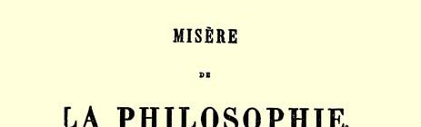
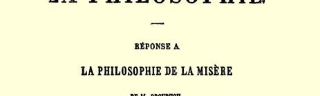

## 卡·马克思

# 哲学的贫困

*答蒲鲁东先生的*

##### “贫困的哲学”３７

> 卡·马克思写于１８４７年上半年原文是法文 １８４７年第一次以单行本刊行于俄文是按１８４７年版译的，并参考巴黎和布鲁塞尔了１８８５年、１８９２年德文版、１８９６ 署名：卡尔·马克思
>
> 年法文版所做的订正

## 卡·马克思

> “哲学的贫困”第一版的封面

## 序言

蒲鲁东先生不幸在欧洲异常不为人了解。在法国，人家认为他理应是一个拙劣的经济学家，因为他在那里以卓越的德国哲学家著称。在德国，人家却认为他理应是一个拙劣的哲学家，因为他在那里以最杰出的法国经济学家著称。我们是德国人同时又是经济学家，我们要反对这一双重错误。

读者将会明白，为什么我们在做这件不讨好的工作时常常不得不放下对蒲鲁东先生的批判，而去批判德国的哲学，同时还要对政治经济学作某些评论。

#### 卡尔·马克思

> １８４７年６月１５日于布鲁塞尔

蒲鲁东先生的著作不单是一本政治经济学的论著，也不是一本平常的书籍，而是一部圣经；其中应有尽有，如“神秘”、“来自神的怀抱的秘密”、“启示”等。但是，因为今天预言家受到的裁判要比普通的作者更严格，所以读者必须甘愿和我们一起经过“创世记”的贫瘠而阴暗的杂学的领域，然后才和蒲鲁东先生一起升入**超社会主义的**缥缈而富饶的境地（见蒲鲁东“贫困的哲学”前言第３ 页第２０行）。

### 第一章

## 科学的发现

### 第一节 使用价值和交换价值的对立

> “一切自然产品或工业产品所具有的那种维持人类生存的性能，有一个专门名称，叫做**使用价值**。这些产品具有的互相交换的性能，则称为**交换价值**…… 使用价值怎样变成交换价值呢？…… 经济学家们并没有很仔细地阐明（交换）[^1]价值观念的起源；因此我们必须对这一点加以论述。由于我所需要的许多东西在自然界里为数有限或者根本没有，因此我不得不去协助生产我所缺少的东西，可是，由于我不能单独生产这么多的东西，所以我就会向别人，即向各行各业中我的合作者**建议**，把他们所生产的一部分产品同我所生产的产品**交换**。”（蒲鲁东，“贫困的哲学”第一卷第二章）

蒲鲁东先生打算先给我们说明价值的二重性，**“价值内部的区别”**，使用价值变成交换价值的过程。我们必须和蒲鲁东先生一起来谈谈这种神秘的变化。现在我们来看一下，根据我们作者的意见，这种变化是怎样发生的。

绝大多数的产品不是自然界供给的，而是工业生产出来的。 如果产品的需要量超过自然界所提供的数量，人们就得求助于工业生产。在蒲鲁东先生的想象中，这种工业是什么呢？它的起源怎样呢？个人需要很多东西，可是“不能单独生产这些东西”。需要满足的多种需求，就决定要生产多种东西（不生产就没有产品）；要生产多种多样的东西，就已经决定参加这项生产的不止一个人。既然认为从事生产的不止一个人，那末这就完全决定了生产是建立在分工之上的。因而蒲鲁东先生所假定的那种需要本身就已经决定了全盘的分工。既假定有分工，就是假定有交换存在，因此也就有交换价值，这样看来，本来一开头就可以假定有交换价值存在。

然而蒲鲁东先生喜欢绕圈子。我们就跟他一起转吧，转来转去总是回到他原来的出发点去。

为了摆脱每个人单独生产的状态并达到交换，蒲鲁东先生说： “我就求助于各行各业中我的合作者”。这样一来我就有了从事各行各业的合作者，虽然按照蒲鲁东先生的假定我们（我和其他一切人）这时还没有摆脱鲁滨逊式的那种和社会隔绝的孤独状态。合作者和各种不同的业务，分工和这种分工所包含的交换等都是凭空掉下来的。

总括起来就是：我有许多建立在分工和交换基础上的需要。 蒲鲁东先生既然假定有这些需要，因而也就是假定有交换和交换价值存在，而交换价值的“起源”正是他想“比其他的经济学家更仔细地阐明”的。

同样，蒲鲁东先生也可以把整个事态倒转过来而仍然不损害他的结论的正确性。要说明交换价值就要有交换。要说明交换就要有分工。要说明分工就必须有使分工成为必要的种种需要。要说明这种需要，就必须**“假定”**有这种需要，但是并不是否定这种需要，这和蒲鲁东先生前言中的第一个定理：“假定上帝就是否定上帝”（前言第１页）正好相反。

假定分工是已经知道的事情的蒲鲁东先生，怎样用分工来说明他始终不知道的交换价值呢？

“个人”开始“向别人，即向各行各业中他的合作者**建议**”建立交换，并把使用价值和交换价值区别开。合作者们如果接受这种区别，那末要蒲鲁东先生“操心”的只是记录一下既成的事实、并在他的政治经济学论文中标明和“列入”“价值观念的起源”。但是他总还应该把这个建议的“起源”讲给我们听听，此外也应该给我们讲讲这位单独的个人，这位鲁滨逊怎么会突然想到向“他的合作者”提出**这**种建议，而这些合作者又怎么会毫无异议地就接受了这个建议。

蒲鲁东先生并没有细究这些关系的始末，他只是给交换这一事实盖了历史的印记，把交换看做急欲确立这种交换的第三者可能提出的建议。

这就是蔑视亚当·斯密和李嘉图的“历史的叙述的方法”的蒲鲁东先生的**“历史的叙述的方法”**。

交换有它自己的历史。它经过各个不同的阶段。

曾经有这样一个时期，例如在中世纪，当时交换的只是剩余品，即生产超过消费的过剩品。

也曾经有这样一个时期，当时不仅剩余品，而且一切产品，整个工业活动都处在商业范围之内，当时一切生产完全取决于交换。 对于交换的这个第二阶段，即二次方的交换价值应该怎样说明呢？

对这点蒲鲁东先生会找到很现成的回答：假定有人曾“向别人，即向各行各业中他的合作者**建议”**把交换价值提高到二次方。

最后到了这样一个时期，人们一向认为不能出让的一切东西， 这时都成了交换和买卖的对象，都能出让了。这个时期，甚至象德行、爱情、信仰、知识和良心等最后也成了买卖的对象，而在以前， 这些东西是只传授不交换，只赠送不出卖，只取得不收买的。这是一个普遍贿赂、普遍买卖的时期，或者用政治经济学的术语来说， 是一切精神的或物质的东西都变成交换价值并到市场上去寻找最符合它的真正价值的评价的时期。

对于交换的这个新的和最后的阶段，即三次方的交换价值又该怎样说明呢？

对这点蒲鲁东先生也会找到现成的回答：可以假定曾经有人 “向别人，即向各行各业中他的合作者**建议”**把德行、爱情等都变成交换价值，把交换价值提高到三次方，即最后一次乘方。

可见，蒲鲁东先生的“历史的叙述的方法”事事适用，它能答复一切和说明一切。特别是在要从历史上来说明“某种经济观念的产生”的时候，蒲鲁东先生就会假定一个人，这个人向别人，即向各行各业中他的合作者建议去完成这个产生的动作，这样问题就解决了。

从此以后，我们就把交换价值的“产生”当做一个既成事实；现在我们只要阐明一下交换价值和使用价值的关系就行了。且听蒲鲁东先生是怎么说的：

> “经济学家们很清楚地揭明了价值的二重性；但是他们并没有同样明确地阐明价值的**矛盾的本性**；我们的批判就从这里开始…… 只指出使用价值和交换价值之间的这种惊人的对照是不够的，经济学家们惯于把这种对照看成非常简单的事情，应当指出，在这种虚构的简单中却隐藏着深奥的秘密，我们的责任就是要弄清这个秘密…… 用术语来说，就是使用价值和交换价值成反比。”

假如我们已经领会了蒲鲁东先生的思想的话，那末他要肯定的就是如下四点：

（１）使用价值和交换价值构成“惊人的对照”，形成互相对立。

（２）使用价值和交换价值成反比，互相矛盾。

（３）无论是两者的对立或是矛盾，经济学家都既没有看出也不认识。

（４）蒲鲁东先生的批判从终点开始。

我们也从终点开始，并且为了消除蒲鲁东先生对经济学家们的责难，我们就让两个相当有名的经济学家来讲讲话。

> **西斯蒙第**：“商业把一切东西都归结为使用价值和交换价值的对立”。 （“概论”布鲁塞尔版第二卷第１６２页３８）
>
> **罗德戴尔**：“一般地说，国民财富（使用价值）[^2]是随着个人财产（因交换价值的上升）的增加而减少；如果个人财产因交换价值的下降而减少，那末国民财富通常会相应地增加。”（“国民财富的性质和起源的研究”，拉让蒂· 德·拉瓦伊斯译，１８０８年巴黎版３９）

西斯蒙第把他的主要学说建立在使用价值和交换价值的**对立** 上，这个学说认为，收入的减少和生产的增长成正比例。

罗德戴尔把他的体系建立在这两种价值的反比例上，而且他的那套理论在**李嘉图**时代非常流行，以致后者可以把它当作一件大家都知道的事情来谈。

> “由于交换价值和财富（使用价值）[^3]的概念混淆不清，有人就竭力断言， 只要减少商品的数量，即减少生活所必需的、有用的或能享受的东西的数量， 就可以增加财富。”（李嘉图“政治经济学原理”，孔斯坦西奥译，让·巴·萨伊注，１８３５年巴黎版第二卷“论价值和财富”章４０）

我们看到，蒲鲁东先生以前的经济学家们“已经看出”对立和矛盾的深奥秘密。现在再来看看，蒲鲁东先生在这些经济学家们以后又是怎样说明这个秘密的。

如果需求不变，那末产品的交换价值随着供给的增长而下降， 换句话说，产品越是供过于**求**，它的交换价值或价格也就越低。 ｖｉｃｅｖｅｒｓａ〔反过来说〕，越是求过于供时，供应的产品的交换价值或价格也就越高；换句话说，供应的产品越少，产品也就越贵。产品的交换价值取决于产品的多少，不过这总是对需求而言。假定某种产品不仅极为稀少，甚至是独一无二的，可是如果对它没有需求，这个独一无二的产品也是太多，也是多余的。相反地，假定某种产品有千百万个，可是如果它还不能满足需求，也就是说对这种产品的需求非常大，那末这种产品仍然是稀少的。

这些话可以说是老生常谈了，但是为了弄清蒲鲁东先生的秘密，在这里我们还得重述一下。

> “因此，按这一原则彻底推究下去，就可以得出世界上最合逻辑的结论： 凡属日用必需而数量又是无穷的东西就一钱不值，毫无用处但极端稀少的东西价格就不可估量。但是最困难的是，实际不会容许有这两种极端，因为一方面人类生产的任何产品决不会在数量上增加到没有止境的地步，另一方面即使最稀少的东西也会有某种用处，否则就不会有任何价值。因此，使用价值和交换价值虽然按性质来说经常力图互相排斥，但两者必然是互相联系的。”（第一卷第３９页）

蒲鲁东先生最困难的究竟是什么呢？那就是他干脆忘记了**需求**，忘记了任何东西只有在对它有需求的条件下，才说得上多或少。他撇开需求不谈，就是把交换价值和**稀少**、把使用价值和**众多** 混为一谈。他说，**“毫无用处**但**极端稀少**的东西**价格**就**不可估量”**， 这种说法实际上正是表明，稀少就是交换价值。“极端稀少和毫无用处”，这是纯粹的稀少。“价格不可估量”，这是交换价值的最高限度，即纯粹的交换价值。他在这两个术语之间划了一个等号。这样，交换价值和稀少就成了同义的术语。蒲鲁东先生得出这个臆造的“极端的结论”，实际上他触及的并不是事物，仅仅是那些表达事物的术语，这说明他对修辞学要比逻辑学有才能得多。他以为得出了新的结论，其实只是源源本本地重新发现了他当初的假定而已。也就是用这种同样的手法，他才把使用价值和纯粹的众多混为一谈。

蒲鲁东先生在交换价值和稀少之间、在使用价值和众多之间划了等号以后，既不能在稀少和交换价值中发现使用价值，又不能在众多和使用价值中发现交换价值，这才使他大吃一惊；他后来发现实际不会容许有这种极端，于是只好相信神秘。蒲鲁东先生以为，不可估量的价格之所以存在，正是由于没有购买者，可是只要他撇开需求不谈，那就永远找不到购买者。

另一方面，蒲鲁东先生所谓的众多好象是一种自然发生的现象。他完全忘记了正是人创造了这种众多，忘记了决不忽略需求是符合人的利益的。不然蒲鲁东先生怎么能够断言，极有用的东西价格应当非常低廉甚至一钱不值呢？相反地，他应该得出这样的结论：要提高极有用的东西的价格和交换价值，就必须限制这些东西的众多，缩减这些东西的生产。

从前法国种植葡萄的人要求颁布一条法律来禁止开辟新的葡萄园，这和荷兰人烧毁亚洲的香料和铲除摩鹿加群岛的丁香树如出一辙，他们就是想减少众多来提高交换价值。整个中世纪人们都奉行了这个原则，他们以法律规定，一个师傅只可以雇用多少帮工、使用多少工具。（见安德森“商业史”４１）

蒲鲁东先生把众多当做使用价值，把稀少当做交换价值（证明众多和稀少成反比是再容易不过的），就把使用价值和**供给**、把交换价值和**需求**混为一谈。为了使这个对照更加明显，他就换了一个术语，用**“由意见决定的价值”**来代替**交换价值**。这样，斗争就转移到另一个战场，现在一方面是**效用**（使用价值，供给），另一方面是**意见**（交换价值，需求）。

这两种对立的力量怎样调和呢？怎样使它们取得一致呢？能不能在它们中间找出哪怕是一点共同之处呢？

蒲鲁东先生大声说，当然有，这就是**决定的自由**。价格是需求和供给之间、效用和意见之间进行斗争的产物，它不会代表永恒的公平。

蒲鲁东先生进一步扩大这个对照：

> “我作为**自由的购买者**，我就是我的需要的裁判，是物品适用与否的裁判，是对这个物品**愿意**出多少价格的裁判。另一方面，你作为**自由的生产者**， 那你就是**制造物品用的资料**的主人，因此，你就能够缩减你的费用。”（第一卷第４１页）

由于蒲鲁东先生把需求或交换价值和意见当作同一个东西， 他就只得这样说：

> “已经证明，正是人的**自由意志**引起了使用价值和交换价值之间的对立。 只要自由意志存在，怎么能解决这个对立呢？不牺牲人，怎么能牺牲自由意志呢？”（第一卷第４１页）

因此，不会有什么结果的。在这两种可说是不能比较的力量之间，在效用和意见之间，在自由的购买者和自由的生产者之间存在着斗争。

让我们更仔细地来看看问题吧。

供给并不只是代表效用，需求也不只是代表意见。难道需求者不也同样供给某种产品或货币（代表一切产品的符号）吗？既然他供给了这些东西，难道他不也代表，象蒲鲁东先生所说，效用或使用价值吗？

另一方面，难道供给者不也需求某种产品或货币（代表一切产品的符号）吗？因此他不也就成了意见的代表，由意见决定的价值的代表或交换价值的代表吗？

需求同时又是供给，而供给同时又是需求。因此，蒲鲁东先生随便把供给和效用、需求和意见混为一谈的那种对照，不过是建立在空洞的抽象概念之上而已。

蒲鲁东先生称为使用价值的东西，其他的经济学家也可以称为由意见决定的价值。我们就只举施托尔希的话为例吧（“政治经济学教程”，１８２３年巴黎版第４８、４９页４２）。

根据施托尔希的意见，我们觉得需要的东西就叫做**需要**，我们给予价值的东西就叫做**价值**。大多数东西之所以有价值，仅仅由于它们可以满足意见所产生的需要。关于我们需要的意见是可以改变的，因此，东西的效用（只是表现这些东西和我们的需要的关系）也是可以改变的。就是自然的需要也在不断地变化。实际上， 各国人民的主要食物的差别就非常之大！

斗争不是发生在效用和意见之间，而是发生在出卖者所要求的交换价值和购买者所提出的交换价值之间。产品的交换价值每次都是这些互相矛盾的估价的合力。

归根到底，供给和需求才使生产和消费互相接触，但是生产和消费是以个人交换为基础的。

供给的产品本来并没有效用。它的效用是由消费者确定的。 即使产品的效用得到公认，但产品究竟不仅仅代表效用。在生产过程中，产品和原料、工人的工资等一切生产费用进行交换，一句话，和一切具有交换价值的东西进行交换。因此在生产者的心目中，产品代表交换价值的某种总和。生产者所供给的不仅是有效用的物品，而且主要是某种交换价值。

至于需求，它只有在掌握交换手段的条件下才有效。而这些交换手段本身也是产品，也是交换价值。

因此我们在供给和需求中，一方面发现花费过交换价值的产品和出卖这种产品的需要，另一方面又发现花费过交换价值的资金和购买的愿望。

蒲鲁东先生把**自由的购买者**和**自由的生产者**对立起来。他使两者具有纯形而上学的性质。这也就促使他说：“已经证明，正是人的**自由意志**才引起使用价值和交换价值的对立。”

生产者只要是在以分工和交换为基础的社会里进行生产（这正是蒲鲁东先生的假定），他就不得不出卖。蒲鲁东先生使生产者成为生产资料的主人，但是他却同意我们说生产者的生产资料不取决于**自由意志**。不仅如此，而且这些生产资料大部分又都是生产者从别处取得的产品，并且在现代的生产条件下，他并不是想生产多少就生产多少；现在生产力发展的水平责成他在一定的限度内进行生产。

消费者并不比生产者自由。他的意见是以他的资金和他的需要为基础的。这两者都由他的社会地位来决定，而社会地位却又取决于整个社会组织。当然，工人买马铃薯和妇女买花边这两者都是根据本人的意见行事的。但是他们意见的差别就是由于他们在社会上所处的地位不同，而这种社会地位的差别却又是社会组织的产物。

需要的整个体系究竟是建立在意见上还是建立在整个生产组织上？需要往往直接来自生产或以生产为基础的情况。世界贸易几乎完全不是由个人消费的需要所决定，而是由生产的需要所决定。同样，再举另一个例子来说，对公证人的需要难道不是以一定的民法（民法不过是所有制发展的一定阶段，即生产发展的一定阶段的表现）的存在为前提吗？

蒲鲁东先生并不满足于从需求和供给的关系中去掉了刚才我们说过的要素。他使抽象达到极端，把一切生产者化为**一个唯一** 的生产者，把一切消费者化为**一个唯一的**消费者，然后使这两个虚构的人物互相斗争。但在现实的世界里情况并不是这样。供给者之间的竞争和需求者之间的竞争构成购买者和出卖者之间斗争的必然要素，而交换价值就是这个斗争的产物。

蒲鲁东先生去掉了生产费用和竞争以后，就能随心所欲地把需求和供给的公式弄得荒谬绝伦。

> 他说：“供给和需求无非是两种**仪式**，使使用价值和交换价值互相接触， 并促进两者之间的调和。这是两个电极，把它们连接起来就会发生接合，又名**交换**。”（第一卷第４９、５０页）

同样可以说，交换只是使消费者和消费品互相接触所必要的一种“仪式”。同样也可以说，一切经济关系都是直接消费借以进行的一些“仪式”。供给和需求（恰如个人交换一样）就是某种生产的关系。

那末，蒲鲁东先生的整个辩证法是什么呢？就是用抽象的和矛盾的概念，如稀少和众多、效用和意见、**一个**生产者和**一个**消费者 （两者都是**自由意志的骑士）**来代替使用价值和交换价值、需求和供给。

可是他为什么要这样呢？

为了以后能够引用他自己所去掉的各种要素中的一个要素 **（生产费用）**作为使用价值和交换价值的**综合**。在他的心目中，生产费用就是这样构成**综合价值**或**构成价值**的。

### 第二节 构成价值或综合价值

“（交换）[^4]价值是经济结构的基石”。**“构成”**价值是经济矛盾体系的基石。

蒲鲁东先生在政治经济学中的全部发现——**“构成价值”**是什么呢？

只要承认某种产品的效用，劳动就是它的价值的源泉。劳动的尺度是时间。产品的相对价值由生产这种产品所需的劳动时间来确定。价格是产品的相对价值的货币表现。最后，产品的**构成**价值不过是体现在产品中的劳动时间所构成的价值。

象亚当·斯密发现**分工**一样，蒲鲁东先生也自以为发现了**“构成价值”**。当然这个发现中并没有“什么闻所未闻的东西”，但是也应该承认，在经济学的任何一个发现中都没有什么闻所未闻的东西。蒲鲁东先生虽然感觉到他的发现非常重要，但是“为了使读者对他自以为独创的东西放心，并为了迁就那些由于懦怯而不容易接受新思想的人们”，他极力缩小这个发现的意义。但是当评价他的每一个前辈在确定价值方面所作的贡献的时候，他就不得不承认并大声宣称，在这方面，最大最多的一份应归功于他。

> “亚当·斯密已经模糊地看出了价值的综合观念…… 但是在他那里， 这种价值观念完全是直觉的，而社会并不因信仰直觉就改变自己的习惯；只有事实的权威能使社会信服。必须使二律背反获得更明确的表现，而让·巴 ·萨伊就是这个二律背反的主要解释者。”

总之，亚当·斯密有模糊的直觉，让·巴·萨伊有二律背反， 蒲鲁东先生则有构成着的和“构成了的”真理，这就是发现综合价值的完整历史。但是不要弄错，所有其他的经济学家，从萨伊到蒲鲁东，都只不过踯躅在二律背反的老路上。

> “四十年以来，这么多有思想的人都为这样一个简单的观念而煞费苦心， 这真令人难以置信。其实不然，**价值之间虽然没有任何共同点和任何度量单位**，**但也在被比较**。这就是**１９世纪的经济学家**不接受平等的革命理论，却不顾一切地力图证明的一点。**后人对此将怎么说呢**？**”**（第一卷第６８页）

突然受到这样追问的后人首先就会对年代感到困惑。他们必然会提出这样的问题：难道李嘉图和他的学派不就是１９世纪的经济学家吗？根据“商品的相对价值完全取决于生产商品所需要的劳动量”这一原则建立起来的李嘉图的体系，创始于１８１７年。李嘉图是复辟时期４３以来在英国占统治地位的那个学派的领袖。李嘉图的学说严峻地总括了作为现代资产阶级典型的整个英国资产阶级的观点。“后人对此将怎么说呢？”他们总不会说蒲鲁东先生完全不知道李嘉图，因为蒲鲁东谈起过李嘉图，谈得不少，还常常引用他，可是结果却把他的学说说成是“废话连篇”。如果后人有一天过问这件事，他们也许会说，蒲鲁东先生怕激起读者的反英情绪，所以情愿自己充当李嘉图观念的负责发行人。李嘉图已科学地阐明作为现代社会即资产阶级社会的理论，蒲鲁东先生却硬把它当作“将来的革命理论”；李嘉图及其学派在很早以前就提出作为二律背反的一方面即**交换价值**的科学公式，蒲鲁东先生却把它当做效用和交换价值之间的二律背反的解决；无论如何，后人会认为这种做法太幼稚了。我们干脆撇开后人不谈，让蒲鲁东先生和他的前辈李嘉图来对质一下。下面是这位作者的著作中总括他的价值学说的几段话：

> “效用不是**交换价值**的尺度，虽然它对交换价值是绝对必要的。”（“政治经济学……原理”，弗·索·孔斯坦西奥译自英文，１８３５年巴黎版第一卷第３页） “东西本身一旦被认为有效用，那末这东西就从两个来源，即从东西的稀少和从获得这些东西所需要的劳动量中取得交换价值。有些东西的价值完全取决于它的稀少。因为任何劳动都不能增加它们的数量，所以它们的价值不可能由于供应增加而下降。珍贵的雕象和绘画等就属于这类东西。它们的价值只取决于想占有这种物品的人的财富、趣味和癖好。”（同上，第一卷第 ４页和第５页）“但是这种商品在市场上每日流转的大多数商品中只占极少部分。因为人们想占有的绝大多数的东西都是靠劳动获得的，只要我们愿意为生产这些东西花费必需的劳动，它们的数量就会不仅在一个国家中，而且在许多国家中增加到几乎无可限量的程度。”（同上，第一卷第５页）“因此， 当我们谈到商品、商品的交换价值和调节商品的相对价格的原则时，我们总是只指那些人的劳动可以增加其数量，竞争可以刺激它们的生产而且不会碰到任何障碍的商品。”（第一卷第５页）

李嘉图引用亚当·斯密的话，他认为亚当·斯密“**很精确地**规定了一切交换价值最初的来源”（参看亚当·斯密著作第一卷第五章４４）。然后他又补充说：

> “这（即劳动时间）[^5]就是一切东西（除了人的劳动不能随便增加的东西以外）的交换价值的基础，这个学说对政治经济学有极重要的意义；因为在这门科学中，再没有比**‘价值’**这个名词的含义不精确和含糊不清而造成更多的错误和意见分歧的了。”（第一卷第８页）“如果商品的交换价值由体现在商品中的劳动量所决定，那末这种劳动量的任何增长就必然会增加在生产时花费了这种劳动的商品的价值；而劳动量的任何减少也会减低商品的价值。” （第一卷第８页）

李嘉图接着责备亚当·斯密，说他：

> （１）“除劳动以外又给价值提出了别的尺度：有时是粮食的价值，有时是用这种东西可以购买的劳动量”等。（第一卷第９、１０页） （２）“无保留地接受这个原则，但是对这个原则的运用却只限于资本积累和土地所有权确立以前的社会的原始和粗野的状态。”（第一卷第２１页）

李嘉图极力证明，土地所有权即地租不能改变农产品的相对价值，而资本积累对相对价值（它是由生产中花费的劳动比较量决定的）只起暂时的不稳定的作用。为了证明这一命题，他创立了有名的地租论，把资本分解为各个组成部分，最后，他在资本里除了积累的劳动以外什么也没有看到。他接着又发挥了整套的工资和利润理论，并且证明，工资和利润的增减互成反比，而这并不影响产品的相对价值。他没有忽略资本积累、资本在性质上的差别（固定资本和流动资本）以及工资率等对产品的比值所能起的影响。 这些问题就是李嘉图所注意的主要问题。

> 他说：“节省劳动（无论是节省制造物品本身所必要的劳动，还是节省为形成这种生产中使用的资本所必要的劳动）常常会降低商品的相对价值。”
>
> 大家知道，李嘉图用“制造商品所需的劳动量”来确定商品价值。但是在以商 （第一卷第２８页）“因此，只要一天的劳动一直使甲得到同量的鱼，使乙得到同量的野味，那末无论工资和利润的变化怎样，资本积累所起的作用怎样，相互交换时价格的自然率始终是一样的。”（第一卷第３２页）“我们把劳动看做是物品价值的基础，而把生产物品所必需的劳动量看做确定互相交换的商品数量时所依据的标准；但是我们也不想否认，商品的市场价格偶而也会暂时脱离商品的这个最初的和自然的价格的。”（同上，第一卷第１０５页）“物品的价格归根到底是由生产费用来调节，而不是象一般所说的由供求关系来调节。”（第二卷第２５３页）

罗德戴尔勋爵根据供求规律，或者说根据供多于求或供少于求的规律探讨交换价值的变化。他以为，物品的价值在物品的数量减少或需求增加时就会提高；这个价值因物品的数量增加或因需求减少时就会下降。因此，物品的价值在八种不同原因的影响下都会发生变化，其中四个原因和物品本身有关，另四个原因和货币或作为这种物品的价值尺度的其他商品有关。下面是李嘉图对这种观点的驳斥：

> “个人或公司所**垄断**的产品的价值，是按照罗德戴尔勋爵确定的规律变化的：产品的价值随供应量的增加而下降，随购买者需求的扩大而上升。产品的价格和它的自然价值并没有什么必然的联系。至于在出卖者中间引起竞争而且数量可以适当增加的那些物品，它们的价格归根到底也不是取决于供求关系，而是取决于生产费用的增减。”（第二卷第２５９页）

我们让读者自己把李嘉图的这种简单明了而又准确的语言和蒲鲁东先生想用劳动时间来确定相对价值的那种玩弄辞句的企图比较一下。

李嘉图给我们指出资产阶级生产的实际运动，即构成价值的运动。蒲鲁东先生却撇开这个实际运动不谈，而“煞费苦心地”去发明按照所谓的新公式（这个公式只不过是李嘉图已清楚表述了的现实运动的理论表现）来建立世界的新方法。李嘉图把现社会当做出发点，给我们指出这个社会怎样构成价值；蒲鲁东先生却把构成价值当做出发点，用它来构成一个新的社会世界。根据蒲鲁东先生的说法，构成价值应当绕个圈子，又成为按照这种估计方法已经完全构成的世界的构成因素。在李嘉图看来，劳动时间确定价值这是交换价值的规律，而蒲鲁东先生却认为这是使用价值和交换价值的综合。李嘉图的价值论是对现代经济生活的科学解释；而蒲鲁东先生的价值论却是对李嘉图理论的乌托邦式的解释。李嘉图从一切经济关系中得出他的公式，并用来解释一切现象，甚至如地租、资本积累以及工资和利润的关系等那些骤然看来好象是和这个公式抵触的现象，从而证明他的公式的真实性；这就使他的理论成为科学的体系。蒲鲁东先生只是完全凭任意的假设再度发现了李嘉图的这个公式，后来就不得不找出一些孤立的经济事实，加以歪曲和捏造，以便作为例证，作为实际应用的现成例子，作为实现他那新生观念的开端。（见本章第三节“构成价值的应用”）

现在来谈谈蒲鲁东先生从（由劳动时间）构成的价值中得出的结论。

—— 一定的劳动量和同一劳动量所创造的产品是等价的。

—— 任何一个劳动日和另一个劳动日都是相等的；这就是说， 一个人的劳动和另一个人的劳动如果数量相等，二者也是等值的， 两个人的劳动并没有质的差别。在劳动量相等的前提下，一个人的产品和另一个人的产品相交换。所有的人都是雇佣工人，而且都是以相等劳动时间得到相等报酬的工人。交换是在完全平等的基础上实现的。

这些结论是不是由劳动时间所“构成”或决定的价值的自然的和必然的结果呢？

如果商品的相对价值由生产商品所需的劳动量来决定，那末自然就会得出结论说，劳动的相对价值或工资也由生产工资所必需的劳动量来决定。工资，即劳动的相对价值或价格，因而也是由生产工人一切生活必需品所必要的劳动时间来决定的。

> “如果把帽子的**生产费用减少**，即使需求增加两三倍，帽子的价格结果也会降到新的自然价格的水平。如果用减少维持生活的粮食和衣服的自然价格的办法来**减少人们的生活费用**，即使对劳动力的需求大大增加，结果工资也会下降。”（李嘉图，第二卷第２５３页）

当然，李嘉图的话是极为刻薄的。把帽子的生产费用和人的生活费用混为一谈，这就是把人变成帽子。但是用不着对刻薄大声叫嚷！刻薄在于事实本身，而不在于表明事实的字句！法国的作家，象德罗兹、布朗基、罗西等先生用遵守“人道的”语言的礼节来证明他们比英国的经济学家们高明，从而得到天真的满足；如果他们责难李嘉图和他的学派言词刻薄，那是由于他们不乐意看到把现代经济关系赤裸裸地揭露，把资产阶级最大的秘密戳穿。

总括起来就是：劳动本身就是商品，它是作为商品由生产劳动这种商品所必需的劳动时间来衡量的。而要生产这种劳动商品需要什么呢？需要为了生产维持不断的劳动即供给工人活命和延续后代所必需的物品的劳动时间。劳动的自然价格无非就是工资的最低额。如果工资的市场价格超过了它的自然价格，那是由于被蒲鲁东先生推崇为原则的价值规律遇到供求关系波动后果的抵抗。但是工资的最低额始终是工资市场价格趋向的中心。

因而，由劳动时间衡量的相对价值注定是工人遭受现代奴役的公式，而不是蒲鲁东先生所希望的无产阶级求得解放的“革命理论”。

现在我们来看看，把劳动时间作为价值尺度这种做法和现存的阶级对抗、和劳动产品在直接劳动者与积累劳动占有者之间的不平等分配是多么不相容。

我们就拿一种产品例如麻布来说。这种产品本身包含着一定的劳动量。无论参加制造这种产品的人们的相互地位起什么变化，这种劳动量始终是一样的。

再拿别的产品例如呢绒来说，并假定生产呢绒所需要的劳动量和生产麻布的劳动量相等。

如果这些产品互相交换，那就是相等的劳动量在交换。这种等量的劳动时间的交换并没有改变生产者的相互地位，正如工人和工厂主的相互关系没有任何改变一样。如果认为这种由劳动时间来衡量价值的产品的交换会使一切生产者得到平等的报酬，这种说法就是假定，平等分配还在交换以前就存在了。当呢绒和麻布进行交换的时候，呢绒的生产者就会在麻布上恰恰占有他们以前在呢绒上所占有的那一份。

蒲鲁东先生的谬误是由于他把至多不过是一种没有根据的假设看做结果。

我们再看下去。

我们把劳动时间当做价值尺度，那末这至少是不是假定各个劳动日是**等价**的，这一个人的劳动日和另一个人的劳动日是等值的呢？不是。

暂且假定，一个首饰匠的劳动日和一个织布工人的三个劳动日是等价的；在这种情况下，首饰品对纺织品比值的任何变化，如果不是供求变动的暂时结果，就必然是由于两种生产的劳动时间有所增减。如果不同的劳动者的三个劳动日相互的比例是１∶２∶ ３，他们产品的相对价值中的一切变化也会是这个比率，即１∶２∶ ３。因此，虽然不同的劳动日的价值不等，价值还是可以用劳动时间来衡量的；但是要使用这种尺度，就需要有一个可以比较各种不同劳动日价值的尺度表；确定这种尺度表的就是竞争。

你每小时的工作和我每小时的工作是不是等值？这是要由竞争来解决的问题。

据一个美国经济学家的意见，竞争决定着一个复杂劳动日中包含多少简单劳动日。把复杂劳动日化为简单劳动日，这是不是假定把简单劳动当做价值尺度呢？如果只把劳动量当做价值尺度而不问它的质量如何，那也就是假定简单劳动已经成为生产活动的枢纽。这就是假定：由于人隶属于机器或由于极端的分工，各种不同的劳动逐渐趋于一致；劳动把人置于次要地位；钟摆成了两个工人相对活动的精确的尺度，就象它是两个机车的速度的尺度一样。所以不应该说，某人的一个工时和另一个人的一个工时是等值的，更确切的说法是，某人在这一小时中和那个人在同一小时中是等值的。时间就是一切，人不算什么；人至多不过是时间的体现。现在已经不用再谈质量了。只有数量决定一切：时对时，天对天；但是这种劳动的平均化并不是蒲鲁东先生的永恒的公平；这不过是现代工业的一个事实。

在使用机器的企业中，这个工人的劳动和那个工人的劳动几乎没有什么差别；工人彼此间的区别，只是他们在劳动中所化的时间不等。但是从某种观点来看，这种量的差别也成了质的差别，因为用在劳动上的时间一方面是取决于纯粹物质方面的原因，例如生理的构造、年龄和性别；而另一方面却又取决于一些纯粹消极的精神上的原因，例如忍耐、镇静和勤恳。最后，如果说工人的劳动中有质的差别，那末这至多也不过是一种决不能作为特点的无足轻重的质。总之这就是现代工业的情况。而蒲鲁东先生却把他打算在“将来的时代”中普遍实现的“平均化”的刨子用到机器劳动中早已实现的这种平等上。

蒲鲁东先生从李嘉图学说中引伸出的一切“平等”的结论，是建立在一个根本谬误的基础上。他把用商品中所包含的劳动量来衡量的商品价值和用**“劳动价值”**来衡量的商品价值混为一谈。如果把这两种衡量商品价值的方法搅在一起，那末也就同样可以说， 任何一种商品的相对价值都是由它本身所包含的劳动量来衡量的；或者说，商品的相对价值是由它可以购买的劳动量来衡量的； 或者还可以说，商品的相对价值是由可以得到它的那种劳动量来衡量的。但是情况远不是这样。象任何其他的商品价值一样，劳动价值不能作为价值尺度。为了更清楚地说明上面这点，只要举几个例子就行了。

如果一个缪伊的谷物在以前值一个劳动日，而现在值两个劳动日，这就是说它的价值要比原来增加一倍；但是这一个缪伊的谷物并不能起一倍劳动量的作用，因为它包含的养料和以前一样多。因此，由生产谷物使用的劳动量来衡量的谷物价值将增加一倍，但是用谷物能购买的劳动量或者可以用来购买谷物的劳动量来衡量的谷物价值，决不会增加一倍。另一方面，如果用同样的劳动生产了比以前多一倍的衣服，那末衣服的相对价值就会因此降低一半；但是即使如此，这种数量加倍的衣服支配一定劳动量的能力并不会降低一半，或者换句话说，同样的劳动并不能取得加倍数量的衣服；因为现在这一半数量的衣服对工人的效用和以前同样数量的衣服的效用完全一样。

因此，用劳动价值来确定商品的相对价值是和经济事实相抵触的。这是在循环论证中打转，这是用本身还需要确定的相对价值来确定相对价值。

毫无疑问，蒲鲁东先生是把以下两种衡量的方法混为一谈了： 一种是用生产某种商品所必要的劳动时间来衡量，另一种是用劳动价值来衡量。他说：“任何人的劳动都可以购买这种劳动所包含的价值。”因此按照他的说法，产品中所包含的一定劳动量和劳动者的报酬是相等的，即和劳动价值是相等的。根据同样的理由， 他把生产费用和工资也混为一谈了。

> “工资是什么？这是粮食等的成本，这是一切东西的全部价格。再进一步说，工资是构成财富的各要素的均匀配合。”

工资是什么？这就是劳动价值。

亚当·斯密有时把生产商品所必要的劳动时间当做是价值尺度，有时却又把劳动价值当做价值尺度。李嘉图揭露了这个错误， 清楚地表明了这两种衡量方法的差别。蒲鲁东先生加深了亚当· 斯密的错误。亚当·斯密只是把这两个东西并列，而蒲鲁东先生却把两者混而为一。

蒲鲁东先生寻找商品相对价值的尺度是为了进而找出工人们应分得的产品的正确比例，或者换句话说，为了确定劳动的相对价值。为了确定商品相对价值的尺度，除了把一定劳动量所创造的产品总额当做它的等价物外，他想不出更好的方法。这就等于说，似乎整个社会仅仅是由以工资形式领得自己的产品的直接劳动者所组成。此外，他还把各种不同劳动者的工作日的价值相等当做既成事实。总而言之，他寻找商品相对价值的尺度是为了找出劳动者的平等报酬，他把工资的平等当做已解完全确定的事实， 是为了根据这种平等去找出商品的相对价值。多么奇妙的辩证法！

> “萨伊和追随他的一些经济学家们指出说，劳动是一种其本身价值尚待确定的东西，是象任何其他商品一样的商品，因此，如果把劳动当做价值的原则和实际的原因，那就是堕入循环论证中了。我可以说，这些经济学家的这种说法表现了极大的蔬忽。人们认为劳动有**价值**并不因为它本身是商品，而是指人们认定劳动中所隐含的价值。劳动的价值是一种倒因为果的比喻说法。它和**资本的生产率**一样，是一种臆想。劳动在生产，资本有价值…… 所谓劳动价值，是一种简略的说法…… 劳动象自由一样…… 按其本质来说是一种模糊而不确定的东西，然而它的性质在其对象中是确定的；换句话说， 劳动通过它的产品而成为实在的东西。” “然而何必坚持呢？因为经济学家（读做蒲鲁东先生）[^6]既要改变事物的名称，ｖｅｒａｒｅｒｕｍｖｏｃａｂｕｌａ〔事物的真正名称〕，就是默认自己无能，逃避问题的讨论。”（蒲鲁东，第一卷第１８８页）

由此可见，蒲鲁东先生把劳动价值变为产品价值的“实际原因”，因为他以为**工资**（“劳动价值”的正式名称）构成一切东西的全部价格。正因为如此，萨伊的反驳使他感到惶惑不安。他把劳动商品这个可怕的现实只看做是文法上的简略。这就是说，建立在劳动商品基础上的整个现代社会，今后仅仅是建立在某种破格的诗文和比喻性的用语上了。如果社会愿意“排除”使它烦恼的“一切麻烦”，那末只要去掉不好听的字句，改一改说法就可以了；要达到这个目的，只要请求科学院出版一部新辞典就够了。这样一来就不难了解，为什么蒲鲁东先生认为必须在政治经济学的著作中大事议论语源学和文法学的其他部分。例如，他老是摆出一付学者的面孔，反对把ｓｅｒｖｕｓ〔奴隶〕这字解释起源于ｓｅｒｖａｒｅ〔保护〕那种陈旧的说法。这种语文学的议论具有深刻的意义，神秘的意义，这些议论构成蒲鲁东先生论证的重要部分。

由于劳动被买卖，因而它也和任何其他商品一样，也是一种商品，因此它也有交换价值。但是劳动的价值或作为商品的劳动并不生产什么，正如粮食的价值或者作为商品的粮食不能当作食物一样。

劳动“值”多少取决于食物的贵贱，取决于劳动人手供求量的大小等等。

劳动决不是“不确定的东西”；进行买卖的不是一般的劳动，而总是某种确定的劳动。不仅劳动的性质由对象来确定，而且对象本身也由劳动的特性来确定。

由于劳动被进行买卖，所以它本身就是商品。为什么人们要买它呢？“由于人们认为劳动中隐含着价值”。但是当人们说某个东西是商品时，那这里所指的就已经不是购买它的目的，就是说， 不是指想从这个东西中取得的效用，不是指想拿它做什么用了。 它成为商品是由于它是交易对象。蒲鲁东先生的一切议论总结起来不外是：劳动不是作为直接的消费对象才被购买。当然不是的， 人们购买它是把它当做生产工具，就象购买机器一样。由于劳动是商品，所以具有价值，但它并不生产东西。蒲鲁东先生也可以这样说，根本不存在任何商品，因为购买任何商品只是为了它的某种效用，而决不是由于它是一种商品。

蒲鲁东先生用劳动来衡量商品的价值，他就笼统地认为，既然劳动具有价值，是劳动商品，那就不能不把它置于这个共同的尺度下。他预感到，这样说就是承认工资的最低额是直接劳动的自然的和正常的价格，因而也就是承认现代的社会制度。为了逃避这个倒霉的结论，他就掉转头来说，劳动不是商品，它不可能有价值。 他忘了自己就曾经把劳动的价值当做尺度；他忘了他的整个体系是建立在劳动商品的基础上，建立在可以买卖和交换各种产品的交易对象—— 劳动的基础上，建立在作为工人收入的直接源泉 —— 劳动的基础上。他忘了一切。

为了挽救他的体系，他决心牺牲体系的基础。

> Ｅｔｐｒｏｐｔｅｒｖｉｔａｍｖｉｖｅｎｄｉｐｅｒｄｅｒｅｃａｕｓａｓ！〔为了生活而失去生活的根基！〕

现在我们得出了“**构成**价值”的一个新的定义：

> “价值是构成财富的各种产品的**比例性关系”**。

首先我们说，在“相对价值或交换价值”这个简单的用语中已经包含着产品互相交换的某种关系的概念。把这种关系叫做“比例性关系”，除了名称以外，意思根本没有改变。产品的价值无论怎样涨跌，丝毫不会使这种产品失去它和构成财富的其他产品形成某种“比例性关系”的那种特性。

这个新术语并没有新概念，要它做什么呢？

“比例性关系”使人联想到许多其他的经济关系，例如生产的比例性，供求之间的适当比例等；而蒲鲁东先生在以训人的口吻解释交换价值的时候，是考虑到这一切的。

首先，由于产品的相对价值由生产每种产品所使用的劳动比较量来确定，在这种情况下，比例性关系就是表示在一定时间内所能生产并因而能互相交换的产品的相对量。

让我们再看一看蒲鲁东先生从这个比例性关系中得到了什么好处。

大家都知道，当供求互相均衡的时候，任何产品的相对价值都恰好由包含在产品中的劳动量来确定，也就是说，这种相对价值恰好表示了我们刚才所解释的比例性关系。蒲鲁东先生把实际情况弄颠倒了。他说：只要先开始用产品中所包含的劳动量来衡量产品的相对价值，那末供求就必然会达到平衡。生产就会和消费相适应，产品就可以永远顺利地进行交换，而产品的市场价格也就会恰好表现产品的真正价值。一般人都这样说：天气好的时候，可以碰到许多散步的人；可是蒲鲁东先生却为了保证大家有好天气，要大家出去散步。

被蒲鲁东先生当做由劳动时间先天决定交换价值中所得出的结果，大概只能用下面这种规律来说明：

今后产品应当完全按照花费在产品上的劳动时间来交换。不论供求关系怎样，商品的交换应当永远象商品的生产量完全适合需求那样来进行。就让蒲鲁东先生来担任制定和贯彻这样一个规律好了，这里我们并不要求他提出证据。可是他如果想以经济学家的身份，而不是立法者的身份来为自己的理论辩护，那末他就应当证明：生产商品所必要的**时间**恰好表明了商品的**效用**的程度，而且表示了商品对需求的比例性关系，因而也表明了商品对财富总额的比例性关系。在这种情况下，如果产品按照等于生产费用的价格出售，供求就会永远保持平衡；因为生产费用被认为是表示供求的真正关系的。

蒲鲁东先生确实力图证明：生产产品所必要的劳动时间说明它和需要的真正关系，所以在生产上花费时间最少的东西是最有直接效用的东西，并且可以依次类推。根据这个理论，生产奢侈品这一事实就足以证明社会有多余时间来满足某种奢侈的需要。

至于这种论点的证据，蒲鲁东先生是这样说的：根据他的观察，生产量有效用的东西需要的时间最少；社会总是先从最轻便的生产部门开始；然后才逐步地“转到生产那些化费劳动时间最多并适合更高级需要的东西”。

蒲鲁东先生从杜诺瓦耶先生那里借用了采捕（如采集果子、牧放、狩猎、捕渔等）这一最简单、花费最少的工业作为例子；人类的 “第二个创造的第一天”就是从这种工业开始的。他的第一个创造的第一天则记载在创世纪中，它告诉我们上帝是世界上第一个工业家。

实际上，情况完全不象蒲鲁东先生所想的那样。当文明一开始的时候，生产就开始建立在级别、等级和阶级的对抗上，最后建立在积累的劳动和直接的劳动的对抗上。没有对抗就没有进步。 这是文明直到今天所遵循的规律。到目前为止，生产力就是由于这种阶级对抗的规律而发展起来的。如果硬说由于所有劳动者的一切需要都已满足，所以人们才能创造更高级的产品和从事更复杂的生产，那就是撇开阶级对抗，颠倒整个历史的发展过程。不然也可以这样说：因为在罗马皇帝时代曾有人在人造的池子里喂养鳗鱼，所以说全体罗马居民的食物是充裕的。然而实际情况完全相反，当时罗马人民连必要的粮食也买不起，而罗马的贵族却并不缺少充当鳗鱼饲料的奴隶。

生活用品的价格几乎不断上升，而工业品和奢侈品的价格却几乎不断下降。就拿农业来说，最必需的东西，如粮食、肉类等的价格不断上涨，而棉花、食糖、咖啡等的价格却以惊人的比例不断下降。就在真正的食品中，如朝鲜蓟、龙须菜等奢侈品在今天要比最必需的食品便宜。在我们这个时代中，多余的东西要比必需的东西更容易生产。最后，在各种不同的历史时代中，价格的相互关系不仅各不相同，而且完全相反。整个中世纪中，农产品比工业品便宜；近代，两者之间的情形倒过来了。但是能由此得出结论说， 农产品的效用自中世纪以来减少了吗？

产品的使用取决于消费者所处的社会条件，而这种社会条件本身又建立在阶级对抗上。

棉花、马铃薯和烧酒是最普遍的消费品。马铃薯引起了瘰症； 棉花大规模地排挤亚麻和羊毛，虽然羊毛和亚麻在大多数情况下， 即使从卫生观点来说，也比棉花更有用。最后，烧酒占啤酒和葡萄酒的上风，虽然大家都承认把烧酒当作食品是有害的。整整一个世纪，各国政府竭力抵制欧洲的鸦片，然而毫无效果；经济取得了胜利，消费得听它的命令。

为什么棉花、马铃薯和烧酒是资产阶级社会的基石呢？因为生产这些东西需要的劳动最少，因此它们的价格也就最低。为什么价格的最低额决定消费的最高额呢？是不是由于这些物品本身有绝对的效用，由于它们的效用最能满足作为人的工人，而不是作为工人的人的种种需要呢？不，这是因为在建立在**贫困**上的社会中， 最**粗劣的**产品就必然具有供给最广大群众使用的特权。

如果说因为最便宜的物品使用最广，因而这些物品就应当有最大的效用，这就是说，烧酒由于生产费用低廉而到处风行，这件事就是烧酒的效用最确凿的证明；这就是向无产者说，马铃薯比肉对他们更有益；这就是和现状妥协；结果，这就是和蒲鲁东先生一起为自己并不理解的社会进行辩护。

在没有阶级对抗和没有阶级的未来社会中，用途大小就不会再由生产所必要的时间的**最低额**来确定，相反地，花费在某种物品生产上的时间将由这种物品的社会效用大小来确定。

现在我们再回到蒲鲁东先生的命题上来。生产物品所必要的劳动时间既不表现它的效用程度，那末早就由包含在物品中的劳动时间所确定的这种物品的交换价值就决不能调节供求的正确关系，即蒲鲁东先生现在所说的比例性关系。

供求的“比例性关系”，也就是一种产品在生产总和中所占的比例，根本不决定于这种产品按照相等于生产费用的价格的出售。 只有**供求的变动**告诉生产者，某种商品应当生产多少才可以在交换中至少收回生产费用。这种变动是经常的，所以资本也就不断地出入于各个不同的工业部门。

> “正是由于这种变动，资本才按照适当的**比例**（而不是超过这个比例）投入各种有需求的商品的生产中去。利润随着价格的涨落而升降于一般水平上下，因此，随着某一生产部门中的不同变化，资本时而流向那里，时而又从那里流出。”——“如果我们注意一下大城市的市场，那末我们就会看到，这些市场如何正常地如数供应各种国内外商品，不管这里的需求由于爱好或人口数量的变动有什么变化；市场上很少发生供应过多、商品充斥或供不应求、 物价飞涨的现象。我们应当承认：在各个生产部门间按照**精确的适当比例**分配资本的原则所起的作用，要比平常所想象的巨大得多。”（李嘉图，第一卷第１０５、１０８页）

如果蒲鲁东先生承认产品的价值由劳动时间来确定，那末他同样也应当承认，在以个人交换为基础的社会中，单只这种摇摆运动已使劳动时间成为价值尺度。完全构成了的“比例性关系”是不存在的，只有构成这种关系的运动。

我们刚才已经看到，在什么意义下把“比例性”说成是由劳动时间来确定价值的结果才算正确。现在我们再来看看，蒲鲁东先生称为“比例规律”的这个用时间来衡量的尺度如何变为**比例失调** 的规律。

任何一种新发明，只要能在一小时内生产出过去两小时才生产的东西，都会使市场上所有这一类的产品跌价。竞争迫使生产者出卖花两小时生产的产品时不能贵于花一小时所生产的产品。 竞争实现了产品的相对价值由生产它的必要劳动时间来确定这一规律。劳动时间成为交换价值的尺度这一情况因而也就成了劳动不断**跌价**的规律。不仅如此，跌价的不仅是运到市场上去的商品， 而且连生产工具以及整个企业也都在内。李嘉图已指出这个事实，他说：

> “由于生产日益便利，因而过去生产的某些东西的价值也就不断下降。”（第二卷第５９页）

西斯蒙第更进了一步。他认为这种由劳动时间所“**构成的**价值”是现代工商业的一切矛盾的根源。

> 他说：“交换价值归根到底总是由取得这种东西所必要的劳动量来确定； 但不是实际花费的劳动量，而是在今后生产资料可能改进的情况下将要花费的劳动量。这种劳动量虽然很难作精确的确定，但它总是由竞争加以正确地确定……这一劳动量就是出卖者和购买者之间议价的基础。出卖者也许会说，这种东西花费了他十个工作日；但如果购买者知道这种东西以后花八个工作日就能生产出来，如果竞争给双方提出确凿的证明，那末这种东西的价值就会缩减到八个工作日，市场价格也就会固定在这个水平上。当然出卖者和购买者都知道这种东西是有用的，是有人需要的，如果没有人需要这种东西，那也就卖不出去；但是规定这种东西的价格却和它的效用毫无关系。” （“政治经济学概论”布鲁塞尔版第二卷第２６７页）

千万不要忽视，一种东西的价值不是由生产它的时间来确定， 而是由可能生产它的**最低限度的**时间来确定，而这种最低额又是由竞争来规定。我们暂且假定没有竞争，因而也就没有任何方法来规定为生产某种商品所必要的劳动的最低额。那时将会怎样呢？按照蒲鲁东先生的理论，要以一种物品换取六倍多同样的物品，只要把别人一小时能生产的用六小时来生产就行了。

如果我们不论好坏总是要什么关系，那末我们得到的就不会是“比例性关系”，而是比例失调的关系。

劳动的不断跌价只是一个方面，只是用劳动时间估价商品的一个结果。价格过高、生产过剩以及其他许多生产无政府状态的现象也都可以用这种估价的方法来解释。

但是把劳动时间作为价值尺度，会不会至少引起蒲鲁东先生为之神往的那种产品的均匀的多样化呢？

恰恰相反，它使单调而清一色的垄断在产品领域中占统治；正如大家看到和知道的，这种垄断已经侵入了生产工具的领域。只有某些生产部门，例如棉纺织工业会很快地进步。这种进步的自然结果就是使棉纺织工业产品价格迅速下降；但是随着棉花价格的下跌，亚麻的价格就必然会比棉花昂贵。这会发生什么结果呢？ 那就是棉花排挤亚麻。亚麻就这样几乎从整个北美被驱逐出来， 结果并不是产品的均匀的多样化，而是棉花的统治。

此外，这个“比例性关系”还有什么呢？除了那种希望商品能按比例生产（这可以使商品按公平价格出售）的好心人的善良愿望以外，就什么也没有。不论什么时候，好心肠的资产者和仁慈的经济学家总喜欢表示这种天真的愿望。

我们且听听**布阿吉尔贝尔**老头是怎样说的。

> 他说：“各种商品的价格必须永远是**成比例的**，因为只有这种相互的协调，才能使它们共同存在，**时时刻刻能互相进行交换**（这就是蒲鲁东所谓的不断交换性能）[^7]，时时刻刻能互相重新生产……财富无非是人和人之间、企业和企业之间等的这种不断的交换，因此，如果不在因脱离比例价格而引起的交换的破坏中寻求贫困的原因，将是一种极大的谬误。”（“论财富的本性”， 见德尔编的文集４６）

我们也听听一位现代经济学家是怎样说的：

> “应当运用于生产的重要规律就是**比例规律**（ｔｈｅｌａｗｏｆｐｒｏｐｏｒｔｉｏｎ），只有它才能保持价值经常不变……等价物必须得到保证……一切国家在各个时代都企图用许多商业上的规定和限制至少在一定程度上来实现这个比例规律。但是人性固有的利己心把这整个调节制度推翻了。比例生产（ｐｒｏｐｏｒ ｔｉｏｎａｔｅｐｒｏｄｕｃｔｉｏｎ）就是真正的社会经济科学的实现。”（威·阿特金森“政治经济学原理”１８４０年伦敦版第１７０—１９５页４７）

ＦｕｉｔＴｒｏｊａ！〔特洛伊城已不存在！〕人们一再迫切希望实现的这种供求之间的正确比例早就不存在了。它已经过时了；它只有在生产资料有限、交换是在极狭隘的范围内进行的时候，才可能存在。随着大工业的产生，这种正确比例必然消失；由于自然规律的必然性，生产一定要经过繁荣、衰退、危机、停滞、新的繁荣等等周而复始的更替。

谁象西斯蒙第那样想恢复生产的正确比例，同时又要保存现代的社会基础，谁就是反动者，因为要贯彻自己的主张，他们必定要竭力恢复旧时工业的其他条件。

是什么东西维持了生产的正确的或大致正确的比例呢？是支配供给并先于供给的需求；生产是紧随着消费的。大工业由于它所使用的工具的性质，不得不经常以愈来愈大的规模进行生产，它不能等待需求。生产走在需求前面，供给强制需求。在现代社会中，在以个人交换为基础的工业中，生产的无政府状态是灾难丛生的根源，同时又是进步的原因。

因此，二者必居其一：

或者是希望在现代生产资料的条件下保持旧时的正确比例， 这就意味着他既是反动者又是空想家；

或者是希望一种没有无政府状态的进步，那就必须放弃个人交换来保存生产力。

个人交换或者只适宜于过去几世纪的小工业和它特有的“正确比例”，或者适宜于大工业以及随之而来的一切贫困和无政府状态。

归根到底，用劳动时间来确定价值，即蒲鲁东先生当做将来再生公式向我们推崇的那个公式，也无非是现代社会经济关系的科学表现，而这早在蒲鲁东先生以前李嘉图就明确地论证过。

但是，**“平均主义地”**应用这个公式至少不应该归功于蒲鲁东先生吗？是他第一个想到把一切人都变成交换同等劳动量的直接劳动者这样的方法来改造社会吗？应当由他来责备共产主义者（这些对政治经济学一窍不通的家伙，这些“顽固不化的笨蛋”，这些 “天国的梦想家”），责备他们在他以前没有发现这样“解决无产阶级的问题”吗？

只要对英国政治经济学的发展有一点点了解，就不会不知道， 这个国家所有的社会主义者在各个不同时候几乎都提倡过平均主义地应用李嘉图的理论。我们可以给蒲鲁东先生指出如下一些著作：霍吉斯金的“政治经济学”（１８２７年版）４８，威廉·汤普逊的“为人类谋取最大福祉的财富分配原则”（１８２４年版），托·娄·艾德门兹的“实践的、精神的和政治的经济学”（１８２８年版）４９等等，这一类的著作的名称还可以写上四页。现在我们且来听听一位英国**共产主义者**布雷先生是怎么说的。这里引用他的出色的著作“劳动的弊害及其消除方法”（１８３９年里子版５０）中最重要的几段话，并且我们将要在这上面多花些时间，首先因为布雷先生在法国还很少有人知道，其次是我们觉得在这位作者的著作中可以找到了解蒲鲁东先生过去、现在和将来的一切著作的钥匙。

> “弄清基本原则是得出真理的唯一方法。我们马上来回溯一下产生政府本身的根源。这样去探究事物的本源，我们就会发现一切统治的形式，一切社会的和政治的不公平都是从现在占统治的社会制度，即**现存的私有制度** （ｔｈｅｉｎｓｔｉｔｕｔｉｏｎｏｆｐｒｏｐｅｒｔｙａｓｉｔａｔｐｒｅｓｅｎｔｅｘｉｓｔｓ）中产生出来的。因此，要永远消除现在的不公平和贫困，就必须**彻底摧毁现代的社会制度……**如果我们在经济学家的领域中用他们自己的武器去攻打他们，那就可以摆脱他们经常喜欢搬用的什么**空想家**、**空论家**那套废话。只要经济学家们不想否认或推翻他们自己的论点所依据的那种公认的真理和原则，那末他们就决不能推翻我们按照这种方法所得出的结论。”（见布雷上述著作第１７、４１页）**“只有劳动才创造价值**（Ｉｔｉｓｌａｂｏｕｒａｌｏｎｅｗｈｉｃｈｂｅｓｔｏｗｓｖａｌｕｅ）……每个人对于他用正当劳动所获得的一切东西都有不容置辩的权利。如果他占有了他自己的劳动果实，那末他对其他人并没有做出任何不公正的行为；因为他丝毫没有侵犯别人这样做的权利……一切关于高贵和低贱以及主人和雇佣工人的概念，都是由于忽视基本原则及因之而产生的财产**不平等**（ａｎｄｔｏｔｈｅｃｏｎｓｅ ｑｕｅｎｔｒｉｓｅｏｆｉｎｅｑｕａｌｉｔｙｏｆｐｏｓｓｅｓｓｉｏｎｓ）所引起的。只要这种不平等继续存在， 那末这些观念就不可能根除，建立在这些观念上的制度也不可能推翻。直到现在还有许多人枉费心机地希望通过消灭**现存的不平等**但并不触及这种不平等的**原因**，来纠正现在占统治的这种反常情况；但是我们马上就要指出：政府不是原因，而是结果，它不是创造者，而相反地是被创造者，总而言之，政府是**财产不平等的产物**（ｔｈｅｏｆｆｓｐｒｉｎｇｏｆｉｎｅｑｕａｌｉｔｙｏｆｐｏｓｓｅｓｓｉｏｎｓ），而财产的不平等和现在的社会制度是密不可分的。”（同上，第３３、３６、３７页） “平等制度不仅有极大的优越性，而且十分公正……每个人都是一个环节，而且是一连串作用中不可缺少的环节，这一连串的开头只是一个观念，而末端也许是一匹呢绒的生产。因此，虽然我们对各种职业有不同的感觉，但不应由此得出结论说，这个人的劳动必须比另一个人的劳动得到较多的报酬。发明家除了得到正当的金钱报酬以外，经常还会获得我们只给予天才的那种赞誉…… “按照劳动和交换的性质来说，严格的公正的要求是交换双方的利益不仅是**相互的**，而且是**相等的**（ａｌｌｅｘｃｈａｎｇｅｒｓｓｈｏｕｌｄｂｅｎｏｔｏｎｌｙｍｕ－ｔｕａｌｌｙ ｂｕｔｔｈｅｙｓｈｏｕｌｄｌｉｋｅｗｉｓｅｂｅｅｑｕａｌｌｙｂｅｎｅｆｉｔｅｄ）。人们之间可以交换的东西只有两种，即劳动和劳动产品。在公正的交换制度下，一切产品的价值都会由 **它们的生产费用**的**全部总和**来确定，并且**相等的价值经常会换得相等的价值** （Ｉｆａｊｕｓｔｓｙｓｔｅｍｏｆｅｘｃｈａｎｇｅｓｗｅｒｅａｃｔｅｄｕｐｏｎ，ｔｈｅｖａｌｕｅｏｆａｌｌａｒｔｉｃｌｅｓ ｗｏｕｌｄｂｅｄｅｔｅｒｍｉｎｅｄｂｙｔｈｅｅｎｔｉｒｅｃｏｓｔｏｆｐｒｏｄｕｃｔｉｏｎ，ａｎｄｅｑｕａｌｖａｌｕｅｓ ｓｈｏｕｌｄａｌｗａｙｓｅｘｃｈａｎｇｅｆｏｒｅｑｕａｌｖａｌｕｅｓ）。如果帽匠化一个工作日生产一顶帽子，鞋匠化同样的时间做出一双鞋子（假定两者所用的原料的价值是相同的），他们把这两种产品进行交换，那末他们从这种交换中所得到的利益就不仅是相互的，而且是相等的。这时一方所得的利益不会是对方的损失，因为两者都提供了同等的劳动量，而且都是使用同等价值的材料。但是如果在上述所假定的相同条件下，帽匠用**一顶**帽子换得**两双**鞋子，那末显而易见，这种交换是不公正的。帽匠骗得了鞋匠一个工作日，如果帽匠在所有的交换中都这样，那末他用**半年**的劳动就会得到别人**一年**的劳动产品。直到今天，我们一直在遵循这种最不公正的交换制度：**工人们交给**资本家一年的劳动，但只换得半年的价值（ｔｈｅｗｏｒｋ－ｍｅｎｈａｖｅｇｉｖｅｎｔｈｅｃａｐｉｔａｌｉｓｔｔｈｅｌａｂｏｕｒｏｆａ ｗｈｏｌｅｙｅａｒ，ｉｎｅｘｃｈａｎｇｅｆｏｒｔｈｅｖａｌｕｅｏｆｏｎｌｙｈａｌｆａｙｅａｒ）。财富和权力的不平等就从这里产生，而决不是由人们所说的个人的体力和智力的不等产生。 交换的不平等以及买卖价格的差异，只有在以下的情况下才能存在，即资本家永远是资本家，而工人永远是工人，一面是暴君阶级，另一面是奴隶阶级 ……资本家和工人之间这种交易明显地表明，资本家和财主们对工人一星期劳动的偿付，只是他们上星期从工人那里取得的财富的一部分，换句话说，他们同工人以**无**易**有**（ｎｏｔｈｉｎｇｆｏｒｓｏｍｅｔｈｉｎｇ）……工人和资本家之间的全部交易纯粹是一幕滑稽剧：实际上，在大多数情况下这无非是一种无耻的（虽是 **法定的）抢劫**而已（Ｔｈｅｗｈｏｌｅｔｒａｎｓａｃｔｉｏｎｂｅｔｗｅｅｎｔｈｅｐｒｏｄｕｃｅｒａｎｄｔｈｅｃａｐｉ ｔａｌｉｓｔｉｓａｍｅｒｅｆａｒｃｅ：ｉｔｉｓ，ｉｎｆａｃｔ，ｉｎｔｈｏｕｓａｎｄｓｏｆｉｎ－ｓｔａｎｃｅｓ，ｎｏｏｔｈｅｒｔｈａｎ ａｂａｒｅｆａｃｅｄｔｈｏｕｇｈｌｅｇａｌｉｓｅｄｒｏｂｂｅｒｙ）。”（同上，第４５、４８、４９、５０页） “只要企业主和工人之间的交换不平等，那末企业主的利润就永远是工人的损失；只要社会分成资本家和生产者，只要生产者靠自己的劳动过活而资本家靠从别人劳动中榨取利润来养肥自己，那末交换就不会平等……”
>
> 布雷先生接着说：“显然，不论建立什么统治形式……不论怎样宣扬道德和友爱……互惠和交换的不平等是不相容的。交换的不平等是财产不平等的源泉，它是吞噬我们的无形的敌人（Ｎｏｒｅｃｉｐｒｏｃｉｔｙｃａｎｅｘｉｓｔｗｈｅｒｅｔｈｅｒｅ ａｒｅｕｎｅｑｕａｌｅｘｃｈａｎｇｅｓ．Ｉｎｅｑｕａｌｉｔｙｏｆｅｘｃｈａｎｇｅｓ，ａｓｂｅｉｎｇｔｈｅｃａｕｓｅｏｆｉｎｅｑｕａｌ ｉｔｙｏｆｐｏｓｓｅｓｓｉｏｎｓ，ｉｓｔｈｅｓｅｃｒｅｔｅｎｅｍｙｔｈａｔｄｅｖｏｕｒｓｕｓ）”（同上，第５１、５２ 页） “从考察社会的目的和任务中我可以得出结论说，不仅一切人都必须劳动，这样才能进行交换，而且相等的价值必须和相等的价值进行交换。其次， 为了使一个人的利益不致成为另一个人的损失，价值必须由生产费用来确定。然而我们知道：在现存的社会制度下，资本家和富人的利益永远是工人的损失；这个结果是不可避免的；只要交换的不平等继续存在，在一切的统治形式下，穷人将完全听凭富人摆布。平等交换只有在普遍劳动的社会制度下才能得到保证……平等交换会使财富逐渐地由现在的资本家手里转到工人阶级的手里。”（同上，第５３—５５页） “只要这种不平等交换制度继续存在，即使**政府的一切赋税和一切捐税都取消**，生产者还永远会象现在一样地贫穷、无知，劳动过重……只有彻底改变制度，只有实施劳动和交换的平等才能改善这种情况并保证人们有真正的权利平等……生产者只要努力（也只有他们努力才能自救），就能永远打碎束缚他们的锁链……政治平等作为目的是错误的，作为手段也同样是错误的 （Ａｓａｎｅｎｄ，ｔｈｅｐｏｌｉｔｉｃａｌｅｑｕａｌｉｔｙｉｓｔｈｅｒｅａｆａｉｌｕｒｅ，ａｓａｍｅａｎｓ，ａｌｓｏ，ｉｔｉｓ ｔｈｅｒｅａｆａｉｌｕｒｅ）。 “在平等的交换下，一个人的利益就不会是另一个人的损失，因为那时候每一次交换只不过是劳动和财富的**转移**，不需要任何牺牲。因此，虽然在以平等交换为基础的社会制度下生产者仍然可以靠节约致富，但是他们的财富只是他们自己劳动的积累。那时他也可以把自己的财富和别人交换，或者送给别人，但是只要停止劳动，他就不能长时期继续保持富裕。随着平等交换的建立，财富就会失去它现在所具有的那种自行更新和再生产的能力；它再也不能弥补消费带来的损失，因为已消耗的财富只有用劳动再生产出来，否则它就永远消失了。我们现在所谓的**利润**和**利息**，在平等交换制度下是不可能再存在的。那时无论生产者或分配者将会得到相等的报酬，每种生产出来并供应给消费者的产品的价值，将由他们花费在产品上的劳动总额来确定 …… “因而，平等交换的原则，按其本性来说，必然会引起**普遍劳动**。”（同上，第６７、８８、８９、９４、１０９—１１０页）

驳斥了经济学家们反对**共产主义**的议论以后，布雷先生继续说：

> “如果要顺利实现以财产公有为基础的最完善的社会制度，就必须改变人的性格；如果现在的制度没有条件和可能来改变这种性格，使人们达到合乎我们理想的更好的状态，那末显而易见，情况就必然会保持原状。否则， 就必须发现和实行一种过渡的社会阶段—— 即部分属于现在的制度、部分属于将来的制度（以财产公有为基础的制度）[^8]的过程—— 或者某种中间阶段， 社会进入这个阶段时将带着自身的各种弊病和愚蠢，以后出来时却带着财产公有制度中不可缺少的各种品质和特点。”（同上，第１３４页） “整个这一进程只要求最简单的合作形式……生产费用在任何情况下都确定产品的价值，相等的价值总是和相等的价值进行交换。如果说有两个人，其中一个人工作一个星期，而另外一个人只工作半个星期，那末前者所得的报酬就会比后者所得的多一倍；但是前者多得的报酬并不损害后者的利益，后者的损失决不会对前者有利。每个人都以自己所得的工资来交换同样价值的物品；在任何情况下，无论哪一个人或者哪一个生产部门所得的利益， 都不会是另一个人或者另一个生产部门的损失。每一个人的劳动才是他的利益或损失的**唯一标准……** “……消费所需要的各种不同产品的数量，每个物品和其他物品（各种不同劳动部门所需要的工人数目）所比较的相对价值，总之，凡和社会的生产和分配有关的一切事务，都由中央和地方贸易局（ｂｏａｒｄｓｏｆｔｒａｄｅ）来确定。 这种核算在整个民族中实行，就象在现存制度下在私人公司中实行一样，并不费什么时间，而且是轻而易举的……个人构成家族，家族构成乡镇，就象在现存制度下一样……城乡居民的分布不管有怎样的弊病，也不会马上取消 ……在这个联合体中，每个人继续享有任意积蓄和按照自己的愿望去使用这种储金的自由……我们的社会可说是由无数最小的股份公司（在这些最小的股份公司中，大家劳动、大家生产并且在最平等的基础上交换自己的产品）所构成的一个大股份公司……我们这种股份公司的新制度是为了过渡到共产主义而对现代社会的一种让步，它允许产品的**个人所有制**和生产力的**公有制** 同时存在；这种新制度使每个人的命运取决于他本身的活动，并使人人均享自然和技术的成就所提供的一切利益。因此，这种制度可以适用于现在的社会，还可以准备它今后的变化。”（同上，第１５８、１６０、１６２、１６８、１９４、１９９ 页）

我们现在只要用几句话来回答布雷先生。他出乎我们的意料甚至违背了我们的意志，取蒲鲁东先生而代之；所不同的是，布雷先生没有以给人类下最后断语的主宰自命，他认为自己提出的办法只适合于现代社会和以财产公有为基础的制度之间的过渡阶段。

某甲的一个工时交换某乙的一个工时。这就是布雷先生的基本定理。

假定某甲工作十二小时，而某乙只工作六小时；在这种情况下，某甲只要用六小时就能交换某乙的六小时，这样某甲的其余六小时就会剩下来。他怎样处理这六小时的劳动时间呢？

或者根本不做处理，这样他就白白劳动六小时，或者在其他的六小时不干活，以便取得均衡，再不然，最后的一着就是他把这自己用不着的六小时也一起卖给某乙。

这样某甲到底比某乙多得了什么呢？是劳动时间吗？不是的。 他只不过多得了空闲的时间，他只得在六小时中间无所事事。为了使这种无所事事的新权利不仅在新社会中得到承认，而且受到重视，这个新社会就必须把懒惰当作最大的幸福，将劳动看成必须全力摆脱的沉重负担。再回到上述的例子来看，某甲比某乙多得的空闲时间，对某甲来说该是一种真正的收获吧！并不是这样。最初只工作六小时的某乙经过经常的和有规律的劳动以后，便达到某甲在开始时用过度的劳动所得的结果。每个人都想做某乙，于是就会发生为争夺某乙的地位而展开竞争，即展开偷懒的竞争。

那末相等劳动量的交换究竟给我们带来了什么呢？生产过剩、 价格低落和过度劳动（接着是无事可做），总而言之，现社会中所有的一切经济关系，只是没有劳动的竞争。

但是不然，我们错了。要拯救新社会，即某甲和某乙的社会， 只有一个方法。某甲可以自己消费掉他所剩下的六小时劳动的产品。但是一旦他不需要交换他的产品，那末他就不需要为交换而生产了，我们原先所说的社会是建立在分工和交换之上的这个前提，也就完全垮台了。只有停止一切交换才能拯救平等交换，那时某甲和某乙就都会变成鲁滨逊。

因此，假定社会的全体成员都是直接劳动者，那末要进行劳动时间的等量交换，只有事先对花费在物质生产上的时间数量取得协议。但是这种协议是对个人交换的否定。

如果不以产品的分配而以生产行为本身作为出发点，我们也会得出同样的结论。在大工业中，某甲不能任意确定自己劳动的时间，因为某甲的劳动，如果没有组成企业的一切其他的某甲和某乙的合作，那就没有什么作用。这非常清楚地说明英国的厂主为什么顽固地反对**十小时工作日法案**。他们都很知道，减少女工和童工两小时的劳动时间５１必然也会引起成年工人的劳动时间的缩短。大工业的性质就要求一切人的劳动时间都完全一样。今天是资本以及工人们之间相互竞争的结果的东西，如果一旦取消劳动和资本的关系，明天就会成为以生产力总额对现存的需要总额的关系为基础的一个实在的协定。

但是这样的协定就是个人交换的死刑；因此我们又回到原来的结论上了。

在原则上，没有产品的交换，只有参加生产的各种劳动的交换。产品的交换方式取决于生产力的交换方式。总的说来，产品的交换形式是和生产的形式相适应的。生产形式一有变化，交换形式也就随之变化。因此在社会的历史中，我们就看到产品交换方式常常是由它的生产方式来调节。个人交换也和一定的生产方式相适应，而这种生产方式又是和阶级对抗相适应的。因此，没有阶级对抗就不会有个人交换。

但是可敬的资产者的良心却不承认这个明显的事实。只要是资产者，他就不能不把这种对抗关系当作不允许任何人损人利己的、以和谐与永恒的公平为基础的关系。在资产者的心目中，没有阶级对抗个人交换也可以存在；他们认为两者之间是毫无关系的。 资产者想象中的个人交换和实际中存在的个人交换是大不相同的。

布雷先生把可敬的资产者的**幻想**变成了他想实现的**理想**。他刷新个人交换，清除个人交换中的一切对抗因素，他以为这样就找到了他希望社会采用的**“平均主义的”**关系。

布雷先生没有看到，这个平均主义的关系，即他想应用到世界上去的这个**具有纠正作用的理想**本身，只不过是现实世界的反映； 因此，要想在不过是这个社会美化了的影子的基础上来改造社会是绝对不可能的。随着这个影子重新成为具体的东西，我们就可以看到，这决不是梦想中的一个变了形的社会，而是现代社会的实体。

### 第三节 价值比例规律的应用

#### 甲、货币

> “金银是价值已经达到构成的第一种商品。”

所以金银成了由蒲鲁东先生……“构成的价值”的最初应用。 蒲鲁东先生是用产品中所包含的劳动比较量确定价值的方法来构成产品的价值，因此，他只要证明金银价值的**变动**总是由于生产金银所必要的劳动时间的变动就可以了。可是蒲鲁东先生却没有想到这一点。他在谈及金银的时候，是把它们当作货币而不是当作商品。

如果还有逻辑的话，那末他的全部逻辑就是：他以变戏法的手法把金银做为**货币**的特性运用于由劳动时间衡量价值的一切商品。当然，在这套戏法中，幼稚多于狡猾。

任何有用的产品的价值既然由生产它所必要的劳动时间来衡量，那末这种产品就永远具有交换性能。蒲鲁东先生大声叫道，在 “交换可能性”上已达到我所要求的条件的金银就是证据。所以， 金银就是达到构成状态的价值，即蒲鲁东先生思想的体现。他在选择例子上没有比这更幸运的了。金银除了象其他商品一样是由劳动时间来衡量价值的商品以外，还具有普遍交换手段，即货币的特性。因此，如果把金银当做由劳动时间所**“构成的价值”**的应用， 那末要证明由劳动时间构成价值的一切商品都将具有不断交换性能，都将成为货币，是再容易也没有了。

蒲鲁东先生脑子里产生了一个非常简单的问题：为什么只有金银才能成为“构成价值”的典型？

> “习惯赋予贵金属作为交换手段的特殊职能是纯粹契约的职能。任何别的商品，虽然可能有些不便，也都能同样可靠地实现这个作用；经济学家们都承认这一点，并且举出了不少例子。贵金属被公认作为货币使用，究竟是什么原因？而货币的这种特殊职能（政治经济学中并没有类似情况）又该怎样解释呢？…… **货币**似乎已经从一种系列中脱离出来，**要重建这种系列**并把货币重新引到它的真正的原理上去，这是否不可能呢？”

蒲鲁东先生这样提出问题，那就已经预先假定了**货币**的存在。 蒲鲁东先生应该首先自问一下：为什么在目前已形成的这种交换中，必须创造一种特殊的交换手段来使交换价值个别化呢？货币不是东西，而是一种社会关系。为什么货币所表现的关系也象任何其他经济关系如分工等一样，是一种生产关系呢？如果蒲鲁东先生对这种关系有个明确的概念，那他就不至于把货币当做例外，当做人尚不知或需要确定的系列中分离出来的一个要素。

相反地，他会认为这个关系只是其他经济关系的整个锁链中的一个环节，因此两者非常密切地联系在一起；他会承认，这种关系正如个人交换一样，是和一定的生产方式相适应的。但是他究竟怎么办呢？他首先把货币从现在的生产方式的总体中分离出来，然后使它成为想象中的系列，即尚待发现的系列的第一个要素。

既已承认特殊的交换手段的必要性，即货币的必要性，剩下的就只是说明为什么这个特殊的职能属于金银，而不属于任何其他的商品。这是一个次要问题，这个问题不应当用生产关系的总体系来解释，而应当用金银作为一种物质所固有的特性来解释。由此可见，如果经济学家们在这种情况下，象蒲鲁东先生所斥责他们那样，“超出自己所学的领域，去研究物理学、力学和历史等”，那末他们只是做了必须做的事情。问题已经不在政治经济学的范围之内了。

> 蒲鲁东先生说：“所有经济学家都没有看到、没有理解到使贵金属享有特权的那种**经济原因**。**”**

谁也没有（不是没有根据的）看到和理解到的经济原因，蒲鲁东先生却看到了，理解了，而且传给了后代。

> “没有人注意到，金银在一切商品中是价值已经达到构成的第一种商品。 在宗法时期，金银作为交易对象出现，而且还一锭锭地互相交换，然而当时它们已经具有占统治地位的明显趋向并且比其他商品占显著的优势。君主们 **逐渐地**占有了贵金属，并且在上面打了自己的印章；经过君主的神圣化以后就产生了货币，即ｐａｒｅｘｃｅｌｌｅｎｃｅ〔最道地的〕商品，不论交易中有什么动荡， 这种商品都能保持一定的比值并在各种支付中被人接受……再说一遍，金银的特点就是由于它们有金属的本性，开采困难，尤其是由于国家的干预，它们作为商品早就获得了稳固性和确实性。”

金银在一切商品中是价值已经达到构成的第一种商品，从他上述的话里所得出的结论，就是说，金银最早成为货币。这就是蒲鲁东先生伟大的启发，这就是在他以前没有人发现过的真理。

如果蒲鲁东先生想用这些话说明，人们对开采金银所必要的时间比生产其他商品所必要的时间知道得更早，那末这又是他慷慨地奉送给读者的假定之一。如果我们想遵循这种宗法时期的学问，那我们就要奉告蒲鲁东先生，生产日用必需品（例如铁等）所必要的时间是知道得最早的。至于亚当·斯密的古弓那就更不必说了。

既然任何一种价值都不是单独构成的，蒲鲁东先生怎么还能说价值的构成呢？价值不是由单独生产某种产品所必要的时间构成，而是与同一时间内所能生产的一切其他产品的数量成比例。 因此金银价值的构成是以许多其他产品的价值已经构成为前提的。

可见，并不是商品在金银这种形式中达到“构成价值”的状态， 相反地，而是蒲鲁东先生的“构成价值”在金银这种形式中达到货币的状态。

根据蒲鲁东先生的意见，由于某些经济原因，金银经过构成价值的状态，比一切其他产品就更具有成为货币的优越性。现在我们就来进一步考察这些**经济原因**。

这些经济原因是：“力求占居统治地位的明显趋向”、“在宗法时期”已经取得的“显著的优势”以及同一事实的其他的转弯抹角说法；这种转弯抹角的说法只能增加我们的困难，因为蒲鲁东先生在解释一个事实时添加了许多枝节，从而使需要说明的事实越来越多了。但是蒲鲁东先生还没有讲完他的所谓经济原因。下面就是那种至高无上和不可抗拒的力量的原因之一：

“经过君主的神圣化以后就产生了货币：君主们占有金银，并且在上面打了自己的印章。”

因此，在蒲鲁东先生看来，君主的专横就是政治经济学中的最高原因！

其实，只有毫无历史知识的人才不知道：君主们在任何时候都不得不服从经济条件，并且从来不能向经济条件发号施令。无论是政治的立法或市民的立法，都只是表明和记载经济关系的要求而已。

究竟是君主占有了金银，盖上自己的印章使它们成为普遍的交换手段呢，还是普遍的交换手段占有了君主，让他盖上印章并授与政治上的神圣？

人们过去和现在给银币盖上的印记，并不表明它的价值，而是表明它的重量。蒲鲁东先生所说的稳固性和确实性只和钱币的成色有关；这种成色表明一块银币中含有多少纯金属。

> 伏尔泰用他那总是健全的理智说：“一个银马克所含的唯一价值是一马克的银子，半磅银子重量为八盎斯。只有重量和成色构成这种内在的价值。”（伏尔泰：“约翰·罗的制度”５２）

但是，一盎斯金子或者银子值多少呢？这个问题还是没有解决。就算“大柯尔培尔”商店的克什米尔呢上印着“纯毛”的商标， 但是这种商标根本没有说明克什米尔呢的价值。而毛呢究竟值多少，这始终还是一个问题。

> 蒲鲁东先生说：“法国皇帝菲力浦一世在查理大帝时代的土尔银币中掺进了三分之一的杂质。他以为他既占有铸造钱币的垄断权，也就能够象一切垄断产品的商人处理自己商品那样地处理钱币。菲力浦和他的继承人被人责难伪造钱币实际上究竟是怎么一回事呢？这是一种从商业惯例的观点来说非常正当、但从经济学的观点来说却十分荒谬的想法。这种想法认为，既然供求调节价值，那末人为地使物品稀少或完全掌握它们的生产，就可以提高物品的估价及价值，这种情况同样适用于金银，正如它适用于粮食、酒、食油、 烟草一样。然而菲力浦的欺诈只要一引起怀疑，他的钱币就会跌到真正价值上去，从而他也就失去了他指望从臣民那里赢得的一切。所有类似的企图也都遭到了同样的命运。”

首先，事实已经无数次地证明，如果君主要想伪造钱币，那末他就会遭到损失。他在最初发行中虽一度得到利益，但以后每当伪造的钱币以捐税等形式重新回到他那里去的时候，他又要将这些利益失掉。但是菲力浦和他的继承人多多少少防止了这种损失，因为他们把伪造的钱币一投入流通，马上就下令照原有成色普遍改铸钱币。

其次，如果菲力浦一世真象蒲鲁东先生那样推论，那末他的推论“从商业观点来说”就决不是完美无缺的。如果菲力浦一世或者蒲鲁东先生只是根据商品的价值取决于供求关系这一点，便以为金子的价值完全象任何其他商品的价值一样是可以改变的，那末这只表明他们的商业才能很差。

如果菲力浦皇帝命令把一缪伊粮食叫做二缪伊粮食，那他就成了骗子。他就是欺骗了一切收租的人，一切收一百缪伊粮食的人；由于他的好意，这些人本来可以收一百缪伊粮食，现在只能收五十缪伊了。假定皇帝欠人一百缪伊粮食，那他现在只要还五十缪伊就行了。但是在贸易中，一百缪伊粮食一点也不会比从前五十缪伊有更多的价值。名称是改变了，事物却并没有变化。无论是供应的或是需求的粮食的数量，都不会仅仅由于名称的改变而有所增减。因此，尽管名称改变，只要供求关系不变，那末粮食的价格也不会有任何实际的变化。人们在谈到供求的时候，指的是物品的供求，而不是物品的名称。菲力浦一世并不象蒲鲁东所说的那样创造了金银，他只是创造了钱币的名称。你把法国的克什米尔呢充作亚洲的克什米尔呢也许会欺骗一两个购买者，但是一旦骗术被拆穿，那末你的所谓亚洲的克什米尔呢的价格就会回跌到法国克什米尔呢的价格。菲力浦一世在金银上盖印了假标记，这种伎俩只能在未被揭穿前骗一骗人。象别的老板一样，用冒牌商品欺骗顾客只能蒙混一时。他迟早一定会感到贸易规律的严峻。 蒲鲁东先生想证明的是这一点吗？不，不是这一点。在他看来，使货币获得价值的不是贸易，而是君主。实际上他证明了什么呢？他证明贸易比君主更有权力。即使君主下命令使一马克今后成为两马克，但是贸易却总是告诉你：这两个新的马克只值从前一个马克。

但是这并没有把价值取决于劳动量这个问题推进一步。重新变成从前那一个马克的这两个马克的价值，究竟是由生产费用来确定还是由供求规律来确定？这个问题仍然有待解决。

蒲鲁东先生接着说：

> “甚至也应当注意，如果君主不伪造钱币，但有权把钱币的数量增加一倍，那末金银的交换价值由于比例性和均衡的原因，立刻会跌价一半。”

如果蒲鲁东先生和其他经济学家们的这个共同观点是正确的话，那末这也只是有利于他们的供求学说，对蒲鲁东先生的比例性却完全无补。因为根据这个观点，无论在双倍的金银中包含的劳动量如何，只要需求不变而供应增加一倍，那末金银的价值就会跌价一半。也许**“比例规律”**这一次是偶然和很受轻视的供求规律一致起来了吧？蒲鲁东先生的这个正确的比例性的确伸缩性很大，随时都可以变化、配合和移项，下一次很可能又和供求关系一致起来。

“任何商品，即使不是在事实上，至少在法律上具有交换能力”，金银所起的作用便是根据；其实这是不了解金银的作用。金银之所以在法律上具有交换能力，只是由于它们具有事实上的交换能力，而它们之所以具有事实上的交换能力，那是因为当前的生产组织需要普遍的交换手段。法律只是事实的公认。

我们知道，蒲鲁东先生选择货币作为达到构成状态的价值的实际应用的例子，只是为了偷运他那一套关于交换可能性的理论， 即为了证明每个按生产费用来估价的商品都必须成为货币。如果不是下面一个小小的缺陷，这一切都是很好的。这个缺陷是：在一切商品中，只有作为货币的金银不是由生产费用来确定的商品；这一点是确实无疑的，因为金银在流通中可以用纸币来代替。只要流通的需要和发行货币（无论纸币、金币、白金币或铜币）的数量之间保持着一定的比例，那就不可能产生保持货币的内在价值（由生产费用所确定）和名义价值之间的比例问题。当然，在国际贸易中，货币象一切其他商品一样是由劳动时间来确定的。这是由于在国际贸易中，甚至金银也只是以产品的身份作为交换手段，而不是以货币的身份作为交换手段；这就是说，金银失去了蒲鲁东先生认为构成金银特性的“稳固性和确实性”，即“经过君主的神圣化” 的特点。李嘉图非常理解这个真理，他把价值取决于劳动时间作为他的整个体系的基础，并且指出：“**金银**象一切其他商品一样，它们所具有的价值，只是与生产它们并把它们投入市场所必要的劳动量相适应”，但是他又补充说，确定**货币**价值的不是实物所包含的劳动时间，而只是供求规律。

> “虽然纸币没有任何内在的价值，但是如果数量有限，那末纸币的交换价值就会和票面金额相同的硬币的价值或这种钱币所包含的金属的价值一样大。由于这一原则，即由于货币数量有限，那末磨损了的钱币如果它以前含有法定的重量和成色，就可以按照它应有的价值流通，而不是按照它实际所含有的纯金属的份量的价值流通。因此，在不列颠的货币史中我们常常看到，硬币从没有随它们的质地下降程度而贬值。这是因为硬币从来不随其内在价值的减少而增加数量。”（李嘉图，“政治经济学……原理”）

让·巴·萨伊对李嘉图这些话的看法如下：

> “我觉得，这个**例子**应当足以使作者相信：一切价值的基础都不是生产某种商品所必要的劳动量，而是和该商品的稀少相对比的那种对商品的需要。”５３

在李嘉图的心目中，货币已经不是由劳动时间来确定的一种价值，而让·巴·萨伊正根据这一点把货币作为例子，想使李嘉图相信其他的价值也不能由劳动时间来确定。我说，这些被让·巴 ·萨伊当作价值完全由供求确定的例子的货币，在蒲鲁东先生看来，就成了由劳动时间来构成……价值的ｐａｒｅｘｃｅｌｌｅｎｃｅ〔最好的〕 实例。

总而言之，如果货币不是由劳动时间所“构成的价值”，那末它就更不能和蒲鲁东先生的正确的“比例性”有什么共同之处。金银之所以永远能够交换，是由于它们具有作为普遍交换手段的特殊职能，而决不是由于它们在数量上和财富总额成比例；或者更明确地说，金银之所以经常保持均衡，是由于在一切商品中只有它们作为货币，作为普遍的交换手段，不管它们的数量和财富总额的比例关系如何。

> “流通中的货币决不会多得无用；因为如果减少货币的价值，那就是在以同样的比例增加货币的数量，而如果增加它的价值，那也就是在减少它的数量。”（李嘉图）

蒲鲁东先生大声叫道：“这种政治经济学真是一团糟。”

> “一个共产主义者（通过蒲鲁东先生的嘴）[^9]可笑地叫道：可恶的金子！同样也可以说：可恶的小麦！可恶的葡萄！可恶的绵羊！因为**一切商业价值**都和金银一样，必须得出它的精确而严格的确定。”

使绵羊和葡萄具有货币的特性，这种思想并不新奇。在法国， 在路易十四那个世纪就有这种思想。在这个货币开始成为万能的时代，人们抱怨其他一切商品的跌价，热烈地期待有一天“一切商业价值”都可以得到精确而严格的确定，成为货币。在法国最老的经济学家之一布阿吉尔贝尔的著作中，我们就已经发现有这样的话：

> “那时，由于恢复了公正价值的商品作为无数竞争者出现，货币就会被引到它的自然界限。”（“１８世纪的财政经济学家”，德尔编，第４２２页）

可见，资产阶级最初的幻想也正是他们最后的幻想。

#### 乙、劳动的剩余

> “在政治经济学的著作中，可以看到这样荒谬的假设：**如果一切物品的价格增加一倍……**好象一切物品的价格并不是物品间的比例，好象人可以使比例、比率或者规律增加一倍！”（蒲鲁东，第一卷第８１页）

经济学家们之所以陷入这种谬误，是由于他们不会应用“比例规律”和“构成价值”。

不幸得很，在蒲鲁东先生自己的著作（第一卷第１１０页）中也能看到这种荒谬的假设：“如果工资普遍提高，一切物品的价格就会上升。”不仅如此，在政治经济学的著作中我们既可以看到这样的话，同时还可以找到它的说明。

> “当说到一切物品价格的涨跌的时候，通常总是把某种商品除外的；这种商品通常是货币或劳动。”（“京都百科全书，或知识大辞典”１８３６年伦敦版第六卷中西尼耳所著“政治经济学”条５４。关于这种说法，也可参阅：约·斯· 穆勒“略论政治经济学的某些有待解决的问题”１８４４年伦敦版，以及图克“价格史……”１８３８年伦敦版５５）

现在我们来谈谈“构成价值”和其他比例性（它们唯一的缺点是缺少比例）的**第二种应用**，并且来看看蒲鲁东先生在这里的做法是不是比企图把绵羊**说成货币**更幸福些。

> “任何劳动必然留下某些剩余，这个定理是经济学家们公认的。这个原理对我来说是普遍的和绝对的真理；这是可以当做全部经济科学总结的比例规律的必然结果。但是请经济学家们原谅，**任何劳动必然留下某些剩余**的原理，在他们的理论中是毫无意义的，而且也不会得到任何**证明**。**”**（蒲鲁东）

为了证明任何劳动必然留下某些剩余，蒲鲁东先生把社会人格化；他使社会变成**作为人的社会**，这种社会决不是由人所组成的社会，因为它有自己的特殊规律，这些规律与组成社会的人毫无关系，有“自己的理性”，这种理性不是普通的人的理性，而是丧失理智的理性。蒲鲁东先生责备经济学家们不了解这种集合体的个性。美国有一位经济学家从完全相反的角度来责备别的经济学家，我们认为有必要引用他的一段话来和蒲鲁东先生的话作对照：

> “人们给被称为社会的精神**实体**（ｔｈｅｍｏｒａｌｅｎｔｉｔｙ）—— 即文法的存在 （ｔｈｅｇｒａｍｍａｔｉｃａｌｂｅｉｎｇ），硬加上一些实际上只存在于那些无中生有的人们的想象中的属性……这就在政治经济学中引起许多困难和可悲的误解。” （托·库伯“论政治经济学的要素”１８２６年哥伦比亚版５６）

蒲鲁东先生继续说道：

> “劳动剩余这一原理对于个人之所以正确，只是由于这一原理产生于社会，社会因此以自己的规律加惠于个人。”

蒲鲁东先生是否只是想说明，社会里的个人的生产可以超过孤独的个人的生产？他是否指联合起来的个人的生产剩余多于没有联合的个人的生产剩余？如果是的话，我们可以给他指出几百个没有求助于蒲鲁东先生的那种神秘主义但却表明了这种简单真理的经济学家。例如萨德勒先生就说过这样的话：

> “联合劳动产生出个人劳动决不能达到的结果。因此，随着人类在数目上的增加，人类联合劳动的产品将远远超过人口数量增长简单加算所得出的总额……今天，无论在机械技术中或科学工作中，一个人一天所做的事情比孤独的个人一生所做的还要多。全体等于各部分之和这一数学定理，如果应用到我们所考察的对象上来就会错误。至于劳动即人类生存的伟大支柱（ｔｈｅ ｇｒｅａｔｐｉｌｌａｒｏｆｈｕｍａｎｅｘｉｓｔｅｎｃｅ），那末可以说，共同努力的产品要远远超过个人的和分散的努力所能生产的一切。”（托·萨德勒“人口的规律”１８３０年伦敦版５７）

我们再回来谈谈蒲鲁东先生。他说，劳动剩余在作为人的社会中得到了说明。这种人的生活所服从的规律，是和确定作为个人的人的活动的规律相对立的；蒲鲁东先生想用**“事实”**来证明这一点。

> “经济方面的新发现决不会给发明者带来和他贡献给社会相等的利益 ……大家知道，铁路企业为企业主提供的财富远不如为国家提供的多……兽力车运输的运费（包括装卸费用在内）平均每吨公里为１８生丁。有人算过， 照这种比率，普通的铁路企业就得不到１０％的纯利，这和兽力车运输企业的结果差不多一样。但是假定铁路运输的速度和兽力车运输的速度是４比１； 由于对社会来说时间就是价值，在这种情况下，如果运费一样，铁路运输所提供的利益就是兽力车运输所提供的４００％。然而这种对社会来说非常现实的巨大利益，对运输企业主来说却决不能按同样的比例获得实现：运输企业主使社会得到４００％的利益，而自己却连１０％的利益也得不到。为了把问题说得更清楚些，我们假定实际上铁路运费提高到２５生丁，而兽力车运输的运费仍然是１８生丁，这时铁路立刻就会失去一切运货生意。所有的发货人和收货人都将重新使用旧时的行李车，必要时甚至使用马车。机车就会被弃置不用，４００％的社会利益将因３５％的私人损失而牺牲。这是很容易理解的，因为铁路运货迅速所带来的利益完全是社会的，每人所得到的利益只占非常小的比例（不要忘记，目前只谈运货问题），而损失对于消费者却是直接的具体的。假定社会只有１００万人，那末等于４００的社会利益对个人来说就是万分之四，而消费者遭受的３３％的损失却决定了３３００万的社会亏损。”（蒲鲁东）

蒲鲁东先生还可以用原始速度的４００％来表明四倍的速度； 但是他拿速度的百分比和利润的百分比来比较，并且在这两种单独可以用百分比来计算但相互不可比的比数之间来确定比例，这就是不管百分比指的是什么，而在百分比之间求比例。

百分比终究是百分比。１０％和４００％是可以相比的；两者的关系就象１０和４００一样。因此蒲鲁东先生就断言，１０％的利润只及四倍速度的四十分之一。为了装饰门面，他又说，对社会来说，时间就是金钱（ｔｉｎｅｉｓｍｏｎｅｙ）。他之所以犯这个错误，是因为他模糊地想起在价值和劳动时间之间存在着某种关系，就急急忙忙把劳动时间和运输时间等同起来，就是说他把某些司炉、车务员以及乘务员（他们的劳动时间确实和运输时间完全一致）和整个社会混为一谈了。这样，速度一下子就变成了资本，他有充分理由说： “４００％的利润将因３５％的损失而牺牲。”他先以数学家的姿态确立了这个奇特的原理，然后又从经济学家的观点来给我们解释这个原理。

“如果社会只有一百万人，那末等于４００的社会利润对个人来说就只是万分之四。”就算是这样；可是问题不在于４００，而在于 ４００％；４００％的利润对个人来说不多不少恰好是４００％。无论资本多少，而红利总是按４００％的比率来计算。蒲鲁东先生究竟要做什么？他把百分比当做资本，似乎唯恐他的混乱思想表现得不够清楚，不够“明显”，所以继续说：

“而消费者遭受的３３％的损失却决定了３３００万的社会亏损。”对一个消费者是３３％的损失，对一百万个消费者来说仍旧是３３％的损失。蒲鲁东先生既不知道社会的资本总额，又不知道当事人个人的资本额，他怎么能确切地说，损失为３３％的时候，社会亏损会达到３３００万？蒲鲁东先生还不满足于把**资本和百分比**混为一谈，而且更进一步，把投入企业的**资本**和对资本有利害关系的当事人的**数目**混为一谈。

“为了把问题说得更清楚些，假定在实际上”有一笔确定的资本。社会利润是４００％，要在一百万个每人曾拿过一个法郎的参与者之间分配，那末每人可得四个法郎，而不是象蒲鲁东先生所说的 ０．０００４法郎。同样，每个参与者遭受３３％的损失，社会亏损是３３ 万法郎，而不是３３００万法郎（１００∶３３＝１００００００∶３３００００）。

蒲鲁东先生专心致力于他的作为人的社会的理论，忘记了用 １００来除，因此蒙受了３３万法郎的损失。但是每人得到４法郎的利润，对于社会来说就是４００万法郎的利润。因此，社会还留下 ３６７万法郎的纯利润。这种精确的计算所证明的和蒲鲁东先生企图证明的恰恰相反，就是说，社会的损益和个人的损益决不是成反比的。

纠正这种简单的纯粹算术上的错误以后，我们再来看看，如果我们同意蒲鲁东先生以铁路为例所得出的速度和资本的关系，去掉算术上的错误，会得出什么结果。假定说，运输加快四倍，运费也增加四倍，那末这种运输的利润，不会少于那种速度慢四倍而运费只有四分之一的兽力车运输的利润。这就是说，如果兽力车运输要１８生丁，那末铁路运输就得７２生丁。根据“数学的严密性”， 蒲鲁东先生的假设的结果就会是这样，—— 当然这里也得去掉他在计算中的错误。可是他却非常突然地告诉我们说，如果铁路运输不要７２生丁，只要２５生丁，它立刻就会失去一切运货生意。当然，在这种情况下就不得不重新用行李车甚至马车来运输。我们唯一要忠告蒲鲁东先生的，就是他在**“进步的联合体的纲领”**中不要忘记用１００来除。但是很可惜！我们的忠告很难希望得到倾听， 因为蒲鲁东先生如此醉心于他那种适合于“进步的联合体”的“进步的”计算，他甚至大声疾呼地喊道：

> “我在第二章中讲到解决价值的矛盾时已经指出，每一种有用的发现给予发明者的利益（不论他怎么做）都比给予社会的利益少得不可比拟；在证明这一点方面，我已做到**数学的严密性**！**”**

现在，我们回到作为人的社会这一臆想上来，这个臆想的唯一目的就是要证明如下一个简单的真理：每种新的发明都使产品的交换价值下降，使同样的劳动量生产出更多的商品。因此，社会之所以获得利益，并不是由于它获得更多的交换价值，而是它凭原来的价值获得了更多的商品。至于发明者，他的利润在竞争的影响下不断下降到利润的一般水平。蒲鲁东先生有没有照他所想的那样证明了这个论点呢？没有。但是这并不妨碍他责难经济学家们没有证明这个论点。为了证明事实恰好相反，这里只要引用李嘉图和罗德戴尔的话就够了。李嘉图是用劳动时间确定价值的学派领袖；罗德戴尔则是供求确定价值的一个最热烈的拥护者。可是他们两人都阐明了同一个论点。

> “我们使生产越来越方便，因而以前生产的某些商品的价值就不断降低， 虽然我们用这种方法不仅增加国民财富，而且还扩大将来的生产能力……一旦我们利用机器或自然科学知识使自然力从事以前人做的工作，这种工作的交换价值也就随着降低。如果推动一个面粉磨要用十个人的劳动，后来发现可以利用风力或水力节省下这十个人的劳动，那时磨子生产的面粉的价值就会随节省的劳动量成比例地下降；而社会将因获得这十个人的劳动生产物的价值而更为富裕，因为维持他们生活的基金丝毫不会减少。”（李嘉图）

现在再看看罗德戴尔是怎么说的：

> “资本的利润经常是这样获得的：或者由于资本代替了人类必须亲手去做的一部分劳动，或者由于资本做了超乎人力之外和人所不能为的那种劳动。如果和机器所代替的劳动价格比较起来，机器所有者通常得到的利益是微薄的，这也许会使人怀疑我们的看法是否正确。例如，一架蒸汽抽水机一天内从煤坑中抽出的水比三百个人用水桶背水还要多；而且毫无疑问，抽水机花的费用要少得多。一切其他的机器也都如此。机器代替人的双手进行劳动，而代价却非常低廉……假定说，有个发明家发明了一架代替四个人劳动的机器并获得专利权；由于他有这种特权，所以除了被他的机器代替的那部分工人的劳动所产生的竞争以外，他不可能有别的竞争。显而易见，在特权的有效期间，这些工人的工资就是发明家出售产品时定价的标准；这就是说， 发明家为了保证产品的销售，他的索价只要略低于机器所代替的劳动的工资就行了。可是这个特权一满期，同样的机器就会出现，和他的机器展开竞争。 那时他就必须根据共同的原则调节他的索价，要根据机器增多这一情况索价。使用资本所获的利润……虽然它也是被代替的劳动的结果，到底并不是由这种劳动的价值来调节，而是象在所有其他情形下一样，由资本所有者之间的竞争来调节；而竞争的强弱总是由某项用途的资本的供应量和对该项资本的需求之间的关系来确定。”

总之，只要新的生产部门的利润高于其他部门，那末资本就经常会涌向这个部门，直到利润率跌至一般水平为止。

我们刚才已经看到，铁路的例子很难阐明作为人的社会这样一种臆想。可是蒲鲁东先生却仍然勇敢地继续发表他的议论：

> “这一点一经说明，要解释为什么每个生产者的劳动必然给生产者一种剩余，是再容易不过的。”

再接下去，就是有关远古时代的事情了。这是富有诗意的故事，目的是要使因上述数学证明的严密性而疲惫不堪的读者得到休息。蒲鲁东先生把**普罗米修斯**的名字给予作为人的社会，并且用以下的话来歌颂他的功绩：

> “最初，普罗米修斯从自然的怀抱中走出来，感到生活在一种愉快的悠闲中……。于是，普罗米修斯就开始劳动，从第一天（第二次创世的第一天）起， 他的产品，即他的财富，他的幸福等于十。第二天普罗米修斯实行分工，他的产品增加到一百。从第三天起，普罗米修斯每天发明机器，发现物体的新的效用，新的自然力……他的劳动活动步步进展，他的生产数字也就随着上升， 这表明他的幸福也在增进。最后，因为对他来说消费就是生产，因此每天的消费只是消耗前一天的产品，它还为第二天留下剩余产品。”

蒲鲁东先生的这个普罗米修斯真是怪物！他无论在逻辑上或政治经济学上都是软弱无力的。如果普罗米修斯只是教训我们说：分工、使用机器以及利用自然力和科学的力量可以增加人的生产力，并且能比孤立的劳动提供剩余产品，那末这位新的普罗米修斯的不幸就是出世太晚。但是只要普罗米修斯一谈起生产和消费，他就完全变成可笑的人物。对他来说消费就是生产；他在第二天消费的是前一天生产的东西，因此他经常有一天的储备；这多余的一天就是他的“劳动的剩余”。但是既然今天消费昨天生产的东西，那末在没有前一天的最初第一天，普罗米修斯为了使以后有一个工作日作为储备就必须做两天的工作。但是在第一天，当时既没有分工、又没有机器，除了火以外也不知道别的自然力量，那他是怎么得到这个剩余的呢？因此，如果问题扯到“第二次创世的第一天”上去，那就寸步难行了。这种说明现象的方法，部分是希腊的，部分是犹太的，既神秘又有寓意；它使蒲鲁东先生完全有权说：

> “我已用理论和事实证明一切劳动必然留下某些剩余这一原理。”

所谓事实，就是那大家知道的累进算法；所谓理论，就是那关于普罗米修斯的神话。

> 蒲鲁东先生接着说：“但是这个象算术定理那样正确的原理，还远不是所有人都能实现的。个人每天劳动所得的产品随着集体劳动的进步而不断增加，其结果必然是劳动者获得的工资和以前一样，但生活却日益富裕。然而我们看到的却是，社会上某些阶层日益富裕，而另一些阶层则死于贫困。”

在１７７０年，大不列颠联合王国的人口是１５００万，其中生产人口是３００万。当时技术成就的生产力大约相当于１２００万人的生产力；因此生产力的总额是１５００万。所以生产力和人口的比例是１ ∶１，而技术成就的生产率和手工劳动生产率的比例是４∶１。

在１８４０年，人口没有超过３０００万，其中生产人口是６００万， 但当时技术成就的生产率已达６亿５０００万人的生产力，和总人口的比例是２１∶１，和手工劳动生产率的比例是１０８∶１。

可见，英国社会中一个工作日的生产率在七十年间增加了 ２７００％，即１８４０年每天所生产的是１７７０年的二十七倍。根据蒲鲁东先生的说法，那就应当提出这样的问题：为什么英国工人在 １８４０年时并不比１７７０年时富裕二十七倍？这样提问题就是说，英国人即使没有生产这种财富的历史条件（如私人资本的积累、现代分工、工厂、无政府状态的竞争、雇佣劳动制度，一句话，没有建立在阶级对抗上的一切东西），也能生产所有这一切财富。然而这些条件恰恰也是发展生产力和增加劳动的剩余的必要条件。因此， 要获得这种生产力的发展和这种劳动剩余，就必需有阶级存在，其中一些阶级日益富裕，另一些则死于贫困。

但是蒲鲁东先生使之复活的这个普罗米修斯究竟是什么东西呢？这就是社会，是建立在阶级对抗上的社会关系。这不是个人和个人的关系，而是工人和资本家、农民和地主的关系。抹杀这些社会关系，那就是消灭整个社会，而你的普罗米修斯也就变成一个没有手脚的怪影，就是说既没有工厂也没有分工，总之，没有最初你为了使他能获得这种劳动的剩余而给他的一切东西。

如果在理论上，象蒲鲁东先生那样，只是对劳动的剩余的公式加以平均主义的解释而不必注意现代的生产条件，那末在实践中， 只要把现有的一切财富平均分配给工人们也就够了，不必改变现代的生产条件。这样的分配当然不会保证每个参加者都获得极大的幸福。

可是蒲鲁东先生决不是一般所设想的悲观论者。因为在他看来一切都归结为比例性，所以在现在实存的普罗米修斯中，即在现代社会中，他不能不看到他所宠爱的那个观念在开始实现。

> “但是财富的日益增加（即**价值的比例性）**到处都是统治的规律；当经济学家们用公共福利日益增长和最贫困阶级的状况也获得改善来反对社会主义者的申诉的时候，他们在不自觉中宣布一项真理，这个真理是对他们的理论的谴责。”

实际上，所谓集体财富，公共福利究竟是什么呢？这是资产阶级的财富，而不是每一个别资产者的财富。经济学家们只不过证明了：在现存的生产关系中，资产阶级的财富已经增长并应继续增长。至于工人阶级，那就大有问题；他们的状况是不是因所谓的社会财富的增加得到改善还是疑问。经济学家们为了替自己的乐观主义作辩护，就拿英国的棉纺织工业工人为例，他们所看到的只是难得的商业繁荣时期工人的情况。这个繁荣时期和危机及停滞时期的“正确的比例”关系是３∶１０。也许经济学家们所谈的改善是指那些为了使同行的１５０万英国工人在十年中得到三年繁荣而不得不卖命于东印度群岛的几百万工人吧？

至于临时分享社会财富的增长，那是另一回事。这种临时分享的事实已由经济学家的理论加以说明。这一事实是这个理论的确认，而决不是象蒲鲁东先生所说的那样，是对理论的“谴责”。如果有什么东西应当受到谴责的话，毫无疑问，那就是蒲鲁东先生的体系，象我们所指出的，它不管财富的增长却要把工人的工资降到最低限度。只有把工人的工资降到最低限度，蒲鲁东先生才能应用价值的正确比例性的原则，即劳动时间“构成的价值”的原则。 正是由于竞争使工资时高时低于维持工人生活所必要的生活资料的价格，工人才有可能在某种程度内（即使微不足道）分享社会财富的增长；但正因为如此，他们也可能死于贫困。这就是在这方面没有任何幻想的经济学家们的全部理论。

蒲鲁东先生节外生枝地长期纠缠于铁路、普罗米修斯和应当在“构成价值”的基础上重新改组新社会的问题之后，现出十分庄重的神情，他激动地以教训人的口吻大声喊道：

> “我**恳求**经济学家们暂时摆脱心灵深处那些迷惑他们的成见，不要考虑他们既得的或者希望获得的职位，不要考虑他们为之献身的利益，也不要考虑他们所追求的称赞和诱惑他们虚荣心的声誉，反躬自问一下，到目前为止， 以我所说明的前提和结果这一环节来说，任何劳动必然留下一些剩余这个原理曾出现在他们面前吗？”

### 第二章

## 政治经济学的形而上学 [^10]

### 第一节 方法

现在我们已在德国中心！我们一方面谈论政治经济学，同时又要谈形而上学。这一次，我们也只是跟着蒲鲁东先生的“矛盾”走。 刚才他迫使我们讲英国话，使我们在相当程度上变成了英国人。 现在场面变了。蒲鲁东先生使我们回到我们亲爱的祖国，使我们不由得又变成了德国人。

如果说有一个英国人把人变成帽子，那末，有一个德国人就把帽子变成了观念。这个英国人就是李嘉图，一位银行巨子，杰出的经济学家；这个德国人就是黑格尔，柏林大学的一位专任哲学教授。

法国最末一个专制君主和法兰西王朝没落的代表者路易十五有一个御医，这个人同时又是法国的第一个经济学家。这位御医， 这位经济学家是预言法国资产阶级必然要取得胜利的先知。魁奈医生使政治经济学成为一门科学；他在自己的名著**“经济表”**中概括地叙述了这门科学。除了已经有的对该表的一千零一个注解以外，我们还找到医生本人做的一个注解。这就是附有“七个**重要说明**”的“经济表的分析”５８。

蒲鲁东先生是魁奈医生第二，他是政治经济学的形而上学方面的魁奈。

但是在黑格尔看来，形而上学同整个哲学一样，可以概括在方法里面。所以我们必须设法弄清楚蒲鲁东先生那套至少同“经济表”一样含糊不清的方法。因此，我们做了七个比较重要的说明。 如果蒲鲁东博士不满意我们的说明，那没关系，他可以扮演修道院长勃多的角色，亲自写一篇“经济学—形而上学方法解说”５９。

#### 第一个说明

> “这里我们论述的不是**适应时间次序的历史**，而是**适应观念顺序的历史**。 各经济**阶段**或**范畴**有时候是同时**出现**，有时候又是颠倒的……不过，经济理论有它自己的**逻辑顺序**和**理性中的一定系列**，经济理论的这种次序，如所预期的那样，已被我们发现了。”（蒲鲁东，“贫困的哲学”第一卷第１４５和１４６ 页）

蒲鲁东先生把这些冒牌的黑格尔词句扔向法国人，毫无问题是想吓唬他们一下。这样一来，我们就要同两个人打交道：首先是蒲鲁东先生，其次是黑格尔。蒲鲁东先生和其他经济学家有什么不同呢？黑格尔在蒲鲁东先生的政治经济学中又起什么作用呢？

经济学家们都把分工、信用、货币等资产阶级生产关系说成是固定不变的、永恒的范畴。蒲鲁东先生有了这些完全形成的范畴， 他想给我们说明所有这些范畴、原理、规律、观念、思想的形成情况和来历。

经济学家们向我们解释了生产怎样在上述关系下进行，但是没有说明这些关系本身是怎样产生的，也就是说，没有说明产生这些关系的历史运动。由于蒲鲁东先生把这些关系看成原理、范畴和抽象的思想，所以他只要把这些思想（它们在每一篇政治经济学论文末尾已经按字母表排好）编一下**次序**就行了。经济学家的材料是人的生动活泼的生活；蒲鲁东先生的材料则是经济学家的教条。但是，既然我们忽略了生产关系（范畴只是它在理论上的表现）的历史发展，既然我们只希望在这些范畴中看到观念、不依赖实际关系而自生的思想，那末，我们就只得到纯理性的运动中去找寻这些思想的来历了。纯粹的、永恒的、无人身的理性怎样产生这些思想呢？它是怎样造成这些思想的呢？

假如在黑格尔主义方面我们具有蒲鲁东先生那种大无畏精神，我们就会说，理性在自身中把自己和自身区分开来。这是什么意思呢？因为无人身的理性在自身之外既没有可以安置自己的地盘，又没有可与自己对置的客体，也没有自己可与之结合的主体， 所以它只得把自己颠来倒去：安置自己，把自己跟自己对置起来， 自己跟自己结合—— 安置、对置、结合。用希腊语来说，这就是：正题、反题、合题。对于不懂黑格尔语言的读者，我们将告诉他们一个神圣的公式：肯定、否定、否定的否定。这就是措词的含意。固然这不是天书（请蒲鲁东先生不要见怪），然而却是脱离了个体的纯理性的语言。这里看到的不是一个用普通方式说话和思考的普通个体，而是没有个体的纯粹普通方式。

在抽象的最后阶段（因为这里谈的是抽象，而不是分析），一切事物都成为逻辑范畴，这用得着奇怪吗？如果我们抽掉构成某座房屋特性的一切，抽掉建筑这座房屋所用的材料和构成这座房屋特点的形式，结果只剩下一个一般的物体；如果把这一物体的界限也抽去，结果就只有空间了；如果再把这个空间的向度抽去，最后我们就只有同纯粹的数量，即数量的逻辑范畴打交道了，这用得着奇怪吗？用这种方法把每一个物体的一切所谓偶性（有生命的或无生命的，人类的或物类的）抽去，我们就有理由说，在抽象的最后阶段，作为实体的将是一些逻辑范畴。所以形而上学者认为进行抽象就是进行分析，越远离物体就是日益接近物体和深入事物。这些形而上学者说，我们世界上的事物只不过是逻辑范畴这种底布上的花彩；在他们自己看来，这种说法是正确的。哲学家和基督教徒不同之处正是在于：基督徒只知道**逻各斯**的化身，不管什么逻辑不逻辑；而哲学家那里则有无数这种化身。既然如此，那末一切存在物，一切生活在地上和水中的东西经过抽象都可以归结为逻辑范畴，因而整个现实世界都淹没在抽象世界之中，即淹没在逻辑范畴的世界之中，这又有什么奇怪呢？

一切存在物，一切生活在地上和水中的东西，只是由于某种运动才得以存在、生活。例如，历史的运动创造了社会关系，工业的运动给我们提供了工业产品，等等。

正如我们通过抽象把一切事物变成逻辑范畴一样，我们只要抽去各种各样的运动的一切特征，就可得到抽象形态的运动，纯粹形式上的运动，运动的纯粹逻辑公式。既然我们把逻辑范畴看做一切事物的实体，那末也就不难设想，我们在运动的逻辑公式中已找到了一种**绝对方法**，它不仅说明每一个事物，而且本身就包含每个事物的运动。

关于这种绝对方法，黑格尔这样说过：

> “方法是任何对象所不能抗拒的一种绝对的、唯一的、最高的、无限的力量；这是理性企图在每一个事物中发现和认识自己的意向。”（“逻辑学”第三卷６０）

既然把任何一种事物都归结为逻辑范畴，任何一个运动、任何一种生产行为都归结为方法，那末，由此自然得出一个结论，产品和生产、对象和运动的任何总和都可以归结为应用的形而上学。 黑格尔为宗教、法等做过的事情，蒲鲁东先生也想在政治经济学上如法泡制。

那末，这种绝对方法到底是什么呢？是运动的抽象。运动的抽象是什么呢？是抽象形态的运动。抽象形态的运动是什么呢？是运动的纯粹逻辑公式或者纯理性的运动。纯理性的运动又是怎么回事呢？就是它安置自己，把自己跟自己对置，自相结合，就是它把自己规定为正题、反题、合题，或者就是它自我肯定、自我否定和否定自我否定。

理性怎样进行自我肯定，或者它怎样把自己形成这种或那种特定的范畴呢？这已经是理性自己及其辩护人的事情了。

但是理性一旦把自己作为正题安置下来，这个正题、这个思想就会自相对置，分为两个互相矛盾的思想，即肯定和否定，“是”和 “否”。这两个包含在反题中的对抗因素的斗争，形成辩证运动。 “是”转化为“否”，“否”转化为“是”。“是”同时成为“是”和“否”， “否”同时成为“否”和“是”。对立面就是通过这种方式互相均衡， 互相中和，互相抵消。这两个彼此矛盾的思想的融合，就形成一个新的思想，即它们的合题。这个新的思想又分为两个彼此矛盾的思想，而这两个思想又融合成新的合题。这种增殖过程就构成思想群。同简单的范畴一样，思想群也遵循这个辩证运动，它也有另一个与自己矛盾的群为自己的反题。从这两个思想群中产生出新的思想群，即它们的合题。

正如从简单范畴的辩证运动中产生群一样，从群的辩证运动中产生系列，从系列的辩证运动中又产生整个体系。

把这个方法运用到政治经济学的范畴上面，就会得出政治经济学的逻辑学和形而上学，换句话说，就会把人所共知的经济范畴翻译成人们不大知道的语言，这种语言使人觉得这些范畴似乎是刚从充满纯粹理性的头脑中产生的，好象这些范畴单凭辩证运动才互相产生、互相联系、互相交织。请读者不要害怕这个形而上学以及它那一大堆范畴、群、系列和体系，尽管蒲鲁东先生费了九牛二虎之力想爬上**矛盾体系**的顶峰，可是他从来没有超越过头两级即简单的正题和反题，而且这两级他仅仅爬上过两次，其中有一次还跌了下来。

在这以前我们谈的只是黑格尔的辩证法。下面我们要看到蒲鲁东先生怎样把它降低到极可怜的程度。黑格尔认为，世界上过去发生的一切和现在还在发生的一切，就是他自己的思维中发生的一切。因此，历史的哲学仅仅是哲学的历史，即他自己的哲学的历史。没有“适应时间次序的历史”，只有“观念在理性中的顺序”。 他以为他是在通过思想的运动建设世界；其实，他只是根据自己的绝对方法把所有人们头脑中的思想加以系统的改组和排列而已。

#### 第二个说明

经济范畴只不过是生产方面社会关系的理论表现，即其抽象。 真正的哲学家蒲鲁东先生对事物的理解是颠倒的，他认为现实关系只是睡在“人类的无人身的理性”怀抱里（正如这位哲学家蒲鲁东先生告诉我们的）的一些原理和范畴的化身。

经济学家蒲鲁东先生非常明白，人们是在一定的生产关系范围内制造呢绒、麻布和丝织品的。但是他不明白，这些一定的社会关系同麻布、亚麻等一样，也是人们生产出来的。社会关系和生产力密切相联。随着新生产力的获得，人们改变自己的生产方式，随着生产方式即保证自己生活的方式的改变，人们也就会改变自己的一切社会关系。手工磨产生的是封建主为首的社会，蒸汽磨产生的是工业资本家为首的社会。

人们按照自己的物质生产的发展建立相应的社会关系，正是这些人又按照自己的社会关系创造了相应的原理、观念和范畴。

所以，这些观念、范畴也同它们所表现的关系一样，不是永恒的。它们是**历史的暂时的产物**。

生产力的增长、社会关系的破坏、思想的产生都是不断变动的，只有运动的抽象即“不死的死”６１才是停滞不动的。

#### 第三个说明

每一个社会中的生产关系都形成一个统一的整体。蒲鲁东先生把种种经济关系看做同等数量的社会阶段，认为这些阶段一个产生一个，一个来自一个，正如反题来自正题一样；认为这些阶段在自己的逻辑顺序中实现着人类的无人身的理性。

这个方法的唯一短处就是：蒲鲁东先生在考察其中任何一个阶段时，都不能不靠其他一些社会关系来说明，可是当时这些社会关系尚未被他用辩证运动产生出来。当蒲鲁东先生后来借助纯粹理性使其他阶段产生出来时，却又把它们当成初生的婴儿，忘记它们和第一个阶段是同样年老了。

因此，要构成被他看做一切经济发展基础的价值，就非有分工、竞争等等不可。然而当时这些关系在**一定的系列**中、在蒲鲁东先生的**理性**中以及**逻辑顺序**中根本还不存在。

谁用政治经济学的范畴构筑某种思想体系的大厦，谁就是把社会体系的各个环节割裂开来，就是把社会的各个环节变成同等数量的互相连接的单个社会。其实，单凭运动、顺序和时间的逻辑公式怎能向我们说明一切关系同时存在而又互相依存的社会机体呢？

#### 第四个说明

现在我们看一看蒲鲁东先生把黑格尔的辩证法应用到政治经济学上去的时候，把它变成了什么样子。

蒲鲁东先生认为，任何经济范畴都有好坏两个方面。他看范畴就象小资产者看历史伟人一样：**拿破仑**是一个大人物；他行了许多善，但是也作了许多恶。

蒲鲁东先生认为，**好的方面**和**坏的方面**，**益处**和**害处**加在一起就构成每个经济范畴所固有的**矛盾**。

应当作的是：保存好的方面，消除坏的方面。

**奴隶制**是同其他任何经济范畴一样的一个经济范畴。因此， 它也有两个方面。我们抛开奴隶制的坏的方面不谈，且来看看它的好的方面。自然，这里谈的只是直接奴隶制，即苏里南、巴西和北美南部各州的黑人奴隶制。

同机器、信用等等一样，直接奴隶制是资产阶级工业的基础。 没有奴隶制就没有棉花；没有棉花现代工业就不可设想。奴隶制使殖民地具有价值，殖民地产生了世界贸易，世界贸易是大工业的必备条件。可见，奴隶制是一个极重要的经济范畴。

没有奴隶制，北美这个进步最快的国家就会变成宗法式的国家。如果从世界地图上把北美划掉，结果看到的是一片无政府状态，现代贸易和现代文明十分衰落的情景。消灭奴隶制就等于从世界地图上抹掉美洲。

因为奴隶制是一个经济范畴，所以它总是列入各民族的社会制度中。现代各民族只是在本国内把奴隶制掩饰一下，而在新大陆却赤裸裸地公开推行奴隶制。

蒲鲁东先生将用什么办法挽救奴隶制呢？他提出的**任务**是：保存这个经济范畴的好的方面，消除其坏的方面。

黑格尔没有需要提出任务。他只有辩证法。蒲鲁东先生从黑格尔的辩证法那里只学得了术语。而蒲鲁东先生自己的辩证运动只不过是机械地划分出好、坏两面而已。

我们暂且把蒲鲁东先生当做一个范畴看待，看一看他的好的方面和坏的方面，他的长处和短处。

如果说，与黑格尔比较，他的长处是提出任务并且保留为人类最大幸福而解决这些任务的权利，那末，他也有一个短处：当他想用辩证法引出一个新范畴时，却毫无所获。两个矛盾方面的共存、 斗争以及融合成一个新范畴，就是辩证运动的实质。谁要给自己提出消除坏的方面的任务，就是立即使辩证运动终结。我们看到的已经不是由于矛盾本性而自我安置和自相对置的范畴，而是在范畴的两个方面中间激动、挣扎和冲撞的蒲鲁东先生。

这样，蒲鲁东先生就陷入了用正当方法难以摆脱的困境，于是他用尽全力一跳，便跳到一个新范畴的领域中。这时在他那惊异的目光面前便出现了**理性中的一定系列**。

他抓住第一个到手的范畴，随心所欲地给它一种特性：把应该清除的范畴的缺陷消除。例如，如果相信蒲鲁东先生的话，捐税可以消除垄断的缺陷，贸易差额可以消除捐税的缺陷，土地所有权可以消除信用的缺陷。

这样，蒲鲁东先生把所有经济范畴逐一取来，把一个范畴用作另一个范畴的**消毒剂**，用矛盾和矛盾的消毒剂的混合物写成两卷矛盾，并且恰当地称为“经济矛盾的体系”。

#### 第五个说明

> “在绝对理性中，所有这些观念……是同样简单和普遍的……实际上我们只有靠我们的观念搭成的**一种脚手架**才能达到科学境地。但是，真理本身并不以这些辩证的图形为转移，而且不受我们智慧的种种组合的束缚。” （蒲鲁东，第二卷第９７页）

这样，一个急转弯（现在我们才知道其中奥妙）就使政治经济学的形而上学变成了幻想！蒲鲁东先生的话从来没有说得这样公正。当然，如果把辩证运动的全部过程归结为简单地对比善和恶， 归结为提出任务来消除恶并且把一个范畴用作另一个范畴的消毒剂，那末范畴就失去自己的独立运动；观念就“不再**发生作用”**；它就没有内在的生命。它既不能把自己安置为范畴，也不能把自己分解为范畴。范畴的顺序成了**一种脚手架**。辩证法已不是绝对理性的运动了。辩证法没有了，代替它的至多不过是最纯粹的道德而已。

当蒲鲁东先生谈到**理性中的一定系列**即**范畴的逻辑顺序**的时候，他肯定地说，他不是想论述**适应时间次序的历史**，即蒲鲁东先生所认为的范畴在其中**出现**的历史顺序。他认为那时一切都在**理性的纯粹以太**中进行。一切都应当通过辩证法从这种以太中产生。现在当实际应用这种辩证法的时候，理性却背叛了他。蒲鲁东先生的辩证法背弃了黑格尔的辩证法，于是蒲鲁东先生只得承认， 他用以说明经济范畴的次序和这些经济范畴在其中相互产生的次序是不相适应的。经济的进化不再是理性本身的进化了。

那末，蒲鲁东先生给了我们什么呢？是现实的历史、即蒲鲁东先生所认为的范畴适应着时间次序在其中**出现**的那种顺序吗？不是。是在观念本身中进行的历史吗？更不是。这就是说，他既没有给我们范畴的世俗历史，也没有给我们范畴的神圣历史！那末，到底他给了我们什么历史呢？是他本身矛盾的历史。让我们来看看这些矛盾怎样行进以及它们怎样拖着蒲鲁东先生吧。

在未研究这一点（这是第六个重要说明的引子）之前，我们应当再作一个比较次要的说明。

我们暂且和蒲鲁东先生一同假定：现实的历史，适应时间次序的历史是观念、范畴和原理在其中出现的那种历史顺序。

每个原理都有其出现的世纪。例如，与权威原理相适应的是 １１世纪，与个人主义原理相适应的是１８世纪，推其因果，我们应当说，不是原理属于世纪，而是世纪属于原理。换句话说，不是历史创造原理，而是原理创造历史。但是，如果为了顾全原理和历史我们再进一步自问一下，为什么该原理出现在１１世纪或者１８世纪，而不出现在其他某一世纪，我们就必然要仔细研究一下：１１世纪的人们是怎样的，１８世纪的人们是怎样的，在每个世纪中，人们的需求、生产力、生产方式以及生产中使用的原料是怎样的；最后， 由这一切生存条件所产生的人与人之间的关系是怎样的。难道探讨这一切问题不就是研究每个世纪中人们的现实的、世俗的历史， 不就是把这些人既当成剧作者又当成剧中人物吗？但是，只要你们把人们当成他们本身历史的剧中人物和剧作者，你们就是迂回曲折地回到真正的出发点，因为你们抛弃了最初作为出发点的永恒的原理。

至于蒲鲁东先生，他一直还在思想家所走的这条迂回曲折的道路上缓慢行进，离开历史的康庄大道还有一大段路程。

#### 第六个说明

我们且沿着这条迂回曲折的道路跟蒲鲁东先生走下去。

假定被当做**不变规律**、**永恒原理**、**理想范畴**的经济关系先于人们的生动活跃的生活而存在；再假定这些规律、这些原理、这些范畴自古以来就睡在“人类的无人身的理性”的怀抱里。我们已经看到，在这一切一成不变的、停滞不动的永恒下面没有历史可言，即使有，至多也只是观念中的历史，即反映在纯理性的辩证运动中的历史。蒲鲁东先生谈到辩证运动中的各种观念不能自相**“区分”** 时，把**运动**的一切**影子**和**影子**（它们可以造成某种类似历史的东西）的一切**运动**一概抹熬。他没有这样做，反而把自己的无能归罪于历史，埋怨一切，甚至连法国话也埋怨起来。

> 哲学家蒲鲁东先生告诉我们：“我们说什么东西**出现**或者什么东西**产生**， 这种说法是不确切的，无论是在文明里还是在宇宙中，自古以来一切就存在着、活动着……**整个社会经济也是如此**。”（蒲鲁东，第二卷第１０２页）

在蒲鲁东先生的体系中**起作用**并且使蒲鲁东先生本人也起作用的矛盾的实力竟大到这样程度，以至他本想说明历史，但却不得不否定历史；本想说明社会关系的顺次出现，但却根本否定**某种东西**可以**出现**；本想说明生产及其一切阶段，但却否定**某种东西可以生产出来**。

这样，在蒲鲁东先生看来，再没有什么历史，也没有什么观念的顺序了；可是，他那本自称为**“适应观念顺序的历史”**的大作却继续存在。怎样才能找到一个公式（因为蒲鲁东先生就是公式的人物）帮助他**一跳**就越过这一切矛盾呢？

为了做到这一点，他发明了一种新理性，这既不是绝对的、纯粹的和纯真的理性，也不是生活在不同历史时期的活跃的人们的普通的理性；这是一种十分特殊的理性，是作为人的社会的理性， 是称为**人类**的这种主体的理性，这种理性在蒲鲁东先生的笔下有时也被写为**“社会天才”**、**“普遍理性”**以及**“人类理性”**。然而这种名目繁多的理性都是蒲鲁东先生的个人理性，它有一切好的和坏的方面，有消毒剂也有任务。

“人类理性不创造真理”，真理蕴藏在绝对的永恒的理性的深处。它只能发现真理。但是直到现在它所发现的真理是不完备的， 不充足的，而且是矛盾的。经济范畴是人类理性、社会天才所发现和揭示出来的真理，所以也是不完备的并含有矛盾的萌芽。在蒲鲁东先生以前，社会天才只看见**对抗因素**而未发现**综合公式**，虽然两者同时潜藏在**绝对理性**里面。既然经济关系只是这些不充足的真理、这些不完备的范畴、这些矛盾的概念在人世间的实现，因此， 它们本身就包含着矛盾，并且有好坏两个方面。

社会天才的任务是发现完备的真理、完整无缺的概念、排除二律背反的综合公式。这就再一次说明，为什么蒲鲁东先生想象中的这个社会天才不得不从一个范畴跑到另一个范畴，尽管已经有了一整套范畴，但是直到现在还不能从上帝那里，从绝对理性那里得到一个综合公式：

> “首先，社会（社会天才）[^11]假定一个原始的事实，提出一个**假设**……一个真正的二律背反，它的对抗性结果在社会经济中展开就象它们作为后果可以在精神上被推论出来一样，所以工业运动在各方面随着观念的演绎分为两道洪流：一道是有益行为的洪流，一道是有害结果的洪流…… 为了和谐地构成这个两重性的原理和解决这个二律背反，社会就产生**第二个**二律背反，随后很快地又产生第三个二律背反；**社会天才**将一直这样行进，直到它用尽自己的全部矛盾（尽管未曾得到证实，但是我料想，人类固有的矛盾是有止境的），一跳而回到它自己原来的各种论点并在**唯一的公式**中将自己的全部任务加以解决时为止。”（第一卷第１３３页）

正如以前**反题**变成**消毒剂**一样，现在**正题**将变成**假设**。但是， 蒲鲁东先生这种术语上的交换现在再也不能使我们感到惊奇了。 人类理性最不纯洁，因为它只具有不完备的见解，每走一步都要遇到新的待解决的任务。人类理性在绝对理性中发现的以及作为第一个正题的否定的每一个新的正题，对它说来都是一个合题，并且被它相当天真地当做一个任务的解决。这个理性就这样在不断变换的矛盾中乱窜，直至它达到了矛盾的终点，发觉这一切正题和合题不过是相互矛盾的假设时为止。在极度混乱的状态下，“人类理性、社会天才一跳而回到它自己原来的各种论点并在唯一的公式中将自己的全部任务加以解决”。这里附带说一下，这个唯一的公式是蒲鲁东先生真正的发现。这就是**构成价值**。

假设只是为了某种特定的目的而设立的。通过蒲鲁东先生之口讲话的社会天才首先给自己提出的目的，就是消除每个经济范畴的一切坏的东西，使它只保留好的东西。他认为，好的东西，最高的幸福，真正的实际目的就是**平等**。为什么社会天才只要平等， 而不要不平等或友爱、不要天主教或别的什么原理呢？因为“人类之所以实现这么多特殊的假设，正是由于考虑到一个最高的假设”，这个最高的假设就是平等。换句话说，因为平等是蒲鲁东先生的理想。他以为分工、信用、工厂，一句话，一切经济关系都仅仅是为了平等的利益才被发明的，但是结果它们往往对平等不利。 由于历史和蒲鲁东先生的臆测步步发生矛盾，所以他得出结论说， 有矛盾存在。即使是有矛盾存在，那也只存在于他的固定观念和现实运动之间。

从此以后，肯定平等的就是每个经济关系的好的方面，否定平等和肯定不平等的就是坏的方面。每一个新的范畴都是社会天才为了消除前一个假设所产生的不平等而作的假设。总之，平等是 **原始的意向**、**神秘的趋势**、**天命的目的**，社会天才在经济矛盾的圈子里旋转时从来没有忽略过它。因此，**天命**是一个火车头，用它拖蒲鲁东先生的全部经济行囊前进远比用他那走了气的纯粹理性要好得多。我们这位著者在论捐税一章之后，用了整整一章来写天命。

天命，天命的目的，这是当前用以说明历史进程的一个响亮字眼。其实这个字眼不说明任何问题。它至多不过是一种修辞形式， 是冗长地重述事实的若干方式之一。

大家知道，英国工业的发展提高了苏格兰地产的价值。英国工业为羊毛开辟了新的销售市场。要生产大量的羊毛，必须把耕地变成牧场。要这样做就必须集中地产。要集中地产就必须消灭世袭租佃者的小农庄，使成千上万的租佃者离开家园，让放牧几百万只羊的少数牧羊人来居住。这样，由于耕地接连不断地变成牧场，结果苏格兰的地产使羊群赶走了人。如果现在你们说，羊群赶走人就是苏格兰土地私有制度的天命的目的，那末，你们就会得到天命的历史。

当然，平等趋势是我们这个世纪所特有的。但是，说以往各世纪及其完全不同的需求、生产资料等等都是为实现平等而遵照天命行事，这首先就是把我们这个世纪的人和生产资料当做过去世纪的人和生产资料看待，否认世世代代不断改变前代所获得的成果的历史运动。经济学家们很清楚，同是一件东西对甲说来是成品，对乙说来只是从事另一种生产的原料。

如果你们同蒲鲁东先生一道假定：社会天才制造出，或者更确切些说随兴制造出封建主，是为了达到把**耕者**变为**负有义务的**和 **彼此平等的劳动者**这一天命的目的，那末，你们就是把目的和人换了一下，这种做法和为了达到恶意的满足（即羊群赶走人）而在苏格兰确立土地私有制的天命比较起来，毫不逊色。

可是，蒲鲁东先生既然对天命表现出那样亲切的关怀，我们就介绍他看一看维尔纽夫－巴尔热蒙的“政治经济学历史”６２，此人也是追求天命的目的。但他这个目的已经不是平等，而是天主教了。

#### 第七个即最后一个说明

经济学家们在论断中采用的方式是非常奇怪的。他们认为只有两种制度：一种是人为的，一种是天然的。封建制度是人为的， 资产阶级制度是天然的。在这方面，经济学家很象那些把宗教也分为两类的神学家。一切异教都是人们臆造的，而他们自己的教则是神的启示。经济学家所以说现存的关系（资产阶级生产关系） 是天然的，是想以此说明，这些关系正是使生产财富和发展生产力得以按照自然规律进行的那些关系。因此，这些关系是不受时间影响的自然规律。这是应当永远支配社会的永恒规律。于是，以前是有历史的，现在再也没有历史了。以前所以有历史，是由于有过封建制度，由于在这些封建制度中有一种和经济学家称为自然的、 因而是永恒的资产阶级社会生产关系完全不同的生产关系。

封建主义也有过自己的无产阶级，即包含着资产阶级的一切萌芽的农奴等级。封建的生产也有两个对抗的因素，人们称为封建主义的**好的方面**和**坏的方面**，可是，却没想到结果总是坏的方面占优势。正是坏的方面引起斗争，产生形成历史的运动。假如在封建主义统治时代，经济学家看到骑士的德行、权利和义务之间美妙的协调、城市中的宗法式的生活、乡村中家庭手工业的繁荣、各同业公会、商会和行会中所组织的工业的发展，总而言之， 看到封建主义的这一切好的方面而深受感动，抱定目的要消除这幅图画上的一切阴暗面（农奴状况、特权、无政府状态），那末结果会怎样呢？引起斗争的一切因素就会灭绝，资产阶级的发展在萌芽时就会被切断。经济学家就会给自己提出把历史一笔勾销的荒唐任务。

资产阶级得势以后，也就谈不到封建主义的好的方面和坏的方面了。资产阶级把它在封建主义统治下发展起来的生产力掌握起来。一切旧的经济形式、一切与之相适应的市民关系以及作为旧日市民社会的正式表现的政治制度都被粉碎了。

这样，为了正确地判断封建的生产，必须把它当做以对抗为基础的生产方式来考察。必须指出，财富怎样在这种对抗中间形成， 生产力怎样和阶级对抗同时发展，这些阶级中一个代表着社会上坏的、否定的方面的阶级怎样不断地成长，直到它求得解放的物质条件最后成熟。这难道不是说，生产方式、生产力在其中发展的那些关系并不是永恒的规律，而是同人们及其生产力发展的一定水平相适应的东西，人们生产力的一切变化必然引起他们的生产关系的变化吗？由于最重要的是不使文明的果实（已经获得的生产力）被剥夺，所以必须粉碎生产力在其中产生的那些传统形式。从此以后，从前的革命阶级将成为保守阶级。

资产阶级开始自己的历史发展时就有一个本身是封建时期无产阶级残存物的无产阶级存在。资产阶级在其历史发展过程中不可避免地要发展它的对抗性质，起初这种性质或多或少是掩饰起来的，只是处于隐蔽状态。随着资产阶级的发展，在它的内部发展着一个新的无产阶级，即现代无产阶级。无产阶级同资产阶级之间展开了斗争，在双方尚未感觉、注意、重视、理解、承认并公开宣告以前，这个斗争最初仅表现为局部的暂时的冲突，表现为一些破坏行为。另一方面，如果说现代资产阶级的全体成员由于组成一个与另一个阶级相对立的阶级而有共同的利益，那末，由于他们互相对立，他们的利益又是对立的，对抗的。这种利益上的对立是由他们的资产阶级生活的经济条件产生的。资产阶级运动在其中进行的那些生产关系的性质绝不是一致的单纯的，而是两重的；在产生财富的那些关系中也产生贫困；在发展生产力的那些关系中也发展一种产生压迫的力量；只有在不断消灭资产阶级个别成员的财富和形成不断壮大的无产阶级的条件下，这些关系才能产生 **资产者的财富**，即资产阶级的财富；这一切都一天比一天明显了。

这种对抗性质表现得越明显，经济学家们，这些资产阶级生产的学术代表就越和他们自己的理论发生分歧，于是形成了各种学派。

**宿命论**的经济学家，在理论上对他们所谓的资产阶级生产的否定方面采取漠不关心的态度，正如资产者在实践中对他们赖以取得财富的无产者的疾苦漠不关心一样。这个宿命论学派有古典派和浪漫派两种。古典派如亚当·斯密和李嘉图，他们代表着一个还在同封建社会的残余进行斗争、力图清洗经济关系上的封建残污、扩大生产力、使工商业具有新的规模的资产阶级。从他们的观点看来，参加这一斗争并专心致力于这一狂热活动的无产阶级只是经受着暂时的偶然的苦难，并且它自己也把这些苦难当做暂时的。亚当·斯密和李嘉图这样的经济学家是当代的历史学家， 他们的使命只是表明在资产阶级生产关系下如何获得财富，只是将这些关系表述为范畴和规律并证明这些规律和范畴比封建社会的规律和范畴更便于进行财富的生产。在他们看来，贫困只不过是一种暂时的病痛，正如自然界中新生出东西来和工业上新东西出现时的情况一样。

浪漫派属于我们这个时代，这时资产阶级同无产阶级处于直接对立状态，贫困象财富那样大量产生。这时，经济学家便以饱食的宿命论者的姿态出现，他们自命高尚、蔑视那些用劳动创造财富的活人机器。他们的一言一语都仿照他们的前辈，可是，前辈们的漠不关心只是出于天真，而他们的漠不关心却已成为卖弄风情了。

其次是**人道学派**，这个学派对现时生产关系的坏的方面倒是放在心上的。为了不受良心的责备，这个学派想尽量缓和现有的对比；他们对无产者的苦难以及资产者之间的剧烈竞争表示真诚的痛心；他们劝工人安分守己，好好工作，少生孩子；他们建议资产阶级节制一下生产热情。这个学派的全部理论建立在理论和实践、 原理和结果、观念和应用、内容和形式、本质和现实、法和事实、好的方面和坏的方面之间无限的区别上面。

**博爱**学派是完善的人道学派。他们否认对抗的必然性；他们愿意把一切人都变成资产者；他们愿意实现理论，因为这种理论与实践不同而且本身不会包含对抗。毫无疑问，在理论上把现实中每一步都要遇到的矛盾撇开不管并不困难。那样一来，这种理论就会变成理想化的现实。因此，博爱论者愿意保存那些表现资产阶级关系的范畴，而不要那种构成这些范畴的实质并且同这些范畴分不开的对抗。博爱论者以为，他们是在严肃地反对资产者的实践，其实，他们自己比任何人都更象资产者。

正如**经济学家**是资产阶级的学术代表一样，**社会主义者**和**共产主义者**是无产者阶级的理论家。在无产阶级尚未发展到足以确立为一个阶级，因而无产阶级同资产阶级的斗争尚未带政治性以前，在生产力在资产阶级本身的怀抱里尚未发展到足以使人看到解放无产阶级和建立新社会必备的物质条件以前，这些理论家不过是一些空想主义者，他们为了满足被压迫阶级的需求，想出各种各样的体系并且力求探寻一种革新的科学。但是随着历史的演进以及无产阶级斗争的日益明显，他们在自己头脑里找寻科学真理的做法便成为多余的了；他们只要注意眼前发生的事情，并且有意识地把这些事情表达出来就行了。当他们还在深寻科学和只是创立体系的时候，当他们的斗争才开始的时候，他们认为贫困不过是贫困，他们看不出它能够推翻旧社会的革命的破坏的一面。但是一旦看到这一面，这个由历史运动产生并且充分自觉地参与历史运动的科学就不再是空论，而是革命的科学了。

现在再来谈谈蒲鲁东先生。

每一种经济关系都有其好的一面和坏的一面；只有在这一点上蒲鲁东先生没有背叛自己。他认为好的方面由经济学家来揭示，坏的方面由社会主义者来揭发。他从经济学家那里借用了永恒经济关系的必然性这一看法；从社会主义者那里借用了使他们在贫困中只看到贫困的那种幻想。他对两者都表示赞成，企图拿科学权威当靠山。而科学在他的观念里已成为某种微不足道的科学公式了；他无休止地追逐公式。正因为如此，蒲鲁东先生自以为他既批判了政治经济学，也批判了共产主义；其实他远在这两者之下。说他在经济学家之下，因为他作为一个哲学家，自以为有了神秘的公式就用不着深入纯经济的细节；说他在社会主义者之下，因为他既缺乏勇气，也没有远见，不能超出（哪怕是思辨地也好）资产者的眼界。

他希望成为一种合题，结果只不过是一种总合的错误。

他希望充当科学泰斗，凌驾于资产者和无产者之上，结果只是一个小资产者，经常在资本和劳动、政治经济学和共产主义之间摇来摆去。

### 第二节 分工和机器

照蒲鲁东先生的说法，一系列的**经济进化**是由分工揭开的。 **分工的好的方面**

#### “就实质而论，分工是实现条件上和智能上的平等的方法。”（第一卷第９３页） **分工的坏的方面**

“对我们说来，分工变成了贫困的源泉。”

（第一卷第９４页）

另一种说法

#### “劳动按照它所特有的、构成其有效性的首要条件的规律进行划分，结果就会否定自己的

目的，毁灭自己。”（第一卷第９４页） **应当解决的任务**

#### 找寻“一种新的结合，以便消除分工的有害

方面而保存其有益的作用”。（第一卷第９７页）

在蒲鲁东先生看来，分工是一种永恒的规律，是一种单纯而抽象的范畴。所以，抽象、观念、文字等就足以使他说明各个不同历史时代的分工。种姓、行会、工场手工业、大工业必须用一个**分**字来解释。如果你们首先将“分”字的含义好好加以研究，将来你们就不必再研究每个时代中赋予分工以某种特定性质的无数影响了。

当然，把事物归结为蒲鲁东先生的范畴，那未免把它们看得太简单了。历史的进程并不象范畴那样死板绝对。德国为了建立城乡分离这第一次大分工，整整用了三个世纪。城乡关系的面貌一改变，整个社会的面貌也跟着改变。即使只拿分工的这一方面来说，情况也各不相同；这里是古代的共和国，那里则是基督教的封建制度；这里是古老的英国和它的贵族，那里则是现代的英国和它的棉纱大王（ｃｏｔｔｏｎ－ｌｏｒｄｓ）。１４、１５世纪中殖民地尚未出现，对欧洲说来美洲还不存在，同亚洲的交往只有通过君士坦丁堡一个地方，贸易活动以地中海为中心，那时候分工的形式和性质，与１７世纪西班牙人、葡萄牙人、荷兰人、英国人和法国人已在世界各处拥有殖民地时的分工完全不同。市场的大小和它的面貌所赋予各个不同时代的分工的面貌和性质，单从一个**“分”**字，从观念、范畴中是很难推论出来的。

> 蒲鲁东先生说：“从亚当·斯密以来，所有的经济学家都指出过分工的规律的**有益方面**和**有害方面**，但是他们常常更多地强调前者，因为这样做更适合他们的乐观主义；同时没有一个经该学家反问过自己：一个规律的有害方面是什么…… 一个始终一贯的原理怎么会产生截然相反的结果呢？无论在亚当·斯密以前或在他以后，甚至没有一个经济学家看出，这里有一个需要阐明的问题。萨伊承认，在分工中产生善的原因同样也产生恶。”

亚当·斯密比蒲鲁东先生所想象的要看得远些。他很清楚地看到：“个人之间天赋才能的差异，实际上远没有我们所设想的那么大；这些十分不同的、看来是使从事各种职业的成年人彼此有所区别的才赋，与其说是分工的**原因**，不如说是分工的**结果**。”６３搬运夫和哲学家之间的原始差别要比家犬和猎犬之间的差别小得多，他们之间的鸿沟是分工掘成的。虽然这样，但蒲鲁东先生仍在另一处说：亚当·斯密甚至一点也没有想到分工还有有害的一面， 而且还说，似乎让·巴·萨伊**第一个**承认“在分工中产生善的原因同样也产生恶。”

但是，让我们听听勒蒙特吧；ｓｕｕｍｃｕｉｑｕｅ〔让人人各得其所〕。

> “让·巴·萨伊先生在他的一篇卓越的政治经济学论著中采纳了**我**在论分工的道德影响这一拙作中**提出的**原理，这使我感到荣幸。他没有提到我的名字，毫无疑问是由于我那本书６４的标题欠妥。我只能以此来解释作家的沉默。这位作家由于自己的根底深厚，因此可以否认这种小小的剽窃。”（“勒蒙特全集”１８４０年巴黎版第一卷第２４５页）

让我们给勒蒙特一个公正的评价吧：他机智地描绘了今天所实行的这种分工的有害的结果，蒲鲁东先生对这一点未能作任何补充。既然由于蒲鲁东先生的过错我们已卷入谁在先的争论，那末不妨再顺便说一下，在勒蒙特之前很久，而且在亚当·斯密以前 １７年，斯密的老师亚·弗格森在专门论分工的一章中就已清楚地阐述了这一点。

> “甚至可以怀疑一个民族的一般能力的增长是否同技术进步成正比例。 在若干门机械技艺中……没有任何智慧和情感的参与完全可以达到目的，并且正如无知是迷信之母一样，它也是工业之母。思索和想象会产生错误，但是手或脚的习惯动作既不靠思索，也不靠想象。所以可以说，在工场手工业方面，其最完善之处在于不用脑力参与，因此，不费任何思索就可以把作坊看做一部由人构成的机器…… 一位将军可能是十分精通军事的人，而士兵的全部义务却只是完成一些手脚的动作。前者之所得可能就是后者之所失 …… 在这所有的功能彼此分离的时期，思维的技艺本身可以自成一个独立的行业。”（亚·弗格森“市局社会史试论”１７８３年巴黎版６５）

在结束这一场文献的涉猎的同时，让我们指出一点：我们明确地否认所谓“**所有的**经济学家常常更多地强调分工的有益方面”。 只须举出西斯蒙第就可以了。

因此，一说到分工的**有益方面**，蒲鲁东先生就只有把众所周知的一般词句多少加以夸大，重说一番。

现在让我们来看看，在蒲鲁东先生那里，从分工这种被看做普遍规律、范畴和观念中怎样引伸出同它有关的**有害方面**。这个范畴、这个规律怎么会包含一种损害蒲鲁东先生的平均主义体系的不平等的分工呢？

> “在这分工的庄严时刻，狂风开始袭击人类。进步并不对一切人都是平等划一的…… 它首先只及于少数的特权者…… 这是进步对一部分人的偏私，它使人长期相信在地位上有自然的和天意的不平等，并且它产生了种姓，建立了一切社会的等级制度。”（蒲鲁东，第一卷第９４页）

分工产生了种姓。种姓就是分工的有害方面；因此，有害方面是由分工产生的。Ｑｕｏｄｅｒａｔｄｅｍｏｎｓｔｒａｎｄｕｍ〔这正是需要证明的〕。如果我们想进一步问问，什么使得分工产生种姓、等级制度和特权呢？蒲鲁东先生会回答我们说：是进步。但是又是什么引起进步呢？界限。界限，这就是蒲鲁东先生所谓的进步对一部分人的偏私。

哲学之后接着就是历史。这已不是叙述的历史，也不是辩证的历史，而是比较的历史。蒲鲁东先生将现代的和中世纪的印刷工人，将克列索工厂的工人和乡村的铁匠，将现代的作家和中世纪的作家加以对比；他使天平的一端倾向于那些多少代表在中世纪形成或由中世纪承接下来的分工的人们。他把一个历史时代的分工和另一历史时代的分工对立起来。这就是蒲鲁东先生应当证明的吗？不是。他应当向我们表明一般分工，即作为范畴的分工的有害方面。不过，既然在后面不远我们就会看到蒲鲁东先生自己正式收回了这一切假造的论据，我们又何必老是停留在他的著作的这一部分上面呢？

> 蒲鲁东先生继续写道：“自**灵魂被损害**以来，劳动被分散的第一个结果就是延长工作日，使工作日同脑力消耗的总量成反比例增长…… 但是，工作日的长度不可能超过１６—１８小时，所以，自从脑力消耗的减少不能靠增加劳动时间来补偿时起，补偿就要靠劳动价格，于是工资就要降低…… 有一点是不容怀疑而且我们必须在这里指出的，这就是**普遍的良心**并不会把工头的劳动和小工的工作等同看待。**因此**，工作日的价格必然降低。这样一来，一个劳动者除了由于执行屈辱自身的职能而使灵魂受尽摧残以外，还免不了要忍受由于报酬微薄所产生的肉体上的痛苦。”

我们不打算谈这种三段论法的逻辑价值，康德会把它叫做害人的谬论。

它的实质就是：

分工使工人去从事屈辱自身的职能；被损害的灵魂与这种屈辱自身的职能相适应，而工资的不断急降又与灵魂的被损害相适应。要证实降低了的工资完全与被损害的灵魂相适应，蒲鲁东先生为了不受良心责备，便肯定地说，普遍良心的意志就是这样。请问，这种普遍良心包括不包括蒲鲁东先生的灵魂呢？

在蒲鲁东先生看来，**机器**是“分工的逻辑反题”，他为了证明自己的辩证法，便从机器变成**工厂**开始。

为了从分工中推论出贫困，蒲鲁东先生假设了现代工厂；接着他又假设由分工产生的贫困，以便得出工厂并且可以把工厂看做这种贫困的辩证的否定。蒲鲁东先生在精神上用**屈辱身份的职能**、在肉体上用工资微薄的办法惩罚了劳动者，使工人**附属于工头**，并把他的劳动降低到**小工劳动**的水平；随后他又把罪过推卸到工厂和机器的身上，说它们通过“使劳动者从属于他的**主人**”的办法**屈辱**他的身份，而且，为了彻底贬低劳动者，又使他“从手艺人的地位下降到**小工**的地位”。真是绝纱的辩证法！如果他到此为止倒也罢了。可是不然。他还需要分工的新的历史，不过这一次已不是为了从中引导出矛盾，而是为了按照自己的方式来改造工厂。为此目的，他必须忘记他刚才关于分工所讲的一切。

劳动的组成和划分视其所拥有的工具而各有不同。手工磨所决定的分工不同于蒸汽磨所决定的分工。因此，先从一般的分工开始，以便随后从分工得出一种特殊的生产工具—— 机器，这简直是对历史的侮辱。

机器正象拖犁的牛一样，并不是一个经济范畴。机器只是一种生产力。以应用机器为基础的现代工厂才是生产上的社会关系，才是经济范畴。

现在且来看看蒲鲁东先生卓越的想象中的情况究竟是怎样的。

> “社会上日新月异的机器的不断出现，就是分工的反题，即反公式，这是工业天才对**被分散的和杀人的劳动的抗议**。其实什么是机器呢？**这就是把**分工后彼此分开的**劳动的不同部分联结起来的一种特殊方式**。每一台机器都可以看做若干操作的结合…… 因此，通过机器会使**劳动者复原…… **在政治经济学中同分工相对立的机器，在人脑中则是同分析相对立的合题……分工只不过使劳动的不同部分彼此分开，让每一个人都从事他最合心意的专业；工厂按照每个部分对整体的关系来组合劳动者…… 它把权力原理带入劳动领域…… 但是，还不止于此，**机器**或**工厂**通过使劳动者从属于他的主人的办法屈辱他的身份，并彻底贬低他，使他从手艺人的地位下降到小工的地位…… 我们现在所处的时期即机器时期有一个突出的特点，就是**雇佣劳动**。雇佣劳动是在分工和交换**之后**出现的。”

我们提醒蒲鲁东先生一点。把劳动分为不同的部分，让每一个人都有可能从事他最合心意的专业，—— 蒲鲁东先生以为这种现象早在世界存在的初期就已开始，其实，它仅仅是在竞争居于统治地位的现代工业中才存在。

其次，蒲鲁东先生为了表明分工怎样产生工厂，工厂又怎样产生雇佣劳动，他给我们拿出了一份非常“有趣的家谱”。

（１）他假设一个人，这个人“注意到，把生产分为不同的部分并让单个的工人来从事其中的每一部分”，这样就可以扩大生产力。

（２）这个人“抓住这个思想线索向自己说，只要把那些为了实现他给自己**提出的**特殊目的而选拔出来的劳动者组成一个经常性的集团，他就会得到比较持久的生产等等”。

（３）这个人向别人提出**建议**，要求他们领会他的思想，抓住这个思想线索。

（４）在工业刚开始的时候，这个人和**自己的同伴们**，即后来变成他的**工人**的那些人的关系是**彼此平等**的。

（５）“当然，可想而知，由于主人的有利地位和雇佣工人的从属性，这种原始的平等势必迅速消失。”

这就是蒲鲁东先生的**历史的叙述的方法**的又一标本。

现在让我们用历史的和经济的观点来考察一下，**权力原理**由工厂和机器带入社会是否真是在分工之后；当工人还从属于他人权势之下的时候，他的权利是否已恢复；最后，机器是不是被分割的劳动的复合，是不是这种劳动的**合题**—— 它同劳动的**分析**相对立。

社会作为一个整体和工厂的内部结构有共同的特点，这就是社会也有它的分工。如果我们以现代工厂中的分工为典型，以便随后把它运用于整个社会，那末我们就会看到，为了生产财富而组织得最完善的社会，毫无疑问只应当有一个主要的企业主按照预先制定的条规将工作分配给社会集体的各个成员。可是，实际上情况却完全不是这样。当现代工厂中的分工无论巨细全由企业主的权力进行调度的时候，现代社会要进行劳动分配，除了自由竞争之外没有别的规则、别的权力可言。

在宗法制度、种姓制度、封建制度和行会制度下，整个社会的分工都是按照一定的规则进行的。这些规则是由哪个立法者确定的吗？不是。它们最初来自物质生产条件，过了很久以后才上升为法律。分工的这些不同形式正是这样才成为不同的社会组织形式的基础。至于作坊内部的分工，它在上述一切社会形态中是很不发达的。

甚至下面一点也可以订为普遍的规则：社会内部的分工愈不受权力的支配，作坊内部的分工就愈发展，愈会从属于一人的权力。因此，在分工方面，作坊里的权力和社会上的权力是互成**反比**的。

现在我们要来看看，作业被截然划分，每个工人的劳动只是极其简单的操作，各种工作都由权力即资本来安排部署的工厂是一种什么东西。这种工厂是怎么产生的呢？要回答这个问题，我们应当考察一下，工场手工业究竟是怎样发展起来的。我指的是尚未变成拥有机器的现代工业，但已不是中世纪的手工业或家庭工业的那种工业。我们不想讲得太详细，只想指出几个要点来说明，在历史科学中，专靠一些公式是办不了什么事的。

形成工场手工业的最必要的条件之一，就是由于美洲的发现和美洲贵金属的输入而促成的资本积累。

交换手段扩大的结果一方面是工资和地租跌价，另一方面是工业利润增多，这一点已毫无疑义。换句话说，土地所有者阶级和劳动者阶级，即封建主和人民衰落了，资本家阶级，资产阶级则相应地上升了。

同时，绕道好望角到达东印度的航道开辟后流通中商品量的增加，殖民体系，以及海上贸易的发展等也促进了工场手工业的发展。

在工场手工业的历史上还没有获得足够重视的另一个情况， 就是封建主遣散了无数的侍从，这些被遣散的下属在未进入作坊之前都变成了流浪汉。在手工作坊建立以前，１５、１６世纪中流浪现象是极为普遍的。此外，作坊还找到了大量的农民这个强有力的支柱，数百年来，由于耕地变成了牧场以及农业进步减少了耕作所需要的人手，大批农民不断被赶出乡村而流入城市。

市场的扩大、资本的积累、各阶级的社会地位的改变、被剥夺了收入来源的大批人口的出现，这就是工场手工业形成的历史条件。把人们聚集到作坊里去的并不是蒲鲁东先生所说的那种平等者之间的友好协定。工场手工业并不发生在古老的行会内部。 主持现代作坊的是商人而不是从前的师傅。工场手工业和手工业之间几乎到处都进行着残酷的斗争。

生产工具和劳动者的积累与积聚，发生在作坊内部分工发展以前。工场手工业的特点不是将劳动分解为各个部门并使有特殊技能的工人去从事很简单的操作，而是将许多劳动者和许多种手艺集合在一起，在一所房子里面，受一个资本的支配。

手工作坊的益处并不在于真正的分工，而是在于可以进行较大规模的生产，可以减少许多杂费开支等等。１６世纪末１７世纪初荷兰的工场手工业几乎还不知道分工。

劳动者集合在一个作坊是分工发展的前提。无论在１６世纪或是１７世纪，我们都找不出一个例子足以说明，同一手艺的彼此分开的各部门已发展到完全可以集合在一个场所，形成一个完全现成的手工作坊的地步。但是只要生产者和生产工具被集合到一个场所，行会制度下曾经有过的那种分工就必然会再度出现并在作坊内部反映出来。

如果说蒲鲁东先生能看见事物的话，他是把它们颠倒过来看的。在他看来，亚当·斯密认为分工在手工作坊之前，可是实际上这种作坊却是分工存在的条件。

真正的**机器**只是在１８世纪末才出现。把机器看做分工的**反题**，看做使被分散了的劳动重归统一的**合题**，真是荒谬之极。

机器是劳动工具的结合，但决不是工人本身的各种操作的组合。

> “当每一种特殊的操作已被分工简化为对一种简单工具的使用时，由一个发动机开动的所有这种工具的结合就构成机器”（拜比吉“论机器……的经济性质”１８３３年巴黎版６６）

简单的工具，工具的积累，复合的工具；由一个发动机即人手开动复合工具，由自然力开动这些工具；机器；有一个发动机的机器体系；有自动发动机的机器体系—— 这就是机器发展的进程。

生产工具的积聚和分工是彼此不可分割的，正如政治领域内国家权力的集中和私人利益的差别不能分离一样。英国在土地这种农业劳动工具积聚的时候，也有农业分工，并且还使用机器耕地。而在法国，农业劳动工具既很分散，又存在着小块土地制度， 一般说来，这里既没有农业分工，也没有机器在农业上的应用。

在蒲鲁东先生看来，劳动工具的积聚就是分工的否定。而实际上我们看到的又是相反的情况。工具积聚发展了，分工也随之发展，并且ｖｉｃｅｖｅｒｓａ〔反过来也一样〕。正因为这样，机械方面的每一次重大发明都使分工加剧，而每一次分工的加剧也同样引起机械方面的新发明。

在英国，机器发明之后分工才有了巨大进步，这一点无须再来提醒。例如，过去的织布工人和纺纱工人多半是至今我们还可以在落后国家里看到的那些农民。机器的发明完成了工场劳动同农业劳动的分离。从前结合在一个家庭里的织布工人和纺纱工人被机器分开了。由于有了机器，现在纺纱工人可以住在英国，而织布工人却住在东印度。在机器发明以前，一个国家的工业主要是用本地原料来加工。例如：英国加工的是羊毛，德国加工的是麻，法国加工的是丝和麻，东印度和列万特[^12]加工的则是棉花等等。由于机器和蒸气的应用，分工的规模已使大工业脱离了本国基地，完全依赖于世界市场、国际交换和国际分工。总之，机器对分工起着极大的影响，只要一种物品的生产中有可能用机械制造它的某一部分，生产就立即分成两个彼此独立的部门。

蒲鲁东先生在机器的发明和原始应用中发现的慈善的和**天命的目的**还用得着说吗？

当贸易在英国已发展到手工劳动不再能满足市场需求的时候，人们就感到需要机器。于是人们便想到应用１８世纪时即已充分发展的机械学。

工厂一出现就表现出一些迥非慈善的行为。儿童在皮鞭下面工作；他们成了买卖的对象，有人为弄到儿童同孤儿院订立了合同。所有关于徒工制度的法律一概废除，因为，用蒲鲁东先生的话来说，再也用不着**综合的**工人了。最后，自１８２５年起，一切新发明几乎都是工人同千方百计地力求贬低工人特长的企业主进行冲突的结果。在每一次多少有一点重要性的新罢工之后，总要出现一种新机器。而工人则很少在机器的应用中看到他们的权利的恢复，或如蒲鲁东先生所说，他们的**复原**。因此，在１８世纪中， 工人曾经长期地反抗过正在确立的自动装置的统治。

> 尤尔博士说道：‘在阿克莱以前很久，淮亚特发明了纺纱机械（一列沟槽罗拉）…… 主要的困难并不在于自动装置的发明…… 困难主要在于培养必要的纪律，使人们抛弃毫无次序的工作习惯，帮助他们和自动的大机器的始终如一的规律性运转融为一体。但是要发明一个适合机器体系的需要和速度的工厂纪律法典并付诸实施，是一件非常吃力的事情，这是阿克莱的高贵成就。”

总之，机器的采用加剧了社会内部的分工，简化了作坊内部工人的职能，扩大了资本积累，使人进一步被分割。

当蒲鲁东先生愿意当一个经济学家而暂时放弃“理性中的一定系列的发展” 时，他就从亚当·斯密在工厂刚刚产生的时期所写的著作中汲取大量的学识。其实，亚当·斯密那时的分工和现代工厂里我们所见的分工之间有很大的差别。为了更好地了解这个差别，只须从尤尔博士的“工厂哲学” 中引证几段就够了。

> “当亚当·斯密写他那本关于政治经济学原理的不朽著作的时候，机器工业体系还几乎不为人所熟悉。他认为分工就是使工场手工业渐臻完善的伟大原理，那是很自然的。他以别针的生产为例，说明工人由于完成同一操作而日益熟练，因此工作得更快而且工价也更便宜。他看到，根据这个原理， 在工场手工业的每一部门中，如将铜丝切成等长部分等一些操作就大为减轻，而其余如针头的成形和装置却仍较困难；由此他得出结论说，这样很自然就会让一个工人去适应其中一项操作，这个工人的工资将和他的技艺相适应。这种**适应**也就构成分工的本质。不过，在亚当·斯密博士时代可以当做好例子的东西，今天就只能使大家对工厂工业的实际原理产生误解。事实上，工作的划分，或者说得更确切一些，使工作适应各人不同的才能这一点， 工厂的工作中几乎不加考虑；与此相反，在每一个要求高度灵敏性和精确性的操作过程中，熟练的但是往往容易做出各种不规则动作的工人的手，就被某种专门的机械取而代之，因为机械的自动工作极有规则，只须由小孩看管就行了。 “因此，工厂制度的原理就在于机器劳动排挤手工劳动，以及操作分解为各个组成部分以代替手工业者间的分工。在手工劳动制度下，人的劳动通常是任何一件产品最宝贵的因素；而在机器劳动制度下，手工业者的技艺就日益为看管机器的简单动作所代替。 “人类天赋的弱点就是如此：工人愈是熟练，他说愈是有主见，愈是难于驾驭，因而对机械体系说来也就愈不适用，因为他的任意妄动会给机械体系的整个动作带来莫大的损失。因此，现代工厂主的最大目标，就是通过科学和资本的结合，将工人的作用降低到仅仅使用他们的注意力和灵敏性，而这两种能力，**如果**人们在青年时期就**把它们集中在同一个对象上面**，是很容易达到完善地步的。 “在实行顺次劳动的制度下，要使眼和手的技艺达到可以完成一些特别困难的机械操作，必须经过多年的训练；而在各种操作分解为由自动机器来完成的各个组成部分的制度下，这些基本组成部分的操作可以委托给一个平平常常经过短期训练的工人；必要的时候企业主甚至还可以任意调配他，把他从这一台机器调到另一台机器。这种变换显然是违背老规矩的，按照老规矩的分工，一个人固定做针头，另一个人固定磨针尖，这种千篇一律、枯燥无味的工作，使得工人逐渐愚钝…… 但在**平均化**原则即工厂制度下，工人的能力只是进行协调的操练” 等等。“……由于他的业务只限于看管正常动作的机器，所以他可以在很短的时期内学会这种业务；而当他从这一台机器调去看管另一台机器时，他的工作内容丰富了，并且由于他要考虑自己和同伴们的劳动成果的共同配合，因而眼界也扩大了。因此，**工作平均分配**制度在通常的情况下不可能使工人的能力受抑制、眼界不开阔以及身体的发育受阻碍；把这些情况归咎于分工，倒并不是没有理由的。 “实际上，机器技术方面一切改进的不变目的和趋势，都是为了完全取消人类的劳动或以女工和重工的劳动代替男工的劳动，以未经训练的工人的劳动代替熟练手艺工人的劳动等办法来贬低工人劳动的价格。这种只用眼灵手快的儿童而不用经验丰富的熟练工人的趋向，证明按照工人技艺的各种不同水平而分工的死板教条，终于为我们开通的厂主们抛弃了。”（安得鲁· 尤尔“工厂哲学，或工业经济学”第一卷第一章６７）

现代社会内部分工的特点，在于它产生了特长和专业，同时也产生职业的痴呆。

> 勒蒙特说：“我们十分惊异，在古代，一个人既是杰出的哲学家，同时又是诗人、演说家、历史学家、牧师、执政者和战略家。这样多方面的活动使我们吃惊。现在每一个人都在为自己筑起一道藩篱，把自己束缚在里面。我不知道这样分割之后集体的活动面是否会扩大，但是我却清楚地知道，这样一来， 人是缩小了。”

工厂中分工的特点，是劳动在这里已完全丧失专业的性质。 但是，当一切专门发展一旦停止，个人对普遍性的要求以及全面发展的趋势就开始显露出来。工厂消除着专业和职业的痴呆。

蒲鲁东先生连工厂的这唯一革命的一面也不懂得，竟倒退一步，建议工人不要只做别针的十二部分中的一部，而要顺次做完它的所有十二部分。据说，这样工人就可得到做别针的从头到尾的全部知识。这就是蒲鲁东先生的综合劳动。进一步退一步也构成一种综合运动，这一点谁也不会表示异议。

总括起来说，蒲鲁东先生没有超出小资产者的理想。为了实现这个理想，他除了让我们回到中世纪的帮工或者至多中世纪的手工业者师傅的地位以外，没有想出更好的办法。他在自己的著作中曾经谈到：人生在世，只要有一部杰作，有一次感觉到自己是人也就足够了。无论就形式或实质来说，这难道不正是中世纪的手工业行会所要求的一部杰作吗？

### 第三节 竞争和垄断 **竞争的好的方面**

#### “对劳动来说，竞争和分工具有同等重要的意义……要使平等到来，必需有竞争。” **竞争的坏的方面**

“它的原理是自我否定。它的必然后果是

把受它吸引的人消灭。” **一般的想法**

#### “竞争的有害的结果同它带来的益处……

必然都是由它的原理产生的。” **应当解决的任务**

#### “找出一个调和的原理，这一原理必须来自

超乎自由本身的规律。”

另一种说法：

“因此，问题根本不在于消除竞争，消除竞

争和消除自由同样是不可能的；全部问题在于

#### 为它找到一种均衡，我看就是警察。”

蒲鲁东先生一开始就维护竞争的永恒必然性，反对那些想以 **竞赛**代替竞争的人们。

> “无目的的竞赛”是不存在的。“每一热中的对象都必然和热情本身相适应：妇女是求爱者热中的对象，政权是野心家热中的对象，黄金是守财奴热中的对象，月桂冠是诗人热中的对象；同样，**利润**也必然是工业竞赛的对象。竞赛也就是竞争本身。”

竞争就是追逐利润的竞赛。工业竞赛一定要是追逐利润的竞赛即竞争吗？蒲鲁东先生用肯定来证明这一点。我们已经看到，蒲鲁东先生认为，肯定就是证明，正如假定就是否定一样。

如果说求爱者热中的直接**对象**是妇女，那末，工业竞赛的直接对象就会是生产品，而不是利润。

竞争不是工业竞赛而是商业竞赛。在我们这个时代，工业竞赛只是为了商业而存在。在现代各民族的经济生活中，甚至还有一些时候，大家都患了一种不事生产专谋利润的狂热病。这种周期性的投机狂热，暴露出竞争竭力逃避工业竞赛的必然性的真正性质。

如果你们对１４世纪的手工业者说：工业上的全部封建组织和特权即将废除，这一切将由工业竞赛即所谓竞争来代替，那末他一定会回答你们说：各种同业公会、行会和商会的特权就是有组织的竞争。蒲鲁东先生说的“竞赛也就是竞争本身”也正是这个意思。

> “假如颁布一道法令，说从１８４７年１月１日起人人的劳动和工资都有保障，那末工业上的极端紧张状态立即就会转变为严重的停滞。”

现在我们看到的不是假定，不是肯定，也不是否定，而是蒲鲁东先生为了证明竞争的必然性、它的永恒性是一些范畴等等而专门颁布的一道法令。

如果我们以为只须颁布几道法令就可以摆脱竞争，那末我们就永远摆脱不了竞争。如果我们更进一步建议废除竞争而保留工资，那就等于建议用王室法令来做一些毫无意义的事。但是各民族并不是按照王室法令来发展的。各民族在求助于这些法令之前，至少必须彻底改变他们在工业上和政治上的一切生存条件，也就是要彻底改变他们的整个生活方式。

蒲鲁东先生会心平气和地用自信的口吻回答我们说：这是一个关于“史无前例地改变我们的本性”的假设，并且他有权“把我们 **排斥于**辩论**之外”**，我们不知道他根据的又是哪一道法令。

蒲鲁东先生不知道，整个历史也无非是人类本性的不断改变而已。

> “让我们根据事实来谈吧。法国革命既为了争取工业自由，也为了争取政治自由；我们要直截了当地说，虽然法国在１７８９年未曾认识到它要求实现的原理的全部后果，可是它的愿望和期待都没有落空。谁想否认这一点，我认为他就丧失了任何批评的权利：我决不同一个承认２５００万人的自发性错误的论敌进行辩论…… 假如竞争不是社会经济的**原理**、**命运的法规**、**人类灵魂的要求**，那末，为什么人们宁愿将同业公会、行会和商会**废除**，却不肯考虑将它们加以**修正**呢？”

这样说来，既然１８世纪的法国人废除了同业公会、行会和商会而不是将它们改头换面，那末１９世纪的法国人就应该把竞争改头换面而不是将它废除。既然竞争在１８世纪的法国是作为某些历史需要的结果而形成的，那末它在１９世纪的法国就不该由于另一些历史需要而被消除。蒲鲁东先生不懂得，竞争的形成同１８世纪人们的现实发展有联系，他把竞争变成ｉｎｐａｒｔｉｂｕｓｉｎｆｉｄｅｌｉｕｍ 〔在真正现实以外的〕**人类灵魂**的某种必然要求。他会把那位对 １７世纪说来是伟大的柯尔培尔变成什么呢？

革命以后就出现了目前这种局面。蒲鲁东先生就从这里猎取一些事实，来说明竞争的永恒性。他证明，象农业等这样一些生产部门，由于竞争这一范畴尚未充分发展，目前仍处于落后和衰败状态。

说什么某些生产部门尚未发展到竞争的高度，而另外一些又还没有达到资产阶级的生产水平，这简直是痴人说梦，丝毫不能证明竞争的永恒性。

蒲鲁东先生的全部逻辑总括起来就是：竞争是一种社会关系， 现在我们正在这种关系下面发展我们的生产力。对于这个真理， 他并没有在逻辑上加以发展，而往往只是进行过多的表述：竞争是工业竞赛，是自由的最时髦的方式，是劳动中的义务，是价值的构成，是平等到来的条件，是社会经济的原理，是命运的法规，是人类灵魂的必然要求，是永恒公平的启示，是划分中的自由，是自由中的划分，是一个经济范畴。

> **“竞争**和**联合**是相互依存的。它们不仅不互相排斥，甚至彼此间也没有 **分歧**。竞争必然以**共同目标**为前提。可见，竞争并不是**利己主义**，而社会主义的最可悲的错误，正是在于它把竞争看成社会的倾复。”
>
> 原意是：“不信教国家中的”。这是对非基督教国家中徒有其名的天主教主教
>
> 这一头衔的称呼。—— 编者注

竞争以共同目标为前提，而这就证明：一方面，竞争是联合，另一方面，竞争不是利己主义。难道**利己主义**就不是以共同目标为前提的么？任何利己主义都是在社会中靠社会来进行活动的。可见，它是以社会为前提，即以共同的目标、共同的需要、共同的生产资料等等为前提的。因此，在社会主义者所说的竞争和联合之间甚至没有一点分歧，这难道是偶然的吗？

社会主义者很清楚，现代社会是建立在竞争之上的。既然他们自己就打算推翻现代社会，他们怎能责备竞争要推翻现代社会呢？既然他们认为未来的社会将要推翻竞争本身，他们又怎能反而指责竞争要推翻未来的社会呢？

往后，蒲鲁东先生又说，竞争是**垄断的对立物**，因此，竞争不可能**同联合对立**。

封建主义一开始就同宗法式的君主制对立；可见它并不同当时还不存在的竞争对立。难道由此就可以得出结论，说竞争同封建主义并不对立吗？

其实，**社会**、**联合**这样的字眼是可以用于一切社会的名称，既可以用于封建社会，也可以用于资产阶级社会—— 建筑在竞争上的联合。认为用**联合**这个词就可以驳倒竞争的社会主义者怎么能站得住脚呢？蒲鲁东先生本人又怎能设想，仅仅把竞争理解为**联合** 就可以维护竞争而反对社会主义呢？

刚才我们所讲的一切就是蒲鲁东先生所理解的竞争的好的一面。现在我们来谈谈竞争的坏的即否定的一面，谈谈它的有害的结果，它的破坏性的、毁灭性的、有害的属性。

蒲鲁东先生为我们描绘的那种情景是非常阴暗的。

竞争产生贫困，它酿成内战，“改变地带的自然条件”，混淆民族，制造家庭纠纷，败坏公德，“歪曲公平、正义的概念”和道德的概念，不仅如此，它还破坏诚实而自由的贸易，甚至也不拿**综合价值**、 固定而诚实的价格来代替。竞争使得人人失望，经济学家们也不例外。它把事情弄到自我破坏的地步。

从蒲鲁东先生所说的竞争的这一切坏处看来，竞争岂不成了资产阶级社会关系及其原理和幻想的最具有分裂性和破坏性的因素吗？

我们要注意：竞争对资产阶级**关系**所起的影响，将随着新生产力即新社会的物质条件在它的刺激下急剧地形成而日益具有破坏性。至少在这一点上竞争的坏的一面也会有它的某些好处。

> “从竞争的起源来考察，作为一种经济状态或一个经济阶段的竞争，是 ……主张减低一般生产费用的理论的必然结果。”

在蒲鲁东先生看来，血液循环应当是哈维的理论的结果。

> **“垄断**是竞争的必然结局，竞争在不断的自我否定中产生出垄断。垄断的这种起源就证明垄断的正当…… 垄断是竞争的天然对立面……可是，既然竞争不可避免，那末它本身就含有垄断的思想，因为垄断好象是每一个竞争的个体的屏障。”

我们和蒲鲁东先生一同感到高兴的是，他总算有一次把他的正题和反题的公式运用成功了。谁都知道，现代的垄断就是由竞争产生的。

一牵涉到内容，蒲鲁东先生就得依靠诗意的形象。竞争曾经把 “劳动的每一细小部分”变成“一个好象是独立自主的领域，在这里每个人都表现了自己的力量和自己的独立性”。垄断是“每一个竞争的个体的**屏障”**。“独立自主的领域”至少和“屏障”同样好听。

蒲鲁东先生所讲的只是由竞争产生的现代垄断。但是，大家知道，竞争是由封建垄断产生的。可见，原来竞争是垄断的对立面，并非垄断是竞争的对立面。因此，现代垄断并不是一个单纯的反题，相反地，它是一个真正的合题。

**正题**：竞争前的封建垄断。

**反题**：竞争。

**合题**：现代垄断；它既然以竞争的统治为前提，所以它就是封建垄断的否定，同时，它既然是垄断，所以就否定竞争。

因此，现代垄断，资产阶级的垄断就是综合的垄断，是否定的否定，是对立面的统一。它是纯粹的、正当的、合理的垄断。蒲鲁东先生把资产阶级的垄断当做粗野的、**简陋的**、矛盾的、痉攀状态的垄断，这样他就陷入了和他的哲学自相矛盾的境地。蒲鲁东先生在垄断问题上不止一次提到过的罗西先生，大概对资产阶级垄断的综合性质理解得要深一些。他在自己的“政治经济学教程”６８中举出人为的和自然的垄断之间的区别。他说：封建的垄断是人为的，即专横的；资产阶级的垄断则是自然的，即合理的。

蒲鲁东先生推论说：垄断是一件好事，因为它是一个经济范畴，是从“人类的无人身的理性”中散发出来的东西。竞争也是一件好事，因为它也是一个经济范畴。不过，不好的就是垄断的实际和竞争的实际。更坏的是垄断和竞争的互相蚕食。怎么办呢？设法找到这两个永恒思想的合题，把它从太古以来所寄居的神的怀抱中拉出来。

在实际生活中，我们不仅可以找到竞争、垄断和它们的对抗， 而且可以找到它们的合题，这个合题并不是公式，而是运动。垄断产生着竞争，竞争产生着垄断。垄断资本家彼此竞争着，竞争者逐渐变成垄断资本家。如果垄断资本家用局部的联合来限制彼此间的竞争，工人之间的竞争就要加剧；对某个国家的垄断资本家来说，无产者群众愈增加，各国垄断资本家间的竞争就愈疯狂。合题就是：垄断只有不断投入竞争的斗争才能维持自己。

为了辩证地引导出随**垄断**而来的**捐税**，蒲鲁东先生向我们讲述**社会天才**的故事。这位天才**勇敢地在他那条曲折的道路上**行进。

> “……他步伐坚定，**不后悔**也不踌躇；**走到垄断的拐角**，他用**忧郁的**目光回头一望，经过深思熟虑之后，便对一切生产品课以赋税，并建立起一套行政机构，以便**把全部职务交给无产阶级**并**由垄断资本家付给报酬”**。**      **

关于这位饿着肚子在曲折的道路上散步的天才有什么可说的呢？这种散步除了用捐税使资产者们毁灭以外没有别的目的，而实际上捐税正是资产阶级保持统治阶级地位的手段；关于这种散步， 又有什么可说的呢？

为使读者约略地了解蒲鲁东先生对待经济细节的方法，只须说明一点就够了：他认为**消费税**的规定是为了平等和救济无产阶级。

消费税只是随着资产阶级统治的确立才得到了充分的发展。 产业资本是一种靠直接剥削劳动来维持、再生产和不断扩大自己的持重而节俭的财富。在它手中消费税是对那些只知消费的封建贵族们的轻浮、逸乐和挥霍的财富进行剥削的一种手段。詹姆斯 ·斯图亚特在亚当·斯密的著作问世以前十年所发表的“政治经济学原理研究”一书，对消费税的这种原始目的有很好的描写。

> 他说：“在君主专制下，君主对财富的增长似乎有些妒忌，所以就向发财致富的人征收捐税，即向生产征税。而在立宪制度下，捐税主要落在日益贫困的人身上，即落在消费身上。因此，君主们向工业征税…… 比如人头税和平民财产税是根据纳税人的假定财富按比例征收的。每人按照假定的收益相应地纳税。在立宪制度下，一般是向消费课税。每人按照他支出的多少相应地纳税。”６９

至于捐税、贸易差额和信用（在蒲鲁东先生理性中）出现的**逻辑顺序**，我们只要看到这一点就够了：英国资产阶级在奥伦治公爵威廉三世时确立了自己的政治制度之后，一到它可能自由发展自己的生存条件时，立即建立了新的捐税制度、国家信用和保护关税制度。

对于蒲鲁东先生在警察或捐税，在贸易差额、信用、共产主义和人口等问题上所做的深谋远虑的推论，这些短短的说明已经足以使读者获得一个正确的观念了。可以保证：任何评论，甚至是最宽容的评论也不会对专讲这些问题的各章进行认真的研究了。

### 第四节 土地所有权或地租

在每个历史时代中所有权以各种不同的方式、在完全不同的社会关系下面发展着。因此，给资产阶级的所有权下定义不外是把资产阶级生产的全部社会关系描述一番。

要想把所有权作为一种独立的关系、一种特殊的范畴、一种抽象的和永恒的观念来下定义，这只能是形而上学或法学的幻想。

虽然蒲鲁东先生表面上似乎讲的是一般的所有权，其实他所谈论的不过是**土地所有权**，**地租**而已。

> “地租和所有权一样，其起源可以说是不在经济范围之内：它根源于同财富生产极少关系的心理上和道德上的考虑。”（第二卷第２６９页）

这样，蒲鲁东先生就是承认自己在了解地租和所有权产生的经济原因上是无能的。他承认这种无能使他不得不求助于心理上和道德上的考虑；这些考虑的确同财富生产极少关系，但是同他那狭隘的历史眼光却大有关系。蒲鲁东先生断言，所有权的起源包含有某种**神秘的**和**玄妙的**因素。但是，硬使所有权的起源神秘化也就是使生产本身和生产工具的分配之间的关系神秘化，用蒲鲁东先生的话来说，这不是放弃对经济科学的一切要求了吗？

蒲鲁东先生

> **“只是**提醒：在经济进化的第七个时代（即**信用**时代）[^13]，现实曾为虚构所排挤，人的活动有在空虚里消失的危险，因此有必要**把人更紧地束缚于自然**， 而地租就是这种新契约的代价。”（第二卷第２６５页）

**有四十个埃巨的人**[^14]大概预感到后来会出现一个蒲鲁东先生，因而说：“造物主先生，您怎么说都行。每个人都是自己世界的主人，可是您绝不能使我相信我们生活的这个世界是用玻璃做成的。”７０在您的世界里，信用是**使人消失于空虚**的手段，因此，要**把人束缚于自然**，土地所有权也许有必要。但是在现实生产的世界上，土地所有权始终走在信用的前面，所以蒲鲁东先生的ｈｏｒｒｏｒ ｖａｃｕｉ〔惧怕空虚〕是不可能存在的。

不管地租的起源怎样，只要它存在，它就是土地经营者和土地所有者之间激烈争执的对象。这种争执的最终结果是什么呢？ 或者，换句话说，地租的平均额怎样呢？请看蒲鲁东先生是怎么说的：

> “李嘉图的理论回答了这个问题。在社会生活之初，人刚来到地球上，只见大片的森林，土地广漠无垠，而工业仅仅萌芽，在这个时候，地租当然等于零。未经劳动开垦过的土地是使用对象，并不是交换价值，它是公共的，但不是社会的。由于家族繁衍和农业进步，土地逐渐开始具有价格。劳动使土地具有价值，由此产生了地租。在付出等量劳动的情况下，收成愈多的土地，价格也就愈高；因此，所有者总是力求把除去土地经营者的工资即除去生产费用以外的全部土地产品攫为己有。于是所有权就紧跟在劳动之后，以便从劳动那里夺取超过实际生产费用的全部产品。当所有者执行神秘的义务，以社会集体的代表者的身份对待耕者的时候，土地经营者却命定只是负有义务的劳动者，他有义务把超过他应得工资的全部所得向社会交代…… 因此，从本质和使命来说，地租是一种可分配的公平的工具，是经济天才用来达到平等的无数手段之一。这是所有者和土地经营者（在不能秘密串通的情况下） 为了更高的目的而从相反的角度编成的一份巨大的土地清册，其最终结果将是土地使用者和产业家平均占有土地…… 必须具备所有权的全部魔力，才能从耕者那里夺去他不能不视为己有的产品的余额，因为他认为自己是产品的唯一创造者。地租，或者更恰当地说，土地所有权，摧毁了农业上的自私， 产生了任何力量任何土地的分割所不能产生的团结…… 现在，所有权已经获得道义上的成果，剩下的就只是分配地租了。”

所有这些响亮的词句首先可以归结如下：李嘉图说，农产品价格超过它们的生产费用（包括资本的普通利息和利润在内）的余额，就是地租的标准。蒲鲁东先生则更为高明，他使化装成ｄｅｕｓ ｅｘｍａｃｈｉｎａ〔从机器里出来的神〕的所有者出面干预，以便从**耕者** 那里夺去超过生产费用的全部产品余额。他利用所有者的干预来说明所有权，利用收租者的干预来说明地租。他回答问题的方法就是重复应予说明的范畴，并在后面加上一个音节。

我们还要注意一点，蒲鲁东先生用土壤肥沃程度来决定地租， 使地租又有了一个新的起源，因为他认为土地在按照肥沃程度来估价之前，“不是交换价值，而是公共的”。**使行将消失于无限空虚里**的人回**到土地上来的必要性**，产生了地租；蒲鲁东关于地租的这种虚构现在又到哪里去了呢？

李嘉图的学说被蒲鲁东先生用天命的、譬喻的和神秘的语句煞费苦心地包扎起来了，现在我们来把它解开。

李嘉图所说的地租就是资产阶级状态的土地所有权，也就是从属于资产阶级生产条件的封建所有权。

我们看到，根据李嘉图的学说，一切物品的价格归根到底取决于生产费用，其中包括经营利润；换句话说，价格取决于所用劳动时间的多少。在工业生产中，使用劳动量最少的产品的价格决定着其余的同类产品的价格，因为最便宜而效率又最高的生产工具可以无限增加，而自由竞争必然产生市场价格，就是说，产生一种一切同类产品的共同价格。

与此相反，在农业生产中一切同类产品的价格取决于生产中使用劳动量最多的产品的价格。首先，这里不能象工业生产中那样随意增加效率相同的生产工具的数量，即肥沃程度相同的土地数量。其次，由于人口逐渐增加，人们就开始经营劣等地，或者在原有土地上进行新的投资，这新的投资的收益比原始投资的收益就相应地减少。在这两种情况下都是用较多的劳动获得较少的产品。劳动必须增加是由人口的需要造成的，因此用高价耕种的土地的产品就一定和用低价耕种的土地的产品同样有销路。但由于竞争使市场价格平均化，所以优等地的产品就要同劣等地的产品等价销售。优等地的产品价格中超过生产费用的这一余额就构成地租。假如人们可以随时得到肥沃程度相同的土地，假如农业也和工业一样随时可以使用花费较少而效率较高的机器，或者假如后来的土地投资和最初的投资获得的效果相同，那末，农产品的价格就会象我们所见的工业产品价格一样，取决于最好的生产工具所生产的商品的成本。但是，这样地租就会消失。

要使李嘉图的理论普遍正确，必须使资本能够自由运用于各生产部门；资本家间高度发展的竞争必须使利润达到同一水平； 必须使土地经营者变成普通的资本主义企业家，他要从他投入劣等地的资本中取得相当于他投资于任何工业部门时所能取得的利润；必须使土地的耕作按照大生产制度进行；最后，还必须使土地所有者本人只想得到货币收入。

可能发生象爱尔兰那样的情况：土地租佃已高度发展，但是还没有地租。因为地租不仅是扣除工资以后，而且还是扣除经营利润以后的余额，所以，如果土地占有考的收入只是来自克扣工资， 地租就不可能存在。

这样看来，地租不仅不把土地使用者、土地经营者变成**简单的劳动者**，不仅不“从耕者那里夺取他不能不视为己有的产品的余额”，而且它使土地所有者面对的已不是奴隶、农奴、代役租的农民或雇农，而是资本主义企业家。自从土地所有权构成地租来源以来，土地占有者所得的就只是超过生产费用（不仅由工资而且也由经营利润决定）的余额。可见，地租正是从土地占有者那里夺去的一部分收入。在封建租佃者被资本主义企业家排挤以前，还经过一个很长的时期。例如，在德国这种变化直到１８世纪的最后三四十年间才开始。只有在英国，资本主义企业家和土地所有者之间的这种关系才得到了充分的发展。

当蒲鲁东先生的**耕者**孑然独存的时候，还没有出现地租。可是，一出现了地租，耕者就不再是土地经营者而是工人，即土地经营者的耕者。劳动者沦为普通工、短工、替资本主义企业家作工的雇农；象经营任何一个工厂一样地经营土地的资本主义企业家出现了；土地所有者由一个小皇帝变成一个普通的高利贷者；这就是地租所表现的各种不同的关系。

李嘉图所说的地租就是把宗法式的农业变成商业性的企业， 把经营资本投入土地，使城市资产阶级移到乡村。地租并不**把人束缚于自然**，它只是把土地的经营同竞争联在一起。土地所有权一旦构成了地租的来源，它本身就成为**竞争的结果**，因为从这时起土地所有权就依附于农产品的市场价值。作为地租，土地所有权丧失了不动产的性质，变成一种交易品。只有在城市工业的发展和由此产生的社会组织迫使土地所有者只去追求商业利润，只去追求农产品给他带来的货币收入，教他把自己的土地所有权看成仅仅是一架为他铸造货币的机器以后，才可能有地租。地租使土地所有者脱离土地，脱离自然，他甚至可以完全不了解自己的领地，正象在英国那样。至于土地经营者，资本主义企业家和农业工人，他们不束缚在他们取得收入的土地上，正如厂主和工厂工人不束缚在他们加工的棉花或羊毛上一样。他们或到切身有关的只是他们的产品价格和货币收入。因此反动势力便发出悲叹，祈求回到封建主义，回到美好的宗法式生活里，恢复我们祖先的淳朴的风尚和伟大的德行。土地也服从于支配任何其他实业的那些规律， 这就是而且也永远是私利哀悼的对象。因此，可以说，地租是将田园生活卷入历史运动的动力。

尽管李嘉图已经假定资产阶级的生产是地租存在的必要条件，但是他仍然把他的地租概念用于一切时代和一切国家的土地所有权。这就是把资产阶级的生产关系当作永恒范畴的一切经济学家的通病。

蒲鲁东先生曾赋予地租以天命的目的—— 把**耕者**变成**负有义务的劳动者**，现在他从这里转向地租的平均分配。

刚才我们已经看到，地租是由于**肥沃程度不等**的土地的产品具有**同等的价格**造成的。所以假定一公石谷物在劣等地上的生产费用是２０个法郎，那末，原值１０个法郎的一公石谷物就可以卖到 ２０个法郎。

只要消费者由于需要而不得不购买市场上的全部农产品，农产品的市场价格就由最昂贵的产品的生产费用来决定。正是这种由竞争产生而绝不是由土壤肥沃程度不等产生的价格均等化，使上等地的所有者能够从他的土地经营者所卖出的每一公石中取得 １０个法郎的地租。

我们暂且假定谷物的价格决定于生产所必需的劳动时间；那末，上等地生产的每一公石谷物将按１０个法郎的价格出售，而劣等地生产的每一公石谷物就值２０个法郎。如果这个假定成立，那末，平均市场价格就是１５个法郎，但是按照竞争的规律，平均市场价格应为２０个法郎。假如平均价格等于１５个法郎，那末地租要进行均等的或者别的什么方式分配都不可能，因为地租本身就不存在。只有在生产者用１０个法郎生产的一公石谷物能卖２０个法郎时，地租才能存在。蒲鲁东先生假定生产费用不等而市场价格相等，那是为了把不等的产品进行均等的分配。

穆勒、舍尔比利埃、希尔迪奇等一些经济学家之所以要求地租由国家掌握以代替捐税，我们是可以理解的。这不过是产业资本家仇视土地所有者的一种公开表现而已，因为在他们的眼里，土地所有者只是整个资产阶级生产进程中一个无用的累赘。

但是，首先一公石谷物要按２０个法郎支付，然后再把取自消费者的多余的那１０个法郎普遍进行分配，这的确足以使**社会天才在他那条曲折的道路上行进时闷闷不乐**，并且走到第一个**拐角**就碰破了自己的脑袋。

地租在蒲鲁东先生的笔下变成了

> “所有者和土地经营者……为了更高的目的而从相反的角度编成的一份巨大的**土地清册**，其最终结果将是土地使用者和产业家平均占有土地。”

只有在现代社会里，地租所造成的某种土地清册才可能有实际意义。

但是，我们已经指出：土地经营者向土地所有者缴纳的租金只是在工商业最发达的国家里才多少正确地表现了地租。而且这租金里面往往也还包含投入土地的资本的利息。土地的位置、靠近城市和其他许多情况都影响着租金的多少和地租的种类。这些不可驳斥的论据足以证明，建筑在地租上面的土地清册是不精确的。

另一方面，地租不能作为表明一块土地肥沃程度的固定指标， 因为现代化学的应用不断改变着土质，而地质科学目前又在开始推翻过去对相对肥沃的估价。英国东部各郡的广大土地直到大约二十年前才着手开垦，在这以前，由于人们对腐植质和下层土的构成之间的相互关系了解不够，这些土地没有开垦。

可见，在地租方面，历史不仅不给我们现成的土地清册，反而经常把现有的一切土地清册加以改变或全部推翻。

最后，肥沃绝不象所想的那样是土壤的一种天然素质，它和现代社会关系有着密切的联系。一块土地，用来种粮食可能很肥沃， 但是市场价格可以驱使耕者把它改成人工牧场因而变得不肥沃。

蒲鲁东先生发明的他那种甚至并不具备普通土地清册所具有的意义的土地清册，纯粹是为了用来体现地租的**天命的和平等的目的**。

> 蒲鲁东先生继续说：“地租就是付给永存不灭的资本即土地的利息。但是由于这种资本不能在物质成分上有所扩大，只能在使用方法上不断改进， 所以，虽然贷款（ｍｕｔｕｕｍ）的利息或利润由于资本充斥而有不断下降的趋势， 但地租将由于生产更加完善和耕作的改进而有不断上升的趋势…… 这就是地租的实质。”（第二卷第２６５页）

这一次蒲鲁东先生在地租里面看到了利息的一切标志，所不同的只是，地租是特种资本的利息。这种资本就是土地，它是永恒的资本，“它不能在物质成分上有所扩大，只能在使用方法上不断改进”。在文明的发展进程中，利息有不断下降的趋势，而地租却有不断上升的趋势。利息由于资本充斥而下降，地租由于生产更加完善、土地使用方法日益改进而上升。

这就是蒲鲁东先生的看法的实质。

首先我们看看所谓地租是资本的利息这一说法有多少正确的成分。

对土地所有者本人来说，地租是他买进土地时所付出的或卖出土地时所能收回的资本的利息。但是在买卖土地时他买进或卖出的只是地租。土地所有者为了取得地租而付出的代价是以一般利率而定，与地租的本质无关。投入土地的资本的利息通常是低于投入工商业的资本的利息。因此，如果不把土地给它的所有者带来的利息同地租本身区分开来，那末似乎土地资本的利息比其他资本的利息还要低些。但是，问题不在地租的买价或卖价，不在它的市场价值，不在资本化的地租，而在地租本身。

租金不仅包含真正地租，而且还可能包含投入土地的资本的利息。在这种情况下，土地所有者不是以土地所有者的身份而是以资本家的身份获得这一部分租金。不过，这并不是我们所要讲的真正的地租。

只要土地不被用作生产资料，它就不是资本。正如所有其他生产工具一样，土地资本是可以增多的。我们不能在它的物质成分上（用蒲鲁东先生的说法）添加任何东西，但是我们可以增加作为生产工具的土地。人们只要对已经变成生产资料的土地进行新的投资，也就是在不增加土地的物质即土地面积的情况下增加土地资本。蒲鲁东先生所理解的土地的物质，就是有空间界限的土地。至于他所说的土地的永恒性，我们并不反对土地作为一种物质具有这种性质。但是土地资本也同其他任何资本一样不是永恒的。

产生利息的黄金和白银，也和土地一样是经久而永恒的。如果说金价、银价下跌而地价却上涨，那末，这绝不是由于土地的本性多少是永恒的缘故。

土地资本是固定资本，但是固定资本同流动资本一样也有损耗。土地方面已有的种种改良要求人们把它们保持下来并进一步改良。这些改良只有在一定时期内才有效用，这和所有别的用来使物质变成生产资料的改良是一样的。假如土地资本是永恒的， 那末，有些地方就不会有今天这样的面貌，罗马近郊平原、西西里岛和巴勒斯坦就会仍然放出昔日繁盛的全部光辉。

甚至有时有这样的情况：对土地实行的改良还保存着，而土地资本却已消失。

首先，这种情况每一次都是在真正的地租由于有新的更肥沃的土地的竞争而被消灭的时候发生；其次，改良在一定时期内是可贵的，但自农艺学的发展使其普及以后，就不足贵了。

土地资本的代表不是土地所有者而是土地经营者。作为资本的土地带来的收入不是地租而是利息和经营利润。有些土地产生这种利息和这种利润，但不产生地租。

总之，土地只要产生利息，就是土地资本，但是，它既是土地资本，也就不能提供地租，就不能形成土地所有权。地租是实行土地经营时那种社会关系的结果。它不可能是土地所具有的多少是经久的持续的本性的结果。地租来自社会，而不是来自土壤。

在蒲鲁东先生看来，“耕作的改进”（“生产更加完善”的后果） 是地租不断上升的原因。其实恰恰相反，这种改进迫使地租周期地下降。

一般说来，农业上或工业上的一切改良是怎么回事呢？就是用同样多的劳动生产出更多的产品，就是用更少的劳动生产出同样多或者更多的产品。由于这些改良，土地经营者可以避免用更多的劳动获得比较少的产品。这时，他已没有必要去耕种劣等地，他在同一块土地上继续进行投资可以取得相同的收获。因此，这些改良不但不能象蒲鲁东先生所说的提高地租，它们反而成为地租上升的暂时障碍。

１７世纪英国的土地占有者们非常明白这个真理，他们唯恐自己的收入减少，就反对农业上的成就。（**参看**查理二世时期英国经济学家配第的著作７１）

### 第五节 罢工和工人同盟

> “任何旨在提高工资的运动除了使粮食、酒等等涨价即引起贫困的加剧以外，不可能产生别的结果。要知道，什么是工资？工资就是粮食……的成本，就是一切物品的全部价格。再进一步说，工资就是组成财富和工人群众每日为再生产而消费的各种要素的比例性。因此，将工资提高一倍……就等于把超过生产者产品的部分发给每一个生产者，这当然是矛盾的。如果只是在少数生产部门内提高，就会使交换普遍混乱，总之，会引起**贫困的加剧**…… 我可以断言：导致提高工资的罢工不能不引起**价格的普遍上涨**，这同二加二等于四一样确实。”（蒲鲁东，第一卷第１１０、１１１页）

除了二加二等于四以外，我们否定上述一切论点。

首先，不可能有**价格的普遍上涨**。如果一切物品的价格都和工资同时增加一倍，价格并不会因此发生任何变化，起变化的只是说法而已。

其次，普遍提高工资绝不会引起商品或多或少的普遍腾贵。 实际上，假如一切生产部门都按照固定资本或所用劳动工具的比例使用等量的工人，那末，普遍提高工资就会使利润普遍降低，而商品的市场价格却不会有任何变化。

但是，由于各生产部门中手工劳动对固定资本的比例并不一样，所以凡固定资本较多而工人较少的部门迟早总不得不降低自己的商品价格。反之，如果它们的商品价格不降低，它们的利润就一定会超过利润的一般水平。要知道，机器是不要工资的。因此， 普遍提高工资对于那些使用机器较多而工人较少的生产部门，影响就比较小。但是，由于竞争不断使利润平均化，某些利润超过一般水平的现象只能是暂时的。可见，如果除去某些波动情况，普遍提高工资的结果就不是蒲鲁东先生所说的价格普遍上涨，而是价格的局部下跌，主要是用机器制造的商品的市场价格的下跌。

利润和工资的提高或降低只是表示资本家和工人分享一个工作日的产品的比例，在大多数情况下绝不致影响产品的价格。至于“导致提高工资的罢工引起价格的普遍上涨，甚至引起贫困的加剧”，这种思想只有不可理解的诗人的头脑里才能出现。

在英国，罢工常常引起某种新机器的发明和应用。机器可以说是资本家用来对付熟练工人反抗的武器。现代工业中一个最重大的发明——ｓｅｌｆ－ａｃｔｉｎｇｍｕｌｅ〔自动骡机〕击溃了进行反抗的纺纱工人。如果说用来反对同盟和罢工的机械发明的加强是同盟和罢工的唯一结果，那末就这一点来说，同盟和罢工对工业的发展也是有巨大影响的。

> 蒲鲁东先生继续说：“莱昂·福适先生在１８４５年９月……发表的一篇文章中说：近来英国工人对**同盟**已不发生兴趣（这是一种进步，我们当然只有向他们表示祝贺），然而工人在精神上的这种改善主要是经济上开化的结果。 在波尔顿的一次集会上一个纺纱工人大声说过：‘工资不是由厂主决定的。 在萧条时期老板们可以说只是充当必然性手中的鞭子，不管他们愿意不愿意，他们只得鞭打。供求关系是具有调节作用的原理，这一点是老板们无法操纵的’……”蒲鲁东先生大叫道：“好啊，这就是驯良的模范工人”……“英
>
> 自动纺纱机。—— 编者注国就是还缺少这种贫困；但愿它不要跨过海峡。”（蒲鲁东，第一卷第２６１、 ２６２页）

在英国的各城市中，波尔顿的激进主义声势最大。波尔顿的工人是以革命最坚决闻名的。当英国为废除谷物法而掀起广泛的鼓动宣传的时候，英国厂主们认为，没有工人打先锋，他们就对付不了土地所有者。但是由于工人利益同厂主利益的对立并不亚于厂主利益同土地所有者利益的对立，所以，很自然，厂主们在工人的集会上是注定要失败的。厂主们干了些什么呢？他们组织了一些有名无实的集会，参加者主要是一些工头、少数忠于他们的工人和道地的**生意朋友**。后来，真正的工人要参加集会（当时波尔顿和曼彻斯特的情况就是这样），反对这种人工示威，却被拒于大门之外，说这是ｔｉｃｋｅｔ－ｍｅｅｔｉｎｇ〔凭票入场的集会〕，只有持入场券的人才能参加。可是墙上的招贴明明写的是公众的大会。每逢举行这种集会的时候，厂主们的报纸总是把会上的发言大登特登。不用说，在会上发言的都是一些工头。伦敦的报纸一字不改地将他们的发言全文转载。不幸蒲鲁东先生竟把工头当成普通工人，而且严禁他们渡过海峡。

１８４４年和１８４５年罢工的消息比往年少了，这是因为１８４４年和１８４５年是１８３７年后英国工业繁荣的头两年。尽管这样，那时并没有一个工联解散。

现在我们来听听波尔顿的工头们的发言。他们说，厂主并没有权力操纵工资，因为产品价格不决定于厂主，其所以不决定于厂主，则是因为厂主没有权力操纵世界市场。于是他们根据这个理由，要工人们了解到，不应当组织同盟来要挟主人增加工资。蒲鲁东先生则相反，他禁止组织同盟是唯恐引建工资的提高，因而引起贫困的加剧。不言而喻，工头们和蒲鲁东先生在提高工资就等于提高产品价格这一点上是同声相应的。

但是，使蒲鲁东先生引为憾事的真正原因是不是唯恐贫困加剧呢？不是。他对波尔顿的工头们恼怒纯粹是因为他们用**供求关系**来确定价值，毫不关心**构成价值**，即达到构成状态的价值，毫不关心价值的构成，其中包括**不断的交换可能性**以及其他一切同天命并列的**关系的比例性**和**比例性的关系**。

> “工人罢工是**违法的**；不仅刑法典上如此规定，而且经济体系、现存制度的必然性也说明这一点…… 每一个工人有单独支配自己的人身和双手的自由，这是可以容忍的，但是社会不能容许工人组织同盟来压制垄断。”（第一卷第３３４、３３５页）

蒲鲁东先生想把法国刑法典的条文说成是资产阶级生产关系的必然的和普遍的结果。

在英国，组织同盟是议会的法令所认可的，而且正是经济体系迫使议会批准了这种法律。１８２５年，在哈斯基森大臣任内，议会必须修改法律才能更加适应自由竞争所造成的环境，在这个时候，议会不得不废除一切禁止工人组织同盟的法律。现代工业和竞争愈发展，产生同盟和促进其活动的因素也就愈多，而同盟一经成为经济事实并日益稳定，它们也必然很快地成为合法的事实。

因此，法国刑法典的有关条文至多只能证明，在制宪会议和帝制时期，现代工业和竞争还没有得到充分发展７２。

经济学家和社会主义者在给**同盟**定罪这一点上是一致的， 只是动机各不相同而已。

经济学家向工人说：不要结成同盟。如果你们结成同盟，就会破坏工业的正常工作，妨碍厂主满足订户的要求，扰乱商业和加速采用机器，这样，你们的一部分劳动就会毫无用处，机器将迫使你们接受更低的工资。同时，你们一定会徒劳无益的。你们的工资总是决定于劳动人手的供求关系；抗拒政治经济学的永恒规律，不但可笑，而且危险。

社会主义者向工人说：不要结成同盟，这样做归根到底你们会得到什么呢？能提高工资吗？经济学家可以非常清楚地向你们证明：即使事情顺利，在短期内多拿到几文钱，但是以后工资要永远减少下去。熟练的核算家会向你们证明：单是你们组织和维持同盟所必需的一笔经费，就需要经过若干年才能从提高的工资中得到补偿。而我们，作为社会主义者则要告诉你们：即使不谈钱的问题，你们绝不会因为结成了同盟就不再当工人，而老板将来却照旧当他的老板。所以，不需要任何同盟，不需要任何政治，因为组织同盟不就是搞政治吗？

经济学家希望工人在目前已经形成、经济学家已经在自己的教科书上记载和规定的社会里停滞不前。

社会主义者劝告工人不要触动旧社会，以便更好地进入他们用非凡的先见之明准备就绪的新社会去。

不管什么经济学家和社会主义者，不管什么教科书和乌托邦， 同盟片刻不停地随着现代工业的发展和成长而日益进步和扩大。 现在甚至可以说，同盟在一国内的发展程度可以确切地表明该国在世界市场等级中所占的地位。工业最发达的英国就有最大的而且也组织得最好的同盟。

在英国，工人们就不限于组织一些除临时罢工外别无其他目的并和罢工一起结束的局部性同盟。他们还建立经常性的同盟 ——** 工联**，作为工人同企业主进行斗争的堡垒。现在，所有这些地方工联已组成为全国职工联合会７３，拥有会员８００００人，中央委员会设在伦敦。工人在组织这些罢工、同盟、工联的同时也进行政治斗争，现在工人们正在**宪章派**的名义下形成一个巨大的政党。

工人们最初企图**联合**时总是采取同盟的形式。

大工业把大批互不相识的人们聚集起来。竞争把他们的利害关系分开。但是维护工资这一对付老板的共同利益，使他们在一个共同的思想（反抗、组织**同盟）**下联合起来。因此，同盟总是具有双重目的：消灭工人之间的竞争，以便同心协力地同资本家竞争。 反抗的最初目的只是为了维护工资，后来，随着资本家为了压制工人而逐渐联合起来，原来孤立的同盟就组成为集团，工人们为抵制经常联合的资本而维护自己的联盟，就比维护工资更为必要。下面这个事实就确切地说明了这一点：使英国经济学家异常吃惊的是，工人们献出相当大一部分工资支援经济学家认为是单只为了工资而建立的联盟。在这一斗争（真正的内战）中，未来战斗的一切要素在聚集和发展着。达到这一点，同盟就具有政治性质。

经济条件首先把大批的居民变成工人。资本的统治为这批人创造了同等的地位和共同的利害关系。所以，这批人对资本说来已经形成一个阶级，但还不是自为的阶级。在斗争（我们仅仅谈到它的某些阶段）中，这批人逐渐团结起来，形成一个自为的阶级。 他们所维护的利益变成阶级的利益。而阶级同阶级的斗争就是政治斗争。

我们应当把资产阶级的历史分为两个阶段：第一是资产阶级在封建主义和君主专制的统治下形成为阶级；第二是形成阶级之后，推翻封建主义和君主制度，把旧社会改造成资产阶级社会。第一个阶段历时较长，花的力量也最多。资产阶级也是从组织反对封建主的局部性同盟开始进行斗争的。

对资产阶级所经历的各个历史阶段———从城市自治团体直到构成阶级，已有不少的探讨。

但是，当问题涉及到对罢工、同盟以及无产者在我们眼前实现他们组成为阶级所采用的其他形式给以明确估价的时候，一些人就陷入真正的惶恐，另一些人就显出**先验的**蔑视。

被压迫阶级的存在就是每一个以阶级对抗为基础的社会的必要条件。因此，被压迫阶级的解放必然意味着新社会的建立。要使被压迫阶级能够解放自己，就必须使既得的生产力和现存的社会关系不再继续并存。在一切生产工具中，最强大的一种生产力是革命阶级本身。革命因素之组成为阶级，是以旧社会的怀抱中所能产生的全部生产力的存在为前提的。

这是不是说，旧社会崩溃以后就会出现一个表现为新政权的新阶级的统治呢？不是。

工人阶级解放的条件就是要消灭一切阶级；正如第三等级即资产阶级解放的条件就是消灭一切等级一样。

工人阶级在发展进程中将创造一个消除阶级和阶级对立的联合体来代替旧的资产阶级社会；从此再不会有任何原来意义的政权了。因为政权正是资产阶级社会内部阶级对立的正式表现。

在这以前，资产阶级和无产阶级间的对抗仍然是一个阶级反对另一个阶级的斗争，这个斗争一旦达到最紧张的地步，就成为全面的革命。可见，建筑在阶级**对立**上面的社会最终将成为最大的 **矛盾**、将导致人们的肉搏，这用得着奇怪吗？

不能说社会运动排斥政治运动。从来没有哪一种政治运动不同时又是社会运动的。

只有在没有阶级和阶级对抗的情况下，**社会进化**将不再是**政治革命**。而在这以前，在每一次社会全盘改造的前夜，社会科学的结论总是：

> “不是战斗，就是死亡；不是血战，就是毁灭。问题的提法必然如此。”（乔治·桑）７４

[^1]: 括弧里的话是马克思的。—— 译者注

[^2]: ② 括弧里的话是马克思的。—— 译者注

[^4]: 括弧里的话是马克思的。—— 译者注

[^5]: 括弧里的话是马克思的。—— 译者注品生产为基础的一切生产方式中（因此也包括资本主义的生产方式），占统治的交换形式造成这样的情况：这种价值不是直接被表现在劳动量上，而表现在其他的商品量上。李嘉图把表现在一定数量的其他商品（无论是不是货币都一样）上的商品价值叫做这个商品的相对价值。—— 弗·恩·（恩格斯在１８８５年德文版上加的注）劳动力的“自然”价格（即正常价格）和工资的最低额相等，即和保证工人活命和延续后代所绝对必要的生活资料的价值相等；这一论点，是我首先在“政治经济学批判大纲”〔“德法年鉴”（《Ｄｅｕｔｓｃｈ－ＦｒａｎｚｏｓｉｓｃｈｅＪａｈｒｂｕｃｈｅｒ》）１８４４年巴黎版〕和“英国工人阶级状况”４５中提出的。从本文中可以看出，马克思当时是采用了这个论点的。拉萨尔借用了我们两人的这个论点。虽然工资实际上经常有接近最低额的趋势，但上述论点毕竟是不正确的。劳动力的报酬平均总低于劳动力的价值，这一事实并不能改变它的价值。马克思在“资本论”中纠正了上述论点（见“劳动力的买和卖”节），而且阐明了在资本主义生产下劳动力的价格会愈来愈低于劳动力的价值（第二十三章。“资本主义积累的一般规律”）。—— 弗·恩·（恩格斯在１８８５年德文版上加的注）法国古代的容量名，用于量谷物时约合１８００公升。—— 编者注

[^6]: 括弧里的话是马克思的。—— 译者注在１８７６年马克思送给娜·吴亭娜的那一本上，“劳动”后面添上了“劳动力”一词。１８９６年的法文版上也加上了这一词。—— 编者注尤维纳利斯“讽刺集”。—— 编者注

[^7]: 括弧里的话是马克思的。—— 译者注

[^8]: 括弧里的话是马克思的。—— 译者注和任何其他的理论一样，布雷先生的这个理论也得到了一些受它假象蒙蔽的拥护者。在伦敦、设菲尔德、里子以及英国其他的许多城市中都曾设立过劳动产品公平交换所〔ｅｑｕｉｔａｂｌｅ－ｌａｂｏｕｒ－ｅｘｃｈａｎｇｅ－ｂａｚａｒｓ〕。这些交换所吸收了大批资本以后都遭到可耻的破产。这批拥护者对它们也就永远失去了兴趣。蒲鲁东先生可要注意这个警告！（马克思原注）大家知道，蒲鲁东并没有接受这个警告。１８４９年他在巴黎也企图开办一个新的交换银行。但是这个银行还没有开始正常活动就垮台了。对蒲鲁东的审讯掩饰了这个银行的垮台。—— 弗·恩·（恩格斯在１８８５年德文版上补加的注）

[^9]: 括弧里的话是马克思的。—— 译者注

[^10]: 形而上学是一种反辩证法的思维和认识的方法。这里所讲的形而上学，是指脱离具体科学的哲学的一个部分，它用纯思辨的方法来阐述经验以外的各种问题，如关于存在的始源，关于世界的实质，关于上帝，关于灵魂，关于意志自由等等。—— 译者注这对１８４７年说来是完全正确的。当时美国的对外贸易主要限于输入移民和工业产品，输出棉花和烟草，即南部奴隶劳动的产物。北部各州主要是为奴隶占有制各州生产谷物和肉类。直至北部开始生产供输出用的谷物和肉类，并且成为工业国，而美洲棉花的垄断又遇到印度、埃及、巴西等国的激烈竞争的时候，奴隶制才有可能废除。而且当时，奴隶制的废除曾引起南部的破产，因为南部还没有以印度和中国隐蔽的苦力奴隶制代替公开的黑人奴隶制。—— 弗·恩·（恩格斯在１８８５年德文版上加的注）

[^11]: 括弧里的话是马克思的。—— 译者注在马克思送给娜·吴亭娜的那一本上此处是“劳动阶级”。—— 编者注

[^12]: 地中海东岸诸国的旧称。—— 译者注傅立叶主义者。—— 弗·恩·（恩格斯在１８８５年德文版上加的注）

[^13]: 括弧里的话是马克思的。—— 译者注

[^14]: 伏尔泰同名小说的主人公，他是一个温顺、勤劳的农民，每年收入４０个埃巨。埃巨（éｃｕ）是法国１８世纪以前的带名，价值三金镑。—— 译者注在古代的戏院里，扮演神的演员由特殊的机械装置送上舞台；这句话的转义就是指那种突然出现以挽救危局的人。—— 编者注用所有者（ｐｒｏｐｒｉéｔａｉｒｅ）的干预来说明所有权（ｐｒｏｐｒｉéｔé），用收租者（ｒｅｎｔｉｅｒ）的干预来说明地租（ｒｅｎｔｅ）。—— 编者注在马克思送给娜·吴亭娜的那一本上面，这一句话的开头改为：“要使李嘉图的理论（只要肯定它的前提）普遍正确，还必须”。—— 编者注在送给娜·吴亭娜的那一本上面：“投入劣等地”改为“投入土地”。—— 编者注在１８８５年的德文版中，没有最后的两句，而在前面的“资本主义企业家”数字之后做了如下的补充：“他用雇佣工人来经营土地，他只是把超出包括资本的利润在内的生产费用的余额作为租金付给土地占有者。”—— 编者注指当时的社会主义者：在法国是傅立叶主义者，在英国是欧文主义者。——弗·恩·（恩格斯在１８８５年德文版上加的注）这里所谓等级是指历史意义上的封建国家的等级，这些等级有一定严格限定的特权。资产阶级革命消灭了等级及其特权。资产阶级社会只有阶级，因此，谁把无产阶级称为“第四等级”，他就完全违背了历史。—— 弗·恩·（恩格斯在１８８５年德文版上加的注）