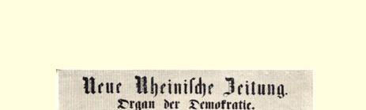
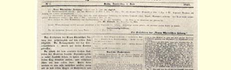
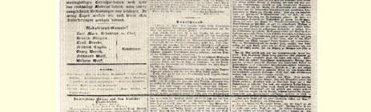
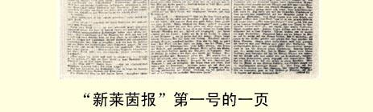

# 给“黎明报”编辑的信

> **３**

亲爱的先生！

由卡尔·马克思主编的一种新的日报“新莱茵报”，从６月１ 日起将在科伦城开始出版。这个报纸将在我们北方为“黎明报”在意大利所提出的那些民主原则而斗争。由此可见，我们对意大利和奥地利之间争执的问题将抱什么态度是用不着怀疑的。我们要捍卫意大利争取独立的事业，要和奥地利在意大利以及在德国和波兰的专制统治作誓死的斗争。我们向意大利人民伸出兄弟之手，并且要向他们证明，德国人民绝不会参与那些在我国也经常反对自由的人们对你们所实行的压迫。我们要竭力使两国的伟大和自由的人民能够结成联盟并和睦相处；由于丑恶的政治制度，这两国人民至今还互抱敌意。因此，我们要求粗暴的奥地利丘八立刻撤出意大利，使意大利人民有可能按照自己的独立意志来选择他们所需要的政体。

为了让我们能够注视在意大利发生的事件，而你们能够评判我们是否忠实于自己的诺言，我们建议互相交换报纸；这样，我们就可以按期每天把“新莱茵报”寄给你们，而你们把**“黎明报**”寄给我们。我们殷切期望你们能同意这个建议，并且希望你们能尽速开始把“黎明报”寄给我们，以便在我们最初的几号报纸上就能够利用它的材料。

如果可能的话，请你们也寄一些其他的报道来。我们保证，在我们这方面，对于凡是有利于任何一个国家的民主事业的东西，我们都予以最大的注意。  致以敬礼和兄弟般的情谊

“新莱茵报”编辑部

#### 编辑卡尔·马克思博士

> 写于１８４８年５月底原文是意大利文载于１８４８年６月２９日俄文译自“黎明报” “黎明报”第２５８号

## 卡·马克思

# 卡·马克思

### 和

# 弗·恩格斯

### 发表在“新莱茵报”上的文章

１８４８年６月１日—１１月７日

