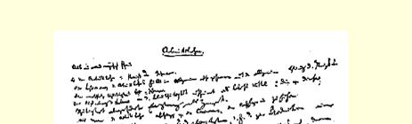
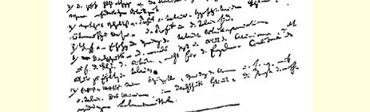
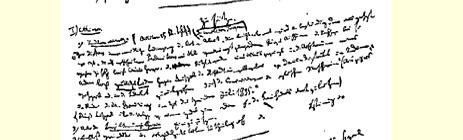
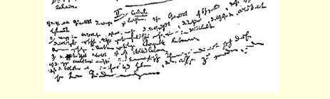

## 卡·马克思

# 致“新闻报”编辑

您在７月２６日的“新闻报”上登载了一篇关于我来到巴黎的短评，接着其他各家报纸又逐句地转载了它。由于这篇文章对一些事实极尽歪曲之能事，所以我不得不写几句话予以回答。

首先，归我所有３６５并由我担任主编的“新莱茵报”从来没有被封闭过。它由于戒严而停刊了五天。戒严一解除，该报就重新出版，并在以后七个月内继续出版。普鲁士政府看到不可能在合法的基础上封闭该报，于是采取了一种独特的手段—— 排除它的所有人，即禁止我在普鲁士居留。关于这一措施是否合法的问题，将由马上就要召开会议的普鲁士众议院予以解决。

我被禁止在普鲁士居留以后，起初到了黑森大公国，在那里也和在德国其余各地一样，我并没有被禁止居留。我来到了巴黎，但决不是如贵报所断定的那样作为流亡者而来的，而是完全自愿来的，我手头有完全有效的护照，并且所抱的唯一目的是为我在五年前就已动笔编写的一部政治经济学史再多收集一些材料。

我也没有接到**立即**离开巴黎的命令；我有时间来向内政部长提出抗议。我已提出这个抗议，并在等待它的结果３６６。

此致敬礼

#### 卡·马克思博士

> 写于１８４９年７月２７日左右原文是法文载于１８４９年７月３０日“新闻报”俄文译自“新闻报”

## 卡·马克思和弗·恩格斯的遗稿

## 卡·马克思

> 卡·马克思的手稿“工资”的第一页