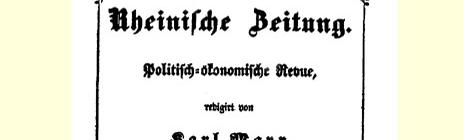
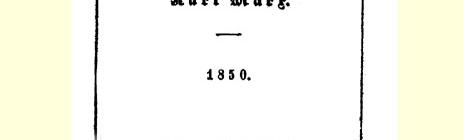

## 卡·马克思和弗·恩格斯

# “新莱茵报。政治经济评论”

> １

# 出版启事

#### “新莱茵报。政治经济评论”

> 将于１８５０年１月开始出版。

#### 卡尔·马克思主编。

本杂志以“新莱茵报” 为名，应该被看作是该报的继续。本杂志的任务之一，就是发表一些探讨过去事件的评论来阐述“新莱茵报” 被迫停刊以来的一段时期。

报纸最大的好处，就是它每日都能干预运动，能够成为运动的喉舌，能够反映出当前的整个局势，能够使人民和人民的日刊发生不断的、生动活泼的联系。至于杂志，当然就没有这些好处。 不过杂志也有杂志的优点，它能够更广泛地研究各种事件，只谈最主要的问题。杂志可以详细地科学地研究作为整个政治运动的基础的**经济**关系。

目前这个表面平静的时期，正应当利用来剖析前一革命时期， 说明正在进行斗争的各政党的性质，以及决定这些政党生存和斗争的社会关系。

本杂志每月出版一期，每期篇幅至少５印张。预订每季２４银格罗申，订费在收到第一期时付清。每期零售１０银格罗申。本杂志由汉堡舒贝特书局负责发行。

希望“新莱茵报” 的朋友们在当地组织订阅，并尽快地将订单寄交下面署名的人。寄给本杂志的稿件及待评的新书，请自付邮资。

“新莱茵报” 出版负责人

#### 康·施拉姆

> １８４９年１２月１５日于伦敦卡·马克思和弗·恩格斯合著原文是德文载于１８５０年１月８日俄文译自“西德意志报” “西德意志报” 第６号
>
> 俄译文第一次全文发表

> “新莱茵报。政治经济评论” 的封面