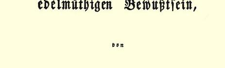

## 卡·马克思

# 高尚意识的骑士

> **３６５** 卡·马克思写于１８５３年１１月原文是德文 ２１—２８日左右 １８５４年１月于纽约以单行本刊印署名：卡尔·马克思
>
> 俄文译自单行本

## 卡·马克思

> 卡·马克思的抨击文“高尚意识的骑士”
>
> 第一版的扉页

小型战争（见德克尔“**小型战争论**”３６６）的英雄可能没有高尚身分，但他倒是有**高尚**意识。按黑格尔的说法，高尚意识不可避免地要转化为**卑鄙**意识３６７。为了说明这个转化，我举一身兼扮隐士彼得和穷汉瓦尔特两个角色的维利希先生的吐露为例。我只谈谈 ｃａｖａｌｉｅｒｅｄｅｌｌａｖｅｎｔｕｒａ〔冒险骑士，雇佣军首领〕；至于拥戴他的 ｃａｖａｌｉｅｒｉｄｅｌｄｅｎｔｅ〔寄食骑士〕，我就让他们听自己的命运摆布了。

为了从刚一开始就使人感觉到高尚意识的特色是用“普通的”谎言表达“高超的”真理，维利希先生对我的“揭露”３６８的答复是用下面的话开始的：

> “卡尔·马克思博士在‘新英格兰报’和‘刑法报’上刊载了关于科伦共产党人案件的报告。”

我从来没有在“刑法报” 上刊载关于科伦共产党人案件的报告。大家知道，我在“新英格兰报”３６９上刊载过“揭露”，而维利希先生在“刑法报” 上刊载过希尔施的自供[^1]。

在“揭露” 第１１页上谈到：“从在维利希—法佩尔派那里偷走的文件的清单和这些文件的日期上可以看出，维利希—沙佩尔派对罗伊特的破门行窃的行径虽然有所防备，但后来还是让别人偷走了文件，并让文件落到普鲁士警察当局手里。”这一段在第６４ 页也简要地重复过３７０。

> 维利希先生回答说：“马克思先生非常清楚地知道，这些文件大部分是伪造的，而部分是凭空虚构的。”

**大部分**是伪造的，就是说，**不完全**是伪造的。**部分**是凭空虚构的，就是说，**不全部**是凭空虚构的。可见，维利希先生承认，在罗伊特行窃之后，以及在此之前，属于他的集团的文件，已通过某种途径落入警察当局之手。我要肯定的正是这一点。

总之，维利希先生之所以高尚，就是因为能在**可靠事实**后面嗅出**虚假意识**。“马克思先生**知道**”。维利希先生从哪里知道马克思先生所知道的事情呢？上述文件中有一些我知道是真的。但是， 我却不知道其中哪一个文件在庭审时被认为是伪造的或是凭空虚构的。我**照理应该**知道得“较多”，因为，据说“维利希近旁的友人中有一个勃鲁姆” 是“马克思的情报员”。总之，勃鲁姆[^2]是在维利希近旁开放的。但是这样一来他就同我更远了。我与勃鲁姆从未谈过话，甚至这方面的暗示都没有[^3]。我只知道勃鲁姆的出身是俄国人，职业是皮鞋匠；他还以莫里逊的身分出现，大力推销维利希的莫里逊氏丸，现在大概在澳大利亚３７１。关于维利希－金克尔派传教士的活动，我是从马格德堡得知的，而不是在伦敦。因此，高尚意识本来是可以免除一次非常疼痛的手术，不必仅仅根据有嫌疑这一点而当众侮辱自己的一个忏悔者的。

高尚意识先是自欺欺人地硬说我有一个实际上不存在的情报员；然后它又同样自欺欺人地否认我所引用的一封真信。它引用了“‘揭露’第６９页注Ａ３７２，贝克尔的一封**假**信中的一段”。

维利希先生太高尚了，竟然不能设想像贝克尔这种“具有如此高超精神和性格的人” 会认不清像维利希这种人身上的高超精神和性格。因此，他把贝克尔的信变成假信，而把我变成伪造者。 不言而喻，这是出于高尚。但是，假信总还在律师施奈德尔第二手中。在审判时我把它寄给了科伦的辩护人，因为它驳斥了贝克尔参予维利希的蠢举的说法。除了信是贝克尔亲手所写之外，科伦邮局和伦敦邮局的邮戳表明了发信和收信的日期。

> “但是，在此之前金克尔夫人写给我〈维利希〉一封详细的、订正了所有事实的信；贝克尔在科伦担任了转寄工作。他告诉她信已转寄，但是我从来没有看见。谁**隐藏**了这封信：**马克思先生**，贝克尔，还是邮局？”

维利希证明这与邮局无关。可能是贝克尔？但是当贝克尔处于自由状态时，维利希却不想去向他质问。因此，剩下的就是 “马克思先生”。维利希先生又玩弄他所固有的背后搞鬼的伎俩，把事情说成这样：我公开了贝克尔**不是**写给我的信件，隐藏了他托我转寄的信件。但是，遗憾得很，贝克尔是最客气的，**从来**不麻烦我转寄信件，无论是转寄约翰娜太太的信还是转寄约翰·哥特弗利德先生[^4]的信。不管是狱官，或是暗检室３７３，都无碍于就这个无足轻重的问题去问贝克尔。维利希先生说谎说糊涂了：他捏造这种卑鄙的诽谤，竟是出于一种纯洁动机，即鼓励美德，表明善人之间、金克尔派和维利希派之间的同心同德胜过了恶人散布敌意的任何方术。

> “……无产阶级内部各党派之间，马克思派和维利希—沙佩尔派—— 根据**马克思先生而不是我所给予的名称**—— 之间的关系。”

高尚意识要用别人的倨傲来证明自己的谦虚。所以，它把 “**科伦起诉书所给予的名称**”（见“揭露”第６页３７４）变为“**马克思先生所给予的名称**”。由于同样的谦虚，它把我谈过的（见ｌ． ｃ．[^5]）某一个秘密的德国团体３７５内部各派之间的关系变为“无产阶级**本身**内部各党派之间的关系”。

> “当１８５０年秋天泰霍夫来到伦敦时，马克思**委托**德朗克写信给他自己， 即马克思，说什么泰霍夫对我做了**极端鄙视的评论**，这封信宣读了。泰霍夫来到了；我们作为男子汉大丈夫，彼此开诚布公地谈了一下；原来信中的传言是臆造的！！”

**当**泰霍夫来到伦敦时，我**委托**德朗克写信给我，我收到信，宣读了它，**然后**泰霍夫来到了。ｃｏｎｓｅｃｕｔｉｏ ｔｅｍｐｏｒｕｍ〔时间顺序〕 的不对头反映了高尚意识的张皇失措，因为他企图在我、德朗克的信和泰霍夫来到之间建立虚假的因果联系。在德朗克的信中 —— 顺便提一下，这信是寄给恩格斯而不是寄给我的—— 被指控的地方原话是这样的：

> “今天我使泰霍夫有点折服，尽管这一次我还是头一遭和他以及和席利 ——** 席利当时在伦敦**—— 发生激烈的争论；后来，泰霍夫不止一次地声明，对济格尔的攻击是维利希个人的花招，此外，他否认维利特有**任何** 军事才能。”

可见，德朗克所说的不是泰霍夫做了一般的极端鄙视的评论， 而是他对维利希先生的军事才能做了极端鄙视的评论。因此，泰霍夫即使说某某东西是**臆造的**，这也决不是指德朗克信中的传言， 而是高尚意识关于德朗克传言的传言。泰霍夫在伦敦并没有改变他在瑞士所发表的关于维利希先生的军事才能的意见，虽然他可能改变了他对这位伪修道者的其他看法。由此可见，德朗克的信和泰霍夫的到来同我的关系仅限于我宣读了德朗克的信；我是中央委员会主席，我应该宣读所有信件。例如，宣读过卡尔·布龙的信，他在信中也嘲笑了维利希的军事才能。那时维利希先生已经深信：这封信是我**委托**布龙写的。但由于布龙与泰霍夫不同，他还没有到澳大利亚去，所以，维利希先生就很有预见地不提“我的策略的这一范例”。再例如，我曾经不得不宣读罗特哈克尔的信， 信中写道：

> “我愿意属于其他任何支部，但是我**决不**愿属于**这个**支部〈即维利希的支部〉。”

他讲到：仅仅是由于反对维利希关于“引人注意的普鲁士武装” 的观点，就给他带来了多么不幸的后果。维利希的一个帮手

> “要求立即把他开除出盟，而另一个帮手则主张成立一个委员会来审查这个罗特哈克尔是怎样入盟的，说这事**很可疑**”。

维利希先生已经深信：这封信是我**委托**罗特哈克尔写的。但由于罗特哈克尔不是在墨尔本附近寻找黄金，而是在辛辛那提办报纸，所以维利希先生又认为这另一个“我的策略范例” 也是不宜公诸于世的。

高尚意识的本性是一向自我陶醉，并且到处认为自己已得到公认。因此，如果它碰到有人对它的自我欣赏不表同意，如果泰霍夫否认它的军事才能，罗特哈克尔否认他的政治才能，或贝克尔称它简直是“**蠢材**”，那末，它就要武断地说诸如此类的反自然的事实是由于阿利曼即马克思和恩格斯与奥尔穆兹德即维利希之间存在着策略矛盾，据此，高尚意识就醉心于最卑鄙的勾当，企图苦思出，引伸出，臆想出这种虚构的策略的秘密。我们看到了， 正如黑格尔所说，这种意识是如何不在崇高的东西上下工夫，而在最卑鄙的东西，即自己身上下工夫。

维利希先生胜利地高呼：“这就是马克思先生的策略的几个范例。”

> “当居于伦敦的、当年曾起过相当显著作用的革命活动家送来请贴邀请我们参加会议时，马克思、恩格斯与我之间的第一个矛盾便暴露出来了。我想赴会；我要求：我们应该有自己的党的立场和组织，但是，关于**流亡者中间的内部争执**的éｃｌａｔ〔消息〕不应超出**这些人的范围**。我居于少数派；邀请被拒绝了，**于是从这一天起**，**就开始了伦敦流亡者内部的令人讨厌的内讧**，内讧的后果至今还存在，尽管这些内讧在公论中已经显然地失去任何意义。”

维利希先生作为一个战时的“游击队员”，认为他在和平时期的使命也是从一个党派转到另一个党派[^6]。他怀抱着高尚的联合愿望而居于少数派，这完全符合真情。但是这种招认听起来令人感到特别幼稚，因为维利希先生后来竭力散布流言，似乎流亡者从自己的帮会中把我们开除了。而在这里，他就承认了我们从我们中间开除了这帮流亡者。这就是事实。而事实还有自己的**变容** 哩。高尚意识需要证明，只是阿利曼妨碍了他去完成高尚的事业， 妨碍了他去预防流亡者遭到的种种不幸事件。因此，它又得造谣， 纯粹像福音书编者那样地去歪曲世俗的编年史（见布鲁诺·鲍威尔“复类福音作者”３７６）。阿利曼—— 马克思和恩格斯—— 声明退出大磨坊衔工人协会，并在１８５０年９月１５日中央委员会会议上声明与维利希决裂３７７。从这一天起，他们就避免参加任何公开组织、 游行和示威。总之，是从１８５０年９月１５日起的。１８５１年７月１４ 日，“各派有名望的活动家” 被邀请到菲克勒尔公民那里去开会， １８５１年７月２０日建立“鼓动者协会”，而在１８５１年７月２７日成立“德国流亡者俱乐部”。正是从**这**一天起，即从高尚意识的秘密愿望得到满足时起，才开始了“伦敦流亡者”内部的令人讨厌的内讧， 正是从这一天起，才开始了“流亡者”和“鼓动者”之间的斗争， 这一斗争在大洋两岸展开，这是伟大的老鼠与青蛙之战３７８。

谁使这架小小的坚琴发出响声？

> 那是我吸取振奋人心的
>
> 词汇的泉源，
>
> 为的是我能够用鲜明的色彩，
>
> 来描画世界上从未见过的战斗。
>
> 同命运注定要我歌唱的这次战斗相比，
>
> 一切以往的战斗都只是大宴会上的花朵：
>
> 因为一切有不可思议的勇敢精神的人，
>
> 都在这次光荣的战斗中拔剑相斗。
>
> （博雅多，Ｏｒｌａｎｄｏ ｉｎｎａｍｏｒａｔｏ，ｃａｎｔｏ ２７
>
> 〔恋爱中的罗兰，第二十七首歌〕）

这些“令人讨厌的内哄在公论中”从来没有“意义”，它们只是在老鼠与青蛙的私见中才有意义。但是，“内讧的后果至今还**存在**”。维利希先生之居留美国，就是这些后果之一。从美国汇到欧洲的贷款３７９变成维利希，从欧洲又回到了美国。他在那里初建的功勋之一就是在……成立了某秘密委员会，以便为布尔昂的哥特弗利德和隐士彼得[^7]保障圣杯３８０，保障民主黄金，保存它，不让阿尔诺德·文克里特－卢格３８１和梅兰希通－隆格夺去。

尽管“高尚人物们”已经各得其所，而且用爱德华·梅因的话来说，**所有的人**，“直到布赫尔”，已构成一个统一联盟，但是，不仅在主力军中，而且在每一个兵营内部，瓦解过程进行得如此迅速， 以致鼓动者协会不久便成了一个残缺不全的北斗星，而流亡者俱乐部虽有高尚意识的联合力量，但也变成了维利希、金克尔和饭馆老板谢特奈尔的三位一体了。甚至三位一体对贷款的统辖权—— 高尚意识具有如此的吸引力—— 也归属了某种甚至不能称之为二元论的东西，即归属了金克尔—维利希。赖辛巴赫先生是一个过分受到尊敬的人，以致不能继续作为第三者呆在这个同盟内。他曾有可能在实践中领教高尚意识的“个人性格”。

高尚意识的与恩格斯有关的一些经历，也是它所引用的“马克思的策略”的范例。我在这里引用恩格斯本人的一封信。

“**曼彻斯特**，１８５３年１１月２３日。在奥古斯特·维利希先生为了自我辩护而发表于‘纽约刑法报’（１０月２８日和１１月４日）的小说中，我很荣幸地被提到。因此，我不得不就这个与我有关的问题正式地讲几句。

朋友维利希把纯粹的自扰与**纯粹的**活动混为一谈，因而忙来忙去只是为了朋友维利希。他对于有关他个人的一切具有极好的记忆，他简直有一套卡片，把别人谈论他的话，甚至别人在把酒闲谈时说过的话全都编了进去，—— 这一事实对于任何有缘和他认识的人来说，早就不是秘密了。但是，朋友维利希一向都是善于使自己的记忆和自己的一套卡片得到最充分的应用的。随便什么细小的曲解，随便什么看起来属于无意的遗漏，每次—— 当人们重新提起这类小事的时候—— 都把他变为一场戏剧的主人公，变为某一幅人物图、某一幅生动图画的中心人物。在维利希的小说中，无论是就细节或就整个而言，斗争每时每地都是围绕着白璧无瑕的并因此遭到迫害的维利希。在每一个单独插曲中，我们在收场时都可看到：威武的维利希发表演说，而他的有罪的敌人则由于感到自己渺小而垂头丧气，痛不欲生。Ｅｔ ｃｅｐｅｎｄａｎｔ ｏｎ ｖｏｕｓ ｃｏｎ ｎａｌｔ，ｏ ｃｈｅｖａｌｉｅｒｓ ｓａｎｓ ｐｅｕｒ ｅｔ ｓａｎｓ ｒｅｐｒｏｃｈｅ！〔但是我们仍然看透了你们，无畏又无瑕的骑士们！〕

因此，在维利希的小说中，高尚人物由于马克思、恩格斯和其他不信上帝的人的过失而受难的时期，同时也是凯旋时期，因为每一次他都胜利地惩治了自己的敌人，而且每一次新的凯旋都胜过一切以往的凯旋。朋友维利希一方面把自己描绘为受苦受难的基督，以身承受了马克思、恩格斯及其同伴的罪孽，另一方面又把自己描绘为到此审判活人和死人的基督。朋友维利希能够**同时**一人充当两个截然相反的角色。谁能同时演出这两个阶段，谁当然就该被人信仰。

这些自我陶醉的幻想充塞了这个上年纪的单身汉的不眠之夜，对于这些幻想我们早就熟知了；但我们感到奇怪的只是，这些特异反应现在仍然通过１８５０年那样的形式流露出来，没有变化。 但是，还是让我们来谈谈细节吧。

朋友维利希除了把施梯伯先生及其一伙变为从很久以前迫害蛊惑者３８２时代起就已不存在的某个德国‘中央联邦警察局’的爪牙，并且叙述了一大堆同样神奇的‘事实’之外，还以他惯有的准确性硬说我写著作的一部分，即其中谈到他的那一部分，因此，他清楚地知道，我从未出版过这种‘小册子’。实际上，我只是在‘新莱茵报。１８５０年汉堡和纽约版’杂志上发表了一些论述维护帝国宪法的运动的文章，其中有一篇谈到从我在普法尔茨－巴登运动时期的个人经验中得出的观感

３８３。在这篇文章中当然也提到朋友维利希，并且正如他所说的，给予他‘非常赞许的评价’，但是，这马上使他与他通常所固有的谦虚发生了冲突，因为这篇文章好像把他变成了‘为数如此之多的其他伟大的国家活动家、独裁者和统帅的匹敌者’。

从我这方面说，现在使维利希的高尚心灵乐不可支的这种很高的‘评价’究竟是怎么回事呢？原来我的‘评价’是：维利希先生在当时的情况下是一个很不坏的营长，因为他曾任普鲁士尉官２０ 年，掌握了这方面必要的知识，他不是没有能力领导小型的战争， 特别是游击战争，最后，他还有一个优点，即担任一个６００—７００人的志愿队队长完全能够胜任，而在那个时期，大多数的高级军官都是这样一些人，他们没有任何一般的军事素养，即使有一些军事素养，也与他们所居的职位完全不相称。说维利希先生比不管什么大学生、军士、学校教师或皮鞋匠能够较好地指挥７００人，这对于一个在这方面有２０年素养的普鲁士尉官来说，当然是‘非常赞许的评价’！ Ｄａｎｓ ｌｅ ｒｏｙａｕｍｅ ｄｅｓ ａｖｅｕｇｌｅｓ ｌｅ ｂｏｒｇｎｅ ｅｓｔ ｒｏｉ〔盲人国里独眼称王〕。不言而喻，他担任从属的职位，负责较少，因而就能比指挥几个师的或担任高级将领之职的‘他的匹敌者’少犯错误。谁敢否认，当了‘总司令’而完全没有能够胜任的济格尔，要当起营长来不也是一个不坏的营长吗？

而谦虚的维利希—— 大概是由于我的过失，某些美国报纸因他服役多年而称之为‘将军’—— 伤心地埋怨，似乎是我的‘评价’ 使他也有成为 ｉｎ ｐａｒｔｉｂｕｓ[^8]的将军的危险，不仅成为将军，而且有成为统帅、**国家活动家**、甚至**独裁者**的危险！朋友维利希想必有非常独特的想法，认为共产党对他这个靠拢它的大致过得去的营长和志愿队队长是 ｉｎ ｐｅｔｔｏ〔暗地〕给予这样出色的嘉奖的。

在上面提到的文章中，我只是把维利希当作一个军人来谈的， 因为他只有作为军人才能使公众感兴趣，而在此之后他就成为‘**国家活动家**’了。如果我对他有仇恨，—— 在他看来，我和我的朋友们对他充满仇恨，—— 如果我有兴趣给他作个人鉴定，那末讲出的插曲就无奇不有了！如果我只谈可笑的方面，难道我能放过苹果树事件吗？在苹果树下，他和他的伯桑松人３８４曾宁愿高歌而死，不愿重离德国国土，并且在那里庄严宣誓。难道我能不谈边界上所演的滑稽剧吗？当时，朋友维利希装腔作势地想真个准备实现这一意图； 当时，有一些好心人到我这里来，十分认真地要我去劝说威武的维利希放弃他的决定；最后，维利希集合了队伍向大家提出问题，他们是不是愿意死在德国土地上而不愿出去流亡，在长久的共同沉默之后，一个唯一的视死如归的伯桑松人高呼：‘留在这里！’在此之后，令大家心满意足的是，大伙儿归根到底还是携带着全部武器和辎重转移到瑞士境内。最后在辎重上发生的事又是多么引人入胜的插曲。这件事到目前还是饶有兴味的，因为维利希本人正号召半个世界就他的‘性格’发表意见。顺便提一下，谁愿意知道这方面的详情细节和其他趣事，只消问问他的３００名在当时没有能为自己找到温泉关的斯巴达人３８５之中的任何一个人。他们随时都愿意背着有性格的那个人叙述极其丢丑的事。在这方面我有很多的见证人。

关于我的‘勇敢’的事，我没有什么话可说。令我惊讶的是，那时我在巴登发现，勇敢是一种不值得一谈的最普通的品质，仅仅一种单纯的勇敢并不比单纯的**善良意志**有价值。因此，常有这样的事，每个单独的人是英雄和勇士，而整整的一营却像一个人一样， 逃之夭夭。维利希的队伍向卡尔斯多尔夫的进军就是一例，这次进军在我论述维护帝国宪法的运动时已作了详细的说明３８６。

维利希硬说，他似乎因此向我宣读过不可违抗的道德训条，并且正是在１８５０年的新年之夜。我没有这样写日记的习惯，即标上几句我如何从这一年跨到那一年，所以我不能担保这个日期。无论如何，维利希决没有宣读像他在报刊上所阐述的那种副条。

维利希想使人相信，在流亡者委员会３８７，我和其他的一些人对伟大的人物行为‘不恭’。Ｓｈｏｃｋｉｎｇ〔真可怕呀〕！但是，当维利希这位惩罚罪人的雷公突然对普通的‘不恭行为’束手无策时，这些不可违抗的道德训条到哪里去了呢？让我认真地去谈这些蠢事，大概是没有必要了。

在施拉姆和维利希之间闹到要求决斗的一次中央委员会会议３８８上，我似乎犯了罪，因为在这件事发生之前不久，我和施拉姆一齐‘离开房间’，因而这就是通盘策划了这件事。

以前，似乎是马克思‘唆使’施拉姆，而现在为了多样化，我又充当了这个角色。一个老练的用手枪有经验的普鲁士尉官同一个可能从来没有摸过手枪的商人之间的决斗，确实是一个把尉官‘扫掉’的顶好办法。朋友维利希不顾这一点，还到处诉说—— 口头上和书面上—— 似乎我们想枪杀他。

我和施拉姆同时离开房间，这十分可能（某种需要使我离开房间，这样的事情我没有写入日记）；但是也未必如此，因为我从我所保存的当时中央委员会会议记录中看到，那天晚上施拉姆和我是轮流做记录的。施拉姆仅仅是被维利希的蛮横行为所激怒。他提出同维利希决斗，使我们都大吃一惊。在几分钟之前，大概施拉姆本人也不会料到事情有如此的变化。很难想像有比这更不由自主的行动。维利希在这里又说，似乎他曾经声称：‘施拉姆，给我出去！’事实上是维利希要求中央委员会赶走施拉姆。中央委员会则认为没有必要满足他的要求。施拉姆只是应马克思的个人请求才离开的，因为马克思希望不要再继续胡闹。在我这一边有记录，在维利希先生一边有他的个人性格。

#### 弗里德里希·恩格斯”

维利希先生又说，他在工人教育协会上叙述了流亡者委员会的“不恭行为”并为此而提出建议。

> 高尚意识叙述说：“当反对马克思及其一伙的怒潮达到最高峰时，我**投票** 赞成**中央委员会**对问题进行审查。**这件事**就做了。”

做了什么事？是维利希投票呢？还是中央委员会对问题进行审查？多么淳厚啊！他的命令式的一票把他的敌人从达到最高峰的人民怒潮中挽救了出来。维利希先生只是忘了：中央委员会是**秘密**团体的**秘密**委员会，而工人协会却是**公开**的大众的团体。他忘了，中央委员会对事件进行审查的问题由于上述原因是不可能在工人协会中提付表决的，也不可能出现一个慈悲人排难解纷的场景，由他充当这个场景中的英雄。朋友沙佩尔会帮助他恢复自己的记忆。

维利希先生把我们从公开的工人协会引到秘密的中央委员会，又从中央委员会引到安特卫普的一场决斗，即他和施拉姆的决斗：

> “施拉姆在一个**前俄国军官**陪同下来到奥斯坦德，这位军官，**据他说**，是在匈牙利革命期间转到匈牙利人这边的，在决斗结束后，他消失得**无影无踪**。”

这位“前俄国军官”不是别人，而是**亨利克·路德维希·米斯科夫斯基**。

> 我们在发给这位**前俄国军官**的证件中看到：《Ｔｈｉｓ ｉｓ ｔｏ ｔｅｓｔｉｆｙ，ｔｈａｔ ｔｈｅ ｂｅａｒｅｒ Ｈｅｎｒｉ Ｌｅｗｉｓ Ｍｉｓｋｏｗｓｋｙ，ａ Ｐｏｌｉｓｈ ｇｅｎｔｌｅｍａｎ，ｈａｓ ｓｅｒｖｅｄ ｄｕｒｉｎｇ ｔｈｅ ｌａｔｅ Ｈｕｎｇａｒｉａｎ ｗａｒ １８４８—１８４９ ａｓ ｏｆｆｉｃｅｒ ｉｎ ｔｈｅ ４６ｔｈ．ｂａｔａｉｌｌｏｎ ｏｆ ｔｈｅ Ｈｕｎｇａｒｉａｎ Ｈｏｎｖｅｄｓ，ａｎｄ ｔｈａｔ ｈｅ ｂｅｈａｖｅｄ ａｓ ｓｕｃｈ ｐｒａｉｓｅｗｏｒｔｈｙ ａｎｄ ｇａｌｌａｎｔｌｙ． Ｌｏｎｄｏｎ，Ｎｏｖ．１２，１８５３．Ｌ．Ｋｏｓｓｕｔｈ，ｌａｔｅ ｇｏｖｅｒｎｏｒ ｏｆ Ｈｕｎ－ ｇａｒｙ》[^9]．

说谎成性的高尚意识！但目的是**高尚的**。善与恶之间的对立要用鲜明对照的手法来描绘，让它像一幅生动的图画。多么艺术的一幅人物画呵！一边是这位高尚人物，身旁围绕着

> “目前在澳大利亚的泰霍夫，那时在流亡中而现在坐在阿尔及尔监狱中的法国骠骑兵上尉维迪尔，以及法国报纸所宣扬的一位最坚决的革命者巴特尔米。”

简言之，一边是维利希本人，身旁围绕着两个革命的精华；另一边是施拉姆，他是罪恶的化身，为一切人所不齿；和他在一起的只有一个“前俄国军官”，这位军官不是真正参加过而是“据他说” 参加过匈牙利革命，并且在决斗之后马上“消失得无影无踪”，即归根到底原来是一个魔鬼。接着是艺术性的描绘：美德下榻在奥斯坦德的一个“头等旅馆” 内，那里曾住过一位“普鲁士亲王”，而罪恶和俄国军官则“住在私人房子里”。不过，俄国军官看起来又不完全是“在决斗结束后消失” 的，因为根据维利希先生的继续叙述，“施拉姆和俄国军官留在小河边”。但是，俄国军官并没有像我们高尚的骑士所希望的那样在大地上消失。这从下面的声明中可以看出来：

> “在１２月２８日‘刑法报’上刊载着维利希先生的一篇文章，其中还专门记述了他于１８５０年在安特卫普与施拉姆的决斗。遗憾的是，这篇记述并没有在所有各点上都真实地向公众报道。那里谈到：‘决斗已经约定，云云，施拉姆在一个前俄国军官陪同下来到，云云，他如何如何消失。’这是不真实的。 我从来没有为俄国效过力；如果用同样的理由，就可以像叫我一样，把参加匈牙利解放战争的所有**波兰**军官都叫做**俄国人**。从１８４８年战争开始到１８４９ 年战争在维拉戈什全部结束，我一直在匈牙利任职。我也没有消失得无影无踪。施拉姆从发射地点只挪了半步，就向维利希射击，但没有命中，于是维利希从自己的位置向施拉姆射击，他的子弹擦伤了施拉姆的头部。在此之后， 我就留在施拉姆身边，**因为我们那里没有医生**〈决斗是维利希先生组织的〉； 我洗净了施拉姆的伤口并把它包扎起来，因而我也不去注意到有７个人在离我们不远的地方一面收割干草，一面注视着决斗，而他们对我来说可能是危险的。维利希和他的同伴们急急忙忙跑了，施拉姆则和我从容地留在原地看着他们离去。他们不久就在我们的眼帘中消失。我还应该指出，当我们到达决斗地点时，维利希和他的同伴早就在那里了，他们为决斗量好了距离，而且维利希还为自己选择了一块背光的地方。我叫施拉姆注意这一点，但是他说：‘就让他这样吧！’施拉姆表现得勇敢无畏，十分冷静。我**被迫**留在比利时的事实，对于参加这件事的人，并不是不知道的。关于形式如此独特的这次决斗的更细情节，我不想谈了。
>
> **亨利克·路德维希·米斯科夫斯基**
>
> １８５３年１１月２４日于**伦敦**”

高尚意识的机器开动了。他发明了某个俄国军官，马上又使他消失得无影无踪。现在我又一定要代替这个军官，像萨米尔那样在战场上出现了，尽管不是以实体出现。

> “次日清晨〈在维利希先生到奥斯坦德之后〉，他〈一个平日非常熟的法国公民〉把布鲁塞尔的‘先驱者报’给我们看，上面登载着一篇私人通讯，其中有如下这一段：‘**有许多德国流亡者来到布莱顿**。从那个城市给我们来信： 赖德律－洛兰和来自伦敦的法国流亡者准备于日内在奥斯坦德与比利时的民主派举行代表会议。’谁能追求称这个思想为自己的思想这样的荣誉呢？它不是出自**法国人**，不然，它就太 ａ ｐｒｏｐｏｓ〔凑巧〕了。这个荣誉完全属于马克思先生，**因为如果**他的一个朋友**有可能**把那个东西执行，那末，思想总还是由头脑创造出来，而不是由手创造出来的。”

“一个平日非常熟的法国公民”把布鲁塞尔的“先驱者报”给维利希先生及其一伙看。他给他们**看**的是不存在的东西。实际上只有安特卫普的“先驱者报”３８９。在地形学和年代学领域内系统地歪曲和捏造，是高尚意识的重要职能。只有这样的背景，即理想的时间和理想的空间，才适合于他的理想的作品。

为了证明这个思想，即布鲁塞尔的“先驱者报” 中的文章 “出自” 马克思，维利希先生想使人相信：“它不是出自法国人”。 这个思想本来就不会**出自**某某！“不然，它就太 ａ ｐｒｏｐｏｓ〔凑巧〕了”。Ｍｏｎ ｄｉｅｕ〔我的上帝〕，为什么维利希先生本人用法语才能够表达的思想就不可能出自法国人呢，我的高尚意识？这里又怎么突然出现了一个法国人呢？维利希、施拉姆、前俄国军官和布鲁塞尔的“先驱者报” 跟法国人有什么关系呢？

高尚意识的思想的传播器开始高叫得很不是时候，泄露了高尚意识曾 ａ ｐｒｏｐｏｓ〔凑巧〕认为必须抛弃一个必要的中间环节。 让我们把这个环节再安装上来吧。

**还在**施拉姆惹起维利希先生的决斗**之前**，法国人巴特尔米已约定与法国人桑让决斗；而后者应该在比利时进行。巴特尔米选择了维利希和维迪尔作助手。桑让启程赴比利时。这时候发生了与施拉姆的冲突。于是，两个决斗定在同一天进行。桑让**没有**到决斗地点。巴特尔米在回到伦敦后**公开**断定，安特卫普的“先驱者报” 上的文章出于桑让之手。

在高尚意识把巴特尔米的思想转移给自己，而把桑让的思想转移给我之前，它是长久地犹豫了一阵的。正如泰霍夫本人返回伦敦后向我和恩格斯所说的，最初，它坚决地肯定，我意欲假施拉姆之手打发高尚人物回阴曹地府，并且它还用书面向全世界披露了这个思想。但是，经过三思之后，它确定了，惯于运用鬼一般滑的策略的我，不会考虑通过与施拉姆的决斗来收拾维利希先生。因此，它便抓住了“不是出自法国人的” 思想。

**命题**：“这个荣誉完全属于马克思先生”。**证明**：“**因为如果**他的一个朋友**有可能**把那个东西〈不言而喻，“思想”在我们的无瑕的骑士那里是中性而不是**阴性**[^10]〉执行〈**执行**思想！〉那末，思想总还是由头脑创造出来，而不是由手创造出来的”。**因为如果**！好一个**因为如果**！维利希先生为了证明马克思**臆造出**“那个东西”，便假定马克思的一个朋友**执行了**，或者更确切些说，**有可能**执行“那个东西”。Ｑｕｏｄｅｒａｔｄｅｍｏｎｓｔｒａｎｄｕｍ〔如此就得到所需要的证明〕。

> 高尚意识说：“**如果**确走，马克思的朋友瑟美列把匈牙利王国出卖给了奥地利政府，那末，这**就是**可靠的证明，云云。”

假定说，确定的适得其反。但是这与本题无关。**假如**瑟美列有了出卖行为，那末，这对维利希先生来说**就是**“可靠的”证明， 即证明马克思是布鲁塞尔的“先驱者报” 上一文的作者。但是**如果**连前提也**不**确定，那还是得坚决确定结论，换言之，就是坚决确定：如果瑟美列出卖了圣者斯蒂凡的王国，那末，马克思就出卖了圣者斯蒂凡本人。

在俄国军官消失得无影无踪之后，维利希先生又出现在伦敦的“工人协会” 上，在那里，

> “工人们一致谴责马克思先生”，这位先生“在他退出协会后第二天，伦敦区部全体会议就一致把他开除出盟”。

但是，**还在此之前**

> “马克思和中央委员会多数派一起做出了关于中央委员会迁出伦敦的决定”，

并且不顾沙佩尔的善意警告，成立了自己的特别区部。根据秘密团体的章程，多数人是有权把中央委员会迁往科伦并暂时开除整个维利希区部的，而这个区部则**无权作出**关于中央委员会的决定。 惹人注目的是：高尚意识一向偏爱小小的戏剧场面，在这样的场面里，维利希先生担任大雄辩家角色，而这次却连惨剧、爆发的场面都没有利用。诱惑力是很大的，但可惜，白纸黑字的记录摆在那里，它表明：一贯得胜的基督一连好几个小时如坐针毡，哑然无声地听取恶鬼的指控，然后，突然溜走，让朋友沙佩尔去听天由命，只是在正统的“区部”中才重新获得了说话的能力。Ｅｎ ｐａｓｓａｎｔ〔顺便提一下〕，当维利希先生在美国一本正经地谈论“由于尊重和信任而和他联系在一起的工人协会” 是如何美妙时，甚至连沙佩尔先生也认为有必要暂时退出维利希先生的协会。

高尚意识从如此娴熟的“策略” 行为的领域向理论领域上升了一小会儿。但这只是一种假象而已。实际上，他是继续提供 “马克思先生的策略范例”。我们在“**揭露**”第８页上看到：“沙佩尔—维利希派〈维利希先生引证的是：维利希—沙佩尔派〉从来不追求具有自己的思想这样的荣誉。他们只有别出心裁地曲解别人的思想的本领”３９０。维利希先生为了在公众面前摆出他**自己的**思想储备，于是便述说小资产阶级如果掌握政权就会“创立”“哪些 **机构**”，并把它当作自己的最新发现以及对恩格斯和我的观点的反驳。恩格斯和我所写的、被萨克森警察局从毕尔格尔斯那里查获的通告３９１—— 它曾刊载于最流行的德国报纸，并构成科伦起诉书的根据—— 非常群尽地叙述了德国小资产阶级的善良愿望。维利希的布道词就是从那里弄来的。让读者去比较原稿和抄本吧！美德做事是多么淳厚啊！竟在罪恶那里从事抄写工作，尽管也有 “别出心裁的曲解”。恶化的风格被从善的愿望弥补了。

在“**揭露**”第６４页上谈到，在我看来，共产主义者同盟“并不是把组织**未来的执政党**，而是把组织**未来的反对党**作为自己的目的”３９２。维利希先生由于高尚而抛掉了句子的前一段：“不是**未来的执政党**”，而抓住后一段：“未来的反对党”。他在如此巧妙地把这个句子劈开之后，就证明说，真正的革命政党，这就是**追逐地位的人**的政党。

维利希先生出产的另一个“自己的” 思想是：高尚意识和它的敌人之间的实际矛盾也可以**从理论上**表达为“人类之分为两类”，即分为维利希派和反维利希派，分为高尚的一类和不高尚的一类。关于高尚的一类，他使我们知道，他们的主要特征是：“**他们彼此器重**”。当高尚意识不再用它的策略范例来使我们开心时， 令人感到乏味就是它的特权。

我们看到：高尚意识是如何歪曲或颠倒事实，或用滑稽的假设冒充严肃的命题—— 这一切都是为了**实际上**宣布与他相矛盾的一切都是不高尚的，卑鄙的。因此，我们看到，他的整个活动完全可归结为发明卑鄙的东西。这一活动的另一面是，高尚意识把他和世人之间发生的一些实际误会—— 不管它们如何有损名誉 —— 变为确证自己高尚的实际证明。对于纯洁的人来说一切都是纯洁的，而敌人如果用高尚意识的所作所为来评价高尚意识，恰好证明了自己是不纯洁的。因此，高尚意识用不着**自我辩白**，它要做的只是对迫使它自我辩白的敌人表示道义上的愤怒和惊讶。 因此，维利希先生的似乎是**自我辩白**的插曲本来就可以不做，不做也是一样，每一个把我的“揭露”、希尔施的自供和维利希先生的答复比较一下的人，都会深信这一点。因此我只举几个例子来表明高尚意识的**人物们**是些什么货色。

尽管希尔施的自供的最初目的是歌颂维利希先生，把他捧作从自己敌人手中拯救出来的救星，但是，这个自供比我的“揭露” 更甚地有损他的名誉。因此，他小心翼翼地避免接触希尔施的自供。如所周知，希尔施是普鲁士警察当局反对我所属的党的工具。维利希先生不顾这一事实，却假设希尔施**本来**是我为了 “毁掉” 维利希的党而委派的。

> “很快他〈希尔施〉就和马克思的某些拥护者，特别是和某某罗赫纳一起， 开始阴谋活动，企图毁掉协会。**因此**大家开始注意他。他被揭发了，云云。根据我的建议，把他开除了；罗赫纳袒护他，也被开除了…… 希尔施**现在**又开始了反对奥·迪茨的阴谋活动…… 阴谋又被迅速地揭穿。”

根据维利希先生建议把被当做密探的希尔施逐出大磨坊街工人协会一事，是我在“揭露”第６３页３９３上谈的。这种驱逐在我心目中没有任何意义，因为我知道，驱逐的原因并不是确凿的事实，而是猜疑希尔施和我搞某些实际上并不存在的阴谋活动。现在这一点连维利希先生本人也已承认。我知道希尔施是没有犯这个罪的。 至于谈到罗赫纳，他曾要求拿出希尔施的罪证。维利希先生回答说，不知道希尔施是靠什么生活的。罗赫纳问道，维利希先生是靠什么生活的呢？由于这个“不恭的”责问，罗赫纳受到了**公意审判**， 并且因为他不听所有的告诫，不想低头认罪，所以被“开除”。在希尔施被开除以及罗赫纳接着他被开除后，希尔施的阴谋活动

> “**现在**主要是反对奥·迪茨，并且串通了一个非常可疑的前萨克森警探， 后者对迪茨提出了指责。”

施泰翰逃出汉诺威的一个监狱到达伦敦后，参加了维利希的工人协会并对奥·迪茨提出指责。施泰翰既非“可疑的”，也非“前萨克森警探”。促使施泰翰对奥·迪茨提出指责的原因是，法院侦查员在汉诺威曾经向他出示了许多他私人的信件，而这些信件是他寄给伦敦的维利希委员会３９４书记迪茨的。与施泰翰几乎同时出现的有：罗赫纳，刚从汉诺威监狱获释并被驱逐出境的埃卡留斯第二，根据参与什列斯维希－霍尔施坦事件一案的逮捕令被到处搜捕的吉姆佩尔，以及１８４８年由于一首革命小诗而曾在汉堡被拘并假装又受到警察当局迫害的希尔施。他们和施泰翰一起组成了某种反对派，并由于在协会的公开辩论会上反对维利希先生的教义而犯了亵渎圣灵罪。使他们大家感到惊讶的是，对施泰翰指责迪茨的答复是维利希开除希尔施。不久他们都退出工人协会并和施泰翰组成一个单独的协会，这个协会也存在了一些时候。他们和我建立联系只是**在**他们退出维利希先生的协会**之后**。高尚意识颠倒了年代顺序，完全无视施泰翰，抛弃这个必要的、但不怎么令人舒服的中间环节，从而暴露了自己说谎的习性。

我在“**揭露**”第６６页上谈到：“在科伦陪审法庭开庭前不久，维利希和金克尔委派了一个裁缝的帮工[^11]充当特派员前往德国”，３９５ 云云。

> 高尚意识愤怒地叫道：“为什么马克思先生强调这是**裁缝的帮工**呢？”

我决没有“强调”这是裁缝的帮工，没有像高尚人物所做的那样，例如，他强调皮佩尔是“路特希尔德家里的家庭教师”，虽然皮佩尔已由于科伦共产党人案件而失掉在路特希尔德那里的工作去做英国宪章派机关报[^12]的编委。我只不过是把裁缝的帮工叫做裁缝的帮工。为什么？因为我应该不提他的名字，同时应该向金克尔先生和维利希先生表明，我完全了解他们的特使的人格。因此，高尚意识指责我对所有裁缝的帮工犯了叛国大罪，并对裁缝的帮工高唱品得式的颂歌，以此来争取他们的选票。高尚意识为了顾全裁缝的帮工的善良名声，宽宏大量地不提埃卡留斯—— 他谈到埃卡留斯时就像谈到一只被驱逐的大山羊—— 是裁缝的帮工，其实，这个职业至今丝毫也没有妨碍埃卡留斯是一位德国无产阶级的大思想家，丝毫也没有妨碍他用自己载在“红色共和党人”、“寄语人民”３９６和“人民报”上的论文博得甚至在宪章派中的威望。维利希先生**反驳**我对他和金克尔派往德国的裁缝的帮工的活动的揭露，就是用的这种方法。

现在我谈谈**亨策**的事情。高尚意识企图对我冲刺一下来掩护自己的阵地。

“**顺便提一下**，**他**〈亨策〉**曾借给马克思**３００塔勒。”

１８４９年５月，我告诉雷姆佩尔先生，“新莱茵报”的财政困难随着订户的增加而增加了，因为开支一定要用现金支付，而订费总是迟迟来到；除此之外，由于发表了维护巴黎六月武装起义者的文章以及抨击法兰克福议员、柏林妥协派和三月同盟的文章３９７， 几乎所有股东都逃开了报纸，因而造成了巨大赤字。雷姆佩尔先生让我去找亨策，他以我的借条为据借给了“新莱茵报”３００塔勒。 那时亨策本人正被警察当局追捕，所以他认为有必要离开哈姆，于是他就和我一同到科伦去；到了科伦，我就得到关于我被驱逐出普鲁士国境的消息。我向亨策借来的３００塔勒，我通过普鲁士邮局收到的订户寄来的１５００塔勒，我的一部高速平板印刷机，等等 —— 这一切都用来抵偿了“新莱茵报”对排字工人、印刷工人、纸商、办事员、通讯员、编辑部人员等等所欠的债务。没有谁比亨策先生更清楚地知道这件事，因为他本人曾借给我的妻子旅行包， 用来装她的银器，送到法兰克福去典当，以便我们能够弄到私人所需的费用。“新莱茵报”的账册保存在科伦的商人斯蒂凡·瑙特那里，我可以授权给高尚意识到那里取得这些账册的经过正式核对的抄本。

在谈了一些离题的话之后，现在言归正题。

“揭露”丝毫也不认为维利希先生是亨策的朋友以及从亨策那里得到资助是不可解的。它认为不可解的是（第６５页３９８），在科伦案件接近尾声时，在普鲁士警察当局的警惕性达到顶点并对德国和英国每个稍有可疑的德国人严密注视时，亨策竟得到当局的许可，前往伦敦，并在那里毫无阻碍地同维利希会晤，然后又回到科伦来提供反对贝克尔的“假证词”，要知道，亨策家里曾被搜查并有文件被查获，他曾被查出在柏林窝藏正在执行一项秘密任务的席梅尔普芬尼希，并且“自认”曾参与同盟的活动。一定的时期使亨策先生和维利希先生的相互关系具有一定的性质；上述的情况理应使维利希先生本人也感到奇怪，尽管他不知道亨策从伦敦用电报和普鲁士警察当局联络。这里谈的是一定的时期。维利希先生正确地感到这一点，因此他用自己的高尚方式声明：

> “他〈亨策〉在审判之前来到伦敦〈这一点我也肯定〉，他不是到我这里来， 而是来参观**工业博览会**的。”

高尚意识像有自己私人的布鲁塞尔“先驱者报”一样，也有自己私人的工业博览会。真正的伦敦工业博览会是在１８５１年１０月闭幕的，而维利希先生说亨策在１８５２年８月来“参观**它**”。席利、海泽和金克尔－维利希贷款的其他担保人都可证实这一情况，亨策先生曾低声下气地请求他们当中的每一个人同意把美国的款项从伦敦转移到柏林。

还在亨策先生住到维利希先生那里之前很久，他就接到了出庭科伦案件的传票，但他不是作辩护人一方，而是作为起诉人一方的见证人被传的。一当我们知道维利希先生指示亨策如何在科伦陪审法庭上作证**反对**贝克尔（“揭露”第６８页３９９）——“具有如此高超精神和性格的人”，我们立即就把相应的情报寄给贝克尔的辩护人，律师施奈德尔第二；信恰好在讯问见证人亨策这一天到达。他的证词的性质不出我们**所料**。**因此**，贝克尔和施奈德尔就公开质问他与维利希先生的关系。信保存在科伦的辩护人的文件中，讯问亨策的报告发表于“科伦日报”。

我不作这样的推论：**假如**确定亨策先生如何如何，那末这**就是** 维利希先生的活动的可靠证明；**因为如果**朋友亨策有可能执行那个东西，那末，思想总还是由头脑创造出来，而不是由手创造出来的。这种辩证法我情愿让给高尚意识。

但是，我们还是回到维利希先生的本题上来吧：

> “为了充分评价这个〈马克思所采取的〉**策略**，**这里还有几个范例**。”

在黑森消极抵抗、普鲁士招募后备军以及普鲁士与奥地利之间表面上冲突４００时，高尚意识恰好准备在德国掀起军事暴动，方法就是寄送“成立后备军委员会的简要方案给在普鲁士的某些人”和维利希先生**准备“亲**赴普鲁士”。

> “正是马克思先生从自己人那里得知此事后，把我**意图前往**的消息告知了别人，并且后来夸耀说，他用**来自德国的假信件**戏弄了我。”

Ｉｎｄｅｅｄ！〔确实如此！〕贝克尔寄给我一些维利希的狂妄信件以及他对这些信件的有趣评论，这些信件贝克尔已在科伦公开了。如果我剥夺自己的朋友阅读这些信件的乐趣，那我就太残忍了。施拉姆和皮佩尔为了逗趣，曾回信戏弄维利希先生，但回信不是“**来自德国**”，而是通过**伦敦市邮局**寄的。我们的高尚人物加意小心，不把邮戳给人看。他硬说“收到**一封**用伪造的笔迹写的信，并认出它是假的”。这是不可能的。所有这些信都出自同一个人之手。维利希先生“夸耀说”，他发现了据说是伪造的笔迹，并从封封皆真的信件中认出有**一封**是假的，同时他过分高尚了，竟认不出用亚洲式的夸张手法对他个人的颂扬、对他固执思想的非常滑稽的称赞、对他个人奢望的小说式的夸张，都是戏弄。即使维利希先生的出行是经过认真考虑而决定的，那末，阻碍他成行的也不是我“把消息告知了第三者”，而是别人告知了维利希先生本人一个消息。原来，他所收到的最后一封信揭掉了本来就是透明的外皮。他为自己的虚荣心所驱使，至今还认为那封使他陷于失望的信是**假的**，而那些**愚弄**他的信是真的。高尚意识不是认为，由于自己是有美德的，所以世界上尚能存在的大概是 ｓｅｃｔ ａｎｄ ｃａｋｅｓ〔爱情和吃喝〕，但不应当有幽默呢？我们高尚的骑士不让公众享受阅读这些信件的愉快是不高尚的。

> “至于谈到马克思所提到的和贝克尔的通信，所说的一切都是**谎言**。”

至于谈到这种捏造的通信、维利希先生大驾亲赴普鲁士的**意图**和我把这消息告知第三者，那末，我认为寄一份“刑法报”给前尉官施特芬是适宜的。施特芬是为贝克尔辩护方面的见证人，贝克尔曾把自己的所有文件交他保管。警察当局迫使施特芬离开科伦，他现在住在切斯特，在那里教书，因为他属于不高尚一类的人，甚至在流亡中还**挣钱**谋生。高尚意识是超凡的人，他不靠资本生活，因为它没有资本，也不靠工作生活，因为它不工作，它是靠社会舆论这种天降食物生活的，靠别人对他的**尊敬**生活的。因此它才像为自己唯一的资本而搏斗一样为此而搏斗。

施特芬写给我这样一封信：

> “维利希非常恼恨您引用了贝克尔信中的片断。他把这封信从而也把那段引文叫做**捏造**。我现在用事实来驳斥这种荒谬的论断，以便用确凿的证据证实贝克尔对维利希的看法。有一天晚上，贝克尔笑逐颜开地递给我两封信， 并且建议我在情绪不佳的时候阅读；他说它们的内容定会使我解闷，说我由于以往的地位可以从军事观点予以评判。我反复阅读了奥古斯特·维利希写给贝克尔的这些信，果然找到了非常滑稽可笑的**庄严命令**（用相称的普鲁士王国的术语来说），在这些命令中大元帅和社会的救世主从英国发出指示：占领科伦，没收私有财产，建立巧妙地组织起来的军事独裁，实施军事社会法典，除**一种**每日公布应当怎样思想和怎样做事的命令的报纸之外，其他报纸一律禁止，还有许多其他的细节。维利希非常体谅下情，竟答应，**如果**在科伦和普鲁士莱茵省**完成了**这部分工作，他一定**亲自**莅监，以便区分母羊和公羊，审判活人和死人。维利希断言，他的‘简要方案容易实现，**只要**某些人表现出主动精神’，并且说‘它具有**极其严重的后果**’〈对谁？〉。为了扩大视野，我很想知道有哪些深谋远虑的‘后备军军官’‘后来’向维利希先生‘表示了’这样的态度，也很想知道，在普鲁士后备军集中期间，这些**据说是**相信‘简要方案的极其严重的后果’的先生们都是在什么地方，是在英国，还是在预定的婴儿出世的地方即普鲁士。维利希非常亲切地把婴儿诞生的喜报寄给了‘某些’人，并且做了描述；但是在这些人当中，除了贝克尔、‘具有高超智慧和性格的人’之外，看来竟然没有一个人表示愿意成为教父。有一次维利希派来一位名叫……[^13]的副官。这位副官给我很大荣誉，邀我到他那里去，并且坚决地相信，他有十分把握能够一眼看去就对整个形势作出估计， 比任何其他天天直接注视事实的人估计得更好。因此，当我告诉他，普鲁士军队的军官们决不会认为在他和维利希的旗帜下战斗是一种幸福，他们根本无意于ｃｉｔｉｓｓｉｍｅ〔匆忙地〕宣布成立维利希式的共和国的时候，他对我就很看不起了。使他更为恼怒的是，没有物色到一个那么没有头脑的人同意翻印他随身带来的告军官书，告军官书号召军官们马上公开表示拥护他称之为民主制的‘那个东西’。他怒气冲冲地离开了‘被马克思奴役的科伦’〈他对我这样写的〉，但是，他在其他某处翻印了这篇废话并散发给许多军官。因此， ‘十字报’的‘观察家’得以揭穿这种变普鲁士军官为共和派的巧妙方式的童贞般的秘密。
>
> 维利希声称，他决不相信，具有‘贝克尔式的高超性格和精神’的人们会嘲笑他的方案。因此，他把说出了这一事实的话叫做荒谬的捏造。如果他读过关于科伦案件的报告，—— 当然，他是理当一读的，—— 那末，他就会发现，贝克尔就像我一样，已经**公开地**对他的方案表示了您所发表的那封信中的意见。如果维利希愿意得到一个**从军事观点**对那时情况的正确的描写，而不是根据幻想的灵感对那时情况的描写，那末，我能够在这方面为他效劳。
>
> 应该遗憾地指出，在维利希的以往的伙伴中，拒绝按照他的需要对他的军事天才和他对事物的实际了解五体投地的人，还不仅是魏德迈和泰霍夫。
>
> **维·施特芬**
>
> １８５３年**１１月２２日于切斯特”**

最后，还是“马克思的策略的范例”。

维利希先生离奇地记述了１８５１年２月路易·勃朗举行的一次宴会，这个宴会是赖德律－洛兰的宴会的对台戏，同时又是为了抵御布朗基的影响而举行的反示威。

> “不言而喻，马克思先生没有被邀请。”

不言而喻，没有。每个人花两先令就可拿到“请帖”，并且过了没有几天，路易·勃朗就不厌其烦地问马克思为什么不到。

> “随后〈随在什么之后，随在宴会之后吗？〉就有传单在德国工人中间散发了，传单上刊印了**未经宣读的布朗基献词**，还附有嘲笑纪念会的按语，把沙佩尔和维利希叫做瞒哄人民的骗子。”

“未经宣读的布朗基献词”４０１构成了高尚意识的历史的重要部分，而高尚意识充分相信他的话具有**最高**意义，通常都是断然声明：“**我从来也不说谎**！”

在宴会后过了没有几天，巴黎的“祖国报”就刊登了布朗基应纪念会组织者的请求从贝耳岛监狱寄来的献词全文。在献词中，布朗基用他所固有的清晰的形式痛斥了１８４８年临时政府的所有成员，特别是宴会的组织者路易·勃朗先生。“祖国报”故作惊讶地问道，为什么这篇献词没有在宴会上宣读。路易·勃朗立刻在伦敦的 “泰晤士报”上声明，布朗基是卑鄙的阴谋家，他根本没有给纪念会筹备委员会寄来这样的献词。路易·勃朗、朗道夫、巴特尔米、维迪尔、沙佩尔等先生和**维利希本人**，以纪念会筹备委员会的名义给 “祖国报”送去一项声明：他们**从来**没有收到上述的献词。但是，“祖国报”在公布这个声明之前，曾问过把献词全文转寄给它发表的布朗基的妹夫安都昂先生。它把安都昂的回信发表**在**上述先生们的声明全文**下面**，安都昂在回信中说，他确实把献词寄给了巴特尔米，并且收到了他的关于献词已收到的通知。随后，巴特尔米先生就声明，虽然他收到献词，但是，他认为这篇献词不妥，所以把它压了下来，没有把这件事通知委员会。但是不幸，还在此之前，声明签署人之一，前上尉维迪尔在“祖国报”上写道，军人的荣誉感和对追求真理的心情迫使他承认，他和路易·勃朗、维利希以及其他在委员会的第一个声明上签了名的人都撒了谎。委员会的组成人员不是上述６个而是１３个。他们都看到了布朗基的献词，大家讨论了这个献词，经过长久的辩论之后，以７票对６票的多数决定不宣读这个献词。他，维迪尔是投票**赞成**宣读的６个委员之一。

“祖国报”收到了维迪尔的信之后又收到巴特尔米先生的声明，它的得意可想而知。它发表了这一声明，并且给它写了下面的 “前言”：

> “我们常常给自己提出这样的问题（而回答这个问题是不容易的）：在蛊惑民心者的身上什么东西更发达一些，是吹牛还是愚蠢？我们收到的从伦敦来的第四封信，使我们更难回答这个问题。这些可怜虫在那里有多少呵！他们是这样迫切地渴望写作和看到他们的名字被登载在**反动的**报纸上，甚至甘心蒙受无穷的耻辱和自轻自贱。公众的嘲笑和愤慨同他们有何相干—— 只要 ‘辩论日报’、‘国民议会报’、‘祖国报’将刊载他们的作文练习就行了。为了得到这种幸福，这个世界主义的民主派付出任何代价都在所不惜…… 由于对写作的同情心，我们刊载了公民巴特尔米的下面这一封信，这封信是一个新的、我们希望也是最后的证据，它证明从今以后出了名的布朗基献词是真实的。他们起初全都否认这个献词的存在，而现在却为了争着确认这个献词的存在，而互相辱骂以至厮打起来了。”

这就是布朗基献词的历史。Ｓｏｃｉéｔé  ｄｅｓ ｐｒｏｓｃｒｉｔｓ ｄéｍｏｃｒａｔｅｓｅｔ ｓｏｃｉａｌｉｓｔｅｓ〔民主主义和社会主义流亡者协会〕由于 “未经宣读的布朗基献词”而撕毁了与维利希先生的组织的协议。

与德意志工人协会和德国共产主义者同盟分裂的同时， Ｓｏｃｉéｔéｄｅｓ ｐｒｏｓｃｒｉｔｓ ｄéｍｏｃｒａｔｅｓ ｅｔ ｓｏｃｉａｌｉｓｔｅｓ〔民主主义和社会主义流亡者协会〕也分了家。它的一部分表现了可疑的向往**资产阶级**民主即**赖德律－洛兰主义**的趋向的会员们声明退出，并且事后被开除。或许高尚意识告诉了**这个**协会，像它现在告诉资产阶级民主派那样，是恩格斯和马克思阻挠这个协会的会员投入资产阶级民主的怀抱，阻挠他们和“**所有**由同情的纽带联结起来的革命参加者”留在一起吧？或许高尚意识对他们说，“革命发展观的不同在分裂时没有**任何**作用吧”？不，高尚意识所说的恰好**相反**，它说两个协会中发生分裂是由于**同样**的原则性的分歧，恩格斯、马克思和其他一些人代表上述德国协会中的**资产阶级成分**，就像马迪耶及其一伙代表法国协会中的资产阶级成分一样。我们高尚的人物甚至害怕，只要同这些资产阶级分子稍一接触，就可能损害“真正的教义”，因此，他以肃穆伟大的气概提出建议禁止资产阶级分子“甚至作为**访问者**”出现在 ｐｒｏｓｃｒｉｔｓ〔流亡者〕协会中。

捏造！撒谎！—— 高尚意识发出了它充满伟大道义的短促喊声。所有这一切，都是我的“**策略的范例**”！Ｖｏｙｏｎｓ！〔让我们看一看吧！〕

> 《Ｐｒéｓｉｄｅｎｃｅ ｄｕ ｃｉｔｏｙｅｎ Ａｄａｍ．Ｓéａｎｃｅ ｄｅ ３０ ｓｅｐｔ．１８５０． Ｔｒｏｉｓ ｄéｌéｇｕéｓ ｄｅ ｌａ ｓｏｃｉéｔé ｄéｍｏｃｒａｔｉｑｕｅ ａｌｌｅｍａｎｄｅ ｄｅ Ｗｉｎｄｍｉｌｌ－Ｓｔｒｅｅｔ ｓｏｎｔ ｉｎｔｒｏｄｕｉｔｓ．Ｉｌｓ ｄｏｎｎｅｎｔ ｃｏｎｎａｉｓｓａｎｃｅ ｄｅ ｌｅｕｒ ｍｉｓｓｉｏｎ ｑｕｉ ｃｏｎｓｉｓｔｅ ｄａｎｓ ｌａ ｃｏｍｍｕｎｉｃａｔｉｏｎ ｄ’ｕｎｅ ｌｅｔｔｒｅｄｏｎｔ ｉｌ ｅｓｔ ｆａｉｔ ｌｅｃｔｕｒｅ．〈大概，在这封信中叙述的是分裂的原因。〉Ｌｅ ｃｉｔｏｙｅｎ Ａｄａｍ ｆａｉｔ ｒｅｍａｒｑｕｅｒ ｌ’ａｎａｌｏｇｉｅ ｑｕｉ ｅｘｉｓｔｅ ｅｎｔｒｅ ｌｅｓ éｖéｎｅｍｅｎｔｓ ｑｕｉ ｖｉｅｎｎｅｎｔ ｄｅ ｓ’ａｃｃｏｍｐｌｉｒ ｄａｎｓ ｌｅｓ ｄｅｕｘ ｓｏｃｉéｔéｓ： ｄｅ ｃｈａｑｕｅ ｃｏｔé ｌ’éｌéｍｅｎｔ ｂｏｕｒｇｅｏｉｓ ｅｔ ｌｅ ｐａｒｔｉ ｐｒｏｌéｔａｉｒｅ ｏｎｔ ｆａｉｔ ｓｃｉｓｓｉｏｎ ｄａｎｓ ｌｅｓ ｃｉｒｃｏｎｓｔａｎｃｅｓｉｄｅｎｔｉｑｕｅｓｅｔｃｅｔｃＬｅｃｉｔｏｙｅｎ Ｗｉｌｌｉｃｈｄｅｍａｎｄｅ ｑｕｅ ｌｅｓ ｍｅｍｂｒｅｓ，ｄéｍｉｓｓｉｏｎｎａｉｒｅｓ ｄｅ ｌａ ｓｏｃｉéｔé ａｌｌｅｍａｎｄｅ（正如记录所指出的，他后来改正说：《ｅｘｐｕｌｓéｓ》ｎｅ ｐｕｉｓｓｅｎｔ ｅｔｒｅ ｒｅ ｕｓ ｍｅｍｅ ｃｏｍｍｅ ｖｉｓｉｔｅｕｒｓ ｄａｎｓ ｌａ ｓｏｃｉéｔé ｆｒａｎ ａｉｓｅ》． （Ｅｘｔｒａｉｔｓ ｃｏｎｆｏｒｍｅｓ ａｕ ｔｅｘｔｅ ｏｒｉｇｉｎａｌ ｄｅｓ ｐｒｏｃèｓ ｖｅｒｂａｕｘ．） Ｌ’ａｒｃｈｉｖｉｓｔｅ ｄｅ ｌａ ｓｏｃｉéｔé ｄｅｓ ｐｒｏｓｃｒｉｔｓ ｄéｍｏｃｒａｔｅｓ ｅｔ ｓｏ ｃｉａｌｉｓｔｅｓ
>
> Ｊ．Ｃｌéｄａｔ》[^14]

动听的、神奇的、夸张的，前所未闻的、真正的和充满冒险情节的关于举世闻名的**高尚意识的骑士**的故事就此结束。

Ａｎ ｈｏｎｅｓｔ ｍｉｎｄ ａｎｄ ｐｌａｉｎ，—ｈｅ ｍｕｓｔ ｓｐｅａｋ ｔｒｕｔｈ，

> Ａｎｄ ｔｈｅｙ ｗｉｌｌ ｔａｋｅ ｉｔ，ｓｏ；ｉｆ ｎｏｔ，ｈｅ’ｓ ｐｌａｎ．
>
> Ｔｈｅｓｅ ｋｉｎｄ ｏｆ ｋｎａｖｅｓ Ｉ ｋｎｏｗ．[^15]

#### 卡尔·马克思

> １８５３年１１月２８日于伦敦

[^1]: 此处可参看本卷第４４—４８页。—— 编者注

[^2]: 双关语：Ｂｌｕｍ—— 姓；《ｂｌｕｍｅ》—— “花”。—— 编者注

[^3]: 原文是翻译不出的双关语：《ｄｕｒｃｈ ｄｉｅ Ｂｌｕｍｅ ｓｐｒｅｃｈｅｎ》—— 用暗示、譬喻说话。—— 编者注

[^4]: 戏指哥特弗利德·金克尔和他的妻子约翰娜·金克尔。—— 编者注

[^5]: ｌｏｃｏ ｃｉｔａｔｏ—— 上述引证之处。—— 编者注

[^6]: 双关语：《ｐａｒｔｅｉｇａｎｇｅｒ》有“游击队员”之意，也有“任何一个党派的信徒”之意。—— 编者注

[^7]: 戏指哥特弗利德·金克尔和奥古斯特·维利希。—— 编者注

[^8]: 非现实的，海外的；直译是：“在不信教的国家”—— 天主教的主教在被任命为非基督教国家的纯粹名义上的主教时，头衔上都添有这种字样。—— 编者注

[^9]: “本证件持有人亨利克·路德维希·米斯科夫斯基，波兰贵族，在１８４８—１８４９年匈牙利战争期间曾任匈牙利护国军第四十六营军官，为人忠勇可嘉，特此证明。匈牙利前执政者拉·科苏特，１８５３年１１月１２日于伦敦”。—— 编者注

[^10]: 在原文中，“那个东西”是中性，“思想”是阴性。—— 译者注

[^11]: 奥·格贝尔特。—— 编者注

[^12]: “人民报”。—— 编者注

[^13]: 在“福格特先生” 这一抨击性著作中引用这封信时指出这人是席梅尔普芬尼希，而不是用省略号。—— 编者注

[^14]: “公民亚当任主席。１８５０年９月３０日开会。会上介绍磨坊街的德意志民主协会三个代表。他们声称，受委托递交一封信，信宣读了。〈大概，在这封信中叙述的是分裂的原因。〉公民亚当指出两个协会中刚刚发生的事件之间的共同点：两个协会在同样的情况下发生了资产阶级成分和无产阶级政党之间的分裂，云云。公民维利希要求，退出德国协会的会员〈正如记录所指出的，他后来改正说：“被开除的会员”〉不准甚至作为访问者进入法国协会。〈摘录与原记录相符〉民主主义和社会主义流亡者协会档案室保管员约·克列达”。—— 编者注

[^15]: 坦率而正派的人说话句句是真，相信了，他兼有二者；不相信，  他总还坦率。我知道这样的无赖。（莎士比亚“李尔王”第二幕第二场）。—— 编者注