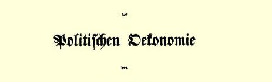
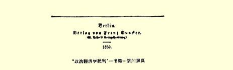

## 卡·马克思

——

# 政治经济学批判

> **１** 卡·马克思写于１８５８年原文是德文 ８月—１８５９年１月 １８５９年在柏林出版署名：卡尔·马克思

“政治经济学批判”一书第一版的扉页

# 序言

# 序言

我考察资产阶级经济制度是按照以下的次序：**资本**、**土地所有制**、**雇佣劳动**：**国家**，**对外贸易**、**世界市场**。在前三项下，我研究现代资产阶级社会分成的三大阶级的经济生活条件；其他三项的相互联系是一目了然的。第一册论述资本，其第一篇由下列各章组成：（１）商品，（２）货币或简单流通，（３）资本一般。前两章构成本分册的内容。我面前的全部材料都是专题论文，它们是在相隔很久的几个时期内写成的，目的不是为了付印，而是为了自己弄清问题，至于能否按照上述计划对它们进行系统整理，就要看环境如何了。

我把已经起草好的一篇总的导言２压下了，因为仔细想来，我觉得预先说出正要证明的结论总是有妨害的，读者如果真想跟着我走，就要下定决心，从个别上升到一般。不过在这里倒不妨谈一下我自己研究政治经济学的经过。

我学的专业本来是法律，但我只是把它排在哲学和历史之次当作辅助学科来研究。１８４２—１８４３年间，我作为“莱茵报”３的主编，第一次遇到要对所谓物质利益发表意见的难事。莱茵省议会关于林木盗窃和地产析分的讨论，当时的莱茵省总督冯·沙培尔先生就摩塞尔农民状况同“莱茵报” 展开的官方论战，最后，关于自由贸易和保护关税的辩论，是促使我去研究经济问题的最初动因

４。另一方面，在善良的“前进”愿望大大超过实际知识的时候，在“莱茵报” 上可以听到法国社会主义和共产主义的带着微弱哲学色彩的回声。我曾表示反对这种肤浅言论，但是同时在和 “奥格斯堡总汇报”５的一次争论中坦率承认，我以往的研究还不容许我对法兰西思潮的内容本身妄加评判。我倒非常乐意利用 “莱茵报”发行人以为把报纸的态度放温和些就可以使那已经落在该报头上的死刑判决撤销的幻想，以便从社会舞台退回书房。

为了解决使我苦恼的疑问，我写的第一部著作是对黑格尔法哲学的批判性的分析，这部著作的导言曾发表在１８４４年巴黎出版的“德法年鉴”６上。我的研究得出这样一个结果：法的关系正像国家的形式一样，既不能从它们本身来理解，也不能从所谓人类精神的一般发展来理解，相反，它们根源于物质的生活关系，这种物质的生活关系的总和，黑格尔按照十八世纪的英国人和法国人的先例，称之为“市民社会”，而对市民社会的解剖应该到政治经济学中去寻求。我在巴黎开始研究政治经济学，后来因基佐先生下令驱逐移居布鲁塞尔，在那里继续进行研究。我所得到的、并且一经得到就用于指导我的研究工作的总的结果，可以简要地表述如下：人们在自己生活的社会生产中发生一定的、必然的、不以他们的意志为转移的关系，即同他们的物质生产力的一定发展阶段相适合的生产关系。这些生产关系的总和构成社会的经济结构，即有法律的和政治的上层建筑坚立其上并有一定的社会意识形式与之相适应的现实基础。物质生活的生产方式制约着整个社会生活、政治生活和精神生活的过程。不是人们的意识决定人们的存在，相反，是人们的社会存在决定人们的意识。社会的物质生产力发展到一定阶段，便同它们一直在其中活动的现存生产关系或财产关系（这只是生产关系的法律用语）发生矛盾。于是这些关系便由生产力的发展形式变成生产力的桎梏。那时社会革命的时代就到来了。随着经济基础的变更，全部庞大的上层建筑也或慢或快地发生变革。在考察这些变革时，必须时刻把下面两者区别开来：一种是生产的经济条件方面所发生的物质的、可以用自然科学的精确性指明的变革，一种是人们借以意识到这个冲突并力求把它克服的那些法律的、政治的、宗教的、艺术的或哲学的，简言之，意识形态的形式。我们判断一个人不能以他对自己的看法为根据，同样，我们判断这样一个变革时代也不能以它的意识为根据，相反，这个意识必须从物质生活的矛盾中，从社会生产力和生产关系之间的现存冲突中去解释。无论哪一个社会形态，在它们所能容纳的全部生产力发挥出来以前，是决不会灭亡的；而新的更高的生产关系，在它存在的物质条件在旧社会的胎胞里成熟以前，是决不会出现的。所以人类始终只提出自己能够解决的任务，因为只要仔细考察就可以发现，任务本身，只有在解决它的物质条件已经存在或者至少是在形成过程中的时候，才会产生。大体说来，亚细亚的、古代的、封建的和现代资产阶级的生产方式可以看作是社会经济形态演进的几个时代。资产阶级的生产关系是社会生产过程的最后一个对抗形式，这里所说的对抗，不是指个人的对抗，而是指从个人的社会生活条件中生长出来的对抗；但是，在资产阶级社会的胎胞里发展的生产力，同时又创造着解决这种对抗的物质条件。因此，人类社会的史前时期就以这种社会形态而告终。

自从弗里德里希·恩格斯批判经济学范畴的天才大纲７（在 “德法年鉴”上）发表以后，我同他不断通讯交换意见，他从另一条道路（请参考他的“英国工人阶级状况”

８）得出同我一样的结果， 当１８４５年春他也住在布鲁塞尔时，我们决定共同钻研我们的见解与德国哲学思想体系的见解之间的对立，实际上是把我们从前的哲学信仰清算一下。这个心愿是以批判黑格尔以后的哲学的形式来实现的。八开本两厚册的原稿９早已送到威斯特伐里亚的出版所，后来我们才接到通知说，由于情况改变，不能付印。既然我们已经达到了我们的主要目的—— 自己弄清问题，我们就情愿让原稿留给老鼠的牙齿去批判了。在我们当时从这方面或那方面向公众表达我们见解的各种著作中，我只提出我与恩格斯合著的 “共产党宣言”和我自己发表的“关于自由贸易的演说”１０。我们见解中有决定意义的论点，在我的１８４７年出版的为反对蒲鲁东而写的著作“哲学的贫困”１１中第一次作了科学的、虽然只是论战性的表述。我用德文写的关于“雇佣劳动”１２一书，汇集了我在布鲁塞尔德意志工人协会１３上对于这个问题的讲演，这本书的印刷由于二月革命和我因此被迫离开比利时而中断。

１８４８年和１８４９年“新莱茵报”１４的出版以及随后发生的一些事变，打断了我的经济研究工作，到１８５０年我在伦敦才能重新进行这一工作。英国博物馆中堆积着政治经济学史的大量资料，伦敦对于考察资产阶级社会是一个方便的地点，最后，随着加利福尼亚和澳大利亚金矿的发现，资产阶级社会似乎踏进了新的发展阶段，这一切决定我再从头开始，用批判的精神来透彻地研究新的材料。这些研究一部分自然要涉及到似乎完全属于本题之外的学科，在这方面不得不多少费些时间。但是使我所能够支配的时间特别受到限制的，是谋生的迫切需要。八年来，我一直为第一流英美报纸“纽约每日论坛报”１５撰稿（写作真正的报纸通讯在我只是例外），这使我的研究工作必然时时间断。然而，由于评论英国和大陆突出经济事件的论文在我的投稿中占着很大部分，我不得不去熟悉政治经济科学本身范围以外的实际的细节。

我以上简短地叙述了自己在研究政治经济学方面的经过，这只是要证明，我的见解，不管人们对它怎样评论，不管它多么不合乎统治阶级的自私的偏见，却是多年诚实探讨的结果。但是在科学的入口处，正像在地狱的入口处一样，必须提出这样的要求：

《Ｑｕｉｓｉｃｏｎｖｉｅｎｌａｓｃｉａｒｅｏｇｎｉｓｏｓｐｅｔｔｏ；

ＯｇｎｉＶｉｌｔàｃｏｎｖｉｅｎｃｈｅｑｕｉｓｉａｍｏｒｔａ》[^1]．

#### 卡尔·马克思

> １８５９年１月于伦敦

# 第一册

## 第一册

# 资本

# 第一篇资本一般

# 第一篇资本一般

## 第一章商品

最初一看，资产阶级的财富表现为一个惊人庞大的商品堆积， 单个的商品则表现为这种财富的原素存在。但是，每个商品表现出**使用价值**和**交换价值**两个方面[^2]。

商品首先是，按英国经济学家的说法，“生活上必需的、有用的或快意的某种东西”，是人类需要的对象，最广义的生活资料。 商品作为使用价值的这种存在，和它的自然的、可以捉摸的存在是一致的。例如小麦是一种不同于棉花、玻璃、纸等使用价值的特殊使用价值。使用价值只对于使用有价值，只在消费的过程中实现。同一种使用价值可以有不同的用途。但是，它可能有多少用途全在于它作为具有一定属性的物的存在。其次，使用价值不仅在质上是一定的，而且在量上也是一定的。不同的使用价值，按照它们的自然特征，具有不同的尺度，例如小麦论舍费耳、纸论刀、麻布论码，等等。

不论财富的社会形式如何，使用价值总是构成财富的内容，而这个内容最初同这种形式无关。我们从小麦的滋味中尝不出种植小麦的人是俄国的农奴，法国的小农，还是英国的资本家。使用价值虽然是社会需要的对象，因而处在社会联系之中，但是并不反映任何社会生产关系。例如，这个商品作为使用价值，是一颗钻石。从钻石本身看不出它是商品。当它作为使用价值时，不论是用在装饰方面还是机械方面，在娼妓胸前还是在玻璃匠手中，它是钻石，不是商品。成为使用价值，对商品来说，看来是必要的前提，而成为商品，对使用价值来说，看来却是无关紧要的规定。 同经济上的形式规定像这样无关的使用价值，就是说，作为使用价值的使用价值，不属于政治经济学的研究范围[^3]。只有当使用价值本身是形式规定的时候，它才属于后者的研究范围。它直接是表现一定的经济关系即**交换价值**的物质基础。

交换价值首先表现为各种使用价值可以相互交换的**量的关系**。在这样的关系中，它们成为同一交换量。因此，１卷“普罗佩尔提乌斯歌集” 和８盎斯鼻烟可以是同一交换价值，虽然烟草和哀歌的使用价值大不相同。作为交换价值，只要比例适当，一个使用价值和另一个使用价值完全同值。一座宫殿的交换价值可以用一定数量的鞋油表示。反过来，伦敦的鞋油厂主们曾用几座宫殿来表示他们的大批鞋油的交换价值。因此，不论商品的自然存在的样式怎样，不管商品作为使用价值所满足的需要的特殊性质怎样，商品总以一定的数量彼此相等，在交换时相互替代，当作等价物，因而尽管它们的样子形形色色，却代表着同一个统一物。

使用价值直接是生活资料。但是，这些生活资料本身却又是社会生活的产物，是人的生命力消耗的结果，是**物化劳动**。 一切商品，作为社会劳动的化身，都是同一个统一物的结晶。这个统一物即表现在交换价值中的劳动的特性，是我们现在所要考察的。

假定１盎斯金、１吨铁、１夸特小麦、２０码绸缎是等量的交换价值。作为这样的等价物，它们的使用价值的质的差别消失了，它们代表同一劳动的相等的分量。等量地物化在它们之中的劳动，本身应该是同样的、无差别的、简单的劳动，对这种劳动来说，不论它出现在金、铁、小麦或绸缎中都是没有差别的，正如对氧气来说，不论它存在于铁锈、大气、葡萄汁或人血中都没有差别一样。但是，挖金、采铁、种麦、织绸，是质上互不相同的劳动种类。事实上，那种在物体上表现为使用价值的差别的东西，在过程中就表现为创造这些使用价值的活动的差别。生产交换价值的劳动，同使用价值的特殊物质无关，因此也同劳动本身的特殊形式无关。其次，不同的使用价值是不同个人的活动的产物，也就是个性不同的劳动的结果。但是，作为交换价值，它们代表相同的、无差别的劳动，也就是没有劳动者个性的劳动。因此，生产交换价值的劳动是**抽象一般**的劳动。

如果１盎斯金、１吨铁、１夸特小麦、２０码绸缎是等量的交换价值或等价物，那末１盎斯金、

１２吨铁、３蒲式耳小麦和５码绸缎就是根本不等量的交换价值，这种量的差别是这些物品作为交换价值所能具有的唯一差别。作为不等量的交换价值，它们代表较多或较少的、大量或小量的简单的、同样的、抽象一般的劳动，即构成交换价值实体的劳动。试问，怎样衡量这些量呢？或者，不如说，既然作为交换价值的商品的量的差别只是物化在商品中的劳动的量的差别，那末这种劳动本身的量的存在究竟是什么呢？正如运动的量的存在是时间一样，劳动的量的存在是**劳动时间**。假定劳动的质已定，劳动本身的持续时间的长短就是劳动所能具有的唯一差别。作为劳动时间，劳动用时、日、周等自然计时尺度作自己的尺度。劳动时间是劳动的活的存在，与劳动的形式、内容和个性无关；它是作为量的存在的劳动的活的存在，同时带有这种存在的内在尺度。物化在各种商品使用价值中的劳动时间，是使使用价值成为交换价值因而成为商品的实体，同时又衡量商品的一定价值量。包含同一劳动时间的不同使用价值的相当量是等价物，换句话说，一切使用价值，在它们包含的已支出的物化劳动时间相等的比例上，都是等价物。作为交换价值，一切商品都只是一定量的**凝固的劳动时间**。

要理解交换价值由劳动时间决定，必须把握住下列几个主要观点：劳动化为简单的、可以说是无质的劳动；生产交换价值因而生产商品的劳动借以成为**社会劳动**的特殊方式；最后，以使用价值为结果的劳动和以交换价值为结果的劳动之间的区别。

要按商品所包含的劳动时间来衡量商品的交换价值，就必须把不同的劳动化为无差别的、同样的、简单的劳动，简言之，即化为质上相同因而只有量的差别的劳动。

这种简化看来是一个抽象，然而这是社会生产过程中每天都在进行的抽象。把一切商品化为劳动时间同把一切有机体化为气体相比，并不是更大的抽象，同时也不是更不现实的抽象。这样用时间来衡量的劳动实际上并不表现为不同主体的劳动，相反地， 不同的劳动者个人倒表现为**这种**劳动的简单器官。换句话说，表现在交换价值中的劳动可以叫作**一般人类**劳动。一般人类劳动这个抽象**存在**于平均劳动中，这是一定社会中每个平常人所能完成的劳动，是人的筋肉、神经、脑等的一定的生产消耗。这是每个平常人都能学会的而且是他必须以某种形式完成的**简单**劳动[^4]。 这种平均劳动的性质本身在不同的国家和不同的文化时代是各不相同的，但在一定的社会中却是一定的。任何统计都能证明，简单劳动构成资产阶级社会劳动总量的绝大部分。甲用６小时生产铁用６小时生产麻布，乙也用６小时生产铁用６小时生产麻布，或者，甲用１２小时生产铁，乙用１２小时生产麻布，这显然只是**同一**劳动时间的不同用法。可是，那种紧张程度较高、比重较大而超过平均水平的复杂劳动又怎样呢？这种劳动可以化为复合的简单劳动，高次方的简单劳动，例如１个复杂劳动日等于３个简单劳动日。这里还不是研究那些支配这种简化的规律的地方。但是这种简化在进行是很清楚的，因为作为交换价值，复杂劳动的产品在一定比例上是简单平均劳动的产品的等价物，因而等于一定量的这种简单劳动。

其次，交换价值由劳动时间决定，还包含一个前提：物化在一定商品如１吨铁中的劳动，不问是甲还是乙的劳动，总是**同样** 多，或者说，不同的个人在生产同一个具有一定的质和一定的量的使用价值时耗费等量的劳动时间。换句话说，它包含着这样一个前提：一个商品所包含的劳动时间是生产该商品的**必要**劳动时间，即在当时一般生产条件下生产另一个同样的商品所需要的劳动时间。

从交换价值的分析中可以看出，生产交换价值的劳动的条件是劳动的**社会规定**，或者说，是**社会劳动**的规定，不过这里所说的社会，不是通常的意义，而是特殊的意义。这是一种特殊的社会性。首先，劳动的无差别的简单性是不同个人的劳动的**相同性**， 是他们的劳动彼此作为相同的劳动的相互关系，当然，这是通过事实上把一切劳动化为同种劳动。每一个个人的劳动，只要表现为交换价值，就有相同性这种社会性，而且也只有作为相同的劳动同所有其他个人的劳动发生关系，才表现为交换价值。

其次，在交换价值中，个人的劳动时间直接表现为**一般劳动时间**，而个别劳动的这种**一般性**直接表现为个别劳动的**社会性**。表现在交换价值中的劳动时间，是个人的劳动时间，但是，这个个人与其他个人没有差别，既然大家完成的是相同的劳动，所以这样的劳动时间也就是所有一切个人的劳动时间；因此，任何个人为生产一定商品所需要的劳动时间，也就是其他每一个人为生产同一商品也会耗费的**必要**劳动时间。它是个人的劳动时间，是**他的**劳动时间，但只是作为大家共同的劳动时间，因此，这样的劳动时间究竟是**哪一个**个人的劳动时间是没有关系的。作为一般劳动时间，它在一个一般产品、**一般等价物**、一定量的物化劳动时间中**表现出来**；这个一定量的物化劳动时间同它直接表现为某一个人的产品时所具有的一定的使用价值形式无关，可以任意换成它作为任何别人的产品时所具有的任何别的使用价值形式。它只有作为这样的**一般的**量，才是**社会的**量。个人的劳动，要成为交换价值，就必须成为一个**一般等价物**，也就是说，必须使个人的劳动时间表现为一般劳动时间，或者说，使一般劳动时间表现为个人的劳动时间。仿佛是不同的个人把他们的劳动时间结合在一起，并把他们共同支配的劳动时间的不同量表现在不同的使用价值上。这样，个人的劳动时间实际上就是社会为生产一定使用价值、满足一定需要所必需的劳动时间。但是，这里成为问题的仅仅是劳动借以获得社会性的那种特殊形式。例如，纺工的一定量的劳动时间物化在１００磅麻纱中。假定织工的产品１００码麻布也代表同量的劳动时间。既然这两种产品代表同量的一般劳动时间，因而是**每种**包含同量劳动时间的使用价值的等价物，它们也就互为等价物。在这里，只是由于纺工的劳动时间和织工的劳动时间表现为一般劳动时间，从而他们的产品表现为一般等价物，织工的劳动才成为纺工的劳动和纺工的劳动才成为织工的劳动，一个人的劳动才成为别一个人的劳动，也就是对他们两者来说，他们的劳动才成为社会存在。相反，在农村宗法式生产下，纺工和织工住在同一个屋顶之下，家庭中女纺男织，供本家庭的需要，在家庭的范围内， 纱和布是**社会**产品，纺和织是**社会**劳动。但是，它们的社会性不在于纱作为一般等价物去交换作为一般等价物的布，不在于两者作为同一个一般劳动时间的并无差别而同样有效的表现而相互交换。倒是家庭联系同它的自然发生的分工在劳动产品上打上了自己特有的社会烙印。或者，我们就中世纪的徭役和实物租来看。在这里，成为社会纽带的，是个人一定的、自然形式的劳动，是劳动的特殊性，而不是劳动的一般性。最后，我们看一下一切文明民族的历史初期自然发生的共同劳动[^5]。这里，劳动的社会性显然不是通过个人劳动采取一般性这种抽象形式，或者个人产品采取一个一般等价物的形式。成为生产前提的公社，使个人劳动不能成为私人劳动，使个人产品不能成为私人产品，相反，它使个人劳动直接表现为社会机体的一个肢体的机能。表现在交换价值中的劳动是以分散的个人劳动为前提的。这种劳动要通过它采取与自身直接对立的形式，即抽象一般性的形式，才变成社会劳动。

最后，生产交换价值的劳动还有一个特征：人和人之间的社会关系可以说是颠倒地表现出来的，就是说，表现为物和物之间的社会关系。只有在一个使用价值作为交换价值同别的使用价值发生关系时，不同个人的劳动才作为相同的一般的劳动相互发生关系。 因此，如果交换价值是人和人之间的关系[^6]这种说法正确的话，那末必须补充说：它是隐蔽在物的外壳之下的关系。１磅铁和１磅金，虽然具有不同的物理和化学属性，却代表同一重量，同样，两个包含**同一**劳动时间的商品的使用价值，也代表**同一交换价值**。因此，交换价值表现为使用价值的社会的自然规定性，表现为作为物的使用价值所固有的规定性，由于这种规定性，使用价值在交换过程中按一定比例相互替换，成为等价物，正如简单的化学物质按一定比例化合而形成化学当量一样。一种社会生产关系采取了一种物的形式，以致人和人在他们的劳动中的关系倒表现为物与物彼此之间的和物与人的关系，这种现象只是由于在日常生活中看惯了，才认为是平凡的、不言自明的事情。在商品上这种神秘化还是很简单的。大家多少总感觉到，作为交换价值的商品之间的关系， 不过是人们与他们相互进行的生产活动的关系。在比较高级的生产关系中，这种简单的外貌就消失了。货币主义的一切错觉的根源，就在于看不出货币代表着一种社会生产关系，却又采取了具有一定属性的自然物的形式。嘲笑货币主义错觉的现代经济学家，一到处理比较高级的经济范畴如资本的时候，就陷入同样的错觉。他们刚想拙劣地断定是物的东西，突然表现为社会关系，他们刚刚确定为社会关系的东西，却又表现为物来嘲弄他们，这时候，同样的错觉就在他们的天真的惊异中暴露出来了。

既然商品的交换价值实际上不过是个人劳动作为相同的一般劳动相互发生的关系，不过是劳动的一种特殊社会形式的物化表现，那末，说劳动是交换价值的因而也是财富（就它由交换价值构成来说）的**唯一**泉源，就是同义反复。说自然物质本身由于不包含劳动也就不包含交换价值[^7]，说交换价值本身不包含自然物质，也是这种同义反复。但是，威廉·配第说：“劳动是财富之父，土地是财富之母。”１６贝克莱主教问：

> “四大原素和包括在其中的人类劳动难道不是财富的真正泉源吗？”[^8]

美国人托马斯·库伯通俗地解释说：

> “从一块面包中抽掉耗费在它上面的劳动，抽掉面包师、磨坊工、农夫等等的劳动，还剩下什么呢？不过是一把对人没有任何用处的野草籽而已。”[^9]

所有这些见解所说的，都不是作为交换价值源泉的抽象劳动，而是作为物质财富源泉之一的具体劳动，总之，是创造使用价值的劳动。既然这里的前提是商品的使用价值，那末，这里的前提也就是耗费在商品上的劳动具有特殊的效用并合乎一定的目的，而从商品的观点出发，这也就充分无遗地包含了对于当作有用劳动的劳动的一切考虑。面包作为使用价值，使我们关心的是它作为食品的属性，而决不是农夫、磨坊工、面包师等人的劳动。即使这种劳动由于某种发明减少了１９

２０，这个面包的用处仍然和从前一样。即使它现成地从天上掉下来，也不会丧失它的使用价值的一个原子。生产交换价值的劳动实现在作为一般等价物的商品的相同性上，而作为有目的的生产活动的劳动实现在商品的使用价值的无限多样性上。生产交换价值的劳动是**抽象一般的**和**相同的**劳动，而生产使用价值的劳动是具体的和特殊的劳动，它按照形式和材料分为无限多的不同的劳动方式。

如果认为，劳动就它创造使用价值来说，是它所创造的东西即物质财富的**唯一**源泉，那就错了。既然它是使物质适应于某种目的的活动，它就要有物质作为前提。在不同的使用价值中，劳动和自然物质之间的比例是大不相同的，但是使用价值总得有一个自然的基础。劳动作为以某种形式占有自然物的有目的的活动， 是人类生存的自然条件，是同一切社会形式无关的、人和自然之间的物质变换的条件。生产交换价值的劳动则相反，它是劳动的一种特殊的社会形式。以裁缝的劳动为例，就它作为一种特殊的生产活动的物质规定性来说，它生产衣服，但不生产衣服的交换价值。它生产后者时不是作为裁缝劳动，而是作为抽象一般劳动， 而抽象一般劳动属于一种社会关系，这种关系不是由裁缝缝出来的。在古代家庭工业中，妇女生产衣服，但不生产衣服的交换价值。作为物质财富的源泉之一的劳动，立法者摩西同税吏亚当· 斯密同样熟悉。[^10]

现在我们考察一下把交换价值化为劳动时间所产生的几个更切近的规定。

作为使用价值，商品是当作原因发生作用的。例如，小麦是作为食品发生作用的。一部机器在一定比例上代替劳动。商品借以成为使用价值、成为消费对象的这种作用，可以称作商品的服务， 即商品作为使用价值提供的服务。但是，作为交换价值，商品总是仅仅从结果的观点上被考察。这里的问题不是它提供的服务，而是在生产它的过程中给它本身提供了的服务[^11]。举例来说，一部机器的交换价值不是决定于它所代替的劳动时间量，而是决定于为它本身已经支出的、因而也是生产同样一部新机器所需要的劳动时间量。

因此，如果生产商品所需要的劳动量不变，那末商品的交换价值也就不变。但是，生产的难易是不断变动的。如果劳动生产力提高了，那末，用较短的时间就可以生产出同样多的使用价值。如果劳动生产力降低了，那末，要生产同样多的使用价值就需要较多的时间。因此，一个商品包含的劳动时间的量，因而它的交换价值，是一个变动的量，它随着劳动生产力的提高或降低成反比地增加或减少。劳动生产力在加工工业中是按照预定的程度被应用的，而在农业和采掘工业中受无法控制的自然条件的制约。**同一**劳动在开采不同金属时提供的采掘量有大有小，这要看这些金属在地壳中蕴藏多少而定。**同一**劳动在丰收年可以物化为两蒲式耳小麦，在歉收年或许只物化为一蒲式耳小麦。在这里，因为自然条件的贫瘠还是富饶决定着受自然条件限制的特殊实在劳动的生产力，于是似乎是自然条件决定着商品的交换价值。

不同的使用价值以不等的体积包含同一劳动时间或同一交换价值。一个商品如能以比其他使用价值更小的使用价值体积包含一定量的劳动时间，它的**特殊交换价值**就越大。我们看到，某些使用价值在前后悬隔的不同文化时代里彼此间总是构成一个特殊变换价值的系列，这些特殊交换价值彼此间虽然不是保持着丝毫不变的数字比例，但是保持着高低级次的一般关系，如金、银、铜、铁或小麦、黑麦、大麦、燕麦，由此只能得出这样的结论：社会生产力的向前发展，以均等的或大体均等的程度影响着生产这种种商品所需要的劳动时间。

一种商品的交换价值在它自己的使用价值上是表现不出来的。但是，作为一般社会劳动时间的化身，一种商品的使用价值就同别的种种商品的使用价值形成各种比例。这样，一种商品的交换价值就在别种商品的使用价值上表现出来。等价物实际上就是在别种商品的使用价值上表现出来的某种商品的交换价值。譬如我说１码麻布值２磅咖啡，麻布的交换价值就在咖啡的使用价值上表现出来，而且是在这种使用价值的一定量上表现出来。有了这个比例，我就能够把任何数量麻布的价值用咖啡表现出来。显然，一种商品例如麻布的交换价值，在只有一种别的特殊商品如咖啡成为它的等价物的这样一个比例中，还不能充分表现出来。这 １码麻布所代表的一般劳动时间的量，同时实现在一切其他商品的使用价值的无限多种不同的量上。每一种别的商品的使用价值， 在包含等量劳动时间的比例上，都是这１码麻布的等价物。因此， **这一个别商品**的交换价值，只有在一切其他商品的使用价值成为它的等价物的无限多个等式中，才充分表现出来。它只有在这些等式的总和中，或者说，只有在一种商品同每种别的商品交换的各种不同比例的总体中，才充分表现为**一般等价物**。例如，下面的等式系列：

１码麻布＝１

２磅茶叶

１码麻布＝２磅咖啡

１码麻布＝８磅面包

１码麻布＝６码棉布可以表现为： １码麻布＝１１１

８磅茶叶＋２磅咖啡＋２磅面包＋１２码棉布。

因此，如果我们有了足以把１码麻布的价值充分表现出来的全部等式的总和，我们就能够用一个系列的形式把它的交换价值表现出来了。实际上，这个系列是无限的，因为商品的范围从来没有确定的界限，它是不断地扩展的。但是，既然某一种商品用一切其他商品的使用价值衡量自己的交换价值，一切其他商品的交换价值就反过来用这种被它们衡量的商品的使用价值来衡量自己[^12]。如果１码麻布的交换价值在１

２磅茶叶、或２磅咖啡、或６码棉布、或８磅面包等等上表现出来，那末咖啡、茶叶、棉布、面包等等在它们分别等于第三者麻布的比例上是彼此相等的，这样，麻布就成为它们的交换价值的共同尺度。每一种商品，作为物化的一般劳动时间即作为一定量的一般劳动时间，依次用一切其他商品的使用价值的一定量来表现自己的交换价值，而一切其他商品的交换价值就反过来用这一种分离出来的商品的使用价值来衡量自己。但是，每一种商品作为交换价值，既是这一种分离出来的商品， 起着一切其他商品的交换价值的共同尺度的作用，另一方面，它在每一种其他商品用来直接表现自己交换价值的许多种商品的总体中，又只是这许多种商品中的一种。

一种商品的**价值量**同在它以外的其他商品种类的多少无关。 但是这种商品的交换价值借以实现的等式系列的长短，取决于其他商品种类的多少。例如，表现咖啡价值的等式系列，表明咖啡的交换能力的范围，表明它起交换价值作用的界限。一个商品把无限多种的使用价值当作自己的等价这种表现，是同它的交换价值是一般社会劳动时间的化身相符合的。

我们看到，一个商品的交换价值是随着直接包含在这个商品本身中的劳动时间的量变动的。一个商品的实现了的、即表现在其他商品使用价值上的交换价值，必然也取决于生产一切其他商品所耗费的劳动时间以什么比例变动。举例来说，如果生产一舍费耳小麦所需要的劳动时间不变，而生产一切其他商品所需要的劳动时间增加一倍，那末，一舍费耳小麦的交换价值表现在它的等价物上就减少一半。结果，实际上好像生产一舍费耳小麦所需要的劳动时间减少一半，而生产一切其他商品所需要的劳动时间没有变动一样。各种商品的价值决定于它们按什么比例能在同量劳动时间中生产出来。为了说明这种比例可能有什么样的变动，我们假定有甲和乙两种商品。**第一**，假定生产乙所需要的劳动时间不变。这时， 用乙来表现的甲的交换价值，随着生产甲所需要的劳动时间的增减成正比地增减。**第二**，假定生产甲所需要的劳动时间不变。用乙来表现的甲的交换价值，随着生产乙所需要的劳动时间的增减成反比地增减**。第三**，假定生产甲和乙所需要的劳动时间按同一比例增减。这时，用乙表现的甲的等价表现保持不变。假定由于某种情况，一切劳动的生产力都按同一程度降低，以致生产一切商品所需要的劳动时间都按同一比例增加，那末，**一切**商品的价值都会增加，而它们的交换价值的实际表现却仍然不变；但是，社会的实际财富减少了，因为社会要用更多的劳动时间才能生产出同样多的使用价值。**第四**，假定生产甲和乙所需要的劳动时间以不同的程度增加或减少，或者生产甲所需要的劳动时间增加，生产乙所需要的劳动时间减少，或者相反。所有这些情形，都可以简化为：生产一种商品所需要的劳动时间不变，而生产另一种商品所需要的劳动时间有所增减。

每种商品的交换价值用每种别的商品的使用价值来表现，可以用这个使用价值的整数，也可以用它的分数。作为交换价值，每种商品同物化在它本身中的劳动时间一样，都是可以分割的。商品与商品的等价关系同它们作为使用价值时在物理上有无可分割性无关，正如各种商品的交换价值的相加，同它们的使用价值合成**一件**新商品时发生的实际的形式变换无关一样。

到此为止，商品是从使用价值和交换价值这两方面来考察的， 每次考察一面。可是，作为商品，它直接是使用价值和交换价值的 **统一**；同时，它只有在同其他商品的关系中才是商品。商品相互间的**实际**关系是它们的**交换过程**。这是彼此独立的个人所参加的社会过程，但是他们只是以商品所有者的资格参加这个过程；他们互为对方的存在，是他们的商品的存在，因此，他们实际上只是作为交换过程的有意识的承担者出现。

商品是使用价值，如小麦、麻布、钻石、机器等等，但是，作为商品，它同时又**不**是使用价值。如果商品对于它的所有者是使用价值，就是说直接是满足他自己需要的手段，那它就不是商品。商品对于它的所有者倒是**非使用价值**，就是说只是交换价值的物质承担者，或者说只是**交换手段**；作为交换价值的积极承担者，使用价值变成交换手段。商品对于它的所有者只有作为交换价值才是使用价值[^13]。因此，它还得**变成**使用价值，首先变成别人的使用价值。 由于商品对它自己的所有者不是使用价值，所以它对别种商品的所有者是使用价值。不然，他的劳动就是无用的劳动，从而劳动的结果就不是商品。另一方面，商品必须变成**它的所有者本人**的使用价值，因为他的生活资料是在它之外，在别人的商品的使用价值中。为了**变成**使用价值，商品就得面对一种特殊的需要，成为满足这种需要的对象。因此，商品的使用价值之**变成**使用价值，是在它们全面地变换位置、从把它们当作交换手段的人的手中转到把它们当作使用对象的人的手中的时候。只有通过商品的这种全面的转移，包含在商品中的劳动才变成有用劳动。商品在它们彼此作为使用价值而发生的这个**过程中的**关系中并没有取得任何新的经济上的形式规定性。相反，那种使它们具有商品特征的形式规定性却消失了。例如，面包从面包师手中转到消费者手中，并不改变它作为面包的存在。相反，只有消费者才把它当作使用价值、当作这种一定的食品，而在面包师手中，它本来是一种经济关系的承担者， 一个既可感觉又超感觉的物。因此，商品在它变成使用价值的过程中所经历的唯一的形式变换，就是抛弃了它的形式存在—— 对它自己的所有者是非使用价值，而对它的非所有者是使用价值。商品要变成使用价值，就要全面转移，进入交换过程，但是它为交换的存在就是它作为交换价值的存在。因此，它要实现为使用价值，就必须实现为交换价值。

个别商品从使用价值的观点看来原来表现为独立的物，作为交换价值却一开始就是在它同一切其他商品的关系中被考察的。 但是，这种关系只是一种理论上的、想像的关系。它只是在交换过程中才成为现实。另一方面，商品固然**是**交换价值，因为在商品上面支出过一定量的劳动时间，因而它是**物化劳动时间**。但是就它的直接形式来说，它只是具有特殊内容的物化的个人的劳动时间，而不是**一般**劳动时间。因此，它**不**直接就是交换价值，而是先要**变成**交换价值。首先，只有当它代表着具有一定用途的、一个使用价值的劳动时间的时候，它才能是一般劳动时间的化身。这是一个物质条件，只有在这个条件下，包含在商品中的劳动时间才被认为是一般社会劳动时间。因此，如果说商品只有在实现为交换价值时才能变成使用价值，那末另一方面，商品只有在它的转移中证实为使用价值时才能实现为交换价值。一种商品作为使用价值只能转移给把它看作使用价值即特殊需要的对象的人。另一方面，它只有同另一种商品对换才被转移，换句话说，如果我们站在这另一种商品的所有者的一方，那末同样，这个所有者也只有当他把自己的商品同那种以这一商品为对象的特殊需要接触时才能把它转移，即把它实现。因此，当商品作为**使用价值**而全面转移时，它们按照它们的物质差别，作为以自己的特殊属性来满足特殊需要的特殊物而相互发生关系。但是，作为这种单纯的使用价值，它们彼此是漠不相干的存在，更恰当些说，是没有任何关系的。作为使用价值，它们只有同特殊需要发生关系才能被交换。但是，它们所以可以交换，只因为它们是等价物，而它们所以是等价物，只因为它们是等量的物化劳动时间，于是它们作为使用价值的自然属性、从而它们同特殊需要的关系，都无需考虑了。一个商品作为交换价值发生作用，倒是在于它作为等价物去任意替换一定量的任何别的商品，而不问自己对别的商品所有者是不是使用价值。但是，对于别的商品所有者来说，它只有对他是使用价值的时候才成为商品，而对它自己的所有者来说，它只有对别的商品所有者是商品的时候才成为交换价值。因此，同一关系既应该是商品和商品作为质上相同而只在量上不同的量和量之间的关系，是它们作为一般劳动时间的化身而相等的关系，同时又应该是商品和商品作为质上不同的物、作为满足特殊需要的各种特殊使用价值之间的关系，简言之，作为各种实际使用价值而相异的关系。但是这种相等和相异是相互排斥的。所以，这里不仅因为一个问题的解决以另一个问题的解决为前提而出现一个恶性循环，而且因为一个条件的实现同另一个与它对立的条件的实现直接结合而出现一个相互矛盾的要求的总体。

商品的交换过程，应该既是这些矛盾的展开，又是这些矛盾的解决，可是这些矛盾在交换过程中不能通过这种简单的方式表现出来。上面我们只看到，商品本身怎样彼此作为使用价值发生关系，就是说，商品怎样作为使用价值在交换过程**内部**出现。交换价值则相反，正像我们以上所考察的那样，它只存在于我们的抽象中，或者不妨说只存在于个别商品所有者的抽象中，对于个别商品所有者来说，商品作为使用价值放在仓库里，作为交换价值放在心上。但是在交换过程内部，商品本身不仅要彼此作为使用价值存在，而且要彼此作为交换价值存在，并且它们的这种存在应该表现为它们自己的相互关系。我们首先遇到的困难是：商品要表现为交换价值，表现为物化劳动，就要先作为使用价值来转移，交给别人， 而它们要作为使用价值来转移，反过来又以它们作为交换价值的存在为前提。但是假定这个困难已经解决了。假定商品已经摆脱了它的特殊使用价值，通过使用价值的转移已经实现了那个物质条件，即成为社会有用劳动而不是个人为自己进行的特殊劳动。这样，它在交换过程中对其他商品就应该变成交换价值，一般等价物、物化一般劳动时间，因而不再是具有一种特殊使用价值的有限作用，而是取得一种直接用一切使用价值作自己的等价物来表现自己的能力。但是，每一个商品都是**这样一个**商品：它应当像这样通过自己特殊使用价值的转移而表现为一般劳动时间的直接化身。但是另一方面，在交换过程中彼此对立着的只是特殊商品，只是体现在特殊使用价值中的私人劳动。一般劳动时间本身是一个抽象，这个抽象本身对于商品来说是不存在的。

我们研究一下一个商品的交换价值借以得到实际表现的等式的总和，例如：

１码麻布＝２磅咖啡

１码麻布＝１

２磅茶叶

１码麻布＝８磅面包或其他等等

这些等式只表示在１码麻布、２磅咖啡、１

２磅茶叶等等中物化着等量的一般社会劳动时间。但是，事实上，只有当这些特殊使用价值按照它们包含的劳动时间的长短的比例实际上彼此交换的时候，表现在这些使用价值上的个人劳动，才变成一般劳动，并且以这个一般劳动的形式变成社会劳动。社会劳动时间可以说只是潜伏在这些商品中，只是在它们的交换过程中才显露出来。在这里，出发点不是作为共同劳动的个人劳动，相反地是私人的特殊劳动，这种劳动只有在交换过程中扬弃了自己原有性质后才证明为一般社会劳动。因此，一般社会劳动不是现成的前提，而是变成的结果。这样就产生了新的困难，一方面，商品必须作为物化一般劳动时间进入交换过程，另一方面，个人劳动时间作为一般劳动时间的物化，本身又只是交换过程的产物。

每个商品要通过它的使用价值的转移，即它的原来存在的转移，取得它作为交换价值的相应的存在。因此，商品在交换过程中必须使它的存在两重化。另一方面，它的作为交换价值的第二存在本身也只能是另一种商品，因为在交换过程中对立着的只是商品。 怎样把一种特殊商品直接表现为**物化一般**劳动时间呢？换句话说， 也就是怎样使物化在一种特殊商品中的个人劳动时间直接具有一般性这种性质呢？一个商品的交换价值的实际表现，即每个作为一般等价物的商品的实际表现，是一个无限多的等式的总和，如：

１码麻布＝２磅咖啡

１码麻布＝１

２磅茶叶

１码麻布＝８磅面包

１码麻布＝６码棉布

１码麻布＝其他等等

当商品只是被**想像**为一定量物化一般劳动时间的时候，上述表现是理论上的东西。只要把上面的等式系列倒置过来，一个特殊商品作为一般等价物的存在就从单纯的抽象变为交换过程本身的 **社会**结果。例如：

２磅咖啡＝１码麻布

１

２磅茶叶＝１码麻布

８磅面包＝１码麻布

６码棉布＝１码麻布

既然咖啡、茶叶、面包、棉布，总之一切商品都把它们本身包含的劳动时间在麻布上表示出来，麻布的交换价值就反过来在作为它自己的等价物的一切其他商品上展示出来，物化在麻布本身中的劳动时间就直接变成在一切其他商品的不同量上均等地表现出来的一般劳动时间。这里，麻布由于一切其他商品对它的**全面行动**，变成了**一般等价物**。作为交换价值，每种商品都曾成为一切其他商品的价值尺度。这里则相反，由于一切商品都用一种特殊商品来衡量它们的交换价值，这种分离出来的商品就变成交换价值的最适当的存在，交换价值的作为一般等价物的存在。另一方面，每种商品的交换价值借以表现的无限系列或无限多的等式，紧缩成单独一个只有两个项的等式。２磅咖啡＝１码麻布现在是咖啡的交换价值的充分的表现，因为１码麻布在这种表现中直接表现为一定量的其他任何一种商品的等价物。因而，现在在交换过程内部， 各种商品以麻布的形式彼此作为交换价值存在或出现。原先，一切商品作为交换价值，只当作不同量的物化一般劳动时间彼此发生关系，现在，这一点表现为：它们作为交换价值只代表不同量的**同种**物品即麻布。因而，一般劳动时间又表现为一种特殊的物，一种站在一切其他商品之旁和之外的商品。但同时，一个商品对另一个商品表现为交换价值的那个等式，如２磅咖啡＝１码麻布，是一个尚待实现的等式。商品只有通过它作为使用价值的转移（这要看它能否在交换过程中证明自己是满足某种需要的对象），才真正从它作为咖啡的存在转化为它作为麻布的存在，从而取得一般等价物的形式，对一切其他商品真正变成交换价值。反之，由于一切商品通过它们作为使用价值的转移而转化为麻布，麻布就变成一切其他商品的转化存在，并且麻布只有作为一切其他商品向它转化的结果，才直接变成**一般劳动时间的化身**，也就是个人劳动全面转移、扬弃的产物。如果说，商品为了彼此表现为交换价值而把它们的存在这样地二重化了，那末，作为一般等价物分离出来的商品也把它的使用价值二重化了。这个分离出来的商品除了它作为特殊商品所具有的特殊使用价值以外，还获得了一种一般使用价值。它的这种使用价值本身是形式规定性，就是说，是从它在交换过程中由于其他商品对它的全面行动所起的特殊作用产生的。作为一种满足特殊需要的对象，每种商品的使用价值在不同人的手中有不同的价值，例如，在转让者的手中是一种价值，而在获得者手中是另一种价值。作为一般等价物分离出来的商品，现在是满足从交换过程本身产生出来的一般需要的对象，它对每个人都有同样的使用价值，即成为交换价值的承担者，成为一般交换手段。于是，在这个商品上解决了商品本身所包含的矛盾：它既要作特殊使用价值， 同时又要作一般等价物，因而作每个人的使用价值、一般使用价值。所以，如果一切其他商品现在首先把自己的交换价值表现为同这个分离出来的商品的观念上的、尚待实现的等式，那末，就这种分离出来的商品来说，虽然它的使用价值是实际存在的，但在过程本身中却表现为单纯的形式存在，它还需要通过转化为真正的使用价值才得到实现。原先，商品表现为商品一般，表现为物化在一种特殊使用价值中的一般劳动时间。在交换过程中，一切商品都同作为商品一般的那个分离出来的商品发生关系，都同作为一般劳动时间在一种特殊使用价值中的存在的**那种**商品发生关系。因此， 它们作为**特殊**商品同一个作为**一般**商品的特殊商品对立起来[^14]。 这样一来，商品所有者相互把他们的劳动作为一般社会劳动来对待的关系，就表现为他们把他们的商品作为交换价值来对待的关系，而商品在交换过程中彼此作为交换价值相互对待的关系，就表现为它们把一种特殊商品作为它们交换价值的最适当的表现的全面关系，这反过来又表现为这种特殊商品同其他一切商品的特殊关系，因而表现为一个物品的一定的仿佛是天生的社会性质。这样地代表一切商品的交换价值的最适当的存在的特殊商品，或者说， 作为一种分离出来的特殊商品的商品交换价值，就是**货币**。它是商品在交换过程本身中形成的商品交换价值的结晶。因此，如果说商品在交换过程内部只有解脱了一切形式规定性，以直接的物质形态彼此发生关系，才变成互为**使用价值**，那末，它们为了彼此表现为**交换价值**就必须采取新的形式规定性，必须发展成货币。货币不是符号，正如一个使用价值作为商品的存在不是符号一样。一种社会生产关系表现为一个存在于个人之外的物，这些个人在社会生活的生产过程中所发生的一定关系表现为一个物品的特殊属性， 这种颠倒，这种不是想像的而是平凡实在的神秘化，是生产交换价值的劳动的一切社会形式的特点。在货币上，它不过比在商品上表现得更加夺目而已。

一切商品的货币存在应该结晶在其中的那种特殊商品所必需具备的物理属性（就其直接由交换价值的本质产生来说）是：可以任意分割，各部分是同质的，这种商品件件全无差别。作为一般劳动时间的化身，这种商品必须是同质的东西，只能表现量的差别。 另一个必需具备的属性是它的使用价值的耐久性，因为它要经常处在交换过程中。贵金属最富于这些属性。货币既然不是思考或协商的产物，而是在交换过程中本能地形成的，所以曾经有过各种极不相同的、不大适合的商品交替地执行过货币的职能。在交换过程的一定发展阶段上，必然把交换价值的规定和使用价值的规定两极式地分配在商品中间，于是一种商品比如说充当交换手段，而另一种商品则作为使用价值被转移；由于这种必然性，到处都有一种甚至几种具有最普遍的使用价值的商品最初偶然地起着货币的作用。它们即使不是满足当前需要的物品，但是它们是财富的最重要的物质组成部分，这就使它们比其余的使用价值具有更大的一般性。

直接的物物交换这个交换过程的原始形式，与其说表示商品开始转化为货币，不如说表示使用价值开始转化为商品。交换价值还没有取得独立的形式，它还直接和使用价值结合在一起。这表现在两方面。生产本身，就它的整个结构来说，是为了使用价值，而不是为了交换价值，因此，在这里，只有当使用价值超过消费需要量时，它才不再是使用价值而变成交换手段，变成商品。另一方面，使用价值尽管两极分化了，但只是在直接使用价值的界限之内变成商品，因此，商品所有者交换的商品必须对双方是使用价值，而每一商品必须对它的非所有者是使用价值。实际上，商品交换过程最初不是在原始公社内部出现的[^15]，而是在它的尽头，在它的边界上，在它和其他公社接触的少数地点出现的。这里开始了物物交换，由此浸入公社内部，对它起着瓦解作用。因而，在不同公社间的物物交换中变成商品的那些特殊使用价值，如奴隶、牲畜、金属，通常成为公社本身内部的最早的货币。我们说过，一种商品的等价物的系列愈长，或者它的交换范围愈**大**，这种商品的交换价值就愈在较高的程度上作为交换价值表现出来。因此，物物交换的逐步扩大，交换次数的增加，进入物物交换的商品种类的增多，发展了作为交换价值的商品，促进了货币的形成，从而对物物交换起着瓦解的作用。经济学家惯于从扩展了的物物交换所遇到的外部困难中去寻求货币的起源，却忘记了这些困难是从交换价值的发展、因而是从作为一般劳动的社会劳动的发展产生出来的。举例来说：商品作为交换价值应当可以任意分割，作为使用价值却不能任意分割。 或者，甲的商品对于乙是使用价值，而乙的商品对于甲却不是使用价值。或者，商品所有者对于他们拿来互相交换的商品有需要，但这些商品是不能分割的商品，在价值比例上也不相等。换句话说， 经济学家在借口考察简单的物物交换时，看到了作为使用价值和交换价值的直接统一体的商品存在所包含的矛盾的某些方面。另一方面，他们始终坚持物物交换是商品交换过程的最适当形式，只是在技术上有某些不方便，而货币是为了消除这些不方便被巧妙地设计出来的手段。从这个非常肤浅的观点出发，有位机智的英国经济学家说得对：货币只是一种物质工具，如同船舶或者蒸汽机一样，它不是一种社会生产关系的表现，因而不是经济范畴。因此，把货币放在政治经济学中来研究是弄错了，政治经济学同工艺学事实上是毫无共同之处的。[^16]

在商品世界中，发达的分工是作为前提存在的，或者更正确地说，这种分工直接表现在使用价值的多种多样上，这些使用价值作为特殊商品彼此对立并包含着同样多种多样的劳动方式。分工作为一切特殊的生产活动方式的总体，是从物质方面、作为生产使用价值的劳动来考察的社会劳动的总体形式。但是，从商品的角度以及从交换过程内部来看，**分工**本身只在它的结果、在商品本身的特殊性上存在。

商品交换是这样一个过程，在这个过程中，社会的物质变换即私人特殊产品的交换，同时也就是个人在这个物质变换中所发生的一定社会生产关系的产生。商品彼此间在过程中的关系结晶为一般等价物的种种规定，因而，交换过程同时就是货币的形成过程。表现为种种过程连续进行的这个过程的整体，就是**流通**。

## Ａ．关于商品分析的历史

把商品归结于二重形式的劳动，即把使用价值归结于实在劳动或合乎目的的生产活动，把交换价值归结于劳动时间或相同的社会劳动，是古典政治经济学一个半世纪以上的研究得出的批判性的最后成果；古典政治经济学在英国从威廉·配第开始，到李嘉图结束，在法国从布阿吉尔贝尔[^17]开始，到西斯蒙第结束。

**配第**把使用价值归结于劳动，并非不清楚劳动的创造力受自然条件的限制。关于实在劳动，他一开始就是从它的社会的总体形式上当作**分工**来理解的[^18]。这种关于物质财富的源泉的看法，不像在他的同代人霍布斯那里一样多少是无结果的，而是把他引导到**政治算术**—— 政治经济学作为一门独立科学分离出来的最初形式。但是，他把交换价值看成货币，正如交换价值在商品交换过程中**表现**的那样，而把货币本身看成存在着的商品，看成金银。他受着货币主义的观念束缚，把特种的实在劳动即采掘金银的劳动，叫做生产交换价值的劳动。他实际上是说，资产阶级的劳动应该生产的不是直接的使用价值，而是商品，是那种在交换过程中能够通过自身转移而表现为金银，即表现为货币、交换价值、物化一般劳动的使用价值。然而，他的例子显然证明，认识了劳动是物质财富的源泉，并不排斥不了解那种使劳动成为交换价值的源泉的特定社会形式。

**布阿吉尔贝尔**就他这方面来说，虽然不是有意识地，但是事实上把商品的交换价值归结于劳动时间，因为他用个人劳动时间在各个特殊产业部门间分配时所依据的正确比例来决定“真正价值” （ｌａｊｕｓｔｅｖａｌｅｕｒ），并且把自由竞争说成是造成这种正确比例的社会过程。但同时他又和配第相反，狂热地反对货币，认为由于货币的干预，商品交换的自然平衡或和谐被破坏了，他认为货币是一个要求把一切自然财富作祭品的荒诞的摩洛赫。如果说，这个反对货币的论战一方面同一定的历史条件有关，因为布阿吉尔贝尔攻击路易十四的宫廷、包税人和贵族的具有盲目破坏作用的求金欲[^19]， 而配第则把求金欲当作鼓舞一个民族去发展产业、征服世界市场的强大动力加以颂扬，那末，这里同时也出现了一个更深刻的原则对立，这种对立是真正英国的经济学和真正法国的[^20]经济学之间的经常对立的重复。布阿吉尔贝尔实际上只看到财富的物质内容、 使用价值、享受[^21]，他把劳动的资产阶级形式、使用价值作为商品来生产以及商品的交换过程，看成是个人劳动借以达到它的目的的合乎自然的社会形式。因此，一遇到资产阶级财富的特殊性质， 例如在货币上，他就认为有强挤进来的外来因素的干涉，并对一种形式的资产阶级劳动进行激烈的攻击，对另一种形式的资产阶级劳动却空想地加以赞美[^22]。布阿吉尔贝尔的例子向我们证明，劳动时间还是可以看成商品价值量的尺度的，尽管把物化在商品交换价值中并用时间来衡量的劳动同个人直接的自然活动混为一谈。

第一次有意识地、明白而浅显地把交换价值归结于劳动时间的分析，我们是在新世界的一个人那里发现的，在新世界，资产阶级生产关系同它的承担者一起输入进来，并且在这块由于土质肥沃而补救了历史传统贫乏的土地上迅速生长起来。这个人就是**本杰明·富兰克林**，他在１７１９年所写而在１７２１年付印的一本青年时代的著作中，表述了现代政治经济学的基本规律[^23]。他说必须撇开贵金属而寻找另一种价值尺度。这种尺度就是劳动。

> “银的价值可以和其他一切东西的价值一样完美地用劳动来衡量。比如我们假定，有一个人种玉蜀黍，另一个人采矿炼银。到年底或者在任何其他一段时期以后，生产的全部玉蜀黍和全部银互为自然价格，再假定前者是２０蒲式耳，后者是２０盎斯，则１盎斯银的价值等于生产１蒲式耳玉蜀黍所耗费的劳动。但是，如果发现了更近便易采和更富的矿，现在一个人生产４０盎斯银同从前生产２０盎斯一样容易，而生产２０蒲式耳玉蜀黍所需要的劳动还和从前一样，那末，这时２盎斯银的价值不会多于生产１蒲式耳玉蜀黍所耗费的那个劳动，而ｃａｅｔｅｒｉｓｐａｒｉｂｕｓ［在其他条件不变的情况下］，从前１蒲式耳值１ 盎斯，现在１蒲式耳就值２盎斯了。因此，一国的财富要用它的居民所能购买的**劳动量**来估计。”[^24]

于是，劳动时间在富兰克林那里就以经济学家的片面性立即表现为价值尺度。实在产品转化为交换价值是不言而喻的，因此， 问题只在于替它们的价值最发现一种尺度。

> 他说：“既然贸易整个说来不过是劳动对劳动的交换，所以一切东西的价值用劳动来估计是最正确的。”[^25]

只要把这里的“劳动”一词换成实在劳动，我俩立刻就会发现， 一种形式的劳动和另一种形式的劳动被混为一谈了。既然贸易，比如说，就是鞋匠劳动、矿工劳动、纺工劳动、画匠劳动等等的交换， 那末难道鞋的价值用画匠的劳动来估价就是最正确的吗？富兰克林的意思正好相反，他是说，鞋、矿产品、纱、画等等的价值，决定于那种不具有特殊的质、因而只在量上可以衡量的抽象劳动[^26]。但是，因为他不是把交换价值中所包含的劳动当作抽象一般的、由个人劳动的全面转移而产生的社会劳动来阐明，他就必然看不到货币就是这种被转移了的劳动的直接存在形式。因此，在他看来，货币同生产交换价值的劳动并没有内在的联系，货币倒是为了技术上的方便而从外面搬进交换中来的一种工具[^27]。富兰克林关于交换价值的分析，对科学的总的发展并无直接影响，因为他只是出于一定的实际需要探讨了政治经济学的个别问题。

究竟哪一种特殊的实在劳动是资产阶级财富的源泉呢？在十八世纪，实在的有用劳动同生产交换价值的劳动之间的对立，就是以这样的问题形式激动着欧洲。这就已经假定，并不是每一种实现为使用价值或提供产品的劳动，因而就已经直接创造财富。但是， 对于重农学派来说，也像对他们的反对者来说一样，争论的焦点倒不是哪一种劳动创造**价值**，而是哪一种劳动创造**剩余价值**。因此， 他们还没有把问题在初级形式上解决，就先在复杂化了的形式上进行探讨，正如一切科学的历史进程一样，在到达它们的真正出发点之前，总要经过许多弯路。科学和其他建筑师不同，它不仅画出空中楼阁，而且在打下地基之前就造起大厦的各层住室。关于重农学派这里不再多谈，并且把一整批在正确分析商品方面表露了或多或少中肯想法的意大利经济学家[^28]也略去不说，我们直接来看一看建立了资产阶级经济学整个体系的第一个不列颠人**詹姆斯·** **斯图亚特**爵士[^29]。在他那里，政治经济学的抽象范畴还处在从它们的物质内容中分离出来的过程，因而表现得模糊不清和摇摆不定， 交换价值这个范畴也是如此。他在一个地方说**实在价值**决定于劳动时间（ｗｈａｔａｗｏｒｋｍａｎｃａｎｐｅｒｆｏｒｍｉｎａｄａｙ［一个工人一天所能做的］），但同时又混乱地加上Ｓａｌａｉｒ〔工资〕和原料[^30]。在另一个地方，同物质内容进行的搏斗表现得更加激烈。他把一个商品所含的自然物质，例如，银器中所含的银，叫作商品的**内在价值**（ｉｎｔｒｉｎ ｓｉｃｗｏｒｔｈ），而把商品所含的劳动时间叫作商品的**使用价值**（ｕｓｅ ｆｕｌｖａｌｕｅ）。

> 他说：“前者是某种本来就是实在的物…… 而使用价值则相反，它必须依照为生产它而耗费的劳动来估计。为改变物质形式而耗费的劳动，代表一个人的时间的一定部分……”[^31]

斯图亚特比他的前辈和后辈杰出的地方，在于他清楚地划分了表现在交换价值中的特殊社会劳动和获取使用价值的实在劳动之间的区别。

> 他说：“那种通过自身转移（ａｌｉｅｎａｔｉｏｎ）而创造出一般等价物（ｕｎｉ－ｖｅｒｓａｌ

ｅｑｕｉｖａｌｅｎｔ）的劳动，我称之为**产业**。”

他不仅把作为产业的劳动同实在劳动区别开来，而且也同劳动的其他社会形式区别开来。他认为，这种劳动是资产阶级形式的，是同它的古代形式和中世纪形式相对立的。他特别注意资产阶级劳动和封建劳动之间的对立，他在苏格兰本地以及周游大陆时， 曾对没落阶段的封建劳动进行过考察。斯图亚特当然很清楚，在资产阶级以前的时代，产品就采取过商品的形式，商品也采取过货币的形式，但是他详细地证明，只是在资产阶级生产时期，商品才成为财富的基本的原素形式，转移才成为占有的主导形式，因此，生产交换价值的劳动只能是资产阶级性质的[^32]。

在农业、工场手工业、航海业、商业等等实在劳动的特殊形式轮流地被看作是财富的真正源泉之后，**亚当·斯密**宣布劳动一般， 而且是它的社会的总体形式即**作为分工**的劳动，是物质财富或使用价值的唯一源泉。在这里他完全没有看到自然因素，可是在纯粹社会财富即交换价值的领域内，自然因素却追跟着他。诚然，斯密用商品中所包含的劳动时间来决定商品价值，但是，他又把这种价值规定的现实性推到亚当以前的时代。换句话说，从简单商品的观点看来他以为是真实的东西，一到资本、雇佣劳动、地租等等比较高级和比较复杂的形式代替了这种商品时，他就看不清了。例如， 他说：在市民阶级的ｐａｒａｄｉｓｅｌｏｓｔ［失乐园］中，人们还没有以资本家、雇佣工人、土地所有者、佃户、高利贷者等身分互相对立，而是以简单的商品生产者和商品交换者的身分互相对立，在那里，商品价值是用商品中所包含的劳动时间来衡量的。他经常把商品价值决定于商品中所包含的劳动时间这一规定，同商品价值决定于劳动价值这一规定混为一谈，在谈到细节时总是摇摆不定，把社会过程在不等劳动间强制实行的客观的均等化，误认为是个人劳动的主观的权利平等[^33]。他力图用**分工**来说明实在劳动之转化为生产交换价值的劳动，即转化为资产阶级劳动的基本形式。认为私人交换以分工为前提固然是对的，但是认为分工以私人交换为前提就错了。譬如在秘鲁人中曾有过非常发达的分工，但是并没有私人交换，产品并没有作为商品交换。

**大卫·李嘉图**与亚当·斯密相反，他十分清楚地作出了商品价值决定于劳动时间这一规定，并且指出，这个规律也支配着似乎同它矛盾最大的资产阶级生产关系。李嘉图的研究只限于**价值量**， 在这方面他至少推测到这个规律的实现有赖于一定的历史前提。 他说，价值量决定于劳动时间这一规定，只适用于这样的商品，

> “这些商品可以由工业任意增加，它们的生产受无限制竞争的支配”[^34]。

实际上，这不过是说，价值规律的充分发展，要以大工业生产和自由竞争的社会，即现代资产阶级社会为前提。同时，李嘉图还把劳动的资产阶级形式看成是社会劳动的永恒的自然形式。他让原始的渔夫和原始的猎人一下子就以商品所有者的身分，按照物化在鱼和野味的交换价值中的劳动时间的比例交换鱼和野味。在这里他犯了时代错误，他竟让原始的渔夫和猎人在计算他们的劳动工具时去查看１８１７年伦敦交易所通用的年息表。看来，除了资产阶级社会形式以外，“欧文先生的平行四边形”１８是他所知道的唯一的社会形式。李嘉图虽然受着这种资产阶级视野的限制，但是他对深处与表面完全不同的资产阶级经济作了非常深刻的理论上的分析，以致布鲁姆勋爵说：

> “李嘉图先生似乎是从别的行星上掉下来的。”

**西斯蒙第**在同李嘉图的直接论战中不仅强调指出生产交换价值的劳动的特殊社会性质[^35]，而且指出：“我们经济进步的特征”在于把价值量归结于**必要**劳动时间，归结于

> “全社会的需要和足以满足这种需要的劳动量之间的比例”[^36]。

布阿吉尔贝尔认为生产交换价值的劳动被货币弄得虚假了， 西斯蒙第不再为这种观念所束缚，但是，正像布阿吉尔贝尔非难货币一样，他非难大工业资本。如果说在李嘉图那里，政治经济学无情地作出了自己的最后结论并以此结束，那末，西斯蒙第则表现了政治经济学对自身的怀疑，从而对这个结束作了补充。

作为古典政治经济学的完成者，李嘉图把交换价值决定于劳动时间这一规定作了最透彻的表述和发挥，经济学界发生的争论自然就集中到他身上。如果撇开这种争论的多半是幼稚的[^37]形式， 它可归纳为下列几点：

**第一**：劳动本身有交换价值，而不同的劳动有不同的交换价值。把交换价值作为交换价值的尺度是一种恶性循环，因为作为尺度的那个交换价值本身还需要有尺度。这种非难归结为这样一个问题，已知劳动时间是交换价值的内在尺度，试以此为基础论证工资。雇佣劳动学说将答复这个问题。

**第二**：如果一个产品的交换价值等于它所包含的劳动时间，一个劳动日的交换价值就等于一个劳动日的产品。换句话说，工资应当等于劳动的产品[^38]。但是实际情形恰好相反。Ｅｒｇｏ〔因此〕，这种非难归结为这样一个问题：为什么在纯粹由劳动时间决定的交换价值的基础上进行的生产，结果竟会使劳动的交换价值小于这劳动的产品的交换价值呢？这个问题，我们在研究资本时解决。

**第三**：商品的市场价格随着供求关系的变动而低于或高于它的交换价值。**因此**，商品的交换价值是由供求关系决定的，而不是由它们所包含的劳动时间决定的。实际上，在这种奇怪的结论中不过提出了这样一个问题：一种与交换价值不同的市场价格是如何在交换价值的基础上发展起来的，或者更正确地说， 交换价值规律如何只是在自己的对立物中实现。这个问题将在竞争学说中解决。

**第四**：最后一个辩驳，假如不是像通常那样用古怪例子的形式提出来，似乎也是最有力的一个。如果交换价值不过是一个商品所包含的劳动时间，那末，不包含劳动的商品怎么会有交换价值呢？ 换句话说，纯粹的自然力的交换价值是从哪里来的呢？这个问题将在地租学说中解决。

## 第二章货币或简单流通

在英国议会就１８４４年和１８４５年罗伯特·皮尔爵士的银行条例２０进行的一次辩论中，格莱斯顿曾经说，受恋爱愚弄的人，甚至还没有因钻研货币本质而受愚弄的人多。他是对不列颠人谈不列颠人。相反，在货币钻营上早就有“天使般的机智”（虽然配第对此表示怀疑）的荷兰人，在货币钻研上从来没有失去过他们的机智。

只要理解了货币的根源在于商品本身，货币分析上的主要困难就克服了。在这个前提下，问题只在于清楚地理解货币所固有的形式规定性，这在某种程度上是有困难的，因为一切资产阶级关系都镀上了金或银，表现为货币关系，因而货币形式似乎具有一种无限复杂的、对它本身说来是外来的内容。

在以下的研究中要把握住，我们所谈的只是从商品交换直接产生出来的那些货币形式，而不是属于生产过程较高阶段的那些货币形式，如信用货币。为简化起见，到处把金作为货币商品。

### １．价值尺度

流通的第一个过程，可以说，是实际流通的理论上的准备过程。作为使用价值存在的商品，首先替自己创造一种形式，它们以这种形式彼此在观念上作为交换价值，作为一定量物化**一般**劳动时间而**出现**。这个过程的第一个必要行动，我们已经知道，就是商品使一种特殊商品，比如**金**，当作一般劳动时间的直接化身即当作一般等价物分离出来。我们回顾一下商品把金转化为货币时所采取的形式：

１吨铁＝２盎斯金

１夸特小麦＝１盎斯金

１ 摩哈咖啡＝１

４盎斯金

１ 钾碱＝１

２盎斯金

１吨巴西木材＝１１

２盎斯金

Ｙ量商品＝Ｘ盎斯金在这个等式系列中，铁、小麦、咖啡、钾碱等等彼此表现为同样的劳动即物化在金中的劳动的化身，在这种劳动中，这些商品的不同使用价值所表现的各种实在劳动的一切特点完全消失了。作为价值， 它们是相同的，是**同一**劳动的化身或劳动的**同一**化身，是金。作为同一劳动的同样的化身，它们只有**一种**差别即量的差别，或者说表现为不同的价值量，因为它们的使用价值中包含着**不等的**劳动时间。它们是这样单个单个的商品，但是因为同一般劳动时间本身， 即同一种分离出来的商品—— 金发生了关系，它们同时又作为一般劳动时间的化身彼此发生关系。正是这个使商品彼此表现为交换价值的过程中的关系，把包含在金中的劳动时间表现为一般劳动时间，一定量的这种一般劳动时间在不同量的铁、小麦、咖啡等等上，总之，在一切商品的使用价值上表现出来，或者说，直接在商品等价物的无限系列上展示出来。当商品全面地通过金来表现它们的交换价值的时候，金就直接用一切商品来表现它自己的交换价值。当商品彼此间互相赋予交换价值的形式的时候，它们就赋予金以一般等价物的或货币的形式。

因为**一切**商品都按照一定量金和一定量商品含有等量劳动时间的比例用金来衡量自己的交换价值，金就成了价值尺度，而金首先只是由于作为**价值尺度**这一规定—— 作为价值尺度它直接用一切现有的商品等价物来衡量自己的价值—— 才变成一般等价物或货币。另一方面，一切商品的交换价值现在都用金来表现。在这个表现中，要区别质的因素和量的因素。商品的交换价值是作为同一的同样的劳动时间的化身存在着；而商品的价值量充分地表现出来了，因为各商品在与金相等的比例上彼此相等。这一方面表现出各商品所包含的劳动时间的**一般**性质，另一方面在它们的金等价物上表现出这个劳动时间的量。商品的交换价值，这样地用一种特殊商品，或者说，用商品同一种特殊商品相等的唯一等式，作为一般等价同时也作为这个等价的程度表现出来，就是**价格**。价格是商品交换价值在流通过程内部**出现**时的转化形式。

可见，商品通过它们把自己的价值表现为金价格这个过程，同时把金表现为价值尺度，从而表现为货币。如果它们全面地用银或小麦或铜来衡量自己的价值，因而表现为银价格、小麦价格或铜价格，银、小麦或铜就会变成价值尺度，并且因此变成一般等价物。商品要在流通中表现为价格，它们在进入流通之前就应该是交换价值。金所以变成价值尺度，只是因为一切商品都用它来估计自己的交换价值。但是这种过程中的关系—— 金作为尺度的性质正是从这种关系中产生的—— 的全面性的前提是：每一单个商品都按照金和自身所包含的劳动时间的比例用金来衡量自己，因此，商品和金之间的真正尺度是劳动本身，或者说，商品和金是通过直接的物物交换彼此作为交换价值而相等的。至于这种相等实际上如何发生，在简单流通领域内不能加以研究。不过，有一点是很清楚的：在生产金银的国家，一定量的劳动时间直接体现在一定量金银中，而在既不产金也不产银的国家，是通过迂回的办法达到同样的结果的，这就是用本国的商品，即本国平均劳动的一定部分去同那些有金银矿藏的国家直接地或间接地交换物化在金银中的劳动时间的一定量。金要充当价值尺度，就必须是一个潜在**可变的**价值，因为它只有作为劳动时间的化身才能变成其他商品的等价物，而同一劳动时间又随着实在劳动的生产力的变动而实现在同一些使用价值的不同量上。一切商品的价值用金来估计，正如每个商品的交换价值用一种别的商品的使用价值来表现一样，其前提不过是金在一定时刻代表一定量的劳动时间。前面讲过的交换价值规律也适用于金的价值变动。如果商品的交换价值保持不变，那末它们的金价格只有在金的交换价值跌落的时候才能普遍上涨。如果金的交换价值保持不变，那末金价格只有在一切商品的交换价值上涨的时候才能普遍上涨。商品价格普遍跌落的场合则相反。如果一盎斯金的价值由于生产它所需要的劳动时间发生变动而跌落或上涨，那末它的涨落对一切其他商品都是**同等程度的**，因此，它在一切其他商品面前依旧代表**一定**量的劳动时间。同一些交换价值现在是用比从前大或比从前小的金量来估计，但是它们是按照自身的价值量来估计的，因而它们彼此之间仍然保持着同样的价值比例。２∶４∶８变为１∶２∶４或４∶８∶１６时，其比例仍然不变。金的价值变动了，交换价值就以改变了的金量估计自己，这个改变了的金量并不妨碍金执行价值尺度的职能，正如银的价值虽然只等于金的价值的１

１５，但这并不妨碍银把金排斥于这个职能之外。由于劳动时间是金和商品之间的尺度，而且金只有在一切商品都用它来衡量自己的时候才成为价值尺度，因此，以为商品的可通约性是由货币造成的想法，纯粹是流通过程的假象[^39]。相反，正是作为物化劳动时间的商品的可通约性使金成为货币。

商品进入交换过程时所采取的实在形态，是它们的使用价值形态。它们必须通过自身的转移才变成真正的一般等价物。它们的价格规定，是它们仅仅在观念上向一般等价物的转化，是一个尚待实现的同金相等的等式。但是，由于商品在自己的价格上只是观念上转化为金，或者说转化为只是想像的金，它们的货币存在还没有真正同它们的现实存在脱离，所以金还只是转化为观念的货币， 还只是价值尺度，而一定的金量实际上还只是作为一定量劳动时间的名称起作用。商品彼此表现它们交换价值的一定方式决定着金借以结晶为货币的形式规定性。

现在，商品是作为两重存在而互相对立着，实际上作为使用价值，观念上作为交换价值。现在，它们彼此把自己所包含的劳动的两重形式表现出来了，因为特殊的实在劳动作为它们的使用价值而实际存在着，而一般的抽象劳动时间则在它们的价格上取得想像的存在，在这种存在上，它们是同一价值实体的同样的、只有量的差别的化身。

交换价值和价格的差别，一方面，似乎只是名义上的，正如亚当·斯密所说，劳动是商品的实在价格，货币是商品的名义价格。 假定１盎斯金是３０个工作日的产品，那末现在１夸特小麦就不用 ３０个工作日估价，而用１盎斯金估价。另一方面，这个差别决不是单纯名义上的差别，因为实际流通过程中威胁着商品的一切风暴正是集中在这个差别上。３０个工作日已经包含在１夸特小麦中， 因此，没有必要现在才把１夸特小麦表现为劳动时间。但是，金是一种和小麦不同的商品，１夸特小麦能否像它的价格所预先标明的那样事实上变成１盎斯金，只有在流通中才能证明。这就要看它能否证明自己是使用价值，能否证明它所包含的劳动时间量是社会为生产１夸特小麦所必需的劳动时间量。商品本身是交换价值， 它**有**一个价格。在交换价值和价格的这个差别中表现出：包含在商品中的特殊的个人劳动，必须通过转移的过程才表现为它的对立物，表现为无个性的、抽象一般的、并且只有在这种形式上才是社会的劳动，就是说表现为货币。它能否得到这种表现，看来是偶然的事情。因此，虽然在价格上，商品的交换价值只是在观念上得到一个同自身不同的存在，包含在商品中的劳动的两重存在只是作为不同的表现方式而存在，另一方面，虽然一般劳动时间的化身金还只是作为想像的价值尺度同实在商品相对立，但是，就在交换价值作为价格的存在或金作为价值尺度的存在中，已经隐藏着商品向铿锵的真金转移的必要性和商品转移不成的可能性，总之，隐藏着由于产品是商品而产生的全部矛盾，或者说，隐藏着由于私人特殊劳动必须表现为它的直接对立物即抽象一般劳动才取得社会效力而产生的全部矛盾。因此，那些只要商品不要货币、只要以私人交换为基础的生产而不要这种生产的必要条件的空想主义者是作得彻底的，他们不等货币以可感觉的形式出现，就在它作为价值尺度的朦胧的、想像的形式上把它“消灭”。在看不见的价值尺度中， 隐藏着坚硬的货币。

假定金变成价值尺度而交换价值变成价格的过程已经存在， 一切商品在它们的价格上还只是想像的大小不同的金量。它们作为同一物即金的不同量而互相较量、互相比较和互相衡量，这样在技术上就有必要使它们同作为**计量单位**的一定金量发生关系， 这个计量单位分为若干等分，每一等分又分为若干等分[^40]，因而发展成为标准。但是金量本身是用重量来衡量的。因而这个标准在金属的一般衡制中是现成的，所以在一切金属流通中，金属的一般衡制便首先起了价格标准的作用。当商品不再作为用劳动时间来衡量的交换价值，而作为用金来衡量的同名量相互发生关系的时候，金就从**价值尺度**转化为**价格标准**。商品价格彼此作为不同金量而进行比较，这样就结晶为一种符号，这个符号切合于想像的金量并把这个金量表现为等分的标准。作为价值尺度的金和作为价格标准的金，具有完全不同的形式规定性，两者的混淆曾经引起最荒谬的理论。金作为物化劳动时间是价值尺度，金作为一定的金属重量是价格标准。当金作为交换价值同作为交换价值的商品发生关系的时候，它是价值尺度，而在价格标准中，金的一定量成为金的其他量的单位。金所以是价值尺度，因为它的价值是可变的，金所以是价格标准，因为它被确定为不变的重量单位。 在这里，正如在一切同名量的尺度规定中一样，尺度比例的固定性和确定性有决定的意义。把一定金量确定为计量单位并在这个单位之下确定若干等分的必要性，曾经引起一种想法，似乎一定金量（它的价值本来是可变的）同商品的交换价值被确定在固定的价值比例上了，不过这种想法没有看到，在金发展成价格标准之前，商品交换价值就已经转化为价格、转化为金量了。不论金的价值怎样变动，不同的金量彼此间总是表示同样的价值比例。哪怕金的价值跌落１０００

１００，１２盎斯金的价值仍然是１盎斯金的１２ 倍，在价格上问题只在于不同金量彼此之间的比例。另一方面，１ 盎斯金决不会因为它的价值涨落而改变它的重量，也不会因而改变它的等分的重量，所以，不论金的价值怎样变动，金作为固定的价格标准总是起同样的作用[^41]。

历史过程（我们在后面将根据金属流通的本质来加以说明）造成这样的后果：执行价格标准职能的贵金属的重量不断变动和减轻，但是它的重量名称却保持不变。例如，英镑还合不到它原有重量的１２１以前只合原有重量的１

３；苏格兰镑在合并３６；法国的利弗尔只合原有重量的１

７４；西班牙的马拉维第还不到原有重量的１

１０００；葡萄牙的瑞斯同原有重量的比例还要小得多。于是，金属重量的货币名称就和金属的一般重量名称在历史过程中脱离了[^42]。计量单位、它的等分以及名称的规定一方面纯粹是约定俗成的，另一方面在流通内部应该具有普遍性和强制性，所以它必须成为**法律的**规定。这个纯粹形式的手续就落在政府身上[^43]。充当货币材料的一定金属是社会已经提供了的。在不同的国家，法定价格标准自然不同。在英国，例如，作为金属重量的盎斯分为ｐｅｎｎｙ －ｗｅｉｇｈｔｓ〔本尼威特〕、ｇｒａｉｎｓ〔克冷〕、ｃａｒａｔｓｔｒｏｙ〔克拉〕，但是，作为货币单位的１盎斯金分为７

８索维林，１索维林分为２０先令，１ 先令又分为１２辨士，这样，１００磅２２开金（１２００盎斯）等于４６７２ 索维林１０先令。可是在消失了国界的世界市场上，货币尺度的这种民族性又消失了，它让位给金属的一般的衡制。

因此，商品价格或商品在观念上转化成的金量，现在用金标准的货币名称来表现了。英国人不说１夸特小麦等于１盎斯金，而说等于３镑１７先令１０１

２辨士。这样，一切价格就用同样的名称表现出来。商品赋予自己交换价值的那个特殊形式，转化为**货币名称**， 它们用这种名称彼此说明自己值多少。而货币这方面也就成为**计算货币**[^44]。

每当从交换价值的观点来表示任何一种财富时，就会在脑中、 在纸上或在谈话中发生商品向计算货币的转化[^45]。为了这种转化， 必须有金的物质，但只是想像中的。用若干盎斯金来估计１０００包棉花的价值，再用１盎斯金的计算名称如镑、先令、辨士来表现这些盎斯，不需要真金的一个原子。例如，在１８４５年罗伯特·皮尔爵士银行条例之前，在苏格兰连１盎斯金都没有流通，虽然１盎斯金，作为英国计算标准表现为３镑１７先令１０１

２辨士，是法定的价格尺度。又如，西伯利亚和中国之间的商品交换，事实上虽然纯粹是物物交换，但是以银为价格尺度。因此，对于作为计算货币的货币说来，它的单位或单位以下的等分是否真正铸造出来，是毫无关系的。在征服者威廉时期的英国，１镑曾是１磅纯银，先令是１

２０磅纯银，但镑和先令只是作为计算货币而存在，辨士即１

２４０磅纯银倒是当时大量存在的银铸币。相反，在今天的英国，虽然先令和辨士是１盎斯金的一定部分的法定计算名称，却并无先令和辨士存在。货币作为计算货币可以完全只在观念上存在，而实际存在的货币却按照完全不同的标准铸造。例如，在北美洲的许多英国殖民地中，流通的货币直到十八世纪末叶还是由西班牙币和葡萄牙币组成的，但是计算货币却到处和英国一样[^46]。

作为价格标准的金和商品价格表现为同样的计算名称，例如， １盎斯金和１吨铁同样都可表现为３镑１７先令１０１

２辨士，因此， 金的这种计算名称被叫作金的**造币局价格**。于是产生了一种奇怪的想法，以为金用它自身的材料来估价，而且和一切其他商品不同，它从国家取得**固定的**价格。确定一定重量的金的计算名称被误认为确定这个重量的价值[^47]。金作为价格规定的因素并因而作为计算货币发生作用时，它不仅没有**固定的**价格，而且根本没有任何价格。如果金要有价格，就是说要在一种**特殊**商品上使自己表现为**一般**等价物，那末，这另一种商品就要和金一样，在流通过程中起一种排他的作用。但是，两个排斥其他一切商品的商品， 彼此也是互相排斥的。因此，在金和银依法同时充当货币即充当价值尺度的地方，想把它们当作**同一物质**看待，总是徒劳无益的。 如果假定同一劳动时间固定不变地物化在金银的同一比例中，这实际上就是假定金银是同一物质，而银这种价值较低的金属是金的一个固定不变的分数。从爱德华三世起到乔治二世时期，英国币制史经历了一连串的混乱，其原因是法定的金银价值比例同金银价值的实际变动不断发生冲突。有时金的估价高了，有时银的估价高了。估价过低的金属退出流通，被熔化和输出。于是两种金属的价值比例再由法律加以调整，但新的名义价值很快又像旧的那样同实际的价值比例发生冲突。现代，由于印度和中国需要银，同银相比，金的价值暂时略微低落，结果在法国大规模地发生了上述现象：银被输出，被金逐出于流通之外。１８５５、１８５６和 １８５７年，输入法国的金比从法国输出的金多了４１５８万镑，而从法国输出的银比输入法国的银多了３４７０４０００镑。在像法国这样的国家里，两种金属都是法定的价值尺度，两者在支付中都必须接受，每个人都可以随意用其中的一种来支付，在这里价值增大的金属实际上有贴水，它同其他任何商品一样用估价过高的金属来衡量自己的价格，而其实也只有估价过高的那种金属才起着价值尺度的作用。这方面的全部历史经验总结起来不过是这样：凡有两种商品依法充当价值尺度的地方，事实上总是只有一种商品保持着这种地位[^48]。

## Ｂ．关于货币计量单位的学说

商品在价格的形式上只是在观念上转化为金，金从而只是在观念上转化为货币，由于这种情况，便产生了**观念的货币计量单位**学说。因为在规定价格时，只是想像的金银起作用，金银只是当作计算货币起作用，有人就以为镑、先令、辨士、塔勒、法郎等名称，不是指金银的重量部分或某种物化劳动，而是指观念的价值原子。于是，比如说，如果一盎斯银的价值提高了，那它就包含更多的这样的原子，因此它就应当算成和铸成更多的先令。这种学说在英国最近一次商业危机中又流行起来，甚至在议会中，在 １８５８年银行委员会报告所附的两个专门报告中也提出过。这种学说最早产生于十七世纪末叶。在威廉三世即位时，１盎斯银的英国造币局价格是５先令２辨士，或１

６２盎斯银称作１辨士，１２个这样的辨士称作１先令。按照这个标准，例如６盎斯重的银就铸成３１ 个称作先令的银币。但是，１盎斯银的**市场价格**升到它的**造币局价格**之上，从５先令２辨士升到６先令３辨士，或者说，购买１盎斯生银必须付给６先令３辨士。既然造币局价格不过是１盎斯银的等分的计算名称，１盎斯银的市场价格怎么能升到它的造币局价格之上呢？这个谜一下子就解开了。在当时流通的５６０万镑银币中有４００万镑已被磨损和刮削。有一次检验证明，５７２００镑银币应该重２２００００盎斯，实重却只有１４１０００盎斯。造币局仍然按照同样的标准铸造，但是实际流通的轻先令所代表的１盎斯的等分却比它名称所代表的要小。因此，到市场上购买１盎斯生银，就得支付较多的这种变轻了的先令。这样就发生了混乱，于是决定普遍重铸，这时Ｓｅｃｒｅｔａｒｙｔｏｔｈｅｔｒｅａｓｕｒｙ〔财政部秘书长〕**朗兹** 断言，１盎斯银的价值已经提高，因此今后它应该铸成６先令３辨士，而不应该同从前一样铸成５先令２辨士。其实，他也就是说， 因为１盎斯的价值已经提高，所以它的等分的价值降低了。但是， 他的错误理论只是一个正当的实际目的的掩饰。国债是用轻先令借的，难道要用重先令来还吗？在名义上得５盎斯而实际上得４盎斯的地方，他不说还４盎斯，却反而说名义上要还５盎斯，但是把它的金属含量减成４盎斯，把从前称作４

５先令的称作１先令。 因此，朗兹实际上是维护金属含量，虽然在理论上是坚持计算名称。他的反对者只是坚持计算名称，因此把减轻了２５—５０％的先令同足量的先令说成一样，但他们反而硬说他们只是坚持金属含量。**约翰·洛克**是一切形式的新兴资产阶级的代表，他代表工厂主反对工人阶级和贫民，代表商人反对旧式高利贷者，代表金融贵族反对作为债务人的国家，他在自己的一本著作中甚至证明资产阶级的理智是人类的正常理智，他也接受了朗兹的挑战。约翰 ·洛克获得了胜利，货币借来的时候是１０—１４先令合１基尼，而偿还的时候则是２０先令合１基尼[^49]。**詹姆斯·斯图亚特**爵士挖苦地总结这笔生意说：

> “政府在赋税上大占便宜，债权人在资本和利息上大占便宜，唯一受骗的人民也非常高兴，因为他们的Ｓｔａｎｄａｒｄ〔标准〕〈他们自己的价值的标准〉并未降低。”[^50]

斯图亚特以为，随着商业进一步的发展，人民会更机敏一些。 他错了。大约在１２０年后，同样的ｑｕｉｄｐｒｏｑｕｏ〔误会〕又发生了。

**贝克莱**主教是英国哲学中神秘唯心主义的代表，他给观念的货币计量单位学说加上了讲求实际的“财政部秘书长”所忽略的理论气质，这是合乎常理的。他问：

> “难道不能把利弗尔、镑、克朗之类的名称看成只是**比例名称**〈即抽象价值本身的比例〉吗？难道金、银或纸币不只是用来计算、记载和监督〈价值比例〉的记号或符号吗？难道支配别人的实业活动〈社会劳动〉的**权力**不就是财富吗？难道货币实际上不只是转移和记载这种权力的符号或记号，而用什么材料做这种符号是十分重要的吗？”[^51]

这里一方面混淆了价值尺度和价格标准，另一方面混淆了作为价值尺度的金银和作为流通手段的金银。因为贵金属在流通行为中可以用记号代替，贝克莱就得出结论说，这些记号本身不代表 **任何东西**，只代表抽象的价值概念。

**詹姆斯·斯图亚特**爵士对观念的货币计量单位学说发挥得如此充分，以致他的追随者（无意识的追随者，因为他们不知道他）既找不到一个新的说法，甚至也找不到一个新的例子。

> 他说：“计算货币不过是为了衡量可售物品的相对价值而发明的任意的等分标准。计算货币与铸币（ｍｏｎｅｙｃｏｉｎ）完全不同，铸币是价格[^52]，而计算货币即使在世界上没有一种实体作为一切商品的比例等价物的情况下，也能够存在。计算货币对物品的价值所起的作用，就像度、分、秒等等对角度的作用， 标尺对地图的作用等等一样。在这一切发明中，总是采用一个名称作为单位。 所有这些措施的用途不过是在于**指示比例**，货币单位的用途也是一样。因此， 货币单位不能同任何一部分价值有固定不变的比例，也就是说，它不能固定在任何一定量的金、银或任何其他商品上。单位一经确定，用乘法就可以求出最大的价值。因为商品的价值决定于对商品发生影响的环境的总的结合以及人们的癖性，所以应当把商品价值看作只是在它们的相互关系中变动着的。 凡是用共同的、一定的、不变的标准妨碍和扰乱确切规定比例变动的做法，必定对贸易发生有害的影响。货币只是具有等分的**观念标准**。如果有人问：一个部分的价值的计量单位应当是什么，我就用另一个问题来回答：度、分、秒的标准大小是什么？它们没有标准大小；但是，只要一个部分已经确定，依据标准的本质，其余的必定全都依比例确定下来。阿姆斯特丹的银行货币和非洲海岸的安哥拉货币就是这种观念货币的例子。”[^53]

斯图亚特所说的只是货币在流通中充当**价格标准**和**计算货币的现象**。如果几种商品在价格表上分别标价为１５先令、２０先令、 ３６先令，那末，在比较它们的价值量时，实际上我所关心的既不是先令的含银量，也不是先令的名称。１５、２０、３６这些数的比例已经说明一切，１这个数成为唯一的计量单位。比例的纯抽象的表现始终只是抽象的数的比例本身。因此，为彻底起见，斯图亚特不仅要撇开金银，而且还要撇开它们的法定的教名。他由于不了解价值尺度向价格标准的转化，自然就以为用作计量单位的一定量金，不是对其他的金量作尺度，而是对价值本身作尺度。因为各种商品通过自己的交换价值转化成价格而表现为同名的量，他就否定了使各种商品成为同名的那个尺度的质；又因为在各种不同金量的比较中用作计量单位的金量的大小是约定俗成的，他就连对这个大小总得有个规定都加以否定。他可以不说圆周的１３６０是１度，而说１

１８０是１度；这时，直角就不是用９０度计算，而是用４５度计算， 锐角和钝角的计算以此类推。虽然如此，量角器仍然首先是有一定质的数学形式—— 圆，同时又是有一定量的圆的部分。至于斯图亚特的经济例证，一个反驳了他自己，另一个什么也没有证明。阿姆斯特丹银行货币实际上只是西班牙多布隆币的计算名称，当辛勤流转的铸币因为同外界剧烈磨擦而消瘦下来的时候，多布隆币却因懒洋洋地躺在银行地窖里而保持着自己的全部脂肪。至于那些非洲的观念论者，在有批判眼光的旅行家作出关于他们的详细报道之前，我们只能让他们听天由命了。[^54]法国的阿西涅可以说是近似斯图亚特所了解的观念货币：**“国民财产**。**阿西涅１００法郎”**。诚然，这里阿西涅所应代表的使用价值，即被没收的土地，是确切指明了的，可是计量单位的量的规定被忘记了，因而“法郎”便成为一个没有意义的词。一个阿西涅法郎代表多少土地，要看土地公开拍卖的结果而定。但是实际上，阿西涅法郎是作为银币的价值符号来流通的，因而它的贬值也是用这个银标准来衡量的。

在英格兰银行停止兑现时期，货币理论几乎比战报还要多。由于银行券贬值和金的市场价格高于造币局价格，银行的某些辩护人重新提出观念的货币尺度学说。**卡斯尔里**子爵给这种混乱见解找到了典型的混乱说法，他把货币计量单位说成是《ａｓｅｎｓｅｏｆ ｖａｌｕｅｉｎｒｅｆｅｒｅｎｃｅｔｏｃｕｒｒｅｎｃｙａｓｃｏｍｐａｒｅｄｗｉｔｈｃｏｍｍｏｄｉｔｉｅｓ》 ［“通货同商品比较所产生的价值感”］。巴黎和约签订以后几年，情况又容许恢复兑现，这时，威廉三世时代朗兹曾提出的问题，几乎原封不动地又被提出来了。庞大的国债，二十多年积下的大量私人债务和定额债券等，都是用贬值的银行券订立的。这些债务是否应该用每４６７２镑１０先令不仅名义上而且实际上也代表１００磅２２ 开金的银行券来偿还呢？北明翰银行家**托马斯·阿特伍德**以 Ｌｏｗｎｄｅｓｒｅｄｉｖｉｖｕｓ〔朗兹转世〕的姿态出现。他主张债权人在契约中名义上借出多少先令，就该在名义上收回多少先令；不过，如果按照从前的铸币含金量把大约１

７８盎斯金称作１先令，那末现在应该比如把１９０盎斯金称作１先令。阿特伍德的门徒以《ｌｉｔｔｌｅ Ｓｈｉｌｌｉｎｇｍｅｎ》〔小先令人〕的北明翰派而著称。从１８１９年开始的关于观念的货币尺度的争论，到１８４５年仍然在罗伯特·皮尔爵士和阿特伍德之间进行着，阿特伍德在货币作为尺度的职能方面所有的智慧，可以全部总结在下面所引的一段话中：

> “在与北明翰商会论战中罗伯特·皮尔爵士问道：你们的一镑银行券代表什么？什么叫作一镑？…… 反过来说，对现行的价值计量单位应如何理解？ ３镑１７先令１２辨士是表示**１盎斯的金**，还是它的**价值**？如果是**１盎斯金**本身，那为什么不用它的名字称呼它，为什么不称盎斯、本尼威特、克冷而要称镑、先令、辨士呢？如果这样的话，我们就回到直接的物物交换制度去了…… 或许它们指的是**价值**？如果１盎斯金＝３镑１７先令１０１
>
> ２辨士，为什么它有时又值５镑４先令，有时又值３镑１７先令９辨士呢？…… ‘镑’（）这个用语是指价值，但不是指固定于一个不变的金量上的价值。镑是一个**观念的单位**…… **劳动**是形成生产费用的实体，它把金的相对价值赋予金，就像把铁的相对价值赋予铁一样。**因而**，**不论用什么特别的计算名称来表示一人的一日劳动或一周劳动**，这种名称总是表现所生产的商品的价值。”[^55]

在最后几句话中，观念的货币尺度的模糊概念消散了，而这种概念的固有的思想内容显露出来了。金的计算名称，如镑、先令等等，应该是一定量劳动时间的名称。既然劳动时间是价值的实体和内在尺度，那末，这些名称实际上就应该代表价值比例本身。换句话说，劳动时间被认为是真正的货币计量单位。关于北明翰派，我们就说到这里为止，但是还要顺便指出，观念的货币尺度学说在银行券可兑现或不可兑现的争论中获得了新的意义。如果纸币的名称是从金或银得来的，那末，银行券可以兑现、即可以兑换为金或银，总是一条经济规律，不论法律如何规定。例如，普鲁士的纸塔勒，法律上虽然规定不兑现，但是，当它在日常流通中低于银塔勒， 因而实际上不能兑现时，就立刻贬值。因此，英国那些坚决维护不兑现纸币的人，就把观念的货币尺度作为藏身之所。如果货币的计算名称，如镑、先令等等，是一个商品在同其他商品交换时或多或少地吸进或吐出的一定数目的价值原子的名称，那末，比如一张英国的五镑券，就不依赖于它同金的比例，正像不依赖于它同铁和棉花的比例一样。既然它的名称不再使它同一定量的金或其他任何商品在理论上相等，所以它的可兑现的要求，即它同一定量的某种特殊物实际上相等的要求，就被它的概念本身排除了。

劳动时间是直接的货币计量单位的学说，由**约翰·格雷**[^56]第一次加以系统地发挥。他主张国家中央银行通过支行来确定生产各种商品所需的劳动时间。生产者以自己的商品换回一张正式的价值凭证，即换回一张表明他的商品包含多少劳动时间的收据[^57]；而这种代表１个工作周、１个工作日或１个工作小时等等的银行券，同时又是领取存放在银行仓库中的其他一切商品中的一个等价物的证据[^58]。这就是他的基本原则，他把这个原则的细节研究得非常周到，并且使这个原则处处适合英国各种现行机构。在这种制度下，格雷说：

> “为取得货币而卖，在任何时候都和现在用货币来买一样地容易；生产将同需求相等而成为需求的永不枯竭的源泉。”[^59]

贵金属将失去它们对其他商品的“特权”，

> “将在市场上与黄油、鸡蛋、棉布、花布并列，取得它们应有的地位，它们的价值不会比金刚石的价值更使我们关心”[^60]。 “我们应该保持我们想像出来的价值尺度—— 金，从而束缚一国的生产力呢，还是应该改用自然的价值尺度—— 劳动，从而解放一国的生产力呢？”[^61]

既然劳动时间是价值的内在尺度，为什么除了劳动时间之外还有另一种外在尺度呢？为什么交换价值发展成为价格呢？为什么一切商品都用一种分离出来的商品来估计自己的价值，因而使这一商品变成交换价值的最适当的存在，变成货币呢？这是格雷应该解决的问题。他不去解决这个问题，反而去空想商品能够直接当作社会劳动产品而相互发生关系。但是，它们是什么，就只能当作什么来相互发生关系。商品直接是彼此孤立的、互不依赖的私人劳动的产品，这种私人劳动必须在私人交换过程中通过转移来证明是一般社会劳动；或者说，在商品生产基础上的劳动只有通过个人劳动的全面转移才成为社会劳动。但是，既然格雷把商品中所包含的劳动时间**直接**当作**社会**劳动时间，那他就是把这种劳动时间当作**共同的**劳动时间，或直接联合起来的个人的劳动时间。这样一来，实际上，一种特殊的商品，如金和银，就不会当作一般劳动的化身来同其他商品相对立，交换价值就不会变成价格，而使用价值也就不会变成交换价值，产品也就不会变成商品，因而资产阶级生产的基础也就会消灭。然而，这决不是格雷的本意。在格雷看来，**产品要当作商品来生产**，**但不当作商品来交换**。格雷指靠国家银行来实现这个虔诚的愿望。一方面，社会通过银行使个人不依赖私人交换的条件，另一方面，社会又让个人在私人交换的基础上继续生产。因此，这里的内在逻辑迫使格雷一个又一个地废弃资产阶级生产的条件，虽然他只是想把产生于商品交换的货币“改良”一下。这样他就把资本变成国家资本[^62]，把地产变成国家财产[^63]，如果仔细地看一下他所说的银行，就会发现它不仅一手收进商品和另一手发出对提供的劳动的凭证，而且还调节着生产本身。格雷在他的最后一部著作“关于货币的本质和用途的讲义”中小心翼翼地想表明他的劳动货币纯粹是资产阶级的改良，在这里他陷入了更加尖锐的矛盾中。

每种商品直接就是货币。这是格雷从他的不充分的、因而是错误的商品分析中得出的理论。“劳动货币”、“国家银行”和“商品堆栈”的“有机”结构不过是一种幻影，使人误认为这种教条是支配世界的规律。关于商品直接就是货币或商品中的私人特殊劳动直接就是社会劳动的这种教条，当然不会因为有一个银行相信它并按照它经营就会变成现实。相反，在这种情形下，破产会来扮演实际批评家的角色。格雷的著作中所隐藏的、连他自己都未察觉的，就是劳动货币是一种经济学上的空话，它用来表示下面这种虔诚的愿望：废除货币，同货币一起废除交换价值，同交换价值一起废除商品，同商品一起废除资产阶级的生产方式。这一点被英国的一些社会主义者，有些在格雷前，有些在格雷后，直截了当地讲出来了[^64]。但是，把贬低**货币**和颂扬**商品**当作社会主义的核心来认真宣传，从而使社会主义变成根本不了解商品和货币的必然联系[^65]，这要等**蒲鲁东**先生和他的学派来完成了。

### ２．流通手段

在商品通过确定价格的过程取得它适于流通的形式、金取得它的货币性质后，流通将表现并解决商品交换过程所包含的矛盾。 商品的实际交换，即社会物质变换，表现为一种形式变换，在这种形式变换中，商品既是使用价值又是交换价值的二重性展开了，同时商品本身的形式变换也结晶为货币的一定形式。说明这种形式变换，也就是说明流通。我们已经知道，商品成为发达的交换价值， 是以商品世界，因而是以实际发达的分工为前提的，同样，流通是以全面的交换行为和这种行为的经常更新为前提的。第二个前提是商品要当作**具有一定价格的**商品进入交换过程，或者说，商品在交换过程中彼此要当作二重的存在**出现**，即实际上作为使用价值， 观念上—— 价格上—— 作为交换价值。

在伦敦最热闹的大街上，商店鳞次栉比，橱窗中陈列的世界各地的财富琳琅满目，有印度披肩、美国手枪、中国磁器、巴黎胸衣、 俄国毛皮、热带香料；但这一切娱世物品，额上都贴着决定命运的白标签，上面写着阿拉伯数码和简写字，ｓｈ．，ｄ．〔镑、先令、辨士〕。这就是商品出现在流通中的景象。

#### （ａ）商品的形态变化

仔细考察起来，流通过程表现出两种不同形式的循环。如果用 Ｗ代表商品，用Ｇ代表货币，我们就可以把这两种形式表示为：

Ｗ—Ｇ—Ｗ

Ｇ—Ｗ—Ｇ 本篇只论述第一种形式，即商品流通的直接形式。

Ｗ—Ｇ—Ｗ的循环，分解为Ｗ—Ｇ的运动即商品换货币或 **卖**，和Ｇ—Ｗ的逆运动即货币换商品或**买**，以及这两个运动的统一Ｗ—Ｇ—Ｗ，即为了用货币换商品而把商品换成货币或为买而卖。但是，过程结束时得出的结果是Ｗ—Ｗ，即商品换商品，实际的物质变换。

Ｗ—Ｇ—Ｗ，从第一个商品那端出发，表现为它向金的转化和它从金向商品的逆转化，或者说，表现为这样一个运动：商品最初作为特殊的使用价值存在，而后摆脱了这种存在，取得了同它的自然存在脱离一切关系的作为交换价值或一般等价物的存在，然后又摆脱了这种存在，最后仍然作为满足个别需要的实际的使用价值。商品以最后这个形态离开流通而进入消费。因此Ｗ—Ｇ—Ｗ 这个流通的全程，首先是每个商品成为它的所有者的直接的使用价值时所要通过的形态变化的整个系列。第一形态变化在流通的前半段Ｗ—Ｇ上完成，第二形态变化在流通的后半段Ｇ—Ｗ上完成，而整个流通形成商品的ｃｕｒｒｉｃｕｌｕｍ〔生命旅程）。但是，Ｗ— Ｇ—Ｗ这个流通，要成为单个商品的形态变化的全程，它只有同时是其他商品的一定的、单方面的形态变化的总和，因为第一种商品的每一次形态变化就是它向另一种商品的转化，因而也就是另一种商品向第一种商品的转化，因而，是在流通的同一阶段上完成的双方面的转化。对于Ｗ—Ｇ—Ｗ这个流通所分成的两个交换过程，我们首先应该分别加以考察。

Ｗ—Ｇ或**卖**：Ｗ即商品在进入流通过程时，不仅是作为特殊的使用价值，如１吨铁，而且是作为具有一定价格的使用价值，如值３镑１７先令１０１

２辨士或１盎斯金。这个价格，一方面是铁包含的劳动时间量即铁的价值量的指数，同时又表示出铁的虔诚愿望 —— 想变成金，也就是想赋予它本身所包含的劳动时间以一般社会劳动时间的形式。如果这个变体没有实现，这吨铁就不仅不再是商品，而且不再是产品，因为它所以是商品，只是由于它对它的所有者是非使用价值，或者说，它的所有者的劳动只有作为对别人有用的劳动才是真正的劳动，它只有作为抽象一般劳动才对它的所有者有用。因此，铁的任务，或者说，铁的所有者的任务，是在商品世界中找到铁吸引金的地方。但是，如果像我们在这里分析简单流通时所假定的那样，卖确实完成了，那末这种困难即商品的ｓａｌｔｏ ｍｏｒｔａｌｅ〔惊险的跳跃〕就渡过了。这吨铁通过它的转移，即通过从把它当作非使用价值的人的手里转到把它当作使用价值的人的手里而实现为使用价值，同时也就实现了自己的价格，从不过是想像的金变成了实在的金。现在，１盎斯实在的金代替了１盎斯金的名称或３镑１７先令１０１

２辨士，而这吨铁也让出了位置。由于卖即 Ｗ—Ｇ，不仅原来通过价格在观念上转化成金的商品实际上转化成金，而且由于这同一过程，原来作为价值尺度只是观念上的金而实际上只是作为商品本身的货币名称出现的金，也就转化成实在的货币[^66]。过去，由于一切商品都用金来衡量它们的价值，金在观念上变成了一般等价物，现在，金作为一切商品向它全面转移—— 卖Ｗ—Ｇ就是这种全面转移的过程—— 的产物，变成了绝对可以转移的商品，变成了实在的货币。但是，金在卖的过程中变成实在的货币，只是由于商品的交换价值在价格中已经是观念上的金的缘故。

不论是卖Ｗ—Ｇ或是买Ｇ—Ｗ，其中总是有两种商品对立着，这两种商品都是交换价值和使用价值的统一体，但是，在商品方面，它的交换价值只是在观念上作为价格存在，而在金方面，虽然它本身也是实际的使用价值，但是它的使用价值只是作为交换价值的承担者存在，因而只是作为同任何实际的个人需要无关的形式上的使用价值存在。这样一来，使用价值和交换价值的对立， 就分配在Ｗ—Ｇ的两极，商品在金的面前是使用价值，这个使用价值必须通过金才能实现它的观念上的交换价值即价格，而金在商品面前是交换价值，这个交换价值只有通过商品才能把它的形式上的使用价值变为物质。只有通过商品的这种二重化—— 分为商品和金，通过这二重对立的关系—— 每方观念上是对方实际上的东西，而实际上是对方观念上的东西，也就是说，只有通过商品表现为两极对立物，商品的交换过程所包含的矛盾才得到解决。

到这里为止，我们是把Ｗ—Ｇ当作卖，当作商品向货币的转化来考察的。但是，如果我们站在另一极，同一过程就相反地表现为Ｇ—Ｗ，表现为买，表现为货币向商品的转化。卖必然同时是它的对立面—— 买，从一方面来看这个过程，是卖；从另一方面来看这个过程，是买。或者说，实际上这个过程的区别只是在于：在 Ｗ—Ｇ上，主动方面是商品或卖者，在Ｇ—Ｗ上，主动方面是货币或买者。因此，我们把商品的第一形态变化即商品向货币的转化当作第一流通阶段Ｗ—Ｇ完成的结果来说明，同时也就是假定有另一个商品早已转化为货币，因而现在已经处在第二流通阶段Ｇ— Ｗ上。这样，我们就陷入互为前提的恶性循环。流通本身就是这种恶性循环。如果我们不把Ｗ—Ｇ中的Ｇ看作已经是另一种商品的形态变化，那末，我们就是把交换行为从流通过程中分离出来。但是，在流通过程之外，Ｗ—Ｇ的形式就消失了，只剩下两个不同的 Ｗ—— 如铁和金—— 互相对立，它们的交换不是流通行为，而是直接的物物交换。在金的产地，金和其他任何商品一样，也是商品。在这里，金的相对价值也和铁或其他任何商品的相对价值一样，是用它们彼此交换时的量来表现的。但是，在流通过程中，这个行为已经是前提，金本身的价值在商品价格中是既定的。因此，以为金和商品在**流通过程**中发生直接的物物交换关系，因而以为它们的相对价值是通过它们作为简单商品交换来确定，这是再错误不过的。 从表面上看来，金在流通过程中似乎只是作为商品和种种商品交换，但这种假象的产生只是由于一定量的商品在价格上已经等于一定量的金，就是说，已经同作为货币、作为一般等价物的金发生关系，**从而**可以直接同金交换。就商品的价格通过金**实现**来说，商品同金交换是同商品，同劳动时间的特殊化身交换，但是，就通过金实现商品的**价格**来说，商品同金交换就不是同商品交换，而是同货币，同劳动时间的一般化身交换了。而在两种关系上，商品在流通过程中交换的金量，都不是由交换来决定的，相反地，交换是由商品的价格即用金估计的交换价值来决定的[^67]。

在流通过程中，金不论在谁的手里都是卖Ｗ—Ｇ的结果。但是，因为Ｗ—Ｇ卖同时就是Ｇ—Ｗ买，这就表示，当过程的起点商品Ｗ正在完成它的第一形态变化时，另一个处于对极Ｇ的商品， 正在完成它的第二形态变化，因而正在通过流通的后半段，这时前一个商品还在它的旅程的前半段上。

作为流通的第一过程卖的结果而出现的，是第二过程的起点即货币。代替第一形态上的商品的，是商品的金等价物。这个结果首先可以造成一个休止点，因为商品在这第二形态上有它自身的持久的存在。商品在它的所有者手里原来不是使用价值，现在却具有永远可以交换因而永远可以使用的形式，而它究竟在什么时候、 在商品世界表面的什么地点再进入流通，那要看情况而定。它的金蛹成了它生命中的独立的一段，它可以在这里停留一个或长或短的时间。在物物交换时，一种特殊使用价值的交换是直接同另一种特殊使用价值的交换结合在一起的，而生产交换价值的劳动的一般性质，却表现为买和卖的行为的分裂和任意脱离。

Ｇ—Ｗ，**买**，是Ｗ—Ｇ的逆运动，同时又是商品的第二形态变化或终结的形态变化。商品作为金或者在它作为一般等价物的存在上，能够直接表现为一切其他商品的使用价值，这些商品在自己的价格上都把金当作自己的来生来追求，同时又表示出金应该奏出什么样的音符，才能使它们的肉体即使用价值跳到货币那边，使它们的灵魂即交换价值跳进金本身。商品转移的共同产物，是绝对可以转移的商品。金转化为商品，没有任何质的限制，只有量的限制，即金自身的量或价值量的限制。“现金可买一切。”商品在Ｗ— Ｇ运动中通过它当作使用价值的转移，实现了它自己的价格和别人的货币的使用价值，而商品在Ｇ—Ｗ运动中通过它当作交换价值的转移，实现了它自己的使用价值和别的商品的价格。商品通过自己的价格的实现，同时使金转化为实在的货币，而商品通过自己的逆转化，使金转化为商品自身的只是瞬息间的货币存在。商品流通既然以发达的分工为前提，因而是以与个人产品的单面性成反比的个人需要的多面性为前提，所以买Ｇ—Ｗ时而表现为与一种商品等价物相等，时而分裂为一系列的商品等价物，这个系列现在决定于买者的需要范围和他的货币额的大小。正如卖同时就是买， 买同时也就是卖，Ｇ—Ｗ同时也就是Ｗ—Ｇ，可是在这里主动属于金或买者。

我们回头来看Ｗ—Ｇ—Ｗ这个流通的全程，可以看出，一个商品在这里通过了它的形态变化的整个系列。可是，当一个商品开始流通的前半段，完成第一形态变化的时候，第二种商品进入流通的后半段，完成它的第二形态变化而离开流通；反过来说，第一种商品进入流通的后半段，完成它的第二形态变化而离开流通，是在第三种商品进入流通，通过它的旅程的前半段，完成第一形态变化的时候。因此，流通的全程Ｗ—Ｇ—Ｗ，作为一个商品的形态变化的全程，同时总是第二种商品的形态变化全程的结束和第三种商品的形态变化全程的开始，因而它是一个无始无终的系列。为了明白起见，我们把商品加以区别，给两极的Ｗ加上不同的记号，如 Ｗ′—Ｇ—Ｗ。实际上，第一环节Ｗ′—Ｇ是以另一个环节Ｗ—Ｇ的结果Ｇ为前提，就是说，它本身不过是Ｗ—Ｇ—Ｗ的后一环节； 而第二环节Ｇ—Ｗ的结果是Ｗ—Ｇ，所以这一环节本身是Ｗ— Ｇ—Ｗ的第一环节，以此类推。其次可以看出，后一环节Ｇ—Ｗ中的Ｇ虽然不过是**一次**卖的结果，但这个环节却可以表现为（Ｇ— Ｗ′）＋（Ｇ—Ｗ）＋（Ｇ—Ｗ）＋……，因而可以分裂为许多次买，也就是许多次卖，即许多次新的商品形态变化全程的第一环节。因此，如果单个商品的形态变化全程不仅表现为一个无始无终的形态变化锁链的一个环节，而且表现为许多个这样的锁链的一个环节，那末，商品世界的流通过程，由于每一个单个商品都要通过 Ｗ—Ｇ—Ｗ这个流通，就表现为在无数不同地点不断结束又不断重新开始的这种运动的无限错综的一团锁链。但是每一次单独的卖或买同时又作为互不相关的孤立行为而存在，它的补充行为在时间上和空间上都可以和它脱离，因此无需作为它的继续而直接同它衔接起来。由于每一特殊流通过程Ｗ—Ｇ或Ｇ—Ｗ，作为一种商品向使用价值的转化和另一种商品向货币的转化，作为流通的第一阶段和第二阶段，从两方面形成一个独立的休止点，而另一方面，由于一切商品都以它们共同的一般等价物的形式即金的形式开始它们的第二形态变化而站到流通的后半段的起点上，所以在实际流通中，任意一个Ｇ—Ｗ接在任意一个Ｗ—Ｇ之后，一个商品的生命史的第二章接在另一个商品的生命史的第一章之后。 例如，甲卖了铁，得２镑，因而完成了Ｗ—Ｇ或商品铁的第一形态变化，可是他把买推迟到较远的时候。同时，乙在１４天前卖了两夸特小麦，得６镑，现在用这６镑向“摩瑟父子公司”买衣裤，因而完成了Ｇ—Ｗ或商品小麦的第二形态变化。Ｇ—Ｗ和Ｗ—Ｇ这两个行为在这里只是表现为一个锁链的两个环节，因为在Ｇ即金上， 一种商品看起来和另一种商品是一样的，从金的身上再也看不出它是经过形态变化的铁，还是经过形态变化的小麦。这样一来，在实际流通过程中，Ｗ—Ｇ—Ｗ就表现为各种不同的形态变化全程的形形色色的环节的无限偶然的并行和连接。因而，实际的流通过程不是**表现为**商品的形态变化全程，不是**表现为**商品通过对立阶段的运动，而只是**表现为**许多偶然并行发生或彼此连接的买卖的集合。这样，这个过程的形式规定性就消失了，并且由于每一次单独的流通行为卖同时是它的对立面买，而买同时是它的对立面卖， 这种形式规定性就更加消失得干干净净。另一方面，流通过程是商品世界的形态变化运动，因此必然也会在自己的总运动中反映这个运动。关于流通过程如何反映这个运动，我们将在下一篇加以研究。这里只要指出，在Ｗ—Ｇ—Ｗ中，两极的Ｗ同Ｇ不是处在同样的形态关系中。第一个Ｗ是作为特殊商品同作为一般商品的货币发生关系，而货币则是作为一般商品同作为个加商品的第二个 Ｗ发生关系。因此，Ｗ—Ｇ—Ｗ可以抽象地从逻辑上归结为Ｂ— Ａ—Ｅ〔特殊—— 一般—— 个别〕的推理式，其中特殊是第一极，一般是联结中项，个别是终极。

商品所有者只是以商品监护人的身分进入流通过程。在这个过程中，他们彼此以买者和卖者的对立形式出现，一个是人格化的糖块，另一个是人格化的金。糖块一变成金，卖者也就变成买者。这种特定的社会身分，决不是来自人的个性，而是来自以商品这个特定形式来生产产品的人们之间的交换关系。买者和卖者之间所表现的关系，不是纯粹的个人关系，因为他们两者发生关系，只是由于他们的个人劳动已被否定，即作为**非**个人劳动而成为货币。因此，把买者和卖者的这种经济上的资产阶级身分理解为人的个性的永恒的社会形式，是荒谬的，把他们当作个性的消灭而伤心，也同样是错误的[^68]。这些身分是个性在社会生产过程的一定阶段上的必然表现。此外，资产阶级生产的对抗性质，在买者和卖者的对立上表现得还很肤浅很表面，这种对立在资产阶级以前的社会形式中也存在，因为它只要求人们彼此当作商品所有者来发生关系。

现在我们来考察Ｗ—Ｇ—Ｗ的结果，它归根到底是物质变换 Ｗ—Ｗ。商品换商品，使用价值换使用价值，而商品的货币化或商品作为货币，只是用来作这种物质变换的媒介。因而，货币表现为只是商品的**交换手段**，但不是一般的交换手段，而是以流通过程为特征的交换手段，即**流通手段**[^69]。

由于商品的流通过程总是归结为Ｗ—Ｗ，因而好像仅仅是以货币为媒介的物物交换，或者，由于Ｗ—Ｇ—Ｗ不仅分裂为两个孤立的过程，而且同时也表现出两者在运动中的统一，于是就得出结论说，买和卖之间只有统一，没有分裂，—— 这种思想方法是要由逻辑学而不是由经济学来批判的。买和卖在交换过程中的分裂， 破坏了社会物质变换的地方的、原始的、传统虔诚的、幼稚荒谬的界限，它同时又是社会物质变换中相互联系的要素彼此分裂和对立的一般形式，一句话，是商业危机的一般可能性，其所以如此，只是因为商品和货币的对立是资产阶级劳动所包含的一切对立的抽象的一般的形式。因此，可以有货币流通，而不发生危机，但是没有货币流通，却不会发生危机。然而这只是说，在以私人交换为基础的劳动还没有发展到形成货币的地方，这种劳动自然更不会引起以资产阶级生产过程的充分发展为前提的那些现象。因此，那种想用废除贵金属的“特权”、用所谓“合理的货币制度”来消除资产阶级生产的“弊害”的批判的深刻程度如何，就可想而知了。另一方面，下面这段曾经被吹嘘为特别透彻的言论，足以作为经济学辩护论的标本。著名的英国经济学家约翰·斯图亚特·穆勒的父亲**詹姆斯·穆勒说**：

> “一切商品从来不会缺少买者。任何人拿出一种商品来卖，总是希望把它换回另一种商品，因此，单单由于他是卖者这个事实，他就是买者了。因此，由于一种形而上学的必然性，总起来看，一切商品的买者和卖者必然保持平衡。 因此，如果一种商品的卖者多于买者，另一种商品的买者必然多于卖者。”[^70]

穆勒建立平衡的办法是把流通过程变成直接的物物交换，又把从流通过程中搬来的人物买者和卖者偷偷地塞到直接的物物交换中去。用他的混乱的话来说，在一切商品都卖不出去的时候，像伦敦和汉堡在１８５７—１８５８年商业危机的某些时候那样，其实是有 **一种**商品即**货币**的买者多于卖者，而**所有其他的货币**即各种商品的卖者多于买者。买和卖之间的形而上学的平衡，不过是说每次买就是卖，每次卖就是买，这对于那些不能卖出，因而也不能买进的商品监护人，并不是什么特别的安慰[^71]。

由于卖和买的分裂，除了真正的贸易外，有可能在商品生产者和商品消费者之间的最后交换之前造成许多虚假的交易。这样一来，许多寄生者就有可能钻进生产过程并利用这种分裂来牟利。但这仍然只是说，有了作为资产阶级劳动的一般形式的货币，这种劳动的矛盾也就有了发展的**可能性**。

#### （ｂ）货币的流通

实际的流通首先表现为许多偶然地并行发生的买和卖。不论在买或卖中，商品和货币总是在同样的关系上彼此对立：卖者在商品一方，买者在货币一方。因此，作为流通手段的货币总是表现为 **购买手段**，于是它在商品形态变化的两个对立阶段上的不同的规定，就变得无从分辨了。

在同一行为中，商品转到买者的手里，货币转到卖者的手里。 商品和货币以相反的方向运动，商品走向一方而货币走向另一方， 这种位置变换是在资产阶级社会的整个表面上的无数地点同时进行的。但是，商品在流通中所走的第一步，同时也是它的最后一步[^72]。不论商品移动位置是由于金受了它的吸引（Ｗ—Ｇ），还是它受了金的吸引（Ｇ—Ｗ），只要它这样一移动，一交换位置，它就脱离流通而进入消费。流通是商品的不断运动，但总是新的商品的不断运动，每个商品只运动一次。每个商品在开始它的流通的后半段时，已不是原来的商品，而是另一种商品金。因此，经过形态变化的商品的运动，是金的运动。同一块货币或同一金块在Ｗ—Ｇ的行为中曾经一度同一种商品变换位置，现在反过来又成了Ｇ—Ｗ的起点，再次同另一种商品变换位置。过去它是从买者乙的手里转到卖者甲的手里，现在它是从变成买者的甲的手里转到丙的手里。因此，一个商品的形态运动，它向货币的转化和它从货币的逆转化， 或者说，商品形态变化全程的运动，表现为同一块货币同两种不同商品两次变换位置的外部运动。不论买和卖如何分散地偶然地并行发生，在实际流通中，买者对面总是站着卖者，而移动到被卖商品的位置上去的货币，在它转到买者手里以前，一定已经一度同另一商品变换过位置。另一方面，货币迟早会再从已经变成买者的卖者手里转到新的卖者手里，货币通过它的反复不断的位置变换，表现出各商品形态变化的连结。因此，同一些货币总是朝着和商品运动相反的方向从流通中的一处移动到另一处，有的移动次数多些， 有的移动次数少些，从而画出或长或短的流通曲线。同一块货币的这些不同的运动只能在时间上相继发生，相反地，大量的分散的买和卖，则表现为同时发生的、空间上并行的、单次的商品和货币的位置变换。

商品流通Ｗ—Ｇ—Ｗ的简单形式是：货币从买者手里转到卖者手里，再从已经变成买者的卖者手里转到新的卖者手里。商品的形态变化即以此结束，货币的运动，就它是这个形态变化的表现而论，也随之结束。但是，由于新的使用价值必须不断作为商品生产出来，因而必须不断地重新投入流通，所以Ｗ—Ｇ—Ｗ就由同一些商品所有者不断重复和更新。他们作为买者付出的货币，一到他们重新作为商品的卖者出现时，又回到他们手里。因此，商品流通的不断更新就反映成：货币不仅在资产阶级社会的整个表面上不断地转手，而且同时画出许多不同的小循环，从无数不同地点出发，又回到这些地点，以便重新再作同样的运动。

商品的形式变换表现为货币的单纯的位置变换，只是货币一方才具有流通运动的连续性，这是因为商品总是按照同货币相反的方向只走一步，而货币总是代替商品去走第二步，在商品报了 “一” 的地方，货币报“二”。因此，**看来好像**整个运动都是从货币出发的，虽然卖时是商品吸引货币离开原位，从而使货币流通， 就像买时是货币使商品流通一样。其次，因为货币总是在作为**购买手段**这样一种关系上与商品对立着，而作为购买手段，只有通过实现商品价格才能使商品运动，所以，流通的整个运动总是表现为货币去同商品变换位置，不论是在同时并行发生的特殊流通行为中实现商品的价格，或者是连续地实现商品的价格，即由同一块货币依次地实现不同商品的价格。例如，我们就Ｗ—Ｇ一 Ｗ′—Ｇ—Ｗ—Ｇ—Ｗ……来考察，如果不考虑在实际流通过程中变得无从辨认的质的要素，那末它不过是表示同一个单调的动作。 Ｇ在实现了Ｗ的价格之后，依次地实现，Ｗ—Ｗ等等的价格，而 Ｗ′—Ｗ—Ｗ等商品，总是补上货币所让出的位置。因而，表面看来，是货币通过实现商品价格使商品流通。货币在执行实现价格的职能时本身不断流通，时而只变换一次位置，时而通过一条流通曲线，时而画出一个出发点和归宿点相合的小圆圈。作为流通手段的货币有它自身的流通。因此，过程中的商品的形态运动表现为货币自身的、替本身不运动的商品的交换作媒介的运动。于是，商品流通过程的运动就表现为作为流通手段的货币的运动，表现为**货币流通**。

商品所有者把自己的私人劳动产品表现为社会劳动产品，是通过把一种物即金转化为一般劳动时间的直接存在，因而转化为货币，而现在，他们自身借以完成其劳动的物质变换的全面运动， 就作为一种物所特有的运动即金的流通而同他们对立。社会运动本身，对商品所有者来说，一方面是外在的必然性，另一方面只是形式上的媒介过程，使每一个人能够用他投入流通的使用价值从流通中取回价值量相等的另一些使用价值。商品的使用价值在商品离开流通时才开始发生作用，而作为流通手段的货币的使用价值则是货币的流通本身。商品左流通中的运动不过是瞬息间的要素，而在流通中不息奔走却成为货币的职能。货币在流通过程中的这种特殊的职能，使作为流通手段的货币具有新的形式规定性，这种规定性是现在我们要详细阐述的。

首先我们看到，货币的流通是一个无限分散的运动，因为它反映着流通过程无限地分散为买和卖，反映着商品形态变化中相互补充的阶段的任意脱离。在货币的出发点和归宿点相合的小循环中，固然表现出回归运动，真正的循环运动。可是，有多少商品，便有多少出发点，单单由于出发点无限多这一点，这种循环就根本无法控制、衡量和计算了。从离开出发点到再回到出发点所经过的时间同样是无法确定的。这种循环在某一场合是否完成也是毫无关系的。一个人可以用一手付出一笔货币而没有用另一手把这笔货币收回，这个经济事实是最为大家所熟知的了。货币从无限不同的点出发，回到无限不同的点，可是出发点和归宿点相合是偶然的， 因为在Ｗ—Ｇ—Ｗ运动中，买者反过来变为卖者，并不是必要的条件。货币流通更少可能表现为这样一个运动：从一个中心辐射到圆周上各点，再由圆周上各点回到这一中心。所谓货币的循环，呈现在我们面前的，不过是我们在一切点上都看到货币的出现和消失，看到它的不息的位置变换。在货币流通的较高的媒介形式中， 例如在银行券的流通中，我们会看到货币发行的条件包含着它回笼的条件。相反地，在简单的货币流通中，同一买者再变为卖者是偶然的。真正的循环运动在简单的货币流通中经常出现，不过是更深刻的生产过程的反映。例如，工厂主在星期五从他的银行家那里取得货币，星期六付给他的工人，工人把其中大部分立刻付给店主等，后者在星期一又把它交回银行家。

我们已经知道，在空间上并行发生的各式各样的许多买和卖中，货币在同一时间内实现着一定量的价格，并且同商品只变换一次位置。可是，另一方面，既然商品形态变化全程的运动和这些形态变化的连结表现为货币的运动，同一块货币就实现着各种不同的商品的价格，因而进行了若干次流通。因此，我们拿一个国家在一定时间内（例如在一日内）的流通过程来看，实现价格所需要的金量，因而也就是商品流通所需要的金量，便决定于两个要素：一方面是这种价格的总额，另一方面是同一块金币的平均流通次数。 这个流通次数或货币流通速度，又决定于或只是表现出商品通过其形态变化的不同阶段的平均速度，这些形态变化锁链般发生的平均速度，经过形态变化的商品在流通中由新商品代替的平均速度。因此，如果说，在确定价格时，一切商品的交换价值在观念上转化为具有同一价值量的金量，在两个孤立的流通行为Ｇ—Ｗ和 Ｗ—Ｇ中，同一价值量双重地存在，一方面在商品上，另一方面在金上，那末，金作为流通手段的存在不是决定于它同个别静止商品的孤立的关系，而是决定于它在过程中的商品世界里的动的存在； 决定于它用自己的位置变换来表现商品形态变化的职能，也就是决定于它用自己的位置变换速度来表现商品形态变化速度的职能。因此，它在流通过程中的实际的存在，即流通中的实际的金量， 就决定于它在整个过程本身中的职能存在。

货币流通的前提是商品流通，就是说，货币使具有价格的商品即已经在观念上等于一定金量的商品流通。在确定商品本身的价格的时候，用作计量单位的金量的价值量，或者说金的价值，是假设为既定的。在这个前提下，流通所需要的金量就首先决定于待实现的商品价格的总额。而这个总额本身又决定于：（１）价格水平，即用金来计算的商品交换价值的相对的高低，（２）按一定价格流通的商品的数量，也就是按既定价格进行的买卖的数量[^73]。假定一夸特小麦值６０先令，那末同它只值３０先令相比，要使它流通或实现它的价格，就要有多一倍的金。假定每夸特小麦的价格是６０先令，那末要使５００夸特流通，就比使２５０夸特流通，要有多一倍的金。最后，要使每夸特值１００先令的１０夸特小麦流通， 同使每夸特值５０先令的４０夸特小麦流通相比，只要有一半的金就行了。由此可见，如果流通的商品数量的减少在比例上大于价格总额的增加，那末即使价格上涨，商品流通所需要的金量仍会减少；反之，如果流通的商品数量减少，而其价格总额以更大的比例增加，那末流通手段量也会增加。例如，英国人曾以出色而细致的研究证明，在英国谷物涨价的初期，流通中的货币量增加了，这是因为减少了的谷物量的价格总额高于以前较大的谷物量的价格总额，同时其他商品量的流通在若干时间没有受到影响，还保持着原来的价格。在谷物涨价的后期，流通中的货币量却相反地减少了， 这或者是因为除了谷物以外，其他商品按原有价格出卖而数量减少了，或者是因为这些商品出卖的数量同样多而价格降低了。

可是，我们知道，流通的货币量不仅决定于待实现的商品价格总额，同时也决定于货币流通的速度，或者说，决定于货币在一定时间内完成这种实现业务的速度。同一个索维林在同一天内完成了１０次买，每次买的商品的价格是一个索维林，它一共转手１０ 次，它所完成的业务正好是一天内每一个只流通一次的１０个索维林所完成的业务[^74]。因此，金的流通速度可以代替金的数量，或者说，金在流通过程中的存在不仅决定于它在商品旁边作为等价物的存在，而且也决定于它在商品形态变化运动中的存在。可是，货币流通的速度只能在一定程度上代替货币的数量，因为无限分散的买和卖，在每个一定的时刻是在空间上并行发生的。

如果流通的商品价格总额增加，但是这种增加在比例上小于货币流通速度的增加，那末，流通手段量会减少。相反，如果流通速度的降低，在比例上大于流通的商品量的价格总额的减少，那末， 流通手段量会增加。流通手段量随着价格普遍降低而增加，或流通手段量随着价格普遍上涨而减少，是商品价格史上充分证实了的现象之一。但是，引起价格水平提高同时引起货币流通速度更加提高的原因，以及引起相反的运动的原因，不是属于简单流通的研究范围。可以举一个例子说说，当信用活跃的时期，货币流通的速度比商品价格增加得快，而在信用紧缩的时期，商品价格比流通速度降低得慢。简单货币流通是表面的和形式的，这种性质正是表现在：决定流通手段量的一切要素，如流通的商品量、价格、价格的涨落、同时进行的买和卖的次数、货币流通速度，都依赖于商品世界的形态变化的过程，而后者又依赖于生产方式的总的性质、人口数、城乡关系、运输工具的发展，依赖于分工的粗细、信用等等，—— 简言之，依赖于一切处于简单货币流通**之外**而只反映在简单货币流通中的情况。

因此，如果流通速度已定，流通手段量就只是决定于商品的价格。因此，价格的高或低，不是因为有较多或较少的货币在流通，相反，有较多或较少的货币在流通，倒是因为价格高或低。这是最重要的经济规律之一，根据商品价格史对这个规律作详细的证明，也许是李嘉图以后的英国经济学的唯一贡献。经验表明，在某一个国家内，金属流通的水平或流通的金银量虽然有过暂时的、有时甚至是极其猛烈的退潮和涨潮[^75]，但是总的说来，在较长时期内是不变的，同平均水平的偏离只是微弱的波动，这只是因为决定流通货币量的种种因素具有对立的性质。这些因素的同时变动，使它们的作用互相抵销，使一切照旧。

已知货币流通速度，已知商品价格总额，流通手段量就已决定，这一规律也可以表述如下：已知商品的交换价值，已知商品形态变化的平均速度，流通的金量就决定于金本身的价值。因此，如果金的价值，即生产金所需要的劳动时间增加或减少，那末，商品价格将以反比例上涨或下跌，而同价格的这种普遍的上涨或下跌相适应，在流通速度不变的情况下，要使同一商品量流通，就需要一个较大或较小的金量。同样，在原来的价值尺度被价值较高或较低的金属排挤的时候，也会发生这种变动。例如，荷兰由于体贴国债持有人，由于担心加利福尼亚和澳大利亚新金矿的发现的后果， 用银币代替了金币，于是使同一商品量流通所需的银量就得等于过去的金量的十四五倍。

既然流通的金量以变动的商品价格总额和变动的流通速度为转移，金属的流通手段量就必须有紧缩和扩张的能力，简言之，金必须适应流通过程的需要，时而作为流通手段进入这个过程，时而再退出这个过程。流通过程本身如何实现这些条件，我们到后面再谈。

#### （ｃ）铸币。价值符号

金在它作为流通手段的职能上取得了一种特有的Ｆａｃｏｎ〔形状〕，它变成**铸币**。为了使它的流通不因技术困难而受到阻碍，它是按照计算货币的标准来铸造的。铸币是这样的金块，它以一定的花纹和形状表示它含有镑、先令等货币计算名称所指的金的重量。正如造币局价格由国家规定一样，铸造的技术事务也由国家担任。作为铸币的货币，同作为计算货币的货币一样，有**地方性**和**政治性**， 讲不同的国家语言，穿不同的民族服装。因此，作为铸币的货币的流通领域是不同于商品世界的**普遍**流通的、限于国界**内部**的商品流通。

可是，金块和金铸币的差别，并不比金的铸币名称和它的重量名称的差别更大。在后者表现为名称差别的，现在只表现为形状差别。金铸币可以投进熔炉，再ｓａｎｓｐｈｒａｓｅ〔直截了当地〕变成金，反过来，金块只要送到造币局去，就能取得铸币形式。从一种形状转到另一种形状，又从另一种形状回到原来的形状，看来是一种纯粹技术性的事务。

把金衡１００磅或１２００盎斯的２２开金拿到英国造币局去，可以换得４６７２２镑或金索维林，把这些金索维林放在天平的一端，

１ 把１００磅金条放在另一端，它们的重量相等，这证明素维林不过是在英国造币局价格中用这个名称来表示的具有特定的形状和印记的金的一定重量。这４６７２１

２金索维林从许多不同地点投入流通， 被流通吸收后一天完成一定的流通次数，有的完成的次数多些，有的完成的次数少些。如果每一盎斯一天平均流通１０次，那末１２００ 盎斯金将实现１２０００盎斯或４６７２５索维林的商品价格总额。不论你把１盎斯金怎样颠来倒去，它决不会重１０盎斯。可是在这里，在流通过程中，１盎斯事实上重１０盎斯。铸币在流通过程中的存在， 等于它所含的金量乘它的流通次数。因此，铸币除了它作为具有一定重量的单个金块的实际存在外，还取得了一种从它的职能产生的观念存在。可是，索维林不论流通１次或１０次，在每一次单独的买或卖中，总只是当作１个索维林发生作用。好比在１个作战日， １个将军及时出现在１０个不同的地点而代替了１０个将军，可是在每个地点上还只是这同一个将军。在货币流通中由于速度代替数量而引起的流通手段的观念化，只涉及铸币在流通过程中的职能存在，而不包括单个铸币的存在。

然而，货币流通是外部的运动，索维林虽然ｎｏｎｏｌｅｔ〔没有臭味〕，却在复杂的社会中周旋。铸币由于同各种各样的手、荷包、衣袋、 裢、腰包、匣子、箱子、柜子等摩擦而磨损了，这里掉一个金原子，那里掉一个金原子。它在尘世奔波中磨来磨去，日益失去自己的含量。它因使用而损耗。让我们来看一个其本来面目看来只是略受损害的索维林吧。

> “面包师今天刚从银行领到一个崭新的索维林，明天便把它付给磨坊主， 他支付的索维林，已经不是那个本来的（ｖｅｒｉｔａｂｌｅ）索维林，它已经比领取它的时候轻了一些。”[^76] “显然，单单由于日常的不可避免的摩擦的作用，铸币也就必然一个一个地不断贬值。要在任何时间内，哪怕是在一天内，把轻量铸币完全排斥于流通之外，在物理上是不可能的。”[^77]

杰科布估计过，１８０９年欧洲有３８０００万镑，到１８２９年，即过了２０年，有１９００万镑因磨损而完全消失了。[^78]因此，如果商品在跨进流通的第一步上就脱离流通，那末铸币在流通中走过几步之后所代表的金属含量却比它实有的还大。在流通速度不变时，铸币流通得越久，或者在同一时间内它流通得越活跃，它作为铸币的存在就越是同它的金银的存在脱节。余下的是ｍａｇｎｉｎｏｍｉｎｉｓｕｍｂｒａ 〔一个伟大名字的影子〕[^79]。铸币的肉体只是一个影子。它原来因流通过程而加重，现在却因流通过程而减轻，但是在每一次单独的买或卖中仍旧当作原来的金量。索维林成了**虚幻**的索维林，成了**虚幻** 的金，但是仍然执行着法定金币的职能。其他物因为同外界接触而失掉了自己的观念性，而铸币却因为实践反而观念化，变成了它的金体或银体的纯粹虚幻的存在。由流通过程本身所引起的金属货币的第二次观念化，或者说它们的名义含量和实际含量的分离，一方面被政府、另一方面被私人冒险家利用来从事各式各样的铸币伪造活动。从中世纪初至十八世纪末的整个货币铸造史，就是这两方面的、互相对抗的伪造铸币的历史。库斯托第所编的多卷本的意大利经济学家文集大部分就是讨论这个问题的。

可是，金在它的职能范围内的虚幻存在，同金的实际存在发生冲突。在流通中，一个金铸币丧失的金属含量较多，而另一个丧失的较少，于是一个索维林的价值实际上比另一个更大。但是，因为它们在作为铸币的职能存在上是等值的，实际重１

４盎斯的索维林并不比表面重１

４盎斯的索维林有更大的价值，所以分量十足的索维林一部分就会在不老实的所有者手中受到外科手术，流通本身曾经在它们分量轻的兄弟身上自然地做过的事就会人为地加在它们身上。它们被刮削，它们的多余的金脂进入熔炉。如果４６７２１

２ 金索维林放在天平上，平均重量不是１２００盎斯，而只是８００盎斯，那末它们在金市上就只能买到８００盎斯的金，换句话说，金的市场价格就升到它的造币局价格以上。每个货币，尽管分量十足， 但它在铸币形式上的价值会比它在铸块形式上的价值少。分量十足的索维林会反过来变成它的铸块形式，因为在这种形式上，较多的金比较少的金有较多的价值。一旦相当多的索维林减少了金属含量，以致金的市场价格经常高于它的造币局价格，那末铸币的计算名称虽然不变，但是它今后只会表示一个较小的金量。换句话说，货币的标准会改变，金今后会按照这个新标准来铸造。金作为流通手段而发生的观念化，会反过来改变金曾借以成为价格标准的法定比例。这样的革命过了一定的时间会重新发生，所以金无论在它作为价格标准的职能上或作为流通手段都会发生不断的变动，而一种形式的变动会引起另一种形式的变动，反过来也是一样。这就说明了我们在前面提到过的现象：在所有现代民族的历史上，金属含量本身虽不断减轻，但仍采用同一个货币名称。作为铸币的金和作为价格标准的金之间的矛盾同样也变成作为铸币的金和作为一般等价物的金之间的矛盾，而作为一般等价物的金就不仅在国界以内而且在世界市场上流通。作为价值尺度，金总是分量十足的，因为它只是当作观念的金来用的。金在孤立的Ｗ—Ｇ行为中充当等价物时，从它运动的存在立即回到它静止的存在，但是在它充当铸币时，它的自然实体就不断同它的职能发生冲突。要完全避免金索维林变成虚幻的金，是不可能的，但是立法想在它的实体减轻到一定程度时把它收回，不准它再当铸币通用。例如，按照英国的法律，１个索维林失去的重量超过０．７４７克冷，它就不再是合法的索维林。英格兰银行从１８４４年到１８４８年间称过４８００万个金索维林，用的是柯顿氏金秤这种机器，它不仅辨别得出两个索维林之间１

１００克冷的差别，而且像一个有理智的生物那样，把分量不足的索维林立刻推上一块滑板，使它滑进另一架机器，这架机器就以东方式的残酷无情把它锯碎。

在这种情况下，不把金铸币的流通限制在它磨损得较慢的一定流通范围内，它就根本无法流通。如果一个金铸币在流通中当作１１１

４盎斯，而只重５盎斯，那末它的２０盎斯金实际上变成了单纯的符号或象征。这样，由于流通过程本身，所有的金铸币或多或少地变成了自己的实体的单纯符号或象征。但是任何一种东西不能是它自身的象征。画的葡萄不是真葡萄的象征，而是假葡萄。分量轻的索维林更不能是分量十足的索维林的象征，正如瘦马不能是肥马的象征一样。由于金变成了它自己的象征，又不能当作自己的象征来用，所以它在自己磨损得最快的流通范围内，即在买和卖以最小规模不断重新进行的范围内，取得了一种同它的金存在脱离的象征性的存在即银存在或铜存在。在全部金货币中总有一定部分（虽然不是同一些金块）在这个范围内当作铸币来流通。这一部分金就被银记号或铜记号所代替了。因此，如果说能够作为价值尺度、因而作为货币在一国之内发生作用的只有一种特殊商品，那末，当作铸币来用的除金外可以有几种商品。这些辅助的流通手段，如银记号或铜记号，在流通中代表金铸币的一定部分。因此，它们自己的含银量或含铜量不是由银对金或铜对金之间的价值比例决定的，而是由法律任意确定的。它们的发行量只应该限于它们所代表的金铸币的细小部分为兑换较大金铸币或实现相应的小额商品价格所需要的经常流通的量。在零售商品流通中，银记号和铜记号又分别属于特定的范围。就事物的本质来说，它们的流通速度同它们在每一次单独的买和卖中所实现的价格成反比，或者说，同它们所代表的金铸币部分的大小成反比。我们可以想一想像英国这样的一个国家，日常的小额交易量是如此庞大，而流通的辅币总量却占着相对不大的比例，这就表示它们的流通的迅速和频繁的程度。例如，我们从不久以前发表的一篇议会报告中看到，１８５７年英国造币局铸造的金是４８５９０００镑，铸造的银名义价值是３７３０００ 镑，而金属价值是３６３０００镑。载至１８５７年１２月３１日为止的１０ 年间，铸造的金总共是５５２３９０００镑，铸造的银总共有２４３４０００ 镑。１８５７年铸造的铜币的名义价值总共只有６７２０镑，其中３１３６ 镑是辨士，２４６４镑是半辨士，１１２０镑是法寻，而铜的价值有３４９２ 镑。最近１０年间铸造的铜币总额的名义价值是１４１４７７镑，金属价值是７３５０３镑。金铸币由于按法律规定损失金属含量到一定程度就失去铸币资格，不能永远执行铸币的职能，同样，银记号和铜记号则由于按法律实现的价格限额是一定的，不能从自己的流通领域走进金铸币的流通领域而固定为货币。例如，在英国用铜支付以６辨士为限，用银支付以４０先令为限。如果银记号和铜记号的发行量大于它的流通领域所需要的量，商品价格不会因此提高，但是这些记号会在零售商那里累积起来，最后不得不被他们当作金属卖掉。例如，在１７９８年，英国的小贩手里积累的由私人发行的铜币额达到２０、３０、５０镑，他们无法再把它们投入流通，最后不得不把它们当作商品投入铜市场[^80]。

在国内流通的一定领域内代表金铸币的银记号和铜记号，有一个法定的含银量和含铜量，但被流通吸收后，就同金铸币一样受到磨损，并且随着它们的流通的迅速和频繁程度而观念化，更快地变成单纯的影子。如果再规定银记号和铜记号损失多少金属就失去铸币资格的界限，那末它们在自己的流通领域的一定范围内，又要被另一种象征性的货币如铁和铅来代替，而用一种象征性的货币来代表另一种象征性的货币是一个永无止境的过程。因此，在一切流通发达的国家中，由于货币流通本身的必要性，不得不使银记号和铜记号不论损失多少金属仍具有铸币资格。这就表明，从事情的本质来说，它们成为金铸币的象征，不是因为它们是银制的或铜制的象征，不是因为它们有价值，而是因为它们没有价值。

因而，相对没有价值的东西，如纸，可以作为金货币的象征发生作用。用银铜等金属记号作的辅币之所以存在，主要是因为在大多数国家，价值较低的金属过去是作为货币流通的，例如银在英国，铜在古罗马共和国、瑞典和苏格兰等地，直到流通过程把它们降为辅币和贵金属代替它们为止。此外，直接从金属流通中产生出来的货币象征，最初本身又是金属，这是很自然的事情。正如那部分必须经常当作零钱而流通的金被金属记号代替一样，那部分经常当作铸币被国内流通领域吸收的因而必须不断流通的金，也可以被无价值的记号所代替。流通中铸币量的最低水平，在每个国家是根据经验规定的。可见，金属铸币的名义含量和金属含量之间最初并不显著的差别可以发展到绝对的分裂。货币的铸币名称离开了货币的实体，而存在于实体之外，存在于没有价值的纸片上。正如商品的交换价值通过商品的交换过程结晶为金货币一样，金货币在流通中升华为它自身的象征，最初采取磨损的金铸币的形式， 而后采取金属辅币的形式，最后采取无价值的记号、纸片、单纯的 **价值符号**的形式。

可是，金铸币所以最初产生金属代用品，后来又产生纸代用品，只是因为它尽管损失金属，但仍然执行铸币的职能。它不是由于磨损才流通，而是由于不断流通才磨损成一个象征。只有在流通过程中金货币本身变成了它自己价值的单纯的符号，单纯的价值符号才能够代替它。

只要Ｗ—Ｇ—Ｗ这个运动是直接互相转化的两个因素即 Ｗ—Ｇ和Ｇ—Ｗ的过程中的统一，或者只要商品是在经历着它的形态变化的全程，商品把自己的交换价值发展成价格和货币，是为了立即再放弃这个形态而再变成商品，或者不如说再变成使用价值。因此，商品达到的是它的交换价值的**仅仅在表面上的独立化**。 另一方面我们看到，只要金仅仅作为铸币发生作用或经常处在流通中，金实际上只是商品形态变化的连结，是商品的**仅仅瞬息间的货币存在**；金实现一种商品的价格，只是为了去实现另一种商品的价格，但是无论在哪里，它都不是表现为交换价值的静止的存在， 或本身静止的商品。商品的交换价值在这个过程中所得到的和金在它的流通中所表现的现实性，仅仅是闪电一样的现实性。金虽然是实在的金，但只执行虚幻的金的职能，因而在这个职能上可以由它自己的符号来代替。

执行铸币职能的价值符号，如纸片，是用金的铸币名称表示的金量的符号，因此是**金的符号**。一定量的金本身并不表示一种价值比例，代替它的符号也是如此。只就一定量的金作为物化劳动时间具有一定的价值量而言，金的符号代表价值。可是，它代表的价值量，每一次都决定于它代表的金量的价值。价值符号在商品面前代表**商品价格的现实性**，它是ｓｉｇｎｕｍｐｒｅｔｉｉ〔价格的符号〕，而只因为商品的价值已经表示在商品的价格上，它才是商品价值的符号。在 Ｗ—Ｇ—Ｗ过程中，只要这个过程表现为只是两个形态变化的过程中的统一或直接的相互转化，—— 这个过程在价值符号发生作用的流通领域内就是这样表现的，—— 商品的交换价值在价格上得到的只是观念的存在，在货币上得到的只是代表性的、象征性的存在。这样，交换价值只是表现为想像的或用物代表的东西，它除了在商品本身中物化着一定量劳动时间以外不具有任何**现实性**。 因此，**表面上看来**，价值符号**直接**代表商品的价值，它不表现为金的符号，而表现为在价格上只表示出来、在商品中才实际存在的交换价值的符号。但是，这个表面现象是错误的。价值符号直接地只是**价格的符号**，因而是**金的符号**，它间接地才是商品价值的符号。 金不是像彼得·施莱米尔那样出卖自己的影子２７，而是用自己的影子购买。因此，价值符号起的作用，只是在过程内部对另一个商品代表一个商品的价格，或对每个商品所有者**代表金**。某种相对没有价值的东西，如一块皮、一片纸等等，最初按照习惯变成货币材料的符号，可是，只有在它作为象征的存在得到商品所有者公认的时候，就是说，只有在它取得法定存在而具有强制通用的效力的时候，它才肯定为货币材料的符号。强制通用的国家纸币是**价值符号** 的完成形式，是直接从金属流通或简单商品流通本身中产生出来的纸币的唯一形式。**信用货币**属于社会生产过程的较高阶段，它受完全不同的规律支配。象征性的纸币实际上同金属辅币毫无区别， 只是流通范围较广。价格标准或造币局价格的纯技术性的发展以及后来把金块铸成金币的成型工作，已经引起国家的干预，并因此使国内流通和普遍商品流通显然分离，而铸币发展成价值符号，就使这种分离最终完成。货币作为单纯的流通手段只有在国内流通的领域内才能独立存在。

我们的叙述已经证明，金的铸币存在，作为与金的实体本身脱离的价值符号，是从流通过程本身中产生，而不是从协议或国家干预中产生的。俄国提供了价值符号自然产生的鲜明实例。当兽皮和皮货在俄国用作货币的时候，这些不经久不方便的物质和它作为流通手段的职能之间发生了矛盾，于是就形成了一种用打上印记的小块熟皮代替这种物质的习惯，小块熟皮变成了可以兑换兽皮和皮货的凭证。后来它们称作戈比，变成银卢布等分的单纯符号，在某些地方一直用到１７００年彼得大帝命令把它们换成国家发行的小铜币为止[^81]。古代的著作家虽然只能看到金属流通的现象， 但已经把金铸币理解为象征或价值符号。柏拉图[^82]和亚里士多德[^83]就是这样。在信用完全没有发展的国家，如中国，早就有了强制通用的纸币[^84]。早期的纸币拥护者也曾明白地指出，金属铸币是在流通过程本身中转化为价值符号的。本杰明·富兰克林[^85]和贝克莱主教[^86]就是这样。

可以把多少令纸切成纸票当作货币来流通呢？这样提出问题是毫无意义的。没有价值的记号，只有在它们在流通过程中代表金的限度内，才成为价值符号，它们又只有在金本身原来就会作为铸币进入流通过程的限度内，才代表金，这个量，在商品交换价值和商品形态变化速度既定的时候，是由金本身的价值决定的。名义为 ５镑的纸票只能以等于名义为１镑的纸票的１

５的数量来流通，而一切用先令票来支付，流通的先令票就等于镑票的２０倍。如果用各种不同名义的纸票，例如五镑票、一镑票、十先令票等来代表金铸币，那末这各种不同的价值符号的量，不仅决定于总流通所必需的金量，而且决定于每种纸票的流通范围所必需的金量。如果１ ４００万镑（这是英国银行立法承认的数额，但不是指铸币，而是指信用货币）是某国流通的最低水平，那末可以有１４００万张每张一镑的价值符号流通。如果由于生产金所需要的劳动时间的增减，金的价值有了增减，那末当同一商品总量的交换价值不变时，流通的镑票就会与金的价值变动成反比地增减。如果作为价值尺度的金被银代替，银同金的价值比例为１∶１５，而每一张纸票以后代表的银量同它以前代表的金量相等，那末以后流通的镑票将不是１４００ 万张，而是２１０００万张。因此，纸票的量决定于它们在流通中所代表的金货币的量，而因为它们只有代表金货币才成为价值符号，所以它们的价值只是决定于它们的**量**。可见，流通的金量决定于商品价格，相反，流通的纸票的价值则完全决定于它自身的量。

国家发行强制通用的纸币（我们这里讲的只是这种纸币）这种干预，似乎废除了经济规律。过去国家规定造币局价格只是给金的一定重量起一个教名，而制造铸币只是把自己的印记加在金上，现在国家似乎用自己的印记的魔术点纸成金。因为纸票有强制通用的效力，所以谁也不能阻止国家任意把大量纸票硬塞到流通中去， 并在它们上面印上任意的铸币名称，如一镑、五镑、二十镑。纸票一进入流通，就不可能再抛出来，因为不仅国境界碑阻止它们流出， 而且它们在流通**之外**便失去一切价值，不论是使用价值或交换价值。它们离开自己的职能存在，就变成一文不值的废纸。可是，国家的这种权力纯粹是假象。国家固然可以把印有任意的镑币名称的任意数量的纸票投入流通，可是它的控制同这个机械动作一起结束。价值符号或纸币一经为流通所掌握，就受流通的内在规律的支配。

如果１４００万镑是商品流通所需要的金的数额，而国家把２１ ０００万张名义为一镑的纸票投入流通，那末这２１０００万张纸票就变为１４００万镑金的代表。这就好比国家用镑票来代表其价值只等于金的１

１５的另一种金属，或者用镑票来代表其重量只等于从前１

１５的金。除了价格标准的名称改变外，什么也没有改变，而这种名称自然是约定俗成的，无论它直接地由于铸币含金量改变而产生，或间接地由于按照新的、较低的价格标准所需要的量增发纸票而产生。既然现在“镑”的名称是指只相当于以前１

１５的金量，一切商品价格就会增加到以前的１５倍，于是２１０００万张镑票事实上就会同以前的１４００万张一样，全部是必需的。随着价格符号的总数的增加，每一符号所代表的金量就按同一比例减少。价格的上涨不过是流通过程强制价值符号去等于它们代替流通的金量而产生的反应。

在英法两国政府货币伪造的历史上，我们一再看到价格不是按照银铸币成色减低的比例而上涨。这只是因为铸币增加的比例同铸币成色减低的比例不相当，也就是因为金属成色较低的铸币的发行量还不足以使商品的交换价值以后用这种成色较低的金属当作价值尺度来计算，并且用同这种较低的计量单位相适应的铸币来实现。这一点解决了洛克和朗兹的争论中没有解决的困难。价值符号—— 不论是纸或降低了成色的金银—— 按什么比例代表按造币局价格计算的金银重量，不是决定于这些符号本身的物质，而是决定于它们在流通中的数量。这个比例所以难于理解，是因为货币在作为价值尺度和作为流通手段这两种职能上受到不仅是相反的、而且似乎是同这两种职能的对立相矛盾的规律所支配。在货币作为价值尺度的职能上，货币只是用作计算货币，而金只是用作观念的金，对于这种职能来说，一切看货币的自然物质而定。交换价值用银计算或表现为银价格，自然完全不同于用金计算或表现为金价格。相反，在货币作为流通手段的职能上，货币不仅是想像的， 而且必须作为实在的东西同其他商品并列，对于这种职能来说，货币材料变得毫无关系，而一切决定于它的数量。对于计量单位来说，有决定意义的是它究竟是１磅金、１磅银、还是１磅铜；而使铸币成为每个这种计量单位的适当体现者的，只是铸币的数量，不论它自己的材料究竟是什么。但是，就只是想像的货币而论，一切决定于它的物质实体，就感觉上存在的铸币而论，一切决定于观念上的数的比例，这一点是同人类的常识相矛盾的。

由此可见，商品价格随着纸票数量的增减而涨跌（这种现象发生在纸票成为唯一流通手段的地方），不过是由流通过程强制实现一个受到外力机械地破坏的规律，即流通中金量决定于商品价格， 流通中价值符号量决定于它在流通中所代表的金铸币量。因此，另一方面，不论多少纸币都可以被流通过程所吸收，仿佛被消化掉， 因为，价值符号不论带着什么金招牌进入流通，在流通中总是被压缩为能够代替它来流通的那个金量的符号。

在价值符号的流通中，实际货币流通的一切规律都反着表现出来了，颠倒过来了。金因为有价值才流通，而纸票却因为流通才有价值。已知商品的交换价值，流通的金量决定于金自己的价值， 而纸票的价值却决定于流通的纸票的数量。流通的金量随着商品价格涨跌而增减，而商品价格却似乎是随着流通中纸票数量的变动而涨跌。商品流通只能吸收一定量的金铸币，因而流通的货币量交替地紧缩和扩张是必然规律，而纸票却似乎不论增加多少都可以进入流通。国家发行的铸币哪怕只少于名义含量１％克冷，就是减低金银铸币的成色，因而破坏它们作为流通手段的职能，而国家发行只具有铸币名称而不包含任何金属的无价值的纸票，却是执行了完全正确的措施。金铸币显然只有在商品价值本身用金计算或表现为价格的时候才代表商品价值，而价值符号却似乎直接代表商品价值。由此可知，那些片面地根据强制通用的纸币流通来研究货币流通现象的观察家为什么必定对货币流通的一切内在规律发生误解。实际上，这些规律在价值符号的流通中不仅颠倒了，并且消失了，因为，当纸币发行数量适当时，纸币完成的并不是它作为价值符号所特有的运动，而它特有的运动不是从商品形态变化直接产生的，而是由于它同金的正确比例遭到破坏产生的。

### ３．货币

不同于铸币的**货币**，Ｗ—Ｇ—Ｗ这种形式的流通过程的结果， 成为Ｇ—Ｗ—Ｇ（即货币换商品是为了再把商品换成货币）这种形式的流通过程的起点。在Ｗ—Ｇ—Ｗ形式中，商品是运动的起点和终点；在Ｇ—Ｗ—Ｇ形式中，货币是运动的起点和终点。在前一形式中，货币充当商品交换的媒介，在后一形式中，商品充当货币变成货币的媒介。货币在前一形式中表现为单纯的流通手段，在后一形式中表现为流通的最终目的；商品在前一形式中表现为最终目的，在后一形式中表现为单纯的手段。因为货币本身已经是 Ｗ—Ｇ—Ｗ这种流通的结果，所以在Ｇ—Ｗ—Ｇ的形式中，流通的结果同时表现为流通的起点。在Ｗ—Ｇ—Ｗ中，物质变换是过程的实际内容，从这第一过程产生的商品的形式存在本身却是第二过程Ｇ—Ｗ—Ｇ的实际内容。

在Ｗ—Ｇ—Ｗ形式中，两极是具有同一价值量的商品，但同时是不同质的使用价值。它们的交换Ｗ—Ｗ是真正的物质变换。 在Ｇ—Ｗ—Ｇ形式中则相反，两极是金，同时是具有同一价值量的金。金换商品是为了再把商品换成金，或者我们就Ｇ—Ｇ这个结果来看，以金换金，似乎是荒谬的。但是，如果把Ｇ—Ｗ—Ｇ译成“为 **卖**而**买**”这个公式，这不过是说金通过一个中介运动来换金，那我们立即就会认识到，这是资产阶级生产的主导形式。可是，人们在实践中不是为卖而买，而是为贵卖而贱买。货币换商品，是为了用这同一商品再去换数量更多的货币，因此两极Ｇ和Ｇ，虽然质上并无差异，但是量上是不同的。这种量的差别以**非等价物的交换**为前提，而这里的商品和货币只是商品本身的对立形式，因而只是同一价值量的不同的存在方式。所以，Ｇ—Ｗ—Ｇ的循环，在货币和商品的形式后面掩藏着进一步发展了的生产关系，在简单流通范围内，它不过是一种更高级的运动的反映。因此，我们必须从商品流通的直接形式Ｗ—Ｇ—Ｗ中引出不同于流通手段的货币。

金，即充当价值尺度和流通手段的特殊商品，不要社会的进一步协助，就变成**货币**。在英国，银既不是价值尺度，又不是占统治地位的流通手段，它不成为货币，正如在荷兰，金一失去价值尺度的王位，就不再是货币一样。因此，一种商品变成货币，首先是作为价值尺度和流通手段的统一，换句话说，价值尺度和流通手段的统一是货币。可是，作为这样的统一，金又有了一个独立的、同它在两个职能上的存在不同的存在。作为价值尺度，金只是观念上的货币和观念上的金；作为单纯的流通手段，金只是象征性的货币和象征性的金；但在它的简单的金属实体形式上，金是货币，或者说，货币是实在的金。

现在我们对于作为货币的、在静止状态中的商品金从它同其他商品的关系上来略加考察。一切商品在它们的价格上代表一定数额的金，因而它们只是想像的金或想像的货币，只是**金的代表**， 正如反过来货币在价值符号上只是商品价格的代表一样[^87]。既然一切商品都只是想像的货币，货币就成了唯一实在的商品。商品只是代表着交换价值、一般社会劳动、抽象财富的独立存在，而金与商品相反，是**抽象财富的物质存在**。从使用价值方面看，每种商品通过它们同一种特殊需要的关系，仅仅表现出物质财富的一个要素，财富的个别方面。但是货币能满足任何需要，因为它可以直接转化成任何需要的对象。它所特有的使用价值，在成为它的等价物的种种使用价值的无限系列上实现。在它的坚固的金属实体中，它隐秘地包含着在商品世界中展开的一切物质财富。因此，如果商品在它们的价格上代表着一般等价物或抽象财富—— 金，那末金在它的使用价值上代表着一切商品的使用价值。金因此是**物质财富的物质代表**。它是《ｐｒéｃｉｓｄｅｔｏｕｔｅｓｌｅｓｃｈｏｓｅｓ》 〔“万物的结晶”〕**（布阿吉尔贝尔**），是社会财富的集成。就形式上说，它是一般劳动的直接化身，就内容上说，它又是一切实在劳动的总汇。它是表现为个体的一般财富[^88]。在作为流通的媒介的形式上，金受到种种虐待，被刮削，甚至被贬低为纯粹象征性的纸片。但是，作为货币，金又恢复了它那金光灿烂的尊严。它从奴仆变成了主人[^89]。它从商品的区区帮手变成了商品的上帝[^90]。

#### （ａ）货币贮藏

金最初作为货币同流通手段分开，是由于商品中断了自己的形态变化过程，并在它的金蛹形式上停顿下来。每逢卖不转为买， 就会出现这种情形。因此，金作为货币独立起来，首先是流通过程或商品的形态变化分裂为两个彼此孤立的、互不相关的行为的明显表现。铸币的行程一经中断，铸币本身就变成货币。铸币在用商品换得它的那个卖者手中是货币，不是铸币；一离开他的手，它又变成了铸币。每一个人都是他所生产的单方面的商品的卖者，又是他为了社会生存所需要的一切其他商品的买者。他以卖者身分出现是以他的商品在生产上所需要的劳动时间为转移，而他以买者身分出现是由他的生活需要的不断更新决定的。他要能够不卖而买，他必须曾经卖而不买。事实上，Ｗ—Ｇ—Ｗ的流通，只是由于同时是卖和买不断分裂的过程，才是卖和买在过程中的统一。货币要作为铸币而不断地流动，铸币就必须不断地凝结为货币。铸币的不断流通，以铸币的或多或少的一部分不断停顿下来成为铸币准备金为条件，这种准备金在流通内部到处发生，同时成为流通的条件，这种准备金的形成、分配、消失和恢复经常更替着，它的存在不断消失，它的消失不断存在。关于铸币变货币、货币变铸币的这种不息的转化，亚当·斯密这样说过：每一个商品所有者除了他所出卖的特殊商品之外，必须经常准备一定数额用于购买的一般商品。 我们知道，在Ｗ—Ｇ—Ｗ的流通中，第二个环节Ｇ—Ｗ分裂为许多次买，它们在时间上不是一下完成，而是先后完成的，因此Ｇ的一部分作为铸币而流通，另一部分则作为货币而停留。货币在这里实际上不过是**暂歇的铸币**，流通中的铸币总量的各个组成部分，总是时而以这种形式，时而以那种形式交替出现。因此，流通手段变成货币的这个第一种转化，仅仅是货币流通本身的一个技术因素[^91]。

财富的最初的自然发生的形式，是剩余或过剩的形式，是并非作为使用价值而直接需要的那一部分产品，或者说，是对那些其使用价值不属于最需要范围的产品的占有。在研究从商品到货币的过渡时，我们已经知道，在尚未发达的生产阶段上，正是产品的这种剩余或过剩形成商品交换的固有范围。剩余产品变成可以交换的产品即商品。这种剩余的最适当的存在形式是金和银，这是财富被当作抽象的社会财富保存时采取的第一种形式。商品不是只能在金银的形式上被保存，就是说，不是只能在货币材料中被保存， 然而金银却是在被保存形式上的财富。每种使用价值本身都是由于被消费，即被消灭而起使用价值的作用。但是，作为货币的金的使用价值，是去充当交换价值的承担者，是作为无定形的原料去充当一般劳动时间的化身。作为无定形的金属，交换价值取得了一种永久的形式。这样作为货币而静止下来的金银就是**贮藏货币**。在纯粹以金属流通的民族如古代民族中，货币的贮藏是从个人到国家普遍进行的一个过程，国家保护着自己的国库。在更古的时代， 在亚洲和埃及，国王和僧侣保护下的这种贮藏货币，毋宁说是他们的实力的见证。在希腊和罗马，建立国库成了一种政策，国库被看成是剩余品的永保安全而随时可用的形式。这种贮藏货币被侵略者从一国迅速移往他国，以及它的一部分突然涌入流通，是古代经济的特点。

作为**物化劳动时间**，金保证了它自己的价值量，而且由于它是 **一般**劳动时间的化身，流通过程就保证了金能经常作为交换价值发生作用。正是由于商品所有者能够把商品在其交换价值形式上保存，或者说，能够把交换价值本身当作商品保存，那种为了在金这个转化形式上收回商品而进行的商品交换就成了流通本身的动机。商品的形态变化Ｗ—Ｇ，就是为了商品的形态变化本身，为了商品从特殊自然财富转化为一般社会财富。形式变换代替物质变换而成了目的本身。交换价值从单纯的形式变成了运动的内容。商品只有当它保持在流通领域的时候，才能作为财富、作为商品保持下来，只有当它硬化为金银的时候，才能保持这种流动状态。它是作为流通过程的结晶而保持流动状态的。同时，金银本身只在不是流通手段时才固定为货币。**作为非流通手段**，**它们变成了货币**。因此，把商品在金的形式上从流通中抽出，是使它经常保持在流通中的唯一办法。

商品所有者只能把他作为商品投入流通的东西从流通中作为货币收回。因此，从商品流通的观点来看，经常地卖、不断地把商品投入流通，是货币贮藏的第一个条件。另一方面，货币作为流通手段不断地在流通过程本身中消失，因为它经常实现为使用价值而化为短暂的享受。因此，货币必须从吞没一切的流通洪流中被拯救出来，或者说，商品必须被固定在它的第一形态变化上，这样，货币就被阻止去履行它的购买手段的职能。现在变成货币贮藏者的商品所有者必须尽量多卖，尽量少买，正如老卡托所教导的：ｐａｔｒｅｍ ｆａｍｉｌｉａｓｖｅｎｄａｃｅｍ，ｎｏｎｅｍａｃｅｍｅｓｓｅ２８。如果勤劳是货币贮藏的积极条件，节俭便是货币贮藏的消极条件。从流通中取出商品等价物，以特殊商品或使用价值形式取出的越少，以货币或交换价值形式取出的就越多[^92]。因此，要占有一般形式的财富，就要放弃物质的现实的财富。因此，推动货币贮藏的活力是**吝啬**，对吝啬说来，所需要的不是作为使用价值的商品，而是作为商品的交换价值。要取得一般形式的剩余物，就必须把特殊的需要当作奢侈和浪费。例如，１５９３年西班牙议会给菲力浦二世的呈文中说：

> “伐利亚多利德的议会在１５８６年曾请求陛下不再准许蜡烛、玻璃器皿、 珠宝、刀子等类物品向王国进口；这些对人类生活无用的东西从外国运来是为了换取黄金，西班牙人似乎成了**印第安人**。”

货币贮藏者蔑视世俗的、一时的、短暂的享受，追求既不蛀又不锈、完全是天上的又完全是人间的永恒的财宝。米塞尔登在前面所引的著作中说：

> “我们缺乏黄金的总的根本的原因，是我国消费外国商品太多，事实上， 这些商品对于我们不是ｃｏｍｍｏｄｉｔｉｅｓ〔有益之物〕，而是ｄｉｓｃｏｍｍｏｄｉｔｉｅｓ〔无益之物〕，因为它们使我们丧失了许多本来可以代替这些玩意（ｔｏｙｓ）进口的财宝。我们消费了过多的西班牙的、法兰西的、莱茵区的和近东的葡萄酒，西班牙的葡萄干，近东的无核小葡萄干，埃诺的细麻布（一种上等麻布）和细棉布， 意大利的丝绸，西印度的糖和烟草，东印度的香料，这一切都不是我们**绝对必需**的物品，可是这些东西都得用真金去买。”[^93]

在金银的形式上，财富是长久的，一方面这是因为交换价值存在于不朽的金属中，另一方面特别是因为金银被阻止作为流通手段去变成只是商品的瞬息间的货币形式。于是，暂时的内容为长久的形式牺牲了。

> “如果通过税收把一个人用在吃喝上的货币拿来，交给另一个人去改良土地、捕鱼、开矿、办工厂、甚至做衣服，对于社会总有好处，因为即使衣服也不像吃喝那样不长久。如果把货币用来购买家具，好处就更大，用来盖房子等等，好处还要大，而好处最大的，是把金银运回国内，因为只有金银不会毁坏， 并且不论何时何地都被当作财富；而其他一切东西只是ｐｒｏｈｉｃｅｔｎｕｎｃ［一时一地的］财富”[^94]。

把货币从流通洪流中拯救出来而不让它参与社会的物质变换，还明显地表现为**窖藏**，这样一来，社会的财富变成了地下的长久的库藏，与商品所有者发生一种完全秘密的私的关系。在德里的奥朗则布的宫殿里住过一段时间的贝尔尼埃博士，曾谈到商人们， 特别是几乎掌握了全部贸易和货币的不信回教的异教徒，怎样把他们的货币秘密地、深深地埋在地里；他们

> “深信生前埋下的金银，对他们死后在另一个世界里有用。”[^95]

可是，只要货币贮藏者的禁欲主义与勤劳相结合，在宗教上他就实际上成了新教徒，尤其是清教徒。

> “不可否认，买卖是必需的，没有它是不行的；人们尽可以按照基督教的道理来购买，特别是购买必需品及和体面有关的东西，因为就是长老们也曾买卖过牲畜、羊毛、谷物、牛油、牛奶等物品。这是上帝从大地拿来分配给人类的赐物。但是对外贸易从加尔各答、印度等地运回的商品，是贵重的丝绸、金器和香料，只供奢侈而别无用处，耗费了国家和人民的金钱；如果我们有统一的政权和君主，就不应该允许这种对外贸易存在。但是关于这一点我现在不想多写，因为我认为，当最后我们已经不再有钱的时候，这种贸易自然就会终止，奢侈和大吃大喝也是如此，因为不到贫困逼着我们的时候，文章和说教都是徒然的。”[^96]

在社会的物质变换发生动荡的时期，甚至在发达的资产阶级社会中，货币也会作为贮藏货币而窖藏起来。社会联系（对于商品所有者来说，这个社会联系在于商品，而商品的最适当的存在是货币）在其坚固的形式上从社会的运动中被救了出来。社会的 ｎｅｒｖｕｓｒｅｒｕｍ[^97]和它所依附的肉体一起被埋葬了。

如果贮藏货币不是经常渴望流通，它就仅仅是无用的金属，它的货币灵魂就会离它而去，它将变成流通的灰烬，流通的ｃａｐｕｔ ｍｏｒｔｕｕｍ[^98]。货币，或独立化了的交换价值，按它的质来说，是抽象财富的存在，但是另一方面，任何一定的货币额都是量上有限的价值量。交换价值的量的界限同它的质的普遍性发生矛盾，货币贮藏者感到这个界限是障碍，而这个障碍事实上同时就变成了质的障碍，换句话说，使贮藏货币仅仅成为物质财富的有限的代表。我们已经知道，作为一般等价物的货币直接表现在一个等式中，它自己成为等式的一边，商品的无限系列则成为等式的另一边。货币在实现自己的时候能在多大程度上接近这样的无限系列，也就是说，货币能在多大程度上适合于它是交换价值这个概念，决定于交换价值的量。交换价值作为交换价值、作为自动器的运动，只能是突破它的量的界限的运动。但是当贮藏货币的一个量的界限被超越时， 就又有了另一个新的障碍，必须再加以克服。表现为障碍的，不是贮藏货币的某一个界限，而是它的任何一个界限。因此，货币贮藏在它本身并无任何内在的界限，并无任何限度，它是一个没有止境的过程，这个过程在它每次的结果中就有再次开始的动机。贮藏货币只有保存才能增加，它也只有增加才能保存。

货币不仅是致富欲望的**一个**对象，并且是致富欲望的**唯一**对象。这种欲望本质上是ａｕｒｉｓａｃｒａｆａｍｅｓ〔万恶的求金欲〕[^99]。致富的欲望与追求特殊的自然财富或使用价值（如衣服、首饰、畜群等等） 的欲望不同，只有在一般财富本身个体化为一种特殊物品，因而可以当作单独的商品保存的时候，才可能发生。因此货币既表现为致富欲望的对象，同样又表现为致富欲望的源泉[^100]。实际上成为基础的是，交换价值本身及其增加成了目的。吝啬死守着贮藏货币，不让货币变成流通手段，但是求金欲保持着贮藏货币的货币灵魂，保持着它对于流通的经常的渴望。

这样，贮藏货币借以形成的活动，一方面是通过不断重复的卖从流通中取出货币，另一方面是简单的收藏、**积累**。事实上，只有在简单流通范围内，而且正是在货币贮藏的形式上，才有真正的财富积累，至于其他的所谓积累形式，我们在下面会看到，只是由于滥用名词，只是由于联想起简单的货币积累，才被当作积累。其他一切商品，或者当作使用价值来积累，这时，它们的积累方法决定于它们的使用价值的特殊性。例如，粮食的积累需要有特殊的设备。 积累羊群使我变成牧人，积累奴隶和土地使主奴关系成为必要，等等。特殊财富的储备要有不同于积累本身这种简单行为的特殊过程，并且发展着个性的特殊方面。或者是，把商品形式的财富当作交换价值来积累，这时，积累就表现为一种贸易业务或特殊经济业务。经营这种业务的人变成粮商、畜贩等等。金银所以是货币，不是由于积累金银者个人的任何活动，而是由于没有这种个人的协助而进行着的流通过程的结晶。他别的什么都不用做，只要把金银放在一边，一两又一两地堆积起来就行了，这是一种毫无内容的活动，这种活动如果应用在其他一切商品上，就会使商品丧失价值[^101]。

我们的货币贮藏者表现为交换价值的殉道者，坐在金塔顶上的神圣的禁欲主义者。他关心的只是社会形式的财富，因而他把这种财富埋藏起来不让社会见到。他追求的是具有永远适于流通的形式的商品，因而他把这种商品从流通中抽出。他热衷于交换价值，因而他不进行交换。财富的流动形式和财富的化石，长命之浆和哲人之石，像在炼金术中一样，彼此疯狂地纠缠着。为了想像中的无限享受，他放弃了一切享受。因为他希望满足一切社会需要，他就几乎不去满足必需的自然需要。他把财富保存在它的金属实体中，他也就把财富化成幻影。但实际上，为货币而积累货币是为生产而生产的野蛮形式，也就是社会劳动生产力超越惯常需要的界限的发展。商品生产愈不发达，交换价值的最初独立化为货币即货币贮藏就愈为重要；因此，在古代各民族，在直到目前为止的亚洲，在交换价值尚未掌握所有生产关系的现代农业民族中，货币贮藏起着重大的作用。我们现在就要考察货币贮藏在金属流通本身中的特殊的经济职能，但我们先指出货币贮藏的另一种形式。

金银制的商品不管具有什么样的美学属性，既然它们用的材料是货币材料，那就可以转化成货币，就像金币或金条可以转化成这些商品一样。因为金银是抽象财富的材料，所以炫耀财富的最好的方法是把它们用作具体的使用价值，如果商品所有者在一定的生产阶段上把货币藏起来，那末只要安全，他总是力图在别的商品所有者面前以ｒｉｃｏｈｏｍｂｒｅ［大财主］的姿态出现。他把自己和自己的家镀上黄金[^102]。在亚洲，特别是在印度，货币贮藏不像在资产阶级经济中那样表现为总生产机构的附属职能，这种形式的财富却总是被当作最后的目的，在那里，金银制的商品实质上不过是贮藏货币的美学形式。在中世纪的英国，由于加在金银制的商品上的那一点粗糙劳动使它们的价值增加得很少，因此在法律上金银制的商品只是被看作贮藏货币的一种形式。它们的目的是重新投入流通，因此它们的成色定得完全同铸币本身的成色一样。用作奢侈品的金银随着财富的增加而增加，这个很简单的事实，在古代人看来，是十分明白的[^103]，可是现代经济学家却提出了错误的论点，说金银制的商品的使用不是按照财富增加的比例而增加，而只是按照贵金属价值跌落的比例而增加。因此，他们关于加利福尼亚和澳大利亚金的消费情况的资料，在其他方面虽然确实，但是总有一个缺陷，因为用作原料的金的消费量的增加不是像他们想像的那样有相应的金价值的降低来证明。从１８１０年到１８３０年间，由于美洲殖民地同西班牙的战争２９以及革命所引起的矿山劳动的停顿，贵金属的平均年产量减少了一半以上。１８２９年在欧洲流通的铸币比 １８０９年减少了几乎１

６。可见，虽然产量减少了，生产费用—— 如果有变动的话—— 增加了，但是，英国在战时，大陆从巴黎和会时起， 用作奢侈品的贵金属的消费量却大大地增加了。它随着一般财富的增加而增加了[^104]。作为一般的规律可以这样说：在和平时期，以金银货币变成奢侈品为主，只有在动荡的局面下，才以奢侈品倒过来变成条块或铸币为主[^105]。从下面的情况可以看出，以奢侈品形式存在的金银贮藏货币同充当货币的贵金属对比起来占的比例是多么大：在１８２９年，据杰科布说，在英国这个比例是２∶１，而在整个欧洲和美洲，以奢侈品形式存在的贵金属比以货币形式存在的贵金属多１

４。

我们已经知道，货币流通不过是商品形态变化的表现，或者说，不过是社会的物质变换所借以实现的形式变换的表现。因此， 流通中的金的总量，一方面随着流通中的商品的时时变动的价格总额或同时发生的商品形态变化的规模，另一方面随着商品形式变换每次的速度，必须不断地扩张或收缩；这一点只有在一国的货币总量与流通中的货币量之比不断发生变动的条件下才有可能。 这个条件是靠货币贮藏来实现的。如果价格跌落或流通速度提高， 贮藏货币的蓄水池就吸收从流通中游离出来的那部分货币；如果价格上涨或流通速度降低，贮藏的货币便开放，有一部分就回到流通中去。流通中的货币凝结为贮藏货币和贮藏货币注入流通，是一种不断交替的摆动；在摆动中哪一个方向占优势，完全是由商品流通的摆动决定的。这样，贮藏货币就表现为流通中的货币的引水渠和排水沟，因而，当作铸币而流通着的，总只是由流通本身的直接需要所规定的货币量。如果总流通量突然扩大，卖和买的流畅的统一占着主导地位，因而待实现的价格总额比货币流通速度增长得更快，贮藏货币就显著地缩减；一旦总的运动异常停滞，或者卖和买的分离加强，流通手段就有相当大的一部分凝结为货币，贮藏货币的蓄水池就大大超过平均水平。在纯粹用金属流通的或者处于不发达的生产阶段的国家，贮藏货币无限零散，遍布全国各地，但在发达的资产阶级国家，它就集中到银行的金库中了。不能把贮藏货币同铸币准备金混为一谈，铸币准备金本身是经常处在流通中的货币总量的一个组成部分，而贮藏货币与流通手段的能动的关系却以流通中的货币总量的减少或增加为前提。前面已经说过，金银制的商品同样既是贵金属的排水沟，又是贵金属的潜在来源。但在平时，对于金属流通的经济来说，只有它们的第一种职能是重要的[^106]。

#### （ｂ）支付手段

到现在为止货币不同于流通手段的两种形式，是**暂歇的铸币** 的形式和**贮藏货币**的形式。第一种形式在铸币暂时转化成货币中反映出，Ｗ—Ｇ—Ｗ的第二环节即买Ｇ—Ｗ，在一定流通范围内必然分裂为一系列先后相继的买。而货币贮藏只是基于Ｗ—Ｇ行为的孤立，即不向Ｇ—Ｗ继续发展，或者说，它只是商品第一形态变化的独立发展，是作为一切商品转移后的存在而发展起来的货币， 同商品在其不断转移形式上的存在即流通手段正相反。铸币准备金和贮藏货币之成为货币，只因为它们是非流通手段，而它们之所以成为非流通手段，只因为它们不流通。我们现在要在这样一个规定上研究货币，在这个规定上，货币流通着，或者说，货币进入流通，但是，它并不履行流通手段的职能。作为流通手段，货币总是购买手段，现在，它却作为非购买手段起作用。

货币一旦由于货币贮藏而发展成为抽象社会财富的存在和物质财富的物质代表，它就在它这一个当作货币的规定性上，在流通过程内部取得特殊的职能。如果货币当作单纯的流通手段、因而当作购买手段流通，这就表示商品和货币同时对立着，因而同一个价值量具有二重形式：在一极上是在卖者手中当作商品，在另一极上是在买者手中当作货币。两个等价物在对立两极的这种同时存在， 以及它们同时变换位置或相互转移，又是表示卖者和买者只是作为现有等价物的所有者相互发生关系。可是，产生货币的各种形式规定性的商品形态变化过程，使商品所有者也发生形态变化，或者说，改变着他们出现时彼此所具有的社会身分。商品监护人在商品形态变化过程中，每逢商品发生一次变化或货币采取一种新形式， 就改变一次自己的外皮。例如，商品所有者最初只是作为商品所有者对立着，后来一个成为卖者，另一个成为买者，然后每一个都交替地作买者和卖者，后来又成为货币贮藏者，最后成为富人。可见， 商品所有者走出流通过程的时候，同他走进流通过程的时候不一样了。实际上，货币在流通过程中所取得的各种形式规定性，不过是商品本身的结晶了的形式变换，而这种形式变换又不过是商品所有者借以完成其物质变换的那种变化着的社会关系的物化表现。在流通过程中产生了新的交往关系，而商品所有者作为这种改变了的关系的承担者，就获得了新的经济身分。正如在国内流通过程中，货币把自己观念化，单纯一张纸片就作为金的代表来履行货币的职能一样，这同一个过程又使那些作为货币或商品的单纯代表而进入流通过程的、即代表着未来货币或未来商品的买者或卖者，具有现实的买者或卖者的效力。

金发展为货币时的一切形式规定性，不过是商品形态变化中所包含的那些规定的展开，那些规定在简单货币流通中，在货币作为铸币的表现中，或在作为过程中的统一的Ｗ—Ｇ—Ｗ运动中， 还没有分化为独立的形式，或者像商品形态变化的中断那样还只是表现为一种可能性。我们已经知道，在Ｗ—Ｇ过程中，作为实际的使用价值和观念上的交换价值的商品同作为实际的交换价值和只是观念上的使用价值的货币发生关系。当卖者把商品当作使用价值转移时，他就实现了商品自己的交换价值和货币的使用价值。 相反，当买者把货币当作交换价值转移时，他就实现了货币的使用价值和商品的价格。与此相应，发生了商品与货币的位置变换。现在，这个两极对立的活的过程，在它实现的时候又重新分裂开来。 卖者实际转移商品，但最初只在观念上实现商品的价格。他已经把它照它的价格卖出，但是它的价格只是后来在约定的时间才实现。 买者作为未来货币的代表者来买，而卖者则作为现在商品的所有者来卖。就卖者方面说，商品当作使用价值实际上被转移了，却没有当作价格实际上被实现；就买者方面说，货币实际上在商品的使用价值上实现了，却没有当作交换价值实际上被转移。从前，是价值符号象征地代表货币，而这里，是买者本身象征地代表货币。但是，正如从前价值符号的一般象征要求国家的保证和规定其强制流通一样，现在买者的人身象征则在商品所有者之间引起一种法律上有强制性的私人契约。

相反，在Ｇ—Ｗ过程中，货币可以在其使用价值实现之前，或者说，在商品转移之前，作为现实的购买手段转移出去，从而实现商品的价格。例如通常的预付货款的形式就是如此。英国政府向印度农民购买鸦片时就是采取这种形式，驻俄国的外商购买俄国农产品时大部分也是采取这种形式。但是，这里货币不过是在我们已经知道的购买手段的形式上起作用，因此并没有取得新的形式规定性[^107]。所以我们对于这种情况就不再多说；不过关于Ｇ—Ｗ和 Ｗ—Ｇ这两个过程在这里所借以表现的那种转化形式，我们必须指出：买和卖之间的区别，在流通中直接出现时只是想像的区别， 现在却变成了现实的区别，因为，在一种形式上，只有商品存在着， 在另一种形式上，只有货币存在着，在两种形式上，都只有过程开始的那一极存在着。此外，这两种形式的共同点是，在这两种形式中，等价物之一只存在于买卖双方的共同意志中，这种共同意志约束着双方，并且取得一定的法律形式。

卖者和买者变成了债权人和债务人。如果先前作为货币贮藏者的商品所有者曾经扮演了可笑的角色，那末现在他却变成了可怕的人物，因为现在他不是把自己而是把他的邻人看成一定货币额的存在，他不是把自己而是把他的邻人变成为交换价值的殉道者。他从信徒变成了债主，他从宗教走进了法律。

《Ｉｓｔａｙｈｅｒｅｏｎｍｙｂｏｎｄ！》

〔“我照契约行事！”〕[^108]

因此，在Ｗ—Ｇ的这个改变了的形式中，即在商品存在着而货币只是被代表着的形式中，货币首先起着价值尺度的作用。商品的交换价值用货币来计算，把货币当作它的尺度；但是价格，作为在契约上规定了的交换价值，不仅存在于卖者的头脑中，而且同时也是买者所负的义务的尺度。其次，货币在这里起着购买手段的作用，虽然它不过是把自己的未来存在的影子投射在自己面前。这也就是，它使商品离开自己的位置，把商品从卖者手中转入买者手中。一旦契约到期，货币就进入流通，因为它变换位置，从过去的买者手里转入过去的卖者手里。但是它进入流通，不是作为流通手段或购买手段。它作为这种手段起作用，是早在它存在之前，它的出现，是在它已经不再作为这种手段起作用之后。它进入流通，倒是作为商品的唯一适当的等价物，作为交换价值的绝对存在，作为交换过程的最后一言，总之，是作为货币，而且是作为起**一般支付手段**这个特定职能的货币。在这个作为支付手段的职能上，货币表现为绝对商品，但是不像贮藏货币那样在流通之外，而是在流通之内。购买手段和支付手段的差别，会在商业危机时期令人非常不快地显露出来[^109]。

产品在流通过程中转化为货币最初只是表现为商品所有者的个人的必需，因为他的产品对他并不是使用价值，只有通过转移之后才对他是使用价值。但是，为了在契约到期时支付，他就必须先把商品出卖。所以，这种出卖，与他的个人需要完全无关，已经由于流通过程的运动变为他的一种社会必需。作为某种商品的过去的买者，他被迫成为另一种商品的卖者，不是为了取得作为购买手段的货币，而是为了取得作为支付手段、作为交换价值的绝对形式的货币。作为终结行为的由商品向货币的转化，或者说，作为目的本身的商品第一形态变化，在货币贮藏上曾经仿佛是商品所有者的随心所欲的行为，现在却成了一种经济职能。为支付而卖的动机和内容，是从流通过程本身的形式中产生的内容。

在卖的这一种形式中，商品变换自己的位置，流通着，可是它推迟自己的第一形态变化，即推迟自己向货币的转化。从买者方面说则相反，在第一形态变化完成之前，即商品向货币转化之前，就完成第二形态变化，即货币向商品逆转化。因此，在这里，第一形态变化在时间上晚于第二形态变化。因此，货币，即商品在其第一形态变化中的形态，获得了新的形式规定性。货币，或者说交换价值的独立发展，已不再是商品流通的中介形式，而是它的最终结果。

卖的两极在时间上分离开来的这种**期卖**，是从简单商品流通中自然产生的，这一点无需详细证明。首先，流通的发展使得同一些商品所有者彼此反复地作为卖者和买者交替出现。这种反复出现，并不只是偶然的，而是，例如说，约定在未来的某一期限交出商品和付清款项。在这种情况下卖是在观念上完成的，也就是说在这里是在法律上完成的，并无具体的商品和货币出现。这里，作为流通手段和作为支付手段的两种货币形式还结合在一起，因为一方面货币和商品同时变换位置，另一方面货币并非购买商品，而是实现过去卖出的商品的价格。其次，许多使用价值的性质，使得使用价值不是在商品实际移交的时候被转移，而是在商品使用了一定期限之后才真正被转移。例如，把房屋的使用权出卖一个月时，虽然房屋在月初已经移交，但是它的使用价值要到月底才转移完毕。 这里，由于使用价值的实际移交同它的真正转移在时间上是彼此分开的，所以它的价格的实现也就迟于它的位置变换。最后，各种商品在生产上有时间长短和先后的不同，使得这个人作为卖者出现时，别一个人还不能作为买者出现；当买卖在同一些商品所有者之间更加频繁地反复进行的情况下，卖的两个要素就适应着他们的商品的生产条件而彼此分离开来。在商品所有者之间就发生了债权人和债务人的关系，这种关系虽然是信用制度的自然基础，但是可以在信用制度存在之前就十分发达。然而很明显，随着信用事业的发展，因而随着一般资产阶级生产的发展，货币作为支付手段的职能，将靠缩小其作为购买手段的职能，尤其是缩小其作为货币贮藏因素的职能而扩展起来。例如，在英国，当作铸币的货币几乎完全被排挤到生产者和消费者之间的零售贸易和小额贸易的领域之内，而当作支付手段的货币则在大规模交易的领域内居于支配地位[^110]。

货币作为一般支付手段，变成契约上的**一般商品**—— 这最初仅限于商品流通领域之内[^111]。可是，随着它的这一职能的发展，其他一切支付形式都渐渐地变为货币支付。货币发展成为唯一的支付手段的程度，表示交换价值在深度和广度上掌握生产的程度[^112]。

作为支付手段流通的货币量首先决定于支付总额，即已转移的商品的价格总额，而不是像在简单货币流通中那样决定于待转移的商品的价格总额。可是，这样决定的总额，受着两种情况的校正：第一，是同一块货币重复这同一职能的速度，或者就许多笔支付形成一个过程中的支付锁链的速度。如甲付给乙，而后乙又付给丙等等。而同一块货币重复其支付手段职能的速度，又一方面决定于商品所有者之间债权人和债务人的关系的锁链，—— 同一个商品所有者对于一个人是债权人，对于另一个人又是债务人等等，另一方面决定于不同的各个支付期间隔的长短。这个支付锁链，即推迟了的商品第一形态变化的锁链，在质上不同于那个在货币作为流通手段流通时表现出来的形态变化的锁链。后者不但在时间上是先后衔接的，而且是在这种先后衔接的过程中才初次**形成的**。商品变成货币，而后再变成商品，这样使另一种商品能够变成货币， 如此等等，换句话说，卖者变成买者，由此另一个商品所有者就变成卖者。这种联系是在商品交换过程本身中偶然产生的。但是，甲支付给乙的货币被乙支付给丙，被丙支付给丁等等，并且在时间上一个紧接着一个，—— 这种表面联系不过是表现一种已经现成地存在的社会联系。同一货币流过不同的手，并不是因为它们作为支付手段出现，可是它们作为支付手段流通，却是因为不同的手已经彼此相握。因此，同货币作为铸币或购买手段流通的速度比较起来，货币作为支付手段流通的速度表明个人已更深得多地卷入了流通过程。

同时发生的、因而在空间上并行的买和卖的价格总额，对于铸币流通速度代替铸币数量，是一个界限。这个障碍对于起支付手段作用的货币就消失了。如果应当同时履行的许多笔支付都集中在同一地点，—— 这种情形最初自然只是发生在商品流通的大集中点，—— 那末这些支付就可以作为负数和正数相互抵销，因为甲要支付给乙，而同时丙要支付给甲等等。因此，作为支付手段的货币的需要量，不是决定于应当同时实现的支付的价格总额，而是决定于支付的集中程度和它们作为负数和正数互相抵销以后的余额的大小。在信用事业还完全没有发展的时候，例如在古罗马，就已经产生为这种抵销而设的专门机关。但是这里不是要考察这种机关， 也不是要考察在一定社会圈子里到处规定着的一般支付期。这里只需指出，关于这种支付期对流通中货币量的周期性波动的特殊影响，直到最近才作了科学的研究。

只要许多笔支付作为正数和负数互相抵销，就根本没有现实的货币参与。这里，货币仅仅在其价值尺度的形式中起作用，即一方面在商品价格中，另一方面在彼此间的债额中起作用。因此，交换价值在这里除了它的观念上的存在之外，并没有获得任何独立的存在，哪怕是作为价值符号的存在，或者说，货币只变为观念上的计算货币。因此，货币作为支付手段的职能包含着一个矛盾：一方面，只要许多笔支付互相抵销，货币就只是在观念上作为尺度发生作用，另一方面，只要支付必须实际进行，货币就不是作为瞬息间的流通手段进入流通，而是作为一般等价物的静止的存在、作为绝对商品，简言之作为货币进入流通。因此，在支付锁链和一种抵销支付的人为制度已经发达的地方，如果有什么震动强制地打断了支付之流，破坏了它们的抵销机制，货币就会突然从它的价值尺度的虚无缥缈的姿态一变而为坚硬的货币或支付手段。于是，在发达的资产阶级生产情况下，当商品所有者早已变成了资本家，已经熟悉自己的亚当·斯密，并且高傲地嘲笑那种以为只有金银是货币或以为货币根本不同于其他商品而是绝对商品的迷信的时候， 货币却又突然不是作为流通的中介出现，而是完全像货币贮藏者所理解的货币一样作为交换价值的唯一适当的形式、作为唯一的财富出现。货币作为财富的这样的唯一存在，不是像货币主义所设想的那样只是表现在一切财富在观念上贬低价值或丧失价值，而是表现在一切财富在实际上贬低价值或丧失价值。这就是世界市场危机中称作货币危机的特殊时机。人们在这种时机当作唯一财富渴求的Ｓｕｍｍｕｍｂｏｎｕｍ〔至善〕就是货币，就是现金，而其他一切商品，正因为它们是使用价值，就在现金旁边表现为无用之物， 表现为废物和玩具，或者就像我们的马丁·路德博士所说的，是供奢侈和大吃大喝的东西。这种由信用主义突然转变到货币主义，使得实际恐慌又加上了理论恐惧，流通的当事人在他们自已的关系的深不可测的秘密面前瑟瑟发抖了[^113]。

支付又必需有一笔准备金，一笔作为支付手段的货币的积累。 这种准备金的形成，不像货币贮藏那样是流通本身之外的活动，也不像铸币准备金那样仅仅是铸币的技术性的滞留，而是必须把货币逐渐积聚起来，以便到未来的约定支付期届满时握有现款。因此，如果在抽象形式上被当作致富之道的货币贮藏随着资产阶级生产的发展而减少，那末，这种为交换过程所直接需要的货币贮藏却在增加，或者不如说，一般在商品流通领域之内形成的贮藏货币的一部分被吸收为支付手段准备金。资产阶级生产越发展，这种准备金越是限于必需的最低限度。洛克在论利率降低的著作中[^114]，关于当时这种准备金的规模，提供了有趣的资料。从这些资料中可以看到，在英国，正是在银行业开始发展的时代，支付手段准备金曾经从一般流通的货币中吸收了多么大的一部分。

研究简单货币流通时所得出的流通中的货币量的规律，因支付手段的流通而发生了重大的改变。在一定的货币流通速度下，—— 不论货币是作为流通手段或作为支付手段，—— 一定时期内流通中的货币总量决定于待实现的商品价格总额，［加上］同一时期中到期的支付总额，减去彼此抵销的支付。流通中的货币量决定于商品价格这个一般规律，并不因此而受到丝毫影响，因为支付总额本身是由契约上规定的价格决定的。但是，很明显，即使假定流通的速度和支付上的节约不变，一定时期例如一日内，流通的商品量的价格总额和同一日内流通的货币量也决不相符，因为，有一定量正在流通的商品，它们的价格只是在将来才实现为货币，又有一定量的货币正在流通，同它相当的商品早已退出流通。后面这一定量的货币本身又决定于各个不同时期签订而在同一日到期的各笔支付的价值总额的大小。

我们已经知道，金银价值的变动并不妨碍金银执行价值尺度或计算货币的职能。可是，这种变动对于当作贮藏货币的货币却有决定性的意义，因为，随着金银价值的涨落，金银贮藏货币的价值量也会提高或降低。这种变动，对于作为支付手段的货币就更加重要。支付只是发生在商品卖出之后，换句话说，货币在两个不同的时期执行两种不同的职能，先是作为价值尺度，后是作为与这个尺度相适应的支付手段。在先后两个时期之间，如果贵金属的价值有变动，或者说，如果生产贵金属所需的劳动时间有变动，那末，同量金银的价值，当它作为支付手段出现时，就会比它作为价值尺度时或签订契约时高些或低些。这里，像金银这样的特殊商品，它们作为货币或作为独立化了的交换价值的职能，就同它们作为随生产费用的变动而变动价值量的特殊商品的性质发生了冲突。贵金属价值的跌落在欧洲引起的社会大革命，正像在古罗马共和国初期平民用来计算债务的铜的价值的上涨引起了相反的革命一样，都是众所周知的事实。用不着再去研究贵金属的价值变动对于资产阶级经济制度的影响，我们这里就可以看出，贵金属价值的跌落有利于债务人而不利于债权人，相反，它的价值的上涨则有利于债权人而不利于债务人。

#### （ｃ）世界货币

金变成不同于铸币的货币，最初是由于它作为贮藏货币而是出流通，后来是由于它作为非流通手段而进入流通，而最后则是由于它突破国内流通的界限以便在商品世界中起一般等价物的作用。这样，金就成了**世界货币**。

如果贵金属的一般衡制曾经充当最初的价值尺度，那末在世界市场上，货币的计算名称又变成相应的重量名称。如果无定形的原金属（ａｅｓｒｕｄｅ）曾是流通手段的最初的形式，而铸币形式本身原来不过是金属条块所含重量的官方记号，那末作为世界铸币的贵金属，就又抛弃了它的形状和官方印记，回到无差别的条块形状，换句话说，如果民族铸币如俄国的伊彼利阿耳、墨西哥的塔勒和英国的索维林在国外流通，那末它们的名称就变得毫无关系，只有它们的内容才有意义。最后，作为国际货币，贵金属重新起着它们原来的作为交换手段的作用，这种作用，如同商品交换本身一样，不是在原始公社内部，而是在不同公社的接触点上发生的。因此，货币作为世界货币又采取它的原始的最初的形式。货币离开国内流通，就重新抛弃了那些由这种特殊领域内的交换过程的发展所引起的特殊形式，即它的作为价格标准、铸币、辅币和价值符号的地方形式。

我们已经知道，在一国的国内流通中，只有一种商品充当价值尺度。但是，由于执行这种职能的在一国是金，在另一国是银，在世界市场上就有两种价值尺度，货币在其他一切职能上也就有两种存在。商品价值从金价格改成银价格以及相反的情况，每次都决定于两种金属的相对价值，这种相对价值是不断变动的，因而相对价值的确定表现为一个经常的过程。每个国家国内流通领域的商品所有者不得不在对外流通中时而用金时而用银，这就要把在国内作为货币的金属，拿去同他所需要的在国外作为货币的金属交换。 所以，每一个国家都把金银这两种金属当作世界货币。

在国际间的商品流通中，金和银不是表现为流通手段，而是表现为**一般交换手段**。但是，这种一般交换手段，只是以**购买手段**和 **支付手段**这两种发展了的形式起作用，而两者之间的关系在世界市场上是相反的。在国内流通中，只要货币是铸币，是Ｗ—Ｇ—Ｗ 这个过程中的统一的中介，或者说，是交换价值在商品不断的位置变换中的瞬息间的形式，它就只起购买手段的作用。在世界市场上则相反。这里，当物质变换只是单方面的，因而买和卖彼此分离的时候，金和银才起购买手段的作用。例如，在恰克图的边境贸易，事实上或条约上３０都是物物交换，银在其中不过是价值尺度。１８５７— １８５８年的战争３１迫使中国人只卖不买。于是银就突然成了购买手段。俄国人为了遵守条约上的字句，把法国的五法郎银币改铸成粗陋的银器，用来当作交换手段。在欧美同亚洲之间，银一直充当购买手段，而在亚洲，它就沉淀为贮藏货币。其次，一旦两国之间通常的物质变换的平衡突然遭到破坏，例如，歉收使其中一国不得不大量购买的时候，贵金属也就起国际购买手段的作用。最后，贵金属是生产金银的国家手中的国际购买手段，在那些国家里，它们是直接的产品和商品，而不是商品的转化形式。不同各国流通领域之间的商品交换越发展，世界货币作为**支付手段**以平衡国际差额的职能也就越发展。

同国内流通一样，国际流通也需要有一个经常变动的金银量。 因此，每一个民族都有一部分积累起来的贮藏货币充当世界货币准备金，这笔准备金随着商品交换的波动而时枯时满[^115]。世界货币除了往返于各国流通领域之间的特殊运动以外，还有一种一般的运动，其起点是金银的产地，金银的源流由这里四面八方地流向世界市场。这里，金银作为商品进入世界流通，并且作为等价物，依它们所含的劳动时间的比例同商品等价物相交换，这发生在它们进入国内流通领域以前。因此，它们在国内流通领域出现时，已经具有一定的价值量了。因此，它们的生产费用的每一增减，在世界市场上以同样的程度影响着它们的相对价值；这种相对价值，与不同各国流通领域吸收多少金银完全无关。商品世界中每一特殊领域所吸收的那部分金属源流，一部分直接进入国内货币流通，以补偿磨损了的铸币，一部分被栏蓄在铸币的、支付手段的和世界货币的各种准备金蓄水池中，一部分变成奢侈品，至于其余的部分，干脆成了贮藏货币。在资产阶级生产的发达阶段上，贮藏货币被限制在不同流通过程为本身自由地发挥作用所需要的那个最低限度以内。在这里，成为原来意义上的贮藏货币的，只是闲置的财富—— 只要它不是支付差额的瞬息间的形式，不是物质变换被中断的结果，不是商品在其第一形态变化上的凝结。

如果作为货币的金和银按其概念是一般商品，那末它们在世界货币上就取得了普遍商品这种相应的存在形式。一切产品在什么规模上向它们转移，它们也就在什么规模上变成一切商品的转化形式，因而变成可以全面转移的商品。实在劳动的物质变换在全世界扩展到什么程度，它们就在什么程度上变成一般劳动时间的化身。成为它们的交换领域的特殊等价物的系列发展到什么程度， 它们就在什么程度上变成一般等价物。因为商品在世界流通中普遍地展开了它们自己的交换价值，所以这个交换价值的转化形式金银，就表现为世界货币。因此，如果说商品所有者各国由于其全面的工业和普遍的贸易而使金变成最适当的货币，那末对这些国家来说，工业和贸易只是从世界市场吸取金银形式的货币的手段。 因而，金银作为世界货币，既是一般商品流通的产物，又是进一步扩展流通范围的手段。正如炼金术士想炼出黄金时，在他们背后产生了化学一样，商品所有者追求那具有迷人姿态的商品时，在他们背后涌现了世界工业和世界贸易的源泉。金银帮助了世界市场的形成，因为金银在自己的货币概念中已经预示着世界市场的存在。 它们的这种魔力决不限于资产阶级社会的童年时期，而且必然会从商品世界的承担者对自己社会劳动的曲解中产生出来，十九世纪中叶新的产金地的发现对于世界贸易所发生的非常影响证明了这一点。

货币发展为世界货币，商品所有者也就发展为世界主义者。人们彼此间的世界主义的关系最初不过是他们作为商品所有者的关系。商品就其本身来说是超越一切宗教、政治、民族和语言的限制的。它们的共同语言是价格，它们的共性［Ｇｅｍｅｉｎｗｅｓｅｎ］是货币。 但是，随着同国家铸币对立的世界货币的发展，商品所有者的世界主义就发展为对实践理性的信仰，而与阻碍人类物质变换的传统的宗教、民族等等成见相对立。如果同一块金，先以美国ｅａｇｌｅｓ〔鹰币〕的形式在英国登陆，变成索维林，三天后在巴黎当作拿破仑币来流通，几星期后又在威尼斯变成杜卡特币，但是它总是保持着同一个价值，那末，商品所有者就会清楚地看到，民族性《ｉｓｂｕｔｔｈｅ ｇｕｉｎｅａ’ｓｓｔａｍｐ》〔“不过是基尼上的印记而已”〕。在他看来，整个世界都融化在其中的那个崇高的观念，就是一个市场的观念，**世界市场**的观念[^116]。

### ４．贵金属

资产阶级生产过程最初所掌握的金属流通是一种现成地移交下来的机构，这个机构虽然逐步经过改造，但是始终保持着它的基本结构。为什么是金银而不是别的商品充当货币材料，这个问题不属于资产阶级制度的范围。因此，我们只概括地谈谈最重要的几点。

因为一般劳动时间本身只容许有量的差别，所以要充当它的特殊化身的那种物体必须能够表现纯粹的量的差别，因而首先要有同一性，同质性。这就是一个商品执行价值尺度职能的第一个条件。如果我用牛、兽皮、谷物等等来计算一切商品的价值，那末实际上我就必须用观念上的平均牛、平均兽皮等等来计量这些商品的价值，因为牛和牛、谷物和谷物、兽皮和兽皮之间，在质上是不同的。金银则不然，它们是一种单纯的物体，本身总是相同的，因而等量的金银代表同样大小的价值[^117]。要充当一般等价物的商品还需有另一个条件，一个直接从它应当表现纯粹量的差别的职能产生出来的条件，这就是它要能够任意分为若干部分，并且能够重新合而为一，以便计算货币在外表上可以感觉出来。金银特别富于这种性质。

用作流通手段，金银比其他商品优越；它们的比重大，一个小的体积代表着较大的重量，它们在经济上的比重与此相适应，一个小的体积包含着较多的劳动时间，就是说包含着较大的交换价值。 这就保证了运送的方便，便于从一手转到另一手，从一国转到另一国，保证了它们既能迅速出现又能迅速消逝，总之，保证了物质的灵便性，这是要充当流通过程的ｐｅｒｐｅｔｕｕｍｍｏｂｉｌｅ〔永动机〕的商品的ｓｉｎｅｑｕａｎｏｎ〔必要条件〕。

贵金属比值高，耐久，比较不易损坏，在空气中不氧化，特别是金，除王水外不溶解于其他酸类，这一切自然属性，使贵金属成为货币贮藏的天然材料。因此，那位似乎特别喜欢巧克力的殉道者彼得，关于曾充当墨西哥的一种货币的袋装可可说过：

> “哦，有福的货币，既供给人类以甜美滋养的饮料，又不会使它的无辜的所有者染上可怕的贪婪病，因为它既不能埋藏，也难于长期保存。”（“新大陆”３２）

一般金属在直接生产过程中的重大意只是同它们当作生产工具的作用联系在一起的。撇开金银很稀少不谈，仅就它们比铁甚至比铜（指古人所用的硬铜）软而论，这已经使它们不适于这种用途， 因此，这在很大程度上使它们丧失了一般金属的使用价值所依以存在的那种属性。它们不仅在直接生产过程中没有什么用处，而且作为生活资料，作为消费对象，它们同样不是必需的。因此，不论把多少金银投入社会流通过程，也不致对直接生产过程和消费过程发生不利的影响。它们本身的使用价值并不与它们的经济职能发生冲突。另一方面，金银不只是消极意义上的剩余的、即没有也可以过得去的东西，而且它们的美学属性使它们成为满足奢侈、装饰、华丽、炫耀等需要的天然材料，总之，成为剩余和财富的积极形式。它们可以说表现为从地下世界发掘出来的天然的光芒，银反射出一切光线的自然的混合，金则专门反射出最强的色彩红色。而色彩的感觉是一般美感中最大众化的形式。雅科布·格林曾经指出过印度日耳曼语系的各种语言中的贵金属名称与色彩的相互关系的词源联系（见他的“德意志语言史”３３）。

最后，金银可以从铸币形式变为条块形式，从条块形式变为奢侈品形式，并且也可以变回来，因此，金银比其他商品优越之处是不受一成不变的、一定的使用形式的束缚，这就使它们成为货币的天然材料，因为货币是必须经常从一种形式规定性变为另一种形式规定性的。

自然界并不出产货币，正如自然界并不出产银行家或汇率一样。但是，由于资产阶级生产必须把财富在一种唯一的物的形式上作为物神结晶起来，金银就成了这种财富的相应的化身。金银天然不是货币，但货币天然是金银。一方面，银质或金质的货币结晶不仅是流通过程的产物，而且实际上是流通过程留下的唯一产物。另一方面，金和银是现成的自然产物；它们既直接是前者又是后者， 没有任何形状的差别可以区分。社会过程的一般产物，或者说作为产物的社会过程本身，是一种特殊的自然产物，是一种藏在地壳里并从那里发掘出来的金属[^118]。

我们已经知道，如果要求作为货币的金银是一个固定不变的价值量，金银是不能满足这种要求的。不过，正像亚里士多德已经指出的，金银同其他商品的平均情况比较起来，还是具有比较稳定的价值量。撇开贵金属价值的涨落所引起的一般影响不谈，金银之间的价值比例的变动是特别重要的，因为两者在世界市场上同时充当货币材料。这种价值变动的纯经济的原因，—— 征服或其他政治事变在古代世界曾对金属价值发生过重大的影响，现在只能起局部的暂时的影响，—— 必须归之于生产这些金属所需要的劳动时间的变动。劳动时间本身又决定于金银自然蕴藏的相对稀少程度，也决定于获得纯金属状态的金银时困难的大小。金实际上是人所发现的第一种金属。一方面，自然界本身赋予金以纯粹结晶的形式，使它孤立存在，不与其他物质化合，或者如炼金术士所说的，处于处女状态；另一方面，自然界本身在河流的大淘金场中担任了技术操作。因此，对人说来，不论淘取河里的金或挖掘冲积层中的金， 都只需要最简单的劳动；而银的开采却以矿山劳动和一般比较高度的技术发展为前提。因此，虽然银不那么绝对稀少，但是它最初的价值却相对地大于金的价值。斯特拉本曾断言，在一个阿拉伯部落里用１０磅金换１磅铁，用２磅金换１磅银。这一断言绝不是不可置信的。可是，随着社会劳动生产力的日益发展，从而简单劳动的产品贵于复杂劳动的产品，随着地壳到处被开发，原来的那些在地表面的金矿来源日益枯竭，银的价值就低于金的价值了。最后， 在技术和交通工具的一定发展阶段上，新的金银产地的发现具有举足轻重的意义。在古代亚洲，金银价值的比例是６∶１或８∶１， 在十九世纪初期，后一比例还存在于中国和日本；色诺芬时代的 １０∶１可以看作古代中期的平均比例。迦太基以及后来罗马开采西班牙银矿在古代所发生的影响，同美洲矿藏的发现在现代欧洲所发生的影响相似。在罗马帝国时代，大致的平均数是１５∶１或 １６∶１，虽然我们知道在罗马银的价值常常跌得更低。在以后的时代里，即从中世纪直到最近时期，这种以金的价值相对跌落开始而以银的价值跌落结束的运动不断地反复发生。同色诺芬时代一样， 中世纪的平均比例是１０∶１，由于美洲矿藏的发现，又变成１６∶１ 或１５∶１。澳大利亚、加利福尼亚和哥伦比亚金矿的发现大概又会使金的价值跌落。[^119]

## Ｃ．关于流通手段和货币的学说

在十六、十七世纪这个现代资产阶级社会的童年时期，一种普遍的求金欲驱使许多国家的人民和王公组织远征重洋的十字军去追求黄金的圣杯[^120]，同样，现代世界的最初解释者即货币主义（重商主义不过是它的变种）的创始人宣布金银即货币是唯一的财富， 他们正确地说出了资产阶级社会的使命就是赚钱，从简单商品流通观点来看，也就是积聚既不蛀又不锈的永恒的财宝。用价格３镑的１吨铁同３镑的金是同样大的价值量这种说法是不能驳倒货币主义的。这里的问题不在于交换价值的大小，而在于它的最适当的形式。货币主义和重商主义把世界贸易以及国民劳动中同世界贸易直接有关的特殊部门当作财富或货币的唯一真正源泉划分出来，这是由于在那个时代国民生产大部分还处在封建形式中，还是当作直接的生存源泉为生产者本身服务。产品大部分并不转化为商品，因而也不转化为货币，它们根本不参加总的社会物质变换， 因而不表现为一般抽象劳动的化身，实际上不形成资产阶级财富。 把货币当作流通的目的，就是把交换价值或抽象财富、而不是把财富的任何物质因素当作决定生产的目标和推动生产的动机。同资产阶级生产的萌芽阶段相适应，那些不被承认的预言家坚持交换价值的坚实的、可以捉摸的和闪闪发光的形式，坚持它同一切特殊商品对立的一般商品的形式。当时真正的资产阶级的经济领域是商品流通的领域。所以他们从这个基本领域的观点来判断资产阶级生产的整个错综复杂的过程，混淆了货币和资本。现代经济学家不断与货币主义和重商主义作斗争，这多半是因为这种主义粗野而坦率地吐露了资产阶级生产的秘密：资产阶级生产受交换价值支配。李嘉图曾在什么地方（尽管他是用来达到错误的目的）说过： 即使在闹饥荒的时候，输入谷物也不是由于国民挨饿，而是由于谷商要赚钱。因此，政治经济学在批判货币主义和重商主义时，攻击这种主义是一种纯粹的幻想和完全虚构的理论，不承认它是自己的基本原理的野蛮形式，那是错误的。此外，这种主义不仅在历史上保留着它的权利，而且在现代经济的一定领域中也完全享有它应得的权利。在财富采取商品这个原素形式的资产阶级生产过程的一切阶段上，交换价值采取货币这个原素形式，而在生产过程的一切阶段，财富总是不断有一刹那再回到商品这个一般原素形式。 甚至在最发达的资产阶级经济中，金银作为货币的这一特殊职能 （不同于其作为流通手段的职能而同一切其他商品相对立），也没有取消，而只是受到限制。因此，货币主义和重商主义还保留着它们的权利。金银作为社会劳动的直接化身、因而作为抽象财富的存在而与其他普通商品对立这种旧教式的事实，自然有伤资产阶级经济学的新教式的ｐｏｉｎｔｄ’ｈｏｎｎｅｕｒ〔体面〕，资产阶级经济学由于唯恐染上货币主义的偏见，长期对货币流通现象失去判断能力，下面的叙述就表明这一点。

货币主义和重商主义把货币只是在它作为流通中的结晶体的形式规定性上来认识；与此相汉，古典经济学把货币首先在它的流动形式上，作为在商品形式变换本身内部产生而又消失的交换价值形式来理解，这是完全合乎情理的。因此，正如对商品流通单单是从Ｗ—Ｇ—Ｗ这一形式来理解，而对这个形式又单单从卖和买的过程中的统一这个形式规定性上来理解一样，对于货币就是从它作为流通手段的形式规定性上来认定，而不是从它作为货币的形式规定性上来认定。如果流通手段本身在它作为铸币的职能上被孤立起来，它就会像我们看到的那样转化为价值符号。可是，由于摆在古典经济学面前的，首先是作为流通的支配形式的金属流通，所以它就把金属货币理解为铸币，而把金属铸币理解为单纯的价值符号。于是，按照价值符号的流通规律，商品价格决定于流通中的货币量而不是相反地流通中的货币量决定于商品价格这一原理就被提出来了。我们看到，十七世纪的意大利经济学家已经多多少少提到过这种见解，洛克有时加以肯定有时加以否定，而“旁观者”杂志（１７１１年１０月１９日的那一期）、**孟德斯鸠**和**休**谟则明确地把它发挥了。因为**休谟**是十八世纪这一理论的最重要的代表人物，所以我们的评论从他开始。

在一定前提下，流通中的金属货币量的增减，或流通中的价值符号量的增减，对商品价格似乎起着**同样的**影响。如果商品交换价值借以表现为价格的金银的**价值**降低或提高，那末，由于商品的价值尺度发生了变动，商品的**价格**就提高或降低，而由于价格提高或降低，就有较多或较少的金银作为铸币来流通。但表面现象是，在商品交换价值不变时价格随流通手段量的增减而变化。另一方面， 如果流通中价值符号量降到必要水平之下或升到必要水平之上， 那末，这个价值符号量就通过商品价格的降低或提高被强制地化为那个必要水平。在这两种情况下，似乎是同一原因产生同一结果，**休谟**就紧紧地抓住了这种表面现象。

要对流通手段量和商品价格变动之间的关系进行任何科学研究，必须假定货币材料的价值是一定的。相反，休谟所考察的仅仅是贵金属本身的价值发生革命的时代，也就是价值尺度发生革命的时代。自从美洲矿山发现以来随着金属货币量的增加同时发生的商品价格的提高成为他的学说的历史背景，正如反对货币主义和重商主义的论战构成他的学说的实际动因一样。当然，贵金属的进口在贵金属生产费用不变的条件下也是可以增加的。而另一方面，贵金属价值即生产贵金属所需要的劳动时间的减少，最初只在贵金属进口的增加上表现出来。因此，后来休谟的门徒说，贵金属价值的减少表现为流通手段量的增加，而流通手段量的增加表现为商品价格的提高。然而实际上只有这样的出口商品的价格是提高了，这些商品同金银交换时，是把金银当作商品，而不是当作流通手段。这些商品用价值降低了的金银来估计，而一切其他商品则继续以金银的原来生产费用为标准用金银来估计自己的交换价值，对比起来，前者的价格是提高了。这种在同一个国家里对商品交换价值的双重计算当然只能是暂时的；用金或银表示的各种价格必然会按照交换价值本身所决定的比例彼此拉平，于是一切商品的交换价值最终都会按照货币材料的新价值来估计。这个过程的发展，正如在市场价格波动中实现商品交换价值的方式和方法一样，不是这里所要讨论的。但是，在资产阶级生产还不很发达的时期，这种拉平的过程进行得极其缓慢，经历了很长的时期，而且无论如何赶不上流通中现金的增加。最近关于十六世纪商品价格变动的批判性的研究有力地证明了这一点[^121]。休谟的门徒喜欢引用古罗马由于征服马其顿、埃及和小亚细亚而引起价格上涨的事实，这完全是文不对题。古代世界所特有的用暴力把积累起来的货币财宝突然从一国运到另一国的现象，某一国家的贵金属生产费用由于单纯的劫掠而暂时降低的现象，并不涉及货币流通的内在规律，正如在罗马免费分配埃及和西西里谷物并不涉及支配谷物价格的一般规律一样。为了仔细研究货币流通，一方面需要可靠的商品价格史，另一方面需要关于流通媒介物的膨胀和紧缩、贵金属的输入和输出等等官方的经常的统计，这样的资料只有在银行业充分发展时才能产生，而休谟同十八世纪的所有其他著作家一样， 都缺少这些资料。休谟的流通理论可以归结为下列几条原理：（１） 一国中商品的价格决定于国内存在的货币量（实在的货币或象征性的货币）。（２）一国中流通着的货币代表国内现有的所有商品。按照代表即货币的数量增加的比例，每个代表所代表的被代表物就有多有少。（３）如果商品增加，商品的价格就降低，或货币的价值就提高。如果货币增加，那末，相反地，商品的价格就提高，货币的价值就降低。[^122]

> 休谟说：“货币过多所造成的物价昂贵，对现存的一切商业都不利，因为它能使较贫的国家在一切国外市场上用低廉的价格与较富的国家竞争[^123] …… 如果我们单就一个国家来看，那末，用来计算或用来代表商品的铸币不论多少，都不会产生任何好的或坏的影响，这就像某个商人不用数码少的阿拉伯记数法而用数码多的罗马记数法记账，并不改变他的账款一样。是的， 较大量的货币就像罗马数码一样，反而不方便，无论在保管上或搬运上都更费事。”[^124]

休谟如果真想证明一点什么的话，他应该指明，用**一定的**记数法时，所用数码的个数不是决定于数值的大小，而是相反地，数值的大小决定于所用数码的个数。的确不错，用价值跌落了的金银来估计或“计算”商品价值是没有好处的，所以，随着流通中商品价值总额的增加，各个国家都觉得用银计算比用铜计算方便，用金计算又比用银计算方便。随着国家日益富裕，国家就使价值较低的金属变成辅币，使价值较高的金属变成货币。另一方面，休谟忘记了，在用金银计算价值的时候，既不需要“现存的”金，也不需要“现存的” 银。在他看来，计算货币和流通手段是一回事，两者都是铸币 （ｃｏｉｎ）。由于价值尺度或执行计算货币职能的贵金属的价值变动使商品的价格提高或降低，从而在流通速度不变时也使流通中的货币量增加或减少，休谟就得出结论说，商品价格的提高或降低决定于流通中货币的数量。在十六、十七世纪，不仅金银的数量增加了，而且它们的生产费用同时减少，这一点是休谟可以从欧洲矿山的停止开采上看到的。在十六、十七世纪，欧洲的商品价格随着从美洲输入的金银数量的增加而提高；因此，一国中商品的价格决定于该国内部存在的金银的数量。这就是休谟的第一个“必然的结论”[^125]。在十六、十七世纪，价格的提高与贵金属的增加并不一致； 商品价格在过了半个多世纪之后，才显出有**一点**变动，至于商品交换价值普遍按照金银的降低了的价值来估计，即这一革命掌握所有商品价格，那更是很久以后的事了。因此，休谟完全违背了他的哲学的基本原理，把片面观察到的事实不加批判地变成一般原理， 得出结论说，商品价格或货币价值不是决定于一国中存在的货币的绝对数量，而是决定于实际进入流通的金银数量，但是一国中存在的全部金银最后必然作为铸币被流通所吸收[^126]。显然，如果金银有自己的价值，那末撇开其他一切流通规律不谈，作为一定商品价值总额的等价物来流通的只能是一定数量的金银。因此，如果一国中偶然存在的任何数量的金银，不顾商品价值总额如何，都必然作为流通手段参加商品交换，那末金银就没有什么内在的价值，因此实际上也就不是真正的商品。这是休谟的第三个“必然的结论”。他使商品不带价格、金银不带价值进入流通过程。因此他从来不谈商品的价值和金的价值，而只谈它们的数量关系。洛克已经说过，金银只有一种想像的或习惯的价值；这是对于货币主义的唯有金银才有真正价值的论断的第一个粗野的对立形式。金银的货币存在完全从它们在社会交换过程中的职能产生，这一点被解释成：金银靠一种社会职能才有自己的价值，从而才有自己的价值量[^127]。这样一来，金银就是没有价值的东西，不过它们在流通过程中**作为商品的代表**获得一个虚拟的价值量。它们经过流通过程不是转化为货币，而是转化为价值。它们的这种价值是由它们自己的数量和商品数量之间的比例决定的，因为这两个数量是必定相抵的。因此，一方面休谟让金银以非商品的资格进入商品世界，但是另一方面，一旦金银在铸币的形式规定性上出现，他又反过来把它们变成一种通过简单物物交换同其他商品交换的单纯商品。现在假定商品世界只由一种单一的商品组成，例如由１００万夸特的谷物组成，那末不难想像，如果现存的金有２００万盎斯，每夸特谷物就换２盎斯金，如果现存的金有２０００万盎斯，每夸特谷物就换２０盎斯金，商品价格和货币价值同现存的货币数量成反比地提高或降低[^128]。但是商品世界是由无数不同的使用价值组成的，它们的相对价值无论如何不是由它们的相对数量来决定的。然而，休谟关于一堆商品和一堆金之间的这种交换究竟是怎样想的呢？他满足于空洞模糊的想像，说每一个商品作为商品总量的一个分数同金量中的一个相当分数交换。于是，由商品所包含的交换价值和使用价值的对立引起的、表现在货币流通中并结晶为货币的各种形式规定性的、过程中的商品运动就消失了，代替它的是幻想的、一国中现存贵金属重量和同时存在的商品数量之间的机械相等。

**詹姆斯·斯图亚特爵士**对铸币和货币的研究是从详细批判休谟和孟德斯鸠开始的[^129]。实际上，他是第一个提出流通中的货币量决定于商品价格还是商品价格决定于流通中的货币量这个问题的人。虽然，由于他关于价值尺度的奇怪观点、关于一般交换价值的摇摆不定的解释和重商主义的残余，他的阐述模糊不清，但他还是发现了货币的各种基本的形式规定性和货币流通的一般规律，因为他不是机械地把商品放在一边和把货币放在另一边，而是实事求是地从商品交换本身的各种因素中来说明货币的各种职能。

> “货币在国内流通中的用途可以归结为两个要点：用来支付债务和用来购买所需要的东西；两者合在一起构成对现金的需要（ｒｅａｄｙｍｏｎｅｙｄｅ－ ｍａｎｄｓ）…… 商业和工业的状况，居民的生活方式和日常开支，这一切加在一起，调节并决定所需现金的数量，即转移的数量。为了实现这各种各样的支付，必须有一定比例的货币。这个比例虽然在转移的数量不变的情况下，又可以依照情况不同而增减…… 无论如何，一国的流通只能吸收一定量的货币。”[^130] “商品的市场价格是由需求和竞争（ｄｅｍａｎｄａｎｄｃｏｍｐｅｔｉｔｉｏｎ）的复杂作用决定的，需求和竞争同一国中存在的金银数量完全无关。那末，不需要用作铸币的金银又怎样呢？它们当作贮藏货币积累起来，或当作奢侈品的原料被加工。如果金和银的数量低于流通所需要的水平，人们会用象征性的货币或其他辅助手段来代替金银。如果一个有利的汇率使国内货币过剩，同时又切断了把它运出国外的需要，那末货币常常就会在保险箱里堆积起来，就像躺在矿山里一样无用。”[^131]

**斯图亚特**所发现的第二条规律是以信用为基础的流通回到自己的出发点。最后，他阐明各国利率差异对贵金属在国际输入输出上所起的影响。后面两点同我们所谈的简单流通这个题目相去甚远，在这里只是为了求完全起见才提到它们[^132]。象征性的货币或信用货币—— 斯图亚特还没有把货币的这两种形式区分开—— 能够在国内流通中代替充当购买手段和支付手段的贵金属，但是不能在世界市场上代替它们。因此，纸币是社会的货币（ｍｏｎｅｙｏｆｔｈｅ ｓｏｃｉｅｔｙ），而金银是世界的货币（ｍｏｎｅｙｏｆｔｈｅｗｏｒｌｄ）[^133]。

法的历史学派３４所说的“历史”发展的民族有一个特点，就是经常忘记自己的历史。因此，虽然商品价格对流通手段量的关系这个争论问题，在这半个世纪中一直惊动着议会，在英国为它出版了成千种大大小小的书刊，但是斯图亚特依然是“死狗”，有过于莱辛时代的莫泽斯·门德尔森眼中的斯宾诺莎。连最新的《ｃｕｒｒｅｎｃｙ》 〔“通货”〕史家麦克拉伦都把亚当·斯密看作斯图亚特学说的创立者，正如把李嘉图看作休谟学说的创立者一样[^134]。李嘉图曾使休谟的学说更加完善，而亚当·斯密却只是把斯图亚特的研究成果当作死的事实记录下来。**亚当·斯密**把他的苏格兰格言“得到了一点，就不难得到许多，但是困难就在于得到这一点”，也用到精神财富上，因而小心翼翼地隐瞒了他实际上借以得到许多的那一点的来源。当明确的表述迫使他同前辈清算的时候，他不止一次地避开了问题的锋芒。在货币理论上就是这样。他偷偷地采用了斯图亚特的理论，说一国中存在的金银一部分转化为铸币，一部分积累起来，在没有银行的国家变成商人准备金，在有信用流通的国家则变成银行准备金，一部分当作贮藏货币用来平衡国际支付，一部分被加工成奢侈品。他把流通中的铸币量问题悄悄地抹掉了，因为他完全错误地把货币当作单纯的商品。[^135]亚当·斯密学说的庸俗化者、 乏味的**让·巴·萨伊**—— 法国人称他为ｐｒｉｎｃｅｄｅｌａｓｃｉｅｎｃｅ〔科学王子〕，正如约翰·克利斯托夫·哥特谢德把他的雪恩奈希奉为荷马和彼得罗·阿雷蒂诺把自己称作《ｔｅｒｒｏｒｐｒｉｎｃｉｐｕｍ》〔“王公的恐怖”〕和《ｌｕｘｍｕｎｄｉ》〔“世界之光”〕一样，—— 郑重其事地把亚当·斯密这个并非完全出于无知而犯的错误奉为信条[^136]。亚当· 斯密关于信用货币的观点是独创的而且深刻的，但是，反对重商主义幻想的激烈论战，使他不能客观地理解金属流通的现象。正如在十八世纪古生物学理论中总有一股来自对圣经上洪水传说的批判或拥护的暗流，在十八世纪的一切货币理论背后也隐藏着一种反对货币主义—— 这个幽灵曾经守护过资产阶级经济学的摇篮并且还一直把自己的阴影投到立法上—— 的暗中斗争。

十九世纪对于货币本质的研究，不是直接由金属流通的现象引起的，倒是由银行券流通的现象引起的。回头去研究前者只是为了发现后者的规律。１７９７年以来英格兰银行停止了银行券兑现， 随后许多商品价格上涨，金的造币局价格跌到市场价格以下，银行券特别是从１８０９年以后贬值，—— 这一切是议会中党派斗争和议会外理论论战的直接实际原因，两者都很激烈。这次争论的历史背景是：十八世纪的纸币的历史，罗氏银行的破产３５，十八世纪初期至中期北美洲英国殖民地地方银行券随价值符号量的增加而产生的贬值；后来独立战争中美国中央政府用法律强制流通的纸币 （Ｃｏｎｔｉｎｅｎｔａｌｂｉｌｌｓ），最后是规模更大的法国阿西涅币的试验。当时英国大部分著作家都把完全遵循另一种规律的银行券流通，同价值符号或强制通用的国家纸币的流通混为一谈；他们借口这种强制流通的现象要用金属流通的规律来说明，实际上反而是从前一种现象中抽出后一种现象的规律。我们跳过１８００年到１８０９ 年间的许多著作家而直接来研究李嘉图，不仅因为他对前辈作了总结，更明确地表述了他们的观点，而且因为他给予货币理论的形式，直到目前还支配着英国的银行立法。李嘉图同他的前辈一样， 把银行券流通或信用货币流通同单纯的价值符号流通混为一谈。 他所依据的事实主要是纸币的贬值和与此同时发生的商品价格的上涨。美国矿山对休谟的意义，与针线街３６纸币印刷厂对李嘉图的意义是相同的，李嘉图本人也曾在某处明确地把这两个因素同等看待。他的专门研究货币问题的初期著作正好属于英格兰银行同其反对者进行最激烈争论的时期，站在前者一边的是内阁大臣和主战派，而聚集在后者周围的是议会反对派即辉格党和主和派。这些著作直接是采用了李嘉图观点的１８１０年金条委员会的著名报告的前身[^137]。李嘉图和他的追随者虽然认为货币只是一种单纯的价值符号，却被称为《Ｂｕｌｌｉｏｎｉｓｔｓ》（金条党人），这种怪事不仅是从这个委员会的名称来的，而且是从李嘉图学说本身的内容来的。李嘉图在他的政治经济学著作中重复并进一步发展了这个观点，但是他从来没有像研究交换价值、利润、地租等等那样研究过货币的本质。

李嘉图像决定其他一切商品的价值一样，首先用物化在金银中的劳动时间量来决定金银的价值[^138]。金银作为具有一定价值的商品，用来衡量一切其他商品的价值[^139]。因而，一国中流通手段的数量，一方面决定于货币单位价值，另一方面决定于商品交换价值总额。这个数量因支付手段的节约而变更[^140]。因此，既然具有一定价值的货币所能够流通的量是有一定的，而它的价值在流通中又只表现在它的量上，那末它的单纯的价值符号如果按照由它的价值所决定的比例来发行，就可以在流通中代替它；并且，

> “如果流通中的货币完全由跟它所应代表的金币同值的纸币组成，那它就处于最完善的状态”[^141]。

因此，到此为止，李嘉图认为在货币价值已定的前提下，流通手段的数量决定于商品的价格，并且把作为价值符号的货币看成一定金量的符号，而不像休谟那样看成商品的没有价值的代表。

当李嘉图突然离开了他说明问题的正路而采取了相反的见解时，他立即转向贵金属的国际流通，于是由于引进了无关的观点便使问题混乱不清了。我们现在且跟随他的内在思路，首先撇开一切人为的偶然情况，假定金银矿就处在把贵金属当作货币来流通的国家。那末从李嘉图以上的阐述得出的唯一的结论就是：如果金的价值已定，流通中的货币量就决定于商品价格。因而在一定的时候，一国中流通的金量只是决定于流通中的商品的交换价值。现在假设这个交换价值的总额缩小了，这或者是由于交换价值不变而生产的商品减少了，或者是由于劳动生产力的提高使同一个商品量所包含的交换价值变小了。我们也可以反过来假定这个交换价值的总额增大了，这或者是由于在生产费用不变的情况下商品数量增加了，或者是由于劳动生产力的降低使同量的或较少量的商品的价值增加了。在这两种情况下，流通中金属的已定数量会怎么样呢？如果金之所以成为货币只因为它当作流通手段而流通，如果它同国家所发行的强制流通的纸币一样（李嘉图正是这样想的）非留在流通中不可，那末在前一种情况下，流通中的货币量对金属的交换价值来说是过多了，在后一种情况下则低于它的正常水平。因此，金虽然有自己的价值，但是在前一种情况下却变成一种交换价值比自己低的金属的符号，在后一种情况下则变成一种交换价值比自己高的金属的符号。它作为价值符号， 在前一种情况下低于自己的实际价值，在后一种情况下高于自己的实际价值（这又是从强制流通的纸币得出的一个抽象）。在前一种情况下，好像商品是用一种价值比金低的金属来估计，在后一种情况下，好像商品是用一种价值比金高的金属来估计。因此，商品价格在前一种情况下会提高，在后一种情况下会降低。在这两种情况下，商品价格的运动，即它们的涨跌，都是流通中的金量在与它本身价值相适应的那个水平（也就是由它本身的价值和要流通的商品的价值之间的比例所决定的正常数量）上下相对膨胀或相对紧缩的结果。

如果流通中的商品价格总额不变，但流通中的金量由于矿山没有生产相当的金来补偿流通中磨损了的金铸币而低于正常水平，或者由于矿山中新的供给超过了流通的需要而高于正常水平， 也会出现同样的过程。在这两种情况下，都假定金的生产费用或它的价值不变。

现在归纳一下：在商品交换价值已定的情况下，如果流通中的货币量是由货币本身的金属价值决定，流通中的货币就处于正常水平。如果商品交换价值总额减少，或者矿山提供的金增多，流通中货币就超过这个水平，金就跌到它本身的金属价值之下，商品的价格就提高。如果商品的交换价值总额增加，或者矿山所提供的金不足以补偿被磨损了的金量，流通中货币就紧缩到它的正常水平之下，金就升到它本身的金属价值之上，商品的价格就降低。在这两种情况下，流通中的金是一个价值符号，代表着一个大于或小于它实际包含的价值的价值。它能变成一个它自己的升值或贬值了的符号。一旦商品全都按照货币的这个新价值来估计，一切的商品价格相应地提高或降低，则流通中的金量又将与流通的需要相适应（这是李嘉图特别满意地强调的结论），但与贵金属的生产费用相矛盾，因而与它作为商品对其他商品发生的关系相矛盾。依照李嘉图的交换价值理论，金涨到自己的交换价值以上，即涨到它包含的劳动时间所决定的价值以上，就会引起金的生产增加，直到它的供给的增加再把它降到它的正常价值量为止。反过来说，金降到自己的价值以下，就会引起它的生产减少，直到它再提高到它的正常价值量为止。由于这种相反的运动，金的金属价值与它作为流通手段的价值之间的矛盾得到解决，流通中的金量的正常水平得到恢复，商品价格水平又同价值尺度相适应。流通中金的价值的这种波动，会对条块形状金产生同样的影响，因为依照假定，所有不用作奢侈品的金，都处在流通中。既然金本身，不论是铸币或是条块，都能变成大于或小于它自己金属价值的一个金属价值的价值符号， 那末显而易见，流通中的可兑银行券也有同样的命运。虽然银行券可以兑换，也就是它的实在价值符合于名义价值，但是由金和银行券构成的流通中的货币总量（ｔｈｅａｇｇｒｅｇａｔｅｃｕｒｒｅｎｃｙｃｏｎｓｉｓｔｉｎｇｏｆ ｍｅｔａｌａｎｄｏｆｃｏｎｖｅｒｔｉｂｌｅｎｏｔｅｓ）可以升值或贬值，这要看这一总量由于上述原因升到由流通中商品交换价值和金的金属价值所决定的水平之上或降到这一水平之下而定。从这个观点看来，不可兑纸币胜过可兑纸币的地方只是它可以双重贬值。它跌到它所应该代表的金属的价值之下，可以是因为发行量太大，也可以是因为它所代表的金属跌到了金属自己的价值之下。这种贬值不是纸币对于金的贬值，而是纸币和金共同的贬值，或一国流通手段总量的贬值，这是李嘉图的主要发现之一；奥维尔斯顿男爵之流利用了这一发现，把它用作１８４４年和１８４５年罗伯特·皮尔爵士银行立法的基本原理。

应该证明的是，商品价格或金的价值决定于流通中的金量。要证明这一点必须先证明：用作货币的贵金属的任何数量，不论与其内在价值成何比例，必定成为流通手段，成为铸币，因而成为流通中商品的价值符号，而不管这些商品的价值总额如何。换句话说， 这个证明就在于抹煞货币除了作为流通手段的职能以外的一切其他职能。李嘉图完全受价值符号因它的数量而贬值的现象所支配， 当他被逼得很紧的时候就武断了事，例如同博赞克特争论时就是这样[^142]。

如果李嘉图像我们刚才所说的那样抽象地建立这个理论，而不引进一些具体情况和与本题无关的偶然情节，那末它的空虚是很明显的。然而他给整个阐述涂上了一层**国际的**色彩。但是不难证明，表面上的规模宏大一点也不改变他的基本思想的渺小。

因此，他的第一条原理是：当流通中金属货币量决定于流通中商品的用货币的金属价值估计的价值总额时，这个流通中的金属货币量是正常的。这个原理从国际看就是：在正常的流通情况下， 每个国家具有与它的财富和实业相适应的货币量。货币依照它的实际价值或符合它生产费用的价值流通，这就是说，货币在**一切国家**具有同等的价值[^143]。因此，货币就不会从一个国家输出或输入到另一个国家[^144]。于是，各国的ｃｕｒｒｅｎｃｉｅｓ（流通中的货币总量）之间就保持平衡。一国的ｃｕｒｒｅｎｃｙ的正常水平表现为ｃｕｒｒｅｎｃｉｅｓ的国际平衡，这实际上不过是说，国别丝毫不改变一般的经济规律。我在我们又像前面那样遇到了这个关键性的问题。正常水平是怎样打破的？也就是说，ｃｕｒｒｅｎｃｉｅｓ的国际平衡是怎样打破的？或者说， 货币怎么会不再在一切国家中具有同等价值的？最后或者说，它是怎么会不再在每一个国家中保持着它本身的价值的？前面，正常水平的打破是由于流通中的金量在商品价值总额不变时有了增减， 或者是由于商品交换价值增减时流通中的货币量不变，现在，国际的、由金属本身价值决定的水平的打破，是由于一国内存在的金量因国内发现新金矿而有了增加[^145]，或者是由于个别国家流通中的商品的交换价值总额有了增减。前面，贵金属生产的增减是根据 ｃｕｒｒｅｎｃｙ的紧缩或膨胀以及商品价格相应地降低或提高的需要， 现在，发生作用的是从一个国家向另一个国家的输出和输入。如果某国的价格上涨，金的价值由于流通中的货币过多跌到它的金属价值之下，那末同其他国家相比，这个国家的金是贬值了，因而商品价格是提高了。这样，金就会输出，商品就会输入。如果情况相反，结果也就相反。前面，金的生产以及随之而来的商品价格的涨跌会继续到金属和商品之间的正常价值比例恢复为止，现在，金的输入或输出以及随之而来的商品价格的涨跌会继续到国际ｃｕｒ ｒｅｎｃｉｅｓ的平衡恢复为止。在前一种情况下，仅仅因为金高于或低于自己的价值，金的生产才有增减，现在，也仅仅由于这个原因，金才在国际间流动。在前一种情况下，金的生产上的每一变动都会影响流通中的金属量，从而影响价格，现在，金的国际间的输入和输出会发生这种影响。一旦金和商品之间的相对价值或流通手段的正常量恢复，那末除了为补偿被磨损了的铸币和满足奢侈品制造业的消费以外，在前一种情况下金就不会继续生产，在后一种情况下金就不会继续输出或输入。由此可见，

> “除了由于流通手段量过剩以外，决不会有把金当作商品的等价物来输出的企图或不利的贸易差额”[^146]。

好像金的输入和输出始终只是由于流通手段量膨胀到它的正常水平之上或紧缩到这个水平之下而发生的金属的升值或贬值。[^147]还可以得出这样的结论：既然在前一情况下金的生产的增减，在后一情况下金的输入和输出，只是因为金量高于或低于它的正常水平，只是因为金涨到高于或跌到低于它的金属价值，因而商品价格太高或太低，那末，每一个这样的运动都起着校正手段的作用[^148]，因为它通过流通中货币的膨胀或紧缩使价格再回到它的正常水平，在前一种情况下指金的价值和商品的价值之间的水平，在后一种情况下指ｃｕｒｒｅｎｃｉｅｓ的国际水平。换句话说，货币在不同各国流通，只是因为它在每一个国家作为铸币流通。货币只是铸币， 所以一国中存在的金量必然进入流通，因而它可以当作它自身的价值符号升到它的价值之上或跌到它的价值之下。于是我们绕了复杂的国际圈子，又幸运地回到成为出发点的那个简单的教条。

李嘉图怎样硬用他的抽象理论解释实际现象，有几个例子可以说明。例如他断言，在１８００—１８２０年间英国常常遇到的荒年里， 金的输出并不是因为需要谷物，也不是因为金是货币，因而始终是在世界市场上有效的购买手段和支付手段，而是因为同其他商品比较起来金贬值了，从而遇到荒年的国家的ｃｕｒｒｅｎｃｙ与其他国家的ｃｕｒｒｅｎｃｉｅｓ相比贬值了。正因为歉收减少了流通中的商品数量， 流通中货币的既定数量就超过它的正常水平，因而一切商品的价格上涨[^149]。同这种怪论相反，统计材料证明，从１７９３年到最近，每逢英国遇到荒年的时候，流通手段的现有数量不是过多，而是不足，因此就有并且必须有比从前更多的货币流通。[^150]

同样，李嘉图在拿破仑实行大陆封锁３７和英国实施封锁令３８的时候硬说，英国人向大陆输出金而不输出商品是因为与大陆各国的货币相比英国的货币贬值了，英国的商品价格因而相对地较高， 所以不输出商品而输出金是更有利的投机买卖。照他的说法，英国是商品贵而货币贱的市场，而大陆上则是商品贱而货币贵。

> 有一位英国著作家说：“实际上在过去６年战争期间，我们的工业品和殖民地产品的价格由于大陆封锁的影响低得要命。例如，糖和咖啡在大陆上用金计算的价格比在英国用银行券计算的价格要高三四倍。这是法国化学家发现甜菜糖并用菊苣代替咖啡的时候，同时也是英国农场主试用糖浆和果汁来育肥牛的时候，是英国占领黑尔郭兰岛，想把它当作堆栈以便于向北欧走私的时候，是英国轻工业品设法绕道土耳其转输德国的时候…… 几乎全世界的商品都堆在我们的货栈里，死搁在那里，只有少量商品得到一张法国进出口贸易许可证才得救，为了得到这张许可证汉堡和阿姆斯特丹的商人付给拿破仑一笔四五万镑的款子。如果商人花这样多的钱去换取一种把商品从昂贵市场运往低廉市场去的自由，那简直是可笑的事情。或者按每磅银行券６辨士买进咖啡，把它送到可以按每磅值金三四先令直接卖出的地方，或者用银行券按每盎斯５镑买进金又把它送到每盎斯值３镑１７先令１０１２辨士的地方。这两种办法，一个商人显然会选择哪一种呢？因此，把输出金不输出咖啡说成有利的买卖，是荒谬的…… 当时世界上任何别的国家都不能像在英国那样可以用１盎斯金买到这么多想买的商品。波拿巴经常仔细观察英国价目表。只要看见英国金贵而咖啡便宜，他就为他的大陆体系见效感到满意。”[^151]

在１８１０年，正是李嘉图最初提出他的货币理论和金条委员会在议会报告中采用了这一理论的时候，英国所有商品的价格与 １８０８—１８０９年相比发生了惨跌，然而金的价值却相应地提高了。 农产品则是例外，因为从国外输入遇到障碍，而国内的存量又因歉收大大减少[^152]。李嘉图完全不理解贵金属作为国际支付手段的职能，他１８１９年在上院委员会的发言中竟说：

> “只要现金支付一恢复，货币流通一恢复到它的金属水平，金的输出就会完全停止。”

他恰好在１８２５年危机爆发以前去世，那次危机证明他的预言是错误的。李嘉图从事著作活动的时期，是不适宜于观察贵金属作为世界货币的职能的时期。在大陆体系实施之前，贸易差额几乎总是对英国有利，而在大陆体系实施期间，同欧洲大陆的交易太少了，不足以影响英国的汇率。货币的输送主要是政治性的，而李嘉图对于补助金在英国金的输出中所起的作用看来是一无所知的[^153]。

**詹姆斯·穆勒**是李嘉图同时代人中创立学派来崇奉他的政治经济原理的最重要的人物。他企图根据简单金属流通来说明李嘉图的货币理论，不想涉及与问题无关的、被李嘉图用来掩饰自己贫乏无力的观点的复杂国际关系，也根本不打算去抨击英格兰银行的措施。他的主要论点如下[^154]：

> “货币的价值等于人们用它交换别种物品的比例，或人们在交换一定量的其他物品时所给的货币量。这个比例决定于一国中存在的货币总量。假定一方是一国的全部商品，另一方是一国的全部货币，那末显然，当两方交换时，货币的价值，即货币所交换的商品量，完全决定于货币本身的数量。实际情况完全如此。一国中商品总量并不是一下子同货币总量交换，而是一部分一部分地，而且往往以很少部分在一年中的各个不同时期进行交换。同一块货币今天用在这一次交换，明天又可能用在另一次交换。一部分货币用于交换行为的次数很多，另一部分用的次数很少，第三部分则被贮藏起来，一次也不用于交换。虽然情况各不相同，但是有一个平均数，就是每块金币在实现同样多次数的交换行为时被用于交换行为的次数。我们随意假定这个平均次数，譬如说是１０。如果国内存在的每块货币用于１０次购买，那末这就好比货币总块数增加到１０倍而每块只用于一次购买。在这种情况下，所有商品的价值等于货币价值的１０倍，等等。反过来说，如果每块货币不是一年用于１０次购买，而是货币总量增大为１０倍，每块货币只用于一次交换，那末显然，只要这个总量一增加，就会引起其中每块单个的金币的价值按比例地减小。既然假定货币能交换的商品总量不变，那末，货币总量的价值在货币数量增加之后也没有比从前大。假定货币数量增加１
>
> １０，那末货币总量的每一部分的价值，譬如１盎斯的价值就必然减少１
>
> １０。因此，在其他物品的数量不变的条件下，不论货币总量减少或增加到什么程度，这个总量和总量中每一部分[^155]会成反比地减少或增加。显然，这个原理是绝对真理。只要货币价值有了增减而人们能用货币交换的商品数量和流通速度保持不变，这个变动的原因必然是货币的成比例的增减，而不会是任何别的。如果商品量减少而货币量不变，情形就同货币总量增加一样；反之亦然。流通速度的每一变动也产生类似的变动。流通次数的每一增加产生同货币总量增加一样的结果，流通次数的减少直接引起相反的结果…… 如果年产品中某一部分根本不用于交换，如生产者自己消费的部分，这一部分就不计在内。它既然不同货币交换，它对货币来说就等于根本不存在…… 只要货币的增加和减少可以自由发生，一国中存在的货币总量就由贵金属的价值来调整…… 但金银是商品，它们的价值同其他一切商品的价值一样，是由它们的生产费用，即它们所包含的劳动量决定的。”[^156]

穆勒的全部智慧不外是一套强词夺理的假定。他想证明商品价格或货币价值决定于“一国中现存的货币总量”。如果假定流通中商品的数量和交换价值不变，流通速度不变，由生产费用决定的贵金属的价值也不变，同时**假定流通中的**金属货币量同一国现存货币量成比例增加或减少，那末这事实上“很明显”，是把应当证明的东西已经假定好了。并且穆勒犯了同休谟一样的错误，认为处在流通中的是使用价值，而不是具有一定交换价值的商品，因此，即使我们承认了他的一切“假定”，他的原理还是错误的。流通速度可以不变，贵金属的价值也可以不变，流通中的商品的**数量**也可以不变，但是随着商品交换价值的变动，商品流通需要的货币量有时就大一些，有时就小一些。穆勒看到了一国中现存的货币一部分在流通，另一部分停留不动这个事实。但是，他却借助于一种十分可笑的平均计算**假定**一国中存在的全部货币实际上都在流通，虽然实际上看来不是这样。假定某一个国家有１０００万银塔勒一年流通两次，那末，如果每个塔勒只用于一次购买，就可以有２０００万在流通。如果一国中以各种形式存在的银的总额有１亿塔勒，那末就可以假定，如果每一块货币５年只用于一次购买，这１亿就全部可以流通。还可以假定全世界的货币都在汉普斯泰特３９一地流通，不过其中每一部分不是一年流通三次而是３００万年流通一次。对确定商品价格总额和流通手段量之间的比例来说，一个假定同另一个假定是同等重要的。穆勒认为，对他具有决定意义的，不是把商品直接同流通中现存货币量联系起来，而是同一国每个时期存在的货币的储备总量联系起来。他承认，一国的商品总量“并不是一下子”同货币总量相交换，而是分成不同部分在一年中的不同时期同货币的不同部分交换。为了排除这个不合适的情况，他就**假定**这种情况不存在。同时，这种商品和货币直接对立和直接交换的全部观念，是从简单的买和卖的运动中或货币当作购买手段的职能中抽出来的。在货币当作支付手段的运动中，商品和货币同时出现的现象已经消失了。

十九世纪的商业危机，特别是１８２５年和１８３６年的大危机，并没有使李嘉图的货币学说得到进一步的发展，但是确实使它得到新的应用。这已经不再是个别的经济现象，像休谟那时候的十六、 十七世纪的贵金属贬值，或者像李嘉图那时候的十八世纪中和十九世纪初期的纸币贬值，而是使资产阶级生产过程中的一切因素的矛盾都爆发出来的世界市场大风暴；人们从这个生产过程的最表面和最抽象的领域即货币流通的领域中去寻找这种大风暴的根源和抵御它的方法。这个经济气象学派所依据的真正的理论前提， 实际上不过是以为李嘉图已经发现了纯粹金属流通规律这一信条。留给他们去做的，是使信用券或银行券流通也从属于这个规律。

商业危机的最普遍和最显著的现象，就是商品价格在长期普遍上涨之后突然普遍跌落。商品价格的普遍跌落可以说成货币同一切商品对比起来它的相对价值上涨，相反，价格的普遍上涨也可以说成货币的相对价值的跌落。两种说法都是叙述现象而不是解释现象。如果我这样提出课题：试说明交替发生的价格的周期性普遍上涨和价格的普遍跌落，或者这样提出课题：试说明货币同商品对比起来它的相对价值的周期性的跌落和上涨，说法虽然不同，但课题并没有改变，正如这一课题从德文译成英文也并不改变一样。 因此，李嘉图的货币理论用在这里特别合适，因为它赋予同义反复以因果关系的外貌。商品价格为什么周期性地普遍跌落？因为货币的相对价值周期性地上涨。反过来问，商品价格为什么周期性地普遍上涨？因为货币的相对价值周期性地跌落。可以同样正确地说，价格的周期性的涨跌就是由于价格的周期性的涨跌。课题的提法本身就假定货币的内在价值，即它的由贵金属生产费用所决定的价值**不变**。如果这个同义反复有超出于同义反复的地方，那是由于它不理解最基本的概念。如果用乙衡量的甲的交换价值跌落，那末我们知道，这可能是由于甲的价值跌落，同样也可能是由于乙的价值上涨。反过来说，如果用乙衡量的甲的交换价值上涨，情形也就相反。只要同意把同义反复变成因果关系，其他一切就好办了。 商品价格的上涨是由于货币价值的跌落，而货币价值的跌落，我们从李嘉图那里知道，是由于流通中的货币过多，也就是由于流通中的货币量超过了货币本身的内在价值和商品的内在价值所决定的水平。反过来也是这样，商品价格的普遍跌落是由于流通中的货币不足使货币价值超过它的内在价值。因此，价格周期性地上涨和跌落是由于周期性地有过多或过少的货币在流通。如果有人证实，价格在流通中的货币减少时上涨，在流通中的货币增加时跌落，那末即使这样，也仍然可以断言，由于流通中的商品量有了某种虽然在统计上完全无从证明的减少或增加，流通中的货币量就有了虽然不是绝对的然而是相对的增加或减少。我们已经知道，在李嘉图看来，价格的这种普遍波动就是在纯粹的金属流通中也必然发生， 但由于涨跌的交替发生而抵销，例如，流通中的货币不足引起商品价格的跌落，商品价格跌落引起商品向国外输出，商品输出引起货币输入，货币输入再引起商品价格上涨。流通中的货币过多则相反，那时会输入商品和输出货币。尽管这种普遍的价格波动产生于李嘉图式的金属流通的性质本身，但是它的尖锐的和急剧的形式即危机形式属于发达的信用事业时期，所以十分明显，银行券的发行不是完全按照金属流通的规律来调节的。金属流通以贵金属的输入和输出作为补救手段，而贵金属是立即当作铸币进入流通的，因此，它们的流进或流出使商品价格跌落或上涨。对商品价格的这种作用，现在必须人为地由银行仿照金属流通规律来进行了。如果金从国外输入，那末这就证明流通中货币不足，货币价值太高，商品价格太低，因而银行券必须同新输入的金成比例地投入流通。反之，它必须同金的流出国外成比例地从流通中收回。换句话说，必须依照贵金属的输入和输出或依照汇率来调节银行券的发行。李嘉图错误地假定金不过是铸币，因此所有输入的金都增加着流通中的货币，从而使价格上涨，所有输出的金都减少着铸币，从而使价格跌落。这个理论上的假定在这里变成了**实际的试验**，**有多少金存在就要使多少铸币流通**。**奥维尔斯顿** 男爵（银行家琼斯·劳埃德）、托伦斯上校、诺曼、克莱、阿伯思诺特以及一大批其他在英国以《ｃｕｒｒｅｎｃｙｐｒｉｎｃｉｐｌｅ》〔“通货原则”〕派著名的著作家，不仅宣扬这种信条，而且通过１８４４年和 １８４５年的罗伯特·皮尔爵士银行条例把它变成现行英格兰和苏格兰银行立法的基础。这一信条在最大的、全国规模的试验之后， 无论在理论上或实践上都遭到了可耻的破产，关于这点到研究信用学说时才能加以说明[^157]。但是，人们看到：李嘉图把货币在其流动形式上当作流通手段孤立起来的理论，最后得出这样的结论：贵金属的增减对资产阶级经济起着连货币主义的迷信都从未梦想过的绝对影响。这样一来，称纸币为最完善的货币形式的李嘉图就成了金条党的先知。

在休谟的理论或货币主义的抽象对立物这样发展到了它的最后的结论以后，斯图亚特对于货币的具体观念终于由**托马斯·图克**恢复了它的权利[^158]。图克不是从某种理论中，而是从认真分析 １７９３年到１８５６年的商品价格史中得出他的原理的。图克在１８２３ 年出版的他的“价格史”第一版中还完全受着李嘉图学说的影响， 徒劳无益地力图使事实来迁就这一理论。他的“论通货”这本在 １８２５年危机之后出版的小册子，甚至可以看成后来奥维尔斯顿所实际运用的那些观点的第一次系统叙述。可是，对商品价格史的继续研究使他不得不看到：这个理论所假定的那种价格和流通手段量之间的直接联系完全是臆想出来的；当贵金属的价值不变时，流通手段的膨胀和紧缩始终是价格波动的结果，而不是它的原因；货币流通只是居于第二位的运动；货币在实际生产过程中还取得与流通手段这一形式规定性完全不同的其他的形式规定性。图克的精心研究不是属于简单金属流通的领域，而是属于另一个领域，因此这里还不能详细讨论，属于同一流派的**威尔逊**和**富拉顿**的研究也一样[^159]。所有这些著作家都不是片面地而是从货币的不同要素上来理解货币，可是仅仅注重材料，而无视在这些要素之间或它们同经济范畴的总体系之间的任何生动的联系。因此，他们错误地把不同于**流通手段**的**货币**同**资本**，甚至同商品混淆在一起，虽然另一方面他们有时也不得不承认它同后两者的区别[^160]。例如，如果把金运出国外，那末实际上是把资本运出国外，但是如果输出铁、棉花、 谷物，简言之，输出任何商品，结果也是一样。两者都是资本，因此它们不是作为资本彼此区别，而是作为货币和商品彼此区别。所以，金作为国际交换手段的作用并不是从它作为资本的这个形式规定性产生，而是从它作为货币的这个特殊职能产生。同样，当金或代替金的银行券作为支付手段在国内贸易中发挥作用时，它们同时也是资本。但是它们不能由商品形式的资本来代替，这一点譬如说已经由危机十分清楚地证明了。因此，金成为支付手段，是由于它作为货币不同于商品，而不是由于它作为资本的存在。就在资本直接作为资本输出的时候，例如，把一定的价值总额按一定利息贷给国外的时候，还要看市场的情况才能决定这笔资本是用商品的形式还是用金的形式输出，如果用金的形式输出，那末这是由于贵金属作为货币具有不同于商品的特殊形式规定性。一般说来，这些著作家观察货币，不是首先从抽象的形式上，看货币怎样在简单商品流通内部发展和怎样从那正在经历发展过程的商品本身的关系中成长起来。因此，他们经常动摇于同商品对立的货币所具有的抽象的形式规定性和隐藏着像资本、ｒｅｖｅｎｕｅ〔收入〕等等更具体的关系的货币的规定性之间[^161]。

[^1]: “这里必须根绝一切犹豫；这里任何怯懦都无济于事。”（但丁“神曲”）—— 编者注

[^2]: Ａｒｉｓｔｏｔ．ｄ．Ｒｅｐ．Ｌ．１，Ｃ．９（ｅｄｉｔ．Ｉ．Ｂｅｋｋｅｒｉ，Ｏｘｏｎｉｉ，１８３７）［亚里士多德“政治学”第１卷第９章第１３页（贝克尔编１８３７年牛津版）］。“因为每种货物都有两种用途……一种是物本身所固有的，另一种则不然，例如鞋，既用来穿，又可以用来交换。两者都是鞋的使用价值，因为谁用鞋来交换他所需要的东西，例如食物，谁就是利用了鞋。但不是利用鞋的自然用途，因为它不是为交换而存在的。其他货物也是如此。”

[^3]: 这就是德国编辑ｃｏｎａｍｏｒｅ［喜欢］谈他们称为“货物”的这种使用价值的缘故。例如，见Ｌ．Ｓｔｅｉｎ．《ＳｙｓｔｅｍｄｅｒＳｔａａｔｓｗｉｓｓｅｎｓｃｈａｆｔｅｎ》，Ｂｄ．Ｉ，ｄｅｎＡｂｓｃｈｎｉｔｔｖｏｎｄｅｎ《Ｇüｔｅｒｎ》［罗·施泰因“政治学体系” 第１卷，“货物篇”］。关于“货物” 的知识应该到“商品学指南” 中去找。

[^4]: 英国经济学家称它作《Ｕｎｓｋｉｌｌｅｄｌａｂｏｕｔ》［“不熟练劳动”］。

[^5]: 近来流传着一种可笑的偏见，认为原始的公社所有制是斯拉夫族特有的形式，甚至只是俄罗斯的形式。这种原始形式我们在罗马人、日耳曼人、赛尔特人那里都可以见到，直到现在我们还能在印度遇到这种形式的一整套图样，虽然其中一部分只留下残迹了。仔细研究一下亚细亚的、尤其是印度的公社所有制形式，就会得到证明，从原始的公社所有制的不同形式中，怎样产生出它的解体的各种形式。例如，罗马和日耳曼的私人所有制的各种原型，就可以从印度的公社所有制的各种形式中推出来。

[^6]: “财富是两个人之间的一种关系。”（Ｇａｌｉａｎｉ．《ＤｅｌｌａＭｏｎｅｔａ》，ｐ．２２１．Ｉｎｖｏｌ．ｖｏｎＣｕｓｔｏｄｉｓＳａｍｍｌｕｎｇｄｅｒ《Ｓｃｒｉｔｔｏｒｉｃｌａｓｓｉｃｉｉｔａｌｉａｎｉｄｉｅｃｏｎｏｍｉａｐｏｌｉｔｉｃａ．Ｐａｒｔｅｍｏｄｅｒｎａ》．Ｍｉｌａｎｏ，１８０３［加利阿尼“货币论”，载于库斯托第编“意大利政治经济学名家文集。现代部分”１８０３年米兰版第３卷第２２１页］）

[^7]: “物质在其自然状态中总是没有价值的。”ＭａｃＣｕｌｌｏｃｈ．《Ｄｉｓｃｏｕｒｓｓｕｒｌ’ｏｒｉｇｉｎｅｄｅｌ’éｃｏｎｏｍｉｅｐｏｌｉｔｉｑｕｅｅｔｃ．》，ｔｒａｄｕｉｔｐａｒＰｒéｖｏｓｔ．Ｇｅｎèｖｅ，１８２５，ｐ．５７．［麦克库洛赫“论政治经济学的产生”，普雷沃译，１８２５年日内瓦版第５７页］。可见，连一个麦克库洛赫都比德国“思想家们”的拜物教高明得多，后者把“物质”和半打杂物凑在一起说成是价值的原素。例如，参看罗·施泰因“政治学体系”第１卷第１７０页。

[^8]: Ｂｅｒｋｅｌｅｙ．《ＴｈｅＱｕｅｒｉｓｔ》．Ｌｏｎｄｏｎ，１７５０［贝克莱“提问者”１７５０年伦敦版］：《Ｗｈｅｔｈｅｒｔｈｅｆｏｕｒｅｌｅｍｅｎｔｓａｎｄｍａｎ’ｓｌａｂｏｕｒｔｈｅｒｅｉｎｂｅｎｏｔｔｈｅｔｒｕｅｓｏｕｒｃｅｏｆｗｅａｌｔｈ？》

[^9]: Ｔｈ．Ｃｏｏｐｅｒ．《ＬｅｃｔｕｒｅｓｏｎｔｈｅｅｌｅｍｅｎｔｓｏｆＰｏｌｉｔｉｃａｌＥｃｏｎｏｍｙ》．Ｌｏｎ－ｄｏｎ，１８３１（Ｃｏｌｕｍｂｉａ，１８２６），ｐ．９９［托·库伯“政治经济学原理讲议”１８３１年伦敦版（１８２６年哥伦比亚版）第９９页］。

[^10]: 弗·李斯特永远不能理解（对他那讲求实际的利己主义的头脑来说，理解永远是不可及的）两种劳动的区别：一种是协助造出有用物即使用价值的劳动，一种是造出财富的一定的社会形式即交换价值的劳动；因而他把英国现代的经济学家看成只是埃及的摩西的剽窃者。

[^11]: “服务”（《ｓｅｒｖｉｃｅ》）这个范畴对于像让·巴·萨伊和弗·巴师夏那样的经济学家必然会提供怎样的“服务”是不难了解的，他们的理性智慧，正如马尔萨斯已经正确地指出过的，到处都抽掉了经济关系的特定的形式规定性。

[^12]: “被衡量物在某种形式上是衡量物的尺度，同被衡量物有这样一种关系，也是尺度的一个特点。”Ｍｏｎｔａｎａｒｉ．《ＤｅｌｌａＭｏｎｅｔａ》，ｐ．４８ｉｎＣｕｓｔｏｄｉｓＳａｍｍｌｕｎｇ，ｖｏｌ．．Ｐａｒｔｅａｎｔｉｃａ．［蒙塔纳里“货币论”，载于库斯托第编“意大利政治经济学名家文集。古代部分”第３卷第４８页。］

[^13]: 亚里士多德是在这个规定性上理解交换价值的（见本章第一段脚注引文）。

[^14]: 马克思在他的校正本上加了一个注：“在詹诺韦西的著作中有这种说法。”——编者注

[^15]: 亚里士多德在谈到当作原始公社的私人家庭时也指出了这一点。但是家庭的原初形式本身是氏族，私人家庭只是从氏族在历史上的解体中才发展起来的。“因为在最初公社（而这是家庭）中，这（即交换）显然毫无必要。”（亚里士多德“政治学”贝克尔编１８３７年牛津版第１卷第９章第１４页）

[^16]: “货币实际上只是买卖活动的工具〈但是请问您是怎样理解买和卖的呢？〉②，研究货币，同研究船舶、蒸汽机或任何用来便利财富的生产和分配的其他工具一样，不是政治经济学的组成部分。”（Ｔｈ．Ｈｏｄｇｓｋｉｎ．《Ｐｏｐｕｌａｒｐｏｌｉｔｉｃａｌｅｃｏｎｏｍｙｅｔｃ．》．Ｌｏｎｄｏｎ，１８２７，ｐ．１７８—１７９［托·霍吉斯金“通俗政治经济学”１８２７年伦敦版第１７８—１７９页）

[^x]: 本卷引文中凡是在尖括号〈〉内的话或标点符号等都是马克思和恩格斯加的。—— 译者注

[^17]: 对配第和布阿吉尔贝尔两人的著作和性格的比较研究，—— 暂且不谈这一比较将异常清楚地说明十七世纪末和十八世纪初英法两国的社会对立—— 将是对英法两国政治经济学之间的民族对立的起源的叙述。这种对立最后在李嘉图和西斯蒙第之间又重新表现出来。

[^18]: 配第也把分工当作生产力来阐述，而且他的构想比亚当·斯密还要宠大。见《ＡｎＥｓｓａｙｃｏｎｃｅｒｎｉｎｇｔｈｅｍｕｌｔｉｐｌｉｃａｔｉｏｎｏｆｍａｎｋｉｎｄｅｔｃ．》，３ｅｄｉｔｉｏｎ，１６８６，ｐ．３５—３６［“论人类的繁殖”１６８６年第３版第３５—３６页］。他在这一著作中说明分工对生产的好处时，不仅像后来亚·斯密以制针业为例那样举出制表业为例，而且用大工厂企业的观点来看一个城市和整个国家。１７１１年１１月２６日的“旁观者” 杂志１７曾引用这位“可敬佩的威廉·配第爵士的解释”。因此，麦克库洛赫以为“旁观者” 杂志误把配第当作另一个年轻４０岁的作家，那是猜错了。（见ＭａｃＣｕｌｌｏｃｈ．《ＴｈｅＬｉｔｅｒａｔｕｒｅｏｆＰｏｌｉｔｉｃａｌＥｃｏ－ｎｏｍｙ，ａｃｌａｓｓｉｆｉｅｄｃａｔａｌｏｇｕｅ》．Ｌｏｎｄｏｎ，１８４５，ｐ．１０２［麦克库洛赫“政治经济学文献。分类目录”１８４５年伦敦版第１０２页］）配第觉得自己是一门新科学的尊基者。他说，他的方法“不是传统的”。他不是把一连串比较级和最高级词汇同空论拼凑在一起，而是立志要用ｔｅｒｍｓｏｆｎｕｍｂｅｒ，ｗｅｉｇｈｔｏｒｍｅａｓｕｒｅ［数字、重量和尺度］来说话，只利用从感观的经验中得出的论据，只研究ａｓｈａｖｅｖｉｓｉｂｌｅｆｏｕｎｄａｔｉｏｎｓｉｎｎａｔｕｒｅ［在自然界中具有可见的根据的原因］。他把那些以ｍｕｔａｂｌｅｍｉｎｄｓ，ｏｐｉｎｉｏｎｓ，ａｐｐｅｔｉｔｅｓａｎｄｐａｓ－ｓｉｏｎｓｏｆｐａｒｔｉｃｕｌａｒ［个人的变化无常的意图、见解、爱好和热情］为依据的原因留给别人去研究。（《ＰｏｌｉｔｉｃａｌＡｒｉｔｈｍｅｔｉｃｅｔｃ．》．Ｌｏｎｅ．．１６９９．Ｐｒｅｆａｃｅ［“政治算术”１６９９年伦敦版。序言］）他的天才的胆略例如表现在这样的建议中，即把爱尔兰的居民和苏格兰高地的居民连同他们的动产迁移到大不列颠的其余地区。这样，劳动时间可以节省，劳动生产力可以提高，而“国王及其臣民将更加富强”（“政治算术”第４章）。又如，当荷兰作为一个贸易国家还占着优势地位，而法国似乎要变成一个称霸于世的贸易强国的时候，他在“政治算术” 的一章中就证明英国负有征服世界市场的使命，他说：“英王的臣民有适宜而充裕的资本来经营整个商业世界的贸易。”（同上，第１０章）“阻止英国强大的种种障碍是暂时的、可以排除的。”（第２４７页及以下各页）他的全部著作洋溢着别致的幽默。例如，他指出，荷兰（当时它在英国经济学家的眼中正如今日英国在大陆经济学家的眼中一样，是一个模范国）征服世界市场是合乎自然的，而“不是像有些人说的那样荷兰人有天使般的机智和理解力”（同上，第１７５—１７６页）。他维护信仰自由，把它看作贸易的条件，“因为只要允许穷人这样想：他们的财产虽然少些，但是他们对于他们看作穷人特有财产的神的事物有着更多的机智和理解力，那末穷人就会勤勉，就会把劳动和辛勤看成是对于神的义务”。因此，贸易“不是同任何一种宗教结合着，而首先是和居民中的异教徒结合着”。（“政治算术”，第１８３—１８６页）他主张为骗子公开征收一种特殊的捐税，因为对于公众说来，为骗子纳税比让骗子课税好些（同上，第１９９页）。相反，他反对那种使财富从实业者手中转入“专门吃喝玩乐和搞玄学”的人们手中的租税。配第的著作几乎是书肆珍品，只散见于陈旧拙劣的版本；这一点尤其值得奇怪的是，威廉·配第不仅是英国政治经济学之父，并且还是别号兰斯唐侯爵的英国辉格党的奈斯托尔—— 亨利·配第的先祖。但是，兰斯唐家族要出版配第全集，不附上一篇作者的传记几乎是不行的，而显贵的辉格党门第的大多数的ｏｒｉｇｉｎｅｓ［家世］，正是ｔｈｅｌｅｓｓｓａｉｄｏｆｔｈｅｍｔｈｅｂｅｔｔｅｒ［少说为妙］。这个敢于思想而又十分轻浮的外科军医，既能在克伦威尔的盾的保护下掠夺爱尔兰，又能为这种掠夺向查理二世跪求必要的男爵称号，这样的祖像是不便公诸于世的。同时，配第在他生前出版的大部分著作中，力图证明查理二世时期正是英国的繁荣时期，而这一看法在《ｇｌｏｒｉｏｕｓｒｅｖｏｌｕｔｉｏｎ》［“光荣革命”］的世袭冒充者看来是一种异端。

[^19]: 布阿吉尔贝尔在反对当时的“理财秘术”时说：“财政学不过是对农业和商业的利益的深刻认识。”《ＬｅｄéｔａｉｌｄｅｌａＦｒａｎｃｅ》．１６９７．ＡｕｓｇａｂｅｖｏｎＥｕｇè－ｎｅＤａｉｒｅｄｅｒ《Ｅｃｏｎｏｍｉｓｔｅｓｆｉｎａｎｃｉｅｒｓｄｕｓｉèｃｌｅ》．Ｐａｒｉｓ，１８４３，ｖｏｌ，ｐ．２４１［“法国详情”１６９７年版，载于欧仁·德尔编“十八世纪的财政经济学家”１８４３年巴黎版第１卷第２４１页］。不是拉丁语系的政治经济学，因为意大利的那不勒斯学派和米兰学派重演了

[^20]: 英法政治经济学问的对立，而早期的西班牙人，要未只是重商主义者或像乌斯塔里斯那样的变相重商主义者，要末像霍韦利亚诺斯那样（见他的Ｏｂｒａｓ．Ｂａｒｃｅｌｏｎａ，１８３９—４０［“文集”１８３９—１８４０年巴塞罗纳版］）与亚·斯密同持“中庸之道”。

[^21]: “真正的财富……不仅是生活必需品的充分享受，而且是剩余物品和一切足以引起快感的东西的充分享受。”Ｂｏｉｓｇｕｉｌｌｅｂｅｒｔ．《Ｄｉｓｓｅｒｔａｔｉｏｎｓｕｒｌａｎａ－ｔｕｒｅｄｅｌａｒｉｃｈｅｓｓｅｅｔｃ．》，１．ｃ．，ｐ．４０３［布阿吉尔贝尔“论财富的本性”，载于欧仁·德尔“十八世纪的财政经济学家”１８４３年巴黎版第１卷第４０３页］。但是配第是个轻浮的、掠夺成性的、毫无气节的冒险家，而布阿吉尔贝尔虽然身为路易十四的法官，却既热情又勇敢地替被压迫阶级声辩。

[^22]: 蒲鲁东式的法兰西社会主义患着同样的民族遗传病。

[^23]: Ｆｒａｎｋｌｉｎ，Ｂ．Ｔｈｅｗｏｒｋｓｏｆｅｔｃ．，ｅｄ．ｂｙＪ．Ｓｐａｒｋｓ，ｖｏｌ．．Ｂｏｓｔｏｎ，１８３６：《Ａｍｏｄｅｓｔｉｎｑｕｉｒｙｉｎｔｏｔｈｅｎａｔｕｒｅａｎｄｎｅｃｅｓｓｉｔｙｏｆａｐａｐｅｒｃｕｒｒｅｎｃｙ》［斯巴克斯编“富兰克林文集”１８３６年波士顿版第２卷：“试论纸币的性质和必要性”］。

[^24]: 杰·斯巴克斯编“富兰克林文集”１８３６年波士顿版第２卷第２６５页：《Ｔｈｕｓａｒｉｃｈｅｓｏｆａｃｏｕｎｔｒｙａｒｅｔｏｂｅｖａｌｕｅｄｂｙｔｈｅｑｕａｎｔｉｔｙｏｆｌａｂｏｕｒｉｔｓｉｎｈａｂｉｔａｎｔｓａｒｅａｂｌｅｔｏｐｕｒｃｈａｓｅ》．《Ｔｒａｄｅｉｎｇｅｎｅｒａｌｂｅｉｎｇｏｎｔｈｉｎｇｅｌｓｅｂｕｔｔｈｅｅｘｃｈａｎｇｅｏｆｌａｂｏｕｒｆｏｒｌａｂｏｕｒ，ｔｈｅ

[^25]: ｖａｌｕｅｏｆａｌｌｔｈｉｎｇｓｉｓ，ａｓＩｈａｖｅｓａｉｄｂｅｆｏｒｅ，ｍｏｓｔｊｕｓｔｌｙｍｅａｓｕｒｅｄｂｙｌａｂｏｕｒ》，同上，第２６７页。Ｌ．ｃ∶《ＲｅｍａｒｋｓａｎｄｆａｃｔｓｒｅｌａｔｉｖｅｔｏｔｈｅＡｍｅｒｉｃａｎｐａｐｅｒｍｏｎｅｙ》，１７６４［“富兰

[^26]: 克林文集”：“关于美国纸币的评论和事实”１７６４年版］。

[^27]: 见《ＰａｐｅｒｓｏｎＡｍｅｒｉｃａｎＰｏｌｉｔｉｃｓ》［“美国政治问题论文集”〕。“关于美国纸币的评论和事实”１７６４年版（“富兰克林文集”）。

[^28]: 例如见Ｇａｌｉａｎｉ．《ＤｅｌｌａＭｏｎｅｔａ》，ｖｏｌ．，ｉｎｄｅｎ《Ｓｃｒｉｔｔｏｒｉｃｌａｓｓｉｃｉｉｔａｌｉａｎｉｄｉｅｃｏｎｏｍｉａｐｏｌｉｔｉｃａ》（ＨｅｒａｕｓｇｅｇｅｂｅｎｖｏｎＣｕｓｔｏｄｉ）．Ｐａｒｔｅｍｏｄｅｒｎａ．Ｍｉｌａｎｏ，１８０３［加利阿尼“货币论”，载于库斯托第编“意大利政治经济学名家文集。现代部分”１８０３年米兰版第３卷］。他说：“只有ｆａｔｉｃａ［辛劳］才使物品有价值。”（第７４页）把劳动叫作辛劳，是南方人的特点。

[^29]: 斯图亚特的，《Ａｎｉｎｑｕｉｒｙｉｎｔｏｔｈｅｐｒｉｎｃｉｐｌｅｓｏｆｐｏｌｉｔｉｃａｌｅｃｏｎｏｍｙ，ｂｅｉｎｇａｎｅｓｓａｙｏｎｔｈｅｓｃｉｅｎｃｅｏｆｄｏｍｅｓｔｉｃｐｏｌｉｃｙｉｎｆｒｅｅｎａｔｉｏｎｓ》［“政治经济学原理研究，或自由国家内政学概论”］一书，最初是在亚当·斯密“国富论”问世前１０年即１７６７年在伦敦用两卷四开本出版的。我引的是１７７０年的都柏林版。

[^30]: 斯图亚特“政治经济学原理研究”第１卷第１８１—１８３页。

[^31]: 同上，第３６１—３６２页：《ｒｅｐｒｅｓｅｎｔｓａｐｏｒｔｉｏｎｏｆａｍａｎ’ｓｔｉｍｅ》。

[^32]: 因此他说，以替土地所有者创造使用价值为直接目的的宗法式农业是一种“滥用”诚然，这不是在斯巴达，或者在罗马，或者甚至在雅典，而是在十八世纪的工业国家。这种《ａｂｕｓｉｖｅａｇｒｉｃｕｌｔｕｒｅ》，［“滥用的农业”不是《ｔｒａｄｅ》［“经营活动”］，而“只是谋生的手段”。正如资产阶级农业清除了农村的过剩人口一样，资产阶级工场手工业清除了工厂的过剩人手。

[^33]: 例如，亚当·斯密说：“对从事劳动的人说来，等量的劳动在任何时间和任何地点必然有同等的价值。在他的健康、体力和活动处于正常的情况下，在他的技巧处于平均水平的条件下，他所付出的休息、自由和幸福的分量总是一样

[^34]: Ｒｉｃａｒｄｏ，Ｄａｖｉｄ．《Ｏｎｔｈｅｐｒｉｎｃｉｐｌｅｓｏｆｐｏｌｉｔｉｃａｌｅｃｏｎｏｍｙａｎｄｔａｘａ－ｔｉｏｎ》，３ｅｄｉ多。所以，不论他取得多少商品作为他的劳动的报酬，他所付的代价总是一样。诚然，用这个代价买来的商品量，有时多些，有时少些，但这只是因为这些商品的价值有了变动，而不是因为购买商品的劳动的价值有了变动。可见，只有劳动从来不改变自己的价值。因此，它是商品的实在的价格……”ｔｉｏｎ．Ｌｏｎｄｏｎ，１８２１，ｐ．３［大卫·李嘉图“政治经济学和租税的原理”１８２１年伦敦第３版第３页］。

[^35]: Ｓｉｓｍｏｎｄｉ．《Ｅｔｕｄｅｓｓｕｒｌ’éｃｏｎｏｍｉｅｐｏｌｉｔｉｑｕｅ》，ｔ．２，ｐ．１６２．Ｂｒｕｘｅｌｌｅｓ，１８３８［西斯蒙第“政治经济学概论”１８３８年布鲁塞尔版第２卷第１６２页］：“商业把一切东西都归结为使用价值和交换价值的对立……”同上，第１６３—１６６页及以下各页。

[^36]: 

[^37]: 最幼稚的恐怕是让·巴·萨伊给康斯坦西奥翻译的李嘉图著作的法文本所加的注释，最迂腐而又傲慢的是新近出版的麦克劳德先生的《ＴｈｅｏｒｙｏｆＥｘ－ｃｈａｎｇｅｓ》１９，Ｌｏｎｄｏｎ，１８５８［“汇率论”１８５８年伦敦版］。

[^38]: 资产阶级经济学家对李嘉图的这种非难，后来被社会主义者抓住了。他们假定这个公式在理论上是正确的，责备实际与理论相矛盾，要求资产阶级社会在实践中贯彻它的理论原则的臆想的结论。英国的社会主义者至少就是这样把李嘉图的交换价值公式倒转过来反对政治经济学。留给蒲鲁东先生去做的，就是不仅把旧社会的基本原则宣布为新社会的基本原则，并且宣称自己是李嘉图概括英国古典经济学全部成果的那个公式的发明者。事实证明，当蒲鲁东先生在海峡彼岸“发现”这个公式的时候，在英国，甚至对李嘉图公式的乌托邦式的解释早已被人遗忘了。（参看我的《ＭｉｅèｒｅｄｅｌａＰｈｉｌｏｓｏｐｈｉｅｅｔｃ．》．Ｐａｒｉｓ，１８４７［“哲学的贫困”１８４７年巴黎版］，关于ｌａｖａｌｅｕｒｃｏｎｓｔｉｔｕéｅ［构成价值］一节）

[^39]: 不错，亚里士多德理解到，商品的交换价值是商品价格的前提：“显然……还没有货币的时候，就已经有交换了，因为用５张床换一间屋，或者换５张床所值的货币，是没有区别的。”另一方面，由于商品在价格上才取得互为交换价值的形式，所以他以为商品通过货币才成为可通约的。“一切物都必须有一个价格；这样才会始终有交换，因而才会有社会。事实上，货币就像尺度一样，使物品可以通约，从而使它们相等。因为没有交换就没有社会，而没有相等就不能有交换，没有可通约性就不能相等。”亚里士多德并不否认，这些用货币来衡量的不同物品是一些完全不可通约的量。他寻找的是作为交换价值的商品的统一物，但是他作为一个古希腊人不能找到这个统一物。为摆脱这个难关，他假定本来不可通约的物在实际需要时会借助货币变成可通约的物：“固然，在本质上，这样不同的物是不能通约的，但是由于实际需要，这种情况却发生了。”（Ａｒｉｓｔ．《Ｅｔｈｉｃ．Ｎｉｃｏｍ．》，Ｌ．５，Ｃ．８，ｅｄｉｔ．Ｂｅｋｋｅｒｉ，Ｏｘｏｎｉｉ，１８３７［亚里士多德”尼科马赫伦理学”贝克里编１８３７年牛津版第５卷第９章］）

[^40]: 在英国，作为货币衡量单位的１盎斯金不是分成等分，这种怪事可以解释如下：“我国的铸币制度本来只适用银，因此１盎斯银分成的银币总是一个整数；但是，后来在只适用银的铸币制度中采用了金，因此，１盎斯金铸成的金币就不是一个整数了。”Ｍａｃｌａｒｅｎ．《Ｈｉｓｔｏｒｙｏｆｔｈｅｃｕｒｒｅｎｃｙ》，ｐ．１６，Ｌｏｎｄｏｎ，１８５８［麦克拉伦“通货史”１８５８年伦敦版第１６页］。

[^41]: “货币在价值上可以不断变动，但是它仍然可以很好地充当价值尺度，好像它根本没有变动一样。譬如说，假定它的价值跌落了…… 在价值跌落之前，１基尼买３蒲式耳小麦或６日的劳动；后来只买２蒲式耳小麦或４日的劳动。在这两种情况下，已知小麦和劳动两者同货币的比例，就可以推出两者的相互比例；换句话说，我们可以求出１蒲式耳小麦值２个劳动日。这就是价值衡量的全部意义，而这在价值跌落以后可以和价值跌落以前一样容易地办到。一件物品适于充当价值尺度的长处，同它自己的价值的可变性毫无关系。”（Ｂａｉｌｅｙ，《Ｍｏｎｅｙａｎｄｉｔｓｖｉｃｉｓｓｉｔｕｄｅｓ》．Ｌｏｎｄｏｎ，１８３７，ｐ．９—１０［贝利“货币及其价值的变动”１８３７年伦敦版第９—１０页］）

[^42]: “那些现今只具有观念上的名称的铸币在一切民族中都是最古老的铸币；然而它们在一个时期全都是真实的〈后一句话说得那么广泛是不正确的〉，正因为它们是真实的，人们才用它们来计算。”（Ｇａｌｉａｎｉ．《ＤｅｌｌａＭｏｎｅｔａ》，１．ｃ．，Ｐ．１５３［加利阿尼“货币论”，载于库斯托第编“意大利政治经济学名家文集。现代部分” 第３卷第１５３页］）

[^43]: 浪漫派的亚·弥勒说：“在我们看来，每一个独立的君主都有权替金属货币命名，授予它们社会的名义价值、等级、地位和称号。”（Ｓ．２８８．ＺｗｅｉｔｅｒＴｅｉｌ．Ａ．Ｈ．Ｍüｌｌｅｒ．《ＤｉｅＥｌｅｍｅｎｔｅｄｅｒＳｔａａｔｓｋｕｎｓｔ》．Ｂｅｒｌｉｎ，１８０９［亚·亨·弥勒“政治学原理”１８０９年柏林版第２册第２８８页］）就称号来说，我们的宫廷顾问先生说得对；他只是忘记了实质。比如，下面一段话表明他的“看法”多么混乱：“每个人都看到，正确规定造币局价格是何等重要，特别在像英国这样的国家更是如此，在那里政府宽宏大量地免费造币〈看来，弥勒先生以为英国政府人员从自己的私囊中开支造币费用〉，并且不课造币税等等，因此，如果政府把金的造币局价格定得大大高于市场价格，如果不是像现在那样对每盎斯金付３镑１７先令１０１２辨士，而是把１盎斯金的造币局价格规定为３镑１９先令，所有的货币就会流向造币局，而从那里得来的银会到市场上去换便宜的金，然后再送到造币局，而币制就陷于混乱。”（同上，第２８０、２８１页）为维持英国造币局的秩序，弥勒自己却陷于“秩序混乱”。先令和辨士只是１盎斯金的一定部分用银记号和铜记号来表示的名称，而弥勒以为１盎斯金是用金、银和铜

[^44]: 来估价的，因而认为英国人有三重ｓｔａｎｄａｒｄｏｆｖａｌｕｅ［本位］是他们的幸运。诚然，银作为货币尺度同金并存的情况到１８１６年才由乔治三世第五十六年第六十八号法令正式加以废止。可是，这种情况事实上早在１７３４年就由乔治二世第十四年第四十二号法令在法律上加以废止了，而在实践中废止得还要早些。有两种情况特别使亚·弥勒能对政治经济学有所谓高超的理解。一方面他对于经济事实完全无知，另一方面他对哲学只是抱爱好而空想的态度。“有人问阿那卡雪斯，希腊人为什么要用货币，他回答说，为了计算。”（Ａｔｈｅｎ．《Ｄｅｉｐｎｏｓｏｐｈｉｓｔａｉ》，Ｌ．，４９，ｖ．２，ｅｄ．Ｓｃｈｗｅｉｇｈａｕｓｅｒ，１８０２［阿泰纳奥斯“学者们的宴会”（十五卷集）施魏格霍伊泽尔编１８０２年版第４卷，４９，第２分册第１２０页］）

[^45]: 亚当·斯密著作的早期法文译者之一加尔涅有过一种古怪想法，想在计算货币和实在货币的使用之间定出一个比例。这个比例是１０：１。（Ｇａｒｎｉｅｒ，Ｇ．

[^46]: １７２３年马里兰条例规定烟草是法定的货币，但是烟草的价值要折合为英国金《Ｈｉｓｔｏｉｒｅｄｅｌａｍｏｎｎａｉｅｄｅｐｕｉｓｌｅｓｔｅｍｐｓｄｅｌａｐｌｕｓｈａｕｔｅａｎｔｉｑｕｉｔéｅｄｃ．》，ｔ．，ｐ．７８［热·加尔涅“从上古至查理大帝统治时期的货币史”第１卷第７８页］）币，即每磅烟草折合１辨士。这件事使人想起ｌｅｇｅｓｂａｒｂａｒｏｒｕｍ２２，这种法律相反地规定一定货币额等于若干头公牛、母牛等等。在这种情况下，计算货币的真正材料既不是金也不是银，而是公牛和母牛。

[^47]: 例如，我们在戴维·乌尔卡尔特先生的《Ｆａｍｉｌｉａｒｗｏｒｄｓ》［“家常话”］中读到：“金的价值应当用金自身来衡量；任何物质怎么能够在别的物体中有它自己的价值尺度呢？金的价值应当用它自身的重量来确定，可是这个重量要取一个假名，于是１盎斯金就应当值若干镑和几分之几镑。这是伪造尺度，不是确立标准。”

[^48]: “作为商业尺度的货币应当像其他任何尺度一样尽可能永久保持稳定。如果你们的货币是由价值比例不断变动的两种金属构成，就做不到这一点。”（ＪｏｈｎＬｏｃｋｅ．《Ｓｏｍｅｃｏｎｓｉｄｅｒａｔｉｏｎｓｏｎｔｈｅｌｏｗｅｒｉｎｇｏｆｉｎｔｅｒｅｓｔｅｔｃ．》．１６９１；ｐ．６５，ｉｎｓｅｉｎｅｎ《Ｗｏｒｋｓ》，７ｅｄ．，Ｌｏｎｄｏｎ，１７６８，ｖｏｌ．．［约翰·洛克“略论降低利息”１６９１年版；“洛克全集”１７６８年伦敦第７版第２卷第６５页］）

[^49]: 洛克还说：“把以前称作半克朗的称作１克朗吧。价值仍然是由金属含量决定的。如果你们能把一个铸币的银量减少１２０而不减少它的价值，那末你们同样能把它的银量减少１９２０。按照这种理论，把一个法寻称作克朗，这个法寻就能够同含有６０倍银的克朗一样，购买同样多的香料、丝绸或其他商品。你们能做到的一切，不过是拿较大的银量的印记和名称加在较小的银量上。但是用来偿还债务和购买商品的是银，不是名称。如果你们提高货币价值不过是对于银块的一个等分随便给一个名称，例如把１８盎斯银称作１个辨士，那末，你们实际上可以把货币价值爱提得多高就多高。”２３洛克同时还答复朗兹说，市场价格升到造币局价格之上，原因不是“银价值的增高，而是银铸币的减轻”。７７个已被刮削的先令丝毫也不比６２个足量的先令重。最后，他正确地提出，如果撇开流通的铸币的银量减少不谈，在英国，生银的市场价格也会多少高于造币局价格，因为生银的输出是容许的，而银币的输出是禁止的。（见“略论降低利息”第５４—１１６页）洛克非常谨慎地避免涉及迫切的国债问题，同样他非常小心地避开下面这个细致的经济问题：汇率，同生银对银币的比例一样，证明流通的货币的贬值远不是与它实际的银量减少成比例的。我们在流通手段的一节中将回过来对这个问题作总的研究。尼古拉·巴尔本在《Ａｄｉｓｃｏｕｒｓｅｃｏｎｃｅｒｎｉｎｇｃｏｉｎｉｎｇｔｈｅｎｅｗｍｏｎｅｙｌｉｇｈｔｅｒ，ｉｎａｎｓｗｅｒｔｏＭｒ．Ｌｏｃｋｅ’ｓｃｏｎｓｉｄｅｒａｔｉｏｎｓｅｔｃ．》，Ｌｏｎｄｏｎ，１６９６［“新币轻铸论，答洛克先生关于提高货币价值的意见”１６９６年伦敦版］中企图把洛克引入危险地带，但没有成功。

[^50]: 斯图亚特“政治经济学原理研究”１７７０年都柏林版第２卷第１５６页。

[^51]: “提问者”。顺便提一下，《Ｑｕｅｒｉｅｓｏｎｍｏｎｅｙ》［“关于货币问题”］一篇写得很有才智。其中贝克莱正确地指出，北美洲殖民地的发展恰恰“最清楚地证明，金银对于一国的财富，并不是像各阶层的庸人所想像的那样必要”。

[^52]: 价格在这里按照十七世纪英国经济学著作家的用法，是指实在的等价物。

[^53]: 斯图亚特“政治经济学原理研究”第２卷第１０２—１０７页。

[^54]: 在最近一次商业危机中，英国某些方面的人士盛赞非洲的观念货币，而这一次观念货币的住址从海岸移到贝尔贝莱内地去了。有人认为，贝尔贝莱人没有商业危机和工业危机是由于他们用《Ｂａｒｓ》［金属条块］这种观念的计量单位。把商业和工业的存在说成是商业危机和工业危机的ｃｏｎｄｉｔｉｏｓｉｎｅｑｕａｎｏｎ［必要条件］，岂不是更简单吗？

[^55]: 《Ｔｈｅｃｕｒｒｅｎｃｙｑｕｅｓｔｉｏｎ，ｔｈｅＧｅｍｉｎｉｌｅｔｔｅｒｓ》．Ｌｏｎｄｏｎ，Ｐ．２６６—２７２ｐａｓｓｉｍ［“通货问题，两人书简”１８４４年伦敦版散见第２６６—２７２页］。

[^56]: ＪｏｈｎＧｒａｙ．》Ｔｈｅｓｏｃｉａｌｓｙｓｔｅｍ．Ａｔｒｅａｔｉｓｅｏｎｔｈｅｐｒｉｎｃｉｐｌｅｏｆｅｘ－ｃｈａｎｇｅ》．Ｅｄｉｎｂｕｒｇｈ，１８３１［约翰·格雷“社会制度。论交换原理”１８３１年爱丁堡版］。并参看他的《Ｌｅｃｔｕｒｅｓｏｎｔｈｅｎａｔｕｒｅａｎｄｕｓｅｏｆｍｏｎｅｙ》．Ｅｄｉｎｂｕｒｇｈ，１８４８［“关于货币的本质和用途的讲义”１８４８年爱丁堡版］。在二月革命以后，格雷送给法国临时政府一份备忘录，其中教训说，法国所需要的不是一个《ｏｒｇａｎｉｓａｔｉｏｎｏｆｌａｂｏｕｒ》［“劳动组织”］，而是一个《ｏｒｇａｎｉｓａｔｉｏｎｏｆｅｘｃｈａｎｇｅ》［“交换组织”］，这个组织的方案在他想出的货币制度中已经完

[^57]: 全设计好了。老实的格雷想不到在他的“社会制度”出现了１６年之后，这个发明的专利权会被善于发明的蒲鲁东拿去了。格雷“社会制度”第６３页：“货币应该仅仅是一张收据，证明这张收据的持有者曾经对现存的国民财富贡献了一定的价值，或者曾经从贡献这一价值的人那里取得了对于这一价值的支配权。”“产品在事先经过估价后可以存入银行，一有需要又可以把它提取出来，但是

[^58]: 大家要同意一个条件：凡是把任何种类的财产存入这种国家银行的人，都可以从银行取出同等价值的任何物品，而不是只准提取他所存入的物品。”同上，第６７—６８页。同上，第１６页。

[^59]: 格雷“关于货币的本质和用途的讲义”第１８２页。

[^60]: 

[^61]: 同上，第１６９页。

[^62]: “每个国家的实业应该靠国家资本来经营。”（约翰·格雷“社会制度”第１７１页）

[^63]: “土地应该成为国家财产。”（同上，第２９８页）

[^64]: 例如见Ｗ．Ｔｈｏｍｐｓｏｎ．《Ａｎｉｎｑｕｉｒｙｉｎｔｏｔｈｅｄｉｓｔｒｉｂｕｔｉｏｎｏｆｗｅａｌｔｈｅｔｃ．》．Ｌｏｎｄｏｎ，１８２４［威·汤普逊“财富分配原理的研究”１８２４年伦敦版］；Ｂｒａｙ．《Ｌａｂｏｕｒｓｗｒｏｎｇｓａｎｄｌａｂｏｕｒｓｒｅｍｅｄｙ》．Ｌｅｅｄｓ，１８３９［布雷“对劳动的迫害及其救治方案”１８３９年里子版］。

[^65]: ＡｌｆｒｅｄＤａｒｉｍｏｎ．《Ｄｅｌａｒéｆｏｒｍｅｄｅｓｂａｎｑｕｅｓ》．Ｐａｒｉｓ，１８５６［阿尔弗勒德·达里蒙“银行改革”１８５６年巴黎版］可以看作是这种滑稽的货币理论的纲要。

[^66]: “货币有两种，一种是观念的货币，一种是实在的货币，因而有两种用法：一种是用来对物品进行估价，一种是用来购买物品。就估价来说，观念的货币同实在的货币一样适用，而且也许更适用些…… 货币的另一种用法是用来购买它所估价的物品…… 价格和契约是用观念的货币来估算，而用实在的货币来实现的。”（加利阿尼“货币论”第１１２页及以下各页）

[^67]: 自然，这并不妨碍商品的市场价格可以高于或低于它的价值。但是，这方面的考察不属于简单流通的领域，而是属于完全另一个领域，这个领域我们在后面要加以考察，在那里要研究价值和市场价格之间的关系。

[^68]: 从伊萨克·贝列拉先生的《Ｌｅ汅ｏｎｓｓｕｒｌ’ｉｎｄｕｓｔｒｉｅｅｔｌｅｓｆｉｎａｎｃｅｓ》．Ｐａｒｉｓ，１８３２．［“关于工业和财政的讲义”１８３２年巴黎版］中摘出的下面一段话表明，甚至在买卖中表现得十分肤浅的对抗形式已经如何深深地损伤了高尚的灵魂。就是这个伊萨克，这个《ＣｒéｄｉｔＭｏｂｉｌｉｅｒ》２４的创办人和经理，享有巴黎交易所之狼的臭名。这就表明这种对政治经济学的伤感的批评究竟有什么意义。贝列拉先生当时还是圣西门的信徒，他说：“因为人们不论在劳动上或在

[^69]: “货币只是手段和动力，而对生活有用的商品才是目标和目的。”布阿吉尔贝尔消费上都是孤立的、彼此分离的，所以他们要彼此交换他们各自的产品。由于必须进行交换，就必须决定物品的相对价值。因而价值和交换的观念是密切联系的，两者在实际形式中表现了个人主义和对抗性…… 产品价值之所以能够确定，只是因为存在着买卖，换句话说，存在着社会不同成员之间的对抗性。只是在有买卖的地方，就是说，在每一个人被迫为获得维持生存所必需的物品而斗争的地方，人们才为价格和价值操心。”（贝列拉“关于工业和财政的讲义”第２、３页及以下各页）“法国详情”１６９７年版，载于欧仁·德尔编“十八世纪的财政经济学家”１８４３年巴黎版第１卷第２１０页。

[^70]: １８０７年１１月，在英国出版了威廉·斯宾斯的一本著作，书名叫《Ｂｒｉｔａｉｎｉｎｄｅ－ｐｅｎｄｅｎｔｏｆｃｏｍｍｅｒｃｅ》［“不依靠商业的不列颠”］，这一著作的基本思想由威廉·科贝特在他的《Ｐｏｌｉｔｉｃａｌｒｅｇｉｓｔｅｒ》［“政治纪事”］中用《Ｐｅｒｉｓｈｃｏｍｍｅｒ－ｃｅ》［“打倒商业”］这个更激烈的形式作了进一步的发挥。为了与此相抗衡，詹姆斯·穆勒在１８０８年发表了他的《Ｄｅｆｅｎｃｅｏｆｃｏｍｍｅｒｃｅ》２５，其中已经有我们在正文中从他的《Ｅｌｅｍｅｎｔｓｏｆｐｏｌｉｔｉｃａｌｅｃｏｎｏｍｙ》［“政治经济学原理”］引用的那个论据了。让·巴·萨伊在同西斯蒙第和马尔萨斯就商业危机进行论战时把这一套妙论攫为己有，由于不可能说出这位可笑的《ｐｒｉｎｃｅｄｅｌａｓｃｉｅｎｃｅ》［“科学王子”］用什么新的思想丰富了政治经济学，所以他的大陆上的崇拜者把他吹嘘成找到买和卖之间的形而上学的平衡论这种宝藏的人，其实倒不如说，他的功绩在于以一视同仁的态度来曲解他的同时代人马尔萨斯、西斯蒙第和李嘉图。

[^71]: 我们从下面几个例子可以看到，经济学家们用什么方法来表现商品的不同的形式规定：“有货币在手，要得到所要的东西，我们只须作一次交换；有其他剩余产品在手，我们就得作两次交换，其中第一次（换取货币）比第二次困难得多。”Ｇ．Ｏｐｄｙｋｅ．《Ａｔｒｅａｔｉｓｅｏｎｐｏｌｉｔｉｃａｌｅｃｏｎｏｍｙ》．ＮｅｗＹｏｒｋ，１８５１，ｐ．２８７—２８８［乔·奥普戴克“政治经济学专论”１８５１年纽约版第２８７—２８８页］。“货币的较高的可售性，正是商品的较低的可售性的影响或自然结果。”（Ｔｈ．Ｃｏｒｂｅｔ．《Ａｎｉｎｑｕｉｒｙｉｎｔｏｔｈｅｃａｕｓｅｓａｎｄｍｏｄｅｓｏｆｔｈｅｗｅａｌｔｈｏｆｉｎｄｉｖｉｄｕａｌｓｅｔｃ．》．Ｌｏｎｄｏｎ，１８４１，ｐ．１１７［托·柯贝特“个人致富的原因和方式的研究”１８４１年伦敦版第１１７页］）“货币有一种属性，即总是可以同它所衡量的物品相交换。”（Ｂｏｓａｎｑｕｅｔ．《Ｍｅｔａｌｌｉｃ，ｐａｐｅｒａｎｄｃｒｅｄｉｔｃｕｒｒｅｎｃｙｅｔｃ》．Ｌｏｎｄｏｎ，１８４２，ｐ．１００［博赞克特“硬币、纸币、信用货币”１８４２年伦敦版第１００页］）“货币总是能购买其他商品，而其他商品并不总是能购买货币。”（Ｔｈ．Ｔｏｏｋｅ．《Ａｎｉｎｑｕｉｒｙｉｎｔｏｔｈｅｃｕｒｒｅｎｃｙｐｒｉｎｃｉｐｌｅ》，２ｅｄ．Ｌｏｎｄｏｎ，１８４４，ｐ．１０［托·图克“通货原理研究”１８４４年伦敦第２版第１０页］）

[^72]: 同一商品可以多次买了又卖。这时它不是作为简单商品流通，而是在这样一种规定中流通，这种规定从简单流通的观点、从商品和货币简单对立的观点来看，还不存在。

[^73]: 货币量是无关紧要的，“只要它足以维持同商品相应的价格”。布阿吉尔贝尔“法国详情”第２０９页。“如果４亿镑商品的流通需要４０００万镑金，而这１１０的比例是适当的水平，那末，当流通的商品的价值由于自然原因增加到４５０００万镑时，为了维持原有水平，金的数量就必须增加到４５００万镑。”Ｗ．Ｂｌａｋｅ．《Ｏｂｓｅｒｖａｔｉｏｎｓｏｎｔｈｅｅｆｆｅｃｔｓｐｒｏｄｕｃｅｄｂｙｔｈｅｅｘｐｅｎｄｉｔｕｒｅｏｆｇｏｖｅｒ－ｎｍｅｎｔｅｔｃ．》Ｌｏｎｄｏｎ，１８２３，ｐ．８０［威·布莱克“论政府支出的影响”１８２３年伦敦版第８０页］。

[^74]: “影响货币量多少的，是货币的流通速度，而不是金属的量。”（加利阿尼“货币论”第９９页）

[^75]: 例如，在１８５８年，英国的金属流通量异乎寻常地降到它的平均水平以下，这可以从伦敦“经济学家”杂志２６中引来的下面一段话中看到：“按照现象的本质〈即简单流通的分散性〉不可能获得关于在市场上和非银行阶级手中流通的现金数量的十分精确的材料。但是，大商业国家的造币局的活跃与否，或许是现金数量变动的最确切的指标之一。需要多就铸得多，需要少就铸得少…… 英国造币局１８５５年共铸造９２４５０００镑，１８５６年共铸造６４７６０００镑，１８５７年共铸造５２９３８５８镑。在１８５８年造币局几乎是无事可做。”“经济学家”杂志１８５８年７月１０日。同时，银行库存大约有１８００万镑。

[^76]: Ｄｏｄｄ．《Ｃｕｒｉｏｓｉｔｉｅｓｏｆｉｎｄｕｓｔｒｙｅｔｃ．》．Ｌｏｎｄｏｎ，１８５４．［多德“工业奇迹”１８５４年伦敦版第１６页］。《Ｔｈｅｃｕｒｒｅｎｃｙｑｕｅｓｔｉｏｎｒｅｖｉｅｗｅｄｅｔｃ．ｂｙａｂａｎｋｅｒ》．Ｅｄｉｎｂｕｒｇｈ，１８４５，ｐ．６９

[^77]: ｅｔｃ．［“一个银行家评通货问题”１８４５年爱丁堡版第６９页等等］。“如果一个稍受磨损的埃巨的价值比一个全新的埃巨的价值少些，那末流通就会不断遇到障碍，而且没有一次支付会不引起争论。”（热·加尔涅“从上古至查理大帝统治时期的货币史”第１卷第２４页）Ｗ．Ｊａｃｏｂ．《Ａｎｈｉｓｔｏｒｉｃａｌｉｎｑｕｉｒｙｉｎｔｏｔｈｅｐｒｏｄｕｃｔｉｏｎａｎｄｃｏｎｓｕｍｐ－

[^78]: ｔｉｏｎｏｆｔｈｅｐｒｅｃｉｏｕｓｍｅｔａｌｓ》．Ｌｏｎｄｏｎ，１８３１，Ｖｏｌ．，ｃｈ．，ｐ．３２２［威·杰科布“贵金属生产和消费的历史研究”１８３１年伦敦版第２卷第２６章第３２２页］。

[^79]: 引自古罗马作家路卡努斯的历史叙事诗“发萨罗战役”。—— 译者注

[^80]: ＤａｖｉｄＢｕｃｈａｎａｎ．《ＯｂｓｅｒｖａｔｉｏｎｓｏｎｔｈｅｓｕｂｊｅｃｔｓｔｒｅａｔｅｄｏｆｉｎＤｏｃｔｏｒＳｍｉｔｈ’ｓＩｎｑｕｉｒｙｏｎｔｈｅｗｅａｌｔｈｏｆｎａｔｉｏｎｓ，ｅｔｃ．》．Ｅｄｉｎｂｕｒｇｈ，１８１４，ｐ．３１［大卫·布坎南“论斯密博士的‘国富论’的内容”１８１４年爱丁堡版第３１页］。

[^81]: Ｈｅｎｒｙ Ｓｔｏｒｃｈ．《Ｃｏｕｒｓｄ’éｃｏｎｏｍｉｅｐｏｌｉｔｉｑｕｅｅｔｃ．ａｖｅｃｄｅｓｎｏｔｅｓｐａｒＪ．Ｂ．Ｓａｙ》．Ｐａｒｉｓ，１８２３，ｔ．，ｐ．７９［亨利希·施托尔希“政治经

[^82]: 济学教程。附让·巴·萨伊注释”１８２３年巴黎版第４卷第７９页］。施托尔希在彼得堡用法文发表了他的著作。让·巴·萨伊立即在巴黎翻印，并补充了一些所谓“注释”，实际上这些注释不过是陈词滥调。施托尔希对于这位“科学王子”所加的附录丝毫不表示欢迎。（见他的《Ｃｏｎｓｉｄéｒａｔｉｏｎｓｓｕｒｌａｎａｔｕｒｅｄｕｒｅｖｅｎｕｎａｔｉｏｎａｌ》，Ｐａｒｉｓ，１８２４［“论国民收入的性质”１８２４年巴黎版］）’μβＰｌａｔｏ．ＤｅＲｅｐ．，Ｌ．：《μισμαα α  》，Ｏｐｅｒａｏｍｎｉａ，ｅｔｃ．，ｅｄ．Ｇ．Ｓｔａｌｌｂａｕｍｉｕｓ，Ｌｏｎｄｏｎ，１８５０，ｐ．３０４［柏拉图“理想国” 第２篇“铸币是交换的象征”。格·施塔耳鲍姆出版的“文集及其他”１８５０年伦敦版第３０４页］。柏拉图只在当作价值尺度和当作价值符号的两种规定上发展了货币的概念；但是除了那种用于国内流通的价值符号以外，他还要求有另外一种用于希腊同外国的交易的价值符号。（参看柏拉图“论法律” 第５卷）

[^83]: 亚里士多德“尼科马赫伦理学”第５编第８章：“货币根据协议成为交换相互需要的唯一的交换手段。它所以称为’μισα，因为它不是天然地，而是通过法律（’μισα）存在的，我们有权改换它，废除它。”亚里士多德对于货币的认识，比柏拉图全面和深刻得多。他在下面一段话中很好地阐明了，由于不同公社之间的物物交换，如何产生了一种必然性，使一种特殊商品，即一种本身贵重的实体具有货币的性质。“在不足物品的输入和剩余物品的输出这种互相帮助在较远的距离之间进行时，就必然采用货币…… 于是大家同意在相互交换中只收付本身贵重而又便于使用的物品……如铁、银之类。”亚里士多德“政治学” 第１篇第９章。米歇尔·舍伐利埃引用了这段话，他或者是没有读过亚里士多德的著作，或者是没有读通，所以才会引用这段话来证明，按照亚里士多德的意见，流通手段必然由一种本身贵重的实体构成。相反地，亚里士多德说得很明确，作为单纯流通手段，货币似乎只是习惯的或法定的存在，这从它的名称’μισμα）上已经表示出来，而且从下面这一点上也表示出来，即实际上货币作为铸币的使用价值，只是从它的职能本身得来的，而不是从它本身所固有的使用价值得来的。“货币似乎是一种虚空的东西，不是天然的，而是法定的，因此，它处于流通之外就毫无价值，对任何需要都没有用处。”（亚里士多德“政治学”［第１５页］）

[^84]: Ｍａｎｄｅｖｉｌｌｅ，ＳｉｒＪｏｈｎ．《ＶｏｙａｇｅｓａｎｄＴｒａｖｅｌｓ》．Ｌｏｎｄｏｎ，ｅｄ．１７０５，ｐ．１０５［约翰·孟德维尔爵士“航海与旅行”１７０５年伦敦版第１０５页］：“这个皇帝（中国皇帝）可以无限制地尽情挥霍。因为除了烙印的皮或纸以外，他不支出也不制造任何其他货币。当这些货币流通太久，开始破烂时，人们把它们交给御库，以旧币换新币。这些货币通行全国和各省……他们既不用金也不用银来制造货币”，孟德维尔认为，“因此他可以不断地无限制地支出”。５９ＢｅｎｊａｍｉｎＦｒａｎｋｌｉｎ．《ＲｅｍａｒｋｓａｎｄｆａｃｔｓｒｅｌａｔｉｖｅｔｏｔｈｅＡｍｅｒｉｃａｎｐａｐｅｒ

[^85]: ｍｏｎｅｙ》．１７６４，ｐ．３４８，ｌ．ｃ．［本杰明·富兰克林“关于美国纸币的评论和事实”１７６４年版，“富兰克林文集”第３４８页］：“目前，连英国的银币，就它价值的一部分来说，都不得不是法定的支付手段；这一部分就是它的实际重量和它的名义价值之间的差额。现在流通的先令和６辨士银币，大部分由于磨损而减轻５％、１０％或２０％，有些６辨士银币甚至减轻５０％。在实际价值和名义价值之间的这个差额上，没有任何内在价值，连一张纸的价值也没有，什么也没有。只值３辨士的银币所以能当作６辨士流通，仅仅因为这是法定的支付手段，谁都知道不难把它按同样的价值交付出去。”

[^86]: 贝克莱“提问者”１７５０年伦敦版第３页：“当铸币的金属已经消蚀照而它的名称仍被保持的时候，商业流通难道就不能继续了吗？”

[^87]: “不仅贵金属是物的符号……而且，反过来，物……也是金银的符号。”Ａ．Ｇｅｎｏｖｅｓｉ．《ＬｅｚｉｏｎｉｄｉＥｃｏｎｏｍｉａｃｉｖｉｌｅ》（１７６５），ｐ．２８１［安·詹诺韦西“市民经济学讲义”（１７６５年版）］，载于库斯托第编“现代部分” 第８卷第２８１页。

[^88]: 配第说：“金银是《ｕｎｉｖｅｒｓａｌｗｅａｌｔｈ》［“一般财富”，“政治算术”第２４２页。

[^89]: Ｅ．Ｍｉｓｓｅｌｄｅｎ．《Ｆｒｅｅｔｒａｄｅｏｒｔｈｅｍｅａｎｓｔｏｍａｋｅｔｒａｄｅｆｌｏｒｉｓｈｅｔｃ．》Ｌｏｎｄｏｎ，１６２２［爱·米塞尔登“自由贸易或繁荣之道”１６２２年伦敦版］。“贸易的自然对象是商品，ｗｈｉｃｈｍｅｒｃｈａｎｔｓｆｒｏｍｔｈｅｅｎｄｏｆｔｈｅｔｒａｄｅｈａｖｅｓｔｉｌｅｄｃｏｍｏｄｉｔｉｅｓ［即商人在业务上称为货物的东西］。贸易的人为对象是货币，它被称为ｓｉｎｅｗｅｓｏｆｗａｒｒｅａｎｄｏｆｓｔａｔｅ［战争和国家的神经］。货币无论从性质上说或从时间上说都是在商品之后出现的，ｙｅｔｆｏｒａｓｍｕｃｈａｓｉｔｉｓｎｏｗｉｎｕｓｅｈａｓｂｅｃｏｍｅｔｈｅｃｈｉｅｆｅ［虽然如此，现在它在实践中却居于首要地位］。”（第７页）他把商品和货币比作“老雅各的两个儿子，雅各把右手放在小儿子身上，把左手放在大儿子身上”（同上）。Ｂｏｉｓｇｕｉｌ－ｌｅｂｅｒｔ．《Ｄｉｓｓｅｒｔ．ｓｕｒｌａｎａｔｕｒｅｄｅｓｒｉｃｈｅｓｓｅｓｅｔｃ．》，ｌ．ｃ．（ｐ．３９５，３９９）［布阿吉尔贝尔“论财富的本性”，载于欧仁·德尔编“十八世纪的财政经济学家”１８４３年巴黎版第１卷（第３９５、３９９页）］中说：“于是，在这里，贸易的奴隶变成了贸易的主人…… 人民的苦难的产生，就是由于人们使过去的奴隶成了主人，或者不如说，成了暴君。”

[^90]: 布阿吉尔贝尔说：“人们把这些金属（金、银）变成了偶像，人们忘记了把它们召到贸易中来的企图和目的是为了使它们在交换和相互交付中充当抵押品，而几乎让它们解脱了这种任务，把它奉为神明。为了它们，人们牺牲了并且仍然牺牲着许多财富、重要的需要、甚至人的生命，而且比在愚昧的古代为其假神牺牲的还多。”（同上，第３９５页）

[^91]: 布阿吉尔贝尔从这个ｐｅｒｐｅｔｕｕｍｍｏｂｉｌｅ〔永动机〕的初次变为不动，即从它的作为流通手段的职能存在的否定中，立即察觉到货币对商品闹独立。他说：货币应该处于“不断的运动中，只有它是可动的，它才能是这样，一旦它不动了，就一切都完了”（见“法国详情”第２１３页）。他没有看到货币的这种静止是它的运动的条件。实际上他是要说，商品的价值形式不过是它们的物质变换的瞬息间的形式，决不应该作为目的本身固定下来。

[^92]: “商品的储存越多，贮藏货币（ｉｎｔｒｅａｓｕｒｅ）的储存越少。”爱·米塞尔登“自由贸易或贸易繁荣之道”第２３页。

[^93]: 米塞尔登“自由贸易或贸易繁荣之道”第１１—１３页及以下各页。

[^94]: 配第“政治算术”第１９６页。

[^95]: Ｆｒａｎ汅ｏｉｓＢｅｒｎｉｅｒ．《ＶｏｙａｇｅｃｏｎｔｅｒａｎｔｌａｄｅｓｃｒｉｐｔｉｏｎｄｅｓéｔａｔｓｄｕＧｒａｎｄＭｏｇｏｌ》，ｔｏｍｅ，ｃｏｎｆ．ｐ．３１２—３１４［弗朗斯瓦·贝尔尼埃“大莫卧儿帝国游记”第１卷第３１２—３１４页］１８３０年巴黎版。

[^96]: Ｄｒ．ＭａｒｔｉｎＬｕｔｈｅｒ．《ＢüｃｈｅｒｖｏｍＫａｕｆｈａｎｄｅｌｕｎｄＷｕｃｈｅｒ》．１５２４［马丁·路德博士“论商业与高利贷”１５２４年版］。路德在同一个地方说：“上帝把我们德国人置于这样的境地：我们不得不让自己的金银流到外国，让全世界变富而自己沦为乞丐。如果德国不买英国的布，英国的金就没有这么多；如果我们不买葡萄牙的香料，葡萄牙国王的金也会少些。要是你计算一下，通过法兰克福一个集市有多少金钱毫无必要和毫无理由地从德国运出，你就会奇怪，怎么在德国境内还会留下一个铜板。法兰克福是金银的豁口，通过这个豁口从德国流出的，是在我们这里刚刚涌现、产生、铸造或打成的东西；如果堵塞这个

[^97]: 豁口，现在就会听不到这样的怨言：到处都只有债务而没有货币，乡村和城市都受着高利贷的盘剥。但是，该怎样就怎样吧；我们德国人应该始终是德国人！我们决不罢休，我们应该干。”米塞尔登在“自由贸易或贸易繁荣之道”中希望把金钱至少保留在基督教国家的范围内。他说：‘由于同土耳其、波斯和东印度等非基督教国家进行贸易，货币减少了。这种贸易大部分是用现金进行的，但是这和基督教国家之间的贸易完全不同。因为基督教国家之间的贸易虽然也用现金，但这些现金仍保留在基督教国家内。基督教国家之间进行的贸易中实际上也有货币的顺流和逆流，涨潮和退潮，因为这个国家欠缺，那个国家有余，有时这个地方的货币多，都个地方的货币少；货币在基督教国家范围内来回周转，但始终没有超出它的范围。可是用来同上述非基督教国家进行贸易的货币，就总是不断支出而永不返回。”直译是：物的神经；转意是：万物的动力。—— 编者注

[^98]: 直译是：骷髅；这里的意思是：残渣。—— 编者注

[^99]: 引自罗马诗人味吉尔的长诗“亚尼雅士之歌”。—— 译者注

[^100]: “货币是吝啬之源……这里逐渐燃起一种狂热，这已经不是吝啬而是求金欲了。”Ｐｌｉｎ．《Ｈｉｓｔ．ｎａｔ．》，Ｌ．，ｃ．，［ｓｅｃｔ．１４］［普林尼“博物志”第３３卷第３章第１４节］。

[^101]: 贺雷西的下面这几句诗表明他完全不懂货币贮藏的哲学（Ｓａｔｉｒ．Ｌ．，Ｓａｔｉｒ３．［讽刺诗第二卷第三首］）：“买来弦琴置一旁，不爱音乐不弹唱，不作鞋匠买刀剪，不去航海买帆桨；世间若有这等人，谁不说他是疯狂。今有人焉攫黄金，黄金到手即埋藏，平生不敢动铢两，试问此人狂不狂？”西尼耳先生却比较了解，他说“货币似乎是唯一的普遍要求的东西，这是因为货币是抽象的财富，人们有了货币，就可以满足自己的一切需要，不管是哪一种”。《Ｐｒｉｎｃｉｐｅｓｆｏｎｄａｍｅｎｔａｕｘｄｅｌ’Ｅｃ．ｐｏｌ．》，ｔｒａｄｕｉｔｐａｒｌｅｃｏｍｔｅＪｅａｎＡｒｒｉｖａｂｅｎｅ，Ｐａｒｉｓ，１８３６，ｐ．２２１［“政治经济学基本原理”让·阿里瓦本伯爵译１８３６年巴黎版第２２１页］；施托尔希也说：“因为货币代表着一切其他财富，人们只要把货币积累起来，就可以取得世界上一切种类的财富。”（“政治经济学教程”第２卷第１３５页）

[^102]: 就在商品所有者已经变得文明而发展为资本家的时候，他的ｉｎｎｅｒｍａｎ［本

[^103]: 性］也丝毫没有改变，这可以从下面的例子得到证明：有一个国际银行的伦敦代理人，把一张十万镑的银行券装在镜框里当作恰当的家徽。妙在这张银行券嘲笑而高傲地俯视着流通。见后面色诺芬的话。

[^104]: 杰科布“贵金属生产和消费的历史研究”第２卷第２５章和第２６章。

[^105]: “在动荡不安的时期，特别在内乱外患时期，金银器急速变成货币；而在太平繁荣时期，货币就变成食具和饰品。”（杰科布“贵金属生产和消费的历史研究”第２卷第３５７页）

[^106]: 在下面的一段话中，色诺芬把货币在其作为货币和贮藏货币的特殊形式规定性上作了论述：“在我所知道的一切部门中，只有这一部门的新企业家不引起旧企业家的妒忌…… 银矿越丰富，它的采银量越大，它吸引到这种劳动上的人也越多。实际上，当家庭中有足够的家具时，人们便很少再去添置；可是，谁的银也不会多到不想再要的地步，如果真有人觉得太多，他会把多余部分埋藏起来，他所感到的喜悦，不会比使用这些钱时少。当国家繁荣时，国民特别需要银：男人除了优良的武器以外还想买骏马、豪华的房屋和设备，女人需要各种服装和金饰；如果国家遭受歉收或战争，那末由于田地荒芜，为了取得粮食，或者为了招募补充兵员，都需要货币……”Ｘｅｎ．《Ｄｅｖｅｃｔｉｇ．》，ｃ．［色诺芬“赋税论”第４章］。亚里士多德在“政治学”第１篇第９章中，用“经济”和“货殖”两个名词，在对立中论述了Ｗ—Ｇ—Ｗ和Ｇ—Ｗ—Ｇ这两种流通的运动。希腊的悲剧作家们，特别是欧里庇得斯，把这两种形式作为δι′η［公正］和ρδδ［食欲］对立起来。

[^107]: 诚然，资本也是以货币形式预付的，预付货币可以是预付资本；可是这个观点不属于简单流通的范围。

[^108]: 引自莎士比亚“威尼斯商人”。—— 编者注

[^109]: 马克思在他的校正本上加了一个法：“路德曾着重指出购买手段和支付手段的差别。”—— 编者注

[^110]: 麦克劳德先生虽然以教条式地下定义而自鸣得意，可是他这样不理解最基本的经济关系，竟认为货币起源于最发达的货币形式，即支付手段的形式。他说：因为人们需要相互的服务并不总是同时的，而且价值量也不相等，“于是第一人就要对第二人支付一些差额或一定量的服务，—— 这就是债务”。这个债务的债主需要第三人的服务，但第三人并不直接需要他的服务，于是他“把第一人欠他的债转给第三人。债券就这样从一个人的手里转到另一个人的手里，—— 这就是流通…… 当一个人得到用金属货币表示的债券时，他不仅能够支配原来债务人的服务，而且能够支配整个生产社会的服务”。Ｍａｃｌｅｏｄ．《Ｔｈｅｏｒｙａｎｄｐｒａｃｔｉｃｅｏｆｂａｎｋｉｎｇｅｔｃ．》．Ｌｏｎｄｏｎ，１８５５，ｖ．，ｃｈ．１［麦克劳德“银行业的理论与实践”１８５５年伦敦版第１卷第１章］。

[^111]: 贝利“货币及其价值的变动”第３页上说：“货币是契约上的一般商品，或者说，是用来订立大部分将来要履行的财产合同的东西。”

[^112]: 西尼耳“政治经济学基本原理”第２２１页上说：“因为一切东西的价值在一定时期内都会发生变动，所以人们就选了价值最少变动而且最能长久保持一定平均购买力的东西作为支付手段。于是，货币变成了价值的表现或代表。”而事实正好相反。正因为金银之类已经变成货币，即变成独立的交换价值的存在，它们才变成一般支付手段。在对于货币价值量的稳定性发生西尼耳先生所提到的那种顾虑的时期，即在货币为形势所迫而确定为一般支付手段的时期，恰好也是货币价值量的波动被发现的时期。这样的一个时期，在英国是伊丽莎白时代，那时柏里勋爵和托马斯·斯密斯爵士鉴于贵金属的显著贬值，通过了一个议会法案，责成牛津大学和剑桥大学在它们所收的地租中必须有三分之一用小麦和麦芽保存起来。

[^113]: 那位想不让资产阶级生产关系去猛烈反对资产者本人的布阿吉尔贝尔，对于只是观念上的和只是瞬息间的货币形式有所偏爱。以前他对流通手段如此，现在对支付手段也是如此。他又没有看到的是，货币从它的观念的形式直接变为它的外在现实，他没有看到坚硬的货币已经隐伏在仅仅是想像的价值尺度中了。他说，货币只是商品本身的形式，这一点表现在批发贸易上，在那里，《ｌｅｓｍａｒｃｈａｎｄｉｓｅｓｓｏｎｔａｐｐｒéｃｉéｅｓ》［“商品被估价”］之后，交换是在没有货币参与的情况下进行的。“法国详情”第２１０页。

[^114]: 洛克“略论降低利息和提高货币价值的结果”第１７、１８页。

[^115]: “为了实际上留在流通之中，为了满足贸易上可能的需要，便有一定的数额离开并退出流通领域本身，积累起来的货币就是加到这个数额上。”詹·黎·卡尔利在Ｖｅｒｒｉ，《ＭｅｄｉｔａｚｉｏｎｄｓｕｌｌａＥｃｏｎｏｍｉａＰｏｌｉｔｉｃａ》，ｔ．，ｐ．１６２［维里“政治经济学研究”］一书上加的注，载于库斯托第编“意大利政治经济学名家文集。现代部分”第１５卷第１６２页］。

[^116]: 蒙塔纳里“货币论”（１６８３年版），载于库斯托第编“意大利政治经济学名家文集。现代部分”第３卷第４０页：“各民族之间的联系如此遍及全球，几乎可以说全世界变成了一座城，其中举行着一切商品的不散的集市，每个人坐在家里就可以用货币取得别处的土地、牲畜和人的勤劳所产生的一切来供享受。真是一个奇妙的发明。”

[^117]: “金属有这样的属性和特点，就是只有在金属中，一切关系才归结为一种关系，即它们的量，因为它们不论在内部构成上或外部形状和构造上，天然没有不同的质。”（加利阿尼“货币论”第１２６—１２７页）

[^118]: 在７６０年，许多穷人移居到布拉格以南去淘沙金，３个人１天可以淘１马克的金。结果，放弃农业而去采金的人这样多，以致第二年国内闹饥荒（见Ｍ．Ｇ．Ｋｏｒｎｅｒ．《ＡｂｈａｎｄｌｕｎｇｖｏｎｄｅｍＡｌｔｅｒｔｕｍｄｅｓｂｏｈｍｉｓｃｈｅｎＢｅｒｇｗｅｒｋｓ》．Ｓｃｈｎｅｅｂｅｒｇ，１７５８［格·克尔纳“波希米亚矿业往昔情况的研究”１７５８年施奈堡版［第３７—３８页］］）。

[^119]: 到目前为止，澳大利亚等地金矿的发现还没有影响金银的价值比例。米歇尔·舍伐利埃所持的相反见解，同他这位过去的圣西门主义者的社会主义，值同样的价钱。诚然，伦敦市场上银的牌价表明，１８５０年至１８５８年间用金表示的银的平均价格比１８３０年至１８５０年期间几乎提高３％。可是这种提高只能用亚洲对于银的需要来说明。１８５２年到１８５８年间，个别年份和月份银的价格发生变动，完全是由于这种需要造成的，决不是由于新发现的金矿的金的供给造成的。下面是伦敦市场上用金表示的银的价格的一览麦：１盎斯银的价格年份３月７月１１月（辨士）（辨士）（辨士）１８５２６０１８６０１４６１７８１８５３６１３８６１１２６１７８１８５４６１７８６１３４６１１２１８５５６０７８６１１２６０７８１８５６６０６１１４６２１８１８５７６１３４６１５８６１１２１８５８６１５８——

[^120]: 马克思在他的校正本上加了一个注：“黄金真是一个奇妙的东西！谁有了它，谁就能要什么有什么。黄金甚至可以使灵魂升入天堂。”（哥伦布１５０３年寄自牙买加的一封信）—— 编者注

[^121]: 休谟也承认这一过程是缓慢地进行的，虽然这并不符合他的原理。见ＤａｖｉｄＨｕｍｅ．《Ｅｓｓａｙｓａｎｄｔｒｅａｔｉｓｅｓｏｎｓｅｖｅｒａｌｓｕｂｊｅｃｔｓ》．Ｌｏｎｄｏｎ，１７７７，ｖｏｌ．，ｐ．３００［大卫·休谟“对若干问题的论述”１７７７年伦敦版第１卷第３００页］。

[^122]: 参看斯图亚特“政治经济学原理研究”第１卷第３９４—４００页。大卫·休谟“对若干问题的论述”第３００页。

[^123]: 

[^124]: 同上，第３０３页。

[^125]: 大卫·休谟“对若干问题的论述”第３０３页。

[^126]: “显然，与其说价格决定于一国内商品和货币的绝对数量，不如说决定于进入或能够进入市场的商品数量和流通着的货币。如果铸币锁在箱子里，那末对于价格来说它就好像消灭了一样；如果商品堆在仓库和谷仓里，结果也会相同。既然货币和商品在这种情况下从来不相遇，它们也就不会彼此发生作用。结果，总的价格水平同一国中金属货币的新的数量确立了一个正确的比例。”（大卫·休谟“对若干问题的论述”第３０３、３０７、３０８页）

[^127]: 马克思在他的校正本上加了一个注：“见罗和富兰克林关于金银应该从充当货币的职能中得到追加价值的论点；并见福尔邦奈的著作。”—— 编者注

[^128]: 马克思在他的校正本上加了一个注：“在孟德斯鸠那里也见到过这种虚构，连词句都一样。”—— 编者注

[^129]: 斯图亚特“政治经济学原理研究”第１卷第３９４页及以下各页。

[^130]: 斯图亚特“政治经济学原理研究”第２卷第３７７—３７９页及以下各页。同上，第３７９—３８０页及以下各页。

[^131]: 

[^132]: “多余的铸币会锁起来，或者制成银器…… 至于纸币，只要它达到第一个目的，即满足了借钱人的需要，就会回到债务人手里而被实现…… 因此，不论一国的金属货币增减到什么程度，商品仍然会依照需求和竞争的原则涨跌，而需求和竞争总是决定于那些握有财产或某种可以给付的等价物的人的意图，而决不是决定于他们所拥有的铸币数量…… 假定它〈即一国的金属货币量〉很少，但只要有某种实在财产，只要握有这种财产的人争着要消费，那末，价格将会通过物物交换、象征性的货币、抵销以及其他千百种方法而保持住高

[^133]: 同上，第２卷第３７０页。路易·勃朗把只是指国内民族货币的《ｍｏｎｅｙｏｆｔｈｅ水平…… 如果这个国家同其他国家有来往，那末，许多商品在本国的价格和在国外的价格之间必然有一个比例，金属货币的突然增减，假定它本来会起提高或降低价格的作用，那末国外竞争就会限制它的作用。”（斯图亚特“政治经济学原理研究”第１卷第４００—４０１页）“每个国家的流通，必须同生产投入市场的商品的居民的生产活动相适应…… 因此，如果一国的硬币太少，与提供销售的产业活动的价格不成比例，人们就会想出象征性的货币之类的办法为此创造一个等价物。但是，如果金属货币在比例上超过了产业活动的规模，它就不会使价格提高，也不会进入流通：它将当作贮藏货币堆积起来……一国的货币数量不论比世界上其他部分大多少，留在流通中的只能是同富者的消费和贫者的劳动和产业活动大致成比例的数量”，而这个比例不是决定于“国内实际存在的货币量”。（同上，第４０３—４０８页及以下各页）“一切国家都会努力使本国流通所不必要的现金投到货币利息比本国高的国家去。”（同上，第２卷第５页）“欧洲最富的国家就流通中的金属货币而言，可以是最穷的国家。”（同上，第６页）（见阿瑟·杨格对斯图亚特的论战）。［圆括弧中最后一句话是马克思在他的校正本上加的注。—— 编者注］ｓｏｃｉｅｔｙ》〔“社会货币”〕变成什么都不是的社会主义货币，于是也就合乎逻辑地使约翰·罗变成社会主义者（见他的“法国革命史”第１卷）。

[^134]: 麦克拉伦“通货史”１８５８年伦敦版第４３页及以下各页。爱国主义使一位死得过早的德国作家（古斯达夫·尤利乌斯）误认为老毕希是与李嘉图学派对立的权威。可敬的毕希把斯图亚特的精美英语译成汉堡方言，并且尽量用自己的修正损害原文。马克思在他的校正本上加了一个注：“这句话不确切。有些地方亚当·斯密正

[^135]: 确地说出了这个规律。”—— 编者注

[^136]: 因此，在“国富论”中找不到《ｃｕｒｒｅｎｃｙ》和《ｍｏｎｅｙ》，即流通手段和货币之间的区别。亚当·斯密非常熟悉他的休谟和斯图亚特，而老实的麦克拉伦却被他表面的公正所蒙蔽，说：“价格决定于通货数量的理论直到目前还没有引起注意；斯密博士也同洛克先生〈洛克的观点是动摇不定的〉一样，把金属货币只看成一种商品。”（麦克拉伦“通货史”第４４页）

[^137]: ＤａｖｉｄＲｉｃａｒｄｏ．《Ｔｈｅｈｉｇｈｐｒｉｃｅｏｆｂｕｌｌｉｏｎａｐｒｏｏｆｏｆｔｈｅｄｅｐｒｅｃｉａ－ｔｉｏｎｏｆｂａｎｋｎｏｔｅｓ》，４ｅｄｉｔｉｏｎ．Ｌｏｎｄｏｎ，１８１１［大卫·李嘉图“金银条块价格高昂是银行券贬值的证明”１８１１年伦敦第４版］（第１版在１８０９年出版）。此外《ＲｅｐｌｙｔｏＭｒ．Ｂｏｓａｎｑｕｅｔ’ｓｐｒａｃｔｉｃａｌｏｂｓｅｒｖａｔｉｏｎｓｏｎｔｈｅｒｅｐｏｒｔｏｆｔｈｅｂｕｌｌｉｏｎｃｏｍｍｉｔｔｅｅ》．Ｌｏｎｄｏｎ，１８１１［“答博赞克特先生关于金条委员会报告的具体意见”１８１１年伦敦版］。大卫·李嘉图“政治经济学和租税的原理” 第７７页：“贵金属的价值和其他

[^138]: 一切商品的价值一样，最终决定于取得它们并把它们送到市场所必需的劳动总量。”

[^139]: 同上，第７７、１８０、１８１页。

[^140]: 大卫·李嘉图“政治经济学和租税的原理”第４２１页：“一国内可以使用的货币量决定于货币的价值。如果单单用金来流通，就只需要单单用银来流通时的十五分之一。“并见Ｒｉｃａｒｄｏ：《Ｐｒｏｐｏｓａｌｓｆｏｒａｎｅｃｏｎｏｍｉｃａｌａｎｄｓｅｃｕｒｅｃｕｒｒｅｎｃｙ》．Ｌｏｎｄｏｎ，１８１６，ｐ．８［李嘉图“关于一种既经济又可靠的通货的建议”１８１６年伦敦版第８页］，其中说：“流通中银行券的数量决定于一国流通所需要的量，后者又决定于货币单位的价值、支付量以及履行支付时的节约。”

[^141]: 大卫·李嘉图“政治经济学原理”第４３２、４３３页。

[^142]: 大卫·李嘉图“答博赞克特先生的具体意见”第４９页：“商品价格按货币增减的比例而涨跌，我以为这是无可争辩的事实。”

[^143]: 大卫·李嘉图“金银条块价格高昂”第４页：“货币将在一切国家具有同等的价值。”李嘉图在他的“政治经济学原理”中修正了这种说法，但这个修正在这里并不重要。大卫·李嘉图“金银条块价格高昂”第３—４页。

[^144]: 

[^145]: 同上，第４页。

[^146]: 《Ａｎｕｎｆａｖｏｕｒａｂｌｅｂａｌａｎｃｅｏｆｔｒａｄｅｎｅｖｅｒａｒｉｓｅｓｂｕｔｆｒｏｍａｒｅｄｕｎ－ｄａｎｔｃｕｒｒｅｎｃｙ》（Ｒｉｃａｒｄｏ，１．ｃ．，ｐ．１１，１２）［“除了由于流通手段过剩以外，决不会有不利的贸易差额”（大卫·李嘉图“金银条块价格高昂”第１１、１２页）］。

[^147]: “硬币的输出是由它的价值低引起的，这不是不利的贸易差额的结果，而是它的原因。”（同上，第１４页）

[^148]: 大卫·李嘉图“金银条块价格高昂”第１７页。

[^149]: 同上，第７４、７５页：“由于歉收，英国将处于失去一部分商品因而对流通媒介物的需要量也减少的国家的状态。过去同支付相适应的流通手段现在过多了，而且按照生产减少的比例相对地便宜了。因此，这个金额的输出会使流通手段的价值重新同别国的流通手段的价值相一致。”他在下面一段话中可笑地把货币和商品、货币和铸币混淆起来：“如果我们设想，英国在遭受歉收以后有必要输入很多谷物，而另一个国家的谷物有多余，但它不需要任何商品，那末毫无疑问，这个国家不会输出自己的谷物来换取商品，但是它也不会输出谷物来换取货币，因为货币不是任何国家绝对需要而只是相对需要的一种商品。”（同上，第７５页）普希金在他的一首叙事诗中，说他的作品的主人公的父亲怎样也

[^150]: 参看ＴｈｏｍａｓＴｏｏｋｅ．《Ｈｉｓｔｏｒｙｏｆｐｒｉｃｅｓ》［托马斯·图克“价格史”］和Ｊａｍｅｓ不懂得商品就是货币。但是，俄罗斯人早就懂得货币就是商品，不但１８３８—１８４２年把谷物输入英国这件事，而且他们的全部贸易史，都证明了这一点。Ｗｉｌｓｏｎ，《Ｃａｐｉｔａｌ，ｃｕｒｒｅｎｃｙａｎｄｂａｎｋｉｎｇ》［詹姆斯·威尔逊“资本、通货与银行业”］。（后一著作是１８４４、１８４５和１８４７年伦敦“经济学家”杂志上发表的许多篇论文的翻印。）

[^151]: ＪａｍｅｓＤｅａｃｏｎＨｕｍｅ．《Ｌｅｔｔｅｒｓｏｎｔｈｅｃｏｒｎｌａｗｓ》．Ｌｏｎｄｏｎ，１８３４，ｐ．２９—３１［詹姆斯·迪肯·休谟“关于谷物条例的书信集”１８３４年伦敦版第２９—３１页］。托马斯·图克“价格史”１８４８年伦敦版第１１０页。

[^152]: 

[^153]: 参看前引威·布莱克“论政府支出的影响”。

[^154]: ＪａｍｅｓＭｉｌｌ．《Ｅｌｅｍｅｎｔｓｏｆｐｏｌｉｔｉｃａｌｅｃｏｎｏｍｙ》［詹姆斯·穆勒“政治经济学原理”］。正文中的这段引文译自１８２３年巴黎出版的伊·特·帕里索的法译本。

[^155]: 根据俄文版和英文版这里有“的价值”三字。—— 译者注

[^156]: 詹姆斯·穆勒“政治经济学原理”第１２８—１３６页及以下各页。

[^157]: 在１８５７年的普遍商业危机爆发之前几个月，下院的一个委员会开会研究１８４４年和１８４５年的银行法的效果。这些银行法的理论之父奥维尔斯顿男爵在委员会上的发言中夸口说：“由于严格而及时地奉行了１８４４年条例的原则，一切都进行得有条不紊和十分顺利，货币制度稳固可靠，国家的繁荣无庸置疑，公众对１８４４年条例的信任与日俱增。如果委员会还需要什么实际例证来说明条例所依据的原则的健全以及它所已经保证的效益，正确而完善的答复就是：请您看看四周吧；看看国内的贸易现状，看看民众的满意心情，看看社会上各阶级的财富和繁荣；在观察了这一切以后，委员会就能够决定，对于一个取得了这些成果的条例，是否应该干涉它的继续存在。”这是奥维尔斯顿在１８５７年７月１４日的夸口，同年１１月１２日，内阁却不得不由自己负责宣布停止执行这个奇妙的１８４４年条例。

[^158]: 图克完全不知道斯图亚特的著作，这从他所著的《Ｈｉｓｔｏｒｙｏｆｐｒｉｃｅｓｆｒｏｍ１８３９—１８４７》，Ｌｏｎｄｏｎ，１８４８［“１８３９—１８４７年价格史”１８４８年伦敦版］中可以看出，书中对货币学说史作了综合的叙述。

[^159]: 图克的重要著作，除了他的合作者纽马奇用六卷出版的“价格史”以外，是《Ａｎｉｎｑｕｉｒｙｉｎｔｏｔｈｅｃｕｒｒｅｎｃｙｐｒｉｎｃｉｐｌｅ，ｔｈｅｃｏｎｎｅｔｉｏｎｏｆｃｕｒｒｅｎｃｔｙｗｉｔｈｐｒｉｃｅｓｅｔｃ．》２ｅｄｉｔｉｏｎ，Ｌｏｎｄｏｎ，１８４４［“通货原理研究、通货与价格的关系”１８４４年伦敦第２版］。威尔逊的著作我们已经引过。最后要提到的是ＪｏｈｎＦｕｌｌａｒｔｏｎ．《Ｏｎｔｈｅｒｅｇｕｌａｔｉｏｎｏｆｃｕｒｒｅｎｃｉｅｓ》，２ｅｄｉｔｉｏｎ．Ｌｏｎｄｏｎ，１８４５［约翰·富拉顿“论通货的管理”１８４５年伦敦第２版］。

[^160]: “应该把当作商品的货币也就是资本和当作流通手段的货币区别开来。”（图克“通货原理研究”第１０页）“人们可以指望，当金银到手的时候，它们能够几乎正确地实现所需要的款项…… 金银和其他各种商品相比有一种无限的好处……因为到处用它们作货币…… 契约上规定用来偿还内债外债的通常总不是茶叶、咖啡、糖或靛青，而是铸币；因此，汇款时不论是用指定的铸币，或者用能够在收款地的造币局或市场上立即变成那种铸币的金银条块，对于汇款人总是提供了达到汇款目的的最稳当、最直接和最确实的手段，能避免因无人需要或价格变动而产生的落空的危险。”（富拉顿“论通货的管理”第１３２、１３３页）“其他任何物品〈金银除外〉都可能在数量上或品种上超出它们被送去的那个国家的正常需要。”（图克“通货原理研究”）

[^161]: 关于货币转化为资本我们将在论述资本的第三章即这第一篇的最后部分中加以研究。