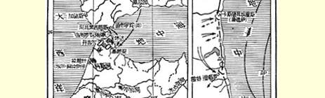
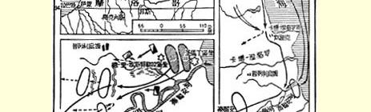
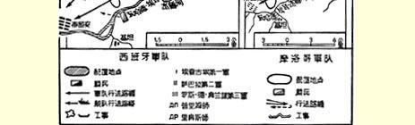

## 弗·恩格斯

# 对摩尔人的战争的进程

我们早就在预料西班牙军队会在摩洛哥采取某种坚决行动， 以便结束战争的第一阶段即准备阶段。３６５但是，出乎我们预料之外，奥当奈尔元帅似乎并不急于离开他在塞拉利奥高地上的兵营， 所以我们不得不在他的军事行动差不多刚刚开始的时候就来加以评述。

１１月１３日，埃查古埃将军指挥的西班牙作战军队第一师在阿耳黑西腊斯上船，几天以后在休达登陆。１７日，这一师人开出休达，占领了塞拉利奥（或称白宫），即在休达的阵地前方约１．５英里的一座巨大建筑物。这一带的地形很不平坦、起伏很大，非常有利于散兵战和非正规战。当天夜间，摩尔人试图夺回塞拉利奥，没有成功，于是就退却了。而西班牙人则开始构筑营垒，作为以后军事行动的基地。

２２日，塞拉利奥遭到了休达附近地区的摩尔族部落安哲腊人的攻击。从这一次战斗开始，整个战局到目前为止充满了一连串的毫无结果的战斗，而且每一次战斗同所有其余战斗都极相像。摩尔人用或大或小的兵力攻击西班牙人的阵地，试图靠突然袭击或机智夺取部分阵地。据摩尔人报道，他们的这些行动通常是成功的。但是由于他们没有火炮，所以只得放弃所夺得的多面堡。西班牙人则说，没有一个摩尔人看见过西班牙多面堡的内部是什么样的，摩尔人的所有的攻击都是完全不成功的。在第一次攻击时， 安哲腊人不超过１６００名，第二天他们得到了４０００人的援军，于是立即重新发起进攻。２２日和２３日全是小接触，但是在２５日，摩尔人以全力进攻，于是发生了一场激烈的战斗，埃查古埃将军在这次战斗中手部负伤。摩尔人的这次攻击如此厉害，以致使奥当奈尔这位西得·康佩亚多尔从他在进行战争时一直保持着的那种昏睡状态中稍稍清醒过来。他立刻命令萨巴拉将军指挥的第二师和普里姆将军指挥的预备师上船，并且亲赴休达。２６日夜间，西班牙的作战军队全部在休达附近集中。２９日，摩尔人发动了另一次攻击，３０日再次攻击。在这以后，西班牙人开始设法改变他们所处的局限于一隅的地位；他们第一个行动的目标是休达南面约 ２０英里、离开海岸４英里的泰图安。他们开始修筑一条通往该城的道路，摩尔人在１２月９日以前一直没有进行任何抵抗。１２月９ 日晨，摩尔人突然袭击了两个主要多面堡的守军，但是，像往常一样，到日终便又放弃了多面堡。１２日，在离开休达约４英里的西班牙兵营前面发生了另一次战斗；２０日，奥当奈尔发出电讯说， 摩尔人再度攻击两个多面堡，但是像往常一样被胜利地击退了。可见，１２月２０日同１１月２０日相比，情况没有丝毫进展。西班牙人仍然采取守势，而且，同两三个星期以前的预告相反，看不出有任何前进的迹象。

西班牙军队的数量，包括１２月８日以前所得到的全部援军在内，约有３５０００—４００００人，因而有３万人可用于进攻。有了这样一支队伍，夺取泰图安不应当有什么困难。诚然，没有好的道路， 而且军队的给养全部要从休达运去。但是法国军队在阿尔及利亚

### １８５９ —１８６０年摩洛哥战争图

 以及英国军队在印度是怎样做的呢？何况西班牙的骡子和挽车马并没有被它们本国的好路娇惯到不肯在摩尔人的土地上行走。不管奥当奈尔怎样替自己辩解，这样继续按兵不动是绝对解释不通的。西班牙人现在拥有的兵力一般估计已是他们在这次战争中要派出的最多的兵力了，除非有意外的挫折要求他们作特殊的努力。 相反地，摩尔人一天比一天强大。由哈治·阿布德萨勒姆指挥的、 曾于１２月３日派出部队进攻西班牙人阵地的泰图安兵营，其军队已经扩充到了１万人，城内的守军还不算在内。另外一个由穆莱· 阿巴斯指挥的兵营在丹吉尔，它源源不断地得到由内地开来的援军。单是这一情况，就应当使奥当奈尔一等到天气许可时便发动进攻。但是，虽然有好天气，他却没有进攻。勿庸置疑，这是一种完全没有决断的表现，这表明，摩尔人不是像他所预计的那种不堪一击的敌人。无疑地，摩尔人作战非常出色；西班牙兵营里纷纷抱怨休达前面的地形对摩尔人有利，就是一个最好的证明。

西班牙人说，摩尔人在丛林和山谷中是十分厉害的敌人，并且他们对每一寸土地都很熟悉，但是，一旦走进平原，西班牙步兵的坚强力量很快就会迫使摩尔人的非正规部队掉头逃跑。但是现在每次战斗都有四分之三的时间用来在起伏地上进行散兵战，在这种条件下，这样一种辩解是大可怀疑的。如果说西班牙人在休达附近停留了６个星期以后还不能像摩尔人一样熟悉那里的地形，那他们就够糟糕了。起伏地比平原更有利于非正规部队，这是很明显的。但是，即使是在起伏地上，正规的步兵也应当比非正规部队优越得多。在散兵线后面配置支援队和预备队的现代散兵战的方法， 军队运动的规律性，保持对部队的指挥并且使它们相互支援以便用全部力量来达到一个共同的目标的可能性，—— 所有这一切，使正规部队比非正规部队具有极大的优越性，以致在最适合于进行散兵战的地形上，非正规部队即使以二对一，也抵挡不住正规部队。但是在休达，力量的对比正好相反。西班牙人拥有数量上的优势，但是他们却不敢进攻。唯一的结论是，西班牙军队完全不懂散兵战，因此士兵个人对这种作战方法缺乏素养，纪律和正规训练所应当给予的优越性就抵消了。事实上，大概他们不得不经常使用长剑和刺刀来进行白刃战。摩尔人在西班牙人相当接近的时候，就像土耳其人所常做的那样停止射击，拿着刀剑向他们冲杀，而这对于像西班牙军队这样由新兵组成的军队确实是不很愉快的。但是经常发生的战斗，应当使他们熟悉摩尔人作战的特点和找到对付它的合适的办法；所以当我们看到那位统帅仍然迟疑不决并且继续滞留在自己的防御阵地上的时候，我们就不能对他的军队作出很高的评价了。

根据现有事实来推测，西班牙人的作战计划，似乎是把休达作为作战基地而把泰图安作为第一个进攻目标。同西班牙隔海对峙的那一部分摩洛哥的地方，形成一个半岛似的地带，宽约３０—４０ 英里，长约３０英里。丹吉尔、休达、泰图安和拉腊什（埃尔阿拉伊什）是这个半岛上的主要城市。占领了这四个城市（其中休达已在西班牙人手中）就很容易征服这个半岛，并使它成为进一步进攻非斯和梅克内斯的基地。所以，夺取这个半岛可以说是西班牙人的目标，而攻占泰图安则是达到这个目标的第一步。这个计划看来是相当明智的；它把作战行动限制在一块不大的地区内，这个地区三面环海，第四面为两条河（泰图安河和鲁科斯河）所环绕，因此夺取这个地区要比夺取它南面的地区容易得多。这个计划也避免了进入沙漠的必要性，而如果把摩加多尔或拉巴特作为作战基地的话，那就不可避免地要进入沙漠；同时，这个计划使战场接近西班牙的国境，其间只有直布罗陀海峡之隔。但是不论这个计划有什么优点， 如果计划不能实现，这些优点就都是毫无用处的。如果奥当奈尔照原来那样继续下去，那末，不管他在公报上说得多么漂亮，他也会使他自己和西班牙军队的名誉蒙受耻辱。

> 弗·恩格斯写于１８５９年１２月１０日原文是英文左右作为社论载于１８６０年１月１９日 “纽约每日论坛报”第５８４６号
>
> 俄文译自“纽约每日论坛报”