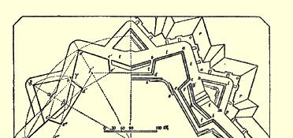
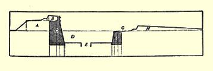

## 弗·恩格斯

# 筑城

> **３０２**

人们有时把这个题目分为防御筑城和进攻筑城两部分，防御筑城规定改造某一地形使之长期或短期适于防御的方法，进攻筑城则包含围攻的各种规则。但我们在这里把这个题目分为三部分来谈：**永备筑城**，即在平时使某地的防御能迫使敌人在进攻时对它采取正规围攻的一种方法；**围攻法**；**野战筑城**，即在战争的特殊情况下某地可能暂时具有重要意义，因而构筑非永久性工事予以加强的一种方法。

### 一、永备筑城

工事的最古老的形式看来是防栅，直到十八世纪末，防栅仍然是土耳其人的民族形式的工事（ｐａｌａｎｋａ），甚至现在，印度支那半岛上的缅甸人还在广泛使用。防栅是由两列或三列排得很紧密的坚固木桩垂直插入地下构成的，它形成环绕整个被防卫的城市或兵营的围墙。大流士在向斯基台人进军时，科尔特斯在墨西哥的塔巴斯科附近和库克船长在新西兰都曾遇到过这种防栅。有时， 各列木桩之间填满泥土；在另一些场合，木桩用藤条牢牢系在一起。下一步是石墙代替了防栅。这种工事使用的时间较长，同时对它攻击也困难得多。从尼尼微和巴比伦时期起直到中世纪末，在所有比较文明的民族中，石墙是唯一的筑城手段。石墙筑得很高， 甚至使用云梯也难于攀登，而且相当厚，足以长时间抵御攻城槌的撞击，并使防御者可以在较薄的、带垛的石质胸墙的掩护下在石墙上自由行走，通过胸墙上的射孔，则可向围攻者射箭或抛丢其他投掷物。为了加强防御，胸墙不久便筑在石墙顶端向外突出的悬石上，悬石之间留有孔隙，使防守者可以看到墙根，如果敌人进到这里，防守者就可以直接从上面投物杀伤他们。至于围绕整个石墙挖掘护城壕作为阻止敌人接近的主要障碍，毫无疑问，这也是在很早时期就有了。最后，紧靠石墙每隔一定距离又增建了一座塔楼，形成石墙的突出部，从这里可以对在两座塔楼之间攻城的军队投物射箭，从侧面防守石墙，石墙的防御能力就达到了最高的发展阶段。在大多数情况下，塔楼比石墙高，用横胸墙与石墙顶隔开，瞰制着石墙，而且每一塔楼本身又是一个小堡垒，在防守者已被迫撤离主墙以后，敌人仍必须分别夺取。如果再补充一点，即在有些城市中，特别是在希腊，在要塞内的制高点上构筑某种城砦（内城），形成内堡和第二道防线，那末我们就把石墙时代筑城工事最主要的特点说得详尽无遗了。

但在十四世纪至十六世纪末这一时期中，炮兵的使用从根本上改变了攻打筑垒地点的方法。从这时起，开始出现大量有关筑城的著作，它们提供了无数的筑城体系和方法，其中一部分或多或少地被采用和推广了，而另外一些—— 并不经常是最差的—— 却往往被人们当做纯理论性的笑谈而忽视了，直到较晚的时期，其中一些有益的主张才被比较幸运的后继者重新发掘出来。正像我们所看到的，在旧的石墙体系和新的土质工事体系（仅在敌人从远处看不到的部分才砌上石头）之间起了桥梁作用的—— 如果可以这样说的话—— 那位作者３０３的命运就是这样。使用炮兵的直接结果，是石墙的厚度和塔楼的直径加大，而它们的高度减低。这时这些塔楼改称圆台堡（ｒｏｎｄｅｌｌｉ），它们构筑得相当大，能容纳数门火炮。为使防守者也能从石墙上用火炮射击，又在石墙后面加筑了土堤，使石墙有必要的宽度。不久我们看到，这种土质工事开始逐渐排挤石墙，而在某些场合完全代替了它。德国著名画家阿尔勃莱希特·丢勒发展了这种圆台堡体系，并使它达到高度完善的境地。 他在整个城墙上每隔一定距离设一个圆台堡，把圆台堡筑成完全独立的堡垒，各堡均有对护城壕进行纵射的穹窖炮台；他的石质胸墙没有掩蔽的部分（即围攻者可以看到的、成为他们平射的目标的那部分）高度不超过３英尺。此外，为了加强护城壕的防御，他建议构筑侧防暗堡—— 一种构筑在护城壕底部、围攻者看不到的穹窖式工事，它两面都有射孔，可以对直到多角形要塞邻近各角的一段护城壕进行纵射。几乎所有这些主张都是新发明；如果说在他那个时代这些主张除了穹窖以外没有一个得到人们的赞同，那末，我们可以看到，在后来一些最重要的筑城体系中它们都得到了承认，并得到了与新时代已改变了的条件相适应的发展。

大约就是在这个时期，扩大了的塔楼的外形发生了变化，这一变化可以说是产生最新筑城体系的开端。圆形的塔楼有一个缺点， 即无论是从中堤（两个塔楼之间的城墙）或是从相邻的塔楼进行射击，都不能把塔楼前面的所有各点全部置于火力之下：在靠近城墙的地方有些小的角度，敌人一到达那里就位于要塞火力范围之外。为了克服这一缺点，塔楼被改建成不等边的五角形工事，其中一边面向要塞内部，其他四边则面向要塞外面。这种五角形的

 工事叫做棱堡。为了避免重复和说不清楚，下面我们先叙述能说明棱堡防御主要特点的一种体系，并指出它的各部分的名称。

> 图 １

图１所示的是根据沃邦的第一种方法建成的六角形要塞的前三面。左半图是工事外形的几何草图，右半图是详细画出的土堤、 斜堤和其他部分。多角形要塞的ｆ′ｆ线并不全部是连续的土堤，其两端ｄ′ｆ′和ｅｆ部分没有土堤，这段空间由向前突出的五角形棱堡 ｄ′ｂ′ａ′ｃ′ｅ掩护。ａ′ｂ′线和ａ′ｃ′线构成棱堡的正面；ｂｄ线和ｃｅ线构成棱堡的侧面；棱堡正面和侧面交会之点叫交点。从圆心到棱堡顶角的ａ′ｆ线叫中线。六角形始边的一段——ｅｄ线是中堤。这样，每一座多角形要塞有多少个边，就有多少个棱堡。棱堡有实心的和空心的两种：五角形棱堡内全部填土，填到架炮垒道（土堤上放置火炮的地点）的高度时，叫实心棱堡；土堤从垒道后面起就向棱堡内部成缓坡倾斜时，叫空心棱堡。图１中ｄｂａｃｅ为实心棱堡，其右面只画出一半的是空心棱堡。棱堡和中堤合在一起组成要塞的围墙，即要塞的核心部分。在棱堡和中堤上，我们首先看到的是架炮垒道上的胸墙，胸墙构筑在前面，以便掩护防守者， 其次可看到内斜面上的坡道（ｓｓ），这是用以和要塞内部保持交通的。要塞围墙的高度足以掩护城内房屋不受敌人平射火力的射击， 而胸墙的厚度则足以长时间经受住重炮的轰击。整个要塞围墙的周围有护城壕ｔｔｔｔ，护城壕内配置有几种外围工事。首先，中堤前有三角堡或半月堡ｋｌｍ—— 一种有两个正面ｋｌ和ｌｍ的三角形工事，每个正面都有配置火炮的土堤和胸墙。上述一切工事敞开的后面部分叫背面，所以三角堡的ｋｍ线和棱堡的ｄｅ线都是背面。 三角堡的胸墙比要塞核心部分的胸墙约低３—４英尺，这样，后者便可瞰制三角堡的胸墙，必要时，要塞核心部分的火炮可超越三角堡进行射击。中堤和三角堡之间的护城壕内，有一种狭长的独立工事ｇｈｉ叫做凹角堡，主要用来掩护中堤，使它不受敌人破城炮的射击。这种工事很低而且过于狭窄，不能配置火炮，其胸墙仅能在敌人强攻得利的时候，使步兵能从护城壕中进行射击，从翼侧掩护半月堡。护城壕外面是隐蔽路ｎｏｐ，它的内侧是护城壕，外侧是斜堤ｒｒｒ的内斜面，斜堤从自己的内缘即斜堤顶（ｃｒｅｔｅ）起成极缓的斜坡向堤外地面倾斜。斜堤顶又比三角堡低３英尺或３英尺以上，以便要塞的全部火炮都能超越它而进行射击。在这些土质工事的斜面中，要塞核心部分的外斜面和护城墙内的外围工事的外斜面（即内岸），以及护城壕本身的外斜面（从隐蔽路向下的部分），即外岸通常都用石砌。隐蔽路的凸角和凹角构成的宽大的掩蔽地点叫屯兵场，在凸角处的叫凸角屯兵场（如ｏ），在凹角处的叫凹角屯兵场（如ｎｐ）。为了防止对隐蔽路的纵射，隐蔽路上每隔一定距离拦起一道横墙，即横方向的胸墙，只在靠近斜堤的一端留一

 个不大的通路。有时还构筑小型工事，用来掩护从凹角堡通过护城壕到三角堡的交通。这种工事叫侧防暗堡，是一条两面用胸墙掩护的狭窄的通路，胸墙的外部表面成缓坡向下倾斜，和斜堤相似。图 １中这种侧防暗堡位于凹角堡ｇｈｉ和三角堡ｋｌｍ之间。

> 图 ２

图２所示的断面图可以使上面的介绍更为清楚。Ａ—— 要塞核心部分的架炮垒道；Ｂ—— 胸墙；Ｃ—— 内岸的石砌部分；Ｄ—— 护城壕；Ｅ—— 水壕，即沿护城壕中央挖掘的较小和较深的壕沟； Ｆ—— 外岸的石砌部分；Ｇ—— 隐蔽路；Ｈ—— 斜堤。胸墙和斜堤后面的梯阶叫踏垛，是步兵超越掩护自己的胸墙进行射击时立脚的地方。从图１上可以很清楚地看出：配置在棱堡侧面上的火炮可以射击到相邻棱堡前面的整段护城壕。这样，棱堡的正面ａ′ｂ′由侧面ｃｅ的火力掩护，而正面ａ′ｃ′则由侧面ｂｄ的火力掩护。另一方面，两个相邻棱堡的相对正面可以用火力控制位于它们之间的三角堡前的护城壕，掩护三角堡的正面。因此，护城壕没有一段不在侧射火力掩护之下，这也就使棱堡体系向前迈进了真正伟大的一步，从而开辟了筑城史上的新纪元。

棱堡的发明者以及棱堡出现的准确年月已无从查考，确实可信的只有：棱堡是意大利发明的，１５２７年桑米凯利曾在维罗那的城墙上修建了两座棱堡。关于在更早以前就有棱堡的一切说法都是有疑问的。棱堡筑城体系可按一些国家的学派来分类。首先应当谈的当然是发明棱堡的那一学派，也就是意大利派。最早的意大利棱堡保留着它的前身的痕迹；它们只是一些多角形的塔楼或圆台堡；如果不算侧射火力，它们几乎没有改变工事原来的性质。 要塞的围墙仍是暴露在敌人平射火力之下的石墙；石墙后面堆积的土堤主要用作配置火炮和进行射击的地点，它的内斜面像古老的城墙一样，仍用石头被复。只是在很久以后，胸墙才开始筑成土质工事，但即使在那时，整个外斜面，仍用石头一直砌到顶端， 而且暴露在敌人的平射火力之下。中堤极长，约３００—５５０码。棱堡非常小，相当于大的圆台堡，棱堡的侧面总是和中堤相垂直。因为筑城学中有一条原则：有效的侧射火力总是从与火力所要掩护的那条线相垂直的一线发射的，所以老式意大利棱堡构筑侧面的主要目的显然不是为了掩护相邻棱堡的短而远的正面，而是为了掩护长而直的中堤线。中堤过长时，就在它中间修筑平顶的钝角棱堡，叫做台堡（ｐｉａｔｔａｆｏｒｍａ）。侧面不是从交点修起，而是从正面土堤稍后处修起，这样，交点就向前突出，并用来掩护侧面。每一侧面都有两个炮台：下层炮台和稍微向后配置的上层炮台。有时还在侧面的内岸上与护城壕底相平之处构筑穹窖。这里再加上一条护城壕，那就是最初的意大利棱堡体系的全貌，它既没有三角堡和凹角堡，也没有隐蔽路和斜堤。但这种体系很快就得到了改善。中堤缩短了，棱堡加大了。多角形要塞内边（即图１中的 ｆｆ线）的长度规定为２５０—３００码。棱堡的侧面加长到相当于多角形要塞一个边的六分之一和中堤的四分之一。这样一来，尽管棱堡侧面仍与中堤相垂直并且还有其他缺点，但是我们可以看到，这时侧面已能较多地掩护相邻棱堡的正面了。棱堡也开始构筑成实心的，而且在它的中央常构筑封垛，即一种正面和侧面各与棱堡的正面和侧面平行的工事，但其土堤和胸墙比棱堡的土堤和胸墙高，以便从这里可以超越棱堡的胸墙进行射击。护城壕既宽且深， 其外岸通常与棱堡正面平行。但是因为这种方向的外岸妨碍棱堡侧面上紧靠交点的那一部分对整个护城壕进行观察和侧射，所以以后这一缺点被克服了，在构筑外岸时使其延长线通过相邻棱堡的交点。后来，又构筑了隐蔽路（十六世纪二十年代至五十年代期间在米兰的城砦中初次出现；１５５４年塔尔塔利亚曾第一个提到过３０４）。它用作完成出击的部队集合的地点和撤退的道路，可以说， 隐蔽路的出现是防御要塞时巧妙而坚决地采取进攻行动的开端。 为了增大隐蔽路的使用效果，又构筑了提供更大场地的屯兵场，从屯兵场的凹角处还可以对隐蔽路进行可靠的侧射。为使敌人接近隐蔽路更为困难，在斜堤上距堤顶约１—２码处又构筑了围栅；不过这样配置的围栅很快就会被敌人的炮火摧毁，因此，在十七世纪下半叶，根据法国人莫丹的建议，围栅移至有斜堤掩护的隐蔽路上。要塞的大门位于中堤的中央，为了掩护大门，又在大门前护城壕的中央构筑了一种半月形的工事；但是和塔楼改为棱堡的原因相同，这种半月堡（ｄｅｍｉｌｕｎｅ）不久也改建为三角形工事，即现在的三角堡。这种工事仍然是很小的，但后来发现它不仅可做护城壕的桥头堡，而且还可以掩护棱堡的侧面和中堤不受敌人炮火的破坏，可以在棱堡中线前面构成交叉火力，并可以从侧方有效地掩护隐蔽路，于是便开始把它构筑得大一些了。尽管如此，这种工事仍然很小，因而它的正面的延长线只能在中堤点（即中堤两端之点）与要塞的围墙相交。意大利筑城体系的主要缺点如下： １．棱堡侧面的方向不好。因为有了三角堡和隐蔽路之后，中堤成为攻击对象的场合愈来愈少，现在遭受攻击的主要是棱堡的正面。 为了很好地掩护正面，应使正面的延长线在相邻棱堡侧面的起点与中堤相交，而这个侧面则应与这一延长线（叫做防守线）垂直或接近垂直。这样，才能沿整个护城壕和对棱堡前面进行有效的侧射。但实际上防守线既不与棱堡的侧面垂直，又不在中堤点与中堤相交，而是在中堤的四分之一、三分之一或二分之一处与中堤相交。因此，从侧面上发射的平射火力与其说可以杀伤攻击相邻棱堡的敌军，不如说可以杀伤相对侧面的守军。２．要塞围墙只要有一处被敌人打开缺口和攻占，就显然不能保证进行长期防御。 ３．三角堡太小，不足以掩护中堤和侧面，而中堤和侧面从侧方掩护三角堡的火力也很弱。４．土墙非常高，而且整个表面都是用石砌的，通常约有１５—２０英尺高的石砌部分暴露在敌人平射火力之下，当然，这个石砌部分很快就会被击毁。我们可以看到，甚至在尼德兰人已证明石砌部分毫无用处以后，仍需要几乎两个世纪的时间，才彻底消除了对不加土掩盖的石砌部分的信赖。意大利派优秀的工程师和著作家有：桑米凯利（死于１５５９年，他曾构筑希腊纳波利德罗曼尼亚和干地亚二地的要塞，并在威尼斯附近修建了利多堡垒）；塔尔塔利亚（约１５５０年）；阿尔吉西·达·卡皮、吉罗拉莫·马吉和扎科莫·卡斯特里奥托—— 这三人约在十六世纪末都写过有关筑城的著作３０５）。乌尔比诺的帕乔托则曾修筑过都灵和安特卫普的城砦（１５６０—１５７０年）。稍晚的意大利筑城学著作家有马尔基、布斯卡、弗洛里安尼和罗塞蒂，他们对意大利筑城体系作了许多改进，但其中毫无独创之处。他们不过是巧妙程度不同的抄袭者；他们大部分的发明都是抄袭德国人丹尼尔· 斯佩克尔的，其余的则是抄袭尼德兰人的。上述这些著作家的活动都在十七世纪，当时在德国、尼德兰和法国筑城学已迅速发展， 相形之下，他们的这些活动就黯淡无光了。

在德国，意大利筑城体系的缺点很快就被发现了。第一个指出旧意大利派的棱堡小和中堤长这个主要缺点的，是为查理五世在安特卫普城构筑要塞的德国工程师弗兰茨。在审查要塞构筑计划的会议上，他曾坚持构筑较大的棱堡和较短的中堤，但是阿尔巴公爵和其他西班牙将军的意见占了上风，这些人除了旧意大利体系及其特有的陈规旧套以外，根本就不想知道其他的东西。其他体系的一些德国要塞的特点，是按丢勒的原则构筑了穹窖暗廊， 例如在１５３７—１５５８年构筑的尤斯特林要塞中，以及几年后在由工程师—— 有名的约翰大师（ＭｅｉｓｔｅｒＪｏｈａｎｎ）构筑的幽里希要塞中都是如此。但是第一个完全摆脱意大利派影响的是修建斯特拉斯堡城的工程师丹尼尔·斯佩克尔（死于１５８９年），他所创立的原则，成为后来所有棱堡工事体系的依据。他的主要原则如下：１． 构成要塞围墙的多角形的边愈多，要塞就愈坚固，因为边多了，要塞的各个正面就可以更多地互相支援；所以，需要相互掩护的各个工事配置得愈近似直线愈好。由此可知，科尔蒙太涅当作新奇的发现提出来，并用以炫耀其数学知识渊博的这个原则，早在１５０ 年前就为斯佩克尔所熟知。２．锐角棱堡不好，钝角棱堡也不好， 棱堡的凸角应为直角。在反对锐角形凸角方面他是正确的（目前人们通常认为最小的凸角为６０度），但是，由于他所处的时代对直角形凸角的偏爱，他也反对钝角形凸角，实际上钝角形凸角非常有利，而且是多边的多角形要塞所不可避免的。看来，实质上这是他对当时偏见的让步，因为在他自认为最能显出他的筑城法最大优点的一些设计图中都画有钝角棱堡。３．意大利的棱堡太小； 棱堡必须是大型的。因此斯佩克尔的棱堡比科尔蒙太涅的棱堡大。 ４．每个棱堡内和中堤上都必须构筑封垛；这是从当时使用的围攻法中得出的结论，用这种围攻法时，堑壕内的高大封垛曾起了很大的作用。不过，按照斯佩克尔的意见，封垛不仅起简单的抵抗作用，而且起更大的作用；他的封垛是预先构筑在棱堡内的真正的二重堡，在要塞围墙被敌人打开缺口并被攻占后，它们就成为第二道防线。因此，人们通常认为把封垛变为永久性二重堡，是沃邦和科尔蒙太涅的功绩，其实应当归功于斯佩克尔。５．棱堡的侧面—— 至少是部分侧面，最好是整个侧面—— 应同防守线垂直， 并应从防守线和中堤相交之点构筑起。由此可见，原来人们认为是法国工程师帕冈所首创的、并且是使他享有盛誉的主要原因的这一重要原则，也在比他早７０年以前就被提出来了。６．穹窖暗廊是防守护城壕所必需的；因此斯佩克尔在棱堡的正面和侧面上都构筑这种工事，不过仅供步兵使用。如果他把它们构筑得大到足可容纳炮兵，那末他在这方面就达到最新的完善的水平了。７． 要使三角堡发挥作用，便应把它尽可能构筑得大些。因此，斯佩克尔的三角堡是所有曾被提出过的三角堡中最大的。以沃邦与帕冈相比，沃邦的改进大部分在于加大三角堡；而以科尔蒙太涅与沃邦相比，科尔蒙太涅的改进几乎全部在于加大三角堡；但斯佩克尔的三角堡甚至比科尔蒙太涅的三角堡还要大得多。８．隐蔽路的防御应尽可能地加强。斯佩克尔是第一个了解隐蔽路的重大意义并相应地加强其防御的人。斜堤顶和外岸顶端构筑成ｅｎ ｃｒｍａｉｌｌèｒｅ（锯齿形），使敌人的纵射不起作用。科尔蒙太涅又借用了斯佩克尔的这一主张，不过他保留了为斯佩克尔所否定的横墙 （横在隐蔽路上防纵射的短土墙）。现代的工程师通常都肯定斯佩克尔的方案比科尔蒙太涅的方案优越。此外，佩斯克尔还是第一个在隐蔽路的屯兵场上配置炮兵的人。９．任何石砌部分都不应在敌人视界以内，不应暴露在平射火力之下，这样，敌人的破城炮在到达斜堤顶以前，便不能做好射击准备。这一非常重要的原则虽然在十六世纪就为斯佩克尔所确立，但直到科尔蒙太涅为止，从来没有被采用过；甚至是沃邦，也将石砌部分的很大一部分暴露在外（见图２Ｃ）。从这个简要的叙述中可以看出，斯佩克尔的主张中不仅包含了，而且已明确地提出了整个最新棱堡式筑城的基本原则，甚至是现在，根据他的筑城法仍可构筑出很好的防御工事， 如果从他所处的时代来看，他的筑城法确实是非常杰出的。在整个近代筑城史中，人们在每一个著名工程师的杰出主张中都能证明其中某些是从这位伟大的棱堡防御体系奠基人处抄袭来的。斯佩克尔的实际的工程艺术表现在英果尔施塔特、施勒特斯塔特、加根瑙、乌尔姆、科马尔、巴塞尔和斯特拉斯堡等要塞的建筑中，所有这些要塞都是在他的指导下筑成的。

大约在同一时期，尼德兰争取独立的斗争３０６促成了另一筑城学派的产生。当时，不能指望荷兰城市的古老石墙能抵挡住正规的围攻［ｒｅｇｕｌａｒａｔｔａｃｋ］，因而必须加强这些城市的防御以抵抗西班牙人，但是要按意大利式构筑高大的石质棱堡和封垛，则既没有时间又没有资金。而这里的地形特点（拔海不高）却提供了另外的可能性，于是在建筑堤坝方面素有经验的荷兰人就依靠水来防御。他们的筑城体系与意大利体系完全相反：宽１４—４０码的浅水壕；矮矮的土堤没有任何石砌部分，但有更低的、突出在前面的土堤（前堤）作掩护，用以更好地防守护城壕；护城壕中有大量外围工事，如三角堡、半月堡（棱堡突出部之前的三角堡）、角堡和冠堡等[^1]；此外，在利用地褶方面，也比意大利人好。第一个完全用土质工事和水壕设防的城市是布雷达（１５３３年）。后来荷兰筑城法又有了某些改善：内岸的一个狭长部分砌了石块，因为有水的护城壕在冬季结冰后，敌人很容易通过；护城壕中构筑了堤坝和水闸，以便趁敌人在干壕底开始对壕作业时放水；最后，还构筑了水闸和拦河坝，以便预先有计划地用水淹没斜堤脚周围的地区。写过这种旧的荷兰筑城法的著作家有马罗鲁瓦（１６２７年）、 弗莱塔格（１６３０年）、费尔克尔（１６６６年）和美耳德尔（１６７０ 年）。曾试图把斯佩克尔的原则用于荷兰体系的有沙伊特尔、诺伊鲍威尔、海德曼和赫尔（都在１６７０年和１６９０年之间，都是德国人）。

在所有的筑城学派中，法国派享有最大的声望。在保存到现在的各要塞中，这一派的原则被实际采用的比其他各派的原则加在一起还要多。不过，再也没有一个派别比它更缺乏自己独创的主张了。在整个法国派中，找不出一种新的工事、一条新的原则不是从意大利人、荷兰人或德国人那里抄袭来的。但是，法国人巨大的功绩是使筑城法和精确的数学原理相结合，规定了各线之间适当的比例，并根据筑垒地点各种不同的地形条件运用科学理论。人们通常把巴尔勒杜克的埃拉尔（１５９４年）称为法国筑城之父，实际上这是没有根据的；他的棱堡的侧面与中堤形成锐角，因而比意大利式棱堡的侧面还要不适用。比较著名的是帕冈（１６４５ 年），他是法国第一个采用和推广斯佩克尔的侧面应与防守线相垂直的这一原则的人。帕冈的棱堡很大，其正面、侧面和中堤之间长度的比例极为恰当，防守线的长度从不超过２４０码，因此除隐蔽路外整个护城壕都处于棱堡侧面的步枪火力范围内。他的三角堡比意大利式的大，而且在背面有内堡，即中间工事，以便垒墙被占领后仍可继续抵抗。帕冈还在护城壕中构筑一种独立的狭窄的工事掩护棱堡的正面，这种工事叫堡障，荷兰人已经采用过 （第一个采用它的可能是德国人狄利希）。帕冈的棱堡的正面有两道土堤，其中第二道作为二重堡，但两道土堤之间的壕沟毫无侧射火力掩护。使法国派成为欧洲第一的是法国的沃邦元帅（１６３３— １７０７年）。虽然他在军事方面真正的荣誉是他在攻打要塞方面的两大发明（跳弹射击和平行壕），但是他作为一个要塞建筑家更为出名。我们关于法国派所谈过的那些东西，在很大程度上是沃邦筑城法的特征。在他所构筑的工事中，我们可以看到极其多种多样的形式，只要是棱堡体系中可能有的他都采用了，但是其中没有一种是独创的；而且除棱堡外，他更少考虑采用其他的形式。不过在各组成部分的布局、各种线条的比例、断面以及根据极其不同的地形条件运用理论等方面都非常巧妙，与前人的创作相比，确已登峰造极，因此可以说，科学的、成体系的筑城是从他开始的。 虽然沃邦对自己的筑城法没有写过什么，但法国的工程师们在研究他所修建的大量要塞的基础上，力求总结出他所遵循的理论原则，结果确定了三种方法，叫做沃邦的第一法、第二法和第三法。

图１就是沃邦第一法的最简单的图解，主要部分的规格如下： 多角形要塞的外边，即由一座棱堡的顶端到相邻棱堡的顶端之线， 平均为３００码；该边中间的垂直线αβ为该边的六分之一，从ａ和 ａ点起通过β点之线为防守线ａｄ′和ａ′ｅ；从ａ和ａ′点起在防守线上量出相当于ａａ′线全长七分之二的一段即为棱堡的正面ａｃ和 ａｂ′；从交点ｃ和ｂ′以ｃｄ或ｂ′ｅ为半径在防守线之间画出的弧线即棱堡侧面ｂ′ｄ′和ｃｅ；ｅｄ线是中堤。护城壕的画法是：从棱堡顶端以３０码为径画弧线，再从相邻棱堡的交点引一直线成这一弧线的切线即为外岸。三角堡的画法是：从中堤点ｅ以ｅγ为半径 （γ点在对面的棱堡正面上距交点１１码处）画弧线γδ，使它与垂直线αβ的延长线相交，相交之点即为三角堡的顶端，这一弧线的弦即为三角堡的正面。三角堡正面这条线从三角堡顶端起画到与形成主壕外岸的切线相交为止；三角堡背面的位置也以这条外岸线来确定，这样，从棱堡侧面就能毫无障碍地对整个护城壕进行射击。在中堤之前—— 而且仅在前面—— 沃邦还保留了荷兰式的前堤（在他以前，意大利人弗洛里安尼就已这样做过），这种新的工事叫做凹角堡（ｔａｎａｇｌｉａ）。沃邦的正面是沿着防守线划的。三角堡前的护城壕宽２４码，外岸与三角堡的正面平行，顶端成弧形。沃邦就是用这种方法把他的棱堡构筑得很宽阔，而侧面的突角则经常在步枪火力范围以内。但是这种棱堡构造简单，只要有一个棱堡的正面被打开缺口，就会使整个要塞不能进行防御。沃邦的那种与防守线形成锐角的棱堡侧面，不如斯佩克尔和帕冈的棱堡侧面那样完善，但是他取消了棱堡侧面上第二层和第三层没有掩蔽的火炮，在大部分意大利棱堡和较早的法国棱堡的侧面上都有这样配置的火炮，然而从来没有带来什么特别的好处。沃邦构筑凹角堡的目的是为了以步兵火力加强对护城壕的防御，并掩护中堤不受斜堤顶上敌人破城炮的平射。但是这一点做得非常不彻底，因为靠近侧面ｅ的那部分中堤还是完全暴露在敌人配置在凹角屯兵场（见图１ｎ）的破城炮前。这是一个极大的弱点，因为只要在这里打开缺口，就可以迂回构筑在棱堡内作为第二道防线的全部二重堡。原因是三角堡还是构筑得太小。沃邦的隐蔽路上没有。 ｃｒéｍａｉｌｌèｒｅｓ〔雉堞〕，但构筑横墙，这比斯佩克尔的方法要差得多， 因为横墙虽能妨碍敌人对隐蔽路的纵射，但也妨碍防守者自己对隐蔽路的纵射。各种工事之间的交通总的来说是好的，但要进行坚决的出击则仍嫌不足。断面的大小与至今仍到处采用的相同。但沃邦仍然坚持将土堤向外的一面全部用石砌起来，所以至少有１５ 英尺高的石砌部分暴露在外。在沃邦的许多要塞中都重复了这个错误，而错误既已犯了，要纠正它，只有付出巨大的代价，用加宽棱堡正面前的护城壕，并构筑堡障式的土质工事的方法来掩护石砌部分。沃邦在一生中多半都遵循第一种方法，但在１６８０年以后，他采用了另外两种方法，目的是要在棱堡被打开缺口以后，仍能继续进行长期防御。为此，他采用了卡斯特里奥托的主张，后者曾提出在护城壕中面对塔楼处构筑独立的棱堡，使塔楼与城墙组成的古老筑城体系合乎时代要求。沃邦的第二法和第三法都与此相符合。三角堡也构筑得比较大；石砌部分的掩蔽有所改进；塔楼内构筑穹窖，但不是整个塔楼完全筑满穹窖。使棱堡和凹角堡之间的一段中堤可能被破坏的那个缺点仍然存在，因而独立棱堡在一定程度上失去了作用。然而，沃邦认为他的第二法和第三法是非常有效的。当他把兰道的筑城计划（根据第二法）呈交路易十四时，曾说道：“陛下，这就是用尽我的本领也无法夺取的要塞”。但是这并没有保证兰道不失守，该城在沃邦生前即被攻陷三次（１７０２、１７０３、１７０４年），在他死后不久（１７１３年）又被攻陷一次。３０７

科尔蒙太涅纠正了沃邦的错误，他的方法可以说是达到了棱堡体系的顶峰。科尔蒙太涅（１６９６—１７５２年）是工程长官。他的较宽阔的棱堡内可以构筑永久性二重堡和第二道防线；他的三角堡几乎和斯佩克尔的三角堡一样大，完全掩护了沃邦所暴露在外的那一部分中堤。八面以上的多角形要塞的三角堡向前突出得相当远，以致在围攻者到达斜堤顶后，三角堡可以从后方射击他们为围攻邻近棱堡所构筑的工事。围攻者要避免这种射击，就必须在棱堡上打开缺口以前先压制两个三角堡。需要掩护之线愈近似直线，这种大三角堡的相互支援就愈有效。凹角屯兵场用内堡来加强；斜堤顶筑成ｅｎｃｒéｍａｉｌｌèｒｅ〔锯齿状〕，与斯佩克尔的相同， 只是仍然保留横墙；断面结构极好，石砌部分之前都有土质工事掩护。科尔蒙太涅使法国派发展到了顶点，因为所谓法国派就是指护城墙内有外围工事的棱堡防御体系。如把１６００—１７５０年间棱堡筑城的逐步发展及其表现在科尔蒙太涅筑城体系中的那种最后结果同上述斯佩克尔的原则相比较，就可以清楚地看出这位德国工程师的惊人天才，因为护城壕里的外围工事数量虽然大大增加了，但在这１５０年中，从未发现任何一个重要原则是斯佩克尔所没有清楚而明确地提出过的。

在科尔蒙太涅之后，梅济埃尔工程学校（约在１７６０年）对他的体系做了某些不大的改动，其中主要的改动又回到斯佩克尔的旧原则，即侧面应与防守线垂直。但梅济埃尔派最杰出的一点是该派的代表最先在隐蔽路前构筑了外围工事。在防御能力特别薄弱的地段上，他们在斜堤脚附近在棱堡中线上构筑了叫做眼镜堡的独立的三角堡，这样一来，就首次向最新的永久性营垒体系接近了一步。十九世纪初一个在普鲁士供职、于１８０７年在但泽附近被打死的法国流亡分子布斯马尔，曾再一次试图改善科尔蒙太涅的体系，他的主张相当复杂，其中最杰出的一点是他的三角堡很大，一直突出到斜堤脚，以致在一定程度上可以代替上面谈到的眼镜堡并起到这种眼镜堡的作用。

和沃邦同时代的、并且不只一次地在围攻战中成为沃邦劲敌的荷兰工程师库霍尔恩男爵促成了旧的荷兰筑城法的进一步发展。由于干壕和水壕配合得很巧妙，出击极为便利，各独立工事之间的交通很方便，三角堡和棱堡中的内堡和二重堡安排得很巧妙，因而他的筑城体系甚至比科尔蒙太涅体系的防御能力更大。库霍尔恩是斯佩克尔的热烈崇拜者，他是唯一能老实地承认他的成就有多少应归功于斯佩克尔的杰出的工程师。

我们看到，在有棱堡以前，阿尔勃莱希特·丢勒就已采用侧防暗堡来保证加强的侧射火力。在他的四角城堡里，护城壕的防御完全依赖这些侧防暗堡，城堡的各角没有塔楼，这是一种只有几个凸角、顶部平整的四角城堡。构筑要塞时使要塞围墙完全与多边形的边线相吻合，因而只有凸角而无凹角，护城壕则以侧防暗堡掩护，这就是所谓多边形筑城的原则，丢勒应该算是这种筑城法的创始人。另一种，要塞围墙构成星状，凸角与凹角相互交替，每一条线既是侧面又是正面，可以用靠近凹角的一段从侧面掩护下一条线前面的护城壕，用靠近凸角的一段控制地面，这样的经始就是凹角形筑城的基础。旧意大利派的代表和旧德国派的部分代表曾提出过这种形式，但在许多年以后它才得到了发展。格奥尔格·林普勒尔（在德国皇帝那里服务的工程师，１６８３年在抵御土耳其人的维也纳防御战

３０８中牺牲）的体系是介于棱堡体系和凹角形体系之间的一种中间体系。他所称为中间棱堡的工事，实际上构成一条完整的凹角线。他坚决反对前面只有简单的土质胸墙作掩护的暴露炮台，坚持只要有可能，无论在何处都应构筑穹窖炮台，特别是在侧面上，在这里如有２—３层掩蔽得很好的火炮， 则其射击效果远比暴露的侧面炮台上从来也不能同时射击的２— ３层火炮的效果大得多。他还坚持在隐蔽路的屯兵场上构筑炮台 （或称内堡），这是库霍尔恩和科尔蒙太涅曾采用过的；他还特别坚持在要塞围墙的突角后面构筑双重的和三重的防线。在这一方面，林普勒尔的筑城体系超过了它自己的时代因而显得非常出色。 他的要塞的整个围墙是由独立的堡垒组成的，每一个堡垒都必须单独地夺取；他利用大型防御穹窖的方法和德国最近的工事中所采用的方法几乎连细节也都一样。毫无疑问，十七至十八世纪的棱堡体系有多少应归功于斯佩克尔，蒙塔郎贝尔的成就也就有多少应当归功于林普勒尔。第一个充分证明凹角形筑城体系比棱堡体系优越的是兰德斯堡（１７１２年），不过假如我们去分析他的论据或描述他的筑城工事，那就谈得太远了。在林普勒尔和兰德斯堡之后的许多熟练的德国工程师中，我们可以提一提地堡式横墙 （即可供步枪作隐蔽射击的中空横墙）的发明人梅克伦堡的布根哈根上校（１７２０年）和设垒营房（即构筑在向前突出的工事的背面能避开曲射火力的一种大型营房）的发明人维尔腾堡的赫伯特少校（１７３４年）；设垒营房内面向要塞围墙的那部分筑有带射孔的穹窖，面向城市的部分筑有兵士住的营舍和仓库。这两种工事现在都使用得很广泛。

因此，我们看到，德国派（几乎只有斯佩克尔是唯一的例外）从产生的时刻起就反对棱堡。他们想主要用凹角堡代替棱堡， 同时还试图构成良好的内部防御体系，主要的途径是采用穹窖暗廊，这正是法国工程界权威人士视为荒谬绝伦的东西。但是法国在某一时期所推崇的最伟大的工程师之一、骑兵少将蒙塔郎贝尔侯爵（１７１３—１７９９年）竟公开地打着旗帜投到德国派方面，他使整个法国工程界大为震惊，直到现在，他们仍在指责他所写的每一句话３０９。蒙塔郎贝尔激烈地批评了棱堡体系的缺点：侧射火力没有效果；使敌人深信他的炮弹即使没有击中原定的一线，也几乎肯定会使另外一线遭到损失；对曲射火力防护不够；中堤在射击方面完全没有用处；在棱堡的背面不可能构筑又好又大的二重堡， 这一点已有事实证明，即当时没有一个要塞筑有这一派理论家所提出的各式永久性二重堡；最后，外围工事很弱，它们之间的联系很差，缺少应有的互相支援。因此，蒙塔郎贝尔宁愿采取凹角形体系或多边形体系。在这两种体系中，要塞的核心部分都是由许多配置一层或两层火炮的穹窖组成的。穹窖的石砌部分周围都有防平射火力的土质堡障或外堡面作掩护，再前面是第二道护城壕。这条护城壕由构筑在外堡面凹角处的穹窖从侧面掩护，这些穹窖则由凹角屯兵场内的内堡或眼镜堡的胸墙掩护。整个这种体系依据下列这一原则：在敌人到达斜堤顶或外堡面时，利用配置在穹窖内的火炮的歼灭性火力给敌人造成障碍，使他无法架设破城炮。不顾法国工程师的一致反对，蒙塔郎贝尔肯定穹窖可以完成这一任务，以后，他甚至设计了若干废除一切土质工事的环形筑城体系和凹角形筑城体系，使整个防御依靠配置４—５层火炮的高穹窖炮台，穹窖的石砌部分只靠自己炮台的火力防护。他在自己的环形筑城体系中曾力图用这种方法使距要塞５００码以内的任何一点上都能集中３４８门火炮的火力，并认为这样巨大的火力优势会使敌人完全不能架设攻城炮。但是，在这方面，只有在构筑岸防炮台向海的正面部分时，才有他的追随者。在炮击塞瓦斯托波尔时期，充分地证明了舰炮是不可能击毁设有穹窖的坚固围墙的。塞瓦斯托波尔、喀琅施塔得、瑟堡等良好的炮台，朴次茅斯港（英国）入口处的新炮台，以及现代几乎一切保卫港湾抵御舰队的炮台，都是根据蒙塔郎贝尔的原则修建的。林茨（奥地利）的马克西米利安式塔楼３１０和科伦独立堡垒的内堡有一部分暴露的石砌部分是模仿蒙塔郎贝尔不太成功的方案构筑的。在陡峻的高地筑城（如普鲁士的埃伦布莱施坦）有时也采用暴露的石质堡垒，但其抵抗能力如何还须由实际经验来确定。

凹角形筑城体系从来没有被实际采用过，至少据我们所知是如此；但是多边形筑城体系在德国很受重视，并被采用于最新的工事中，而法国人却顽固地抓住科尔蒙太涅的城堡不放。多边形筑城体系的要塞围墙通常是顶部平整的土墙，有石砌的内岸和外岸，有构筑在水壕中央的大型侧防暗堡，有构筑在土墙后面并以土墙作掩护以便起二重堡作用的大型设垒营房。类似的设垒营房也作为二重堡构筑在很多棱堡工事中，用以封闭棱堡的背面，同时土墙可作为堡障来掩护石砌部分，使它避免遭到远射。

在蒙塔郎贝尔所有的主张中，最成功的是独立堡垒体系，这种体系不但在筑城学方面开辟了新纪元，而且在攻击和防守要塞方面、甚至在总的战略方面也开辟了新纪元。蒙塔郎贝尔主张在重要地点的大要塞周围的制高点上修建一列或两列小堡垒，这些堡垒外形上是孤立的，但可以用火力互相支援，而且为大规模出击创造有利条件，使敌人无法轰击要塞本身；在必要时，这些堡垒也可构成军队用的营垒。沃邦就已采用过在要塞火炮掩护下的永久性营垒，但营垒的工事由很长的连续不断的防线组成，只要一点被突破，就全部陷入敌手。而蒙塔郎贝尔的营垒的抵抗能力则大得多，因为每座堡垒都必须单独夺取，敌人在没有夺得其中至少三四座堡垒以前，就不可能开始对要塞本身进行围攻作业。而且，对其中每一座堡垒的围攻，随时都可能被守军或者甚至被配置在堡垒后面兵营内的军队所打断，这样，就保证了积极的野战与正规的要塞战相结合，从而必然大大地加强了防御。自从拿破仑对那些按旧法构筑的要塞置之不顾而率军深入敌国腹地千百英里，以及１８１４—１８１５年同盟国军也把沃邦为法国留下的三层要塞带毫不在意地留在自己背后而直捣巴黎以后，仅在主壕内或者最多也只在斜堤脚构筑外围工事的筑城体系已经过时，这一点已十分明显了。这样的要塞对于现代的大军已失去了牵制的力量。它们使敌人遭受损失的能力达不到它们火炮的作用半径以外。因此， 必须找出阻止突入国境的现代军队迅速前进的某种新方法，于是蒙塔郎贝尔的独立堡垒体系被广泛采用。特别是科伦、科布伦茨、 麦茨、拉施塔特、乌尔姆、科尼斯堡、波兹南、林茨、培斯克拉和维罗那被改筑成可容６—１０万人的巨大营垒，但在必要时也可用少得多的守军进行防御。同时，筑垒的地点在战术上是否优越的问题也已退居次要地位，现在是从战略上着眼来决定修建要塞的地点了。构筑工事的只是那些可以直接或间接阻止胜利的军队继续前进的地点，以及本身是个大城市，又是整个省的物质资源集中点因而能为军队提供巨大优越条件的地点。要塞的位置通常选在大河旁边，特别是两条大河的汇合处，因为这样可迫使进攻军队分散兵力。要塞围墙尽可能地简化了，而护城壕的外围工事几乎全部取消；人们认为有能够抵御短时间攻击的围墙就足够了。 主要战场在独立堡垒的周围，而独立堡垒的防御，主要已不是靠本身垒墙上的火力，而是靠要塞守军的出击。巴黎就是按这种方案修建的最大的要塞；它有简单的棱堡式围墙和几乎都是四角形的棱堡式堡垒；在它的全部筑城工事中没有一个外围工事，甚至没有一个三角堡。毫无疑问，由于有了这种足可供三个被击败的军团作掩蔽所的新的大营垒，法国的防御力量增强了百分之三十。 这一改进的结果，使各种筑城法中所包含的那种有价值的东西在很大程度上失去了意义；花钱最少的方法现在成为最好的方法，因为目前的防御已不再依靠在要塞城墙内等待敌人，直到他开始围攻作业，然后对他炮击的消极方法，而是依靠以守军的集中的兵力对不得不把兵力分开的围攻者采取攻势的积极方法了。

### 二、围攻

希腊人和罗马人把围攻法发展到了相当完善的地步，他们曾使用攻城槌击破城墙，在有良好掩盖的接近车的保护下接近城墙， 必要时还使用高出城墙和塔楼的设备，使强攻的纵队可以安全地接近城墙。使用火药以后，这些设备就不再使用了，因为从这时起，要塞的土墙修得较低，但可以对很远的距离进行有效射击，于是围攻者便向斜堤构筑锯齿形或曲线形的接近壕，同时在不同地点配置炮队，以便尽可能迫使被围者的火炮停止射击并破坏他们的石质工事。围攻者一到达斜堤顶，立即构筑高大的堑壕式封垛， 以便控制棱堡及其封垛，然后以猛烈的火力打开缺口并准备强攻。 攻击点通常是中堤。但是，在围攻的这种方法上并没有形成过什么体系，直到沃邦才采用了跳弹射击的平行壕，将围攻过程按一种方法系统化，这一方法甚至现在还采用，而且仍被称为沃邦围攻法。围攻者用足够的兵力四面包围要塞并选好攻击正面以后，夜间即在距离要塞６００码处掘第一道平行壕（一切围攻作业多半在夜间进行）。这道与被围攻的多角形要塞的边平行的堑壕，至少应围绕要塞的三个边或面。抛向敌人一方并在堑壕两边用堡篮（装满土的柳条筐）支住的泥土形成抵御要塞火力的胸墙。在这第一道平行壕内配置跳弹炮队，以便沿攻击的正面进行纵射。如果围攻的对象是棱堡式六角形要塞，跳弹炮队的数目就要足够对两个棱堡和三个三角堡的正面进行纵射，一般来说，每个正面要用一个炮队。这些炮队射击时，要使炮弹直接跳越工事的胸墙，从侧方射入棱堡（三角堡）的正面，使炮弹顺着正面飞行杀伤人员和击毁火炮。这样的炮队还用来对隐蔽路的个别地段进行纵射，而臼炮队和榴弹炮队则用来射击棱堡和三角堡的内部。所有这些炮队都有土质胸墙掩护。与此同时，在前面，在两个以上的地点，朝要塞方向挖掘锯齿形接近壕；挖掘接近壕时，尽可能完全避开要塞的纵射火力。一当发现要塞火力有减弱的迹象，就立即开始在距要塞约３５０码处掘第二道平行壕。在这里配置破坏炮队，以便完全消灭要塞正面上的炮兵和击毁炮眼。有八个正面需要轰击 （两个棱堡及其三角堡的正面以及相邻两个三角堡面向这一边的正面），每个正面由一个与该正面平行配置的炮队进行射击，而每一炮眼则正对要塞上相应的炮眼。从第二道平行壕朝要塞方向构筑新的锯齿形壕，到距要塞２００码处构筑半平行壕，形成锯齿形壕的新支壕，壕内配置臼炮队。最后，在斜堤脚构筑第三道平行壕，壕内配置重臼炮队。这时，要塞的大炮差不多已完全被压制而停止射击，于是开始向斜堤顶构筑各种曲线或折线形的接近壕， 以防跳弹火力；这些接近壕应对着两个棱堡和一个三角堡的顶端。 然后在凸角屯兵场构筑浅壕或带胸墙的掩体，供步兵用火器纵射护城壕。如果敌人行动积极，敢于大胆出击，那就必须构筑第四道平行壕，将沿斜堤的全部凸角屯兵场连接起来。在相反的情况下，则从第三道平行壕向凹角屯兵场构筑对壕，并在斜堤上挖掘王冠形壕，即在斜堤顶上沿整个隐蔽路挖掘战壕。然后，在这条 ｃｏｕｒｏｎｎｅｍｅｎｔ〔王冠形壕〕内配置反炮台炮队，以便迫使从棱堡侧面对护城壕纵射的火炮停止射击，在这以后，再以破城炮轰击棱堡和三角堡的顶端和正面。在预定的破城地点的对面，则挖掘从战壕起经斜堤和外岸直通到护城墙的爆破用的地道；炸毁外岸后，再构筑新的对壕，经护城墙通到缺口下面，对壕受棱堡侧面纵射火力威胁的一面则构筑胸墙作掩护。一当造成缺口并修好在护城壕内的通路，就立即发起强攻。以上是通过干壕强攻的情况， 如果通过水壕，那就要用束柴构成堤坝，在面对相邻棱堡侧面的一方也要构筑胸墙作掩护。如果夺取棱堡后发现后面还有工事 —— 二重堡，那再构筑浅壕，在缺口处配置新的炮队，打开新的缺口，设法下到壕沟，通过壕沟，重新发起强攻。按照沃邦第一法修建的棱堡式六角形要塞，如果没有二重堡，对这样的围攻平均可抵御１９—２２天，如果有二重堡，则可抵御２７—２８天。按照科尔蒙太涅的方法所构筑的要塞在上述两种情况下则分别可以支持２５天或３５—３７天。

### 三、野战筑城

野战筑城工事具有和军队同样悠久的历史。在野战筑城法方面，古代军队甚至比现代军队掌握得还要好得多。罗马军团在敌人附近扎营时，每夜都要在营地构筑工事。我们也看到，在十七至十八世纪野战工事被使用得非常广泛，而在弗里德里希大帝的各次战争中，驻军警戒的哨兵通常都构筑轻型的凸角堡。不过，甚至在那时—— 现在更是如此—— 构筑野战工事也是为了加强那些由于考虑到战时可能发生重大变化而预先选好的阵地。崩采耳维茨附近弗里德里希大帝的营垒，托列斯维德拉斯附近的威灵顿防线，魏森堡附近的法国防线，以及１８４８年维罗那前面的奥军工事３１１，都是这样构筑的。在这种情况下，野战工事可以使兵力较弱的军队成功地抵抗优势的敌人，因而能对战局的结果起重大影响。 最初，防线是连绵不断的，例如，在沃邦的永备营垒中就是如此。 但是，这种防线有缺点，只要一处被突破和占领，全线就无法防守，因此，现代的营垒都由成一线或多线配置的独立多面堡组成， 多面堡之间可用火力相互从侧面掩护，一当多面堡的火力削弱敌人的攻击，守军立即可通过多面堡之间的间隙地向敌人出击。这就是野战工事的主要使用方法。但是，它们也可以独立使用，例如用作桥头堡来防守桥梁接近地，以及用作重要通路上的障碍来阻止敌人小部队通过等。除去一切形式比较奇特、而且现在已经过时的工事外，野战工事可分为背面敞开的和背面闭合的两种。属于前一种的有凸角堡（构成顶端向敌的角形的两段垒墙，前面有护堡壕）或眼镜堡（有短侧面的凸角堡）。眼镜堡的背面也可能用防栅封闭。现在使用的闭合式野战工事主要是四角形多面堡，这是一种等边的或不等边的四角形工事，周围是护堡壕和胸墙。胸墙的高度与永备工事的胸墙相同（７—８英尺），但没有它厚，因为这种工事只用来抵御野战炮兵的射击。由于这些工事本身都没有侧射火力，它们的位置应保障能用步枪火力互相从侧面掩护。为了使侧射火力有效和加强整个防线，目前最通用的方案是：构筑配置成一线的、可以互相从侧面掩护的四角形多面堡，并在多面堡之间的间隙地前面构筑简单的凸角堡，从而构成营垒。１８４９年在多瑙河南岸的科莫恩附近构筑过这样的营垒，匈牙利人曾借以抵挡住兵力上占极大优势的敌人达两天之久。３１２

> 弗·恩格斯写于１８５９年５月—６月原文是英文 ９日左右载于“美国新百科全书”１８６０年版第７卷
>
> 俄文译自“美国新百科全书”

[^1]: 角堡是一种由左右两个半棱堡、中堤和三角堡组成的工事，它突出在主壕之前，每一边都有成直线的土堤和壕沟掩护，土堤和壕沟与要塞围墙上的棱堡正面的相对位置，使得前者能完全处于后者侧射火力的掩护下。冠堡由两个这样的角堡组成（中央是一个棱堡，两侧带半棱堡各一），双冠堡则由三个角堡组成。为使要塞围墙能瞰制所有这些工事，它们的土堤必须比要塞围墙的土堤低，至少要低到三角堡的土堤低于要塞围墙的土堤的那种程度。当然，这些外围工事都是在特殊情况下，视地形特点而构筑的。