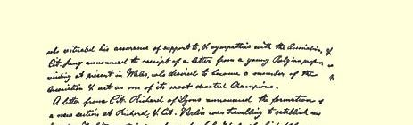
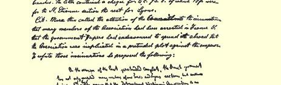
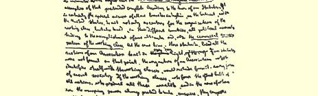
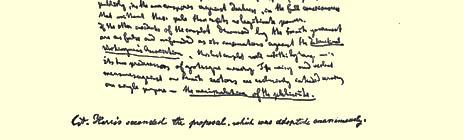

## 卡·马克思总委员会关于“蜂房报”的决议草案３６６

鉴于：

（１）国际工人协会总委员会曾经将“蜂房报”作为总委员会的正式的机关报，作为英国报刊中代表工人阶级运动的机关报推荐给在欧洲大陆和在美国的国际各支部，建议它们订阅该报；

（２）“蜂房报”不仅常常从总委员会的正式报道中删去可能使它的保护人不喜欢的某些决议，而且还用隐瞒的办法系统地歪曲总委员会很多会议的内容；

（３）“蜂房报”，特别是在不久以前更换了所有者３６７之后，还继续以工人阶级唯一的机关报自居，但事实上它已经成为一小撮资本家的机关报；这一小撮资本家妄图支配无产阶级运动，并利用它作为达到他们的阶级目的和党派目的的工具；

国际工人协会总委员会在１８７０年４月２６日会议上一致决定与“蜂房报”断绝一切联系，并通过报刊将这一决议通知自己在英国、在欧洲大陆和在美国的各个支部。

> 卡·马克思于１８７０年５月３日提出原文是英文载于１８７０年５月１１日“人民国家报” 第３８号
>
> 俄文是按贴在总委员会记录簿
>
> 上的卡·马克思的手稿译的

> 记录簿中贴有卡·马克思“关于对法国各支部的
>
> 成员的迫害”手稿的一页