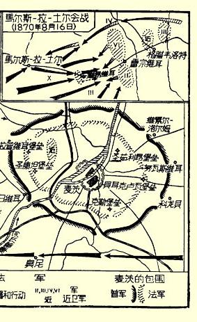
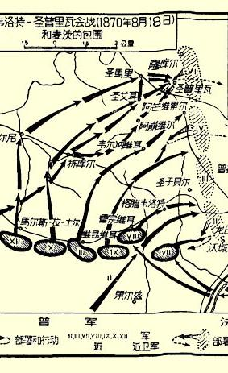
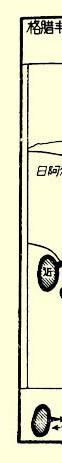
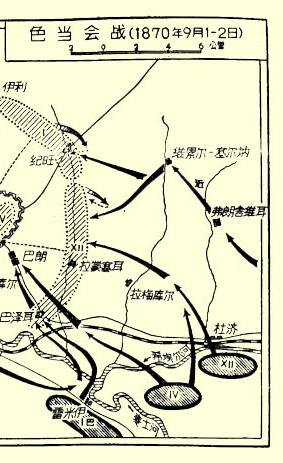
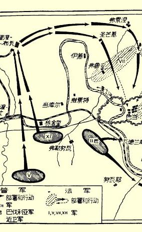
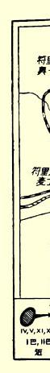

# 弗·恩格斯战争短评１０

> 弗·恩格斯写于１８７０年７月底原文是英文 —１８７１年２月俄文译自“派尔－麦尔新闻” 载于１８７０年７月底—１８７１年２月 “派尔－麦尔新闻”

## 弗·恩格斯

ＴＨＥ

# ＰＡＬＬＭＡＬＬＧＡＺＥＴＴＥ

ＡｎＥｖｅｎｉｎｇＮｅｗｓｐａｐｅｒａｎｄＲｅｖｉｅｗ

> Ｎｏ．１７０３ＶｏｒＸＩＩ   ＦＲＩＤＡＹ，ＪＵＬＹ２９，１８７０   ｐｒｉｃｅ２ｄ；Ｓｌａｍｐｃｄ，３ｄ

# 战争短评（一）

到目前为止几乎还一弹未发，但是战争的第一阶段已经过去， 并且是以法皇的希望的破灭而结束的。要了解这一点，只要概略地观察一下政治和军事形势就够了。

正如现在大家都了解的那样，路易－拿破仑本来以为，他能够使北德意志联邦１１受到南德意志各邦的孤立，并利用不久前归并普鲁士的地区１２所存在的不满情绪。如果以一切可能聚集的兵力向莱茵河猛进，在盖尔曼尔斯海姆和美因兹之间某处渡过莱茵河，向法兰克福和维尔茨堡方向进攻，这个目的是可能达到的。那时法军就能控制南北之间的交通线，迫使普鲁士极其匆忙地把现有的全部军队调向美因河，而不管他们作战准备的程度如何。普鲁士的动员工作的整个过程就会遭到破坏，而入侵的法军就能稳操胜算，一一击破先后从各地开来的普军。不仅从政治上看，而且从军事上看，都是应该这样做的。法国的基干兵制度使它能够比普鲁士的后备军制度１３远为迅速地集中一支譬如１２—１５万人的军队。法军的平时编制不同于战时编制的，仅在于归休人员的数量和没有后备部队，后者在出征前才编成。而普军平时编制的人数还不到战时编制人数的三分之一，并且其余的三分之二无论是兵士还是军官平时都不在军队服役。这样大量的人员的动员工作是需要时间的；此外，这还是一个复杂的过程，这个过程可能因为敌军的突然入侵而被完全打乱。正因为如此，法皇才这样急于发动战争。如果说法皇不打算采取这种突击的行动，那末格腊蒙的强硬口吻和仓促的宣战就没有意义了。

但是德意志人民族感情的突然的强烈的迸发，粉碎了任何一个这样的计划。现在路易－拿破仑面对着的不是普王威廉· “亚涅山大”[^1]，而是德意志民族。而在这种情况下，就是有１２—１５万人的军队，也休想猛然渡过莱茵河。于是就需要用现有的全部兵力来进行正规战以代替突然袭击了。近卫军、巴黎军团、里昂军团和夏龙兵营的一个军，用来实现原来的计划也许是够用的，可是现在即使用来组成一支入侵大军的核心也几乎不够了。于是，开始了战争的第二阶段，即酝酿大规模战争的阶段，从这一天起，法皇必然成功的希望开始消失了。

现在我们把双方准备互相残杀的兵力作一对比。为了简单起见，我们只谈步兵。步兵是决定战斗胜负的兵种。而在骑兵和炮兵（包括多管炮１４和其他奏奇效的兵器）方面的微弱优势，对于任何一方都是没有很大意义的。

法国现有３７６个步兵营（３８个近卫营、２０个ｃｈａｓｓｅｕｒｓ〔猎兵〕营、３００个基干营、９个朱阿夫营、９个土尔科营１５等等）；平时每营８个连。战时３００个基干营各留２个连在后方用来编组后备部队，因此每营只有６个连开赴前线。在这种场合，每个基干团（三营制）留下的６个后备连中，４个连以归休兵和预备兵补充后扩编为第四营，其余的２个连大概应作为后备部队，以后可编成第五营。但是，要编成这些第四营并使它们做好战斗准备，当然需要一些时间，至少要６个星期左右。目前，这些营同流动自卫军１６一样，只能算做警备部队。因此，法国用来进行最初的决战的仅有上述３７６个营。

据我们现有的资料看来，其中有２９９个营属于莱茵军团（由第一至第六的６个军和近卫军组成），再加上大概准备派往波罗的海的第七军（由蒙多邦将军指挥），一共是３４０个营，因此，只剩下３６个营担任阿尔及尔、殖民地和法国内地的防务。由此可见， 法国为了对付德国已经派出了它现有的可以用于这一目的的全部兵力，而且至少在９月初以前不可能用新的、有战斗力的部队去加强自己的军队。

现在我们来看看另外一方。北德意志军队有１３个军，共３６８ 个步兵营，平均每个军有２８个营。每营平时约５４０人，战时约 １０００人。接到动员令后，每团（三营制）抽调一些军官去编组第四营。这时，预备兵立刻应召归队，这些人都在团内服过两三年兵役，并且直到２７岁都有服役的义务。用他们来补充３个基干营并组成由后备军补充的各第四营的主干，是绰绰有余的。因此，各基干营在数日内就可做好出征的准备，各第四营随后经过四五个星期也可以做好准备。同时，每有一个基干团就相应地编成一个后备军的二营制团，其成员是２８岁到３６岁的人员。这两个营编好后，便立即开始编组后备军的第三营。完成这一切工作（包括骑兵和炮兵的动员工作在内）正好需要１３天；因为动员的第一日曾定为７月１６日，所以到今天这一切工作已经完成，或者应该完成。目前，北德意志大概有３５８个基干营担任野战任务，后备军 １９８个营担任警备勤务。这些部队最迟于８月下半月必将得到１１４ 个第四基干营和９３个后备军第三营的加强。在所有这些部队中， 几乎没有一个人是没有服满兵役的。此外，还应该加上黑森－达姆斯塔德、巴登、维尔腾堡和巴伐利亚的军队，共计１０４个基干营。但是，因为后备军制度在这些邦内还没有来得及彻底实行，所以在那里可以用于作战的兵力不会多于７０或８０个营。

后备军主要担任警备勤务，不过在１８６６年的战争中，有相当一部分后备军作为预备部队开到前线进行野战。没有疑问，这一次也将会这样做。

在１３个北德意志军中，目前在莱茵河地区的有１０个军，共计２８０个营；此外，还有南德意志军队约７０个营，两者共计３５０ 个营。现在担任岸防任务和作为预备队的还有３个军，计８４个营， 为了防守沿岸地区，有１个军再加上后备军就足够了。其余２个军，据我们所知，大概也在开往莱茵河途中。到８月２０日，这些部队至少将得到１００个第四营和后备军４０—５０个营的加强，而且这些营的人员在战斗素质上都超过法军那些主要由几乎没有受过训练的人员编成的第四营和流动自卫军。这样，法国的受过训练的兵士不超过５５万人，而这样的兵士单是北德意志就有９５万人。 德国的优势正在于此，而决战越向后推迟，这个优势就越明显，到 ９月底，这个优势的作用将达到顶点。

在这种形势下，我们用不着对柏林方面传出的以下的消息感到奇怪，即德军统帅部希望德国领土不受到战争的浩劫；换句话说，如果德军在最近的将来不遭受攻击，那末他们自己将转入进攻。至于在路易－拿破仑不先发制人的条件下，德军将如何实行这一进攻，那是另外一个问题。

> 载于１８７０年７月２９日 “派尔－麦尔新闻” 第１７０３号署名：Ｚ．

# 战争短评（二）

星期五（７月２９日）早晨，法军的前进运动开始了。向哪一个方向运动呢？一看地图就可以得到答案。

在莱茵河左岸，河谷在西面和佛日山脉相毗连，这支山脉自伯尔福向凯则尔斯劳顿绵延。从凯则尔斯劳顿向北，山势逐渐平坦，到美因兹附近渐渐成为平原。

摩塞尔河谷在莱茵普鲁士形成了一个深邃而曲折的峡谷，这是河流通过高原时冲蚀而成的。高原在河谷的南面形成一支相当大的山脉，叫做霍赫瓦尔特山脉。这支山脉愈接近莱茵河，就愈带有高原的性质，一直到它的最边缘的丘陵同佛日山脉的远支脉相会合的地方为止。

无论是佛日山脉还是霍赫瓦尔特山脉，都不是军队完全不能通过的。它们都有一些很好的大道贯穿其间，但是其中没有一个地区是便于２０—３０万大军行动的。不过，在佛日山脉和霍赫瓦尔特山脉之间却有一条宽达２５—３０英里的宽阔的通道，这里地势起伏，道路四通八达，是极便于大军运动的地区。此外，从麦茨到美因兹的道路也经过这里，而美因兹是法军可能进攻的第一个重要地点。

因此，这里就有了一个自然界规定好的作战方向。一旦德军侵入法国，第一次大规模的冲突（如果双方军队对此都有准备的话）一定发生在洛林的边缘地区，即摩塞尔河以东和南锡—斯特拉斯堡铁路线以北的地区。１７如果法军从上周集中的阵地前进，那末第一次重大的会战也同样将发生在这个通道内的某地，或者在通道以外的美因兹城下。

法军集中的情况如下：３个军（第三、四、五军）配置在第一线，即提翁维耳、圣阿沃耳德和比奇；２个军（第一和第二军）配置在第二线，即斯特拉斯堡和麦茨；近卫军配置在南锡，第六军配置在夏龙，作为预备队。最近几天内，第二线的军队已推进到第一线的间隙内，近卫军被调到麦茨，斯特拉斯堡则留有流动自卫军。这样，法军的全部兵力都已集中在提翁维耳和比奇之间，也就是在那两支山脉之间的通道前面。从这些前提得出的必然结论是：法军企图进入这个通道。

因此，法军的入侵将从夺取萨尔河和布利斯河上的渡口开始， 接着可能占领托莱—霍姆堡一线，然后占领比肯斐特—兰德施土尔一线或者奥伯斯坦—凯则尔斯劳顿一线等等，当然，要有一个前提，即这些进攻行动不被德军的进攻所阻遏。在山区，无疑将出现双方的翼侧部队，他们之间也将发生战斗；但是，真正的会战可能发生在刚才谈到的那个地区。

关于德军的部署，我们一无所知。但是我们推测，如果他们打算在莱茵河左岸迎击敌人，那末他们的集中地区就在美因兹直前方，也就是在通道的另一端。否则，他们就将留在右岸，在宾根和曼海姆之间，根据情况在美因兹上方或下方集中。至于美因兹，过去它是抵御不了线膛炮的轰击的，但是在距垒墙４０００— ５０００码处构筑了新的独立堡垒线以后，它的安全似乎已经得到充分的保证。

现在有充分根据来推测，德军至多比法军迟两三天就将做好进攻准备，并力图开始进攻。在这种情况下发生的会战，将和索尔费里诺会战１８类似，即两军全线展开，彼此迎面前进。

在这里，特别巧妙而灵活的机动是不会有的。在使用这样庞大的军队的情况下，要保证他们按照预定的计划从事简单的向敌运动，是相当困难的。哪一方采取冒险的机动，那一方就会早在这个机动实现以前就被对方大军简单的前进运动所击破。

现在，在柏林对于冯·维德恩先生的论述莱茵诺要塞的著作１９谈论得很多。据作者说，从巴塞尔到穆尔格河的一段莱茵河上根本没有构筑工事，南德意志和奥地利在这个方向上抵御法军袭击的唯一设施，是坚固的乌尔姆要塞。这个要塞自１８０６年以来由一支巴伐利亚人和维尔腾堡人混合编成的１万人的部队防守。这支部队在战时可能增至２５０００人，此外，在要塞围墙以内的营垒里面还可驻屯２５０００人。拉施塔特被认为是法军前进途中最大的障碍，它位于穆尔赫河流过的谷地。这个城市的防御工事由瞰制四周地区的、并用围墙连结起来的三座大堡垒组成。南面和西面的堡垒，即“列奥波特” 堡垒和“弗里德里希” 堡垒，位于穆尔格河左岸；北面的堡垒叫做“路德维希” 堡垒，位于右岸，在右岸还有一个可以驻屯２５０００人的营垒。拉施塔特距离莱茵河４英里，河流和要塞之间是一片森林，因此，这个要塞不能阻止军队在这里渡河。其次一个要塞是兰道，过去它由三个堡垒组成：一个在南面，一个在东面，一个在西北面。这些堡垒和兰道城之间隔着一片位于克渭希河两岸的沼泽地。南面和东面的堡垒近来已经废弃，现在只有西北面那一个堡垒可用于防御。在这个地区内最重要而且形势最好的要塞是跨莱茵河两岸的盖尔曼尔斯海姆。 它瞰制着两岸相当大的一片地区，并且实际上使敌人无法一直进到美因兹和科布伦茨。这个要塞可以大大便于军队进入莱茵普法尔茨，因为除现在已有的一座浮桥外，还可在要塞的火炮掩护下再架设两三座桥。盖尔曼尔斯海姆还可作为沿克渭希河一线配置的左翼军队的作战基地。美因兹是莱茵河上最重要的要塞之一，但是，它为邻近的一些高地瞰制，这就需要增加城内的工事，因此城内未必能有足够的地方容纳大量守备部队。在美因兹和宾根之间的整个地区，现在已构筑了坚固的工事，而在美因兹和美因河口之间（在莱茵河对岸）筑有３个大营垒。至于科布伦茨，冯· 维德恩先生认为，要想围攻这个要塞，并且指望获得胜利，就需要六倍于要塞守军的兵力。敌人可能从那个叫做库科普弗的高地轰击“亚历山大” 堡垒而开始攻击，在这个高地上，敌人的部队可以利用森林作掩护。作者还描述了科伦和威塞尔的工事，但是， 除了大家已经知道的以外，并没有提供任何新的东西。

> 载于１８７０年８月１日 “派尔－麦尔新闻” 第１７０５号本文前一部分的署名：Ｚ．

# 战争短评（三）

普军的作战计划终于开始明朗化了。读者记得，虽然在莱茵河右岸有大批军队由东向西和西南调动，但是，很少听到这些军队在紧靠受威胁的边境集中的消息。各要塞已从附近的部队得到了大量增援。在萨尔布吕肯附近，步兵第四十团的５００人和枪骑兵第七团的３个连（两者均属第八军）曾同敌人进行互射；巴伐利亚猎兵和巴登龙骑兵已将前哨线推进到莱茵河边。但是，在这个由几支轻装部队组成的掩护部队的近后方，看来并没有配置大量军队。在这些小战斗中没有任何一次提到有炮兵参加。在特利尔完全没有军队。另一方面，我们听说在比利时边境附近有大量军队，科伦附近 （这里的莱茵河左岸整个地区，几乎直到亚琛，都有丰富的马料）有 ３万骑兵，美因兹前面有７万人。这一切似乎是不可思议的，好像普军几乎犯罪似地分散了兵力，而法军却与此相反，它紧密地集中在距边境仅数小时行程的地方。但是突然从各地接二连三传来了一些消息，这些消息看来已把这个秘密揭开了。

曾冒险进入特利尔的一位“时报”２０记者，在７月２５日和２６日看到各兵种的大批部队通过这个城市开向萨尔河一线。大约与此同时，萨尔布吕肯薄弱的守备部队得到了大量援兵，他们可能是从第八军司令部驻地科布伦茨调来的。路过特利尔的部队，大概属于从北面越过艾费耳高原开来的另一个军。最后，我们从私人方面获悉，７月２７日第七军已经由亚琛经特利尔向边境行军。

这样，我们看到，至少有３个军约１０万人已调到了萨尔河一线，其中第七、八两个军属于斯坦美兹将军指挥的北方军团（包括第七、八、九、十军）。我们可以很有把握地推测，这个军团目前全部集中在萨尔堡和萨尔布吕肯之间。如果在科伦近郊真有３万（或者接近此数）骑兵，那末这些骑兵一定会越过艾费耳高原并渡过摩塞尔河向萨尔河前进。这整个的部署似乎说明，德军将以自己的右翼在麦茨和萨尔鲁伊之间地区向尼德河上游谷地进行主攻。如果预备队的骑兵确实已经往上述方向前进，那末，我们的推测便是有把握的。

这个计划要求德军全部集中在佛日山脉和摩塞尔河之间。中央军团（由弗里德里希－卡尔亲王指挥，包括第二、三、四、十二军） 看来会占领同斯坦美兹的左侧相毗连的阵地，或者集结在他的后方作为预备队。南方军团（由王储[^2]指挥，包括第五军、近卫军和南德意志的军队）大概在茨魏布吕肯地区的某地形成左翼。至于目前所有这些军队在什么地方以及如何调到阵地上去，我们还不清楚。 我们只知道，第三军已经开始乘火军经科伦沿莱茵河左岸向南前进。但是，我们可以推测，那个曾经筹划把１０万到１５万人的军队从遥远的、而且看来是从各个不同的地方迅速集中到萨尔河一带的人，也会给其余部队指出同样的向心运动的路线。

这确实是一个大胆的计划，而且它也许和其他任何一个可能提出来的计划同样有效。这个计划预定进行这样一次会战，在这次会战中，德军左翼从茨魏布吕肯起几乎一直到萨尔鲁伊止，应当完全采取守势，而右翼则从萨尔鲁伊和萨尔鲁伊以西出发，在所有的预备队的支援下以自己的全部力量向敌人进攻，并以全部预备队骑兵进行侧敌运动，切断敌人同麦茨的交通线。如果这个计划成功而德军赢得第一次大会战的胜利，那末，法军不仅有失掉同他们的最近的基地麦茨和摩塞尔河的联系的危险，而且可能被逐到使德军得以插到他们和巴黎之间的位置。

德军在这种形势下，加上同科布伦茨和科伦的交通线十分安全，甚至能够冒失败的危险，因为这样的失败对他们来说远不会招致那么致命的后果。然而，这终究是一个冒险的计划。要使溃败的军队，特别是它的右翼，平安地通过摩塞尔河及其支流的隧道撤退，是异常困难的。而且无疑地，许多兵士会被俘虏，相当一部分炮兵会损失，而在莱茵各要塞的掩护下重新编组军队也要很多时间。 如果毛奇将军没有确信他的兵力占有压倒优势以致几乎必胜无疑的话，此外，如果他不知道法军不能在他正从各地向选定为第一次会战的地点调集兵力时袭击他的部队的话，那末，采用这个计划就是轻率的。事实是否如此，我们可能很快就知道，甚至可能就在明天。

但在目前应当记住，任何时候都不应当确信这些战略计划会完全带来一切预期的效果。障碍随时随地都会发生，例如：部队可能在需要他们的时候不能准时来到；敌人可能突然移动，也可能已采取了意外的戒备措施；此外，激烈而顽强的战斗或者某一个将军的健全的理智，也往往能使败军避免因失败而造成的最坏的结局， 即避免失去同自己基地的交通线。

> 载于１８７０年８月２日 “派尔－麦尔新闻”第１７０６号署名：Ｚ．

# 战争短评（四）

７月２８日，法皇到达麦茨，次日晨接任莱茵军团总指挥。按照拿破仑的传统，这一天应当是积极行动的开始；但是一个星期已经过去了，我们还没有听说关于整个莱茵军团出动的消息。３０ 日，一小队普军在萨尔布吕肯附近击退了法军的侦察队。８月２ 日，第二军（由弗罗萨尔将军指挥）的第二师（由巴泰将军指挥）占领了萨尔布吕肯以南的高地，用炮火赶走了城里的德军，但是没有试图渡河并以猛攻夺取北岸那些瞰制城市的高地。因此，在这次进攻中萨尔河防线并没有被突破。自此以后，再也没有听到法军前进的消息，因此，法军在８月２日战斗中所获得的优势现在还几乎等于**零**。

法皇从巴黎动身前往麦茨的时候曾企图立刻越过国界，对于这一点，现在恐怕不能怀疑了。如果他这样做了的话，他就能够彻底打乱敌方的准备工作。７月２９日和３０日，德军还远没有集中完毕。南德意志的军队还在从各地徒步或者乘火车向莱茵河上各桥口集结。普鲁士的预备队骑兵连续不断地经过科布伦茨和埃伦布莱施坦向南进发。第七军在亚琛和特利尔之间，距离任何一条铁路都很远。第十军正从汉诺威出发，而近卫军也正从柏林乘火车出发。在这个时机，法军如果坚决进攻，几乎一定能进到美因兹外围的堡垒，并且能取得对德军退却纵队的相当大的优势，也许甚至有可能在莱茵河上架桥，并在右岸建立桥头堡来掩护桥梁。 无论如何，战争就会在敌人国土上进行，而这就会大大鼓舞法军的士气。

为什么在这样一个时机没有发起这样的进攻呢？原因很简单， 如果说法军兵士已经准备就绪，那末他们的军需部门还没有准备好。我们用不着引用德方的任何传闻，我们有让罗上尉（前法国军官，现为“时报” 随军记者）的证明。他明确地指出，出征所必需的各种物资在８月１日才开始分配，部队缺少行军水壶、行军锅和其他行军装具，肉是腐烂的，而面包又常常是发霉的。也许可以说，第二帝国的军队在此以前已经由于第二帝国本身而遭受了失败。在必须依靠久已形成的一整套贪污致富的办法向帝国的支持者慷慨行贿的制度下，不可能设想这种办法不风行于军需部门。据鲁艾先生的供认，这场战争在很久以前就开始准备了；但是对于各种储备物资的准备，特别是装具的准备，显然注意得最少；而正是在这方面产生的混乱使得作战行动在战争最紧要的关头推迟了几乎一个星期。

这一周的拖延大大改变了德军的处境。这一拖延使他们有时间把自己的军队调到前线，并集中在预定的阵地上。我们的读者都知道，我们推测德军全部兵力现在都已集中在莱茵河左岸大体上与法军相对的位置上。这个看法已由星期二以来所得到的一切官方和私人的消息证实了（星期二，我们曾经使“泰晤士报” 有可能借用我们对这一问题的全部看法，而该报在今天早晨竟坚持把这些看法说成是它自己的２１）。斯坦美兹、弗里德里希－卡尔亲王和王储分别指挥的３个军团共有１３个军，至少有４３—４５万人。 同他们对抗的全部兵力中受过训练的兵士充其量也不会比３３— ３５万超过很多。如果说不止此数，那末其余的就是那些未经训练的和最近才编成的营了。但是，上述德军兵力还远不是德国的全部力量。仅拿野战部队数量来说，就有３个军（第一、六、十一军）还没有计算在里面。这３个军现在在什么地方，我们不知道。 我们只知道他们已经离开自己的驻防地点，并且发现第十一军的各团在莱茵河左岸和巴伐利亚的普法尔茨。我们还确切地知道目前在汉诺威、不来梅以及它们的郊区除后备军外没有其他部队。这可以使我们得出结论：至少这３个军的大部分也已经开往前线，而在这种情况下，德军已有的优势兵力又增加了大约４—６万人。即使还有后备军的一些师调到萨尔河前线，这也不会使我们感到奇怪。现在，后备军中有２１万名兵士已完全做好了准备，各第四营和其他基干营计１８万人也几乎准备就绪；他们中间的一部分人可能用来进行第一次决定性的攻击。但愿谁也不要认为，这些兵员在某种程度上仅存在于纸上。１８６６年的动员证明，他们确实存在， 而目前的动员再度证明，受过训练的、做好出征准备的人员比需要的还多。这些数字似乎是难以相信的，然而，甚至就是这些数字也还不是德国的全部军事实力。

因此，在本周末法皇将面对数量上占优势的敌军。如果说在上周他想前进而不能够前进，那末现在他既不能前进也不想前进了。关于敌军的兵力，他并不是不了解，这一点在来自巴黎的消息中可以看到一些迹象。这个消息指出，２５万普军集中在萨尔鲁伊和诺伊恩基尔兴之间。至于哪些部队在诺伊恩基尔兴和凯则尔斯劳顿之间，巴黎的消息却没有提到。因此，法军一直到星期四都没有采取行动，部分的原因可能就是作战计划有了改变，他们可能放弃进攻而准备采取守势，利用在筑垒阵地上严阵以待时后装枪和线膛炮给军队所造成的优势，因为在这种场合下这些武器将使军队的威力大为增强。但是，做出这样的决定必定使法国人在战争一开始就大失所望。不经过一次大会战就牺牲洛林和亚尔萨斯的一半土地（而我们怀疑，这样庞大的一支军队能找到比麦茨近郊的阵地更靠近边境的有利阵地），这会给法皇带来严重的后果。

为了对付法军这样的行动，德军可能采取上述计划。他们可能力图在敌人到达麦茨之前就把他们卷入大会战，并在萨尔鲁伊和麦茨之间急速前进。不管怎样，他们总会力图从侧面绕过法军的筑垒阵地而切断他们同后方的交通线。

一支３０万人的军队需要大量粮食，它不能让它的补给线被截断，即使是几天也不能。截断它的补给线，就可以迫使它离开自己的阵地，进行野战，那时它就丧失了这些阵地的有利条件。不管可能采取什么样的行动，但是我们可以确信，最近一定会采取行动。７５万人是不能够长久集中在一块５０平方英里的地区的。由于无法供养这样多的人，这一方或那一方将不得不采取行动。

最后重复一遍，我们是从法军和德军双方都把现有的全部兵力调到前线参加第一次大会战这样一个推测出发的。而在这种场合下，我们仍然坚持这样的意见，即德军在数量上将占有相当大的优势，只要他们不犯大错误，就足以取得胜利。一切官方和私人的消息都证实了我们这个推测。但是，不言而喻，这一切不能认为是绝对肯定的。我们不得不依据那些可能造成误解的材料来做结论。甚至在我们写这篇文章的时候，我们还不知道会采取什么样的部署；同样不能预言，这一方或另一方指挥官会犯什么样的错误，或者相反，会发挥什么样的天才。

今天我们最后要谈的，是关于德军攻击亚尔萨斯的维桑堡防线 ２２的问题，德军方面参加会战的有普鲁士第五军、第十一军和巴伐利亚第二军的部队。这样我们就有了直接的证据说明，不仅第十一军，而且王储的全部主力都在普法尔茨。消息中提到的“皇家近卫掷弹兵” 团，是掷弹兵第七团，即西普鲁士第二团，它和第五十八团一样，属于第五军。普鲁士的作战方法总是先以一个军的兵力全部投入战斗，同时把另一个军的部队调来。但是这次在至多一个军就可以成功地进行的战斗行动中，却使用了普鲁士和巴伐利亚３个军的部队。看来，用３个军来威胁亚尔萨斯，是为了给法军制造印象。此外，沿莱茵河谷向上游的进攻可能在斯特拉斯堡附近被阻，而越过佛日山脉进行侧敌运动时，山道可能被比奇、法耳斯布尔和拉－普提特－比埃尔这些不大的要塞封锁， 这些要塞完全能够阻止军队沿大道运动。我们估计，当德军这３个军的三四个旅攻击维桑堡时，这些军的主力大概经兰道和皮尔马森斯向茨魏布吕肯前进。如果上述各旅成功，麦克马洪的几个师就会向相反的方向（向莱茵河）前进。他们在那里根本不能造成任何威胁，因为沿平原向普法尔茨的任何入侵都会在兰道和盖尔曼尔斯海姆附近被阻。

这次维桑堡会战，显然是在德军几乎稳操胜算的兵力优势下进行的。这是战争爆发以来的第一次重大的冲突，它对军队士气的影响必然是很大的，特别是因为对筑垒阵地的强攻一向被认为是一种困难的任务。尽管法军有线膛炮、多管炮和沙斯波式步枪２３，德军却用刺刀把他们逐出了筑垒阵地，这一事实对两军都会发生影响。这无疑是刺刀成功地对付后装步枪的第一个战例，因此这次会战将是值得纪念的。

由于这个原因，这次会战打乱了拿破仑的计划。这样一个消息，如果不和其他地方获胜的消息放在一起，即使说得极其轻描淡写，也不能让法军知道。而这个消息又无法隐瞒１２小时以上。 因此，我们可以预料，法皇将派出他的军队去寻求这种胜利，如果我们不能很快得到法军胜利的消息，那就奇怪了。但是同时，德军可能也会出动，因此，双方的先头部队将在几个地方而不是在一个地方发生接触。今天，或者至迟明天，预料第一次决战就要开始。

> 载于１８７０年８月６日 “派尔－麦尔新闻” 第１７１０号

# 普军的胜利

德军第三军团迅速的行动使毛奇的计划日益明朗化。这个军团一定是通过曼海姆和盖尔曼尔斯海姆两地的桥梁，可能还通过这两地之间的军用浮桥而在普法尔茨集中的。集中在莱茵河谷的军队，在沿着从兰道和纽施塔特经过哈尔特高原向西延伸的道路运动以前，可以用来进攻法军的右翼。握有优势兵力而且有兰道在近后方的这样一次进攻，是完全没有危险的，而且能够获得重大的战果。这时，如果能够诱使相当大的一部分法军离开主力来到莱茵河谷，击败他们，并溯河谷而上把他们逐向斯特拉斯堡，那末这部分法军就不能参加决战了，而德军第三军团则因离法军主力非常近，仍能参加决战。无论如何，如果德军的主攻是针对法军的左翼（不管许多军事的和非军事的饶舌家如何反对，我们仍然认为是这样），那末向法军右翼进攻，就会迷惑他们。

对维桑堡突然而成功的攻击，说明德军掌握了关于法军部署的情报，而这些情报促使他们采取了这一机动。法军急于报复，于是冒失地落入了圈套。麦克马洪元帅立即把所属各军调向维桑堡， 而要完成这个机动，据说他需要两天的时间。但是王储却不打算给他这个时间，他立即利用自己的优势，于星期六在维桑堡西南约１５英里的索尔河畔维尔特附近攻击法军２４。麦克马洪的阵地据他自己说是坚固的。但是到下午５时他就被逐出了阵地，并且据王储推测，他已率领自己的全部兵力退向比奇。这样，他也许能摆脱被逐到离开战斗行动中心的斯特拉斯堡的厄运，而有可能与主力保持联络。但是，根据最新的法国电讯得知，他实际上已退向南锡，他的司令部目前在萨韦尔恩。

法军为阻止德军进攻而派出的２个军包括７个步兵师，据我们估计，其中至少有５个师参加了战斗。在会战过程中他们全部相继开到战场是可能的，但是，他们已不能恢复均势，就像逐一开到马振塔战场的奥地利各旅未能做到这点一样２５。无论如何，我们可以有把握地说，法军全部兵力有五分之一到四分之一在这里被击溃了。德军方面参加会战的可能仍然是那些以前卫攻占维桑堡的部队，也就是巴伐利亚第二军、北德意志第五军和第十一军。 其中第五军包括２个波兹南团、５个西里西亚团和１个威斯特伐里亚团；第十一军包括１个波美拉尼亚团、４个黑森—加塞尔和拿骚团，３个绍林吉亚团。由此可见，参战的有来自德国各个不同地区的军队。

在这些军事行动中，最使我们惊异的是双方军队在战略上和战术上所扮演的角色，他们所扮演的角色与根据传统所能预料的恰恰相反。德军进攻，法军防御。德军行动神速，并且用他们指挥自如的大量兵力作战；而法军就连自己也承认，他们的军队经过两周的集中，仍然相当分散，还需要两天的时间才能把两个军集中起来。结果，他们被各个击破。根据法国人调动军队的情况看来，可以把他们当做是奥地利人。这怎么解释呢？理由很简单： 这在第二帝国中是必然的事情。维桑堡附近的打击，足以使整个巴黎震动，无疑地也足以扰乱军心。必须进行报复，于是立即派麦克马洪率领两个军来实行这个报复。这一步肯定是错的，但是又不得不走，而且已以走了—— 所得的结果我们已经看到了。如果麦克马洪元帅得不到强大的增援而不能再次迎击王储，那末后者再向南前进１５英里左右，就能占领斯特拉斯堡—南锡铁路，并向南锡迅速前进，因此也就能迂回法军在麦茨前方所能指望扼守的任何一条防线。无疑，正是因为害怕这一点，法军才不得不放弃萨尔区。王储在派遣他的前卫去追击麦克马洪以后，也可以立即转向右面，越过山区向皮包马森斯和茨魏布吕肯运动，以便同弗里德里希－卡尔亲王的军团左翼很好地会师。后者在这个期间一直在美因兹和萨尔布吕肯之间某地，而法军却硬说他在特利尔附近。至于弗罗萨尔将军指挥的军在福尔巴赫的失败２６，对于弗里德里希－卡尔亲王的运动会有什么影响（看来，普军在这以后已于昨日向圣阿沃耳德推进），我们现在还不能断定。

如果说第二帝国在维桑堡会战以后十分需要胜利，那末现在， 在维尔特会战和福尔巴赫会战以后，它就更加需要胜利了。如果说维桑堡会战已足以破坏法军右翼原定的全部作战计划，那末星期六的会战就必然打乱了整个法军的一切准备措施。法军已丧失了一切主动权。它的行动与其说是决定于军事上的考虑，不如说是出于政治上的必要。一支３０万人的军队几乎都在敌人的视野之内。如果不根据敌人营垒中所发生的情况，而根据巴黎所发生的或者可能发生的情况来决定自己的行动，那末它就已经失败一半了。当然，谁也不能确切地预言决战（如果它不是已经在进行，那末也是迫在眉睫了）的结局。但是，我们可以说，如果拿破仑第三把星期四[^3]以来所实行的那种战略再实行一个星期，那末，仅仅这一点就足以使世界上最好最大的军队复灭。

法皇拿破仑的电报只是加深了普军关于这些会战的报道所造成的印象。星期六午夜，他只是公布了一些事实：

> “麦克马洪元帅战胜。弗罗萨尔将军被迫退却。”

３小时后得到的消息说，法皇同麦克马洪元帅的联系被截断了。星期日早晨６时，当局承认弗罗萨尔将军在萨尔布吕肯以西很远的地方，也就是在福尔巴赫遭受失败，这就从实质上证实了这次失败的严重性；其次宣称：“被分割的军队正向麦茨集中”，也就承认了无法立即阻止德军进攻。后来发出的一个电报却令人难以理解：

> “退却将井然有序地进行。”（？）

是谁退却呢？不会是麦克马洪元帅，因为同他的联系仍然中断；也不会是弗罗萨尔将军，因为法皇接着说：“从弗罗萨尔将军那里没有得到任何消息。” 如果在早晨８时２５分，法皇只能用未来语气说明他尚不知位置何在的那些军队行将进行的退却，那末， 他在这以前８个小时发出的、用现在语气说的“退却正井然有序地进行” 的电报，会有什么意义呢，后来的所有这些消息和最初的消息一样，都贯穿着一个精神，即：《Ｔｏｕｔ Ｐｅｕｔ ｓｅ ｒéｔａｂｌｉｒ》〔“一切都可以补救”〕。普军的胜利很大，以致不容法皇采用他自然想要采用的那种手法。他不可能大胆地隐瞒真相而把希望寄托于以后会战获胜时一起发表消息来抵销失败的印象。现在已经不可能在法国人民面前隐瞒法军两个军团失败的事实来保持他们的自豪感，因此他只有指望利用法国人过去在得到类似的灾难的消息时在心中产生的那种挽回失去的东西的强烈愿望。法皇在给皇后和大臣们的私人电报中，无疑给他们规定了公开讲话的范围，甚至更有可能从麦茨给他们送去了有关的声明的原稿。根据以上所述，我们得出以下结论：不管法国人民的心情如何，所有当权者，上自皇帝起，都完全丧气了，这件事本身的意义是特别重大的。巴黎宣布了戒严，这不容置辩地说明，如果普军获得新的胜利，那会造成怎样的局面。而内阁的宣言的结语是：

> “我们将努力作战，祖国将得救。”

得救！法国人也许会自问：从什么中得救？从普军为了防止法军入侵德国而进行的入侵中得救。如果普军被击败，而同样的号召从柏林发出来，那末它的意思就清楚了，因为法军每一个新的胜利都会意味着法国对德国领土新的兼并。但是，如果普鲁士政府将来做得十分恰当的话，那末法军的失败将只意味着法国阻碍普鲁士顺利地推行它的德意志政策的企图失败了；我们很难相信，ｅｎ ｍａｓｓｅ〔全民〕武装（据说，法国大臣们正在讨论这个问题）会使他们重新发动一个进攻战。

> 载于１８７０年８月８日 “派尔－麦尔新闻” 第１７１１号

# 战争短评（五）

星期六，即８月６日，是战争初期极关重要的日子。德方最初的报道十分含蓄，与其说是指明这一天所获的战果的重要意义， 不如说是隐译它的重要意义。只是根据后来的较全面的报告以及法军报告中某些尴尬的自白，我们才得以判断星期六军事形势所起的全部变化。

当麦克马洪在佛日山脉的东面山坡遭受失败的时候，弗罗萨尔的３个师和巴赞军至少１个团（第六十九团），共４２个营，被第七军（威斯特伐里亚军）的卡梅克师和第八军（莱茵军）的２个师，即巴尔涅科夫师和施图普纳格耳师，共３７个营，从萨尔布吕肯以南的高地一直驱逐到福尔巴赫以西。因为德军各营编制员额较多，所以双方参加作战的人数大致相等，但是法军具有阵地的优势。弗罗萨尔左侧有巴赞和拉德米罗的７个步兵师，在后面又有２个近卫师。但是，除上述１个团以外，所有这些师都没有一兵一卒去援助不幸的弗罗萨尔。他在惨败后不得不退却，现在也和巴赞、拉德米罗和近卫军一样，正使全部部队向麦茨退却。德军追击退却的法军，星期日已到达了圣阿沃耳德，于是整个洛林， 一直到麦茨为止，都已暴露在德军的进攻面前。

同时，麦克马洪、德·法伊和康罗贝尔，不是像以前指出的那样退向比奇，而是退向南锡。麦克马洪的司令部星期日曾设在萨韦尔恩。由此可见，这３个军不仅被击败，而且被击退到和其余军队退却路线不同的方向去了。这样，我们昨天所分析的王储在进攻中所努力争取的那些战略上的优势，看来已经获得了，至少是部分地获得了。当法皇一直向西退却时，麦克马洪愈来愈偏向南去，因此到其他４个军在麦茨掩护下集中的时候他未必能到达吕内维尔。但是从萨尔格明到吕内维尔，比从萨韦尔恩到吕内维尔仅仅远几英里。因此，不能设想，当斯坦美兹在追击法皇，而王储力图在佛日山脉狭窄的山道中追上麦克马洪的时候，弗里德里希－卡尔亲王（星期日他在布利斯堡，而他的前卫在藏尔格明附近某地）竟会袖手旁观。整个洛林北部都是骑兵的出色战场，而在吕内维尔平时经常设有骑兵司令部，指挥驻在郊区的很大一部分法国骑兵。德军骑兵无论在数量上或质量上都占很大的优势，因此很难设想他们不会立刻把这一兵种的大量部队派到吕内维尔方向，以便切断麦克马洪同法皇之间的交通线，并破坏斯特拉斯堡 —南锡线上的铁路桥梁，并在可能时破坏麦泰河上的桥梁。德军甚至可能成功地以步兵部队楔入这两股被分割的法军之间，使麦克马洪不得不更向南退却和绕更远的道路去恢复他同其余军队的联系。从法皇承认星期六同麦克马洪的联系被截断这一事实中可以看出，这一类事件已经发生了。同时，关于法军大本营拟向夏龙转移的消息，也是法军害怕更严重的后果的不祥之兆。

这样看来，法军８个军中已有４个军全部或者几乎全部被击溃了，并且每次都是被各个击破的；而其中之一的第七军（由费里克斯·杜埃指挥）的下落则完全不明。导致这种错误的战略，真像奥地利人在完全束手无策时采用的战略。这种战略使我们联想到的不是拿破仑，而是博利约、马克和居莱之流。请设想一下弗罗萨尔的处境，他在福尔巴赫作战终日，而在他左侧距萨尔河防线不到１０英里或者大约１０英里的地方，７个师竟袖手旁观！如果不设想他们当面的德军既足以阻止他们前去援救弗罗萨尔，又足以阻止他们单独进行攻击来支援他，那末这就完全不能令人理解了。但是这个唯一可能提出的理由只有如我们一贯指出的那样，在德军打算以其极右翼进行决定性的攻击的条件下，才可以成立。向麦茨仓卒退却，又一次证实了这个看法。这次退却很像是在阵地和麦茨的交通线受到威胁时企图及时退出阵地的行动。我们虽然不知道，哪些德军部队在正面同拉德米罗和巴赞所属各师对垒以及可能从翼侧迂回他们，但是我们不应当忘记，斯坦美兹的７个或者更多的师中仅有３个师参加了战斗。

在这期间，又开来了另外一个北德意志军—— 第六军，即上西里西亚军。这个军在上星期四经过科伦，现在由斯坦美兹或弗里德里希－卡尔指挥。关于弗里德里希－卡尔，“泰晤士报”仍然坚持说他在极右翼特利尔附近，虽然该报的同一号上登载了一则电讯，说他已从霍姆堡向布利斯堡前进。现在，德军无论在兵力和士气上或者在战略上都具有极大的优势，以致他们在某些时候几乎可以不受惩罚地为所欲为。即使法皇打算把４个军留在麦茨的营垒内，—— 否则他就得不停地一直退到巴黎，此外没有其他的选择余地，—— 那也无法阻止德军进攻，就同贝奈德克在１８６６ 年在奥里缪茨城的掩护下重新集结他的军队而未能阻止普军向维也纳进攻２７一样。贝奈德克！马振塔和索尔费里诺会战的胜利者怎能和他相比！但是，这是一个最恰当不过的比较。同贝奈德克一样，法皇把军队集中在一个可以向任何方向运动的阵地上，而且是在敌人集中前整整两个星期就集中好了。同贝奈德克一样，路易－拿破仑采取了巧妙的行动，使自己的各军都因敌人在数量上或在指挥上占优势而被各个击破。但是，我们担心类似之处就到此为止。虽然贝奈德克一个星期中每天都打败仗，他终究还保存了足够的兵力在萨多瓦进行最后的奋战。至于拿破仑，从各方面看来，他的军队经过两天战斗后几乎已绝望地被分割了，因此，他甚至不能试图进行一次决战了。

我们认为，原来打算向波罗的海进行的远征，如果不仅仅是一个简单的佯动的话，那末现在可以放弃了。每一个营都要用在东部边境。法军３７６个营中有３００个营分属于６个基干军和１个近卫军，这些军据我们了解都在麦茨和斯特拉斯堡之间。第七基干军（由杜埃指挥），即另外４０个营，可能已被派往波罗的海，也可能同主力会合。其余３６个营勉强够用于阿尔及尔和在国内担任各种勤务。法皇还有哪些兵力去增援呢？这些兵力就是现在正在编成的１００个第四营和流动自卫军。但是，这二者—— 前者大部分，后者全部—— 都是由没有受过训练的新兵编成的。什么时候各第四营可以完成出征准备，我们不知道，但是不论他们是否完成准备，他们都必须出征。至于流动自卫军目前的状况，我们可以从上星期夏龙兵营的事件２８来作判断。无论是各第四营还是流动自卫军无疑都是良好的兵士材料，但还不是兵士，还不是能够经得住那些善于夺取多管炮的人的攻击的军队。另一方面，再过 １０天左右，德军能够补充１９万到２０万人的第四营和其他部队， 这是精锐部队；此外还将得到至少是同样数目的后备军，他们全部适于担任野战勤务。

> 载于１８７０年８月９日 “派尔－麦尔新闻” 第１７１２号

# 战争短评（六）

以往恐怕没有一次战争像拿破仑“到柏林的军事散步” 这样极端忽视普通理智的常规，这一点现在已经没有任何疑问了。莱茵河的争夺战是拿破仑最后的和最大的一张王牌；但是同时，这次战争的失败也就意味着第二帝国的崩溃。这在德国是了解得很清楚的。经常期待对法战争的爆发，曾经是很多德国人不得不容忍１８６６年的变动的主要原因之一。如果在一定的意义上说德国是分裂了，那末在另一方面说却是加强了，北德意志的军事组织所提供的安全保证，比那个较大的但涣散的旧德意志联邦２９的军事组织所提供的要大得多。这个新的军事组织预定能在１１天内使编入各步兵营、骑兵连和炮兵连的５５２０００名常备军和２０５０００名后备军完成战斗准备，并且再经过两三个星期，又使１８７０００名完全适于野战的补充部队（Ｅｒｓａｔｚｔｒｕｐｐｅｎ）做好战斗准备。这并不是秘密。这些部队怎样分编为各军以及每个营应在哪个地区编组的全部计划曾不止一次地公布过。而且，１８６６年的动员证明，这个组织并非一纸空文。每一个人都按照规定进行了登记；大家也都很清楚，每个后备军管区司令部都已准备好每人的征集令，只等填写日期了。然而在沙皇看来，这些庞大的兵力仅仅见于纸上。他到战争开始时所征集的全部兵力，至多是莱茵军团的３６万人和准备向波罗的海远征的３—４万人，共计约４０万人。在兵力对比如此不利以及法军新编部队（第四营）需要很长时间才能做好战斗准备的情况下，沙皇成功的唯一希望，就是乘德国还在忙于动员的时候进行突然袭击。我们已经看到，这个机会是怎样被错过了， 甚至第二个取胜的机会，即向莱茵河进攻的机会，又是怎样被错过了。现在，我们还要指出另一个错误。

法军的部署到宣战的时候是很好的。这显然是一个深思熟虑的作战计划的不可分割的一部分。３个军在提翁维耳、圣阿沃耳德和比奇，直接在边境附近，为第一线；２个军在麦茨和斯特拉斯堡， 为第二线；２个军作为预备队，在南锡附近；第八军在伯尔福。所有这些军队依靠铁路在几天内就可集中起来从洛林渡过萨尔河进攻，或者从亚尔萨斯渡过莱茵河进攻，并且根据情况向北或向东进击。但是，这个部署只适于进攻。对于防御，它完全不适用。如进行防御，军队部署的首要条件是：前进部队同主力应保持适当距离，以便能够及时获得关于敌人进攻的情报，并在敌人到达前集中好军队。假定两翼部队向中央集中需要行军一天，那末前进部队至少必须同中央保持一日行程的距离。而在这里，拉德米罗、 弗罗萨尔和德·法伊３个军，以后还有麦克马洪军的一部，都直接配置在边境附近，而且分布在从维桑堡到锡埃尔克全长至少为 ９０英里的一线上。为了要把两翼部队集中到中央，就需要行军整整两天；不但如此，甚至当得知德军就在前面几英里的时候，也没有采取任何措施来缩短战线，或者把前进部队推进到适当距离上，以保证及时获得关于敌人行将进攻的情报。因此，几个军被各个击破，还有什么奇怪呢？

接着造成的一个错误，就是麦克马洪把１个师配置在佛日山脉以东维桑堡附近一个招引敌人优势兵力攻击的阵地上。杜埃的失败使麦克马洪又犯了一个错误：他企图在佛日山脉以东重新进行战斗，结果使右翼更加远离中央，并使自己同中央的交通线失掉掩护。当右翼（麦克马洪军，此外至少还有法伊和康罗贝尔两军的各一部）在维尔特被击败时，中央（现在查明有弗罗萨尔军和巴赞军的两个师）在萨尔布吕肯的前面遭到了惨败。其余的部队相距太远，不能前来援助。拉德米罗仍在布宗维耳附近，巴赞的残部和近卫军在布累附近，康罗贝尔的主力到了南锡附近，德·法伊军的一部已完全不知去向，而费里克斯·杜埃，据我们现在所知，８月１ 日曾在亚尔萨斯最南端的阿耳特基尔克，距维尔特战场几乎有 １２０英里，而且看来又没有足够的铁路运输工具。所有的措施只说明了疑惑、犹豫、动摇，并且这是在战争的最紧要的关头产生的。

兵士对于他们的敌人得到了什么印象呢？固然，法皇在最后的时刻告诉了他的兵士，说他们将同“欧洲最好的军队之一”交手，这当然很好，但是在多年来一直向他们灌输了轻视普军的思想之后， 这些话就没有什么意义了。让罗上尉在“时报”上所写的报道，就是这一点最好的证明（我们在以前曾引用过他的另一篇报道[^4]，他是在３年前才退役的）。他在对普军说来是“炮火的洗礼”的战斗中被普军俘掳，在普军那里呆了两天，看到了普军第八军的大部分部队。在他看到普军实际上同他所想像的竟有这么大的区别以后，他大为吃惊。他被带到普军营地时产生的第一个印象便是：

> “一进入森林，我看到了完全不同的景象。哨兵站在树下，各营集结在大道两旁。但愿谁也不要使用同我们国家和我们目前的局势不相称的手法来欺骗世人：我刚走几步，便看到了一支优秀的军队（ｕｎｅ ｂｅｌｌｅ ｅｔ ｂｏｎｎｅ ａｒｍéｅ）和一个为战争而严密组织起来民族所固有的特征。这些特征表现在哪里呢？表现在一切方面。兵士的举止、在比我们严格得多的纪律下他们在每一个动作上对首长意志的服从，一些人的爽朗活泼、另一些人的严肃果敢、大多数人所表现的爱国心、军官在一切方面经常表现的那种勤恳态度以及特别使我们羡慕的士官的品德—— 这就是立刻使我为之惊异的一切，这就是自从我在这个军队和这个国家过了两天以后经常在脑海里萦回的一切。在那里，每隔一定距离所树立的各地后备军的各营番号的标记使我想到，这个国家在危险临头和雄心勃发的时刻能够如何充分地发挥力量。”

在德军方面，一切都和法军完全不同。他们当然恰当地估计了法军的战斗素质。德军的集中既迅速又缜密。所有能上前线的人都已派往前线。现在既然发现北德意志第一军在萨尔布吕肯已经同弗里德里希－卡尔亲王的军团会合，那末，这就无疑说明这支 ５５万人的常备军的所有人员、马匹和火炮都已开到前线，在那里他们将同南德意志的军队会合。而且这个巨大的数量优势的作用， 到现在又由于军队指挥的卓越而进一步增强了。

> 载于１８７０年８月１１日 “派尔－麦尔新闻”第１７１４号

# 战争短评（七）

整个这一星期，人们都在等待着曾被法国公报说成是迫在眉睫的麦茨大会战。然而，我们的军事评论家没有一个人认为需要说明，这个行将到来的会战无非是转移巴黎民众视线的一种手法而已。麦茨会战！为什么法军要进行这个会战？他们在这个要塞掩护下集中了４个军；他们企图把康罗贝尔４个师中的某些师也调到那里去；他们可以指望很快得到关于其余３个军（麦克马洪军、德·法伊军和杜埃军）到达南锡附近的摩塞尔河并在该河西岸得到掩护的消息。他们在全部军队还没有重新会合以前，在麦茨的堡垒还保证他们不受攻击的时候，为什么要进行决战呢？而德军又何必对这些堡垒进行无准备的强攻而碰得头破血流呢？只有在法军全部在麦茨城下会合以后，而不是在这以前，才可能期待法军向摩塞尔河以东出击，并在他们的要塞前面进行会战。不过，这一切还只是将要实现，并且将来总的说来能否实现，现在还值得怀疑。

在上星期日[^5]，麦克马洪被迫放弃了萨韦尔恩，该城在当夜就被德军占领。和他在一起的，有他自己那个军的残部和杜埃军的 １个师（由孔塞－杜美尼耳指挥）的残部，此外，还有掩护他退却的德·法伊军的１个师。在当天傍晚，德军第一和第二军团通过福尔巴赫几乎推进到了圣阿沃耳德。这两个地方都比萨韦尔恩接近南锡；而且比萨韦尔恩大大接近蓬塔木松和迪厄卢阿尔，即两个位于南锡和麦茨之间的摩塞尔河畔的地点。现在，当德军需要尽快地在摩塞尔河上控制或建立一个渡口，而且根据各种非常明显的理由，这个渡口必定要设在麦茨的**上方**的时候，当他们比麦克马洪更接近该河，因而迅速挺进就能阻碍他同巴赞会合的时候， 当他们的兵力绰绰有余的时候，他们企图采取这一类的行动，难道还不明显吗？如我们所预言的，他们的骑兵已经在迅速通过洛林整个北部，看来不久以前已同麦克马洪的右翼接触。星期三这支骑兵已通过格罗－坦肯，该地距萨韦尔恩和南锡间的直通大道仅２５英里左右。因此，德军将确切知道麦克马洪的位置而相机行事。我们不久就会知道，他们是在南锡（更准确地说，在弗鲁阿尔）和麦茨之间的某处到达摩塞尔河的。

这就是为什么我们自上星期六以来没有听到任何战斗消息的原因。现在，兵士的两腿正在全力工作；麦克马洪同弗里德里希 －卡尔正进行着一场竞赛，看谁先渡过河。如果弗里德里希－卡尔在这场竞赛中获胜，我们就会看到，法军将从麦茨出动，当然这不是为了在麦茨城下进行会战，而是为了防守摩塞尔河的渡口。 这确实可以依靠在右岸或左岸的攻击来达到。在福尔巴赫缴获的两个舟桥纵列也许很快就会得到使用。

关于德·法伊，我们没有听到任何肯定的消息。固然，麦茨发表的一个公报说他已经同军团会合。但是同哪个军团呢？同巴赞的，还是同麦克马洪的？如果这整个公报还有一点真实性的话， 那来他显然是同后者的军团会合了，因为自从同他的联系中断以来，德军纵队的先头部队就位于他和巴赞之间。杜埃军（８月４日仍在瑞士边境的巴塞尔附近）的其余两个师现在一定是因为德军向斯特拉斯堡进攻而被截断了同法军其余部队的联系；他们只有经过维祖耳才能同其余的法军会合。至于康罗贝尔的部队，我们意外地发现他至少有１个师（由马丹普雷指挥）在巴黎，这个师在那里不是对付德军，而是对付共和党人。该师的第二十五、二十六和二十八团曾被提到是星期二参加保护立法团的军队的一部分３０。 其余的部队现在应当在麦茨，这样就使那里的军队增加到１５个 （步兵）师，但是其中３个师由于在施皮歇恩战败，已被完全击溃。

至于施皮歇恩会战，说法军在这次会战中因为敌人在数量上占优势而被击败，那是不对的。我们现在有斯坦美兹和阿尔文斯累本两位将军的相当完整的报告，从这些报告中可以很明显地看出，德军方面有哪些部队参加了会战。攻击由第十四师担任，由我们的老相识第四十团支援，总共是１５个营。这就是同弗罗萨尔陆续调来的３个师（共３９个营）作战６小时之久的全部步兵部队。 当这些部队几乎被击败，但是仍然扼守着在会战开始时所攻占的施皮歇恩各高地时，第三军（勃兰登堡军）的第五师赶来了。该师４个团中至少有３个团参加了战斗，这样，德军参加战斗的最多共有２４个或者２７个营。他们把法军逐出了阵地，而且只是在法军开始退却以后，沿罗塞耳河谷绕过法军右侧的第十三师的先头部队才到达战场，攻击了福尔巴赫，并切断了直通麦茨的道路， 使法军有秩序的退却变成了溃逃。在战斗结束时，德军还有１个师（第六师）已准备好进入战斗，而且事实上也小部分地参加了战斗。但是就在这时，又开来了法军的蒙托东师和卡斯塔尼师 （均属巴赞军），而属于后一师的第六十九团遭受了惨重的损失。因此，如果说法军在维桑堡和维尔特是被优势兵力粉碎，那末在施来，德军纵队的先头部队就位于他和巴赞之间。杜埃军（８月４日皮歇恩则是被劣势兵力击溃。至于他们通常都报道说敌人在数量仍在瑞士边境的巴塞尔附近）的其余两个师现在一定是因为德军向斯特拉斯堡进攻而被截断了同法军其余部队的联系；他们只有上占优势，那末不应当忘记，个别的参战人员未必能判断出兵力经过维祖耳才能同其余的法军会合。至于康罗贝尔的部队，我们意的多寡，而且一切遭受失败的军队通常都是这样说的。此外也不外地发现他至少有１个师（由马丹普雷指挥）在巴黎，这个师在那应当忘记，德军的优良素质只是现在才开始得到承认。根据法军里不是对付德军，而是对付共和党人。该师的第二十五、二十六和大本营的公报看来，德军在火力的猛烈和精确程度方面都大大超二十八团曾被提到是星期二参加保护立法团的军队的一部分３０。过法军，而且麦克马洪肯定地说，在森林中作战，法军不可能战其余的部队现在应当在麦茨，这样就使那里的军队增加到１５个胜德军，因为德军非常善于利用隐蔽物。关于骑兵，让罗在星期 （步兵）师，但是其中３个师由于在施皮歇恩战败，已被完全击溃。四的“时报” 上写道：

> “他们的骑兵远较我们的骑兵优越，他们普通兵士的马比我军许多军官

占优势而被击败，那是不对的。我们现在有斯坦美兹和阿尔文斯的马还要好，而且他们骑得也好些…… 我曾经看到他们的一个胸甲骑兵

> 团，那简直漂亮极了…… 此外，他们的马匹负载的东西比我们的要少得多。 我所看到的胸甲骑兵的高大的马匹，负载的重量比我们矮小的阿拉伯马或南法兰西马要轻得多。”

他还赞扬了德军军官不仅对他们本国的地形，而且对法国的地形都非常熟悉。这是不足为奇的。德军每一个尉官都有很好的法军总参谋部的地图，而法国军官却只有一份可怜的类似战区图 （ｕｎｅ ｃａｒｔｅ ｄéｒｉｓｏｉｒｅ）的东西，此外，还有诸如此类的情况。如果在战前，哪怕派一个这样试实的记者到德国去，那末对法军该是多么有益啊。

> 载于１８７０年８月１３日 “派尔－麦尔新闻” 第１７１６号

至于施皮歇恩会战，说法军在这次会战中因为敌人在数量上累本两位将军的相当完整的报告，从这些报告中可以很明显地看出，德军方面有哪些部队参加了会战。攻击由第十四师担任，由我们的老相识第四十团支援，总共是１５个营。这就是同弗罗萨尔陆续调来的３个师（共３９个营）作战６小时之久的全部步兵部队。 当这些部队几乎被击败，但是仍然扼守着在会战开始时所攻占的施皮歇恩各高地时，第三军（勃兰登堡军）的第五师赶来了。该师４个团中至少有３个团参加了战斗，这样，德军参加战斗的最多共有２４个或者２７个营。他们把法军逐出了阵地，而且只是在法军开始退却以后，沿罗塞耳河谷绕过法军右侧的第十三师的先头部队才到达战场，攻击了福尔巴赫，并切断了直通麦茨的道路， 使法军有秩序的退却变成了溃逃。在战斗结束时，德军还有１个师（第六师）已准备好进入战斗，而且事实上也小部分地参加了战斗。但是就在这时，又开来了法军的蒙托东师和卡斯塔尼师 （均属巴赞军），而属于后一师的第六十九团遭受了惨重的损失。因

# 战争短评（八）

麦克马洪在什么地方呢？德军骑兵一直奔袭到吕内维尔和南锡的门口，看来没有同他遭遇；否则，我们一定会听到发生战斗的消息。而且，如果他安全到达南锡并因此而同麦茨的军队恢复了联络的话，那末法军大本营无疑会立即宣布这样一件令人快慰的事情。从对麦克马洪的行踪保持完全缄默这一点，我们所能得出的唯一结论是：麦克马洪认为从萨韦包恩取直路到吕内维尔和南锡过于危险，为了不使自己的右翼暴露在敌人面前，便绕道向南退却，而在巴荣或者甚至在巴荣上方渡过摩塞尔河。如果这个推测是正确的，那末他就很少有希望能在什么时候到达麦茨。在这种情况下，法皇或者麦茨的另一位指挥官就必须解决这个问题： 立刻向马尔纳河岸夏龙（可能同麦克马洪会合的最近地点）退却对军队是不是更好些。因此，我们觉得关于法军朝这个方向总退却的消息是确实的。

同时，我们听到法军有大量增援部队的消息。新任陆军大臣向议院保证说，４天以后，一定有两个军，每军３５０００人，被派往前线。但是他们在什么地方呢？我们知道，莱茵军团的８个军和准备向波罗的海远征的部队以及在阿尔及尔的驻军，是法国陆军 （包括海军陆战队在内）的全部兵力。我们知道，康罗贝尔军和波罗的海远征军共４万人现在巴黎。我们从德让将军在议院的演说中得知，各第四营现在还远没有准备好，它们需要补充，而且势必抽调流动自卫军人员才能补充起来。那末，这７万人特别是在蒙多邦·德·八里桥[^6]将军还打算（这是很可能的）把４万人尽可能留在巴黎的情况下，将从哪里来呢？但是，如果他的话真的有某种意义，那末这２个军就应当是指驻在巴黎的部队和至今一直被认为是莱茵军团的一部分的康罗贝尔军。在这种情况下，唯一真正的增援部队只是巴黎的守备部队，这样，作战部队的总数将由２５个师增加到２８个师，但其中至少有７个师已遭受了重大的损失。

我们还听说特罗胥将军被任命为正在巴黎建立的第十二军的军长，而旺代将军（？）被任命为正在里昂建立的第十三军的军长。 到目前为止，法军是由近卫军和第一至第七各军组成的。关于第八、九、十、十一军的番号，我们从来没有听到过，而现在，人们突然向我们说起第十二和第十三军。我们看到，除了第十二军 （如果这指的是巴黎守备部队）以外，目前没有任何部队可以编成这些军中的一个军。这一切看来是一种在纸上建立军队以求恢复公众信任的可怜诡计，不然，声称扩编５个军而其中４个军至今还不存在的这种情况就无法解释了。

正在打算建立一支新军是毫无疑问的。但是，有哪些兵源呢？ 首先是宪兵，它可供编成１个骑兵团和１个步兵团。这是很好的部队，但它的人数不超过３０００人，还必须从法国各地召集来。关于ｄｏｕａｎｉｅｒｓ〔海关警备队〕的情况也是如此，它预计编成２４个营； 但是，我们怀疑它的人数甚至能否够得上这个数目的一半。其次是１８５８—１８６３年应征入伍的老兵，其中未婚者已经按特别法令征召入伍。他们的总数可达２０万人，这是军队最宝贵的补充人员。 其中一小半就足够补充各第四营，其余则可编成新的营。但是，这里又来了困难：军官从哪里来呢？他们不得不从作战部队中抽调， 虽然这可以用提升大量士官为少尉的办法来解决，但是这样又会削弱那些抽出他们的部队。所有这三类人合计起来，至多增加 ２２—２３万人，而且在有利的情况下，也至少需要１４—２０天，才能使其中一部分做好准备以便加入作战部队。但是不幸，情况对他们并不有利。现在已经公认，法军中不仅是军需部门，而且整个军事行政机构都十分无能，它们甚至无法保证边境上的军队的供应。既然从来没有人想到过前线需要后备兵力，那末又怎能谈到给他们准备武器和装具呢？除了各第四营以外，是否还有什么新编部队能在不到几个月的时间内完成准备，这确实是很值得怀疑的。此外不应当忘记，这些人当中谁也没有使用过后装枪，他们完全不懂得由于使用这种武器而采取的新战术。如果说目前法军的基干部队，像他们自己所承认的那样，往往慌乱地盲目地射击而浪费弹药，那末这些新编的营在遇到那些看来很少因战斗的喧嚣而影响行动的沉着和射击的准确的敌人时又将如何呢？

余下的还有流动自卫军、全部３０岁以下的未婚男子和地方国民自卫军。谈到流动自卫军，那末甚至它的小部分有点正规组织的部队，一派到夏龙，看来也就瓦解了。纪律根本不存在，而军官由于其中大多数人完全不了解自己的职责，看来已日益丧失了威信；兵士连武器都没有，现在这整个组织好像正在全面瓦解中。 德让将军间接地承认了这一点，建议以流动自卫军补充各第四营。

但是，如果全民武装中这支似乎是有组织的部队都完全无用， 那末对其余的部队又能有什么指望呢？纵然军官、装具和武器都为他们准备齐全了，但是把他们训练成为兵士又需要多少时间呢？ 何况对于应付紧急情况事先毫无准备。每一个能服役的军官都已经用上了。法军没有德军那种“一年志愿兵” 制所提供的几乎用之不尽的后备军官（德军每年大约有这种志愿兵７０００人入伍，在服役期满时几乎其中每一个人都完全胜任军官的职务）。装具和武器看来也缺乏；据说，甚至需要把过时的燧发枪从兵器库中拿出来使用。在这种情况下，这２０万人对法国能有什么价值呢？当然法国人可以随便援引国民公会的例子，援引卡诺和他从无到有地建立边境部队的例子３１等等。虽然我们不愿断言法国的失败已成定局，可是终究不应忘记同盟国军在国民公会的成功上曾起了相当大的作用。当时，这些进攻法国的军队每路平均有４万人；他们共有三四路，各自单独行动—— 一路在些耳德河，另一路在摩塞尔河，第三路在亚尔萨斯，等等。国民公会曾用大量稍微受过一点训练的新兵来抵抗每一路人数不多的军队，这些新兵活动在当时完全依赖仓库补给的敌人的翼侧和后方，迫使敌人全部尽量地靠近边境。他们在经过了５年战争后，锻炼成了真正的兵士，最后终于把敌人逐过莱茵河。但是，可不可以姑且设想，这种战术能够对付目前这一支虽分编为３个独立的军团、但始终能集中在可以相互支援的距离上的庞大的入侵军或者德军会让法国人有时间去发挥他们还没有发挥出来的潜在力量呢？只有当法国人准备做他们从来还没有做过的事，即让巴黎和它的守备部队听从自己的命运摆布，而以卢瓦尔河线为作战基地继续战斗的时候，这些潜在的力量在某种程度上才有可能发挥出来。也许事情永远不会发展到这个地步，但是当法国还没有准备这样做以前，最好不要谈全民武装。

> 载于１８７０年８月１５日 “派尔－麦尔新闻” 第１７１７号

# 战争短评（九）

> “法军开始向摩塞尔河左岸渡河。今日（星期日）晨，侦察部队没有报告发现普军前卫；而当军队半数渡过该河时，普军以大量兵力向我军攻击，但经４小时战斗后，受重创败退。”

这是路透先生在星期一[^7]傍晚转发的法皇公报所宣称的。但是，公报中有一个严重的错误。虽然敌人的大量兵力就集结在附近，可是法皇却明确地声称，侦察部队没有报告发现敌军。不过除此以外，好像不可能有任何报道比这个公报更真实更认真了。在我们眼前是一幅鲜明的图景：法军整个忙于渡河这一冒险行动，而狡猾的、总是善于乘隙袭击敌人的普军，正当法军有一半兵力渡到对岸时，便向他们攻击；接着，法军进行了英勇的防御，最后经过超人的努力终于转入猛烈进攻，使普军受重创败退。这真是绘声绘色，缺少的只有一点，就是这一切所发生的地区的名称。

根据这个公报我们只能设想，这次渡河和企图阻挠渡河的行动（这一行动已被如此胜利地击退了）是在平地上发生的。但是， 既然法军渡河的所有桥梁都在麦茨城内因而敌人根本无法到达， 既然沿河有五六英里长的一段由麦茨周围的堡垒掩护，而且有足够的、同样安全的地点可供架设许多浮桥，怎么会发生这样的事情呢？难道法军参谋部是想使我们相信，法军违背理智地忽视了所有这些有利条件，把军队开出麦茨，在平地上架设桥梁，并在敌人视野内和行动可及的范围内渡河，只是为了促成整整一星期以来所许下的“麦茨会战” 吗？

如果法军利用麦茨要塞范围内的桥梁渡过摩塞尔河，那末，当这些法军还留在右岸（在独立堡垒线以内他们能够这样做）的时候，普军怎么能攻击他们呢？这些堡垒的炮兵是能够很快地把这片地区变成火海而使任何来袭的军队无法接近的。

这一切似乎令人难以置信。法军参谋部至少可以指出这个地区的名称，以便我们能按地图彻底研究这次光辉的会战的各个阶段。但是，它不打算报道这个地名。幸而普军并不是这样讳莫如深，他们宣布战斗是在庞日附近通往麦茨的道路上发生的３２。我们一看地图，一切就都清楚了。庞日不在摩塞尔河上，而在离摩塞尔河８英里的尼德河上，距离麦茨的独立堡垒线约４英里。如果法军曾经渡摩塞尔河，并且有一半部队已经到达对岸，那末从军事观点来看，他们就没有任何理由把大量兵力放在庞日或它的附近。如果有大量兵力被派到那里，那末这就不是出于军事上的理由。

拿破仑被迫放弃麦茨和摩塞尔河防线，当然不能够不战而退， 而且如有可能还要争取在一个真正的或者表面的胜利以后才开始退却，这次退却至少要退到夏龙。机会是好的。当他的军队一半已经渡过河时，另一半本来能够从各堡垒之间向麦茨以东出动，将普军先头部队向后压缩，造成一次总会战，其规模只求引诱敌人进入各堡垒的火炮射程以内，然后全线发起有效的进攻，把敌人击退到对堡垒没有威胁的地方。这样一个计划是不至于完全失胜的；它一定可以达到具有胜利外表的结局。这样也许能在军队中， 甚至还可能在巴黎恢复威信，使向夏龙的退却少丢一些面子。

这些理由正可以说明那个看来并不复杂而实际上荒谬的麦茨公报。这个公报的每一个字在一定意义上说都是正确的，然而把整个上下文联系起来一看就可发现，它是企图造成一种完全虚假的印象。这些理由也说明了为什么双方都能自称获得了胜利。普军把法军一直驱逐到他们的堡垒的掩护之下；但因为过于接近这些堡垒，普军又不得不退却。这就是关于有名的“麦茨会战” 所能说的一切。这次会战完全可以不进行，因为它对战争进程的影响等于零。我们看到，八里桥伯爵在议院的演说要谨慎得多。

> 他说：“发生的战事不能称为会战，而是局部的战斗，而每个懂军事的人都应当明白，普军在战斗中失利，不得不撤离法军的退却线。”

元帅最后的断言看来只在短时间内是真实的，因为普军无疑在马尔斯－拉－土尔和格腊韦洛特严重地扰乱了退却的法军。

对拿破仑和他的军队来说，确实是撤离麦茨的时候了。当法军在摩塞尔河边踌躇不前的时候，德军骑兵在科梅尔西附近渡过了麦士河，破坏了由此通往巴尔勒杜克的铁路。他们还到了维涅耳，威胁着从麦茨向凡尔登退却的纵队的翼侧。从一个骑兵连如何进入南锡，征收了５万法郎和强迫该城居民破坏铁路等事例中， 我们可以看出，这些骑兵曾大胆地干了些什么。法军骑兵在什么地方呢？编入８个军的那４３个团和属于莱茵军团的预备队骑兵 １２个团又在什么地方呢？

现在，土尔要塞是德军进军道路上唯一的障碍，但是它如果不控制着铁路，是不会有任何意义的。德军当然需要铁路，因此无疑将采取措施迅速攻占土尔。土尔是一个没有独立堡垒的旧式要塞，因而完全不能抵御炮击。我们可能不久就会听到，这个要塞在野炮轰击１２小时或许还要短的时间以后就投降了。

如果麦克马洪真的像法国报纸所报道的那样，离开了他的军团，在维尔特会战结束两天后到达了南锡，那末我们就可以推测， 他指挥的那个军已完全瓦解了，而且德·法伊的部队也染上了这个病症。现在德军几乎与自己两侧的两个法军军团在同一线上向马尔纳河前进。巴赞运动的方向是从麦茨经凡尔登和圣梅努到夏龙，德军是从南锡经科梅尔西和巴尔勒杜克到维特里，麦克马洪的部队（因为即使元帅本人在夏龙同法皇相会，但是他肯定没有把自己的军团带去）在南面的某地运动，但无疑地也是向维特里方向运动。因此，法军两个军团的会合已越来越成问题了。如果杜埃的部队不能及时地由伯尔福经维祖耳和肖蒙开到维特里，那末他们可能不得不取道特鲁瓦和巴黎来同军团会合，因为对法国兵来说乘火车通过维特里不久将是不可能的了。

> 载于１８７０年８月１８日 “派尔－麦尔新闻” 第１７２０号

# 战争短评（十）

毛奇将军虽然已经老了，但是他的计划无疑充满着青春的活力。有一次，他曾经把自己的军队集中成一个拳头楔入法军的一翼和他们其余部队之间。但他并不以此为满足，现在又在重复同一种战法，而且看来获得了同样的成功。如果毛奇继续直接向马尔纳河挺进，并且只是在法军向同一地点平行行军时扰乱他们的右翼和后方，那末根据大多数军事评论家的意见，这已经做得很够了。但是，当时很难料想到，他会使他的兵士的双腿做出现在显然已经做出的那种异乎寻常的努力。德军个别部队对法军从麦茨向凡尔登运动的长的行军纵队的暴露翼侧和后方采取的行动， 我们原以为是一般的攻击，现在了解到这只是以大兵力进攻这个纵队以前的一种侦察行动。德军３个或４个军自麦茨南面沿一条半圆形的路线前进；他们的先头部队在星期二[^8]早晨到达了法军的行军路线上，并且立即袭击了法军。法军在星期日开始从麦茨退却；当天傍晚在庞日和贝耳克卢瓦堡垒之间发生的小战斗，可能耽搁了这次运动，但是星期一退却仍在继续，并且在星期二还没有结束。退却至少是以２个独立的纵队沿着在麦茨以西５英里的格腊韦洛特分叉的两条道路进行的；北面一条经过栋库尔和埃坦，南面一条经过维昂维耳、马尔斯－拉－土尔和弗伦，然后又在凡尔登会合。德军的攻击是在马尔斯－拉－土尔附近进行的３３； 战斗继续了一整天，结果据德军的公报说法军被击败，损失２面鹰徽旗和７门火炮，被俘２０００人，并且被赶回麦茨。与此同时， 巴赞也自称取得了胜利。他宣布，他的部队击退了德军，并且在夺得的阵地上过了一夜。但是在他星期三傍晚发出的电报中，包含两个预兆某种非常不祥的东西的说法。巴赞在这个电报中说，星期二他全天都在栋库尔和维昂维耳之间作战，这就是说，这次会战中他的战线是在栋库尔到维昂维耳之间，面朝西，而德军则截断了通往凡尔登的两条道路。不管巴赞怎样自称胜利，他毕竟不能说已经打通了去凡尔登的道路，哪怕是其中的一条也好。如果他做到了这点，那末无疑地，他的责任就是在当天夜晚尽快地继续退却，因为敌军到早晨几乎肯定将得到增援。但是他停下来了， 并且“在夺得的阵地上”过了一夜，姑不论这几个字意味着什么。 不仅如此，他还在那里继续停留到星期三下午４时，甚至在这以后他宣布的也还不是打算继续运动，而是延迟几个小时再继续运动以便大量补充弹药。因此，我们可以相信，星期三的夜间也是在同一地点度过的；而且因为他能够获得弹药补充的唯一地点是麦茨，所以我们有充分根据得出以下的结论：“夺得的阵地”是在后方，而向凡尔登退却的道路仍然被德军截断，现在巴赞元帅只有退回麦茨，或者试图经由一条更加靠北的道路逃走。

如果这个推断是正确的，—— 而我们不知道，对于我们现有的材料还能作出什么别的解释，—— 那就是说，一部分法军同其余法军的联系又被截断了。我们不知道，在星期一和星期二的早晨，在德军到达前，有哪些部队开往凡尔登去了。但是被赶回麦茨的无疑是相当大的一部分军队，不管他们的价值如何，企图在夏龙集中的大军还得减少这样一个数量的部队。固然还有一条出路，巴赞可能试图从这里逃走。靠近比利时边境有一条铁路从提翁维耳通往隆吉翁、蒙梅迪和梅济埃尔，在梅济埃尔它同通往兰斯和夏龙的另一条铁路相交。但是利用这条靠近国界的铁路或者仅仅向这条铁路开进的任何军队，都可能被敌人的追兵逼到边境上而不得不投降，或者越过国界而被比利时军队解除武装。此外， 在这条边远的铁路线上，也很少可能找到足够的车辆来运送大量部队。并且，我们还接到从凡尔登来的消息说，大概是在麦茨和提翁维耳之间渡过摩塞尔河的普军，星期三已经到达布里埃，即到达由麦茨直达这条铁路还可以通行的地段的道路上。如果巴赞企图在这个方向上运动来挽救他的败军，那末他们至少会弄到全部瓦解的地步。一旦敌人位于败军运动的捷径上，长时间的退却就是一种非常有害的行动。麦克马洪的部队便是证明，他的部队还在一小股一小股地乘火车来到夏龙。１２日约有５０００人到达；他们的情形怎样，让“世纪报”３４来报道吧：各个兵种和各个团的兵士混在一起；没有武器，没有弹药，也没有背囊；骑兵没有马，炮兵没有炮；真是一群杂七杂八、漫无组织、士气沮丧的乌合之众， 要把这些人重新编成步兵营、骑兵连和炮兵连，就得好几个星期。 记者们由于怕泄露会被敌人利用的消息而避免叙述在夏龙的基干部队的状况，仅仅这一点就足以说明了问题。

应当在夏龙集中的大军，大概永远也不可能在那里集中起来了。自从康罗贝尔的军队一部分调到巴黎，一部分调到麦茨以后， 在夏龙就只有１８个营的流动自卫军，而他们在目前这种战争中是不屑一提的。此后，从巴黎派来了一些海军陆战队；如果巴赞所作的部署还有一点合理的东西的话，那末杜埃军剩下的２个师这时也应当来到；也许那里还有一些第四营，但是数量当然不会多。 在最近几天可能开来几个由宪兵和 ｄｏｕａｎｉｅｒｓ〔海关警备队〕新编成的团，还可能开来一些不大的自由射手３５部队；但是把所有没有受过训练的新兵撇开不谈，在德军来到以前可能集中在夏龙的这支大军的主要部分，无论如何都只有用从麦茨退来的部队组成。 而现在，在星期二的会战以后，这些部队的情形如何，有待进一步了解。

在任命特罗胥将军为“正在巴黎建立的”第十二军军长以后， 不久又任命他为巴黎的防守司令，这证明并不打算把现在驻在巴黎的大量军队派往前线。巴黎需要镇压。但是，当上星期二会战的真相大白的时候，谁还能够镇压住巴黎的人民呢？

> 载于１８７０年８月１９日 “派尔－麦尔新闻” 第１７２１号

# 战争的危机

法皇离开了军队，但是他的那位灾星还留在军队里面，他就是在这位灾星的怂恿之下迫不及待地宣战的，但是宣战以后却做不出任何决定。军队最迟应当在７月２０日以前做好进军准备。７ 月２０日到了，但是什么都还没有做。２９日，拿破仑第三在麦茨担任了总司令，当时还有时间可以几乎不受阻挡地一直进攻到莱茵河；但是军队按兵不动。犹豫不决看来非常严重，甚至法皇不能决定进攻还是采取守势。德军各路纵队的先头部队正从四面八方向普法尔茨集中，并且每天都可能发起进攻。尽管如此，法军依然停留在边境的阵地上；这些阵地原是为了进攻而设的，根本不适于防御，但是进攻一直没有进行，而防御很快就成了法军唯一的出路。从７月２９日到８月５日所表现的那种犹豫不决，是整个战争的特点。直接配置在边境上的法军，没有向主力前面的适当距离上派出前进部队，而弥补这个缺陷只有两个办法：或者向敌国领土派出前进部队；或者把他们留在当时所占领的边境的阵地上，而把主力进一步集中起来，后撤一日行程。但是前一个办法一定会引起在完全不受法皇控制的条件下同敌军冲突，而后一个办法从政治上考虑是不可能采取的，因为不允许在第一次的会战以前就退却。这样一来，犹豫不决在继续，什么事情都没有做；就好像期待敌人也染上犹豫不决的病症，也按兵不动似的。但是敌人行动起来了。敌人就在自己的部队全部到达前线的前一天，即 ８月４日，决定利用法军的错误部署。维桑堡会战使麦克马洪和法伊两个军的全部兵力更加远离法军阵地的中央，而８月６日，当德军已经完全准备就绪时，德军第三军团在维尔特击败了麦克马洪的６个师，迫使他们和德·法伊剩下的２个师经过萨韦尔恩退向吕内维尔。在这时候，德军第一和第二军团的先头部队在施皮歇恩击败了弗罗萨尔的部队和巴赞部队的一部，迫使法军的整个中央和左翼退到麦茨。这样，在法军两支退却部队之间便横隔着整个洛林；而德军骑兵，随后是步兵则在这个宽阔的通道上疾进， 以便充分利用已经取得的优势。曾有人责备王储没有追击麦克马洪的败军直到萨韦尔恩以至更远的地方。但是在维尔特会战以后， 追击是进行得完全正确的。当败军向南被驱逐到相当远的地方，以致只有绕道才能同其余法军会合的时候，追击的德军便一直插在这两支法军之间，直奔南锡。现在从结果看来，这种追击方法 （即拿破仑在耶拿会战３６后所采取的方法）至少和紧跟在逃命的敌人之后进行追击的方法同样有效。这８个师的残部，或者是已同主力失去联系，或者是在同主力会合时已经溃不成军。

关于战争开始时犹豫不决所造成的后果就谈这些。当然可以期待不重犯这种错误。法皇把总指挥权交给了巴赞元帅，而巴赞元帅无论如何应当知道，不论他是否采取行动，敌人都是不会白白浪费时间的。

从福尔巴赫到麦茨的距离略少于５０英里。而大多数军离麦茨不到３０英里。３天之内他们就能全部顺利到达麦茨的掩护范围内，第四天就能开始向凡尔登和夏龙退却，因为对于这一退却的必要性再不能有所怀疑了。麦克马洪元帅的８个师和杜埃将军剩下的２个师（占法军全部兵力的三分之一以上），看来不可能在比夏龙更近的另一个地点同巴赞会合。巴赞有１２个师，包括皇家近卫军在内；因此，即使在康罗贝尔的３个师同他会合之后，他的兵力包括骑兵和炮兵在内也不可能超过１８万人，这样的兵力是根本不足以在战场上同敌人抗衡的。因此，如果他不想把整个法国奉献给入侵者，如果他不想使自己困在一个饥饿很快会迫使他投降或者迫使他在听任敌人摆布的条件下作战的地方，那末他对于立即从麦茨退却的必要性看来就不能有丝毫的怀疑。然而他仍在原地未动。８月１１日，德军骑兵已进到吕内维尔，而他仍然没有任何移动的征候。１２日，德军骑兵渡过了摩塞尔河，在南锡强征物资，破坏麦茨和弗鲁阿尔之间的铁路，并且到达了蓬塔木松。８ 月１３日，德军步兵进占蓬塔木松，从这时起德军就控制了摩塞尔河两岸。星期日，即８月１４日，巴赞终于开始让他的军队渡到该河的左岸。在庞日发生了一次战斗，结果退却无疑地又被耽搁了。 可以认为，向夏龙的退却实际上是从星期一重辎重队和炮兵出发时开始的。但是就在同一天，德军骑兵到达了麦士河彼岸的科梅尔西和距法军退却线不过１０英里的维涅耳。虽然我们不能够说出有多少法军在星期一和星期二清晨开出，但是无疑地，当德军第三军和预备队骑兵在星期二（即８月１６日）上午９时左右在马尔斯－拉－土尔附近向行进中的法军纵队发起攻击时，法军的主力还在后面。结果是大家知道的：巴赞的退却完全受阻；他自己在 １７日发出的电报表明，他所做到的最多不过是守住了自己的阵地，而他这时唯一的希望却是离开这些阵地。

星期三，即８月１７日，看来双方军队都处于暂息中；但到了星期四，巴赞对顺利退却所能抱的一切希望，最后都破灭了。那天早晨，普军向他发起攻击，经过９小时的战斗以后， “法军被彻底击败，他们同巴黎的交通线被截断，并被逐回麦茨”３７。

在当日傍晚或者在第二日，莱茵军团必定回到那个在本星期初离开的要塞。由于法军被困在那里，德军很容易切断他们的一切供应线，加之这个地方由于长期驻军早已被搜刮一空，而一切还能够收集到的东西无疑也是包围的军队自己所需要的。因此，饥饿一定会很快迫使巴赞出动；只不过还很难说向什么方向。向西面运动，一定会受到占压倒优势的敌军的阻挡；向北面运动则过于危险；向东南运动可能有部分的成功，但不会产生任何直接的结果。即使他能够率领溃军到达伯尔福或伯桑松，他对于战争的命运也不可能发生什么重大的影响。这就是战争第二阶段的犹豫不决给法军造成的处境。无疑，巴黎的政府对于这一切都是知道得非常清楚的。把流动自卫军从夏龙召回巴黎就证明了这一点。从巴赞的主力被截断时起，本来只不过是军队集合地点的夏龙的阵地，便失去了一切意义。现在，一切兵力最近的集合地点是巴黎， 从今以后所有军队都应当开往巴黎。但是，没有任何兵力能够在战场上同现在可能正向法国首都挺进的德军第三军团抗衡。法国人很快就会体验到，巴黎防御工事的作用是否和它的修建费用相称。

虽然这种最后的惨败好几天来就在逼近，但是还很难想像，它实际上已经到来。现实出乎一切意料之外。两个星期以前英国人还在设想，法军赢得第一次大会战将会发生什么后果。他们最担心的威胁就是拿破仑第三可能利用最初的胜利来要挟迅速缔结一个牺牲比利时的和约。但在这一点上他们很快就放心了。维尔特和福尔巴赫两次会战表明，法军是不会得到任何戏剧性的胜利的。 德国已无所惧于法国这样一个事实，看来预示着战争会迅速结束。 人们曾认为，很快就会有这样的时刻，即法国人承认反对普鲁士统一德国的企图已经失败，因此他们就用不着再进行战争了；而德国人在得到了他们所迫切要求的承认以后，也不见得会继续这场危险而又没有把握的战争。但在本星期的前５天里，情况又起了根本的变化。法国的军事力量看来已被全部摧毁，现在德国人的野心除非遇到那种很值得怀疑的障碍—— 德国人的自制力，似乎再也受不到别的限制了。我们暂时还不能判断这次惨败在政治上会造成什么后果。我们只能惊叹这次惨败的规模和突然，赞叹法军忍受这次惨败的能力。他们经过一连４天几乎毫不间断的战斗之后，第五天还能够在人们所能想像的最不利的条件下抵抗在兵力上占很大优势的敌军的进攻达９小时之久，这个事实给他们的英勇和坚定的精神带来了无上的荣誉。法军甚至在战绩最辉煌的战争中也从来没有得到过比这次从麦茨的悲惨的退却中所得到的更加当之无愧的光荣。

> 载于１８７０年８月２０日 “派尔－麦尔新闻” 第１７２２号

# 战争短评（十一）

虽然我们还不知道上星期在麦茨周围进行的三次激战的全部详情，但是我们得到了足够的消息，现在可以对实际情况有一个清晰的了解。

８月１４日（星期日）的会战，是德军为了阻滞法军向凡尔登退却而发起的。德军发现，弗罗萨尔军残部于星期日午后在龙日维耳方向渡过摩塞尔河；驻在麦茨东面的部队也有移动的征候。第一军（东普鲁士军）和第七军（威斯特伐里亚和汉诺威军）奉命进攻。他们追击法军，直到他们自己进入堡垒的火力范围内为止； 但是法军预料到这一行动，事先在摩塞尔河谷和一个狭谷（有一条小河由东向西穿过狭谷，在麦茨北面流入摩塞尔河）的掩蔽阵地上集中了大量兵力。这支兵力突然袭击已经遭到堡垒火力杀伤的德军的右翼，并且据说曾迫使德军狼狈后退。此后法军大概又退回去了，因为大家确知，德军控制着堡垒火力范围以外的战场， 而且仅在拂晓以后才返回原来的露营地。这些情况我们是从一些参战人员的私人信件中和“曼彻斯特卫报”３８星期一刊载的一位记者的麦茨通讯中得悉的。这位记者在上星期一早晨曾到过战场，看到战场由普军占领，他们正在救护还遗留在那里的法军伤员。双方在某种意义上都可以认为他们达到了这次会战的预定目的：法军把德军引入陷阱并使他们遭受了严重的损失；德军则阻滞了

## 战争短评（十一） 法军的退却，直到弗里德里希－卡尔亲王到达法军退却必经的路线为止。德军方面参加会战的有２个军，共４个师；法军方面则有德坎军、拉德米罗军和部分近卫军，即在７个师以上。可见，在这次会战中，法军在数量上占很大优势。同时据说，法军阵地由于构筑散兵坑和战壕而大大巩固了，他们从这些工事中比平常更镇静地进行了射击。

到８月１６日（星期二），莱茵军团向凡尔登的退却总的来说还没有开始。这时弗里德里希－卡尔亲王的先头部队，即第三军 （勃兰登堡军），恰好到达了马尔斯－拉－土尔的郊区。他们立即向法军攻击，牵制法军达６小时之久。后来他们因有第十军（汉诺威和威斯特伐里亚军）全部以及第八军（莱茵军）、第九军（什列斯维希—霍尔施坦和梅克伦堡军）各一部来加强，不但守住了自己的阵地，还击退了敌人，缴获２面鹰徽旗、７门火炮，并俘掳 ２０００多人。同他们作战的法军是德坎军、拉德米罗军、弗罗萨尔军，并且至少还有康罗贝尔军的一部（康罗贝尔军是最近几天当经过弗鲁阿尔的铁路还通车的时候从夏龙来到麦茨的）和近卫军， 总数为１４—１５个师。因此，即使参加这次会战的不是巴赞的全部军队（这是很可能的），法军仍然再一次以数量上占优势的兵力对抗德军的８个师。这是应当注意的，因为法军的公报仍在继续用敌人在数量上经常占优势这个理由来解释一切失败。法军自己谈到，１７日格腊韦洛特附近的后卫战是在他们１６日所占领的阵地后面５英里以外的地方发生的，这个事实清楚地说明，法军的退却确实被阻止了。但同时，德军在星期二只能用４个军进攻的这个事实证明，他们没有获得全胜。让罗上尉１７日从布里埃到达孔弗朗，发现那里有法国近卫军的２个骑兵团，他们已经军心涣散， 一听到有人喊“普军来了！”就立即逃窜。这就证明，即使经过埃坦的一条道路在１６日傍晚可能还没有被德军实际占领，但是他们已经非常接近，因此，不经过新的战斗，法军要沿这条道路退却是不可能的。但是，巴赞似乎已放弃了退却的一切念头，他在格腊韦洛特附近构筑了非常坚固的阵地，在那里等待德军攻击，这一攻击随后在１８日发生了。

从马尔斯－拉－土尔经格腊韦洛特到麦茨的道路所通过的台地有许多深谷，它们是由许多从北向南流入摩塞尔河的溪流形成的。其中有一个深谷紧靠着格腊韦洛特（在它的西面），另外两个深谷平行地位于第一个深谷的后面。每个深谷都形成坚固的防御阵地，并且它们又都用土质工事以及在战术要地的庄园和村落内设置的街垒和射孔来加强了。在这个坚固的筑垒阵地上迎击敌人， 予以重创，最后以强大的《ｒｅｔｏｕｒ ｏｆｆｅｎｓｉｆ》〔“反攻”〕将敌人击退，从而打通去凡尔登的道路，—— 显然这就是巴赞的唯一希望。 然而敌人进攻的兵力这样大，进攻得这样坚决，以致阵地被逐一攻占，莱茵军团被驱逐到麦茨火炮的掩护之下。同法军１４—１５个师实际作战的德军有１２个师，另有４个师作为预备队。双方参加会战的人数几乎相等，总的来说德军略占优势，因为他们的６个军中有４个军几乎是完整无损的；但是这个数量上的微弱优势无论如何不能抵销法军阵地的威力。

法国舆论仍然不敢承认，巴赞和他的军队实际上陷入的境地， 与波拿巴将军１７９６年在曼都亚给武尔姆泽尔造成的境地以及 １８０５年在乌尔姆给马克造成的境地非常相似３９。声名赫赫的莱茵军团—— 法国的希望和力量—— 在两个星期的作战以后竟不得不选择：或者在极其危险的情况下冲出敌阵，或者投降；这是法国人所无法置信的。他们寻求各种解释。有些人说，巴赞似乎是为了使麦克马洪和巴黎赢得时间而牺牲自己的。只要他在麦茨拖住德军３个军团中的２个军团，巴黎就能组织自己的防御，而麦克马洪就会有时间去建立新的军团。所以，巴赞继续留在麦茨并不是因为他别无出路，而是因为法国的利益要求这样。但是，试问组成麦克马洪的新军团的部队在哪里呢？他自己的军，现在最多有１５０００人；德·法伊的残部（他们经过长时间的绕道退却已溃乱不堪，据说当他到达维特里－勒－弗朗斯瓦时只剩下７０００— ８０００人）；还可能有康罗贝尔军的１个师；费里克斯·杜埃军的２ 个师（大概谁也不知道他们的位置），—— 合计约４万人，包括曾被编入拟议中的波罗的海远征军的海军陆战队在内。这个数目包括了麦茨以外的法国原有军队所留下的全部步兵营和骑兵连。此外还可能有一些第四营。现在到达巴黎的第四营看来数量很多，但很大一部分是由新兵补充的。这些部队的总数大约可达１３—１５万人；但就质量来说，这个新军团不能同原来的莱茵军团相比。编入这个新军团中的原有各团必然是士气极度低落的。新的各营仓卒组成，其中有很多新兵，而且不可能有像原来的军团那样好的军官。骑兵和炮兵的比重看来不大；骑兵大部分在麦茨，而装备新的炮兵连所需的储备物资如挽具等等，在许多场合看来只见于纸上。在星期日的“时报” 上，让罗就举了一个这样的例子。至于流动自卫军，在他们从夏龙调回巴黎附近的圣摩尔以后，由于给养不足似乎已完全瓦解了。要争取时间建立这样的军队，法国必得牺牲最精锐的整个军团。如果这个军团确实被困在麦茨的话， 那末它就真的被牺牲了。如果巴赞是故意使他的军队陷入目前的境地，那末他所犯的错误之大，使这次战争中曾经犯过的一切错误都显得微不足道。至于昨天“旗帜报”４０散布的巴赞已从麦茨撤退并在蒙梅迪同麦克马洪会师的消息，该报今天早晨发表的一篇军事评论的作者已给以充分有力的驳斥。即使巴赞的某些部队在不久前的马尔斯－拉－土尔附近的战斗以后或在战斗过程中得以逃向北方，但是他的主力仍然被围困在麦茨。

> 载于１８７０年８月２４日 “派尔－麦尔新闻” 第１７２５号

# 战争短评（十二）

战争中最近的两个事件是：王储正向夏龙以西挺进，而麦克马洪把他的全部军队撤离兰斯，但撤到哪里，就不确切知道了。据法方报道，麦克马洪认为，战争进展太慢；为了迅速结束战争，据说他离开兰斯去援救巴赞了。这的确会加快几乎是最后的危机的到来。

在我们于星期三发表的一篇文章中，我们曾估计麦克马洪的兵力为１３—１５万人，并且假定从巴黎来的所有部队都已并入他的军队[^9]。我们曾假定，在夏龙，麦克马洪有他自己的和德·法伊的残部，还有杜埃的２个师（现在得知他们是乘火车绕道巴黎到达那里的）以及波罗的海远征军的海军陆战队和其他部队，这是对的。不过我们现在得知：在巴黎周围的堡垒中仍然有基干部队；麦克马洪和弗罗萨尔的一部分军队，特别是骑兵，已返回巴黎进行整编；这样，留在麦克马洪兵营中的正规部队只有８万人左右。因此我们可以从估计的数字中减去整整２５０００人，而确定麦克马洪军队的人数最多为１１—１２万人，其中三分之一是未经训练的新兵。而据说他就是带着这一支军队前往麦茨去援救巴赞的。

目前麦克马洪当面最接近的敌人是王储军团。这个军团的先头部队于８月２４日占领了原来的夏龙兵营，这是我们根据巴尔勒杜克来的电讯得知的。由此我们可以断定，在这个城市里当时曾驻有司令部。麦克马洪去麦茨最近的道路是经过凡尔登。从兰斯到凡尔登沿几乎是笔直的乡村土路，整整有７０英里，沿大路经过圣梅努，则在８０英里以上，而且要通过夏龙兵营，也就是说要通过德军占领的地区。从巴尔勒杜克到凡尔登不到４０英里。

因此，如果麦克马洪选择上述通往凡尔登的道路中的一条，那末王储军团就不但可以乘他行军的时候向翼侧攻击，并且可以在麦克马洪还没有从凡尔登到达麦士河右岸以前早就渡过麦士河， 而与凡尔登和麦茨之间的德军其余两个军团会合。即使王储已经前进到维特里－勒－弗朗斯瓦，或者即使他需要多花一天的时间来集中在行军时沿正面伸展开来的军队，情况也不会有丝毫的改变，因为双方路程相差很远，而王储的路程要近得多。

在这种情况下，我们怀疑，麦克马洪会选用上述道路中的一条，而不立即摆脱王储军团的直接行动范围，从兰斯取道武济埃、 格朗普雷和发棱到达凡尔登，或者经武济埃到斯特内，在那里渡过麦士河，然后向东南前往麦茨。不过，这只给他一个暂时的便利，却使最后的失败更加确定无疑了。这两条路线都绕得更远，因此使王储有更多的时间让他的部队同麦茨附近的军队会合，以便用压倒优势的兵力对付麦克马洪和巴赞。

这样，不论麦克马洪选择哪条路线去麦茨，他都不能摆脱王储，而王储还可以选择单独作战或者与德军其他军团共同作战。由此可见，在麦克马洪没有完全摆脱王储以前，他去援救巴赞是一个极大的错误。对他来说，最短、最快而且最可靠的去麦茨的路线是直接穿过德军的第三军团。如果他直接向第三军团前进，一遭遇上就攻击它，打败它并向东南方向追击它几天，使自己的军队乘胜插入第三军团和德军其他２个军团之间（就像王储曾经做给他看的那样），那时，而不是更早，他才有可能到达麦茨解救巴赞。但是我们可以相信，如果他感到自己对这种行动力能胜任，他是会立刻这样做的。因此，撤离兰斯是另一回事。这与其说是企图使巴赞摆脱斯坦美兹和弗里德里希－卡尔亲王，不如说是麦克马洪企图摆脱王储。而从这点来看，这样做是再坏不过的了。所有直通巴黎的交通线都放弃给敌人；法国最后可用的军队从中心被引到外缘，并被故意地配置在离中心比敌人目前离中心还要远的地方。如果在兵力占很大优势的情况下采取这个行动，也许是有道理的；但现在是在兵力比敌人弱得无可补救、差不多必败无疑的情况下这样做的。这个失败会带来什么后果呢？不论这个失败是在哪里发生的，它都会使战败的军队的残部更加远离巴黎而接近北部边境，在那里他们可能被赶到中立国领土去，或者被迫投降。如果麦克马洪真的采取了上述运动，那末他就是蓄意使自己的军队所处的境地同拿破仑在１８０６年以绕过绍林吉亚山南端的侧敌行军使耶拿的普军所处的境地完全一样。当时兵力较弱、士气较差的普军被故意置于这样的境地，即失败后唯一的退路是通向中立国领土或大海的狭窄地带。拿破仑由于先于普军到达施特廷而迫使他们投降了４１。麦克马洪的军队可能被迫在梅济埃尔和沙尔蒙—纪韦之间法国那片向比利时领土突出的狭窄地带投降４２。在最好的情况下，他们可向北部的要塞—— 瓦朗西恩、利尔等—— 退却而得救，但到了那里以后，在任何情况下他们都将不能成为威胁。那时法国便只有听任入侵者宰割了。

全部计划看来是这样轻率，以致只能解释为出自政治上的需要。这最像一种 ｃｏｕｐ ｄｅ ｄéｓｅｓｐｏｉｒ〔绝望的行为〕。造成的印象是：在让巴黎能够完全了解局势的真相以前，必须冒一下险，做出点什么。这不是战略家的计划，而是习惯于同非正规部队作战的“阿尔及利亚人”４３的计划，这不是军人的计划，而是最近１９年来在法国为所欲为的那些政治和军事冒险家的计划。这完全符合麦克马洪为了替这一决定辩解而说过的一句话：如果他不去援救巴赞，“人们会说什么呢”？是的，但是如果他使自己陷入比巴赞更坏的境地，“人们会说什么呢”？这就是第二帝国的全部丑态。装作平安无事，掩饰失败，这是最主要的。拿破仑孤注一掷，终于失败了。而现在麦克马洪只有十分之一的取胜的希望，但他又打算押上 ｖａ ｂａｎｑｕｅ〔全部赌注〕。法国愈快地摆脱这些人愈好。它唯一的希望就在于此。

> 载于１８７０年８月２６日 “派尔－麦尔新闻” 第１７２７号

# 战争短评（十三）

> **４４**

昨天，电报传来了一个轰动我们报界同人的消息。这个来自柏林的消息说，国王大本营已转移到巴尔勒杜克，第一军团和第二军团各军仍留在原地对付巴赞军团，而其余德军则“已坚决地向巴黎挺进”。

德军在移动时从来都是保守秘密的。只有在完成移动和实行突击以后，我们才知道军队的去向。但是很奇怪，这回却突然一反常规，素来守口如瓶的毛奇没有任何明显的理由便忽然向全世界宣称，他正向巴黎挺进，而且是“坚决地” 挺进。

就在这时候我们还听说，王储的先头部队正日益接近巴黎，而他的骑兵也正在日益向南挺进。据说，甚至在梯叶里堡，即差不多是在夏龙到巴黎的中途，也见到可怕的枪骑兵了。

这条关于普鲁士国王的意图的消息恰恰要在现在来公布，而德军骑兵也就在这个时候加倍积极地行动起来，这里有没有一眼看不透的特殊的原因呢？

让我们来对一下日期吧。在星期一（２２日）傍晚，麦克马洪开始经过兰斯沿去勒太耳的大道运动，他的纵队接连不断地通过兰斯城达１４小时以上。至迟在星期三傍晚关于这一移动的消息可以传到德军大本营。这个运动只能表明一点，即他企图把巴赞从陷阱中解救出来。麦克马洪在他所选定的方向上前进得愈远，他同巴黎的交通线以及他的退路受到的威胁就愈大，他就愈加陷于德军和比利时边境之间。只要他渡过麦士河（据说他打算在斯特内对面的拉涅维耳强渡麦士河），他的退路就很容易被切断。但是还有什么比所谓当他赶去援救巴赞的时候，德军在麦茨只留下了较少的兵力而以大部分兵力“坚决地”向巴黎挺进的这个消息，更能促使麦克马洪坚持这个危险的行动呢？于是，星期三晚间上述消息便由电报从蓬塔木松传到柏林，从柏林传到伦敦，再从伦敦传到巴黎和兰斯，从那里麦克马洪无疑立刻得到了这个消息，而当他向斯特内、 隆吉翁和布里埃方向前进时，王储军团留下一两个军在现在已无任何军队同他们对抗的香槟省，便可以把其余部队调向圣米耶耳， 在那里渡过麦士河，经过弗伦进到一个威胁着麦克马洪军团同麦士河的交通线、但同麦茨的德军保持着可以支援的距离的阵地。如果这个成功了，而且麦克马洪在这种情况下被击败了的话，那末他的军队就不得不进入中立国领土或者向德军投降。

德军大本营很清楚地知道麦克马洪的移动，这是没有疑问的。 自从巴赞由于雷宗维耳会战（官方称为格腊韦洛特会战）而被困于麦茨以后，麦克马洪军团就不但成了王储军团的当前目标，而且成了可以从麦茨城下抽出的其他一切部队的当前目标。诚然，１８１４ 年布吕歇尔和施瓦尔岑堡在奥布河岸阿尔西和夏龙之间会合后， 同盟国军根本不顾拿破仑向莱茵河的进军而直捣巴黎４５，并因此决定了战局。但是当时拿破仑已在阿尔西附近被击败，并且无力抵抗同盟国军；当时法国没有一支他可以解救的、被同盟国军围困在边境的要塞里的军队，而且，主要的是巴黎没有构筑工事。现在则相反，不论麦克马洪军团在数量上和在士气上所具有的军事价值如何，如果包围麦茨的德军兵力只足以扼阻巴赞的话，麦克马洪军团无疑是完全足以解除麦茨的包围的。另一方面，无论怎样估计巴黎的筑垒工事，谁也不会那样轻率地设想它们会像耶利哥的城墙一样只要进攻者的羊角声一响就塌陷下来。它们至少将迫使敌人或者进行长期的包围用饥饿来击破防御者，或者开始（也许还不止开始）正规围攻。因此，当德军“坚决地”进到巴黎城下而被它的堡垒牢牢地阻挡住时，麦克马洪便可击败麦茨城下的德军而同巴赞会合，那时，法国在德军的交通线和补给线上会有一支强大的军队，足以迫使德军比进攻时更加“坚决地”退却。

因此，如果麦克马洪军团过于强大，以致德军在这种情况下不能忽视它，那末我们应当得出这样的结论，即大部分报界同人认为极端重要的那个关于威廉国王坚决向巴黎挺进的消息，是伪造的， 是为了迷惑敌人而故意散布的，如果确实是不慎泄露出来的真实情报，那也是在尚未获悉麦克马洪最近的行动以前做出的决定，因此它很快就会撤销。不论是哪一种情况，都可能有一两个军继续向巴黎前进，但德国现有全部军队的主要部分将向东北挺进，以充分利用几乎是麦克马洪亲自送到他们手上的有利条件４６。

> 载于１８７０年８月２７日 “派尔－麦尔新闻”第１７２８号

# 战争短评（十四）

德军的行动又比麦克马洪迅速。至少包括２个军（普鲁士近卫军和第十二军，即萨克森皇家军）—— 如果不是更多的话—— 的第四军团在萨克森王储阿尔伯特的指挥下很快前进到麦士河， 夺取了斯特内和凡尔登之间的某地渡口，并使他们的骑兵渡过了河。阿尔艮山的通道已被他们控制。上星期四[^10]，他们在圣梅努附近俘虏了流动自卫军８００人，星期六又在比桑西附近击败了法军一个骑兵旅。上星期四他们在行进的途中向凡尔登派出了强有力的侦察队，但当他们查明这个要塞已经准备好迎战时，便放弃了以主力进攻这个要塞的意图。

在这个期间，麦克马洪带着一支据法方报道有１５万人的装备精良、火炮弹药和粮食充足的军队，在２２日和２３日离开兰斯后， 到２５日傍晚还没有通过离兰斯约２３英里的勒太耳。他在那里停留了多久以及什么时候离开，我们不确切知道。但是在比桑西 （离勒太耳约２０英里，位于通往斯特内的大道上）附近发生的小规模骑兵战斗表明，他的步兵甚至到星期六还没有到达那里。这样迟缓的运动同德军的敏捷形成了鲜明的对照。毫无疑问，这在很大程度上是由他的军团的编成造成的。这个军团是由在不同程度上士气沮丧的部队以及新兵占多数的新编部队组成的；这些新编部队中有些简直是志愿部队，而志愿部队的许多军官都是非基干军官。显然，这样的军团不可能具有原“莱茵军团” 的纪律和团结精神，而要使１２—１５万这样的兵士迅速而有秩序地移动，几乎是不可能的。其次还有辎重队。莱茵军团重辎重队的大部分当然在１４日和１５日离开了麦茨，但是我们很容易想像到，它们的状况并不美妙；而且可以料想，弹药储备和马匹状况也是很不能令人满意的。最后，法军的军需工作自战争开始以来无疑地没有改进，因此在一个极其贫瘠的地区内保证一支大军的补给，不是容易的事。但是纵然充分考虑到了这一切障碍，仍不能不承认，麦克马洪的迟缓也明显地反映了他的犹豫不决。既然他已放弃经过凡尔登的直路，那末他去援救巴赞的最近的路线是经过斯特内，而他也正是向这个方向运动的。但是他从勒太耳出发以前一定已经得悉，德军已占领了麦士河上的渡口，因此在去斯特内的途中他的纵队的右侧是不安全的。看来，德军的迅速前进打乱了他的计划。我们获悉，星期五他仍然在勒太耳，在那里他得到了来自巴黎的生力军，而准备在第二天向梅济埃尔前进；这似乎是完全可能的，因为我们没有得到过关于大冲突的可靠消息。这意味着他几乎完全放弃了解救巴赞的计划，因为在梅济埃尔和斯特内之间沿麦士河右岸法国那片狭窄地带运动，会遇到很大的困难和危险， 可能重新受阻，并使敌人有充裕的时间从四面包围他。而现在已经丝毫不用怀疑，为了这个目的，王储军团已向北面派遣了充足的兵力。我们听到的有关第三军团的行踪的全部消息都表明，它正沿最便于达到这一目的的三条大道向北运动，即：埃佩尔讷— 兰斯—勒太耳；夏龙—武济埃；巴尔勒杜克—发棱—格朗普雷。关于圣梅努战斗的电讯是由巴尔勒杜克发出的，因此击败流动自卫军并占领该城的，可能正是第三军团的一部。

但是，如果麦克马洪确实向梅济埃尔前进，那末他的企图是什么呢？我们怀疑，他本人是否充分明了他想做的事。现在我们知道，他这次北进至少在某种程度上是由于他的兵士不服从引起的。他们不满意从夏龙兵营向兰斯“退却”，并且坚决地要求带领他们去迎击敌人。于是，解救巴赞的进军便开始了。到上周末，麦克马洪可能完全相信，他的军队不具备向斯特内直接进军所必需的运动力了，他现在最好是选择经过梅济埃尔的那条比较安全的道路。这无疑会耽搁预定的对巴赞的援救，并可能使这个援救无法实现。但是，麦克马洪什么时候曾经多少相信他能够实现它呢？ 我们对这一点表示怀疑。此外，向梅济埃尔前进，无论如何将会阻滞敌人向巴黎进军，使巴黎人有更多的时间来完成防御工事，并赢得时间以便在卢瓦尔河以南和在里昂建立预备部队；而在必要时，他难道不能沿北部边境退到三层要塞带，并在其间找到一个 “四边形要塞区”吗？可能就是这样一些动摇不定的念头使麦克马洪（当然丝毫不像一个战略家）由于第一步走错而陷于困境之后又走错第二步。因此，我们看到：法国现在拥有的，也许是在这次战争中整个将来拥有的最后一支可用于野战的军队，正在自动走向灭亡，只有敌人最荒唐的错误才能使它免于这种灭亡；但是直到现在这个敌人还没有犯过一次错误。

我们说，这也许是法国在这次战争中拥有的最后一支可用于野战的军队。如果麦克马洪不能救出巴赞，那末就无需对巴赞抱希望了，而麦克马洪是否能救出巴赞是十分可疑的。麦克马洪军团在最好的情况下也只能分散在北部边境的各要塞内，在那里他们就不会构成任何威胁了。目前人们所谈论的预备部队，将由未经训练的新兵和一些老兵混合编成，而且必然是主要由非基干军官来指挥；这些部队的士兵将装备各式各样的武器；他们将完全不会使用后装枪，这就等于说，他们的弹药还没有到真正需要的时候就会消耗完了，总之，他们将不适于野战，不适于任何行动， 而只能防守要塞。当德军不但已经把自己的步兵营和骑兵连重新补充齐全，而且继续把后备军一个师接着一个师地派往法国的时候，法军的各第四营却还没有编组完毕。在各第四营中只有６６个营已经编成《ｒéｇｉｍｅｎｔｓ ｄｅ ｍａｒｃｈｅ》〔“补充团”〕，并已派往巴黎或麦克马洪那里去了，其余３４个营在几天以前还没有做好出发的准备。军队的组织到处都显得不适用了。一个高尚而勇敢的民族眼看着自己为了自卫而作的一切努力白费，这是因为２０年来它听凭一群冒险家主宰它的命运，而这些冒险家已经把行政机关、政府、陆军、海军，实际上把整个法国都变成了他们牟取暴利的源泉。

> 载于１８７０年８月３１日 “派尔－麦尔新闻” 第１７３１号

# 战争短评（十五）

８月２６日，当我们所有的报界同人几乎无一例外地大谈王储 “坚决地”向巴黎进军的巨大意义而无暇顾及麦克马洪的时候，我们曾大胆指出，目前真正重要的行动是法国所报道的麦克马洪解救麦茨的行动。我们说过，一旦失败，“麦克马洪的军队可能被迫在梅济埃尔和法尔蒙—纪韦之间法国那片向比利时领土突出的狭窄地带投降”[^11]。

我们那时所推测的现在差不多实现了。麦克马洪指挥的是：第一军（他自己的那个军）、第五军（以前由德·法伊，现在由文普芬指挥）、第七军（由杜埃指挥）、第十二军（由勒布伦指挥）以及在８月２９日以前所能从巴黎派来的部队（其中甚至包括来自圣摩尔的那些不服从的流动自卫军）；此外，还有原来留在夏龙的康罗贝尔军的骑兵。麦克马洪的全部兵力可能达１５万人，其中老部队大概不到一半；其余的为第四营和流动自卫军，两者的数量大致相等。据说这个军团有不少炮兵，但大部分必定是新编成的炮兵连；同时还听说它的骑兵非常薄弱。即使这个军团的人数比我们估计的要多，但多出的人数也一定是新兵，并不会增强它的实力，因此如我们所预料的，它的实力未必抵得上一支１０万人的优良军队。

麦克马洪离开兰斯向勒太耳和麦士河进发是在２２日傍晚，但第十三军直到２８日和２９日才从巴黎出发，由于经兰斯直达勒太耳的铁路这时已经受到敌人威胁，这支部队便不得不沿法国北部铁路经圣昆廷、阿温和伊尔松绕道前进。这支部队在３０日或３１日以前不可能到达，而这时激战已经开始，所以麦克马洪等待的这支部队终于没有在需要的时刻到达，因为当麦克马洪在勒太耳、梅济埃尔和斯特内之间浪费时间的时候，德军正从四面八方逼近。８月 ２７日，麦克马洪的一个先头骑兵旅在比桑西被击败。２８日，阿尔艮山的一个重要道路交叉点武济埃落入德军手中；德军两个骑兵连攻击并夺取了符里济村；那里防守的是步兵，他们被迫投降，—— 顺便说一句，这种战功过去只有过一个例子，即１８３１年波兰骑兵攻占了俄国步兵和骑兵所防守的丹贝－韦耳克４７。关于２９日的战斗，我们没有得到可靠方面的任何消息，但是在３０日（星期二），德军集中了足够的兵力，攻击并挫败了麦克马洪。德方的消息说在博蒙附近发生过会战，并且在努瓦尔（在从斯特内到比桑西的道路上）附近发生过战斗４８；而比利时的消息却说在麦士河右岸，在穆宗和卡里尼扬之间有过军事行动。这两种说法很容易取得一致。如果比利时的电讯基本上是正确的，那末德军第四军团（第四军、第十二军和近卫军）所属第四军和第十二军看来曾经配置在摩塞尔河左岸，并同巴伐利亚第一军，即从南面开来的第三军团的第一部分在这里会合。他们在博蒙同当时显然是从梅济埃尔向斯特内方向运动的麦克马洪的主力遭遇，便向它发起了攻击，同时一部分兵力，可能是巴伐利亚部队，攻击了法军的右侧并包围了它，把法军从他们直接的退路赶到穆宗附近的麦士河边，在那里通过桥梁时的困难和因此而造成的迟缓，使法军人员大量被俘，火炮和物资也遭受了巨大损失。就在发生这一切的时候，德军第十二军的前卫 （似乎派往另一方向）同法军第五军（由文普芬指挥）遭遇，后者很可能是经勒申－波浦勒、巴尔河谷和比桑西向德军翼侧运动的。战斗发生在博蒙以南约７英里的努瓦尔，结果德军获胜，也就是说在博蒙会战进行的时候，德军成功地阻止了文普芬的侧敌运动。据比利时消息，麦克马洪的第三部分兵力可能是沿麦士河右岸前进的， 据说他们前一天夜间曾在卡里尼扬和穆宗之间的窝州宿营，但是这个军也遭到了德军（可能是近卫军）的攻击，完全被击败，据说还损失了４门多管炮。

这三次冲突ｅｎｓｅｍｂｌｅ〔合起来〕（如果认为比利时的消息基本上正确的话）表明，麦克马洪完全失败了，这个失败是我们再三预言过的。同它对抗的德军有４个军，现在计算约有１０万人，然而是否全都参加了战斗还值得怀疑。我们已经说过，麦克马洪的部队就其实力来说大致相当于同等数量的优良部队。他们的抵抗力根本不能与原莱茵军团相比；这可以从德国官方电讯“我方损失不大” 这句话以及从法军被俘人数上看出来。虽然现在企图去批判麦克马洪在准备和进行这次会战时的战术部署还嫌太早，因为关于这方面的情况我们几乎一无所知，但是他的战略应当受到最严厉的批判。他错过了使他能够得救的一切机会。他在勒太耳和梅济埃尔之间占领的阵地，使他能够进行战斗以保证他向郎城和苏瓦松退却，并由此回到巴黎或者去法国西部。然而，他没有这样做，却按另一种方式作战，好像他唯一的退路是梅济埃尔，好像比利时是属于他的。据说他现在正在色当；在这个时候胜利的德军定将占领这个要塞前面的以及梅济埃尔附近的麦士河左岸一线。 在最近的一天，他们的左翼将从梅济埃尔一直伸到罗克鲁阿附近的比利时边境，那时，麦克马洪就将被困在我们６天前便已指出的那个狭窄的地带了。

他既然到了那里，那就很少有选择出路的余地了。他周围有４ 个要塞，即色当、梅济埃尔、罗克鲁阿和沙尔蒙；但在这块１２平方英里的土地上，前有占优势的敌军，后有中立国，他是不可能利用这个四边形要塞区的。他不是迫于饥饿而投降，便是被击溃而不得不向普军或比军投降。但是麦克马洪还有一条路可走。我们刚才说过，他行动的情况就好像比利时是属于他的。如果他真的这样想，那又将怎样呢？如果他那种莫名其妙的战略的奥妙全在于把比利时看做属于法国，而决计利用它的领土，那又将怎样呢？从沙尔蒙有一条直路经过比利时境内的菲利普维耳到达莫贝日附近的法国领土。这条道路的长度只有法国境内的梅济埃尔到莫贝日的距离的一半。如果麦克马洪企图在万不得已时利用这条道路逃命，那又将怎样呢？他可以认为，比军对他所率领的这样强大的军队是无力进行有效抵抗的；而如果在比军不能阻止麦克马洪的情况下，德军也尾随麦克马洪进入比利时国境（这是很可能的），那时就将发生新的政治纠纷，这可能改善法国目前的处境而不会使之恶化。此外，麦克马洪只要能够把一支德军巡逻队赶进比利时领土，那末破坏中立就成为事实，这就为他自己随后侵犯比利时主权提供了借口。这种念头可能在这个老阿尔及利亚人的脑子里出现过，因为这种思想符合于非洲的作战方法，而且看来也只有用这种思想才能解释他所采取的战略。但是，甚至他的这个机会也可能被剥夺。如果王储以他惯有的速度来行动，也许他就能够先于麦克马洪到达蒙特尔梅和塞木瓦河同麦士河的汇合点；那时，麦克马洪就要被困于塞木瓦河和色当之间那块差不多只够作为他的军队安营的地方，而失去取捷径通过中立国的任何希望。

> 载于１８７０年９月２日 “派尔－麦尔新闻”第１７３３号

# 法军的失败

一支处于绝境的大军是不会立即投降的。首先需要三次会战， 才使巴赞的军队懂得他们已经真正被困在麦茨；然后又需要本星期三和星期四一场昼夜不停历时３６小时的苦战４９，才使他们相信 （如果这能够使他们相信的话），他们已完全无法从普军设下的陷阱中逃脱。星期二的会战同样不足以迫使麦克马洪投降。还需要星期四的一场会战—— 看来是最大的流血最多的一场会战５０—— 和麦克马洪本人的受伤，才使他明了他的真正处境。关于博蒙和卡里尼扬附近会战的最初报道基本上是正确的，只有一点不符事实， 即在博蒙作战的法军各个军沿麦士河左岸向色当的退路并没有被完全截断。这些部队中的一部分大概沿左岸退向色当，—— 至少星期四在左岸又发生过战斗。其次，关于努瓦尔战斗的日期产生了一些怀疑，柏林参谋部有意把这次战斗说成是在星期一发生的。这个日期当然会使德军的几则电讯更好地吻合，而这个日期如果确实， 那末关于法军第五军的迂回运动的说法就不能成立。

星期二作战的结果，对于参加作战的法军各个军来说是惨痛的。２０多门火炮、１１门多管炮、７０００多名俘虏，这几乎等于维尔特会战的结果，但是德军取得这个战果却容易得多，牺牲也少得多。 麦士河两岸的法军都被驱逐到色当的近郊。这次会战以后，他们在左岸的阵地看来只限于以下地区：西至巴尔河和阿尔登运河，这两条河经过同一个河谷在色当和梅济埃尔之间的维累尔附近流入麦士河；东至一个雏谷和一条从罗库尔流到雷米伊附近注入麦士河的溪流。这样，在两翼有了保证以后，法军主力大概占领了中间的台地，准备迎击来自任何方面的进攻。在麦士河右岸，法军在星期二会战以后大概渡过了希埃尔河，这条河在色当上方约４英里处雷米伊对面流入麦士河。在这块地方有三个平行的雏谷，从比利时边境向北和向南延伸。其中第一和第二个雏谷通到希埃尔河，第三个雏谷最大，在色当直前方通到麦士河。在第二个雏谷内，离它的起点不远处有塞尔讷村；在第三个雏谷的北端，在它同通往比利时的布荣的大路相交的地方是纪旺；往南，在这个雏谷同通往斯特内和蒙梅迪的道路相交的地方是巴泽耳村。在星期四的会战中，这三个雏谷一定成了法军依次防守的三道防线，他们对于最后的也是最坚固的一道防线当然防守得最为顽强。这一部分战场和格腊韦洛特附近的战场相似，但是那里的雏谷可以而且事实上已经被德军从它们起端的台地迂回过去，而这里紧靠比利时国境，要想迂回是很危险的，因此几乎只能直接从正面攻击。

当法军在这个阵地上进行巩固并调集没有参加星期二会战的部队（其中大概有第十二军，包括来自巴黎的流动自卫军在内）的时候，德军便有了一天的时间来集结军队；因此他们在星期四发起进攻时，在现地已经有了第四军团（近卫军、第四军和第十二军）的全部和第三军团的３个军（第五军、第十一军和１个巴伐利亚军）， 这些兵力在士气方面也许还在数量方面胜过麦克马洪的军队。会战从早上７时半开始，而且到下午４时１刻普鲁士国王发电报时还在继续进行；这时德军在各方面都在顺利进攻。根据比利时的消息，巴泽耳、雷米伊和维累尔－塞尔讷诸村已在燃烧中，而纪旺小

## 色当会战礼拜堂已落入德军手中。这就表明，在麦士河左岸，法军在退却时两翼可以依托的两个村庄不是被占就是被毁得不能用来进行防御了；同时右岸的第一和第二道防线已被德军攻占，而巴泽耳和纪旺之间的第三道防线，法军也已准备随时放弃。在这种情况下，到天黑时德军无疑地一定取得了胜利，而法军则被击退到色当。这实际上已为比利时的电讯证实了，这些电讯称，麦克马洪已经完全被包围，几千名法军越过边境而被解除武装。

在这种情况下麦克马洪只有在二者中选择其一：或者投降，或者强行通过比利时领土。这支败军被困在色当及其周围地区，也就是被困在至多只够安营的那么大的一块地方，是不能坚守的；即使他们能够保持和梅济埃尔（位于色当以西约１０英里）之间的联络， 他们仍然是被困在一片非常狭窄的地带内而无法立足。因此，无力突破敌人重围的麦克马洪，必然或者通过比利时领土，或者投降。 而结果是，麦克马洪因负伤体弱摆脱了定下这个痛苦的决心的责任。宣布法军投降的责任便落到文普芬将军的身上。如果巴赞企图从麦茨突围而遭到坚决回击的消息传到麦克马洪那里，那末这个消息必然会加速上述结局的到来。德军预见到了巴赞的意图，并且到处都做好了回击的准备。不仅斯坦美兹，而且弗里德里希－卡尔亲王（这可以从提到第一军和第九军这一点看出）也都在戒备中，同时周密构筑的堑壕网更加强了麦茨周围的拦障。

> 载于１８７０年９月３日 “派尔－麦尔新闻”第１７３４号

# 战争短评（十六）

色当的投降决定了法国最后一支野战军的命运。它同时也决定了麦茨和巴赞军团的命运，关于解救巴赞军团的问题现在已经谈不上了；这个军团同样将被迫投降，可能是在这个星期，而几乎肯定地不会迟于下个星期。

剩下的一个巨大的营垒—— 巴黎，是法国最后的希望。巴黎的筑垒工事是集古今筑垒工事之大成，然而这些工事还从来没有经受过考验，因此关于它们的价值，意见不仅分歧，甚至彼此完全矛盾。考察一下与此有关的事实，我们就会有可靠的根据做出自己的结论。

蒙塔朗贝尔是法国骑兵军官，同时是一位具有卓越的也许是绝伦的天才的军事工程师。他在十八世纪下半叶第一个建议实行并亲自制订了在要塞周围可使要塞免遭炮击的距离上建立独立堡垒的计划。在他以前，外国工事—— 卫城、眼镜堡等—— 或多或少都是和要塞围墙连在一起的，它们同要塞围墙的距离恐怕从来没有比斜堤脚同要塞围墙的距离更远。他提出在离要塞围墙 ６００—１２００码甚至更远的地方，建立一些足以独立抵御围攻的又大又坚固的堡垒。在法国，这个新理论许多年来都受到轻视，而在德国，由于１８１５年以后莱茵河线需要筑垒，它却获得了热心的拥护者。在科伦、科布伦茨、美因兹，后来又在乌尔姆、拉施塔特和盖尔曼尔斯海姆等城的周围，都建立了独立堡垒。这时，阿斯特等人对蒙塔朗贝尔的建议稍有修改，从而产生了以德国派著称的一种新的筑城体系。法国人逐渐地也开始认识到独立堡垒的好处，而在构筑巴黎的防御工事期间，他们立刻明白了：如果没有独立堡垒的掩护，在城市周围构筑很长的要塞围墙是无益的，因为在要塞围墙的某一处打开缺口，就会使整个要塞陷落。

现代战争不止一次地证明了这种以主堡为核心而在周围设有独立堡垒的营垒的重要意义。曼都亚就它的地位说来是一个营垒， １８０７年的但泽在某种程度上也是一个这样的营垒，而且这是阻止过拿破仑第一的仅有的两个要塞。１８１３年，但泽依靠它的独立堡垒（大部分是野战工事）又有可能进行了长期的抵抗。５１１８４９年拉德茨基在伦巴第的整个战局都有赖于维罗那营垒，而这个营垒本身就是著名的四边形要塞区５２的核心。同样，整个克里木战争也取决于塞瓦斯托波尔营垒的命运；而塞瓦斯托波尔所以能够坚持那么久，只是因为联军无法完全包围它，无法阻止被围者获得补给和援军。５３

塞瓦斯托波尔对于我们是最合适的例子，因为它的筑垒面积， 比前几个营垒都要大。但是巴黎比塞瓦斯托波尔要大得多，环绕它的堡垒线长约２４英里。而要塞的威力是否也会相应地增大呢？

筑垒工事本身是可以作为榜样的。它们非常简单：一道由棱堡组成的普通的要塞围墙，在中堤之前连一个三角堡也没有；堡垒大部分是带棱堡的四角或五角形堡垒，完全没有三角堡或其他外围工事；有些地方设有角堡或冠堡５４，以掩护外面的高地。这些工事与其说是为了消极防御，不如说是为了积极防御而设的。人们估计，巴黎的守备部队将走到平地上，利用堡垒作为两侧的支撑点，经常进行大规模的出击，使敌人不可能对任何两三个堡垒进行正规的围攻。这样，堡垒就可以阻止敌人过于接近城市的守备部队，而守备部队也应当防止攻城炮队轰击堡垒；他们应当经常破坏围攻者的工程作业。此外，堡垒到要塞围墙的距离使得敌人至少在夺取两三个堡垒以前，是无法对城市进行有效的炮击的。 再补充一点：处于塞纳河和马尔纳河汇合处的这个城市的位置，这两条河的非常曲折的河道以及受威胁最大的东北方的群山，是极有利的自然条件，这些条件在设计要塞工事时都得到了充分的利用。

如果上面这些条件都能实现，而２００万居民能够按时得到粮食供应的话，巴黎无疑将是一个非常坚固的要塞。供应居民的粮食的采购工作如果及时着手并且不断做下去，那末也不是十分困难的事情。但是很值得怀疑的是，这在目前是否已经做了。以前的政府所做的一切都是些仓忙决定的甚至是些毫无意义的工作。 例如，没有饲料而豢养备用的牲畜，显然是十分荒唐的。可以料想：如果德军将像通常那样坚决地行动，那末他们将会发现，巴黎没有足够的粮食以应付长期的围攻。

但是关于主要的条件，即关于积极防御（守备部队不是从要塞围墙后面杀伤敌人，而是走出要塞去攻击敌人）能够说些什么呢？要想充分发挥防御工事的威力，要想不让敌人利用要塞的弱点（即在主壕附近没有作掩护用的外围工事），在巴黎的保卫者中间就必须有一支正规部队。这就是这些筑垒工事的设计者的主导思想。他们认为，被击败的法军一发现他们无力在平地上阻止敌人，就应当退向巴黎，参加首都的保卫战：或者直接地参加，即组成足够强大的守备部队，不断攻击敌人，阻止敌人进行正规的围攻以至全面的包围；或者间接地参加，即在卢瓦尔河以南占领阵地，充实兵力，然后一遇到有利时机便攻击围攻者的薄弱地点 （在非常长的包围线上是一定会出现薄弱地点的）。

但是，法军统帅部在这次战争中的全部行为促使巴黎丧失了进行防御的唯一最重要的条件。全部法军只剩下了留在巴黎的部队和维努亚将军的一个军（即第十三军，原来由特罗胥指挥），共约５万人；这些部队大部分，甚至全部是由第四营和流动自卫军组成的。此外也许还可以加上２—３万人的第四营和外地来的数量不确定的流动自卫军，即没有受过训练的，根本不适于野战的新兵。在色当这个例子中我们看到过，在战斗中这种部队的用处是多么小。无疑地，当后有堡垒可以退守的时候，他们将会比较可靠，而几个星期的教育、训练和战斗，当然也会提高他们的战斗素质。但是像巴黎这样大的要塞的积极防御，则要求大量的兵力在平地上进行机动，要求在担任掩护的堡垒前相当的距离上进行正规战，要求作突破包围线或阻止敌人完成包围的尝试。而要攻击比较强大的敌人，就需要突然和勇猛，因此部队应当经过良好的训练和教育，目前巴黎的守备部队未必是适用的。

我们估计，联合起来的德军第三、第四两个军团的１８万人， 将在下星期内出现在巴黎附近，用骑兵机动部队包围巴黎，破坏铁路，从而消除大量补给的一切可能，并准备进行正规包围，这一包围将在第一、第二军团攻陷麦茨后到达这里时完成。此后，德军还会有足够的兵力，可以派往卢瓦尔河以南去肃清这个地区，并粉碎编成新的法军的一切企图。如果巴黎不投降，正规围攻就将开始，而在法军没有进行积极防御的条件下，围攻的进展是会快一些的。如果只从军事方面考虑，那末事态的正常发展过程就是这样；但是现在出现了这样一种情况，即军事方面的考虑可能被政治事件压倒，而预言这种事件却不是本文的任务。

> 载于１８７０年９月７日 “派尔－麦尔新闻” 第１７３７号

# 战争短评（十七）

当德军向巴黎挺进（他们到达那里以后战争的新阶段即将开始）的时候，我们有时间来回顾一下在野战部队后方各个要塞周围所发生的事情。

除色当（它必然随着麦克马洪军团的投降而陷落了）外，德军还占领了４个要塞：拉－普提特－比埃尔、维特里（没有经过战斗）、利希滕堡和马尔萨耳（只经过短时间的炮击）。他们只封锁了比奇，现在正围攻斯特拉斯堡；他们炮击了法耳斯布尔、土尔和蒙梅迪，但暂时还没有结果；他们打算几天以后对土尔和麦茨开始正规围攻。

除了有离城很远的独立堡垒作掩护的麦茨以外，所有其他进行过抵抗的要塞，都遭到了炮击。这个措施常常是正规围攻战的组成部分。起初，炮击的主要目的是摧毁被围者的粮库和弹药库，但是自从人们通常都把这些东西藏进专门构筑的防弹地窖以后，炮击便愈来愈多地用于烧毁和破坏要塞内尽可能多的建筑物。毁坏要塞内居民的财物和粮食，已成为对居民施加压力并通过他们对守军及其司令官施加压力的一种手段。如果守军薄弱，训练不良， 士气涣散，而司令官又缺乏毅力时，常常只使用炮击便能迫使要塞投降。１８１５年滑铁卢会战５５以后，情况尤其是这样，那时主要由国民自卫军防守的许多要塞，不待敌人开始正规围攻而仅仅在遭到短时间的炮击以后便投降了。阿温、吉兹、莫贝日、兰德列西、马里昂堡、菲利普维耳等地，都是经过几小时、最多几天的炮击就陷落了。无疑地，正是这些令人难忘的胜利，以及关于大多数边境要塞的守备部队主要是由流动自卫军和地方国民自卫军组成的这个消息，使得德军再度试验这个方法。此外，自从使用线膛炮以来，甚至野炮的炮弹也几乎完全是榴弹，所以现在可以比较容易地用任何一个军的普通野炮去轰击要塞和烧毁它的建筑物，而不必像从前那样等待臼炮和重型攻城榴弹炮的到来。

虽然在现代战争中炮击要塞内的民房的做法得到了承认，但终究不应当忘记，这种方法总是非常残酷的，并且至少在没有足够的把握使要塞投降和没有一定的必要时，这种方法是不应当采取的。如果说对法耳斯布尔、利希滕堡和土尔这样的要塞进行炮击， 那末可以用以下的理由来解释，即这些要塞控制着一些山道和铁路，而直接掌握这些山道和铁路对入侵者特别重要，况且又有根据指望经过几天的炮击便可达到这个目的。既然其中两个要塞至今一直被守住，这就给守军和居民增添了更大的光荣。至于对斯特拉斯堡进行正规围攻前对它炮击，就完全是另外一回事了。

斯特拉斯堡是一个有８万多人口的城市，周围环绕着十六世纪的旧式筑垒工事。沃邦在城外靠近莱茵河的一面建筑了一座卫城，并用连续的工事线把它和城市的要塞围墙连结起来（这在当时称为营垒），从而加固了这些工事。因为卫城瞰制城市，就是在城市投降之后也能独立地进行防御，所以夺取卫城和城市两者的最简单的方法是一开始就去攻击卫城，以免需要先后进行两次围攻；但是卫城的防御工事这样坚固，它所处的莱茵河附近低洼沼泽地带的地位又给迅速进行掘壕作业造成这样多的困难，以致情况可能和往常一样，要求先攻击城市；随着城市的陷落，在软弱无能的司令官看来，继续防守孤零零的卫城除了可以保证较好的投降条件以外，在很大程度上就已失去了意义。但是无论如何，如果只攻占了城市，那末还要去夺取卫城，并且一个顽强的司令官是可以把城市和其中驻守的敌军置于自己的火力之下而继续抵抗的。

在这些情况下，炮击城市有什么益处呢？至多居民可以瓦解大部分守军的士气，并迫使司令官放弃城市，带领３０００—５０００名精兵退入卫城继续防守，并用炮火控制城市。乌里克（这个勇敢的老军人的姓就是这样的，根本不是乌尔利希）将军的性格大家是很熟悉的，所以谁也不会怀疑，不论发射多少炮弹都不能吓倒他，都不能使他献出城市和卫城。炮击一个有独立的居高临下的卫城的城市，本身就是毫无意义的、徒劳无益的暴行。当然，在围攻时流弹和偶然的炮击常常使被围攻的城市受到损失，但是同这个不幸城市的居民在城市遭到６天正规的不断的炮击期间所受的生命财产的损失比起来，是算不了什么的。

德军说，他们必须快一些占领这个城市是由于政治上的原因。 他们想在缔结和约后保有这个城市。但如果真是这样，那末这次残酷无比的炮击就不但是罪恶，而且是极大的错误。用爆炸弹烧杀大量居民来换取必定被兼并的城市的居民的同情，这真是一种绝妙的方法！炮击是否使城市甚至是早一天投降了呢？看不出这一点。 如果德军想要兼并这个城市，并根除居民对于法军的同情，他们就应当用尽量短期的正规围攻夺取城市，然后围攻卫城并迫使守军司令官作出抉择：或者放弃他所拥有的某些防御手段，或者使城市遭受炮轰。

实际上，对斯特拉斯堡发射的大量炮弹并没有使正规围攻成为不必要。８月２９日，德军不得不在要塞西北方希耳提甘附近距防御工事５００—６５０码处挖掘第一道平行壕。９月３日，在距工事 ３３０码处挖掘了第二道平行壕（有些记者误称为第三道平行壕）； 漫无目的的炮击奉普鲁士国王的命令已经暂时停止；可能要到１７ 日或２０日才能在要塞围墙上打开一个相当大的缺口。但是在目前任何预言都是冒险的。这是第一个使用现代线膛炮发射装有着发信管的炮弹来对付石质工事的围攻战例。在破坏幽里希的防御工事的试验中，普军曾取得了非常好的结果：在石墙上打开了缺口， 而且从远距离上用间接射击（即炮兵连在看不到目标的情况下进行射击）摧毁了地堡；但这只是平时的试验，还应当在这次战争中加以证实。斯特拉斯堡将清楚地向我们说明，现代重型线膛炮在围攻战中应当如何行动，因此这个围攻在这方面值得我们特别重视。

> 载于１８７０年９月９日 “派尔－麦尔新闻”第１７３９号

# 军队的盛衰

当路易－拿破仑依靠农民的选票和他们的子弟（兵士）的刺刀而建立“标志着和平”５６的帝国的时候，法国军队除了传统的地位以外，在欧洲并不占有特别卓越的地位。从１８１５年起，和平降临了，这个和平对于某些国家的军队来说曾被１８４８年和１８４９年的事件破坏。奥军在意大利打了胜仗，而在匈牙利打了败仗；无论是俄国在匈牙利还是普鲁士在南德意志，都没有取得值得一提的胜利５７；俄国在高加索，法国在阿尔及尔都进行了连绵不断的战争。 但是从１８１５年以来，大国的军队一次也没有在战场上交过锋。路易－菲力浦留下来的法军远不是一支善战的军队；固然，在阿尔及利亚的军队，特别是那些在很大程度上是为非洲战争而建立的精锐部队（ｃｈａｓｓｅｕｒｓ－à－ｐｉｅｄ〔猎步兵〕、朱阿夫兵、土尔科兵、骑马的 ｃｈａｓｓｅｕｒｓ ｄ’Ａｆｒｉｑｕｅ〔非洲猎兵〕）很受重视，但是在法国，步兵的主要部分、骑兵和军队的武器装备却完全被忽视了。共和国也没有改善军队的状况。然而出现了标志着和平的帝国，而《ｓｉ ｖｉｓ ｐａｃｅｍ，ｐａｒａ ｂｅｌｌｕｍ》〔“如果你希望和平，就要准备战争”〕，军队立刻就成了注意的中心。当时，法国有大量比较年轻的、曾经在非洲（当那里还进行着激烈战斗时）担任过要职的军官。法国阿尔及利亚特种部队无疑是欧洲最好的部队。这些部队由于拥有大量代役兵５８，也就有比大陆其他任何强国都多得多的、久经战斗的职业兵，真正的老兵。需要做的事情仅仅是尽可能把大部分军队提高到特种部队的水平。这一点也已经在很大程度上做到了。以前只在这些特种部队中采用的《ｐａｓ ｇｙｍｎａｓｔｉｑｕｅ》（英军的“跑步”） 已经推广到全体步兵中，因此机动的速度达到了各国军队从未有过的水平。骑兵尽可能装备了良马；全军的武器装备也都经过了检验和补充。最后，克里木战争爆发了。法军的组织显得比英军优越得多；由于在联军中占的比重，大部分的光荣（不管是什么样的光荣）自然也属于法军；那次完全以围攻一个大要塞为中心的战争的特点，使法国人固有的数学天才通过他们的军事工程师充分地发挥出来了。结果，克里木战争再度使法国军队跃居欧洲首位。

接着，使用步枪和线膛炮的时代来到了。线膛枪火力较滑膛枪火力具有无可伦比的优点，因此人们不用滑膛枪了，在某些场合则把滑膛枪普遍改制成线膛枪。普鲁士在不到一年的时间内就把旧式枪改制成了步枪；英国逐渐给全体步兵装备了恩菲耳德式步枪， 奥地利则给步兵装备了精良的小口径步枪（罗伦兹式）。只有法国还继续使用旧式滑膛枪，而步枪则仍然只供特种部队使用。它的大部分炮兵仍然使用十二磅短管炮（这是皇帝的得意杰作，但因装药量小，效果还不如旧式火炮），与此同时编成了一些四磅线膛炮连， 以备一旦爆发战争时使用。这种炮的构造是不完善的，因为这是从十五世纪以来最早的一种线膛炮；但是它的效力仍远远超过当时任何一种滑膛野炮。

意大利战争５９爆发时的情况就是这样的。奥地利军队行动松懈，很少能经得起特别的紧张；实际上他们除了人多以外再也没有别的。他们的指挥官里面有几位是当时最好的将军，但有很多是当时最坏的将军。这些最坏的将军大部分是仗着宫廷的势力爬上高位的。奥地利将军的失策和法国兵士较强的虚荣心，使法军得到了勉强得来的胜利。在马振塔会战中，法军没有获得半点战利品；而在索尔费里诺会战中，也只获得很少的战利品；由于政治方面的原因，在战争的真正困难—— 四边形要塞区的争夺战—— 还没有出现以前，战争就闭幕了。

这次战争以后，法国军队成了欧洲军队的榜样。如果说克里木战争后法军的ｃｈａｓｓｅｕｒ－à－ｐｉｅｄ〔猎步兵〕成了《ｂｅａｕ ｉｄéａｌ》 〔“十分理想”〕的步兵，那末现在整个法军都得到了这样的赞誉。人们在研究法军的各种组织；法军的兵营成了各国军官的学校。几乎全欧洲都坚信法军是不可战胜的。在这个期间法军把它所有的旧式滑膛枪都改成了线膛枪，同时给全部炮兵装备了线膛炮。

但是这次使法国军队跃居欧洲首位的战争，也激起了其他国家的努力，结果先出现了同它匹敌的人，后来就出现了超过它的人。普鲁士军队像欧洲所有其他国家的军队一样，在１８１５年到 １８５０年期间由于无所作为而受到了腐蚀，但是和平时期的这种腐蚀对普鲁士的战争机器的损害比对任何国家都大。根据当时普鲁士的制度，每个旅有一个常备军的团和一个后备军的团；所以在动员时，有一半野战部队必须重新编组。常备军和后备军的武器装备都很缺乏；而负责官员还常常有些小的贪污行为。总之，当１８５０年同奥地利的冲突迫使普鲁士进行动员时，整个军事制度便显出完全无能为力，而普鲁士则不得不通过“卡夫丁狭谷”６０。普鲁士立刻不惜重资更换了全部武器装备，对军队的整个组织也重新作了审查，但是只涉及一些枝节问题。当１８５９年意大利战争引起一次新的动员时，武器装备已经改善了（虽然当时数量也还不足）；然而， 在民族战争时也许士气高昂的后备军，曾在可能引起同任何一个交战国战争的军事示威中显得完全无法控制。于是普鲁士决定进行军队的改组。

这次背着议会进行的改组的结果，后备军的３２个步兵团全部被留下来服现役，他们的队伍依靠多征新兵的办法逐渐得到补充， 最后这些团被改编为常备军的团，使常备军的团由４０个增加到 ７２个。炮兵的数量有了相应的增加，骑兵也增加了，但增加的比例小得多。军队人数增加的比例大致相当于从１８１５年到１８６０年普鲁士人口增长（从１０５０万增加到了１８５０万人）的比例。尽管第二议院反对６１，改组实际上仍然生效。此外，还从各方面加强了军队的战斗力。这是第一支用步枪装备全体步兵的军队。以前只用来装备小部分步兵的后装针发枪，现在已用来装备全体步兵，而且还有了储备。进行了好几年的线膛炮的试验工作也已完成，新型火炮已逐渐代替了滑膛炮。由拘泥旧习的老弗里德里希－威廉三世传下来的过多的阅兵操练，日益让位于一种较好的训练制度，这种制度主要是训练执行警戒勤务和进行散兵战，而这两方面在很大程度上都是以法国的阿尔及利亚部队为榜样的。对于独立行动的各营，连纵队成了基本的战斗队形。打靶受到了很大的重视，并取得了优异的成绩。骑兵也大大改善了。养马业多年来很受重视，尤其是在以养马业发达著称的东普鲁士；普遍用阿拉伯种马进行了杂交，成绩现在已开始显示出来。东普鲁士马虽然不如英国骑兵的马高大和跑得快，但是作为战马却比英国马强得多，行军的耐力比英国马大４倍。长期被完全忽视的军官专业训练，也重新提到了所要求达到的很高的水平。总之，整个普鲁士军队起了根本的变化。丹麦战争６２就足以向每个能够理解的人说明，事实的确如此；但是人们没有注意这一点。１８６６年的劈雷响了，不了解这一点已经再也不可能了。随后，北德意志军队推行了普鲁士制度，南德意志各邦的军队也基本上推行了这种制度。结果证明，这种新制度实行起来是多么容易。于是，１８７０年到来了。

但是１８７０年的法军已不是１８５９年的法军了。盗用公款、营私舞弊和普遍的假公济私—— 形成第二帝国制度的主要基础的这一切也已侵蚀了军队。既然欧斯曼及其党羽从大规模的巴黎投机事业中获得了数百万暴利６３，既然整个公共工程部门、政府签订的每个合同以及政府中的每个职位都被公然无耻地当作搜刮民财的手段，那末作为路易－拿破仑一切方面的依仗的并且由那些同更幸运的寄食朝廷的文官一样贪财的人们指挥的这支军队，又怎能独善其身呢？既然人们知道，政府收了代役金而通常并不用去雇佣代役兵（这当然是部队中每个军官都知道的），既然陆军部为了筹集资金秘密供皇帝挥霍而开始用其他办法盗窃军用物资；既然军队中的要职因此必然被那些参与这个密谋，因而不论怎样胡作非为和玩忽职守也不致被撤换的人窃踞，那末，道德败坏的现象也就在部队的军官中间蔓延开来。我们不想肯定说，侵吞公款在他们中间已是普遍现象，但是藐视上级、玩忽职守和纪律松弛却是不可避免的后果。如果上级有威望的话，军官们难道还敢常常乘坐马车行军吗？整个制度都已腐朽透了；笼罩着第二帝国的贪污腐败的空气最后也侵袭到这个帝国的主要支柱—— 军队中来了。而在经受考验的时刻里，这支军队除了光荣的传统和兵士的天赋的勇敢就没有什么可以用来抵抗敌人，但是仅仅靠这一点是不足以保持欧洲第一流军队的地位的。

> 载于１８７０年９月１０日 “派尔－麦尔新闻”第１７４０号

# 战争短评（十八）

关于目前在法国进行的围攻，看来仍然存在着很不正确的见解。我们的某些报界同人，如“泰晤士报”倾向于这种见解，即认为德军虽然长于野战，却不善于围攻；另一些人认为，围攻斯特拉斯堡与其说是为了夺取城市，不如说是为了进行试验，为了实际锻炼德军的工程师和炮兵专家。所以有这种种说法，是因为到目前为止，无论是斯特拉斯堡、土尔、麦茨还是法耳斯布尔都还没有投降。显然这些人完全忘记了，在这次战争以前的最近一次围攻，即塞瓦斯托波尔围攻中，在挖好堑壕以后，还用了１１个月的时间才迫使要塞投降。

为了纠正只有不懂军事的人们才会有的这样一种肤浅的见解，必须提醒他们，究竟什么是围攻。大部分要塞的围墙都筑有棱堡，也就是在围墙的每个拐角处都有叫做棱堡的五角形突出部，它以火力掩护工事前面的地区和直接位于这些工事脚下的护堡壕。 在护堡壕内，每两个棱堡之间有一个独立的三角形工事，叫做三角堡，它掩护棱堡的一部分和掩护中堤（即棱堡之间的那一段围墙）； 三角堡的周围有护堡壕。在主壕的外侧有隐蔽路—— 受到斜堤顶 （高约７英尺、外侧成缓坡的土堤）掩护的宽道。在许多场合，为了增加攻击的困难，还补充构筑其他的工事。在所有这些工事的围墙的下部都筑有石砌部分，或者有水壕掩护，使敌人无法对尚未遭到破坏的工事进行强攻；这些工事的配置是这样的：内层工事总是瞰制外层工事，即前者位于比后者高的地方，而外层工事也从自己的高耸的围墙上瞰制周围地区。

攻击这种要塞仍然沿用沃邦改进的那种方法，虽然在要塞前面是大片平坦地区的情况下，被围者的线膛炮可能迫使围攻者对这个方法稍加改变。但是因为几乎所有这些要塞都是在滑膛炮占统治地位的时期建筑的，所以通常都没有考虑到距工事８００码以外的地区，而围攻者几乎经常不用正规的堑壕就能够隐蔽地接近到这个距离。当然，首先必须包围要塞，驱逐其警戒部队和其他部队，侦察要塞的工事，运来攻城炮、弹药和其他储备品，并建立仓库。在这次战争中，第一次野炮轰击也是在这个准备阶段，这一阶段可以持续很长的时间。斯特拉斯堡从８月１０日起受到松缓的包围，２０日左右受到紧密的包围，从２３日到２８日受到了炮击，但正规围攻直到２９日才开始。挖掘第一道平行壕（即把挖出的土朝要塞的一面堆积以掩蔽并保护在其中通行的人员的堑壕）被认为是正规围攻的开始。第一道平行壕通常在６００—７００码的距离上环绕着要塞的工事。在平行壕中设有纵射炮队，它们配置在棱堡各个正面（即以火力控制前面的地区的围墙）的延长线上；这是为了对付要塞的整个将受到攻击的部分的。这些炮队的任务是顺上述棱堡正面进行射击，以击毁棱堡正面上的火炮并杀伤炮手。为此，至少要有２０个每队有２—３门重炮的纵射炮队，共约５０门重炮。通常， 在第一道平行壕内还配置一些臼炮，用以轰击城市或守备部队的掩蔽的防弹的仓库。有了现代火炮以后，臼炮仅用以轰击上述的后一种目标，而轰击前一种目标，现在用线膛炮就够了。

从第一道平行壕向前挖掘接近壕，其延长线不与要塞工事相交，这样，任何一个工事都不能对它们进行纵射；这些接近壕成锯齿形曲折前伸，到距要塞工事３５０码的地方即挖掘第二道平行壕 —— 堑壕，它和第一道平行壕相类似，但较短。第二道平行壕通常在掘壕作业开始后的第四夜或第五夜挖掘。在第二道平行壕内配置有反炮台炮队，每个被攻击的正面前都有一个，并且几乎与正面平行；这些炮队的任务是击毁敌方火炮，破坏炮队直前的围墙，同时与纵射炮队构成交叉火力。反炮台炮队共需大口径火炮约６０ 门。然后，围攻者再向前挖掘锯齿形壕，锯齿形壕愈靠近要塞便愈短，而彼此相距也愈近。在距要塞工事约１５０码处，挖掘配置臼炮队的半平行壕，在距要塞工事约６０码的斜堤脚下挖掘第三道平行壕，其中也配置臼炮队。第三道平行壕可在掘壕作业开始后的第九夜或第十夜完成。

在距筑垒工事这样近的地方，真正的困难便开始了。这时，虽然被围者的炮火在其控制的平地的范围内几乎已被压制下去，但要塞围墙上的步枪火力现在却比任何时候都更有效，它将极其严重地延缓堑壕内的作业。这时掘壕作业必须更为谨慎并且按另一种计划进行，这种计划我们不能在这里详尽地说明。第十一夜，围攻者可以推进到隐蔽路的凸角处，正对着棱堡和三角堡的突出部； 第十六天，他们可以挖好王冠形堑壕，也就是说在斜堤顶外侧沿斜堤顶挖好与隐蔽路平行的堑壕。只有这时，他们才能够配置炮队用来破坏围墙的石砌部分，以便保证部队越过护堡壕进入要塞，并压制住棱堡侧面上对护堡壕进行纵射并阻碍部队越过护堡壕的火炮。到第十七天，可能击毁棱堡的侧面以及配置在上面的火炮；那时才可能打开缺口。到下一个夜里，便可能下到护堡壕，构筑好通过护堡壕的隐蔽路，以保护强攻部队不受侧射火力的杀伤，而强攻就可开始。

我们曾在以上的叙述中对于围攻一种最薄弱、最简单的要塞 （沃邦式六角堡）的过程作一概述，并计算出在围攻没有被成功的出击打乱，而防御者没有发挥特别的积极性和勇敢精神，也没有任何特别的兵器的条件下，围攻的各个阶段所需要的时间。但是，如我们所看到的，甚至就在这样一种有利的情况下也至少需要１７ 天，才能在要塞的主墙上打开缺口，从而为强攻要塞开辟道路。当守军有充足的兵力和给养时，是没有任何军事上的理由足以迫使他们在这个期限以前投降的；从纯军事观点来看，被围者至少坚守这样一段时间，是起码的职责。然而有人对于斯特拉斯堡还没有被攻下这一点表示不满，而斯特拉斯堡受到正规围攻才不过１４天， 而且在被攻击的正面上又有外围工事，因而它至少能比平均期限多支持５天。他们对于麦茨、土尔和法耳斯布尔至今没有投降表示不满。可是要知道，我们还不了解围攻土尔的堑壕（哪怕是一道堑壕）挖掘了没有，而关于其他要塞，我们知道，它们还根本没有受到正规围攻。至于麦茨，看来现在并不打算对它进行正规围攻；显然， 夺取麦茨的最有效的方法是围困巴赞军团。这些性急的评论家们应当知道，很少有这样的要塞司令，当他还掌握比较充足的守备部队和必需的储备品的时候，便向４名枪骑兵组成的侦察队投降，或者甚至只受到炮击便投降。如果说施特廷于１８０７年向一个骑兵团投降，如果说法国边境要塞于１８１５年曾在短时间的炮击后或者甚至只是由于惧怕炮击而投降，那末我们不应当忘记，维尔特和施皮歇恩两次失败合起来也不能同耶拿或者滑铁卢的失败相比；此外， 法军中有很多军官甚至能够用由流动自卫军组成的守备部队抵抗住正规围攻，怀疑这一点是毫无根据的。

> 载于１８７０年９月１５日 “派尔－麦尔新闻”第１７４４号

# 如何击败普军

１８５９年意大利战争后，在法国的军事力量达到全盛的时期， 普鲁士的弗里德里希－卡尔亲王，也就是现在将巴赞军团围困在麦茨的那位亲王，写了一本“如何击败法军”的小册子６４。现在，当德国按照普鲁士制度建立起来的强大的军事力量正所向无敌的时候，人们不禁要问：将来究竟是谁并且用什么方法击败普军。当德国最初仅仅为了抵御法国ｃｈａｕｖｉｎｉｓｍｅ〔沙文主义〕而进行的战争看来正逐渐地但是确实地变为一种为了新的德国ｃｈａｕｖｉｎｉｓｍｅ的利益而进行的战争的时候，这个问题是值得研究的。

“多兵之旅必获胜”，——** 拿破仑**喜欢这样解释作战胜负的原因。而普鲁士正是按照这个原则行动的。它设法创建“多兵之旅”。 当１８０７年拿破仑禁止它保持４万人以上的军队时，它开始使新兵经过６个月的训练后复员回家，而代之以另一批新兵；因此到了 １８１３年，它能够从４５０万人口中派出一支２５万人的作战军队。后来，这条现役期短、预备役期长的原则获得更加充分的运用，而且变成符合君主专制制度的需要。兵士服２—３年的现役，不仅是为了受到良好的军事训练，同时也是为了经过严格的训练养成绝对服从的习惯。

普鲁士制度的弱点也正在这里。它必须兼顾两个不同的、归根到底是互不相容的任务。一方面，要求把每个体格适于服役的男子都变成兵士，并建立一支常备军；常备军的唯一目的是成为国民学习使用武器的学校，并在遭到外来攻击时成为团结国民的核心。从这方面来说，上述制度是纯粹防御性的。但是另一方面，也就是这一支军队又应当是半专制政府的武力后盾和主要支柱；为了这个目的，就需要把这个对国民进行军事训练的学校变成培养绝对服从上级的精神和忠君的精神的学校。而这一点只有通过长期的服役才能做到。在这里这两个任务的不相容也就表现出来了。防御性的对外政策要求在短期内训练大量兵员，以便在遭到外来攻击时拥有大批后备力量；而对内政策却要求用较长时间来训练数量有限的兵员，以便在国内发生暴动时有一支可靠的军队。这个半专制君主国采取了折衷的办法。它规定兵士的现役期为整整３年，并根据财政状况限制征集的人数。备受赞扬的普遍义务兵役制实际上是不存在的。它已经变为征兵制，和其他国家的征兵制不同的地方只是它更为严格。这个征兵制比其他任何国家都要花费更多的钱，占用更多的人员，而服预备役的时间也比任何国家长得多。同时，原来为了自卫而武装起来的民众，现在变成了驯服的、准备随时进攻的军队，变成了寡头统治集团的政策的工具。

１８６１年，普鲁士的人口略多于１８００万，并且每年有２２７０００ 名年满２０岁的青年应当服兵役。其中足有一半在体格上立刻或者至多再过一两年便可以服役。但每年应征入伍的新兵不是１１４０００ 人，而是不超过６３０００人，可见几乎有一半身体健康适于服役的男子没有受军事训练。凡在战时到过普鲁士的人，都会因看到大批身体健壮的２０—３２岁的青年安闲地呆在家里而感到惊讶。特派记者战时在普鲁士所看到的那种“暂时失去生活气息”的情形，只不过是他们自己的想像罢了。

从１８６６年以来，北德意志联邦在３０００万人口中每年征集的新兵不超过９３０００人。如果将体格适于服役的青年男子全部挑选出来，那末即使经过最严格的体格检查，其数目也至少可以达到 １７万人。一方面由于王朝的利益，另一方面也由于财政上的需要， 才限制了征集的人数。军队仍然是对内实现专制制度的目的、对外进行寡头统治集团所需要的战争的驯服的工具；但是全国所有防御的力量远不是都已经准备好而可以使用的。

虽然如此，这个制度比大陆上其他大国军队的过时的基干兵制度还是有极大的优越性。按照人口比例，普鲁士征集了比他们多一倍的兵士。普鲁士依靠它的制度能够把这些人训练成好兵；这个制度消耗着国家的资源，因此，如果不是路易－拿破仑经常企图侵占莱茵河疆界，如果不是人民渴望德国的统一而本能地把这支军队看作是必不可少的工具，那末人民对于这种制度在任何时候都是不能容忍的。一旦莱茵河地区的安全和德国的统一有了保证，这个军事制度就必将成为不能忍受。

在这里我们找到了如何击败普军这个问题的答案。如果一个具有同样多人口、同样才能、同样勇敢和同样文明的国家，实现了普鲁士仅仅在纸上谈到过的一切，即把每一个体格适于服兵役的国民都变成兵士；如果这个国家把平时的现役期和受训时间缩短为只是为了这个目的所真正需要的时间；如果它保持必要的组织， 以便像普鲁士最近所做的那样以有效的方法来充实它的战时编制，那末我们肯定地说，这个国家对普鲁士化的德国会具有和普鲁士化的德国在这次战争中对法国所具有的同样巨大的优势。普鲁士的第一流权威人士（包括陆军大臣冯·罗昂将军）认为，两年的服役期完全足以把一个农村青年训练成一个好兵。如果国王陛下的那些迂腐的军官们允许的话，我们甚至愿意指出，对于绝大部分的新兵有１８个月（即两个夏季和一个冬季）的时间就足够了。但是精确的服役期限的长短是次要的问题。正如我们所见到的，普鲁士人服役６个月以后便有了出色的成绩，而且这还是些刚刚摆脱农奴地位的人。主要的问题在于真正实行普遍义务兵役制。

如果战争将一直继续到德国的庸人现在所叫嚣的那种可悲的结局，即肢解法国，那末我们可以相信，法国人**一定会采取**这样的原则。到目前为止他们虽然是一个尚武的民族，但不是一个善战的民族。他们已厌恶在像法国军队这样一种实行现役期很长而受过训练的后备人员不多的基干兵制度的军队中服役。他们很愿意在现役期短而预备役期长的军队里服役；他们甚至会做出更多的贡献，如果这能够使他们洗雪耻辱并恢复法国领土完整的话。而到了那时，“多兵之旅”就将属于法国，只要德国不采用同样的制度，那末这支多兵之旅的行动就将和这次战争中的多兵之旅的行动一样取得同样的结果。但有以下的不同：正像普鲁士后备军制度同法国的基干兵制度相比是一个进步（因为它缩短了服役期而增加了能够保卫自己的国家的人数）一样，这个新的真正的普遍义务兵役制同普鲁士的制度相比也将是一个进步。战时军队的数量将有更大规模的增加，而平时军队的数量则将减少；每一个国民都将亲自而不是通过代役兵来参加解决政府之间的争端的武装斗争；防御将更加坚强，而进攻将更为困难，因此军队的扩大本身，归根到底将节省开支，并将成为和平的保证。

> 载于１８７０年９月１７日 “派尔－麦尔新闻”第１７４６号

# 战争短评（十九）

巴黎的筑垒工事已经证实了它的价值。德军一个多星期未能攻占这个城市，就是因为它有了这些工事。１８１４年，蒙马特尔各高地上半天的战斗便使巴黎投降了。１８１５年，在战局开始时构筑的许多土质工事曾阻滞了敌人一些时候；但是，如果不是同盟国军坚信巴黎会不战而降，那末这些工事的抵抗时间就会是很短的６５。在目前的战争中，德军对外交界只有一个希望，就是外交界不要干涉他们的军事行动。这些军事行动在９月中旬以前一直是迅速、勇猛而又坚决的，但是自从德军的各路部队进入巴黎这个巨大营垒的控制范围的那一天起，便变得缓慢、犹豫而又ｔａｔｏｎ ｎａｎｔｅ〔畏缩〕了。这是很自然的。即使你率领一支２０万或２５万之众的军队开到这样大的一个城市附近，单是包围它就需要时间， 需要谨慎。甚至这样多的兵力也未必足以从四面八方完全包围它， 尽管像现在这样，城内没有一支适于进行大规模会战和野战的军队。巴黎没有这样一支军队，这从杜克罗将军在默东附近出击的悲惨结果６６中得到了充分的证明。这一次，基干部队表现得确实比流动自卫军差，他们由有名的朱阿夫兵带头真的“溜之大吉”了。 这是容易说明的。老兵，主要是曾经在维尔特作过战的麦克马洪、 德·法伊和费里克斯·杜埃等军的兵士，经过两次一败涂地的退却和６个星期接连不断的失败，已经完全丧失了斗志；十分自然， 这些情况对于雇佣兵，即朱阿夫兵（他们大部分是代役兵，不配有别的叫法）的影响特别大。而人们曾经指望通过这些人来稳定那些未经训练即补充到各减员的基干营去的新兵。在这次战争以后，还可能有一些小规模的出击，并可能取得某些胜利，但是平地上的会战未必会再发生了。

另外，德军肯定说，他们的火炮已从索城附近的高地上控制着巴黎；但是对这种说法不可相信。在封特内奥罗兹上方他们可以配置任何一个炮队的最近的各高地，距离旺夫堡垒约１５００米，因而距市中心就有８０００米即８７００码。德军并没有比所谓六磅线膛炮（炮弹重约１５磅）的威力更大的野炮，即使他们有十二磅线膛炮 （炮弹重３２磅），这些炮以其炮架所允许的射角射击时，其最大射程也不超过４５００—５０００米。因此，这种吹嘘是吓不倒巴黎人的。至少在两座堡垒失守以前，巴黎是用不着害怕炮击的；但是就是到那时，由于炮弹在广阔的市区散布面很大，造成的破坏也是比较轻微的，对人们的精神影响则几乎等于零。请看看轰击斯特拉斯堡用了多少炮兵！即使我们考虑到只是在要塞工事的一个不大的地段上依靠平行壕进行正规围攻，要迫使巴黎投降，又需要比这多多少的炮兵啊！在德军未能把这样的炮兵连同弹药和所需的其他一切物品一起调集到巴黎城下以前，巴黎是安全的。只有当全部攻城手段都已准备妥当时，才会出现真正的危险。

我们现在清楚地看出，巴黎的筑垒工事有多么大的力量。如果给这个消极的力量，即这种单纯的抵抗力量再加上积极的力量，即一支真正的军队的进攻力量，那末这些工事的价值就会立即提高。 围攻军不可避免地被塞纳河和马尔纳河分割成至少三个单独部分，并且这三个部分一定要经过在他们阵地后方架设的桥梁才能取得联络，也就是说，只有费时绕道才能取得联络；在这种情况下， 巴黎的军队的主力就能够以优势兵力任意攻击敌军的任何一部分，予以杀伤，破坏他们已经开始构筑的任何工事，并且在围攻者的援军赶到以前，在堡垒的掩护下退回。如果巴黎现有的军队比起围攻军来并不太弱，那它就可以使敌人无法完全包围要塞，或者可以随时突破这种包围。如果一个被围攻的要塞有可能得到外援，那末对它进行完全包围是多么必要，这从塞瓦斯托波尔的例子可以看得很清楚。那次围攻拖延了很久，就是因为俄军通过要塞的北区源源不断地调来援军，直到最后这条通路才被切断。巴黎城下的战事愈发展下去，波拿巴的将军们在这次战争中的十足的轻举妄动就愈明显；由于这种轻举妄动，两个军团已经被断送了，而巴黎也没有留下主要的防御手段，即以攻击回答攻击的力量。

至于这样一个大城市的粮食供应，我们认为困难倒比小要塞被围时少。像巴黎这样一个首都，不仅有良好的商业组织可随时供应粮食，而且是广大地区的农产品的主要市场和集散地。一个积极有为的政府会很容易利用这些有利条件，设法采购充足的粮食，以备整个中等围攻期之需。虽然我们不能断定是否已经这样做了，但是我们也看不出有什么理由做不到和不能迅速做到这一点。

无论如何，如果像我们现在所听到的那样，战争将进行到 “可悲的结局”，那末在围攻作业开始以后抵抗大概不会是长期的。 内岸的石砌部分几乎完全暴露在敌人火力之下，而中堤前面没有三角堡，也有利于围攻军前进和在要塞围墙上打开缺口。堡垒不大，只能容纳有限的守军；如果没有军队通过堡垒之间的间隙地出动支援，它们是不能有力地抵抗强攻的。但是，如果堑壕能够直达堡垒的斜堤而不被巴黎军队的出击破坏，那末这一事实说明， 巴黎军队在数量上、组织上和士气上都太弱了，不能在强攻的夜间有胜利把握地进行出击。

只要拿下几座堡垒，预料城市就会放弃绝望的战斗。不然，围攻一定再次进行，打开几个缺口，然后再度建议城市投降。如果这一建议再度遭到拒绝，那末就可能发生同样绝望的街垒战。我们希望巴黎免于遭受这种无谓的牺牲。

> 载于１８７０年９月２７日 “派尔－麦尔新闻” 第１７５４号

# 关于谈判的消息

> **６７**

我们完全可以相信，我们昨天根据茹尔·法夫尔先生的说法向读者报道关于谈判的消息是合乎实际情况的，当然，关于俾斯麦企图兼并麦茨、萨兰堡和“苏瓦松”的说法这一类不大的错误除外。 法夫尔先生显然不了解苏瓦松的地理位置。伯爵提到的萨尔布尔， 早就被指出位于新的战略边界线的范围内，而苏瓦松则和巴黎或特鲁瓦一样远离这条战略边界线。法夫尔先生在叙述这次谈判时， 也许没有完全准确地转述个别词句；但是，当他叙述那些被普鲁士半官方报纸反驳的事实的时候，中立的欧洲通常总是宁愿相信他的话。因此，如果现在柏林对法夫尔先生关于建议交出蒙瓦勒里安的说法有争论的话，那末没有多少人会相信，这是法夫尔先生凭空捏造的，或者是他完全误解了俾斯麦伯爵的意思。

法夫尔先生的叙述清楚地表明，他对于实际情况的了解是多么差，他在这方面的看法是多么混乱和模糊。他是为了进行应当导向和平的停战谈判而来的。我们想原谅他那认为法国还有力量迫使它的敌人放弃一切割地要求的看法，但是很难说，他希望在什么条件下达成停战。德方最后坚持的条款是要求交出斯特拉斯堡、 土尔和凡尔登，同时这些地方的守备部队应当成为战俘。对交出土尔和凡尔登看来已有某种程度的同意。但是斯特拉斯堡呢？法夫尔先生把这个要求看作是一种真正的侮辱，他说：

> “伯爵先生，您忘记了您是在跟一个法国人谈话。牺牲一支全世界人士特别是我们所景仰的英勇的守备部队，是怯懦的行为，我不能答应转达您向我们提出了这种条件。”

我们看到，这个回答对实际情形考虑得多么少，我们在这个回答中只看到了一种爱国感情的迸发。既然在巴黎这种感情的确非常强烈，在这样的时刻当然不能不考虑到这种感情；但是也应当仔细衡量一下现有的事实。斯特拉斯堡受到正规围攻已经很久， 因此可以肯定地相信它很快就要陷落。一个受到正规围攻的要塞可以抵抗一定的时期，而当它竭尽全力防御时甚至还可以多支持几天，但是如果军队不来援救，那末就可十分准确地做出结论说， 它的陷落是必不可免的。特罗胥和巴黎的高级军事工程人员对这一点知道得非常清楚；他们知道，任何地方都没有军队可以前来援救斯特拉斯堡；然而，特罗胥在政府中的同僚茹尔·法夫尔看来并没有注意这一切。他从交出斯特拉斯堡的要求中看到的唯一的一点，就是对于他自己、对于斯特拉斯堡的守备部队以及对于法国人民的侮辱。但是主要的当事人，即乌里克将军和他的守备部队，为了保护自己的荣誉无疑已经尽力而为了。如果使他们避免进行最后几天完全绝望的战斗，可以增加拯救法国的微弱的希望，那末这样做对于他们就不是侮辱，而是完全应得的奖赏。乌里克将军无疑宁愿按照政府的命令在敌方做出同等让步的条件下投降，而不愿在强攻的威胁和毫无补偿的情况下投降。

在这期间，土尔和斯特拉斯堡陷落了，而当麦茨还在坚守的时候，凡尔登对于德军毫无军事价值。因此，德军甚至不待同意停战就几乎获得了俾斯麦向茹尔·法夫尔所讨价还价的一切。这样一来，就使人觉得，从来还没有一个战胜国提出过比这更温和更宽大的停战条件，也从来没有一个战败国比这更轻率地拒绝过这些条件。茹尔·法夫尔在这次谈判中当然没有显示出才智，尽管他的本能看来是相当好的，而俾斯麦却扮演了一个宽宏大量的胜利者的新角色。德方的建议，像法夫尔先生所理解的那样，是非常有利的，而且如果这个建议仅仅是像法夫尔所想的那样，那就应当立刻接受。但是，在建议中包含着比法夫尔所看到的更多的东西。

在平地上的两军之间，缔结停战协定的问题是容易解决的。规定一条分界线，也就是说在交战双方之间规定一个中立地带，问题就解决了。但是现在，在平地上只有一方的军队，另一方的军队虽然还存在，但是困在要塞中，这些要塞在不同程度上都被敌人包围着。所有这些要塞会发生什么事情呢？在停战期间它们的地位将怎么样呢？俾斯麦对这一切竭力避开不谈。如果缔结了一个为期两周的停战协定，而其中关于这些城市却一字未提，那末， 不言而喻，除了不对守备部队和要塞工事采取军事行动以外，一切都应当维持ｓｔａｔｕｓ ｑｕｏ〔现状〕。这样，比奇、麦茨、法耳斯布尔、巴黎以及谁知道还有多少的别的要塞，仍然被围困，它们的一切供应和交通线仍然被切断；要塞中的人们和没有缔结停战协定时一样，继续消耗贮粮。因此，停战给围攻者带来的结果，就会几乎同继续作战时一样。并且甚至可能发生这样的情形，即在停战期间，这些要塞有一个或几个把贮粮全部吃光了，他们为了不致饿死而不得不立刻向围攻军投降。由此可见，一贯狡猾的俾斯麦伯爵是打算利用停战来迫使敌人的要塞投降的。当然，如果谈判继续进行，并且到了起草协定的时候，法军参谋部会识破这一点，并且一定会提出有关被围城市方面的要求，那时这个诡计大概就会被拆穿了。但是，茹尔·法夫尔先生从自己方面来说，应当彻底研究俾斯麦的建议，并且识破他的阴谋。如果法夫尔先生问一问在停战期间那些被围城市的地位将会怎样，他就不会让俾斯麦伯爵得到一个在全世界面前炫耀他那虚假的宽宏大量的机会。然而法夫尔先生没有能力揭穿这种虚假的宽宏大量，虽然要做到这一点根本不难。他没有这样做，却对于把斯特拉斯堡连同其守备部队作为战俘一起交出的这个要求勃然大怒，以致全世界都清楚地看到：甚至在最近两个月的惨痛教训之后，法国政府的代表还不能判断实际情况，因为他仍然ｓｏｕｓ ｌａ ｄｏｍｉｎａｔｉｏｎ ｄｅ ｌａ ｐｈｒａｓｅ〔为一些词句左右〕。

> 载于１８７０年１０月１日 “派尔－麦尔新闻” 第１７５８号

# 战争短评（二十）

即使在导致法国几个军团实际复灭的莫名其妙的错误发生后，法国实际上被仅仅占领其八分之一领土的胜利者控制的这个事实，仍然使人惊奇。真正被德军占领的不过是由斯特拉斯堡到凡尔赛和由凡尔赛到色当的这一线。在这个狭窄的地带，法军仍然扼守着巴黎、麦茨、蒙梅迪、凡尔登、提翁维耳、比奇和法耳斯布尔等要塞。对这些要塞的监视、封锁或围攻几乎用去了德军迄今派到法国的全部兵力。可能德军还有足够的骑兵用来扫荡巴黎周围直到奥尔良、卢昂、亚眠甚至更远的地区的敌人；但是休想目前真正占领某一广大地区。是的，在亚尔萨斯，在斯特拉斯堡以南现在驻有４万到５万后备军，而且这支军队如果同斯特拉斯堡城下的围攻军的大部分部队会合起来，其数量可能增加一倍。 这支军队大概是用来向法国南部进军的，因为有人断定，这些军队将向伯尔福、伯桑松和里昂进军。这三个要塞都是巨大的营垒， 并在距要塞主墙相当远的地方筑有独立堡垒；要想同时围攻或者甚至严密封锁这三个要塞，都需要比这支军队的现有数量还要多的兵力。因此，我们相信，这种论断纯粹是为了转移视线而散布的，其实新开来的德军对这些要塞将只给以最小的注意；他们将进入勃艮第最富庶的地区—— 索恩河谷，把它劫掠一空，然后向卢瓦尔河前进，以便同包围巴黎的军队取得联系，相机行动。甚至这支强大的部队在同包围巴黎的军队取得直接联系（取得这种联系后就不必同莱茵河取得直接的单独的联系）以前，只能用来进行袭击，而不能控制广大地区。因此，在最近几个星期内，他们的军事行动不会扩大德军实际占领的法国领土，德军占领的地区仍将限于法国全部领土的八分之一；但是，尽管法国不愿意承认，它实际上已经被征服了。这是怎样成为可能的呢？

其主要原因是法国的整个行政管理系统，特别是军事指挥管理系统过于集中。直到最近时期，法国为了军事目的还把全国划分为２３个军区；尽可能在每个军区都驻守一个配有骑兵和炮兵的步兵师。各师的师长和陆军部之间没有中间环节。此外，这些师是单纯的行政组织而不是作战组织。师属的各个团从没有打算在战时合编成旅；它们只是平时在惩戒方面隶属于同一位将军。一旦有战争威胁，它们可能被派到完全不同的军、师或旅去。师司令部（行使行政管理职能的司令部除外），即直属于将军本人的司令部根本就没有。在路易－拿破仑统治时期，这２３个师曾合编为 ６个军，每个军由一个法国元帅指挥。但是这些军和原来的师一样，也不是适应战争的固定编制。它们是为了政治目的而不是为了军事目的编成的６８。这些军没有真正的司令部。它们同普鲁士的军完全相反，普鲁士的每个军都有固定的战时编制，有定额的步兵、骑兵、炮兵和工兵，并且设有保持作战准备的军事指挥、卫生、军法和行政等部门。法国军队的行政管理机关（如军需部门等）不是接受指挥官（元帅或将军）的命令，而是直接接受巴黎的命令。在这种情况下，如果巴黎陷于瘫痪状态，如果同巴黎的交通线被切断，那末各地便没有任何组织核心，并同样地陷入瘫痪状态，也许更严重，因为长期来被尊崇的各地对于巴黎及其主动权的依赖，已经传统地成为国家信条的不可分割的部分，违犯它不仅是罪恶，而且是冒渎神灵。

除这个主要原因外，还有一个原因，虽然是次要的，但是在当前的情况下其重要性未必亚于前者。这原因就是国内历史发展的结果，法国的中心距东北边境太近。三百年以前，这个情况有大得多的意义。当时，巴黎位于国境边缘。法国对德国和西班牙 （当时西班牙统治着比利时）进行的几乎连绵不断的战争，目的都是为了从东面和东北面夺取更大的地区来掩护巴黎。自从亨利二世于１５５２年强占了麦茨、土尔和凡尔登三个主教管区的时候起到革命时止，阿尔图阿、弗兰德和埃诺的一部分、洛林、亚尔萨斯和蒙贝利亚尔等地先后被用同样方法并入法国，作为最先抵御敌人向巴黎进攻的缓冲地带。我们应当承认，居民的种族、语言和习惯注定要使几乎所有这些地区成为法国的不可分割的部分，并且法国主要由于１７８０—１７９８年的革命得以完全同化其余的地区。 但是甚至在当时，巴黎仍然经常遭受危险。从贝云到佩皮尼扬以及从昂提布到日内瓦的陆地国界距巴黎很远。从日内瓦经巴塞尔到亚尔萨斯的劳特尔堡的国界离巴黎的距离也一样；这样，国界就形成了一条以巴黎为圆心的、半径为２５０英里的弧线。但是国界在劳特尔堡离开了这条弧线而形成了一根弦，这根弦上有一点距巴黎仅１２０英里。关于法国的国界，拉瓦累在他的沙文主义著作６９中曾经说过：《Ｌà ｏù ｌｅ Ｒｈｉｎ ｎｏｕｓ ｑｕｉｔｔｅ，ｌｅ ｄａｎｇｅｒ ｃｏｍｍｅｎｃｅ》〔“在莱茵河离开我们的地方，危险便开始了”〕。但是，如果我们把上述弧线从劳特尔堡向北延伸，那我们就会发现， 它几乎全部沿着莱茵河到达海边。这就是法国要求取得整个莱茵河左岸地区的真正原因。只有在取得这个边界以后，巴黎才能在它的最暴露的一面也得到与它的距离都是相等的边境的掩护，而且有一条河流作为国界。如果巴黎在军事上的安全是欧洲政治的指导原则，那末，毫无疑问法国是有权要求这一点的。幸而情形不是这样；既然法国宁愿把巴黎作为首都，那它在享有巴黎的有利条件时，同等地，当然也要接受以巴黎为首都的不利方面，这些不利方面之一就是：占领法国的一小部分领土（包括巴黎），就会使整个国家的活动瘫痪下来。但是如果情形是这样，即法国没有因为其首都得不到掩护而具有取得莱茵河的权利，那末，德国就应当记住，同类性质的军事理由也不能使它有更多的权利要求取得法国的领土。

> 载于１８７０年１０月３日 “派尔－麦尔新闻” 第１７５９号

# 战争短评（二十一）

如果相信巴黎用气球送来的消息，那末这个城市现在有庞大的军队在防守。那里有从各地来的流动自卫军１０—２０万人；有巴黎的国民自卫军２５０个营，每营１５００人，而据某些人的说法，则达到１８００—１９００人，按最低数字计算，总共也有３７５０００人；除海军陆战队、水兵、自由射手等以外，在那里至少还有５万基干部队。而且据最近的消息说，如果这些军队全部被击溃，那也还有５０万能拿武器的市民，准备在需要时接替他们。

巴黎周围的德军包括６个北德意志军（第四、五、六、十一、 十二军和近卫军）、２个巴伐利亚军和１个维尔腾堡师，共计８个半军，约２０万到２３万人，决不会更多。尽管德军分散在至少有 ８０英里长的包围线上，但是大家知道，他们仍然把城内这支庞大的军队围困住了，截断了他们的补给线，控制了从巴黎出来的所有大小道路，并且到目前为止一直胜利地击退了守军的一切出击。 这是什么原因呢？

第一，大概不容怀疑，关于巴黎有大量武装力量的消息是虚构的。如果把人们常说的６０万武装人员这个数目减少到３５万或者４０万，那末这比较接近真实。但是不能否认，在巴黎城内防守的武装人员，比在城外攻击这个要塞的要多得多。

第二，巴黎守备部队的战斗素质差别很大。我们可以认为其中只有现在防守外围堡垒的海军陆战队和水兵是真正可靠的部队。 基干部队是麦克马洪军团的残部，它补充了预备兵，但其中大部分是未经训练的新兵；９月１９日默东附近的战斗表明，基干部队的士气低落。流动自卫军本身的素质很好，但现在才进行基本训练； 它缺少军官，而且装备着三种不同的步枪：沙斯波式步枪、改良的米涅式步枪和未改良的米涅式步枪。无论怎样努力，无论怎样同敌人互射，都不能在短期内使他们具备坚定性，而只有这种坚定性才能够帮助他们完成最必要的任务，即在平地上迎击并击败敌军。流动自卫军组织上的基本缺陷，是缺乏有经验的教官、军官和士官， 这个缺陷妨碍了把他们训练成为好兵。但是，看来他们仍不失为巴黎防卫中最好的部队；至少，他们大概是愿意遵守纪律的。地方国民自卫军的成分非常复杂。其中由工人组成的来自郊区的各个营， 是十分自觉并且坚决作战的；只要有在人格上和政治上都为他们信赖的人来领导他们，他们就会服从指挥，会表现出那种特有的本能的纪律性；但是任何其他的指挥官，他们都不会服从。此外，他们没有受过训练，也没有有经验的军官，如果事情没有发展到在街垒进行决战，那末他们的优良的战斗素质是得不到检验的。但是，八里桥所武装起来的很大一部分国民自卫军是由资产阶级，主要是由小商人组成的。这些人根本不愿意打仗。他们在武装起来以后， 所做的事情就是保卫他们的商店和住宅；而如果敌人从远距离上炮击他们的住宅和商店，他们的战斗热情想必就会消失。同时，他们与其说是组织起来对付外部敌人的一种力量，不如说是对付内部敌人的一种力量。他们过去的一切传统都说明了这一点，他们当中十个有九个确信，这样一种内部敌人此刻正隐藏在巴黎的中心， 在等待好机会袭击他们。他们大部分是结了婚的人，不习惯于艰苦和危险，并且事实上他们已经对每隔三天必须在城墙上露宿一夜的辛苦的勤务发出怨言了。在这些部队中，会有一些连甚至营在某些情况下能够勇敢作战；但是就整体来说，他们是不可靠的， 在执行正规的、艰苦的勤务时更是如此。

从巴黎守军的这种情况来看，就无怪乎包围巴黎的德军虽然远不是那样多，而且很分散，但是并不害怕巴黎的任何攻击。事实上，至今所进行的一切战斗都表明，巴黎军团（假如可以这样称呼它的话）是不能进行野战的。９月１９日对包围军所作的第一次大规模攻击是相当典型的。２个普鲁士团（第七团和第四十七团）就把杜克罗将军的１个军（约３—４万人）牵制了一个半小时， 直到２个巴伐利亚团前来增援和１个巴伐利亚旅袭击法军的翼侧为止；结果法军狼狈退却，放弃了一座有８门火炮的多面堡，并且有大量人员被俘。德军参加这次战斗的人数不可能超过１５０００ 人。从此以后，法军的出击完全以另外一种方式来进行了。他们放弃了进行决战的一切企图；他们只用小兵力袭击敌人的前哨和其他小部队；如果有１旅、１师或者更大的法国部队越出堡垒线， 那他们也只限于佯攻。这些战斗的目的与其说是打击敌人，不如说是在实战中训练新兵。无疑地，这些战斗将使他们逐渐获得训练，但是在集中于巴黎的难以指挥的大量人员中，只有一小部分能够在规模这样有限的实践中得到好处。

特罗胥将军于９月３０日发表的文告清楚地表明，他在１９日的战斗以后已完全看清了他所指挥的军队的素质。当然，他把失败几乎完全归咎于基干部队，而对流动自卫军则非常宽容；但是这只能证明，他认为（也是正确地认为）流动自卫军是他指挥的军队中最好的部队。他的文告以及此后在战术上的改变都肯定地说明，他对他的军队在平地上作战的能力并没有抱任何幻想。此外他还应当知道，法国可能剩下的号称里昂军团７０、卢瓦尔军团等的其余一切部队，其成分和他自己的部队完全相同；因此，他不能指望援军来解除对巴黎的封锁，即解巴黎之围。所以我们对于特罗胥似乎在内阁里反对和平谈判的建议的这个消息感到惊奇。这个消息无疑是从柏林来的，而柏林不是提供有关巴黎情况的公正情报的可靠来源。但是无论如何，我们不能相信，特罗胥抱有胜利的希望。从他在１８６７年对于军队组织的意见７１来看，他是坚决拥护像路易－菲力浦时期所实行的那种四年现役和三年预备役制度的。他甚至认为，普鲁士规定的服役期限（２年或３年） 根本不足以训练出好兵来。现在历史的嘲弄使他陷入了这样的境地，即他率领完全没有经验的、几乎没有经过训练的和不守纪律的兵士，来同他不久前还认为是只经过一半训练的普军作战；而且他这次作战是在这支普军一个月中就粉碎了法国的全部正规军以后。

> 载于１８７０年１０月６日 “派尔－麦尔新闻” 第１７６２号

# 普鲁士军事制度的原则

几个星期以前，我们曾指出，普鲁士的兵役制度远不是完善的[^12]。据宣称，它要使每个国民都成为兵士。用普鲁士官方的话来讲，军队不是别的，只是“全民学习作战的学校”；但是进这个学校的只占居民中很小的比例。我们现在再来谈谈这个问题，并举出一些精确的数字来说明它。

根据普鲁士统计局的材料７２，从１８３１年到１８５４年，实际入伍的人平均每年占适龄青年的９．８４％；适于服役但未应征入伍的每年占８．２８％；由于生理缺陷根本不适于服役的占６．４０％；暂时不适于服役而要在下一年度重新检查体格的占５３．２８％；其余的人有的未报到，有的属于其他各类人员，他们数量很小，不值得在这里一谈。这样看来，在这２４年当中，经过这个全民军事学校的青年公民还不到十分之一；而这竟被称为“全民武装”７３！

１８６１年的统计数字如下：１８６１年年满２０岁的适龄青年为 ２１７４３８人；待命征集入伍的以往各年度的适龄青年为３４８３６４人； 合计５６５８０２人。其中未报到的１４８９４６人，占２６．３２％；根本不适于服役的１７７２７人，占３．０５％；编为补充兵７４的，即平时免役而战时仍须服役的７６５９０人，占１３．５％；暂时不适于服役而需要重新检查体格的２３０２３６人，占４０．７９％；由于其他原因而免役的２２３６９ 人，占３．９８％；剩下适于服役的有６９９３４人，占１２．３６％，其中实际入伍的只有５９４５９人，占１０．５％。

无疑地，从１８６６年以来，每年入伍人数的百分比提高了，但不可能有很大的提高；现在，北德意志的男子最多只有１２—１３％服兵役。这当然和那些“特派记者”在德国动员时期所作的兴高采烈的描述截然不同。据他们说，每个身体健康适于服役的男子都穿上了军装，背上了步枪或者跨上了战马；各种生计都已停顿；工厂停工了，商店关门了，庄稼留在田里没有人收割；一切生产都停顿了， 一切商业都停止经营了，实际上呈现出了一种“暂时失去生活气息”的状态。一个民族的所有力量处于极度紧张中的这种状态只要继续几个月，就一定会使它筋疲力竭。老百姓变成兵士的规模之大当然是居住在德国以外的人所想像不到的；但是现在，在１００万以上的人脱离老百姓的生活以后，如果原来那些记者们再去看一看德国，那末他们一定会看到，工厂在工作，庄稼已经收割，商店和事务所照常营业。如果说生产曾经停顿过，那是因为订货不多，而不是因为缺少工人；在街上可以看到许多健壮的青年，他们和那些已经到法国去的青年一样能够拿起武器。

这一切都可从上述数字中得到说明。服过兵役的男子的数目当然不超过全部成年男子的１２％。因此在动员时征集入伍的人数不可能超过１２％，还有整整８８％的人留在家里；当然，其中一部分将在战争期间为了补充战斗和疾病所造成的损失而被征入伍。这样，每半年还可以征集２—３％，但是仍然有绝大部分男子在任何时候都不会被征集入伍。“全民武装”—— 这完全是一句空话。

产生这种情况的原因我们早已指出过。普鲁士王朝和普鲁士政府只要继续奉行自己的传统政策，他们就需要一支军队作为执行这个政策的驯服工具。根据普鲁士的经验，要把一个普通的老百姓训练得适于执行这种任务，就必须使他在军队中服３年现役。甚至普鲁士最顽固的守旧派军人从来没有肯定地说过，步兵—— 他们是军队的主要组成部分—— 不可能在２年内学会履行自己的一切军职，但是正如在１８６１—１８６６年议院辩论中所指出的，真正的军人精神，绝对服从的习惯，只有到第三年才能养成。而在规定的军费预算额下，兵士服役时间愈长，入伍的新兵便愈少。现在，如果服现役的期限是３年，每年有９万新兵入伍，如果是２年，每年可以有１３５０００人入伍受到训练，如果是１８个月，每年可以有１８万人入伍受到训练。从我们列举的数字中看得很清楚，要做到这一点，身体合格的男子的数量是足够的，这从下面的数字中看得更清楚。因此，我们看到，“全民武装”这句空话是用来掩盖建立一支以实行寡头政治的对外政策和反动的对内政策为目的的庞大的军队。“全民武装”决不是符合俾斯麦的目的的合适工具。

北德意志联邦的人口近３０００万。战时军队的人数按整数算有 ９５万，即仅占人口的３．１７％。每年年满２０岁的青年约占人口的 １．２３％，即３６万人。根据德意志小邦的经验来看，其中立刻或者在 ２年以内可以服现役的足有一半，约１８万人。其余的大部分适于担任警备勤务；但是我们可以暂且不把他们计算在内。普鲁士的统计数字看来同这个数字不一样，普鲁士的统计数字基于一些明显的原因必然要编造得从外表上看来同“全民武装”这个幻想相吻合。但是，这里也就暴露了真相。１８６１年除了适于服现役的６９９３４ 人以外，还有７６５９０人编为补充兵，这样就使适于服役的人数总计为１４６５２４人，其中只有５９４５９人即４０％被征入伍。无论如何，我们可以非常有把握地认为，有一半青年适于服现役。在这种情形下，每年可以有１８万新兵编入基干部队，然后像现在一样保持１２ 年的兵役义务。这就会提供２１６万受过训练的兵士，那末，即使完全扣除由于死亡或其他原因而造成的减员，这个数目也比现有军队的人数多一倍以上。如果对另一半青年在年满２５岁时再进行一次体格检查，那末从中至少还可以征集５０—６０万人甚至更多的很好的守备部队。如果有６—８％的居民事先受过军事训练和教育， 并在国家遭到进攻时应征入伍，而且和现在所做的一样在平时保持所有部队所需的骨干，这才真正是“全民武装”；但是，这将不是为寡头政治的利益去进行战争、为进行掠夺或者在国内推行反动政策效劳的军队了。

毕竟，这只是把普鲁士的空话变成现实。既然单是这种近似的 “全民武装”就具有这样大的力量，那末真正的全民武装又会具有多么大的威力呢？而我们可以相信，法国会以某种形式把这种近似的全民武装变成真正的全民武装，如果普鲁士坚持侵略，迫使法国这样做的话。法国将成为一个举国皆兵的国家，并且在几年以后， 能够以一种绝对优势的兵力使普鲁士惊讶，正像今年夏天普鲁士曾经使全世界惊讶一样。但是，难道普鲁士就不可以做到这一点吗？当然可以，不过那时的普鲁士就不再是今天的普鲁士了。它将赢得防御力量，同时减弱了进攻力量。它将有更多的兵士，但是这些兵士在战争开始时不会有现在这样的入侵准备；普鲁士将不得不放弃一切侵略的念头，至于它现行的对内政策，那将遇到严重的威胁。

> 载于１８７０年１０月８日 “派尔－麦尔新闻”第１７６４号

# 战争短评（二十二）

在前面一篇短评中，我们曾提请注意一个事实，即甚至现在在斯特拉斯堡陷落后，尽管入侵的军队还没有占领法国领土的六分之一，但它在法国的这支庞大的军队，几乎已全部使用上了[^13]。这个问题极为重要，所以我们认为有必要再谈谈它。

在麦茨附近，被困在它的堡垒线以内的巴赞军团牵制了德军 ８个军（第一、二、三、七、八、九、十军以及黑森师和库梅尔将军指挥的１个后备军的师），共计１６个步兵师。在巴黎附近占用了１７ 个步兵师（近卫军、北德意志第四、五、六、十一、十二军、巴伐利亚第一军和第二军以及维尔腾堡师）。新编的第十三军、第十四军（大部分是后备军编成的）和上述各军的某些部队，则占领已征服的地区，监视、封锁或者围攻占领区内仍在法军手中的要塞。德军现有的可用于积极行动的兵力，只有斯特拉斯堡投降后抽出的第十五军（巴登师和至少１个后备军的师）。这个军应从后备军的生力部队中得到补充，然后在更往南的方向上采取某些性质尚无法确知的行动。

现在，这些兵力几乎包括德国现有的全部已组织起来的部队， 只有一个很重要的例外，即第四基干营不包括在内。这与奥地利战争时期的做法不同，那时它们都被派去同敌人作战，而这次这１１４ 个第四营都留在国内；根据它们的最初的任务，它们应作为骨干去训练和编组那些征来补充各团由于战斗或疾病所造成的损失的新兵。只要把营内１０００名新兵训练到能够在前线担任战斗勤务，便把他们补充到本团的３个基干营去；这种工作在９月中旬麦茨激战以后曾大规模地进行。但是，第四营的军官和军士仍留在原处， 准备接收和训练另１０００名补充兵或本年度的新兵。在现在这种不能确切预料结束时间的残酷的战争中，这种措施是绝对必要的；但是目前，这一措施使德军不能把这１１４个营以及相应数量的骑兵和炮兵共计２０万人用去作战。除这部分兵力以外，全部德军都被用来占领不足六分之一的法国领土和包围这片领土上的麦茨和巴黎这两个大要塞，因此德军可以用来在占领区以外的地方继续作战的最多有６万人。而这是法国在要塞以外完全没有能进行认真抵抗的军队的时候的情况。

如果在现代战争中以要塞为核心的大营垒所具有的重大意义需要例证的话，那末这里就有这样的例证。在有机会的时候，我们会说明，被围的部队根本没有很好地利用所说的两个营垒。就麦茨要塞的规模和意义来说，它的守备部队太多了，而巴黎则几乎完全没有适于在野战条件下行动的真正部队。然而前一个要塞目前还是牵制了至少２４万敌军，后一个要塞牵制了２５万敌军；因此，如果法国在卢瓦尔河以南哪怕有２０万真正的兵士，围攻巴黎就不可能了。不幸的是法国没有这２０万兵士，而且看来一般也不会在需要的时间内把他们征集、组织和训练出来。因此，这两个巨大的防御中心的陷落只是几个星期以内的事。麦茨的军队直到现在始终出色地保持着纪律和战斗素质，但是他们的攻击所经常遇到的还击最后必将打破他们得救的一切希望。法国兵士是优秀的要塞防御者，并且他们在被围攻时远比在野战中能够经得起失败；但是， 如果士气沮丧的现象一旦在他们中间出现，也就迅速地、不可遏制地蔓延起来。至于巴黎，我们对于甘必大先生所说的巴黎有４０万国民自卫军、１０万流动自卫军和６万基干部队的话，就像他所说的巴黎现在正在制造无数的加农炮和多管炮以及巴黎街垒威力巨大的话一样，是不会过于按字面去理解的。但是无疑地，巴黎有充分的可能进行极其顽强的防御，虽然这种防御由于守备部队的性质必然是消极的，而且会失去最有力的手段—— 向围攻的敌军进行猛烈的攻击。

无论如何，非常明显的是如果法国人还有真正的民族热忱，那末一切都还是可以做到的。当入侵敌军除去６万名兵士和只能进行袭击但不能制服敌人的骑兵外，全部兵力都被牵制在占领区内时，法国在其余六分之五的地区内可以建立足够多的武装部队，用来到处袭扰敌军，切断他们的交通线，破坏桥梁和铁路，毁掉他们后方的粮食和弹药，以此迫使他们从两大军团中抽出大量兵力，以致巴赞可能设法从麦茨突围，而巴黎的包围成为泡影。这些武装部队的活动现在就已经成为使德军严重不安的根源，虽然暂时还不是一种危险；当巴黎周围地区的粮食和其他物资消耗殆尽而德军不得不到更远的地区去征发时，这种不安还将随之增长。目前在亚尔萨斯建立的德军新部队，不论它们将向南方进行什么远征，大概都会很快被调回来，因为德军必须保证自己的交通线和占领巴黎周围的广大地区。但是，如果法国人民像西班牙人在１８０８年７５那样为高涨的民族热忱所激励，如果每个城市和几乎每个村镇都变成要塞，每个农民和市民都变成战士，那末德军的命运将会怎样呢？那时，甚至各第四营的２０万人都不足以征服这样的民族了。但是这种高涨的民族热忱今天在文明国家中已不常见。它可以在墨西哥人和土耳其人中间找到，但是在追逐金钱的西欧，它的源泉已经枯竭；而第二帝国这个梦魔使法国窒息的这２０年，绝没有使它的民族性格受到锻炼。结果我们看到：说得多而做得少；表面的事做得多而组织工作几乎完全被忽视；真正的抵抗很少而对敌人的屈服很多；真正的兵士很少而自由射手很多。

> 载于１８７０年１０月１１日 “派尔－麦尔新闻”第１７６６号

# 战争短评（二十三）

柏林普军参谋部的军官们大概开始忍耐不住了。他们通过“泰晤士报”和“每日新闻”７６驻柏林记者告诉我们说，已经在几天之内在巴黎城下准备好攻城兵器，围攻很快就要开始。对于这个准备工作，我们有怀疑。第一，我们知道，唯一可以使用的铁路线上靠近茹瓦尔河岸拉费尔特的几个隧道已被退却的法军炸毁，至今仍然没有修复；第二，我们还知道，对于巴黎这样大的要塞进行有效的正规围攻所需攻城兵器的数量很大，即使铁路时刻畅通也需要很长时间才能把它们运齐；第三，虽然从柏林发出这个消息以后已经过去五六天了，但是我们还没有听到已挖掘好第一道平行壕的消息。 因此，我们应当得出结论：所谓围攻或者说正规攻击的准备指的是非正规攻击也就是炮击的准备。

但是，要想抱着某种迫使巴黎投降的希望去炮击它，就需要比正规围攻多得多的火炮。在正规围攻时，可以限于攻击防线的一点或两点；而在炮击时，却必须对整个广大市区连续不断地发射大量的炮弹，到处造成居民无力扑灭的大火灾，并且使灭火工作过分危险。要知道我们曾经见过，甚至８５０００人的斯特拉斯堡也能够出色地经受住几乎空前猛烈的炮击，并且除了某些准确划定了的不得不牺牲的地区以外，都顺利地制止了火势的蔓延。这是因为城市的面积较大的缘故。一个只有５０００到１００００人的不大的要塞，如果没有大量的防弹掩蔽部，就容易因遭受炮击而被迫投降；但是一个有５万到１０万人的城市却能够经受住猛烈的炮击，如果它像法国的大部分城市那样，用方块石建筑的或者房屋有很厚的砖墙，就更加如此。巴黎在筑垒线以内的地区面积，长１２公里，宽１０公里；在旧城７７，即市内建筑物最稠密的部分的面积长９公里，宽７公里，也就是说，这一部分市区的面积约为５０００万平方米，即将近６０００万平方码。平均每小时向这个地区的每１０００平方码内发射一发炮弹，那末一小时就需要６万发炮弹，一昼夜就需要１５０万发炮弹； 为此至少需要２０００门重炮。但是每小时向长宽都几乎各为１００英尺的地区发射一发炮弹，那末这就是微弱的炮击。固然，可以暂时集中炮火轰击一个或者几个街区，直到它们被彻底炸毁时为止，然后再把炮火转向邻近的街区；但是要使这种炮击奏效，就要在几乎和正规围攻同样长、甚至更长的时间内进行，而且靠这种做法逼使要塞投降的把握无疑更小了。

此外，巴黎在它的各堡垒陷落以前实际上处在有效的炮击距离以外。现在围攻者在城外夏提荣附近占领的离城最近的高地，距离几乎正好位于市中心的司法厅７８也足有８０００米（相当于８７００码或５英里）。在南面，敌人离市中心的距离到处都大致和这里的相等。在东北方面，堡垒线距市中心有１００００米（１１０００多码），所以在这个地区内，任何一个炮队都还要配置在再远２０００码，也就是说，配置在距离司法厅七八英里的地方。在西北方面，塞纳河湾和蒙瓦勒里安堡垒很好地掩护着城市，以致炮队只能配置在闭合的多面堡内或正规的平行壕内，这就是说在正规围攻开始以前炮击 （我们认为这是它的序幕）是不可能的。

现在，口径为５、６、７、８、９英寸，发射炮弹重２５到３００磅或 ３００磅以上的普鲁士重型线膛炮的射程可以达到５英里，这是无庸置疑的。１８６４年，在哈美马尔克就曾经用二十四磅线膛炮从 ５７００步（等于４７５０码或将近３英里）的距离上轰击了宗德堡７９，虽然这还是旧式青铜炮，发射重６８磅的炮弹时只能经受重量不超过 ４—５磅的装药。射角必然很大，并且不得不专门改造了炮架，因为它在使用较大装药时要损坏。普鲁士的新式钢铸炮能够经受比炮弹重得多的装药，但是想达到５英里的射程，还是需要很大的射角，而炮架也必须相应地加以改造；如果炮架不加改造就用来射击与它不相适应的目标，那末很快就会被损坏。使用全装药，甚至以 ５—６度这样不大的角度进行射击，也比任何东西都更迅速地损坏炮架，何况现在所需的射角平均至少为１５度，因此炮架就会和巴黎的房屋一样迅速地被破坏。即使把这种困难也撇开不谈，那末距市中心５英里的炮队对巴黎进行的炮击充其量也只能是局部的炮击。它所造成的破坏足以引起愤怒，但不足以引起畏惧。在这样的距离上，炮弹不可能十分准确地命中指定的市区。即使下命令避免射击某些地区，但医院、博物馆、图书馆等不管从炮队所在的高地上看得多么清楚，也未必能够幸免。军事建筑物、兵工厂、弹药库、 器材库等，即使围攻者观察得到，也不能十分有把握地加以击毁； 因此说炮击的目的是破坏被围者的防御手段这种通常的借口是站不住脚的。我们上面所谈的一切，是以围攻者拥有进行真正有效的炮击的手段，即大约２０００门大口径线膛炮和臼炮为前提的。倘若如我们现在所预料的，德军的攻城炮兵纵列大约是４００到５００门火炮，那末这是不足以对城市发生迫使它投降的影响的。

虽然炮击要塞还被认为是战争公法允许的，但这种手段毕竟会给居民带来许多灾难，所以在我们的时代，谁施行炮击而没有足够的把握用这种方法迫使要塞投降，谁就会受到历史的谴责。维克多·雨果认为，巴黎是神圣的城市（最神圣的城市）！攻击巴黎的任何企图都是冒渎神灵的行为，他的沙文主义观点使我们发笑。我们看待巴黎同看待任何其他筑垒城市一样，如果它决心防守，那末它就要经受敌人进行正规围攻、使用攻城堑壕和攻城炮以及流弹破坏非军事建筑物所造成的危险。但是，如果将来终于对巴黎进行炮击（尽管单凭炮击并不能迫使巴黎投降），那末这将是一个只有少数人会认为应当由毛奇的参谋部负责的军事错误。有人会说，巴黎遭受炮击是出于政治上的理由，而不是出于军事上的理由。

> 载于１８７０年１０月１３日 “派尔－麦尔新闻”第１７６８号

# 麦茨的命运

如果相信柏林来的消息，那末普军参谋部似乎认为，巴黎将先于麦茨被攻克。但是这个看法显然既以政治上的理由为根据，也以军事上的理由为根据。俾斯麦伯爵所期待的巴黎市内的骚动还没有开始；但是他们估计，只要在城市上空一响起围攻者的重炮的吼声，城内就必然发生纷争和内战。巴黎人至今还没有使德军大本营对他们的这种看法得到证实；可能他们直到最后也不会使它得到证实。如果是这样，那末本月底攻占巴黎的打算几乎肯定要落空， 而麦茨可能先于巴黎投降。

作为要塞，麦茨比巴黎坚固得多。巴黎的工事是根据这样一种设想构筑的，即全部或至少大部分战败的法军会退到这里，并以不断向敌人攻击的方法进行防御，而敌人由于企图包围该城，在其不得不占领的长长的战线上的各点的兵力不可避免地会减弱。所以巴黎工事本身的抵抗力并不很大，这是很自然的。如果事先根据现在波拿巴主义者的战略的错误所造成的这种情况来采取措施，那就会使工程费用大量增加，而防守的时间未必会因此而延长两个星期以上。此外，在被围攻期间或被围攻前构筑土质工事也可以大大加强要塞工事。而麦茨的情形完全不同。它是科尔蒙太涅以及上一世纪其他许多卓越的工程师遗留给现代的一个有着很坚固的防御工事的要塞。第二帝国为了使它甚至能防御线膛炮的轰击，并使整个要塞变成一个仅次于巴黎的巨大营垒，又在它的周围距市中心２．５—３英里的地方增设了７个很大的独立堡垒。因此，即使麦茨城内只有一般的战时守备部队，对它的围攻也会是很长时间的战斗行动。但是，现在在这些堡垒的掩护下有１０万人，因此围攻麦茨几乎是不可能的。现在仍然为法军控制着的地区一直伸展到堡垒线以外整整２英里处；要把法军击回堡垒线以内并夺取挖掘堑壕所需的地区，就要进行一系列只有在塞瓦斯托波尔才见过的那种白刃战。假定守军不因频繁的战斗而士气沮丧，而围攻军也不因损失大量兵员而削弱，那末战斗就可能持续许多月。正因为如此，德军没有打算进行正规围攻，而是力图用饥困的方法迫使这个要塞投降。只要严密封锁，那末城内的１０万大军和大约６万市民以及逃到堡垒线以内避难的大量乡村居民，迟早总会吃完贮粮。甚至也可能在这以前就会由于守军的士气沮丧而交出要塞。当一支军队看到自己被紧紧包围，而突破包围圈的一切尝试全归无效，得到外援的一切希望也都破灭的时候，即使最好的军队也会在显然仅仅是为了保持军旗的荣誉而不得不忍受的苦难、匮乏、困难和危险的折磨下，逐渐失去纪律和团结精神。

有一个时期，我们曾徒劳无益地力图寻求这种军心涣散的征候。麦茨城内的贮粮比人们估计的要多得多，因而麦茨的军队有够吃相当长时期的粮食。不过贮粮虽然很足，看来质量却很坏，这也是很自然的，因为这些贮粮对军队来说只是偶然遗留在城内的物资，而根本不是为了现在这个目的而准备的。因此，兵士的食物最后变得不但不合他们的习惯，而且完全不符合标准，并引起了各种疾病；由于这些致病的原因的影响日益加强，疾病也日益严重。看来封锁的这一阶段现在已经到来了。麦茨所缺乏的物资包括面包 （法国农民的主要的和习惯的食物）和食盐。食盐是保持健康所绝对必需的，而因为法国人几乎只靠面包来供给淀粉以增加脂肪，所以面包也和食盐一样是绝对必需的。由于兵士和居民被迫以肉食为主，据说已发生痢疾和坏血病。虽然我们不能过于相信逃兵的供词，因为逃兵通常所说的都是他们认为可以讨好于俘获他们的人的话，但是我们仍然可以相信事情就是这样，因为在这种情况下事情也必然是这样。不言而喻，由于这个原因，军心涣散的可能性会迅速增大。

呆在麦茨附近的一位很有才干的“每日新闻”记者，在报道１０ 月７日巴赞出击的情形时写道，在法军占领圣埃鲁瓦堡垒（位于麦茨以北，在摩塞尔河谷内）以北的几个村庄以后，便在河旁靠近自己右翼的地方组成了一支不下３万人的部队，向德军前进。这个纵队或者这个由几路纵队组成的部队的使命显然是突破包围圈。完成这样的任务需要极大的决心。这些纵队必须直接进入那些集中火力射击他们的部队和炮队所排成的半圆形内；在与敌人大部兵力直接接触以前，敌人的火力是会不断加强的，而那时，如果法军能够击溃敌人，敌人的火力马上就会大大减弱，但是如果他们被迫退却，那就会再次遭到敌人同样的交叉射击。兵士们看来是懂得这一点的；此外，对于这次需要全力以赴的战斗，巴赞大概使用了他最好的部队。但是据说这些部队甚至没有到达大部分德军的步枪射击范围以内。他们在到达危险点以前，敌人的炮兵和散兵线的火力便打乱了他们的队形：“密集的纵队起先是动摇，接着便溃散了”。

在这次战争中，我们还是第一次听到，那些在维昂维耳、格腊韦洛特会战以及最近各次出击期间，无论在猛烈的火力下或白刃格斗中都能勇敢作战的人们有这样的表现。看来，这种甚至没有能力试图认真完成所受领的任务的情况证明，麦茨的军队已不是从前的军队了。这可能还不是军心涣散的征候，而只不过是说明士气低落、悲观失望，说明他们感到任何尝试都已徒劳无益。但是这种情况离真正的军心涣散已经不远了，对于法国兵士来说尤其如此。 虽然根据这些征候就预言麦茨将很快陷落还为时过早，但是如果我们不久以后还看不到麦茨防御力量减弱的其他征候，那毕竟是值得奇怪的。

麦茨投降比巴黎陷落对战争进程所产生的精神影响要小得多，但物质影响要大得多。如果巴黎被攻占，法国也许会屈服，但是这种必要性不会比现在更大。因为现在包围巴黎的军队绝大部分那时必须扼守这一城市和它的近郊，所以德军能不能抽出充分的兵力前进到波尔多，这是很值得怀疑的。但是如果麦茨投降，德军就可以抽出２０万以上的兵力，而根据各地在要塞以外的法军部队的现状来看，这样一支军队是完全可以在这个无人防御的国土上长驱直入和为所欲为的。曾经被两个大营垒阻挡住的进一步扩大占领范围的行动立即就会重新开始，而现在可能是很有效的开展游击战的一切尝试，那时很快就会被镇压下去。

> 载于１８７０年１０月１７日 “派尔－麦尔新闻”第１７７１号

# 战争短评（二十四）

巴黎被围已整整一个月了。在这个期间，我们关于巴黎两个情况的预言[^14]在实践中得到了证实。第一，巴黎无从指望任何法军及时前来解围。在卢瓦尔军团内骑兵和野战炮兵极为不足，而步兵除极少数以外，不是新编的部队，便是士气沮丧的老部队，军官配备不齐全；这些部队完全没有团结精神，而只有这种精神才能使他们在平地上同冯·德尔·坦恩率领的那些老练的、为不断的胜利所鼓舞的兵士交锋。即使卢瓦尔军团增加到１０万或者１２万人（这在巴黎陷落以前还可能作到），它也无力解围。德军依靠骑兵和野战炮兵的巨大优势（只要攻城炮兵纵列及其人员一到巴黎，就可从巴黎城下大量地抽调骑兵和野战炮兵），以及依靠自己的步兵在质量方面的优势，可以有把握地用少数的兵力来迎击这样的军队。此外，在这种情况下，他们还可能把现在巴黎以东和以北５０—６０英里的地区进行扫荡的部队以及包围部队中的一两个师暂时派去增援冯·德尔·坦恩。至于说里昂军团，如果它还有什么部队确实存在的话，那末他们全部都将忙于对付韦德尔将军的北德意志第十四军（现在厄比纳尔和维祖耳）和在第十四军后面或右侧前进的第十五军。由布尔巴基指挥的北方军团还没有编成。就现有的全部消息来看，诺曼底和皮卡尔第的流动自卫军极端缺乏军官并且训练很差；而地方国民自卫军，可能还有大部分流动自卫军，则要用来担任集中在梅济埃尔和哈佛尔之间２５个或更多的要塞的守备任务。因此，从这方面未必可以指望得到有效的援助，巴黎也就只能依靠自己的力量了。

第二，现已了解清楚，巴黎的守备部队无力进行大规模的进攻。这支守备部队的成分和巴黎以外的军队相同，它同样缺少骑兵和野战炮兵。９月１９日和３０日以及１０月１３日的三次出击，完全证明了他们无力给包围部队以稍微严重的打击。据包围部队说： “法军就这样连我们的第一线也没有能够突破。”虽然特罗胥将军公开声明，他所以不愿意在平地上攻击敌人是因为缺乏野战炮兵， 并且他在没有得到足够的野战炮兵以前，是不会再走出要塞的，但是他不可能不知道，世界上任何野战炮兵都不能防止他第一次ｅｎ ｍａｓｓｅ〔大规模〕出击的惨败的结局。但是到了他的野战炮兵准备就绪—— 如果这不是单纯的借口的话—— 的时候，德军炮队轰击堡垒的炮火和紧闭的包围圈将使它无法在平地上使用。

看来，特罗胥和他的司令部对于这一点非常清楚。他们的一切措施都说明是单纯的消极防御，除了为满足无法约束的守备部队的坚决要求而必须进行出击以外，已不进行任何大规模出击了。垒墙不可能长期经受德军重炮的轰击，关于这些重炮，将在下面较详细地谈到。可能会像柏林参谋部所期望的那样，两三天的时间就足以击毁南面各堡垒垒墙上的火炮，在远距离上用间接射击的方法破坏护堡壕内岸一两处石砌部分，然后对堡垒进行强攻，而配置在制高点上的炮队采用火力阻止堡垒后面的工事给堡垒有效的支援。无论是堡垒的结构或是地形对此都不会有丝毫妨碍。巴黎周围所有堡垒的护堡壕的内岸，即垒墙的外侧，都是只在地平面以下的部分才用石砌，通常认为这是不足以使工事预防用云梯进行强攻的。这种违反常规的做法，从军队将经常用积极的方法防御巴黎这个设想来看是合乎情理的。在这种情况下，这甚至可能还是一个优点，因为对低处的石砌部分，炮队从观察不到的地方进行间接射击是很难命中的。因此，如果只从炮队所在的高地不能以曲射火力进行直接瞄准射击，要在远距离上打开缺口就更加困难了；不过， 这只有在现地才能做出判断。

无论如何，不应期望南面的这些堡垒在高地的瞰制下并在重型线膛炮最有效的射程内能进行长期抵抗。不过，守备部队主要还在这些堡垒的紧后面，在堡垒和要塞围墙之间，发挥了积极性。这里到处都构筑了许多土质工事；虽然不言而喻，我们不了解它们的全部详情，但可以相信，它们的设计和施工都非常周密，有预见性， 而且很巧妙，法国工程师们就因这一切而在两百多年来一直名列前茅。显然，这里正是防御者选来作战的地方，这里的雏谷和丘陵斜坡，以及大多为石质建筑物的工厂和村庄，可减轻工程作业，也有利于只经过一些训练的新编部队进行抵抗。我们认为，正是在这里德军将要进行最艰巨的工作。的确，我们从“每日新闻”上的柏林消息得知，德军满足于占领一部分堡垒，而用饥困的办法来完成其余的任务。但是我们认为，只要他们不炸毁堡垒，不重新退到他们现在的阵地上，而仅仅进行围困，那就不可能达到这一点；如果他们竟然这样做，那末法军就能够利用反接近壕逐渐夺回失地。因此我们估计，德军的企图是扼守所有能攻占的堡垒作为适合的炮兵阵地以进行射击，用流弹恐吓居民，或者用他们所有的火炮进行最猛烈的轰击。在这种情况下，他们就无法避开防御者在选定的和为此准备的地区内对他们的挑战，因为那些堡垒将处在新工事的近距离有效火力范围以内。在这里，我们可能会亲眼看到这次战争中有某种研究价值的、对于军事科学甚至可能是最有意义的最后一次搏斗。在这里，防御者将重新有可能发动攻势（虽然其规模较小），并借此恢复一定程度的均势，延长抵抗的时间，直到迫于饥饿而投降为止。因为我们应当注意到，巴黎已经用去了一个月的贮粮，而巴黎以外的任何人都不知道，那里是否还有再维持一个月以上的贮粮。

关于德军的攻城炮，看来在“特派记者”中存在着很大的概念上的混乱。如果注意到德军炮兵各种口径的火炮的命名所根据的原则至少和英国所根据的原则同样荒谬和互相矛盾的话，那末这就完全可以理解了。现在，当这些重炮随时都可能开火的时候，大概应当对这个问题稍加说明。在斯特拉斯堡城下使用的旧式攻城炮有二十五磅臼炮和五十磅臼炮，这些炮现在已调到巴黎附近。它们是根据与炮膛直径相适应的球形石弹的重量来称呼的。其中一种口径大约为８１３

２英寸，另一种为８４英寸，而现在发射的球形炮弹的实际重量，前者为６４磅，后者为１２５磅。其次，还有一种口径为２１厘米即８１

４英寸的线膛臼炮，它发射的长炮弹长２０英寸， 重量略大于２００磅。这些臼炮所以有巨大的效能，不仅是因为膛线使炮弹具有更大的命中率，而且主要是因为这种着发性的长炮弹落下时，其较重的、装有着发信管的头部总是朝前，能保证装药在弹体同目标接触的瞬间爆炸，因而冲击力和爆炸力能够同时发生作用。在那里的线膛炮有十二磅加农炮和二十四磅加农炮，这是根据炮膛未加膛线以前通常发射的球形实心弹的重量来称呼的。它们的口径分别约为４１１

２英寸和５２英寸，其炮弹的重量各为３３ 磅和６４磅。此外，还有一些重型线膛炮已运往巴黎，这些炮是用在装甲舰上和用在海岸防御中对付装甲舰的。关于这些炮的构造的准确而详细的情况从来没有公布过，但它们的口径为７、８和９英寸，炮弹重量相应地约为１２０、２００和３００磅。在塞瓦斯托波尔双方使用过的最重的火炮是英国的六十八磅海军炮、８英寸和１０英寸的发射爆炸弹的加农炮，以及法国的８３

４英寸和１２英寸的发射爆炸弹的加农炮，而最重的１２英寸球形炮弹重约１８０磅。因此，就使用的炮弹的重量和数量而言，巴黎的围攻将超过塞瓦斯托波尔的围攻，就像塞瓦斯托波尔的围攻超过以前的一切围攻一样。我们还可以补充一句，德军攻城炮兵纵列的火炮数量将如我们所料，大约为４００门。

> 载于１８７０年１０月２１日 “派尔－麦尔新闻”第１７７５号

# 萨拉哥沙——巴黎

为了对于巴黎的围攻和防御这样大规模的作战有一个正确的概念，应当回顾一下战争史，看看过去哪一次大规模的围攻可以 （哪怕是在某种程度上）作为我们可能将要见到的情形的先例。如果巴黎的防御是在正常的条件下进行的，也就是说，如果像塞瓦斯托波尔那样有野战部队前来援助或加强守备部队，那末塞瓦斯托波尔就可以作为这样的例子。但是，巴黎却是在完全不正常的条件下进行防御的：它既没有能够进行积极防御和野战的守备部队，也没有获得外援的可靠的希望。因此，历史上最大的塞瓦斯托波尔围攻（其规模仅次于我们即将看到的围攻），不能对将要在巴黎发生的情形提供正确的概念；而只有在围攻的较后阶段，并且主要是通过对照，才可以同克里木战争中的事件相比较。

美国战争８０时期的历次围攻也不是合适的例子。这些围攻发生在战争的这样的时期，即不但南军，而且连北军也随南军之后失去了未经训练的民军的特点，并具有了正规军的性质。在所有这些围攻中，防御都是非常积极的。无论在维克斯堡或在里士满，在围攻之前都进行过长时间的战斗来争夺所有能配置攻城炮队的地区，并且除了格兰特对里士满的最后一次围攻外，都有增援被围者的尝试８１。但是，在巴黎这里，我们看到的守备部队却是些新兵，他们只得到分散在城外的同样一些新兵的微弱支援，而攻击他们的是一支使用一切现代战争手段的正规军。要想找到一个合适的例子，我们就必须回头看一看武装的民众不得不对正规军作战并且确实进行了大规模战斗的最近一次战争，即比利牛斯半岛战争。在这里，我们找到了一个在许多方面看来都**合适**的极好的例子，这便是萨拉哥沙。

萨拉哥沙的直径仅为巴黎的三分之一，它的面积仅为巴黎的九分之一，而它的防御工事虽然是仓卒构筑起来的，并且没有独立堡垒，但就其总的防御能力来说却和巴黎的防御工事相似。萨拉哥沙的守备部队有２５０００名西班牙兵士，他们是在土德拉附近战败后退到这里来的８２，其中真正的基干部队兵士不超过１万人，其余都是新兵；此外，还有武装的农民和当地居民，他们使萨拉哥沙的守军增加到４万人。城内有１６０门火炮。在城外，在邻近的各省集聚了约３万人，准备前来援助。另一方，法国元帅苏舍以不超过 ２６０００人的兵力沿埃布罗河两岸包围这个要塞，另以９０００人在卡拉太尤德掩护围攻。因此，双方的兵力对比与目前巴黎城内外双方的兵力对比几乎相同，即被围的军队比围攻的军队几乎多一倍。但是，萨拉哥沙人也像目前巴黎人一样，没有能力出来在平地上迎击围攻者。在被围的萨拉哥沙城以外的西班牙人，也没有一次能有效地破坏围攻。

对城市的包围在１８０８年１２月１９日完成；到２９日，就得以在距要塞主墙仅３５０码的地方挖掘了第一道平行壕。１８０９年１月２ 日，在距要塞主墙１００码的地方挖掘了第二道平行壕；１１日就打开了缺口，并且以强攻夺占了整个被攻击的正面。但是当时，在由正规军防守的平常的要塞停止了抵抗的地方，人民的抵抗行动刚刚开始。法军强攻的那一部分要塞围墙同城市的其余部分被防守者用新构筑的防御工事隔开了。横贯所有通往围墙的街道，都迅速地筑起了土质工事，由炮兵防守，并且在它们后面的一定距离上也筑起了工事。在具有炎热的南欧的厚实建筑物风格、墙壁极厚的房屋内，开了射孔，因此步兵坚定地扼守了这些房屋。法军曾不断地进行炮击，但是因为他们的重型臼炮很少，所以对城市并没有发生决定性的影响。虽然如此，炮击还是连续进行了４１天。为了迫使城市投降，为了逐一占领房屋，法军不得不采取最慢的方法—— 埋放炸药。最后，到了城内三分之一的建筑物都被毁坏，而剩下的房屋也不能居住的时候，萨拉哥沙于２月２０日投降了。在被围初期城内原有的１０万人中，牺牲了５４０００人。

这次防御从某一点上说是卓越的，所获得的荣誉完全当之无愧。但是，这个城市毕竟总共只抵抗了６３天。包围用了１０天，围攻要塞用了１４天，围攻城内工事和争夺房屋用了３９天。牺牲的人数同防御的持续时间和实际取得的结果对比，无论如何是不相称的。如果萨拉哥沙有２万精兵防守，那末他们的出击就会阻止苏舍以他现有的兵力继续围攻，而要塞就可能留在西班牙人手里直到 １８０９年奥地利战争８３结束时为止。

我们当然不认为巴黎会成为第二个萨拉哥沙。巴黎的房屋无论怎样坚固，在厚实程度上都不能同这个西班牙城市的房屋相比； 我们也没有根据设想巴黎居民会表现出１８０９年西班牙人那样的狂热，或半数居民会甘愿战死或病死。但是，在萨拉哥沙要塞围墙被攻破后，在市区的街道上、房屋内和寺院内展开的那种斗争，在某种程度上可能在巴黎的堡垒和城墙之间的筑垒村庄和土质工事内再次出现。正如我们昨天在“战争短评（二十四）”一文中所说的那样，看来这里是防御的重心。在这里，缺乏经验的流动自卫军甚至可以在几乎是均势的条件下迎击进攻的敌人，并且迫使他们采取比柏林参谋部显然想像的更为正规的行动，因为柏林参谋部还在不久以前曾指望在攻城炮队开火后１２天或１４天就迫使巴黎投降。此外，在这里同防御者作战，就需要进攻者如此充分地使用臼炮和发射爆炸弹的加农炮，以致即使对城市进行局部的（但至少是大规模的）炮击，在一定时期内也可能是无法想像的。在任何情况下，要塞围墙以外的村庄，不论位于德军攻击正面和法军防线之间的哪个地点，都将不得不牺牲。如果牺牲这些村庄可以保存城市的话，那末这对于防御说来就更好了。

我们甚至无法大概说出，要塞围墙以外的地区可以防守多久。 这将决定于那里的工事本身的坚固程度，防御者的士气以及敌人的攻击方法。如果抵抗坚决，德军为了保存兵力，将主要依靠炮兵的火力。由于德军能够向任何一个地点集中猛烈的炮火，他们要进到要塞围墙下，无论如何未必需要超过两三个星期。破坏并用强攻夺取要塞围墙将是几天的事情。不过，即使到了那时，防御者也没有停止抵抗的绝对必要；但是，关于这些可能性最好是等到它们更接近于现实的时候再来研究。在这以前，我们也不谈罗什弗尔先生的街垒８４的优缺点。总之，我们认为，如果利用堡垒和要塞围墙之间新筑的工事进行真正坚决的抵抗，那末进攻者将限于尽可能（这在很大的程度上取决于防御者的力量）用炮兵进行曲射和直射，以及试图用饥困的办法迫使巴黎投降。

> 载于１８７０年１０月２２日 “派尔－麦尔新闻”第１７７６号

# 战争短评（二十五）

当停战谈判８５正在进行的时候，分析一下德军各军的部署也许是适宜的，因为看来这种部署并不是所有的人都明了的。我们所以谈德军，是因为关于法军几乎没有什么可说的了。法军除了那些被围困在麦茨的部队以外，几乎全是新兵。关于他们的组织情况报纸上从来没有发表过任何消息，而这个情况不可能不天天在变化。 此外，这些部队在历次战斗中都表明或多或少地不适于离开要塞作战，这种素质使得关于他们的组织和人数的问题，几乎毫无意义了。

至于德军，我们知道，他们出动了北德意志的１３个军（包括近卫军）、黑森的１个师、巴登的１个师、维尔腾堡的１个师和巴伐利亚的２个军。北德意志第九军第十七师（其中１个旅由梅克伦堡人编成）在法国舰队离开波罗的海以前，一直留在沿海地带。代替这个师而编入第九军的是第二十五师即黑森师，它直到现在还在这个军的编成内。同第十七师一起留在国内的，还有后备军９个师 （其中１个是近卫师，其余是普鲁士８个旧省８６的各１个师；自从 １８６６年普鲁士的制度在整个北德意志实行以来的这段时间，刚足以在那里训练出必要数量的预备兵，但暂时还不足以训练出后备军）。当法国舰队被召回，以及第四基干营补充完毕的时候，便有可能使用这些兵力；他们被编成了新的军，派往法国。在战争结束以前，我们未必会得知所有这些军的编成的详情，但是迄今所知道的使我们对兵力部署计划的总的性质有了相当明确的概念。在麦茨附近，有弗里德里希－卡尔亲王所统率的第一、二、三、七、八、九和第十军，其中第九军现在是由第十八师和第二十五师编成的；此外，还有后备军的２个师，其中１个师是库梅尔将军指挥的第一师 （东普鲁士师），另１个师番号不明。在那里共计有１６个步兵师。

在巴黎城下，有王储所统率的北德意志的第五、六、十一军，巴伐利亚的２个军和后备军的１个近卫师，萨克森王储所统率的北德意志的第四军和第十二军和普鲁士近卫军，梅克伦堡大公所统率的第十三军和维尔腾堡的１个师。第十三军由上面提到过的第十七师和后备军的１个师编成。在这支共计２０个师的军队中，有 ４个师被派去执行单独的任务。首先，冯·德尔·坦恩率领巴伐利亚的２个师和北德意志第二十二师（属第十一军）向南部和西部进军，以便用他的巴伐利亚部队扼守奥尔良和卢瓦尔河一线；与此同时第二十二师（由维提希将军指挥）先后占领了夏托登和沙特尔。 其次，第十七师被调往巴黎东北，占领了郎城、苏瓦松、博韦、圣昆廷等地。而其他部队—— 显然是多半由骑兵组成的游动队—— 几乎进到了卢昂的门口。如果我们认为他们的兵力也相当１个师，那末就会看出，从巴黎城下的军队中共计抽出了５个师去扫荡各地， 征集牲畜和粮秣，防止建立武装部队，并且把现在图尔的政府８７可能派出的任何新的部队远远地阻挡住。这样，实际用于包围的还有 １５个步兵师，即７个半军。

梅克伦堡大公除了指挥第十三军外，还指挥香槟省和洛林以西其他占领区内的所有独立作战的部队，色当、兰斯、埃佩尔讷、夏龙和维特里的守备部队以及围攻凡尔登的部队。后者是由后备军， 主要是后备军第八师编成的。亚尔萨斯和洛林的守备部队几乎全是后备军，分别归这两个省的军事总督指挥。此外，还有在铁路和大路沿线配置的部队，他们的唯一责任就是维护这些道路完好以利军事运输。这些部队是由各基干军派出的兵力组成的，其人数至少相当于１个师，由《Ｅｔａｐｐｅｎ－Ｃｏｍｍａｎｄａｎｔ》〔“兵站司令”〕指挥。

巴登师和另一个后备军的师组成第十四军，这个军在韦德尔将军指挥下现正向伯桑松前进，与此同时，施美林将军率领第四预备师刚刚胜利地结束了对塞累斯塔的围攻，现在正开始夺取讷布里扎克。我们在这里第一次遇到“预备师” 的提法，在普鲁士的军语里，预备师同后备军的师的概念是有重大差别的。事实上，在后备军的９个师中，到现在我们已知道６个师的去向，并且完全可以推测，其余３个师被用作亚尔萨斯、洛林和莱茵河一部分要塞的守备部队。“预备师”这个术语的使用，证明各基干团的第四营现已逐渐开入法国领土。每个军有９个，有时是１０个第四营； 它们合编为预备师，这些师的数量与军的数量相等，而且所用的番号大概也与所属的军相同。由此可见，第四预备师是由在普鲁士的萨克森补充的第四军各第四营编成的。这个师是新编的第十五军的一个组成部分。这个军的另一个师是哪个师，我们不知道，—— 也许它就是勒文费耳德将军所率领的刚从西里西亚出发前往斯特拉斯堡的３个师中的１个；这样，其余２个师就编为第十六军。这用去了１３个预备师中的４个师，其余的还可以使用的 ９个师可能在北德意志。

至于这些部队的人数，在巴黎城下的北德意志各营，无疑地又平均补充到７５０人；巴伐利亚各营的人数，据报道则较少。骑兵每连原为１５０人，现在平均未必超过１００人；总之，在巴黎城下的每个军平均为２５０００人，这样，实际在那里的全部军队共约１９万人。 在麦茨城下的各营，由于病员很多，人数可能少些，平均未必能有 ７００人。后备军各营的人数恐怕不到５００人。

最近，波兰报刊开始把普军很大一部分荣誉说成是波兰人的。 实际情况是：普鲁士操波兰语的居民总数约为２００万人，即占北德意志全部人口的十五分之一；这里我们还把上西里西亚的“水上波兰人”和东普鲁士的马祖尔人８８也包括在内，而他们听到自己被称为波兰人，是会大吃一惊的。第一、二、五、六军夹杂有波兰兵士，但是波兰人实际上仅仅在第五军的一个师、还可能在第六军的一个旅里占大多数。普鲁士政府的政策，是尽量把军队中的波兰人分编到许多军里。这样，西普鲁士的波兰人便分编在第一军和第二军，而波兹南的波兰人则被分编在第二军和第五军，而且德军在任何情况下都采取了各种措施，使每个军的兵士大多数为德国人。

现在，对凡尔登的围攻正在紧张地进行。城市和卫城的工事虽不十分坚固，但是有很深的、灌满了水的护城壕。１０月１１日和 １２日，守备部队被逐出了要塞周围的村庄，于是包围就完成了；１３ 日，配置在距工事７００—１３００码的地方的４８门加农炮和臼炮（在色当缴获的法国炮）开始了轰击。１４日，从色当调来了一些旧式的法国二十四磅炮；次日，又调来了一些曾用以攻占土尔的新式的普鲁士二十四磅线膛炮。１８日，这些火炮全部开火。城市由于建筑物非常密集，看来遭到了严重破坏。

> 载于１８７０年１０月２７日 “派尔－麦尔新闻”第１７８０号

# 麦茨的陷落

目前的战争是投降的战争，其中每次投降在规模上好像注定要超过前一次。起初是８４０００人在色当缴械投降，而与这相同的， 或者甚至有点相似的事件，在以往任何一次战争中，甚至在奥地利的历次战争中都没有见过。现在发生了１７万人同麦茨要塞一起投降的事件，这超过了色当，就像色当超过以往历次投降一样。麦茨是否还要被巴黎超过呢？如果战争继续进行的话，那末这一点几乎可以不用怀疑。

有三个基本错误把拿破仑从８月２日引导到９月２日，由萨尔布吕肯引导到色当，并使法国实际上丧失了全部军队，这些错误就是：第一，法军在迎击敌人的进攻时所处的阵地，使获胜的德军能够楔入法军分散的各军之间，结果把法军割裂为两支独立的部队，并使它们彼此不能会合，甚至不能配合作战；第二，巴赞军团在麦茨行动迟疑，结果被紧紧地围困在那里；第三，援救巴赞所用的兵力和所沿的路线，简直是唆使敌人俘掳全部援军。第一个错误的后果，在整个战争过程中是显而易见的；第三个错误的后果，在色当充分表现出来了；第二个错误的后果，我们刚刚在麦茨看到。拿破仑曾经给“莱茵军团”安排了在遍设要塞的国土上艰苦奋战的前景，现在他们全部正是在这些要塞内或在前往这些要塞的途中，不过已经身为战俘了，而法国不仅是在实质上，而且是不折不扣地丧失了几乎所有的正规军。

兵员的损失和随麦茨一起交出的物资方面的损失（数量想必是巨大的）本身是一个十分沉重的打击。但这还不是最沉重的打击。对法国来说，最坏的是连同这些人员和物资一起还丧失了比其他任何东西都更需要的那个军事组织。法国有大量的兵员，甚至受过训练的２５岁到３５岁的人也不下３０万。物资可以从国内仓库和工厂调拨以及向国外购买来补充。在现在的情况下，任何能用的后装枪都可以使用，不管它的构造怎样，也不管一种枪的弹药是否适用于另一种。如果政府有效地利用电报和轮船，并且愿意使用一切有用的东西，那末现在就可能握有比所能使用的还要多的武器和弹药。在这个期间甚至还可以得到野炮。然而，最需要的还是能够把所有这些武装的人员组成军队的坚强的组织。这个组织体现在正规军的军官和军士的身上，而在他们缴械以后，利用这个组织的可能性就会最终消失。法军因战斗伤亡和投降而减少的军官人数目前不会少于１００００—１２０００人，军士的损失大约要多两倍。在这样数量的组织力量一下子从国防体系中失去以后，要把一群普通人变成整连整营的兵士，那是极端困难的。谁要是见过民众队伍—— 无论是巴登的Ｆｒｅｉｓｃｈａａｒｅｎ，在布尔河作战的扬基志愿兵，法国的流动自卫军或是不列颠志愿军８９—— 的操练或战斗，谁就会立刻明白，这些军队无能和不稳定的主要原因，在于军官不了解自己的职责；而在目前的情况下，法国有谁能教会他们执行自己的职责呢？为数很少的领半薪的退役的或残弱的老军官是不足以实现这个目的的；他们也不可能用在一切场合；须知训练不仅是理论上的，而且是实践的；训练不仅要靠讲解，而且要靠动作和示范。各营为数不多的新军官或刚刚提升的军士，如果经常观察老军官的动作，那末很快就会熟悉自己的职务。但是，如果几乎所有的军官都是新的，甚至连可以提升为军官的老军士也很少， 那将怎么办呢？目前那些几乎在每次战斗中都表明不适于以大集团进行野战的兵士，如果能编入巴赞原来的营，或者哪怕是仅由巴赞的军官和军士来指挥，就会很快学会作战。而法国在这次战争中把几乎最后残存的军事组织丧失得一干二净，主要是由于麦茨投降。

关于防御的情形，我们只有在听到防御者自己的说明以后，才能提出明确的意见。但是，如果真的有１７万能拿武器的人投降了的话，那末可以推想防御并没有作出应有的努力。从８月底以来， 包围军从来没有两倍于被围军队的兵力。包围军的人数看来在 ２０—２３万人之间，同时仅仅第一线的部队就分布在周长不下２７ 英里的包围圈上。这就是说，主力一定要占领周长至少为３６—４０ 英里的包围圈。此外，这个圆圈被摩塞尔河分为两部分，而这条河只有经过第一线后面一定距离内的桥梁才可以渡过。如果说这支 １７万人的军队无论在这个圆圈的哪一点都不能集中优势兵力在敌人足够数量的援兵到达以前进行突围，那末我们必须做出结论： 或者包围军的部署值得特别赞扬，或者是被围者从来没有尽力设法突围。我们大概会了解到，目前也像整个这次战争一样，政治上的考虑使得军事行动陷于瘫痪。

如果现在不缔结和约，那末法国不久就将感受到这个新的灾难的后果。我们估计，德军将留下后备军２个师作为麦茨的守备部队。第二军已在前往巴黎的途中，但这决不是说，这个军将参加对首都的包围。然而即使它参加包围，毛奇可以向任何地点调动的兵力仍然有６个军，即至少有１３—１４万人。军队同德国的交通线不需要弗里德里希－卡尔亲王派遣许多部队就可以维持；为了这个目的，他只需派遣少数兵力，如果一般地说还有这种需要的话。其余的兵力可以用来侵入法国西部和南部。全部兵力集中在一起是不必要的。他们可能将分为两三部分，这同冯·德尔·坦恩的军合在一起至少有１５万人，并且可能奉命向法国那些迄今尚未被德军占领的地区进军。一个军几乎无疑地一定以５条铁路线的会合点勒芒为中心，占领富庶的诺曼底省和曼恩省，直到卢瓦尔河为止。 另一个军将在肃清卢瓦尔河上从图尔到涅维尔一线的敌人，并占领或破坏布尔日的军火库和兵工厂以后，向波尔多方向挺进。这个军可能从麦茨出发，路经尚未征发一空的肖蒙和奥塞尔。第三个军可能径直向南前进，以便同韦德尔将军取得联系。因为法国内地几乎完全没有名副其实的要塞，所以在这里除了新兵短暂的抵抗和民众比较消极的但又比较顽强的抵抗以外，就再没有什全抵抗了。 至于毛奇是企图用这些一下子腾出来的全部军队去围攻更多的要塞还是甚至攻占像瑟堡这样的要塞军港，这要将来见分晓；现在， 除了控制铁路干线的法耳斯布尔和伯尔福—— 当然还有巴黎—— 以外，他是不需要夺取更多的要塞的。

> 载于１８７０年１０月２９日 “派尔－麦尔新闻”第１７８２号

# 战争短评（二十六）

现在已没有任何理由再怀疑，在麦茨投降的军队确实是 １７３０００人，其中１４万人是能拿武器的，３万多人是病号和伤员。 “每日新闻”在来自柏林的电讯中报道了据该报说是关于这些军队编成的全部详情的消息：６７个步兵团，１３个ｃｈａｓｓｅｕｒｓàｐｉｅｄ〔猎步兵〕营，１８个第四营和后备营，３６个骑兵团，其中有１０个胸甲骑兵团，１个吉德９０团，１１个龙骑兵团，２个枪骑兵团、３个骠骑兵团、 ６个ｃｈａｓｓｅｕｒｓàｃｈｅｖａｌ〔猎骑兵〕团和３个。ｃｈａｓｓｅｕｒｓ ｄ’Ａｆｒｉｑｕｅ 〔非洲猎兵〕团，此外还有６个后备骑兵连。大概这个消息来自柏林的普军参谋部，并且综合了麦茨的法军兵力编成的情况，这个综合报告不是根据预先的、间接的材料便是根据法军在投降时交给战胜者的清册做出的。后者的可能性看来最大。我们知道，在麦茨曾有过以下的步兵部队：近卫军（８个团，即３０个步兵营和１个猎步兵营）、弗罗萨尔的第二军（３个师）、德坎的第三军（以前由巴赞指挥，计４个师）、拉德米罗的第四军（３个师）、康罗贝尔的第六军（３ 个师）和德·法伊的第五军的１个师，共计１４个基干师，其中除了康罗贝尔的２个师没有猎步兵以外，每个师的编制内都是１个猎步兵营和４个基干团（１２个基干营）。这共计１２个猎步兵营和１６８ 个基干营；加上近卫军，就有１３个猎步兵营和１９８个步兵营；再加上１８个后备营，总共有２２９个营。这要比“每日新闻”所报道的总数２２１个营略多一些。另一方面，这里列出的只有６４个步兵团，而我们上述报界同人报道的数字则为６７个。从这里我们应该得出结论，所差的３个团是麦茨的警备部队，因此没有计算在“莱茵军团” 的编制内。至于营的数目上的不一致，这是很容易解释的。许多团在８月的各次战斗中和９、１０两月的各次出击中遭受的损失以及疾病所造成的减员，显然弄得不得不把３个营合编成２个营，甚至可能合编成１个营。

这样一支与莱比锡城下的拿破仑军队９１同样庞大的兵力，竟会被迫投降，这是战史上前所未闻的事件，甚至在这一事件发生以后的现在，也是难以置信的。但是，如果我们把这支军队的兵力同胜利者的兵力作一对比，那末这就更无法想像了。８月１８日，巴赞由格腊韦洛特各高地被击退到麦茨堡垒的炮火掩护范围以内；几天以后，要塞完全被围。但是，曾在格腊韦洛特附近作战的德军中， 有３个军共７５个营拨归萨克森王储指挥；这至迟是８月２４日的事情，因为３天以后他的骑兵在比桑西附近击溃了麦克马洪的 ｃｈａｓｓｅｕｒｓàｃｈｅｖａｌ。德军在麦茨附近只剩下７个军（１７５个营）和后备军１２个营，共１８７个营，以包围一支至少有２２１个营的军队！ 当时，巴赞一定有１６万人，甚至更多。普军当然采取了各种措施以他们的预备部队的生力军来弥补最近会战中的损失；但是不能设想他们的营又补充到了１０００人的足额。纵然设想普军把这些营的人数补充到１０００人（后备军则除外，每营编制只有５００—６００人）， 那末他们也不会超过１８２０００人，或者再加上骑兵和炮兵，共约２４ 万人，这就是说，仅仅比麦茨被围的军队多一半，同时，这２４万人曾分散配置在一个长达２７英里的战线上，而且他们还被一条无法徒涉的河流分为两个单独的部分。在这种情况下，不容怀疑，如果巴赞真正试图以他的大量军队突围的话，他是能够做到这一点的， 除非真的设想法军在格腊韦洛特会战以后已经不再是从前那样的法军了，而这样设想是没有任何理由的。

在共和国宣布成立以后，巴赞由于政治上的理由放弃了从麦茨突围的打算，这在本“短评”的笔者看来是毫无疑问的。每天的拖延减少了他在这方面成功的希望，这也是无疑的，虽然现在普军自己好像认为，如果他们处于这种境地，他们是能够完成这个困难的任务的。但是仍然令人莫解的是巴赞在８月底和９月初的无所作为或者至少是犹豫不决。８月３１日，他曾试图向东北方向进攻，并且在当天整个夜间和第二天早晨仍然继续进攻；但是，普军３个师却足以把他驱逐到堡垒的炮火掩护范围内。如果注意到他所能用以进攻的大量的兵力，那末，这次进攻看来是非常无力的。一位统率着１６个师的精锐步兵的将军，居然被敌军３个师击退，还有比这更糟糕的么！

至于谈到那些据说使巴赞在９月４日革命以后无所作为的政治上的理由以及他在被围的后期在敌人的纵容下所参与的政治阴谋９２，那末它们是完全符合于第二帝国的利益的，因为它们的目的就是以这种或那种方式恢复这一帝国。如果一位指挥当时法国仅有的一支正规军的将军竟会想到在侵入本国的敌军的帮助下来恢复已复灭的王朝，那末这只能说明，第二帝国对于法国人的性格的无知到了什么样的程度。

巴赞以往的军事生涯绝不是光彩的。他的墨西哥远征９３仅仅证明，他关心奖赏甚于关心本国的荣誉和威望。他被任命为莱茵军团总司令完全出于偶然：他获得这个职位不是因为他是可能的人选中最合适的，而是因为他不是最不合适的一个；决定性的理由不管是什么，总之不是纯军事的。巴赞将成为一个遗臭万年的人物， 他在法国的战史上干下了最可耻的行径：阻碍了１６万法军去突破当时在人数上肯定少于他们的德军的包围，并且在断粮时把他们作为战俘献给了敌人。

> 载于１８７０年１１月４日 “派尔－麦尔新闻”第１７８７号

# 法皇的辩白

如同其他遭到不幸的伟大人物一样，路易－拿破仑好像也意识到，他必须向公众说明那些使他不得不完全违背自己的意志由萨尔布吕肯退到色当的原因；因此，我们现在获得了一份应当看作是他的说明的材料９４。既然无论从文件本身还是从外在情况来看都没有任何根据怀疑这份文件是伪造的，—— 不如说是相反，—— 那末我们此刻认为它是真实的。而且，仅仅出于礼貌也几乎应当这样做，因为如果说有过哪一个文件既在整体上又在细节上证实了 “派尔－麦尔新闻”对这次战争的看法的话，那末这就是法皇的这个自我辩白了。

路易－拿破仑告诉我们，他深知德军在兵力上的巨大优势，他曾经希望用下面这个方法来抵销这个优势，那就是迅速攻入南德意志，迫使南德意志保持中立，并依靠最初的胜利来保证他同奥地利和意大利之间的联盟。为此，１５万人应当集中在麦茨，１０万人集中在斯特拉斯堡，５万人集中在夏龙。前两支迅速集中的军队预计在卡尔斯卢厄附近渡过莱茵河，同时夏龙的５万人应当向麦茨前进，以对付敌人向进攻军队的翼侧和后方采取的任何运动。但是当法皇刚到达麦茨的时候，这个计划便成为泡影了。他发现那里只有 １０万人，斯特拉斯堡只有４万人，而康罗贝尔指挥的预备队到处都有，偏偏就是在他们应当在的夏龙没有。其次，军队没有行军最必需的物品：背囊、帐篷、行军锅和饭盒。此外，对于敌人的位置又一无所知。事实上，大胆而迅速的进攻一开始就变成小心谨慎的防御了。

对于“派尔－麦尔新闻”的读者说来，上述这一切未必有什么新的东西。我们的“战争短评”曾经把上述进攻计划当作法国人所能采用的最合理的计划而概略地谈到过，同时还指出过不得不放弃这个计划的原因[^15]。但是对于作为法皇最初失败的直接原因的那个情况，他却没有说明，那就是：他既然早已放弃进攻的意图，为什么还错误地把几个军留在边境附近的进攻阵地上呢？至于他所列举的数字，我们马上就会来作批判性的分析。

法皇认为法国军事指挥管理瓦解的原因是

> “我们的军事组织存在着五十年来一直存在的缺陷”。

但是，这个组织经受考验现在确实不是第一次。在克里木战争中，它曾相当出色地完成了自己的使命。在意大利战争开始时，它曾取得了光辉的成就，当时，在英国和德国，它被奉为军队组织的典范。没有疑问。甚至在那时，它已经出现许多缺陷了。但是，那时的军事组织和现在的军事组织之间有一个差别：那时它起作用而现在则不起作用。然而，法皇却不愿说明这个变化，虽然需要说明的恰恰就是这一点，因为第二帝国的最大弱点正是在这里，它以形形色色的营私舞弊的行为败坏了这个组织的机能。

当军队退到麦茨时，

> “它的兵力在康罗贝尔元帅率领２个师和预备队到达以后增为１４万人”。

在我们拿这个说法同不久前在麦茨缴械的军队人数对照的时候，便不得不更仔细地考察法皇所说的数字。斯特拉斯堡的军队原定由麦克马洪、德·法伊和杜埃的几个军组成，共计１０个师，总数 １０万人；但是现在却说这支军队不超过４万人。即使我们把杜埃军的３个师完全撇开不谈（虽然其中有１个师在维尔特会战时或会战后曾前往援助麦克马洪），那末平均每个师（１３个营）也不到 ６０００人，即每营仅有４３０人，何况一部分被编入骑兵和炮兵的人还根本没有考虑在内。这样一来，即使我们完全了解盛行贪污浪费的第二帝国，我们也不能强使自己相信，在征集预备兵和归休兵 ２０天以后，这支军队会是９０个这样的营，它们的战斗人员平均是 ４３０人，而不是９００人。至于麦茨的军队，那末那里的近卫军和１０ 个基干师共有１６１个营；即使我们假定小册子中所指的１０万人仅仅是步兵，而完全不考虑一部分人被编入骑兵或炮兵，那末每营仍然不超过６２０人，这个数字无疑低于实际数字。更奇怪的是，这支军队在退到麦茨以后，由于康罗贝尔的２个师以及预备队的到来增加到１４万人。因此，新增的兵力为４万人。然而，在施皮歇恩会战后到达麦茨的“预备队”只可能包括骑兵和炮兵（因为近卫军早已到达麦茨），所以它的人数不会超过２万人。由此可见，其余的２ 万人就是康罗贝尔的２个师，如以２５个营计算，每营为８００人，这就是说，根据这个计算，准备最不充分的康罗贝尔的各营反而比那些早已集中和准备就绪的各营人数要多得多。然而，如果说麦茨的军队在８月１４日、１６日和１８日这几次会战以前仅有１４万人，那末除去这三天的损失（一定不下５万人），除去以后出击中的损失和因病死亡的人数后，巴赞怎么还能够向普军交出１７３０００人当俘虏呢？我们所以要分析这些数字，只是想说明这些数字彼此矛盾， 以及与这次战争中众所周知的事实相矛盾。这些数字完全不确实， 一下子就可以推翻。

除了军队组织以外，还有其他情况阻碍了皇帝之鹰飞向胜利。 这首先是“恶劣的天气”，其次是“辎重的牵累”，最后是

> “我们对敌军的位置和兵力常常一无所知”。

的确这是三个非常伤脑筋的情况。但是恶劣的天气对于双方都是一样的；要知道，国王威廉在所有他虔诚地说到天意的场合， 从来都没有提到德军阵地上阳光普照，而法军阵地上阴雨连绵。此外，德军也不是没有辎重的牵累。至于不了解敌军的位置，那末这里有一封拿破仑第一给他哥哥约瑟夫的信，当时约瑟夫在西班牙也曾抱怨过同样的困难；这封信对发泄这类怨言的将军来说远不是称赞的信９５。信中说道，如果将军不知道敌人的位置，那末这是他们自己的过错，而且这只证明他们不了解自己的职责。当读到这一类替如此拙劣的指挥辩白的时候，人们有时会怀疑，这个小册子是否真的是写给成年人阅读的。

对于路易－拿破仑就他自己所起的作用的叙述，他的朋友并不十分高兴。在维尔特和施皮歇恩会战后，他“决定立刻把军队撤到夏龙兵营”。但是，这个计划起初虽经内阁同意，但两天以后又被认为“会对舆论产生不良影响”，因此，法皇在接到艾·奥利维耶先生（！）谈到这一点的信件后，便放弃了这个计划。他把军队带往摩塞尔河左岸，然后因为“没有预见到全面的会战而只估计到局部的冲突”，便离开军队前往夏龙。在他一离开后，就发生了８月１６日和１８日的会战，结果巴赞和他的军队被困在麦茨。与此同时，皇后和内阁越权背着皇帝召开了议院会议，而随着这个拥有非常权力的机构—— 阿尔卡迪亚村女９６的立法团—— 的会议的召开，帝国的命运便被决定了。大家知道，包括２５名议员的反对派掌握了全权，并且“麻痹了多数派的爱国心，并使政府有成效的活动陷于瘫痪”，正如我们大家所记得的，这里谈到的并不是伪善的奥利维耶政府，而是粗暴的八里桥政府。

> “此后，大臣们好像害怕提起皇帝的名字；而他本人，在仅仅为了重握权柄而离开了军队并放弃了指挥权以后，不久便发现，要把他自己的角色扮演到底已经不可能了。”

事实上，人们已向他示意：他实际上已被废黜，他已成为不能容忍的人了。许多有点自尊心的人在这种情况下都会退位的。但是不然，他的（说得温和点）犹豫不决还在继续；他跟随着麦克马洪军团，简直是一个累赘；他成事不足而败事有余。巴黎政府坚持要麦克马洪去援救巴赞。麦克马洪表示拒绝，因为这无异于把他的军团派去送死；八里桥则坚持自己的主张。

> “至于皇帝，他没有反对过这一点。他也不会想到去反对政府以及在极端困难的情况下表现出这样的智慧和毅力的摄政皇后的意旨。”

这个人的温顺使我们感动，因为他２０年来一直认为，服从他的个人意志是拯救法国的唯一途径，而现在，当“巴黎强迫执行违反兵法上最基本的原则的作战计划”时，他却没有反对，因为他似乎从来不会想到去反对如此等等的摄政皇后的意旨！

对实行这个致命的进军的军队状况的叙述，连一切细节都确实地证明了我们当时的判断[^16]。其中只有一个说轻了的情况。德· 法伊的军在强行军的退却中竟能不经过战斗而把“几乎全部辎重” 丢光；但是，这个军好像没有估计到这个情况的全部好处。

８月２１日，军团开往兰斯。２３日，它进到贝特尼维耳（在直通凡尔登和麦茨的路上）附近的絮维普河。但是补给的困难迫使麦克马洪立刻折回到铁路线上；因此，２４日军队折向左而到了勒太耳。 在那里，２５日整天用于给部队分配粮食。２６日，司令部转移到东面 １２英里的土尔特隆；２７日，又转移到更东６英里的勒申－波浦勒。 在这里，麦克马洪发现德军８个军包围他，于是下令重新向西退却；但是当夜从巴黎来了坚决要他向麦茨进军的命令。

> “无庸置疑，皇帝本可以撤销这个命令，但是他决心不反对摄政的决定。”

这种崇高的温顺使麦克马洪不得不服从；于是，他在２８日到达了东面６英里的斯通。但是“这些命令和反命令造成了运动的迟延”。在这时候，

> “普军以急行军前进，而我们被辎重牵累〈又一次！〉[^17]，带着疲劳的军队花了６天才走了２５里约[^18]”。

接着经过８月３０日、３１日及９月１日的战斗，于是遭到复灭，复灭的经过叙述得很全面，但是没有任何新的细节。然后，就是由此得出的教训：

> “当然，这是众寡悬殊的战斗，但是，如果军事行动不是一直服从政治上的考虑，那末这个战斗也许会坚持得久些，给我军的灾难也会小一些。”

第二帝国的崩溃以及与它有关的一切的消失，没有引起任何人的惋惜，—— 它的命运就是这样。人们通常给予遭到很大不幸的人的那种起码的怜悯心也丝毫没有给予第二帝国。甚至《ｈｏｎ－ ｎｅｕｒ ａｕ ｃｏｕｒａｇｅ ｍａｌｈｅｕｒｅｕｘ》〔“对于失败英雄的尊敬”〕—— 现在用法语说这句话的时候已不可能不带有某些讽刺的意味，—— 似乎也没有给予它。我们怀疑，在这种情况下拿破仑能否从这个文件中得到很多好处。从这个文件来看，他那卓绝的战略远见每每因巴黎政府基于政治上的考虑发出的荒谬命令而化为乌有，而他那可以撤销这些荒谬命令的权力也由于他对摄政皇后的无限尊敬而化为乌有。关于这本少有的可怜的小册子所能说的好话，这就是它证实了“如果军事行动一直服从政治上的考虑”，那末战事一定不可避免地恶化。

> 载于１８７０年１１月５日 “派尔－麦尔新闻”第１７８８号

# 法国境内的战斗

在战争最初的６个星期中，德军节节胜利，入侵军夺取新地区的兵力还没有完全用尽，并且前线还有法国军队抵抗他们，这时战斗一般说来还是军队与军队间的战斗。沦陷区的居民只有少数参加了战斗。固然，十来个亚尔萨斯农民曾因参战和把伤兵打成残废而被送交军事法庭处死；但是，像在巴泽耳发生的那种惨案还是罕见的例外。这一点的最好证明就是这一惨案所产生的巨大影响以及报界就德军在这个村庄的行为是否正当而展开的一场热烈的辩论。如果值得重新展开这场辩论的话，那末我们可以根据目击者无可非议的陈述来证明，巴泽耳的居民的确袭击了巴伐利亚伤兵，虐待了他们，并把他们抛入了中弹起火的房屋中；因此，冯·德尔· 坦恩将军发出了毁灭整个村庄这一愚蠢的和野蛮的命令—— 它之所以是愚蠢的和野蛮的，特别是因为根据这个命令必须烧毁里面躺着好几百个他自己的伤兵的民房。但是，不管怎样，巴泽耳是在激战中、在房屋里和街道上进行的最激烈的战斗中被破坏的，当时必须立即根据报告采取措施和定下决心，并且没有时间去对证供词和听取各方面的意见。

在最近的６个星期内，战争的特点发生了值得注意的变化。法国的正规军消失了，战斗由新兵进行了，他们由于缺乏训练和经验或多或少地成了非正规部队。无论在什么地方，只要他们企图以大量人员在平地上作战，他们就容易被击败；然而在村庄和城市内在街垒和设有枪眼的房屋掩护下作战时，他们却能进行顽强的抵抗。 政府的号召和命令鼓励他们进行这类战斗，采用夜袭和其他为小型战争所特有的袭击行动；政府也号召在新兵作战地区的居民全力协助他们。如果敌人拥有足够的兵力来占领全国，那末这种抵抗就容易被摧毁了。但是，在麦茨投降以前敌人并没有这样的兵力。 入侵军的兵力在一方面到达亚眠、卢昂、勒芒、布卢瓦、图尔和布尔日以及另一方面到达伯桑松和里昂以前就已耗尽了。敌人的兵力之所以如此迅速地耗尽，在很大程度上是因为周围的抵抗愈来愈强烈。那声名狼藉的“４名枪骑兵”倘若不冒被俘或被杀的危险，现在就不能闯入远离自己战线的村庄或城市为所欲为了。征发队必须有相当的兵力护送，而单独的步兵连或骑兵连在村庄宿营时必须特别防备夜袭，在行军中必须特别防备伏击。在德军阵地周围都有一片德军或法军都未能占领的地带，而正是在这里民众的抵抗显得最为坚强。为了镇压这种民众的抵抗，德军采用了既陈腐而又野蛮的战争公法。他们奉为准则的是：每个城市或村庄，只要有一个或几个居民参加防御，射击他们的部队，总之，只要是帮助了法军，就必须烧光；凡他们认为不是正规军的兵士而被捉到时手持武器者，必须就地枪决；凡有根据认为某城市有相当一部分居民犯有类似罪行时，这个城市所有身体健康的男子必须立即杀光。这些办法已残酷地实行了将近６个星期，并且现在仍在全力推行。你只要一翻开德国的报纸，就不会看不到半打关于这类军事处决的消息， 而他们认为这是一种完全自然的事，是“正直的军人”以有益的严厉态度对“卑鄙的凶手和强盗”进行军事审判的普通办法。完全没有什么紊乱、掠夺、奸淫妇女和违反命令的事情。这一类的事一点也没有。一切都是有系统地按照命令进行的：把遭难的村庄包围起来，把居民驱逐出去，把粮食夺走，把房屋烧毁，把真的犯罪分子或嫌疑分子送交军事法庭，而在那里等待着他们的准是残酷的审判和半打枪弹。在阿布利—— 一个有９００居民、位于通往沙特尔的路上的村庄，第十六（什列斯维希—霍尔施坦）骠骑兵团的１个连在夜间遭到了法国游击队的袭击，损失了一半兵员；为了惩罚这种无理的行为，整个骑兵旅开到了阿布利，放火烧毁了村庄；两则不同的消息—— 两者都来自这一惨剧的参加者—— 都说，所有健康的男子都被挑了出来，无一幸免地被枪决或杀死。然而这只不过是许许多多事实中的一个。在奥尔良城郊的一个巴伐利亚军官写道，他的部队在１２天当中烧毁了５座村庄。可以毫不夸张的说，在法国中部，凡是德军游动队经过的地方，沿途常常是烟火弥漫、血迹斑斑。

现在，在１８７０年，简单地说这类行动是合法的作战方法，说居民或者没有被正式承认为军人的人的参战等于强盗行为而可以用火和剑予以镇压，恐怕是不行的。这一切只能够适用于路易十四和弗里德里希二世的时代，当时斗争仅仅是由军队来进行的。但是从美国独立战争起直到美国内战，无论在欧洲或美洲，民众参加战斗已不是例外而成为常规了。凡是一个民族仅仅因其军队无力抵抗而屈服时，人们都普遍地把他们鄙视为懦弱的民族。凡是一个民族刚毅地进行这样的游击战时，入侵者很快就觉察到：奉行那种血和火的古老法典是不行了。英国人在美洲９７，拿破仑时代的法国人在西班牙，以及１８４８年奥地利人在意大利和匈牙利，都因为害怕民众对他们的被俘人员进行报复，很快便不得不承认人民的抵抗是完全合法的。甚至１８４９年普军在巴登时，以及教皇[^19]在门塔纳会战９８以后，也不敢不分皂白地枪杀战俘，尽管后者是游击队员和“造反者”。现代，残酷地奉行“斩尽杀绝”这个陈腐的法典的例子只有两个，即英军对印度西帕依起义９９的镇压和巴赞及其手下的法军在墨西哥的行为。

世界各国军队中，普军是最不应当重复这种行动的军队。１８０６ 年，普鲁士之所以失败，只是因为全国丝毫没有这种人民抵抗的精神。１８０７年以后，指挥管理和军队的改革者尽了他们一切力量来复活这种精神。当时，西班牙树立了一个民族能够怎样抵抗入侵军的光辉的榜样。普鲁士的所有军事领导人都曾向他们的同胞指出这是一个值得仿效的榜样。夏恩霍斯特、格奈泽瑙、克劳塞维茨在这一点上全都持有同一见解；格奈泽瑙甚至亲赴西班牙对拿破仑作战。当时普鲁士实行的整个新的军事制度，就是企图至少在君主专制制度所能允许的范围内尽量组织人民抵抗敌人。不仅所有身体适于服役的男子必须入伍服役，然后再转入后备军服役到４０ 岁，而且１７—２０岁的青年和４０—６０岁的男子必须编入民军，即 ｌｅｖéｅ ｅｎ ｍａｓｓｅ〔民众武装〕。民军应当在敌人的后方和翼侧举行暴动，扰乱他们的运动，截获敌人的补给品和传令兵，利用一切可以得到的武器，不加选择地使用一切手段——“这些手段愈有效愈好”—— 来惊扰入侵敌人，而最主要的是，

> “不着任何制服，以便民军随时都可以重新以普通公民的身分出现而不被敌人识破”。

整个这一“民军条例”（即１８１３年所颁布的关于这个问题的法令的名称，其制订人不是别人，正是普鲁士军队的组织者夏恩霍斯特）是本着不妥协的民众抵抗精神制定的。民众为了进行抵抗，一切手段都可以使用，而且愈有效愈好。但是这一切是普鲁士人曾经打算用来对付法军的，如果法国人现在也用这些方法来对付普军， 那末这就完全是另外一回事了。在一种情形下被认为是爱国的行为，而在另外一种情形下却是强盗行为和可耻的凶杀行为。

问题在于：现在的普鲁士政府认为这个老的、半革命的“民军条例”是可耻的，并且极力以自己在法国的行为来使人忘记这个条例。但是它在法国的每一个惨无人道的行为却愈来愈使我们想起了这个“条例”；而替这种可耻的作战方法所作的辩护只能证明：如果说自耶拿会战以来普鲁士军队已无比地壮大了，那末普鲁士政府本身却在迅速地造成曾使耶拿会战得以重演的那种局面。

> 载于１８７０年１１月１１日 “派尔－麦尔新闻”第１７９３号

# 战争短评（二十七）

那些同甘必大先生一样，以为卢瓦尔军团在进行了巧妙的、配合良好的运动而迫使冯·德尔·坦恩的巴伐利亚军队撤离奥尔良以后将立即向巴黎挺进的人们，注定失望了。库耳米埃附近的战斗１００（不管人们以后怎样称呼它）发生在１１月９日，而到１３日黄昏，巴伐利亚军队的先头部队看来还是留在距奥尔良仅２５英里的土里附近，而没有受到骚扰。

奥雷耳·德·帕拉丹将军在初战获胜后，不仅表现了健全的理智，而且表现了精神上的力量，适时地停止了前进，这使他获得了很高的荣誉。要知道，甘必大先生在他后面向他的兵士们宣布， 他们正向巴黎前进，巴黎在等待着他们，巴黎必须从野蛮人的手中解救出来，因此，要控制住这些新的、半守纪律的部队并不是一件容易的事，如果不立刻率领他们向敌人前进，他们便会马上叫喊这是“叛变”，而当敌人真正让他们认识到厉害时，他们却又会立刻逃跑。奥雷耳在前往巴黎的路上控制住了自己的兵士，这一事实说明，他为训练他们而作出的努力并不是徒然的，同时他以初战的胜利赢得了他们的信任。他使法军获得初次胜利的部署在各方面都是合适的。冯·德尔·坦恩在奥尔良四郊的部队不会超过２５０００ 人，他所以能够继续扼守这个暴露的阵地，是因为认识到他的经过考验的部队在任何情况下都能在对方任何数量的新兵中间打开一条道路。奥雷耳可以用至少四倍于敌的兵力对巴伐利亚军队作战， 于是他采取了在这种场合常用的战法：他迂回了他们的两翼，展开了大量兵力（特别是在他们的右翼的后方），以致冯·德尔·坦恩不得不立刻向他的援兵那里退却。这支援兵在１１日（或至迟在１２ 日）在土里同他会合；他们包括维提希的北德意志步兵第二十二师、阿尔勃莱希特亲王的骑兵师和第十三军（由北德意志第十七师和维尔腾堡师编成）。由此可见，集中在土里由梅克伦堡大公指挥的兵力至少有６５０００—７００００人。尽管他们是由一个非常平庸的将领指挥，但是奥雷耳将军在决定攻击他们以前，还必须认真地考虑一切情况。

但是，除上述情况外，还有其他一些原因迫使奥雷耳将军在采取任何新的行动以前等待一下。如果他真的打算去援救巴黎，那末他应当十分明白，他本身的兵力是不足以达到这个目的的，除非同时从要塞本身采取坚决的行动来支援他。我们知道，特罗胥将军挑选了一部分最有训练和组织最好的军队，组成了一支可以称为巴黎的积极作战的部队。这支由杜克罗将军指挥的部队，显然是用来进行大规模的出击的，而没有这种出击，像巴黎这样的要塞的防御，就同一个右手绑着绷带作战的兵士一样。

巴黎军团的这一改编在时间上和卢瓦尔军团的进军相吻合， 也许不是偶然的。特罗胥将军和奥雷耳将军无疑曾企图利用气球和通信鸽相约在预定的时间采取协同行动；只要德军不先攻击卢瓦尔军团，那末我们可以期待，就在奥雷耳继续前进的同时或几乎同时，巴黎会进行大规模的出击。这个出击大概至少将以杜克罗３ 个军的全部兵力在巴黎南面进行，如果成功，同卢瓦尔军团的联系就可以在这里建立起来。同时在东北面和西北面，特罗胥的“第三军团”将在堡垒火力的支援下进行佯攻和牵制性攻击，以阻止包围的部队向南面派遣援兵。但是另一方面，我们可以相信，这一切也都在毛奇将军的意料之中，因此他不会措手不及。尽管法军将在战场上拥有巨大的兵力优势，但是我们确信，军队质量和指挥水平的差别将具有更大的意义。

要使巴黎从“野蛮人”的铁钳中解救出来的这种尝试终于有某种成功的希望，那就必须尽快地行动。除了和卢瓦尔军团对垒的５ 个步兵师以外，在巴黎城下现在有１６个步兵师（第二、四、五、六、 十二军、近卫军、巴伐利亚第二军、第二十一师和后备军的１个近卫师）。根据毛奇的看法，这些兵力完全足以有效地封锁巴黎；否则，他就会从麦茨投降后腾出的军队中调遣更多的兵力前往巴黎， 而不仅仅是第二军。如果注意到巴黎城外的德军阵地到处都有构筑得很坚固的工事，而且不久将有强大的攻城炮队掩护，那末这个看法无疑是正确的。但是，现在我们开始得到关于弗里德里希－卡尔亲王的消息，在麦茨投降后他同３个军（第三、九、十军）一起去向不明。从那时以后，我们得到的第一个关于他的部队的消息是一则简讯：１１月７日“第九团”在上马尔纳的肖蒙城外与流动自卫军发生了冲突。第九团隶属于第二军的第七旅，而这个军已经到达巴黎城下，因此整个消息就不可理解了。以后查明，是电报把第九旅误写成了第九团。这样，事情就弄清楚了：第九旅是第三军的第一个旅，因而它属于弗里德里希－卡尔亲王的军团。这次冲突的地点，以及柏林军界认为整个说来是可靠的消息，即亲王已向特鲁瓦进军，并在７日或８日到达该地的消息，使我们几乎不再有任何疑问：他选择了我们预料他的主力必定要走的路线，即“从麦茨出发， 路经肖蒙和奥塞尔，在肃清卢瓦尔河上从图尔到涅维尔一线的敌人以后，向波尔多方向挺进”[^20]。现在我们得悉，这支军队在桑城附近占领了云纳河线，该地距卢瓦尔河畔的纪安约５０英里，距蒙塔尔纪仅３０英里，而由蒙塔尔纪经过一整日的行军就可进到奥尔良以北的法军任何阵地的翼侧。根据得到的消息来看，现在马舍尔布和奈木尔的部队，可能已被弗里德里希－卡尔亲王派去与冯·德尔·坦恩的左翼建立联系；也可能这是第十三军行军路线上极左侧的部队。无论如何，现在我们可以预料，亲王借助游动队将很快地一方面同在土里的冯·德尔·坦恩取得联系，另一方面同在第戎的韦德尔取得联系。如果卢瓦尔军团拖延到弗里德里希－卡尔亲王开来时才进行攻击，那末除了当面的７万人外，在他的右翼和后方还将有７５０００人，那时，就不得不放弃援救巴黎的一切念头了。它将自顾不暇，并且不得不绝望地在入侵军的洪流面前退却， 而这股洪流将在由沙特尔到第戎的正面上向法国中部泛滥。

> 载于１８７０年１１月１６日 “派尔－麦尔新闻”第１７９７号

# 筑垒的首都

如果可以说依据这次战争的经验彻底解决了某个军事问题的话，那末这就是大国的首都是否宜于筑垒的问题。自从做出在巴黎筑垒的决定的那一天起，关于防守这样大的要塞是否适宜以至是否可能的问题，在各国的军事书上一直争论不休。这个问题只有通过实践，即真正围攻巴黎—— 现存的唯一的筑垒首都—— 才能得到解决。虽然对巴黎的真正围攻还没有开始，巴黎的筑垒工事却已为法国作出了这样巨大的贡献，以致这个问题可以说是肯定地解决了。

巴黎距法国东北的国界太近，这条国界又完全没有河流或山脉可以作为防线，这就促使法国：第一，去征服国界附近的地区； 第二，建立从莱茵河到北海的三层要塞带；第三，总是力图占有莱茵河的整个左岸地区，而这个企图终于使法国处于目前的地位。 征服的地区被剥夺了，而国界则由１８１４年和１８１５年的条约１０１规定了下来；这些要塞正如那两年的两次入侵所证明的，几乎没有用处，根本不能阻止大军；最后，占有莱茵河的呼声在１８４０年被欧洲的反法同盟１０２暂时压制下去了。而到这时，法国才像一个大国所应当做的那样，企图以它力所能及的唯一手段，即在巴黎筑垒来补救巴黎的危险地位。

在目前的战争中，法国最弱的一面由于比利时的中立而有了掩护。尽管如此，总共只要在短短一个月的时间就把法国全部有组织的力量逐出了战场。一半做了俘虏，另一半则绝望地被围困在麦茨，而且这一半的投降也不过是几个星期的问题。在通常的情况下，战争就会结束了。德军也就会占领了巴黎以及他们想要占领的法国的其他地区，并且在麦茨投降以后甚至在这以前就签订了和约。法国几乎所有的要塞都靠近边境；只要在这个筑垒城市地带的正面打开一个宽度足供自由运动的缺口，就可不顾边境或沿海的其余要塞而占领法国整个中部；然后轻而易举地迫使边境各要塞一一投降。同时，甚至在游击战争中，发达的国家内地的要塞作为退却时的安全的中心，也是必需的。在比利牛斯半岛战争中，西班牙人民所以能够进行抵抗，主要是因为有这种要塞。 １８０９年，法军把约翰·穆尔爵士指挥的英国军队逐出了西班牙； 法军虽然在野战中处处获胜，但毕竟没有征服这个国家。人数较少的英葡军队再次出现在西班牙时，如果没有无数的西班牙武装队伍的援助，就敌不过法军；这些队伍在野战中容易失败，但他们骚扰每路法军的翼侧和后方，牵制了很大一部分入侵敌军。如果国内没有大量的要塞的话，这些队伍是支持不了多久的。虽然这些要塞大都很小而且古老，但是要夺取它们，仍然必须进行正规围攻；因此当这些队伍在平地上遭到攻击时，它们便成了可靠的掩蔽所。因为法国没有这样的要塞，所以如果没有其他一些条件来弥补这方面的缺陷，甚至游击战争在那里也不会是十分可怕的。而这些条件之一就是巴黎的筑垒工事。

９月２日，法国在要塞以外作战的最后一支部队投降了。在过了将近１１个星期后的今天，１１月２１日，在法国的全部德军几乎有一半仍然被牢牢地牵制在巴黎周围，而其余的军队大部分也仓卒地从麦茨开出，以保护包围巴黎的部队不受新编的卢瓦尔军团的威胁；不论这个军团的作用如何，如果没有巴黎的筑垒工事，它甚至不可能建立起来。这些工事被围已经整整两个月了，而正规围攻的准备工作还没有完成；这就是说，当对一个普通要塞的围攻也许早已成功地结束的时候，对于像巴黎这样规模的要塞，即使防守的只是新兵和坚决的居民，也只能开始围攻。这也证明，供应一个有２００万人口的城市所需的粮食，看来要比供应一个虽然较小但不是周围农业区产品销售中心的要塞要容易一些。虽然巴黎的粮食供应工作仅仅在９月４日以后，即完全被围以前的两个星期才认真地掌握起来，但是巴黎在被封锁了９个星期以后仍然没有饥饿到要投降的地步。法国军队实际上只抵抗了一个月，而巴黎则已经抵抗了两个月，并且仍然牵制着入侵军的主力。这无疑比以往任何一个要塞所取得的成就都要大，而且完全证明了构筑工事所花的费用是值得的。此外还不应当忘记我们一再指出过的一点，即巴黎的防御这次是在完全不正常的条件下进行的，因为它是在没有积极的野战部队的情况下进行的。如果麦克马洪的军队不去色当而来到首都的话，那末，巴黎的抵抗将会怎样，它将怎样推迟以至完全阻止包围，以及还有多少入侵的敌军要被牵制在巴黎周围呢？

但是，不仅如此。巴黎的防御不但给了法国两个月的喘息时间（这在不那么绝望的情况下是极宝贵的，甚至现在还可能是极宝贵的），而且给了法国在围攻期间发生政治变化的有利机会。我们尽可以任意重复说，巴黎这个要塞跟其他任何一个要塞是一样的，但是这不会改变这样一个情况，即对巴黎这样一个要塞的真正围攻在全世界所引起的激动，比对一百个较小的要塞的围攻所引起的激动要大得多。不管战争公法怎样，我们现在的良知不能容忍像对待斯特拉斯堡一样来对待巴黎。可以大胆地指望，在这种情况下中立国将企图出面调停；对于征服者的政治上的猜忌，几乎不可避免地要在要塞最后被迫投降以前表现出来；而且，像围攻巴黎这样的规模大、时间长的行动，很可能要在某个未参战的强国的内阁里通过同盟和反同盟来解决，就像在战壕里用破坏炮队１０３和破城炮队来解决一样。这种例子我们也许不久就要看到。东方问题１０４在欧洲的突然尖锐化，能对巴黎做到卢瓦尔军团所做不到的事情，也就是使巴黎免于投降并解除它的封锁，这是完全可能的。如果普鲁士不能消除它在某种程度上同俄国狼狈为奸的嫌疑（这是十分可能的），如果欧洲决定不容许俄国背信弃义地违反自己承担的义务，那末非常重要的就是使法国不被完全削弱，使巴黎不被普军占领。因此，完全有必要立即迫使普鲁士明确表示态度，如果普鲁士企图借辞推托，就马上采取措施来增加巴黎的取胜希望并加强它的抵抗。只要有３万英国兵在瑟堡或布勒斯特登陆并同卢瓦尔军团会合，就会使这个军团获得一种从未有过的坚定性。英国步兵由于具有异乎寻常的坚韧性，甚至由于具有与此相关的缺点，即在进行轻步兵的运动时笨拙不灵，特别适于用来稳定新编的部队；他们曾在威灵顿指挥下在西班牙出色地发挥了这个作用；他们在历次的印度战争中对那些不太可靠的土著部队也起过同样的作用。在这种情况下，一个这样的英国军所产生的影响，会大大超过仅仅根据它的数量所能指望产生的影响，而当一个英国军被这样使用时，实际情况往往就是这样。如果有几个意大利师作为意大利军队的前卫向里昂和索恩河谷方向前进， 他们很快就会把弗里德里希－卡尔亲王的部队吸引过去；此外还有奥地利，还有斯堪的那维亚诸王国，它们可以在其他方面威胁普鲁士并牵制它的军队；如果巴黎得到这样的消息，它本身一定宁愿忍受几乎一切饥困而决不投降，—— 何况那里的面包看来还是充足的，—— 因此，甚至在目前这样困难的情况下，巴黎的工事也能真正挽救法国，使它有可能坚持到援军到来。

> 载于１８７０年１１月２１日 “派尔－麦尔新闻” 第１８０１号

# 战争短评（二十八）

如果说什么时候有过解救巴黎的机会，那就是在过去８天。卢瓦尔军团在从法国东部所能调来的全部军队的加强下，对梅克伦堡大公指挥的监视军进行坚决的进攻；与特罗胥全部有训练的军队所进行的ｅｎ ｍａｓｓｅ〔大规模〕的出击相配合；两者同时进行并且要在弗里德里希－卡尔亲王率领第二军团开来以前进行，—— 这曾经是有成功希望的唯一计划。而如果我们看一看德军的对策， 就必将得出结论：这个计划成功的希望比最初看来所能预期的大。

在上星期内，德军在巴黎城下有１７个步兵师，包括维尔腾堡师，后者同最初错误的报道相反，并没有放弃塞纳河和马尔纳河之间的阵地。梅克伦堡大公指挥的监视军由２个北德意志师和２个巴伐利亚师组成，骑兵不计在内。在库耳米埃附近的战斗以后，奥雷耳没有跟踪追击巴伐利亚部队，而是向北和向西朝沙特尔方向进军，在那里，我们便暂时听不到他的消息了。为了对付这一进军， 德军把正面转向西，冯·德尔·坦恩的巴伐利亚军队扼守从埃汤普到阿布利的地区，与此同时，第十七师和第二十二师则向沙特尔和德勒前进。德勒这时再度被法军占领；据推测，奥雷耳在凯腊特里将军的部队和其他援兵的协助下，企图绕过监视军而突然出现在包围巴黎的德军面前。在毛奇伯爵看来这个企图如此严重，以致他立刻派遣了最靠近的部队，即第五军和第十二军的部队去援助梅克伦堡大公，并命令巴伐利亚第二军和北德意志第六军以及第二十一师和维尔腾堡师准备在必要时向南出动。首批援兵的到来使梅克伦堡大公有可能在１７日再次占领德勒，并在１８日追击法军过沙托讷夫。在这里究竟法军哪些部队被击败，难于断定。也许是卢瓦尔军团的一部，但决不是整个卢瓦尔军团。此后，就没有听到法军以后行动的任何消息；然而随着时间的推移，弗里德里希－ 卡尔亲王也愈来愈靠近梅克伦堡大公的左翼部队，现在应当到达能够给予支援的距离了。

看来不容怀疑，法军错过了一个绝好的机会。卢瓦尔军团的进攻曾对毛奇产生了这样大的影响，以致他毫不犹豫地下了一道命令，而这道命令如果被执行，那就意味着撤除对巴黎的包围。据我们计算，第五军和第十二军向德勒方向前进的部队至多各为１个旅，即共为１个师的兵力；但是除此以外，有２个巴伐利亚师、３个北德意志师和１个维尔腾堡师已被指派随时准备向奥雷耳攻击。 因此，在巴黎城下的１７个师中，至少有７个师应当在必要时用去对付前来援救巴黎的法军，并且这７个师正是占领巴黎以南地区的那些部队。王储只有第二军以及第五军的大部可用来防守从舒瓦济附近的塞纳河起经凡尔赛到圣热尔门的广大地区，与此同时， 近卫军、第四军以及第十二军的大部就必须扼守从圣热尔门起绕过哥纳斯和圣布里斯，过马尔纳河再回到巴黎上方的塞纳河的整个北部战线。这样一来，１０个步兵师便扼守一条长４０英里的包围线，每一个师的正面为４英里。兵力如此分散，这就使包围圈变成了一条单纯的监视线；而特罗胥的军队，包括杜克罗指挥的８个师和特罗胥本人直接指挥的第三军团的７个师，就可以在所选择的任何一个攻击点上造成至少三倍于敌的兵力优势。在这样的优势兵力下，特罗胥赢得胜利是有把握的。他能够突破德军的战线，夺取并破坏德军的攻城炮、弹药和仓库，并且使德军在兵力上遭受如此严重的损失，以致不用说对巴黎的围攻，就是对巴黎的严密包围，在一定时间内也不可能了。

以上我们仅分析了特罗胥的机会，而没有涉及卢瓦尔军团的机会。后者当然不能同被指派对它作战的德军１１个师相抗衡，如果所有这些师集中在一个地点的话。但是，这种集中的可能性几乎不存在。如果奥雷耳发起大胆而迅速的进攻，特罗胥同时以大规模的出击相配合，那就很可能打乱毛奇的计划。凡是遭到特罗胥攻击的德军每一个军，都不可能派去同奥雷耳作战。因此，这两位法军指挥官究竟谁必须同德军主力作战，那也许是偶然的事，但法军的兵力合起来会远远超过德军能用来同他们作战的任何兵力却是事实。巴黎和德勒相距不到５０英里，如果法军以现有的一切可用的兵力从两面同时进攻德军，那末德军几个师大概将奔走于两地之间，因而不能立即得到使用。如果进攻确实同时进行，那末法军或是在德勒方面或是在巴黎方面在数量上无疑会占几乎压倒的优势，因此，一处也得不到胜利几乎是不可能的。我们深知，协同行动有多么大的障碍和困难，而且往往会遭到失败。但是目前必须指出，为了取得胜利，仅需要一个条件，即两地的进攻要准确地同时进行。此外，很明显，普军在两个军团相距４０英里的情况下也必定会采取协同行动。

为什么不论奥雷耳或特罗胥都没有采取任何措施来利用这样为他们提供的机会，这是无法解释的。在德勒和沙托讷夫附近的小战斗，当然不是那种能使卢瓦尔军团被击退的战斗；参加这些小战斗的德军不超过３个师，而卢瓦尔军团却至少有８个师。奥雷耳是否在等待更多的援兵？他的传递情报的通信鸽是否迷了路？它和特罗胥之间是否有分歧？我们不能肯定。无论如何，这种迟延对他们来说是致命的。弗里德里希－卡尔亲王正在继续向前挺进，目前也许离梅克伦堡大公的军队近得能够和他协同作战了，而巴黎城下的６个师就可能留在原地。从出现这种局面时起，这两位法国将军将失去又一次获胜的机会，并且可能是他们最后的一次机会。

> 载于１８７０年１１月２３日 “派尔－麦尔新闻”第１８０３号

# 法国的军事形势

昨天我们曾提请读者注意这个事实：自从色当投降以来，法国的前景已大为好转１０５，甚至麦茨的陷落以及因此腾出的达１５万人的德军，目前对法国也不是像起初所表现的那样致命的灾难了。今天我们再谈这个问题，是想借助军事方面的一些详细情节再次证明这一看法的正确性。

德军在１１月２４日的部署（就我们所能够判定的）如下：

包围巴黎的：第三军团（第二、五、六军和巴伐利亚第二军、第二十一师、维尔腾堡师和后备军的近卫师）和第四军团（第四、十二军和近卫军），共１７个师。

掩护包围的监视军：北面有第一军团（第一军和第八军）；西面和西南面有梅克伦堡大公的军队（第十七、二十二师和巴伐利亚第一军）；南面有第二军团（第三、九、十军和后备军１个师，该师的一部在夏提荣附近曾受到里乔蒂·加里波第的部队严重的打击 １０６）；共１５个师。

担任特种任务的：在法国东南部有第十四军（归韦德尔指挥， 包括两个半师）和第十五军；在麦茨和提翁维耳附近有第七军；在交通线上至少有后备军一个半师；至少共有８个师。

在这４０个步兵师中，前１７个师目前全部用在巴黎城下；后８ 个师的部署没有变动，说明它们全部是为执行面临的任务所必需的。用于野战的还剩下１５个师，他们组成３支监视军，连同骑兵和炮兵在内，兵力总数不超过２０万人。

总之，在１１月９日以前，看来没有任何严重障碍阻挡这支庞大的军队蹂躏法国中部甚至南部的大部分地区。但此后形势大大地改变了。并不是冯·德尔·坦恩被击败并且被迫退却的情况或是奥雷耳表现出善于指挥自己的军队的情况，使我们的确比以前更钦佩卢瓦尔军团；使我们以完全另一种眼光来看待这个军团的， 主要是毛奇为了应付它的意料中的向巴黎的进军而采取的坚决措施。毛奇不仅认为有必要甚至冒着 ｄｅ ｆａｃｔｏ〔实际上〕解除对巴黎的包围这种危险而使封锁城南的大部分兵力做好还击卢瓦尔军团的准备，而且立刻改变了从麦茨开出的两个军团的运动方向，使他们向巴黎靠拢，以便在该城周围集中全部德军。此外，现在我们得知，德军还采取了在攻城炮兵纵列的四周构筑防御工事的措施。 不管别人的看法怎样，毛奇显然没有把卢瓦尔军团看做是武装的乌合之众，而是把它看做一支真正的、重要的、可畏的军队。

以前对这个军团的特点不了解，这在很大程度上是由驻图尔的英国记者的报道造成的。在这些记者中，大概连一个能够辨别一支军队不同于乌合之众的特点的军人都没有。关于纪律、训练成绩、人数、武器、装具、火炮、运输工具，简单地说，即能够据以构成对卢瓦尔军团的看法的所有重要因素，发来的消息天天都是自相矛盾的。我们都了解建立这个新的军团所遇到的巨大困难：缺少军官、武器、马匹和各种物质器材，特别是缺少时间。我们以前得到的消息主要是叙述这些困难，因此，卢瓦尔军团一般地被那些不让自己的同情心去影响自己的判断的人们估计过低了。

现在正是那些记者异口同声地称赞这个军团。据说，它拥有优秀的军官，而且它比在色当和麦茨战败的法军受过更好的训练。无疑，这在一定程度上是如此。这个军团的士气看来大大高于波拿巴的军队所曾经有过的士气；有为国尽力、一致行动并为此服从命令的决心。此外，这个军团重新学会了一件很重要的、被路易－拿破仑的军队完全遗忘了的事情：担任轻步兵勤务—— 一种掩护翼侧和后方不受突然的袭击、侦察敌情、突然袭击敌人部队、获取情报和捕捉俘虏的本领。“泰晤士报”随梅克伦堡大公的记者对此提供了证据。现在已经是普军无法得知敌军的位置而被迫盲目地行动了；以前则完全相反。军队学会了这一点，就学会了很多东西。毕竟我们不应忘记，卢瓦尔军团同它的姊妹军团—— 西方军团和北方军团—— 一样，还需要在对数量大致相等的敌军进行决战中考验自己的勇敢。但是，总的说来，它是很有希望的，并且由于某些情况，甚至一次大失败也可能不使它受到像这种失败通常给大多数新编部队所造成的那种严重损害。

事实是，普军的野蛮和暴行不仅没有把人民的抵抗镇压下去， 反而使这种抵抗加倍激烈起来，并且达到这样的程度，似乎普军自己也认识了自己的错误；现在我们几乎听不到普军烧毁乡村和屠杀农民的消息了。但是，普军的暴行已经产生了影响，游击战的规模日益扩大。我们读到“泰晤士报”的报道，说梅克伦堡大公的军队在向勒芒进军时没有见到敌人，没有任何正规部队曾在平地进行抵抗，只有骑兵和自由射手在两翼附近进行威胁，没有任何关于法军去向的消息，而普军以相当大的队伍密集地行动，—— 这时，我们便不禁回想起拿破仑的元帅们在西班牙的进军或巴赞的军队在墨西哥的远征。既然这种人民抵抗精神已经激发起来，那末即使一支２０万人的军队在占领敌国时也不会得到许多东西。这支军队会迅速达到极限，越过极限它的部队就将弱于防御者能够用来抵抗他们的兵力；而这种状态将怎样迅速到来，就全靠人民抵抗的威力了。这样看来，只要国内人民奋起抵抗，甚至一支溃败的军队，也会迅速找到摆脱敌人追击的安全地点，而正是这种抵抗目前可能在法国发生。如果敌占区的居民奋起抵抗，即使仅仅经常截断敌人的交通线，那末入侵的敌人也将更加临近无能为力的境地。例如，假如说梅克伦堡大公在没有得到弗里德里希－卡尔亲王的有力支援的情况下，现在就已经前进得太远了，这并不使我们奇怪。

当然，现在一切取决于巴黎。如果巴黎再坚持一个月（关于城内贮粮情况的消息完全不排除这一可能性），那末法国一定能够建立一支相当大的野战部队，以便在人民抵抗的配合下有效地袭击普军的交通线而解除巴黎的包围。法国的建军机构看来目前正在有效地发挥作用。兵员是绰绰有余的；依靠现代工业的能力和现代交通的便利，军队正在获得出人意料的大量的武器；单是从美国就运来了４０万支步枪；法国正在以前所未有的速度制造火炮；甚至正以某种方式招募或训练军官。总之，在色当投降以后，法国在改组国防方面的努力是史无前例的，而为了取得几乎是肯定的成功， 仅需要一点，即时间。如果巴黎再坚持哪怕一个月，那末这将大大地加速成功的到来。而如果巴黎的粮食不能供应这样久，特罗胥就可以率领适于突围的部队去试图突破包围线；现在就断定他不会突围成功，未免太武断了。如果特罗胥获得成功，那末德军为了维持巴黎的治安，仍然需要一支至少由３个军组成的警备部队，因此，特罗胥能够腾出来的法军数量要比巴黎陷落后德军腾出来的兵力多。并且不论巴黎这个要塞在法军防守下能做到什么，显然， 假如法军围攻这个要塞，德军永远也不能成功地扼守它。德军用于镇压城内人民抵抗的军队数量将要和在要塞围墙上抗击外部攻击的军队数量同样多。因此，巴黎的陷落可能但决不是必然意味着法国的灭亡。

现在来推测战争的这种或那种结局的可能性最不适时。我们大致上了解的只有一个事实，即普军的数量。关于别的，关于法军的数量和实际战斗力，我们则了解得太少。况且，目前精神因素正在发挥作用，而它们是无法用数字来计算的，关于这些因素我们只能说，它们完全有利于法国而不利于德国。然而这种情况是无需怀疑的，即交战双方的兵力正是现在比在色当投降后的任何时候都更加趋于平衡，法军只要增加不太多的受过训练的部队就能最后达到均势。

> 载于１８７０年１１月２６日 “派尔－麦尔新闻”第１８０６号

# 战争短评（二十九）

期待已久的风暴终于爆发了。在双方进行了长时间的行军和机动（这期间仅仅发生了一些小战斗和游击战）以后，战争又进入了一次突击接着一次突击的危急时期。１１月２７日，法军北方军团在亚眠附近遭到了失败；２８日，卢瓦尔军团的很大一部分部队在博内－拉罗朗附近被弗里德里希－卡尔亲王击溃；２９日，特罗胥从巴黎的南面进行了不成功的出击，而在３０日，他大概以一切可用的部队攻击了从东北面包围巴黎的萨克森部队和维尔腾堡部队。

这种种行动是协同作战的结果，而协同作战，正如我们曾不止一次地指出的那样[^21]，是法军获得成功的唯一机会。假如兵力少于敌军的北方军团能够牵制住曼托伊费尔的两个军，阻止他去加强占领巴黎北面阵地的萨克森王储，那末这个军团就是使用得当了。 但是情形却不是这样。北方军团在平地上的进攻很快就被兵力比它少的普军阻止住了，因为从各种消息的对照中看来，无疑只有曼托伊费尔的一个军参加了这一会战。如果北方军团利用铁路把野战部队派往南面的勒芒，或者不断地骚扰曼托伊费尔的警戒部队和分遣队，并且只在作为自己的作战基地的许多北方要塞中的一个要塞的围墙下作战，那末，这个军团就会使用得更好些。但是从法国的现状和它的军队是由新兵组成的情况来看，司令官不是在任何时候都能实行退却的，即使这在战略上是必需的；因为退却会比完全失败更严重地瓦解他的部队。在当前的情况下，北方军团把自己的要塞当作可靠的掩蔽地点，它可以在那里进行整编，而毛奇也未必立刻就想派曼托伊费尔跟踪到那里去。但是，与此同时，曼托伊费尔现在可以向任何别的方向自由运动，而且如果像来自利尔的消息所说的那样（虽然这个消息遭到反驳），他已再次撤离亚眠，并已急忙折向巴黎，我们就不能不认为，北方军团没有完成自己的任务。

在西部，勒芒附近的法军第二十一军和孔利兵营的第二十二军（以前由凯腊特里指挥）到现在为止，一直在没有遭到严重失败的危险的情况下，成功地诱使梅克伦堡大公的军队远离巴黎。我们曾经推断，德军这支部队大概前进得太远了[^22]，这个推断看来正被法国一致的报道证实，根据这些报道，德军又撤离了不久前被他们占领的勒芒东面和东南面的阵地，并且这些阵地现在再度被法军占领。但是，法军看来并没有用自己的正规部队对敌人进行足够有力的追击，因为我们没有收到有关任何大的冲突的消息；因此，西方军团在牵制当面的敌人方面并不比北方军团成功。西方军团现在在哪里和做些什么，我们没有听说；可能，凯腊特里和甘必大之间的突然争执恰恰在最紧要的时刻瘫痪了这个军团的运动。无论如何，既然西方军团不能击溃又不能牵制住梅克伦堡大公的军队， 那末，它比较明智的做法就是利用铁路把为了野战而装备和组织好的那一部分部队派往卢瓦尔军团，以便集中兵力进行主攻。

这个主攻只能由卢瓦尔军团来进行，因为它是法军目前所有野战部队的主力；并且这个主攻也只能针对弗里德里希－卡尔亲王，因为他率领的军团是掩护对巴黎包围的３个军团中兵力最多的１个。据报道，卢瓦尔军团包括法军第十五、十六、十七和十九军 （它们曾一度配置在奥尔良附近）以及作为预备队配置在卢瓦尔河南岸的第十八军（现由布尔巴基指挥）和第二十军。因为第十八军和第二十军曾全部或部分地参加了１１月２８日的战斗，所以他们大概在此以前就已渡过了卢瓦尔河，由此可见，所有这６个军都完全可能用来进攻德军第二军团。在这次战争中，法国每个军总是由 ３—４个步兵师编成。根据大约两星期前在维也纳一本军事杂志 “战友”上登载的ｏｒｄｒｅ ｄｅ ｂａｔａｉｌｌｅ〔战斗序列〕，第十五军有２个师（５个旅），第十六军有２个师（４个旅），第十八军有３个师（１０ 个旅）。即使我们撇开“布鲁塞尔报”１０７的消息不谈（根据这个消息， 卢瓦尔军团全部由１８个步兵师编成，即每军３个师，并且其中许多师还应当处于编组阶段），那末仍然无需怀疑，２８日的进攻是能够用１２个或１５个师，而不是５个或至多６个师来进行的。能说明组成卢瓦尔军团的部队的特点的是，他们被数量比自己少得多的敌军击溃了，因为同他们作战的只是３个步兵师（第十军的２个师和第五师），即不到第二军团的一半兵力。不管怎样，卢瓦尔军团一定遭到了惨重的失败，这一点不仅为德方的消息所证实，而且为卢瓦尔军团从此再也没有试图以比较集中的兵力发动新的进攻这一情况所证实。

从这一切情形可以得出结论：从外面解救巴黎的企图暂时是失败了。其所以失败，首先是因为法军错过了在德军第一军团和第二军团到达前的那个星期里存在过的绝好机会；其次是因为法军的进攻行动不够猛烈，也没有把兵力作应有的集中。组成法军新军团的新兵，如果人数不比敌人多一倍，就不能立刻指望战胜那些和他们作战的有经验的兵士；因此，把这些新兵投入战斗而不注意使可以支配的每名战士、每匹马和每门炮都真正派到战场上去，那就错上加错了。

另一方面，我们不认为亚眠和博内－拉罗朗附近的失败除了使解救巴黎的计划破产外，还会有什么别的严重后果。只要不犯严重的错误，西方军团和卢瓦尔军团的退路是完全有保证的。这两个军团的大部分兵力并没有因失败而受到损失。同这两个军团作战的德军能够追击他们多远，取决于人民抵抗和游击战争的力量，即普军不论经过哪里都特别能激起的那些因素。现在用不着担心弗里德里希－卡尔亲王从奥尔良到波尔多会像王储从麦茨到兰斯那样遇不到抵抗了。由于德军在继续向南进攻以前必须可靠地占领 （不单是使用大的游动队）广大的地区，弗里德里希－卡尔亲王的 ７个师不久将迅速地分散到广大的空间，而他们入侵所需的兵力就将完全丧失。法国现在需要的是时间。既然人民的抵抗精神已经激发，那末法国还能够赢得这个时间。最近３个月内制造的武器大概在各地都几乎够用，而每周都在增多的兵士人数在一定时间内必将不断增加。

至于巴黎的两次出击，直到写这篇短评时所得到的消息都非常矛盾和非常含糊不清，因此不能提出什么肯定的看法。然而，据特罗胥本人承认，直到１１月３０日晚所取得的战果，似乎完全没有为图尔发出的胜利欢呼提供根据。此外，马尔纳河以南还被法军扼守的全部据点都受到巴黎各堡垒的火力的掩护；唯一处于这些堡垒火力范围以外而一度被法军扼守的地点蒙梅利，又不得不放弃了。很可能，巴黎城郊的战斗昨天已经再起，而今天可能在奥尔良和勒芒附近又发生战斗；无论如何，最近几天内必将决定战争第二次危机的结局，而这很可能将决定巴黎的命运。

> 载于１８７０年１２月２日 “派尔－麦尔新闻”第１８１１号

# 战争短评（三十）

１１月２９日，巴黎第二军团从巴黎南面向勒埃和舒瓦济－勒 －卢瓦方向出击，以此开始了它的进攻行动。据普方消息，杜克罗军团的第一军在维努亚指挥下在这里攻击了图姆普林格指挥的普军第六军。这次攻击看来只不过是为了扰乱普军并迫使他们加强这一段战线（因为攻击一旦成功，被围法军就可以通过这一段战线取捷径去同卢瓦尔军团会合）的一种佯动。否则，维努亚无疑就会得到别的军的支援，并且他的损失不会仅仅是几百人伤亡和一百人被俘。真正的进攻是在第二天早晨开始的。这一次，杜克罗沿塞纳河右岸在靠近塞纳河和马尔纳河的汇合处进攻，同时，在左岸对图姆普林格进行了第二次出击，在圣丹尼以西对第四军和近卫军进行了佯攻。我们不知道究竟是哪些部队担任佯攻，但据法军公报称，对图姆普林格的出击是由海军将领拉隆西耶尔·勒·努里指挥的。这位军官指挥特罗胥直接统率的巴黎第三军团７个师中的 １个师，因此，可能是巴黎第三军团担任了全部助攻，这样，杜克罗的８个师就全部用来在马尔纳河实行真正的进攻。

这次进攻也必须沿两个不同的方向进行。一部分军队必须沿马尔纳河右岸向东，即向谢耳前进，以便扼阻从东面包围巴黎的第十二军即萨克森军。这是另一个助攻；关于这个助攻的经过，我们知道得很少，只听到萨克森军说他们守住了自己的阵地；情况也可能就是这样。但是，杜克罗军队的主力以勒诺指挥的第二军为前导，从８座桥渡过了马尔纳河，攻击了扼守马尔纳河与塞纳河之间的地段的３个维尔腾堡旅。我们曾指出，马尔纳河在注入塞纳河以前，形成一个大Ｓ形，Ｓ形的上弯曲部即北面的弯曲部离巴黎近， 下弯曲部离巴黎远。这两个弯曲部都在堡垒火力的控制下；但是上弯曲部即靠近巴黎的弯曲部由于它的形状而有利于出击，而下弯曲部即离巴黎远的弯曲部则不仅完全受到一系列堡垒的控制，而且受到马尔纳河整个左岸的瞰制；此外，这条河由于它的这种流向以及由于它有许多支流，不便于在炮火下架桥。因此，这个弯曲部的大部分地区看来好像是一个中立地带，真正的战斗则在它的两侧进行。

在这个地区西面进攻的军队，在沙兰顿堡垒和格腊韦耳多面堡的火力掩护下，向梅利和崩讷伊方向前进。在这两个地点之间有一个叫做蒙梅利的独立高地，它高出周围的平地整整１００英尺，因而必然是法军进攻的第一个目标。据指挥维尔腾堡师的奥伯尼茨将军的电报称，法军为此派出了１个“师”；但考虑到法军首先驱逐了同他们对峙的维尔腾堡第二旅和第三旅，而后者在援军到来以前并没有把他们击退，此外，握有足够兵力的杜克罗将军显然不会仅仅派２个旅去担任这么重要的进攻，因此我们完全可以设想，这里又发生了那种常见的差缩，即把泛指一般军队单位的《Ａｂｔｅｉ－ ｌｕｎｇ》一词误译为专指由２个或至多３个旅组成的专门的军队单位的“师”。但是，不管怎样，法军夺取了蒙梅利以及这个高地下面的村庄，并且如果他们能够扼守并巩固这个高地，他们就会取得那种值得在这一天进行战斗的结果。但是，普军从第二军调来的增援部队，即第七旅到达了；他们收复了失去的阵地，而法军则被击退到沙兰顿堡垒的火力掩护之下。

法军又在左面发起了第二次进攻。他们在费藏德里多面堡和诺让堡垒的火力掩护下，在Ｓ形的上弯曲部渡过了马尔纳河，占领了分别位于这个弯曲部的张开的两端的布里村和尚皮尼村。实际上，扼守这个地区的维尔腾堡第一旅的阵地在稍后一些的地方，即在从维耳埃到凯伊的那个高地的边缘。维耳埃是否被法军占领过， 还是个疑问；普王威廉说“是”，奥伯尼茨将军则说“否”。我们只知道，法军没有守住维耳埃，进攻一越出堡垒火力范围就被击退了。

关于“背马尔纳河”作战、亦即在该河以南作战的杜克罗军团在这一天的战果，在法军公报中概述如下：

> “以后，军团从８座桥渡过了马尔纳河，守住了占领的阵地，缴获２门火炮。”

这就是说，杜克罗军团重新退到了马尔纳河右岸（北岸），在那里“守住了”某些阵地，这些阵地当然是被他们“占领的”，但只不过不是从敌人手中夺来的。显然，给甘必大的正式报告仍然是由那些曾给拿破仑干这种事的人编造的。

１２月１日，法军又一次表明，他们认为自己的出击是失败的。 虽然“通报”１０８宣称，这一天法军应当在维努亚将军指挥下从南面发起进攻，但我们从１２月１日（未注明时刻）来自凡尔赛的消息中得知，法军这一天没有进行任何调动；相反，他们曾请求停战，以便他们有可能运走两军阵地之间的战场上的伤亡人员。如果他们自己认为有能力再次夺回这一战场的话，那末他们无疑会立刻重新发起战斗。因此，无庸置疑，特罗胥的这一首次出击被击退了，而且是被兵力远远少于他的敌人击退的。我们可以推测，他不久就会作出再次的努力。关于首次出击的经过我们知道得太少，所以无法判断下一次成功的可能性是否大一些；但是如果他再度被击退，这无论对军队还是对巴黎的居民势必在精神上产生非常严重的影响。

与此同时，不出我们所料[^23]，卢瓦尔军团又表现出积极行动的征候。由图尔发来的消息所说的卢瓦尼和帕特附近的冲突１０９，显然就是慕尼黑发来的电讯所提到的那些战斗；根据后一个电讯判断， 冯·德尔·坦恩在奥尔良以西取得了胜利。在这种情况下，双方又都断言自己取得了胜利。大概一两天以后我们将从这个地区得到更多的消息，而因为我们对双方的相对位置还一无所知，所以作出预言是无益的。

> 载于１８７０年１２月３日 “派尔－麦尔新闻”第１８１２号

# 战争的前途

法军卢瓦尔军团最近的失败以及杜克罗向马尔纳河北岸的退却（假定这次退却是像星期六所报道的那种决定性的退却的话）[^24]，最终决定了为解救巴黎而第一次采取的协同作战的命运。 这次协同作战遭到了完全失败，于是人们又开始提出问题：这一连串新的失败是不是证明法军不能作进一步的有效的抵抗了呢？马上停止这场赌博，交出巴黎，签订割让亚尔萨斯和洛林的条约，是不是更好呢？

问题在于，在人们的记忆中已经完全没有关于真正的战争的概念。克里木战争、意大利战争和普奥战争都只不过是遵循一定习俗的战争，是战争机器一经打碎或损坏就要媾和的政府之间的战争。好几代以来，我们在欧洲中部没有见到人民本身参加的真正的战争。我们倒听说在高加索、阿尔及利亚有过这种战争，那里的斗争差不多接连不断地持续了二十多年；如果土耳其的盟国曾经允许它用自己传统的方法进行自卫的话，那末我们在土耳其也许看到了这种战争。但问题在于，我们的习俗只承认野蛮人有权进行真正的自卫；据我们推测，各文明国家将按照礼节去作战，并且真正的民族将不采取那种在官方的民族被迫投降后仍然继续战斗的无礼行动。

但现在法国人的确在采取这种无礼的行动。自以为最懂得军事礼节的普军感到烦恼的是，在法国正规军被逐出战场以后，３个月以来法国人仍然继续坚决地战斗；他们甚至做到了他们的正规军在这次战争中绝对不能做到的事情。他们取得了一次重大的胜利，而他们的一些单独的行动在许多场合也是成功的；他们从敌人手里夺取了火炮和辎重，抓到了俘虏。固然，他们刚刚遭受了一系列严重的失败；但这些失败同他们以往的正规军在对同一个敌人作战时所遭到的失败相比，是微不足道的。固然，他们用内外同时夹攻的方法从敌人的包围中解救巴黎的第一次尝试完全失败了， 但是，难道由此就必然要得出结论说，他们就没有可能进行第二次尝试了吗？

德军自己承认，法军的两个军团，即巴黎军团和卢瓦尔军团都是善战的。固然，他们被数量上居于劣势的敌军打败了，但是对于同老兵作战的刚编成的年轻部队来说，这也是意料中的。据“每日新闻”一位明了自己描写的事物的记者报道，他们在战场上在敌人火力下的动作敏捷而沉着；如果说他们的动作不够精确，那末这个缺点也是许多曾经取得胜利的法军所固有的。有一点可以说是正确无误的：这两个军团已证明他们是真正的军队，而他们的敌人将被迫对他们表示应有的尊敬。无疑，他们是由各种各样的成分组成的。有包括不同数量的老兵的基干营；有战斗力参差不齐的流动自卫军，其中既包括经过训练、武器充足和军官齐全的营，也包括连基本的队列动作和持枪动作也没有学过的未经训练的新兵营；有各类自由射手：好的，差的，中等的（大部分可能属于中等的）。但是不管怎样，他们都有良好的、有战斗力的营作为核心，这些营能使其他的营团结在自己的周围；如果他们再有一个月的时间去参加独立的小战斗和对射，而避免重大的失败，那末他们都将锻炼成为优秀的兵士。如果有较好的战略，他们也许现在就能取得胜利，而目前要求采取的全部战略在于推迟任何决战的时间，据我们看来， 这一点是可以做到的。

但是，在勒芒和在卢瓦尔河附近集中的军队，还远不是法国武装力量的全部。在后方边远的地区，至少还有２０—３０万人正在组织中。他们日益接近有战斗力的部队的水平。至少在一定时间内， 每天派往前线的新兵的数量必定在增多。并且除了他们以外，还有许多人来接替他们。每天都有大批的武器和弹药运来；只要有现代的兵工厂和铸炮厂，只要有电报和轮船，只要握有制海权，就不必担心缺乏武器弹药。再过一个月的时间，这些兵士的战斗力也必将发生巨大的变化，而假如他们得到两个月的时间，那末他们就会成为能够严重地破坏毛奇的安宁的军队。

在这些或多或少的具有正规性质的军队背后，还有人数众多的民军，也就是人民群众，他们在这场战争中被普军逼上了自卫的道路，而根据普王威廉的父亲[^25]的说法，自卫是容许采取任何手段的。当弗里茨[^26]由麦茨向兰斯、由兰斯向色当以及由色当向巴黎进军时，人民起义还根本谈不上。法皇军队的败北所遇到的是某种漠不关心的态度；帝国政体的２０年已经使人民群众习惯于呆板和消极地听凭官厅的摆布。在某些地方，例如在巴泽耳，也有农民参加了真正的战斗，但这是一种例外。然而，一旦普军包围了巴黎并在周围地区实行横征暴敛的政策，一旦普军开始枪杀自由射手并焚烧援助过自由射手的村庄，一旦普鲁士拒绝了法国的媾和建议并声称他们要进行掠夺战争，这一切就立刻发生了变化。在他们的周围到处爆发了被他们的暴行激起的游击战，而现在，只要他们一踏入新的地区，那里就到处出现民军。凡是在德国报纸上读过关于梅克伦堡大公和弗里德里希－卡尔的进军的消息的人，立刻就会发现，这种不可捉摸的、时而停止时而复发的、但经常给敌人造成阻碍的人民起义，对这些军队的运动起了多么巨大的影响。甚至连法军都几乎无法抵御的这些军队的庞大骑兵部队，也由于全体居民这种积极或消极的敌对行为而大为削弱。

现在让我们看看普军的状况。只要特罗胥能够在任何一天重新进行ｅｎ ｍａｓｓｅ〔大规模〕出击，那末普军在巴黎附近的１７个师当然一个也抽调不出来。在诺曼底和皮卡尔第的曼托伊费尔的４ 个师，在今后一段时间内的事情将比他们所能做的要多；况且他们还可能从那里调走。韦德尔的两个半师只有进行突然的袭击才能越过第戎，而且这种情况将要继续到伯尔福投降时为止。警卫南锡 —巴黎铁路这条狭长的交通线的部队，也不可能抽出一兵一卒。第七军由于分兵把守洛林的各要塞，围攻隆维和蒙梅迪，事情也是够多的。因此，普军能在法国中部和南部的大部地区进行野战的兵力，就只有弗里德里希－卡尔和梅克伦堡大公的１１个步兵师，连骑兵在内无疑不超过１５万人。

由此可见，普军用于占领亚尔萨斯和洛林、保证通往巴黎和第戎的两条长交通线以及包围巴黎的，大约２６个师，然而他们直接占领的地区看来还不及法国领土的八分之一，而间接占领的地区无疑不超过法国领土的四分之一。他们可用于法国其余地区的兵力只有１５个师，其中４个师归曼托伊费尔指挥。这些军队深入法国领土的远近，完全取决于他们可能遇到的人民抵抗的力量。但是，他们所有的交通线都经过凡尔赛（因为弗里德里希－卡尔的进军并未开辟通过特鲁瓦的新路线），并且都穿过人民起义风起云涌的法国正中央，因此这些军队势必把自己的兵力分散在漫长的战线上，并且在后方留下一部分兵力警卫道路和镇压居民；结果，他们将很快地陷入这样的境地，即兵力被削弱得同法军不相上下，而那时，局势就将重新有利于法军；不然这些德军就得编成大的机动部队沿不同的方向在法国运动，而不能固定地占领法国。在这种情况下，法国的正规军可以在德军面前暂时退却，这样他们会有许多方便的机会以袭击德军的翼侧和后方。

如果法军派几支游动队（像１８１３年布吕歇尔为迂回法军的翼侧所派出的游动队那样）去破坏德军的交通线，那就会很有成效。 从巴黎到南锡的交通线几乎全线都容易受到攻击。各由一两个骑兵连和一些优秀射手组成的几支游动队，如果能袭击这条交通线， 破坏路轨、隧道和桥梁，袭击列车等，就会迫使德军从前线调回他们的骑兵，而后者在前线对法军的威胁是特别大的。当然，法军并不具有真正的“骠骑兵的悍勇”。

我们上面谈到的一切，都以巴黎能够继续坚持下去为前提。直到现在，只有饥饿能迫使巴黎投降。但是，昨天“每日新闻”登载的一篇驻巴黎记者的报道（如果这篇报道属实的话）消除了许多疑虑。在巴黎，除了巴黎军团的军马外，还有２５０００匹马，如果每匹以 ５００公斤计算，每个居民就可得到６１

４公斤（即１４英磅）马肉，也就是说，在两个月内，每人每天可得到１

４英磅马肉。此外，巴黎还有ａｄ ｌｉｂｉｔｕｍ〔充足的〕面包和酒、大量的咸肉以及其他食品，因此，巴黎完全可以支持到２月初。这就给了法国两个月的时间，而这两个月的时间现在对法国来说，比和平时期的两年还宝贵。如果中央和地方都有比较明智而坚强的领导，法国就能在这一段时间内解救巴黎并恢复元气。

而如果巴黎陷落了呢？等这种可能性更大的时候，我们也还有足够的时间来研究它。无论如何，法国不靠巴黎就已支持了两个多月，今后没有巴黎它也能够继续战斗下去。当然，巴黎的陷落可能损害法国人的抵抗精神，但是，最近７天的失败消息在目前也能产生同样的影响。无论是前者或是后者都不是必然要造成这种后果的。如果法军巩固几个像卢瓦尔河和阿利埃河汇合处附近的涅维尔那样的便于机动的阵地，如果法军在里昂四周构筑前进工事，使里昂像巴黎一样坚固，那末即使在巴黎陷落以后，战争仍然可以进行下去；但是现在还不是谈论这个的时候。

因此，我们敢说，如果人民的抵抗精神不减弱，法国的地位甚至在最近几次失败以后，仍然是非常稳固的。控制着海洋可以运来武器，拥有大量人员可以成为兵士，已进行了３个月（最初的最困难的３个月）的组织工作，并且有再得到一个月甚至两个月的喘息时间的不坏的希望，加上这个时候普军已露出衰竭的征兆，—— 在这种情况下投降，就是公开卖国。然而谁又知道在这个时期内会发生什么意外的情况，欧洲的形势将怎样进一步复杂化呢？无论如何，法国人应当继续斗争下去。

> 载于１８７０年１２月８日 “派尔－麦尔新闻”第１８１６号

# 普鲁士的自由射手

不久前，报纸上有一个时期几乎根本没有普军焚烧法国村庄的消息。我们原以为普鲁士当局认识到了自己的错误，并且为了它自己的军队的利益而停止了这种行为。然而我们想错了。报纸上又大量出现了枪杀俘虏和烧毁村庄的消息。柏林“交易所信使报”１１０刊登的凡尔赛１１月２０日的消息说：

> “１７日德勒战斗后的第一批伤员和俘虏昨日到达此间。对自由射手的处决干脆利落，应当作为范例；令他们排成一列，逐一飨以弹丸。曾经通令全军， 严禁把自由射手视同战俘，并且规定不论他们在哪里，一律由军事法庭判处枪决，就地执行。对待这班卑鄙下贱的强盗和暴徒（Ｌｕｍｐｅｎｇｅｓｉｎｄｅｌ），这种做法是绝对必要的。”

其次，维也纳“每日新闻报”１１１在同一天的消息中指出：

> “上星期在维耳讷夫森林中，你可以看到因从森林中射击我们的枪骑兵而被绞死的４名自由射手。”

１１月２６日凡尔赛发出的官方消息称，在奉杜邦鲁主教的命令宣传圣战的教士的煽动下，奥尔良四周的居民到处对德军展开了游击战。农民假装在田里耕作，射击德军的骑兵侦察队，打死德军的传令官。为了报复这种杀害行为，所有携带武器的非军事人员均将立即处以死刑。不少教士——共７７名—— 目前正在等待审判。

这只是几个例子，这样的事情是不胜枚举的；由此看来，普军大概要坚决把这种暴行继续到战争结束。在这种情况下，再一次提醒他们注意普鲁士近代史中的某些事实，也许是有益的。

当今的普鲁士国王完全能够回忆起他的国家蒙受奇耻大辱的时代：耶拿会战，向奥得河的长距离溃退，几乎全部普军的相继投降，残军向维斯拉河以东的退却以及国家军事和政治制度的完全崩溃。就在这时，在波美拉尼亚一座海岸要塞的掩护下，一部分具有主动精神和爱国思想的公民开创了对敌人进行新的积极抵抗的先例。一位普通的龙骑兵少尉席尔在科尔贝克建立了一支自由射手（法文为ｆｒａｎｃｓ－ｔｉｒｅｕｒｓ）部队。他率领这支部队，在民众的协助下袭击敌人的骑兵侦察队、分遣队和哨所，夺取敌人的公款、粮秣、 武器和军用物资，俘掳了法国将军维克多，在法军的后方和交通线上准备了普遍起义。总之，他做了现在被当作法国自由射手的罪行的一切，而普军现在把这些自由射手称作强盗和暴徒，对于被解除武装的俘虏“飨以弹丸”。但是，要知道，当今的普鲁士国王的父亲[^27]曾确认席尔的行为是合法的，并且擢升了他。大家知道，１８０９ 年，当普鲁士处于和平状态而奥地利正同法国交战的时候，正是这位席尔完全同加里波第一样，带领他的团队，独力去对拿破仑作战；结果，他在施特腊耳宗德阵亡，而他的兵士被俘了。按照普鲁士的作战规则，拿破仑完全有权枪毙全部俘虏，但是他在威塞尔总共只枪杀了１１名军官。当今普鲁士国王的父亲在军队内外舆论的压力下曾不得不违背自己的意愿，在这１１名自由射手的墓地上为他们树立了纪念碑。

当普鲁士实际上刚刚发生自由射手运动时，像富有思想的民族所应当做的那样，普鲁士人就开始把这种做法加以系统化并制订出它的理论。作为自由射手运动的理论家、伟大的自由射手哲学家的不是别人，正是一度任普鲁士国王陛下的元帅的安东·奈特哈德·冯·格奈泽瑙。１８０７年格奈泽瑙防守科尔贝克；当时席尔的一部分自由射手归他指挥；在防守科尔贝克的战斗中，他得到过当地居民的有力支援，而这些居民连国民自卫军、流动自卫军或地方自卫军也算不上，因此按照普鲁士最近的概念，他们肯定应被 “立即处以死刑”。但是，人民的坚决抵抗给予受异族侵犯的国家的那种巨大的潜力，给格奈泽瑙留下了强烈的印象，使他不惜用几年的时间来研究如何最好地组织人民抵抗的问题。西班牙的游击战， 俄国农民在法军从莫斯科败退途中的起义，都给格奈泽瑙提供了新的例证，因而他在１８１３年得以开始把他的理论应用于实践。

早在１８１１年８月，格奈泽瑙就制定了准备人民起义的计划。 这个计划提出组织一支民军，他们不着军服，只戴一顶轻便的军帽 （法文为ｋéｐｉ），扎黑白两色的腰带，也许还穿军大衣；简单地说，这几乎就是现在的法国自由射手的制服。

> “遇有敌人的优势兵力，应当把武器、军帽和腰带藏起来，而民军士兵则扮成普通居民。”

这恰恰就是目前被普军看作要以枪弹或绞索处罚的犯罪行为。这些民军应当扰乱敌人，截断敌人的交通线，夺取或毁掉敌人的粮秣辎重，避免正规的攻击并在遇有敌人大量正规部队时退入森林或沼泽地。

> “各种教派的僧侣都应接受以下命令：战争一开始，就宣传起义，用最阴森的情景描绘法国人的压迫，提醒人民回想马加伯时代的犹太人，并号召人民学习他们的榜样…… 每个教士都应要求本教区的教徒发誓，他们除非被武力胁迫，决不把粮食、武器等交给敌人。”

换句话说，德国教士实际上也曾经宣传了奥尔良主教命令自己教士宣传的圣战，而现在不少的法国教士却因此在等候审判。

谁只要打开彼尔茨教授所著的“格奈泽瑙的生平”１１２一书的第二卷，谁就会看到，紧靠这一卷的里封面印着格奈泽瑙亲笔写的上述引语中的一段。旁边有国王弗里德里希－威廉的亲笔眉批：

> “只要一个教士被枪毙，万事皆休。”

显然，国王并不特别相信他的僧侣的英勇精神。然而这并没有妨碍他直接批准格奈泽瑙的计划；而且在几年以后，当赶走法军的那些人被当做“煽动者”而遭逮捕和迫害１１３的时候，这也没有妨碍得到这份文件原稿的当时缉拿煽动者的有文化的捕手之一控告不知名的作者，说他企图煽动人民枪杀僧侣！

直到１８１３年为止，格奈泽瑙始终不倦地既训练正规军，又准备人民起义，作为摆脱法国压迫的手段。当战争终于爆发时，起义、 农民的抵抗和自由射手的出动就立刻随之而起。４月间，在威悉河和易北河之间的地区发生了武装起义；不久在马格德堡附近也爆发了人民起义；格奈泽瑙还亲自给在法兰克尼亚的朋友们写了一封信（这封信由彼尔茨公布过），号召他们在敌人的交通线经过的地区举行起义。当时这种人民战争也终于得到了正式承认—— １８１３年４月２１日制定了“民军条例”（到７月才颁布）；按照这个条例，凡不在常备军或后备军服役的身体健康的男子都编入各民军营，以便准备进行那种一切手段都被认为合法的神圣的自卫战争。民军应当扰乱前进和退却中的敌人，使敌人经常惊恐不安，袭击敌人运输弹药和粮食的车辆，袭击他们的传令兵、新兵和医院， 进行夜袭，消灭掉队的兵士和小股敌人，使敌人陷于瘫痪，并使他们对于一切运动都失去信心；另一方面，民军必须协助普军押送钱款、粮食、弹药和俘虏等。这项法令的确称得上是自由射手的真正指南，并且因为它是由一位杰出的战略家制定的，所以它正如当年适用于德国一样，现在也适用于法国。

但是拿破仑第一幸运的是，这项法令在普鲁士执行得极差。国王被他自己所干的事情吓倒了。没有国王的命令而由人民自己去作战，这是完全不符合普鲁士精神的。因此，建立民军的事就被搁置下来，待国王要求建立民军时再说，而国王就没有提出过这种要求。格奈泽瑙很气愤，但是最后还是在没有民军的情况下对付下去了。如果格奈泽瑙现在还活着的话，那末由于他具有普鲁士的全部经验，他一定会从法国自由射手身上看到，他那人民抵抗的ｂｅａｕ ｉｄｅａｌ〔美好理想〕如果不是完全实现了，也是大体上实现了。因为格奈泽瑙曾经是一位人物，而且是一位天才的人物。

> 载于１８７０年１２月９日 “派尔－麦尔新闻”第１８１７号

# 战争短评（三十一）

卢瓦尔战局看来出现了短暂的间歇，这使我们有时间把各种消息和日期加以对照，从而依据这些非常混乱和矛盾的材料，对事件的真相作一个在目前条件下所能够作的清楚的概述。

１１月１５日，过去指挥第十五军和第十六军的奥雷耳·德· 帕拉丹被任命为新编的卢瓦尔军团的司令官，从这时起，卢瓦尔军团便作为一个独立的军团诞生了。我们说不出，当时还有哪些部队编入了这个军团；这个军团实际上是不断补充起来的，至少到１１ 月底为止是这样，那时它名义上由下列各军组成：第十五军（由帕耳埃尔指挥）、第十六军（由尚济指挥）、第十七军（由索尼指挥）、第十八军（由布尔巴基指挥）、第十九军（据普方情报是由巴腊耳指挥）和第二十军（由克鲁扎指挥）。其中第十九军无论是法方还是普方的消息都从来没有提到过，所以我们不能断定这个军曾经参加战斗。除了这几个军以外，在勒芒及其邻近的孔利兵营有第二十一军（由饶勒斯指挥）和在凯腊特里辞职后转归饶勒斯指挥的布列塔尼军。我们可以补充一点：在法国北部还有费德尔布将军指挥的第二十二军，它的作战基地是利尔。我们没有把配属卢瓦尔军团的米歇尔将军的骑兵部队包括在内，因为这支骑兵虽然人数众多，但是由于刚成立不久，人员又没有受过训练，只能当作一支志愿骑兵队或一群骑马爱好者。

这个军团的成分极其复杂，有重征入伍的老骑兵，也有未经训练的新兵和厌恶一切纪律的志愿兵；有教皇的朱阿夫兵１１４那样坚强的营，也有只是名义上叫做营的乌合之众。这个军团毕竟也规定了某些纪律，但整个说来，仍然保留着匆忙编成的迹象。德军军官在战场上同这个军团打过交道以后说：“如果这个军团再经过４个星期的训练，它也许会成为可怕的敌人。”如果把所有根本没有受过训练的、只能成为障碍的新兵除外，我们估计，奥雷耳用于作战的５个军（不包括第十九军）里面称得起兵的大约有１２—１３万人。 勒芒附近的部队还能提供将近４万人。

如我们所看到的，同这支兵力对抗的是弗里德里希－卡尔亲王的军团，其中包括梅克伦堡大公所指挥的军队；现在我们从侯泽尔上尉那里得知，他们总共大概不到９万人。但这９万人凭着他们的作战经验、组织和指挥官久经锻炼的指挥才能，完全能够同两倍于自己的当面的敌人作战。因此双方取胜的机会几乎是均等的，而这一点对在３个月内从无到有地创立了这个新军团的法国人来说，就是很大的光荣了。

从法军方面来说，战局是以１１月９日在库耳米埃附近进攻冯 ·德尔·坦恩并收复奥尔良开始的。随后是梅克伦堡大公为增援冯·德尔·坦恩的进军和奥雷耳向德勒方向的机动，这个机动迫使梅克伦堡大公把全部军队调集到德勒方向并向勒芒进军。在这次进军中，法军非正规部队对德军进行了这次战争中从未有过的激烈的骚扰。居民进行了最坚决的抵抗，自由射手不断袭击入侵军的翼侧；但正规部队只进行了佯动，而德军无法迫使他们进行阵地战。梅克伦堡大公军队中随行的德国记者们写的一些通讯，以及他们对于这些在战争中坚决采取了最有利于自己而最不利于敌人的战法的不道德的法国人的狂怒和愤恨，是防御者在勒芒附近出色地进行了这次短促的战局的最好证明。法国人诱使梅克伦堡大公对这支看不见的军队进行了毫无意义的追赶，一直追到距离勒芒约２５英里的地方。梅克伦堡大公追到这样远的地方以后，就不敢继续前进而折向南面去了。显然，最初的计划是对勒芒的军队进行歼灭性的突击，然后折向南面的布卢瓦，迂回卢瓦尔军团的左翼，而恰好这时赶到的弗里德里希－卡尔的军队就可从正面和后方攻击卢瓦尔军团。但是，这个计划也和后来拟定的其他许多计划一样都落空了。奥雷耳置梅克伦堡大公于不顾，而向弗里德里希－卡尔进军，在１１月２４日在拉栋和梅济埃尔攻击了普鲁士第十军，而在１１月２８日在博内－拉罗朗附近攻击了普军的重兵。无疑，奥雷耳在这里对自己的军队指挥得不好。虽然这是他冲破普军的阻截来打通一条前往巴黎的道路的首次尝试，但他只让不大的一部分兵力作了行动的准备。他所做到的唯一的一点，就是引起敌人对他的军队的敬佩。他退到奥尔良前方的筑垒阵地上， 把全部兵力集中在这里。他把这些兵力从右至左作了如下的部署： 第十八军在极右翼，其次是第二十军和第十五军，这３个军全部在巴黎—奥尔良铁路以东；第十六军在铁路以西，第十七军在极左翼。这些军队如果能及时地集中起来，几乎是无需怀疑他们能粉碎当时不足５万人的弗里德里希－卡尔的军团。但是等到奥雷耳在他的阵地上完全巩固下来的时候，梅克伦堡大公却又向南前进了，并同他的堂弟（梅克伦堡大公现在归他指挥）的军团的右翼会合了。这样一来，梅克伦堡大公的４万人已经赶到，以参加对奥雷耳的协同进攻，而勒芒的法军却因陶醉于他“击退了”敌人的光荣， 安然留在距决定战局命运的地点约６０英里的地方。

此后，完全出人意外地传来了１１月３０日特罗胥出击的消息。 应当作出新的努力来支援他。于是，奥雷耳在１２月１日对普军发起了总攻，但是已经太晚了。当德军用全部兵力迎击他的时候，他的极右翼的第十八军看来由于被引向错误的道路而根本没有参加战斗。这样，奥雷耳只有４个军作战，这就是说，他的军队的 （实际用于战斗的）数量大概只略多于敌军的人数。奥雷耳被击败了，而且看来还在实际被击败以前他就感觉到自己被击败了。由于这一点，他表现出犹豫不决：１２月３日傍晚他下令退过卢瓦尔河，第二天早晨又取消了这个命令，决定防守奥尔良。这种做法得到了通常的结果：“朝令夕改，一片混乱。” 当普军集中进攻他的左翼和中央的时候，他的右翼的两个军显然由于接到互相矛盾的命令而让敌人截断了通往奥尔良的退路，第二十军只得在雅尔若而第十八军只得在更靠东的修利渡过卢瓦尔河。第十八军的一小部分看来被驱逐到了更加靠东的地方，因为１２月７日他们被普鲁士第三军在纪安附近的讷瓦发现了，而后者从那里一直沿着卢瓦尔河右岸向布里阿尔方向追击他们。德军于１２月４日晚占领了奥尔良，随即组织了对法军的追击。当普鲁士第三军沿卢瓦尔河上游的右岸前进时，第十军被派往维埃尔宗，而梅克伦堡大公的军队则沿卢瓦尔河右岸向布卢瓦挺进。后者尚未到达布卢瓦，就在博让西附近同至少是勒芒军队的一部分遭遇，而这时勒芒的军队终于同尚济的军队会合了，并且进行了顽强的、部分成功的抵抗。但是这个抵抗不久便被粉碎了，因为普鲁士第九军正沿卢瓦尔河左岸向布卢瓦前进，而到了那里它就会截断尚济向图尔的退路。这一迂回运动达到了自己的目的。尚济放弃了受到威胁的阵地，布卢瓦落入了入侵的敌人手中。解冻和不久前的大雨损坏了道路，使德军停止继续追击。

弗里德里希－卡尔亲王向大本营发出电报称：卢瓦尔军团已完全被打散，其中央已被突破并且它作为一个军团已不复存在。这一切说得很中听，但远不符合事实。甚至根据德方的消息也无可怀疑，在奥尔良缴获的７７门火炮，几乎全是遗留在工事内的海军火炮。可能有１万名法军（连伤员在内总共１４０００人）被俘，而且其中大部分人士气都很低落。但是１２月５日那些完全没有秩序的、既无武器又无背囊的巴伐利亚兵士成群结伙地沿阿尔特讷到沙特尔的大道蹒跚而过的情形，比起上面说的也好不了多少。在 ５日和５日以后的追击中，德军一无所获！而如果卢瓦尔军团被击溃了，那末大家知道，普军拥有的行动积极而人数很多的骑兵，必定会俘掳这个军团的大量兵士。客气一点说，这里存在相当大的出入。解冻不能成为理由：解冻是从９日左右开始的，因此还有四五天的时间可以在很好通过的道路和田野上进行积极的追击。 普军停止进攻的原因与其说是解冻，不如说是他们感到９万军队 （其人数由于损失和在后方留下警备部队而减到６万左右）差不多筋疲力竭了。他们几乎落到了甚至对被击溃的敌人进行追击都是不明智的这种地步。普军可能向南方举行大规模的扫荡，但他们未必能占领新的地区。现在已经分为两个军团（一个归布尔巴基指挥，另一个归尚济指挥）的卢瓦尔军团，将有足够的时间和空间来进行改编和整训新建立的营。卢瓦尔军团由于分编而不再作为一个军团存在了；但卢瓦尔军团是这次战争中没有蒙受耻辱的第一个军团。我们将来还可能听到接替了它的两个军团的消息。

然而，普鲁士却显露了兵源枯竭的迹象。尽管法律规定后备军在３２岁以后免服现役，但是现在却在征集４０岁和４０岁以上的后备军。全国受过训练的预备兵员已经耗尽。１月份将有一批约９ 万人的新兵从北德意志派往法国。总的说来，这可能就是我们听说得很多但至今还未见到的那１５万人；当他们到达的时候，将使普军的性质发生重大变化。这次战争造成的兵力损耗是巨大的并且正在与日俱增。无论是从军队寄出的书信的那种忧郁的情调还是伤亡名单都说明了这一点。在这些名单中，现在主要的已经不是大规模会战中的伤亡，而是一两个、三五个人被打死的小规模战斗中的伤亡。人民战争的浪潮不断消耗着敌人兵力，将把一支最大的军队逐渐地损坏和零敲碎打地摧毁，而最重要的是，人们看不到这一点能因对方的相应损失而抵销。只要巴黎能坚持住，法军的处境就会日益改善，而在凡尔赛等待巴黎投降的那种焦急心情，是这个城市还可以威胁围攻军队的最好的证明。

> 载于１８７０年１２月１７日 “派尔－麦尔新闻” 第１８２４号

# 战争短评（三十二）

上周的战斗行动证明，我们曾怎样正确地估计了交战双方的态势，当时我们断定，从麦茨到达卢瓦尔河和诺曼底的德军已经大大丧失了夺取新地区的能力[^28]。从那时起，德军占领的地区几乎丝毫没有扩大。梅克伦堡大公率领冯·德尔·坦恩的巴伐利亚军队 （尽管他们漫无组织，缺少鞋子，但是在前线上没有他们却不行）以及第十军、第十七师和第二十二师，顽强地追击了尚济的军队，后者且战且退，缓慢地从博让西退到布卢瓦，从布卢瓦退到旺多姆、 埃皮色及其以西的地方。尚济防守了从北面流入卢瓦尔河的小河所形成的全部阵地，而当普鲁士第九军（或至少是该军的黑森师） 从卢瓦尔河左岸开来，在布卢瓦附近迂回了他的右翼的时候，他便退到旺多姆，在卢瓦河一线占领阵地。在１２月１４日和１５日，尽管敌人发动几次攻击，他仍然守住了这个阵地，但在１５日傍晚放弃了阵地，缓慢地、毫不慌乱地向勒芒退却。１７日在埃皮色附近，也就是在从旺多姆和莫雷到圣加来的两条道路的汇合点附近，他同冯·德尔·坦恩的军队又进行了一次后卫战，然后继续退却，但德军看来并没有追击很远。

显然，整个这次退却是进行得十分谨慎的。自从决定把原来的卢瓦尔军团分为两部分以后，其中一部分归布尔巴基指挥的应当在奥尔良以南作战，而另一部分归尚济指挥（勒芒附近的部队也归他指挥）的则应当防守卢瓦尔河以北的法国西部；在采取了这个措施以后，尚济就不能把决战作为自己的目的了。相反，他的计划必须是尽可能地坚守每一寸土地而避免卷入决战的危险，从而给敌人造成尽可能严重的损失，并且在炮火中锻炼自己的新编部队保持秩序和坚定性。在这次退却中他损失的人员自然会比敌人的多， 尤其是很多人掉队，但这些都是各营最差的兵士，没有他们，他也完全可以应付。他也许能够保持他的军队的士气，同时继续使敌人对共和国的军队表示卢瓦尔军团已经赢得的那种尊敬。并且他很快就会达到这样的转折时机，即追击他的敌军由于战斗的伤亡、疾病以及由于必须派兵留守后方的补给线而被削弱，因而必定会放弃追击，或者本身也要冒失败的危险。这种转折地点很可能就是勒芒；那里，在伊夫雷－勒韦克和孔利有两个训练兵营，并有一支人数不定、组织程度不等、装备不一的军队；但是在那里组织严密的营无疑比尚济为了击退梅克伦堡大公的任何进攻所需的营还要多。普军司令官，确切些说，他的参谋长施托什将军（他实际上指挥着梅克伦堡大公的军队的进军），大概已觉察到这一点了。果然，自从我们听说北德意志第十军于１８日把尚济追击到埃皮色以西以后，现在又听说福伊格茨－雷茨将军（他指挥的就是这个第十军） 于２１日在蒙乃郊区击败了一支法军，并把他们逐到了诺特丹－多厄以南。蒙乃在埃皮色以南约３５英里处，位于从旺多姆到图尔的道路上，而诺特丹－多厄离图尔比蒙乃要近几英里。由此可见，在把尚济的主力一直追击到勒芒以后，现在梅克伦堡大公的军队（至少是一部分兵力）大概要向图尔前进，此刻他们也许已经到达图尔，但他们未必能长期占领这个地方。

普鲁士评论家指责卢瓦尔军团在奥尔良会战以后所进行的离心退却，并断言法军只是由于弗里德里希－卡尔亲王“突破了他们的中央”的强有力的行动才不得不采取这一错误步骤。我们可以同意，这次离心退却和随后把军团分为两个独立的部分的做法，在很大程度上是奥雷耳遭到敌人打击时的错误部署造成的。但是这里还有另外一个原因。法国要组织军队，首先需要时间和空间，也就是要有尽量多的地区，以便在那里准备组织军队的手段—— 人力和物力。法国暂时还无力求取决战，因此，它应当设法使尽可能多的地区不被敌人占领。既然现在入侵已经进入一个攻防双方兵力几乎平衡的阶段，防御军队也就不必要按照决战的要求来集中。相反，他们可以不冒多大危险地分成几支大部队，以便能够守住尽可能多的地区，并且用足以阻碍敌人实行长期占领的大兵力，来抵抗敌人在任何方向上所能发动的进攻。既然在勒芒附近还有约６万、 也许是１０万人（固然，他们的装备、训练和纪律都很差，但是正在日益改善），既然这些军队的装具、武器和补给所需的经费已经在法国西部筹集好了，那末仅仅因为战略理论要求败军在一般情况下要作为一个整体实行退却而把这一切统统放弃，就是很大的错误；在目前，只有向南运动和放弃保卫西部地区，才能达到这种要求。相反地，在勒芒附近两个兵营中现在有足够的力量可用来逐渐建立起甚至比原来的卢瓦尔军团还要强大的西方军团，而整个南方也可以为布尔巴基的部队建立补充部队。由此可见，这种措施乍看起来似乎是错误的，但实际上是完全正确的和必要的。这一措施丝毫也不会妨碍全部法军在经过一段时期以后能够协同地进行决战。

图尔的重要性在于，它是介于法国西北和南部之间的最西面的一个铁路枢纽。如果图尔长期被普军占领，那末尚济无论是同波尔多政府还是同在布尔日的布尔巴基都无法取得铁路联系。但是普军以现有的兵力是没有希望守住图尔的。他们在那里的地位不会比冯·德尔·坦恩１１月初在奥尔良的地位稳固。因此图尔的暂时失守虽然不利，这毕竟是可以忍受的。

关于德军的其他部队，我们听到的消息很少。弗里德里希－卡尔亲王和第三军（可能还有第九军的一半）一起，完全不见了，而这决不能证明他还有力量进攻。曼托伊费尔的部队被迫只能起到一支执行征发任务的大游动队的作用；看来他们不可能长期占领比卢昂更远的地区。在韦德尔的周围，四面八方都有游击队活动，他只有依靠积极的行动才能在第戎坚持下去，而与此同时，他突然发现，如果他想保证后方的安全，就必须把兰格尔也封锁起来。我们不知道他从什么地方可以调来军队担负这个任务，他自己是派不出一兵一卒来的，而在伯尔福附近和亚尔萨斯的后备军也自顾不暇。由此可见，双方兵力大概到处都几乎势均力敌了。现在，正在进行一场谁获得更多援军的竞赛，而在这场竞赛中，法国领先的机会比３个月以前大得多。假如我们能有把握地说，巴黎将坚持到２ 月底，那末我们大概就可以相信法国将在这场竞赛中获胜。

> 载于１８７０年１２月２３日 “派尔－麦尔新闻”第１８２９号

# 德军在法国的状况

在德国，这次战争中兵源枯竭的情况已开始表现出来了。最初的入侵军，包括南北德意志的全部基干部队在内，约达６４万人。经过两个月的战斗，这支军队的人数锐减，以致不得不把从各个步兵后备营和骑兵后备连抽调出来的第一批兵士（约为最初的入侵军人数的三分之一）派赴前线。他们在９月底和１０月初开到了法国。 尽管他们的人数可能达２０万人，但作战军队的各营仍远没有补充到１０００人的最初名额。巴黎城下各营的人数为７００—８００人，而麦茨城下各营的人数则更少。不久，疾病和战斗又造成了更大的减员，因此当弗里德里希－卡尔亲王到达卢瓦尔河时，他的３个军已减少到不足正常编制人数的一半，即平均每营４５０人。本月的战斗以及严寒多变的天气，势必严重影响巴黎城下的军队和掩护包围的军队；因此各营现在无疑平均不到４００人。１８７０年征集的新兵， 经过３个月的训练，将于１８７１年１月初做好派赴前线的准备。这些新兵约为１１万人，每营可以得到略少于３００人的补充。我们现在听说，其中一部分已经越过了南锡，并且每天都有新的补充兵员源源开来；因此各营很快又可补充到６５０人左右。如果其余那些未经训练的、年纪更轻的可用的人员（补充兵）果真同本年度的新兵一起受过了训练（从许多迹象来看这是可能的），那末每个营又可多补充１００人，使每营达到７５０人。这样就大约等于原来人数的四分之三，并将组成一支４８万人的军队（从德国派赴前线的共１００ 万人）。由此可见，德国派出的各基干团原有的和以后补充的人员， 在不到４个月的时间内已有一半以上死亡或成了残废。如果有人认为这是不可思议的，那末就请他用以往各次战局（例如１８１３年和１８１４年的战局）中的伤亡来作一比较；同时还请他注意，在这次战争中，普军连续不断的长时间的和急速的行军必然给军队以极其严重的影响。

直到目前为止，我们只谈到基干部队。除开它们以外，几乎全部的后备军也被派到了法国。最初，后备军的每个近卫营为８００ 人，其他营则为５００人；但它们的人数全都逐渐增加到每营１０００ 人。这些营加上骑兵和炮兵，总共为２４万人。其中绝大部分已来法国一定时间，他们在担任警卫交通线和封锁要塞等任务。但是即使担任这个任务，他们的人数看来也是不足的，因此目前后备军又在建立４个师（大概是在后备军的每个团设一个第三营），至少有 ５０个营，５万人。他们全部必须在现在派往法国。那些仍然留在德国看管法国战俘的部队，想必由新编的“警备营”来接替。在收到关于建立这些营的命令全文以前，我们不能断定它们由哪些人编成， 而关于这个命令暂时还只有一条简短的电讯。但是，如果像我们所知道的那样，上面提到的后备军４个新的师不依靠征集４０岁甚至 ４０岁以上的人便不能建立起来，那末除了４０岁到５０岁的人以外，还有哪些受过训练的兵士留给警备营呢？毫无疑问，这个措施正在耗尽德国的有训练的预备兵员，此外还耗尽整整一个年度内所征集的新兵。

后备军在法国行军、露营和作战的次数，要比基干部队少得多。这些后备军大部分住着相当好的营舍，给养充足，勤务也不繁重；因此可以认为，其死亡和因残废离队的总人数约为４万。现在， 包括目前正在建立的新编各营在内，后备军尚有２５万人；但是我们根本不知道，经过多久才能够—— 如果说总有一天能做够的话 —— 把他们全部调到国外去执行勤务。可以说，在未来两个月普军在法国的后备军战斗人员最多为２０万人。

因此，到１月下半月，德军在法作战的基干部队和后备军一起大约为６５万到６８万人，其中１５万到２０万人现在正在去法国途中或正在准备出发。但这些部队大大不同于迄今在法国使用的部队。各基干营整整有一半人是２０岁或２１岁的没有经验的青年，冬季作战的困难对这种年龄的人的健康具有特别严重的影响。这些人很快就要挤满医院，而各营的人数又将开始下降。与此同时，后备军里越来越多的是３２岁以上、几乎全都结过婚并有子女的人， 也就是年龄大而在寒冷或潮湿的天气里露营几乎肯定很快就会普遍得风湿症的人。毫无疑问，由于后备军必须防守的地区的扩大， 大多数部队的行军和作战要比以前频繁得多。基干部队的兵士比以前的年轻得多，后备军的兵士则比以前的年老得多；补充基干部队的新兵几乎没有时间来受军事训练和熟悉纪律；而补充后备军的人员有足够的时间来忘掉这些东西。由此可见，德军中包含的成分使德军在质量上比以前大大接近于同它作战的法军新编部队。 但是，德军有一个优越条件，即这些成分都被并入老部队的坚强而稳定的骨干中去。

除此而外，普鲁士还有哪些兵源呢？有到１８７１年才满２０岁的新兵和一些年纪大的补充兵。后者全都没有受过训练，几乎全都是已婚者，并且已到了不愿或不能当兵的年龄。把那些长期以来就习惯于认为自己同军队只有形式上的关系的人征集入伍，这是极其不得人心的。而把那些身体状况虽然适合服役但由于某种原因得以完全免役的人征集入伍，那就更不得人心了。在纯粹防御性的战争中，他们全都会毫不犹豫地挺身而出；但是在掠夺性的战争中， 而且在掠夺政策的成功成为疑问的时候，是不能指望他们做到这一点的。要用一支主要由已婚男子组成的军队进行一场胜败不定的掠夺性战争，终究是不可能的；在这种战争中，一两次严重的失败，必然会使这种军队士气沮丧。普军由于战争的拖延愈成为真正的“全民武装”，它进行掠夺的能力就愈小。让德国的庸人们疯狂地叫嚷要征服亚尔萨斯和洛林吧！然而无需怀疑，德国不可能为了征服这两个地区而忍受像法国为了自卫甘愿忍受的那种艰苦、社会生活的破坏和国家生产的停顿。这班德国的庸人只要一穿上军装， 开到前线，他们的狂热很快就会在法国战场上的某地或者在露营地的凛冽的寒风中冷却下来。因此，如果两个民族真正手执武器面对面，结局对他们也许是最好的了。

> 载于１８７０年１２月２４日 “派尔－麦尔新闻”第１８３０号

# 战争短评（三十三）

从圣诞节起对巴黎的真正围攻开始了。在这以前，只不过是包围了这个巨大的要塞而已。固然，已构筑好重型攻城炮的炮台并且集结了攻城炮兵，但是没有一门火炮进入阵地，没有开设一个炮眼，没有发射一发炮弹。所有这些准备工作都是在巴黎的南面和西南面进行的。在其他方面也构筑了胸墙，但显然只是用于防御的目的，用于抵抗出击和掩护围攻军队的步兵和野战炮兵。这些工事距巴黎各堡垒自然要比炮队在正规围攻时所应配置的地点远；在这些工事和堡垒之间，有一个没有被任何一方占领的宽阔地带，这是法军可用以进行出击的地方。当特罗胥于１１月３０日进行的一次大规模出击被击退时，他仍然控制着巴黎东面这一地带的一部分地区，包括罗尼堡垒前面独立的蒙亚佛隆高地。特罗胥已开始在这个高地上构筑工事；从哪一天起，我们不确切知道，但１２月１７日我们听到有人提及，不论是蒙亚佛隆高地或者瓦朗各高地（在马尔纳河弯曲处），都已构筑了工事，并且配置了重炮。

除了巴黎南面的维特里和维耳茹伊弗附近的看来并没有多大作用的几座前进多面堡外，我们看到在这里防御者初次企图大规模地用挖掘反接近壕的方法来扩大自己的阵地。在这里我们自然应当拿塞瓦斯托波尔来对比。在联军开始围攻作业４个多月以后， 即到１８５５年２月底，当围攻者深受严寒之苦的时候，托特列本开始在当时距自己防线相当远的距离上构筑前进工事。２月２８日， 他在距要塞主墙１１００码的地方构筑了色楞格多面堡；当日，联军对这个新工事的攻击遭到了失败；３月１日，在距要塞围墙１４５０ 码的地方构筑了另一个更向前突出的沃伦多面堡。这两个多面堡被联军称为《ｏｕｖｒａｇｅｓ ｂｌａｎｃｓ》〔“白色多面堡”〕。３月１２日，在距要塞围墙８００码的地方，构筑了堪察加眼镜堡，它被联军称为 《Ｍａｍｅｌｏｎ ｖｅｒｔ》〔“绿色山冈”〕。在所有这些工事的前面都挖有战壕。３月２２日的攻击被击退了，并且全部工事，包括《Ｍａｍｅｌｏｎ ｖｅｒｔ》右方的工事，即“采石场”，也完全构筑成功了；所有这些多面堡都有隐蔽路相连。在整个４月和５月期间，联军企图再度夺取筑有这些工事的地方，但毫无结果。他们不得不挖掘在正规围攻时采用的接近壕向这些工事逼近，而且到６月７日，当大量援兵到达的时候，他们才得以用强攻夺取这些工事。这样一来，尽管这些向前突出的野战工事遭到了当时威力最大的海军火炮的轰击，但它们使塞瓦斯托波尔陷落的时间推后了整整３个月。

假如把上面说的一切同蒙亚佛隆高地的防御加以对比，那末后者就显得很可怜了。１２月１７日，法军花了两个多星期来构筑工事以后，把炮台筑成了。在这期间，围攻军队调来了攻城炮，主要是在以前的围攻中用过的旧式炮。２２日，德军筑成了对付蒙亚佛隆高地的炮台，但在法军ｅｎ ｍａｓｓｅ〔大规模〕出击的威胁完全消除以前，以及在巴黎军团于２６日在德朗西周围停止构筑阵地以前， 德军并没有采取任何战斗行动。１２月２７日，德军炮队开始射击， 一直持续到２８日和２９日。法军工事的火力不久即被压制住，而 ２９日，这些工事就放弃了，据法军公报称，其原因是在这些工事中没有守军的掩蔽穹窖。

这无疑是一次可怜的防御，而为它作的辩解就更加可怜了。主要缺陷显然在于工事的结构不完善。根据各方面的消息我们可以得出结论：在蒙亚佛隆高地没有一个闭合的多面堡，而只有一些背面暴露，甚至两侧也没有可靠的掩护的炮台。此外，这些炮台显然只有一个射向，即向南或向东南射击，然而在附近，在东北方向，却有兰西和蒙费尔梅两个高地，它们最便于德军对蒙亚佛隆高地进行炮击。围攻军队利用了这一点，把炮兵配置成一个半圆形来包围蒙亚佛隆高地，很快就压制住了蒙亚佛隆高地的火炮，并逐走了守军。但为什么没有构筑守军的掩蔽部呢？严寒只能作为辩解的一半理由，因为法军曾有足够的时间，而且俄军冬天在克里木的岩石上能做到的，法军在１８７０年１２月在巴黎附近也应该能做到。当然，轰击蒙亚佛隆高地的火炮比联军在塞瓦斯托波尔所用的火炮威力大得多，但是这正是曾轰击过杜佩尔１１５的多面堡的火炮，而杜佩尔的多面堡也是野战工事，却支持了３个星期。有人推测，守备的步兵逃跑了，结果使炮兵失去了掩护。这是可能的，但这并不能为构筑这些工事的工程师辩护。根据这些工事的结构来判断，巴黎的工程指挥部一定组织得很差。

蒙亚佛隆高地的工事迅速被摧毁，刺激了围攻军队继续获取这种胜利的胃口。他们对东面的各堡垒，特别是对努瓦济、罗尼和诺让这三座堡垒进行了炮击。经过两天的炮击，所有这些堡垒几乎都被压制住了。此外还对这些堡垒采取过什么行动，我们什么也没有听到。关于这些堡垒之间的防御工事的炮火，也没有任何消息。 但我们可以相信，围攻军队会竭尽全力向这些堡垒挖掘接近壕（尽管是一些极简单的接近壕），从而保证稳固地扼守蒙亚佛隆的阵地。如果围攻军队不管天气如何，而在这方面取得比法军更大的进展，那是不会使我们惊奇的。

但是，所有这些事件对围攻的进程有什么影响呢？没有疑问， 如果这三座堡垒落入普军手中，这将是普军的一个很大的胜利，使他们能够把炮队推进到距要塞围墙３０００—４０００码的地方。不过， 这些堡垒决不是不可避免地会这样迅速陷落的。这些堡垒都设有守军的防弹穹窖；而围攻军队一直到现在还没有把他们为数很少的线膛臼炮运来。这种臼炮是唯一可以在很短时间内摧毁防弹掩蔽部的火炮；旧式臼炮太不准确，不能很快奏效，而二十四磅炮（发射的炮弹重６４磅）不能赋予足够大的射角来保证有效地进行曲射。如果说这些堡垒的炮火看来被压制住了，这也只能说明他们的火炮已经隐蔽起来，以便准备对付强攻。普军炮队可以破坏胸墙， 但是还不能因此形成缺口。为了用间接的射击摧毁内岸的掩护严密的石砌部分，普军必须把炮队配置在距堡垒不超过１０００码的地方。而要做到这点，只有挖掘在正规围攻时采用的平行壕和接近壕才行。普军常说的“快速”围攻法，仅在于从远距离上压制住敌人的火力，以便能够在危险较小、时间较短的条件下挖好接近壕；然后以间接射击的方法进行极猛烈的炮击，并在围墙上打开缺口。如果所有这些措施仍不能迫使法军投降（而对于巴黎的堡垒来说，很难设想用这种办法能够迫使他们投降），那就只有用普通的方法把接近壕一直挖到斜堤，然后决定强攻。对杜佩尔的强攻是在接近壕已挖掘到距被摧毁的工事约２５０码的地方以后才进行的，而在斯特拉斯堡，对壕则用完全旧式的方法一直挖到了斜堤顶并且越过了斜堤顶。

考虑到这一切，我们必须再三重复我们在这些短评中屡次强调的观点，即巴黎的防御必须是积极的，而不应当仅仅是消极的。 现在是一个适于出击的空前未有的时机。当前的问题并不在于突破敌人的战线，而在于接受围攻者迫使被围者进行的那种局部性的战斗。围攻者几乎在一切情况下都能在选定的任何地点取得对被围者的火力优势；这是一个人所共知的无可争辩的老真理；被围者如果不以积极、大胆和坚决的出击来弥补这个不可避免的固有的缺陷，那末他们就会错过最好的机会。据说，巴黎军队的士气已经低落；但这是毫无理由的。军队可能对自己的指挥官失去信任， 但这完全是另外一回事；如果特罗胥继续无所作为，那末他们就有充分的理由不信任自己的指挥官。

我们想用几句话谈谈某些人的奇妙臆测：即特罗胥似乎打算在巴黎陷落以后率领他的军队撤退到筑垒的半岛蒙瓦勒里安，把它当作卫城。这个异想天开的猜测，是凡尔赛普军参谋部内某些过分聪明的食客想出来的，所根据的主要事实是：在巴黎和上述半岛之间来往的马车络绎不绝。如果有人把构筑卫城的地方选在这样一个低洼的、冲积而成的、四面为高地瞰制、敌人可以了如指掌地看到军队配置情况并能从近距离射击的半岛上，那末他也真算得上是一个聪明非凡的将军了。但是，普军参谋部自成立以来，一直有这样一些超人的高瞻远瞩的人物的参与而给它带来很大的麻烦。他们总认为最可能的事情就是敌人在做最不可思议的蠢事。用德国的谚语来说，就是“他们听见草长”。凡是读过普鲁士军事著作的人，必然碰到过这类人物，但令人奇怪的只是，居然竟有人相信他们。

> 载于１８７１年１月６日 “派尔－麦尔新闻”第１８４１号

# 战争短评（三十四）

自从我们最近一次研究了交战双方在法国各地的态势[^29]以来，虽然发生过许多次战斗，但是变化很少，这证明我们关于双方兵力现在几乎形成均势的观点是正确的。

尚济的西方军团正扼守着勒芒前面的阵地；梅克伦堡大公的军队在布卢瓦、旺多姆到韦尔纳伊一线上与它对峙。在旺多姆附近曾进行过多次局部的战斗，但双方军队的相对位置并没有发生任何变化。在这期间，尚济调集了已解散的孔利兵营中所有经过训练的、配有武器的人员；据报道，他已在勒芒周围构筑了坚固的阵地作为一旦退却时的据点，并且人们估计，他现在打算重新采取攻势。因为甘必大先生已于５日由波尔多前往勒芒，所以这完全可能符合事实。关于尚济军队的实际人数和编制情况，我们仅仅知道， 他在退到勒芒以前有３个军。关于同尚济直接对峙的军队的情况， 我们知道的略多一点，梅克伦堡大公的军队和弗里德里希－卡尔亲王原有的军队混合在一起，以致原来的ｏｒｄｒｅ ｄｅ ｂａｔａｉｌｌｅ〔战斗序列〕不再有效了。我们将把这两者看做是一支军队，自从弗里德里希－卡尔担任总指挥后，他们实际上就已形成一支军队了；区别仅在于：梅克伦堡大公指挥配置在卢瓦尔河，à ｃｈｅｖａｌ〔两岸〕 正面向西的军队，而亲王则直接指挥配置在卢瓦尔河由布卢瓦到纪安一线正面向南、监视布尔巴基的军队。这两支军队共有１０个步兵师和３个骑兵师，同时有许多分遣队留在从科梅尔西经特鲁瓦到卢瓦尔河的交通线上；这些分遣队只有被后备军新的部队替换以后才能陆续开来。

１２月１１日，弗里德里希－卡尔亲王到达布里阿尔，他企图向涅维尔进攻，以迂回布尔巴基的右翼，并切断他与另一部对韦德尔作战的法军的直接联系。但是，我们不久前得知，弗里德里希－卡尔亲王在接到关于梅克伦堡大公突然遭到尚济的坚决抵抗的消息以后，便立刻放弃了这一计划，率领他的大部分军队转回来向图尔方面去了。如我们所知，他的军队已抵近图尔，但是没有开进该城。 这样一来，我们现在了解，尚济的巧妙而大胆的退却，不仅保证了他自己的安全，同时也保证了布尔巴基的安全。这位将军大约仍在布尔日和涅维尔附近。如果布尔巴基像人们所推测的那样，向东前进去攻击韦德尔或截断普军的交通线，那末我们现在就已听到他的消息了。他很可能正在整编和补充自己的军队，而且如果尚济转入进攻，我们无疑也会听到布尔巴基的消息。

在塞纳河以北，曼托伊费尔以其第一军扼守卢昂及其周围地区，同时又把他的第八军派遣到皮卡尔第。这个军在那里陷入了困境。费德尔布将军并没有使他的北方军团长期无所作为。在法国最北部从松姆河到比利时边境的三个省中，约有大小要塞２０个； 这些要塞在今天虽然在遇有大军从比利时入侵时将毫无用处，但在目前情况下却形成了一个最有利的和几乎是无法攻破的作战基地。在几乎两百年前，当沃邦设计这个三层要塞带的时候，他当然不会想到，这些要塞会成为法军抵御来自法国中心的敌人的巨大营垒（类似扩大的四边形要塞区）。但是这成了事实，并且尽管这个地区范围小，它在目前情况下却是不可攻破的；此外，这个地区从工业资源、人口十分稠密的角度来看，是一个非常重要的地区。费德尔布由于维累尔－布雷顿讷附近的战斗（１１月２７日）１１６被击败而退到这个可靠的隐蔽地以后，整编并补充了自己的军队；在１２ 月底，他又向亚眠前进，并于２３日在阿吕河附近同曼托伊费尔进行了一次战斗，结果不分胜负。在这次战斗中，费德尔布用了４个师的兵力（根据他的资料为３５０００人）攻击普鲁士第八军的２个师 （根据普军的资料为２４０００人）。他在这种兵力对比的条件下竟能敌得过像冯·哥本这样赫赫有名的将军，这个事实证明他的流动自卫军和新兵做出了成绩。后来，正如他本人所称，由于严寒以及军需品和辎重不足，可能还由于他不相信所属部队在苦战的第二天仍能保持坚定，他便几乎不受阻碍地退过了斯卡尔普河。冯·哥本留下第十六师的大部兵力保护交通线和包围佩龙讷城以后，对他进行了追击，并且只率领了第十五师和小阿尔勃莱希特亲王的游动队（至多为１个旅的兵力）向巴波姆和更远的地方前进。由此可见，优势当时是在费德尔布的４个师方面的。费德尔布毫不犹豫地离开自己的掩蔽阵地攻击普军。经１月２日的初战后，双方主力于次日在巴波姆附近进行了会战。费德尔布的明确报告，法军在数量上的巨大优势（如果根据上述材料确定双方的兵力，那末法军为 ８个旅，即至少３３０００人，而普军为３个旅，即１６０００—１８０００人） 以及曼托伊费尔含糊其辞的说法，都使人不能怀疑，法军在这次会战中占了上风。此外，曼托伊费尔的夸夸其谈在德国是闻名的；大家记得，在他任什列斯维希公国的总督时，曾以身材高大著称，他表示决心“以七尺之躯捍卫每寸国土”。无疑，他的消息即使经过凡尔赛的检查以后，也仍然是普军所有的消息中最不可靠的。同时， 费德尔布并没有去扩大他的战果，而在会战以后退到位于战场后方几英里的一个村庄，因此佩龙讷城没有得到解救，并且正如本报所指出的那样，普军却得到了这次会战的全部战果。对于费德尔布为自己的退却辩解的理由，是不能信以为真的。但是不管他的理由如何，如果他只能用自己的军队击败普军的３个旅，然后退却，那末他是解救不了巴黎的。

在这期间，曼托伊费尔将很快得到大量的援兵。第七军第十四师（由卡梅克指挥）在占领蒙梅迪和梅济埃尔以后，正随带攻城炮兵纵列向他的作战地区开进。吉兹附近的一次战斗，看来是这次进军的一个阶段；吉兹在梅济埃尔到佩龙讷的直通大道上，佩龙讷自然是即将遭到炮击的下一个要塞。如果普军在各方面都进展顺利， 继佩龙讷之后将要遭到炮击的可能是康布雷。

在东南方面，韦德尔自从１２月２７日撤离第戎以后便节节败退。过了一段时间以后，德国人才提到这一点，而这时普军仍继续保持完全的缄默；“卡尔斯卢厄日报”１１７在一个不显著的位置透露了这一消息。３１日，经战斗后韦德尔又撤出了格雷城，现在正在维祖耳掩护对伯尔福的围攻。里昂军团在克雷美（据传他是一个流亡的汉诺威军官）的指挥下正在追击韦德尔，而加里波第看来正在更西的地方攻击普军的主要交通线。据说，韦德尔正在等待一支 ３６０００人的援军，他在维祖耳的态势将是相当稳定的，但是他的交通线看来远没有保障。现在我们得悉，第七军军长察斯特罗夫将军已被派到那里，并且已同韦德尔取得了联系。如果察斯特罗夫不受领新的任务，那末他将指挥在麦茨为后备军接替的步兵第十三师； 此外，他还将指挥其他部队进行积极的战斗行动。看来，他的１个营遭到了攻击，并且据说在从奥塞尔到索恩河岸夏龙的大道上的索利厄附近被击溃。至于在次要的铁路线上普军的联络情况（不包括南锡到巴黎的铁路主线的情况，因为该线防守森严，暂时是安全的），那可以从“科伦日报”１１８所发表的来自肖蒙（在上马尔纳）的一篇通讯中看出；这篇通讯的作者抱怨说，目前自由射手已第三次破坏了由肖蒙至特鲁瓦的铁路；在１２月２４日的最近一次，他们拆掉了钢轨的扣件，以致一列载运５００名后备军的列车出了轨，接着自由射手便从森林中进行射击，但被击退了。这位记者认为这种行为不仅是不诚实的而且是“可耻”的。这种说法完全与１８４９年在匈牙利的一名奥地利胸甲骑兵的说法相同：“这些骠骑兵难道不是可耻的暴徒吗？他们明明看见我披着胸甲，却仍然向我面部砍来。”

对于围攻巴黎的普军来说，这些交通线情况的好坏，是生死攸关的问题。交通中断几天，就会使围攻军在几个星期内受影响。普军明了这一点，现在正将其全部后备军集中在法国西北部，以便控制相当广大的地带，保证铁路线的安全。梅济埃尔的陷落给普军开辟了第二条由国境线经过提翁维耳、梅济埃尔和兰斯的铁路线；但是，它的一侧暴露给北方军团，因而是危险的。如果法军还有可能解救巴黎的话，那末截断这条交通线也许是最容易的一种方法。

> 载于１８７１年１月７日 “派尔－麦尔新闻”第１８４２号

# 战争短评（三十五）

双方进行野战的军队采取了两个容易导致战争危机的行动。 第一个是布尔巴基向韦德尔的进军；第二个是弗里德里希－卡尔亲王向尚济的进军。

关于布尔巴基向东进军的传说，几乎流传了整整一个星期，不过这种传说和现在流传极广的其他传说没有任何区别。这样的进军本身也许是一件很不错的事，但是还不能使人有理由相信它真能实现。然而，现在无需怀疑：布尔巴基至少已经率领第十八军和第二十军以及新编的第二十四军到达法国东部，取道伯桑松，绕过韦德尔在维祖耳的阵地向维祖耳和伯尔福之间的吕尔前进。１月９ 日，韦德尔在离吕尔不远的维累尔塞克塞耳向他攻击；发生了一次战斗，而且双方都自称取得了胜利。显然，这是一场后卫战，韦德尔大概依靠这场战斗保证了自己的退却。但是不论是谁在这第一次冲突中取得了胜利，一两天以后继之而来的必然是另一些将在这里导致危机的更为重要的战斗１１９。

如果布尔巴基以充足的兵力来进行这次进军，也就是说把其他地方并不是非要不可的每个人、每匹马和每门炮都利用上，如果这次进军以必要的毅力来实施，那末它也许能成为这次战争中的转折点。我们在以前就已指出德军的交通线太长这个弱点，以及法军用大兵力进攻这一交通线来解救巴黎的可能性[^30]。现在赌注正是押在这一点上，能否如愿以偿那就要看赌技如何了。

目前占领法国的敌军中，几乎全部基干部队都用于围攻巴黎和掩护这个围攻了。在３５个师（包括一直作为基干部队使用的后备军的近卫部队）中就有３２个师用于这方面。２个师（３个巴登旅和１个普鲁士旅）归韦德尔掌握，同时察斯特罗夫指挥的１个师也已前去同他会合。此外，韦德尔至少还有后备军的２个师用于围攻伯尔福和占领亚尔萨斯南部的各个要塞。因此，由梅济埃尔经郎城和苏瓦松到巴黎以及由巴黎经奥塞尔和夏提荣到巴塞尔附近的许宁根一线东北的整个地区，连同这里全部已经夺得的要塞，都要用剩下的没有担任其他任务的后备军部队来扼守。如果我们注意到， 在德国还有战俘需要看管，德国本土的要塞需要守备部队，而且只有９个普鲁士军（在１８６６年以前成立的）有足够的老兵可以补充后备军各营，而其他各军还要等５年才能提供这种补充兵员，那末我们就可以想像得到，剩下能用来占领法国这部分地区的部队是不可能太多的。固然，现在有１８个后备营正被派往亚尔萨斯和洛林担任要塞的守备勤务，而新编的“警备营”则应该接替普鲁士国内的后备军。但是根据德方报纸报道，这些警备营的编组进行得很慢，因此，占领军在一定时期内仍然是比较薄弱的，它只能勉强控制占领地区内的居民。

布尔巴基正是向这一部分德军前进的。他显然想把自己的军队插到维祖耳和伯尔福中间，从而孤立韦德尔，迫使他退往西北方向，然后单独地击败他。但是韦德尔现在可能是在伯尔福附近并且已与特雷斯科夫会合，所以布尔巴基要给伯尔福解围，就必须打败他们两个；他应当把围攻军队逼退到莱茵河谷，然后才能沿佛日山脉西侧向吕内维尔前进，到了那里他就到达了德军主要的交通线。 破坏法耳斯布尔附近的铁路隧道就可以长期封锁通往斯特拉斯堡的铁路线，破坏弗鲁阿尔的铁路枢纽站就可以使萨尔布吕肯和麦茨的铁路交通中断，甚至还能够派游动队到提翁维耳去破坏该地附近的铁路，以便切断德军的最后一条直达铁路线。这支游动队随时都可以退到卢森堡或比利时并在那里放下武器；这是完全合算的。

布尔巴基所抱的目的大概正是这样。由于巴黎四郊已被搜刮一空，巴黎与德国的交通线即使只中断几天，对于巴黎城外的２４ 万德军也会引起非常严重的后果，而对于解除巴黎之围来说，在洛林的１２—１５万法军能够成为甚至比尚济对弗里德里希－卡尔的胜利还要有效的手段，因为后者在被击败时，最后还是会向围攻巴黎的军队退却，以期获得他们的援助。固然，德军还有一条通过提翁维耳、梅济埃尔和兰斯的铁路，这条铁路大概是布尔巴基甚至用游动队也不能达到的，但是只要布尔巴基能够突入洛林，在敌占区内无疑就会掀起全面的人民起义；不言而喻，在这种情况下沿这第二条铁路线运动将会遭到多么严重的威胁。此外，布尔巴基胜利的第一个后果就会是哥本被迫退却；因而也就给北方军团造成在苏瓦松和梅济埃尔之间切断这条交通线的机会。

我们认为，布尔巴基的这次进军是法国将军们在这次战争中所做的一切事情中最重要而且最有希望的一件事。但是，我们再一次指出，这次进军必须适当地进行。最好的计划，如果执行不力，优柔寡断，也会毫无价值。在他同韦德尔的战斗结束以前，我们大概无法知道有关布尔巴基的兵力或者他如何指挥兵力的任何确实消息。

但是我们听说：德军由于预见到这种情况，已决定将韦德尔军扩充为庞大的“第五军团”，由曼托伊费尔指挥，而曼托伊费尔应当把他的“第一军团”交给哥本指挥，并率领第二、七和十四军来援助韦德尔。但是第七军的第十三师已由察斯特罗夫率领前往维祖耳； 第十四师刚刚占领梅济埃尔和罗克鲁阿，因此不能指望它很快到达维祖耳；第十四军就是一直由韦德尔指挥的那个军（由巴登师和哥尔茨所指挥的普鲁士第三十和第三十四团组成）；至于巴黎城下的第二军，我们估计，在巴黎投降以前是不会调动的，因为把它调走那里就会发生困难。然而即使现在就把这个军调出来，它也只能在韦德尔和布尔巴基的决战发生以后才会到来。至于从德国境内可能有的预备兵力中能否给韦德尔派出其他援军的问题，我们必须考虑到：第一，所有可以利用的后备军都已经派出或者正在派出；第二，后备营（现在仅有的后备兵力）已经训练出来的兵士刚被调走，现在仅剩下一些骨干。因此，布尔巴基无论如何必须在德军所期望的援军到达以前进行第一次也是最有决定意义的一次会战。如果他胜利了，他就将处于有利态势，可以随着这些增援部队从各个方向逐渐到来一一对付他们。

另一方面，弗里德里希－卡尔亲王向勒芒的进军虽然胜利了， 但是仍然可能犯了德军在这次战争中的第一个错误，即他集中全部兵力来对付尚济而让布尔巴基得到了完全的行动自由。尚济无疑是他的直接的、并且在目前还是最危险的敌人。但是在尚济所在的地区是不可能取得对法军的决定性胜利的。尚济刚遭惨败１２０，这在目前使他放弃了援救巴黎的企图，但是并没有使他丧失采取其他行动的可能性。只要尚济愿意，他既可以向布列塔尼也可以向卡耳瓦多斯退却。在这两种场合，在他退却的终点都有一个巨大的海军兵工厂—— 布勒斯特或瑟堡，这两个地方都有独立堡垒可以掩蔽他的军队，直到法国舰队把他们运往卢瓦尔河以南或松姆河以北为止。所以，法国西部是法军可以交替使用进攻和后退来牵制敌人的兵力而绝不会陷入绝境的地区。如果我们得悉，由于甘必大的坚持尚济出而应战，我们是不会感到奇怪的，因为据说甘必大已经到了尚济那里，并且在这种情况下，甘必大无疑是要使军事考虑服从于政治考虑。尚济在遭受失败并丧失勒芒以后，除了把弗里德里希－卡尔尽可能远地向西吸引开，以便使这一部分普军在布尔巴基开始进军的时候完全不起作用以外，不能有比这更好的行动了。

处在北部的费德尔布显然过于软弱，不能对哥本采取任何坚决的行动。既然尚济很明显地不能打败弗里德里希－卡尔从而援救巴黎，那末他最好是把相当大的兵力派往北方，肃清亚眠和卢昂的哥本部队，并以集中的兵力向梅济埃尔到巴黎的铁路线试行突进；现在，当布尔巴基正在威胁德军的另一条铁路的时候，这样做尤其重要。交通线是军队部署中的要害；正当布尔巴基在洛林南部开始活动的时候，如果那条无论在苏瓦松或勒太耳附近都容易遭受来自北方的攻击的北部交通线受到严重威胁，我们就会看到，凡尔赛将突然出现极其严重的混乱。

> 载于１８７１年１月１４日 “派尔－麦尔新闻”第１８４８号

# 战争短评（三十六）

从巴黎继色当之后第一次受到敌人进攻的严重威胁时起，我们就经常指出像巴黎这样一个筑垒的首都的巨大威力，但我们无论如何都没有忘记指出，要想充分发挥巴黎的防御力量，必须有一支庞大的正规军防守它，这支军队要强大到使敌人既不能把它封锁在堡垒以内，也不能妨碍它在要塞周围的平地上机动，这时要塞可以作为它的中枢或部分地作为它的作战基地。

在正常的条件下，这样的军队当然几乎是随时都有的。法军各军团在边境附近失败以后，可以向巴黎，即向其最后的也是最主要的据点退却；在通常情况下，他们会保持足够的兵力到达这里，并且可以得到足够的援军，以便能够完成赋予他们的任务。但是这一次，第二帝国的战略使法军所有的军团都从战场上消失了。由于采取了这样的战略，其中一个军团被围于麦茨，而且根据各种征候来看，没有任何得救的希望；另一个军团就干脆在色当投降了。当普军来到巴黎城郊的时候，准备防守巴黎的全部兵力只是一些缺额一半的后备部队，一些从外地来的流动自卫军（刚刚征召来的）和地方国民自卫军（编组起来的还不到一半）。

甚至在这样的情况下，这个要塞本身的威力在夺取者看来仍然是如此强大，对这个筑有外围工事的大城市进行ｌｅｇｅ ａｒｔｉｓ〔正规〕攻击的任务是如此艰巨，以致他们立刻放弃了这个攻击任务， 而宁愿用饥因的方法来迫使这个要塞投降。这时，昂利·罗什弗尔和其他一些人组成了一个“街垒委员会”。这个委员会受命建立第三道内部防线，以便使城市适于进行符合巴黎人特点的战斗，即适于进行街垒战和房屋争夺战。当时报纸百般嘲笑这个委员会；但是来自普军参谋部的半官方的消息令人毫不怀疑，德军主要是因为预料必然会遇到坚决的街垒抵抗，所以才不得不决定用饥困的办法来迫使这个要塞投降。普军清楚地知道，堡垒及其后面的要塞围墙如果仅仅由炮兵防守，那末经过一段时间必然会被攻陷，但那时战事就会进入这样一个阶段，就是新兵、甚至老百姓都会成为像老兵一样的敌人；在这一斗争中，必须逐屋和逐街地夺取，因此，考虑到防御者人数众多，进攻者无疑要付出巨大牺牲。凡是关心这个问题而去看报的人都可以看到，普鲁士“国家通报”１２１把这个考虑作为放弃正规围攻的主要原因。

围城是在９月１９日，即在整整４个月以前开始的。第二天， 指挥巴黎正规军队的杜克罗将军率领３个师向克拉马尔方向出击，结果损失７门火炮，被俘３０００人。在这次出击以后，９月２３ 日和３０日，１０月１３日和２１日又进行了同样的出击；所有这几次出击都使法军遭到重大损失，大概除了使新兵习惯了敌人的炮火以外，一无所获。２８日又对勒－布尔热村进行了一次比较顺利的出击：该村被占领并且扼守了两天；但是普鲁士第二近卫师（共 １３个营，当时总共不到１万人）在３０日又夺回了该村。法军无疑没有很好地利用这两天，在这两天中，他们本来是可以把这个筑有坚固建筑物的村庄变成要塞的；他们也没有注意建立预备队，以便及时援助防御者。否则，这样少的兵力是不能从他们手中夺回这个地方的。

在这样几次努力以后，接着是一个月的间歇。显然，特罗胥在敢于重新进行大规模出击以前，打算加强军队的训练并巩固纪律，这是完全正确的。但同时他忽视了组织前哨、侦察队和巡逻队的战斗行动，设伏和奇袭等，总之，他忽视了巴黎周围前线的兵士现在所经常做的一切，而这种行动却最能用来培养新部队对军官的信任和自信心并使他们习惯于沉着应战。部队只要了解他们能够以小部队（单独的班、半连或连）对敌人的同样的小部队进行突然袭击，打败并俘获他们，就会很快学会以一营对一营来同敌人作战。此外，他们会由此懂得什么是警戒勤务，而他们当中有许多人在１２月似乎还不懂得这种勤务。

１１月２８日，终于开始了一连串的出击，这些出击最后发展成为１１月３０日渡过马尔纳河的大规模出击和巴黎东线的全面进攻。１２月２日，德军重新占领了布里和尚皮尼的一部分，第二天， 法军就退过了马尔纳河。作为突破围攻者在巴黎周围的筑垒线的尝试来说，这次进攻是彻底失败了，这次进攻没有以应有的毅力来进行。但是经过这次进攻，法军得到了战线前面在此以前不属于任何一方的很大一部分地区。他们获得了从德朗西到马尔纳河岸的讷伊附近宽约２英里的地区，这个地区完全为法军堡垒的火力控制，有许多筑有坚固建筑物的、利于防御的村庄，同时还有能瞰制周围地区的法军新阵地—— 蒙亚佛隆高地。因此，在这里可以不断地扩大防御地区；如果牢牢地巩固这一地区，就可以继续进攻。在这种情况下，或者围攻者的战线显得“凸出”，以致法军有可能对它进行顺利的攻击，或者围攻者在这里集中大量的兵力，而不得不削弱战线其他地段上的兵力，从而会有利于法军的进攻。这个地区被法军控制了整整一个月。德军不得不用攻城炮队来对付蒙亚佛隆，这样，总共经过两天的炮击便把法军赶出了该地；蒙亚佛隆一经失守，其他阵地也就放弃了。诚然，２１日又在整个东北线和东线重新发起进攻，占领了勒－布尔热的一半，占领了梅宗－布朗希和维耳－埃夫腊尔，但就在当夜，这些有利的阵地又全部丧失了。部队被留在堡垒的前面，在零下９—２１度的气温下就地露营，但是最后还是撤进了掩蔽工事，因为不言而喻，他们经不起在这样的气温下露营。上述这个情况，比其他任何情况都更能说明巴黎防御中所表现的那种无决心，无毅力，那种ｍｏｌｌｅｓｓｅ〔委靡不振〕、我们甚至可以说是消极懈怠。

蒙亚佛隆的战斗终于促使普军由包围转而采取真正的围攻， 并且使用了为应付意外情况而准备的攻城炮兵。１２月３０日开始对东北部和东部的堡垒进行正规的炮击；１月５日开始对南部的堡垒进行正规的炮击。这两次炮击都是毫不间断地进行的，不久以前又对城市本身进行了炮击，这是一种毫无理性的暴行。对巴黎这样的大城市进行炮击，丝毫也不能加速它的投降，关于这一点谁都没有凡尔赛参谋部知道得清楚，而且谁也没有像凡尔赛参谋部那样经常地提出理由在报纸上说明这一点。在炮击堡垒以后， 接着就挖掘正规的平行壕，至少是围攻伊西堡垒的平行壕；据说， 火炮已进入靠近堡垒的炮位，如果防御者不采取比以前坚决的进攻行动，那末我们可能很快就会听到一个或几个堡垒遭到严重破坏的消息。

但是，特罗胥仍然有意或无意地按兵不动。最近几天中为数不多的几次出击，看来正如特罗胥的非难者在“世纪报”上所说的， 是太“不切实际”了。据说，兵士们拒绝服从军官。如果真是这样， 那末这只是证明，兵士们已完全失去对最高司令官的信任。我们的确不能不得出结论：更换巴黎的最高司令官已成为必要的了。全部防御行动的犹豫不决、委靡不振和软弱无力，这一切不能完全归咎于军队的素质低劣。阵地扼守了一个月之久（在这一个月当中只有约１０天是真正严寒的日子），却没有妥善地加以巩固，这只能责备特罗胥，因为他应当督促做好这件事。而且这一个月又是围攻的紧要关头，究竟哪一方，是围攻者还是被围者将取得这个地区的问题，到这个月底应该见分晓。不是军队，而是总司令的按兵不动和犹豫不决使得在胜败关头形势变得不利于被围者。

但是为什么直到现在还按兵不动和犹豫不决呢？堡垒正遭受着敌人的炮击，围攻者的炮队步步逼近；而法军的炮兵，如特罗胥自己所承认的，却抵不过进攻的敌人的炮兵。如果垒墙仅仅由炮兵来防守，那末就可以准确地算出在这种情况下垒墙（石砌部分等） 被毁的时间。按兵不动和犹豫不决是不能挽救它们的。应当有所作为了，如果特罗胥无能为力，那他最好让别人来试一试。

金累克曾给后代记述了一段情节，在其中特罗胥所表现的性格和在这次巴黎防御中所表现的完全一样。当腊格伦勋爵和圣阿尔诺都已决定向瓦尔那进军１２２，而且英国的轻装师已经出发的时候，特罗胥上校——“一个谨慎的爱深思的、精通战略学的人”—— 拜访了腊格伦勋爵，

> “人们猜测，他的使命是约束法国元帅的轻举妄动”。

特罗胥上校和腊格伦举行了会谈；结果，圣阿尔诺宣布，他决定

> “只向瓦尔那派出一个师，而且把其余的部队不是配置在巴尔干山脉的

前面，而是配置在中的后面”１２３， 同时劝腊格伦勋爵也照他这样做。

而这正是土耳其军队在没有外援的情况下几乎在多瑙河上取得了胜利的时候！

可能有人会说，巴黎的军队已经士气沮丧，他们再不能进行大规模的出击了，现在向普军的围攻工事出击已经太晚了，特罗胥也许是要保存自己的部队，以便在最后的时刻使用他的全部兵力等等。但是，如果说巴黎５０万武装人员要向人数比他们少一半以上而且处在非常不利于防御的阵地上的敌人投降，那末在全世界和他们自己还没有认识到他们的素质不如敌人以前，他们当然是不会这样做的。他们绝对不能安然无事地坐着，吃尽最后一点贮粮， 然后投降！如果他们士气沮丧，那末这是因为他们认为自己已经被彻底打败了呢，还是因为他们对特罗胥失去了任何信任？如果说现在出击就已经晚了，那末再过一个月就更不可能进行了。至于特罗胥本人的末日，那末来得愈早愈好；现在兵士们的伙食还相当好， 体力也还比较强，但是到了２月他们的情况又将如何，那就难说了。

> 载于１８７１年１月１９日 “派尔－麦尔新闻”第１８５２号

# 战争短评（三十七）

这一周对法军来说是非常不幸的一周。在尚济失败以后，接着便是布尔巴基在伯尔福附近的进攻被击退，而现在，据普方消息， 费德尔布又在圣昆廷遭到了失败１２４。

对于布尔巴基的失败不可能有任何怀疑。从９日维累尔塞克塞耳的战斗起，他的行动就显得缓慢了，这证明不是这位将军犹豫不决，就是他的兵力不足。对于韦德尔为掩护伯尔福的围攻而在利森河（其他地图称为伊泽耳河）岸上构筑的筑垒阵地的攻击，直到 １５日才开始，而１７日傍晚布尔巴基又由于对胜利失去信心，停止了这一攻击。这次攻击的兵力是不足的，现在对于这一点已没有任何怀疑了。第十五军被留在涅维尔附近。关于第十九军，我们已有一个月没有听到任何消息了；从里昂调来的部队只有一个军—— 第二十四军。现在我们听说有大批援军正在仓促开往第戎，但是由于敌人方面也有强大的援军迅速开到，布尔巴基就不可能立刻恢复进攻。

可能会产生这样的疑问：布尔巴基是否应当率领他的新编部队去强攻敌人用后装枪防守的筑垒阵地呢？但是我们对于这三天战斗的战术情况仍然知道得很少，也许布尔巴基当时不可能有别的做法。

普军大本营并不像伦敦这里的大多数人那样轻视布尔巴基的进攻，这从筹划击败布尔巴基的措施时所花费的那种特别的精力便可以看出。这些措施使人们确信，凡尔赛对于布尔巴基的行动， 在他刚一开始向东进军的时候甚至更早就知道了。１月２日，第二军奉命向巴黎东南方的塞纳河上游地区前进。大约在同一时间，察斯特罗夫率领第十三师从麦茨近郊开往夏提荣。第十四师（察斯特罗夫的第七军的另１个师）于９日罗克鲁阿攻陷后，随即奉命从沙尔维耳开往巴黎，然后再由巴黎出发跟随第二军前进；到１５日我们就已经知道它的先头部队（第七十七团的１个营）在兰格尔附近进行了战斗。与此同时后备军匆忙地由德国开往亚尔萨斯南部，而曼托伊费尔显然也正是由于法军向德军全线最弱的地点进行这第一次重大的进军，才受到新的任命的[^31]。如果布尔巴基有足以击败韦德尔的兵力，那末他就能把韦德尔驱逐到莱茵河谷，并把他的部队配置成这样，即在他们和韦德尔之间有佛日山脉相隔，而且把大部分兵力用来对付先后来自各个方向的援军，将他们各个击破。那时他就能突进到巴黎—斯特拉斯堡铁路线，而在这种情况下，对巴黎的包围是否还能继续下去，便很值得怀疑了。从战略观点来看， 布尔巴基的失败并不能证明他这次进军是错误的，而只能证明这次进军没有以充分的兵力来进行。本“短评”作者依然认为，解救巴黎的需时最短而且最可靠的方法就是向斯特拉斯堡—巴黎铁路进攻；这是德军所占有的唯一的直达铁路线，因为现在我们知道，经过提翁维耳和梅济埃尔的另一条铁路线由于阿尔登山脉的隧道被炸毁仍然不能通车，并且还将有一段时间不能通车。顺便指出，在这次战争中，因一个隧道被毁而使铁路运输中断几个月的事件，这已是第二次了，可是被破坏的桥梁和高架桥每次都能在难以置信的短时间内修复。

至于尚济，由于他进行决战，显然犯了很严重的错误。关于布尔巴基的进军，他大概在约一个月以前就知道了；他显然知道，这次进军的真正目的在于解救巴黎，同时，在这个期间，弗里德里希 －卡尔军团将以全部兵力向他猛攻。他并不是非去应战不可，相反，他如果像在１２月博得声誉的做法那样，缓慢地退却，同时不断进行后卫战，那末他就能够引诱敌人深入到危险的地区。他既有足够的时间可以把他的储备物资运到安全地点，也有可能向设有要塞军港的布列塔尼退却，或者通过南特向卢瓦尔河以南退却。此外，弗里德里希－卡尔也不能率领全部兵力把他追击得很远。这样一种根据情况进行的退却，更符合于我们过去对尚济的行动的看法；他应当知道，他所得到的新的援军，无论从装具和武器或从训练方面来看，都还不适于进行决战，因此，我们不能不得出这样的结论：勒芒会战不是由军事上的原因，而是由政治上的原因引起的，应当对它负责的不是尚济而是甘必大。至于尚济现在的退却， 固然会由于退却前的失败而非常困难，但是尚济特别善于退却，而且看来胜利者直到现在也还没有能够重挫他的部队的士气。不然他们就会对这个军团“显示出瓦解的征候”的说法提出确实的证据了。至于尚济的退却是否真是离心的退却，还不十分清楚。但是无论如何，仅根据他的部队一部分退向阿郎松，另一部分退向拉瓦耳这个事实还不能肯定地得出结论说，前一部分将被驱逐到科汤坦半岛的瑟堡方向，后一部分将被驱逐到布列塔尼地区的布勒斯特方向。即使如此，这也并不是什么严重的不幸，因为法国舰队可以在几小时内从这个海港驶到另一个海港。布列塔尼的地形由于有很多绿篱（像威特岛上的绿篱一样密集，但比它多得多）非常有利于防御，特别适于没有经验的军队进行防御；在那里他们的低劣的战斗素质几乎显不出来。弗里德里希—卡尔未必肯陷入这个曾经使第一共和国的军队为了镇压普通的农民暴动１２５而作战多年的迷宫。

根据整个１月份的战争情况，我们应当得出下述结论：法国因为企图同时执行许多不同的任务，结果处处失败。他们只有冒着在其他地点被暂时击退的危险（当然在这些地点应当避免决战），把大量的部队集中于一点，才有希望取得胜利。如果他们不这样做而且不赶快这样做，那末巴黎必然会陷落。但是，只要他们根据这个早已确定的原则来行动，那末不管他们今天的形势怎样不妙，他们仍然是可以取胜的。目前德军已得到今后３个月内所能希望得到的全部援军；而法军在他们的训练营地中至少应当有２０万到３０万人在这个期间内会被训练得能够迎击敌人。

> 载于１８７１年１月２１日 “派尔－麦尔新闻” 第１８５４号

# 战争短评（三十八）

战争又进入了危急时期，这次可能是真正的危急时期。从我们知道在巴黎由政府定量分配面包的时候起，便再也无需怀疑战事就要结束了。在这以后还有多久会提出投降，这是次要的问题。因此我们认为，这支拥有５０万武装人员的被围军队，即将按照围攻军队任意提出的一切条件向２２万人的围攻军队投降。至于能否不经过新的斗争就实现这一点，这要到以后才能知道；但是无论如何，任何斗争也不能从根本上改变现在的局势。巴黎能否再支持两个星期，这５０万武装人员中是否会有一部分能突围出去，这一切对于战争今后的进程都不会有很大的影响。

我们认为，围攻造成这种后果，特罗胥将军应负主要责任。当然，他没有能够用他所拥有的、无疑是优秀的兵士组成一支军队。 他有将近５个月的时间可以用来把这些人训练成兵士，但是看来他们在被围末期的作战能力并不比被围初期好些。最后从瓦勒里安进行的一次出击１２６，远不如前一次跨过马尔纳河的出击勇猛；在这次出击中，看来戏剧效果有余，而决死精神不足。仅用部队没有能力攻击由德军久经战斗的老兵防守的工事来辩解是不够的。为什么他们会没有能力呢？５个月的时间是足以把特罗胥指挥下的人员训练成很不坏的兵士的，何况包围一个巨大的筑垒城市这个情况为达到这个目的创造了最好的条件。毫无疑问，兵士在１１月和１２月的几次出击以后，士气已经低落；但这是因为他们被敌人的优势慑服呢，还是因为他们根本不再相信特罗胥的那种虚假的战斗到底的决心？来自巴黎的一切报道都一致把没有成功的原因归之于兵士对最高司令官缺乏信任，这是对的。我们不应当忘记， 特罗胥是奥尔良派，因此他极端害怕拉－维勒特、伯利维尔以及巴黎的其他一些“革命的”市区。他害怕这些市区甚于害怕普军。这并不纯粹是我们的想像或推断。我们从一份绝对可靠的材料中了解到，一个政府官员[^32]从巴黎寄出的一封信说，各个方面都要求特罗胥坚决进攻，但特罗胥始够拒绝这样做，他认为这种做法会把巴黎让给“蛊惑家”。

因此，巴黎的陷落现在几乎是毫无疑问的了。这将是紧随圣昆廷、勒芒和埃里库尔失败以后对法兰西民族的又一次沉重打击，在这种情况下，它的精神影响也将是很大的。此外，在东南部将要发生的事件可能会使这次打击具有一种精神上的摧毁力量。看来，布尔巴基在伯尔福近郊停留的时间太久了，以致使人认为他完全不明了自己的处境。布雷索耳指挥的第二十四军２４日还在蒙贝利亚尔以南约１２英里的紧靠瑞士边境的布拉蒙；即使这仅仅是布尔巴基的后卫，也仍然不能认为他的其余两个军会离那里很远。同时我们听说，普军已经在２１日在多耳附近截断了伯桑松—第戎铁路， 随后他们占领了这条铁路线上离伯桑松更近的另一个车站圣维； 这样一来他们便把布尔巴基向里昂的退路限制在杜河和瑞士边境之间的这个狭窄地带内，这个地带有许多平行的纵向山脉和谷地， 在这里一支较小的部队可以找到许多足以阻止像布尔巴基军团这样一支军队的退却的阵地。我们估计，在杜河上的这些部队是察斯特罗夫的第七军第十三师，也许是２３日到达第戎的弗兰泽茨基的第二军的一部分；和第二十一团一起编成第八旅（或者是第二军第四旅）的第六十团在第戎附近被加里波第击退，并且失掉了军旗。 但是因为加里波第拥有的兵力不超过１５０００人，所以他将无力扼守该城来抵抗这时无疑即将来到的数量上占优势的普军。他将被击退，而普军将继续向杜河以及更远的地区进攻。如果布尔巴基在这个期间不能最有效地利用兵士的两条腿，那末他和他的全部军队就要冒下列危险：或者是被赶进伯桑松要塞而重蹈麦茨的复辙， 或者是被驱入与瑞士毗连的汝拉的一隅而不得不在国界的这一边或那一边放下武器１２７。即使他能够带领他的大部分部队逃脱，也几乎肯定要损失大量的掉队人员、辎重以至火炮。

在埃里库尔的历时３天的战斗以后，布尔巴基在这个边境附近的危险的地区一天也不应当多留，因为普鲁士的增援部队正在向他的交通线前进。他解救伯尔福的企图没有实现；在这个方向上继续进攻的一切可能性都消失了；他的处境日益危险，只有迅速退却才能得到解救。但是根据各种材料来看，他对这一点也没有注意。如果他的疏忽造成第二个色当事件的话，那末这将给法国人民一个精神上极其沉重的打击。

我们说精神上的打击，是因为这个打击在物质上可能不这样严重。固然，德国当然不像甘必大所说的那样兵源枯竭，但是恰恰在目前，它的作战兵力，不论从绝对或相对意义来说，毕竟都要比今后几个月内所能提供的新的兵力要多得多。再过一个时期德军的兵力一定会减少，然而甚至在巴黎的守军和布尔巴基军团投降 （如果事情会发展到这种地步的话）以后，也没有任何东西可以阻止法军兵力重新增长。显然，普军已经放弃了征服和占领整个法国的一切希望；在南部的大片地区被占领以前，在北方的消极的、有时还是积极的抵抗（例如炸毁土尔附近摩塞尔河上的桥梁）停止以前，只要法国还没有被战争弄得筋疲力竭，我们便看不到任何足以迫使法国投降的理由。

> 载于１８７１年１月２６日 “派尔－麦尔新闻”第１８５８号

# 战争短评（三十九）

从色当投降以来，法军的行动只有两次引起毛奇将军的严重不安。第一次大约在１１月中旬，当时卢瓦尔军团在库耳米埃附近击败冯·德尔·坦恩以后，为了从西面接近巴黎，便把部队转向左面向德勒前进。当时，毛奇以在这种危急关头所应有的果断精神做了准备，万一梅克伦堡大公的兵力连同暂时派来增援他的所有部队还不足以阻止敌人前进，就立刻撤除对巴黎的围攻。敌人的前进被阻止住了，围攻可以继续进行。第二次，布尔巴基的向东方的进军打破了凡尔赛大本营的平静。从普军立即采取反击布尔巴基的措施上可以看出，他们把这次进军看得多么严重，韦德尔的部队 —— 第十四军及特雷斯科夫和施美林的预备师—— 立即得到了两个军的加强，其中一个军，即第二军，１月２日已从巴黎城下出发。 半官方消息的语调变得谨慎了；１１日，“省报”１２８提请大家注意“在法国东部即将展开重要的和决定性的会战”，而布尔巴基企图在解救伯尔福以后在南锡切断普军的交通线。非官方记者说话虽然也很谨慎，但是比较坦率；我们只举出其中的一个，即“科伦日报”记者维克德的意见。维累尔塞克塞耳战斗（由于这次战斗韦德尔确保了他同伯尔福城下特雷斯科夫部队的联络以及他向那里的退路） 刚一结束，维克德便说：

> “已经采取了制止法军解救伯尔福的措施，而在最近几次战斗胜利以后， 我们大概可以希望，他们将不能经肖蒙向南锡或者向我们铁路线上其他某个地点推进，虽然在不久以前还有某些理由担心他们能做到这点。”

１月１６日，他又从南锡报道说，在曼托伊费尔率领３个师越过夏提荣前进以后，

> “敌人的一个军可能占领南锡的这种担心—— 几天以前我们是有理由 （ｍｉｔ Ｒｅｃｈｔ）担心的，—— 现在已经完全消失了”。（紧接着是一篇从巴登寄来的通讯，这篇通讯开头便说：“毫无疑问，伯尔福附近的情况看来是非常严重的。”）

但是，维克德先生注定还要担心一次，因为第二天他不得不报道说：得到了关于法军已占领弗拉维尼（距南锡１１英里）的消息。 于是，警卫部队立刻增多了，加强的巡逻队也派出了，车站内２０台机车全部升火待发，军官、政府官员和其他德国人都已收拾好行囊，准备立刻出发。本来以为弗拉维尼的法军是加里波第的前卫； 结果这只是从佛日山来的２０名自由射手，他们很快又隐蔽起来。 但是南锡的普鲁士警备部队直到１９日，即布尔巴基的进攻在利森河地区被彻底击退的消息传来时才完全平静下来；于是，维克德终于又可以用他以前那种语调说话了。

法国人在这一切失败以后不是应当确信继续抵抗是没有希望的吗？那些同这次进军最有直接关系的人，持的就是这种意见。而 “泰晤士报”在这次进军失败以后也认为这次进军简直是荒谬的。 这次进军是不是用了足够的兵力，如果成功，能不能利用战果在饥饿尚未迫使巴黎投降以前来解救巴黎，这个方向是不是威胁德军交通线的最好的运动方向，对于这些问题可以持不同的意见。但是认为这种运动—— 战略上已知的运动中最有效的一种—— 简直是荒谬的，那就只有“泰晤士报”的毛奇们才会这样说。

这时，毛奇伯爵以他惯有的才略采取行动。在布尔巴基到达以前向韦德尔派遣援军已经来不及了；他从可能的做法中选择了最好的一种，而把援军集中在夏提荣。１５日或者更早一些时候，在那里有曼托伊费尔的３个师（第三、四、十三师），弗里德里希—卡尔亲王留在附近地区的第六十团（属第三军）也在那里同这３个师会合了。可以推测，这时第十四师也同曼托伊费尔的部队会合了。不管怎样，曼托伊费尔在向南进攻的时候，如果没有５３个营至少也有４１个营。他率领这些部队向杜河前进而把第戎城留在南面，而 １月２３日他在第戎进行攻击仅仅是为了牵制加里波第，很明显， 他根本无意同加里波第认真作战或攻占该城而迟滞自己的进攻。 相反，他坚决地实现他的主要目的—— 切断布尔巴基的退路。根据最近的电讯报道，这个目的差不多达到了。他的部队已到达杜河彼岸的坎惹和木沙尔；后一个地点是从第戎经蓬塔尔利埃到瑞士的铁路同伯桑松到里昂的铁路相变的地方。现在还剩下一条可以让布尔巴基逃走的好路，但是这条路要经过离木沙尔不过２５英里的尚帕尼奥耳，而且现在可能已被敌人占领。在这种情况下，对布尔巴基来说就只有一条在杜河发源地附近通过的乡村路了，但是他带着炮兵未必能够通过，而且这条道路在他脱离险境以前就可能被切断。如果他不能从驻扎在十分便于防守的地区的敌军中突出去，那末他就只好撤退到伯桑松堡垒的掩蔽之下，或者在平地上投降，也就是说只要他不向瑞士人缴械的话，就只好在麦茨和色当的两种命运之间进行抉择。

为什么他在伯尔福附近耽搁那么久，这是不可理解的：根据普军最近的电讯来看，他仍然在伯桑松的东北。如果在曼托伊费尔到达以前他不能击败韦德尔，那末在曼托伊费尔到达以后他要做到这一点的希望会更加小到什么程度呢？布尔巴基在他的进攻在伯尔福附近被彻底击退以后，显然就应当立刻向安全的阵地撤退。为什么他没有这样做，这是完全令人不解的。但是，如果他发生最坏的事情，那末考虑到他由麦茨到契泽耳赫斯特的神秘旅行１２９以及他在利尔拒绝向共和国致敬的情况，人们对这位皇家近卫军前任司令的忠诚当然会产生怀疑。

> 载于１８７１年１月２８日 “派尔－麦尔新闻”第１８６０号

# 战争短评（四十）

如果相信伯尔尼最近发来的电讯—— 现在没有理由不相信它，—— 那末我们对于布尔巴基军团的命运的推测[^33]就被证实了。 据报道，瑞士联邦委员会接到了正式报告，说这个约有８万人的军团已进入瑞士领土，他们在这里当然要放下武器。越境的确切地点并没有指明，但是这大概发生在布拉蒙以南某地，而不是在蓬塔尔利埃以南。某些部队也许是在不同的地点越过国界的，但大部分军队看来是在勒－布雷纳（伯桑松到纽沙特尔的大道在这里进入瑞士领土）越过国界。

因此，又一个法军军团—— 婉转点说—— 被司令官的犹豫不决断送了。布尔巴基在指挥一个师的时候也许是一员猛将。但是， 在紧要关头鼓足勇气、定下大胆的决心所需要的勇敢同在敌人的炮火下很好地指挥一个师所需要的那种勇敢是根本不同的。布尔巴基同许多具有无可怀疑的、明显的匹夫之勇的人们一样，看来缺乏毫不犹豫地定下最后的决心所需要的那种魄力。至迟在１月１７ 日傍晚，当他本人十分清楚地知道不可能突破韦德尔的战线时，他就应当立刻决定以后该怎样办。他应当明白：普军的增援部队正从西北接近他的退却路线；由于前面是获得了胜利的敌军，后面是一条沿着中立国边境的漫长的退却路线，他的处境是非常危险的；他的进军的目的最后已无法达到，在这种情况下他首要的而且是唯一的责任就在于挽救他的军团。换句话说，他必须以他的军团的现况所允许的最大速度退却。但是定下这个退却的决心，即实际上承认他这次进军失败，看来是他所做不到的。他在距离最后几次作战地点不远的地方丧失了时间；他既无力前进，又不愿后退，因此使曼托伊费尔有时间来截断他的退路。如果他立即退却，只要每天后退１５英里，他就能在１月２０日到达伯桑松，在２１日到达多耳郊区，即恰好在普军的首批部队到达多耳郊区的时候到达该地。这些普军部队不会是很强的；甚至用布尔巴基的前卫就足以对付他们了，即使不能把他们完全击退，也一定能把他们阻止在杜河右岸 （西岸），而这就完全足以保证布尔巴基的退路的安全。特别是遇到像曼托伊费尔这样的敌人，更可以做到这一点。曼托伊费尔只有在执行毛奇的命令中没有遇到敌人抵抗的时候才能十分正确地行动，但是一遇到抵抗而需要他发挥自己的才智时，他便降到庸人以下的水平。

俾斯麦和茹尔·法夫尔达成协议的文件１３０内最令人奇怪的条款之一是布尔巴基和加里波第活动的４个省不包括在总的停战地区之内；这样普军实际上保留着在那里想作战多久就作战多久的权利。这个史无前例的条件最清楚地表明，胜利者按照真正的普鲁士精神要求得到他们仗着暂时的优势所能勒索到的一切让步。在西部，典里德里希－卡尔认为他最好不越过勒芒，在北部，哥本为要塞所阻，于是这两个地区就应当实现停战；但是在东南，当曼托伊费尔的前进有希望获得第二个色当的胜利时，在那里就不应当实行停战。茹尔·法夫尔同意这个条款，事实上就等于同意布尔巴基向普军投降或者向瑞士人缴械，只有一点对他有利的区别，就是他把对这个行为应负的责任转嫁到布尔巴基的肩上了。

总之，巴黎的投降书是史无前例的。当拿破仑在色当投降的时候，他拒绝参加同他本人和他的军队投降无关的任何谈判；他身为战俘已经无权约束政府和法国。茹尔·法夫尔先生在交出巴黎和巴黎的军队时，虽然处境和拿破仑在色当的处境完全相同甚至更坏， 但他却接受了约束法国其余部分的条件。拿破仑几乎一直到他投降时为止，还能自由地同法国的其余部分保持联系；相反，茹尔· 法夫尔先生在五六个星期内，仅仅偶尔有机会知道一些巴黎以外发生的事情。他只能从俾斯麦那里得到关于堡垒线以外的军事情况的消息，而他居然敢根据敌人向他提供的这些片面的消息来行事。

茹尔·法夫尔先生必须在两个不幸之中选择一个。他可以像他已经做了的那样，根据敌人提出的条件缔结一个三周的停战协定，以此约束在波尔多的事实上的法国政府１３１。但是他也可以拒绝代表法国的其余部分，提议仅仅代表巴黎进行谈判，而在围攻者制造障碍的情况下，他可以像法耳斯布尔的城防司令那样，打开城门，请胜利者入城。后一方法从他的身分和他的政治前途来看也许对他更有利。

至于波尔多政府，它将不得不同意停战和进行国民议会的选举。它没有能迫使将军们拒绝停战的手段，也没有唤起人民抗议的决心。布尔巴基向瑞士人缴械是法国在最近期间所遭受的许多打击以后的又一次严重的打击，并且如同我们在预测这一事件时所指出的那样[^34]，我们认为，紧随巴黎投降以后的这个打击会使民心沮丧，以致签订和约。至于法国的资源，则远未枯竭，斗争还可以继续几个月。下述令人惊奇的事实表明，要完全征服法国将会遇到多么大的困难。弗里德里希－卡尔亲王经过７天的战斗，击退了处于完全瓦解状态的尚济军团。除了几个旅以外，没有任何部队能够抵抗他。他的面前是一片富饶的、资源消耗较少的地区。然而，他还是在勒芒停止了前进，只派出前卫继续向前追击，而且派出的距离也不远。本报读者一定记得，我们没有预料会有别的结果[^35]，因为有一定的根据可以说，在征服一个大国时，如果占领区的面积依算术级数增加，那末占领的困难就会依几何级数增加。

我们仍然认为，一月战局中的连续失败必然使民心动摇，以致原定的国民议会不仅要召开，而且也许要签订和约。因此这些“战争短评”也将和战争一起结束了。

> 载于１８７１年２月２日 “派尔·麦尔新闻”第１８６４号

# 从军事观点看法国的局势

如果说一月战局中法军的一连串失败（费德尔布和尚济的失败、巴黎的陷落、布尔巴基的失败以及他向瑞士人的缴械），也就是在短短３个星期内所发生的这一切惊人的事件摧毁了—— 完全可以这样说—— 法国的抵抗精神，那末现在看来，德军的苛刻的要求１３２毫无疑问地将会重新激起这种精神。如果缔结和约同继续战争一样都会使国家有彻底毁灭的危险，那末又何必缔结和约呢？有产阶级、城市资产阶级和大地主以及一部分农民—— 小私有者，直到现在都是主和派；可以预料到，他们会把主和的人选入国民议会；但是如果敌人坚持这种闻所未闻的要求，那末在他们中间同在大城市的工人中间一样，也会发出决一死战的呼声。无论如何，不应当忽视在２月１９日１３３以后有重新爆发战争的可能性，特别是因为德军本身—— 如果相信今天“每日新闻”的消息—— 并没有对于事态发展的前景感到十分满足而放弃对恢复军事行动的认真准备。因此，我们再来分析一下军事形势方面的问题。

现在被普军占领的法国２７个省的面积为１５８０万公顷，人口 （尚未投降的要塞除外）将近１２５０万人。整个法国的面积为５４２４ 万公顷，人口为３７３８２０００人。因此以整数计算，尚有３８５０万公顷的土地和２５００万人口，即整整三分之二的人口和比三分之二大得多的土地没有被征服。的确，曾以自己的抵抗长期阻滞过敌人前进的巴黎和麦茨陷落了。在未被征服的地区内，除里昂以外，没有一个营垒能够起到像这两个要塞所起过的那种作用。将近７０万法军 （不包括巴黎的国民自卫军）已经被俘或者被拘留在瑞士。但是，即使三个星期的停战时间没有被用来构筑围有野战工事的新的营垒 （虽然有充分的时间可以做到这点），也还存在着弥补这种损失的其他条件。

法国未被征服的土地大部分在南特—伯桑松一线以南；它形成一片广大的地区，三面有海和中立国的边境作掩护，只有北面的边境线是暴露的，便于敌人进攻。这里有民族抵抗的力量；如果战争重新爆发，这里定能为战争提供人力和物力。在人民的正规和非正规的殊死抵抗下，要夺取和占领这个长４５０英里宽２５０英里的广大的长方形地区，单凭普军现有的兵力是不够的。在巴黎投降以后，除留下４个军作为这个首都的警备部队以外，可以抽出９个师；在布尔巴基投降以后，曼托伊费尔可以抽出６个基干师；也就是说总共可以抽出１５个师，即除了哥本的４个师和弗里德里希－ 卡尔的８个师以外，又有１５—１７万名兵士可以参加野战。但是哥本在北方有很多事要做，而弗里德里希－卡尔在图尔和勒芒受阻， 表明他的进攻力量已完全耗尽；因此，只剩下上述１５个师可以用来征服南方，而且在几个月内，不可能有任何新的援军开到。

法军起初将不得不主要用新编的部队来对抗这１５个师。在涅维尔和布尔日附近有第十五军和第二十五军，在这一地区还应有第十九军（从１２月初以来我们就一点没有听到过有关这个军的消息）。其次，还有在布尔巴基复灭时幸存的第二十四军和不久以前得到援军而增加到５万人的加里波第的部队，虽然我们不知道增援他们的是哪些部队，这些部队又是从哪里来的。所有这些共约 １３—１４个师，甚至是１６个师，不过从数量和质量来说他们完全不足以阻止敌人新的军团前进，如果停战期满而和约又未能签订，敌人无疑地会派遣这些新的军团来进攻他们。但是这三个星期的停战，不仅使法军的这些师有时间进行整顿，而且能使现在训练兵营中的或多或少未经训练的新兵（据甘必大估计达２５万人），至少是其中一些最好的营，训练成能够和敌军作战的有用的部队。因此， 一旦战争重新爆发，法军就可能击退敌军向南方的任何严重的入侵，即使不能把敌军阻挡在沿卢瓦尔河的边境线上或者在里昂以北很远的地方，总还可以把它阻挡在它不能严重削弱法军的抵抗力的地方。

显然，停战给费德尔布军团、尚济军团以及瑟堡和哈佛尔等地的所有其他部队提供足够的时间，以充实装备、整顿纪律和恢复士气。问题只在于它们是否会适当地利用这些时间。如果说法军的兵力不论在数量上或者在质量上都将大大提高，那末德军却未必能够得到什么补充。从这一方面看，停战有利于法军。

但是，除了法国南部连成一片的广大地区以外，还有两个半岛 （布勒斯特所在的布列塔尼半岛和瑟堡所在的科汤坦半岛）和北方两个省及其要塞没有被占领。哈佛尔也是一个没有被占领的筑有坚固工事的沿海据点，这四个地区中，每个地区都至少有一个筑有坚固工事的沿海据点可作为退却的军队的可靠的掩蔽地；因此，现在无事可做，甚至根本无事可做的舰队就可以用来维持这些地区与南部之间的联络，并根据需要把军队从这个地点运到那个地点， 并且用这种方法使战败的军队突然有可能以优势兵力恢复攻努。 这样，只要西部和北部的这四个地区在某种程度上是不可攻克的， 它们就能使普军的两翼上出现四个弱点。对法军真正危险的，是由翁热到伯桑松一线，而对德军真正危险的，除了这一线以外，还有从翁热经勒芒、卢昂、亚眠到比利时边境的一线。只要法军表现得稍微明智一点，德军的优势在这一线任何时候也不会成为决定性的优势，但是，法军在这里取得的优势在一定的条件下却可以具有决定性的意义。

战略形势就是这样。法军如果能很好地利用舰队，就可以在西部和北部调动部队，迫使德军在这两个地区内保持大大超过法军的兵力，因而减弱派去南征的军队，而阻止德军南征正是法军的主要任务。法军一方面比以前更高度地集中兵力，另一方面派出更多的小股游击队，就可以用现有的兵力获得较大的战果。看来，在瑟堡和哈佛尔的兵力大大超过了防御的需要；而在敌占区中心—— 土尔附近的封特努瓦的桥梁被巧妙地破坏这一点表明，勇敢的游击队能起到什么样的作用。如果一般地说战争在２月１９日以后将会重新爆发，那末它必然是一场真正你死我活的战争，是一场同西班牙反抗拿破仑的战争相似的战争，是一场敌人以任何烧杀手段也不能摧毁人民的抵抗精神的战争。

> 载于１８７１年２月８日 “派尔－麦尔新闻”第１８６９号

# 布尔巴基的复灭

从“旗帜报”记者的通讯中，我们终于获得了一个目击者关于布尔巴基军团在不幸的一月战局中所发生的情况的报道。这个记者当时在克雷美将军的师里，该师在进攻时为极左翼，在退却时担任后卫。他的报道虽然无疑是片面的，而且对于他没有直接看到的事情的叙述有很多不准确的地方，但它仍然是一份非常有价值的材料，因为它给我们提供了以前所不知道的事实和日期，从而令人清楚地了解到这一阶段的战争情况。

拥有１３３０００人和３３０门火炮的布尔巴基军团，看来未必够得上军团的称号。军官质量不坏的基干部队，其兵士在体力上不如流动自卫军，但流动自卫军未必有懂得本身最起码的职责的军官。 从瑞士来的消息证实了这一点，如果说这些消息对于法军的体力状况作了更坏的叙述，那末我们不应当忘记，在饥寒交迫之中连续作战一个月对他们起了多大的影响。从所有的消息来看，他们的服装—— 无论是衣服或是鞋子—— 都破烂不堪。看来，实际上根本没有军需部门，甚至连一个按一定程序定期征收粮食并分配这样得来的粮食的简单机构也没有。

在作战的四个半军中有三个军（第十五、十八、二十军）早在１２月５日就已转归布尔巴基指挥；在这以后不久大概就制定了向东进军的计划。直到１月５日，他的一切移动都只是为了集中兵力而进行的行军，而且没有遭到敌人的阻挠；因此，这些移动并不是改进这个军团的组织的障碍，而是完全相反。１８１３年，拿破仑在向德国行军的期间把未经训练的新入伍者训练成了兵士。这样看来，布尔巴基有整整一个月的时间可以用来进行训练。既然经过这一段时间，它的部队与敌人交锋时还是上面那种情况，那末这就不能不归罪于他。他没有表现出一个组织者的才能。

据说，原来的计划规定分四路向伯尔福前进：一路在杜河以东前进，穿过汝拉，以便占领或迂回蒙贝利亚尔和普军的左翼；第二路沿杜河谷地前进，担任正面攻击；第三路沿第二路以西的路线前进，通过鲁日蒙和维累尔塞克塞耳，进攻敌人的右翼；克雷美师则应当从第戎经吕尔前进，迂回普军的右翼。但是这个计划改变了。 前三路军队全部沿着杜河谷地这一条道路前进，据说因此浪费了 ５天的时间，在这个时间内韦德尔得到了援军；而布尔巴基全军在被击退时只有一条退路，所以又浪费了时间，并因此被切断了同里昂的交通，军队被压缩到瑞士边境。十分明显，约１２万人的一支军队—— 而且是组织如此涣散的一支军队—— 成一个纵队而且只沿一条道路运动，必然会引起混乱和迟滞；但是，认为这个错误真的就这样严重，那也是不够确切的。根据以前所有的消息来看，布尔巴基的军队在接近伯尔福时，正面是很宽的，从维界尔塞克塞耳直到瑞士边境，这就是说他们利用了原来计划中提到的各条道路。但是不管迟滞的原因是什么，迟滞的情况总是发生了，而且成为埃里库尔会战失败的主要原因。维累尔塞克塞耳战斗发生在１月９日。 维累尔塞克塞耳距普军在埃里库尔的阵地约２０英里，布尔巴基竟花了５天的时间，一直到１４日傍晚才把他的部队调到这个阵地附近，到第二天早晨才能够向这个阵地发起攻击！我们在以前的一篇评论中指出过，这是这次进军中第一个大错误[^36]，现在，我们从这个记者的报道中看出，克雷美的军官们甚至在埃里库尔会战开始以前，就懂得了这一点。

在这３天的会战中，法军以１３万人对付德军的３５０００— ４００００人，但没有能够夺取他们的筑垒阵地。在人数占这样大的优势的情况下，本来可以进行最大胆的侧敌运动。如果他们把４—５ 万人坚决地投入德军后方，同时用其余的兵力在正面牵制住敌人， 那末几乎肯定可以追使敌人退出阵地。但是他们不这样做，而只是攻击正面—— 筑有坚固工事的正面，因此遭受了巨大而无谓的损失。翼侧攻击进行得非常无力，德军在右翼仅仅用一个旅（克勒尔旅）就不但击退了他们，而且还守住了弗赖耶和舍讷比埃，并反过来迂回了法军的翼侧。这样一来，布尔巴基的新编部队就不得不去执行一个兵士在作战时所能受领的最困难的任务，而他们本来是可以依靠数量上的优势用机动的办法比较容易地夺取阵地的。不过，最后５天的经验大概已向布尔巴基表明，要指望他的军队有运动性，那是徒然的。

在１月１７日进攻被彻底击退以后，法军便向伯桑松退却。很可能，这次退却主要是沿杜河谷地中的一条道路进行的，但是我们知道，也有大批部队是沿靠近瑞士边境的另外一些道路退却的。 不管怎样，克雷美指挥的后卫在２２日下午到达了伯桑松。因此， 前卫在２０日就应当到达这里，在２１日就应当准备好向当天到达多耳的普军进击。但是情况不是这样，丝毫没有注意到普军，直到克雷美到达，才立刻把克雷美由后卫变为前卫，并在２３日派他到圣维迎击他们。第二日，克雷美奉命返回伯桑松；到２６日布尔巴基检阅了第十八军以后企图自杀时为止，两天的时间由于犹豫不决和无所作为而浪费了。这时才开始向蓬塔尔利埃方向混乱地退却。但是这一天，原来在木沙尔和萨兰的德军已比逃窜的部队更接近瑞士边境，因此后者的退路实际上已被切断。这已不再是一场比速度的竞赛了；德军可以从容不迫地占领法军还能够逃脱的所有纵谷的出口，同时其他部队则从后方压缩法军。随后在蓬塔尔利埃周围进行了战斗，这向溃败的法军表明，他们的退路被截断了。结果是签订了勒－韦里埃尔协定１３４，并且这个军团全部向瑞士缴械。

看来，布尔巴基从１月１５日到２６日的全部行动证明，他对于自己的军队已失掉了任何信心，因此也就对自己失掉了任何信心。为什么他在克雷美到达以前使自己的各路军队停留在伯桑松， 因而错过了逃脱的一切机会；为什么他把军团中最好的克雷美师从伯桑松派去迎击封锁了直通里昂的道路的德军以后，又立即把它召回；为什么在这以后他又耽搁了两天，因而在伯桑松总共浪费了整整６天的时间，—— 所有这一切都是无法解释的，除非认为布尔巴基可能非常缺少那种作为独当一面的指挥官的最主要的素质—— 果断精神。八月战局的旧事又演了一次。值得注意的是，表现出这种极端犹豫不决的，又是一位帝国遗留下来的将军，而共和国的将军们—— 不管他们犯了什么样的错误—— 却没有一个人表现过这样的犹豫不决，并因此受到这样的惩罚。

> 载于１８７１年２月１８日 “派尔－麦尔新闻”第１８７８号

[^1]: 原文《Ａｎｎｅｘａｎｄｅｒ》是一个带有讽刺意味的结合词，它由《Ａｎｎｅｘｉｏｎ》（“兼并”）和《Ａｌｅｘａｎｄｅｒ》（“亚历山大”）两词组成。“亚历山大”附指马其顿王亚历山大。—— 编者注

[^2]: 弗里德里希－威廉。—— 编者注

[^3]: ８月４日。—— 编者注

[^4]: 见本卷第２６页。—— 编者注

[^5]: ８月７日。—— 编者注

[^6]: 即古赞－蒙多邦，法国将军，１８６０年英法联军侵华时曾指挥侵略军，因在北京和通州之间的八里桥战胜清兵，由拿破仑第三授予八里桥伯爵封号。——译者注

[^7]: ８月１５日。—— 编者注

[^8]: ８月１６日。—— 编者注

[^9]: 见本卷第７１页。—— 编者注

[^10]: ８月２５日。—— 编者注

[^11]: 见本卷第７５页。—— 编者注

[^12]: 见本卷第１１２—１１４页。—— 编者注

[^13]: 见本卷第１２４—１２５页。—— 编者注

[^14]: 见本卷第１３０—１３１页。—— 编者注

[^15]: 见本卷第１８—１９、２５—２６页。—— 编者注

[^16]: 见本卷第７１、８４页。—— 编者注

[^17]: 本卷引文中凡是在尖括号〈 〉内的话或标点符号等都是马克思和恩格斯加的。—— 译者注

[^18]: 里约（ｌｉｅｕｅ）是法国的旧长度单位，等于４．４４４公里。—— 译者注

[^19]: 庇护九世。—— 编者注

[^20]: 见本卷第１６４页。—— 编者注

[^21]: 见本卷第１８２、１９２页。—— 编者注

[^22]: 见本卷第１９７页。—— 编者注

[^23]: 见本卷第２０３页。—— 编者注

[^24]: 见本卷第２０４—２０７页。—— 编者注

[^25]: 弗里德里希威廉三世。—— 编者注

[^26]: 普鲁士王储弗里德里希威廉。—— 编者注

[^27]: 弗里德里希－威廉三世。—— 编者注

[^28]: 见本卷第２１１—２１２页。—— 编者注

[^29]: 见本卷第２２５—２２８页。—— 编者注

[^30]: 见本卷第２４２页。—— 编者注

[^31]: 见本卷第２４６页。—— 编者注

[^32]: 茹·法夫尔；见本卷第５３５页。—— 编者注

[^33]: 见本卷第２６０—２６１页。—— 编者注

[^34]: 见本卷第２６０页。—— 编者注

[^35]: 见本卷第２５６—２５７页。—— 编者注

[^36]: 见本卷第２５４页。—— 编者注