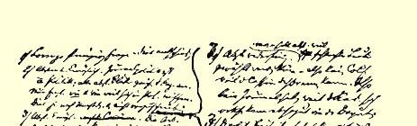
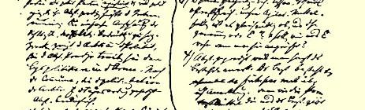
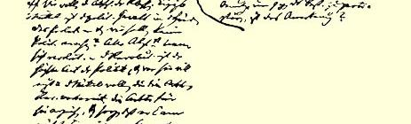
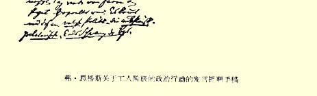

# 国际工人协会伦敦代表会议

*１８７１年９月１７—２３日２９１*

## 卡·马克思

## 卡·马克思

# 关于社会主义民主同盟的活动２９２

*１８７１年９月１８日在代表会议一个委员会*

##### 会议上的发言记录

**马克思**：从日内瓦成立了由巴枯宁和其他人创建的社会主义民主同盟时起，争论就开始了。马克思宣读了总委员会在１８６８年和１８６９年３月给同盟的两个通知２９３；在第二个通知中，提出解散同盟、提供关于同盟成员及其支部数目的材料作为接受他们加入国际的条件。这些条件始终未得到履行；事实上同盟始终未解散， 而是一直保留着特殊的组织。日内瓦支部的机关报“平等报” 在 １８６９年１２月１１日指责总委员会，就总委员会没有履行自己的职责—— 未答复报上的文章。总委员会表示不同意这一指责，它认为，参与报上的论战不在它的职责范围之内，但是它准备答复罗曼语区联合会委员会的要求和申诉。这个通告曾下达各个支部２９４； 它们全都赞同总委员会的做法。瑞士委员会谴责了“平等报”，同该报编辑部决裂了。编辑部的成员有所更换，从那时候起，“进步报”，后来是“团结报”２９５成了同盟的信徒们的机关报。以后，在洛克尔举行了代表大会，会上双方即罗曼语区联合会和汝拉联合会 （同盟）公开分裂了２９６。总委员会静待情况的发展；它只是不允许新的委员会作为罗曼语区委员会与已有的罗曼语区委员会同时出现。违背我们的章程、鼓吹放弃任何政治行动的吉约姆，在战争一爆发时就发表了一项呼吁书２９７，盗用国际名义要求建立一支军队去援助法国，从而同我们的章程更加抵触了。

> 弗·恩格斯记录原文是法文第一次用俄文发表于“第一国际俄文是按手稿译的伦敦代表会议”１９３６年版

## 弗·恩格斯

# 关于工人阶级的政治行动２９８

*１８７１年９月２１日在代表会议上的发言提纲*

（１）罗伦佐—— 一个原则问题；—— 这已经解决了。

（２）放弃政治是不可能的。报纸的政治态度也是政治；主张放弃政治的一切报纸都在攻击政府。问题只在于怎样干预政治和干预到什么程度。这要根据情况而定，而不是按照规定办事。

（２）放弃政治是荒谬的；因为可能选出坏人而提议

放弃政治，正如因为出纳员可能逃跑而不缴纳会费。正

如因为编辑可能像议员一样被人收买而不出版报纸。

（３）政治自由—— 特别是结社、集会和出版的自由

—— 是我们进行宣传鼓动工作的手段；我们的这些手

段是否会被夺走，难道是无所谓的吗？如果有人侵犯这

些手段，难道我们不应当起而反抗吗？

（４）有人鼓吹放弃政治，说从事政治就等于承认现

存制度。存在总是存在，我们对它承认与否，ｓｅ ｆｉｃｈｅ ｐａｓ

ｍａｌ〔它毫不在乎〕。但是，如果我们利用现存制度给我们

提供的那些手段来反对现存制度，难道这就是承认吗？[^1]

（３）放弃政治是不可能的。工人的党作为政党**存在**着而且要进行政治活动。向工人的党鼓吹放弃政治，就是破坏国际。单单是对形势的估计、为社会目的而施加的政治压迫，就**迫使**工人从事政治，鼓吹放弃政治者把工人推入资产阶级政治家的怀抱。在巴黎公社已经把工人的政治行动提到日程上来以后，放弃政治是不可能的。

（４）我们要消灭阶级。唯一的手段是无产阶级掌握政治权力； 而我们不应当从事政治吗？所有主张放弃政治的人都自命为革命家。革命是政治的最高行动，谁要想革命，谁就必须也承认准备革命和教育工人进行革命的手段，关心不让工人在革命后的第二天又受到法夫尔和皮阿之流的愚弄。问题只在于从事**什么样**的政治 ——** 唯有从事无产阶级的政治**，**而不要做资产阶级的尾巴**。

> 弗·恩格斯写于１８７１年９月２１日原文是德文左右俄文是按手稿译的第一次用法文发表于１９３４年“布尔什维主义手册”杂志第２０期

> 弗·恩格斯关于工人阶级的政治行动的发言提纲手稿

## 弗·恩格斯

# 关于工人阶级的政治行动

*恩格斯本人做的１８７１年９月２１日伦敦*

##### 代表会议上的发言摘要

绝对放弃政治是不可能的；主张放弃政治的一切报纸也在从事政治。问题只在于怎样从事政治和从事什么样的政治。并且对于我们说来，放弃政治是不可能的。工人的党作为政党已经在大多数国家存在着。鼓吹放弃政治去破坏它的不应该是我们。现代生活的实践，现存政府—— 为了政治的和社会的目的—— 对工人施加的政治压迫，都迫使工人不得不从事政治。向工人鼓吹放弃政治，就等于把他们推入资产阶级政治的怀抱。特别是在巴黎公社已经把无产阶级的政治行动提到日程上来以后，放弃政治是根本不可能的。

我们要消灭阶级。用什么手段才能达到这个目的呢？—— 无产阶级的政治统治。而当这一点已经最明显不过的时候，竟有人要我们不干预政治！所有鼓吹放弃政治的人都自命为革命家，甚至是杰出的革命家。但是，革命是政治的最高行动；谁要想革命， 谁就必须也承认准备革命和教育工人进行革命的手段，即承认政治行动，没有政治行动，工人总是在战斗后的第二天就会受到法夫尔和皮阿之流的愚弄。应当从事的政治是工人的政治；工人的政党不应当成为某一个资产阶级政党的尾巴，而应当成为一个独立的政党，它有自己的目的和自己的政策。

政治自由、集会结社的权利和出版自由，就是我们的武器；如果有人想从我们手里夺走这个武器，难道我们能够袖手旁观和放弃政治吗？有人说，进行任何政治行动都等于承认现存制度。但是，既然这个制度把反对它的手段交到我们手中，那末利用这些手段就不意味着承认现存制度。

> 第一次全文发表于１９３４年原文是法文 “共产国际”杂志第２９期俄文是按手稿译的

## 卡·马克思和弗·恩格斯

# １８７１年９月１７日至２３日在伦敦举行的国际工人协会代表会议的决议２９９

一

### 关于总委员会的成员３００

代表会议建议总委员会对委员人数的增添加以限制，并且在增添委员时不要过多地拣选一个民族的公民。

二

### 关于各国委员会等组织的名称３０１

１．按照巴塞尔代表大会（１８６９年）的决定，设有**国际**经常性组织的各国的中央委员会，今后应定名为**联合会委员会**，冠以各该国的国名；国际工人协会中央委员会仍用**总委员会**名称。

２．所有地方分部、支部、小组及其委员会，今后一律定名为 **国际工人协会**分部、支部、小组和委员会，冠以该地地名。

３．因此，所有分部、支部和小组，今后不得再用宗派名称， 如实证论派，互助主义派，集体主义派，共产主义派等等，或者用“**宣传支部**” 以及诸如此类的名称成立妄想执行与协会共同目标不符的特殊任务的分立主义组织。

４．但是，决定的第１、２两条，不适用于附属国际的各**工会**。

### 三关于总委员会的代表３０２

由总委员会任命执行特殊任务的一切代表，均有权出席联合会委员会、区域和地方的委员会以及支部的一切会议并发表意见， 但没有表决权。

### 四关于向总委员会缴纳数额为每个会员一 辨士[^2]的会费３０３

１．总委员会应印发每张值一辨士的会费券，每年向各联合会委员会按要求数量供应这种会费券。

２．联合会委员会向各地方委员会，在没有地方委员会时，则向各支部按其会员人数寄发会费券。

３．这种会费券应粘贴在会员证或协会每个会员均须持有的章程的专页上。

４．每年３月１日，各国联合会委员会均应将与所用会费券价值相符的金额寄给总委员会，并交回剩余的会费券。

５．这些印明个人会费金额的会费券，须注明当年日期。

### 五关于成立女工支部３０４

代表会议建议在工人阶级当中成立妇女支部。但是，不言而喻，这项决议绝不应妨碍由男女工人混合组成的旧支部的存在和新支部的建立。

### 六关于对工人阶级的普遍统计３０５

１．代表会议提议总委员会将最初的章程中涉及对工人阶级进行普遍统计的第五条以及１８６６年日内瓦代表大会就这一问题所做的决议３０６付诸实施。

２．每个地方支部均应任命一个专门的统计委员会，以便随时在力所能及的范围内答复本国联合会委员会或总委员会可能向它提出的问题。鉴于统计委员会书记的工作将给工人阶级带来共同利益，因此建议所有支部对统计委员会书记均支付薪金。

３．每年８月１日，联合会委员会应将在本国收集的材料寄往总委员会，总委员会则应根据这些材料写成总报告，提交每年９月间举行的代表大会或代表会议。

４．应将拒绝提供所需材料的国际的工会和支部通知总委员会，总委员会将对此采取相应措施。

### 七关于工会的国际联系３０７

提议总委员会照旧赞助各国工会要求同所有其他国家的相应工会建立联系的日益增强的愿望。总委员会作为沟通各国工会之间联系的国际机构，它的工作的成效，将主要取决于各团体对国际进行的劳动普遍统计所给予的协助。

提议所有国家的工会理事会将自己的地址通知总委员会。

### 八关于农民３０８

１．代表会议提议总委员会和联合会委员会在下次代表大会前提出报告，说明通过什么方法使农民加入工业无产阶级的运动。

２．同时提议联合会委员会派宣传鼓动员前往农业地区，以便组织公开集会，宣传国际的原则和建立农村支部。

### 九关于工人阶级的政治行动３０９

鉴于：

章程的导言中说：“工人阶级的经济解放是一切政治运动都应该**作为手段**服从于它的伟大目标”；

国际工人协会成立宣言（１８６４年）宣称：“土地巨头和资本巨头总是要利用他们的政治特权来维护和永久保持他们的经济垄断的。他们不仅不会赞助劳动解放的事业，而且恰恰相反，会继续在它的道路上设置种种障碍…… 所以，夺取政权已成为工人阶级的伟大使命”３１０；

洛桑代表大会（１８６７年）曾通过如下决议：“工人的社会解放同他们的政治解放是不可分割的”３１１；

总委员会就公民投票（１８７０年）前夕臆造的国际法国支部会员密谋事件发表的声明中说：“按本会章程的精神，本会在英国、 在欧洲大陆和在美国的所有支部的专门任务，毫无疑问是不仅要成为工人阶级斗争的组织中心，而且要支持上述各国的任何一种有助于达到我们的最终目标—— 工人阶级的经济解放—— 的政治运动”３１２；

最初的章程的歪曲了的译文给曲解章程提供了凭据，这种曲解已给国际工人协会的发展和活动带来危害；

肆无忌惮的反动势力正在残酷地镇压工人的一切争取解放的尝试，并竭力用暴力来保存阶级差别以及由此产生的[^3]有产阶级的政治统治；

鉴于：

工人阶级在它反对有产阶级联合权力的斗争中，只有组织成为与有产阶级建立的一切旧政党对立的独立政党，才能作为一个阶级来行动；

工人阶级这样组织成为政党是必要的，为的是要保证社会革命获得胜利和实现这一革命的最终目标—— 消灭阶级；

工人阶级由于经济斗争而已经达到的本身力量的团结，同样应当成为它在反对大土地所有者和大资本家[^4]的政权的斗争中的杠杆，——

代表会议提请国际会员们注意，

在工人阶级的斗争中，它的经济运动是和政治行动密切联系着的。

### 十关于国际经常性组织受到政府阻挠的国家的总决议３１３

在因政府阻挠而现时无法设立**国际**经常性组织的国家内，协会及其地方性团体可以进行改组，改用各种其他名称；但是，无论现在和今后，成立任何真正的秘密团体都是绝不许可的。

### 十一关于法国的决议３１４

１．代表会议坚信：一切迫害只能使**国际**的拥护者加倍振作， 并且组织支部的工作即使不是用建立大中心的方法，至少在小工厂和通过自己的代表彼此建立联系的小工厂的联合会内，将继续进行。

２．根据这一点，代表会议提议所有支部坚持在法国继续宣传我们的原则，并把**国际**的一切出版物和章程尽量运入自己国内。

### 十二关于英国的决议３１５

代表会议提议总委员会号召伦敦的英国支部成立伦敦联合会委员会，这个委员会在得到外地支部和参加国际的团体[^5]公认后， 即由总委员会承认为**英国联合会委员会**。

### 十三代表会议的特别决议３１６

１．代表会议同意把巴黎公社的参加者增补为总委员会委员。

２．代表会议声明，德国工人在普法战争期间尽到了自己的职责。

３．代表会议对西班牙联合会的会员就国际组织的情况提出报告表示兄弟般的感谢。这个报告再次证明了他们对我们的共同事业的忠诚。

４．总委员会应立即发表声明，表明国际工人协会与所谓 恰也夫阴谋完全无关， 恰也夫是用欺骗方法僭取了国际的名义[^6]。

### 十四关于给公民吴亭的委托３１７

请公民吴亭根据俄文报纸的材料在“平等报” 上发表关于涅恰也夫审判案的简短报道。该报道必须在发表前先呈交总委员会。

### 十五关于应届代表大会的召开３１８

代表会议授权总委员会确定—— 根据事态的发展—— 应届代表大会或代表会议[^7]的时间和地点。

### 十六关于社会主义民主同盟３１９

鉴于：

社会主义民主同盟已经宣布解散（见１８７１年８月１０日从日内瓦给总委员会的信，签署人为同盟书记、公民尼·茹柯夫斯基）；

代表会议在９月１８日的会议（见本通告第二项）上决定，国际现有的一切组织，今后应按共同章程的精神和文字，一律定名为国际工人协会分部、支部、联合会等等，并冠以该地地名；

因此，现有的支部和团体，今后不得再用宗派名称，如实证论派、互助主义派、集体主义派、共产主义派等等，或者用宣传支部、 社会主义民主同盟以及诸如此类的名称成立旨在执行与协会共同目标不符的特殊任务的分立主义组织[^8]；

国际工人协会总委员会今后应以此精神解释和运用巴塞尔代表大会关于组织问题的决议的第五条３２０，即“总委员会有权接受或不接受新的支部和小组”，等等[^9]，——

代表会议宣布关于社会主义民主同盟的问题已获解决。

### 十七关于瑞士罗曼语区的分裂３２１

１．宣布汝拉各支部的联合会委员会对代表会议的权限问题所提出的各种反对意见是站不住脚的。（这只是第１条的简要叙述， 该条全文将在日内瓦的“平等报”上刊出[^10]。）

２．代表会议批准总委员会１８７０年６月２９日的决议３２２。

同时，鉴于目前国际受到的迫害，代表会议号召发扬团结一致的精神，这种精神应当比过去任何时候都更能使工人阶级受到鼓舞；

代表会议建议汝拉各支部的全体正直工人重新加入罗曼语区联合会的各个支部；

如果这种联合不能实现，代表会议决定请分裂出去的汝拉各支部定名为“汝拉联合会”；

代表会议预先声明，如果国际的任何机关报[^11]效法“进步报” 和“团结报”，在它们的篇幅内当着资产阶级公众讨论那些只应在地方委员会和联合会委员会以及总委员会的会议上、或者在联合会代表大会或全协会代表大会讨论组织问题的秘密会议上予以讨论的问题，那末总委员会今后有责任一概予以公开揭露和拒绝承认。

### 通知

不准备发表的决议将由总委员会的通讯书记通知各国联合会委员会。

根据代表会议的决定并以代表会议的名义——

总委员会：

**    罗·阿普耳加思   马·詹·布恩**

**    弗·布列德尼克 Ｇ．Ｈ．巴特里**

**    德拉埃 欧仁·杜邦（因公在外）**

**    威·黑尔斯 乔·哈里斯**

**    胡利曼 茹尔·若昂纳尔**

**    弗·列斯纳 罗赫纳**

**    沙·龙格 孔·马丁**

**    捷维·莫里斯 亨利·梅欧**

**    乔治·米尔纳 查理·默里**

**    普芬德 约翰·罗奇**

**    吕耳 萨德勒**

**    考威尔·斯特普尼 阿·泰勒**

**    威·唐森 爱·瓦扬**

**    约翰·韦斯顿**

通讯书记：

**奥·赛拉叶——** 法国；**卡·马克思——** 德

#### 国和俄国；弗·恩格斯——意大利和西班牙；阿·埃尔曼——比利时；Ｊ．帕·麦克唐奈——爱尔兰；勒穆修——在美国的法国人支部；瓦列里·符卢勃列夫斯基——波兰；海尔曼·荣克——瑞士；托· 莫特斯赫德——丹麦；沙·罗沙——荷兰； 约·格·埃卡留斯——美国；列奥·弗兰克尔——奥地利和匈牙利执行主席弗·恩格斯财务委员海尔曼·荣克总书记约翰·黑尔斯

> １８７１年１０月１７日于伦敦西中央区
>
> 海－霍耳博恩街２５６号卡·马克思和弗·恩格斯于１８７１年原文是英文 ９—１０月拟定、校订和准备付印俄文是按英文版本译的， １８７１年１１—１２月分别用英文、德文并根据德文版本和法文和法文印成小册子，并在国际各机关版本校对过报上发表

## 卡·马克思

# 伦敦代表会议关于瑞士罗曼语区的分裂的决议

关于分裂：

１．代表会议应该首先审查不属于罗曼语区联合会的汝拉各团体的联合会委员会对代表会议的权限问题所提出的反对意见（见该支部的联合会委员会９月４日致代表会议的信）。

**第一条反对意见**：

> “只有按通常程序召开的全协会代表大会，才有权对罗曼语区联合会内发生分裂这一如此严重的问题作出判断。”

鉴于：

在属于一个全国性组织的团体或支部之间、或各全国性组织之间发生纠纷时，总委员会有权解决这些纠纷，但是，它们保留有向应届代表大会进行申诉的权利，由应届代表大会做出最后决定 （见巴塞尔代表大会决议第七条）；

按巴塞尔代表大会决议第六条，总委员会也有权将任何支部暂时开除出国际，听候应届代表大会裁决３２３；

总委员会的这些权利曾得到分裂出去的汝拉各支部的联合会委员会的承认（当然只是在理论上），因为公民罗班不止一次地代表该委员会请求总委员会对这个问题做出最后决定（见总委员会记录）；

即使代表会议不享有全协会代表大会所具有的权利，但至少也具有比总委员会更大的权利；

实际上正是分裂出去的汝拉各支部的联合会委员会，而不是罗曼语区联合会的联合会委员会，通过公民罗班要求召开代表会议就这次分裂做出最后决定（见１８７１年７月２５日总委员会记录）；

因此，代表会议不接受第一条反对意见。

**第二条反对意见**：

> “对一个联合会不给以进行辩解的机会而予以谴责，是与最起码的公道相抵触的…… 今天（１８７１年９月４日）我们间接地知道，９月１７日将在伦敦召开非常代表会议…… 总委员会本来应该将此事通知所有地方组织；我们不清楚为什么总委员会却对我们保持缄默。”

鉴于：

总委员会已委托它的全体书记将召开代表会议一事通知他们所代表的国家的支部；

瑞士通讯书记、公民荣克没有通知汝拉支部委员会，是由于下列原因：

这个委员会显然违反总委员会１８７０年６月２９日的决定 ３２４，甚至在它最近给代表会议的信中，仍然使用**罗曼语区联合会** 委员会这一名称；

汝拉各支部的委员会有权在即将举行的代表大会对总委员会的决定提出申诉，但它无权漠视总委员会的决定；

因而，在总委员会看来，汝拉支部委员会从法律上说是不存在的，公民荣克也就没有权利承认它，直接邀请它派代表参加代表会议；

汝拉支部委员会对于以总委员会名义提出的问题未给予公民荣克任何答复；自从公民罗班成为总委员会委员时起，上述委员会的声明书总是通过公民罗班转交总委员会，而从来不通过瑞士通讯书记；

又鉴于：

公民罗班代表上述委员会起初请求总委员会，后来由于遭到总委员会的拒绝，又请求代表会议将分裂问题提出讨论；因此，总委员会和它的瑞士通讯书记完全有理由认为，公民罗班会通知他的通讯者们关于召开他们本人所力争召开的代表会议一事；

代表会议选出的调查瑞士纠纷的委员会听取了公民罗班的证词；双方提交总委员会的全部文件均已转交这个委员会；不能设想上述委员会只是在９月４日才知道要召开代表会议一事，因为它在８月就已向公民Ｍ[^12]建议，请他作为自己的代表参加代表会议；

因此，代表会议不接受第二条反对意见。

**第三条反对意见**：

> “取消我们联合会的权利的决定，会对国际在我国的存在造成极有害的后果。”

鉴于：

任何人也没有提出要取消上述联合会的权利，

代表会议不接受这条反对意见。

２．代表会议批准总委员会１８７０年６月２９日的决议。

同时，鉴于目前国际受到的迫害，代表会议号召发扬团结一致的精神，这种精神应当比过去任何时候都更能使工人阶级受到鼓舞；

代表会议建议汝拉各支部的全体正直工人重新加入罗曼语区联合会的各个支部。

如果这种联合不能实现，代表会议决定请分裂出去的汝拉各支部定名为“汝拉联合会”。

代表会议预先声明：如果自称为**国际**机关报的任何报刊效法 “进步报” 和“团结报”，在它们的篇幅内当着资产阶级公众讨论那些只应在地方委员会和联合会委员会以及总委员会的会议上、 或者在联合会代表大会或全协会代表大会讨论组织问题的秘密会议上予以讨论的问题，那末总委员会今后有责任一概予以公开揭露和拒绝承认。

> １８７１年９月２６日于伦敦卡·马克思于１８７１年９月２１日原文是法文提出俄文译自“平等报” 载于１８７１年１０月２１日 “平等报” 第２０号

[^1]: 恩格斯手稿中用弧线标出的第２、３、４条，原来写在手稿的右边，是对本文的增补。—— 编者注

[^2]: 德文版在“辨士” 一词后面附有：（“格罗申”），法文版在这一处和下面的“一辨士” 构印作：“十生丁”。—— 编者注

[^3]: 在德文版上不是“由此产生的”，而是“在其上建立的”。—— 编者注

[^4]: 在德文版和法文版上不是“大土地所有者和大资本家”，而是“它的剥削者”。—— 编者注

[^5]: 在德文版上，“团体”一词为《Ｇｅｗｅｒｋｓｇｅｎｏｓｓｅｎｓｃｈａｆｔｅｎ》，法文版上为《Ｓｏｃｉéｔéｓｄｅ ｒéｓｉｓｔａｎｃｅ》，即工会。—— 编者注

[^6]: 在德文版和法文版上，在“僭取” 之后增添了“和使用” 等字。—— 编者注

[^7]: 在德文版和法文版上，在“代表会议” 前面尚有“可以用来代替代表大会的” 等字。—— 编者注

[^8]: 在法文版上不是“协会共同目标”，而是“参加国际工人协会的战斗无产阶级群众所遵循的共同目标”。—— 编者注在德文版和法文版上不是“等等”，而是“但是它们有权向应届代表大会申

[^9]: 诉”。—— 编者注

[^10]: 见本卷第４６２—４６５页。—— 编者注

[^11]: 在法文版和德文版上不是“国际的任何机关报”，而是“自称为国际机关报的任何报刊”。—— 编者注

[^12]: 马萨。—— 编者注