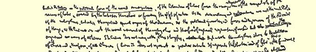
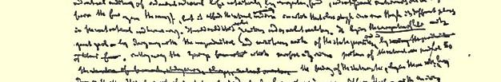

## 卡·马克思

# “法兰西内战”草稿

> **３７５** 卡·马克思写于１８７１年４—５月原文是英文第一次用英文和俄文全文载于中文根据“马克思恩格斯文库” “马克思恩格斯文库”１９３４年版英文译出第３（８）卷

## 卡·马克思

# “法兰西内战”初稿

## 国防政府

战争开始以后四个月，当国防政府投给了巴黎国民自卫军一点小惠，即允许他们在比桑瓦耳３７６显示他们的战斗能力的时候，这个政府认为促使巴黎投降的有利时机已经到了。在专为讨论投降问题而召开的巴黎区长会议上，特罗胥在茹尔·法夫尔和他的其他同僚在场和支持下，终于透露了**他的“计划”**。他的原话是这样讲的：

> “我的同僚们**在９月４日晚间**向我提出的第一个问题是，巴黎有没有些许可能抵住普鲁士军队的围困？**我当时毫不迟疑地做了否定的答复**。现在在座的同僚中，有几位会证明我说的这些是实话，并且**我一直是坚持着这个看法**。我那时对他们就是这样说的：在目前的情况下，巴黎要打算抵住普鲁士军队的围困，那简直是**一件蠢举**。当然，我当时加了一句，这可能是**一件英勇的蠢举**，但终究不过是蠢举而已……**事变的发展并没有推翻我的预断**。**”**

从共和国宣告成立的那一天起，特罗胥的计划就是**要巴黎**和法国**投降**。实际上，他是普鲁士军队的总司令。茹尔·法夫尔自己在给甘必大的一封信里就曾这样露骨地供认：应当打倒的敌人不是普鲁士士兵，而是巴黎的（革命者）“蛊惑家”。由此可见，国防政府对人民的种种冠冕堂皇的许诺不过都是些存心骗人的谎言罢了。国防政府有步骤地实施这一“计划”—— 派波拿巴的将军们负责巴黎防务、瓦解国民自卫军、借茹尔·费里的渎职失政制造饥馑。巴黎工人在１０月５日、１０月３１日等日子里几次想用公社来代替这批卖国贼的尝试，竟被当做与普鲁士人的串谋而遭镇压３７７！ 投降之后，假面具揭下了（被扔到一边）。仰仗着俾斯麦的恩典，这批ｃａｐｉｔｕｌａｒｄｓ３７８变成了一个政府。他们作为俾斯麦的阶下囚，同俾斯麦缔结了全面停战协定，停战协定的各项条款解除了法国的武装，使任何继续抵抗成为不可能。正是这批ｃａｐｉｔｕｌａｒｄｓ，在波尔多以共和国政府姿态重新复活之后，通过自己的前任大使梯也尔和外交部长茹尔·法夫尔，以所谓国民议会的多数的名义，远在巴黎起义之前便急切地哀求俾斯麦来解除巴黎的武装、占领巴黎、镇压 “它的ｃａｎａｉｌｌｅ〔暴徒〕”，这些都是俾斯麦从法国返回柏林途中在法兰克福亲口对他的膜拜者们以冷嘲热讽的口吻讲出的。让普鲁士人占领巴黎，是国防政府“计划”的底蕴。这帮人从在凡尔赛粉墨登场以来为了央求普鲁士进行武装干涉而表现的一副恬不知耻的嘴脸，甚至使欧洲的待价而沽的报纸也为之瞠目失色。自从巴黎国民自卫军不再在 ｃａｐｉｔｕｌａｒｄｓ **指挥之下**而是把枪口指向ｃａｐｉｔｕ ｌａｒｄｓ 以来，他们的英雄业绩甚至使那些最抱怀疑态度的人也不得不把“卖国贼”一词烙到特罗胥、茹尔·法夫尔及其一伙的无耻额角上。公社缴获的文件最后提供了这些人叛国大罪的法律证据。 这些文件中有一些是受命执行特罗胥“计划”的波拿巴派ｓａｂｒｅｕｒｓ 〔武人〕的信件；这些丑恶的家伙在这些信件里就嘲弄讥笑他们自己的“巴黎防务”（例如参看公社“公报”上公布的巴黎卫戍军炮兵司令、荣誉军团大十字勋章获得者**阿尔丰斯·西蒙·吉奥**写给炮兵师将军**苏桑**的信）。

因此，很明显，现在组成凡尔赛政府的这批人，只有发动内战、 断送共和国、在普鲁士的刺刀庇护下使君主制度复辟，才能逃脱铁案如山的卖国贼应有的命运。

但是，—— 而这对第二帝国的人物，以及那些只有靠第二帝国的土壤和空气才能变成冒牌人民喉舌的人物，是最具特征意义的，—— 共和国如果胜利，就不仅要给他们烫上卖国贼的烙印，而且还要把他们当做普通罪犯交付刑事法庭审理。只要看看**茹尔·** **法夫尔**、**厄内斯特·皮卡尔**、**茹尔·费里**这帮梯也尔手下的国防政府的要人就够了！

国民议会的一位议员米里哀尔先生公布过一系列在时间上前后分属二十来年的证据确凿的法律文件，证明**茹尔·法夫尔**在与一个住在阿尔及尔的酒徒的妻子姘居时，凭着一大堆无比复杂的大胆捏造的文据，以他的一些私生子女的名义谋得了一大笔遗产， 因而变成了一个财主；后来在合法继承人提出诉讼时，只是由于波拿巴的法庭偏袒他，他的伪证才没有被揭穿。所以，茹尔·法夫尔这个口甜似蜜的家庭、宗教、财产、秩序的辩护士，原来老早就该受 Ｃｏｄｅ ｐéｎａｌ〔刑法〕究办了。遇到任何一个公正的政府，他都免不了被判处终身苦役的命运。

**厄内斯特·皮卡尔**是凡尔赛现任内务部长，他钻营路易·波拿巴的官位没有成功，在９月４日自封为国防政府的内务部长[^1]。 这位厄内斯特·皮卡尔是一个叫做**阿尔图尔·皮卡尔**的人的哥哥。从前，当厄内斯特·皮卡尔跟茹尔·法夫尔之流恬不知耻地提名他那位宝贝兄弟为塞纳—瓦瑟省的立法团议员候选人的时候， 第二帝国政府曾公布两份文件：一份是巴黎警察局的报告（１８６７ 年７月３１日），说这位阿尔图尔·皮卡尔曾经作为一个《ｅｓｃｒｏｃ》 〔“骗子手”〕而被逐出巴黎交易所；另一份是**１８６８年１２月１１日**的文件，根据这份文件阿尔图尔自己供认了当他在帕勒斯特罗街５ 号 Ｓｏｃｉéｔé Ｇéｎéｒａｌｅ３７９的一个分公司任经理期间，曾经盗用过 ３０万法郎。厄内斯特不仅派他的这位宝贝阿尔图尔担任他主办的 “自由选民”（该报创刊于帝国时期，一直出版到今日，这是一份天天诋毁共和主义者为“强盗、土匪、ｐａｒｔａｇｅｕｘ〔均产者〕”的报纸）的 **主笔**，而且在他一当上“国防政府”的内务部长以后，还用阿尔图尔在内务部和股票交易所之间给他当财务纤手，利用他得到的国家机密去大发横财。

厄内斯特和阿尔图尔的全部“财务”信件都已落到公社手里了。正如多泪善哭的茹尔·法夫尔一样，厄内斯特·皮卡尔这个凡尔赛政府中的约·密勒，也是一个应受 Ｃｏｄｅ ｐéｎａｌ〔刑法〕究办、该被判处苦役的人。

这个三人合唱队中的最后一人**茹尔·费里**，在９月４日以前还是一个吃不上饭的穷律师；他不满足于制造巴黎的饥馑，而且还巧妙地利用这饥馑刮了大笔钱财。当他将来不得不报告他在巴黎被围期间侵吞公款的经过的那一天，就会是他受裁判的一天！

因此，无怪乎正是这帮只有在受普鲁士刺刀保护的王朝下才可望免于苦役刑的人，正是这帮只有乘内战的混乱才能得到假释证的人，正是这些亡命之徒，才被梯也尔一眼**挑中**，被“地主议会” 作为最可靠的反革命工具接受下来！

无怪乎当４月初被俘的国民自卫军在凡尔赛受到比埃特里的 “羔羊们”和凡尔赛的暴徒们残暴至极的虐待时，厄内斯特·皮卡尔先生“双手插在裤袋里，在一群一群的俘虏中间踱来踱去，恣意拿他们要笑”，同时，“梯也尔夫人、茹尔·法夫尔夫人以及一伙与她们类似的容光焕发、兴高采烈的贵妇们，在省政府的阳台上”看着令人发指的景象拍手喝采。无怪乎正当法兰西的一部分在征服者的铁蹄下痛苦地挣扎着，正当巴黎—— 法兰西的心脏和头脑 —— 为反抗内奸进行自卫而终日不断流着它的最宝贵的鲜血时 ……梯也尔们、法夫尔们及其同伙却沉湎于路易十四皇宫里的狂饮闹宴；如梯也尔为庆贺茹尔·法夫尔从卢昂（他是被派去和普鲁士人进行勾结（向普鲁士人乞怜）的）返回而举办的盛大 ｆｅｔｅ〔宴会〕就是一例。这是漏网罪犯们的恬不知耻的狂欢暴欲。

如果说国防政府最初曾用梯也尔做他们的外交大使，派他去向欧洲各国宫廷乞求，以法国重立国王为代价来换得各宫廷对普鲁士的干涉；其后，他们又派他巡视法国各省，同各地的 ｃｈａｔｅａｕｘ〔封建主砦堡〕进行串谋，并暗暗地准备那应和投降一起猝不及防地加到法国头上的大选，那末梯也尔则用这些人做了他手下的部长和高级官员。他们是靠得住的人。

在梯也尔的行动中，有一点颇为神秘难解，这就是他在加速巴黎革命上的轻率冒失行为。梯也尔用了这样一些办法来激怒巴黎：要他的“地主议员们” 发出反对共和国的叫嚣，威胁要**砍去** 巴黎的头颅并**取消它的首都称号**，颁布杜弗尔（梯也尔的司法部长）的使巴黎商业濒于破产的、关于商业期票 éｃｈéａｎｃｅｓ〔支付期限〕的三月十日法令，任命奥尔良派人物充任使节，把国民议会迁到凡尔赛，课征新的报刊税，查封巴黎的共和派报刊，恢复最初由八里桥[^2]宣布的、但随着帝国政府在９月４日倾复而取消了的戒严，任命 ｄéｃｅｍｂｒｉｓｅｕｒ〔十二月分子〕３８０、前参议院议员维努亚为巴黎总督，任命波拿巴的宪兵**瓦伦顿**为警察局长、任命耶稣会教徒奥雷耳·德·帕拉丹将军为巴黎国民自卫军总司令—— 他做了这些事还不满足，竟以微弱的兵力挑起了内战：让维努亚进攻蒙马特尔高地，并企图首先从国民自卫军那里夺走属于他们的，而且只因为是他们的财产才依巴黎投降协定留在他们手中的大炮， 以便解除巴黎的武装。

这种 ｄ’ｅｎ ｆｉｎｉｒ〔把它解决掉〕的狂热是从哪儿来的呢？解除巴黎武装、镇压巴黎，当然是进行王朝反革命的首要条件，但是， 像梯也尔这样一个老奸巨猾的阴谋家，若非为压倒一切的极其紧迫的动力所驱使，是不会在缺乏应有的准备的情况下，手头只有少得可笑的力量就贸然着手而使这桩棘手事业遭到失败的危险的。 动机原来是这样。梯也尔由他的财政部长普野－克尔蒂约经手借了一笔债款，按规定是立即支付２０亿，以后再分期陆续支付数十亿。在这项借款交易中，为梯也尔、茹尔·法夫尔、厄内斯特·皮卡尔、茹尔·西蒙、普野－克尔蒂约等这些显贵公民准备了一笔真正的御用 ｐｏｔ－ｄｅ－ｖｉｎ（酒钱）。但是，在这项交易上有一层障碍。 在合同最后签字盖章之前，立约一方要求一项保证——** 平定巴黎**。 所以才有梯也尔的孟浪行动。所以才对竟敢干涉这桩好买卖的巴黎工人表现出那样野蛮的仇恨。

关于茹尔·法夫尔们、皮卡尔们等等，我们所说的已足以证明他们是这种假公济私勾当的宝贝同谋者。至于梯也尔本人，尽人皆知，在路易－菲力浦治下他两度组阁，捞了２００万；在他任首相时 （１８４０年３月），众议院曾指责他从事交易所投机活动，为了回答这个指责，他那时流了眼泪鼻涕；他像茹尔·法夫尔以及著名喜剧演员弗雷德里克·勒美特尔一样，随时都能拿出这种货色。人们同样也都知道，为了挽救法国由战争造成的财政危机，梯也尔先生采取的第一项措施就是给自己规定了３００万法郎的年俸，这个数目恰恰和路易·波拿巴在１８５０年因允许梯也尔先生及其在**立法议会**中的党羽废除普选权而从他们那里得到的数目相等３８１。梯也尔先生自定年俸为３００万法郎，这就是他在１８６９年给他的巴黎选民描绘的那个**“节俭共和国”**的第一着。说到普野－克尔蒂约，此人是卢昂的一位棉纱厂厂主。１８６９年，厂主会议宣布为“征服”英国市场而必须普遍降低工资，他就是那个厂主会议的领导人—— 这条毒计当时被**国际**挫败了３８２。普野－克尔蒂约在各方面都狂热地、甚至可以说是卑躬屈膝地拥护第二帝国，只是在一点上他觉得第二帝国不好，那就是第二帝国和英国缔结的商约损害到他自己开办的工厂的利益。作为梯也尔先生的财政部长，他的第一步是痛斥那个“可恨的”商约，并宣布必须恢复旧日的保护关税来保护他自己的工厂。他的第二步是这样一个**爱国**的尝试，即以恢复旧日的保护关税来打击亚尔萨斯，借口是没有任何国际条约阻挡着他对亚尔萨斯重新实施保护关税。借助这一妙着，他自己在卢昂的工厂就会摆脱牟罗兹的那些敌对工厂的危险竞争。他的最后一步是赏给他的女婿罗什－朗贝尔先生一份礼物—— 派他为卢瓦尔总收税官， 这是落到统治的资产阶级手里的肥赃之一；普野－克尔蒂约曾经对他的帝国时代的前任曼涅先生十分不满，就是因为曼涅先生曾把这一大肥缺赏给了自己的儿子。所以，这位普野－克尔蒂约确实是执行上述那项勾当的适当人选。

**３月３０日**“号召报”３８３载，前任巴黎市长茹尔·费里于３月 ２８日向市税稽征所的官员发出通令，禁止……继续为巴黎课征任何市税。

种种政治小骗局，—— 小人的肚肠……溃烂的良心……无休无止的议会阴谋策划者……无聊的权术和计谋……重复他的关于自由主义、关于《ｌｉｂｅｒｔéｓ ｎéｃｅｓｓａｉｒｅｓ》〔“必不可少的自由〕”的说教……热衷于……以有力的理由反驳认为有失败的可能……头头是道的反驳论据……一种卑劣透顶的英雄主义……侥幸得逞的议会计谋……

厄·皮卡尔先生是一名强盗，在整个巴黎被围困期间，他一直在交易所利用我们军队的失败投机取巧。

**屠杀**，**叛卖**，**纵火**，**暗杀**，**诽谤**，**造谣**。

梯也尔自己在区长等会议上（４月２５日）的演说中说：

> “杀害克列芒·托马和勒康特的人”不过是一小撮罪犯，——“以及那些有充分证据可以被认为是这些罪行的共谋犯或是协助犯的人，就是说**极少的** 一小撮人”。

#### 杜弗尔

杜弗尔想用对外省报纸进行法律起诉的办法击溃巴黎。因报刊鼓吹**“和解”**而对之进行审讯，实在荒唐。

杜弗尔在梯也尔的阴谋策划中起着很大的作用。他用他的三月十日法令搅动了负债累累的整个巴黎商业；用他的关于巴黎房租的法令威胁了整个巴黎。颁布这两项法令都是为了惩罚巴黎，因为它曾经挽救了法国的荣誉，延续了向俾斯麦投降达六个月之久。 杜弗尔是一个奥尔良党人，是一个就议会意义而言的“自由派”。因此，他一向是镇压部长和戒严部长。

他第一次出任大臣是在１８３９年５月１３日，即在共和党的 ｄｅｒｎｉèｒｅ ｐｒｉｓｅ ｄ’ａｒｍｅｓ〔最后一次武装起义〕失败以后３８４，所以他是当时七月政府的残酷无情的镇压大臣。

１８４９年６月２日３８５，曾被迫于（１８４８年）１０月２９日取消戒严的卡芬雅克，召来两位路易－菲力浦的大臣进入他的内阁（**杜弗尔** 任内务部长，还有**维维延**）。他是在**普瓦提埃大街３８６**（梯也尔）要求之下任命他们的，因为普瓦提埃大街要求保证。他希望用这种办法在即将到来的总统选举中获得保皇党的支持。杜弗尔使用了最非法的手段使卡芬雅克当上了候选人。恫吓和贿选达到前所未见的程度。杜弗尔在法国散布大量诋毁别人的印刷品来攻击其他候选人，尤其是攻击路易·波拿巴，这一点并没有妨碍他后来成为路易 ·波拿巴的部长。杜弗尔再度成为**１８４９年６月１３日的戒严**部长 （这次戒严是为了对付国民自卫军为反对法军炮轰罗马等事所举行的示威）。现在，他又成为戒严部长，这次戒严是在凡尔赛宣布的 （戒严地区是塞纳—瓦瑟省）。宣布任何省戒严的大权已授予梯也尔。现在，正像１８３９年和１８４９年一样，杜弗尔要求新的镇压法、新的出版法、“简化军法审判手续”法。他在分发给各总检察官的一份通告里，痛斥**“议和”**这种呼声是报界的一项罪行，应严惩不贷。对法国司法界具有特征意义的是，只有一位总检察官（马延省的）[^3] 写信给杜弗尔提出辞职……

> “当此内战之际，行政当局命令我卷入党派斗争，对那些我的良心认为完全无辜的公民仅为他们呼出**和解**这一字眼而予以迫害，因此，我无法给这样一个行政当局效力。”

杜弗尔在１８４７年属于阴谋反对基佐的“自由联盟”，正如他属于１８６９年的阴谋反对路易·波拿巴的“自由联盟”一样３８７。

至于说到三月十日法令和房租法令，应当指出，杜弗尔也好， 皮卡尔也好（两人都是律师），他们的最好的顾主都是属于不愿由于巴黎被围而损失一个小钱的房东和**阔老们**。

现在，也和１８４８年二月革命后一样，这些人对共和国说的是当初刽子手对唐·卡洛斯说过的话：《Ｊｅ ｖａｉｓ ｔ’ａｓｓａｓｓｉｎｅｒ， ｍａｉｓ ｃ’ｅｓｔ ｐｏｕｒ ｔｏｎ ｂｉｅｎ．》（“**我要杀你**，**是为了你好**。**”**）

#### 勒康特和克列芒·托马

在维努亚企图占领蒙马特尔高地以后（３月１８日４点钟，他们在红宫花园被枪决），勒康特将军和克列芒·托马就被第八十一常备团的那些情绪激昂的士兵们抓起来枪毙了。这是一项不顾**中央委员会**的几位代表的力劝而执行的私审的即决行动。勒康特这个带着肩章的凶手，在皮加尔广场上曾一连四次命令他的军队开枪射击一群手无寸铁的妇孺。士兵没有射击人群，而是把他枪毙了。克列芒·托马曾做过军需官，是一个在六月屠杀（１８４８年）前夕被国民报派（他做过该报的ｇéｒａｎｔ〔经理〕临时提拔起来的“将军”；他的军刀除了染满巴黎工人阶级的鲜血之外，从未沾濡过其他敌人的血迹。他是蓄意激起六月起义的阴狠毒辣的策划人之一， 也是那次起义的最残暴的刽子手之一。１８７０年１０月３１日，巴黎无产阶级的国民自卫军突然袭击设在市政厅的“国防政府”并且将政府人员逮捕起来的时候，这些自封官爵的人们，这些被他们的一个同伙皮卡尔最近称为ｇｅｎｓ ｄｅ ｐａｒｏｌｅｓ〔说话算话的人〕，都立下了**信誓**：他们一定让位给**公社**。他们以此获释之后，随即把特罗胥的布列塔尼兵开来进攻那些过于轻信而释放了他们的人。然而， 他们之中有一个人，即**塔米济埃先生**，辞去了国民自卫军总司令的显职。他拒绝**背弃**自己的信誓。于是克列芒·托马的运气又来了。 他被任命为国民自卫军总司令来代替塔米济埃。他是执行特罗胥 “计划”的最合适的人选。“他从不向普鲁士人作战”，他只向国民自卫军作战，他瓦解、分裂、诽谤中伤国民自卫军，把国民自卫军中反对特罗胥“计划”的军官全部清洗掉，唆使国民自卫军的一部分人去反对另一部分人，布置使国民自卫军损兵折将的“出击”，好让它备受嘲笑。这个家伙被六月屠杀中的冤魂所缠定，当他在３月１８ 日嗅到又要屠杀巴黎人民的气息时，他完全不是出于官方差遣而是情不自禁地又重新登上战争舞台。人民的怒火一爆发，他就成了私审的牺牲品。而那批把巴黎交给ｄéｃｅｍｂｒｉｓｅｕｒ〔十二月分子〕维努亚处置以便断送共和国、并根据普野－克尔蒂约所立合同领取 ｐｏｔｓ－ｄｅ－ｖｉｎ〔酒钱〕的人们，现在居然大嚷大叫：杀人犯！杀人犯！急于吮吸“无产者”鲜血的欧洲报纸也响应了他们的这种嚎叫。 “地主议会”里上演了一场歇斯底里的“痛心”的闹剧；这回仍和从前一样，他们这两位朋友的尸首，是他们求之不得的对付敌人的武器。他们要巴黎和中央委员会对它们无法控制的一桩事件负责。人们都知道，在１８４８年６月的日子里，“秩序人物”怎样就巴黎大主教被杀事件掀起了震荡全欧的反对起义者的愤怒叫嚣。其实，他们甚至在当时就已经从大主教手下的那位陪伴他到街垒去的大司铎雅克美先生的证词中完全知道，大主教是被卡芬雅克的军队而不是被起义者射杀的，可是，大主教的尸体正好服务于他们的目的。 现任巴黎大主教达尔布瓦先生是公社为了对付凡尔赛政府的野蛮暴行、进行自卫而扣押的人质之一，从他给梯也尔的一封信看来， 他似乎有一种奇特的预感，即**特朗斯诺南爸爸３８８**切望在他身上投机，想利用他的尸体激起一种神圣的愤怒情绪。凡尔赛的报刊几乎没有一天不宣告达尔布瓦已被处死；要是从“秩序人物” 的层出不穷的暴行、违反所有战争公法来说，如果不是公社，任何别的政府早就会批准把达尔布瓦处死了。凡尔赛政府刚刚取得第一次军事胜利，率领宪兵杀害仗义豪侠的弗路朗斯的德马列上尉便立即得到梯也尔的勋绶。弗路朗斯在１０月３１日救了“国防” 政府成员的生命。从巴黎逃出的维努亚（逃亡者）被授予荣誉军团大十字勋章，因为他在多面堡里枪杀了我们被俘的英勇同志杜瓦尔， 因为他的第二件功绩是枪决了几十名被俘的站到巴黎人民方面的常备军士兵，并且用“十二月的方式”３８９揭开了这次内战。加利费将军—— 用伦敦的一个廉价文丐的微妙形容语来说，是“在化装舞会上素以服饰号称第二帝国奇观之一的那位迷人的侯爵夫人的丈夫” —— 在吕埃伊附近对国民自卫军的一个队长、副官和士兵发动“突袭”，立即把他们枪决，随即发布一份公告来夸耀他的这项功绩。这些只是凡尔赛政府正式谈到的并引以为荣的谋杀事件中的几桩。第八十常备团的２５名士兵被第七十五常备团作为“叛逆” 执行枪决。

> “每个从共产主义者队伍中俘获的穿着常备军制服的人立即就地枪决， 毫无宽赦。政府军极端凶暴。” **“梯也尔先生向议会报告了处死弗路朗斯的*令人兴奋的*细节”**。

**凡尔赛**。**４月４日**。梯也尔这个其貌不扬的侏儒，谈到押往凡尔赛的俘虏时说（在他的公告中）：

> “正直人士〈比埃特里的爪牙！〉的忧伤的目光，还从来没有看到过一种无耻民主制度下的如此无耻的面孔。” **“维努亚抗议对起义的军官或常备军士兵表示任何怜悯**。**”**

４月６日。**公社关于报复**（和人质）的**法令**：

> “鉴于凡尔赛政府公开蹂躏人道的法律和战争的法律，它犯下了连入侵法国的外敌都干不出来的骇人暴行……特此决定……”（**法令各条列后）３９０**

**４月５日**。**公社公告**：

> “凡尔赛匪徒每天都在屠杀和枪决我们的俘虏，每时每刻我们都获悉又干下新血案的消息…… 人民，甚至当他们愤怒的时候，仍像憎恶内战一样地憎恶流血，但是，他们有责任保卫自己不受敌人的野蛮虐杀，因此，无论代价多大，都要以眼还眼，以牙还牙。”３９１

“对巴黎作战的市警每天领１０个法郎。”

**凡尔赛**。**４月１１日**。高级军官和其他目击者津津有味地叙述战俘（并非逃兵）遭到冷酷枪杀的骇人听闻的细节。

达尔布瓦在给梯也尔的信中抗议

> “以过分的残暴行动增加自相残杀的战争恐怖”。

德盖里（马德兰教堂主持）也以同样的语气写道：

> “这些处决激起了巴黎的强烈愤怒，可能导致可怕的报复”。“已经这样决定：今后再有一人被处死，这里就从拘禁的许多人质中处死二人。请你考虑， 我以教士身分向你提出的要求是多么迫切、多么绝对地必要。”

在这种种暴行发生时，梯也尔却告诉各省省长说：《Ｌ’Ａｓｓｅｍ －ｂｌéｅ ｓｉèｇｅ ｐａｉｓｉｂｌｅｍｅｎｔ》〔“议会在平静地开着会。”〕（Ｅｌｌｅ ａｕｓｓｉ ａ ｌｅ ｃｏｅｕｒ ｌéｇｅｒ〔议会也很很松〕[^4]）。

梯也尔和他的“地主议会”十五人委员会３９２恬不知耻地“正式否认”**“硬推在凡尔赛军队头上的臆造的就地处决和报复行为”**。但是，特朗斯诺南爸爸在他的**关于炮轰巴黎的４月１６日通告**中说：

> “如果曾经打了几发炮弹，那也不是凡尔赛军队打的，而是一些叛乱者为了假装他们在作战才打的，可是实际上他们连头都不敢露出来。”

梯也尔表明了，他至少在一件事上，即在发表谎话连篇的公报上，超过了他膜拜的英雄拿破仑第一。（当然，巴黎是在自己轰击自己，以便能够中伤梯也尔先生！）

为了回答波拿巴派恶棍们的这些凶暴的挑衅行为，公社只限于拘禁一些人质，提出要进行报复的威胁，但是它的威胁一直没有见诸行动！甚至于化装为军官的宪兵，甚至于身上搜出炸弹的被捕市警，都没有交付军事法庭！公社不肯让这些爪牙鹰犬的血玷污自己的双手！

３月１８日之前的几天，克列芒·托马向陆军部长勒夫洛呈递了一份将四分之三的国民自卫军解除武装的计划。他说：

> “暴徒的精华集聚在蒙马特尔周围，并且和伯利维尔一致行动。”

#### 国民议会

那批在凡尔赛当权的人物早将所有要塞交给了敌人，出卖了毫无防御的巴黎。２月８日在敌人的压力下选出了国民议会，这个凡尔赛议会只有一个目的—— 根据１月２８日在凡尔赛签字的投降协定明白规定的唯一目的，即决定是继续战争，还是签订和约； 如果要签订和约，便商定和约的条件，并保证尽可能迅速地使普军从法国领土上撤退。

#### 尚济，巴黎大主教等人

尚济的被释放几乎是和赛塞的撤退同时发生的。保皇派记者们都一致**认定这位将军要被处死**的。他们想把这项可爱的行动加在红色党人头上。他们说曾三度下令要将他处决，这次他真的要被枪毙了。

**旺多姆广场事件**[^5]**以后**，凡尔赛是一片慌乱。预料３月２３日会向凡尔赛进攻，因为公社运动的领袖们已经宣布了：如果国民议会采取任何敌对行动，他们就要向凡尔赛进军。议会没有采取什么敌对行动。相反地，它通过了一项同样紧急的动议，决定在巴黎进行公社选举等等。议会用这些让步承认了它的无力。就在同时，**保皇党在凡尔赛酝酿着种种阴谋**。波拿巴的将军们和奥马尔公爵３９３。 法夫尔公开承认他已经接到了俾斯麦的一封信，信中宣称如果到 ３月２６日还不恢复秩序，德军就要占领巴黎。红色分子看穿了他的小把戏。旺多姆广场事件是这个赝造文契的老手、**卑鄙恶劣的耶稣会教徒茹尔·法夫尔**挑起的，他（在３月２１日？）登上凡尔赛议会的讲坛，来侮辱那些把他从卑微中提拔起来的人民，挑拨巴黎和外省的对立。

**３月３０日**。**公社公告**：

> “今天，那些你们甚至不屑追击的罪犯们，竟滥用你们的宽大胸怀，就在巴黎城的大门口筑起了一个进行保皇阴谋的巢穴。他们制造内战；他们使用一切腐败的手法；他们愿与任何人结伙共谋；他们竟无耻到乞求外国的援助。”３９４

#### 梯也尔

４月２５日，梯也尔在接待塞纳省各区区长、区长助理、城郊市镇参议员时说：

> “共和国确实存在着。**行政首脑不过是一个普通公民**。**”**

依梯也尔看来，法国从１８３０年到１８７１年的进展就在于：在 １８３０年，路易－菲力浦是“最好的共和国”；到了１８７１年，路易－ 菲力浦王朝时的大臣化石，小梯也尔本人是最**好的共和国**。

梯也尔先生是以僭越开始他的统治的。国民议会任命他为议会内阁的首脑；他把自己任命为法国行政的首脑。

#### 国民议会和巴黎革命

在外国侵略者的命令下召开的国民议会，根据１月２８日凡尔赛协定的明文规定，只是为着一个目的选出的：或是决定继续战争，或是确定议和条件。巴黎的ｃａｐｉｔｕｌａｒｄｓ〔投降派〕在号召法国人民参加投票的时候，自己就明白地规定了议会的这项特殊任务， 议会的成分本身在很大程度上就可以用这一点来解释。Ｃａｐｉｔｕ ｌａｒｄｓ 奴颜婢膝地接受了停战协定，这个协定的条款本身已经使战争根本不可能继续下去，因而议会在实际上只能签订一个屈辱的和约；为了完成这项特殊工作，法国最坏的人是最合适的人。

共和国是在９月４日由巴黎人民宣告成立的，而不是由在市政厅中擅自建立国防政府的讼棍们宣告成立的。它受到法国举国一致的欢迎。它通过以巴黎的长期抵抗为基础的五个月的战争为自己争得了存在的权利。如果没有共和国进行的、并且是以共和国名义进行的这一战争，那末，在色当投降以后，帝国就会被俾斯麦恢复起来，而以梯也尔先生为首的讼棍们就不会是代表巴黎投降，而是为了保证他们自己不至于到凯恩去旅行而投降，也根本就不会有什么地主议会。只是由于巴黎开始了共和革命，地主议会才集聚起来。地主议会并不是一个制宪议会，像梯也尔先生重复说得令人发呕的那样；如果不是仅仅作为共和革命中发生的事件的记录者，那它连宣布波拿巴王朝被推翻的权利都没有。因此，法国的唯一的合法权力就是以巴黎为中心的**革命**本身。进行这次革命不是为了反对小拿破仑，而是为了铲除产生第二帝国的、 并在第二帝国政权下得到登峰造极发展的那些社会条件和政治条件；如果这些社会条件和政治条件不被法国无产阶级革命的新生力量所铲除，法国就会变成一具尸体，像这次对普鲁士的战争鲜明地揭示的那样。地主议会只从革命手中取得了代表权去签订由现任“行政当局”承担起来的卖身给外国侵略者的灾难性条约。因此这个地主议会竟企图把革命说成自愿的投降派，乃是骇人的僭越。它对巴黎的战争不过是在普鲁士刺刀庇护下的一次怯懦的 Ｃｈｏｕａｎ－ｎｅｒｉｅ３９５。这是谋害法国的露骨阴谋，其目的在保持堕落的、衰退的、腐烂的阶级的特权、垄断地位和奢侈生活，正是这些阶级已把法国拖向深渊，只有真正社会革命的海格力斯的巨手才能把它挽救出来。

#### 梯也尔的最精锐的军队

还在成为“国家要人” 以前，梯也尔先生作为一个历史学家就已经显出他的说谎才能了。但是，矮人所特有的虚荣心这一回却使他丢丑，使他受到无以复加的嘲笑。他的秩序军是：出于俾斯麦的恩典刚从普鲁士监狱中遣送回来的波拿巴兵痞的渣滓、教皇的朱阿夫兵、沙列特的朱安兵、卡特利诺的万第兵、瓦伦顿的 “市警备队”３９６、比埃特里的过去的市警以及在路易·波拿巴时代不过是军队里的密探、而在梯也尔先生手下构成军队精华的瓦伦顿的科西嘉宪兵，而且所有这些人都处在带着肩章的 ｍｏｕｃｈａｒｄｓ 〔侦探〕监视之下，由丧尽廉耻、临阵脱逃的十二月分子元帅们指挥。就是这一批乌七八糟的该绞杀的东西，梯也尔先生美其名为“**法国从未有过的一支最精锐的军队”**！如果说他允许普鲁士人还驻扎在圣丹尼，这只是他想要用凡尔赛的这支“最精锐的军队” 的军容去吓唬吓唬他们。

#### 梯也尔

种种政治小骗局。无休无止的议会阴谋策划者梯也尔先生，一向只不过是一个“能干的”报人，一个巧鼓舌簧的“辩客”，一个玩弄议会骗局的专家，背信弃义的老手，议会党派斗争中的细小权术、卑鄙奸诈和阴谋诡计的巨匠。这个邪恶的侏儒在半个世纪中一直受法国资产阶级倾心崇拜，因为他是这个资产阶级的阶级腐败的最真实的思想代表。当他置身在反对派之列时，他喋喋不休地重复着他那ｌｉｂｅｒｔéｓ ｎéｃｅｓｓａｉｒｅｓ 〔必不可少的自由〕的陈腐说教，轮到他上台时便压制这些自由。当他在野时，他常常用法兰西的宝剑来恫吓欧洲。他的外交成就实际上是什么呢？那就是：在 １８４１年咽下了伦敦公约的耻辱３９７；以反对德国统一的激昂言论加速了对普战争；１８７０年，他遍访欧洲各宫廷进行乞求，给法国丢脸；１８７１年他签署了巴黎投降书，接受了“不惜任何代价的和平”， 并向普鲁士央求到了一个让步—— 让他在自己的被蹂躏的国家里发动内战并给他以发动内战的手段。当然，现代社会中隐藏着的活力始终是他这号人所不知道的，可是他竟连现代社会表面发生的最明显的变化也不能领悟。例如，他把一切违反法国陈旧的保护关税制度的东西都指斥为渎犯神明；他在当路易－菲力浦的大臣时， 竟然轻蔑地把修铁路指斥为荒诞的怪事；甚至在路易·波拿巴时代，他也激烈反对任何改革法国陈腐的军事制度的措施。这是一个没有思想、没有信念、没有胆识的人。

由于渴望着炫耀自己、舞权弄势、染指国库，所以当他被排挤到反对派地位时，他总是不择手段地煽动民众情绪，挑起大祸， 以便取代对手。从这个意义上说，他是一个职业“革命家”。他同时也是一个最浅薄的墨守陈规的人，等等。他辱骂工人阶级为 **“贱民**”。他的一个从前在立法议会中的同僚**贝累**先生（是和他同时的人，一个资本家，然而也是巴黎公社的一个委员）在一篇公开声明中对他这样说：

> “使劳动受资本的奴役（ａｓｓｅｒｖｉｓｓｅｍｅｎｔ），一向是你的政策的基础。从你看到**劳动共和国**在巴黎市政厅内宣告成立的那一天起，你就没有停止过向法国叫喊：他们都是些罪犯！”

无怪乎梯也尔先生已经叫他的内务部长厄内斯特·皮卡尔下令防止“国际协会”和巴黎通消息了（３月２８日**议会会议）**。**梯也尔给他的省长和专区区长的通告说**：

> “人数远远超过坏工人的善良工人们应当了解：如果面包又一次从嘴边飞掉了，那他们应该责怪那些搞国际的能手，那些人自封为劳动的解放者而实际是劳动的暴君。”

没有**国际……**[^6]

（现在谈谈钱的事）。（他和法夫尔已经把他们的钱汇到伦敦去了。）谚语说：匪盗失和，真相败露。因此，我们要结束他的脸谱的描绘，最好不过是援引一下在伦敦出版的、属于他的凡尔赛将领们的主子的机关报。３月２８日的“形势报”３９８写道：

> “梯也尔先生每次出任大臣总是推动士兵去屠杀人民。他杀父乱伦，侵吞公款，抄袭剽窃，叛卖暗算，野心勃勃，ｉｍｐｕｉｓｓａｎｔ〔毫无才能〕。”

**狡诈诡计**、**托辞推诿的能手**。

七月革命以前，他和共和党人混在一起，在路易－菲力浦统治时代，他挤掉了他旧日的恩人拉菲特而第一次钻得了大臣的位置。他所做的第一件事是把他旧日的合作者阿尔芒·加莱尔投入监牢。他靠着充当对付贝里公爵夫人的密探和监狱产婆而博得了路易－菲力浦的宠信。但是他的活动的中心内容，是在特朗斯诺南街屠杀起义的巴黎共和党人和制订取缔报刊的九月法令，后来这些法令被当做已经用钝的工具一样丢开了。１８４０年，他再度凭权谋登台后，提出了加强巴黎防务的方案。整个民主党人，除了 “国民报”派资产阶级共和党人，都反对这个方案，认为这是企图危害巴黎的自由。梯也尔先生在众议院讲坛上答复他们的强烈指责时说：

> “什么话？你们以为一加强城防就会危害自由吗？…… 这样的设想是不顾一切现实。你们首先就是存心毁谤，竟以为有**某一个政府**为了保持政权而敢于在某个时候轰击巴黎。什么话？一个政府用炸弹炸开残废军人院或名人纪念堂的穹顶，纵火烧掉你们家庭的住宅以后，还能站在你们面前请求你们批准它的存在么！**这样一个政府在胜利后将会比在胜利前更难立足一百倍**。**”      **

是的，路易－菲力浦的政府也好，波拿巴摄政的政府也好，都没有敢从巴黎撤走，然后来轰击它。对城防工事的这种使用法，留给了这些工事的最初策划人梯也尔先生。

１８４８年１月，当那不勒斯的炮弹国王[^7]炮击巴勒摩城的时候， 梯也尔先生又在众议院发表演讲说：

> “诸位先生，你们都知道在巴勒摩发生的事情：当你们听说有一个大城市竟被连续轰击了４８小时之久，你们大家都感到震恐。究竟是被谁轰击的呢？ 是被行使战争权利的外敌轰击的吗？不是的，诸位先生，是被**它自己的政府**轰击的。究竟是为什么呢？**就是因为这个不幸的城市要求享受它的权利**。好吧， 就是为了要求享受它的权利，它竟得到了４８小时的轰击。请允许我向欧洲的舆论呼吁。从这个也许是欧洲最伟大的讲坛上，用**愤怒的言辞来斥责这种行动**，这将是对人类的一种贡献。诸位先生，五十年前，当奥地利人行使战争权利，为了避免长期围困而想炮轰利尔城的时候，后来，当英国人也是行使战争权利而炮轰哥本哈根的时候，最近，当为自己祖国效过劳的**埃斯帕特罗摄政王想以炮轰巴塞罗纳城来镇压那里的起义时**，全世界各地都发出了共同的愤怒的呼声。”

过了一年多一点，梯也尔就成了法兰西共和国军队炮击罗马的最狂热的辩护者了，他百般颂扬他的朋友尚加尔涅将军，因为他的这位朋友用大刀挥砍那些对这一破坏法国宪法行为表示抗议的巴黎国民自卫军。

１８４８年二月革命前几天，因受基佐的排挤、长期不能获得权位而满腹忿懑的梯也尔，一嗅到了人民风暴将临的气息，就希望这能帮助他撵走对手而强使路易－菲力浦任用他。于是梯也尔在众议院中喊叫道：

> **“我属于革命党**，**不但属于法国的革命党**，**而且也属于全欧洲的革命党**。 我希望革命政府留在温和派的手中…… 但是，即令这个政府转到了热烈人物以至激进派的手中，我也决不因此放弃我所拥护的事业。**我将永远属于革命党**。**”**

从共和国宣告成立起直到ｃｏｕｐ ｄ’éｔａｔ〔政变〕止，镇压二月革命就成为他的唯一工作。

二月革命爆发后最初几天，他忧心忡忡地隐藏了起来，而巴黎工人却对他如此鄙视，甚至不屑于恨他了。但是，他那种尽人皆知的怯懦—— 这曾使阿尔芒·加莱尔在听到梯也尔自己吹嘘 “有一天要死在莱茵河岸上”以后回答说：“你将死在阴沟里”—— 使他不敢在六月起义者被屠杀、亦即人民力量被击溃以前，在公共场所抛头露面。最初，他只限于秘密指挥普瓦提埃大街总会的阴谋，这个阴谋后来导致帝国的复辟；直到局势相当明朗，他才重新公开露面。

巴黎被围期间，有人问巴黎是否准备投降，茹尔·法夫尔回答说：要说出“投降”一语，先得炮击巴黎！这也就说明他对普鲁士人炮击的抗议不过是演戏，表明普鲁士人的炮击不过是一种虚张声势，而梯也尔的炮击才是冷酷的现实。

议会小丑。

他在官场上已经混了四十年。在政治或生活的任何方面，他从来没有倡导过一项有益的措施。他好虚荣、喜猜疑、贪图享乐，从来没有写过和谈过正经事。在他看来，事物本身只是供他动笔杆耍嘴皮的因由。除了对高官厚禄和自我炫耀的渴求之外，他身上没有任何真实的东西，甚至于他的沙文主义也不例外。

他以他那庸俗的职业报人的本色，时而在他的公报里嘲笑他的凡尔赛俘虏的样子难看，时而报道地主议会“轻松愉快”，时而发布占领“木兰－萨克”（５月４日）并俘掳３００人的公报，使自己成为笑料。

> “其余叛乱分子拔腿奔逃，在战场上遗弃１５０名伤亡者”，他恶狠狠地补充说：“这就是明天公社在它的公报中所能庆贺的胜利。”“巴黎不久即将从压迫它的凶残暴君下解放出来。”

巴黎—— 这个对他作战的巴黎人民群众的巴黎，不是“巴黎”。“巴黎—— 那是富人的、资本家的、游手好闲者的巴黎”（难道不是世界妓院？）。这就是梯也尔先生的巴黎。真正的巴黎，劳动的、思想的、战斗的巴黎，人民的巴黎，公社的巴黎，是一群 “贱民”。梯也尔先生对待巴黎乃至于对待法国的整个态度就是这样。以“和平游行” 和赛塞的逃窜来表现其勇气的巴黎；目前麕集在凡尔赛、吕埃伊、圣丹尼、勒河岸圣热尔门的那批人以及随着跟去的那些依附于“宗教、家庭、秩序、财产人物” 的荡妇们的巴黎；（真正“危险的”，剥削和游堕阶级的巴黎）（《ｆｒａｎｃ－ ｆｉｌｅｕｒｓ》３９９），从望远镜中欣赏战斗的进行、把“内战只当做惬意消遣”的巴黎—— 这才是梯也尔先生的巴黎（正像科布伦茨城的亡命之徒４００是卡龙先生的法国一样）。他带着庸俗报人的本色，连维持表面的尊严都不会，但是他为了不违背“正统派”的礼节而杀害妇女和儿童（被害者的尸体是在讷伊的废墟中发现的）。他硬要用汽油弹燃烧克拉马尔来点缀他下令在法国举行的市镇选举。罗马历史学家们在描述尼禄的性格时，最后都以这个魔君自诩有吟歪诗、 演喜剧的天才这一点作结语。但是，若把一个像梯也尔那样的区区职业报人、议会小丑扶上台去，他一定会使尼禄相形见绌。

他允许波拿巴“将军们”肆意对巴黎进行报复，这只是在起着他作为阶级利益的盲目工具的作用；但是，他在公报、演说、宣言的小插剧里流露出他这个报人的虚荣、庸俗和低级趣味，这倒是在起着他个人的作用。

他把自己比做林肯，把巴黎人比做南方叛乱的奴隶主。南方人是为着劳动奴隶制和脱离合众国而战。而巴黎是为着劳动的解放和使政权脱离梯也尔这帮想成为法国的奴隶主的国家寄生虫而战！

他在对区长们的演说中说：

> “你们可以信赖我的话，我从来不食言！” “本届议会是法国所曾选出的最开明的议会之一。” “只要秩序和劳动不受到那些自封为共和国利益的特别保护人的经常危害”，

他就要拯救共和国。

他在议会的４月２７日会议上说：“议会比他本人还要开明！”

他在辩嘴时一向以痛斥维也纳条约作为王牌，但他自己签订的巴黎条约

４０１，不仅割让了法国的一部分（不仅使将近半个法国被占领），而且甚至不要求俾斯麦具体列出并证明他所花的战费就承担了几十亿赔款！他甚至于不让波尔多的议会逐节讨论他的降书！

他一辈子都在责难波旁分子，责难他们是跟在外国军队屁股后面回来的，责难他们在缔结和约４０２后对待占领法国的盟国上有失尊严，可是他自己在他签订的条约里对俾斯麦要求的唯一的一件事，就是给他４万军队来制服巴黎（这是俾斯麦在德国国会中讲的）。就安内攘外来说，巴黎有它的武装的国民自卫军，完全足以保障安全。但是，梯也尔除了使巴黎向外国人投降之外，还要使巴黎向他本人及其同伙投降。规定这一条款就是规定要打内战。 他开始这场战争不仅是在普鲁士的默许下，而且还依靠它提供的便利，即依靠普鲁士慷慨地从德国监牢里遣返给他的法军俘虏！他在他的公报里，在他以及法夫尔的议会发言里，对普鲁士卑躬屈膝；在他要求俾斯麦进行干涉未果（正如俾斯麦自己声明的）之后，他还是每隔一星期就用普鲁士的干涉来威胁巴黎。和这个小丑 、这个沙文主义的大信徒相比，波旁分子简直可说是尊严的化身了！

普鲁士被击溃后（１８０７年的提尔西特和约），它的政府感到， 只有经过一次巨大的社会更新（大变动）才能挽救它自己和全国。 它在封建王朝的范围内，把法国革命的成果小规模地移植到普鲁士去。它解放了农民，等等４０３。

俄国在克里木的战败—— 虽然塞瓦斯托波尔保卫战或许可能为它挽回荣誉，在巴黎的外交胜利也可能使外国人感到眩惑—— 在国内揭示了它的社会制度和行政制度的腐朽；于是它的政府在战后解放了农奴，改革了全部行政制度和司法制度

４０４。在这两个国家里，大胆的社会改革都受到了阻碍，都有其局限性，因为这些改革都是由君主赏赐的，而不是（并非）由人民夺得的。虽然如此，仍然发生了一些巨大的社会变革，这些变革取消了统治阶级的最恶劣的特权，改变了旧社会的经济基础。这两个国家感到，沉疴大病只能用勇敢的措施来医疗。它们感到，只有进行社会改革， 唤起民众振兴的因素，才能对付胜利者。１８７０年法国的灾祸在近代世界历史中是无与伦比的事！它表明：官方的法国、路易·波拿巴的法国、统治阶级及其国家寄生虫的法国是一具腐烂的尸体。 这批趁人民惊慌失措时攫取政权，并依靠与外国侵略者勾结而继续控制政权的无耻之徒，他们的第一个企图是什么呢？就是在普鲁士的庇护之下，用路易·波拿巴的兵卒和比埃特里的警察来谋杀从巴黎开始的民众振兴的光荣事业；召唤所有被七月革命打倒的旧正统派的幽灵和被二月革命打倒的路易－菲力浦时代的冥顽不化的骗子手，共同举行一次反革命的庆宴！这种太不自爱的英雄行为是历史记载中闻所未闻的！但是，最能说明时代特点的是： 它并没有引起官方的欧洲和美国方面普遍的愤怒呼声，反而激起了一股同情和对巴黎狂暴诋毁的逆流！这证明忠实于自己历史先例的巴黎是在谋求法国人民的复兴：使他们成为复兴旧社会的斗士，使人类的社会复兴成为法国的民族事业！这是使生产阶级摆脱剥削阶级以及它们的仆从和国家寄生虫而得到解放；这些剥削阶级的仆从和国家寄生虫证明这句法国谚语的正确：《ｌｅｓ ｖａｌｅｔｓ ｄｕ ｄｉａｂｌｅ ｓｏｎｔ ｐｒｉｅ ｑｕｅ ｌｅ ｄｉａｂｌｅ》〔“小鬼比阎王厉害”〕。巴黎已经举起了人类的旗帜！

**３月１８日**：**政府对**

> “所有期刊不分性质每份征印花税两生丁”。“在戒严状态解除之前，禁止发行新报刊。”

法国资产阶级的不同集团都曾依次**执政当权**：在（旧波旁分子）**复辟时期**是大土地所有主；在（路易－菲力浦）七月议会王朝时期是资本家，而波拿巴派和共和派分子则一直在幕后挟怨争斗。他们的种种党争和阴谋当然都是打着**公众福利**的幌子进行的，这些王朝被人民革命打倒了，另一个又登台了。（二月）共和国的建立使一切都发生了变化。这时，资产阶级的所有各集团联合为**秩序党**， 这是土地所有主和资本家为维持对劳动的经济奴役、维护保障这种奴役的国家压迫机器而结成的党。共和代替了王朝，因为单单王朝这个名称就意味着资产阶级的一个集团驾驭另一集团，意味着一方的胜利和另一方的失败（意味着一方的得胜和另一方的屈辱），而**共和**则是联合起来的资产阶级各集团的、集所有人民**剥削者**之大成的无名股份公司；实际上，正统派、波拿巴派、奥尔良派、 资产阶级共和派、耶稣会教徒，伏尔泰信徒，彼此抱成了一团。他们已经不再躲藏在王冠的庇护之下，已经不能再把他们的那些党争粉饰为争取人民利益的斗争从而使人民对它们发生兴趣，已经不再彼此分高下。他们的阶级统治是与生产群众的解放直接公开对抗的——** 秩序**是他们的阶级统治的经济政治条件的代称，是奴役劳动的代称；资产阶级制度的这种无名形式或共和形式—— 这种资产阶级共和国，这种**秩序党**的共和国，是一切政治制度中最**可憎** 的制度。它的直接任务，它的唯一的ｒａｉｓｏｎ ｄ’ｅｔｒｅ〔存在意义〕就是镇压人民。它是阶级统治的**恐怖**。做法是这样的：人民奋身战斗、 完成革命之后，宣布共和，为召开国民议会扫清了道路，然后，那些以有名的共和言论为其“共和国”保证的资产者们，就被这个由战败的共和死敌组成的议会的多数推上前台。这些共和派受命负责激怒人民，使他们落入举行起义的圈套，然后用火和剑加以消灭。 以卡芬雅克为首的“国民报”派在二月革命以后就起了这一作用 （六月起义）。这些共和派对群众犯下了这桩罪行之后就失势了。他们已完成了自己的任务；尽管他们还被允许在反对无产阶级的共同斗争中支持**秩序党**，但同时他们却被逐出政府，不得不退至后排，而且只是受到“宽容”而已。这时候，联合起来的保皇派资产者变成了共和国之父，“秩序党”的真正统治开始了。人民的物质力量暂时被破坏，反动派的勾当—— 消灭由四次革命争得的一切成果 —— 开始一桩一桩地干了起来。**秩序党**的种种行为，加上这帮下流坯的厚颜无耻—— 他们竟把人民当做战败者来对待，竟用人民自己的名义，用共和国的名义骑在人民头上作威作福，这把人民弄到了愤怒欲狂的地步。当然，这种**无名**的阶级专制的短暂形式是不能延续长久的，它只可能是一种过渡阶段。它知道它是坐在革命的火山口上。另一方面，即使秩序党在对工人阶级的作战中、在发挥其 **秩序党**的作用方面是团结一致的，然而它的不同派系彼此勾心斗角的斗争，在革命的物质力量已被破坏，它的统治因而似乎稳固下来（得到了保证）的时候，立即全面爆发起来：每一派都想使它的特殊利益在旧社会制度内占得上风，每一派都想使本派的谋位者登基复辟，使个人的野心得逞。反人民的共同战争和反共和国的共同阴谋相结合的这种情况，加上统治者内部纷争和勾心斗角的阴谋，造成了社会的瘫痪，引起了中等阶级群众的厌恶和迷惘，“扰乱”他们的生意，使他们陷于一种长期的动荡不安状态中。 在这种制度下创造了（产生了）专制制度的一切条件，但这是不安定的、以议会的无政府状态为首的专制制度。于是ｃｏｕｐ ｄ’éｔａｔ 〔**政变**〕的时刻来到了，这帮无能的坏蛋不得不让位给随便哪一个侥幸得逞的野心分子，这样就结束了阶级统治的**无名**形式。路易 ·波拿巴就是这样把已存在四年的资产阶级共和国结束了。在这整个时期内，**梯也尔**是秩序党的《ａｍｅ ｄａｍｎéｅ》〔“忠实走狗”〕； 这个党曾以共和国名义对共和国进行战争，即对人民进行阶级战争，实际上创造了帝国。现在梯也尔起着完全和那时候一样的作用，只不过那时他仅仅是议会的一个阴谋家，而现在是行政首脑罢了。如果他不被革命击败，那他现在也会和那时一样不过是一个权宜的工具。不管换来一个什么样的政府，它的第一项措施必然是踢开那个将法国交给普鲁士和炮轰巴黎的人。

梯也尔对路易·波拿巴有满腹牢骚。这个人曾把他当做工具和傻瓜使用。波拿巴在ｃｏｕｐ ｄ’éｔａｔ之后逮捕了他，使他受了惊 （把他吓破了胆）。波拿巴取消了议会制，从而把他一笔勾销，因为像梯也尔这样一个纯粹的国家寄生虫、一个只会饶舌的人只有在议会制度下才能起政治作用。最后的但并非最不重要的一点是， 在自己的历史著作中一味为拿破仑擦皮靴的梯也尔曾如此长久地描述拿破仑的功勋，以致产生一种幻想，仿佛这些功勋是他自己完成的。在他看来，拿破仑第一的合法模仿者不是小拿破仑，而是小梯也尔。尽管如此，路易·波拿巴所干的每一桩卑鄙勾当—— 从法国军队占领罗马起到对普鲁士作战止，没有一桩没有得到梯也尔的支持。

只有他这种头脑空虚浅陋的人才居然会产生这样的幻想，仿佛一个以他作为首脑，其国民议会一半属正统派、一半属奥尔良派，其军队由波拿巴的将军们掌握的共和国，一旦得到胜利，不会把他一脚踢开。

再没有比一个大拇指般的小人物装模作样地想扮演（正在扮演）帖木儿－塔梅尔兰的角色更令人作呕的了。对他说来，采取残暴行动不仅是一项职务，而且是他的想入非非的虚荣心的戏剧性表演（舞台效果）。他要写“他的”公报，表现“他的”严峻，要有“他的”军队，“他的”战略，“他的”炮击，“他的”汽油弹，要以让十二月匪帮对巴黎进行报复的冷酷来掩饰“他的”怯懦！真是卑鄙到无以复加的英雄行为！他对自己所起的重要作用以及他在全世界制造的喧嚣洋洋得意！他满以为自己是一个伟人：他这个侏儒，这个淌口水的议会小丑，在世人眼里该是多么高大（雄伟）！在这次战争的一幕一幕可怕的场面中，看到爱好虚荣的梯也尔所装出的滑稽像， 的确令人忍俊不禁！梯也尔先生是一位有丰富想像力的人，他身上具有艺术家的气质和艺术家的虚荣，甚至能骗得他自己也相信了自己的谎言和自己的伟大。

梯也尔的所有演说、公报等等里贯穿着一股趾高气扬的虚荣气息。

**这个令人作呕的特里布累**。

从蒙瓦勒里安高地（用汽油弹）进行的漂亮的轰击毁坏了特尔纳街区要塞围墙内的一部分房屋，引起一场大火和震动整个巴黎的一次可怕的大炮轰鸣。炸弹是蓄意投向特尔纳街区和爱丽舍园的。

爆炸弹，汽油弹。

#### 公社

光荣的英国廉价文丐有一个辉煌的发现：公社不是**我们**通常理解的自治政府的那类东西。当然不是。它不是饱食终日的市议员们、假公济私的教区委员们和穷凶极恶的习艺所监工们操纵的那种城市自治。它不是大块土地拥有者、满袋金银、头脑空空的蠢材们操纵的那种郡的自治。它不是“无俸法官”４０５的司法丑物。它不是借助于寡头俱乐部和阅读“泰晤士报” 来管理国家的那种政治自治。它是由人民自己当自己的家。

在这场食人生番进行的战争中，最令人厌恶的就是坐在政府首席上的可憎矮鬼的“文雅的” 尖叫声！

凡尔赛对俘虏的残暴虐待从未停止片刻，而且一当凡尔赛确信公社因过分仁慈而不至执行其报复法令时，他们就立即恢复灭绝人性的残杀！

（凡尔赛的）“巴黎报”说：１３名在克拉马尔火车站被俘掳的常备军士兵被就地枪决，所有押到凡尔赛的穿常备军制服的俘虏， 其身分一经核对属实，也将就地枪决！

小仲马先生叙述说：一个虽然没有将军头衔但执行着将军职务的年轻人，（被押解着）沿一条道路才走了几百码便被射杀。

**５月５日**。**“口令报”４０６**报道：据凡尔赛出版的“自由”晚报报道，“在克拉马尔叛乱分子中间找出的正规军士兵，全部（被那位自比林肯的梯也尔！〉就地枪决” （林肯承认对方的交战权利）。 “而在所有法国的市镇墙上诋毁巴黎人是凶手的正是这些人！” 这些匪徒！

**德马列**。

公社特派代表团（在４月２７日）前往比塞特尔调查国民自卫军第一八五步兵营的四名兵士遇害事件，在那里，代表们访问了仅得生存（重伤）的**舍弗尔**。

> “伤者声称，４月２５日在维耳茹伊弗附近的贝耳－埃潘地方，他和那三位战友遭到骑兵的突袭，并且要他们投降。由于当时已不可能对包围他们的队伍进行有效抵抗，他们就扔下了武器投降。敌兵们当即围住他们，将他们俘掳，但对他们并没有施加任何暴力或威吓。他们被俘才几分钟，来了一个骑兵队长，举着手枪冲向他们，一句话也没说，就对他们中间的一个人开枪， 后者当即被击毙，然后他又照样对国民自卫军舍弗尔开枪，舍弗尔胸部中弹， 倒在他的战友旁边。另外两名国民自卫军慑于这种卑鄙凶焰，向后退避，但是疯狂的队长直趋他们，又开了两枪把他们打死。这批骑兵干完这桩凶残卑鄙的暴行之后，和他们的队长一起撤走，留下惨遭他们毒手的牺牲者直躺在地上。”４０７

**“纽约论坛报”**

#### ４０８ 超越伦敦报纸。

梯也尔先生的“法国从来没有过的最开明的、最自由地选举出来的国民议会”和他的那个“法国从未有过的一支最精锐的军队”， 正是异曲同工。在欺诈的口实下选举出来的这个衰老的ｃｈａｍｂｒｅ ｉｎｔｒｏｕｖａｂｌｅ〔无双议院〕几乎完全由正统派和奥尔良派组成。４ 月３０日在梯也尔亲自主持下进行的市镇选举表明了这些人与法国人民之间的关系如何！在被肢解的法国境内残存的３５０００个市镇所选出的７０万名（取其整数）市镇参议员中，正统派占２００名， 奥尔良派占６００名，公开的波拿巴派占７０００名，其余的全是共和派或共产主义者[^8]（５月５日“每日新闻”**驻凡尔赛记者**）。以奥尔良派的木乃伊梯也尔为首的这个议会正是代表着少数人的篡夺，这难道还需要什么别的证据吗？

#### 巴黎

梯也尔先生再三把公社说成是一小撮“罪犯”和“假释犯”的工具，巴黎的渣滓的工具。然而这“一小撮”亡命之徒六个多星期以来却一直抵挡着由战无不胜的麦克马洪统率的、受梯也尔本人的天才所鼓舞的“法国从未有过的一支最精锐的军队”！

巴黎人的壮举不仅驳倒了他。巴黎的各阶层都发表了意见。

> “决不应当把巴黎的运动和蒙马特尔遭到的突袭混为一谈，后者只不过是这一运动的导因和起点；这一运动是普遍的，是深入巴黎人心的；甚至那些由于某种原因置身局外的大多数人也不否认这一运动的社会合法性。”

这一番话是谁说的呢？是**工商会代表**，亦即代表着七八千名工商业者发言的一些人。他们去到凡尔赛讲了这番话……**共和联合同盟……共济会会员的示威游行４０９**等等。

#### 外省

Ｌｅｓ ｐｒｏｖｉｎｃｉａｕｘ ｅｓｐｉèｇｌｅｓ〔调皮捣蛋的外省人〕。

如果梯也尔哪怕是在刹那间曾经认为外省的确都是和巴黎的运动相敌对的，那他也会竭尽全力向它们提供最大限度的方便来使它们了解这一运动及其“种种惨象” 了。他会邀请外省人来观察这一运动的全部真实的情况，让他们通过自己的耳闻目睹确信这一运动原来真是如此。但他决不！梯也尔和他的“国防人士”为了防备外省发生拥护巴黎的总起义，企图用一道**谎言**的**墙壁**把它们包围起来，像他们在普鲁士人包围巴黎时期不使消息从外省透入巴黎的做法一样。只许外省通过凡尔赛的ｃａｍｅｒａ ｏｂｓｃｕｒａ（变形镜）来观察巴黎（只有凡尔赛报刊散布的谎言和诽谤传到各省， 垄断视听）。两万名假释犯在打劫杀人—— 这种诽谤败坏着首都的声誉。

> “同盟认为它的头一项义务就在于阐明真相，恢复外省和巴黎之间的正常关系。”４１０

现在，轮到他们来围困巴黎的时候，他们还和他们自己被困在巴黎时一样。

> **“像从前一样**，**造谣是他们钟爱的武器**。他们取缔、没收首都的报纸，拦截通讯，拆查信件，因此，外省只能得到茹尔·法夫尔、皮卡尔一伙人愿意发给他们的那些消息，根本不可能核对那些话是否确实。”

梯也尔的公报、皮卡尔的通告、杜弗尔的…… 各市镇的招贴。凡尔赛的强资报纸和德国人。小“通报”４１１。重新实行异地旅行须持通行证的制度。无孔不入的ｍｏｕｃｈａｒｄｓ〔侦探〕大军。（在普鲁士权力管制下的卢昂等地）不断逮捕，等等。散布在巴黎四郊的成千上万的警官接到宪兵、警察局长瓦伦顿的命令：凡是在这座叛乱的城市里刊印的报纸，不问其倾向如何，一律予以没收， 并当众销毁，与神圣的宗教裁判所鼎盛时期的做法一模一样。

梯也尔政府最初呼吁[^9]各省组织国民自卫军战斗营，并把它们开到凡尔赛来对付巴黎。

> 正如里摩日的报纸４１２所载，“外省拒绝派遣梯也尔及其‘地主议会’要求的志愿战斗营，以此表示了它们的不满。”

在梯也尔周围聚集起来的唯一的“外省” 军队是少数布列塔尼省蠢物，他们作战时打着白旗，每人胸前缝着用白布做成的耶稣圣心，口里喊着《Ｖｉｖｅ ｌｅ Ｒｏｉ！》〔“国王万岁！”〕

**选举**。**５月６日“复仇者报”４１３**。

**杜弗尔先生的出版法**（４月８日）。公开宣布是为了对付外省报纸的“过激言论”。

其次是在外省进行的大批逮捕。外省被置于**嫌疑犯处治法４１４** 统制之下。

**对外省的思想封锁和警察封锁**。

**４月２３日**。**哈佛尔讯**。市镇参议会曾派出三个参议员前往巴黎和凡尔赛，其使命是进行斡旋调停，以便在维持共和、赋予全法国以市镇选举权的基础上结束内战……**４月２３日**，**皮卡尔和梯也尔接见了里昂来的代表——** 他们的答复是：“**不惜一切战争到底**。**”**

里昂代表们的呈文于４月２４日由格雷波提交议会４１５。

外省各城的市镇参议会派代表团到凡尔赛去请求当局答应巴黎所提出的要求，这是极大的冒犯行动；全法国没有一个市镇发出赞许梯也尔和“地主议会” 的行动的声明；各省的报纸，据杜弗尔在**发给各地总检察官的反对议和的通告**中抱怨说，也像这些市镇参议会一样，

> “竟把由普选产生的国民议会和自行僭位的巴黎公社相提并论，并且斥责前者没有承认巴黎的市政权等等”，

而更糟的是，这些市镇参议会，例如**奥希的市镇参议会**，

> “一致要求它**立即向巴黎提出停战**，并要求２月８日选出的议会自行解散，因为它的任期已满”（**杜弗尔４月２６日在凡尔赛议会的发言**）。

应当记住，这些还都是旧的市镇参议会４１６，而不是在４月３０ 日选出的市镇参议会。它们派出的代表团是如此之多，以至于梯也尔决定不再亲自接见它们，而指派一个内阁助理去接待它们。

**最后**，**４月３０日的选举**—— 这是对国民议会和对产生国民议会的那次突然选举的最后判决。如果说，各省到这时为止只对凡尔赛进行消极的抵抗，没有以起义来支持巴黎，这是由于旧政权在各省仍然保有据点，帝国使外省陷入了昏迷状态，而战争又使这种状态维持下来。显而易见，矗立在外省和巴黎之间的仅仅是凡尔赛军队、凡尔赛政府和谎言的长城。一旦这条长城坍塌下来，外省和巴黎便会联合起来。

最突出的特点是：这些人（梯也尔等这一伙人）因为普选权在共和制度下仍可能给他们带来不测风云，所以在１８５０年借助一次议会阴谋取消了**普选权**（波拿巴当时帮助了他们，以便使他们落入圈套，使他们陷入完全听凭他摆布的境地，以便在ｃｏｕｐ ｄ’éｔａｔ 〔政变〕之后宣布他自己不顾秩序党及其议会的反对，恢复了普选权）；而现在，当普选在波拿巴统治下已经被弄成了仅仅是行政当局手中的玩物，仅仅是行政当局从事欺骗、意外行动和弄虚作假的机器之后，同是这一帮人又成了普选权的狂热拥护者了，他们把普选作为自己对付巴黎的“合法”依据。**（城市联盟代表大会）（５月６** **日“号召报”**！**）４１７**

#### 特罗胥、茹尔·法夫尔和梯也尔，外省人

有人可能要问，像梯也尔、法夫尔、杜弗尔、加尔涅－帕热斯 （另外只有少数几个同类的流氓）这批衰朽不堪的议会小丑和阴谋家，怎么会在每次革命之后不断重新浮到表面上来，篡夺行政大权呢？这帮一贯利用革命和叛卖革命、枪杀实现革命的人民、夺回人民从以前各届政府争得的少数自由主义让步的人们，怎么能做到这点呢？（他们自己就曾反对这些让步。）

这很简单。首先，那些人尽管非常不得人心，像二月革命后的梯也尔那样，而人民出于宽宏大量还是把他们放过去了。每次人民顺利起义以后，人民的不共戴天的敌人就喊出和解的呼声，这种呼声在人民陶醉于自己胜利的最初阶段得到人民的响应。在这最初阶段过去之后，只要人民还掌握物质力量，像梯也尔和杜弗尔这种人就隐蔽起来，暗中干他们的勾当。一旦人民被解除武装， 他们立刻重新抛头露面，并被资产阶级捧为他们的ｃｈｅｆｓ ｄｅ ｆｉｌｅ 〔头领〕。

或者是像法夫尔、加尔涅－帕热斯、茹尔·西蒙等人（另外还有几个较年轻的同类人物）和９月４日以后的梯也尔本人那样， 原先是路易－菲力浦治下的“体面的”共和反对派，后来是路易· 波拿巴治下的议会反对派。他们在革命把他们推上台时自己奠定的反动制度，保证他们获得反对派的地位，而对真正的革命家则加以流徙、处死和放逐。人民忘记他们的过去，中等阶级把他们看做是自己人；他们的声名狼籍的过去既被遗忘，于是他们又出来重新开始他们的叛卖活动和无耻勾当。

**５月１日深夜**：**克拉马尔村**已落入军队手中，火车站在起义者手里（这座车站控制着伊西堡垒）。第二十二猎兵营突然出现（值勤哨兵把他们的侦察队放了进来，因为**口令已被叛徒泄漏**给他们）， 出其不意地袭击了多数在床上酣睡的守军，只俘掳６０人，**用刺刀挑死起义军３００名**。而且俘虏中的常备军士兵随后不经审讯即被枪决。**梯也尔在他５月２日给各省长**、**民政当局和军事当局的通告中厚颜无耻地说**：

> “它〈公社〉逮捕了一些将军〈克吕泽烈！〉只是为了要枪毙他们，它组织了一个完全不像样的社会拯救委员会！”

拉克雷特尔将军指挥下的军队以ｃｏｕｐ ｄｅ ｍａｉｎ〔奇袭〕占领了位于伊西堡垒和蒙鲁日之间的**木兰－萨克多面堡**。守军由于指挥官**加里安**叛变、把口令出卖给凡尔赛军队而遭到了突袭。１５０ 名公社社员被刺刀挑死，３００余名被俘。“泰晤士报”的记者说，梯也尔先生在应当表现坚决的时候很软弱（这个懦夫**在不得不为自己的安危担惊的时候**永远是软弱的），而在可用某些让步取得一切的时候却又很坚决（这个流氓在他使用实力屠杀法兰西、大模大样地装腔作势而个人又能确保安全的时候，永远是坚决的。他的全部智力就在于此，像安东尼所说的那样，梯也尔是一个“正人君子”[^10]）

**梯也尔**关于**木兰－萨克**的公报（５月４日）：

> **“巴黎从压迫它的可憎暴君的控制下得到解放”**（“凡尔赛人装扮成国民自卫军。”）（“大多数的公社社员正在酣睡，在睡梦中被杀或被俘”）。

**皮卡尔**：**“我们的炮兵没有轰击**，**但是诚然射击过”**（皮卡尔的报纸“市镇通报”）。

> “被关在囚牢中的奄奄一息的布朗基、被宪兵砍头的弗路期斯、被维努亚下令枪决的杜瓦尔，在１０月３１日曾把他们抓到手中，但并没有伤害他们。”

## 公社

### １．为工人阶级采取的措施

**面包工人的夜班工作**被禁止（４月２０日）。

在公、私工厂里，废除了厂主等（制造商）（大小**雇主**）擅自僭取的**私人裁判权**（这些厂主在诉讼中身兼法官、执行吏、胜利者和当事人）；废除了**他们擅自制定**使他们能够用**罚金**、**扣款**等处分来掠夺劳动者工资的**刑法典**的权利；雇主违反这条法令时将受处罚；３ 月１８日以后勒取的**罚金和扣款**必须发还工人（４月２７日）。当铺里的典当物品停止出售（３月２９日）。

巴黎的一大批作坊和工厂已经关闭，因其所有者业已逃跑。这是工业资本家的老办法，他们认为，“根据政治经济学规律的自发作用”，他们不仅有权利从工人劳动中汲取利润，把这当做工人劳动的条件，而且有权利截然停工，把工人抛到街头—— 在任何胜利的革命威胁到他们“制度”的“秩序”的时候制造一次人为的危机。 公社非常英明地任命了一个公社委员会，由它同各行各业选出的代表合作，共同商讨如何把业主遗弃的作坊和工厂转交给工人合作团体，并给予逃亡的资本家以若干补偿（４月１６日）；（这个委员会还负责统计被业主遗弃的工厂的数目）。

公社向各区政府下令，在发放７５生丁的补助金时，对国民自卫军的所谓非正式配偶、母亲、寡妇，应一视同仁，不得有所区别。

至今在巴黎专为“秩序人物”蓄养的公娼—— 但为着这些人物的“安全”起见曾被置于警察淫威的人身奴役之下，—— 公社把她们从这种含垢忍辱的奴隶处境中解放了出来，而且扫除了培植卖淫制度的土壤和人物。那些高级娼妓—— 荡妇们—— 在秩序的统治下当然不是警察和官长们的奴隶，而是他们的主人。

当然，公社没有时间来改组国民教学（教育）；但是，公社清除了其中的宗教和教权主义成分，因而在人民的思想解放上开了一个端。它任命了一个委员会来组织（初级的和职业的）教育（４月２８ 日）。公社下令，所有学习用品如书籍、地图、纸张等等，概由学校教师分别向所属的区政府领取，然后免费分发给学生；任何教师都不得以任何借口向学生收取这些学习用品的费用（**４月２８日）**。

**当铺**：凡１８７１年４月２５日以前典押的价值不超过２０法郎的衣物、家具、内衣、书籍、被褥、劳动工具，可以从本年５月１２日起凭当票无偿取回（**５月７日）**。

### ２．为工人阶级，但主要是为中等阶级采取的措施

**４月份以前的最近三个季度的房租全部免缴**：凡已付出这三个季度中任一季度的房金的人，有权把这笔付款转作今后的预付房金。此项法令也适用于有家具设备的公寓。房主限令房客搬家的通知，在未来的三个月内无效（**３月２９日**）。

Ｅｃｈéａｎｃｅｓ（到期票据的支付）（**票据满期**）：对过期票据暂停追索**（４月１２日）**。

所有这一类商务票据从本年７月１５日起在两年内（分期分批）偿还，债款不得索取利息。到期的债款总额**均分为八份**，**按每三个月为一期逐期支付**（第一期从７月１５日计起）。只有这些应分批偿付的债款过期未付时，才允许根据法律进行追索**（４月１６** **日**）。杜弗尔的租借和期票法已经使巴黎大多数的循规蹈矩的店主陷于破产。

直到今天以前利用职务发财的公证人、法警、拍卖人、捕役以及其他司法官吏，都转变为公社的公职人员，像其他工人一样从公社领取固定的工资。

由于医学院的教授们已经逃走，公社任命了一个委员会来建立一些不再寄生于国家的**自由大学**；给予考试及格的大学生们以行医的条件，不论有无医学博士学位（学位由学院授予）。

由于像其他司法人员一样始终愿意在任何阶级政府下供职的 **塞纳省民事法庭**的法官们，已逃亡一空，公社任命了一位律师来处理最紧迫的事务，直到各级法庭通过普选改组后为止（**４月２６** **日）**。

### ３．一般措施

**  废止征兵制**。在当前的战争中，每个能服军役的人都应服役 （国民自卫军），这是清除所有隐藏在巴黎的奸细和懦夫的最好措施（**３月２９日）**。

**禁止赌博（４月２日）**。

教会与国家分离；取消宗教预算；全部教会产业被宣布为国家财产（**４月３日）**。

公社根据私人报告进行了调查，发现“**秩序政府**”在原有的一架断头机以外，又下令制造一架新的（更合用、更便于搬运的）断头机，并且预付了造价。公社下令在４月６日将新旧两架断头机当众烧毁。凡尔赛的报纸，在全世界的“秩序”报纸的呼应唱和下，把这件事说成这样：巴黎人民所以烧毁这两架断头机，是为了对公社委员们的嗜血行为表示抗议！（**４月６日**）三月十八日革命之后，所有政治犯被立即释放。但是公社知道，在**路易·波拿巴**及其宝贝继承者国防政府的统治下，很多人并没有任何罪状，纯粹出于政治嫌疑而被禁锢在牢狱之中。因此，公社责成它的一位委员—— 普罗托进行调查。他开释了１５０名已被囚禁六个月而始终没有受过一次审讯的人；其中很多人还是在波拿巴统治时被捕的，他们已被囚禁一年，但没有任何罪名，也没有经过审讯（**４月９日**）。这个最足以说明国防政府特征的事实，使他们暴跳如雷。他们咬定公社释放了全部罪犯。但是究竟是谁释放了已定罪的罪犯的呢？是伪造文件犯茹尔·法夫尔。他上台之后坐席未温，就赶紧释放了在“旗帜报”事件中因盗窃和伪造文件而被判刑的**皮克和泰费尔**。 这两位先生中的一位，即泰费尔，竟然胆敢返回巴黎，但是他被重新送回到适合他身分的住所里。不仅如此，凡尔赛政府还释放了全法国的Ｍａｉｓｏｎｓ Ｃｅｎｔｒａｌｅｓ〔**各中心监狱〕**里的被判罪的小偷，条件是参加梯也尔先生的军队！

**下令毁除旺多姆圆柱**，因该柱

> “纪念野蛮行为，象征粗暴武力和虚假荣誉，推崇军国主义，否定国际权

利”（**４月１２日**）４１８。

**弗兰克尔**（德国人，国际会员）**当选**为公社委员一事被宣布有效：“因为巴黎公社的旗帜就是世界共和国的旗帜，外国人能成为公社之一员”（**４月４日**）４１９；稍后，弗兰克尔被选为公社执行委员会委员（**４月２１日**）。

“公报”开始公布公社会议的记录（**４月１５日**）。

巴斯噶尔·格鲁赛颁布保障外国人财产免受征用的法令。巴黎从来没有一个政府这样礼遇外国人（**４月２７日**）。

公社废除了政治宣誓和职业宣誓（**５月４日**）。

拆除圣奥诺莱区昂茹街上的（１８１６年ｃｈａｍｂｒｅ ｉｎｔｒｏｕｖａｂｌｅ 〔无双议院〕建立的）**名为“路易十六赎罪教堂”的纪念建筑物（５月** **７日）**。

### ４．公安措施

解除“忠诚的”国民自卫军的武装（**３月３０日）**。

公社宣布，公社的队伍里不允许既在公社占有席位，又在凡尔赛议会占有席位（**３月２９日**）。

**报复法令**。从未执行。被捕的只有神职人员：**巴黎大主教和马德兰教堂主持**；耶稣会教团的所有头目；所有主要教堂的受俸神甫；**这些人一部分是**作为人质**被捕**，一部分是由于与凡尔赛方面串通，再一部分是由于企图逃避把教堂财产交给公社（**４月６日**）。

> “保皇党人作战如同野人；他们枪毙俘虏，杀害伤员，炮轰野战医院，他们

的军队把枪托举到空中，然后阴险地突然开火。”“**公社的公告”**４２０。

关于这些报复法令，应当指出：

首先，巴黎社会上各阶层的人在资本家、有闲者、寄生虫们出走之后，**除巴黎的僧侣之外**，都向凡尔赛交涉要求停止内战。巴黎大主教和马德兰教堂主持只是在成为人质之后，怕“**他们自己流血**”，才给梯也尔写了信。

其次，在公社公布关于报复、拘捕人质等法令之后，比埃特里手下的羔羊和瓦伦顿手下的宪兵并没有停止残暴虐待凡尔赛手中的俘虏，对被俘的巴黎士兵和国民自卫军的屠杀只是暂时中止，但在凡尔赛政府一看到公社宽厚过分，不会执行它的四月六日法令时，便立即加倍凶狠地恢复屠杀。这时，大规模的屠杀又重新开始。 公社没有处决一个人质，一个俘虏，甚至那些化装成国民自卫军潜入巴黎充当间谍的宪兵军官也未处死，只将他们逮捕而已。

**克拉马尔多面堡被突袭**（５月２日）。**火车站在巴黎人手中**，屠杀，用刺刀挑死，第二十二猎兵营（**加利费**？）不经过任何手续就地枪毙常备军士兵（５月２日）。位于伊西堡垒和蒙鲁日之间的**木兰** **－萨克多面堡**，由于指挥官**加里安**叛变，把口令出卖给凡尔赛军队，而在夜间遭到突袭。公社社员在床上酣睡时突遭袭击，他们的大部分被屠杀（**５月４日**？）。

**４月２５日**，四名国民自卫军士兵（此事已被公社派往比塞特尔的特派代表们证实，在维耳茹伊弗附近的贝耳－埃潘地方遭残害的四人中仅存的一人在那里，他的名字叫**舍弗尔**）。这四名士兵被骑兵包围了，由于无法抵抗，在骑兵迫令下投降，并被解除武装。 这些骑兵丝毫未伤害他们。但是骑兵队长随后跑来了，用手枪把他们逐个击倒。他们被弃置原地。舍弗尔身受重伤，但得残存。

十三名在克拉马尔火车站被俘的常备军士兵被就地枪毙，解到凡尔赛的所有穿常备军制服的俘虏，一俟他们的身分核对清楚也将被处决（凡尔赛的“自由报”）。目前正在凡尔赛的小仲马叙述说：一位虽然没有将军头衔但执行着将军职务的年轻人，被押解着沿一条道路才走了几百码，便被一个波拿巴的将军下令射杀。 宪兵把巴黎部队和国民自卫军包围在一些住宅中，将房屋浇上煤油，然后纵火焚烧。一些国民自卫军士兵的尸体（被烧焦的）被特尔纳街区的印刷厂救护队运出（４月２０日“口令报”）。“他们无权得到救护。”

**梯也尔**、**布朗基**、**大主教**、**尚济将军**。**（**梯也尔说，他的波拿巴分子们宁愿被枪毙。）

**搜索住宅等等**。卡季米尔·布伊被任命为一个调查团的主席， 调查９月４日独裁者们所干的勾当（**４月１４日**）。私人住宅被搜查，文件被没收，但家具未搬走，也未被拍卖。（被没收的文件是属于９月４日人物、梯也尔等人以及波拿巴警察的。）例如在监狱总督察拉丰私邸中的搜查（**４月１１日**）。梯也尔一伙因为是卖国贼， 他们的住宅（财产）受到搜查，但是**只有文件**被没收。

**在自己内部的逮捕**：这使特别需要政治偶像和“大人物”的资产者为之大吃一惊。

> **（５月６日“每日新闻”巴黎通讯）**“不管公社掌握的是怎样一种权力，但是这个权力经常在易手，我们今天不能知道明天大权将操在谁的手中，这种情况**令人恼怒**，然而也**令人沮丧**…… 在这一切无穷无尽的更替变动中，人们比任何时候都更加感到缺乏一只手来总理一切。公社是一簇等量原子的聚

合体，他们彼此相互猜忌，**没有一个人被赋予约束别人的最高权力**。”

**封闭报纸**！

### ５．财政措施

**  见５月６日“每日新闻”**。

主要开支用于战争！

从没收得来的只有８９２８法郎，并且全部取自神职人员等。

５月６日“复仇者报”。

## 公社

### 公社的产生和中央委员会

色当之后，在里昂、然后在马赛、土鲁斯等地相继宣告成立公社。甘必大用尽了全力加以镇压４２１。

１０月初巴黎的种种运动，目的都在于建立公社，借以防御外敌入侵和完成９月４日起义的任务。１０月３１日的运动没有建成公社，原因只在于布朗基、弗路朗斯和其他当时的运动领袖们轻信了这些ｇｅｎｓ ｄｅ ｐａｒｏｌｅｓ〔说话算话的人〕，这些人当时曾立下 ｐａｒｏｌｅ ｄ’ｈｏｎｎｅｕｒ〔信誓〕：引退下台，让位给由巴黎所有各区自由选举出来的公社。１０月３１日的运动之所以失败，还因为它的领袖们救了这些人的命，而这些人却迫不及待地要杀害他们的救命恩人。运动的领袖们刚一允许特罗胥和费里逃命，后者就开来了特罗胥的布列塔尼兵向他们突袭。应当记住，在１０月３１日，自封的 “国防政府”只是在人民的容忍之下存在着。那时它甚至还没经过一次全民投票的笑剧４２２。在这种情况下，当然最容易做到的莫过于歪曲运动的性质，诬蔑它是和普鲁士人串通的阴谋，并且乘他们中间仅有的一个人不愿食言而提出辞职[^11]的机会，用任命克列芒 ·托马为国民自卫军总司令的办法来加强特罗胥的布列塔尼兵 —— 这些布列塔尼兵替国防政府起的作用正像科西嘉ｓｐａｄａｓｓｉｎｓ 〔匪徒〕替路易·波拿巴起的作用一样；对于这些制造恐慌局面的老手们，当时最容易做到的就是：利用中等阶级对于已操主动权的工人营的那种胆小恐惧心理，利用爱国情绪，在各工人营之间散布猜忌与不和，以便制造一个盲目反动和致命误会的局面，这是他们企图保持他们篡夺的政权的一贯手法。因为他们在９月４ 日以猝不及防的手段窃得了政权，所以现在他们就能够通过一次反动恐怖时期的真正波拿巴式的全民投票，使这个政权得到一个伪造的民意批准。

如果１８７０年１１月初在巴黎胜利地建立了公社（当时，法国其他各大城市已开始成立，全国各地势将纷纷仿效），那不仅会把卫国的事业从卖国贼手里夺取过来，赋予它以奋发的热情，正如目前巴黎的英勇斗争所表现的那样，而且会完全改变战争的性质。 它会转变成共和主义法国的战争，高举起十九世纪的社会革命的旗帜，反抗普鲁士这个侵略和反革命的旗手。它可能像电流似地激发起新旧世界的生产群众，而不会派一个腐朽不堪的阴谋老手到欧洲的所有宫廷去乞求。由于１０月３１日的公社**受骗流产**，茹尔·法夫尔一伙人才得以促成法国向普鲁士的投降，并且发动了目前这次内战。

但是，有一点很清楚：９月４日的革命不仅意味着由于篡位者在色当投降，帝位出缺，共和得以恢复；它不仅由于巴黎进行了长期抵抗—— 虽然这种抵抗是在它的敌人领导下进行的—— 从而从外国侵略者手中争得了这个共和；而且，这一革命还在向工人阶级的心灵逐步深入。共和不再是某种已经过去了的事物的名称。它孕育着一个新的世界。它的真正倾向虽被一帮阴险的律师和花言巧语的辩客用欺骗、谎言、庸俗的歪曲向世人遮蔽起来，但是却一次又一次地在巴黎（以及法国南部）工人阶级时断时续的运动中表现出来，他们的口号永远是一致的——** 公社**！

公社—— 这是反对帝国及其存在条件的革命的积极形式，最初在法国南部的一些城市曾试图建立；巴黎被围期间，在断断续续的运动中曾一再宣布成立公社，但国防政府和“投降计划”的主角特罗胥的布列塔尼兵使用手法使它流产；最后公社终于在３月２６ 日胜利地宣告成立，但它不是在这一天突然产生的。它是工人革命的既定不移的目标。巴黎的投降、波尔多的公开的反共和国阴谋、 由夜袭蒙马特尔所开始的ｃｏｕｐ ｄ’éｔａｔ〔政变〕，都促使巴黎的全部有生力量团结到它的周围，使“国防人士”无法再把它限制为只是巴黎工人阶级中最自觉最革命部分的孤立奋斗。

国防政府只是在最初意外的情况下，作为一种ｐｉｓ ａｌｌｅｒ〔下策〕、作为战争中的必要措施才被容忍的。而巴黎人民对于第二帝国这个谎言帝国的真正答复是—— 公社。

因此也可以说，全部巴黎的有生力量（除了波拿巴主义的支柱及其御用反对派、大资本家、金融经纪人、骗子手、懒汉以及老朽的国家寄生虫以外）反对国防政府的起义，虽然是在３月１８日争得了它反对串谋的首次胜利，但是这一起义并不是从这一天，而是从 １月２８日，即投降的那一天开始的。国民自卫军—— 即巴黎的全部男性武装居民—— 自己组织了起来，并且从那一天起就在实际上统治着巴黎，独立于靠俾斯麦的恩典成立的ｃａｐｉｔｕｌａｒｄｓ〔投降派〕的僭权政府之外。他们拒绝交出来本来属于他们的、因而在投降时才留在他们手中的武器和大炮。这些武器之所以没有落到俾斯麦手里，并不是由于茹尔·法夫尔的宽宏大量，而是由于武装的巴黎为了保持这些武器不惜与茹尔·法夫尔和俾斯麦一战。鉴于外敌当头、和谈正在进行，巴黎不愿使局势复杂化。它恐怕发生内战。它恪守纯粹防御的立场，满足于巴黎ｄｅ ｆａｃｔｏ〔实际上〕的自治。但是，它在镇静地、坚定地进行着组织工作，准备抵抗。（Ｃａｐｉｔ ｕｌａｒｄｓ 甚至在投降条款里也毫不含糊地表明，他们想借法国对普鲁士的投降一举控制巴黎。他们向普鲁士坚持要求的唯一让步 —— 这一点即使他们不作为一项让步向俾斯麦乞求，俾斯麦也会作为一项条件强加在他们身上—— 就是要４万名士兵来镇压巴黎。巴黎有３０万国民自卫军，守卫巴黎、应付外敌和维护内部秩序绰有余裕，在这种情况下，还要求这４万名士兵，就不可能有其他目的了，而且这点也是公开承认的。）巴黎根据一项非常简单的计划，在现行军事组织上增加了一套政治的联合组织。这个政治联合是全体国民自卫军通过每一个连的**代表**彼此联结起来的联盟；连代表们选举营代表，营代表们再选出总代表、团长，由他们来代表一个区，和其他１９个区的代表进行合作。由国民自卫军大多数战斗营选出的这２０位代表组成**中央委员会**，正是它在３月１８日掀起了本世纪最伟大的革命，并且在巴黎目前的光荣斗争中至今还坚持着它的岗位。从来还没有过在选拔上进行得这样认真仔细的选举，也从来没有过这样充分地代表着选举他们的群众的代表。局外人提出反对意见，说这些代表都是些无名之士—— 诚然，他们只为工人阶级所熟悉，他们不是老奸巨猾的家伙，也不是因过去种种劣迹和孜孜钻营名利地位而声名显赫的人物—— 对于这种反对意见，他们骄傲地回答道：“当年十二使徒就是这样”；他们还用自己的行动回答了这种指责。

### 公社的性质

以其无孔不入而且极其复杂的军事、官僚、僧侣和司法机构像蟒蛇一样地把活生生的市民社会从四面八方网罗起来（缠绕起来） 的中央集权国家机器，最初是在君主专制时代创造出来的，当时它是作为新兴的现代社会在争取摆脱封建制度束缚斗争中的一个武器。中世纪贵族的、城市的和僧侣的领主特权都转变为一个统一的国家政权的从属物；这个统一的国家政权以领薪的国家官吏代替封建显贵，把中世纪地主的门客仆从和市民团体手中的武器转交给一支常备军队，以系统的按等级分工的国家政权的统一计划代替中世纪的互相冲突的势力所造成的错综复杂的（光怪陆离的）无政府状态。以建立民族统一（创立民族国家）为任务的第一次法国革命，必须消除一切地方的、疆域的、城市的、省份的独立性。因此， 这次革命不得不继续发展君主专制制度已经开始的工作，即使国家政权更集中更有组织，并扩大这一政权的辖制范围和职能，增加它的机构、它的独立性和它控制现实社会的超自然威势，这种威势实际上取代了中世纪的超自然的天堂及其圣徒的作用。由各社会集团的彼此关系产生出来的各个细小的个别的利益，从社会中分离出来并以国家利益的形式固定起来，成为独立于社会之上又与社会对立的利益，这种国家利益交由那些担任经严格规定的、等级分明的职务的国务祭司们管理。

市民社会身上的这个冒充为其完美反映的寄生赘瘤，在第一个波拿巴的统治下得到了充分的发展。复辟王朝和七月王朝除了使这个寄生赘瘤有更大程度的分工之外，并未增添什么新东西；这种分工是随着市民社会内部分工创造出新利益集团，从而为国家活动创造出新对象而扩大的。法国的议会制共和国和整个欧洲大陆上的各国政府，在它们与１８４８年革命作斗争中，由于对人民运动采取各种镇压措施，不得不加强它们的政府权力的行动工具和集中程度。由此可见，所有的革命只是使国家机器更加完善，而没有摈弃这个令人窒息的梦魔。轮流争夺霸权的统治阶级中的各集团各党派，都把占据（控制）（夺得）和左右这个庞大的政府机器看做胜利者的主要掠夺品。这个政府机器集中力量建立庞大的常备军、制造大批的国家寄生虫和巨额的国债。在君主专制时代，它是现代社会反封建的斗争工具，这一斗争到法国革命时达到了顶点； 在第一个波拿巴时代，它不仅被用来压制革命，取消人民的一切自由权利，而且是法兰西革命的一种工具，用来对外攻击，用来为法国在大陆上建立大体与法国相仿佛的一些国家来代替封建王朝。 在复辟王朝和七月王朝统治时期，它不仅成为资产阶级的强力阶级统治的一种手段，而且成为补充直接经济剥削的第二重剥削人民的手段，因为它保证资产阶级的家族在国家事务管理中取得所有肥缺。最后，在１８４８年革命斗争时期，它成为扑灭革命、扼杀人民群众的一切解放要求的工具。但是，这种国家寄生物只是在第二帝国时期才得到它最后的发展。有着常备军、无所不管的官僚制度、愚民的僧侣、奴性的司法体系的政府权力，脱离社会已经到这样一种程度，以致一个以一伙饿鬼般的亡命徒作后盾的、低能到可笑地步的冒险分子，都可以来运用它。这时，它已无需乎用旧欧洲为反对１７８９年革命建立的现代世界而结成的武装同盟来作借口了。它看起来不再像是一个从属于议会内阁或立法议会的阶级统治工具了。这种国家政权在第二帝国得到了它的最后、最高的表现：它甚至于践踏统治阶级的利益；它用它自己挑选的立法团和由它付薪俸的参议院来代替统治阶级的装饰性的议会；它的无限权势得到了普选的批准，它被公认为维护“秩序”亦即维护地主和资本家统治生产者的“秩序”的必要条件；它用昔日的破旧面具来掩盖今天的贪污腐化的闹宴，掩盖最腐朽的寄生集团—— 金融骗子们的得逞；它**放纵**过去的一切反动势力—— 下流勾当的万恶渊薮。 乍看起来，这是这个政府权力对于社会的最后胜利；实际上，这是这个社会里一切腐败分子的胡作非为。在不明真相的人看来，这好像只是行政权力战胜了立法权力，好像是以超越于社会之上的权力自居的阶级统治形式最终击败了以社会自治自居的阶级统治形式。但是，事实上，这只是那个阶级统治的最后的、堕落的、唯一可能的形式，它既给统治阶级本身带来耻辱，也给受它束缚的工人阶级带来耻辱。

９月４日只是击败那个曾扼杀共和国的邪恶冒险分子而使共和国重新恢复。公社才是**帝国本身**的真正对立物，也就是国家政权、集中化行政权力的对立物，第二帝国只不过是这种权力的最完备的表现形式。事实上，这个国家政权是资产阶级创造的，最初作为破坏封建制度的手段，后来作为压制生产者、工人阶级的解放要求的手段。历次的反动和革命所起的作用都只是把这一组织起来的权力—— 组织起来奴役劳动的强力—— 从这一手中转到另一手中，从统治阶级的这一集团转到另一集团。它一直是统治阶级进行奴役和牟利的手段。它在每一次新变动中都吸吮了新的力量。它充当了镇压每一次人民起义的工具；在工人阶级进行了战斗，并被利用来把国家政权从他们的压迫者的这一集团转交给另一集团之后，它又被用去压制工人阶级。因此，这次革命不是一次反对哪一种国家政权形式—— 正统的、立宪的、共和的或帝制的国家政权形式的革命。它是反对国家本身、这个社会的超自然的怪胎的革命， 是人民为着自己的利益重新掌握自己的社会生活。它不是为了把国家政权从统治阶级这一集团转给另一集团而进行的革命，它是为了粉碎这个阶级统治的凶恶机器本身而进行的革命。它不是阶级统治的行政权形式和议会形式之间所进行的无聊斗争，而是同时对这两种形式进行的反抗，这两种形式是互为补充的，议会形式只是行政权用以骗人的附属物而已。第二帝国是这种国家篡夺的最后形式。公社是它的绝对否定，因此，公社也是十九世纪社会革命的开端。因此，无论公社在巴黎的命运怎样，它必然将**遍立于全世界**。公社立刻被欧美工人阶级作为求解放的口偈加以热烈欢迎。相形之下，普鲁士征服者的光荣和陈年业绩只不过像往事中的虚幻错觉而已。

**只有工人阶级才能**以“公社” 这个字眼来表达，并以战斗的巴黎公社来开创这一新的憧憬。就连第二帝国所体现的国家政权最后表现形式，虽然对统治阶级的自尊心有所损伤，虽然将他们的妄图实行议会自治的希望一笔勾销，但它仍然只是他们的阶级统治的最后可能形式。它虽然剥夺了统治阶级以前的政治地位，但却是他们制度中经济方面和社会方面的种种败德辱行可以放肆发展的闹宴。中等资产阶级和小资产阶级，由于他们生存的经济条件而不可能创始一个新的革命；他们只能或者跟着统治阶级走，或者做工人阶级的追随者。农民是第二帝国的消极经济基础；那个与社会分离而独立于社会之上的**国家**，就是在这个基础上获得它最后的一次胜利的。只有因对全社会负有新社会使命而得到鼓舞力量的无产阶级，即负有消灭一切阶级和阶级统治使命的无产阶级，才能够粉碎阶级统治的工具—— 国家，也就是集中化的组织起来的窃居社会主人地位而不是充当社会公仆的政府权力。第二帝国就是在统治阶级依靠着农民消极支持同无产阶级进行的积极斗争中产生的。它是取代了中世纪教会的国家发展到登峰造极的最后形式，同时又是最露骨淫贱的形式。第二帝国是在反对无产阶级中产生的。摧毁它的也是无产阶级，但无产阶级摧段它，并不是把它当做政府（集中化）权力的一种特殊形式，而是把它当做这种权力的最强大的、外表上似乎独立于社会之上的表现形式，因而也就是把它当做这种权力的最淫贱的实体，这个实体的集中表现是对内腐败透顶，对外昏愦无能，从头到脚卑鄙龌龊。

但是，当阶级统治的这一种形式被破坏后，行政权、国家政府机器就变成了革命所要打击的、最大的、唯一的对象了。

议会制在法国已经完结了。它的最后的和最发达的时期是从 １８４８年５月到ｃｏｕｐ ｄ’éｔａｔ〔政变〕为止的议会制共和国。扼杀了议会制的帝国，正是这个制度自身的产物。第二帝国时期的议会制虽设有立法团和参议院，—— 普鲁士和奥地利这两个军事君主国家已照这种式样加以复制，—— 但它也只是一种笑剧，只是专制制度的最劣等的附属品而已。在法国，议会制那时已经寿终正寝了， 工人阶级革命当然不会去复活它。

**公社**—— 这是社会把国家政权重新收回，把它从统治社会、压制社会的力量变成社会本身的生命力；这是人民群众把国家政权重新收回，他们组成自己的力量去代替压迫他们的有组织的力量； 这是人民群众获得社会解放的政治形式，这种政治形式代替了被人民群众的敌人用来压迫他们的社会人为力量（即被人民群众的压迫者所篡夺的力量）（原为人民群众自己的力量，但被组织起来反对和打击他们）。这种形式很简单，像一切伟大事物一样。在过去的所有革命中，一切历史发展所需的时间总是虚掷了；而且就在人民胜利之日，人民刚放下胜利的武器，这些武器就被转用来反对人民自己。这回一反过去革命的惯例，首先就以国民自卫军代替了军队。

> “９月４日以来，共和国第一次从**它的敌人的政府**下解放出来…… 为本城建立了保卫公民不受当局（政府）侵犯的国民军，**来代替保卫政府反对公民的常备军**。**”**（３月２２日中央委员会**公告**）４２３

（人民只要在全国规模内组织这种国民军，就足以根除常备军；这是一切社会进步在经济方面的第一个ｃｏｎｄｉｔｉｏ ｓｉｎｅ ｑｕａ ｎｏｎ〔必要条件〕，它立刻消除捐税和国情的这种根源和阶级统治—— 不论是通常的阶级统治，还是一个自称拯救所有阶级的冒险家的统治—— 篡夺政府的这种经常危险。）同时它也是抵御外国侵略的最可靠的保障，而且在事实上使所有其他国家也不可能维持耗费资财的军事机器；它使农民免除了血税和那要求无止境地增加一切国税和国债的根源。仅就这一点来说，公社就是**农民的一大幸运**，是农民解放之先声。同时废除了“独立警察”，以公社的勤务员代替这些贼匪。普选权在此以前一直被滥用，或者被当做以议会方式批准神圣国家政权的工具，或者被当做统治阶级手中的玩物，只是让人民每隔几年行使一次，来批准议会制的阶级统治（选择这种统治的工具）；而现在，普选权已被应用于它的真正目的：由各公社选举它们的行政的和创制法律的公职人员。从前有一种错觉，以为行政和政治管理是神秘的事情，是高不可攀的职务，只能委托给一个受过训练的特殊阶层，即国家寄生虫、高俸厚禄的阿谀之徒、闲职大员等高位权贵们，这个阶层从群众中吸取有教养的分子，并利用他们去反对居于等级社会下层的群众自己。现在这种错觉已经消除。彻底清除了国家等级制，以随时可以罢免的勤务员来代替骑在人民头上作威作福的老爷们，以真正的负责制来代替虚伪的负责制，因为这些勤务员经常是在公众监督之下进行工作的。 他们所得的报酬只相当于一个熟练工人的收入，每月１２英镑，最高薪金每年也不超过２４０英镑；根据一位科学界权威赫胥黎教授的估计，这种薪金只略高于伦敦国民教育局秘书工资的五分之一。 所谓国家事务的神秘性和特殊性这一整套骗局被公社一扫而尽； 公社主要是由普通工人组成，它组织着巴黎的防务，对波拿巴的御用军队作战，保证这座庞大城市的粮食供应，担负着原先由政府、 警察局和省政府分担的全部职务，在最困难、最复杂的情况下，公开地、朴实地做它的工作；它像密尔顿写他的“失乐园”一样所得的报酬只是几英镑；它光明正大地进行工作，不刚愎自用，不埋头在文牍主义的办公室里，不以承认错误为耻而勇于改正。公社一举而把所有的职务—— 军事、行政、政治的职务变成**真正工人**的**职务**， 使它们不再归一个受过训练的特殊阶层所私有。（在内战和革命的紊乱情况中维持秩序）（采取措施以求全面的振兴）。不管公社的个别措施的价值如何，公社的最重要的措施就是它本身的组织，这个组织是在同时面临外国敌人和阶级敌人威胁的情况下未经准备就成立的，公社以它的存在表现了它的活力，以它的行动证实了它的理论。它的出现就是对征服法国的胜利者的一个胜利，已被俘获的巴黎英勇地一跃而重新取得了欧洲的领导地位，而这个领导地位并不是依靠野蛮的暴力取得的，而是由于巴黎率先领导起社会运动，体现了世界各国工人阶级的愿望。

如果所有大城市都按照巴黎的榜样组成公社，那末，任何政府

法兰西内战“初稿中的一段手稿都不可能以猝不及防的反动行动来镇压这个运动。甚至通过这一初步行动，就可以赢得培育实力的时间，使运动胜利得到保证。全法国都会组织起独立工作的、自治的公社；国民军会代替常备军； 大批国家寄生虫会被排除；教师会代替僧侣等级；国家法官会改换为公社的机构；国民代表的选举会不再是总揽一切大权的政府玩弄手腕的事情，而是组织起来的各公社的意志的自觉表现；国家的职务会只限于几项符合于普遍性、全国性目的的职务。

这就是**公社—— 社会解放的政治形式**，把劳动从垄断劳动者自己所创造的或是自然所赐予的劳动资料的那批人篡夺的权力 （奴役）下解放出来的政治形式。正如国家机器与议会制只是统治阶级进行统治的有组织的总机构，只是旧秩序的政治保障、形式和表现，而不是统治阶级的真正生命，公社也不是工人阶级的社会运动，从而也不是全人类复兴的运动，而只是有组织的行动手段。公社并不取消阶级斗争，工人阶级正是通过阶级斗争致力于消灭一切阶级，从而消灭一切阶级统治（因为公社并不代表一种特殊利益；它代表着“劳动”的解放，而劳动是个人生活和社会生活的基本的、自然的条件，唯有靠篡夺、欺骗、权诈才能由少数人把它转嫁到多数人身上），但是，公社提供合理的环境，使阶级斗争能够以最合理、最人道的方式经历它的几个不同阶段。公社可能引起激烈的反动和同样激烈的革命。公社以下述措施来开始**解放劳动**—— 它的伟大目标：它一方面取缔国家寄生虫的非生产性活动和为非作歹的活动，杜绝把大宗国民产品浪费在供养国家恶魔上的根源，另一方面，以工人的工资执行地方性和全国性的实际行政职务。由此可见，公社是以大规模的节约，不但以政治改造，而且以经济改革来开始其工作的。

如果公社的组织在全国范围内牢固地建立起来，它还可能要经受的灾难，就是奴隶主们的一些分散零星的暴动，这些暴动尽管暂时会阻挠和平进步的事业，但只会使社会革命加强武装，从而加速运动的发展。

工人阶级知道，他们必须经历阶级斗争的几个不同阶段。他们知道，以自由的联合的劳动条件去代替劳动受奴役的经济条件，需要相当一段时间才能逐步完成（这是经济改造）；这里不仅需要改变分配方法，而且需要一种新的生产组织，或者勿宁说是使目前 （现代工业所造成的）有组织的劳动中存在着的各种生产社会形式摆脱掉（解除掉）奴役的锁链和它们的目前的阶级性质，还需要在全国范围内和国际范围内进行协调的合作。他们知道，这个复兴事业将不断地遭到既得利益和阶级自私的反抗，因而被延续、被阻挠。他们知道，目前“资本和土地所有权的自然规律的自发作用” 只有经过新条件的漫长发展过程才能被“自由的、联合的劳动的社会经济规律的自发作用” 所代替，正如过去“奴隶制经济规律的自发作用” 和“农奴制经济规律的自发作用” 之被代替一样。但是，工人阶级同时也知道，通过公社的政治组织形式，可以立即向前大步迈进，他们知道，为了他们自己和为了人类开始这一运动的时刻已经到来了。

### 农民

**（战争赔款**）。还在公社成立之前，中央委员会就通过它的“公报”宣布：“**大部分的战争赔款应该由战争的祸首们缴付**。”４２４这是 “秩序人物”最害怕的“反文明大阴谋”。这是最实际的问题。如果公社得胜，战争的祸首们就必须缴付这笔赔款；如果凡尔赛得胜， 那末，已经付出鲜血、遭受摧残破坏、承担费用的生产者群众就还得支付这笔赔款，而财阀们甚至还要在经办这笔生意上牟利。由谁来清偿战费，这将取决于内战。在这个切身攸关的问题上，公社不仅代表着工人阶级和小资产阶级的利益，实际上也代表着除了**资产阶级**（富有的资本家）（富有的地主，以及他们的国家寄生虫）以外的全体中等阶级的利益。它首先代表着**法国农民**的利益。 如果梯也尔和他的“地主议员” 得胜的话，大部分的战税就会转嫁到他们的肩头。可是有人竟糊涂到这个地步，居然重复着“地主议员”的叫喊说：他们—— 大地主们—— “代表农民”，这种农民当然出于心地质朴，非常急切地想为那些已经强迫他们付出了十亿赔偿金—— 革命赔偿金４２５的好“地主们”再缴纳几十亿战争赔款。

正是这一批人对农民增收了４５生丁的附加税４２６，用这种办法蓄意损害二月共和国的威信；不过，当时他们是用革命的名义、用革命创造的“临时政府”的名义增加这笔税的。现在，他们是以自己的名义进行反对公社共和国的内战，以便把战争赔款从他们自己的肩头上卸到农民的肩头上去！农民当然会为此而高兴的！

公社要废除征兵制，秩序党则要把这种血税牢缚在农民身上。 秩序党要派税吏牢牢抓住农民，向他们索取寄生的、糜费的国家机器的费用，公社则要给他们一个廉价政府。秩序党要使城市的高利贷者继续敲骨吸髓地压榨他们，公社则要把他们从盘踞在他们那小块土地上的典押债魔手中解放出来。公社要用领取相当于工人工资的、而不是靠农民劳动以自肥的公社工作人员来代替吞噬着农民的主要收入的、寄生的司法人员—— 公证人、法警等等。公社要捣毁这个缠绕在法国农民身上的全部司法蜘蛛网，即上面伏着吸吮农民血汗的资产阶级蜘蛛—— 法官和区长—— 的司法蜘蛛网！秩序党要使他们处在宪兵统治之下，公社则要恢复他们的独立的社会生活和政治生活！公社要让他们在教师的教导下学到知识， 秩序党则要强使他们接受僧侣的愚民统治！但是，法国农民首先是善于打算盘的人！如果神职人员的薪俸不再由税吏向他们威逼勒索，而是取决于他们自己的宗教本能的“自发行动”，他一定会认为这样非常合理！

路易·波拿巴是被法国农民选为共和国总统的，然而第二帝国是（在制宪议会和立法议会下的共和国的无名统治时期）由秩序党创立的！在１８４９年和１８５０年，法国农民以自己的区长对抗政府的省长，以自己的学校教师对抗政府的教士，以自己本身对抗政府的宪兵，这样他们就开始表示出他们实际需要的是什么！秩序党在 １８４９年、特别是在１８５０年１月和２月颁布的各项反动法令４２７，按其实质是专门针对法国农民的！如果说，法国农民之所以选举路易 ·波拿巴为总统是因为他们习惯于把自己从第一次革命里获得的全部利益错误地归之于第一个拿破仑的话，那末ｃｏｕｐ ｄ’éｔａｔ〔政变〕之后，法国若干省的农民的武装起义和宪兵对他们的搜捕恰恰证明：这种错觉正在迅速地破灭！第二帝国是建立在将错觉人为地培育为力量的基础上，建立在传统偏见的基础上的，而公社则将建立在农民的切身利益和他们的实际需要的基础上。

法国农民的仇恨正在集中到地主议员、砦堡领主、榨取１０亿赔偿金的那些人以及以土地所有主面目出现的城市资本家身上。 这些人对农民的侵夺在第二帝国下进展得空前迅速，这种情况一部分是国家的人为措施所促成的，一部分是现代农业发展本身的自然结果。地主议员们知道，法兰西的公社共和国的三个月统治， 可能成为农民和农业无产阶级举行反对他们的起义的信号。因此他们疯狂地仇恨公社！农民的解放对他们来说甚至比城市无产阶级的解放更加可怕。农民会很快欣然接受城市无产阶级为他们自己的领导者和老大哥。当然，在法国，像在绝大多数的欧洲大陆国家一样，在城市生产者和农村生产者之间、在工业无产阶级和农民之间是存在着深刻的矛盾的。大规模的有组织的劳动，生产资料的集中，这是无产阶级追求的希望，也是无产阶级运动的物质基础， 尽管目前劳动的组织是专制式的，生产资料不仅作为生产手段，而且作为剥削和奴役生产者的手段集中在垄断者的手中。无产阶级要做的事就是改变这种有组织的劳动和这些集中的劳动资料目前所具有的资本主义性质，把它们从阶级统治和阶级剥削的手段改变为自由联合的劳动形式和社会的生产资料。另一方面，农民的劳动则是孤立的，他们的生产资料是零星分散的。在这些经济差异的基础上，作为上层建筑，建立起来了一整套迥然不同的社会政治观点。但是这种农民所有制早已越过自己发展的正常阶段，即它还是一种现实存在，还是符合于社会经济需要的、使农村生产者本身处于正常生活条件中的那种生产方式和财产形式的阶段。它已经进入了自己的没落时期。一方面，从它里面已经成长起来了一支巨大的、与城市雇佣工人利益完全一致的ｐｒｏｌéｔａｒｉａｔ ｆｏｎｃｉｅｒ （农村无产阶级）。由于农艺学的新发展，这种生产方式本身已经老朽了。最后，农民所有权本身也变得徒有其名，他们自己劳动的果实已被夺走，留给他们的不过是所有权的幻觉。大农场主的竞争、血税、国家捐税、城市典当主的高利盘剥以及缠附在他们身上的司法制度的种种巧取豪夺，把他们压低到印度农民的地位； 同时，他们随时随刻遭到剥夺—— 甚至他们名义上的所有权也被剥夺—— 和被贬到农村无产者的地位。因此，造成农民和无产阶级之间的隔阂的东西已经不是农民的实际利益，而是他们的错觉偏见。如果说，公社像我们已经说明的那样，是唯一即使在其目前经济条件下也能立即给农民带来莫大好处的政权的话，那末，也只有公社这种政府形式才能够保证他们改变他们目前的经济状况；能够一方面拯救他们免遭地主的剥夺，另一方面使他们不至于为了所有权的名义而遭受榨取、苦役和贫困的煎熬；能够把他们名义上的土地所有权变成他们对自己劳动果实的实际所有权； 能够使他们既享受应社会需要而产生的、而目前则作为一种敌对因素不断侵犯着他们利益的现代农艺学之利，又保留他们作为真正独立生产者的地位。他们既然能立即受惠于公社共和国，必将很快地对它产生信任。

### 共和联盟（共和同盟）

无秩序党在第二帝国的弊政下，达到了它统治的顶点，这个党在它的随从仆役、娄罗、国家寄生虫、ｍｏｕｃｈａｒｄｓ〔侦探〕、“荡妇”，以及那一大群作为**高等流氓**的补充的下等**流氓**（一般刑事犯）跟随下，已离开了巴黎（从巴黎出走）。但是，中等阶级里面的真正有生力量，由于工人的革命而得以摆脱他们的伪代表，在法国历次革命的历史中第一次和这个无秩序党分道扬镳，并且带着他们的真正特色挺身而出。这就是“共和自由同盟”４２８，它在巴黎和外省之间起着中介作用，拒绝承认凡尔赛，并在公社的旗帜下前进。

### 代表着不靠他人劳动为生的社会各阶级的公社革命

我们已经看到：巴黎的无产者是为维护法国农民而战斗，凡尔赛是为反对法国农民而战斗；“地主议员”最焦虑的是怕农民听到巴黎的声音，不能再靠封锁把两者隔离开来；归根到底，他们对巴黎作战是企图使农民继续做他们的奴隶，把农民照旧当做他们的 《ｔａｉｌｌａｂｌｅà ｍｅｒｃｉｅｔｍｉｓéｒｉｃｏｒｄｅ》〔“可以任意勒索租税的”）对象。

在历史上破天荒第一次，小资产阶级和中等资产阶级公开地团结在工人革命的周围，他们宣布这个革命是拯救他们自己和拯救法国的唯一手段！他们和工人一起构成国民自卫军的主体，他们和工人在公社里一起开会，他们在共和联盟里为工人做中介人！

公社实施的主要措施是为着拯救巴黎的中等阶级即债务阶级而反对债权阶级！在六月起义（１８４８年）里，这个中等阶级曾集结在资本家阶级及其将军、国家寄生虫的旗帜下反对无产阶级。他们立刻在１８４８年９月１９日由于《ｃｏｎｃｏｒｄａｔｓàｌ’ａｍｉｂｌｅ》〔“友好合同”〕４２９被否决而受到了惩罚。对六月起义的胜利立即暴露它同时也是债主的胜利，是富有的资本家对债务人即中等阶级的胜利。他们冷酷地索取他们该得的那“一磅肉”[^12]。１８４９年６月１３日， 这个中等阶级的国民自卫军被解除了武装，并遭到资产阶级军队的杀戮！在第二帝国时期，由于国家资财被滥用浪费，富有的资本家借以自肥，这个中等阶级遭受着股票经纪人、铁路大王、 ＣｒéｄｉｔＭｏｂｉｌｉｅｒ〔动产信用公司〕之类诈骗公司的掠夺，遭受着资本家的联合组织（股份公司）的抢劫。如果说，这个阶级在政治地位上受着贬抑，在经济利益上受着打击，那末，它在精神上则被这个制度的无耻闹宴所激怒。战争中的种种丑行使他们感到忍无可忍，激发了他们作为法国人的情感。在法国经受着这场战争带来的种种灾难，经受着民族崩溃的危机和经济破产的情况下，这个中等阶级感到：唯一能够救亡济危的是工人阶级的宏伟的志向和巨人般的力量，而不是妄想当法国奴隶主的那个腐败的阶级！

他们感到：只有工人阶级能够把他们从僧侣统治下解放出来， 把科学从阶级统治的工具变为人民的力量，把科学家本人从阶级偏见的兜售者、追逐名利的国家寄生虫、资本的同盟者，变成自由的思想工作者！只有在劳动共和国里面，科学才能起它的真正的作用。

### 共和国只有公开宣布为社会共和国才可能存在

正像第二帝国曾经破除了对操于国家宪兵和教士之手的无组织的“普选” 的幻想一样，这次内战破除了对“共和国” 的最后幻想。法国所有的有生力量都承认：在法国和在欧洲，共和国只有作为“社会共和国” 才有可能存在；这种共和国应该夺去资本家和地主阶级手中的国家机器，而代之以公社；公社应该公开宣布 “社会解放”为共和国的伟大目标，从而以公社的组织来保证这种社会改造。任何别种共和国只能是以跨进某种形式的帝国为其最后目标的所有保皇党派—— 联合在一起的正统派、奥尔良派、波拿巴派—— 的**无名**恐怖，只能是干完了自己的肮脏事以后总要以帝国告终的阶级统治的**无名**恐怖！

地主议会里面的职业共和党人是这样一些人，他们对１８４８— １８５１年的试验、镇压巴黎的内战熟视无睹，而真心相信阶级专制的**共和形式**是一种可能的、持久的形式；其实，秩序党之需要共和， 只是把它当做一种阴谋组织形式，用来反对共和、重建唯一适合于这个党的阶级专制形式—— 君主制度，或更确切地说，帝国制度。 在１８４８年，这些甘愿受骗的笨蛋被推到前台，直到由于六月起义被镇压，他们为所有那些妄想当法国奴隶主的集团扫清了建立**无名**统治的道路时为止。１８７１年，在凡尔赛，他们从一开始就被挤到后台，去给梯也尔的统治当“共和主义的” 装饰品，并以他们的在场使波拿巴的将军们反巴黎的战争合法化！这些可怜虫陷于自我嘲讽而不自觉，还在ＳａｌｌｅｄｅｓＰａｕｍｅ（网球厅）里举行他们党的会议，来表明与他们的１７８９年前辈相比，他们已堕落到怎样的地步４３０！他们试图通过他们的耳歇之流哄诱巴黎把武器交给梯也尔，试图借助赛塞手下的“秩序” 国民自卫军来迫使巴黎解除武装！我们更不用谈像路易·勃朗之类的所谓巴黎的社会主义议员了。他们驯顺地忍受杜弗尔这样的人和“地主议员” 对他们的侮辱，沉醉于梯也尔的“合法”权利，而且竟在匪徒面前咳声叹气， 使自己备蒙羞辱！

#### 工人和孔德

工人的发展现在已经越过了社会主义宗派的阶段，但不应忘记，他们从来也不曾被孔德派操纵过。这个宗派所给予**国际**的，不过是大约六七个人的一个**支部**，这个支部的纲领被总委员会所拒绝４３１。巴黎工人知道：孔德在政治方面是帝国制度（个人**独裁**） 的代言人；在政治经济学方面是资本家统治的代言人；在人类活动的所有范围内，甚至在科学范围内是等级制度的代言人；巴黎工人还知道：他是一部新的教义回答的作者，这部新的教义回答用新的教皇和新的圣徒代替了旧教皇和旧圣徒。

如果说，孔德的信徒在英国比在法国受人民欢迎些，那倒不是由于他们鼓吹了他们的宗派教义，而是由于他们个人的优良品质，还由于他们接受了那些不是由他们创造的工人阶级的阶级斗争的形式，例如英国的工联和罢工。顺便提一下，这些斗争形式是被他们在巴黎的同宗道友们斥为异端的。

### 公社（社会措施）

巴黎工人发动了目前这次革命，并且以英勇的自我牺牲精神承担着这场战斗带来的主要打击—— 这并不是新鲜事。这是历次法国革命的突出特点！这只是往事的重复！革命**以**人民群众的**名义**，并且是公开**为着**人民群众即生产者群众的**利益**进行的这一点， 也是这次革命和以前历次革命相同之点。这次革命的新的特点在于人民在首次起义之后没有解除自己的武装，没有把他们的权力拱手交给统治阶级的一群共和主义骗徒手里；这次革命的新的特点还在于他们组成了**公社**，从而把他们这次革命的真正领导权握在自己手中，同时找到了在革命胜利时把这一权力保持在人民自己手中的办法，即用他们自己的政府机器去代替统治阶级的国家机器、政府机器。这就是他们的滔天大罪！工人们竟敢侵犯“一万个上层人” 的统治特权，竟敢宣布他们决心破坏这种为了自己的利益而运用着社会的有组织的国家力量的阶级专制的经济基础！使欧洲的以及美国的尊贵阶级狂怒的正是这一点；这也说明他们为什么大叫这是亵渎神圣，说明他们为什么要疯狂号召屠杀人民，要从他们的议会讲坛和他们的仆从报社发出种种辱骂和诽谤！

公社的最伟大的措施就是它本身的存在，它在闻所未闻的困难状况下工作着、行动着！巴黎公社升起的红旗实际上只是标志着巴黎的工人政府的建立！他们已经清楚地、有意识地宣告他们的目的是解放劳动和改造社会！但是他们的共和国的真正“社会” 性质仅仅在于工人们管理着巴黎公社这一点！至于他们的各项措施，由于实际情况所决定，不得不主要限于巴黎的军事防卫和粮食供应！

工人阶级的一些以保护人自居的朋友们，一方面甚至对很少的几项他们认为是“社会主义的”措施（其实这些措施除了倾向之外根本没有什么社会主义的东西）也很难掩饰他们的厌恶；另一方面他们又表示满意，并企图用他们的重大发现来诱导“士绅们”同情巴黎公社。他们的大发现是：工人们毕竟是有理智的人，他们无论何时执掌政权，总是要坚决背弃社会主义的创举的！事实上，他们确实不想在巴黎成立什么**法伦斯泰尔**，也不想成立什么**伊加利亚４３２**。真是当代的聪明人！这些对于工人阶级的真正理想和真正运动一窍不通的好心的保护人忘记了一点。所有的社会主义宗派的创始人都属于那样一个时期，那时工人阶级自己一方面还没有在资本主义社会本身的发展进程中得到足够的锻炼并被充分地组织起来，以便作为历史动力登上世界舞台；另一方面，他们取得解放的物质条件在旧世界本身内部也还没有充分成熟起来。工人阶级的贫困状态是存在着的，但是他们开展自己的运动的条件尚未具备。各岛托邦宗派的创始人虽然在批判现存社会时明确地描述了社会运动的目的—— 废除雇佣劳动制度及其一切实行阶级统治的经济条件，但是他们既不能在社会本身中找到改造它的物质条件， 也不能在工人阶级身上找到运动的有组织的力量和对运动的认识。他们企图用新社会的幻想图景和方案来弥补运动所缺乏的历史条件，并且认为宣传这些空想的图景和方案是真正的救世之道。 从工人阶级运动成为现实运动的时刻起，各种幻想的乌托邦消逝了，—— 这不是因为工人阶级放弃了这些乌托邦主义者所追求的目的，而是因为他们找到了实现这一目的的现实手段，—— 但是起来代替乌托邦的，是对运动的历史条件的真正洞见以及工人阶级的战斗组织的日益积聚力量。但是，乌托邦主义者宣布的运动的两个最后目的，也是巴黎革命和国际所宣布的最后目的。只是手段不同了，运动的现实条件也不再掩没在乌托邦寓言的云雾之中了。因此，无产阶级的这些以保护人自居的朋友们之百般曲解这次革命所响亮地宣布的社会主义趋向，只不过是受自己无知的欺骗而已。 如果这些人认为工人运动的先知们的那些乌托邦创造仍然是“社会革命”，也就是说，如果他们认为社会革命仍然是“乌托邦的”， 那末过错并不在巴黎无产阶级身上。

**３月２０日中央委员会的“公报”**： “首都的无产者，目睹执政（统治）阶级的ｄéｆａｉｌｌａｎｃｅｓ**〔失职〕**和叛卖行为，已经了解到（ｃｏｍｐｒｉｓ）：**由他们自己亲手掌握公共事务**（国家事务）**的领导（管理）以挽救时局**的时刻已经到来。”

他们指出“资产阶级的政治无能和精神衰朽” 是“法国不幸” 的根源并加以痛斥。

> “工人们生产一切然而享受不到任何东西，他们目睹用自己的劳动与血汗制造出来的产品堆积如山，而自己却受着贫困的折磨……**难道他们永远不许致力于自己的解放事业吗**？**……** 无产阶级眼看着自身的权利经常受到威胁，自己的正当企望一概被否认，祖国山河破碎，自己的一切希望归于毁灭， 他们已经了解到：夺取政权（ｅｎ ｓ’ｅｍｐａｒａｎｔ ｄｕ ｐｏｕｖｏｉｒ）以掌握自己的命运、保证他们的胜利，是他们必须立即履行的职责和绝对权利。”４３３

这里说得很清楚：工人阶级的政府首先是为拯救法国，使它免于统治阶级强加于它的毁灭和腐化所必需的；夺去这些阶级 （已经丧失了治理法国能力的阶级）的政权是**拯救民族的必要条件**。**          **

但是，这里也说得很明白：工人阶级的政府只有致力于**工人阶级自身的解放**才能拯救法国，完成民族事业，因为工人阶级解放的条件同时也就是法国复兴的条件。

工人阶级的政府被宣布为劳动对劳动资料的垄断者、对资本的战争。

资产阶级的**沙文主义**只不过是一种虚假的装饰，它给资产阶级的种种无理要求罩上一件民族的外衣。沙文主义是借助常备军来延续国际斗争的手段，是用挑拨本国的生产者反对另一国生产者弟兄的办法以压服本国生产者的手段，是防止工人阶级的国际合作的手段，而这种合作是工人阶级解放的首要条件。在色当之后的自卫战争中，沙文主义资产阶级到处起着瘫痪作用，于是这种沙文主义（它早已成为一句空话）的真正性质就暴露出来了：表现在法国的投降上，表现在梯也尔这位沙文主义最高祭司在俾斯麦的恩准下进行的国内战争上！也表现在反德同盟的鬼祟的警察伎俩上[^13]，表现在投降之后巴黎城内对外国人的搜捕上。他们希望，巴黎人民（和全体法国人民）会被民族仇恨的情绪所愚弄，会被对外国人的蓄意迫害所迷惑，而忘记自己的真正愿望，忘记内奸！

这种蓄意挑起的运动是怎样在革命的巴黎的呼声前消散（消失）的呀！巴黎响亮地宣布了它的国际倾向—— 因为生产者的事业到处是一样的，他们的敌人不论属何国籍（不论穿着什么样的民族服装）也到处是一样的，—— 它把允许外国人加入公社当做一条原则加以宣布，它甚至把一位外国工人[^14]（国际会员）选入执行委员会，它下令毁除法国沙文主义的象征—— 旺多姆圆柱！

当资产阶级沙文主义者已肢解了法国并在外国侵略者的专断命令下行动起来的时候，巴黎的工人打击了他们本国的阶级统治者，从而痛击了外敌；他们争得了作为所有国家工人的先锋的地位，从而消除了派系集团！

资产阶级的纯正的爱国主义，对真正的各国“民族”产业所有者说来是很自然的，但是，由于他们的财政、商业和工业活动已带有世界的性质，这种爱国主义现在已只剩下一个骗人幌子。在类似的条件下，这个幌子在所有国家也会像在法国一样被戳穿。

### “地主议会”的地方分权和公社

有人说，巴黎以及其他法国城市都是处在农民统治的压迫下， 巴黎现在的斗争是为了从农民的统治下解放出来！从来也没有比这更愚蠢的谎言了！

作为中央所在地和集权政府机器根据地的巴黎，使农民受着宪兵、税吏、省长、僧侣和土地巨头的统治，也就是使农民受着农民敌人的专制统治，使农民的全部生计被剥夺（将他们置于死地）。它取缔了农业地区的一切独立生活的机构。另一方面，以巴黎为大本营的中央集权的国家机器把外省的全部权势既然这样交给了政府、土地巨头、宪兵和僧侣，这些人就利用这种权势为政府和政府所代表的阶级服务，不去反对政府、寄生虫、资本家、懒虫的那个充当着世界妓院的巴黎，而去反对工人和思想家的巴黎。这样，由于存在着以巴黎为基地的政府集权，农民就受着政府的和资本家的巴黎的镇压，而工人的巴黎则受着操在农民的敌人手中的外省权力的镇压。

**凡尔赛的“通报”**（３月２９日）宣称： “巴黎不能是一个**自由的城市**，因为它是**首都**。”

这倒是实话。巴黎这个统治阶级及其政府的首都，不能是一个“自由的城市”；各省因为有着这样一个巴黎作首都，也不能 “自由”。只有有了**巴黎公社**，各省才能自由。**秩序党**之所以如此疯狂地痛恨巴黎，首先是因为巴黎宣布了自己摆脱秩序党及其政府的统治，其次才是因为巴黎用这种行动发出了使农民以及各省摆脱秩序党统治的信号。

**公社“公报”**，**４月１日**：

> “三月十八日革命不是以保证巴黎获得一个民选的、但仍处在**一个十分集中的全国政权的专制控制**下的公社代表机构作为唯一的目的。**它要为**法国 **所有的市镇争得和确保独立**，也要为所有更高的地方单位—— 省、大行政区 —— 争得和确保独立，这些地方单位将为了它们的共同利益联合在一个真正的民族公约之下；它要保障共和国，并使之长存……巴黎**放弃了它的表面上大权独揽的地位**，—— 这种大权独揽事实上是巴黎滥用权力，—— 但它并没有放弃它的道义力量和思想影响，这种道义力量和思想影响已使它的宣传工作在法国和欧洲屡获胜利。”４３４ “这一次，巴黎再度为着整个法国而工作和忍受苦难；它进行战斗，作出牺牲，以此准备着法国的思想、道德、行政、经济的复兴，法国的光荣和繁荣。” **（用气球发出去的巴黎公社的纲领**）４３５

梯也尔先生在巡游各省的时候，安排了选举事宜，首先是安排他自己在各地的选举。但是有一桩困难。外省的波拿巴派当时已不中用。（而且，他不需要他们，他们也不需要他。）很多奥尔良派的老角色也与波拿巴派同流合污了。因此必须求援于乡居的正统派地主。他们一直不问政治，正是易受愚弄之辈。就是这批人赋予了凡尔赛议会以它的类似路易十八的《ｃｈａｍｂｒｅ ｉｎｔｒｏｕｖａｂｌｅ》〔“无双议院”〕的明显性质，它的“地主议会”的性质。由于虚荣心的驱使，他们当然相信，随着波拿巴的第二帝国的崩溃，在外国侵略者的庇护下，他们的时机终于又像１８１４年和１８１６年那样到来了。可是，他们仍然只是受人利用的工具。随他们怎样行动，他们也只能像１８４８—１８５１年一样，作为秩序党的一分子以及它的“无名的”恐怖主义的工具而行动。他们所发表的带有自己党派特点的狂语不过为上述那种结伴合伙增添滑稽性质而已。因此，他们只好容忍贝里公爵夫人的监狱产婆当他们的首领，容忍国防政府中的假共和主义者当他们的部长。他们的任务一旦完成，就会被一脚踢开。但是—— 这是历史的恶作剧—— 由于各种情况的这种奇异配合，他们不得不向巴黎进攻，惩罚它的背叛《Ｒéｐｕｂｌｉｑｕｅ ｕｎｅ ｅｔ ｉｎ ｄｉｖｉｓｉｂｌｅ》〔“统一而不可分的共和国”〕（这是路易·勃朗的说法， 梯也尔称之为法兰西的统一），可是他们自己的头一项举动恰恰是背叛统一，因为他们声称要“砍去巴黎的头颅和取消它的首都称号”，并要把议会设在一个外省城市里。其实，他们真正希望的是： 恢复中央集权制国家机器出现以前的情况，多少摆脱这个国家机器的省长和部长的约束，而代之以封建主砦堡在本省和本地的领主权势。他们所要的是一种反动的法兰西**地方分权**。而巴黎所要的却是：以法国社会本身通过公社组织而取得的政治统一去代替曾起过反封建作用的中央集权制，这种中央集权制现在已经变成为只是人为机体的统一，它依靠着宪兵和红黑军队，压制着现实社会的生活，像梦魔一样骑在社会头上，用孤立巴黎、排斥外省的办法给予巴黎一个“表面上大权独揽” 的地位。巴黎就是要用前述的政治统一去代替这种存在于法国社会之外的中央集权的法国。

因此，真正主张破坏法国统一的是那些“地主议员”，他们反对统一的国家机器，因为统一的国家机器损害了他们在地方上的权势（领主权利），因为统一的国家机器是和封建制度相对抗的。

巴黎所要的则是破坏那种人为的单一制，因为它是和法国真正的有生命力的统一相对抗的，因为它无非是阶级统治的一种手段而已。

#### 孔德派的观点

对现存经济制度完全无知的人，当然更不能理解工人为什么要否定这种制度。他们当然不能理解，工人阶级企图实现的社会变革正是目前制度本身的必然的、历史的、不可避免的产物。他们以遗憾的口吻谈论消灭“财产” 的威胁，因为在他们看来，他们现在的财产的阶级形式—— 一种过渡性的历史形式——** 就是**财产本身，因而消灭这种财产形式就是消灭财产。正像他们现在为资本统治的“恩德” 和雇佣劳动制度进行辩护一样，如果他们生在封建时代或奴隶制度时代，他们会同样地把封建制度和奴隶制度当做建立在事物本性基础上的制度、当做自发地成长起来的自然产物而加以保卫；他们也会猛烈抨击这些制度的种种“弊端”， 但同时他们会由于自己极端无知而用什么这些制度是“永恒的”， 是有“道德节制”（“限制”）加以纠正的说教，来反驳预言这些制度将被消灭的主张。

他们对巴黎工人阶级的目的的理解的正确程度和俾斯麦先生一样，俾斯麦曾宣称：公社所要建立的是普鲁士式的城市组织。

可怜的人们！他们甚至不知道，财产的任何一种**社会形式**都有各自的“道德”与之相适应，而那种使财产成为劳动附属品的社会财产形式，绝不会制造个人的“道德限制”，而会将个人的“道德”从阶级束缚下解放出来。

人民革命的气息使巴黎发生了多大的变化！二月革命曾被唤做痛恨道德堕落的革命。人民以《Ａ ｂａｓ ｌｅｓ ｇｒａｎｄｓ ｖｏｌｅｕｒｓ！ Ａ ｂａｓ ｌｅｓ ａｓｓａｓｓｉｎｓ！》〔“打倒大窃贼！打倒杀人犯！”）的呼声宣布这次革命。这是人民的情感。至于资产阶级，他们却要求贪污有更广阔的场所！在路易·波拿巴（小拿破仑）的统治时期，他们的这种要求得到了满足。巴黎这个巨大的城市，这个具有历史首创精神的城市，被弄成了世界上所有懒虫和骗子手的ｍａｉｓｏｎ ｄｏｒéｅ 〔安乐窝〕，弄成了一个世界妓院！在“上等人”出走以后，工人阶级的巴黎才重新现身，巴黎是英勇的，富于自我牺牲的精神，对自己的巨大任务满怀热情！陈尸场上一具尸体也没有，街道上平安无事。巴黎界内从来没有这样平静过。巴黎的英勇妇女代替了荡妇！ 刚毅的、坚定的、战斗着、劳动着、思想着的巴黎！雄伟豁达的巴黎！ 鉴于敌人的野蛮暴行，巴黎只不过使敌俘无力伤人而已！巴黎所决不愿再容忍的，是荡妇和轻薄少年的存在。它决心驱逐或改造这批曾经掌握这座巨大城市并且把它据为私有的、无用的、多疑的、自私的败类。任何第二帝国的头面人物将无权再说这样的话：“巴黎的最好的街区其乐融融，但是其他街区里贫民太多。”

**（４月２３日“真理报”**）：

> “巴黎的犯罪案件惊人地减少了。小偷和荡妇没有了，暗杀和路劫没有了：所有的保守分子都逃到凡尔赛去了！” “自从公民自己担任警察职务以来，即使是在最地僻人稀的街区也没有一次夜间抢劫事件报案。”

## 片断

#### 梯也尔论地主议员

这个党

> “只会使用三种手段：外敌入侵、国内战争和无政府状态…… 这样一种政府永远不会成为法国的政府”（**１８３３年１月５日众议院）**。

#### 国防政府

就是这个特罗胥在他的著名纲领里说：“巴黎总督是永远不会投降的”；茹尔·法夫尔在通告里说，“决不会让出我们碉堡上的一块石头，决不会让出我们的一尺领土”；杜克罗也这样表示：“或死或胜，不然誓不回见巴黎”。后来杜克罗在波尔多发觉，原来他那条命还必须用来镇压巴黎“叛乱者”（这些坏蛋知道，他们在逃往凡尔赛的时候，没有把自己的各种罪证带走，为了消灭这些罪证，他们不惜把巴黎变为淹没在血海中的一堆瓦砾）。（用气球发出去的**告各省宣言４３６）**

> “迄今由帝国制度、君主制度和议会政府所强加于我们的统一，无非是专制的、违背理智的、横暴的、苛敛无厌的中央集权制度。巴黎所要的政治统一是由所有地方的起首创作用的力量的自愿联合……”所有的联合起来的公社的一种中央代表组织。“结束那属于政府和僧侣的旧世界，结束军阀结治、官僚制度，结束利用专利与特权投机取巧的行为—— 正是由于这一切，**无产阶级才沦于奴隶地位**，**国家才遭受种种不幸和灾难**。**”**（４月１９日公社公告）４３７

#### 宪兵和警察

２００００名宪兵（由法国全国各地调到凡尔赛来的，在第二帝国时总共有３００００名）和１２０００名巴黎警察，这就是法国从来未有过的最精锐的军队的基干。

#### 巴黎的共和派议员

> “巴黎的共和派议员既没有对炮轰巴黎提出抗议，也没有对就地处决俘虏和中伤诬蔑巴黎人民提出抗议。相反，他们以出席议会，保持沉默，去为所有这些行为捧场，以他们作为共和派所享有的威信去支持这些行动。他们已变成了保皇党的同盟者和自觉的帮凶。我们宣布他们出卖了他们的代表当选证书，出卖了共和国。”（**共和国保卫者总协会４３８）（５月９日）** “中央集权使巴黎陷于瘫痪，使所有其他各地丧失生气。”**（拉梅耐）** “今天，一切都归于一个中心，而这个中心，可以这样说，就是国家本身。” （**孟德斯鸠**）４３９

#### 旺多姆广场事件，等等

由各连推举代表组成的国民自卫军中央委员会，在普军进入巴黎时，把国民自卫军自己募款铸造的大炮和多管炮运到蒙马特尔、伯利维尔和拉－维勒特。这些大炮和多管炮被国防政府恰好遗弃在普鲁士人即将占领的街区。

３月１８日清晨，政府向国民自卫军强烈呼吁，但是４０万名国民自卫军中只有３００人响应。

３月１８日晨３时，警察和几营常备军到达蒙马特尔、伯利维尔、拉－维勒特，准备突袭看守大炮的警卫兵，用强力夺取大炮。

国民自卫军进行了抵抗。常备军士兵**不顾勒康特将军的威胁和命令**ｌｅｖèｒｅｎｔ ｌａ ｃｒｏｓｓｅ ｅｎ ｌ’ａｉｒ〔把枪托高举到空中〕，当天，勒康特和克列芒·托马在同一个时候被部下士兵们枪毙。

> （“常备军士兵把枪托高举到空中，和起义者携起手来。”）

奥雷耳·德·帕拉丹的告捷书已经印好，关于在巴黎准备 ｄéｃｅｍｂｒｉｓａｔｉｏｎ[^15]的文件也已被发现。

３月１９日，中央委员会宣布解除巴黎戒严状态，２０日，皮卡尔宣布**塞纳—瓦瑟省**处于戒严状态。

**３月１８日**（晨：他仍相信自己可以获胜）张贴在墙上的**梯也尔公告**宣称：

> “政府已决定采取行动。擅自企图建立政府的罪犯必须依法究办，被夺去的大炮必须交还军械库。”

到傍晚，由于夜袭已经失败，他就向**国民自卫军**呼吁：

> “政府并不准备进行一次ｃｏｕｐ ｄ’éｔａｔ〔政变〕。共和国政府除了共和国的安全外，没有也不可能有其他的目的。”

他只是要

> “取缔叛乱委员会”……“**他们几乎全部都是居民不熟悉的人**。”

深夜，由皮卡尔和奥雷耳签署致**国民自卫军**的第三个公告宣称：

> “一些被引入迷途的人们……**顽强抵抗**国民自卫军和军队……政府**决定让你们保持你们的武器**。坚决地紧握着武器，以便建立法纪，**挽救共和国**，**使它免于陷入无政府状态**。**”**

（１７日，舍耳歇企图诱使他们解除武装。）

**３月１９日中央委员会公告**：

> “戒严状态已解除。兹召集巴黎人民进行公社选举。”

**中央委员会在同一文件中告诉国民自卫军**：

> “你们曾责成我们组织巴黎的防御，保卫你们的权利…… 此刻我们的当选证书已告期满；我们将它交还给你们，我们不愿意占据那些被民愤刚推翻的人的位置。”４４０

他们让政府成员安然地向凡尔赛撤退（甚至包括那些已在他们掌握中的人，如费里）。

原定于３月２２日举行的公社选举，由于秩序党的示威，延期至３月２６日。

**３月２１日**，国民议会狂呼反对在“**致公民和军队**（士兵）”的公告结尾处写上《ＶｉｖｅｌａＲéｐｕｂｌｉｑｕｅ！》〔“共和国万岁！”〕的字样。**梯也尔**：“这可能是一个很合法的提议”云云（“地主议员”的异议）。**茹尔·法夫尔**大声疾呼，反对共和国高于普选权的说法，向“地主议员”的多数献媚，用普鲁士的干涉来威胁巴黎人民，并挑起——** 秩序党的示威**。**梯也尔**：**“无论如何**，**他不会派遣武装力量去攻击巴黎**。**”**（当时做不到，因为还没有军队。）

中央委员会对于自己的胜利是如此无把握，以致他们急切地接受了巴黎的区长们和代表们的调停…… 梯也尔的固执使它 （委员会）多维持了一两天，而这时委员会认识了自己还有力量。革命者犯了无数错误。他们不去解除警察的武装，反而给他们打开大门；他们奔向凡尔赛，在那里被当做救星来欢迎；让第四十三常备团撤离巴黎；把所有和人民联欢的士兵都遣散回家；允许反动派就在巴黎中心组织起来；不去惊动凡尔赛。特里东、雅克拉尔、瓦尔兰、瓦扬认为必须立刻赶走保皇派…… 法夫尔和梯也尔拚命向普鲁士当局乞求援助……以便镇压巴黎的起义运动。

特罗胥和克列芒·托马一心一意想阻挠国民自卫军加强武装、加强组织的一切试图。中央委员会已决定准备向凡尔赛进军并开始行动，这件事公社并不知道，甚至是和公社明确表示的意愿直接违背的……

**贝热瑞**……由于蒙瓦勒里安以及设在库尔贝瓦的炮台，公社士兵不能固守住讷伊桥，但他不把这座桥炸毁，结果保皇派得以占领这座桥，在那里加强防御工事从而保持一条通向巴黎的交通路线……

正如**李特列**先生在一封信里所说（４月２０日“每日新闻”）：

> “既然巴黎被解除了武装，既然巴黎被维努亚、瓦伦顿、帕拉丹之流缚住了手脚，共和国已被断送了。巴黎人已了解到这点。面临着不战而降和冒险投入一场结果难料的可怕斗争的抉择，他们宁愿战斗；而我不得不为此对他们表示钦佩。”

向罗马进军，是卡芬雅克、茹尔·法夫尔和梯也尔干的事情。

> “一个具有共和政体一切内部优点和君主政体外部力量的政府。我指的是**联邦共和国**…… 这是一个由许多社会组成的新社会，它能够随着新**加入的成员**的数目的增加不断扩大，直到它的力量增强到足以保证其成员的安全。这类共和国……能够维持其巨大规模，**内部也不会**腐化。这种社会的形式能防止一切困难。”**（孟德斯鸠“论法的精神”**第９章第１节）４４１

**１７９３年宪法**

#### ４４２ ：

> **第七十八条**—— 共和国**每一市镇**设市镇行政机关；**每一专区**设中介行政机关；**每一省**设中心行政机关。**第七十九条**—— 市镇官吏由市镇会议选出。**第八十条**—— 地方行政官吏由省的和专区的复选人会议选任。**第八十一条**—— 市镇政府和行政机关每年更换其成员的半数。
>
> **执行委员会**。**第六十二条——** 由二十四名委员组成。**第六十三条——** 每省的复选人会议选出一名候选人。立法团从总名单中选择委员会成员。**第六十四条——** 执行委员会在每届立法团任期的最后一个月的会议上更换其成员的半数。**第六十五条——** 执行委员会负责领导和监督总政务。**第六十六条** **——** 执行委员会在其成员之外任命负责共和国总政务的首脑官吏。**第六十八条——** 这些首脑官吏并不组成一个委员会，他们是分立的，彼此间没有直接的联系；他们没有任何个人权力。**第七十三条——** 执行委员会可将其所任命的官吏免职和撤换。

巴黎的秩序党一方面受到了茹尔·法夫尔在国民议会中发出内战号召的鼓动—— 他说普鲁士人已提出威胁：如果巴黎人不立刻投降，就要进行干涉—— 另一方面又看到了人民对他们的忍耐和中央委员会对他们采取的消极态度，因而大胆决定进行一次 ｃｏｕｐ ｄｅ ｍａｉｎ〔突袭）；于是他们就在３月２２日在**和平游行**—— 反对革命政府的和平示威的幌子下，闹了起来。这的确是一次奇特无比的和平示威。

> “整个运动好像是突如其来的。对它事先毫无防备。”

“一群吵吵闹闹的绅士们”，在他们的前列有埃克朗、科特洛贡和昂利·德·佩恩等这样一些帝国猪仔，这一群人对个别的国民自卫军哨兵（岗哨）横加侮辱并勒令缴械，哨兵们奔回旺多姆广场， 国民自卫军立刻从广场开向新小田街。与骚动者相遇时，他们奉命不得开枪，而骚动者却叫喊着“打倒杀人犯！打倒委员会！”前进，侮辱国民自卫军，夺取他们的枪枝，用手枪向公民**马尔儒纳尔**（旺多姆广场参谋部的中尉）（中央委员会委员）射击。贝热瑞将军要骚动者撤退（解散、后退）。大约经过五分钟的击鼓和ｓｏｍｍａｔｉｏｎｓ（相当于英国的宣读骚扰取缔令）

４４３。他们以诬蔑的叫嚣作答。两名国民自卫军受重伤倒下。这时，他们的战友们还犹豫不决，向天空开枪。 **骚动者企图强行冲破警戒线**，**并解除他们的武装**。贝热瑞下令开枪，那些胆小鬼就飞奔窜逃。 ｍｅｕｔｅ**〔骚动〕**立即被粉碎，射击也停止了。有人从几所房子里向国民自卫军开枪。两人—— 瓦兰和弗朗所瓦—— 被打死，八人受伤。在那些“和平人士”作鸟兽散的街道上，到处都抛弃有手枪和手杖刀（在和平街上可以拾到许多）。莫利奈子爵从背后（被他自己的人）击毙，身上还发现有一枘用链条系住的**匕首**。

**集合的军鼓敲过了**。在这次“徒手”示威通过的街道上扔着许多手杖刀、手枪、匕首。在起义军未接到向这群人开枪的命令以前， 对方已用手枪射击。示威者就是进犯者（谢里敦将军从窗口亲眼看到这种情况）。

这不过是用手枪、手杖刀和匕首武装起来的巴黎反动派企图达到维努亚以他的市警、士兵、大炮和多管炮所没有达到的目的。 巴黎的“下等人”竟然不让巴黎的“绅士们”解除他们的武装，这真是太糟了！

１８４９年６月１３日，当巴黎国民自卫军为了抗议法国军队进攻罗马的罪行，举行一次真正“徒手的”、“和平的” 示威游行的时候，尚加尔涅将军用刀斩、枪击的手段对付他们，他的密友梯也尔对他倍加称赞。宣布了戒严，新的镇压法令，新的流放，一个新的恐怖统治！中央委员会和巴黎工人不去做这些事，却在这次冲突中严格地保持守势，允许袭击者（带着匕首的绅士们）安静地回家去；由于纵容了他们，又没有向他们追究这次冒险行动的责任，以致他们胆大到竟敢在两天以后，在凡尔赛派来的海军上将赛塞指挥下，又一次纠合起来，再度试图发动内战。

而这次旺多姆事件却在凡尔赛激起了一阵响彻全世界的“屠杀赤手空拳的公民”的叫喊。请注意，甚至梯也尔，尽管他老是谈论两个将军被杀害事件，但一次也不敢向外界提起这次“屠杀赤手空拳的公民”的事件。

正像在中世纪那样，只许骑士对平民使用任何武器，而不许平民进行自卫。

（３月２７日。**凡尔赛**。**梯也尔**：

> “有人指责我在谋求建立君主制，我正式否认。**当我就职时**，**共和国已是一个既成事实**。在上帝和人面前，我宣布我决不出卖它。”）

在秩序党第二次暴动后，巴黎人民没有采取任何报复行动。中央委员会甚至犯了一个重大的错误：不听它那些最有毅力的成员的劝告，没有立即向凡尔赛进军，而凡尔赛当时在海军上将赛塞逃亡和秩序党的国民自卫军可耻失败以后，正惊慌失措，乱成一团， 因为那里还没有组织起任何抵抗力量。

在公社选举时，秩序党通过投票又进行了较量，他们在再度失败之后，完成了从巴黎的大出走。在选举进行中，资产阶级分子（在区政府院子里）与国民自卫军起义者握手言欢，但他们私下所谈的不外是“大批处决”、“多管炮”、“放逐到凯恩去受煎熬”、“集体枪杀”。

> “昨天的逃窜者今天想用甜言蜜语把市政厅中的人们稳住，以待聚集在凡尔赛的地主议员们和波拿巴的将军们有足够力量对他们开火。”

梯也尔通过**４月２日**事件第二次对国民自卫军开始了武装攻击。战斗在靠近巴黎的库尔贝瓦和讷伊之间进行。国民自卫军被打败，讷伊桥被梯也尔士兵占领。从巴黎出击并一度占领库尔贝瓦、皮托、讷伊桥的几千名国民自卫军失利。许多人被俘。许多起义者被当做叛逆立即枪杀。凡尔赛军队首先开的火。

**公社**：

> “凡尔赛政府已向我们进攻。它不可能指靠军队，所以派遣了沙列特的教皇的朱阿夫兵、特罗胥的布列塔尼兵、瓦伦顿的宪兵去轰击讷伊。”４４４

４月２日，凡尔赛政府派出了主要是由**宪兵**、**海军陆战队**、**林警**、**警察**组成的一师军队。**维努亚**率领两个步兵旅、**加利费**率领一个骑兵旅和一个炮兵连向库尔贝瓦推进。

**巴黎**。**４月４日**。**米里哀尔**。（声明）

> “巴黎人民没有任何进攻意图……这时政府命令由前帝国士兵组成的御用军队，在前参议院议员统率下向巴黎进攻。”４４５

# “法兰西内战”二稿

## （１）国防政府。巴黎的议员特罗胥、 法夫尔、皮卡尔、费里

巴黎工人在９月４日宣告成立的共和国，受到了法兰西举国一致的欢迎。以巴黎的抵抗为基础（核心）的五个月的防御战争，为共和国争得了存在的权利。如果没有这次以共和国名义进行的防御战争，征服者威廉[^16]是会恢复他的“好兄弟”路易·波拿巴的帝国的。在巴黎工人阶级的真正领袖们还囚禁在波拿巴的监狱里，而普鲁士军队已经逼近巴黎的惊慌无备的时刻，有一伙律师—— 梯也尔是他们的政治家，特罗胥是他们的将军—— 擅自在市政厅里就职。梯也尔、茹尔·法夫尔、皮卡尔之流在当时是这样地深信巴黎负有领导法国的历史使命，他们竟举出了他们曾在１８６９年被选入立法团的事实，来证明他们有资格组成国防政府。

在这伙人上台五天以后，我们在关于前次战争的第二篇宣言中已经向你们说明他们究竟是些什么货色了[^17]。如果说，他们没有征询巴黎的意见就攫取了政府，那末，巴黎也没有理会他们的抗拒而径自宣布成立了共和国。而他们的第一个步骤就是派梯也尔去向欧洲各国的宫廷乞求，如果可能，就以废共和国、立国王为交换条件来买得外国的调解。巴黎之所以容忍这些人的统治（容忍他们僭取政权），是因为这些人曾郑重其事地宣誓保证：只为国防的目的运用这个政权。然而，要认真保卫巴黎，就只有（不能不）武装工人阶级，把他们组织成为国民自卫军，并使他们在战争中得到锻炼。可是，武装巴黎就无异是武装社会革命。巴黎战胜普鲁士人就无异是共和国战胜法国的阶级统治。国防政府在民族义务和阶级利益二者发生矛盾的时候，没有片刻的犹豫便把自己变成了卖国政府。茹尔·法夫尔在给甘必大的一封信里承认，特罗胥防御的不是普鲁士的士兵，而是巴黎的工人。巴黎被围四个月以后，他们认为开始谈论投降的适当时机已经到了；于是特罗胥当着茹尔·法夫尔及其他同僚的面，向巴黎区长会议讲了如下一席话：

> “我的同僚们在**９月４日当晚**向我提出的第一个问题是，巴黎有没有些许可能抵住普鲁士军队的围困？**我当时毫不迟疑地做了否定的答复**。现在在座的同僚中，有几位会证明我说的是实话，并且**我一直是坚持着这个看法**。我那时对他们就是这样说的：在目前的情况下，巴黎要打算抵住普鲁士军队的围困，那简直是一件**蠢举**。当然，我当时加了一句，这可能是一件**英勇的蠢举**， 但终究不过是蠢举而已…… **事变的发展**〈由他自己安排的〉**并没有推翻我的预断**。”

（特罗胥的这篇简短的演讲词，在停战以后由当时在场的一位区长科尔崩先生公布了）。可见，还在共和国宣告成立的当天晚上， 特罗胥的同僚已经知道他的“计划”不过是**使巴黎和法国投降而已**。为了治好巴黎爱干“英勇蠢举”的毛病，他们要使巴黎经受血腥屠杀和饥馑的痛苦，并且要使这段时间延续到掩护这些９月４日的篡位者不致再遭十二月分子报复的时候。如果“国防”并不单是 “政府”的虚伪幌子，那末这些擅自就职的政府成员在９月５日就应该引退，公开宣布特罗胥的“计划”，叫巴黎人民或者立即向征服者投降，或者自己掌握防务。这些骗子并没有这样做，而是发表了一些冠冕堂皇的宣言，说特罗胥这位“总督是永远不会投降的”，外交部长茹尔·法夫尔“决不会让出我们碉堡上的一块石头，决不会让出我们的一尺领土”。在整个巴黎被围期间，特罗胥的计划有步骤地被付诸实现。实际上，被任命统率巴黎军队的那些万恶的波拿巴强盗们，在私人通信中厚颜无耻地讥嘲他们深悉内幕的这种可笑防御（例如参看公社“公报”上公布的巴黎卫戍军炮兵司令、荣誉军团大十字勋章获得者**阿尔丰斯·西蒙·吉奥**写给炮兵师将军苏桑的信）。在巴黎投降的时候，骗子们揭下了假面具。“国防政府” 暴露了自己（现了原形）：它是**“由俾斯麦的俘虏组成的法国政府”**—— 甚至连路易·波拿巴在色当投降时也认为充当这种角色对他那号人说来都太无耻了。这批ｃａｐｉｔｕｌａｒｄｓ〔投降派〕４４６在三月十八日事变以后仓皇逃往凡尔赛，把一些证明他们卖国勾当的文件遗落在巴黎手中，正如公社在**对外省的宣言**中所指出的那样，为了销毁这些文件， “他们会不惜把巴黎变为淹没在血海中的一堆瓦砾”４４７。

国防政府的一些最有影响的成员之所以热中于谋求这种结局，还有一些十分急切的个人利害的考虑。只看看茹尔·法夫尔、 厄内斯特·皮卡尔和茹尔·费里吧！

在停战协定签订以后不久，国民议会的一位巴黎议员**米里哀尔先生**公布过许多确凿的法律文件，证明**茹尔·法夫尔**在与一个住在阿尔及尔的酒徒的妻子姘居时，前后若干年间大胆地拼凑伪造了一套文据，以他的一些私生子女的名义谋得了一大笔遗产，因而变成了一个财主；后来在合法继承人提出诉讼时，只是因为波拿巴的法庭偏袒他，他的伪证才没有被揭穿。既然无论花多大力气进行诡辩也抹杀不了这些铁面无情的法律文件，于是茹尔·法夫尔本着同样的自我诅咒的英雄精神，闭了一次嘴，直到内战的动乱给他机会，他才在凡尔赛议会里大骂巴黎人民是一群擅敢反叛家庭、 宗教、秩序和财产的“逃犯”！

（**皮克事件**）就是这个伪证制造犯，刚一握权，就立即出于同情释放了两位同行兄弟皮克和泰费尔。这两个人甚至在第二帝国时代就已经因为犯盗窃和伪造文件罪而被判处苦役，其中的一个泰费尔竟敢在公社成立以后回到巴黎，不过立刻就被送回到适合于他的地点。而这时候，茹尔·法夫尔却对全欧洲说，巴黎正在释放它的监狱里的所有罪犯！

**厄内斯特·皮卡尔**钻营路易·波拿巴的内务大臣没有成功， 在９月４日自封为法兰西共和国的内务部长。他是一个叫做**阿尔图尔·皮卡尔**的人的哥哥。那个阿尔图尔·皮卡尔曾因诈骗钱财而被逐出巴黎交易所（见１８６７年７月３１日巴黎警察局的报告）， 并且在任Ｓｏｃｉéｔé Ｇéｎéｒａｌｅ４４８的一个分公司经理期间盗用过３０ 万法郎，因而根据他的自供被判了罪（见１８６８年１２月１１日巴黎警察局的报告）。这两份报告在第二帝国时代就已经公布过了。厄内斯特·皮卡尔正是把这个阿尔图尔·皮卡尔指派为他主办的 “自由选民”的**主笔**，在整个巴黎被围困期间把他这位兄弟当成他的财务纤手；阿尔图尔利用厄内斯特掌握的国家机密在交易所里大发横财，万无一失地利用法国军队的节节败退进行投机活动，同时用内务部机关报“自由选民”[^18]上发表的失实新闻和官方谎言蒙哄交易所的一般投机分子。这一对宝贝兄弟的全部财务信件都已落到公社手里了。无怪乎当第一批被俘的巴黎国民自卫军在凡尔赛受到比埃特里的“羔羊们”的残暴至极的虐待时，厄内斯特·皮卡尔这个凡尔赛政府中的约·密勒“双手插在裤袋里，在一群一群的俘虏中间踱来踱去，恣意拿他们耍笑”了。

**茹尔·费里**在９月４日以前是个一文不名的律师，在被围期间以巴黎市长的身分巧妙地利用城内的饥馑刮了大批钱财，而这种饥饿情况在很大程度上也是由于他的乱政失职造成的。文件证据现在已经落在公社手中。当他将来不得不报告他乱政失职的那一天，就会是他受裁判的一天。

因此，这些人之所以成为工人的巴黎的死敌，不仅因为他们是统治阶级的寄生虫，被围期间的巴黎叛卖者，而且首先因为他们是一些普通的罪犯，这些罪犯只能够在巴黎这个法国革命的堡垒变成废墟时，才有希望得到假释证。这些亡命之徒最适合当梯也尔的部长。

### （２）梯也尔、杜弗尔、普野－克尔蒂约

从“议会意义”上说，事物只是发表议论的借口，用来陷害对手，伏击人民，或者作为演说者本人卖弄技巧的题目。

这方面的能手梯也尔先生，这个邪恶的侏儒，将近半世纪以来一直受法国资产阶级倾心崇拜，因为他是这个资产阶级的阶级腐败的最完备的思想代表。还在他成为国家要人以前，他作为一个历史学家就已经显出他的说谎才能了。像所有的矮人一样，他渴望着炫耀自己，贪求名利地位；他智力贫乏，却富于奢想；追求享乐，怀疑一切，他渊博机敏，善于掌握（学到）事物的表面，并借此发挥大套废话；他是才能少见的辩客，浅薄透顶的作者；玩弄政治小骗局的专家，背信弃义的老手，议会党派斗争中的细小权术、阴谋诡计和卑鄙奸诈的巨匠；他只有民族偏见和阶级偏见而没有思想，只有虚荣心而没有良心；为了绞杀革命，他时刻准备排挤对手，枪杀人民；当处于反对派地位时，他恶毒阴险；一旦执掌大权，他面目可憎；要挑起革命时，他不择手段；此人的社会活动史也就是他的国家的灾难编年史。这个矮子喜欢在欧洲面前挥舞拿破仑第一的宝剑，他在自己的历史著作中就是一味替拿破仑第一擦靴子的。他的对外政策，从１８４１年的伦敦公约４４９起到１８７１年的巴黎投降和目前这场他在普鲁士侵略者庇护下进行的内战止，始终是把法国引到极端屈辱的地步。不言而喻，对这样一个人来说，现代社会中比较深刻的变动，始终是一部天书；他那副头脑的全部精力都用来耍嘴皮了，所以甚至连社会表面发生的最明显的变化也不能理解。例如，他不倦地把一切违反法国陈旧的保护关税制度的东西指斥为渎犯神明。他在当路易－菲力浦的大臣时，曾经嘲骂铁路是荒诞的怪物；而在路易·波拿巴时代，他把对法国陈腐的军事制度的任何改革都斥为大逆不道。虽然他有些随机应变的本事，虽然他的主张反复无常，但他冥顽不化地死守着陈规旧例的传统；他在多年的官场生涯中，从来没有办过一件哪怕是极微小的稍有实际益处的事情。恐怕只有旧世界才会因为自己的大厦顶上冠有小拿破仑和小梯也尔这样两个人物而感到骄傲。在这种人身上，所谓文化成就只不过表现在精心讲求荒淫生活和……[^19]自私自利上。

曾在复辟时期同共和党人混在一起的梯也尔，靠着充当对付贝里公爵夫人的密探和监狱产婆而博得了路易－菲力浦的宠信， 但是当他第一次当上大臣时（１８３４—１８３５年），他的活动的中心内容还是在特朗斯诺南街屠杀起义的共和党人和制订取缔报刊的残暴的九月法令４５０。

１８４０年３月，他再度出任首相，提出了加强巴黎防务的计划。 在共和党对这个危害巴黎自由的恶毒企图提出抗议时，他回答道：

> “什么话？你们竟以为一加强城防就会危害自由！你们首先就是存心毁谤，竟以为有**某一个政府**为了保持政权而企图在某个时候轰击首都…… 这样一个政府在胜利后将会比在胜利前更难立足一百倍。”

是的，除了梯也尔先生本人和他的那些持假释证的部长以及像畜牲般的“地主议员”的政府以外，再没有哪一个法国政府敢这样干了！而且干得这么典型，把一部分设防工事交到普鲁士战胜者和庇护者手里。

１８４８年１月，当炮弹国王[^20]在巴勒摩城动手的时候，梯也尔在众议院中发表了演说：

> “诸位先生！你们都知道在巴勒摩发生的事情。当你们听说有**一个大城市竟被连续轰击了４８小时之久**，你们大家都感到震恐〈在“议会”的意义上〉。究竟是被谁轰击的呢？是被行使战争权利的外敌轰击的吗？不是的，诸位先生， 是被**它自己的政府**轰击的。”

（如果是被自己的政府在外敌注视和纵容之下轰击的，那当然一切都会是正确的了。）

> “究竟是为什么呢？就是**因为这个不幸的城市要求享受它的权利**。对，就

是为了要求享受它的权利，它竟**得到了４８小时的轰击**。”

（如果轰击延续四个星期以上，那一切又会是正确的了。）

> “请允许我向欧洲的舆论呼吁。从这个也许是欧洲最伟大的讲坛上，**用愤怒的言辞**〈真的，是用言辞！〉来斥责这种行动，这将是对人类的一种贡献…… 当为自己祖国效过劳〈这是梯也尔从来没有做过的〉的埃斯帕特罗摄政王想**以炮轰巴塞罗纳城来镇压那里的起义**时，全世界各地都发出了共同的愤怒的呼声。”

好，过了一年光景，这位心地高洁的人变成了正统派乌迪诺统率的法兰西共和国军队炮击罗马的阴险倡议人和最狂热的辩护者 （辩解者）了。

二月革命前几天，因受基佐的排挤、长期不能获得权势而满腹忿懑的梯也尔，一嗅到了风暴的气息，就又在众议院中喊道：

> **“我属于革命党**，不但**属于**法国的**革命党**，而且也**属于**全欧洲的**革命党**。 我希望革命政府留在温和派的手中。但是，即令这个政府转到了热烈人物以至激进派的手中，我也决不因此背弃（放弃）我所拥护的事业。**我将永远属于革命党**。**”**

二月革命爆发了。革命不是像这个小人所梦想的那样，把基佐内阁换成梯也尔内阁，而是用共和国替代了路易－菲力浦。从共和宣告成立起直到ｃｏｕｐ ｄ’éｔａｔ〔政变〕止，镇压这次革命就成了梯也尔先生的唯一工作。在人民胜利的第一天，他忧心忡忡地隐藏起来，殊不知人民对他的鄙视已使他不致受到人民泄恨的处置。 虽然如此，尽管他有无人不知的神奇勇气，他还是继续回避在公共场所抛头露面，直到卡芬雅克这个资产阶级共和党人把巴黎无产阶级的物质力量淹没在血泊中的时候为止。这时，供他这种人活动的场地已被扫清。他的时运再次降临。他变成了“**秩序党**”及其“**议会制共和国**” 的思想领袖，这个议会制共和国是一种无名王朝，在这个无名王朝时期，统治阶级的所有争权夺利的派系暗中互相勾结起来压制工人阶级，同时它们又因各自企图恢复自己的王朝而互相倾轧。

（复辟王朝是贵族地主的王朝，七月王朝是资本家的王朝，卡芬雅克的共和国是资产阶级“共和” 派的王朝，在所有这些王朝统治时期，一群组成波拿巴党的贪得无厌的冒险分子渴望掠夺法国但没有成功，这倒使他们有资格充当“秩序、财产、家庭、宗教的救主”了。

这个共和国是联合在一起的正统派、奥尔良派、波拿巴派以及作为他们尾巴的资产阶级共和派的无名王朝。）

### （３）地主议会

如果说这个政府是由在波尔多开会的地主议会产生的，那末那个议会则是由“国防人士的政府”事先策划成立的。为了这个目的，他们曾派梯也尔巡游各省，要他在各地预告未来的事态发展， 并且为突然举行大选作好准备。梯也尔必须克服一桩困难。且不说波拿巴派已引起法国人民的厌恶，即使他们大批当选，也会立即恢复帝国，并且会把梯也尔先生一伙人打发到凯恩去旅行。奥尔良党又人少势孤，填不满他们自己的席位和波拿巴派所腾出来的席位。因此，势必要复活正统派。梯也尔并不惧怕这项差使。正统派要成立现代法兰西政府是不可思议的，所以作为争权夺利的敌手也就微不足道；这个党的全部活动，用梯也尔的话来说，一向只限于依靠“外敌入侵、国内战争和无政府状态”这三种手段（**１８３３年１** **月５日梯也尔在众议院的演说）**，因此，这个党是反革命势力最合适的盲目工具。一小部分被１７８９年的革命剥夺了财产的正统派， 由于当上了拿破仑第一的奴仆而恢复了原有产业，但大部分的正统派是由于在复辟时期分发的１０亿法郎的赔偿金和私下的封赠而重置了产业。在路易－菲力浦和小拿破仑两个前后相续的王朝统治下，他们退出了积极的政治活动，甚至这种情况也成为他们重建财产而成为土地所有者的条件。他们免除了在巴黎的宫廷花费和当代表的花费，只是在法国外省的各个角落里坐收从现代工业树上落到他们ｃｈａｔｅａｕｘ〔砦堡〕里来的金苹果，因为铁路抬高了他们的地价，农业资本家把农艺学应用到他们的土地上来又提高了土地的出产，迅速膨胀的城市人口的无穷无尽的需求保证了他们的产品的市场扩大。正是这些使他们恢复物质财富、重新提高他们作为现代奴隶主股份公司的合伙者的重要地位的社会因素，也障蔽着他们受不到现代思想的沾染，使他们可能处在农村的闭塞无知状态中，什么也不忘记，什么也不学会。他们这些人纯粹是供梯也尔这种人进行加工的消极材料。这个邪恶的矮鬼在执行国防政府委托给他的使命时，越出了他的权限，而为自己获得了这样多的选票，以致要把国防人士从与他分庭抗礼的主子变成对他甘拜下风的奴仆。

选举的圈套既然已经这样设好，巴黎的ｃａｐｉｔｕｌａｒｄｓ〔投降派〕 便突然吩咐法国人民要在一周之内选举一个国民议会，这个议会的任务，根据俾斯麦口授的１月２８日协定的条款，只是决定和战问题。这次选举是在非常特殊的环境下举行的：没有考虑商议的时间，半个法国处在普鲁士刺刀统治之下，另一半正受着政府阴谋的暗中摆布，巴黎又和外省隔绝；尽管处在这种种特殊情况下，法国人民却本能地感到：ｃａｐｉｔｕｌａｒｄｓ所承受的停战条款本身除了决定， à ｏｕｒｔａｎｃｅ〔不管怎样也要〕接受和平以外，根本没有留给法国任何的抉择（选择）余地，而为了批准这个决定，法国最坏的人是最合适的人。因此便产生了在波尔多出现的地主议会。

但是对于旧制度下的闹宴和地主议员们的真正历史事业，我们仍须加以区别。地主议员们突然发现，在由他们自己和奥尔良派组成的、夹杂有一些资产阶级共和派以及少量波拿巴派的巨大多数中，他们居然是最强大的集团，于是便当真相信了他们盼望已久的昔日的黄金时代就要到来。的确，法国又沦于外敌的铁蹄之下， 帝国又被推翻了，波拿巴又被俘虏了，而正统派又抬头了。显然历史的车轮已经向后转，要滚回到１８１６年的《ｃｈａｍｂｒｅ ｉｎｔｒｏｕ－ ｖａｂｌｅ》〔“无双议院”〕去—— 它的疯狂而愤怒地诅咒革命洪水及其吓人惨象、它的要求“砍去巴黎的头颅并取消它的首都称号”、它的以封建主砦堡的地方势力突破国家统治网的“地方分权制”、它的宗教说教、它的陈腐已极的政治教条、它的绅士架子和轻浮粗鲁的作风、它的世世代代对劳苦大众的蔑视、以及它的从ｏｅｉｌ ｄｅ ｂｏｅｕｆ[^21]中观察世界的观点，都将恢复。然而实际上，这些正统派只能作为生产资料垄断者而充当秩序党的股东。从１８４８年到１８５１ 年，他们只不过是“议会制共和国”这个空位王朝的一个派别，所不同的是当年代表他们的是一些颇有素养和富有议会斗争经验的人物（如贝利耶、法卢、拉罗什雅克兰之流），而现在他们只得从农村地主这种庸碌之辈中物色自己的代表人物了，因而给议会添上了另外一种情调，以封建色彩掩盖了它的资产阶级的现实。他们种种荒唐的大话（说教）只不过更加烘托出他们的强盗政府的自由主义。他们被诱而僭取了超出选民委托的大权，他们只好看着那些自封的统治者的脸色过日子。虽然１８１４年和１８１５年的外敌入侵 ４５１是资产阶级暴发户用来反对他们的致命武器，他们却出于毫无见识的盲目愚昧，自己承担起来他们的资产阶级敌人这次将法国拱手送给外敌的史无先例的投降的责任。法国人民起初以为所有高贵的布索那克们久已被埋葬，如今看到他们重又出现，感到惊讶和耻辱，他们已经明白：不仅需要进行十九世纪的革命，而且必须彻底完成１７８９年的革命，即把这些畜牲赶到农村中一切牲畜的最后归宿—— 屠宰场里去。

### （５）内战的开始。３月１８日的革命。克列芒· 托马。勒康特。旺多姆广场事件

解除巴黎的武装，假如只是作为实现反革命阴谋的一个必要条件，本来可以从长计议，审慎从事；但是既然解除巴黎的武装是那急迫的、具有不可抵抗的吸引力的财政条约中的一款，它就是刻不容缓的了。因此，梯也尔必须来一个ｃｏｕｐ ｄ’éｔａｔ〔政变〕的尝试。于是他就发动了内战：他派ｄéｃｅｍｂｒｉｓｅｕｒ〔十二月分子〕４５２维努亚率领一大队市警和几团常备军去夜袭蒙马特尔高地。由于国民自卫军的抵抗和国民自卫军与兵士们的和好，他的这个罪恶企图没有得逞，第二天，他在一份贴到巴黎墙上的宣言里告诉国民自卫军说：他宽宏大量地决定把他们的武器赏给他们，他并且还说， 相信国民自卫军会拿着这些武器团结在政府周围来反对“暴徒”。 在３０万名国民自卫军中，只有３００人响应了他的号召。３月１８日的光荣的工人革命完全控制（掌握）了巴黎。

指挥蒙马特尔的防卫工作并在３月１８日清晨成为革命领导者的中央委员会，既不是一时权宜的机构，也不是密谋的产物。从投降的那一天起，巴黎就已严加戒备，因为国防政府按照投降条件解除法国的武装的时候，为自己保留了一支４万人的护身军队，目的是为了镇压巴黎。国民自卫军进行了改组，把最高指挥权交给了由各连代表—— 大多数是工人—— 组成的中央委员会。它的主要力量是在工人居住的郊区，但是它很快地就得到了除旧波拿巴军队之外的全体国民自卫军的承认。在普军开进巴黎的前夕，中央委员会已经设法把ｃａｐｉｔｕｌａｒｄｓ〔投降派〕背叛地故意遗弃在普军即将进驻的那些街区的大炮和多管炮运到了蒙马特尔、伯利维尔和拉－维勒特。这样便保全了由国民自卫军筹款置备的大炮。在１月 ２８日的协定中，正式承认这些大炮是国民自卫军的财产，因而没有列入应该缴出的武器总数之内。从国民议会在波尔多集会起到 ３月１８日止这一整个期间，中央委员会一直是首都的人民政府， 它强大到能够不管国民议会如何挑衅，不管行政当局采取如何激烈的措施，也不管军队的集结达到如何威胁的程度，而始终保持着坚定的防御立场。

９月４日的革命恢复了共和国。围困期间巴黎的顽强抵抗构成了外省进行防御战争的基础，同时迫使外国侵略者承认了共和国。它的真正意义和目的要到３月１８日的革命才能显示出来，而这种显示就是一次革命。这次革命是要铲除旧世界制度所依据的阶级统治的社会条件和政治条件，这些社会条件和政治条件产生了第二帝国，并且已在这个帝国庇护下弄到完全腐朽的地步。欧洲好像受到一次电击而竦然一震。它一时似乎怀疑在它眼前发生的这些惊人的政治和军事事变的真实性，还以为这也许是早已消逝的往事的一些幻觉而已。

国民自卫军击溃维努亚，只是给予统治阶级策划的反革命阴谋的一次挫败，但是，巴黎人民立刻把他们这一自卫的事件变成了社会革命的第一个行动。在篡位者的王位出缺之后，９月４日的革命恢复了共和国。围困期间巴黎的顽强抵抗构成了外省进行防御战争的基础，同时迫使外国侵略者承认了共和国，但是它的真正意义和目的要到３月１８日才能显示出来。３月１８日的革命是要铲除旧世界制度所依据的阶级统治的社会条件和政治条件，这些条件产生了第二帝国，并且已在这个帝国庇护下弄到完全腐朽的地步。欧洲好像受到一次电击而竦然一震。它一时似乎怀疑在它眼前发生的这些惊人的政治和军事事变的真实性，还以为这也许是早已消逝的往事的一些血腥的恶梦而已。巴黎工人阶级在脸上还带着因长期挨饿而出现的皱纹，而且又处在普鲁士军队的刺刀之下，却一跃而夺得了维护进步等等旗手的地位。

洋溢着历史首创性的崇高热诚的巴黎工人的革命，认为保持无产阶级不犯他们的天然尊长（上等人）的革命特别是反革命中极为常见的那种罪行，是与它的荣誉攸关的事情。

#### 克列芒·托马、勒康特等等

但是，玷污这次革命的那些可怕的“暴行”又是怎么回事呢？

在他们的敌人硬加在他们身上的所有暴行中，只有两件事情不是凡尔赛的蓄意诬蔑或廉价文丐杜撰的谰言，即勒康特和克列芒·托马两将军的被杀和旺多姆广场事件。关于这两件事，我们要简单交代几句。

勒康特将军是被选出执行夜袭蒙马特尔（罪恶工作）的雇佣凶手之一，他在皮加尔广场上曾一连四次命令他的第八十一常备团的兵士开枪射击手无寸铁的群众；而当士兵们拒绝执行他的命令时，他就百般辱骂他们。他的士兵并没有射击妇孺，而是在３月 １８日下午在红宫花园里把他抓起来枪毙了。法国士兵在工人阶级敌人的训练下所养成的根深蒂固的习惯，自然不会在他们转到工人方面来的一刹那间完全改变。克列芒·托马也是被这些士兵枪毙的。

克列芒·托马“将军” 过去是一个不得志的军需中士，在路易－菲力浦的统治后期被吸收加入“共和派的”“国民报” 报馆， 在里面起着傀儡（负责的ｇéｒａｎｔ〔经理〕）和打手的双重作用。“国民报” 一派人利用了二月革命，靠欺诈取得了政权，他们便把这位先前的军需中士升任“将军”。这是六月大屠杀前夕的事情。他和茹尔·法夫尔一样，是这次事件的阴狠毒辣的策划人之一，也是这次大屠杀的最凶狠的刽子手之一。在这以后，他的将军头衔突然中止。他隐没起来，直到１８７０年１１月１日才又出头露面。在这前一天，被执于市政厅的国防政府曾向布朗基、弗路朗斯和其他工人阶级代表们庄严地允诺，担保把他们篡夺的政权转交给巴黎自由选出的公社。当然，他们没有履行他们的诺言，却嗾使特罗胥的布列塔尼部队—— 他们现在代替了路易·波拿巴手下的科西嘉部队—— 去蹂躏误信他们的誓言的人民。当时只有塔米济埃先生一人不愿以这种背信弃义的勾当来玷污自己的名誉，立即辞去了国民自卫军总司令的职务；克列芒·托马“将军”便被推上他的职位。此人在任总司令的整个期间，不向普军作战，而向巴黎国民自卫军作战。他无尽无休地制造借口阻挠国民自卫军全面武装，千方百计地嗾使国民自卫军中的资产阶级分子去反对工人分子以瓦解国民自卫军，排除那些反对特罗胥“计划”的军官，对无产者营妄加以怯阵的罪名而把它们解散，实际上这些无产者营的英勇果敢精神现在连最狂暴的敌人也为之震惊。克列芒·托马感到得意的是，他又重新取得了他以前在六月屠杀事件中那种个人充当巴黎工人阶级仇敌的显赫地位。在３月１８日的前几天，他向陆军部长勒夫洛呈递了他的一份彻底消灭“巴黎ｃａｎａｉｌｌｅ〔暴徒〕的ｌａ ｆｉｎｅ ｆｌｅｕｒ（精华）”的计划。好像被六月的冤魂所缠住似的，在维努亚失败以后，他又情不自禁地以一个**业余**密探的身分出场！

中央委员会竭力想从士兵们的粗鲁的私审判决下救出勒康特和克列芒·托马这两个罪犯，但没有成功。在这方面，中央委员会和巴黎工人应负的责任，就像亚历山得拉公主驾进伦敦城时对被挤死者应负的责任一样。茹尔·法夫尔假慈假悲地咒骂巴黎这个凶手的渊薮。地主议会扮演了一场歇斯底里的“痛心”剧。这些人除非为了寻找使人民流血的借口，是从来不流他们的鳄鱼之泪的。 利用头面人物的尸体当做内战的武器一向就是秩序党爱用的诡计。在１８４８年，他们曾经怎样就巴黎大主教仿佛被六月起义者杀害的事件而掀起了震荡全欧的恐怖叫嚣！其实他们从大主教的大司铎雅克美先生这个目击者的证词中，完全知道大主教是被卡芬雅克自己的士兵枪杀的！在现任巴黎大主教[^22]—— 一个毫无殉道者气质的人—— 写给梯也尔的信中，透露出一种敏锐的疑虑，即他的凡尔赛的朋友们将以他被公社处决引为快事，因为他们急切希望根据这项可爱的举动来定公社的罪！然而，当大喊“杀人犯”的目的已达时，梯也尔便在国民议会的讲坛上宣布“凶杀案”是“很少” 几个不知名人物私下干的事情，从而淡然了结了这件事。

“秩序人物”，即巴黎的反动分子，一听到人民胜利的消息—— 报复的信号—— 就不寒而栗，他们对人民的行动与他们自己历来庆祝人民失败的传统方式迥然不同而极其惊讶。甚至对市警都不但没有解除武装和逮捕下狱，反而给他们洞开了巴黎城门，让他们安然撤退到凡尔赛；对“秩序人物”不仅毛发未动，而且容许他们在巴黎正中心集结起来，并在巴黎的正中心轻易地夺去一些重要阵地。当然，他们把中央委员会的这种宽容态度和武装工人的这种宽宏大量，解释为只是工人自觉软弱的表现。于是他们就产生了一个计划—— 试图在举行“徒手”游行示威的幌子下，做到四天以前维努亚用大炮和多管炮所没有做到的事情。一群吵吵闹闹的“绅士们”从最奢华的街区出发，其中有各色各样的ｐｅｔｉｔｓ ｃｒｅｖéｓ〔纨袴阔少〕，领头的是埃克朗、科特洛贡、昂利·德·佩恩之流这样一些帝国猪仔。这些人列队行进，沿途喊叫着“打倒杀人犯！打倒中央委员会！国民议会万岁！”在他们行进中遇到国民自卫军的散兵哨的时候，就横加侮辱，并勒令缴械。最后，他们汇合在旺多姆广场上，企图在辱骂的喊叫中把国民自卫军赶出他们的总参谋部，并冲过警戒线。国民自卫军在受到手枪射击后，起初只是提出通常的 ｓｏｍｍａｔｉｏｎｓ〔相当于英国宣读骚扰取缔令），但是这样做对于阻止进犯者并不见效。于是国民自卫军的一位将军[^23]才下令开枪，这些暴徒立刻抱头鼠窜。有两名国民自卫军士兵被打死，八名受重伤； 在暴徒们作鸟兽散的街道上，到处都抛弃有手枪、匕首、手杖刀，这些清楚地证明了他们的“和平”游行的“徒手”性质。当１８４９年６月 １３日巴黎国民自卫军为抗议法军穷凶极恶地袭击罗马而举行真正的“徒手”示威游行时，秩序党的将军尚加尔涅曾用刀斩、马队践踏和枪击对付游行队伍。当时立即宣布了戒严，开始了新的逮捕、 新的流放、新的恐怖统治。但是在同类情况下，“下等阶级”的做法却迥然不同。３月２２日的窜逃分子既没有受追袭，他们在逃窜中也并未受扰，事后也没有受到法院侦查员（ｊｕｇｅ ｄ’ｉｎ－ｓｔｒｕｃｔｉｏｎ） 的传讯，所以他们过了两天又能来一次由海军上将赛塞率领的“武装”示威。甚至在他们第二次滋事的可耻失败以后，他们像巴黎其他市民一样仍被允许参加公社的投票，在选举中进行较量。他们在这场不流血的战斗中打输了，最后撤出了巴黎，没受任何损伤地完成了他们的大出走，身后拖带着荡妇、瘪三和首都的其他危险分子。所谓３月２２日“赤手空拳的市民”被屠杀，原是一种神话，无怪乎梯也尔及其“地主议会”都不敢喋喋不休地谈论，只委托那些欧洲报界的走卒去传播。

如果要挑剔中央委员会和巴黎工人从３月１８日到这些“秩序人物”大出走时期内在对待这些人的行动上的过错，那就是他们过分温和，温和得近似软弱了。

现在来看看这幅图画的另一面吧！

秩序党在他们夜袭蒙马特尔失败以后，于４月初开始了他们向巴黎的正规进攻。从巴黎逃出的维努亚，因为用十二月的方式揭开了内战，因为冷酷无情地屠杀被俘的常备军士兵，因为卑鄙地谋害了我们的英勇朋友杜瓦尔，竟被梯也尔授予荣誉军团大十字勋章！加利费，即那个在第二帝国的闹宴上以无耻的装扮而闻名的女人的心上人，在一篇正式宣言中，夸耀他如何用突袭和收买叛徒的办法，卑鄙地杀害了连同副官和队长在内的一队巴黎国民自卫军。 宪兵德马列也得了勋绶，因为他像屠夫一样地打光明磊落、仗义豪侠的弗路朗斯切成了碎块；关于这次暴行的“令人兴奋的”细节，梯也尔洋洋自得地向议会作了传达。扮演着帖木儿－塔梅尔兰角色的这个大拇指般的小人物梯也尔，在万分可耻的得意忘形中，拒不承认那些反对他这个小人的尊严的“叛乱者”享有交战一方的一切权利和惯例，甚至于拒绝给予“伤兵救护站”的权利。

公社在４月７日颁布了一项报复法令，宣布公社有责任保卫自己不受凡尔赛匪帮的野蛮虐杀，要以眼还眼，以牙还牙。这时候， 枪决俘虏是停止了，但凡尔赛对俘虏的残暴虐待并没有停止；关于这些俘虏，梯也尔在他的一份公报中竟然说：

> “正直人士的忧伤的目光，还从来没有看到过一种无耻民主制度下的如此无耻的面孔。”

但是，当梯也尔和他那些十二月政变的将军们知道公社的法令只不过是一种威胁，甚至连那些在巴黎被捕的伪装国民自卫军的宪兵密探和身上搜出爆炸弹的市警都得到了赦免，他们就又全盘恢复了旧的一套干法，并且一直继续到今天。一些国民自卫军士兵在贝耳－埃潘向ｐｅｌｏｔｏｎ〔一队〕占压倒优势的骑兵投降，后来被骑在马上的骑兵队长一个个枪毙了；躲藏有巴黎军队和国民自卫军士兵的房屋，被宪兵们团团围住，浇上煤油，纵火焚烧；烧焦的尸体后来被巴黎的救护队运出去了；木兰－萨克多面堡中的国民自卫军士兵由于叛徒出卖遭到突袭，在睡梦中被刺刀挑杀（公社社员在睡梦中受到突袭）；克拉马尔的大屠杀（枪杀），穿着常备军制服的俘虏们被就地枪决，—— 所有这些在梯也尔公报里用轻率口气报道的功绩，只不过是这次奴隶主叛乱中的几桩事件而已！但是面对着为最卑鄙的阶级利益所驱使的凡尔赛阴谋分子在法国废墟上制造的目前这次国内战争，面对着在俾斯麦的庇护下和在俾斯麦士兵的监视下对巴黎进行的轰击，只列举几桩个别的残酷事实，未免荒唐可笑！梯也尔在公报中报告这些事情的轻率态度，甚至使不大敏感的“泰晤士报”也为之震惊。然而，正像西班牙人常说的，这些都是“正常的”。在统治阶级与威胁着他们的特权的生产阶级进行的战斗中，总是充满着这类暴行，但没有一次像在这次战斗中那样，被压迫者显示了这样过分的人道，而他们的敌人表现得如此卑鄙无耻…… 梯也尔永远遵循着中世纪浪游骑士的老格言：一切武器只要是用来反对平民的都是正当的武器。

**梯也尔**给**各省省长**写道：《Ｌ’Ａｓｓｅｍｂｌéｅ ｓｉèｇｅ ｐａｉｓｉｂｌｅ ｍｅｎｔ》〔“议会在平静地开着会”〕。

#### 贝耳－埃潘事件

在维耳茹伊弗附近的贝耳－埃潘发生这样的事件：４月２５ 日，四名国民自卫军士兵被一队骑兵包围，并被勒令缴械投降。由于无法抵抗，他们服从了，并没有受到骑兵的伤害。稍后，骑兵队长 （加利费手下的一位宝贝军官）疾驰而来，用手枪一个个地枪毙了俘虏，然后和他的骑兵队离开了。三名自卫军士兵牺牲，一位名叫舍弗尔的身受重伤，但活下来了，后来被送到比塞特尔的医院。公社派了一个调查团到医院记下了这位奄奄一息的士兵的证词，并发表在它的报告上。当国民议会中的一位巴黎议员就这份报告向陆军部长提出质问时，“地主议员们”用叫喊声盖住他的发言，并且不让陆军部长出来答复。干这种谋杀罪行倒无所谓，但加以谈论就会是对他们“光荣的”军队的侮辱。

梯也尔在发给他的省长们的一份公报中说：《Ｌ’Ａｓｓｅｍｂｌéｅ ｓｉèｇｅ ｐａｉｓｉｂｌｅｍｅｎｔ》〔“议会在平静地开着会”〕（像奥利维耶那样 ｃｏｅｕｒ ｌéｇｅｒ〔轻松〕[^24]），这句话充分说明了议会是以怎样恬静的心情来看待内战中的暴行的；行政当局和它的那些假释犯在梅也尔举办的珍馐盛宴上，在德国王公们的筵席上大吃大喝，这表明甚至勒康特和克列芒·托马两人的幽灵也没有败坏他们的胃口。

### （６）公社

在色当之后，里昂、马赛和土鲁斯的工人，都宣告成立公社４５３。 甘必大用尽全力扑灭它。在巴黎被围期间，工人们不断举行的起义 （它们被堪与路易·波拿巴的科西嘉兵匹配的特罗胥的布列塔尼兵用虚假的借口，一次又一次地镇压了下去）就都是公社推翻骗子政府的尝试。当时默默地酝酿着的公社，正是九月四日革命的真正秘密所在。正因为如此，３月１８日清晨，在反革命被击败以后，巴黎雷鸣般的《Ｖｉｖｅ ｌａ Ｃｏｍｍｕｎｅ！》〔“公社万岁！”〕的呼声把睡意朦胧的欧洲从梦见普鲁士帝国的睡梦中惊醒过来！

公社这个使资产阶级的头脑怎么也捉摸不透的怪物，究竟是什么呢？

按最简单的理解，这是工人阶级在他们的社会堡垒—— 巴黎和其他工业中心—— 里执掌政权的形式。

中央委员会在它的３月２０日宣言中说：

> “首都的无产者，目睹统治阶级的失职和叛卖行为，已经了解到：由他们自己亲手掌握公共事务的领导以挽救时局的时刻已经到来…… 他们已经了解到：夺取政权〈国家权力〉以掌握自己的命运，是他们必须立即履行的职责和绝对权利。”

但是，无产阶级不能简单地掌握现存的国家机体，并运用这个现成的工具来达到自己的目的，像统治阶级及其各个争权夺利的党派以往在它们相继获得胜利的时刻所做的那样。掌握政权的第一个条件是改造传统的国家工作机器，把它作为阶级统治的工具消灭掉。这个庞大的政府机器，像蟒蛇一样地用常备军、等级制的官僚、驯顺的警察、僧侣、卑贱的法官把现实社会机体从四面八方缠绕起来。它最初是在君主专制时代创造出来的，当时它充当了新兴资产阶级社会在争取摆脱封建制度束缚的斗争中的武器。以给现代资产阶级社会提供自由发展的充分地盘为任务的第一次法国革命，必须把地方的、区域的、城镇的、外省的一切封建制度堡垒都扫除净尽，为中央集权的国家政权这一上层建筑准备社会基地。这种中央集权的国家政权有它的按照系统的和等级的分工原则建立的分枝庞杂、遍布各地的机关。

但是，工人阶级不能简单地掌握现成的国家机器，并运用它来达到自己的目的。奴役他们的政治工具不能当成解放他们的政治工具来使用。

现代资产阶级国家体现在议会和政府这两大机构上。在 １８４８—１８５１年秩序党共和国时期，议会的大权独揽产生了它自身的否定—— 第二帝国，而以议会仅仅作为点缀的帝国制度是目前大陆上多数军事大国所盛行的制度。乍看起来，这种政府机构的僭取的专政仿佛是对社会本身的专政，它既同样地凌驾于一切阶级之上，也同样地贬低一切阶级，实际上，它现在已经成了—— 至少在欧洲大陆上是如此—— 占有者阶级能继续统治生产者阶级的唯一可能的国家形式。所有已经死亡的法国议会留下来的、还栖息在凡尔赛的那一群幽灵，掌握的实际力量除第二帝国下形成的政府机器外，就什么也没有了。

像蟒蛇一样地用官僚、警察、常备军、僧侣、法官把社会机体从四面八方缠绕起来的庞大的政府寄生虫，是起源于君主专制时代。 当时中央集权的国家政权必须充当新兴资产阶级社会在争取摆脱封建制度束缚的斗争中的有力武器。以扫除领主的、地方的、城镇的、各省的特权这些中世纪垃圾为任务的十八世纪的法国革命，不能不同时从社会基地上清除那些妨碍着中央集权的国家政权充分发展的最后障碍，这种国家政权有它的按系统的和等级的分工原则建立的遍布各地的机关。这样的国家政权是在第一帝国时期产生的，而第一帝国本身则是由老朽的半封建的欧洲反对近代法国的几次同盟战争产生的。在以后的复辟、七月王朝、秩序党共和国的议会制度下，这个拥有令人倾心的官职、金钱和权势的国家机器最高管理权，不仅变成了统治阶级中各个争权夺利的党派争夺的对象，而且，随着现代社会经济进展使得工人阶级队伍更加扩大、 处境更加困难、抵抗更加有组织、要求解放的趋势更加发展，一句话，随着现代阶级斗争—— 劳动与资本的斗争—— 采取更鲜明的形式和规模，国家政权的面貌和性质也发生了显著的变化。它一直是一种维护秩序、即维护现存社会制度从而也就是维护占有者阶级对生产者阶级的压迫和剥削的权力。但是，只要这种秩序还被人当做不容异议、无可争辩的必然现象，国家政权就能够摆出无所偏袒的样子。这种政权把群众现存的屈从地位作为不容变更的常规， 作为群众默默忍受而他们的“天然尊长”则安然利用的社会事实维持下去。随着社会本身进入一个新阶段，即阶级斗争阶段，它的有组织的社会力量的性质，即国家政权的性质，也不能不跟着改变 （也经历一次显著的改变），并且越来越发展它作为阶级专制工具的性质、作为用强力长久保持财富占有者对财富生产者的社会奴役，资本对劳动的经济统治的政治机器的性质。每一次新的人民革命总是使国家机器管理权从一些统治阶级手中转到另一些统治阶级手中，在每次这样的革命之后，国家政权的压迫性质就更充分地发展，并且更无情地被运用，因为革命所许下的、似乎保证了的那些诺言只有使用暴力才能破坏。此外，后来陆续发生的革命所带来的变化，只是给予资本势力日益增长这个社会事实以政治上的肯定，因而越来越直接地把国家政权交给工人阶级的直接的敌人。就是这样，七月革命把政权从地主手里夺来转交给大制造商（大资本家），二月革命又把政权转交给联合在一起的统治阶级各党派，这些党派是为了共同对抗工人阶级、为了维护自己阶级的统治秩序而联合成为“秩序党”的。在议会制共和国时期，国家政权最后变成了占有者阶级进行反对从事生产的人民群众的公开的战争工具。 但是作为公开的内战工具，它只能在有内战的时候使用；因此，议会制共和国的生存条件就是延续已经公开宣布了的内战状态，也就是否定这一内战以其名义进行的那种“秩序”。这只可能是一种一时的、例外的情况。它不可能作为社会的正常的政治形式，甚至于对大部分资产阶级说来也是不能忍受的。因此，当人民抵抗的一切因素都被消除以后，议会制共和国不得不在第二帝国前面消逝 （让位给第二帝国）。

帝国声称它依靠构成全国多数的生产者，—— 即依靠似乎是置身在资本和劳动的阶级斗争之外的（对两大对抗的社会力量都表示漠视和敌视的）农民！它把国家政权当做凌驾于统治阶级和被统治阶级之上的一种力量来使用；强使两个阶级暂时休战（使政治的也就是革命的阶级斗争形式沉寂下去）；以摧毁议会权力亦即占有者阶级的直接政治权力而剥去了国家政权的阶级专制的直接外形。这个帝国是唯一能够使旧的社会秩序苟延一时的国家形式。因此，全世界都欢迎这个帝国，认为它是“秩序的救主”，世界各国想当奴隶主的人们二十年来一直赞美它。在它的统治下—— 这时正好加利福尼亚、澳大利亚使世界市场发生了变化４５４，美国有了惊人的发展，—— 开始了工业空前活跃的时期，交易所投机、金融诈骗、 股份公司冒险行径盛极一时，而所有这些通过对中等阶级的剥夺， 导致资本的迅速集中，并使资本家阶级和工人阶级之间的鸿沟日益扩大。资本主义制度的内在趋势获得了充分发展的机会，于是资本主义制度的全部卑鄙龌龊就无阻拦地泛滥起来。这同时也是穷奢极欲、粉饰升平的闹宴，是“上等阶级”的一切下流欲望的鬼魅世界。政府权力的这种最后形式同时也是它的最淫贱的形式，是一帮冒险分子对国家资源的无耻掠夺，是造成大宗国债的温床，是对变节卖身的赞美，是一种虚饰矫作的荒诞生活。这一从头到脚披着华美外衣的政府权力已陷入污泥。普鲁士本来渴望把这种纸醉金迷的、血腥的、污秽的制度在欧洲的重心从巴黎移到柏林去，而它的刺刀把国家机器本身的彻底腐朽性以及在这种制度下繁荣滋长的整个社会机体的糜烂尽行揭穿了。

巴黎工人阶级所要打倒的就是国家政权的这种最后和最淫贱的形式，它的最高和最卑鄙的现实，而且也只有这个阶级能够使社会摆脱它。至于议会制度，它早已被它自己的胜利和帝国葬送了。 工人阶级所要做的就是不去恢复它。

工人应当打碎的已不是旧社会的那个比较不完整的政府权力形式，而是具有最后、最完备形式的这一权力本身，就是**帝国**。**公社** 就是**帝国**的直接对立物。

用最简单的概念来说，公社意味着在旧政府机器的中心所在地—— 巴黎和法国其他大城市—— 初步破坏这个机器，代之以真正的自治，这种自治在工人阶级的社会堡垒—— 巴黎和其他大城市中就是工人阶级的政府。由于被围，巴黎摆脱了军队，而代之以主要由巴黎工人组成的国民自卫军。只是由于这一情况，３月１８ 日的起义才成为可能。必须使这件事实成为确定的制度；必须以各大城市的国民自卫军，即武装起来反对政府篡夺行为的人民来代替保护政府反对人民的常备军。公社必须由各区全民投票选出的城市代表组成（因为巴黎是公社的首倡者和楷模，我们应引为范例），这些城市代表对选民负责，随时可以撤换。其中大多数自然会是工人，或者是公认的工人阶级的代表。它不应当是议会式的，而应当是同时兼管行政和立法的工作机关。警察不再是中央政府的工具，而应成为公社的勤务员，像所有其他行政部门的公职人员一样由公社任命，而且随时可以撤换；一切公职人员像公社委员一样，都只应领取相当于工人工资的薪金。法官也应该由选举产生， 随时可以撤换，并且对选民负责。一切有关社会生活事务的创议权都留归公社。总之，一切社会公职，甚至原应属于中央政府的为数不多的几项职能，都要由公社的官吏执行，从而也就处在公社的监督之下。硬说中央的职能—— 不是指政府控制人民的权威，而是指由于国家的一般的共同需要而必须执行的职能—— 会变得不可能，是极其荒谬的。这些职能会存在；不过，行使这些职能的人已经不能够像在旧的国家机器里面那样使自己凌驾于现实社会之上了，因为这些职能应由**公社的官吏**执行，因而总是处于切实的监督之下。社会公职不会再是中央政府赏赐给它的爪牙的私有财产。随着常备军和政府警察的被废除，实行压迫的物质力量会被摧毁。宣布教会与国家分离并剥夺一切教会所占有的财产；从一切公立学校中取消宗教教育（同时实施免费教育），使其回到私人清修生活的范围里去，靠信徒的施舍维持；使一切学校不受政府的监护和奴役，—— 所有这一切必然要摧毁精神压迫的力量，使科学不仅成为人人有份的东西，而且也摆脱掉政府压制和阶级成见的桎梏。市税由公社规定和征收，用于全国性的公共需要上的税款由公社公职人员征收，并由公社自己拨给各项公共需要（用在各项公共需要上的开支由公社自己监督）。

政府的镇压力量和控制社会的权威会这样随着它的纯粹压迫性机构的废除而被摧毁，而理应属于政府权力的职能，应当不是由凌驾于社会之上的机构，而是由社会本身的负责勤务员来执行。

### （７）结束语

艰苦奋斗、努力劳动、用心思索的巴黎，为历史首创精神的热诚所激发，充满着现实的英雄气概，这是正处在诞生的阵痛中的新社会；和它截然对立的是凡尔赛的旧社会，即彻底虚伪、塞满谎言的世界。它的真正代表就是地主议会，那里面麕集着体现法国历代阶级统治的一切旧制度的咿呦作语的食尸鬼，领头的是一个老朽不堪的议会小丑，他们的剑柄握在一群当着自己的普鲁士征服者炮轰巴黎的帝国ｃａｐｉｔｕｌａｒｄｓ〔投降派〕手中。

法国在第二帝国崩溃时堆集起来的大量废墟，对他们说来只是把以前的全部废墟垃圾，即正统派或奥尔良派的垃圾挖掘出来并抛到地面上来的好机会。

他们努力在一切过去的流亡集团的尸臭气氛中燃起生命的火焰。（他们呼吸的空气就是一切过去的流亡集团的尸臭。）

他们共同谋害生命，只顾自己的阶级私利，妄想撕食法国社会的尸体，维护奴隶主的共同利益，憎恨现在，对巴黎作战—— 除此以外，在他们身上没有任何真实的东西。

他们的一切一切都是滑稽可笑的，从路易－菲力浦统治时期的那个老古董若贝尔伯爵起，此人在路易十四宫里召开的国民议会上喊道：“我们是国家”（“国家就是我们”）４５５（他们的确是脱离社会的国家的幽灵），到那些向梯也尔卑躬屈膝的共和派止，他们在 Ｊｅｕ ｄｅ Ｐａｕｍｅ（网球厅）集会，来表明与他们的１７８９年前辈相比已堕落到什么地步。

他们的领头是梯也尔，他们的大多数分裂为正统派和奥尔良派这两个集团，追随在他们后面的是“旧式的”共和派。这两个集团各自策划着自己的复辟；共和派则图谋议会制共和国的复辟，他们把希望寄托在梯也尔的老年人的虚荣心上，而暂且为梯也尔的统治充当共和的装饰，并且当他们尽力诱骗巴黎投入梯也尔的怀抱、企图令赛塞解除巴黎武装未果之后，以自己的在场认可波拿巴的将军们对巴黎的战争！真是一些愁容骑士！他们甘愿忍受的屈辱表明，作为阶级统治的一种特殊形式的共和制度已堕落到怎样的地步。梯也尔正是针对着这些人间聚集开会的塞纳—瓦瑟省的区长们，他们还需要什么：“不是他这个普通的公民在做国家的首脑么？”从１８３０年到１８７０年的进展在于：从前路易－菲力浦是最好的共和国，现在路易－菲力浦的大臣—— 小梯也尔本人是最好的共和国。

他们不得不借助于退休的波拿巴派将军所指挥的帝国士兵、 宪兵、警察来干他们的真正工作即对巴黎作战，当他们怀疑他们 —— 像１８４８—１８５１年当政时一样—— 只不过是制造帝国再度复辟的工具，他们又不寒而栗了。教皇的朱阿夫兵、卡特利诺的万第兵、沙列特的布列塔尼兵，实际上是他们的“议会”军队，与帝国的现实力量相比仅仅是军队的幻影而已。他们一听到“共和国”这个名称就怒气冲天，同时他们却以它的名义接受了俾斯麦的口授条件，以它的名义把法国剩余的财富滥花在内战上，以它的名义诋毁巴黎，以它的名义制定将来对叛乱者定罪的法律，以它的名义篡夺号令法国的权力。

他们统治的根据是普选制。但他们在１８１５年到１８４８年当政期间一直反对普选；共和国建立反对他们的普选制之后，他们于 １８５０年５月把它废除了；而现在他们又把它当做帝国的淫贱遗产接受下来，忘记了这样一来就是接受了由全民投票产生的帝国！他们这些人即使用普选也无法立足了。

他们指责巴黎背叛民族的统一，可是他们的头一句话就是以取消巴黎的首都称号**砍去**民族统一的**头颅**。巴黎所做的事似乎也是他们所需要的，不过做得不像他们所希望的那样—— 梦想恢复反动的过去，—— 而是维护革命的未来。梯也尔这个沙文主义者， 从３月１８日以来就用“普鲁士干涉”威胁巴黎，在波尔多坚决主张 “普鲁士干涉”，事实上，他也是只用普鲁士授予他的工具来反对巴黎。和这个沙文主义的小丑相比，波旁分子简直可说是尊严的化身了。

万一他们得逞，不管他们的复辟采取什么名目，不管哪个侥幸成功的谋位者成为首脑，复辟实际上只能恢复帝国，即恢复这些腐朽阶级的统治的最后的、不可缺少的政治形式。如果他们恢复了帝国，—— 一旦他们的任何一个复辟计划成功，他们势必要恢复帝国，—— 他们只会加速他们所代表的旧社会的腐朽，加速他们所反抗的新社会的成熟。他们的幽暗目光只看到那些旧制度的政治门面，而且他们梦想在这些制度的头上安一个亨利五世或巴黎伯爵来恢复这些制度。他们看不到，这些政治上层建筑所依据的社会机体已经消逝，这些制度只可能在如今已过时的那些条件下、在法国社会的那些过去的阶段中一度存在；法国社会现在只能容许或者是作为其腐烂状态的帝国制度，或者是作为其新生状态的劳动共和国。他们看不到，政治形式的更替只是社会本身经历的现实变化的政治表现。

普鲁士人怀着对战争胜利的狂喜心情注视着法国社会的痛苦挣扎，并以夏洛克的卑鄙贪心，以Ｋｒａｕｔｊｕｎｋｅｒ〔顽固守旧的容克地主〕的粗暴无耻趁火打劫。其实把帝国移植到德国土地上，对他们自己已经是一种惩罚。他们注定要解放法国的潜在力量，这些力量必将把他们连同旧秩序一起全部吞没。巴黎公社可能倒下，但是它所创始的社会革命必将胜利。它的策源地遍于全球。

### 片断

#### 梯也尔公报里的谎言

凡尔赛的大骗局，它的虚伪性质，没有比在梯也尔这个职业说谎家身上体现和集中得更完全的了，对于他说来，“事物的真实性” 只就其“议会意义”而言才存在，也就是说，只作为谎言而存在。

他在答复大主教的信里冷冰冰地否认“硬推在凡尔赛军队头上的臆造的处决和**报复行为**〈！〉”，并由他的“地主议会”专门指派一个调查团来证实这无耻谎言。他当然知道波拿巴的将军们洋洋自得地宣布的种种暴行。不过，从“议会意义” 上说，这些都是虚构。

**他在４月１６日就炮轰巴黎一事发表的通报中说**：

> “如果曾经打了几发炮弹，那也不是凡尔赛军队打的，而是一些叛乱者为了**假装他们在作战**才打的，可是实际上他们连头都不敢露出来。”

当然，巴黎是在炮轰自己，好使世界相信它在作战！

稍后又说：**“我们的炮兵没有轰击**，**但是诚然射击过**。”

**梯也尔关于木兰－萨克的公报（５月４日）**：**“巴黎从压迫它的可憎暴君的控制下得到解放”**（采取杀害睡梦中的国民自卫军士兵的手段）。

一支杂牌军队—— 这是蒙俾斯麦的恩典从监狱里释放回来的波拿巴军队残部，以瓦伦顿的宪兵和比埃特里的市警为核心，以教皇的朱阿夫兵、沙列特的朱安兵、卡特利诺的万第兵为装饰，全部由临阵脱逃的十二月分子投降派将军们指挥，—— 这样一支军队被他颂扬为**“法国从未有过的一支最精锐的军队”**。当然，如果普鲁士军队到现在还驻扎在圣丹尼，那只是因为梯也尔想用这支“精锐军队中的最精锐军队”的军容去吓唬吓唬他们。

如果“最精锐的军队”是这样，那末，凡尔赛的颠倒时代的议会也就是“法国从未有过的最开明的和最自由地选出的议会”了。但是，梯也尔颠倒反常达到的顶点，是他对区长们说他是“一个从来不食言的人”，当然，他的守信是议会意义上的守信。

他是最真挚的共和党人，而“议会比他本人还要开明”（４月２７ 日的会议）。

他对**区长们**说：“你们可以信赖我的话，我从来不食言”，—— 而从非议会的意义上讲，是我从来不守信用。“本届议会是法国所曾选出的最开明的议会之一。”

他把自己比做林肯，把巴黎人比做南方叛乱的奴隶主。南方人是为了保持劳动奴隶制而想从合众国脱离出来。而巴黎是为了劳动的解放而想使政权脱离梯也尔先生和他所代表的利益。

波拿巴的将军、宪兵和朱安兵对巴黎发泄的报复行为，是反对劳动的阶级战争的一种必然行为。但是，梯也尔在他的公报小插曲里，却借这种暴行可笑地自比为他的偶像—— 拿破仑第一，并且给全欧洲留下了笑柄，因为他竟厚颜无耻地宣称，法国军队由于对巴黎人作战，已经挽回了在对普鲁士军队作战中所丧失的声誉。所以，整个战争仿佛只是儿戏，好使这个矮鬼的幼稚的虚荣心得到表现，当他想到居然能描述**他自己**的军队在**他自己**的秘密统率下所进行的**他自己**的战役时，就飘飘然起来。

在巴黎和外省问题上，他的说谎达到登峰造极的地步。

巴黎实际上已抗击了“法国从未有过的最精锐的军队”达两个月之久，尽管这支军队得到普鲁士人的秘密援助；原来这个巴黎只是想要梯也尔使它摆脱“凶残的暴君”，所以才对梯也尔进行战争， 虽然只是一小撮罪犯。

梯也尔不倦地把公社说成一小撮罪犯、假释犯、渣滓。巴黎所以对他作战，是因为巴黎想要他来使它摆脱“压迫它的可憎暴君”。 然而就是这一“小撮”亡命之徒，却抗击了由百战百胜的麦克马洪统率的、受梯也尔本人的拿破仑式天才所鼓舞的“法国从未有过的最精锐的军队”达两个月之久！

巴黎的抵抗仿佛并非真实，而梯也尔关于巴黎的谎言则是真实的。

巴黎的一切有生力量不满足于只用行动壮举来驳斥他，还企图用言词说服他，使他脱离他的说谎世界，但终于无效。

> “决不应当把巴黎的运动和蒙马特尔遭到的突袭混为一谈，后者只不过是这一运动的导因和起点；这一运动是普遍的，是深入巴黎人心的；甚至那些由于某种原因置身局外（不参预其中）的大多数人，也不否认这一运动的社会合法性。”

这一番话是谁对他说的呢？是**工商会代表**，亦即代表着七八千名工商业者发言的一些人。他们去到凡尔赛亲口告诉他这一番话。 还有**共和同盟**、各**共济会分会**４５６也派出代表，举行示威游行，作了同样表示。但他顽固到底。

他在关于木兰－萨克的公报中说（５月４日）：

> “俘掳３００人，其余叛乱分子拔腿奔逃，在战场上遗弃１５０名伤亡者…… 这就是公社在它的公报中所能庆贺的胜利。巴黎不久即将从压迫它的凶残暴君下解放出来。”

但是，这个战斗的巴黎、真正的巴黎并不是**他的**－－－那个巴黎。他的巴黎，本身就是一个议会谎言。“富人的、游手好闲者的、 资本家的巴黎”、世界妓院—— 那才是他的巴黎、那才是想重归于梯也尔的巴黎。真正的巴黎是“贱民”的巴黎。以“和平游行”和赛塞的仓惶逃跑来表示其勇气的巴黎，目前麕集在凡尔赛、吕埃伊、 圣丹尼、勒河岸圣热尔门的那批人的巴黎，以及随着跟去的那些依附于“家庭、宗教、秩序人物”、首先是依附于“财产人物”的荡妇们的巴黎，游堕阶级的巴黎，从望远镜中欣赏战斗的进行、把内战只当做惬意消遣的ｆｒａｎｃｓ－ｆｉｌｅｕｒｓ〔逃亡者〕的巴黎，—— 这才是梯也尔先生的巴黎。正像科布伦茨城的亡命之徒４５７是卡龙先生的法国一样，凡尔赛的亡命之徒是梯也尔先生的法国。

如果说，巴黎想靠梯也尔、他的“地主议会”、ｄéｃｅｍｂｒｉｓｅｕｒｓ 〔十二月分子〕、宪兵来摆脱公社是无稽之谈，那末，说他的“外省” 想靠他和他的“地主议会”来摆脱巴黎也同样是无稽之谈。

在和约还没有在法兰克福最后签订以前４５８，他呼吁各省把它们的国民自卫军战斗营和志愿军开到凡尔赛来对巴黎作战。各省断然予以拒绝。只有布列塔尼省派去了一小撮朱安兵，“他们作战时打着白旗，每人胸前缝着用白布做成的耶稣圣心，口里喊着 《Ｖｉｖｅ ｌｅ ｒｏｉ！》〔“国王万岁！”〕”法国外省就是这样响应他的号召的，所以，他不得不从俾斯麦那里要回被俘的法军，使用教皇的朱阿夫兵（这是他的法国外省的真正武装代表），并把２００００名宪兵和１２０００名市警当成他的军队的核心。

尽管他力图用谎言的城墙、思想封锁和警察封锁把巴黎和各省隔绝（隔离）开来，但各省不仅不给他送来对巴黎作战的战斗营， 还向他派遣了这样多的坚持与巴黎议和的代表团，以致他决定不再亲自接见它们。各省递交的大部分呈文建议：立即和巴黎缔结停战协定，解散国民议会，“因为它的任期已满”，给予巴黎所要求的市政权利；这些呈文的语调是如此不堪入耳，以致杜弗尔在发给各省省长的“反对议和的通告”中对之大加诋毁。另一方面，“地主议会”和梯也尔却没有从外省接到一份表示拥护的呈文。

但是，外省揭破梯也尔捏造的关于外省“谎言”的ｇｒａｎｄ ｄéｆｉ 〔最大**挑战**〕是４月３０日的市镇选举。这次选举是根据他的议会的一项法令、在他的政府领导下进行的。在被肢解的法国境内残存的 ３５０００个市镇所选出的７０万名（取其整数）市镇参议员中，正统派、奥尔良派、波拿巴派当选者总共还不到８０００名！补选的结果对他们更加不利！这一情况清楚地表明：靠出人不意和虚伪借口而当选的**国民议会**是在多大程度上代表法国、外省的法国、不算巴黎在内的法国！

但是，外省大城市准备在波尔多召开市镇参议员代表大会的计划，被梯也尔根据１８３４年他颁布的一项法令和１８５５年的一项帝国法令４５９禁止了，这一计划迫使梯也尔招认了“他的外省”，正如 “他的”巴黎一样，原是一个谎言。他指控外省，说它们也和“背信弃义的”巴黎相像，切望“奠立共产主义和叛乱的基石”。南特、维恩、 莎姆伯里、利木、卡尔卡松、翁热、卡尔庞特腊、蒙彼利埃、普里瓦、 格勒诺布尔等城的市镇参议会最近通过的决议又一次回答了他； 这项决议要求并且坚持与巴黎议和，

> “绝对肯定共和国，承认公社权利”，正如**维恩市镇参议会所说**，“这种权利是２月８日当选人在他们竞选公告书中作过许诺的。为了终止对外战争， 它〈国民议会〉都割让了两省，答应了给普鲁士５０亿法郎，那末，为了结束内战，它还有什么不应该做的呢？”

（恰恰相反，这两省不是他们的“私有”财产；至于那５０亿法郎的付款单，那末全部问题在于这是应由法国人民而不是由他们来支付的。）

因此，虽然巴黎能正当地埋怨外省只限于和平请愿，没有援助巴黎来反对政府的全部力量……外省还是毫不含糊地揭破了梯也尔和国民议会所说的似乎他们是外省的代表的谎言，外省宣布了， 他们所谓的外省是谎言，正像他们的整个存在都是欺诈和招摇撞骗一样。

总委员会引以自豪的是，**国际**的巴黎各支部在这次巴黎的光辉革命中起了卓越的作用。事实并不是像一些蠢才所想像的那样， 仿佛巴黎或任何其他的国际支部从一个中心接受ｍｏｔ ｄ’ｏｒｄｒｅ 〔命令〕。事实是，既然所有文明国家的工人阶级的精华都属于**国际**，而且都浸透了国际的思想，他们在各地的工人阶级运动中就定然会走在最前面。

从[^25]投降的那天起，巴黎就已严加戒备，因为俾斯麦的俘虏政府按照投降条件把法国出卖给俾斯麦的时候为自己保留了一支护身军队，目的显然是为了镇压巴黎。国民自卫军进行了改组，把最高指挥权交给了由首都的所有连、营、炮队（除了某些旧波拿巴军队残部）共同选出的中央委员会。在普军开进巴黎的前夕，中央委员会已经设法把ｃａｐｉｔｕｌａｒｄｓ〔投降派〕背叛地故意遗弃在普军即将进驻的那些街区的大炮和多管炮运到了蒙马特尔、伯利维尔、 拉－维勒特。

武装的巴黎是阻碍反革命阴谋实现的唯一严重障碍。因此必须解除巴黎的武装。在这一点上，波尔多议会讲得很坦率。如果 “地主议员们”的狂暴鼓噪还令人听不清楚究竟，那末，梯也尔把巴黎交给ｄéｃｅｍｂｒｉｓｅｕｒ〔十二月分子〕维努亚、波拿巴的宪兵瓦伦顿和耶稣会教徒奥雷耳·德·帕拉丹将军三人宰割这一事实，则已令人对他们想解除巴黎武装的最后目的不能再有丝毫怀疑了。 但是，如果说，这批穷凶极恶的罪犯对他们的目的直言不讳，那末，他们用来挑起内战的借口则是极端无耻的、极端卑鄙的（极端露骨的）谎言。梯也尔宣称，巴黎国民自卫军的大炮是国家的财产， 所以应当归还给国家。而事实则是这样：从投降的那一天起，巴黎就已严加戒备，因为俾斯麦的俘虏们按照投降条件把法国出卖给俾斯麦的时候，为自己保留了一支相当可观的护身军队，目的显然是为了镇压巴黎。国民自卫军进行了改组，把最高指挥权交给了由国民自卫军全体官兵（除了某些旧波拿巴军队残部）共同选出的中央委员会。在普军开进巴黎的前夕，他们的中央委员会已经设法把 ｃａｐｉｔｕｌａｒｄｓ背叛地故意遗弃在普军即将进驻的那些街区的大炮和多管炮运到了蒙马特尔、伯利维尔、拉－维勒特。这些大炮是由国民自卫军筹款置备的。在１月２８日的协定中，正式承认这些大炮是国民自卫军的财产，因而没有列入应该缴给征服者的政府武器总数之内。但梯也尔竟敢用国民自卫军的大炮是国家的财产这种捏造的借口挑起内战！

夺取这些大炮显然只是全面解除巴黎国民自卫军武装，亦即解除９月４日革命武装的一项准备措施。可是，这个革命已经成为法国的合法局面。这个革命所产生的共和国，已在投降书上由胜利者予以承认。在投降以后，它又取得了各外强的承认；并用它的名义召集了国民议会。９月４日的巴黎工人革命，是波尔多国民议会及其行政当局的唯一合法的根据。如果没有９月４日的革命，这个国民议会就势必立即让位给由普选产生的、后来被革命强迫解散的立法团。梯也尔及其假释犯们就一定会投降，以便取得护照和保护证书，免得到凯恩去旅行。握有全权去同普鲁士媾和的国民议会，不过是这次革命中的一个插曲。革命的真正体现者是武装的巴黎，因为是巴黎发动了这次革命，它为这个革命忍受了五个月的围困和饥饿的灾难，它不顾特罗胥的“计划”而以自己的持久抵抗使外省有可能进行大规模自卫战争。而现在，这个巴黎或者是按照波尔多那帮叛逆奴隶主的羞辱命令不得不自行解除武装，承认９月 ４日人民革命的唯一目的只不过是把政权从路易·波拿巴及其宠臣手里转交给那些同他竞争的保皇党人掌握；或者是为法兰西的事业进行奋不顾身的斗争，当时要把法国从完全复灭的危险中拯救出来并使它获得新生，唯一的途径就是用革命手段推翻那产生了第二帝国并且已在这个帝国庇护下弄到完全腐朽地步的政治条件和社会条件。受过五个月饥饿煎熬的巴黎，片刻都没有犹豫。它英勇无畏地决心经受在驻扎城下的普鲁士军队的监视下去同法国阴谋分子进行斗争的一切风险。但是，巴黎的人民政府—— 国民自卫军的中央委员会，竟对内战抱着厌恶的态度，因此它不管国民议会如何挑衅，不管行政当局如何僭越权限，也不管军队在巴黎城内和巴黎周围的集结达到如何威胁的程度，始终是继续保持着纯粹防御的立场。

３月１８日清晨，巴黎被《Ｖｉｖｅ ｌａ Ｃｏｍｍｕｎｅ！》〔“公社万岁！”〕的雷鸣般的呼声惊醒了。公社这个使资产阶级的头脑怎么也捉摸不透的怪物，究竟是什么呢？

> 中央委员会在它的３月１８日宣言中说：“首都的无产者，目睹统治阶级的失职和叛卖行为，已经了解到：由他们自己亲手掌握公共事务的领导以挽救时局的时刻已经到来……他们已经了解到：夺取政权以掌握自己的命运， 是他们必须立即履行的职责和绝对权利。”

但是，工人阶级不能简单地掌握现成的国家机器，并运用它来达到自己的目的，像占有者阶级中的各个争权夺利的党派在胜利时刻所做的那样。

中央集权的国家政权及其遍布各地的机关—— 常备军、警察、 官僚、僧侣和法官（这些机关是按照系统的和等级的分工原则建立的），是起源于君主专制时代，当时它充当了新兴资产阶级社会在争取摆脱封建制度束缚的斗争中的有力武器。十八世纪法国革命把领主的、地方的、城镇的、各省的特权的垃圾扫除干净，从而从社会基地上清除了那些妨碍最终地建立国家上层建筑的最后的中世纪障碍。在第一帝国时期，它取得了它的最终的形式，而第一帝国本身则是在老朽的半封建的欧洲联合反对近代法国的几次战争中的产物。在以后的那些议会统治时期，由于政府拥有令人倾心的官职、金钱和权势，掌握政府权力就变成了统治阶级中各个争权夺利的党派争夺的对象。它的政治性质随着社会的经济变化而发生了变化。工业的进步促使资本和劳动之间的阶级对立更为发展、扩大和深化，与此同时，政府权力就愈益具有资本压迫劳动的全国政权的性质，具有为以暴力保证社会奴役而组织起来的政治力量的性质，具有纯粹是阶级统治机器的性质。在每次人民革命以后—— 这些革命标志着阶级斗争进程（发展过程）中的新进展阶段—— 国家政权的压迫性质就表现得更加残酷无情、更加赤裸无隐。七月革命把国家机器的管理权从地主手里夺来转交给了资本家，这也就是从离工人较远的敌人手里夺来转交给了工人的直接的敌人。正因为如此，所以国家权力对于工人阶级采取了表现得更加露骨的敌视和镇压态度。二月革命升起了“社会共和国”的旗帜，这样它从一开始就证明了：国家政权的真正意义已被揭露；它冒充为维护公共利益的武装力量、假装体现着社会的共同利益—— 站在相互敌对的私人利益之上并把它们保持在各自的活动范围之内—— 的面具已被戳破；它作为阶级专制的工具的秘密已被识破；工人们要求共和制，已不再把它当做旧的阶级统治制度的一种政治变形，而是把它当做消灭阶级统治本身的革命手段。统治阶级面对着“社会共和国” 的威胁，本能地感觉到：过去的那些王朝的称号本身就意味着某一集团的胜利和另一集团的失败，统治阶级的一部分人的利益压倒另外一部分人的利益，土地压过资本或者资本压过土地；而无名的议会制共和国的统治则能够变成统治阶级所有相互敌对的集团的股份公司。与工人阶级对立的、迄今仍占统治地位的阶级，不管它以怎样的特殊形式占有群众的劳动，但是它有一个共同一致的经济利益，这就是或者作为地主和资本家直接地， 或者作为地主与资本家的国家寄生虫间接地来保持劳动受奴役的地位、坐享劳动的果实；这就是强制推行那种使生产者群众，“贱民”，成为只是上等人汲取财富和进行统治的泉源的“秩序”。因此，急于以首先大肆掠夺财产来证明自己是财产保护者的正统派、 奥尔良派、资产阶级共和派以及波拿巴派冒险分子，便纠合起来， 组成“**秩序党**”—— 这是无产阶级在欢呼“**社会共和国”** 声中进行的这次革命的实际结果。秩序党的议会制共和国不仅是统治阶级的恐怖统治。国家政权到了他们的手里就变成了资本家、地主、 他们的国家寄生虫用来压制生产者的革命愿望的**公开的内战的工具**。

在君主制度下，统治阶级的在野集团还往往在人民面前谴责当权政府的镇压措施及其宣布的原则；统治阶级的反对派集团采用为人民利益呼吁、装出人民保护者姿态、要求维护人民自由权利的办法来使人民关心他们的派系争执。但是，在无名的共和制度下，统治阶级的各个集团把过去旧制度的一切镇压手段都混合起来（从所有过去制度的武库里取出一切镇压的武器），无情地加以运用，共同举行叛逆的庆宴。他们卑鄙无耻地否认他们过去的声明许诺，践踏他们的“所谓” 原则，诅咒他们自己以这些原则的名义挑起的革命，并且诅咒共和国这个名称本身，虽然只有这种共和国的无名统治才能广泛地容纳他们共同参加反对人民的十字军。

由此可见，这一最残酷的阶级统治形式同时也就是最丑恶的、 最令人恶心的形式。它只是把国家政权当做进行内战的工具，所以它只有靠延续内战才能保持这种政权。秩序党的统治是以议会的无政府状态为首，加上它的各个集团不断进行阴谋活动，企图恢复各自偏爱的制度，而与存在于其狭隘圈子以外的整个社会公开作战，因此秩序党的统治就成了令人最难容忍的无秩序的统治。 当秩序党在对人民群众的战争中摧毁了人民群众的一切抵抗手段，把束手无策的人民群众置于行政当局的刀剑之下的时候，秩序党本身以及它的议会制度也被行政当局的刀剑赶出舞台了。因此，秩序党的议会制共和国只能是一个空位王朝。它的自然结果是**帝国制度**，不管它是第几帝国。采取帝国形式的、以宝剑为王笏的国家政权，声称它依靠农民阶级，即依靠似乎是置身在劳动和资本的阶级斗争之外的广大生产者群众；它声称它以破坏议会制度，从而破坏国家政权对统治阶级的直接屈从状况而拯救了工人阶级；它声称它以不侮辱工人阶级但使工人阶级屈服而拯救了统治阶级；它声称它所谋求的即使不是公共福利，至少也是国家荣誉。因此，它被宣布为“秩序的救主”。虽然它有损于统治阶级及其国家寄生虫的政治自尊心，但是它表明它确是资产阶级“秩序” 的最合适的制度，它为资产阶级的一切工业欲望、卑鄙龌龊的投机活动、整个骄奢淫佚的生活提供了充分发展的活动范围。表面上凌驾于市民社会之上的国家，实际上正是这个社会的一切龌龊事物的温床。普鲁士的刺刀揭穿了这个国家的彻底腐朽性以及似乎应由这个国家拯救的社会的全部腐朽性，但是，这种帝国制度是“秩序” 的、即资产阶级社会“秩序” 的如此不可避免的政治形式，以至于普鲁士自己之所以要把它的巴黎中心所在地推翻， 无非是为了把它移到柏林去。

帝国并不像它的前驱正统王朝、立宪王朝、议会制共和国那样，只是资产阶级社会的一种政治形式，它同时还是资产阶级社会的最淫贱、最完整、最后的政治形式。它是近代阶级统治的国家政权，至少在欧洲大陆上是如此。

# 附录

## 附录

[^1]: 在“法兰西内战”定稿中马克思作了订正：厄内斯特·皮卡尔是国防政府的财政部长（见本卷第３３８页）。—— 编者注

[^2]: 见本卷第４９页脚注。—— 译者注

[^3]: 路·瓦什隆。—— 编者注

[^4]: 这是借用内阁首相奥利维耶的话。向普鲁士宣战前夕奥利维耶声称，他“轻松地”承担战争的责任。—— 编者注

[^5]: 见本卷第６１７—６１９页。—— 编者注

[^6]: 手稿中这一句话没有写完。—— 编者注

[^7]: 斐迪南二世。—— 编者注

[^8]: 指公社的拥护者。—— 译者注

[^9]: 手稿中在这几个字上面还写着：” 在从俾斯麦那儿获得被俘的军队以前……恐慌地呼吁……”—— 编者注

[^10]: 见莎士比亚“尤利乌斯·凯撒”第三幕第二场（安东尼关于布鲁土斯的话）。—— 编者注

[^11]: 塔米济埃。—— 编者注

[^12]: 莎士比亚“威尼斯商人” 第四幕第一场。—— 编者注

[^13]: 见本卷第３１２—３１３页。—— 编者注

[^14]: 列奥·弗兰克尔。—— 编者注

[^15]: 意即１８５１年１２月２日式的政变。—— 编者注

[^16]: 指普鲁士国王威廉一世。法国历史上曾有一个“征服者威廉”，于１０６６年征服英国，马克思在这里作了讽刺性的对比。—— 译者注

[^17]: 见本卷第２９２页。—— 编者注

[^18]: 马克思在“法兰西内战” 定稿中作了订正：厄内斯特·皮卡尔是国防政府的财政部长；“自由选民” 是财政部的机关报（见本卷第３３８页）。—— 编者注

[^19]: 原稿此处漏字。—— 编者注

[^20]: 斐迪南二世。—— 编者注

[^21]: 直译是：“公牛的眼睛”。这里指的是凡尔赛宫廷中一个装有椭圆形窗户的前厅，廷臣都在这里等候觐见。—— 编者注

[^22]: 达尔布瓦。—— 编者注

[^23]: 贝热瑞。—— 编者注

[^24]: 这是借用内阁首相奥利维耶的话（见本卷第５８８页）。—— 编者注

[^25]: 原稿中从此处起有三页没有标记页码，在第二段前写有“第９页”的字样。—— 编者注