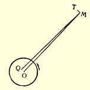
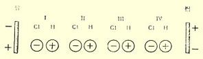

# ［论文］

## 导言２５４

现代自然科学同古代人的天才的自然哲学的直觉相反，同阿拉伯人的非常重要的、但是零散的并且大部分已经无结果地消失了的发现相反，它唯一地达到了科学的、系统的和全面的发展。现代自然科学，和整个近代史一样，是从这样一个伟大的时代算起， 这个时代，我们德国人由于当时我们所遭遇的民族不幸而称之为宗教改革，法国人称之为文艺复兴，而意大利人则称之为五百年代[^1]，但这些名称没有一个能把这个时代充分地表达出来。这是从十五世纪下半叶开始的时代。国王的政权依靠市民打垮了封建贵族的权力，建立了巨大的、实质上以民族为基础的君主国，而现代的欧洲国家和现代的资产阶级社会就在这种君主国里发展起来； 当市民和贵族还在互相格斗时，德国农民战争却预言式地提示了未来的阶级斗争，因为德国农民战争不仅把起义的农民引上了舞台—— 这已经不是什么新的事情了，而且在农民之后，把现代无产阶级的先驱也引上了舞台，他们手里拿着红旗，口里喊着财产公有的要求。拜占庭灭亡时抢救出来的手抄本，罗马废墟中发掘出来的古代雕像，在惊讶的西方面前展示了一个新世界—— 希腊的古代； 在它的光辉的形象面前，中世纪的幽灵消逝了；意大利出现了前所未见的艺术繁荣，这种艺术繁荣好象是古典古代的反照，以后就再也不曾达到了。在意大利、法国、德国都产生了新的文学，即最初的现代文学；英国和西班牙跟着很快达到了自己的古典文学时代。旧的ｏｒｂｉｓ ｔｅｒｒａｒｕｍ[^2]的界限被打破了；只是在这个时候才真正发现了地球，奠定了以后的世界贸易以及从手工业过渡到工场手工业的基础，而工场手工业又是现代大工业的出发点。教会的精神独裁被摧毁了，德意志诸民族大部分都直截了当地抛弃了它，接受了新教，同时，在罗曼语诸民族那里，一种从阿拉伯人那里吸收过来并从新发现的希腊哲学那里得到营养的明快的自由思想，愈来愈根深蒂固，为十八世纪的唯物主义作了准备。

这是一次人类从来没有经历过的最伟大的、进步的变革，是一个需要巨人而且产生了巨人—— 在思维能力、热情和性格方面，在多才多艺和学识渊博方面的巨人的时代。给现代资产阶级统治打下基础的人物，决不受资产阶级的局限。相反地，成为时代特征的冒险精神，或多或少地推动了这些人物。那时，差不多没有一个著名人物不曾作过长途的旅行，不会说四五种语言，不在几个专业上放射出光芒。列奥纳多·达·芬奇不仅是大画家，而且也是大数学家、力学家和工程师，他在物理学的各种不同部门中都有重要的发现。阿尔勃莱希特·丢勒是画家、铜板雕刻家、雕刻家、建筑师，此外还发明了一种筑城学体系，这种筑城学体系，已经包含了一些在很久以后被蒙塔郎贝尔和近代德国筑城学重又采用的观念。马基雅弗利是政治家、历史家、诗人，同时又是第一个值得一提的近代军事著作家。路德不但扫清了教会这个奥吉亚斯的牛圈[^3]，而且也扫清了德国语言这个奥吉亚斯的牛圈，创造了现代德国散文，并且撰作了成为十六世纪《马赛曲》的充满胜利信心的赞美诗的词和曲２５５。那时的英雄们还没有成为分工的奴隶， 分工所具有的限制人的、使人片面化的影响，在他们的后继者那里我们是常常看到的。但他们的特征是他们几乎全都处在时代运动中，在实际斗争中生活着和活动着，站在这一方面或那一方面进行斗争，一些人用舌和笔，一些人用剑，一些人则两者并用。因此就有了使他们成为完人的那种性格上的完整和坚强。书斋里的学者是例外：他们不是第二流或第三流的人物，就是唯恐烧着自己手指的小心翼翼的庸人。

自然科学当时也在普遍的革命中发展着，而且它本身就是彻底革命的；它还得为争取自己的生存权利而斗争。同现代哲学从之开始的意大利伟大人物一起，自然科学把它的殉道者送上了火刑场和宗教裁判所的牢狱。值得注意的是， 新教徒在迫害自然科学的自由研究上超过了天主教徒。塞尔维特正要发现血液循环过程的时候，加尔文便烧死了他，而且还活活地把他烤了两个钟头；而宗教裁判所只是把乔尔丹诺·布鲁诺简单地烧死便心满意足了。

自然科学借以宣布其独立并且好象是重演路德焚烧教谕的革命行为，便是哥白尼那本不朽著作的出版，他用这本书（虽然是胆怯地而且可说是只在临终时）来向自然事物方面的教会权威挑战 ２５６。从此自然科学便开始从神学中解放出来，尽管个别的互相对立的见解的争论一直拖延到现在，而且在许多人的头脑中还远没有得到结果。但是科学的发展从此便大踏步地前进，而且得到了一种力量，这种力量可以说是与从其出发点起的（时间的）距离的平方成正比的。仿佛要向世界证明：从此以后，对有机物的最高产物、 即对人的精神起作用的，是一种和无机物的运动规律正好相反的运动规律。

从那时开始的自然科学最初一个时期中的主要工作，是掌握手边现有的材料。在大多数部门中必须完全从头做起。古代留传下欧几里得几何学和托勒密太阳系，阿拉伯人留传下十进位制、代数学的发端、现代的数字和炼金术，基督教的中世纪什么也没留下。在这种情况下，占首要地位的，必然是最基本的自然科学，即关于地球上物体的和天体的力学，和它同时并且为它服务的，是数学方法的发现和完善化。这里有了一些伟大的成就。在以牛顿和林耐为标志的这一时期末，我们见到这些科学部门已经在某种程度上完成了。最重要的数学方法基本上被确定了；主要由笛卡儿制定了解析几何，由耐普尔制定了对数，由莱布尼茨，也许还由牛顿制定了微积分。刚体力学也是一样，它的主要规律彻底弄清楚了。最后，在太阳系的天文学中，刻卜勒发现了行星运动的规律，而牛顿则从物质的普遍运动规律的观点对这些规律进行了概括。自然科学的其他部门甚至离这种初步的完成还很远。液体和气体的力学只是在这个时期末才得到更高的研究[^4]。如果把光学当作例外，那末本来意义上的物理学在当时还没有超出最初的阶段，而光学得到例外的进步是由于天文学的实际需要。化学刚刚借燃素说从炼金术中解放出来。２５７地质学还没有超出矿物学的胚胎阶段；因此古生物学还完全不能存在。最后，在生物学领域内，人们主要还是从事于搜集和初步整理大量的材料，不仅是植物学和动物学的材料， 而且还有解剖学和本来意义上的生理学的材料。至于各种生命形式的相互比较，它们的地理分布和他们的气候等等的生活条件的研究，则还几乎谈不到。在这里，只有植物学和动物学由于林耐而达到了一种近似的完成。

然而，这个时代的特征是一个特殊的总观点的形成，这个总观点的中心是**自然界绝对不变**这样一个见解。不管自然界本身是怎样产生的，只要它一旦存在，那末在它存在的时候它始终就是这样。行星及其卫星，一旦由于神秘的“第一次推动”而运动起来，它们便依照预定的椭圆轨道继续不断地旋转下去，或者无论如何也旋转到一切事物消灭为止。恒星永远固定不动地停留在自己的位置上，凭着“万有引力”而互相保持这种位置。地球亘古以来或者从它被创造的那天起（不管那一种情形）就毫无改变地总是原来的样子。现在的“五大洲”始终存在着，它们始终有同样的山岭、河谷和河流，同样的气候，同样的植物区系和动物区系， 而这些植物区系和动物区系只有经过人手才发生变化或移植。植物和动物的种，一产生便永远确定下来，相同的东西总是产生相同的东西，而当林耐承认往往由杂交可能产生新种的时候， 这已经是作了很大的让步了。和在时间上发展着的人类历史相反， 自然界的历史被认为只是在空间中扩张。自然界的任何变化、任何发展都被否定了。开始时那样革命的自然科学，突然站在一个彻头彻尾保守的自然界面前，在这个自然界中，今天的一切都和一开始的时候一样，而且直到世界末日或万古永世，一切都将和一开始的时候一样。

虽然十八世纪上半叶的自然科学在知识上，甚至在材料的整理上高过了希腊古代，但是它在理论地掌握这些材料上，在一般的自然观上却低于希腊古代。在希腊哲学家看来，世界在本质上是某种从浑沌中产生出来的东西，是某种发展起来的东西、某种逐渐生成的东西。在我们所考察的这个时期的自然科学家看来，它却是某种僵化的东西、某种不变的东西，而在他们中的大多数人看来，则是某种一下子造成的东西。科学还深深地禁锢在神学之中。它到处寻找，并且找到了一种不能从自然界本身来说明的外来的推动力作为最后的原因。如果牛顿所夸张地命名为万有引力的吸引被当作物质的本质的特性，那末首先造成行星轨道的未被说明的切线力是从哪里来的呢？植物和动物的无数的种是如何产生的呢？而早已确证并非亘古就存在的人类最初是如何产生的呢？对于这样的问题，自然科学常常以万物的创造者对此负责来回答。哥白尼在这一时期的开端给神学写了挑战书；牛顿却以关于神的第一次推动的假设结束了这个时期。这一时期的自然科学所达到的最高的普遍的思想，是关于自然界安排的合目的性的思想，是浅薄的沃尔弗式的目的论，根据这种理论，猫被创造出来是为了吃老鼠，老鼠被创造出来是为了给猫吃，而整个自然界被创造出来是为了证明造物主的智慧。当时哲学的最高荣誉就是：它没有被同时代的自然知识的狭隘状况引入迷途，它—— 从斯宾诺莎一直到伟大的法国唯物主义者—— 坚持从世界本身说明世界，而把细节方面的证明留给未来的自然科学。

我把十八世纪的唯物主义者也算入这个时期，因为除了上面所述说的，再没有其他的自然科学材料可以供他们支配。康德的划时代的著作对于他们依然是一个秘密，而拉普拉斯在他们以后很久才出现。２５８我们不要忘记：这个陈腐的自然观，虽然由于科学的进步而被弄得百孔千疮，但是它仍然统治了十九世纪的整个上半叶[^5]，并且一直到现在，一切学校里主要还在讲授它[^6]。

在这个僵化的自然观上打开第一个缺口的，不是一个自然科学家，而是一个哲学家。１７５５年出现了**康德**的《自然通史和天体论》。关于第一次推动的问题被取消了；地球和整个太阳系表现为某种在时间的进程中**逐渐生成的**东西。如果大多数自然科学家对于思维不象牛顿在“物理学，当心形而上学呵！”２５９这个警告中所表现的那样厌恶，那末他们一定会从康德的这个天才发现中得出结论，免得走无穷无尽的弯路，并节省在错误方向下浪费掉的无法计算的时间和劳动，因为在康德的发现中包含着一切继续进步的起点。如果地球是某种逐渐生成的东西，那末它现在的地质的、地理的、气候的状况，它的植物和动物，也一定是某种逐渐生成的东西， 它一定不仅有在空间中互相邻近的历史，而且还有在时间上前后相继的历史。如果立即沿着这个方向坚决地继续研究下去，那末自然科学现在就会进步得多。但是哲学能够产生什么成果呢？康德的著作没有产生直接的结果，直到很多年以后拉普拉斯和赫舍尔才充实了他的内容，并且作了更详细的论证，因此才使“星云假说” 逐渐受人重视。进一步的发现使它最后获得了胜利；这些发现中最重要的是：恒星的固有的运动，宇宙空间中存在着有阻抗的媒质这一事实得到证实，通过光谱分析证明了宇宙物质的化学上的同一性以及康德所假定的炽热星云团的存在[^7]。

但是，如果这个刚刚萌芽的观点—— 自然界不是**存在着**，而是 **生成着**并**消逝着**—— 没有从其他方面得到支持，那末大多数自然科学家是否会这样快地意识到，变化着的地球竟担负着不变的有机体这样一个矛盾，那倒是可以怀疑的。地质学产生了，它不仅指出了相继形成起来和逐一重叠起来的地层，并且指出了这些地层中保存着已经死绝的动物的甲壳和骨胳，以及已经不再出现的植物的茎、叶和果实。必须下决心承认：不仅整个地球，而且地球今天的表面以及生活于其上的植物和动物，也都有时间上的历史。这种承认最初是相当勉强的。居维叶关于地球经历多次革命的理论在词句上是革命的，而在实质上是反动的。它以一系列重复的创造行动代替了单一的上帝的创造行动，使神迹成为自然界的根本的杠杆。只是赖尔才第一次把理性带进地质学中，因为他以地球的缓慢的变化这样一种渐进作用，代替了由于造物主的一时兴发所引起的突然革命[^8]。

赖尔的理论，比它以前的一切理论都更加和有机物种不变这个假设不能相容。地球表面和一切生活条件的渐次改变，直接导致有机体的渐次改变和它们对变化着的环境的适应，导致物种的变异性。但传统不仅在天主教教会中，而且在自然科学中都是一种势力。赖尔本人有好多年一直没有看到这个矛盾，他的学生们就更没有看到。这只有用当时在自然科学中已经占统治地位的分工来说明，它使每个人都或多或少地局限在自己的专业中，只有少数人没有被它夺去全面观察问题的能力。

这时物理学有了巨大的进步，它的结果，由三个不同的人几乎同时在自然科学这一部门中的划时代的一年，即１８４２年总结出来。迈尔在海尔布朗，焦耳在曼彻斯特，都证明了从热到机械力和从机械力到热的转化。热的机械当量的确定，使这个结果成为无可置疑的。同时，格罗夫２６０—— 不是职业的自然科学家，而是英国的一个律师—— 仅仅由于整理了物理学上已经达到的各种结果，就证明了这样一件事实：一切所谓物理力，即机械力、热、光、电、磁， 甚至所谓化学力，在一定的条件下都可以互相转化，而不发生任何力的损耗；这样，他就用物理学的方法补充证明了笛卡儿的原理： 世界上存在着的运动的量是不变的。因此，各种特殊的物理力，即所谓物理学上的不变的“种”，就变为各种不同的并且按照一定的规律互相转化的物质运动形式。这么多的物理力的存在的偶然性， 从科学中被排除出去了，因为它们的相互联系和转化已经被证明。 物理学和以前的天文学一样，达到了一种结果，这种结果必然指出运动着的物质的永远循环是最终结论。

从拉瓦锡以后，特别是从道尔顿以后，化学的惊人迅速的发展从另一方面向旧的自然观进行了攻击。由于用无机的方法制造出过去一直只能在活的机体中产生的化合物，它就证明了化学定律对有机物和无机物是同样适用的，而且把康德还认为是无机界和有机界之间的永远不可逾越的鸿沟大部分填起来了。

最后，在生物学研究的领域中，有了特别是从上世纪中叶以来系统地进行的科学旅行和科学探险，有了生活在当地的专家对世界各大洲的欧洲殖民地的更精确的考察，此外还有了古生物学、解剖学和生理学的进步，特别是从系统地应用显微镜和发现细胞以来的进步，这一切积聚了大量的材料，使得应用比较的方法成为可能而且同时成为必要[^9]。一方面，由于有了比较自然地理学，确定了各种不同的植物区系和动物区系的生活条件；另一方面，对各种不同的有机体按照他们同类的器官来加以相互比较，不仅就它们的成熟状态，而且就它们的一切发展阶段来加以比较。这种研究进行得愈是深刻和精确，那种固定不变的有机界的僵硬系统就愈是一触即溃。不仅动物和植物的个别的种日益无可挽救地相互融合起来，而且出现了象文昌鱼和南美肺鱼这样的动物２６１，这种动物嘲笑了以往的一切分类方法[^10]；最后，人们遇见了甚至不能说它们是属于植物界还是属于动物界的有机体。古生物学记录中的空白愈来愈多地填补起来了，甚至迫使最顽固的分子也承认整个有机界的发展史和个别机体的发展史之间存在着令人惊异的类似，承认那条可以把人们从植物学和动物学似乎愈来愈深地陷进去的迷宫中引导出来的阿莉阿德尼线[^11]。值得注意的是：和康德攻击太阳系的永恒性差不多同时，卡·弗·沃尔弗在１７５９年对物种不变进行了第一次攻击，并且宣布了种源说。２６３但在他那里不过是天才的预见的东西，到了奥肯、拉马克、贝尔那里才具有了确定的形式，而在整整一百年之后，即１８５９年，才被达尔文胜利地完成了２６４。差不多同时还确定了：早已证明为一切有机体的最后构成部分的原生质和细胞，现在发现是独立生存着的最低级的有机形式。因此，不仅有机界和无机界之间的鸿沟缩减到最小限度，而且过去和机体种源说相对立的最根本的困难之一也被排除了。新的自然观的基本点是完备了：一切僵硬的东西溶化了，一切固定的东西消散了，一切被当作永久存在的特殊东西变成了转瞬即逝的东西，整个自然界被证明是在永恒的流动和循环中运动着。

——

于是我们又回到了希腊哲学的伟大创立者的观点：整个自然界，从最小的东西到最大的东西，从沙粒到太阳，从原生生物２６５到人，都处于永恒的产生和消灭中，处于不断的流动中，处于无休止的运动和变化中。只有这样一个本质的差别：在希腊人那里是天才的直觉的东西，在我们这里是严格科学的以实验为依据的研究的结果，因而也就具有确定得多和明白得多的形式。的确，这种循环在实验上的证明并不是完全没有缺陷的，但是这些缺陷比起已经确立了的东西来是无足轻重的，并且一年一年地弥补起来了。如果我们想到科学的最主要的部门—— 超出行星范围的天文学、化学、 地质学—— 作为科学而存在还不足一百年，生理学的比较方法还不足五十年，而差不多一切生物发展的基本形式，即细胞被发现还不到四十年，那末这种证明在细节上怎么能够没有缺陷呢[^12]！

——

从旋转的、炽热的气团中（它们的运动规律，也许得在我们通过若干世纪的观察弄清了恒星的固有的运动以后才能揭示），由于收缩和冷却，发展出了以银河最外端的星环为界限的我们的宇宙岛的无数个太阳和太阳系。这一发展显然不是到处都以同样的速度进行的。在我们的星系中，黑暗的、不仅仅是行星的星体，即熄灭了的太阳的存在，愈来愈迫使天文学予以承认（梅特勒）；另一方面 （依据赛奇），一部分气状星云，作为还没有形成的太阳，属于我们的星系，这并不排斥这样的情况：另一些星云，如梅特勒所主张的， 是很远的独立的宇宙岛，这种宇宙岛的相对发展阶段要用分光镜才能确定２６６。

拉普拉斯以一种至今还没有人超过的方式详细地证明了，一个太阳系如何从一个单独的气团中发展起来；以后的科学愈来愈证实了他的观点。

在这样形成的各个天体—— 太阳以及行星和卫星上面，最初是我们称为热的那种物质运动形式占优势。在今天太阳还具有的那样一种温度下，是谈不上元素的化学化合物的；对太阳的进一步的观察，将表明热在这种场合下在多大的程度上转变为电和磁；在太阳上发生的机械运动不过是从热和重量的冲突中产生出来的， 这在现在是差不多已经确定了。

单个的天体愈小，便冷却得愈快。首先冷却的是卫星、小行星和流星，正如我们的月球早已死灭了一样。行星冷得较慢，而最慢的是中心天体。

随着进一步的冷却，互相转化的物理运动形式的相互作用就出现得愈来愈多，直到最后达到这样一点，从这一点起，化学亲和力开始起作用，以前在化学上没有分别的元素现在在化学上互相分别开来，获得了化学的性质，相互化合起来。这些化合物随着温度的下降（这不仅以不同的方式影响到每一种元素，而且还以不同的方式影响到元素的每一种化合物），随着一部分气态物质由于温度下降先变成液态、然后又变成固态，随着这样造成的新条件，而不断地变化。

当行星有了一层硬壳而且在它的表面上有了积水的时候，行星固有的热就比中心天体发送给它的热愈来愈减少。它的大气层变成我们现在所理解的意义下的气象现象的活动场所，它的表面成为地质变化的活动场所，在这些地质变化中，大气层的雨雪所起的淤积作用，比起从炽热流动的地心出来的慢慢减弱的作用就愈来愈占优势。

最后，如果温度降低到至少在相当大的一部分地面上不高过能使蛋白质生存的限度，那末在其他适当的化学的先决条件下，有生命的原生质便形成了。这些先决条件是什么，我们今天还不知道，而这是没有什么奇怪的，因为直到现在我们还根本不能确定蛋白质的化学式，我们还根本不知道，化学上不同的蛋白体究竟有多少，而且只是在大约十年前才知道，完全没有结构的蛋白质执行着生命的一切主要机能：消化、排泄、运动、收缩、对刺激的反应、繁殖。

也许经过了多少万年，才造成了可以进一步发展的条件，这种没有定形的蛋白质能够由于核和膜的形成而产生第一个细胞。但是，随着这第一个细胞的产生，整个有机界的形态形成的基础也产生了；正如我们可以根据对古生物学的记录所作的全部类推来假定，最初发展出来的是无数种无细胞的和有细胞的原生生物，在这些原生生物中只有加拿大假原生物２６７传到了现在；在这些原生生物中，有一些渐次分化为最初的植物，另一些渐次分化为最初的动物。从最初的动物中，主要由于进一步的分化而发展出无数的纲、 目、科、属、种的动物，最后发展出神经系统获得最充分发展的那种形态，即脊椎动物的形态，而最后在这些脊椎动物中，又发展出这样一种脊椎动物，在它身上自然界达到了自我意识，这就是人。

人也是由分化产生的。不仅从个体方面来说是如此—— 从一个单独的卵细胞分化为自然界所产生的最复杂的有机体，而且从历史方面来说也是如此。经过多少万年之久的努力，手和脚的分化，直立行走，最后确定下来了，于是人就和猿区别开来，于是音节分明的语言的发展和头脑的巨大发展的基础就奠定了，这就使得人和猿之间的鸿沟从此成为不可逾越的了。手的专门化意味着**工具**的出现，而工具意味着人所特有的活动，意味着人对自然界进行改造的反作用，意味着生产。狭义的动物也有工具，然而这只是它们躯体的四肢，蚂蚁、蜜蜂、海狸就是这样；动物也进行生产，但是它们的生产对周围自然界的作用在自然界面前只等于零。只有人才给自然界打上自己的印记，因为他们不仅变更了植物和动物的位置，而且也改变了他们所居住的地方的面貌、气候，他们甚至还改变了植物和动物本身，使他们活动的结果只能和地球的普遍死亡一起消失。而人之所以做到这点，首先和主要地是由于手。甚至直到现在都是人改造自然界的最强有力的工具的蒸汽机，正因为是工具，归根到底还是要依靠手。但是随着手的发展，头脑也一步一步地发展起来，首先产生了对个别实际效益的条件的意识，而后来在处境较好的民族中间，则由此产生了对制约着这些效益的自然规律的理解。随着对自然规律的知识的迅速增加，人对自然界施加反作用的手段也增加了；如果人的脑不随着手、不和手一起、不部分地借助于手相应地发展起来的话， 那末单靠手是永远造不出蒸汽机来的。

有了人，我们就开始有了**历史**。动物也有一部历史，即动物的起源和逐渐发展到现在这个样子的历史。但是这部历史是人替它们创造的，如果说它们自己也参预了创造，这也不是它们所知道和希望的。相反地，人离开狭义的动物愈远，就愈是有意识地自己创造自己的历史，不能预见的作用、不能控制的力量对这一历史的影响就愈小，历史的结果和预定的目的就愈加符合。但是， 如果用这个尺度来衡量人类的历史，即使衡量现代最发达的民族的历史，我们就会发现：在这里，预定的目的和达到的结果之间还总是存在着非常大的出入，不能预见的作用占了优势，不能控制的力量比有计划发动的力量强得多。只要人的最重要的历史活动，使人从动物界上升到人类并构成人的其他一切活动的物质基础的历史活动，满足人的生活需要的生产，即今天的社会生产，还被不可控制的力量的无意识的作用所左右，只要人所希望的目的只是作为例外才能实现，而且往往得到恰恰相反的结果，那末上述情形是不能不如此的。我们在最先进的工业国家中已经降服了自然力，迫使它为人们服务；这样我们就无限地增加了生产，使得一个小孩在今天所生产的东西，比以前的一百个成年人所生产的还要多。而结果又怎样呢？过度劳动日益增加，群众日益贫困， 每十年一次大崩溃。达尔文并不知道，当他证明经济学家们当做最高的历史成就加以颂扬的自由竞争、生存斗争是**动物界**的正常状态的时候，他对人们、特别是对他的本国人作了多么辛辣的讽刺。只有一种能够有计划地生产和分配的自觉的社会生产组织，才能在社会关系方面把人从其余的动物中提升出来，正象一般生产曾经在物种关系方面把人从其余的动物中提升出来一样。历史的发展使这种社会生产组织日益成为必要，也日益成为可能。一个新的历史时期将从这种社会生产组织开始，在这个新的历史时期中，人们自身以及他们的活动的一切方面，包括自然科学在内，都将突飞猛进，使已往的一切都大大地相形见绌。

但是，“一切产生出来的东西，都一定要灭亡”２６８。也许会经过多少亿年，也许会有多少万代生了又死；但是无情地会逐渐到来这样的时期，那时日益衰竭的太阳热将不再能融解从两极逼近的冰，那时人们愈来愈多地聚集在赤道周围，但是最后就是在那里也不再能找到足以维持生存的热，那时有机生命的最后痕迹也将逐渐消失；而地球，一个象月球一样的死寂的冻结了的球体，将在深深的黑暗里沿着愈来愈狭小的轨道围绕着同样死寂的太阳旋转，最后就落到它上面。其他的行星也将遭到同样的命运，有的比地球早些，有的比地球迟些；代替安排得和谐的、光明的、温暖的太阳系的，只是一个冷的、死了的球体在宇宙空间里循着自己的孤寂的道路行走着。我们的太阳系所遭遇的命运，我们的宇宙岛的其他一切星系或早或迟地都要遭遇到，其他一切无数的宇宙岛的星系都要遭遇到；还有这样的星系，它们发出来的光，即使地球上还有人的眼睛去接受它，也永远达不到地球，连这样的星系也都要遭遇到这种命运。

但是，当这样一个太阳系完成了自己的生命行程并且遭遇到一切有限物的命运，即死亡的时候，以后又怎样呢？是不是太阳的残骸将永远作为残骸在无限的空间里继续运转，而一切以前曾无限多样地分化了的自然力，都将永远地变成吸引这样一种运动形式呢？

> 如赛奇问道（第８１０页）：“或者自然界中是否存在着力量，能使死了的星系恢复到最初的炽热的星云状态，并使它再获得新的生命呢？我们不知道。”

当然，我们是不会象知道２×２＝４或物质的吸引的增加和减少取决于距离的平方那样知道这一点的。理论自然科学把自己的自然观尽可能地制成一个和谐的整体，现在甚至连最没有思想的经验主义者离开理论自然科学也不能前进一步；但是在理论自然科学中，我们往往不得不计算不完全知道的数量，而在任何时候都必须用思想的首尾一贯性去帮助还不充分的知识。现在，现代自然科学必须从哲学那里采纳运动不灭的原理；它没有这个原理就不能继续存在。但是物质的运动，不仅是粗糙的机械运动、单纯的位置移动，而且还是热和光、电压和磁压、化学的化合和分解、生命和意识。有人说，物质在其无限存在的整个时期只有唯一的一次，而且是在一个和它的永恒性比较起来只是无限短的时间内，有可能分化自己的运动，从而展开这个运动的全部丰富内容，而在此以前和以后则永远只局限于单纯的位置移动，这样说， 就是主张物质是会死亡的，而运动是短暂的。运动的不灭不能仅仅从数量上去把握，而且还必须从质量上去理解；一种物质，如果它的纯粹机械的位置移动虽然也带有在适当条件下转化为热、 电、化学作用、生命的可能性，但它不能够从自身产生出这些条件，那末这样的物质就**丧失了运动**；一种运动，如果它失去了使自己转变为它所应当具有的各种不同的形式的能力，那末即使它还具有潜在力，但是不再具有活动力了，因而它部分地就被消灭了。但是这两种情况都是不可想象的。

有一点是肯定的：曾经有一个时期，我们的宇宙岛的物质把如此大量的运动—— 究竟是何种运动，我们到现在还不知道—— 转化成了热，以致（依据梅特勒）从这当中可能发展出至少包括了两千万个星的种种太阳系，而这些太阳系的逐渐灭亡同样是肯定的。这个转化是怎样进行的呢？至于我们的太阳系的将来的ｃａ ｐｕｔ ｍｏｒｔｕｕｍ[^13]是否总是重新变为新的太阳系的原料，我们和赛奇神甫一样，一点也不知道。但是，在这里我们或者是必须求助于造物主，或者是不得不做出下面这个结论：形成我们宇宙岛的太阳系的炽热原料，是按自然的途径、即通过运动的转化产生出来的，而这种转化是运动着的物质**本来具有的**，从而转化的条件也必然要被物质再生产出来，即使是在千万年后多少偶然地、但是以那种也为偶然性所固有的必然性再生产出来。

这种转化的可能性是愈来愈被承认了。现在人们得出了这样的见解：天体的最终命运是互相坠落于其上，而且人们甚至计算出这种碰撞所一定产生的热量。天文学所告知我们的新星的突然闪现以及已知的旧星的同样突然增加光亮，最容易从这种碰撞得到说明。同时，不仅我们的行星群绕着太阳运动，我们的太阳在我们的宇宙岛内运动，而且我们的整个宇宙岛也在宇宙空间中运动，和其余的宇宙岛处于暂时的相对平衡中，因为甚至自由浮动的物体的相对平衡，也只能存在于相互制约的运动的情形之下；此外，还有一些人假定，宇宙空间中的温度不是到处都一样的。最后，我们知道，除了无限小的一部分，我们宇宙岛的无数太阳的热消失在空间里，甚至不能把宇宙空间的温度提高摄氏一度的百万分之一。所有这大量的热变成了什么呢？它是不是永远消失在使宇宙空间温暖起来的尝试中，它是不是实际上不再存在而只在理论上存在于下列事实中：宇宙空间的温度增加了以十个或更多个零开始的小数一度？这个假定否认了运动的不灭；它承认了这样一种可能性：由于天体的连续不断的相互坠落于其上，一切现存的机械运动都变为热，而且这种热将放射到宇宙空间中去，因此尽管“力不灭”，一切运动还是会停下来（在这里可以附带看出， 用以代替运动不灭的力不灭这个用语是多么错误）。于是我们得到这样一个结论：放射到太空中去的热一定有可能通过某种途径 （指明这一途径，将是以后自然科学的课题）转变为另一种运动形式，在这种运动形式中，它能够重新集结和活动起来。因此，阻碍已死的太阳重新转化为炽热的星云的主要困难便消失了。

此外，无限时间内宇宙的永远重复的连续更替，不过是无限空间内无数宇宙同时并存的逻辑的补充—— 这一原理的必然性， 就是德莱柏的反理论的美国人脑子也不得不承认了[^14]。

这是物质运动的一个永恒的循环，这个循环只有在我们的地球年代不足以作为量度单位的时间内才能完成它的轨道，在这个循环中，最高发展的时间，有机生命的时间，尤其是意识到自身和自然界的生物的生命的时间，正如生命和自我意识在其中发生作用的空间一样，是非常狭小短促的；在这个循环中，物质的任何有限的存在方式，不论是太阳或星云，个别的动物或动物种属， 化学的化合或分解，都同样是暂时的，而且除永恒变化着、永恒运动着的物质以及这一物质运动和变化所依据的规律外，再没有什么永恒的东西。但是，不论这个循环在时间和空间中如何经常地和如何无情地完成着，不论有多少百万个太阳和地球产生和灭亡，不论要经历多长时间才能在一个太阳系内而且只在一个行星上造成有机生命的条件，不论有无数的有机物一定产生和灭亡，然后具有能思维的脑子的动物才从它们中间发展出来，在一个短时间内找到适于生活的条件，然后又残酷地被消灭，我们还是确信： 物质在它的一切变化中永远是同一的，它的任何一个属性都永远不会丧失，因此，它虽然在某个时候一定以铁的必然性毁灭自己在地球上的最美的花朵—— 思维着的精神，而在另外的某个地方和某个时候一定又以同样的铁的必然性把它重新产生出来。

## 《反杜林论》旧序。论辩证法

> ２６９

这部著作决不是由于“内心冲动” 而产生的。正好相反，我的朋友李卜克内西会替我证明：他曾经费了多少力气才说服我来批判地阐明杜林先生的最新的社会主义理论。我一旦决心这样做， 就只有把这种被当作某种新哲学体系的最终实际成果提出来的理论，同这一体系联系起来研究，并从而研究这一体系本身，此外就别无选择了。因此，我不得不跟着杜林先生进入一个广阔的领域，在这个领域中，他谈到了所有各种东西，而且还谈到一些别的东西。这样就产生了一系列的论文，它们从１８７７年初陆续发表在莱比锡的《**前进报**》上，而在这里汇集成书，献给读者。

对一个不管如何自吹自擂但仍旧极不足道的体系作问题本身所要求的如此详细的批判，这可以由两种情况来加以说明。一方面，它使我在不同领域中有可能正面地发挥我对争论问题的见解， 这些问题在现今具有普遍科学的或实践的意义。虽然我丝毫没有想到用另一个体系去同杜林先生的体系相对立，可是仍然希望读者不要因为所考察的材料极其多样化，而忽略我所提出的各种见解之间的内在联系。

另一方面，“创造体系的”杜林先生在当代德国并不是个别的现象。近来在德国，哲学体系，特别是自然哲学体系，雨后春笋般地生长起来，至于政治学、经济学等等的无数新体系，就更不必说了。正如在现代国家里，假定每一个公民对于他有责任表决的一切问题具有判断能力一样，正如在经济学中，假定每一个买主对于他所要买来以供日用的所有商品都是内行一样，现在科学上认为也要遵守这样的假定。每个人什么都能写，而“科学自由” 正是在于人们有权撰写他们所没有学过的东西，并且以此冒充唯一严格的科学的方法。杜林先生正是这种放肆的假科学最典型的代表之一，这种假科学，现在在德国很流行，并把一切淹没在它的高超的胡说的喧嚷声中。诗歌、哲学、经济学、历史科学中有这种高超的胡说；教研室和讲台上有这种高超的胡说；到处都有这种高超的胡说，这种高超的胡说妄想出人头地并成为深刻思想，以别于其他民族的单纯平庸的胡说；这种高超的胡说是德国智力工业最标本和最大量的产品，它们价廉质劣，完全和德国其他的制造品一样，可惜它们没有和这些制造品一起在费拉得尔菲亚的博览会上陈列出来２７０。甚至德国的社会主义，特别是在杜林先生的范例之后，近来也正在热中于大量的高超的胡说；只有实际的社会民主运动才很少被这种高超的胡说所迷惑，这又是我国工人阶级的非常健康的本性的一个证据。目前在我国，除了自然科学，其余的一切差不多都害了这种病症。

当耐格里在他向自然科学家慕尼黑代表大会所作的演说中讲到人的认识无论如何不能具有全知的性质时２７１，他显然还不知道杜林先生的贡献。这些贡献迫使我也跟着他进入一系列的领域，在这些领域中我最多只能以业余爱好者的资格进行活动。这特别是指自然科学各个部门而言，在这些部门中直到现在还常常认为，一个“门外汉” 企图发表意见总是不太虚心的事情。但是微耳和先生在慕尼黑发表的、在其他地方更详细地叙述的意见，给我增加了几分勇气，他说：每个自然科学家在他自己的专业之外也不过是一个半通２７２，不客气地说是一个门外汉。正如这样一个专家敢于让自己和必须让自己常常侵犯邻近的领域一样，正如他在这里在用语的笨拙和小小的不确切方面会被有关的专家所谅解一样，我也擅自引用某些自然过程和自然规律来作为我的一般理论观点的例证，并且敢于期待同样的谅解[^15]。正如今天的自然科学家，不论自己愿意与否，都不可抗拒地被迫考察理论的一般结论一样，每个研究理论问题的人，也同样不可抗拒地被迫研究近代自然科学的成果。在这里发生一定的相互补偿。如果理论家在自然科学领域中是半通，那末今天的自然科学家在理论领域中，在直到现在被称为哲学的领域中，事实上也同样是半通。

经验自然科学积累了如此庞大数量的实证的知识材料，以致在每一个研究领域中有系统地和依据材料的内在联系把这些材料加以整理的必要，就简直成为无可避免的。建立各个知识领域互相间的正确联系，也同样成为无可避免的。因此，自然科学便走进了理论的领域，而在这里经验的方法就不中用了，在这里只有理论思维才能有所帮助[^16]。但理论思维仅仅是一种天赋的能力。这种能力必须加以发展和锻炼，而为了进行这种锻炼，除了学习以往的哲学，直到现在还没有别的手段。

每一时代的理论思维，从而我们时代的理论思维，都是一种历史的产物，在不同的时代具有非常不同的形式，并因而具有非常不同的内容。因此，关于思维的科学，和其他任何科学一样，是一种历史的科学，关于人的思维的历史发展的科学。而这对于思维的实际应用于经验领域也是非常重要的。因为第一，思维规律的理论决不象庸人的头脑关于“逻辑” 一词所想象的那样，是一成不变的“永恒真理”。形式逻辑本身从亚里士多德直到今天都是一个激烈争论的场所。而辩证法直到现在还只被亚里士多德和黑格尔这两个思想家比较精密地研究过。然而恰好辩证法对今天的自然科学来说是最重要的思维形式，因为只有它才能为自然界中所发生的发展过程，为自然界中的普遍联系，为从一个研究领域到另一个研究领域的过渡提供类比，并从而提供说明方法。

第二，熟知人的思维的历史发展过程，熟知各个不同的时代所出现的关于外在世界的普遍联系的见解，这对理论自然科学来说是必要的，因为这为理论自然科学本身所建立起来的理论提供了一个准则。但是在这里常常很明显地表现出对哲学史的不熟悉。 在哲学中几百年前就已经提出了的、早已在哲学上被废弃了的命题，常常在研究理论的自然科学家那里作为全新的智慧出现，而且在一个时候甚至成为时髦的东西。热之唯动说曾经以新的例证支持能量守恒原理，并把这一原理重新置于最前列，这肯定是它的巨大成果；但是，如果物理学家先生们记得笛卡儿早就提出了这一原理，那末它还能作为某种绝对新的东西出现吗？自从物理学和化学又几乎专门从事于分子和原子的研究以来，古希腊的原子论哲学必然地重新出现在最前列。但是它甚至被最优秀的自然科学家处理得何等肤浅呵！例如，凯库勒（《化学的目的和成就》）说，原子论哲学的创始者不是留基伯而是德谟克利特，并且断定，道尔顿最先承认在质上不同的元素原子的存在，并最先认为这些元素原子具有不同的、为不同的元素所特有的重量。２７３可是我们在第欧根尼·拉尔修（第１０卷第４３—４４和６１节）那里就可以读到：伊壁鸠鲁已经认为各种原子不仅在大小上和形态上各不相同，而且在**重量**上也各不相同[^17]，就是说，他已经按照自己的方式知道原子量和原子体积了。

１８４８年在德国什么都没有完成，只是在哲学领域中引起了完全的变革。由于民族热衷于实际，一方面开创了大工业和投机事业，另一方面开始了德国自然科学此后所经历的、由巡回传教士和漫画人物福格特、毕希纳等等揭幕的巨大跃进，于是民族坚决地摈弃了在柏林老年黑格尔派的风沙中迷失了道路的德国古典哲学。柏林的老年黑格尔派也实在应该得到这种遭遇。但是，一个民族想要站在科学的最高峰，就一刻也不能没有理论思维。正当自然过程的辩证性质以不可抗拒的力量迫使人们不得不承认它， 因而只有辩证法能够帮助自然科学战胜理论困难的时候，人们却把辩证法和黑格尔派一起抛到大海里去了，因而又无可奈何地沉溺于旧的形而上学。从此以后，在公众当中流行的一方面是叔本华的、后来甚至是哈特曼的适合于庸人的浅薄思想，另一方面是福格特和毕希纳之流的庸俗的巡回传教士的唯物主义。大学里有各式各样的折衷主义互相竞争，它们只在一点上是一致的，即它们都只是由已经过时的哲学的残渣杂凑而成，而且全都同样是形而上学的。从古典哲学的残余中保留下来的只有一种新康德主义， 这种新康德主义的最高成就是那永远不可知的自在之物，即康德哲学中最不值得保存的那一部分。最终的结果是现在盛行的理论思维的纷扰和混乱。

我们很难拿到一本理论自然科学书籍而不得到这样一个印象：自然科学家自己感觉到，这种纷扰和混乱如何厉害地统治着他们，现在流行的所谓哲学如何绝对不能给他们以出路。除了以这种或那种形式从形而上学的思维复归到辩证的思维，在这里没有其他任何出路，没有达到思想清晰的任何可能。

这种复归可以通过各种不同的道路达到。它可以仅仅由于自然科学的发现本身所具有的力量而自然地实现，这些发现是再也不会让自己束缚在旧形而上学的普罗克拉斯提斯的床[^18]上的。但这是一个比较长期、比较缓慢的过程，在这个过程中有大批多余的阻碍需要克服。这个过程大部分已经在进行，特别是在生物学中。如果理论自然科学家愿意从历史地存在的形态中仔细研究辩证哲学，那末这一过程就可以大大地缩短。在这些形态中，有两种对近代自然科学特别能收到效果。

第一种是希腊哲学。在这里辩证的思维还以天然的纯朴的形式出现，还没有被这样一些迷人的障碍２７４所困扰，这些障碍是十七和十八世纪的形而上学—— 英国的培根和洛克、德国的沃尔弗 —— 自己给自己造成的，而形而上学就是以这些障碍堵塞了自己从了解部分到了解整体、到洞察普遍联系的道路。在希腊人那里 —— 正因为他们还没有进步到对自然界的解剖、分析—— 自然界还被当作一个整体而从总的方面来观察。自然现象的总联系还没有在细节方面得到证明，这种联系对希腊人来说是直接的直观的结果。这里就存在着希腊哲学的缺陷，由于这些缺陷，它在以后就必须屈服于另一种观点。但是在这里，也存在着它胜过它以后的一切形而上学敌手的优点。如果说，在细节上形而上学比希腊人要正确些，那末，总的说来希腊人就比形而上学要正确些。这就是我们在哲学中以及在其他许多领域中常常不得不回到这个小民族的成就方面来的原因之一，他们的无所不包的才能与活动，给他们保证了在人类发展史上为其他任何民族所不能企求的地位。 而另外一个原因则是：在希腊哲学的多种多样的形式中，差不多可以找到以后各种观点的胚胎、萌芽。因此，如果理论自然科学想要追溯自己今天的一般原理发生和发展的历史，它也不得不回到希腊人那里去。而这种见解愈来愈为自己开拓道路。有些自然科学家一方面把希腊哲学的残渣，例如原子论，当作永恒真理，另一方面却以培根式的傲慢去看希腊人，理由是他们没有经验自然科学，这样的自然科学家是愈来愈少了。现在唯一希望的是这种见解迈步前进，达到对希腊哲学的真正的认识。

辩证法的第二个形态，恰好和德国自然科学家特别接近，这就是从康德到黑格尔的德国古典哲学。这里已经开了一个头，因为除上述的新康德主义外，回到康德又成为时髦的事情。自从人们发现康德是两个天才假说的创造者以来（没有这两个假说—— 以前归功于拉普拉斯的太阳系产生的理论和地球自转由于潮汐而受到阻碍的理论，今天的理论自然科学便不能前进一步），康德在自然科学家当中又获得了应有的荣誉。但是，要从康德那里学习辩证法，这是一个白费力气的和不值得做的工作，而在**黑格尔**的著作中却有一个广博的辩证法纲要，虽然它是从完全错误的出发点发展起来的。

一方面，由于这个错误的出发点和柏林黑格尔派不可救药的堕落而在很大程度上颇有道理的对“自然哲学” 的反动，极尽了放任的能事，而且堕落成了纯粹的谩骂；另一方面，自然科学在其理论需要方面被目前流行的折衷主义形而上学如此显著地置于无依无靠的境地。从此以后，就有可能在自然科学家面前重新提起黑格尔的名字，而不致于在他们中间引起杜林先生闹得如此滑稽可笑的舞蹈病。

首先应该确定的是，在这里问题决不在于保卫黑格尔的出发点：精神、思想、观念是本原的东西，而现实世界只是观念的摹写。 这一点已经被费尔巴哈摈弃了。我们大家都同意：不论在自然科学或历史科学的领域中，都必须从既有的**事实**出发，因而在自然科学中必须从物质的各种实在形式和运动形式出发[^19]；因此，在理论自然科学中也不能虚构一些联系放到事实中去，而是要从事实中发现这些联系，并且在发现了之后，要尽可能地用经验去证明。

同样，也谈不上要保存柏林老年黑格尔派和青年黑格尔派所鼓吹的黑格尔体系的独断的内容。随着唯心主义出发点的没落，在这个出发点上构成的体系，从而特别是黑格尔的自然哲学，也就没落了。但是在这里必须记住：自然科学的反对黑格尔的论战，就它对黑格尔的正确理解而言，它反对的目标只有两点，即唯心主义的出发点和不顾事实任意地构造体系。

把这一切除开之后，还剩下黑格尔的辩证法。马克思的功绩就在于，他和“愤懑的、自负的、平庸的、今天在德国知识界发号施令的模仿者们”２７５相反，第一个把已经被遗忘的辩证方法、它和黑格尔辩证法的联系以及它和黑格尔辩证法的差别重新提到显著的地位，并且同时在《资本论》中把这个方法应用到一种经验科学的事实，即政治经济学的事实上去。他获得了很大的成功，甚至德国的现代经济学派只有借口批判马克思而抄他一点东西（常常抄错了），才可以超过庸俗的自由贸易派。

在黑格尔的辩证法中，正如在他的体系的其他一切部门中一样，一切真实的联系都是颠倒的。但是，如马克思所说的，“辩证法在黑格尔手中神秘化了，但这决不妨碍我们说，他第一个全面地有意识地叙述了辩证法的一般运动形式。在他那里，辩证法是倒立着的。 必须把它倒过来，以便发现神秘外壳中的合理内核。”２７６

但是，在自然科学本身中，我们也常常遇到这样一些理论，在这些理论中真实的关系被颠倒了，映象被当作了原形，因而必须把这些理论同样地倒过来。这样的理论常常在一个长时期中占统治地位。当热在差不多两个世纪内都被看做特殊的神秘的物质，而不是被看做普通物质的运动形式时，热学的情况就是这样，热之唯动说才完成了这个倒过来的工作。然而被热素说所统治的物理学却发现了一系列非常重要的热学定律，在这里，特别是［让· 巴·约·］傅立叶和萨迪·卡诺２７７为正确的见解开拓了道路，而这种正确的见解本身不过是把它的前驱所发现的定律倒过来，翻译成自己的语言而已[^20]。同样，在化学中，燃素说经过百年的实验工作提供了这样一些材料，借助于这些材料，拉瓦锡才能在普利斯特列制出的氧中发现了幻想的燃素的真实对立物，因而推翻了全部的燃素说。但是燃素说者的实验结果并不因此而完全被排除。相反地，这些实验结果仍然存在，只是它们的公式被倒过来了，从燃素说的语言翻译成了现今通用的化学的语言，因此它们还保持着自己的有效性。

黑格尔的辩证法同合理的辩证法的关系，正如热素说同热之唯动说的关系，燃素说同拉瓦锡理论的关系一样。

## 神灵世界中的自然科学

> ２７８

有一个深入人民意识的辩证法的古老命题：两极相通。因此， 当我们要寻找极端的幻想、盲从和迷信时，如果不到那种象德国自然哲学一样竭力把客观世界嵌入自己主观思维的框子里的自然科学派别中去寻找，而到那种单凭经验、非常蔑视思维、实际上走到了极端缺乏思想的地步的相反的派别中去寻找，那末我们就大致不会犯什么错误。后一个学派是在英国占统治地位的。它的始祖，备受称颂的弗兰西斯·培根，曾经渴望应用他的新的经验归纳法来首先达到延年益寿，某种程度上的返老还童，改容换貌， 脱胎换骨，创造新种，呼风唤雨。他抱怨这种研究被人遗弃，他在他的自然历史中开出了制造黄金和完成各种奇迹的正式的方子２７９。同样地，伊萨克·牛顿在晚年也埋头于解释约翰启示录２８０。 因此，无怪乎近年来以几个决不是最坏的人物为代表的英国经验主义，竟似乎变成了从美国输入的招魂术和请神术的不可救药的牺牲品。

属于这种情况的第一个自然科学家，是功勋卓著的动物学家兼植物学家阿尔弗勒德·拉塞尔·华莱士，就是他，和达尔文同时提出物种通过自然选择发生变异的理论。他在他于１８７５年由伦敦白恩士出版社出版的小册子《论奇迹和现代唯灵论》２８１里面说， 他在自然科学这个部门中的最初实验是在１８４４年开始的，那时他听到斯宾塞·霍尔先生关于麦斯默尔催眠术２８２的讲演，因此他在他的学生身上作了同样的实验。

> “我对这个问题感到非常有趣，并且很热心〈ａｒｄｏｕｒ〉地研究它。”［第１１９ 页］

他不仅使人进入催眠状态并发生四肢僵直和局部失去感觉的现象，而且也证实了加尔颅骨图２８３的正确，因为在触摸任何一个加尔器官的时候，相应的活动就在已受催眠的人身上产生，并以灵活的姿势按规定做出来。其次，他确定了，他的被催眠者只要被他触摸一下，就会感到催眠者的一切感觉；他可以把一杯水说成白兰地酒，让被催眠者喝得酩酊大醉。他能使一个年青人糊涂到甚至在清醒的时候忘记了自己的姓名，然而这是其他教员不用麦斯默尔催眠术也可以办到的。如此等等。

１８４３—１８４４年冬季，我也适逢其会地在曼彻斯特看到了这位斯宾塞·霍尔先生。他是一个很普通的江湖术士，在几个教士的庇护下在国内到处跑来跑去，用一个少女作催眠颅相学的表演，以便由此证明上帝存在，证明灵魂不死，证明当时欧文主义者在各大城市中所宣传的唯物主义不正确。少女受到了催眠，然后只要催眠者摸一摸她的颅骨上的任何一个加尔器官，她就象演戏一样做出了表示该器官的活动的表情和姿势；例如，摸一下爱孩子的 （ｐｈｉｌｏｐｒｏｇｅｎｉｔｉｖｅｎｅｓｓ）器官，她就爱抚和亲吻所幻想的婴孩，如此等等。此外，这位堂堂的霍尔还用一个新的巴拉塔利亚岛２８４丰富了加尔的颅骨地理学：他在颅骨顶上发现了敬神的器官，只要摸一摸这里，他的那位受了催眠的小姐就跪下去，把双手合在一起， 并且在惊讶的庸人观众面前做出一个为虔敬所笼罩的天使的样子。这就是表演的终结和顶点。上帝的存在就被证明了。

我和我的一个熟人也同华莱士先生一样：我们对这些现象感到兴趣，试图看看，我们能在什么程度上再现这些现象。我们选择了一个十二岁的活泼的男孩来做对象。静静的凝视和轻轻的抚摩就毫无困难地使他进入催上眠状态。但是，因为我们对这玩意不象华莱士先生那样虔诚，那样热心，所以我们也就得到完全不同的结果。除了很容易产生的肌肉僵硬和失去知觉，我们还发现了和一种特殊的感觉过度兴奋联在一起的意志完全被动的状态。 如果被催眠者由于任何外部刺激而从昏睡中醒过来，他就显得比清醒的时候有生气多了。跟催眠者没有丝毫神秘的关系；任何其他的人都可以同样容易地使被催眠者动作起来。使加尔颅骨器官起作用，在我们看来简直是太不足道了；我们的花样还更多：我们不仅能使这些器官互相置换，并把它们安置在整个身体的任何地方，而且我们还能够造出任何数量的其他器官，唱歌、吹口哨、 吹笛、跳舞、拳击、缝纫、补鞋、抽烟等等的器官，并把这些器官安置在我们所要的任何地方。华莱士用水使他的被催眠者酩酊大醉，但是我们在大脚拇指上发现了醉酒的器官，只要摸它一下， 被催眠者就会演出最妙的喝醉酒的滑稽戏。但是十分明白：如果不使被催眠者了解所希望于他的是什么，那末任何器官都不能显示丝毫作用。这个小孩经过实际练习很快便熟练到这样的程度：只要多少有一点暗示就够了。这样造成的器官只要不用同样的方法加以改变，对于以后的催眠是永远有效的。这个被催眠者正好有双重的记忆，一种是清醒时候的记忆，另一种是催眠状态中的很特殊的记忆。至于说到意志的被动性，说到对第三者的意志的绝对服从，那末只要我们不忘记整个状态是以被催眠者的意志服从催眠者的意志开始，而且没有这种服从就行不通，那末这种被动性、这种绝对服从就没有什么奇怪的了。只要被催眠者同催眠者开个玩笑，就是世界上最有魔力的催眠术家也毫无办法了。

这样，我们不过随便怀疑了一下，便发现催眠颅相学的江湖骗术的基础，是许多和清醒状态的现象大半只在程度上有所不同的、无需任何神秘解释的现象，可是华莱士先生的热心（ａｒｄｏｕｒ） 却使得他一再地自己欺骗自己，因此他在一切细节上证实了加尔颅骨图，确定了催眠者和被催眠者之间的神秘联系[^21]。在华莱士先生的天真得有些稚气的谈话中，到处都可以看到：他所注意的并不是去探究这种江湖骗术的真相，而是不惜代价使所有的现象重现出来。要使一个刚刚开始的研究者以简单而轻易的自欺很快就变成内行，那就只要有这种气质便够了。华莱士先生终于相信了催眠颅相学的奇迹，而且他已经有一只脚踏进神灵世界中去了。

到１８６５年，他的另一只脚也跟着踏进去了。当他在热带地方旅行了十二年回来以后，桌子跳舞的降神术实验使他加入了各种 “神媒”的团体。他进步得多么快，他对这门法术掌握得多么纯熟， 这由上述小册子可以得到证明。他希望我们不仅要相信霍姆、达文波特兄弟，以及其他多少表现出是为了钱并且大部分一再地暴露出骗子面目的“神媒” 们的虚假的奇迹，而且要相信许多从很古的时候起就被信以为真的神灵故事。希腊神托所的女占卜者、中世纪的女巫都是“神媒”，而杨布利柯在他的《论预言》中已经很准确地描写了

> “现代唯灵论中最令人惊异的现象”［第２２９页］。

我们只举一个例子来表明，华莱士先生对于这些奇迹在科学上的确立和证实，是处理得何等轻率。如果有人想要我们相信神灵会让人给他们照像，那末这的确是一个奢望，而且我们在承认这种神灵照片是真实的以前，当然有权利要求它们必须有十分确凿的证明。但华莱士先生在第１８７页上叙述道：１８７２年３月，主神媒古比太太（父姓为尼科尔）跟她的丈夫和小儿子在诺亭山２８５的赫德逊先生家里一起照了像，而在两张不同的照片上都看得出她背后有一个身材很高的女人影子，优雅地（ｆｉｎｅｌｙ）披着白纱，面貌略带东方风味，做着祝福的姿势。

> “所以，在这里，两件事中必有一件**是**绝对确实的[^22]。要不是有一个活着的、智慧的、然而肉眼看不见的存在物在这里，就是古比先生夫妇、摄影师和某一第四者筹划了一个无耻的〈ｗｉｃｋｅｄ〉骗局，而且一直维持着这一骗局。 但是我非常了解古比先生夫妇，所以我**绝对相信**：他们象自然科学方面的任何真挚的真理探求者一样，是不能干出这种骗人的勾当来的。”[^23]［第１８８ 页］

这样看来，不是骗人的勾当，就是神灵的照片。好极了。如果是骗人的勾当，那末要不是神灵早已映在照片底版上，就一定是有四个人参与其事，或者有三个人参与其事，如果我们把活到八十四岁于１８７５年１月去世的无责任能力或易受愚弄的古比老先生撇开不谈的话（只要把他送到屏风后面就行了）。一个摄影师要给神灵寻找一个“模特儿” 是没有什么困难的，我们对此无须多费唇舌。但是摄影师赫德逊不久就因一贯伪造神灵照片而被人公开检举，因此华莱士先生镇静地说：

> “无论如何，有一件事情是明白的：如果什么地方发生了骗人的勾当，那立刻就会被唯灵论者自己看破的。”［第１８９页］

所以，摄影师是不大可以信赖了。剩下的是古比太太，而我们的朋友华莱士对她只有“绝对的信任”，再没有别的。再没有别的吗？决不是这样。古比太太的绝对可靠是由她下面的话来证明的：１８７１年６月初的一个晚上，她在不省人事的状态中从汉伯里山公园她的家里，由空中被摄到兰布斯·康第特街６９号—— 两地的直线距离是三英里—— 并且被放置在上述６９号房子中正在举行降神会的桌子上。房门是关着的，虽然古比太太在伦敦是一个极肥胖的女人—— 这一点倒的确是有点意思的，但是在门上或天花板上连个小小的窟窿都没有留下就突然进到屋子里来了（１８７１ 年６月８日伦敦《回声报》２８７上的报道）。现在谁还不相信神灵照片是真的，那就对他没有什么办法了。

英国自然科学家中的第二个著名的内行，是威廉·克鲁克斯先生，化学元素铊的发现者和辐射计（在德国也叫作 Ｌｉｃｈｔｍüｈｌｅ）的发明者２８８。克鲁克斯先生大约从１８７１年起开始研究降神现象，为着这个目的应用了许多物理仪器和力学仪器，弹簧秤、电池等等。他是否带来了主要的仪器，即怀疑地批判的头脑，他是否使它始终保持工作能力，我们是会看到的。无论如何， 在一个并不很长的时期内，克鲁克斯先生就象华莱士先生一样完全给迷住了。他叙述道：

> “才几年的工夫，一个年青女人，弗洛伦斯·库克小姐，就显示出种种值得注意的神媒的品质，而且最近已经登峰造极，产生了一个肯定是来自神灵世界的完美的女性形体，赤着脚，披着飘洒的白袍，而这时神媒却穿着黑色的衣服，被捆缚着，沉睡在一间内室〈ｃａｂｉｎｅｔ〉或邻室里。”［第１８１页］

这个神灵自称凯蒂，看起来非常象库克小姐，一天晚上，福尔克曼先生，古比太太现在的丈夫，突然把它拦腰抱住，紧紧地抱住它，看它到底是不是库克小姐的化身。这个神灵是一个十分健壮的女人，它竭力保护自己，观众们来干预，瓦斯灯被扭熄了， 而乱了一阵以后，重新安静下来，屋子里点起了灯，这时神灵已经不见了，库克小姐仍然被捆住，不省人事地躺在原来的角落里。 但是，据说福尔克曼先生直到现在还坚持说，他抱住的是库克小姐而不是别人。为了从科学上来确定这件事情，一个著名的电学家伐利先生，在作一次新的实验的时候，用电池的电流通到神媒库克小姐身上，使得她不切断电流就不能扮演神灵的角色。然而神灵还是出现了。所以它的确是和库克小姐不同的存在物。进一步确定这件事情便是克鲁克斯先生的任务。他第一步是要取得这位神灵小姐的**信任**。

> 这种信任，如他自己在１８７４年６月５日的《灵学家》周报中所说的， “逐渐增长到这样的程度：除非**由我来布置**，她就拒绝降神。她说她希望**我**常在她近旁，并且要在内室紧隔壁；我发现，在这种信任已经建立而且她确信我**决不致对她食言**以后，一切现象都大大加强了，用其他方法得不到的证据也如意地得到了。她常常**和我商量**出席降神会的人以及他们的席位，因为她最近由于有人不怀好意地暗示她除了其他比较科学的研究方法还要使用**武力**，而变得非常不安〈ｎｅｒｖｏｕｓ〉。”[^24]２８９

这位神灵小姐十分感激这种既亲切又科学的信任。她甚至出现—— 这已经不再能使我们惊奇了—— 在克鲁克斯先生家里，和他的孩子们玩耍，而且给他们讲“她在印度冒险的趣闻”，尽情地向克鲁克斯先生谈“她过去生活中的一些痛苦经验”，让他拥抱她，以便相信她的坚固的物质性，让他察看她每分钟的脉搏次数和呼吸次数，最后还让她自己和克鲁克斯先生并排照像。华莱士先生说：

> “这个形体在人们看见她，摸到她，给她照像，并且和她谈话以后，就从

一个小屋子里面**绝对地消失了**[^25]，这个小屋子除了通往挤满观众的隔壁一间屋子，是没有其他出口的”［第１８３页］，

假若观众们十分有礼貌，信任房子的主人克鲁克斯先生，就象克鲁克斯先生信任神灵一样，这就不是什么了不起的法术了。可惜这些“完全证实了的现象”，甚至对于唯灵论者也不是完全可信的。我们在前面已经看到，十分相信唯灵论的福尔克曼先生如何实行了非常物质的突然抓住的办法。现在又有一个教士，“不列颠国家灵学家协会” 委员，也出席了库克小姐的降神会，而且毫不困难地确定了：神灵从里面出来并在里面消失的那间屋子，是有 **第二道门**通往外界的。当时也在场的克鲁克斯先生的举动，“使我对这些表演中也许有点什么东西的信心受到了最后的致命打击” （查·莫里斯·戴维斯牧师《神秘的伦敦》，伦敦丁斯莱兄弟出版社版）２９０。此外，“凯蒂们”如何“现身”的事，在美国也弄清楚了。 有一对姓霍姆斯的夫妇在费拉得尔菲亚举行降神会，会上也出现了一个“凯蒂”，她得到信徒们丰富的馈赠。但是，这位凯蒂有一次竟因为报酬不够多而罢了工，这就引起一个怀疑者下决心要探寻出她的踪迹；他在一个ｂｏａｒｄｉｎｇ ｈｏｕｓｅ（公寓）里发现了她，是一个毫无疑问地有血有肉的年青女人，占有了赠送给神灵的一切礼物。

同时，欧洲大陆也有它的科学的请神者。彼得堡的一个学术团体—— 我不大清楚是大学或者甚至是研究院—— 曾委托国家顾问阿克萨柯夫和化学家布特列罗夫研究降神现象，但似乎并没有多少结果。２９１另一方面，—— 如果相信降神术士的喧嚣的声明 —— 德国现在也举出莱比锡的教授策尔纳先生作为自己的唯灵论者了。

大家知道，策尔纳先生多年来埋头研究“第四度” 空间，发现在三度空间里不可能出现的许多事情，在第四度空间里却是不言而喻的。例如，在第四度空间里，一个毫无罅隙的金属球，不在上面钻一个孔，就可以象翻手套一样地把它翻过来；同样，在一根两端都没有尽头或两端都被系住的线上可以打结，两个分离的闭口的圆环，不打开其中的任何一个就可以套在一起，还有许多这一类的玩意。根据神灵世界最近传来的捷报，策尔纳教授先生现在请求一个或几个神媒帮助他确定第四度空间中的各种细节。结果据说是惊人的。他把自己的手臂架在椅子的靠背上，而手掌放在桌子上不动，降神会一开，椅子的靠背就和他的手臂套在一起了；一根两端用火漆固定在桌子上的线，竟在中间打了四个结，如此等等。一句话，神灵是可以极其容易地完成第四度空间的一切奇迹的。但是必须注意：我是在转述别人所说的话。我并不保证这个神灵通报的正确性，如果它有什么不确实的地方，策尔纳先生便应当感谢我给他提供了一个更正的机会。但是，如果这个通报不是虚伪地报道策尔纳先生的实验结果，那末这些实验结果显然在神灵的科学和数学方面都开辟了一个新纪元。神灵证明了第四度空间的存在，正如同第四度空间保证了神灵的存在一样。而这一点一经确定，科学便给自己开辟出一个全新的辽阔的天地。对于第四度空间和更高度的空间的数学，对于住在这种高度空间中的神灵们的力学、物理学、化学和生理学，过去的全部数学和自然科学都只是一种预备科目了。克鲁克斯先生不是已经在科学上确定了桌子和其他家俱在移到—— 我们现在可以这样说 —— 第四度空间的过程中要损失多少重量，而华莱士先生不是也声称他已经证明在第四度空间中火不会伤害人体吗？现在甚至已经有神体生理学了！神灵们要呼吸，有脉搏，这就是说，他们有肺脏、心脏和循环器官，因而在身体的其他器官方面至少是和我们一样齐全的。因为要呼吸就必须有可以在肺里燃烧的碳水化合物，而这些碳水化合物又只能由外界供给，所以必须有胃、肠及其附属器官，而这一切一经确定，其余的就毫无困难地都跟着有了。但是这些器官的存在就使得神灵们有生病的可能，这样一来， 微耳和先生也许就不得不写一部神灵世界的细胞病理学了。而因为这些神灵大多数是非常漂亮的年青女人，而且除了她们的超凡的美丽，她们和世间的女人不论在任何方面都没有什么不同，所以不久她们就会和“爱上她们的男人”２９２接触；而且，既然如克鲁克斯先生由脉搏所确定的，她们“并不是没有女性的心”，那末第四度空间里也就有自然选择，虽然在那里它已不必担心人们会把它和万恶的社会民主主义加以混淆了２９３。

够了。这里我们已经了如指掌地看清了，什么是从自然科学到神秘主义的最可靠的道路。这并不是自然哲学的过度理论化，而是蔑视一切理论、不相信一切思维的最肤浅的经验论。证明神灵存在的并不是先验的必然性，而是华莱士先生、克鲁克斯先生之流的经验的观察。因为我们相信克鲁克斯的光谱分析的观察（铊这种金属就是由此发现的），或是华莱士在马来群岛所得到的动物学上的丰富的发现，人们就要求我们同样地相信这两位研究者在降神术上的实验和发现。而如果我们认为，在这里还有一个小小的区别，即前一种发现可以验证，而后一种却不能，那末请神者就会反驳我们道：不是这么回事，他们是准备给我们提供机会来验证这些神灵现象的。

的确，蔑视辩证法是不能不受惩罚的。无论对一切理论思维多么轻视，可是没有理论思维，就会连两件自然的事实也联系不起来，或者连二者之间所存在的联系都无法了解。在这里，唯一的问题是思维得正确或不正确，而轻视理论显然是自然主义地、因而是不正确地思维的最确实的道路。但是，根据一个老早就为大家所熟知的辩证法规律，错误的思维一旦贯彻到底，就必然要走到和它的出发点恰恰相反的地方去。所以，经验主义轻视辩证法便受到这样的惩罚：连某些最清醒的经验主义者也陷入最荒唐的迷信中，陷入现代降神术中去了。

数学方面的情形也是一样。一般形而上学的数学家，都十分高傲地夸耀他们的科学的成果是绝对无法推翻的。但是这些成果也包括一些虚数在内，从而这些虚数也就带有某种实在性。只要我们习惯于给－１或第四度空间硬加上某种在我们的头脑以外的实在性，那末我们是否再往前走一步，是否也承认神媒的神灵世界，这就没有什么特别大的重要性了。这正象凯特勒谈到多林格尔时所说的：

“这个人一生中曾替这么多的谬论作辩护，就连教皇无谬说他也真能接受了！”２９４

事实上，单凭经验是对付不了降神术士的。第一，那些“高级的” 现象，只是在有关的“研究者” 已经着迷到正象克鲁克斯自己天真无比地叙述的那样，只看得见他应当看到的或希望看到的东西时，才能够显现出来。第二，降神术士毫不在乎成百件的所谓事实已经暴露出是骗局，成打的所谓神媒也被揭露出是一些平凡的江湖骗子。除非把那些所谓奇迹**一件一件地**揭穿，否则这些降神术士仍然有足够的活动地盘，就象华莱士关于伪造的神灵照片所明明白白地说到的一样。伪造的东西的存在，正好证明了真的东西的真实。

这样，经验论就发现自己要驳倒顽固的请神者，势必要用理论的考察，而不能用经验的实验；用赫胥黎的话说：

> “我认为从证明唯灵论是真理这当中所能得到的唯一好处，就是给反对自杀提供一个新论据。与其死了借某个每举行一次降神会就赚一个基尼[^26]的 ‘神媒’的嘴说一大堆废话，倒不如活着作个清道夫好些。”２９５

# 辩证法

> ２９６

（阐明辩证法这门和形而上学相对立的、关于联系的科学的一般性质。）

———

因此，辩证法的规律是从自然界和人类社会的历史中抽象出来的。辩证法的规律不是别的，正是历史发展的这两个方面和思维本身的最一般的规律。实质上它们归结为下面三个规律：

量转化为质和质转化为量的规律；

对立的相互渗透的规律；

否定的否定的规律。

所有这三个规律都曾经被黑格尔以其唯心主义的方式只当作思维规律而加以阐明：第一个规律是在他的《逻辑学》的第一部分即存在论中；第二个规律占据了他的《逻辑学》的整个第二部分，而且是最重要的部分，即本质论；最后，第三个规律是整个体系构成的基本规律。错误在于：这些规律是作为思维规律强加于自然界和历史的，而不是从它们当中抽引出来的。从这里就产生出整个牵强的并且常常是可怕的虚构：世界，不管它愿意与否， 必须符合于一种思想体系，而这种思想体系自身又只是人类思维某一特定发展阶段的产物。如果我们把事情顺过来，那末一切都会变得很简单，在唯心主义哲学中显得极端神秘的辩证法规律也立刻就会变成简单而明白的了。

此外，凡是稍微懂得一点黑格尔的人都知道，黑格尔在几百个地方都懂得：要从自然界和历史中，举出最恰当的例子来确证辩证法规律。

我们在这里不打算写辩证法的手册，而只想表明辩证法的规律是自然界的实在的发展规律，因而对于理论自然科学也是有效的。因此，我们不能详细地考察这些规律的相互的内部联系。

一、量转化为质和质转化为量的规律。为了我们的目的，我们可以把这个规律表示如下：在自然界中，质的变化—— 以对于每一个别场合都是严格地确定的方式进行—— 只有通过物质或运动（所谓能）的量的增加或减少才能发生。

自然界中一切质的差别，或是基于不同的化学成分，或是基于运动（能）的不同的量或不同的形式，或是—— 差不多总是这样—— 同时基于这两者。所以，没有物质或运动的增加或减少，即没有有关的物体的量的变化，是不可能改变这个物体的质的。因此，在这个形式下，黑格尔的神秘的命题就显得不仅是完全合理的，并且甚至是相当明白的。

几乎用不着指出：物体的各种不同的同素异性状态和聚集状态，因为是基于分子的各种不同的组合，所以是基于已经传给物体的或多或少的运动的量。

但是运动或所谓能的形式的变化又怎样呢？当我们把热变为机械运动或把机械运动变为热的时候，在这里质是变化了，而量依然如故吗？完全正确。但是关于运动形式的变化，正如海涅论及罪恶时所说的：每个人自己都可以是道德高尚的，而构成罪恶总是需要两个人２９７。运动形式的变化总是至少在两个物体之间发生的过程，这两个物体中的一个失去一定量的一种质的运动（例如热），另一个就获得相当量的另一种质的运动（机械运动、电、化学分解）。 因此，量和质在这里是双方互相适应的。直到现在还不能够在一个单独的孤立的物体内部使运动从一种形式变为另一种形式。

在这里我们首先只谈无生命的物体；对于有生命的物体，这个规律也是适用的，但是其情况非常错综复杂，现在我们还往往不能够进行量的测定。

如果我们设想，任何一个无生命的物体被分割成愈来愈小的部分，那末最初是不发生任何质的变化的。但是这有它的极限：如果我们能够（如在气化的情况下）得出一个个的自由状态的分子， 那末我们在大多数场合下还能够把这些分子进一步分割，然而只有在质完全变化时才行。分子分解为它的各个原子，而原子具有和分子完全不同的性质。在分子是由不同的化学元素化合而成的场合下，这些元素本身的原子或分子便代替化合成的分子而出现； 在分子是由一种元素构成的场合下，出现的则是游离的原子，它们起着在质上完全不同的作用：初生氧的游离原子，起着那束缚在分子内的大气中的氧原子所决不能起的作用。

但是分子和它所属的物体，在质上也已经不相同了。分子可以不依赖于物体而运动，而同时物体却好象是在静止中，例如热振动；分子可以因位置的变动，因与邻近分子的联系的变化，而使物体进入另一种同素异性状态或聚集状态，如此等等。

这样，我们看到，纯粹的量的分割是有一个极限的，到了这个极限它就转化为质的差别：物体纯粹是由分子构成的，但它是本质上不同于分子的东西，正如分子又不同于原子一样。正是由于这种差别，作为关于天体和地上物体的科学的力学，才同作为分子力学的物理学、同作为原子物理学的化学区分开来。

在力学中并不出现质，最多只有如平衡、运动、位能这样的状态，它们都是基于运动的可测量的转移，并且本身是可以用量来表示的。这样，只要这里发生质的变化，它总是受相应的量的变化所制约的。

在物理学中，物体被看做化学上无变化或无差别的东西；我们在这里所研究的，是它的分子状态的变化和运动形式的变换，这种变换在任何情况下—— 至少在这两方面中的一方面—— 都会使分子活动起来。在这里每种变化都是量到质的转化，是物体所固有或所承受的某一形式的运动的量在数量上发生变化的结果。

> “例如，水的温度最初对它的液体状态是无足轻重的；但是由于液体水的温度的增加或减少，便会达到这样的一点，在这一点上这种聚集状态就会发生变化，水就会变为蒸气或冰。”（黑格尔《全书》，《黑格尔全集》第６卷第 ２１７页）２９８

例如，必须有一定的最低强度的电流才能使电灯泡中的白金丝发光，每种金属都有自己的白热点和融解点，每种液体在一定的压力下都有其特定的冰点和沸点，—— 只要我们有办法造成相应的温度；最后，例如，每种气体都有其临界点，在这一点上相当的压力和冷却能使气体变成液体。一句话，物理学的所谓常数， 大部分不外是这样一些关节点的名称，在这些关节点上，运动的量的增加或减少会引起该物体的状态的质的变化，所以在这些关节点上，量转化为质。

但是，黑格尔所发现的自然规律，是在化学领域中取得了最伟大的胜利。化学可以称为研究物体由于量的构成的变化而发生的质变的科学。黑格尔本人已经知道这一点（《逻辑学》，《黑格尔全集》第３卷第４３３页）

２９９。拿氧来说：如果结合在一个分子中的有三个原子，而不是象普通那样只有两个原子，那末我们就得到臭氧，一种在气味和作用上与普通氧很不相同的物体。更不待说，如果把氧同氮或硫按不同的比例化合起来，那末其中每一种化合都会产生出一种在质的方面和其他一切物体不同的物体！笑气（一氧化二氮Ｎ２Ｏ）和无水硝酸（五氧化二氮Ｎ２Ｏ５）是如何的不同！前者是气体，而后者在常温下是结晶的固体。而两者在构成上的全部区别是：后者所含有的氧为前者的五倍，并且在这两者之间还有三种氮的氧化物（ＮＯ，Ｎ２Ｏ３，ＮＯ２），它们在质的方面和前两者不同，而且彼此也不同。

在同系列的碳化物、特别是较简单的碳氢化合物中，这一点表现得更为显著。在正烷烃中，最低级的是甲烷，ＣＨ４；在这里， 碳原子的四个化学键被四个氢原子所饱和。第二种是乙烷，Ｃ２Ｈ６， 两个碳原子互相联结，自由的六个化学键被六个氢原子所饱和。以下依据代数学的公式ＣｎＨ２ｎ＋２，便有Ｃ３Ｈ８，Ｃ４Ｈ１０等等，所以每增加一个ＣＨ２，便形成一个和以前的物体在质上不同的物体。这一系列中最低的三种是气体，已知的最高的一种十六烷，Ｃ１６Ｈ３４，是沸点为摄氏２７０度的一种固体。关于从烷烃（理论上）得出的伯醇系列（公式是ＣｎＨ２ｎ＋２Ｏ）和一元脂肪酸系列（公式为ＣｎＨ２ｎＯ２），情形也完全一样。在量上加上一个Ｃ３Ｈ６，能够造成什么样的质的区别，可以从如下的经验看出来：我们喝可以饮用的并且不掺杂其他醇类的乙醇Ｃ２Ｈ６Ｏ，另一次我们喝同样的乙醇，但掺入了小量的戊醇Ｃ５Ｈ１２Ｏ（它是大名鼎鼎的杂醇油的主要成分）。第二天早晨我们的脑袋就一定会感到这个东西，而且觉得受到它的伤害；所以甚至可以说：醉酒和由之而来的醉后头痛正是量到质的转化，一方面是乙醇，另一方面是这一点加上去的Ｃ３Ｈ６。

在这些系列中，黑格尔的规律还以另外的形式出现在我们面前。较低的同系物只允许原子有一种相互排列。但是，当结合成一个分子的原子的数目，达到对每一系列来说是一定的大小时，分子中的原子排列就能够有多种方式；于是就能出现两种或更多的同分异构体，它们在分子中包含有相等数目的Ｃ、Ｈ、Ｏ原子，但是在质上却各不相同。我们甚至能够计算这些系列的每一同系物可能有多少同分异构体。例如，在烷烃系列中，Ｃ４Ｈ１０有两个同分异构体，Ｃ５Ｈ１２有三个同分异构体；对于更高级的同系物来说，可能产生的同分异构体的数目增加得非常之快。所以，又是分子中原子的数量制约着这种在质上不同的同分异构体产生的可能性， 并且就实验上所表明的而言，还制约着这些同分异构体的现实的存在。

不仅如此。从每一个这类系列中我们所知道的物体的类比中， 我们还能就这个系列中未知的同系物的物理性质得出结论，并且至少对于紧跟在已知同系物后面的一些同系物，能十分确定地预言其性质，即沸点等等。

最后，黑格尔的规律不仅适用于化合物，而且也适用于化学元素本身。我们现在知道，

> “元素的化学性质是原子量的周期函数”（罗斯科和肖莱马《化学教程大全》第２卷第８２３页）３００，

因此，它们的质是由它们的原子量的数量所决定。这已经得到了光辉的证明。门得列耶夫证明了：在依据原子量排列的同族元素的系列中，发现有各种空白，这些空白表明这里有新的元素尚待发现。他预先描述了这些未知元素之一的一般化学性质，他称之为亚铝，因为它是在以铝为首的系列中紧跟在铝后面的；他并且大约地预言了它的比重和原子量以及它的原子体积。几年以后，勒科克·德·布瓦博德朗真的发现了这个元素，而门得列耶夫的预言被证实了，只有极不重要的差异。亚铝体现为镓（同上， 第８２８页）。３０１门得列耶夫不自觉地应用黑格尔的量转化为质的规律，完成了科学上的一个勋业，这个勋业可以和勒维烈计算尚未知道的行星海王星的轨道的勋业居于同等地位。

无论在生物学中，或在人类社会历史中，这一规律在每一步上都被证实了，但是我们在这里只从精密科学中举出一些例子，因为这里的量是可以精确地测量和探寻的。

有些先生们在此以前曾经诽谤量到质的转化是神秘主义和不可理解的先验主义，大概就是这些先生们现在却宣称这种转化是不言而喻的、浅薄的和平凡的东西，他们早已应用过了，而且他们从中学不到任何新东西。但是，第一次把自然界、社会和思维发展的一般规律以普遍适用的形式表述出来，这始终是具有世界历史意义的勋业。如果这些先生们多年来曾经使质和量互相转化， 却不知道自己在做什么，那末他们倒可以和莫里哀的茹尔丹先生互相安慰了。这位茹尔丹先生一生中说的都是散文，但一点也不知道散文是什么东西。３０２

## 运动的基本形式

> ３０３

运动，就最一般的意义来说，就它被理解为存在的方式、被理解为物质的固有属性来说，它包括宇宙中发生的一切变化和过程，从单纯的位置移动起直到思维。研究运动的性质，当然应当从这种运动的最低级、最简单的形式开始，先理解了这些最低级的最简单的形式，然后才能对更高级的和更复杂的形式有所阐明。 所以我们看到：在自然科学的历史发展中最先发展起来的是关于简单的位置移动的理论，即天体的和地上物体的力学，随后是关于分子运动的理论，即物理学，紧跟着它、几乎和它同时而且有些地方还先于它发展起来的，是关于原子运动的科学，即化学。只有在这些关于统治着非生物界的运动形式的不同的知识部门达到高度的发展以后，才能有效地阐明各种显示生命过程的运动进程。 对这些运动进程的阐明，是随着力学、物理学和化学的进步而前进的。因此，当力学早已能够用那些对非生物界也有效的规律来适当地说明动物体中因肌肉收缩而引起的骨胳的杠杆作用时，其他生命现象的物理化学的论证，几乎还处于发展的最初阶段。所以，当我们在这里研究运动的性质时，我们不得不把运动的有机形式撇在一边。我们不得不局限于—— 按照科学的现状—— 非生物界的运动形式。

一切运动都是和某种位置移动相联系的，不论这是天体的、地上物体的、分子的、原子的或以太粒子的位置移动。运动形式愈高级，这种位置移动就愈微小。位置移动决不能把有关的运动的性质包括无遗，但是也不能和运动分开。所以首先必须研究位置移动。

我们所面对着的整个自然界形成一个体系，即各种物体相互联系的总体，而我们在这里所说的物体，是指所有的物质存在，从星球到原子，甚至直到以太粒子，如果我们承认以太粒子存在的话。这些物体是互相联系的，这就是说，它们是相互作用着的，并且正是这种相互作用构成了运动。由此可见，物质没有运动是不可想象的。其次，既然我们面前的物质是某种既有的东西，是某种既不能创造也不能消灭的东西，那末运动也就是既不能创造也不能消灭的。只要认识到宇宙是一个体系，是各种物体相互联系的总体，那就不能不得出这个结论来。因为在这种认识在自然科学中实际起作用以前很久，哲学就获得了这种认识，所以很容易说明，哲学为什么比自然科学整整早两百年做出了运动既不能创造也不能消灭的结论。甚至哲学借以作出这个结论来的形式，也比今天的自然科学的表述要高明些。笛卡儿原理—— 宇宙中存在的运动的量是永远一样的—— 只是在形式上有缺点，即对无限大应用了有限的表达方式。另一方面，在自然科学中这同一个定律现在有两种表达方式，一种是赫尔姆霍茨的**力**的守恒定律，另一种是更新的更确切的**能量**守恒定律。在这两个定律中以后我们可以看到：一个正好和另一个相对立，而且它们中的每一个都只表现了关系的一个方面。

如果两个物体相互作用，因而它们中的一个或两个都发生位置移动，那末这种位置移动就只能是互相接近或互相分离。这两个物体不互相吸引，就互相排斥。或者如力学上所说的，在这两个物体之间起作用的力是中心力，即沿着联结它们的中心的直线起作用的力。这种情形，无论许多运动看起来多么复杂，在宇宙中总是毫无例外地发生着，这在今天已经被认为是当然的了。如果假设，当两个物体相互作用着而它们的相互作用又不受第三个物体的任何妨碍或影响的时候，这作用不是沿着最短和最直接的道路进行，即沿着联结两个物体中心的直线进行，这在我们看来是很荒谬的[^27]。而且大家知道，赫尔姆霍茨（《力的守恒》１８４７年柏林版第１节和第２节）３０５用数学方法也证明了：中心作用和运动的量［Ｂｅｗｅｇｕｎｇｓｍｅｎｇｅ］３０６的不变性是互为条件的，假设中心作用以外还有其他作用，就会导致运动可以创造或消灭的结论。所以一切运动的基本形式都是接近和分离、收缩和膨胀，—— 一句话， 是**吸引**和**排斥**这一古老的两极对立。

应当明确地指出：吸引和排斥在这里不是被看做所谓“力”，而是被看做**运动的简单形式**。可是康德早已把物质看做吸引和排斥的统一体了。至于“力”究竟是怎么一回事，我们到时候将会看到。

一切运动都存在于吸引和排斥的相互作用中。然而运动只是在每一个吸引被另一个地方的与之相当的排斥所抵偿时，才有可能发生。否则一个方面会逐渐胜过另一个方面，于是运动最后就会停止。所以，宇宙中的一切吸引运动和一切排斥运动，一定是互相平衡的。因此，运动既不能消灭也不能创造这一定律，就采取这样的表达方式：宇宙中有一个吸引运动，就一定有一个与之相当的排斥运动来补充，反过来也一样；或者如古代哲学在力的守恒或能量守恒定律在自然科学中形成以前很久所说的，宇宙中一切吸引的总和等于一切排斥的总和。

但是，这里似乎还存在着一切运动迟早会停止的两种可能性： 或者是由于排斥和吸引最后在事实上互相抵消，或者是由于全部排斥最后集中在物质的一部分，而全部吸引则集中在另一部分。从辩证法的观点看来，这两种可能性都是根本不存在的。辩证法根据我们过去的自然科学实验的结果，证明了：所有的两极对立，总是决定于相互对立的两极的相互作用；这两极的分离和对立，只存在于它们的相互依存和相互联系之中，反过来说，它们的相互联系，只存在于它们的相互分离之中，它们的相互依存，只存在于它们的相互对立之中。这样一来，无论是排斥和吸引最后抵消的问题，或是一种形式的运动最后分配在一半物质上而另一种形式的运动分配在另一半物质上的问题，都不可能成为问题了，因而无论是两极互相贯穿[^28]或是绝对分离的问题，也都不存在了。在第一种场合下无异于要一条磁石的北极和南极互相抵消，在第二种场合下无异于把一条磁石从中间切断，要在一段上面只有北极而没有南极，在另一段上面只有南极而没有北极。但是，虽然从两极对立的辩证性质已经可以断定这样的假设是不能容许的，可是由于自然科学家被形而上学的思想方法所支配，至少是第二种假设还在物理学的理论中起着一定的作用。这一点以后在适当的地方还要谈到。

运动是怎样在吸引和排斥的相互作用中出现的呢？这最好是就运动本身的个别形态来研究。最后将看到事情的全貌。

我们且拿行星环绕其中心天体所作的运动来看吧。普通的天文学教科书跟着牛顿把椭圆形的行星轨道解释为两种力—— 中心天体的吸引和使行星沿着垂直于这种吸引的方向运动的切线力 —— 共同作用的结果。所以除向心的运动形式外，普通的天文学教科书还假设了与两个中心的联线垂直的另一个运动方向或所谓 “力”。因此，它和前面所说的基本定律是矛盾的，依据这个定律， 我们宇宙中的一切运动，只能沿着那把相互作用的物体的中心联结起来的直线发生，或者如一般人所说的，只能由向中心作用着的“力”所引起。因此，它把这样一种运动因素放到理论中去了， 这种运动因素，如我们也曾看到的，必然要导致运动可以创造也可以消灭的思想，因而也要以造物主为前提。这样一来，问题就在于，把这一神秘的切线力归结为某种向中心发生的运动形式，而完成这个工作的，是康德和拉普拉斯的天体演化学。大家知道，按照这种看法，整个太阳系是由自己旋转着的极稀薄的气体逐渐收缩而产生的，旋转运动显然是在这个气团的赤道线上最强烈，并且使一个个的气环从这个气团上分离出去，然后这些气环就逐渐收缩成行星、小行星等等，而按照原来的旋转方向围绕着中心体旋转。这一旋转本身，通常是由气体的单个质点所固有的运动来说明。这种运动在各个不同的方向上发生，但是最后总有一个特定的方向占优势，这就引起旋转，这种旋转必然随着气团的日益收缩而日益加强。但是，关于旋转的起源，无论作什么样的假说， 总要排除切线力，使它变为向心运动中的一个特殊的现象形式。如果行星运动的一个要素，即直接向心的要素，表现为重量，即行星和中心天体之间的吸引，那末，另一个要素，即切线方向上的要素，就是气团各个质点原有排斥的残余，这种残余以衍生的或改变了的形式表现出来。于是，任何太阳系的生存过程，都表现为吸引和排斥的相互作用，其中由于排斥以热的形式放射到宇宙空间而对这一体系来说逐渐消失，所以吸引愈来愈占优势。

一目了然：在这里被当作排斥看待的运动形式，和近代物理学所说的“**能**” 是同一个东西。由于太阳系的收缩以及因收缩而引起的现在构成太阳系的各个天体的分离，太阳系便失去了 “能”，而这一损失，按照赫尔姆霍茨的著名的计算，现在已经等于原来以排斥的形式出现的全部运动的量的４５３４５４。

其次，且拿我们地球上的一个物体来看吧。它是靠重量和地球联系着，正象地球是靠重量和太阳联系着一样；但是它和地球不同，不能作自由的行星运动。它只有靠外来的推动才能运动起来，而且推动一旦终止，它的运动也就迅速停止，这或者仅仅是由于重量的作用，或者是由于重量和该物体借以运动的媒质的阻抗的共同作用。这一阻抗归根到底也是重量的作用，如果没有重量，地面上就不会有任何具有阻抗的媒质，不会有任何大气了。所以在地面上的纯粹的机械运动中，我们所碰到的是重量即吸引占有决定性的优势的情形，因而在这里运动的产生有两个阶段：首先是抵抗重量，然后是让重量起作用，一句话，是先使物体上升， 然后再使之下降。

这样一来，我们又有了吸引和发生于与之相反的方向上的运动形式，即排斥的运动形式，二者之间的相互作用。但是，在地球上的**纯粹**力学（这种力学所研究的，是那些具有**既成的**而且在它看来是不变的聚集状态和凝聚状态的物体）的范围内，这种排斥的运动形式在自然界中是不发生的。无论是岩石从山顶上崩落下来，或者是水的下泻成为可能，形成这类现象的物理条件和化学条件，都是在这种力学的范围以外的。所以在地球上的纯粹力学中，排斥的或上升的运动一定是人工造成的，即由人力、畜力、 水力、蒸汽力等等造成的。这种情形，这种用人力同天然的吸引作斗争的必要性，使力学家们产生了一种看法，认为吸引、重量、 或者如他们所说的重**力**，是自然界中最重要的、基本的运动形式。

例如，如果举起一个重物然后让它直接或间接落下而把运动传给其他物体，那末照通常的力学观点看来，传送这个运动的不是重物的**举起**，而是**重力**。例如，赫尔姆霍茨就让

> “我们最熟悉的和最简单的力，即重量，作为原动力而起作用……例如在一座由重锤发动的挂钟里。这个重锤……如果不把钟的全部机械发动起来， 便不能和重量的牵引一致了。”但是它如果不自行落下，便不能把钟的机械发动起来，而且直到悬挂它的发条完全松了为止，它总是要不断地落下来的。 “到那时，钟就停了，重锤的发动能力也暂时用尽了。重锤的重量既没有失去， 也没有减少，它依旧在同一程度上被地球吸引着，可是这个重量产生运动的能力已经失去了…… 但是我们能够用手臂的力量把钟上起来，重锤就又升上去。这样一来，重锤又获得了它原先的发动能力，并且又能使钟走起来。” （赫尔姆霍茨《通俗讲演集》第２卷第１４４—１４５页）

因此，按照赫尔姆霍茨的意见，使钟走起来的，不是运动的主动的传送，不是重锤的举起，而是重锤的被动的重量，虽然这个重量本身，只是由于被举起来才脱离了它的被动状态，而在悬挂重锤的发条松了以后又回到被动状态。所以，如果照我们刚才所看到的新观点看来，**能**仅仅是**排斥**的另一种表现，那末，照赫尔姆霍茨的旧观点看来，**力**是排斥的对立物**吸引**的另一种表现。我们暂且把这件事确定下来。

那末，当这个地球上的力学的过程达到它的终点的时候，当重物先被举起然后又降落到同一高度的时候，构成这个过程的运动将怎样呢？照纯粹的力学看来，它是消失了。但是，我们现在知道，它决没有消灭。它有一小部分转化为声波式的空气振动，而绝大部分则转化为热。这些热一部分传给起着抵抗作用的大气，一部分传给落体本身，一部分则传给所落到的地面。钟的重锤，也以摩擦热的形式，把自己的运动逐渐传给钟表机械的各个齿轮。可是转化为热，即转化为排斥的一种形式的，并不是人们通常所说的**下降**运动，就是说，并不是吸引。相反地，如赫尔姆霍茨所正确地指出来的，吸引，重量，仍然和它先前一样，而确切地说，甚至变得更大了。宁可说是由于举起而传给所举起的物体的排斥，因降落而**在力学上**消灭掉，并且以热的形式重新产生出来。物体的排斥变成了分子的排斥。

如我们已经说过的，热是排斥的一种形式。它使固体的分子发生振动，从而减弱各个分子间的联系，直到最后出现了向液态的过渡；如果继续加热，它在物体处于液态时仍然在增强分子的运动，终至分子完全脱离物体，并以一定的速度一个一个地自由运动起来，而这个速度对每一个分子来说都是决定于它的化学构造的。如果再继续加热，它就使这个速度更加增大，从而使分子愈来愈互相排斥。

但是，热是所谓“能” 的一种形式；后者在这里又一次被证明是和排斥同一的。

在静电和磁的现象中，我们有吸引和排斥的两极之分。关于这两种运动形式的作用方式，无论采取什么样的假说，面对着事实，没有一个人会怀疑，只要吸引和排斥是由静电或磁所产生，而且能够毫无阻碍地出现，它们就完全互相补偿，这在事实上是从两极之分的性质本身必然产生的。作用不完全互相补偿的两极决不是两极，到现在为止也还没有在自然界中看到过这样的两极。流电现象我们暂时撇开不谈，因为这里的过程决定于化学反应，因而是比较复杂的。所以我们最好是来研究化学运动过程本身。

当两份重的氢和１５．９６份重的氧化合成水蒸汽的时候，在这个过程中散发出６８．９２４热量单位的热量。相反地，如果要把１７． ９６份重的水蒸汽分解为两份重的氢和１５．９６份重的氧，那末这只有在下列条件下才有可能实现：要有在数量上相当于６８．９２４热量单位的运动以热本身的形式或电运动的形式传给水蒸汽。其他一切化学过程也是一样。在大多数场合下，化合时产生运动，分解时必须供给运动。在这里，排斥通常是过程的主动一面，是较多地被供给运动或要求供给运动的一面，吸引是过程的被动一面， 是形成剩余的运动并产生运动的一面。因此，现代的理论也宣称， 总的说来，在元素化合时能量被释放出来，而在化合物分解时能量就被束缚起来。所以“能” 这个名词在这里又是用来表示排斥的。赫尔姆霍茨却又说：

> “这个力〈化学亲和力〉，我们可以把它想象为**引**力…… 碳原子和氧原子间的这个引力所作的功，和地球以重量的形式对向上举起的重锤所表现的引力是一样的…… 当碳原子和氧原子互相冲撞而化合成碳酸气的时候，新形成的碳酸气粒子一定是处在极猛烈的分子运动中，即处在热的运动中…… 当碳酸气后来向周围环境放出自己的热的时候，碳酸气中的碳和氧仍然丝毫没有减少，而两者的亲和力也和以前一样强。但是这个亲和力现在只表现在它把碳原子和氧原子牢固地联系在一起，不让它们分开。”（上引书第１６９ ［—１７０］页）

完全和以前的一样，赫尔姆霍茨坚持说，在化学中和在力学中一样，力只存在于**吸引**之中，因而是和其他物理学家叫作能并和**排斥**同一的东西正好相反的东西。

因此，我们现在不再是只有吸引和排斥两种简单的基本形式， 而有一大串低级形式，在吸引和排斥的对立中扩展和收缩的一般运动的过程，就是在这些低级形式中完成的。但是，这些形形色色的现象形式都可以归到运动这个总的名称之下，这决不仅仅是我们的看法。相反地，这些形式本身，以所起的作用，证明自己是同一运动的不同形式，因为在一定的条件下它们是互相转化的。物体的机械运动可以转化为热，转化为电，转化为磁；热和电都可以转化为化学分解；化学化合又可以反过来产生热和电，而由电作媒介再产生磁；最后，热和电又可以产生物体的机械运动。而且这种转化是这样进行的：一种形式的一定量的运动，总是有另一形式的确定不移的一定量的运动与之相当，而且，用来量度这个运动的量的量度单位，不管是从哪一种运动形式中借用来的都没有关系，就是说，无论这个量度单位用来量度物体运动，量度热，量度所谓电动力，或者量度化学过程中转化了的运动，都没有关系。

在这里，我们是立足在“能量守恒” 理论的基础上，这个理论是尤·罗·迈尔在１８４２年建立的[^29]，而且从那时起各国学者对它的研究已获得了很光辉的成就。现在，我们必须研究一下这个理论目前所使用的基本概念。这就是关于“力” 或“能” 的概念和关于“功” 的概念。

我们在前面已经看到，根据新的、现在几乎已经被公认的观点，“能”是被了解为排斥的，可是赫尔姆霍茨主要是用“力”这个字来表示吸引。人们可以把这看作一种无关紧要的形式上的差别，因为在宇宙中吸引和排斥是互相补偿的，因为这样一来随便把这个关系的哪一面当作正和把哪一面当作负，似乎都没有什么关系，就好象正的横座标是从某一条直线上的某一点的右边算起或左边算起都没有什么关系一样。但是绝对不是这样。

问题是在于，这里所谈的首先并不是宇宙，而是在地球上发生的并且被地球在太阳系中和太阳系在宇宙中的十分确定的位置所决定的现象。但是我们的太阳系每一瞬间都向宇宙空间放出大量的运动，而且是在质上十分确定的运动，即太阳热，亦即排斥。而我们的地球本身只是由于有太阳热才得以生存下去，而且自己最后也把所获得的太阳热（在它把这种太阳热的一部分转化为其他运动形式以后）放射到宇宙空间中去。因此，在太阳系中，特别是在地球上，吸引已经大大地胜过了排斥。如果没有太阳放射到我们这里的排斥运动，地球上的一切运动都一定会停止。假若太阳明天就冷却，那末，在其他条件不变时地球上的吸引还会和现在一样。一百公斤重的石头，只要还在原来的地方，就和原先一样还是重一百公斤。可是运动，无论是物体的或者是分子和原子的，都会进入我们所想象的绝对静止状态。所以，对于在今天的**地球**上所发生的过程说来，把吸引还是把排斥看作运动的主动一面，即看作“力”或 “能”，显然并不是完全没有关系的。相反地，在今天的地球上，吸引由于它肯定地胜过了排斥而变成**完全被动的**了；一切主动的运动都必须归功于来自太阳的排斥的供给。因此，最新的学派—— 虽然它对运动的关系的［ｄｅｓ Ｂｅｗｅｇｕｎｇｓｖｅｒｈａｌｔｎｉｓｓｅｓ］性质还不清楚 —— 在把能看作排斥的时候，从**地球上的**过程方面看来，甚至从整个太阳系方面看来，本质上是完全对的。

“能”这个名词确实是决没有把运动的全部关系正确地表现出来，因为它只包括了这种关系的一个方面，即作用，但没有包括反作用。而且它还会造成这样一种假象：“能”是物质以外的某种东西，是加到物质里面去的某种东西。但是和“力” 这个名词比起来，无论如何还是宁愿要“能” 这个名词。

关于力的观念，如各方面所承认的（从黑格尔起到赫尔姆霍茨止），是从人的机体在周围环境中的活动中借来的。我们常说肌肉的力、手臂的举重力、腿的弹跳力、肠胃的消化力、神经的感觉力、腺的分泌力等等。换句话说，为了避免找出我们的机体的某种机能所引起的变化的真实原因，我们就造出某种虚构的原因， 某种和这个变化相当的所谓力。以后我们就把这种简便的方法搬到外在世界中去，这样，有多少不同的现象，便造出多少种力。

自然科学（天体的和地球上的力学或许是例外）还在**黑格尔** 那时已经处于这种质朴的发展阶段，而黑格尔已经很正确地攻击当时流行的把什么都叫做力的做法（引证一段话）３０９。他在另一个地方也指出：

> “说磁石有**灵魂**〈如泰勒斯所说的〉，比起说它有吸引力更好些；力是一种性质，性质是**可以和物质分离的**，可以想象为一个述语；而灵魂则是**磁石的这种运动**，**是和物质本性等同的**。”[^30]（《哲学史》第１卷第２０８页）３１０

现在我们已经不象当时那样容易运用各种力了。我们听听赫尔姆霍茨所说的吧：

> “当我们完全了解某一自然规律的时候，我们也一定会要求它毫无例外地起作用…… 这样，规律在我们心目中就是一种客观力量，因此，我们把它叫作**力**。例如，我们把光的折射定律客观化，把它看作透明的东西的一种折射力；把化学亲和定律客观化，把它看做各种不同的物质间的亲和力。我们同样地说金属的电接触力，说粘合力、毛细作用力等等。这些名称把一些规律客观化了，这些规律首先只包括一小串条件相当复杂的[^31]自然过程…… 力只是作用的客观化了的规律…… 我们所引来的力的抽象概念，只给这一点补充了下面的思想：我们没有任意编造这种规律，它是现象的必然的规律。 这样，我们**了解**自然现象即找出自然现象的**规律**的要求，就采取了另外的表现形式，即我们不得不去探究作为现象的原因的各种**力**。”（上引书第１８９— １９１页。１８６９年在音斯布鲁克的报告）

首先，把**纯主观的**关于**力**的概念，塞到一个已经确定是离开我们的主观而独立的、从而是完全**客观的**自然规律中去，这无论如何是一种奇怪的“客观化”方法。这种事情最多只能由一个最正统的老年黑格尔派做出来，而不应当由赫尔姆霍茨这样的新康德主义者做出来。当我们在一个既经确定的规律中插进某种力的时候，我们既没有给这个规律，也没有给它的客观性或它的作用的客观性增加丝毫新的客观性；所增加的只是我们的**主观论断**：这个规律靠着某种暂时还完全不知道的力的帮助来起作用。但是，当赫尔姆霍茨给我们举出光的折射、化学亲和、接触电、粘合、毛细现象这些例子，并把支配这些现象的规律提高到**力**这个“客观的”显贵等级的时候，这种在规律中插进某种力的做法的隐意就清楚了。

> “这些名称把一些规律客观化了，这些规律首先只包括一小串**条件相当复杂的**自然过程。”

正是在这里，“客观化”（宁可说是主观化）获得了某种意义： 并不是因为我们完全认识了规律，而正是因为我们**不**认识它，因为我们还弄**不**清这些现象的“相当复杂的条件”，所以我们在这里有时找“力”这个字做避难所。这样看来，我们由此表现出来的， 并不是我们关于规律的性质及其起作用的方式的科学知识，而是我们**缺乏**这方面的科学知识。在这种意义下，作为还没有阐明的因果关系的略语，作为语言上的权宜之计，“力”这个字在日常的应用中是过得去的。但是超过了这一点，那就糟了。如果赫尔姆霍茨有权利用所谓光的折射力、电接触力等等来解释物理现象，那末中世纪的经院哲学家就有同样的权利用热力和冷力来解释温度的变化，从而就用不着对热这个现象作任何进一步的研究了。

就从这种意义上看，“力”这个字也是片面的，因为它片面地表现一切。一切自然过程都有两个方面，它们建立在至少是两个起着作用的部分的关系上，建立在作用和反作用上。可是，由于力这个概念产生于人的机体对外界的作用，也产生于地球上的力学，所以它包含的意思是：只有一部分是主动的、起作用的，而另一部分是被动的、接受作用的；这样一来，它就把两性间的差异不经过证明就推广到无生命的存在物去了。受了力的作用的第二部分的反作用，最多只表现为一种被动的反作用，表现为一种 **阻抗**。这种看法就在纯粹力学（正是在这里，所讲的只是运动的简单的转移及其在数量方面的计算）以外的许多领域中也是容许的。但是它在比较复杂的物理过程中就不够了，这是赫尔姆霍茨自己的例子所证明的。光的折射力在光本身中和在透明物体中一样多。在粘合和毛细作用这两种现象中，“力”在固体表面和在液体中肯定是一样多。关于接触电，有一点无论如何也是毫无疑问的：在这里有**两种**金属起着作用；而“化学亲和力” 如果包含在什么地方的话，无论如何就是包含在起着化合作用的**两个**部分中。 但是，由两种分开的力所构成的力，不引起反作用而本身却包含着反作用的作用，决不是地球上的力学意义下的力，而这门科学又正是真正知道“力” 这个字的含义的唯一的科学。要知道，地球上的力学的基本条件，首先是不研究碰撞的原因，即每一种情况下的力的性质，其次是把力看做片面的东西，有一个在任何地方都总是和自己相等的重量和它相对抗，因而和落在地上的物体所经过的任何距离比起来，地球的半径总是被认为等于无限大。

我们现在进一步看看赫尔姆霍茨怎样把他的“力”“客观化”， 即化为自然规律。

在１８５４年的一篇讲演（上引书第１１９页）中，他研究了最初包含在构成我们的太阳系的星云球体中的“能作功的力的蕴藏量”。

> “事实上，它只是以它的各个部分彼此间的万有引力的形式获得这方面的一笔极为巨大的妆奁。”

这是无可怀疑的。但是，这一整批重量或重力妆奁还丝毫未减地保存在现在的太阳系中，或许除去很小一部分同可能一去不复返地被投入宇宙空间中的物质一道遗失掉，这同样也是无可怀疑的。其次，

> “化学力也一定是已经有的，是准备起作用的；但是，因为这些力只有在各种物质最紧密地接触的时候才能起作用，所以在它们开始起作用以前，一定要发生凝缩现象”［第１２０页］。

如果我们象赫尔姆霍茨在前面所做的一样，把这些化学力看作亲和力，即看作**吸引**，那末我们在这里也不能不说，这些化学引力的总和是丝毫没有减少地继续存在于太阳系中。

但是在同一页上，赫尔姆霍茨就叙述了他的计算的结果：

> 在太阳系中“最初的机械力现在大约只有１４５４还原样存在着”。

这怎么能和上面所说的相协调呢？引力，无论是万有引力或是化学引力，都是还丝毫未动地存在于太阳系中的。赫尔姆霍茨并没有指出力的其他的确实来源。的确，照赫尔姆霍茨所说，这些力已经作了巨大的功。但是这些力并没有因此而增加或减少。太阳系中的每一个分子乃至整个太阳系本身，都和前面所举例子中的钟的重锤的情形相同。“它的重量既没有失去，也没有减少。”一切化学元素都和前面说过的碳和氧的情形一样：每种元素既有的总量仍旧原样保存着，而“全部亲和力也仍然和以前一样强”。那末我们失去了什么呢？是什么样的“力” 作了按照他的计算竟比太阳系现在还能作的功大４５３倍的巨大的功呢？到此为止，赫尔姆霍茨没有给我们任何答案。但是他又进一步说：

> “我们不知道，［原始星云球体中］是否还有**以热的形态存在的力的蕴藏**[^32]。”［第１２０页］

但是对不起，热是排斥的“力”，因而是**逆着**重量和化学吸引的

> 方向起作用的，如果取重量和化学吸引为正，它就是负。因此，既然赫尔姆

霍茨从万有**吸引**和化学**吸引**构成他的力的原始蕴藏，那末除此以外的热的蕴藏便不应当加到这个力的蕴藏中去，而应当从这里面减掉。否则，当太阳热**逆着**地球的引力把水变成水蒸汽，并使水蒸汽向上升起的时候，太阳热就必然是在**增强**地球的引力；或者水蒸汽通过的炽热的铁管所具有的热，就必然是在**加强**氧和氢的化学吸引，可是它正好是使这种化学吸引不起作用。或者，以另外的形式来说明这同一个问题：假设半径为ｒ、因而体积为４

３πγ３的星云球体的温度是ｔ。再假设另一质量相同的星云球体在较高的温度Ｔ之下有较大的半径Ｒ和体积４

３πγ３。显然，在第二个星云球体中，只有当它的半径从Ｒ缩小到ｒ，即它把相当于温度差Ｔ—ｔ 的热放射到宇宙空间中去的时候，吸引，无论是力学的吸引或是物理的和化学的吸引，才能和第一个星云球体中的吸引起同样的作用。所以较热的星云比起较冷的星云来要凝缩得晚一些，因而从赫尔姆霍茨的观点看来，热既然妨碍凝缩，就不是正的“力的蕴藏”，而是负的。所以，当赫尔姆霍茨以为一定量的**排斥**运动可以以热的形式加到**吸引**形式的运动上，并增加后者的总量时，他犯了一个计算上的确定不移的错误。

对于这一切“力的蕴藏”，无论是可以证明的，或者是可能的， 我们都给它冠以同样的符号，使它们可以相加。因为我们暂时还不能使热转换，不能用等量的吸引来代替它的排斥，所以我们必须以两种吸引形式来完成这种转换。于是我们就只好径直拿气团自己独立起来那一瞬间存在在里面的排斥运动或所谓能的总和来代替万有引力，代替化学亲和力，代替除这些力以外最初就可能作为热这个东西而存在着的热。这就和赫尔姆霍茨的计算一致了， 这里他要计算的是

> “由于太阳系各天体从散漫的星云物质发生假定的最初的凝缩而应当得到的热”［第１３４页］。

他就这样把全部“力的蕴藏” 都归结为热，归结为排斥，从而使想象的“热这种力的蕴藏”可以加到“力的蕴藏”上面去。于是他的计算就表明：最初存在于气团中的全部能量（即排斥）的 ４５３４５４，已经以热的形态放射到宇宙空间中，或者确切地说，现在的太阳系中的一切吸引的总和，与还存在于其中的一切排斥的总和之比，是４５４∶１。但是这样一来，这些计算就和用这些计算来作证明的讲演的正文正相矛盾了。

既然力这个概念甚至在赫尔姆霍茨这样的物理学家的头脑中都引起了这样的思想混乱，这就最好不过地证明，它在从事计算的力学范围以外的任何研究领域中，在科学上都是不适用的。在力学中，运动的原因是被当作某种已知的东西看待的，人们所注意的不是运动的起源，而只是运动的作用。因此，如果有人把运动的原因叫做力，这一点也不会损害力学本身；但是人们习惯于把这个名称也搬到物理学、化学和生物学里面去，这样一来混乱就不可避免了。这一点我们已经看到而且还会常常看到。

关于功的概念，我们在下一章中再谈。

## 运动的量度。——功

> ３１１ “相反地，我一直总是看到：这个领域中的基本概念〈即“功的基本的物理概念和功的不变性”〉，对那些没有搞通数理力学的人来说，无论他们如何热心，如何有天资，甚至还有相当高度的自然科学知识，都是很难了解的。也不能否认，这是一种十分特别的抽象。甚至象伊·康德这样有才能的人也不是很容易了解它们的，这从他和莱布尼茨在这个问题上的争论可以得到证明。”

赫尔姆霍茨这样说（《通俗科学讲演集》第２卷序言）。

这样，我们现在就冒险进入了一个十分危险的领域，更何况我们没有可能使读者“搞通数理力学”。但是，也许能够表明：在涉及概念的地方，辩证的思维至少可以和数学计算一样地得到有效的结果。

伽利略一方面发现了落体定律，依据这个定律，落体所经过的距离和落下所经过的时间的平方成正比。另一方面，如我们将看到的，他又提出一个不完全符合这个定律的命题：一个物体的动量（它的冲量或动量）是由质量和速度决定的，所以它在质量是常数时就和速度成正比了。笛卡儿采取了后一命题，认为运动物体的质量和速度的乘积就是该物体的运动的量度。

惠更斯已经发现：在弹性物体碰撞时，各个质量和各个速度平方的乘积之和，在碰撞前后是不变的，而且类似的定律，对于联合成一个系统的各个物体的运动的其他各种情况，也是有效的。

莱布尼茨是看出笛卡儿的运动量度和落体定律相矛盾的第一个人。另一方面，不能否认笛卡儿的运动量度在许多情况下是正确的。因此，莱布尼茨把动力分成了死力和活力。死力是静止物体的“压力”或“拉力”，其量度是物体的质量和这个物体由静止状态转到运动状态时所具有的速度的乘积；他并且把质量和速度平方的乘积拿来作为活力—— 物体的真正运动—— 的量度。这个新的运动量度他的确是直接从落体定律推出来的。莱布尼茨作出了这样的结论：

> “把四磅重的物体举起一英尺和把一磅重的物体举起四英尺，需要同样的力；但是物体所经过的距离是和速度的平方成正比的，因为，当一个物体落下四英尺的时候，它就获得两倍于它落下一英尺时的速度。但是物体下落时获得了把物体举高到它开始下落时的高度所需要的力；所以这两种力都和速度的平方成正比。”（苏特尔《数学史》第２卷第３６７页）３１２

但是他进一步又证明了：运动的量度ｍｖ和笛卡儿关于运动的量不变的命题是矛盾的，因为，如果这一量度是真正有效的，那末力（即运动的量）在自然界中就要不断地增加或减少。他甚至设计了一种器具（《学术纪事》，１６９０年），只要ｍｖ这一量度是正确的，这种器具就一定会成为不断产生力的永动机，而这是荒谬的３１３。近来，赫尔姆霍茨又常常使用这种论据了。

笛卡儿派竭力反对，于是展开了一场著名的延续了许多年的争论，康德在他的第一本著作（《关于活力的正确评价的思想》， １７４６年）３１４中也参加了这场争论，虽然他并没有弄清这个问题。今天的数学家们都以相当蔑视的态度来看这场“无结果的”争论，这场争论

> “延续了四十多年，把欧洲的数学家分成了两个敌对的阵营，直到最后， 达兰贝尔才用他的《动力学论》（１７４３年）象最后的判决书一样结束了这场无非是**毫无益处的咬文嚼字的争论**[^33]”（苏特尔，上引书第３６６页）。

但是，看起来还不能把这场争论这样完全归结为一场毫无益处的咬文嚼字的争论，这场争论是由莱布尼茨这样的人物反对笛卡儿这样的人物而引起的，而且又有康德这样的人物参加，他的第一部洋洋巨著就是为这场争论写的。的确，运动有两个互相矛盾的量度，一个场合是和速度成正比，另一个场合是和速度平方成正比，这怎样能协调起来呢？苏特尔把事情看得很容易；他说，

> 两方面都对也都不对；“‘活力’这个名词至今仍然保存着；**但是它已不再被用作力的量度**[^34]，而只是一度被用来表示力学中极其重要的质量和速度平方的一半的乘积而已”［第３６８页］。

所以，ｍｖ依旧是运动的量度，而活力只是ｍｖ２

２的另一种表现， 关于这一公式，我们虽然体会到它在力学中极为重要，可是现在根本不知道它的意思究竟是什么。

我们且把那救命的《动力学论》３１５拿来，更仔细地看一看达兰贝尔的“最后的判决书”。这个“最后的判决书” 是在**序言**里。

> 它说：在正文中根本没有谈整个问题，因为“它对力学来说是完全没有用处的”［第页］。

这对**纯粹从事计算的**力学来说是完全正确的，在纯粹从事计算的力学中，就象前面我们在苏特尔那里所看到的，文字的标记不过是代数公式的另一种表现，另一种名称，对于这些名称，最好根本不要去想它。

> 但是，因为有这样重要的人物研究过这个问题，所以他也愿意在序言中把这个问题简略地考察一下。人们只要头脑清楚，就会把运动物体的力仅仅了解为这些物体克服障碍或抵抗障碍的特性。所以，力既不能用ｍｖ去衡量，也不能用ｍｖ２去衡量，而只能用障碍和这些障碍所表现的阻抗去衡量了。
>
> 但是障碍有三种：（１）不能克服的障碍，这种障碍可以完全消灭运动，所以在这里不能加以考察；（２）其阻抗足以使运动停止（而且是在一瞬间做到这一点）的障碍，这是平衡的情况；（３）只能够逐渐使运动停止的障碍，这是减速运动的情况。［第—页］“每个人都会同意：当两个物体的质量与其虚速度（即物体即将以之开始运动的速度）相乘所得的两个乘积彼此相等的时候，这两个物体便处于平衡状态中。所以在平衡时，质量和速度的乘积，即动量，是可以代表力的。每个人也都会同意：在减速运动的情况下， 被克服的障碍的数目和速度的平方成正比，因此，例如，如果一个物体具有某一速度时可以压缩一个弹簧，那末它具有两倍的速度时可以同时或连续地压缩的同样的弹簧便不是两个而是四个，它具有三倍的速度时可以压缩的弹簧便是九个，依此类推。于是活力的拥护者〈莱布尼茨派〉 便由此作出结论：真正运动着的物体的力，一般地是同质量和速度平方的乘积成正比的。实质上，如果力的量度在平衡状态中和在减速运动中有所不同， 这又有什么不方便呢？因为，如果一个人想只用明白的观念来进行推论，他就只有把力这个字理解为克服障碍或抵抗障碍时所产生的效果。”（法文第一版序言第—页）

但是达兰贝尔毕竟太哲学家气了，还不明白同一个力有两种量度的矛盾不是那样容易克服的。因此，他重复了本质上只是莱布尼茨已经说过的话—— 因为他的“平衡” 和莱布尼茨的“死压力” 是同一个东西，以后突然又跑到笛卡儿派方面，找到了下面这样一条出路：

> ｍｖ这一乘积甚至在减速运动的情况下也可以用作力的量度，“只要在这种情况下力不是用各种障碍的绝对量去量度，而是用这些障碍所产生的阻抗的总和去量度。要知道，阻抗的这个总和毫无疑义地是和动量〈ｍｖ〉成正比的，因为如大家所公认的，物体在每一瞬间所失去的动量跟阻抗和这一无限小的时间的乘积成正比，而且这些乘积的总和显然是等于阻抗的总和”。后一种计算方式在他看来是较为自然的一种，“因为一个障碍只是在它产生阻抗的时候才成其为障碍，说得恰当些，阻抗的总和就是被克服的障碍；此外，如果这样计算力，还有一个便利处，这就是在平衡和减速运动这两种情况下我们有一个共同的量度”。但是每个人都不妨各有所爱。［第—页］

因此，他相信他已经用数学上不正确的方法（这是苏特尔自己也承认的）解决了问题，接着他就以对他前辈中的思想混乱的不客气的批评来结束了他的论述，并且断定：由上述的批评看来， 这只是一场毫无结果的形而上学的争论，或者甚至是一场更加没有价值的纯粹咬文嚼字的争吵。

达兰贝尔的调和的建议归结为下列的计算：

质量为１，其速度为１，在单位时间内可以压缩１个弹簧。

质量为１，其速度为２，可以压缩４个弹簧，但需要２个单位时间，即在１个单位时间内只能压缩２个弹簧。

质量为１，其速度为３，在３个单位时间内可以压缩９个弹簧， 即在１个单位时间内只能压缩３个弹簧。

所以，如果我们用所需要的时间去除效果，我们就又从ｍｖ２ 回到ｍｖ了。

这也就是卡特兰以前特别用来反对莱布尼茨的那个论据３１６： 的确，一个速度为２的物体抵抗重量而上升的高度，是速度为１的物体的４倍，但是所需要的时间是２倍；所以运动的量必须用时间去除，结果是等于２，而不等于４。十分奇怪，苏特尔的观点也是这样，他竟至剥夺了“活力” 这一名词的一切逻辑意义，只给它留下了数学的意义。其实，这也是很自然的。对于苏特尔来说， 问题是在于把ｍｖ这一公式拯救出来，作为运动的量的唯一量度； 所以ｍｖ２就必然要被牺牲掉，以便在数学的天国里转世投胎。

但是，说卡特兰的论据构成了沟通ｍｖ和ｍｖ２的一座桥梁，因而具有一定的重要性，这是很正确的。

达兰贝尔以后的力学家们决没有接受他的最后的判决书，因为他的最后判决是有利于把ｍｖ当作运动的量度的。他们死守住他用来表述莱布尼茨对死力和活力所作的区别的话：对于平衡，即对于静力学，ｍｖ是有效的；对于抵抗阻抗的运动，即对于动力学， ｍｖ２是有效的。这种区别虽然大体上是正确的，但是在这种形式下，其逻辑意义无异于下级军官的这个著名的解决办法：在值班时总是说“对我”，在下班后总是说“使我”３１７。大家都默认这个区别：情况就是这样，我们无法改变它，既然这种双重的量度有矛盾，我们又有什么办法呢？

例如，汤姆生和台特说（《自然哲学论》１８６７年牛津版３１８第 １６２页）：

> “一个没有旋转的、运动着的固体，其**运动的量**或**动量**跟它的质量和速度二者成正比。质量或速度增加一倍，动量也增加一倍。”

紧接着他们又说：

> “一个运动着的物体的**活力**或**动能**，跟质量和速度平方二者成正比。”

他们竟这样明显地把这两个相互矛盾的运动量度并列在一起。一点也不打算解释这一矛盾，或者哪怕是把它掩饰起来。在这两个苏格兰人的著作中，思维是被禁止的，只有计算才被容许。 无怪乎他们中至少有一个人—— 台特—— 是虔诚的苏格兰的最虔诚的基督徒了。

在基尔霍夫的关于数理力学３１９的讲义中，ｍｖ和ｍｖ２这两个公式绝不是**以这种形式**出现。

也许赫尔姆霍茨会帮助我们。他在《论力的守恒》

３２０这一著作中主张用ｍｖ２

２来表现活力—— 这一点我们回头再来谈。以后他在第２０页及以下各页又简略地列举出到现在为止还在应用和承认活力（即ｍｖ２

２）守恒原理的各种情况。其中的第二项是：

> “只要不发生摩擦或非弹性体的碰撞，运动就可以由不能压缩的固体或流体来传递。在这些情况下，我们的一般原理通常表现为下列规则：由机械装置所传递和改变的运动，在力的强度方面的减少同速度方面的增加总是按同一比例的。因此，如果我们设想重量ｍ借助于一架机器（这架机器凭着某种过程而等速地产生作功的力）以速度ｃ向上升，那末重量ｎｍ可以借助另一架机械装置向上升，可是速度只是ｃ
>
> ｎ，因而在两种情况下，机器在一个单位时间内所产生的张力的量，都可以用ｍｇｃ来代表，其中ｇ表示重力的强度。”［第２１页］

这样，这里又是一个矛盾：简单地和速度成正比而增减的 “力的强度”，不得不用来作为和速度平方成正比而增减的力的强度守恒的证明。

无论如何，在这里可以看出：ｍｖ和ｍｖ２

２是用来规定两种完全不同的过程的，但是这一点我们老早就已经知道，因为ｍｖ２不能等于ｍｖ，除非ｖ＝１。必须弄清楚为什么运动会有两种量度，这件事情在自然科学中就如同在商业中一样是决不允许的。因此，我们再用另外的办法来试一试。

这样，ｍｖ可以用来量度“由机械装置所传递和改变的运动”； 所以这个量度对于杠杆以及由之产生的一切形式，如轮轴、螺旋等等，一句话，对于传递运动的一切机械，都是有效的。但是，从一个很简单的而且决不是什么新的推论就可以明白：在这里，只要ｍｖ可以应用，那末ｍｖ２也一样可以应用。我们且研究一下这样一个机械装置，在这个装置中，两边的杠杆臂的比是４∶１，因而在这个装置中１公斤的重量可以同４公斤的重量保持平衡。所以， 我们在一个杠杆臂上加极其微不足道的力，可以使１公斤上升２０ 米；如果把同样的力加在另一个杠杆臂上，那末就可以使４公斤上升５米，而且这个较重的重量下降所经过的时间和另一个重量上升所需要的时间是一样的。质量和速度互为反比：ｍｖ，１×２０＝ ｍ′ｖ′，４×５。另一方面，如果我们让每一个重量在升起来以后又自由落到原来的水平面，那末１公斤的重量在落下２０米的距离以后所得到的速度是２０米（在这里，由重量引起的加速度用一个整数 １０米，而不用９．８１米）；另一个４公斤的重量在落下５米的距离以后所得到的速度是１０米３２１。

ｍｖ２＝１×２０×２０＝４００＝ｍ′ｖ′２＝４×１０×１０＝４００．

相反地，落下所经过的时间却是不一样的：４公斤落下５米， 时间是１秒；１公斤落下２０米，时间是２秒。摩擦和空气的阻抗在这里当然都已经略去了。

但是两个物体中每一个从它所在的高度落下来以后，它的运动便停止了。所以，在这里，ｍｖ表现为简单移动的、从而是持续的机械运动的量度，而ｍｖ２表现为已经消失了的机械运动的量度。

其次，完全弹性体相碰撞的情形也是一样：ｍｖ的总和与ｍｖ２ 的总和在碰撞前后都是不变的。两个量度具有同样的效力。

非弹性体相碰撞时，情形就不同了。在这里，流行的初等教科书（高等力学是差不多根本不研究这类小问题的）都说，ｍｖ的总和在碰撞前后是一样的。相反地，活力却有损失，因为，如果从碰撞**以前**的ｍｖ２的总和减去碰撞以后的ｍｖ２的总和，结果无论如何都有一个正的余数。这个总量（或它的一半，这随所采取的观点而定）就是因各个碰撞物体互相侵入和变形而减少的活力。—— 这后一情形现在是清楚明白的。前一论断，即ｍｖ的总和在碰撞前后一样，却不是如此。和苏特尔的意见相反，活力是运动，如果它有一部分丧失掉，那末运动也就丧失了。因此，不是 ｍｖ在这里不正确地表示了运动的量，就是上述的论断是错误的。 整个定理就是这样一个时代的遗产，在这个时代，关于运动转化的观念还一点也没有，因而只是在别无其他出路的时候才承认机械运动的消失。所以ｍｖ的总和在碰撞前后的相等，是由这一总和既没有丝毫损失也没有丝毫增加来证明的。但是，既然物体由于和自己的没有弹性相适应的内部摩擦而在活力上有所损失，所以它们在速度上也有所损失，而ｍｖ的总和在碰撞后就一定比碰撞前小了。既然在计算ｍｖ２时，内部摩擦的重要性表现得这样明显， 那末在计算ｍｖ时就决不能把它略去。

但是，这也没有什么关系。即使我们承认这个定理，而且在计算碰撞后的速度时假定ｍｖ的总和不变，我们仍然可以发现 ｍｖ２的总和是减少了。因此，ｍｖ和ｍｖ２在这里就发生了冲突，其所以如此，是因为有一定数量的机械运动真正消失了。计算本身就表明：ｍｖ２的总和正确地表现了运动的量，而ｍｖ的总和却不正确地表现运动的量。

ｍｖ应用于力学中的一切情形大致上就是如此。现在我们来考察一下应用ｍｖ２的几种情形。

当炮弹发射出去的时候，无论它击中固体目标，或者因空气的阻抗和重量的作用而趋于静止，它在它的运动过程中总是要消耗和ｍｖ２成正比的一定的动量。如果一列火车碰到另一列停着的火车，那末碰撞的激烈程度和相应的破坏性，是和这一列火车的 ｍｖ２成正比的。同样，在计算克服某一阻抗所需要的机械力时，也是要用ｍｖ２的。

但是，“克服某一阻抗”这一句在力学中非常流行的、很方便的话是什么意思呢？

如果我们举起一个重物以克服重量的阻抗，那末在这里一定量的运动或一定量的机械力就会消失，而这一消失的运动或机械力，就等于所举起的重物从它所达到的高度直接或间接落到它原来的水平面时所能重新产生的运动或机械力。这个量可以用这个重物的质量同落下以后的最终速度的平方的乘积的一半即ｍｖ２

２来量度。那末把重物举起来的时候的情形是怎样的呢？机械运动或机械力这样的东西消失了。但是它并没有化为乌有：用赫尔姆霍茨的话说，它是变成了机械张力；用现代人的话说，是变成了位能；用克劳胥斯的话说，是变成了埃尔加勒（Ｅｒｇａｌ），而且在任何时候都可以用任何机械上允许的方法把它重新变成同产生它所必需的机械运动等量的机械运动。位能不过是活力的反面表现，而活力也不过是位能的反面表现。

一颗２４磅重的炮弹以每秒４００米的速度击中一艘铁甲舰的一米厚的钢板而对钢板无显著影响。所以，在这里消失了的机械运动等于ｍｖ２２，即等于１２×４００×４００×１

２＝９６００００公斤米（因为 ２４磅＝１２公斤[^35]）。这一运动变成什么了呢？一小部分是消耗于钢板的震动及其分子的位置变动。另一部分是用于把炮弹爆炸成无数碎片。但是较大的部分则变成了热，使炮弹的温度升到炽热状态。１８６４年，普鲁士人在越过阿尔斯时用重炮轰击“罗尔夫·克拉克号”３２２的铁甲船舷，那时每命中一发他们都在黑暗中看到突然炽热起来的炮弹所产生的闪光，而惠特沃思早已用实验证明，打在铁甲舰上的爆炸弹是不需要雷管的；炽热的金属本身就可以使炮弹中的炸药着火。如果以４２４公斤米作为单位热量的机械当量３２３，那末和上述的机械运动的量相当的热量便是２２６４单位。铁的比热是０．１１４０，这就是说，使１公斤水的温度升高１℃的热量（这用来作热量的单位）足以使０１１４０８．

１ ７７２公斤铁的温度升高１℃。所以，上述的２２６４热量单位可以使 １公斤铁的温度升高８．７７２×２２６４＝１９８６０°，或使１９８６０公斤的铁升高１℃。因为这一热量平均分布于舰身钢板和击中钢板的炮弹上，所以后者的温度便升高１９８６０°

２×１２＝８２８°，这已经是一个十分炽热的程度。但是，因为炮弹的前一半、即与目标碰撞的一端所得到的热量无论如何是绝大部分，大约两倍于后一半所得到的热量，所以前一半的温度上升到１１０４℃，而后一半的温度则上升到５５２℃， 即使我们为碰撞时实际产生的机械功作了巨大的扣除，这也完全足以说明炽热现象。

机械运动也同样会因摩擦而消失，并以热的形式重新出现；大家知道，焦耳在曼彻斯特和柯尔丁在哥本哈根对这两种彼此相应的过程作了尽可能精确的量度，在实验上第一次大致确定了热的机械当量。

由机械力，例如由蒸汽机发动的磁性发电机，其产生电流的情形也是一样的。在一定时间内产生的所谓电动力的量和同一时间内所消耗的机械运动的量成正比，而如果用同一量度来表示，则二者正好相等。我们可以设想，这个量不是由蒸气机产生的，而是由一个受重量的压迫而落下的重物产生的。这个重物所能提供的机械力，可以用该重物经过同一高度自由落下时所得到的活力去量度，或者用使该重物重新升到原来的高度所需要的力去量度： 在两种情况下都是用ｍｖ２

２去量度。

这样，我们就发现，机械运动确实有两种量度，但是也发现，每一种量度适用于某个界限十分明确的范围之内的一系列现象。如果已经存在的机械运动以保持机械运动的方式进行传递，那末它是同质量和速度的乘积成比例地进行传递的。但是，如果机械运动传递的方式是：它作为机械运动消失掉，并以位能、热、电等等形式重新出现，一句话，如果它转变为另一种形式的运动，那末这一新形式的运动的量就同原来运动着的质量和速度平方的乘积成正比。一句话，ｍｖ是以机械运动来量度的机械运动；ｍｖ２

２是以机械运动转化为一定量的其他形式的运动的能力来量度的机械运动。我们已经看到，这两种量度因为互不相同，所以并不互相矛盾。

由此可见，莱布尼茨和笛卡儿派的争论决不是纯粹咬文嚼字的争论；达兰贝尔的“最后的判决书” 事实上并没有解决任何问题。达兰贝尔大可不必长篇大论地攻击其前辈的观点糊涂，因为他自己也是和他们一样糊涂的。事实上，只要人们不知道似乎消灭了的机械运动变成了什么，他们就一定还是糊里糊涂的。只要象苏特尔这样的数理力学家死守在自己的专门科学的堡垒里面， 他们就会象达兰贝尔一样地糊涂，而且一定会用空洞而互相矛盾的言辞来搪塞我们。

但是，现代力学怎样表述从机械运动到在量上与之成正比的另一种运动形式的转变呢？它**作了功**，而且确实是这样多的功。

但是，这并没有把功这个概念的物理意义充分表达出来。如果象在蒸汽机或热力机中一样，热转变成机械运动，即分子运动转变成物体运动，如果热使化合物分解，如果热在热电堆中变成电，如果电流从稀硫酸中把水的两种成分分离出来，或者相反地， 如果在电池的化学过程中产生出来的运动（换句话说，就是能）采取了电的形式，而后者在封闭电路中又重新变成热，那末，使过程发生并因这一过程而变成另一运动形式的运动形式，就在所有这些过程中作了功，而且这个运动形式所作的功的量是和它自己的量相当的。

所以，功是从量方面去看的运动形式的变化。

但是，这是怎么一回事呢？如果一个被举起的重物停在高处不动，那末在静止的时候它的位能也是一种运动形式吗？肯定是的。甚至台特也深信这种位能随后就会变成一种实在的运动形式 （《自然界》杂志）３２４。此外，基尔霍夫还走得更加远得多，他说 （《数理力学》第３２页）：

> “静止是运动的特殊情形”，

而这就证明：他不仅能计算，而且也能辩证地思维。

所以，由于考察机械运动的两种量度，我们顺便地、轻而易举地而且几乎是自然而然地就得到了有些人认为不懂数理力学就很难了解的功这一概念。无论如何，关于这一概念，我们现在比我们从赫尔姆霍茨的《论力的守恒》这个讲演（１８６２年）中所学到的知道得更多了，而他在这个讲演中正是要

> “尽可能地把功的基本的物理概念及其不变性弄清楚”［序言第页］。

我们在那里所学到的关于功的一切就是：功是可以用呎－磅或热量单位来表示的东西，而这些呎－磅或热量单位的数目对于一定量的功来说是不变的；其次，除机械力和热外，化学力和电力也能作功，但是所有这些力都是按它们实际作功的比例耗尽它们的作功能力的。由此可以作出结论：整个自然界中一切能起作用的力的量的总和，无论自然界中发生什么样的变化，总是永远不变，始终一样。功这一概念没有得到发展，甚至还没有被确定[^36]。 正是功的大小在量方面的不变，使他看不出：质变、形式变换是物理学上的一切功的基本条件。正因为如此，赫尔姆霍茨竟断定：

> “摩擦和非弹性体的碰撞是**机械功消灭**[^37]而热代之产生的过程。”（《通俗讲演集》第２卷第１６６页）

正好相反。在这里机械功并没有**消灭**，在这里是**作了**机械功。 机械**运动表面上**消灭了。但是，机械运动如果不在表面上消灭掉， 如果不变成另一形式的运动，它就无论如何连百万分之一公斤米的功也**不能**作出来。

我们知道，包含在一定量的机械运动中的作功能力，叫作这一机械运动的活力，而且直到最近还是用ｍｖ２来量度的。可是在这里发生了一个新的矛盾。我们且听听赫尔姆霍茨说的吧（《力的守恒》第９页）。他说：功的大小可以用升到ｈ高的重量ｍ来表示；然后，如果用ｇ来表示重力，功的大小就等于ｍｇｈ。物体要自由地垂直上升到ｈ这一高度，就需要速度ｖ＝２ｇｈ，而该物体在降落时又得到这同一个速度。所以，ｍｇｈ＝ｍｖ２

２。而赫尔姆霍茨主张

> “以ｍｖ２
>
> ２这个量来表示活力的量，这样一来，它就变得和功的大小的量度一样了。从活力这个概念一向的用法看来……这一改变是没有意义的，但是它在将来会给我们非常重要的益处”。

这是难于置信的。赫尔姆霍茨在１８４７年还这样弄不清活力和功的相互关系，以致完全没有觉察到，他是怎样把活力的先前的比例量度变为它的绝对量度；而且完全没有意识到，他由于自己的大胆的处理而作了多么重要的发现，他仅仅考虑到方便，就推荐ｍｖ２

２ 来代替ｍｖ２也

２！力学家们也是为了方便的缘故才采用了ｍｖ２２。ｍｖ２ 只是逐渐地在数学上得到了证明：诺曼（《普通化学》第７页３２６）在代数上给予了证明，克劳胥斯（《热之唯动说》第２版第１卷第１８ 页３２７）在分析上给予了证明，这个证明后来又由基尔霍夫（上引书第２７页）以另外的方法推出和作出。

克拉克·麦克斯韦（上引书第８８页）提供了从ｍｖ推到ｍｖ２

２的卓越的代数上的证明。可是这并没有阻止我们的两位苏格兰人汤姆生和台特这样说（上引书第１６３页）：

> “一个运动着的物体的**活力**或动能跟它的质量和速度平方二者成正比。 如果我们采用和前面一样的质量单位［和速度单位］〈即以单位速度运动着的质量的单位〉，那末用质量和速度平方的乘积的**一半**来给活力下定义，是**特别有利**[^38]的。”

所以，在这里，在这两位第一流的苏格兰力学家那里，不仅思维已经停顿，而且计算的能力也停顿了。这种特别的有利，即公式的方便，妙不可言地解决了一切。

我们已经知道，活力无非是一定量的机械运动作功的能力，所以在我们看来，这一作功的能力和它实际作的功，用力学的量度来表示，自然是一定彼此相等的，因此，如果ｍｖ２

２可以量度功，那末活力也一定可以用ｍｖ２

２来量度。但这是科学上发生的情形。理论力学得出了活力这一概念，工程师的应用力学得出了功这一概念，并强迫理论家接受它。理论家们埋头于计算，变得非常不习惯于思维， 以致多年来都没有认识到二者的相互联系，他们用ｍｖ２量度其中的一个，用ｍｖ２２量度另一个，最后才采用ｍｖ２

２作为二者的量度，但这不是因为有了理解，而是为了计算起来简单！[^39]

## 潮汐摩擦。康德和汤姆生—台特

### 地球的自转和月球的吸引３２８

汤姆生和台特《自然哲学论》第１卷３２９第１９１页（第２７６节）：

> “在一切象地球一样有一部分自由表面被液体复盖着的天体上，由于阻碍着潮汐运动的摩擦，也都有间接的阻抗３３０。这些阻抗在这些天体和邻近的天体相对地运动着的时间内，总是要从它们的相对运动中吸取能量。所以，如果我们首先考察月球单独对地球及其河、湖、海洋的作用，我们就会看到这个作用必然趋向于使地球绕自己的轴而旋转的周期和这两个天体绕它们的惯性中心而旋转的周期相等；因为在这两个周期不相同的时候，地球表面的
>
> 潮汐作用总是要从它们的运动中吸
>
> 取能量。为了比较详细地考察一下
>
> 这个问题，同时避免不必要的复杂
>
> 化起见，我们假设月球是一个匀称
>
> 的球体。月球质量和地球质量之间
>
> 的引力的相互作用和反作用，将相
>
> 当于一个沿着通过月球中心的一条
>
> 直线起作用的单独的力，而且这个
>
> 力**一定要阻碍地球的自转**，**直到这**
>
> **个自转在比月球绕地球的运动为短**
>
> **的周期内完成时为止**[^40]。因此，它一
>
> 定沿着象ＭＱ这条线起作用，因而偏离地心ＯＱ这样一段距离；这个偏离在图中当然是大大扩大了的。现在，沿直线ＭＱ实际作用于月球的力可以认为是由两个力组成的，一个是沿直线 ＭＯ向着地心起作用、大小和整个力差不多相等的力，一个是比较很小而沿着垂直于ＭＯ的直线ＭＴ起作用的力。后一个力极接近于和月球的轨道相切，而方向和月球的运动方向**相同**。这个力如果突然开始起作用，那末它首先会使月球的速度增加；但是过一个时候月球就会由于这个加速度而离开地球很远，结果它（由于它是抵抗着地球的吸引而运动的）就会失去它从产生加速度的切线力所得来的速度。在运动的方向上起作用、但小得每一瞬间都只能和轨道的圆形稍有偏斜的切线力，其连续不断的作用一定会逐渐增大卫星和中心天体的距离，并使失去的运动的动能重新作出它自己抵抗中心天体的吸引所作的功。如果想象这个环绕中心天体的运动是沿着慢慢向外展开的螺旋形轨道进行的，这些事情就容易理解了。假设力和距离的平方成反比，那末重力的那个反运动方向的切线分力，将是顺运动方向的起干扰作用的切线力的两倍，因此，抵抗着前者所作的功的一半是后者作的，而另一半是从运动吸取来的动能作的。我们现在所考察的特殊的起干扰作用的原因对月球运动所起的全部作用，很容易由动量矩原理求出。所以我们看到，在任何时候由地球和月球的惯性中心相对于它们共同的惯性中心而运动所得到的动量矩，等于地球绕自己的轴自转而损失的动量矩。象现在这样运动着的月球和地球的惯性中心的动量矩之和，约为地球自转的现在的动量矩的４．４５倍。前一个运动的平均平面是黄道面，所以两个动量的轴互成２３°２７．５′的平均角度，如果略去太阳对月球运动的平面的影响，这个角度就可以看作两个轴现在的实际的倾角。因此，合成的、或总的动量矩５．３８倍于现在的地球自转的动量矩，而它的轴和地轴成１９°１３′的角度。 所以**潮汐**[^41]的最终倾向是使地球和月球以这个合成的动量矩绕着这个合成的轴作简单的等速转动，就好象它们是**一个**刚体的两部分一样：在这种条件下，月球和地球间的距离会（大约）按１∶１．４６的比例（即两个惯性中心现在的动量矩的平方和总的动量矩的平方之比）而加大，而公转的周期则按１∶ １．７７的比例（即这两个动量矩的立方之比）而加大。因此，距离会增大到 ３４７１００英里，而周期会延长到４８．３６天。假若宇宙中除了地球和月球就没有其他的天体，那末这两个天体就会按照圆形的轨道绕着它们共同的惯性中心永远这样运动下去，而地球则以同样的周期绕着自己的轴旋转， 总是以同一面向着月球，因而地球表面的全部液体都将和它的固体部分处于相对的静止状态。但是由于有太阳存在，这种状况是不能永久保持的。在地球上一定会发生太阳潮—— 在地球相对于太阳而旋转的一个周期中有两次潮涨和两次潮落（这就是说，在一个太阳日内有两次，或者在一月内也是同样的情形）。这种情形要是**不因液体的摩擦而失去能量**[^42]是不可能继续下去的。在地球和月球的运动中由这种原因所造成的整个干扰过程，是不容易弄清楚的，但是它的最终结果，必然是地球、月球和太阳开始象**一个**刚体的各部分一样绕着它们的共同的惯性中心旋转。”

１７５４年，康德首先提出了这样的观点：地球自转因潮汐摩擦而逐渐迟缓，而且只是在下面这样的时候这种作用才会完结，

> “那时它的〈地球的〉表面和月球处于相对的静止之中，即它开始以和月球绕地球旋转的周期相同的周期绕自己的轴旋转，因而总是以同一面向着月球”３３１。

同时，他认为，只是由于潮汐摩擦，即只是由于地球上有液体存在，地球自转才会缓慢下来。

> “假若地球完全是固体，它上面一点液体也没有，那末无论是太阳的吸引或是月球的吸引，都不能使它绕自己的轴而作的自由旋转发生变化，因为这种吸引对地球的东部和西部的作用是相同的，从而无论在哪一面都不能引起丝毫的偏斜；所以，它一点也不妨碍地球继续自由地自转，就好象没有受到任何外面的影响一样。”３３２

康德是可以满足于这个结果的。那时，要比较深入地了解月球对地球自转的影响，还缺少科学上的一切前提。要知道，差不多过了一百年，康德的理论才得到公认；过了更多的时候，人们才发现，潮涨和潮落只是太阳和月球的吸引对地球自转的影响的 **可以看见的**一面。

这个比较一般的见解被汤姆生和台特发展了。月球和太阳的吸引不仅对地球或地球表面的液体起作用，而且还对整个地球起作用，阻碍着地球的自转。只要地球自转的周期不和月球绕地球旋转的周期相合，月球的吸引（首先只考察这种吸引）就要起促使这两个周期愈来愈接近的作用。假若（相对的）中心天体自转的周期比卫星公转的周期长，那末前者就会逐渐缩短；假若它较短，象地球的情形一样，那末它就会延长。但是在前一种情况下，动能不能凭空产生出来；在后一种情况下，它也不会消灭。在前一种情况下， 卫星会愈来愈接近中心天体，它的公转周期会逐渐缩短；在后一种情况下，它离中心天体会愈来愈远，并且会获得较长的公转周期。 在前一种情况下，卫星由于接近中心天体而失去的位能，正好等于中心天体由于加速度的自转而得到的动能；在后一种情况下，卫星由于自己和中心天体的距离加大而得到的位能，正好等于中心天体所失去的自转的动能。地球—月球系统中所具有的动力学的能量（位能和动能）的总和不变；这个系统完全是保守的。

可见，这个理论和所考察的天体的物理和化学的结构完全无关。它是从这样一些自由天体的一般运动规律中得出的，这些天体之间的联系是由那和质量成正比而和距离的平方成反比的吸引所规定的。它显然是作为对康德的潮汐摩擦理论的概括而产生的， 而且在这里甚至被汤姆生和台特描写为对这个理论的数学论证。 但是，实际上它并不包括潮汐摩擦的特殊情况，而关于这一点，它的创立者很奇怪地连想都没有想到。

摩擦是物体运动的障碍，几百年来都被看作消灭物体运动即消灭动能的东西。现在我们知道，摩擦和碰撞是动能借以转化为分子能，即转化为热的两种形式。因此，每当发生摩擦时，动能这个东西就失去了，而且不是作为动力学意义下的位能，而是作为热这种确定形式的分子运动重新出现。所以，由于摩擦而失去的动能，首先对于所考察的系统的动力学方面说来，是**真正失去了**。它只有在它从热的形式**反过来转化**为动能时，才能重新成为动力学上有效的东西。

那末，潮汐摩擦的情况又是怎样的呢？显然，在这里由月球的吸引传给地球表面的水的全部动能，由于水的粘性所产生的水的各个质点间的摩擦，由于地球固体表面的摩擦和抵抗潮汐运动的岩石的破碎，而转化为热。在这些热中，只有促进水面蒸发的无限小的一部分反过来又转化为动能。但是地球—月球系统留给地球表面某一部分的这种无限小的动能，首先是留在地球表面上并服从于在那里起支配作用的条件，这些条件给在地球上起作用的一切能量准备了同一的最终命运：最终转化为热并放射到宇宙空间中。

结果，由于潮汐摩擦无可辩驳地阻碍着地球的自转，用在这上面的动能，对地球—月球的动力学系统来说，是绝对地失去了。 所以它不能以动力学上的位能的形式重新出现在这个系统内部。 换句话说，在借月球的吸引用于阻碍地球自转的动能中，只是作用于地球的**固体**的那一部分可以完全作为动力学上的位能重新出现，因而由月球的距离的相应扩大所补偿。而作用于地球的液体的那一部分，只有在它不使这些液体以反地球自转的方向运动时， 才可能这样，因为这种运动总是**完全**转化为热，并由于放射出去而对这个系统说来是最终失去了。

关于地球表面的潮汐摩擦所讲的，对于假设的流体地心所具有的有时在假说中也承认的潮汐摩擦，同样适用。

在这件事情上最特别的是，汤姆生和台特竟没有注意到，他们为了建立潮汐摩擦的理论而提出了一个从下面这个默认的前提出发的理论，这个前提就是，地球是**完全的刚体**，绝不可能有潮汐，因而也绝不可能有潮汐摩擦。

## 热

> ３３３

我们已经看到，机械运动或活力消失的形式有两种。第一种是它转化为机械的位能，例如，通过举起一个重物。这种形式的特点是：这种位能不仅能重新转化为机械运动—— 这种机械运动和原来的机械运动具有同样的活力，而且它也只能有这种形式变换。机械的位能决不能产生热或电，除非它先转化为真正的机械运动。用克劳胥斯的话来说，这是一个“可逆的过程”。

机械运动消失的第二种形式是摩擦和碰撞—— 这二者仅仅在程度上有所不同。摩擦可以看作一个跟着一个和一个挨着一个发生的一连串小的碰撞；碰撞可以看作集中于一个瞬间和一个地方的摩擦。摩擦是缓慢的碰撞，碰撞是激烈的摩擦。在这里消失了的机械运动是**作为机械运动**而消失的。它决不能立即自行恢复原状。这个过程不是直接地可逆的。这种运动转化为性质不同的各种运动形式，转化为热，转化为电—— 转化为分子运动的形式。

所以，摩擦和碰撞引起物体运动（力学的对象）向分子运动 （物理学的对象）的转化。

当我们把物理学叫作分子运动的力学[^43]的时候，不要忽略这个术语决不包括现代物理学的整个领域。恰恰相反。作为光和辐射热这些现象的媒介的以太振动，肯定不是现时意义下的分子运动。但是以太振动在地球上的作用首先要关联到分子，因为光的折射、光的偏极作用等等都是由有关物体的分子构造所决定的。同样，最著名的科学家现在几乎普遍地把电看作以太粒子的运动，而克劳胥斯在谈到热的时候，甚至说：

> “物体内部的以太也能够参与……有重量的原子〈最好是说分子〉的运动”（《热之唯动说》第１卷第２２页）。

但是，在电和热这些现象中必须首先考察的，又是分子运动； 而且也不能不是这样，因为我们关于以太的知识是太少了。但是， 如果我们进步到能建立以太力学，这种力学自然就会把现在不得不归到物理学中的许多东西包括进去。

分子结构被改变或者甚至完全被破坏的种种物理过程，将在以后讨论。这些过程形成了从物理学到化学的过渡。

运动形式的变换只有在分子运动中才获得完全的自由。在力学的边缘上，物体运动只能采取其他很少的几种形式—— 热或电， 可是我们在分子运动的领域中会看到完全不同的更加活跃的形式变换的情形：热在热电堆中转化为电，它在辐射的一定阶段上变得和光完全一样，并且重新产生机械运动；电和磁是象热和光一样的一对双生子，不仅可以互相转化，而且也可以转化为热和光以及机械运动。这是按照一定的量度关系发生的，每一种运动形式的一个已知量，我们都可以用其他任何一种形式，用公斤米，用热量单位，用伏特来表示３３４，而每一种量度单位也都可以换算为其他任何一种。

———

在实践上发现机械运动可以转化为热是很古的事情，甚至可以把这种发现看作人类历史的开端。即使是工具和动物驯养的发明在先，但是人们只是在学会了摩擦取火以后，才第一次迫使某种无生命的自然力替自己服务。现在还在民间流行的一些迷信表明，这个具有几乎不可估量意义的巨大进步在人类的心灵中留下了多么深刻的印象。在青铜和铁使用了很久以后，石刀这第一种工具的发明仍然受到崇敬：宰杀祭祀用的一切牲畜都还是用石刀。 依据犹太传说，约书亚曾下令生在野地里的男孩要用石刀行割礼３３５；克尔特人和日耳曼人杀人祭神时也只用石刀。这一切都早已被遗忘了。摩擦取火的情况却不一样。在人们知道其他一些取火的方法以后很久，在大多数民族中任何圣火都还必须由摩擦产生。 甚至在今天，在大多数欧洲国家中，民间还流行着这样一种迷信： 灵火（例如我们德国的祛除兽瘟的火）只可以由摩擦产生。这样， 直到现在，关于人类对自然界的第一个伟大胜利的愉快的记忆，还半无意识地继续存在于民间迷信中，存在于世界上最有教养的民族的残留的异教神话传说中。

然而摩擦取火的过程还是片面的。机械运动通过这个过程转化为热。为了完成这个过程，它必须再反过来，必须把热转化为机械运动。只是在这个时候，过程的辩证法才充分地实现，过程才完成一个循环—— 至少在第一个阶段上是如此。但是历史有它自己的步伐，不管它的进程归根到底是多么辩证的，辩证法往往还是要等待历史很久。在发现摩擦取火以后，一定经过了好几千年，亚历山大里亚的希罗（公元前１２０年左右）才发明了一种用本身发出的水蒸汽使之转动的机械。又过了差不多两千年，才造成了第一部蒸汽机，第一个把热转化为真正有用的机械运动的装置。

蒸汽机是第一个真正国际性的发明，而这个事实又证实了一个巨大的历史性的进步。法国人巴本发明了这第一部蒸汽机，而他是在德国发明的。如我们现在从巴本的书信集（由格兰特出版）３３６所知道的，汽缸和活塞的应用这一主要思想是德国人莱布尼茨提示他的；莱布尼茨经常把自己的天才思想向周围散布，而毫不介意功绩归于他自己还是归于别人。不久以后，英国人赛维利和纽可门也发明了同样的机器；最后，他们的同胞瓦特给加上了一个分离的冷凝器，这就使蒸汽机在原则上达到了现在的水平。发明的循环在这个领域内完成了：从热到机械运动的转化实现了。以后的一切都不过是细节方面的改良而已。

这样，实践以它自己的方式解决了机械运动和热的关系问题。 它先把前者转化为后者，然后再把后者转化为前者。但是理论方面的情况是怎样的呢？

这方面的情况是够可怜的。虽然正是在十七和十八世纪出现了无数的游记，它们充满了关于野蛮民族的描写，说他们除了摩擦取火就不知道其他取火方法，可是物理学家们几乎丝毫不触及这一事实；他们在整个十八世纪和十九世纪最初几十年中对蒸汽机也是同样漠不关心的。他们大都满足于简单地把事实记载下来。

最后，在二十年代，萨迪·卡诺研究了这个问题，而且的确研究得很巧妙，以致他的最好的计算（后来曾由克拉佩龙用几何形式表现出来）直到现在还被克劳胥斯和克拉克·麦克斯韦所采用，而且他差不多已经探究到问题的底蕴。阻碍他完全解决这个问题的，并不是事实材料的不足，而只是一个先入为主的**错误理论**。同时，这种错误理论并不是什么奸险的哲学强迫物理学家接受的，而是物理学家用他们自己的似乎比形而上学的哲学思维方式强得多的自然主义思维方式穿凿附会出来的。

在十七世纪，至少是在英国，热被看作物体的一种特性，看作

> “一种特殊的**运动**[^44]，其性质从来没有得到圆满的解释”。

托·汤姆生在热之唯动说发现前两年这样称呼热（《热学和电学概论》１８４０年伦敦第２版）３３７。但是在十八世纪，下面这个观点就愈来愈占上风了，这个观点就是：热和光、电、磁一样，也是一种特殊的实物；所有这些特殊的实物和普通物质的差别就在于它们没有重量，不能衡量。

## 电

> [^45]

电和热一样，也具有某种无处不在的性质，只不过方式不同而已。地球上几乎没有一种变化发生而不同时显示出电的现象。水蒸发，火燃烧，两种不同的金属或两种温度不同的金属相接触，或者铁和硫酸铜的溶液相接触，以及诸如此类的现象发生的时候，除了明显的物理现象和化学现象，同时还有电的过程发生。我们愈是精密地研究各种极不相同的自然过程，我们就愈多地发现电的踪迹。尽管电是这样无处不在的东西，尽管它在近五十年愈来愈多地被拿到工业里面来为人类服务，电这种运动形式的性质却仍然是一个最大的谜。电流的发现比氧的发现大约晚二十五年，而前者对于电学同后者对于化学至少是一样重要的。可是就在今天，这两个领域中的差别还是多么大呵！在化学中，特别是由于道尔顿发现了原子量，现已达到的各种结果都具有了秩序和相对的可靠性，已经能够有系统地、差不多是有计划地向还没有被征服的领域进攻，就象计划周密地围攻一个堡垒一样。在电学中，只有一堆陈旧的、不可靠的、既没有最后证实也没有最后推翻的实验所凑成的杂乱的东西，只有许多孤立的学者在黑暗中胡乱摸索，从事毫无联系的研究和实验，他们象一群游牧的骑者一样，分散地向未知的领域进攻。的确，在电学的领域中，一个象道尔顿的发现那样能给整个科学创造一个中心并给研究工作打下巩固基础的发现，现在还有待于人们去探求。电学还处于这种支离破碎的状态，暂时还不能建立一种无所不包的理论，正是这一情况使得片面的经验在这一领域中占有优势。这种经验竭力要自己禁绝思维，正因为如此，它不仅是错误地思维着，而且也不能忠实地跟着事实走或者只是忠实地叙述事实，结果就变成和实际经验相反的东西。

如果对那些痛骂德国自然哲学的荒诞的先验主义思辨的自然科学家先生们，应当劝他们去读一读他们同时代的以及更晚一些的经验派理论物理的著作，那末特别是对电学说来，就更应该如此。就拿１８４０年出版的托马斯·汤姆生所著的《热学和电学概论》来说吧。老汤姆生在当时是一个权威；加之他又掌握了到现在为止的最大电学家法拉第的绝大部分著作。但是他的著作仍然含有至少是和老早以前的黑格尔自然哲学的有关章节同样荒谬的东西。例如，关于电花的记述，可能就是直接从黑格尔著作的相应的段落翻译来的。他们两人都列举了有关电花的各种各样的奇迹，这些奇迹都是人们在不认识电花的真正性质和各种各样形式以前想要在电花中发现的，而现在已经证明多半是一些特殊情况和错误。此外，汤姆生还在第４１６页上十分郑重其事地叙述戴赛尼的无稽之谈，说什么在气压计上升而温度计下降时，把玻璃、松香、蚕丝等浸入水银就发生阴电，反之，在气压计下降而温度计上升时，就发生阳电；在夏天把黄金和其他几种金属加热就发生阳电，冷却就发生阴电，在冬天则相反；在气压计上升而吹北风的时候，气温上升这些金属就发生很强的阳电，气温下降就发生很强的阴电，如此等等。汤姆生关于事实的叙述就是这样的。至于说到先验主义的思辨，汤姆生所给予我们的下列关于电花的叙述，也不过是来自法拉第本人的东西而已：

> “电花是放电，或者说，就是许多带电粒子的极化感应状态因这些粒子中少数占有极小极有限空间的粒子的特殊作用而减弱。法拉第认为，发生放电现象的这少许粒子，不仅互相排斥，而且暂时还有一种特殊的、十分活跃的 〈ｈｉｇｈｌｙｅｘａｌｔｅｄ〉状态；就是说，它们周围的所有的力都依次集中于它们，从而它们就进入一种强度也许和原子进行化学化合时的强度相当的状态；然后它们又以我们现在还不知道的某种方法把这种力放出来，就象原子放出自己的力一样，整个过程就这样结束了〈ａｎｄｓｏｔｈｅｅｎｄｏｆｔｈｅｗｈｏｌｅ〉。这个最后的作用，正象以金属粒子代替放电的粒子时所看到的一样，而且要证明作用的原理在这两种场合下相同，也似乎不是不可能的。”３４０汤姆生又说：“我之所以用法拉第自己的话来叙述他的这个解释，是因为我对这个解释还不完全了解。”

其他的人也一定会这样说，只要他们读一读黑格尔的下面这些话：在电花中，

> “带电的物体的特殊物质性还没有进到过程中，只是初步地和在精神上已经在过程中确定下来”，而且电是“物体固有的愤怒、固有的暴怒”，是 “任何物体在被激怒的时候都会表现出来的”“愤怒的自我”（《自然哲学》第 ３２４节附释）３４１。

黑格尔和法拉第的基本思想到底是相同的。他们两人都反对电不是物质的一种状态而是某种特殊物质这样的思想。因为在电花中电显然是离开了一切异己的物质基础而存在的、独立的、自由的东西，然而仍然是可以感知的东西，所以他们在当时的科学状态下，就必然会设想电花是一种在一瞬间离开了一切物质的 “力”的瞬时即逝的现象形态。在我们看来，这个谜当然是已经解决了的，因为我们知道，在电花放电的时候，在两个金属电极之间是真正有“金属粒子” 交互跳过去的，所以“带电的物体的特殊物质性” 实际上“进入了过程中”。

大家知道，电和磁象热和光一样，最初是被看作特殊的、没有重量的物质的。一提到电，大家知道，人们立刻就会想到两种相反的物质、两种“流体”，一种是阳性的，一种是阴性的，这两者在正常的状态下互相中和，直到它们被所谓“电的分离力” 分开为止。于是可以使两个物体中的一个带阳电，一个带阴电；如果用第三个导电体把这两个物体联结起来，那末随着情况的不同， 两个物体所带的电或者是突然变成相等的，或者是借一个恒值电流为媒介而变得相等起来。突然变得相等的现象似乎很简单而且很容易了解，但是要说明电流就困难了。有一个最简单的假说，即在电流中每一次都是只有纯粹的阳电或纯粹的阴电在运动，费希纳和韦伯反对这个假说，韦伯更把他的见解加以详细的发挥，他们都认为，在封闭电路中，每次有一对相等的阳电电流和阴电电流，以相反的方向在有重量的物体分子间的渠道中并列地流动着。 韦伯用数学方法详细地研究了这一理论，最后达到了这样一种结果：一个在这里无关紧要的函数可以以１ｒ乘之，这个１

ｒ指的就是 “**电的单位和毫克的比值**”[^46]（维德曼《流电说……》第２版第３册第５６９页）。对一个重量的量度的比值，自然只能是重量的比值。 所以，片面的经验就这样因计算而忘记思维，竟至把没有重量的电当作有重量的东西，并且把它的重量导入数学计算中去。

韦伯推算出来的公式只在一定的范围内才是充分的，而赫尔姆霍茨还在几年以前就根据这些公式计算出和能量守恒原理相冲突的结果。卡·诺伊曼于１８７１年提出另一个假说来反对韦伯关于两种电流以相反方向流动的假说，这个假说就是：电流中只有一种电，例如阳电，在运动；而另一种电，例如阴电，则和物体的质量固结在一起。维德曼对这个假说作过下列的评论：

> “如果在韦伯所假定的以相反的方向流动而电量为± １
>
> ２ｅ的两个电流上，再加上一个使± １
>
> ２ｅ这一电量以阳电流的方向流动而对外部不起作用的 **中性电流**[^47]，那末这个假说就可以和韦伯的假说结合起来了。”（第３册第５７７ 页）

这个论断仍然带有片面经验的特征。为了使得电不管怎么样都能够流动，就把它分解为阳电和阴电。但是打算用这两种物质来解释电流的一切尝试，都是要碰到困难的；假设电流中每次只有一种物质也好，假设有两种物质同时以相反的方向流动也好，最后，假设有一种物质在流动而另一种物质静止不动也好，结果都一样。如果我们采取最后一种假设，那末，对于在发电机和来顿瓶中都十分活跃的阴电在电流中却和物体的质量固结在一起这种无法解释的思想，我们又怎样去解释呢？很简单。除了阳电流＋ ｅ通过电线向右流动而阴电流－ｅ通过电线向左流动，我们同时再让一个中性电± １

２ｅ的电流向右流动。先是我们假设两种电必须互相分离才能够流动；然后，为了解释这两种分离的电流动时发生的现象，我们又假设它们不分离也能够流动。先是我们作出一个假设去解释一定的现象，而在我们碰到了第一个困难的时候，又作出一个正好否定了第一个假设的假设。这些先生们就算有某种权利来抱怨的那种哲学，应当具有什么样的性质呢？

可是除了电是特种物质这种观点，立即出现了另一种观点：电只是物体的一种状态、一种“力”，或者如我们现在所说的，是运动的一种特殊形式。我们在前面已经看到，坚持这种观点的，前有黑格尔，后有法拉第。在热的机械当量的发现彻底清除了关于某种特殊的“热素” 的观念，并证明热是一种分子运动以后，接着就是用新的方法来研究电，并试图测定电的机械当量。这个尝试完全成功了。特别是焦耳、法夫尔和劳尔的实验，不仅确定了电流中的所谓“电动力” 的机械当量和热当量，而且还证明了它和电池中的化学过程所释放出来的能量或者和电解槽中所消耗的能量是完全等价的。因此，电是一种特殊的物质流体的假设愈来愈站不住脚了。

但是热和电并不完全相似。电流在一些极其本质的方面和热的传导毕竟是不相同的。我们仍然不能指出，究竟是**什么**在带电的物体中运动。象对于热那样，假设一种纯粹的分子振动，看来是不够的。从电的那种巨大的甚至超过光速的运动速度３４２来看，很难放弃在物体的分子之间这里有某种物质运动着的观念。在这里， 克拉克·麦克斯韦（１８６４年）、汉克尔（１８６５年）、雷纳尔（１８７０ 年）以及爱德龙特（１８７２年）的最新理论，都一致同意１８４６年法拉第凭着想象首先提出来的假设：电是弹性媒质的一种运动，而这种弹性媒质是渗透整个空间、因而也渗透一切物体的，它的非连续的粒子是按照距离平方反比定律互相排斥的，换句话说，电是以太粒子的一种运动，而物体的分子参加到这种运动中去。至于说到这种运动的性质，各种不同的理论就有分歧了；麦克斯韦、 汉克尔和雷纳尔的理论，以漩涡运动的最新研究为基础，用各种不同的方法同样从漩涡方面去说明它，这样一来，老笛卡儿的漩涡又重新在愈来愈新的领域中受到敬重了。我们暂且不去更深入地详细研究这些理论的细节。它们彼此间的分歧是很大的，而且它们一定还会有许多改变。但是在它们共同的基本观点中有一个无可否认的进步：电是能穿透一切有重量物质的光以太粒子的运动，这种运动又会反过来作用于物体的分子。这种见解调和了以前的两种见解。照这种见解说来，在产生电的现象时，的确有某种不同于有重量物质的物质在运动。但是这种物质并不是电本身， 电这个东西事实上倒勿宁说是一种运动形式，虽然并不是有重量物质的一种直接的运动形式。以太说一方面指出一条道路，去克服关于两种相反的电流体的原始的愚蠢观念，同时，另一方面，它也使人们有希望弄清楚：**什么**是电运动的真正物质基础，**什么**东西的运动引起电现象。

以太说已经有**一个**不可否认的成就。大家知道，至少有这样的一个点存在着，在这一个点上，电直接改变光的运动：它使后者的极化面回转。克拉克·麦克斯韦根据他的前面说过的理论，计算出一个物体的比电媒容量等于它的折光率的平方。波尔茨曼研究了各种非导体的介质常数，发现硫磺、松香和石蜡的介质常数的平方根分别等于其折光率。最高的误差—— 在硫磺中—— 仅百分之四。这样一来，麦克斯韦的以太说就在实验上被证实了。

但是，要通过一系列新的实验从这些本来互相矛盾的假说中抽出一个确实的内核来，还要经过一个长久的时期和花费许多劳动。在这以前或者在以太说也被另一个崭新的理论取而代之以前， 电学就不能脱离这个讨厌的地位，不得不使用它自己也认为是错误的表达方法。它的一整套术语仍然是以两种电流体的观念做基础的。它仍然毫不在乎地在说什么“在物体中流动的电的质量”， “电在每一个分子中的分离”等等。这是一个不幸，这个不幸，如同已经说过的，多半是科学的目前的过渡状况所不可避免地产生的；这个不幸，只要片面的经验还在这个研究部门中占优势，就会相当有助于保存现存的思想混乱。

自从我们已经学会利用发电机造成恒值电流，相反地，也会利用电流产生所谓静电，把来顿瓶充电等等以来，所谓静电（或称摩擦电）和动电（或称流电）之间的对立可算是已经调和了。我们在这里不谈变形的静电，也不谈现在被当作一种变形的电来看待的磁。这类现象的理论上的解释，无论如何将会在电流的理论中找到，所以我们主要地是要谈电流的理论。

恒值电流可以由不同的方法获得。物体的机械运动最初只能 **直接**产生（由摩擦）静电，只有耗费了很大的能量，才能产生恒值电流；要使这种运动至少大部分变成电的运动，那就需要磁来做媒介，正如同在格兰姆、西门子等人的著名的磁电机中所发生的情形一样。热可以直接变成电流，就如同在两种不同金属的焊接处所发生的情形一样。由化学作用释放出来的能量，在通常的环境中是以热的形式出现的，但在一定的条件下就变成电的运动。 反之，电的运动，一有所需要的条件，也可以变成任何其他形式的运动：可以变成物体运动（规模很小的，直接变成电动力学的吸引和排斥；规模很大的，重新以磁为媒介，在电磁发动机中进行）；可以变成热（只要没有其他变化发生，通过一个封闭电路就行了）；可以变成化学能（在电解槽和伏特计中接通电路，电流在其中就可以分解用其他方法所不能分解的化合物）。

在所有这些情况下，运动在量方面等价的基本定律对于运动形式的一切变化都是适用的。或者如维德曼所说的，

> “依据力的守恒定律，以任何方式用来产生电流的［机械］功，必定等于用来产生各种电流作用的功”［第３册第４７２页］。

物体运动或热的转变为电[^48]，在这里是不会给我们造成困难的；已经证明，所谓“电动力”，在第一种情况下等于消耗在那一运动上的功，在第二种情况下则“在热电堆的每一个焊接处和热电堆的绝对温度成正比”（维德曼，第３册第４８２页），就是说，和存在于每一个焊接处的以绝对单位计的热量成正比。事实证明，这个定律也适用于由化学能产生的电。但是在这里，问题似乎并不这样简单，至少在现在流行的理论看来是如此。所以我们就稍微深入一点地来考察它。

法夫尔的实验（１８５７—１８５８年），是关于伽法尼电堆所引起的运动形式变化的一系列卓越实验中的一个３４３。他把一个由五个电池组合起来的斯密电堆置于一个热量计中；把一部主轴和皮带轮露出因而可以随意配接的小型电磁发动机置于另一个热量计中。 电堆中每产生１克氢，或每溶解３２．６克锌（锌的旧化学当量以克表示，等于其现在的原子量６５．２的一半），就有下列的结果：

Ａ．热量计中的电堆不连接发动机时：产生的热是１８６８２或 １８６７４热量单位。

Ｂ．以封闭电路把电堆和发动机连接起来，但不开动发动机： 电堆中的热是１６４４８热量单位，发动机中的是２２１９热量单位，一共是１８６６７热量单位。

Ｃ．同Ｂ，但开动发动机而不加负荷：电堆中的热是１３８８８热量单位，发动机中的是４７６９热量单位，一共是１８６５７热量单位。

Ｄ．同Ｃ，但是使发动机加负荷而所作的机械功等于１３１．２４ 公斤米：电堆中的热是１５４２７热量单位，发动机中的是２９４７热量单位，一共是１８３７４热量单位；和前面的１８６８２热量单位相比，损耗为３０８热量单位。但是作了１３１．２４公斤米的机械功，如乘以 １０００（为了把化学结果的克化成公斤），除以热的机械当量４２３．５ 公斤米３４４，结果就是３０９热量单位，所以前面说到的损耗，正是所作的机械功的热当量。

因此，运动在它发生各种变化时的等价，在电的运动上（在不可避免的误差范围内）也得到了令人信服的证明。而且同样证明了伽法尼电池的“电动力”不过是已经转化为电的化学能，而电池本身也不过是把游离的化学能转化为电的一种装置、一种器具而已， 这正如同一部蒸汽机把供给它的热转化为机械运动一样，在两种情况下，进行这种转化的器具都不能由它自己供给更多的能量。

可是照传统的观点看来，这里就发生了一个困难。这种观点认为电池由于电池中液体和金属相接触而产生一种“**电的分离力**”，它和电动力成正比，所以它对于一定的电池就代表一定量的能。照传统的观点看来是电池本身所固有的、即使没有化学作用发生也具有的能量来源，即电的分离力，和由化学作用释放出来的能量间的关系是怎样的呢？如果它是离开化学作用而独立存在的能量来源，那末它提供的能量又是从什么地方得来的呢？

这个不大清楚的问题成了伏特所建立的接触说和其后不久就产生的电流化学说之间争论的焦点。

接触说是从电池中由于金属和一种或多种液体接触，或者由于液体和液体接触而产生的电压方面，是从这些电压的等化，或封闭电路中所产生的分离的、相反的电的电压的等化方面，去解释电流的。照纯粹的接触说看来，这里所发生的任何化学变化，都完全是从生的东西。与此相反，利特尔早在１８０５年就主张，只有在激发物于接通电路**以前**就已经互相发生化学作用的时候，电流才能形成。维德曼曾把这种更旧的化学说总括如下（第１册第７８４ 页）：照这种理论说来，所谓接触电，

> “只有在相接触的物体间同时发生实际的化学作用，或者在化学平衡被破坏（即使不直接和化学过程相联系），在相接触的物体间发生‘化学作用的倾向’的时候，才有可能出现”。

我们可以看出，双方都只是间接地提出电流的能量来源的问题，这在当时也几乎是别无他法的。伏特及其后继者认为下面这件事情是十分自然的，这就是：不同的物体一接触，就会产生恒值电流，所以并不需要补偿就能作一定的功。利特尔及其追随者就一点也不明白，化学作用如何能使电池产生电流和作功。但是对化学说来说，这一点早就由焦耳、法夫尔、劳尔等人阐明了，而接触说的情况却刚刚相反。它固执得这样厉害，以至它在本质上还停留在它原来的出发点上。所以，在今天的电学中，还存在着老早过去了的时代的观念（那时人们不能不满足于把任何作用都归之于随便抓到的、浮现于表面的、似是而非的原因，不管运动是否能无中生有）—— 和能量守恒原理直接矛盾的观念。而且即使把这些观念的最糟糕的方面加以删除、削弱、冲淡、削减、美化，事情也不会有所改善：混乱只会更加严重。

我们知道，即使更旧的电流化学说，也承认电池的接触关系对于形成电流是绝对必要的；它只是主张，这种接触要是没有化学作用同时发生，就不能产生恒值电流。而且，即使是在现在，仍然不言而喻的是：电池的接触装置恰恰是可以用来使释放出来的化学能变为电的器具，而且化学能是否真正能够和有多少变为电的运动，本质上决定于这些接触装置。

维德曼是一个片面的经验主义者，他力图从旧的接触说中救出一切可以救出来的东西。我们就来听听他说些什么吧。他说 （第１册第７９９页）：

> “虽然不发生化学反应的各种物体（例如金属）的接触作用，**既不是电堆的理论所必不可少的**[^49]（以前人们是这样想的），也不能因**欧姆**从这个假设引出自己的定律（没有这个假设这个定律也可以引出来）而且以实验证实过这个定律的**费希纳**也替接触说辩护而得到证明，但是**金属**[^50]接触即产生电，也是不可否认的，至少照现有的几个实验看来是如此，即使所得到的结果由于不可能使互相接触的物体的表面绝对保持清洁，而在数量方面可能总是不可避免地不可靠的。”

我们看到，接触说已经变得非常谦逊了。它承认，它对于解释电流不是必不可少的，而且既没有由欧姆在理论上，也没有由费希纳在实验上加以证明。它甚至于承认，它唯一还能依靠的所谓基本实验，永远只能够提供一些在数量方面不可靠的结果，最后，它只要求我们承认电运动总是由接触引起的—— 即使只是**金属**的接触！

如果接触说到此为止，那就用不着说任何话来反对它了。实际上必须无条件地承认，两种金属一接触就产生一种可以使实验用的蛙腿痉挛、验电器带电并引起其他各种运动的电的现象。这里首先要问的只是：产生这种现象所需要的能量是从什么地方来的？

要回答这个问题，照维德曼的意见（第１册第１４页），我们要

> **“大致象下面这样**来考虑：如果使两块不同的金属板Ａ和Ｂ互相接近到只保持一个非常小的距离，它们因附着力的作用就开始互相吸引。它们一互相接触，就失去了这种吸引所给予它们的运动的活力。（如果我们假设金属的分子是在不断地振动着，那末也**可能**发生这样的情形：如果不同的金属一接触，不同时振动的分子也互相接触，那末分子的振动就会在失去活力的情况下发生变化。）失去的活力**大部分**都变成热。而其中的一**小部分**就消耗在以另外的方式分配接触前所没有分开的电上。我们在前面已经说过，**可能**是由于两种电的吸引不同，这两个碰在一起的物体就带上了等量的阳电和阴电。”[^51]

接触说变得愈来愈谦逊了。先是承认，以后必须作这样巨大的功的这种非常强的电分离力自己并没有任何固有的能量，而如果没有能量从外面传给它，它就不能起什么作用。后来就给它指定一个极小的能量来源，即附着力所产生的活力，这个活力只在距离小得几乎无法测量的时候才起作用，使物体移动一个小得几乎无法测量的距离。然而这是无关紧要的：它无可否认地存在着， 而且同样无可否认地在接触时消失。但是这一极小的来源仍然给我们提供了太多的能量：**大**部分都变成了热，只有一**小**部分是用来引起电的分离力。虽然大家都知道，自然界中有不少由极小的冲量产生极强的作用的实例，然而看来就是维德曼自己也感觉到， 他那一点点能量来源在这里是很不够的，他只好假设两种金属在其接触面上的分子振动相互干涉，以寻求第二个可能的来源。撇开我们在这里所碰到的其他种种困难不谈，格罗夫和加西奥都证明了，根本不需要真正的接触就可以发电，正如维德曼自己在前一页上所告诉我们的一样。总之，我们对产生电的分离力的能量的来源观察得愈多，这个来源就愈是缩小到什么也没有了。

但是直到现在我们几乎还不知道金属接触生电的其他来源。 照诺曼的意见（《普通化学和物理化学》１８７７年海得尔堡版第６７５ 页），“接触电动力把热转化为电”；他认为“下面这个假设是很自然的：这些力引起电运动的能力，是以现有的热量为基础的，或者换句话说，是温度的一种机能”，这也由勒鲁从实验上证明了。 在这里，我们又使自己在黑暗中摸索了。金属电压序列定律不容许我们把问题归结为在总是蒙着一层薄薄的几乎无法去掉的空气和非纯水的接触面上微微地不断发生的化学过程，也就是不容许我们从接触面间的看不见的自动电解液的存在来解释电的发生。 电解液一定会在封闭电路中产生恒值电流；而仅仅由金属接触所产生的电，电路一接通就消失了。关键正是在这里：这种“电的分离力”，维德曼自己起初以金属为限并且承认不从外面供给能量就不能作功而后来又特别为之指定一个极其微小的能量来源的 “电的分离力”，是否能由没有化学反应的物体相接触而产生恒值电流呢？以什么样的方式产生呢？

电压序列是按这样的顺序来配置各种金属的：其中的每一种金属对于前面一种是带阴电而对于后面一种则是带阳电。所以，如果我们把一系列金属片照这种顺序配置起来，例如锌、锡、铁、铜、 铂，我们就能在两端得到电压。但是，如果我们把这一金属序列联成一个封闭电路，使锌和铂也碰在一起，那末电压就立即等化而消失。

> “所以在属于电压序列的各种物体所构成的封闭电路中，要形成恒值电流是不可能的。”［第１册第４５页］

维德曼还以下面这种理论上的考虑来进一步支持这个命题：

> “事实上，如果恒值电流在电路中出现，它就会在金属导体本身中产生热，这种热顶多只是为金属接触处的冷所消灭了。在任何情况下，都会产生热的不均衡的分布；而且一部电磁发动机要是不从外面供给能量，而由电流不断地发动并因而作功，这是不可能的，因为在（例如用焊接法）使金属很牢固地连接起来的时候，在接触处是不能发生足以补偿这个功的任何变化的。”［第１册第４４—４５页］

但是，维德曼并不满足于金属的接触电不能单独产生电流这一事实的理论上的和实验上的证明：我们将看到，他还认为必须提出一个特殊的假说，以抹煞接触电的效能，即使是在接触电或许在电流中有些作用的地方。

因此，要从接触电到达电流，我们就得寻找其他的道路。让我们和维德曼一起想象一下吧：

> “把例如锌棒和铜棒这样两种金属的一端焊接在一起，而以第三种物体把这两种金属棒空着的一端联接起来，这一物体要对两种金属都**没有**起电作用，而仅仅能传导聚集于金属表面的两种相反的电，这就使得这两种电在它里面互相中和。于是电的分离力就不断地恢复先前的电位差， 从而在电路中就产生一个无需任何补偿就能作功的恒值电流，这又是不可能的。因此，只能导电而对其他物体无起电作用的物体是不可能有的。”［第１ 册第４５页］

我们并没有比以前走得更远一点：运动不可能创造出来这一事实又堵住了我们的道路。凭着没有化学反应的物体的接触，即凭着本来意义的接触电，我们是永远不能产生出电流来的。因此， 我们就再转回来，试试维德曼给我们指出的第三条道路吧：

> “最后，如果我们把一块锌板和一块铜板浸入含有所谓**二元**化合物的液体中，这化合物因而就能分解为化学性质不相同的完全互相饱和的两种成分，例如，浸入稀盐酸（Ｈ＋Ｃｌ）等等中，这时，照第２７节中的说法，锌就带阴电而铜就带阳电。如果把这两种金属联结起来，这两种电就通过接触的地方而等化，**于是阳电流**通过这个地方由铜流到锌。而且，因为在这两种金属接触时出现的电的分离力使阳电**按同一方向移动**，所以电的分离力的作用并没有互相消灭，就象在仅仅由金属构成的封闭电路中一样。**因此**，**这里产生了一个阳电恒值电流**，这个电流在封闭电路中通过铜和锌的联结处由铜流到锌，再通过液体由锌流到铜。我们很快（第３４节及以下各节）还要回到这样一个问题上来：存在于封闭电路中的各个电的分离力，在形成电流方面实际上起了多少作用。—— 产生这种‘电流’的导体组合，我们称之为伽法尼电池，或者也叫作伽法尼电池组。”[^52]（第１册第４５页）

这样，奇迹就发生了。仅仅是由于接触的电的分离力，就产生了恒值电流，可是照维德曼自己的意见，这种力要不从外部供给它能量，是不能起作用的。而且，如果我们除了维德曼在前面所说的，就没有别的什么东西来解释它，那末这就真正是一个十足的奇迹了。在这里，我们关于这个过程学到了一些什么呢？

１．如果把锌和铜浸入含有所谓**二元**化合物的液体中，于是， 照第２７节中所说的，锌就带阴电，而铜就带阳电。但是在整个第 ２７节中没有一个字提到二元化合物。那里只谈到在一块锌板和一块铜板间隔以一块浸过**酸性**溶液的绒布所构成的简单的伏特电池，然后就研究由此引起的两种金属上的静电荷，根本没有提到任何化学过程。因此，所谓**二元**化合物在这里是从后门偷运进来的。

２．这个二元化合物在这里的作用究竟是什么，仍然是完全不可思议的。它“**能**分解为化学性质不相同的完全互相饱和的两种成分”（在它们已经分解后，完全互相饱和？！）这一情况，最多也只是在它**真正分解的时候**，才能教给我们一点新东西。但是，关于这一点他一个字也没有告诉我们，所以我们暂时还不得不假设它是不分解的，例如烷烃。

３．因此，当锌在液体中带有阴电荷，而铜带有阳电荷之后， 我们就使它们（在液体外）互相接触。立刻“这两种电就通过接触的地方而等化，于是**阳**电流通过这个地方由铜流到锌”。为什么只有“阳” 电流按这一个方向流动，却没有“阴” 电流按相反的方向流动呢，我们又不知道了。直到现在还被认为是和阳电一样必要的阴电究竟变成了什么呢，我们根本不知道；而电的分离力的作用正好是在于使这两种电自由地互相反对。现在阴电却突然被压下去，好象被隐藏起来了，这就显得似乎只有阳电存在了。

但是后来在第５１页上又说了正好相反的话，那里说，“**两种电合**[^53]在一个电流中”；可见阴电和阳电二者都在其中流动！谁能帮助我们摆脱这种混乱呢？

> ４．“而且，**因为**在这两种金属接触时出现的电的分离力使阳电**按同一方向移动**，所以电的分离力的作用并没有互相消灭，就象在仅仅由金属构成的封闭电路中一样。**因此**，这里产生了一个恒值电流”[^54]，等等。

这说得有些过分了。因为我们会看到，维德曼在几页以后 （第５２页）就给我们证明，

> 在“形成恒值电流的时候……在金属接触处的电的分离力……**必定是不起作用的**[^55]”；

即使这种分离力不使阳电按同一方向移动，而以和电流相反的方向起作用，也不仅有电流发生，而且在这种情况下，这种分离力也不能由电池的分离力的一定部分得到补偿，所以又是不起作用的。因此，既然维德曼在第５２页上否认电的分离力对于保持电流是有作用的，他又如何能够在第４５页上把电的分离力当作形成电流的必要因素，而且还为此目的特别提出一个假说来呢？

> ５．“因此，这里产生了一个阳电**恒值电流**，这个电流在封闭电路中通过铜和锌的联结处由铜流到锌，再通过液体由锌流到铜。”

但是，要使这种恒值电流“在导体本身中产生热”，并且能够由它把“一部电磁发动机发动起来并因而作功”，不供给能量是不可能的。究竟这种能量的供给是否可能，它从什么地方得来，维德曼直到现在也没有向我们暗示过半个字，所以恒值电流还是和在前面研究过的两种情况一样，是不可能的东西。

这一点没有一个人比维德曼自己更清楚。所以他要尽可能快地避开关于形成电流的这个奇异解释的许多棘手的地方，而塞给读者几页关于这个愈来愈神秘的电流的热效应、化学效应、磁效应以及生理效应的各种未成形的逸闻，而且他在这样做的时候还例外地甚至于采取了很通俗的语调。然后他突然继续说道（第４９ 页）：

> “我们现在应当来研究一下，电的分离力在一个由两种金属和一种液体， 例如由锌、铜和盐酸所构成的封闭电路中，是如何起作用的。
>
> **我们知道**，当电流通过液体的时候，其中所含的二元化合物（ＨＣｌ）的成分就这样分开来了：一种成分（Ｈ）在铜上**游离出来**，另一种等价的成分 （Ｃｌ）在锌上**游离出来**，**同时**，后一成分就和等价的锌化合成ＺｎＣｌ。”[^56]

**我们知道**！如果我们知道这一点，那末我们肯定不是从维德曼那里知道的；我们看到，关于这一过程他一直连半个字也没有向我们暗示过。加之，**如果**关于这一过程我们知道一点什么，那就是它不会象维德曼所描写的那样。

在气体氢和气体氯形成一分子的ＨＣｌ时，所放出来的能量等于２２０００热量单位（尤利乌斯·汤姆森）３４５。因此，要把氯从它和氢的化合物中分离出来，就必须从外面供给每一分子的ＨＣｌ以等量的能。电池从什么地方获得这一能量呢？在维德曼的叙述中并没有告诉我们，所以还是让我们自己来研究吧。

当氯和锌化合成氯化锌的时候，所放出来的能量比起把氯和氢分开所必需的能量要大得多；（Ｚｎ，Ｃｌ２）放出９７２１０热量单位， 而２（Ｈ，Ｃｌ）则放出４４０００热量单位（尤·汤姆森）。这样，电池中的过程就可以说明了。所以事情并不象维德曼所说的那样，氢是直截了当地在铜上游离出来，而氯是在锌上游离出来，“同时”， 锌和氯随即就偶然地化合起来了。相反地，锌和氯的化合是整个过程的最重要的基本条件，而且这个化合过程如果不发生，我们就别想铜上会有氢游离出来。

在形成一分子的ＺｎＣｌ２时所放出来的能量，多过两个Ｈ原子从两分子的ＨＣｌ中游离出来时所耗费的能量，这一多余的能量就在电池中转化为电的运动，并且产生了出现于电路中的整个“电动力”。所以并不是什么神秘的“电的分离力”无需已经指出的能量来源就使氢和氯互相分开，而是电池中所发生的整个化学过程为电路中的一切“电的分离力” 和“电动力” 提供它们保持存在所必需的能量。

这样，我们就暂时可以确定，维德曼对电流的**第二种**解释和他的第一种解释一样，对我们是没有什么帮助的，现在我们进一步考察一下他所写的本文吧：

> “这一过程证明，二元化合物在两种金属间的作用，不仅仅在于它的全部质量对某一种电的简单的占优势的吸引，就象在金属那里的情况一样，而且在这里还呈现出它的两种成分的一种特殊作用。因为Ｃｌ这一成分在阳电流进入液体的地方放出来，而Ｈ这一成分在阴电流进入液体的地方放出来，所以**我们就假定**：Ｈｃｌ这一化合物中的每一个当量的氯都带有一定量的阴电， 而后者即制约着进来的阳电对氯的吸引。这是化合物的**带阴电的成分**[^57]。同样，每一当量的Ｈ都一定带有阳电，所以是化合物的带阳电的成分。这些电荷在Ｈ和Ｃｌ化合时**可能**产生，正如同锌和铜接触时的情形一样。因为ＨＣｌ 这一化合物自身是不带电的，所以**我们必须**依据这一情形**假设**：其中带阳电的成分的原子和带阴电的成分的原子含有等量的阳电和阴电。
>
> 现在如果把一块锌板和一块铜板浸入稀盐酸中，**我们就可以推测**，锌对带阴电的成分（Ｃｌ）的吸引让对带阳电的成分（Ｈ）的吸引要强些。因此，盐酸中的和锌接触的分子**一定**是这样配置的：它们的带阴电的成分趋向锌，而带阳电的成分趋向铜。因为这样排列起来的成分都以它们自己的电吸引作用于后面的ＨＣｌ分子，所以锌板和铜板间的分子的整个序列就排列成这样：
>
> 锌
>
> 如果第二种金属对带阳电的氢的作用也象锌对带阴电的氯的作用一样， 那末这就更加促成了这样的配置。如果它的作用方向刚好相反，但是比较微弱，那末至少这个配置的方向是不会改变的。
>
> 由于靠近锌的带阴电成分Ｃｌ所具有的阴电的感应作用，电就**会**这样分布于锌：锌板上和最近的盐酸原子３４６的Ｃｌ贴近的地方带阳电，而离得较远的地方就带阴电。同样，铜板上阴电聚集在和附近的盐酸原子的带阳电成分 （Ｈ）最接近的地方，而阳电则被推到较远的地方。
>
> **其次**，锌上面的阳电就**会**和最近的Ｃｌ原子上所带的阴电结合起来，而Ｃｌ 原子本身就**会**和锌化合，［形成不带电的ＺｎＣｌ］。先前和这个Ｃｌ原子化合在一起的带阳电的Ｈ原子，就会和趋向于它的第二个ＨＣｌ原子中的Ｃｌ原子化合起来，同时这些原子中所合的电也互相结合起来了；同样，第二个ＨＣｌ原子中的Ｈ原子和第三个ＨＣｌ原子中的Ｃｌ原子**会化合起来**，如此类推，直到最后，Ｈ原子就**会**在铜上游离出来，而它所带的阳电就和分布在铜上的阴电结合起来，因而它就在不带电的状态中发散了。”这个过程会“返复不断地继续下去，直到聚集在金属板上的电对于趋向它们的盐酸成分所带的电的排斥和金属对这些成分的化学吸引二者相互平衡时为止。但是，如果用一个导体把两块金属板连结起来，那末金属板上的游离电就互相结合，而且上述的过程又会重新开始发生。**这样**，一个恒值电流就产生了。—— 显然，因为移向金属的二元化合物的两个成分以一定的速度向金属运动，然后达于静止状态，或者形成一种化合物（ＺｎＣｌ），或者以游离的形态（Ｈ）发散掉，所以这时就不断地失去活力。”（［维德曼的］注：因为Ｃｌ和Ｈ这两种成分分开时所获得的活力又被这两种成分和最近的原子的成分结合时所失去的活力抵消了，所以这一过程的影响可以略去不提。）“失去的活力，相当于可见的化学过程中所放出来的热量，即本质上相当于一个当量的锌溶解于稀酸时所放出来的热量。其大小一定和两种电分开时所耗费的功相等。因此，如果这两种电在电流中结合起来，那末，在一个当量的锌被溶解掉而一个当量的氢从液体中游离出来的时候，在整个电路中就一定会产生功（或者是以热的形式出现，或者是以在外部作功的形式出现），而且这个功也相当于和上述化学过程相应的热量。”[^58]［第１册第４９—５１页］

“我们就假定—— 可能—— 我们必须假设—— 我们就可以推测—— 一定是这样分配的—— 会带电”，如此等等。全是推测和假设，在这些推测和假设中确实能抽出的事实陈述只有三条：第一， 锌和氯的化合**现在**已被认作氢游离出来的条件；第二，如现在直到最后我们才算是附带地知道的，此时所放出来的能量正是形成电流所必需的全部能量的来源，而且是唯一的能量来源；第三，对于电流形成的这个解释是和他前面的两个解释正相矛盾的，正如同那两个解释也自相矛盾一样。

其次，维德曼又说：

> “这样，在形成恒值电流时起着作用的**唯一地只有一个**电的分离力，这种力产生于电池激发液体中二元化合物的原子因两个金属电极所引起的不相等的吸引和极化作用；而在金属相接触的地方，不再有什么机械变化能够发生，所以电的分离力**反而一定不会起什么作用**。前面说过，封闭电路中的全部电的分离力（和电动力）是和前面说过的化学过程中的热当量完全成正比的，这就可以证明，这个分离力，如果其**作用的方向反乎**液体对金属的电动激发作用的方向（例如把锡和铅浸入氰化钾溶液的时候），那末它就不能由金属和液体的接触处的电的分离力得到一定分量的补偿。所以这个分离力必须由另外的方式被对消掉。这一对消过程在以下的假设下可以最简单不过地发生：在激发液体和金属接触的时候，电动力是由两种方式产生的，第一种方式，是由于液体整个**质量**对这种或那种电的不等的吸引而产生的；第二种方式，是由于金属对液体的带相反电荷的两种**成分**[^59]的不等的吸引而产生的 ……由于第一种质量［对这种或那种电的］不等的吸引，液体要完全服从金属电压序列规律，而在封闭电路中，电的分离力（和电动力）要完全对消而等于零；第二种（**化学的**）作用……却**只**提供形成电流所必需的电的分离力， 以及与之相应的电动力。”[^60]（第１册第５２、５３页）

这样，从电流形成中顺利地消除了接触说的最后残余，同时也消除了维德曼在第４５页上提出来的关于电流形成的第一个解释的最后残余。最终毫无保留地承认了：伽法尼电池不过是一种把释放出来的化学能变为电的运动，变为所谓电的分离力和电动力的装置，正如蒸汽机是一种把热能变为机械运动的装置一样。在两种情况下，装置都只能提供释放能量和进一步转变能量的条件， 但是本身并不能提供任何能量。确定了这一点之后，我们现在还需要较详细地研究一下维德曼对电流的解释的第三个方案：在这里，电池的封闭电路中的能量转变是怎样描述的呢？

> 他说，显然，在电池中，“因为移向金属的二元化合物的两个成分以一定的速度向金属运动，然后达于静止状态，或者形成一种化合物（ＺｎＣｌ），或者以游离的形态（Ｈ）发散掉，所以这时就不断地失去活力。失去的活力，相当于可见的化学过程中所放出来的热量，即本质上相当于一个当量的锌溶解于稀酸中所放出来的热量”。［第１册第５１页］

首先，如果过程是以**纯粹的**方式进行的，在电池中，当锌溶解的时候，就根本不会放出任何热量；因为释放出来的能直接变成了电，而又由于整个封闭电路的电阻，这电才转变成热。

其次，活力是质量和速度平方的乘积的一半。因此，上述的命题就应当这样说：在一个当量的锌溶解于稀盐酸时所放出来的、 等于若干卡路里的能量，同时等于离子的质量和离子向金属运动的速度平方的乘积的一半。这样表达这个命题，显然是错误的，因为离子移动时所显示的活力远不等于由化学过程释放出来的能量[^61]。如果二者相等，那末任何电流也不可能产生，因为并没有给封闭电路其余部分中的电流留下任何能量。因此，在维德曼那里又加了个说明，即离子达到静止状态，“或者形成一种化合物，或者以游离的形态发散掉”。但是，如果失去活力也包括在这两个过程中发生的能量的转变，那末我们就真正给弄糊涂了：既然我们把放出来的全部能量都归之于这两个过程的结合，那末在这里即使不说**获得**活力，也根本谈不到**失去**活力。

这样看来，维德曼对这个命题本身显然并没有任何确定的理解，而“失去活力” 只不过是一种ｄｅｕｘｅｘｍａｃｈｉｎａ[^62]，使他可能作出听天由命的一跃，从陈旧的接触说跳到电流化学说。事实上， 失去活力现在已经完成了它的使命，应该退位了；从此以后，电池中的化学过程无可争辩地被承认是产生电流的唯一的能量来源了，我们的作者目前唯一的忧虑就是，怎样才能很体面地从电流中抛开不起化学作用的物体相互接触时激发生电的最后残余，也就是怎样抛开作用于两种金属的接触处的分离力。

当读到上面所引的维德曼对电流产生的解释的时候，会感觉到摆在面前的是和大约四十年前正统的和半正统的神学家用来对付施特劳斯、维耳克、布鲁诺·鲍威尔等从语文学、历史学方面对圣经所作的批判的辩护词一样的东西。在两种情况下所用的方法是完全相同的，也必然是相同的，因为在两种情况下都是要从思维科学的攻击下挽救**旧的传统**。那顶多也不过允许自己用数学计算的形式来思维的地道的经验论，却自以为自己所运用的纯粹是无可争辩的事实。可是实际上，它所运用的主要都是些因袭的观念，都是其前辈的思维的大部分已过时的产品，如阳电和阴电、电的分离力、接触说。这些东西成为经验论的无穷无尽的数学计算的基础，在这些计算中，由于数学公式的严密性，很容易使人忘掉其前提的假设性。诸如此类的经验论对同时代的思想成果是如此地怀疑，而对其前辈的思想成果又是如此地盲目信任。甚至用实验确定了的事实，在经验论那里也渐渐和这些事实的相应的传统解释不可分离地联系起来；在解释最简单的电现象时，也用了偷运来的例如两种电的理论来加以歪曲；这种经验论已经不再**可能**正确地描写事实了，因为在它的描写中，那些传统的解释也一块混进去了。一句话，在电学这个领域里，我们碰到了和在神学的领域里所碰到的同样发达的传统。而因为在这两个领域里， 最新研究的成果、在此以前不知道的事实或者尚在争论的事实的确定以及必然由此得出的理论结论，都无情地在打击旧传统，所以这个传统的维护者就陷入极为困难的境地。他们必须求助于各色各样的诡计、种种站不住脚的支吾搪塞，求助于掩盖那些不可调和的矛盾的办法，而最后却因而堕入矛盾的迷宫中，无法找到任何出路。当维德曼绝望地试图把那种以“接触力” 为根据的电流的陈旧解释和以化学能量的释放为根据的新解释从唯理论上来加以调和的时候，正是这种对于全部陈旧的电的理论的信仰，使得他在这里陷入不可解脱的自相矛盾之中。

也许有人会反驳我们说：上面对于维德曼的电流解释的批评是咬文嚼字；即使维德曼起初在表达上有疏忽大意、不精确之处， 可是最后他毕竟提出了正确的、合乎能量守恒定律的解释，因此， 一切都还是不错的。为了回答这种反驳，让我们在这里再来讨论一个例子，就是他对于锌、稀硫酸、铜所组成的电池中的过程的描写。

> “如果用一根导线把两个板极联结起来，就会产生电流……**由于电解过程**，在铜板上从稀硫酸的**水**里放出一个当量的氢，成为气泡逸出。在锌板上则生成一个当量的氧，它把锌氧化为氧化锌，而氧化锌又溶于周围的酸中成为硫酸氧化锌。”[^63]（第１册第［５９２—］５９３页）

为了把水分为氢和氧，每一个水分子需要等于６８９２４个热量单位的能量。在上述的电池中从哪里得到这个能量呢？“由于电解过程”。可是，电解过程从哪里弄到这个能量呢？没有任何回答。

但是维德曼后来告诉我们—— 而且不止一次，至少也有两次 （第１册第４７２和６１４页），总的说来，“根据最新的实验，［在电解的时候］水本身并没有分解”，而在我们的例子中，是硫酸Ｈ２ＳＯ４ 分解了，它分解为Ｈ２和ＳＯ３＋Ｏ，在分解过程中，Ｈ２和Ｏ在一定的情况下可以成为气泡逸出。但是，这样一来，过程的整个性质改变了。Ｈ２ＳＯ４中的Ｈ２直接由两价的锌所代替而形成硫酸锌Ｚｎ ＳＯ４。一方面剩下了Ｈ２，另一方面剩下了ＳＯ３＋Ｏ。两种气体根据它们结合成水的比例逸出；ＳＯ３和溶液中的水Ｈ２Ｏ重新结合成 Ｈ２ＳＯ４，即硫酸。但是，在形成ＺｎＳＯ４时放出的能量，不仅足以用来置换和释放硫酸中的氢，而且还有许多剩余，这些剩余在我们的例子中便消耗在电流的形成上。这样，锌也就无需等待电解过程供给它游离氧，以便先氧化，而后再溶解于酸中。正相反，锌直接地参加到过程中来，这个过程无论如何正是**由于锌的参加**才得以实现。

在这里我们看到，陈腐的化学观念是怎样地在帮助陈腐的接触观念。根据最新的观点，盐是一种酸，酸中的氢被某种金属所置换。这里所研究的过程证实了这种观点：酸中的氢被锌直接置换，完全说明了能量的转变。维德曼所遵循的旧观点认为，盐是某种金属氧化物和某种酸的化合物，因此不说硫酸锌，而说什么硫酸氧化锌。但是，为了在我们的电池中从锌和硫酸获得硫酸氧化锌，就必须使锌首先氧化。为了足够迅速地使锌氧化，就需要有游离的氧。为了获得游离的氧，我们就必须设想—— 因为在铜板上出现了氢—— 水被分解。为了分解水，就需要大量的能。怎样得到这些能量呢？仅仅是“由于电解过程”，而这个过程本身在它的终极的化学产物“硫酸氧化锌” 还没有开始形成之前又不可能进行。孩子生妈妈。

于是，维德曼在这里把整个过程完全歪曲了，完全弄颠倒了， 这是因为维德曼毫不犹豫地把自动电解和被动电解这两个直接对立的过程混为一谈，以为它们都不过是电解而已。

———

到现在为止，我们所研究的还只是电池里所发生的现象，即那种由于化学作用而放出剩余能量、这些剩余能量又借电池的装置而转变成为电的过程。但是大家知道，这个过程也可以反过来： 电池里从化学能中得出来的恒值电流的电，又可以反过来在置于封闭电路中的电解槽中转变为化学能。两个过程显然是互相对立的：如果把前者看作化学—电的过程，那末后者就是电—化学的过程。两个过程都可以在同一封闭电路中发生于同一些物质。例如，由气体元素所组成的电池组，其电流是由于氢和氧化合成水而产生的，但是它在以电路联起来的电解槽中又可以按照氢和氧化合成水的比例分解出氢和氧来。通常的看法是把这两种对立的过程冠以一个共同的名称：电解，而没有把自动电解和被动电解区别开来，没有把激发液体和被动电解质区别开来。例如，维德曼用１３３页的篇幅来一般地探讨电解，以后在结尾处又加上了一些关于“电池中的电解” 的评述，可是在这里，在真正的电池中所发生的过程却只占了这一章中１７页篇幅这样一个极小的部分。 同样，在随后的“电解理论” 中，电池和电解槽的这种对立甚至连提也没有提一下；谁要是想在接着而来的“电解对导体电阻和封闭电路中电动力的影响” 这一章中寻找某种关于封闭电路中能量的转变的见解，那他就会大失所望。

现在让我们来看看这个不可遏止的“电解过程”，它无需可见的能量的输入就可以把Ｈ２和Ｏ分离，而且在书中的上述几章中起着和前面那个神秘的“电的分离力” 所起过的同样的作用。

> “除了**首要的**、分开离子的**纯粹电解的**过程外，还发生许多**次要的**、完全独立于首要过程的、由于被电流所分开的离子的作用而产生的、**纯粹化学**的过程。这种作用会在电极物上和被分解的物体上产生，在溶液中也会在溶剂上产生。”[^64]（第１册第４８１页）

现在让我们回到先前谈到的由锌和铜浸在稀硫酸中组成的电池上去。这里，用维德曼自己的话来说，被分开的离子就是水的 Ｈ２和Ｏ。因此，在他看来，锌的氧化和ＺｎＳＯ４的形成是次要的、 独立于电解过程的、纯粹化学的过程，虽然只有通过它，首要的过程才成为可能。现在我们要稍微详细地来看看这种由于歪曲真实的过程而必然造成的混乱。

我们首先来看看电解槽中的所谓次要过程，维德曼给我们举了好几个这方面的例子[^65]（第４８１—４８２页）：

> １．溶于水中的硫酸钠（Ｎａ２ＳＯ４）的电解。它“分解为……一个当量的 ＳＯ３＋Ｏ……和一个当量的Ｎａ…… 但是后者和溶液中的水起反应，从水中放出一个当量的Ｈ，并且形成一个当量的苛性钠［ＮａＯＨ］，苛性钠又溶解于周围的水中”。

方程式是：

Ｎａ２ＳＯ４＋２Ｈ２Ｏ＝Ｏ＋ＳＯ３＋２ＮａＯＨ＋２Ｈ。

在这个例子中，实际上可以把

Ｎａ２ＳＯ４＝Ｎａ２＋ＳＯ３＋Ｏ 这个分解看作首要的、电—化学的过程，而把进一步的转化

Ｎａ２＋２Ｈ２Ｏ＝２ＮａＯＨ＋２Ｈ

看作次要的、纯粹化学的过程。但是，这个次要过程是直接在出现氢的那个电极上进行的；因此，这里所放出来的大量的能 （按照尤利乌斯·汤姆森的计算，对于Ｎａ，Ｏ，Ｈ，水是１１１８１０热量单位）至少大部分转变为电，只有小部分在电解槽中直接变成热。后者也可以发生在从**电池**中直接或首先释放出来的化学能量上。但是，这样获得并且转变为电的能量，应当从电流所供应的用来不断地分解Ｎａ２ＳＯ４的能量中减去。如果钠之转变为氢氧化物在整个过程的**第一个**瞬间是次要的过程，那末，从第二个瞬间起，它就成为整个过程的重要因素，因此就不再是次要的了。

但是，在这个电解槽中还有第三种过程发生：如果ＳＯ３没有和阳极的金属化合，同时又放出一定量的能的话，那它就和Ｈ２Ｏ 化合成Ｈ２ＳＯ４，即硫酸。但是，这个转变并不一定要直接在电极上进行，因此，这里所放出的能量（按照尤·汤姆森的计算，等于 ２１３２０热量单位）就全部或绝大部分在电解槽本身中转变为热，顶多只有极小一部分以电的形式产生电流。由此可见，在这个电解槽中所发生的、唯一的、真正次要的过程，维德曼一点也没有提到。

> ２．“如果把硫酸铜溶液［ＣｕＳＯ４＋５Ｈ２Ｏ］置于阳铜极和阴铂极之间电解， 那末，在同一电路中，和硫酸溶液被分解的同时，每有一个当量的水被分解， 就有一个当量的铜在阴铂极上分离出来；在阳极上则应当有一个当量的ＳＯ４ 出现，但是它和电极上的铜化合成一个当量的ＣｕＳＯ４，并溶解于被电解的溶液的水中。”［第１册第４８１页］

因此，我们要想用现代化学的语言来描述，就应该把这个过程表述如下：Ｃｕ在铂上沉积出来；放出来的ＳＯ４因为本身不能独立存在，便分解为ＳＯ３＋Ｏ，而Ｏ则游离逸去；ＳＯ３从溶剂中获得 Ｈ２Ｏ而形成Ｈ２ＳＯ４，Ｈ２ＳＯ４又重新和电极的铜化合而成ＣｕＳＯ４， Ｈ２则被放出。严格说来，在这里有三个过程：（１）Ｃｕ和ＳＯ４的分离；（２）ＳＯ３＋Ｏ＋Ｈ２Ｏ＝Ｈ２ＳＯ４＋Ｏ；（３）Ｈ２ＳＯ４＋Ｃｕ＝Ｈ２＋ＣｕＳＯ４。 也许可以把第一个过程看作首要的，而把其余两个看作次要的。但是，如果我们提出能量转变的问题，我们便会看到，第一个过程完全被第三个过程的一部分补偿了：铜和ＳＯ４的分离被两者在另一个极上的重新化合所补偿了。如果我们撇开把铜从一个电极推向另一个电极所必需的能量不算，又撇开电池中由于能转变为热所无法避免的、不可能精确测定的能量损失不算，那末，我们在这里便发现了这样一个情况：所谓首要的过程并不从电流那里取得任何能量。电流供给能量仅仅为了使Ｈ２和Ｏ的分离（而且还是间接的）成为可能，这个分离就是整个过程的真正的化学的结果 —— 这就是说，仅仅为了实现某种**次要的**或者甚至是更次要的过程。

虽然如此，在上面的两个例子中，和在其他情况下一样，首要过程和次要过程的差别无疑地具有某种相对的合理性。例如，在两种情况下，除了其他现象，看来也发生了水的分解，而且水的成分分别在相反的电极上游离出来。因为，根据最新的实验，绝对纯粹的水极其接近理想的非导体，因而也就极其接近理想的非电解质，所以证明这样一点是很重要的，即在这些以及这一类情况下，并不是水直接以电化学的方式被分解，而是水的成分从酸中分离出来，当然，在这里酸的形成也一定要有溶液中的水参加。

> ３．“如果盐酸［ＨＣｌ＋８Ｈ２Ｏ］……同时在两个Ｕ形管中被电解……在一只管中用的是阳锌极，另一只管中用的是阳铜板，那末，在第一只管中有３２． ５３的锌溶解，而在第二只管中则有２×３１．７的铜溶解。”［第１册第４８２页］

我们暂时撇开铜不谈，单来看锌。照维德曼的看法，在这里， ＨＣｌ的分解是首要的过程，Ｚｎ的溶解是次要的过程。

所以，根据这个观点，电流从外面供给电解槽以分离Ｈ和Ｃｌ 所必需的能量；在这种分离完成以后，Ｃｌ和Ｚｎ化合，同时放出一定的能量，这一定的能量应当从分离Ｈ和Ｃｌ所必需的能量中减去；这样一来，电流只须补给两个能量的差数就够了。看来一切都进行得美妙合拍；但是，如果我们更进一步来观察一下这两个能量，就会发现，形成ＺｎＣｌ２时所放出的能量**大于**分离２ＨＣｌ所消耗的能量；因而电流不仅无需补给能量，反而**获得能量**。现在，我们所碰到的根本不再是被动的电解质，而是激发液体，不是电解槽，而是给产生电流的电池组增大一个补加电池的**电池**了；应该看作是次要的过程，成为绝对首要的了，成为整个过程的能量来源并使这个过程独立于电池组的补给电流之外。

在这里，我们清楚地看到，维德曼的理论说明中的全部混乱的根源是什么。维德曼从电解出发，却不管这是自动的电解，还是被动的电解，是电池，还是电解槽，反正都无所谓，正象一个老少校向“一年志愿兵”哲学博士所说的那样：“外科医生就是外科医生”３４８。因为在电解槽中研究电解比在电池中研究电解要简单得多，所以他实际上是从电解槽出发，把电解槽中所发生的过程， 把这些过程分为首要的和次要的过程这种部分合理的分类，作为准尺来衡量电池中的完全相反的过程，同时却一点没有注意到，电解槽在他手里变成电池了。因此，他可以宣布：

> “分离出来的物质对于电极的化学亲和力，对电解过程本身不发生任何影响”（第１册第４７１页），

这个以如此绝对的形式表达出来的命题，正如我们所看到的， 是完全错误的。所以，他的电流形成的三重理论就是：第一，以纯粹接触为基础的陈旧的传统的理论；第二，以解释得更加抽象的电的分离力为基础的理论，这种力以一种不可了解的方式供给自己或“电解过程”以能量，使电池中的Ｈ和Ｃｌ互相分开而且还产生电流；最后，是现代的、化学—电的理论，这个理论证明，上述能量的来源是电池中一切化学作用的代数和。正如他没有注意到第二种解释驳倒了第一种解释一样，他也没有觉察到第三种解释又推翻了第二种解释。相反地，能量守恒定律，纯粹是从外表上加在旧的、从经验中沿袭下来的理论之上的，正如把一个新的几何定理加到以前的定理中去一样。他不了解，这个定律使得自然科学的这一领域以及其他一切领域里的一整套传统的观点必须加以修正。因此，维德曼仅仅限于在解释电流的时候简单地说说这个定律，然后就悄悄地把它放在一边，只是在书的最末尾，在讲电流的作用那一章中才重新把它拾起来。甚至在接触激发生电的理论中（第１册第７８１页及以下各页），能量守恒学说在说明主要问题时也根本没有起任何作用，只是为了说明那些次要之点顺便提了一下；它是而且一直是“次要的过程”。

现在我们回头来研究前面的第三个例子。在那里，两个Ｕ形管中的盐酸被同一个电流所电解，不过在一个管中锌是阳极，在另一个管中铜是阳极。根据法拉第的基本电解定律，同一个电流， 在每一个电解槽中能分解等当量的电解质，而在两个电极上分离出来的物质在量方面的比，也等于它们的当量的比（第１册第４７０ 页）。于是，可以看到，在上面这个例子中，第一只管子里溶解了 ３２．５３的锌，第二只管子里溶解了２×３１．７的铜。

> “可是，”—— 维德曼继续说—— “这并不能证明这两个值相当。它们只是在电流很弱的情况下，当一方面……形成了氯化锌，而另一方面……形成了氧化铜的时候被观察到的。当电流较强时，在形成的氯化物的量不断增大的情况下，溶解的钢的数量可能……一直降到３１．７，而这时溶解的锌还是同一数量。”

大家知道，锌只能形成一种氯化物—— 氯化锌ＺｎＣｌ２，铜则可以形成两种：氯化铜ＣｕＣｌ２和氯化亚铜Ｃｕ２Ｃｌ２。情形是这样的：弱电流给每两个氯原子从电极上夺下两个铜原子，这两个铜原子之间仍然以自己的两个化学键之中的**一个**互相联系着，同时，它们的两个自由的化学键则和那两个氯原子结合：

ＣｕＣｌ

ＣｕＣｌ

相反地，如果电流较强，那末它就把两个铜原子完全互相分开，每一个铜原子单独地和两个氯原子结合：

Ｃｕ

Ｃｌ

Ｃｌ

当电流为中等强度的时候，两种化合物同时形成。这样，两种化合物中的这一种或那一种的形成，仅仅以电流强度为转移，因此，从本质上来说，整个过程是**电**—化学的过程，如果电—化学这个词还具有某种意义的话。可是维德曼不管这一套，断然地把它说成是次要的过程，即不是电化学的过程，而是纯粹化学的过程。

上述的实验是雷诺（１８６７年）做的，它是一系列类似的实验之一，在这些实验中，同一个电流在Ｕ形管里由食盐溶液（锌为阳极）传导，而在另一个电解槽中，由一些不同的电解质（以一些不同的金属为阳极）传导。这里，每溶解一个当量的锌，其他金属溶解的数量有很大的差异，而维德曼引用了这一系列实验的结果，但是这些结果大部分在化学上都是不言而喻的，而且决不可能是另外一种样子。例如，每溶解一个当量的锌，只有２３个当量的金溶解于盐酸中。这个事实只有在这样的情况下才会显得奇怪，即假定象维德曼那样，死守旧的当量，用ＺｎＣｌ来表示氯化锌，从而使氯和锌一样，在氯化物中只显出**一个**化学键。实际上， 在这里每一个锌原子要求两个氯原子（ＺｎＣｌ２），一旦知道这个分子式，我们就可以立即看到，在确定上述的当量时，应当以氯原子为单位，而不应当以锌原子为单位。氯化金的分子式是ＡｕＣｌ３，这就可以明显地看出，３ＺｎＣｌ２中所含的氯和２ＡｕＣｌ３中所含的氯恰恰相等，因此，电池或电解槽中的一切过程（首要的、次要的、更次要的），在把一个重量部分３４９的锌变为氯化锌时，就必将不多不少地把２３个重量部分的金变为氯化金。这是具有绝对意义的，除非用电流的方法也能制取ＡｕＣｌ这种化合物；在这种情况下每溶解一个当量的锌，就甚至应当有两个当量的金溶解，因而，以电流强度为转移，可能发生和前面所说的铜和氯的例子里相类似的变化。雷诺的实验的价值就在于：它们显示出，法拉第定律怎样被那些似乎和它相矛盾的事实所证明。但是，这些实验对于解释电解时的次要过程有什么意义，却看不出来。

维德曼的第三个例子又把我们从电解槽引到电池。而实际上， 如果就所发生的能量转变来研究电解过程，电池是很有趣味的。例如，我们常常碰到这样的电池，其中化学—电过程似乎和能量守恒定律直接矛盾，似乎违背了化学亲和力定律。

根据波根道夫的测定３５０，由锌、浓食盐溶液和铂组成的电池提供的电流强度为１３４．６[^66]。这样，我们在这里就有了十分可观的电量，比丹尼尔电池中的电量大１３。这里以电的形式表现出来的能量来源于哪里呢？“首要的”过程是锌从氯化物中置换钠。可是， 在通常的化学中，并不是锌从氯化物或其他化合物中置换钠，而是反过来，钠置换锌。“首要的”过程不仅绝不可能供给电流以上述的能量，而且刚好相反，为了使自身能够实现，它还需要从外面输入能量。这样，仅仅有“首要的” 过程，我们仍然不能前进一步。因此，让我们来看看实际的过程。这时我们发现，这里所发生的转变并不是

Ｚｎ＋２ＮａＣｌ＝ＺｎＣｌ２＋２Ｎａ， 而是

Ｚｎ＋２ＮａＣｌ＋２Ｈ２Ｏ＝ＺｎＣｌ２＋２ＮａＯＨ＋Ｈ２

换句话说，钠并不是以游离的形式在阴极上分离出来，而是被氧化，正如上面例一中的情形一样（第［４１９—４２０］页）。

为了计算这里所发生的能量的转变，尤利乌斯·汤姆森的测定至少给我们提供一些根据。根据这些测定，化合时所放出的能量是：

（Ｚｎ，Ｃｌ２）＝９７２１０

（ＺｎＣｌ２，水）＝１５６３０

溶解了的氯化锌总共＝１１２８４０热量单位

２（Ｎａ，Ｏ，Ｈ，水）＝２２３６２０热量单位

３３６４６０热量单位

从这里减去分解时消耗的能量：

２（Ｎａ，Ｃｌ，水）＝１９３０２０热量单位

（Ｈ２，Ｏ）＝１３６７２０热量单位

３２９７４０热量

单位放出来的能量的剩余＝６７２０热量单位。

这个数量，对于波根道夫所得到的电流强度说来，显然是很小的，但它却足以用来一方面解释钠同氯分离，另一方面解释电流形成。

这里，我们得到一个明显的例子，它说明了首要过程和次要过程之间的差别完全是相对的，而一旦我们把它看作绝对的，它就会把我们引向荒诞的地步。单独地看，首要的电解过程不但不能产生电流，而且它本身也不可能实现。正是次要的、所谓纯粹化学的过程，才使首要的过程成为可能，此外还提供全部的剩余能量来形成电流。因此，实际上它成了首要的过程，而首要的过程则成了次要的过程。当黑格尔把形而上学者和形而上学地思维的自然科学家所想象的不变的差别和对立辩证地转变成它们的反面的时候，据说是黑格尔歪曲了他们的话。可是，当自然界也和老黑格尔一样地来对待这些差别和对立的时候，难道还不该稍微仔细地研究一下这个问题吗？

我们有更多的理由可以把这样一些过程看作次要的过程，这些过程虽然是**由于**电池中的化学—电的过程或电解槽中的电—化学的过程而发生的，但是并不依赖于它们并和它们相分离，就是说，这些过程发生在离电极有一段距离的地方。因此，这一类次要过程进行时所完成的能量转变也并不加入到电的过程中来；它既不从电的过程中取得能量，也不直接供给电的过程以能量。这一类过程在电解槽中屡见不鲜；前面在例一中，在电解硫酸钠形成硫酸时，我们看到的就是这样的例子。可是，在电解槽中，它们是没有多大意义的。不过，它们在电池中的出现，却具有重要得多的实际意义。因为它们即使不直接供给化学—电的过程以能量或从中取得能量，却仍然变更了电池中存在的可供使用的能量的总和，因而间接地对化学—电的过程起了作用。

除了后来谈到的通常形式的化学转化，还有一种现象也属于这一类，这就是当离子以不同于它们通常以游离状态出现的情况而在电极上分离出来时所出现的现象，以及当这些离子一离开电极接着就过渡到游离状态时所出现的现象。在这些情况下，离子可以有另外的密度，或者采取另外的聚集状态。但是，离子还可能在它们的分子结构方面发生很大的变化，而这正是最值得注意的情况。在所有这些情况下，跟离子在离开电极一定距离的地方发生的次要的化学变化或物理变化相适应，有一种类似的热的变化；大多数情况下热是被放出，个别的情况下热是被消耗掉。这种热的变化，自然是首先局限于它所产生的地方：电池或电解槽中的液体变热了或者冷却了，而封闭电路的其余部分则不受这一变化的影响。因此这种热称为**局部**热。这样看来，放出来用以转变为电的化学能量，按电池中产生的这个正的或负的局部热的当量减少或增加。据法夫尔说，在过氧化氢和盐酸的电池中，释放出来的全部能量的２３是以局部热的形式消耗掉了；格罗夫电池却正好相反，在线路封闭以后大为冷却，因而还要以吸收热的方法从外面供给电路以能量。于是，我们看到，这些次要过程也反过来作用于主要过程。我们尽可以任意处置，但主要过程和次要过程之间的差别始终是完全相对的，通常是要在其相互作用中重新被消除的。如果忘记这一点，如果把这一类相对的对立看成绝对的，那末，最后就会象我们在前面已经看到的那样，陷于无法解决的矛盾之中。大家知道，当用电解法分离气体的时候，金属电极上复盖了薄薄的一层气体；因此，在电极还没有被气体饱和之前，电流强度会降低，在达到饱和之后，减弱了的电流又重新达到恒定。法夫尔和济伯曼证明：在这一类电解槽中也产生局部热，这种局部热的产生，仅仅是由于气体不是以其通常出现的状态在电极上释放出来，而是这些气体在离开电极以后，只是由于和放热相联系的进一步的过程才过渡到自己通常的状态。那末，气体在电极上到底是以怎样的状态分离出来的呢？谈到这个问题，很难有比维德曼更加小心翼翼的了。他把这种状态称为“一定的”、 “同素异性的”、“活性的”，最后，要是氧的话，有时也称之为 “臭氧化了的”。要是氢的话，那就说得更加神秘。有时候还出现这样的观点：臭氧和过氧化氢是这种“活性的” 状态借以实现的形式。在这里，臭氧是如此地纠缠着我们的作者，使他甚至于用某些过氧化物中“可能**在臭氧化了的状态中**[^67]含有的一部分氧” （第１册第５７页）来解释这些过氧化物的极度的阴电性。在所谓分解水的时候，臭氧和过氧化氢无疑都形成了，但是为量很少。没有任何根据可以假定，在我们所研究的例子中，局部热是受相当大量的上述两种化合物最初产生而随后分解所制约的。臭氧 （Ｏ３）从**游离的**氧原子中形成的形成热是多少，我们不知道。过氧化氢从Ｈ２Ｏ（液态）＋Ｏ中形成的形成热，照拜特洛３５１的意见，等于－２１４８０；因此，这种化合物如果比较大量地产生的话，就要以大量的剩余能量（大约等于分离Ｈ２和Ｏ所必需的能量的百分之三十）为条件，而这种能量必须是可见的和可以证明的。最后，臭氧和过氧化氢仅仅能解释氧（如果我们撇开电流回逆不管，在电流回逆的情况下两种气体会在同一个电极上相遇），并不能解释氢。然而，氢在“活性的” 状态中也逸出，例如，在铂极之间有硝酸钾溶液的联合体中，氢就和由酸中放出的氮直接化合为氯。

实际上，所有这些困难和疑虑都不存在。把物质“在活性状态中”分离出来，并非电解过程所独有。每一种化学分解中都会发生这种情形。化学分解使释放出来的化学元素首先以游离原子的形式分离出来，如Ｏ，Ｈ，Ｎ等等，这些原子只是在它们被释放出来以后，才能化合成为Ｏ２，Ｈ２，Ｎ２等等分子，并且当化合的时候，还放出了至今尚未能确定下来的、以热的形式表现出来的一定量的能。 但是，在原子处于游离状态的那一瞬间，它们是它们可以攫取的全部能量的承担者；当它们拥有自己的最大限度的能量时，就能够自由地参加任何与之相遇的化合作用。因此，对于Ｏ２，Ｈ２，Ｎ２这些分子来说，它们是“处于活性状态中”，这些分子已经把这种能量的一部分交出去了，而且，如果不从外面重新获得它们所交出去的能量，它们就不能和其他元素化合。因此，我们根本不需要仅仅求助于臭氧和过氧化氢，它们本身也不过是这种活性状态的产物。例如，我们也可以不用电池，单用化学的方法来实现刚刚提到的电解硝酸钾时的氨的形成，只要把硝酸或某种硝酸盐溶液加到一种由于化学过程而放出氢的液体中去就行了。氢的活性状态在两种情况下都是一样的。可是，在电解过程中，有趣的是游离原子的瞬息存在可以说是显著可见的。过程在这里分为两步：电解在电极上分离出游离原子，而游离原子在离电极一段距离的地方化合为分子。 不管这段距离从质量关系方面看来是如何地微不足道，它却足以阻止，至少是足以在很大程度上阻止形成分子时放出来的能量用于电的过程，从而决定了这些能的转变为热，即电池中的局部热。 这证明：元素以游离原子的形式分离出来，并在一段时间内以游离原子的形式存在于电池中。这个事实，我们在纯粹的化学中只能通过理论的推断来判定，在这里却在实验上得到了证明，因为这无需对原子和分子本身的感性接触就可以做到。电池中的所谓局部热的巨大的科学意义就在于此。

———

对于通过电池把化学能转变为电的进程，我们几乎一无所知， 也许，只有当我们较多地认识了电运动本身的作用方式的时候，才能知道一些较确定的东西。

电池被硬加上一种“电的分离力”，这种力对于每一个确定的电池都具有确定的数值。我们一开始就看到，维德曼不得不承认这种电的分离力并不是能的一种确定形式。相反地，它首先不过是某种电池在单位时间内把一定量的释放出来的化学能转变为电的能力和特性。这一化学能本身在整个进程中从来没有采取过“电的分离力”的形式，相反地，它立即而且直接地采取了所谓“电动力”即电的运动的形式。如果说，当人们在日常生活中谈到某种蒸汽机的力的时候，是指它有能力在单位时间内把一定量的热转变为物体的运动，那末，这一点绝不能成为把这种概念的混乱也搬到科学中来的理由。同样，我们也可以说手枪、马枪、滑膛枪和来复枪有不同的力，因为它们用同样多的火药和同样重的弹丸，却可以有不同的射程。但是，在这里，这种表达的错误是一目了然的。谁都知道，推动子弹前进的是火药的爆发，至于武器射程的远近则仅仅决定于所耗费的能量的多少，而后者则随枪筒的长短、随弹丸的间隙３５２和形式而定。至于说到蒸汽力和电的分离力，情况也是一样。有两架蒸汽机，别的条件都相同，就是说，假定两者在同一段时间内放出同样数量的能，或者有两个电池，条件也是这样，它们在作功方面的区别仅仅在于其内部能量消耗的大小。如果说，至今一切军队里的枪炮技术都已无需再设想火器的特殊的射击力，那末，在电学上还来设想一种和火器的射击力相似的“电的分离力”，就是绝对不可原谅的了，因为这种力之中绝没有任何能量，因而本身也不能作出哪怕是百万分之一毫克－毫米的功。

关于这种“分离力” 的第二种形式，即赫尔姆霍茨提到的 “金属的电的接触力”，情形也是一样。它无非是金属在相互接触时把现有的其他种类的能量转变为电这一种特性而已。这就是说， 它同样也是一种本身并不包含任何一点能量的力。我们和维德曼一样假定，接触电的能量来源在于结合运动的活力；在这种情况下，这种能量首先以这种物体运动的形式存在，而当这种物体运动消失时就立即转变为电的运动，并没有任何一瞬间采取“电的接触力” 的形式。

而除此以外，还使我们确信：电动力，即作为电的运动重新表现出来的化学能，和这种不仅不包含而且按其本质说来也根本不**可能**包含任何能量的“电的分离力” 成比例！非能量和能量之间的这种比例关系，显然是属于那种出现“电的单位和毫克的比值”[^68]的数学部门的。但是，在这种仅仅由于把简单的**特性**看作某种神秘的**力**而存在的荒谬形式后面，隐藏着一种极为简单的同义反复：一个确定的电池把放出来的化学能转变为电这种能力是可以量度的—— 用什么来量度？—— 就是用封闭电路中以电的形式重新表现出来的能量和电池中所消耗的化学能量的比例来量度。 如此而已。

为了要假定某种电的分离力，就必须认真对待两种电的流体的权宜说法。为了把这两种流体从中性状态转变到极性状态，也就是为了把它们互相分开，就必需消耗一定的能量—— 电的分离力。这两种电一旦互相分开，那末，当它们重新结合时，就能重新放出同样数量的能—— 电动力。但是，在今天，再也没有人 （包括维德曼在内）把这两种电看作现实存在的东西了，因此，想要详细地探讨这种观点，那就是为已死的读者写文章了。

接触说的基本错误，就在于它无法摆脱那种以为接触力或电的分离力是一种**能量来源**的观念。当人们把某种装置的可使能量转变的简单特性看作是一种**力**以后，摆脱这种观念确实是困难的； 因为**力**正好应该是能的某种特定形式。虽然维德曼不得不接受关于能量不能消灭不能创造的现代观念，但是，因为他无法摆脱关于力的这种不明确的观念，所以他就陷入了上述的关于电流的第一种无意义的解释以及后来所看到的各种矛盾之中。

如果“电的分离力” 的说法简直是荒谬的，那末另一个“电动力” 的说法至少也是多余的。我们在有电动机以前很久就有了热动机，可是热的理论没有特别的热动力也发展得很好。正如热这个简单的词包罗了属于这种能量形式的一切运动现象一样，电这个词也能够包罗它领域内的一切运动现象。此外，还有许许多多电的作用形式完全不带有直接的“动”的性质，如铁的磁化、化学分解、向热的转化。最后，在自然科学的任何部门中，甚至在力学中，每当某个地方摆脱了**力**这个字的时候，都是一次进步。

我们已经看到，维德曼接受电池中的过程的化学解释是比较勉强的。这种勉强到处都纠缠着他；在他对所谓化学说有所责难的任何地方，都一定是这样。例如，他说：

> “电动力和化学作用的强度成比例的说法，是毫无根据的”（第１册第 ７９１页）。

当然，这种比例性并不是在一切情况下都存在。但是，在不存在这种比例性的地方，只是证明了电池设计得很坏，其中浪费了能。因此，同一位维德曼在下述情况下就是完全正确的：他在理论推断中完全不考虑到那种歪曲了过程的本来面目的附带情况，而直截了当地认为，一个电池的电动力等于电池中在单位时间内和单位电流强度下所完成的化学作用的机械当量。

在另外一个地方我们读到：

> “还有，在由酸和硷构成的电池中，酸和硷的化合并不是产生电流的原因，这是根据第６１节〈柏克勒尔和费希纳〉、第２６０节〈杜布瓦－雷蒙〉和第２６１节〈沃姆－弥勒〉上的实验得出来的，这些实验证明，在酸和硷以当量存在的某些情况下，不会出现任何电流，而且这也是根据第６２节上引证的实验〈亨利齐〉得出来的，这个实验证明，在苛性钾溶液和硝酸之间加入硝酸钾溶液的时候，电动力的出现和没有加入硝酸钾溶液的情况一样。”（第１ 册第７９１—７９２页）

酸和硷化合是不是产生电流的原因的问题，需要我们的作者认真对待。问题以这样的形式提出来，要回答它是十分容易的。酸和硷的化合首先是形成**盐**的原因，同时放出能量。这个能量是全部还是部分地采取电的形式，决定于放出这个能量时的情况。例如， 在用硝酸和苛性钾溶液置于两个铂极之间所组成的电池中，至少会部分地生电，而且酸和硷之间加不加硝酸钾溶液，对于电流的**产生**是无关紧要的，因为这顶多只能延缓，但不能阻止盐的形成。但是，如果选取一个象维德曼常常引用的沃姆－弥勒式电池，酸和硷溶液放在中间，它们的盐的溶液放在两端，其浓度和电池中所形成的溶液的浓度相同，那就不言而喻，任何电流也不可能发生，这是由于两端的部分—— 因为到处都形成了同样的物体——** 任何离子也不能产生**。所以我们在这里直接地阻止了放出来的能量转变为电，好象我们根本没有把电路封闭一样；因此，在这里得不到电流， 并没有什么可奇怪的。但是，酸和硷完全可以制造电流，这由碳、硫酸（一分对十分水）、苛性钾（一分对十分水）、碳所组成的电池证明了，根据劳尔，它的电流强度为７３[^69]；而且，把电池加以适当安装， 酸和硷就可以提供与它们化合时所放出的大量的能相应的电流强度，这一点是从已知的最强电池几乎都是以形成硷金属盐为基础这个事实中得出来的，例如，惠斯通电池：由铂、氯化铂、钾汞齐组成的，电流强度是２３０；由二氧化铅、稀硫酸、钾汞齐组成的，是 ３２６；用二氧化锰代替二氧化铅，是２８０；而且，每一次用锌汞齐代替钾汞齐，电流强度就会几乎一丝不差地降低１００。贝茨同样地在由固体二氧化锰、高锰酸钾溶液、苛性钾溶液、钾组成的电池中得到电流强度３０２；还有，由铂、稀硫酸、钾组成的电池，是２９３．８；焦耳电池：铂、硝酸、苛性钾溶液、钾汞齐，是３０２。这些特殊的强电流形成的“原因”无疑是酸和硷，或者和硷金属的化合，以及化合时放出的大量的能。３５３

几页以后，我们又读到：

> “但是，应当注意，不能直接把出现在不同物体接触之处的全部化学作用的功当量当做封闭电路的电动力的量度。例如，如果在由酸和硷组成的柏克勒尔电池中〈ｉｔｅｒｕｍ Ｃｒｉｓｐｉｎｕｓ！３５４〉这两种物质化合起来，如果在由铂、熔融的硝酸钾、碳组成的电池中碳烧尽了，如果在由铜、不纯的锌、稀硫酸组成的普通电池中，在形成局部电流的情况下锌很快地溶解了，那末，这些化学过程中所产生的功〈应当说：释放出来的能〉就有很大一部分转变为热，从而对全部电路来说是损耗掉了。”（第１册第７９８页）

所有这些过程都归结到电池中能量的损耗；它们并没有牵涉到电运动产生于转变过来的化学能这一事实，牵涉到的只是转变过来的能的数量。

电学家们花费了无尽的时间和精力来制备各种不同的电池和量度它们的“电动力”。因此而积累起来的实验材料包含许多很有价值的东西，但无疑地其中更多的东西是没有价值的。例如，那些把现在已被弗·柯尔劳施证明是最差的导体、因而也是最差的电解质的“水” 当作电解质来做的实验，在实验中过程不是由水引起，而是由我们所不知的水的某些杂质引起，这种实验有什么科学价值呢？[^70]可是，例如，费希纳的全部实验差不多有一半是这样用水来做的，其中甚至包括他的《ｅｘｐｅｒｉｍｅｎｔｕｍｃｒｕｃｉｓ》３５５，而他是想借此在化学论的废墟上牢固地建立起接触说。从这里已经可以看出，差不多在所有的实验里，除了少数例外，都完全忽略了电池里的化学过程，而这些过程正是所谓电动力的真正源泉。可是有许多电池，从它们的化学式看来，完全不能作出关于电路封闭以后发生化学转化的任何可靠的结论。恰恰相反，正如维德曼所说的（第１册第７９７页），

> “不能否认，我们还远不能在一切情况下观察电池中的化学吸引”。

因此，从愈来愈重要的化学方面来看，所有这些实验，在它们可以在控制上述过程的条件下重复进行以前，都是没有价值的。

在这些实验中，注意到电池中发生能量转化的只是特殊的例外。其中许多都是在自然科学承认运动等价定律以前做的，它们没有经过检验，也不完整，却按照传统从一本教科书搬到另一本教科书中。如果从前人们说，电没有惯性（这个说法和速度没有比重的说法具有相近的意义），那末，关于电的**学说**现在无论如何不能这样说了。

———

到现在为止，我们还是把伽法尼电池看作一种由于建立了接触关系而使化学能—— 用一种现在我们还不知道的方法—— 释放出来并转变为电的装置。同样，我们把电解槽描述为这样一种装置，在其中进行着相反的过程，即电运动转变为化学能并作为化学能而被消费掉的过程。在这里，我们曾不得不把电学家们所如此忽视的这个过程的化学方面提到首位，因为只有这样才能摆脱那种由陈旧的接触说和两种电流体的学说中留传下来的观念混乱。这一点解决了以后，我们就应当转向下面这个问题：电池中的化学过程是在和电池外同样的条件下进行的，还是在这里出现一些特别的、以电的激发为转移的现象呢。

在任何一门科学中，不正确的观念，如果抛开观察的错误不讲，归根到底都是对于正确事实的不正确的观念。事实终归是事实，尽管关于它的现有的观念是错误的。如果说我们已经抛弃了陈旧的接触说，那末，这种理论企图加以解释的那些确定的事实仍然存在。我们现在就来看看这些事实，从而看看电池中的过程的电的方面本身。

当不同的物体接触时，和化学变化一道，或者没有化学变化， 发生了电的激发，这可以用验电器或电流计显示出来，关于这一点是没有争论的了。在个别情况下，正如我们一开始看到的，很难确定这些本身极为微弱的运动现象的能量来源；只要普遍承认存在着这样一种外在的来源就够了。

柯尔劳施在１８５０—１８５３年间发表了一系列的实验，在这些实验里，他把一个电池的各个组成部分成对地联结起来，测定每一种情况下所显示的静电压；在他看来，电池的电动力应当由这些电压的代数和构成。例如，以ＺｎＣｕ的电压为１００，他所算出的丹尼尔电池和格罗夫电池的相对强度如下：

丹尼尔电池： ＺｎＣｕ＋ａｍａｌｇ．ＺｎＨ２ＳＯ４＋ＣｕＳＯ４Ｃｕ＝１００＋１４９－２１＝２２８；

格罗夫电池： ＺｎＰｔ＋ａｍａｌｇ．ＺｎＨ２ＳＯ４＋ＰｔＨＮＯ３＝１０７＋１４９＋１４９＝４０５， 这和直接量度这些电池的电流强度所得的结果相近。但是这些结果根本不可靠。第一，维德曼本人已经注意到，柯尔劳施仅仅得出了最后的结果，

> “可惜，没有得出各个实验结果的任何数据”［第１册第１０４页］。

第二，维德曼本人不止一次地承认过，从量方面测定金属和金属接触、特别是金属和液体接触时所发生的电的激发的一切实验，由于有许多无法避免的误差的来源，至少是很不可靠的。尽管如此，他仍然多次地运用了柯尔劳施的数字，在这方面我们不效仿他，这会更好些，何况还有另一种不致受到这类非议的测定方法存在呢。

如果把一个电池的两块激电板浸入液体中，并把它们同电流计的两端联结起来，构成封闭电路，那末，据维德曼说，

> “电流计磁针的最初偏转度，在化学变化还未变更电的激发强度之前，是封闭电路中电动力总和的量度”［第１册第６２页］。

于是，不同强度的电池给出不同的最初偏转度，而这些最初偏转度的数值是和有关电池的电流强度成正比的。

看来，我们在这里似乎是亲眼见到了那种不依靠任何化学作用而能引起运动的“电的分离力”、“接触力”。整个接触说实际上就是这个意思。而真正摆在这里的是电的激发和化学作用之间的一种我们在前面还没有研究过的关系。为了转过来研究这种关系， 我们先要稍微详细地观察一下所谓电动力定律；从中我们将会看到，就是在这方面，传统的接触观念也不仅没有作出任何解释，而且还直接堵塞了一切解释的道路。

如果取任何一个由两种金属和一种液体组成的电池，例如，由锌、稀盐酸和铜组成的电池，并在其中放入任何第三种金属，例如铂板，但不用导线把它和外部电路联结起来，那末，电流计的最初偏转度就会和**没有**铂板时完全一样。因而，铂板对于电的激发没有任何影响。但是，用电动力观念的保卫者的语言是不能这样简单地说明这个事实的。在他们那里写道：

> “现在，锌和铂与铂和铜的电动力的总和代替了锌和铜在液体中的电动力。因为插进铂板并没有明显地改变电路，所以，从电流计在两种情况下示数相等这个事实中，我们可以得出结论：锌和铜在液体中的电动力，等于同一液体中锌和铂的电动力加上铂和铜的电动力。这和伏特提出的金属之间自己激发生电的理论相符合。这个适用于任何液体和金属的结果，可以表述如下：

金属当其被液体电动激发的时候，服从电压序列定律。这个定律也叫**电动力定律**。”（维德曼，第１册第６２页）

如果说，铂在这个联合体中根本不以激发生电的方式起作用， 那末，这是说出了一个简单的事实。如果说，它的确以激发生电的方式起作用，但是在两个相反的方向上以同样的强度起作用，以致它的作用对消掉了，那末，这仅仅是为了要给“电动力”留点面子而把事实变为假说。在两种情况下，铂都不过是个无足轻重的角色。

在电流计的磁针第一次偏转时，还没有封闭电路存在。酸在没有分解时，是不导电的；它只能借离子导电。如果第三种金属对第一次偏转不起作用，那不过是因为它还是**被绝缘**的。

但是，在产生了恒值电流**以后**和在它存在期间，这第三种金属怎样起作用呢？

在大多数液体中的金属电压序列中，锌位于硷金属之后，在阳性的一端，铂在阴性的一端，而铜则在两者之间。因此，如果象上面所说的那样把铂置于铜和锌之间，那末铂对两者都是阴性的。液体中的电流，如果铂真是起作用的话，应当是从锌和铜向铂流动，也就是说，从两个电极向未联结的铂流动，而这是一个定义中的矛盾〔ｃｏｎｔｒａｄｉｃｔｉｏ ｉｎ ａｄｊｅｃｔｏ〕[^71]。几种金属在电池中起作用的基本条件正在于，它们在外面互相联结成一条封闭电路。 电池中未联结的、多余的金属是非导体；它既不能形成离子，也不能让离子通过，而离开离子，就谈不上电解质的传导性。因此， 这种金属不只是个无足轻重的角色，而且甚至还是一种障碍，因为它迫使离子绕它而过。

如果我们把锌和铂联结起来，而把铜放在中间，不予联结，情形也会是一样的。在这里，铜—— 如果它真是起作用的话—— 就要引起从锌到铜的一股电流和从铜到铂的另一股电流；因而，它应当成为一种中介的电极，并在对着锌极的那一面上放出氢，而这又是不可能的。

如果我们抛开关于电动力的传统说法，情形就显得异常简单了。正如我们已经看到的，伽法尼电池是一种把化学能释放出来并把它转变为电的装置。它照例是由一种或几种液体和两种当作电极用的金属组成的，这两种金属一定要在液体之外用导线联结起来。全部装置就是如此。不管我们还把什么物体未加联结地浸在激电液中，只要它不使液体发生化学变化，那末，不管它是金属，是玻璃，是松香，还是别的什么，它就不可能参与电池中进行的化学—电过程，就是说，不能参与电流的形成；它顶多只能 **扰乱**这个过程。不管浸入的第三种金属对液体、对电池的一个或两个电极的激电能力如何，在这种金属没有在液体外面和封闭电路联结起来之前，它的激电能力是不能起作用的。

从这里我们看到，不仅维德曼对所谓电动力定律的上述**推论** 是错误的，而且他赋予这个定律的含义也是错误的。不能说什么未加联结的金属的补偿的电动作用，因为这种作用可以实现的唯一条件一开始就被剥夺了；同样，所谓电动力定律也不能够从超出这个定律范围之外的事实中推论出来。

老波根道夫在１８４５年发表了一系列的实验，在这些实验中， 他测量了各种不同的电池的电动力，就是说，测量了每一种电池在单位时间内供给的电量。在这些实验中，前面２７个具有特别的价值，在其中的每一个实验中，三种特定的金属在同一个激电液里依次和三个不同的电池相联，从这些电池所供给的电量方面对这些电池进行了研究，而且互相作了比较。作为正统的接触说电学家，波根道夫每一次都未加联结地把第三种金属也一起放入电池里，并因而得意地确认：在全部８１个电池中，这个“联盟中的第三者”３５６纯粹是个无足轻重的角色。但是，这些实验的意义完全不在这里，而在于证实了和确定了所谓电动力定律的正确意义。

我们来看看上述的锌、铜、铂在稀盐酸里两两互相联结的一系列的电池。在这里，波根道夫所得到的电量，如果以丹尼尔电池的强度为１００，则等于下列数值：

> 锌—铜   ７８．８
>
> 铜—铂   ７４．３
>
> 总 和   １５３．１
>
> 锌—铂   １５３．７

这样，锌和铂直接相联提供的电量，几乎正好等于锌—铜提供的电量加铜—铂提供的电量。在所有其他电池中，无论它们用的是什么液体和金属，情形都是一样。如果把一系列金属放到同一激发液体中，并将它们按照在该液体中的电压序列排列，从第二个金属起，每一个金属依次作为前面金属的阴极和后面金属的阳极，两两构成电池，那末，所有这些电池所提供的电量总和，等于直接由整个金属序列的两端的两种金属所组成的电池所提供的电量。例如， 根据这一点，在稀盐酸中，锌—锡、锡—铁、铁—铜、铜—银、银—铂这些电池所提供的电量的总和，就等于锌—铂电池所提供的电量； 由上述的一系列电池所组成的电池组，在其他条件相等的情况下， 会恰好被一个电流方向相反的锌—铂电池所中和。

这样理解的所谓电动力定律具有实际的和巨大的意义。它包含化学作用和电的作用之间的相互联系的新的一面。在这以前，在主要研究电流的能量**来源**的时候，化学转化这个源泉表现为过程的主动方面；电由这个源泉中产生，因而最初表现为被动的。现在，关系反过来了。电的激发决定于在电池中互相接触的不同物体的性质，它既不能给化学作用加入一些能，也不能从那里取出一些能（除非把放出来的能转变为电）；但是，根据电池结构的不同，它却可以加速或减缓这个作用。如果说，由锌—稀盐酸—铜组成的电池，在单位时间内提供电流的电量，仅仅等于由锌—稀盐酸—铂组成的电池所提供的电量的一半，那末，用化学的术语表示，这就是说，前一个电池在单位时间内提供的氧化锌和氢，只有后一个电池所提供的一半。**这样**，**虽然纯粹的化学条件没有变化**，**化学作用却加了一倍**。电的激发变成了化学作用的调节器；它现在成为整个过程的主动方面，而化学作用则变成被动方面了。

这样看来，过去被看作纯粹化学过程的一系列过程，现在被描述为电化学的过程，是可以理解的了。化学上纯粹的锌，如果还受稀酸腐蚀的话，那也是很微弱的；可是市上出售的普通的锌就很快地溶解于稀酸中，形成盐并放出氢；它含有其他金属和碳的杂质，它们不均匀地分布在其表面的各个部分上。在酸中，在它们和锌本身之间形成局部电流，此时有锌的地方形成阳极，其他的金属形成阴极，氢气泡就在这上面放出来。同样，浸在硫酸铜溶液中的铁上面复着一层铜的现象，现在也被看作电化学的过程了；也就是说，这个现象被看作是受铁表面各异质处之间产生的电流所决定的。

因此我们又看到，液体中的金属电压序列和金属在它们的卤化物和酸根化合物中互相置换的排列顺序大体上是一致的。在电压序列的最阴性的那一端，我们所见到的通常总是金族金属：金、 铂、钯、铑，它们很难氧化，酸对它们几乎没有或者完全没有作用，它们在自己的盐中很容易被别的金属置换出来。在最阳性的一端是硷金属，它们表现了恰恰相反的性质：即使耗费极大的能量，也很难使它们从它们的氧化物中分离出来；它们几乎完全以盐的形式存在于自然界，并且在所有的金属中，对于卤素和酸根具有最大的亲和力。其他的金属以多少有点变化的顺序排列于两者之间，但整个地说，它们的电的性质和化学性质是相互适应的。 各个金属的顺序随液体的不同而变化，并且就是对某一种液体来说，顺序也未必是最后确定的。甚至可以怀疑，对于某一种液体， 到底存在不存在这样一种**绝对的**金属电压序列。两块同样的金属， 在合适的电池和电解槽里，可以作为阳电极和阴电极，就是说，同一种金属对本身来说可以既是阳性的，又是阴性的。在把热变为电的热电池中，当两个接点上的温差太大时，电流方向会发生急剧变化：原先的阳性金属变成阴性的，而阴性的则变成阳性的。同样，金属在它们的某些特定的卤化物或酸根化合物中互相置换时所根据的绝对序列也是不存在的；用供应热能的方法，我们在许多情况下几乎可以任意变更和倒转适用于常温的排列顺序。

于是，我们在这里看到了化学作用和电之间的特殊的相互作用。电池中的化学作用供给电以形成电流所必需的全部能量，它在许多情况下正是由电池中所产生的电压所激起，而且在一切情况下，在量的方面都是由这些电压调节的。如果电池中的过程原先在我们面前表现为化学一电的过程，那末现在我们看到，它们也同样是电化学的过程。从产生**恒值**电流的观点来看，化学作用是首要的；从**激发**电流的观点来看，它又是次要的、附带的。相互作用消除了一切绝对的首要性和次要性；可是，同时它又是一个两面的过程，按其本性来说可以从两种不同的观点加以观察；为了把它作为一个整体来理解，在全部结果尚未能综合出来以前，甚至必须分别按两种观点一一地加以研究。但是，如果我们片面地抓住一个观点，认为比起另一个观点来它是绝对的观点，或者，如果我们根据推理的一时需要而任意地从一个观点跳到另一个观点，那我们就会陷入形而上学思维的片面性；我们抓不住整体的联系，就会纠缠在一个接一个的矛盾之中。

我们在前面已经看到，在维德曼看来，电流计的最初偏转度， 在金属片浸入电池的液体之后和化学变化还没有变更电的激发强度之前，

> “是封闭电路中电动力总和的量度”。

迄今为止，所谓电动力一直以能的形式出现在我们面前，在我们的情形下，它按当量从化学能中产生出来，而在进一步的过程中又按当量重新转变为热、物体运动等等。在这里，我们突然得知，“封闭电路中电动力的总和”，在化学变化放出这种能量**以前**就已经存在，换句话说，我们得知，电动力无非是一定的电池在单位时间内放出一定量的化学能并把它转变为电运动的能力。 和先前的电的分离力一样，电动力在这里也表现为一种不含有任何一点能量的力。这就是说，维德曼把“电动力” 理解为两种截然不同的东西：一方面是电池放出一定量的已有的化学能并把它转变为电运动的能力，另一方面是所产生的电运动的数量本身。它们互成正比，它们互为量度，但这并未消除它们之间的差别。电池中的化学作用、产生的电量以及由电量在封闭电路中产生的热 （如果除此以外再没有作功的话），不止是互成正比，它们甚至是等价的；但这也不妨害它们之间有差别。一架装配有一定直径的汽缸和一定的活塞冲程的蒸汽机从供给它的热中产生出一定量的机械运动的能力，不管它对这个机械运动如何成正比，它和这个机械运动本身还是有很大差别的。如果这种说法在自然科学还没有提出能量守恒定律的时代里是可以容忍的，那末很显然，自从承认了这个基本规律以后，就不再允许把以某种形式存在的实际的活生生的能和某种装置赋予放出来的能以这种形式的能力混为一谈了。这种混淆是在谈到电的分离力时力和能混淆的自然产物； 这两种混淆就是维德曼对电流的三种完全互相矛盾的解释的和谐地互相融合的原因所在，而且总的说来，它们归根到底就是维德曼关于所谓“电动力” 的一切谬误和混乱的基础。

除了上面已经考察过的化学作用和电之间的特殊的相互作用，它们之间还有另一种共同性，这种共同性也表明了这两种运动形式的更为亲密的关系。两者都只能**在正当消失之时**存在。化学过程对于参加进来的任何原子团都是一瞬间就完成的。只是由于存在着不断重新进入过程的新物质，过程才能延续下去。电运动也是一样。当它刚刚从另一种运动形式产生出来时，又在向第三种运动形式转化了；只有不断地提供可使用的能量，恒值电流才能产生，在恒值电流中，每一瞬间都有新的运动的量采取电的形式，并且随即又失去电的形式。

了解了化学作用和电的作用以及电的作用和化学作用之间的这种紧密联系，就会在这两个研究领域中获致巨大的成果。这种了解已经日益普及。在化学家中间，洛塔尔·迈耶尔和随后的凯库勒都明白地说过：电化学理论正在以一种新的面目复活。在电学家中间，正如弗·柯尔劳施最近的著作所特别表明的，看来终于也开始传播这样一种信念：只有严密地观察电池中和电解槽中的化学过程，才能使他们的科学研究摆脱旧传统的绝境。

事实上，无疑地，只有在严密地观察和确定能量转化并把关于电的一切传统的理论观念暂时搁置一旁的前提下，用化学方法对一切传统的、未经验证的、根据已被科学克服的观点所进行的实验作一次精密的普遍校正，才能给关于流电的学说，并从而给关于磁和静电的学说奠定坚固的基础。

## 劳动在从猿到人转变过程中的作用

> ３５７

政治经济学家说：劳动是一切财富的源泉。其实劳动和自然界一起才是一切财富的源泉，自然界为劳动提供材料，劳动把材料变为财富。但是劳动还远不止如此。它是整个人类生活的第一个基本条件，而且达到这样的程度，以致我们在某种意义上不得不说：劳动创造了人本身。

在好几十万年以前，在地质学家叫作第三纪的地球发展阶段的某个还不能确切肯定的时期，据推测是在这个阶段的末期，在热带的某个地方—— 大概是现在已经沉入印度洋底的一片大陆， 生活着一种特别高度发展的类人猿。达尔文曾经向我们大致地描述了我们的这些祖先：它们满身是毛，有须和尖耸的耳朵，成群地生活在树上。３５８

这些猿类，大概首先由于它们的生活方式的影响，使手在攀援时从事和脚不同的活动，因而在平地上行走时就开始摆脱用手帮助的习惯，渐渐直立行走。这就**完成了从猿转变到人的具有决定意义的一步**。

现在还活着的一切类人猿，都能直立起来并且单凭两脚向前移动。但是它们只是在迫切需要的时候才这样做，并且非常不灵便。它们自然的走法是半直立的姿势，而且需要用手来帮助。大多数的类人猿是以捏成拳头的手的指节骨支撑在地上，两腿跪起， 使身体穿过长臂之间前进，就象跛子撑着两根拐杖行走一样。一般讲来，我们现在还可以在猿类中间观察到从四肢行走到两脚行走的一切过渡阶段。但是一切猿类都只是在不得已的时候才用两脚行走。

如果说我们遍体长毛的祖先的直立行走，一定是首先成为惯例，而后来才渐渐成为必然，那末必须有这样的前提：手在这个时期已经愈来愈多地从事于其他活动了。在猿类中，手和脚的运用已经有了某种分工。正如我们已经说过的，在攀援时手和脚是有不同用途的。手主要是用来摘取和拿住食物，就象比较低级的哺乳动物用前掌所作的那样。有些猿类用手在树林中筑巢，或者象黑猩猩一样在树枝间搭棚以避风雨。它们用手拿着木棒抵御敌人，或者以果实和石块向敌人投掷。它们在被捉住以后用手做出许多简单的模仿人的动作。但是，正是在这里我们看到：在甚至和人最相似的猿类的不发达的手和经过几十万年的劳动而高度完善化的人手之间，有多么巨大的差别。骨节和筋肉的数目和一般排列，在两种手中是相同的，然而即使最低级的野蛮人的手，也能做几百种为任何猿手所模仿不了的动作。没有一只猿手曾经制造过一把哪怕是最粗笨的石刀。

因此，我们的祖先在从猿转变到人的好几十万年的过程中逐渐学会了使自己的手适应于一些动作，这些动作在开始时只能是非常简单的。最低级的野蛮人，甚至那种可以认为已向更加近似兽类的状态倒退而同时身体也退化了的野蛮人，也总还是远远高出于这种过渡期间的生物。在人用手把第一块石头做成刀子以前， 可能已经经过很长很长的一段时间，和这段时间相比，我们所知道的历史时间就显得微不足道了。但是具有决定意义的一步完成了：**手变得自由了**，能够不断地获得新的技巧，而这样获得的较大的灵活性便遗传下来，一代一代地增加着。

所以，手不仅是劳动的器官，**它还是劳动的产物**。只是由于劳动，由于和日新月异的动作相适应，由于这样所引起的肌肉、韧带以及在更长时间内引起的骨胳的特别发展遗传下来，而且由于这些遗传下来的灵巧性以愈来愈新的方式运用于新的愈来愈复杂的动作，人的手才达到这样高度的完善，在这个基础上它才能仿佛凭着魔力似地产生了拉斐尔的绘画、托尔瓦德森的雕刻以及帕格尼尼的音乐。

但是手并不是孤立的。它仅仅是整个极其复杂的机体的一个肢体。凡是有利于手的，也有利于手所服务的整个身体，而且这是从两方面进行的。

首先是由于达尔文所称的生长相关律。依据这一规律，一个有机生物的个别部分的特定形态，总是和其他部分的某些形态相联系的，虽然在表面上和这些形态似乎没有任何关联。例如，一切具有无细胞核的红血球并以两个骨节（颞骨）来联结后脑骨和第一节脊椎骨的动物，无例外地都有乳腺来哺养幼子。同样地，哺乳动物中的偶蹄通常是和那用来反刍的复杂的胃囊相联系的。身体某一部分的形态的改变，总是引起其他部分的形态的改变，虽然我们还不能解释这种联系。蓝眼睛的纯白猫总是或差不多总是聋的。人手的逐渐灵巧以及与此同时发生的脚适应于直立行走的发展，由于这种相关律，无疑地也要反过来作用于机体的其他部分。但是这种作用现在还研究得太少，所以我们在这里只能作一般的叙述。

更重要得多的是手的发展对其余机体的直接的、可证明的反作用。正如我们已经说过的，我们的猿类祖先是一种社会化的动物，人，一切动物中最社会化的动物，显然不可能从一种非社会化的最近的祖先发展而来。随着手的发展、随着劳动而开始的人对自然的统治，在每一个新的进展中扩大了人的眼界。他们在自然对象中不断地发现新的、以往所不知道的属性。另一方面，劳动的发展必然促使社会成员更紧密地互相结合起来，因为它使互相帮助和共同协作的场合增多了，并且使每个人都清楚地意识到这种共同协作的好处。一句话，这些正在形成中的人，已经到了彼此间**有些什么非说不可**的地步了。需要产生了自己的器官：猿类不发达的喉头，由于音调的抑扬顿挫的不断加多，缓慢地然而肯定地得到改造，而口部的器官也逐渐学会了发出一个个清晰的音节。

语言是从劳动中并和劳动一起产生出来的，这是唯一正确的解释，拿动物来比较，就可以证明。动物之间，甚至在高度发展的动物之间，彼此要传达的东西也很少，不用分音节的语言就可以互相传达出来。在自然状态中，没有一种动物感觉到不能说或不能听懂人的语言是一种缺陷。如果它们经过人的驯养，情形就完全不同了。狗和马在和人的接触中所养成的对于分音节的语言的听觉是这样敏锐，以致它们在自己的想象所及的范围内，能够容易地学会懂得任何一种语言。此外，它们还获得了如对人依恋、 感谢等等表现感情的能力，而这种能力是它们以前所没有的。和这些动物常接触的人不能不相信：这些动物**现在**常常感觉到不能说话是一种缺陷。不过可惜它们的发音器官已经向一定的方向专门发展得太厉害了，所以无论如何这种缺陷是补救不了的。但是， 只要有了发音器官，这种不能说话的情形，在某种限度内是可以克服的。鸟的口部器官和人的口部器官肯定是根本不同的，然而鸟是唯一能学会说话的动物，而且在鸟里面是具有最讨厌的声音的鹦鹉说得最好。我们别再说鹦鹉不懂得它自己所说是什么了。它一连几小时唠唠叨叨地反复说它那几句话，的确是出于它十分喜欢说话和喜欢跟人往来。但是在它的想象所及的范围内，它也能学会懂得它所说的是什么。如果我们把骂人的话教给鹦鹉，使它能够想象得到这句话的意思（这是从热带回来的水手们的一种主要娱乐），然后惹它发怒，那末我们马上会看到：它会象柏林沿街叫卖蔬菜的女人一样正确地使用它的骂人的话。它在乞求好吃的东西时，情况也是这样。

首先是劳动，然后是语言和劳动一起，成了两个最主要的推动力，在它们的影响下，猿的脑髓就逐渐地变成人的脑髓；后者和前者虽然十分相似，但是就大小和完善的程度来说，远远超过前者。在脑髓进一步发展的同时，它的最密切的工具，即感觉器官，也进一步发展起来了。正如语言的逐渐发展必然是和听觉器官的相应完善化同时进行的一样，脑髓的发展也完全是和所有感觉器官的完善化同时进行的。鹰比人看得远得多，但是人的眼睛识别东西却远胜于鹰。狗比人具有更锐敏得多的嗅觉，但是它不能辨别在人看来是各种东西的特定标志的气味的百分之一。至于触觉（猿类刚刚有一点儿最粗糙的萌芽），只是由于劳动才随着人手本身的形成而形成。

脑髓和为它服务的感官、愈来愈清楚的意识以及抽象能力和推理能力的发展，又反过来对劳动和语言起作用，为二者的进一步发展提供愈来愈新的推动力。这种进一步的发展，并不是在人最终同猿分离时就停止了，而是整个说来仍然大踏步地前进，虽然在不同的民族和不同的时代就程度和方向来说是不同的，有时甚至由于局部的和暂时的退步而中断；由于随着完全形成的人的出现而产生了新的因素——** 社会**，这种发展一方面获得了有力的推动力，另一方面又获得了更确定的方向。

从攀树的猿群进化到人类社会之前，一定经过了几十万年 —— 这在地球的历史上只不过是人的生命中的一秒钟[^72]。但是人类社会最后毕竟出现了。人类社会区别于猿群的特征又是什么呢？ 是**劳动**。猿群满足于把它们由于地理位置或由于抗拒了附近的猿群而分得的地区内的食物吃光。它们为了获取新的食物地区而进行迁徙和斗争，但是除了无意识地用自己的粪便来施肥，它们没有能力从这块食物地区得到比自然界所供给的更多的东西。一旦所有可能占据的食物地区都被占据了，猿类就不能再扩大繁殖了； 动物的数目最多只能和往常一样。但是一切动物对食物都是非常浪费的，并且常常摧毁还在胚胎状态中的食物。狼不象猎人那样爱护第二年就要替它生小鹿的牝鹿；希腊的山羊不等幼嫩的灌木长大就把它们吃光，它们把这个国家所有的山岭都啃得光秃秃的。 动物的这种“滥用资源”在物种的渐变过程中起了重要的作用，因为它逼迫着动物去适应和平常吃的不一样的食物，因此它们的血液就有了和过去不一样的化学成分，整个身体的结构也渐渐变得不同了，至于一下子固定下来的物种，那就灭绝了。毫无疑义，这种滥用资源有力地促进了我们的祖先转变成人。在智力和适应能力都比其他一切猿类高得多的一种猿类那里，这种滥用资源必然造成的结果，是食料植物的数目愈来愈增大，食料植物中可食用的部分也愈来愈加多，总之，就是食物愈来愈复杂，因而输入身体内的材料也愈来愈复杂，而这些材料就是这种猿转变成人的化学条件。但是，这一切还不是真正的劳动。劳动是从制造工具开始的。我们所发现的最古老的工具是些什么东西呢？根据所发现的史前时期的人的遗物来判断，根据最早历史时期的人和现在最不开化的野蛮人的生活方式来判断，最古老的工具是些什么东西呢？是打猎的工具和捕鱼的工具，而前者同时又是武器。但是打猎和捕鱼的前提，是从只吃植物转变到同时也吃肉，而这又是转变到人的重要的一步。**肉类食物**几乎是现成地包含着为身体新陈代谢所必需的最重要的材料；它缩短了消化过程以及身体内其他植物性的即与植物生活相适应的过程的时间，因此赢得了更多的时间、更多的材料和更多的精力来过真正动物的生活。这种在形成中的人离植物界愈远，他超出于动物界也就愈高。正如既吃肉也吃植物的习惯，使野猫和野狗变成了人的奴仆一样，既吃植物也吃肉的习惯，大大地促进了正在形成中的人的体力和独立性。但是最重要的还是肉类食物对于脑髓的影响；脑髓因此得到了比过去多得多的为本身的营养和发展所必需的材料，因此它就能够一代一代更迅速更完善地发展起来。请素食主义者先生们原谅，如果不吃肉，人是不会发展到现在这个地步的，即使在我们所知道的一切民族中，有一个时期曾因吃肉而吃起人来（柏林人的祖先， 韦累塔比人或维耳茨人，在十世纪还吃他们的父母）３５９，但是在今天这对于我们已经没有什么关系了。

肉类食物引起了两种新的有决定意义的进步，即火的使用和动物的驯养。前者更加缩短了消化过程，因为它为口提供了可说是已经半消化了的食物；后者使肉类食物更加丰富起来，因为它和打猎一起开辟了新的更经常的食物来源，除此以外还供给了就养分来说至少和肉相等的象牛乳及乳制品一类的新的食物。这样， 这两种进步就直接成为人的新的解放手段。一件一件地详细地谈它们的间接的影响，未免离题太远了，虽然对于人类和社会的发展来说，这些影响也具有非常重大的意义。

正如学会了吃一切可以吃的东西一样，人也学会了在任何气候下生活。人分布在所有可以居住的地面上，人是唯一能独立自主地这样做的动物。其他的动物，虽然也习惯于各种气候，但不是独立自主地，而只是跟着人学会这样做的，例如家畜和寄生虫就是这样。从原来居住的总是一样炎热的地带，迁移到比较冷的、 在一年中分成冬夏两季的地带后，就产生了新的需要：需要有住房和衣服来抵御寒冷和潮湿，需要有新的劳动领域以及由此而来的新的活动，这就使人离开动物愈来愈远了。

由于手、发音器官和脑髓不仅在每个人身上，而且在社会中共同作用，人才有能力进行愈来愈复杂的活动，提出和达到愈来愈高的目的。劳动本身一代一代地变得更加不同、更加完善和更加多方面。除打猎和畜牧外，又有了农业，农业以后又有了纺纱、 织布、冶金、制陶器和航行。同商业和手工业一起，最后出现了艺术和科学；从部落发展成了民族和国家。法律和政治发展起来了，而且和它们一起，人的存在在人脑中的幻想的反映—— 宗教， 也发展起来了。在所有这些首先表现为头脑的产物并且似乎统治着人类社会的东西面前，由劳动的手所制造的较为简易的产品就退到了次要的地位；何况能计划怎样劳动的头脑在社会发展的初期阶段（例如，在原始的家庭中），已经能不通过自己的手而是通过别人的手来执行它所计划好的劳动了。迅速前进的文明完全被归功于头脑，归功于脑髓的发展和活动；人们已经习惯于以他们的思维而不是以他们的需要来解释他们的行为（当然，这些需要是反映在头脑中，是被意识到的）。这样，随着时间的推移，便产生了唯心主义的世界观，这种世界观，特别是从古代世界崩溃时起，就统治着人的头脑。它现在还非常有力地统治着人的头脑，甚至达尔文学派的最富有唯物精神的自然科学家们还弄不清人类是怎样产生的，因为他们在唯心主义的影响下，没有认识到劳动在这中间所起的作用。

正如我们已经指出的，动物通过它们的活动也改变外部自然界，虽然在程度上不如人所作的那样。我们也看到：由动物改变了的环境，又反过来作用于原先改变环境的动物，使它们起变化。 因为在自然界中没有孤立发生的东西。事物是互相作用着的，并且在大多数情形下，正是忘记了这种多方面的运动和相互作用，阻碍我们的自然科学家去看清最简单的事物。我们已经看到：山羊怎样阻碍希腊森林的恢复；在圣海伦岛，第一批航海者带来的山羊和猪，把岛上旧有的一切植物几乎全吃光了，因而为后来的水手和移民所带来的植物的繁殖准备了地方。但是，如果说动物不断地影响它周围的环境，那末，这是无意地发生的，而且对于动物本身来说是偶然的事情。但是人离开动物愈远，他们对自然界的作用就愈带有经过思考的、有计划的、向着一定的和事先知道的目标前进的特征。动物在消灭某一地方的植物时，并不明白它们是在干什么。人消灭植物，是为了在这块腾出来的土地上播种五谷，或者种植树木和葡萄，因为他们知道这样可以得到多倍的收获。他们把有用的植物和家畜从一个国家带到另一个国家，这样把全世界的动植物都改变了。不仅如此，植物和动物经过人工培养以后，在人的手下改变了它们的模样，甚至再也不能认出它们本来的面目了。我们至今还没有发现那演化成为谷类的野生植物。我们那些彼此如此不同的狗，或者我们那些种类繁多的马，究竟是从哪一种野生动物演化而来的，始终还是一个争论的问题。

但是，不用说，我们并不想否认，动物是具有从事有计划的、 经过思考的行动的能力的。相反地，凡是有原生质和有生命的蛋白质存在和起反应，即完成某种即使是由外面的一定的刺激所引起的极简单运动的地方，这种有计划的行动，就已经以萌芽的形式存在着。这种反应甚至在还没有细胞（更不用说什么神经细胞）的地方，就已经存在着。食虫植物捕获食物的方法，虽然完全是无意识的，但在某一方面也表现出是有计划的。动物从事有意识有计划的行动的能力，和神经系统的发展相应地发展起来了， 而在哺乳动物那里则达到了已经相当高的阶段。在英国猎狐的时候，每天都可以观察到：狐是怎样正确地运用它关于地形的丰富知识来躲避它的追逐者，怎样出色地知道和利用一切有利的地势来中断它的踪迹。在我们的那些由于和人类相处而有比较高度的发展的家畜中间，我们每天都可以观察到一些和小孩的行动具有同等程度的机灵的行动。因为，正如母腹内的人的胚胎发展史，仅仅是我们的动物祖先从虫豸开始的几百万年的肉体发展史的一个缩影一样，孩童的精神发展是我们的动物祖先、至少是比较近的动物祖先的智力发展的一个缩影，只是这个缩影更加简略一些罢了。但是一切动物的一切有计划的行动，都不能在自然界上打下它们的意志的印记。这一点只有人才能做到。

一句话，动物仅仅**利用**外部自然界，单纯地以自己的存在来使自然界改变；而人则通过他所作出的改变来使自然界为自己的目的服务，来**支配**自然界。这便是人同其他动物的最后的本质的区别，而造成这一区别的还是劳动[^73]。

但是我们不要过分陶醉于我们对自然界的胜利。对于每一次这样的胜利，自然界都报复了我们。每一次胜利，在第一步都确实取得了我们预期的结果，但是在第二步和第三步却有了完全不同的、出乎预料的影响，常常把第一个结果又取消了。美索不达米亚、希腊、小亚细亚以及其他各地的居民，为了想得到耕地，把森林都砍完了，但是他们梦想不到，这些地方今天竟因此成为荒芜不毛之地，因为他们使这些地方失去了森林，也失去了积聚和贮存水分的中心。３６０阿尔卑斯山的意大利人，在山南坡砍光了在北坡被十分细心地保护的松林，他们没有预料到，这样一来，他们把他们区域里的高山牧畜业的基础给摧毁了；他们更没有预料到， 他们这样做，竟使山泉在一年中的大部分时间内枯竭了，而在雨季又使更加凶猛的洪水倾泻到平原上。在欧洲传播栽种马铃薯的人，并不知道他们也把瘰疬症和多粉的块根一起传播过来了。因此我们必须时时记住：我们统治自然界，决不象征服者统治异民族一样，决不象站在自然界以外的人一样，—— 相反地，我们连同我们的肉、血和头脑都是属于自然界，存在于自然界的；我们对自然界的整个统治，是在于我们比其他一切动物强，能够认识和正确运用自然规律。

事实上，我们一天天地学会更加正确地理解自然规律，学会认识我们对自然界的惯常行程的干涉所引起的比较近或比较远的影响。特别从本世纪自然科学大踏步前进以来，我们就愈来愈能够认识到，因而也学会支配至少是我们最普通的生产行为所引起的比较远的自然影响。但是这种事情发生得愈多，人们愈会重新地不仅感觉到，而且也认识到自身和自然界的一致，而那种把精神和物质、人类和自然、灵魂和肉体对立起来的荒谬的、反自然的观点，也就愈不可能存在了，这种观点是从古典古代崩溃以后在欧洲发生并在基督教中得到最大发展的。

但是，如果我们需要经过几千年的劳动才稍微学会估计我们生产行动的比较远的**自然**影响，那末我们想学会预见这些行动的比较远的**社会**影响就困难得多了。我们已经提到过马铃薯以及随它而来的瘰疬症的传播。但是，和工人的生活降低到吃马铃薯这一事实对世界各国人民群众的生活状况所发生的影响比起来，瘰疬症算得了什么呢？１８４７年，爱尔兰因马铃薯受病害的缘故发生了大饥荒，饿死了一百万吃马铃薯或差不多专吃马铃薯的爱尔兰人，并且有两百万人逃亡海外，和这种饥荒比起来，瘰疬症算得了什么呢？当阿拉伯人学会蒸馏酒精的时候，他们做梦也不会想到，他们却因此制造出使当时还没有被发现的美洲的土人逐渐灭种的主要工具。后来，当哥伦布发现美洲的时候，他也不知道，他因此复活了在欧洲久已绝迹的奴隶制度，并奠定了贩卖黑奴的基础。十七世纪和十八世纪从事创造蒸汽机的人们也没有料到，他们所造成的工具，比其他任何东西都更会使全世界的社会状况革命化，特别是在欧洲，由于财富集中在少数人手里，而绝大多数人则一无所有，起初是资产阶级获得了社会的和政治的统治，而后就是资产阶级和无产阶级之间发生阶级斗争，这一阶级斗争，只能以资产阶级的崩溃和一切阶级对立的消灭而告终。但是经过长期的常常是痛苦的经验，经过对历史材料的比较和分析，我们在这一领域中，也渐渐学会了认清我们的生产活动的间接的、比较远的社会影响，因而我们就有可能也去支配和调节这种影响。

但是要实行这种调节，单是依靠认识是不够的。这还需要对我们现有的生产方式，以及和这种生产方式连在一起的我们今天的整个社会制度实行完全的变革。

到目前为止存在过的一切生产方式，都只在于取得劳动的最近的、最直接的有益效果。那些只是在以后才显现出来的、由于逐渐的重复和积累才发生作用的进一步的结果，是完全被忽视的。 原始的土地公有制，一方面适应于眼界完全局限于眼前事物的人们的发展程度，另一方面则以可用土地的一定剩余为前提，这种剩余的土地提供了一定的活动余地来对付这种原始经济的不虞的灾祸。剩余的可用土地用尽了，公有制也就衰落了。而一切较高的生产形式，都导致居民的分为不同的阶级，因而导致统治阶级和被压迫阶级之间的对立，因此，只要生产不局限于被压迫者的最必需的生活用品，统治阶级的利益就成为生产的推动因素。在西欧现今占统治地位的资本主义生产方式中，这一点表现得最完全。支配着生产和交换的一个一个的资本家所能关心的，只是他们的行为的最直接的有益效果。不仅如此，甚至就连这个有益效果本身—— 只就所制造的或交换来的商品的效用而言—— 也完全退居次要地位了；出售时要获得利润，成了唯一的动力。

———

资产阶级社会科学，即古典政治经济学，主要只研究人在生产和交换中的行为所产生的可以直接预期的社会影响。这完全适应于这样一种社会组织，这种社会组织的理论表现就是这种社会科学。当一个资本家为着直接的利润去进行生产和交换时，他只能首先注意到最近的最直接的结果。一个厂主或商人在卖出他所制造的或买进的商品时，只要获得普通的利润，他就心满意足，不再去关心以后商品和买主的情形怎样了。这些行为的自然影响也是如此。当西班牙的种植场主在古巴焚烧山坡上的森林，认为木灰作为能获得最高利润的咖啡树的肥料足够用**一个**世代时，他们怎么会关心到，以后热带的大雨会冲掉毫无掩护的沃土而只留下赤裸裸的岩石呢？在今天的生产方式中，对自然界和社会，主要只注意到最初的最显著的结果，然后人们又感到惊奇的是：为达到上述结果而采取的行为所产生的比较远的影响，却完全是另外一回事，在大多数情形下甚至是完全相反的；需要和供给之间的协调，变成二者的绝对对立，每十年一次的工业循环的过程展示了这种对立，德国在“崩溃”３６１中也体验到了这种对立的小小的前奏；建立在劳动者本人的劳动之上的私有制，必然发展为劳动者的丧失一切财产，而同时一切财富却愈来愈集中到不劳动者的手中；而［……］[^74]

[^1]: 即十六世纪。—— 编者注

[^2]: 直译是“地环”，这是古罗马人对世界、地球的称呼。—— 编者注

[^3]: 典故出自希腊神话，奥吉亚斯王有大牛圈，养牛三千头，三十年未打扫。后来以此比喻极其肮脏的地方。—— 译者注

[^4]: 恩格斯在页边上用铅笔写着：“和阿尔卑斯山水流调节有关的托里拆利”。—— 编者注

[^5]: 恩格斯在页边上写着：“旧的自然观的凝固不变的性质，提供了把全部自然科学作为一个整体加以概括的基础。法国的百科全书派还是纯粹机械地把一种自然科学和另一种并列，后来这样做的同时有圣西门和由黑格尔完成的德国自然哲学。”—— 编者注

[^6]: 一个人（他的科学成就曾提供了废弃这种见解的极其重要的材料）甚至在１８６１年还能如何坚定地相信这种见解，可以从下面的典型的话中看出来：“我们的太阳系的所有安排，就我们所能洞察的而言，是以保持现存的东西及其持续不变为目的的。正如从最古时期以来地球上的任何动物、任何植物都没有变得更完善而且绝没有变成另外的东西，正如在一切有机体中所看到的只是一个阶段邻近另一个阶段，而不是一个阶段跟着另一个阶段，正如我们自己的种族在肉体方面始终是同样的，—— 甚至同时并存的天体的最大的多样性，也并没有给我们一种理由来假定这些形式仅仅是不同的发展阶段，倒宁可说一切创造出来的东西就其本身来说都是同样完善的。”（梅特勒《通俗天文学》１８６１年柏林第５版第３１６页）

[^7]: 恩格斯在页边上用铅笔写着：“同样是由康德发现的潮汐对地球自转的阻碍作用只是在现在才被人理解。”—— 编者注

[^8]: 赖尔的观点的缺陷—— 至少在其最初的形式上—— 在于：他认为在地球上起作用的各种力是不变的，无论在质或量上都是不变的。地球的冷却对他来说是不存在的；地球不是按照一定的方向发展着，它只是毫无联系地、偶然地变化着。

[^9]: 恩格斯在页边上写着，“胚胎学”。—— 编者注

[^10]: 恩格斯在页边上写着：“一角鱼。同样，始祖鸟等等”２６２。—— 编者注

[^11]: 典故出自希腊神话，克里特王米诺斯的女儿阿莉阿德尼曾用小线团帮助提修斯逃出迷宫。后来以此比喻能帮助解决复杂问题的办法。—— 译者注

[^12]: 手稿中这一段前后都用横线隔开，并且在中间划了几道斜线，恩格斯这样做，通常是表示手稿的这一段已经在其他著作中利用过了。—— 编者注

[^13]: 直译是：骷髅；转意是：残骸，锻烧、化学反应等等之后的残渣：这里指熄灭的太阳和落在太阳上的失去生命的行星。—— 编者注

[^14]: “无限空间内的无数宇宙导致无限时间内宇宙的连续更替的观念。”（德莱柏《欧洲智力发展史》第２卷第［３２５］页）

[^15]: 《旧序》手稿从开头到本段为止的这一部分，恩格斯在上面划了几条垂直线，因为他在《反杜林论》第一版序言中已经利用了这一部分。—— 编者注

[^16]: 手稿中这一句和前面一句都用铅笔划掉了。—— 编者注

[^17]: 见本卷第５２９页。—— 编者注

[^18]: 普罗克拉斯提斯（Ｐｒｏｃｒｕｓｔｅｓ）是希腊神话中的强盗，他强迫所有过路的人躺在他所设置的一张床上，比床短的就把他拉长，比床长的就砍掉他的脚。—— 译者注

[^19]: 手稿中接着删去了：“我们社会主义的唯物主义者，在这方面甚至比自然科学家还走得远得多，因为我们也……”。—— 编者注

[^20]: 卡诺函数ｃ的倒数１ｃ＝绝对温度。如果不这样倒过来，那末它是毫无用处的。

[^21]: 如已经说过的，被催眠者是由实际练习而熟练起来的。因此，当意志的服从变成了习惯以后，两个参预者之间的关系就愈来愈亲密，个别的现象就愈来愈加强，而且甚至在清醒状态中也有微弱的反映，这是完全可能的。

[^22]: 《Ｈｅｒｅ，ｔｈｅｎ，ｏｎｅ ｏｆ ｔｗｏ ｔｈｉｎｇｓ ａｒｅ ａｂｓｏｌｕｔｅｌｙ ｃｅｒｔａｉｎ》〔“所以，在这里，两件事中必有一件是绝对确实的”，这句话里应当用单数第三人称《ｉｓ》的地方却用了多数的《ａｒｅ》。—— 译者注〕。神灵世界是超越于语法的。有一次，某滑稽家曾把语法家林德利·墨莱的灵魂召来。他对他来了吗这个问题回答道：《Ｉ ａｒｅ》（美国说法，代替《Ｉ ａｍ》〔我来了〕）２８６。这位神媒是美国出生的。

[^23]: 着重号都是恩格斯加的。—— 编者注

[^24]: 着重号都是恩格斯加的。—— 编者注

[^25]: 着重号是恩格斯加的。—— 编者注

[^26]: 基尼（Ｇｕｉｎｅａ）是英国过去的一种金币，合二十一先令。—— 译者注

[^27]: 在页边上用铅笔写着：“康德在第２２页上［说］：三度空间的条件是，吸引或排斥和距离的平方成反比。”３０４—— 编者注

[^28]: 意思是相互抵消和中和。—— 编者注

[^29]: 赫尔姆霍茨在他的《通俗讲演集》第２卷第１１３页上表示，在自然科学上证明笛卡儿关于运动在量方面不变的原理的功绩，除迈尔、焦耳和柯尔丁外，似乎也有他自己一份。“我自己一点也不知道迈尔和柯尔丁，而且只是在我自己的工作完成时才知道焦耳的实验，但走的是同一条道路；我竭力探究一切可以从上述观点得出的自然界各种过程间的关系，而且在１８４７年在以《论力的守恒》为名的小册子中公布了我自己的研究。”３０７—— 但是在这本著作中并没有什么超过１８４７年科学水平的新东西，只有下面两点是例外，一是上面已经提到的那个很有价值的数学上的证明：“力的守恒”和作用于某一体系中各个不同物体之间的各个力的中心作用，只是同一个东西的两种不同的表现，其次是他较为准确地表达了下面这个定律：某一特定的力学体系中的活力和张力的总和是不变的。在其他各方面，赫尔姆霍茨的这本著作都已经被迈尔的１８４５年的第二篇论文所超过。在１８４２年迈尔已经肯定了“力的不灭”，而在１８４５年他又根据自己的新观点，在“自然界中各种过程间的关系”方面说出了比赫尔姆霍茨在１８４７年所发表的高明得多的东西。３０８

[^30]: 着重号都是恩格斯加的。—— 编者注

[^31]: 着重号是恩格斯加的。—— 编者注

[^32]: 着重号是恩格斯加的。—— 编者注

[^33]: 着重号是恩格斯加的。—— 编者注

[^35]: 这里指的是德国磅，１磅＝５００克。—— 编者注

[^36]: 我们从克拉克·麦克斯韦那里也没有得到更好的结果。他说（《热的理论》１８７５年伦敦第４版第８７页），“在克服了阻抗的时候，就作了功”；在第１８５页上又说，“某一物体的能就是它作功的能力”。３２５这就是我们关于功所领教到的一切。

[^37]: 着重号是恩格斯加的。—— 编者注

[^38]: 着重号是恩格斯加的。—— 编者注

[^39]: “功”这个字及其相应的观念来自英国工程师那里。但是在英文中，实际的工作叫作ｗｏｒｋ，而经济学上所说的工作则叫作ｌａｂｏｕｒ〔劳动〕。所以物理学上的功也用ｗｏｒｋ来表示，这样便不至于和经济学上所说的劳动有任何混淆。在德文中却不是这样，因此在现代假科学著作中就出现各种稀奇古怪的用法：把物理学上所说的功用于经济学上的劳动关系，或者反过来。可是我们也有Ｗｅｒｋ这个字，它象英文的ｗｒｏｋ一样是完全适合于表示物理学上的功的。但是，因为经济学对我们的自然科学家来说是离得太远了，所以他们很难下决心采用它来代替Ａｒｂｅｉｔ这个已经通用的字—— 除非到已经是太迟的时候也许会这样做。只有克劳胥斯曾企图把Ｗｅｒｋ这个词保存下来，至少和Ａｒｂｅｉｔ这个词并用。

[^40]: 着重号是恩格斯加的。—— 编者注

[^41]: 着重号是恩格斯加的。—— 编者注

[^42]: 着重号是恩格斯加的。—— 编者注

[^43]: 见本卷第７２、４０３—４０４、４０８页。—— 编者注

[^44]: 着重号是恩格斯加的。—— 编者注

[^45]: 本章中的事实材料，我们主要是依据维德曼的《流电说和电磁说》，两卷三册本，１８７２—１８７４年不伦瑞克第２版３３８。在１８８２年６月１５日的《自然界》杂志中，曾指出这一“令人钦佩的著作—— 在这一版中增补了静电学—— 是现有电学中最杰出的实验的著述”３３９。

[^46]: 着重号是恩格斯加的。—— 编者注

[^47]: 着重号是恩格斯加的。—— 编者注

[^48]: 我是在电的运动这一意义下使用“电”这个词的，这正如同“热”这个通名可以用来表示使我们的感觉感到热的那种运动形式一样。这是不应当引起任何异议的，因为和电压这一状态的任何可能的混淆，在这里早就明确地排除了。

[^49]: 着重号是恩格斯加的。—— 编者注

[^51]: 着重号称是恩格斯加的。—— 编者注

[^52]: 着重号都是恩格斯加的。—— 编者注

[^53]: 着重号都是恩格斯加的。—— 编者注

[^56]: 着重号都是恩格斯加的。—— 编者注

[^57]: 着重号是维德曼加的。—— 编者注

[^58]: 以上引文中的着重号，除维德曼加的以外，都是恩格斯加的。—— 编者注

[^59]: 着重号是维德曼加的。—— 编者注

[^60]: 本段引文中的着重号，除维德曼加的以外，都是恩格斯加的。—— 编者注

[^61]: 不久以前，弗·柯尔劳施（《维德曼年鉴》３４７第４卷［１８７９年莱比锡版］，第２０６页）计算出，需要“大量的力”才能使离子在水溶液中移动。使１毫克移动１毫米所需要的拉引力，对于Ｈ是３２５００公斤，对于Ｃｌ是５２００公斤，这就是说，对于ＨＣｌ是３７７００公斤。—— 即使这些数字绝对正确，还是一点也不能驳倒上述意见。可是，这个计算本身却包含着电学中至今一直无法避免的假设的因素在内，因此还需要通过实验来验证。这种验证看来是可能的。首

[^62]: 直译是：“从机器里出来的神”（在古代的剧场里，扮演神的演员由特殊的机械先，这些“大量的力”，在它被消耗掉的地方，必然以一定的热量的形式重新表现出来，这就是说，在上述情况中，是在电池中表现出来。其次，这些“大量的力”所消耗的能量必然小于电池中化学过程所产生的能量，并且保持一定的差额。第三，这个差额必然在封闭电路的其余部分中消耗掉，并且在那里也同样可以在数量上加以确定。上述的计算数字只有在通过这种检验而被证实之后，才能当作最后确定了的。在电解槽中来证实这些数值是更容易实现的。装置送出舞台）；转意是：突然出现以挽救危局的人。—— 编者注

[^63]: 着重号都是恩格斯加的。—— 编者注

[^64]: 着重号都是恩格斯加的。—— 编者注

[^65]: 在这里我总的说明一下，维德曼所用的全是旧的化学当量值，所以写出ＨＯ，ＺｎＣｌ等。在我的方程式中，所用的全是现代的原子量，所以我写：Ｈ２Ｏ，ＺｎＣｌ２等。

[^66]: 在页边上写着：“假定一个丹尼尔电池的电流强度为１００。”—— 编者注

[^67]: 着重号是恩格斯加的。—— 编者注

[^68]: 见本卷第４５６页。—— 编者注

[^x]: 以下各处都以丹尼尔电池的电流强度为１００。

[^70]: 由柯尔劳施所制备的最纯的水所构成的长度为一毫米的水柱，其电阻同直径一样而长度大致等于月球轨道的铜质导线的电阻相同（诺曼《普通化学》第７２９页）。

[^71]: 指“圆形的方”，“木制的铁” 一类的荒唐的矛盾。—— 编者注

[^72]: 这方面的第一流权威威廉·汤姆生爵士曾经计算过：从地球冷却，以致地面上能够生长植物和动物的时候起，大概已经过去了一亿多年。

[^x]: 在页边上写着：“改良”。—— 编者注

[^74]: 手稿到此中断。—— 编者注