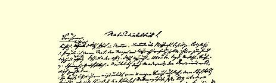
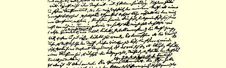
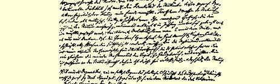

# ［札记和片断］

## ［科学历史摘要］

必须研究自然科学各个部门的**顺序的发展**。首先是**天文学** —— 游牧民族和农业民族为了定季节，就已经绝对需要它。天文学只有借助于**数学**才能发展。因此也开始了数学的研究。—— 后来，在农业发展的某一阶段和在某个地区（埃及的提水灌溉），而特别是随着城市和大建筑物的产生以及手工业的发展，**力学**也发展起来了。不久，**航诲**和**战争**也都需要它。—— 它也需要数学的帮助，因而又推动了数学的发展。这样，科学的发生和发展一开始就是由生产决定的。

在整个古代，本来意义的科学研究只限于这三个部门，而作为精确的和有系统的研究则是在后古典时期才开始的（亚历山大里亚学派、阿基米得等）。在几乎还没有在头脑中分离开来的物理学和化学（初步的理论，还没有化学元素的观念）中，在植物学、 动物学、人体和动物解剖学中，直到那时还只是搜集事实和尽可能有系统地整理这些事实。生理学只要超出最显而易见的事情 （例如，消化和排泄）便是纯粹的猜测：在甚至血液循环都还不知道的时候，也不能不是如此。—— 在这一时期末，化学以炼金术的原始形式出现了。

如果说，在中世纪的黑夜之后，科学以意想不到的力量一下子重新兴起，并且以神奇的速度发展起来，那末，我们要再次把这个奇迹归功于生产。第一，从十字军远征以来，工业有了巨大的发展， 并产生了很多力学上的（纺织、钟表制造、磨坊）、化学上的（染色、 冶金、酿酒）、以及物理学上的（眼镜）新事实，这些事实不但提供了大量可供观察的材料，而且自身也提供了和已往完全不同的实验手段，并使**新的**工具的制造成为可能。可以说，真正有系统的实验科学，这时候才第一次成为可能。第二，虽然意大利由于自己的从古代继承下来的文明，还继续居于领导地位，但是整个西欧和中欧，包括波兰在内，这时候都在相互联系中发展起来了。第三，地理上的发见—— 纯粹为了营利，因而归根结底是为了生产而作出的 —— 又在气象学、动物学、植物学、生理学（人体的）方面，展示了无数的直到那时还得不到的材料。第四，**印刷机**出现了[^1]。

这时—— 撇开早已存在的数学、天文学和力学不谈—— 物理学和化学明确地分开了（托里拆利、伽利略—— 前者依靠工业上的水利工程第一个研究了液体的运动，见克拉克·麦克斯韦）。波义耳把化学确立为科学。哈维由于发现了血液循环而把生理学 （人体生理学和动物生理学）确立为科学。动物学和植物学首先依旧是从事搜集事实的科学，直到古生物学出现—— 居维叶—— 以及此后不久发现了细胞和有机化学发展起来为止。因此，比较形态学和比较生理学才成为可能，而且从此以后两者才成为真正的科学。在上一世纪末地质学奠定了基础，最近则有所谓人类学 （这个名称很拙劣），它是从人和人种的形态学和生理学过渡到历史的桥梁。这还要继续详细地研究和阐明。

### 古代人的自然观

> （黑格尔《哲学史》第１卷—— 希腊哲学）３６２

亚里士多德在谈到早期的哲学家时说道（《形而上学》第１卷第３章）：他们断言，

> “有一个东西，万物由它构成，万物最初从它产生，最后又复归于它，它作为实体（ｏσια），永远同一，仅在自己的规定（παθσι）中变化，这就是万物的元素（σι ι
>
> ～）和本原（αρη）。因此他们认为，没有一个物能生成 （γιγ σθαι δ ）或消灭，因为同一个自然界永远保存着”（第１９８页）。

因此，在这里已经完全是一种原始的、自发的唯物主义了，它在自己的萌芽时期就十分自然地把自然现象的无限多样性的统一看作不言而喻的，并且在某种具有固定形体的东西中，在某种特殊的东西中去寻找这个统一，比如泰勒斯就在水里去寻找。

西塞罗说：

> “米利都的**泰勒斯**[^2]……说水是万物的本原，而神则是用水创造出万物的精神。”（《神性论》第１章第１０节）

黑格尔非常正确地宣称这是西塞罗加上去的，并且补充道：

> “但是，泰勒斯此外是否还相信神这个问题，在这里与我们并不相干；这里所谈的不是假设、信仰、民间宗教……即使他说神是用水制造万物的创造者，我们也并不因此就对这个本质有更多的认识……这是毫无意义的空话。” （第２０９页）（［公元前］６００年左右）

最早的希腊哲学家同时也是自然科学家：**泰勒斯**是几何学家， 他确定了一年是３６５天，据说他曾预言过一次日蚀。——** 阿那克西曼德**制造过日晷、一种海陆地图（πριμ ρ ）和各种天文仪器。—— 毕达哥拉斯是数学家。

根据普卢塔克（《席间谈话》第８章第８节），米利都的**阿那克西曼德**认为，“**人是由鱼变成**，**是从水中到陆地上来的**”[^3]（第２１３ 页）。在他看来，本原和原始元素是**无限的东西**[^4]，他没有把它规定为（διριω）空气或水或其他什么（第欧根尼·拉尔修，第２ 章第１节）［第２１０页］。黑格尔（第２１５页）正确地把这个无限的东西表达为“未规定的物质”（５８０年左右）。

米利都的**阿那克西米尼**把**空气**当做本原和基本元素，认为它是无限的（西塞罗《神性论》第１章第１０节），而且

> “万物从它产生，万物又复归于它”（普卢塔克《关于哲学家的见解》第 １章第３节）。

在这里，空气，呼吸＝精神：

> “正如我们的灵魂，即空气，支持住我们一样，精神（πμα）和空气也支持住整个世界；精神和空气是同等重要的。”（普卢塔克）３６３［第２１５—２１６ 页］

灵魂和空气被视为一般的媒介体（５５５年左右）。

亚里士多德已经说过：这些较早的哲学家都设想原初本质是某种物质：空气和水（也许阿那克西曼德设想是空气和水的某种中间物）；后来赫拉克利特设想是火，但是没有一个人设想是土， 因为它的组成太复杂（δια η μγα μ ρια），《形而上学》第１ 卷第８章（第２１７页）。

关于所有这些人，亚里士多德说得很正确：他们没有说明运动的起源（第２１８页及以下各页）。

塞莫斯的**毕达哥拉斯**（５４０年左右）：**数**是基本的本原：

> “**数**是万物的本质，宇宙的组织在其规定中通常是**数及其关系的和谐的体系**。” [^5]（亚里士多德《形而上学》第１卷，散见第５章）

黑格尔正确地指出：

> “这种说法是大胆的：它一下子推翻了观念认为是存在的或本质的（真实的）一切东西，根绝了感觉的本质”，并且把本质设想为一个逻辑范畴，虽然这个逻辑范畴是很狭隘的和片面的［第２３７—２３８页］。

数服从于一定的规律，同样，宇宙也是如此。于是宇宙的规律性第一次被说出来了。人们硬说毕达哥拉斯把音乐的和谐归结为数学的关系。

同样地：

> “毕达哥拉斯派把火放在中央，而把地球看作沿轨道环绕这个中心体运行的一颗星。”（亚里士多德《论天体》第２章第１３节）［第２６５页］

但是这火不是太阳；这毕竟是关于**地球运行**的第一个推测。

黑格尔关于行星体系说道：

> “……关于确定［行星间的］距离的和谐律，一切数学至今还不能提供任何根据。经验的数，大家确切地知道了；但是一切看起来都是偶然的而不是必然的。大家知道了这些距离的大致的规则性，因而侥幸地预想到了火星和木星间还有某些行星，后来果然在那里发现了谷神星、灶神星、智神星等等； 但是天文学在这些距离中还没有找到包含着理性、悟性的前后一贯的序列。 相反地，它以轻蔑的态度看待这种序列的有规则的叙述；而这本身是非常重要的一点，是不应当放弃的。”（第２６７—２６８页）

虽然古希腊人的整个宇宙观具有素朴唯物主义的性质，但是在他们那里已经包藏着后来分裂的种子。早在泰勒斯那里，灵魂就被看作某种特殊的东西，某种和肉体不同的东西（比如他认为磁石也有灵魂）；在阿那克西米尼那里，灵魂是空气（正象在《创世纪》中一样）３６４；在毕达哥拉斯派那里，灵魂已经是不死的和可移动的，肉体对它说来是纯粹偶然的。在毕达哥拉斯派那里，灵魂又是“以太的碎片（απ σπασμααθρσ）”（第欧根尼·拉尔修， 第８卷第２６—２８节），冷的以太是空气，密集的以太则形成海和水气［第２７９—２８０页］。

亚里士多德又正确地责备毕达哥拉斯派：

> 用他们的数“他们并没有说明运动是怎样发生的，没有说明没有运动和变化怎么会有生成和灭亡或天体的状况和活动”（《形而上学》第１卷第８ 章）［第２７７页］。

据说毕达哥拉斯发见了启明星和长庚星是同一颗星，发现了月球是从太阳取得自己的光，最后发现了毕达哥拉斯定理。

> “据说毕达哥拉斯发现这个定理的时候，举行了一个Ｈｅｋａｔｏｍｂｅ〔百牛大祭〕……并且引人注目的是，他竟这样地快活，以致举行盛宴，把富人和全体人民都邀请了；这番辛苦是值得的。这是精神（认识）的快乐和喜悦，—— 然而牛遭了殃。”（第２７９页）

**埃利亚派**。

**留基伯和德谟克利特３６５**。

> “留基伯和他的学生德谟克利特认为**充实的**东西和空虚的东西都是元素，例如，他们把前者叫作存在，把后者叫作非存在，这就是说：在这里，他们把**充实的**和**坚固的**〈即原子〉理解为存在，而把空虚的和**稀蒲的**理解为非存在。因此他们也就使存在决不比非存在更多地存在着……这些元素在他们看来同是事物的物质原因。一些哲学家断言基本实体〈物质〉是独一无二的， 其他的一切都是从它的特质中产生的……这两个哲学家，也完全以同样的方式认为**差别**〈即原子的差别〉就是其他一切的原因。而这些差别，**他们指出有三种**：**形状**、**排列**和位置。……例如，Ａ和Ｎ是在**形状上**有差别，ＡＮ和 ＮＡ是在**排列上**有差别，Ｚ和Ｎ是在位置上有差别。”（亚里士多德《形而上学》第１卷第４章） “他〈留基伯〉第一个提出原子是本原……并且把原子称为元素。他说： 从元素中产生无数的宇宙，而宇宙又分解成元素。宇宙是这样产生的。**随着从无限中分离**，无数多种多样的物体，就飞入巨大的空虚的空间，当它们聚拢在一起时，就**形成一个大漩涡**，在这个漩涡中，它们互相冲击，多样化地旋转，最后分离开来，相似的都结合在一起。当它们**建立起均衡以后**，由于自己数量太多，无论如何不再能旋转，所以**细小的（轻的）便飞到外部的虚空**，好象是被筛掉的一样；其余的都聚合在一起，互相缠绕，一道奔驰，从而构成最初的球形的整体。”（第欧根尼·拉尔修，第９卷第６章）

**以下是关于伊壁鸠鲁**：

> “原子在不断地**运动着**。但是，往下他说道：它们还是**用同一速度**运动着， 因为**虚空**对于**最轻的和最重的原子**都同样开放着道路……除了**形状**、**大小**和 **重量**，原子没有其他特质……**而且原子并不具有任何的大小**。**至少从来就没有人通过感官看见过原子**。”（第欧根尼·拉尔修，第１０卷第４３—４４节）“此外，如果原子在飞过虚空的运动中没有遇到任何阻抗，那它们必然具有同一速度。因为，重原子并不比小而轻的原子飞得更快，至少当小而轻的原子没有遇到任何阻碍的时候，**而小原子尽管到处都能找到适宜的通路**，也不会跑到大原子的前面；只是大原子不要遇到阻力。”（同上，第６１节） “所以，显然，在任何种类［事物］中**一**都是某种特定的本性，而对任何一个事物本身来说，这个一却不是它的本性。”（亚里士多德《形而上学》第 ９卷第２章）３６６

**塞莫斯的阿利斯塔克**早在公元前２７０年就已经提出**哥白尼的地球和太阳的理论了**（梅特勒，第４４页；沃尔弗，第３５—３７页）３６７。

**德谟克利特**已经推测到，**银河**投给我们的是无数小星的联合的光（沃尔弗，第３１３页）。

### 古代世界末期３００年左右和中世纪末期 １４５３年的情况的差别

（１）代替地中海沿岸一条狭长的文明地带—— 它的手臂曾分散地伸向内地并且一直达到西班牙、法国和英国的大西洋海岸，因而很容易被来自北方的德意志人和斯拉夫人以及来自东南方的阿拉伯人突破和扰乱，—— 现在是一片紧密相连的文明地区，即整个西欧以及作为前哨阵地的斯堪的那维亚、波兰和匈牙利。

（２）代替希腊人或罗马人和野蛮人的对立，现在是六个具有文明语言的文明民族（斯堪的那维亚等民族还不计在内），所有这些语言已经发展到能够参加十四世纪的强有力的文学繁荣，而且比起古代末期已经在衰退和死亡的希腊语和拉丁语来说，它们保证了教育的更加无比的多样化。

（３）由中世纪的市民等级所创立的工业生产和商业获得无限高度的发展；一方面，生产更加完备，更加多样化，规模也更大， 另一方面，商业交往更加兴盛，航海从萨克森人、弗里西安人和诺曼人时代起更加无比地大胆，再一方面，还有大量的发明以及东方发明的输入，它们不仅使希腊文学的输入和传播、海上探险以及资产阶级宗教改革真正成为可能，并且使它们的活动范围大大扩展，进展大为迅速。此外，它们提供了古代从未想到过的、虽然还未系统化的许多科学事实：磁针、印刷、活字、亚麻纸（十二世纪以来阿拉伯人和西班牙犹太人所使用的；棉纸自十世纪以来就逐渐出现，而在十三和十四世纪已经传布得更广，莎草纸从阿拉伯人占领埃及以后就根本不再使用了）、火药、**眼镜**、在**计时** 上和**力学**上是一巨大进步的**机械时计**。

（关于发明见１１）[^6]。

此外，**旅行**所提供的材料（马可波罗，１２７２年左右，等等）。

因为有了大学，普通教育，即使还很差，却普及得多了。

随着君士坦丁堡的兴起和罗马的衰落，古代便完结了。中世纪的终结是和君士坦丁堡的衰落不可分离地联系着的。新时代是以返回到希腊人而开始的。—— 否定的否定！

### 历史的东西。——发明

公元前：

灭火唧筒，滴漏计时器，公元前２００年左右。石砌路面（罗马）。

羊皮纸，１６０年左右。

公元后：

**摩塞尔河上的**水磨，３４０年左右；在查理大帝时代的德国。

玻璃窗的最初痕迹。安提奥克的路灯，３７０年左右。

蚕在５５０年左右从中国输入希腊。

羽毛笔尖，六世纪。

棉纸在七世纪从中国传到阿拉伯人那里，在九世纪输入意大利。

法国的水风琴，八世纪。

哈尔茨的银矿从十世纪开始开采。

风磨，１０００年左右。

阿雷佐的格维多的音符和音阶，１０００年左右。

养蚕业传入意大利，１１００年左右。

有齿轮的钟—— 同时。

磁针从阿拉伯人传到欧洲人手中，１１８０年左右。

巴黎的石砌路面，１１８４年。

佛罗伦萨的眼镜。玻璃镜子。

咸鱼。水闸。十三世纪后半期。

自鸣钟。法国棉纸。

破布造纸，十四世纪初叶。

票据—— 同一世纪的中叶。

德国第一座造纸工场（纽伦堡），１３９０年。

伦敦的路灯，十五世纪初叶。

威尼斯的邮局—— 同时。

木刻和印刷—— 同时。

铜版雕刻术—— 同世纪的中叶。

法国的驿邮，１４６４年。

萨克森厄尔士山区的银矿，１４７１年。

脚踏风琴，１４７２年发明。

怀表。气枪。枪机—— 十五世纪末叶。

纺车，１５３０年。

潜水钟，１５３８年。

### 历史的东西３６８

现代自然科学—— 它同希腊人的天才的直觉和阿拉伯人的零散的无联系的研究比较起来，可以说得上是唯一的科学—— 是和封建主义被市民阶级所粉碎的那个伟大时代一起开始的，—— 在市民和封建贵族间的斗争背后是造反的农民，而在农民背后是现代无产阶级的革命先驱，他们已经手里举着红旗，口里喊着共产主义—— 那个时代，在欧洲建立起了大君主国，摧毁了教皇的精神独裁，恢复了希腊的古代，同时又引起了新时代的最高度的艺术发展，彻底打破了旧的ｏｒｂｉｓ[^7]的界限，并且第一次真正地发现了地球。

这是地球从来没有经历过的最伟大的一次革命。自然科学也就在这一场革命中诞生和形成起来，它是彻底革命的，它和意大利伟大人物的觉醒的现代哲学携手并进，并把自己的殉道者送到了火刑场和牢狱。值得注意的是，新教徒也跟天主教徒一道竞相迫害他们。前者烧死了塞尔维特，后者烧死了乔尔丹诺·布鲁诺。 这是一个需要巨人而且产生了巨人—— 在学识、精神和性格方面的巨人的时代。这个时代，法国人正确地称之为文艺复兴，而新教的欧洲则片面地固执地称之为宗教改革。

这时候，自然科学也发布了自己的独立宣言３６９，诚然，宣言并不是在一开头就立即发布的，正如路德并非第一个新教徒一样。在宗教领域内是路德焚毁教谕，在自然科学领域内是哥白尼的伟大的著作，在这部著作中，他（虽然还有些胆怯，在三十六年的踌躇之后并且可说是在临终时）向教会的迷信提出了挑战。从此以后，自然科学基本上从宗教下面解放出来了，尽管各式各样的细节问题的争论一直迟延到今天，而且在许多人的头脑中还远没有解决。但是，科学的发展从此便大踏步地前进，这种发展可以说是与从其出发点起的时间的距离的平方成正比的，仿佛要向世界指出：对于有机物最高精华的运动、即对于人类精神起作用的，是一种和无机物的运动规律正好相反的规律。

新兴自然科学的第一个时期—— 在无机界的领域内—— 是以牛顿告结束的。这是一个掌握已有材料的时期，它在数学、力学和天文学、静力学和动力学的领域中获得了伟大的成就，这特别是归功于刻卜勒和伽利略，牛顿就是从他们二人那里得出自己的结论的。但是在有机界的领域内，却没有超出最初的阶段。对历史上先后交替的生命形态的研究以及对与之相适应的各种变化着的生活条件的研究—— 古生物学和地质学—— 当时还不存在。那时，自然界根本不被看作某种历史地发展着的、在时间上具有自己的历史的东西；注意考察的仅仅是它在空间的广延性；各种不同的形态不是前后相继地而只是并排地被组合在一起；自然史对一切时代都是适用的，正如行星的椭圆形轨道适用于一切时代一样。对于有机物的所有进一步的研究，还缺乏两个初步的基础：化学以及关于有机物的主要结构即细胞的知识。开始时那样革命的自然科学，站在一个彻头彻尾地保守的自然界面前，在这个自然界中，今天的一切还是和世界开始时一样，并且直到世界末日，一切都将和开始的时候一样。

值得注意的是，这种保守的自然观无论在无机界中或在有机界中卜［……］[^8]

> 天文学物理学地质学植物生理学治疗学力学化学古生物学动物生理学诊断学数学矿物学解剖学

第一个缺口：康德和拉普拉斯。第二个：地质学和古生物学 （赖尔，缓慢进化说）。第三个：制造出有机物并表明化学定律适用于生物的有机化学。第四个：１８４２年，热之唯动［说］，格罗夫。 第五个：达尔文、拉马克，细胞等等（斗争，居维叶和阿加西斯）。第六个：解剖学、气象学（等温线）、动物地理学和植物地理学（十八世纪中叶以来的科学考察旅行）以及自然地理学（洪堡）中的**比较的要素**，材料的编整。形态学（胚胎学，贝尔）[^9]。

旧的目的论已经完蛋了，但是现在有一种信念是确定不移的： 物质依据这样一些规律在其永恒的循环中运动，这些规律在一定的阶段上—— 时而在这里，时而在那里—— 必然地在有机物中产生出思维着的精神。

动物的正常生存，是由它们当时所居住和所适应的环境造成的；人的生存条件，并不是他一从狭义的动物中分化出来就现成具有的；这些条件只是通过以后的历史的发展才能造成。人是唯一能够由于劳动而摆脱纯粹的动物状态的动物—— 他的正常状态是和他的意识相适应的而且**是要由他自己创造出来的**。

####

### 《费尔巴哈》的删略部分３７０

［五十年代在德国把唯物主义庸俗化的小贩们，丝毫没有越出他们的老师们[^10]的这个范围。自然科学后来获得的一切进步，仅仅成了他们］反对信仰世界创造主的新论据。而在进一步发展理论方面，他们实际上什么事也没有做。唯心主义在１８４８年革命中受到了沉重打击，可是唯物主义在它的这一经过更新的形态下更是江河日下。费尔巴哈拒绝为**这种**唯物主义承担责任，这样做是完全对的；只是他不应该把这些巡回传教士的学说同一般唯物主义混淆起来。

但是，大约就在这个时候，经验自然科学获得了巨大的发展和极其辉煌的成果，甚至不仅有可能完全克服十八世纪机械论的片面性，而且自然科学本身，也由于证实了自然界本身中所存在的各个研究部门（力学、物理学、化学、生物学等等）之间的联系，而从经验科学变成了理论科学，并且由于把所得到的成果加以概括，又转化成唯物主义的自然认识体系。气体力学；新创立的有机化学，它一个跟一个地从无机物制造出所谓有机化合物，从而扫除了这些所谓有机化合物的神秘性的残余；从１８１８年以来的科学的胚胎学；地质学和古生物学；动植物比较解剖学—— 这一切知识部门都提供了空前多的新材料。但是，具有决定意义的是下面三大发现。

第一是由热的机械当量的发现（罗伯特·迈尔、焦耳和柯尔丁）所导致的能量转化的证明。自然界中所有无数起作用的原因， 过去一直被看作一种神秘的不可解释的存在物，即所谓力—— 机械力、热、放射（光和辐射热）、电、磁、化学化合力和分解力， 现在都已经证明是同一种能（即运动）的特殊形式，即存在方式； 我们不仅可以证明，它在自然界中经常从一种形式转化到另一种形式，而且甚至可以在实验室中和工业中实现这种转化，使某一形式的一定量的能总是相当于另一形式的一定量的能。例如，我们可以用公斤米去表现热量单位，又可以用热量单位去表现一个单位的或任何量的电能或化学能，反之亦然；我们同样可以把一个活的机体所消耗的和获得的能量测量出来，并且用任何单位，例如用热量单位，表现出来。自然界中整个运动的统一，现在已经不再是哲学的论断，而是自然科学的事实了。

第二个发现—— 在时间上更早一些—— 是施旺和施莱登发现有机细胞，发现它是这样一种单位：一切机体，除最低级的外，都是从它的繁殖和分化中产生和成长起来的。有了这个发现，有机的、有生命的自然产物的研究—— 比较解剖学、生理学和胚胎学 —— 才获得了巩固的基础。机体产生、成长和构造的秘密被揭开了；从前不可理解的奇迹，现在已经表现为一个过程，这个过程是依据一切多细胞的机体本质上所共同的规律进行的。

但是还剩下了一个重要的空白。如果一切多细胞的机体—— 植物和动物，包括人在内—— 都各按细胞分裂规律从一个细胞中成长起来，那末这些机体的无限差异性是从什么地方产生的呢？解答这个问题的，是第三个大发现，即达尔文首先系统地加以论述并建立起来的进化论。不管这个理论在细节上还会有什么改变，但是总的说来，它现在已经把问题解答得令人再满意没有了。机体从少数简单形态到今天我们所看到的日益多样化和复杂化的形态一直到人类为止的发展系列，基本上是确定了；因此，不仅有了可能来说明有机自然产物中的现存者，而且也提供了基础，来追溯人类精神的史前时代，追溯人类精神从简单的、无构造的、但有刺激感应的最低级有机体的原生质起到能够思维的人脑为止的各个发展阶段。如果没有这个史前时代，那末能够思维的人脑的存在就仍然是一个奇迹。

有了这三个大发现，自然界的主要过程就得到了说明，就归结到自然的原因了。现在只剩下一件事情还得去做：说明生命是怎样从无机界中发生的。在科学发展的现阶段上，这就是要从无机物中制造出蛋白质来。化学正日益接近于完成这个任务，虽然它距离这一点还很远。但是，如果我们想一想，维勒在１８２８年才从无机物制成第一种有机物—— 尿素，而现在已经用人工方法不用任何有机物制成了无数所谓有机化合物，那末我们就不会让化学在蛋白质这一难关面前停步不前。到现在为止，化学已经能够制造出它确切知道成分的任何有机物。只要把蛋白质的化学成分弄清楚，化学就能着手制造活的蛋白质。但是，要求化学在今天或明天做出自然界本身在个别天体上的非常适宜的环境中经过千百万年才做成功的事情，这就等于要它制造奇迹了。

这样，比起前一世纪来，唯物主义的自然观现在是建立在更加牢固的基础上了。那时候，只是对于在重力影响下所进行的天体运动和地球上的固体运动有比较详尽的了解；差不多整个化学领域和整个有机界仍然是不可理解的秘密。现在，整个自然界是作为至少在基本上已解释清楚和了解清楚的种种联系和种种过程的体系而展现在我们面前。当然，唯物主义的自然观不过是对自然界本来面目的朴素的了解，不附加以任何外来的成分，所以它在希腊哲学家中间从一开始就是不言而喻的东西。但是，在古希腊人和我们之间存在着两千多年的本质上是唯心主义的世界观，而在这种情况下，即使要返回到不言而喻的东西上去，也并不是象初看起来那样容易。因为问题决不在于简单地抛弃这两千多年的全部思想内容， 而是要批判它，要从这个暂时的形式中，剥取那在错误的、但为时代和发展过程本身所不可避免的唯心主义形式中获得的成果。而这是如何地困难，许许多多自然科学家已经给我们证明了，他们在他们自己那门科学的范围内是坚定的唯物主义者，但是在这以外就不仅是唯心主义者，而且甚至是虔诚的正教教徒。

自然科学的所有这些划时代的进步，都从费尔巴哈身边溜过去了，本质上没有触及他。这与其归咎于他本人，倒不如归咎于当时德国的可悲的环境，由于这种环境，大学讲座都给一些毫无头脑的折衷主义的宵小之徒占据了，可是比这些宵小之徒高明万倍的费尔巴哈，却不得不几乎在穷乡僻壤中隐居起来。这就说明了：他谈到自然界时，除了个别天才的概括，就不得不说一些辞藻美丽的空话。例如，他说：

> “生命的确不是某种化学过程的产物，决不是某一个别的自然力或自然现象的产物，而形而上学的唯物主义者就是把生命归结为这种产物；生命是整个自然界的结果。３７１

生命是整个自然界的结果，这和下面这一情况一点也不矛盾： 蛋白质，生命的唯一的独立的承担者，是在整个自然联系所给予的一定条件下产生的，可是它正好是作为某种化学过程的产物产生的。〈假如费尔巴哈生活在一种至少可以皮毛地研究自然科学发展的环境中，那末他无论如何不会说化学过程是一种孤立的自然力的作用。〉[^11]费尔巴哈沉溺于毫无结果的和来回兜圈子的关于思维和思维器官（大脑）的关系的沉思默想中，沉溺于施达克乐意跟着他走的领域中，这应当归咎于这种孤寂的生活。

够了，费尔巴哈是反对唯物主义这个名称的３７２。这并非毫无理由，因为他没有完全摆脱唯心主义。在自然领域中他是唯物主义者；但是在人类领域中［……］[^12]

上帝在信仰他的自然科学家那里所得到的待遇，比在任何地方所得到的都坏。唯物主义者只管说明**事物**，是不理睬这种名词的。只有当那些咄咄逼人的善男信女们把上帝强加于他们的时候， 他们才加以考虑，并且简单地给予回答—— 或者象拉普拉斯那样说：“陛下，我不……”３７３，或者更粗鲁一点，以荷兰商人用来打发那些硬把冒牌货塞给他们的德国行商的方式说：“我用不着那种货色”，这样问题就解决了。但是上帝不得不受他的保卫者的气！在现代自然科学的历史中，上帝在他的保卫者那里受到的待遇，就象耶拿战役中的弗里德里希－威廉三世在他的将军和官佐们那里受到的待遇一样。在科学的猛攻之下，一个又一个部队放下了武器，一个又一个城堡投降了，直到最后，自然界无限的领域都被科学所征服，而且没有给造物主留下一点立足之地。牛顿还让上帝来作“第一次推动”，但是禁止他进一步干涉自己的太阳系。神甫赛奇虽然以合乎教规的一切荣誉来恭维他，但是绝对无条件地把他完全逐出了太阳系，只允许他在关系列原始星云的时候还有一次创造行为。在一切领域中，情形都是如此。在生物学中，他的最后的伟大的唐·吉诃德，即阿加西斯，甚至责成他去做十足荒唐的事情：他不仅应当创造实在的动物，而且还应当创造抽象的动物，即创造鱼这一个类！[^13]最后，丁铎尔完全禁止他进入自然界，把他放逐到情感世界中去，而他还允许他存在，只是因为必须有一个对这一切事物（对自然界）比约翰·丁铎尔知道得更多的人！３７４这和旧的上帝—— 天和地的创造者、万物的主宰，没有他就一根头发都不能从头上落下来—— 相距不知有多远！

丁铎尔的情感上的需要并没有证明什么。格里厄骑士也有热爱和占有曼侬·列斯戈的情感上的需要，虽然后者不止一次地出卖过她自己和他；为了她的缘故，他做了骗子和王八，如果丁铎尔要责备他，他就会用他的“情感上的需要” 来回答呵！

上帝＝我不知，但是无知并不是论据（斯宾诺莎）３７５。

## ［自然科学和哲学］

### 毕希纳３７６

这一派别的产生。德国哲学消融于唯物主义。对科学的控制被排除了。肤浅的唯物主义通俗化的突起，它的唯物主义不得不填补科学的缺乏。极盛于资产阶级德国和官方德国科学的最衰落的时代——１８５０—１８６０年。福格特、摩莱肖特、毕希纳。相互的保险。—— 由于被这些先生们立即加以租用的达尔文主义变为时髦的东西而引起的新的活跃。

人们本来可以听其自然，让他们从事自己的即使狭隘但并不坏的职业，即教给德国庸人以无神论等等。但是，第一，他们对无论如何总是德国的光荣的哲学竟肆行辱骂（文句尚待引证）[^14]， 第二，他们妄图把自然科学的理论应用于社会并改良社会主义。这就迫使我们不得不注意他们了。

第一，他们在自己的领域内作了些什么呢？引证。

> 《自然辩证法》第一束材料的第一页

第二，突然的转变，第１７０—１７１页。这个突然出现的黑格尔的东西是从哪里来的呢３７８？向辩证法的过渡。

两个哲学派别：带有固定范畴的形而上学派，带有流动范畴的辩证法派（亚里士多德、特别是黑格尔）；证明：理由和推断、原因和结果、同一和差异、外表和实质这些固定的对立是站不住脚的，由分析表明，一极已经作为胚胎存在于另一极之中，一极到了一定点时就转化为另一极，整个逻辑都只是从前进着的各种对立中发展起来的。—— 这在黑格尔本人那里是神秘的，因为范畴在他看来是先存在的东西，而现实世界的辩证法是它的单纯的反光。实际上刚刚相反：头脑的辩证法只是现实世界（自然界和历史）的运动形式的反映。到上一世纪末，甚至到１８３０年，自然科学家和旧的形而上学还相处得相当不错，因为真正的科学当时还没有超出力学 —— 地球上的和宇宙的力学的范围。虽然如此，高等数学已经引起了混乱，因为高等数学把初等数学的永恒真理看作已经被克服的观点，常常作出相反的判断，提出一些在初等数学家看来完全是胡说八道的命题。固定的范畴在这里消失了；数学走到了这样一个领域，在那里即使很简单的关系，如单纯的抽象的量之间的关系、恶无限性，都采取了完全辩证的形式，迫使数学家们既不自愿又不自觉地成为辩证的数学家。数学家们为了解决这种矛盾，为了调和高等数学和初等数学，为了弄清楚在他们看来是不可否认的结果的那些东西并不是纯粹荒诞无稽的东西，以及为了合理地说明那研究无限的数学的出发点、方法和结果所采用的牵强说法、无聊诡计和应急方法，是最滑稽可笑不过的了。

但是现在一切都不同了。化学，物理东西的抽象的可分性，恶无限性—— 原子论。生理学—— 细胞（由分化而产生的个体和种的有机发展过程，是合理的辩证法的最令人信服的检验），以及最后， 各种自然力的同一性及其相互转化，而这种相互转化把范畴的一切固定性都结束了。虽然如此，大批自然科学家还是束缚在旧的形而上学的范畴之内，而且在必须合理地解释这些最新的事实（这些事实可以说是证实了自然界中的辩证法）并把它们彼此联系起来的时候，便束手无策。而在这里就必须用**思维**，因为原子和分子等等是不能用显微镜来观察的，而只能用思维来把握。试把化学家们 （肖莱马例外，他懂得黑格尔）和微耳和的《细胞病理学》比较一下吧，在那里最终不得不用一般的词句来掩盖这种束手无策。摆脱了神秘主义的辩证法，变成了自然科学绝对必需的东西，因为自然科学抛弃了那种有了固定不变的范畴（就好象是逻辑的初等数学，它的日用器具）就已经足够的领域。哲学终究报复了自然科学，因为后者抛弃了它。而自然科学家们，本来可以从哲学在自然科学上的成就看到：哲学具有某种即使在他们自己的领域中也比他们高明的东西（莱布尼茨—— 研究无限的数学的创始人，和他比较起来， 归纳法的驴子牛顿３７９便显得是一个剽窃者和破坏者３８０；康德—— 拉普拉斯**以前**的天体演化学；奥肯—— 在德国采用进化论的第一个人；黑格尔—— 他对自然科学的［……］[^15]概括和合理的分类是比一切唯物主义的胡说八道合在一起还更伟大的成就）。

———

关于毕希纳之妄图根据生存斗争来非难社会主义和经济学： 黑格尔（《全书》第１部第９页）论制鞋３８１。

关于政治和社会主义：曾经为世界所期待的悟性（第１１ 页） ３８２。

相外、相并和相继。黑格尔《全书》第３５页！作为感觉到的东西的规定，观念的规定３８３。

黑格尔《全书》第４０页。自然现象３８４—— 但在毕希纳那里不是**想**出来的，纯粹是剽窃来的，所以是不必要的。

第４２页。梭伦“从自己头脑中产生出”自己的法律—— 毕希纳可以为现代社会作同样的事情。

第４５页。形而上学—— 关于**事物**的科学—— 不是关于运动的科学。

第５３页。“是什么样的头脑从事研究现实，这对于经验具有巨大的意义。伟大的头脑作出伟大的经验，在五光十色的现象中看出有意义的东西。”

第５６页。人类的个体和历史之间的平行关系３８５＝胚胎学和古生物学之间的平行关系。

正如傅立叶是ａｍａｔｈｅｍａｔｉｃａｌｐｏｅｍ〔一首数学的诗〕而且还没有失去意义３８６，黑格尔是ａｄｉａｌｅｃｔｉｃａｌｐｏｅｍ〔一首辩证法的诗〕。

谬误的**多孔性理论**（根据这种理论，各种虚假的物质，热素等等，处在它们彼此的许多细孔中，然而却不能相互渗入），被黑格尔描写为纯粹的**悟性的虚构**（《全书》第１部第２５９页。并见 《逻辑学》）３８７。

黑格尔《全书》第１部第２０５—２０６页３８８，有一段同当时物理学见解相对立的关于原子量的预言，还有关于原子和分子的预言， 认为它们是应由**思维**加以决定的**思想**上的规定。

如果黑格尔把自然界看作永恒的“观念”在外化中的显现，而且这是个重大的罪过，那末，关于形态学家理查·欧文我们又该怎样说呢，他曾经写道：

> “原型观念远在那些现在正实现着它的动物种属存在之前，就已经以各种各样的形式体现在这个行星上了。”（《论肢体的本性》１８４９年版）３８９

如果一个神秘主义的自然科学家说了这些话，而且是毫无所指，那末这是可以听其自便的；可是，如果一个哲学家说了同样的话而他竟有所指，并且虽然用的是颠倒的形式实质上却指的是真正的东西，那末这就是神秘主义和前所未闻的罪过了。

**自然科学家的思维**：阿加西斯的创造计划，根据这个计划，上帝是从一般的东西进而创造出特殊的和个别的东西，首先创造脊椎动物本身，然后创造哺乳动物本身，食肉类动物本身，猫属本身，最后才创造出狮子等等！这就是说，首先创造关于具体事物的形状的抽象概念，然后再创造具体事物！（见海克尔，第５９页）３９０

在**奥肯**那里（海克尔，第８５页及以下各页），可以看到从自然科学和哲学间的二元论中所产生出来的荒谬言论。奥肯沿着思维的道路发现了原生质和细胞，但是没有任何人想到用自然科学的方法来研究这个问题—— 这要用**思维**才能解决！而当原生质和细胞被发现了之后，奥肯就名声扫地了。

霍夫曼（《霍亨索伦王朝下的化学一百年》）引证自然哲学， 是从任何真正的黑格尔派都不承认的美文学家罗生克兰茨那里弄来的引证。要使自然哲学对罗生克兰茨负责任，就象霍夫曼要霍亨索伦王朝对马格拉夫的发现甜菜糖负责任一样地愚蠢３９１。

**理论和经验**：牛顿在理论上确定了地球是扁圆的。很久以后， 卡西尼３９２及其他几个法国人根据他们测量的经验断言：地球是椭圆的，并且以极轴为最长。

如果你去读，例如，托·汤姆生的《论电》３９３，那末经验主义者对希腊人的轻视就会得到特别的说明，那里象戴维以及甚至象法拉第这样的人都在黑暗中摸索（电花等等），而他们所作的实验使人不禁想起亚里士多德和普林尼关于物理化学现象的故事。这些经验主义者正是在这门新科学中完全重蹈了古代人盲目摸索的复辙。天才的法拉第在什么地方走上正确的途径，庸人汤姆生就必定在什么地方加以反对（第３９７页）。

海克尔《人类起源学》第７０７页：

> “根据唯物主义的宇宙观，**物质或实物的存在*早于*运动**[^16]或活力；实物创造了力！” 这和力创造了实物的论断是同样错误的，因为力和实物是不可分的３９４。

他是从什么地方弄到他的唯物主义的呢？

Ｃａｕｓａｅｆｉｎａｌｅｓ〔**终极的原因**〕**和**ｅｆｆｉｃｉｅｎｔｅｓ〔**起作用的原因**〕 被海克尔（第８９—９０页）变成了**合目的地**起作用的原因和**机械地** 起作用的原因，因为对他来说，ｃａｕｓａ ｆｉｎａｌｉｓ＝上帝！同样，对他来说，直接按照康德所理解的“机械的”＝一元的，而不＝力学意义上的机械的。在这样的用语混乱之下，谬论是不可避免的。海克尔在这里关于康德的《判断力批判》所说的话，是同黑格尔不一致的（《哲学史》第６０３页）３９５。

在海克尔那里，还有另一个[^17]两极性的例子：机械论＝一元论，而活力论或目的论＝二元论。早在康德和黑格尔那里，**内在的**目的就是对二元论的抗议了。应用到生命上的机械论是一个无能为力的范畴，如果我们不愿意放弃名称的全部意义，那末我们最多只能说化学论。目的：黑格尔，第５卷第２０５页３９６：

> “由于机械论企图把自为的自然界看作一个在它的概念上不需要任何别的东西的整体，所以机械论本身就表现为向着整体性的一种追求，而这整体 **性在目的中以及在和目的相联系的外部世界的悟性中是找不到的**。”[^18]

然而，不幸的是：机械论（十八世纪的唯物主义也是如此）摆脱不了抽象的必然性，因而也摆脱不了偶然性。物质从自身中发展出了能思维的人脑，这对机械论来说，是纯粹偶然的事件，虽然在这件事情发生之处是一步一步地必然地决定了的。但是事实上，进一步发展出能思维的生物，是物质的本性，因而这是在具备了条件（这些条件并非在任何地方和任何时候都必然是一样的）的任何情况下都必然要发生的。

其次，黑格尔，第５卷第２０６页：

> “因此，和目的论相反，这个〈机械论的〉原理在其和外部必然性的联系中给予了无限自由的意识；而目的论却把自己内容中的微不足道的和甚至可鄙的东西都当作绝对的东西，其中较为一般的思想只能发现自己受到了无限的束缚，甚至受到讨厌。”

同时还有自然界的物质和运动的巨大浪费。在太阳系中，能够存在生命和能思维的生物的行星，在今天的条件下也许最多只有三个。而这整个庞杂的机构就是为着它们的缘故！

根据黑格尔（第５卷第２４４页）３９７，机体中的**内在目的**是通过 **本能**来实现的。这是不太令人信服的。本能应当使各个有生命的东西和它的概念或多或少地和谐起来。由此可以看出，整个**内在目的**本身在多大程度上是一个观念上的规定。而拉马克的全部实质就在于此。

自然科学家相信：他们只有忽视哲学或侮辱哲学，才能从哲学的束缚中解放出来。但是，因为他们离开了思维便不能前进一步，而且要思维就必须有逻辑范畴，而这些范畴是他们盲目地从那些被早已过时的哲学的残余所统治着的所谓有教养者的一般意识中取来的，或是从大学必修课中所听到的一点儿哲学（这种哲学不仅是片断的东西，而且还是属于各种不同的和多半是最坏的学派的人们的观点的混合物）中取来的，或是从无批判地和杂乱地读到的各种各样的哲学著作中取来的，所以他们完全作了哲学的奴隶，遗憾的是大多数都作了最坏的哲学的奴隶，而那些侮辱哲学最厉害的恰好是最坏哲学的最坏、最庸俗的残余的奴隶。

不管自然科学家采取什么样的态度，他们还是得受哲学的支配。问题只在于：他们是愿意受某种坏的时髦哲学的支配，还是愿意受一种建立在通晓思维的历史和成就的基础上的理论思维的支配。

物理学，当心形而上学呵！—— 这是完全正确的，不过，是在另一种意义上３９８。

自然科学家满足于旧形而上学的残渣，使哲学还得以苟延残喘。只有当自然科学和历史科学接受了辩证法的时候，一切哲学垃圾—— 除了关于思维的纯粹理论—— 才会成为多余的东西，在实证科学中消失掉。

## ［辩证法］

### ［（Ａ）辩证法的一般问题。辩证法的基本规律］

所谓**客观**辩证法是支配着整个自然界的，而所谓主观辩证法， 即辩证的思维，不过是自然界中到处盛行的对立中的运动的反映而已，这些对立，以其不断的斗争和最后的互相转变或向更高形式的转变，来决定自然界的生活。吸引和排斥。在磁那里开始了两极性，它在那里是在同一物体中显现出来的；在电那里，它就把自己分配到两个或两个以上带有相反的电荷的物体上。一切化学过程都归结为化学的吸引和排斥的过程。最后，在有机生命中，细胞核的形成同样必须看作活的蛋白质的极化，而且进化论证明了：从一个简单的细胞开始，怎样由于遗传和适应的不断斗争而一步一步地前进，一方面进化到最复杂的植物，另一方面进化到人。同时还表明了象“正”和“负”这样的范畴是多么不适用于这种发展形式。 我们可以把遗传看作正的保存遗传特征的方面，把适应看作负的不断破坏遗传特征的方面，但是，我们同样也可以认为，适应是从事创造的、主动的、正的活动，遗传是进行抗拒的、被动的、负的活动。但是，正象在历史中进步是现存事物的否定一样，在这里—— 就纯粹**实践的**理由来考虑—— 也是把适应看作负的活动较好。在历史上，对立中的运动，在先进民族的一切存亡危急的时代中表现得特别显著。在这种时候，一个民族只能在二者之中选择其一：“非此即彼！”，而且问题的提出，总是和一切时代玩弄政治的庸人所愿作的完全不同。甚至１８４８年的德国自由派庸人，在１８４９年也突然地、意料不到地和违反自己意愿地碰到了这样一个问题：倒退到形式更尖锐的的反动去呢，还是继续革命一直达到共和国，也许甚至是一个有社会主义背景的统一的和不可分的共和国。他们没有考虑多久，便帮助建立了作为德国自由主义花朵的曼托伊费尔反动统治。同样，１８５１年法国资产者也走到了他们确实意料不到的岔路口：或是皇帝和禁卫军的滑稽可笑的模仿画和一群流氓对法国的剥削，或是社会民主共和国，—— 结果是他们俯伏在这群流氓面前，以便在他们的庇护下继续剥削工人。

Ｈａｒｄａｎｄｆａｓｔｌｉｎｅｓ〔**绝对分明的和固定不变的界限**〕是和进化论不相容的—— 甚至脊椎动物和无脊椎动物之间的界限，也不再是固定不变的了，鱼和两栖类之间的界限也是一样；而鸟和爬虫类之间的界限正日益消失。细颚龙和始祖鸟３９９之间只缺少几个中间环节，而有牙齿的鸟喙在两半球上都出现了。“非此即彼！” 是愈来愈不够了。在低等动物中，个体的概念简直不能严格地确立。不仅在这一动物是个体还是群体的问题上是如此，而且在发展过程中在什么地方一个个体终止而另一个个体（“褓母虫体”）４００ 开始这一问题上也是如此。—— 一切差异都在中间阶段融合，一切对立都经过中间环节而互相过渡，对自然观的这种发展阶段来说，旧的形而上学的思维方法就不再够了。辩证法不知道什么绝对分明的和固定不变的界限，不知道什么无条件的普遍有效的 “非此即彼！”，它使固定的形而上学的差异互相过渡，除了“非此即彼！”，又在适当的地方承认“亦此亦彼！”，并且使对立互为中介；辩证法是唯一的、最高度地适合于自然观的这一发展阶段的思维方法。自然，对于日常应用，对于科学的小买卖，形而上学的范畴仍然是有效的。

量到质的转化＝“机械的” 世界观，量的变化改变着质。这是绅士们从来没有嗅到的！

悟性的逻辑范畴的对立性：**两极化**。正如电、磁等等自身两极化，在对立中运动一样，思想也是如此。正如在电、磁等等情形下，不可固执一面，而且也没有一个自然科学家想固执一面一样，在思想情形下也是如此。

“本质” 的各个规定的真实性质，黑格尔自己已经表明了 （《全书》第１部第１１１１节，附释）：“在本质中一切都是**相对的**”[^19]（例如，正和负，它们只是在它们的相互关系中才有意义，而每一个对自己说来是没有意义的）。

例如，部分和整体已经是在有机界中愈来愈不够的范畴。种子的萌芽—— 胚胎和生出来的动物，不能看作从“整体” 中分出来的“部分”，如果这样看，那便是错误的解释。只是在**尸体**中才有部分（《全书》第１部第２６８页）４０１。

**简单的和复合的**：这些也已经在有机界中失去了意义的范畴是不适用的。无论骨、血、软骨、肌肉、纤维质等等的机械组合， 或是各种元素的化学组合，都不能造成一个动物（黑格尔《全书》第１部第２５６页）４０２。有机体**既不是**简单的**也不是**复合的，不管它是怎样复杂的。

**同一性—— 抽象的**，α＝α；反过来说，α不能同时等于α又不等于α—— 在有机界中同样是不适用的。植物，动物，每一个细胞， 在其生存的每一瞬间，都既和自己同一而又和自己相区别，这是由于吸收和排泄各种物质，由于呼吸，由于细胞的形成和死亡，由于循环过程的进行，一句话，由于无休止的分子变化的总和，这些分子变化形成生命，而其总的结果则一目了然地出现于各个生命阶段—— 胚胎生命，少年，性成熟，繁殖过程，老年，死亡。生理学愈向前发展，这种无休止的、无限小的变化对于它就愈加重要，因而对同一性**内部**的差异的考察也愈加重要，而旧的、抽象的、形式的同一性观点，即把有机物看作只和它自己同一的东西、 看作常住不变的东西的观点，便过时了[^20]。虽然如此，以这种同一性观点为基础的思维方式及其范畴还是继续存在。但是，就是在无机界中，抽象的同一性实际上也是不存在的。每一个物体都不断地受到机械的、物理的、化学的作用，这些作用经常在改变它， 在修改它的同一性。只是在数学—— 一种研究思想事物（虽然它们是现实的摹写）的抽象的科学—— 中，才有抽象的同一性及其与差异的对立，而且甚至在这里也在不断地被扬弃（黑格尔《全书》第１部第２３５页）

４０３。同一性自身包含着差异性，这一事实在 **每一个*命题***中都表现出来，在这里述语是必须和主语不同的。**百合花**是一种**植物**，**玫瑰花是红的**，这里不论是在主语中或是在述语中，总有点什么东西是述语或主语所包括不了的（黑格尔，第 ６卷第２３１页）４０４。与自身的同一，从一开始起就必须有**与一切别的东西的差异**作为补充，这是不言而喻的。

不断的变化，即抽象的、和自身的同一的被扬弃，在所谓无机界中也是存在的。地质学就是这种不断变化的历史。在地面上是机械的变化（冲蚀，严寒）、化学的变化（风化），在地球内部是机械的变化（压力）、热（火山的热）、化学的变化（水、酸、胶合物），以及大规模的变动—— 地面凸起、地震等等。今天的片岩根本不同于构成它的粘土；白垩土根本不同于构成它的松散的极微小的甲壳；石灰石更是这样，根据某些人的意见，石灰石完全是从有机物产生的；沙石根本不同于海中的松散的沙；海中的沙又产生于被磨碎的花岗石等等；至于煤，就更不必说了。

旧形而上学意义下的**同一律**是旧世界观的基本原则：α＝α。每一个事物和它自身同一。一切都是永久不变的，太阳系、星体、有机体都是如此。这个命题在每个场合下都被自然科学一点一点地驳倒了，但是在理论中它还继续存在着，而旧事物的拥护者仍旧用它来抵抗新事物：一个事物不能同时是它自身又是别的。但是最近自然科学从细节上证明了这样一件事实：真实的具体的同一性包含着差异和变化（见前面）。—— 抽象的同一性，象形而上学的一切范畴一样，对**日常**应用来说是足够的，在这里所考察的只是很小的范围或很短的时间；它所能适用的范围差不多在每一个场合下都是不相同的，并且是由对象的性质来决定的；在行星系统中，那里可以采用椭圆为基本形式来作寻常的天文学计算而不至于造成实践上的错误，它的适用范围就比在几个星期内完成变态的昆虫那里宽广得多。（还可以举其他的例子，例如要以几千年为尺度来计算的物种变化。）但是，对综合的自然科学来说，即使在任何一个部门中，抽象的同一性是根本不够的，而且，虽然总的说来已经在实践中被排除，但是在理论中，它仍然统治着人们的头脑，大多数自然科学家还以为同一和差异是不可调和的对立， 而不是同一个东西的两极，这两极只是由于它们相互作用，由于差异性包含**在**同一性中，才具有真理性。

同一和差异—— 必然性和偶然性—— 原因和结果—— 这是两个主要的对立[^21]，当它们被分开来考察时，都互相转化。

于是必须求助于“根据”。

**正和负**。也可以反过来叫：在电学等等中；北和南也一样。如果把这颠倒过来，并且把其余的名称相应地加以改变，那末一切仍然是正确的。这样，我们就可以称西为东，称东为西。太阳从西边出来，行星从东向西旋转等等，这只是名称上的变更而已。此外，地磁的北极所吸引的磁石的真正南极，我们在物理学中把它叫做**北极**，这是一点妨碍也没有的。

正和负可以看作彼此相等的东西—— 不管把哪方面当作正， 把哪方面当作负，都是一样的，不仅在解析几何中是如此，在物理学中更是如此（见克劳胥斯，第８７页及以下各页）４０５。

**两极性**。把一块磁石切断，中性的中央便两极化了，但这样做的结果，原先的两极仍旧不变。相反地，如果把一条蚯蚓切断， 那末它在正极保持着一个摄取食物的口，而在另一端形成新的负极，即排泄废物的肛门；但是原先的负极（肛门）这时变成了正极，即变成了口，而在带伤的一端形成了新的肛门或负极。这就是正的转变成负的。

**两极化**。在雅·格林看来，下列论点是确定不移的：德国方言不是高地德意志语，就是低地德意志语。在这里，法兰克方言在他看来是完全消失了４０６。因为卡罗林王朝末期的法兰克文字是高地德意志语（高地德意志语的辅音音变确实已波及法兰克的东南区），所以按照他的看法，法兰克语在一些地方已经溶化在古高地德意志语中，而在另一些地方已经溶化在法兰西语中。这样仍然绝对不能说明古萨利克语区的尼德兰语从何而来。只是在格林死后法兰克语才重新被发现：萨利克语革新成尼德兰方言，里普利安语革新成中莱茵和下莱茵的方言，这些方言部分地在不同的程度上转变为高地德意志语，部分地则依然是低地德意志语，所以法兰克语是一种**既是**高地德意志的**又是**低地德意志的方言。

### 偶然性和必然性

形而上学所陷入的另一种对立，是偶然性和必然性的对立。还有什么能比这两个逻辑范畴更尖锐地相互矛盾呢？这两者是同一的，偶然的东西是必然的，而必然的东西又是偶然的—— 这怎么可能呢？常识和具有常识的大多数自然科学家，都把必然性和偶然性看作永远互相排斥的两个范畴。一个事物、一个关系、一个过程不是偶然的，就是必然的，但不能既是偶然的，又是必然的。所以二者是并列地存在于自然界中；自然界包含着各种各样的对象和过程， 其中有些是偶然的，另一些是必然的，而整个问题，就只在于不要把这两类互相混淆起来。例如，人们把种的决定性的性状当作必然的，而把同一个种的个体间的其他差异当作偶然的，而且就象在植物和动物中一样，在结晶体中也是如此。于是较低的类对较高的类来说，又被看做偶然的，这样一来，猫属或马属里有多少不同的种， 或一个纲里有多少目和属，而这些种里各有多少个体，或某一地区的动物有多少不同的种，或动物区系和植物区系的一般状况如何 —— 所有这些都被说成是偶然的。于是，必然的东西被说成是唯一在科学上值得注意的东西，而偶然的东西被说成是对科学无足轻重的东西。这就是说：凡是可以纳入规律、因而是我们**知道**的东西， 都是值得注意的；凡是不能纳入规律、因而是我们不知道的东西， 都是无足轻重的，都是可以不加理睬的。这样一来，一切科学都完结了，因为科学正是要研究我们所**不**知道的东西。这就是说：凡是可以纳入普遍规律的东西都是必然的，否则都是偶然的。任何人都可以看出：这种科学是把它能解释的东西称为自然的东西，而把它解释不了的东西都归之于超自然的原因；我把解释不了的东西产生的原因叫做偶然性或上帝，对事情本身来说是完全无关紧要的。 这两个叫法都只是表示：我不知道，因此它不属于科学的范围。在必然的联系失效的地方，科学便完结了。

与此对立的是决定论，它从法国唯物主义传到自然科学中，并且力图用根本否认偶然性的办法来对付偶然性。按照这种观点，在自然界中占统治地位的，只是简单的直接的必然性。这一个豌豆荚中有五粒豌豆，而不是四粒或六粒；这条狗的尾巴是五英寸长， 不长一丝一毫，也不短一丝一毫；这一朵苜蓿花今年已由蜜蜂授粉，而那一朵却没有，而且这一朵还是由这只特定的蜜蜂在这一特定的时间内授粉的；这一粒特定的被风吹来的蒲公英种子发了芽，而那一粒却没有；今早四点钟一只跳蚤咬了我一口，而不是三点钟或五点钟，而且是咬在右肩上，而不是咬在左腿上—— 这一切都是由一种不可更动的因果连锁、由一种坚定不移的必然性所引起的事实，而且产生太阳系的气团早就构造得使这些事情只能这样发生，而不能按另外的方式发生。承认这种必然性，我们也还是没有从神学的自然观中走出来。无论我们同奥古斯丁和加尔文一起把这叫做上帝的永恒的意旨，或者象土耳其人一样叫做天数４０７，或者就叫做必然性，这对科学来说是完全一样的。在任何这样的情况下都谈不到对因果连锁的探索，因此，我们不论是在这种情况下或是在那种情况下都一点也不更聪明一些，所谓必然性仍旧是一句空话，因而偶然性也依然象以前一样。只要我们不能证明豌豆荚中豌豆的粒数是由什么原因决定的，那末豌豆的粒数正好还是偶然的，而且，即使确认在太阳系的原始构造中已经预先安排好这件事情，我们也不能前进一步。此外，科学如果老从豌豆荚的因果连锁方面探索这一个别豌豆荚的情况，那就不再是什么科学，而只是纯粹的游戏而已；因为这同一个豌豆荚本身， 还具有其他无数的、个体的、偶然的特性：色彩的浓淡，豆壳的厚度和硬度，豆粒的大小，更不必说只有在显微镜下才能看到的个别特点了。因此，这一个豌豆荚中所要探索的因果联系，比起全世界所有的植物学家所能解决的还要多。

这样，偶然性在这里并没有从必然性得到说明，而倒是把必然性降低为纯粹偶然性的产物。如果某个豆荚中有六粒豌豆而不是五粒或七粒这一事实，是和太阳系的运动规律或能量转化规律处于同一等级，那末实际上不是偶然性被提高为必然性，而倒是必然性被降低为偶然性。此外，在某一地区并列存在的有机的和无机的种和个体，其多样性可以断定是建立在牢不可破的必然性上面的，而对于个别的种和个体来说，这种多样性还是和过去一样，是偶然的。对个别的动物来说，它生在什么地方，它遇到什么样的生活环境，什么敌人和多少敌人威胁它，这都是偶然的。一粒种子被风吹到什么地方去，这对于母植物是偶然的；这粒种子在什么地方找到发芽的土地，这对于子植物也是偶然的；确信一切都建立在牢不可破的必然性上面，这是一种可怜的安慰。在一定地域，甚至在整个地球上，自然界各种对象的混杂的集合，即使有永恒的原初决定，却仍旧象过去一样，是偶然的。

和这两种观点相对立，黑格尔提出了前所未闻的命题：偶然的东西正因为是偶然的，所以有某种根据，而且正因为是偶然的， 所以也就没有根据；偶然的东西是必然的，必然性自己规定自己为偶然性，而另一方面，这种偶然性又宁可说是绝对的必然性 （《逻辑学》第２册第３篇第２章：《现实》）。自然科学把这些命题当作奇异的文字游戏、当作自相矛盾的胡说抛在一旁，它自己在理论中一方面保持沃尔弗形而上学的思想空虚，认为一件东西 **不是**偶然的，**就是**必然的，但是不能同时既是偶然的，又是必然的，另一方面又坚持同样思想空虚的机械的决定论，一般地在口头上否认偶然性，以便在每一个特殊情况下实际上承认偶然性。

当自然科学还继续这样想的时候，它通过达尔文**做了**些什么呢？

达尔文在他的划时代的著作４０８中，是从最广泛地存在着的偶然性基础出发的。各个种内部的各个个体间有无数偶然的差异，这些差异增大到突破种的特性，而且突破的近因只在极其稀少的情况下才可能得到证实，正是这样一些偶然的差异使达尔文不得不怀疑生物学中一切规律性的原有基础，不得不怀疑原有的形而上学地固定不变的种的概念。但是，没有种的概念，整个科学就没有了。科学的一切部门都需要种的概念作为基础：人体解剖学和比较解剖学、胚胎学、动物学、古生物学、植物学等等，如果没有种的概念，还成什么东西呢？这些科学部门的一切成果都不仅要发生问题，而且要干脆被废弃了。偶然性推翻了人们至今所理解的必然性[^22]。必然性的原有观念失效了。把它保留起来，就等于把人类任意作出的自相矛盾并且和现实相矛盾的规定当作规律强加于自然界，因而就等于否定有生命的自然界中的一切内在必然性，等于一般地宣布偶然性的混沌王国是有生命的自然界的唯一规律。

“连《泰斯维斯—钟托夫》都不再适用了！”４０９—— 各个学派的生物学家们大家一致地喊叫起来。

达尔文[^23]。

### 黑格尔《逻辑学》第１卷４１０

> “和某物相对立的无，**任何某物的无**，**是某个特定的无**[^24]。”（第７４页）[^25] “考虑到〈世界〉整体的相互规定的联系时，形而上学可能提出——** 实质上是同义反复的**[^26]—— 这个论断：如果一粒尘埃被消灭了，整个宇宙就会崩溃。” （第７８页）

关于**否定**的主要一段。《引言》第３８页：

> “自相矛盾的东西，不是化为零，不是化为抽象的无，而是化为**对自己的特定内容的否定**[^27]……”

**否定的否定**。《现象学》前言第４页：蓓蕾、花、果等等。４１１

———

### ［（Ｂ）辩证逻辑和认识论。关于“认识的界限”］

**自然界和精神的统一**。自然界不能是无理性的，这对于希腊人已经是不言而喻的了，但是，甚至到今天最愚蠢的经验主义者还用他们的推理（不管是如何地错误）来证明：他们一开始就深信，自然界不能是无理性的，而理性是不能和自然界矛盾的。

在思维的历史中，某种概念或概念关系（肯定和否定，原因和结果，实体和变体）的发展和它在个别辩证论者头脑中的发展的关系，正如某一有机体在古生物学中的发展和它在胚胎学中 （或者不如说在历史中和在个别胚胎中）的发展的关系一样。这就是黑格尔首先发现的关于概念的见解。在历史的发展中，偶然性起着自己的作用，而它在辩证的思维中，就象在胚胎的发展中一样**包括在必然性中**。

####

**抽象的和具体的**。运动形式变换的一般规律，比运动形式变换的任何个别“具体” 例证更具体得多。

**悟性和理性**。黑格尔所规定的这个区别—— 依据这个区别，只有辩证的思维才是合理的—— 是有一定的意思的。整个悟性活动，即**归纳**、**演绎** 以及**抽象**（狄多４１２的类概念：四足动物和二足动物），对未知对象的**分析**（一个果核的剖开已经是分析的开端），**综合**（动物的机灵的动作），以及作为二者的综合的**实验**（在有新的阻碍和不熟悉的情况下），是我们和动物所共有的。就种类说来，所有这些方法—— 从而普通逻辑所承认的一切科学研究手段—— 对人和高等动物是完全一样的。它们只是在程度上（每一情况下的方法的发展程度上）不同而已。只要人和高等动物都运用或满足于这些初等的方法，那末方法的基本特点对二者是相同的，并导致相同的结果。—— 相反地，辩证的思维—— 正因为它是以概念本性的研究为前提—— 只对于人才是可能的，并且只对于较高发展阶段上的人（佛教徒和希腊人）才是可能的，而其充分的发展还晚得多，在现代哲学中才达到。**虽然如此**，早在希腊人中间就有了预示着后来研究工作的巨大成果！

### ［关于判断的分类］

辩证逻辑和旧的纯粹的形式逻辑相反，不象后者满足于把各种思维运动形式，即各种不同的判断和推理的形式列举出来和毫无关联地排列起来。相反地，辩证逻辑由此及彼地推出这些形式， 不把它们互相平列起来，而使它们互相隶属，从低级形式发展出高级形式。黑格尔忠实于他的整个逻辑学的划分，把判断分为下列几类４１３：

１．实在的判断，判断的最简单形式，这里是肯定地或否定地表明某一单个的事物的某种一般的性质（肯定判断：玫瑰花是红的；否定判断：玫瑰花不是蓝的；无限判断：玫瑰花不是骆驼）。

２．反省的判断，这里所表明的是关于主语的某种关系规定， 某种关联（单称判断：这个人是会死的；特称判断：有些人或很多人是会死的；全称判断：一切人都是会死的，或人是会死的）４１４。

３．必然性的判断，这里所表明的是主语的实在的规定性（直言判断：玫瑰花是植物；假言判断：如果太阳升起，那就是白昼； 选言判断：南美肺鱼不是鱼类就是两栖类）。

４．概念的判断，这里所表明的是主语对自己的一般本性，或者如黑格尔所说的，对自己的概念符合到什么程度（实然判断：这所房子是坏的；或然判断：如果一所房子如此这般地建造起来，它就是好的；必然判断：如此这般地建造起来的房子是好的）。

**第一类是个别的判断**，**第二和第三两类是特殊的判断**，**第四类是普遍的判断**。

不管这些东西在这里读起来怎样枯燥乏味，不管这种判断分类法有时初看起来是怎样任意作出的，但是，对于仔细研究过黑格尔《大逻辑》中的天才阐述（《全集》第５卷第６３—１１５页４１５） 的人来说，这种分类法的内在真理性和内在必然性是明明白白的。 这种分类法在多大程度上不仅以思维规律为根据，而且还以自然规律为根据，我们在这里愿意从其他部门举出一个大家非常熟悉的例子来证明。

摩擦生热，在实践上是史前的人就已经知道的了，他们也许在十万年前就发现了摩擦取火，而且他们在更早以前就用摩擦来使冻冷了的肢体温暖。但是，从那时起到发现摩擦在任何情况下都是热的一个源泉，谁也不知道经过了多少千年。够了，已经到来了这样的时候，人的脑子已经发展到足以下这样一个判断：**摩擦是热的一个源泉**，这是一个实在的判断，并且是一个肯定判断。

又经过了几千年，到１８４２年迈尔、焦耳和柯尔丁才根据这个特殊过程和同时发现的其他类似过程的关系，即根据它的最接近的一般条件来研究这个特殊过程，并且作出了这样的判断：**一切机械运动都能借摩擦转化为热**。需要这么长的时间和这么大量的经验知识，我们对于对象的认识，才能从上述的肯定的实在的判断进步到这个全称的反省的判断。

但是，现在事情发展得很迅速。只过了三年，迈尔就能够 （至少在实质上）把反省判断提高到它现在还起着作用的阶段：**在每一情况的特定条件下**，**任何一种运动形式都能够而且不得不直接或间接地转变为其他任何运动形式**。这是概念的判断，并且是必然判断—— 判断的最高形式。

因此，表现在黑格尔那里的是判断这一思维形式本身的发展， 而在我们这里就成了对运动性质的立足于**经验**基础的理论认识的发展。由此可见，思维规律和自然规律，只要它们被正确地认识， 必然是互相一致的。

我们可以把第一个判断看作个别性的判断：摩擦生热这个单独的事实被记录下来了。第二个判断可以看作特殊性的判断：一个特殊的运动形式（机械运动形式）展示出在特殊情况下（经过摩擦）转变为另一个特殊的运动形式（热）的性质。第三个判断是普遍性的判断：任何运动形式都证明自己能够而且不得不转变为其他任何运动形式。到了这种形式，规律便获得了自己的最后的表达。由于有了新的发现，我们可以给它提供新的证据，提供新的更丰富的内容。但是，对于如此表述的规律本身，我们是不能再增加什么了。在普遍性方面—— 其中形式和内容都同样普遍 —— 这个规律是不可能再扩大了：它是绝对的自然规律。

可惜，在我们还不能制造蛋白质以前，我们谈到蛋白质的运动形式，即谈到生命时，便感到困难了。

但是，以上各点也证明了：为了作出判断，不仅需要康德的 “判断力”，而且还［……］[^28]

个别性、特殊性、普遍性，这就是全部《概念论》４１６在其中运动的三个规定。在这里，从个别到特殊并从特殊到普遍的上升运动，并不是在一种样式中，而是在许多种样式中实现的，黑格尔经常以个体到种和属的上升运动的例子来说明这一点。现在海克尔们带着自己的归纳法跑出来了，他们大吹大擂，似乎做了一件了不起的事情—— 反对黑格尔，说什么应当从个别上升到特殊，然后上升到普遍，应当从个体上升到种，然后再上升到属，而在这之后，才容许那应当继续下去的**演绎**推理！这些人陷入了归纳和演绎的对立中，以致把一切逻辑推理形式都归结为这两种形式，而且在这样做的时候完全没有注意到：（１）他们在这些名称下不自觉地应用了完全另外的推理形式，（２）只要他们不能把全部丰富的推理形式都硬塞进这两种形式的框子中，就把这一切丰富的形式全都丢掉了，（３）因此他们把归纳和演绎这两种形式甚至变成了纯粹的蠢话。

**归纳和演绎**。海克尔，第７５页及以下各页，在那里歌德作出了归纳推理：**通常没有**颚间骨的人，**一定**有颚间骨，于是他用**错误**的归纳法得出了某种正确的东西！４１７

海克尔的谬论：归纳和演绎对立。似乎演绎不＝推理，因此归纳也是一种演绎。这是由两极化而来的。海克尔《创造史》第 ７６—７７页。推理分为归纳和演绎两极！

一百年前，用归纳法发现了海虾和蜘蛛都是昆虫，而一切更低的动物都是蠕虫。现在用归纳法发现：这是荒谬的，并且有ｘ类存在。这样，如果所谓归纳推理和以分类为基础的所谓演绎推理同样是可以错误的，那末所谓归纳推理的优越性又在什么地方呢？

归纳法绝不能证明：任何时候都决不会出现无乳腺的哺乳动物。从前乳房是哺乳动物的标记。但是鸭嘴兽就没有乳房。

归纳法的全部混乱是英国人［造成］的—— 惠威尔，归纳科学包围着纯粹数学的［科学］４１８，因而设想出了归纳和演绎的对立。 关于这一点，不论旧的或新的逻辑学，都一无所知。从个别东西开始的一切推理形式都是实验性的，而且都是以经验为基础的，甚至归纳推理（一般说来）也是从Ａ—Ｅ—Ｂ开始的。４１９

当归纳法的**结果**—— 分类法—— 到处出问题时（Ｌｉｍｕｌｕｓ是一种蜘蛛，Ａｓｃｉｄｉａ〔海鞘〕是一种脊椎动物或**脊索动物**，肺鱼亚纲和原来把它当作两栖类的整个定义相反，是一种鱼４２０），当每天都有新的事实发现，推翻**全部**旧有的归纳分类法时，海克尔恰恰在这个时候狂热地拥护归纳法，这又恰好表明了我们的这些自然科学家的思考力的特色。黑格尔曾经说归纳推理本质上是一种尚成疑问的推理，这个命题多么恰到好处地得到了证明！而且，由于进化论的成就，有机界的全部分类都脱离了归纳法而回到“演绎法”，回到亲缘关系上来—— 任何一个种属都确确实实是由于亲缘关系而从另外一个种属**演绎**出来的，—— 而单纯用归纳法来证明进化论是不可能的，因为进化论是完全反归纳法的。归纳法所运用的种、属、纲等概念，由于进化论而变成了流动的，因而成为相对的了；而用相对的概念是不能作归纳推理的。

**给归纳万能论者**。我们用世界上的一切归纳法都永远不能把归纳**过程**弄清楚。只有对这个过程的**分析**才能做到这一点。—— 归纳和演绎，正如分析和综合一样，是必然相互联系着的[^29]。不应当牺牲一个而把另一个捧到天上去，应当把每一个都用到该用的地方，而要做到这一点，就只有注意它们的相互联系、它们的相互补充。—— 按照归纳派的意见，归纳法是不会出错误的方法。但事实上它是很不中用的，甚至它的似乎是最可靠的结果，每天都被新的发现所推翻。光微粒和热素是归纳法的成果。它们现在在什么地方呢？归纳法告诉我们：一切脊椎动物都有一个分化成脑髓和脊髓的中枢神经系统，脊髓包含在软骨或硬骨的脊椎中—— 这种动物就由此得名。可是文昌鱼却被发现是一种具有未分化的中央神经索并且**没有**脊椎骨的脊椎动物。归纳法确认鱼类是一种终身专门用鳃呼吸的脊椎动物。可是出现了一些动物，这些动物的鱼的特征差不多是大家公认的，但是它们除去鳃，还有很发达的肺；我们看得出来：每一条鱼在鳔中都有潜在的肺。海克尔只是大胆地应用了进化论，才把在这些矛盾中感到很舒服的归纳派拯救出来。—— 假如归纳法真的不会出错误，那末有机界的分类中接二连三的变革是从什么地方来的呢？这些变革是归纳法的最独特的产物，然而它们互相消灭着。

**归纳和分析**。在热力学中，有一个令人信服的例子，可以说明归纳法如何没有权利要求成为科学发现的唯一的或占统治地位的形式：蒸汽机已经最令人信服地证明，我们可以加进热而获得机械运动。十万部蒸汽机并不比一部蒸汽机能更多地证明这一点，它们只是愈来愈迫使物理学家们不得不去解释这一情况。萨迪·卡诺是第一个认真研究这个问题的人。但是他没有用归纳法。他研究了蒸汽机，分析了它，发现蒸汽机中的基本过程并不是以**纯粹的**形式出现，而是被各种各样的次要过程掩盖住了；于是他撇开了这些对主要过程无关重要的次要情况而设计了一部理想的蒸汽机（或煤气机），的确，这样一部机器就象几何学上的线或面一样是决不可能制造出来的，但是它按照自己的方式起了象这些数学抽象所起的同样的作用：它表现纯粹的、独立的、真正的过程。他已经碰到热的机械当量了（见他的函数Ｃ的意义）[^30]，只是他不能够发现和看清它，因为他相信热**素**。这也是错误理论造成损害的证明。

单凭观察所得的经验，是决不能充分证明必然性的。Ｐｏｓｔｈｏｃ 〔在这以后〕，但不是ｐｒｏｐｔｅｒｈｏｃ〔由于这〕[^31]（《全书》第１部第 ８４页）４２１。这是如此正确，以致不能从太阳总是在早晨升起来推断它明天会再升起，而且事实上我们今天已经知道，总会有太阳在早晨**不升起**的一天。但是必然性的证明是在人类活动中，在实验中，在劳动中：如果我能够**造成**ｐｏｓｔｈｏｃ，那末它便和ｐｒｏｐｔｅｒｈｏｃ 等同了[^32]。

**因果性**。我们在观察运动着的物质时，首先遇到的就是单个物体的单个运动的相互联系，它们的相互**制约**。但是，我们不仅发现某一个运动后面跟随着另一个运动，而且我们也发现：只要我们造成某个运动在自然界中发生的条件，我们就能引起这个运动；甚至我们还能引起自然界中根本不发生的运动（工业），至少不是以这种方式发生的运动；我们能给这些运动以预先规定的方向和规模。 **因此**，由于**人的活动**，就建立了**因果**观念的基础，这个观念是：一个运动是另一个运动的**原因**。的确，单是某些自然现象的有规则的依次更替，就能产生因果观念：随太阳而来的热和光；但是在这里并没有任何证明，而且在这个范围内休谟的怀疑论说得很对：有规则地重复出现的ｐｏｓｔｈｏｃ〔在这以后〕决不能确立ｐｒｏｐｔｅｒｈｏｃ〔由于这〕。但是人类的活动对因果性**作出验证**。如果我们用一面凹镜把太阳光正好集中在焦点上，造成象普通的火一样的效果，那末我们因此就证明了热是从太阳来的。如果我们把引信、炸药和弹丸放进枪膛里面，然后发射，那末我们可以期待事先从经验已经知道的效果，因为我们能够详详细细地研究全部过程：发火、燃烧、由于突然变为气体而产生的爆炸，以及气体对弹丸的压挤。在这里怀疑论者也不能说，从已往的经验不能推论出下一次将恰恰是同样的情形。 确实有时候**并不**发生正好同样的情形，引信或火药失效，枪筒破裂等等。但是这正好**证明了**因果性，而不是推翻了因果性，因为我们对每件这样不合常规的事情加以适当的研究之后，都可以找出它的原因：引信的化学分解，火药的潮湿等等，枪筒的损坏等等，因此在这里可以说是对因果性作了**双重的**验证。

自然科学和哲学一样，直到今天还完全忽视了人的活动对他的思维的影响；它们一个只知道自然界，另一个又只知道思想。但是，人的思维的最本质和最切近的基础，正是**人所引起的自然界的变化**，而不单独是自然界本身；人的智力是按照人如何学会改变自然界而发展的。因此，自然主义的历史观（例如，德莱柏和其他一些自然科学家都或多或少有这种见解）是片面的，它认为只是自然界作用于人，只是自然条件到处在决定人的历史发展，它忘记了人也反作用于自然界，改变自然界，为自己创造新的生存条件。日耳曼民族移入时期的德意志“自然界”，现在只剩下很少很少了。地球的表面、气候、植物界、动物界以及人类本身都不断地变化，而且这一切都是由于人的活动，可是德意志自然界在这个时期中没有人的干预而发生的变化，实在是微乎其微的。

**相互作用**是我们从现代自然科学的观点考察整个运动着的物质时首先遇到的东西。我们看到一系列的运动形式，机械运动、热、 光、电、磁、化学的化合和分解、聚集状态的转变、有机的生命， 这一切，如果我们**现在还**把有机的生命除外，都是互相转化、互相制约的，在这里是原因，在那里就是结果，运动尽管有各种不断变换的形式，但总和始终是不变的（斯宾诺莎：**实体是自身原因**—— 把相互作用明显地表现出来了）４２２。机械运动转化为热、电、 磁、光等等，反之亦然。因此，自然科学证实了黑格尔曾经说过的话（在什么地方？）：相互作用是事物的真正的终极原因。我们不能追溯到比对这个相互作用的认识更远的地方，因为正是在它背后没有什么要认识的了。如果我们认识了物质的运动形式（由于自然科学存在的时间并不长，我们的认识的确还有很多缺陷）， 我们也就认识了物质本身，因而我们的认识就完备了（格罗夫对因果性的全部误解，是由于他对付不了相互作用这一范畴。他有了问题，但是没有抽象的思想，所以他糊涂了。第１０—１４页４２３）。 只有从这个普遍的相互作用出发，我们才能了解现实的因果关系。 为了了解单个的现象，我们就必须把它们从普遍的联系中抽出来， 孤立地考察它们，而且**在这里**不断更替的运动就显现出来，一个为原因，另一个为结果。

在一切否认因果性的人看来，任何自然规律都是假说，连用三棱镜的光谱得到的天体的化学分析也同样是假说。那些停留在这里的人的思维是何等浅薄呵！

### 关于耐格里的没有能力认识无限４２４

> 耐格里，第１２—１３页

耐格里先说，我们不能认识现实的质的差异，马上又接着说， 这类“绝对差异” 在自然界中是不存在的！（第１２页）

第一，每一种质都有无限多的量的等级，例如颜色深浅、硬和软、生命的长短等等，而且它们虽然在质上各不相同，却都是可以衡量和可以认识的。

第二，存在的不是质，而只是**具有**质并且具有无限多的质的物体。两种不同的物体总有某些质（至少在物体性这个属性上）是它们所共有的，一些质是在程度上不同的，还有一些质可能是这两种物体之一所完全没有的。如果我们拿两种极不相同的物体 —— 例如一块陨石和一个人—— 来比较，那末我们由此得到的共同点便很少，至多只有重量和其他一般物体属性是二者所共有的。 但是，在此二者之间还有一个无限系列的其他自然物和自然过程， 它们使我们有可能把从陨石到人的这个系列填补起来，并指出每一物体在自然系统中的地位，因而可以认识它们。这是耐格里自己也承认的。

第三，我们的不同的感官可以给我们提供在质上绝对不同的印象。因此，我们靠着视觉、听觉、嗅觉、味觉和触觉而体验到的属性是绝对不同的。但是就在这里，这些差异也随着研究工作的进步而消失。嗅觉和味觉早已被认为是两种相近的同类的感觉，它们所感知的属性即使不是同一的，也是同类的。视觉和听觉二者所感知的都是波动。触觉和视觉是如此地互相补充，以致我们往往可以根据某物的外形来预言它在触觉上的性质。最后，总是同一个**我**接受所有这些不同的感性印象，对它们进行加工，从而把它们综合为一个整体；而这些不同的印象又是由同一个物所给与，并显现为它的 **一般**属性，从而帮助我们认识它。说明这些只有不同的感官才能接受的不同的属性，确立它们之间的内在联系，这恰好是科学的任务，而科学直到今天并不抱怨我们有五个特殊的感官而没有一个总的感官，或者抱怨我们不能看到或听到滋味和气味。

不管我们向哪里看，自然界中任何地方都没有这种被认为是不可理解的“在质上不同的或绝对不同的领域”。全部混乱都发生于质和量的混乱。根据盛行的机械观，耐格里认为，一切质的差异只有在能够归结为量的差异时才能说明（关于这一点，在其他地方还有说明的必要）；质和量在他看来是两个绝对不同的范畴。 形而上学。

> “我们**只**能认识**有限的东西**……”[^33]［第１３页］。

这是完全正确的，只要进入我们认识领域的仅仅是有限的对象。但是这个命题还须有如下的补充：“我们在根本上只能认识**无限的东西**。”事实上，一切真实的、详尽无遗的认识都只在于：我们在思想中把个别的东西从个别性提高到特殊性，然后再从特殊性提高到普遍性；我们从有限中找到无限，从暂时中找到永久，并且使之确定起来。然而普遍性的形式是自我完成的形式，因而是无限性的形式；它是把许多有限的东西综合为无限的东西。我们知道： 氯和氢在一定的压力和温度之下受到光的作用就会爆炸而化合成氯化氢；而且只要我们知道这一点，我们也就知道：只要具备上述条件，这件事情**随时随地**都可以发生，至于是否只发生过一次或者重复了一百万次，以及在多少天体上发生过，这都是无关紧要的。 自然界中的普遍性的形式就是**规律**，而关于**自然规律的永恒性**，谁也没有自然科学家谈得多。因此，耐格里说，人们如果不愿意只研究有限的东西而把永恒的东西和它混在一起，就会把有限的东西弄得不可理解，这表明，他不是否认了自然规律的可认识性，便是否认了它们的永恒性。对自然界的一切真实的认识，都是对永恒的东西、对无限的东西的认识，因而本质上是绝对的。

但是，这种绝对的认识有一个重大的障碍。正如可认识的物质的无限性，是由纯粹有限的东西所组成一样，绝对地进行认识的思维的无限性，是由无限多的有限的人脑所组成的，而人脑是一个挨一个地和一个跟一个地从事这种无限的认识，常做实践上的和理论上的蠢事，从歪曲的、片面的、错误的前提出发，循着错误的、弯曲的、不可靠的途径行进，往往当真理碰到鼻尖上的时候还是没有得到真理（普利斯特列）４２５。因此，对无限的东西的认识是被双重的困难围困着，就其本性来说，它只能在一个无限的渐近的进步过程中实现。这已经使我们有足够的理由说：无限的东西既可以认识，又不可以认识，而这就是我们所需要的一切。

耐格里可笑地说着同样的话：

> “我们只能认识有限的东西，但是我们也能认识在我们的感性知觉范围内的**一切有限的东西**[^34]。”［第１３页］

正是我们的感性知觉范围内的有限的东西的总和构成无限的东西，因为**耐格里正是根据这个总和构成他的关于无限的东西的观念**。如果没有这个……有限的东西，他就根本没有关于无限的东西的观念了。

（关于恶无限性本身，在别的地方还要讲到。）

———

在这种无限性研究前面是下列几点：

> １．空间和时间上的“微小领域”。 ２．“感觉器官的或许不完备的发展”。 ３．“我们只能认识有限的、暂时的、变动的东西，只能认识程度上不同的、相对的东西，因为我们只能把数学概念转用到自然物上，只能根据从自然物本身得到的尺度来判断自然物。我们不知道任何无限的或永恒的东西， 任何常住不变的东西，任何绝对的差异。我们准确地知道一小时、一米、一公斤的意思是什么，但是我们不知道时间、空间、力和物质、运动和静止、原因和结果是什么。”［第１３页］

这是老生常谈。先从可以感觉到的事物造成抽象，然后又希望从感觉上去认识这些抽象的东西，希望看到时间，嗅到空间。经验论者深深地陷入了体会经验的习惯之中，甚至在研究抽象的东西的时候，还以为自己是在感性认识的领域内。我们知道什么是一小时或一米，但是不知道什么是时间和空间！仿佛时间根本不是小时而是其他某种东西，空间根本不是立方米而是其他某种东西！物质的这两种存在形式离开了物质，当然都是无，都是只在我们从脑中存在的空洞的观念、抽象。确实有人认为，我们也不知道什么是物质和运动！当然不知道，因为抽象的物质和运动还没有人看到或体验到；只有各种不同的、现实地存在的实物和运动形式才能看到或体验到。实物、物质无非是各种实物的总和，而这个概念就是从这一总和中抽象出来的；运动无非是一切可以从感觉上感知的运动形式的总和；象“物质”和“运动”这样的名词无非是**简称**，我们就用这种简称，把许多不同的、可以从感觉上感知的事物，依照其共同的属性把握住。因此，要不研究个别的实物和个别的运动形式，就根本不**能**认识物质和运动；而由于认识个别的实物和个别的运动形式，我们也才认识物质和运动**本身**。因此，当耐格里说我们不知道什么是时间、空间、物质、运动、原因和结果的时候，他只是说：我们先用我们的头脑从现实世界作出抽象，然后却不能认识我们自己作出的这些抽象，因为它们是可以意识到的事物，而不是可以感觉到的事物，但是一切认识都是**感性上的测度**！这正是黑格尔所说的困难：我们当然能吃樱桃和李子，但是不能吃水果，因为还没有人吃过抽象的**水果**４２６。

———

当耐格里断言自然界中大概有许许多多为我们感官所不能觉察到的运动形式的时候，这是一种可怜的遁辞，等于取消运动不可创造这个规律，**至少对我们的认识来说**是这样。要知道，这些运动形式是可以**转化成我们能觉察到的运动的**！这样一来，例如， 接触电就容易解释了。

关于耐格里：无限的不可理解。当我们说，物质和运动既不能创造也不能消灭的时候，我们是说：宇宙是作为无限的进步过程，即以恶无限性的形式存在着的，而且这样一来，我们就理解了这个过程中所必须理解的一切。最多还有一个问题：这个过程是同一个东西—— 在大循环中—— 的某种永恒的重复呢，还是这个循环有向下和向上的分枝。

**恶无限性**。真无限性已经被黑格尔正确地安置在**充实了的**空间和时间中，安置在自然过程和历史中。今天整个自然界也溶解在历史中了，而历史和自然史的不同，仅仅在于前者是**有自我意识的**机体的发展过程。自然界和历史的这种无限的多样性具有时间和空间的无限性—— 恶无限性，这种无限性只是被扬弃了的、虽然是本质的、但不是占优势的因素。我们的自然科学的极限，直到今天仍然是**我们的**宇宙，而在我们的宇宙以外的无限多的宇宙， 是我们认识自然界时所用不着的。此外，只有几百万个太阳中的一个太阳和这个太阳系，才是我们的天文学研究的主要基础。对地球上的力学、物理学和化学来说，我们是或多或少地局限于这个小小的地球，而对有机科学来说则完全是这样。但是，对现象的实际无限的多样性和认识自然界来说，这并没有本质的损害，对历史来说，同样地、更大地局限于比较短促的时间和一小部分地球，也同样没有损害。

１．无限的进步过程在黑格尔那里是一个空漠的荒野，因为它只是**同一个东西的永恒的重复**：１＋１＋１……

２．然而实际上它并不是重复，而是发展，是前进或后退，因而它成为运动的必然形式。更不必说它不是无限的，因为现在已经可以预见到地球生存时期的终结。但是地球也不是整个宇宙。在黑格尔的体系中，自然界的历史在时间上是没有任何发展的，否则自然界就不是精神的自我外在了。但是在人类历史中，黑格尔承认无限的进步过程是“精神” 的唯一真实的存在形式，虽然他空想地认为这个发展是有终结的—— 在黑格尔哲学的确立中。

３．也有无限的认识[^35]：Ｑｕｅｓｔａｉｎｆｉｎｉｔａｃｈｅｌｅｃｏｓｅｎｏｎｈａｎｎｏ ｉｎｐｒｏｇｒｅｓｓｏ，ｌａｈａｎｎｏｉｎｇｉｒｏ〔事物在前进中所没有的无限，在循环中却有了〕４２８。这样，运动形式更替的规律是无限的，是自我封闭的。但是这样的无限又被有限所纠缠，只是片段地出现。１ｒ２也是如此。４２９

**永恒的自然规律**也愈来愈变成历史的规律。水在摄氏零度和一百度之间是液体，这是永恒的自然规律，但是要使这个规律成为有效的，就必须有：（１）水，（２）一定的温度，（３）标准压力。 月球上没有水，太阳上只有构成水的元素，对这两个天体来说，这个规律是不存在的。—— 气象学的规律也是永恒的，但是，只有对于地球，或者对于一个具有地球的大小、密度、星轴倾斜、温度，并且具有同样的氧和氮混合的大气以及等量地蒸发和凝结水蒸汽的天体，才是如此。月球上没有大气，太阳上只有由炽热的金属蒸汽构成的大气；所以月球没有气象学，而太阳的气象学则和我们的完全不同。—— 我们的整个公认的物理学、化学、生物学都是绝对地**以地球为中心的**，只是为地球建立的。太阳、恒星、 星云、甚至密度不同的行星上面的电和磁的强度的情况，我们还根本不知道。元素的化学化合规律，在太阳上由于高温而失去了效力，或者只是在太阳大气圈最外部暂时有效，而在这些化合物接近太阳时便又分解了。太阳的化学仅仅是在产生中，而且必然和地球的化学完全不同，它不推翻地球的化学，但是站在它外面。 在星云上面，或许甚至没有六十五种本身就可能是化合物的元素。 因此，如果我们想谈谈那些同样适合于从星云到人的**一切**物体的普遍的自然规律，那末剩给我们的就只有重量，也许还有能量转化说的最一般的公式，或者如通常所说的热之唯动说。但是，如果把这个理论普遍地彻底地应用到一切自然现象上去，那末这个理论本身就会变成一个宇宙系统从产生到消灭中一个跟一个地发生的变化的历史表现，因而会变成在每个阶段上由其他规律（即同一普遍运动的其他现象形式）来支配的历史，而这样一来，只有**运动**才具有绝对普遍的意义了。

天文学中的**地球中心的**观点是褊狭的，并且已经很合理地被推翻了。但是，当我们在研究工作中愈益深入时，它又愈来愈出头了。太阳等等**服务**于地球（黑格尔《自然哲学》第１５５页）４３０。 （整个巨大的太阳只是为小的行星而存在。）我们只可能有以地球为中心的物理学、化学、生物学、气象学等等，而这些科学并不因为说它们只对于地球才适用并因而只是相对的，而损失了什么。 如果认真地对待这一点并且要求一种无中心的科学，那就会使**一切**科学都停顿下来。对我们说来，只要知道，在相同的情况下，无论在什么地方，甚至在离我们右边或左边比从地球到太阳还远一千万亿倍的地方，**都有**同样的事情**发生**，那就够了。

认识。蚂蚁具有和我们不同的眼睛，它们能看见化学（？）光线（１８８２年６月８日《自然界》，拉伯克）４３１，但是，在对我们所看不到的这些光线的认识上，我们比蚂蚁走得更远得多。我们能够证明蚂蚁看得见我们所看不见的东西，而且这种证明只是以我们的眼睛所造成的知觉为基础的，这已经表明人的眼睛的特殊构造并不是人的认识的绝对界限。

除了眼睛，我们不仅还有其他的感官，而且有我们的思维活动。关于思维活动的情形又正好和眼睛一样。为了知道我们的思维能探究到什么，在康德后一百年，企图从理性的批判、从认识工具的研究去找出思维所能达到的范围，是徒劳无益的；正如赫尔姆霍茨用我们的视力的缺陷（这一缺陷的确是必然的：能看见 **一切**光线的眼睛，正因为能看见一切光线，就**什么也看不见**）和我们的眼睛的构造（它使视力限制在一定的范围内，而且即使在这个范围内，也不能提供完全正确的再现）去证明我们的眼睛对它所看见的东西的状况的报告不正确和不可靠一样。我们宁可从我们的思维已经探究到和每天还在探究的东西，来看我们的思维能探究到什么。这在量上和质上是已经足够的了。相反地，对思维**形式**、逻辑范畴的研究，是有益的和必要的，而且从亚里士多德以来，只有黑格尔才系统地做到了这一点。

当然，我们永远不会知道，化学光线在蚂蚁眼里究竟是**什么样子**。谁要为这件事情苦恼，我们可一点也不能帮助他。

只要自然科学在思维着，它的发展形式就是**假说**。一个新的事实被观察到了，它使得过去用来说明和它同类的事实的方式不中用了。从这一瞬间起，就需要新的说明方式了—— 它最初仅仅以有限数量的事实和观察为基础。进一步的观察材料会使这些假说纯化，取消一些，修正一些，直到最后纯粹地构成定律。如果要等待构成定律的材料**纯粹化起来**，那末这就是在此以前要把运用思维的研究停下来，而定律也就永远不会出现。

对缺乏逻辑和辩证法修养的自然科学家来说，互相排挤的假说的数目之多和替换之快，很容易引起这样一种观念：我们不可能认识事物的**本质**（哈勒和歌德）４３２。这并不是自然科学所特有的， 因为人的全部认识是沿着一条错综复杂的曲线发展的，而且，在历史学科中（哲学也包括在内）理论也是互相排挤的，可是没有人从这里得出结论说，例如，形式逻辑是没有意思的东西。—— 这种观点的最后的形式——“自在之物”。认为我们不能认识自在之物的这种论断（黑格尔《全书》第４４节），第一，是离开科学而转到幻想里面去了。第二，它没有给我们的科学知识增添一个字，因为如果我们对事物不能加以研究，那末它们对我们来说就是不存在的了。第三，它是纯粹的空话，而且永远不会被应用。抽象地说，它好象是完全合理的。但是且让我们把它应用一下。如果一个动物学家说：“一只狗**好象**有四条腿，可是我们不知道实际上是有四百万条腿或是一条也没有”，那末我们对这个动物学家会作什么想法呢？如果一个数学家先下定义说，三角形有三条边，然后又说，他不知道三角形是不是有二十五条边，那末我们对这个数学家会作什么想法呢？如果他说２×２**好象**等于４，我们又怎样想呢？但是自然科学家们小心地避免在自然科学中应用自在之物这个词，只有在转到哲学时才允许自己应用它。这就最好不过地证明了：他们对它是多么地不严肃，它本身是多么地没有价值。如果他们严肃地对待它，那又为什么终归要研究点什么东西呢？

从历史的观点来看，这件事也许有某种意义：我们只能在我们时代的条件下进行认识，而且**这些条件达到什么程度**，我们便认识到什么程度。

**自在之物**。黑格尔《逻辑学》第２册第１０页（往后还有一整节也是论述它的）４３３：

> “怀疑论不允许自己说**存在**；近代唯心主义〈即康德和费希特〉不允许自己把认识看作关于自在之物的知识[^36]……但是同时，怀疑论却允许自己的外观有多样的规定，或者更恰当地说，它的外观是以世界的整个多样的丰富性为内容。同样地，唯心主义的**现象**〈即唯心主义称为现象的东西〉也把这些多样的规定性全部包括在它自身之中……所以，这个内容可以完全没有存在、没有物或自在之物作为基础；**这个内容对自己来说始终是它那样**；**它只不过从存在转到了外观而已**。**”**[^37]
>
> 因此，黑格尔在这里比起现代的自然科学家来，是一个更加坚决得多的唯物主义者。

>

康德的**自在之物**的有价值的自我批判［证明了］：康德在思维着的“自我” 上面也失败了，在“自我” 中他同样找出一个不可认识的自在之物（黑格尔，第５卷第２５６页及以下各页）４３５。

## ［物质的运动形式。科学分类］

终极的原因—— 物质及其固有的运动。这种物质**并不是抽象**。 就是在太阳中，一个个实物都是分解了的，并且在它们的作用上没有差别。但是在**星云的气团**中，一切实物虽然各自分开地存在着，却都**融为纯粹的物质本身**，即仅仅作为物质而不按照自己的特殊属性来起作用。

（此外，在黑格尔那里，起作用的原因和终极的原因之间的对立也已经在相互作用的范畴中被扬弃了。）

**原始物质**。

> “把物质当作本来就存在着的并且自身是没有形式的这个观点，是很古老的，在希腊人那里我们就碰到过，它最初是以浑沌的神话形式出现，而浑沌是被设想为现存世界的没有形式的基础的。”（黑格尔《全书》第１部第２５８ 页）４３６

我们又在拉普拉斯那里看到这种浑沌；和它近似的是星云，这种星云也还只有形式的**开端**。此后分化便发生了。

通常都把**重量**看作**物质性的最一般的规定**。这就是说，吸引是物质的必然属性，而排斥却不是。但是吸引和排斥象正和负一样是不可分离的，因此，根据辩证法本身就可以预言：真正的物质理论必须给予排斥以和吸引同样重要的地位；只以吸引为基础的物质理论是错误的，不充分的，片面的。事实上已经有足够的现象预先指出这一点。仅仅由于光的缘故，以太就是不可缺少的东西了。以太是否是物质的呢？如果它真的**存在着**，那末它就必定是物质的， 就必定归于物质的概念之下。但是它没有重量。彗星尾被认为是物质的。它们显出很强的斥力。气体中的热产生斥力等等。

**吸引和重力**。全部重力论是奠基在这个说法上：吸引是物质的本质。这当然是不对的。凡是有吸引的地方，它都必定被排斥所补充。所以黑格尔就说得很对：物质的本质是吸引和排斥４３７。事实上我们愈来愈不得不承认：物质的分散有一个界限，在这个界限上，吸引转变成排斥；相反地，被排斥的物质的凝缩也有一个界限，在这个界限上，排斥转变成吸引。[^38]

吸引转变成排斥和排斥转变成吸引，在黑格尔那里是神秘的， 但是，事实上他在这里预言了以后的自然科学上的发现。就是在气体中也有分子的排斥，而在更稀薄的分散的物质中，例如在彗星尾中则更是如此，在那里排斥甚至以非常巨大的力起着作用。甚至在这里黑格尔也显示出他的天才，他把吸引看成是从作为第一因素的排斥中引导出来的第二因素：太阳系不过是由于吸引渐渐超过原来占统治地位的排斥而形成的。—— 由热产生的膨胀＝排斥。气体运动说。

**物质的可分性**。这个问题对于科学实际上是无关紧要的。我们知道：在化学中，可分性是有一定的界限的，超出了这个界限， 物体便再不能起化学作用了—— 原子；几个原子总是结合在一起 —— 分子。同样，在物理学中，我们也不得不承认有某种—— 对物理学的观察来说—— 最小的粒子；它们的排列制约着物体的形式和内聚力，它们的振动表现为热等等。但是，物理学上的分子和化学上的分子究竟是相同的还是不同的，我们直到现在还不知道。—— 黑格尔很容易地把这个可分性问题对付过去了，因为他说：物质既是两者，即可分的和连续的，同时又不是两者４３８；这不是什么答案，但现在差不多已被证明了（见第５张第３页下端：克劳胥斯）[^39]。

**可分性**。哺乳动物是不可分的，爬行动物还能再生出一只脚来。—— 以太波可以分割和量度到无限小。—— 实际上，在一定的范围内，例如在化学中，每一个物体都是可分的。

> “它〈运动〉的本质是空间和时间的直接的统一…… 空间和时间都属于运动；速度，运动的量，是和某一特定的流过的时间成比例的空间。”（［黑格尔］《自然哲学》第６５页）“空间和时间充满着物质…… 正如没有无物质的运动一样，也没有无运动的物质。”（第６７页）４３９

运动不灭已经表现在***笛卡儿*的这个命题中**：**宇宙永远保存着同量的运动**。４４０自然科学家把这一点表达为“力的不灭”，这是不完全的。笛卡儿仅仅用量去表达也同样是不充分的：作为物质的本质表现、作为物质的存在形式的运动本身，和物质自身一样，是不灭的，这里包括量的方面。这就是说，在这里哲学家的理论也是在两百年之后才被自然科学家所证实。

**运动不灭**。格罗夫书中有很精彩的一段，第２０页及以下各页。４４１

**运动和平衡**。平衡是和运动分不开的。[^40]在天体的运动中是**平衡中的运动**和**运动中的平衡**（相对的）。但是，任何特殊相对的运动，即这里在一个运动着的天体上的个别物体的任何个别运动，都是为了确立相对静止即平衡的一种努力。物体相对静止的可能性， 暂时的平衡状态的可能性，是物质分化的根本条件，因而也是生命的根本条件。在太阳上只有整个质量的平衡，而没有个别实物的平衡，或者，如果有，也只是一种极微不足道的、由密度的显著差别所决定的平衡；在表面上是永恒的运动和波动，分解。在月球上似乎是绝对的平衡占了统治地位，没有任何相对的运动 —— 死亡（月球＝否定性）。在地球上，运动分化为运动和平衡的交替：个别运动趋向于平衡，而整体运动又破坏个别的平衡。岩石进入了静止状态，但是风化、海浪、河流、冰川的作用不断地破坏这个平衡。蒸发和雨、风、热、电和磁的现象也造成同样的情景。最后，在活的机体中我们看到一切最小的部分和较大的器官的继续不断的运动，这种运动在正常的生活时期是以整个机体的持续平衡为其结果，然而又经常处在运动之中，这是运动和平衡的活的统一。

一切平衡都只是**相对的**和**暂时的**。

（１）天体的运动。运动中的吸引和排斥间的近似的平衡。

（２）一个天体上的运动。物体。只要这种运动是由纯粹机械的原因所引起，也就存在着平衡。物体**静止**在自己的基础上。在月球上这种静止看来是完全的。机械的吸引克服了机械的排斥。从纯粹力学的观点看来，我们不知道从排斥中发生了什么，而且纯粹力学也不说明，那些使例如地球上的物体向**反**重力的方向运动的“力” 究竟从何而来。它把这个事实当做已知的。所以，这里是把具有排斥作用的机械运动简单地由物体传递给物体，而吸引和排斥则彼此相等。

（３）但是，地球上的一切运动，大多数是运动的一个形式到另一个形式—— 由机械运动到热、电、化学运动—— 和每一个形式到任何其他形式的转变；所以，或者是[^41]吸引转化为排斥—— 机械运动转化为热、电、化学分解（这种转化是原来的**上升的**机械运动转变为热，而不是**下降的**运动转变为热，后者只是外表而已）［—— 或者是排斥转化为吸引］。

（４）现在在地球上起作用的全部能量，都是从太阳热转化来的。４４２

**机械运动**。在自然科学家那里，运动总是不言而喻地被认为是和机械运动，和位置移动相等的。这是从化学产生前的十八世纪遗留下来的，并且大大妨碍了对各种过程的清楚的理解。应用到物质上的运动，就是**一般的变化**。由于同样的误解，还产生了想把一切都归结为机械运动的狂热，—— 甚至格罗夫也

> “强烈地倾向于认为物质的其他状态是运动的变形或者最终会归结为这些变形”（第１６页）４４３，

这样就把其他运动形式的特殊性抹煞了。这决不是说，每一个高级的运动形式并非总是必然地与某个现实的机械的（外部的或分子的）运动相联系；正如高级的运动形式同时还产生其他的运动形式一样，正如化学作用不能没有温度变化和电的变化，有机生命不能没有机械的、分子的、化学的、热的、电的等等变化一样。但是，这些次要形式的存在并不能把每一次的主要形式的本质包括无遗。终有一天我们可以用实验的方法把思维“归结”为脑子中的分子的和化学的运动；但是难道这样一来就把思维的本质包括无遗了吗？

———

**自然科学的辩证法**４４４：对象是运动着的实物。实物本身的各种不同的形式和种类又只有通过运动才能认识，物体的属性只有在运动中才显示出来；关于不在运动着的物体，是没有什么可说的。 因此，运动着的物体的性质是从运动的形式得出来的。

（１）第一个最简单的运动形式是机械运动，是纯粹的位置移动。

（ａ）单个物体的运动是不存在的，—— 只是在相对的意义下 ［才谈得上］[^42]—— 下落。

（ｂ）分离的诸物体的运动：弹道，天文学—— 外表上的平衡 —— 终点总是**接触**。

（ｃ）互相接触的诸物体的相对运动—— 压力。静力学。流体静力学和气体。杠杆和本义上的力学的其他形式，所有这些形式都能在其最简单的接触形式中，产生出仅仅在程度上有所不同的摩擦和碰撞。但是摩擦和碰撞，实际上即接触，还具有从来未被自然科学家在这里指出过的其他结果：它们在一定的情况下产生声、 热、光、电、磁。

（２）这些不同的力（除了声）—— 天体物理学——

（ａ）都互相转化和互相代替，而且

（ｂ）当作用于各种物体上（不论它们就化学上来说是化合物， 或是元素）并就每一个物体来说都各不相同的每个力在量上增长到一定程度时，就出现了**化学**变化，于是我们就进入化学领域。天体化学。结晶学是化学的一部分。

（３）物理学应该或者能够不去考虑有机的生物体，化学则在有机化合物的研究中才找到关于最重要物体的真正性质的真实说明，并且另一方面合成只在有机界中出现的物体。在这里化学进入到有机生命的领域，而且它已经足以使我们确信：**它独自**就可以给我们说明向有机体的辩证转化。

（４）然而**真实的**转化是在**历史**中—— 太阳系的、地球的历史中；有机界的**现实**前提。

（５）有机界。

**科学分类**。每一门科学都是分析某一个别的运动形式或一系列互相关联和互相转化的运动形式的，因此，科学分类就是这些运动形式本身依据其内部所固有的次序的分类和排列，而它的重要性也正是在这里。

在上世纪末叶，在大多数是机械唯物主义者的法国唯物主义者之后，出现了要把旧的牛顿－林耐学派的整个自然科学作**百科全书式的概括**的要求，有两个最有天才的人物投身于这个工作，这就是**圣西门**（未完成）和**黑格尔**。现在，当新的自然观在其基本特点上已经形成的时候，同样的要求又可以感觉得到了，并且有人正朝这个方向努力。但是，当现在自然界中发展的普遍联系已经得到证明的时候，外表上的顺序排列，如黑格尔人为地完成的辩证的转化一样，是不够了。转化必须自我完成，必须是自然而然的。正如一个运动形式是从另一个运动形式中发展出来一样，这些形式的反映，即各种不同的科学，也必然是一个从另一个中产生出来。

孔德绝不可能是他的从圣西门那里抄来的百科全书式的自然科学整理法的创造者４４５，这从下列事实就可以看出：这套整理法在他那里只是为了**安排教材**和**教学**，因而就导致那种愚蠢的全科教育，在那里，不到一门科学完全教完之后不教另一门科学，在那里， 一个基本上正确的思想被数学地夸大成胡说八道。

黑格尔的（最初的）分类：机械论、化学论、有机论４４６，在当时是完备的。机械论—— 质量的运动；化学论—— 分子的运动 （因为这里也包括物理学，而且两者—— 物理学和化学—— 都属于同一系统）和原子的运动；有机论—— 上两项运动不可分地包含于其中的那些物体的运动。因为有机论无疑是**把力学**、**物理学和化学结合为一个整体的高度的统一**，而这种三位一体是不能再分离的。在机体中，机械运动直接由物理变化和化学变化引起，这和营养、呼吸、排泄等等有关，也同样地和纯粹的肌肉运动有关。

每一组又分为两门。力学：（１）天体力学，（２）地球上的力学。

分子运动：（１）物理学，（２）化学。

有机体：（１）植物，（２）动物。

**地文学**[^43]。在从化学过渡到生命以后，首先应当阐述生命赖以产生和存在的条件，因而首先应当阐述地质学、气象学等等。然后才阐述生命的各种形式本身，如果不这样，这些生命形式也是不可理解的。

### 关于“机械的”自然观４４７

> 附在第４６页[^44]：运动的各种形式和研究这些形式的各种科学

自从上面这篇论文（《前进报》，１８７７年２月９日）[^45]发表以后，凯库勒（《化学的科学目的和成就》）给力学、物理学和化学下了一个完全类似的定义：

> “如果把这个关于物质的本质的观念作为基础，那末就可以给化学定义为**原子的科学**，给物理学定义为**分子的科学**，于是自然而然地会想到，把今天物理学中涉及**质量**的这一部分作为专门的学科分出来，并为它保留下力学这个名称。这样，力学就成为它们两者的基础科学，因为物理学和化学在某些观察中，特别是在计算中，必须把分子或原子当作质量来看待。”４４８

如我们所看到的，这种说法和正文中及前一注释中[^46]的说法的差别，仅仅在于它不是那么明确罢了。但是有一家英国杂志（《自然界》）竟把凯库勒的上述原理翻译成力学是质量的静力学和动力学，物理学是分子的静力学和动力学，化学是原子的静力学和动力学４４９；照我的看法，这种甚至把化学过程无条件地归结为纯粹机械过程的做法，是把研究的领域，至少是把化学的领域不适当地缩小了。但是这种作法居然时髦起来了，例如，连海克尔也经常把“机械的”和“一元的”当作同义词来使用，并且据他看来，

> “现代生理学……在其领域中只许物理—化学的力—— 或**广义的**[^47]机械力—— 起作用”（《交替发生》）。４５０

当我把物理学叫做分子的力学，把化学叫做原子的物理学，并进而把生物学叫做蛋白质的化学的时候，我是想借此表示这些科学中的一门向另一门的过渡，从而既表示出两者的联系和连续性， 也表示出它们的差异和非连续性。更进一步把化学也叫做力学的一种，这在我看来是不能容许的。不论就广义或狭义而论，力学上只有量，它所考虑的是速度和质量，最多再加上个体积。如果力学碰到了物体的性质（例如，在流体静力学和气体静力学中）， 那末它不研究分子状况和分子运动就不行，它本身在这里只是一种辅助科学，只是物理学的前提而已。但是，在物理学中，尤其是在化学中，不仅有量变所引起的连续的质变，即量到质的转化， 而且要考察那许许多多的质变，这些质变怎样为量变所制约还完全没有证实。说今天的科学潮流正朝着这个方向前进，这是可以欣然同意的，但是这并不能证明，这个潮流是唯一正确的潮流，追随这个潮流就会**穷究**全部物理学和化学。一切运动都包含着物质的较大或较小部分的机械运动，即位置移动，而认识这些机械运动，是科学的**第一个**任务，然而也只是它的**第一个**任务。但是这些机械运动并没有把所有的运动包括无遗。运动不仅仅是位置移动，在高于力学的领域中它也是质变。发现热是一种分子运动，这是划时代的。但是，如果我除了说热是分子的某种位置移动之外再也不知道说些别的什么，那末我还不如闭口不谈为妙。化学似乎已走上了一条正确的途径，从原子体积和原子量的关系去说明元素的一系列的化学属性和物理属性。但是没有一个化学家敢断言：某个元素的一切属性可以用它在洛塔尔·迈耶尔曲线４５１上的位置完全表示出来，单凭这个位置就能说明，例如，碳借以成为有机生命的主要承担者的那些特殊属性或磷在脑髓中的必要性。 然而“机械”观正是这样做的。它用位置移动来说明一切变化，用量的差异来说明一切质的差异，同时忽视了质和量的关系是相互的，忽视了量可以转变为质，质也可以转变为量，忽视了这里所发生的恰好是相互作用。如果质的一切差异和变化都可以归结为量的差异和变化，归结为机械的位置移动，那末我们就必然要得出这个命题：所有的物质都是由**同一的**最小的粒子所组成，而物质的化学元素的一切质的差异都是由量的差异，即由这些最小的粒子结合成原子时在数目上和在空间排列上的差异所引起的。但是我们还没有走得这样远。

因为除现在流行在德国各大学中的最平凡的庸俗哲学外，我们今天的自然科学家对别的哲学一无所知，所以他们才这样应用诸如“机械的” 一类的术语，而不考虑或者甚至不去想想，他们因之必然得出怎样的结论。物质在质上绝对同一的理论，也还有它的信徒；从经验上去驳斥它，正如从经验上去证明它一样，是不可能的。但是，如果去问问那些想“机械地”解释一切的人，他们是否意识到这个结论和是否承认物质的同一性，那我们将会听到多少种不同的回答！

最滑稽可笑的是：把“唯物主义的”和“机械的”等同起来， 这是从**黑格尔**那里来的，他想用“机械的” 这个形容词来贬低唯物主义。诚然，黑格尔所批判的唯物主义—— 十八世纪的法国唯物主义—— 确实是完全**机械的**，而且这有个非常自然的原因：当时的物理学、化学和生物学还处在襁褓之中，还远不能给一般的自然观提供基础。同样，海克尔从黑格尔那里剽窃了下列的译文： ｃａｕｓａｅｅｆｆｉｃｉｅｎｔｅｓ〔起作用的原因〕＝“机械地起作用的原因”和 ｃａｕｓａｅｆｉｎａｌｅｓ〔终极的原因〕＝“合目的地起作用的原因”，不过黑格尔指的“机械地起作用的”＝盲目地起作用的，无意识地起作用的，不＝海克尔所指的“机械地起作用的”。况且黑格尔本人把这整个对立看作完全被克服了的观点，以致他在《逻辑学》中的两个说明因果关系的地方**竟提也没有提到它**，而只是在《哲学史》中，在它作为历史事实出现的地方（所以才有海克尔的因肤浅产生的纯粹误解！），而且是在论述目的论（《逻辑学》第３册第２篇第３章）的时候，才完全偶然地提到了它，把它当做**旧形而上学**用来表述机械论和目的论之间的对立的一种形式，但是除此之外，是把它当做早已被克服了的观点来对待的。这样，在海克尔自以为找到了自己“机械的” 观点的旁证而兴高采烈时，竟把黑格尔的话抄错了，并且因此得出了一个绝妙的结果：如果通过自然选择而在某种动物或某种植物身上引起一定的变异，那末这是由于ｃａｕｓａｅｆｆｉｃｉｅｎｓ〔起作用的原因〕的作用，如果通过**人工** 选择而引起同样的变异，那末这是由于ｃａｕｓａｆｉｎａｌｉｓ〔终极的原因〕的作用！育种家ｃａｕｓａｆｉｎａｌｉｓ！当然，一个象黑格尔那样有才能的辩证论者是不会在ｃａｕｓａｅｆｆｉｃｉｅｎｓ和ｃａｕｓａｆｉｎａｌｉｓ的狭小对立中兜圈子的。从今天的观点看来，关于这个对立的一切不可救药的奇谈怪论都该收场了，因为我们从经验和理论都**知道**：物质及其存在方式，运动，是不能创造的，因而是它们自己的终极的原因；同时，如果我们把那些在宇宙运动的相互作用中暂时地和局部地孤立的或者被我们的反思所孤立的个别原因，称之为**起作用的**原因，那末我们绝没有给它们增加什么新的规定，而只是带入了一个混乱的因素而已。不起作用的原因决不是原因。

注意。物质本身是纯粹的思想创造物和纯粹的抽象。当我们把各种有形地存在着的事物概括在物质这一概念下的时候，我们是把它们的质的差异撇开了。因此，物质本身和各种特定的、实存的物质不同，它不是感性地存在着的东西。如果自然科学企图寻找统一的物质本身，企图把质的差异归结为同一的最小粒子的结合所造成的纯粹量的差异，那末这样做就等于不要看樱桃、梨、 苹果，而要看水果本身４５２，不要看猫、狗、羊等等，而要看哺乳动物本身，要看气体本身、金属本身、石头本身、化合物本身、运动本身。达尔文学说就要求这样的原始哺乳动物，即海克尔的 Ｐｒｏｍａｍｍａｌｅ４５３，但是同时又不得不承认：如果它在**胚胎**状态中就包含了一切将来的和现在的哺乳动物，那末它在现实中就比现在的一切哺乳动物都要低级而且非常粗陋，所以比它们都要消失得快些。如黑格尔已经证明的（《全书》第１部第１９９页），这种见解，这种“片面的数学观点”，这种认为物质只在量上可以规定而在质上则自古以来都相同的观点，“无非是”十八世纪法国唯物主义的观点４５４。它甚至倒退到毕达哥拉斯那里去了，他就曾经把数， 即量的规定性，理解为事物的本质。

最初，凯库勒４５５。以后：现在愈来愈成为必要的自然科学的系统化，除了在现象本身的联系中是找不出来的。这样，任何一个天体上的不大的物体的机械运动，都终止于两个物体的接触，这种接触有两种仅仅在程度上不同的形式，即摩擦和碰撞。因此，我们首先要研究摩擦和碰撞的机械作用。但是我们发现，问题并不就止于此：摩擦产生热、光和电，碰撞也产生热和光，也许还产生电，由此便有物体运动向分子运动的转化。我们进入了分子运动的领域—— 物理学，并且进一步地研究。但是我们在这里也发现，分子运动并不是研究的终结。电转化为化学变化，而且又从化学变化产生。热和光也是一样。分子运动转化为原子运动—— 化学。化学过程的研究面对着有机世界这样一个研究领域，即这样一个世界，在那里化学过程虽然按同一规律进行，然而是在不同于化学足以解释清楚的无机世界中的条件下进行。相反地，对有机世界的一切化学研究，归根结底都回到一个物体上来，这个物体是普通化学过程的结果，它和其他一切物体的区别在于，它是自我完成的、永久性的化学过程，它就是蛋白质。如果化学能制造出这种蛋白质，使之具有在发生时就显然具有的确定形式，即所谓原生质的形式，—— 这种确定形式或（更正确地说）不确定形式，就是表示这种蛋白质潜在地包含着其他一切形式的蛋白质 （于是就没有必要去假定只存在着一种形式的原生质），那末辩证的转化也就在实际上被证实了，因而完全地被证实了。到那时为止，事情还停留在想法上，或者说还停留在假说上。当化学产生了蛋白质的时候，化学过程就象上述的机械过程一样，要超出它本身的范围，就是说，它要进入一个内容更丰富的领域，即有机生命的领域。生理学当然是有生命的物体的物理学，特别是它的化学，但同时它又不再专门是化学，因为一方面它的活动范围被限制了，另方面它在这里又升到了更高的阶段。

## ［数学］

数学上的所谓公理，是数学需要用作自己的出发点的少数思想上的规定。数学是数量的科学；它从数量这个概念出发。它给这个概念下一个不充分的定义，然后再把未包含在定义中的数量所具有的其他基本规定性，当作公理从外部补充进去，这时，这些规定性就表现为未加证明的东西，自然也就表现为**数学上**无法证明的东西。对数量的分析会得出这一切公理式的规定，即数量的必然的规定。斯宾塞说得对：我们所认为的这些公理的**自明性** 是**承继下来的**。这些公理只要不是纯粹的同义反复，就是可以辩证地证明的。

**数学问题**。看来，再没有什么东西比四则（一切数学的要素）的差别具有更牢固的基础。然而，乘法一开始就表现为一定数目的相同数量的缩简的加法，除法则为其缩简的减法，而且除法在一种情况下，即除数是一个分数时，是把分数颠倒过来相乘。 代数的运算却进步了很多。每一个减法（ａ－ｂ）都可以用加法 （－ｂ＋ａ）表示出来，每一个除法ａｂ都可以用乘法ａ×１

ｂ表示出来。 至于用幂来运算，就更进步得多了。计算方法的一切固定差别都消失了，一切都可以用相反的形式表示出来。幂可以写作根（ｘ２＝ ｘ４），根可以写作幂（Ｘ＝Ｘ２）。１被幂除或被根除，可以用

１ 分母的幂来表示（１＝ｘ１２ １

Ｘ

ｘ

３＝ｘ－３）。一个数的几个幂的乘或除，可以变做它们的各个指数的相加或相减。任何一个数都可以理解为和表示为其他任何一个数的幂（对数，ｙ＝ａｘ）。而这种从一个形式到另一个相反的形式的转变，并不是一种无聊的游戏，它是数学科学的最有力的杠杆之一，如果没有它，今天就几乎无法去进行一个比较困难的计算。如果从数学中仅仅把负数幂和分数幂取消掉，那末结果会怎样呢？

（－·－＝＋， ＝＋，－１等等，应在前面说明。）

数学中的转折点是笛卡儿的**变数**。有了变数，运动进入了数学，**有了变数**，**辩证法**进入了数学，**有了变数**，**微分和积分也就立刻成为必要的了**，而它们也就立刻产生，并且是由牛顿和莱布尼茨大体上完成的，但不是由他们发明的。

**量和质**。数是我们所知道的最纯粹的量的规定。但是它充满了质的差异。（１）黑格尔，数目和单位，乘和除，乘方和开方。通过这些就可得出黑格尔所没有着重指出的质的差异：质数和乘积， 简单的根和幂。１６不仅仅是１６个１的和，而且也是４的２次方和 ２的４次方。不仅如此，质数给予由它和其他数相乘而得的数以新的一定的质：只有偶数才能被２除，对于４和８也有类似的规定。 在用３做除数的情况下，有数字和的定律。在用９和６的情况下也是一样，但是在用６的情况下必须同时是偶数。在用７的情况下有特殊的定律。数字游戏就建立在这上面，没有学过的人是莫名其妙的。所以黑格尔（《量》第２３７页）关于算术没有思想性的说法是不正确的。但是参看《度量》４５６。

只要数学谈到无限大和无限小，它就导入一个质的差异，这个差异甚至表现为不可克服的质的对立：量的相互差别太大了，甚至它们之间的每一种合理的关系、每一种比较都失效了，甚至它们变成在量上不可通约的了。通常的不可通约性，例如，圆和直线的不可通约性也是辩证的质的差异；但是在这里[^48]正是**同一类** 数量的**量的**差异把**质的**差异提高到不可通约性。

**数**。单个的数在记数法中已经得到了某种质，而且质是依照这种记数法来决定的。９不仅是１相加九次的和，而且是９０、９９、 ９０００００等等的基数。一切数的定律都取决于所采用的记数法，而且被这个记数法所决定。在２进位记数法和３进位记数法中，２× ２不＝４，而＝１００或＝１１。在以奇数作基数的每种记数法中，偶数和奇数的差异不复存在了，例如在５进位记数法中，５＝１０，１０ ＝２０，１５＝３０。同样，在这种记数法中，３或９的倍数的数字和可以被３除尽的规则也失去作用了（６＝１１，９＝１４）。因此，基数不但决定它自己的质，而且也决定其他一切数的质。

关于幂的关系，问题就更进一步：每个数都可以当做其他任何一个数的幂—— 有多少整数和分数，就有多少对数系统。

**一**。再没有什么东西看起来比这个数量单位更简单了，但是， 只要我们把它和相应的多联系起来，并且按照它从相应的多中产生出来的各种方式加以研究，就知道再没有什么比一更多样化了。 一首先是整个正负数系统中的基数，它继续自相加下去就可得出其他任何数目。—— 一是一的所有正幂、负幂和分数幂的表现： １１，１２，－２都等于一。—— 一是分子和分母相等的一切分数的值。—— 一是任何数的零次幂的表现，因此，它是在所有对数系统中其对数都相同即都等于零的唯一的数。这样，一是把所有可能的对数系统分成两部分的界限：如果底大于一，则一切大于一的数的对数都是正的，而一切小于一的数的对数都是负的；如果底小于一，则恰恰相反。因此，如果说，任何数是由相加起来的一所组成，因而自身包含着一，那末，一自身也同样包含着其他一切数。这不只是可能性，因为我们能仅仅用一来构成任何数；而且是现实，因为一是其他任何数的一定的幂。数学家们在做起来对自己方便的地方，都不动声色地在自己的计算中引用ｘ０＝１，或引用分子和分母相等的分数，即等于一的分数，因而在数学上运用了包含在一中的多。但是，如果有人以一般的表达方式向他们说，一和多是不能分离的、相互渗透的两个概念，而且多包含于一中，正如一包含于多中一样，他们就会皱起鼻子，并做起鬼脸来。但是，只要我们一离开纯粹数的领域，我们就会看到这是实在情形。在测量长度、面积和体积时就很明显，我们可以采用任何适当的数量来作为单位，而在测量时间、重量和运动等等时也是如此。对于测量细胞，甚至毫米和毫克也太大了；对于测量星球的距离或光的速度，公里也嫌太小而不适用；对于测量行星的、 尤其是太阳的质量，公斤也太小了。在这里很明显地看出，什么样的多样性和多都包含在这个初看起来如此简单的单位概念中。

**零**是任何一个确定的量的否定，所以不是没有内容的。相反地，零是具有非常确定的内容的。作为一切正数和负数之间的界线，作为能够既不是正又不是负的唯一真正的中性数，零不只是一个非常确定的数，而且它本身比其他一切被它所限定的数都更重要。事实上，零比其他一切数都有更丰富的内容。把它放在其他任何一个数的右边，按我们的记数法它就使该数增加十倍。为此，本可以用其他任何一个记号来代替零，但是有一个条件，即这个记号就其本身来说是表示零，即＝０。因此，零获得这种应用， 而且唯有它才**能够**这样被应用，这是在于零的性质本身。零乘任何一个数，都使这个数变成零；零除任何一个数，使这个数变成无限大，零被任何一个数除，使这个数变成无限小；它是和其他任何一个数都有无限关系的唯一的数。０

０可以表现－和＋之间的任何数，而且在每一种情况下都代表一个实数。—— 一个方程式的真实内容，只有当它的所有各项都被移到一边，从而把它的值约简为零时，才能清楚地表现出来，这在二次方程式中已是如此，而在高等代数学中几乎是一般的规则。一个函数Ｆ（ｘ，ｙ） ＝０，同样可以等于ｚ，而这个ｚ虽然＝０，却可以象普通的因变数一样被微分，而且可以求得它的偏微分商。

但是，任何一个量的无，本身还是有量的规定的，并且仅仅因此才能用零来运算。一些数学家泰然自若地以上述方式用零进行运算，即把零当作一定的量的观念而用于运算，使它和其他量的观念发生量的关系，但是他们在黑格尔那里读到这被概括为：任何某物的无，是某个**特定的**无[^49]，就大惊失色了。

现在来谈（解析）几何。在这里零是一个特定的点，从这点起，在一条直线上某一方向定为正，而相反的方向定为负。因此， 在这里零点不仅和表示某一正数或负数的任何点同样重要，而且比所有这些点更重要得多：它是所有这些点所依存、所有这些点与之有关系、所有这些点由之决定的一点。在许多情况下，它甚至可以任意选定。但是一经选定，它就始终是全部运算的中心点， 甚至常常决定其他各点（横座标终点）所在的线的方向。例如，如果我们为了求得圆的方程式而选择圆周上的任何一点作为零点， 那末横座标轴必定通过圆心。这一切在力学中也得到应用，在那里，在计算运动时，每次选定的零点都构成整个运算的要点和轴心。温度表上的零点是温度段的十分确定的最低的界限，温度段可以任意地分成若干度数，从而可以作为这一段内的温度的量度， 以及较高或较低的温度的量度。因此，零点在这里也是一个极其重要的点。甚至温度表上的绝对零点也决不代表纯粹的、抽象的否定，而是代表物质的十分确定的状态，即一个界限，在这个界限上，分子独立运动的最后痕迹消失了，而物质只是作为质量起着作用。总之，无论我们在什么地方碰到零，它总是代表某种十分确定的东西，而它在几何学、力学等等中的实际应用又证明：作为界限，它比其他一切被它限定的实数都更重要。

**零次幂**。０ １ ２ ３

１０１０１０１０

０ １ ２ ３中，零次幂是很重要的。一切变数都会在某个地方经过一；因此，如果ｘ＝０，那末以变数作为指数的常数αｘ＝１。α０＝１所表现的，也不外是和ａ的幂级数的其他各项联系起来去理解的一，它只有在这种情形下才有意义，才能得出结果（∑ｘ０＝ω）４５７，否则就不成。由此可知：尽管一显得和自身非常地等同，它本身也包含着无限的多样性，因为它能够是其他任何一个数的零次幂；这种多样性决不是纯粹虚构的，它在一被看作确定的一，被看作和这个过程相联系的某个过程的可变的结果之一（被看作某一变数的暂时的数值或形式）的时候，每一次都会显现出来。

－１。—— 代数学上的负数，只是对正数而言，只是在和正数的关系中才是实在的；在这种关系之外，就其本身来说，它们纯粹是虚构的。在三角学、解析几何以及以这两者为基础的高等数学的某些部门中，它们是表示和正的运动方向相反的一定的运动方向；但是，不论从第一象限或第四象限都同样能计算出圆的正弦和正切，这样就可以把正和负直接颠倒过来。同样，在解析几何中，圆中的横座标从圆周或从圆心开始都可以计算出来，而且，在一切曲线中，横座标都可以从通常定为负的方向上的曲线， ［或者］从任何其他方向上的曲线计算出来，并得出曲线的正确的、 合理的方程式。在这里，正只是作为负的补充而存在，反之亦然。 但是代数学的抽象把它们［负数］当做独立的实数，它们在和某些**较大的**正数的关系之外，也是有意义的。

**数学**。把某个确定的数，例如把一个二项式，化为无穷级数， 即化为某种不确定的东西，从常识来说，这是荒谬的举动。但是， 如果没有无穷级数和二项式定理，那我们能走多远呢？

**渐近线**。几何学开始于下列的发现：直线和曲线是绝对对立的，直线完全不能用曲线表现，曲线也完全不能用直线表现，两者是不能通约的。但是，连圆的计算也只有用直线来表现它的圆周时才有可能。而在具有渐近线的曲线的情形下，直线完全化为曲线，曲线完全化为直线；平行的观念也同样趋于消失：两条线并不是平行的，它们不断地互相接近，但永远不相交。曲线的臂愈来愈伸直，但永远不能完全变成直线，正如在解析几何中直线被看作曲率无限小的一次曲线一样。但是不论对数曲线的－ｘ变得多么大，ｙ始终不会＝０。

**直线和曲线**在微分中终于等同起来了：在以弧的微分（如果用切线法）构成自己的斜边的微分三角形中，我们可以把这个斜边看作

> “既是弧的要素又是切线的要素的一小条直线” —— 不管我们把曲线看作由无限多的直线所构成，还是“看作真正的曲线；因为在每一Ｍ点上曲度既然是无限地小，所以曲线要素和切线要素的最后关系**显然是相等的关系**[^50]”。

在这里，关系虽然不断地**接近**于相等，但是根据曲线的本性来说这种接近是**渐近的**，因为相切处局限在一个无长度的点上，不过最后还是可以假定，直线和曲线的相等是达到了（波绪《微积分》共和六年巴黎版第１卷第１４９页）４５８。在极曲线４５９中，虚构的微分横座标甚至被认为和实在的横座标平行，并根据这个假定进行运算，虽然两者相交于极上；由此甚至推论出两个三角形是相似的，其中一个三角形有一个角刚好在这样两条线的交点上，而这两条线的平行却是整个相似的基础！（图１７）４６０

当直线和曲线的数学可以说已经山穷水尽的时候，一条新的几乎无穷无尽的道路，由那种**把曲线视为直线**（微分三角形）并把**直线视为曲线**（曲率无限小的一次曲线）的数学开拓出来了。呵， 形而上学！

**三角学**。在综合几何学只从三角形本身详述了三角形的性质并且再没有什么新东西可说之后，一个更广阔的天地被一个非常简单的、彻底辩证的方法开拓出来了。三角形不再被孤立地只从它本身来考察，而是和另一种图形，和圆形联系起来考察。每一个直角三角形都可以看作一个圆的附属物：如果斜边＝ｒ，则夹直角的两边分别为正弦和余弦；如果这两边中的一边＝ｒ，则另一边 ＝正切，而斜边＝正割。这样一来，边和角便得到了完全不同的、 特定的相互关系，如果不把三角形和圆这样联系起来，这些关系是决不能发现和利用的。于是一种崭新的三角理论发展起来了，它远远地超过旧的三角理论而且到处可以应用，因为任何一个三角形都可以分成两个直角三角形。三角学从综合几何学中发展出来， 这对辩证法来说是一个很好的例证，说明辩证法怎样从事物的相互联系中理解事物，而不是孤立地理解事物。

**同一和差异**—— 在微分中已经存在辩证的关系，在那里，ｄｘ 是无限小，然而是起作用的并且是无所不能的。

**分子和微分**。维德曼（第３册第６３６页）４６１把有限的距离和**分子的**距离看作直接互相对立的东西。

### 关于现实世界中数学的无限的原型４６２

> 附在第１７—１８页[^51]：思维和存在的一致。—— 数学中的无限

我们的主观的思维和客观的世界服从于同样的规律，因而两者在自己的结果中不能互相矛盾，而必须彼此一致，这个事实绝对地统治着我们的整个理论思维。它是我们的理论思维的不自觉的和无条件的前提。十八世纪的唯物主义，由于它在本质上是形而上学的性质，只就这个前提的内容去研究这个前提。它只限于证明一切思维和知识的内容都应当起源于感性的经验，而且又提出了下面这个命题：凡是感觉中未曾有过的东西，即不存在于理智中４６３。只有现代唯心主义的而同时也是辩证的哲学，特别是黑格尔，还从**形式**方面去研究了这个前提。尽管我们在这里遇到无数的任意虚构和凭空臆造，尽管这种哲学的结果—— 思维和存在的统一采取了唯心主义的头足倒置的形式，却不能否认：这个哲学在许多情况下和在极不相同的领域中，证明了思维过程同自然过程和历史过程是类似的，反之亦然，而且同样的规律对所有这些过程都是适用的。另一方面，现代自然科学已经把全部思维内容起源于经验这一命题加以扩展，以致把它的旧的形而上学的限制和公式完全推翻了。由于它承认了获得性的遗传，它便把经验的主体从个体扩大到类；每一个体都必须亲自去经验，这不再是必要的了；它的个体的经验，在某种程度上可以由它的历代祖先的经验的结果来代替。如果在我们中间，例如数学公理对每个八岁的小孩都似乎是不言而喻的，都无需用经验来证明，那末这只是 “积累起来的遗传”的结果。要用证明来给布须曼人或澳大利亚黑人把这些公理解说清楚，却未必可能。

在本书[^52]中，辩证法被看作关于**一切**运动的最普遍的规律的科学。这就是说，辩证法的规律无论对自然界和人类历史的运动， 或者对思维的运动，都一定是同样适用的。这样的规律可以在这三个领域的两个中，甚至在所有三个领域中被认识出来，只有形而上学的因袭者不明白他所看到的是同一个规律。

让我们举一个例子。在一切理论成就中，未必再有什么象十七世纪下半叶微积分的发明那样被看作人类精神的最高胜利了。 如果在某个地方我们看到人类精神的纯粹的和唯一的功绩，那就正是在这里。现在还环绕在微积分中所运用的各种数量（各次的微分和无限）周围的神秘，是下列事实的最好的证明：人们还在设想，这里所研究的是人类精神的纯粹的“自由创造物和想象物”[^53]，而客观世界决没有与之相适应的东西。可是情形恰恰相反。 自然界对这一切想象的数量都提供了原型。

我们的几何学是从空间关系出发，我们的算术和代数学是从数量出发，这些数量和我们的地球上的关系相适应，就是说，和存在于地球上并由人使之运动的、力学称之为质量的物体的大小相适应。和这些质量比起来，地球的质量显得是无限大，而它也就被地球上的力学当做无限大来看待。地球半径等于无限大，这是考察落体定律时整个力学的原则。但是，当我们所考察的是那些用天文望远镜才能观察到的恒星系中的、必须以光年来计算的距离时，不只是地球，而且整个太阳系以及其中的各种距离，都又成为无限小了。这样，我们在这里不仅有一次的无限，而且还有二次的无限，我们的读者如果高兴的话，还可以用自己的想象构造出无限空间里的次数更高的无限。

但是，按照现在在物理学和化学中占统治地位的观点，地球上的质量，即力学所研究的物体，都是由分子构成的，而分子是最小的微粒，如果不破坏所研究的物体的物理的和化学的同一性， 便不能再分割它。根据威·汤姆生的计算，最小的分子的直径不能小于一毫米的五千万分之一４６４。但是，即使我们假定最大的分子的直径达到一毫米的二千五百万分之一，那末分子和力学、物理学、甚至化学所研究的最小的质量比较起来，仍然是一个非常微小的量。虽然如此，分子还是具有有关质量所特有的一切性质，它在物理方面和化学方面都可以代表质量，而且的确在一切化学方程式中都代表质量。一句话，分子和相应的质量具有完全同样的特性，正如数学上的微分和它的变数一样。唯一的差别是：在微分中，在数学的抽象中，在我们看来似乎是神秘的和无法解释的东西，在这里却是不证自明的，并且可以说是一目了然的。

自然界运用这些微分即分子时所使用的方式和所依据的规律，完全和数学运用其抽象的微分时的方式和规律相同。例如：ｘ３ 的微分是ｘ２ｄｘ，这里略去了３ｘｄｘ２和ｄｘ３。如果我们用几何图形来表示，我们就可以得到一个边长ｘ增大了无限小ｄｘ的立方体。我们假定这一立方体是由一种容易升华的元素构成的，比方说，是由硫磺构成的；再假定构成一个角的三面是遮盖起来的，而其余的三面则露在空中。我们把这个硫磺立方体放在硫磺蒸汽中，再把温度充分降低，于是硫磺蒸汽就凝结在这个立方体的露出的三面上。如果我们为了设想这是一个纯粹的过程，假定在这三面的每一面上最初凝结了一个分子厚的一层，我们就不超过物理学和化学惯用的实验方法。立方体各边的长ｘ增大了一个分子直径的长度ｄｘ。立方体的容积ｘ３增加了ｘ３和ｘ３＋３ｘ２ｄｘ＋３ｘｄｘ２＋ｄｘ３之差，按照数学中的同样的理由，我们可以略去ｄｘ３和３ｘｄｘ２，即略去一个分子和排成直线的、长ｘ＋ｄｘ的三排分子。结果是一样的： 这个立方体的质量增加了３ｘ２ｄｘ。

严格说来，一个硫磺立方体上面并不存在ｄｘ３和３ｘｄｘ２，因为在同一空间内不能有两个或三个分子存在，因而这个立方体的质量的增加恰好是３ｘ２ｄｘ＋３ｘｄｘ＋ｄｘ。这可以由下列事实来说明：在数学上ｄｘ是一个线量，而大家知道，这种没有厚和宽的线并不能独立地存在于自然界中，因此数学的抽象也只是在纯粹的数学中才是无条件地有效的。既然这个３ｘ２ｄｘ＋ｄｘ３也可以略去，所以丝毫差别都没有了。

蒸发的情形也是一样。如果一杯水的最上面一层分子蒸发了， 那末水层的高度ｘ就减少了ｄｘ，这样一层分子又一层分子地继续蒸发，事实上就是一个连续不断的微分。如果热的水蒸汽在一个容器中由于压力和冷却又凝结成水，而且分子一层又一层地累积起来（在这里，我们必须把那些使过程变得不纯粹的附带情况撇开不谈），直到容器满了为止，那末这里就真正进行了一种积分， 这种积分和数学上的积分不同的地方只在于：一种是由人的头脑有意识地完成的，另一种是由自然界无意识地完成的。

但是，和微积分完全类似的过程，还不仅仅在从液态到气态或从气态到液态的转变中发生。当物体的运动由于碰撞而停止，并且转变为热，即转变为分子运动的时候，如果这不是物体的运动被微分，那又是什么呢？当水蒸汽的分子运动在蒸汽机的汽缸中积累起来，把活塞举高一定的距离，而自己转变为物体的运动的时候，这一运动不是被积分了吗？化学把分子分解为原子，即具有更小的质量和体积的量，然而是同次的量，所以二者相互间具有确定的、有限的关系。因此，表示物体的分子组合的一切化学方程式，就形式来说是微分方程式。但是这些方程式实际上已经由于其中所表示的原子量而积分起来了。化学所计算的正是量的相互关系为已知的微分。

但是，原子决不能被看作简单的东西或已知的最小的实物粒子。撇开愈来愈倾向于原子具有复杂成分这一观点的化学本身不谈，大多数物理学家都断言：宇宙以太，即光辐射和热辐射的媒介，同样地是由非连续的粒子所组成，但是这些粒子是如此地小， 以致它们对化学的原子和物理的分子的关系就象化学的原子和物理的分子对力学的物体的关系一样，也就是象ｄｘ对ｄｘ的关系一样。这样，在这里，在现在流行的关于物质构造的观念中，我们也有了二次微分；每个人只要高兴，都完全有理由设想自然界中一定还存在着和ｄ３ｘ，ｄ４ｘ等等相似的东西。

因此，关于物质构造不论采取什么观点，下面这一点是非常肯定的：物质是按质量的相对的大小分成一系列较大的、容易分清的组，使每一组的各个组成部分互相间在质量方面都具有确定的、有限的比值，但对于邻近的组的各个组成部分则具有在数学意义下的无限大或无限小的比值。可见的恒星系，太阳系，地球上的物体，分子和原子，最后是以太粒子，都各自形成这样的一组。情形并不会因我们在各个组之间找到中间环节而有所改变。例如，在太阳系的物体和地球上的物体之间有小行星（其中有一些， 它们的直径并不比幼系罗伊斯公国

４６５的直径更长）、流星等等；例如，在地球上的物体和分子之间有有机界中的细胞。这些中间环节只是证明：自然界中没有飞跃，**正是因为**自然界自身完全由飞跃所组成。

只要数学所计算的是现实的量，它就也要直截了当地应用这个观点。对地球上的力学说来，地球质量已经被看作无限大；在天文学中，地球上的物体及与之相当的陨石就被看作无限小；同样，对于天文学来说，只要它超出最邻近的恒星的范围来研究我们这一恒星系的构造，太阳系诸行星的距离和质量就会趋近于零。 但是，只要数学家退入他们的不可攻克的抽象堡垒，即所谓纯数学，这一切相似就都被忘却，无限就变成完全神秘的东西，而在分析中所运用的方式和方法就显得是完全不可理解的、同一切经验和一切理智相矛盾的东西了。数学家们用来为他们的这种总是奇怪地得到正确结果的方法与其说是作说明，毋宁说是作辩解的愚蠢和荒谬，超过了例如黑格尔的自然哲学的外表上和实际上的最坏的幻想，可是对这种幻想，数学家和自然科学家却害怕得难以言喻。他们谴责黑格尔把抽象推到了极端，可是他们自己正是这样做，而且规模还大得多。他们忘记了：全部所谓纯数学都是研究抽象的，它的**一切**数量严格说来都是想象的数量，一切抽象在推到极端时都变成荒谬或走向自己的反面。数学的无限是从现实中借来的，尽管是不自觉地借来的，所以它不能从它自身、从数学的抽象来说明，而只能从现实来说明。如我们已经看到的，如果我们从这方面来研究现实，那我们就可以看到数学的无限关系所从之而来的现实关系，甚至可以看到使这种关系起作用的数学方法在自然界中的类似物。而这样一来，问题就说明了。

（海克尔对思维和存在的同一性的很坏的复述。但是也可说明 **连续的物质和非连续的物质之间的矛盾**；见黑格尔。）４６６

只有微分学才能使自然科学有可能用数学来不仅仅表明**状态**，并且也表明**过程**：运动。

数学的应用：在固体力学中是绝对的，在气体力学中是近似的，在液体力学中已经比较困难了；在物理学中多半是尝试性的和相对的；在化学中是最简单的一次方程式；在生物学中＝０。

## ［力学和天文学］

辩证思维的必然性和自然界中没有不变的范畴和关系的例子：落体定律，它在物体下落数分钟时便不正确了，因为这时不能再没有误差地假设地球的半径＝了，而且地球的吸引在增大， 而不象伽利略的落体定律所假定的那样保持不变。尽管如此，现在学校里还是继续讲这个定律，而且毫无保留！

牛顿的引力和离心力—— 形而上学思维的例子：问题没有解决，而是刚刚**提出**，然而却被当作解答来讲授。克劳胥斯的热的消散的见解也是如此４６７。

**牛顿的万有引力**。能够给予它的最好的评价就是：它没有说明而是**描画出**行星运动的现状。运动是给定的。太阳的引力也是给定的。应当怎样从这些数据中说明运动呢？用力的平行四边形， 用现在已成为一种必要假定而且我们**不得不**加以采用的切线力来说明。这就是说，如果我们以现有状态的**永恒性**为前提，我们就需要有一个**第一次推动**，上帝。但是，现有的行星状态并不是永恒的，而运动本来也不是复合的，而是**简单的旋转**，力的平行四边形用在这里是错误的，因为它不只限于说明尚待发现的未知数 ｘ，就是说，因为牛顿所要求的，不仅要提出问题，而且还要解决问题。

**牛顿的力的平行四边形**在太阳系中至多在**环体分离的一刹那间**是正确的，因为这时的旋转运动自己发生了矛盾，它一方面表现为引力，另一方面又表现为切线力。但是，只要分离一完成，运动又重新成为统一的。这种分离必然会发生，这是辩证过程的证据。

拉普拉斯的理论只是以运动着的物质为前提—— 飘荡在宇宙空间中的一切物体都必然旋转。

### 梅特勒。恒星４６８

**哈雷**在十八世纪初叶，根据希帕克和弗拉姆斯提德两人关于三颗星的报告的差异，首先获得了星体自行的观念（第４１０ 页）。—— 弗拉姆斯提德的《不列颠星录》是第一本比较精确、比较完备的星录（第４２０页）；后来在１７５０年左右有布莱德雷、马斯凯林和拉兰德的观测。

**关于巨大天体的光线射程**的荒唐**理论**和梅特勒据此所作的推算，是和黑格尔《自然哲学》中的某种东西一样荒唐的（第４２４— ４２５页）。

恒星最大的自行（可见的）每百年为７０１秒＝１１分４１秒＝太阳直径的１３；从天文望远镜中观测到的９２１颗星的自行的最小平均值是８．６５秒，个别的为４秒。

银河——一系列的环，它们都有一个共同的重心（第４３４页）。

**昴星团和其中的昴宿六**（金牛座η），是“直到银河最远区域”的我们的宇宙岛的运动中心（第４４８页）。昴星团内部的公转周期平均约为２００万年（第４４９页）。在昴星团周围，有一些时而星多和时而星少的环状星团。—— 赛奇反驳现在就把一个中心确定下来的可能性。

据贝塞耳说，**天狼星**和**南河三星**除一般的运动之外，还在环绕某一**暗**体的轨道上运行（第４５０页）。

**大陵五食**，每三天一次，持续８小时，**是由光谱分析证实的** （赛奇，第７８６页）。

在**银河**区域中，然而是在它的深远的**内部**，有一个由７到１１ 等星组成的稠密的环；在这个环外边很远很远是一些集中的银河环，其中我们能看见两个。据赫舍尔说，在银河中，用他的天文望远镜所能看到的星约有１８００万个，位于环**内**的星约有２００万个或更多一些，因而总共超过２０００万个。此外，在银河本身中，在已经分辨出来的星的背后，始终存在着一种无法分解的微光，因此也许还有一些星环被掩盖在更远处吧？（第４５１—４５２页）

**昴宿六**距太阳５７３光年。由能够分别看到的星体组成的**银河环的直径**，至少为８０００光年（第４６２—４６３页）。

在半径为太阳到昴宿六的距离５７３光年的球形内运动着的天体的**质量**，共计是１１８００万个太阳质量（第４６２页）；这和在其中运动着的至多２００万个星体是完全不符合的。暗体吗？这里无论如何有点错误。这证明我们的观测的先决条件还是多么不完备。

梅特勒假定最外面的银河环的距离为几万光年，也许为几十万光年（第４６４页）。

一个反对所谓光的吸收的绝妙论证：

> “当然有这样的距离〈从那里任何光都不再能达到我们这里〉，然而理由却完全不同。光的速度是**有限的**；从创世之初直到现在，消逝的是一段**有限的**时间，因此我们只能看到光在那段有限时间里所经过的距离以内的天体！” （第４６６页）

光既然与距离的平方成比例地减弱，它就必定会达到一点，在这一点上，无论我们的眼睛怎样敏锐和怎样武装起来都再也看不见它，这是不言而喻的；这已经足以驳倒奥尔柏斯的见解：只有光的吸收才能说明，为什么各个方面直到无限距离内都充满着发光星体的天空会是昏暗的。但这决不是说，并不存在这样一个距离，一到这个距离，以太便**不再让光通过了**。

####

**星云**。它有各种形状：圆的，椭圆的，或不规则的和锯齿状的。它有各种程度的可分解性，直到完全不可分解性，在这里只能识别出一种趋向于中心的密集。在一些可分解的星云中，可以看见的达１万颗星，中心多半是比较密集的，很难得有一颗较明亮的中心星。罗斯的巨型天文望远镜又把许多星云都分解了。老赫舍尔数出了１９７个星群和２３００个星云，此外还应加上小赫舍尔在南天星录中所记录的星云。—— 不规则的星云**必定是遥远的宇宙岛**，因为云雾体只能以球体或椭圆体的形式存在于平衡中。这些星云大多数甚至在最高倍的天文望远镜中也只是刚刚能看到。 无论如何，圆形的星云**可能**是云雾体，在上述的２５００个星云中有 ７８个是这种云雾体。至于它们和我们的距离，赫舍尔假定是２００ 万光年，梅特勒—— 在星云的实际直径＝８０００光年这个假定下 —— 假定是３０００万光年。因为每个天体系和最近的天体系的距离，至少是这些天体系的直径的１００倍，所以我们这个宇宙岛和最近的宇宙岛的距离，**至少**应该是８０００光年的５０倍＝４０万光年，这样一来，在存在着几千星云的情况下，我们就远远超出老赫舍尔的２００万光年了（［梅特勒，第４８５—］４９２页）。

**赛奇**：

> 可分解的星云提供了一个连续的和一个普通的恒星光谱。但是本来的星云“有一部分提供了连续的光谱，例如仙女座中的星云，而大多数则提供了由一种或很少几种亮线所组成的光谱，例如猎户座、人马座和天琴座中的星云，以及许许多多叫作**行星式的**〈圆形的〉星云”（第７８７页）。

（根据梅特勒的看法，第４９５页，仙女座中的星云是不可分解的。—— 猎户座中的星云是不规则的，呈棉絮状，而且象臂膊一样伸出去，第４９５页。—— 天琴座和十字座的星云则略带椭圆形， 第４９８页。）

> 哈金斯在第４３７４号（赫舍尔星录）星云的光谱中发现了三条亮线，“由此立即推论出：这个星云并不是由单个的星体所组成的星群，而是一个**真正的**[^54]**星云**，是在气体状态中的炽热的实体”［第７８７页］。

这些线一条属于氮，一条属于氢，第三条还不知道。猎户座中的星云的情况也是一样。甚至含有发光点的星云（长蛇座和人马座）也有这些亮线，因此在密集中的星体的质量还不是固态或液态（第７８９页）。天琴座的星云只有一条氮线（第７８９页）。—— 猎户座的星云最密集的地方是一度，全部广延是四度［第７９０— ７９１页］。

赛奇：**天狼星**：

> “十一年以后〈即贝塞耳的计算十一年后，梅特勒，第４５０页〉……不但发现了天狼星有一颗卫星—— 自己发光的６等星，而且还证明了它的轨道也和贝塞耳所计算的相符合。南河三星及其卫星的轨道现在已由奥维尔斯确定了，但是这颗卫星本身还没有观察到。”（第７９３页）

赛奇：恒星。

> “因为恒星除了两三个例外，都没有可觉察到的视差，所以它们离我们至少” 有３０几光年之远（第７９９页）。

据赛奇说，（赫舍尔的大望远镜还能分辨出的）第１６等星离我们有７５６０光年之远，而罗斯的望远镜所能分辨出的，至少离有 ２０９００光年之远（第８０２页）。

赛奇自问道（第８１０页）：

> 当太阳和整个体系逐渐死灭的时候，“自然界中是否存在着力量能把死了的星系恢复到最初的炽热的星云状态，并使它再度获得新的生命呢？我们不知道”。

赛奇和教皇。

**笛卡儿**发现，落潮和涨潮都是由月球的吸引所引起的。他又和斯涅留斯同时发现了光的折射的基本定律[^55]，并且按照他所特有的、和斯涅留斯不同的方式把这一定律表述出来。

**迈尔**《热力学》第３２８页：**康德已经讲过**，落潮和涨潮对地球的旋转起延缓的作用（根据亚当斯的计算，恒星日的长度，现在每千年增加百分之一秒）。４７０

## ［物理学］

**碰撞和摩擦**。力学把碰撞的作用看作**纯粹转瞬即逝的**。但是实际上并不是这样。在每次碰撞时，都有一部分机械运动转化为热，而摩擦无非是碰撞的一种形式，它不断地把机械运动转化为热（摩擦取火在远古时就已经为人所知）。

动力学中**动能**本身的**消耗**总是两重性的，并且有两重结果： （１）作出的动功，相当量的位能的产生，但是这个量总是小于用掉的动能；（２）摩擦等等阻抗（重量除外）的克服，这些阻抗把所消耗的动能的剩余部分转化为**热**。—— 在转化回来时也是如此：按照转化的方式和方法，由摩擦等等而损失的一部分作为热消散了—— 这一切全是老生常谈！

最初的、素朴的观点，照例要比后来的、形而上学的观点正确些。例如，**培根**（在他之后有波义耳、牛顿和差不多所有的英国人） 早就说，热是运动４７１（波义耳甚至说是分子运动）。而直到十八世纪，热素才在法国出现，并且在大陆上或多或少地被接受了。

**能量守恒**。运动的**量的**不变性已经被笛卡儿指出了，并且使用的是和现在（克劳胥斯，罗伯特·迈尔？）差不多相同的话。而运动形式的转化却直到１８４２年才被发现，而且新的东西正是这一点，而不是量方面不变的定律。

**力和力的守恒**。须引用尤·罗·迈尔的最初两篇论文中的几段话来反对赫尔姆霍茨[^56]。

**力**[^57]。黑格尔（《哲学史》第１卷第２０８页）说：

> “说磁石有**灵魂**〈如泰勒斯所说的〉，比起说它有吸引力要好一些；力是一种性质，**性质是可以和物质分离的**，可以想象为一个述语；而灵魂则是**磁石的这种运动**，**是和物质本性等同的**。**”**

如果说，黑格尔把力和它的表现、原因和结果理解为同一的东西，那末，这从物质的形式变换中得到了证明，在那里等价性是用数学来证明的。这种等价性在量度中早已被承认了：力以它的表现来量度，原因以结果来量度。

**力**。如果任何运动从一个物体转移到另一个物体，那末，**只要这一运动是自己转移的**，是主动的，就可以把它看作运动的原因，**只要后一个运动是被转移的**，被动的；于是，这个原因，这一主动的运动，就显现为**力**，而这一被动的运动就显现为力的**表现**。根据运动不灭定律，从这里自然而然地就得出结论：力和它的表现是恰恰同样大的，因为在两种情况下都是**同一个运动**。但是，自己转移的运动或多或少在量上是可以规定的，因为它出现在两个物体上，而这两个物体中间的一个，可以作为量度单位去量度另一个物体的运动。运动的可量性使力这个范畴具有它的价值，否则力就没有什么价值了。因此，运动愈是可以量度，力和力的表现这些范畴在研究上就愈有用处。因此，这些范畴在力学中特别有用，在那里，力还进一步地被分解，被看作复合的东西， 从而时常得到新的结果，可是，不要忘记，这不过是头脑中的运算罢了。如果把力的平行四边形所表示的真正合力的类比应用到真正简单的力上，那末这些简单的力并不因此就变为真正的合力。 在静力学中也是如此。其次，在其他运动形式转变为机械运动形式（热、电、吸铁时的磁）时也是如此，在这里，原来的运动可以用产生出来的机械效用来量度。但是就在这里，在各种不同的运动形式同时被考察时，这一范畴或它的简语“**力**” 的局限性已经显露出来了。没有一个象样的物理学家再把电、磁、热简单地称为**力**，正如他不再把它们称为**物质**或无重量之物一样。当我们知道一定量的热运动转变为某种量的机械运动的时候，我们还一点也不知道热的性质，虽然对这些转变的研究是探讨热的性质所必需的。把热看作一种运动形式，这是物理学上最近的进步，而且这样一来，力这一范畴在这里就被取消了：在某些情况下—— 在转移的情况下—— 它们[^58]能够显现为力，并因而可以量度了。例如，热可以用受热的物体的膨胀程度来量度。如果在这里热没有从一个物体转移到用来作为标尺的另一个物体，就是说，如果作为标尺的物体的热没有发生变化，那就谈不到什么量度，谈不到什么数量变化了。人们简单地说：热使物体膨胀；然而如果说：热具有使物体膨胀的力，这就不过是同义反复，至于说：热是使物体膨胀的力，那就不确切了，因为（１）用别种方法也可以产生膨胀，例如在气体中，（２）这样并没有把热完全表现出来。

一些化学家也谈到化学力，说它是产生和保持化合物的一种力。但是在这里并没有真实的转移，而只是不同物体的运动合在一起，这样，“力” 在这里就达到了自己的极限。但是这个“力” 还可以用产生的热来量度，然而直到今天并没有多大结果。“力” 在这里成了一个空洞的词句，就象在任何这样的地方一样，在这些地方，人们不去研究没有研究过的运动形式，而**虚构**某种所谓力来解释这些运动形式（例如，用浮力来说明木块在水上浮起，用光的反射力来说明光的反射作用等等），于是有多少种不能说明的现象，便有多少种力，而外部的现象恰好仅仅被翻译成一个空空洞洞的词句４７２。（引力和斥力是比较可以原谅的：在这里，物理学家们所不能说明的许多现象都总括在一个共同的名称之下，这个名称暗示出一种内在的联系。）

最后，在有机界中，力这一范畴是完全不充分的，可是人们不断地使用它。当然，人们可以根据肌肉的机械作用，把肌肉的活动叫做肌肉的力，而且也可以把它量度出来；甚至还可以把其他可量度的机能看做力，例如，各种不同的胃的消化能力，但是这样立刻会产生荒谬的东西（例如，神经力），在这里无论如何只能谈到意义十分有限的和比喻的力（通常的说法：恢复力量）。但这种用语的不准确引起了生命力的说法。如果这是想说，机体中的运动形式不同于机械的、物理学的和化学的运动形式，它扬弃后几种运动形式而把它们包括在自身中，那末这种说法是不适当的，特别是因为力—— 它以运动的转移为前提—— 在这里显现为某种从外部导入机体的东西，而不是机体所固有的、和机体分不开的东西，因此，生命力就成了一切超自然主义者的最后避难所。

缺点：（１）力通常是被当做某种独立存在的东西（黑格尔 《自然哲学》第７９页）４７３。

（２）**潜在的**、**静止的**力—— 这要从运动和静止的关系来说明 （惯性、平衡），在那里还要研究力的激发问题。

**力**（见上述）。运动的转移当然只是在所有各种条件齐备的时候才会发生，这些条件常常是多种多样的和复杂的，特别是在机器中（蒸汽机，装有机钮、撞针、雷管和火药的枪支）。如果缺少一个条件，那末在这个条件产生以前，转移是不会发生的。我们可以这样去想象：力只有依靠这最后一个条件的帮助才被**激发**起来，力是**潜在**于某一物体即所谓力的承担者（火药，煤炭）之中。 但是实际上，不仅要具备这个物体，而且还要具备其他的一切条件，才能引起这个特殊的转移。——

力的观念对我们来说是自然而然地产生的，这是因为我们自己身上具有使运动转移的手段，这些手段在某种限度内可以受我们的意志支配而活动起来，特别是臂上的肌肉，我们可以用它来使别的物体发生机械的位置移动，即运动，可以用它来举、持、掷、 击等等，并因此得到一定的效果。在这里，运动看起来是**产生出来**的，而不是转移过来的，于是就引起这样一个观念：仿佛力真的**产生运动**。肌肉力也不过是运动的转移，这只是现在才在生理学上得到了证明。

**力**。还得分析消极的方面—— 和运动的转移相对立的阻抗。

**进入宇宙空间的热辐射**。拉甫罗夫所引证的关于已经死灭的天体再生的一切假说（第１０９页）４７４，**都把运动的损失包括在内**。一旦辐射出去了的热，即原始运动的无限大的部分，是永远丧失了的。赫尔姆霍茨说迄今已丧失了４５３４５４。因此，运动终归是要耗尽和停止的。只有指出了辐射到宇宙空间的热怎样变得可以重新 **利用**，才能最终解决这个问题。运动转化的学说以绝对的形式把这个问题提出来了，而且这是不能用无用的拖延或回避的办法对付过去的。但是同时也给这个问题的解决提供了条件—— 这是另外一回事。运动转化和运动不灭刚刚在三十年前才被发现，而对它的结论直到最近才有进一步的发挥和阐述。关于似乎消失了的热变成了什么的问题，可以说是直到１８６７年以后才明白地提出来 （克劳胥斯）４７５。它还没有得到解决，这是不足为奇的；要用我们已有的简单的方法来解决这个问题，可能还须经过很长的时间。但是它会得到解决，这是确定无疑的，就象已经确定自然界中没有什么奇迹，星云的原始的热并不是由什么奇迹从宇宙之外传送给它一样。**运动的数量是无限的**，即不可穷尽的，这个一般的论断对克服每一个别场合的困难同样是没有什么帮助的；它也不能复活已经死灭的宇宙，除非是在上面的假说中所规定的情况下，这些情况总是和力的丧失相联系，因而不过是暂时的。在没有发现辐射出去的热可以重新利用以前，这个循环是得不到的，而且是不会得到的。

克劳胥斯—— 如果我对他的了解是正确的—— 证明：世界是被创造出来的，所以，物质是可以创造的，所以，它是可以消灭的，所以，力或运动也是可以创造的和可以消灭的，所以，“力的守恒” 的整个学说全是胡诌，所以，由这种胡诌中得出的一切结论也全是胡诌。

**克劳胥斯的第二原理**等等，无论以什么形式提出来，都不外乎是说：能消失了，如果不是在量上，那也是在质上消失了。**熵不可能用自然的方法消灭**，**但可以创造出来**。宇宙钟必须上紧发条，然后才走动起来，一直达到平衡状态，而要使它从平衡状态再走动起来，那只有奇迹才行。上紧发条时所耗费的能消失了，至少是在质上消失了，而且只有靠外来的推动才能恢复。因此，**外来的推动**在一开始就是必需的；因此，宇宙中存在的运动或能的量不是永远一样的；因此，能必定是创造出来的，因而是可以创造的，因而是可以消灭的。归谬法！

对汤姆生、克劳胥斯、劳施米特的结论：**回转在于斥力自相排斥并从而从媒质中返回到已死的天体上来**。但是，在这里恰好也证明：排斥是运动的真正**主动的**方面，吸引是**被动的**方面。

———

在气体的运动中，在蒸发过程中，物体的运动直接转化为分子运动。因此，在这里就要造成转化。

聚集状态—— 量变转化为质变的关节点。

内聚力—— 在气体中是负的—— 吸引转变成**排斥**；后者只有在气体和以太（？）中才是真实的。

在绝对零度下任何气体都不可能存在，分子的一切运动都停止了；只要有微不足道的压力，因而只要有它们自己的吸力，就可以把它们压在一起。**因此**，**永恒的气体是不可思议的东西**。

####

气体运动说证明ｍｖ２也适用于气体分子。因此，分子运动和物体的运动有同样的定律。两者的差异在这里被取消了。

**运动说**必须证明：奋力向上的分子怎么同时还能对下有压力， 怎么（假定大气对宇宙空间的关系是或多或少固定不变的）能够不管重力而离开地心，可是到一定的距离以后，虽然重力已按距离的**平方**减少了，却又因重力而被迫静止下来或回转去。

气体运动说：

> “在理想气体中，分子和分子间的距离很远，甚至可以把它们的相互作用忽略过去。”（克劳胥斯，第６页）４７６

**是什么东西填满这些空间呢**？同样还是以太４７７。因此，在这里就**假定了一种不能分为分子细胞或原子细胞的物质**。

####

理论发展中的对立性：从ｈｏｒｒｏｒｖａｃｕｉ４７８直接过渡到绝对空虚的宇宙空间；只是在这以后才出现了**以太**。

**以太**。如果以太确有阻抗，那末它对**光**也一定有阻抗，因而在一定的距离上光就不能透过了。但是，既然以太能**传播**光，是光的**媒质**，这必然就包含着：它对光也有阻抗，否则光就不能使以太发生振动。—— 这是梅特勒[^59]所引起的和拉甫罗夫４７９所提到的那些争论问题的解答。

**光和暗**肯定是自然界中最显明、最尖锐的对立，它从第四福音书４８０起直到十八世纪的启蒙运动止，对于宗教和哲学来说始终是一种修辞学上的用语。

> 费克４８１，第９页：“物理学中早已严格地证明了的命题就是……被称为辐射热的运动形式和我们称之为光[^60]的那种运动形式，在一切本质的方面都是等同的。”克拉克·麦克斯韦４８２，第１４页：“这些〈辐射热的〉射线具有光射线的一切物理性质，并且能反射，等等…… 有一些热射线是和光射线等同的，可是其他各种热射线对我们的眼睛不起作用。”

因此，存在着**暗的**光线，而尽人皆知的光和暗的对立，作为绝对的对立，就从自然科学中消失了。顺便说说，最深的暗和最明亮、最耀眼的光对我们的眼睛起同样的**目眩的**作用，所以**对我们**来说也是等同的。—— 事实是这样：太阳射线按其波长而具有不同的作用；波长最大的射线传送热，波长中等的传送光，波长最小的传送化学作用（赛奇，第６３２页及以下各页），同时，这三种作用的最大点彼此相当地接近，而外部射线群的**内部**最小点，就其作用来说是和光线群相重合的４８３。什么是光，什么是非光，这取决于眼睛的构造。夜间活动的动物显然甚至能看见一部分我们所看不见的射线，但不是热射线，而是化学射线，因为它们的眼睛比我们的更适应于较短的波长。如果我们不承认三种射线，只承认一种射线，它的作用虽然按波长而各不相同，但在狭小范围内是一致的（在科学上我们只知道一种，其余的一切都是过早的结论），那末，这个困难便消除了。

黑格尔从纯粹的思想构成光和色的理论，这样一来就堕入了普通庸人经验的**最粗鄙的经验**中去了（虽然也还有一定的道理，因为这一点当时还没有弄清楚），例如，他举出画家的色彩混合来反对牛顿（第３１４页下端）４８４。

**电**。关于汤姆生的无稽之谈，和黑格尔对比一下，［《自然哲学》］第３４６—３４７页，那里完全一样[^61]。—— 可是黑格尔已经把摩擦电很明确地理解为电的**应力**，而同电流体说和电物质说相对立 （第３４７页）。

当库仑谈到“电的**粒子**和其间的距离的平方成反比例地互相排斥”时，汤姆生便泰然自若地把这当做已经得到证明的（第３５８ 页）４８５。对待电是由“正负两种流体所组成，它们的粒子互相排斥”（第３６６页）这个假说也是一样。在第３６０页上说，带电体中的电仅仅是由于大气的压力而被保持着。法拉第把电放置在原子 （或分子，它们仍然常常被混淆在一起）的对立的两极中，于是第一个发表了这样的意见：电不是流体，而是一种运动形式，是 “力”（第３７８页）。这根本钻不进老汤姆生的脑子：电花恰恰是某种**物质的东西**！

法拉第早在１８２２年就已经发现：瞬间的诱导电流—— 不论是第一次的还是第二次的相反的电流—— “较多地具有来顿瓶放电所产生的电流的性质，而较少地具有电池所产生的电流的性质”， 全部秘密就在这里（第３８５页）。

关于**电花**，有各种各样的无稽之谈，它们今天已经被认定是特殊情况或错觉了：阳性的物体所产生的电花是“一束毛刷状的或锥体状的射线”，其尖端为放电点；相反地，阴性电花是一颗“**星**”（第 ３９６页）。短的电花总是白色的，长的电花大都是红色的或浅紫色的（法拉第关于电花的不坏的胡说，第４００页）[^62]。用金属球从第一导体中诱发的电花是白色的，用手诱发的电花是紫红色的，用水气诱发的电花是红色的（第４０５页）。电花，即光，“并不是电所固有的，而只是压缩空气结果。当电花穿过空气时，空气就剧烈地和突然地***被压缩了***[^63]”，这是金耐斯雷在费拉得尔菲亚的实验所证明的；根据这个实验，电花引起“**管中空气的突然*稀薄***”[^64]，并把水驱入管内（第４０７页）。在德国，在三十年前，文特尔和其他人都认为， 电花或电光“和**火**[^65]具有同样的性质”，并且是由两种电的结合产生的。汤姆生反对这种说法并认真地证明，两种电相遇的地方正是光度最弱的地方，它距正极三分之二，距负极三分之一！（第４０９— ４１０页）显然，火在这里还完全被看作某种**神秘的**东西。

汤姆生还同样认真地引证戴赛尼的实验，根据这些实验，在气压计上升而温度下降时，把玻璃、松香、蚕丝等等浸入水银中就发生阴电，在气压计下降而温度上升时则发生阳电，在夏天的时候浸入不纯净的水银中总是得阳电，浸入纯净的水银中总是得阴电；在夏天的时候，把黄金和其他各种金属加热得阳电，冷却得阴电，在冬天则相反；当气压计上升而吹北风的时候，“电化颇强”：温度上升时得阳电，温度下降时得阴电，如此等等（第４１６页）。

**热**的情况怎样呢：“要产生热电效应，并不需要使用热。凡是可以变更电池中某一部分的**温度的东西**[^66]……都能引起磁针偏转的变化”。例如，用冰或蒸发醚使一种金属冷却下来！（第４１９页）

电化学的理论（第４３８页）被认为“至少是很巧妙和似乎有些道理的”。

法布隆尼和沃拉斯顿在很早以前，而法拉第在最近都断言：伏特电是化学过程的简单的结果，法拉第甚至已经正确地解释了液体中所发生的原子易位，并且确定了用电解物的量来计算电量。

靠法拉第的帮助，汤姆生得出了这样一个定律：

> “每个原子都必定自然而然地被同样的电量所包围，**所以在这方面热和电是彼此相似的**[^67]！”［第４５４页］

**静电和动电**。静电或摩擦电，是使自然界中以电的**形式**存在着、然而是处于平衡状态、处于中性状态的**现成**的电转入应力状态。因此，这种应力的消灭—— 如果电能够被传导，而且只有在电能够被传导的时候，—— 也是以重新恢复中性状态的电花形式在一刹那间发生的。

相反地，动电或伏特电是从化学运动转变为电而发生的。在某些特定的情况下，锌、铜等等的溶解产生这种电。在这里，应力不是急性的，而是慢性的。在每一瞬间，都有新的阳电和阴电从另一个运动形式中产生出来，而不是已经存在的阴阳电分裂为阳电和阴电。全部过程是一个流动的过程，因此，它的结果—— 电—— 也就不是瞬息间的带电和放电，而是恒值电流，这电流又能在两极重新转变为它所由产生的化学运动，这就是所谓的电解。 在这个过程中，以及在化学从合产生电的时候（在这里，电代替了热而被放出，而且所放出的电和其他情况下所放出的热一样多， 加思里，第２１０页）４８６，我们都能够探索到液体中的电流（邻接的分子中的原子交换—— 这就是电流）。

这种电在性质上是电流，所以不能直接转变为静电。但是可以用诱导的方法使现有的真正的中性电失去中性。就其性质来说， 被诱导的电应跟随进行诱导的电，因而也是流动的。但是，在这里显然有可能把电流蓄积起来，并且把它转化为静电，或者更正确地说，转化为把电流的性质和应力的性质结合在一起的更高的形式。这一点是在龙考夫线圈里实现的。它产生出一种具有这些性质的诱导电。

自然辩证法的一个很好的例子是：根据现代的理论，用**同名** 电流的**吸引**说明**同名**磁极的**排斥**（加思里，第２６４页）。

**电化学**。维德曼在说明电花对化学分解和重新化合的影响时宣称：这宁可说是化学上的事情４８７。在同一情况下，化学家也宣称： 这倒不如说是物理学上的事情。这样，在分子科学和原子科学的接触点上，双方都宣称与己无关，但是恰恰**就在这一点上可望取得最大的成果**。

####

摩擦和碰撞使有关的物体产生**内在的**运动，即按照情况分化为热、电等等的分子运动。**然而这种运动只是暂时的**：无因便无果。在一定的阶段上，这一切都转变为**永恒的分子变化**，**即化学变化**。

## ［化学］

关于实在的**化学上一致的物质的**观念—— 不管它多么古老 —— 是和直到拉瓦锡时还广泛流传的幼稚见解完全一致的，这种幼稚见解认为：两个物体的化学亲和力，是基于它们每个都含有一个共同的第三物体（柯普《发展》第１０５页）４８８。

旧有的、方便的、适合于过去流行的实践的方法，怎样移到其他领域中并且在那里变成障碍：在化学中，有化合物成分的百分率计算法，它是掩盖化合物的定比和倍比定律的最好不过的方法，它也确实相当长时期地掩盖了这个定律。

化学中的新时代是随着原子论开始的（所以，近代化学之父不是拉瓦锡，而是道尔顿），相应地，物理学中的新时代是随着分子论开始的（是从运动形式互相转化的发现开始的，这在形式上虽然不同，但在本质上不过是这一过程的另一个方面）。新的原子论和所有已往的原子论的区别，在于它不主张（撇开蠢才不说）物质只是非连续的，而主张各个不同阶段的各个非连续的部分（以太原子、 化学原子、物体、天体）是各种不同的**关节点**，这些关节点决定一般物质的各种不同的**质的**存在形式—— 直到失重和排斥的形式。

**量到质的转化**：最简单的例子是**氧**和**臭氧**，在这里２∶３引起了二者甚至在气味方面的一些完全相异的属性。化学也只用分子中原子数目的不同去说明其他的同素异性体。

**名称**的意义。在有机化学中，一个物体的意义以及它的名称， 不再仅仅由它的构成来决定，而更多地是由它在它所隶属的**系列** 中的位置来决定。因此，如果我们发现了某个物体属于某个这样的系列，那末它的旧名称就变成了理解的障碍，而必须代之以**表明这个系列的名称**（烷烃等等）。

## ［生物学］

**反应**。机械的、物理的反应（换言之，热等等），随着每次反应的发生而耗尽了。化学的反应改变了发生反应的物体的组成，并且只有在给后者增添新量的时候，反应才能重新发生。只有**有机** 体才**独立地**发生反应—— 当然是在它的能力范围之内（睡眠），而且是在有营养补给的前提下，但是这种营养补给只有在同化之后才发生作用，而不象在低级阶段那样直接发生作用，所以在这里有机体具有**独立的**反应力，新的反应必须以它为**媒介**。

**生和死**。今天，不把死亡看作生命的重要因素（注：黑格尔 《全书》第１部第１５２—１５３页）４８９、不了解生命的**否定**实质上包含在生命自身之中的生理学，已经不被认为是科学的了，因此，生命总是和它的必然结果，即始终作为种子存在于生命中的死亡联系起来考虑的。辩证的生命观无非就是这样。但是，无论什么人一旦懂得了这一点，便会摈弃关于灵魂不死的任何说法。死亡或者是有机体的解体，除了组成有机体实体的各种化学元素，什么东西也没有留下；或者还留下某种生命的本原，即某种或多或少地和灵魂相同的东西，这种本原不仅比人、而且比**一切**活的机体都活得更久。因此，在这里只要借助于辩证法简单地说明生和死的性质，就足以破除自古以来的迷信。生就意味着死。

Ｇｅｎｅｒａｔｉｏａｅｑｕｉｖｏｃａ**〔自然发生**〕。至今所有的研究如下：在含有分解着的有机物并暴露在空气中的液体当中，产生了低等的有机体，即原生生物、菌类、纤毛虫。它们是从哪里来的呢？它们是由于自然发生而来的吗？还是由于从空气中带来的胚胎而产生的呢？这样，我们的研究就局限于一个非常狭窄的领域，局限于原生质发生的问题了４９０。

关于新的活的机体可以由其他机体的分解而产生出来这一假定，实质上属于承认物种不变的时代。当时人们不得不假定，一切机体，甚至最复杂的机体，都是从无生命的物质通过原初发生而产生的；如果他们不愿求助于上帝创造万物的行动，他们就很容易得出这样一个观点：要是有一种从有机界发生出来的形成物质，这种过程就比较容易说明了；要使哺乳动物由化学方法直接从无机物质产生出来，已经没有人再这样想了。

但是，这样的假定是和科学的现状直接冲突的。根据对死的机体的分解过程的分析，化学证明了：这个过程必然一步一步地产生更加无生气、更加接近于无机界的产物，这些产物愈来愈不适于在有机界中加以利用了；只有这些分解出来的产物及时地被摄取到适于利用它们的、既存的机体中，这个过程才可能被导向另一个方向，这种利用才可能实现。最先分解的恰恰是细胞形成的最重要的体现者，即蛋白质，而且这种东西直到现在还不能用人工重新合成。

不仅如此，我们这里所研究的、从含有有机物的液体中原初发生的机体，是一种虽然比较低等的、但本质上已经分化了的机体，它们中间如细菌、酵母等等，具有一个由各种阶段所组成的生命过程，而且部分地（如纤毛虫类）还具有相当发达的器官。它们至少都是单细胞生物。但是，在我们知道无构造的原虫以后，如果还想说明哪怕一个细胞是直接从无生命的物质产生出来而不是从无结构的活的蛋白质产生出来，如果还相信能够用少许臭水强迫自然界在二十四小时内做它费了多少万年才做出的事情，那真是愚蠢。

巴斯德在这方面的实验４９１是毫无结果的：对那些相信自然发生的可能性的人来说，他决不能单用这些实验来证明它的不可能性；但是这些实验是很重要的，因为这些实验把这些机体、它们的生命、它们的胚种等等都弄得相当清楚了。

### 摩里茨·瓦格纳《自然科学的争论问题》第１卷

> （奥格斯堡《总汇报》，１８７４年１０月６、７、８日增刊）４９２

李比希在他晚年（１８６８年）对瓦格纳表示：

> “我们只可以假定：生命正象物质本身那样古老，那样永恒，而关于生命起源的一切争端，在我看来已由这个简单的假定给解决了。事实上，为什么不应当设想有机生命正象碳和**它的化合物**[^68]〈！〉一样，或者正象不可创造和不可消灭的所有物质一样，象永远和宇宙空间的物质的运动联结在一起的力一样，是原来就有的呢？”

此外，李比希还说（瓦格纳确信，是在１８６８年１１月）：

> 他也认为，我们行星上的有机生命可能由宇宙空间“输入”的这种假说是“可以接受的”。

赫尔姆霍茨（为汤姆生《理论物理学手册》德文版第２部所写的序言）：

> **“如果我们用无生命的物质制造有机体的一切努力都失败了**[^69]，那末依我看来，一个完全正确的办法就是问一问：生命究竟发生过没有，它是否和物质一样古老，它的胚种是否从一个天体移植到另一个天体，并且在有良好土壤的一切地方都发展起来了？”４９３

瓦格纳：

> “物质是不灭的和永恒的……无论什么力量都不能把它化为乌有，这个事实**足以使化学家认为物质也是‘不能创造的’**…… 但是，根据现在流行的观点〈？〉，生命仅仅被看作组成最低等有机体的某些简单元素所固有的 ‘属性’，这种属性自然应当和这些基本物质**及其化合物**〈！！〉本身一样地古老，就是说，一样地是本来就有的。在这个意义下，也可以象李比希（《化学书简》第４版）那样，说生命力正好是‘一个在物理力中并且借物理力起作用的造形原理’４９４，所以不是作用于物质之外的。但是，这个生命力，作为一种‘物质属性’……只有在适当的条件之下才表现出来，这些条件从太初以来就存在于无限宇宙空间中的无数地点，但是在各个不同时期又常常必须改变自己的位置。”因此，在以前的液体的地球上或现在的太阳上，都不可能有生命，但是这些炽热的天体复有一层非常广延的大气，根据最新的见解，这种大气是由极稀薄地充满宇宙空间并且被各个天体吸引着的物质所组成。发展出太阳系并延伸到海王星轨道以外的旋动星云，包含着“大气中一切蒸汽状态的水分〈！〉，这大气直到不可测度的高度都为碳酸气〈！〉所饱和，因此也就包含着使最低等的有机胚种存在〈？〉的基本物质”；在这旋动星云中， “在各不相同的区域中有各不相同的温度，所以**完全有理由**假定：有机生命所必需的各种条件，总可以在其中的某个地方找到。因此，我们可以把天体的和旋动的宇宙星云的大气看作有生形式的永久储藏所，看作有机胚种的永恒栽培地”。—— 在赤道附近的科迪勒拉山脉那里，在高到１６０００英尺的大气中，还大量地存在着最小的有生命的原生生物和它们的不可见的胚种。贝提说：它们“几乎到处都存在”。只是在炽热把它们烧死的地方，它们才不存在。 “因此，在总会找到适当条件的**一切**天体的大气中”，它们（弧菌等等）的存在是可以想象的。 “根据柯恩的说法，细菌……极其微小，在一立方毫米中能容下６３３００万个，而６３６０亿个总共不过１克重。球菌甚至还要小些”，而且也许还不是最小的。但是它们的形式是各种各样的，“弧菌……有时是球形，有时是卵形， 有时是杆形或螺旋形〈因此，它们的形式已经具有重大的价值了〉。从这些**或类似的**、极其简单的〈！！〉、介于动物和植物之间的中性的原始生物中……在天体的物理条件发生变化以及产生出来的个体变异在空间上被隔离的情况下，在个体的变异性和新获得特性遗传给后代的能力的基础上，经过一段很长的时间，**可以**而且**必定**发展出动植物界中多种多样的有高级组织的代表，—— 这是一个颇有道理的假定，一直到现在还没有人对它提出过有力的反驳。”[^70]

值得指明的是，李比希在和化学接近的科学即生物学方面是怎样的一个一知半解的人。

> 他在１８６１年才第一次读达尔文，至于达尔文以后的生物学和古生物地质学的重要著作则读得更晚得多。他“从没有读过”拉马克。“同样，在１８５９ 年以前已经出版的列·冯·布赫、道比尼、明斯特、克里卜施坦、贺业尔和昆施特的关于头足类化石的很重要的古生物学的专门研究，他也始终完全不知道，而这些专门研究曾经以多么耀眼的光芒照射在各种造物发生的联系上。上述的一切科学家……由于事实的压力，差不多都违背了自己的意志，走向拉马克的种源说”，而且这确实是在达尔文的著作[^71]问世**以前**的事。“因此， 在那些较为深入地致力于有机体化石的比较研究的科学家的观点中，进化论早已不声不响地奠定了根基。列·冯·布赫于１８３２年就在他的著作《关于菊石及其分科》中，以及于１８４８年在柏林科学院宣读的论文中，“都把关于有机形态的典型近亲关系的拉马克观念，作为有机形态的共同种源的标志，十分确定地输入到化石科学〈！〉中来”；他在１８４８年根据他的菊石研究提出了这样一个论断：“旧形态的消失和新形态的出现，并不是有机生物全部灭亡的结果，**新种从较旧的形态中的形成**，**极可能是仅仅由于生活条件的改变造成的**[^72]”。

———

**评注**。上述关于“永恒生命”和生命胚种自外面输入的假说， 是以下列两点为前提的：

（１）蛋白质的永恒性。

（２）一切有机物都能由之发展出来的原始形态的永恒性。两者都是不能允许的。

**第一条的附言**—— 李比希认为碳化物和碳本身一样地永恒； 这个主张，如果不是错误的，也是值得怀疑的。

（ａ）碳是简单的东西吗？如果不是，那末它本身便不是永恒的。

（ｂ）说碳化物是永恒的，这是指它们在同样的混合、温度、压力、电压等等条件下会不断地再产生出来。但是，直到现在还没有任何人主张：即使象ＣＯ２或ＣＨ４这些最简单的碳化物是永恒的，就是说，它们在任何时候而且或多或少地在任何地方都存在着，而不是不断地从形成它们的元素中重新产生出来，并且不断地重新分解成这些元素。如果说，活的蛋白质如同其余的碳化物那样地永恒，那末，它不但必须不断地分解为它的各个元素（这一点是显而易见的），而且必须不断地从这些元素中重新并且无需原有蛋白质的帮助而产生出来，—— 而这和李比希所得到的结果恰恰相反。

（ｃ）蛋白质是我们所知道的最不稳定的碳化物。只要它一失去执行它所特有的机能（这些机能我们称之为生命）的能力，它就立即分解；而由于它的本性所致，这种能力的丧失迟早会要到来。 然而正是这种化合物被认为是永恒的，在宇宙空间能够经受住温度、压力、缺乏养分和空气等等的一切变化，虽然它最高的温度界限是这样低—— 在摄氏一百度以下！蛋白质的存在条件比其他已知的一切碳化物的存在条件都更加无比地复杂，因为这里不仅增加了物理机能和化学机能，而且还增加了营养机能和呼吸机能， 这两种机能要求有在物理和化学方面被限制得很狭窄的媒介物，—— 难道应该假定这个媒介物在一切可能的变化下永恒地保持住吗？李比希“在其他各种条件相同的情况下，宁愿从两个假说中选择最简单的一个”，但是某些东西可能看起来很简单，实际却是很复杂的。—— 以为亘古以来活的蛋白体都有一个产生一个的无数连续的系列，而且在任何环境下总有应有的那么多，这个假定是所能有的最复杂的一个假定。—— 天体的大气，特别是星云的大气，在开始时也都是炽热的，因而没有蛋白体存在的余地。 于是，最后不得不把宇宙空间作为生命的一个大储藏所，在这个储藏所中既没有空气，也没有养料，而这里的温度也肯定没有任何蛋白质能够在其中发生作用或存在！

**第二条的附言**—— 这里所谈的弧菌、球菌等等，是已经相当分化了的生物—— 分泌出膜但**没有核**的蛋白质小块。然而有发展能力的许多蛋白体都是**首先形成核**，然后才变成细胞。再往前发展才有细胞膜（Ａｍｏｅｂａｓｐｈｅａｅｒｏｃｏｃｃｕｓ〔球体变形虫〕）。因此，我们在这里所考察的机体，根据以往的全部类比，是属于不能传种接代而走向死路的一种，不可能列为较高等的机体的始祖。

赫尔姆霍茨就人工制造生命的企图没有取得任何结果这一事实所说的话，是极端幼稚的。生命是蛋白体的存在方式，这个存在方式的基本因素**在于和它周围的外部自然界的不断的新陈代谢**，而且这种新陈代谢一停止，生命就随之停止，结果便是蛋白质的分解[^73]。如果有一天用化学方法制造蛋白体成功了，那末它们一定会显示生命现象，进行新陈代谢，虽然可能是很微弱的和短暂的。但是这种物体肯定**最多也不过**具有最低等原虫的形态，或者还更低得多的形态，但决不会是有机体的形态，因为有机体是经过多少万年的进化才分化出来的，外膜已和内部区别开来并且具有遗传下来的一定的结构。但是，如果我们对蛋白质化学成分的了解还是象现在这样，因而或许再过一百年也还不敢设想用人工制造蛋白质，那末，抱怨我们的一切努力等等都“已经失败”， 这就未免可笑了！

反对上述新陈代谢是蛋白体特有活动的主张的，可以提出特劳白的“人造细胞”４９５的生长。但是，这不过是由于渗透作用而把某种液体未加变化地吸收进来而已，至于新陈代谢则在于改变了所吸收的物质的化学成分，使它们为机体所同化，而其残余则和机体本身因生命过程而产生的分解物一起排泄出去了[^74]。特劳白的“细胞” 的意义在于：它们表明了，渗透和生长也是无机界中没有任何碳素参与就可能发生的两种现象。

最初产生的蛋白质小块，必然具备了从氧、二氧化碳、阿姆尼亚以及溶解在周围的水里的一些盐类中吸取养料的能力。有机的营养料当时还没有，而它们又不可能互相吞食。这就证明，今天的原虫，甚至那些无核的原虫，比起它们来要高出多少，这些原虫靠吞食硅藻等为生，因而以很多分化了的有机体为前提。

**自然辩证法**——ｒｅｆｅｒｅｎｃｅｓ 〔引据〕。

《自然界》第２９４期及以下各期。奥尔曼论纤毛虫类４９６。单细胞性，重要。

克罗尔论冰期和地质年代４９７。

《自然界》第３２６期，丁铎尔论发生４９８。特有的腐烂和发酵实验。

**原生生物**。（１）无细胞的原生生物，是从那以某种形式伸出和缩回伪足的简单蛋白质小块开始—— 从原虫开始。今天的原虫和原始的原虫肯定是非常不同的，因为它们大部分是依靠有机物来生活，吞食硅藻和纤毛虫（即比它们自身要高级并且产生得比较晚的生物体），而且如海克尔的图表４９９［所表明的］，它们有自己的发展史，并且还经过无细胞的鞭毛虫的形态。—— 在这里已经可以看到一切蛋白体所固有的成形本能。这种成形本能在无细胞的有孔虫类那里更进了一步，它们分泌出极其精巧的外壳（预示了群体？珊瑚等等），而且预示了高等的软体动物的形态，正如管藻类（Ｓｉｐｈｏｎｅａｅ）预示了高等植物的干、枝、根和叶的形态一样，但它们仅仅是简单的没有结构的蛋白质。所以，应该把原变形虫和变形虫区分开来[^75]。

（２）一方面，在 Ａｃｔｉｎｏｐｈｒｙｓ ｓｏｌ 〔辐射虫〕那里已有了外膜层（ｅｃｔｏｓａｒｃ〔外质〕）和细胞髓层（ｅｎｄｏｓａｒｃ〔内质〕）的区别（尼科尔森５００，第４９页）。外膜层伸出很多伪足（在 Ｐｒｏｔｏｍｙｘａ ａｕｒａｎｔｉａｃａ 那里，这一阶段已经是过渡阶段，见海克尔，图表 ）。在这条发展道路上，蛋白质似乎没有走得很远。

（３）另一方面，在蛋白质中又分化出**核**和**仁**—— 裸变形虫。此后，形体的形成就迅速起来了。机体中年轻细胞的发展情况也是相类似的，关于这一点，可参看**冯特**（开头几节）５０１。在球体变形虫那里，就象［在］Ｐｒｏｔｏｍｙｘａ那里一样，细胞外膜的形成只是过渡的阶段，但是，甚至在这里也已经有了伸缩泡的循环作用的开端。往往我们时而发见一个胶结在一起的沙壳（Ｄｉｆｆｌｕｇｉａ〔衣沙虫〕，尼科尔森，第４７页），例如在蠕形动物和昆虫的幼虫那里， 时而发见一个真正分泌出来的外壳，最后是，

（４）**有永久细胞膜的细胞**。按照海克尔的说法（第３８２页）， 根据细胞膜的坚硬程度或是从中产生了植物，或是在外膜较软时从中产生了动物（？肯定不能这样一般地去理解）。和细胞膜同时出现的，还有确定的并且同时是可塑性的形态。在这里又有单纯的细胞膜和分泌出来的外壳的区别。但是（和第三点不同）随着这种细胞膜和这种外壳的形成，**伪足的伸出**便停止了。以前的各种形态（鞭毛类）的重现和形态的多样性。Ｌａｂｙｒｉｎｔｈｕｌｅａｅ〔有孔目的一种〕（海克尔，第３８５页）把它的伪足伸到外边，在这个网膜中爬行，改变了在某种限度内所保存的通常的纺锤形的形态，形成了一种过渡阶段。簇虫类预示了高等寄生生物的生活方式：有一些已不再是单个的细胞而是**一连串的**细胞了（海克尔，第４５１ 页），但是只包括两三个细胞—— 一种不健全的萌芽。只要纤毛虫类**真正**是单细胞，那末单细胞机体最高级的发展便是纤毛虫类。在这里有重大的分化（见尼科尔森）。再就是群体和植虫５０２（Ｅｐｉｓ－ ｔｙｌｉｓ）。同样，在单细胞植物那里也有高级的形态发展（Ｄｅｓｍｉｄｉａ －ｃｅａｅ〔鼓藻类〕，海克尔，第４１０页）[^76]。

（５）进一步的发展是几个细胞结合成一个生物体，而不再结合成一个群体。首先是海克尔的变形类，即Ｍａｇｏｓｐｈａｅｒａｐｌａｎｕｌａ （海克尔，第３８４页），在这里细胞的结合不过是一个发展阶段。但是，在这里也早就不再有伪足了（这是不是一个过渡阶段，海克尔没有确切地说出来）。另一方面，根足虫—— 也是未分化的细胞块—— 却保持了伪足，并且最高度地发展了外壳的几何学上的规则性，这种规则性甚至在真正无细胞的根足类中间也起着作用。蛋白质可以说是用自己的结晶形态来包住自己。

（６）Ｍａｇｏｓｐｈａｅｒａｐｌａｎｕｌａ形成了向真正的Ｐｌａｎｕｌａ〔毛胚〕和 Ｇａｓｔｒｕｌａ〔原肠胚〕等等的过渡。详见海克尔（第４５２页及以下各页）５０３。

**深水虫**５０４。它体内的石质证明：蛋白质的原初形态还没有发生任何的形态分化，却已经在自身中包含了形成骨胳的胚体和能力。

**个体**。这个概念也变成了完全相对的东西。合体，绦虫群体 —— 另一方面，细胞和体节，在某种意义下是个体（《人类学》和 《形态学》）５０５。

整个有机界在不断地证明形式和内容的同一或不可分离。形态学的现象和生理学的现象、形态和机能是互相制约的。形态 （细胞）的分化决定物质分化为肌肉、皮肤、骨胳、表皮等等，而物质的分化又决定分化了的形态。

形态学上的各种形态在一切发展阶段上的重现：细胞形态（在Ｇａｓ ｔｒｕｌａ〔原肠胚〕中已经有两种主要的细胞形态）——一定阶段上的体节形成：环节动物，节足动物，脊椎动物。——在两栖类动物的幼虫中，海鞘幼虫的原始形态重现了，——有袋类动物的各种形态在胎盘类动物中重新显现出来（甚至只说现在还活着的有袋类）。

在有机体发展的全部历史中，是应该承认加速度同离开起点的时间距离的平方成正比的定律的。参看海克尔《自然创造史》和 《人类学》，在这里可以看到与各种地质年代相适应的各种有机形态。形态愈高，进化就愈快。

必须指出，达尔文学说是黑格尔关于必然性和偶然性的内在联系的论述在实践上的证明。[^77]

**生存斗争**。首先必须把它严格限制在由于植物和动物的**过度繁殖**所引起的斗争的范围内，这种斗争实际上是在植物和低等动物的一定发展阶段上发生的。但是必须把这点同下述情况严格分开：没有这种过度繁殖，物种也会变异，旧种会绝灭，新的更发达的种会代替它们，例如，动物和植物迁移到新的地域，那里的新的气候、土壤等等条件会引起这些变异。如果**在那里**适应下来的个体继续生存下去，并且由于不断增长的适应而形成新种，而其他较稳定的个体却死亡和最后绝灭，而且不完善的、处于中间阶段的个体也同它们一起绝灭，那末，**没有任何马尔萨斯主义**，这情形也能发生而且已经发生了；就算马尔萨斯主义在这里出现，它也丝毫不能改变过程，最多不过使过程缩短而已。—— 在某一地区的地理的、气候的和其他的条件的逐渐变化（例如，中亚细亚的逐渐干燥）的情况下，也是一样。究竟动物或植物在那里是否相互压迫，这是无关紧要的：由这些变化决定的机体的进化过程在照样发生。—— 关于雌雄选择也是一样，在那里马尔萨斯主义也是毫不相干的。

因此，海克尔的“适应和遗传”，用不着选择和马尔萨斯主义， 也能决定全部进化过程。

达尔文的错误正在于他在《自然选择，**或**最适者生存》５０６中把两件不相干的事情混淆起来了：

（１）由于过度繁殖的压力而发生的选择，在这里也许是最强的首先生存下来，但是最弱的在某些方面也能这样。

（２）由于对变化了的环境有较大适应能力而发生的选择，在这里生存下来的是更能适合这些**环境**的，但是，在这里这种适应总的说来可以是进化，也可以是退化（例如，对寄生生活的适应 **总是**退化）。

重要的是：有机物发展中的每一进化同时又是退化，因为它巩固**一个方面**的发展，排除其他许多方面的发展的可能性。

然而这是一个**基本规律**。

Ｓｔｒｕｇｇｌｅｆｏｒｌｉｆｅ〔**为生活的斗争**〕５０７。在达尔文以前，他今天的信徒们所强调的正是有机界中的和谐的合作，植物怎样给动物提供食物和氧，而动物怎样给植物提供肥料、阿姆尼亚和碳酸气。在达尔文的学说刚被承认之后，这些人便立刻到处都只看到**斗争**。这两种见解在某种狭窄的范围内都是有道理的，然而两者都同样是片面的和褊狭的。自然界中死的物体的相互作用包含着和谐和冲突；活的物体的相互作用则既包含有意识的和无意识的合作，也包含有意识的和无意识的斗争。因此，在自然界中决不允许单单标榜片面的“斗争”。但是，想把历史的发展和错综性的全部多种多样的内容都总括在贫乏而片面的公式“生存斗争” 中，这是十足的童稚之见。这简直是什么也没有说。

达尔文的全部生存斗争学说，不过是把霍布斯一切人反对一切人的战争５０８的学说和资产阶级经济学的竞争学说以及马尔萨斯的人口论从社会搬到生物界而已。变完这个戏法以后（它的无条件正确，特别是涉及马尔萨斯学说的东西，还很成问题），要把这些理论从自然界的历史再搬回社会的历史，那是很容易的；而断定这样一来便证明这些论断是社会的永恒的自然规律，那就过于天真了。

但是为了分析论据，我们暂且承认“生存斗争”这个公式。动物所能做到的最多是**搜集**，而人则**从事生产**，他制造最广义的生活资料，这是自然界离开了人便不能生产出来的。因此，把动物社会的生活规律直接搬到人类社会中来是不行的。一有了生产，所谓生存斗争便不再围绕着单纯的生存资料进行，而要围绕着享受资料和发展资料进行。在这里—— 在社会地生产发展资料的情况下 —— 从动物界来的范畴完全不能应用了。最后，在资本主义生产方式下，生产达到了这样的高度，以致社会不再能消费所生产出来的生活资料、享受资料和发展资料了，因为绝大多数生产者都被人为地和强制地同这些资料隔绝起来；因此，十年一次的危机不但毁灭生产出来的生活资料、享受资料和发展资料，而且毁灭生产力本身的一大部分，来求得平衡的恢复；因此，所谓生存斗争就采取了**如下**的形式：必须**保护**资产阶级的资本主义社会所生产出来的产品和生产力，使它们不受这个资本主义社会制度本身的毁灭性的破坏作用的影响，办法是从不能办到这一点的资本家统治阶级手中夺取社会生产和社会分配的领导权，并把它转交给生产者群众—— 而这就是社会主义革命。

把历史看作一系列的阶级斗争，比起把历史单单归结为生存斗争的差异极少的阶段，就更有内容和更深刻得多了。

Ｖｅｒｔｅｂｒａｔａ〔**脊椎动物〕**。它们的主要特征：**整个身体都聚集在神经系统周围**。因此便有了发展到自我意识等等的可能性。在其他一切动物那里，神经系统是次要的东西，在这里则是整个机体的基础；神经系统在发展到一定程度的时候（由于蠕虫的头节向后延伸），便占有整个身体，并且按照自己的需要来组成整个身体。

当黑格尔凭借交尾（繁殖）而从生命过渡到认识的时候５０９，在这里已经有了进化论的萌芽，这种理论认为，有机生命一旦产生， 它就必然经过一代一代的发展而发展到思维着的生物这一个属。

黑格尔叫做相互作用的东西是**有机体**，因而有机体也就形成了向意识的过渡，即从必然向自由、向概念的过渡（见《逻辑学》第２册末尾）５１０。

**自然界中的萌芽**：昆虫国家（普通的昆虫国家超不出纯粹的自然关系），这里甚至是社会的萌芽。能用器官－工具生产的动物 （蜂等等，海狸）也是如此，但是，这还只是次要的事情，并且不对整个状况起作用。—— 在这以前就有：珊瑚群体和水螅群体，在这里个体至多不过是过渡阶段，而肉体的共同体才大半是完全发展了的阶段。见尼科尔森５１１。—— 纤毛虫，一个单细胞所能达到的最高级的和部分地非常分化了的形态，也是如此。

**功**。—— 这个范畴被热之唯动说从经济学搬到了物理学中（因为**在生理学上**它还远没有科学地确定下来），可是这样一来它的定义便完全不同了，这从下列事实中可以看出来：经济学上的功可用公斤米来表示的，只不过是很有限的、次要的一部分（举起重物等等）。尽管如此，却有一种倾向，想把功的热力学概念搬回这个范畴由之借用来的那些科学中，然而它的定义和原来完全不同了。例如，费克和维斯里辛努斯在浮尔峰５１２所作的实验，就毫无保留地、粗鲁地把它同生理学的功等同起来，在这个实验中，把一个比方说６０公斤重的人体举到比方说２０００米高，于是１２００００公斤米就应当表示所作的**生理学的**功。但是，在所作的生理学的功中， **如何**实现这个举起是有巨大差别的：是把这个重物直接举起，还是攀登直立的梯子，是走４５度倾斜的道路或梯子（在军事上是很难行进的地形），还是走坡度为１１８个直角的道路，即走大约３６公里长的路途（然而如果在这一切情况下都用同一的时间，那末后者就成问题了）。但是不管怎样，在一切实际的情况下，和上升相联系的还有向前的运动，并且在按直线计算时向前的运动也相当大，而这个向前的运动作为生理学的功是不能认为等于零的。有些人看来甚至不反对把热力学范畴的功也搬回经济学中去—— 就象某些达尔文主义者对生存斗争那样，但是结果无非是一场胡闹而已。让他们把随便某种熟练劳动转换成公斤米，并试试以此规定工资吧！从生理学观点看来，人体包含着各个器官，**从一个方面来看**， 这些器官的整体可以当做一架获得热并把热转化为运动的热动机。但是，即使我们假设身体其余器官的条件都不变，能否用公斤米把所作的生理学的功，即使是举重的功，一下子完全表现出来， 这还是问题，因为身体中同时作了不显现在外部结果中的**内部的** 功。身体毕竟不是一部只受到摩擦和损坏的蒸汽机。只是在身体本身不断地起化学变化时，才能有生理学的功，而且它也取决于呼吸过程和心脏活动。随着肌肉的每一次收缩和松弛，在神经和肌肉中都发生化学变化，这些变化和蒸汽机中的煤的变化是不能等量齐观的。当然，我们可以把在其他条件相同时所作的两个生理学的功加以比较，但是不能按照蒸汽机等等的功来量度人的肉体的功； 它们的外部结果无疑可以比较，但是，没有重大的保留是不能比较过程本身的。

（这一切还要大加修订。）

[^1]: 在页边上写着：“以前人们夸说的只是生产应归功于科学的那些事；但科学应归功于生产的事却多得无限。”—— 编者注

[^2]: 着重号是恩格斯加的。—— 编者注

[^3]: 着重号是恩格斯加的。—— 编者注着重号是恩格斯加的。—— 编者注

[^6]: 恩格斯指他的札记的第１１张。在这一张上写下的发明年表就是下面载出的这一节。—— 编者注

[^7]: ｏｒｂｉｓ ｔｅｒｒａｒｕｍ，直译是“地环”，这是古罗马人对地球、世界的称呼。——编者注

[^8]: 这句话没有写完。—— 编者注

[^9]: 这篇札记到此为止的全部正文在手稿中用一条垂直线划掉了，因为恩格斯已在《导言》的第一部分（见本卷第３６０—３７１页）中利用过。接下去的两段也部分地用于《导言》的第二部分（第３７１—３７９页），但在手稿中并未划掉。——编者注

[^10]: 指十八世纪的法国唯物主义者。—— 编者注

[^11]: 这句话在原稿中已经被划去。—— 编者注

[^12]: 恩格斯的《路德维希·费尔巴哈》初稿第１９页到此为止。这句话的后半句在下一页上，但是这一页没有找到。根据已出版的《路德维希·费尔巴哈》本文，可以推测这句话大致上是：“在人类历史领域中，他是唯心主义者。”—— 编者注

[^13]: 参看本卷第５４８页。—— 编者注

[^14]: 毕希纳只是作为独断论者来认识哲学的，而且他甚至是属于德国启蒙运动中最平庸的渣滓的独断论者；在这种独断论者那里，失去了伟大的法国唯物主义者（黑格尔曾谈到他们）的精神和运动，如同在尼古拉那里失去了伏尔泰的精神一样。莱辛的“死狗斯宾诺莎”（［黑格尔］《全书》序言第１９页）３７７。

[^15]: 这个字无法辨认，因为在手稿中被墨水弄污了。—— 编者注

[^16]: 着重号是恩格斯加的。—— 编者注

[^17]: “另一个”这一个词是对《两极性》这个札记说的，它和本札记写在同一张手稿上而且是在本札记的紧前面（见本卷第５５８—５５９页）。—— 编者注

[^18]: 着重号是恩格斯加的。—— 编者注

[^19]: 着重号是恩格斯加的。—— 编者注

[^20]: 在页边上写着：“至于物种进化，就更不用说了。”—— 编者注

[^21]: “两个主要的对立”指的是：（１）同一和差异的对立，（２）原因和结果的对立。“必然性和偶然性” 这几个字是恩格斯后来加进去的。—— 编者注

[^22]: 在页边上写着：（“这个时期积累起来的关于偶然性的材料，把必然性的旧观念压碎了和破坏了。”）—— 编者注参看本卷第６５０页。—— 编者注

[^23]: 参看本卷第６５０页。—— 编者注。

[^24]: 着重号是恩格斯加的。—— 编者注

[^25]: 恩格斯在论零的那篇札记中应用了这段引文（见本卷第６０５页）。—— 编者注

[^28]: 这个没有收尾的小札记写在一张对折页稿纸的第４页末尾，而第２、３页和第４页开头部分是关于判断分类的那个较大的片断。恩格斯在这个札记的没有写完的结尾处，看来是想用关于我们的一切知识的经验基础的原理来反对康德的先验主义（参看本卷第５６７页）。—— 编者注

[^29]: 在页边上写着：“以分析为主要研究形式的化学，如果没有它的对极，即综合，就什么也不是了。” —— 编者注

[^30]: 见本卷第３８８页。—— 译者注

[^31]: 《ｐｏｓｔ ｈｏｃ，ｅｒｇｏ ｐｒｏｐｔｅｒ ｈｏｃ》（在这以后，所以，就由于这），这一公式用来表示关于两个现象的因果关系的不合理的结论：仅仅根据一个现象在另一个现象之后发生就作出来的结论。—— 编者注

[^32]: 即如果我能造成现象之间的一定的顺序，那末这就等于证明了它们的必然的因果联系。—— 编者注

[^33]: 着重号是恩格斯加的。—— 编者注

[^34]: 着重号是恩格斯加的。—— 编者注

[^35]: 在页边上写着：“（数量，第２５９页，天文学）”４２７。—— 编者注

[^36]: 在页边上写着：“参看《全书》第１部第２５２页”４３４。—— 编者注

[^37]: 着重号都是恩格斯加的。—— 编者注

[^38]: 参看札记《内聚力》（本卷第６３０页）。—— 编者注

[^39]: 恩格斯援引札记《气体运动说》，在《自然辩证法》手稿中，这篇札记位于第５张对折页稿纸的第３页的末尾（见本卷第６３０页）。—— 编者注

[^40]: 在页边上写着：“平衡＝吸引胜过排斥”。—— 编者注

[^41]: 这个“或者是”的后面并没有跟着第二个“或者是”。可以推测，恩格斯在这句话的末尾也想指出排斥向吸引的相反的转化，可是却没有实现这个意图。现根据推测补全这句话，放在方括号里面。—— 编者注

[^42]: 方括号里的字是根据恩格斯１８７３年５月３０日给马克思的信补加进去的。—— 编者注

[^43]: 即对自然界的描述。—— 编者注

[^44]: 见本卷第７２页。—— 编者注

[^45]: 即《反杜林论》第１编第７章。—— 编者注

[^46]: 即《反杜林论》的正文和《关于现实世界中数学的无限的原型》那个注释（见本卷第７２页和第６１０—６１６页）。—— 编者注

[^47]: 着重号是恩格斯加的。—— 编者注

[^48]: 即在无限的数学中。—— 编者注

[^49]: 见本卷第５６４页。—— 编者注

[^50]: 着重号是恩格斯加的。—— 编者注

[^51]: 见本卷第３７—３９页。—— 编者注

[^52]: 即在《反杜林论》中（见本卷第１５４页）。—— 编者注

[^53]: 见本卷第４１页。—— 编者注

[^54]: 着重号是恩格斯加的。—— 编者注

[^55]: 在页边上写着：“这是沃尔弗在第３２５页上反对的”４６９。—— 编者注

[^56]: 见本卷第４１７页。—— 编者注

[^57]: 恩格斯在《运动的基本形式》那章里利用过这篇札记（见本卷第４１９页）。引文中的着重号都是恩格斯加的。—— 编者注

[^58]: 即不同的运动形式：机械运动、热、电等等。—— 编者注

[^59]: 见本卷第６１８—６２０页。—— 编者注

[^60]: 着重号是恩格斯加的。—— 编者注

[^61]: 见本卷第４５４—４５５页。—— 编者注

[^62]: 见本卷第４５５页。—— 编者注

[^63]: 着重号是恩格斯加的。—— 编者注

[^66]: 着重号是恩格斯加的。—— 编者注

[^68]: 着重号是恩格斯加的。—— 编者注

[^69]: 着重号是恩格斯加的。—— 编者注

[^70]: 引文中的着重号都是恩格斯加的。—— 编者注

[^71]: 指《根据自然选择即生存斗争中适者保存的物种起源》。—— 译者注

[^72]: 着重号是恩格斯加的。—— 编者注

[^73]: 在无机体内也可以发生这种新陈代谢，而且逐渐地到处都在发生，因为化学作用即使进行得很慢，却到处发生。然而差别在于：在无机体的情形下，新陈代谢破坏了它们，而在有机体的情形下，新陈代谢是它们必要的存在条件。

[^74]: 注意：正如我们不得不讲到无脊椎的脊椎动物那样，在这里也必须把无机的、无形式的、未分化的蛋白质小块称作机体。—— 从辩证法的观点来看，这是行得通的，因为正如脊索包含着萌芽状态的脊柱一样，在最初产生的蛋白质小块中，“在自身中” 包含着整个无限多的比较高等的有机体的胚种。

[^75]: 在这一段的边上写着：“个体化的程度微小：它们分成几部分，也合在一起。”—— 编者注

[^76]: 在这一段的边上写着：“更高的分化的萌芽”。—— 编者注

[^77]: 参看本卷第５６０—５６４页。—— 编者注