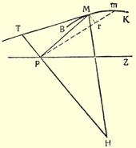
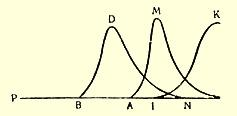

### 注释

- １

  恩格斯的经典著作*《欧根杜林先生在科学中实行的变革》*是以《反杜林论》这个名称载入史册的。

  恩格斯的这部著作是作为德国社会民主党内的思想斗争的直接结果而产生的。

  马克思和恩格斯最初注意杜林著作，是由于杜林在１８６７年１２月《补充材料》（《Ｅｒｇａｎｚｕｎｇｓｂｌａｔｔｅｒ》）杂志第３卷第３期上发表了对马克思 《资本论》第一卷的评论。在马克思和恩格斯的许多书信中，特别是在 １８６８年１—３月这段时间的书信中，可以看出他们当时已经确定的对杜林的批判态度。

  七十年代中，杜林在社会民主党人中间的影响是相当大的。最积极的杜林分子有爱伯恩施坦、约莫斯特、弗威弗利切。甚至奥倍倍尔也一度受到了杜林体系的影响。１８７４年３月，他在社会民主工党（所谓爱森纳赫派）中央机关报《人民国家报》上匿名发表了两篇关于杜林的文章，标题是《新共产主义者》。为此，马克思和恩格斯向该报编辑威李卜克内西提出了强烈的抗议。

  到１８７５年初，杜林体系的传播已经到了十分危险的程度，杜林的著作《国民经济学和社会主义批判史》第二版（１８７４年１１月问世）和《哲学教程》（最后一册在１８７５年２月问世）的出版尤其助长了这一点。在这两本书中，自命为社会主义信徒的杜林，对马克思主义进行了特别猛烈的攻击。这就促使李卜克内西在他１８７５年２月１日和４月２１日的信中直接建议恩格斯在《人民国家报》上反击杜林。１８７５年１０月和１８７６年５月，李卜克内西先后把该报拒绝发表的阿恩斯吹捧杜林的短文以及约莫斯特的类似文章寄给了恩格斯。

  还在１８７６年２月，恩格斯就认为有必要公开反驳杜林了。恩格斯在 《人民国家报》上发表的《德意志帝国国会中的普鲁士烧酒》（见《马克思恩格斯全集》中文版第１９卷第５１页）一文中便这样做了。

  杜林体系对刚刚合并的德国社会主义工人党（１８７５年５月在哥达代表大会上成立）部分党员影响的加强和在他们中间的传播，迫使恩格斯中断了《自然辩证法》的写作，以便反击这个新出现的“社会主义”学说，捍卫作为无产阶级政党的唯一正确的世界观的马克思主义。

  这个决定是在１８７６年５月底作出的。恩格斯在１８７６年５月２４日给马克思的信中表示打算批判杜林的著作。马克思在５月２５日的回信中坚决支持这个想法。恩格斯便立即着手工作，他在５月２８日给马克思的信中就确定了他的著作的总计划和性质。

  恩格斯写《反杜林论》，用了两年的时间——１８７６年５月底开始到 １８７８年７月初止。

  该书的第一编基本上写于１８７６年９月到１８７７年１月。这一编以《欧根杜林先生在哲学中实行的变革》为题，以一组论文的形式陆续发表于 １８７７年１—５月的《前进报》（１月３、５、７、１０、１２、１４、１７、２４、２６日， ２月９、２５、２８日，３月２５、２８日，４月１５、１８、２７、２９日，５月１１、１３日第１、２、３、４、５、６、７、１０、１１、１７、２４、２５、３６、３７、４４．４５、４９、 ５０、５５、５６号）。这一编还包括后来第一次出版该书单行本时抽出来作为整个三编的独立的总的引论的第一、二两章。

  该书的第二编基本上写于１８７７年６—８月。这一编的最后一章即论述政治经济学史的第十章，是马克思写的：这一章的第一部分写于１８７７年 ３月初以前，而分析魁奈的《经济表》的第二部分，则写于８月初以前。 第二编以《欧根杜林先生在政治经济学中实行的变革》为题发表于 １８７７年７—１２月《前进报》学术附刊和附刊（７月２７日，８月１０、１７日，９ 月７、１４日，１０月２８日，１１月４、２８日，１２月３０日第８７、９３、９６、１０５、１０８、 １２７、１３０、１３９、１５２号）。

  该书的第三编基本上写于１８７７年８月至１８７８年４月。它以《欧根杜林先生在社会主义中实行的变革》为题发表于１８７８年５—７ 月的《前进报》附刊（５月５、２６日，６月２、２８日，７月７日第５２、６１、６４、 ７５、７９号）。

  《反杜林论》的发表引起了杜林分子的激烈反抗。１８７７年５月２７—２９ 日在哥达举行的党代表大会上，他们曾力图禁止在党的中央机关报上发表恩格斯的这部著作。该报在发表《反杜林论》时有很大的间歇，不能不是由于他们的影响。

  １８７７年７月，恩格斯这本书的第一编以《欧根杜林先生在科学中实行的变革。一、哲学》为题在莱比锡出版了单行本。１８７８年７月，第二和第三两篇以《欧根杜林先生在科学中实行的变革。二、政治经济学。社会主义》为题也在莱比锡出版了单行本。同时，即在１８７８年７月８日前后， 全书由恩格斯写了序言，出版了第一版，标题为：弗恩格斯《欧根杜林先生在科学中实行的变革。哲学。政治经济学。社会主义》。１８７８年莱比锡版（Ｆ．Ｅｎｇｅｌｓ．《ＨｅｒｒｎＥｕｇｅｎＤü ｈｒｉｎｇ’ｓＵｍｗａｌｚｕｎｇｄｅｒＷｉｓ ｓｅｎｓｃｈａｆｔ．Ｐｈｉｌｏｓｏｐｈｉｅ．ＰｏｌｉｔｉｓｃｈｅＯｅｋｏｎｏ－ｍｉｅ．Ｓｏｚｉａｌｉｓｍｕｓ》．Ｌｅｉｐｚｉｇ， １８７８）。在以后的德文各版中，该书都是以上述标题出版的，只是没有副标题—— 《哲学。政治经济学。社会主义》。１８８６年该书第二版在苏黎世出版。经过修订的第三版于１８９４年在斯图加特出版；这是《反杜林论》在恩格斯生前出的最后一版。

  恩格斯这本书的书名是讽刺地套用了１８６５年在慕尼黑出版的杜林的《凯里在国民经济学说和社会科学中实行的变革》（《Ｃａｒｅｙ’ｓ ＵｍｗａｌｚｕｎｇｄｅｒＶｏｌｋｓｗｉｒｔｈｓｃｈａｆｔｓｌｅｈｒｅｕｎｄＳｏｃｉａｌｗｉｓｓｅｎｓｃｈａｆｔ》）一书的书名。杜林在该书中吹捧了庸俗经济学家凯里，后者实际上是他在政治经济学方面的门徒。

  １８７８年１０月底，在德国实行反社会党人非常法以后，《反杜林论》和恩格斯的其他著作一样，遭到查禁。

  １８８０年，恩格斯应保拉法格的请求，把《反杜林论》的三章（《引论》的第一章以及第三编的第一章和第二章）改写成一本独立的通俗小册子；小册子首先以《空想社会主义和科学社会主义》为题，后来又以 《社会主义从空想到科学的发展》为题出版。这本小册子还在恩格斯生前就翻译成了多种欧洲语言，并且在工人中间得到了广泛的传播。这本小册子在恩格斯生前出的最后一次德文版（第四版），是１８９１ 年在柏林出版的。这本小册子在材料安排上与《反杜林论》的有关章节有所不同，并对《反杜林论》的本文作了一些补充和改动。—— 第３页。

- ２

  恩格斯在这里利用了席勒的剧本《唐卡洛斯》第一幕第九场中的已经成为成语的一段话：

  “我再也无所畏惧了，因为和你手挽着手

  我就可以向当代挑战。” —— 第７页。

- ３

  *《人民国家报》*（《ＤｅｒＶｏｌｋｓｓｔａａｔ》，是德国社会民主工党（爱森纳赫派）的中央机关报，１８６９年１０月２日至１８７６年９月２９日在莱比锡出版，每周两次，１８７３年７月起改为每周三次。该报代表德国工人运动中的革命派的观点。这家报纸因为发表大胆的革命言论而经常受到政府和警察的迫害。由于编辑被逮捕，该报编辑部成员不断变动，但报纸的总的领导仍然掌握在威李卜克内西手里。主持《人民国家报》出版工作的奥倍倍尔在该报中起了很大的作用。

  马克思和恩格斯同该报编辑部保持着密切的联系，该报经常刊载他们的文章。马克思和恩格斯认为《人民国家报》的活动有很大意义，他们密切注视它的工作，批评它的个别缺点和错误，纠正报纸路线，因此这家报纸成了十九世纪七十年代优秀的工人报刊之一。

  根据１８７６年哥达代表大会的决定，从１８７６年１０月１日起，开始出版德国社会民主工党的统一的中央机关报——《前进报》（《Ｖｏｒ－Ｗａｒｉｓ》）， 以代替《人民国家报》和《新社会民主党人报》（《ＮｅｕｅｒＳｏｚｉａｌ－ ｄｅｍｏｋｒａｔ》）。反社会党人非常法（见注７）实行以后，《前进报》于１８７８ 年１０月２７日停刊。—— 第７页。

- ４１８７６

  年５月１０日，为纪念美利坚合众国建国一百年，第六届国际工业博览会在费拉得尔菲亚开幕。在参加博览会的四十个国家中也有德国。可是，德国政府任命的德国评判小组主席，柏林工业科学院院长弗勒洛教授被迫承认，德国工业大大落后于其他国家，德国工业遵循的原则是 “价廉质劣”。此言一出，报界哗然。《人民国家报》在７月至９月也专门就这件出丑的事发表了一系列文章。—— 第９页。

- ５

  “确实什么也没有学到”这句流传很广的话是法国海军上将德巴纳在一封信中说的。有时人们把它说成是达来朗的话。这句话是针对保皇党人说的，他们没有能够从十八世纪末德国资产阶级革命中吸取任何教训。—— 第９页。

- ６

  恩格斯指的是鲁微耳和在１８７７年９月２２日德国自然科学家和医生慕尼黑第五十次代表大会上的演说。见鲁微耳和《现代国家中的科学自由》１８７７年柏林版第１３页（Ｒ．ＶｉｒｃｈｏＷ．《ＤｉｅＦｒｅｉｈｅｉｔ ｄｅｒＷｉｓｓｅｎｓｃｈａｆｔｉｍｍｏｄｅｒｎｅｎＳｔａａｔ》．Ｂｅｒｌｉｎ．１８７７，Ｓ．１３）。—— 第９页。

- ７

  *反社会党人非常法*是俾斯麦政府在帝国国会多数的支持下于１８７８年 １０月２１日通过的，旨在反对社会主义运动和工人运动。这个法律使德国社会民主党处于非法地位；党的一切组织、群众性的工人组织、社会主义的和工人的刊物都被禁止，社会主义文献被没收，社会民主党人遭到镇压。但是社会民主党在马克思和恩格斯的积极帮助下战胜了自己队伍中的各种机会主义分子，它能够在非常法生效期间正确地把地下工作同利用合法机会结合起来，大大巩固和扩大了自己在群众中的影响。 在群众性的工人运动的压力下，非常法于１８９０年１０月１日被废除。恩格斯对这个法律的评论，见《俾斯麦和德国工人党》一文（《马克思恩格斯全集》中文版第１９卷第３０８—３１０页）。—— 第１０页。

- ８

  *神圣同盟*是沙皇俄国、奥地利和普鲁士为了镇压各国的革命运动和维护各国的封建君主制度，于１８１５年建立的欧洲各专制君主的反动联盟。—— 第１０页。

- ９

  Ｋ．Ｍａｒｘ．《Ｍｉｓèｒｅｄｅｌａｐｈｉｌｏｓｏｐｈｉｅ》．Ｐａｒｉｓ—Ｂｒｕｘｅｌｌｅｓ，１８４７．见 《马克思恩格斯全集》中文版第４卷第７１—１９８页。

  《ＭａｎｉｆｅｓｔｄｅｒＫｏｍｍｕｎｉｓｔｉｓｃｈｅｎＰａｒｔｅｉ》．Ｌｏｎｄｏｎ，１８４８．见（马克思恩格斯全集》中文版第４卷第４６１—５０４页。《共产党宣言》再版时用了《共产主义宣言》的标题。

  Ｋａｒｌｍａｒｘ．《ＤａｓＫａｐｉｔａｌ》．Ｂｄ．，Ｈａｍｂｕｒｇ，１８６７．—— 第１１ 页。

- １０

  杜林（从１８６３年任柏林大学讲师，从１８７３年任私立女子中学教员）从 １８７２年开始就在自己的著作中猛烈攻击大学的教授们。例如，早在《力学一般原则批判史》（１８７２年）第一版中，他就指责海赫尔姆霍茨故意对罗迈尔的著作保持缄默。杜林还尖锐地批评了大学的各种制度。由于这些言论，杜林遭到了反动教授们的迫害。１８７６年，根据大学教授们的倡议，他被剥夺了在女子中学教书的可能性。在力学史第二版（１８７７ 年）和论妇女教育的小册子（１８７７年）中，杜林更加猛烈地再次提出了自己的指责。１８７７年７月，根据哲学系的要求，他被剥夺了在大学讲课的权利。

  恩施韦宁格从１８８１年起任俾斯麦的私人医生，１８８４年被任命为柏林大学教授。—— 第１２页。

- １１

  由拉法格翻译的恩格斯这本书的法文译本以《空想社会主义和科学社会主义》（《Ｓｏｃｉａｌｉｓｍｅｕｔｏｐｉｑｕｅｅｔｓｏｃｉａｌｉｓｍｅｓｃｉｅｎｔｉｆｉｑｕｅ》）为题最初发表在１８８０年３—５月《社会主义评论》（《Ｒｅｖｕｅｓｏｃｉｎｌｉｓｔｅ》）杂志第３— ５期上；同年在巴黎出版了单行本。小册子的波兰文版于１８８２年在日内瓦出版，意大利文版于１８８３年在贝内万托出版。这本书的德文第一版以 《社会主义从空想到科学的发展》（《ＤｉｅＥｎｔｗｉｃｋｌｕｎｇｄｅｓＳｏｚｉａｌｉｓｍｕｓ ｖｏｎｄｅｒＵｔｏｐｉｅｚｕｒＷｉｓｓｅｎｓｃｈａｆｔ》）为题于１８８２年在霍廷根—苏黎世出版，铅印第二版和第三版于１８８３年也在那里出版。恩格斯这本书的俄译文最初以《科学社会主义》为题于１８８２年１２月发表于秘密杂志《大学生》第１期；单行本以《科学社会主义的发展》为题于１８８４年由“劳动解放社” 在日内瓦出版。丹麦文译本于１８８５年在哥本哈根出版。—— 第 １２页。

- １２

  恩格斯指的是１８７７年在伦敦出版的路亨摩尔根的主要著作《古代社会，或人类从蒙昧时代经过野蛮时代到文明时代的发展过程的研究》。—— 第１２页。

- １３

  Ｆ．Ｅｎｇｅｌｓ．《ＤｅｒＵｒｓｐｒｕｎｇｄｅｒＦａｍｉｌｉｅ，ｄｅｓＰｒｉｖａｔｅｉｇｅｎｔｈｕｍｓｕｎｄｄｅｓ Ｓｔａａｔｓ》．Ｈｏｔｔｉｎｇｅｎ－Ｚüｒｉｃｈ，１８８４．见《马克思恩格斯全集》中文版第 ２１卷第２９—２０３页。—— 第１２页。

- １４

  恩格斯于１８６９年７月１日停止了在曼彻斯特的欧门—恩格斯公司工作， 于１８７０年９月２０日迁居伦敦。—— 第１３页。

- １５

  尤李比希在他关于农业化学的主要著作的导言中谈到自己的科学观点的发展时指出：“化学正在取得异常迅速的成就，而希望赶上它的化学家们则处于不断脱毛的状态。不适于飞翔的旧羽毛从翅膀上脱落下来，而代之以新生的羽毛，这样飞起来就更有力更轻快。”见尤李比希《化学在农业和生理学中的应用》１８６２年不伦瑞克第７版上册第２６页（Ｊ．Ｌｉｅｂｉｇ．《ＤｉｅＣｈｅｍｉｅｉｎｉｈｒｅｒＡｎｗｅｎｄｕｎｇａｕｆ ＡｇｒｉｃｕｌｔｕｒｕｎｄＰｈｙｓｉｏｌｏｇｉｅ》．７．Ａｕｆｌ，Ｂｒａｕｎｓｃｈｗｅｉｇ，１８６２，Ｔｈ．， Ｓ．２６）。—— 第１３页。

- １６

  指的是德国社会民主党人亨威法比安１８８０年１１月６日给马克思的信 （参看恩格斯１８８４年４月１１日给考茨基的信，１８８４年９月１３—１５ 日给伯恩施坦的信和１８８５年６月３日给左尔格的信）。恩格斯在 《反杜林论》第一编第十二章中谈到了－１（见本卷第１３３—１３４ 页）。—— 第１３页。

- １７

  恩格斯指的是恩海克尔在他的《自然创造史》１８７３年柏林第４版第８３— ８８页（Ｅ．Ｈａｅｃｋｅｌ．《ＮａｔüｒｌｉｃｈｅＳｃｈｏｐｆｕｎｇｓｇｅｓｃｈｉｃｈｔｅ》．４．Ａｕｆｌ．，Ｂｅｒｌｉｎ， １８７３，Ｓ．８３—８８），即第四讲——《歌德和奥肯的进化论》结尾部分提出的意见。—— 第１４页。

- １８

  恩格斯在《自然辩证法》的《运动的基本形式》一章中探讨了黑格尔和赫尔姆霍茨关于力的概念的见解（见本卷第４１９—４２２ 页）。—— 第１４页。

- １９

  关于康德的星云假说，见注３１。

  关于康德的潮汐摩擦理论，见《自然辩证法》的《潮汐摩擦》 一章（本卷第４４２—４４７页）和注３３１。—— 第１５页。

- ２０

  指的是恩格斯的《自然辩证法》和马克思的数学手稿。马克思的数学手稿共有一千多页，写于十九世纪五十年代末至八十年代初。—— 第１５ 页。

- ２１

  恩格斯指的是英国物理学家托安得鲁斯的著作（１８６９年）、法国物理学家路保凯叶泰的著作（１８７７年）和瑞士物理学家劳皮克泰的著作 （１８７７年）。—— 第１５页。

- ２２

  前者是指鸭嘴兽，后者显然是指始祖鸟。—— 第１６页。

- ２３

  根据鲁微耳和在他的《细胞病理学》一书（第一版于１８５８年问世）中所阐述的观点，动物个体可以分解为组织，组织分解为细胞层，细胞层分解为单个细胞，所以归根到底，动物个体是单个细胞的机械总和（见 Ｒ．ＶｉｒｃｈｏＷ．《ＤｉｅＣｅｌｌｕｌａｒｐａｔｈｏｌｏｇｉｅ》．４．Ａｕｆｌ．，Ｂｅｒｌｉｎ．１８７１，Ｓ． １７）。

  恩格斯谈到这一观点具有“进步党的”性质，是暗指微耳和是德国资产阶级进步党党员，并且是该党的创始人和著名活动家之一。这个党于１８６１年６月成立。在它的纲领中提出了包括象在以普鲁士领导下统一德国、实现地方自治原则这样的要求。—— 第１６页。

- ２４

  恩格斯在《社会主义从空想到科学的发展》中的这个地方加了一个注， 其中黑格尔的话引自《历史哲学》第４部第３篇第３章。见黑格尔 《历史哲学讲演录》；《黑格尔全集》１８４０年柏林第２版第９卷第 ５３５—５３６页（Ｇ．Ｗ．Ｆ．Ｈｅｇｅｌ．《Ｖｏｒｌｅｓｕｎｇｅｎüｂｅｒｄｉｅｐｈｉｌｏｓｏｐｈｉｅ ｄｅｒＧｅｓｃｈｉｃｈｔｅ》；Ｗｅｒｋｅ，Ｂｄ．，２．Ａｕｆｌ．，Ｂｅｒｌｉｎ，１８４０，Ｓ．５３５— ５３６）。—— 第１９页。

- ２５

  按照卢梭的理论，人们最初生活在自然状态的条件下。在这种条件下人人都是平等的。私有制的产生和财产不平等的发展决定了人们从自然状态向市民状态的过渡，并导致以社会契约为基础的国家的形成。但是，后来由于政治不平等的发展，社会契约遭到破坏，产生了新的无权状态。消灭这种状态，是以新的社会契约为基础的理性国家的使命。

  这个理论在卢梭的１７５５年阿姆斯特丹出版的《论人间不平等的起源和原因》（《Ｄｉｓｃｏｕｒｓｓｕｒｌ’ｏｒｉｇｉｎｅｅｔｌｅｓｆｏｎｄｍｅｎｓｄｅｌ’ｉｎéｇａｌｉｔéｐａｒｍｉ ｌｅｓｈｏｍｍｅｓ》．Ａｍｓｔｅｒｄａｍ．１７５５）和１７６２年阿姆斯特丹出版的《社会契约论，或政治权利的原则》（《Ｄｕｃｏｎｔｒａｃｔｓｏｃｉａｌ；ｏｕ，Ｐｒｉｎ－ｃｉｐｅｓｄｕ ｄｒｏｉｔｐｏｌｉｔｉｑｕｅ》．Ａｍｓｔｅｒｄａｍ，１７６２）这两部著作中得到了发挥。—— 第 ２０页。

- ２６

  恩格斯指“真正平等派”或“掘地派”，他们是十七世纪英国资产阶级革命时期极左派的代表。“掘地派”代表城乡贫民阶层的利益，他们要求消灭土地私有制，宣传原始的平均共产主义思想，并企图用集体开垦公社土地来实现这种思想。—— 第２１页。

- ２７

  恩格斯首先指的是空想共产主义的代表人物的著作—— 托莫尔的《乌托邦》（１５１６年出版）和托康帕内拉的《太阳城》（１６２３年出版）。—— 第２１页。

- ２８

  德狄德罗的对话《拉摩的侄子》（《ＬｅｎｅｖｅｕｄｅＲａｍｅａｕ》）是１７６２年前后写成的，后来又经作者修改了两次。最初它是以歌德的德译本的形式于１８０５年在莱比锡出版的。真正的法文版发表在１８２１年巴黎出版的 《狄德罗轶文集》（《ＥｕｖｒｅｓｉｎéｄｉｔｅｓｄｅＤｉｄｅｒｏｔ》．Ｐａｒｉｓ．１８２１）一书中， 该书实际上是在１８２３年出版的。—— 第２３页。

- ２９

  科学发展的*亚历山大里亚时期*是指纪元前三世纪到公元七世纪的时期。这个时期是因埃及的一个城市、当时国际经济关系最大中心之一亚历山大里亚（位于地中海沿岸）而得名的。在亚历山大里亚时期，许多科学，如数学和力学（欧几里得和阿基米德）、地理学、天文学、解剖学、生理学等等，都获得了很大的发展。—— 第２３页。

- ３０

  圣经《马太福音》第５章第３７节。—— 第２４页。

- ３１

  根据康德的星云假说，太阳系是从原始星云（拉丁文：ｎｅｂｕｌａ—— 雾） 发展而来的，他在１７５５年科尼斯堡和莱比锡出版的著作《自然通史和天体论，或根据牛顿原理试论宇宙的结构和机械起源》（《Ａｌｌｇｅｍｅｉｎｅ ＮａｔｕｒｇｅｓｃｈｉｃｈｔｅｕｎｄＴｈｅｏｒｉｅｄｅｓＨｉｍｍｅｌｓ，ｏｄｅｒＶｅｒｓｕｃｈｖｏｎｄｅｒＶｅｒ ｆａｓｓｕｎｇｕｎｄｄｅｍｍｅｃｈａｎｉｓｃｈｅｎＵｒｓｐｒｕｎｇｅｄｅｓｇａｎｚｅｎＷｅｌｔ－ｇｅｂｏｕｄｅｓ ｎａｃｈＮｅｗｔｏｎｉｓｃｈｅｎＧｒｕｎｄｓａｔｚｅｎａｂｇｅｈａｎｄｅｌｔ》．Ｋａｎｉｇｓ－ｂｅｒｇｕｎｄ Ｌｅｉｐｚｉｇ，１７５５）中阐述了这一假说。这本书是匿名出版的。

  拉普拉斯关于太阳系的构成的假说最初是在他于法兰西共和四年 ［１７９６年］在巴黎出版的《宇宙体系解说》第１—２卷（《Ｅｘｐｏｓｉｔｉｏｎｄｕ ｓｙｓｔèｍｅｄｕｍｏｎｄｅ》．Ｔ．—，Ｐａｒｉｓ，ｌ’ａｎｄｅｌａＲéｐｕｂｌｉｑｕｅＦｒａｎ ｃａｉｓｅ［１７９６］）中得到了阐述。在作者拉普拉斯生前编好而在死后即１８３５ 年出版的该书的最后一版即第六版中，这个假说是在该书的最后一个， 即第七个注中加以阐述的。

  宇宙空间存在着类似康德—拉普拉斯星云假说所设想的原始星云的炽热的云雾体，英国天文学家威哈金斯于１８６４年用光谱学方法证明了这一点，他在天文学中广泛地运用了古基尔霍夫和罗本生在１８５９ 年创造的光谱分析法。恩格斯在这里利用了安赛奇的书《太阳》（见Ａ． Ｓｅｃｃｈｉ．《ＤｉｅＳｏｎｎｅ》．Ｂｒａｕｎｓｃｈｗｅｉｇ．１８７２，Ｓ．７８７，７８９—７９０；参看本卷第６２１页）。—— 第２６页。

- ３２

  还在《社会主义从空想到科学的发展》德文第一版（１８８２年）中，恩格斯就作了重要的更正，对这个原理作了如下的表述：“以往的*全部*历史，除原始状态外，都是阶级斗争的历史”。—— 第２９页。

- ３３

  欧杜林《哲学教程—— 严格科学的世界观和生命形成》１８７５年莱比锡版（Ｅ．Ｄüｈｒｉｎｇ．《ＣｕｒｓｕｓｄｅｒＰｈｉｌｏｓｏｐｈｉｅａｌｓｓｔｒｅｎｇｗｉｓｓｅｎｓｃｈａｆｔ－ｌｉｃｈ ｅｒＷｅｌｔａｎｓｃｈａｕｕｎｇｕｎｄＬｅｂｅｎｓｇｅｓｔａｌｔｕｎｇ》．Ｌｅｉｐｚｉｇ，１８７５）。

  欧杜林《国民经济学和社会经济学教程，兼论财政政策的基本问题》１８７６年莱比锡第２版（Ｅ．Ｄｏｈｒｉｎｇ．《ＣｕｒｓｕｓｄｅｒＮａｔｉｏｎａｌ－ｕｎｄＳｏ ｃｉａｏｋｏｎａｍｉｅｅｉｎｓｃｈｌｉｅｓｓｌｉｃｈｄｅｒＨａｕｐｔｐｕｎｋｔｅｄｅｒＦｉｎａｎｚｐｏｌｉｔｉｋ》．２．Ａｕ ｆｌ．，Ｌｅｉｐｚｉｇ，１８７６）。该书第一版于１８７３年在柏林出版。

  欧杜林《国民经济学和社会主义批判史》１８７５年柏林第２版（Ｅ． Ｄüｈｒｉｎｇ．《ＫｒｉｔｉｓｃｈｅＧｅｓｃｈｉｃｈｔｅｄｅｒＮａｔｉｏｎａｌｏｋｏｎｏｍｉｅｕｎｄｄｅｓＳｏｃｉａｌｉｓ ｍｕｓ》．２．Ａｕｆｔ．，Ｂｅｒｌｉｎ，１８７５）。该书第一版于１８７１年在柏林出版。—— 第３１页。

- ３４

  *法伦斯泰尔*—— 按照法国空想社会主义者沙傅立叶的学说，这是理想的社会主义社会中生产消费协作社的成员们居住和工作的场所。—— 第３４页。

- ３５

  乔威弗黑格尔《哲学全书缩写本》１８１７年海得尔堡版（Ｇ．Ｗ．Ｆ． Ｈｅｇｅｌ．《ＥｎｃｙｃｌｏｐａｄｉｅｄｅｒｐｈｉｌｏｓｏｐｈｉｓｃｈｅｎＷｉｓｓｅｎｓｃｈａｆｔｅｎｉｍＧｒｕｎ ｄｒｉｓｓｅ》．Ｈｅｉｄｅｌｂｅｒｇ，１８１７年）。这部著作包括三个部分：（１）逻辑， （２）自然哲学，（３）精神哲学。

  恩格斯在写《反杜林论》和《自然辩证法》时所利用的黑格尔的著作，主要的是黑格尔死后由他的学生整理出版的版本（见《本卷中引用和提到的著作索引》）。—— 第３８页。

- ３６

  恩格斯称米希勒为“黑格尔派的永世流浪的犹太人”，显然是由于米希勒始终不渝地笃信被肤浅理解的黑格尔主义。例如，１８７６年，米希勒开始出版五卷集的《哲学体系》，其总的结构完全是模仿黑格尔的《哲学全书》。见卡路米希勒《作为精确科学的哲学体系（包括逻辑、自然哲学和精神哲学）》１８７６—１８８１年柏林版第１—５卷（Ｃ．Ｌ．Ｍｉｃｈｅｌｅｔ．《Ｄａｓ ＳｙｓｔｅｍｄｅｒＰｈｉｌｏｓｏｐｈｉｅａｌｓｅｘａｃｔｅｒＷｉｓｓｅｎｓｃｈａｆｔｅｎｔｈａｌｔｅｎｄＬｏｇｉｋ， ＮａｔｕｒｐｈｉｌｏｓｏｐｈｉｅｕｎｄＧｅｉｓｔｅｓｐｈｉｌｏｓｏｐｈｉｅ》．Ｂｄ．１—５，Ｂｅｒｌｉｎ，１８７６— １８８１）。

  关于*“永世流浪的犹太人”*，见《人名索引（文学作品和神话中的人物）》。—— 第３８页。

- ３７１８８５

  年，在准备出版《反杜林论》的第二版时，恩格斯曾经打算在这个地方加一个注释，后来，他把这个注释的草稿（《关于现实世界中数学的无限的原型》）列为《自然辩证法》的材料（见本卷第６１０—６１６ 页）。—— 第３９页。

- ３８

  暗指普鲁士人的奴仆般的顺从态度，他们通过了１８４８年１２月５日在解散普鲁士制宪议会的同时由国王钦定（“恩赐”）的宪法。由反动大臣曼托伊费尔参与制定的这个宪法于１８５０年１月３１日经弗里德里希－威廉四世最后批准。—— 第４２页。

- ３９

  见黑格尔《哲学全书》第１８８节；并见《逻辑学》第３册第１篇第３章关于定在推理第四格的一节和第３篇第２章关于定理的一节。—— 第４３页。

- ４０

  在《反杜林论》第一编中所有这种引文页码均属杜林《哲学教程》一书。—— 第４３页。

- ４１

  恩格斯列举的是十九世纪欧洲历次战争中的几个最大的会战。

  １８０５年１２月２日（１１月２０日）俄奥两国军队和法国军队之间的*奥斯特尔利茨会战*，以拿破仑第一的胜利而告终。

  拿破仑指挥的法军和普军之间的*耶拿会战*争发生在１８０６年１０月１４ 日。这次会战以普军被击溃而告终，普鲁士投降了拿破仑法国。

  凯尼格列茨（现今的赫腊德茨－克腊洛维）*会战*，是１８６６年７月３日奥地利和萨克森军队同普鲁士军队之间在捷克进行的会战，这是１８６６ 年普奥战争（结果普鲁士战胜奥地利）中的一次决定性会战。在历史上， 这次会战和萨多瓦会战同样著名。

  １８７０年９月１—２日的*色当会战*，是１８７０—１８７１年普法战争的一次决定性会战。在这次会战中，普鲁士军队挫败了麦克马洪指挥的法国军队，并迫使它投降。—— 第４６页。

- ４２

  乔威弗黑格尔《逻辑学》１８１２—１８１６年纽伦堡版（Ｇ．Ｗ．Ｆ．Ｈｅｇｅｌ． 《ＷｉｓｓｅｎｓｃｈａｆｔｄｅｒＬｏｇｉｋ》．Ｎüｒｎｂｅｒｇ，１８１２—１８１６）。这部著作共分三册：（１）客观逻辑，存在论（１８１２年出版）；（２）客观逻辑， 本质论（１８１３年出版）；（３）主观逻辑或概念论（１８１６年出版）。—— 第４９页。

- ４３

  黑格尔《哲学全书》第９４节。—— 第５１页。

- ４４

  ．Ｋａｎｔ．《ＣｒｉｔｉｋｄｅｒｒｅｉｎｅｎＶｅｒｎｕｎｆｔ》．Ｒｉｇａ，１７８１，Ｓ．４２６—４３３．—— 第５３页。

- ４５

  指的是杜林对德国大数学家卡弗高斯关于非欧几里得几何学体系， 特别是关于多度空间几何学体系的思想所进行的攻击。—— 第５４页。

- ４６

  见黑格尔《逻辑学》第２册本质论的开头部分。

  关于后来谢林的“不可追溯” 的存在这个范畴，见恩格斯的著作 《谢林与启示》（《马克思恩格斯早期著作选》俄文版第４２４页及以下各页）。—— 第５７页。

- ４７

  关于运动的量守恒的思想，笛卡儿曾在他的《论光》（《论世界》一书的第一部分，该书写于１６３０—１６３３年，而在笛卡儿死后于１６６４年出版） 和他１６３９年４月３０日给德博恩纳的信中表述过。这个论点在１６４４年阿姆斯特丹版的笛卡儿的《哲学原理》第２部第３６节（Ｒ．Ｄｅｓ－Ｃａｒｔｅｓ． 《ＰｒｉｎｃｉｐｉａＰｈｉｌｏｓｏｐｈｉａｅ》．Ａｍｓｔｅｌｏｄａｍｉ，１６４４，Ｐａｒｓｓｅｃｕｎｄａ，

  ）中得到了最充分的阐述。—— 第５８页。

- ４８

  关于哥白尼体系，１８８６年恩格斯在他的著作《路德维希费尔巴哈和德国古典哲学的终结》中谈到：“哥白尼的太阳系学说有三百年之久一直是一种假说，这个假说尽管有百分之九十九、百分之九十九点九、百分之九十九点九九的可靠性，但毕竟是一种假说；而当勒维烈从这个太阳系学说所提供的数据，不仅推算出一定还存在一个尚未知道的行星，而且还推算出这个行星在太空中的位置的时候，当后来加勒确实发现了这个行星的时候，哥白尼的学说就被证实了。”（见《马克思恩格斯全集》中文版第２１卷第３１７—３１８页）。这里所指的行星是１８４６年柏林天文台观察员约翰加勒发现的海王星。—— 第６３页。

- ４９

  根据后来的准确材料，水在１００度蒸发时发生的潜热等于５３８．９卡克。—— 第６９页。

- ５０１８８５

  年，准备出版《反杜林论》的第二版时，恩格斯曾经打算在这个地方加一个注释，后来，他把这个注释的草稿（《关于“机械的” 自然观》）列为《自然辩证法》的材料（见本卷第５９４—５９９页）。—— 第７２页。

- ５１

  查达尔文《根据自然选择即在生存斗争中适者保存的物种起源》１８７２ 年伦敦第６版第４２８页（Ｃｈ．Ｄａｒｗｉｎ．《ＴｈｅＯｒｉｇｉｎｏｆＳｐｅｃｉｅｓｂｙＭｅａｎｓ ｏｆＮａｔｕｒａｌＳｅｌｅｃｔｉｏｎ，ｏｒｔｈｅＰｒｅｓｅｒｖａｔｉｏｎｏｆＦａｖｏｕｒｅｄＲａｃｅｓｉｎｔｈｅ ＳｔｒｕｇｇｌｅｆｏｒＬｉｆｅ》．６ｔｈｅｄ．，Ｌｏｎｄｏｎ，１８７２，ｐ．４２８）；着重号是恩格斯加的。这是经过达尔文作了补充和修订的最后一版。该书的第一版以 《物种起源》（《ＯｎｔｈｅＯｒｉｇｉｎｏｆＳｐｅｃｉｅｓ》ｅｔｃ．）为题于１８５９年在伦敦出版。

  恩格斯在后面，即在第８０页，引用的是达尔文这本书的同一版本。—— 第７９页。

- ５２

  恩海克尔《自然创造史。关于一般进化学说，特别是达尔文、歌德、拉马克的进化学说的通俗学术讲演》１８７３年柏林第４版（Ｅ．Ｈａｅｃｋｅｌ． 《ＮａｔüｒｌｉｃｈｅＳｃｈｏｐｆｕｎｇｓｇｅｓｃｈｉｃｈｔｅ．Ｇｅｍｅｉｎｖｅｒｓｔａｎｄｌｉｃｈｅｗｉｓｓｅｎ－ ｓｃｈａｆｔｌｉｃｈｅＶｏｒｔｒａｇｅüｂｅｒｄｉｅＥｎｔｗｉｃｋｅｌｕｎｇｓｌｅｈｒｅｉｍＡｌｌｇｅｍｅｉｎｅｎｕｎｄ ｄｉｅｊｅｎｉｇｅｖｏｎＤａｒｗｉｎ，ＧｏｅｔｈｅｕｎｄＬａｍａｒｃｋｉｍＢｅｓｏｎｄｅｒｅｎ》．４．Ａｕｆｌ．， Ｂｅｒｌｉｎ，１８７３）。该书第一版于１８６８年在柏林出版。

  原生生物（来自希腊文πρω σ  —— 最初的）—— 按照海克尔的分类，是最简单的有机体的一大组，它包括单细胞的和无细胞的有机体， 在有机界中构成除多细胞有机体的两界（植物和动物）以外的一个特殊的第三界。

  *原虫*（来自希腊文μ ηρη —— 简单的）—— 按照海克尔的见解，是无核的完全没有结构的蛋白质小块，它执行生命的所有重要的职能：摄食、运动、对刺激的反应、繁殖。海克尔把原始的、通过自生的途径产生而目前已经绝灭的原虫（最古的原虫）同现代的还存在的原虫区分开来。前者是有机界的三个界发展的起点；细胞就是从最古的原虫历史地发展出来的。后者属于原生生物界，并构成该界的第一个最简单的纲； 在海克尔看来，现代的原虫具有不同的种：Ｐｒｏｔａｍｏｅｂａｐｒｉｍｉｔｉｖａ〔原变形虫〕，Ｐｒｏｔｏｍｙｘａａｕｒａｎｔｉａｃａ〔原胶胞子〕，ＢａｔｈｙｂｉｕｓＨａｅｃｋｅｌｉｉ〔海克尔深水虫〕。

  “原生生物” 和“原虫” 这两个术语是海克尔于１８６６年（在他的 《有机体普通形态学》一书中）使用的，但是在科学中未被确认。目前， 曾被海克尔看作原生生物的有机体或者被划为植物，或者被划为动物。 原虫的存在后来也没有得到证实。但是，关于细胞有机体由前细胞组织发展而来这一总的思想和把原始生物划分为植物和动物的思想已为科学界所公认。—— 第７９页。

- ５３

  *《尼贝龙根的戒指》*是理查瓦格纳的一部大型的组歌剧，它包括以下四部歌剧：《莱茵的黄金》、《瓦尔库蕾》、《齐格弗里特》、《神的灭亡》。 １８７６年，在拜罗伊特的瓦格纳专设剧院开幕式上演出了《尼贝龙根的戒指》。

  恩格斯在这里戏称理瓦格纳为“*未来的作曲家*”，因为瓦格纳的音乐曾被他的敌人讥讽为“未来的音乐”，原因是他的一本书叫做《未来的艺术作品》（Ｒ．Ｗａｇｎｅｒ．《ＤａｓＫｕｎｓｔｗｅｒｋｄｅｒＺｕｋｕｎｆｔ》．Ｌｅｉｐｚｉｇ， １８５０）。—— 第８２页。

- ５４

  *植虫*（Ｐｆｌａｎｚｅｎｔｉｅｒｅ—— 植物动物）是十六世纪以来对无脊椎动物组 （主要是海绵动物和腔肠动物）的称呼，它们的某些特点可以算作植物的特征（例如固定的生活方式）；因此人们认为植虫是介于植物和动物之间的中间形态。从十九世纪中叶起，“植虫”这个术语是作为腔肠动物的同义词来使用的；目前这个术语已经不用了。—— 第８５页。

- ５５

  这里提到的分类法是托亨赫胥黎在他的《比较解剖学原理讲义》１８６４ 年伦敦版第五讲（Ｔ．Ｈ．Ｈｕｘｌｅｙ．《ＬｅｃｔｕｒｅｓｏｎｔｈｅＥｌｅｍｅｎｔｓｏｆＣｏｍｐａｒ ａｔｉｖｅＡｎａｔｏｍｙ》．Ｌｏｎｄｏｎ，１８６４．ｌｅｃｔｕｒｅＶ）中提出的。这种分类法为亨阿尼科尔森的《动物学手册》（第一版于１８７０年问世）奠定了基础， 恩格斯在写《反杜林论》和《自然辩证法》时利用了尼科尔森的这本书。—— 第８５页。

- ５６

  *特劳白的人造细胞*是一种无机构成，它是活细胞的模型，能够进行新陈代谢和生长，可以用来研究生命现象；这是德国化学家和生理学家摩特劳白用混合胶体溶液的办法制成的。１８７４年９月２３日在德国自然科学家和医生布勒斯劳第四十七次代表大会上，特劳白宣布了自己的这次试验。马克思和恩格斯对特劳白的这个发现作了很高的评价（见马克思 １８７５年６月１８日给彼拉拉甫罗夫的信，马克思１８７７年１月２１日给威亚弗罗恩德的信）。—— 第８８页。

- ５７

  恩格斯在这里叙述了发表在１８７６年１１月１６日《自然界》杂志上的一篇简讯的内容。在简讯中报道了德伊门得列耶夫于１８７６年９月３日在俄国自然科学家和医生华沙第五次代表大会上的发言，门得列耶夫在发言中阐述了１８７５—１８７６年他同约埃博古斯基一起验证波义耳—马略特定律的结果。

  这个脚注，显然是恩格斯在校对《反杜林论》的这一章（１８７７年２月 ２８日发表于《前进报》）时写的。脚注末尾，即括号里的话，是恩格斯在 １８８５年准备《反杜林论》第二版时加上的。—— 第１００页。

- ５８

  歌德《浮士德》第一部第三场（《浮士德的书斋》）。—— 第１０１页。

- ５９

  圣经《出埃及记》第２０章第１５节和《申命记》第５章第１９节。—— 第１０３ 页。

- ６０

  歌德《浮士德》第一部第二场和第三场（《城门之前》和《浮士德的书斋》）。—— 第１０４页。

- ６１

  卢梭的著作《论人间不平等的起源和原因》于１７５４年写成，１７５５年出版 （见注２５）。—— 第１０７页。

- ６２１６１８

  —１６４８年的*三十年战争*是一次全欧洲范围的战争，它是由新教徒和天主教徒的斗争而引起的。德国是这次斗争的主要场所，是战争参加者的军事掠夺和侵略的对象。—— 第１０９页。

- ６２

  指的是麦施蒂纳的著作《唯一者及其所有物》１８４５年莱比锡版（Ｍ． Ｓｔｉｒｎｅｒ．《ＤｅｒＥｉｎｚｉｇｅｕｎｄｓｅｉｎＥｉｇｅｎｔｈｕｍ》．Ｌｅｉｐｚｉｇ，１８４５）。这部著作在《德意志意识形态》中受到了马克思和恩格斯的毁灭性批判（见《马克思恩格斯全集》中文版第３卷第１１６—５３０页）。—— 第１０９页。

- ６４

  指沙皇俄国占领中亚细亚时期发生的事件。在１８７３年希瓦远征时期，俄国的一支部队遵照考夫曼将军的命令，在戈洛瓦乔夫将军的指挥下，于７—８月对土库曼的约穆德人进行了讨伐性的远征；这次远征特点是极端的残酷性。恩格斯所引用的有关这些事件的材料的主要来源，显然是美国驻俄外交官尤金斯凯勒的一本书《土尔克斯坦。俄属土尔克斯坦、浩罕、布哈拉和伊宁旅行札记》（Ｅ．Ｓｃｈｕｙｌｅｒ． 《Ｔｕｒｋｉｓｔａｎ．ＮｏｔｅｓｏｆａＪｏｕｒｎｅｙｉｎＲｕｓｓｉａｎＴｕｒｋｉｓｔａｎ，Ｋｈｏｋａｎｄ， Ｂｕｋｈａｒａ，ａｎｄＫｕｌｄｊａ》．Ｉｎｔｗｏｖｏｌｕｍｅｓ．Ｖｏｌ．．Ｌｏｎｄｏｎ，１８７６，ｐ． ３５６—３５９）。—— 第１１１页。

- ６５

  恩格斯在这里引证的是《资本论》第一卷（见《资本论》第１卷第１章第 ３节Ａ３）。—— 第１１５页。

- ６６

  Ｋ．Ｍａｒｘ．《ＤａｓＫａｐｉｔａｌ》．Ｂｄ．，２．Ａｕｆｌ．，Ｈａｍｂｕｒｇ，１８７２，Ｓ． ３６．见《资本论》第１卷第１章第３节Ａ３。恩格斯在《反杜林论》中引用的是《资本论》第一卷德文第二版。只是在第二篇第十章中，恩格斯为了出版《反杜林论》第三版而修改这一章时，才引用了《资本论》第一卷德文第三版。—— 第１１７页。

- ６７

  拉萨尔于１８４８年２月因被控教唆盗窃一只盛有哈茨费尔特伯爵夫人离婚案（１８４６—１８５４年拉萨尔是该案的律师）需用文件的首饰匣而被捕。 拉萨尔案件是１８４８年８月５—１１日审理的。拉萨尔被陪审法庭宣判无罪。—— 第１２０页。

- ６８

  *刑法典*（Ｃｏｄｅｐéｎａｌ）是法国的法典，１８１０年通过，从１８１１年起在法国以及法国人占领的德国西部和西南部地区实行；１８１５年莱茵省归并普鲁士以后，它仍和民法典并行于莱茵省。普鲁士政府曾经力图采用一系列措施在莱茵省推行普鲁士的法律。这些措施遭到莱茵省的坚决反对。三月革命后，根据１８４８年４月１５日的命令，取消了这些措施。—— 第１２０页。

- ６９

  *拿破仑法典*（ＣｏｄｅＮａｐｏｌéｏｎ）是１８０４年通过的法国民法典（Ｃｏｄｅ ｃｉｖｉｌ）。恩格斯称它为“典型的资产阶级社会的法典”（见《马克思恩格斯全集》中文版第２１卷第３４７页）。

  恩格斯在这个地方所讲的是广义的拿破仑法典，即１８０４—１８１０年拿破仑统治时期通过的五个法典的总称：民法、民事诉讼法、贸易法、刑法和刑事诉讼法。—— 第１２０页。

- ７０

  无知并不是论据，是斯宾诺莎在《伦理学》（第一部分，增补）中反对僧侣主义的目的论的自然观的代表时讲的一句话，这些人提出“上帝的意志”是一切现象的原因的原因，他们进行论证的唯一手段就是求助于对其他原因的无知。—— 第１２１页。

- ７１

  *民法大全*（Ｃｏｒｐｕｓｊｕｒｉｓｃｉｖｉｌｉｓ）是调整罗马奴隶占有制社会的财产关系的一部民法汇编；它是在六世纪查士丁尼皇帝在位时编纂的。恩格斯说它是“商品生产者社会的第一个世界性法律”（见《马克思恩格斯全集》中文版第２１卷第３４６页）。—— 第１２２页。

- ７２

  关于在普鲁士强制实行出生、结婚和死亡等民事登记的法律是在俾斯麦的创议下通过的；这个法律于３月９日最后批准并从１８７４年１０月１日开始生效。１８７５年２月６日向全德意志帝国颁布了同样的法案。这一法案剥夺了教会登记户籍的权利，从而大大地限制了教会的影响和收入。它主要是反对天主教会的，并且是俾斯麦的所谓“文化斗争”政策中的重要环节。—— 第１２３页。

- ７３

  指勃兰登堡、东普鲁士、西普鲁士、波兹南、波美拉尼亚和西里西亚六省，在１８１５年维也纳会议以前这些省份归属普鲁士王国。在经济、政治、文化方面最为发达的莱茵省不在此列，它是１８１５年归并普鲁士的。—— 第１２４页。

- ７４

  *人差*指确定天体通过已知平面瞬间的系统误差，这种误差是以观察员的心理生理特点和记录天体通过时刻的方式为转移的。——第１２５页。

- ７５

  黑格尔《哲学全书》第１４７节附释。—— 第１２５页。

- ７６

  马克思在写他的主要经济学著作的过程中曾不止一次地更改这一著作的卷册划分计划。从１８６７年《资本论》第一卷出版时起，马克思的计划是：全部著作分三卷四册出版，第二册和第三册构成一卷即第二卷（参看《资本论》第一版序言）。马克思逝世后，恩格斯出版了第二册和第三册，作为第二卷和第三卷。最后一册即第四册—— 《剩余价值理论》 （《资本论》第四卷），恩格斯没有来得及出版。—— 第１３５页。

- ７７

  在１８６７年《现代知识补充材料》（《ＥｒｇａｎｚｕｎｇｓｂｌａｔｔｅｒｚｕｒＫｅｎｎｔｎｉβｄｅｒ Ｇｅｇｅｎｗａｒｔ》）杂志第３卷第３期第１８２—１８６页上刊登了杜林对马克思 《资本论》第一卷的评论。—— 第１３５页。

- ７８

  见《资本论》第１卷第９章。—— 第１３７页。

- ７９

  见《资本论》第１卷第９章。—— 第１３７页。

- ８０

  见《资本论》第１卷第１１章。—— 第１３９页。

- ８１

  见《资本论》第１卷第９章。—— 第１３９页。

- ８２

  见拿破仑回忆录《对１８１６年巴黎出版的〈论军事学术〉一书的十七条意见》，第三条意见：骑兵。载于蒙托龙伯爵将军编《拿破仑执政时期法国历史回忆录，与拿破仑一同作俘虏的将军们编于圣海伦岛，根据完全由拿破仑亲自校订的原稿刊印》１８２３年巴黎版第１卷第２６２页（《Ｍéｍｏｉｒｅｓ ｐｏｕｒｓｅｒｖｉｒàｌ’ｈｉｓｔｏｉｒｅｄｅＦｒａｎｃｅ，ｓｏｕｓＮａｐｏｌéｏｎ，éｃｒｉｔｓà Ｓａｉｎｔｅ Ｈèｌèｎｅ，ｐａｒｌｅｓｇéｎéｒａｕｘｑｕｉｏｎｔｐａｒｔａｇéｓａｃａｐ－ｔｉｖｉｔé，ｅｔｐｕｂｌｉéｓｓｕｒ ｌｅｓｍａｎｕｓｃｒｉｔｓｅｎｔｉèｒｅｍｅｎｔｃｏｒｒｉｇéｓｄｅｌａｍａｉｎｄｅＮａｐｏｌéｏｎ》．Ｔｏｍｅ ｐｒｅｍｉｅｒ，éｃｒｉｔｐａｒｌｅｇéｎéｒａｌｃｏｍｔｅｄｅＭｏｎｔｈｏｌｏｎ．Ｐａｒｉｓ，１８２３，ｐ． ２６２）。

  恩格斯在他的《骑兵》（见《马克思恩格斯全集》中文版第１４卷第３２０ 页）一文中曾引用了拿破仑回忆录中的这段话。—— 第１４１页。

- ８３

  见《资本论》第１卷第２４章第７节。恩格斯在这里和后面几处引用的是 《资本论》第一卷德文第二版（１８７２年）。这里所引用的部分，在德文第四版中有一些修改。—— 第１４３页。

- ８４

  见《资本论》第１卷第１章第４节。—— 第１４４页。

- ８５

  见《资本论》第１卷第２４章第７节。—— 第１４５页。

- ８６

  见《资本论》第１卷第２４章第７节。—— 第１４６页。

- ８７

  见《资本论》第１卷第２４章第７节。—— 第１４７页。

- ８８

  指卢梭的著作《论人间不平等的起源和原因》（见注２５），该著作写于 １７５４年。恩格斯在后面所引用的是这一著作（１７５５年版）的第２部第１１６、 １１８、１４６、１７５—１７６和１７６—１７７页。—— 第１５２页。

- ８９

  恩海克尔《自然创造史》１８７３年柏林第４版第５９０—５９１页。在海克尔的分类中，Ａｌａｌｉ是就在本来意义上的人出现以前的那一阶段。Ａｌａｌｉ就是 “没有语言的原始人”，正确些说，是猿人（直立猿人）。海克尔关于类人猿和现代人之间存在一个过渡形态的假说在１８９１年得到证实。当时荷兰的人类学家欧杜布瓦在爪哇岛找到远古人化石的残片，这种人也被称为“直立猿人”。—— 第１５２页。

- ９０

  《ｄｅｔｅｒｍｉｎａｔｉｏｅｓｔｎｅｇａｔｉｏ》这一用语见斯宾诺莎１６７４年６月２日给雅里希耶勒斯的信（见巴斯宾诺莎《通信集》第５０封信），那里所使用的意义是“限制即否定”。《ｏｍｎｉｓｄｅｔｅｒｍｉｎａｔｉｏｅｓｔｎｅｇａｔｉｏ》这一用语以及对它的解释：“任何规定即否定”，分别见于黑格尔的著作，因此它们也就为人们所熟知了（见《哲学全书》第１部第９１节附释；《逻辑学》第１ 册第１篇第２章关于质这一节的注释；《哲学史讲演录》第１卷第１部第１篇第１章关于巴门尼德的一节）。—— 第１５５页。

- ９１

  暗指莫里哀的喜剧《醉心贵族的小市民》第二幕第六场中的一段著名情节。—— 第１５５页。

- ９２

  *“施给乞丐的稀汤”* （《ｂｒｅｉｔｅＢｅｔｔｅｌｓｕｐｐｅｎ》）是歌德的悲剧《浮士德》第一部第六场《魔女之厨》中的用语。—— 第１５８、２７９页。

- ９３

  这一用语出自罗马诗人尤维纳利斯的第一首讽刺诗。—— 第１６３页。

- ９４

  在《反杜林论》第二编中，除该编第十章外，所引用的页码都属于杜林的著作《国民经济学和社会经济学教程》第二版。—— 第１６６页。

- ９５

  *爬虫报刊*是指从政府那里得到金钱援助的反动报刊。１８６９年１月３０日俾斯麦在普鲁士下院发表演说时在另一种意义上使用了这一用语。当时俾斯麦把政府的反对者称为爬虫。但是后来这一用语恰好用来指那些为政府效劳的卖身投靠的记者。俾斯麦本人于１８７６年２月９日在德意志帝国国会发表演说时不得不承认这一事实：“爬虫”一词的新含义已在德国获得了最广泛的流传。—— 第１６８页。

- ９６

  见注２。—— 第１６９页。

- ９７

  见《资本论》第１卷第８章第２节。—— 第１６９页。

- ９８

  欧杜林《我致普鲁士内阁的社会条陈的命运》１８６８年柏林版第 ５页（Ｅ．Ｄüｈｒｉｎｇ．《ＤｉｅＳｃｈｉｃｋｓａｌｅｍｅｉｎｅｒｓｏｃｉａｌｅｎＤｅｎｋｓｃｈｒｉｆｔｆüｒ ｄａｓＰｒｅｕｓｓｉｓｃｈｅＳｔａａｔｓｍｉｎｉｓｔｅｒｉｕｍ》．Ｂｅｒｌｉｎ．１８６８，Ｓ．５）。—— 第 １７０页。

- ９９

  这里是指杜林的著作《国民经济学和社会经济学教程》（见注３３） １８７６年第二版。—— 第１７１页。

- １００

  恩格斯在这里利用了莎士比亚的历史剧《亨利四世》（奥威施勒格尔的德译本）前篇第二幕第四场中福斯泰夫的话：“即使论据象乌莓子一样便宜，我也不会在人家的强迫之下给他一个论据。” —— 第１７３页。

- １０１

  指奥梯叶里、弗基佐、弗米涅、阿梯也尔。—— 第１７４页。

- １０２

  恩格斯的这些材料大概引自威瓦克斯穆特的著作《从国家观点研究希腊古代》１８２９年哈雷版第２部第１篇第４４页（Ｗ．Ｗａｃｈｓｍｕｔｈ．《Ｈｅｌｌｅｎｉｓ ｃｈｅＡｌｔｅｒｔｈｕｍｓｋｕｎｄｅａｕｓｄｅｍＧｅｓｉｃｈｔｓｐｕｎｋｔｅｄｅｓＳｔａａｔｅｓ》．Ｔｈ．， Ａｂｔｈ．，Ｈａｌｌｅ，１８２９，Ｓ．４４）。关于希腊波斯战争时期科林斯和埃伊纳奴隶的数量的材料，最早见于古希腊作家阿泰纳奥斯的著作《学者们之宴会》第６册。—— 第１７６页。

- １０３

  恩格斯利用的是格汉森的著作《特利尔专区的农户公社（世代相承的协作社）》１８６３年柏林版（Ｇ．Ｈａｎｓｓｅｎ．《ＤｉｅＧｅｈｏｆｅｒｓｃｈａｆｔｅｎ（Ｅｒ ｂｇｅｎｏｓｓｅｎｓｃｈａｔｆｔｅｎ）ｉｍＲｅｇｉｅｒｕｎｇｓｂｅｚｉｒｋＴｒｉｅｒ》．Ｂｅｒｌｉｎ，１８６３）。—— 第１７７页。

- １０４

  见《资本论》第１卷第２２章第１节。—— 第１７８页。

- １０５

  指法国在１８７０—１８７１年普法战争中失败后根据和约的条件，于１８７１— １８７３年向德国支付的五十亿法郎赔款。—— 第１８２页。

- １０６

  *普鲁士的后备军制度*是把在正规军中服满现役和规定的预备期限的年龄较大的应征人员编成一支武装部队的制度。在普鲁士，后备军制度最初是１８１３—１８１４年在反拿破仑战争的斗争中作为民团而产生的。在 １８７０—１８７１年普法战争时期，后备军被用来和正规部队共同作战。—— 第１８４页。

- １０７

  指１８６６年的普奥战争。—— 第１８５页。

- １０８

  在１８７０年８月１８日*圣普里瓦会战*中德国军队以巨大的伤亡为代价，取得了对法国莱茵军团的胜利。在历史文献中，这一会战与格腊韦洛特会战同样著名。

  关于后面所引用的关于普鲁士近卫军的伤亡的材料的来源，见注 ５３７。—— 第１８５页。

- １０９

  麦耶恩斯的报告《马基雅弗利和普遍义务兵役制的思想》，曾载于１８７６ 年４月１８、２０、２２和２５日《科伦日报》第１０８、１１０、１１２和１１５号。引文中的着重号是恩格斯加的。

  *《科伦日报》*（《ＫｏｌｎｉｓｃｈｅＺｅｉｔｕｎｇ》）是德国的一家日报，自１８０２ 年起即以此名称在科伦出版；它反映了普鲁士自由资产阶级的政策。—— 第１８７页。

- １１０１８５３

  —１８５６年*克里木战争*（东方战争），是俄国跟英国、法国、土耳其和撒丁的联盟的战争，它是由于这些国家在近东的经济和政治的利益发生冲突而引起的。—— 第１８７页。

- １１１

  注的末尾圆括号中的话是恩格斯在《反杜林论》１８９４年第三版中加的。—— 第１８９页。

- １１２

  杜林把自己的“辩证法”称作“自然辩证法”，以别于黑格尔的“非自然的” 辩证法。见欧杜林《自然辩证法。科学和哲学的新的逻辑基础》 １８６５年柏林版（Ｅ．Ｄüｈｒｉｎｇ．《ＮａｔüｒｌｉｃｈｅＤｉａｌｅｋｔｉｋ．Ｎｅｕｅｌｏｇｉｓｃｈｅ ＧｒｕｎｄｌｅｇｕｎｇｅｎｄｅｒＷｉｓｓｅｎｓｃｈａｆｔｕｎｄＰｈｉｌｏｓｏｐｈｉｅ》．Ｂｅｒｌｉｎ，１８６５）。—— 第１９１页。

- １１３

  格路毛勒有关同一题目的著作（共十二卷）是研究中世纪德国的土地制度、城市制度和国家制度的。这些著作是：《马尔克制度、农户制度、 乡村制度和城市制度以及公共政权的历史概论》１８５４年慕尼黑版 （《ＥｉｎｌｅｉｔｕｎｇｚｕｒＧｅｓｃｈｉｃｈｔｅｄｅｒＭａｒｋ，Ｈｏｆ，ＤｏｒｆｕｎｄＳｔａｄｔ－Ｖｅｒ ｆａｓｓｕｎｇｕｎｄｄｅｒｏｆｆｅｎｔｌｉｃｈｅｎＧｅｗａｌｔ》．Ｍüｕｃｈｅｎ，１８５４）；《德国马尔克制度史》１８５６年厄兰根版（《ＧｅｓｃｈｉｃｈｔｅｄｅｒＭａｒｋｅｎｖｅｒｆａｓｓｕｎｇｉｎ Ｄｅｕｔｓｃｈｌａｎｄ》．Ｅｒｌａｎｇｅｎ，１８５６）；《德国领主庄园、农户和农户制度史》１８６２—１８６３年厄兰根版第１—４卷（《ＧｅｓｃｈｉｃｈｔｅｄｅｒＦｒｏｎｈｏｆｅ，ｄｅｒ ＢａｕｅｒｎｈｏｆｅｕｎｄｄｅｒＨｏｆｖｅｒｆａｓｓｕｎｇｉｎＤｅｕｔｓｃｈｌａｎｄ》．Ｂｄ．—，Ｅｒｌａｎ ｇｅｎ，１８６２—１８６３）；《德国乡村制度史》１８６５—１８６６年厄兰根版第１—２ 卷（《ＧｅｓｃｈｉｃｈｔｅｄｅｒＤｏｒｆｖｅｒｆａｓｓｕｎｇｉｎＤｅｕｔｓｃｈ－ｌａｎｄ》．Ｂｄ．—， Ｅｒｌａｎｇｅｎ，１８６５—１８６６），《德国城市制度史》１８６９—１８７１年厄兰根版第 １—４卷（《ＧｅｓｃｈｉｃｈｔｅｄｅｒＳｔａｄｔｅｖｅｒｆａｓｓｕｎｇｉｎＤｅｕｔｓｃｈｌａｎｄ》．Ｂｄ．—

  ，Ｅｒｌａｎｇｅｎ，１８６９—１８７１）。在第一、第二和第四部著作中，德国马尔克制度是研究的专题。—— 第１９１页。

- １１４

  引自海涅的诗《科贝斯第一》。—— 第１９１页。

- １１５

  恩格斯讽刺地改变了亨利希七十二世的称号。亨利希七十二世是罗伊斯幼系（罗伊斯－罗宾斯坦－艾贝斯道弗）两个领主王公之一。格莱茨是罗伊斯长系（罗伊斯－格莱茨）公国的首都。施莱茨是罗伊斯幼系王公（罗伊斯－施莱茨）的领地之一，它不属于亨利希七十二世。—— 第１９２页。

- １１６

  凯尤斯普林尼塞孔德《博物志》（《Ｎａｔｕｒａｌｉｓｈｉｓｔｏｒｉａ》）第１８卷第３５ 页。—— 第１９２页。

- １１７

  这一用语引自弗里德里希－威廉四世给普鲁士军队的新年文告（１８４９ 年１月１日）。对这一文告的批判，见卡马克思的文章《新年贺词》（《马克思恩格斯全集》中文版第６卷第１８６—１９２页）。—— 第１９９页。

- １１８

  见《资本论》第１卷第２４章第６节。—— 第２００页。

- １１９

  弗艾罗霍夫《儿童之友。乡村学校读本》１７７６年勃兰登堡和莱比锡版 （Ｆ．Ｅ．Ｒｏｃｈｏｗ．《ＤｅｒＫｉｎｄｅｒｆｒｅｕｎｄ．ＥｉｎＬｅｓｅｂｕｃｈｚｕｍＧｅｂｒａｕｃｈｉｎ Ｌａｎｄｓｃｈｕｌｅｎ》．ＢｒａｎｄｅｎｂｕｒｇｕｎｄＬｅｉｐｚｉｇ，１７７６）。—— 第２０１页。

- １２０

  指欧几里得的著作《几何原本》（共十三册），在这一著作中阐述了古希腊罗马的数学原理。—— 第２０２页。

- １２１

  比约蒲鲁东《什么是财产？或关于法和权力的原理的研究》１８４０年巴黎版第２页（Ｐ．Ｊ．Ｐｒｏｕｄｈｏｎ．《Ｑｕ’ｅｓｔ－ｃｅｑｕｅｌａｐｒｏｐｒｉéｔé？ｏｕＲｅｃｈｅｒｃｈ ｅｓｓｕｒｌｅｐｒｉｎｃｉｐｅｄｕｄｒｏｉｔｅｔｄｕｇｏｕｖｅｒｎｅｍｅｎｔ》．Ｐａｒｉｓ，１８４０，ｐ．２）。—— 第２０３页。

- １２２

  大李嘉图《政治经济学和赋税原理》１８２１年伦敦第３版第１页（Ｄ．Ｒｉｃａｒ ｄｏ．《ＯｎｔｈｅＰｒｉｎｃｉｐｌｅｓｏｆＰｏｌｉｔｉｃａｌＥｃｏｎｏｍｙ，ａｎｄＴａｘａｔｉｏｎ》．３ｒｄｅｄ．， Ｌｏｎｄｏｎ，１８２１，ｐ．１）。—— 第２１２页。

- １２３

  见《资本论》第１卷第１章第２节。—— 第２１５页。

- １２４

  见《资本论》第１卷第１章第２节。—— 第２１７页。

- １２５

  对拉萨尔的口号“全部的”或“不折不扣的劳动所得”的详尽批判，包含在马克思的著作《哥达纲领批判》第一节中（见《马克思恩格斯全集》中文版第１９卷第１８—２４页）。—— 第２１９页。

- １２６

  见《资本论》第１卷第４章第１节。—— 第２２１页。

- １２７

  见《资本论》第１卷第４章第２节。—— 第２２１页。

- １２８

  见《资本论》第１卷第４章第３节。—— 第２２２页。

- １２９

  见《资本论》第１卷第４章第３节。—— 第２２２页。

- １３０

  见《资本论》第１卷第４章第３节。—— 第２２４页。

- １３１

  见《资本论》第１卷第４章第３节。—— 第２２４页。

- １３２

  这里套用了罗马剧作家忒伦底乌斯的喜剧《兄弟》第五幕第三场中的一句话。—— 第２２６页。

- １３３

  见《资本论》第１卷第８章第２节。—— 第２２６页。

- １３４

  见《资本论》第１卷第６章。—— 第２３０页。

- １３５

  见《资本论》第１卷第７章第１节。—— 第２３０页。

- １３６

  见《资本论》第１卷第１５章第１节。—— 第２３０页。

- １３７

  见《资本论》第１卷第７篇。—— 第２３１页。

- １３８

  见注７６。—— 第２３２页。

- １３９

  见《资本论》第１卷第１０章。—— 第２３２页。

- １４０

  根据圣经传说，在以色列统帅约书亚的军队围攻耶利哥城时，吹起了神圣号角，使攻不破的城墙塌陷（圣经《约书亚记》第６ 章）。—— 第２３３页。

- １４１

  洛贝尔图斯《给冯基尔希曼的社会问题书简。第二封：基尔希曼的社会理论和我的社会理论》１８５０年柏林版第５９页（Ｒｏｄｂｅｒｔｕｓ．《Ｓｏｃｉａｌｅ ＢｒｉｅｆｅａｎｖｏｎＫｉｒｃｈｍａｎｎ．ＺｗｅｉｔｅｒＢｒｉｅｆ：Ｋｉｒｃｈｍａｎｎ’ｓｓｏｃｉａｌｅＴｈｅｏｒｉｅ ｕｎｄｄｉｅｍｅｉｎｉｇｅ》．Ｂｅｒｌｉｎ，１８５０，Ｓ．５９）。着重号是恩格斯加的。—— 第 ２３８页。

- １４２

  见《资本论》第１卷第１５章第１节。—— 第２３８页。

- １４３

  *忠实的埃卡尔特*是德国中世纪传说中的人物，是忠实的人和可靠的卫士的典型形象。在关于汤豪塞的传说中，他守卫在维纳斯山旁，警告一切要想接近的人说，维纳斯的魔力是很危险的。—— 第２３９页。

- １４４

  见注９１。—— 第２４１页。

- １４５

  《*人民报*》（《Ｖｏｌｋｓ－Ｚｅｉｔｕｎｇ》）是德国的民主派日报，１８５３年起在柏林出版。恩格斯在１８６０年９月１５日给马克思的信中指出了这家报纸的 “自作聪明的鄙俗言论”。—— 第２４１页。

- １４６

  暗指杜林于１８６６年在柏林出版的著作《国民经济学说批判基础》（《Ｋｒｉ ｔｉｓｃｈｅＧｒｕｎｄｌｅｇｕｎｇｄｅｒＶｏｌｋｓｗｉｒｔｈｓｃｈａｆｔｓｌｅｈｒｅ》）。杜林是在这里所引的《国民经济学和社会主义批判史》（第二版）引论中引用这部著作的。—— 第２４１页。

- １４７

  亚斯密《国民财富的性质和原因的研究》１７７６年伦敦版第１卷第 ６３—６５页（Ａ．Ｓｍｉｔｈ．《ＡｎＩｎｑｕｉｒｙｉｎｔｏｔｈｅＮａｔｕｒｅａｎｄＣａｕｓｅｓｏｆ ｔｈｅＷｅａｌｔｈｏｆＮａｔｉｏｎｓ》．Ｖｏｌ．，Ｌｏｎｄｏｎ．１７７６，ｐ．６３—６５）。—— 第２４４页。

- １４８

  见《资本论》第１卷第１２章第５节。—— 第２４９页。

- １４９

  卡马克思《政治经济学批判》１８５９年柏林版第１分册第２９页（Ｋ． Ｍａｒｘ．《ＺｕｒＫｒｉｔｉｋｄｅｒＰｏｌｉｔｉｓｃｈｅｎＯｅｋｏｎｏｍｉｅ》．ＥｒｓｔｅｓＨｅｆｔ，Ｂｅｒｌｉｎ， １８５９，Ｓ．２９）。见《马克思恩格斯全集》中文版第１３卷第４１ 页。—— 第２４９页。

- １５０

  《唯一者及其所有物》是麦克斯施蒂纳的主要著作的书名（见注６３）。 施蒂纳和杜林一样，极端自负。—— 第２４９页。

- １５１

  亚里士多德《政治学》第１册第９章，载于伊贝克尔编《亚里士多德全集》１８３７年牛津版第１０卷第１３页（Ａｒｉｓｔｏｔｅｌｅｓ．《Ｄｅｒｅｐｕｂｌｉｃａ》，ｌｉｂ．， ｃａｐ．９．Ｉｎ：《Ａｒｉｓｔｏｔｅｌｉｓｏｐｅｒａｅｘｒｅｃｅｎｓｉｏｎｅ．Ｂｅｋｋｅｒｉ》．Ｔ．．Ｏｘｏｎｉｉ， １８３７，ｐ．１３）。马克思在《政治经济学批判》和《资本论》中用了这段引文（见《马克思恩格斯全集》中文版第１３卷第１５页和《资本论》第１ 卷第２章）。—— 第２５０页。

- １５２

  卡马克思《资本论》１８８３年汉堡第３版第１卷第３６８—３６９页（Ｋ．Ｍａｒｘ． 《ＤａｓＫａｐｉｔａｌ》．Ｂｄ．，３．Ａｕｆｌ．，Ｈａｍｂｕｒｇ，１８８３，Ｓ．３６８—３６９）。 见《资本论》第１卷第１２章第５节。—— 第２５１页。

- １５３

  马克思指柏拉图的著作《理想国》第２册。见《柏拉图全集》１８４０年苏黎世版第１３卷（《Ｐｌａｔｏｎｉｓｏｐｅｒａｏｍｎｉａ》．Ｖｏｌ，，Ｔｕｒｉｃｉ，１８４０）。—— 第２５１页。

- １５４

  马克思指色诺芬的著作《居鲁士的教育》第８册第２章。——第２５１页。

- １５５

  见威罗雪尔《国民经济体系》１８５８年斯图加特和奥格斯堡第３版第１卷第８６页（Ｗ．Ｒｏｓｃｈｅｒ．《ＳｙｓｔｅｍｄｅｒＶｏｌｋｓｗｉｒｔｈｓｃｈａｆｔ》．Ｂｄ．，３．Ａｕｆｌ．， ＳｔｕｔｔｇａｒｔｕｎｄＡｕｇｓｂｕｒｇ，１８５８，Ｓ．８６）。—— 第２５１页。

- １５６

  本节的标题为：《农业革命对工业的反作用。工业资本的国内市场的形成》。—— 第２５１页。

- １５７

  亚里士多德《政治学》第１册第８—１０章。参看《马克思恩格斯全集》中文版第１３卷第１２７页和《资本论》第１卷第４章第１、２节。—— 第２５１页。

- １５８

  马克思指亚里士多德的著作《尼科马赫伦理学》第５册第８章。见伊贝克尔编《亚里士多德全集》１８３７年牛津版第９卷（《Ａｒｉｓｔｏｔｅｌｉｓｏｐｅｒａｅｘｒｅ ｃｅｎｓｉｏｎｅ．Ｂｅｋｋｅｒｉ》．Ｔ．．Ｏｘｏｎｉｉ，１８３７）。马克思在《政治经济学批判》和《资本论》中引用了亚里士多德的这一著作的相应地方（见 《马克思恩格斯全集》中文版第１３卷第５８页和《资本论》第１卷第１章第 ３节Ａ）。—— 第２５２页。

- １５９

  弗李斯特《政治经济学的国民体系》１８４１年斯图加特和杜宾根版第１卷第４５１、４５６页（Ｆ．Ｌｉｓｔ．《ＤａｓｎａｔｉｏｎａｌｅＳｙｓｔｅｍｄｅｒｐｏｌｉｔｉｓｃｈｅｎ Ｏｅｋｏｎｏｍｉｅ》．Ｂｄ．，ＳｔｕｔｔｇａｒｔｕｎｄＴüｂｉｎｇｅｎ，１８４１．Ｓ．４５１，４５６）。—— 第２５２页。

- １６０

  安塞拉的著作《略论以金银充分供应无贵金属矿的王国的手段》于 １６１３年在那不勒斯出版。马克思利用的这一著作载于彼库斯托第编 《意大利政治经济学名家文集》（古代部分）１８０３年米兰版第１卷（《Ｓｃｒｉｔ ｔｏｒｉｃｌａｓｓｉｃｉｉｔａｌｉａｎｉｄｉｅｃｏｎｏｍｉａｐｏｌｉｔｉｃａ》．Ｐａｒｔｅａｎｔｉｃａ．Ｔ．，Ｍｉｌａｎｏ． １８０３）。—— 第２５２页。

- １６１

  托曼的著作《论英国与东印度的贸易》于１６０９年在伦敦出版。修订版以 《英国得自对外贸易的财富》为题于１６６４年在同一地方出版。—— 第２５２ 页。

- １６２

  威配第的著作《赋税论》（《ＡＴｒｅａｔｉｓｅｏｆＴａｘｅｓａｎｄＣｏｎｔｒｉｂｕ－ ｔｉｏｎｓ》）于１６６２年在伦敦匿名出版。马克思在这一页和下一页所叙述和引用的是配第这一著作的第２４—２５页。—— 第２５３页。

- １６３

  威配第的著作《货币略论》是作为给哈里法克斯侯爵的信于１６８２年写成的，１６９５年在伦敦出版。马克思用的是１７６０年的版本。

  威配第的著作《爱尔兰政治剖视》写于１６７２年，１６９１年在伦敦出版。—— 第２５５页。

- １６４

  指法国化学家安罗拉瓦锡的经济学著作《论法兰西王国的土地财富》 和《试论巴黎的人口、财富和消费》，以及拉瓦锡和法国数学家约路拉格朗日合著的《政治算术试论》。马克思用的这两本著作载于《政治经济学文集》，附欧德尔和古德莫利纳里编写的作者史略、评注和注解，１８４７年巴黎版第１卷第５７５—６２０页（《Ｍéｌａｎｇｅｓｄ’éｃｏｎｏｍｉｅｐｏｌｉ ｔｉｑｕｅ．ＰｒéｃéｄéｓｄｅＮｏｔｉｃｅｓｈｉｓｔｏｒｉｑｕｅｓｓｕｒｃｈａｑｕｅａｕｔｅｕｒ，ｅｔ ａｃｃｏｍｐａｇｎéｓｄｅｃｏｍｍｅｎｔａｉｒｅｓｅｔｄｅｎｏｔｅｓｅｘｐｌｉｃａｔｉｖｅｓ，ｐａｒＭＭ．Ｅ． ＤａｉｒｅｅｔＧ．ｄｅＭｏｌｉｎａｒｉ》．Ｖｏｌ．，ｐａｒｉｓ，１８４７，ｐ．５７５—６２０）。—— 第２５５页。

- １６５

  比布阿吉尔贝尔《论财富、货币和赋税的性质》第２章，载于《十八世纪的财政经济学家》１８４３年巴黎版第３９７页（ｐ．Ｂｏｉｓｇｕｉｌｌｅｂｅｒｔ．《Ｄｉｓｓｅｒ ｔａｔｉｏｎｓｕｒｌａｎａｔｕｒｅｄｅｓｒｉｃｈｅｓｓｅｓ，ｄｅｌ’ａｒｇｅｎｔｅｔｄｅｓｔｒｉ－ｂｕｔｓ》，ｃｈａｐ．

  ．Ｉｎ：《毦－ｅｓｉèｃｌｅ》．Ｐａｒｉｓ，１８４３，Ｐ．

  Ｅｃｏｎｏｍｉｓｔｅｓｆｉｎａｎｃｉｅｒｓｄｕ ３９７）。—— 第２５６页。

- １６６

  英国财政经济学家约翰罗曾经企图实现他的根本站不住脚的主张：似乎国家可以依靠把不可兑银行券投入流通的办法来扩大国内的财富。 １７１６年他在法国创办了一家私人银行。１７１８年这家银行改组成国家银行。罗氏银行在无限发行信贷券的同时从流通中收回了硬币。结果交易所的买空卖空和投机倒把活动空前风行，直到１７２０年国家银行完全倒闭和“罗氏制度” 本身彻底破产才告完结。—— 第２５７页。

- １６７

  威配第《赋税论》１６６２年伦敦版第２８—２９页。—— 第２５８页。

- １６８

  达诺思《贸易论》１６９１年伦敦版第４页（Ｄ．Ｎｏｒｔｈ．《Ｄｉｓｃｏｕｒｓｅｓｕｐｏｎ Ｔｒａｄｅ》．Ｌｏｎｄｏｎ，１６９１，ｐ．４）。该著作是匿名出版的。—— 第２５８页。

- １６９

  指大休谟的著作《政治辩论》１７５２年爱丁堡版（Ｄ．Ｈｕｍｅ．《Ｐｏｌｉｔｉｃａｌ Ｄｉｓｃｏｕｒｓｅｓ》．Ｅｄｉｎｂｕｒｇｈ，１７５２）。马克思用的版本是：大休谟《若干问题论丛》两卷集１７７７年伦敦版（Ｄ．Ｈｕｍｅ．《Ｅｓｓａｙｓａｎｄｔｒｅａｔｉｓｅｓｏｎｓｅｖ ｅｒａｌｓｕｂｊｅｃｔｓ》，Ｉｎｔｗｏｖｏｌｕｍｅｓ．Ｌｏｎｄｏｓ．１７７７）。《政治辩论》是两卷集的第１卷第２部。—— 第２５９页。

- １７０

  见《资本论》第１卷第３章第２节ｂ和第１４章。—— 第２６０页。

- １７１

  马克思指沙孟德斯鸠的著作《论法的精神》（《Ｄｅｌ’ｅｓｐｒｉｔｄｅｓｌｏｉｘ》）， 该著作的第一版于１７４８年在日内瓦匿名出版。—— 第２６１页。

- １７２

  大休谟《若干问题论丛》１７７７年伦敦版第１卷第３０３—３０４页。—— 第２６１ 页。

- １７３

  见《马克思恩格斯全集》中文版第１３卷第１５０—１５１页。—— 第２６１ 页。

- １７４

  大休谟《若干问题论丛》１７７７年伦敦版第１卷第３１３页。—— 第 ２６２页。

- １７５

  同上，第３１４页。—— 第２６３页。

- １７６

  理康替龙著《试论一般商业的性质》是在１７５５年出版的。亚斯密在《国民财富的性质和原因的研究》第１卷中提到了康替龙的这本著作。—— 第２６３页。

- １７７

  大休谟《若干问题论丛》１７７７年伦敦版第１卷第３６７页。—— 第 ２６４页。

- １７８

  同上，第３７９页。—— 第２６４页。

- １７９１８６６

  年俾斯麦通过自己的顾问海瓦盖纳建议杜林起草致普鲁士政府关于工人问题的条陈。宣扬资本和劳动的和谐的杜林，完成了这一委托。但是，未经他同意，著作就发表了，起初是匿名发表，后来是瓦盖纳本人冒充作者署名发表。这就引起杜林对瓦盖纳提出诉讼，控告他违反著作权。１８６８年，杜林胜诉了。在这件丑事闹得最凶的时候，杜林出版了小册子《我致普鲁士内阁的社会条陈的命运》（见注９８）。—— 第２６５页。

- １８０

  弗克施洛塞尔《供德国人民阅读的世界通史》１８５５年美因河畔法兰克福版第１７卷第７６页（Ｆ．Ｃ．Ｓｃｈｌｏｓｓｅｒ．《Ｗｅｌｔｇｅｓｃｈｉｃｈｔｅｆüｒｄａｓ ｄｅｕｔｓｃｈｅＶｏｌｋ》．Ｂｄ．，Ｆｒａｎｋｆｕｒｔａ．Ｍ．，１８５５，Ｓ． ７６）。—— 第２６５页。

- １８１

  威科贝特《英格兰和爱尔兰的新教“改革”史》１８２４年伦敦版第１４９、 １１６、１３０节（Ｗ．Ｃｏｂｂｅｔｔ．《ＡＨｉｓｔｏｒｙｏｆｔｈｅＰｒｏｔｅｓｔａｎｔ《Ｒｅｆｏｒｍａ－ ｔｉｏｎ》。ｉｎＥｎｇｌａｎｄａｎｄＩｒｅｌａｎｄ》．Ｌｏｎｄｏｎ，１８２４．１４９，１１６， １３０）。—— 第２６５页。

- １８２

  魁奈的《经济表》（《Ｔａｂｌｅａｕéｃｏｎｏｍｉｑｕｅ》）于１７５８年在凡尔赛以小册子的形式第一次发表。—— 第２６６页。

- １８３

  Ｑｕｅｓｎａｙ．《ＡｎａｌｙｓｅｄｕＴａｂｌｅａｕéｃｏｎｏｍｉｑｕｅ》．这一著作在１７６６年第一次刊载于重农学派的刊物《农业、商业和金融杂志》（《Ｊｏｕｒｎａｌｄｅｌ’ａｇｒｉ ｃｕｌｔｕｒｅ．ｄｕｃｏｍｍｅｒｃｅｅｔｄｅｓｆｉｎａｎｃｅｓ》）。马克思用的这一著作载于欧德尔出版的《重农学派》１８４６年巴黎版第１部（《Ｐｈｙｓｉｏｃｒａ－ｔｅｓ》． Ｐｒｅｍｉèｒｅｐａｒｔｉｅ，Ｐａｒｉｓ．１８４６）。—— 第２６８页。

- １８４

  马克思指的是修道院院长勃多著《经济表说明》（Ｌ’ａｂｂéＢａｕｄｅａｕ． 《ＥｘｐｌｉｃａｔｉｏｎｄｕＴａｂｌｅａｕéｃｏｎｏｍｉｑｕｅ》）的最后一节。这一著作于１７６７年第一次刊载于重农学派的杂志《公民历书》（《毦

  Ｅｐｈéｍéｒｉｄｅｓｄｕ Ｃｉｔｏｙｅｎ》）。见欧德尔出版的《重农学派》１８４６年巴黎版第２部第８６４— ８６７页。—— 第２６８页。

- １８５

  *黑暗的烦恼*（ａｔｒａＣｕｒａ）是贺雷西颂歌中的用语。见贺雷西《颂歌》第 ３册第１篇颂歌。—— 第２６８页。

- １８６

  *图尔利弗尔*（ｌｉｖｒｅｔｏｕｒｎｏｉｓ）是法国的货币单位（因图尔先生而得名）；从１７４０年起等于一法郎；在１７９５年被法郎所代替。—— 第 ２７０页。

- １８７

  《重农学派》１８４６年巴黎版第１部第６８页。—— 第２７４页。

- １８８

  指詹斯图亚特《政治经济学原理研究》两卷集，１７６７年伦敦版（Ｊ． Ｓｔｅｕａｒｔ．《ＡｎＩｎｑｕｉｒｙｉｎｔｏｔｈｅＰｒｉｎｃｉｐｌｅｓｏｆＰｏｌｉｔｉｃａｌＯｅｃｏｎｏｍｙ》．Ｉｎｔｗｏ ｖｏｌｕｍｅｓ．Ｌｏｎｄｏｎ，１７６７）。—— 第２７６页。

- １８９

  亨查凯里《过去、现在和将来》１８４８年费拉得尔菲亚版第７４—７５页 （Ｈ．Ｃ．Ｃａｒｅｙ．《ＴｈｅＰａｓｔ，ｔｈｅＰｒｅｓｅｎｔ，ａｎｄｔｈｅＦｕｔｕｒｅ》．Ｐｈｉｌａ－ｄｅｌｐｈｉａ， １８４８，ｐ．７４—７５）。—— 第２７９页。

- １９０

  恩格斯指的是《引论》第一章的开头部分（见本卷第１９—２０页）。最初在 《前进报》上《反杜林论》前十四章是以《欧根杜林先生在哲学中实行的变革》为总标题发表的。从单行本第一版开始，头两章划为全书的总的《引论》，而后面十二章构成了第一编《哲学》。同时各章的序数没有改变，引论和第一编的各章仍用同一序数。说明引自《哲学》第一章的脚注，是恩格斯早在《反杜林论》在报上发表时就加上的，并且在其生前出版的所有各版中都保留下来，没有更动。—— 第２８１页。

- １９１

  *恐怖时代*是雅各宾派的革命民主专政时期（１７９３年６月—１７９４年７月）， 当时雅各宾派为了对付吉伦特派和保皇派的反革命恐怖采用了革命的恐怖。

  *督政府*（由五个督政官组成，每年改选一人）是法国执行权的领导机关，它是根据雅各宾派革命专政于１７９４年失败后所通过的１７９５年宪法建立的；它存在到１７９９年波拿巴政变；它支持反对民主力量的恐怖制度，并维护大资产阶级的利益。—— 第２８１页。

- １９２

  指十八世纪末法国资产阶级革命的口号：“自由、平等、博爱”。—— 第２８２页。

- １９３

  《一个日内瓦居民给当代人的信》（《Ｌｅｔｔｒｅｓｄ’ｕｎｈａｂｉｔａｎｔｄｅ Ｇｅｎèｖｅà ｓｅｓｃｏｎｔｅｍｐｏｒａｉｎｓ》）是圣西门的第一部著作；１８０２年写于日内瓦，１８０３年匿名发表于巴黎，没有标明出版的地点和时间。恩格斯在写作《反杜林论》时所用的版本是：古雨巴《圣西门。他的生平和著述。附有圣西门名著的摘录》１８５７年巴黎版（Ｇ．Ｈｕｂｂａｒｄ．《Ｓａｉｎｔ－ Ｓｉｍｏｎ．Ｓａｖｉｅｅｔｓｅｓｔｒａｖａｕｘ．Ｓｕｉｖｉｄｅｆｒａｇｍｅｎｔｓｄｅｓｐｌｕｓｃéｌèｂｒｅｓéｃｒｉｔｓ ｄｅＳａｉｎｔ－Ｓｉｍｏｎ》．Ｐａｒｉｓ．１８５７）。在这个版本中圣西门的个别著作的日期有不确切的地方。

  傅立叶的第一部巨著是《关于四种运动和普遍命运的理论》 （《Ｔｈéｏｒｉｅｄｅｓｑｕａｔｒｅｍｏｕｖｅｍｅｎｔｓｅｔｄｅｓｄｅｓｔｉｎéｅｓｇéｎéｒａｌｅｓ》）。写于十九世纪头几年，１８０８年在里昂匿名出版（可能是考虑到书报检查，在扉页上注明的出版地点是莱比锡）。

  *新拉纳克*（ＮｅｗＬａｎａｒｋ）是苏格兰拉纳克城附近的一个棉纺厂，创办于１７８４年，在工厂周围形成一个小镇。—— 第２８２页。

- １９４

  恩格斯引证的是圣西门的《一个日内瓦居民给当代人的信》这部著作中的第二封信。这些话在雨巴版本的第１４３页和第１３５页上。—— 第２８３页。

- １９５

  恩格斯指《昂圣西门给一个美国人的信》（第八封信）中的一段话。这些信载于昂圣西门的论文集《实业，或为贡献出有用和独立的劳动的一切人的利益所作的政治、道德和哲学的议论》１８１７年巴黎版第２ 卷（Ｈ．Ｓａｉｎｔ－Ｓｉｍｏｎ．《Ｌ’Ｉｎｄｕｓｔｒｉｅ，ｏｕＤｉｓｃｕｓｓｉｏｎｓｐｏｌｉｔｉｑｕｅｓ，ｍｏｒａｌｅｓ ｅｔｐｈｉｌｏｓｏｐｈｉｑｕｅｓ．ｄａｎｓｌ’ｉｎｔéｒêｔｄｅｔｏｕｓｌｅｓｈｏｍｍｅｓｌｉｖｒéｓà ｄｅｓ ｔｒａｖａｕｘｕｔｉｌｅｓｅｔｉｎｄéｐｅｎｄａｎｓ》．Ｔ．，Ｐａｒｉｓ，１８１７）。这些话在雨巴版本的第１５５—１５７页上。—— 第２８４页。

- １９６

  恩格斯指的是圣西门和他的学生奥梯叶里合著的两本书《论欧洲社会的改组，或论欧洲各民族在保持各自的民族独立性的条件下联合为一个政治统一体的必要性和手段》（《Ｄｅ ｌａ ｒéｏｒｇａｎｉｓａｔｉｏｎ ｄｅ ｌａ ｓｏｃｉéｔé  ｅｕｒｏｐéｅｎｎｅ，ｏｕ Ｄｅ ｌａ ｎéｃｅｓｓｉｔé ｅｔ ｄｅｓ ｍｏｙｅｎｓ ｄｅ ｒａｓｓｅｍｂｌｅｒ ｌｅｓ ｐｅｕｐｌｅｓ ｄｅ ｌ’ Ｅｕｒｏｐｅ ｅｎ ｕｎ ｓｅｕｌ ｃｏｒｐｓ ｐｏｌｉｔｉｑｕｅ，ｅｎ ｃｏｎｓｅｒ－ｖａｎｔ à ｃｈａ ｃｕｎ ｓｏｎ ｉｎｄéｐｅｎｄａｎｃｅ ｎａｔｉｏｎａｌｅ》）和《关于应当用来对付１８１５年同盟的措施的意见》（《Ｏｐｉｎｉｏｎ ｓｕｒ ｌｅｓ ｍｅｓｕｒｅｓ à ｐｒｅｎｄｒｅ ｃｏｎ ｔｒｅ ｌａ ｃｏａｌｉｔｉｏｎ ｄｅ １８１５》）；这两本小册子都在巴黎出版，第一本在１８１４年１０月，第二本在１８１５年。在雨巴的版本中，从第一本小册子作的摘录在第１４９—１５４页，而这两本小册子的内容则刊在第６８—７６页。

  第六次反法同盟的参加国（俄国、奥地利、英国、普鲁士等国）的同盟国军于１８１４年３月３１日进入巴黎。拿破仑帝国垮台了，而拿破仑本人在宣布退位以后被流放到埃尔巴岛。在法国发生了波旁王朝的第一次复辟。

  百日是指拿破仑恢复帝制的短暂时期，从１８１５年３月２０日他从埃尔巴岛回到巴黎时起，到同年６月２２日他在滑铁卢失败后第二次退位时为止。—— 第２８４页。

- １９７１８１５

  年６月１８日，拿破仑的军队在滑铁卢（比利时）被威灵顿指挥的英荷联军和布吕歇尔指挥的普鲁士军击败。这次战役在１８１５年的战局中起了决定性的作用，它预先决定了第七次反法同盟（英国、俄国、奥地利、普鲁士、瑞典、西班牙等国）的彻底胜利和拿破仑帝国的崩溃。

  关于杜林和德国教授的“舌战”，见注１０。—— 第２８４页。

- １９８

  这个思想在傅立叶的第一本书《关于四种运动的理论》中已经得到了发挥，书中包含着这样一个总的论点：“某一时代的社会进步和变迁是同妇女走向自由的程度相适应的，而社会秩序的衰落是同妇女自由减少的程度相适应的。”傅立叶在下述公式中概括了这个论点：“妇女权利的扩大是一切社会进步的基本原则”（《傅立叶全集》１８４１年巴黎版第１卷第１９５—１９６页）。—— 第２８５页。

- １９９

  参看沙傅立叶《关于普遍统一的理论》第１卷和第４卷；《傅立叶全集》 １８４３年巴黎版第２卷第７８—７９页和１８４１年巴黎版第５卷第２１３—２１４页 （Ｃｈ．Ｆｏｕｒｉｅｒ．《Ｔｈéｏｒｉｅｄｅｌ’ｕｎｉｔéｕｎｉｖｅｒｓｅｌｌｅ》，ｖｏｌ．ｅｔ），ＣＥｕｖｒｅｓ ｃｏｍｐｌèｉｅｓ，ｔ．，Ｐａｒｉｓ．１８４３，ｐ．７８—７９，ｅｔｔ．，Ｐａｒｉｓ，１８４１，ｐ． ２１３—２１４）。

  关于文明制度在其中运动的“恶性循环”，见沙傅立叶《经济的和协会的新世界，或按情欲分类的引人入胜的和合乎自然的劳动方式的发现》《傅立叶全集》１８４５年巴黎版第６卷第２７—４６、３９０页（Ｃｈ．Ｆｏｕｒｉｅｒ． 《ＬｅＮｏｕｖｅａｕＭｏｎｄｅｉｎｄｕｓｔｒｉｅｌｅｔｓｏｃｉéｔａｉｒｅ，ｏｕＩｎｖｅｎ－ｔｉｏｎｄｕｐｒｏｃéｄé ｄ’ｉｎｄｕｓｔｒｉｅａｔｔｒａｙａｎｔｅｅｔｎａｔｕｒｅｌｌｅｄｉｓｔｒｂｕéｅｅｎｓéｒｉｅｓｐａｓｓｉｏｎｎéｅｓ》； ＣＥｕｖｒｅｓｃｏｍｐｌèｔｅｓ，ｔ．，Ｐａｒｉｓ．１８４５，ｐ．２７—４６，３９０）。该书第一版于１８２９年在巴黎出版。并参看《傅立叶全集》１８４１年巴黎版第１卷第 ２０２页。—— 第２８５页。

- ２００

  《傅立叶全集》１８４５年巴黎版第６卷第３５页。—— 第２８５页。

- ２０１

  《傅立叶全集》１８４１年巴黎版第１卷第５０页及以下各页。—— 第 ２８５页。

- ２０２

  恩格斯在《社会主义从空想到科学的发展》中在这个地方加了一个注，指出这一页引文系引自罗欧文《人类头脑和实践中的革命，或将来由非理性到理性的过渡》１８４９年伦敦版（Ｒ．Ｏｗｅｎ．《Ｔｈｅ ＲｅｖｏｌｕｔｉｏｎｉｎｔｈｅＭｉｎｄａｎｄＰｒａｃｔｉｃｅｏｆｔｈｅＨｕｍａｎＲａｃｅ；ｏｒ，ｔｈｅＣｏｍ ｉｎｇＣｈａｎｇｅｆｒｏｍＩｒｒａｔｉｏｎａｌｉｔｙｔｏＲａｔｉｏｎａｌｉｔｙ》．Ｌｏｎｄｏｎ，１８４９）。上一页所引用的欧文传记材料，出处相同。—— 第２８７页。

- ２０３

  罗欧文《关于在都柏林举行的几次公众集会的报告……３月１８日、４月 １２日和１９日、５月３日》１８２３年都柏林版（Ｒ．Ｏｗｅｎ．《Ｒｅｐｏｒｔｏｆｔｈｅｐｒｏ ｃｅｅｄｉｎｇｓａｔｔｈｅｓｅｖｅｒａｌｐｕｂｌｉｃｍｅｅｔｉｎｇｓ，ｈｅｌｄｉｎＤｕｂｌｉｎ…… ｏｎｔｈｅ １８ｔｈＭａｒｃｈ，１２ｔｈＡｐｒｉｌ，１９ｔｈＡｐｒｉｌａｎｄ３ｒｄＭａｙ》．Ｄｕｂｌｉｎ，１８２３）。—— 第２８８页。

- ２０４１８１５

  年１月，欧文在格拉斯哥的一次群众集会上提出了一系列改善工厂的童工和成年工人的状况的措施。根据１８１５年６月欧文的倡议提出的法案到１８１９年７月才被议会通过，成为法律，而且还大大地打了折扣。调整棉纺厂劳动的法律禁止九岁以下的儿童作工，限定十八岁以下的工人的工作日为十二小时，规定所有工人有两次工间休息作为早饭和午饭的时间，共一个半小时。—— 第２８８页。

- ２０５１８３３

  年１０月，在欧文的主持下在伦敦举行了合作社和职工会的代表大会，会上正式成立了*大不列颠和爱尔兰全国产业部门大联盟*；联盟的章程于１８３４年２月被通过。按照欧文的想法，这个联盟应当把生产管理的权力掌握在自己手里，并且通过和平的途径实现对社会的彻底改造。但是这个空想的计划遭到了失败。由于受到资产阶级社会和国家的强烈反对，该联盟于１８３４年８月宣告解散。—— 第２８８页。

- ２０６

  *劳动产品公平交换市场*（ＥｑｕｉｔａｂｌｅＬａｂｏｕｒＥｘｃｈａｎｇｅＢａｚａａｒｓ）是英国各城市的工人合作社创办的；第一个这样的市场是罗伯特欧文于１８３２ 年９月在伦敦创办的，存在到１８３４年年中。—— 第２８９页。

- ２０７

  蒲鲁东在１８４８—１８４９年革命时期做了组织交换银行的尝试。他的人民银行（ＢａｎｑｕｅｄｕＰｅｕｐｌｅ）于１８４９年１月３１日在巴黎成立。银行存在了两个月左右，而且只是在纸面上：它在开始正常业务活动以前就破产了， 并于４月初宣告关闭。—— 第２８９页。

- ２０８

  威鲁萨金特《罗伯特欧文和他的社会哲学》１８６０年伦敦版 （Ｗ．Ｌ．Ｓａｒｇａｎｔ．《ＲｏｂｅｒｔＯｗｅｎ，ａｎｄｈｉｓＳｏｃｉａｌＰｈｉｌｏｓｏｐｈｙ》．Ｌｏｎ ｄｏｎ，１８６０）。

  欧文关于婚姻和共产主义制度的主要著作有：《新道德世界的婚姻制度》（１８３８年），《新道德世界书》（１８３６—１８４４年）和《人类头脑和实践中的革命》（１８４９年）。—— 第２９０页。

- ２０９

  *协和*（ＨａｒｍｏｎｙＨａｌｌ）是以罗伯特欧文为首的英国空想社会主义者 １８３９年底在领地金伍德（英国汉普郡）建立的共产主义移民区的名称。 移民区一直存在到１８４５年。—— 第２９０页。

- ２１０

  歌德《浮士德》第一部第四场（《浮士德的书斋》）。—— 第２９２页。

- ２１１

  恩格斯在《社会主义从空想到科学的发展》中在这个地方加了一个注， 让读者参看他的著作《马尔克》（见《马克思恩格斯全集》中文版第１９ 卷第３５１—３６９页）。—— 第２９７页。

- ２１２

  指欧洲各大国之间为争夺同印度和美洲通商的霸权以及殖民地市场而在十七世纪和十八世纪进行的一系列战争。最初主要的竞争国家是英国和荷兰（１６５２—１６５４、１６６４—１６６７和１６７２—１６７４年的英荷战争是典型的商业战争），后来决定性的斗争是在英国和法国之间展开的。所有这些战争的胜利者是英国，到十八世纪末，在它手中已经集中了几乎全部的世界贸易。—— 第２９８页。

- ２１３

  恩格斯在这里引证的是《资本论》第１卷第１３章第５节和第９节。—— 第 ２９９页。

- ２１４

  见《资本论》第１卷第１３章第８节ｂ。—— 第２９９页。

- ２１５

  见《资本论》第１卷第２３章第４节。—— 第３００页。

- ２１６

  《傅立叶全集》１８４５年巴黎版第６卷第３９３—３９４页。—— 第３０１页。

- ２１７

  *海外贸易公司*（Ｓｅｅｈａｎｄｌｕｎｇ）是１７７２年在普鲁士成立的贸易信用公司； 该公司享有许多重要的国家特权，它给予政府巨量贷款，实际上起了政府的银行老板和财政方面的经纪人的作用。１９０４年正式成为普鲁士国家银行。—— 第３０３页。

- ２１８

  *“自由的人民国家”*是七十年代德国社会民主党人提出的纲领性要求和流行口号。对这个口号的马克思主义的批判，见马克思的著作《哥达纲领批判》第４节和恩格斯１８７５年３月１８—２８日给倍倍尔的信（《马克思恩格斯全集》中文版第１９卷第３０—３５页和第７—８页），并见列宁的著作 《国家与革命》第１章第４节和第４章第３节（《列宁全集》中文版第２５卷第３８２—３８８页和第４２６—４２９页）。—— 第３０６页。

- ２１９

  这里关于大不列颠和爱尔兰全部财富的材料引自罗吉芬的报告《近来联合王国的资本积累》。这个报告是１８７８年１月１５日在统计学会宣读的， 发表在１８７８年３月号伦敦《统计学会杂志》（《ＪｏｕｒｎａｌｏｆｔｈｅＳｔａｔｉｓｔｉｃａｌ Ｓｏｃｉｅｔｙ》）上。—— 第３０８页。

- ２２０

  德国工业家中央联合会第二次代表大会于１８７８年２月２１—２２日在柏林举行。—— 第３０８页。

- ２２１

  见《资本论》第１卷第１２章第５节。—— 第３１６页。

- ２２２

  见《资本论》第１卷第１３章第４节。—— 第３１７页。

- ２２３

  见沙傅立叶《经济的和协会的新世界》第２、５、６章。—— 第３１８页。

- ２２４

  见《资本论》第１卷第１３章第４节。—— 第３１９页。

- ２２５

  见《资本论》第１卷第１３章第９节。—— 第３２０页。

- ２２６

  恩格斯指俾斯麦于１８５２年３月２０日在普鲁士议会第二议院的发言（从 １８４９年起俾斯麦是第二议院议员）。俾斯麦反映了普鲁士容克地主对作为革命运动中心的大城市的仇恨，他发出号召，一旦新的革命高潮到来，就把大城市夷为平地。—— 第３２１页。

- ２２７

  纯洁的鸽子和有智慧的蛇的形象取自圣经（《马太福音》第１０章第１６ 节）。—— 第３２５页。

- ２２８

  见《资本论》第１卷第３章第１节。—— 第３２７页。

- ２２９

  “*交易簿*”（Ｋｏｍｍｅｒｚｂｕｃｈ）是威魏特林在《和谐与自由的保证》第２ 部分第１０章（Ｗ．Ｗｅｉｔｌｉｎｇ．《ＧａｒａｎｔｉｅｎｄｅｒＨａｒｍｏｎｉｅｕｎｄＦｒｅｉ－ｈｅｉｔ》． Ｖｉｖｉｓ，１８４２，Ｓ．１５３ｆｆ．）中所描述的。按照魏特林的空想计划，在未来社会中每一个有劳动能力的人每天都必须工作一定的小时，并因此而得到生活必需品。除这个时间之外，每个工作的人有权再做几个附加的“交易小时”并因此而得到奢侈品。这些附加的工作小时和因而得到的物品都记在“交易簿” 中。—— 第３２７页。

- ２３０

  *没有臭味*（Ｎｏｎｏｌｅｔ），即金钱没有臭味—— 这句话是罗马皇帝韦斯帕西安（６９—７９年）对他的儿子说的，因为他的儿子不同意他实施专门的厕所税。—— 第３２８页。

- ２３１

  关于萨金特的书，见注２０８。

  ＬａｂｏｕｒＥｘｃｈａｎｇｅＢａｚａａｒｓ，见注２０６。—— 第３３０页。

- ２３２

  恩格斯引用的是他发表在《德法年鉴》杂志上的文章《政治经济学批判大纲》（见《马克思恩格斯全集》中文版第１卷第６０４—６０５页）。

  *《德法年鉴》*（《Ｄｅｕｔｓｃｈ－ＦｒａｎｚｏｓｉｓｃｈｅＪａｈｒｂüｃｈｅｒ》）是在巴黎出版的德文刊物，主编是卡马克思和阿卢格。仅仅在１８４４年２月出版过一期双刊号。其中载有卡马克思的著作《论犹太人问题》和《〈黑格尔法哲学批判〉导言》，以及弗恩格斯的著作《政治经济学批判大纲》和 《英国状况。评托马斯卡莱尔的〈过去和现在〉》（见《马克思恩格斯全集》中文版第１卷第４１９—４５１、４５２—４６７、５９６—６２５、６２６—６５５页）。这些著作标志着马克思和恩格斯最终地转到了唯物主义和共产主义。杂志停刊的主要原因是马克思和资产阶级激进分子卢格之间存在着原则上的意见分歧。—— 第３３５页。

- ２３３

  见注１０３。—— 第３３６页。

- ２３４

  见注１２５。—— 第３３６页。

- ２３５

  关于夺取曼布里诺的神奇头盔—— 一个理发用的普通铜盆的冒险，在塞万提斯的小说《唐吉诃德》第１部第２１章中作了描述。

  阿恩斯是一本诽谤马克思和恩格斯的著作的作者，这本书是由于 １８７７年１—２月《前进报》发表《反杜林论》前几章而写的（见本卷《书信中引用和提到的著作索引》）。—— 第３３８页。

- ２３６

  见注９２。—— 第３３９页。

- ２３７

  这一用语引自普鲁士国王弗里德里希二世１７４０年７月２２日对大臣勃兰德和教会法庭庭长赖辛巴赫关于新教普鲁士国家是否容许天主教学校存在的咨询所作的决定。—— 第３４１页。

- ２３８

  *五月法令*是普鲁士宗教大臣法耳克根据俾斯麦的创议于１８７３年５月 １１—１４日通过国会实施的四项法令的名称，这四项法律就以此名而载入史册。这些法律确立了国家对天主教会活动的严格控制，它们是所谓 “文化斗争”的顶点，是俾斯麦于１８７２—１８７５年所采取的一系列反对天主教僧侣的立法措施中最重要的一环。天主教僧侣是“中央”党—— 代表德国南部和西南部分裂派的利益的政党的主要支柱。警察迫害引起了天主教徒的激烈反抗并为他们创造了殉教的荣誉。在１８８０—１８８７年， 俾斯麦政府为了联合一切反动势力来同工人运动作斗争，不得不起初是缓和而后来便取消了几乎所有反天主教的法令。—— 第３４３页。

- ２３９

  见《资本论》第１卷第１３章第９节。—— 第３４４页。

- ２４０

  见《资本论》第１卷第１３章第９节。—— 第３４８页。

- ２４１

  《*魔笛*》是莫扎特的最后一部歌剧（爱施卡奈德尔作词）。它在１７９１年写成和上演；其中反映了共济会派的思想，歌词的作者和莫扎特本人都属于这一派。下文提到的*查拉斯特罗*、*塔米诺*和*帕米纳*都是这部歌剧中的主要人物。—— 第３４９页。

- ２４２

  见习官（申报官）是德国的低级官员，尤指作为见习人员在法院或国家机关试用的法官。见习官的职务通常是没有薪俸的。—— 第３５１页。

- ２４３

  《自然辩证法》是弗恩格斯的主要著作之一；它对十九世纪中叶自然科学的最重要成就作了辩证唯物主义的概括，进一步发展了唯物主义辩证法并批判了自然科学中的形而上学和唯心主义观念。

  《*自然辩证法*》是恩格斯多年来对自然科学进行深湛研究的总结。恩格斯最初打算把自己研究的成果写成一部旨在反对庸俗唯物主义者路毕希纳的论战性著作。这是１８７３年１月左右的想法（见本卷第５４２—５４７ 页）。后来恩格斯认为必须对自己提出更为广泛的任务。１８７３年５月３０日恩格斯从伦敦寄给住在曼彻斯特的马克思的信，叙述了《自然辩证法》 的宏大计划。马克思把这封信给杰出的自然科学家卡肖莱马看了。信的原稿上有肖莱马加的边注，他表示完全同意恩格斯计划的基本思想。 在以后几年，恩格斯按既定计划进行了大量的工作，但计划未能完全实现。

  有关《自然辩证法》的材料是１８７３—１８８６年这一时期写成的。在这一时期恩格斯仔细地研究了有关自然科学重要问题的大量文献，并写成了十篇大致完成的论文以及一百七十多个札记和片断。

  恩格斯写作《自然辩证法》的过程可分为两个主要时期：从计划写这一著作到开始写《反杜林论》（１８７３年５月—１８７６年５月）和从《反杜林论》写完后到马克思逝世（１８７８年７月—１８８３年３月）。在前一时期，恩格斯主要是收集材料，写完了片断的大部分和《导言》。在后一时期，恩格斯拟定了未来著作的具体计划，写完了相当数量的片断和几乎所有的论文。在马克思逝世后，恩格斯由于全力倾注于完成《资本论》的出版工作和领导国际工人运动，不得不在事实上停止自己著作的写作。结果，《自然辩证法》没有完成。

  我们所看到的《自然辩证法》的材料有四束，恩格斯在逝世前不久把他有关这一著作的所有论文和札记都分列在这四束里，并冠以下列标题：（１）《辩证法和自然科学》，（２）《自然研究和辩证法》，（３）《自然辩证法》，（４）《数学和自然科学。不同的东西》。这四束中只有两束 （第二束和第三束）有恩格斯编的目录，列出了该束所包括的材料。由于有这些目录，便能确切地知道，恩格斯把哪些材料放到第二束和第三束，他在这两束中按什么次序排列这些材料。至于第一束和第四束，其中各单页的位置是否正是恩格斯所放的地方，则不得而知了。

  第一束（《辩证法和自然科学》）由两部分组成：（１）札记，写在有恩格斯编号的十一张对折页上，其中每一张都有标题《自然辩证法》；这些札记彼此之间有区分线分开，它们都属于１８７３—１８７６年这一时期，并且是根据它们在各页手稿上编号的次序按年代先后写成的；（２）二十张未编号的单页，每一页都有一个较长或几个较短的彼此之间有区分线分开的札记；其中仅有极少数札记包含有一些使我们能确定其写作日期的材料。

  第二束（《自然研究和辩证法》）包括《关于现实世界中数学的无限的原型》、《关于“机械的”自然观》和《关于耐格里的没有能力认识无限》这三个大札记；还包括《〈反杜林论〉旧序。论辩证法》，一篇论文 《劳动在从猿到人转变过程中的作用》和一个大片断《〈费尔巴哈〉的删略部分》。从恩格斯所编的目录可以看出，这一束本来还包括两篇论文：《运动的基本形式》和《神灵世界中的自然科学》。后来恩格斯从第二束的目录中勾去了这两篇论文的标题，把它们改列入第三束。他把自己未完成的著作中最接近完成的组成部分放在第三束内。

  第三束（《自然辩证法》）包括六篇最接近完成的论文：《运动的基本形式》、《运动的量度。—— 功》、《电》、《神灵世界中的自然科学》、 《导言》和《潮汐摩擦》。

  第四束（《数学和自然科学。不同的东西》）包括：未完的两篇论文 《辩证法》和《热》；十八张未编号的单页，其中每一页都有一个较长或几个较短的彼此之间有区分线分开的札记；几张数学计算。在第四束的札记中有《自然辩证法》的两个计划草案。这一束札记的写作日期只有极少数可以确定。

  《自然辩证法》各束手稿内容索引以及论文和片断成稿年表均附卷末（第７９７—８０９页）。

  从《自然辩证法》四束的手稿内容可以看出，恩格斯除了专门为 《自然辩证法》而写的论文和草稿外，还把原来不是为这一著作而写的另外一些手稿也列入这四束里面。这就是：《〈反杜林论〉旧序》、《〈反杜林论〉的两个注释》（《关于现实世界中数学的无限的原型》和《关于“机械的” 自然观》）、《〈费尔巴哈〉的删略部分》、《劳动在从猿到人转变过程中的作用》和《神灵世界中的自然科学》。

  《自然辩证法》收入了包含在恩格斯所分四束中的全部材料，只有未附有文字说明的片断的数学计算和在内容上显然与《自然辩证法》无关的下列各个札记不在其内：（１）《反杜林论》的《引论》草稿（关于现代社会主义），（２）论奴隶制的片断，（３）沙傅立叶《经济的和协会的新世界》一书的摘要（这三个札记是《反杜林论》的准备材料），（４）恩格斯评德国化学家菲鲍利对劳动价值说的否定态度的一小段札记。

  《自然辩证法》就是在这样的一个范围内，由十篇论文、一百六十九段札记和片断、两个计划草案—— 总共一百八十一个部分组成的。

  所有这些材料在本版中都是按照恩格斯在我们所看到的《自然辩证法》两个计划草案中规定的基本方针按主题分类编排的。这两个草案都排在《自然辩证法》的开端。其中一个草案较为详细，而且包括了恩格斯这一著作的全部，根据一切情况来判断，是１８７８年８月写的；另一个只包括了这一著作的一部分，大约写于１８８０年。《自然辩证法》的现有材料，是恩格斯在十三年（１８７３—１８８６年）中断断续续地写出来的， 它并不完全符合总计划所规定的各点，因此，在各个细节上一字不易地实现１８７８年的计划草案，是不可能的。但是，《自然辩证法》手稿的基本内容和计划的基本方针彼此是完全一致的。因此两个计划草案就成了编排本书材料的基础。同时也贯彻了恩格斯本人（在按束分类时）所拟定的把多少已经完成的论文和作为准备材料的札记区分开来的意图。 这样全书就分成两部分：（１）论文，（２）札记和片断。其中每一部分的材料都是根据恩格斯计划的基本方针按同一指导性的方案排列的。

  恩格斯计划的基本方针规定各部分的次序如下：（１）历史的导言， （２）唯物主义辩证法的一般问题，（３）科学分类，（４）关于各门科学的辩证内容的见解，（５）对自然科学中某些迫切的方法论问题的考察，（６）向社会科学的过渡。倒数第二部分，恩格斯几乎完全没有加工整理。

  计划的基本方针规定构成《自然辩证法》前半部的所有论文的排列次序如下：

  （１）导言（写于１８７５—１８７６年）；

  （２）《反杜林论》旧序。论辩证法（１８７８年５—６月）；

  （３）神灵世界中的自然科学（１８７８年初）；

  （４）辩证法（１８７９年底）；

  （５）运动的基本形式（１８８０—１８８１年）；

  （６）运动的量度。—— 功（１８８０—１８８１年）；

  （７）潮汐摩擦（１８８０—１８８１年）；

  （８）热（１８８１年４月—１８８２年１１月）；

  （９）电（１８８２年）；

  （１０）劳动在从猿到人转变过程中的作用（１８７６年６月）。

  所有这些论文按主题排列的次序基本上是与写作的年代次序相一致的。只有作为从自然科学向社会科学过渡的《劳动在从猿到人转变过程中的作用》这篇论文是例外。《神灵世界中的自然科学》这篇论文在恩格斯的计划草案中根本没有提到。大概恩格斯最初是打算把它单独拿到某一杂志上发表，只是后来才把它列入《自然辩证法》中去的。这里把它放在论文这一部分的第三位，因为它和前两篇一样具有一般方法论的意义，而且就其基本思想（理论思维对于经验自然科学的必要性）来说，又和《〈反杜林论〉旧序》很紧密地衔接着。

  至于构成本书后半部的草稿、札记和片断，在把现有材料和恩格斯的计划草案加以对比以后，现在把材料分为如下几类：

  （１）科学历史摘要；

  （２）自然科学和哲学；

  （３）辩证法；

  （４）物质的运动形式。科学分类；

  （５）数学；

  （６）力学和天文学；

  （７）物理学；

  （８）化学；

  （９）生物学。

  如果把这几部分片断和前面所列举的《自然辩证法》十篇论文的标题对照一下，我们就可以看出，论文的排列次序和片断的排列次序几乎完全一致。《自然辩证法》的第一篇论文相当于片断的第一部分。第二篇和第三篇论文相当于片断的第二部分。第四篇论文相当于片断的第三部分。第五篇论文相当于片断的第四部分。第六篇和第七篇论文相当于片断的第六部分。第八篇和第九篇论文相当于片断的第七部分。至于第十篇论文，在片断中没有和它相当的部分。

  各部分片断本身也是根据按主题分类的原则排列的。先是那些研究比较一般的问题的片断，然后是那些说明比较特殊的问题的片断。《科学历史摘要》这一部分片断是按照历史的顺序排列的：从科学在古代人那里产生起直到恩格斯的同代人为止。在《辩证法》这一部分中先是那些论述辩证法一般问题和辩证法基本问题的札记，然后是那些关于所谓主观辩证法的札记。每一部分都尽可能以那些可以衔接下一部分的片断作结束。

  在恩格斯生前，《自然辩证法》的材料都没有发表过。在他逝世以后发表了他列入《自然辩证法》的两篇论文：《劳动在从猿到人转变过程中的作用》于１８９６年发表在《新时代》杂志，《神灵世界中的自然科学》于１８９８年发表在《世界新历画报》年鉴。１９２５年第一次用德文和俄译文对照的形式全文发表了《自然辩证法》（《马克思恩格斯文库》第２卷）。—— 第３５３页。

- ２４４

  《自然辩证法》的这个总计划编于１８７８年６月以后，因为里面提到了１８７８ 年５—６月写的《反杜林论》旧序和１８７８年７月出版的恩海克尔的小册子 《自由的科学和自由的讲授》；但是这个计划编于１８８０年以前，因为里面一点也没有提到《自然辩证法》中象１８８０—１８８２年写的《运动的基本形式》、《热》和《电》等几篇论文。把这个计划第十一项（其中提到德国资产阶级达尔文主义者恩海克尔和奥施米特）同１８７８年８月１０日恩格斯给拉甫罗夫的信比较一下，就有理由认为这个计划是１８７８年８月编成的。—— 第３５７页。

- ２４５

  指《〈反杜林论〉旧序。论辩证法》（见本卷第３８０—３８８页）。—— 第３５７页。

- ２４６

  指（１）艾杜布瓦－雷蒙于１８７２年８月１４日在德国自然科学家和医生莱比锡第四十五次代表大会上所作的报告《论对自然界的认识的界限》；这个报告的第一版于１８７２年在莱比锡出版；（２）卡耐格里于１８７７年９月２０日在德国自然科学家和医生慕尼黑第五十次代表大会上所作的报告《自然科学认识的界限》；报告刊载在代表大会《公报》附录中。—— 第３５８页。

- ２４７

  指自然科学唯物主义拥护者的机械论观点，恩海克尔是这种观点的典型代表之一。参看札记《关于“机械的” 自然观》（本卷第５９４—５９９ 页）。—— 第３５８页。

- ２４８

  原生体是恩海克尔对活的原生质的细微粒子的称呼，按照他的学说， 其中每一个粒子都是结构极其复杂的蛋白质分子，并且具有某种初级 “灵魂”。

  关于“原生体的灵魂”、关于初级活体中潜在着意识、关于意识和它的物质基质的相互关系的问题，是１８７７年９月德国自然科学家和医生慕尼黑第五十次代表大会上辩论的题目，恩海克尔、卡耐格里和鲁微耳和（在９月１８、２０和２２日的全体会议上）的发言中都非常注意这个问题。海克尔的小册子《自由的科学和自由的讲授》 中专门有一章用来维护他在这个问题上的观点，回答微耳和的攻击。—— 第３５８页。

- ２４９

  恩格斯指的是鲁微耳和的报告《现代国家中的科学自由》（见注６）。在这个报告中微耳和建议限制科学讲授的自由，恩海克尔反对微耳和的建议，并出版了小册子《自由的科学和自由的讲授》。—— 第３５８页。

- ２５０

  微耳和关于动物个体是细胞国家的联邦的观点，见注２３。—— 第３５８页。

- ２５１１８７８

  年７—８月恩格斯建议批判资产阶级达尔文主义者反对社会主义的言论。原因是出现了一则消息：奥施米特将于１８７８年９月在德国自然科学家和医生加塞尔第五十一次代表大会上作《论达尔文主义对社会民主党的关系》的报告。这则消息，恩格斯是在１８７８ 年７月１８日出版的《自然界》杂志（第１８卷第４５５期第３１６页）上读到的。在代表大会后，施米特的报告用小册子的形式发表（奥施米特《达尔文主义和社会民主党》１８７８年波恩版）。在１８７８年８月１０日左右恩格斯收到恩海克尔的小册子《自由的科学和自由的讲授》（Ｅ． Ｈａｅｃｋｅｌ．《ＦｒｅｉｅＷｉｓｓｅｎｓｃｈａｆｔｕｎｄｆｒｅｉｅＬｅｈｒｅ》．Ｓｔｕｔｔｇｒｒｔ，１８７８），海克尔在小册子中企图使达尔文主义不受它和社会主义运动有联系的非难，并且也引用了施米特的言论。恩格斯在１８７８年７月１９ 日给施米特的信、１８７８年８月１０日给拉甫罗夫的信中表示要答复这些言论。—— 第３５８页。

- ２５２

  海赫尔姆霍茨《通俗科学讲演集》１８７１年不伦瑞克版第二分册（Ｈ． Ｈｅｌｍｈｏｌｔｚ．《ＰｏｐｕｌａｒｅｗｉｓｓｅｎｓｃｈａｆｔｌｉｃｈｅＶｏｒｔｒａｇｅ》．ＺｗｅｉｔｅｓＨｅｆｔ， Ｂｒａｕｎｓｃｈｗｅｉｇ，１８７１）。关于物理学概念“功”，赫尔姆霍茨主要是在他的１８６２年的讲演《论力的守恒》（上书第１３７—１７９页）中谈到的。恩格斯在《运动的量度。—— 功》这一章（见本卷第４３７—４４１页）中考察了 “功” 这一范畴。—— 第３５８页。

- ２５３

  这个草案的基本部分是《运动的基本形式》这篇论文的计划。同时，和这个计划相应的，有在主题和写作年代方面彼此联系着的几篇论文： 《运动的基本形式》、《运动的量度。—— 功》、《潮汐摩擦》、《热》和 《电》。所有这几篇论文都是在１８８０—１８８２年写成的。局部计划草案是在这几篇论文之前—— 大概是１８８０年写的。—— 第３５９页。

- ２５４

  在恩格斯所编的《自然辩证法》第三束材料的目录中，这篇《导言》叫做《旧导言》。《导言》中有两个地方使我们可以确定它的写作日期。在本卷第３７１页上，恩格斯说：“细胞被发现还不到四十年。”如果留意一下恩格斯在１８５８年７月１４日给马克思的信中曾指出发现细胞的大概日期是１８３６年，那末，可得出结论：《导言》是１８７６年以前写的。其次，在本卷第３７２—３７３页上，恩格斯写道：“在大约十年前才知道，完全没有结构的蛋白质执行着生命的一切主要机能”。这里所指的是原虫—— 最简单的有机体。原虫是恩海克尔在他于１８６６年出版的著作《有机体普通形态学》中第一次加以描述的（见注５２）。由此可以得出结论：《导言》约写于１８７６年。《导言》的初稿（见本卷第５３３—５３６页）写于１８７４ 年底。把上述所有事实加以比较，就可确定《导言》的写作日期是１８７５ 年或１８７６年。可能《导言》的第一部分是写于１８７５年，而第二部分是写于１８７６年上半年。—— 第３６０页。

- ２５５

  恩格斯指的是路德的赞美诗《我们的主是坚固堡垒》（《Ｅｉｎ’ｆｅｓｔｅＢｕｒｇ ｉｓｔｕｎｓｅｒＧｏｔｔ》）。亨海涅在他的著作《德国的宗教和哲学史》第２册中称这首赞美诗为“宗教改革的马赛曲”。—— 第３６２页。

- ２５６

  指哥白尼在他临终的那天——１５４３年５月２４日（旧历）得到一本他的刚刚印好的著作《天体运行》（《Ｄｅｒｅｖｏｌｕｔｉｏｎｉｂｕｓｏｒｂｉｕｍｃｏｅｌｅｓ－ ｔｉｕｍ》），该著作阐述了宇宙的太阳中心说。—— 第３６３页。

- ２５７

  根据在十八世纪化学中占统治地位的观点，燃烧的过程决定于可燃物体中有一种特殊的物质—— 燃素，它在燃烧时从可燃物体中逸出。但是，由于人们知道，金属在空气中燃烧时重量却增加了。于是主张燃素说的人便企图硬说燃素具有一种在物理学上无法解释的负重量。杰出的法国化学家安罗拉瓦锡证明了这种理论是毫无根据的，他把燃烧过程正确地解释为燃烧着的物质和氧化合的反应。关于燃素说曾经起过的积极作用，恩格斯曾在《〈反杜林论〉旧序》的结尾部分（见本卷第３８８页）谈到。他在《资本论》第二卷的序言中，详细地谈到了燃素说。—— 第３６４页。

- ２５８

  见注３１。—— 第３６６页。

- ２５９

  指伊牛顿在他的基本著作《自然哲学的数学原理》第２版第３册的结尾部分《总识》中所表达的思想。牛顿写道：“到目前为止，我已用重力说明了天体现象和海洋的潮汐。但是我没有指出重力本身的原因。” 接着他在列举了重力的某些性质以后，继续说：“至今我还不能从种种现象推论出重力的这些性质的原因，假说这个东西我是不考虑的［ｈｙｐｏ－ ｔｈｅｓｅｓｎｏｎｆｉｎｇｏ］。凡不是从现象中推论出来的，都应该叫做假说；凡是假说，不管它是形而上学的或物理学的，力学的或隐蔽性质的，都不能用于实验哲学之中。在这种哲学中，一切定理都由现象推论而来，并用归纳法概括。”

  黑格尔也注意到牛顿的这种意见，他在《哲学全书》第９８节附释１中指出：“牛顿……直接警告物理学，不要陷入形而上学……”。—— 第３６６ 页。

- ２６０

  恩格斯在写《自然辩证法》时利用了威罗格罗夫的著作《物理力的相互关系》１８５５年伦敦第３版（《ＴｈｅＣｏｒｒｅｌａｔｉｏｎｏｆＰｈｙｓｉｃａｌＦｏｒ－ｃｅｓ》， ３ｒｄｅｄ．，Ｌｏｎｄｏｎ，１８５５）。该书第一版于１８４６年在伦敦出版。它的基础是格罗夫的讲稿，这些讲稿他曾于１８４２年１月在伦敦学院宣读过，此后很快就发表了。—— 第３６８页。

- ２６１

  *文昌鱼*是一种有些象鱼形的小动物，是非脊椎动物到脊椎动物之间的一种过渡形态；产于许多海洋。

  *南美肺鱼* 是肺鱼属的动物，兼有肺和鳃；产于南美。—— 第 ３６９页。

- ２６２

  *一角鱼*是一种肺鱼，产于澳洲。

  *始祖鸟*是一种古生脊椎动物，是鸟类最古的代表，具有爬虫类的某些特征。

  恩格斯在这里利用了亨阿尼科尔森的著作《动物学手册》，该书第一版于１８７０年问世。恩格斯在写《自然辩证法》时所使用的是１８７４年以前的几种早期版本之一。—— 第３６９页。

- ２６３１７５９

  年卡弗沃尔弗发表了自己的学位论文《发育论》（《Ｔｈｅｏｒｉａ－ ｇｅｎｅｒａｔｉｏｎｉｓ》），他在其中驳斥了预成论，科学地论证了渐成论。

  *预成* 是指成熟的机体在胚细胞中预先形成。预成论在十七世纪和十八世纪生物学家中占统治地位。从预成论的拥护者的形而上学观点看来，成熟的机体的一切部分都已经以紧缩的形式存在于胚胎中，这样一来，机体的发育被归结为已有器官的纯粹量的增长，而本来意义上的发育，即作为新生成（渐成）的发育就不发生了。从沃尔弗到达尔文等许多杰出的生物学家不断论证并发展了渐成论。—— 第３７０页。

- ２６４

  查达尔文的基本著作《物种起源》于１８５９年１１月２４日问世。—— 第３７０ 页。

- ２６５

  *原生生物*，见注５２。—— 第３７０页。

- ２６６

  恩格斯在这里以及后面利用了下列著作：约亨梅特勒《宇宙的奇妙结构，或通俗天文学》１８６１年柏林第５版（Ｊ．Ｈ．Ｍａｄｌｅｒ． 《ＤｅｒＷｕｎ－ｄｅｒｂａｕｄｅｓＷｅｌｔａｌｌｓ，ｏｄｅｒＰｏｐｕｌａｒｅＡｓｔｒｏｎｏｍｉｅ》．５． Ａｕｆｌ，Ｂｅｒｌｉｎ，１８６１）和安赛奇《太阳》１８７２年不伦瑞克版（Ａ．Ｓｅｃｃｈｉ． 《ＤｉｅＳｏｎｎｅ》．Ｂｒａｕｎｓｃｈｗｅｉｇ，１８７２）。

  恩格斯在《导言》的第二部分使用了他从这两本著作中作的摘录，摘录大概是１８７６年１—２月做的（见本卷第６１８—６２２页）。—— 第３７１页。

- ２６７

  *加拿大假原生物*（Ｅｏｚｏｏｎｃａｎａｄｅｎｓｅ）是在加拿大发现的一种化石，曾被看作最古的原始机体的遗骸。１８７８年德国动物学家卡牟比乌斯驳斥了关于这种化石的有机起源的意见。—— 第３７３页。

- ２６８

  歌德《浮士德》第一部第三场（《浮士德的书斋》）。—— 第３７５页。

- ２６９

  在第二束的目录中，这篇论文的标题就是这样。它是恩格斯在把《自然辩证法》材料加以分类时列入第二束的。论文的手稿上只有一个《序》字作为标题，而在第一页的上面还注有《杜林，科学中的变革》的字样。 论文是１８７８年５月或６月初作为《反杜林论》第一版序写的（见注１）。但是恩格斯后来又决定用一个较短的序（见本卷第７—１０页）来代替这个原来的序。新序注明日期是１８７８年６月１１日，新序中使用了《旧序》的一部分，而且和使用的部分基本一致。—— 第３８０页。

- ２７０

  见注４。—— 第３８１页。

- ２７１

  《１８７７年德国自然科学家和医生慕尼黑第五十次代表大会公报》附录第 １８页（《Ｔａｇｅｂｌａｔｔｄｅｒ５０．ＶｅｒｓａｍｍｌｕｎｇｄｅｕｔｓｃｈｅｒＮａｔｕｒｆｏｒｓｃｈｅｒｕｎｄ ＡｅｒｚｔｅｉｎＭüｕｃｈｅｎ１８７７》．Ｂｅｉｌａｇｅ，Ｓ．１８）。—— 第３８１页。

- ２７２

  见注６。—— 第３８１页。

- ２７３

  Ａ．Ｋｅｌｕｌé．《ＤｉｅｗｉｓｓｅｎｓｃｈａｆｔｌｉｃｈｅｎＺｉｅｌｅｕｎｄＬｅｉｓｔｕｎｇｅｎｄｅｒＣｈｅ－ ｍｉｅ》．Ｂｏｎｎ，１８７８，Ｓ．１３—１５．—— 第３８３页。

- ２７４

  “*迷人的障碍*”（ｈｏｌｄｅＨｉｎｄｅｒｎｉｓｓｅ）是海涅的诗集《新春集》诗序中的用语。—— 第３８５页。

- ２７５

  见《资本论》第１卷第２版跋。—— 第３８７页。

- ２７６

  见《资本论》第１卷第２版跋。—— 第３８８页。

- ２７７

  指下列著作：让巴约傅立叶《热的分析理论》１８２２年巴黎版 （Ｊ．Ｂ．Ｊ．Ｆｏｕｒｉｅｒ．《Ｔｈéｏｒｉｅａｎａｌｙｔｉｑｕｅｄｅｌａｃｈａｌｅｕｒ》．Ｐａｒｉｓ， １８２２）和萨卡诺《谈谈火的动力和能发动这种动力的机器》 １８２４年巴黎版（Ｓ．Ｃａｒｎｏｔ．《Ｒéｆｌｅｘｉｏｎｓｓｕｒｌａｐｕｉｓｓａｎｃｅｍｏｔｒｉｃｅｄｕｆｅｕ ｅｔｓｕｒｌｅｓｍａｃｈｉｎｅｓｐｒｏｐｒｅｓà ｄéｖｅｌｏｐｐｅｒｃｅｔｔｅｐｕｉｓｓａｎｃｅ》．Ｐａｒｉｓ． １８２４）。恩格斯后面提到的函数Ｃ见卡诺的著作第７３—７９页的注释。—— 第３８８页。

- ２７８

  这篇论文在手稿第一页上的标题就是这样。恩格斯把它放在第三束中， 它在那里的标题是《自然科学和神灵世界》。这篇论文很可能是１８７８年初写的。这一结论可以下列事实为据：恩格斯在这篇论文中（见本卷第 ３９７页）谈到弗策尔纳关于系在桌上的一条线打了几个结的“实验”这个“最近传来的捷报”；策尔纳是１８７７年１２月１７日在莱比锡做这些“实验”的。恩格斯的这篇论文在他逝世以后才第一次发表于社会民主党的 《１８９８年世界新历画报》年鉴１８９８年汉堡版第５６—５９页（《Ｉｌｌｕｓｔｒｉｒｔｅｒ ＮｅｕｅＷｅｌｔ－ＫａｌｅｎｄｅｒｆüｒｄａｓＪａｈｒ１８９８》，Ｈｕａｂｕｒｇ，１８９８，Ｓ．５６— ５９）。—— 第３８９页。

- ２７９

  指弗培根所计划的百科全书式的著作《科学的大复兴》（《Ｉｎｓｔａｕｒａｔｉｏ ｍａｇｎａ》），特别是指它的第三部分《自然现象，或可作为哲学基础的自然的和实验的历史》（《Ｐｈａｅｎｏｍｅｎａｕｎｉｖｅｒｓｉ，ｓｉｖｅＨｉｓｔｏｒｉａｎａｔｕｒａｌｉｓｅｔ ｅｘｐｅｒｉｍｅｎｔａｌｉｓａｄｃｏｎｄｅｎｄａｍｐｈｉｌｏｓｏｐｈｉａｍ》）。培根的计划只实现了一部分。该著作第三部分的材料以《自然的和实验的历史》为总标题于 １６２２—１６２３年在伦敦出版。—— 第３８９页。

- ２８０

  伊牛顿以神学为题材的最著名的著作是他逝世后于１７３３年出版的《评但以理书和圣约翰默示录》。

  *约翰启示录* 或默示录是圣经中之一书。—— 第３８９页。

- ２８１

  Ａ．Ｒ．Ｗａｌｌａｃｅ．《ＯｎＭｉｒａｃｌｅｓａｎｄＭｏｄｅｒｎＳｐｉｒｉｔｕａｌｉｓｍ》．Ｌｏｎｄｏｎ， Ｂｕｒｎｓ，１８７５．恩格斯在本文中所引用的华莱士著作的页码，均用方括号标出。—— 第３８９页。

- ２８２

  *麦斯默尔催眠术 *是一种反科学的关于某种“动物磁力”的理论，以其创立者奥地利医生弗安麦斯默尔（１７３４—１８１５）命名。麦斯默尔催眠术在十八世纪末得到广泛的流传，并且是降神术的前导之一。—— 第 ３８９页。

- ２８３

  根据十九世纪初奥地利医生弗约加尔所创立的一种庸俗唯物主义的理论——* 颅相学*，人的每一种心理特性都有其器官：每种特性局限于头脑的一定部位；某种心理特性的发展会引起它的器官的增长并使颅骨的相应部位隆起一块。因此，似乎根据颅骨的外形就可判断人的心理特性。颅相学的伪科学结论曾被各式各样的江湖术士包括降神术士广为利用。—— 第３９０页。

- ２８４

  *巴拉塔利亚*（源出西班牙语ｂａｒａｔｏ—— 廉价的）是一个不存在的岛屿的名称，在塞万提斯的小说《唐吉诃德》的一节（第２部第４５—５３章）中用以表示一个小城，唐吉诃德的侍从桑科判扎被任命为该城的总督。—— 第３９０页。

- ２８５

  *诺亭山* 是伦敦西城的一个区。—— 第３９３页。

- ２８６

  《Ｉａｍ》是英语动词《ｔｏｂｅ》（“是”）的单数第一人称现在式。《Ｗｅ ａｒｅ》，《ｙｏｕａｒｅ》，《ｔｈｅｙａｒｅ》是同一动词的复数形式。—— 第３９３页。

- ２８７

  《*回声报*》（《ＴｈｅＥｃｈｏ》）是资产阶级自由派的报纸，从１８６８年到１９０７ 年在伦敦出版。—— 第３９４页。

- ２８８

  铊是１８６１年威克鲁克斯发现的。

  *辐射计*（《Ｌｉｃｈｔｍüｈｌｅ》—— “光磨”）是一种测量光能的仪器：在一根细线上装几个轻质的小翼，小翼在辐射的作用下旋转，便使细线折弯而产生偏向角，用测定偏向角的方法来测量光能。辐射计是１８７３— １８７４年由克鲁克斯设计成功的。—— 第３９４页。

- ２８９

  这里和后面的两处引文都引自威克鲁克斯的文章《“凯蒂金”的最后出现》。

  《*灵学家*》（《ＴｈｅＳｐｉｒｉｔｕａｌｉｓｔ》）是英国降神术士的周报，１８６９至 １８８２年在伦敦出版；１８７４年起用《灵学家报》（《ＴｈｅＳｐｉｒｉｔｕａｌｉｓｔＮｅｗｓｐａ ｐｅｒ》）的名称出版。—— 第３９５页。

- ２９０

  Ｃｈ．Ｍ．Ｄａｖｉｅｓ．《ＭｙｓｔｉｃＬｏｎｄｏｎ》．Ｌｏｎｄｏｎ，ＴｉｎｓｌｅｙＢｒｏｔｈｅｒｓ，１８７５， ｐ．３１９．—— 第３９６页。

- ２９１

  指的是彼得堡大学物理学会于１８７５年５月６日设立而于１８７６年３月２１日结束工作的“神媒现象考察委员会”。这个委员会的成员有德伊门得列耶夫和其他许多著名的科学家。委员会曾要求在俄国传播降神术的人—— 亚尼阿克萨柯夫、亚米布特列罗夫、尼彼瓦格纳 —— 提供关于“真正的”降神现象的材料。委员会得到的结论是： “降神现象发生于无意识的动作或有意识的欺骗，而降神说是迷信。”这个结论曾发表于１８７６年３月２５日《呼声报》上。委员会的材料由德伊门得列耶夫出版，书名是《判断降神术的材料》１８７６年圣彼得堡版。—— 第３９７页。

- ２９２

  莫扎特的歌剧《魔笛》中帕米纳和巴巴盖诺的二重唱的开头部分（第一幕第十八场）。这段二重唱的歌词在下一乐句中也演唱了。—— 第３９８ 页。

- ２９３

  恩格斯暗指１８７１年巴黎公社以后在德国特别流行的对达尔文主义的反动攻击。甚至象微耳和这样的大科学家，以前是达尔文主义的信徒，也在１８７７年自然科学家慕尼黑代表大会上建议禁止讲授达尔文主义，断言达尔文主义与社会主义运动有紧密的联系，因而对于现存的社会制度是危险的。见鲁微耳和《现代国家中的科学自由》１８７７年柏林版第１２ 页。—— 第３９８页。

- ２９４

  “教皇无谬说” 的教义是１８７０年在罗马公布的。德国的天主教神学家多林格尔拒绝承认这一教义。美因兹的主教凯特勒最初也反对宣布新教义，但是很快就接受了这一教义而且变成了它的热烈拥护者。—— 第４００页。

- ２９５

  这段话是从托赫胥黎１８６９年１月２９日给伦敦“逻辑学会”（《Ｄｉａ－ｌｅｃｔｉ ｃａｌＳｏｃｉｅｔｙ》）的信中引来的。这个学会邀请他参加降神现象研究委员会的工作。赫胥黎拒绝了这一邀请，并且发表了许多讽刺降神术的意见。戴维斯的著作《神秘的伦敦》第３８９页引用了这封信。—— 第４００页。

- ２９６

  这篇论文在手稿第１页上的标题就是这样。在手稿第５页和第９页（即第二和第三张稿纸开头）的上面边上注有“辩证法的规律”的字样。论文没有完成。它写于１８７９年，但不早于该年９月。这个日期是根据下列事实确定的。在论文中引证了罗斯科和肖莱马著《化学教程大全》 第二卷的结尾部分；这一卷的第二部分是１８７９年９月初问世的。 其次，在论文中一点没有谈到钪的发现（１８７９年），如果这篇论文写于１８７９年以后，那末，恩格斯在说到镓的发现时，就不可能不提到钪。—— 第４０１页。

- ２９７

  亨海涅《论告发者。〈沙龙〉第三部的序言》１８３７年汉堡版第１５页（Ｈ． Ｈｅｉｎｅ．《ＵｅｂｅｒｄｅｎＤｅｎｕｎｚｉａｎｔｅｎ．ＥｉｎｅＶｏｒｒｅｄｅｚｕｍｄｒｉｔｔｅｎＴｈｅｉｌｅｄｅｓ Ｓａｌｏｎｓ》，Ｈａｍｂｕｒｇ，１８３７，Ｓ．１５）。—— 第４０２页。

- ２９８

  黑格尔《哲学全书》第１０８节附释。恩格斯在写《自然辩证法》时使用的版本是：Ｇ．Ｗ．Ｆ．Ｈｅｇｅｌ．Ｗｅｒｋｅ．Ｂｄ．，２，Ｓｕｆｌ，Ｂｅｒｌｉｎ，１８４３， Ｓ．２１７。—— 第４０４页。

- ２９９

  黑格尔《逻辑学》第１册第３篇第２章关于度量关系的关节线的实例和关于自然界中似乎没有飞跃的注释。恩格斯在写《自然辩证法》时使用的版本是：Ｇ．Ｗ．Ｆ．Ｈｅｇｅｌ．Ｗｅｒｋｅ．Ｂｄ．，２．Ａｕｆｌ，Ｂｅｒｌｉｎ，１８４１， Ｓ．４３３。—— 第４０５页。

- ３００

  Ｈ．Ｅ．ＲｏｓｃｏｅｕｎｄＣ．Ｓｃｈｏｒｌｅｍｍｅｒ．《ＡｕｓｆüｈｒｌｉｃｈｅｓＬｅｈｒｂｕｃｈｄｅｒ Ｃｈｅｍｉｅ》．Ｂｄ．，Ｂｒａｕｎｓｃｈｗｅｉｇ，１８７９，Ｓ．８２３．—— 第４０６页。

- ３０１

  周期律是德伊门得列耶夫于１８６９年发现的。在１８７０—１８７１年，门得列耶夫详尽地描述了元素周期系中尚缺的一些元素的性质。为了表示这些元素，他建议用梵文数词（例如，“埃卡”—— “一”）作为字头加在前一已知元素的名称上，而在这个元素后面则是同组相应的尚缺元素的位置。门得列耶夫所预言的第一个元素镓于１８７５年被发现。—— 第 ４０７页。

- ３０２

  见注９１。—— 第４０７页。

- ３０３

  这一标题出现在《自然辩证法》第三束的目录中。这篇论文大概写于 １８８０年或１８８１年。—— 第４０８页。

- ３０４

  恩格斯所引用的是《康德全集》１８６７年莱比锡版第１卷（Ｉ．Ｋａｎｔ．Ｓａ ｍｍｔｌｉｃｈｅＷｅｒｋｅＢｄ．，Ｌｅｉｐｚｉｇ，１８６７）。在这一卷的第２２页上是康德的著作《关于活力的正确评价的思想》第１０节。这一节的基本论点是： “空间的三度性似乎是来自下列情况，即现存世界中各主体是这样相互作用的：作用力和距离的平方成反比”。—— 第４１０页。

- ３０５

  Ｈ．Ｈｅｌｍｈｏｌｔｚ．《ＵｅｂｅｒｄｉｅＥｒｈａｌｔｕｎｇｄｅｒＫｒａｆｔ》．Ｂｅｒｌｉｎ，１８４７，Ａｂｓｃｈｎ，

  ｕ．．—— 第４１０页。

- ３０６

  这里指的是运动的一般量，运动在量方面的一般规定性，而不是表示质量和速度的乘积（ｍｖ）的特殊意义上的动量。—— 第４１０页。

- ３０７

  引文中的着重号是恩格斯加的。—— 第４１７页。

- ３０８

  恩格斯指的是迈尔的文章《关于非生物界的各种力的意见》（１８４２年发表）和《与新陈代谢联系着的有机运动》（１８４５年发表）。两篇文章收入尤罗迈尔《热力学论文集》１８７４年斯图加特第２版（Ｊ．Ｒ．Ｍａｙｅｒ． 《ＤｉｅＭｅｃｈａｎｉｋｄｅｒＷａｒｍｅｉｎｇｅｓａｍｍｅｌｔｅｎＳｃｈｒｉｆｔｅｎ》．２．Ａｕｆｌ， Ｓｔｕｔｔｇａｒｔ，１８７４）。恩格斯在写《自然辩证法》时使用的是这个版本。—— 第４１７页。

- ３０９

  恩格斯指的很可能是黑格尔《逻辑学》第二册关于《形式的根据》这一节的注释。在这个注释中，黑格尔嘲笑了“以同语反复的根据进行说明的这种形式主义的方式”。黑格尔写道：“这种说明方式所喜欢的正是自己的巨大的明显性和明白性，因为，例如比起指出植物的根据是某种植物力即产生植物的力来，是没有什么能够更明显和更明白了。”“如果对于某人为什么到城里去的问题，指出下列根据：城里有吸引他到那里去的吸引力”，那末，这种回答的荒谬程度并不下于借“植物力”来作说明。同时，黑格尔指出：“科学，特别是物理科学，是充满这种似乎构成科学特权的同语反复的。” —— 第４１９页。

- ３１０

  黑格尔《哲学史讲演录》第１卷第１部第１篇第１章关于泰勒斯那一节。恩格斯在写《自然辩证法》时使用的版本是：Ｇ．Ｗ．Ｆ．Ｈｅｇｅｌ．Ｗｅｒｋｅ． Ｂｄ．，Ｂｅｒｌｉｎ，１８３３，Ｓ．２０８。—— 第４１９页。

- ３１１

  这个标题出现在本文的插页和第一页上。在《自然辩证法》第三束材料的目录中，这篇论文的标题是《运动的两种量度》。它大概写于１８８０或 １８８１年。—— 第４２６页。

- ３１２

  Ｈ．Ｓｕｔｅｒ．《ＧｅｓｃｈｉｃｈｔｅｄｅｒｍａｔｈｅｍａｔｉｓｃｈｅｎＷｉｓｓｅｎｓｃｈａｆｔｅｎ》．Ｔｈ．Ｈ， Ｚüｒｉｃｈ，１８７５，Ｓ．３６７．—— 第４２７页。

- ３１３

  见康德的著作《关于活力的正确评价的思想》第９２节（Ｉ．Ｋａｎｔ．Ｓａｍｍｔ －ｌｉｃｈｅＷｅｒｋｅ．Ｂｄ．Ｉ，Ｌｅｉｐｚｉｇ，１８６７，Ｓ．９８—９９）。

  《*学术纪事*》（《ＡｃｔａＥｒｕｄｉｔｏｒｕｍ》）是德国第一家科学杂志，由奥门克教授所创办，从１６８２至１７３２年用拉丁文在莱比锡出版；从１７３２年起用《新学术纪事》（《ＮｏｖａＡｃｔａＥｒｕｄｉｔｏｒｕｍ》）的名称出版；莱布尼茨曾积极为该杂志写稿。—— 第４２７页。

- ３１４

  虽然康德这部著作的科尼斯堡第一版的靡页上注明出版年代是１７４６ 年，但是从献词所注日期１７４７年４月２２日可以看出，该书实际上是１７４７ 年写成和问世的。—— 第４２７页。

- ３１５

  Ｄ’Ａｌｅｍｂｅｒｔ．《Ｔｒａｉｔéｄｅｄｙｎａｍｉｑｕｅ》．Ｐａｒｉｓ，１７４３．—— 第４２８页。

- ３１６

  修道院院长卡特兰（ｌ’ＡｂｂéＤ．Ｃ．）于１６８６年９月和１６８７年６月在《文学共和国新闻》上发表了两篇论文，替笛卡儿的运动的量度（ｍｖ）辩护而反对莱布尼茨。莱布尼茨的反驳文章分别于１６８７年２月和９月发表在同一家杂志上。

  *《文学共和国新闻》*（《ＮｏｕｖｅｌｌｅｓｄｅｌａＲéｐｕｂｌｉｑｕｅｄｅｓＬｅｔ－ｔｒｅｓ》） 是一家科学杂志，由比埃尔培尔从１６８４至１６８７年在鹿特丹出版；后来昂巴纳日－德－博瓦尔以新名称《学术著作史》（《Ｈｉｓｔｏｉｒｅ ｄｅｓｏｕｖｒａｇｅｓｄｅｓＳａｖａｎｔｓ》）继续出版这一杂志，直到１７０９年。—— 第４３０页。

- ３１７

  指关于一个文理不太通顺的普鲁士下级军官的笑话，这个军官怎么也不能理解，在什么场合必须用与格《ｍｉｒ》〔“对我”〕，在什么场合用役格《ｍｉｃｈ》〔“使我”〕（柏林人常常把这两种形式混淆起来）。这位下级军官为了不再在这个问题上麻烦自己，便采取了这样的解决办法：值班时在任何场合都用《ｍｉｒ》，而下班后在任何场合都用《ｍｉｃｈ》。—— 第 ４３１页。

- ３１８

  Ｗ．ＴｈｏｍｓｏｎａｎｄＰ．Ｇ．Ｔａｉｔ．《ＴｒｅａｔｉｓｅｏｎＮａｔｕｒａｌＰｈｉｌｏｓｏｐｈｙ》．Ｖｏｌ． Ｉ，Ｏｘｆｏｒｄ，１８６７．“自然哲学”在这里被了解为理论物理学。—— 第４３１ 页。

- ３１９

  古基尔霍夫《数学物理学讲义。力学》１８７７年莱比锡第２版（Ｇ．Ｋｉｒｃｈ ｈｏｆｆ．《ＶｏｒｌｅｓｕｎｇｅｎüｂｅｒｍａｔｈｅｍａｔｉｓｃｈｅＰｈｙｓｉｋ．Ｍｅｃｈａｎｉｋ》．２．Ａｕｆｌ． Ｌｅｉｐｚｉｇ，１８７７）。—— 第４３１页。

- ３２０

  Ｈ．Ｈｅｌｍｈｏｌｔｚ．《ＵｅｂｅｒｄｉｅＥｒｈａｌｔｕｎｇｄｅｒＫｒａｆｔ》．Ｂｅｒｌｉｎ，１８４７，Ｓ． ９．—— 第４３２页。

- ３２１

  恩格斯是根据公式ｖ＝２ｇｈ来计算落体速度的，这里ｖ是速度，ｇ是重力加速度，而ｈ是物体下落前的高度。—— 第４３３页。

- ３２２

  指１８６４年丹麦战争期间的一次会战。普鲁士和奥地利参加了反对丹麦的战争。

  “*罗尔夫克拉克号*”是丹麦的装甲舰，于１８６４年６月２８日夜停泊在阿尔斯岛岸边，其任务是阻止普军登上该岛。—— 第４３５页。

- ３２３

  现在，根据更精确的测量，热的机械当量等于４２６．９公斤米。—— 第４３６ 页。

- ３２４

  恩格斯指的是彼加台特１８７６年９月８日在不列颠科学促进协会格拉斯哥第四十六次代表大会上所作的报告《力》。报告载于１８７６年９月２１日 《自然界》杂志第３６０期。

  《*自然界*。*科学画报周刊*》（《Ｎａｔｕｒｅ．ＡＷｅｅｋｌｙＩｌｌｕｓｔｒａｔｅｄＪｏｕｒｎａｌ ｏｆＳｃｉｅｎｃｅ》）是英国的一家自然科学杂志，从１８６９年起在伦敦出版。—— 第４３８页。

- ３２５

  Ｊ．Ｃ．Ｍａｘｗｅｌｌ．《ＴｈｅｏｒｙｏｆＨｅａｔ》，４ｔｈｅｄ．Ｌｏｎｄｏｎ，１８７５，Ｐ．８７， １８５．—— 第４３９页。

- ３２６

  亚诺曼《普通化学和物理化学手册》１８７７年海得尔堡版第７页（Ａ．Ｎａｕ ｍａｎｎ，《ＨａｎｄｂｕｃｈｄｅｒａｌｌｇｅｍｅｉｅｎｕｎｄｐｈｙｓｉｋａｌｉｓｃｈｅｎＣｈｅ－ｍｉｅ》．Ｈｅｉ ｄｅｌｂｅｒｇ．，１８７７，Ｓ．７）。—— 第４４０页。

- ３２７

  Ｒ．Ｃｌａｕｓｉｕｓ．《ＤｉｅｍｅｃｈａｎｉｓｃｈｅＷａｒｍｅｔｈｅｏｒｉｅ》．２．Ａｕｆｌ．Ｂｄ．Ｉ，Ｂｒａｕｎ ｓｃｈｗｅｉｇ，１８７６，Ｓ．１８．—— 第４４０页。

- ３２８

  这一标题的第一行出现在本文的插页上，第二行在该文的第一页上。在 《自然辩证法》第三束材料的目录中，本文的标题是《潮汐摩擦》。它大概写于１８８０年或１８８１年。—— 第４４２页。

- ３２９

  见注３１８。—— 第４４２页。

- ３３０

  在此之前汤姆生和台特曾谈到对物体运动的直接的阻抗，即象空气对枪弹飞行的阻抗这类的阻抗。—— 第４４２页。

- ３３１

  恩格斯所引证的是康德的著作《对地球从生成的最初起在其引起日夜更替的自转中是否发生过某种变化和怎样才能证实这种变化的问题的研究》。见《康德全集》１８６７年莱比锡版第１卷第１８５页（Ｉ． Ｋａｎｔ．ＳａｍｍｔｌｉｃｈｅＷｅｒｋｅ．Ｂｄ．Ｉ，Ｌｅｉｐｚｉｇ，１８６７，Ｓ．１８５）。—— 第４４４ 页。

- ３３２

  同上，第１８２—１８３页。—— 第４４４页。

- ３３３

  本文没有写完。它的写作时间不早于１８８１年４月底，不晚于１８８２年１１月中。前一日期是由下列事实确定的：在本文第二部分，恩格斯引用了恩格兰特出版的《莱布尼茨和惠更斯同巴本的通信集》，该书是１８８１年４ 月在柏林问世的。后一日期的论据是，本文第一部分的末尾与恩格斯 １８８２年１１月２３日给马克思的信的对比；这种对比表明：本文写于这封信之前（见注３３４）。—— 第４４８页。

- ３３４

  恩格斯在１８８２年１１月２３日给马克思的信中对电这种运动形式的量度问题作了重要修正。在作这种修正时，恩格斯依据了他在《运动的量度。—— 功》这篇论文中所提出的对机械运动的两种量度的问题的解决办法和威廉西门子于１８８２年８月２３日在不列颠科学促进协会南安普顿第五十二次代表大会上所作的并发表于１８８２年８月２４日《自然界》杂志第６６９期上的发言；西门子在其发言中建议采用新的电单位—— 瓦特， 以表示电流的实际能量。因此，恩格斯在上述那封给马克思的信中把电的两种单位—— 伏特和瓦特—— 之间的差别规定为电运动在不转变为其他运动形式的情况下的量度和转变为其他运动形式的情况下的量度之间的差别。—— 第４４９页。

- ３３５

  圣经《约书亚记》第５章。—— 第４５０页。

- ３３６

  《莱布尼茨和惠更斯同巴本的通信集》。由恩格兰特于１８８１年在柏林出版（《ＬｅｉｂｎｉｚｅｎｓｕｎｄＨｕｙｇｅｎｓ’ＢｒｉｅｆｗｅｃｈｓｅｌｍｉｔＰａｐｉｎ》．Ｈｅｒ－ａｕｓ ｇｅｇｅｂｅｎｖｏｎＥ．Ｇｅｒｌａｎｄ．Ｂｅｒｌｉｎ，１８８１）。—— 第４５１页。

- ３３７

  Ｔｈ．Ｔｈｏｍｓｏｎ．《ＡｎＯｕｔｌｉｎｅｏｆｔｈｅＳｃｉｅｎｃｅｓｏｆＨｅａｔａｎｄＥｌｅｃｔｒｉ－ ｃｉｔｙ》２ｎｄｅｄ．，Ｌｏｎｄｏｎ，１８４０，ｐ．２８１．第一版于１８３０年在伦敦问世。—— 第４５２页。

- ３３８

  Ｇ．ｗｉｅｄｅｍａｎｎ．《ＤｉｅＬｅｈｒｅｖｏｍＧａｌｖａｎｉｓｍｕｓｕｎｄＥｌｅｋｔｒｏｍａｇｎｅ－ ｔｉｓｍｕｓ》．２．Ａｕｆｌ．，Ｂｒａｕｎｓｃｈｗｅｉｇ，１８７２—１８７４．维德曼的这部著作分三册：（１）第一卷—— 流电说；（２）第二卷第一篇—— 电动力学，电磁和抗磁性；（３）第二卷第二篇—— 感应和结束的一章。维德曼这一著作的第一版两卷本于１８６１—１８６３年在不伦瑞克出版；第三版四卷本用《电学》的名称于１８８２—１８８５年在同一地方出版。—— 第４５３页。

- ３３９

  恩格斯引证的是署名为Ｇ．Ｃ．的对马斯卡尔和茹贝尔《电和磁》一书的评论。评论载于１８８２年６月１５日《自然界》杂志第６５９期。

  引用这期杂志一事表明，恩格斯这篇论文是１８８２年写的。在 《自然辩证法》第三束材料的目录中，它的标题是《电和磁》。—— 第４５３页。

- ３４０

  汤姆生是在他这本书第二版第４００页上引用法拉第这段话的。这段话引自法拉第著《电学方面的实验研究》第１２辑（《ＥｘｐｅｒｉｍｅｎｔａｌＲｅ ｓｅａｒｃｈｅｓｉｎＥｌｅｃｔｒｉｃｉｔｙ》，１２ｔｈＳｅｒｉｅｓ）。该著作发表于伦敦“皇家协会”的杂志《哲学学报》（《ＰｈｉｌｏｓｏｐｈｉｃａｌＴｒａｎｓａｃｔｉｏｎｓ》）１８３８年第１０５页。汤姆生引文的末尾不确切。按法拉第的原文，这个地方应译为“正象以金属丝代替放电的粒子一样”。—— 第４５５页。

- ３４１

  《黑格尔全集》１８４２年柏林版第７卷第１部分第３４６、３４８、３４９页。（Ｇ． Ｗ．Ｆ．Ｈｅｇｅｌ．Ｗｅｒｋｅ．Ｂｄ．，Ａｂｔ．Ｉ，Ｂｅｒｌｉｎ，１８４２，Ｓ．３４６，３４８， ３４９）。—— 第４５５页。

- ３４２

  后来在概括新实验材料，首先是巴克尔逊的实验（１８８１年）的基础上， 爱因斯坦的专门的相对论（１９０５年）确定：光在真空中的扩散速度 （ｃ）是通用的物理常数并且具有最高速度的意义。带电粒子移动的速度永远小于ｃ。—— 第４５８页。

- ３４３

  恩格斯是按照维德曼的著作第２卷第２篇第５２１—５２２页来说明法夫尔的实验的。—— 第４６１页。

- ３４４

  见注３２３。—— 第４６２页。

- ３４５

  恩格斯在这里和后面引用的尤汤姆森的热化学测量结果，都是根据亚诺曼著《普通化学和物理化学手册》１８７７年海得尔堡版第６３９—６４６ 页。—— 第４７１页。

- ３４６

  维德曼在这里和后面所说的“盐酸原子” 是指盐酸的分子。—— 第４７２ 页。

- ３４７

  《*物理和化学年鉴*》（《ＡｎｎａｌｅｎｄｅｒＰｈｙｓｉｋｕｎｄＣｈｅｍｉｅ》）是德国的一家科学杂志，１８２４年至１８９９年以此名称在莱比锡出版，编辑是约克波根道夫（１８７７年以前）和古亨维德曼（从１８７７年起）；定期每年三卷。—— 第４７５页。

- ３４８

  指下述的一个笑话。有一个老少校，听到一个“一年志愿兵”说他是哲学博士，而老少校不愿弄清楚什么叫“哲学博士”和“医学博士”以及两者有什么不同，便说：“对我来说倒无所谓，外科医生就是外科医生”。—— 第４８４页。

- ３４９

  恩格斯在这里和后面用的是《Ｇｅｗｉｃｈｔｓｔｅｉｌ》（“重量部分”）一词，但指的仍然是当量。—— 第４８７页。

- ３５０

  恩格斯在这里和后面引用的波根道夫的实验结果，都是根据维德曼的书第１册第３６８—３７２页。—— 第４８７页。

- ３５１

  恩格斯引用的拜特洛的这一热化学测量结果，是根据亚诺曼著 《普通化学和物理化学手册》１８７７年海得尔堡版第６５２页。—— 第４９１页。

- ３５２

  指枪筒的内直径和枪弹的直径之间的差数。—— 第４９３页。

- ３５３

  恩格斯在这一节中引用的电动力的测量结果是根据维德曼的书第１册第３９０，３７５，３８５和３７６页，这些结果是在劳尔、惠斯通、贝茨和焦耳的实验中得到的。—— 第４９７页。

- ３５４

  ＥｃｃｅｉｔｅｒｕｍＣｒｉｓｐｉｎｕｓ（又是克里斯平）—— 尤维纳利斯的讽刺诗第４ 篇就是这样开始的，这首诗（在第一部分中）痛斥罗马皇帝多米齐安的一个宫臣克里斯平。这句话的转义是：“又是这个家伙”或“又是这个东西”。—— 第４９７页。

- ３５５

  Ｅｘｐｅｒｉｍｅｎｔｕｍｃｒｕｃｉｓ—— 直译是“十字实验”，源出培根的ｉｎｓｔａｎｔｉａ ｃｒｕｃｉｓ（用来作为十字路口的指路标记的例子、事实或情况）：最终证实解释某种现象的一个假设的正确性并排斥所有其他假设的有决定性的实验（见弗培根《新工具》第２册格言第３６则）。—— 第４９８页。

- ３５６

  “*联盟中的第三者*”是席勒叙事诗《保证》中的话。暴君迪奥尼修斯说出这句话，要求接受他参加两个忠实朋友的联盟。—— 第５０３页。

- ３５７

  在《自然辩证法》第二束材料的目录中，恩格斯对这篇论文所加的标题就是这样的。这篇论文原来打算用作以《奴役的三种基本形式》（《Ｄｉｅ ｄｒｅｉＧｒｕｎｄｆｏｒｍｅｎｄｅｒＫｎｅｃｈｔｓｃｈａｆｔ》）为题的一本内容较广的著作的导言。后来，恩格斯把这个标题改为《对工人的奴役。导言》（《ＤｉｅＫｎｅｃｈ ｔｕｎｇｄｅｓＡｒｂｅｉｔｅｒｓ．Ｅｉｎｌｅｉｔｕｎｇ》）。但是由于该著作没有完成，恩格斯终于给他已经写成的导言部分加上了《劳动在从猿到人转变过程中的作用》的标题，这个标题符合手稿基本部分的内容。这篇论文很可能是 １８７６年６月写成的。可以作为这个说法的佐证的，是威李卜克内西１８７６ 年６月１０日给恩格斯的信，李卜克内西在信中写道：他迫不及待地等待着恩格斯答应给《人民国家报》写的著作《奴役的三种基本形式》。这篇论文１８９６年第一次发表于《新时代》杂志第１４年卷第２卷第５４５—５５４ 页。—— 第５０９页。

- ３５８

  见查达尔文《人类起源和性的选择》第６章《论人类的血缘和谱系》 （Ｃｈ．Ｄａｒｗｉｎ．《ＴｈｅＤｅｓｃｅｎｔｏｆＭａｎ，ａｎｄＳｅｌｅｃｔｉｏｎｉｎＲｅｌａｔｉｏｎｔｏ Ｓｅｘ》．Ｖｏｌ，Ｉ，Ｌｏｎｄｏｎ，１８７１）。—— 第５０９页。

- ３５９

  恩格斯指的是雅格林的著作《古代德国法律》１８２８年哥丁根版第４８８页 （Ｊ．Ｇｒｉｍｍ．《ＤｅｕｔｓｃｈｅＲｅｃｈｔｓａｌｔｅｒｔｈüｍｅｒ》．Ｇｏｔｔｉｎｇｅｎ，１８２８，Ｓ． ４８８）所引用的德国修道士拉贝奥诺特克尔（约９５２—１０２２）的证明材料。恩格斯在其未完成的著作《爱尔兰史》中引证了诺特克尔的这个材料（见《马克思恩格斯全集》中文版第１６卷第５５９页）。——第５１５页。

- ３６０

  在关于人类活动影响植物界和气候的变化问题上，恩格斯利用了卡弗腊斯的著作《各个时代的气候和植物界》１８４７年兰德斯胡特版（Ｃ．Ｆｒａａｓ．《ＫｌｉｍａｕｎｄＰｆｌａｎｚｅｎｗｅｌｔｉｎｄｅｒＺｅｉｔ》．Ｌａｎｄｓｈｕｔ， １８４７）。马克思在１８６８年３月２５日的信中曾请恩格斯注意这本书。—— 第５１９页。

- ３６１

  指１８７３年的世界经济危机。在德国，危机于１８７３年５月以“大崩溃”开始， 这是一直延续到七十年代末的长期危机的序幕。—— 第５２２页。

- ３６２

  《黑格尔全集》１８３３年柏林版第１３卷（Ｇ．Ｗ．Ｆ．Ｈｅｇｅｌ．Ｗｅｒｋｅ．Ｂｄ．

  ，Ｂｅｒｌｉｎ，１８３３）。—— 第５２５页。

- ３６３

  后来证实，《关于哲学家的见解》（《Ｄｅｐｌａｃｉｔｉｓｐｈｉｌｏｓｏｐｈｏｒｕｍ》）一书并不是普卢塔克而是某个佚名作者（所谓“假普卢塔克”）写的。这本书源出公元１００年左右的艾修斯。—— 第５２６页。

- ３６４

  圣经《创世记》第２章第７节。—— 第５２８页。

- ３６５

  这个札记是马克思的手笔，由希腊文（根据卡陶赫尼茨的版本）引文组成，引文出自亚里士多德著《形而上学》和第欧根尼拉尔修编《名哲学家的生平、见解和名言》。这个札记写于１８７８年６月以前，因为其中有关伊壁鸠鲁的引文，恩格斯在《反杜林论》旧序（见本卷第３８３—３８４ 页）中使用过。引文中的着重号都是马克思加的。—— 第５２８页。

- ３６６

  在《形而上学》各种最新版本中第九卷改称第十卷。—— 第５２９页。

- ３６７

  鲁沃尔弗《天文学史》１８７７年慕尼黑版（Ｒ．Ｗｏｌｆ．《ＧｅｓｃｈｉｃｈｔｅｄｅｒＡｓ ｔｒｏｎｏｍｉｅ》．Ｍüｎｃｈｅｎ，１８７７）。

  关于梅特勒的著作，见注２６６。—— 第５３０页。

- ３６８

  这个札记是《导言》（见本卷第３６０—３７９页）的初稿。—— 第５３３页。

- ３６９

  《独立宣言》是１７７６年７月４日由十三个英属北美殖民地的代表在菲拉得尔菲亚代表大会上通过的。它宣布北美各殖民地脱离英国，成立独立的共和国—— 美利坚合众国。—— 第５３３页。

- ３７０

  这一片断在《自然辩证法》第二束材料的目录中的标题就是这样。它占了恩格斯《路德维希费尔巴哈和德国古典哲学的终结》初稿的四页，页码是１６、１７、１８和１９。在第１６页的上面恩格斯写了：《*路德维希费尔巴哈》的删略部分*（Ａｕｓ《ＬｕｄｗｉｇＦｅｕｅｒｂａｃｈ》）。这个片断属于《路德维希费尔巴哈》第二章，并且应当紧跟在说明十八世纪法国唯物主义者的三个主要“局限性”那一段后面（见《马克思恩格斯全集》中文版第２１卷第 ３２１页）。在最后整理《路德维希费尔巴哈》手稿时，恩格斯抽出了这四页，并用另外的内容代替了它（见《马克思恩格斯全集》中文版第２１卷第 ３２１—３２３页），而这一片断的基本内容（论十九世纪自然科学中的三个伟大发现）却在《路德维希费尔巴哈》第四章（见《马克思恩格斯全集》 中文版第２１卷第３３８—３４１页）简略地加以叙述。因为恩格斯的这一著作最初发表在１８８６年《新时代》杂志４月号和５月号上，所以这个片断的写作日期可以认为是１８８６年第一季度。这个片断的原稿是从一句话的中间开始的。这句话的开头是根据发表在《新时代》的原文补上的，补上的部分括在方括号内。—— 第５３６页。

- ３７１

  这段引文卡尼施达克的著作《路德维希费尔巴哈》１８８５年斯图加特版第１５４—１５５页（Ｃ．Ｎ．Ｓｔａｒｃｋｅ．《ＬｕｄｗｉｇＦｅｕｅｒｂａｃｈ》．Ｓｔｕｔｔ－ｇａｒｔ， １８８５，Ｓ．１５４—１５５）曾经引用。这是从费尔巴哈１８４６年写的《从人种学看不死问题》一文中摘引来的。该文发表在《费尔巴哈全集》１８４７年莱比锡版第３卷第３３１页（Ｌ．Ｆｅｕｅｒｂａｃｈ．ＳａｍｍｔｌｉｃｈｅＷｅｒｋｅ．Ｂｄ．， Ｌｅｉｐｚｉｇ，１８４７，Ｓ．３３１）。—— 第５３９页。

- ３７２

  恩格斯指的是费尔巴哈的箴言，箴言在费尔巴哈逝世后发表在卡格律恩的著作《路德维希费尔巴哈的书简、遗稿及其哲学特征的阐述》１８７４年莱比锡和海得尔堡版第２卷第３０８页（Ｋ．Ｇｒüｎ．《Ｌｕｄ ｗｉｇＦｅｕ－ｅｒｂａｃｈｉｎｓｅｉｎｅｍＢｒｉｅｆｗｅｃｈｓｅｌｕｎｄＮａｃｈｌａｓｓｓｏｗｉｅｉｎｓｅｉｎ ｅｒＰｈｉｌｏｓｏｐｈｉｓｃｈｅｎＣｈａｒａｋｔｅｒｅｎｔｗｉｃｋｌｕｎｇ》．Ｂｄ．，ＬｅｉｐｚｉｇｕｎｄＨｅｉ －ｄｅｌｂｅｒｇ，１８７４，Ｓ．３０８）。这些箴言在施达克的著作第１６６页中引用过。参看弗恩格斯《路德维希费尔巴哈和德国古典哲学的终结》 第２章。—— 第５４０页。

- ３７３

  *陛下*，*我不需要这种假说*（Ｓｉｒｅ，ｊｅｎ’ａｖａｉｓｐａｓｂｅｓｏｉｎｄｅｃｅｔｔｅ ｈｙｐｏｔｈèｓｅ）是拉普拉斯对拿破仑问他为什么在他的《论天体力学》中不提到世界创造主的名字的回答。—— 第５４０页。

- ３７４

  恩格斯指的是约翰丁铎尔在１８７４年８月１９日召开的不列颠科学促进协会拜尔法斯特第四十四次代表大会上的开幕词。开幕词载于１８７４年８月２０日《自然界》杂志第２５１期。恩格斯在１８７４年９月 ２１日给马克思的信中对丁铎尔的这一发言作了更详细的叙述。—— 第 ５４１页。

- ３７５

  见注７０。—— 第５４１页。

- ３７６

  以《毕希纳》为题的这个片断写得比《自然辩证法》所有其他组成部分都早；它是恩格斯第一束手稿中的第一个札记。它似乎是恩格斯计划要写的一部反对庸俗唯物主义和社会达尔文主义的代表路毕希纳的著作的提纲。根据这一片断的内容和恩格斯在他自己的一本毕希纳所著 《人及其在自然界中的地位》（第２版于１８７２年底出版）一书页边上所作的批注来判断，恩格斯打算首先批判毕希纳的这一著作。根据威李卜克内西１８７３年２月８日给恩格斯的信中的一句言简意赅的话（“至于毕希纳—— 你就狠揍吧！”）来判断，应该推测到：在此信之前，恩格斯已直接把自己的想法告诉了李卜克内西。因此可以认为，这个片断写于１８７３ 年初。—— 第５４２页。

- ３７７

  恩格斯所引的是黑格尔《哲学全书》第２版序言中的下面一段话：“莱辛曾经说过，对待斯宾诺莎就象对待死狗一样。”黑格尔指的是１７８０年６月７日莱辛和雅科比的谈话。莱辛在这次谈话中说：“要知道人们谈起斯宾诺莎时总是象谈死狗一样。” 见《弗亨雅科比全集》１８１９年莱比锡版第４卷第１ 编第６８页（Ｆ．Ｈ．Ｊａｃｏｂｉ．Ｗｅｒｋｅ，Ｂｄ．，Ａｂｔ．Ｉ，Ｌｅｉｐｚｉｇ，１８１９， Ｓ．６８）。

  黑格尔在他的《哲学史》第３卷中详细地谈到了法国唯物主义者。—— 第５４２页。

- ３７８

  恩格斯引用的是路毕希纳的著作《人及其过去、现在和将来在自然界中的地位》１８７２年莱比锡第２版（Ｌ．Ｂüｃｈｎｅｒ．《ＤｅｒＭｅｎｓｃｈｕｎｄｓｅｉｎｅ ＳｔｅｌｌｕｎｇｉｎｄｅｒＮａｔｕｒｉｎＶｅｒｇａｎｇｅｎｈｅｉｔ，ＧｅｇｅｎｗａｒｔｕｎｄＺｕ－ｋｕｎｆｔ》．２． Ａｕｆｌ．，Ｌｅｉｐｚｉｇ，１８７２）。毕希纳在该著作第１７０—１７１页上说：在人类逐渐发展的过程中，自然界在人身上达到自我意识的时刻正在到来；从这个时刻起，人就不再消极地服从于自然界的盲目规律，而成为自然界的主人，—— 也就是说，在这个时刻，用黑格尔的话来说，正发生量到质的转变。在恩格斯自己的那本毕希纳的著作中，这段话用线标出，并批注：Ｕｍｓｃｈｌａｇ！（突变，转变）。—— 第５４５页。

- ３７９

  恩格斯指的是片面地过高估计归纳法的牛顿的哲学观点的局限性和他对假说的否定态度，这种态度表现在他所说的“假说这个东西我是不考虑的”（《Ｈｙｐｏｔｈｅｓｅｓｎｏｎｆｉｎｇｏ》）这句众所周知的话中。见注２５９。—— 第５４６页。

- ３８０

  现在下面的事实已经是公认无疑了：牛顿在没有依赖莱布尼茨的情况下而且先于莱布尼茨发明了微积分，但是莱布尼茨也独立地做出了这个发明，而且使这个发明具有了更加完善的形式。恩格斯写成这个片断后，过了两年他对这个问题提出了新的见解（见本卷第６０１—６０２ 页）。—— 第５４６页。

- ３８１

  恩格斯指的是黑格尔著《哲学全书》第５节注释中的一段话：“人们都承认，要懂得别的科学，必须先加以研究，只有这样懂得了这些科学以后， 才有资格去对它们做出判断。人们都承认，要想做一只鞋子，必须学会制鞋技术……唯独谈论哲理，用不着花功夫去进行这种研究和学习。” —— 第５４６页。

- ３８２

  黑格尔《哲学全书》第６节注释：“悟性特别喜欢把现实和观念分开，它把由于自己的抽象而产生的梦想当作某种真实的东西，并且以应当自夸，它也尤其喜欢在政治领域中去规定‘应当’，仿佛世界就期待着它， 以便知道世界应当是什么样的，而实际上却又不是这样。” —— 第５４７ 页。

- ３８３

  同上，第２０节注释。—— 第５４７页。

- ３８４

  同上，第２１节附释。—— 第５４７页。

- ３８５

  指黑格尔关于在社会历史和个人发展中从素朴的直接性状态过渡到反思状态的论断：“意识的觉醒，其原因在于人本身的天性，这一过程在每一个人身上都会重复发生的。”（《哲学全书》第２４节附释３）—— 第 ５４７页。

- ３８６

  威汤姆生把法国数学家让巴约傅立叶的著作《热的分析理论》称做 “数学的诗”。见威汤姆生和彼加台特《自然哲学论》一书的附录《论地球永远冷却》（１８６７年牛津版第１卷第７１３页）。在恩格斯所写的评汤姆生和台特这本书的提纲中，这一段话已摘录下来，并加了着重号。—— 第５４７页。

- ３８７

  黑格尔《哲学全书》第１３０节注释；《逻辑学》第２册第２篇第１章关于物质的多孔性的注释。—— 第５４７页。

- ３８８

  黑格尔《哲学全书》第１０３节附释。黑格尔在这里是同一些物理学家辩论，这些物理学家在解释物体比重的差别时说：“一物体的比重比另一物体大两倍，则该物体所包含的原子数比另一物体多两倍。”—— 第５４７ 页。

- ３８９

  Ｒ．Ｏｗｅｎ．《ＯｎｔｈｅＮａｔｕｒｅｏｆＬｏｍｂｓ》．Ｌｏｎｄｏｎ，１８４９，ｐ．８６．—— 第５４８页。

- ３９０

  恩海克尔《自然创造史》１８７３年柏林第４版（Ｅ．Ｈａｅｃｋｅｌ．《Ｎａｔüｒ －ｌｉｃｈｅＳｃｈｏｐｆｕｎｇｓｇｅｓｃｈｉｃｈｔｅ》４．Ａｕｆｌ．，Ｂｅｒｌｉｎ，１８７３）。—— 第５４８ 页。

- ３９１

  恩格斯的这个札记是就《霍亨索伦王朝下的化学一百年》这本小册子写的（Ａ．Ｗ．Ｈｏｆｍａｎｎ．《ＥｉｎＪａｈｒｈｕｎｄｅｒｔｃｈｅｍｉｓｃｈｅｒＦｏｒｓｃｈｕｎｇｕｎｔｅｒ ｄｅｍＳｃｈｉｒｍｅｄｅｒＨｏｈｅｎｚｏｌｌｅｒｎ》．Ｂｅｒｌｉｎ，１８８１）。

  霍夫曼在第２６页上从罗生克兰茨所著《科学体系》一书第４７５节中引证了如下一段话：“铂不过是银要占有只有黄金才具有的那种最高度的金属性的奇异想望而已。” （Ｋ．Ｒｏｓｅｎｋｒａｎｚ．《ＳｙｓｔｅｍｄｅｒＷｉｓｓｅｎ－ ｓｃｈａｆｔ》．Ｋｏｎｉｇｓｂｅｒｇ，１８５０，Ｓ．３０１）

  关于普鲁士国王弗里德里希－威廉三世在建立甜菜糖制造业方面的“功绩”，霍夫曼在上书第５—６页上谈到。—— 第５４９页。

- ３９２

  *卡西尼*（在恩格斯的手稿中，这个姓用的是复数：ｄｉｅＣａｓｓｉｎｉｓ）是法国的一个天文学世家：（１）从意大利迁来的卓万尼多美尼科卡西尼 （１６２５—１７１２），巴黎天文台第一任台长，（２）儿子雅克卡西尼（１６７７— １７５６），（３）孙子塞扎尔弗朗斯瓦卡西尼德屠里（１７１４—１７８４）， （４）曾孙雅克多米尼克卡西尼伯爵（１７４８—１８４５）。他们四个人依次担任了巴黎天文台台长之职（从１６６９到１７９３年）。前三人所持的关于地球形状的观念都是不正确的、反牛顿的，只有最后一个卡西尼在对地球体积和形状的更精确的测量的影响下，被迫承认牛顿关于绕轴旋转的地球的扁率的结论是正确的。—— 第５４９页。

- ３９３

  Ｔｈ．Ｔｈｏｍｓｏｎ．《ＡｎＯｕｔｌｉｎｅｏｆｔｈｅＳｃｉｅｎｃｅｓｏｆＨｅａｔａｎｄＥｌｅｃ－ ｔｒｉｃｉｔｙ》．２ｎｄｅｄ．，Ｌｏｎｄｏｎ，１８４０．—— 第５４９页。

- ３９４

  恩海克尔《人类起源学或人类发展史》１８７４年莱比锡版第７０７—７０８页 （Ｅ．Ｈａｅｃｋｅｌ．《ＡｎｔｈｒｏｐｏｇｅｎｉｅｏｄｅｒＥｎｔｗｉｃｋｅｌｕｎｇｓｇｅｓｃｈｉｃｈｔｅｄｅｓＭｅｎ ｓｃｈｅｎ》．Ｌｅｉｐｚｉｇ，１８７４，Ｓ．７０７—７０８）。—— 第５４９页。

- ３９５

  海克尔《自然创造史》第８９—９４页强调指出，在康德的《目的论的判断力批判》（康德著《判断力批判》第２部分）中，“机械的说明方法” 和目的论之间存在着矛盾，同时，与康德相反，海克尔把目的论描绘成关于外在目的，关于外在的合目的性的学说。黑格尔在他的《哲学史》第 ３卷第３部第４章关于康德的一节（Ｗｅｒｋｅ，Ｂｄ．，Ｂｅｒｌｉｎ，１８３６，Ｓ． ６０３）中也考察了《目的论的判断力批判》，他把康德的“内在的合目的性”这一概念提到首位，根据这一概念，在有机物中“一切都是目的而且也互为手段”（黑格尔引自康德）。—— 第５５０页。

- ３９６

  黑格尔《逻辑学》第３册第２篇第３章。恩格斯在写《自然辩证法》时所用的版本是：Ｇ．Ｗ．Ｆ．Ｈｅｇｅｌ．Ｗｅｒｋｅ．Ｂｄ．，２．Ａｕｆｌ．，Ｂｅｒｌｉｎ，１８４１。—— 第５５０页。

- ３９７

  同上，第３篇第１章。—— 第５５１页。

- ３９８

  即不象过去在牛顿的著作中所表述的（见注２５９）那样，从旧意义上把 “形而上学”了解为一般哲学思维，而是从现代意义上把它了解为形而上学的思维方法。—— 第５５２页。

- ３９９

  *细颚龙*（Ｃｏｍｐｓｏｇｎａｔｈｕｓ）是一种已经绝迹的动物，恐龙的一支（鸟臀目），属爬虫类，但就其骨盘和后肢的构造看来很象鸟（见亨阿尼科尔森《动物学手册》１８７８年爱丁堡和伦敦第５版第５４５页）。

  *始祖鸟*—— 见注２６２。—— 第５５４页。

- ４００

  恩格斯指的是腔肠动物通过发芽或分裂来进行繁殖。—— 第５５４页。

- ４０１

  黑格尔《哲学全书》第１３５节附释：“不应当把动物的四肢和各种器官只看作动物的各个部分，因为四肢和各种器官只有在它们的统一体中才是四肢和各种器官，它们绝不是和它们的统一体毫无关系的。四肢和各种器官只是在解剖学家的手下才变成单纯的部分，但这个解剖学家这时所处理的已不是活的躯体，而是尸体。” —— 第５５５页。

- ４０２

  同上，第１２６节附释。—— 第５５６页。

- ４０３

  同上，第１１７节附释。—— 第５５７页。

- ４０４

  同上，第１１５节注释。黑格尔在这里谈到，判断的形式本身就已表明主语和述语之间的差别。—— 第５５７页。

- ４０５

  恩格斯引的是鲁克劳胥斯著《热之唯动说》１８７６年不伦瑞克第２版第１ 卷。在这本书的第８７—８８页上谈到“正的热量和负的热量”。—— 第５５９ 页。

- ４０６

  恩格斯指的是雅格林的著作《德意志语言史》１８８０年莱比锡第４版（Ｊ． Ｇｒｉｍｍ．《ＧｅｓｃｈｉｃｈｔｅｄｅｒｄｅｕｔｓｃｈｅｎＳｐｒａｃｈｅ》．４．Ａｕｆｌ．，Ｌｅｉｐ－ｚｉｇ， １８８０）；第一版于１８４８年在莱比锡出版。恩格斯在他于１８８１—１８８２年写的专著《法兰克方言》（见《马克思恩格斯全集》中文版第１９卷第５６４— ５９９页）中较详细地谈到法兰克方言。这个札记大概写于１８８１年左右。—— 第５５９页。

- ４０７

  *天数*是伊斯兰教徒的，主要是土耳其人的一个术语，意即定数、命运、 天意。—— 第５６１页。

- ４０８

  指查达尔文的主要著作《根据自然选择的物种起源》（１８５９年版）。—— 第５６３页。

- ４０９

  引自海涅的讽刺诗《宗教辩论》，其中描写了中世纪天主教卡普勤教士和有学问的犹太拉比之间的一场宗教辩论。拉比在辩论过程中引了犹太教的圣书《泰斯维斯－钟托夫》。卡普勤教士对此的回答却是：让《泰斯维斯－钟托夫》见鬼去吧！这时，愤怒的拉比愤慨地叫道：“连《泰斯维斯－钟托夫》都不再适用了，那还有什么东西适用呢？天哪！”—— 第 ５６３页。

- ４１０

  《黑格尔全集》１８４１年柏林第２版第３卷（Ｇ．Ｗ．Ｆ．Ｈｅｇｅｌ．Ｗｅｒｋｅ．Ｂｄ．

  ，２．Ａｕｆｌ．，Ｂｅｒｌｉｎ，１８４１）。—— 第５６４页。

- ４１１

  指黑格尔《精神现象学》序言中的下面一段话：“当鲜花开放时蓓蕾消失了，也可以说，蓓蕾被花推翻了；同样，当果实出现时，可以说花是植物的虚假的存在，而果实作为植物的真实取代了花。” 恩格斯引用 《精神现象学》时所根据的版本是：Ｇ．Ｗ．Ｆ．Ｈｅｇｅｌ．Ｗｅｒｋｅ．Ｂｄ．， ２．Ａｕｆｌ．，Ｂｅｒｌｉｎ，１８４１。—— 第５６４页。

- ４１２

  *狄多*是恩格斯的一只狗的名字，他在１８６５年４月１６日和１８６６年８月１０日给马克思的信中曾提到这只狗。—— 第５６５页。

- ４１３

  关于逻辑分为三部分（存在论、本质论和概念论）与判断分为四类这二者之间的一致性，黑格尔是这样说明的：“判断种类的不同是由逻辑观念本身的普遍形式决定的。因此，我们起初得到的是三类主要的判断， 这三类是同存在、本质和概念这三个阶段一致的。这三个主要的类中的第二类，根据本质这一分化阶段的性质，本身又有双重性格。”（黑格尔 《哲学全书》第１７１节附释）—— 第５６６页。

- ４１４

  “单称的”、“特称的”、“全称的”（ｓｉｇｕｌａｒ，ｐａｒｔｉｋｕｌａｒ，ｕｎｉｖｅｒｓｅｌｌ）等规定，在这里就是形式逻辑意义上的个别的、特殊的、普遍的，而不同于辩证法范畴“个别的”、“特殊的”、“普遍的”（Ｅｉｎｚｅｌｎｅｓ，Ｂｅｓｏｎｄｅｒｅｓ， Ａｌｌｇｅｍｅｉｎｅｓ）。—— 第５６６页。

- ４１５

  恩格斯指出了黑格尔《逻辑学》第三册中关于判断的全章的页码。—— 第５６７页。

- ４１６

  这里指黑格尔《逻辑学》第三册。—— 第５６９页。

- ４１７

  海克尔在他的著作《自然创造史》第４版第７５—７７页上叙述了歌德是如何发现人有颚间骨的。按照海克尔的意见，歌德先由归纳法得到了这样一个论点：“一切哺乳动物都有颚间骨”，然后就由此得出演绎的结论： “因此，人也有颚间骨”，后来这个结论为实验材料所证实（歌德发现胚胎状态的人有颚间骨，而在个别的返祖遗传的场合下，成人也有颚间骨）。恩格斯认为海克尔所谈到的归纳法是不正确的，因为它同公认是正确的论点相矛盾，这个论点就是：“人” 这种哺乳动物没有颚间骨。—— 第５６９页。

- ４１８

  恩格斯指的大概是威惠威尔的两部主要著作：威惠威尔《归纳科学的历史》１８３７年伦敦版；《归纳科学的哲学》１８４０年伦敦版（Ｗ．Ｗｈｅ－ ｗｅｌｌ．《ＨｉｓｔｏｒｙｏｆｔｈｅＩｎｄｕｃｔｉｖｅＳｃｉｅｎｃｅｓ》．Ｌｏｎｄｏｎ，１８４０）。

  恩格斯在这里把归纳科学描述为它们“包围着”纯粹数学的科学，大概意思是说：在惠威尔的著作中，它们都安排在纯粹数学的科学的周围。惠威尔认为，纯粹数学的科学是纯理性的科学，它们研究“任何理论的条件”，并且在这个意义上说好象在“心智世界地理学”中占居中心地位。在《归纳科学的哲学》（第１卷第２册）中，惠威尔对“纯粹科学的哲学” 做了简要的论述，他认为这类科学的主要代表是几何学、理论的算术和代数学。而他在《归纳科学的历史》（第１卷导言）中又把“演绎”科学（几何学、算术、代数学）和归纳科学（力学、天文学、物理学、化学、矿物学、 植物学、动物学、生理学、地质学）对立起来。—— 第５７０页。

- ４１９

  在《Ａ—Ｅ—Ｂ》这个公式中，Ａ表示普遍的，Ｅ表示个别的，Ｂ表示特殊的。黑格尔在分析归纳推理的逻辑实质时总用这个公式。见黑格尔《逻辑学》第３册第１篇第３章《归纳推理》那一节。在这一节中有恩格斯在下面提到的黑格尔的论点，归纳推理本质上是一种尚成疑问的推理。—— 第５７０页。

- ４２０

  亨阿尼科尔森《动物学手册》１８７８年爱丁堡和伦敦第５版第２８３—２８５、 ３６３—３７０、４８１—４８４页（Ｈ．Ａ．Ｎｉｃｈｏｌｓｏｎ．《ＡＭａｎｕａｌｏｆＺｏｏｌｏｇｙ》． ５ｔｈｅｄ．，ＥｄｉｎｂｕｒｇｈａｎｄＬｏｎｄｏｎ，１８７８，ｐ．２８３—２８５，３６３—３７０，４８１— ４８４）。—— 第５７０页。

- ４２１

  黑格尔《哲学全书》第３９节：“经验的观察……使我们觉察到*一个跟着一个的*变化……但是它没有给我们表示出关系的必然性。” —— 第５７２ 页。

- ４２２

  斯宾诺莎《伦理学》第一部分定义一和三，以及定理六。—— 第５７４页。

- ４２３

  见注２６０。—— 第５７４页。

- ４２４

  在《自然辩证法》第二束材料的目录中，这个札记的标题就是这样。它是用来批判卡耐格里的报告《自然科学认识的界限》（见注２４６）中的基本论点的。恩格斯引用耐格里的报告时所根据的版本是：《１８７７年德国自然科学家和医生慕尼黑第五十次代表大会公报。附录。１８７７年９月》 （《Ｔａｇｅｂｌａｔｔｄｅｒ５０．ＶｅｒｓａｍｍｌｕｎｇｄｅｕｔｓｈｅｒＭａｔｕｒｆｏｒｓｃｈｅｒｕｎｄＡｅｒｚｔｅ ｉｎＭüｃｈｅｎ１８７７》．Ｂｅｉｌａｇｅ．Ｓｅｐｔｅｍｂｅｒ１８７７）。这个版本很可能是曾出席代表大会的卡肖莱马给恩格斯的。—— 第５７５页。

- ４２５

  恩格斯指的是１７７４年约瑟夫普利斯特列发现氧，普利斯特列自己甚至也没有想到，他已经发现了新的化学元素，而且这一发现一定要引起化学中的变革。恩格斯在为马克思的《资本论》第二卷写的序言中更详细地谈到这一发现（见《资本论》第二卷序言）。—— 第５７７页。

- ４２６

  参看黑格尔《哲学全书》第１３节注释：“从形式上把握普遍并把它和特殊*并列*起来，它本身也会变成某种特殊；这种并列的办法，即使应用于日常生活的事物，也显然不合理和行不通，例如，怎么会有人要水果而不要樱桃、梨和葡萄，因为它们是樱桃、梨和葡萄而不是水果。”—— 第５７９页。

- ４２７

  恩格斯引用了黑格尔《逻辑学》中关于数量的那一篇，其中谈到：天文学之所以值得惊奇，并不是由于它与之有关的不可计数的星星和不可度量的时间和空间的恶无限性，而是“由于理性在这些对象中认识到的并且成为与上述不合理无限相对立的合理无限的那些*度量关系*和*规律*”（黑格尔《逻辑学》第１册第２篇第２章注释：关于无限进步的最高意见）。—— 第５８１页。

- ４２８

  引自意大利经济学家斐加利阿尼的论文《货币论》第２册，恩格斯对引文稍加改动。马克思在《资本论》第一卷中也摘了这段引文（见《资本论》第１卷第４章第１节）。马克思和恩格斯所用版本是彼库斯托第《意大利政治经济学名家文集》（现代部分）１８０３年米兰版第３卷第１５６页 （《Ｓｃｒｉｔｔｏｒｉｃｌａｓｓｉｃｉｉｔａｌｉａｎｉｄｉｅｃｏｎｏｍｉａｐｏｌｉｔｉｃａ》．Ｐａｒｔｅｍｏ－ｄｅｒｎａ．Ｔ．

  ，Ｍｉｌａｎｏ，１８０３，ｐ．１５６）。—— 第５８１页。

- ４２９

  “１ ｒ２也是如此”这句话是恩格斯补写上去的。恩格斯可能是指无理数π， 它的意义是完全确定的，可是却不能用一个有限的小数或普通的分数来表示。如果取圆面积为一单位，则由公式πｒｒ２（ｒ表示

  ２＝１可得π＝１ 圆的半径）。—— 第５８１页。

- ４３０

  黑格尔《自然哲学》第２８０节附释：“太阳服务于行星，一般说来，正如同太阳、月亮、彗星、恒星都只是地球的条件一样。” —— 第５８２页。

- ４３１

  恩格斯引用了乔约罗曼斯对下述一书的评论：约拉伯克《蚂蚁、蜜蜂和黄蜂》１８８２年伦敦版（Ｊ．Ｌｕｂｂｏｃｋ．《Ａｎｔｓ，Ｂｅｅｓ，ａｎｄＷａｓｐｓ》． Ｌｏｎｄｏｎ，１８８２）。评论载于１８８２年６月８日《自然界》杂志第６５８期。恩格斯所注意的地方是：蚂蚁“对紫外线非常敏感”，见《自然界》第２６卷第１２２页。—— 第５８３页。

- ４３２

  在１７３２年刊登了阿哈勒的一首诗《人的善行的虚伪性》（《Ｆａｌｓｃｈｈｅｉｔ ｍｅｎｓｃｈｌｉｃｈｅｒＴｕｇｅｎｄｅｎ》），哈勒在诗中断言：“没有一个生灵能够洞悉自然界的内部本质”，他应当仅仅满足于外壳的知识。１８２０年歌德在《无疑》（《Ａｌｌｅｒｄｉｎｇｓ》）一诗中反对哈勒的这个说法，指出自然界是统一的，不能象哈勒那样，把自然界分为不可认识的内核与人可以认识的外壳。关于歌德和哈勒的这一争论，黑格尔在他的《哲学全书》中两次提到（第１４０节注释和２４６节附释）。—— 第５８４页。

- ４３３

  黑格尔《逻辑学》第２册第１篇第１章《外观》那一节，和第２篇（《现象》），其中关于自在之物有专门的一节（《自在之物和存在》）和专门的一个注释（《先验唯心主义的自在之物》）。—— 第５８５页。

- ４３４

  黑格尔《哲学全书》第１２４节注释和附释。—— 第５８５页。

- ４３５

  黑格尔《逻辑学》第３册第３篇第２章。—— 第５８５页。

- ４３６

  黑格尔《哲学全书》第１２８节附释。—— 第５８６页。

- ４３７

  黑格尔《哲学全书》第９８节附释１：《吸引和排斥同样是物质的本质属性》。—— 第５８７页。

- ４３８

  见黑格尔《逻辑学》第１册第２篇第１章关于康德的时间、空间、物质不可分和无限可分的二律背反那一个注释。—— 第５８８页。

- ４３９

  黑格尔《自然哲学》第２６１节附释。—— 第５８８页。

- ４４０

  见注４７。—— 第５８８页。

- ４４１

  见注２６０。

  格罗夫在他的著作第２０—２９页上谈到在机械运动转变为“应力状态” 和热时“力的不灭”。—— 第５８９页。

- ４４２

  这个札记和《自然辩证法》局部计划草案写在同一张稿纸上，并且是 《运动的基本形式》这篇论文中发挥的思想的简要笔记（见本卷第３５９和 ４０８—４２５页）。—— 第５９０页。

- ４４３

  见注２６０。

  格罗夫所谓的“物质的状态（ａｆｆｅｃｔｉｏｎｓ）” 是指“热、光、电、磁、 化学亲和力和运动”（第１５页），而他所谓的“运动（ｍｏｔｉｏｎ）”则是指机械运动，或位移。—— 第５９１页。

- ４４４

  这个草稿写在《自然辩证法》第一束材料的第一张稿纸上。它和恩格斯 １８７３年５月３０日给马克思的信谈的是一个内容。这封信开头的两句话是：“我今天早晨躺在床上，想到了下面关于自然科学的辩证思想。”这些思想在信中比在这个草稿中阐述得更详尽。由此可以得出结论，草稿是在同一天即１８７３年５月３０日在这封信之前写的。如果不算在草稿前不久写成的关于毕希纳的片断（见本卷第５４２—５４７页），那末《自然辩证法》的所有其他论文和片断都是在草稿以后即１８７３年５月３０日以后写的。—— 第５９１页。

- ４４５

  奥孔德在他的主要著作《实证哲学教程》中叙述了这个科学分类法。该书第一版于１８３０—１８４２年在巴黎出版。该著作第１卷第２讲专门谈科学分类的问题。第２讲的标题是《这一教程计划的说明，或实证科学系统总论》。见Ａ．Ｃｏｍｔｅ．《ＣｏｕｒｓｄｅＰｈｉｌｏｓｏｐｈｉｅｐｏｓｉｔｉｖｅ》．Ｔ．，Ｐａｒｉｓ， １８３０。—— 第５９３页。

- ４４６

  恩格斯指的是１８１６年第一次出版的黑格尔《逻辑学》第３册。在《自然哲学》中，黑格尔用“力学”、“物理学”、“有机化学”三个术语来表示自然科学的这三个主要部门。—— 第５９３页。

- ４４７

  这篇札记是恩格斯列入《自然辩证法》第二束材料中的三个较大的札记 （《Ｎｏｔｅｎ》）之一（较短的札记都放在第一束和第四束）。这三篇札记中有两篇，即《关于现实世界中数学的无限的原型》和《关于“机械的” 自然观》，是《反杜林论》的《注释》或《增补》，在这里恩格斯发挥了只是在《反杜林论》的个别地方提到或简短地加以叙述的一些非常重要的思想。另一篇札记，即《关于耐格里的没有能力认识无限》，与《反杜林论》无关。前两篇札记的写作时间很可能是１８８５年；无论如何不早于 １８８４年４月中旬，因为这时恩格斯决定准备出版《反杜林论》的增订第二版，但也不晚于１８８５年９月底，因为这时该书第二版序言已经写成并已送给出版社。从恩格斯１８８４年给爱伯恩施坦和卡考茨基的那些信和１８８５年给海施留特尔的那些信可以看出：恩格斯打算在《反杜林论》的个别地方加一些关于自然科学的《注释》或《增补》，附在该书第二版末尾。但是由于别的事情十分繁忙（首先是出版马克思《资本论》第二卷和第三卷的工作）使恩格斯未能实现这个意图。他只起草了两个《注释》—— 打算加在《反杜林论》第一版第１７—１８页和第４６页上。 本札记就是这两个《注释》中的第二个。

  《关于“机械的”自然观》是恩格斯在《自然辩证法》第二束材料的目录中所用的标题。《注释二，附在第４６页：运动的各种形式和研究这些形式的各种科学》是写在本札记开头部分的标题。—— 第５９４页。

- ４４８

  Ａ．Ｋｅｋｕｌé．《ＤｉｅｗｉｓｓｅｎｓｃｈａｆｔｌｉｃｈｅｎＺｉｅｌｅｕｎｄＬｅｉｓｔｕｎｇｅｎｄｅｒ Ｃｈｅｍｉｅ》．Ｂｏｎｎ，１８７８，Ｓ．１２．—— 第５９５页。

- ４４９

  指１８７７年１１月１５日《自然界》杂志第４２０期上的一篇短文，其中简要地叙述了奥凯库勒在１８７７年１０月１８日就任波恩大学校长时发表的演说。 １８７８年，凯库勒的这篇演说以《化学的科学目的和成就》为题出版了单行本。—— 第５９５页。

- ４５０

  海克尔《原生体之交替发生》１８７６年柏林版第１３页（Ｅ．Ｈａｅｃｋｅｌ．《Ｄｉｅ ＰｅｒｉｇｅｎｅｓｉｓｄｅｒＰｌａｓｔｉｄｕｌｅ》．Ｂｅｒｌｉｎ，１８７６，Ｓ．１３）。—— 第５９５页。

- ４５１

  洛塔尔迈耶尔曲线是表现原子量和原子体积之间的相互关系的图形； 它是德国化学家洛迈耶尔所制，并于１８７０年发表在他的文章《化学元素的性质即它们的原子量的函数》中，该文载于《化学和药学年鉴》 （《ＡｎｎａｌｅｎｄｅｒＣｈｅｍｉｅｕｎｄＰｈａｒｍａｃｉｅ》）补编第７卷第３分册。—— 第５９６ 页。

- ４５２

  见注４２６。—— 第５９８页。

- ４５３

  海克尔《自然创造史》１８７３年柏林第４版第５３８、５４３、５８８页；《人类起源学》１８７４年莱比锡版第４６０、４６５、４９２页。—— 第５９９页。

- ４５４

  黑格尔《哲学全书》第９９节附释。—— 第５９９页。

- ４５４

  这个片断写在注有《Ｎｏｔｅｎ》（《注释》）字样的一张单页上。它可能是 《反杜林论》的第二个《注释》即《关于“机械的”自然观》（见本卷第 ５９４－５９９页）的初稿。—— 第５９９页。

- ４５６

  前面恩格斯指的是黑格尔关于在算术中思维“在没有思想的范围内运动”的意见（《逻辑学》第１册第２篇第２章关于用数的规定来表达哲学

 概念的注释）；后面是指黑格尔的下述看法：“自然数列已经显示了表现在纯粹外在上升运动中的质的各环节的关节线”等等（同上，第３篇第 ２章关于度量关系关节线的例子和自然界中似乎没有飞跃的注释）。—— 第６０２页。

- ４５７

  这一公式见于沙波绪的著作《微积分》（Ｃｈ．Ｂｏｓｓｕｔ．《ＴｒａｉｔéｓｄｅＣａｌｃｕｌ ｄｉｆｆéｒｅｎｔｉｅｌｅｔｄｅＣａｌｃｕｌｉｎｔéｇｒａｌ》．Ｔ．，Ｐａｒｉｓ，１７９８，ｐ．３８）。恩格斯在《直线和曲线》这一札记中引用了这本书。波绪在《定差积分》那一章中首先研究这样的问题：“求变数ｘ的整数幂的积分或其和数。”同时，波绪却假定差数（微分）ｘ是常数，并且用希腊字母ω来表示它。 因为由ｘ或ω构成的和（积分）是ｘ，所以由ω×１或ωｘ０构成的和也等于ｘ。波绪把这个等式写作：∑ωｘ０＝ｘ。然后波绪把常数ω提出来，置于求和的符号前面，于是就得出了公式ω∑ｘ０＝ｘ，而由此又得出等式∑ｘω。波绪后来又用最后这一个等式引出了∑ｘ，∑Ｘ２，∑ｘ３等

  ０＝Ｘ 数，并解决其他问题。—— 第６０６页。

- ４５８

  沙波绪《微积分》共和六年［１７９８年］巴黎版第１卷第１４９页（Ｃｈ．Ｂｏｓｓｕｔ． 《ＴｒａｉｔéｓｄｅＣａｌｃｕｌｄｉｆｆéｒｅｎｔｉｅｌｅｔｄｅＣａｌｃｕｌｉｎｔéｇｒａｌ》．Ｔ．，Ｐａｒｉｓ，ａｎ

  ［１７９８］，ｐ．１４９）。—— 第６０８页。

- ４５９

  波绪对极座标系中的曲线的称呼。—— 第６０８页。

- ４６０

  恩格斯指的是波绪著作第１４８ —１５１页上的第１７图和对该图的说明。这个图如下：ＢＭＫ是曲线（“极曲线”）。ＭＴ和这一曲线相切。Ｐ是座标的极点或原点。ＰＺ是极轴。ＰＭ是Ｍ点的座标（恩格斯称之为“实在的横座标”，现在叫做动径）。 Ｐｍ是无限地接近于Ｍ的ｍ点的座标（恩格斯称这一动径为 “虚构的微分横座标”）。ＭＨ 是切线ＭＴ的垂直线。ＴＰＨ是座标ＰＭ的垂直线。Ｍｒ是以ＰＭ为半径的弧线。因为ＭＰｍ是无限小的角，所以ＰＭ和Ｐｍ可认为是平行的。因此三角形Ｍｒｍ和ＴＰＭ，以及三角形Ｍｒｍ和ＭＰＨ，都可以看作是相似三角形。—— 第６０８页。

- ４６１

  见注３３８。—— 第６０９页。

- ４６２

  这篇札记是恩格斯列入《自然辩证法》第二束材料中的三个较大的札记 （《Ｎｏｔｅｎ》）之一（见注４４７）。它是《反杜林论》第一版第１７—１８页上的 《注释》的草稿。《关于现实世界中数学的无限的原型》是恩格斯在《自然辩证法》第二束材料的内容目录中所用的标题。《附在第１７—１８页： 思维和存在的一致。—— 数学中的无限》是写在本札记开头部分的标题。—— 第６１０页。

- ４６３

  *凡是感觉中未曾有过的东西*，*即不存在于理智中*（Ｎｉｈｉｌｅｓｔｉｎｉｎｔｅｌ－ ｌｅｃｔｕ，ｑｕｏｄｎｏｎｆｕｅｒｉｔｉｎｓｅｎｓｕ）是感觉论的一个基本原理。这个公式的内容源自亚里士多德（见他的《分析后篇》第１册第１８章和《论灵魂》第 ３册第８章）。—— 第６１０页。

- ４６４

  这个数字引自威汤姆生的论文《原子的大小》，这篇论文最初于１８７０年 ３月３１日发表在《自然界》杂志第２２期上，后又重新刊印于威汤姆生和彼加台特合著的《自然哲学论》一书第二版，作为该书的附录。—— 第６１２页。

- ４６５

  *幼系罗伊斯*是德国小邦之一，从１８７１年起加入德意志帝国。—— 第６１５ 页。

- ４６６

  恩格斯在这里指的可能是海克尔的心理生理一元论和他的物质构造观。例如，海克尔在他的小册子《原生体之交替发生》（恩格斯在《反杜林论》第二个注释中引用过，见本卷第５９５页）中断言，初级的“灵魂”不仅是“原生体”（即原生质的分子）所固有的，而且也是原子所固有的；一切原子都“有灵魂”，有“感觉”和“意志”。海克尔在同一书中说，原子是某种绝对非连续的、绝对不可分的、绝对不变的东西， 而同时又承认，除非连续的原子外以太是作为某种绝对连续的东西存在的（Ｅ．Ｈａｃｅｃｋｅｌ．《ＤｉｅＰｅｒｉｇｅｎｅｓｉｓｄｅｒＰｌａｓｔｉｄｕｌｅ》．Ｂｅｒｌｉｎ，１８７６，Ｓ． ３８—４０）。

  关于黑格尔如何处理物质的连续性和非连续性的矛盾，恩格斯在 《物质的可分性》这个札记中提到（见本卷第５８８页）。—— 第６１６页。

- ４６７

  恩格斯指的是鲁克劳胥斯１８６７年９月２３日在德国自然科学家和医生美因河畔法兰克福第四十一次代表大会上所作的报告《论热之唯动说的第二原理》。报告于１８６７年在不伦瑞克出版了单行本。—— 第６１７页。

- ４６８

  这一篇和后面两篇札记是下列著作的摘要：（１）约亨梅特勒《宇宙的奇妙结构，或通俗天文学》１８６１年柏林第５版（第９篇：恒星，第１０篇： 星云）；（２）安赛奇《太阳》１８７２年不伦瑞克版（第３部：太阳或恒星）。这些摘要是１８７６年初作的，恩格斯在《自然辩证法》《导言》第二部分中使用过（见本卷第３７０—３７９页）。—— 第６１８页。

- ４６９

  沃尔弗在《天文学史》一书（见注３６７）的这一页上说，光的折射定律不是笛卡儿发现的，而是斯涅留斯发现的。斯涅留斯在他的未发表的著作中表述了这个定律，后来笛卡儿在斯涅留斯死后从他的著作中抄袭了这个定律。—— 第６２２页。

- ４７０

  Ｊ．Ｒ．Ｍａｙｅｒ．《ＤｉｅＭｅｃｈａｎｉｋｄｅｒＷａｒｍｅｉｎｇｅｓａｍｍｅｌｔｅｎＳｃｈｒｉｆ－ ｔｅｎ》．２．Ａｕｆｌ．，Ｓｔｕｔｔｇａｒｔ，１８７４，Ｓ．３２８，３３０．—— 第６２２页。

- ４７１

  弗培根《新工具》（《ＮｏｖｕｍＯｒｇａｎｕｍ》）后篇第２０则格言。培根的这一著作于１６２０年在伦敦出版。—— 第６２３页。

- ４７２

  参看黑格尔的意见，他说，在力中“除了现象本身所具有的内容以外， 没有任何其他的内容”，而且这个内容“只是以自我反思的定义—— 力 —— 的形式表现出来”，结果只是一个“空洞的同语反复”（黑格尔《逻辑学》第２册第１篇第３章关于以同语反复的根据说明这种形式主义的方法的注释）。—— 第６２６页。

- ４７３

  黑格尔《自然哲学》第２６６节注释。—— 第６２７页。

- ４７４

  恩格斯指的是彼拉拉甫罗夫匿名出版的著作《论思想史》１８７５年圣彼得堡版第１卷。在《思想史的宇宙基础》这一章，即该书第１０９页上，拉甫罗夫写道：“那些熄灭的太阳以及死寂的行星和卫星体系在变为正在形成的新星云以前，在空中继续运动。而死去的世界的残骸会成为加速新世界形成过程的材料。”而在脚注中，拉甫罗夫引证了策尔纳的意见： 熄灭的天体的僵死状态“可能仅仅由于外部的影响，例如，由于和另一个天体碰撞产生热而停止”。—— 第６２８页。

- ４７５

  见注４６７。—— 第６２８页。

- ４７６

  见注４６７。—— 第６３０页。

- ４７７

  恩格斯显然是指克劳胥斯的《论热之唯动说的第二原理》这本小册子第 １６页，那里提到存在于天体之外的以太。这里，在第６页上，同样说的是以太，但是它不是存在于天体之外，而是存在于天体的粒子的空隙之间。—— 第６３０页。

- ４７８

  Ｈｏｒｒｏｒｕａｃｕｉ—— 嫌恶真空。在十七世纪中叶以前，源自亚里士多德的下述观点在自然科学中占着统治地位：“自然界嫌恶真空”，即自然界不容许形成真空的空间。过去人们特别用唧筒中水的上升来说明这种“嫌恶真空”。１６４３年，托里拆利发现了大气压，从而便驳倒了亚里士多德关于真空不能存在的说法。—— 第６３０页。

- ４７９

  恩格斯指的是拉甫罗夫的著作《论思想史》（见注４７４）。在《思想史的宇宙基础》这一章，即该书第１０３—１０４页上，拉甫罗夫提到各派科学家 （奥尔柏斯、威司徒卢威等）关于光在极大距离中消失的观点。—— 第 ６３１页。

- ４８０

  圣经《约翰福音》第１章。—— 第６３１页。

- ４８１

  阿费克《自然力间的相互关系》１８６９年维尔茨堡版（Ａ．Ｆｉｃｋ．《Ｄｉｅ ＮａｔｕｒｋｒａｅｆｔｅｉｎｉｈｒｅｒＷｅｃｈｓｅｌｂｅｚｉｅｈｕｎｇ》．Ｗüｒｚｂｕｒｇ，１８６９）。—— 第６３１ 页。

- ４８２

  见注３２５。—— 第６３１页。

- ４８３

  恩格斯指的是赛奇著作第６３２页上所引用的说明波长和太阳射线的热、 光和化学作用之间的比例的图解。我们在这里把这个图解的主要部分引录如下：

  曲线ＢＤＮ表示热的辐射从波长最大的热射线（在Ｂ点）到波长最小的热射线（在Ｎ点）的强度。曲线ＡＭＨ表示从波长最大的（在Ａ 点）到波长最小的（在Ｈ点）光线的强度。曲线ＩＫＬ表示从波长最大的 （在Ｉ点）到波长最小的（在Ｌ点）化学线的强度。在所有这三种情形中， 射线的强度都是用曲线上的点到直线ＰＷ的距离来表示的。—— 第６３１ 页。

- ４８４

  黑格尔《自然哲学》第３２０节附释。—— 第６３２页。

- ４８５

  在这里和后面恩格斯从下述一书中作了摘录：托汤姆生《热学和电学概论》１８４０年伦敦第２版。恩格斯在《电》这一章中用了这些摘录。—— 第６３２页。

- ４８６

  在这里和下一个札记中恩格斯引用了下述一书：弗加思里《磁和电》 １８７６年伦敦和格拉斯哥版（Ｆ．Ｇｕｔｈｒｉｅ．《ＭａｇｎｅｔｉｓｍｕｎｄＥｌｅｃｔｒｉｃｉｔｙ》． ＬｏｎｄｏｎａｎｄＣｌａａｇｏｗ，１８７６）。在第２１０页上加思里写道：“电流强度和溶解于电池中的即氧化了的锌的量成正比，而且也和这个锌氧化时所放出来的热成正比。” —— 第６３５页。

- ４８７

  指维德曼的著作《流电说和电磁说》第３册第４１８页（见注３３８）。—— 第 ６３５页。

- ４８８

  海柯普《近代化学的发展》１８７１年慕尼黑版第１篇第１０５页（Ｈ．Ｋｏｐｐ． 《ＤｉｅＥｎｔｗｉｃｋｅｌｕｎｇｄｅｒＣｈｅｍｉｅｉｎｄｅｒｎｅｕｅｒｅｎＺｅｉｔ》．Ａｂｔ．Ｉ，Ｍüｎｃｈｅｎ， １８７１，Ｓ．１０５）。—— 第６３７页。

- ４８９

  黑格尔《哲学全书》第８１节附释１：“生命本身即具有死亡的种子。”—— 第６３９页。

- ４９０

  *原生质发生*是海克尔对假定的有机体的发生的称呼，即有机体在某种有机液中发生，与自生即活的原生质从无机物中直接发生不同。—— 第 ６４０页。

- ４９１

  指路巴斯德１８６０年所作的关于自生问题的实验。巴斯德用这些实验证明：在装有营养液（有机液）的容器中，微生物（细菌、小菌、纤毛虫）是从那些早已包含于容器中或从外部空气中落到容器中的胚胎发展起来的。巴斯德由此得出结论：不仅活的微生物不可能自生，而且根本不能有自生现象。—— 第６４１页。

- ４９２

  摩瓦格纳一文的摘录取自１８７４年奥格斯堡《总汇报》第４３３３、４３３４、 ４３５１和４３７０页。

  《总汇报》（《ＡｌｌｇｅｍｅｉｎｅＺｅｉｔｕｎｇ》）是德国一家保守派日报；于１７９８ 年创办；从１８１０到１８８２年在奥格斯堡出版。—— 第６４１页。

- ４９３

  威汤姆生和彼加台特《理论物理学手册》，经作者同意的德译本，由赫尔姆霍茨和威尔特海姆翻译，１８７４年不伦瑞克版第１卷第２部第页 （Ｗ．ＴｈｏｍｓｏｎｕｎｄＰ．Ｇ．Ｔａｉｔ．《Ｈａｎｄｂｕｃｈｄｅｒｔｈｅｏｒｅｔｉｓｃｈｅｎ Ｐｈｙｓｉｋ》．Ａｕｔｏｒｉｓｉｒｔｅｄｅｕｔｓｃｈｅ〞ＵｂｅｒｓｅｔｚｕｎｇｖｏｎＨ．ＨｅｌｍｈｏｌｔｚｕｎｄＧ． Ｗｅｒｔｈｅｉｍ．Ｂｄ．Ｉ，Ｔｈｅｉｌ，Ｂｒａｕｎｓｃｈｗｅｉｇ，１８７４，Ｓ．）。恩格斯转引自摩瓦格纳的文章。—— 第６４２页。

- ４９４

  Ｊ．Ｌｉｅｂｉｇ．《ＧｈｅｍｉｓｃｈｅＢｒｉｅｆｅ》．４．Ａｕｆｌ．，Ｂｄ．Ｉ，ＬｅｉｐｚｉｇｕｎｄＨｅｉ－ ｄｅｌｂｅｒｇ，１８５９，Ｓ．３７３．—— 第６４２页。

- ４９５

  见注５６。—— 第６４６页。

- ４９６

  恩格斯指的是乔詹奥尔曼１８７５年５月２４日向林耐学会所作的年度报告。报告以《我们关于纤毛虫类的知识方面的最新进步》为题，载于１８７５年６月１７和２４日以及７月１日《自然界》杂志第２９４—２９６ 期。—— 第６４７页。

- ４９７

  恩格斯指的是署名Ｊ．Ｆ．Ｂ．的对下述一书的评论：詹克罗尔《气候和年代以及它们的地质关系。地球气候世纪变化的理论》１８７５年伦敦版 （Ｊ．Ｃｒｏｌｌ．《ＣｌｉｍａｔｅａｎｄＴｉｍｅｉｎｔｈｅｉｒＧｅｏｌｏｇｉｃａｌＲｅｌａｔｉｏｎｓ；ａＴｈｅｏｒｙ ｏｆＳｅｃｕｌａｒＣｈａｎｇｅｓｏｆｔｈｅＥａｒｔｈ’ｓＣｌｉｍａｔｅ》．Ｌｏｎｄｏｎ，１８７５）。评论发表于１８７５年６月１７和２４日《自然界》杂志第２９４—２９５期。—— 第６４７页。

- ４９８

  恩格斯指的是约丁铎尔的文章《腐烂和传染现象引起的大气在光学上的变化》，这是他于１８７６年１月１３日在皇家学会上所作的报告的简述。文章以《丁铎尔教授论胚胎》为题发表在１８７６年１月２７日和２月３日《自然界》杂志第３２６—３２７期。—— 第６４７页。

- ４９９

  这里和后面恩格斯引用的是：海克尔《自然创造史》１８７３年柏林第４版。 表１在该书这一版的第１６８和１６９页之间，而表的说明在第６６４—６６５页上。—— 第６４７页。

- ５００

  这里和后面恩格斯引用的是：亨阿尼科尔森《动物学手册》（见注 ２６２）。—— 第６４８页。

- ５０１

  恩格斯引用的很可能是威冯特的著作《人体生理学教本》（Ｗ．Ｗｕｎｄｔ． 《ＬｅｈｒｂｕｃｈｄｅｒＰｈｙｓｉｏｌｏｇｉｅｄｅｓＭｅｎｓｃｈｅｎ》）。该书第一版于１８６５年在厄兰根出版，第二版和第三版分别于１８６８和１８７３年在同一地方出版。—— 第６４８页。

- ５０２

  植虫见注５４。—— 第６４９页。

- ５０３

  海克尔在他的著作《自然创造史》第四版中列举了多细胞动物胚胎发育的下述五个最初阶段：Ｍｏｎｅｒｕｌａ〔前卵〕，Ｏｖｕｌｕｍ〔卵〕，Ｍｏｒｕｌａ〔桑椹胚〕， Ｐｌａｎｕｌａ〔毛胚〕和Ｇａｓｔｒｕｌａ〔原肠胚〕。根据海克尔的思想，这五个阶段是与整个动物界的五个最初发展阶段相一致的。在海克尔一书的以后各版中这个公式作了重要修改。但是，恩格斯所肯定的海克尔的基本思想，即有机体的个体发展（个体发育）和该有机形态的历史发展（系统发育）之间的平行关系的思想，在科学中得到可靠的证实。—— 第６４９页。

- ５０４

  “*深水虫*”（ｂａｔｈｙｂｉｕｓ）这个词的含义是“生活在深水中”。１８６８年托亨赫胥黎描述了取自海底的粘物，认为这就是原始的无结构的活的物质—— 原生质。为了纪念恩海克尔，他把他所认为的最简单的生物命名为海克尔深水虫（ＢａｔｈｙｂｉｕｓＨａｅｃｋｅｌｉｉ）。海克尔认为，深水虫是现代还活着的原虫中的一种。后来证明，深水虫和原生质没有任何共同之处，它是无机构成。关于深水虫及其中的石灰石小块， 见海克尔《自然创造史》１８７３年柏林第４版第１６５—１６６、３０６、３７９页。—— 第６４９页。

- ５０５

  在《普通有机体形态学》（Ｅ．Ｈａｅｃｋｅｌ．《ＧｅｎｅｒｅｌｌｅＭｏｒｐｈｏｌｏｇｉｅｄｅｒＯｒ ｇａｎｉｓｍｅｎ》．Ｂｅｒｌｉｎ，１８６６）中，海克尔用四大章（第８—１１章）的篇幅来论述有机个体的概念，论述有机体在形态学和生理学上的个性。海克尔的《人类起源学或人类发展史》（Ｅ．Ｈａｅｃｋｅｌ．《Ａｎｔｈｒｏｐｏｇｅｎｉｅｏｄｅｒ ＥｎｔｗｉｃｋｅｌｕｎｇｓｇｅｓｃｈｉｃｈｔｅｄｅｓＭｅｎｓｃｈｅｎ》．Ｌｅｉｐｚｉｇ，１８７４）一书有许多地方也考察了个体的概念。海克尔把有机个体分为六个纲或目：质体、 器官、体辐、体节、个体、合体。第一目中的个体是细胞前的原虫（原细胞）型的有机构成和细胞，这是“初级有机体”。从第二目开始，每一目的个体都是由前一目的个体构成。第五目的个体，在高级动物中，是狭义的“个体”。

  *合体*是第六目的形态学上的个体，是第五目的个体的群体；可以作为合体的例子的是海萤的链。

  *体节*是第四目的形态学上的个体，是第五目个体的躯体的重复部分。可以作为体节的例子的是绦虫的节片（节）。—— 第６５０页。

- ５０６

  《自然选择或最适者生存》是达尔文的著作《物种起源》第四章的标题。—— 第６５１页。

- ５０７

  这一札记与恩格斯１８７５年１１月１２日给彼拉拉甫罗夫的信在内容上几乎完全一致。—— 第６５２页。

- ５０８

  *一切人反对一切人的战争*（Ｂｅｌｌｕｍｏｍｎｉｕｍｃｏｎｔｒａｏｍｎｅｓ）是托霍布斯的用语，见他的著作《论公民》的致读者序和《利维坦》第１３—１４ 章。—— 第６５２页。

- ５０９

  黑格尔《逻辑学》第３册第３篇第１章。—— 第６５３页。

- ５１０

  恩格斯指的是黑格尔的《逻辑学》第二部分的结尾（《逻辑学》第２册第３篇第３章相互作用，和《哲学全书》第１部第２篇相互作用）。黑格尔本人在这里把生物机体用来作为相互作用的例子：“生物机体的各种器官和机能都是处于彼此相互作用的关系中”（《全书》第１５６节附释）。—— 第６５４页。

- ５１１

  亨阿尼科尔森《动物学手册》１８７８年爱丁堡和伦敦第５版第３２、１０２ 页。—— 第６５４页。

- ５１２

  *浮尔峰*是瑞士伯尔尼阿尔卑斯山脉的一座山峰。—— 第６５４页。

- ５１３

  恩格斯给《自然辩证法》四束材料中每一束材料所加的标题以及他所编的第二束和第三束材料的目录，写于他生前最后几年，无论如何不早于 １８８６年，因为在第二束的目录中已反映出１８８６年初写的片断《〈费尔巴哈〉的删略部分》。—— 第６５６页。

- ５１４

  恩格斯《反杜林论》的准备材料包括两个部分。第一部分是幅面大小不一的稿纸（共计三十五页手稿），包括从杜林著作中所作的摘录和恩格斯的札记，其中有一部分已经勾掉，因为已用在《反杜林论》正文中。 第二部分是幅面较大的稿纸（共计十七页手稿），每页纸上都分两栏：左边大多是从杜林《国民经济学和社会经济学教程》一书第二版中所作的摘录，右边恩格斯的批判意见；个别地方因为已用在《反杜林论》中， 所以用直线勾掉了。

  此外，可以列入《反杜林论》准备材料的还有：关于奴隶制的札记、 傅立叶《经济的和协会的新世界》一书的摘要和作为《反杜林论》《引论》初稿的关于现代社会主义的札记。这三个札记都包含在《自然辩证法》第一束材料中。在本版中，前两个札记列在《反杜林论》准备材料中，《引论》的初稿和定稿之间最重要的差别，则在《引论》第一章的脚注中刊印出来。 本版所载的，是准备材料中对《反杜林论》正文作了重要补充的部分。第一部分准备材料的札记是按照相应的《反杜林论》正文的次序排列的。第二部分的片断是按照恩格斯手稿中的次序排列的；与恩格斯的批判意见有关的杜林著作的摘录，内容作了删节，并用方括号标出。

  构成《反杜林论》准备材料第一部分的札记大概写于１８７６年，而第二部分则写于１８７７年。这些准备材料于１９２７年第一次部分发表（载于：Ｍａｒｘ－ＥｎｇｅｌｓＡｒｃｈｉｖ．Ｂｄ．，Ｆｒａｎｋｆｕｒｔａ．Ｍ．，１９２７），发表最全的是在１９３５年（载于：Ｍａｒｘ－ＥｎｇｅｌｓＧｅｓａｍｔａｕｓｇａｂｅ．Ｆ．Ｅｎｇｅｌｓ． 《ＨｅｒｒｎＥｕｇｅｎＤüｂｒｉｎｇｓＵｍｗａｌｚｕｎｇｄｅｒＷｉｓｓｅｎｓｃｈａｆｔ．Ｄｉａｌｅｋｔｉｋｄｅｒ Ｎａｔｕｒ》．Ｓｏｎｄｅｒａｕｓｇａｂｅ．Ｍｏｓｋａｕ—Ｌｅｎｉｎｇｒａｄ．１９３５）。—— 第６６１页。

- ５１５

  恩格斯指的是托安得鲁斯于１８７６年９月６日在不列颠科学促进协会格拉斯哥第四十六次代表大会上发表的开幕词。开幕词载于１８７６年９月７ 日《自然界》杂志第３５８期。—— 第６６３页。

- ５１６

  *伊斯兰教总教长*—— 苏丹土耳其（奥斯曼帝国）伊斯兰教僧侣首脑的称号。—— 第６６３页。

- ５１７

  这里和后面的页码都是杜林的《哲学教程》一书的页码。—— 第６６５页。

- ５１８

  预成，见注２６３。—— 第６６６页。

- ５１９

  亨恩罗斯科《简明化学教程，按最新科学观点编写》１８６７年不伦瑞克版第１０２页（Ｈ．Ｅ．Ｒｏｓｃｏｅ．《ＫｕｒｚｅｓＬｅｈｒｂｕｃｈｄｅｒＣｈｅｍｉｅｎａｃｈｄｅｎ ｎｅｕｅｓｔｅｎＡｎｓｉｃｈｔｅｎｄｅｒＷｉｓｓｅｎｓｃｈａｆｔ》．Ｂｒａｕｎｓｃｈｗｅｉｇ．１８６７，Ｓ． １０２）。—— 第６６７页。

- ５２０

  恩格斯指的是亨阿尼科尔森《动物学手册》一书的总论，其中有一节专门论述自然界和生命的条件，在这一节中尼科尔森引用了生命的各种定义。—— 第６６７页。

- ５２１

  见《资本论》第１卷第１章第３节Ａ３。—— 第６７０页。

- ５２２

  黑格尔《逻辑学》第１册第１篇第１章，关于存在和无在观念中的对立的注释（Ｇ．Ｗ．Ｆ．Ｈｅｇｅｌ．Ｗｅｒｋｅ．Ｂｄ．，２．Ａｕｆｌ．，Ｂｅｒｌｉｎ，１８４１． Ｓ．７４）。参看本卷第５６４、６０５页。—— 第６７４页。

- ５２３

  沙波绪《微积分》共和六年［１７９８年］巴黎版第１卷第９４页（Ｃｈ．Ｂｏｓｓｕｔ． 《ＴｒａｉｔéｓｄｅＣａｌｃｕｌｄｉｆｆéｒｅｎｔｉｅｌｅｔｄｅＣａｌｃｕｌｉｎｔéｇｒａｌ》．Ｔ．Ｉ，Ｐａｒｉｓ，ａｎ

  ［１７９８］，ｐ．９４）。—— 第６７４页。

- ５２４

  在波绪一书的第９５—９６页上，零与零之间的关系的命题是这样说明的： 波绪说，我们要补充一句，在两个零处于某种相互关系这个假定中，没有丝毫荒谬的或不可接受的东西。设比例式ＡＢ＝ＣＤ，由此得出（Ａ －Ｃ）（Ｂ－Ｄ）＝ＡＢ；如Ｃ＝Ａ，因而Ｄ＝Ｂ，则ＯＯ＝ＡＢ；这种关系随着Ａ和Ｂ的值而变化。恩格斯以Ａ＝Ｃ＝１和Ｂ＝Ｄ＝２的数值代入波绪的例题，以此说明波绪的这个论断。—— 第６７５页。

- ５２５

  督政府，见注１９１。—— 第６７７页。

- ５２６１７８９

  年８月４日法国制宪议会在不断高涨的农民运动的压力下，郑重宣布取消一系列当时事实上已被起义农民废除了的封建劳役。但是，随之颁布的法律只是不收藏金地废除了个人劳役。只是在雅各宾专政时期，１７９３年７月１７日的法律才实现了不收任何赎金地废除一切封建劳役。

  没收教会财产的法令是１７８９年１１月２日由制宪议会通过的，而没收贵族流亡者财产的法令是１７９２年２月９日由立法议会通过的。—— 第６７８ 页。

- ５２７

  指托莫尔的著作《乌托邦》，该书第一版于１５１６年在比利时城市卢汶出版。—— 第６７９页。

- ５２８

  下面是恩格斯从傅立叶这部著作中作的摘录，所根据的版本是：Ｃｈ． Ｆｏｕｒｉｅｒ．ｕｖｒｅｓｃｏｍｐｌèｔｅｓ，ｔ．，Ｐａｒｉｓ，１８４５。—— 第６８０页。

- ５２９

  恩格斯指的是《资本论》第１卷第７篇（《资本的积累过程》）。《资本论》这一部分的相应地方，恩格斯在《反杜林论》第２篇第２章中也引用过（见本卷第１７７—１７８页）。—— 第６８２页。

- ５３０

  见注７６。—— 第６８３页。

- ５３１

  见注１０９。—— 第６８４页。

- ５３２

  恩格斯引用的是１８４７—１８５６年在耶拿出版的克爱朗格塔耳的四卷本著作《德国农业史》。—— 第６８６页。

- ５３３

  赫迪夫是土耳其统治时期埃及世袭君主的称号（从１８６７年起）。—— 第 ６８８页。

- ５３４

  这篇论文本来是《反杜林论》第二篇手稿的片断（第２０页末，第２１、２２、 ２３、２４页和第２５页大部分）。片断属于第二篇第三章。后来，恩格斯用另一段较短的文字（见本卷第１８２—１８５页）代替了手稿的这一部分，而原来的这段文字则加上了《步兵战术及其物质基础。 １７００—１８７０年》的标题。片断写于１８７７年１月初到８月中旬之间，因为１月初恩格斯已写完了第一篇，而８月中在《前进报》上已刊登了《反杜林论》第二篇第三章。论文于１９３５年第一次发表，载于：Ｍａｒｘ－Ｅｎ ｇｅｌｓＧｅｓａｍｔａｕｓｇａｂｅ．Ｆ．Ｅｎｇｅｌｓ．《ＨｅｒｒｎＥｕｇｅｎＤüｈｒｉｎｇｓＵｍｗａｌｚｕｎｇ ｄｅｒＷｉｓｓｅｎｓｃｈａｆｔ．ＤｉａｌｅｋｔｉｋｄｅｒＮａｔｕｒ》．Ｓｏｎｄｅｒａｕｓｇａｂｅ．Ｍｏｓｋａｕ－ Ｌｅｎｉｎｇｒａｄ，１９３５。—— 第６８９页。

- ５３５

  *阿尔布埃拉*（西班牙）会战是１８１１年５月１６日英军对法军的一次会战，由贝雷斯福德率领的英军围攻了被法军占领的巴达霍斯要塞，而由苏尔特元帅率领的法军则前去援救要塞。这次会战以拿破仑军队的失败而告终。恩格斯在《阿尔布埃拉》一文（见《马克思恩格斯全集》中文版第１４卷第５３—５４页）中叙述了这次会战。

  *因克尔芒* 会战是１８５４年１１月５日（１０月２４日）俄国军队和英法军队在克里木战争期间进行的一次会战。会战以俄国军队的失败而告终，但是由于俄军采取了积极行动，而联军特别是英军遭到了重大损失，迫使联军放弃立即向塞瓦斯托波尔强攻而转入对这个要塞的长期围攻。恩格斯在《因克尔芒会战》一文（见《马克思恩格斯全集》中文版第１０卷第５９４—５９９页）中详细地叙述了这次会战。—— 第６９３页。

- ５３６

  *普鲁士的后备军制度*—— 见注１０６。—— 第６９４页。

- ５３７

  这里所引用的关于普军在圣普里瓦会战中的兵员数额和伤亡的材料， 很可能是恩格斯在研究普军总司令部战争史处编的１８７０—１８７１年普法战争正史的材料（见《Ｄｅｒｄｅｕｔｓｃｈ－ｆｒａｎｚｏｓｉｃｈｅＫｒｉｅｇ１８７０—７１》．Ｔｈ． Ｉ，Ｂｄ．２，Ｂｅｒｌｉｎ，１８７５，Ｓ．６６９ｆｆ．，１９７—１９９，２３３）后得到的。—— 第６９５页。

- ５３８

  恩格斯在把《反杜林论》的三章改写为《社会主义从空想到科学的发展》这本小册子时，对原文作了一系列补充和修改。恩格斯认为这些补充中有一部分必须在《反杜林论》再版时列入该书（见本卷第１２页）。下面所引的这些补充，是恩格斯在准备小册子的德文第１版（１８８２年）和德文增订第４版（１８９１年）时所作，但恩格斯本人并没有把这些补充列入他生前所出的《反杜林论》各版。—— 第６９６页。

- ５３９

  托卡莱尔《过去和现在》１８４３年伦敦版第１９８页（Ｔｈ．Ｃａｒｌｙｌｅ． 《ＰａｓｔａｎｄＰｒｅｓｅｎｔ》．Ｌｏｎｄｏｎ，１８４３，ｐ．１９８）。文中所提到的卡莱尔的言论，恩格斯在他的《英国状况。评托马斯卡莱尔的〈过去和现在〉》一文中引用过（见《马克思恩格斯全集》中文版第１卷第 ６３５页）。—— 第７０３页。

- ５４０

  圣西门关于社会的目的应该是改善人数最多和最贫穷的阶级的命运的思想，在他的最后一部著作《新基督教》（《ＮｏｕｖｅａｕＣｈｒｉｓｔｉａｎｉｓｍｅ》） 中表现得最明显。该书第一版于１８２５年在巴黎匿名出版。—— 第７０５页。