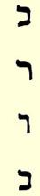
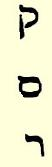

# 启示录

> **６**

从历史学和语言学的角度来批判圣经，研究构成新旧约的各种著作的年代、起源和历史意义等问题，是一门科学，在英国，除了少数力图尽可能把这门科学保持秘密的自由主义化的神学家而外，几乎没有任何人知道它。

这门科学几乎完全是德国的。而且其中渗透到德国国界以外的少量东西，也决不是它最好的部分；这就是那以既摆脱了偏见和妥协又不失为基督教的东西而自豪的自由思想的批判：这些篇据说不是圣灵的直接启示，而是神通过圣灵对人道的启示，等等。 这样，杜宾根学派（鲍尔、格夫勒雷尔等人）７在荷兰和瑞士就像在英国一样，获得了较大的成功，但是，假如愿意稍微往前走一点，那就是追随施特劳斯。人所熟知的厄内斯特·勒南（他仅仅是德国批判家的可怜的剽窃者），便富有这种温和而完全是非历史的精神。在他的一切著作中，只有浸透着他的思想的美学的感伤情调和反映他的思想的枯燥文字，是属于他的。

不过，厄内斯特·勒南说得好：

> “如果你想清楚地知道最早的基督教会是什么样子，那就不要把它们和现在的教区相比；它们更像国际工人协会的地方支部。”

这是对的。基督教同现代社会主义完全一样，是以各种宗派的形式，尤其是通过彼此矛盾的个人观点来掌握群众的，这些观点中有的比较明确，有的比较混乱，而后者又占绝大多数；不过所有这些观点都敌视当时的制度，敌视“当局”。

我们就拿启示录来做例子。我们看到，它决不是全部新约中最难解和最神秘的，而倒是最简单和最清楚的一篇。我们应该暂时请读者相信我们打算在下面证明的事情，即：这一篇是在公元 ６８年或６９年１月间写成的，因而它不仅是新约中真正确定了日期的唯一的一篇，而且也是这些篇中最古老的一篇。公元６８年时基督教的面貌如何，我们可以在这部书中看到，就像在一面镜子里看到一样。

首先是宗派，无穷无尽的宗派。在给亚细亚七教会的书信８ 中，至少提到三个宗派，关于它们，我们除此以外全无所知：尼哥拉派，巴兰派和被象征地叫做耶洗别的某个妇人的信徒。关于所有这三个宗派，书中说他们准许自己的信徒吃祭偶像之物和行奸淫的事。一个值得注意的事实是，在每一次大的革命运动中， “自由恋爱”问题总要提到重要地位。有些人认为，这是革命进步， 这是解脱不再需要的旧的传统羁绊；另一些人认为，这是一种受人欢迎的，便于掩盖各种各样自由的、轻浮的男女关系的学说。后者，即庸人，看来很快就在这里占了上风；“奸淫的事”始终和吃 “祭偶像之物”相联系；这对犹太人和基督徒是严格禁止的，然而， 拒绝这一切，有时也会是危险的，或者至少是不愉快的。从这里完全可以看出，所提到的自由恋爱的拥护者，一般都倾向于和一切人保持良好的关系，但无论如何，决不倾向于殉道。

基督教同任何大的革命运动一样，是群众创造的。它是在新宗派、新宗教、新先知数以百计地出现的时代，以一种我们完全不知道的方式在巴勒斯坦产生的。基督教事实上是自发地形成的， 是这些宗派中最发达的宗派相互影响而产生的中间物，后来由于加进了亚历山大里亚犹太人斐洛的论点，稍后又由于受到斯多葛派９思想的广泛渗透，而形成为一种教义。的确，如果我们可以把斐洛称为基督教教义之父，那末塞涅卡便是它的叔父。新约中有些地方几乎就像是从他的著作中逐字逐句抄下来的；另一方面，在柏西阿斯的讽刺作品中，我们可以看到有些地方，仿佛是从那时还不存在的新约上抄下来的。在这篇启示录中，所有这些教义的成分，连一点痕迹也没有。在这里，基督教是用流传到现在的一种最粗糙的形式来表现的。贯穿全书的只有一个教条：信徒因基督的牺牲而得救。但怎样得救和为什么得救—— 却根本无法解释。 这里除了犹太人和异教徒的一种旧观念，即必须用牺牲来祈求神或众神的宽宥以外，别的什么都没有，这种观念被改造成基督教所特有的观念之后（实质上它使基督教成了普遍的宗教），它的内容是，基督之死是伟大的献祭，是一次而永远有效的献祭。

关于原罪—— 丝毫没有谈到。关于三位一体也只字未提。耶稣就是“羔羊”，但从属于神。例如，有一个地方（第１５章第３ 节）把他和摩西平列起来了。书中不是有一个圣灵，而是有“神的七灵”（第３章第１节和第４章第５节）。被杀死的圣徒（殉教者）向神祈求报仇：

> “圣洁真实的主啊，你不审判住在地上的人给我们伸流血的冤，要等到几时呢？”（第６章第１０节）——

这种感情后来在基督教道德的理论法典中被审慎地抹掉了，可是在实践中一当基督徒对异教徒占了上风，这种感情就表现出来了。

自然，基督教只不过是犹太教的一个宗派。例如，在给七教会的书信中说：

> “我知道那自称是犹太人〈不说是基督徒〉所说的诽谤话，其实他们不是犹太人，乃是撒但一会的人（第２章第９节）；

又说（第３章第９节）：

> “那撒但一会的，自称是犹太人，其实不是犹太人。”

可见，我们这位作者，在公元６９年时，简直丝毫也没有想到： 他就是宗教发展的新阶段，即注定要成为革命的最重要因素之一的阶段的代表者。同样，当圣徒站在神的宝座前的时候，首先走来的是１４４０００犹太人，十二个支派中各有１２０００人，在他们之后， 才允许赞同这个犹太教新阶段的异教徒近前。

这就是在新约中最古老的、其可靠性是无可怀疑的唯一的一篇中所描绘的公元６８年时基督教的样子。这一篇的作者是谁，我们不知道。他自称为约翰。他甚至并没有冒充他是“使徒”约翰， 虽然“新耶路撒冷”的根基上有“羔羊十二使徒的名字”（第２１章第１４节）。因而，在他写这一篇的时候，他们显然已经死去了。至于他是犹太人，这可以从他的希腊文中借用了大量希伯来语一点上看出来，文字语法错乱，即使和新约其他各书相较也截然不同。 所谓约翰福音、约翰书信和本篇，至少属于三个不同的作者，这从它们的文字可以得到清楚的证明，如果它们所阐述的全然互异的教义还不能证明的话。

几乎构成启示录全部内容的那些神迹，多半是从旧约中的古代先知以及他们后来的摹仿者那里逐字逐句抄来的，从但以理书 （大约成于公元前１６０年，它预言的事件是数世纪以前就发生过的）起，到“以诺书”—— 公元开始前不久用希腊文写的一种伪经—— 为止。即使在抄来的神迹的安排上，独到的创造也是极其贫乏的。斐迪南·贝纳里教授—— 我在下面所作的论述，应归功于他１８４１年在柏林大学的讲学—— 研究了各个章节和诗歌，指出这位作者所臆造的每一个神迹是从哪里抄来的。因此，我们在这位“约翰” 的一切幻想时都跟着他走是无益的。最好是立即来研究能够揭开这篇无论如何是一篇奇书的奥秘的那一点。

所有“约翰” 的正统注释家，在过了一千八百多年之后，都还在期望，他的预言必将应验，而“约翰”却和他们完全相反，他一再重复说：

> “日期近了，这很快就要到来。”

这特别是指他所预言的、并且显然是指望看到的那一危机。

这一危机就是神和被叫做“反基督者” 之间的一场伟大的最后决战。最重要的两章是第十三章和第十七章。我们略去不必要的饰文。“约翰”看到从海中上来一个七头十角（角对我们完全没有关系）的兽：

> “我看见兽的七头中，有一个似乎受了死伤。那死伤却医好了”。

这兽必将在四十二个月（神圣的七年的一半）中获得统治大地的权柄，与神和羔羊为敌，在此期间一切人必须在右手上或是在额上，受一个兽的印记或兽名的数目。

> “在这里有智慧。凡有聪明的，**可以算计兽的数目**，**因为这是人的数目**， **他的数目是６６６**。”

伊里奈乌斯在二世纪时就知道，受伤并医好了的兽指尼禄皇帝。尼禄是第一个对基督徒进行大迫害的人。在他死后，特别在亚该亚和亚细亚，广泛流行着一种谣传，说他没有死，只是受了伤，不定什么时候会重新出现，并给全世界带来恐怖（塔西佗 “编年史”第６章第２２节）。同时，伊里奈乌斯还知道另外一种很古老的经文，其中表示那个名字的数目是６１６，而不是６６６。１０

在第十七章里，这七个头的兽又出现了；这回在它身上骑着一个名声坏的、穿朱红色衣服的妇人，关于她的动人的描写，读者可以在该书中找到。这里天使向约翰解说：

> “你所看见的兽，先前有，如今没有……那七头就是女人所坐的七座山， 又是七位王，**五位已经倾倒了**，**一位还在**，**一位还没有来到**，他来的时候，他必须暂时存留。那先前有、如今没有的兽，**就是第八位**，**并出自那七位之中** **…… **你所看见的那女人，就是管辖地上众王的大城。”

可见，这里有两个明确的论点：（１）穿朱红色衣服的妇人，就是管辖地上众王的大城—— 罗马；（２）这一篇是在罗马第六个皇帝统治期间写的；在他之后，来了另一位，他在位不久；然后‘那七位之中”的一位又回来了，他受了伤，但却医好了，他的名字包含在这个神秘的数中，而且伊里奈乌斯已经知道，这就是尼禄。

从奥古斯都开始，顺序是：奥古斯都，提比利乌斯，卡利古拉，克劳狄乌斯；第五是尼禄；第六是加尔巴，他的登基成了诸军团暴动的信号，特别在高卢，是由加尔巴的继位者奥托１１领头来干的。可见，这一篇显然是在加尔巴统治期间写的，他在位的时期是６８年６月９日到６９年１月１５日。而且这一篇中还预言尼禄很快就要回来。

现在谈谈最后一个证据—— 数目字。这个证据也是斐迪南· 贝纳里发现的，而且从那时以来，在科学界中从未引起争论。

大约在公元前三百年，犹太人开始把他们的字母当做表示数目的符号来使用。故弄玄虚的犹太教的拉比认为这是进行神秘解释即喀巴拉的新方法。密语用组成这个密语的各个字母的数值之和来表达。他们把这种新科学叫做ｇｅｍａｔｒｉａｈ，即几何学。我们这位“约翰” 在这里也应用了这种科学。我们要证明的是：（１）这个数目包含着一个人的名字，而这个人便是尼禄，（２）我们的解答不仅适用于含有６６６这个数目的铭文，而且也适用于含有６１６ 这个数目的同样古老的铭文。我们现在举出希伯来文字母和它们的数值：

（ｎｕｎ）ｎ＝５０       （ｋｏｐｈ）ｋ＝１００

（ｒｅｓｃｈ）ｒ＝２００ （ｓａｍｅｃｈ）ｓ＝６０

（ｗａｗ）代替ｏ＝６ （ｒｅｓｃｈ）ｒ＝２００

（ｎｕｎ）ｎ＝５０

尼禄凯撒，尼禄皇帝，用希腊文来写是Ｎｅｒｏｎ Ｋａｉｓａｒ。现在， 假如我们不用希腊文的写法而用希伯来文字母来写拉丁文Ｎｅｒｏ Ｃａｅｓａｒ，那末《Ｎｅｒｏｎ》这个字的最后一个字母《ｎｕｎ》就去掉了，它的数值５０也一起减去了。这就使我们得到另一个古老的经文６１６，所以，证据完全是无可非议的。[^1]

这样，这神秘的一篇，现在是完全可以理解的了。“约翰”预言尼禄将在７０年左右回来，在他在位期间要施行恐怖统治，这种统治将继续四十二个月，即１２６０日。过了这段期间之后，神就会出现，战胜尼禄这个反基督者，用火焚毁那座大城，并把魔鬼捆绑一千年。千年王国就会到来，等等。现在，所有这一切，对任何人都没有什么意义了，除非那些无知的人，也许仍在企图计算出最后审判的日子。但作为几乎最早的基督教的真实的图画，作为真正基督徒之一所描绘的图画，这一篇，比起新约其他各篇加在一起的价值还大。

> 载于１８８３年８月“进步”杂志原文是英文第２卷署名：弗里德里希·恩格斯
>
> 俄文译自“进步” 杂志

[^1]: 上面所引用的名字的写法，无论是带第二个《ｎｕｎ》或不带，都可以在犹太圣法经传中见到，因而是可靠的。