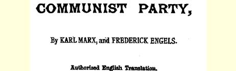
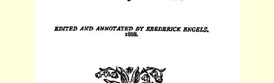
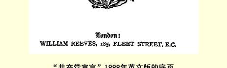

# “共产党宣言”１８８８年英文版序言

> **３９６**

“宣言”是作为共产主义者同盟这一起初纯粹是德国工人团体，后来成为国际工人团体，而在１８４８年以前欧洲大陆的政治条件下必然是秘密团体的工人组织的纲领发表的。１８４７年１１月在伦敦举行的同盟代表大会，委托马克思和恩格斯起草一个准备公布的完备的理论和实践的党纲。手稿于１８４８年１月用德文写成，并在２月 ２４日的法国革命前几星期寄到伦敦付印。法译本于１８４８年六月起义前不久在巴黎出版。第一个英译本是由艾琳麦克沙林女士翻译的，于１８５０年刊载在乔治朱利安哈尼的伦敦“红色共和党人”３９７ 杂志上。同时也出版了丹麦文译本和波兰文译本。

１８４８年巴黎六月起义这一无产阶级和资产阶级间的第一次大搏战的失败，又把欧洲工人阶级的社会的和政治的要求暂时推到后面去了。从那时起，争夺统治权的斗争，又像二月革命以前那样只是在有产阶级的各个集团之间进行了；工人阶级被迫局限于争取一些政治上的活动自由，并采取资产阶级激进派极左翼的立场。 凡是继续显露出生机的独立的无产阶级运动，都遭到无情的镇压。 例如，普鲁士警察发觉了当时设在科伦的共产主义者同盟中央委员会。于是委员们都被逮捕，并且在经过十八个月监禁之后于１８５２ 年１０月被交付法庭审判。这次有名的“科伦共产党人案件”从１０月４ 日一直继续到１１月１２日；被告中有七个人被判处了三年至六年的要塞监禁。宣判之后，同盟即由剩下的成员正式解散。至于“宣言”， 似乎注定从此要被人遗忘了。

当欧洲工人阶级重新聚集了足以对统治阶级发动另一次进攻的力量的时候，便产生了国际工人协会。但是这个协会成立的明确目的是要把欧美正在进行战斗的整个无产阶级团结为一个整体， 因此，它不能立刻宣布“宣言”中所申述的那些原则。国际应该有一个充分广泛的纲领，使英国工联，法国、比利时、意大利和西班牙的蒲鲁东派以及德国的拉萨尔派[^1]都能接受。马克思起草了这个能使一切党派都满意的纲领，当时是把希望完全寄托于共同行动和互相讨论必然要产生的工人阶级智慧的发展。反资本斗争中的种种事件和变迁—— 而且失败比胜利更甚—— 不能不使人们认识到他们的各种心爱的万应灵丹毫不中用，并使他们更透彻地了解工人阶级解放的真实条件。马克思是正确的。当１８７４年国际解散时， 工人已经全然不是１８６４年国际成立时的那个样子了。法国的蒲鲁东主义和德国的拉萨尔主义已经是奄奄一息，甚至那些很久以前大半已同国际决裂的保守的英国工联也渐有进展，以致它们去年举行的斯温西代表大会的主席[^2]能够用它们的名义声明说：“大陆社会主义对我们来说再不可怕了。”３９８的确，“宣言”的原则在世界各国工人中间都已传播得很广了。

这样一来，“宣言”本身就重新提到前台上来了。从１８５０年

> “共产党宣言”１８８８年英文版的扉页起，德文原本在瑞士、英国和美国重版过数次。１８７２年，有人在纽约把它译成英文，并在那里的“伍德赫尔和克拉夫林周刊”３９９上发表。 接着又有人根据这个英文本把它译成法文，刊载在纽约的“社会主义者报”上。４００以后在美国又至少出现过两种多少有些曲解的英文译本，其中一种还在英国重版过。由巴枯宁翻译的第一个俄文本约于１８６３年在日内瓦由赫尔岑办的“钟声”印刷所刊印４０１；由英勇的维拉查苏利奇翻译的第二个俄文本，则于１８８２年同样在日内瓦出版。４０２新的丹麦文译本于１８８５年在哥本哈根作为“社会民主主义丛书”的一种出版，新的法文译本于１８８６年刊载在巴黎的“社会主义者报”上。有人根据这后一版本译成西班牙文，并于１８８６年在马德里出版。４０３至于德文的翻印版本，则为数极多，总共至少有十二个。 阿尔明尼亚文译本原应于几个月前在君士坦丁堡印出，但是没有出版问世。有人告诉我，这是因为出版人害怕在书上标明马克思的姓名，而译者又拒绝把“宣言”当做自己的作品出版。关于后来用其他文字出版的译本，我虽然听说过，但是没有亲眼看到。因此，“宣言”的历史在很大程度上反映着现代工人运动的历史；现在，它无疑是全部社会主义文献中传播最广和最带国际性的著作，是从西伯利亚起到加利福尼亚止的千百万工人公认的共同纲领。

可是，当我们写这个“宣言”时，我们不能把它叫做**社会主义**宣言。在１８４７年，所谓社会主义者，一方面是指那些信奉各种空想学说的分子，即英国的欧文派和法国的傅立叶派，这两个流派都已经变成纯粹的宗派，并在逐渐走向灭亡；另一方面是指各种各样的社会庸医，他们都答应要用各种补缀办法来消除一切社会病痛而毫不伤及资本和利润。这两种人都是站在工人阶级运动以外，宁愿向 “有教养的”阶级寻求支持。至于当时工人阶级中那些确信单纯政治变革全然不够而认为必须根本改造全部社会的分子，他们把自己叫做共产主义者。这种共产主义还是颇为粗糙的、尚欠修琢的、 纯粹出于本能的一种共产主义；但它却接触到了最主要之点，并已在工人阶级当中强大到足以形成法国卡贝的和德国魏特林的空想共产主义。可见，在１８４７年，社会主义是资产阶级的运动，而共产主义则是工人阶级的运动。当时，社会主义，至少在大陆方面，是“有身分的”，而共产主义却恰恰相反。既然我们自始就认定“工人阶级的解放只能是工人阶级自己的事情”４０２，所以我们也就丝毫没有怀疑究竟应该在这两个名称中间选定哪一个名称。而且后来我们也根本没有想到要把这个名称抛弃。

虽然“宣言”是我们两人共同的作品，但我终究认为必须指出， 构成“宣言”核心的基本原理是属于马克思一个人的。这个原理就是：每一历史时代主要的经济生产方式与交换方式及其所必然决定的社会结构，是该时代政治的和智慧的历史所赖以确立的基础， 并且只有从这一基础出发，这一历史才能得到说明；因此人类的全部历史（从土地公有的原始氏族社会解体以来）都是阶级斗争的历史，即剥削阶级和被剥削阶级之间、统治阶级和被压迫阶级之间斗争的历史；这个阶级斗争的历史包括有一系列发展阶段，现在已经达到这样一个阶段，即被剥削被压迫的阶级（无产阶级），如果不同时使整个社会一劳永逸地摆脱任何剥削、压迫以及阶级划分和阶级斗争，就不能使自己从进行剥削和统治的那个阶级（资产阶级） 的控制下解放出来。

这一思想在我看来应该对历史学做出像达尔文学说对生物学那样的贡献，我们两人早在１８４５年前的几年中就已经逐渐接近了这个思想。从我的“英国工人阶级状况”[^3]一书中可以明白看出，当时我个人独自在这方面达到了何种程度的进展。但是到１８４５年春我在布鲁塞尔重新会见马克思时，他已经把这个思想整理出来，并且用几乎像我在上面的叙述中所用的那样明晰的语句向我说明了。

现在我从我们共同为１８７２年德文版写的序言中引录如下一段语：

“不管最近二十五年来的情况发生了多大的变化，这个‘宣言’ 中所发挥的一般基本原理整个说来直到现在还是完全正确的。在个别地方本可做某些修改。这些基本原理的实际运用，正如‘宣言’ 中所说的，随时随地都要以现存历史条件为转移，所以第二章末尾提出的那些革命措施并没有什么独立的意义。现在这一段在许多方面都应该有不同的写法了。由于从１８４８年来大工业已有很大发展而工人阶级的组织也跟着有了改进和增长，由于首先有了二月革命的实际经验而后来尤其是有了无产阶级第一次掌握政权达两月之久的巴黎公社的实际经验，所以这个纲领现在有些地方已经过时了。特别是公社已经证明：‘工人阶级不能简单地掌握现成的国家机器，并运用它来达到自己的目的。’（见“法兰西内战。国际工人协会总委员会宣言”１８７１年伦敦特鲁洛夫版第１５页，那里把这个思想发挥得更加完备）４０５其次，很明显，对于社会主义文献所做的批判在今天看来是不完全的，因为这一批判只包括到１８４７年为止； 同样也很明显，关于共产党人对各种反对党派的态度问题所提出的意见（第四章）虽然大体上至今还是正确的，但是由于政治形势已经完全改变，而当时所列举的那些党派大部分已被历史的发展进程所彻底扫除，所以这些意见在实践方面毕竟是过时了。

但是‘宣言’是一个历史文件，我们已没有权利来加以修改。”４０６

本版译文是由译过马克思“资本论”一书大部分的赛米尔穆尔先生翻译的。我同他一起把译文校阅过一遍，并且我还加进了一些历史备考性的附注。

#### 弗里德里希恩格斯

> １８８８年１月３０日于伦敦载于１８８８年在伦敦出版的卡尔原文是英文马克思和弗里德里希恩格斯 “共产党宣言”一书
>
> 俄文译自“共产党宣言”

[^1]: 拉萨尔本人在和我们接触时总是自认为，他是马克思的学生，而他作为马克思的学生是站在“宣言”的立场上的。但是他在１８６２—１８６４年间进行的公开鼓动中，却始终没有超出靠国家贷款建立生产合作社的要求。

[^2]: 比万。—— 编者注

[^3]: 《ＴｈｅＣｏｎｄｉｔｉｏｎｏｆｔｈｅＷｏｒｋｉｎｇＣｌａｓｓｉｎＥｎｇｌａｎｄｉｎ１８４４》．ＢｙＦｒｅ－ｄｅｒｉｃｋＥｎｇｅｌｓ．ＴｒａｎｓｌａｔｅｄｂｙＦｌｏｒｅｎｃｅＫ．Ｗｉｓｈｎｅｗｔｚｋｙ．ＮｅｗＹｏｒｋ，Ｌｏｖｅｌｌ—Ｌｏｎｄｏｎ，Ｗ．Ｒｅｅｖｅｓ，１８８８．