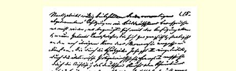
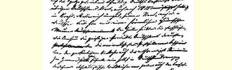
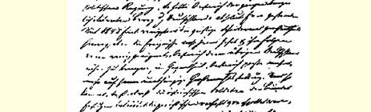
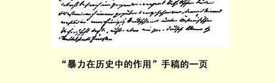

# 暴力在历史中的作用

> **４５９** 写于１８８７年１２月底—１８８８年３月原文是德文第一次发表于１８９５—１８９６年“新时代” 杂志第１卷第２２—２６期
>
> 俄文是按手稿译的
>
> （手稿中没有的部
>
> 分是按杂志译的）

# 暴力在历史中的作用

现在，让我们把我们的理论应用于今天的德国历史，应用于它的血和铁的暴力实践。从这里，我们将会清楚地看到，为什么血和铁的政策暂时必然得到成功，为什么它最终必然破产。

维也纳会议在１８１５年瓜分了并卖掉了欧洲，它的这种做法向全世界表明了君主们和国家要人们完全无能。各民族反对拿破仑的普遍战争，是各民族的遭拿破仑践踏的民族意识的反映。为了报答这一点，参加维也纳会议的国君们和外交家们更加无耻地践踏了这种民族意识。最小的王朝比最大的民族还受重视。德国和意大利又被分割为各个小邦，波兰第四次被瓜分，匈牙利仍然被奴役。 甚至不能说，这样对待这些民族是不公道的，谁叫它们容许这样做，谁叫它们把俄国沙皇[^1]当做自己的解放者来欢迎呢？

可是，这种情况是长不了的。从中世纪末期以来，历史就在促使欧洲形成为各个大的民族国家。只有这样的国家，才是欧洲占统治地位的资产阶级的正常政治组织，同时也是建立各民族协调的国际合作的必要先决条件，没有这种合作，无产阶级的统治是不可能存在的。要保障国际和平，首先就必须消除一切可以避免的民族摩擦，每个民族都必须获得独立，在自己的家里当家做主。这样， 随着商业、农业和工业的发展，从而随着资产阶级社会势力的增长，民族意识也就到处发扬，被分割、被压迫的各民族都要求统一和独立。

因此，１８４８年革命的目的，到处（法国除外）都是既要满足自由要求又要满足民族要求。可是，在第一次冲击得胜的资产阶级的背后，到处都出现了威胁性的无产阶级形象；争得胜利的实际上是这一阶级，这就把资产阶级驱入了刚被打败的敌人亦即君主、 官僚、半封建和军事的反动派的怀抱，革命在１８４９年也就败在这些反动派手里。在匈牙利，情况并不是如此，但俄国人闯进了匈牙利，镇压了革命。俄国的沙皇[^2]并不以此为满足，他还来到了华沙， 在那里，他以欧洲仲裁人的身分进行裁判。他任命他的驯服工具 —— 格吕克斯堡的克里斯提安为丹麦的王位继承者。他使普鲁士遭到了前所未有的屈辱，因为他不许普鲁士有一点点利用德国人的统一意愿的欲望，强迫它恢复联邦议会，强迫它屈服于奥地利。４６０这样，革命的全部结果乍看起来似乎只是：在奥地利和普鲁士建立了外表上立宪但精神上依旧的政体；俄国的沙皇比以前更甚地统治着欧洲。

可是，事实上，革命已用它的巨大力量甚至使各个四分五裂国家的资产阶级、特别是德国的资产阶级脱离了旧的传统的常规。 资产阶级取得了一部分、即使是小小的一部分政治权力，而资产阶级的每一个政治成就都被它用在促进工业繁荣方面。幸运地度过了的“疯狂年”４６１清楚地向它证明：现在必须永远结束旧日的昏睡和懒散状态。由于加利福尼亚和澳大利亚的黄金雨以及其他种种情况，世界市场的联系空前扩大了，商业空前繁荣起来；在这里，就是要抓紧时机，要保证自己得到应得的一份东西。从１８３０年、 特别从１８４０年以来，在莱茵河地区、萨克森、西里西亚、柏林以及南部个别城市出现的大工业萌芽，现在已迅速地发展和扩充起来，农业地区的家庭工业散布得日益广泛，铁路建筑的速度加快了，而这时已达到巨大规模的移民，则造成了不需要任何津贴的德国横渡大西洋的轮船航运业。德国商人规模空前地在一切海外商埠站住了脚，他们在世界商业中所起的作用愈来愈大，并且慢慢地不仅推销英国的工业品，而且开始推销起德国的工业品来。

可是，德国的小邦割据状况及其形形色色的工商业立法， 必然很快就变成了束缚这种猛烈增长的工业以及与此相联系的商业的一种不堪忍受的桎梏。每走几里路，便出现不同的票据法，不同的工业活动条件，到处都会碰到各种不同的挑剔、官僚的和国库的刁难，甚至还常常碰到行会限制，使官方的特许证也无济于事！此外，还有许许多多不同的户籍立法４６２和居留限制， 使资本家无法把他们所支配的劳动力以足够的数量投到那些有矿石、有煤、有水力以及有其他有利的自然条件因而给工业企业提供了基础的地方去！无阻碍地大量利用本国劳动力的这种可能性， 是工业发展的首要条件；可是，爱国的厂主从各处召集工人每到一个地方，就有警察当局和济贫所反对新移民定居。统一的全德国的公民权，全体帝国公民迁徙完全自由，统一的工商业立法—— 这些现在已不再是狂热的大学生们的爱国幻想，而是工业生存的必要条件了。

加之，在每一个邦和小邦里，都有各不相同的货币，各不相同的度量衡，往往在同一个邦里就有两三种度量衡。而在所有这些种类繁多的钱币和度量衡中，没有一种是得到世界市场承认的。因此，毫不奇怪：往来于世界市场或者被迫同进口商品竞争的商人和厂主们，除了使用自己的所有这许多钱币和度量衡以外，还必须使用外国的；棉线要按英磅来称，丝绸料子要按公尺来量，对外国要按英镑、美元和法郎来计算！在币制流通范围受到这种限制的情况下，怎样能产生大的信用机关呢？这里是古尔登纸币，那里是普鲁士塔勒，此外还有金塔勒，“新三分之二”塔勒，银行马克， 流通马克，二十古尔登币制，二十四古尔登币制，而所有这一切又都是处在无限的行市计算和行市波动之中的。４６３

即使这一切最终都能克服，但是在所有这些摩擦中已花费了多少力量，消耗了多少金钱和时间啊！同时，在德国，人们最后也开始注意到：在今天，时间即金钱。

年轻的德国工业必须在世界市场上显一显身手，它只有通过输出才能壮大起来。为此，它在外国就必须享有国际法的保护。英、 美、法三国的商人在国外甚至比在家里更能自由行动。他们的大使馆保护他们，必要时还有几艘军舰来保护他们。但是德国人呢？在近东，至少奥地利人在一定程度上还能指望自己的大使馆，在其他地方，大使馆对他们就没有多大帮助。可是，当一个普鲁士商人在国外向他的大使诉说遭到损害时，他几乎总是得到这样的回答： “你完全自作自受，你在这儿寻求什么呢？你为什么不安安静静地呆在家里呢？” 而小邦的臣民则到处都是完全没有权利的。德国商人不管走到哪里，到处都请求外国—— 法国、英国和美国—— 保护，或者很快就归化于新的祖国。[^3]即使他们的大使想保护他们， 但又有什么用呢？德国大使本身，在海外也是被人看做像擦皮鞋的人那样的。

由此可见，对于一个统一的“祖国” 的要求，是有一种强烈的物质背景的。这种要求已不再是德国大学生联合会会员们在瓦特堡纪念大会４６４期间所表现的一种烟雾般模糊的冲动了，那时， “勇气和力量在德国人的心灵中燃烧”，那时，按照法国的调子唱着：这种要求“使青年们怀着剧烈的痛苦为祖国而战，为祖国牺牲”[^4]，以求恢复想像中的中世纪的帝国庄严，然而这些怀着剧烈痛苦的青年一上年纪，就变成了极平常的、专制君主的忠实奴仆。 同时，这种要求也已不再是律师们和其他资产阶级思想家们在汉巴赫大典４６５期间所发出的那种离地面近得多的统一呼声了，这些人自以为爱好自由和统一是为了自由和统一本身，他们根本没有注意到：按照瑞士的方式把德国变成由各个州组成的共和国（这是他们中间最清醒的人的理想）是不可能实现的，就像上述大学生们的霍亨施陶芬帝国４６６一样。不，这是从讲求实际的商人和工业家的直接的业务需要中冒出的渴望，他们渴望扫清从历史上遗留下来的阻碍工商业自由发展的全部小邦废物，他们渴望消除一切不必要的摩擦，因为要是德国商人想插足世界市场，就先要在家里消除这种摩擦，而他们的所有竞争者都已避免了这种摩擦。德国的统一已成了经济上的必要。而现在要求统一的人都知道，他们想要什么东西。他们是在商业中受的教育，并且是为了商业而受教育的，他们善于经营商业，并且善于讲价钱。他们知道：讨价必须很高，但让价也必须慷慨。他们歌唱“德国人的祖国”，其中也包括施梯里亚、提罗耳和“充满胜利和荣誉的奥地利强国”[^5]，他们并且歌唱：

> “从麦士到默麦尔，
>
> 从艾契河到贝耳特，
>
> 德国呀，至高无上的德国，
>
> 超过世界上的一切。”[^6]

可是，在现金交易中，他们甘愿同意给这一势将日益变得更辽阔的祖国４６７打一个相当大的折扣——２５—３０％。他们的统一计划已制订好了，可能很快就会实现。

但是，德国的统一不光是德国的问题。从三十年战争以来，如果没有外国的非常明显的干涉，就不再能解决一项全德性的事务。[^7]１７４０年，弗里德里希二世在法国人的帮助下征服了西里西亚。４６９１８０３年，法国和俄国直接强迫按照帝国代表会议的总决议对神圣罗马帝国进行了改组。４７０后来，拿破仑根据自己的方便安排了德国。最后，在维也纳会议上[^8]，主要是俄国，其次是英国和法国，又把德国分割成三十六个邦，共二百多块互相隔绝的大大小小土地，同时， 德国的君主们，完全像在１８０２—１８０３年的累根斯堡帝国议会上一样４７１

，真心一意地帮助这样做，从而使这种分割情况更加恶化。另外，德国有若干块土地还被割让给外国君主。这样一来，德国不仅变得软弱无力、孤立无援，在内部争斗中弄得精疲力尽，注定在政治上、军事上、甚至工业上都处于微不足道的地位。而且，更坏的是，法国和俄国由于已成的习惯，取得了分割德国的权利，正像法国和奥地利攫取了监视意大利、使它始终处于四分五裂状态的权利一样。沙皇尼古拉在１８５０年由于享有这种所谓的权利，才极端蛮横地不许擅自对宪法做任何修改，强迫恢复联邦议会—— 德国虚弱无力的象征。

可见，争取德国的统一不仅要反对君主和其他内部敌人，而且也要反对外国。不然的话，就要依靠外国的帮助。而当时外国的情况是怎样的呢？

在法国，路易波拿巴曾利用资产阶级和工人阶级之间的斗争，在农民的帮助下当上总统，并在军队的帮助下登上帝座。可是， 一个新的、由军队制造出来的、在１８１５年法国版图内的拿破仑皇帝，则是一种死产了的徒劳的事情。这个再生的拿破仑帝国，意味着把法国扩张到莱茵河地区，实现法国沙文主义的传统梦想。但是，首先，占领莱茵河地区并不是路易波拿巴力所能及的。在这方面的每一个尝试，结果都会使欧洲结成反法同盟。然而，提高法国威望和使军队得到新荣誉的时机到来了，这种时机是由一场几乎为全欧洲一致同意进行的反俄战争引起的，原来俄国曾经利用西欧的革命时期，悄悄地占据多瑙河各公国，并准备一场新的征服土耳其的战争。英国同法国结成了同盟，奥地利对二者表示友好，只有英勇的普鲁士去吻昨天还打着自己的俄国鞭子，并且继续保持亲俄的中立。可是，无论英国或者法国都不想使敌人遭到严重失败，因此，战争便以俄国遭受小小屈辱和俄法结成反奥同盟而告终。[^9]

克里木战争使法国成了欧洲的领导强国，而使冒险家路易－ 拿破仑成了当代的伟人，这当然是用不着多说的。但是，克里木战争并没有使法国的领土增多，因而使法国孕育着一场新战争，在这场新战争中，路易－拿破仑要完成他的真正使命—— 成为“帝国扩大者”[^10]。这场新战争早在前一次战争时期就已这样做了准备：允许撒丁加入西方列强的同盟，充当法兰西帝国的仆从国，特别是充当该帝国反对奥地利的前哨；其次，这场战争也是在缔结和约时路易－拿破仑同以惩罚奥地利为最大满足的俄国达成协议 ４７２所准备好的。

路易－拿破仑现在成了欧洲资产阶级的偶像。这不仅是因为他在１８５１年１２月２日“拯救了社会”，当时，他虽然借此消灭了资产阶级的政治统治，但只是为了拯救它的社会统治。不仅是因为他表明了，普选制在有利的情况下可以变成压迫群众的工具；不仅是因为在他的统治下工业、商业、特别是投机事业和交易所欺骗勾当盛况空前。而首先是因为，资产阶级认为他是同它骨肉相连的第一个“大政治家”。他像任何真正的资产者一样，也是暴发户。他曾“历尽千辛万苦”：在意大利是烧炭党人的密谋家，在瑞士是炮兵军官，在英国是负债累累的贵族流浪汉和特别警察４７３，可是，无论在何时何地，他都是王位追求者，—— 就是这样一个人以自己的冒险经历，以自己在一切国家里的道德败坏行为，使自己成了法国人的皇帝，并成为欧洲命运的主宰，就像典型的资产者—— 美国人通过一系列真正的和欺骗性的破产使自己成为百万富翁一样。他做了皇帝之后，不仅使政治为资本家发财致富和交易所欺骗勾当服务，而且完全按照证券交易所的规则来推行政治本身，用 “民族原则”４７４来进行投机。使德国和意大利处于分割状态，对法国以往所执行的政策来说，曾经是法国的一种不可让予的基本权利； 路易－拿破仑则立即着手零星售卖这种基本权利以换取所谓补偿。他愿意帮助意大利和德国消除分割状态，但是有一个条件：德国和意大利向民族统一方面每前进一步，都要割让领土给他做报酬。这样一来，不仅使法国沙文主义得到满足，不仅使帝国逐步向 １８０１年的疆界４７５扩展，而且又使法国重新处于特别开明的、解放各民族的强国地位，使路易－拿破仑处于各被压迫民族的保卫者的地位。于是，整个开明的、为民族理想所振奋的资产阶级—— 因为它非常关心从世界市场上肃清一切阻碍商业的东西，—— 都异口同声地欢呼这一解放世界的开明活动。

这种情况在意大利首先开始。[^11]在这里，从１８４９年起便是奥地利的无限统治，而当时奥地利是全欧洲的替罪羊。克里木战争的小得可怜的结果，人们不是归罪于只想进行一场假装的战争的西方强国的不坚决，而是归罪于奥地利的动摇态度，但这种动摇态度却是西方列强本身应负最大责任的。而俄国则由于奥地利人进军普鲁特河—— 这是报答俄国１８４９年在匈牙利的帮助的—— 而遭到过伤害（虽然正是这种进军拯救了俄国），所以很高兴奥地利遭到任何攻击。普鲁士已不再算数了，在巴黎和会上它就已受到了ｅｎ ｃａｎａｉｌｌｅ〔毫不客气的〕侮辱。因此，在俄国协助下准备好的解放意大利“一直到亚得利亚海” 的战争，在１８５９年春天开始，到夏天就在明乔河地区结束了。奥地利没有被赶出意大利，意大利没有 “一直解放到亚得利亚海”，也没有得到统一，撒丁的领土是扩大了，但是，法国占领了萨瓦和尼斯，从而达到了它在意大利那边的１８０１年的疆界。４７６

可是，意大利人是不以此为满足的。在意大利，当时纯粹的工场手工业还占统治地位，大工业还处于襁褓之中。工人阶级还远远没有被完全剥夺和无产阶级化；它在城市中还占有它自己的生产资料，在农村里，工业劳动是占有土地的小农或者佃农的副业。因此，资产阶级的毅力还没有受到它和有阶级觉悟的现代无产阶级之间的对立的破坏。而因为意大利的分割状态仅仅是由于外来的奥地利统治才存在下来，在这种统治的保护下，君主们把苛政推行到登峰造极的地步，所以，占有土地的大贵族和城市人民群众也都站在资产阶级这一争取民族独立的先锋战士一边。可是，在 １８５９年，外来的统治除了在威尼斯以外都被推翻了，法俄两国已使奥地利不能再干涉意大利，已不再有人害怕这种干涉了。而意大利也出了一个有古代风的英雄—— 加里波第，他能够创造奇迹，并且已创造了奇迹。他率领千人志愿军，推翻了整个那不勒斯王国， 实际上统一了意大利，粉碎了波拿巴政策的人为罗网。意大利得到了自由，而且实际上得到了统一，—— 但是，这并不是由于路易 －拿破仑施展了阴谋，而是由于进行了革命。

从意大利战争以来，法兰西第二帝国的对外政策对任何人都不再是秘密了。战胜大拿破仑的人应受到惩罚，—— 但是，ｌｕｎ ａｐｒèｓｌａｕｔｒｅ—— 一个挨一个来。俄国和奥地利都已得到自己应得的一份，接着就是普鲁士了。而普鲁士这时正遭到空前的鄙视；它在意大利战争期间的政策是胆怯的、可怜的，同它在１７９５年巴塞尔和约时期的政策一样。４７７由于实行“行动自由政策”４７８，它落得这样一个结果：它在欧洲完全陷于孤立；它的所有大小邻邦都喜欢看到普鲁士如何被粉碎这样一出戏；它的行动自由原来只是为了可以把莱茵河左岸割让给法国而已。

的确，在１８５９年以后的最初几年里，到处，首先在莱茵河地区本身，人们普遍都相信：莱茵河左岸不可挽救地要落到法国手里。诚然，人们并不怎样希望出现这种情况，可是都认为：这就同命中注定的厄运一样要来临的，同时—— 让我们尊重真实情况 —— 人们也并不特别害怕。农民和小资产者，又想起了真正给他们带来了自由的法国人时代；在资产阶级中间，金融贵族，特别是科伦的金融贵族，已被深深地卷进巴黎的《ＣｒéｄｉｔＭｏｂｉｌｉｅｒ》４７９和其他波拿巴主义的空头公司的骗局，并且大声叫喊兼并。[^12]

但是，莱茵河左岸的丧失不仅会削弱普鲁士，而且也会削弱德国。而德国已比先前更加分裂了。由于普鲁士在意大利战争中采取中立，奥地利和普鲁士之间比以往更加疏远了，小君主败类们以恐惧而又渴望的眼光注视着路易－拿破仑，把他看做是将来重新建立的莱茵联邦４８０的保护者—— 这就是官方德国的状况。而这种状况又发生在这样的时刻：只有全民族的联合力量才能避免分裂的危险。

可是，怎样把全民族的力量联合起来呢？几乎全是烟雾般模糊的１８４８年的尝试都已遭到了失败，但正由于这种失败，才使某些烟雾消散，在这以后，就有三条道路摆在人们面前。

第一条道路就是通过消除一切独立的邦而达到真正统一的道路，亦即实行公开革命的道路。这条道路在意大利刚刚达到了目的；萨瓦王朝参加了革命，因而获得了意大利的王冠。但是，这样一种勇敢行动，我们德国的萨瓦分子—— 霍亨索伦王朝，甚至它的最大胆的卡富尔分子—— 俾斯麦之流，都是完全没有能力采取的。一切事情都要由人民自己来做，—— 而在争夺莱茵河左岸的战争中，他们也会做好必须做的事情。普鲁士人不可避免地将渡莱茵河而退却，莱茵河要塞附近将进行持久的围攻战，随后德国南部的君主们无疑将实行叛变，—— 这一切就足以引起一个使整个王朝制度土崩瓦解的民族运动。这样一来，路易－拿破仑便会是首先插剑入鞘的人。第二帝国只能对反动的国家作战，它在这些国家

> “暴力在历史中的作用” 手稿的一页面前是以法国革命的继承者、各民族的解放者的姿态出现的。对付本身处在革命中的人民，它是软弱无力的；而且，胜利的德国革命还可能在推翻整个法兰西帝国方面起推动作用。这是最有利的情况；在最不利的情况下，即君主们成了运动的主宰的时候，莱茵河左岸就会暂时被割让给法国，君主们的积极或消极的背叛就会暴露在全世界面前，并且会造成一种危急局面，使德国没有第二条出路，只有实行革命，赶走所有君主，建立统一的德意志共和国。

按照当时的情况，只有在路易－拿破仑发动为建立莱茵疆界的战争的情况下，才能踏上这条统一德国的道路。然而，这场战争并没有发生—— 其原因，下面很快就会谈到。但民族统一的问题也随之不再是一个刻不容缓的生死存亡问题，即在灭亡的威胁下必须立即解决的问题了。民族可以暂时等待一下。

第二条道路是在奥地利统治下的统一。１８１５年，奥地利自愿地保持了拿破仑战争强加于它的那种局面，即成为领土缩紧、领土集中的国家。它已不再要求先前从它那里分割出去的德国南部领土了；它只满足于把那些在地理上和战略上同保全下来的君主国核心有关联的新旧地区合并了过来。德意志的奥地利同德意志的其他部分分离的局面，由约瑟夫二世的保护关税政策开始造成，由弗兰茨一世在意大利的警察统治加剧，并由德意志帝国的解体４８１ 和莱茵联邦的建立而达到极点，这种局面，事实上在１８１５年以后仍然起着作用。梅特涅用一道真正的万里长城把自己的邦靠着德意志那边围起来。关税不放德意志的物质产品过去，书报检查则不放精神产品过去，无法形容的护照把戏使个人的交往减到最低限度。在邦内，实行一种甚至在德意志也是独一无二的横暴的专制制度，以防止任何即使是最微小的政治运动。因此，奥地利一直是同德意志的整个资产阶级自由主义运动格格不入的。１８４８年，至少精神上的障壁大部分已经消除，但是，那一年的事件及其后果，并没有能够使奥地利同德意志的其他部分接近；相反，奥地利日益以自己的独立的大国地位自傲。因此，虽然驻联邦要塞４８２的奥地利士兵受到欢迎，普鲁士士兵受到憎恨和讥笑，虽然奥地利在天主教占优势的整个南部和西部仍然得人心和受尊敬，但是，除了德意志中小邦的一些君主以外，毕竟没有一个人认真地考虑过在奥地利统治下统一德意志。

而且也不可能不是这样。奥地利本身也没有什么别的要求，尽管它仍悄悄地在做浪漫的帝国梦。奥地利的税界渐渐成了德意志内部唯一残存的障壁，因而显得更加突出。独立的大国政策是没有任何意义的，它只意味着为了特殊的奥地利利益，从而为了意大利、匈牙利等等利益而牺牲德意志的利益。不论在革命前或者在革命后，奥地利都始终是德意志的一个最反动、最厌恶现代潮流的邦，而且也是唯一保全下来的、以信仰天主教为特色的大邦。三月以后的政府４８３越是力图恢复教士和耶稣会教徒的旧统治，它就越是不可能取得新教徒占三分之一、二的国家的霸权。最后，要在奥地利统治下统一德意志，只有毁灭普鲁士才有可能。但是，如果说这后一种情况本身对德意志并不意味着不幸，那末，不论奥地利毁灭普鲁士或者普鲁士毁灭奥地利，在俄国革命于最近的将来胜利以前（在胜利以后，这种毁灭就是多余的，因为到那时成了多余的奥地利本身必然会崩溃），毕竟是极端危险的。

简言之，德意志在奥地利保护下的统一是一种浪漫的梦想；当德意志的中小君主１８６３年为了宣布奥地利的弗兰茨－约瑟夫为德意志皇帝而在法兰克福聚会时，就表明这是一种梦想。普鲁士国王干脆不参加，这出皇帝喜剧就可怜地化为泡影了。

４８４

剩下的第三条道路是：以普鲁士为首的统一。这条道路实际上已采取了，所以它把我们从思辨的领域又引到实际的“现实政策”４８５的那种坚实的、即使颇为肮脏的土地上来。

从弗里德里希二世以来，普鲁士便像对待波兰那样把德意志只看做有待征服的领土，从这里能割走多少就割走多少，但是不言而喻，必须同别人一道瓜分这种领土。同外国一道—— 首先同法国一道—— 瓜分德意志，是普鲁士从１７４０年以来的“德意志使命”。 《Ｊｅｖａｉｓ，ｊｅｃｒｏｉｓ，ｊｏｕｅｒｖｏｔｒｅｊｅｕ；ｓｉｌｅｓａｓｍｅｖｉｅｎｎｅｎｔ，ｎｏｕｓ ｐａｒｔａｇｅｒｏｎｓ》（我想，我会帮您大忙的；如果我得到王牌，那我们就分享），—— 这就是弗里德里希在第一次出征时给法国大使的临别赠言。４８６由于普鲁士忠实于这一“德意志使命”，它在１７９５年缔结巴塞尔和约时出卖了德意志，它为了换取扩张自己领土的诺言而预先同意（１７９６年８月５日的条约）把莱茵河左岸割让给法国，并且确实也在俄法两国所强加的帝国代表会总决议中得到了出卖帝国的报酬。４８７１８０５年，一当拿破仑拿汉诺威来引诱它的时候（这个诱饵总是可以引它上钩），它就又做了一次出卖，这次是出卖了它的盟友俄国和奥地利；但是，它是这样陷到它所特有的愚蠢的狡猾之中，以致被卷进对拿破仑的战争，在耶拿城下遭到了应有的惩罚。４８８由于这次打击仍有余痛，弗里德里希－威廉三世甚至在１８１３ 年和１８１４年的胜利以后还想放弃德国西部的全部前哨，只打算占有德国的东北部，像奥地利那样尽可能不过问德国的事情—— 这样做就会把整个德国西部变成受俄国或法国保护的一个新莱茵联邦。这一计划并没有实现；国王事与愿违，被迫接受了威斯特伐里亚和莱茵省，同时也就被迫接受了一种新的“德意志使命”。

兼并至此暂告结束（小片土地的购买除外）。国内旧的容克官僚制度又渐渐兴旺起来；在极端危急时刻许给人民的实施宪法的诺言坚决不予履行。但是，不管怎样，资产阶级在普鲁士也日益兴起，因为这时如果没有工商业，即便是目空一切的普鲁士邦也等于零。必须慢慢地、固执地、一点一滴地在经济上向资产阶级做出让步。但另一方面，这类让步使普鲁士有理由指望，它的“德意志使命” 将得到支持：当时普鲁士为了扫除楔入它的两半国土之间的外国税界，请求邻近的各个德意志邦建立统一的关税。这样就产生了关税同盟，它在１８３０年以前只不过是一种善良愿望（当时只有黑森—达姆斯塔德参加），但到后来，在政治、经济的发展逐步加速的情况下，很快就使德意志境内的大部分地区在经济上归并于普鲁士。４８９不属于普鲁士的沿海各邦，一直到１８４８年以后仍然没有加入同盟。

关税同盟是普鲁士的一个巨大成就。它意味着战胜了奥地利的努力，这还算不了什么。主要的是：它把中小邦的整个资产阶级都吸引到普鲁士一边来。除了萨克森，德意志任何一个邦的工业发展程度都没有达到哪怕是接近普鲁士的工业水平；这不仅要归功于自然的和历史的前提，而且要归功于比较大的关税地区和国内市场。同时，关税同盟愈扩大，加入这一国内市场的小邦愈多，这些邦的新兴资产者也就愈习惯于把普鲁士看成是自己在经济上的前卫和将来在政治上的前卫。 而资产者怎么唱，教授们也就怎么和。在柏林，黑格尔分子从哲学上论证普鲁士负有领导德意志的使命，而在海得尔堡，施洛塞尔的学生们，特别是霍伊塞尔和盖尔温努斯，则从历史上证明这一点。这样做当然是预定：普鲁士将改变它的全部政治体制，将实现资产阶级思想家的要求。[^13]

但是，所有这一切并不是由于对普鲁士邦特别偏爱而产生的，并不像意大利资产者在皮蒙特公开站在民族运动和立宪运动前列以后就承认它是领导国家那样。不，这样做是不情愿的；资产者认为普鲁士的祸害最小，因为奥地利把他们排斥在它的市场之外，因为普鲁士同奥地利比起来，由于普鲁士在财政上吝啬，所以毕竟具有某种资产阶级的性质。有两种好制度使普鲁士优越于其他各个大邦：普遍义务兵役制和普遍义务教育制。它是在极端困难时期实行起这类制度的，而在比较好的日子里，它只满足于马虎地实行和有意地歪曲，而使它们失去在一定情况下所具有的危险性质。但在纸面上它们继续存在着，这样，普鲁士就仍然有可能把人民群众中的潜力有朝一日发挥到其他任何地方在人数相同的情况下都不可能达到的程度。资产阶级使自己适应了这两种制度；一年的志愿兵即资产阶级子弟的兵役义务，是在１８４０年左右通过行贿的办法，轻而易举地、相当廉价地免掉的，况且当时军队本身并不怎么重视从工商界征募来的后备军４９０军官。而由于施行义务教育的结果，在普鲁士无疑还留下相当多的具有一定基本知识的人，这对资产阶级是非常有用的；随着大工业的发展，这批人最后甚至不够用了。[^14]抱怨实行这两种制度开支大即征税多的呼声[^15]，主要是小资产阶级发出的；日益得势的资产阶级却考虑到，大国付出费用虽然讨厌，但却是不可避免的，是关系到未来的大国地位的，这些费用将从增高了的利润中得到绰绰有余的补偿。

简言之，德国的资产者并没有对普鲁士的盛情抱任何幻想。如果说，从１８４０年以来，普鲁士霸权的思想在他们中间开始流行，那末，这仅仅是由于这样的原因和在这样的限度内：普鲁士资产阶级在经济上发展较快，因而在经济上和政治上居于德国资产阶级的前列；早就实施宪法的南方的罗泰克派和韦尔凯尔派被普鲁士北方的康普豪森派、汉泽曼派和米尔德派挤到后台，律师和教授们被商人和厂主们挤到后台。而且事实上，在１８４８年前几年，在普鲁士自由派中间，特别在莱茵河地区自由派中间，已能感觉到一种同南方的联邦自由派４９２迥然不同的革命气息。当时，出现了两首从十六世纪以来最优秀的政治性民歌：切希市长之歌和冯德罗斯特－ 菲舍林男爵夫人之歌４９３，它们的大不敬性质今天简直使一些老年人震惊，而这些人在１８４６年曾经快活地合唱：

还从来没有过一个人，

> 像切希市长那样不幸，
>
> 他只不过差了两步，
>
> 未能击中这头肥猪！

但是，这一切都不能不迅速改变。二月革命来到了，接着便是维也纳的三月时期和柏林的三月十八日革命。资产阶级没有经过严重的斗争就取得了胜利，它根本没有想到当斗争到来时进行严重的斗争。因为正是这个在不久前还向当时的社会主义和共产主义献媚（特别在莱茵河地区）的资产阶级，现在突然发觉，它不仅养育了个别工人，而且养育了一个工人阶级，即一个虽然还半在睡梦之中、但已渐渐觉醒的、按其真正的本性来说是革命的无产阶级。同时，这个到处为资产阶级争得了胜利的无产阶级，已经提出了—— 特别在法国—— 同整个资产阶级制度的存在不相容的要求；１８４８年６月２３日，巴黎第一次爆发了两个阶级之间的一场可怕的斗争；经过四天的战斗以后，无产阶级失败了。从此以后，在整个欧洲，大批资产阶级都站到反动派一边去，同在工人帮助下刚刚被它推翻的专制官僚、封建主和教士联合起来，反对“社会的敌人”，即回过头来反对工人。

在普鲁士，这种情况以下述形式表现出来：资产阶级抛弃了它自己选出的代表，以暗的或明的欣喜心情坐视政府在１８４８年１１ 月驱散他们。从这时起在普鲁士当权十年之久的容克官僚内阁，虽然不得不以宪法的形式进行统治，但是却通过一系列烦琐的、甚至在普鲁士也是前所未闻的挑剔和压迫来进行报复，而受害最大的则是资产阶级。４９４但是，资产阶级悔罪认过，毫无怨言地忍受着百般踢打，把这看成是对它过去的革命贪欲的惩罚，它现在慢慢学会这样考虑，而后来它也这样宣布了：我们毕竟是狗啊！

后来，摄政时期到来了。曼托伊费尔为了证明自己忠于王室， 曾用密探包围王位继承者[^16]，即现今的皇帝，就像现在普特卡默用密探包围“社会民主党人报”编辑部一样。当王位继承者变成了摄政者以后，自然马上就把曼托伊费尔一脚踢开，“新纪元”４９５就开始了。这不过是换景而已。摄政王恩准资产者再度成为自由资产者。 资产者满意地享用了这种恩准，但是他们却以为，现在他们已大权在握，普鲁士邦必须唯他们之命是听了。但是，这根本就不是御用报刊所说的“权威人物”的本意。军队的改组，不能不成为自由资产者付给“新纪元”的代价。政府这时只是要求把普遍兵役义务制实行到１８１６年左右曾经实行过的那种程度。从自由主义反对派的立场出发，这一点根本就无法反对，否则就不可容许地同他们自己所说的关于普鲁士的威望和德意志使命的词句相矛盾。但是， 自由主义反对派提出法定服役期最长为两年作为赞同的条件。这一点，就其本身来说，完全是合理的，但是问题在于是否能争得这种条件，国内的自由资产阶级是否愿意不惜任何牺牲把这种条件维护到底。政府坚持三年的服役期，议院则坚持两年；冲突爆发了。４９６而随着军事问题上的冲突，对外政策对国内政策来说又有了决定性意义。

我们已经看到，普鲁士由于它在克里木战争和意大利战争中所采取的态度，已经弄得没有人瞧得起它。这种可怜政策部分地是由军队的恶劣状况造成的。由于早在１８４８年以前就已经是未经各等级同意不得征收新税或举办公债，但为此召集各等级的代表又非所愿，所以，军队所需要的钱一直不够，在这种无限吝啬的情况下，军队就完全衰败了。在弗里德里希－威廉三世时期就已根深蒂固的阅兵精神和制式教练精神，更使事情糟糕透顶。这支用阅兵精神教育出来的军队１８４８年在丹麦战场上曾经是多么无用，可以在瓦德西伯爵的著作中看到。１８５０年的动员是一次彻底的失败：什么东西都缺，不缺的又多半不适用。４９７诚然，议院批准的钱帮了些忙；军队摆脱了陈规旧习；野战勤务至少在多数情况下开始挤掉阅兵勤务。可是，军队的人数仍然同１８２０年左右一样，而其他所有大国，特别是法国（这时威胁也恰好是来自法国），都已大大增强了自己的兵力。然而在普鲁士是普遍义务兵役制；每一个普鲁士人在纸面上都是士兵，但在人口由１０５０万（１８１７ 年）增长到１７７５万（１８５８年）的时候，军队的固定编制却不允许把三分之一以上能服兵役的人征集起来并加以训练。现在，政府要求把军队扩大到差不多完全同１８１７年以来的人口增长情况相适应。可是，正是自由派议员们，正是这些不断要求政府领导德国， 要求它对外保持德国威望，恢复德国的国际威信的人，现在却吝啬得要命，讨价还价，要是不以两年服役期为基础就什么也不愿同意。那末，他们是否有力量去实现他们为此顽强坚持的意志呢？ 是否有人民，或者哪怕只有资产阶级，站在他们后面，愿意采取坚决行动呢？

完全不是。资产阶级欢呼他们对俾斯麦的口头斗争，但在实际上，它组织了一个虽然是不自觉、但其实却是反对普鲁士议院多数派政策的运动。丹麦对霍尔施坦宪法的干涉以及想用暴力使什列斯维希丹麦化的企图，引起了德国资产者的愤怒。４９８受大国鄙视，这是他们习以为常的；但遭到小小的丹麦脚踢，却使他们大为恼火。民族联盟４９９建立了；恰好是小邦的资产阶级构成了它的力量。而民族联盟尽管完全是自由主义的，但首先要求在普鲁士领导下实现全国统一，尽可能是在自由主义的普鲁士领导下，不得已时，现在这样的普鲁士也行。最后，要清除德国人在世界市场上居于第二流人物的可怜地位，惩罚丹麦，并在什列斯维希—霍尔施坦向各大国显一显威风，这就是民族联盟首先要求的。同时，由普鲁士领导的要求，现在已完全摆脱了直到１８５０年还免除不了的模糊和迷惘状态。人们已经非常清楚地知道，这种要求意味着把奥地利撵出德意志，实际上消灭小邦的主权，这两件事不经过内战、不经过瓜分德意志就不可能做到。但是，人们已不再害怕内战，而瓜分也不过是给奥地利的禁止性关税做个总结罢了。德国的工商业已发展到这样的高度，德国的布满世界市场的商行网已如此扩展和如此稠密，以致家里的小邦制度以及国外的无权和无保护状态已不能再忍受下去了。而当德国资产阶级历来所掌握的一个最强大的政治组织对柏林议员们实际上投不信任票的时候，这些议员们却还在为兵役期讨价还价！

这就是俾斯麦准备积极干涉对外政策时的形势。

俾斯麦就是路易－拿破仑，是个从法国冒险主义的王位追求者变成了普鲁士土容克和德国大学学生会会员的路易－拿破仑。 完全像路易－拿破仑一样，俾斯麦是一个头脑十分实际和非常狡猾的人，是一个天生的、巧于机变的生意人，换一换场合，真可以在纽约交易所里同万德比尔特家族和杰伊古耳德家族较量一番，而他的私人事业也的确干得很不错。但是，同这种在实际生活方面发达的头脑相联系的，往往是一种相应的狭隘眼界，而在这方面，俾斯麦则超过了他的法国前辈。后者在流浪时期毕竟亲自制订了一种“拿破仑观念”５００—— 诚然，是按照他自己的尺寸做成的，—— 而俾斯麦，我们将会看到，却从来没有弄出一点点自己的政治观念来，而只是把别人的现式观念拼凑在一起。可是，这种狭隘性恰好是他的幸运。否则，他就根本干不出从特殊的普鲁士观点出发去设想全部世界历史的事来；要是在他的这种极端普鲁士的世界观上面有一个小洞，透点阳光进来，那他就会对他的全部使命感到茫然，而他的荣誉就会到此结束。的确，当他按自己的方式执行了他的特殊的、外部强加于他的使命时，他也就走进了死胡同；我们将会看到，由于他根本缺乏合理的观念，由于他无法理解他自己所创造的历史形势，他不得不进行怎样的跳跃。

如果说，路易－拿破仑由于他过去的经历，已习惯于在选择手段方面无所顾忌，那末，俾斯麦从普鲁士政策的历史中，特别从所谓大选帝侯[^17]和弗里德里希二世政策的历史中，学会了更少顾虑地行事，从而他就能保持着一种自命高尚的想法：他在这一点上一直是忠实于祖国传统的。他那务实的敏感教导他，必要时应当收一收自己的容克贪欲；而一到看起来没有必要这样做时，这种贪欲就又突出地显露出来；这当然是一种没落的象征。他的政治的方法便是大学学生会会员的方法；他把在大学生酒馆中借以逃出圈套的那种对喝啤酒惯例所做的滑稽的字面解释，在议院中毫不客气地应用于普鲁士宪法；他在外交上所实行的全部新花招，都是从大学学生会的学生那里抄袭来的。但是，如果说路易－拿破仑在紧要关头往往摇摆不定，譬如在１８５１年政变时，莫尔尼不得不积极地用暴力迫使他去完成业已开始的事业，又如在１８７０年战争前夜，他的犹豫不决毁坏了他的整个地位；那末，应当说，在俾斯麦身上，就从来没有出现过这种情况。他从来没有失掉过意志的力量；在很久以前，这种力量就变成了公开的野蛮举动。而他的成功的秘密首先就在这里。德国的所有统治阶级，不论是容克还是资产者，已经失掉了最后一点点毅力，在“有教养的” 德国，缺乏意志已经习以为常了，以致在他们中间唯一真正还有意志的人正因为如此就成了他们的最伟大人物和统治他们大家的暴君，在他面前，他们违背理智和良心，像他们自己所说的，情愿“跳过棍子”。当然，在“没有教养的” 德国，还没有达到这种地步；工人已经表明，他们有一种甚至俾斯麦的坚强意志也无法对付的意志。

在我们这位勃兰登堡的容克面前已展现了一种光辉前程，只要他有勇气和聪明去干就行了。难道路易－拿破仑不是由于驱散了资产阶级的议会、但增加了它的利润，因而成了它的偶像吗？而俾斯麦不是也同样有使资产者对假拿破仑深表钦佩的办事才干吗？像路易－拿破仑倾心于他的富尔德那样，俾斯麦不是也倾心于他的布莱希勒德吗？１８６４年在德国，在由于吝啬而想要缩短兵役期限的议院里的资产者议员同议院外的即民族联盟中的那些不惜任何代价地追求民族功绩（为此就需要军队）的资产者之间，不是出现了矛盾吗？１８５１年在法国，在压制总统权力的众议院里的资产者同想要得到安定和强有力政府（不惜任何代价的安定）的议院外的资产者之间，不是也存在着同样的矛盾，而路易－拿破仑不是通过驱散议会空谈家并保证资产者得到安定而解决了这一矛盾吗？德国的情况岂不是更有利于进行一次勇敢的打击吗？资产阶级不是已经提出了一个非常现成的改组军队的计划，资产阶级本身不是强烈地要求有一位能实现它的计划、能把奥地利排除出德意志、能把各个小邦在普鲁士领导下联合起来的有魄力的普鲁士政治家吗？如果说，在这种情况下不得不采取一种不太客气的态度对待普鲁士宪法，不得不把议院内外的思想家撇在一边来奖赏他们的功劳，那末，不是也可以像路易波拿巴那样依靠普选权吗？有什么东西能比实行普选权更民主呢？路易－拿破仑不是曾经证明，—— 只要处理得当，它就根本没有危险吗？如果资产阶级顽强起来，这种普选权岂不正好就是向广大人民群众呼吁、向新兴社会运动卖弄风情的手段吗？

俾斯麦着手干了。应当重复路易－拿破仑的政变，应当使德国资产阶级明白实际的力量对比，应当用暴力粉碎它的自由主义的自我欺骗，但应当实现它的那种同普鲁士的愿望相吻合的民族要求。首先是什列斯维希—霍尔施坦成了采取行动的借口。在对外政策方面已经准备好了基础。１８６３年，俾斯麦在反对起义的波兰人５０１ 的斗争中，由于作了警察式的效劳，已把俄国沙皇[^18]拉拢过来；路易－拿破仑也被说服了，他可能用他那心爱的“民族原则” 来为他对俾斯麦计划采取冷淡（甚至是暗中促进）的态度进行辩护；在英国，首相是帕麦斯顿，他把矮小的约翰罗素勋爵安插进外交部做大臣，好让他在那里出丑。可见，奥地利是同普鲁士竞争德意志霸权的，正是在这种勾当中它最不甘心落在普鲁士后面，何况在 １８５０年和１８５１年它在什列斯维希—霍尔施坦曾经扮演过尼古拉皇帝的刽子手的角色，所作所为事实上比普鲁士还要卑鄙。５０２可见， 形势是非常有利的。不管俾斯麦怎样仇恨奥地利，也不管奥地利怎样想在普鲁士身上泄愤，可是，在丹麦的弗雷德里克七世逝世以后，二者还是只好共同—— 在俄法两国的默许下—— 来干涉丹麦。 只要欧洲仍然保持中立，胜利预先就有了保证；情况也就这样发生了：两个公国被征服，根据和约被割让。５０３

普鲁士在这场战争中还抱有一个附带目的，就是把它从１８５０ 年起按新原则训练的并在１８６０年改组和加强的军队在敌人面前试验一番。这支军队出乎意料良好地显了身手，而且是在各种各样的战争环境中显身手的。针发枪远远胜于前装枪，并且士兵懂得正确地使用它，这一点，已经在日德兰的吕恩比战斗中得到了证明，在战斗中，配置在一道绿篱后面的８０名普鲁士兵用连射把比自己多了两倍的丹麦人打得落花流水。同时，有机会发现了，奥地利人从意大利战争中和从法国人的战斗方法中只取得了下面一个教训： 射击是根本不适用的，真正的士兵必须立即用刺刀冲刺敌人；于是就把这一点牢牢地记住了，因为再好不过的事情莫过于敌军在后装枪枪口前面采取这种战术。为了使奥地利人有机会尽快地在实际上体会这一点，和约规定把两个公国交给奥地利和普鲁士共管； 因此，就形成了一种纯粹暂时的局面，这种局面不能不使冲突接二连三发生，从而使俾斯麦完全能够随心所欲地选择时机，利用这类冲突中的一个来对奥地利进行严重打击。在实行传统的普鲁士政策—— 用冯济贝耳先生的话说，是“毫无顾忌地彻底利用”有利形势—— 的情况下，以把德国人从丹麦的压迫下解放出来为借口，把什列斯维希北部的大约二十万丹麦居民并入德国，就是十分自然的事了。一无所得的人只是德意志各小邦和德国资产阶级在什列斯维希—霍尔施坦的王位候补者—— 奥古斯滕堡公爵。

可见，俾斯麦在两个公国里是违背着德国资产阶级的意志而实现了它的意志的。他赶走了丹麦人，他向外国发出了挑战，而外国也没有动一动。可是，刚刚被解放的公国却被当做被征服的国家来看待，它们的愿望根本得不到考虑，奥地利和普鲁士直截了当地暂时把它们瓜分了。普鲁士又成了一个大国，它不再是欧洲这辆马车的第五个轮子了；资产阶级的民族愿望正在完全实现，但是， 所选择的道路并不是资产阶级自由主义的道路。因此，普鲁士的军事冲突继续进行，甚至越来越不容易得到解决。俾斯麦演出的第二幕就要开场了。

丹麦战争已实现了一部分民族愿望。什列斯维希—霍尔施坦获得了“解放”，列强使德国受辱于丹麦的华沙议定书和伦敦议定书 ５０４也被撕毁，抛在列强的脚下，列强也默不作声。奥地利和普鲁士又站在一起，两国军队并肩作战，并且取得了胜利，任何一个统治者都不会想到去侵犯德国领土了。路易－拿破仑对莱茵河地区的贪欲—— 这种贪欲迄今为止一直由于别的事情（意大利革命、 波兰起义、丹麦纠纷，最后还有对墨西哥的远征５０５）而被搁置—— 已不再有任何成功的希望了。因此，对于一个保守的普鲁士政治家来说，世界局势从对外政策的角度来看，是完全合乎他的愿望的。 但是，俾斯麦一直到１８７１年从来不是保守的，在这个时候特别不保守，而德国资产阶级也完全没有满足。

德国资产阶级仍旧处在那个尽人皆知的矛盾当中。一方面，它要求由自己，也就是说，由一个从自由主义议院多数派中选出的内阁独享政权；而这样一个内阁就得同国王所代表的旧制度进行十年的斗争，直到它的新权力最终被承认为止，而这就意味国内的十年虚弱。但是另一方面，资产阶级要求革命地改造德国，这种改造只有通过暴力、因而也只有通过真正的独裁才能实现。然而， 从１８４８年以来，资产阶级在每一个决定性时刻都一再证明：它根本没有必要的毅力去实现其中的一个要求，更不用说实现两个要求了。在政治上，只有两种决定性的力量：有组织的国家暴力—— 军队和人民群众没有组织的自发的暴力。资产阶级在１８４８年就已不再向群众呼吁了；它害怕他们甚于害怕专制制度。可是，军队根本不是由它掌握的。掌握军队的自然是俾斯麦。

在仍然继续进行的宪法冲突中，俾斯麦极其坚决地同资产阶级的议会要求进行了斗争。但是，他却抱着实现它的民族要求的热烈愿望；要知道，这种要求是同普鲁士政策的最隐秘的内心愿望相吻合的。如果他现在再一次违背资产阶级的意志去实现它的意志，如果他按照资产阶级所拟定的那个样子去实现德国统一，那末，冲突就会自行消除，而俾斯麦也必然会像他的原型—— 路易 －拿破仑那样，变成资产者的偶像。

资产阶级给他指明了目的，路易－拿破仑则给他指明了达到目的的途径；俾斯麦所要做的，只是实现这种目的而已。

要使普鲁士来领导德意志，不仅应当用暴力把奥地利赶出德意志联邦，而且应当使德意志各个小邦屈服。德国人反对德国人这样一种“活泼快乐的战争”５０６，对普鲁士的政策来说，历来就是扩张领土的一种主要手段；任何一个雄赳赳的普鲁士人都是不怕这类事情的。第二种主要手段—— 同外国人结成同盟反对德国人 —— 同样也不可能引起任何怀疑。多情的俄国沙皇亚历山大是时刻愿意效劳的。路易－拿破仑从来不否认普鲁士在德意志所负的使命是起皮蒙特的作用，他十分乐意同俾斯麦做交易。如果有可能，他是宁愿通过和平途径，即以补偿的形式获得他所需要的东西的。加之，他根本不需要一下子获得整个莱茵河左岸；如果为了普鲁士的每个新进展而把左岸一部分一部分地、一片一片地给他， 那末，这就会不那么引人注目，然而仍能达到目的。而在法国沙文主义者的心目中，莱茵河地区的一个平方德里就抵得上整个萨瓦和尼斯。于是，同路易－拿破仑的谈判就开始了，并且得到他准许扩张普鲁士并建立北德意志联邦。为此，曾经要给他莱茵河地区的一片德意志领土，这一点是不容怀疑的。[^19]在同果沃内谈判时，俾斯麦谈到了莱茵巴伐利亚和莱茵黑森。５０７诚然，他后来曾经否认了这一点。可是，一个外交家，特别是普鲁士的外交家，对于他有权利甚至有义务在多大的程度上对真理施加温和的暴力，是有自己的一套看法的。真理就是女人，也就是说，在容克的概念中，这种暴力对于她老实说是非常愉快的。路易－拿破仑不会那么愚蠢，要是普鲁士不答应给他报酬，他是不允许它扩张领土的；正像布莱希勒德不会无息贷款那样。可是，他对普鲁士人认识得很不够，最后他还是受骗了。总之，在把路易－拿破仑稳住以后，普鲁士就同意大利结成同盟，以“打击心脏”。

各国的庸人们对这一说法深感愤慨。这是完全不对的。Ａｌａ ｇｕｅｒｒｅｃｏｍｍｅàｌａｇｕｅｒｒｅ〔打仗就应当像个打仗的样子〕。这一说法只不过证明：俾斯麦是如实看待１８６６年的德国内战５０８的，就是说，把它看做**革命**；所以他决心用革命手段进行这场革命。而他也就这样干了。他对联邦议会的做法是革命的。他不服从这个联邦机关依据宪法做出的决定，反而责备它违背联邦条约，—— 这纯粹是一种遁辞，—— 他破坏了联邦，宣布了新宪法和一个在革命普选制基础上选出的帝国国会，最后还把联邦议会赶出法兰克福。５０９ 在上西里西亚，他组织了一个由革命将军克拉普卡和其他革命军官指挥的匈牙利军团，该军团的士兵是匈牙利的投诚分子和战俘， 他们必须向他们自己的合法的大元帅开战。[^20]在征服了波希米亚以后，俾斯麦发布了一个“告光荣的波希米亚王国居民”宣言５１０， 这个宣言的内容也是同正统主义传统尖锐矛盾的。在签订和约以后，他还为普鲁士夺得了三个合法君主—— 德意志联邦成员—— 和一个自由市５１１的全部属地，而且对君主（他们同普鲁士国王一样都是“受命于天的君主”）的这种驱逐，并没有使他的基督教的和正统主义的良心有任何不安。简言之，这是一场用革命手段实现的完全彻底的革命。当然，我们决不因此而责备他。相反，我们要责备他的是：他是不够革命的，他只是一个从上面进行的普鲁士革命者，他开始整个革命时所采取的立场使他只能把革命实现一半； 他一走上兼并的道路，就满足于四个可怜的小邦。

可是，现在小拿破仑从后面走了出来，要求给他报酬。在战争期间，他在莱茵河地区本来是能取得他想取得的一切东西的：因为无论整个领土或者要塞当时都处于无防御状态。他犹豫了起来， 他期待一场旷日持久的战争使双方疲惫不堪，而现在却出现了这样一些迅速的打击：奥地利在八天之内就被打倒了。他首先要求得到俾斯麦对果沃内将军所说的那种可能的补偿—— 莱茵巴伐利亚和莱茵黑森（包括美因兹）。但是，即使俾斯麦愿意，他现在也不能这样做了。在战争中取得的巨大胜利，给他加上了新的义务。在普鲁士已经充当了保护德国的角色的时刻，它是不可能把打开莱茵河中部的钥匙—— 美因兹出卖给外国人的。俾斯麦以拒绝作为回答。路易－拿破仑愿意讲讲价钱；他只要求得到卢森堡、兰道、 萨尔鲁伊和萨尔布吕肯采煤区。但是，俾斯麦现在连这一点也不能让步了，何况，这一次也对普鲁士领土提出了要求。谁叫路易－拿破仑不在适当时机，即在普鲁士人被牵制在波希米亚的时候自己去占领呢？总而言之，给法国的补偿成了一句空话。俾斯麦知道，这意味着以后同法国作战，但这一点正好是他求之不得的。

在签订和约时，普鲁士这一次并没有那么毫无顾忌地利用有利形势，像它过去在顺利时刻常干的那样。这是有充分理由的。萨克森和黑森—达姆斯塔德已被拉进新的北德意志联邦，因而得到了饶恕。巴伐利亚、维尔腾堡和巴登是应当得到宽待的，因为俾斯麦打算同它们签订秘密的攻守同盟。而奥地利—— 难道俾斯麦不是已经给它效了劳，把它同德国和意大利束缚在一起的传统羁绊斩断了吗？他不是已经第一次给奥地利造成了它梦寐以求的独立的大国地位了吗？当他在波希米亚战胜奥地利的时候，他实际上不是比奥地利本身更清楚地懂得什么东西对奥地利有好处吗？奥地利如果头脑健全，难道不是一定会明白，两个国家的地理位置和在领土上唇齿相依，已经把普鲁士所统一的德国变成了它的必然的和天然的同盟者了吗？

这样，普鲁士有生以来，第一次能够在自己头上罩上了宽宏大量的灵光，—— 因为它要抛香肠来引火腿。

在波希米亚战场上，被打垮的不仅有奥地利，而且还有德国资产阶级。俾斯麦向资产阶级证明了：他比它本身还知道得清楚， 什么东西对它更有利。议院要使冲突继续下去已不能想像了。资产阶级的自由主义奢望已经长期地被埋葬了，但是它的民族要求却一天天地在越来越大的程度上实现着。俾斯麦用使资产阶级本身感到惊奇的速度和准确性实现着它的民族纲领。所以，俾斯麦ｉｎ ｃｏｒｐｏｒｅｖｉｌｉ—— 用它自己的污秽的身体—— 清楚地向它表明它是怎样委靡不振和没有毅力、怎样根本无能去实现自己的纲领以后， 就对它表示宽宏大量，来到了现在实际上已被解除武装的议院，以便推卸在冲突时期违背宪法规定的责任。感激涕零的议院赞同了这种在目前已无害处的进步。５１２

然而，资产阶级仍然被提醒了：在凯尼格列茨城下

５１３被打败的也有它。北德意志联邦宪法是按照在宪法冲突中得到正确解释的普鲁士宪法的样子仿制出来的。拒绝纳税已被禁止。普鲁士国王不依靠议会的什么多数就任命了联邦首相和他的大臣。已经由冲突而确立了的军队对议会的独立地位，在帝国国会面前也保持了下来。但是，这一帝国国会的议员们自以为了不起，认为他们是通过普选制选出来的。同时，有两个社会主义者[^21]坐在他们中间，这也向他们提醒（虽然是用不愉快的方式提醒）这一事实。在议会成员中，第一次出现了社会主义议员，无产阶级代表。这是一种不祥之兆。

最初，这一切并没有什么意义。现在要做的是：为了资产阶级的利益去加强和利用新获得的国家统一（至少是北部的统一），并且用这种办法把德国南部的资产者也引诱到新的联邦中来。联邦宪法从各邦的主管范围内夺走了在经济上极为重要的立法部门， 并把它们交给联邦去掌管：整个联邦领土内共同的公民权和迁徙自由，户籍权，以及工业、商业、关税、航行、铸币、度量衡、铁路、水路、邮电、特许证、银行、整个对外政策、领事馆、保护国外商业、卫生警察、刑法、诉讼程序等等方面的立法权。现在， 这些问题的大部分，都通过立法的方式，一般按照自由主义的精神迅速地解决了。这样，小邦制度的最严重的赘瘤（这种赘瘤一方面极其严重地阻碍了资本主义的发展，另一方面又极其严重地阻碍了普鲁士统治者的欲望），终于（终于！）破消除了。可是，这决不是什么具有世界历史意义的成就，像现在已变成了沙文主义者的资产者大吹大擂的那样，而只是对法国革命早在七十年以前就已做过、其他一切文明国家也早已实现的事情进行了非常非常不及时的和不完全的模仿。何须大事吹嘘，倒是应当感到惭愧：“有高度教养的” 德国在这方面来得最迟。

在北德意志联邦存在的整个时期，俾斯麦在经济方面是很乐意迎合资产阶级的，甚至在讨论议会的权限问题时，他所显示的也不过是带着天鹅绒手套的铁拳。这是他的最风头的时期；有时甚至会令人怀疑，他是不是真具有特殊的普鲁士狭隘性，他是不是真没有能力理解在世界历史中除了军队和以军队为基础的外交计谋以外还有其他更强大的力量。

对奥地利和平孕育着对法国战争，俾斯麦不仅知道这一点，而且也希望这样。正是这场战争应当提供一种手段来建立德国资产阶级期望于他的普鲁士德意志帝国。[^22]想把关税议会５１５逐步变成帝国国会，从而把南部各邦慢慢拉进北部联邦的企图，在德国南部议员们高喊反对扩张权限的呼声中遭到了破产。那些刚在战场上吃了败仗的邦政府的态度更为不利。只有拿出一个新的、明显的证据，证明普鲁士不仅比这些政府强大得多，而且强大到足以保护它们的地步，—— 也就是说，只有进行一场新的、全德性的战争，才能很快地使它们投降。加之，美因河分界线５１６，虽然是由俾斯麦和路易－拿破仑事先在暗中商定的，但在胜利以后，看起来却像是后者强加给普鲁士的；因此，同德国南部联合一起，就是侵犯了这一次正式承认法国人享有的分割德国的权利，就是战争的理由。

同时，路易－拿破仑不得不进行探索，看看是不是能在德国边境的某个地方找到一片土地，把它当做对萨多瓦的补偿。在组成北德意志联邦的时候，是没有把卢森堡包括在内的，因此，它现在成了一个同荷兰组成为君合国，一般来说是完全独立的国家。同时，卢森堡几乎同亚尔萨斯一样法国化，它十分倾向于法国，而不倾向于它所真正痛恨的普鲁士。

卢森堡是中世纪末期以来德国悲惨的政治状况会使德法边界地区发生什么变化的一个突出的例子；尤其是因为，卢森堡在１８６６ 年以前一直在名义上属于德国，所以这个例子更显得突出。虽然它在１８３０年以前是由法国部分和德国部分各半组成的，但是德国部分也早已处在占优势的法国文化的影响之下。卢森堡王朝的德国皇帝５１７，按其语言和教养来说，都是法国人。从卢森堡被并入勃艮第领土（１４４０年）以来，它像其他尼德兰国家一样，同德国一直只保持着形式上的联系；１８１５年，接收它加入德意志联邦，也没有使这种情况发生什么变化。１８３０年以后，卢森堡的法国部分，还有德国部分的一个相当大的地区都归比利时所有。但是，卢森堡的残存的德国部分，一切东西仍然按照法国方式保存了下来：在法院里，在政府机构里，在议院里，一切手续都用法语来办理，所有公私文件、全部商业簿记都用法文来写，所有中等学校都用法语教学。有教养的人用的语言，过去是，现在仍然是法语—— 当然， 这是一种在高地德意志语的音变的压力下像呻吟和喘息一样的法语。总之，在卢森堡使用两种语言：莱茵法兰对民间方言和法语， 而高地德意志语始终是一种外地语。驻扎在首都的普鲁士驻军，与其说使这一切改善了，不如说使这一切恶化了。这种情况对德国来说是够可耻的，然而这是事实。而卢森堡的这种自愿法国化，使亚尔萨斯和德意志洛林的类似过程也得到真实的说明。

荷兰国王[^23]，卢森堡的握有主权的公爵，恰好非常需要现款， 于是就表示愿意把公国出卖给路易－拿破仑。卢森堡人是会无条北德意志联邦的时候，是没有把卢森堡包括在内的，因此，它现件地同意把自己并入法国的，他们在１８７０年战争时期所采取的立在成了一个同荷兰组成为君合国，一般来说是完全独立的国家。同场便是证明。从国际法的观点来看，普鲁士不可能提出什么不同意时，卢森堡几乎同亚尔萨斯一样法国化，它十分倾向于法国，而见，因为把卢森堡排除出德国的是它自己。它的军队是作为德意志不倾向于它所真正痛恨的普鲁士。 联邦要塞的联邦驻军驻扎在卢森堡首都的；一旦卢森堡不再是联卢森堡是中世纪末期以来德国悲惨的政治状况会使德法边界邦要塞，这支军队在那里就不再有任何驻扎的权利了。可是，它们地区发生什么变化的一个突出的例子；尤其是因为，卢森堡在１８６６ 为什么不回老家呢，俾斯麦为什么不能允许这种兼并呢？年以前一直在名义上属于德国，所以这个例子更显得突出。虽然它在１８３０年以前是由法国部分和德国部分各半组成的，但是德国部这只是因为：他陷入其中的那些矛盾，现在已暴露出来了。 １８６６年**以前**，对普鲁士来说，德国只不过是一种供兼并的领土，必分也早已处在占优势的法国文化的影响之下。卢森堡王朝的德国须同外国一道来瓜分它。１８６６年**以后**，对普鲁士来说，德国则成了皇帝５１７，按其语言和教养来说，都是法国人。从卢森堡被并入勃艮 **受保护的领土**，必须保卫它，以防止外国侵犯。诚然，德国的整片第领土（１４４０年）以来，它像其他尼德兰国家一样，同德国一直整片土地曾经为了普鲁士的利益而被排除在重新建立的所谓德国只保持着形式上的联系；１８１５年，接收它加入德意志联邦，也没之外。但是现在，德意志民族对自己的领土所享有的权利，给普鲁有使这种情况发生什么变化。１８３０年以后，卢森堡的法国部分，还士国王加上了这样一种义务：不让旧联邦的这几部分领土并入外有德国部分的一个相当大的地区都归比利时所有。但是，卢森堡的国，要让它们将来能够加入新的普鲁士德意志国家。这就是意大利残存的德国部分，一切东西仍然按照法国方式保存了下来：在法被阻止在提罗耳边境５１８上的原因，这就是卢森堡现在不能转入路院里，在政府机构里，在议院里，一切手续都用法语来办理，所易－拿破仑之手的原因。真正革命的政府是能够公开宣布这一点有公私文件、全部商业簿记都用法文来写，所有中等学校都用法的，可是，皇家普鲁士的革命者却做不到，因为他已经最终地把语教学。有教养的人用的语言，过去是，现在仍然是法语—— 当然， 德国变成了一种梅特涅的“地理概念”５１９。从国际法的观点来看，他这是一种在高地德意志语的音变的压力下像呻吟和喘息一样的法是自己置身于违法的地位，他只有对国际法做一番他所心爱的那语。总之，在卢森堡使用两种语言：莱茵法兰对民间方言和法语， 一套大学学生会会员酒馆式的解释才能脱身。而高地德意志语始终是一种外地语。驻扎在首都的普鲁士驻军，与其说使这一切改善了，不如说使这一切恶化了。这种情况对德国来如果说，他没有为此而直截了当地受到嘲笑，那只是因为：路边境的某个地方找到一片土地，把它当做对萨多瓦的补偿。在组成说是够可耻的，然而这是事实。而卢森堡的这种自愿法国化，使亚易－拿破仑在１８６７年春天还根本没有准备进行一场大战。在伦敦会议上取得了一致的意见。普鲁士人撤出了卢森堡；这个要塞被毁掉，公国宣布中立。５２０战争又延缓了。

路易－拿破仑是不可能因此就安心的。他只有在莱茵河地区得到相应的补偿的情况下，才会同意普鲁士势力增强。他愿意以得到少许东西为满足，甚至还可以因此而做出某种让步，但他一无所得，他完全受骗了。可是，波拿巴帝国若要在法国存在，只有在法国边界逐步向莱茵河推进，法国仍然是—— 实际上的或者哪怕是想像中的—— 欧洲的仲裁人的条件下，才有可能。推进边界没有成功，仲裁人的地位已经受到威胁，波拿巴主义报刊大叫为萨多瓦报仇，因此，路易－拿破仑如果想保住他的王位，他就必须仍然忠实于他所扮演的角色，用暴力攫取他过去尽管帮了别人的忙， 做好事，但并没有好好得到的东西。

因此，双方都既从外交上也从军事上积极准备进行战争。而这时又发生了下面一个外交事件：

西班牙在寻求一个王位候补者。３月间[^24]，法国驻柏林大使贝内代提风闻霍亨索伦王朝的列奥波特亲王觊觎这一王位， 他受巴黎委托对此事进行查询。副大臣冯梯勒以名誉担保：普鲁士政府对此一无所知。贝内代提回到巴黎时打听到皇帝的意见是：“这种候补分明是反民族的，该国将不会同意，一定会加以防范的。”

附带说一下，路易－拿破仑在这里证明了：他的地位已经十分不稳。事实上，“为萨多瓦报仇” 的最好的办法，莫过于让普鲁士亲王在西班牙即位，因为由此必然会引起种种不愉快事情，普鲁士将卷入西班牙各党派的内部关系之中，甚至可能会发生一场战争， 微不足道的普鲁士舰队会遭到失败，在任何情况下普鲁士都会在欧洲面前陷入一种极端可笑的境地，可是，路易波拿巴已经不能让自己演这一类戏了。他的威信已经大大低落，以致不得不受传统观点的支配，根据这种观点，如果一个德意志君主登上西班牙王位，就会把法国置于受两面夹攻的境地，因而这种做法是不能容忍的，—— 这是一种从１８３０年以来就显得幼稚可笑的观点。

这样，贝内代提就去拜访俾斯麦，以便从他那里得到进一步的说明，并向他阐明法国的立场（１８６９年５月１１日）。他从俾斯麦那里没有打听到什么特别确定的东西。可是，俾斯麦却从他那里打听到了想要知道的东西：提出列奥波特为候补者就意味着立即对法作战。这样一来，俾斯麦就有可能爱在什么时候发动战争就在什么时候发动了。

果然，在１８７０年７月，列奥波特的候补地位又一次冒了出来， 并且，不管路易－拿破仑怎样表示不愿意作战，还是立即引起了战争。路易－拿破仑不仅看到，他已陷入了别人的圈套。他也知道， 问题已关系到他的帝位，他并不相信他的波拿巴主义硫磺帮５２１是诚实的，即使它曾向他保证：一切都已准备就绪，一直到护腿套的最后一个扣子；他更不相信它的军事和行政才能。但是，他自己的过去经历的逻辑结果驱使他走向灭亡，他的动摇适足以加速他的毁灭。

相反，俾斯麦不仅在军事上已做了充分的战斗准备，而且这一次他实际上有人民作为后盾，因为在双方进行种种外交欺骗之后，人民只看到了这样一个事实：这是一场不仅为了莱茵河地区， 而且为了民族生存的战争。预备兵和后备军士兵——１８１３年以来第一次—— 又心甘情愿地斗志昂扬地云集于战旗之下。不管这种种事情是怎样发生的，也不管俾斯麦是否擅自把两千年民族遗产中的哪一部分许给了路易－拿破仑，都是无所谓的，—— 问题在于要使外国永远知道：它不应当干预德国的内部事务，德国没有义务要用割让德国领土的办法支持摇摇欲坠的路易－拿破仑宝座。于是，在这种民族高潮面前，一切阶级差别都消失了，德国南部各个宫廷关于莱茵联邦的一切打算以及被逐君主的一切复辟企图，都化为乌有了。

双方都寻找同盟者。路易－拿破仑对奥地利和丹麦有把握，对意大利也颇有把握。俾斯麦得到俄国的支持。可是，奥地利像往常一样没有准备，在９月２日以前没有能够进行积极的干涉，—— 而在９月２日，路易－拿破仑已成了德国人的俘虏；加之，俄国已通知奥地利：一旦奥地利进攻普鲁士，它将进攻奥地利。在意大利， 路易－拿破仑所实行的下面那种两面派政策得到了报应：他想掀起民族统一运动，但同时却想在这种民族统一面前保护教皇；他继续用军队占领罗马，现在这支军队他在本国很需要，然而，要是不使意大利承担尊重罗马和教皇主权的义务，就不可能把军队撤回；而这又会妨碍意大利来帮它的忙。最后，丹麦从俄国得到命令，叫它不要乱动。

可是，比起一切外交谈判来，对战争局部化更起决定性影响的，是德国的武装力量从施皮歇恩和维尔特到色当的迅速打击５２２。 路易－拿破仑的军队每战必败，最后有四分之三的人成了德国的战俘。这并不怪士兵，他们作战是够勇敢的，而是怪领导人和政府当局。但是，如果有人像路易－拿破仑那样，在一帮坏蛋的协助下建立了自己的帝国，在十八年当中只通过让这帮坏蛋去剥削法国的办法来维持这个帝国，让这一帮人高踞国家的一切决定性职位， 而让他们的帮凶占据一切次要的地位，那末，要是他不愿意被人抛弃，就不应当进行生死攸关的斗争。在不到五个星期里，多年来使欧洲庸人惊奇不已的整个帝国大厦崩溃了；９月４日的革命５２３只不过是清除瓦砾，而为了建立一个小德意志帝国而发动战争的俾斯麦，却突然在一个好日子里扮演了法兰西共和国缔造者的角色。

按照俾斯麦自己的宣言，进行战争并不是反对法国人民，而是反对路易－拿破仑的。随着后者的垮台，进行战争也就没有任何理由了。９月４日的政府也是这样想像的—— 在别的问题上决不是如此天真，—— 所以当俾斯麦现在突然露出了普鲁士容克的面目时，它就十分惊惶了。

世界上没有任何人像普鲁士容克那样痛恨法国人。问题不仅在于：免税的容克曾经在遭受虐待时期大吃苦头，这种迫害是法国人在１８０６—１８１３年间加在容克头上的，是由他们自己的骄傲自大引起的；而且，更坏的是：不信神的法国人用无法无天的革命搅乱了人们的头脑，以致容克们昔日的权势甚至在旧普鲁士也大部分被葬送了；穷得可怜的容克们不得不为了残存的权势而一年又一年地进行顽强斗争，而他们中间的一大部分人已经沦为衣履不全的寄生贵族。为了这些，必须对法国进行报复，而由俾斯麦指挥的军队里的容克军官所关心的也就是这个。在普鲁士制定了法国的战争赔款单，根据这个单子在法国确定各城市和各省份应缴战争赔款的数额，—— 当然，是对法国所拥有的财富做了多得多的估计的。用一种示威式的毫不留情的方式来征用食物、粮秣、衣服、鞋靴，等等。阿尔登的一个市长，由于声明无法交出这类东西， 竟不由分说地被打了二十五棍；这件事巴黎政府曾经公布了官方的证明。那些似乎专门学过１８１３年普鲁士“民军条例”５２４而完全按照这个条例行动的自由射手们一经拿获，即被残忍地就地枪决。关于把挂钟送回国来的故事也是真实的，“科伦日报”本身就曾经报道过。只是在普鲁士人看来，这种挂钟并不是偷来的，而是在巴黎附近的荒废别墅里找到的一种无主之物，是为了祖国的亲人而没收的。由此可见，俾斯麦指挥下的容克们所关心的是：尽管士兵和不少军官的所作所为无可责难，但是战争还是要保持特殊的普鲁士性质，并且硬要法国人也明白这一点；可是，法国人却让整个军队对容克的卑劣行为负责。

不过，就是这帮容克还是要对法国人民表示史无前例的敬意。 当想要解围巴黎的一切尝试遭到失败，全部法军都被击退，布尔巴基向德国人的交通线实行最后一次大规模进攻也以失败告终的时候；当整个欧洲外交界采取袖手旁观的态度，而让法国去听天由命的时候，挨饿的巴黎终于被迫投降了。５２５当容克们终于有可能胜利地进入不信神的人的巢穴，并对巴黎的造反分子彻底地进行报复——１８１４年俄国皇帝亚历山大和１８１５年威灵顿都没有让他们这样做—— 的时候，他们的心脏激烈地跳动起来了；现在他们可以痛痛快快地惩治一下革命的摇篮和故乡了。

巴黎投降了，它交出了两亿赔款；要塞交给了普鲁士人；城防军在胜利者面前放下了武器，交出了他们的野炮；巴黎要塞围墙的大炮都被拆除了；国家的所有一切反抗手段都接二连三地交出去了。但是，巴黎的真正保卫者—— 国民自卫军，武装的巴黎人民—— 仍然是不可侵犯的；没有人敢要求他们交出武器，无论是枪支或者是大炮。[^25]为了向全世界宣告胜利的德国军队在武装的巴黎人民面前恭恭敬敬地停下了脚步，胜利者没有进入巴黎，只满足于获准把爱丽舍园—— 一个公园！—— 占领了三天，而这个地方四周都受巴黎人的哨兵保护、监视和包围！没有一个德国兵走进巴黎市政厅，没有一个德国兵踏上林荫道，而得以进入路弗尔宫去赏鉴艺术珍品的几个人必须请求批准，否则便是违反投降条件。 法国被击溃了，巴黎被饿倒了，可是，巴黎人民用自己的光荣的过去为自己争得了**这样的**尊敬：没有一个胜利者敢要求他们解除武装，没有一个胜利者胆敢搜查他们的家，胆敢用胜利游行来玷污这些街道—— 经历了多次革命的战场。仿佛是那位新出炉的德国皇帝[^26]在活着的巴黎革命者面前脱帽致敬，就像他的哥哥[^27]当年在死难的柏林三月战士５２６面前脱帽致敬那样，仿佛是整个德国军队都站在皇帝背后，举枪致敬。

可是，这也是俾斯麦不得不承担的唯一牺牲。他竟说什么在法国并没有能同他签订和约的政府，—— 这既是真的又是假的，不论在９月４日或者在１月２８日都是一样，—— 他以此为借口纯粹按普鲁士方式彻底利用他的胜利，直到彻底打倒了法国以后才同意签订和约。在签订和约时，他又按照美好的旧普鲁士方式“毫无顾忌地利用有利形势”。不仅榨取了五十亿战争赔款这样一笔空前巨大的款子，而且还从法国手中夺走了两个省—— 亚尔萨斯和德意志洛林（包括麦茨和斯特拉斯堡），把它们并入德国。５２７从这一兼并开始，俾斯麦第一次以独立政治家的姿态出现，他不再用自己的方法去实现从外面强加于他的纲领，而是去实现他自己脑子活动的产物了；在这里他就犯了他的第一个大错误[^28]。

亚尔萨斯是在三十年战争中被法国基本上占领的。黎塞留这样做是背弃了亨利四世的下述坚定原则的：

> “让说西班牙语的地方归西班牙人，让说德语的地方归德国人，而让说法语的地方归我。”

黎塞留所根据的，是莱茵的自然疆界、古高卢的历史疆界这一原则。这是一件蠢事；但是，囊括了洛林、比利时的法语区、甚至法兰斯孔太的德意志帝国，却无权指责法国兼并说德语的地方。 如果说，路易十四１６８１年在和平时期曾经借助于斯特拉斯堡的一个亲法政党而占领了该市 ５２８ ，那末，普鲁士没有必要对此表示愤懑，它在１７９６年也曾经对帝国自由市纽伦堡同样施加暴力（虽然未能成功），而且根本没有， 一个普鲁士政党要它这样做。[^29]

洛林是在１７３５年由奥地利根据维也纳和约出卖给法国的５３１， 在１７６６年最终为法国占有。它在几世纪当中只是在名义上属于德意志帝国，它的历代公爵从各个方面来说都是法国人，而且几乎一直同法国结盟。

在法国革命以前，在佛日山脉中有许多小封君，他们在德国面前表示自己是直接听命于皇帝的帝国官员，而在法国面前则承认它对他们拥有主权；他们就从这种双重地位中得到好处，如果德意志帝国容忍这种情况，而不向邦君们追究责任，那末，当法国根据自己的主权保护这些地区的居民免遭被逐邦君侵犯的时候，德意志帝国就不应当抱怨。

整个来说，这片德国领土在革命前几乎完全没有法国化。在内部交往中，德语仍然是学校用语和官厅用语，至少在亚尔萨斯如此。法国政府保护着这些德国省份，这些省份经历了长期战争的破坏以后，现在，从十八世纪初期起，在自己的土地上再也看不到敌人了。由绵延不断的内战弄得四分五裂的德意志帝国，实际上已不可能引诱亚尔萨斯人回到母亲的怀抱；他们至少能过着安宁与和平的日子，他们知道自己的处境，因而居于领导地位的庸人们便认为这是不可思议的天定的道路。而且他们的命运并不是独一无二的，须知，霍尔施坦人也是受外来的丹麦统治的。

但是法国革命发生了。亚尔萨斯和洛林从来不敢指望从德国手中得到的东西，由法国送给它们了。封建枷锁打碎了。从属的、服徭役的农民变成了自由人，他们在许多场合下成了自己的宅院和土地的自由所有者。城市望族的统治和行会特权消失了。贵族也被赶走了。而在小邦君和贵族的领土上，农民效法邻人，赶走了邦君、 政府机关和贵族，并宣布自己是自由的法国公民。在法国，任何一个地方的人民参加革命的热情都不像说德语的地方那么高。所以， 当德意志帝国向革命宣战的时候，当德国人不仅自己现在还服服贴贴地带着锁链，而且还让人利用自己来把旧的奴隶制重新强加于法国人，把刚被赶走的封建主重新强加于亚尔萨斯农民的时候， 亚尔萨斯人和洛林人就不再属于德意志民族了，他们学会了憎恨和鄙视德国人，在斯特拉斯堡写出了“马赛曲”，配上了谱，而且首先由亚尔萨斯人唱起来。德意志的法国人不管语言和过去经历如何，在几百个战场上，在为革命进行的斗争中，已经同本来的法国人融合为一个民族〔Ｖｏｌｋ〕了。

大革命不是使敦克尔克的佛来米人、布列塔尼的克尔特人和科西嘉的意大利人发生了同样的奇迹吗？如果我们抱怨德国人也发生了这样的事，那末，我们岂不是忘记了使这样的事有可能发生的我们的全部历史吗？难道我们忘记了，整个莱茵河左岸即使只是消极地参加了革命，但是在１８１４年德国人再度攻入的时候仍然是亲法的，并且直到１８４８年革命使德国人在莱茵居民的心目中恢复名誉以前也一直是亲法的吗？难道我们忘记了，海涅的法国狂、 甚至他的波拿巴主义也不过是莱茵河左岸人民普遍情绪的反映吗？

１８１４年，联军在向前推进期间，正好在亚尔萨斯和德意志洛林遭到了最坚决的敌视，受到了人民本身最激烈的反抗；因为在这里人们感到有再度变成德国人的危险。而当时在那里人们还是几乎光说德语的。可是，当脱离法国的危险过去了的时候，当德国浪漫主义沙文主义者的兼并欲被打消的时候，人们就认为有必要在语言方面也更紧密地同法国融合在一起，从这时起，学校就像卢森堡人自愿实行过的那样法国化了。但这种转变过程毕竟是非常缓慢的；只有现在这一代资产阶级才真正法国化了，而农民和工人还是说德语的。这大致上同卢森堡的情况一样：除了一部分教会讲坛以外，书面德语已被法语排挤了，但德国的民间方言只是在语言交界处失去了地盘，而且，作为日常用语，它在这里比在德国的大部分地区应用得更为广泛。

这就是俾斯麦和普鲁士容克冒着危险要使之再度德国化的地方，他们是被那种看来同德国一切问题密不可分的沙文主义浪漫主义的复活支持着的。要想使“马赛曲”的故乡斯特拉斯堡德国化， 就好像要想使加里波第的故乡尼斯法国化一样荒谬。但是在尼斯， 路易－拿破仑至少还遵守了礼貌，他让兼并问题由投票来决定，—— 这一招成功了。撇开普鲁士人有充分理由厌恶这类革命措施不谈，—— 还从来没有发生过某一个地方的人民群众要求归并于普鲁士的事情，—— 大家也都非常清楚地知道：正是这里的居民比本来的法国人本身更一心一德地留恋法国。因此就赤裸裸地用暴力割了出来。这是对法国革命的一种报复行动；被夺走的正是由于革命才同法国融合为一的土地之一。

从军事上来看，这种兼并肯定是有一定目的的。占领了麦茨和斯特拉斯堡以后，德国就有了一道极其强固的防御线。只要比利时和瑞士保持中立，法国人就只能在麦茨和佛日山脉之间的狭长地带采取大规模进攻行动，此外，科布伦茨、麦茨、斯特拉斯堡、美因兹还能形成世界上最坚固、最巨大的四边形要塞区。但是，这种四边形要塞区，像奥地利在伦巴第的四边形要塞区５３２一样，也是一半处在敌人领土上，在那里充当镇压居民的基地的。而且，为了使四边形要塞区连成一气，就必须越出德语区，就必须兼并２５万本来的法国人。

因此，战略上的巨大利益是唯一能够为兼并辩护的理由。可是，这种利益能不能比得上由此而遭到的损失呢？

年轻的德意志帝国由于公开而率直地宣布粗野的暴力是自己的基本原则而使自己在道义上遭到了巨大的损失，对于这种损失， 这位普鲁士的容克是不加考虑的。相反，他要的是倔强的、用暴力加以镇压的臣民；他们是普鲁士威力日益增强的证据；实际上他也从来没有什么别的证据。但是，他却不能不考虑兼并的政治后果。而这种后果是显而易见的。早在兼并在法律上生效以前，马克思就在国际的一个通告中就兼并一事向全世界大声疾呼：**亚尔萨斯和洛林的被兼并使俄国成为欧洲的仲裁人**。５３３而且，在俾斯麦本人于１８８８年２月６日的帝国国会演说中向万能的沙皇—— 战争与和平的主宰诉苦，最终承认了这句话的真实５３４以前，社会民主党人也曾在帝国国会的讲台上一而再、再而三地说过。

的确，这是非常明显的。由于从法国手中夺走两个狂热爱国的省份，于是就把法国投入了任何一个能给它带来收复这两个省份的希望的人的怀抱，并且使它变成了自己的永久的敌人。不错，在这方面当之无愧地并且诚心诚意地代表德国庸人的俾斯麦，要求法国人不仅应当在国法上、而且应当在道义上放弃亚尔萨斯—洛林，甚至应当欢迎革命法国的这两个地区“重归故国”（尽管这两个地区根本不想这个故国）。然而，很遗憾，法国人并不这样做，正像德国人在拿破仑战争时期在道义上不放弃莱茵河左岸一样，虽然这一地区当时根本不希望回到德国人那里去。只要亚尔萨斯人和洛林人要求回到法国，法国将力图而且必然力图重新得到他们， 将寻找而且必然寻找达到这一目的的手段，因而包括寻找盟友。而它用来对付德国的天然同盟者就是俄国。

如果大陆西部的这两个最大最强的民族因彼此敌视而相互抵消，如果再加上在它们中间存在着永久性的纠纷的苹果而使它们相互斗争，那末，从中得利的只有当时行动更加自由的俄国，—— 而俄国的侵略野心越是有指望从法国得到无条件的支持，它就越少受到德国方面的阻挠。俾斯麦难道不是把法国置于这样一种境地，也就是使它不得不乞求同俄国结盟，只要俄国答应使失去的省份归还它，它就一定甘愿把君士坦丁堡让给俄国吗？如果说，虽然如此，和平仍然已经维持了十七年之久，那末，这难道不只是由于法国和俄国实行的后备军制度要提供足数受过训练的每年的兵员至少需要十六年，而德国在最近实行改革以后甚至需要二十五年吗？亚尔萨斯—洛林被兼并是在最近十七年中支配着整个欧洲政治的因素，这种兼并在目前不也是以战争威胁着我们这部分世界的全部危机的主要原因吗？消除这一事实，和平就有保证！

那些说带有高地德意志语腔调的法语的亚尔萨斯资产者，混血种的纨袴子，一举一动比任何一个真正的法国人还要法国化，他们瞧不起歌德，而醉心于拉辛，但终究摆脱不了自己出身于德国这样一种秘密的亏心事，正是这个原因才使他们以轻蔑的口吻妄谈德国的一切，以致从来不适于充当德国和法国之间的调停人，—— 这些亚尔萨斯资产者诚然是些卑贱的家伙，不管他们是牟尔豪森的工厂主还是巴黎的记者。可是，使他们变成了现在这个样子的，不正是最近三百年的德国历史吗？几乎所有侨外的德国人，特别是商人，不是在不久以前还都同亚尔萨斯人一样吗？他们否认自己出身于德国，他们以一种真正的自我折磨的精神冒充着异邦的、自己新祖国的国籍，同时，像亚尔萨斯人那样自愿地把自己置于至少是同样的可笑境地，而亚尔萨斯人毕竟多少是由外界情况使然的。例如在英国，从１８１５年到１８４０年迁移到那里去的全部德国商人，几乎毫无例外地英国化了，他们在自己人中间也几乎只说英语，直到今天，例如在曼彻斯特交易所里，还有不少老德国庸人在那儿跑来跑去，只要能把他们看成是地道的英国人，他们就不惜献出自己的一半财产。从１８４８年以来，在这方面才发生了变化，而从１８７０年起，当甚至预备役尉官也来到了英国，而且柏林把自己的部队派到那里去的时候，普鲁士的高傲自大就代替了以往的卑躬屈节，这在外国同样把我们弄得很可笑。

难道从１８７１年起，同德国合并就使亚尔萨斯人更高兴一些吗？ 恰好相反。他们被置于独裁统治之下，而邻邦法国却是实行共和制度的。在他们那里实行了烦琐的、讨厌的普鲁士地方行政长官制度，而同这种制度比较起来，臭名远扬的法国行政长官的那种受法律严格调节的干涉制度还是可贵的。残存的出版自由、集会和结社权很快就取消了，固执的市政委员会也解散了，德国的官僚被任命为市长。相反地，对于“名流”，即完全法国化了的贵族和资产者，却百般奉迎，他们对即使不亲德、但是说德语的农民和工人—— 他们构成了还能试图与之和解的唯一因素—— 的压榨却受到了保护。而这样做得到了什么东西呢？得到的是：１８８７年２月，当整个德国受到恐吓，并且俾斯麦的卡特尔多数派被送进了帝国国会５３５的时候，亚尔萨斯—洛林选举了清一色的极端亲法派，而抛弃了哪怕有一点点同情德国人的嫌疑的人。

如果说，现在亚尔萨斯人是这个样子，那末我们有权对此大发雷霆吗？绝对没有。他们厌恶兼并是一个历史事实，对这一事实应当加以解释，而不应当破口大骂。在这里我们应当问一下自己： 德国要犯好多好大的历史罪过，才使亚尔萨斯人产生了这样一种情绪？如果企图使亚尔萨斯人重新德国化已经过了十七年，他们还异口同声地向我们大声疾呼：请不要对我们这样做吧，那末，我们的新德意志帝国从外面看上去是一个什么样子呢？我们是否有权设想，两次顺利的战争和俾斯麦的十七年独裁就足以消除三百年的可耻历史的全部后果呢？

俾斯麦已达到目的。他的新普鲁士德意志帝国已在凡尔赛路易十四的豪华宫殿里公开宣布成立。５３６法国无力地倒在他的脚下； 他本人不敢碰一下的倔强的巴黎，被梯也尔挑动进行了公社起义， 后来被遣返归国的前帝国军队的士兵打垮了。所有欧洲庸人现在都赞扬俾斯麦，就像他们在五十年代赞扬他的原型路易波拿巴一样。在俄国的帮助下，德国成了欧洲的第一个强国，而德国的全部权力都落到了独裁者俾斯麦手中。现在的问题是他能利用这种权力做些什么。如果说，他迄今为止虽然不是用资产阶级的手段、而是用波拿巴主义的手段来实现资产阶级的统一计划，那末现在，这个课题已大致完成了，现在应当制订自己的计划，应当表明他自己的头脑能产生什么样的思想来。而这一点一定会在新帝国的内部建设中表现出来。

德国社会是由大地主、农民、资产者、小资产者和工人组成的；他们又分成三个主要阶级。

**比较大的地产**都集中在少数富豪（特别是在西里西亚）和大量中等地主手中，后者在易北河以东的旧普鲁士各省最多。也正是这些普鲁士的容克，在整个这一阶级中或多或少地占着统治地位。 他们通过管事来经营自己的大部分地产，在这种情况下，他们本身是农业主，此外，他们往往又是土豆酒厂和甜菜糖厂的老板。他们的地产只要有可能就作为长子继承的地产固定在家庭中。较小的儿子则参加军队或者担任国家文职，因此，这种占有土地的小贵族还拖带着一批更小的军官贵族和官吏贵族，这些人还在不断增加，因为从资产阶级的较高级军官和官吏中也产生出大批贵族。 在这整个贵族族类的最底层，自然就形成了大量寄生贵族，即贵族的流氓无产阶级，他们靠借债、赌博、耍赖、乞讨和充当政治间谍过日子。整个这一帮人构成了普鲁士的容克阶级，成了旧普鲁士国家的主要支柱之一。可是，这个容克阶级的占有土地的核心本身，是站得极其不稳固的。必须按照该等级的身分来生活，因而就使开支与日俱增；把年轻较小的儿子扶育到尉官和陪审官，给女儿陪嫁，所有这一切都得花钱；而由于这些义务是其他一切考虑都必须让路的义务，因此，人不敷出以及订立票据，甚至典当，也就不足为奇了。总而言之，这整个容克阶级经常处于深渊的边缘； 各种灾难，不管是战争、歉收或商业危机，都有使他们堕入深渊的危险；因此，一百多年来，他们只有依靠国家的各种帮助才免于灭亡，而且实际上只是由于有国家帮助才继续生存下去，也就不足为怪了。这个只靠人工维持的阶级是注定要灭亡的；任何国家帮助都不能使它长期生存下去。可是，这个阶级一消失，旧的普鲁士国家也就要消失了。

**农民**是政治上不怎么积极的因素。在他们本身是所有者的情况下，他们就日益遭到破产，这是由于被夺走了古老的公共马尔克或公共牧场（没有这种牧场，他们就无法喂养牲畜）的小农经济这样一种不利的生产条件造成的。在他们是佃农的情况下，他们的状况就更糟。小农生产主要以自然经济为前提，在货币经济下它是要灭亡的。因此，债务越来越多，他们大批被抵押债权人剥夺， 不得不借助家庭手工业以求不致完全被赶出自己的一块土地。在政治方面，农民多半是漠不关心的，或者是反动的：在莱茵河地区，由于对普鲁士人怀有旧恨，他们是教皇至上派；在其他地区， 他们是分立派，或者是新教的保守派。宗教感情仍然是这一阶级的社会利益或政治利益的表现。

**资产阶级**我们已经谈过了。自１８４８年起，它经历了空前的经济繁荣。德国越来越多地参与了１８４７年商业危机以后由于当时海洋轮船航运业的创立、由于铁路的大规模扩建以及由于加利福尼亚和澳大利亚金矿的发现而引起的巨大的工业发展。正是由于资产阶级渴望消除由小邦造成的交往阻塞状态，渴望在世界市场上同它的国外竞争者争得同等地位，才引起了俾斯麦的革命。这时，由于法国的数十亿金钱涌入德国，在资产阶级面前便展现了一个狂热地从事企业活动的新时期，在这个时期中，它通过全德范围内的破产５３７第一次证明了：它是一个伟大的工业民族。它当时在经济上已经是居民中最强大的阶级；国家必须服从它的经济利益；１８４８ 年革命使国家具有了外表上的宪法形式，在这种形式之下，资产阶级就有可能同样在政治上进行统治并扩大它的这种统治。尽管如此，它离实际的政治统治仍然很远。在同俾斯麦的冲突中，它并没有取得胜利；冲突是通过从上面实现德国革命的办法消除的，这就更清楚地向它表明了，行政权这时至多也只是非常间接地依附于它的，它既不能撤换大臣或任命大臣，也不能支配军队。而且， 它在强有力的行政权面前是胆怯而又软弱的；但容克也是这个样子，并且资产阶级由于同革命的产业工人阶级有着直接的经济对立，所以它比起容克来还有更多的理由。可是不容置疑：它必然要在经济上逐步消灭容克阶级，在一切有产阶级中，它是唯一有前途的阶级。

组成小资产阶级的首先是中世纪手工业者的残余分子，这种人在长期处于落后状态的德国要比西欧其他各国多得多；其次是没落的资产者；再其次是无产居民中上升为小商人的分子。随着大工业的扩展，整个小资产阶级的生存已丧失了最后的一点点稳定性；职业的改变和周期性的破产已成了常规。这个曾经构成德国庸人基本核心的、过去非常稳定的阶级，现在已不像先前那样满意、 温顺、卑屈、虔诚和体面了，它已陷入了茫无前途、对上帝给它决定的命运感到不满的状态。手工业者的残余分子大叫大喊要恢复行会特权，其他人则有一部分已变成了温和的民主进步党人５３８， 有一部分甚至同社会民主党接近，并且在有些地方直接参加了工人运动。

最后是工人。农业工人，至少德国东部的农业工人仍然处于半农奴状态，这些工人是不能算数的。相反，在城市工人中间，社会民主党已得到了迅速的进展，而且随着大工业使人民群众无产阶级化从而使资本家和工人之间的阶级对立极度尖锐而日益发展。即使社会民主党工人在一定时期内还分裂成两个相互斗争的党５３９， 但是从马克思的“资本论”出版以来，两个党之间的原则性对立几乎已完全消失了。正统拉萨尔主义及其想“依靠国家帮助建立生产合作社”的特殊要求，已渐渐消声匿迹，并已日益证明自己没有力量建立一个波拿巴主义的国家社会主义工人党的核心。个别领导人在这方面所造成的损害，已由群众的健全嗅觉弥补了。两个社会民主主义派别的联合，还受到差不多完全是个人问题的阻挠，而在不久的将来肯定会实现的。但即使是在分裂时期，并且尽管是发生了分裂，运动还是足够强大的，因而使工业资产阶级感到恐惧，并且麻痹了资产阶级对还不依赖它的政府所作的斗争。其实，德国资产阶级自１８４８年以来就已经不能摆脱赤色幽灵了。

这种阶级划分，就是议会和邦议会中党派划分的基础。大地主和一部分农民构成了保守党人５４０；工业资产阶级构成了资产阶级自由主义的右翼—— 民族自由党５４１，而它的左翼—— 被削弱的民主党或所谓进步党，是由得到一部分资产阶级以及一部分工人支持的小资产阶级组成的。最后，工人有了自己的独立政党—— 社会民主党，加入这个党的也有小资产者。

一个处于俾斯麦地位、并有俾斯麦的过去经历的人，如果对事态有一些了解，他就一定会对自己说：像当时那个样子的容克阶级是一个没有生存能力的阶级；在一切有产阶级中，只有资产阶级才能希望有前途（我们在这里且不谈工人阶级，我们并不想要求俾斯麦懂得工人阶级的历史使命），因此，他越是让他的新帝国逐步过渡到现代资产阶级国家，这个帝国的生存就越是有可靠的保证。我们决不会要求他去做在目前情况下不可能做的事情。立即过渡到使帝国国会拥有决定性权力（类似英国下院所拥有的那种权力）的议会制是不可能的，在目前甚至是不明智的；议会形式的俾斯麦独裁，对他本人来说，在最初肯定还是必须实行的；我们绝不责备他在最初保持了这种独裁；我们只问：应当利用独裁达到什么目的。可以不必怀疑的是：奠定一种同英国宪制相当的制度的基础，是唯一的一条有希望保证新帝国拥有巩固的基础和得到平静的内部发展的道路。他的容克阶级中大部分是无法挽救的了；让这一部分遭到面临的灭亡的命运之后，看来仍然有可能从其余一部分和新的分子中组成一个独立的大地主的阶级，这一阶级本身将仅仅是资产阶级的装饰品；而资产阶级甚至在拥有充分权力时也一定会使它在国家中享有代表职位，同时还一定会使它享有各种肥缺和很大的势力。如果向资产阶级做出了反正不能长期拒绝做出的政治让步（至少从有产阶级的观点出发应当如此判断），向它慢慢地、甚至一点一滴地做出这些让步，至少能把新帝国引上这样一条道路：使它可以赶上在政治上遥遥领先的西欧其他国家，最终摆脱封建主义的最后残余，摆脱那种在官僚当中仍然很盛行的庸人传统，最主要的是使它可以在那些决不算年轻的缔造者们呜呼哀哉之前站得住脚。

况且，做到这一切根本不是怎么困难的。无论是容克或者是资产者，甚至连平平常常的毅力都没有。容克在最近六十年来已证明了这一点，在这六十年中，国家经常不顾这帮唐吉诃德的反对而实行有利于他们自己的措施。从漫长的历史中也习惯于让步的资产阶级，在冲突以后余痛犹深；从此以后，俾斯麦的成就更挫败了它的反抗力量，而它由于害怕越来越有威胁性的工人运动，更是什么都谈不上了。在这种情况下，一个实现了资产阶级民族愿望的人，在实现它的一般说来并不高的政治要求时，是不难保持合乎他心意的任何一种速度的。他只要认清目的就行了。

从有产阶级的观点看来，这是唯一合理的道路。从工人阶级的观点看来，要建立牢固的资产阶级统治显然已经太晚了。在德国， 大工业以及随之而来的资产阶级和无产阶级是在这样的时候形成的：无产阶级已经能够几乎与资产阶级同时独立地走上政治舞台， 因而，这两个阶级的斗争早在资产阶级争得独占的或主要的政治权力以前就已开始了。可是，即使在德国实行平静的和巩固的资产阶级统治已经太晚，但在１８７０年，从一般有产阶级的利益出发，向这种资产阶级统治迈进仍然是最好的政策。的确，只有这样做才能肃清继续盛行于立法和行政部门的腐朽封建主义时代的大量残余；只有这样做才能把法国大革命的全部成果逐步地移植到德国的土地上来，简言之，只有这样做才能剪掉德国的过长而又过时的辫子，才能有意识地、最终地把它引上现代发展的道路，才能使它的政治状况适应于它的工业状况。以后，一旦资产阶级和无产阶级之间的不可避免的斗争终于发生，它至少会在正常的环境中进行，在这种环境中，每个人都能看到这种斗争是为了什么，而不像我们１８４８年在德国所看到的，是在一片混乱、模糊不清、利益混杂、茫然失措的状态中进行的。区别只在于：这一次将只有有产者感到茫然失措；工人阶级知道自己要求什么。

在１８７１年德国的形势下，像俾斯麦这样一个人实际上就不得不在各阶级之间采取一种随风转舵的政策了。这一点是无须责难他的。问题仅仅在于：这种政策追求什么样的目的。如果这种政策， 不管采取的速度如何，但却是有意识地、坚定地走向建立最终的资产阶级统治，那末，在根据有产阶级立场而实行的政策一般所能做到的范围里说，它就是同历史发展相适应的。如果这种政策是走向保持旧普鲁士国家，走向使德国逐步普鲁士化，那末它就是反动的，是法定要遭到最后失败的。如果这种政策仅仅走向保持俾斯麦的统治，那末它就是波拿巴主义的政策，其结局必然同任何波拿巴主义一样。

最近的任务就是帝国宪法。作为材料，一方面有北德意志联邦宪法，另一方面有同德国南部各邦签订的条约。５４２俾斯麦制订帝国宪法时所要倚重的因素，一方面是在联邦会议中有代表的各个王朝５４３，另一方面是在帝国国会中有代表的人民。北德意志联邦宪法和条约，已经给各王朝的要求设下了一定的范围。相反，人民却要求大大增加自己在政权中所占的一份。人民已经在战场上争得了不受外来干涉的独立和统一（在能谈到这一点的范围内）；正是人民首先要决定应当怎样利用这种独立，应当怎样具体地实现并利用这种统一。即使人民承认了北德意志联邦宪法和条约中的法制基础，那也丝毫不妨碍他们在新宪法中享有一份比在以往宪法中更大的权力。帝国国会是实际上体现了新“统一” 的唯一机关。 帝国国会说的话愈有分量，帝国宪法愈摆脱各邦宪法的牵制，新帝国就一定会团结得愈紧密，巴伐利亚人、萨克森人和普鲁士人就一定愈溶化于德国人。

对于每一个不光看到自己鼻子的人来说，这一点应当是十分清楚的。但俾斯麦不这样想。相反地，他却利用战后盛行的爱国狂热来诱导帝国国会的多数派不仅不去扩大人民权利，甚至不去明确规定人民权利，要他们只限于在帝国宪法中简单地重复北德意志联邦宪法和条约中的法制基础。各个小党想在宪法中表现人民自由权的种种企图都遭到了拒绝，甚至天主教中央党提出要把普鲁士宪法的条文—— 保障出版、结社和集会自由以及教会独立的条文—— 列入宪法的提议也遭到了拒绝。可见，普鲁士宪法尽管受到了双重、三重的限制，但比帝国宪法还是多一些自由主义的色彩。捐税不是每年进行表决，而是由“法律”一劳永逸地规定下来， 因而，帝国国会就被剥夺了拒绝纳税的可能性。这样一来，德国以外的立宪世界无法理解的普鲁士理论，就运用到德国来了，根据这一理论，人民代表只有权在纸面上否决支出，而政府却以现金的形式把收入装进腰包。可是，当帝国国会被这样剥夺了最好的权力手段，并被降到普鲁士议院—— 那个被１８４９年和１８５０年宪法修改５４４、曼托伊费尔作风、宪法冲突和萨多瓦所摧毁的普鲁士议院 —— 的屈辱地位的时候，联邦会议基本上却享有旧联邦议会在形式上所占有的种种绝对权力，并且是实际上享有这种权力，因为它身上已解除了那些束缚联邦聚会的桎梏。联邦会议不仅在立法上同帝国国会一起拥有决定权，而且它也是最高的行政机关，因为它可以颁布实施帝国法律的细则，此外，它还可以对“实施帝国法律时所产生的缺点……” 做出决定，即对在其他文明国家只有用新法律才可以纠正的缺点做出决定（第七条第三款，这一条看起来很像法律学中的诡辩）。

可见，俾斯麦并不是在代表民族统一的帝国国会中给自己寻找主要支柱，而是在代表分立主义分裂的联邦会议中给自己寻找主要支柱。虽然他也装扮成民族思想的代表者，但是并没有勇气真正站在民族或它的代表者的前列；民主应当为他服务，而不是他为民主服务；与其说他依靠人民，不如说他依靠幕后的阴谋，依靠那种巧妙使用外交手腕、依靠糖饼和鞭子左联邦会议中拼凑即使是不大听话的多数派。这里向我们暴露出来的短浅目光和卑劣观点，是完全同我们迄今所认识的这个人的性格相吻合的。然而， 我们仍然不能不感到奇怪：他的巨大成就竟没有使他哪怕暂时升高到超出他本人的水平。

但是，实际情况却使问题归结为：使全部帝国宪法具有一个唯一的稳固的轴心—— 一个帝国首相。联邦会议应当处于这样一种地位，这种地位使其他责任行政权成为不可能，可能的只有帝国首相的责任行政权，因而使帝国责任大臣无法存在。实际上，想通过任命责任内阁来调整帝国行政的任何企图，都被看成是破坏联邦会议权利的行为，都遭到了无法克服的反抗。我们很快就会发现，宪法是“按照”俾斯麦的“身段剪裁”的。宪法是向实行他的个人统治的道路上更迈进了一步，这种统治是通过平衡帝国国会中各政党的力量、平衡联邦会议中分立主义各邦的力量来实现的，—— 即在波拿巴主义道路上更迈进了一步。

不过，不能说，新的帝国宪法—— 除开向巴伐利亚和维尔腾堡所做的个别让步以外—— 是一个直接的退步。但这也就是对它所能说的最好评语了。资产阶级的经济需要基本上得到了满足，而它的政治要求—— 只要它还提出—— 却受到了像在宪法冲突时期的那种阻碍。

只要它还提出政治要求！实际上也不能否认，这类要求在民族自由党手中已缩小到十分可怜的程度，而且还在一天天缩小。这班老爷们不仅不去要求俾斯麦做到使他们便于同他合作，反而一有可能就力图迎合他，甚至没有可能或者不能容许的时候也常常这样做。俾斯麦瞧不起他们，这一点没有一个人能归罪于他，—— 他的容克们难道就更好一些、更丈夫气一些（哪怕是一丝一毫）吗？

另一个应当体现出帝国统一的领域—— 货币流通领域，已经用１８７３—１８７５年的货币法和银行法作了整顿。实行金本位是一个很大的进步；但实行得很缓慢和摇摆不定，一直到今天还没有最后巩固下来。已采用的币制—— 以三分之一塔勒为一个十进位的单位，取名马克，作为这种币制的基础—— 是泽特贝尔在三十年代末提出的；实际上货币单位是二十金马克的金币。把它的价值稍微变换一下，就能使它或者同英国的金镑、或者同二十五个金法郎、或者同五个金美元完全等值，因而就同世界市场上三大币制之一发生了联系。大家都宁愿建立独特的币制，从而就给贸易和兑换带来了不必要的困难。帝国国库券法和银行法，限制了各小邦和各小邦银行的证券投机活动，而且，由于这时发生了危机，这些法律还保持着某种程度的谨慎态度，这种态度是完全适合在这一领域内还缺乏经验的德国的。在这里，资产阶级的经济利益整个说来也得到了相应的保护。

最后，还应当在司法方面实施协同一致的立法。德国各中等邦为反对把帝国权限也扩展到实质性的民法方面去所进行的反抗， 已被克服了；但民法典仍然处在草拟的过程中，而刑法典、刑事诉讼程序和民事诉讼程序、商业法、破产条例以及审判制度已经统一地制订出来。消除各小邦形式上的和实质性的各种各样法规，本身就是资产阶级向前发展所迫切需要的，而新法律的主要功绩也就在于消除上述法规，—— 它们的内容的功绩倒是小得多。

英国法学家所依据的是这样一种法的历史，这种历史经历了中世纪，它拯救了很大一份古日耳曼人的自由，它不知警察国家为何物（这种国家在萌芽状态中就被十七世纪的两次革命扼杀了），它在两百年来公民自由的不断发展中达到了最高峰。法国法学家所依据的是大革命，这一革命在彻底消灭了封建主义和专制的警察专横以后，把刚刚诞生的现代社会的经济生活条件，在拿破仑颁布的它的经典法典中译成了司法法规的语言。而我们德国法学家所依据的历史基础是怎样的呢？无非是延长了数世纪之久的、被动的、大部分由外来打击所推动的、至今还没有完成的那种中世纪残余的瓦解过程；无非是一个经济上落后的社会，在这个社会里，封建容克和行会师傅像幽灵一样在徘徊，在寻找新的躯体；无非是这样一种法律秩序，这种秩序，即使君主们的秘密司法在１８４８年已被消灭，但警察专横还是一天天在它上面打开缺口。新帝国法典的编纂者，就是从一切坏学校中的这个最坏的学校毕业的，他们的大作也恰好与此相称。撇开纯司法方面不谈，政治自由在这类法典中是很受约束的。如果说，陪审员法庭５４５使资产阶级和小资产阶级拥有了参与压制工人阶级的手段，那末，国家则尽量利用限制陪审员法庭的办法使自己不致遭到资产阶级反对派复兴的危险。刑法典的政治条款往往是模棱两可、含糊不清的，就好像这些条款是按照当前帝国法庭的身段剪裁的，而这种法庭又是按照这些条款的身段剪裁的一样。新的法典对普鲁士法来说是一个进步，这是不言而喻的，—— 像普鲁士法这样一种令人讨厌的东西，在今天就连施特克尔也搞不出来了，即使给他行割礼他也搞不出来。可是，迄今一直实施法国法律的各省，却非常强烈地感觉到褪了色的复制本和经典原本之间的区别。正是由于民族自由党背离了自己的纲领，所以才有可能使国家暴力靠牺牲公民自由这样加强起来，才有可能造成这第一个真正的退步。

还应当提一下帝国出版法。刑法典基本上已规定了与此有关的实质性法律。因此，给整个帝国做出划一的、形式上的规定，并且清除在某些地方还存在的保证金和印花税，就成了这一法律的主要内容，同时，这也是在这方面所取得的唯一进步。

为了让普鲁士能再一次证明自己是模范国，于是就在那里实行了所谓自治。任务是要肃清可恶的封建主义残余，同时实际上尽可能使一切原封不动。县组织法〔Ｋｒｅｉｓｏｒｄｎｕｎｇ〕便是为此服务的。５４６容克老爷们的领地警察权已经成了一种时代错误。它作为一种封建特权在名义上是被废除了，但在实际上又由于建立了独立的领地区［Ｇｕｔｓｂｅｚｉｒｋｅ］而恢复了，在这里，地主或者亲自担任拥有乡长［ｌａｎｄｌｉｃｈｅｒＧｅｍｅｉｎｄｅｖｏｒｓｔｅｈｅｒ］权力的领地区长 ［Ｇｕｔｓｖｏｒｓｔｅｈｅｒ］，或者任命这种领地区长；此外，也是由于把区 ［Ａｍｔｓｂｅｚｉｒｋ］的全部警察权和警察裁判权都交给了区长 ［Ａｍｔｓｖｏｒｓｔｅｈｅｒ］，这种区长在农村中自然几乎无例外地都是大地主，从而乡也处在他们的监督之下。单个人的封建特权被废除了， 但是与这种特权相联系的无限权力却转到了整个阶级手里。通过类似的魔法，英国大地主变成了治安法官，变成了农村行政机关、 警察机关和下级司法机关的主人，从而使自己在现代化的新称号下继续享有各种重要的、但用旧的封建形式已无法维持的权力地位。然而，这是英国“自治”和德国“自治”之间的唯一相似之处。我不知道是否有一个英国大臣敢于在议会中提议：被选出的乡镇官吏应当经过批准，在选举不适当的情况下由政府强制任命代替者， 设置拥有普鲁士县长、专区政府〔Ｂｅｚｉｒｋｓｒｅｇｉｅｒｕｎｇｅｎ〕委员和总督那种权力的国家官吏，行使那种由县组织法规定的行政管理机关有干预乡镇、区和县的内部事务的权利，甚至提议采取在操英语和实施英国法律的国家闻所未闻的禁止诉诸法律保护的措施，像在县组织法的每一页上几乎都可以发现的那样。所以，县议会和省议会仍然按照旧的封建方式由三个等级—— 大地主、市和乡的代表组成，而在英国，甚至一个最保守的内阁也提出了一项法案，把各郡的全部管理权移交给了几乎按照普选制选出的机构。５４７

东部六个省的县组织法的议案（１８７１年）是第一个征兆，它表明，俾斯麦决不打算让普鲁士溶化于德国，相反地，他是想更加强东部这六个省，即旧普鲁士制度的巩固堡垒。容克们还是保留了一切重要的权力地位，不过把名称改变了一下，而德国的奴隶们，这些地区的农业工人—— 雇农和短工，却依然像过去一样实际上处于农奴地位，只准他们参加两种公共活动：当兵和在帝国国会选举时充当容克的一帮盲目投票者。俾斯麦这样做，给革命社会主义政党帮的忙是无法形容的，是值得万分感谢的。

但是，对容克老爷们的蠢举能说些什么呢？他们竟像娇生惯养的孩子一样，拳打脚踢地反对这一专门为了他们的利益、为了继续保持他们的特权（只是稍使名称现代化一番而已）而制订的县组织法。普鲁士的贵族院，或者更确切些说，容克院，最初否决了这个几乎整整拖了一年的议案，而在用二十四名新“老爷” 来 “革新贵族院” 以后才通过了该议案。在这里，普鲁士的容克再一次表明了自己是小气的、顽固的和不可救药的反动分子，他们不能像英国大地主实际上所做的那样，形成一个能够在民族生活中起历史作用的独立大党的核心。因而，他们便证明了自己完全没有头脑；俾斯麦也只好向全世界表明，他们同样还完全没有性格。一种稍微巧妙的压力就把他们变成了ｓａｎｓｐｈｒａｓｅ〔赤裸裸的〕俾斯麦党。“文化斗争” 就是要为这个目的服务的。

实现了普鲁士德意志帝国计划，必然使一切以旧日的单独发展为凭借的反普鲁士分子联合成一个政党，以作为反击。这些形形色色的分子，在教皇至上主义５４８中找到了一面共同的旗帜。由于常人理智（甚至是无数正统天主教徒的常人理智）对教皇永无谬误这一新教条的反抗，另一方面又由于教皇国被取消和教皇在罗马遭到所谓监禁５４９，就迫使天主教的一切勇于战斗的力量更紧密地结合在一起。于是，还在战争期间，即１８７０年秋天，在普鲁士邦议会中就形成了一个特殊的天主教中央党；它只有五十七个人进入 １８７１年第一届德意志帝国国会，但每经一次选举都有所增加，最后超过了一百个人。它是由十分复杂的分子组成的。在普鲁士，它的主要力量是那些仍然把自己看做“出于无奈的普鲁士人” 的莱茵小农，此外还有威斯特伐里亚的闵斯德主教管区和帕德波恩主教管区的天主教大地主和农民以及天主教的西里西亚人。它的第二支大队人马，是由德国南部的天主教徒特别是巴伐利亚人组成的。可是，中央党的力量，与其说在于天主教的宗教，不如说在于它表达了人民群众对目前要求统治德国的道地的普鲁士制度的反感。这种反感在天主教地区表现得特别强烈。同时，在那里还可以感到对现在被逐出德国的奥地利的同情。同这两种流行的情绪相适应，中央党采取了坚决的分立主义和联邦主义的立场。

中央党的这种基本上是反普鲁士的性质，很快就被帝国国会中其余小党团觉察出来了，这些小党团是由于地方性的原因—— 不是像社会民主党人那样出于民族性质和一般性质的原因—— 而反对普鲁士的。不仅信奉天主教的波兰派和亚尔萨斯派，甚至还有信奉新教的韦耳夫派５５０，都同中央党结成了紧密的同盟。即使各资产阶级自由主义党团从来没有弄清所谓教皇至上派的真正性质， 但他们仍然表明了，他们对真正事态有一定了解，因为他们把中央党叫做“没有祖国” 和“敌视帝国” 的党……[^30]

# 小册子“暴力在历史中的作用” 序言草稿

本书是我的“欧杜林先生在科学中实行的变革”一书一部分的再版，它包括了在该书中题为“暴力论”５５１的三章。这三章早先已被译成俄文而单独出现，作为附录收在我的“社会主义从空想到科学的发展”５５２一书俄文版中。这一版只做了一些最必要的修改和补充。但对于单独出版来说，必须再做特别的增补。

既然我是用德文出版一本以“暴力在历史中的作用” 为题的小册子，德国读者就有权要求我不隐瞒我对近三十年来暴力在本国历史中所起的巨大作用的看法。因此，我增加了一个第四章，这一章当然只能就主要的历史关节做些阐述。或许以后我能有机会更详细地论述这个题目吧。

> 写于１８８７年１２月底—１８８８年３月原文是德文第一次发表于１８９５—１８９６年“新时俄文是按手稿译的代” 杂志第１卷第２２期

# 小册子“暴力在历史中的作用” 第四章提纲

（１）１８４８年。［建立］民族国家的要求。意大利，德国，波兰， 匈牙利。

（２）波拿巴明目张胆的征服政策：民族要求与补偿相交换。意大利。

（３）作为回答—— ［普鲁士］军队的改组。冲突。俾斯麦。政策不新奇。

（４）德国局势。统一：（１）由革命实现，（２）由奥地利实现， （３）由普鲁士实现（关税同盟）。

（５）１８６４年和１８６６年的战争。各种革命手段。

（６）俾斯麦的好时光——１８７０年以前。

（７）对法战争。[^31]帝国。对亚尔萨斯—洛林之兼并。俄国—— 仲裁者。

（８）俾斯麦终于成为反动分子，愚蠢了。文化斗争（非宗教的婚姻）。保护关税政策及大地主同资产阶级的联盟。—— 殖民狂热。 对俾斯麦的侮辱。—— 反社会党人法。

５５３—— 对联合会的压制。—— 社会改革。—— 因兼并亚尔萨斯而产生的军国主义。—— 容克［在俾斯麦身上］突出到首位，因为缺乏其他思想。

> 写于１８８７年１２月底—１８８８年３月原文是德文第一次用俄文发表于“马克思恩格斯俄文是按手稿译的文库”１９４８年版第１０卷

# 小册子“暴力在历史中的作用” 第四章结束部分提纲

． 三个阶级：两个卑鄙龌龊，其中一个在衰落，一个在兴起；第三个是只要求资产阶级要ｆａｉｒｐｌａｙ〔光明正大地办事〕的工人。因此，在这后两个阶级之间随风转舵是合适的—— 可是办不到了！政策是：加强整个国家暴力，特别是使财政独立（铁路国有化，专营）。警察国家以及司法中的普鲁士法制原则。

１８４８年的两重性质—— “自由主义的”和“民族的”性质，也在１８７０—１８８８年的德国显示出来。

俾斯麦不得不依靠帝国国会和人民，为此，出版、言论、集会和结社必须完全自由，哪怕是定个方向。 ．１．建设［帝国］ａ．经济上—— 恶劣的币制改革已经

是主要成就。

ｂ．政治上—— 警察国家的再建和

１８７６年的反资产阶级的审判法，

法国审判法的恶劣抄本。—— 民

法典的不确定。—— 帝国法庭是

最后一环。１８７９年。

２．在献媚政策和ａ．文化斗争。天主教神父不是侮辱俾斯麦［案件］中宪兵和警察。资产阶级的狂所表现的思想贫乏。喜。—— 失望。—— 卡诺萨

ｓａｎｓｐｈｒａｓｅ〔十之行５５４。唯一合理的结果： 足的〕俾斯麦党。非宗教的婚姻！

３．滥设企业的狂热和破产。他的参与。卑鄙龌龊的保守的容克同资产者一样无耻。

４．［俾斯麦］完全变成了容克。

ａ．保护关税等等；资产者和容克的联合，后者得到最

大份额。

ｂ．１８８２年实行烟草专卖的尝试遭到失败。

ｃ．殖民狂热。

５．波拿巴式的社ａ．反社会党人法；工人联合会会政策。和工人储蓄会遭迫害。

ｂ．社会改革之类的粪便

［Ｓｏｚｉａｌ－ｒｅｆｏｒｍｓｃｈｅｉｓｓｅ］。 ． ６．对外政策。战争的危险，兼并的结果。军队的扩充。七年期限法５５５。把各期应征人员完全征集起来以后，再把１８７０年以前的适龄人员也征集起来，以便再保持一个时期的优势。 ． 结果：ａ．这两个人[^32]一死国内大势就会陷于瓦解状态：没

有皇帝的帝国是没有的！无产阶级被逼上革命道

路，社会民主党随着反社会党人法的废止而空前

壮大，—— 混乱。

ｂ．这一切的结果充其量不过是一种比战争还要

坏的和平，不然就是世界大战。

> 写于１８８７年１２月底—１８８８年３月原文是德文第一次发表于１８９５—１８９６年“新时俄文是按手稿译的代” 杂志第１卷第２６期

[^1]: 亚历山大一世。—— 编者注

[^2]: 尼古拉一世。—— 译者注

[^3]: 恩格斯用铅笔在页边上写着：“维尔特”。—— 编者注

[^4]: 这两处引文，都引自卡欣克耳的诗“同盟之歌”。—— 编者注

[^5]: 引自恩摩阿伦特的诗“德国人的祖国”。—— 编者注

[^6]: 引自霍夫曼冯法勒斯累本的诗“德国人之歌”。—— 编者注恩格斯在页边上用铅笔写着：“威斯特伐里亚和帖欣的和约”４６８。—— 编者注

[^7]: 

[^8]: 在手稿上，恩格斯在这一行上面亲笔写着：“德国—波兰”。—— 编者注０

[^9]: 克里木战争是一个绝无仅有的错中错的大喜剧，在这个喜剧中，每换一场人们都会问：这一场谁将受骗？可是，这一喜剧是以无数的财富和一百多万人的生命为代价的。在战争前夜，奥地利就进军多瑙河各公国；俄国人在奥地利人

[^10]: 恩格斯在这里使用了“帝国扩大者”（《ＭｅｈｒｅｒｄｅｓＲｅｉｃｈｅｓ》）这一说法，这面前撤退。因此，在奥地利继续保持中立的时候，俄国在陆地边界上同土耳其作战就不可能了。但是，要使奥地利作为同盟国在这条边界上参加战争，只有在下述情况下才有可能：使战争成为真正的战争，以便恢复波兰，使俄国的西部边界永远东移。这样一来，普鲁士也就会被迫参加（俄国那时还正在通过普鲁士得到它的全部进口商品）；俄国不论在陆上或者海上都会受到封锁。很快就会失败。但是，这并非各同盟国的意图。相反，它们感到高兴的是，现在能免除一场真正的战争的一切危险。帕麦斯顿建议把战场转移到克里木去—— 这是俄国所希望的，—— 而路易－拿破仑就很乐意地同意这样做了。战争在克里木进行，可能始终是一场假装的战争，这样，所有主要的参加者都会感到满意。但是，尼古拉皇帝却认为有必要在这里进行一场真正的战争，而忘记了，这个地方对于一场假装的战争是极其有利的，而对于一场真正的战争就非常不利。俄国在防御方面的长处—— 它那人口稀少、交通不便、资源贫乏的广阔地区，—— 在俄国进行任何进攻战时都会变成对它本身不利的反面东西，而这一点在任何地方都不像在克里木这一方面表现得如此明显。按理要成为入侵敌人的坟墓的南俄草原，竟成了俄国军队的坟墓，因为尼古拉以残忍而愚蠢的轻率态度把俄国的军团一个个赶往塞瓦斯托波尔，一直到仲冬还在赶。当最后一支仓促召募起来的、装备很差的、粮食供应可怜的军队损失了三分之二人员（整营整营的人倒毙在暴风雪中），残余部队无力把敌人驱逐出俄国土地的时候，傲慢而愚蠢的尼古拉就可悲地垮台了，他服毒自杀了。从此以后，战争又成了假装的战争，而且很快就缔结了和约。是中世纪神圣罗马帝国皇帝的封号的一部分。—— 编者注

[^11]: 恩格斯用铅笔在页边上写着：“奥尔西尼”。—— 编者注

[^12]: 当时，这是莱茵河地区的普遍情绪，这种情况，是马克思和我在当地屡次体验到的。顺便提一下，莱茵河左岸的工业家当时常问我：在实行法国的关税税率下，他们的工业将会怎么样。

[^13]: １８４２年，“莱茵报”从这一观点出发讨论了普鲁士的霸权问题。１８４３年夏天，盖尔温努斯在奥斯坦德就对我说过：普鲁士必须领导德意志，但是，为此就要具备下列三个条件：普鲁士必须实施宪法，必须实行出版自由，必须执行鲜明的对外政策。甚至在“文化斗争”４９１时期，莱茵省的厂主也向我诉苦说，他们没有办法把在

[^14]: 其他方面都很出色的工人任命为监工，因为这些工人缺乏足够的学校教育。在信仰天主教的地区，情况更是如此。

[^15]: 恩格斯在页边上写着：“资产阶级中等学校”。—— 编者注０

[^16]: 威廉亲王，即后来的威廉一世皇帝。—— 编者注

[^17]: 弗里德里希－威廉。—— 编者注

[^18]: 亚历山大二世。—— 编者注

[^19]: 恩格斯用铅笔在页边上写着：“分界线—— 美因河线”（见本卷第４９７页）。——编者注

[^20]: 恩格斯用铅笔在页边上写着：“誓词”。—— 编者注

[^21]: 奥倍倍尔和威李卜克内西。—— 编者注

[^22]: 早在对奥地利战争以前，德国某一个中等邦的大臣曾就俾斯麦的一套蛊惑性的德国政策提出询问，俾斯麦回答说：不管怎么说，他将把奥地利排除出德国，把德意志联邦毁灭。—— “怎么，您认为德国各中等邦到那时会袖手旁观吗？”—— “你们德国各中等邦将不采取任何行动。”—— “这么一来，德国人将会怎样呢？”—— “到那时，我把他们带到巴黎去，在那里把他们统一起来。”（这是上述大臣在对奥地利战争前夕在巴黎叙述的，在战争期间由“曼彻斯特卫报”５１４驻巴黎通讯员克罗弗德夫人在该报上发表。）

[^23]: 威廉三世。—— 编者注尔萨斯和德意志洛林的类似过程也得到真实的说明。

[^24]: １８６９年。—— 编者注

[^25]: 正是这些属于国民自卫军而不是属于国家因而没有交给普鲁士人的大炮，梯也尔在１８７１年３月１８日下令要从巴黎人那儿偷过来，这就成了起义的导火线，由此产生了公社。

[^26]: 威廉一世。—— 编者注

[^27]: 弗里德里希－威廉四世。—— 编者注

[^28]: 以下直到“俾斯麦已达到目的”（见本卷第５１３页）以前的各段文字，由于缺少这几页手稿，这一部分是按照“新时代” 杂志上发表的原文复制的（见１８９５—１８９６年“新时代” 第１卷第２５期第７７２—７７６页）。—— 编者注

[^29]: 人们指责路易十四，说他曾在最和平期驱使他的“归并议会”５２９觊觎不属于他的德国地区。因此，即使出于最恶毒的嫉妒也不能对普鲁士人说什么了。情况恰好相反。普鲁士人在１７９５年直接破坏帝国宪法而同法国单独媾和５３０，并且把分界线后头各个同样背信弃义的小邻邦团结在自己周围，结成了第一个北德意志联邦，在此之后，他们就利用了同奥地利结盟的不得不单独继续作战的德国南部帝国官员的窘境，企图在法兰克尼亚实行兼并。他们在安斯巴赫和拜罗伊特（它们当时属于普鲁士）按照路易的样子建立了“归并议会”，对一系列邻邦提出了领土要求，相形之下，倒使路易的法律论据成了十分显然令人信服的。后来，当德国人被击退，而法国人进入法兰克尼亚的时候，以拯救者自命的普鲁士人就占领了纽伦堡周围地区，包括直到城墙的市郊在内，并且诱使心惊胆战的纽伦堡庸人签订了一项条约（１７９６年９月２日），在不许犹太人进入城内的条件下规定该市归普鲁士统治。但是，卡尔大公紧接着又转入进攻，于１７９６年９月３日和４日在维尔茨堡打败了法国人，于是普鲁士硬要纽伦堡人接受自己的德意志使命这样一种企图也就烟消云散了。

[^30]: 手稿到此中断。—— 编者注

[^31]: 此处还有恩格斯写在同一页上后又划掉的（看来是他在写作中使用过以后划掉的）简记：“１．作战方法。军税。自由射手。［窃取］挂钟。杖罚。容克的报复的残酷性—— 从上层到下层。——２．［第二］帝国之倾覆。——３．向巴黎致敬！４．数十亿和亚尔萨斯—洛林。”—— 编者注

[^32]: 俾斯麦和皇帝威廉一世。—— 编者注