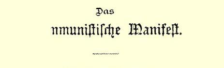
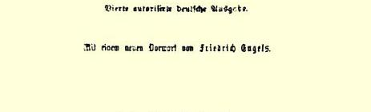
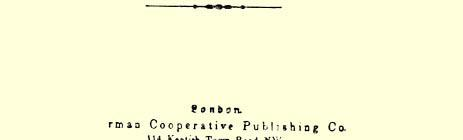

# “共产党宣言”１８９０年德文版序言

> **８２**

自从我写了上面那篇序言８３以来，已经又有必要刊印“宣言” 的新的德文版了，同时“宣言”本身也有种种遭遇，应该在这里提一提。

１８８２年在日内瓦出版了由维拉·查苏利奇翻译的第二个俄译本，马克思和我曾为这个译本写过一篇序言。可惜我把这篇序言的德文原稿遗失了，所以现在我只好再从俄文译过来，这样做当然不会使原稿增色。８４下面就是这篇序言：

“巴枯宁翻译的‘共产党宣言’俄文第一版，在六十年代初，由 ‘钟声’８５印刷所刊印问世。当时，西方认为‘宣言’译成俄文出版不过是文坛上的一件奇闻。这种看法今天是不可能有了。在‘宣言’ 最初发表时期（１８４８年１月[^1]）无产阶级运动所包括的地区是多么狭小，这从‘宣言’最后一章‘共产党人对各种反对党派的态度’[^2] 中可以看得很清楚。在这一章里，正好没有说到俄国和美国。那时， 俄国是欧洲反动势力的最后一支庞大后备军，向美国境内移民吸收着欧洲无产阶级的过剩力量。这两个国家，都向欧洲提供原料， 同时又都充当欧洲工业品的销售市场。所以，这两个国家不管怎样当时都是欧洲社会秩序的支柱。

今天，情况完全不同了！正是欧洲移民，使北美的农业生产能够大大发展，这种农业生产的竞争震撼着欧洲大小土地所有制的根基。此外，这种移民还使美国能够以巨大的力量和规模开发其丰富的工业资源，以至于很快就会摧毁西欧的工业垄断地位。这两种情况，对美国本身也起着革命作用。作为美国整个政治制度基础的农场主（使用自己劳动的农场主[^3]）的中小型地产，正逐渐被大农场的竞争所征服；同时，在各工业区，人数众多的无产阶级同神话般的资本积聚一起开始发展起来。

现在来看看俄国吧！在１８４８—１８４９年革命期间，不仅欧洲的君主，而且连欧洲的资产者，都把俄国的干涉看做是帮助他们对付当时刚刚开始意识到自己力量的无产阶级的唯一救星。他们把沙皇宣布为欧洲反动势力的首领。现在，沙皇已成了革命的俘虏，被禁锢在加特契纳８６，而俄国已是欧洲革命运动的先进队伍了。

‘共产主义宣言’的任务，是宣告现代资产阶级所有制必然灭亡。但是在俄国，我们看见，除了狂热发展的资本主义制度和刚开始形成的资产阶级土地所有制外，大半土地仍归农民公共占有。

那末试问：俄国农民公社[^4]，这一固然已经大遭破坏的原始土地公共所有制形式，是能直接过渡到高级的共产主义的土地所有制形式呢？或者，它还须先经历西方的历史发展所经历过的那个解体过程呢？

对于这个问题，目前唯一可能的答复是：假如俄国革命将成为西方工人革命的信号而双方互相补充的话，那末现今的俄国公共所有制便能成为共产主义发展的起点。

#### 卡·马克思弗·恩格斯

> １８８２年１月２１日于伦敦”

大约在同一时候，在日内瓦出版了新的波兰文译本：“共产主义宣言”８７。

随后又于１８８５年在哥本哈根作为“社会民主主义丛书”（《Ｓｏ －ｃｉａｌｄｅｍｏｋｒａｔｉｓｋＢｉｂｌｉｏｔｈｅｋ》）的一种出版了新的丹麦文译本。８８ 可惜这一译本不够完备；有几个重要的地方大概是因为译者感到难译而被删掉了，并且在不少地方可以看到草率从事的痕迹，尤其令人遗憾的是，从译文中可以看出，要是译者较为细心一点，他是能够把它译得很好的。

１８８６年在巴黎“社会主义者报”上刊载了新的法译文；这是到目前为止最好的译文。８９

同年又有人根据这个法文本译成西班牙文，起初刊登在马德里的“社会主义者报”上，接着又印成单行本：“共产党宣言”，卡· 马克思和弗·恩格斯著，马德里，“社会主义者报”社，艾尔南·科尔特斯街８号９０。

这里我还要提到一件可笑的事。在１８８７年，君士坦丁堡的一位出版商收到了阿尔明尼亚文的“宣言”译稿；但是这位好心人却没有勇气把这本署有马克思的名字的作品刊印出来，竟认为最好是由译者本人冒充作者，可是译者拒绝这样做。

在英国多次刊印过好几种美国译本，但都不大确切。到１８８８ 年终于出版了一种可靠的译本。这个译本是由我的友人赛米尔· 穆尔翻译的，并且在付印以前还由我们两人一起重新校阅过一遍。 封面印的是：“共产党宣言”，卡尔·马克思和弗里德里希·恩格斯著。经作者同意的英译本，由弗里德里希·恩格斯校订并加上注释，１８８８年伦敦，威廉·里夫斯出版社，东中央区弗利特街１８５ 号９１。这个版本中的某些注释，我已把它们收入本版。

“宣言”有它本身的经历。它出现的时候曾受到过当时人数尚少的科学社会主义先锋队的热烈欢迎（第一篇序言９２里提到的那些译本便可以证明这一点），但是不久以后它就被那随着１８４８年 ６月巴黎工人失败而抬起头来的反动势力排挤到后面去，而在 １８５２年１１月科伦共产党人被判刑９３之后，它更被“依法”宣布为非法了。随着与二月革命相联系的工人运动退出公开舞台，“宣言”也退到后面去了。

当欧洲工人阶级又强大到足以重新对统治阶级政权发动进攻的时候，产生了国际工人协会。它的目的是要把欧美整个战斗的工人阶级联合成**一支**大军。因此，它不能从“宣言”中所申述的那些原则**出发**。它应该有一个不致把英国工联，法国、比利时、意大利和西班牙的蒲鲁东派以及德国的拉萨尔派[^5]摈诸门外的纲领。这样一个纲领即国际章程９４绪论部分，是马克思起草的，其行文之巧妙是连巴枯宁和无政府派也不能不承认的。至于说到“宣言” 中所提出的那些原则的最终胜利，马克思在这里是把希望完全寄托于共同行动和共同讨论必然要产生的工人阶级智慧的发展。反资

> “共产党宣言”１８９０年德文版的扉页本斗争中的种种事件和变迁，—— 而且失败比胜利更甚，—— 不能不使进行斗争的人们明白自己一向所崇奉的那些万应灵丹毫不中用，并使他们的头脑更善于透彻了解工人解放的真实条件。马克思是正确的。１８７４年，当国际解散的时候，工人阶级已经全然不是 １８６４年国际成立时的那个样子了。罗曼语各国的蒲鲁东主义和德国的道地拉萨尔主义已经奄奄一息，甚至当时极端保守的英国工联也渐有进展，以致它们１８８７年举行的斯温西代表大会的主席[^6] 能够用它们的名义声明说：“大陆社会主义对我们来说再不可怕了。”９５而在１８８７年，大陆社会主义已经差不多完全是“宣言”中所宣布的那个理论了。由此可见，“宣言”的历史在某种程度上反映着 １８４８年以来现代工人运动的历史。现在，它无疑是全部社会主义文献中传布最广和最带国际性的著作，是从西伯利亚起到加利福尼亚止的世界各国千百万工人共同的纲领。

可是，当“宣言”出版的时候，我们不能把它叫**做社会主义**宣言。在１８４７年，所谓社会主义者是指两种人。一方面是那些信奉各种空想学说的分子，特别是英国的欧文派和法国的傅立叶派；这两个流派当时都已经变成逐渐走向灭亡的纯粹的宗派。另一方面是各种各样的社会庸医，他们想用各种万应灵丹和各种补缀办法来消除社会弊病而毫不伤及资本和利润。这两种人都是站在工人运动以外，宁愿向“有教养的”阶级寻求支持。至于当时确信单纯政治变革全然不够而要求根本改造社会的那一部分工人，他们把自己叫做**共产主义者**。这种共产主义是一种还没有很好加工的、只是出于本能的、颇为粗糙的共产主义；但它已经强大到足以形成两种空想的共产主义体系：在法国有卡贝的“伊加利亚”共产主义，在德国有魏特林的共产主义。在１８４７年，社会主义意味着资产阶级的运动，共产主义则意味着工人的运动。当时，社会主义，至少在大陆方面，是可以进出沙龙的，而共产主义却恰恰相反。既然我们当时已经十分坚决认定“工人阶级的解放只能是工人阶级自己的事情”９６，所以我们也就丝毫没有怀疑究竟应该在这两个名称中间选定哪一个名称。而且后来我们也根本没有想到要把这个名称抛弃。

“全世界无产者，联合起来！”—— 当四十二年前我们在巴黎革命即无产阶级带着本身要求参加的第一次革命的前夜向世界上发出这个号召时，响应者还是寥寥无几。可是，１８６４年９月２８日，大多数西欧国家中的无产者已经联合成为流芳百世的国际工人协会了。固然，国际本身只存在了九年，但它所创立的全世界无产者永久的联合依然存在，并且比先前任何时候更加强固，而今天这个日子就是最好的证明。因为今天我写这个序言的时候，欧美无产阶级正在检阅自己的战斗力量，它们第一次在一个旗帜下动员成为一个军队，以求达到一个最近的目的，即早已由国际１８６６年日内瓦代表大会宣布、后来又由１８８９年巴黎工人代表大会再度宣布的争取在法律上规定八小时标准工作日。９７今天的情景定会使全世界的资本家和地主知道：全世界的无产者现在已经真正联合起来了。

如果马克思今天还能同我站在一起亲眼看见这种情景，那该多好啊！

#### 弗·恩格斯

> １８９０年５月１日于伦敦载于１８９０年在伦敦出版的原文是德文 “共产党宣言”一书
>
> 俄文译自“共产党宣言”１８９０年版

[^1]: 在１８８２年俄文版序言手稿中，不是“１８４８年１月”，而是“１８４７年１２月”。—— 编者注

[^2]: 在１８８２年俄文版序言手稿中，在“各种”之前还有“各国”两字。—— 编者注

[^3]: “使用自己劳动的农场主”这几个字是恩格斯在１８９０年德文版上增加的——编者注

[^4]: 在１８８２年俄文版序言手稿中，不是“农民公社”（Ｂａｕｅｒｎｇｅｍｅｉｎｄｅ），而是用拉丁字母拼写的俄文“公社”（Ｏｂｓｃｈｔｓｃｈｉｎａ）一词。—— 编者注

[^5]: 拉萨尔本人在和我们接触时总是自认为是马克思的“学生”，而他作为马克思的“学生”当然是站在“宣言”的立场上的。但是他的那些信徒却不是如此，他们始终没有超出他所主张的靠国家贷款建立生产合作社的要求，并且把整个工人阶级划分为主张靠国家帮助的人和主张自我帮助的人。

[^6]: 比万。—— 编者注