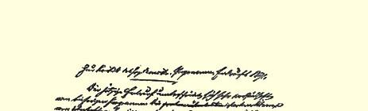
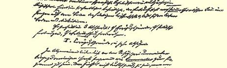
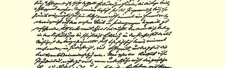
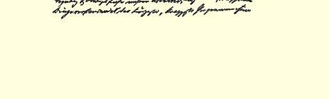

# １８９１年社会民主党纲领草案批判２３０

> 写于１８９１年６月１８日和２９日之间原文是德文第一次发表于１９０１—１９０２年“新时代”杂俄文是按手稿译的志第１卷第１期（没有附件）；并用俄文全文发表于“马克思恩格斯全集”１９３６年第 １版第１６卷第２部

## 一 绪论部分（十段）

现在这个草案２３１大大优于以前的纲领２３２。陈腐传统（无论是道地拉萨尔派的还是庸俗社会主义的）的浓厚残渣，基本上已被清除；草案在理论方面整个说来是立足在现代科学的基础上，因而有可能在这个基础上来进行讨论。

草案分为三个部分：一、绪论部分，二、政治要求，三、保护工人权利的要求。

### 一 绪论部分（十段）

概括说来，这部分的缺点在于企图把两件不能结合的东西结合起来，即要求它既是纲领，又是对纲领的**解释**。唯恐写得简洁而有力，意思就会不够明白，因此加进一些说明，以致弄得罗里罗嗦、 拖泥带水。在我看来，纲领应当尽量简练严整。即使用上个把外国字或者不是一读就能把握其全部意义的句子，也是无妨的。集会上的口头报告和报刊上的文字说明将使所必需的一切得到弥补，这样，言简意赅的句子，一经了解，就能牢牢记住，变成口号；而这是冗长的论述绝对做不到的。不要为了通俗而做太多的牺牲，不要把我国工人的智力和文化程度估计过低。比最简洁最扼要的纲领还难得多的东西，他们也理解了；而且，如果说非常法时期使得给新参加进来的群众以充分的教育这一工作难于进行，而且在有些地方甚至不可能进行，那末现在，当我们的宣传品能自由地保存和阅读的时候，这在老的骨干的指导下是会很快得到弥补的。

我想尝试把整个这一部分写得扼要一些，如果能做到的话，我预备随函附上，或者以后另寄。现在我把第一段到第十段依次谈一下。

**第一段**。……“矿山、矿井、矿场”……“的**分离**”——，这里的三个词都是说一回事；其中两个应该删掉。我以为可以保留**矿山** ［Ｂｅｒｇｗｅｒｋｅ］，用这个最惯用的词来表达一切，因为在我国，即使它们是在最平坦的平原地区，也是这样称呼的。但我认为还要加上：**“铁路及其他**交通手段”。

**第二段**。我认为在这里要插进：**“社会**的劳动资料，在**其占据者** （或**其占有者**）手中”，下面同样要插进：“……对劳动资料的占有者 （或占据者）的依附”等等。

关于这些老爷们把所有这些东西作为“个人财产”据为己有这一点，在第一段中已经说过了，只是因为一定要把“垄断者”这个词用进来，才在这里又重复一遍。不管用哪一个词，都不会使意思有任何增加。而在纲领中是多余的东西，会削弱纲领。

> “社会**生存**所必要的劳动资料”

—— 这总是指那些恰好存在的劳动资料。在蒸汽机出现以前， 没有蒸汽机也行，但现在没有它就不行了。在今天，一切劳动资料都直接地或间接地—— 或者根据它们的构造，或者通过社会分工 —— 是**社会的劳动资料**，因此这几个字就充分表达了目前存在的东西，而且表达得很正确，不致引起任何误解。

> 弗恩格斯“１８９１年社会民主党纲领草案批判”手稿的开头部分

如果这段末尾是仿照国际章程的结论部分写的，那我认为不如**完全**照着它写，即：“社会贫困（这是第一）、精神屈辱和政治依附”。２３３体质衰退已包含在社会贫困中，政治**依附**是一个事实，而政治的**无权利**不过是具有**相对**正确性的演说词句，这类东西是不应写进纲领中去的。

**第三段**。我认为头一句必须修改。

> “在**个人所有者的统治**下。”

第一，下面接着谈的是一个经济事实，也就应当从经济上去加以说明。但“个人所有者的**统治**”这个说法则造成一种假象，好像所说的情况是由这一伙强盗的**政治**统治造成的。第二，属于这种个人所有者之列的，不仅仅是“资本家和大土地占有者”（写在这后面的 “资产者”是指什么呢？它是第三类个人所有者吗？大土地占有者也是“资产者”吗？既然谈到了大土地占有者，那给我们德国整个肮脏腐败的政治打上了自己特有的反动印记的强大的封建制度残余却可以不提吗？）。**农民**和**小资产者**也是“个人所有者”，至少今天还是；但是在整个纲领中都没有提到他们，因此在表述中应该使他们根本不包括在这里所说的个人所有者的范畴之内。

> “劳动资料***和***被剥削者创造的财富的积累。”

“财富”是由（１）劳动资料、（２）生活资料构成的。因此，先讲财富的一个**部分**，接着不讲另一部分，却讲总的财富，并且用一个 **“*和***”字把两者连结起来，这是既不合语法，也不合逻辑的。

> “……在**资本家**手中正以日益加快的速度增大着。”

然而，上面所说的“大土地占有者”和“资产者”到哪里去了呢？ 如果这里只要举出资本家就够了，那末上面也只要提到资本家就够了。如果要详细谈，单单举出资本家是完全不够的。

> “无产者的人数和**贫困**越来越增长。”

这样绝对地说是不正确的。工人的组织，他们的不断增强的抵抗，会在可能范围内给**贫困的增长**造成某些障碍。而**肯定**增长的， 是**生活的无保障**。我以为要将这一点写进去。

**第四段**。

> “根源于资本主义私人生产的本质的无计划性”

这一句需要大加修改。据我所知，资本主义生产是一种社会形式， 是一个经济阶段，而资本主义**私人**生产则是在这个阶段内这样或那样表现出来的**现象**。但是究竟什么是资本主义**私人**生产呢？那是由**单个**企业家所经营的生产；可是这种生产已经愈来愈成为一种例外了。由**股份公司**经营的资本主义生产，已不再是**私人**生产，而是为许多结合在一起的人谋利的生产。如果我们从**股份公司**进而来看那支配着和垄断着整个工业部门的托拉斯，那末，那里不仅**私人生产**停止了，而且**无计划性**也没有了。删掉**“私人**”这两个字，这个论点还勉强能过得去。

> “广大人民阶层的破产”。

这种演说词句会使人觉得，似乎我们还在为资产者和小资产者的破产感到悲哀，要是我，就不会这样说，而只会说明这样一个简单的事实：“由于城乡中等阶层，小资产者和小农的破产，使有产者和无产者之间的鸿沟更加扩大了（或加深了）。”

结尾两句把同一件事说了两遍。我在第一部分附件中提了一个修改方案[^1]。

**第五段**。“原因”应该是“**其**原因”，这大概纯粹是笔误。

**第六段**。“矿山、矿井、矿场”，见上面关于第一段所谈的。“**私人** 生产”，见上面所谈的。我认为应当这样说：“把为个人或股份公司谋利的现代资本主义生产转变成为全社会谋利和按预先拟定的计划进行的社会主义生产，这个转变所需要的……创造出来，并且唯有通过这样一个转变，工人阶级的解放，从而没有例外的一切社会成员的解放，才得以实现。”

**第七段**。我认为要像第一部分附件中所建识的[^2]那样写。

**第八段**。“有阶级觉悟的”，这在我们中间固然是容易理解的简略说法，但是我认为，为了便于一般人的理解和翻译成外文起见， 不如用“认清了自己的阶级地位的工人”或类似的说法。

**第九段**。最后一句：“……放在……并从而把经济剥削和政治压迫的权力集中于一手之中”。

**第十段**。在“阶级统治”后面，少了“和阶级本身”几个字。消灭阶级是我们的基本要求，不消灭阶级，消灭阶级统治在经济上就是不可思议的事。我提议把“为了所有人的平等权利”改成“为了所有人的平等权利和**平等义务**”等等。**平等义务**，对我们来说，是对资产阶级民主的**平等权利**的一个特别重要的补充，而且使平等权利失去道地资产阶级的含义。

最后一句：“在它的斗争中……能够”，我看不如删去。“能够改善一般**人民**（究竟是谁？）的状况……”，这句话不明确，可以包括一切：保护关税和贸易自由，行会和工商业经营自由，农业贷款，交换银行，强制种痘和禁止种痘，嗜酒和禁酒，等等。这句话**所要**说的，前面的句子已经说过了，完全没有必要特别说明，我们在要求整体时，也就是指它的各个部分；我认为这样会把印象冲淡。如果是想用这个句子来转到个别的要求上面去，那末大致可以这样说：“社会民主党力争一切**足以使党接近于这个目标**的要求”（“办法和设施”，因为重复，应该删掉）。或者，更好是直截了当地谈这里所牵涉的问题，即必须补上资产阶级所耽误了的工作；我就是按这个精神拟定了第一部分附件中的最后一句[^3]。我认为，这一点对于我为下一部分所作的评论，以及论证我在那里所作的建议，是很重要的。

### 二 政治要求

草案的政治要求有一个很大的缺点。**这里没有说**本来应当说的东西，即使这十项要求都如愿以偿，我们固然会得到更多的为达到主要政治目标的种种手段，但这个主要目标本身却决不能达到。 德意志帝国宪法，以交给人民及其代议机关的权利来衡量，不过是 １８５０年普鲁士宪法的抄本，而１８５０年宪法在条文里反映了极端反动的东西，根据这个宪法，政府握有全部实权，议院连否决税收的权利也没有，正如在宪制冲突时期所证明的，政府可以对它为所欲为。２３４帝国国会的权利同普鲁士议院的权利完全一样，所以，李卜克内西把这个帝国国会称作专制制度的遮羞布。想在这个宪法及其所认可的小邦分立的基础上，在普鲁士和罗伊斯格莱茨施莱茨罗宾斯坦２３５的“联盟”，即一方有多少平方里而另一方只有多少平方寸的邦与邦之间的联盟的基础上，来实行“将一切劳动资料转变成公有财产”，显然是荒谬的。

谈论这个问题是危险的。但是，无论如何，事情总是要去解决的。这样做是多么必要，正好现在由在很大一部分社会民主党报刊中散布的机会主义证明了。现在有人因害怕反社会党人法重新恢复，或者回想起在这项法律统治下发表的几篇过早的声明，就忽然想要党承认在德国的现行法律秩序下，可以通过和平方式实现党的一切要求。他们力图使自己和党相信，“现代的社会正在长入社会主义”，而不问一下自己，是否这样一来，这个社会就会不像虾要挣破自己的旧壳那样必然要从它的旧社会制度中长出来，就会无须用暴力来炸毁这个旧壳，是否除此之外，这个社会在德国就会无须再炸毁那还是半专制制度的、而且是混乱得不可言状的政治制度的桎梏。可以设想，在人民代议机关把一切权力集中在自己手里、只要取得大多数人民的支持就能够按照宪法随意办事的国家里，旧社会可能和平地长入新社会，比如在法国和美国那样的民主共和国，在英国那样的君主国，英国报纸上每天都在谈论即将赎买王朝的问题，这个王朝在人民的意志面前是软弱无力的。但是在德国，政府几乎有无上的权力，帝国国会及其他一切代议机关毫无实权，因此，在德国宣布某种类似的做法，而且在没有任何必要的情况下宣布这种做法，就是揭去专制制度的遮羞布，自己去遮盖那赤裸裸的东西。

这样的政策归根到底只能把党引入迷途。人们把一般的抽象的政治问题提到首要地位，从而把那些在重大事件一旦发生，政治危机一旦来临就会自行提到日程上来的迫切的具体问题掩盖起来。这除了使党突然在决定性的时刻束手无策，使党在具有决定意义的问题上由于从未进行过讨论而认识模糊和意见不一而外，还能有什么结果呢？难道应该重演曾经在保护关税问题上发生的事情吗？当时有人把保护关税宣布为只与资产阶级有关而与工人毫不相干的问题，因此各人可以随自己的意思投票，而现在有许多人陷入了另一个极端，为了同转而热中于保护关税主义的资产者相对立，又端出了科布顿和布莱特的经济诡辩，并且把最纯粹的曼彻斯特主义作为最纯粹的社会主义来鼓吹。２３６为了眼前暂时的利益而忘记根本大计，只图一时的成就而不顾后果，为了运动的现在而牺牲运动的未来，这种做法可能也是出于“真诚的”动机。但这是机会主义，始终是机会主义，而且“真诚的”机会主义也许比其他一切机会主义更危险。

可是这些微妙而又非常重要的问题究竟是哪些呢？

**第一**。如果说有什么是勿庸置疑的，那就是，我们的党和工人阶级只有在民主共和国这种政治形式下，才能取得统治。民主共和国甚至是无产阶级专政的特殊形式，法国大革命已经证明了这一点。要知道，要我们的优秀分子像米凯尔那样在皇帝手下做起大臣来，简直是不可思议的。的确，从法律观点看来，似乎是不许可把共和国的要求直接写到纲领里去的，虽然这在法国甚至在路易菲力浦统治下都可以办到，而在意大利甚至到今天也可以办到。但是， 在德国连一个公开要求共和国的党纲都不能提出的事实，证明了， 以为在这个国家可以用和平宁静的方法建立共和国，不仅建立共和国，而且还建立共产主义社会，这是多大的幻想。

不过，关于共和国的问题在万不得已时可以不提。但是，有一点在我看来应该而且能够写到纲领里去，这就是**把一切政治权力集中于人民代议机关之手**的要求。如果我们不能再多走一步，暂时做到这一点也够了。

**第二**。德国国家制度的改造。一方面，小邦分立状态必须结束。—— 只要巴伐利亚和维尔腾堡的保留权利２３７依然存在，而例如绍林吉亚的地图仍然呈现出目前这样一副可怜景象，你就试试看去使这个社会革命化吧！另一方面，普鲁士必须停止存在，必须分解为几个自治省，以使道地的普鲁士主义不再压在德国头上。小邦分立状态和道地的普鲁士主义就是德国现在正受其钳制的两个对立的方面，而且这两个方面中的一方始终必然是另一方的托辞和存在的理由。

应当用什么东西来代替现在的德国呢？在我看来，无产阶级只能采取单一而不可分的共和国的形式。联邦制共和国一般说来现在还是美国广大地区所必需的，虽然在它的东部已经成为障碍。在英国，联邦制共和国将是前进一步，因为在这里，两个岛上居住着四个民族，议会虽然是统一的，但是却有三种立法体系同时并存。联邦制共和国在小小的瑞士早已成为障碍，它之所以还能被容忍，只是因为瑞士甘愿充当欧洲国家体系中纯粹消极的一员。对德国说来，实行瑞士式的联邦制，那就是倒退一大步。联邦制国家和单一制国家有两点区别，这就是：每个加盟的邦，即每个州都有它特别的民事立法、刑事立法和法院组织；其次，与国民议院并存的还有联邦议院，在联邦议院中，每一个州无分大小，都以一州的资格参加表决。前一点我们已经顺利克服，而且不会幼稚到又去采用它，第二点在我们这里就是联邦会议，我们完全可以不需要它，而且，一般说来，我们的“联邦制国家” 已经是向单一制国家的过渡。我们的任务不是要使１８６６年和１８７０年所实行的自上而下的革命又倒退回去，而是要用自下而上的运动给予它以必要的补充和改进。

因此，需要单一的共和国。但并不是像现在法兰西共和国那样的共和国，现在的法兰西共和国同１７９８年建立的没有皇帝的帝国２３８没有什么不同。从１７９２年到１７９８年，法国的每个省、每个市镇， 都有美国式的完全的自治权，这是我们也应该有的。至于应当怎样组织自治和怎样才可以不要官僚制，这已经由美国和法兰西第一共和国给我们证明了，而现在又有澳大利亚、加拿大以及英国的其他殖民地给我们证明了。这种省的和市镇的自治是比例如瑞士的联邦制更自由得多的制度，在瑞士的联邦制中，州对联邦而言固然有很大的独立性，但它对专区和市镇也具有独立性。州政府任命专区区长和市镇长官，这在讲英语的国家里是绝对没有的，而我们将来也应该断然消除这种现象，就像消除普鲁士的县长和参政官那样。

以上所说的一切，只有不多的东西是应当写进纲领中去的。我之所以谈到这些，主要也是为了把德国的情况说明一下，—— 那里是不容许公开谈论这类东西的，—— 从而同时强调指出那些希望通过合法途径将这种情况改造成共产主义社会的人只是自己欺骗自己。再就是想要提醒党的执行委员会，除了人民直接参与立法和免费司法（这两项我们归根到底不是非要不可的）之外，还有另外一些重大的政治问题。在普遍不安定的情况下，这些问题一夜之间就可能变成燃眉之急的问题，如果我们不事先进行讨论，没有取得一致的意见，到那时该怎么办呢？

但是下面这个要求是可以写进纲领中去，并且至少间接地可以作为对不能正面说出的事情的暗示的：

“省、专区和市镇通过由普选权选出的官吏实行完全的自治。 取消由国家任命的一切地方的和省的政权机关。”

关于上面所谈到的几点，是否还有别的什么可以写成纲领要求，我在这里比你们在当地较难于判断。但是这些问题最好趁现在还不太迟的时候能在党内加以讨论。

（１）“选举权和投票权”，以及“选举和投票”之间的区别，我是不清楚的。如果一定要加以区别，那末无论如何也要说得更加明白些，或者在附于草案之后的说明中予以解释。

（２）“人民提出法案和否决法案的权利”，**这是针对什么而言呢**？是针对所有的法律还是针对人民代议机关的决议呢？这是应当加以补充的。

（５）教会和国家完全分离。国家无例外地把一切宗教团体视为私人的团体。停止用国家资金对宗教团体提供任何补助，排除宗教团体对公立学校的一切影响。（但是不能禁止它们用**自己的资**金创办**自己的**学校并在那里传授他们的胡说。）

（６）关于“学校的世俗性”一条因此就失去意义了，它是属于前一段的。

（８）和（９）这里我希望你们注意这样一点：这两条要求对１．律师，２．**医师**，**３．药剂师**、**牙医**、**助产士**、**看护**等等实行国家化，后面还要求对工人的保险事业实行完全国家化。是否能把这一切都付托给卡普里维先生呢？而这又是否和前面所宣称的拒绝一切国家社会主义一点相一致呢？

（１０）这里，我认为要这样说：“为了支付国家、专区和市镇的一切靠征税支付的开支，征收累进的……税。取消国家和地方的一切间接税、关税等。”其他都是多余的、使印象冲淡的解释或论证。

### 三 经济要求

关于第二点。结社权还需要防范**国家**的侵犯而予以保护，这在德国比在任何别的地方都更厉害。

最后一句“为了调整”等等，应**作为第四点**加进去，并赋予相应的形式。关于这点应该指出的是，如果同意工人和企业主在劳动委员会里各占一半，那我们就受了大骗。这样，在许多年里，多数总是会在企业主方面，为此只要工人中有一个是害群之马就够了。如果没有谈妥在争论的时候**两半分开**来表示意见，那末，有一个企业主委员会和一个**与它平行的独立的工人委员会**，会要好得多。

最后，我请你们再用法国的纲领２３９来对照一下。在那个纲领里，正好是在第三部分，有些东西似乎谈得更好些。西班牙的纲领２４０可惜因时间仓卒没有找到，它也有许多方面是很好的。

[^1]: 见本卷第２７９页。—— 编者注

[^2]: 见本卷第２８０页。—— 编者注

[^3]: 见本卷第２８０页。—— 编者注