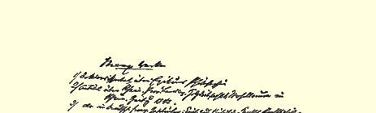
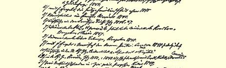
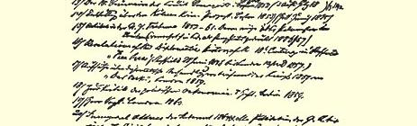
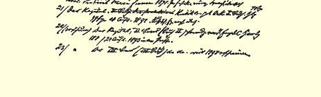

# 马克思，亨利希卡尔

> **３３９**

１８１８年５月５日生于特利尔的一个律师（后为司法参事）亨利希马克思的家里。根据亨利希马克思的儿子的洗礼证书可以看出，亨利希马克思于１８２４年同全家一道弃犹太教而改信基督教。卡尔马克思在特利尔的中学毕业后，从１８３５年起先后在波恩和柏林研究法学，以后又研究哲学；１８４１年，他在柏林提出一篇论伊壁鸠鲁哲学的学位论文３４０，结果获得哲学博士学位。同年，他迁居波恩，打算在大学里任教；但是，政府对他的在波恩的大学里讲授神学的友人**布鲁诺鲍威尔**百般刁难，最后鲍威尔终于被大学解聘，这个事实使马克思很快就清楚地看出：在普鲁士的高等学校里是没有他的立足之地的。大约就在这同一时期，莱茵激进资产阶级年轻一代的一些持青年黑格尔派观点的代表，在同自由派领袖**康普豪森**和 **汉泽曼**商妥之后，决定在科伦创办一家大型的反对派报纸；马克思和鲍威尔也被聘为该报的主要的经常撰稿人。当时办报所必不可少的许可证，通过迂回曲折的方式悄悄地领到了，于是，“莱茵报” 就从１８４２年１月１日起开始出版。马克思写了一些长篇文章，从波恩寄给这家新创办的报纸；其中最重要的有：对莱茵省议会的辩论的批评，关于摩塞尔流域酿酒农民的状况的文章，以及另一篇关于盗窃林木和与此有关的法律的文章。３４１１８１２年１０月，马克思担任该报的领导，并移居科伦。从这时起，该报开始具有强烈的反政府性质。 而同时，对报纸的领导又是如此巧妙，尽管该报先后受到双重的、 以至三重的检查（先由普通检查官检查，然后呈交行政区长官复查，最后还要由ａｄｈｏｃ〔专门〕从柏林派来的冯圣保罗先生检查一次），政府对这样一种报纸还是无可奈何，所以它决定从１８４３年１ 月１日起禁止该报纸继续出版。在这一天马克思退出了编辑部，报纸以此为代价获准缓期三个月，但是后来报纸终于还是被完全查禁了。

于是马克思决定到巴黎去，这时**阿尔诺德卢格**在“德国年鉴”３４２大约与此同时被查禁之后，也准备到巴黎去。动身以前，马克思在克罗茨纳赫同燕妮冯威斯特华伦结婚。燕妮是马克思童年时代的女友，马克思早在刚进大学的时候就同她订了婚。１８４３年秋，这一对年轻的夫妇来到巴黎，在这里马克思开始同卢格一起出版“德法年鉴”３４３，但是该杂志仅出版了一期；杂志之所以停刊，部分是由于它在德国的秘密传播遇到很大困难，部分是由于在两位编辑之间很快就暴露出原则性的分歧。**卢格**仍然保持黑格尔哲学和政治上的激进主义的路线，马克思则热心地研究政治经济学、法国社会主义者和法国历史。结果马克思转向了社会主义。１８４４年９ 月，弗恩格斯到巴黎拜访马克思，停留了几天；他们是从在“德法年鉴”共同工作时开始通信的，从那时起他们就开始合作，直到马克思逝世。这个合作的第一个成果，就是一部**驳布鲁诺鲍威尔**的论战性著作（他们在黑格尔学派分裂的过程中同布鲁诺鲍威尔之间也产生了原则性的分歧），即“神圣家族。驳布鲁诺鲍威尔及其伙伴”３４４（１８４５年在美因河畔法兰克福出版）。

马克思参加了在巴黎以“前进报”这个名称出版的一份篇幅不大的德国周报３４５的编辑工作，该报辛辣地嘲笑了当时德国专制制度和冒牌立宪制度的空虚拙劣。普鲁士政府就以此为借口要求基佐内阁把马克思驱逐出法国。这个要求被满足了；１８４５年初，马克思迁居布鲁塞尔，恩格斯随他之后也来到布鲁塞尔。在这里，马克思出版了“哲学的贫困。答蒲鲁东先生的‘贫困的哲学’”（１８４７年在布鲁塞尔和巴黎出版），以及“关于自由贸易的演说”（１８４８年在布鲁塞尔出版）３４６。此外，马克思有时还给“德意志布鲁塞尔报”３４７写些文章。１８４８年１月，他同恩格斯一起受秘密的宣传团体共产主义者同盟中央委员会的委托起草了“共产党宣言”（马克思和恩格斯在１８４７年春加入了这个团体）。３４８从那时起，“宣言”出版了许许多多经作者同意的和未经作者同意的德文版本，并被译成几乎所有的欧洲文字。

当１８４８年二月革命爆发并且在布鲁塞尔也激起了人民的风潮时，马克思被逮捕并被驱逐出比利时；这时，法兰西共和国临时政府邀请马克思重新到巴黎去，于是马克思又迁居巴黎。

在巴黎，马克思和他的朋友们一起首先反对了组织军团的儿戏，因为这给新政府的多数派提供了一个摆脱“已经成为累赘”的外国工人的方便手段。很清楚，这样在众目睽睽之下组织起来的比利时军团、德国军团等等，只能在一出国境之后就堕入预先设置好的陷阱，而后来发生的事实也正是如此。马克思和共产主义者同盟的其他领导人，为四百名失业的德国人争取到了和发给参加军团的人同样的路费，使他们也得以返回德国。

４月间，马克思迁往科伦；在他的领导下，从６月１日起在科伦开始出版“新莱茵报”，该报在次年５月１９日出版了最后一号； 威胁着编辑们的是：或者根据法庭命令被逮捕，或者作为非普鲁士国民被驱逐出境。马克思遭到的是后一种命运，因为他在居留布

> 弗恩格斯开列的卡马克思著作的书单３４９ 鲁塞尔期间脱离了普鲁士国籍。在该报存在期间，马克思曾经两次被陪审法庭传讯：１８４９年２月７日被控违反出版法，２月８日又被控煽动对政府的武装反抗（在１８４８年１１月拒绝纳税期间）；两次他都被宣判无罪。３５０

在“新莱茵报”被查禁后，马克思又回到了巴黎，但是在６月１３ 日示威３５１以后他被迫作以下的选择：或者是留在布列塔尼被拘禁起来，或者是再次离开法国。不言而喻，马克思选择了后者，于是他移居伦敦，并且从此以后就在那里定居下来。

在伦敦，马克思创办了“新莱茵报。政治经济评论”３５２（１８５０年在汉堡出版），总共出版了六期。他在这个刊物上发表的主要著作 “从１８４８到１８４９年”阐明了这几年的事件，特别是在法国所发生的事件的原因和内部联系；此外，马克思（同恩格斯一起）写了许多书评和政治述评。在前一著作发表后不久，作为该著作的继续，出版了“路易波拿巴的雾月十八日”３５３（１８５２年在纽约出版，１８６９年和 １８８５年在汉堡重版）。由于发生了科伦共产党人的大案件，他出版了小册子“揭露科伦共产党人案件”３５４（１８５３年在波士顿出版，最近一版于１８８５年在苏黎世出版）。从１８５２年起马克思担任“纽约论坛报”３５５的驻伦敦通讯员，并且在许多年当中可以说是该报欧洲栏的编辑。他的文章一部分署了他的名字，一部分则以社论的形式发表；这不是一些普通的通讯，它们是根据认真的研究写出的，而且往往是包含一系列对于欧洲某一国家的政治经济状况进行详尽评论的文章。其中军事性质的文章—— 论克里木战争、印度起义等 —— 是恩格斯写的。马克思的关于帕麦斯顿勋爵的文章３５６有几篇曾经在伦敦以单行本重印出版。直到美国国内战争开始他才停止为“论坛报”撰稿。

１８５９年，马克思一方面同卡尔福格特展开了由于意大利战争而引起的论战，这场论战是以马克思的著作“福格特先生”３５７（１８６０ 年在伦敦出版）作为结束的。另一方面，在这同一年，出版了他在英国博物馆进行了多年的政治经济学研究的第一个成果“政治经济学批判”第一分册３５８（１８５９年在柏林出版）。可是，第一分册刚出版， 马克思就发现他并没有完全弄清楚以后几个分册的基本思想发展中的一切细节；迄今保存下来的手稿３５９是这一点的最好证明。于是他立刻重新开始工作，这样，他没有继续出版那几个分册，而是直到１８６７年才出版了“资本论。第一册：资本的生产过程”３６０（１８６７年在汉堡出版）。

马克思在写作全部三卷“资本论”—— 第二卷和第三卷至少是初稿—— 的过程中，终于又得到机会同时在工人当中进行实际工作。１８６４年成立了国际工人协会。许多人，特别是法国人都曾经自命为该协会的创始人。不言而喻，像这样的组织不可能是由一个人创立的。但是有一点是毫无疑义的：在所有的参加者当中只有一个人清楚地懂得正在发生什么和应该建立什么；他就是早在１８４８年就向世界发出“全世界无产者，联合起来！”这一号召的人。

在建立国际时，朱泽培马志尼也企图笼络那些团结在国际中的人，使他们接受他所宣扬的神秘的、充满密谋精神、以《Ｄｉｏｅ ｐｏｐｏｌｏ》〔“上帝和人民”〕作为口号的民主，让他们为这种民主效劳。但是以他的名义提出的章程和成立宣言草案被否决了，相反， 得到通过的是马克思所拟定的草案３６１；从此以后马克思就稳固地取得了对国际的领导。总委员会的宣言都是马克思写的，其中包括巴黎公社失败后出版并翻译成大多数欧洲文字的宣言“法兰西内战”３６２。

在这里不可能叙述国际的历史。这里只须指出一点：马克思这样起草了章程以及它的原则性的绪论部分，以致法国的蒲鲁东主义者、德国的共产主义者和英国的工联主义者能在这个范围内一致地合作共事；这种联合的内部一致直到以巴枯宁为首的无政府主义者—— 他们从出现时起就企图瓦解任何工人运动—— 出现以前，从未受到破坏。当然，协会的力量是以欧洲和美洲的无产阶级渴望联合起来这样一个前所未闻的事实为基础的；总委员会除了道义手段以外没有任何其他的手段，它甚至连经费也没有：总委员会并没有所谓的“国际的百万财产”，它所有的大都只是债务。用这样少量的钱做这样多的事情，大概是史无前例的。

巴黎公社失败以后，国际已不可能在欧洲存在下去。如果继续用旧的形式同政府以及在所有国家都同样狂怒的资产阶级进行斗争，就会付出巨大的牺牲。此外还要在协会内部进行反对无政府主义者以及同他们同流合污的蒲鲁东分子的斗争。 Ｌｅｊｅｕｎｅｖａｌａｉｔｐａｓｌａｃｈａｎｄｅｌｌｅ〔得不偿失〕。因此，当在海牙代表大会３６３上在形式上也取得了对无政府主义者的胜利之后，马克思提议把总委员会的会址迁到纽约。这样就保证了协会继续存在下去，准备迎接由于局势的变化而必须在欧洲恢复协会的时刻到来。 但是当这样的局势实际到来时，旧的形式已经过时了；运动大大超过了旧的国际。

从那时起马克思不再进行公开的鼓动，但同时他仍然和过去一样积极地参加欧洲和美洲的工人运动。他几乎同各国工人运动的所有领导人通信，他们在紧要关头，只要有可能，总是亲自向马克思本人请教。他愈来愈成为战斗的无产阶级的公认的和有求必应的顾问。但是，除此之外，这时马克思却能够重新回到自己的科学研究工作上来，同时研究的范围也已经大大扩大了。马克思研究任何事物时都考查它的历史起源和它的前提，因此， 在他那里，每一单个问题都自然要产生一系列的新问题。他研究原始时代的历史，研究农学、俄国的和美国的土地关系、地质学等等，主要是为了在“资本论”第三卷中最完善地写出关于地租的章节，而在他以前没有人试图这样做过。马克思除了能以所有的日耳曼语和罗曼语自由阅读以外，还学习了古斯拉夫语、 俄语和塞尔维亚语。但是很可惜，日益严重的疾病妨碍了他去利用这样收集起来的材料。１８８１年１２月２日他的夫人[^1]去世，１８８３年１月 １１日他的大女儿[^2]去世，就在同一年的３月１４日，他坐在自己的安乐椅中静静地与世长辞了。

过去出版的马克思传记大多数都是错误满篇。唯一可靠的传记是发表于白拉克在不伦瑞克出版的１８７８年“人民历书”中的那篇传记（作者恩格斯）。３６４

现在把马克思的已经发表的著作尽可能详尽地开列如下：

１８４２年在科伦“莱茵报”上发表的有：关于莱茵省议会的辩论、关于摩塞尔流域酿酒农民的状况、关于盗窃林木的文章；该报１８４２年１０月至１２月的社论。在“德法年鉴”（阿卢格和卡马克思合编，１８４４年在巴黎出版）上发表的有：“黑格尔法哲学批判导言”；“论犹太人问题”。—— 卡马克思和弗恩格斯合写的“神圣家族。驳布鲁诺鲍威尔及其伙伴”，１８４５年在美因河畔法兰克福出版。——１８４４年在巴黎报纸“前进报”上发表的短文 （未署名）。—— 在“德意志—布鲁塞尔报”（１８４７—１８４８年在布鲁塞

> 弗恩格斯开列的他本人的著作的书单３６５的第一页
>
> 弗恩格斯开列的他本人的著作的书单的第二页尔出版）上发表的一些署名和未署名的文章。—— “哲学的贫困。 答蒲鲁东先生的‘贫困的哲学’”，１８４７年在布鲁塞尔和巴黎出版。 德文版：１８９２年在斯图加特出的第二版。西班牙文版：１８９１年在马德里出版。——“关于自由贸易的演说”，１８４８年在布鲁塞尔出版。 英文版：１８８８年在波士顿出版。德文版：收入“哲学的贫困”德文版。—— 同弗恩格斯合写的“共产党宣言”，１８４８年在伦敦出版。 最新德文版：１８９０年在伦敦出版；几乎所有的欧洲文字都已有译本。—— 在“新莱茵报”（１８４８—１８４９年在科伦出版）上发表的文章及社论等。其中“雇佣劳动与资本”曾多次出版单行本，最新版： １８９１年在柏林出版；已有俄文、波兰文、意大利文、法文译本。—— “两个政治审判案”，１８４９年在科伦出版（包括马克思的两篇辩护词）。—— “新莱茵报。评论”，１８５０年在汉堡出版，共出６期。其中发表了马克思的文章“从１８４８到１８４９年”。同恩格斯合写的书评和每月述评。—— “路易波拿巴的雾月十八日”，１８５２在纽约出版。 第三版：１８８５年在汉堡出版。已有法文译本。—— “揭露科伦共产党人案件”，１８５３年在巴塞尔出版（全部被没收）；１８５３年在波士顿出版。最新版：１８８５年在苏黎世出版。——１８５２年至１８６１年在 “纽约论坛报” 上发表的文章。其中几篇关于帕麦斯顿的文章于 １８５６年在伦敦以单行本出版（增订本）。１８５６年６月至１８５７年４月以前先后在设菲尔德“自由新闻报” 和伦敦“自由新闻” 上发表的 “十八世纪外交史内幕”（论英国辉格党大臣们对俄国的经常的自私自利的依赖）３６６。—— 在“人民报”（１８５９年在伦敦出版）上发表的关于１８５９年意大利战争的外交史的文章３６７。——“政治经济学批判” 第一分册，１８５９年在柏林出版。１８９０年出波兰文译本。—— “福格特先生”，１８６０年在伦敦出版。—— “国际工人协会成立宣言”，１８６４年在伦敦出版；其次还有总委员会的所有文件，其中包括１８７１年在伦敦出版的“法兰西内战”（最新德文版：１８９１年在柏林出版；已有法文、意大利文和西班牙文译本）。—— “资本论。政治经济学批判” 第一卷，１８６７年在汉堡出版；最新第四版１８９０年出版。已有俄文、法文、英文、波兰文和丹麦文译本。—— “资本论”第二卷，１８８５年在汉堡出版；第二版在印刷中。已有俄文译本。 第三卷将在１８９３年问世。 写于１８９２年１１月９日和２５日之间原文是德文载于１８９２年“社会政治科学手册”俄文译自“社会政治科学手册” 第４卷署名：弗里德里希恩格斯

[^1]: 燕妮马克思。—— 编者注

[^2]: 燕妮龙格。—— 编者注