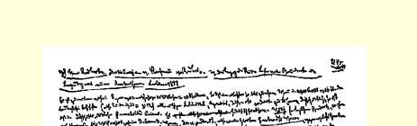
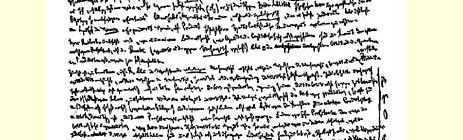
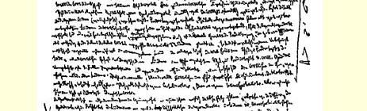
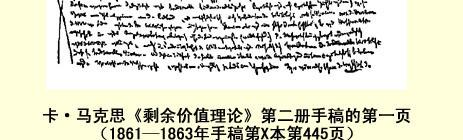

# ［第八章］ 洛贝尔图斯先生。 新的地租理论（插入部分）１

### ［（１）农业中的超额剩余价值。在资本主义条件下，农业的发展比工业慢］

［—４４５］**洛贝尔图斯先生**。洛贝尔图斯《给冯·基尔希曼的第三封信：驳李嘉图的地租学说，对新的地租理论的论证》１８５１ 年柏林版。

事先应该作以下说明。如果我们说，必要工资等于１０小时， 那末，这句话最简单的解释就是这样，如果，平均地说，１０小时劳动（也就是等于１０小时的货币额）使农业短工能够购买他所必需的一切生活资料—— 农产品、工业品等等，那末，１０小时劳动也就是非熟练劳动的平均工资。因而，这里所说的是工人一日产品中必须归他的那一部分产品的**价值**。这个价值最初以他所生产的**商品**形式，也就是作为**这种商品**的一定**量**存在，他可以用这个量—— 在扣除了他自己消费的那一部分（如果他消费这个商品的话）之后—— 换得他所需要的生活资料。因此，在这里，对于他的必要“收入” 说来，工业、农业等等也具有意义，而不只是他自己生产的**使用价值**才具有意义。但是，**商品**的概念本身就包含了这一点。工人生产的是商品，不简单是产品。所以，关于这一点就不用多说了。

洛贝尔图斯先生首先研究在土地占有和资本占有还**没有分离的**国家中是什么情况，并且在这里得出重要的结论说：租（他所谓租，是指全部**剩余价值**）只等于无酬劳动，或无酬劳动借以表现的产品量。

首先要注意，洛贝尔图斯所指的只是**相对**剩余价值的增长，就是说，只是由于劳动生产率提高而产生的剩余价值的增长，而不是由于工作日本身延长而产生的剩余价值的增长。自然，任何绝对剩余价值，从一定意义上来说，都是相对的。劳动必须有足够的生产率，使工人不致为了维持自己的生活而用去全部时间。但是，区别也就从这里开始了。并且，如果说，最初劳动生产率很低，那末，需要也非常简单（如奴隶的情况），主人自己的生活比仆人的生活好得不太多。一个食利的寄生者出现所必需的相对劳动生产率是很低的。如果我们在劳动生产率还很低、机器和分工等等还没有采用的地方，看到有高的利润率，那末，这只有用以下几种情况来解释： 或者，象在印度那样，工人的需要极低，而工人本人甚至还被压到这个极低的需要水平以下，另一方面，劳动生产率低，也就是固定资本对花费在工资上的那部分资本的比例小，换句话说，花费在劳动上的那部分资本对总资本的比例大；或者，劳动时间极度延长。 后面这种情况，则发生在那些已经存在着资本主义生产方式，但是要同发达得多的国家竞争的国家（例如，奥地利等）。在这里，工资可能很低—— 部分是因为工人的需要比较不发展，部分是因为农产品按比较便宜的价格出卖，或者对于资本家同样可以说农产品的货币价值比较小。在劳动生产率低的情况下，在例如１０小时必要劳动时间中生产出来的、用于支付工人工资的产品量也是小的。 但是，如果工人不是工作１２小时而是工作１７小时，这就可以［为资本家］弥补低的劳动生产率。总之，不应该因为在某个国家中劳动的相对价值随该国劳动生产率的增长而下降，就认为在不同国家中工资与劳动生产率成反比。情况恰恰相反。在世界市场上一个国家同其他国家相比，生产率越高，它的工资也就越高。在英国， 不仅名义工资比大陆高，实际工资也比大陆高。工人吃较多的肉， 满足较多的需要。可是，这只适用于工业工人，不适用于农业工人。 不过，英国的工资高的程度，没有达到英国工人的生产率超过其他国家工人的生产率的程度。

由于农业工人的平均工资低于工业工人的平均工资，地租（也就是说，土地所有权的现代形式）已经成为可能，这是撇开由土地肥力不同引起的地租差别而单单就地租的存在本身说的。因为，在这里，资本家起初按照传统（因为旧时代的租地农民变成资本家早于资本家变成租地农场主），一开始就从他的收入中拿出一部分来交给土地所有者，所以他就把工资压到水平以下，来弥补自己的损失。随着工人从农村外逃，工资必然上涨，实际上也上涨了。但是， 当这种压力几乎还没有感觉出来的时候，机器等等就被采用了，农村中又形成了（相对的）人口过剩（请看英国）。尽管劳动时间没有延长，劳动生产力也没有发展，剩余价值可以由于工资压到传统水平以下而增加。凡是以资本主义方式经营农业生产的地方，实际上都是这种情况。在这一点不能靠机器做到的地方，就靠把耕地变为牧羊场来做到。因此，这里已经有了地租的**可能性**，［４４６］因为**实际上**农业工人的工资不等于平均工资。地租存在的这种可能性，完全不取决于产品**价格**—— 假定它等于产品价值。

地租的第二种增加，即价格不变，地租由于产品增加而增加， 李嘉图也知道，但是没有加以考虑，因为他是按每夸特，而不是按每英亩计算地租的。他不会因为每夸特２先令的２０夸特比每夸特 ２先令的１０夸特多，或者比每夸特３先令的１０夸特多，就说地租增加了（**按这种方式**，即使价格下降，地租也可以增加）。

此外，不论怎样解释地租本身，农业同工业比起来，仍然存在着**重大差别**：超额剩余价值的产生，在工业中是由于产品的生产较便宜，而在农业中是由于产品的生产较贵。如果１磅棉纱的平均价格等于２先令，而我能够用１先令把它生产出来，那末，为了争取销路，我一定会把它按１１２先令，或者至少低于２先令出卖。这样做甚至是绝对必需的。因为较便宜的生产是以较大规模的生产为前提的。这样一来，我就使市场商品充斥（同以前相比）。我必须出卖比以前**多**的东西。如果１磅棉纱只花费我１先令，那末，这是由于我现在生产比如说１００００磅，而以前只生产８０００磅。其所以便宜，只是因为固定资本分摊到１００００磅上去了。如果我只出卖 ８０００磅，那末，机器的损耗就会使每１磅的价格提高１５，即２０％。 因此，我为了能够出卖１００００磅，就以低于２先令的价格［比如说， 按１１２先令］出卖。这样我仍然得到１２先令的超额利润，也就是我的产品价值１先令（已经包括普通利润在内）的５０％。无论如何， 这样一来，我迫使市场价格下降，结果消费者一般按较便宜的价格得到产品。而在农业中，在类似的情况下，我按２先令出卖，因为， 假定我的肥沃土地够用了，比较不肥沃的土地就不会去耕种。如果肥沃土地的数量增加了，或者较坏土地的肥力提高了，使我能够满足需求，那末，问题就不存在了。李嘉图不仅不否认这一点，并且十分明确地强调这一点。

因此，即使我们承认，土地肥力的不同不能解释地租本身，而只能解释地租的差别，下面这一规律仍然存在：在工业中，超额利润的获得通常是由于产品变得便宜，在农业中，地租的相对量的产生则不仅由于产品相对变贵（肥沃土地的产品的价格提到它的价值之上），并且由于便宜产品按较贵产品的生产费用出卖。但是，我曾经指出过（蒲鲁东）２，这仅仅是竞争的规律，它不是从“土地”产生，而是从“资本主义生产”本身产生的。

其次，李嘉图在另外一点上也是正确的，不过他按照经济学家的习惯，把历史现象变成永恒的规律。这个历史现象就是工业（真正资产阶级的生产部门）比农业发展快。农业生产率提高了，但是比不上工业生产率提高的程度。在工业生产率提高到１０倍的地方，农业生产率或许提高到２倍。因此，农业生产率，尽管绝对地说提高了，**相对地说**却降低了。这一点仅仅证明资产阶级生产的极其古怪的发展和它所固有的矛盾，但是并不妨碍下述论点的正确性： 农业生产率在相对地降低，因而同工业品相比，农产品的价值以及地租都在提高。随着资本主义生产的发展，农业劳动同工业劳动相比生产率相对地降低，这只是意味着，农业生产率不是以同样速度和同样程度发展。

假定生产部门Ａ与生产部门Ｂ之比是１∶１。最初，农业生产率较高，因为在农业中，参加生产的不仅有自然力，而且有自然本身创造的机器；单个劳动者一开始就用这种机器进行劳动。因此，在古代和中世纪，农产品比工业品相对地说便宜得多，这一点从两种产品在平均工资中所占比例已经可以看出来（见**威德**的著作）３。

假定１∶１还表示两个生产部门的生产率。如果现在生产部门 Ａ＝１０，也就是说，它的生产率增大到１０倍，而生产部门Ｂ＝３，也就是说，只增大到３倍，那末，两个生产部门之比，以前是１∶１，现在是１０∶３或１∶３１０。相对地说，生产部门Ｂ的生产率降低了７１０， 虽然绝对地说它增加到３倍。对于最高的地租来说，这—— 同工业对比—— 就好比它由于最坏土地的肥力减低了７１０而提高一样。

诚然，从这里决不能象李嘉图所想的那样得出结论说，利润率下降是因为工资由于农产品相对变贵［４４７］而提高了，—— 要知道，平均工资不决定于加入该工资的产品的相对价值，而决定于这些产品的绝对价值。但是从这里确实可以得出结论说，利润率（其实，是剩余价值率）不是按加工工业生产力提高的比例提高的，并且这是由于农业（不是土地）的生产率比较低的缘故。这是无庸置疑的。必要劳动时间的减少，同工业的进步相比，是微不足道的。这从俄国等这样的国家竟能在农产品市场上打击英国这一点就表现出来了。较富国家的货币价值较小（就是说，对于较富国家说来，货币的生产费用相对地小），在这里不起任何作用。因为问题恰恰在于，为什么这种情况在较富国家同较穷国家的竞争中，不影响它们的工业品，而只影响它们的农产品。（可是，这并不证明穷国生产比较便宜，它们的农业劳动生产率高。即使是美国，不久以前统计材料证明，按既定价格出卖的小麦总量的确增加了，但这不是因为每一英亩出产小麦多了，而是因为种小麦的亩数多了。有些国家拥有大量土地，在大地段上进行粗放耕作，用同量劳动提供的产品，就绝对量来说，大于比较发达的国家在小得多的地段上提供的产品， 但是，不能说，前者的土地的生产率高于后者。）

转而耕种**生产率较低的**土地，不一定证明农业生产率下降。相反，它可以证明农业生产率提高；耕种贫瘠土地，不仅因为农产

> 卡·马克思《剩余价值理论》第二册手稿的第一页
>
> （１８６１—１８６３年手稿第本第４４５页） 品的价格已经提高到足以补偿投入土地的资本的程度，而且因为生产资料的发展已经达到使不生产的土地变成“生产的”土地，使它能够不仅支付普通利润，并且还支付地租的地步。对于生产力的一定发展阶段说来是肥沃的土地，对于生产力的较低发展阶段说来，就是贫瘠的土地。

**在农业中**，绝对延长劳动时间，也就是说，增加绝对剩余价值， 只有很小的可能。在农业中，劳动不能借瓦斯照明等等。当然，在夏季和春季可以早起。但是，这一点，由于冬季昼短，一般干活较少，就被抵销了。因此，就这方面说，**工业中绝对剩余价值比较大**， 除非法律上强制规定正常工作日。农业中创造的**剩余价值**量比较小的第二个原因是，农产品长时间滞留在生产过程中而没有新的劳动加在它上面。但是，从另一方面来说，除了如畜牧业、养羊业等绝对排挤人口的一些农业部门以外，甚至在最先进的大农业中，使用的人数对使用的不变资本的比例，总是比工业，至少比主要工业部门大得多。因此，从这一方面说，即使由于上述原因，农业中的剩余价值量小于工业中使用**相同**人数时得到的剩余价值量（这种情况又部分地由于农业工人的工资降到平均水平之下而被抵销），农业的利润率仍可能大于工业的利润率。但是，如果说在农业中存在着提高利润率（不是暂时提高，而是同工业相比，平均地提高）的某些原因（上述这些，我们只是大略谈了一下），那末，单单土地所有者的存在这一事实本身，就使这种超额利润不是进入一般利润率的平均化过程，而是固定下来，落到土地所有者手中。

### ［（２）利润率和剩余价值率的关系。作为农业中的不变资本要素的农业原料价值］

考察洛贝尔图斯的理论时要回答的问题，总的说来，归结如下。

预付资本的一般形式是：

> 不变资本      可变资本
>
> 机器 原料      劳动力

不变资本的两个要素，一般地说，就是劳动资料和劳动对象。 劳动对象不一定是商品，不一定是劳动产品。因此，劳动对象作为 **劳动过程的要素**虽然永远存在，但作为**资本的要素**可能不存在。土地是土地耕种者的劳动对象４，煤矿是煤炭业者的劳动对象，水域是渔夫的劳动对象，森林是猎人的劳动对象。但是，当上述劳动过程三要素也作为资本三要素出现，就是说，它们三者都是商品，都是一种具有交换价值并且表现为劳动产品的使用价值的时候，资本具有最完整的形式。在这种情况下，这三个要素也就都进入价值形成过程，虽然机器不是按它进入劳动过程多少，而只是按它被劳动过程消耗多少进入价值形成过程。

现在的问题是：缺少其中一个要素，能否使缺少这个要素的生产部门的**利润率**（不是剩余价值率）提高呢？一般地说，这个问题可由下面的公式本身来回答：

利润率等于剩余价值和预付资本总额之比。

全部研究是在这种假定下进行的：**剩余价值率**不变，就是说， 产品价值在资本家和雇佣工人之间的分配不变。

［４４８］剩余价值率＝ｍｖ；利润率＝ｃ＋ｖ。因为ｍ’即剩余价值率ｍ 是既定的，ｖ也就既定，而且ｍｖ被假定为常量。所以，ｍｃ＋ｖ的量只有在ｃ＋ｖ变化时才变化，又因为ｖ是既定的，所以ｍｃ＋ｖ只有在ｃ减小时增大，或者在ｃ增大时减小。并且，ｍ

ｃ＋ｖ的增大或减小，不是同ｃ∶ ｖ成比例，而是同ｃ∶ｃ＋ｖ之和成比例。假设ｃ＝零，那末ｍｃ＋ｖ＝ｍｖ。 换句话说，在这种情况下，利润率等于剩余价值率，而这就是利润率不能超越的极限，因为任何计算方法都不能改变ｍ和ｖ的量。 如果ｖ＝１００，ｍ＝５０，那末ｍｖ＝５０１００＝１２＝５０％。现在如果加上不变资本１００，那末利润率＝１００＋１００＝５０５０２００＝１４＝２５％。利润率减了一半。如果把１５０加到１００上，那末利润率＝１５０＋１００＝５０５０２５０＝１５＝ ２０％。在第一种情况下，总资本＝ｖ＝可变资本，因而利润率＝剩余价值率。在第二种情况下，总资本＝２×ｖ，因而利润率只有剩余价值率的一半。在第三种情况下，总资本＝２１２×１００＝２１２×ｖ＝５

２ ×ｖ。在这里，ｖ只是总资本的２５。剩余价值＝ｖ的１２，１００的１２，因此只是总资本的２５的１２，也就是说，只是总资本的２１０。（２５０

１０＝２５，而 ２５０的２１０＝５０。）而２１０就是２０％［也就是说，利润率是剩余价值率的 ２５］。

因此，这些是一开始就确定了的。如果ｖ和ｍｖ不变，那末ｃ这个量究竟由哪些部分构成，是完全没有关系的。如果ｃ是一定量， 例如等于１００，那末，不论ｃ分成５０是原料和５０是机器，或者１０ 是原料和９０是机器，或者０是原料和１００是机器，或者反过来，都完全没有关系，因为决定利润率的是ｍｃ＋ｖ这个比例；构成ｃ的各个生产要素，作为价值部分，同整个ｃ之比究竟如何，在这里是没有关系的。例如，在煤的生产中，可以把原料（本身又用作辅助材料的煤除外）看作零，而假定全部不变资本都是由机器（包括建筑物、劳动工具在内）构成。另一方面，在缝纫业者那里，可以假定机器等于零（就是说，在大缝纫业者还没有应用缝纫机的地方，另一方面，象目前伦敦有一部分做法那样，甚至把建筑物都节省掉，让自己的工人在家里劳动；这是件**新鲜事**：第二种**分工**又以第一种分工**形式**出现５），于是，在这个缝纫业者那里，全部不变资本都归结为原料。如果煤炭业者把１０００花费在机器上，把１０００花费在雇佣劳动上，缝纫业者则把１０００花费在原料上，把１０００花费在雇佣劳动上，那末，在剩余价值率相等时，这两种情况下的利润率也相等。我们假定，剩余价值＝２０％，在这两种情况下，利润率就都＝１０％，即２００

２０００ ＝２２０＝１

１０＝１０％。因此，如果说ｃ的组成部分即原料和机器之间的比例，对利润率有影响，那只有在下列两种情况下才可能：第一，如果ｃ的绝对量由于这个比例发生变化而有了变化；第二，如果ｖ的量由于ｃ的组成部分之间的这个比例而有了变化。这里，必定是生产本身发生了有机变化，而不能归结为这样一个简单的同义反复： 如果ｃ的一定部分在总数中占较小的部分，那末ｃ的另一部分在总数中一定占较大的部分。

在一个英国租地农场主的实际开支中，**工资**＝１６９０镑，**肥料** ＝６８６镑，**种子**＝１５０镑，**牛饲料**＝１００镑。因而用于“原料”的是 ９３６镑，比工资的一半还多。（见**弗·威·纽曼**《政治经济学讲演集》１８５１年伦敦版第１６６页）

> “在**弗兰德〈比利时〉**，这一带从荷兰进口**肥料**和干草〈用于种植亚麻等。 作为交换，这一带出口亚麻和**亚麻籽**等〉…… 荷兰各城市的垃圾成了交易品，经常以高价卖给比利时…… 从安特卫普溯些耳德河而上约２０英里，就可以看到从荷兰运来的肥料的堆栈。肥料贸易由一帮资本家用荷兰船只经营”等等。[^1]（**班菲尔德**的著作）６

既然连普通粪便这样的肥料都成了交易品，骨粉、鸟粪、炭酸钾等就更不用说了。这里，生产要素用货币来**估价**，不只是生产中的形式上的变化。为了提高**生产率**，把新的物质送到地里，而把地里旧的物质卖出去。这也不单纯是资本主义生产方式和它以前的生产方式之间的形式上的差别。随着人们认识到换种的重要性，连种子交易也越来越重要了。因此，就真正的农业来说，如果说没有 “原料”—— 并且是作为商品的原料—— 加入农业（不论是农业自己把它再生产出来，还是把它作为商品买进、从外面取得，都一样），那是可笑的。如果说机器制造业者［４４９］自己使用的机器不作为价值要素加入他的资本，那是同样可笑的。

一个年年自己生产自己的生产要素（种子、肥料等等），并且自己全家吃掉自己的一部分谷物的德国农民，只是为了购置少数农具和支付工资才（为生产本身）支出货币。假定他的全部支出的价值等于１００［其中５０用货币支付］。他以实物形式消费产品的一半 （［这里也包括实物形式的］生产费用）。他把另一半出卖，比如说得到１００。在这种情况下，他的总的［货币］收入等于１００。如果他按资本５０来计算［他的货币形式的纯收入］，那就是１００％［利润］。 如果现在［作为利润得到的］５０中有１３交地租，１３交税款（合计３３ １３），他自己留下１６２３，按５０计算，就是３３１３％。但是，实际上他只得到［所支出的１００的］１６２３％。这个农民完全算错了，自己骗了自己。在资本主义租地农场主那里是不会有这种错误计算的。

**马蒂约·德·东巴尔**《农业年鉴》１８２８年巴黎版第四分册说到，按照对分制租佃契约（例如贝里省），

> “土地所有者提供土地、建筑物，通常还提供全部或一部分牲畜和生产所必需的农具；租地农民方面提供自己的劳动，此外不提供或几乎不提供什么。 土地的产品拿来对分。”（第３０１页）“对分制租地农民通常是贫困不堪的人。” （第３０２页）“如果对分制租地农民预付１０００法郎，增加总产品１５００法郎〈即总利润５００法郎〉，他必须同土地所有者对分，因而只得到７５０法郎，也就是说，自己的预付资本损失２５０法郎。”（第３０４页）“在以前的耕作制下，生产支出即生产费用几乎完全以实物形式从产品本身取得，以供饲养牲畜并供土地耕种者和他的家庭消费；几乎完全没有现金支出。只有这种情况才会使人相信，土地所有者和租地农民可以分享没有在生产中消费掉的全部收成；但是， 这种做法只适用于这种农业，即**处于低水平的农业**；人们一旦想要在农业中实行某种改良，就会立即发觉，只有预先付出一笔款项才可能做到，而这笔款项必须从总产品中扣出，供下年生产之用。因此，土地所有者和租地农民对总产品的任何分成，对任何改良都是不可克服的障碍。”（第３０７页）

### ［（３）农业中的价值和平均价格７。绝对地租］

#### ［（ａ）工业中利润率的平均化］ 洛贝尔图斯先生对于竞争调节正常利润，或平均利润，或一般利润率，总的说来，似乎是这样想的：竞争使商品还原为它们的**实际价值**，就是说，竞争调节商品价格之间的比例，使物化在各种商品中的劳动时间的相当量，以货币或其他某种价值尺度表现出来。 当然，这种调节，不是使这种或者那种商品的价格在任何时候、任何一定时刻都等于或都必定等于它的价值。［照洛贝尔图斯的想法，这种调节是这样进行的。］例如，商品Ａ的价格提高到它的价值以上，并且，这种价格在一定时间内保持这个高度或者甚至继续提高。资本家Ａ的利润因而提高到平均利润以上，因为他不仅占有他自己的“无酬”劳动时间，而且占有其他资本家“生产”的无酬劳动时间的一部分。与此相应—— 在其他商品的货币价格不变的情况下—— 必然有这个或那个生产领域的利润下降。如果该商品作为一般生活资料加入工人的消费，这就会使其他一切部门的利润率下降；如果该商品成为不变资本的组成部分，这就会使那些以该商品作为不变资本要素的生产部门的利润率下降。

最后，可能还有一种情况，即这种商品既不作为要素加入任何不变资本，也不是工人的**必要**生活资料（因为，工人随自己的意可买可不买的那些商品，工人是作为一般消费者而不是作为工人去消费的），而是消费品，一般个人消费品。如果这种商品作为消费品加入工业资本家本人的消费，那末，它的价格提高决不影响剩余价值量或剩余价值率。但是，如果资本家想要保持他原来的消费水平，那末，利润（剩余价值）中被他用于个人消费的部分，同被他用于工业再生产的部分相比就会增加。这样，用于再生产的部分就会减少。因此，由于Ａ的价格提高，或者说，Ａ的利润提高到平均利润率以上，经过一定时期（这个时间也是由再生产决定的），Ｂ、Ｃ等的利润量就会降低。如果商品Ａ完全加入非工业资本家的消费， 那末，同以前相比，这些非工业资本家消费商品Ａ多了，而消费商品Ｂ、Ｃ等少了。对商品Ｂ、Ｃ等的需求会减少；它们的价格将下降， 而在这种情况下，Ａ的价格的提高，或者说，Ａ的利润提高到平均利润率以上，会通过压低Ｂ、Ｃ等的货币价格，使Ｂ、Ｃ等的利润降到平均利润率以下（这同前面所举的情况不同，在那里，Ｂ、Ｃ等的货币价格是［４５０］保持不变的）。利润率降到普通水平以下的Ｂ、Ｃ 等领域的资本，将离开它们自己的生产领域，转入Ａ生产领域；在市场上不断重新出现的一部分资本，尤其是这样，这种资本当然会力求挤进更加有利可图的Ａ生产领域。由于这个原因，商品Ａ的价格，在若干时间以后，将会降到它的价值以下，并且在或长或短的一段时间内继续下降，直到相反的运动重新开始为止。在Ｂ、Ｃ 等领域中，将发生相反的现象，部分由于商品Ｂ、Ｃ等的供给因资本流出而减少，就是说，由于这些领域本身发生了有机变化，部分则由于Ａ领域中过去发生的变化现在以相反方向作用于Ｂ、Ｃ等领域。

顺便指出：在刚才描述的运动中，虽然商品Ｂ、Ｃ等的货币价格（假定货币的价值不变）提高到商品Ｂ、Ｃ等的价值以上，因而 Ｂ、Ｃ等的利润率也提高到一般利润率以上，但是，商品Ｂ、Ｃ等的货币价格，有可能再也达不到它们原来的水平。改良、发明、生产资料的更大节约等等，不是在价格提高到自己的平均水平以上的时候运用，而是在价格降到这个水平以下、因而利润降到普通利润率以下的时候运用。因此，在商品Ｂ、Ｃ等的价格下降的时期，它们的 **实际价值**可能下降，换句话说，为生产这些商品所需的最低限度的劳动时间可能下降。在这种情况下，只有当商品的价格超过它的价值的程度，等于表现它的新价值的价格和表现它的较高的原有价值的价格之间的差额的时候，商品才能恢复它以前的货币价格。在这种情况下，商品**价格**将会通过影响供给、影响生产费用来改变商品的价值。

上述运动的结果就是这样：如果就商品价格在商品价值上下波动的平均数来看，或者说，如果就上下波动平均化的时期—— 不断反复出现的时期—— 来看，那末**平均价格**等于**价值**，因而一定生产领域的平均利润也等于一般利润率；因为，在这个领域中，虽然随着价格的涨落，或者，在价格不变的情况下，随着生产费用的增减，利润提高到原来的利润率以上或降到原来的利润率以下，但是就一个时期平均起来，商品是按自己的**价值**出卖的，**因而**，赚到的利润等于一般利润率。这就是亚·斯密的观点，尤其是**李嘉图**的观点，因为后者更明确地坚持真正的价值概念。洛贝尔图斯先生也从他们那里接受了这个观点。可是，这个观点是错误的。

资本的竞争究竟产生什么结果呢？在任何一个平均化的时期中，商品的**平均价格**是这样的：这种价格向每个领域的商品生产者提供同样的利润率，譬如１０％。这又是什么意思呢？这就是说，每种商品的价格，比这种商品使资本家花费的、资本家为生产它而支出的生产费用，高出十分之一。一般说来，这不过是说，等量资本提供等量利润，每种商品的价格，比在这种商品上预付、消费或者体现的资本的价格，高出十分之一。但是，如果以为资本按照自己的大小，在不同的领域中生产相同的剩余价值，那是完全错误的。｛这里我们完全不考虑，一个资本家是否比另一个资本家强迫工人劳动更长的时间；我们在这里假定，在一切领域中，**绝对**工作日是一样的。绝对工作日的差别，一部分由不同长度的工作日的劳动强度等抵销了，一部分不过表现为强求的超额利润、例外等。｝即使假定绝对工作日在一切领域中是一样的，就是说，假定剩余价值率是既定的，这种说法也是错误的。

在资本量**相等**的情况下，—— 并且在上述**假定**的条件下，—— 这些资本所生产的剩余价值量依下述情况不同而不同：**第一**，资本的有机组成部分即可变资本和不变资本之间的比例；**第二**，资本的周转时间，因为这个时间取决于固定资本和流动资本之间的比例， 以及不同种类固定资本的不同的再生产期间；**第三**，和劳动时间本身长度不同的、真正生产期间的长度，８这个长度也决定生产期间和流通期间的比例的重大差别。（上述第一个比例，即不变资本和可变资本之间的比例本身，可以由非常不同的原因产生。例如，它可以仅仅是形式上的，—— 当一个生产领域加工的原料比另一个生产领域加工的原料贵的时候，就是这样，—— 或者，它可以由不同的劳动生产率产生，等等。）

因此，如果商品按其价值出卖，或者说，如果商品的**平均价格** 等于其价值，那末，利润率在不同的生产领域中必定是完全不同的；在一种情况下，它会是５０％，在其他情况下，它会是４０％、 ３０％、２０％、１０％等。例如，拿Ａ领域一年的商品总量来看，它的价值等于预付在它上面的资本加上它所包含的无酬劳动。在Ｂ、Ｃ领域中也是一样。但是因为Ａ、Ｂ、Ｃ包含的无酬劳动量不同，例如，Ａ 包含的大于Ｂ包含的，Ｂ包含的大于Ｃ包含的，商品Ａ给自己的生产者提供比方说３Ｍ（Ｍ是剩余价值），商品Ｂ提供２Ｍ，商品Ｃ 提供Ｍ。因为利润率决定于剩余价值和预付资本之比，而预付资本，根据假定，在Ａ、Ｂ、Ｃ等领域中是一样的，所以，［４５１］如果Ｃ 代表预付资本，那末，这些领域的不同的利润率就等于３ＭＣ、２ＭＣ、ＭＣ。 因此，资本的竞争要使利润率平均化，在上述例子中，只有使Ａ、 Ｂ、Ｃ领域的利润率等于２ＭＣ、２ＭＣ、２ＭＣ。这样，Ａ将会把它的商品卖得比它的价值便宜１Ｍ，而Ｃ把它的商品卖得比它的价值贵１Ｍ。Ａ 领域的平均价格将低于商品Ａ的价值，Ｃ领域的平均价格将高于商品Ｃ的价值。

Ｂ的情况说明，商品的平均价格同价值一致，确实**可能**发生。 这发生在Ｂ领域本身生产的剩余价值等于平均利润的时候，也就是说，这时候，在这个领域中，资本的不同部分的相互比例，等于 （如果把资本的总额，资本家阶级的全部资本，当作一个**量**，按这个量来计算全部剩余价值，不问这些剩余价值由总资本的哪个领域生产出来）总资本不同部分的相互比例。在这个**总资本**中，周转时间等等也平均化了；这整个资本按例如一年周转一次计算，等等。 于是，这个总资本的每个部分，实际上就会根据自己的大小，按比例来瓜分全部剩余价值，各自取得全部剩余价值的相应部分。既然每一单个资本被看作这个总资本的股东，那末由此可以得出结论： **第一**，单个资本的**利润率**同其他任何资本的利润率是一样的，等量资本提供等量利润；**第二**，这是从第一点自然得出的，就是，利润量取决于资本的大小，取决于资本家在这个总资本中拥有的股数。资本的竞争力图把每个资本作为总资本的一部分来对待，并且根据这一点来调节每个资本取得剩余价值的份额，也就是说，调节利润。竞争通过它的平均化作用或多或少达到了这个目的。（竞争在个别领域中遇到特殊障碍的原因不应在这里研究。）直截了当地说，这无非是资本家们努力（而这种努力就是竞争）把他们从工人阶级身上榨取的全部无酬劳动量（或这个劳动量的产品）在他们相互之间进行分配，而且这种分配不是根据每一个**特殊**资本直接生产多少剩余劳动，而是根据：**第一**，这个特殊资本在总资本中占多大部分；**第二**，总资本本身生产的剩余劳动总量。资本家们既作为同伙又作为敌手来瓜分赃物—— 他们所占有的别人劳动，于是他们每个人占有的无酬劳动，平均说来，同其他任何一个资本家占有的一样多。９

竞争是通过调节平均价格来实现这种平均化的。但是，这种平均价格本身，使商品高于或低于它的价值，以致该商品不能比其他任何商品提供较大的利润率。因此，认为资本竞争是通过使商品价格等于价值来确立一般利润率的说法，是错误的。相反，竞争正是通过以下途径来确立一般利润率的：**它把商品的价值转化为平均价格**，**在平均价格中**，**一种商品的剩余价值的一部分转到另一种商品上**，等等。商品的**价值**等于商品**包含的**有酬劳动和无酬劳动的量。商品的**平均价格**等于商品**包含的**有酬劳动（物化劳动或活劳动）量加无酬劳动的平均份额，这个平均份额不取决于它原来是否如数包含在这种商品本身，换句话说，不取决于原来包含在该商品的价值中的无酬劳动是大还是小。

#### ［（ｂ）地租问题的提法］

可能，—— 这一点我留到以后研究，不属于本册１０研究范围，—— 某些生产领域是在这样的环境下工作的，这种环境阻碍它们的价值转化为**上述**意义的平均价格，也就是说，不让竞争取得这种胜利。如果，比如说，农业地租或矿山地租就是这种情况（有一些租，完全只能用垄断来说明，例如伦巴第和亚洲某些地区的水租； 又如实际是地产租的房租），那末，从这里得出的结论是，当所有工业资本的产品的价格提高或者降低到平均价格的水平的时候，农产品的价格却始终等于自己的价值，而这个价值将高于平均价格。 这里是否存在着一种障碍，使这个生产领域**生产的剩余价值**中被当作本领域财产来占有的部分，大于按照竞争规律应得的部分，大于按照投在这个生产部门的资本的份额应得的部分？

我们假定有这样一些工业资本，它们不是暂时地，而是由于**它们的**生产领域的性质，［４５２］比其他生产领域中同量工业资本多生产１０％，或２０％，或３０％的剩余价值。我说，如果这些资本能够在竞争面前保住这种超额剩余价值，不让它参加决定一般利润率的总计算（分配），那末，在这种情况下，在这些资本发挥作用的各个生产领域中，就会有两个不同的获利者，一个取得一般利润率，另一个取得该领域所独有的超额部分。每一个资本家，为了有可能把他的资本投入该领域，就要对这个享受特权的人支付、交付这个超额部分，而他自己同其他任何一个在相同条件下经营的资本家一样，为自己保住一般利润率。既然农业中的情况是这样，那末，这里，**剩余价值**分解为**利润**和**地租**，完全不是表明劳动本身在这里比在加工工业中“具有更高的生产率”（从生产剩余价值的意义上来说）；因此，把任何创造奇迹的力量归于土地是毫无理由的，并且， 这本身就是可笑的，因为**价值等于劳动**，**从而**，**剩余价值决不能等于土地**。（诚然，相对剩余价值可能取决于土地的自然肥力，但是， 无论如何不能由此得出土地产品**价格较高**的结论。倒是恰恰相反。）也不必找李嘉图的理论帮忙，这个理论本身令人讨厌地同马尔萨斯废话联结在一起，得出可鄙的结论，特别是，这个理论同我的相对剩余价值学说，即使在理论上不是对立的，在实践上也把它的意义抹去了一大部分。

在李嘉图那里，问题的全部要点如下：

地租（例如在农业中）—— 照他的假定—— 在农业以资本主义方式经营、有**租地农场主**存在的地方，只能是超过一般利润的余额。土地所有者取得的地租是否真正是这种资产阶级经济学意义上的地租，是完全没有关系的。它可能纯粹是工资的扣除部分（参看爱尔兰的情况），也可能部分地靠租地农场主的利润被压到利润的平均水平以下而得到。这一切可能的情况在这里是绝对无关紧要的。**地租**之所以在资本主义制度下成为剩余价值的一种特殊的、 具有特征的形式，只在于它是超过（一般）利润的余额。

但是，这怎么可能呢？商品小麦，同其他任何商品一样，按它的 **价值**出卖，就是说，按照它所包含的劳动时间同其他商品交换。｛这是第一个错误的前提，它人为地使问题变得更加困难了。商品按其价值交换只是例外。商品的**平均价格**是按另外的方式决定的。见上述。｝种植小麦的租地农场主同其他所有资本家一样，赚得同样的利润。这证明，他同其他所有资本家一样，占有自己工人的无酬劳动时间。在这种情况下，究竟还从哪里产生地租呢？地租无非代表劳动时间。为什么剩余劳动在工业中只等于利润，而在农业中却应该分解为利润和地租呢？如果农业中的利润等于其他各个生产领域的利润，这怎么可能呢？｛李嘉图的不正确的利润观点，以及他把利润和剩余价值直接混淆起来，在这里也是有害的。这些使他考察问题更困难了。｝

李嘉图解决这个**困难**的办法是：假定困难**在原则上**是不存在的。｛确实，这是在原则上解决困难的**唯一方式**。不过，这可以有两种办法。或者证明，与一定原则矛盾的现象只是某种**表面的东西**， 只是从事物本身发展中产生出来的假象。或者象李嘉图所作的那样，**在某一点上抛开**困难，然后把这一点作为出发点，从这里出发， 可以说明造成困难的现象在另一点上存在。｝

李嘉图假定这样一种情况，那就是，租地农场主的资本｛不论是指个别农场的不付地租的那部分资本，或者是指农场的不付地租的那部分土地；总之，这里是指投入农业而不付地租的资本｝同其他任何一个资本家的资本一样，只提供利润。这个假定甚至是李嘉图的出发点，它也可以这样表达：

最初，租地农场主的资本只提供利润｛但是，这个**伪历史**形式是无关重要的，它是所有资产阶级经济学家在编造其他类似“规律”时所共有的｝，这笔资本不支付地租。租地农场主的资本同其他任何产业资本没有区别。只因为对于谷物的需求增加了，结果，和其他生产部门不同，不得不向“比较不” 肥沃的土地找出路，这才产生地租。由于生活资料涨价，租地农场主（假定的最初的租地农场主）同其他任何产业资本家一样受损失，因为租地农场主也不得不给自己的工人多支付报酬。但是，租地农场主由于自己的商品的价格提高到它的价值以上，占了便宜。他所以占便宜，第一，因为加入他的不变资本的其他商品，同他的商品比起来，相对价值下降了，于是他按比较便宜的价格购买这些商品；第二，因为他以较贵的商品形式占有他的剩余价值。这样一来，这个租地农场主的利润就提高到已经降低的平均利润率以上。于是，另一个资本家去经营较坏的等地，这块土地，在这个利润率较低的情况下，能够按的产品的价格提供产品，甚至还稍便宜一些。不管怎样，我们现在［４５３］在等地上又有了使剩余价值仅仅归结为利润的正常关系，然而因此我们已经把的地租解释了，也就是说，因为存在着两种生产价格，而的生产价格同时就是的市场价格。这就完全象在比较有利的条件下生产出来的工业品提供暂时的超额利润一样。除利润外还包含地租的小麦价格，虽然也是仅仅由物化劳动构成，虽然也等于小麦的价值，但是，它不等于小麦本身包含的价值，而等于上种植的小麦的价值。两种市场价格并存是不可能的。｛李嘉图因为利润率下降而引进租地农场主，斯特林则由于谷物价格使工资**下降**而不是提高，让租地农场主登场。这种下降的工资使租地农场主能够以原来的利润率经营等地，虽然这块土地比较不肥沃。１１｝地租的存在既然这样来解释，其余也就不难推论了。**地租的差别**同肥力的差别相适应等等，自然还是正确的。但是，肥力的差别本身并不证明必须去耕种越来越坏的土地。

因此，李嘉图的理论就是这样。因为给租地农场主提供超额利润的上涨了的小麦价格，给租地农场主提供的甚至不是原来的利润率，而是较低的利润率，所以，很清楚，的产品包含的价值大于的产品，或者说，的产品是较多劳动时间的产品，它包含较多的劳动量；因此，为了生产同样多的产品，例如一夸特小麦，就要花费较多的劳动时间。地租的增长，将同土地肥力的这种不断降低的情况相适应，或者说，将同生产例如一夸特小麦所必需花费的劳动量的增加相适应。当然，如果增加的只是支付地租的夸特数， 李嘉图是不会说地租“增长”的，在李嘉图看来，只有同样一夸特的价格增长，例如从３０先令涨到６０先令，地租才是增长了。诚然，李嘉图有时忘记了，**地租的绝对量在地租率下降的情况下可能增长**， **正如利润的绝对量在利润率下降的情况下可能增长一样**。

另外一些人（例如**凯里**）想绕过这个困难，他们干脆用另一种方式否认这个困难的存在。据说，地租只是以前投入土地的资本的利息。１２所以，地租也只是利润的一种形式。因此，这里，地租的存在被否定了，从而地租实际上就被解释掉了。

另外一些人，例如布坎南，把地租看成纯粹是垄断的后果。再看**霍普金斯**的著作。１３这里，地租完全归结为超过**价值**的**附加部分**。

在**奥普戴克**先生那里，土地所有权或地租是**“资本价值的合法反映”**１４，这是美国佬所特有的。[^2]

在李嘉图那里，由于两个错误的假定，增加了研究的困难。｛确实，李嘉图不是地租理论的发明者。威斯特和马尔萨斯在李嘉图之前已经出版了自己关于地租理论的著作。然而，来源是**安德森**。但是，李嘉图的特点是他的地租理论和他的价值理论的相互联系（虽然在威斯特的著作中也不是完全没有真实联系）。马尔萨斯后来同李嘉图在地租问题上的论战证明，马尔萨斯甚至并不理解他从安德森那里借用的理论。｝如果从商品价值决定于生产商品所必需的劳动时间（以及价值无非是物化了的社会劳动时间）这个正确的原则出发，那末，自然得出结论说，商品的**平均价格**决定于生产商品所必需的劳动时间。如果**平均价格**等于**价值**这一点得到证明，这个结论就会是正确的。可是，我证明情况恰好相反：正**因为**商品价值决定于**劳动时间**，商品平均价格**决不能**等于商品价值（**只有一个**情况除外，就是某一个生产领域的所谓个别**利润率**，即由这个生产领域本身生产出来的剩余价值决定的利润，等于总资本的平均利润率），虽然平均价格这个规定只是从由劳动时间决定的价值引伸出来的。

由此首先得出一个结论：即使有些商品的平均价格（如果撇开不变资本的价值不说）只分解为工资和利润，而工资和利润又处于正常水平，是平均工资和平均利润，这种商品，也可能高于或者低于它们自己的价值出卖。因此，一种商品的剩余价值只表现为正常利润的项目这个情况并不足以证明，这种商品就是按它的价值出卖，同样，商品除利润外［４５４］还提供地租这个情况也不足以证明， 这种商品是**高于**它的内在价值出卖的。既然确定，一种商品所实现的**资本的平均利润率**即**一般利润率**，可能**低于**商品自己的、由商品中实际包含的剩余价值决定的利润率，那就可以由此得出结论：如果一个**特殊生产领域**的商品，除了提供这种平均利润率以外，还提供第二个剩余价值量，这种剩余价值量具有特殊的名称，比如叫作 **地租**，那末，这并不使利润加地租，即利润与地租之和，一定要大于这个商品本身所包含的**剩余价值**。既然［资本家所得的］利润可能小于该商品的内在剩余价值，也就是说，小于该商品所包含的无酬劳动量，那末，利润加地租也就不一定要大于商品的内在剩余价值。

的确，剩下还要说明的是，为什么这类现象发生在一个不同于其他生产领域的**特殊**生产领域。但是，解决这个问题已经非常容易了。提供地租的这种商品和其他一切商品的不同之处在于一部分其他商品的平均价格**高于**它们的内在价值，但其程度只是使它们的利润率提到一般利润率水平；而另一部分其他商品的平均价格 **低于**它们的内在价值，但其程度只是使它们的利润率**降**到一般利润率水平；最后，第三部分其他商品的平均价格等于它们的内在价值，但这只是**因为**它们在按它们的**内在**价值出卖时提供一般利润率。提供地租的商品同所有这三种情况都不相同。在任何情况下， 这种商品出卖的价格都是这样的：这种商品所提供的利润，**大于**由资本的一般利润率决定的**平均利润**。

现在产生的问题是：在这里，上述三种情况中哪一种情况或者其中哪几种情况可能发生？**提供地租的商品所包含的全部剩余价值**在该商品的价格中是否**得到实现**？如果是这样，上述第三种情况就被排除了，在第三种情况下，商品的全部剩余价值之所以在它们的平均价格中得到实现，是因为它们只有这样才提供普通利润。因此这种情况不属于考察的范围。同样，按照**这个**假定，第一种情况，就是在商品的价格中实现的剩余价值**高于**它的内在剩余价值的情况，也不属于考察的范围。因为我们恰恰假定，在提供地租的商品的价格中“实现了它所包含的剩余价值”。因此，这种情况同第二种情况相类似，在第二种情况下，商品的内在剩余价值高于在它们的平均价格中实现的剩余价值。同这第二种情况下的商品一样，特殊生产领域的商品的内在剩余价值—— 以利润的形式出现，并降低到一般利润率的水平，—— 在这里形成所花费的资本的利润。但是，和**第二种情况下的商品**不同，在我们所考察的这些例外的商品的价格中，也实现了**商品的内在剩余价值超过**这个利润的**余额**，但是这个余额不是落到资本所有者手里，而是落到别的所有者手里，就是说，落到土地、自然因素、矿山等等的所有者手里。

也许这些商品的价格被哄抬到足以提供多于**平均利润率**的东西吧？例如，在（真正的）垄断价格的情况下就是这样。**这个假定** —— 对于每一个可以自由使用资本和劳动，而生产就使用的资本量来说已经服从于一般规律的生产领域—— 不仅是ｐｅｔｉｔｉｏ ｐｒｉｎｃｉｐｉｉ〔本身尚待证明的论据〕，并且是同科学和资本主义生产 （前者仅仅是后者的理论表现）的基础**直接矛盾**的。因为，这种假设的前提恰恰是需要加以说明的东西，即在一个特殊生产领域中，商品的价格所提供的**必然要**比一般利润率，比平均利润多，为此，商品**必然要高于**它的价值**出卖**。因而，它的前提是，农产品**不受**商品价值和资本主义生产的一般规律**影响**。并且，所以以此为前提，是因为初看起来，利润之外还特别存在地租，造成了这种假象。所以， 上述假设是荒谬的。

因此，唯一的办法就是，假设在这个特殊生产领域存在着特殊的条件，存在着某种影响，使商品的价格实现了商品的［全部］内在剩余价值，而不是象第二种情况下的商品，其价格只在一般利润率所提供的利润的限度内实现其剩余价值。在所考察的特殊生产领域中，商品的平均价格并没有降到商品的剩余价值以下，以致它们只提供一般利润率，或者说，以致它们的平均利润不大于其他一切使用资本的生产领域。

这样一来，问题已经大大简化了。问题已经不是要说明，一种商品的价格，怎么除了提供利润之外还提供地租，—— 因而，它**表面上看来**，违背了一般价值规律，并且通过把它的价格提到高于它的**内在剩余价值**，而给一定量资本提供了**大于一般利润率**所能提供的东西。相反，问题是要说明：这种商品在商品价格平均化而导致平均价格的过程中，怎么不把它的**内在剩余价值**让一些给其他商品，使它只留下**平均利润**；这种商品怎样把自己剩余价值中构成 **超过**平均利润的余额的那部分也加以实现。因此，问题在于一个在该生产领域投资的租地农场主，他出卖商品的价格，怎么会使这种商品除了给他提供普通利润外，同时还使他能够把实现的商品剩余价值**超过**这个利润的余额，付给第三者即土地所有者。

［４５５］这样提出问题的提法本身，就已经包含问题的解答。

#### ［（ｃ）土地私有权是绝对地租存在的必要条件。 农业中剩余价值分解为利润和地租］

十分简单：一定的人们对土地、矿山和水域等的**私有权**，使他们能够攫取、拦截和扣留在这个特殊生产领域即这个特殊投资领域的商品中包含的**剩余价值超过利润**（平均利润，由一般利润率决定的利润）**的余额**，并且阻止这个余额进入形成一般利润率的总过程。这部分剩余价值，甚至在一切工业企业中也被拦截，因为不论什么地方，都要为使用地皮（工厂建筑物、作坊等所占的地皮）付地租，因为即使在可以完全自由占用土地的地方，也只有在多少是人口稠密和交通发达的地点才建立工厂。

如果在最坏的土地上得到的商品，属于平均价格等于价值的第三类商品，就是说，属于这样一类商品，它们的全部内在剩余价值在它们的价格中得到实现，因为它们只有这样才提供普通利润，—— 那末，这块土地就不付任何地租，土地所有权在这里就只是名义上的。假如这里付一笔**租金**，那末，这不过证明小资本家们满足于赚取**低于**平均利润的利润，在英国有一部分就是这种情况 （见**纽曼**的著作）１５。当地租率大于商品的**内在**剩余价值和**平均利润**的差额的时候，总是这种情况。甚至有的土地，耕种它至多只够补偿工资，因为，虽然劳动者在这里用他的整个工作日为自己劳动，但是他的劳动时间超过社会**必要**劳动时间。他的劳动生产率低于**这个**劳动部门中占统治地位的生产率，虽然他用１２小时为自己劳动，他生产的产品几乎没有工人在比较有利的生产条件下用８ 小时生产的多。这就好比与机器织机竞争的手工织工的情况一样。 这个手工织工的产品，的确包含１２劳动小时，但是它只等于８小时或者还不到８小时的社会**必要**劳动，因此，只有８个必要劳动小时的价值。如果在类似情况下，一个茅舍贫农支付租金，那末这笔租金纯粹是他的**必要**工资的扣除部分，不代表任何剩余价值，更不代表任何超过平均利润的余额。

假定在某一国家，例如美国，进行竞争的租地农场主的人数还很少，土地占有还不过是形式，每一个人都可以找到空闲的土地来投资耕种，而不必经过在他以前已经经营土地的所有者或租地农场主的许可。在这种情况下，除了因位于人口稠密的地带而被垄断的土地以外，在一个较长的时期内，租地农场主生产的超过平均利润的剩余价值，在他的产品的价格中可能得不到实现；他会被迫把他所得到的剩余价值与资本家同伙瓜分，这正象有些商品的剩余价值一样，它们包含的全部剩余价值如果在商品的价格中得到实现，就会提供超额利润，也就是提供超过一般利润率的利润。在这种情况下，一般利润率就会提高，因为小麦等，将同其他工业品一样，**低于**它的价值出卖。这种**低于**价值出卖的情况不会成为例外，相反，倒会阻止小麦成为其他同类商品中的例外。

第二，假定某一国家的全部土地都是一种质量，但是属于这样一种质量：如果商品包含的全部剩余价值都在商品的价格中得到实现，商品就会给资本提供普通利润。在这种情况下，不支付任何地租。地租的消失，丝毫不影响一般利润率，既不会使它提高也不会使它降低，正如其他非农产品属于这一类并不影响利润率一样。 这些商品之所以属于这一类，正是因为它们的**内在剩余价值**等于 **平均利润**；因此，它们不能改变这种利润的高度，相反，它们适应于这种利润而完全不影响这种利润，尽管这种利润影响它们。

第三，假定全国土地都是一类，而且这些土地如此贫瘠，投在它上面的资本的生产率如此低，以致它的产品属于剩余价值低于平均利润的一类商品。自然，在这种情况下（因为工资由于农业生产率低而普遍提高），只有在绝对劳动时间可以延长，原料（如铁等）不是农产品，或者原料（如棉花、丝等）是进口物和比较肥沃土地的产品的地方，剩余价值才处于较高的水平。在这种情况下，［农业］商品的价格包含的剩余价值必须高于它们的内在剩余价值，才能提供普通利润。一般利润率将因此降低，虽然地租并不存在。

或者，我们假定在**第二种情况**下土地的生产率非常低。那末， 这种农产品的剩余价值等于平均利润，说明这里的平均利润本来就低，因为在农业中，１２劳动小时里面，单单用来生产工资，或许就要１１劳动小时，而剩余价值只有１小时或者更少。

［４５６］这几种不同的情况说明：

在第一种情况下，**地租的消失或不存在**，是同一个与地租已经发展的其他国家相比**提高了的利润率**联系着、并存着的。

在第二种情况下，地租的消失或不存在丝毫不影响利润率。

在第三种情况下，地租的消失或不存在—— 与有地租存在的其他国家相比—— 是同一个**低的**、**较低的**一般利润率联系着的，并且是一般利润率水平低的标志。

由此可见，一个特殊的地租的发展，就其本身来说，同**农业劳动的生产率**是绝对无关的，因为地租的不存在或者消失既可以同一个提高的利润率联系着，也可以同一个保持不变的利润率联系着，也可以同一个下降的利润率联系着。

这里的问题不在于为什么在农业等部门**剩余价值超过平均利润的余额**被扣留下来；相反，问题倒在于：由于什么原因这里竟要发生相反的现象？

剩余价值无非是无酬劳动；平均利润，或者说正常利润，无非是假定由每一个一定量的资本实现的无酬劳动量。如果说平均利润是１０％，那末这不过是说，一个１００单位的资本摊到１０单位无酬劳动；或者说，等于１００的物化劳动支配相当于本身数额的１１０的 **无酬**劳动。因此，**剩余价值超过平均利润的余额**是指：商品中（商品的价格中，或者说，由剩余价值构成的那部分商品价格中）包含的无酬劳动量，大于形成平均利润的无酬劳动量，因而大于商品的平均价格中**构成商品价格超过商品生产费用的余额**的无酬劳动量。 在单个商品中，生产费用代表预付资本，超过这个生产费用的余额代表预付资本所支配的**无酬劳动**；因此，这个价格余额与生产费用之比，代表用于商品生产过程的一定量资本支配无酬劳动的**比率**， 而不管该**特殊**生产领域的商品所包含的无酬劳动是否等于这个**比率**。

那究竟是什么东西迫使单个资本家例如按照平均价格出卖他的商品？（这个平均价格作为某种已经形成的东西**强加**于资本家， 这决不是他的自由行动。他是更愿意**高于**商品价值出卖商品的。） 究竟是什么东西迫使资本家按照这种只向他提供平均利润，使他实现的无酬劳动小于他商品中实际包含的无酬劳动的价格出卖他的商品呢？迫使他这样做的，是其他资本通过竞争所施加的压力。 如果Ａ生产部门的无酬劳动对预付资本（例如１００镑）之比大于 Ｂ、Ｃ等生产领域（Ｂ、Ｃ等生产领域的产品，完全同Ａ生产领域的商品一样，以其使用价值满足某种社会需要），任何同量资本也就会涌向Ａ生产部门。

因此，如果存在这样一些生产领域，那里的某些自然生产条件，如耕地、煤层、铁矿、瀑布等，—— 没有这些条件，生产过程就无从进行，这些领域的商品就不能生产，—— 不是掌握在物化劳动的所有者或占有者资本家的手里，而是掌握在其他人的手里，那末这第二类的**生产条件所有者**就对资本家说：

如果我让你使用这些生产条件，那你将赚你的平均利润，占有正常的无酬劳动量。但是你的生产提供一个超过利润率的剩余价值余额，即无酬劳动余额。这个余额，你不应象你们资本家们通常做的那样，投进总库。这个余额我来占有，它是属于我的。这种交易会使你完全满意，因为你的资本在这个生产领域给你提供的，同在其他任何领域一样多，并且，这是一个十分稳定的生产部门。你的资本在这里除了给你提供构成平均利润的那１０％的无酬劳动以外，还给你提供２０％的**超额**无酬劳动。你要把这个付给我，为了能够这样做，你要把这２０％的无酬劳动加在商品的价格上，但是不要把它算入你和其他资本家的总账。你对一种劳动条件—— 资本，物化劳动—— 的所有权，使你能够占有工人的一定数量的无酬劳动，同样，我对另一种生产条件—— 土地等等—— 的所有权，使我能够从你和整个资本家阶级那里扣下无酬劳动中超过你的平均利润的那个余额。你们的规律要求在正常情况下等量资本占有等量无酬劳动，你们资本家可以［４５７］通过竞争彼此强制做到这一点。好吧！我正要把这个规律应用到你的身上。你从你的工人的无酬劳动中占有的，不要多于你用同一笔资本在其他任何生产领域所能占有的。但是，这个规律同你“生产” 的那个超过无酬劳动正常量的余额是毫无关系的。谁能阻止我占有这个“余额”呢？我为什么要象你们那样，把它投入资本的大锅，供资本家阶级内部分配，使每个人按他在总资本中拥有的股份取得这个余额的一定部分呢？我不是资本家。我让你使用的生产条件不是物化劳动，而是自然的赐予。你们能制造土地、水、矿山或者煤层么？不能。因此，可以用到你身上、使你把你自己侵吞的剩余劳动吐出一部分来的那种强制手段，对我来说是不存在的！所以，拿来吧！你的资本家同伙能做的唯一事情，不是同我竞争，而是同你竞争。如果你付给我的超额利润，小于你占有的**剩余劳动时间**与依照资本的规律你应得的那份剩余劳动之间的差额，你的资本家同伙就会出面，通过竞争，逼你把我能从你那里挤出的**全部数额**老老实实支付给我。

现在本来应该研究：（１）从封建土地所有制到另一种由资本主义生产调节的商业地租的过渡；或者，另一方面，从这种封建土地所有制到自由的农民土地所有制的过渡；（２）在土地最初不是私有财产而资产阶级生产方式至少在形式上一开始就占统治地位的一些国家，如美国，地租是怎样产生的；（３）仍然存在着的土地所有制的亚洲形式。但是这一切都不是这里要谈的。

这样，按照我们所谈的理论，对于自然对象如土地、水、矿山等的私有权，对于这些生产条件，对于自然所提供的这种或那种生产条件的所有权，不是价值的源泉，因为价值只等于物化劳动时间； 这种所有权也不是超额剩余价值即无酬劳动中超过利润所包含的无酬劳动的余额的源泉。但是，这种所有权是收入的一个源泉。它是一种权利，一种手段，使这一生产条件的所有者能够在他的所有物作为生产条件加入的生产领域中占有被资本家榨取的无酬劳动的一部分，否则这一部分会作为超过普通利润的余额被投进资本总库中去。这种所有权是一种手段，它能阻止在其余资本主义生产领域发生的上述过程发生，并且把这个特殊生产领域所生产的剩余价值扣留在这个领域中，于是剩余价值现在就在资本家和土地所有者之间进行分配。因此，土地所有权，就象资本一样，变成了支取无酬劳动、无代价劳动的凭证。在资本上，工人的物化劳动表现为统治工人的权力，同样，在土地所有权上，土地所有权使土地所有者能从资本家那里扣下一部分无酬劳动的这种情况，表现为土地所有权似乎是价值的一个源泉。

这就说明了现代地租，说明了它的存在。**在投资相等的条件下**，地租量不等，只能用土地的肥力不同来说明。**在肥力相等的条件下**，地租量不等，只能用**投资量不等**来说明。在前一种情况下，地租增加是因为地租对所投资本（也对土地面积）的比率提高了。在后一种情况下，地租增加是因为在同一比率下，甚至在不同比率下（如果第二笔投入土地的资本的生产率较低的话）地租量增加。

按照这个理论，最坏的土地无论完全不提供地租，或者提供地租，都不是必然的。其次，完全没有必要假定农业生产率减低， 虽然，生产率的差异，如果不是人为地加以排除（这是可能的）， 在农业中比在同一工业生产领域内要大得多。我们谈生产率的高低，指的总是**同种**产品。至于不同产品之间的关系，那是另外一个问题。

按土地本身计算的地租是地租总额，地租量。地租率不提高， 地租也可能增加。如果货币价值不变，农产品的相对价值可能提高，但不是因为农业生产率降低，而是因为农业生产率虽然提高， 但是提高的程度不如工业。相反，如果货币价值不变，农产品货币价格的提高，只有在农产品价值本身提高的时候，也就是说，只有在农业生产率降低的时候，才有可能（这里不谈需求对于供给的暂时压力，象其他商品经常发生的情况那样）。

在棉纺织工业中，原料价格随着工业本身的发展不断下降；在制铁、煤炭等工业中情况也是一样。这里，地租的增加只可能由于使用了更多的资本，而不是由于地租率提高。

李嘉图认为：空气、光、电、蒸汽、水这些自然力是白白取得的，土地就不是这样，因为土地是有限的。因此，照李嘉图看来，仅仅由于这一点，农业的生产率已经不如其他生产部门。如果土地象其他自然要素和自然力一样，属于大家而不被占有，要多少有多少，那末，照李嘉图看来，生产率就会高得多。

［４５８］首先必须指出，假如土地作为自然要素供每个人自由支配，那末，**资本的形成**就缺少一个主要要素。一个最重要的生产条件，而且是—— 如果不算人本身和人的劳动—— 唯一原始的生产条件就不能转让、占有，因而不能作为别人的财产同劳动者对立并因此把他变成雇佣工人。这样一来，李嘉图意义上的即资本主义意义上的劳动生产率，无酬的别人劳动的“生产”，就不可能了。这样一来，资本主义生产就根本完结了。

至于李嘉图列举的那些自然力，一部分的确可以白白取得，它们不要资本家花费什么。煤使资本家花了费用，但是如果资本家白白取得水，蒸汽就不要他花费什么。但是现在我们以蒸汽为例。 蒸汽的属性是永远存在的。生产上利用蒸汽，是一个已被资本家据为己有的新的科学发现。由于这个发现，劳动生产率提高了，从而相对剩余价值也提高了。这就是说，资本家从一个工作日中占有的无酬劳动量由于利用蒸汽而增加了。因此，蒸汽的生产力同土地的生产力之间的差别，仅仅在于前者给资本家带来无酬劳动， 后者则给土地所有者带来无酬劳动，这种无酬劳动，土地所有者不是［直接］从工人手上而是从资本家手上取去的。因此，资本家也就热中于“废除” 这个自然要素的“所有权”。

李嘉图对问题的提法中只有下面一点是正确的：

在资本主义生产方式下，资本家不仅是一个必要的生产当事人，而且是占统治地位的生产当事人。相反，土地所有者在这种生产方式下却完全是多余的。资本主义生产方式所需要的只是：土地**不是**公共所有，土地作为**不属于**工人阶级的生产条件同工人阶级对立。如果土地国有，因而国家收地租，这个目的就完全达到了。土地所有者，在古代世界和中世纪世界是那么重要的生产当事人，在工业世界中却是无用的赘疣。因此，激进的资产者在理论上发展到否定土地私有权（而且还打算废止其他一切租税），想把土地私有权以国有的形式变成资产阶级的、资本的公共所有。然而，他们在实践上却缺乏勇气，因为对一种所有制形式—— 一种劳动条件私有制形式—— 的攻击，对于另一种私有制形式也是十分危险的。况且，资产者自己已经弄到土地了。

### ［（４）洛贝尔图斯关于农业中不存在原料价值的论点是站不住脚的］

现在谈谈洛贝尔图斯先生。

按照洛贝尔图斯的意见，在农业中是根本不计算原料的，因为，洛贝尔图斯肯定说，德国农民不把种子、饲料等算作自己的支出，不计算这些生产费用，也就是说，计算**错误**。这样说来，在租地农场主进行正确计算已有１５０年以上的英国，就**不**应该存在 **任何**地租。因此，洛贝尔图斯从这里得出的不应该是这个结论：租地农场主支付地租是因为他的利润率比工业中的利润率高；而应该完全是另一个结论：租地农场主支付地租是因为他由于计算错误而满足于**较低的**利润率。本人是租地农场主的儿子，并且十分熟悉法国租佃关系的魁奈医生，是不会欣然同意洛贝尔图斯的。魁奈在“预付” 项目下，在“年预付” 中，把租地农场主所使用的 “原料” 价值计算为１０亿，尽管租地农场主会把这个原料以实物形式再生产出来。

在一部分工业中几乎完全不存在固定资本，或者说，机器设备，而在另一部分工业中，在整个运输业中，即在（用马车、铁道、船舶等）使位置发生变化的工业中，则根本不使用原料而只使用生产工具。这些工业部门除了利润之外是否还提供地租呢？这种工业部门同例如采矿工业有什么区别呢？在这两种场合，都只有机器设备和辅助材料，例如轮船、火车头和矿山所用的煤，马的饲料等。为什么利润率的计算在一种生产部门中要不同于另一种生产部门呢？假定农民用在生产上的实物形式的预付占他的全部预付资本的１５，另外，用于购买机器和支付工资的预付占４５，而全部支出［按价值］等于１５０夸特。其次，如果农民得到１０％的利润，那末利润就是１５夸特。因此，总产品等于１６５夸特。如果农民从他的预付资本中扣除１５，即３０夸特，而１５夸特只用１２０夸特来除，他的利润就等于１２１２％。

我们还可以这样来说明。农民的产品价值或他的产品等于 １６５夸特（３３０镑）。他把自己的预付计算为１２０夸特（２４０镑）。这笔预付的１０％就是１２夸特（２４镑）。但是他的总产品等于１６５夸特，因此，其中总共扣去１３２夸特［补偿货币支出和它的１０％的利润］，余下３３夸特。但是在３３夸特中３０夸特是以实物形式支出的。于是剩下３夸特（＝６镑）作为超额利润。这个农民的总利润等于１５夸特（３０镑）而不是１２夸特（２４镑）。因此，他能够支付３夸特或６镑的地租，并且可以**认为**同其他任何资本家一样得到了１０％的利润。但是这个１０％只存在于想象中。实际上他预付的不是１２０夸特，而是１５０夸特，它的１０％就是１５夸特或３０ 镑。实际上他少得了３夸特，即他已经得到的１２夸特的１４， ［４５９］换句话说，他少得了他应该得到的全部利润的１５，—— 这是因为，他没有把自己预付的１５当作支出计算进去。因此，只要农民学会按资本家的方法计算，他就会立刻停止支付地租，因为地租正等于**他的**利润率同普通利润率之间的差额。

换句话说，包含在１６５夸特中的无酬劳动产品等于１５夸特， 或３０镑，或３０劳动周。如果这３０劳动周或１５夸特或３０镑用１５０ 夸特的总预付来除，那末结果只是１０％；如果只用１２０夸特来除， 那就会得出较高的利润率。因为用１２０夸特除１２夸特的结果是 １０％，而用１２０夸特除１５夸特，则不是１０％，而是１２１２％。这就是说：虽然农民作了上述实物预付，但是因为他没有按照资本家的方法把它们计算进去，所以他不是用自己的全部预付额来除他所积攒的剩余劳动。这样一来，这个剩余劳动就会代表比其他生产部门高的利润率，就能提供地租，因此，这个地租完全是基于计算错误。如果农民知道，为了用货币来计算他的预付，并因此把这种预付看作商品，他完全没有必要预先把它变成**实在货币**， 即把它**出卖**，那末整个故事也就完了。

**没有这种计算错误**（许多德国农民会犯这种错误，但是没有一个资本主义租地农场主会犯这种错误），洛贝尔图斯的地租就不可能存在。这种地租只有**在**原料加入生产费用的**地方**才有可能存在，而在原料**不加入**生产费用的地方就不可能存在。它只有在原料加入生产而**不**被生产者计算的地方才有可能存在。但是它**在**原料不加入生产的**地方**就不可能存在，—— 尽管洛贝尔图斯先生**不是**想从**计算错误**得出地租，而是想从预付中**缺少**一个实际项目得出地租。

我们以采矿工业或渔业为例。原料在这里只是作为辅助材料加入生产，但这一点我们可以撇开不谈，因为机器的采用也总是 （除了极少数例外）以辅助材料即机器的生活资料的消费为前提。 假定一般利润率为１０％。１００镑用在机器和工资上。为什么因为这１００不是用在原料、机器和工资上［而仅仅用在机器和工资上］，它的利润就要大于１０呢？或者说，为什么因为这１００仅仅用在原料和工资上，它的利润就要大于１０呢？如果说这里存在某种差别，那末引起这种差别的原因只能是：**在不同情况下**不变资本和可变资本的价值之比一般是**不同**的。这种不同的比例即使在剩余价值**率**假定不变的情况下也会提供不同的剩余价值。而不同的剩余价值对**等量**资本之比，必然得出不同的利润。但是，从另一方面说，一般利润率正是意味着把这些差别拉平，把资本的有机组成部分抽象化，把剩余价值分配得使等量资本提供等量利润。

剩余价值量取决于**所支出的资本量**，这种情况—— 按照剩余价值的一般规律—— 绝对不适用于**不同**生产领域的各个资本，而适用于**同一**生产领域（在这里，假定资本的**有机**组成部分之间的比例是相同的）的各个**不同**资本。如果我举例说，假定在**纺纱业** 中，利润量同所支出的资本量相适应（此外还假定生产率**不变**，否则这种说法也不完全正确），那末我实际上只是说，在对纺纱工人的剥削率既定的情况下，剥削量取决于被剥削的纺纱工人的人数。 相反，如果我说，各个不同生产部门的利润量同所支出的资本量相适应，那末，这就是说，各个一定量资本的利润率都相同，即利润量只能随这个资本量的变化而变化，换句话说，这又意味着利润率不取决于某一单个生产领域中资本组成部分之间的有机比例，它完全不取决于这些单个生产领域中所创造的剩余价值量。

采矿业一开始就应该属于工业，而不属于农业。是什么理由呢？理由就是：没有一种矿产品以实物形式，即以从矿山开采出来时的形式，作为生产要素重新加入矿山所使用的不变资本（渔业和狩猎业的情况也是这样，在这里，支出在更大程度上只限于劳动资料，工资或者说劳动本身）。［４６０］换句话说，这是由于这里的每一个生产要素，即使它的原料是从矿山开采出来的，在它重新作为要素加入矿业生产之前，不仅先要改变自己的形式，而且要变成商品，即必须被**买进来**。唯一的例外是煤。但是煤作为生产资料出现只是在这样一个发展阶段，那时矿业主已经成了训练有素的资本家，他用复式簿记记帐，按照这种簿记，不仅他把自己的预付记成对自己的负债，不仅他对自己的基金来说是债务人，而且他的基金对于基金本身也成了债务人。由此可见，恰恰在实际上没有原料加入支出的地方，必然一开始就普遍采用资本主义会计，因而不可能犯农民会犯的错误。

我们现在来看加工工业本身，特别是其中这样一个部分，在这里，劳动过程的一切要素同时作为价值形成过程的要素出现，因此，一切生产要素同时作为支出，作为具有价值的使用价值，即作为**商品**加入新商品的生产。这里，在生产最初的半成品的制造业者同第二个以及所有以后的（按照生产阶段的序列）制造业者之间有着根本的区别，在后者那里，原料不仅作为商品加入生产， 而且已经是二次方的商品，也就是说，这个商品已经取得了不同于最初商品即原产品的自然形式的形式，已经经历了生产过程的第二阶段。以纺纱业者为例。他的原料是棉花，但棉花是已经作为商品的原产品。而织布业者的原料是纺纱业者的产品棉纱，印染业者的原料是织布业者的产品布，而所有这些在生产过程的下一阶段重新作为原料出现的产品同时又是商品。１６［４６０］

［４６１］这里，我们显然又遇到了已经两次涉及的问题，一次是在考察约翰·斯图亚特·穆勒的观点的时候１７，后来一次是在一般考察不变资本和收入的相互关系的时候[^3]。这个问题一再出现，就说明事情还有些棘手。这个问题本来属于论述利润的第三章１８。不过在这里谈一谈比较好。

我们举一个例子：

> ４０００磅棉花＝１００镑； ４０００磅棉纱＝２００镑； ４０００码棉布＝４００镑。

根据这个假定，１磅棉花＝６便士，１磅棉纱＝１先令，１码棉布＝２先令。

假定利润率等于１０％，那末， １００镑（Ａ）中—— 支出＝９０１０１１，利润＝９１１１。

２００镑（Ｂ）中—— 支出＝１８１９１１，利润＝１８２１１。

４００镑（Ｃ）中—— 支出＝３６３７１１，利润＝３６４１１。

Ａ是农民（）的产品**棉花**；Ｂ是纺纱业者（）的产品**棉纱**； Ｃ是织布业者（）的产品**布**。

在这个假定中，产品Ａ的９０１０

１１镑本身是否包含利润，这是完全无关紧要的。如果这个９０１０１１镑是自行补偿的不变资本，它就不包含利润。同样，［代表产品Ａ的价值的］１００镑是否包含利润， 对Ｂ来说也是无关紧要的。至于产品Ｂ，对Ｃ来说也是如此。

棉花种植业者（）、纺纱业者（）和织布业者（）的情况如下：

> （）**支出**——９０１０**利润**—— ９１
>
> １１，１１。**总额**——１００。 （）**支出**——（１００（）＋８１９１１），**利润**——１８２
>
> １１。**总额**——２００。 （）**支出**—— （２００（）＋１６３７１１），**利润**——３６４
>
> １１。**总额**——４００。
>
> 全部总额等于７００。
>
> 利润等于９１１１＋１８２１１＋３６４１１＝６３７
>
> １１。

三个部门的预付资本等于９０１０１１＋１８１９１１＋３６３７１１＝６３６４

> １１。
>
> ７００超过６３６４１１的余额等于６３７１１。而６３７１１∶６３６４
>
> １１＝１０∶１００。

我们继续分析这个荒唐的例子，就会得出：

> （）支出——９０１０１１，      利润——９１
>
> １１。   **总额**——１００。 （）支出——（１００（）＋８１９１１），利润——（１０＋８２
>
> １１）。**总额**——２００。 （）支出——（２００（）＋１６３７１１），利润——（２０＋１６４
>
> １１）。**总额**——４００。

棉花种植业者（）对谁也不必支付利润，因为假定他的９０ １０ １１镑不变资本不包含利润，而只代表不变资本。棉花种植业者 （）的全部产品作为不变资本加入纺纱业者（）的支出。［ 的产品中代表］１００镑不变资本的部分补偿给棉花种植业者９１

１１ 镑利润。纺纱业者（）的等于２００镑的全部产品加入织布业者 （）的支出；因此，［织布业者的不变资本］补偿１８２１１镑利润。 但是，这并不妨碍棉花种植业者的利润丝毫也不比纺纱业者和织布业者的利润多，因为按同一比例，应该由棉花种植业者补偿的资本小了，而利润是同资本量相适应的，同这个资本由哪些部分组成完全没有关系。

现在假定织布业者（）自己生产这一切。这时**从表面上看**， 事情有了变化。［但是实际上利润率在这种情况下不变。］织布业者的支出现在采取了如下形式：９０１０１１投入棉花生产，１８１９

１１投入棉纱生产，３６３７１１投入棉布生产。他把这三个生产部门都买下来， 因而他必须在每一个生产部门中都投入一定的不变资本。我们把这几笔资本加起来的总额是：９０１０１１＋１８１９１１＋３６３７１１＝６３６４１１。这个总额的１０％恰恰是６３７１１，这同上面一样，—— 不过现在是全部由一个人放进自己的腰包里，而以前这６３７１１是在、和之间进行分配的。

［４６２］这种迷惑人的假象［似乎利润率在这种情况下发生了变化］是从什么地方产生的呢？

但是，还有一点先要说一说。

如果我们从４００中扣除织布业者的利润３６４１１，余下３６３７１１， 这是织布业者的支出。在这笔支出中，２００是支付棉纱的。这２００ 中有１８２１１是纺纱业者的利润。如果我们从３６３７１１的支出中扣除这 １８２１１，余下３４５５１１。但是，除此以外，在补偿给纺纱业者的２００ 中还包含棉花种植业者的利润９１１１。如果我们从３４５５

１１中扣除９ １１，余下３３６４１１１。如果我们从布的总价值４００中扣除这３３６４１１，那就可以看出，其中包含等于６３７１１的利润。

但是，６３７１１的利润除以３３６４１１，等于１８３４３７％。

以前，这６３７１１是除以６３６４１１，利润为１０％。总价值７００超过 ６３６４１１的余额恰好是６３７

１１。

这样，同一笔资本１００的利润，照我们新的计算是１８３４３７％， 而照以前的计算—— 只有１０％。

这两者怎么一致呢？

我们假定、、是同一个人，但是他不是同时使用自己的三笔资本（一笔用于种植棉花，另一笔用于纺纱，第三笔用于织布），而是这样使用：他只是在完成棉花种植工作以后才开始纺纱，并且只是在完成纺纱以后才着手织布。

于是计算如下：

这个资本家支出９０１０１１镑用于种植棉花，得到４０００磅棉花。为了把所有这些棉花纺成纱，他必须在机器、辅助材料和工资上再支出８１９

１１镑。他用这些纺出４０００磅棉纱。最后，他把这些棉纱变成４０００码布，这又需要他支出１６３７１１镑。现在把他的全部支出加起来，他的预付资本就是９０１０１１镑＋８１９１１镑＋１６３７１１镑即３３６４

１１ 镑。这笔总额的１０％是３３７１１，因为３３６４１１∶３３７１１＝１００∶１０。但是３３６４１１镑＋３３７

１１镑＝３７０镑。因而，他是按３７０镑而不是按４００ 镑出卖４０００码布，便宜了３０镑，也就是说比以前便宜７１２％。如果布的价值的确等于４００镑，那末他能够按普通利润１０％出卖商品，另外还能支付３０镑地租，因为他的利润率不等于３３７１１对预付３３６４１１之比，而等于６３７１１对３３６４

１１之比，—— 这就是说，同我们上面看到的一样，利润率为１８３４３７％。

看来，这实际上就是洛贝尔图斯先生计算地租的方法。

错误究竟在哪里？首先可以看到，如果纺纱和织布互相结合在一起，它们［照洛贝尔图斯的看法］就必然象纺纱和农业结合在一起或者农业单独经营一样提供地租。

这里显然是两件不同的事情。

**第一**，我们只用３３６４１１镑的一笔资本来除６３７１１镑，而我们本来应该用总价值６３６４１１镑的三笔资本来除６３７１１镑。

**第二**，我们把最后一笔资本（）的支出算作３３６４１１镑而不是３６３７１１镑。

这两点需要分别加以分析。

**第一**，如果一个资本家兼有棉花种植业者、纺纱业者和织布业者的三种身分，他把所收获的全部产品棉花纺成纱，那末，他就绝对没有把这种收获的任何一部分用于补偿自己的农业资本。他不是［同时］把他的资本的一部分用于［４６３］种植棉花，—— 用于种植棉花所需的各种费用，用于种子、工资、机器，—— 把另一部分用于纺纱，而是先把他的资本的一部分投入种植棉花，以后把这部分加上第二部分投入纺纱，然后把已经包含在棉纱中的前两部分再加上第三部分投入织布。最后织成了４０００码布，这时他怎样补偿这些布的生产要素呢？当他织布时他并不纺纱，并且也没有纺纱所必需的材料，而当他纺纱时，他不种植棉花。因此，他的生产要素**不可能由他来补偿**。如果我们自行解脱地说：是的，这个家伙把这４０００ 码卖掉，然后从卖得的４００镑中拿出一部分来“购买”棉纱以及棉花的要素。但是这样做会得出什么结论呢？结论只能是，我们实际上承认有三笔资本，它们同时被使用，被投入经营，被预付到生产上。要能买到棉纱就必须有棉纱，要能买到棉花也就必须有棉花， 而要使市场上有棉花和棉纱，因而能代替已经织掉的棉纱和纺掉的棉花，生产它们的资本就必须和投入织布的资本同时投入经营， 必须在棉纱变成布的同时变成棉花和棉纱。

因此，无论是把所有三个生产部门结合在一起，或者是这三个生产部门由三个生产者分担，都必须有三笔资本同时存在。如果一个资本家想以**同一**规模进行生产，他就不可能把他用来织布的同一笔资本用来纺纱和种植棉花。这些资本中的每一笔资本都已投入生产，而它们之间互相补偿这一点同我们要研究的问题毫无关系。互相补偿的资本是不变资本，它们必须同时投入三个部门中的每一个部门，并且同时发挥作用。如果说４００镑中包含利润６３７１１镑，这只是因为除了自己的利润３６４１１镑以外还得到 —— 根据我们的计算—— 他应该付给生产者和的利润，而这笔利润根据假定是在他的商品中实现的。但是，和不是从的３６３７１１镑得到利润，而是土地耕种者单独从自己的９０１０１１镑得到利润，纺纱业者从自己的１８１９１１镑得到利润。如果拿到全部利润，那末他仍然不是从他投入织布的３６３７

１１镑得到的，而是从这笔资本加上他投入纺纱和种植棉花的另外两笔资本得到的。

**第二**，如果我们把的支出算作３３６４１１镑而不是３６３７１１镑，那是由于：

我们把织布业者用于种植棉花的支出仅仅计算为９０１０

１１ 镑而不是１００镑。但是他需要棉花种植业的全部产品，这全部产品是１００镑而不是９０１０１１镑。９１１１镑的利润已经包含在这全部产品中了。否则，他就是使用了一笔９０１０１１镑没有给他提供**任何利润**的资本。种植棉花就没有给他带来利润，而仅仅补偿９０１０

１１镑的支出。同样，纺纱也没有给他带来利润，纺纱的全部产品仅仅补偿支出。

在这种情况下，他的支出实际上是９０１０１１＋８１９１１＋１６３７１１＝ ３３６４１１。这就是他的预付资本。这笔资本的１０％是３３７１１镑。这时产品价值就等于３７０镑。这个产品价值决不会更高，因为，根据假定，前面两个部分和没有带来任何利润。因此，如果不插手和的部门而保持原来的生产方法，他的情况就会好得多。 因为现在自己只有３３７１１镑，而不是象以前那样由、、共同消费６３７

１１镑，以前他的同伙同他一起分享利润，他倒还得到３６ １１镑。他真的成了一个很不中用的生意人了。他在４部门里能节约９１１１镑的支出，只是因为他在部门里没有得到利润，他在部门里能节约１８２

１１镑的支出，只是因为他在部门里没有得到利润。他种植棉花所得到的９０１０１１镑以及他纺纱所得到的８１９１１＋９０ １０１１镑，都只会自己补偿自己。只有投入织布的第三笔资本９０１０１１＋ ８１９１１＋１６３７１１，才带来１０％的利润，但是在纺纱和种植棉花时不提供丝毫利润。这对来说，只要或不是自己而是别人，确实是非常惬意的，但是当他打算把三个生产部门结合于他尊贵的一身而**把这点节约下来的宝贝利润占为己有**时，那就一点也不惬意了。因此，用于预付利润（或者说，一个部门的不变资本中 ［４６４］对其他两个部门来说是利润的那个组成部分）的支出所以会节约下来，是因为和两个部门的产品实际上不包含任何利润，在这些部门中没有完成任何剩余劳动；这些部门仅仅把自己看作雇佣工人，只给自己补偿**自己的生产费用**即不变资本和工资的支出。但是在这些情况下—— 只要和不愿意例如为劳动， 但是利润就会因此进入**后者**账内—— 所完成的劳动因此总是会减少，而且必须支付代价的劳动是光用在工资上还是用在工资和利润上，对他来说是完全一样的。这对他来说是一回事，只要他所购买和支付代价的是产品，是**商品**。

不变资本是全部还是部分以实物形式得到补偿，也就是说，不变资本是否由把它作为不变资本的那种商品的生产者来补偿，是完全无关紧要的。首先，任何不变资本最终都必须以实物形式得到补偿：机器由机器补偿，原料由原料补偿，辅助材料由辅助材料补偿。在农业中，不变资本也可以作为**商品**加入生产，也就是可以直接通过买卖加入生产。当然，只要加入再生产的是有机物， 不变资本就必须用本生产领域的产品来补偿。但是不一定要由这个生产领域内的同一个生产者自己来补偿。农业越是发达，它的一切要素也就越是不仅形式上，而且实际上作为商品加入农业，也就是说，这些要素来自外部，是另外一些生产者的产品（种子、肥料、牲畜、畜产品等）。在工业中，例如铁不断地转移到机器制造厂，而机器不断地转移到铁矿，这种情形同小麦从谷仓转移到土地又从土地转移到租地农场主的谷仓一样，是经常发生的。在农业中，产品直接补偿自己。铁不能补偿机器。但是，同机器价值相等的一定量铁［在制铁业者和机器制造业者进行交换时］给前者补偿机器而给后者补偿铁，因为［机器制造业者卖给制铁业者的］机器本身按价值来说由铁补偿。

根本不能想象，如果土地耕种者把他用在１００镑产品上的９０ １０１１镑，比如说，这样来计算：２０镑用于种子等，２０镑用于机器等， ５０１０ １１镑用于工资，那末利润率会有什么差别。因为他对这笔总额要求１０％的利润。被他当作种子的２０镑产品不包含利润。但是， 它们是同包含例如１０％利润的以机器为形式的２０镑完全一样的 ２０镑。诚然，这可能仅仅在形式上如此。以机器为形式的２０镑， 实际上可能同以种子为形式的２０镑一样，也不代表任何利润。例如，当上述２０镑仅仅补偿机器制造业者的不变资本中那些取自比如农业的组成部分的时候，情形就是这样。

认为一切机器都作为农业的不变资本加入农业，是错误的，同样，认为一切原料都加入加工工业，也是错误的。相当大一部分原料留在农业中，它仅仅是不变资本的再生产。另一部分作为生活资料直接加入收入中，而且其中一部分如水果、鱼、牲畜等，不通过任何“制造过程”。因此，要工业替农业所“制造”的全部原料付款，是不正确的。当然，那些除了工资、机器之外还有原料作为预付加入生产的加工工业部门，同提供这种作为预付加入生产的原料的**那些**农业部门比起来，预付资本必然较大。也可以假定，如果在这些加工工业部门中存在**自己的**（不同于一般利润率的）利润率，那末在这里这种利润率就要小于农业中的利润率，其原因正是由于在这里使用的劳动较少。因此，在剩余价值率相同的情况下，较大的不变资本和较小的可变资本，必然提供较小的利润率。但是，这一点也适用于加工工业的一定部门同加工工业的另一些部门的关系，以及农业（在经济学的意义上）的一定部门同农业的另一些部门的关系。至少在真正的农业中恰恰存在这种情况，因为农业虽然为工业提供原料，但是在本身的领域中仍然有原料、机器和工资作为自己的各项支出，而工业对于这种**原料**，即农业从自身来补偿而不是通过同工业品交换来补偿的那部分不变资本，是决不向农业支付代价的。

### ［（５）洛贝尔图斯的地租理论的错误前提］

［４６５］现在把洛贝尔图斯先生的思路作一概括。

首先，他照自己的想象描写了（独立经营的）土地所有者既是资本家又是奴隶主的情况。后来分离了。从工人那里剥夺来的那部分“劳动产品”——“一种实物租”—— 现在分成“地租和资本利润”。（第８１—８２页）**（霍普金斯**先生—— 见札记本１９—— 对这一点的说明还要简单粗糙得多。）然后，洛贝尔图斯先生把“原产品” 和“工业品”（第８９页）在土地所有者和资本家之间进行分配—— 一种ｐｅｔｉｔｉｏ ｐｒｉｎｃｉｐｉｉ〔本身尚待证明的论据〕。［事实上是］一个资本家生产原产品，另一个资本家生产工业品。相反，土地所有者**什么也不**生产，他甚至也不是“原产品的所有者”。［土地所有者就是 “原产品的所有者”］这个观念是洛贝尔图斯先生这种德国“地主” 所特有的。在英国，资本主义生产是在工业和农业中同时开始的。

关于“资本盈利率”（利润率）形成的方法，洛贝尔图斯先生只是用下面一点来说明：现在有了以货币为形式的“表示盈利对资本之比”的盈利“标准”，从而“为资本盈利平均化提供了一个适当的尺度”。（第９４页）洛贝尔图斯根本不知道，这种**利润的均等**同每个生产部门中“租”和无酬劳动之间的相等，是**矛盾**的，因此，商品的价值同它们的平均价格必然是不一致的。这个利润率对农业也是一个正常标准，因为**“财产的收入**只能按资本计算” （第９５页），在工业中“使用着国民资本的极大部分”。（第９５ 页）他一点也没有提到，随着资本主义生产的发展，农业本身不仅在形式上而且在实质上也发生了变革；土地所有者成为纯粹的钱袋，在生产中不再执行任何职能。在洛贝尔图斯看来：

> “在工业中，**还要**把**农业的全部产品的价值—— 作为材料**—— 包括在资本内，而在原产品生产中就不会有这种情况。”（第９５页）

说全部产品，那**是错误的**。

接着洛贝尔图斯问道，扣除了工业利润即资本利润之后，是否还剩下“归原产品的租部分”，“如果有，那是由于什么原因”。 （第９６页）

洛贝尔图斯认为：

> “原产品同工业品一样，是按耗费的劳动交换的，原产品的价值只等于它所耗费的劳动。”（第９６页）

的确，正如洛贝尔图斯所说的，李嘉图也认为是这样。但是这至少初看起来是错误的，因为商品不是按它们的价值，而是按不同于这些价值的平均价格交换的，并且这是由商品价值决定于 “劳动时间”引起的，是由这个表面上看来同该现象相矛盾的规律引起的。如果原产品除了提供平均利润之外还提供一个不同于平均利润的地租，那末，这只有在原产品**不是**按照平均价格出卖的时候才有可能，而为什么会这样，这正是需要说明的。但是，我们来看看洛贝尔图斯是怎样推论的。

> “我已经**假定**，租**〈剩余价值**，无酬劳动时间〉**是按原产品和工业品的价值分配的**，而这个价值是由**耗费的劳动**〈劳动时间〉决定的。”（第９６—９７页）

我们首先来验证这第一个**假定**。这个假定的意思，换句话说， 不过是各商品包含的**剩余价值**之比等于这些商品的**价值**之比，再换句话说，各商品中**包含的无酬**劳动量之比等于这些商品中**包含的**全部**劳动**量之比。如果商品Ａ和商品Ｂ包含的劳动量之比是３ ∶１，那末它们包含的无酬劳动—— 剩余价值—— 之比也是３∶１。 这是再错误不过的了。假定，必要劳动时间既定，等于１０小时， 一个商品（Ａ）是３０个工人的产品，另一个商品（Ｂ）是１０个工人的产品。如果３０个工人每天只劳动１２小时，那末，他们所创造的剩余价值等于６０小时，或等于５天（５×１２），如果１０个工人每天劳动１６小时，那末，他们所创造的剩余价值也是等于６０小时。这样，商品Ａ的价值就等于３０×１２，即３６０劳动小时，或３０ 个工作日｛１２小时＝１工作日｝，而商品Ｂ的价值等于１６０劳动小时，或１３１３工作日。商品Ａ和商品Ｂ的**价值**之比是３６０∶１６０，即 ９∶４。两个商品包含的剩余价值之比是６０∶６０，即１∶１。在这种情况下，虽然价值之比是９∶４，剩余价值却相等。

［４６６］因此，首先，在绝对剩余价值不同，也就是超出必要劳动之外的劳动时间延长程度不同的时候，因而在**剩余价值率**不同的时候，各商品的剩余价值之比不等于这些商品的价值之比。

第二，假定剩余价值率相同，剩余价值—— 且不谈与流通和再生产过程有关的其他情况，—— 不取决于两个商品中包含的劳动的相对量，而取决于资本中用于工资的部分对用于原料和机器等不变资本的部分之比；而这个比例在价值相同的商品中可能完全不同，不论这些商品是“农产品”还是“工业品”，—— 这同问题根本没有关系，至少初看起来是如此。

因此，洛贝尔图斯先生的第一个假定，—— 如果商品价值决定于劳动时间，那末，不同商品中**包含的**无酬劳动量（或它们的剩余价值）就与价值成正比，—— 是根本错误的。从而下面的说法也是错误的：

> **“租**是按原产品和工业品的**价值**分配的”，如果“这个价值是由**耗费的劳动**决定的”。（第９６—９７页） “当然这也就是说，这些租部分的量，不决定于**据以计算盈利的资本的量**，而决定于**直接耗费的劳动**—— 不论是农业劳动或工业劳动—— 加上由于工具和机器的损耗应当予以计算的劳动。”（第９７页）

这又错了。剩余价值量（这就是所谓“**租部分**”，因为洛贝尔图斯把租理解为与利润和地租不同的一般东西）只取决于直接耗费的劳动，不取决于固定资本的损耗，也不取决于原料的价值，总之，不取决于不变资本的任何部分。

当然，这种损耗决定固定资本必须依什么比例进行再生产 （固定资本的生产同时取决于资本的新形成，资本的积累）。但是， 在固定资本的生产中实现的剩余劳动，同这个固定资本作为固定资本加入的生产领域是没有关系的，就象例如加入原料生产的剩余劳动同上述这个生产领域没有关系一样。相反，在一切生产部门中，如果剩余价值率是既定的，剩余价值就只决定于所使用的劳动量；如果使用的劳动量是既定的，剩余价值就只决定于剩余价值率，这对于一切生产部门—— 对于农业、机器制造业和加工工业，都同样适用。洛贝尔图斯先生想把损耗“塞进来”，是为了把“原料” 推出去。

> 洛贝尔图斯先生认为，相反，“包含在材料价值中的那部分资本”决不能对租部分的量有什么影响，因为“比如说，耗费在作为原产品的羊毛上的劳动，不能加入纱或布这种特殊产品所耗费的劳动”。（第９７页）

纺或织所需的劳动时间，取决于生产机器所必要的劳动时间即机器的**价值**，同取决于原料所耗费的劳动时间完全一样，或者， 更确切地说，不取决于前者，同不取决于后者完全一样。机器和原料两者都加入劳动过程，但两者都不加入价值增殖过程。

> “相反，原产品的价值即材料价值仍然作为**资本支出**包括在资本总额中， 所有者就是按这个资本总额来计算作为盈利归工业品的租部分。**而在农业资本中没有这一部分资本**。农业**不需要先于它生产的产品作为材料**，**生产一般是从农业开始的**；在农业中同材料相似的财产部分可以说是土地本身，但土地是假定不要任何费用的。”（第９７—９８页）

这是德国农民的观念。在农业中（除矿山、渔业、狩猎业以外， 但是**畜牧业决不除外）**，种子、饲料、牲畜、矿肥等是［４６７］用来生产产品的材料，而这种材料是**劳动**的产品。随着企业化农业的发展， 这些“**支出**”也发展了。任何生产—— 只要不是指单纯的攫取和占有—— 都是再生产，因而都需要“先于它生产的产品作为材料”。在生产中成为结果的一切同时也是前提。大规模农业越发达，它购买 “先于它生产的”产品和卖出自己的产品就越多。一旦租地农场主一般依存于出卖自己的产品，各种农产品（如干草）的价格由于农业中也有生产领域的划分而开始确定下来，这些支出也就以商品的形式—— 通过计算货币转化为商品—— 加入农业。如果农民把他出卖的一夸特小麦算作**收入**，却不把他下到地里的一夸特小麦算作**“支出”**，那末，就连他也一定会弄得晕头转向。此外，让洛贝尔图斯先生去试试在某一个没有“先于它生产的产品”的地方“开始生产”比如说麻或丝吧。这完全是荒谬之谈。

因此，洛贝尔图斯进一步得出的全部结论也是荒谬的：

> “因此，对决定租部分的**量**有影响的两部分资本，是农业和工业共有的； 但是，下面那部分资本不是它们共有的，这部分资本对决定租部分的量没有影响，却同其他部分资本加在一起来计算由上述两部分资本决定的作为盈利的租部分；这第三部分资本只有在工业资本中存在。我们曾经假定，无论原产品的价值还是工业品的价值都决定于所耗费的劳动，而租是按照这个价值在原产品和工业品的所有者之间进行分配。因此，**如果说在原产品和工业品的生产中得到的租部分同有关的产品所耗费的劳动量成比例**，**那末**，**用在农业和工业中的**、**把这些租部分当作盈利来分配时所依据的资本（**在工业中完全是依据资本，在农业中则依据**工业中**确定的盈利率）之间的比例，**仍然**不同于上述劳动量之间的比例以及由上述劳动量决定的租部分之间的比例。相反，**在归原产品和工业品的租部分的量相等的情况下**，工业资本大于农业资本，所大之数相当于包含在工业资本中的材料价值的总额。因为这个材料价值**增大了把租部分作为盈利计算时所依据的工业资本**，**但是不增大盈利本身**，从而引起**资本盈利率（**它也调节**农业**盈利）**的下降**，所以，在农业的租部分中，必然剩下一个**依照这个盈利率计算盈利**时所吸收不了的部分。”（第 ９８—９９页）

**第一个错误的前提**：**如果**工业品和农产品按它们的**价值**（也就是按照生产它们所需要的劳动时间）交换，那末，它们就给自己的所有者提供等量**剩余价值**，或者说，等量无酬劳动。两种剩余价值之比**不**等于两种商品的价值之比。

**第二个错误的前提**：因为洛贝尔图斯已经以**利润率**（他把利润率称为“资本盈利率”）作为前提，所以，他那个商品**按*它们的价值*** **交换**的前提是错误的。一个前提排斥另一个前提。为了使（一般） **利润率**能够存在，商品的**价值**就必须已经**发生形态变化而成为平均价格**，或者处于不断的形态变化过程中。在这个一般利润率中， 每个生产领域的由**剩余价值对预付资本**之比决定的**特殊利润率**平均化了。那末，为什么在农业中就不是这样呢？这正是问题所在。 但是洛贝尔图斯先生甚至对问题的提法也不对，因为他**第一**，假定已经有一个一般利润率存在；**第二**，假定**特殊**利润率（以及它们之间的差异）**没有**平均化，也就是说商品按它们的**价值**交换。

**第三个错误的前提**：**原料的价值不加入农业**。实际上，这里的种子等等的预付是不变资本的组成部分，租地农场主也是把它们作为**不变资本的组成部分**来计算的。随着农业变成一个纯粹的企业部门以及资本主义生产在农村中确立，［４６８］随着农业为市场而生产，生产**商品**，生产为出卖而不是为自己消费的物品，农业也就计算它的支出，把支出的每个项目都看成商品，不管该物品是农业从本身（即从自己**生产**中）购买的还是向第三者购买的。随着**产品** 变成商品，**生产要素**当然也变成商品，因为这些生产要素完完全全就是这些产品。因此，既然小麦、干草、牲畜、各种种子等等作为商品**出卖**，而且具有重要意义的正是出卖这些产品而不是用它们来直接消费，那末，它们也就作为**商品**加入生产；租地农场主如果不会把货币当作计算货币来用，他就是十足的傻瓜。最初，这只是计算的形式方面。但是，以下的情况也同样**发展起来**：某个租地农场主购买**他在生产中支出的产品**，即种子、别人的牲畜、肥料、矿物质等，同时又出卖他的**收入**；因此对于单个租地农场主来说，这些预付［不仅在实际上，而且］在形式上也是作为预付加入生产的，因为它们是**买来的商品**。（现在这些东西对于租地农场主来说已经始终是商品，是他的资本的组成部分，而当租地农场主把它们以实物形式重新投入生产的时候，他是把它们当作**卖**给自己这个生产者的东西看待的。）并且，随着农业的发展，随着最后的产品越来越以工厂的方式、按资本主义的生产方式生产出来，情况也就越来越是这样了。

因此，说这里有一部分资本加入工业而**不**加入农业，是错误的。

可见，如果照**洛贝尔图斯的（错误的）前提**，农产品和工业品提供的“租部分”（即剩余价值的份额）是同这些产品的**价值**成比例的，换句话说，如果具有**等量价值的**工业品和农产品为它们的所有者提供等量**剩余价值**，也就是包含**等量无酬劳动**，那末［即使在这种前提下］，也绝对不会因为有**一**部分资本只加入工业（用于原料） 而不加入农业，就发生不成比例的情况，以致比如同一剩余价值在工业中据说要按**增加了**这个组成部分的资本来计算，从而提供较小的利润率。要知道资本的这样一个**组成部分**也是加入农业的。因此，剩下要解决的问题只是：这个组成部分是否**依同一比例**加入农业？但是，在这里，我们遇到的是**纯粹量的差别**，而洛贝尔图斯先生想找的却是“**质的**”差别。这种**量的差别**在不同的**工业**生产领域也存在。这些差别在一般利润率中被拉平了。为什么工业和农业之间的差别（如果这种差别存在的话）不会被拉平呢？既然洛贝尔图斯先生让农业参与获得**一般利润率**，为什么又不让它参与形成这个一般利润率呢？当然，如果这样，他的全部理论就完了。

**第四个错误的前提**：洛贝尔图斯把**机器**等的**损耗**这一部分**不变资本**归入**可变资本**，即归入创造剩余价值、特别是决定剩余价值率的那部分资本，却**不**把原料归入其中，这是一个任意作出的错误前提。作出这个**错误计算**，是为了能够得到一开头就希望得到的计算结果。

**第五个错误的前提**：如果洛贝尔图斯先生要区别农业和工业， 那末，就应当知道，由机器、工具，即由固定资本构成的**资本要素**是完全属于**工业**的。只要这个资本要素作为要素加入某个资本，它总是仅仅加入**不变资本**，丝毫不能提高**剩余价值**。另一方面，它作为 **工业品**，是一定生产领域的结果。因此，它的价格，或者说，它在全部社会资本中所占的价值部分，同时代表**一定量剩余价值**（同原料的情况完全一样）。这个要素诚然加入农产品，但是它是来自工业的。洛贝尔图斯先生在计算中既然把原料看作从外面加入工业的资本要素，那末他就应该把机器、工具、容器、建筑物等看作从外面加入农业的资本要素。他就应该说，加入工业的只有工资和原料 （因为固定资本只要不是原料，就是工业品，是工业自己的产品）； 而加入农业的只有工资［４６９］和机器等固定资本，因为**原料**只要不包含在工具等等之中，就是农产品。既然工业中少了一个生产费用 “项目”，就应当研究在工业中是怎样计算的。

**第六**：一点不错，在采矿工业、渔业、狩猎业、林业（只指自然生长的林木）等部门，一句话，在**采掘工业**（对于不进行实物**再生产**的原产品的采掘）中，除了**辅助材料**之外，**没有原料加入生产**。这一点对于农业是**不**适用的。

但是，同样不错，在**工业**的一个很大部分即**运输业**中存在着**同样的情况**。这里的**支出**只用于机器、辅助材料和工资。

最后，无庸置疑，在其他一些**工业部门**中，相对地说，只有原料和工资加入生产，而没有机器即固定资本等加入生产，例如裁缝业等就是这样。

在所有这些情况下，**利润**量，即**剩余价值对预付资本之比**，不取决于预付资本—— 在扣除了**可变资本即用于工资的资本部分**以后—— 是由机器构成还是由原料构成，还是由两者一起构成，而是取决于这部分资本同用于工资的那部分资本相比有多大。因此，在不同的生产领域就必然存在着（撇开由流通引起的变化不说）不同的利润率，这些不同的利润率的平均化，恰好形成一般利润率。

洛贝尔图斯先生模糊地猜到的，是剩余价值同它的特殊形式， 特别是同利润的区别。但是他不得要领，因为在他那里，问题一开始就只是要说明**一定的**现象（地租），而不是要揭示普遍规律。

在所有生产部门中都有**再生产**；但是这种同生产联系的再生产只有在农业中才是同自然的再生产一致的，在**采掘工业**中就不是这样。因而，在采掘工业中，实物形式的产品不再成为它本身再生产的要素｛以辅助材料形式出现的场合除外｝。

农业、畜牧业等和其他生产部门所不同的，**第一**，**不是**产品在这里成为生产资料，因为一切不具有个人生活资料的最后形式的工业品都是这样；即使具有这种最后形式的工业品也是这样，因为它们是**生产者**本身的生产资料，生产者靠消费它们把自己再生产出来，并保持自己的劳动能力。

**第二**，也**不是**农产品作为**商品**，即作为资本的组成部分加入生产；它们是以从生产中出来的形式加入生产的：它们作为商品从生产中出来，又作为商品再加入生产，—— 商品是资本主义生产的前提，又是它的结果。

**因此**，剩下来**只是第三**，产品作为本身的生产资料加入生产过程，而这个生产过程的产物就是这些产品。在机器方面也有这种情况。机器生产机器。煤帮助把煤提出矿井，煤运输煤等。在农业中， 这种情况表现为自然的过程，这个过程是由人引导的，虽然它也 “略微”创造人本身。而在其他生产部门，这种情况直接表现为生产的作用。

但是，如果洛贝尔图斯先生因此便认为，**农产品**由于作为 “使用价值”（在工艺上）加入再生产时所具有的特殊形式，就不能作为**“商品**” 加入再生产，那末，他就完全走入歧途了，他显然是根据对过去的回忆，那时，农业还不是资本主义企业，只有超过生产者本身消费的农产品的**余额**才变成**商品**，而这些产品，只要它们加入生产，对农业来说就不是**商品**。这是根本不了解资本主义生产方式对整个生产过程产生的影响。对资本主义生产来说， 一切具有价值—— 因而从可能性来说是**商品**—— 的产品，也都作为商品来计算。

### ［（６）洛贝尔图斯不理解工业和农业中平均价格和价值之间的关系。平均价格规律］

假定在采矿工业中，仅仅由机器构成的不变资本等于５００镑， 用于工资的资本也等于５００镑，那末，如果剩余价值等于４０％，即 ２００镑，利润就等于２０％。

因此，现在是：

> 不变资本可变资本剩余价值
>
> （机器）
>
> ５００５００２００

如果在有原料加入的加工工业部门（以及农业部门）支出同样多的可变资本，并且，如果使用这笔可变资本（即使用这一定数目的工人）需要机器等５００镑，那末，实际上这里就会加上作为第三个要素的材料价值，假定这也是５００镑。于是，现在是：

> 不变资本可变资本剩余价值
>
> 机器……５００５００２００
>
> 原料……５００
>
> 共计……１０００

这个２００镑剩余价值现在要以１５００镑来除，结果只等于１３ １ ３％。如果在第一种情况下是运输业的话，上述例子还是适合的。 如果在第二种情况下，比例是：机器１００，原料４００，那末利润率仍旧一样。

［４７０］因此，洛贝尔图斯先生所想象的是，如果在农业中在工资上支出１００，加上在机器上支出１００，那末，在工业中就是在机器上支出１００，在工资上支出１００，在原料上支出ｘ。列成图表就是：

> **．农  业**
>
> 不变资本可变资本剩余价值利润率
>
> （机器）
>
> １００１００５０
>
> ２００＝１５０

４

> **．工  业**
>
> 不变资本可变资本剩余价值利润率
>
> 原料……ｘ 机器……１００１００５０

５０

２００＋ｘ

> 共计ｘ＋１００

因而，利润率无论如何小于１４。由此在中也就产生了地租。

**第一**，农业和加工工业之间的这种差别是**想象出来**的，并不存在；因此，它对于那个决定其他一切地租形式的地租形式来说，是没有**任何意义**的。

**第二**，洛贝尔图斯先生在任何两个工业部门的利润率之间都可以找到这种差别；这种差别取决于**不变资本量同可变资本量之比**，而这个比例本身，又是既可以决定于原料的加入，也可以不决定于原料的加入。在既有原料又有机器加入的工业部门，原料的价值，也就是原料在总资本中所占的相对量，自然，如我在前面指出的，有非常重要的意义。２０这同地租毫无关系。

> “只有在原产品的价值降到所耗费的劳动**以下**的时候，在农业中**归原产品的整个租部分才有可能被按资本计算的盈利吸收**；因为那时，这个租部分会大大减少，以至它和农业资本（虽然其中不包含材料价值）之间的百分比， 跟归工业品的租部分和工业资本（虽然其中包含材料价值）之间的百分比相同；因此，只有在这种情况下，在农业中才有可能除了资本盈利以外不再剩下任何地租。但是，既然实际交换照例至少趋向于价值等于耗费的劳动这个规律，那末地租也照例存在；如果没有地租而只有资本盈利，那末，这不是象李嘉图设想的原始状态，而只是一种反常现象。”（第１００页）

因此，如果仍旧用前面的例子，那末情况如下（为了更清楚起见，我们只假定原料等于１００镑）：

> **．农  业**
>
> 不变资本可变资本剩余价值产品价值产品价格利  润
>
> （机器）
>
> １００１００５０２５０３％
>
> ２３３１１６２

３

> **．工  业**
>
> 不变资本可变资本剩余价值产品价值产品价格利  润
>
> 原料……１００
>
> 机器……１００
>
> １００５０３５０３５０３％
>
> １６２

这里，因为农产品比它的**价值低**１６２３镑出卖，所以农业中和工业中的利润率相等，也就没有什么剩下作为地租。这个**对农业来说**是错误的例子即使是正确的，那末，原产品的价值降到“所耗费的劳动**以下**”这种情况，也只是完全符合于**平均价格**规律而已。其实需要说明的倒是**为什么“例外地”**在农业中有一部分**不是**这样， 为什么在农业中全部剩余价值（或者至少是超过其他生产部门的剩余价值额；超过平均利润率的**余额**）都**留**在这个特殊生产部门的产品价格中，而不加入形成一般利润率的总结算。由此可见，洛贝尔图斯不知道什么是（一般）利润率和什么是平均价格。

为了把这个**平均价格规律**说清楚，—— 这比分析洛贝尔图斯的观点重要得多，—— 我们举五个例子。假定剩余价值率全都一样。

完全没有必要拿具有**等量**价值的商品来比较；商品应当只按照**它们的价值**来比较。为了简便起见，这里拿来比较的是等量资本所生产的商品。

［４７１］

> 不变资本可变资本剩余剩 余
>
> 机器原料（工资）价值价值率
>
> 利润利润率产品价值
>
> １００７００２００１００５０％１００１０％１１００
>
> ５００１００４００２００５０％２００２０％１２００
>
> ５０３５０６００３００５０％３００３０％１３００
>
> ７００ 无３００１５０５０％１５０１５％１１５０
>
> 无５００５００２５０５０％２５０２５％１２５０

这里，在、、、、各类（这是五个不同的生产领域）中， 商品的**价值**分别是１１００、１２００、１３００、１１５０和１２５０镑。如果这些商品按它们的**价值**进行交换，这些数目也就是它们交换时的货币价格。在所有这些生产领域，预付资本量**相同**，都等于１０００镑。如果这些商品按它们的价值交换，那末，利润率在只有１０％，在大一倍，即２０％，在是３０％，在是１５％，在是２５％。如果把各种利润率加起来，那末它们的和等于１０％＋２０％＋３０％＋１５％＋ ２５％＝１００％。

如果拿所有五个生产领域的全部预付资本来考察，那末，它的一部分（）提供１０％，另一部分（）提供２０％，等等。全部资本平均提供的利润等于这五部分提供的平均量。这就是：

> １００（利润率的总和）

５（不同的利润率的数目） ， 即２０％。实际上，我们看到五个生产领域预付的５０００镑资本提供的利润等于１００＋２００＋３００＋１５０＋２５０＝１０００，也就是 １０００除以５０００等于１５，即２０％。同样，如果我们计算**总产品的价值**，它是６０００镑；超过５０００镑预付资本的余额是１０００镑，等于**预付资本**的２０％，等于**全部产品**的１６或１６２３％。（这又是另一种计算法。）

因此，要使每一笔预付资本（、、等等），或者同样可以说，**等量资本**，或者说**，只按量的大小比例**，**也就是只按在预付总资本中所占的比例来考察的资本**，从归总资本的剩余价值中确实获得自己的一份，那末，归每一笔资本的只能是２０％的利润，不过必须归它的也正是这么多。［４７２］而要使这种情况成为可能，不同领域的产品就必须有时**高于**自己的价值出卖，有时多少**低于**自己的价值出卖。换句话说，全部剩余价值必须不是按**各个**生产领域生产多少剩余价值的比例，而是按预付资本的**大小**的比例在它们之间进行分配。所有生产领域都要按１２００镑出卖自己的产品，以使产品价值超过预付资本的余额等于预付资本的１５，即等于２０％。

这种分配的结果如下：

> 产品价值剩余价值平均价格和价值之余价值计算利润
>
> 平均价格利润和剩
>
> 间的关系之百分比
>
> １１００１００１２００１００１００％２００
>
> 平均价格利润超过
>
> 超过价值剩余价值
>
> １２００２００１２０００２００
>
> 价值＝价格
>
> ０
>
> １３００３００１２００１００３％２００
>
> 平均价格
>
> 低于价值
>
> 利润低于
>
> 剩余价值
>
> ３３１
>
> １１５０１５０１２００５０３％２００
>
> 价格超过利润超过
>
> 价值  剩余价值
>
> ３３１
>
> １２５０２５０１２００２００
>
> 价值超过剩余价值
>
> 价格  超过利润
>
> ５０２５％
>
> 利润低于
>
> 剩余价值
>
> ２０％

这里我们看到，只有在一种情况下（）平均价格等于商品的价值，因为这里的**剩余价值**恰好等于**正常平均利润２００**。在所有其他情况下，都是把剩余价值从一种商品上拿走而加到另一种商品上去，有时多一点，有时少一点等等。

洛贝尔图斯先生本来应该加以说明的是，为什么在**农业**中**不** 是这种情况，为什么在农业中商品必定按它们的**价值**，而不是按**平均价格**出卖。

竞争的作用是把利润平均化，也就是使商品的**价值**转化为**平均价格**。照马尔萨斯先生的说法，单个资本家希望从**他的**资本的每一部分都得到同样大小的一份利润２１，—— 换句话说，这不过意味着资本家把资本的每一部分（不论它的**有机的**职能如何）都看成利润的独立源泉，资本的每一部分在他**看来都是**这样的源泉，—— 同样，对于资本家阶级来说，每一个资本家都把自己的**资本**看成同其他任何**等量**资本一样，是提供同量利润的源泉；就是说，把每笔投在单个生产领域的资本，只看成**预付在总生产上的总资本的一部分**；每笔资本，都按自己的量，自己的股份，按自己在总资本中所占的份额，在总剩余价值中，在无酬劳动或无酬劳动产品总量中要求自己的一份。这个**假象**使资本家（总之，对资本家来说，在竞争中，一切都以颠倒的形式**出现**），不仅使资本家，并且使某些最忠实于资本家的伪善者和文人确认，资本是一个与劳动**无关的**收入源泉，因为实际上各个生产领域的资本的利润，决不是单独由它自己 “**生产**”的无酬劳动量决定的；这个利润落进盈利总额的大锅里，各个资本家都从那里按他参加总资本的份额获得自己的一份。

可见，洛贝尔图斯的阐述是无稽之谈。附带还要指出，在某些农业部门，例如在独立的畜牧业中，可变资本，即用于工资的资本同资本的不变部分比起来是极小的。

［洛贝尔图斯说：］

> “**租金**就其本质来说总是**地租**。”（同上，第１１３页）

不对。租金总是付给土地所有者的；如此而已。但是，如果象实践中常有的情况那样，租金，部分地或者全部地，是正常利润或者正常工资的**扣除部分**｛实际的剩余价值即利润加地租，决不是工资的**扣除部分**，而是工人的劳动产品**扣除**了工资**以后**剩下来的部分｝，那末这个租金从经济学的观点来看就不是地租，并且一旦 ［４７３］竞争的条件恢复了正常工资和正常利润，这一点就立刻为实践证明了。

竞争不断使商品的**价值**转化为**平均价格**，在平均价格中，除了上表的情况以外，一个生产领域的产品经常出现**价值的追加部分**，而另一个生产领域的产品则经常出现**价值的扣除部分**，只有这样才得出**一般利润率**。在可变资本对预付资本总额之比｛假定剩余劳动率是既定的，相同的｝符合于社会资本的平均比例的生产领域，商品的价值就等于平均价格；因此这里既没有**价值的追加部分**，也没有**价值的扣除部分**。如果由于特殊条件（这些条件这里不需要细说），在一定的生产领域，商品的价值—— 虽然**超过**平均价格—— 没有任何**扣除**（不是暂时地而是平均地），那末，**全部剩余价值**保持在某一个特殊生产领域，—— 虽然这种情况使商品的［实现的］**价值**提高到**平均价格**以上，因而提供一个大于平均利润率的利润率，—— 应看成是这些生产领域的特权。这里要作为**特殊性**、作为**例外**来研究和说明的，不是商品的**平均价格**降到它们的价值**以下**，—— 这是一般现象，是平均化的必要前提，—— 而是该商品为什么不同于其他商品，恰恰**按**它们的高于平均价格的价值来出卖。

商品的平均价格等于它的**生产费用**（商品中的预付资本，不论是工资、原料、机器还是其他）加平均利润。因此，如果［平均利润率是既定的］象在上述例子中那样，平均利润等于２０％，即１５，那末每个商品的平均价格等于Ｃ（预付资本）＋ＰＣ（平均利润率）。如果 Ｃ＋Ｐ

Ｃ等于这个商品的**价值**，也就是说，如果这个生产领域生产出来的剩余价值Ｍ＝Ｐ，那末，商品的**价值**就等于它的平均价格。如果Ｃ＋ＰＣ小于商品的价值，因而这个生产领域生产出来的剩余价值Ｍ大于Ｐ，那末，商品的［实现的］价值就**降低**到它的平均价格水平，它的剩余价值的一部分就加到其他商品的价值上去。最后， 如果Ｃ＋ＰＣ大于商品的**价值**，也就是Ｍ小于Ｐ，那末，商品的［实现的］**价值**就提高到它的平均价格水平，其他生产领域生产出来的剩余价值就加到这个商品的［内在］价值上来。

最后，如果有些商品，虽然它们的价值大于Ｃ＋ＰＣ，还是按它们的价值出卖，或者它们的［实现的］价值至少没有降到它们的正常平均价格Ｃ＋ＰＣ，那末这里一定有一些使这些商品成为例外的特殊条件在发生作用。在这种情况下，这些生产领域实现的利润就高于一般利润率。如果资本家在这里得到一般利润率，那末**土地所有者**就能够以地租形式取得超额利润。

### ［（７）洛贝尔图斯在决定利润率和地租率的因素问题上的错误］

我称为利润率、利率和地租率的，洛贝尔图斯称为**“资本盈利的高度和利息的高度**”（第１１３页）［和“地租的高度”］。

> “资本盈利的高度和利息的高度决定于它们对资本之比…… 一切文明民族都把资本额１００作为计算单位，也作为计算高度的标准。因此，资本额 １００所得的盈利量或利息量的比例数越大，换句话说，资本提供的‘百分率越大’，盈利和利息就越**高**。”（第１１３—１１４页） “**地租**和**租金**的高度决定于它们对一定地段之比。”（第１１４页）

这种说法不合适。地租率首先应当按资本计算，因而应当作为 **商品价格**超过**商品生产费用**和超过**价格**中构成**利润**的部分的**余额** 来计算。洛贝尔图斯先生按英亩和摩尔根[^4]计算，这样计算，内部联系就没有了，他抓住了［４７４］事物的**表面**形式，因为表面形式给他说明某些现象。一英亩提供的地租是地租额，是地租的绝对量。 **地租额在地租率不变甚至下降的情况下也可以增加**。

> **“土地价值的高度**决定于一定地段的地租的资本化。一定面积的地段的地租的资本化所提供的资本额越大，土地价值就越**高**。”（第１１４页）

“高度”一词在这里是荒谬的。这个词实际上表示对什么的比例呢？资本化在利率为１０％时比在２０％时提供的资本额大，这是清楚的，但是这里的计算单位是１００。**“土地价值的高度”**这整个说法，同商品价格的**高**或**低**一样，是一般化的说法。

洛贝尔图斯先生现在想研究：

> **“决定资本盈利的高度和地租的高度的是什么**？**”**（第１１５页）

#### ［（ａ）洛贝尔图斯的第一个论题］

首先他研究：决定“**一般租的高度”**的是什么，也就是说，决定 **剩余价值率**的是什么？

> “（）就一定的产品价值，或者一定量劳动的产品来说，或者同样可以说，就一定的国民产品来说，一般租的高度和工资的高度成反比，和一般劳动生产率的高度成正比。工资越低，租就越高；一般劳动生产率越高，工资就越低，租就越高。”（第１１５—１１６页）
>
> 洛贝尔图斯说，租的“**高度”**—— 剩余价值率—— 取决于“这个剩下作为租的部分的**大小**”，也就是说，取决于从总产品中扣除了工资之后剩下来的部分的大小，在这里“产品价值中用于**补偿**资本的**那一**部分可以撇开不谈”。（第 １１７页）

这是对的（我指的是考察剩余价值时把资本的不变部分“撇开不谈”）。

洛贝尔图斯的一个有些奇怪的观点：

> “如果工资降低，也就是说，如果工资今后在全部产品价值中占较小的一份，那末**另一部分租**｛即工业利润｝作为盈利计算时所依据的**总**资本也变小。 但是，规定盈利和地租的**高度**的，只是转化为资本盈利或地租的价值同这个价值作为盈利或地租**计算**时所依据的资本或土地面积之比。因此，如果工资留下一个较大的价值作为租，那末，就要依据**变小了的资本**和保持不变的土地面积，来计算这个较大的作为资本盈利和地租的价值；由此得出的盈利和地租的相对量就大，因此两者合在一起，或者说一般租，就较高…… 假定产品价值不变…… **这只是因为**，**花费在劳动上的工资减少了**，**花费在产品上的劳动还没有减少**。**”**（第１１７—１１８页）

最后这句话是对的。但是，说可变资本即用于工资的资本减少，**不变资本**就必定减少，那就错了；换句话，说**利润率**｛这里把剩余价值同土地面积之比等等根本不恰当的提法撇开不谈｝由于剩余价值率提高就必然提高，那就错了。工资降低，比方说，是由于劳动生产率提高，而生产率的这种提高，在一切场合都表现为同一个工人在同一时间内加工更多的原料，—— 因此，这一部分不变资本增加了，机器和机器的价值也是这样。因此，利润率在工资减少的情况下也可能降低。**利润率**取决于**剩余价值量**，而剩余价值量不仅取决于剩余价值率，而且取决于被雇用的工人人数。

洛贝尔图斯正确地规定必要工资等于

> **“工人的必要生活费的总额**，即对于一定国家和一定时期来说**大致相同的一定实际产品量”**。（第１１８页）

［４７５］但是洛贝尔图斯先生把李嘉图提出来的利润和工资成反比以及这个比例决定于劳动生产率的原理叙述得非常**混乱**，极其笨拙。这种混乱一部分是由于他不把劳动时间作为尺度，却愚蠢地把**产品量**作为尺度，并且荒唐地去区别“**产品价值的高度”**和“**产品价值的大小”**。

这个好汉所谓的“**产品价值的高度**”，不过是指产品对劳动时间之比。如果在**同一**劳动时间内生产许多产品，那末**产品价值**即每一部分产品的价值就低，在相反的场合，结果也相反。如果１工作日以前提供１００磅棉纱，后来提供２００磅棉纱，那末棉纱的价值在后一种情况下比前一种情况下小了一半。在前一种情况下，１磅棉纱的价值等于１１００工作日；在后一种情况下，１磅棉纱的价值等于１

２００ 工作日。因为工人得到的是同量产品，不管产品的**价值是高还是低**，也就是说，不管产品包含的是较多的劳动还是较少的劳动，所以工资和利润成反比，并且工资根据劳动生产率的不同而在总产品中占较大的部分或者较小的部分。这一点洛贝尔图斯用混乱的论点叙述如下：

> “……如果工资作为工人的必要生活费是一定的实际产品量，那末工资在产品价值高的情况下必然是一个大的价值，在产品价值低的情况下必然是一个小的价值，因此，既然假定加入分配的是同一产品价值，工资在产品价值高的情况下必然吸收产品价值的相当大的部分，而在产品价值低的情况下必然吸收产品价值的小部分，其结果也必然把产品价值的一个相当大的份额或一个小的份额留下作租。但是，如果产品价值等于产品所耗费的劳动量这个定律有效，那末决定**产品价值的高度**的仍然**只是劳动生产率**，或者说，产品量对生产这些产品所花费的劳动量之比…… 如果同量劳动生产的产品较多， 换句话说，如果生产率提高了，那末同量产品中包含的劳动就较少；反之，如果同量劳动生产的产品较少，换句话说，如果生产率降低了，那末同量产品中包含的劳动就较多。但是，**劳动量**决定**产品的价值**，而**一定量产品的相对价值** 决定**产品价值的高度**…… 因而**一般劳动生产率越高**，一般租就必然……**越高**。”（第１１９—１２０页）

可是，这种说法只有在工人生产的产品属于作为生活资料 —— 根据传统或者由于必要—— 加入工人消费的那一类产品的时候，才是正确的。如果工人生产的产品不属于这一类产品，那末工人的劳动生产率对于工资和利润的相对高度，就象对于一般**剩余价值量**一样，是完全无关紧要的。［在这种情况下］全部产品中作为工资归工人所得的是**同样大的价值部分**，不管表现这个价值部分的产品数或产品量是大还是小。在这种场合，不管劳动生产率发生什么变化，产品**价值的分配**不会发生任何变化。

#### ［（ｂ）洛贝尔图斯的第二个论题］

> “（）如果在产品价值既定的情况下一般租的高度既定，那末，地租的高度和资本盈利的高度既互成反比，又分别与原产品生产和工业品生产中的劳动生产率成反比。地租越高，资本盈利就越低；地租越低，资本盈利就越高；反过来也是一样。原产品生产的劳动生产率越高，地租就越低，资本盈利就越高；原产品生产的劳动生产率越低，地租越高，资本盈利就越低；工业品生产的劳动生产率越高，资本盈利就越低，地租就越高；工业品生产的劳动生产率越低，资本盈利就越高，地租就越低。”（第１１６页）

一开始（在第一个论题中）我们已看到李嘉图关于工资和利润成反**比**的规律。

现在我们看到李嘉图的第二个规律：利润和地租成反比；这个规律被洛贝尔图斯用另一种方式发挥了，或者不如说，弄乱了。

十分清楚，如果**一定的剩余价值**在资本家和土地所有者之间分配，前者所得越大，后者所得就越小，反过来也是一样。但是，洛贝尔图斯先生在这里还加进了他自己的一些东西，这些东西应该比较详细地加以研究。

洛贝尔图斯先生首先把下述论点当作一个新的发现：**一般剩余价值**｛“作为一般租供分配的劳动产品**价值”**｝，也就是由资本家榨取的全部**剩余价值**，“是由原产品价值加工业品价值构成的”。 （第１２０页）

一开头，洛贝尔图斯先生又向我们重述了他关于在［４７６］农业中不存在“材料价值”的“发现”。这次用的是以下的说法：

> “归工业品的、决定资本盈利率的租部分，作为盈利计算，不仅要依据实际用于制造这种产品的资本，也要依据作为**材料价值**列入工厂主企业基金的全部原产品价值；但是，这种材料价值，对于归原产品的租部分——** 扣除了按照工业中既定盈利率**〈当然！按照**既定**盈利率〉**计算的用于原产品生产的资本的盈利**，其余额就形成地租—— 来说，是**不存在**的。”（第１２１页）

我们再说一遍：不是不存在！

我们假定**地租存在**，因而原产品的剩余价值的一定部分归土地所有者—— 这是洛贝尔图斯先生**没有证明过的**，按照他的思路也是不能证明的。

其次假定：

> “在产品价值既定的情况下，一般租的高度〈**剩余价值率**〉也是既定的。” （第１２１页）

这就是说，例如，在价值１００镑的商品中，有一半，即５０镑，是无酬劳动；因而，这一半形成一个用来支付剩余价值的一切项目 —— 地租、利润等—— 的基金。在这种情况下，十分明白，分享这 ５０镑的人中，一个人得的越多，另一个人得的就越少，反过来也是一样，或者说，利润和地租成反比。现在要问：剩余价值分为这两部分，是由什么决定的？

无论如何，下述一点仍然是正确的：企业主（不管他是农业主还是工厂主）的收入等于他从出卖产品中取得的剩余价值（他从他的生产领域的工人身上榨取了这个剩余价值），而地租（在它不象卖给工业家的**瀑布**那样直接从**工业品**取得的地方；**房**租等的情况则同瀑布的情况一样，因为住房不是**原产品**）则仅仅从包含在原产品中、由租地农场主支付给土地所有者的超额利润（不加入一般利润率的那部分剩余价值）产生。

一点不错，如果原产品的价值提高［或降低］，在使用原料的工业部门中，利润率将同原产品价值成反比地降低或提高。如果棉花的价值增加了一倍，那末，在工资和剩余价值率既定的条件下，利润率将下降，就象我在前面一个具体例子中指出的那样２２。但是， 这种情况在农业中也是存在的。如果收成不好，而生产要按原来的规模继续进行（这里我们假定商品按它们的**价值**出卖），那末，总产品，或者说，总产品价值中就有较大的一部分必须投回到土地中去，而且，在工资不变的条件下，在扣除工资以后，租地农场主的剩余价值将是产品的较小部分；因而剩下供租地农场主和土地所有者分配的将是较小量的价值。虽然单位产品的价值会比以前高，可是，不仅余下的产品量，而且余下的**价值部分**都会比以前小。如果产品由于需求［增加］而**高于**它的价值出卖，以致现在较小量产品的**价格**比以前较大量产品的价格高，情况就不同了。但是，这同我们假定产品按照它们的价值出卖这一点是**矛盾**的。

假定情况相反：棉花收成加倍，直接投回到土地中去的部分如肥料和种子的价值比以前小。在这种情况下，扣除工资后剩下给棉花种植业者的那部分价值比以前大。在棉花种植业中，如同在棉纺织业中一样，利润率将提高。自然，一点不错，现在一码棉布中，归原产品的价值部分将比以前小，归原料加工的价值部分将比以前大。假定一码棉布包含的棉花价值等于１先令，一码棉布值２先令。如果现在棉花价格从１先令降到６便士（在棉花 **价值**等于棉花价格的前提下，棉花价格之所以可能下降，只是因为棉花种植业的生产率提高了），那末一码棉布的价值等于１８便士。它降了１４，即２５％。但是，在棉花种植业者以前按１先令的价格卖出１００磅的地方，现在按６便士要卖出２００磅。以前全部棉花的价值是１００先令，现在也是１００先令。虽然棉花以前占产品价值的一个较大部分，棉花生产者以前用每磅按１先令计价的 １００先令棉花只换到５０码棉布；现在他（即使棉花种植业中的剩余价值率同时降低了）用每磅棉花按６便士出卖的１００先令，却换到６６２

３码棉布。

假定商品按它们的**价值**出卖，那末，说参与产品生产的生产者的收入，**必然**取决于他们的产品在产品**总价值**中形成多大的价值组成部分，［４７７］这种说法是不正确的。

假定在一切工业品中，包括机器在内，一个生产部门的总产品价值是３００镑，另一个是９００镑，第三个是１８００镑。

如果说，全部产品价值分为原产品价值和工业品价值的那种比例决定剩余价值—— 按洛贝尔图斯的说法是租—— 分为利润和地租的比例这一点是正确的，那末，这一点对于有原料和工业品以各种比例参加的各种生产领域的各种产品，也一定是正确的。

如果在９００镑价值中，工业品是３００镑，原产品是６００镑；如果１镑等于１工作日；其次，如果**剩余价值率**是既定的，例如，在正常工作日是１２小时的时候，是２小时比１０小时，那末，在３００镑 ［工业品］中包含３００工作日，在６００镑［原产品］中则多一倍（２× ３００）。在前一种产品中剩余价值额等于６００小时，在后一种产品中是１２００小时。这无非是说，在**剩余价值率既定的时候**，**剩余价值量** 取决于工人人数，即取决于同时使用的工人人数。其次，既然**已经假定**（但不是已经证明）在加入农产品价值的剩余价值中，一部分作为地租归土地所有者，那末，从这里必然进一步得出结论：**地租量**实际上是按农产品价值增加（同“工业品”价值相比）的比例增加的。

在上例中，农产品对工业品之比是２∶１，即６００∶３００。现在假定，这个比是３００∶６００。既然地租取决于农产品中所包含的剩余价值，显然，如果剩余价值在前一种情况下是１２００小时，而在后一种情况下只有６００小时，那末地租既然是这个剩余价值的**一定**部分，在前一种情况下就必然比在后一种情况下大。换句话说：农产品在全部产品价值中占的**价值部分越大**，**全部产品的剩余价值**中归农产品的部分就越大，因为产品的每一价值部分都包含一定的剩余价值；而**全部产品的剩余价值**中归农产品的**部分**越大，地租也就越大，因为农产品**剩余价值**的一定比例部分表现为**地租**。

假定地租等于农业中生产的剩余价值的１１０，如果农产品价值 （在９００镑总价值中）占６００镑，地租就等于１２０小时，如果农产品价值占３００镑，地租只等于６０小时。这样一来，地租**量**的确同农产品价值量一起变化，因而也同农产品价值**对**工业品价值的相对量一起变化。但是，地租和利润的“**高度**”，即它们的比率，与此**绝对没有关系**。在前一种情况下，产品价值等于９００镑，其中３００镑是工业品，６００镑是农产品。这个总数中，有６００小时剩余价值归工业品，１２００小时归农产品。合计１８００小时。其中１２０小时归地租， １６８０小时归利润。在后一种情况下，产品价值等于９００镑；其中 ６００镑是工业品，３００镑是农产品。因而归工业的剩余价值是１２００ 小时，归农业的是６００小时。合计１８００小时。这个总数中，归地租的是６０小时；归利润的部分中，１２００小时归工业，５４０小时归农业，合计１７４０小时。在后一种情况下，工业品（按价值）两倍于农产品，在前一种情况下相反。在后一种情况下地租等于６０小时，在前一种情况下等于１２０小时。地租纯粹同农产品价值成比例地增加。 农产品价值量增加多少倍，地租量也增长多少倍。就全部剩余价值 （等于１８００小时）来看，地租在前一种情况下占１１５，在后一种情况下占１３０。

如果这里**地租量**随同归农产品的**价值部分**的量一起增加，而地租**在全部剩余价值中所占的比例部分也随同地租量一起**增加； 因而，如果剩余价值归地租的部分同它归利润的部分比较起来也有了增加，—— 那末，这只是**因为**洛贝尔图斯假定地租按***一定比例*** 参与**农产品剩余价值**的分配。既然这个事实是**既定**的，或者说，是 **已经假定**的，情况也必然是这样。但是这个事实本身，决不能从洛贝尔图斯再次给我们讲的、我在前面第４７６页**一开头**[^5]就引过的关于“材料价值”的废话中得出来。

至于地租的**高度**，那它也不会同地租所参与分配的产品［中包含的剩余价值］**成比例**增加，因为这个比例仍然是１１０。地租量增加， 是因为这个**产品量增加了**；既然在地租的“高度”没有增加的情况下地租量还是增加了，那末，同［总］利润量相比，或者说，同这个利润在总产品价值中所占的份额［４７８］相比，地租的“高度”也增加了。因为**假定**，现在是总产品价值的一个较大的部分提供**地租**，**剩余价值**的一个较大的部分能够转化为地租，所以，剩余价值中转化为地租的部分自然就增加了。这一切同“材料价值”绝对没有关系。 而洛贝尔图斯却说：

> **“较多的**地租”同时也表现为“**较高的**地租”，“因为这个地租据以计算的土地面积或摩尔根数仍然不变，从而，每一摩尔根分摊到一个较大的价值额”。（第１２２页）

这种说法是荒谬的。这是用一种回避问题本身困难的“尺度” 来衡量地租的“高度”。

我们应该把上面举的例子略为改变一下—— 因为，我们还不知道什么是地租。如果我们使农产品的**利润率**同工业品的一样，只是另加１１０作地租，那末，情况就不同了，并且可以清楚地看出：［为了解决问题，］本来就应该这样做，因为**同一**利润率的存在是作为前提的。

> 工业品农产品［剩余价值及其分配］
>
> ６００镑３００镑  １２００小时剩余价值归工
>
> ［７２００小时］［３６００小时］业，６００小时归农业，６０小时
>
> 归地租。合计１８６０小时，其中
>
> １８００为利润。
>
> ３００镑６００镑  ６００小时剩余价值归工
>
> ［３６００小时］［７２００小时］业，１２００小时归农业，１２０小
>
> 时归地租。合计１９２０小时，其
>
> 中１８００为利润。

在的情况下，地租比在的情况下大一倍，因为［总］产品价值中被地租象虱子一样叮着的那一部分价值，即农产品价值，在这里比工业品大。利润量在两种情况下都是一样——１８００小时。在的情况下，［地租］占全部剩余价值的１３１，在的情况下占１１６。

如果洛贝尔图斯无论如何要把“材料价值”单单算在工业上， 那末他首先就应该把由机器等组成的那部分不变资本单单归到农业上。这部分资本是作为工业提供给农业的产品，作为充当生产 “原产品”的生产资料的“工业品”加入农业的。

至于工业，机器中由“原料”构成的那部分价值，已经在“原料” 或者说“材料价值”的项下**记入**工业的**借方**，因为这里所谈的是两家公司之间的结算。因此，这一部分是不能重复入账的。工业中使用的**机器**的另一**部分价值**，是由加进去的“工业劳动”（过去的和现在的）构成的，而这种劳动分解为工资和利润（有酬劳动和无酬劳动）。因此，在这里预付的那部分资本（除了机器的原料所包含的以外），［可以看出］**仅仅**由工资构成，因而，它不仅使预付资本量增加，并且使应该依据这个预付资本来计算的剩余价值量增加，从而使利润增加。

（在这样的计算中，错误始终在于［不理解］：例如，机器本身即其价值中所包含的机器或工具的损耗，虽然归根到底也可以归结为**劳动**，—— 不论是原料中包含的劳动，还是把原料变成机器等的劳动，—— 可是，这个**过去劳动**既不再加入利润，也不再加入工资， 只要再生产所必需的劳动时间不变，它只能作为已经生产出来的生产条件发挥作用；不论这种生产条件在劳动过程中的使用价值如何，它在价值形成过程中仅仅作为不变资本的价值出现。这一点非常重要，我在研究不变资本和收入的交换问题时已经阐明[^6]。但是，除此以外，这一点还要在论资本积累那一节中较详细地加以阐述。）

至于农业，即单纯的原产品生产或者所谓初级生产，相反，在 “**初级生产”公司和“加工工业”公司之间相互结算时**，加入农业的代表机器、工具等的资本价值部分，即一部分不变资本，只能看作是加入农业资本但不增加其**剩余价值**的项目，决不能作任何别的理解。如果农业劳动由于使用机器等等而提高了生产率，那末，机器等的价格越高，农业劳动生产率的增长就越慢。使农业劳动生产率以及任何其他劳动生产率增长的，是机器的使用价值， 而不是机器的**价值**。此外，同样可以说，工业劳动生产率首先取决于原料的存在和它的特性。但是，这里成为工业的生产条件的， 又是原料的使用价值，而不是它的价值。价值倒不如说是一个障碍。因此，［４７９］对洛贝尔图斯先生在工业资本方面关于“材料价值” 所说的话，作一些相应的改动，就完全适用于［农业中使用的］机器等等：

> “比如说，花费在作为***机器***的***犁***或***轧棉机***上的劳动〈以及耗费在排水渠或马厩上的劳动〉不能加入***小麦***或***棉花***这种特殊产品所**耗费**的**劳动**。”“相反，***机*** > ***器***的价值，或者说***机器价值***，总是算在资本总额内，所有者就是根据这个资本总额来计算作为盈利归***原产品***的租部分的。”（参看洛贝尔图斯著作第９７ 页）２３

换句话说：小麦和棉花的价值中代表磨损了的犁或轧棉机的价值的那一部分，不是犁地劳动或轧棉劳动的结果，而是造犁劳动或造轧棉机劳动的结果。这个价值组成部分加入农产品，尽管它不是在农业中生产的。它仅仅经过农业之手，因为农业只是用它从机器制造业者那里购买新犁或新轧棉机来补偿磨损了的犁和轧棉机。

农业用的这些机器、工具、建筑物和其他工业品由两个部分构成：（１）这些工业品的原料［和（２）加在原料上的劳动］。

虽然这种原料是农产品，但是它是农产品中从来既不加入工资也不加入利润的部分。即使农业中根本不存在资本家，土地耕种者仍然不能把他的产品的这一部分作为工资记在他的账上。事实上他必须把这一部分**无代价地**交给机器厂主，让机器厂主用来为他制造机器，此外，他还必须对加在这种原料上的劳动支付报酬 （＝工资＋利润）。实际上情况也是这样。机器制造业者购买原料， 但是农业主在购买机器时必然把这种原料买回。因此，这就好比农业主什么也没有卖给机器制造业者，而只是把原料借给他，让他赋予原料以机器形式。因此，**农业**用的机器的价值中归结为原料的那部分，虽然是农业劳动的产品，是农业劳动所创造的价值的一部分，却仍然属于生产，而不属于生产者，因而同种子一样算在生产者的费用中。另一部分价值，即代表投入机器的工业劳动的价值， 是“工业品”，它作为生产资料加入农业，同原料作为生产资料加入加工工业完全一样。

因此，如果说“原产品生产”公司把“材料价值”提供给“加工工业”公司，这个材料价值作为一个项目列入工厂主的资本总额，这种说法是正确的，那末，下面的说法同样正确：“加工工业”公司把机器价值提供给“原产品生产”公司，这个机器价值全部（**包括由原料组成的部分在内**）加入租地农场主的资本总额，尽管这个“价值组成部分”并不给租地农场主提供剩余价值。正是由于这个原因， 在英国人所谓的高级农业中，同原始农业比较，虽然剩余价值率较高，利润率却**显得**较低。

同时，这里向洛贝尔图斯先生提供了一个鲜明的证据，说明对于**资本预付**的本质来说，产品价值中投在不变资本的部分究竟是用实物补偿，因而仅仅被作为商品—— 作为货币价值—— 计算，还是确实被让渡，并经过买卖的过程，那是无关紧要的。例如，如果原产品生产者把他购买的机器中所包含的铁、铜、木材等无代价地交给机器制造业者，因而机器制造业者在向他出卖机器时只算加进去的劳动和自己的机器的磨损这笔账，那末，所购买的机器要农业主花的费用，就会恰好同它现在要他花的费用一样多，而且在他的生产中作为不变资本、作为预付出现的，就会是同一个**价值组成部分**；就象农民是把他的收获物全部卖掉，用收获物价值中代表种子 （原料）的那部分价值买进别人的种子，—— 比如说，为了进行有利的品种更换，从而避免经常的同种繁殖引起的植物退化，—— 还是直接从他的产品中扣出这个价值组成部分投回到土地中去，这完全是无关紧要的。

但是，洛贝尔图斯先生为了作出他的计算，把不变资本中由机器构成的部分理解错了。

在分析洛贝尔图斯先生的第二个论题时应该考察的第二点是：

洛贝尔图斯先生所说的构成**收入**的工业品和农产品，同构成 **全部年产品**的工业品和农产品，完全不是一回事。即使就全部年产品来看，下述说法是正确的：在把农业资本中由机器等构成的整个部分，［４８０］以及农产品中直接投回农业生产的部分扣除之后，**剩余价值**在租地农场主和工业家之间的分配（因而，归租地农场主的剩余价值也在租地农场主自己和土地所有者之间的分配），必然决定于工业和农业在产品总价值中所占份额的**量**，—— 那末，当我们说的是构成**共同收入基金**的产品时，这种说法是否正确就大成问题。收入（这里把再转化为**新**资本的部分除外）是由加入个人消费的产品构成的，这里的问题是工业家、租地农场主和土地所有者从这个大锅里究竟各取多少。取出的各部分，是不是由工业和原产品生产在构成收入的产品**价值**中所占的份额决定的？换句话说，是不是由构成收入的全部产品的价值所分成的农业劳动和工业劳动的份额决定的？

前面我已经指出[^7]，构成收入的产品量，不包括作为劳动工具 （机器）、辅助材料、半成品和半成品的原料加入生产并构成劳动年产品的一部分的一切产品。它不仅不包括原产品生产中使用的**不变资本**，而且不包括机器制造业者的不变资本，以及租地农场主和 ［工业］资本家的虽然加入劳动过程但**不加入**价值形成过程的全部不变资本。其次，它不仅不包括不变资本，而且不包括那些不加入个人消费的产品—— 这些产品代表其生产者的**收入**，并加入作为收入来消费的那些产品的生产者的资本，以补偿用掉的不变资本。

作为收入来消费的，并且事实上无论按**使用价值**还是按**交换价值**都代表财富中构成收入的部分的**产品量**，如我前面所指出的[^8]，可以看作仅仅由（一年内）**新加劳动**构成，因而也**仅仅**归结为收入，即工资和利润（利润又分解为［留在资本家手里的］**利润**、**地租**、**税收**等），其中既丝毫不包含加入生产的原料的价值，也丝毫不包含加入生产的机器或者一般说劳动资料损耗的价值。因此，如果我们考察这种收入（把收入的各种派生形式完全撇开不谈，因为这些形式只是表示收入所有者把他在上述产品量中得到的份额转让给别人，或者是为了支付服务报酬等等，或者是为了还债等等），并假定其中工资占１３，利润占１３，地租占１３，而产品按价值等于９０ 镑，那末，每项收入的所得者都可以从总量中取得等于３０镑的产品。

既然形成收入的产品量仅仅由**新加**（一年内加入的）劳动构成，那末，看来似乎很简单：如果农业劳动在这个产品量中占２

３，工业劳动占１３，那末，工业家和农业主彼此就按照这个比例来分配价值。上述产品量价值的三分之一归工业家，三分之二归农业主，而且工业中和农业中实现的剩余价值的比例量（假定两个部门的剩余价值率一样），将同工业和农业在总产品价值中所占的份额相适应；地租将同租地农场主的利润量成比例增长，因为地租是象虱子一样叮着利润的。但是，这样来论述问题终究是错误的。问题在于， 由农业劳动［产品］构成的一部分价值，将形成那些生产固定资本以补偿农业中损耗的固定资本的工厂主的**收入**。因此，**形成收入的产品的价值组成部分**之间的比例即农业劳动和工业劳动之间的比例，决不表示形成收入的产品量的价值或这个产品量本身在工业家和租地农场主之间分配的**比例**，也不表示工业和农业参与总生产的**比例**。

**洛贝尔图斯**接着说：

> “但是，原产品价值和工业品价值的相应高度，或者说，两者在全部产品价值中所占的份额，又只是分别由原产品生产的劳动生产率和工业的劳动生产率决定的。原产品生产的劳动生产率越低，原产品的价值越高，反过来也是一样。同样，工业劳动的生产率越低，工业品的价值越高，反过来也是一样。因此，如果一般租的高度是既定的，那末，由于高的原产品价值造成高的地租和低的资本盈利，而高的工业品价值造成高的资本盈利和低的地租，—— 地租的高度和资本盈利的高度不仅应当彼此成反比，而且应当同相应的劳动的生产率，即原产品生产劳动和工业劳动的生产率成反比。”（第１２３页）

把两个**不同**生产领域的生产率拿来比较，这只能是相对的。就是说，取任何一点，比如说，大麻的价值和麻布的价值即它们所包含的劳动时间的相对量之比１∶３作为出发点。如果这个比例改变了，那末，说这两种不同劳动的生产率有了改变，是正确的。但是， 如果因为生产一盎斯金［４８１］所需要的劳动时间等于３，生产一吨铁所需要的劳动时间也等于３，就说金的“生产率低于”铁，那就错了。

两种商品的价值比例，表示生产一种商品比生产另一种商品花费较多的劳动时间；但是，不能因此就说，一个生产部门比另一个“生产率高”。这样说，只有在两者都把劳动时间用于生产**同一**使用价值的时候，才是正确的。

因此，如果原产品价值和工业品价值之比是３∶１，由此决不能得出结论说，工业生产率三倍于农业。只有这个比例改变了，例如变成４∶１或３∶２或２∶１等等，才可以说，两个部门的相对生产率有了改变。因而，只有在生产率提高或降低的情况下才可以这样说。

#### ［（ｃ）洛贝尔图斯的第三个论题］

> “（）**资本盈利的高度**，一般地说，仅仅决定于**产品价值的高度**，具体地说，仅仅决定于原产品价值和工业品价值的高度，或者，一般地说，仅仅决定于劳动生产率的程度，具体地说，仅仅决定于原产品生产劳动生产率和工业劳动生产率的程度；地租的高度，除此以外，还取决于**产品价值的量**，就是说， 取决于在**既定的生产率程度**下用于生产的**劳动或生产力的量**。”（第１１６— １１７页）

换句话说：**利润率**仅仅取决于**剩余价值率**，而剩余价值率仅仅取决于**劳动生产率**；可是，**地租率**还取决于在既定的劳动生产率下使用的劳动**量**（工人的数量）。

在这个论断中，几乎每一句话都是错的。

**第一**，**利润率**决不是仅仅取决于**剩余价值率**，—— 关于这一点我们马上就要谈到。但是，首先，说**剩余价值率**仅仅取决于劳动生产率，是错误的。在**既定的**劳动**生产率**下，剩余价值率随**剩余劳动时间的长短**而变动。因此，剩余价值率不仅取决于劳动生产率，也取决于使用的劳动**量**，因为（在生产率不变的情况下），即使**有酬**劳动量不增加，即花费在工资上的资本部分不增加，**无酬**劳动量也可能增加。如果劳动没有起码达到这样程度的生产率，也就是在一个工作日中，除了工人自己再生产所必需的时间以外，还剩下剩余劳动时间，那末，无论绝对剩余价值还是相对剩余价值（洛贝尔图斯追随李嘉图，只知道有相对剩余价值），都是不可能的。但是，既然假定存在剩余劳动时间，那末，**在既定的最低限度的生产率下**，剩余价值率就随剩余劳动时间的长短而变动。

因此，**第一**，说利润率，或者说，“资本盈利的**高度**”仅仅决定于被资本剥削的劳动的生产率（因为据说剩余价值率也决定于它）， 是**错误的**。**第二**，假定在既定的劳动生产率下随工作日的**长短**而变动、在既定的正常工作日下随**劳动生产率**而变动的**剩余价值率是既定的**。这样，**剩余价值**本身就随工人（他们的每一个工作日被榨取一定量的剩余价值）的**人数**而不同，换句话说，随花费在工资上的可变资本**量**而不同。但是，**利润率**取决于**这个剩余价值**对可变资本加不变资本之**比**。在**剩余价值率**既定时，**剩余价值量**当然取决于可变资本量，但是，**利润的高度**，即**利润率**，取决于这个剩余价值对预付总资本之比。因此，这里利润率当然决定于原料的价格（如果该工业部门使用原料的话）和具有一定效率的机器的价值。

因此，洛贝尔图斯的下面一段话是根本错误的：

> “因此，据以计算盈利的资本价值总额，同资本盈利额——** 随产品价值增加**而增加—— 是按同一比例增加的，盈利和资本之间的原来比例不因资本盈利的增加而有丝毫改变。”（第１２５页）

这句话如果说正确，除非它是这样一个**同义反复**：在**利润率既定**时｛而利润率跟剩余价值率和剩余价值本身是极不相同的｝，**使用的资本的大小之所以无关紧要**，正是因为利润率假定**不变**。一般说来，虽然劳动**生产率不变**，利润率还是可能提高，或者，虽然劳动生产率提高，并且每个领域都提高，利润率还是可能**下降**。

接着，又出现了关于地租的笨拙的笑话（第１２５—１２６页），说什么地租的单纯增加就可以使地租率提高，因为地租在每个国家都是按“不变的摩尔根数”（第１２６页）计算的。既然（在利润率既定时）利润量增加，那末提供利润的资本**量**也增加；可是，如果地租增加，据说发生变化的只有一个因素，即地租本身，至于它的尺度“摩尔根数”，仍然固定不变。

> ［４８２］“因此，地租的提高可以由于社会经济发展中到处发生的一个原因，即由于生产中使用的劳动增加，换句话说，由于**人口增加**，而不必同时由于原产品价值**提高**，因为从**更多的**原产品取得地租，就必然产生这样的结果。”（第１２７页）

洛贝尔图斯在第１２８页上有一个奇怪的发现：即使地租由于原产品的价格降到它的正常价值**之下**而完全消失，也不可能

> **“使资本盈利在什么时候会达到１００％**〈即在商品按其价值出卖的情况下〉；盈利不论多高，它始终要低得多”。（第１２８页）

为什么呢？

> “因为它”〈资本盈利〉“仅仅是产品价值分配的结果。因此，它在任何时候都只能是这个单位的一个**分数**。”（第１２７—１２８页）

洛贝尔图斯先生，这全看**您**是怎么计算的。

假定，预付不变资本等于１００，预付工资等于５０，而劳动的产品超过这个５０的余额等于１５０，那末，我们就可以这样计算：

> 不变资本可变资本剩余价值价值生产费用利润
>
> １００５０１５０３００１５０１５０，即１００％

要使这种情况出现，只须假定工人以３４的工作日为他的老板劳动，就是说，四分之一的劳动时间就够工人自身的再生产。当然， 如果洛贝尔图斯先生把等于３００的全部产品价值作为一个整体， 如果他不是从其中超过生产费用的余额来考察，而是说这种**产品** 要在资本家和工人之间分配，那末，资本家的份额的确只占这种产品的一部分，哪怕这一部分等于全部产品的９９９

１０００。但是，这种计算是错误的，至少几乎从各方面说都是无用的。如果有人花费１５０， 得到３００，那他通常不会说，用３００（而不是用１５０）来除１５０，他获得５０％的利润。

在上面的例子中，假定工人劳动１２小时：３小时为自己，９小时为资本家。现在假定他劳动１５小时，即３小时为自己，１２小时为资本家。按照生产中［生产资料和活劳动量的］原来的比例，不变资本应该追加２５（实际上没有这么多，因为机器的花费，不会和劳动量按同一比例增加）。于是：

> 不变资本可变资本剩余价值价值生产费用利润
>
> １２５５０２００３７５１７５７％
>
> ２００，即１１４２

接着，洛贝尔图斯又向我们谈论“**地租的无限”**增长，因为第一，他把地租量的单纯的增加理解为地租的提高，就是说，当相同的地租率用较大的产品量来支付时，他也说是地租的提高。其次， 因为他计算地租，是把“摩尔根”当作尺度，—— 这是毫不相干的两回事。

下面各点可以简单提一下，因为它们同我的目的毫无关系。

**“土地价值”**是**“资本化的地租**”。因此，土地价值的这种货币表现要看通行的利率高低而定。按４％资本化，地租应当乘以２５（因为４％＝１００的１２５）；按５％资本化，应当用２０去乘（因为５％＝１００ 的１２０）。在土地价值上，这里的差额是２０％。（第１３１页）甚至由于货币价值下降，**地租**，从而**土地价值**，也会在名义上提高，因为，这里据说同资本的情况不一样。如果借贷利息或利润表现为较多的货币，那末资本在其货币表现上也同时以同一程度增多。相反，表现为较多货币的地租，据说应分配在“地段的不变的摩尔根数上。” （第１３２页）

洛贝尔图斯先生把他的智慧应用到欧洲的经济发展时，作了如下的概述：

> （１）“……在欧洲各国，一般劳动—— 原产品生产劳动和工业劳动—— 的生产率提高了……其结果，国民产品中归工资的份额减少了，剩下作为租的份额增加了…… 因而**一般租提高了**。”（第１３８—１３９页） （２）“……工业生产率增长的**比例大于**原产品生产的生产率…… 因此， 今天在同量国民产品价值中，归原产品的租的份额，大于归工业品的租的份额；因此，尽管一般租提高了，可是**提高的**只有**地租**，**资本盈利反而下降了**。” （第１３９页）

由此可见，洛贝尔图斯先生在这里完全同李嘉图一样，让地租提高和利润率降低互相说明；一个降低等于另一个提高，而地租的提高用**农业生产率相对低**［４８３］来说明。李嘉图在有的地方甚至明确地说，问题不在于生产率绝对低，而在于生产率“相对”低。[^9]但是即使他说到相反的情况，这也不是从他提出的原则得出的，因为李嘉图观点的原作者**安德森**明确地讲过，任何土地都有改良的绝对可能性。

如果一般“剩余价值”（利润和地租）提高了，全部租对不变资本的比率不仅可能下降，而且一定下降，因为劳动生产率提高了。 虽然使用的工人人数增加了，他们受剥削的程度增加了，可是花费在工资上的资本，尽管绝对地说增加了，**相对地说**却下降了；因为由这些工人推动的、作为过去劳动的预付产品、作为生产的**前提**加入生产的［不变］资本，构成总资本中不断增长的部分。因此，利润加地租的比率下降了，虽然不仅它们的数额（它们的绝对量）提高了，而且对劳动的剥削率也提高了。这一点洛贝尔图斯先生是无法看到的，因为在他看来，不变资本是工业的发明，而农业对此则毫无所知。

至于利润和地租的**相对**量，那末，决不能因为农业生产率相对地低于加工工业生产率，就得出结论说，**利润率**因此要绝对地下降。如果说，利润对地租之比以前是２∶３，现在只是１∶３，那末，利润以前是地租的２３，现在只等于地租的１３；换句话说，如果以前利润占总剩余价值的２５（８２０），现在只占１４（５２０），那末，利润下降了３２０， 就是说，从４０％降到２５％。

假定，一磅棉花的价值以前是２先令。现在降到１先令。１００ 工人以前一天纺１００磅棉花，现在纺３００磅。花费在３００磅棉花上的资本，以前是６００先令，现在只有３００先令。再假定，在两种情况下机器的价值都等于［第一种情况下花在棉花上的数额的］１１０，即 ６０先令。最后，为了把３００磅棉花纺成棉纱，以前对３００工人支付 ３００先令工资，现在只对１００工人支付１００先令。因为工人的劳动生产率“增长了”，并且我们必须假定，这里是用工人自己劳动的产品支付工人报酬的，所以假定剩余价值以前等于工资的２０％，现在等于工资的４０％。

这样，３００磅棉纱值：

> （）在第一种情况下—— 原料６００，机器６０，工资３００，剩余价值６０，合计１０２０先令； （）在第二种情况下—— 原料３００，机器６０，工资１００，剩余价值４０，合计５００先令。

**在第一种情况下**，**生产费用**９６０先令，**利润**６０先令，**利润率**６ １４％。

**在第二种情况下**，**生产费用**４６０先令，**利润**４０先令，**利润率**８ １６ ２３％。

假定地租是每磅棉花的１

３，那末，在第一种情况下等于２００先令，或１０镑，在第二种情况下等于１００先令，或５镑。这里，地租下降了，因为原产品便宜了５０％。但是整个产品便宜了５０％以上。新加的工业劳动对原料价值之比，在第一种情况下是３６０∶６００，或６ ∶１０，或１∶１２３；在第二种情况下是１４０∶３００，或１∶２１７。工业劳动生产率增长的比例大于农业劳动生产率；可是在第一种情况下，利润率比第二种情况下低，地租比第二种情况下高。在两种情况下，地租都是原料的１３。

假定原料量在第二种情况下加了一倍，因而纺了６００磅棉花， 那末情况就变成：

> （）６００磅棉花（原料）６００先令，机器１２０先令，工资２００先令，剩余价值８０先令，合计生产费用９２０先令，利润８０先令，利润率８１６
>
> ２３％。

同第一种情况对比，利润率提高了。地租却同第一种情况下一样多。６００磅棉纱只值１０００先令，而以前却值２０４０先令。

［４８４］决不能从农产品的相对昂贵得出结论说，农产品提供地租。但是，只要假定地租作为一定百分比加到农产品的每一个价值部分上，—— 洛贝尔图斯是这样假定的，因为他的所谓证明是荒谬的，—— 那当然就会得出结论说，地租随农产品的不断昂贵而提高。

> “……由于人口增加，国民产品的价值总额也极度增加了…… 因此，现在国内得到**更多的**工资，**更多的**盈利，**更多的**地租…… 地租总额的这种**增加**还引起地租水平的提高，可是工资和盈利的总额的**增加**却不会发生这种作用。”（第１３９页）

### ［（８）洛贝尔图斯所歪曲的规律的真实含义］

现在让我们抛开洛贝尔图斯先生的一切谬论（更不用说我在上面已经详细指出的那些有缺陷的见解了，例如，说剩余价值率 **（“租的高度”）**只有**在劳动生产率增长时**才能提高，—— 这就是**不懂得绝对剩余价值**，等等）。

就是说，让我们抛开：

**［第一个］**谬论：在真正的农业中（在资本主义的农业中），**“材料价值”**完全不加入预付；

**第二个**谬论：洛贝尔图斯不是把加入农业和工业的第二部分不变资本（**机器**等）看作这样一个“价值组成部分”：它同“材料价值”完全一样，不是它以机器形式加入的那个生产领域的劳动的结果，因而在计算每个生产领域所取得的盈利时也要以它为依据，虽然机器的**价值**同材料的“价值”一样，一点也没有加到这个盈利中，—— 尽管两者都是生产资料，并作为生产资料进入劳动过程；

**第三个**谬论：洛贝尔图斯不把加入农业的“机器”等所构成的 **整个**“价值组成部分”作为预付，记在农业的账上，而且他不把这个 “价值组成部分”中不归结为原料的部分看作农业对工业的负债， 而为了偿付这笔债务，农业必须把一部分原料**无代价地**提供给工业，因此，这一部分原料不属于作为整体的工业预付；

**第四个**谬论：他认为一切工业部门，除了有机器和机器所必需的辅助材料加入外，还有“材料价值”加入，可是无论运输业或采掘工业，都完全没有这种情况；

**第五个**谬论：他不懂得，在许多加工工业部门（它们越是提供用于消费的成品，就越是如此），虽然除了可变资本之外还有“原料”加入，但是不变资本的其他组成部分几乎完全消失，或者数量极小，小得同大工业和农业无法比较；

**第六个**谬论：他把商品的平均价格同商品的价值混为一谈。

这一切谬论使洛贝尔图斯从租地农场主和他自己的**错误计算** 中得出**他**对地租的解释，以致地租应该随着租地农场主开始**确实计算**他的**支出**而消失。如果把这一切谬论抛开，那末，作为隐藏在这些谬论后面的核心剩下来的，只是下面的论断：

当原产品按照它们的**价值**出卖的时候，它们的价值高于其他商品的**平均价格**，或者说，高于它们**自己的平均价格**，就是说，超过生产费用加平均利润，因而提供一个**超额利润**，这个超额利润形成 **地租**。这就是说，可变资本（假定剩余价值**率**相等）对不变资本之比，在原产品生产中比工业各生产领域的平均数大（这并不妨碍可变资本在某些工业部门比农业中高）。或者，更一般地说：农业同这样一些工业生产领域属于一类，这些工业生产领域的可变资本对不变资本之比，高于各工业生产领域的平均数。因此，农业中的剩余价值，按它的生产费用计算，必然高于各工业生产领域的平均数。这也就是说，农业中的**特殊**利润率高于**平均利润率**即**一般利润率**。这也就是说，如果剩余价值率相等，而剩余价值本身又是既定的，那末各个生产领域的特殊利润率，取决于各个领域中可变资本对不变资本之比。

由此可见，这只是把我从其**一般**形式上论述的规律[^10]应用到一个特殊生产部门而已。

［４８５］其次：

（１）要证明农业属于这样一些特殊的生产领域，它们的**商品价值**高于它们的**平均价格**，因此，它们的利润，—— 如果它们把利润据为己有，而不把它交出去参与一般利润率的平均化，—— 就高于 **平均利润**，这样，在扣除平均利润之后，这些生产领域还剩下**超额利润**。看来，这一点对于农业平均说来是正确的，因为在农业中，手工劳动相对地说还占优势，而使工业的发展快于农业则是资产阶级生产方式所固有的。不过，这是**历史的**差别，是会消失的。这也造成了下面这种现象：工业供给农业的生产资料，总的说来，价值下降，而农业供给工业的原料，总的说来，价值提高；因此，在很大一部分加工工业中，不变资本的价值相对地高于农业。对于采掘工业，这一点在大多数情况下是不适用的。

（２）不能象洛贝尔图斯那样，说什么如果农产品按照一般规律，平均按它的**价值**出卖，就一定提供超额利润，或者说，地租，—— 好象商品按**价值**但**高于**平均价格出卖，成了资本主义生产的一般规律。**相反**，应该证明，为什么在原产品生产中，**例外地**，**与价值也*高于*平均价格的那一类工业品不同**，价值不降到平均价格， 因而提供超额利润，或者说，地租。这一点只能用**土地所有权**的存在来解释。平均化只有通过资本同资本互相作用才会发生，因为只有互相起作用的各个资本才有力量实现资本的内在规律。就这一点来说，那些用**垄断**来解释地租的人是正确的；正如唯有资本的**垄断**使资本家能从工人身上榨取剩余劳动一样，土地所有权的垄断也使土地所有者能从资本家那里榨取那部分能够形成经常的**超额利润**的剩余劳动。那些用垄断来解释地租的人的错误，在于他们认为垄断使土地所有者能够把**商品价格**抬得**高于商品价值**。相反，垄断在这里的作用，是把**商品价值**保持**在高于商品的平均价格的水平**，是使商品能够**按照**它的价值而不是**高于**它的价值出卖。

如果洛贝尔图斯的观点经过这样的修正，那对问题的理解就正确了。这样一来，**地租的存在**也就得到了解释，而李嘉图只解释了**差别地租的存在**，实际上否认**土地所有权**有任何**经济**影响。其次，这样来理解问题，就排除了在李嘉图自己的著作中只是任意加上的、对他的思路来说没有必要的加筑部分，即所谓农业生产率递减的论断，而相反地，承认农业生产率的增长。问题仅仅在于，在资产阶级的基础上，农业**生产率相对地低于**工业，换句话说，农业劳动生产力的发展比工业慢。李嘉图不是从较高的生产率，而是从较低的生产率得出农业中的“超额剩余价值”，这是正确的。

### ［（９）级差地租和绝对地租的关系。地租的历史性。斯密和李嘉图的研究方法问题］

讲到**地租的差别**，在土地面积相同、投资额相等的情况下，它是由**自然肥力的差别**造成的，特别是，首先是对于那些提供面包这种主要食品的产品来说，是如此；在土地面积相同、肥力相等的情况下，地租的差别是由**投资额不等**造成的。第一种差别，即**自然的** 差别，不仅引起地租量的差别，而且引起地租的高度，或者说，地租率（同支出的资本相比）的差别；第二种差别，即**工业的差别**，则仅仅引起地租与支出的资本量成比例的**增加**。在同一地段上连续投资，也**可能**产生不同的结果。在肥力不同的地段上存在**不同的超额利润**，或者说，存在**差别地租**，还不能使农业同工业区别开来。使农业同工业区别开来的，是这些超额利润的**固定化**，因为在农业中， 这些超额利润是建立在自然所提供的基础上的（诚然，这个基础**可能**或多或少地趋于平衡），而在工业中，在平均利润相同的情况下， 超额利润总是具有**转瞬即逝的性质**，超额利润的产生，总是**仅仅**因为采用了生产率更高的机器和更有效的劳动组合。在工业中，由于平均价格**降低**而得到的超额利润，总是由最后出现的、**生产率最高的**资本提供的。在农业中，**可能成为**而且**往往必然成为**超额利润的原因的，并不是较好地段的肥力的绝对增长，而是它的肥力的相对增长，这种增长是由**比较不肥沃的**土地投入耕种引起的。在工业中，较高的**相对**生产率，超额利润（它很快消失），**总是**新投资本的生产率比原有资本的生产率绝对增长的结果。在工业中，任何资本 （这里不谈需求的暂时增长）都不可能**因**生产率较低的资本**新**加入该工业部门而提供**超额利润**。

［４８６］然而就是在农业中（正如李嘉图所设想的），比较肥沃 —— 或者天然比较肥沃，或者由于最新技术成就变得比原有技术条件下的老地肥沃—— 的土地，也**可能**在较晚的阶段投入耕种，甚至**可能**使一部分老地**停止耕种**（在采矿工业和殖民地产品生产中就有这种情况），或者使老地进行另一**种**农业生产，提供**另一种**产品。

地租（超额利润）的**差别**比较**固定**，这是农业和工业不同的地方。然而，使平均生产条件决定**市场价格**，从而把低于这种平均水平的产品价格提到高于该产品的**价格**，甚至高于它的**价值**的原因， 决不是土地，而是**竞争**，是**资本主义生产**；因此，这不是自然规律， 而是社会规律。

按照这个理论，最坏的土地无论支付**地租**，或者**不**支付**任何**地租，都不是必然的。同样可能的是，在**不提供地租**、只提供普通利润的地方，或者**甚至连普通利润也没有**的地方，仍然支付**租金**，也就是说，土地所有者得到**地租**，虽然**从经济学观点来看**，**这里没有任何地租存在**。

**例如第一种**情况：**只有较好（比较肥沃）的土地支付地租（超额利润）**。“作为地租”的地租在这里并不存在。在这种情况下，**超额利润**很少作为地租固定下来，正如工业中的超额利润并不固定下来一样（例如北美**合众国西部**就是这样）２４。［４８６］

［４８６］这种情况常常发生在这样的地方：一方面，比较大量可供自由使用的土地**还没有变为私有**，另一方面，自然肥力相当大， 虽然资本主义生产**不太发达**，因而，虽然可变资本对不变资本的比例很大，农产品的价值还是等于（有时甚至**低于**）它们的**平均价格**。 如果价值高于平均价格，竞争会使它降低到这个水平。但是，象洛贝尔图斯那样的说法则是荒谬的：国家让每一英亩缴纳一个微小的、几乎是名义上的价格，比如说，一美元［就是地租］。[^11]人们同样可以引用国家让每一个工业部门缴纳“营业税”为理由［并得出结论：工业提供“营业租”］。**在我们考察的这种情况下**，李嘉图［关于只有较好的土地支付地租］的规律是有效的。这里，只有相对地说更肥沃的土地才有地租，而且大部分还是不固定的，是流动的，象工业中的超额利润一样。**不**支付地租的土地所以**不**支付地租，不是因为它贫瘠，而是相反，**因为它肥沃**。较好的土地支付地租，是因为它**相对地更**肥沃，它的肥力**高于**平均水平。

但是在**存在土地所有权**的国家，同样的情况，即最后进入耕种的土地**不支付地租**，可能是由于**相反的**原因［即由于这种土地相对的贫瘠］。如果，比方说，谷物的**价值**很低（而这种低水平同支付**地租**根本没有关系），以致最后进入耕种的土地所提供的这个价值仅仅等于**平均价格**，那末，这种情况就会发生。这是由于这种土地相对的贫瘠，因而在这种土地上虽然和在提供地租的土地上花费同样多的劳动，但是，收获的**夸特数量**（按支出的资本计算）是这样少，以致在实现谷物产品的平均价值时，只得到比方说小麦的**平均价格**。

［４８７］举例来说，假定提供**地租**的最后的土地（提供**最少**地租的土地提供**纯**地租，其他土地提供级差地租），支出１００镑资本，生产１２０镑或３６０夸特小麦的产品，每夸特值１３镑。在这种情况下， ３夸特小麦值１镑。假定１镑等于１周劳动，１００镑＝１００劳动周， １２０镑＝１２０劳动周。那末，１夸特小麦等于１

３劳动周即２工作日。 假定在２日或２４小时中（如果正常工作日是１２小时），１５日即４ ４５小时是无酬劳动，也就是一夸特包含的剩余价值。１夸特＝１３镑 ＝６２３先令＝６６９先令。

如果平均利润等于１０％，３６０夸特的**平均价格**就等于１１０镑， １夸特的平均价格＝６１９先令。这样，如果一夸特小麦按它的价值出卖，全部产品的价值就比**平均价格**高１０镑。因为平均利润等于 １０％，地租就等于剩余价值的一半，即１０镑或每夸特５９先令。等级较高的土地，同样花费１２０劳动周（不过其中只有１００是有酬劳动，不管是物化劳动还是活劳动），却能提供较多夸特，按每夸特６ ６９先令的价格，将提供较高的地租。而最坏的耕地花费１００镑资本将提供１０镑地租，或者说，一夸特小麦提供５

９先令地租。

假定有一块新地投入耕种，花费１２０劳动周，只提供３３０夸特。如果［以前］３夸特的价值等于１镑，３３０夸特就等于１１０镑。现在一夸特等于２日２２１１小时，以前只等于２日。以前一夸特的价值是６６９先令即６先令８便士，现在（因为一镑等于６日）是７先令３ 便士１１

#### １１ 法寻。现在一夸特要按它的价值出卖，并在实现价值时也提供５９先令地租，它就必须比以前贵７便士１１１１法寻出卖。较好土地上生产的小麦价值，在这里低于最坏土地上生产的小麦**价值**；如果这种最坏土地按照略好一点的土地，即提供地租的土地所生产的一夸特的价格出卖它的产品，那末它就**低于**产品的价值而按照产品的**平均价格**，也就是按照最坏土地能提供１０％普通利润的那种价格出卖产品。因此，这种土地可以耕种，并给资本家提供普通平均利润。

在两种情况下，最坏土地在这里除了提供利润外，还会提供地租。

**第一**，如果一夸特小麦的**价值**高于６６９先令（由于需求增长， 一夸特的**价格**可能高于６６９先令，即高于它的价值，但我们不研究这种情况；６６９先令，也就是早先最坏的耕地得以提供１０镑地租的一夸特小麦价格，等于**这块**提供非级差地租的土地上生产的小麦的**价值**），就是说，如果早先最坏的耕地和其他一切土地，为了提供**同一**地租，相对地说比较不肥沃，以致它们的产品价值更加**高于** 它们的平均价格和其他商品的平均价格。因此，**新的**最坏土地**不**提供地租，不是由于它贫瘠，而是由于**其他地段相对的肥沃**。提供地租的最坏的耕地，同投入新资本的新等级土地相比，则提供**一般地租**，即**非级差**地租。从提供地租的最坏土地上得到的地租不高于它现有的水平，正是因为这种提供地租的土地**肥沃**。

假定除了最后的提供地租的土地以外，还有三个等级的土地。 等级（在即最后的提供地租的土地之上）提供的地租比等级多１５，因为这种土地比等级肥力大１５，等级提供的地租又比等级多１５，因为它比等级肥力大１５；等级也是这样，因为它比等级肥力大１５。由于等级的地租等于１０镑，等级的地租就等于１０＋１０的１等于１２＋１２的１５＝１４２

５＝１２镑，等级５镑，等级２５镑。２５等于１４２５＋１４２５的１５＝１７７

如果的肥力减低，从到的地租就会［４８８］增多，的地租也会绝对增多（但它们之间的比例是否仍然不变？）。这一点可以从两方面来理解。**如果比较肥沃了**，**、**、**的地租就会相应减少**。另一方面，对、对、对的关系，同新加入的、不提供地租的那一级土地对的关系一样。新等级的土地不提供地租，是因为的小麦**价值**并不高于新土地产品的平均价格。如果比较不肥沃了，的小麦价值就会高于新土地产品的平均价格。这时， 新土地也会提供地租。就来说，情形也是这样。如果比较肥沃了，就不提供地租或提供较少的地租；对的关系，对的关系，也是这样。因此，归根到底，这里是一种相反的顺序：的绝对肥力决定的地租；如果还要肥沃一些，、、就会提供较少的地租，或完全不提供地租。由此可见，提供的地租，即非级差地租，是由的肥力决定的，正如新地完全不提供地租，是由的肥力决定的一样。因此，在这里，**施托尔希的规律**是适用的：**最肥沃的**土地的地租决定最后的、一般提供地租的土地的地租，２６就是说，它也决定提供非级差地租的土地和完全不提供地租的土地之间的差额。

因此，第五个等级即新耕地′（和相区别）**不提供地租**，不是由于它**本身贫瘠**，而是由于它同比较**相对的**贫瘠，也就是说， 由于比′相对的肥沃。

**［第二**，**］**提供地租的、、、级地的产品一夸特（为了更符合实际，可以用**蒲式耳**代替夸特）的价值６６９先令即６先令８便士，等于′的**平均价格**而**低于**这一级本身的价值。但这里可能有许多中间阶段。如果′花费１００镑资本提供的蒲式耳量，是在它的实际收成３３０蒲式耳和的收成３６０蒲式耳之间，例如３３３、 ３４０、３５０**直到**（３６０—ｘ）蒲式耳，那末，一蒲式耳的价值，即６先令８ 便士，就会高于′（一蒲式耳）的平均价格，这种最后的耕地也就会提供地租。这种土地一般提供**平均利润**，是因为，也就是— 相对的贫瘠。这种土地**不**提供地租，是因为相对的肥沃和它本身相对的贫瘠。如果一蒲式耳的价值**高于**６先令８便士，就是说， 如果、、、比较不肥沃了，最后的耕地′就能提供地租，因为在这种情况下，小麦的价值提高了。但是，如果一蒲式耳的价值等于６先令８便士，就是说，、、、的肥力**照旧不变**，而′ 本身比较肥沃了，提供３３０蒲式耳以上，**因而**一蒲式耳６先令８便士的价值高于′提供的一蒲式耳的**平均价格**，换句话说，如果它的平均价格现在**低于**６先令８便士，即**低于**、、、种植的小麦价值，那末，在这种情况下，最后的耕地也能提供地租。既然价值高于平均价格，就会有一个高于平均利润的超额利润，从而就可能有**地租**。

由此可见：

在拿**不同的**生产领域（例如，工业和农业）作比较时，价值超过平均价格这一事实，证明提供超额利润即价值超过平均价格的余额的那个生产领域**生产率**较**低**。相反，在**同一**领域内，这一事实却证明这个资本比同一生产领域的其他资本**生产率高**。在上例中，提供地租，一般说来，是因为农业中可变资本对不变资本之比大于工业，也就是说，农业中必须有更多的新劳动加到物化劳动上去，还因为土地所有权的存在使价值**超过**平均价格的余额不因资本竞争而平均化。但是［具体说来］，一般提供地租， 还因为一蒲式耳价值６先令８便士不**低于**这一级土地产品的平均价格；就是说，因为这一级土地还不是那么贫瘠，以致它本身产品的价值高于一蒲式耳６先令８便士，并且决定它的产品的**价格** 的，**不是这一级土地本身产品的价值**，而是、、（或者更确切地说，是）上种植的小麦价值。这个**市场价格**现在是仅仅等于这一级土地**本身产品的平均价格**，还是高于这个平均价格，换句话说，的产品的**价值**是否**高于它的平均价格**，这取决于这一级土地本身的生产率。

正因为如此，洛贝尔图斯所谓农业中任何提供平均利润的资本，都**必定**提供地租的观点是错误的。这个错误的结论，洛贝尔图斯是从［４８９］他的错误的理论基础得出的。洛贝尔图斯这样说：在农业中资本提供，比方说，１０镑，但是，因为农业和工业不同，**原料不**算在内，所以１０镑要用一个较小的总数来除，因而结果就大于百分之十。但是，问题的症结在于：不是所谓农业中原料不加入生产（相反，原料是加入本来意义的农业的；即使它**不**加入农业，也毫无关系，如果农业中**机器**等等相对增加的话）以致农产品价值高于 **平均价格**（它们本身的平均价格和其他商品的平均价格），而是农业中可变资本对不变资本之比高于工业（不是工业中某些**特殊的生产领域**，而是全部工业的**平均数**）。这种**总**差别的大小决定的地租即绝对的、非级差的、因而是**最小的**地租的大小和存在。而完全不提供地租的新耕地即′的小麦价格，**不是**由这一级土地本身产品的**价值**决定，而是由的产品的价值，因而是由、、、 所提供的小麦的平均**市场价格**决定的。

农业的特权（由土地所有权造成的）表现为：当农产品的价值 **高于**平均价格时，农业不是按**平均价格**，而是按产品**价值**出卖自己的产品。这种特权，对于不同土地所生产的各种产品的相互关系， 对于**同一**生产领域内生产的各种价值不同的产品，是完全不适用的。对于工业品来说，农产品只要求按自己的价值出卖。对于同一领域的其他产品来说，农产品要由市场价格来决定；价值（在这里， 等于平均市场价格）是高还是低，即的肥力是大还是小，以致′ 在按照**这个**价值出卖它的产品时，在小麦价值和平均价格的总差额中所占份额是多是少还是完全没有，这取决于的肥力。但是， 既然洛贝尔图斯先生根本不去区分价值和平均价格，既然他认为商品按**它们的**价值出卖是一切商品的普遍规律（他不理解，这是农产品的特权），他就必然认为，最坏土地的产品也一定按**它的**个别价值出卖。但是，最坏土地的产品在和**同**类产品竞争时，是会丧失这种特权的。

但是，′的产品的平均价格也可能高于的产品的价值—— 一蒲式耳６先令８便士。可以设想（虽然这不完全正确），要使′ 级地一般能投入耕种，需求必须增长。因此，的小麦价格一定会提高到它的**价值以上**，即高于６先令８便士，并且这种提高是稳定的。在这种情况下，′级地会投入耕种。如果它在产品价格为６先令８便士的情况下能够提供平均利润（虽然它的产品价值**高于**这个价格），并且满足需求，那末小麦的价格就会回到６先令８便士， 因为现在需求又同供给相适应了；于是，又必须按６先令８便士出卖它的产品，、、也是这样，从而′也是如此。但是，如果 ′的产品的**平均价格**是７先令８便士，从而这一等级只有按照这个价格（这个价格会大大低于它的个别价值）才能提供普通利润， 那末，在不可能用其他方法满足需求时，一蒲式耳的价值就会固定在７先令８便士，而的一蒲式耳符合于需求的价格就会提高到它的［个别］价值以上。、、的一蒲式耳的价格，已经高于**它们的**个别价值。它们的价格还会更加提高。但是，如果预期会有谷物输入，这在任何情况下都不会容许一蒲式耳的价格固定在７先令 ８便士，那末，如果有小租地农场主满足于平均利润以下的利润， ′仍然会投入耕种。这种情况，在农业中以及在工业中都经常发生。在这种情况下，也象在′提供平均利润时一样，也可能支付地租，不过这种地租只是租地农场主利润的扣除部分。假如连这一点也做不到，土地所有者就会把土地租给茅舍贫农。茅舍贫农和手工织工一样，关心的主要是怎样挣得自己的工资，而把剩下的或大或小的余额以地租形式支付给土地所有者。象手工织工的情形一样，这种余额甚至不只是劳动产品的扣除部分，而且是**劳动报酬** 的扣除部分。在所有这些情况下，都可能支付地租。在一种场合， 地租是资本家利润的扣除部分。在另一种场合，土地所有者把通常由资本家占有的工人的剩余劳动据为己有。在最后一种场合，土地所有者也象资本家常做的那样，靠削减工人的工资来生活。 但是，只有在最后的耕地至少能提供平均利润的地方，就是说，只有在的产品的价值至少能给′保证平均价格的地方，大规模的 **资本主义生产**才是可能的。

我们在这里看到，**价值**和**平均价格**的区分使问题迎刃而解，并且证明李嘉图和他的反对者都是正确的２７。

［—４９０］如果提供绝对地租的是唯一的一个等级的耕地， 那末它的一蒲式耳小麦就会按它的**价值**，也就是按６先令８便士或６６９先令出卖，而不会把它的价格降低到平均价格６１９先令或 ６先令１１３便士。如果需求增长了，如果国内全部土地属于同一等级，如果耕地面积增加到十倍，那末，假定花费１００镑提供１０镑地租，虽然只有**唯一的一个等级的土地**，地租也会增加到１００镑。 然而，地租无论就其对**预付资本**还是对**耕地**面积的比率或者说高度来看，并没有增加。耕种的英亩数大了十倍，预付资本大了十倍。 因此，我们在这里看到的只是**地租总额**、地租量的增加，不是地租高度的增长。利润率不会下降，因为农产品的价值和价格保持**不变**。一个十倍的资本，当然能提供十倍的地租。另一方面，如果在同一土地面积上使用十倍的资本并产生同样的结果，那末，同花费的资本相比，地租率保持不变；同土地面积相比，地租率提高了，但它也不会引起利润率的任何变化。

但是，现在假定，耕地所以变得比较肥沃，不是因为土质变化了，而是因为花费的不变资本增加了，可变资本减少了，机器、马匹、矿肥等形式的资本增加了，工资形式的资本减少了；这时，小麦的价值就会接近于它的平均价格和工业品的平均价格，因为同不变资本相比，可变资本份额减少了。在这种情况下，地租会下降，利润率则保持不变。如果这里生产方式发生变动，以致可变资本对不变资本的比例等于它们在工业中的平均比例，那末，小麦价值高于小麦平均价格的余额就会消失，从而地租，即超额利润也就会消失。将不再支付地租，土地所有权将变得有名无实（假如生产方式的变动没有引起对土地的追加投资，结果土地所有者在租佃期满后就会从不是由他预付的资本得到利息；这正是土地所有者发财致富的主要手段之一，而在爱尔兰，围绕租佃权进行的斗争也是由此引起的）。如果除了以外，还存在、、，这些土地也普遍采用了这种新的生产方式，那末由于它们的自然肥力比大，它们还是会提供地租，并与这种较大的肥力成比例地提供地租。在这种情况下，不再提供地租，、、的地租则相应下降，因为农业中生产率的一般比例，已经和工业中生产率的一般比例相等了。 、、的地租是符合李嘉图的规律的；它只等于比较肥沃的土地超过比较不肥沃的土地所提供的超额利润，并且只是作为这种超额利润**存在**，正如工业中也存在这种超额利润一样，不同的只是：在工业中，这种超额利润没有自然赋予的固定化基础。

在**完全不存在土地所有权**的情况下，李嘉图的规律也同样起支配作用。如果土地所有权被废除而资本主义生产保存下来，这种由肥力不同引起的超额利润也不会消失。如果国家把土地所有权据为己有，而资本主义生产继续存在，、、的地租就会支付给国家，但地租本身还是存在。如果土地所有权归**人民所有**，资本主义生产的整个基础，使劳动条件变成一种独立于工人之外并同工人相对立的力量的基础，就不再存在了。

以后在考察地租时要分析的一个问题是：在耕作比较集约化的情况下，尽管地租对预付资本的比率下降，地租怎么可能在**价值** 和**总量**上增加起来。这一点所以可能，显然只是因为**预付资本量**增加了。如果地租是１５，后来变为１１０，那末２０× １５＝４，而５０× １１０＝５。 这就是全部问题之所在。但是，如果在耕作比较集约化的情况下， 在农业中确立的各生产要素之间的比例，就是工业中的平均比例， 而不只是**接近**于这个比例，那末，最贫瘠的土地的地租就会完全消失，比较肥沃的土地的地租，也会纯粹归结为土地的级差。**绝对**地租就会消失。

现在假定，由于需求增长，从向推移。支付绝对地租， 支付级差地租，但小麦的**价格**｛对于是价值，对于是超额价值｝ 保持不变。利润率也保持不变。如此类推一直到。因而，如果我们把用于、、、的全部资本加在一起计算，地租**高度**，地租率就会增加。但是、、的平均利润率仍然和的利润率相等， 后者又和工业的利润率即一般利润率相等。可见，［４９１］在向比较肥沃的土地推移时，虽然利润率和小麦价格保持不变，地租量和地租率却可能增长。地租高度和地租量的增长，在这里是由、、 的资本生产率提高引起的，而不是由的资本生产率减低引起的。 不过，提高了的生产率不象工业中那样必定使利润提高，并使商品价格和工资降低。

但是，如果向相反的方向—— 从向、、推移，那末一蒲式耳的价格就要提高到６先令８便士，按照这个价格，的小麦每１００镑［花费的资本］还会提供１０镑地租。也就是的小麦每１００镑［花费的资本］提供的地租是１７７２５镑，不过，其中７ ２５镑是［的全部产品的市场］价格超过７的［全部］产品价值的余额。（在地租为１０镑、一蒲式耳的价值为**６先令８便士时）**花费１００镑资本提供３６０蒲式耳小麦，提供４３２蒲式耳， 提供５１８２５蒲式耳，提供６２２２２５蒲式耳。但是，一蒲式耳６先令８便士的价格使２５镑超额地租，的３每花费１００镑提供７７ 蒲式耳卖１镑，６２２２５蒲式耳卖２０７９２５镑。但是的产品的［个别］价值和一样，只有１２０镑；超过这个数字的，就是它的 ［市场］价格超过它的［个别］价值的余额２８。要是按３先令１０ ８ ２７便士出卖一蒲式耳小麦，那就是按价值出卖，按照这个价格，它也是每１００镑［花费的资本］有１０镑地租。如果现在从推移到 ，从推移到，从推移到，那末，一蒲式耳的价格（以及地租）就会提高，直到最后达到的６先令８便士的水平，在那里，这个价格现在提供的地租，和以前提供的地租一样。随着［农产品］价格的提高，利润率却会下降，这部分地因为生活资料和原料的价值会提高。从向的推移可能如下。由于需求增长，的价格提高到它的价值以上，因而这一等级不仅提供地租，而且提供超额地租。结果，投入耕种，它按照这个价格出卖产品，在提供普通平均利润的情况下就不应提供任何地租。如果由于的产品价格提高，不是利润率下降，而是工资下降了，那末，将提供［以前的］平均利润。但是因为有的追加供给，工资势必又提高到正常水平；于是的利润率就下降，等等。

因此，在这个下降运动中，利润率下降要有**下列假设的前提**： 按照的价格不能提供地租；它所以能够耕种并提供以前的利润率，只是因为工资暂时下降到自己的水平以下。

在这些前提下，李嘉图的规律又是可能的了。但即使按照李嘉图的观点，这个规律也不是必然的。它只在各种条件的一定结合下才是**可能**的。实际上各种运动是互相交错的。

综上所述，地租理论实质上已经讲清了。

洛贝尔图斯先生由于他的“材料价值”观念，认为地租存在于事物的永恒本性中，至少存在于资本主义生产的永恒本性中。在我们看来，地租是资本有机组成部分的比例的**历史性差别**造成的，这种差别一部分会趋于平衡，甚至随着农业的发展会完全消失。诚然，即使**绝对**地租消失了，仅仅由土地自然肥力不同而引起的差别仍会存在。但是—— 把自然差别可能拉平这一点完全撇开—— 这种**级差地租**是同市场价格的调节作用联系在一起的，因而会随着价格和资本主义生产一起消失。保持不变的只是这种情况：**社会劳动耕种肥力不同的土地**，而且，尽管使用的劳动量不同，这种社会劳动在各种土地上的生产率都会提高。但是较坏土地产品所耗费的较大的劳动量，决不会产生资产阶级制度下的那种后果，也就是对较好土地的产品也必须以较大的劳动量来支付。相反，在上节省下来的劳动，会用来改良，在上节省下来的劳动，会用来改良，在上节省下来的劳动，会用来改良；因此，现在由土地所有者吞食的全部资本，那时将被用来使不同土地上的劳动相等，并使农业上花费的总劳动量减少。

［４９２］｛如我们在前面看到的[^12]，亚·斯密起初对价值以及对价值组成部分即利润、工资等的关系发表过正确的观点，后来走上了相反的道路，把工资价格、利润价格、地租价格假定为某种既定的东西，试图把它们规定为独立的量，并把它们加起来得出 **商品的价格**。这种向相反观点的转变意味着：斯密起初是从事物的**内部联系**考察事物，后来却从**它们在竞争中表现出来的颠倒了的形式**去考察事物。他天真地把这两种考察方法交织在一起，而且没有觉察到它们之间的矛盾。相反，李嘉图有意识地把竞争形式，把竞争造成的表面现象**抽象化**，以便考察**规律本身**。应该指责李嘉图的是，一方面，他的抽象还不够深刻，不够完全，因而当他，比如说，考察商品**价值**时，一开始就同样受到各种具体关系的限制；另一方面是，他把表现形式理解为普遍规律的**直接的**、 **真正的**证实或表现；他根本没有揭示这种形式的**发展**。就第一点来说，他的抽象是极不完全的，就第二点来说，他的抽象是形式的，本身是虚假的。｝

### ［（１０）地租率和利润率。不同历史发展阶段上农业生产率和工业生产率的关系］

现在回过头来简略地分析一下洛贝尔图斯的其他观点。

> “由国民产品价值的**增加**引起的工资、资本盈利和地租的**增加**，在国内既不能**提高**工资，也不能提高资本盈利，因为现在更多的工资要在更多的工人中分配，增加的盈利要分摊到按同一比例增加的资本上；而地租不管怎样一定会**提高**，因为地租始终分摊到**面积不变的**地段上。因此，我所发挥的理论能够令人满意地解释**土地价值**的巨大**增长**，—— 土地价值不外是按普通利息率资本化的地租，—— 而不必求助于假定农业劳动生产率日益减退，这种假定， 同人类社会能够日益完善的思想，以及同一切农业的和统计的事实，是正相矛盾的。”（第１６０—１６１页）

首先要指出，李嘉图［洛贝尔图斯的这个论断是针对他的］在 **任何地方也没有**力求解释**“土地价值的巨大增长”**。对他来说，这是 **全然不成问题**的。其次，李嘉图（见后面对李嘉图观点的分析）自己明确地说，在谷物或［一般］农产品的价值不变时，在地租率既定时，地租可能**增加**。[^13]这种增加对李嘉图来说，也是不成问题的。对他来说，成问题的，不是地租总额在地租率保持不变时的增加，而是**地租率**即地租对预付农业资本之比的提高；因此，问题也不是农产品**总量**的价值的提高，而是同一数量的农产品例如一夸特小麦价值的提高，—— 随着这种提高，产品价值超过产品平均价格的余额，从而超过利润率的地租余额，也会增加起来。洛贝尔图斯先生在这里把李嘉图的问题抛开了（更不用说洛贝尔图斯的错误的“材料价值”观念了）。

当然，尽管农业**生产率越来越高**，**地租**对预付资本的**比率**，也就是说，农产品同工业品相比的相对价值，也能够提高。这种情况之所以可能发生有以下两个原因：

**第一**，拿**上例**来看，从推移到、、，也就是推移到越来越肥沃的土地（但是，比较肥沃的土地所提供的产品量，还没有大到足以使停止耕种，或者说，足以使价值和平均价格之间的差额缩小到这种程度，以致、、提供按比例减少的地租，完全不提供地租）。假如提供１０镑地租，提供２０镑，提供３０镑， 提供４０镑，假如在这四级土地上各投下１００镑，那末，的地租是预付资本的１１０或１０％，是２１０或２０％，是３１０或３０％，是４１０或 ４０％。总共是１００镑地租对４００镑预付资本，平均地租率是１００４＝ ２５％。如果以投入农业的全部资本来看，现在地租是２５％。如果只有级地（最贫瘠的土地）继续耕种，地租是４０镑对４００镑，即仍然是１０％，不会增加到２５％。但是在第一种情况下（如果在上花费１００镑，生产３３０蒲式耳）只会生产１３２０蒲式耳，每蒲式耳价格 ６先令８便士；在第二种情况下（全部四级土地都耕种）却生产 １５００蒲式耳，而价格相同。在这两种情况下，预付资本是相同的。２９

但是，在这里，地租**高度**的增加不过是表面上的。３０的确，如果我们就产品来计算资本的支出，那就可以看到，在上，要生产 ３３０蒲式耳，必须花费１００镑，要生产１３２０蒲式耳，必须花费４００ 镑。而现在要生产１３２０蒲式耳，只须花费１００＋９０＋８０＋７０，即总共３４０镑。３１的９０镑和的１００镑生产的同样多，的８０镑和的９０镑生产的同样多，的７０镑和的８０镑生产的同样多。 、、的地租率，同比较是提高了。

如果就整个社会来考察，现在要生产**同样多**的产品，不是使用 ４００镑资本，而是使用３４０镑，就是说，只使用［原来］资本的８５％。

［４９３］１３２０蒲式耳只是按不同于第一种情况的方式进行分配。租地农场主现在花费９０镑［预付资本］必须交付的［地租］，和以前花费１００镑交付的一样多，现在花费８０镑必须交付的，和以前花费９０镑交付的一样多，现在花费７０镑必须交付的，和以前花费８０镑交付的一样多。但是，现在花费资本９０镑、８０镑、７０镑给他提供的产品，和以前花费１００镑提供的正好一样多。他交付的多了，不是因为他为了获得同量产品必须花费的资本多了，而是因为他花费的资本少了；不是因为他的资本的生产率减低了，而是因为这个资本的生产率提高了，但租地农场主照旧按的产品价格出卖他的产品，就好象他生产同量产品所需要的资本和以前一样多。

**［第二**，**］**除了**地租率**的这种提高（这种提高和各个工业部门中超额利润按不同程度提高是一致的，虽然在工业中这种提高是不固定的），只可能有第二种情况：虽然农产品价值保持不变，就是说，虽然劳动生产率没有减低，**地租率**却可能提高。这种情况或者是发生在这样的时候：农业生产率和以前**一样**，但工业生产率提高了，并且这种提高表现在利润率下降；就是说，工业中可变资本对不变资本之比降低了。或者发生在这样的时候：农业生产率也提高，但提高的比例和工业不一样，比工业小。如果农业生产率按１ ∶２提高，工业生产率按１∶４提高，那末，**相对地说**，这就同农业生产率保持不变，而工业生产率提高一倍一样。在这种情况下，可变资本对不变资本之比降低，在工业中比在农业中快一倍。

在这两种情况下，工业的利润率都会下降，由于利润率**下降**， 地租率就会提高。在其他情况下，利润率下降不是绝对的（不如说保持**不变**），它不过对地租来说下降了，这不是因为它**本身**下降了， 而是因为地租提高了，地租对预付资本的比率提高了。

李嘉图没有把上述这些情况加以区别。除开这些情况（即利润率—— 虽然它是固定的—— 由于用在比较肥沃土地上的资本有级差地租而相对下降，或者，由于工业生产率的增长，不变资本和可变资本的一般比例发生变化，**因而**农产品价值超过其平均价格的余额增加），地租率就只有在工业生产率不增长而利润率下降的条件下才能提高。而这又只有在由于农业生产率减低，工资提高或原料价值增加的情况下才能发生。在这种情况下，利润率的下降和地租高度的增长，是由于同一个原因—— 农业生产率减低，农业中使用的资本的生产率减低。这就是李嘉图的见解。在货币价值**不变** 时，这必然表现为原产品**价格**的提高。如果价格的提高，象前面考察的那样，是**相对**的，那末货币价格的任何变动，都不会使农产品的货币价格，与工业品相对而言，绝对地提高。在货币价值降低 ５０％的情况下，值３镑的一夸特小麦就会值６镑，但是值１先令的一磅棉纱也会值２先令。因此，与工业品相对而言，农产品货币价格的**绝对**提高，决不能用货币价值的变动来解释。

一般说来，应该承认，在原始的、资本主义前的生产方式下，农业**生产率高于**工业，因为自然在农业中是作为机器和有机体参与人的劳动的，而在工业中，自然力几乎还完全由人力代替（例如手工业等等）。在资本主义生产蓬勃发展的时期，同农业比较，工业生产率发展很快，虽然工业的发展**以**农业中可变资本和不变资本之比已经**发生**巨大变化**为前提**，就是说，以大批人从土地上被赶走为前提。以后，生产率无论在工业中或农业中都增长起来，虽然速度不同。但是工业发展到一定阶段，这种不平衡必定开始缩小，就是说，农业生产率必定比工业生产率相对地增长得快。这里包括： （１）懒惰的农场主被实业家，农业资本家所取代，土地耕种者变为纯粹的雇佣工人，农业大规模经营，即以积聚的资本经营；（２）特别是：大工业的真正科学的基础—— 力学，在十八世纪已经在一定程度上臻于完善；那些更**直接地**（与工业相比）成为农业的专门基础的科学［４９４］—— 化学、地质学和生理学，只是在十九世纪，特别是在十九世纪的近几十年[^14]，才发展起来。

根据对两个**不同**生产部门的商品价值的简单比较，来谈两个部门生产率的大小，是荒谬的。如果１８００年１磅棉花值２先令，１ 磅棉纱值４先令，而１８３０年棉花的价值是２先令，或者比如说，是 １８便士，棉纱的价值是３先令或１先令８便士，那就可以比较这两个部门生产率增长的比例。但是，所以可能这样做，只是因为拿 １８００年的水平作为出发点。可是，如果根据１磅棉花值２先令，１ 磅棉纱值３先令，就是说，如果根据生产棉花的劳动比纺纱工人的 （新加）劳动多一倍，就得出结论说，一种劳动的生产率比另一种劳动的生产率高一倍，这是荒谬的，—— 这就象因为织造画布比画家在布上绘成的画便宜，就说画家的劳动比织造画布的劳动生产率低一样荒谬。

这里，只有下面的说法才是正确的（如果“**生产率”**这个概念， 也是从资本主义意义即生产剩余价值这个意义上理解，同时考虑到产品的相对量）：

如果平均说来，为了在棉纺织工业中使用１００个工人花费 １００镑，按照生产条件，必须在原料、机器等等｛价值既定｝上花费 ５００镑，另一方面，如果为了在小麦生产中使用１００个工人，同样花费１００镑，在原料和机器上必须花费１５０镑，那末，在前一种情况下，可变资本占总资本６００镑的１６，占不变资本的１５；在后一种情况下，可变资本占总资本２５０镑的２５，占不变资本的２３。这样，投入棉纺织工业的每１００镑，只能包含１６２

３镑可变资本，而必须包含８３１３镑不变资本；在后一种情况下，却包含４０镑可变资本和 ６０镑不变资本。在前一种情况下，可变资本占总资本的１６即１６ ２３％，在后一种情况下占４０％。现在价格史方面的著作少得可怜， 这是很明显的。当理论还没有指明必须研究的究竟是什么时，这方面的著作也不能不少得可怜。在剩余价值率既定，比方说，等于 ２０％时，剩余价值在前一种情况下是３１３镑（因而，利润等于３ １３％）；在后一种情况下是８镑（因而，利润等于８％）。棉纺织工业中劳动的生产率不如谷物生产中劳动的生产率高，却正是因为棉纺织工业中劳动的生产率较高（就是说，棉纺织工业中的劳动在生产剩余价值的意义上生产率不那么高，是因为它在生产产品的意义上生产率较高）。顺便指出，很明显，例如在棉纺织工业中，［总资本和可变资本之间］１∶１６这个比例只有在不变资本（取决于机器等）花费比如说１００００镑，工资花费２０００镑，因而总资本是１２０００ 镑的情况下才有可能。如果只花费６０００，其中工资是１０００，那末机器的生产率就会比较低等等。如果只花费１００镑，那就根本不能经营。另一方面，可能在花费２３０００镑的情况下，机器效率增大，其他方面有节约等等，以致也许用不着把全部１９１６６２３镑用于不变资本，较多的原料和同量的劳动所需要的机器等等**少了**（按价值），而且在这上面将节省１０００镑。于是，可变资本对不变资本之比又会增大，但这不过是因为资本绝对增加了。这是阻碍利润率下降的一个因素。两笔１２０００镑的资本，会和一笔２３０００镑的资本生产同量的商品，但是，第一，商品会贵些，因为它们多花费了１０００镑；第二，利润率会低一些，因为在２３０００镑资本中，可变资本占的份额大于总资本的１６，因而大于两笔１２０００镑资本总额内可变资本所占的份额。［４９４］

［４９４］（一方面，随着工业的进步，机器效率更高，也更便宜，因而，如果农业中使用的机器和过去**数量相同**的话，农业中这部分不变资本会减少；但是机器数量的增加快于它的价格的降低，因为机器这个要素在农业中的发展还是薄弱的。另一方面，随着农业生产率的增长，原料，比如说棉花，价格下降，因而，原料作为价值形成过程的组成部分，和原料作为劳动过程的组成部分，不是按照同一比例增加的。）３２

［４９４］**配第**已经说过，当时地主害怕农业改良，因为改良的结果会使农产品价格和地租（就其高度来说）下降；由于同样的原因， 他们也害怕**土地面积增加**，并且害怕以前还没有利用的土地投入耕种，因为这等于土地面积增加。（在荷兰，土地面积的增加应该从更直接的意义上理解。）配第说：

> “地主对排干沼泽、垦伐森林、圈围公有地、栽种驴喜豆和三叶草常出怨言，因为这些做法引起食品价格的下降。”（《政治算术》１６９９年伦敦版第２３０ 页）“整个英格兰和威尔士以及苏格兰低地，一年的地租约为９００万镑。”（同上，第２３１页）

配第反对地主的这些观点，而戴韦南特进一步发挥［４９５］这样一种主张：**地租的高度**可能降低，同时地租量即地租总额却可能增加。戴韦南特说：

> “地租可能在一些地区和一些郡内下降，但整个说来国内的土地〈他是指土地的价值〉仍然可以不断改良；比方说，如果公园和森林被垦伐，公有地被圈围，如果沼泽被排干，许多地段由于耕种和施肥而改良，那末，自然，这一定会使那些过去已经充分改良、现在已无法再改良的土地的价值减低；虽然某些私人的地租收入因此降低，但与此同时，王国的总地租却由于这些改良而提高。”（**戴韦南特**《论公共收入和英国贸易》１６９８年伦敦版第２部分第２６— ２７页）“１６６６年至１６８８年期间，私人地租下降了，但王国的地租总额，在这期间比前几年有更大的增加，因为这段时间内土地的改良比以往任何时候都大，都普遍。”（同上，第２８页）

这里我们也看到，英国人说到地租的高度，总是指地租对资本之比，而决不是指地租对王国**土地总面积**之比（或者笼统地对英亩之比，象洛贝尔图斯先生所说的那样）。

[^1]: 本卷引文中凡是尖括号〈 〉和花括号｛ ｝内的话都是马克思加的。—— 译者注

[^2]: ［４８６］｛奥普戴克把土地所有权称为“资本价值的合法反映”，那末，资本同样是“别人劳动的合法反映”。｝［４８６］

[^3]: 见本卷第１册第１２８—１２９和２２１页。—— 编者注

[^4]: 土地面积单位，合２５．５３英亩。—— 译者注

[^5]: 见本册第７５页。—— 编者注

[^6]: 见本卷第１册第２４８—２５５页。—— 编者注

[^7]: 见本卷第１册第２４８—２５５页。—— 编者注

[^8]: 见本卷第１册第２３８—２４８页。—— 编者注

[^9]: 见本册第３８１—３８２页。—— 编者注

[^10]: 见本册第６４—７０页。—— 编者注

[^11]: 见本册第１７１页。—— 编者注

[^12]: 见本卷第１册第４６—６４、７３—７８页。—— 编者注

[^13]: 见本册第３５７—３５８页。—— 编者注

[^14]: 即四十年代和五十年代。—— 编者注