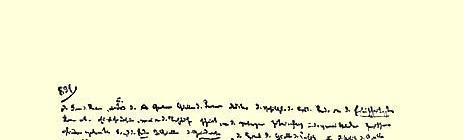
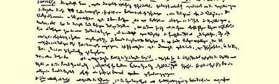
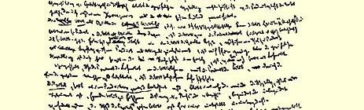
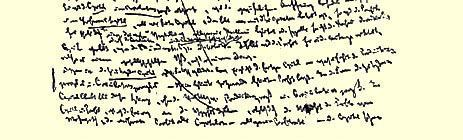

# 收入及其源泉。庸俗政治经济学１４４

### ［（１）］生息资本在资本主义生产基础上的发展 ［资本主义生产方式的关系的拜物教化。生息资本是这种拜物教的最充分的表现。庸俗经济学家和庸俗社会主义者论资本利息］

［ＸＶ—８９１］收入的形式和收入的源泉以**最富有拜物教性质的** 形式表现了资本主义生产关系。这是资本主义生产关系从外表上表现出来的存在，它同潜在的联系以及中介环节是分离的。于是， **土地**成了**地租**的源泉，**资本**成了**利润**的源泉，**劳动**成了**工资**的源泉。现实的颠倒借以表现的歪曲形式，自然会在这种生产方式的当事人的观念中再现出来。这是一种没有想象力的虚构方式，是庸人的宗教。庸俗经济学家—— 应该把他们同我们所批判的经济学研究者严格区别开来—— 实际上只是［用政治经济学的语言］翻译了受资本主义生产束缚的资本主义生产承担者的观念、动机等等，在这些观念和动机中，资本主义生产仅仅在其外观上反映出来。他们把这些观念、动机翻译成学理主义的语言，但是他们是从［社会的］ 统治部分即资本家的立场出发的，因此他们的论述不是素朴的和客观的，而是辩护论的。对必然在这种生产方式的承担者那里产生的庸俗观念的偏狭的和学理主义的表述，同诸如重农学派、亚·斯密、李嘉图这样的政治经济学家渴求理解现象的内部联系的愿望， 是极不相同的。

然而，在所有这些形式中，最完善的物神是**生息资本**。在这里， 我们看到的是资本的最初起点—— 货币，以及Ｇ—Ｗ—Ｇ′这个公式，而这个公式已被归结为它的两极Ｇ—Ｇ′。创造更多货币的货币。这是被缩简成了没有意义的简化式的资本最初的一般公式。

**土地**，或者说**自然**，是**地租**即土地所有权的源泉，—— 这具有充分的拜物教性质。但是，由于把使用价值和交换价值随意地混淆起来，通常的观念就还有可能求助于自然本身的生产力［来解释地租］，而这种生产力借助某种魔术在土地所有者身上人格化了。

**劳动**是**工资**（即工人在他的产品中所占有的由劳动的特殊社会形式决定的份额）的源泉；劳动是下述事实的源泉：工人用自己的劳动从产品（即从物质上考察的资本）中为自己购买从事生产的许可权，并在劳动中占有一个源泉，由于有了这个源泉，他的一部分产品才以报酬的形式从这个作为雇主的产品中流回他那里，—— 这种说法也是够妙的。但是，在这里，通常的观念在如下的限度内还算是符合事实的，即尽管它把劳动同雇佣劳动混淆起来， 从而把雇佣劳动的产品即工资同劳动的产品混淆起来，然而对健全的人类理智来说，有一点仍然是清楚的，这就是劳动本身创造它的工资。

至于**资本**，如果就**生产过程**来进行考察，那末认为它是猎取别人劳动的工具这样一种观念，总是或多或少地保存着。无论把这一点看作是“合理的”还是“不合理的”，有根据的还是无根据的，—— 这里总是以资本家和工人的关系为前提，总是指的这种关系。

> 《收入及其源泉。庸俗政治经济学》（补充部分）第一页
>
> （１８６１—１８６３年手稿第ⅩⅤ本第８９１页）

就**资本**出现在**流通过程**来说，通常的看法所特别注意的是，它表现为**商人资本**，这是一种仅仅从事这种业务的资本，所以利润在这里有时用普遍欺诈这个含糊的观念来说明，有时用比较明确的观念来说明，即：商人欺诈产业资本家，就象产业资本家欺诈工人那样，或者说，商人欺诈消费者，就象生产者相互欺诈那样。不管怎样，这里利润是用交换，就是说，用社会关系而不是用物来解释的。

相反，在**生息资本**上物神达到了完善的程度。这是一个已经完成的资本，—— 因而是生产过程和流通过程的统一，—— 因此，它在一定的期间提供一定的利润。在生息资本的形式上，只剩下了这种规定性，而没有生产过程和流通过程作媒介。在资本和利润中， 还存在着对过去的回忆，尽管由于利润和剩余价值的不同，由于所有资本具有形式单一的利润—— 一般利润率，资本已经［８９２］非常模糊不清了，已经变得难以理解和神秘莫测了。

在生息资本上，这个**自动的物神**，自行增殖的价值，创造货币的货币，达到了完善的程度，并且在这个形式上再也看不到它的起源的任何痕迹了。社会关系最终成为物（货币、商品）同它自身的关系。

对于利息以及利息与利润的关系，这里不作进一步的研究，对于利润按怎样的比例分为产业利润和利息，这里也不研究。有一点是清楚的，这就是：在资本和利息上，资本作为利息的神秘的、自行创造的源泉，即作为资本自行增长的源泉已达到了完善的程度。正因为如此，照［通常的］观念看来，资本主要存在于这种形式中。这就是***真正意义上的***资本。

既然在资本主义生产的基础上，体现在货币或商品中—— 真正说来是体现在货币即商品的转化形式中—— 的一定价值额提供了一种权力，使人有可能白白地从工人身上榨取一定量的劳动，占有一定的剩余价值，剩余劳动，剩余产品，那末很清楚，货币本身可以作为资本，作为特殊种类的商品出卖，或者说，资本可以在商品或货币的形式上被购买。

资本可以作为利润的源泉出卖。通过货币等等，我使另一个人能够占有剩余价值。因此，我取得这个剩余价值的一部分，是很自然的。土地具有价值，是由于它使我能够获得一部分剩余价值，因此我在土地上不过是为借助于土地所获得的这部分剩余价值而支付；同样，我在资本上不过是为借助于资本所创造的剩余价值而支付。因为在资本主义生产过程中，除了实现剩余价值外，资本的价值还会永恒化，会再生产出来，所以自然而然，货币或商品作为资本出卖时，会在一定时期之后又流回卖者手中，卖者永远不会象转让商品那样转让货币，而是保留自己对货币的所有权。在这种场合，货币或商品不是作为货币或商品出卖，而是作为它的二次方， 作为**资本**，作为自行增殖的货币或商品价值来出卖了。它不仅会自行增长，而且会在总生产过程中把自己保存下来。因此，对于卖者来说，它仍旧是资本，会流回卖者手中。在这里，出卖就在于：一个把它作为生产资本使用的第三者，必须从他只是因有这笔资本而获取的利润中，支付一定的部分给资本所有者。象土地一样，货币是作为创造价值的物贷出的，这个物在这个创造价值的过程中被保存下来，不断地流回，因而也可能流回最初的卖者手中。只是由于流回最初的卖者手中，货币才成为资本。否则，他就是把它作为商品来卖，或是用它作为货币来买了。

但是不管怎样，形式就其本身来考察（实际上，货币作为榨取劳动的手段，作为获得剩余价值的手段，是定期转让的）是这样的： 物现在表现为资本，资本也表现为单纯的物，资本主义生产过程和流通过程的全部结果则表现为物所固有的一种属性；究竟是把货币作为货币支出，还是把货币作为资本贷出，取决于货币所有者， 即处在随时可以进行交换的形式上的商品的所有者。

这里我们看到的是作为本金的资本和作为果实的资本的关系，资本提供的利润由资本自己的价值来决定，并且资本本身不会因这个过程而消失（这是符合资本的性质的）。

由此可以明白，为什么肤浅的批判完全象它想要保存商品而反对货币那样，现在却要用它那改良派的智慧去反对生息资本，同时毫不触动现实的资本主义生产，而只是攻击这种生产的一个结果。这种从资本主义生产的立场出发对于生息资本的反驳，今天竟自诩为“社会主义”，其实这种反驳，作为资本本身的发展因素，例如在十七世纪就已出现，那时，产业资本家还必须首先同当时还比自己强大的旧式高利贷者进行斗争，以夺取自己的地位。

［８９３］作为生息资本的资本，它的充分的**物化**、**颠倒**和**疯狂**，—— 不过，在生息资本上，资本主义生产的内在本性，它的疯狂性，只是以最明显的形式表现出来，—— 就是生“复利”的资本，在这里，资本好象一个摩洛赫，他要求整个世界成为献给他的祭品， 然而由于某种神秘的命运，他永远满足不了自己理所当然的、从他的本性产生的要求，总是到处碰壁。

货币或商品流回它们的起点即资本家手中，是资本在生产过程和流通过程中具有特征的运动，这一方面表示现实的形态变化， 即商品转化为它的生产条件，生产条件再转化为商品形式：再生产；另一方面又表示形式上的形态变化，即商品转化为货币，货币再转化为商品。最后，这还表示价值的增长，Ｇ—Ｗ—Ｇ′。原有的、 但是已在过程中增大了的价值始终保留在同一个资本家手中。改变的只是资本家占有这个价值的形式—— 或者是货币形式，或者是商品形式，或者是生产过程本身的形式。

资本**流回**到它的起点，在生息资本的场合，取得了一个完全**表面的**、同现实运动（资本的回流就是这种运动的形式）相分离的形态。Ａ把他的货币不是作为货币，而是作为资本支出。在这里，货币没有发生任何变化。它不过转手而已。它只是在Ｂ手中才实际转化为资本。但对Ａ来说，货币变成资本是由于它从Ａ手中转到了Ｂ手中。资本由生产过程和流通过程实际流回的现象，是对Ｂ 来说的。而对Ａ来说，流回是在和让渡相同的形式上进行的。货币由Ｂ手中再回到Ａ手中。Ａ是**贷出**货币，而不是支出货币。

货币在资本的实际生产过程中的每一次换位，都表示再生产的一个要素：或者是货币转化为劳动，或者是完成的商品转化为货币（生产行为的结束），或者是货币再转化为商品（生产过程的更新，再生产的重复）。在货币作为**资本贷出**时，就是说，在它不是转化为资本，而是作为资本进入流通时，货币的换位不过表示货币本身的转手。所有权留在贷款人手中，而对货币的支配则转到产业资本家手中。但对贷款人来说，货币转化为资本是从他把货币不是作为货币而是作为资本支出时开始的，即从他把货币交到产业资本家手中开始的。（对贷款人来说，即使他把货币不是贷给产业家，而是贷给浪费者，或者贷给交不起房租的工人，货币也仍然是资本。 全部典当业就是建立在这个基础上的。）诚然，另外一个人把货币转化为资本，但这个行为是在贷款人与借款人发生的行为之外完成的。**在这个行为中**，**这种中介过程消失了**，看不见了，不直接包含在内了。这里表现出来的不是货币向资本的实际转化，只是这种转化的毫无内容的形式。正如劳动能力的情况一样，**在这里**，**货币的使用价值就是**：货币创造交换价值，创造**比它本身所包含的更大的交换价值**。货币**作为自行增殖的价值贷出**，作为商品贷出，不过是作为这样一种商品，它恰恰由于自己的这种属性而同商品本身相区别，从而也**具有特殊的让渡形式**。

资本的起点是商品所有者，货币所有者，简单地说，是资本家。 因为资本的起点和终点是一致的，所以资本又流回到资本家手中。 但是在这里，资本家是以双重身分存在的：既作为资本所有者，又作为把货币实际转化为资本的产业资本家。事实上，［８９４］资本是从产业资本家那里流出，然后又流回到他那里，但他仅仅是暂时的所有者。资本家是以双重身分存在的：法律上的和经济上的。因此， 资本作为所有物，也就回到法律上的资本家那里，回到非正式的丈夫那里。然而资本的回流（这种回流包含着资本价值的保存，它使资本成为自行保存的和永久化的价值）只是对资本家Ⅱ起中介作用，而不是对资本家Ⅰ起中介作用。因此，资本的回流在这里也不是表现为一系列经济过程的归宿和结果，而是表现为买者和卖者之间的特殊的法律上的交易的结果，这就是，资本在这种场合是**被贷出**，**不是被卖出**，**即只是暂时让渡**。事实上，**被卖出的只是它的使用价值**，使用价值**在这里就在于**生产**交换价值**，提供利润，生产比它本身所包含的价值更多的价值。作为货币，资本并不由于使用而改变。但它是作为货币被付出，也是作为货币再流回。

资本流回的形式，取决于它的再生产方式。如果资本作为货币贷出，它就以流动资本的形式流回，流回的量等于它的全部价值加剩余价值（在这个场合就是剩余价值或利润中归结为利息的部分），即贷出的货币额加由它产生的增长额。

如果资本以机器、建筑物等形式贷出，简单地说，以资本在生产过程中必须借以执行固定资本职能的物质形式贷出，那末，它就以固定资本的形式，例如作为年支付流回（这个年支付等于对损耗的补偿额，即固定资本中进入流通的价值部分），再加上剩余价值中算作固定资本（不是因为它是固定资本，而是因为它是一定量的资本一般）利润的部分（在这里是利润的一部分，即利息）。

在利润本身，剩余价值，从而利润的真正源泉，已经模糊不清了，神秘化了：

（１）因为，从形式上考察，利润是以全部预付资本计算的**剩余价值**，因此资本的每个部分，不管是固定资本还是流动资本，是花在原料、机器上还是花在劳动上，都提供相同的利润；

（２）因为，某一单个的已知资本，例如５００，如果它的剩余价值等于５０，资本的每个部分，例如每五分之一，就都提供１０％，**这样**， 由于**一般利润率**的确立，现在每个５００或１００的资本，不管它用于哪个领域，不管其中可变资本和不变资本的比例如何，也不管它的周转时间如何不同等等，它同其他任何一个在完全不同的有机条件下活动的资本一样，在相同的期间，总要提供相同的平均利润， 例如１０％。这就是说，因为孤立地加以考察的各个单个资本的**利润**和由这些资本本身在其各自的生产领域创造的**剩余价值**，实际上是不等的量。

其实，第二点只是把第一点已经包括的东西作了进一步的阐述。

不过，作为利息的基础的，正是剩余价值的这种外表化的形式，也就是剩余价值作为**利润**而存在的形式，这种形式不同于它的最初的简单形态（这时它还带着出生的脐带）而且绝非一眼就可以辨认出来。利息不是直接以剩余价值为前提，而是直接以**利润**为前提，利息本身只是被归入特殊范畴、特殊项目内的一部分利润。因此，在利息上比在利润上识别剩余价值要困难得多，因为只有当剩余价值以利润形式出现时，利息才同它直接发生关系。

资本回流的时间取决于实际的生产过程；就生息资本来说，它作为资本的回流**看来**仅仅取决于贷款人和借款人之间的契约。所以，就这种交易来看，资本的回流不再表现为由生产过程决定的结果，而是表现为资本似乎一刻也没有丧失货币的形式。当然，这些交易是由资本的实际的回流决定的，但是这一点**不会**在交易本身中表现出来。

［８９５］利息和利润不同，它代表**单纯的资本所有权**的**价值**，就是说，它使**货币**（价值额，任何形式的商品）所有权潜在地成为资本所有权，从而使商品或货币本身成为自行增殖的价值。当然，劳动条件只有当它们作为工人的非所有物，从而作为别人的所有物同工人相对立来执行职能的时候，才是资本。但是只有同劳动相对立，它们才能作为别人的所有物执行职能。**这些劳动条件和劳动的对立存在**，**使它们的所有者成为资本家**，使资本家占有的这些劳动条件成为资本。但是，在货币资本家Ａ手中，资本不具有这种使自己成为资本，从而也使货币所有权表现为资本所有权的对立性质。 **货币或商品借以成为资本的现实的形式规定性消失了**。货币资本家Ａ决不是同工人相对立，他只是同另一个资本家Ｂ相对立。他卖给Ｂ的，事实上只是货币的“使用权”，是货币转化为生产资本时将会产生的结果。但是他直接出卖的事实上并不是使用权。如果我出卖商品，我就是出卖一定的使用价值。如果我用商品购买货币，那我就是购买了作为商品的转化形式的货币所具有的执行职能的使用价值。我不是在出卖商品的交换价值的同时出卖商品的使用价值，我也不是在购买货币本身的同时购买货币的特殊的使用价值。但是，作为货币的货币，在转化为资本并执行资本的职能 （货币在贷款人手中没有执行这种职能）之前，它所具有的使用价值，不外是它作为商品（金、银—— 货币的物质实体）或作为货币， 作为商品的转化形式所具有的使用价值。事实上，贷款人卖给产业资本家的，即在这次交易中发生的，不过是贷款人把货币所有权让给产业资本家一段时间。他在一定期间让渡自己的所有权，也就是产业资本家在一定期间购买这个所有权。因此，贷款人的货币在被让渡之前就已经作为资本出现：同资本主义生产过程分离的、单纯的货币或商品所有权就已经作为资本出现。

货币只有在让渡之后才表现为资本，这对于事情本身毫无影响，正象棉花的使用价值实际上只有在棉花让渡给纺纱业者之后才表现出来，或者肉的使用价值实际上只有在肉从肉铺里转到消费者的餐桌上才表现出来，并不改变棉花或肉的使用价值一样。货币一旦不用于消费，商品一旦不再为它的所有者的消费服务，它们就会使它们的所有者成为资本家，而它们自己—— 同资本主义生产过程相分离，并且**在**转化为“生产”资本**之前**—— 就作为资本出现，也就是说，作为自行增殖、自行保存、自行增长的价值出现。创造价值、提供利息是它们内在的属性，就象梨树的属性是结梨子一样。贷款人就是把自己的货币作为这种生息的东西出卖给产业资本家的。因为货币会自行保存，是自行保存的价值，所以产业资本家能够按照随意约定的期限把它归还。因为货币每年创造一定的剩余价值，一定的利息，确切些说，因为在每一段时间内它的价值都在增长，所以，产业资本家也能够每年或在契约规定的其他任何期限内把这个剩余价值支付给贷款人。要知道，作为资本的货币， 和雇佣劳动完全一样，每天都提供剩余价值。利息虽然只是利润中 **固定在特殊名称下的部分**，它**在这里**却**表现**为这样一种**剩余价值的创造**，这种剩余价值的创造是资本本身所固有的，同生产过程是分离的，因而是单纯的资本所有权即货币和商品的所有权所固有的，同造成这种所有权和劳动之间的对立从而使这种所有权具有资本主义所有权性质的那些关系是分离的，—— 这种剩余价值的创造是单纯的资本所有权所固有的，因而是本来意义上的资本所固有的。相反，**产业利润**在这里只不过表现为利息的附加额，这个附加额是借款人把借来的资本用在生产上，即用这笔资本对工人进行剥削而挣得的（或者象人们所说的：通过自己作为资本家的劳动；资本家的职能在这里被说成等于劳动，甚至被说成和雇佣劳动等同，因为［８９６］真正在生产过程中执行职能的产业资本家，事实上是作为从事活动的生产当事人，作为劳动者而与游手好闲、无所事事的贷款人相区别，贷款人同生产过程相分离并且处在这个过程之外执行所有者的职能）。

这样，**利息**，而不是**利润**，表现为从资本本身，因而从单纯的资本所有权中产生的资本的**价值创造**；因此利息表现为由资本本能地创造出来的收入。庸俗经济学家就是在这种形式上理解利息的。 在这种形式上，一切中介过程都消失了，资本的**物神的形态**也象**资本物神**的观念一样已经完成。这种形态之所以必然产生，是由于资本的法律上的所有权同它的经济上的所有权分离，由于一部分利润在利息的名义下被完全离开生产过程的**资本自身**或**资本所有者** 所占有。

对于要把资本说成是价值和价值创造的独立源泉的庸俗经济学家来说，这个形式自然是他们求之不得的，在这个形式上，利润的源泉再也看不出来了，资本主义过程的结果也离开过程本身而取得了独立的存在。在Ｇ—Ｗ—Ｇ′中，还包含有中介过程。在Ｇ— Ｇ′中，我们看到了资本的没有概念的形式，看到了生产关系的最高度的颠倒和物化。

一般**利息率**，或者说，一般**利率**当然是和**一般利润率**相适应的。在这里，我们不打算进一步阐明这个问题，因为对生息资本的分析不属于概论这一篇，而属于论**信用**那一篇。１４５但是，为了完全弄清楚资本的这个表现形式，指出如下一点是重要的：一般利润率远远不象**利息率**，或者说**利率**那样表现为可以捉摸的、明确的事实。诚然，利率在不断地波动。今天（在向产业资本家贷款的货币市场上，我们所谈的只是这个方面）利率是２％，明天是３％，后天又是５％。但这个２％，３％或５％的利率是适用于所有贷款人的。 提供２％，３％，５％，是任何一个１００镑货币额的一般比率，同一个实际执行资本职能的价值额，在不同的生产领域所提供的实际利润却很不相同，这些实际利润对利润的观念上的平均水平的偏离， 使利润的这个平均水平始终只有通过某种过程，通过某种反作用才能确立下来，而这一点又始终只有在较长的资本流通期间才能做到。在若干年间，一定领域的利润率较高，而在以后若干年间则较低。把这若干年或一系列这样的演变综合在一起，**平均起来**就得出平均利润。但这样一来，平均利润就不表现为直接既定的东西， 而只表现为各种相互矛盾的波动的平均结果。利率却不是这样。它 **普遍地**是每天确定的事实，这个事实对产业资本家来说，甚至是他们从事活动时计算上的前提和项目。一般利润率在用来估计实际利润时，事实上仅仅作为观念上的**平均数**存在；在它被固定为现成的、确定的、既定的东西时，它仅仅作为平均数、作为抽象物存在；在现实生活中，它仅仅作为在各种不同的实际利润率的平均化运动中起决定作用的趋势存在，而不管这些利润率是属于同一领域的单个资本，还是属于不同生产领域的不同资本。

［８９７］贷款人向资本家要求的，是根据**一般利润率**（平均利润率）计算，而不是根据单个资本家那里出现的对一般利润率的个别偏离。**平均数**在这里成了**前提**。利息率本身在**变动**，但是这种变动对所有的**贷款人**都适用。

相反，确定的、相同的利息率不仅按平均数来说是存在的，而且事实上也是存在的（虽然它根据借款人是否被认为第一流的债务人而在最低限度和最高限度之间变动），对它的偏离宁可说是由特殊情况所造成的例外。同记载气压状况的气象报告相比，这种不是为这个或那个资本编制，而是为**货币市场上现有的资本即借贷资本**编制的记载利息率状况的证券交易报告，其准确性毫不逊色。

借贷资本的利息率具有较大的固定性和等同性，它和一般利润率的较难捉摸的形式不同，而且相反。这种情况从何而来，这里不去阐述。这样的阐述属于论信用那一篇。不过有一点是明显的： 每个领域内的**利润率**的波动，—— 同一个生产领域内的单个资本家享有的特殊利益完全撇开不谈，—— 都取决于当时市场价格的状况和市场价格围绕费用价格的波动。**不同**领域的**利润率**的差别， 只有通过不同领域的市场价格即**不同**商品的市场价格和这些商品的费用价格的比较才能知道。某个特殊领域的利润率下降到观念上的平均水平之下，如果时间拖得很久，就足以使资本离开这个领域，或者使新资本不可能按平均规模流入这个领域。因为，新的追加资本的流入，同已经投入的资本的再分配相比，更能使资本在各特殊领域的分配平均化。而特殊领域的超额利润只有通过市场价格和费用价格的比较才能知道。只要差别以某种方式表现出来，资本就开始从一些生产领域流出而流入另一些生产领域。撇开这种平均化行为需要时间这一点不谈，每个特殊领域的平均利润本身， 也只有根据资本的性质，通过例如在７年等等的周期内所实现的利润率的平均数表现出来。因此，单是**上下**波动，如果不超过平均程度，不采取异常的形式，就不足以引起资本的转移，何况固定资本还会给资本的转移带来困难。一时的行情只能在有限的程度上产生影响，而且它对追加资本的流人或流出的影响，要大于对已经投入不同领域的资本的再分配的影响。

我们看到，所有这一切是一个非常复杂的运动，这里要考察的，不仅有每个特殊领域的市场价格、不同商品的比较费用价格、 每个领域的供求状况，而且有不同领域的资本家的竞争！此外，平均化的快慢在这里取决于资本的特殊有机构成（例如，固定资本多还是流动资本多）和它们的商品的特殊性质，就是说，要看商品作为使用价值的性质是否易于允许按照市场价格的状况把它们较快地撤出市场、减少或增加它们的供给。

货币资本的情况则完全不同。在货币市场上，互相对立的只是两个范畴：买者和卖者，需求和供给。一方面是借款的资本家阶级， 另一方面是贷款的资本家阶级。商品具有同一形式—— 货币。资本因投在特殊生产领域或流通领域而具有的一切特殊形态，在这里都消失了。在这里，资本是存在于独立的交换价值即货币的没有差别的彼此等同的形态上。特殊领域之间的竞争在这里停止了；它们全体一起作为借款人出现，资本则以这样一个形式与它们全体相对立，在这个形式上，按怎样的方式使用的问题对资本来说还是无关紧要的事。如果说生产资本［８９８］**只是在特殊领域之间的运动和竞争中把自己表现为整个阶级共有的资本**，**那末**，**资本在这里现实地有力地在对资本的需求中表现为整个阶级共有的资本**。另一方面，货币资本（货币市场上的资本）也实际具有这样一个形态，在这个形态上，它是作为共同的要素，而不问它的特殊使用方式如何，根据每个特殊领域的生产需要，被分配在不同领域之间，被分配在资本家阶级之间。并且，随着大工业的发展，出现在市场上的货币资本，会越来越不由个别的资本家来代表，即越来越不由市场上现有资本的这个部分或那个部分的所有者来代表，而是由把它集中起来，组织起来，并且以完全不同于实际生产的方式把它控制起来的银行家来代表。因此，就需求的形式来说，和货币资本相对立的是整个阶级的力量；但就供给来说，这个资本**整个地**表现为借贷资本，表现为集中在少数蓄水池里的全社会的借贷资本。

这就是为什么**一般利润率**同**固定的利息率**相比，表现为模糊不清的景象的一些理由；利息率的大小固然也会变动，但并不妨碍它对所有借款人来说都一样地发生变动，所以它在他们面前总是表现为固定的、既定的量，象货币的价值的变动并不妨碍它对一切商品来说都具有相同的价值一样；象商品的市场价格虽然每天发生波动，但并不妨碍它逐日都有**牌价**一样，利息率的变动也不妨碍它作为货币的**价格**有规则地在牌价中标示出来。这是因为资本本身在这里是作为一种特殊的商品——** 货币**—— 提供的；因此，它的价格的确定，和其他一切商品的情形一样，就是它的**市场价格**的确定；因此，利息率总是表现为**一般利息率**，表现为这样多的货币取得这样多的利息。而利润率甚至在**同一个**领域内，在商品市场价格相等的情况下，也可能不同（因为各单个资本生产相同的商品时的条件不同；因为特殊利润率不是由商品的市场价格决定的，而是由市场价格和生产费用之间的差额决定的），而不同领域的利润率， 只是在过程中通过不断的波动才能达到平均化。一句话：只是在货币资本上，在借贷货币资本上，资本才成为**商品**，这种商品的自行增殖的属性具有一个**固定的价格**，由当时的利息表示出来。

因此，资本作为**生息**资本，而且正是在它作为**生息货币资本**的直接形式上（生息资本的其他形式在这里与我们无关，这些其他形式也是由这个形式派生出来的，并以这个形式为前提），取得了它的纯粹的拜物教形式。**第一**，这是由于资本作为**货币**的不断存在； 在这样的形式上，资本的一切规定性都已经消失，它的现实要素也看不出来；它仅仅作为独立的交换价值、作为获得独立存在的价值而存在。在资本的现实过程中，货币形式是一个转瞬即逝的形式。 在货币市场上，资本总是以这个形式存在。**第二**，资本所产生的剩余价值，又是在货币形式上，表现为资本本身应得的东西，表现为货币资本，即同它完成的过程相脱离的资本的单纯所有者应得的东西。Ｇ—Ｗ—Ｇ′在这里成了Ｇ—Ｇ′，而且，正象资本形式在这里是没有差别的货币形式一样，—— 因为货币正好是这样一个形式， 在这个形式上，商品作为使用价值的差别消失了，从而**由这些商品的存在条件构成的生产资本的差别**，**生产资本本身的特殊形式的差别**也消失了，—— 货币资本所产生的剩余价值，它所转化成或表现出来的剩余货币，也表现为根据货币额本身的量来计算的一定的比率。利息率是５％时，作为资本的１００镑就等于１０５镑。这样就得出一个自行增殖的价值的，或者说，创造货币的货币的十分明显的形式。它同时又是毫无内容的形式，不可理解的、神秘的形式。 我们在分析资本时是从Ｇ—Ｗ—Ｇ出发的，Ｇ—Ｇ′不过是它的结果而已。１４６现在我们发现Ｇ—Ｇ′**作为主体**。正象生长是树木固有的属性一样，生出货币（）[^1]是资本在其作为货币的纯粹的形式上固有的属性。我们在外表上发现的、因而曾经作为我们分析的出发点的这个不可理解的形式，现在又作为一个过程的结果被我们碰到了，在这个过程中，资本的形态越来越和它的内在本质相异化，并且越来越与之失去联系。

［８９９］我们从作为商品的转化形式的货币出发。现在我们到达 **作为资本的转化形式的货币**。这和我们曾经把商品看成是资本生产过程的前提和结果完全一样。

资本在自己这种最奇特同时又和普通观念最接近的形态上， 既是庸俗经济学家的“基本形式”，又是肤浅的批判的最直接的攻击点。就前者来说，部分地是因为内在联系在这里最少表现出来， 而且资本是以一种**好象是**价值的独立源泉的形式出现；部分地是因为在这种形式上资本的**对立**性质完全被掩盖了，被抹杀了，资本和劳动的对立不见了。另一方面，这种形式的资本所以受到攻击， 是因为它在这里以最不合理的形式表现出来，给庸俗社会主义者提供了最容易突破的攻击点。

十七世纪资产阶级经济学家（柴尔德、卡耳佩珀等人）反对把利息看作剩余价值的独立形式，这种论战只是新兴的产业资产阶级反对旧式高利贷者—— 当时货币财富的垄断者—— 的斗争。在这里，生息资本还是一种洪水期前的资本形式，这种形式只是刚刚

[^1]: 产物，利息。—— 编者注