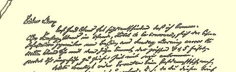
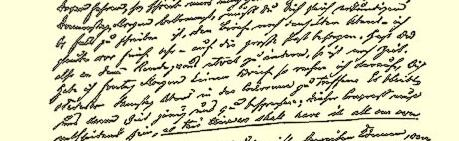
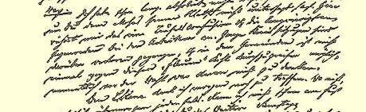
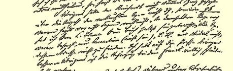
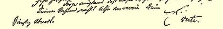

### ２３

## 恩格斯致马克思

### 布鲁塞尔

> ［１８４７年１１月２３—２４日］
>
> 星期二晚上［于巴黎］

亲爱的马克思：

今天晚上才把我去的事[^1]定下来。这样，星期六晚上在奥斯坦德，在正对火车站的喷泉旁边的“王冠”旅馆见面，星期日早晨过拉芒什海峡。你们如果乘四点到五点之间的火车动身，将大致和我同时到达。

如果发生意外，星期日没有开往多维尔的邮船，请立即回信告我。就是说，既然这封信你将在星期四早晨接到，那就务必马上去打听一下，如果需要回信给我，就在当天晚上（我认为要在五点钟以前）把信投到邮政总局去。所以，如果你想对我们的约会作些变动，那还来得及。如果我星期五早晨接不到你的回信，那末我就要肯定星期六晚上在“王冠”旅馆和你以及特德斯科见面了。这样我们就有足够的时间来商讨所有的事情；这次代表大会将是决定性的，**因为这一次我们将完全按照我们自己的方针来掌握大会**。１０７

我迄今为止怎么也不能理解，为什么你不禁止莫泽斯[^2]发表他的那些流言。这在这里造成了可怕的混乱，使我不得不在工人中间发表长而又长的反驳。一系列区部会议都耗费在这上面，在

> 恩格斯１８４７年１１月２３日—２４日给马克思的信的第一页

### ２３

## 恩格斯致马克思

### 布鲁塞尔

> ［１８４７年１１月２３—２４日］
>
> 星期二晚上［于巴黎］

亲爱的马克思：

今天晚上才把我去的事[^3]定下来。这样，星期六晚上在奥斯坦德，在正对火车站的喷泉旁边的“王冠”旅馆见面，星期日早晨过拉芒什海峡。你们如果乘四点到五点之间的火车动身，将大致和我同时到达。

如果发生意外，星期日没有开往多维尔的邮船，请立即回信告我。就是说，既然这封信你将在星期四早晨接到，那就务必马上去打听一下，如果需要回信给我，就在当天晚上（我认为要在五点钟以前）把信投到邮政总局去。所以，如果你想对我们的约会作些变动，那还来得及。如果我星期五早晨接不到你的回信，那末我就要肯定星期六晚上在“王冠”旅馆和你以及特德斯科见面了。这样我们就有足够的时间来商讨所有的事情；这次代表大会将是决定性的，**因为这一次我们将完全按照我们自己的方针来掌握大会**。１０７

我迄今为止怎么也不能理解，为什么你不禁止莫泽斯[^4]发表他的那些流言。这在这里造成了可怕的混乱，使我不得不在工人中间发表长而又长的反驳。一系列区部会议都耗费在这上面，在各支部中根本不可能对这种“走了味的”的胡言乱语严厉处置，特别是在选举之前，根本不能设想这样做。

明天我还想见一下路·勃朗。如果办不到，我后天无论如何要见他。如果说，我在这里还不可能顺便告诉你什么事情，那末星期六你就可以知道一些了。

此外，莱茵哈特对我说的书籍销售数量是胡说的—— 不是三［１８４７年１１月２３—２４日］ 十七本，而是在一星期前已经出售了**九十六**本。就在那一天，我已经将你的书[^5]亲自带给了路·勃朗。所有的存书都已经照数发出去了，没有发给的只有拉马丁（不在这里）、路·勃朗和维达尔（此人地址找不到），我已经吩咐给《新闻报》送去了一本。—— 不过， 话又说回来，在弗兰克那里，工作确实是糟得可怕。

至少要设法使莫泽斯当我们不在的时候不做蠢事！再见。

#### 你的恩·

请看背面

请你把《信条》考虑一下。我想，我们最好是抛弃那种教义问答形式，把这个东西叫做《共产主义**宣言**》。因为其中必须或多或少地叙述历史，所以现有的形式是完全不合适的。我将把我在这里草拟肯定星期六晚上在“王冠”旅馆和你以及特德斯科见面了。这样我的东西[^6]带去，这是用简单的叙述体写的，但是校订得非常粗糙， 十分仓促。我开头写什么是共产主义，随即转到无产阶级—— 它产的，**因为这一次我们将完全按照我们自己的方针来掌握大会**。１０７ 生的历史，它和以前的劳动者的区别，无产阶级和资产阶级之间的我迄今为止怎么也不能理解，为什么你不禁止莫泽斯[^7]发表对立的发展，危机，结论。其中也谈到各种次要问题，最后谈到了共他的那些流言。这在这里造成了可怕的混乱，使我不得不在工人产主义者的党的政策中应当公开说明的那些内容。这里的这个东中间发表长而又长的反驳。一系列区部会议都耗费在这上面，在

### ２３

## 恩格斯致马克思

### 布鲁塞尔

> 星期二晚上［于巴黎］

亲爱的马克思：

今天晚上才把我去的事[^8]定下来。这样，星期六晚上在奥斯坦德，在正对火车站的喷泉旁边的“王冠”旅馆见面，星期日早晨过拉芒什海峡。你们如果乘四点到五点之间的火车动身，将大致和我同时到达。

如果发生意外，星期日没有开往多维尔的邮船，请立即回信告我。就是说，既然这封信你将在星期四早晨接到，那就务必马上去打听一下，如果需要回信给我，就在当天晚上（我认为要在五点钟以前）把信投到邮政总局去。所以，如果你想对我们的约会作些变动，那还来得及。如果我星期五早晨接不到你的回信，那末我就要们就有足够的时间来商讨所有的事情；这次代表大会将是决定性西还根本没有提请批准，但是我想，除了某些小而又小的地方，要做到其中至少不包含任何违背我们观点的东西。

> 星期三早晨

刚才收到你的信，信中所说的事情我上面所写的已经回答了。 我到路·勃朗那里去过了。但很不走运—— 他到外地去了，**也许**今天会回来。明天，必要时后天，我再去一趟。—— 星期五晚上我还不能够到达奥斯坦德，因为钱要到星期五才能凑齐。

你的表兄弟菲力浦斯今天早晨上我这儿来过。

如果你能向波尔恩灌输一点东西，他将能写出很好的演讲词。 有一个工人做德国人的代表，这很好。但是，必须使鲁普斯[^9]抛弃过分的谦逊。这个出色的人是必须**推到**第一线的少数人中的一个。 千万不要派维尔特去当代表！他总是十分懒惰，只是那次会议上的一时的成功１０８才使他上了点劲！而且他还想继续做一个独立的盟员。就让他继续自行其是吧。

[^1]: 见本卷第１１８—１１９页。—— 编者注

[^2]: 赫斯。—— 编者注

[^3]: 见本卷第１１８—１１９页。—— 编者注

[^4]: 赫斯。—— 编者注

[^5]: 卡·马克思《哲学的贫困》。—— 编者注见本卷第１１８—１１９页。—— 编者注

[^6]: 

[^7]: 弗·恩格斯《共产主义原理》。—— 编者注

[^8]: 赫斯。—— 编者注

[^9]: 威廉·沃尔弗。—— 编者注