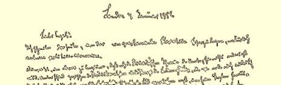
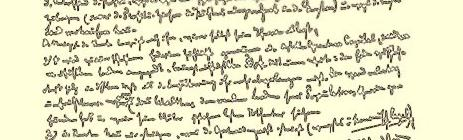
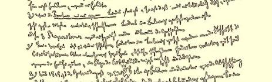
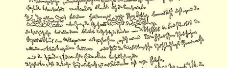
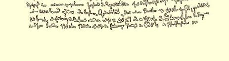

### ５０

## 马克思致恩格斯

### 曼彻斯特

> １８５１年１月７日于伦敦

亲爱的恩格斯：

今天写信给你，是想和你研究一个理论上的小问题，自然是政治经济学性质的。

现在从头说起，你知道，根据李嘉图的地租理论，地租不过是生产费用和土地产品的价格之间的差额，或者，按照他的另一种说法，不过是最坏的土地的产品为补偿它的费用（租佃者的利润和利息总是算在这种费用里面的）所必需的出售价格和最好的土地的产品所能够得到的出售价格之间的差额。

依照他自己对他的理论的解释，地租的增加表明：

１．人们不得不耕种越来越坏的土地，或者说，连续使用于同一块土地的同量的资本获得的产品不一样。一句话：人口对土地的要求愈多，土质就变得愈坏。土地变得相对地愈来愈贫瘠了。这恰恰为马尔萨斯提供了他的人口论的现实基础，而他的学生们现在也在这里寻求得救的一线希望。

２．只有当谷物价格上涨时，地租才能（至少在**经济学上是合乎规律地**）提高；当谷物价格下跌时，地租必定降低。

３．**全国的地租总额**如果增加，这只是由于很大数量的相对地坏的土地被耕种了。

可是，这三个论点处处都是和历史相矛盾的。

１．毫无疑问，随着文明的进步，人们不得不耕种越来越坏的土地。但是，同样毫无疑问，由于科学和工业的进步，这种较坏的土地和从前的好的土地比起来，是相对地好的。

２．自１８１５年以来，谷物的价格从九十先令下降到五十先令， 而在谷物法废除以前，还降得更低，这种下降是不规则的，但是不断的。而地租却不断地提高。英国是这样。大陆上到处也有相应的变化。

３．我们在各个国家都发现，象配第曾经指出的：当谷物价格下跌时，国内地租的总额却增加了。

在这里，主要问题仍然是使地租规律和整个农业的生产率的提高相符合；只有这样，才能解释历史事实，另一方面，也才能驳倒马尔萨斯关于不仅劳动力日益衰退而且土质也日益恶化的理论。

我想，这个问题可以简单地解释如下：

假定在农业的某种状况下，一夸特小麦的价格为七先令，而一英亩地租为十先令的最好的土地生产二十蒲式耳。那末，１英亩的收益＝２０×７即１４０先令。在这种情况下，生产费用是一百三十先令。因此，一百三十先令就是最坏的耕地的产品价格。

假定农业现在普遍地改良了耕作。我们以此为前提，就要同时假定科学在进步，工业在发展，人口在增长。由于改良耕作而获得的土壤肥力的普遍提高，就以这些条件为前提，这和仅仅因为偶然碰到一个好年景而获得的肥力是不同的。

假定小麦的价格从每夸特七先令跌到五先令；从前生产二十蒲式耳的、最好的、头等的土地现在生产三十蒲式耳。那末，现在得到的就不是２０×７即１４０先令，而是３０×５即１５０先令。这

 的变化。马克思１８５１年１月７日给恩格斯的信的第一页

１．毫无疑问，随着文明的进步，人们不得不耕种越来越坏的土地。但是，同样毫无疑问，由于科学和工业的进步，这种较坏的土地和从前的好的土地比起来，是相对地好的。

２．自１８１５年以来，谷物的价格从九十先令下降到五十先令， 而在谷物法废除以前，还降得更低，这种下降是不规则的，但是不断的。而地租却不断地提高。英国是这样。大陆上到处也有相应

３．我们在各个国家都发现，象配第曾经指出的：当谷物价格下跌时，国内地租的总额却增加了。

在这里，主要问题仍然是使地租规律和整个农业的生产率的提高相符合；只有这样，才能解释历史事实，另一方面，也才能驳倒马尔萨斯关于不仅劳动力日益衰退而且土质也日益恶化的理论。

我想，这个问题可以简单地解释如下：

假定在农业的某种状况下，一夸特小麦的价格为七先令，而一英亩地租为十先令的最好的土地生产二十蒲式耳。那末，１英亩的收益＝２０×７即１４０先令。在这种情况下，生产费用是一百三十先令。因此，一百三十先令就是最坏的耕地的产品价格。

假定农业现在普遍地改良了耕作。我们以此为前提，就要同时假定科学在进步，工业在发展，人口在增长。由于改良耕作而获得的土壤肥力的普遍提高，就以这些条件为前提，这和仅仅因为偶然碰到一个好年景而获得的肥力是不同的。

假定小麦的价格从每夸特七先令跌到五先令；从前生产二十蒲式耳的、最好的、头等的土地现在生产三十蒲式耳。那末，现在得到的就不是２０×７即１４０先令，而是３０×５即１５０先令。这就是说，地租现在是二十先令，而不是从前的十先令了。不负担地１．毫无疑问，随着文明的进步，人们不得不耕种越来越坏的土地。但是，同样毫无疑问，由于科学和工业的进步，这种较坏的土地租的最坏的土地必须生产二十六蒲式耳，因为按照我们上面的假定，它的必需的价格为一百三十先令，而２６×５＝１３０先令。如果耕和从前的好的土地比起来，是相对地好的。 作的改良，即和整个的社会进步、人口增长等等步调一致的科学的２．自１８１５年以来，谷物的价格从九十先令下降到五十先令， 普遍进步，还没有达到使必须耕种的最坏的土地能够生产二十六而在谷物法废除以前，还降得更低，这种下降是不规则的，但是不蒲式耳，那末谷物价格就不可能跌到每夸特五先令。断的。而地租却不断地提高。英国是这样。大陆上到处也有相应的变化。和以前一样，二十先令的地租表现着最好的土地上的生产费用和谷物价格之间的差额，或最坏的土地和最好的土地的生产费３．我们在各个国家都发现，象配第曾经指出的：当谷物价格下用之间的差额。相对地说，一种土地和另一种土地比起来，仍然象跌时，国内地租的总额却增加了。 以前那样贫瘠。但是**肥力却普遍地**提高了。在这里，主要问题仍然是使地租规律和整个农业的生产率的提高相符合；只有这样，才能解释历史事实，另一方面，也才能这里只是假定：如果谷物价格从七先令跌到五先令，消费、需求也按同一比例增加；或者说，生产率没有超过价格为五先令时所驳倒马尔萨斯关于不仅劳动力日益衰退而且土质也日益恶化的理能期望的需求。如果说，在价格由于年景异常好而从七先令跌到五论。 先令时，这个假定是完全错误的；那末，在肥力由于生产者自己的我想，这个问题可以简单地解释如下： 努力而逐渐提高的情况下，这种假定则是完全必要的。无论如何，假定在农业的某种状况下，一夸特小麦的价格为七先令，而一这里所涉及的只是这种假设的经济学上的可能性。英亩地租为十先令的最好的土地生产二十蒲式耳。那末，１英亩的收益＝２０×７即１４０先令。在这种情况下，生产费用是一百三十先由此得出结论： 令。因此，一百三十先令就是最坏的耕地的产品价格。１．虽然土地的产品的价格下跌，地租却能提高，**而李嘉图的规律仍然是正确的**。假定农业现在普遍地改良了耕作。我们以此为前提，就要同时假定科学在进步，工业在发展，人口在增长。由于改良耕作而２．李嘉图用一个最简单的命题提出来的地租规律（撇开从它引伸出来的结论不谈），不是以土壤肥力的递减为前提，而仅仅是获得的土壤肥力的普遍提高，就以这些条件为前提，这和仅仅因以（**尽管随着社会的发展土壤肥力普遍地日益提高**）土壤肥力**各不**为偶然碰到一个好年景而获得的肥力是不同的。 **相同**或连续使用于同一土地上的资本所产生的结果各不相同为前假定小麦的价格从每夸特七先令跌到五先令；从前生产二十提。蒲式耳的、最好的、头等的土地现在生产三十蒲式耳。那末，现在得到的就不是２０×７即１４０先令，而是３０×５即１５０先令。这３．土地的改良进行得愈普遍，被改良的土地的种类就愈多，虽然谷物的价格普遍下跌，全国的地租总额能够增加。拿上面的例子为例，这里的关键只是在于：生产二十六蒲式耳（每蒲式耳五先令） 以上但不一定是恰好生产三十蒲式耳的土地数目有多少，也就是说，介于最好和最坏之间的土地的质量有多少种。这和最好的土地的地租率没有关系。这和地租率根本没有直接的关系。

你知道，地租问题的根本实质就在于：地租是由于使不同的生产费用所得到的产品的价格平均化而产生的，但是这种市场价格规律不过是资产阶级竞争的规律而已。此外，即使在资产阶级的生产被废除以后，仍然会存在这样的问题：土地相对地愈来愈贫瘠，连续使用同样的劳动所创造的东西愈来愈少，虽然那时和在资产阶级制度下不同，最好的土地所提供的产品将不会和最坏的土地所提供的产品一样贵了。可是依照上面所说，这种顾虑就消除了。

请把你对这个问题的意见告诉我。

因为我用这堆臭东西使你感到枯燥无聊，所以我随信给你寄去一束**马格努斯·格罗斯博士**（双料伟大的格罗斯！最伟大的格罗斯！[^1]）从辛辛那提寄来的信件，让你开开心１６６。你会发现，如果说格罗斯先生不是 ｇｒａｎｄ〔伟大的〕，那末他无论如何是 ｇｒｏｓ〔肥大的〕。这是萌芽时期的捷列林格第二。所有的科布伦茨人毕竟都是相似的。１６７请把这些东西寄还给我；如果你有时间和兴趣的话， 请写几句话给德朗克。

#### 你的卡·马·

[^1]: 俏皮话：ＭａｇｎｕｓＧｒｏβ（马格努斯·格罗斯）—— 名字和姓；《ｍａｇｎｕｓ》（按拉丁文）和《ｇｒｏβ》（按德文），同样都有“大的”和“伟大的”的意思。—— 编者注