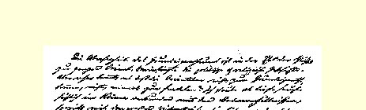
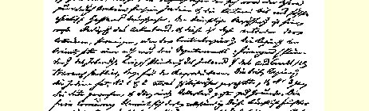
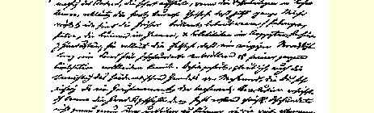
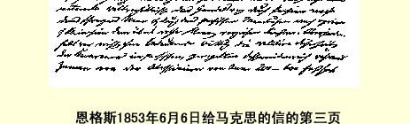

### １１５

## 恩格斯致马克思

### 伦敦

> １８５３年６月６日晚上于曼彻斯特

亲爱的马克思：

我本来想赶第一次邮班给你写信，但办事处的事务使我耽搁到八点。魏德迈和克路斯登在《刑法报》上的两个驳斥维利希的声明２６４，你大概已直接从美国收到，如果没有，请立即来信。魏德迈老爷子照例写得太噜苏，只是偶尔才谈到点子上，但立即又由于他的文笔而磨掉了锋芒，而且少有的心平气和，暴露出他一贯缺乏鼓动性。尽管如此，为了如实地说明“战友”亨策事件和希尔施受某人从旁教唆而在写信上耍手法，他已经尽其所能了。他的笨拙的文笔和被看成是公正的心平气和的态度，将受到庸人们的赞赏，整个来说，他的作品尚能令人满意。而克路斯的声明则使我特别喜欢。字里行间使人感到这是一个出色的人物，一个可以说由于跟维利希 “个人接触”而切身意识到自己优越性的人。就文笔流畅而言，这是克路斯的最好的作品之一；一点不晦涩，也没有生硬或累赘的痕迹。他是多么善于装成一个热心肠的鲠直人，但是一有合适的机会，他就让你明白，在这种外表后面隐藏着真正的魔鬼。“诸如革命奸细之类的骗局”，他说得何等好啊，以致使维利希相信，他似乎是以此为生的。当“骑士”看到“粗鲁的”代理人是这样一个家伙：善于如此灵巧、熟练地行动，而且实质上是在进攻，却举止那样高尚、磊落，在斗争中运用巧计比他自己精细、干练得多，他大概是很惊奇的。只是维利希未必有那种鉴别力去识别这一切。但我希望，愤怒和必要的深思会使他变得聪明些。

很明显，这件臭事必须彻底解决。对此越坚决越好。其实你会看到，这决不是那么可怕。骑士答应的比他能做到的要多许多倍。 我们听到一些预谋杀人等事，施拉姆事件将被渲染得不可思议[^1]， 将被描绘成一件奇事，而我们没有别的，只有感到奇怪，因为我们根本不能了解这个人到底说的是什么；他甚至会说，有一个晚上马克思和恩格斯曾经醉醺醺地来到大磨坊街２６５（见金克尔在辛辛那提当着胡策耳的面干的事[^2]）。如果发生这种情况，我将告诉爱听丑闻的美国公众：伯桑松人通常在维利希和漂亮的牧人科里登 －劳２６６不在时闲谈了些什么。２６７归根结底，这种畜生能议论我们什么呢？你会看到，这一切将和捷列林格的恶劣作品一样毫无意义。

这几天我又要同博尔夏特见面。如果能得到介绍信，我将从他那里抢来。[^3]不过，我不认为施泰因塔耳等人在伦敦有这类的联系。要知道这种事几乎不在他们业务利益范围之内。此外，这家伙为了不至于太丢面子，会尽量拖延这里的事。如果这不是有关鲁普斯[^4]的事，我将狠狠吐这家伙几口唾沫。我厌恶他这个伪君子，这个夸夸其谈、妄自尊大、惯于撒谎的骗子。

如果拉萨尔给你一个在杜塞尔多夫的守中立的好地址，那末， 你可以给我寄一百本[^5]来。我们准备在这里的一些办事处把它们塞在纱包里。但是，这些东西不能直接寄给拉萨尔本人，因为包裹将装在纱包中运到格拉德巴赫、爱北斐特等地，再由那里作为**必须邮寄**的包裹**邮寄**到杜塞尔多夫。我们不能让这里的商号发出寄给拉萨尔或哈茨费尔特夫人的包裹，因为：（１）每家商号里至少有**一个**莱茵省人，知道所有的传闻；（２）即使这里可以对付过去，纱包收件人也会知道是怎么回事；（３）最后，在最好的情况下，邮局在投递包裹之前，要检查包裹。在科伦我们有很好的地址，可惜我们对科伦商号**在这里**的主要采购人不很了解，也就不能强请他们暗中夹带。因此，在这里我们只好对这些人说，包裹里装的是送给太太们的礼品。

你由此可以看出，我和查理[^6]又建立了还过得去的关系。只要我有适当机会，事情很快就会办妥。不管怎样，正如你所知道的，这个蠢才总还感到一些满意的是：由于哥特弗利德·欧门先生忌妒我的老头[^7]，他比我得到较多的可卑的优待。听之任之罢。无论如何，他看得出，只要我愿意，就能在四十八小时内再次成为局势的主人，有这一点就够了。

不存在土地私有制，的确是了解整个东方的一把钥匙。２６８这是东方全部政治史和宗教史的基础。但是东方各民族为什么没有达到土地私有制，甚至没有达到封建的土地所有制呢？我认为，这主要是由于气候和土壤的性质，特别是由于大沙漠地带，这个地带从撒哈拉经过阿拉伯、波斯、印度和鞑靼２６９直到亚洲高原的最高地

> 恩格斯１８５３年６月６日给马克思的信的第三页区。在这里，农业的第一个条件是人工灌溉，而这是村社、省或中央政府的事。在东方，政府总共只有三个部门：财政（掠夺本国）、军事 （掠夺本国和外国）和公共工程（管理再生产）。在印度的英政府成立了第一和第二两个部门，使两者具有了更加庸俗的形态，而把第三个部门完全抛开不管，结果是印度的农业完全衰落了。在那里， 自由竞争被看成极丢脸的事。土壤肥力是靠人工达到的，灌溉系统一破坏，土壤肥力就立即消失，这就说明了用其他理由难以说明的下述事实，即过去耕种得很好的整个整个地区（巴尔米拉，彼特拉， 也门的废墟，以及埃及、波斯和印度斯坦的某些地区），现在却荒芜起来，成了不毛之地。这也说明了另一个事实，即一次毁灭性的战争足以使一个国家在数世纪内荒无人烟，文明毁灭。依我看来，穆罕默德以前阿拉伯南部商业的毁灭，也属于这类现象，你认为这一点是伊斯兰教革命的一个重要因素[^8]，是完全正确的。我对纪元最初六个世纪的商业史了解得不够，所以无法判断，一般的世界物质条件究竟使人们在多大程度上宁愿选择经波斯到黑海和经波斯湾到叙利亚和小亚细亚这条通商道路而不选择经红海的道路。但是，无论如何下列情况起了巨大的作用：就是商队在萨珊王朝的秩序井然的波斯王国中行走比较安全，而也门从公元 ２００年到６００年间则几乎一直受到阿比西尼亚人的奴役、侵略和掠夺。曾经在罗马时代还很繁荣的阿拉伯南部各城市，在七世纪已经成了荒无人烟的废墟；邻近的贝都英人在这五百年内编造了一些关于他们起源的纯粹神话的无稽传说（见《可兰经》和阿拉伯历史学家诺瓦伊里的著作），这些城市里的碑文上所使用的字母几乎完全没有人能认识了，虽然**没有第二种字母**，所以，实际上 **任何文字**都被忘记了。这类事情使人有理由得出结论说，除了一般的商业状况所引起的排挤外，还有直接的暴力破坏，这种破坏只有拿埃塞俄比亚人的入侵来说明。阿比西尼亚人的被驱逐大约发生在穆罕默德前四十年间，这是阿拉伯人的民族感觉醒的第一个行动，此外，这种民族感也受到从北方几乎直逼麦加城的波斯人的入侵所激发。只是这几天我才着手研究穆罕默德本身的历史。 目前，我觉得，这种历史具有贝都英反动势力反对那些定居的、但日益衰落的城市农民的性质，这种农民当时在宗教方面也是分崩离析的，他们的宗教则是对自然的崇拜同正在解体的犹太教和基督教的混合物。

老贝尔尼埃著作的片断[^9]的确很好。重读一个头脑健全而又清醒的法国老人的一点东西是非常愉快的，他常常谈得非常中肯， 没有一点炫耀自己的样子。

既然我反正已经陷在这个东方废纸堆中好几个星期，我就利用机会来学习波斯语。使我对阿拉伯语知难而退的，一方面是我天生的对闪语的厌恶，另一方面则是，对这种有四千个词根和有两三千年发展史的如此丰富的语言，不花费大量时间是不能获得较为显著的成绩的。可是，波斯语不是一种语言，而是一种真正的儿戏。 这种该死的阿拉伯字母表中，往往一连六个字母看起来是一个样子，而且没有母音，如果不是这样，我准能在四十八小时内学完全部语法。如果皮佩尔愿意跟着我干这种邪恶的玩意儿，这对他倒是一种安慰。我给自己规定学波斯语的最大期限是三个星期。如果他肯用两个月来冒一下险，大概会胜过我。对魏特林来说，不懂波斯语对他是一种不幸，他一定会发现波斯语是他的一种现成的万能语言，因为，据我所知，唯独这种语言在**给我**和**使我**之间没有冲突，因为其中与格和宾格永远是相同的。２７０

其实，读一读放荡不羁的老哈菲兹的原著是相当愉快的，它听起来很不错。老先生威廉·琼斯喜欢在他的语法书中用波斯的淫秽的词句作例句，后来在其《亚细亚诗歌释义》中把它们译成希腊诗句，因为用拉丁文来表达就更不成体统了。这部《释义》（琼斯全集第２卷《论情诗》）大概会使你很开心。而波斯的散文真令人难受。例如，高尚的米尔洪德的《正统的乐园》就是如此。他用非常形象的但完全无法理解的语言来叙述波斯的英雄史诗。关于亚历山大大帝，他叙述如下：伊斯甘德这个名字，在伊奥尼亚人的语言中叫做阿克席德－鲁斯（就象伊斯甘德这个名字是亚历山大这个名字的歪曲一样），即《Ｆｉｌｕｓｕｆ》，这个词来源于《ｆｉｌａ》—— 爱和 《ｓｕｆａ》—— 智慧，这样，伊斯甘德就是智慧之友。—— 关于一个退位的国王，他写道：“他用引退的鼓槌敲起退位的鼓”，如果维利希老爷子还再醉心于文学斗争，那他也不得不这样做。当图兰国王阿弗腊夏布被他的军队丢弃时，米尔洪德是这样描写他的：“他用绝望的牙齿咬着自己惊慌的指甲，直到羞愧的手指涌出痛不欲生的意识的鲜血。”这个国王的命运也会落到那个维利希的身上。

明天再写吧。

[^1]: 见本卷第２４８页。—— 编者注见本卷第９５—９７页。—— 编者注

[^2]: 见本卷第２５６—２５７页。—— 编者注

[^3]: 

[^4]: 威廉·沃尔弗。—— 编者注

[^5]: 指马克思的著作《揭露科伦共产党人案件》（波士顿版）。—— 编者注查理·勒兹根。—— 编者注

[^6]: 

[^7]: 恩格斯的父亲老弗里德里希·恩格斯。—— 编者注

[^8]: 见本卷第２５５页。—— 编者注

[^9]: 见本卷第２５５—２５６页。—— 编者注