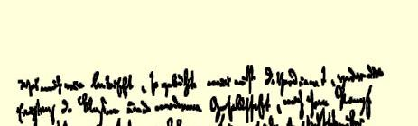
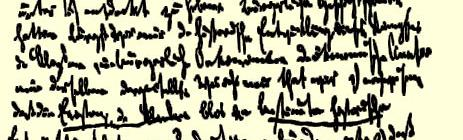
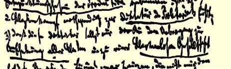
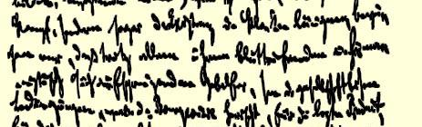

关税的降低，棉花价格的下降（从１８５０年９月起，棉花价格下降到以前价格的一半）—— 所有这些都保证了繁荣的持续时间要比早先预期的长一些。但是印度市场和部分美国市场的状况（输往美国的工业品上个月比去年同期少得多）使人相信这种情况不会长久延续下去。如果危机在５月发生，—— 未必会这样，—— 那末一场喧嚣就会开始。但是危机在９月或１０月以前未必会来临。

代我向你的夫人[^1]问好。

#### 你的弗·恩·

最近我将寄出一篇关于英国工业资产阶级状况和商业发展的文章４８４—— 我现在大约还要大忙两个星期。

### １４

## 马克思致约瑟夫·魏德迈

### 纽约

> １８５２年３月５日于伦敦
>
> 索荷区第恩街２８号

亲爱的魏维：

我担心出了什么差错，因为我误解了你的上一次来信，把最近两封信都按下列地址寄出去了：“钱伯斯街７号《革命》办事处 １８１７号信箱”。这个该死的“１８１７号信箱”引起了混乱，因为你来信说要在“旧地址”上加这么几个字，但没有说明是指第一个地址还是指第二个地址。可是我希望，在这封信寄到以前事情已经弄清楚，特别是因为上星期五寄出的那封信[^2]里附有我的文章的很长的第五篇[^3]。第六篇，也就是最后一篇，这个星期我未能写完。４８５但是，即使你的报纸[^4]重新出版了，这次延宕也不会碍事，因为你手上掌握的材料已经足够了。

你驳斥海因岑的文章写得很好，可惜恩格斯寄给我太晚了；它写得既泼辣又**细腻**，这种巧妙的结合称得上是名副其实的论战。我已经把这篇文章给厄·琼斯看了，这里附上他给你的一封信，这封信准备发表。４２琼斯写得很潦草，又有一些缩写，而我想你还不是一个地道的英国人，所以我把我妻子誊写的抄件和德译文连同原稿一起奇给你，以便你把原稿和译文两者同时发表。你还可以在琼斯的信后面附上这样几句话：至于说到**乔治·朱利安·哈尼**（他对海因岑先生来说也是一个权威），那末他在他的《红色共和党人》报上发表了我们的《共产党宣言》的英译文，并且还加了一个边注， 说：这是《ｔｈｅｍｏｓｔｒｅｖｏｌｕｔｉｏｎａｒｙｄｏｃｕｍｅｎｔｅｖｅｒｇｉｖｅｎｔｏｔｈｅ ｗｏｒｌｄ》（“世界上前所未有的最革命的文件”），而他在他的《民主评论》上译载了被海因岑“驳倒了的”智慧，即《新莱茵报评论》上发表的我的关于法国革命的文章[^5]；而且哈尼还在一篇论路易·勃朗的文章中把这些文章当作对法国事件的“真正的批判”介绍给他的读者。４８６不过，在英国只是不需要引证“极端分子”的话。如果英国

> 马克思１８５２年３月５日给魏德迈的信的第三页的一部分的一个议员要当大臣，他就得重新经过选举。例如新任财政大臣， ＬｏｒｄｏｆｔｈｅＥｘｃｈｅｑｕｅｒ，**迪斯累里**就是这样的，他在３月１日对他的选民写道： 《Ｗｅｓｈａｌｌｅｎｄｅａｖｏｕｒｔｏｔｅｒｍｉｎａｔｅｔｈａｔｓｔｒｉｆｅｏｆｃｌａｓｓｅｓｗｈｉｃｈｏｆｌａｔｅ ｙｅａｒｓｈａｓｅｘｅｒｃｉｓｅｄｓｏｐｅｒｎｉｃｉｏｕｓａｎｉｎｆｌｕｅｎｃｅｏｖｅｒｔｈｅｗｅｌｆａｒｅｏｆｔｈｉｓｋｉｎｇ ｄｏｍ》（“我们将尽力结束**阶级斗争**，它在最近几年中已对这个王国的幸福产生了如此有害的影响”）。

关于这一点，３月２日的《泰晤士报》指出：

> 《Ｉｆａｎｙｔｈｉｎｇｗｏｕｌｄｅｖｅｒｄｉｖｉｄｅｃｌａｓｓｅｓｉｎｔｈｉｓｃｏｕｎｔｒｙｂｅｙｏｎｄｒｅｃｏｎｃｉｌｉａ ｔｉｏｎ，ａｎｄｌｅａｖｅｎｏｃｈａｎｃｅｏｆａｊｕｓｔａｎｄｈｏｎｏｕｒａｂｌｅｐｅａｃｅ，ｉｔｗｏｕｌｄｂｅａｔａｘｏｎ ｆｏｒｅｉｇｎｃｏｒｎ》（“如果有什么东西能使这个国家的各个阶级分裂到不可能再调和，而且使人对公正的和光荣的和平不再存有希望，那就是谷物进口税”）。

为了使海因岑这样一个不学无术的“有性格的人”[^6]不致认为，贵族**拥护**谷物法，资产者**反对**谷物法，因为前者想“**垄断**”， 后者要“**自由**”（一个笨伯只是在这种思想形式中才看到对立），那只应当指出，在十八世纪，英国的贵族拥护“自由”（贸易自由）， 而资产者则拥护“垄断”，也就是目前“普鲁士” 这两个阶级对 “谷物法” 所采取的立场。《新普鲁士报》是贸易自由的最狂热的拥护者。

最后，我要是处在你的地位，我就要向民主派先生们指出，他们最好是先熟悉一下资产者的著作本身，然后再去大胆地对它的对立面狂吠。这些先生要弄清过去的“阶级的历史”，就应当譬如说研究一下梯叶里、基佐、约翰·威德等人的历史著作。他们想要批判政治经济学批判，就应当先懂得政治经济学的基本原理。譬如， 只要一打开李嘉图的那本巨著，在第一页上就可以看到他的序言的开头几句话：

> 《Ｔｈｅｐｅｏｄｕｃｅｏｆｔｈｅｅａｒｔｈ—ａｌｌｔｈａｔｉｓｄｅｒｉｖｅｄｆｒｏｍｉｔｓｓｕｒｆａｃｅｂｙｔｈｅｕ ｎｉｔｅｄａｐｐｌｉｃａｔｉｏｎｏｆｌａｂｏｕｒ，ｍａｃｈｉｎｅｒｙ，ａｎｄｃａｐｉｔａｌ，ｉｓｄｉｖｉｄｅｄａｍｏｎｇｔｈｒｅｅ ｃｌａｓｓｅｓｏｆｔｈｅｃｏｍｍｕｎｉｔｙ；ｎａｍｅｌｙ，ｔｈｅｐｒｏｐｒｉｅｔｏｒｏｆｔｈｅｌａｎｄ，ｔｈｅｏｗｎｅｒｏｆ ｔｈｅｓｔｏｃｋｏｆｃａｐｉｔａｌｎｅｃｅｓｓａｒｙｆｏｒｉｔｓｃｕｌｔｉｖａｔｉｏｎ，ａｎｄｔｈｅｌａｂｏｕｒｅｒｓｂｙｗｈｏｓｅ ｉｎｄｕｓｔｒｙｉｔｉｓｃｕｌｔｉｖａｔｅｄ》（“土地产品—— 通过劳动、机器和资本联合运用而从地面上得到的一切产品—— 在社会的**三个阶级**之间，也就是在土地所有者、耕种土地所必需的基金或资本的所有者和以自己的劳动耕种土地的工人之间进行分配”）。４８７

美国的资产阶级社会现在还很不成熟，没有把阶级斗争发展到显而易见和一目了然的地步，关于这一点，北美唯一有影响的经济学家**查·亨·凯里**[^7]（费拉得尔菲亚人）提供了十分出色的证明。他攻击**李嘉图**这个资产阶级的最典型的代表者[^8]和无产阶级的最顽强的反对者，认为他的著作是无政府主义者、社会主义者和资产阶级制度的一切敌人的军火库。他不仅指责李嘉图，而且指责马尔萨斯、穆勒、萨伊、托伦斯、威克菲尔德、麦克库洛赫、西尼耳、 惠特利、理·琼斯等等，一句话，指责欧洲的经济学权威，说他们分裂社会和制造内战，因为他们证明了：各个不同阶级的经济基础一定会在它们中间引起一种必然的、不断发展的对立。他拚命驳斥他们，虽然他不象愚蠢的海因岑那样把阶级的存在同**政治**特权和**垄断**的存在联系起来，但是他想证明，**经济**条件—— 地租（地产）、**利润**（资本）和工资（雇佣劳动）不是斗争和对立的条件，而是联合与和谐的条件。实际上他只是证明，美国的“不成熟的”社会关系在他看来是“正常的关系”。

至于讲到我，无论是发现现代社会中有阶级存在或发现各阶级间的斗争，都不是我的功劳。在我以前很久，资产阶级的历史学家就已叙述过阶级斗争的历史发展，资产阶级的经济学家也已对各个阶级作过经济上的分析。我的新贡献就是证明了下列几点： （１）**阶级的存在**仅仅同**生产发展的一定历史阶段相联系**；（２）阶级斗争必然要导致**无产阶级专政**；（３）这个专政不过是达到**消灭一切阶级**和进入**无阶级社会**的过渡。象海因岑这类不仅否认阶级斗争，甚至否认阶级存在的无知的蠢才只不过证明：尽管他们发出一阵阵带有血腥气的和自以为十分人道的叫嚣，他们还是认为资产阶级赖以进行统治的社会条件是历史的最后产物，是历史的极限；他们只不过是资产阶级的奴才。这些蠢才越不懂得资产阶级制度本身的伟大和暂时存在的必然性，他们的那副奴才相就越令人作呕。

你可以利用上述意见中你认为有用的东西。４８８此外，海因岑已经用我们的“中央集权”去代替他的“联邦共和国”，等等。４８９当我们现在所传播的关于阶级的种种观点变得不怎么新奇，而且为 “正常的人的思想”所接受的时候，这个粗鲁的家伙就会大叫大嚷地把这些观点说成是他“自己的洞察力” 的最新产物，并且对我们进一步发展这些观点发出狂吠。因此，当黑格尔哲学还是进步的时候，他凭借他“自己的洞察力” 对它发出狂吠。而现在，他却靠黑格尔哲学中变得淡而无味的、卢格没有消化掉又吐出来的面包屑来糊口。

随信附上匈牙利通讯[^9]的最后一部分。如果你的报纸还存在， 你可以利用其中的某些东西试试看，何况匈牙利前总理**瑟美列**已经从巴黎答应我给你写一篇**亲笔签名**的详细文章。

如果你的报纸已经出版，就请**多**寄几份来，以便把它们更广泛地传播出去。

#### 你的卡·马克思

这里所有的朋友，特别是我的妻子衷心问候你和你的夫人[^10]。

顺便提一下。我托前山岳党人霍赫施土耳（亚尔萨斯人）给你带去《寄语》[^11]和几份我在陪审法庭上的发言（后者是我答应给克路斯的）４９０。这个家伙不是什么人物。

附上章程４９１。建议你把它整理得更条理些。**伦敦**定为美国的总区部。在这以前我们只能有名无实地实行我们的统治。

如果“希尔施”的声明还没有刊登，就不要登了[^12]。这是一个卑鄙的人，虽然他对沙佩尔和维利希的态度是正确的。

[^1]: 路易莎·魏德迈。—— 编者注

[^2]: 见本卷第６４３—６４４页。—— 编者注卡·马克思《路易·波拿巴的雾月十八日》第五章。—— 编者注

[^3]: 《革命》。—— 编者注

[^4]: 

[^5]: 卡·马克思《１８４８年至１８５０年的法兰西阶级斗争》。—— 编者注

[^6]: 显然是暗指海涅的讽刺诗《阿塔·特洛尔》第２４章中的一句诗：“没有天才，可是倒有性格。”—— 编者注

[^7]: 亨·查·凯里《论工资率》。—— 编者注

[^8]: 在手稿上，马克思在“代表者”一词上面写了“表达者”一词。—— 编者注

[^9]: 见本卷第１９页。—— 编者注路易莎·魏德迈。—— 编者注

[^10]: 《寄语人民》。—— 编者注

[^11]: 

[^12]: 见本卷第４７４页。—— 编者注