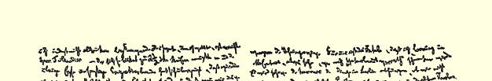
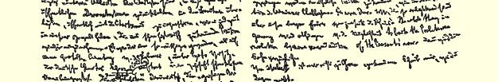
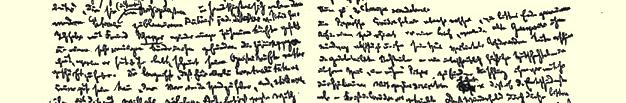
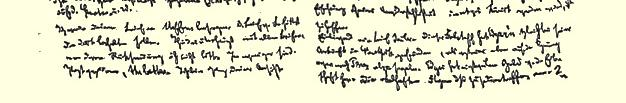

### １１

## 马克思致恩格斯

### 曼彻斯特

> ［１８５６年］４月１６日于伦敦

亲爱的弗雷德里克：

今天通过你所熟悉的托运公司给你寄去一个包裹，内有： （１）关于卡尔斯的文件３９；（２）《伊戈尔》[^1]；（３）德斯特里耳的 《土耳其内幕》；（４）两号《人》，一号上有来自凯恩的一封信，另一号上有皮阿今年２月２５日在庆祝法国革命周年纪念日的宪章派群众大会上发表的对“玛丽安娜”４９的连祷。这位可敬的好汉自然希望这一次又会重演由于他《致女王的信》５０而引起的丑事，但是他失算了。同时，你可以从这里看到，此地的法国革命制造者们对“玛丽安娜”是多么唯命是从。（５）《人民报》的两份剪报—— 我的关于卡尔斯文件的头两篇文章[^2]。续篇和末篇也将寄给你。因为第一篇的原稿遗失了，而时间，尤其是尼内斯特·琼斯逼我，我只好凭着记忆勉勉强强地，而且匆匆忙忙地把《论坛报》的文章重写了一遍，所以这里难免有各种荒唐的东西，而这些东西当然是逃不出你那敏锐的嗅觉的。但是这不要紧！我告诉你这个，只是为了让你知道我为什么没有把这个东西马上寄给你。

前天为《人民报》的创刊纪念举行了一个小小的庆祝宴会。这

> 马克思１８５６年４月１６日给恩格斯的第二页和第三页次我接受了邀请，因为目前的形势似乎要求我这样做，尤其是因为在所有的流亡者中只有我**一个人**（象《人民报》所披露的那样）被邀请，而且还让我第一个举杯祝酒，即由我提议为世界各国无产阶级的主权而干杯。因此我用英语发表了一个简短的演说， 但是我不让它刊登出来。５１我想达到的目的已经达到了。塔朗迪埃先生（他不得不花两个半先令买了一张入场券）以及其余一切法国的和其他的流亡者伙帮都确信：我们是宪章派的唯一“亲密的” 盟友；虽然我们不做公开的表示并且听凭法国人公开向宪章派献媚，我们仍然有能力随时重新占据历史上已属于我们的地位。 使这点变得更加必要的，是在前面已经提到的２月２５日由皮阿主持的群众大会上，德国大老粗**谢尔策尔**（老滑头）发表了演说，并且以实在骇人听闻的行会狭隘精神指责德国的“学者”、“脑力工作者”抛弃了他们（大老粗），从而使得他们在其他国家面前丢丑。 你在巴黎的时候就已知道谢尔策尔。我又和朋友**沙佩尔**见了几次面，我发现他是一个正在痛心忏悔的罪人。他近两年来所过的闭门幽居生活，看来对他的智力有相当大的磨炼。你知道，有这个人在手边无论如何是好事情，尤其是把他从维利希手里争取过来。 沙佩尔现在对磨坊街的大老粗非常恼怒。５２

你给施特芬的信[^3]我一定转交给他。勒[^4]的信你本来应当留下。凡是我不要求退还的信件，你全都这样处理吧。信件愈少通过邮局愈好。我完全同意你对莱茵省的看法。对我们说来糟糕的是，遥望未来，我看到某种带有“背叛祖国” 味道的东西。我们是否会被迫处于美因兹俱乐部派在旧革命中所处的境遇，５３这在很大程度上要看柏林情况的转变如何。这将不是轻而易举的。我们是多么了解莱茵河彼岸我们那些英勇的兄弟呵！德国的全部问题将取决于是否有可能由某种再版的农民战争来支持无产阶级革命。如果那样就太好了。

关于施梯伯第二，我没有听到任何消息。你如知道些什么，请来信告知。

现在来谈丢人的事情。

皮佩尔的喜剧迅速地而又可悲地结束了。一方面，他收到一封信，老蔬菜商在信中断然拒绝了他，不让他上门。另一方面，这个戴绿眼镜的猫头鹰—— 一个难以形容的老泼妇—— 曾来我家找 “她的”皮佩尔。她要他带她潜逃。他以极其谦逊的态度斩钉截铁地拒绝了。这出喜剧就这样收场了。希望可爱的小伙子通过这个痛苦的经验能稍许治好对自己的不可抗拒性的自信的毛病。

附上载勒尔的信。这位福斯泰夫到达纽约后马上找到了埃德加尔[^5]，而当时埃德加尔正打算去得克萨斯。埃德加尔目前还有一笔从遗产中得到的钱。这次同载勒尔的会见的卑鄙的结果，你可以从信中看出来。

一对亲爱的伙伴：载勒尔和康拉德·施拉姆！

祝好。

#### 你的卡·马·

[^1]: 《伊戈尔远征记》。—— 编者注

[^2]: 卡·马克思《卡尔斯的陷落》第一篇和第二篇《马克思的这组文章第一次刊载于１８５６年４月８日的《纽约每日论坛报》）。—— 编者注

[^3]: 见本卷第５１１—５１２页。—— 编者注

[^4]: 勒维。—— 编者注

[^5]: 埃德加尔·冯·威斯特华伦。—— 编者注