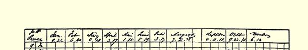
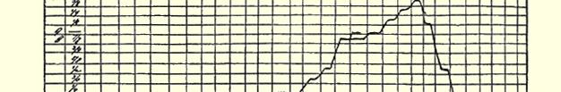
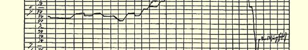
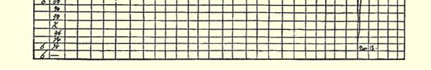

身体有好处，我现在已经感觉到这一点了。１８４８年我们曾说过，现在我们的时代来了，并且从一定意义上讲确实是来了，而这一次它完全地来了，现在是生死的问题了。我对军事的研究因此就具有更加实际的意义；我将立即研究普鲁士、奥地利、巴伐利亚和法国军队的现有组织和基本战术，除此之外，就是骑马，即猎狐，这是一种真正的训练。

衷心问候你的夫人和孩子们。虽然穷困，—— 我日夜为此苦恼，而始终未能使你摆脱—— 我希望她们也精神愉快。

#### 你的弗·恩·

昨天在离此四英里的费耳斯沃思，工人们把一个厂主利德耳的模拟像吊起来，还由一个穿着牧师法衣的纺织工作了安魂祈祷。 他宣读的不是“愿上帝宽恕你的灵魂”，而是“愿上帝诅咒你的灵魂”。现在琼斯的时机已经到来，就看他是否善于利用它了。

### ９５

## 恩格斯致马克思

### 伦敦

> １８５７年１１月１６日于曼彻斯特

南门街７号

亲爱的马克思：

附上昨天忘记的图表[^1]。我刚看到，今天的《卫报》上载有关

> **１８５７年１月１日以来奥尔良中等棉价格的变动**
>
> ７月底以前每月两个日期，以后每月三个日期。１１月１２日
>
> 突然跌价，因为苏格兰西区银行下令不计价格抛售其存
>
> 货。１１月１３日棉价接近七便士，经纪人没有报价。
>
> *恩格斯的说明*

[^1]: 见本卷第２０５页。—— 编者注