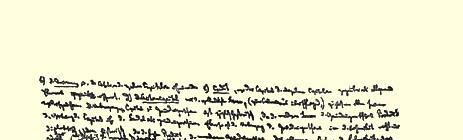
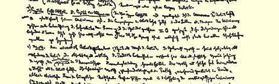
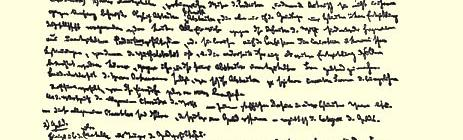
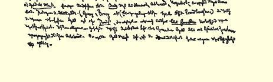

你注意到没有，最近，法国大部分动产信用公司类型的公司都被刑事法庭传讯。

### １４２

## 马克思致恩格斯

### 曼彻斯特

> １８５８年４月２日［于伦敦］

亲爱的弗雷德里克：

《卫报》上的报道非常有趣。《每日电讯》的通讯员（直接在帕姆的庇护下）写道，在巴黎“聋子”是非常危险的。警察把所有“耳聋的英国人”都当作奥耳索普而加以迫害。他说，英国人成批地离开巴黎，一部分是由于警察找碴，一部分是由于怕爆发政变。因为在后一种场合，如果波拿巴分子获胜，约翰牛就担心他们会遭到疯狂的士兵的屠杀，而且通讯员自己就非常坦白地说，在这种形势下，他在任何地方都行，只是不要在巴黎。在目前商业萧条的情况下，约翰牛的逃亡使巴黎的小店主，房东、妓女等大伤脑筋。你注意到没有，现在他们已**公开承认**预算中的三亿法郎“不见”了，而且谁也不知道它们是怎么回事。对波拿巴财政将逐渐出现愈来愈多的揭露，《论坛报》的蠢驴们会看到，他们**不**刊登我在半年前寄给他们的多次推敲过的有关这个问题的文章１８６是多么聪明。这是些地地道道的蠢驴：凡不是最原始意义上的“当日惊人消息”，他们就当作无趣的东西抛在一边，等以后这同一个问题被提到议事日程上来时，再就这个问题发表根据别人作品拼凑起来的最愚蠢的胡话。

注意，这里的军人俱乐部里传说在腊格伦留下的文件里发现了证据：（１）阿尔马河战役１７６时**他**曾提出正确的建议，不是从海上而是从对面的翼侧攻击俄军，并把他们赶下海去；（２）在阿尔马河战役以后，他曾建议到辛费罗波尔；（３）在因克尔芒会战３３时，只是由于最坚决的请求和威胁他才迫使康罗贝尔下令博斯凯急速支援。同时还传说，如果拉芒什彼岸继续吹嘘，这些文件就会被公布出来，而且将证实，法国人一直都准备出卖他们亲爱的同盟者。德 ·雷希·伊文思在下院说的一些话也是影射这些。

我为胆病所苦，以致这星期既不能思考问题，也不能读书写文章，总之除了给《论坛报》写文章外，任何事情都不能做。这些文章自然不能不写，因为我必须**尽快地**向这些狗支钱。但不健康总是不幸，因为在没有复元和能握笔以前，我不能着手为敦克尔准备手稿[^1]。

下面是第一部分的简单纲要。这一堆讨厌的东西将分为六个分册：１．资本；２．地产；３．雇佣劳动；４．国家；５．国际贸易；６．世界市场。

一、**资本**又分成四篇。（ａ）资本一般（这是**第一分册的材料**）； （ｂ）**竞争**或许多资本的相互作用；（ｃ）**信用**，在这里，整个资本对单个的资本来说，表现为一般的因素；（ｄ）**股份资本**，作为最完善的形式（导向共产主义的），及其一切矛盾。资本向地产的转化同时又是历史的转化，因为现代形式的地产是资本对封建地产和其他地产发生影响的产物。同样，地产向雇佣劳动的转化不仅是辩证的转化，而且也是历史的转化，因为现代地产的最后产物就是雇佣劳动的普遍建立，而这种雇佣劳动就是这一堆讨厌的东西的基础。好吧 （今天我感到写东西困难），我们现在来谈ｃｏｒｐｕｓｄｅｌｉｃｔｉ[^2]。

（一）**资本**。**第一篇**。**资本一般**。（在整个这一篇里，假定工资总是等于它的最低额。工资本身的运动，工资最低额的降低或提高放在论雇佣劳动的那一部分去考察。其次还假定：地产＝０，就是说，地产这一特殊的经济关系在这里还不加以考察。只有这样，才能在研究每一个别关系时不致老是牵涉到一切问题。）

**１．价值**。纯粹归结为劳动量；时间作为劳动的尺度。使用价值 （无论是主观上把它看做劳动的有用性，或者客观上把它看做产品的有用性）在这里仅仅表现为价值的物质前提，这种前提暂时完全退出经济的形式规定。价值本身除了劳动本身没有别的任何“物质”。首先由配第２５３大致指出，后来由李嘉图２４１清楚地阐明的这种价值规定只是资产阶级财富的最抽象的形式。这种规定本身就已经假定：（１）原始共产主义的解体（如印度等）；（２）一切不发达的、 资产阶级前的生产方式（在这种生产方式中，交换还没有完全占支配地位）的解体。虽然这是一种抽象，但它是历史的抽象，它只是在一定的社会经济发展的基础上才能产生出来。对价值的这个规定提出的一切反对意见，不是以比较不发达的生产关系为出发点， 就是以下面这种混乱的思想为根据，即把比较具体的经济规定（价值是从这些规定中抽象出来的，因而另一方面也可以把这些规定看做价值的进一步发展）拿来和这种抽象的不发展的形式中的价值相对立。由于经济学家先生们自己弄不清这种抽象同资产阶级财富的各种比较晚期、比较具体的形式有什么关系，这些反对

> 马克思１８５８年４月２日给恩格斯的信的第二页意见就或多或少地被认为是有道理的。

从价值的一般特点（这也是后来表现在货币中的那些一般特点）同它表现为某种商品的物质存在等等之间的矛盾中产生出货币这个范畴。

２．**货币**。

关于作为货币关系体现者的贵金属的几点说明。

（ａ）**作为尺度的货币**。对斯图亚特、阿特伍德和乌尔卡尔特的观念的尺度的几点评论；在劳动货币的鼓吹者（格雷、布雷等人，顺便给蒲鲁东主义者一些打击。）那里则以比较容易理解的形式表述出来。２５４转变为货币的商品价值，是商品的**价格**，这种价格暂时只是在同价值的这种**纯粹形式上的**区别中表现出来。根据一般的价值规律，一定数量的货币只表现一定数量的物化劳动。货币只要是尺度，它自身的价值的变化就无关紧要。

**（ｂ）作为交换手段的货币或简单的流通**。

这里要考察的只是这种流通的简单形式。给这种流通以进一步的规定的一切情况都和这种形式无关，因此留待以后再考察。 （这一切情况都以比较发展的关系为前提。）如果我们用Ｗ表示商品，用Ｇ表示货币，那末，简单的流通就表现为以下两种循环过程或两种终结：Ｗ—Ｇ—Ｇ—Ｗ和Ｇ—Ｗ—Ｗ—Ｇ（后者构成了向ｃ 的转化），但是起点和终点绝不重合，或者只是偶然重合。经济学家所提出的所谓规律，大多数不是在货币流通本身的范围内观察货币流通，而是把它看做从属于较高级的运动并由这种运动所规定的东西。这一切都应当撇开不谈。（一部分属于信用理论的范围， 另一部分也应放到货币重新出现但却被进一步规定的那些地方去考察。）因此，货币在这里是流通手段（**铸币**），但同时也是价格的**实现**（不仅仅是一瞬间的实现）。商品，在它真正同货币交换以前，在规定**价格**时，已经在想象中同货币交换了，从这一简单的规定中自然地得出下面这个重要的经济规律：**流通媒介的数量由价格决定**， **而不是相反**。（在这里，提出有关这一点的争论经过中的一些东西。）其次，从这里还可以推论出：流通速度可以代替货币数量；但 **一定的货币数量**对同时进行的交换行为是必要的，只要这些行为本身不象正和负那样互相抵销，但这种相互抵销在这里我只是预先提一下。我对这一篇不准备在这里进一步发挥。只是还要指出， 分解Ｗ—Ｇ和Ｇ—Ｗ，这是最抽象和最表面的形式，在这个形式中已经表现出危机的可能性。从阐明流通数量由价格决定这一规律中可以看出，在这里设想了一些决不是一切社会形态下都存在的前提；因此，例如，把货币从亚洲流入罗马而对那里的物价所起的作用简单地同现代的商业关系等量齐观，那是荒谬的。这些极其抽象的规定，在对它们作比较精确的考察时，总是表明了更加具体的规定了的历史基础。（这是当然的事情，因为它们正是从这种基础中，在这种规定性中抽象出来的。）

（ｃ）**作为货币的货币**。这是Ｇ—Ｗ—Ｗ—Ｇ这一形式的发展。 货币是不依赖于流通而独立的价值存在；是抽象财富的物质存在。既然货币不仅表现为流通手段，而且还表现为实现着的价格，这一点在流通中就显露出来了。对于特性（ｃ）来说，（ａ）和（ｂ）只表现为职能，而在特性（ｃ）中，货币则是契约中的一般商品（在这里，由劳动时间所决定的货币的价值的变化变得重要了），是贮藏的对象。（这种职能目前在亚洲仍然是重要的，而在古代和中世纪到处都是重要的。目前它只从属地存在于银行业务中。在危机时期，这种形式的货币又具有重要的意义。考察这种形式的货币以及由它所产生的世界历史上的错觉等等；货币的破坏性等等。）作为将表现为一切较高形式的价值的实现；一切价值关系得到外部完成所采取的确定的形式。但是，货币既然固定在这种形式中，就不再是经济关系，这种形式消失在货币的物质体现者金和银中间。另一方面，只要货币进入流通，而且又和商品交换，则最后的过程，即商品的消费也脱离经济关系。简单的货币流通本身不包含自我再生产的原则，因而要求超出其界限。货币—— 正如其规定发展所指明的那样—— 包含着这样一种要求，即要求进入流通、 保持在流通中、同时还以这种流通为前提的价值，也就是要求**资本**。这种转化同时也是历史的转化。资本的太古形式是经常发展货币的商业资本。同时，真正的资本是从货币或占有生产的商业资本中产生出来的。

（ｄ）从这种简单流通本身（它是资产阶级社会的表面，这里掩盖了产生简单流通的各种较深刻的过程）来考察，除了形式上的和转瞬即逝的区别以外，它并不暴露各个交换主体之间的任何区别。 就是**自由**、**平等和以“劳动”为基础的所有制的王国**。在这里以贮藏的形式出现的积累只是较大的节约等等的结果。一方面是经济谐和论者、现代自由贸易派（巴师夏、凯里２５５等等）的庸俗伎俩：他们把这种最表面的和最抽象的关系当做**他们的真理**应用到较发展的生产关系以及这些关系的对立中去。另一方面是蒲鲁东主义者以及类似的社会主义者的庸俗伎俩：他们把适应于这种等价交换（或被认为是等价交换）的平等观念等等拿来同这种交换所导致和所由产生的不平等等等相对立。通过劳动来占有，等价交换，在这一范围内就表现为占有规律，因为交换只是以另一种物质形式再现同样的价值。总而言之，在这里，一切都是“美妙的”，但同时都会得

[^1]: 卡·马克思《政治经济学批判》。—— 编者注

[^2]: 直译是：犯罪构成；这里的意思是：研究的主要对象。—— 编者注